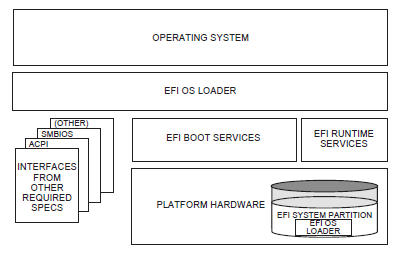

.. _introduction:

.. raw:: latex

    \pagenumbering{arabic}

Introduction
============

This *Unified Extensible Firmware Interface* (UEFI) *Specification* describes an interface between the operating system (OS) and the platform firmware. UEFI was preceded by the *Extensible Firmware Interface Specification 1.10* (EFI). As a result, some code and certain protocol names retain the EFI designation. Unless otherwise noted, EFI designations in this specification may be assumed to be part of UEFI.

The interface is in the form of data tables that contain platform-related information, and boot and runtime service calls that are available to the OS loader and the OS. Together, these provide a standard environment for booting an OS. This specification is designed as a pure interface specification. As such, the specification defines the set of interfaces and structures that platform firmware must implement. Similarly, the specification defines the set of interfaces and structures that the OS may use in booting. How either the firmware developer chooses to implement the required elements or the OS developer chooses to make use of those interfaces and structures is an implementation decision left for the developer.

The intent of this specification is to define a way for the OS and platform firmware to communicate only information necessary to support the OS boot process. This is accomplished through a formal and complete abstract specification of the software-visible interface presented to the OS by the platform and firmware.

Using this formal definition, a shrink-wrap OS intended to run on platforms compatible with supported processor specifications will be able to boot on a variety of system designs without further platform or OS customization. The definition will also allow for platform innovation to introduce new features and functionality that enhance platform capability without requiring new code to be written in the OS boot sequence.

Furthermore, an abstract specification opens a route to replace legacy devices and firmware code over time. New device types and associated code can provide equivalent functionality through the same defined abstract interface, again without impact on the OS boot support code.

The specification is applicable to a full range of hardware platforms from mobile systems to servers. The specification provides a core set of services along with a selection of protocol interfaces. The selection of protocol interfaces can evolve over time to be optimized for various platform market segments. At the same time, the specification allows maximum extensibility and customization abilities for OEMs to allow differentiation. In this, the purpose of UEFI is to define an evolutionary path from the traditional "PC-AT"-style boot world into a legacy-API free environment.

.. _principle-of-inclusive-terminology:

Principle of Inclusive Terminology
------------------------------------

The UEFI Forum follows a Principle of Inclusive Terminology in building and maintaining content for specifications. This means that efforts are made to ensure that all wording is perceived or likely to be perceived as welcoming by everyone regardless of personal characteristics. In some cases, the Forum acknowledges that wording derived from earlier work, for example references to legacy specifications not controlled by the Forum, may not follow this principle. In order to preserve compatibility for code that reads on legacy specifications, particularly where that specification is no longer under maintenance or development, language in this specification may appear out of sync with the Principle. The Forum is resolved to work with other standards development bodies to eliminate such examples over time. In the meanwhile, by acknowledging and calling attention to this issue the hope is to promote discussion and action towards more complete use of Inclusive Language reflective of the diverse and innovative population of the technical community that works on standards.

.. _uefi-driver-model-extensions:

UEFI Driver Model Extensions
----------------------------

Access to boot devices is provided through a set of protocol interfaces. One purpose of the UEFI *Driver Model* is to provide a replacement for "PC-AT"-style option ROMs. It is important to point out that drivers written to the UEFI *Driver Model* are designed to access boot devices in the preboot environment. They are not designed to replace the high-performance, OS-specific drivers.

The UEFI *Driver Model* is designed to support the execution of modular pieces of code, also known as drivers, that run in the preboot environment. These drivers may manage or control hardware buses and devices on the platform, or they may provide some software-derived, platform-specific service.

The UEFI *Driver Model* also contains information required by UEFI driver writers to design and implement any combination of bus drivers and device drivers that a platform might need to boot a UEFI-compliant OS.

The UEFI *Driver Model* is designed to be generic and can be adapted to any type of bus or device. The *UEFI Specification* describes how to write PCI bus drivers, PCI device drivers, USB bus drivers, USB device drivers, and SCSI drivers. Additional details are provided that allow UEFI drivers to be stored in PCI option ROMs, while maintaining compatibility with legacy option ROM images.

One of the design goals in the *UEFI Specification* is keeping the driver images as small as possible. However, if a driver is required to support multiple processor architectures, a driver object file would also be required to be shipped for each supported processor architecture. To address this space issue, this specification also defines the *EFI Byte Code Virtual Machine* . A UEFI driver can be compiled into a single EFI Byte Code object file. UEFI Specification-complaint firmware must contain an EFI Byte Code interpreter. This allows a single EFI Byte Code object file that supports multiple processor architectures to be shipped. Another space saving technique is the use of compression. This specification defines compression and decompression algorithms that may be used to reduce the size of UEFI Drivers, and thus reduce the overhead when UEFI Drivers are stored in ROM devices.

The information contained in the *UEFI Specification* can be used by OSVs, IHVs, OEMs, and firmware vendors to design and implement firmware conforming to this specification, drivers that produce standard protocol interfaces, and operating system loaders that can be used to boot UEFI-compliant operating systems.

.. _organization:

Organization
------------

The high-level organization of this specification is as follows:

.. list-table:: Organization of this specification
   :widths: 15 45
   :name: Organization-of-this-specification
   :class: longtable

   * - **Section(s)**
     - **Description**                       
   * - Introduction / Overview
     - Introduces the UEFI Specification, and describes the major components of UEFI. 
   * - Boot Manager
     - Manager used to load drivers and applications written to this specification.                    
   * - EFI System Table and Partitions
     - Describes an EFI System Table that is passed to every compliant driver and application, and defines a GUID-based partitioning scheme.                           
   * - Block Transition Table
     - A layout and set of rules for doing block I/O that provide power fail write atomicity of a single block.                     
   * - Boot Services
     - Contains the definitions of the fundamental services that are present in a UEFI-compliant system before an OS is booted.    
   * - Runtime Services
     - Contains definitions for the fundamental services that are present in a compliant system before and after an OS is booted. 
   * - Protocols
     - | • The EFI Loaded Image Protocol describes a UEFI Image that has been loaded into memory.   
       | • The Device Path Protocol provides the information needed to construct and manage device paths in the UEFI environment.                   
       | • The UEFI Driver Model describes a set of services and protocols that apply to every bus and device type.
       | • The Console Support Protocol defines I/O protocols that handle input and output of text-based information intended for the system user while executing in the boot services environment. 
       | • The Media Access Protocol defines the Load File protocol, file system format and media formats for handling removable media.  
       | • PCI Bus Support Protocols define PCI Bus Drivers, PCI Device Drivers, and PCI Option ROM layouts. The protocols described include the PCI Root Bridge I/O Protocol and the PCI I/O Protocol.     
       | • SCSI Driver Models and Bus support defines the SCSI I/O Protocol and the Extended SCSI Pass Thru Protocol that is used to abstract access to a SCSI channel that is produced by a SCSI host controller.     
       | • The iSCSI protocol defines a transport for SCSI data over TCP/IP.  
       | • The USB Support Protocol defines USB Bus Drivers and USB Device Drivers.
       | • Debugger Support Protocols describe an optional set of protocols that provide the services required to implement a source-level debugger for the UEFI environment.
       | • The Compression Algorithm Specification describes the compression/decompression algorithm in detail, plus a standard EFI decompression interface for use at boot time.
       | • ACPI Protocols may be used to install or remove an ACPI table from a platform. 
       | • String Services: the Unicode Collation protocol allows code running in the boot services environment to perform lexical comparison functions on Unicode strings for given languages; the Regular Expression Protocol is used to match Unicode strings against Regular Expression patterns.   
   * - EFI Byte Code Virtual Machine
     - Defines the EFI Byte Code virtual processor and its instruction set. It also defines how EBC object files are loaded into memory, and the mechanism fo transitioning from native code to EBC code and back to native code. 
   * - Firmware Update and Reporting
     - Provides an abstraction for devices to provide firmware management support.               
   * - Network Protocols
     - | • SNP, PXE, BIS, and HTTP Boot protocols define the protocols that provide access to network devices while executing in the UEFI boot services environment.
       | • Managed Network protocols define the EFI Managed Network Protocol, which provides raw (unformatted) asynchronous network packet I/O services and Managed Network Service Binding Protocol, used to locate communication devices that are supported by an MNP driver.
       | • VLAN, EAP, Wi-Fi and Supplicant protocols define a protocol that is to provide a manageability interface for VLAN configurations.
       | • Bluetooth protocol definitions.
       | • TCP, IP, PIPsec, FTP, GTLS, and Configurations protocols define the EFI TCPv4 (Transmission Control Protocol version 4) Protocol and the EFI IPv4 (Internet Protocol version 4) Protocol.   
       | • ARP, DHCP, DNS, HTTP, and REST protocols define the EFI Address Resolution Protocol (ARP) Protocol interface and the EFI DHCPv4 Protocol.
       | • UDP and MTFTP protocols define the EFI UDPv4 (User Datagram Protocol version 4) Protocol that interfaces over the EFI IPv4 Protocol and defines the EFI MTFTPv4 Protocol interface that is built on the EFI UDPv4 Protocol.                      
   * - Secure Boot and Driver Signing
     - Describes Secure Boot and a means of generating a digital signature for UEFI.                         
   * - Human Interface Infrastructure
     - | • Defines the core code and (HII) services that are required for an implementation of the Human Interface Infrastructure (HII), including basic mechanisms for managing user input and code definitions for related protocols.
       | • Describes the data and APIs used to manage the system’s configuration: the actual data that describes the knobs and settings.
   * - **Section(s)**
     - **Description**                       
   * - User Identification
     - Describes services that describe the current user of the platform. 
   * - Secure Technologies
     - Describes the protocols for utilizing security technologies, including cryptographic hashing and key management.
   * - Miscellaneous Protocols
     - The Timestamp protocol provides a platform independent interface for retrieving a high resolution timestamp counter. The Reset Notification Protocol provides services to register for a notification when ResetSystem is called.                           
   * - Appendices
     - | • GUID and Time Formats.
       | • Console requirements for a basic text-based console required by EFI-conformant systems to provide communication capabilities.
       | • Device Path examples of use of the data structures that define various hardware devices to the boot services.
       | • Status Codes lists success, error, and warning codes returned by UEFI interfaces.
       | • Universal Network Driver Interfaces defines the 32/64-bit hardware and software Universal Network Driver Interfaces (UNDIs).
       | • Using the Simple Pointer Protocol.
       | • Using the EFI Extended SCISI Pass-thru Protocol.
       | • Compression Source Code for an implementation of the Compression Algorithm.
       | • Decompression Source Code for an implementation of the EFI Decompression Algorithm.
       | • The EFI Byte Code Virtual Machine Opcode List provides a summary of the corresponding instruction set.
       | • Alphabetic Function Lists identify all UEFI interface functions alphabetically.
       | • EFI 1.10 Protocol Changes identifies the Protocol, GUID, and revision identifier name changes compared to the EFI Specification 1.10.
       | • Formats: Language Codes and Language Code Arrays list the formats for language codes and language code arrays.
       | • The Common Platform Error Record describes the common platform error record format for representing platform hardware errors.
       | • The UEFI ACPI Data Table defines the UEFI ACPI table format.
       | • Hardware Error Record Persistence Usage.
       | • References
       | • Glossary                       
   * - Index
     - Provides an index to the key terms and concepts in the specification.                    

.. _introduction-goals:

Goals
-----

The "PC-AT" boot environment presents significant challenges to innovation within the industry. Each new platform capability or hardware innovation requires firmware developers to craft increasingly complex solutions, and often requires OS developers to make changes to their boot code before customers can benefit from the innovation. This can be a time-consuming process requiring a significant investment of resources.

The primary goal of the UEFI specification is to define an alternative boot environment that can alleviate some of these considerations. In this goal, the specification is similar to other existing boot specifications. The main properties of this specification can be summarized by these attributes: 

-   *Coherent, scalable platform environment*. The specification defines a complete solution for the firmware to describe all platform features and surface platform capabilities to the OS during the boot process. The definitions are rich enough to cover a range of contemporary processor designs.

-   *Abstraction of the OS from the firmware*. The specification defines interfaces to platform capabilities. Through the use of abstract interfaces, the specification allows the OS loader to be constructed with far less knowledge of the platform and firmware that underlie those interfaces. The interfaces represent a well-defined and stable boundary between the underlying platform and firmware implementation and the OS loader. Such a boundary allows the underlying firmware and the OS loader to change provided both limit their interactions to the defined interfaces. The standard interfaces defined in this specification may be complemented by companion OS/firmware interfaces such as those defined by the ACPI specification. On the other hand, firmware-internal interfaces, such as those defined by the PI Specification, are produced and consumed by firmware only, and are not considered interfaces that a UEFI aware OS can connect to, interact with, or depend on.

-   *Reasonable device abstraction free of legacy interfaces*. "PC-AT" BIOS interfaces require the OS loader to have specific knowledge of the workings of certain hardware devices. This specification provides OS loader developers with something different: abstract interfaces that make it possible to build code that works on a range of underlying hardware devices without having explicit knowledge of the specifics for each device in the range.

-   *Abstraction of Option ROMs from the firmware*. This specification defines interfaces to platform capabilities including standard bus types such as PCI, USB, and SCSI. The list of supported bus types may grow over time, so a mechanism to extend to future bus types is included. These defined interfaces, and the ability to extend to future bus types, are components of the UEFI *Driver Model*. One purpose of the UEFI *Driver Model* is to solve a wide range of issues that are present in existing "PC-AT" option ROMs. Like OS loaders, drivers use the abstract interfaces so device drivers and bus drivers can be constructed with far less knowledge of the platform and firmware that underlie those interfaces.

-   *Architecturally shareable system partition*. Initiatives to expand platform capabilities and add new devices often require software support. In many cases, when these platform innovations are activated before the OS takes control of the platform, they must be supported by code that is specific to the platform rather than to the customer’s choice of OS. The traditional approach to this problem has been to embed code in the platform during manufacturing (for example, in flash memory devices). Demand for such persistent storage is increasing at a rapid rate. This specification defines persistent store on large mass storage media types for use by platform support code extensions to supplement the traditional approach. The definition of how this works is made clear in the specification to ensure that firmware developers, OEMs, operating system vendors, and perhaps even third parties can share the space safely while adding to platform capability. 

Defining a boot environment that delivers these attributes could be accomplished in many ways. Indeed, several alternatives, perhaps viable from an academic point of view, already existed at the time this specification was written. These alternatives, however, typically presented high barriers to entry given the current infrastructure capabilities surrounding supported processor platforms. This specification is intended to deliver the attributes listed above, while also recognizing the unique needs of an industry that has considerable investment in compatibility and a large installed base of systems that cannot be abandoned summarily. These needs drive the requirements for the additional attributes embodied in this specification:

-   *Evolutionary, not revolutionary*. The interfaces and structures in the specification are designed to reduce the burden of an initial implementation as much as possible. While care has been taken to ensure that appropriate abstractions are maintained in the interfaces themselves, the design also ensures that reuse of BIOS code to implement the interfaces is possible with a minimum of additional coding effort. In other words, on PC-AT platforms the specification can be implemented initially as a thin interface layer over an underlying implementation based on existing code. At the same time, introduction of the abstract interfaces provides for migration away from legacy code in the future. Once the abstraction is established as the means for the firmware and OS loader to interact during boot, developers are free to replace legacy code underneath the abstract interfaces at leisure. A similar migration for hardware legacy is also possible. Since the abstractions hide the specifics of devices, it is possible to remove underlying hardware, and replace it with new hardware that provides improved functionality, reduced cost, or both. Clearly this requires that new platform firmware be written to support the device and present it to the OS loader via the abstract interfaces. However, without the interface abstraction, removal of the legacy device might not be possible at all.

-   *Compatibility by design*. The design of the system partition structures also preserves all the structures that are currently used in the "PC-AT" boot environment. Thus, it is a simple matter to construct a single system that is capable of booting a legacy OS or an EFI-aware OS from the same disk.

-   *Simplifies addition of OS-neutral platform value-add*. The specification defines an open, extensible interface that lends itself to the creation of platform "drivers." These may be analogous to OS drivers, providing support for new device types during the boot process, or they may be used to implement enhanced platform capabilities, such as fault tolerance or security. Furthermore, this ability to extend platform capability is designed into the specification from the outset. This is intended to help developers avoid many of the frustrations inherent in trying to squeeze new code into the traditional BIOS environment. As a result of the inclusion of interfaces to add new protocols, OEMs or firmware developers have an infrastructure to add capability to the platform in a modular way. Such drivers may potentially be implemented using high-level coding languages because of the calling conventions and environment defined in the specification. This in turn may help to reduce the difficulty and cost of innovation. The option of a system partition provides an alternative to nonvolatile memory storage for such extensions. 

-   *Built on existing investment*. Where possible, the specification avoids redefining interfaces and structures in areas where existing industry specifications provide adequate coverage. For example, the ACPI specification provides the OS with all the information necessary to discover and configure platform resources. Again, this philosophical choice for the design of the specification is intended to keep barriers to its adoption as low as possible.

.. _target-audience:

Target Audience
---------------

This document is intended for the following readers:

-  IHVs and OEMs who will be implementing UEFI drivers.

-  OEMs who will be creating supported processor platforms intended to boot shrink-wrap operating systems.

-  BIOS developers, either those who create general-purpose BIOS and other firmware products or those who modify these products for use in supported processor-based products.

-  Operating system developers who will be adapting their shrink-wrap operating system products to run on supported processor-based platforms.

.. _uefi-design-overview:

UEFI Design Overview
--------------------

The design of UEFI is based on the following fundamental elements:

-   *Reuse of existing table-based interfaces*. In order to preserve investment in existing infrastructure support code, both in the OS and firmware, a number of existing specifications that are commonly implemented on platforms compatible with supported processor specifications must be implemented on platforms wishing to comply with the UEFI specification. (For additional  information, see :ref:`appendix-q-references`.)

-   *System partition*. The System partition defines a partition and file system that are designed to allow safe sharing between multiple vendors, and for different purposes. The ability to include a separate, sharable system partition presents an opportunity to increase platform value-add without significantly growing the need for nonvolatile platform memory.

-   *Boot services*. Boot services provide interfaces for devices and system functionality that can be used during boot time. Device access is abstracted through "handles" and "protocols." This facilitates reuse of investment in existing BIOS code by keeping underlying implementation requirements out of the specification without burdening the consumer accessing the device.

-   *Runtime services*.  A minimal set of runtime services is presented to ensure appropriate abstraction of base platform hardware resources that may be needed by the OS during its normal operations.

The Figure below shows the principal components of UEFI and their relationship to platform hardware and OS software.

   **UEFI Conceptual Overview**

This Figure illustrates the interactions of the various components of an UEFI specification-compliant system that are used to accomplish platform and OS boot.

The platform firmware is able to retrieve the OS loader image from the System Partition. The specification provides for a variety of mass storage device types including disk, CD-ROM, and DVD as well as remote boot via a network. Through the extensible protocol interfaces, it is possible to add other boot media types, although these may require OS loader modifications if they require use of protocols other than those defined in this document.

Once started, the OS loader continues to boot the complete operating system. To do so, it may use the EFI boot services and interfaces defined by this or other required specifications to survey, comprehend, and initialize the various platform components and the OS software that manages them. EFI runtime services are also available to the OS loader during the boot phase.

.. _introduction-uefi-driver-model:

UEFI Driver Model
-----------------

This section describes the goals of a driver model for firmware conforming to this specification. The goal is for this driver model to provide a mechanism for implementing bus drivers and device drivers for all types of buses and devices. At the time of writing, supported bus types include PCI, USB, and so on.

As hardware architectures continue to evolve, the number and types of buses present in platforms are increasing. This trend is especially true in high-end servers. However, a more diverse set of bus types is being designed into desktop and mobile systems and even some embedded systems. This increasing complexity means that a simple method for describing and managing all the buses and devices in a platform is required in the preboot environment. The UEFI *Driver Model* provides this simple method in the form of protocols services and boot services.

.. _uefi-driver-model-goals:

UEFI Driver Model Goals
#######################

The UEFI *Driver Model* has the following goals:

-   *Compatible* — Drivers conforming to this specification must maintain compatibility with the *EFI 1.10 Specification* and the *UEFI Specification* . This means that the UEFI *Driver Model* takes advantage of the extensibility mechanisms in the *UEFI 2. 0 Specification* to add the required functionality.

-   *Simple* — Drivers that conform to this specification must be simple to implement and simple to maintain. The UEFI *Driver Model* must allow a driver writer to concentrate on the specific device for which the driver is being developed. A driver should not be concerned with platform policy or platform management issues. These considerations should be left to the system firmware. 
-   *Scalable* — The UEFI *Driver Model* must be able to adapt to all types of platforms. These platforms include embedded systems, mobile, and desktop systems, as well as workstations and servers. 
-   *Flexible* — The UEFI *Driver Model* must support the ability to enumerate all the devices, or to enumerate only those devices required to boot the required OS. The minimum device enumeration provides support for more rapid boot capability, and the full device enumeration provides the ability to perform OS installations, system maintenance, or system diagnostics on any boot device present in the system. 
-   *Extensible* — The UEFI *Driver Model* must be able to extend to future bus types as they are defined.
-   *Portable* — Drivers written to the UEFI *Driver Model* processor architectures.
-   *Interoperable* — Drivers must coexist with other drivers and system firmware and must do so without generating resource conflicts.
-   *Describe complex bus hierarchies* — The UEFI *Driver Model* must be able to describe a variety of bus topologies from very simple single bus platforms to very complex platforms containing many buses of various types.
-   *Small driver footprint* — The size of executables produced by the UEFI *Driver Model* must be minimized to reduce the overall platform cost. While flexibility and extensibility are goals, the additional overhead required to support these must be kept to a minimum to prevent the size of firmware components from becoming unmanageable.
-   *Address legacy option rom issues* — The UEFI *Driver Model* must directly address and solve the constraints and limitations of legacy option ROMs. Specifically, it must be possible to build add-in cards that support both UEFI drivers and legacy option ROMs, where such cards can execute in both legacy BIOS systems and UEFI-conforming platforms, without modifications to the code carried on the card. The solution must provide an evolutionary path to migrate from legacy option ROMs driver to UEFI drivers.

.. _introduction-legacy-option-rom-issues:

Legacy Option ROM Issues
########################

This idea of supporting a driver model came from feedback on the *UEFI Specification* that provided a clear, market-driven requirement for an alternative to the legacy option ROM (sometimes also referred to as an expansion ROM). The perception is that the advent of the *UEFI Specification* represents a chance to escape the limitations implicit in the construction and operation of legacy option ROM images by replacing them with an alternative mechanism that works within the framework of the *UEFI Specification* .

.. _migration-requirements:

Migration Requirements
----------------------

Migration requirements cover the transition period from initial implementation of this specification to a future time when all platforms and operating systems implement to this specification. During this period, two major compatibility considerations are important:

-  The ability to continue booting legacy operating systems;

-  The ability to implement UEFI on existing platforms by reusing as much existing firmware code to keep development resource and time requirements to a minimum.

.. _legacy-operating-system-support:

Legacy Operating System Support
###############################

The UEFI specification represents the preferred means for a shrink-wrap OS and firmware to communicate during the boot process. However, choosing to make a platform that complies with this specification in no way precludes a platform from also supporting existing legacy OS binaries that have no knowledge of the UEFI specification.

The UEFI specification does not restrict a platform designer who chooses to support both the UEFI specification and a more traditional "PC-AT" boot infrastructure. If such a legacy infrastructure is to be implemented, it should be developed in accordance with existing industry practice that is defined outside the scope of this specification. The choice of legacy operating systems that are supported on any given platform is left to the manufacturer of that platform.

.. _supporting-the-uefi-specification-on-a-legacy-platform:

Supporting the UEFI Specification on a Legacy Platform
######################################################

The UEFI specification has been carefully designed to allow for existing systems to be extended to support it with a minimum of development effort. In particular, the abstract structures and services defined in the UEFI specification can all be supported on legacy platforms.

For example, to accomplish such support on an existing and supported 32-bit-based platform that uses traditional BIOS to support operating system boot, an additional layer of firmware code would need to be provided. This extra code would be required to translate existing interfaces for services and devices into support for the abstractions defined in this specification.

.. _conventions-used-in-this-document:

Conventions Used in this Document
---------------------------------

This document uses typographic and illustrative conventions described below.

.. _data-structure-descriptions:

Data Structure Descriptions
###########################

Supported processors are "little endian" machines. This distinction means that the low-order byte of a multibyte data item in memory is at the lowest address, while the high-order byte is at the highest address. Some supported 64-bit processors may be configured for both "little endian" and "big endian" operation. All implementations designed to conform to this specification use "little endian" operation.

In some memory layout descriptions, certain fields are marked *reserved* . Software must initialize such fields to zero and ignore them when read. On an update operation, software must preserve any reserved field.

.. _protocol-descriptions:

Protocol Descriptions
#####################

A protocol description generally has the following format:

**Protocol Name:** The formal name of the protocol interface.

**Summary:** A brief description of the protocol interface.

**GUID:** The 128-bit Globally Unique Identifier (GUID) for the protocol interface.

**Protocol Interface Structure:** A "C-style" data structure definition containing the procedures and data fields produced by this protocol interface.

**Parameters:** A brief description of each field in the protocol interface structure.

**Description:** A description of the functionality provided by the interface, including any limitations and caveats of which the caller should be aware.

**Related Definitions:** The type declarations and constants that are used in the protocol interface structure or any of its procedures.

.. _procedure-descriptions:

Procedure Descriptions
######################

A procedure description generally has the following format:

**ProcedureName():** The formal name of the procedure.

**Summary:** A brief description of the procedure.

**Prototype:** A "C-style" procedure header defining the calling sequence.

**Parameters:** A brief description of each field in the procedure prototype.

**Description:** A description of the functionality provided by the interface, including any limitations and caveats of which the caller should be aware.

**Related Definitions:** The type declarations and constants that are used only by this procedure.

**Status Codes Returned:** A description of any codes returned by the interface. The procedure is required to implement any status codes listed in this table. Additional error codes may be returned, but they will not be tested by standard compliance tests, and any software that uses the procedure cannot depend on any of the extended error codes that an implementation may provide.

.. _instruction-descriptions:

Instruction Descriptions
########################

An instruction description for EBC instructions generally has the following format:

**InstructionName:** The formal name of the instruction.

**Syntax:** A brief description of the instruction.

**Description:** A description of the functionality provided by the instruction accompanied by a table that details the instruction encoding.

**Operation:** Details the operations performed on operands.

**Behaviors and Restrictions:** An item-by-item description of the behavior of each operand involved in the instruction and any restrictions that apply to the operands or the instruction.

.. _pseudo-code-conventions:

Pseudo-Code Conventions
#######################

Pseudo code is presented to describe algorithms in a more concise form. None of the algorithms in this document are intended to be compiled directly. The code is presented at a level corresponding to the surrounding text.

In describing variables, a *list* is an unordered collection of homogeneous objects. A *queue* is an ordered list of homogeneous objects. Unless otherwise noted, the ordering is assumed to be FIFO.

Pseudo code is presented in a C-like format, using C conventions where appropriate. The coding style, particularly the indentation style, is used for readability and does not necessarily comply with an implementation of the *UEFI Specification* .

.. _typographic-conventions:

Typographic Conventions
#######################

This document uses the typographic and illustrative conventions described below:

Plain text

    The normal text typeface is used for the vast majority of the descriptive text in a specification.

Plain text (blue)

  Any plain text that is underlined and in blue indicates an active link to the cross-reference.    Click on the word to follow the hyperlink.

**Bold** 

  In text, a **Bold** typeface identifies a processor register name. In other instances,    a **Bold** typeface can be used as a running head within a paragraph.

*Italic* 

  In text, an *Italic* typeface can be used as emphasis to    introduce a new term or to indicate a manual or specification name.

**BOLD Monospace** 

  Computer code, example code segments, and all prototype code segments use a **BOLD Monospace** typeface   with a dark red color. These code listings normally appear in one or more separate paragraphs, though words or segments can also be embedded in a normal text paragraph.

**Bold Monospace** (Blue, underlined) 

  Words in a Bold Monospace typeface that is underlined and in blue indicate an active hyperlink to the code definition for that function or type definition. Click on the word to follow the hyperlink.

.. TODO: Added text (blue, underlined) to Bold Monospace, because we cannot create blue underlined otherwise than in a link

**Note:** *Due to management and file size considerations, only the    first occurrence of the reference on each page is an    active link. Subsequent references on the same page will not be actively linked to the definition and will use the standard, nonunderlined* BOLD Monospace *typeface. Find the first instance of the name (in the underlined* BOLD Monospace *typeface) on the page and click on the word to jump to the function or type definition*.

*Italic Monospace* 

  In code or in text, words in *Italic Monospace* indicate placeholder names for variable information that must be supplied (i.e., arguments).

.. _number-formats:

Number formats
##############

A binary number is represented in this standard by any sequence of digits consisting of only the Western-Arabic numerals 0 and 1 immediately followed by a lower-case b (e.g., 0101b).

Underscores or spaces may be included between characters in binary number representations to increase readability or delineate field boundaries (e.g., 0 0101 1010b or 0_0101_1010b).

.. _hexadecimal:

Hexadecimal
$$$$$$$$$$$

A hexadecimal number is represented in this standard by 0x preceding any sequence of digits consisting of only the Western-Arabic numerals 0 through 9 and/or the upper-case English letters A through F (e.g., 0xFA23).

Underscores or spaces may be included between characters in hexadecimal number representations to increase readability or delineate field boundaries (e.g., 0xB FD8C FA23 or 0xB_FD8C_FA23).

.. _decimal:

Decimal
$$$$$$$

A decimal number is represented in this standard by any sequence of digits consisting of only the Arabic numerals 0 through 9 not immediately followed by a lower-case b or lower-case h (e.g., 25).

This standard uses the following conventions for representing decimal numbers:

* the decimal separator (i.e., separating the integer and fractional portions of the number) is a period;

* the thousands separator (i.e., separating groups of three digits in a portion of the number) is a comma;

* the thousands separator is used in the integer portion and is not used in the fraction portion of a number.

.. _si-binary-prefixes:

SI & Binary prefixes
#####################

This standard uses the prefixes defined in the International System of Units (SI) for values that are powers of ten. See "Links to UEFI-Related Documents" (http://uefi.org/uefi) under the heading "SI Binary Prefixes".

**SI prefixes**

.. list-table:: SI Prefixes
   :widths: 15 30 15 15
   :class: longtable 
   :name: si-prefixes  

   * - 10\ :sup:`3`\ 
     - 1,000
     - kilo 
     - K
   * - 10\ :sup:`6`\
     - 1,000,000
     - mega
     - M
   * - 10\ :sup:`9`\
     - 1,000,000,000 
     - giga   
     - G

This standard uses the binary prefixes defined in ISO/IEC 80000-13 Quantities and units -- Part 13: Information science and technology and IEEE 1514 Standard for Prefixes for Binary Multiples for values that are powers of two. 

**Binary prefixes**

.. list-table:: Binary Prefixes
   :widths: 15 30 15 45
   :class: longtable
   :name: binary-prefixes  

   * - **Factor** 
     - **Factor**
     - **Name** 
     - **Symbol**
   * - 2\ :sup:`10`\
     - 1,024
     - kibi
     - Ki    
   * - 2\ :sup:`20`\    
     - 1,048,576     
     - mebi 
     - Mi    
   * - 2\ :sup:`30`\
     - 1,073,741,824 
     - gibi 
     - Gi   

For example, 4 KB means 4,000 bytes and 4 KiB means 4,096 bytes.

.. _revision-numbers:

Revision Numbers
################

Updates to the UEFI specification are considered either new revisions or errata as described below:

* A new revision is produced when there is substantive new content or changes that may modify existing behavior. New revisions are designated by a major.minor version number (e.g. xx.yy). In cases where the changes are exceptionally minor, we may have a major.minor.minor naming convention (e.g. xx.yy.z).

* Errata versions are produced when approved updates to the specification do not include any significant new material or modify existing behavior. Errata are designated by adding an upper-case letter at the end of the version number, such as xx.yy errata A. 
