.. _overview-chapter:

Overview
========

UEFI allows the extension of platform firmware by loading UEFI driver and UEFI application images. When UEFI drivers and UEFI applications are loaded they have access to all UEFI-defined runtime and boot services. See the Booting Sequence figure below. 

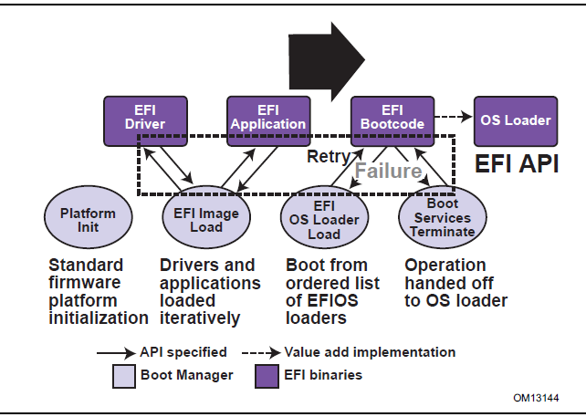

   *Booting Sequence*

UEFI allows the consolidation of boot menus from the OS loader and platform firmware into a single platform firmware menu. These platform firmware menus will allow the selection of any UEFI OS loader from any partition on any boot medium that is supported by UEFI boot services. An UEFI OS loader can support multiple options that can appear on the user interface. It is also possible to include legacy boot options, such as booting from the A: or C: drive in the platform firmware boot menus.

UEFI supports booting from media that contain an UEFI OS loader or an UEFI-defined System Partition. An UEFI-defined System Partition is required by UEFI to boot from a block device. UEFI does not require any change to the first sector of a partition, so it is possible to build media that will boot on both legacy architectures and UEFI platforms.

.. _overview-boot-manager:

Boot Manager
-------------

UEFI contains a boot manager that allows the loading of applications written to this specification (including OS first stage loader) or UEFI drivers from any file on an UEFI-defined file system or through the use of an UEFI-defined image loading service. UEFI defines NVRAM variables that are used to point to the file to be loaded. These variables also contain application-specific data that are passed directly to the UEFI application. The variables also contain a human readable string that can be displayed in a menu to the user.

The variables defined by UEFI allow the system firmware to contain a boot menu that can point to all of the operating systems, and even multiple versions of the same operating systems. The design goal of UEFI was to have one set of boot menus that could live in platform firmware. UEFI specifies only the NVRAM variables used in selecting boot options. UEFI leaves the implementation of the menu system as value added implementation space. 

UEFI greatly extends the boot flexibility of a system over the current state of the art in the PC-AT-class system. The PC-AT-class systems today are restricted to boot from the first floppy, hard drive, CD-ROM, USB keys, or network card attached to the system. Booting from a common hard drive can cause many interoperability problems between operating systems, and different versions of operating systems from the same vendor.

.. _uefi-images:

UEFI Images
###########

UEFI Images are a class of files defined by UEFI that contain executable code. The most distinguishing feature of UEFI Images is that the first set of bytes in the UEFI Image file contains an image header that defines the encoding of the executable image.

UEFI uses a subset of the PE32+ image format with a modified header signature. The modification to the signature value in the PE32+ image is done to distinguish UEFI images from normal PE32 executables. The "+" addition to PE32 provides the 64-bit relocation fix-up extensions to standard PE32 format.

For images with the UEFI image signature, the Subsystem values in the PE image header are defined below. The major differences between image types are the memory type that the firmware will load the image into, and the action taken when the image’s entry point exits or returns. A UEFI application image is always unloaded when control is returned from the image’s entry point. A UEFI driver image is only unloaded if control is passed back with a UEFI error code.

.. code-block::

    // PE32+ Subsystem type for EFI images
    #define EFI_IMAGE_SUBSYSTEM_EFI_APPLICATION          10
    #define EFI_IMAGE_SUBSYSTEM_EFI_BOOT_SERVICE_DRIVER  11
    #define EFI_IMAGE_SUBSYSTEM_EFI_RUNTIME_DRIVER       12
    
    // PE32+ Machine type for EFI images
    #define EFI_IMAGE_MACHINE_IA32                       0x014c
    #define EFI_IMAGE_MACHINE_IA64                       0x0200
    #define EFI_IMAGE_MACHINE_EBC                        0x0EBC
    #define EFI_IMAGE_MACHINE_x64                        0x8664
    #define EFI_IMAGE_MACHINE_ARMTHUMB_MIXED             0x01C2
    #define EFI_IMAGE_MACHINE_AARCH64                    0xAA64
    #define EFI_IMAGE_MACHINE_RISCV32                    0x5032
    #define EFI_IMAGE_MACHINE_RISCV64                    0x5064
    #define EFI_IMAGE_MACHINE_RISCV128                   0x5128
    #define EFI_IMAGE_MACHINE_LOONGARCH32                0x6232
    #define EFI_IMAGE_MACHINE_LOONGARCH64                0x6264

.. note:: This image type is chosen to enable UEFI images to contain Thumb and Thumb2 instructions while defining the EFI interfaces themselves to be in ARM mode.

.. list-table:: UEFI Image Memory Types
   :widths: 45 30 30  
   :name: uefi-image-memory-types
   :class: longtable

   * - **Subsystem Type**
     - **Code Memory Type**
     - **Data Memory Type**
   * - EFI_IMAGE_SUSBS YTEM_EFI_APPLICATION
     - EfiLoaderCode
     - EfiLoaderData
   * - EFI _IMAGE_SUBSYSTEM_EFI _BOOT_SERVICE_DRIVER
     - EfiBootServicesCode
     - EfiBootServicesData
   * - EFI_IMAGE_SUBSYSTE M_EFI_RUNTIME_DRIVER
     - Ef iRuntimeServicesCode
     - Ef iRuntimeServicesData

The Machine value that is found in the PE image file header is used to indicate the machine code type of the image. The machine code types for images with the UEFI image signature are defined below. A given platform must implement the image type native to that platform and the image type for EFI Byte Code (EBC). Support for other machine code types is optional to the platform.

A UEFI image is loaded into memory through the :ref:`efi_boot_services-loadimage` Boot Service. This service loads an image with a PE32+ format into memory. This PE32+ loader is required to load all sections of the PE32+ image into memory. Once the image is loaded into memory, and the appropriate fix-ups have been performed, control is transferred to a loaded image at the AddressOfEntryPoint reference according to the normal indirect calling conventions of applications based on supported 32-bit, 64-bit, or 128-bit processors. All other linkage to and from an UEFI image is done programmatically.

.. _uefi-applications:

UEFI Applications
#################

Applications written to this specification are loaded by the Boot Manager or by other UEFI applications. To load a UEFI application the firmware allocates enough memory to hold the image, copies the sections within the UEFI application image to the allocated memory, and applies the relocation fix-ups needed. Once done, the allocated memory is set to be the proper type for code and data for the image. Control is then transferred to the UEFI application’s entry point. When the application returns from its entry point, or when it calls the Boot Service :ref:`efi_boot_services-loadimage`, the UEFI application is unloaded from memory and control is returned to the UEFI component that loaded the UEFI application.

When the Boot Manager loads a UEFI application, the image handle may be used to locate the "load options" for the UEFI application. The load options are stored in nonvolatile storage and are associated with the UEFI application being loaded and executed by the Boot Manager.

.. _uefi-os-loaders:

UEFI OS Loaders
###############

A UEFI OS loader is a special type of UEFI application that normally takes over control of the system from firmware conforming to this specification. When loaded, the UEFI OS loader behaves like any other UEFI application in that it must only use memory it has allocated from the firmware and can only use UEFI services and protocols to access the devices that the firmware exposes. If the UEFI OS loader includes any boot service style driver functions, it must use the proper UEFI interfaces to obtain access to the bus specific-resources. That is, I/O and memory-mapped device registers must be accessed through the proper bus specific I/O calls like those that a UEFI driver would perform.

If the UEFI OS loader experiences a problem and cannot load its operating system correctly, it can release all allocated resources and return control back to the firmware via the Boot Service Exit() call. The Exit() call allows both an error code and ExitData to be returned. The ExitData contains both a string and OS loader-specific data to be returned. If the UEFI OS loader successfully loads its operating system, it can take control of the system by using the Boot Service :ref:`efi-boot-services-exitbootservices` . After successfully calling ExitBootServices() , all boot services in the system are terminated, including memory management, and the UEFI OS loader is responsible for the continued operation of the system.

.. _uefi-drivers:

UEFI Drivers
############

UEFI drivers are loaded by the Boot Manager, firmware conforming to this specification, or by other UEFI applications. To load a UEFI driver the firmware allocates enough memory to hold the image, copies the sections within the UEFI driver image to the allocated memory and applies the relocation fix-ups needed. Once done, the allocated memory is set to be the proper type for code and data for the image. Control is then transferred to the UEFI driver’s entry point. When the UEFI driver returns from its entry point, or when it calls the Boot Service :ref:`efi-boot-services-exitbootservices` , the UEFI driver is optionally unloaded from memory and control is returned to the component that loaded the UEFI driver. A UEFI driver is not unloaded from memory if it returns a status code of EFI_SUCCESS . If the UEFI driver’s return code is an error status code, then the driver is unloaded from memory.

There are two types of UEFI drivers: boot service drivers and runtime drivers. The only difference between these two driver types is that UEFI runtime drivers are available after a UEFI OS loader has taken control of the platform with the Boot Service :ref:`efi-boot-services-exitbootservices`.

UEFI boot service drivers are terminated when ExitBootServices() is called, and all the memory resources consumed by the UEFI boot service drivers are released for use in the operating system environment.

A runtime driver of type EFI_IMAGE_SUBSYSTEM_EFI_RUNTIME_DRIVER gets fixed up with virtual mappngs when the OS calls :ref:`setvirtualaddressmap`.

.. _firmware-core:

Firmware Core
-------------

This section provides an overview of the services defined by UEFI. These include boot services and runtime services.

.. _uefi-services:

UEFI Services
#############

The purpose of the UEFI interfaces is to define a common boot environment abstraction for use by loaded UEFI images, which include UEFI drivers, UEFI applications, and UEFI OS loaders. The calls are defined with a full 64-bit interface, so that there is headroom for future growth. The goal of this set of abstracted platform calls is to allow the platform and OS to evolve and innovate independently of one another. Also, a standard set of primitive runtime services may be used by operating systems.

Platform interfaces defined in this section allow the use of standard Plug and Play Option ROMs as the underlying implementation methodology for the boot services. The interfaces have been designed in such as way as to map back into legacy interfaces. These interfaces have in no way been burdened with any restrictions inherent to legacy Option ROMs.

The UEFI platform interfaces are intended to provide an abstraction between the platform and the OS that is to boot on the platform. The UEFI specification also provides abstraction between diagnostics or utility programs and the platform; however, it does not attempt to implement a full diagnostic OS environment. It is envisioned that a small diagnostic OS-like environment can be easily built on top of an UEFI system. Such a diagnostic environment is not described by this specification. Interfaces added by this specification are divided into the following categories and are detailed later in this document:

  \*  Runtime services

  \*  Boot services interfaces, with the following subcategories: 

     – Global boot service interfaces

     – Device handle-based boot service interfaces

     – Device protocols

     – Protocol services

.. _runtime-services:

Runtime Services
################

This section describes UEFI runtime service functions. The primary purpose of the runtime services is to abstract minor parts of the hardware implementation of the platform from the OS. Runtime service functions are available during the boot process and also at runtime provided the OS switches into flat physical addressing mode to make the runtime call. However, if the OS loader or OS uses the Runtime Service :ref:`setvirtualaddressmap`  service, the OS will only be able to call runtime services in a virtual addressing mode. All runtime interfaces are non-blocking interfaces and can be called with interrupts disabled if desired.To ensure maximum compatibility with existing platforms it is recommended that all UEFI modules that comprise the Runtime Services be represented in the MemoryMap as a single EFI_MEMORY_DESCRIPTOR of Type  EfiRuntimeServicesCode. 

In all cases memory used by the runtime services must be reserved and not used by the OS. runtime services memory is always available to an UEFI function and will never be directly manipulated by the OS or its components. UEFI is responsible for defining the hardware resources used by runtime services, so the OS can synchronize with those resources when runtime service calls are made, or guarantee that the OS never uses those resources. See the table below for lists of the Runtime Services functions.

.. list-table:: UEFI Runtime Services
   :name: uefi-runtime-services
   :widths: 45 45
   :class: longtable 

   * - **Name**
     - **Description**
   * - | :ref:`gettime` 
     - Returns the current time, time context, and time keeping capabilities. 
   * - | :ref:`settime` 
     - Sets the current time and time context.
   * - | :ref:`getwakeuptime` 
     - Returns the current wakeup alarm settings.
   * - | :ref:`setwakeuptime` 
     - Sets the current wakeup alarm settings.
   * - | :ref:`getvariable` 
     - Returns the value of a named variable.
   * - | :ref:`get-nextvariablename` 
     - Enumerates variable names.
   * - | :ref:`setvariable` 
     - Sets, and if needed creates, a variable.
   * - | :ref:`setvirtualaddressmap` 
     - Switches all runtime functions from physical to virtual addressing.
   * - | :ref:`convertpointer` 
     - Used to convert a pointer from physical to virtual addressing.
   * - | :ref:`get-next-high-monotonic-count` 
     - Subsumes the platform's monotonic counter functionality.
   * - | :ref:`resetsystem` 
     - Resets all processors and devices and reboots the system.
   * - | :ref:`update-capsule` 
     - Passes capsules to the firmware with both virtual and physical mapping.
   * - :ref:`querycapsulecapabilities`
     - Returns if the capsule can be supported via *UpdateCapsule()*.
   * - | :ref:`queryvariableinfo` 
     - Returns information about the EFI variable store.

.. _calling-conventions:

Calling Conventions
-------------------

Unless otherwise stated, all functions defined in the UEFI specification are called through pointers in common, architecturally defined, calling conventions found in C compilers. Pointers to the various global UEFI functions are found in the EFI_RUNTIME_SERVICES and EFI_BOOT_SERVICES tables that are located via the system table. Pointers to other functions defined in this specification are located dynamically through device handles. In all cases, all pointers to UEFI functions are cast with the word EFIAPI . This allows the compiler for each architecture to supply the proper compiler keywords to achieve the needed calling conventions. When passing pointer arguments to Boot Services, Runtime Services, and Protocol Interfaces, the caller has the following responsibilities:

-  It is the caller’s responsibility to pass pointer parameters that reference physical memory locations. If a pointer is passed that does not point to a physical memory location (i.e., a memory mapped I/O region), the results are unpredictable and the system may halt.

-  It is the caller’s responsibility to pass pointer parameters with correct alignment. If an unaligned pointer is passed to a function, the results are unpredictable and the system may halt.

-  It is the caller’s responsibility to not pass in a NULL parameter to a function unless it is explicitly allowed. If a NULL pointer is passed to a function, the results are unpredictable and the system may hang.

-  Unless otherwise stated, a caller should not make any assumptions regarding the state of pointer parameters if the function returns with an error.

-  A caller may not pass structures that are larger than native size by value and these structures must be passed by reference (via a pointer) by the caller. Passing a structure larger than native width (4 bytes on supported 32-bit processors; 8 bytes on supported 64-bit processor instructions) on the stack will produce undefined results.

Calling conventions for supported 32-bit and supported 64-bit applications are described in more detail below. Any function or protocol may return any valid return code.

All public interfaces of a UEFI module must follow the UEFI calling convention. Public interfaces include the image entry point, UEFI event handlers, and protocol member functions. The type EFIAPI is used to indicate conformance to the calling conventions defined in this section. Non public interfaces, such as private functions and static library calls, are not required to follow the UEFI calling conventions and may be optimized by the compiler.

.. _data-types:

Data Types
##########

See the table below which lists the common data types that are used in the interface definitions, and  the following table, Modifiers for Common UEFI Data Types, lists their modifiers. Unless otherwise specified all data types are naturally aligned. Structures are aligned on boundaries equal to the largest internal datum of the structure and internal data are implicitly padded to achieve natural alignment.

The values of the pointers passed into or returned by the UEFI interfaces must provide natural alignment for the underlying types.

**Common UEFI Data Types**

.. list-table:: Common UEFI Data Types
   :name: common-uefi-data-types
   :widths: 10 30 
   :class: longtable

   * - **Mnemonic**
     - **Description**
   * - *BOOLEAN*
     - Logical Boolean. 1-byte value containing a 0 for **FALSE** or a 1 for **TRUE**. Other values are undefined.
   * - *INTN*
     - Signed value of native width. (4 bytes on supported 32-bit processor instructions, 8 bytes on supported 64-bit processor instructions, 16 bytes on supported 128-bit processor instructions)
   * - *UINTN*
     - Unsigned value of native width. (4 bytes on supported 32-bit processor instructions, 8 bytes on supported 64-bit processor instructions, 16 bytes on supported 128-bit processor instructions)
   * - *INT8*
     - 1-byte signed value.
   * - *UINT8*
     - 1-byte unsigned value.
   * - *INT16*
     - 2-byte signed value.
   * - *UINT16*
     - 2-byte unsigned value.
   * - *INT32*
     - 4-byte signed value.
   * - *UINT32*
     - 4-byte unsigned value.
   * - *INT64*
     - 8-byte signed value.
   * - *UINT64*
     - 8-byte unsigned value.
   * - *INT128*
     - 16-byte signed value.
   * - *UINT128*
     - 16-byte unsigned value.
   * - *CHAR8*
     - 1-byte character. Unless otherwise specified, all 1-byte or ASCII characters and strings are stored in 8-bit ASCII encoding format, using the ISO-Latin-1 character set.
   * - *CHAR16*
     - 2-byte Character. Unless otherwise specified all characters and strings are stored in the UCS-2 encoding format as defined by Unicode 2.1 and ISO/IEC 10646 standards.
   * - *VOID*
     - Undeclared type.
   * - *EFI_GUID*
     - 128-bit buffer containing a unique identifier value. Unless otherwise specified, aligned on a 64-bit boundary.
   * - *EFI_STATUS*
     - Status code. Type UINTN.
   * - *EFI_HANDLE*
     - A collection of related interfaces. Type VOID \*.
   * - *EFI_EVENT*
     - Handle to an event structure. Type VOID \*.
   * - *EFI_LBA*
     - Logical block address. Type UINT64.
   * - *EFI_TPL*
     - Task priority level. Type UINTN.
   * - *EFI_MAC_ADDRESS*
     - 32-byte buffer containing a network Media Access Control address.
   * - *EFI_IPv4_ADDRESS*
     - 4-byte buffer. An IPv4 internet protocol address.
   * - *EFI_IPv6_ADDRESS*
     - 16-byte buffer. An IPv6 internet protocol address.
   * - *EFI_IP_ADDRESS*
     - 16-byte buffer aligned on a 4-byte boundary. An IPv4 or IPv6 internet protocol address.
   * - <Enumerated Type>
     - Element of a standard ANSI C *enum* type declaration. Type INT32.or UINT32. ANSI C does not define the size of sign of an enum so they should never be used in structures. ANSI C integer promotion rules make INT32 or UINT32 interchangeable when passed as an argument to a function.
   * - sizeof (VOID \*)
     - 4 bytes on supported 32-bit processor instructions. 8 bytes on supported 64-bit processor instructions. 16 bytes on supported 128-bit processor.
   * - Bitfields
     - Bitfields are ordered such that bit 0 is the least significant bit.

.. list-table:: Modifiers for Common UEFI Data Types
   :name: modifiers-for-common-uefi-data-types
   :widths: 10 30
   :class: longtable

   * - **Mnemonic**
     - **Description**
   * - *IN*
     - Datum is passed to the function.
   * - *OUT*
     - Datum is returned from the function.
   * - *OPTIONAL*
     - Passing the datum to the function is optional, and a *NULL* may be passed if the value is not supplied.
   * - *CONST*
     - Datum is read-only.
   * - *EFIAPI*
     - Defines the calling convention for UEFI interfaces.

.. _ia-32-platforms:

IA-32 Platforms
###############

All functions are called with the C language calling convention. The general-purpose registers that are volatile across function calls are eax, ecx, and edx. All other general-purpose registers are nonvolatile and are preserved by the target function. In addition, unless otherwise specified by the function definition, all other registers are preserved.

Firmware boot ‘services and runtime services run in the following processor execution mode prior to the OS calling ExitBootServices():

  \*  Uniprocessor, as described in chapter 8.4 of:

     \- Intel 64 and IA-32 Architectures Software Developer's Manual

     \- Volume 3, System Programming Guide, Part 1

     \- Order Number: 253668-033US, December 2009

     \- See "Links to UEFI-Related Documents" ( http://uefi.org/uefi) under the heading "Intel Processor Manuals.""

  \*  Protected mode

  \*  Paging mode may be enabled. If paging mode is enabled, PAE (Physical Address Extensions) mode is recommended. If paging mode is enabled, any memory space defined by the UEFI memory map is identity mapped (virtual address equals physical  address). The mappings to other regions are undefined and may vary from implementation to implementation.

  \*  Selectors are set to be flat and are otherwise not used.

  \*  Interrupts are enabled-though no interrupt services are supported other than the UEFI boot services timer functions (All loaded device drivers are serviced synchronously by "polling.")

  \*  Direction flag in EFLAGs is clear.

  \*  Other general purpose flag registers are undefined.

  \*  128 KiB, or more, of available stack space.

  \*  The stack must be 16-byte aligned. Stack may be marked as non-executable in identity mapped page tables.

  \*  Floating-point control word must be initialized to 0x027F (all exceptions masked, double-precision, round-to-nearest).

  \*  Multimedia-extensions control word (if supported) must be initialized to 0x1F80 (all exceptions masked, round-to-nearest, flush to zero for masked  underflow).

  \*  CR0.EM must be zero.

  \*  CR0.TS must be zero.

An application written to this specification may alter the processor execution mode, but the UEFI image must ensure firmware boot services and runtime services are executed with the prescribed execution environment.

After an Operating System calls ExitBootServices() , firmware boot services are no longer available and it is illegal to call any boot service. After ExitBootServices, firmware runtime services are still available and may be called with paging enabled and virtual address pointers if SetVirtualAddressMap() has been called describing all virtual address ranges used by the firmware runtime service. For an operating system to use any UEFI runtime services, it must:

  \*  Preserve all memory in the memory map marked as runtime code and runtime data

  \*  Call the runtime service functions, with the following conditions:

    \- In protected mode

    \- Paging may or may not be enabled, however if paging is enabled and SetVirtualAddressMap() has not been called, any memory space defined by the UEFI memory map is identity mapped (virtual address equals physical address), although the attributes of certain regions may not have all read, write, and execute attributes or be unmarked for purposes of platform protection. The mappings to other regions are undefined and may vary from implementation to implementation. See description of  :ref:`setvirtualaddressmap`  for details of memory map after this function has been called.
   
    \- Direction flag in EFLAGs clear
   
    \- 4 KiB, or more, of available stack space
   
    \- The stack must be 16-byte aligned
   
    \- Floating-point control word must be initialized to 0x027F (all exceptions masked, double-precision, round-to-nearest)
   
    \- Multimedia-extensions control word (if supported) must be initialized to 0x1F80 (all exceptions masked, round-to-nearest, flush to zero for masked underflow)

    \- CR0.EM must be zero
   
    \- CR0.TS must be zero
   
    \- Interrupts disabled or enabled at the discretion of the caller

  \*  ACPI Tables loaded at boot time can be contained in memory of type EfiACPIReclaimMemory (recommended) or EfiACPIMemoryNVS . ACPI FACS must be contained in memory of type EfiACPIMemoryNVS. 

  \*  The system firmware must not request a virtual mapping for any memory descriptor of type EfiACPIReclaimMemory or EfiACPIMemoryNVS .

  \*  EFI memory descriptors of type EfiACPIReclaimMemory and EfiACPIMemoryNVS must be aligned on a 4 KiB boundary and must be a multiple of 4 KiB in size.

  \*  Any UEFI memory descriptor that requests a virtual mapping via the  EFI_MEMORY_DESCRIPTOR having the EFI_MEMORY_RUNTIME bit set must be aligned on a 4 KiB boundary and must be a multiple of 4 KiB in size.

  \*  An ACPI Memory Op-region must inherit cacheability attributes from the UEFI memory map. If the system memory map does not contain cacheability attributes, the ACPI Memory Op-region must inherit its cacheability attributes from the ACPI name space. If no cacheability attributes exist in the system memory map or the ACPI name space, then the region must be assumed to be non-cacheable.

  \*  ACPI tables loaded at runtime must be contained in memory of type EfiACPIMemoryNVS . The cacheability attributes for ACPI tables loaded at runtime should be defined in the UEFI memory map. If no information about the table location exists in the UEFI memory map, cacheability attributes may be obtained from ACPI memory descriptors. If no information about the table location exists in the UEFI memory map or ACPI memory descriptors, the table is assumed to be non-cached.

  \*  In general, UEFI Configuration Tables loaded at boot time (e.g., SMBIOS table) can be contained in memory of type EfiRuntimeServicesData (recommended), EfiBootServicesData , EfiACPIReclaimMemory or EfiACPIMemoryNVS . Tables loaded at runtime must be contained in memory of type EfiRuntimeServicesData (recommended) or EfiACPIMemoryNVS .

.. Note:: 
   Previous EFI specifications allowed ACPI tables loaded at runtime to be in the EfiReservedMemoryType and there was no guidance provided for other EFI Configuration Tables. EfiReservedMemoryType is not intended to be used for the storage of any EFI Configuration Tables. Also, only OSes conforming to the UEFI Specification are guaranteed to handle SMBIOS table in memory of type EfiBootServicesData.

.. _handoff-state:

Handoff State
$$$$$$$$$$$$$

When a 32-bit UEFI OS is loaded, the system firmware hands off control to the OS in flat 32-bit mode. All descriptors are set to their 4GiB limits so that all of memory is accessible from all segments.

The Figure below (:ref:`stack-after-addressofentrypoint-called-ia-32` )shows the stack after AddressOfEntryPoint in the image’s PE32+ header has been called on supported 32-bit systems. All UEFI image entry points take two parameters. These are the image handle of the UEFI image, and a pointer to the EFI System Table.

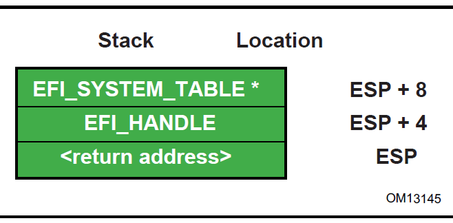

   Stack After AddressOfEntryPoint Called, IA-32

.. _calling-convention:

Calling Convention
$$$$$$$$$$$$$$$$$$

All functions are called with the C language calling convention. The general-purpose registers that are volatile across function calls are eax , ecx , and edx . All other general-purpose registers are nonvolatile and are preserved by the target function.

In addition, unless otherwise specified by the function definition, all other CPU registers (including MMX and XMM) are preserved.

The floating point status register is not preserved by the target function. The floating point control register and MMX control register are saved by the target function.

If the return value is a float or a double, the value is returned in ST(0).

.. _intel-itanium--based-platforms:

Intel\ :sup:`®`\ Itanium\ :sup:`®`\ -Based Platforms  
####################################################

UEFI executes as an extension to the SAL execution environment with the same rules as laid out by the SAL specification.

During boot services time the processor is in the following execution mode:

  \*  Uniprocessor, as detailed in chapter 13.1.2 of:

     \- Intel Itanium Architecture Software Developer's Manual

     \- Volume 2: System Architecture

     \- Revision 2.2

     \- January 2006

     \- See "Links to UEFI-Related Documents" ( http://uefi.org/uefi) under the heading "Intel Itanium Documentation".

     \- Document Number: 245318-005

  \*  Physical mode

  \*  128 KiB, or more, of available stack space

  \*  16 KiB, or more, of available backing store space

     \- FPSR.traps: Set to all 1's (all exceptions disabled)

     \- FPSR.sf0:

  \*  .pc: Precision Control - 11b (extended precision)

  \*  .rc: Rounding Control - 0 (round to nearest)

  \*  .wre: Widest Range Exponent - 0 (IEEE mode)

  \*  .ftz: Flush-To-Zero mode - 0 (off)

     \- FPSR.sf1:
   
  \*  .td: Traps Disable = 1 (traps disabled)

  \*  .pc: Precision Control - 11b (extended precision)

  \*  .rc: Rounding Control - 0 (round to nearest)

  \*  wreWidest Range Exponent - 1 (full register exponent range)

  \*  ftz Flush-To-Zero mode - 0 (off)

     \- FPSR.sf2,3:

  \*  .td Traps Disable = 1 (traps disabled) 

  \*  pc: Precision Control - 11b (extended precision)

  \*  .rc: Rounding Control - 0 (round to nearest)

  \*  .wre: Widest Range Exponent - 0 (IEEE mode)

  \*  .ftz: Flush-To-Zero mode - 0 (off)

An application written to this specification may alter the processor execution mode, but the UEFI image must ensure firmware boot services and runtime services are executed with the prescribed execution environment.

After an Operating System calls ExitBootServices(), firmware boot services are no longer available and it is illegal to call any boot service. After ExitBootServices, firmware runtime services are still available When calling runtime services, paging may or may not be enabled, however if paging is enabled and SetVirtualAddressMap() has not been called, any memory space defined by the UEFI memory map is identity mapped (virtual address equals physical address). The mappings to other regions are undefined and may vary from implementation to implementation. See description of  :ref:`setvirtualaddressmap`  for details of memory map after this function has been called. After ExitBootServices(), runtime service functions may be called with interrupts disabled or enabled at the discretion of the caller.

  \*  ACPI Tables loaded at boot time can be contained in memory of type EfiACPIReclaimMemory (recommended) or EfiACPIMemoryNVS. CPI FACS must be contained in memory of type EfiACPIMemoryNVS.

  \*  The system firmware must not request a virtual mapping for any memory descriptor of type EfiACPIReclaimMemory or EfiACPIMemoryNVS.

  \*  EFI memory descriptors of type EfiACPIReclaimMemory and EfiACPIMemoryNVS. must be aligned on an 8 KiB boundary and must be a multiple of 8 KiB in size.

  \*  Any UEFI memory descriptor that requests a virtual mapping via the EFI_MEMORY_DESCRIPTOR having the EFI_MEMORY_RUNTIME bit set must be aligned on an 8 KiB boundary and must be a multiple of 8 KiB in size.

  \*  An ACPI Memory Op-region must inherit cacheability attributes from the UEFI memory map. If the system memory map does not contain cacheability attributes the ACPI Memory Op-region must inherit its cacheability attributes from the ACPI name space. If no cacheability attributes exist in the system memory map or the ACPI name space, then the region must be assumed to be non-cacheable.

  \*  ACPI tables loaded at runtime must be contained in memory of type EfiACPIMemoryNVS . The cacheability attributes for ACPI tables loaded at runtime should be defined in the UEFI memory map. If no information about the table location exists in the UEFI memory map, cacheability attributes may be obtained from ACPI memory descriptors. If no information about the table location exists in the UEFI memory map or ACPI memory descriptors, the table is assumed to be non-cached.

  \*  In general, Configuration Tables loaded at boot time (e.g., SMBIOS table) can be contained in memory of type EfiRuntimeServicesData (recommended), EfiBootServicesData, EfiACPIReclaimMemory or EfiACPIMemoryNVS. Tables loaded at runtime must be contained in memory of type EfiRuntimeServicesData (recommended) or EfiACPIMemoryNVS.

.. note::
   Previous EFI specifications allowed ACPI tables loaded at runtime to be in the EfiReservedMemoryType and there was no guidance provided for other EFI Configuration Tables. EfiReservedMemoryType is not intended to be used by firmware. Also, only OSes conforming to the UEFI Specification are guaranteed to handle SMBIOS table in memory of type EfiBootServicesData.

Refer to the IA-64 System Abstraction Layer Specification (:ref:`appendix-q-references`) for details.

UEFI procedures are invoked using the P64 C calling conventions defined for Intel® Itanium®-based applications. Refer to the document 64 Bit Runtime Architecture and Software Conventions for IA-64 (:ref:`appendix-q-references`) for more information.

.. _handoff-state-1:

Handoff State
$$$$$$$$$$$$$

UEFI uses the standard P64 C calling conventions that are defined for Itanium-based operating systems.  The Figure below shows the stack after ImageEntryPoint has been called on Itanium-based systems. The arguments are also stored in registers: out0 contains EFI_HANDLE and out1 contains the address of the EFI_SYSTEM_TABLE . The gp for the UEFI Image will have been loaded from the plabel pointed to by the AddressOfEntryPoint in the image’s PE32+ header. All UEFI image entry points take two parameters. These are the image handle of the image, and a pointer to the System Table.

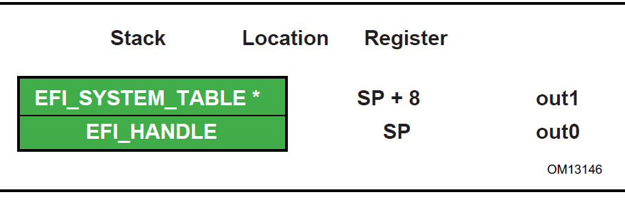

   *Stack after AddressOfEntryPoint Called, Itanium-based Systems*

The SAL specification ( :ref:`appendix-q-references`) defines the state of the system registers at boot handoff. The SAL specification also defines which system registers can only be used after UEFI boot services have been properly terminated.

.. _calling-convention-1:

Calling Convention
$$$$$$$$$$$$$$$$$$

UEFI executes as an extension to the SAL execution environment with the same rules as laid out by the SAL specification. UEFI procedures are invoked using the P64 C calling conventions defined for Intel\ :sup:`®`\ Itanium\ :sup:`®`\ -based applications. Refer to the document 64 Bit Runtime Architecture and Software Conventions for IA-64 (see the index appendix for more information).

For floating point, functions may only use the lower 32 floating point registers Return values appear in f8-f15 registers. Single, double, and extended values are all returned using the appropriate format. Registers f6-f7 are local registers and are not preserved for the caller. All other floating point registers are preserved. Note that, when compiling UEFI programs, a special switch will likely need to be specified to guarantee that the compiler does not use f32-f127, which are not normally preserved in the regular calling convention for Itanium. A procedure using one of the preserved floating point registers must save and restore the caller's original contents without generating a NaT consumption fault.

Floating point arguments are passed in f8-f15 registers when possible. Parameters beyond the registers appear in memory, as explained in Section 8.5 of the Itanium Software Conventions and Runtime Architecture Guide. Within the called function, these are local registers and are not preserved for the caller. Registers f6-f7 are local registers and are not preserved for the caller. All other floating point registers are preserved. Note that, when compiling UEFI programs, a special switch will likely need to be specified to guarantee that the compiler does not use f32-f127, which are not normally preserved in the regular calling convention for Itanium. A procedure using one of the preserved floating point registers must save and restore the caller's original contents without generating a NaT consumption fault.

The floating point status register must be preserved across calls to a target function. Flags fields in SF1,2,3 are not preserved for the caller. Flags fields in SF0 upon return will reflect the value passed in, and with bits set to 1 corresponding to any IEEE exceptions detected on non-speculative floating-point operations executed as part of the callee.

Floating-point operations executed by the callee may require software emulation. The caller must be prepared to handle FP Software Assist (FPSWA) interruptions. Callees should not raise IEEE traps by changing FPSR.traps bits to 0 and then executing floating-point operations that raise such traps.

.. _x64-platforms:

x64 Platforms
#############

All functions are called with the C language calling convention. :ref:`detailed-calling-conventions` for more detail.

During boot services time the processor is in the following execution mode:

  \*  Uniprocessor, as described in chapter 8.4 of:

   \- Intel 64 and IA-32 Architectures Software Developer's Manual, Volume 3, System Programming Guide, Part 1, Order Number: 253668-033US, December 2009

   \ -See "Links to UEFI-Related Documents" ( http://uefi.org/uefi) under the heading "Intel Processor Manuals".

  \*  Long mode, in 64-bit mode

  \*  Paging mode is enabled and any memory space defined by the UEFI memory map  is identity mapped (virtual address equals physical address), although the attributes of certain regions may not have all read, write, and execute attributes or be unmarked for purposes of platform protection. The mappings to other regions, such as those for unaccepted memory, are undefined and may vary from implementation to implementation.

  \*  Selectors are set to be flat and are otherwise not used.

  \*  Interrupts are enabled-though no interrupt services are supported other than the UEFI boot services timer functions (All loaded device drivers are serviced synchronously by "polling.")

  \*  Direction flag in EFLAGs is clear 

  \*  Other general purpose flag registers are undefined

  \*  128 KiB, or more, of available stack space

  \*  The stack must be 16-byte aligned. Stack may be marked as non-executable in identity mapped page tables.

  \*  Floating-point control word must be initialized to 0x037F (all exceptions masked, double-extended-precision, round-to-nearest)

  \*  Multimedia-extensions control word (if supported) must be initialized to 0x1F80 (all exceptions masked, round-to-nearest, flush to zero for masked underflow).

  \*  CR0.EM must be zero

  \*  CR0.TS must be zero

For an operating system to use any UEFI runtime services, it must:

  \*  Preserve all memory in the memory map marked as runtime code and runtime data

  \*  Call the runtime service functions, with the following conditions:

  \*  In long mode, in 64-bit mode

  \*  Paging enabled

  \*  All selectors set to be flat with virtual = physical address. If the UEFI OS loader or OS used SetVirtualAddressMap() to relocate the runtime services in a virtual address space, then this condition does not have to be met. See description :ref:`setvirtualaddressmap`  for details of memory map after this function has been called.

  \*  Direction flag in EFLAGs clear

  \*  4 KiB, or more, of available stack space

  \*  The stack must be 16-byte aligned

  \*  Floating-point control word must be initialized to 0x037F (all exceptions masked, double-extended-precision, round-to-nearest)

  \*  Multimedia-extensions control word (if supported) must be initialized to 0x1F80 (all exceptions masked, round-to-nearest, flush to zero for masked underflow)

  \*  CR0.EM must be zero

  \*  CR0.TS must be zero

  \*  Interrupts may be disabled or enabled at the discretion of the caller.

  \*  ACPI Tables loaded at boot time can be contained in memory of type EfiACPIReclaimMemory (recommended) or EfiACPIMemoryNVS . ACPI FACS must be contained in memory of type EfiACPIMemoryNVS .

  \*  The system firmware must not request a virtual mapping for any memory descriptor of type EfiACPIReclaimMemory or EfiACPIMemoryNVS .

  \*  EFI memory descriptors of type EfiACPIReclaimMemory and EfiACPIMemoryNVS must be aligned on a 4 KiB boundary and must be a multiple of 4 KiB in size.

  \*  Any UEFI memory descriptor that requests a virtual mapping via the EFI_MEMORY_DESCRIPTOR having the EFI_MEMORY_RUNTIME bit set must be aligned on a 4 KiB boundary and must be a multiple of 4 KiB in size.

  \*  An ACPI Memory Op-region must inherit cacheability attributes from the UEFI memory map. If the system memory map does not contain cacheability attributes, the ACPI Memory Op-region must inherit its cacheability attributes from the ACPI name space. If no cacheability attributes exist in the system memory map or the ACPI name space, then the region must be assumed to be non-cacheable.

  \*  ACPI tables loaded at runtime must be contained in memory of type EfiACPIMemoryNVS . The cacheability attributes for ACPI tables loaded at runtime should be defined in the UEFI memory map. If no information about the table location exists in the UEFI memory map, cacheability attributes may be obtained from ACPI memory descriptors. If no information about the table  location exists in the UEFI memory map or ACPI memory descriptors, the table is assumed to be non-cached.

  \*  In general, UEFI Configuration Tables loaded at boot time (e.g., SMBIOS table) can be contained in memory of type EfiRuntimeServicesData (recommended), EfiBootServicesData , EfiACPIReclaimMemory or EfiACPIMemoryNVS . Tables loaded at runtime must be contained in memory of type  EfiRuntimeServicesData (recommended) or EfiACPIMemoryNVS.

.. note::
   Previous EFI specifications allowed ACPI tables loaded at runtime to be in the EfiReservedMemoryType and there was no guidance provided for other EFI Configuration Tables. EfiReservedMemoryType is not intended to be used by firmware. Also, only OSes conforming to the UEFI Specification are guaranteed to handle SMBIOS table in memory of type EfiBootServicesData.

.. _handoff-state-2:

Handoff State
$$$$$$$$$$$$$

Rcx - EFI_HANDLE

Rdx - EFI_SYSTEM_TABLE*

RSP - <return address>

.. _detailed-calling-conventions:

Detailed Calling Conventions
$$$$$$$$$$$$$$$$$$$$$$$$$$$$

The caller passes the first four integer arguments in registers. The integer values are passed from left to right in Rcx, Rdx, R8, and R9 registers. The caller passes arguments five and above onto the stack. All arguments must be right-justified in the register in which they are passed. This ensures the callee can process only the bits in the register that are required.

The caller passes arrays and strings via a pointer to memory allocated by the caller. The caller passes structures and unions of size 8, 16, 32, or 64 bits as if they were integers of the same size. The caller is not allowed to pass structures and unions of other than these sizes and must pass these unions and structures via a pointer.

The callee must dump the register parameters into their shadow space if required. The most common requirement is to take the address of an argument.

If the parameters are passed through varargs then essentially the typical parameter passing applies, including spilling the fifth and subsequent arguments onto the stack. The callee must dump the arguments that have their address taken.

Return values that fix into 64-bits are returned in the Rax register. If the return value does not fit within 64-bits, then the caller must allocate and pass a pointer for the return value as the first argument, Rcx. Subsequent arguments are then shifted one argument to the right, so for example argument one would be passed in Rdx. User-defined types to be returned must be 1,2,4,8,16,32, or 64 bits in length.

The registers Rax, Rcx Rdx R8, R9, R10, R11, and XMM0-XMM5 are volatile and are, therefore, destroyed on function calls.

The registers RBX, RBP, RDI, RSI, R12, R13, R14, R15, and XMM6-XMM15 are considered nonvolatile and must be saved and restored by a function that uses them.

Function pointers are pointers to the label of the respective function and don’t require special treatment.

A caller must always call with the stack 16-byte aligned.

For MMX, XMM and floating-point values, return values that can fit into 64-bits are returned through RAX (including MMX types). However, XMM 128-bit types, floats, and doubles are returned in XMM0. The floating point status register is not saved by the target function. Floating-point and double-precision arguments are passed in XMM0 - XMM3 (up to 4) with the integer slot (RCX, RDX, R8, and R9) that would normally be used for that cardinal slot being ignored (see example) and vice versa. XMM types are never passed by immediate value but rather a pointer will be passed to memory allocated by the caller. MMX types will be passed as if they were integers of the same size. Callees must not unmask exceptions without providing correct exception handlers.

In addition, unless otherwise specified by the function definition, all other CPU registers (including MMX and XMM) are preserved.

.. _enabling-paging-or-alternate-translations-in-an-application:

Enabling Paging or Alternate Translations in an Application
$$$$$$$$$$$$$$$$$$$$$$$$$$$$$$$$$$$$$$$$$$$$$$$$$$$$$$$$$$$

Boot Services define an execution environment where paging is not enabled (supported 32-bit) or where translations are enabled but mapped virtual equal physical (x64) and this section will describe how to write an application with alternate translations or with paging enabled. Some Operating Systems require the OS Loader to be able to enable OS required translations at Boot Services time.

If a UEFI application uses its own page tables, GDT or IDT, the application must ensure that the firmware executes with each supplanted data structure. There are two ways that firmware conforming to this specification can execute when the application has paging enabled.

  \*  Explicit firmware call

  \*  Firmware preemption of application via timer event

An application with translations enabled can restore firmware required mapping before each UEFI call. However the possibility of preemption may require the translation enabled application to disable interrupts while alternate translations are enabled. It’s legal for the translation enabled application to enable interrupts if the application catches the interrupt and restores the EFI firmware environment prior to calling the UEFI interrupt ISR. After the UEFI ISR context is executed it will return to the translation enabled application context and restore any mappings required by the application.

.. _aarch32-platforms:

AArch32 Platforms
#################

All functions are called with the C language calling convention specified in :ref:`detailed-calling-convention` . In addition, the invoking OSs can assume that unaligned access support is enabled if it is present in the processor.

During boot services time the processor is in the following execution mode:

  \*  Unaligned access should be enabled if supported; Alignment faults are enabled otherwise.

  \*  Uniprocessor.

  \*  A privileged mode.

  \*  The MMU is enabled (CP15 c1 System Control Register (SCTLR) SCTLR.M=1) and any RAM defined by the UEFI memory map is identity mapped (virtual address equals physical address). The mappings to other regions are undefined and may vary from implementation to implementation 

  \*  The core will be configured as follows (common across all processor architecture revisions):

      \- MMU enabled

      \- Instruction and Data caches enabled

      \- Access flag disabled

      \- Translation remap disabled

      \- Little endian mode

      \- Domain access control mechanism (if supported) will be configured to check access permission bits in the page descriptor

      \- Fast Context Switch Extension (FCSE) must be disabled

      This will be achieved by:

        \- Configuring the CP15 c1 System Control Register (SCTLR) as follows: I=1, C=1, B=0, TRE=0, AFE=0, M=1

        \- Configuring the CP15 c3 Domain Access Control Register (DACR) to 0x33333333.

        \- Configuring the CP15 c1 System Control Register (SCTLR), A=1 on ARMv4 and ARMv5, A=0, U=1 on ARMv6 and ARMv7.

     The state of other system control register bits is not dictated by this specification.

  \*  Implementations of boot services will enable architecturally manageable caches and TLBs i.e., those that can be managed directly using CP15 operations using mechanisms and procedures defined in the ARM Architecture Reference Manual. They should not enable caches requiring platform information to manage or invoke non-architectural cache/TLB lockdown mechanisms 

  \*  MMU configuration — Implementations must use only 4k pages and a single translation base register. On devices supporting multiple translation base registers, TTBR0 must be used solely. The binding does not mandate whether page tables are cached or un-cached.

      \- On processors implementing the ARMv4 through ARMv6K architecture definitions, the core is additionally configured to disable extended page tables support, if present. This will be achieved by configuring the CP15 c1 System Control Register (SCTLR) as follows: XP=0

      \- On processors implementing the ARMv7 and later architecture definitions, the core will be configured to enable the extended page table format and disable the TEX remap mechanism. This will be achieved by configuring the CP15 c1 System Control Register (SCTLR) as follows: XP=1, TRE=0

  \*  Interrupts are enabled-though no interrupt services are supported other than the UEFI boot services timer functions (All loaded device drivers are serviced synchronously by "polling.")

  \*  128 KiB or more of available stack space

For an operating system to use any runtime services, it must:

  \*  Preserve all memory in the memory map marked as runtime code and runtime data

  \*  Call the runtime service functions, with the following conditions:

      \- In a privileged mode.

      \- The system address regions described by all the entries in the EFI memory map that have the EFI_MEMORY_RUNTIME bit set must be identity mapped as they were for the EFI boot environment. If the OS Loader or OS used SetVirtualAddressMap() to relocate the runtime services in a virtual address space, then this condition does not have to be met. See description of SetVirtualAddressMap() for details of memory map after this function has been called.

      \- The processor must be in a mode in which it has access to the system address regions specified in the EFI memory map with the EFI_MEMORY_RUNTIME bit set.

      \- 4 KiB, or more, of available stack space

      \- Interrupts may be disabled or enabled at the discretion of the caller

An application written to this specification may alter the processor execution mode, but the invoking OS must ensure firmware boot services and runtime services are executed with the prescribed execution environment.

If ACPI is supported:

  \*  ACPI Tables loaded at boot time can be contained in memory of type EfiACPIReclaimMemory (recommended) or EfiACPIMemoryNVS. ACPI FACS must be contained in memory of type EfiACPIMemoryNVS

  \*  The system firmware must not request a virtual mapping for any memory descriptor of type EfiACPIReclaimMemory or EfiACPIMemoryNVS.

  \*  EFI memory descriptors of type EfiACPIReclaimMemory and EfiACPIMemoryNVS must be aligned on a 4 KiB boundary and must be a multiple of 4 KiB in size.

  \*  Any UEFI memory descriptor that requests a virtual mapping via the EFI_MEMORY_DESCRIPTOR having the EFI_MEMORY_RUNTIME bit set must be aligned on a 4 KiB boundary and must be a multiple of 4 KiB in size.

  \*  An ACPI Memory Op-region must inherit cacheability attributes from the UEFI memory map. If the system memory map does not contain cacheability attributes, the ACPI Memory Op-region must inherit its cacheability attributes from the ACPI name space. If no cacheability attributes exist in the system memory map or the ACPI name space, then the region must be assumed to be non-cacheable.

  \*  ACPI tables loaded at runtime must be contained in memory of type EfiACPIMemoryNVS. The cacheability attributes for ACPI tables loaded at runtime should be defined in the UEFI memory map. If no information about the table location exists in the UEFI memory map, cacheability attributes may be obtained from ACPI memory descriptors. If no information about the table location exists in the UEFI memory map or ACPI memory descriptors, the table is assumed to be non-cached.

  \*  In general, UEFI Configuration Tables loaded at boot time (e.g., SMBIOS table) can be contained in memory of type EfiRuntimeServicesData (recommended), EfiBootServicesData , EfiACPIReclaimMemory or EfiACPIMemoryNVS. Tables loaded at runtime must be contained in memory of type EfiRuntimeServicesData (recommended) or EfiACPIMemoryNVS.

.. note:: 
   Previous EFI specifications allowed ACPI tables loaded at runtime to be in the EfiReservedMemoryType and there was no guidance provided for other EFI Configuration Tables. EfiReservedMemoryType is not intended to be used by firmware. Also, only OSes conforming to the UEFI Specification are guaranteed to handle SMBIOS table in memory of type EfiBootServicesData*.

.. _handoff-state-3:

Handoff State
$$$$$$$$$$$$$

R0 - EFI_HANDLE

R1 - EFI_SYSTEM_TABLE* 

R14 - Return Address

.. _enabling-paging-or-alternate-translations-in-an-application-1:

Enabling Paging or Alternate Translations in an Application
$$$$$$$$$$$$$$$$$$$$$$$$$$$$$$$$$$$$$$$$$$$$$$$$$$$$$$$$$$$

Boot Services define a specific execution environment. This section will describe how to write an application that creates an alternative execution environment. Some Operating Systems require the OS Loader to be able to enable OS required translations at Boot Services time, and make other changes to the UEFI defined execution environment.

If a UEFI application uses its own page tables, or other processor state, the application must ensure that the firmware executes with each supplanted functionality. There are two ways that firmware conforming to this specification can execute in this alternate execution environment:

  \*  Explicit firmware call

  \*  Firmware preemption of application via timer event

An application with an alternate execution environment can restore the firmware environment before each UEFI call. However the possibility of preemption may require the alternate execution-enabled application to disable interrupts while the alternate execution environment is active. It's legal for the alternate execution environment enabled application to enable interrupts if the application catches the interrupt and restores the EFI firmware environment prior to calling the UEFI interrupt ISR. After the UEFI ISR context is executed it will return to the alternate execution environment enabled application context.

An alternate execution environment created by a UEFI application must not change the semantics or behavior of the MMU configuration created by the UEFI firmware prior to invoking ExitBootServices(), including the bit layout of the page table entries.

After an OS loader calls ExitBootServices() it should immediately configure the exception vector to point to appropriate code.

.. _detailed-calling-convention:

Detailed Calling Convention
$$$$$$$$$$$$$$$$$$$$$$$$$$$

The base calling convention for the ARM binding is defined here:

Procedure Call Standard for the ARM Architecture V2.06 (or later) 

See "Links to UEFI-Related Documents" (http://uefi.org/uefi) under the heading "Arm Architecture Base Calling Convention".

This binding further constrains the calling convention in these ways:

  \*  Calls to UEFI defined interfaces must be done assuming that the target code requires the ARM instruction set state. Images are free to use other instruction set states except when invoking UEFI interfaces. 

  \*  Floating point, SIMD, vector operations and other instruction set extensions must not be used.

  \*  Only little endian operation is supported. 

  \*  The stack will maintain 8 byte alignment as described in the AAPCS for public interfaces. 

  \*  Use of coprocessor registers for passing call arguments must not be used

  \*  Structures (or other types larger than 64-bits) must be passed by reference and not by value 

  \*  The EFI ARM platform binding defines register r9 as an additional callee-saved variable register.

.. _aarch64-platforms:

AArch64 Platforms
#################

AArch64 UEFI will only execute 64-bit ARM code, as the ARMv8 architecture does not allow for the mixing of 32-bit and 64-bit code at the same privilege level.

All functions are called with the C language calling convention specified in Detailed calling Convention section below. During boot services only a single processor is used for execution. All secondary processors must be either powered off or held in a quiescent state.

The primary processor is in the following execution mode:

  \*  Unaligned access must be enabled.

  \*  Use the highest 64 bit non secure privilege level available; Non-secure EL2 (Hyp) or Non-secure EL1(Kernel).

  \*  The MMU is enabled and any RAM defined by the UEFI memory map is identity mapped (virtual address equals physical address). The mappings to other regions are undefined and may vary from implementation to implementation

  \*  The core will be configured as follows:

      \- MMU enabled
      \-  Instruction and Data caches enabled
      \-  Little endian mode
      \-  Stack Alignment Enforced
      \-  NOT Top Byte Ignored
      \-  Valid Physical Address Space
      \-  4K Translation Granule

This will be achieved by: 

1. Configuring the System Control Register SCTLR_EL2 or SCTLR_EL1:

  \*  EE=0, I=1, SA=1, C=1, A=0, M=1

2. Configuring the appropriate Translation Control Register:

  \*  TCR_EL2

      \- TBI=0
      \- PS must contain the valid Physical Address Space Size.
      \- TG0=00

  \*  TCR_EL1

      \- TBI0=0
      \- IPS must contain the valid Intermediate Physical Address Space Size.
      \- TG0=00

      **Note:** The state of other system control register bits is not dictated by this specification.

  \*  All floating point traps and exceptions will be disabled at the relevant exception levels (FPCR=0, CPACR_EL1.FPEN=11, CPTR_EL2.TFP=0). This implies that the FP unit will be enabled by default.

  \*  Implementations of boot services will enable architecturally manageable caches and TLBs i.e., those that can be managed directly using implementation independent registers using mechanisms and procedures defined in the ARM Architecture Reference Manual. They should not enable caches requiring platform information to manage or invoke non-architectural cache/TLB lockdown mechanisms.

  \*  MMU configuration: Implementations must use only 4k pages and a single translation base register. On devices supporting multiple translation base registers, TTBR0 must be used solely. The binding does not mandate whether page tables are cached or un-cached.

  \*  Interrupts are enabled, though no interrupt services are supported other than the UEFI boot services timer functions (All loaded device drivers are serviced synchronously by "polling"). All UEFI interrupts must be routed to the IRQ vector only.

  \*  The architecture generic timer must be initialized and enabled. The Counter Frequency register (CNTFRQ) must be programmed with the timer frequency. Timer access must be provided to non-secure EL1 and EL0 by setting bits EL1PCTEN and EL1PCEN in register CNTHCTL_EL2.

  \*  The system firmware is not expected to initialize EL2  registers that do not have an architectural reset value, except in cases where firmware itself is running at EL2 and needs to do so.

  \*  128 KiB or more of available stack space

  \*  The ARM architecture allows mapping pages at a variety of granularities, including 4KiB and 64KiB. If a 64KiB physical page contains any 4KiB page with any of the following types listed below, then all 4KiB pages in the 64KiB page must use identical ARM Memory Page Attributes (as described in :numref:`map-efi-cacheability-attributes-to-aarch64-memory-types`):

      \- EfiRuntimeServicesCode

      \- EfiRuntimeServicesData

      \- EfiReserved

      \- EfiACPIMemoryNVS

Mixed attribute mappings within a larger page are not allowed.

.. note::
   This constraint allows a 64K paged based Operating System to safely map runtime services memory.

Platform firmware must not return allocations outside of the 48-bit addressable range of memory unless:

    1. that range is completely exhausted, or
    2. that was explicitly requested via the AllocateAddress allocation type.

If either of the above conditions occurs, an OS that lacks support for addresses wider than 48-bit may malfunction.

.. note::
   Platform firmware may need to allocate memory at a specific address in order to satisfy a platform-specific requirement. That behaviour is allowed by the constraints above.

.. note::
   The exception 1) above accommodates systems that have less memory, in the 48-bit addressable range, than what is required for proper system operation. The exception allows firmware to remain compliant when only memory above the 48-bit addressable range is available for allocation.

.. note::
   Systems that support FEAT_LPA/FEAT_LVA, but not FEAT_LPA2, are unable to map memory outside the 48-bit addressable range when using 4K pages. Thus, the platform firmware cannot map memory outside the 48-bit addressable range while remaining UEFI compliant. On those systems, any allocation outside the 48-bit addressable range is forbidden, even in the two scenarios listed above.

For an operating system to use any runtime services, Runtime services must:

  \*  Support calls from either the EL1 or the EL2 exception levels.

  \*  Once called, simultaneous or nested calls from EL1 and EL2 are not permitted.

.. note::
   Sequential, non-overlapping calls from EL1 and EL2 are permitted.

Runtime services are permitted to make synchronous SMC and HVC calls into higher exception levels.

.. note::
   These rules allow Boot Services to start at EL2, and Runtime services to be assigned to an EL1 Operating System. In this case a call to SetVirtualAddressMap()is expected to provided an EL1 appropriate set of mappings. 

For an operating system to use any runtime services, it must:

  \*  Enable unaligned access support.
  
  \*  Preserve all memory in the memory map marked as runtime code and runtime data
  
  \*  Call the runtime service functions, with the following conditions:

      \- From either EL1 or EL2 exception levels.
	  
      \- Consistently call runtime services from the same exception level. Sharing of runtime services between different exception levels is not permitted.
	  
      \- Runtime services must only be assigned to a single operating system or hypervisor. They must not be shared between multiple guest operating systems.
	  
      \- The system address regions described by all the entries in the EFI memory map that have the EFI_MEMORY_RUNTIME bit set must be identity mapped as they were for the EFI boot environment. If the OS Loader or OS used SetVirtualAddressMap() to relocate the  runtime services in a virtual address space, then this condition does not have to be met. See description of SetVirtualAddressMap() for details of memory map after this function has been called.
	  
      \- The processor must be in a mode in which it has access to the system address regions specified in the EFI memory map with the EFI_MEMORY_RUNTIME bit set.
	  
      \- 8 KiB, or more, of available stack space.
	  
      \- The stack must be 16-byte aligned (128-bit).
	  
      \- Interrupts may be disabled or enabled at the discretion of the caller.
	  
      \- If the core implements the Scalable Matrix Extension, the OS must ensure that the per-core Streaming SVE mode is disabled before the core calls a runtime service. 

An application written to this specification may alter the processor execution mode, but the invoking OS must ensure firmware boot services and runtime services are executed with the prescribed execution environment.

If ACPI is supported:

  \*  ACPI Tables loaded at boot time can be contained in memory of type EfiACPIReclaimMemory (recommended) or EfiACPIMemoryNVS.

  \*  ACPI FACS must be contained in memory of type EfiACPIMemoryNVS. The system firmware must not request a virtual mapping for any memory descriptor of type EfiACPIReclaimMemory or EfiACPIMemoryNVS.

  \*  EFI memory descriptors of type EfiACPIReclaimMemory and EfiACPIMemoryNVS must be aligned on a 4 KiB boundary and must be a multiple of 4 KiB in size.

  \*  Any UEFI memory descriptor that requests a virtual mapping via the EFI_MEMORY_DESCRIPTOR having the EFI_MEMORY_RUNTIME bit set must be aligned on a 4 KiB boundary and must be a multiple of 4 KiB in size.

  \*  An ACPI Memory Op-region must inherit cacheability attributes from the UEFI memory map. If the system memory map does not contain cacheability attributes, the ACPI Memory Op-region must inherit its cacheability attributes from the ACPI name space. If no cacheability attributes exist in the system memory map or the ACPI name space, then the region must be assumed to be non-cacheable.

  \*  ACPI tables loaded at runtime must be contained in memory of type EfiACPIMemoryNVS. The cacheability attributes for ACPI tables loaded at runtime should be defined in the UEFI memory map. If no information about the table location exists in the UEFI memory map, cacheability attributes may be obtained from ACPI memory descriptors. If no information about the table location exists in the UEFI memory map or ACPI memory descriptors, the table is assumed to be non-cached.

  \*  In general, UEFI Configuration Tables loaded at boot time (e.g., SMBIOS table) can be contained in memory of type EfiRuntimeServicesData (recommended), EfiBootServicesdata , EfiACPIReclaimMemory or EfiACPIMemoryNVS. Tables loaded at runtime must be contained in memory of type EfiRuntimeServicesData (recommended) or EfiACPIMemoryNVS.

.. note::
   Previous EFI specifications allowed ACPI tables loaded at runtime to be in the* EfiReservedMemoryType *and there was no guidance provided for other EFI Configuration Tables*. EfiReservedMemoryType *is not intended to be used by firmware. UEFI 2.0 clarified the situation moving forward. Also, only OSes conforming to UEFI Specification are guaranteed to handle SMBIOS table in memory of type* EfiBootServiceData.

.. _memory-types:

Memory types
$$$$$$$$$$$$

.. list-table:: Map EFI Cacheability Attributes to AArch64 Memory Types
   :name: map-efi-cacheability-attributes-to-aarch64-memory-types
   :widths: 20 15 10 30
   :class: longtable

   * - **EFI Memory Type**
     - **ARM Memory Type:  MAIR attribute encoding  Attr<n> [7:4] [3:0]**
     - **ARM Memory Shareability Attribute SH [1:0]**
     - **ARM Memory Type:  Meaning**
   * - EFI_MEMORY_UC (Not cacheable)
     - 0000 0000
     - Not applicable
     - Device-nGnRnE  (Device non-Gathering, non-Reordering, no Early Write Acknowledgement)
   * - EFI_MEMORY_WC (Write combine)
     - 0100 0100
     - Not applicable
     - Normal Memory  Outer non-cacheable  Inner non-cacheable
   * - EFI_MEMORY_WT (Write through)
     - 1011 1011
     - 11
     - Normal Memory  Outer Write-through non-transient  Inner Write-through non-transient, inner-shareable
   * - EFI_MEMORY_WB (Write back)
     - 1111 1111
     - 11
     - Normal Memory  Outer Write-back non-transient  Inner Write-back non-transient, inner-shareable
   * - EFI_MEMORY_UCE
     -
     - Not applicable
     - Not used or defined
   * - EFI_MEMORY_ISA_MASK
     - Direct copy of the values of MAIR Attr<n> [7:4][3:0]
     - Not used or defined
     - As defined in the ARM Architecture Reference Manual.

.. list-table:: Map UEFI Permission Attributes to ARM Paging Attributes
   :widths: 15 45 
   :name: map-uefi-permission-attributes-to-arm-paging-attributes
   :class: longtable

   * - **EFI Memory Type**
     - **ARM Paging Attributes**
   * - | EFI_MEMORY_XP
     - | EL2 translation regime:
       |   XN Execute never
       | 
       | EL1/0 translation regime:
       |   UXN Unprivileged execute never
       |   PXN Privileged execute never
   * - | EFI_MEMORY_RO
     - | Read only access AP[2]=1
   * - | EFI_MEMORY_RP,
       | EFI_MEMORY_WP
     - | Not used or defined

.. _handoff-state-4:

Handoff State
$$$$$$$$$$$$$

X0 - EFI_HANDLE

X1 - EFI_SYSTEM_TABLE 

X30 - Return Address

.. _enabling-paging-or-alternate-translations-in-an-application-2:

Enabling Paging or Alternate Translations in an Application
$$$$$$$$$$$$$$$$$$$$$$$$$$$$$$$$$$$$$$$$$$$$$$$$$$$$$$$$$$$

Boot Services define a specific execution environment. This section will describe how to write an application that creates an alternative execution environment. Some Operating Systems require the OS Loader to be able to enable OS required translations at Boot Services time, and make other changes to the UEFI defined execution environment.

If a UEFI application uses its own page tables, or other processor state, the application must ensure that the firmware executes with each supplanted functionality. There are two ways that firmware conforming to this specification can execute in this alternate execution environment:

  \* Explicit firmware call

  \* Firmware preemption of application via timer event

An application with an alternate execution environment can restore the firmware environment before each UEFI call. However the possibility of preemption may require the alternate execution-enabled application to disable interrupts while the alternate execution environment is active. It's legal for the alternate execution environment enabled application to enable interrupts if the application catches the interrupt and restores the EFI firmware  environment prior to calling the UEFI interrupt ISR. After the UEFI ISR context is executed it will return to the alternate execution environment enabled application context.

An alternate execution environment created by a UEFI application must not change the semantics or behavior of the MMU configuration created by the UEFI firmware prior to invoking ExitBootServices(), including the bit layout of
the page table entries.

After an OS loader calls ExitBootServices() it should immediately configure the exception vector to point to appropriate code.

.. _detailed-calling-convention-1:

Detailed Calling Convention
$$$$$$$$$$$$$$$$$$$$$$$$$$$ 

The base calling convention for the AArch64 binding is defined in the document *Procedure Call Standard for the ARM 64-bit Architecture Version A-0.06 (or later)*:

See "Links to UEFI-Related Documents" (http://uefi.org/uefi) under the heading "ARM 64-bit Base Calling Convention"

This binding further constrains the calling convention in these ways:

  \* The AArch64 execution state must not be modified by the callee.

  \* All code exits, normal and exceptional, must be from the A64 instruction set.

  \* Floating point and SIMD instructions may be used.

  \* Optional vector and matrix operations and other instruction set extensions may only be used:

     \-  After dynamically checking for their existence.

     \-  Saving and then later restoring any additional execution state context.

     \-  Additional feature enablement or control, such as power, must be explicitly managed.

  \* Only little endian operation is supported.
  
  \* The stack will maintain 16 byte alignment.
  
  \* Structures (or other types larger than 64-bits) must be passed by reference and not by value.

  \* The EFI AArch64 platform binding defines the platform register (r18) as "do not use." Avoiding use of r18 in firmware makes the code compatible with both a fixed role for r18 defined by the OS platform ABI and the use of r18 by the OS and its applications as a temporary register.

.. _risc-v-platforms:

RISC-V Platforms
################

UEFI implementations may target RV32 (32-bit), RV64 (64-bit) and RV128 (128-bit) processors, supporting code execution in native bitness mode only (e.g. an RV64 UEFI implementation will not support RV32 UEFI images).

All functions are called with the C language calling convention. See :ref:`detailed-calling-convention` for more detail. During boot services only a single processor is used for execution. All secondary processors are either powered off or held in a quiescent state.

The processor is in the following execution mode during boot service time:

  \* The processor must be in little-endian Supervisor mode and running with native (XLEN) bitness. If the processor implements the hypervisor extension and the UEFI implementation is not running in a virtual machine environment, the processor must be in HS mode.
                                        
  \* The processor must support the following extensions:

     \-  Atomic extension (A)

     \-  Compressed extension (C)

     \-  Base (integer) ISA (I)

     \-  Integer multiplication and division extension (M)

     \-  Standard privileged architecture (Zicsr, Zifencei)

  \* Implementations of boot services will enable architecturally manageable caches and TLBs i.e., those that can be managed directly using implementation independent registers using mechanisms and procedures defined in the RISC-V Volume 2, Privileged Spec and ratified extension specifications. They should not enable caches requiring platform information to manage or invoke non-architectural cache/TLB lockdown mechanisms.

  \* Address translation may be enabled. If enabled, any memory space defined by the UEFI memory map is identity mapped (virtual address equals physical address), although the attributes of certain regions may not have all read, write and execute attributes or be unmarked for purposes of platform protection. The mappings to other regions are undefined and may vary from implementation to implementation.

  \* Interrupts are enabled, though no interrupt services are supported other than the UEFI boot services timer functions (All loaded device drivers are serviced synchronously by “polling”).

  \* A timer is enabled and configured for Supervisor interrupt delivery, e.g. machine timer or supervisor timer if the Sstc extension is present.

  \* 128 KiB or more of available stack space.

Runtime services are permitted to make ECALLs into higher privilege modes.

For an operating system to use any runtime services, it must:

  \* Preserve all memory in the memory map marked as runtime code and runtime data.

  \* Call the runtime service functions, with the following conditions:

     \-  Call runtime services consistently from the same privilege mode (either HS/S or VS mode).

     \-  Runtime services must only be assigned to a single operating system or hypervisor. They must not be shared between multiple guest operating systems.

     \-  The system address regions described by all the entries in the EFI memory map that have the EFI_MEMORY_RUNTIME bit set must be identity mapped as they were for the EFI boot environment. If the OS Loader or OS used SetVirtualAddressMap() to relocate the runtime services in a virtual address space, then this condition does not have to be met. See description of SetVirtualAddressMap() for details of memory map after this function has been called.

     \-  The processor must be in a mode in which it has access to the system memory map with the EFI_MEMORY_RUNTIME bit set.

     \-  8 KiB, or more, of available stack space.

     \-  The stack must be 16-byte aligned (128-bit).

     \-  Interrupts may be disabled or enabled at the discretion of the caller.

An application written to this specification may alter the processor execution mode, but the UEFI image must ensure firmware boot services and runtime services are executed with the prescribed execution environment.

If ACPI is supported:

  \* ACPI Tables loaded at boot time can be contained in memory of type *EfiACPIReclaimMemory* (recommended) or *EfiACPIMemoryNVS*. ACPI FACS must be contained in memory of type *EfiACPIMemoryNVS*

  \* The system firmware must not request a virtual mapping for any memory descriptor of type  *EfiACPIReclaimMemory* or *EfiACPIMemoryNVS*.

  \* EFI memory descriptors of type *EfiACPIReclaimMemory* and *EfiACPIMemoryNVS* must be aligned on a 4 KiB boundary and must be a multiple of 4 KiB in size. 

  \* Any UEFI memory descriptor that requests a virtual mapping via the *EFI_MEMORY_DESCRIPTOR* having the *EFI_MEMORY_RUNTIME* bit set must be aligned on a 4 KiB boundary and must be a multiple of 4 KiB in size.

  \* An ACPI Memory Op-region must inherit cacheability attributes from the UEFI memory map. If the system memory map does not contain cacheability attributes, the ACPI Memory Op-region must inherit its cacheability attributes from the ACPI name space. If no cacheability attributes exist in the system memory map or the ACPI name space, then the region must be assumed to be non-cacheable.

  \* ACPI tables loaded at runtime must be contained in memory of type *EfiACPIMemoryNVS*.

The cacheability attributes for ACPI tables loaded at runtime should be defined in the UEFI memory map. If no information about the table location exists in the UEFI memory map, cacheability attributes may be obtained from ACPI memory descriptors. If no information about the table location exists in the UEFI memory map or ACPI memory descriptors, the table is assumed to be non-cached.

  -   In general, UEFI Configuration Tables loaded at boot time (e.g., SMBIOS table) can be contained in memory of type *EfiRuntimeServicesData* (recommended), *EfiBootServicesData*, *EfiACPIReclaimMemory* or *EfiACPIMemoryNVS*. Tables loaded at runtime must be contained in memory of type *EfiRuntimeServicesData* (recommended) or *EfiACPIMemoryNVS*.

.. note:: 
  Previous EFI specifications allowed ACPI tables loaded at runtime to be in the EfiReservedMemoryType and there was no guidance provided for other EFI Configuration Tables. EfiReservedMemoryType is not intended to be used by firmware. The UEFI Specification intends to clarify the situation moving forward. Also, only OSes conforming to the UEFI Specification are guaranteed to handle SMBIOS table in memory of type EfiBootServicesData.

.. _handoff-state-5:

Handoff State
$$$$$$$$$$$$$

All UEFI images takes two parameters: the UEFI image handle and the pointer to EFI System Table. According to the RISC-V calling convention, EFI_HANDLE is passed through the a0 register and EFI_SYSTEM_TABLE is passed through the a1 register.

  \* x10 - EFI_HANDLE (ABI name: a0)

  \* x11 - EFI_SYSTEM_TABLE \ (ABI name: a1)

  \* x1 - Return Address (ABI name: ra)

.. _enabling-paging-or-alternate-translations-in-an-application-3:

Enabling Paging or Alternate Translations in an Application
$$$$$$$$$$$$$$$$$$$$$$$$$$$$$$$$$$$$$$$$$$$$$$$$$$$$$$$$$$$

Boot Services define a specific execution environment. This section will describe how to write an application that creates an alternative execution environment. Some Operating Systems require the OS Loader to be able to enable OS required translations at Boot Services time, and make other changes to the UEFI defined execution environment.

If a UEFI application uses its own page tables, or other processor state, the application must ensure that the firmware executes with each supplanted functionality. There are two ways that firmware conforming to this specification can execute in this alternate execution environment:

  \* Explicit firmware call.

  \* Firmware preemption of application via timer event.

An application with an alternate execution environment can restore the firmware environment before each UEFI call. However the possibility of preemption may require the alternate execution-enabled application to disable interrupts while the alternate execution environment is active. It's legal for the alternate execution environment enabled application to enable interrupts if the application catches the interrupt and restores the EFI firmware environment prior to calling the UEFI interrupt ISR. After the UEFI ISR context is executed it will return to the alternate execution environment enabled application context.

An alternate execution environment created by a UEFI application must not change the semantics or behavior of the MMU configuration created by the UEFI firmware prior to invoking ExitBootServices(), including the bit layout of the page table entries.

After an OS loader calls ExitBootServices() it should immediately configure the exception vector to point to appropriate code.

.. _detailed-calling-convention-2:

Detailed Calling Convention
$$$$$$$$$$$$$$$$$$$$$$$$$$$

The base calling convention is defined in the RISC-V ELF psABI Specification. See Links to UEFI Specification-Related Documents (https://uefi.org/uefi) under the heading “RISC-V ELF psABI Specification”, and the RISC-V assembly programmer’s handbook section in the RISC-V Unprivileged ISA specification.

This binding further constrains the calling convention (EFIAPI) between UEFI-compliant images and firmware in the following manner:

  \* Datatypes must be aligned at its natural size when stored in memory (code shall make no assumptions on support for unaligned memory accesses).

  \* Calls will conform to LP64 ABI (make no use of floating point registers).
  
  \* Code may use RVC (compressed instructions).

  \* Optional floating point, vector and other extensions may be only used:
  
     \- After dynamically checking for their existence.

     \- Saving and then later restoring any additional execution state, hiding use of the additional functionality from other components (incl. OS for EFI Runtime Service calls).

  \* Only little-endian operation is supported.

  \* The stack will maintain 16 byte alignment.

  \* UEFI firmware must neither trust the values of x3 (ABI name: gp) and x4 (ABI name: tp) nor make an assumption of owning the write access to these registers in any circumstances.

    \- This includes UEFI boot services, UEFI runtime services, Management Mode service and any UEFI firmware interfaces which may invoked by the drivers, OS or external firmware payload.

    \- Preserve the values in x3 and x4 registers if UEFI firmware needs to change them, and never touch them after ExitBootServices(). Whether and how to preserve x3 and x4 in the UEFI firmware environment is implementation-specific.

.. _loongarch-platforms:

LoongArch Platforms
####################

All functions are called with the C language calling convention specified in the Detailed Calling Conventions section in 2.3.8.2.

LoongArch processor cores are divided into four privilege levels (PLV0 to PLV3). Usually, the PLV3 are recommended for the user mode.

LoongArch UEFI will only be executed in PLV0 mode. PLV0 is the privilege level with the highest privilege and is the only privilege level that can use privileged instructions and access all privileged resources. The three privilege levels, PLV1 to PLV3, cannot execute privileged instructions to access privileged resources.

The processor is in the following execution mode during boot service:

  \* Total 32 general-purpose integer registers, r0-r31. 

  \* FP unit can be used(CSR.EUEN.FPE to enable), calling convention refer to 2.3.8.2. If the FP unit is used, it is recommended to save and restore floating-point registers in exception context to improve security.

  \* Instruction and Data caches enabled.

  \* MMU enabled.

  \* Address space is uniform addressing.

  \* The processor reset vactor has been fixed and the address is 0x1c00,0000.

  \* Enable unaligned access support.

  \* Control and Status Resgers(CSRs) are support.

  \* I/O access is through memory map I/O.

  \* The memory is in physical addressing mode. LoongArch architecture defines two memory access modes, namely direct address translation mode and mapped address translation mode. In driect address translation mode, the address load/store consistent cacheable type determined by CSR.DATM, and in the mapped address translation mode, the consistent cacheable type determined by TLB consistent cacheable type.

  \* 128 KiB or more available stack space.

  \* The stack must be 16-byte aligned.

  \* Stable counter enabled.

  \* Timer Interrupt enabled. 

An application written to this specification may alter the processor execution mode, but the UEFI image must ensure firmware boot services and runtime services are executed with the prescribed execution environment. 

After an Operating System calls ExitBootServices(), firmware boot services are no longer available and it is illegal to call any boot service. After ExitBootServices, firmware runtime services are still available and may be called with paging enabled and virtual address pointers if SetVirtualAddressMap() has been called describing all virtual address ranges used by the firmware runtime service.

For an operating system to use any UEFI runtime services, it must:

  \* Preserve all memory in the memory map marked as runtime code and runtime data.

  \* Call the runtime service functions, with the following conditions:

     \- In PLV0 mode.

     \- The system address regions described by all the entries in the EFI memory map that have the EFI_MEMORY_RUNTIME bit set must be identity mapped as they were for the EFI boot environment. If the OS Loader or OS used SetVirtualAddressMap() to relocate the runtime services in a virtual address space, then this condition does not have to be met. See description of SetVirtualAddressMap() for details of memory map after this function has been called.
	 
      \- 16 KiB, or more, of available stack space.

      \- The stack must be 16-byte aligned (128-bit).

If ACPI is supported:

  \* ACPI Tables loaded at boot time can be contained in memory of type EfiACPIReclaimMemory (recommended) or EfiACPIMemoryNVS.

  \* ACPI FACS must be contained in memory of type EfiACPIMemoryNVS. The system firmware must not request a virtual mapping for any memory descriptor of type EfiACPIReclaimMemory or EfiACPIMemoryNVS.

  \* EFI memory descriptors of type EfiACPIReclaimMemory and EfiACPIMemoryNVS must be aligned on a 64 KiB boundary and must be a multiple of 64 KiB in size.

  \* Any UEFI memory descriptor that requests a virtual mapping via the EFI_MEMORY_DESCRIPTOR having the EFI_MEMORY_RUNTIME bit set must be aligned on a 64 KiB boundary and must be a multiple of 64 KiB in size.

  \* An ACPI Memory Op-region must inherit cacheability attributes from the UEFI memory map. If the system memory map does not contain cacheability attributes, the ACPI Memory Op-region must inherit its cacheability attributes from the ACPI name space. If no cacheability attributes exist in the system memory map or the ACPI name space, then the region must be assumed to be non-cacheable.

  \* ACPI tables loaded at runtime must be contained in memory of type EfiACPIMemoryNVS. The cacheability attributes for ACPI tables loaded at runtime should be defined in the UEFI memory map. If no information about the table location exists in the UEFI memory map, cacheability attributes may be obtained from ACPI memory descriptors. If no information about the table location exists in the UEFI memory map or ACPI memory descriptors, the table is assumed to be non-cached.

  \* In general, UEFI Configuration Tables loaded at boot time (e.g., SMBIOS table) can be contained in memory of type EfiRuntimeServicesData (recommended), EfiBootServicesdata, EfiACPIReclaimMemory or EfiACPIMemoryNVS. Tables loaded at runtime must be contained in memory of type EfiRuntimeServicesData (recommended) or EfiACPIMemoryNVS.

.. note:: 
   Previous EFI specifications allowed ACPI tables loaded at runtime to be in the EfiReservedMemoryType and there was no guidance provided for other EFI Configuration Tables. EfiReservedMemoryType is not intended to be used by firmware. UEFI 2.0 clarified the situation moving forward. Also, only OSes conforming to UEFI Specification are guaranteed to handle SMBIOS table in memory of type EfiBootServiceData.

Handoff Statue
$$$$$$$$$$$$$$$

All UEFI image takes two parameters, these are UEFI image handle and the pointer to EFI System. According the LoongArch calling convention, two registers are used to pass them. EFI_HANDLE is passed by a0, and EFI_SYSTEM_TABLE \* is passed by a1.

  \* r4 - EFI_HANDLE(ABI name: a0)

  \* r5 - EFI_SYSTEM_TABLE\*(ABI name: a1)

  \* r1 - Return Address(ABI name: ra)

Detailed Calling Convention
$$$$$$$$$$$$$$$$$$$$$$$$$$$$

LoongArch architecture defines 32 general-purpose registers, and the ABI refer to https://loongson.github.io/LoongArch-Documentation/LoongArch-ELF-ABI-EN.html. 
The basic principle of the LoongArch procedure calling convention is to pass arguments in registers as much as possible (i.e. floating-point arguments are passed in floating-point registers and non floating-point arguments are passed in general-purpose registers, as much as possible); arguments are passed on the stack only when no appropriate register is available.

Eight general-purpose register r4-r11(general-purpose argument registers, ABI name: a0-a7) used for pass integer arguments, with a0-a1 reused to return values. Eight floating-point registers f0-f7(floating-point argument registers, ABI name: fa0-fa7) used for pass floating-point arguments, and fa0-fa1 are also used to return values.
Generally, the general-purpose argument registers are used to pass fixed-point arguments, and floating-point arguments when no floating-point argument register is available. Bit fields are stored in little endian. In addition, subroutines should ensure that the values of general-purpose registers r22-r31(ABI name: s0-s9) and floating-point registers f24-f31(ABI name: fs0-fs7) are preserved across procedure calls.

.. _protocols:

Protocols
----------

The protocols that a device handle supports are discovered through the  :ref:`efi-boot-services-handleprotocol` Boot Service or  :ref:`efi-boot-services-openprotocol` Boot Service. Each protocol has a specification that includes the following:

  \* The protocol’s globally unique ID (GUID)

  \* The Protocol Interface structure

  \* The Protocol Services

Unless otherwise specified a protocol’s interface structure is not allocated from runtime memory and the protocol member functions should not be called at runtime. If not explicitly specified a protocol member function can be called at a TPL level of less than or equal to TPL_NOTIFY ( :ref:`event-timer-and-task-priority-services` ). Unless otherwise specified a protocol’s member function is not reentrant or MP safe.

Any status codes defined by the protocol member function definition are required to be implemented, Additional error codes may be returned, but they will not be tested by standard compliance tests, and any software that uses the procedure cannot depend on any of the extended error codes that an implementation may provide.

To determine if the handle supports any given protocol, the protocol’s GUID is passed to HandleProtocol() or OpenProtocol() . If the device supports the requested protocol, a pointer to the defined Protocol Interface structure is returned. The Protocol Interface structure links the caller to the protocol-specific services to use for this device.

The Figue below shows the construction of a protocol. The UEFI driver contains functions specific to one or more protocol implementations, and registers them with the Boot Service, see  :ref:`efi-boot-services-installprotocolinterface`. The firmware returns the Protocol Interface for the protocol that is then used to invoke the protocol specific services. The UEFI driver keeps private, device-specific context with protocol interfaces.

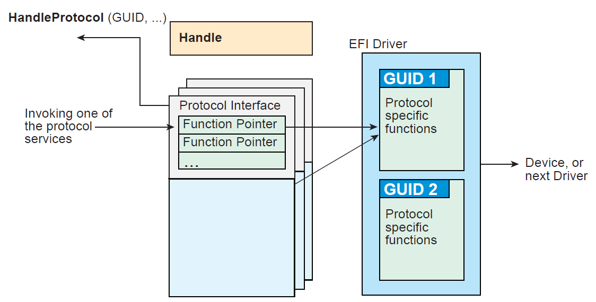

   Construction of a Protocol

The following C code fragment illustrates the use of protocols:

.. code-block:: c

   // There is a global "EffectsDevice" structure. This
   // structure contains information  to the device.
   
   // Connect to the ILLUSTRATION_PROTOCOL on the EffectsDevice,
   // by calling HandleProtocol with the device’s EFI device handle
   // and the ILLUSTRATION_PROTOCOL GUID.
  
   EffectsDevice.Handle = DeviceHandle;
   Status = HandleProtocol (
      EffectsDevice.EFIHandle,
      &IllustrationProtocolGuid,
      &EffectsDevice.IllustrationProtocol
      );
 
   // Use the EffectsDevice illustration protocol’s "MakeEffects"
   // service to make flashy and noisy effects.

         Status = EffectsDevice.IllustrationProtocol->MakeEffects (
         EffectsDevice.IllustrationProtocol,
         TheFlashyAndNoisyEffect
         );

The Table below, :ref:`uefi-protocols` , lists the UEFI protocols defined by this specification.

.. list-table:: UEFI Protocols
   :name: uefi-protocols
   :widths: 50,50
   :class: longtable

   * - **Protocol**
     - **Description**
   * - :ref:`efi-loaded-image-protocol` 
     - Provides information on the image.
   * -  :ref:`efi-loaded-image-device-path-protocol` 
     - Specifies the device path that was used when a PE/COFF image was loaded through the EFI Boot Service LoadImage().
   * - :ref:`efi-device-path-protocol` 
     - Provides the location of the device.
   * - :ref:`efi-driver-binding-protocol-protocols-uefi-driver-model` 
     - Provides services to determine if an UEFI driver supports a given controller, and services to start and stop a given controller.
   * - :ref:`efi-driver-family-override-protocol-protocols-uefi-driver-model` 
     - Provides a the Driver Family Override mechanism for selecting the best driver for a given controller.
   * - :ref:`efi-platform-driver-override-protocol-protocols-uefi-driver-model` 
     - Provide a platform specific override mechanism for the selection of the best driver for a given controller.
   * - :ref:`efi-bus-specific-driver-override-protocol-protocols-uefi-driver-model` 
     - Provides a bus specific override mechanism for the selection of the best driver for a given controller.
   * - :ref:`efi-driver-diagnostics2-protocol-protocols-uefi-driver-model` 
     - Provides diagnostics services for the controllers that UEFI drivers are managing.
   * - :ref:`efi-component-name2-protocol-protocols-uefi-driver-model` 
     - Provides human readable names for UEFI Drivers and the controllers that the drivers are managing.
   * - :ref:`efi-simple-text-input-protocol` 
     - Protocol interfaces for devices that support simple console style text input.
   * - :ref:`efi-simple-text-output-protocol` 
     - Protocol interfaces for devices that support console style text displaying.
   * - :ref:`efi-simple-pointer-protocol` 
     - Protocol interfaces for devices such as mice and trackballs.
   * - :ref:`efi-serial-io-protocol` 
     - Protocol interfaces for devices that support serial character transfer.
   * - :ref:`efi-load-file-protocol` 
     - Protocol interface for reading a file from an arbitrary device.
   * - :ref:`efi-load-file2-protocol` 
     - Protocol interface for reading a non-boot option file from an arbitrary device
   * - :ref:`efi-simple-file-system-protocol` 
     - Protocol interfaces for opening disk volume containing a UEFI file system.
   * - :ref:`efi-file-protocol` 
     - Provides access to supported file systems.
   * - :ref:`efi-disk-io-protocol` 
     - A protocol interface that layers onto any BLOCK_IO or BLOCK_IO_EX interface.
   * - :ref:`efi-block-io-protocol` 
     - Protocol interfaces for devices that support block I/O style accesses.
   * - :ref:`efi-block-io2-protocol` 
     - Protocol interfaces for devices that support block I/O style accesses. This interface is capable of non-blocking transactions.
   * - :ref:`efi-unicode-collation-protocol-protocols-string-services` 
     - Protocol interfaces for string comparison operations.
   * - :ref:`efi-pci-root-bridge-io-protocol` 
     - Protocol interfaces to abstract memory, I/O, PCI configuration, and DMA accesses to a PCI root bridge controller.
   * - :ref:`efi-pci-io-protocol` 
     - Protocol interfaces to abstract memory, I/O, PCI configuration, and DMA accesses to a PCI controller on a PCI bus.
   * - :ref:`efi-usb-io-protocol` 
     - Protocol interfaces to abstract access to a USB controller.
   * - :ref:`efi-simple-network-protocol` 
     - Provides interface for devices that support packet based transfers.
   * - :ref:`efi-pxe-base-code-protocol` 
     - Protocol interfaces for devices that support network booting.
   * - :ref:`efi-bis-protocol` 
     - Protocol interfaces to validate boot images before they are loaded and invoked.
   * - :ref:`efi-debug-support-protocol` 
     - Protocol interfaces to save and restore processor context and hook processor exceptions.
   * - :ref:`efi-debugport-protocol` 
     - Protocol interface that abstracts a byte stream connection between a debug host and a debug target system.
   * - :ref:`efi-decompress-protocol` 
     - Protocol interfaces to decompress an image that was compressed using the EFI Compression Algorithm.
   * - :ref:`efi-ebc-protocol-efi-byte-code-virtual-machine` 
     - Protocols interfaces required to support an EFI Byte Code interpreter.
   * - :ref:`efi-graphics-output-protocol` 
     - Protocol interfaces for devices that support graphical output.
   * - :ref:`efi-nvm-express-pass-thru-protocol` 
     - Protocol interfaces that allow NVM Express commands to be issued to an NVM Express controller.
   * - :ref:`efi-ext-scsi-pass-thru-protocol` 
     - Protocol interfaces for a SCSI channel that allows SCSI Request Packets to be sent to SCSI devices.
   * - :ref:`efi-usb2-hc-protocol` 
     - Protocol interfaces to abstract access to a USB Host Controller.
   * - :ref:`efi-authentication-info-protocol` 
     - Provides access for generic authentication information associated with specific device paths
   * - :ref:`efi-device-path-utilities-protocol` 
     - Aids in creating and manipulating device paths.
   * - :ref:`efi-device-path-to-text-protocol`  
     - Converts device nodes and paths to text.
   * - :ref:`efi-device-path-from-text-protocol` 
     - Converts text to device paths and device nodes.
   * - :ref:`efi-edid-discovered-protocol` 
     - Contains the EDID information retrieved from a video output device.
   * - :ref:`efi-edid-active-protocol` 
     - Contains the EDID information for an active video output device.
   * - :ref:`efi-edid-override-protocol` 
     - Produced by the platform to allow the platform to provide EDID information to the producer of the Graphics Output protocol
   * - :ref:`efi-iscsi-initiator-name-protocol` 
     - Sets and obtains the iSCSI Initiator Name.
   * - :ref:`efi-tape-io-protocol`    
     - Provides services to control and access a tape drive.
   * - :ref:`efi-managed-network-protocol`
     - Used to locate communication devices that are supported by an MNP driver and create and destroy instances of the MNP child protocol driver that can use the underlying communications devices.
   * - :ref:`efi-arp-service-binding-protocol` 
     - Used to locate communications devices that are supported by an ARP driver and to create and destroy instances of the ARP child protocol driver.
   * - :ref:`efi-arp-protocol` 
     - Used to resolve local network protocol addresses into network hardware addresses.
   * - :ref:`efi-dhcp4-service-binding-protocol` 
     - Used to locate communication devices that are supported by an EFI DHCPv4 Protocol driver and to create and destroy EFI DHCPv4 Protocol child driver instances that can use the underlying communications devices.
   * - :ref:`efi-dhcp4-protocol` 
     - Used to collect configuration information for the EFI IPv4 Protocol drivers and to provide DHCPv4 server and PXE boot server discovery services.
   * - :ref:`efi-tcp4-service-binding-protocol`
     - Used to locate EFI TCPv4Protocol drivers to create and destroy child of the driver to communicate with other host using TCP protocol.
   * -  :ref:`efi-tcp4-protocol` 
     - Provides services to send and receive data stream.
   * - :ref:`efi-ip4-service-binding-protocol` 
     - Used to locate communication devices that are supported by an EFI IPv4 Protocol Driver and to create and destroy instances of the EFI IPv4 Protocol child protocol driver that can use the underlying communication device.
   * - :ref:`efi-ip4-protocol` 
     - Provides basic network IPv4 packet I/O services.
   * - :ref:`efi-ip4-config2-protocol` 
     - The EFI IPv4 Config Protocol driver performs platform- and policy-dependent configuration of the EFI IPv4 Protocol driver.
   * - :ref:`efi-ip4-config2-protocol` 
     - The EFI IPv4 Configuration II Protocol driver performs platform- and policy-dependent configuration of the EFI IPv4 Protocol driver.
   * - :ref:`efi-udp4-service-binding-protocol` 
     - Used to locate communication devices that are supported by an EFI UDPv4 Protocol driver and to create and destroy instances of the EFI UDPv4 Protocol child protocol driver that can use the underlying communication device.
   * - :ref:`efi-udp4-protocol` 
     - Provides simple packet-oriented services to transmit and receive UDP packets.
   * - :ref:`efi-mtftp4-service-binding-protocol` 
     - Used to locate communication devices that are supported by an EFI MTFTPv4 Protocol driver and to create and destroy instances of the EFI MTFTPv4 Protocol child protocol driver that can use the underlying communication device.
   * - :ref:`efi-mtftp4-protocol` 
     - Provides basic services for client-side unicast or multicast TFTP operations.
   * - :ref:`efi-hash-protocol` 
     - Allows creating a hash of an arbitrary message digest using one or more hash algorithms.
   * - :ref:`efi-hash-service-binding-protocol` 
     - Used to locate hashing services support provided by a driver and create and destroy instances of the EFI Hash Protocol so that a multiple drivers can use the underlying hashing services.
   * - :ref:`efi-sd-mmc-pass-thru-protocol` 
     - Protocol interface that allows SD/eMMC commands to be sent to an SD/eMMC controller.

.. _overview-uefi-driver-model:

UEFI Driver Model
-----------------

The UEFI Driver Model is intended to simplify the design and implementation of device drivers, and produce small executable image sizes. As a result, some complexity has been moved into bus drivers and in a larger part into common firmware services.

A device driver is required to produce a Driver Binding Protocol on the same image handle on which the driver was loaded. It then waits for the system firmware to connect the driver to a controller. When that occurs, the device driver is responsible for producing a protocol on the controller’s device handle that abstracts the I/O operations that the controller supports. A bus driver performs these exact same tasks. In addition, a bus driver is also responsible for discovering any child controllers on the bus, and creating a device handle for each child controller found.

One assumption is that the architecture of a system can be viewed as a set of one or more processors connected to one or more core chipsets. The core chipsets are responsible for producing one or more I/O buses. The UEFI Driver Model does not attempt to describe the processors or the core chipsets. Instead, the UEFI Driver Model describes the set of I/O buses produced by the core chipsets, and any children of these I/O buses. These children can either be devices or additional I/O buses. This can be viewed as a tree of buses and devices with the core chipsets at the root of that tree.

The leaf nodes in this tree structure are peripherals that perform some type of I/O. This could include keyboards, displays, disks, network, etc. The nonleaf nodes are the buses that move data between devices and buses, or between different bus types.  :ref:`desktop-system` shows a sample desktop system with four buses and six devices.

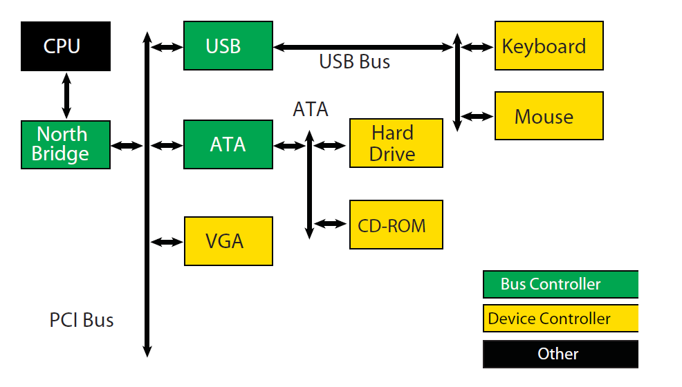

   Desktop System
..

:ref:`server-system` is an example of a more complex server system. The idea is to make the UEFI Driver Model simple and extensible so more complex systems like the one below can be described and managed in the preboot environment. This system contains six buses and eight devices.

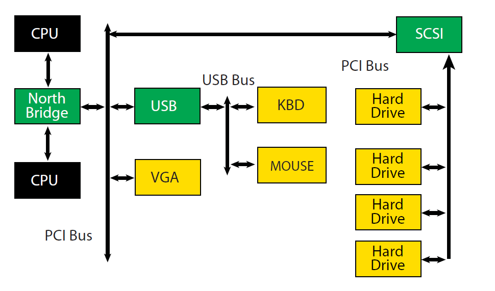

   Server System
..

The combination of firmware services, bus drivers, and device drivers in any given platform is likely to be produced by a wide variety of vendors including OEMs, IBVs, and IHVs. These different components from different vendors are required to work together to produce a protocol for an I/O device than can be used to boot a UEFI compliant operating system. As a result, the UEFI *Driver Model* is described in great detail in order to increase the interoperability of these components

This remainder of this section is a brief overview of the UEFI *Driver Model*. It describes the legacy option ROM issues that the UEFI Driver Model is designed to address, the entry point of a driver, host bus controllers, properties of device drivers, properties of bus drivers, and how the UEFI *Driver Model* can accommodate hot-plug events.

.. _legacy-option-rom-issues:

Legacy Option ROM Issues
########################

Legacy option ROMs have a number of constraints and limitations that restrict innovation on the part of platform designers and adapter vendors. At the time of writing, both ISA and PCI adapters use legacy option ROMs. For the purposes of this discussion, only PCI option ROMs will be considered; legacy ISA option ROMs are not supported as part of the *UEFI Specification* .

The following is a list of the major constraints and limitations of legacy option ROMs. For each issue, the design considerations that went into the design of the UEFI *Driver Model* are also listed. Thus, the design of the UEFI *Driver Model* directly addresses the requirements for a solution to overcome the limitations implicit to PC-AT-style legacy option ROMs.

.. _bit16-bit-real-mode-binaries:

32-bit/16-Bit Real Mode Binaries
$$$$$$$$$$$$$$$$$$$$$$$$$$$$$$$$

Legacy option ROMs typically contain 16-bit real mode code for an IA-32 processor. This means that the legacy option ROM on a PCI card cannot be used in platforms that do not support the execution of IA-32 real mode binaries. Also, 16-bit real mode only allows the driver to access directly the lower 1 MiB of system memory. It is possible for the driver to switch the processor into modes other than real mode in order to access resources above 1 MiB, but this requires a lot of additional code, and causes interoperability issues with other option ROMs and the system BIOS. Also, option ROMs that switch the processor into to alternate execution modes are not compatible with Itanium Processors.

UEFI Driver Model design considerations:

  \* Drivers need flat memory mode with full access to system components.

  \* Drivers need to be written in C so they are portable between processor architectures.

  \* Drivers may be compiled into a virtual machine executable, allowing a single binary driver to work on machines using different processor architectures.

.. _fixed-resources-for-working-with-option-roms:

Fixed Resources for Working with Option ROMs
$$$$$$$$$$$$$$$$$$$$$$$$$$$$$$$$$$$$$$$$$$$$

Since legacy option ROMs can only directly address the lower 1 MiB of system memory, this means that the code from the legacy option ROM must exist below 1 MiB. In a PC-AT platform, memory from 0x00000-0x9FFFF is system memory. Memory from 0xA0000-0xBFFFF is VGA memory, and memory from 0xF0000-0xFFFFF is reserved for the system BIOS. Also, since system BIOS has become more complex over the years, many platforms also use 0xE0000-0xEFFFF for system BIOS. This leaves 128 KiB of memory from 0xC0000-0xDFFFF for legacy option ROMs. This limits how many legacy option ROMs can be run during BIOS POST.

Also, it is not easy for legacy option ROMs to allocate system memory. Their choices are to allocate memory from Extended BIOS Data Area (EBDA), allocate memory through a Post Memory Manager (PMM), or search for free memory based on a heuristic. Of these, only EBDA is standard, and the others are not used consistently between adapters, or between BIOS vendors, which adds complexity and the potential for conflicts.

UEFI Driver Model design considerations:

  \* Drivers need flat memory mode with full access to system components.

  \* Drivers need to be capable of being relocated so that they can be loaded anywhere in memory (PE/COFF Images)

  \* Drivers should allocate memory through the boot services. These are well-specified interfaces, and can be guaranteed to function as expected across a wide variety of platform implementations.

.. _matching-option-roms-to-their-devices:

Matching Option ROMs to their Devices
$$$$$$$$$$$$$$$$$$$$$$$$$$$$$$$$$$$$$

It is not clear which controller may be managed by a particular legacy option ROM. Some legacy option ROMs search the entire system for controllers to manage. This can be a lengthy process depending on the size and complexity of the platform. Also, due to limitation in BIOS design, all the legacy option ROMs must be executed, and they must scan for all the peripheral devices before an operating system can be booted. This can also be a lengthy process, especially if SCSI buses must be scanned for SCSI devices. This means that legacy option ROMs are making policy decision about how the platform is being initialized, and which controllers are managed by which legacy option ROMs. This makes it very difficult for a system designer to predict how legacy option ROMs will interact with each other. This can also cause issues with on-board controllers, because a legacy option ROM may incorrectly choose to manage the on-board controller.

UEFI Driver Model design considerations:

  \* Driver to controller matching must be deterministic

  \* Give OEMs more control through Platform Driver Override Protocol and Driver Configuration Protocol

  \* It must be possible to start only the drivers and controllers required to boot an operating system.

.. _ties-to-pc-at-system-design:

Ties to PC-AT System Design
$$$$$$$$$$$$$$$$$$$$$$$$$$$$

Legacy option ROMs assume a PC-AT-like system architecture. Many of them include code that directly touches hardware registers. This can make them incompatible on legacy-free and headless platforms. Legacy option ROMs may also contain setup programs that assume a PC-AT-like system architecture to interact with a keyboard or video display. This makes the setup application incompatible on legacy-free and headless platforms.

UEFI Driver Model design considerations:

  \* Drivers should use well-defined protocols to interact with system hardware, system input devices, and systemoutput devices. 

.. _ambiguities-in-specification-and-workarounds-born-of-experience:

Ambiguities in Specification and WorkaroundsBorn of Experience
$$$$$$$$$$$$$$$$$$$$$$$$$$$$$$$$$$$$$$$$$$$$$$$$$$$$$$$$$$$$$$

Many legacy option ROMs and BIOS code contain workarounds because of incompatibilities between legacy option ROMs and system BIOS. These incompatibilities exist in part because there are no clear specifications on how to write a legacy option ROM or write a system BIOS.

Also, interrupt chaining and boot device selection is very complex in legacy option ROMs. It is not always clear which device will be the boot device for the OS.

UEFI Driver Model design considerations:

  \* Drivers and firmware are written to follow this specification. Since both components have a clearly defined specification, compliance tests can be developed to prove that drivers and system firmware are compliant. This should eliminate the need to build workarounds into either drivers or system firmware (other than those that might be required to address specific hardware issues).

  \* Give OEMs more control through Platform Driver Override Protocol and Driver Configuration Protocol and other OEM value-add components to manage the boot device selection process.

.. _driver-initialization:

Driver Initialization
#####################

The file for a driver image must be loaded from some type of media. This could include ROM, FLASH, hard drives, floppy drives, CD-ROM, or even a network connection. Once a driver image has been found, it can be loaded into system memory with the boot service :ref:`efi_boot_services-loadimage` . LoadImage() loads a PE/COFF formatted image into system memory. A handle is created for the driver, and a Loaded Image Protocol instance is placed on that handle. A handle that contains a Loaded Image Protocol instance is called an *Image Handle*. At this point, the driver has not been started. It is just sitting in memory waiting to be started. The figure below shows the state of an image handle for a driver after LoadImage() has been called.

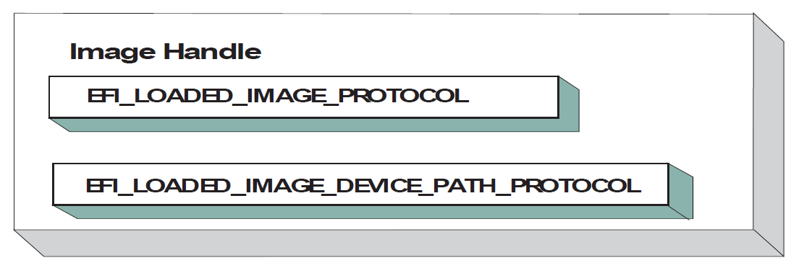

   **Image Handle**

After a driver has been loaded with the boot service LoadImage(), it must be started with the boot service  :ref:`efi-boot-services-startimage`. This is true of all types of UEFI Applications and UEFI Drivers that can be loaded and started on an UEFI-compliant system. The entry point for a driver that follows the UEFI Driver Model must follow some strict rules. First, it is not allowed to touch any hardware. Instead, the driver is only allowed to install protocol instances onto its own *Image Handle*. A driver that follows the UEFI Driver Model is *required* to install an instance of the Driver Binding Protocol onto its own *Image Handle* . It may optionally install the Driver Configuration Protocol, the Driver Diagnostics Protocol, or the Component Name Protocol. In addition, if a driver wishes to be unloadable it may optionally update the Loaded Image Protocol ( :ref:`efi-loaded-image-protocol` ) to provide its own Unload()  :ref:`efi-loaded-image-protocol-unload` function. Finally, if a driver needs to perform any special operations when the boot service :ref:`efi-boot-services-exitbootservices` is called, it may optionally create an event with a notification function that is triggered when the boot service ExitBootServices() is called. An *Image Handle* that contains a Driver Binding Protocol instance is known as a *Driver Image Handle* .  :ref:`driver-image-handle` shows a possible configuration for the Image Handle from :numref:`overview-driver-image-handle` after the boot service StartImage() has been called.

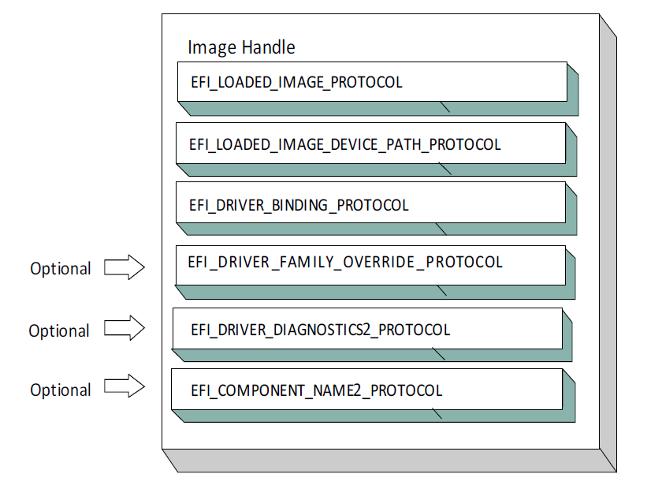

   **Driver Image Handle**

.. _overview-host-bus-controllers:

Host Bus Controllers
####################

Drivers are not allowed to touch any hardware in the driver’s entry point. As a result, drivers will be loaded and started, but they will all be waiting to be told to manage one or more controllers in the system. A platform component, like the Boot Manager, is responsible for managing the connection of drivers to controllers. However, before even the first connection can be made, there has to be some initial collection of controllers for the drivers to manage. This initial collection of controllers is known as the Host Bus Controllers. The I/O abstractions that the *Host Bus Controllers* provide are produced by firmware components that are outside the scope of the UEFI Driver Model . The device handles for the Host Bus Controllers and the I/O abstraction for each one must be produced by the core firmware on the platform, or a driver that may not follow the UEFI Driver Model. See the PCI Root Bridge I/O Protocol Specification for an example of an I/O abstraction for PCI buses.

A platform can be viewed as a set of processors and a set of core chipset components that may produce one or more host buses. The following figure shows a platform with n processors (CPUs), and a set of core chipset components that produce m host bridges.

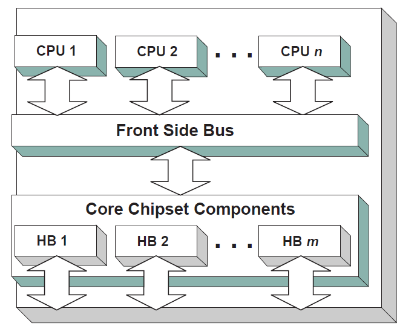

   **Host Bus Controllers**

Each host bridge is represented in UEFI as a device handle that contains a Device Path Protocol instance, and a protocol instance that abstracts the I/O operations that the host bus can perform. For example, a PCI Host Bus Controller supports one or more PCI Root Bridges that are abstracted by the PCI Root Bridge I/O Protocol. The following figure shows an example device handle for a PCI Root Bridge.

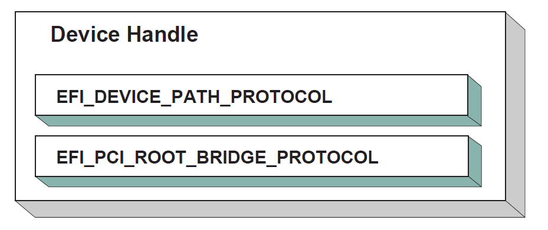

   **PCI Root Bridge Device Handle**

A PCI Bus Driver could connect to this PCI Root Bridge, and create child  handles for each of the PCI devices in the system. PCI Device Drivers should then be connected to these child handles, and produce I/O abstractions that may be used to boot a UEFI compliant OS. The following section describes the different types of drivers that can be implemented within the UEFI Driver Model. The UEFI Driver Model is very flexible, so all the possible types of drivers will not be discussed here. Instead, the major types will be covered that can be used as a starting point for designing and implementing additional driver types.

.. _device-drivers:

Device Drivers
###############

A device driver is not allowed to create any new device handles. Instead, it installs additional protocol interfaces on an existing device handle. The most common type of device driver will attach an I/O abstraction to a device handle that was created by a bus driver. This I/O abstraction may be used to boot a UEFI compliant OS. Some example I/O abstractions would include Simple Text Output, Simple Input, Block I/O, and Simple Network Protocol. :numref:`connecting-device-drivers` shows a device handle before and after a device driver is connected to it. In this example, the device handle is a child of the XYZ Bus, so it contains an XYZ I/O Protocol for the I/O services that the XYZ bus supports. It also contains a Device Path Protocol that was placed there by the XYZ Bus Driver. The Device Path Protocol is not required for all device handles. It is only required for device handles that represent physical devices in the system. Handles for virtual devices will not contain a Device Path Protocol.

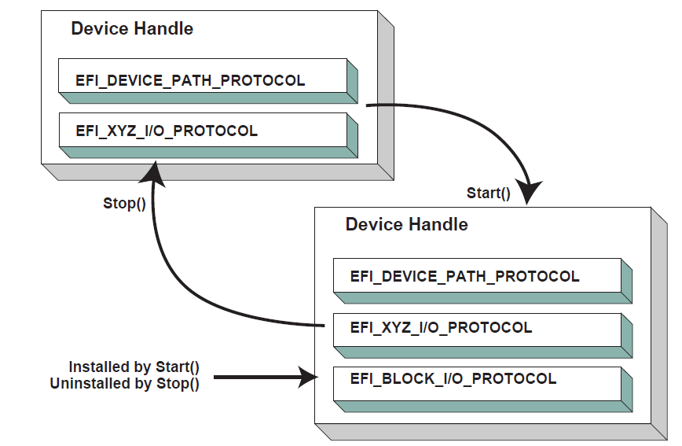

   **Connecting Device Drivers**
..

The device driver that connects to the device handle in the above Figure must have installed a Driver Binding Protocol on its own image handle. The Driver Binding Protocol  contains three functions called Supported() (:ref:`efi-driver-binding-protocol-supported-protocols-uefi-driver-model`); Start() (:ref:`efi-driver-binding-protocol-start-protocols-uefi-driver-model` ), and Stop() ( :ref:`efi-driver-binding-protocol-stop-protocols-uefi-driver-model` ). The Supported() function tests to see if the driver supports a given controller. In this example, the driver will check to see if the device handle supports the Device Path Protocol and the XYZ I/O Protocol. If a driver’s Supported() function passes, then the driver can be connected to the controller by calling the driver’s Start() function. The Start() function is what actually adds the additional I/O protocols to a device handle. In this example, the Block I/O Protocol is being installed. To provide symmetry, the Driver Binding Protocol also has a Stop()function that forces the driver to stop managing a device handle. This will cause the device driver to uninstall any protocol interfaces that were installed in Start().

The Supported() , Start() , and Stop() functions of the EFI Driver Binding Protocol are required to make use of the boot service :ref:`efi-boot-services-openprotocol`  to get a protocol interface and the boot service :ref:`efi-boot-services-closeprotocol`  to release a protocol interface. OpenProtocol() and CloseProtocol() update the handle database maintained by the system firmware to track which drivers are consuming protocol interfaces. The information in the handle database can be used to retrieve information about both drivers and controllers. The new boot service :ref:`efi-boot-services-openprotocolinformation`  can be used to get the list of components that are currently consuming a specific protocol interface.

.. _bus-drivers:

Bus Drivers
###########

Bus drivers and device drivers are virtually identical from the UEFI Driver Model ’s point of view. The only difference is that a bus driver creates new device handles for the child controllers that the bus driver discovers on its bus. As a result, bus drivers are slightly more complex than device drivers, but this in turn simplifies the design and implementation of device drivers. There are two major types of bus drivers. The first creates handles for all child controllers on the first call to Start() . The other type allows the handles for the child controllers to be created across multiple calls to Start() . This second type of bus driver is very useful in supporting a rapid boot capability. It allows a few child handles or even one child handle to be created. On buses that take a long time to enumerate all of their children (e.g. SCSI), this can lead to a very large timesaving in booting a platform.  :ref:`connecting-bus-drivers` shows the tree st ructure of a bus controller before and after Start() is called. The dashed line coming into the bus controller node represents a link to the bus controller’s parent controller. If the bus controller is a Host Bus Controller , then it will not have a parent controller. Nodes A, B, C ,D, and E represent the child controllers of the bus controller.

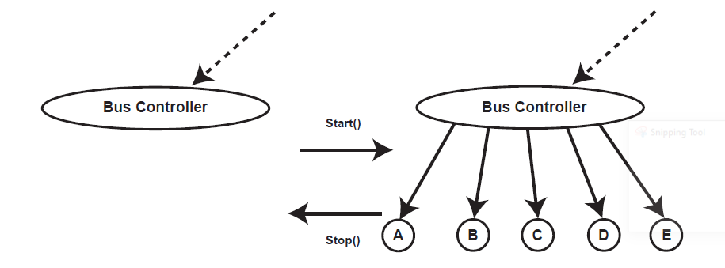

   *Connecting Bus Drivers*

..

A bus driver that supports creating one child on each call to Start() might choose to create child C first, and then child E, and then the remaining children A, B, and D. The Supported() , Start() , and Stop() functions of the Driver Binding Protocol are flexible enough to allow this type of behavior.

A bus driver must install protocol interfaces onto every child handle that is creates. At a minimum, it must install a protocol interface that provides an I/O abstraction of the bus’s services to the child controllers. If the bus driver creates a child handle that represents a physical device, then the bus driver must also install a Device Path Protocol instance onto the child handle. A bus driver may optionally install a Bus Specific Driver Override Protocol onto each child handle. This protocol is used when drivers are connected to the child controllers. The boot service :ref:`efi-boot-services-connectcontroller`  uses architecturally defined precedence rules to choose the best set of drivers for a given controller. The Bus Specific Driver Override Protocol has higher precedence than a general driver search algorithm, and lower precedence than platform overrides. An example of a bus specific driver selection occurs with PCI. A PCI Bus Driver gives a driver stored in a PCI controller’s option ROM a higher precedence than drivers stored elsewhere in the platform.  :ref:`child-device-handle-with-a-bus-specific-override` shows an example child device handle that was created by the XYZ Bus Driver that supports a bus specific driver override mechanism.

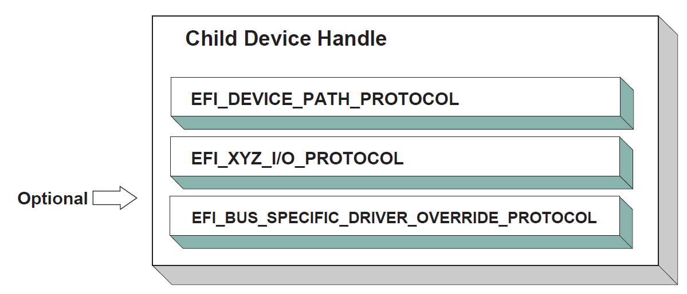

   *Child Device Handle with a Bus Specific Override*

..
.. _platform-components:

Platform Components
###################

Under the UEFI Driver Model , the act of connecting and disconnecting drivers from controllers in a platform is under the platform firmware’s control. This will typically be implemented as part of the UEFI Boot Manager, but other implementations are possible. The boot services :ref:`efi-boot-services-connectcontroller` and :ref:`efi-boot-services-disconnectcontroller` can be used by the platform firmware to determine which controllers get started and which ones do not. If the platform wishes to perform system diagnostics or install an operating system, then it may choose to connect drivers to all possible boot devices. If a platform wishes to boot a preinstalled operating system, it may choose to only connect drivers to the devices that are required to boot the selected operating system. The UEFI Driver Model supports both these modes of operation through the boot services ConnectController() and DisconnectController() . In addition, since the platform component that is in charge of booting the platform has to work with device paths for console devices and boot options, all of the services and protocols involved in the UEFI Driver Model are optimized with device paths in mind.

Since the platform firmware may choose to only connect the devices required to produce consoles and gain access to a boot device, the OS present device drivers cannot assume that a UEFI driver for a device has been executed. The presence of a UEFI driver in the system firmware or in an option ROM does not guarantee that the UEFI driver will be loaded, executed, or allowed to manage any devices in a platform. All OS present device drivers must be able to handle devices that have been managed by a UEFI driver and devices that have not been managed by an UEFI driver.

The platform may also choose to produce a protocol named the Platform Driver Override Protocol. This is similar to the Bus Specific Driver Override Protocol, but it has higher priority. This gives the platform firmware the highest priority when deciding which drivers are connected to which controllers. The Platform Driver Override Protocol is attached to a handle in the system. The boot service ConnectController() will make use of this protocol if it is present in the system.

.. _hot-plug-events:

Hot-Plug Events
###############

In the past, system firmware has not had to deal with hot-plug events in the preboot environment. However, with the advent of buses like USB, where the end user can add and remove devices at any time, it is important to make sure that it is possible to describe these types of buses in the UEFI Driver Model. It is up to the bus driver of a bus that supports the hot adding and removing of devices to provide support for such events. For these types of buses, some of the platform management is going to have to move into the bus drivers. For example, when a keyboard is hot added to a USB bus on a platform, the end user would expect the keyboard to be active. A USB Bus driver could detect the hot-add event and create a child handle for the keyboard device. However, because drivers are not connected to controllers unless :ref:`efi-boot-services-connectcontroller`  is called, the keyboard would not become an active input device. Making the keyboard driver active requires the USB Bus driver to call ConnectController() when a hot-add event occurs. In addition, the USB Bus Driver would have to call :ref:`efi-boot-services-disconnectcontroller` \ when a hot-remove event occurs. If :ref:`efi-boot-services-disconnectcontroller` returns an error the USB Bus Driver needs to retry :ref:`efi-boot-services-disconnectcontroller` from a timer event until it succeeds.

Device drivers are also affected by these hot-plug events. In the case of USB, a device can be removed without any notice. This means that the Stop() functions of USB device drivers will have to deal with shutting down a driver for a device that is no longer present in the system. As a result, any outstanding I/O requests will have to be flushed without actually being able to touch the device hardware.

In general, adding support for hot-plug events greatly increases the complexity of both bus drivers and device drivers. Adding this support is up to the driver writer, so the extra complexity and size of the driver will need to be weighed against the need for the feature in the preboot environment.

.. _efi-services-binding:

EFI Services Binding
####################

The UEFI Driver Model maps well onto hardware devices, hardware bus controllers, and simple combinations of software services that layer on top of hardware devices. However, the UEFI driver Model does not map well onto complex combinations of software services. As a result, an additional set of complementary protocols are required for more complex combinations of software services.

Figure below, :ref:`software-service-relationships` , contains three examples showing the different ways that software services relate to each other. In the first two cases, each service consumes one or more other services, and at most one other service consumes all of the services. Case #3 differs because two different services consume service A. The EFI_DRIVER_BINDING_PROTOCOL can be used to model cases #1 and #2, but it cannot be used to model case #3 because of the way that the UEFI Boot Service OpenProtocol() behaves. When used with the BY_DRIVER open mode, OpenProtocol() allows each protocol to have only at most one consumer. This feature is very useful and prevents multiple drivers from attempting to manage the same controller. However, it makes it difficult to produce sets of software services that look like case #3.

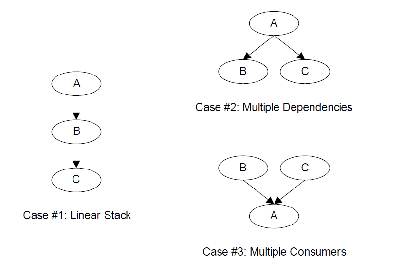

   *Software Service Relationships*

Software Service Relationships The *EFI_SERVICE_BINDING_PROTOCOL* provides the mechanism that allows protocols to have more than one consumer. The *EFI_SERVICE_BINDING_PROTOCOL* is used with the *EFI_DRIVER_BINDING_PROTOCOL*. A UEFI driver that produces protocols that need to be available to more than one consumer at the same time will produce both the *EFI_DRIVER_BINDING_PROTOCOL* and the *EFI_SERVICE_BINDING_PROTOCOL*. This type of driver is a hybrid driver that will produce the *EFI_DRIVER_BINDING_PROTOCOL* in its driver entry point.

When the driver receives a request to start managing a controller, it will produce the *EFI_SERVICE_BINDING_PROTOCOL* on the handle of the controller that is being started. The *EFI_SERVICE_BINDING_PROTOCO*L is slightly different from other protocols defined in the UEFI Specification. It does not have a GUID associated with it. Instead, this protocol instance structure actually represents a family of protocols. Each software service driver that requires an *EFI_SERVICE_BINDING_PROTOCOL* instance will be required to generate a new GUID for its own type of *EFI_SERVICE_BINDING_PROTOCOL*. This requirement is why the various network protocols in this specification contain two GUIDs. One is the *EFI_SERVICE_BINDING_PROTOCOL* GUID for that network protocol, and the other GUID is for the protocol that contains the specific member services produced by the network driver. The mechanism defined here is not limited to network protocol drivers. It can be applied to any set of protocols that the *EFI_DRIVER_BINDING_PROTOCOL* cannot directly map because the protocols contain one or more relationships like case #3 in :ref:`software-service-relationships` .

Neither the *EFI_DRIVER_BINDING_PROTOCOL* nor the combination of the *EFI_DRIVER_BINDING_PROTOCOL* and the *EFI_SERVICE_BINDING_PROTOCOL* can handle circular dependencies. There are methods to allow circular references, but they require that the circular link be present for short periods of time. When the protocols across the circular link are used, these methods also require that the protocol must be opened with an open mode of EXCLUSIVE , so that any attempts to deconstruct the set of protocols with a call to DisconnectController() will fail. As soon as the driver is finished with the protocol across the circular link, the protocol should be closed.

.. _requirements:

Requirements
------------

This document is an architectural specification. As such, care has been taken to specify architecture in ways that allow maximum flexibility in implementation. However, there are certain requirements on which elements of this specification must be implemented to ensure that operating system loaders and other code designed to run with UEFI boot services can rely upon a consistent environment.

For the purposes of describing these requirements, the specification is broken up into required and optional elements. In general, an optional element is completely defined in the section that matches the element name. For required elements however, the definition may in a few cases not be entirely self contained in the section that is named for the particular element. In implementing required elements, care should be taken to cover all the semantics defined in this specification that relate to the particular element.

A system vendor may choose not to implement all the required elements, for example on specialized system configurations that do not support all the services and functionality implied by the required elements. However, since most applications, drivers and operating system loaders are written assuming all the required elements are present on a system that implements the UEFI specification; any such code is likely to require explicit customization to run on a less than complete implementation of the required elements in this specification. On such systems, the implementation may choose to advertise the profile which it conforms to using EFI_CONFORMANCE_PROFILES_TABLE (see :numref:`efi-configuration-table-and-properties-table`).

.. _required-elements:

Required Elements
##################

:ref:`required-uefi-implementation-elements` lists the required elements. Any system that is designed to conform to this specification must provide a complete implementation of all these elements. This means that all the required service functions and protocols must be present and the implementation must deliver the full semantics defined in the specification for all combinations of calls and parameters. Implementers of applications, drivers or operating system loaders that are designed to run on a broad range of systems conforming to the UEFI specification may assume that all such systems implement all the required elements.

.. list-table:: Required UEFI Implementation Elements
   :widths: 30 30  
   :name: required-uefi-implementation-elements 
   :class: longtable

   * - **Element**
     - **Description**
   * -  :ref:`efi-system-table` 
     - Provides access to UEFI Boot Services, UEFI Runtime Services, consoles, firmware vendor information, and the system configuration tables.
   * -  :ref:`efi-boot-services` 
     - All functions defined as boot services.
   * -  :ref:`efi-runtime-services` 
     - All functions defined as runtime services.
   * - :ref:`efi-loaded-image-protocol` 
     - Provides information on the image.
   * - :ref:`efi-loaded-image-device-path-protocol` 
     - Specifies the device path that was used when a PE/COFF image was loaded through the EFI Boot Service LoadImage().
   * - :ref:`efi-device-path-protocol` 
     - Provides the location of the device.
   * -  :ref:`efi-decompress-protocol` 
     - Protocol interfaces to decompress an image that was compressed using the EFI Compression Algorithm.
   * - :ref:`efi-device-path-utilities-protocol` 
     - Protocol interfaces to create and manipulate UEFI device paths and UEFI device path nodes.

.. _platform-specific-elements:

Platform-Specific Elements
##########################

There are a number of elements that can be added or removed depending on the specific features that a platform requires. Platform firmware developers are required to implement UEFI elements based upon the features included. The following is a list of potential platform features and the elements that are required for each feature type:

  1. If a platform includes console devices, the :ref:`efi-simple-text-input-protocol`, :ref:`efi-simple-text-input-ex-protocol`, and  :ref:`efi-simple-text-output-protocol` must be implemented.

  2. If a platform includes a configuration infrastructure, then :ref:`efi-hii-database-protocol`, :ref:`efi-hii-string-protocol`, :ref:`efi-hii-configuration-routing-protocol-hii-configuration-processing-and-browser-protocol`, and :ref:`efi-hii-config-access-protocol-hii-configuration-processing-and-browser-protocol` are required. If you support bitmapped fonts, you must support :ref:`efi-hii-font-protocol` .

  3. If a platform includes graphical console devices, then  :ref:`efi-graphics-output-protocol`, :ref:`efi-edid-discovered-protocol`, and :ref:`efi-edid-active-protocol` must be implemented. In order to support the  :ref:`efi-graphics-output-protocol` ; a platform must contain a driver to consume  :ref:`efi-graphics-output-protocol` and produce :ref:`efi-simple-text-output-protocol` even if the :ref:`efi-graphics-output-protocol` is produced by an external driver.

  4. If a platform includes a pointer device as part of its console support, :ref:`efi-simple-pointer-protocol` must be implemented.

  5. If a platform includes the ability to boot from a disk device, then :ref:`efi-block-io-protocol`, :ref:`efi-disk-io-protocol`, :ref:`efi-simple-file-system-protocol`, and :ref:`efi-unicode-collation-protocol-protocols-string-services` are required. In addition, partition support for MBR, GPT, and El Torito must be implemented. For disk devices supporting the security commands of the SPC-4 or ATA8-ACS command set :ref:`efi-storage-security-command-protocol` is also required. An external driver may produce the Block I/O Protocol and the :ref:`efi-storage-security-command-protocol` . All other protocols required to boot from a disk device must be carried as part of the platform. 

  6. If a platform includes the ability to perform a TFTP-based boot from a network device, then  :ref:`efi-pxe-base-code-protocol` is required. The platform must be prepared to produce this protocol on any of :ref:`efi-network-interface-identifier-protocol` (UNDI), :ref:`efi-simple-network-protocol`, or  :ref:`efi-managed-network-protocol` . If a platform includes the ability to validate a boot image received through a network device, it is also required that image verification be supported, including SetupMode equal zero and the boot image hash or a verification certificate corresponding to the image exist in the 'db' variable and not in the 'dbx' variable. An external driver may produce the UNDI interface. All other protocols required to boot from a network device must be carried by the platform.

  7. If a platform supports UEFI general purpose network applications, then the :ref:`efi-managed-network-protocol`, :ref:`efi-managed-network-service-binding-protocol`, :ref:`efi-arp-protocol`, :ref:`efi-arp-service-binding-protocol`, :ref:`efi-dhcp4-protocol`, :ref:`efi-dhcp4-service-binding-protocol`, :ref:`efi-tcp4-protocol`, :ref:`efi-tcp4-service-binding-protocol`, :ref:`efi-ip4-config2-protocol`, :ref:`efi-ip4-service-binding-protocol`,  :ref:`efi-ip4-config2-protocol`, :ref:`efi-udp4-protocol`, and :ref:`efi-udp4-service-binding-protocol` are required. If additional IPv6 support is needed for the platform, then :ref:`efi-dhcp6-protocol`, :ref:`efi-dhcp6-service-binding-protocol`, :ref:`efi-tcp6-protocol`, :ref:`efi-tcp6-service-binding-protocol`, :ref:`efi-ip6-protocol`, :ref:`efi-ip6-service-binding-protocol` , :ref:`efi-ip6-config-protocol` :ref:`efi-udp6-protocol` . :ref:`efi-udp6-service-binding-protocol` are additionally required. If the network application requires DNS capability, :ref:`efi-dns4-service-binding-protocol` and  :ref:`efi-dns4-protocol` are required for the IPv4 stack.  :ref:`efi-dns6-service-binding-protocol` and  :ref:`efi-dns6-protocol` are required for the IPv6 stack. If the network environment requires TLS feature, :ref:`efi-tls-service-binding-protocol`, :ref:`efi-tls-protocol` . :ref:`efi-tls-configuration-protocol` are required. If the network environment requires IPSEC feature, :ref:`efi-ipsec-config-protocol` and :ref:`efi-ipsec2-protocol` are required. If the network environment requires VLAN features, :ref:`efi_vlan_config_protocol` is required. 

  8. If a platform includes a byte-stream device such as a UART, then the  :ref:`efi-serial-io-protocol`  must be implemented.

  9. If a platform includes PCI bus support, then the :ref:`efi-pci-root-bridge-io-protocol`, the :ref:`efi-pci-io-protocol`, must be implemented.

  10. If a platform includes USB bus support, then :ref:`efi-usb2-hc-protocol` and :ref:`efi-usb-io-protocol` must be implemented. An external device can support USB by producing a USB Host Controller Protocol.

  11. If a platform includes an NVM Express controller, then :ref:`efi-nvm-express-pass-thru-protocol` must be implemented.

  12. If a platform supports booting from a block-oriented NVM Express controller, then :ref:`efi-block-io-protocol` must be implemented. An external driver may produce the :ref:`efi-nvm-express-pass-thru-protocol` . All other protocols required to boot from an NVM Express subsystem must be carried by the platform.

  13. If a platform includes an I/O subsystem that utilizes SCSI command packets, then :ref:`efi-ext-scsi-pass-thru-protocol` must be implemented.

  14. If a platform supports booting from a block oriented SCSI peripheral, then :ref:`efi-scsi-io-protocol` and :ref:`efi-block-io-protocol`  must be implemented. An external driver may produce the :ref:`efi-ext-scsi-pass-thru-protocol` . All other protocols required to boot from a SCSI I/O subsystem must be carried by the platform.

  15. If a platform supports booting from an iSCSI peripheral, then the :ref:`efi-iscsi-initiator-name-protocol` and :ref:`efi-authentication-info-protocol` must be implemented.

  16. If a platform includes debugging capabilities, then :ref:`efi-debug-support-protocol`, the :ref:`efi-debugport-protocol`, and the :ref:`efi-image-info` Table must be implemented.

  17. If a platform includes the ability to override the default driver to the controller matching algorithm provided by the UEFI Driver Model, then :ref:`efi-platform-driver-override-protocol-protocols-uefi-driver-model`  must be implemented.

  18. If a platform includes an I/O subsystem that utilizes ATA command packets, then the :ref:`efi-ata-pass-thru-protocol`  must be implemented.

  19. If a platform supports option ROMs from devices not permanently attached to the platform and it supports the ability to authenticate those option ROMs, then it must support the option ROM validation methods described in :ref:`network-protocols-udp-and-mtftp` and the authenticated EFI variables described in :ref:`exception-for-machine-check-init-and-nmi` .

  20. If a platform includes the ability to authenticate UEFI images and the platform potentially supports more than one OS loader, it must support the methods described in :ref:`secure-boot-and-driver-signing` and the authenticated UEFI variables described in :ref:`variable-services`.

  21. EBC support is no longer required as of UEFI Specification version 2.8. If an EBC interpreter is implemented, then it must produce the EFI_EBC_PROTOCOL interface.

  22. If a platform includes the ability to perform a HTTP-based boot from a network device, then the :ref:`efi-http-service-binding-protocol`, :ref:`efi-http-protocol` and :ref:`efi_http_utilities-protocol` are required. If it includes the ability to perform a HTTPS-based boot from network device, besides above protocols  :ref:`efi-tls-service-binding-protocol`, :ref:`efi-tls-protocol` and :ref:`efi-tls-configuration-protocol` are also required. If it includes the ability to perform a HTTP(S)-based boot with DNS feature, then :ref:`efi-dns4-service-binding-protocol`, :ref:`efi-dns4-protocol` are required for the IPv4 stack;  :ref:`efi-dns6-service-binding-protocol` and :ref:`efi-dns6-protocol` are required for the IPv6 stack.

  23. If a platform includes the ability to perform a wireless boot from a network device with EAP feature, and if this platform provides a standalone wireless EAP driver, then  :ref:`efi-eap-protocol`, :ref:`efi-eap-configuration-protocol`, and  :ref:`efi-eap-management2-protocol`  are required; if the platform provides a standalone wireless supplicant, then :ref:`efi-supplicant-protocol` and :ref:`efi-eap-configuration-protocol` are required. If it includes the ability to perform a wireless boot with TLS feature, then :ref:`efi-tls-service-binding-protocol`,  :ref:`efi-tls-protocol` and :ref:`efi-tls-configuration-protocol` are required.

  24. If a platform supports classic Bluetooth, then :ref:`efi-bluetooth-hc-protocol`, :ref:`efi-bluetooth-io-protocol`, and :ref:`efi-bluetooth-config-protocol`  must be implemented, and :ref:`efi-bluetooth-attribute-protocol` may be implemented. If a platform supports Bluetooth Smart (Bluetooth Low Energy), then :ref:`efi-bluetooth-hc-protocol`, :ref:`efi-bluetooth-attribute-protocol`  and :ref:`efi-bluetooth-le-config-protocol` must be implemented. If a platform supports both Bluetooth classic and BluetoothLE, then both above requirements should be satisfied.

  25. If a platform supports RESTful communication over HTTP or over an in-band path to a BMC, then the :ref:`efi-rest-protocol` or EFI_REST_EX_PROTOCOL must be implemented. If  EFI_REST_EX_PROTOCOL is implemented, EFI_REST_EX_SERVICE_BINDING_PROTOCOL must be implemented as well. If a platform supports Redfish communication over HTTP or over an in-band path to a BMC, the EFI_REDFISH_DISCOVER_PROTOCOL and :ref:`efi-rest-json-structure-protocol` may be implemented.

  26. If a platform includes the ability to use a hardware feature to create high quality random numbers, this capability should be exposed by instance of :ref:`efi-rng-protocol` with at least one EFI RNG Algorithm supported.

  27. If a platform permits the installation of Load Option Variables, (Boot####, or Driver####, or SysPrep####), the platform must support and recognize all defined values for Attributes within the variable and report these capabilities in BootOptionSupport. If a platform supports installation of Load Option Variables of type Driver####, all installed Driver#### variables must be processed and the indicated driver loaded and initialized during every boot. And all installed SysPrep#### options must be processed prior to processing Boot#### options.

  28. If the platform supports UEFI secure boot as described in :ref:`secure-boot-and-driver-signing`, the platform must provide the PKCS verification functions described in :ref:`pkcs7-verify-protocol` . 

  29. If a platform includes an I/O subsystem that utilizes SD or eMMC command packets, then the  :ref:`efi-sd-mmc-pass-thru-protocol`  must be implemented.

  30. If a platform includes the ability to create/destroy a specified RAM disk, the :ref:`efi-ram-disk-protocol` must be implemented and only one instance of this protocol exists.

  31. If a platform includes a mass storage device which supports hardware-based erase on a specified range, then :ref:`efi-erase-block-protocol` must be implemented.

  32. If a platform includes the ability to register for notifications when a call to ResetSystem is called, then the  :ref:`efi-reset-notification-protocol-micellaneous-protocols`  must be implemented.

  33. If a platform includes UFS devices, the :ref:`efi-ufs-device-config-protocol` must be implemented.

  34. If a platform cannot support calls defined in :ref:`efi-runtime-services` after ExitBootServices() is called, that platform is permitted to provide implementations of those runtime services that return EFI_UNSUPPORTED when invoked at runtime. On such systems, an EFI_RT_PROPERTIES_TABLE configuration table should be published describing which runtime services are supported at runtime.

  35. If a platform includes support for CXL devices with coherent memory, then the platform must support extracting the Coherent Device Attribute Table (CDAT) from the device, using either the CXL Data Object Exchange services (as defined in the CXL 2.0 Specification) or the EFI_ADAPTER_INFORMATION_PROTOCOL instance (with EFI_ADAPTER_INFO_CDAT_TYPE_GUID type) installed on that device.

  36. RISC-V platform firmware must implement the RISCV_EFI_BOOT_PROTOCOL. OS loaders should use the RISCV_EFI_BOOT_PROTOCOL.GetBootHartId() to obtain the boot hart ID. The boot hart ID information provided by either SMBIOS or Device Tree is to be ignored by OS loaders. See “Links to UEFI Specification-Related Document” on https://uefi.org/uefi under the heading "RISC-V EFI Boot Protocol."

.. note::
   Some of the required protocol instances are created by the corresponding Service Binding Protocol. For example, EFI_IP4_PROTOCOL is created by EFI_IP4_SERVICE_BINDING_PROTOCOL. Please refer to the corresponding sections of Service Binding Protocol for the details.

.. _driver-specific-elements:

Driver-Specific Elements
########################

There are a number of UEFI elements that can be added or removed depending on the features that a specific driver requires. Drivers can be implemented by platform firmware developers to support buses and devices in a specific platform. Drivers can also be implemented by add-in card vendors for devices that might be integrated into the platform hardware or added to a platform through an expansion slot.

The following list includes possible driver features, and the UEFI elements that are required for each feature type:

#. If a driver follows the driver model of this specification, the :ref:`efi-driver-binding-protocol-protocols-uefi-driver-model` must be implemented. It is strongly recommended that all drivers that follow the driver model of this specification also implement the  :ref:`efi-component-name2-protocol-protocols-uefi-driver-model` .

#. If a driver requires configuration information, the driver must use the :ref:`efi-hii-database-protocol`  . A driver should not otherwise display information to the user or request information from the user.

#. If a driver requires diagnostics, the :ref:`efi-driver-diagnostics2-protocol-protocols-uefi-driver-model`  must be implemented. In order to support low boot times, limit diagnostics during normal boots. Time consuming diagnostics should be deferred until the :ref:`efi-driver-diagnostics2-protocol-protocols-uefi-driver-model`  is invoked.

#. If a bus supports devices that are able to provide containers for drivers (e.g. option ROMs), then the bus driver for that bus type must implement the :ref:`efi-bus-specific-driver-override-protocol-protocols-uefi-driver-model` . 

#. If a driver is written for a console output device, then the :ref:`efi-simple-text-output-protocol`  must be implemented.

#. If a driver is written for a graphical console output device, then the :ref:`efi-graphics-output-protocol`, :ref:`efi-edid-discovered-protocol`  and  :ref:`efi-edid-active-protocol`  must be implemented.

#. If a driver is written for a console input device, then the :ref:`efi-simple-text-input-protocol`  and :ref:`efi-simple-text-input-ex-protocol` must be implemented.

#. If a driver is written for a pointer device, then the  :ref:`efi-simple-pointer-protocol` must be implemented.

#. If a driver is written for a network device, then the  :ref:`efi-network-interface-identifier-protocol`, :ref:`efi-simple-network-protocol`  or  :ref:`efi-managed-network-protocol`  must be implemented. If VLAN is supported in hardware, then driver for the network device may implement the  :ref:`efi_vlan_config_protocol` . If a network device chooses to only produce the  :ref:`efi-managed-network-protocol`, then the driver for the network device must implement the  :ref:`efi_vlan_config_protocol` . If a driver is written for a network device to supply wireless feature, besides above protocols, :ref:`efi-adapter-information-protocol-protocols-uefi-driver-model`  must be implemented. If the wireless driver does not provide user configuration capability, :ref:`efi-wireless-mac-connection-ii-protocol` must be implemented. If the wireless driver is written for a platform which provides a standalone wireless EAP driver, :ref:`efi-eap-protocol` must be implemented.

#. If a driver is written for a disk device, then the  :ref:`efi-block-io-protocol`  and the  :ref:`efi-block-io2-protocol` must be implemented. In addition, the :ref:`efi-storage-security-command-protocol` must be implemented for disk devices supporting the security commands of the SPC-4 or ATA8-ACS command set. In addition, for devices that support incline encryption in the host storage controller, the  :ref:`efi-block-io-crypto-protocol` must be supported.

#. If a driver is written for a disk device, then the  :ref:`efi-block-io-protocol`  and the  :ref:`efi-block-io2-protocol` must be implemented. In addition, the  :ref:`efi-storage-security-command-protocol` must be implemented for disk devices supporting the security commands of the SPC-4 or ATA8-ACS command set.

#. If a driver is written for a device that is not a block oriented device but one that can provide a file system-like interface, then the  :ref:`efi-simple-file-system-protocol`  must be implemented.

#. If a driver is written for a PCI root bridge, then the  :ref:`efi-pci-root-bridge-io-protocol`  and the  :ref:`efi-pci-io-protocol` must be implemented.

#. If a driver is written for an NVM Express controller, then the  :ref:`efi-nvm-express-pass-thru-protocol` must be implemented.

#.  If a driver is written for a USB host controller, then the :ref:`efi-usb2-hc-protocol` and the :ref:`efi-usb-io-protocol` must be implemented.

#. If a driver is written for a SCSI controller, then the  :ref:`efi-ext-scsi-pass-thru-protocol` must be implemented.

#. If a driver is digitally signed, it must embed the digital signature in the PE/COFF image as described in :ref:`embedded-signatures` .

#. If a driver is written for a boot device that is not a block-oriented device, a file system-based device, or a console device, then the  :ref:`efi-load-file2-protocol` must be implemented.

#. If a driver follows the driver model of this specification, and the driver wants to produce warning or error messages for the user, then the  :ref:`efi-driver-health-protocol-protocols-uefi-driver-model`  must be used to produce those messages. The Boot Manager may optionally display the messages to the user.

#. If a driver follows the driver model of this specification, and the driver needs to perform a repair operation that is not part of the normal initialization sequence, and that repair operation requires an extended period of time, then the  :ref:`efi-driver-health-protocol-protocols-uefi-driver-model`  must be used to provide the repair feature. If the Boot Manager detects a boot device that requires a repair operation, then the Boot Manager must use the  :ref:`efi-driver-health-protocol-protocols-uefi-driver-model` to perform the repair operation. The Boot Manager can optionally display progress indicators as the repair operation is performed by the driver.

#. If a driver follows the driver model of this specification, and the driver requires the user to make software and/or hardware configuration changes before the boot devices that the driver manages can be used, then the  :ref:`efi-driver-health-protocol-protocols-uefi-driver-model`  must be produced. If the Boot Manager detects a boot device that requires software and/or hardware configuration changes to make the boot device usable, then the Boot Manager may optionally allow the user to make those configuration changes.

#. If a driver is written for an ATA controller, then the  :ref:`efi-ata-pass-thru-protocol`  must be implemented.

#. If a driver follows the driver model of this specification, and the driver wants to be used with higher priority than the Bus Specific Driver Override Protocol when selecting the best driver for controller, then the  :ref:`efi-driver-family-override-protocol-protocols-uefi-driver-model`  must be produced on the same handle as the  :ref:`efi-driver-binding-protocol-protocols-uefi-driver-model`.

#. If a driver supports firmware management by an external agent or application, then the :ref:`efi-firmware-management-protocol` must be used to support firmware management.

#. If a driver follows the driver model of this specification and a driver is a device driver as defined in  :ref:`overview-uefi-driver-model`, it must perform bus transactions via the bus abstraction protocol produced by a parent bus driver. Thus a driver for a device that conforms to the PCI specification must use :ref:`efi-pci-io-protocol` for all PCI memory space, PCI I/O, PCI configuration space, and DMA operations.

#. If a driver is written for a classic Bluetooth controller, then :ref:`efi-bluetooth-hc-protocol`, :ref:`efi-bluetooth-io-protocol` and  :ref:`efi-bluetooth-config-protocol` must be implemented, and  :ref:`efi-bluetooth-attribute-protocol` may be implemented. If a driver written for a Bluetooth Smart (Bluetooth Low Energy) controller, then :ref:`efi-bluetooth-hc-protocol`, :ref:`efi-bluetooth-attribute-protocol` and  :ref:`efi-bluetooth-le-config-protocol` must be implemented. If a driver supports both Bluetooth classic and BluetoothLE, then both above requirements should be satisfied.

#. If a driver is written for an SD controller or eMMC controller, then the :ref:`efi-sd-mmc-pass-thru-protocol` must be implemented.

#. If a driver is written for a UFS device, then :ref:`EFI_UFS_DEVICE_CONFIG_PROTOCOL` must be implemented.

.. _extensions-to-this-specification-published-elsewhere:

Extensions to this Specification Published Elsewhere
####################################################

This specification has been extended over time to include support for new devices and technologies. As the name of the specification implies, the original intent in its definition was to create a baseline for firmware interfaces that is extensible without the need to include extensions in the main body of this specification.

Readers of this specification may find that a feature or type of device is not treated by the specification. This does not necessarily mean that there is no agreed "standard" way to support the feature or device in implementations that claim conformance to this Specification. On occasion, it may be more  appropriate for other standards organizations to publish their own extensions that are designed to be used in concert with the definitions presented here. This may for example allow support for new features in a more timely fashion than would be accomplished by waiting for a revision to this specification or perhaps that such support is defined by a group with a specific expertise in the subject area. Readers looking for means to access features or devices that are not treated in this document are therefore recommended to inquire of appropriate standards groups to ascertain if appropriate extension publications already exist before creating their own extensions.

By way of examples, at the time of writing the UEFI Forum is aware of a number of extension publications that are compatible with and designed for use with this specification. Such extensions include:

- *Developers Interface Guide for Itanium® Architecture Based   Servers*: published and hosted by the DIG64 group (See "Links   to UEFI-Related Documents" ( http://uefi.org/uefi ) under   the heading "Developers Interface Guide for Itanium®    Architecture Based Servers"). This document is a set of technical guidelines that define hardware, firmware, and    operating system compatibility for Itanium™-based servers;

- *TCG EFI Platform Specification*: published and hosted by the     Trusted Computing Group (See "Links to UEFI-Related Documents" ( http://uefi.org/uefi ) under the heading "TCG  EFI Platform Specification"). This document is about the    processes that boot an EFI platform and boot an OS on that  platform. Specifically, this specification contains the requirements for measuring boot events into TPM PCRs and adding boot event entries into the Event Log.

- *TCG EFI Protocol Specification*: published and hosted by the Trusted Computing Group (See "Links to UEFI-Related     Documents" ( http://uefi.org/uefi ) under the heading "TCG  EFI Protocol Specification"). This document defines a standard interface to the TPM on an EFI platform.

Other extension documents may exist outside the view of the UEFI Forum or may have been created since the last revision of this document.

.. _cryptographic-algorithm-requirement:

Cryptographic Algorithm Requirement
####################################

1. UEFI variable authentication

   - For EFI_VARIABLE_AUTHENTICATION_3 or EFI_VARIABLE_AUTHENTICATION_2 descriptor, SignedData.digestAlgorithms shall support SHA-256 (oid: 2.16.840.1.101.3.4.2.1), SignerInfo.digestEncryptionAlgorithm be support digest encryption algorithm of RSA with PKCS #1 v1.5 padding (RSASSA_PKCS1v1_5) (oid: sha256WithRSAEncryption: 1.2.840.113549.1.1.11).

2. EAP protocol

   - The cryptographic strength of EFI_EAP_TYPE_TLS shall be at least of hash strength SHA-256 and RSA key length of at least 2048 bits.

3. TLS protocol

   - The recommended TLS version is 1.2 or 1.3.

4. Secure Boot

   - The platform key (PK) format shall be at least RSA-2048. The hash of the UEFI image binary in the dbx shall be at least SHA-256.

5. Hash Protocol and Hash2 Protocol

   - SHA-1 and MD5 shall only be used for backwards compatibility. For example, SHA-1 shall only be used to support TPM1.2. MD5 shall only be used for iSCSI CHAP.

6. PKCS7 Verify Protocol.

   - Digest (Hash) Algorithm shall support SHA-256 (oid: 2.16.840.1.101.3.4.2.1). Digest Encryption shall support sha256WithRSAEncryption (oid: 1.2.840.113549.1.1.11).
