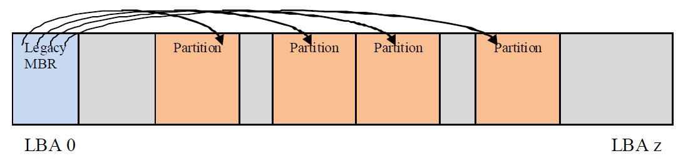
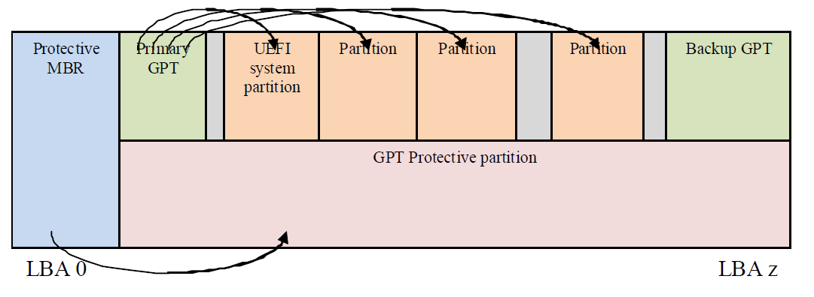
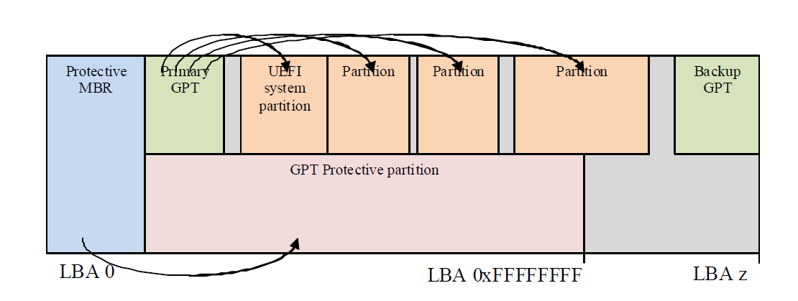

.. _guid-partition-table-gpt-disk-layout:

GUID Partition Table (GPT) Disk Layout
======================================

.. _gpt-and-mbr-disk-layout-comparison:

GPT and MBR disk layout comparison
----------------------------------

This specification defines the GUID Partition table (GPT) disk layout (i.e., partitioning scheme). The following list outlines the advantages of using the GPT disk layout over the legacy Master Boot Record (MBR) disk layout:

-  Logical Block Addresses (LBAs) are 64 bits (rather than 32 bits).

-  Supports many partitions (rather than just four primary partitions).

-  Provides both a primary and backup partition table for redundancy.

-  Uses version number and size fields for future expansion.

-  Uses CRC32 fields for improved data integrity.

-  Defines a GUID for uniquely identifying each partition.

-  Uses a GUID and attributes to define partition content type.

-  Each partition contains a 36 character human readable name.

.. _lba-0-format:

LBA 0 Format
------------

LBA 0 (i.e., the first logical block) of the hard disk contains either

-  a legacy Master Boot Record (MBR) (  See `Legacy Master Boot Record (MBR)`_ )

-  or a protective MBR (  See :ref:`protective-mbr` ).

.. _legacy-master-boot-record-mbr:

Legacy Master Boot Record (MBR)
###############################

A legacy MBR may be located at LBA 0 (i.e., the first logical block) of the disk if it is not using the GPT disk layout (i.e., if it is using the MBR disk layout). The boot code on the MBR is not executed by UEFI firmware.

.. list-table:: Legacy MBR
   :name: legacy-mbr
   :widths: 15 9 9 37 
   :class: longtable

   * - **Mnemonic**
     - **Byte Offset**
     - **Byte Length**
     - **Description**
   * - *BootCode*
     - 0
     - 424
     - x86 code used on a non-UEFI system to select an MBR partition record and load the first logical block of that partition . This code shall not be executed on UEFI systems.
   * - *UniqueMB RDiskSignature*
     - 440
     - 4
     - Unique Disk Signature This may be used by the OS to identify the disk from other disks in the system. This value is always written by the OS and is never written by EFI firmware.
   * - *Unknown*
     - 444
     - 2
     - Unknown. This field shall not be used by UEFI firmware.
   * - *PartitionRecord*
     - 446
     - 16*4
     - Array of four legacy MBR partition records ( See :ref:`legacy-mbr-partition-record` ).
   * - *Signature*
     - 510
     - 2
     - Set to 0xAA55 (i.e., byte 510 contains 0x55 and byte 5 11 contains 0xAA).
   * - *Reserved*
     - 512
     - Logical BlockSize - 512
     - The rest of the logical block, if any, is reserved.

The MBR contains four partition records (see Table 11) that each define the beginning and ending LBAs that a partition consumes on a disk.

.. list-table:: Legacy MBR Partition Record
   :widths: 15 9 9 37  
   :name: legacy-mbr-partition-record
   :class: longtable

   * - **Mnemonic**
     - **Byte Offset**
     - **Byte Length**
     - **Description**
   * - *BootIndicator*
     - 0
     - 1
     - 0x80 indicates that this is the bootable legacy partition. Other values indicate that this is not a bootable legacy partition. This field shall not be used by UEFI firmware.
   * - *StartingCHS*
     - 1
     - 3
     - Start of partition in CHS address format. This field shall not be used by UEFI firmware.
   * - *OSType*
     - 4
     - 1
     - Type of partition. See  See `OS Types`_ .
   * - *EndingCHS*
     - 5
     - 3
     - End of partition in CHS address format. This field shall not be used by UEFI firmware.
   * - *StartingLBA*
     - 8
     - 4
     - Starting LBA of the partition on the disk. This field is used by UEFI firmware to determine the start of the partition.
   * - *SizeInLBA*
     - 12
     - 4
     - Size of the partition in LBA units of logical blocks. This field is used by UEFI firmware to determine the size of the partition.

If an MBR partition has an *OSType* field of 0xEF (i.e., UEFI System Partition), then the firmware must add the UEFI System Partition GUID to the handle for the MBR partition using *InstallProtocolInterface()* . This allows drivers and applications, including OS loaders, to easily search for handles that represent UEFI System Partitions. 

The following test must be performed to determine if a legacy MBR is valid:

-  The Signature must be 0xaa55

-  A Partition Record that contains an *OSType* value of zero or a *SizeInLBA* value of zero may be ignored.

Otherwise:

-  The partition defined by each MBR Partition Record must physically reside on the disk (i.e., not exceed the capacity of the disk).

-  Each partition must not overlap with other partitions.
 
Figure 5.1 (below) shows an example of an MBR disk layout with four partitions.

   MBRDisk Layout with legacy MBR example

**Related Definitions**

.. code-block:: 

   #pragma pack(1)
   ///
   /// MBR Partition Entry
   ///
   typedef struct {
      UINT8         BootIndicator;
      UINT8         StartHead;
      UINT8         StartSector;
      UINT8         StartTrack;
      UINT8         OSIndicator;
      UINT8         EndHead;
      UINT8         EndSector;
      UINT8         EndTrack;
      UINT8         StartingLBA[4];
      UINT8         SizeInLBA[4];
   }    MBR_PARTITION_RECORD;

   ///
   /// MBR Partition Table
   ///
   typedef struct {
      UINT8         BootStrapCode[440];
      UINT8         UniqueMbrSignature[4];
      UINT8         Unknown[2];
      MBR_PARTITION_RECORD Partition[4];
      UINT16        Signature;
   }   MASTER_BOOT_RECORD;

   #pragma pack()

.. _os-types:

OS Types
########

Unique types defined by this specification (other values are not defined by this specification):

-  0xEF (i.e., UEFI System Partition) defines a UEFI system partition.

-  0xEE (i.e., GPT Protective) is used by a protective MBR (see 5.2.2) to define a fake partition covering the entire disk. 

Other values are used by legacy operating systems, and are allocated independently of the UEFI specification.

**NOTE:**  *"Partition types" by Andries Brouwer: See "Links to UEFI-Related Documents"* (http://uefi.org/uefi) *under the heading "OS Type values used in the MBR disk layout"*.

.. _protective-mbr:

Protective MBR
##############

For a bootable disk, a Protective MBR must be located at LBA 0 (i.e., the first logical block) of the disk if it is using the GPT disk layout. The Protective MBR precedes the GUID Partition Table Header to maintain compatibility with existing tools that do not understand GPT partition structures.

.. _protective-mbr-1:

.. list-table:: Protective MBR
   :widths: 15 9 9 37 
   :class: longtable

   * - **Mnemonic**
     - **Byte Offset**
     - **Byte Length**
     - **Contents**
   * - Boot Code
     - 0
     - 440
     - Unused by UEFI systems.
   * - Unique MBR Disk Signature
     - 440
     - 4
     - Unused. Set to zero.
   * - Unknown
     - 444
     - 2
     - Unused. Set to zero.
   * - Partition Record
     - 446
     - 16*4
     - | Array of four MBR partition records. Contains: 
       | • one partition record as defined  See Table (below); and 
       | • three partition records each set to zero.
   * - Signature
     - 510
     - 2
     - Set to 0xAA55 (i.e., byte 510 contains 0x55 and byte 511 contains 0xAA).
   * - Reserved
     - 512
     - Logical Block Size - 512
     - The rest of the logical block, if any, is reserved. Set to zero.

One of the Partition Records shall be as defined in table 12, reserving the entire space on the disk after the Protective MBR itself for the GPT disk layout.

.. list-table:: Protective MBR Partition Record protecting the entire disk*
   :widths: 15 9 9 37 
   :name: protective-mbr-partition-record-protecting-the-entire-disk
   :class: longtable

   * - **Mnemonic**
     - **Byte Offset**
     - **Byte Length**
     - **Description**
   * - *BootIndicator*
     - 0
     - 1
     - Set to 0x00 to indicate a non-bootable partition. If set to any value other than 0x00 the behavior of this flag on non-UEFI systems is undefined. Must be ignored by UEFI i mplementations.
   * - *StartingCHS*
     - 1
     - 3
     - Set to 0x000200, corresponding to the Starting LBA field.
   * - *OSType*
     - 4
     - 1
     - Set to 0xEE (i.e., GPT Protective)
   * - *EndingCHS*
     - 5
     - 3
     - Set to the CHS address of the last logical block on the disk. Set to 0xFFFFFF if it is not possible to represent the value in this field.
   * - *StartingLBA*
     - 8
     - 4
     - Set to 0x00000001 (i.e., the LBA of the GPT Partition Header).
   * - *SizeInLBA*
     - 12
     - 4
     - Set to the size of the disk minus one. Set to 0xFFFFFFFF if the size of the disk is too large to be represented in this field.

The remaining Partition Records shall each be set to zeros. 

Figure 5.2 (below) shows an example of a GPT disk layout with four partitions with a protective MBR.

  GPT disk layout with protective MBR

Figure 5.3 (below)  shows an example of a GPT disk layout with four partitions with a protective MBR, where the disk capacity
exceeds LBA 0xFFFFFFFF.

  GPT disk layout with protective MBR on a diskwith capacity \> LBA 0xFFFFFFFF

.. _partition-information:

Partition Information
#####################

Install an EFI_PARTITION_INFO protocol on each of the device handles that logical EFI_BLOCK_IO_PROTOTOLs are installed.

.. _guid-partition-table-gpt-disk-layout-1:

GUID Partition Table (GPT) Disk Layout
--------------------------------------

.. _gpt-overview:

GPT overview
############

The GPT partitioning scheme is depicted in the Figure  :ref:`GUID-Partition-Table-GPT-example` . The GPT Header ( :ref:`gpt-header` ) includes a signature and a revision number that specifies the format of the data bytes in the partition header. The GUID Partition Table Header contains a header size field that is used in calculating the CRC32 that confirms the integrity of the GPT Header. While the GPT Header’s size may increase in the future it cannot span more than one logical block on the device.

LBA 0 (i.e., the first logical block) contains a protective MBR (  See :ref:`protective-mbr` ). 

Two GPT Header structures are stored on the device: the primary and the backup. The primary GPT Header must be located in LBA 1 (i.e., the second logical block), and the backup GPT Header must be located in the last LBA of the device. Within the GPT Header the *My LBA* field contains the LBA of the GPT Header itself, and the *Alternate LBA* field contains the LBA of the other GPT Header. For example, the primary GPT Header's *My LBA* value would be 1 and its *Alternate LBA* would be the value for the last LBA of the device. The backup GPT Header's fields would be reversed.

The GPT Header defines the range of LBAs that are usable by GPT Partition Entries. This range is defined to be inclusive of *First Usable LBA* through *Last Usable LBA* on the logical device. All data stored on the volume must be stored between the *First Usable LBA* through *Last Usable LBA* , and only the data structures defined by UEFI to manage partitions may reside outside of the usable space. The value of *Disk GUID* is a GUID that uniquely identifies the entire GPT Header and all its associated storage. This value can be used to uniquely identify the disk. The start of the GPT Partition Entry Array is located at the LBA  indicated by the *Partition Entry LBA* field. The size of a GUID Partition Entry element is defined in the *Size Of Partition Entry* field. There is a 32-bit CRC of the GPT Partition Entry Array that is stored in the GPT Header in *Partition Entry Array CRC32* field. The size of the GPT Partition Entry Array is S *ize Of Partition Entry* multiplied by *Number Of Partition Entries* . If the size of the GUID Partition Entry Array is not an even multiple of the logical block size, then any space left over in the last logical block is Reserved and not covered by the *Partition Entry Array CRC32* field. When a GUID Partition Entry is updated, the *Partition Entry Array CRC32* must be updated. When the *Partition Entry Array CRC32* is updated, the GPT Header CRC must also be updated, since the *Partition Entry Array CRC32* is stored in the GPT Header.

.. _GUID-Partition-Table-GPT-example:

.. figure:: Images/GUID_Partition_Table_Format-5.png
   :width: 75% 

   GUID Partition Table (GPT) example 

The primary GPT Partition Entry Array must be located after the primary GPT Header and end before the *First Usable LBA*. The backup GPT Partition Entry Array must be located after the *Last Usable LBA* and end before the backup GPT Header.

Therefore the primary and backup GPT Partition EntryArrays are stored in separate locations on the disk. Each GPT Partition Entry defines a partition that is contained in a range that is within the usable space declared by the GPT Header. Zero or more GPT Partition Entries may be in use in the GPT Partition Entry Array. Each defined partition must not overlap with any other defined partition. If all the fields of a GUID Partition Entry are zero, the entry is not in use. A minimum of 16,384 bytes of space must be reserved for the GPT Partition Entry Array.

If the block size is 512, the *First Usable LBA* must be greater than or equal to 34 (allowing 1 block for the Protective MBR, 1 block for the Partition Table Header, and 32 blocks for the GPT Partition Entry Array); if the logical block size is 4096, the *First Useable LBA* must be greater than or equal to 6 (allowing 1 block for the Protective MBR, 1 block for the GPT Header, and 4 blocks for the GPT Partition Entry Array).

The device may present a logical block size that is not 512 bytes long. In ATA, this is called the Long Logical Sector feature set; an ATA device reports support for this feature set in IDENTIFY DEVICE data word 106 bit 12 and reports the number of words (i.e., 2 bytes) per logical sector in IDENTIFY DEVICE data words 117-118 (see ATA8-ACS). A SCSI device reports its logical block size in the READ CAPACITY parameter data Block Length In Bytes field (see SBC-3).

The device may present a logical block size that is smaller than the physical block size (e.g., present a logical block size of 512 bytes but implement a physical block size of 4,096 bytes). In ATA, this is called the Long Physical Sector feature set; an ATA device reports support for this feature set in IDENTIFY DEVICE data word 106 bit 13 and reports the Physical Sector Size/Logical Sector Size exponential ratio in IDENTIFY DEVICE data word 106 bits 3-0 (See ATA8-ACS). A SCSI device reports its logical block size/physical block exponential ratio in the READ CAPACITY (16) parameter data Logical Blocks Per Physical Block Exponent field (see SBC-3).These fields return 2 *x* logical sectors per physical sector (e.g., 3 means 2 *3* =8 logical sectors per physical sector).

A device implementing long physical blocks may present logical blocks that are not aligned to the underlying physical block boundaries. An ATA device reports the alignment of logical blocks within a physical block in IDENTIFY DEVICE data word 209 (see ATA8-ACS). A SCSI device reports its alignment in the READ CAPACITY (16) parameter data Lowest Aligned Logical Block Address field (see SBC-3). Note that the ATA and SCSI fields are defined differently (e.g., to make LBA 63 aligned, ATA returns a value of 1 while SCSI returns a value of 7). 

In SCSI devices, the Block Limits VPD page Optimal Transfer Length Granularity field (see SBC-3) may also report a granularity that is important for alignment purposes (e.g., RAID controllers may return their RAID stripe depth in that field)

GPT partitions should be aligned to the larger of:

a – The physical block boundary, if any

b – The optimal transfer length granularity, if any.

For example

a – If the logical block size is 512 bytes, the physical block size is 4,096 bytes (i.e., 512 bytes x 8 logical blocks), there is no optimal transfer length granularity, and logical block 0 is aligned to a physical block boundary, then each GPT partition should start at an LBA that is a multiple of 8.

b – If the logical block size is 512 bytes, the physical block size is 8,192 bytes (i.e., 512 bytes x 16 logical blocks), the optimal transfer length granularity is 65,536 bytes (i.e., 512 bytes x 128 logical  blocks), and logical block 0 is aligned to a physical block boundary, then each GPT partition should start at an LBA that is a multiple of 128.

To avoid the need to determine the physical block size and the optimal transfer length granularity, software may align GPT partitions at significantly larger boundaries. For example, assuming logical block 0 is aligned, it may use LBAs that are multiples of 2,048 to align to 1,048,576 byte (1 MiB) boundaries, which supports most common physical block sizes and RAID stripe sizes.

References are as follows:

ISO/IEC 24739-200 [ANSI INCITS 452-2008] AT Attachment 8 - ATA/ATAPI Command Set (ATA8-ACS). By the INCITS T13 technical committee. (See "Links to UEFI-Related Documents" ( *http://uefi.org/uefi* under the headings "InterNational Committee on Information Technology Standards (INCITS)" and "INCITs T13 technical committee").

ISO/IEC 14776-323 [T10/1799-D] SCSI Block Commands - 3 (SBC-3). Available from www.incits.org. By the INCITS T10 technical committee (See "Links to UEFI-Related Documents" ( *http://uefi.org/uefi* under the headings "InterNational Committee on Information Technology Standards (INCITS)" and "SCSI Block Commands").

.. _gpt-header:

GPT Header
##########

See Table (below) which defines the GPT Header.

.. _gpt-header-1:

.. list-table:: GPT Header
   :widths: 10 5 5 40
   :class: longtable

   * - **Mnemonic**
     - **Byte Offset**
     - **Byte Length**
     - **Description**
   * - *Signature*
     - 0
     - 8
     - Identifies EFI-compatible partition table header. This value must contain the ASCII string "EFI PART", encoded as the 64-bit constant 0x54 52415020494645.
   * - *Revision*
     - 8
     - 4
     - The revision number for this header. This revision value is not related to the UEFI Specification version. This header is version 1.0, so the correct value is 0x00010000.
   * - *HeaderSize*
     - 12
     - 4
     - Size in bytes of the GPT Header. The *HeaderSize* must be greater than or equal to 92 and must be less than or equal to the logical block size.
   * - *HeaderCRC32*
     - 16
     - 4
     - CRC32 checksum for the GPT Header structure. This value is computed by  setting this field to 0, and computing the 32-bit CRC for *HeaderSize* bytes.
   * - *Reserved*
     - 20
     - 4
     - Must be zero.
   * - *MyLBA*
     - 24
     - 8
     - The LBA that contains this data structure.
   * - *AlternateLBA*
     - 32
     - 8
     - LBA address of the alternate GPT Header.
   * - * FirstUsableLBA*
     - 40
     - 8
     - The first usable logical block that may be used by a partition described by a GUID Partition Entry.
   * - *LastUsableLBA*
     - 48
     - 8
     - The last usable logical block that may be used by a partition described by a GUID Partition Entry.
   * - *DiskGUID*
     - 56
     - 16
     - GUID that can be used to uniquely identify the disk.
   * - *Par titionEntryLBA*
     - 72
     - 8
     - The starting LBA of the GUID Partition Entry array.
   * - *NumberOfPa rtitionEntries*
     - 80
     - 4
     - The number of Partition Entries in the GUID Partition Entry array.
   * - *SizeOf PartitionEntry*
     - 84
     - 4
     - The size, in bytes, of each the GUID Partition Entry structures in the GUID Partition Entry array. This field shall be set to a value of 128 x 2 *n* where n is an integer greater than or equal to zero (e.g., 128, 256, 512, etc.).  NOTE: Previous versions of this specification allowed any multiple of 8..
   * - *PartitionE ntryArrayCRC32*
     - 88
     - 4
     - The CRC32 of the GUID Partition Entry array.  Starts at *Par titionEntryLBA* and is computed over a byte length of *NumberOfP artitionEntries \* SizeOfP artitionEntry.*
   * - *Reserved*
     - 92
     - BlockSize - 92
     - The rest of the block is reserved by UEFI and must be zero.

The following test must be performed to determine if a GPT
is valid: 

-  Check the Signature

-  Check the Header CRC

-  Check that the *MyLBA* entry points to the LBA that contains the GUID Partition Table

-  Check the CRC of the GUID Partition Entry Array 

If the GPT is the primary table, stored at LBA 1:

-  Check the *AlternateLBA* to see if it is a valid GPT 

If the primary GPT is corrupt, software must check the last LBA of the device to see if it has a valid GPT Header and point to a valid GPT Partition Entry Array. If it points to a valid GPT Partition Entry Array, then software should restore the primary GPT if allowed by platform policy settings (e.g. a platform may require a user to provide confirmation before restoring the table, or may allow the table to be restored automatically). Software must report whenever it restores a GPT.

Software should ask a user for confirmation before restoring the primary GPT and must report whenever it does modify the media to restore a GPT. If a GPT formatted disk is reformatted to the legacy MBR format by legacy software, the last logical block might not be overwritten and might still contain a stale GPT. If GPT-cognizant software then accesses the disk and honors the stale GPT, it will misinterpret the contents of the disk. Software may detect this scenario if the legacy MBR contains valid partitions rather than a protective MBR ( `Legacy Master Boot Record (MBR)`_ ).

Any software that updates the primary GPT must also update the backup GPT. Software may update the GPT Header and GPT Partition Entry Array in any order, since all the CRCs are stored in the GPT Header. Software must update the backup GPT before the primary GPT, so if the size of device has changed (e.g. volume expansion) and the update is interrupted, the backup GPT is in the proper location on the disk

If the primary GPT is invalid, the backup GPT is used instead and it is located on the last logical block on the disk. If the backup GPT is valid it must be used to restore the primary GPT. If the primary GPT is valid and the backup GPT is invalid software must restore the backup GPT. If both the primary and backup GPTs are corrupted this block device is defined as not having a valid GUID Partition Header. 

Both the primary and backup GPTs must be valid before an attempt is made to grow the size of a physical volume. This is due to the GPT recovery scheme depending on locating the backup GPT at the end of the device. A volume may grow in size when disks are added to a RAID device. As soon as the volume size is increased the backup GPT must be moved to the end of the volume and the primary and backup GPT Headers must be updated to reflect the new volume size.

.. _gpt-partition-entry-array:

GPT Partition Entry Array
#########################

The GPT Partition Entry Array contains an array of GPT Partition Entries.  See Table (below) which defines the GPT Partition Entry.

.. list-table:: GPT Partition Entry
   :widths: 15 9 9 37 
   :name: gpt-partition-entry
   :class: longtable

   * - **Mnemonic**
     - **Byte Offset**
     - **Byte Length**
     - **Description**
   * - *PartitionTypeGUID*
     - 0
     - 16
     - Unique ID that defines the purpose and type of this Partition. A value of zero defines that this partition entry is not being used.
   * - *UniquePartitionGUID*
     - 16
     - 16
     - GUID that is unique for every partition entry. Every partition ever created will have a unique GUID. This GUID must be assigned when the GPT Partition Entry is created. The GPT Partition Entry is created whenever the *NumberOfPa rtitionEntries* in the GPT Header is increased to include a larger range of addresses.
   * - *StartingLBA*
     - 32
     - 8
     - Starting LBA of the partition defined by this entry.
   * - *EndingLBA*
     - 40
     - 8
     - Ending LBA of the partition defined by this entry.
   * - *Attributes*
     - 48
     - 8
     - Attribute bits, all bits reserved by UEFI ( :ref:`defined-gpt-partition-entry-partition-type-guids`.  
   * - *PartitionName*
     - 56
     - 72
     - Null-terminated string containing a human-readable name of the partition.
   * - *Reserved*
     - 128
     - *SizeOf PartitionEntry* - 128
     - The rest of the GPT Partition Entry, if any, is reserved by UEFI and must be zero.

The *SizeOfPartitionEntry* variable in the GPT Header defines the size of each GUID Partition Entry. Each partition entry contains a *Unique Partition GUID* value that uniquely identifies every partition that will ever be created. Any time a new partition entry is created a new GUID must be generated for that partition, and every partition is guaranteed to have a unique GUID. The partition is defined as all the logical blocks inclusive of the *StartingLBA* and *EndingLBA* .

The *PartitionTypeGUID* field identifies the contents of the partition. This GUID is similar to the *OS Type* field in the MBR. Each filesystem must publish its unique GUID. The *Attributes* field can be used by utilities to make broad inferences about the usage of a partition and is defined in Table (below). 

The firmware must add the *PartitionTypeGuid* to the handle of every active GPT partition using :ref:`efi-boot-services-installprotocolinterface` . This will allow drivers and applications, including OS loaders, to easily search for handles that represent EFI System Partitions or vendor specific partition types.

Software that makes copies of GPT-formatted disks and partitions must generate new *Disk GUID* values in the GPT Headers and new *Unique Partition GUID* values in each GPT Partition Entry. If GPT-cognizant software encounters two disks or partitions with identical GUIDs, results will be indeterminate. 

.. list-table:: Defined GPT Partition Entry — Partition Type GUIDs 
   :widths: 30 45
   :name: defined-gpt-partition-entry-partition-type-guids

   * - **Description**
     - **GUID Value**
   * - Unused Entry
     - 00000000-0000-0000-0000-000000000000
   * - EFI System Partition
     - C12A7328-F81F-11D2-BA4B-00A0C93EC93B
   * - Partition containing a legacy MBR
     - 024DEE41-33E7-11D3-9D69-0008C781F39F

OS vendors need to generate their own Partition Type GUIDs to identify their partition types.

.. list-table:: Defined GPT Partition Entry - Attributes
   :widths: 5 15 45  
   :name: defined-gpt-partition-entry-attributes   
   :class: longtable

   * - **Bits**
     - **Name**
     - **Description**
   * - Bit 0
     - Required Partition
     - If this bit is set, the partition is required for the platform to function. The owner/creator of the partition indicates that deletion or modification of the contents can result in loss of platform features or failure for the platform to boot or operate. The system cannot function normally if this partition is removed, and it should be considered part of the hardware of the system. Actions such as running diagnostics, system recovery, or even OS install or boot could potentially stop working if this partition is removed. Unless OS software or firmware recognizes this partition, it should never be removed or modified as the UEFI firmware or platform hardware may become non-functional.
   * - Bit 1
     - No Block IO Protocol
     - If this bit is set, then firmware must not produce an *EFI_BLOCK_IO_PROTOCOL* device for this partition. See :ref:`partition-discovery` for more details. By not producing an *EFI_BLOCK_IO_PROTOCOL* partition, file system mappings will not be created for this partition in UEFI.
   * - Bit 2
     - Legacy BIOS Bootable
     - This bit is set aside by this specification to let systems with traditional PC-AT BIOS firmware implementations inform certain limited, special-purpose software running on these systems that a GPT partition may be bootable. For systems with firmware implementations conforming to this specification, the UEFI boot manager (see chapter 3) must ignore this bit when selecting a UEFI-compliant application, e.g., an OS loader (see 2.1.3). Therefore there is no need for this specification to define the exact meaning of this bit.
   * - Bits 3-47
     - 
     - Undefined and must be zero. Reserved for expansion by future versions of the UEFI specification.
   * - Bits 48-63
     - 
     - Reserved for GUID specific use. The use of these bits will vary depending on the *PartitionTypeGUID* . Only the owner of the *PartitionTypeGUID* is allowed to modify these bits. They must be preserved if Bits 0-47 are modified.

**Related Definitions:**

.. code-block:: 

   #pragma pack(1)
   ///
   /// GPT Partition Entry.
   ///
   typedef struct {
     EFI_GUID     PartitionTypeGUID;
     EFI_GUID     UniquePartitionGUID;
     EFI_LBA      StartingLBA;
     EFI_LBA      EndingLBA;
     UINT64       Attributes;
     CHAR16       PartitionName[36];
   }   EFI_PARTITION_ENTRY;
   #pragma pack()