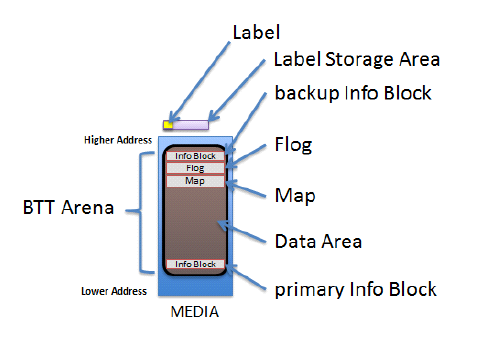
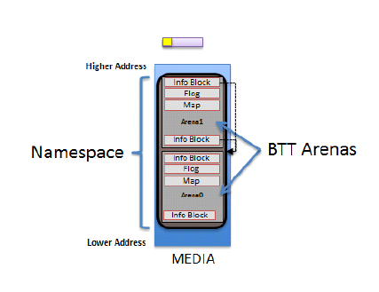
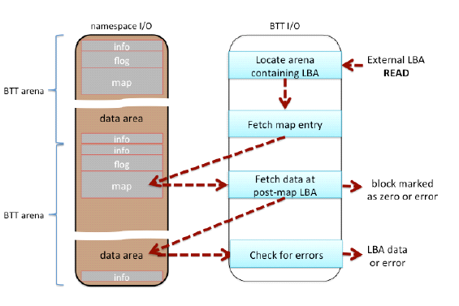
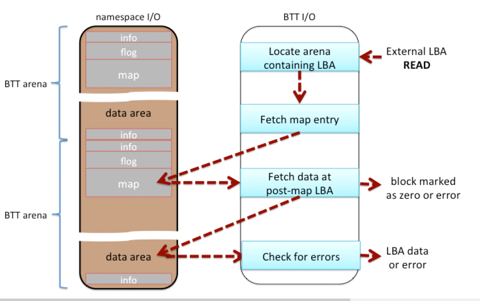

.. _block-translation-table-btt-layout:

Block Translation Table (BTT) Layout
====================================

This specification defines the Block Translation Table (BTT) metadata layout. The following sub-sections outline the BTT format that is utilized on the media, the data structures involved, and a detailed description of how SW is to interpret the BTT layout. 

.. _block-translation-table-btt-background:

Block Translation Table (BTT) Background
----------------------------------------

A namespace defines a contiguously-addressed range of Non-Volatile Memory conceptually similar to a SCSI Logical Unit (LUN) or a NVM Express® namespace. \*

.. note:: \* NVM Express® and NVMe® are registered trademarks of NVM Express, Inc. for use in describing the NVM Express, Inc. organization and items developed by NVM Express, Inc. NVMe-oF™ is an unregistered trademark of NVM Express, Inc.

Any namespace being utilized for block storage may contain a Block Translation Table (BTT), which is a layout and set of rules for doing block I/O that provide powerfail write atomicity of a single block. Traditional block storage, including hard disks and SSDs, usually protect against torn sectors, which are sectors partially written when interrupted by power failure. Existing software, mostly file systems, depend on this behavior, often without the authors realizing it. To enable such software to work correctly on namespaces supporting block storage access, the BTT layout defined by this document sub-divides a namespace into one or more BTT Arenas, which are large sections of the namespace that contain the metadata required to provide the desired write atomicity. Each of these BTT Arenas contains a metadata layout as shown in Figures 6-1 and 6-2 below.

   **The BTT Layout in a BTT Arena**

Each arena contains the layout shown in Figure 6-1 (above), the primary info block, data area, map, flog, and a backup info block. Each of these areas is described in the following sections. When the namespace is larger than 512 GiB, multiple arenas are required by the BTT layout, as shown in Figure 6-2 (below). Each namespace using a BTT is divided into as many 512 GiB arenas as shall fit, followed by a smaller arena to contain any remaining space as appropriate. The smallest arena size is 16MiB so the last arena size shall be between 16MiB and 512GiBs. Any remaining space less than 16MiB is unused. Because of these rules for arena placement, software can locate every primary Info block and every backup Info block without reading any metadata, based solely on the namespace size.

   **A BTT With Multiple Arenas in a Large Namespace**

.. _block-translation-table-btt-data-structures:

Block Translation Table (BTT) Data Structures
---------------------------------------------

The following sub-sections outline the data structures associated
with the BTT Layout.

.. _btt-info-block:

BTT Info Block
##############

.. code-block::

  // Alignment of all BTT structures
  #define EFI_BTT_ALIGNMENT 4096
  #define EFI_BTT_INFO_UNUSED_LEN 3968

  #define EFI_BTT_INFO_BLOCK_SIG_LEN 16

  // Constants for Flags field
  #define EFI_BTT_INFO_BLOCK_FLAGS_ERROR 0x00000001

  // Constants for Major and Minor version fields
  #define EFI_BTT_INFO_BLOCK_MAJOR_VERSION 2
  #define EFI_BTT_INFO_BLOCK_MINOR_VERSION 0

  typdef struct _EFI_BTT_INFO_BLOCK {
  CHAR8 Sig[EFI_BTT_INFO_BLOCK_SIG_LEN];
    EFI_GUID  Uuid;
    EFI_GUID  ParentUuid;
    UINT32    Flags;
    UINT16    Major;
    UINT16    Minor;
    UINT32    ExternalLbaSize;
    UINT32    ExternalNLba;
    UINT32    InternalLbaSize;
    UINT32    InternalNLba;
    UINT32    NFree;
    UINT32    InfoSize;
    UINT64    NextOff;
    UINT64    DataOff;
    UINT64    MapOff;
    UINT64    FlogOff;
    UINT64    InfoOff;
    CHAR8     Unused[EFI_BTT_INFO_UNUSED_LEN];
    UINT64    Checksum;
  }  EFI_BTT_INFO_BLOCK 

Sig
  Signature of the BTT Index Block data structure. Shall be   "BTT_ARENA_INFO\0\0".

UUID
  UUID identifying this BTT instance. A new UUID is created each time the initial BTT Arenas are written. This value shall be identical across all BTT Info Blocks within all arenas within a namespace.

ParentUuid 
  UUID of containing namespace, used when validating the BTT Info Block to ensure this instance of the BTT layout is intended for the current surrounding namespace, and not left over from a previous namespace that used the same area of the media. This value shall be identical across all BTT Info Blocks within all arenas within a namespace.

Flags
  Boolean attributes of this BTT Info Block. See the additional description below on the use of the flags. The following values are defined:

  EFI_BTT_INFO_BLOCK_FLAGS_ERROR - The BTT Arena is in the error state. When a BTT implementation discovers issues such as inconsistent metadata or lost metadata due to unrecoverable media errors, the error bit for the associated arena shall be set. See the BTT Theory of Operation section regarding handling of EFI_BTT_INFO_BLOCK_FLAGS_ERROR.

Major
  Major version number. Currently at version 2. This value shall be identical across all BTT Info Blocks within all arenas within a namespace.

Minor
  Minor version number. Currently at version 0. This value shall be identical across all BTT Info Blocks within all arenas within a namespace.

ExternalLbaSize
  Advertised LBA size in bytes. I/O requests shall be in this size chunk. This value shall be identical across all BTT Info Blocks within all arenas within a namespace. 

ExternalNLba
  Advertised number of LBAs in this arena. The sum of this field, across all BTT Arenas, is the total number of available LBAs in the namespace.

InternalLbaSize
  Internal LBA size shall be greater than or equal to ExternalLbaSize and shall not be smaller than 512 bytes. Each block in the arena data area is this size in bytes and contains exactly one block of data. Optionally, this may be larger than the **ExternalLbaSize** due to alignment padding between LBAs. This value shall be identical across all BTT Info Blocks within all arenas within a namespace.

InternalNLba
  Number of internal blocks in the arena data area. This shall be equal to **ExternalNLba + NFree** because each internal lba is either mapped to an external lba or shown as free in the flog.

NFree
  Number of free blocks maintained for writes to this arena. **NFree** shall be equal to **InternalNLba – ExternalNLba**. This value shall be identical across all BTT Info Blocks within all arenas within a namespace.

InfoSize
  The size of this info block in bytes. This value shall be identical across all BTT Info Blocks within all arenas within a namespace.

NextOff
  Offset of next arena, relative to the beginning of this arena. An offset of 0 indicates that no arenas follow the current arena. This field is provided for convience as the start of each arena can be calculated from the size of the namespace as described in the **Theory of Operation – Validating BTT Arenas** at start-up description. This value shall be identical in the primary and backup BTT Info Blocks within an arena.

DataOff
  Offset of the data area for this arena, relative to the beginning of this arena. The internal-LBA number zero lives at this offset. This value shall be identical in the primary and backup BTT Info Blocks within an arena.

MapOff
  Offset of the map for this arena, relative to the beginning of this arena. This value shall be identical in the primary and backup BTT Info Blocks within an arena.

FlogOff
  Offset of the flog for this arena, relative to the beginning of this arena. This value shall be identical in the primary and backup BTT Info Blocks within an arena.

InfoOff
  Offset of the backup copy of this arena’s info block, relative to the beginning of this arena. This value shall be identical in the primary and backup BTT Info Blocks within an arena.

Reserved
  Shall be zero.

Checksum
  64-bit *Fletcher64* checksum of all fields. This field is considered as containing zero when the checksum is computed.

**BTT Info Block Description**

The existence of a valid BTT Info Block is used to determine whether a namespace is used as a BTT block device.

Each BTT Arena contains two BTT Info Blocks, a primary copy at the beginning of the BTT Arena, at address offset 0 , and ends with an identical backup BTT Info Block, in the highest block available in the arena aligned on a EFI_BTT_ALIGNMENT boundary. When writing the BTT layout, implementations shall write out the info blocks from the highest arena to the lowest, writing the backup info block and other BTT data structures before writing the primary info block. Writing the layout in this manner shall ensure that a valid BTT layout is only detected after the entire layout has been written.

.. _btt-map-entry:

BTT Map Entry
##############

.. code-block::

  typedef struct _EFI_BTT_MAP_ENTRY {
    UINT32    PostMapLba : 30;
    UINT32    Error : 1;
    UINT32    Zero : 1;
  }   EFI_BTT_MAP_ENTRY ;

PostMapLba
  Post-map LBA number (block number in this arena’s data area)

Error
  When set and **Zero** is not set, reads on this block return an error. Writes to this block clear this flag.

Zero
  When set and **Error** is not set, reads on this block return a full block of zeros. Writes to this block clear this flag.

**BTT Map Description**

The BTT Map area maps an LBA that indexes into the arena, to its actual location. The BTT Map is located as high as possible in the arena, after room for the backup info block and flog (and any required alignment) has been taken into account. The terminology *pre-map LBA* and *post-map LBA* is used to describe the input and output values of this mapping.

The BTT Map area is indexed by the pre-map LBA and each entry in the map contains the 30 bit post-map LBA and bits to indicate if there is an error or if LBA contains zeroes (see EFI_BTT_MAP_ENTRY).

The **Error** and **Zero** bits indicate conditions that cannot both be true at the same time, so that combination is used to indicate a *normal* map entry, where no error or zeroed block is indicated. The error condition is indicated only when the **Error** bit is set and the **Zero** bit is clear, with similar logic for the zero block condition. When neither condition is indicated, both **Error** and **Zero** are set to indicate a map entry in its normal, non-error state. This leaves the case where both **Error** and **Zero** are bits are zero, which is the initial state of all map entries when the BTT layout is first written. Both bits zero means that the map entry contains the initial *identity* mapping where the pre-map LBA is mapped to the same post-map LBA. Defining the map this way allows an implementation to leverage the case where the initial contents of the namespace is known to be zero, requiring no writes to the map when writing the layout. This can greatly improve the layout time since the map is the largest BTT data structure written during layout.

.. _btt-flog:

BTT Flog
########

.. code-block::

  // Alignment of each flog structure
  #define EFI_BTT_FLOG_ENTRY_ALIGNMENT 64

  typedef struct _EFI_BTT_FLOG {
    UINT32    Lba0;
    UINT32    OldMap0;
    UINT32    NewMap0;
    UINT32    Seq0;
    UINT32    Lba1;
    UINT32    OldMap1;
    UINT32    NewMap1;
    UINT32    Seq1;
  } EFI_BTT_FLOG

lba0
  Last pre-map LBA written using this flog entry. This value is used as an index into the BTT Map when updating it to complete the transaction.

OldMap0
  Old post-map LBA. This is the old entry in the map when the last write using this flog entry occurred. If the transaction is complete, this LBA is now the free block associated with this flog entry.

NewMap0
  New post-map LBA. This is the block allocated when the last write using this flog entry occurred. By definition, a write transaction is complete if the BTT Map entry contains this value.

Seq0
  The **Seq0** field in each flog entry is used to determine which set of fields is newer between the two sets (Lba0, OldMap0, NewMpa0, Seq0 vs Lba1, Oldmap1, NewMap1, Seq1). Updates to a flog entry shall always be made to the older set of fields and shall be implemented carefully so that the **Seq0** bits are only written after the other fields are known to be committed to persistence. The figure below shows the progression of the **Seq0** bits over time, where the newer entry is indicated by a value that is clockwise of the older value.

   **Cyclic Sequence Numbers for Flog Entries**

Lba1
  Alternate lba entry

OldMap1
  Alternate old entry 

NewMap1
  Alternate new entry

Seq1
  Alternate Seq entry

**BTT Flog Description**

The BTT Flog is so named to illustrate that it is both a free list and a log, rolled into one data structure. The Flog size is determined by the **NFree** field in the BTT Info Block which determines how many of these flog entries there are. The flog location is the highest address in the arena after space for the backup info block and alignment requirements have been taken in account.

.. _btt-data-area:

BTT Data Area 
#############

Starting from the low address to high, the BTT Data Area starts immediately after the BTT Info Block and extends to the beginning of the BTT Map data structure. The number of internal data blocks that can be stored in an arena is calculated by first calculating the necessary space required for the BTT Info Blocks, map, and flog (plus any alignment required), subtracting that amount from the total arena size, and then calculating how many blocks fit into the resulting space.

.. _nvdimm-label-protocol-address-abstraction-guid:

NVDIMM Label Protocol Address Abstraction Guid
##############################################

This version of the BTT layout and behavior is collectively described by the AddressAbstractionGuid in the UEFI NVDIMM Label protocol section utilizing this GUID:

.. code-block::  

   #define EFI_BTT_ABSTRACTION_GUID \
     {0x18633bfc,0x1735,0x4217,
       {0x8a,0xc9,0x17,0x23,0x92,0x82,0xd3,0xf8}

.. _btt-theory-of-operation:

BTT Theory of Operation
-----------------------

This section outlines the theory of operation for the BTT and describes the responsibilities that any software implementation shall follow.

A specific instance of the BTT layout depends on the size of the namespace and three administrative choices made at the time the initial layout is created:

* **ExternalLbaSize**: the desired block size
* **InternalLbaSize**: the block size with any internal padding
* **NFree**: the number of concurrent writes supported by the layout

The BTT data structures do not support an **InternalLbaSize** smaller than 512 bytes, so if **ExternalLbaSize** is smaller than 512 bytes, the **InternalLbaSize** shall be rounded up to 512. For performance, the **InternalLbaSize** may also include some padding bytes. For example, a BTT layout supporting 520-byte blocks may use 576-byte blocks internally in order to round up the size to a multiple of a 64-byte cache line size. In this example, the **ExternalLbaSize**, visible to software above the BTT software, would be 520 bytes, but the **InternalLbaSize** would be 576 bytes.

Once these administrative choices above are determined, the namespace is divided up into *arenas*, as described in the **BTT Arenas** section, where each arena uses the same values for **ExternalLbaSize**, **InternalLbaSize**, and **Nfree**. 

.. _btt-arenas:

BTT Arenas
##########

In order to reduce the size of BTT metadata and increase the possibility of concurrent updates, the BTT layout in a namespace is divided into *arenas*. An arena cannot be larger than 512GiB or smaller than 16MiB. A namespace is divided into as many 512GiB arenas that shall fit, starting from offset zero and packed together without padding, followed by one arena smaller than 512GiB if the remaining space is at least 16MiB. The smaller area size is rounded down to be a multiple of EFI_BTT_ALIGNMENT if necessary. Because of these rules, the location and size of every BTT Arena in a namespace can be determined from the namespace size.

Within an arena, the amount of space used for the Flog is **NFree** times the amount of space required for each Flog entry. Flog entries shall be aligned on 64-byte boundaries. In addition, the full BTT Flog table shall be aligned on a EFI_BTT_ALIGNMENT boundary and have a size that is padded to be multiple of EFI_BTT_ALIGNMENT. In summary, the space in an arena taken by the Flog is:

.. code-block::

  FlogSize = roundup(NFree * roundup(sizeof(EFI_BTT_FLOG), 
  EFI_BTT_FLOG_ENTRY_ALIGNMENT), EFI_BTT_ALIGNMENT)

Within an arena, the amount of space available for data blocks and the associated Map is the arena size minus the space used for the BTT Info Blocks and the Flog:

.. code-block::

  DataAndMapSize = ArenaSize - 2 * sizeof(EFI_BTT_INFO_BLOCK) – FlogSize

Within an arena, the number of data blocks is calculated by dividing the available space, DataAndMapSize, by the **InternalLbaSize** plus the map overhead required for each block, and rounding down the result to ensure the data area is aligned on a EFI_BTT_ALIGNMENT boundary:

.. code-block::

  InternalNLba = (DataAndMapSize - EFI_BTT_ALIGNMENT) / (InternalLbaSize + 
  sizeof(EFI_BTT_MAP_ENTRY)

With the InternalNLba value known, the calculation for the number of external LBAs subtracts off NFree for the pool of unadvertised free blocks:

.. code-block::

  ExternalNLba = InternalNLba – Nfree 

Within an arena, the number of bytes required for the BTT Map is one entry for each external LBA, plus any alignment required to maintain an alignment of EFI_BTT_ALIGNMENT for the entire map:

.. code-block::

  MapSize = roundup(ExternalNLba * sizeof(EFI_BTT_MAP_ENTRY), 
  EFI_BTT_ALIGNMENT)

The number of concurrent writes allowed for an arena is based on the **NFree** value chosen at BTT layout time. For example, choosing **NFree** of 256 means the BTT Arena shall have 256 free blocks to use for in-flight write operations. Since BTT Arenas each have **NFree** free blocks, the number of concurrent writes allowed in a namespace may be larger when there are multiple arenas and the writes are spread out between multiple arenas.

.. _atomicity-of-data-blocks-in-an-arena:

Atomicity of Data Blocks in an Arena
####################################

The primary reason for the BTT is to provide failure atomicity when writing data blocks, so that any write of a single block cannot be torn by interruptions such as power loss. The BTT provides this by maintaining a pool of free blocks which are not part of the capacity advertised to software layers above the BTT software. The BTT Data Area is large enough to hold the advertised capacity as well as the pool of free blocks. The BTT software manages the blocks in the BTT Data Area as a list of *internal* LBAs, which are block numbers only visible internally to the BTT software. The block numbers that make up the advertised capacity are known as *external* LBAs, and at any given point in time, each one of those external LBAs is mapped by the BTT Map to one of the blocks in the BTT Data Area. Each block write done by the BTT software starts by allocating one of the free blocks, writing the data to it, and only when that block is fully persistent (including any flushes required), are steps taken to make that block active, as outlined in the **BTT Theory of Operations - Write Path** section.

The BTT Flog (a combination of a free list and a log) is at the heart of the atomic updates when writing blocks. The "quiet" state of a BTT Flog, when no in-flight writes are happening and no recovery steps are outstanding, is that the **NFree** free blocks currently available for writes are contained in the OldMap fields in the Flog entries. A write shall use one of those Flog entries to find a free block to write to, and then the Lba and NewMap fields in the Flog are used as a *write-ahead-log* for the BTT Map update when the data portion of the write is complete, as described in the **Validating the Flog at start-up** section.

It is up to run-time logic in the BTT software to ensure that only one Flog entry is in use at a time, and that any reads still executing on the block indicated by the OldMap entry have finished before starting a write using that block.

.. _atomicity-of-btt-data-structures:

Atomicity of BTT Data Structures
################################

Byte-addressable persistent media may not support atomic updates larger than 8-bytes, so any data structure larger than 8-bytes in the BTT uses software-implemented atomicity for updates. Note that 8-byte write atomicity, meaning an 8-byte store to the persistent media cannot be torn by interruptions such as power failures, is a minimal requirement for using the BTT described in this document.

There are four types of data structures in the BTT:

* The BTT Info Blocks
* The BTT Map
* The BTT Flog
* The BTT Data Area

The BTT Map entries are 4-bytes in size, and so can be updated atomically with a single store instruction. All other data structures are updated by following the rules described in this document, which update an inactive version of the data structure first, followed by steps to make it active atomically.

For the BTT Info Blocks, atomicity is provided by always writing the backup Info block first, and only after that update is fully persistent (the block checksums correctly), is the primary BTT Info Block updated as described in the **Writing the initial BTT layout** section. Recovery from an interrupted update is provided by checking the primary Info block’s checksum on start-up, and if it is bad, copying the backup Info block to the primary to complete the interrupted update as described in the **Validating BTT Arenas** at start-up section.

For the BTT Flog, each entry is double-sized, with two complete copies of every field (Lba, OldMap, NewMap, Seq). The active entry has the higher Seq number, so updates always write to the inactive fields, and once those fields are fully persistent, the Seq field for the inactive entry is updated to make it become the active entry atomically. This is described in the **Validating the Flog at start-up** section.

For the BTT Data Area, all block writes can be thought of as *allocating writes*, where an inactive block is chosen from the free list maintained by the Flog, and only after the new data written to that block is fully persistent, that block is made active atomically by updating the Flog and Map entries as described in the **Write Path** section.

.. _writing-the-initial-btt-layout:

Writing the Initial BTT layout
##############################

The overall layout of the BTT relies on the fact that all arenas shall be 512GiB in size, except the last arena which is a minimum of 16MiB. Initializing the BTT on-media structures only happens once in the lifetime of a BTT, when it is created. This sequence assumes that software has determined that new BTT layout needs to be created and the total raw size of the namespace is known.

Immediately before creating a new BTT layout, the UUID of the surrounding namespace may be updated to a newly-generated UUID. This optional step, depending on the needs of a BTT software implementation, has the effect of invalidating any previous BTT Info Blocks in the namespace and ensuring the detection of an invalid layout if the BTT layout creation process is interrupted. This detection works because the parent UUID field

The on-media structures in the BTT layout may be written out in any order except for the BTT Info Blocks, which shall be written out as the last step of the layout, starting from the last arena (highest offset in the namespace) to the first arena (lowest offset in the namespace), writing the backup BTT Info Block in each arena first, then writing the primary BTT Info block for that arena second. This allows the detection of an incomplete BTT layout when the algorithm in the **Validating BTT Arenas at start-up** section is executed.

Since the number of internal LBAs for an arena exceeds the number of external LBAs by **NFree**, there are enough internal LBA numbers to fully initialize the BTT Map as well as the BTT Flog, where the BTT Flog is initialized with the **NFree** highest internal LBA numbers, and the rest are used in the BTT Map.

The BTT Map in each arena is initialized to zeros. Zero entries in the map indicate the *identity* mapping of all pre-map LBAs to the corresponding post-map LBAs. This uses all but **NFree** of the internal LBAs, leaving **Nfree** of them for the BTT Flog.

The BTT Flog in each arena is initialized by starting with all zeros for the entire flog area, setting the **Lba0** field in each flog entry to unique pre-map LBAs, zero through **NFree - 1**, and both **OldMap0** and **NewMap0** fields in each flog entry are set to one of the remaining internal LBAs. For example, flog entry zero would have Lba0 set to 0, and **OldMap0** and **NewMap0** both set to the first internal LBA not represented in the map (since there are **ExternalNLba** entries in the map, the next available internal LBA is equal to **ExternalNLba**).

.. _validating-btt-arenas-at-start-up:

Validating BTT Arenas at start-up
#################################

When software prepares to access the BTT layout in a namespace, the first step is to check the BTT Arenas for consistency. Reading and validating BTT Arenas relies on the fact that all arenas shall be 512GiB in size, except the last arena which is a minimum of 16MiB.

The following tests shall pass before software considers the BTT layout to be valid:

* For each BTT Arena:

  * ReadAndVerifyPrimaryBttInfoBlock

    * If the read of the primary BTT Info Block fails, goto       ReadAndVerifyBackupBttInfoBlock

    * If the primary BTT Info Block contains an incorrect **Sig**       field it is invalid, goto ReadAndVerifyBackupBttInfoBlock

    * If the primary BTT Info Block ParentUuid field does not       match the UUID of the surrounding namespace, goto       ReadAndVerifyBackupBttInfoBlock

    * If the primary BTT Info Block contains an incorrect **Checksum** it is invalid, goto ReadAndVerifyBackupBttInfoBlock

    * The primary BTT Info Block is valid. Use the **NextOff** field to find the start of the next arena and continue BTT Info Block validation, goto ReadAndVerifyPrimaryBttInfoBlock 
  
  * ReadAndVerifyBackupBttInfoBlock

    * Determine the location of the backup BTT Info Block:

      #.  All of the arenas shall be the full 512GiB data area size except the last arena which is at least 16MiB.
      
      #.  The backup BTT Info Block is the last EFI_BTT_ALIGNMENT aligned block in the arena.

    * If the read of the backup BTT Info Block at the high address of the BTT Arena fails, neither copy could be read, and software shall assume that there is no valid BTT metadata layout for the namespace

    * If the backup BTT Info Block contains an incorrect **Sig** field  it is invalid, and software shall assume that there is no       valid BTT metadata layout for the namespace

    * If the backup BTT Info Block ParentUuid field does not match      the UUID of the surrounding namespace it is invalid, and      software shall assume that there is no valid BTT metadata       layout for the namespace

    * If the backup BTT Info Block contains an incorrect **Checksum**   it is invalid, and software shall assume that there is no       valid BTT metadata layout for the namespace

    * The backup BTT Info Block is valid. Since the primary copy      is bad, software shall copy the contents of the valid backup      BTT Info Block down to the primary BTT Info Block before      validation of all of the BTT Info Blocks in all of the arenas can complete successfully.

.. _validating-the-flog-entries-at-start-up:

Validating the Flog entries at start-up
#######################################

After validating the BTT Info Blocks as described in the **Validating BTT Arenas at start-up** section, the next step software shall take is to validate the BTT Flog entries. When blocks of data are being written, as described in the **Write Path** section below, the persistent Flog and Map states are not updated until the free block is written with new data. This ensures a power failure at any point during the data transfer is harmless, leaving the partially written data in a free block that remains free. Once the Flog is updated (made atomic by the Seq bits in the Flog entry), the write algorithm is committed to the update and a power failure from this point in the write flow onwards shall be handled by completing the update to the BTT Map on recovery. The Flog contains all the information required to complete the Map entry update.

Note that the Flog entry recovery outlined here is intended to happen single-threaded, on an *inactive* BTT (before the BTT block namespace is allowed to accept I/O requests). The maximum amount of time required for recovery is determined by **NFree**, but is only a few loads and a single store (and the corresponding cache flushes) for each incomplete write discovered.

The following steps are executed for each flog entry in each arena, to recover any interrupted writes and to verify the flog entries are consistent at start up. Any consistency issues found during these steps results in setting the error state (EFI_BTT_INFO_BLOCK_FLAGS_ERROR) for the arena and terminates the flog validation process for this arena. 

1.  The **Seq0** and **Seq1** fields are examined for the flog entry. If  both fields are zero, or both fields are equal to each  other, the flog entry is inconsistent. Otherwise, the higher  Seq field indicates which set of flog fields to use for the   next steps (**Lba0**, **OldMap0**, **NewMap0**, versus **Lba1**, **OldMap1**,   **NewMap1**). From this point on in this section, the chosen  fields are referenced as Lba, OldMap, and NewMap. 

#.  If OldMap and NewMap are equal, this is a flog entry that   was never used since the initial layout of the BTT was created.

#.  The Lba field is checked to ensure it is a valid pre-map LBA  (in the range zero to **ExternalNLba** – 1). If the check fails,  the flog entry is inconsistent.

#.  The BTT Map entry corresponding to the Flog entry Lba field   is fetched. Since the Map can contain special zero entries to indicate identity mappings, the fetched entry is adjusted to the corresponding internal LBA when a zero is encountered (by interpreting the entry as the same LBA as the Flog entry Lba field).

#.  If the adjusted map entry from the previous step does not   match the NewMap field in the Flog entry, and it matches the  OldMap field, then an interrupted BTT Map update has been detected. The recovery step is to write the NewMap field to   the BTT Map entry indexed by the Flog entry Lba field.

.. _read-path:

Read Path
#########

The following high level sequence describes the steps to read a
single block of data while utilizing the BTT as is illustrated
in the **Figure: BTT Read Path Overview** below:

#.   If EFI_BTT_INFO_BLOCK_FLAGS_ERROR is set in the arena’s BTT Info Block, the BTT software may return an error for the read, or an implementation may choose to continue to provide read-only access and continue these steps.

#. Use the external LBA provided with the read operation to determine which BTT Arena to access. Starting from the first arena (lowest offset in the namespace), and looping through the arena in order, the **ExternalNLba** field in the BTT Info Block describes how many exernal LBAs are in that area. Once the correct arena is identified, the external LBAs contained in the lower, skipped, arenas are subtracted from the provided LBA to obtain the pre-map LBA for the selected arena.

#.  Use the pre-map LBA to index into the arena’s BTT Map and   the map entry.

#. If both the **Zero** and **Error** bits are set in the map entry,  this indicates a normal entry. The PostMapLba field in the  Map entry is used to index into the arena Data Area by  multiplying it by the **InternalLbaSize** and adding the result   to the **DataOff** field from the arena’s BTT Info Block. This  provides the location of the data in the arena and software   then copies **ExternalLbaSize** bytes into the provided buffer  to satisfy the read request.

#.  Otherwise, if only the **Error** bit is set in the map entry, a read error is returned. 

#. Otherwise, if only the **Zero** bit is set in the map entry, a block of **ExternalLbaSize** bytes of zeros is copied into the  provided buffer to satisfy the read request.

#. Finally, if both **Zero** and **Error** bits are clear, this the initial identity mapping and the pre-map LBA is used to index into the arena Data Area by multiplying it by the **InternalLbaSize** and adding the result to the **DataOff** field from the arena’s BTT Info Block. This provides the location of the data in the arena and software then copies **ExternalLbaSize** bytes into the provided buffer to satisfy the read request. 

  
   BTT Read Path Overview

.. _write-path:

Write Path
##########

The following high level sequence describes the steps to write
a single block of data while utilizing the BTT as is illustrated in the **Figure: BTT Write Path Overview below**:

#. If EFI_BTT_INFO_BLOCK_FLAGS_ERROR is set in the arena’s BTT Info Block, the BTT software shall return an error for the write.

#. Use the external LBA provided with the write operation to determine which BTT Arena to access. Starting from the first arena (lowest offset in the namespace), and looping through the arena in order, the **ExternalNLba** field in the BTT Info Block describes how many exernal LBAs are in that area. Once the correct arena is identified, the external LBAs contained in the lower, skipped, arenas are subtracted from the provided LBA to obtain the pre-map LBA for the selected arena.

#. The BTT software allocates one of the Flog entries in the arena to be used for this write. The Flog entry shall not be shared by multiple concurrent writes. The exact method for managing the exclusive use of the Flog entries is BTT software implementation-dependent. There’s no on-media indication of whether a Flog entry is currently allocated to a write request or not. Note that the free block tracked by  the Flog entry in the OldMap field, may still have reads from relatively slow threads operating on it. The BTT software implementation shall ensure any such reads have completed before moving to the next step.

#. Lock out access to the BTT Map area associated with the pre-map LBA for the next three steps. The granularity of the locking is implementation-dependent; an implementation may choose to lock individual Map entries, lock the entire BTT   Map, or something in-between.

#. Use the pre-map LBA to index into the arena’s BTT Map and fetch the old map entry.

#. Update the Flog entry by writing the inactive set of Flog fields (the lower Seq number). First, update the Lba, OldMap, and NewMap fields with the pre-map LBA, old Map entry, and the free block chosen above, respectively. Once those fields are fully persistent (with any required flushes completed), the Seq field is updated to make the new fields active. This update of the Seq field commits the write - before this update, the write shall not take place if the operation is interrupted. After the Seq field is updated, the write shall take place even if the operation is interrupted because the Map update in the next step shall take place during the BTT recovery that happens on start-up.

#. Update the Map entry with the free block chosen above.

#. Drop the map lock acquired in step 4 above. The write request is now satisfied.  

   BTT Write Path Overview
