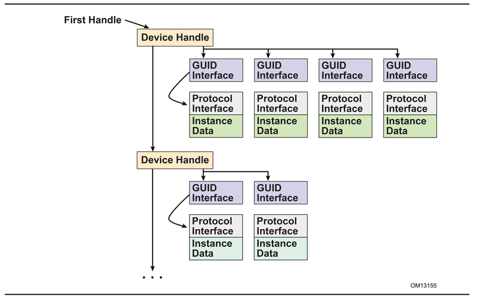
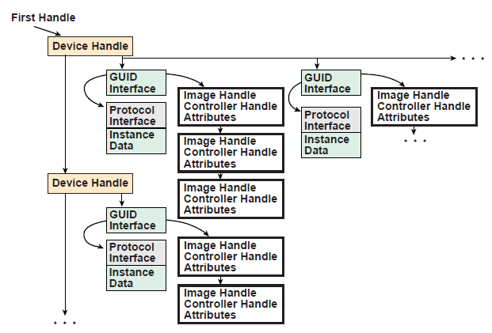

.. _services-boot-services:

Services — Boot Services
=========================

This section discusses the fundamental boot services that are present in a UEFI compliant system. The services are defined by interface functions that may be used by code running in the UEFI environment. Such code may include protocols that manage device access or extend platform capability, as well as applications running in the preboot environment, and OS loaders.

Two types of services apply in an compliant system:

**Boot Services** 

Functions that are available *before* a successful call to :ref:`efi-boot-services-exitbootservices`.  These functions are described in this section.

**Runtime Services**

Functions that are available *before and after* any call to ExitBootServices(). These functions are described in :ref:`services-runtime-services` .

During boot, system resources are owned by the firmware and are controlled through boot services interface functions. These functions can be characterized as "global" or "handle-based." The term "global" simply means that a function accesses system services and is available on all platforms (since all platforms support all system services). The term "handle-based" means that the function accesses a specific device or device functionality and may not be available on some platforms (since some devices are not available on some platforms). Protocols are created dynamically. This section discusses the "global" functions and runtime functions; subsequent sections discuss the "handle-based."

UEFI applications (including UEFI OS loaders) must use boot services functions to access devices and allocate memory. On entry, an Image is provided a pointer to a system table which contains the Boot Services dispatch table and the default handles for accessing the console. All boot services functionality is available until a UEFI OS loader loads enough of its own environment to take control of the system’s continued operation and then terminates boot services with a call to ExitBootServices().

In principle, the ExitBootServices() call is intended for use by the operating system to indicate that its loader is ready to assume control of the platform and all platform resource management. Thus boot services are available up to this point to assist the UEFI OS loader in preparing to boot the operating system. Once the UEFI OS loader takes control of the system and completes the operating system boot process, only runtime services may be called. Code other than the UEFI OS loader, however, may or may not choose to call ExitBootServices(). This choice may in part depend upon whether or not such code is designed to make continued use of boot services or the boot services environment.

The rest of this section discusses individual functions. Global boot services functions fall into these categories:

-  Event, Timer, and Task Priority Services :ref:`event-timer-and-task-priority-services`
-  Memory Allocation Services :ref:`memory-allocation-services`
-  Protocol Handler Services :ref:`protocol-handler-services`
-  Image Services :ref:`image-services`

.. _event-timer-and-task-priority-services:

Event, Timer, and Task Priority Services
-----------------------------------------

The functions that make up the Event, Timer, and Task Priority Services are used during preboot to create, close, signal, and wait for events; to set timers; and to raise and restore task priority levels. See the following table for details. 

.. list-table:: Event, Timer, and Task Priority Functions
   :name: event-timer-and-task-priority-functions
   :widths: 10 5 45  
   :class: longtable

   * - **Name**
     - **Type** 
     - **Description**
   * - CreateEvent
     - Boot 
     - Creates a general-purpose event structure
   * - CreateEventEx 
     - Boot 
     - Creates an event structure as part of an event group
   * - CloseEvent
     - Boot 
     - Closes and frees an event structure
   * - SignalEvent   
     - Boot 
     - Signals an event
   * - WaitForEvent
     - Boot 
     - Stops execution until an event is signaled
   * - CheckEvent
     - Boot 
     - Checks whether an event is in the signaled state
   * - SetTimer
     - Boot 
     - Sets an event to be signaled at a particular time
   * - RaiseTPL
     - Boot
     - Raises the task priority level
   * - RestoreTPL
     - Boot 
     - Restores/lowers the task priority level

Execution in the boot services environment occurs at different task priority levels, or TPLs. The boot services environment exposes only three of these levels to UEFI applications and drivers ( see table below: :ref:`tpl-usage` ) 

-  **TPL_APPLICATION** — the lowest priority level
-  **TPL_CALLBACK** — an intermediate priority level{
-  **TPL_NOTIFY** —  the highest priority level

Tasks that execute at a higher priority level may interrupt tasks that execute at a lower priority level. For example, tasks that run at the TPL_NOTIFY level may interrupt tasks that run at the TPL_APPLICATION or TPL_CALLBACK level. While TPL_NOTIFY is the highest level exposed to the boot services applications, the firmware may have higher task priority items it deals with. For example, the firmware may have to deal with tasks of higher priority like timer ticks and internal devices. Consequently, there is a fourth TPL, TPL_HIGH_LEVEL {link needed}, designed for use exclusively by the firmware.

The intended usage of the priority levels is shown in the TPL Usage table below, from the lowest level (TPL_APPLICATION) to the highest level (TPL_HIGH_LEVEL). As the level increases, the duration of the code and the amount of blocking allowed decrease. Execution generally occurs at the TPL_APPLICATION level. Execution occurs at other levels as a direct result of the triggering of an event notification function(this is typically caused by the signaling of an event). During timer interrupts, firmware signals timer events when an event’s "trigger time" has expired. This allows event notification functions to interrupt lower priority code to check devices (for example). The notification function can signal other events as required. After all pending event notification functions execute, execution continues at the TPL_APPLICATION level.

.. list-table:: TPL Usage
   :widths: 10 30 
   :name: tpl-usage
   :class: longtable

   * - **Task Priority Level**
     - **Usage** 
   * - TPL_APPLICATION
     - This is the lowest priority level. It is the level of execution which occurs when no event notifications are pending and which interacts with the user. User I/O (and blocking on User I/O) can be performed at this level. The boot manager executes at this level and passes control to other UEFI applications at this level.
   * - TPL_CALLBACK
     - Interrupts code executing below TPL_CALLBACK level. Long term operations (such as file system operations and disk I/O) can occur at this level.
   * - TPL_NOTIFY
     - Interrupts code executing below TPL_NOTIFY level. Blocking is not allowed at this level. Code executes to completion and returns. If code requires more processing, it needs to signal an event to wait to obtain control again at whatever level it requires. This level is typically used to process low level IO to or from a device.
   * - (Firmware Interrupts) 
     - This level is internal to the firmware. It is the level at which internal interrupts occur. Code running at this level interrupts code running at the TPL_NOTIFY level (or lower levels). If the interrupt requires extended time to complete, firmware signals another event (or events) to perform the longer term operations so that other interrupts can occur.
   * - TPL_HIGH_LEVEL
     - Interrupts code executing below TPL_HIGH_LEVEL This is the highest priority level. It is not interruptible (interrupts are disabled) and is used sparingly by firmware to synchronize operations that need to be accessible from any priority level. For example, it must be possible to signal events while executing at any priority level. Therefore, firmware manipulates the internal event structure while at this priority level. 

 
Executing code can temporarily raise its priority level by calling the  :ref:`efi-boot-services-raisetpl` function. Doing this masks event notifications from code running at equal or lower priority levels until the   :ref:`efi-boot-services-restoretpl` function is called to reduce the priority to a level below that of the pending event notifications. There are restrictions on the TPL levels at which many UEFI service functions and protocol interface functions can execute.  :ref:`tpl-restrictions` summarizes the restrictions.

.. TODO: check to see if there is a missing reference line 2, and last line above

.. list-table:: TPL Restrictions
   :name: tpl-restrictions
   :widths: 60,15,25 
   :class: Longtable

   * - **Name**
     - **Restrictions**
     - **Task Priority**
   * - ACPI Table Protocol
     - <
     - TPL_NOTIFY
   * - ARP
     - <=
     - TPL_CALLBACK
   * - ARP Service Binding
     - <=
     - TPL_CALLBACK
   * - Authentication Info
     - <= 
     - TPL_NOTIFY 
   * - Block I/O Protocol
     - <= 
     - TPL_CALLBACK
   * - Block I/O 2 Protocol
     - <= 
     - TPL_CALLBACK
   * - Bluetooth Host
     - <=
     - TPL_CALLBACK 
   * - Bluetooth Host Controller
     - <=
     - TPL_CALLBACK 
   * - Bluetooth IO Service Binding
     - <= 
     - TPL_CALLBACK 
   * - Bluetooth IO
     - <= 
     - TPL_CALLBACK
   * - Bluetooth Attribute
     - <= 
     - TPL_CALLBACK 
   * - Bluetooth Configuration
     - <= 
     - TPL_CALLBACK
   * - BluetoorhLE Configuration
     - <= 
     - TPL_CALLBACK
   * - CheckEvent()
     - < 
     - TPL_HIGH_LEVEL
   * - CloseEvent()
     - < 
     - TPL_HIGH_LEVEL
   * - CreateEvent()
     - < 
     - TPL_HIGH_LEVEL 
   * - Deferred Image Load Protocol
     - <= 
     - TPL_NOTIFY  
   * - Device Path Utilities
     - <= 
     - TPL_NOTIFY 
   * - Device Path From Text
     - <= 
     - TPL_NOTIFY
   * - DHCP4 Service Binding
     - <= 
     - TPL_CALLBACK
   * - DHCP4 
     - <= 
     - TPL_CALLBACK
   * - DHCP6 
     - <= 
     - TPL_CALLBACK    
   * - DHCP6 Service Binding
     - <=
     - TPL_CALLBACK  
   * - Disk I/O Protocol
     - <=    
     - TPL_CALLBACK  
   * - Disk I/O 2 Protocol
     - <=  
     - TPL_CALLBACK 
   * - DNS4 Service Binding
     - <= 
     - TPL_CALLBACK 
   * - DNS4 
     - <=  
     - TPL_CALLBACK
   * - DNS6 Service Binding
     - <= 
     - TPL_CALLBACK
   * - | DNS6
     - <=
     - TPL_CALLBACK  
   * - Driver Health 
     - <=  
     - TPL_NOTIFY 
   * - EAP
     - <=
     - TPL_CALLBACK
   * - EAP Configuration
     - <=  
     - TPL_CALLBACK 
   * - EAP Management
     - <= 
     - TPL_CALLBACK 
   * - EAP Management2 
     - <= 
     - TPL_CALLBACK  
   * - EDID Active
     - <=  
     - TPL_NOTIFY 
   * - EDID Discovered
     - <=
     - TPL_NOTIFY 
   * - EFI_SIMPLE_TEXT_INPUT_PROTOCOL 
     - <= 
     - TPL_CALLBACK 
   * - EFI_SIMPLE_TEXT_INPUT_PROTOCOL.ReadKeyStroke 
     - <= 
     - TPL_APPLICATION 
   * - EFI_SIMPLE_TEXT_INPUT_PROTOCOL.Reset 
     - <= 
     - TPL_APPLICATION 
   * - EFI_SIMPLE_TEXT_INPUT_EX_PROTOCOL
     - <= 
     - TPL_CALLBACK  
   * - EFI_SIMPLE_TEXT_INPUT_EX_PROTOCOL.ReadKeyStrokeEx
     - <= 
     - TPL_APPLICATION 
   * - EFI_SIMPLE_TEXT_INPUT_EX_PROTOCOL.Reset
     - <= 
     - TPL_APPLICATION 
   * - Event Notification Levels
     - > 
     - TPL_APPLICATION
   * - Event Notification Levels
     - <= 
     - TPL_HIGH_LEVEL 
   * - Exit()
     - <= 
     - TPL_CALLBACK         
   * - ExitBootServices() 
     - =
     - TPL_APPLICATION      
   * - Form Browser2 Protocol/SendForm
     - =  
     - TPL_APPLICATION      
   * - FTP 
     - <=  
     - TPL_CALLBACK         
   * - Graphics Output EDID Override
     - <= 
     - TPL_NOTIFY           
   * - HII Protocols 
     - <=  
     - TPL_NOTIFY           
   * - HTTP Service Binding 
     - <= 
     - TPL_CALLBACK         
   * - HTTP 
     - <= 
     - TPL_CALLBACK         
   * - HTTP Utilities
     - <= 
     - TPL_CALLBACK         
   * - IP4 Service Binding
     - <= 
     - TPL_CALLBACK         
   * - IP4 
     - <= 
     - TPL_CALLBACK         
   * - IP4 Config 
     - <=  
     - TPL_CALLBACK         
   * - IP4 Config2 
     - <= 
     - TPL_CALLBACK          
   * - IP6 
     - <=  
     - TPL_CALLBACK        
   * - IP6 Config 
     - <=              
     - TPL_CALLBACK        
   * - IPSec Configuration 
     - <=    
     - TPL_CALLBACK       
   * - iSCSI Initiator Name  
     - <=    
     - TPL_NOTIFY            
   * - LoadImage()    
     - <          
     - TPL_CALLBACK       
   * - Managed Network Service Binding   
     - <=      
     - TPL_CALLBACK        
   * - Memory Allocation Services  
     - <=      
     - TPL_NOTIFY           
   * - MTFTP4 Service Binding
     - <= 
     - TPL_CALLBACK         
   * - MTFTP4 
     - <= 
     - TPL_CALLBACK  
   * - MTFTP6 
     - <=  
     - TPL_CALLBACK 
   * - MTFTP6 Service Binding
     - <=  
     - TPL_CALLBACK     
   * - PXE Base Code Protocol 
     - <=      
     - TPL_CALLBACK          
   * - Protocol Handler Services 
     - <=  
     - TPL_NOTIFY  
   * - REST 
     - <=    
     - TPL_CALLBACK          
   * - Serial I/O Protocol 
     - <=   
     - TPL_CALLBACK   
   * - SetTimer()   
     - <   
     - TPL_HIGH_LEVEL        
   * - SignalEvent()   
     - <=        
     - TPL_HIGH_LEVEL 
   * - Simple File System Protocol 
     - <=  
     - TPL_CALLBACK       
   * - Simple Network Protocol 
     - <= 
     - TPL_CALLBACK         
   * - Simple Text Output Protocol
     - <=
     - TPL_NOTIFY
   * - Stall() 
     - <=  
     - TPL_HIGH_LEVEL       
   * - StartImage() 
     - <   
     - TPL_CALLBACK         
   * - Supplicant
     - <=
     - TPL_CALLBACK         
   * - Tape IO
     - <=     
     - TPL_NOTIFY           
   * - TCP4 Service Binding 
     - <=   
     - TPL_CALLBACK        
   * - TCP4     
     - <=      
     - TPL_CALLBACK        
   * - TCP6    
     - <=    
     - TPL_CALLBACK       
   * - TCP6 Service Binding 
     - <= 
     - TPL_CALLBACK   
   * - Time Services 
     - <=      
     - TPL_CALLBACK          
   * - TLS Service Binding 
     - <= 
     - TPL_CALLBACK   
   * - TLS     
     - <=      
     - TPL_CALLBACK   
   * - TLS Configuration
     - <=  
     - TPL_CALLBACK        
   * - UDP4 Service Binding 
     - <=    
     - TPL_CALLBACK        
   * - UDP4   
     - <=            
     - TPL_CALLBACK    
   * - UDP6     
     - <=      
     - TPL_CALLBACK   
   * - UDP6 Service Binding  
     - <=  
     - TPL_CALLBACK       
   * - UnloadImage()  
     - <=          
     - TPL_CALLBACK          
   * - User Manager Protocol 
     - <=                    
     - TPL_NOTIFY      
   * - User Manager Protocol/Identify()     
     - =               
     - TPL_APPLICATION     
   * - User Credential Protocol 
     - <=               
     - TPL_NOTIFY           
   * - User Info Protocol
     - <=           
     - TPL_NOTIFY           
   * - Variable Services  
     - <=              
     - TPL_CALLBACK         
   * - VLAN Configuration  
     - <=  
     - TPL_CALLBACK          
   * - WaitForEvent()   
     - =                  
     - TPL_APPLICATION       
   * - Wireless MAC Connection  
     - <=         
     - TPL_CALLBACK      
   * - Other protocols and services, if not listed above 
     - <=                 
     - TPL_NOTIFY        

.. _efi-boot-services-createevent:

EFI_BOOT_SERVICES.CreateEvent()
################################

**Summary**

Creates an event.

**Prototype**

.. code-block:: 

   typedef
   EFI_STATUS
   (EFIAPI *EFI_CREATE_EVENT) (
      IN UINT32                   Type,
      IN EFI_TPL                  NotifyTpl,
      IN EFI_EVENT_NOTIFY         NotifyFunction, OPTIONAL
      IN VOID                     *NotifyContext, OPTIONAL
      OUT EFI_EVENT               *Event
      );

**Parameters**

Type
  The type of event to create and its mode and attributes. The *#define* statements in "Related Definitions" can be used to specify an event’s mode and attributes. 

NotifyTpl 
  The task priority level of event notifications, if needed.  See :ref:`efi-boot-services-raisetpl` .

NotifyFunction
  Pointer to the event’s notification function, if any. See "Related Definitions."

NotifyContext 
  Pointer to the notification function’s context; corresponds to parameter *Context* in the notification function.

Event 
  Pointer to the newly created event if the call succeeds; undefined otherwise.

**Related Definitions**

.. code-block:: 

   //***************************************************
   // EFI_EVENT
   //******************************************************
   typedef VOID *EFI_EVENT

   //******************************************************
   // Event Types
   //******************************************************
   // These types can be "ORed" together as needed - for example,
   // EVT_TIMER might be "Ored" with EVT_NOTIFY_WAIT or
   // EVT_NOTIFY_SIGNAL.
   #define EVT_TIMER                            0x80000000
   #define EVT_RUNTIME                          0x40000000

   #define EVT_NOTIFY_WAIT                      0x00000100
   #define EVT_NOTIFY_SIGNAL                    0x00000200

   #define EVT_SIGNAL_EXIT_BOOT_SERVICES        0x00000201
   #define EVT_SIGNAL_VIRTUAL_ADDRESS_CHANGE    0x60000202

EVT_TIMER 
  The event is a timer event and may be passed to :ref:`efi-boot-services-settimer`. Note that timers only function during boot services time.

EVT_RUNTIME 
  The event is allocated from runtime memory. If an event is to be signaled after the call to `EFI_BOOT_SERVICES.ExitBootServices()`_  the event’s data structure and notification function need to be allocated from runtime memory. For more information, see :ref:`setvirtualaddressmap` .

EVT_NOTIFY_WAIT
  If an event of this type is not already in the signaled state, then the event’s *NotificationFunction* will be queued at the event’s *NotifyTpl* whenever the event is being waited on via  `EFI_BOOT_SERVICES.WaitForEvent()`_ or  `EFI_BOOT_SERVICES.CheckEvent()`_ . 

EVT_NOTIFY_SIGNAL
  The event’s *NotifyFunction* is queued whenever the event is signaled.

EVT_SIGNAL_EXIT_BOOT_SERVICES
  This event is of type EVT_NOTIFY_SIGNAL. It should not be   combined with any other event types. This event type is functionally equivalent to the   EFI_EVENT_GROUP_EXIT_BOOT_SERVICES event group. Refer to EFI_EVENT_GROUP_EXIT_BOOT_SERVICES event group description in  `EFI_BOOT_SERVICES.CreateEventEx()`_ section below for additional details.

EVT_SIGNAL_VIRTUAL_ADDRESS_CHANGE
  The event is to be notified by the system when SetVirtualAddressMap() is performed. This event type is a composite of EVT_NOTIFY_SIGNAL, EVT_RUNTIME, and EVT_RUNTIME_CONTEXT and should not be combined with any other event types.

.. code-block:: 

   //******************************************************\*
   // EFI_EVENT_NOTIFY
   //******************************************************\*
   typedef
   VOID
   (EFIAPI *EFI_EVENT_NOTIFY) (
     IN EFI_EVENT          Event,
     IN VOID              *Context
      );

Event
  Event whose notification function is being invoked.

Context 
  Pointer to the notification function’s context, which is implementation-dependent. *Context* corresponds to *NotifyContext* in  `EFI_BOOT_SERVICES.CreateEventEx()`_ .

**Description**

The *CreateEvent()* function creates a new event of type *Type* and returns it in the location referenced by *Event*. The event’s notification function, context, and task priority level are specified by *NotifyFunction*, *NotifyContext*, and *NotifyTpl*, respectively.

Events exist in one of two states, "waiting" or "signaled." When an event is created, firmware puts it in the "waiting" state. When the event is signaled, firmware changes its state to "signaled" and, if *EVT_NOTIFY_SIGNAL* is specified, places a call to its notification function in a FIFO queue. There is a queue for each of the "basic" task priority levels defined in :ref:`event-timer-and-task-priority-services` ( *TPL_CALLBACK*, and *TPL_NOTIFY* ). The functions in these queues are invoked in FIFO order, starting with the highest priority level queue and proceeding to the lowest priority queue that is unmasked by the current TPL. If the current TPL is equal to or greater than the queued notification, it will wait until the TPL is lowered via :ref:`efi-boot-services-restoretpl` .

In a general sense, there are two "types" of events, synchronous and asynchronous. Asynchronous events are closely related to timers and are used to support periodic or timed interruption of program execution. This capability is typically used with device drivers. For example, a network device driver that needs to poll for the presence of new packets could create an event whose type includes *EVT_TIMER* and then call the :ref:`efi-boot-services-settimer` function. When the timer expires, the firmware signals the event. 

Synchronous events have no particular relationship to timers. Instead, they are used to ensure that certain activities occur following a call to a specific interface function. One example of this is the cleanup that needs to be performed in response to a call to the :ref:`efi-boot-services-exitbootservices` function. *ExitBootServices()* can clean up the firmware since it understands firmware internals, but it cannot clean up on behalf of drivers that have been loaded into the system. The drivers have to do that themselves by creating an event whose type is EVT_SIGNAL_EXIT_BOOT_SERVICES and whose notification function is a function within the driver itself. Then, when  ExitBootServices() has finished its cleanup, it signals each event of type EVT_SIGNAL_EXIT_BOOT_SERVICES.

Another example of the use of synchronous events occurs when an event of type EVT_SIGNAL_VIRTUAL_ADDRESS_CHANGE is used in conjunction with the  :ref:`setvirtualaddressmap` .

The EVT_NOTIFY_WAIT and EVT_NOTIFY_SIGNAL flags are exclusive. If neither flag is specified, the caller does not require any notification concerning the event and the *NotifyTpl*, *NotifyFunction*, and *NotifyContext* parameters are ignored. If EVT_NOTIFY_WAIT is specified and the event is not in the signaled state, then the EVT_NOTIFY_WAIT notify function is queued whenever a consumer of the event is waiting for the event (via EFI_BOOT_SERVICES.WaitForEvent()  or EFI_BOOT_SERVICES.CheckEvent() ). If the EVT_NOTIFY_SIGNAL flag is specified then the event’s notify function is queued whenever the event is signaled.

**NOTE**: *Because its internal structure is unknown to the caller*, Event *cannot be modified by the caller. The only way to manipulate it is to use the published event interfaces*.

**Status Codes Returned**

.. list-table::
   :widths: 35 70
   :class: Longtable

   * - EFI_SUCCESS
     - The event structure was created.   
   * - EFI_INVALID_PARAMETER
     - One of the parameters has an invalid value.
   * - EFI_INVALID_PARAMETER
     - *Event* is NULL.           
   * - EFI_INVALID_PARAMETER
     - *Type* has an unsupported bit set.             
   * - EFI_INVALID_PARAMETER
     - *Type* has both EVT_NOTIFY_SIGNAL and EVT_NOTIFY_WAIT set.
   * - EFI_INVALID_PARAMETER
     - *Type* has either EVT_NOTIFY_SIGNAL or EVT_NOTIFY_WAIT set and   - *NotifyFunction* is NULL. 
   * - EFI_INVALID_PARAMETER
     - Type has either EVT_NOTIFY_SIGNAL or EVT_NOTIFY_WAIT set and *NotifyTpl* is not a supported TPL level.
   * - EFI_OUT_OF_RESOURCES
     - The event could not be allocated. 

.. _efi-boot-services-createeventex:

EFI_BOOT_SERVICES.CreateEventEx()
##################################

**Summary**

Creates an event in a group.

**Prototype**

.. code-block::

   typedef   
   EFI_STATUS   
   (EFIAPI *EFI_CREATE_EVENT_EX) (   
      IN UINT32                  Type,   
      IN EFI_TPL                 NotifyTpl,   
      IN EFI_EVENT_NOTIFY        NotifyFunction OPTIONAL,
      IN CONST VOID              *NotifyContext OPTIONAL,
      IN CONST EFI_GUID          *EventGroup OPTIONAL,   
      OUT EFI_EVENT              *Event   
      );

**Parameters**

Type 
  The type of event to create and its mode and attributes.

NotifyTpl 
  The task priority level of event notifications, if needed. See :ref:`efi-boot-services-raisetpl` .

NotifyFunction
  Pointer to the event’s notification function, if any.

NotifyContext
  Pointer to the notification function’s context; corresponds to parameter *Context* in the notification function.

EventGroup 
  Pointer to the unique identifier of the group to which this event belongs. If this is NULL, then the function behaves as if the parameters were passed to CreateEvent.

Event 
  Pointer to the newly created event if the call succeeds; undefined otherwise.

**Description**

The CreateEventEx function creates a new event of type *Type* and returns it in the specified location indicated by *Event*. The event’s notification function, context and task priority are specified by *NotifyFunction, NotifyContext*, and *NotifyTpl*, respectively. The event will be added to the group of events identified by *EventGroup.*

If no group is specified by *EventGroup*, then this function behaves as if the same parameters had been passed to CreateEvent.

Event groups are collections of events identified by a shared EFI_GUID where, when one member event is signaled, all other events are signaled and their individual notification actions are taken (as described in CreateEvent). All events are guaranteed to be signaled before the first notification action is taken. All notification functions will be executed in the order specified by their *NotifyTpl*.

A single event can only be part of a single event group. An event may be removed from an event group by using CloseEvent.

The *Type* of an event uses the same values as defined in CreateEvent except that EVT_SIGNAL_EXIT_BOOT_SERVICES and EVT_SIGNAL_VIRTUAL_ADDRESS_CHANGE are not valid.

If *Type* has EVT_NOTIFY_SIGNAL or EVT_NOTIFY_WAIT, then *NotifyFunction* must be non-NULL and *NotifyTpl* must be a valid task priority level. Otherwise these parameters are ignored.

More than one event of type EVT_TIMER may be part of a single event group. However, there is no mechanism for determining which of the timers was signaled.

**Configuration Table Groups**

The GUID for a configuration table also defines a corresponding event group GUID with the same value. If the data represented by a configuration table is changed, InstallConfigurationTable() should be called. When InstallConfigurationTable() is called, the corresponding event is signaled. When this event is signaled, any components that cache information from the configuration table can optionally update their cached state.

For example, EFI_ACPI_TABLE_GUID defines a configuration table for ACPI data. When ACPI data is changed, InstallConfigurationTable() is called. During the execution of InstallConfigurationTable(), a corresponding event group with EFI_ACPI_TABLE_GUID is signaled, allowing an application to invalidate any cached ACPI data.

**Pre-Defined Event Groups**

This section describes the pre-defined event groups used by the UEFI specification.

**EFI_EVENT_GROUP_EXIT_BOOT_SERVICES**

This event group is notified by the system when ExitBootServices() is invoked after notifying EFI_EVENT_GROUP_BEFORE_EXIT_BOOT_SERVICES event group. This event group is functionally equivalent to the EVT_SIGNAL_EXIT_BOOT_SERVICES flag for the Type argument of CreateEvent. The notification function for this event must comply with the following requirements:

- The notification function is not allowed to use the Memory Allocation Services, or call any functions that use the Memory Allocation Services, because these services modify the current memory map.

**Note:** *Since consumer of the service does not necessarily knows if the service uses memory allocation services, this requirement is effectively a mandate to reduce usage of any external services (services implemented outside of the driver owning the notification function) to an absolute minimum required to perform an orderly transition to a runtime environment*. *Usage of the external services may yield unexpected results*. *Since UEFI specification does not guarantee any given order of notification function invocation, a notification function consuming the service may be invoked before or after the notification function of the driver providing the service*. *As a result, a service being called by the notification function may exhibit boot time behavior or a runtime behavior* (*which is undefined for a pure boot services*).

- The notification function must not depend on timer events since timer services will be deactivated before any notification functions are called.

Refer to EFI_BOOT_SERVICES.ExitBootServices() below for additional details.

**EFI_EVENT_GROUP_BEFORE_EXIT_BOOT_SERVICES**

This event group is notified by the system  ExitBootServices() is invoked right before notifying EFI_EVENT_GROUP_EXIT_BOOT_SERVICES event group. The event presents the last opportunity to use firmware interfaces in the boot environment.

The notification function for this event must not depend on any kind of delayed processing (processing that happens in a timer callback beyond the time span of the notification function) because system firmware deactivates timer services right after dispatching handlers for this event group.

Refer to **EFI_BOOT_SERVICES**.ExitBootServices() below for additional details.

**EFI_EVENT_GROUP_VIRTUAL_ADDRESS_CHANGE**

This event group is notified by the system when SetVirtualAddressMap() is invoked. This is functionally equivalent to the  VT_SIGNAL_VIRTUAL_ADDRESS_CHANGE flag for the *Type* argument of CreateEvent.

**EFI_EVENT_GROUP_MEMORY_MAP_CHANGE**

This event group is notified by the system when the memory map has changed. The notification function for this event should not use Memory Allocation Services to avoid reentrancy complications.

**EFI_EVENT_GROUP_READY_TO_BOOT**

This event group is notified by the system right before notifying EFI_EVENT_GROUP_AFTER_READY_TO_BOOT event group when the Boot Manager is about to load and execute a boot option or a platform or OS recovery option. The event group presents the last chance to modify device or system configuration prior to passing control to a boot option.

**EFI_EVENT_GROUP_AFTER_READY_TO_BOOT**

This event group is notified by the system immediately after notifying EFI_EVENT_GROUP_READY_TO_BOOT event group when the Boot Manager is about to load and execute a boot option or a platform or OS recovery option. The event group presents the last chance to survey device or system configuration prior to passing control to a boot option.

**EFI_EVENT_GROUP_RESET_SYSTEM**

This event group is notified by the system when ResetSystem() is invoked and the system is about to be reset. The event group is only notified prior to ExitBootServices() invocation.

**Related Definitions**

*EFI_EVENT* is defined in *CreateEvent*.

*EVT_SIGNAL_EXIT_BOOT_SERVICE* and *EVT_SIGNAL_VIRTUAL_ADDRESS_CHANGE* are defined in *CreateEvent*.

.. code-block:: 

   #define EFI_EVENT_GROUP_EXIT_BOOT_SERVICES \
    {0x27abf055, 0xb1b8, 0x4c26, 0x80, 0x48, 0x74, 0x8f, 0x37,\
    0xba, 0xa2, 0xdf}}    

   #define EFI_EVENT_GROUP_BEFORE_EXIT_BOOT_SERVICES \ 
     { 0x8be0e274, 0x3970, 0x4b44, { 0x80, 0xc5, 0x1a, 0xb9, 0x50, 0x2f, 0x3b, 0xfc } }

   #define EFI_EVENT_GROUP_VIRTUAL_ADDRESS_CHANGE \
     {0x13fa7698, 0xc831, 0x49c7, 0x87, 0xea, 0x8f, 0x43, 0xfc,\
     0xc2, 0x51, 0x96}

   #define EFI_EVENT_GROUP_MEMORY_MAP_CHANGE \
    {0x78bee926, 0x692f, 0x48fd, 0x9e, 0xdb, 0x1, 0x42, 0x2e, \
    0xf0, 0xd7, 0xab}

   #define EFI_EVENT_GROUP_READY_TO_BOOT \
    {0x7ce88fb3, 0x4bd7, 0x4679, 0x87, 0xa8, 0xa8, 0xd8, 0xde,\
    0xe5,0xd, 0x2b}

   define EFI_EVENT_GROUP_AFTER_READY_TO_BOOT \
     { 0x3a2a00ad, 0x98b9, 0x4cdf, { 0xa4, 0x78, 0x70, 0x27, 0x77,
   0xf1, 0xc1, 0xb } }

   #define EFI_EVENT_GROUP_RESET_SYSTEM \
   { 0x62da6a56, 0x13fb, 0x485a, { 0xa8, 0xda, 0xa3, 0xdd, 0x79, 0x12, 0xcb, 0x6b 
    } }

**Status Codes Returned**

.. list-table::
   :widths: 35 70
   :class: Longtable
   
   * - EFI_SUCCESS
     - The event structure was created.  
   * - EFI_INVALID_PARAMETER
     - One of the parameters has an invalid value. 
   * - EFI_INVALID_PARAMETER
     - *Event* is NULL. 
   * - EFI_INVALID_PARAMETER
     - *Type* has an unsupported bit set. 
   * - EFI_INVALID_PARAMETER
     - *Type* has both EVT_NOTIFY_SIGNAL and EVT_NOTIFY_WAIT set.
   * - EFI_INVALID_PARAMETER
     - *Type* has either EVT_NOTIFY_SIGNAL or EVT_NOTIFY_WAIT set and *NotifyFunction* is NULL.
   * - EFI_INVALID_PARAMETER
     - *Type* has either EVT_NOTIFY_SIGNAL or EVT_NOTIFY_WAIT set and *NotifyTpl* is not a supported TPL level.
   * - EFI_OUT_OF_RESOURCES
     - The event could not be allocated.

.. _efi-boot-services-closeevent:

EFI_BOOT_SERVICES.CloseEvent()
###############################

**Summary**

Closes an event.

**Prototype**

.. code-block::

   typedef   
   EFI_STATUS   
   (EFIAPI *EFI_CLOSE_EVENT) (   
     IN EFI_EVENT      Event   
   );

**Parameters**

Event
  The event to close. Type EFI_EVENT is defined in the *CreateEvent()* function description.

**Description**

The CloseEvent() function removes the caller’s reference to the event, removes it from any event group to which it belongs, and closes it. Once the event is closed, the event is no longer valid and may not be used on any subsequent function calls. If *Event* was registered with RegisterProtocolNotify() then CloseEvent() will remove the corresponding registration. It is safe to call *CloseEvent()* within the corresponding notify function.

**Status Codes Returned**

.. list-table::
   :widths: 35 70

   * - EFI_SUCCESS
     - The event has been closed.

.. _efi-boot-services-signalevent:

EFI_BOOT_SERVICES.SignalEvent()
################################

**Summary**

Signals an event.

**Prototype**

.. code-block::

   typedef   
   EFI_STATUS   
   (EFIAPI *EFI_SIGNAL_EVENT) (   
     IN EFI_EVENT Event   
       );

**Parameters**

Event
  The event to signal. Type EFI_EVENT is defined in the :ref:`efi-boot-services-checkevent` function description.

**Description**

The supplied *Event* is placed in the signaled state. If *Event* is already in the signaled state, then EFI_SUCCESS is returned. If *Event* is of type EVT_NOTIFY_SIGNAL, then the event’s notification function is scheduled to be invoked at the event’s notification task priority level. SignalEvent() may be invoked from any task priority level.

If the supplied *Event* is a part of an event group, then all of the events in the event group are also signaled and their notification functions are scheduled.

When signaling an event group, it is possible to create an event in the group, signal it and then close the event to remove it from the group. For example:

.. code-block::

   EFI_EVENT Event;   
   EFI_GUID gMyEventGroupGuid = EFI_MY_EVENT_GROUP_GUID;   
   gBS->CreateEventEx (   
      0,   
      0,   
      NULL,   
      NULL,   
      &gMyEventGroupGuid,   
      &Event   
      );
   
   gBS->SignalEvent (Event);   
   gBS->CloseEvent (Event);

**Status Codes Returned**

.. list-table::
   :widths: 35 70

   * - EFI_SUCCESS
     - The event was signaled.

.. _efi-boot-services-waitforevent:

EFI_BOOT_SERVICES.WaitForEvent()
#################################

**Summary**

Stops execution until an event is signaled.

**Prototype**

.. code-block::

   typedef   
   EFI_STATUS   
   (EFIAPI *EFI_WAIT_FOR_EVENT) (   
      IN UINTN             NumberOfEvents,   
      IN EFI_EVENT         *Event,  
      OUT UINTN            *Index   
     );

**Parameters**

NumberOfEvents 
  The number of events in the *Event* array.

Event 
  An array of EFI_EVENT. Type EFI_EVENT is defined in UEFI Forum, Inc. March 2021 148 :ref:`efi-boot-services-createevent` function description.

Index 
  Pointer to the index of the event which satisfied the wait condition.

**Description**

This function must be called at priority level TPL_APPLICATION. If an attempt is made to call it at any other priority level, EFI_UNSUPPORTED is returned.

The list of events in the *Event* array are evaluated in order from first to last, and this evaluation is repeated until an event is signaled or an error is detected. The following checks are performed on each event in the *Event* array.

-  If an event is of type EVT_NOTIFY_SIGNAL, then EFI_INVALID_PARAMETER is returned and *Index* indicates the event that caused the failure.

-  If an event is in the signaled state, the signaled state is cleared and *EFI_SUCCESS* is returned, and *Index* indicates the event that was signaled.

-  If an event is not in the signaled state but does have a   notification function, the notification function is queued at the event’s notification task priority level. If the execution of the event’s notification function causes the event to be signaled, then the signaled state is cleared, EFI_SUCCESS is returned, and *Index* indicates the event that was signaled.

To wait for a specified time, a timer event must be included in the *Event* array.

To check if an event is signaled without waiting, an already signaled event can be used as the last event in the list being checked, or the CheckEvent() interface may be used. 

**Status Codes Returned**

.. list-table::
   :widths: 35 70
   :class: longtable

   * - EFI_SUCCESS
     - The event indicated by *Index* was signaled. 
   * - EFI_INVALID_PARAMETER
     - *NumberOfEvents* is 0.  
   * - EFI_INVALID_PARAMETER 
     - The event indicated by *Index* is of type EVT_NOTIFY_SIGNAL.
   * - EFI_UNSUPPORTED
     - The current TPL is not TPL_APPLICATION.

.. _efi-boot-services-checkevent:

EFI_BOOT_SERVICES.CheckEvent()
###############################

**Summary**

Checks whether an event is in the signaled state.

**Prototype**

.. code-block::

   typedef   
   EFI_STATUS   
   (EFIAPI *EFI_CHECK_EVENT) (   
     IN EFI_EVENT                Event   
   );
   

**Parameters**

Event 
  The event to check. Type EFI_EVENT is defined in the CreateEvent() function description.

**Description**

The CheckEvent() function checks to see whether *Event* is in the signaled state. If *Event* is of type EVT_NOTIFY_SIGNAL, then EFI_INVALID_PARAMETER is returned. Otherwise, there are three possibilities:

-  If *Event* is in the signaled state, it is cleared and EFI_SUCCESS is returned.

-  If *Event* is not in the signaled state and has no notification function, EFI_NOT_READY is returned.

-  If *Event* is not in the signaled state but does have a    notification function, the notification function is queued at the event’s notification task priority level. If the execution of the notification function causes *Event* to be signaled, then the signaled state is cleared and EFI_SUCCESS is returned; if the *Event* is not signaled, then EFI_NOT_READY is returned.

**Status Codes Returned**

.. list-table::
   :widths: 35 70

   * - EFI_SUCCESS
     - The event is in the signaled state.
   * - EFI_NOT_READY
     - The event is not in the signaled state.
   * - EFI_INVALID_PARAMETER 
     - *Event* is of type EVT_NOTIFY_SIGNAL.

.. _efi-boot-services-settimer:

EFI_BOOT_SERVICES.SetTimer()
#############################

**Summary**

Sets the type of timer and the trigger time for a timer event.

**Prototype**

.. code-block::

   typedef   
   EFI_STATUS   
   (EFIAPI *EFI_SET_TIMER) (   
      IN EFI_EVENT               Event,   
      IN EFI_TIMER_DELAY         Type,   
      IN UINT64                  TriggerTime   
      );

**Parameters**

Event 
  The timer event that is to be signaled at the specified time. Type EFI_EVENT is defined in the CreateEvent() function description.

Type 
  The type of time that is specified in *TriggerTime*. See the timer delay types in "Related Definitions."

TriggerTime 
  The number of 100ns units until the timer expires. A *TriggerTime* of 0 is legal. If *Type* is *TimerRelative* and *TriggerTime* is 0, then the timer event will be signaled on the next timer tick. If *Type* is TimerPeriodic and *TriggerTime* is 0, then the timer event will be signaled on every timer tick.

**Related Definitions**

.. code-block::

   //******************************************************      
   //EFI_TIMER_DELAY      
   //******************************************************      
   typedef enum {      
      TimerCancel,      
      TimerPeriodic,      
      TimerRelative      
   } EFI_TIMER_DELAY;

TimerCancel 
  The event’s timer setting is to be cancelled and no timer trigger is to be set. *TriggerTime* is ignored when canceling a timer.

TimerPeriodic 
  The event is to be signaled periodically at *TriggerTime* intervals from the current time. This is the only timer trigger *Type* for which the event timer does not need to be reset for each notification. All other timer trigger types are "one shot."

TimerRelative 
  The event is to be signaled in *TriggerTime* 100ns units.

**Description**

The SetTimer() function cancels any previous time trigger setting for the event, and sets the new trigger time for the event. This function can only be used on events of type EVT_TIMER.

**Status Codes Returned**

.. list-table::
   :widths: 35 70
   :Class: longtable

   * - EFI_SUCCESS 
     - The event has been set to be signaled at the requested time. 
   * - EFI_INVALID_PARAMETER
     - *Event* or *Type* is not valid. 

.. _efi-boot-services-raisetpl:

EFI_BOOT_SERVICES.RaiseTPL()
##############################

**Summary**

Raises a task’s priority level and returns its previous level.

**Prototype**

.. code-block::

   typedef   
   EFI_TPL   
   (EFIAPI   *EFI_RAISE_TPL) (   
     IN EFI_TPL   NewTpl   
     );   

**Parameters**

NewTpl
  The new task priority level. It must be greater than or equal to the  current task priority level. See "Related Definitions."

**Related Definitions**

.. code-block::

   //******************************************************   
   // EFI_TPL   
   //******************************************************   
   typedef UINTN EFI_TPL
   
   //******************************************************   
   // Task Priority Levels   
   //******************************************************   
   #define TPL_APPLICATION    4   
   #define TPL_CALLBACK       8   
   #define TPL_NOTIFY         16   
   #define TPL_HIGH_LEVEL     31

**Description**

This function raises the priority of the currently executing task and returns its previous priority level.

.. TODO all the bad links below are in Table TPL Usage. If text is added to link to the table use the link: tpl-usage

Only three task priority levels are exposed outside of the firmware during boot services execution. The first is TPL_APPLICATION where all normal execution occurs. That level may be interrupted to perform various asynchronous interrupt style notifications, which occur at the TPL_CALLBACK or TPL_NOTIFY level. By raising the task priority level to TPL_NOTIFY  such notifications are masked until the task priority level is restored, thereby synchronizing execution with such notifications. Synchronous blocking I/O functions execute at TPL_NOTIFY . TPL_CALLBACK is the typically used for application level notification functions. Device drivers will typically use TPL_CALLBACK or TPL_NOTIFY for their notification functions. Applications and drivers may also use TPL_NOTIFY to protect data structures in critical sections of code.

The caller must restore the task priority level with :ref:`efi-boot-services-restoretpl`  to the previous level before returning.

**NOTE**: *If* NewTpl *is below the current TPL level, then the system behavior is indeterminate*. *Additionally, only TPL_APPLICATION, TPL_CALLBACK, `TPL_NOTIFY <Services%20Boot%20Services.htm#TPL_NOTIFY>`__, and TPL_HIGH_LEVEL may be used*. *All other values are reserved for use by the firmware; using them will result in unpredictable behavior*. *Good coding practice dictates that all code should execute at its lowest possible TPL level, and the use of TPL levels above TPL_APPLICATION must be minimized*. *Executing at TPL levels above TPL_APPLICATION for extended periods of time may also result in unpredictable behavior*.

**Status Codes Returned**

Unlike other UEFI interface functions, :ref:`efi-boot-services-raisetpl` does not return a status code. Instead, it returns the previous task priority level, which is to be restored later with a matching call to RestoreTPL().

.. _efi-boot-services-restoretpl:

EFI_BOOT_SERVICES.RestoreTPL()
###############################

**Summary**

Restores a task’s priority level to its previous value.

**Prototype**

.. code-block::

   typedef
   VOID
   (EFIAPI *EFI_RESTORE_TPL) (
      IN EFI_TPL OldTpl
      )

**Parameters**

OldTpl 
  The previous task priority level to restore (the value from a previous, matching call to :ref:`efi-boot-services-raisetpl` . Type *EFI_TPL* is defined in the *RaiseTPL()* function description.

**Description**

The *RestoreTPL()* function restores a task’s priority level to its previous value. Calls to RestoreTPL() are matched with calls to RaiseTPL().

.. TODO all the bad links below are in Table TPL Usage. If text is added to link to the table use the link: tpl-usage

**NOTE**: *If* OldTpl *is above the current TPL level, then the system behavior is indeterminate*. *Additionally, only* TPL_APPLICATION, TPL_CALLBACK, TPL_NOTIFY, and TPL_HIGH_LEVEL*may be used*. *All other values are reserved for use by the firmware; using them will result in unpredictable behavior*. *Good coding practice dictates that all code should execute at its lowest possible TPL level, and the use of TPL levels above* TPL_APPLICATION *must be minimized*. *Executing at TPL levels above TPL_APPLICATION for extended periods of time may also result in unpredictable behavior*.

**Status Codes Returned**

None.

.. _memory-allocation-services:

Memory Allocation Services
---------------------------

The functions that make up Memory Allocation Services are used during preboot to allocate and free memory, and to obtain the system’s memory map, below,  :ref:`memory-allocation-functions` .

.. list-table:: Memory Allocation Functions 
   :name: memory-allocation-functions
   :widths: 10 10 20

   * - **Name**
     - **Type**
     - **Description**
   * - AllocatePages
     - Boot
     - Allocates pages of a particular type.
   * - FreePages
     - Boot
     - Frees allocated pages.
   * - GetMemoryMap
     - Boot
     - Returns the current boot services memory map and memory map key.
   * - AllocatePool
     - Boot
     - Allocates a pool of a particular type 
   * - FreePool
     - Boot
     - Frees allocated pool. 

The way in which these functions are used is directly related to an important feature of UEFI memory design. This feature, which stipulates that EFI firmware owns the system’s memory map during preboot, has three major consequences:

-  During preboot, all components (including executing EFI images) must cooperate with the firmware by allocating and freeing memory from the system with the functions :ref:`efi-boot-services-allocatepages` , `EFI_BOOT_SERVICES.AllocatePool()`_ , `EFI_BOOT_SERVICES.FreePages()`_ , and `EFI_BOOT_SERVICES.FreePool()`_ . The firmware dynamically maintains the memory map as these functions are called. 

-  During preboot, an executing EFI Image must only use the memory it has allocated.

-  Before an executing EFI image exits and returns control to the firmware, it must free all resources it has explicitly allocated. This includes all memory pages, pool allocations, open file handles, etc. Memory allocated by the firmware to load an image is freed by the firmware when the image is unloaded.

This specification describes numerous memory buffers that are allocated by a service, where it is the caller’s responsibility to free the allocated memory. Unless stated otherwise in this specification, it is assumed that such memory buffers are allocated with AllocatePool() and freed with FreePool().

When memory is allocated, it is "typed" according to the values in *EFI_MEMORY_TYPE* (see the description for :ref:`efi-boot-services-allocatepages` . Some of the types have a different usage *before* `EFI_BOOT_SERVICES.ExitBootServices()`_ is called than they do *afterwards*.  See Table, below, :ref:`memory-type-usage-before-exitbootservices` lists each type and its usage before the call; See Table  :ref:`memory-type-usage-after-exitbootservices` lists each type and its usage after the call. The system firmware must follow the processor-specific rules outlined in IA-32 Platforms and x64 Platforms in the layout of the EFI memory map to enable the OS to make the required virtual mappings.

.. list-table:: Memory Type Usage before ExitBootServices()
   :name: memory-type-usage-before-exitbootservices
   :class: Longtable
   :widths: 20 40

   * - **Mnemonic**
     - **Description**
   * - EfiReservedMemoryType
     - Not usable. 
   * - EfiLoaderCode
     - The code portions of a loaded UEFI application.
   * - EfiLoaderData
     - The data portions of a loaded UEFI application and the default data allocation type used by a UEFI application to allocate pool memory.
   * - EfiBootServicesCode
     - The code portions of a loaded UEFI Boot Service Driver. 
   * - EfiBootServicesData
     - The data portions of a loaded UEFI Boot Serve Driver, and the default data allocation type used by a UEFI Boot Service Driver to allocate pool memory.
   * - EfiRuntimeServicesCode
     - The code portions of a loaded UEFI Runtime Driver. 
   * - EfiRuntimeServicesData
     - The data portions of a loaded UEFI Runtime Driver and the default data allocation type used by a UEFI Runtime Driver to allocate pool memory.
   * - EfiConventionalMemory
     - Free (unallocated) memory.
   * - EfiUnusableMemory
     - Memory in which errors have been detected.
   * - EfiACPIReclaimMemory
     - Memory that holds the ACPI tables.
   * - EfiACPIMemoryNVS
     - Address space reserved for use by the firmware.
   * - EfiMemoryMappedIO
     - Used by system firmware to request that a memory-mapped IO region be mapped by the OS to a virtual address so it can be accessed by EFI runtime services.
   * - EfiMemoryMappedIOPortSpace
     - System memory-mapped IO region that is used to translate memory cycles to IO cycles by the processor.
   * - EfiPalCode
     - Address space reserved by the firmware for code that is part of the processor.
   * - EfiPersistentMemory
     - A memory region that operates as EfiConventionalMemory. However, it happens to also support byte-addressable non-volatility.
   * - EfiUnacceptedMemoryType
     - A memory region that represents unaccepted memory, that must be accepted by the boot target before it can be used. Unless otherwise noted, all other EFI memory types are accepted. For platforms that support unaccepted memory, all unaccepted valid memory will be reported as unaccepted in the memory map.  Unreported physical address ranges must be treated as not-present memory.

**Note:** *There is only one region of type* EfiMemoryMappedIoPortSpace *defined in the architecture for Itanium-based platforms. As a result, there should be one and only one region of type* EfiMemoryMappedIoPortSpace *in the EFI memory map of an Itanium-based platform*.

   
.. list-table:: Memory Type Usage after ExitBootServices()
   :name: memory-type-usage-after-exitbootservices
   :class: Longtable
   :widths: 20 40

   * - **Mnemonic**
     - **Description**
   * - EfiReservedMemoryType
     - Not usable. 
   * - EfiLoaderCode
     -  The UEFI OS Loader and/or OS may use this memory as they see fit. Note: the UEFI OS loader that called :ref:`efi-boot-services-exitbootservices`  is utilizing one or more EfiLoaderCode ranges. 
   * - EfiLoaderData
     - The Loader and/or OS may use this memory as they see fit. Note: the OS loader that called ExitBootServices() is utilizing one or more EfiLoaderData ranges. 
   * - EfiBootServicesCode
     - Memory available for general use. 
   * - EfiBootServicesData
     - Memory available for general use. 
   * - EfiRuntimeServicesCode
     - The memory in this range is to be preserved by the UEFI OS loader and OS in the working and ACPI S1-S3 states.
   * - EfiRuntimeServicesData
     - The memory in this range is to be preserved by the UEFI OS l loader and OS in the working and ACPI S1-S3 states. 
   * - EfiConventionalMemory
     - Memory available for general use.
   * - EfiUnusableMemory
     - Memory that contains errors and is not to be used.
   * - EfiACPIReclaimMemory
     - This memory is to be preserved by the UEFI OS loader and OS until ACPI is enabled. Once ACPI is enabled, the memory in this range is available for general use.
   * - EfiACPIMemoryNVS
     - This memory is to be preserved by the UEFI OS loader and OS in the working and ACPI S1-S3 states. 
   * - EfiMemoryMappedIO
     - This memory is not used by the OS. All system memory-mapped IO information should come from ACPI tables. 
   * - EfiMemoryMappedIOPortSpace
     - This memory is not used by the OS. All system memory-mapped IO port space information should come from ACPI tables. 
   * - EfiPalCode
     - This memory is to be preserved by the UEFI OS loader and OS in the working and ACPI S1-S4 states. This memory may also have other attributes that are defined by the processor implementation. 
   * - EfiPersistentMemory
     - A memory region that operates as *EfiConventionalMemory*. However, it happens to also support byte-addressable non-volatility.
   * - EfiUnacceptedMemoryType
     - A memory region that represents unaccepted memory, that must be accepted by the boot target before it can be used. Unless otherwise noted,  all other EFI memory types are accepted. For platforms that support unaccepted memory, all unaccepted valid memory will be reported as unaccepted in the memory map. Unreported physical address ranges  must be treated as not-present memory. 

**NOTE**: *An image that calls* ExitBootServices() (i.e., a UEFI OS Loader) first calls `EFI_BOOT_SERVICES.GetMemoryMap()`_  *to obtain the current memory map. Following the* ExitBootServices() *call, the image implicitly owns all unused memory in the map. This includes memory types* EfiLoaderCode, EfiLoaderData, EfiBootServicesCode, EfiBootServicesData, and EfiConventionalMemory. *A UEFI OS Loader and OS must preserve the memory marked as* EfiRuntimeServicesCode *and* EfiRuntimeServicesData.

.. _efi-boot-services-allocatepages:

EFI_BOOT_SERVICES.AllocatePages()
##################################

**Summary**

Allocates memory pages from the system.

**Prototype**

.. code-block::

   typedef 
   EFI_STATUS 
   (EFIAPI *EFI_ALLOCATE_PAGES) ( 
      IN EFI_ALLOCATE_TYPE                   Type, 
      IN EFI_MEMORY_TYPE                     MemoryType, 
      IN UINTN                               Pages, 
      IN OUT EFI_PHYSICAL_ADDRESS            *Memory
      );

**Parameters**

Type
  The type of allocation to perform. See "Related Definitions."

MemoryType 
  The type of memory to allocate. The type EFI_MEMORY_TYPE is defined in "Related Definitions" below. These memory types are also described in more detail in :ref:`Memory-Type-Usage-before-ExitBootServices`, and  :ref:`Memory-Type-Usage-after-ExitBootServices` . Normal allocations (that is, allocations by any UEFI application) are of type EfiLoaderData. *MemoryType* values in the range 0x70000000..0x7FFFFFFF are reserved for OEM use. *MemoryType* values in the range 0x80000000..0xFFFFFFFF are reserved for use by UEFI OS loaders that are provided by operating system vendors.

Pages 
  The number of contiguous 4 KiB pages to allocate.

Memory 
  Pointer to a physical address. On input, the way in which the address is used depends on the value of *Type*. See "Description" for more information. On output the address is set to the base of the page range that was allocated. See "Related Definitions."

**NOTE**: UEFI Applications, UEFI Drivers, and UEFI OS Loaders *must not allocate memory of types* EfiReservedMemoryType, EfiMemoryMappedIO, *and* EfiUnacceptedMemoryType.

**Related Definitions**

.. code-block::   

   //******************************************************
   //EFI_ALLOCATE_TYPE
   //******************************************************
   // These types are discussed in the "Description" section below.   
   typedef enum {
      AllocateAnyPages,
      AllocateMaxAddress,
      AllocateAddress,
      MaxAllocateType
   } EFI_ALLOCATE_TYPE;

   //******************************************************
   //EFI_MEMORY_TYPE
   //******************************************************
   // These type values are discussed in Memory Type Usage before ExitBootServices()  and  Memory Type Usage after ExitBootServices(). 
   typedef enum {
      EfiReservedMemoryType,
      EfiLoaderCode,
      EfiLoaderData,
      EfiBootServicesCode,
      EfiBootServicesData,
      EfiRuntimeServicesCode,
      EfiRuntimeServicesData,
      EfiConventionalMemory,
      EfiUnusableMemory,
      EfiACPIReclaimMemory,
      EfiACPIMemoryNVS,
      EfiMemoryMappedIO,
      EfiMemoryMappedIOPortSpace,
      EfiPalCode,
      EfiPersistentMemory,
      EfiUnacceptedMemoryType,
      EfiMaxMemoryType
   } EFI_MEMORY_TYPE;

   //******************************************************
   //EFI_PHYSICAL_ADDRESS
   //******************************************************
   typedef UINT64 EFI_PHYSICAL_ADDRESS;

**Description**

The AllocatePages() function allocates the requested number of pages and returns a pointer to the base address of the page range in the location referenced by *Memory*. The function scans the memory map to locate free pages. When it finds a physically contiguous block of pages that is large enough and also satisfies the allocation requirements of *Type*, it changes the memory map to indicate that the pages are now of
type *MemoryType*.

In general, UEFI OS loaders and UEFI applications should allocate memory (and pool) of type EfiLoaderData. UEFI boot service drivers must allocate memory (and pool) of type EfiBootServicesData. UREFI runtime drivers should allocate memory (and pool) of type EfiRuntimeServicesData (although such allocation can only be made during boot services time).

Allocation requests of *Type* AllocateAnyPages allocate any available range of pages that satisfies the request. On input, the address pointed to by *Memory* is ignored.

Allocation requests of *Type* *AllocateMaxAddress* allocate any available range of pages whose uppermost address is less than or equal to the address pointed to by *Memory* on input.

Allocation requests of *Type* AllocateAddress allocate pages at the address pointed to by *Memory* on input. 

**NOTE**: *UEFI drivers and UEFI applications that are not targeted for a specific implementation must perform memory allocations for the following runtime types using AllocateAnyPages address mode:*

.. code-block::

   EfiACPIReclaimMemory,
   EfiACPIMemoryNVS,
   EfiRuntimeServicesCode,
   EfiRuntimeServicesData,
   EfiReservedMemoryType.

**Status Codes Returned**

.. list-table::
   :widths: 35 70
   :class: Longtable

   * - EFI_SUCCESS
     - The requested pages were allocated.
   * - EFI_OUT_OF_RESOURCEST
     - The pages could not be allocated.
   * - EFI_INVALID_PARAMETER
     - *Type* is not AllocateAnyPages or AllocateMaxAddress or AllocateAddress
   * - EFI_INVALID_PARAMETER
     - *MemoryType* is in the range EfiMaxMemoryType..0x6FFFFFFF.
   * - EFI_INVALID_PARAMETER
     - *MemoryType* is EfiPersistentMemoryType or EfiUnacceptedMemory.
   * - EFI_INVALID_PARAMETER
     - *Memory* is NULL. 
   * - EFI_NOT_FOUND 
     - The requested pages could not be found. 

.. _efi-boot-services-freepages:

EFI_BOOT_SERVICES.FreePages()
##############################

**Summary**

Frees memory pages.

**Prototype**

.. code-block::

   typedef
   EFI_STATUS
   (EFIAPI *EFI_FREE_PAGES) (
   IN EFI_PHYSICAL_ADDRESS    Memory,
   IN UINTN                   Pages
   );

**Parameters**

Memory
  The base physical address of the pages to be freed. Type *EFI_PHYSICAL_ADDRESS* is defined in the :ref:`efi-boot-services-allocatepages` function description.

Pages
  The number of contiguous 4 KiB pages to free.

**Description**

The FreePages() function returns memory allocated by AllocatePages() to the firmware.

**Status Codes Returned**

.. list-table::
   :widths: 35 70

   * - EFFI_SUCCESS
     - The requested memory pages were freed
   * - EFI_NOT_FOUND 
     - The requested memory pages were not allocated with AllocatePages(). 
   * - EFI_INVALID_PARAMETER
     - *Memory* is not a page-aligned address or *Pages* is invalid. 

.. _efi-boot-services-getmemorymap:

EFI_BOOT_SERVICES.GetMemoryMap()
#################################

**Summary**

Returns the current memory map.

**Prototype**

.. code-block::

   typedef
   EFI_STATUS
   (EFIAPI \*EFI_GET_MEMORY_MAP) (
      IN OUT UINTN                  *MemoryMapSize,
      OUT EFI_MEMORY_DESCRIPTOR     *MemoryMap,
      OUT UINTN                     *MapKey,
      OUT UINTN                     *DescriptorSize,
      OUT UINT32                    *DescriptorVersion
     );

**Parameters**

MemoryMapSize
  A pointer to the size, in bytes, of the MemoryMap buffer. On input, this is the size of the buffer allocated by the caller. On output, it is the size of the buffer returned by the firmware if the buffer was large enough, or the size of the buffer needed to contain the map if the buffer was too small.

MemoryMap 
  A pointer to the buffer in which firmware places the current memory map. The map is an array of EFI_MEMORY_DESCRIPTORs. See "Related Definitions."

MapKey 
  A pointer to the location in which firmware returns the key for the current memory map.

DescriptorSize 
  A pointer to the location in which firmware returns the size, in bytes, of an individual EFI_MEMORY_DESCRIPTOR.

DescriptorVersion 
  A pointer to the location in which firmware returns the version number associated with the EFI_MEMORY_DESCRIPTOR. See "Related Definitions."

**Related Definitions**

  ..code-block::

   //******************************************************
   //EFI_MEMORY_DESCRIPTOR
   //******************************************************
   typedef struct {
      UINT32                     Type;
      EFI_PHYSICAL_ADDRESS       PhysicalStart;
      EFI_VIRTUAL_ADDRESS        VirtualStart;
      UINT64                     NumberOfPages;
      UINT64                     Attribute;
     } EFI_MEMORY_DESCRIPTOR;

Type 
  Type of the memory region. Type *EFI_MEMORY_TYPE* is defined in the :ref:`efi-boot-services-allocatepages` function description.

PhysicalStart
  Physical address of the first byte in the memory region. *PhysicalStart* must be aligned on a 4 KiB boundary, and must not be above 0xfffffffffffff000. Type *EFI_PHYSICAL_ADDRESS* is defined in the *AllocatePages()* function description.

VirtualStart 
  Virtual address of the first byte in the memory region. *VirtualStart* must be aligned on a 4 KiB boundary, and must not be above 0xfffffffffffff000. Type *EFI_VIRTUAL_ADDRESS* is defined in "Related Definitions."

NumberOfPages 
  Number of 4 KiB pages in the memory region. NumberOfPages must not be 0, and must not be any value that would represent a memory page with a start address, either physical or virtual, above 0xfffffffffffff000

Attribute 
  Attributes of the memory region that describe the bit mask of capabilities for that memory region, and not necessarily the current settings for that memory region. See the following "Memory Attribute Definitions."

.. code-block::

   //******************************************************
   // Memory Attribute Definitions
   //******************************************************
   // These types can be "ORed" together as needed.
   #define EFI_MEMORY_UC              0x0000000000000001
   #define EFI_MEMORY_WC              0x0000000000000002
   #define EFI_MEMORY_WT              0x0000000000000004
   #define EFI_MEMORY_WB              0x0000000000000008
   #define EFI_MEMORY_UCE             0x0000000000000010
   #define EFI_MEMORY_WP              0x0000000000001000
   #define EFI_MEMORY_RP              0x0000000000002000
   #define EFI_MEMORY_XP              0x0000000000004000
   #define EFI_MEMORY_NV              0x0000000000008000
   #define EFI_MEMORY_MORE_RELIABLE   0x0000000000010000
   #define EFI_MEMORY_RO              0x0000000000020000
   #define EFI_MEMORY_SP              0x0000000000040000
   #define EFI_MEMORY_CPU_CRYPTO      0x0000000000080000
   #define EFI_MEMORY_RUNTIME         0x8000000000000000
   #define EFI_MEMORY_ISA_VALID       0x4000000000000000
   #define EFI_MEMORY_ISA_MASK        0x0FFFF00000000000

EFI_MEMORY_UC 
  Memory cacheability attribute: The memory region supports being configured as not cacheable.

EFI_MEMORY_WC 
  Memory cacheability attribute: The memory region supports being configured as write combining.

EFI_MEMORY_WT 
  Memory cacheability attribute: The memory region supports being configured as cacheable with a "write through" policy. Writes that hit in the cache will also be written to main memory.

EFI_MEMORY_WB 
  Memory cacheability attribute: The memory region supports being configured as cacheable with a "write back" policy. Reads and writes that hit in the cache do not propagate to main memory. Dirty data is written back to main memory when a new cache line is allocated.

EFI_MEMORY_UCE 
  Memory cacheability attribute: The memory region supports being configured as not cacheable, exported, and supports the "fetch and add" semaphore mechanism.

EFI_MEMORY_WP 
  Physical memory protection attribute: The memory region supports being configured as write-protected by system hardware. This is typically used as a cacheability attribute today. The memory region supports being configured as cacheable with a "write protected" policy. Reads come from cache lines when possible, and read misses cause cache fills. Writes are propagated to the system bus and cause corresponding cache lines on all processors on the bus to be invalidated.

EFI_MEMORY_RP 
  Physical memory protection attribute: The memory region supports being configured as read-protected by system hardware.

EFI_MEMORY_XP    
  Physical memory protection attribute: The memory region supports being configured so it is protected by system hardware from executing code.

EFI_MEMORY_NV 
  Runtime memory attribute: The memory region refers to persistent memory

EFI_MEMORY_MORE_RELIABLE
  The memory region provides higher reliability relative to other memory in the system. If all memory has the same reliability, then this bit is not used. 

EFI_MEMORY_RO 
  Physical memory protection attribute: The memory region supports making this memory range read-only by system hardware.

EFI_MEMORY_SP 
  Specific-purpose memory (SPM). The memory is earmarked for specific purposes such as for specific device drivers or applications. The SPM attribute serves as a hint to the OS to avoid allocating this memory for core OS data or code that can not be relocated. Prolonged use of this memory for purposes other than the intended purpose may result in suboptimal platform performance.

EFI_MEMORY_CPU_CRYPTO 
  If this flag is set, the memory region is capable of being protected with the CPU’s memory cryptographic capabilities. If this flag is clear, the memory region is not capable of being protected with the CPU’s memory cryptographic capabilities or the CPU does not support CPU memory cryptographic capabilities.

EFI_MEMORY_RUNTIME 
  Runtime memory attribute: The memory region needs to be given a virtual mapping by the operating system when :ref:`setvirtualaddressmap` is called (described in :ref:`Virtual-Memory-Services`.

EFI_MEMORY_ISA_VALID
  If this flag is set, the memory region is described with additional ISA-specific memory attributes as specified in EFI_MEMORY_ISA_MASK .

EFI_MEMORY_ISA_MASK 
  Defines the bits reserved for describing optional ISA-specific cacheability attributes that are not covered by the standard UEFI Memory Attributes cacheability bits (EFI_MEMORY_UC, EFI_MEMORY_WC, EFI_MEMORY_WT, EFI_MEMORY_WB and EFI_MEMORY_UCE).  See *Calling Conventions* for further ISA-specific enumeration of these bits.

.. note:: UEFI Specification 2.5 and following use EFI_MEMORY_RO as rite-protected physical memory protection attribute. Also, EFI_MEMORY_WP means cacheability attribute.

.. code-block::

   //******************************************************
   //EFI_VIRTUAL_ADDRESS
   //******************************************************
   typedef UINT64 EFI_VIRTUAL_ADDRESS;

   //******************************************************
   // Memory Descriptor Version Number
   //******************************************************
   #define EFI_MEMORY_DESCRIPTOR_VERSION 1

**Description**

The GetMemoryMap() function returns a copy of the current memory map. The map is an array of memory descriptors, each of which describes a contiguous block of memory. The map describes all of memory, no matter how it is being used. That is, it includes blocks allocated by :ref:`efi-boot-services-allocatepages`  and :ref:`efi-boot-services-allocatepool`, as well as blocks that the firmware is using for its own purposes. The memory map is only used to describe memory that is present in the system. The firmware does not return a range description for address space regions that are not backed by physical hardware. Regions that are backed by physical hardware, but are not supposed to be accessed by the OS, must be returned as EfiReservedMemoryType. The OS may use addresses of memory ranges that are not described in the memory map at its own discretion.

Until `EFI_BOOT_SERVICES.ExitBootServices()`_  is called, the memory map is owned by the firmware and the currently executing UEFI Image should only use memory pages it has explicitly allocated.

If the MemoryMap buffer is too small, the EFI_BUFFER_TOO_SMALL error code is returned and the MemoryMapSize value contains the size of the buffer needed to contain the current memory map. The actual size of the buffer allocated for the consequent call to GetMemoryMap() should be bigger then the value returned in MemoryMapSize, since allocation of the new buffer may potentially increase memory map size.

On success a MapKey is returned that identifies the current memory map. The firmware’s key is changed every time something in the memory map changes. In order to successfully invoke `EFI_BOOT_SERVICES.ExitBootServices()`_  the caller must provide the current memory map key.

The GetMemoryMap() function also returns the size and revision number of the EFI_MEMORY_DESCRIPTOR. The DescriptorSize represents the size in bytes of an EFI_MEMORY_DESCRIPTOR array element returned in MemoryMap. The size is returned to allow for future expansion of the EFI_MEMORY_DESCRIPTOR in response to hardware innovation. The structure of the EFI_MEMORY_DESCRIPTOR may be extended in the future but it will remain backwards compatible with the current definition. Thus OS software must use the DescriptorSize to find the start of each EFI_MEMORY_DESCRIPTOR in the MemoryMap array.

**Status Codes Returned**

.. list-table::
   :widths: 35 70
   :class: longtable

   * - EFI_SUCCESS
     - The memory map was returned in the *MemoryMap* buffer. 
   * - EFI_BUFFER_TOO_SMALL
     - The *MemoryMap* buffer was too small. Thecurrent buffer size needed to hold the memory map is returned in *MemoryMapSize*. 
   * - EFI_INVALID_PARAMETER
     - *MemoryMapSize* is NULL.  
   * - EFI_INVALID_PARAMETER
     - The *MemoryMap* buffer is not too small and *MemoryMap* is NULL.

.. _efi-boot-services-allocatepool:

EFI_BOOT_SERVICES.AllocatePool()
#################################

**Summary**

Allocates pool memory.

**Prototype**

.. code-block::

   typedef
   EFI_STATUS
   (EFIAPI  *EFI_ALLOCATE_POOL) (
      IN EFI_MEMORY_TYPE            PoolType,
      IN UINTN                      Size,
      OUT VOID                      **Buffer
      );

**Parameters**

PoolType 
  The type of pool to allocate. Type EFI_MEMORY_TYPE is defined in the  :ref:`efi-boot-services-allocatepages` function description. *PoolType* values in the range 0x70000000..0x7FFFFFFF are reserved for OEM use. *PoolType* values in the range 0x80000000..0xFFFFFFFF are reserved for use by UEFI OS loaders that are provided by operating system vendors.

Size 
  The number of bytes to allocate from the pool.

Buffer 
  A pointer to a pointer to the allocated buffer if the call succeeds; undefined otherwise.

**Note:** *UEFI applications and UEFI drivers must not allocate memory of type* EfiReservedMemoryType.

**Description**

The AllocatePool() function allocates a memory region of Size bytes from memory of type *PoolType* and returns the address of the allocated memory in the location referenced by *Buffer*. This function allocates pages from EfiConventionalMemory as needed to grow the requested pool type. All allocations are eight-byte aligned.

The allocated pool memory is returned to the available pool with the `EFI_BOOT_SERVICES.FreePool()`_ function. 

**Status Codes Returned**

.. list-table::
   :widths: 35 70
   :class: longtable

   * - EFI_SUCCESS
     - The requested number of bytes was allocated. 
   * - EFI_OUT_OF_RESOURCES
     - The pool requested could not be allocated.
   * - EFI_INVALID_PARAMETER
     - *PoolType* is in the range EfiMaxMemoryType..0x6FFFFFFF. 
   * - EFI_INVALID_PARAMETER
     - *PoolType* is EfiPersistentMemory. 
   * - EFI_INVALID_PARAMETER 
     - *Buffer* is NULL. 

.. _efi-boot-services-freepool:

EFI_BOOT_SERVICES.FreePool()
#############################

**Summary**

Returns pool memory to the system.

**Prototype**

.. code-block::

   typedef
   EFI_STATUS
   (EFIAPI *EFI_FREE_POOL) (
      IN VOID           *Buffer
      );

**Parameters**

Buffer
  Pointer to the buffer to free.

**Description**

The FreePool() function returns the memory specified by *Buffer* to the system. On return, the memory’s type is EfiConventionalMemory. The *Buffer* that is freed must have been allocated by AllocatePool().

**Status Codes Returned**

.. list-table::
   :widths: 35 70

   * - EFI_SUCCESS
     - The memory was returned to the system.
   * - EFI_INVALID_PARAMETER 
     - *Buffer* was invalid.

.. _protocol-handler-services:

Protocol Handler Services
--------------------------

In the abstract, a protocol consists of a 128-bit globally unique identifier (GUID) and a Protocol Interface structure. The structure contains the functions and instance data that are used to access a device. The functions that make up Protocol Handler Services allow applications to install a protocol on a handle, identify the handles that support a given protocol, determine whether a handle supports a given protocol, and so forth. See the Table, below. 

.. list-table:: Protocol Interface Functions
   :name: protocol-interface-functions
   :widths: 10 10 30
   :class: longtable

   * - **Name**
     - **Type**
     - **Description**
   * - InstallProtocolInterface
     - Boot
     - Installs a protocol interface on a device handle.
   * - UninstallProtocolInterface
     - Boot
     - Removes a protocol interface from a device handle.
   * - ReinstallProtocolInterface
     -  Boot
     - Reinstalls a protocolinterface on a device handle.
   * - RegisterProtocolNotify
     - Boot
     - Registers an event that is to be signaled whenever an interface is installed for a specified protocol.
   * - LocateHandle
     - Boot
     - Returns an array of handles that support a specified protocol.
   * - HandleProtocol
     - Boot
     - Queries a handle to determine if it supports a specified protocol. 
   * - LocateDevicePath
     - Boot
     - Locates all devices on a device path that support a specified protocol and returns the handle to the device that is closest to the path.
   * - OpenProtocol
     - Boot
     - Adds elements to the list of  agents consuming a protocol  interface.
   * - CloseProtocol
     - Boot
     - Removes elements from the list of agents consuming a protocol interface.
   * - OpenProtocolInformation
     - Boot
     - Retrieve the list of agents that are currently consuming a protocol interface.
   * - ConnectController
     - Boot
     - Uses a set of precedence rules to find the best set of drivers to manage a controller.
   * - DisconnectController
     - Boot
     - Informs a set of drivers to stop managing a controller.
   * - ProtocolsPerHandle
     - Boot
     - Retrieves the list of protocols installed on a handle. The return buffer is automatically allocated. 
   * - LocateHandleBuffer
     - Boot
     - Retrieves the list of handles from the handle database that meet the search criteria. The return buffer is automatically  allocated.
   * - LocateProtocol
     - Boot
     - Finds the first handle in the handle database the supports the requested protocol.
   * - InstallMultipleProtocolInterfaces
     - Boot
     - Installs one or more protocol interfaces onto a handle.
   * - UninstallMultipleProtocolInterfaces
     - Boot
     - Uninstalls one or more protocol interfaces from a handle. 

The Protocol Handler boot services have been modified to take advantage of the information that is now being tracked with the :ref:`efi-boot-services-openprotocol` and :ref:`efi-boot-services-closeprotocol` . Since the usage of protocol interfaces is being tracked with these new boot services, it is now possible to safely uninstall and reinstall protocol interfaces that are being consumed by UEFI drivers.

As depicted in Figure 7-1 (below) the firmware is responsible for maintaining a "data base" that shows which protocols are attached to each device handle. (The figure depicts the "data base" as a linked list, but the choice of data structure is implementation-dependent.) The "data base" is built dynamically by calling the :ref:`efi-boot-services-installProtocolInterface` function. Protocols can only be installed by UEFI drivers or the firmware itself. In the figure, a device handle ( EFI_HANDLE) refers to a list of one or more registered protocol interfaces for that handle. The first handle in the system has four attached protocols, and the second handle has two attached protocols. Each attached protocol is represented as a GUID/Interface pointer pair. The GUID is the name of the protocol, and Interface points to a protocol instance. This data structure will typically contain a list of interface functions, and some amount of instance data.

Access to devices is initiated by calling the :ref:`efi-boot-services-handleprotocol` function, which determines whether a handle supports a given protocol. If it does, a pointer to the matching Protocol Interface structure is returned.

When a protocol is added to the system, it may either be added to an existing device handle or it may be added to create a new device handle. See Figure 7-1 (below) shows that protocol handlers are listed for each device handle and that each protocol handler is logically a UEFI driver.

   Device Handle to Protocol Handler Mapping

The ability to add new protocol interfaces as new handles or to layer them on existing interfaces provides great flexibility. Layering makes it possible to add a new protocol that builds on a device’s basic protocols. An example of this might be to layer on a :ref:`efi-simple-text-output-protocol`  support that would build on the handle’s underlyin :ref:`efi-serial-io-protocol` .

The ability to add new handles can be used to generate new devices as they are found, or even to generate abstract devices. An example of this might be to add a multiplexing device that replaces ConsoleOut with a virtual device that multiplexes the *EFI_SIMPLE_TEXT_OUTPUT_PROTOCOL* protocol onto multiple underlying device handles.

.. _driver-model-boot-services:

Driver Model Boot Services
###########################

Following is a detailed description of the new UEFI boot services that are required by the UEFI *Driver Model*. These boot services are being added to reduce the size and complexity of the bus drivers and device drivers. This, in turn, will reduce the amount of ROM space required by drivers that are programmed into ROMs on adapters or into system FLASH, and reduce the development and testing time required by driver writers.

These new services fall into two categories. The first group is used to track the usage of protocol interfaces by different agents in the system. Protocol interfaces are stored in a handle database. The handle database consists of a list of handles, and on each handle there is a list of one or more protocol interfaces. The boot services :ref:`efi-boot-services-installprotocolinterface` ,  :ref:`efi-boot-services-uninstallprotocolinterface` and  :ref:`efi-boot-services-reinstallprotocolinterface` are used to add, remove, and replace protocol interfaces in the handle database. The boot service :ref:`efi-boot-services-handleprotocol` is used to look up a protocol interface in the handle database. However, agents that call *HandleProtocol()* are not tracked,
so it is not safe to call *UninstallProtocolInterface()* or
*ReinstallProtocolInterface()* because an agent may be using
the protocol interface that is being removed or replaced.

The solution is to track the usage of protocol interfaces in the handle database itself. To accomplish this, each protocol interface includes a list of agents that are consuming the protocol interface. Figure 7-2 (below) shows an example handle database with these new agent lists. An agent consists of an image handle, a controller handle, and some attributes. The image handle identifies the driver or application that is consuming the protocol interface. The controller handle identifies the controller that is consuming the protocol interface. Since a driver may manage more than one controller, the combination of a driver's image handle and a controller's controller handle uniquely identifies the agent that is consuming the protocol interface. The attributes show how the protocol interface is being used.

   Handle Database

In order to maintain these agent lists in the handle database, some new boot services are required. These are :ref:`efi-boot-services-openprotocol` , :ref:`efi-boot-services-closeprotocol` , and :ref:`efi-boot-services-openprotocolinformation` . *OpenProtocol()* adds elements to the list of agents consuming a protocol interface. *CloseProtocol()* removes elements from the list of agents consuming a protocol interface, and :ref:`efi-boot-services-openprotocolinformation` retrieves the entire list of agents that are currently using a protocol interface.

The second group of boot services is used to deterministically connect and disconnect drivers to controllers. The boot services in this group are :ref:`efi-boot-services-connectcontroller`  and :ref:`efi-boot-services-disconnectcontroller` . These services take advantage of the new features of the handle database along with the new protocols described in this document to manage the drivers and controllers present in the system. ConnectController() uses a set of strict precedence rules to find the best set of drivers for a controller. This provides a deterministic matching of drivers to controllers with extensibility mechanisms for OEMs, IBVs, and IHVs. DisconnectController() allows drivers to be disconnected from controllers in a controlled manner, and by using the new features of the handle database it is possible to fail a disconnect request because a protocol interface cannot be released at the time of the disconnect request.

The third group of boot services is designed to help simplify the implementation of drivers, and produce drivers with smaller executable footprints. The  :ref:`efi-boot-services-locatehandlebuffer` is a new version of   `EFI_BOOT_SERVICES.LocateHandle()`_ that allocates the required buffer for the caller. This eliminates two calls to *LocateHandle()* and a call to :ref:`efi-boot-services-allocatepool` from the caller's code. :ref:`efi-boot-services-locateprotocol` searches the handle database for the first protocol instance that matches the search criteria. The :ref:`efi-boot-services-InstallMultipleProtocolInterfaces` and :ref:`efi-boot-services-UninstallMultipleProtocolInterfaces` are very useful to driver writers. These boot services allow one or more protocol interfaces to be added or removed from a handle. In addition, InstallMultipleProtocolInterfaces() guarantees that a duplicate device path is never added to the handle database. This is very useful to bus drivers that can create one child handle at a time, because it guarantees that the bus driver will not inadvertently create two instances of the same child handle.

.. _efi-boot-services-installprotocolinterface: 

EFI_BOOT_SERVICES.InstallProtocolInterface()
#############################################

**Summary**

Installs a protocol interface on a device handle. If the handle does not exist, it is created and added to the list of handles in the system. InstallMultipleProtocolInterfaces() performs more error checking than InstallProtocolInterface(), so it is recommended that InstallMultipleProtocolInterfaces() be used in place of InstallProtocolInterface()

**Prototype**

.. code-block::

   typedef
   EFI_STATUS
   (EFIAPI *EFI_INSTALL_PROTOCOL_INTERFACE) (
      IN OUT EFI_HANDLE             *Handle,
      IN EFI_GUID                   *Protocol,
      IN EFI_INTERFACE_TYPE         InterfaceType,
      IN VOID                       *Interface
      );

**Parameters**

Handle 
  A pointer to the EFI_HANDLE on which the interface is to be installed. If * *Handle* is NULL on input, a new handle is created and returned on output. If * *Handle* is not NULL on input, the protocol is added to the handle, and the handle is returned unmodified. The type EFI_HANDLE is defined in "Related Definitions." If * *Handle* is not a valid handle, then EFI_INVALID_PARAMETER is returned.

Protocol
  The numeric ID of the protocol interface. The type EFI_GUID is defined in "Related Definitions." It is the caller’s responsibility to pass in a valid GUID. For a description of valid GUID values, see "Links to UEFI-Related Documents" (http://uefi.org/uefi) under the heading "RFC 4122".

InterfaceType
  Indicates whether *Interface* is supplied in native form. This value indicates the original execution environment of the request. See "Related Definitions."

Interface 
  A pointer to the protocol interface. The Interface must adhere to the structure defined by *Protocol*. NULL can be used if a structure is not associated with *Protocol*.

**Related Definitions**

.. code-block::

   //******************************************************
   //EFI_HANDLE
   //******************************************************
   typedef VOID *EFI_HANDLE;

   //******************************************************
   //EFI_GUID
   //******************************************************
   typedef struct {
      UINT32      Data1;
      UINT16      Data2;
      UINT16      Data3;
      UINT8       Data4[8];
   } EFI_GUID;

   //******************************************************
   //EFI_INTERFACE_TYPE
   //******************************************************
   typedef enum {
      EFI_NATIVE_INTERFACE
    } EFI_INTERFACE_TYPE;

**Description**

The InstallProtocolInterface() function installs a protocol interface (a GUID/Protocol Interface structure pair) on a device handle. The same GUID cannot be installed more than once onto the same handle. If installation of a duplicate GUID on a handle is attempted, an EFI_INVALID_PARAMETER will result.

Installing a protocol interface allows other components to locate the Handle, and the interfaces installed on it.

When a protocol interface is installed, the firmware calls all notification functions that have registered to wait for the installation of Protocol. For more information, see the `EFI_BOOT_SERVICES.RegisterProtocolNotify()`_  function description.

**Status Codes Returned**

.. list-table::
   :widths: 35 70
   :class: longtable

   * - EFI_SUCCESS
     - The protocol interface was installed.  
   * - EFI_OUT_OF_RESOURCES
     - Space for a new handle could not be allocated. 
   * - EFI_INVALID_PARAMETER
     - *HandLe* is NULL
   * - EFI_INVALID_PARAMETER
     - *ProtocoL* is NULL. 
   * - EFI_INVALID_PARAMETER
     - *InterfaceType* is not EFI_NATIVE_INTERFACE. 
   * - EFI_INVALID_PARAMETER
     - *ProtocoL* is already installed on the handle specified by *HandLe*.

.. _efi-boot-services-uninstallprotocolinterface: 

EFI_BOOT_SERVICES.UninstallProtocolInterface()
###############################################

**Summary**

Removes a protocol interface from a device handle. It is recommended that UninstallMultipleProtocolInterfaces() be used in place of UninstallProtocolInterface().

**Prototype**

.. code-block::

   typedef
   EFI_STATUS
   (EFIAPI *EFI_UNINSTALL_PROTOCOL_INTERFACE) (
      IN EFI_HANDLE        Handle,
      IN EFI_GUID          *Protocol,
      IN VOID              *Interface
      );

**Parameters**

Handle 
  The handle on which the interface was installed. If Handle is not a valid handle, then EFI_INVALID_PARAMETER is returned. Type EFI_HANDLE is defined in the  `EFI_BOOT_SERVICES.InstallProtocolInterface()`_ function description.

Protocol 
  The numeric ID of the interface. It is the caller’s responsibility to pass in a valid GUID. For a description of valid GUID values, see "Links to UEFI-Related Documents" (http://uefi.org/uefi) under the heading "RFC 4122". Type EFI_GUID is defined in the  `EFI_BOOT_SERVICES.InstallProtocolInterface()`_  function description.

Interface 
  A pointer to the interface. NULL can be used if a structure is not associated with Protocol.

**Description**

The UninstallProtocolInterface() function removes a protocol interface from the handle on which it was previously installed. The Protocol and Interface values define the protocol interface to remove from the handle.

The caller is responsible for ensuring that there are no references to a protocol interface that has been removed. In some cases, outstanding reference information is not available in the protocol, so the protocol, once added, cannot be removed. Examples include Console I/O, Block I/O, Disk I/O, and (in general) handles to device protocols.

If the last protocol interface is removed from a handle, the handle is freed and is no longer valid.

**EFI 1.10 Extension**

The extension to this service directly addresses the limitations described in the section above. There may be some drivers that are currently consuming the protocol interface that needs to be uninstalled, so it may be dangerous to just blindly remove a protocol interface from the system. Since the usage of protocol interfaces is now being tracked for components that use the `EFI_BOOT_SERVICES.OpenProtocol()`_  and `EFI_BOOT_SERVICES.CloseProtocol()`_ . boot services, a safe version of this function can be implemented. Before the protocol interface is removed, an attempt is made to force all the drivers that are consuming the protocol interface to stop consuming that protocol interface. This is done by calling :ref:`efi-boot-services-disconnectcontroller` for the driver that currently have the protocol interface open with an attribute of EFI_OPEN_PROTOCOL_BY_DRIVER or EFI_OPEN_PROTOCOL_BY_DRIVER | EFI_OPEN_PROTOCOL_EXCLUSIVE.

If the disconnect succeeds, then those agents will have called the boot service `EFI_BOOT_SERVICES.CloseProtocol()`_  to release the protocol interface. Lastly, all of the agents that have the protocol interface open with an attribute of EFI_OPEN_PROTOCOL_BY_HANDLE_PROTOCOL, EFI_OPEN_PROTOCOL_GET_PROTOCOL, or EFI_OPEN_PROTOCOL_TEST_PROTOCOL are closed. If there are any agents remaining that still have the protocol interface open, the protocol interface is not removed from the handle and EFI_ACCESS_DENIED is returned. In addition, all of the drivers that were disconnected with the boot service DisconnectController() earlier, are reconnected with the boot service  `EFI_BOOT_SERVICES.ConnectController()`_ . If there are no agents remaining that are consuming the protocol interface, then the protocol interface is removed from the handle as described above.

**Status Codes Returned**

.. list-table::
   :widths: 35 70
   :class: longtable 

   * - EFI_SUCCESS
     - The interface was removed. 
   * - EFI_NOT_FOUND
     - The interface was not found.  
   * - EFI_ACCESS_DENIED
     - The interface was not removed because the interface is still being used by a driver. 
   * - EFI_INVALID_PARAMETER 
     - *HandLe* is NULL.   
   * - EFI_INVALID_PARAMETER
     - *ProtocoL* is NULL.

.. _efi-boot-services-reinstallprotocolinterface:

EFI_BOOT_SERVICES.ReinstallProtocolInterface()
###############################################

**Summary**

Reinstalls a protocol interface on a device handle.

**Prototype**

.. code-block::

   typedef
   EFI_STATUS
   (EFIAPI *EFI_REINSTALL_PROTOCOL_INTERFACE) (
      IN EFI_HANDLE           Handle,
      IN EFI_GUID             *Protocol,
      IN VOID                 *OldInterface,
      IN VOID                 *NewInterface
      );

**Parameters**

Handle
  Handle on which the interface is to be reinstalled. If Handle is not a valid handle, then EFI_INVALID_PARAMETER is returned. Type EFI_HANDLE is defined in the `EFI_BOOT_SERVICES.InstallProtocolInterface()`_ function description.

Protocol
  The numeric ID of the interface. It is the caller’s responsibility to pass in a valid GUID. For a description of valid GUID values, see "Links to UEFI-Related Documents" (http://uefi.org/uefi) under the heading "RFC 4122". Type EFI_GUID is defined in the InstallProtocolInterface() function description.

OldInterface
  A pointer to the old interface. NULL can be used if a structure is not associated with Protocol.

NewInterface
  A pointer to the new interface. NULL can be used if a structure is not associated with Protocol.

**Description**

The ReinstallProtocolInterface() function reinstalls a protocol interface on a device handle. The *OldInterface for Protocol* is  replaced by the *NewInterface*. NewInterface may be the same as *OldInterface*. If it is, the registered protocol notifies occur for the handle without replacing the interface on the handle.

As with InstallProtocolInterface(), any process that has registered to  wait for the installation of the interface is notified.

The caller is responsible for ensuring that there are no references to the *OldInterface* that is being removed.

**EFI 1.10 Extension**

The extension to this service directly addresses the limitations described in the section above. There may be some number of drivers currently consuming the protocol interface that is being reinstalled. In this case, it may be dangerous to replace a protocol interface in the system. It could result in an unstable state, because a driver may attempt to use the old protocol interface after a new one has been reinstalled. Since the usage of protocol interfaces is now being tracked for components that use the  `EFI_BOOT_SERVICES.OpenProtocol()`_ and  `EFI_BOOT_SERVICES.CloseProtocol()`_  boot services, a safe version of this function can be implemented.

When this function is called, a call is first made to the boot service UninstallProtocolInterface(). This will guarantee that all of the agents are currently consuming the protocol interface OldInterface will stop using OldInterface. If UninstallProtocolInterface() returns EFI_ACCESS_DENIED, then this function returns EFI_ACCESS_DENIED, *OldInterface* remains on Handle, and the protocol notifies are not processed because NewInterface was never installed.

If UninstallProtocolInterface() succeeds, then a call is made to the boot service  `EFI_BOOT_SERVICES.InstallProtocolInterface()`_ to put the NewInterface onto Handle.

Finally, the boot service  `EFI_BOOT_SERVICES.ConnectController()`_  is called so all agents that were forced to release OldInterface with UninstallProtocolInterface() can now consume the protocol interface NewInterface that was installed with InstallProtocolInterface(). After OldInterface has been replaced with NewInterface, any process that has registered to wait for the installation of the interface is notified.

**Status Codes Returned**

.. list-table::
   :widths: 35 70
   :class: longtable 

   * - EFI_SUCCESS
     - The protocol interface was reinstalled.
   * - EFI_NOT_FOUND
     - The OldInterface on the handle was not found.                                      
   * - EFI_ACCESS_DENIED 
     - The protocol interface could not be reinstalled, because OldInterface is still being used by a driver that will not release it.                                 
   * - EFI_INVALID_PARAMETER
     - *HandLe* is NULL.                        
   * - EFI_INVALID_PARAMETER
     - *ProtocoL* is NULL. 

.. _efi-boot-services-registrationprotocolnotify: 

EFI_BOOT_SERVICES.RegisterProtocolNotify()
###########################################

**Summary**

Creates an event that is to be signaled whenever an interface is installed for a specified protocol.

**Prototype**

.. code-block::

   typedef
   EFI_STATUS
   (EFIAPI *EFI_REGISTER_PROTOCOL_NOTIFY) (
      IN EFI_GUID                         *Protocol,
      IN EFI_EVENT                        Event,
      OUT VOID                            **Registration
      );

**Parameters**

Protocol
  The numeric ID of the protocol for which the event is to be registered. Type EFI_GUID is defined in the `EFI_BOOT_SERVICES.InstallProtocolInterface()`_  function description.

Event
  Event that is to be signaled whenever a protocol interface is registered for Protocol. The type EFI_EVENT is defined in the CreateEvent() function description. The same EFI_EVENT may be used for multiple protocol notify registrations.

Registration 
  A pointer to a memory location to receive the registration value. This value must be saved and used by the notification function of Event to retrieve the list of handles that have added a protocol interface of type *Protocol.*

**Description**

The RegisterProtocolNotify() function creates an event that is to be signaled whenever a protocol interface is installed for Protocol by InstallProtocolInterface() or  `EFI_BOOT_SERVICES.ReinstallProtocolInterface()`_ .

Once *Event* has been signaled, the  `EFI_BOOT_SERVICES.LocateHandle()`_  function can be called to identify the newly installed, or reinstalled, handles that support Protocol. The *Registration* parameter in  `EFI_BOOT_SERVICES.RegisterProtocolNotify()`_ corresponds to the *SearchKey* parameter in LocateHandle(). Note that the same handle may be returned multiple times if the handle reinstalls the target protocol ID multiple times. This is typical for removable media devices, because when such a device reappears, it will reinstall the Block I/O protocol to indicate that the device needs to be checked again. In response, layered Disk I/O and Simple File System protocols may then reinstall their protocols to indicate that they can be re-checked, and so forth.

Events that have been registered for protocol interface notification can be unregistered by calling CloseEvent().

**Status Codes Returned**

.. list-table::
   :widths: 35 70
   :class: longtable

   * - EFI_SUCCESS
     - The notification event has been registered.
   * - EFI_OUT_OF_RESOURCES
     - Space for the notification event could not be allocated.
   * - EFI_INVALID_PARAMETER
     - *Protocol* is NULL.     
   * - EFI_INVALID_PARAMETER
     - *Event* is NULL.  
   * - EFI_INVALID_PARAMETER
     - *Registration* is NULL. 

.. _efi-boot-services-locatehandle: 

EFI_BOOT_SERVICES.LocateHandle()
#################################

**Summary**

Returns an array of handles that support a specified protocol.

**Prototype**

.. code-block::

   typedef
   EFI_STATUS
   (EFIAPI *EFI_LOCATE_HANDLE) (
      IN EFI_LOCATE_SEARCH_TYPE                 SearchType,
      IN EFI_GUID                               *Protocol OPTIONAL,
      IN VOID                                   *SearchKey OPTIONAL,
      IN OUT UINTN                              *BufferSize,
      OUT EFI_HANDLE                            *Buffer
      );

**Parameters**

SearchType 
  Specifies which handle(s) are to be returned. Type EFI_LOCATE_SEARCH_TYPE is defined in "Related Definitions."

Protocol 
  Specifies the protocol to search by. This parameter is only valid if SearchType is *ByProtocol*. Type EFI_GUID is defined in the  `EFI_BOOT_SERVICES.InstallProtocolInterface()`_ function description.

SearchKey 
  Specifies the search key. This parameter is ignored if SearchType is *AllHandles* or *ByProtocol*. If SearchType is *ByRegisterNotify*, the parameter must be the Registration value returned by function  `EFI_BOOT_SERVICES.RegisterProtocolNotify()`_ .

BufferSize 
  On input, the size in bytes of Buffer. On output, the size in bytes of the array returned in*Buffer*(if the buffer was large enough) or the size, in bytes, of the buffer needed to obtain the array (if the buffer was not large enough).

Buffer 
  The buffer in which the array is returned. Type EFI_HANDLE is defined in the InstallProtocolInterface() function description.

**Related Definitions**

.. code-block::

   //******************************************************
   // EFI_LOCATE_SEARCH_TYPE
   //******************************************************
   typedef enum {
      AllHandles,
      ByRegisterNotify,
      ByProtocol
     } EFI_LOCATE_SEARCH_TYPE;

AllHandles 
  Protocol and SearchKey are ignored and the function returns an array of every handle in the system.

ByRegisterNotify 
  SearchKey supplies the Registration value returned by  `EFI_BOOT_SERVICES.RegisterProtocolNotify()`_ . The function returns the next handle that is new for the registration. Only one handle is returned at a time, starting with the first, and the caller must loop until no more handles are returned. Protocol is ignored for this search type.

ByProtocol 
  All handles that support Protocol are returned. SearchKey is ignored for this search type.

**Description**

The LocateHandle() function returns an array of handles that match the SearchType request. If the input value of BufferSize is too small, the function returns EFI_BUFFER_TOO_SMALL and updates BufferSize to the size of the buffer needed to obtain the array.

**Status Codes Returned**

.. list-table::
   :widths: 35 70
   :class: longtable

   * - EFI_SUCCESS
     - The array of handles was returned.          
   * - EFI_NOT_FOUND
     - No handles match the search.   
   * - EFI_BUFFER_TOO_SMALL
     - The *BufferSize* is too small for the result. *BufferSize* has been updated with the size needed to complete the request. 
   * - EFI_INVALID_PARAMETER
     - *SearchType* is not a member of EFI_LOCATE_SEARCH_TYPE.
   * - EFI_INVALID_PARAMETER
     - *SearchType* is ByRegisterNotify and *SearchKey* is NULL.
   * - EFI_INVALID_PARAMETER
     - *SearchType* is ByProtocol and *ProtocoL* is NULL.
   * - EFI_INVALID_PARAMETER
     - One or more matches are found and *BufferSize* is NULL.   
   * - EFI_INVALID_PARAMETER
     - *BufferSize* is large enough for the result and *Buffer* is NULL.

.. _efi-boot-services-handleprotocol:

EFI_BOOT_SERVICES.HandleProtocol()
###################################

**Summary**

Queries a handle to determine if it supports a specified protocol.

**Prototype**

.. code-block::

   typedef
   EFI_STATUS
   (EFIAPI *EFI_HANDLE_PROTOCOL) (
      IN EFI_HANDLE                    Handle,
      IN EFI_GUID                      *Protocol,
      OUT VOID                         **Interface
      );

**Parameters**

Handle 
  The handle being queried. If *Handle* is NULL, then EFI_INVALID_PARAMETER is returned. Type EFI_HANDLE is defined in the  `EFI_BOOT_SERVICES.InstallProtocolInterface()`_  function description. 

Protocol 
  The published unique identifier of the protocol. It is the caller’s responsibility to pass in a valid GUID. For a description of valid GUID values, see "Links to UEFI-Related Documents" (http://uefi.org/uefi) under the heading "RFC 4122". Type EFI_GUID is defined in the InstallProtocolInterface() function description.

Interface 
  Supplies the address where a pointer to the corresponding Protocol Interface is returned. NULL will be returned in * *Interface* if a structure is not associated with *Protocol*.

**Description**

The HandleProtocol() function queries *Handle* to determine if it supports *Protocol*. If it does, then on return *Interface* points to a pointer to the corresponding Protocol Interface. *Interface* can then be passed to any protocol service to identify the context of the request.

**EFI 1.10 Extension**

The HandleProtocol() function is still available for use by old EFI applications and drivers. However, all new applications and drivers should use  `EFI_BOOT_SERVICES.OpenProtocol()`_  in place of HandleProtocol(). The following code fragment shows a possible implementation of HandleProtocol() using OpenProtocol(). The variable EfiCoreImageHandle is the image handle of the EFI core.  

.. code-block::

   EFI_STATUS
         HandleProtocol (
         IN EFI_HANDLE              Handle,
         IN EFI_GUID                *Protocol,
         OUT VOID                   **Interface
         )
        {
         return OpenProtocol (
            Handle,
            Protocol,
            Interface,
            EfiCoreImageHandle,
            NULL,
            EFI_OPEN_PROTOCOL_BY_HANDLE_PROTOCOL
            );
         }

**Status Codes Returned**

.. list-table::
   :widths: 35 70
   :class: longtable

   * - EFI_SUCCESS
     - The interface information for the specified protocol was returned.
   * - EFI_UNSUPPORTED
     - The device does not support the specified protocol.
   * - EFI_INVALID_PARAMETER
     - *Handle* is NULL. 
   * - EFI_INVALID_PARAMETER
     - *Protocol* is NULL.   
   * - EFI_INVALID_PARAMETER
     - *Interface* is NULL.  

.. _efi-boot-services-locatedevicepath:

EFI_BOOT_SERVICES.LocateDevicePath()
######################################

**Summary**

Locates the handle to a device on the device path that supports the specified protocol.

**Prototype**

.. code-block::

   typedef
   EFI_STATUS
   (EFIAPI *EFI_LOCATE_DEVICE_PATH) (
      IN EFI_GUID                         *Protocol,
      IN OUT EFI_DEVICE_PATH_PROTOCOL     **DevicePath,
      OUT EFI_HANDLE                      *Device
      );

**Parameters**

Protocol
  The protocol to search for. Type EFI_GUID is defined in the  `EFI_BOOT_SERVICES.InstallProtocolInterface()`_ function description.

DevicePath 
  On input, a pointer to a pointer to the device path. On output, the device path pointer is modified to point to the remaining part of the device path--that is, when the function finds the closest handle, it splits the device path into two parts, stripping off the front part, and returning the remaining portion. EFI_DEVICE_PATH_PROTOCOL is defined in  :ref:`EFI-Device-Path-Protocol` .

Device
  A pointer to the returned device handle. Type EFI_HANDLE is defined in the InstallProtocolInterface() function description.

**Description**

The LocateDevicePath() function locates all devices on *DevicePath* that support *Protocol* and returns the handle to the device that is closest to *DevicePath*. *DevicePath* is advanced over the device path nodes that were matched.

This function is useful for locating the proper instance of a protocol interface to use from a logical parent device driver. For example, a target device driver may issue the request with its own device path and locate the interfaces to perform I/O on its bus. It can also be used with a device path that contains a file path to strip off the file system portion of the device path, leaving the file path and handle to the file system driver needed to access the file.

If the handle for *DevicePath* supports the protocol (a direct match), the resulting device path is advanced to the device path terminator node. If *DevicePath* is a multi-instance device path, the function will operate on the first instance.

**Status Codes Returned**

.. list-table::
   :widths: 35 70
   :class: longtable

   * - EFI_SUCCESS
     - The resulting handle was returned.  
   * - EFI_NOT_FOUND
     - No handles matched the search. 
   * - EFI_INVALID_PARAMETER
     - *Protocol* is NULL    
   * - EFI_INVALID_PARAMETER
     - *DevicePath* is NULL.  
   * - EFI_INVALID_PARAMETER
     - A handle matched the search and *Device* is NULL.

.. _efi-boot-services-openprotocol:

EFI_BOOT_SERVICES.OpenProtocol()
#################################

**Summary**

Queries a handle to determine if it supports a specified protocol. If the protocol is supported by the handle, it opens the protocol on behalf of the calling agent. This is an extended version of the EFI boot service  `EFI_BOOT_SERVICES.HandleProtocol()`_ .

**Prototype**

.. code-block::

   typedef
   EFI_STATUS
   (EFIAPI *EFI_OPEN_PROTOCOL) (
      IN EFI_HANDLE                    Handle,
      IN EFI_GUID                      *Protocol,
      OUT VOID                         **Interface OPTIONAL,
      IN EFI_HANDLE                    AgentHandle,
      IN EFI_HANDLE                    ControllerHandle,
      IN UINT32                        Attributes
      );

**Parameters**

Handle 
  The handle for the protocol interface that is being opened.

Protocol 
  The published unique identifier of the protocol. It is the caller’s responsibility to pass in a valid GUID. For a description of valid GUID values, see "Links to UEFI-Related Documents" (http://uefi.org/uefi) under the heading "RFC 4122".

Interface 
  Supplies the address where a pointer to the corresponding Protocol Interface is returned. NULL will be returned in \*Interface if a structure is not associated with Protocol. This parameter is optional, and will be ignored if Attributes is EFI_OPEN_PROTOCOL_TEST_PROTOCOL.

AgentHandle 
  The handle of the agent that is opening the protocol interface specified by *Protocol* and Interface. For agents that follow the UEFI *Driver Model*, this parameter is the handle that contains the EFI_DRIVER_BINDING_PROTOCOL instance that is produced by the UEFI driver that is opening the protocol interface. For UEFI applications, this is the image handle of the UEFI application that is opening the protocol interface. For applications that use HandleProtocol() to open a protocol interface, this parameter is the image handle of the EFI firmware.

ControllerHandle 
  If the agent that is opening a protocol is a driver that follows the UEFI *Driver Model*, then this parameter is the controller handle that requires the protocol interface. If the agent does not follow the UEFI *Driver Model* , then this parameter is optional and may be NULL.

Attributes 
  The open mode of the protocol interface specified by *Handle* and *Protocol*. See "Related Definitions" for the list of legal attributes.

**Description**

This function opens a protocol interface on the handle specified by *Handle* for the protocol specified by *Protocol*. The first three parameters are the same as  `EFI_BOOT_SERVICES.HandleProtocol()`_ . The only difference is that the agent that is opening a protocol interface is tracked in an EFI's internal handle database. The tracking is used by the UEFI *Driver Model*, and also used to determine if it is safe to uninstall or reinstall a protocol interface.

The agent that is opening the protocol interface is specified by *AgentHandle*, *ControllerHandle*, and *Attributes*. If the protocol interface can be opened, then *AgentHandle*, *ControllerHandle*, and *Attributes* are added to the list of agents that are consuming the protocol interface specified by *Handl* and *Protocol*. In addition, the protocol interface is returned in *Interface*, and EFI_SUCCESS is returned. If *Attributes* is TEST_PROTOCOL, then *Interface* is optional, and can be NULL.

There are a number of reasons that this function call can return an error. If an error is returned, then *AgentHandle*, *ControllerHandle*, and *Attributes* are not added to the list of agents consuming the protocol interface specified by *Handle* and *Protocol*. *Interface* is returned unmodified for all error conditions except EFI_UNSUPPORTED and EFI_ALREADY_STARTED, NULL will be returned in * *Interface* when EFI_UNSUPPORTED and Attributes is not EFI_OPEN_PROTOCOL_TEST_PROTOCOL, the protocol interface will be returned in * *Interface* when EFI_ALREADY_STARTED.

The following is the list of conditions that must be checked before this function can return EFI_SUCCESS :

-  If *Protocol* is NULL, then EFI_INVALID_PARAMETER is returned.
-  If *Interface* is NULL and *Attributes* is not TEST_PROTOCOL, then EFI_INVALID_PARAMETER is returned.
-  If *Handle* is NULL, then EFI_INVALID_PARAMETER is returned.
-  If *Handle* does not support Protocol, then EFI_UNSUPPORTED is returned.
-  If *Attributes* is not a legal value, then EFI_INVALID_PARAMETER is returned. The legal values are listed in "Related Definitions."
-  If *Attributes* is BY_CHILD_CONTROLLER, BY_DRIVER, EXCLUSIVE, or BY_DRIVER|EXCULSIVE, and *AgentHandle* is NULL, then EFI_INVALID_PARAMETER is returned.
-  If *Attributes* is BY_CHILD_CONTROLLER, BY_DRIVER, or BY_DRIVER|EXCULSIVE, and *ControllerHandle* is NULL, then EFI_INVALID_PARAMETER is returned.
-  If *Attributes* is BY_CHILD_CONTROLLER and *Handle* is identical to *ControllerHandle*, then EFI_INVALID_PARAMETER is returned.
-  If *Attributes* is BY_DRIVER, BY_DRIVER EXCLUSIVE, or EXCLUSIVE, and there are any items on the open list of the protocol interface with an attribute of EXCLUSIVE or BY_DRIVER|EXCLUSIVE, then EFI_ACCESS_DENIED is returned.
-  If *Attributes* is BY_DRIVER, and there are any items on the open list of the protocol interface with an attribute of BY_DRIVER, and *AgentHandle* is the same agent handle in the open list item, then EFI_ALREADY_STARTED is returned.
-  If *Attributes* is BY_DRIVER, and there are any items on the open list of the protocol interface with an attribute of BY_DRIVER, and *AgentHandle* is different than the agent handle in the open list item, then EFI_ACCESS_DENIED is returned.
-  If *Attributes* is BY_DRIVER EXCLUSIVE, and there are any items on the open list of the protocol interface with an attribute of BY_DRIVER|EXCLUSIVE, and *AgentHandle* is the same agent handle in the open list item, then EFI_ALREADY_STARTED is returned.
-  If *Attributes* is BY_DRIVER EXCLUSIVE, and there are any items on the open list of the protocol interface with an attribute of BY_DRIVER|EXCLUSIVE, and *AgentHandle* is different than the agent handle in the open list item, then EFI_ACCESS_DENIED is returned.
-  If *Attributes* is BY_DRIVER|EXCLUSIVE or EXCLUSIVE, and there is an item on the open list of the protocol interface with an attribute of BY_DRIVER, then the boot service :ref:`efi-boot-services-disconnectcontroller` is called for the driver on the open list. If there is an item in the open list of the protocol interface with an attribute of BY_DRIVER remaining after the DisconnectController() call has been made, EFI_ACCESS_DENIED is returned.

**Related Definitions**

.. code-block:: 

   #define EFI_OPEN_PROTOCOL_BY_HANDLE_PROTOCOL   0x00000001
   #define EFI_OPEN_PROTOCOL_GET_PROTOCOL         0x00000002
   #define EFI_OPEN_PROTOCOL_TEST_PROTOCOL        0x00000004
   #define EFI_OPEN_PROTOCOL_BY_CHILD_CONTROLLER  0x00000008
   #define EFI_OPEN_PROTOCOL_BY_DRIVER            0x00000010
   #define EFI_OPEN_PROTOCOL_EXCLUSIVE            0x00000020

The following is the list of legal values for the Attributes parameter, and how each value is used.

**BY_HANDLE_PROTOCOL** Used in the implementation of  `EFI_BOOT_SERVICES.HandleProtocol()`_ . Since  `EFI_BOOT_SERVICES.OpenProtocol()`_ performs the same function as HandleProtocol() with additional functionality, HandleProtocol() can simply call OpenProtocol() with this *Attributes* value.

**GET_PROTOCOL** Used by a driver to get a protocol interface from a handle. Care must be taken when using this open mode because the driver that opens a protocol interface in this manner will not be informed if the protocol interface is uninstalled or reinstalled. The caller is also not required to close the protocol interface with  `EFI_BOOT_SERVICES.CloseProtocol()`_ .

**TEST_PROTOCOL** Used by a driver to test for the existence of a protocol interface on a handle. Interface is optional for this attribute value, so it is ignored, and the caller should only use the return status code. The caller is also not required to close the protocol interface with CloseProtocol().

**BY_CHILD_CONTROLLER** Used by bus drivers to show that a protocol interface is being used by one of the child controllers of a bus. This information is used by the boot service  `EFI_BOOT_SERVICES.ConnectController()`_ to recursively connect all child controllers and by the boot service :ref:`efi-boot-services-disconnectcontroller` to get the list of child controllers that a bus driver created.

**BY_DRIVER** Used by a driver to gain access to a protocol interface. When this mode is used, the driver’s Stop() function will be called by :ref:`efi-boot-services-disconnectcontroller` if the protocol interface is reinstalled or uninstalled. Once a protocol interface is opened by a driver with this attribute, no other drivers will be allowed to open the same protocol interface with the BY_DRIVER attribute.

**BY_DRIVER|EXCLUSIVE** Used by a driver to gain exclusive access to a protocol interface. If any other drivers have the protocol interface opened with an attribute of BY_DRIVER, then an attempt will be made to remove them with DisconnectController().

**EXCLUSIVE** Used by applications to gain exclusive access to a protocol interface. If any drivers have the protocol interface opened with an attribute of BY_DRIVER, then an attempt will be made to remove them by calling the driver’s Stop() function.

**Status Codes Returned**

.. list-table::
   :widths: 35 70
   :class: longtable

   * - EFI_SUCCESS
     - An item was added to the open list for the protocol interface, and the protocol interface was returned in *Interface*.   
   * - EFI_INVALID_PARAMETER  
     - *Protocol* is NULL.                        
   * - EFI_INVALID_PARAMETER  
     - *Interface* is NULL, and Attributes is not TEST_PROTOCOL.                           
   * - EFI_INVALID_PARAMETER  
     - *Handle* is NULL.                         
   * - EFI_UNSUPPORTED        
     - *Handle* does not support *Protocol*.           
   * - EFI_INVALID_PARAMETER  
     - *Attributes* is not a legal value.            
   * - EFI_INVALID_PARAMETER  
     - *Attributes* is BY_CHILD_CONTROLLER and *AgentHandle* is NULL.                    
   * - EFI_INVALID_PARAMETER  
     - *Attributes* is BY_DRIVER and *AgentHandle* is NULL.                                 
   * - EFI_INVALID_PARAMETER  
     - *Attribute* is BY_DRIVEREXCLUSIVE and *AgentHandle* is NULL.                     
   * - EFI_INVALID_PARAMETER 
     - *Attributes* is EXCLUSIVE and *AgentHandle* is NULL.                                 
   * - EFI_INVALID_PARAMETER  
     - *Attributes* is BY_CHILD_CONTROLLER and *ControllerHandle* is NULL.                
   * - EFI_INVALID_PARAMETER  
     - *Attributes* is BY_DRIVER and *ControllerHandle* is NULL.                
   * - EFI_INVALID_PARAMETER  
     - *Attributes* is BY_DRIVEREXCLUSIVE and *ControllerHandle* is NULL.                
   * - EFI_INVALID_PARAMETER  
     - *Attributes* is BY_CHILD_CONTROLLER and *Handle* is identical to *ControllerHandle*.    
   * - EFI_ACCESS_DENIED      
     - *Attributes* is BY_DRIVER and there is an item on the open list with an attribute of BY_DRIVEREXCLUSIVE or EXCLUSIVE.      
   * - EFI_ACCESS_DENIED      
     - *Attributes* is BY_DRIVEREXCLUSIVE and  there is an item on the open list with an attribute of EXCLUSIVE.                  
   * - EFI_ACCESS_DENIED      
     - *Attributes* is EXCLUSIVE and there is an item on the open list with an attribute of BY_DRIVEREXCLUSIVE or EXCLUSIVE.      
   * - EFI_ALREADY_STARTED    
     - *Attributes* is BY_DRIVER and there is an item on the open list with an attribute of  BY_DRIVER whose agent handle is the same as *AgentHandle*.                             
   * - EFI_ACCESS_DENIED      
     - *Attributes* is BY_DRIVER and there is an item on the open list with an attribute of BY_DRIVER whose agent handle is different than *AgentHandle*.                           
   * - EFI_ALREADY_STARTED    
     - *Attributes* is BY_DRIVEREXCLUSIVE and there is an item on the open list with an attribute of BY_DRIVEREXCLUSIVE whose agent handle is the same as *AgentHandle*.    
   * - EFI_ACCESS_DENIED      
     - *Attributes* is BY_DRIVEREXCLUSIVE and there is an item on the open list with an attribute of BY_DRIVEREXCLUSIVE whose agent handle is different than *AgentHandle*. 
   * - EFI_ACCESS_DENIED      
     - *Attributes* is BY_DRIVEREXCLSUIVE or EXCLUSIVE and there are items in the open list with an attribute of BY_DRIVER that could not be removed when :ref:`efi-boot-services-disconnectcontroller` was called for that open item.              

**Examples**

.. code-block::

   EFI_BOOT_SERVICES                   *gBS;
   EFI_HANDLE                          ImageHandle;
   EFI_DRIVER_BINDING_PROTOCOL         *This;
   IN EFI_HANDLE                       ControllerHandle,
   extern EFI_GUID                     gEfiXyzIoProtocol;
   EFI_XYZ_IO_PROTOCOL                 *XyzIo;
   EFI_STATUS                          Status;

   //
   // EFI_OPEN_PROTOCOL_BY_HANDLE_PROTOCOL example
   //    Retrieves the XYZ I/O Protocol instance from ControllerHandle
   //    The application that is opening the protocol is identified by ImageHandle
   //    Possible return status codes:
   //       EFI_SUCCESS : The protocol was opened and returned in XyzIo
   //       EFI_UNSUPPORTED : The protocol is not present on ControllerHandle
   //
   Status = gBS->OpenProtocol (
            ControllerHandle,
            &gEfiXyzIoProtocol,
            &XyzIo,
            ImageHandle,
            NULL,
            EFI_OPEN_PROTOCOL_BY_HANDLE_PROTOCOL
            );

   //
   // EFI_OPEN_PROTOCOL_GET_PROTOCOL example
   //    Retrieves the XYZ I/O Protocol instance from ControllerHandle
   //    The driver that is opening the protocol is identified by the
   //    Driver Binding Protocol instance This. This->DriverBindingHandle
   //    identifies the agent that is opening the protocol interface, and it
   //    is opening this protocol on behalf of ControllerHandle.
   //    Possible return status codes:
   //       EFI_SUCCESS : The protocol was opened and returned in XyzIo
   //       EFI_UNSUPPORTED : The protocol is not present on ControllerHandle
   //
   Status = gBS->OpenProtocol (
            ControllerHandle,
            &gEfiXyzIoProtocol,
            &XyzIo,
            This->DriverBindingHandle,
            ControllerHandle,
            EFI_OPEN_PROTOCOL_GET_PROTOCOL
            );

   //
   // EFI_OPEN_PROTOCOL_TEST_PROTOCOL example
   //    Tests to see if the XYZ I/O Protocol is present on ControllerHandle
   //    The driver that is opening the protocol is identified by the
   //    Driver Binding Protocol instance This. This->DriverBindingHandle
   //    identifies the agent that is opening the protocol interface, and it
   //    is opening this protocol on behalf of ControllerHandle.
   //       EFI_SUCCESS : The protocol was opened and returned in XyzIo
   //       EFI_UNSUPPORTED : The protocol is not present on ControllerHandle
   //
   Status = gBS->OpenProtocol (
      ControllerHandle,
      &gEfiXyzIoProtocol,
      NULL,
      This->DriverBindingHandle,
      ControllerHandle,
      EFI_OPEN_PROTOCOL_TEST_PROTOCOL
      );

   //
   // EFI_OPEN_PROTOCOL_BY_DRIVER example
   //    Opens the XYZ I/O Protocol on ControllerHandle
   //    The driver that is opening the protocol is identified by the
   //    Driver Binding Protocol instance This. This->DriverBindingHandle
   //    identifies the agent that is opening the protocol interface, and it
   //    is opening this protocol on behalf of ControllerHandle.
   //    Possible return status codes:
   //       EFI_SUCCESS : The protocol was opened and returned in XyzIo
   //       EFI_UNSUPPORTED : The protocol is not present on ControllerHandle
   //       EFI_ALREADY_STARTED : The protocol is already opened by the driver
   //       EFI_ACCESS_DENIED : The protocol is managed by a different driver
   //
   Status = gBS->OpenProtocol (
      ControllerHandle,
      &gEfiXyzIoProtocol,
      &XyzIo,
      This->DriverBindingHandle,
      ControllerHandle,
      EFI_OPEN_PROTOCOL_BY_DRIVER
      );

   //
   // EFI_OPEN_PROTOCOL_BY_DRIVER \| EFI_OPEN_PROTOCOL_EXCLUSIVE example
   //    Opens the XYZ I/O Protocol on ControllerHandle
   //    The driver that is opening the protocol is identified by the
   //    Driver Binding Protocol instance This.This->DriverBindingHandle 
   //    identifies the agent that is opening the protocol interface, and it
   //    is opening this protocol on behalf of ControllerHandle.
   //    Possible return status codes:
   //    EFI_SUCCESS : The protocol was opened and returned in XyzIo. If    // 
   a different driver had the XYZ I/O Protocol opened
   //       BY_DRIVER, then that driver was disconnected to
   //       allow this driver to open the XYZ I/O Protocol.
   //     EFI_UNSUPPORTED : The protocol is not present on ControllerHandle
   //     EFI_ALREADY_STARTED : The protocol is already opened by the driver
   //    EFI_ACCESS_DENIED : The protocol is managed by a different driver that // 
   already has the protocol opened with an EXCLUSIVE // attribute.
   //
   Status = gBS->OpenProtocol (
            ControllerHandle,
            &gEfiXyzIoProtocol,
            &XyzIo,
            This->DriverBindingHandle,
            ControllerHandle,
            EFI_OPEN_PROTOCOL_BY_DRIVER \| EFI_OPEN_PROTOCOL_EXCLUSIVE
            );

.. _efi-boot-services-closeprotocol:

EFI_BOOT_SERVICES.CloseProtocol()
##################################

**Summary**

Closes a protocol on a handle that was opened using  `EFI_BOOT_SERVICES.OpenProtocol()`_ .

**Prototype**

.. code-block::

   typedef
   EFI_STATUS
   (EFIAPI *EFI_CLOSE_PROTOCOL) (
      IN EFI_HANDLE                 Handle,
      IN EFI_GUID                   *Protocol,
      IN EFI_HANDLE                 AgentHandle,
      IN EFI_HANDLE                 ControllerHandle
      );

**Parameters**

Handle 
  The handle for the protocol interface that was previously opened with OpenProtocol(), and is now being closed.

Protocol 
  The published unique identifier of the protocol. It is the caller’s responsibility to pass in a valid GUID. For a description of valid GUID values, see "Links to UEFI-Related Documents" (http://uefi.org/uefi) under the heading "RFC 4122".

AgentHandle 
  The handle of the agent that is closing the protocol interface. For agents that follow the UEFI *Driver Model*, this parameter is the handle that contains the EFI_DRIVER_BINDING_PROTOCOL instance that is produced by the UEFI driver that is opening the protocol interface. For UEFI applications, this is the image handle of the UEFI application. For applications that used  `EFI_BOOT_SERVICES.HandleProtocol()`_ to open the protocol interface, this will be the image handle of the EFI firmware.

ControllerHandle 
  If the agent that opened a protocol is a driver that follows the UEFI *Driver Model*, then this parameter is the controller handle that required the protocol interface. If the agent does not follow the UEFI *Driver Model*, then this parameter is optional and may be NULL.

**Description**

This function updates the handle database to show that the protocol instance specified by *Handle* and *Protocol* is no longer required by the agent and controller specified *AgentHandle* and *ControllerHandle.*

If *Handle* or *AgentHandle* is NULL, then EFI_INVALID_PARAMETER is returned. If *ControllerHandle* is not NULL, and *ControllerHandle* is NULL, then EFI_INVALID_PARAMETER is returned. If *Protocol* is NULL, then EFI_INVALID_PARAMETER is returned.

If the interface specified by *Protocol* is not supported by the handle specified by *Handle*, then EFI_NOT_FOUND is returned.

If the interface specified by *Protocol* is supported by the handle specified by *Handle*, then a check is made to see if the protocol instance specified by *Protocol* and *Handle* was opened by *AgentHandle* and *ControllerHandle* with  `EFI_BOOT_SERVICES.OpenProtocol()`_ . If the protocol instance was not opened by *AgentHandle* and *ControllerHandle*, then EFI_NOT_FOUND is returned. If the protocol instance was opened by *AgentHandle* and *ControllerHandle*, then all of those references are removed from the handle database, and EFI_SUCCESS is returned.

**Status Codes Returned**

.. list-table::
   :widths: 35 70
   :class: longtable

   * - EFI_SUCCESS
     - The protocol instance was closed.           
   * - EFI_INVALID_PARAMETER  
     - *Handle* is NULL.                          
   * - EFI_INVALID_PARAMETER  
     - *AgentHandle* is NULL.                     
   * - EFI_INVALID_PARAMETER  
     - *ControllerHandle* is not NULL and *ControllerHandle* is NULL.    
   * - EFI_INVALID_PARAMETER
     - *Protocol* is NULL.                        
   * - EFI_NOT_FOUND
     - *Handle* does not support the protocol specified by *Protocol*.                                              
   * - EFI_NOT_FOUND
     - The protocol interface specified by *Handle* and *Protocol* is not currently open by *AgentHandle* and *ControllerHandle*.

**Examples**

.. code-block::

   EFI_BOOT_SERVICES                   *gBS;
   EFI_HANDLE                          ImageHandle;
   EFI_DRIVER_BINDING_PROTOCOL         *This;
   IN EFI_HANDLE                       ControllerHandle,
   extern EFI_GUID                     gEfiXyzIoProtocol;
   EFI_STATUS                          Status;

   //
   // Close the XYZ I/O Protocol that was opened on behalf of ControllerHandle
   //
   Status = gBS->CloseProtocol (
            ControllerHandle,
            &gEfiXyzIoProtocol,
            This->DriverBindingHandle,
            ControllerHandle
            );

   //
   // Close the XYZ I/O Protocol that was opened with BY_HANDLE_PROTOCOL
   //
   Status = gBS->CloseProtocol (
            ControllerHandle,
            &gEfiXyzIoProtocol,
            ImageHandle,
            NULL
            );

.. _efi-boot-services-openprotocolinformation:

EFI_BOOT_SERVICES.OpenProtocolInformation()
############################################

**Summary**

Retrieves the list of agents that currently have a protocol interface opened.

**Prototype**

.. code-block::

   typedef
   EFI_STATUS
   (EFIAPI *EFI_OPEN_PROTOCOL_INFORMATION) (
      IN EFI_HANDLE                             Handle,
      IN EFI_GUID                               *Protocol,
      OUT EFI_OPEN_PROTOCOL_INFORMATION_ENTRY   **EntryBuffer,
      OUT UINTN                                 *EntryCount
      );

**Parameters**

Handle 
  The handle for the protocol interface that is being queried.

Protocol 
  The published unique identifier of the protocol. It is the caller’s responsibility to pass in a valid GUID. For a description of valid GUID values, see "Links to UEFI-Related Documents" (http://uefi.org/uefi) under the heading "RFC 4122".

EntryBuffer 
  A pointer to a buffer of open protocol information in the form of EFI_OPEN_PROTOCOL_INFORMATION_ENTRY structures. See "Related Definitions" for the declaration of this type. The buffer is allocated by this service, and it is the caller's responsibility to free this buffer when the caller no longer requires the buffer's contents.

EntryCount 
  A pointer to the number of entries in *EntryBuffer*.

**Related Definitions**

.. code-block::

   typedef struct {
      EFI_HANDLE                          AgentHandle;
      EFI_HANDLE                          ControllerHandle;
      UINT32                              Attributes;
      UINT32                              OpenCount;
     } EFI_OPEN_PROTOCOL_INFORMATION_ENTRY;

**Description**

This function allocates and returns a buffer of EFI_OPEN_PROTOCOL_INFORMATION_ENTRY structures. The buffer is returned in *EntryBuffer*, and the number of entries is returned in *EntryCount*.

If the interface specified by Protocol is not supported by the handle specified by Handle, then EFI_NOT_FOUND is returned.

If the interface specified by Protocol is supported by the handle specified by Handle, then EntryBuffer is allocated with the boot service  `EFI_BOOT_SERVICES.AllocatePool()`_ , and EntryCount is set to the number of entries in *EntryBuffer*. Each entry of *EntryBuffer* is filled in with the image handle, controller handle, and attributes that were passed to  `EFI_BOOT_SERVICES.OpenProtocol()`_  when the protocol interface was opened. The field *OpenCount* shows the number of times that the protocol interface has been opened by the agent specified by *ImageHandle*, *ControllerHandle*, and *Attributes*. After the contents of *EntryBuffer* have been filled in, EFI_SUCCESS is returned. It is the caller’s responsibility to call  `EFI_BOOT_SERVICES.FreePool()`_  on *EntryBuffer* when the caller no longer required the contents of *EntryBuffer*.

If there are not enough resources available to allocate *EntryBuffer*, then EFI_OUT_OF_RESOURCES is returned.

**Status Codes Returned**

.. list-table::
   :widths: 35 70
   :class: longtable

   * - EFI_SUCCESS
     - The open protocol information was returned in *EntryBuffer*, and the number of entries was returned *EntryCount*.   
   * - EFI_NOT_FOUND
     - *Handle* does not support the protocol specified by *Protocol*.        
   * - EFI_OUT_OF_RESOURCES
     - There are not enough resources available to allocate *EntryBuffer*.  

**Examples**

See example in the  `EFI_BOOT_SERVICES.LocateHandleBuffer()`_  function description for an example on how LocateHandleBuffer(), OpenProtocol(), and  `EFI_BOOT_SERVICES.OpenProtocolInformation()`_  can be used to traverse the entire handle database.

.. _efi-boot-services-connectcontroller:

EFI_BOOT_SERVICES.ConnectController()
######################################

**Summary**

Connects one or more drivers to a controller.

**Prototype**

.. code-block::

   typedef
   EFI_STATUS
   (EFIAPI *EFI_CONNECT_CONTROLLER) (
      IN EFI_HANDLE                       ControllerHandle,
      IN EFI_HANDLE                       *DriverImageHandle OPTIONAL,
      IN EFI_DEVICE_PATH_PROTOCOL         *RemainingDevicePath OPTIONAL,
      IN BOOLEAN Recursive
      );

**Parameters**

ControllerHandle 
  The handle of the controller to which driver(s) are to be connected.

DriverImageHandle 
  A pointer to an ordered list handles that support the EFI_DRIVER_BINDING_PROTOCOL. The list is terminated by a NULL handle value. These handles are candidates for the Driver Binding Protocol(s) that will manage the controller specified by *ControllerHandle*. This is an optional parameter that may be NULL. This parameter is typically used to debug new drivers.

RemainingDevicePath 
  A pointer to the device path that specifies a child of the controller specified by *ControllerHandle*. This is an optional parameter that may be NULL. If it is NULL, then handles for all the children of *ControllerHandle* will be created. This parameter is passed unchanged to the :ref:`efi-driver-binding-protocol-supported-protocols-uefi-driver-model`  and :ref:`efi-driver-binding-protocol-start-protocols-uefi-driver-model` services of the EFI_DRIVER_BINDING_PROTOCOL attached to *ControllerHandle*.

  .. TODO above. Compositor changed Start() with no link to the one above. okay?

Recursive 
  If **TRUE**, then ConnectController() is called recursively until the entire tree of controllers below the controller specified by *ControllerHandle* have been created. If **FALSE**, then the tree of controllers is only expanded one level.

**Description**

This function connects one or more drivers to the controller specified by *ControllerHandle*. If *ControllerHandle* is NULL, then EFI_INVALID_PARAMETER is returned. If there are no EFI_DRIVER_BINDING_PROTOCOL instances present in the system, then return EFI_NOT_FOUND. If there are not enough resources available to complete this function, then EFI_OUT_OF_RESOURCES is returned.

If the platform supports user authentication, as specified in   :ref:`user-identification` the device path associated with *ControllerHandle* is checked against the connect permissions in the current user profile. If forbidden, then EFI_SECURITY_VIOLATION is returned. Then, before connecting any of the *DriverImageHandles*, the device path associated with the handle is checked against the connect permissions in the current user profile.

If *Recursive* is **FALSE**, then this function returns after all drivers have been connected to *ControllerHandle*. If *Recursive* is **TRUE**, then ConnectController() is called recursively on all of the child controllers of *ControllerHandle*. The child controllers can be identified by searching the handle database for all the controllers that have opened ControllerHandle with an attribute of  EFI_OPEN_PROTOCOL_BY_CHILD_CONTROLLER.

This functions uses five precedence rules when deciding the order that drivers are tested against controllers. These five rules from highest precedence to lowest precedence are as follows:

#.  *Context Override* : *DriverImageHandle* is an ordered list    of handles that support the EFI_DRIVER_BINDING_PROTOCOL.    The highest priority image handle is the first element of the list, and the lowest priority image handle is the last element of the list. The list is terminated with a NULL image handle.

#. *Platform Driver Override*: If an *EFI_PLATFORM_DRIVER_OVERRIDE_PROTOCOL* instance is present in the system, then the :ref:`efi-platform-driver-override-protocol-protocols-uefi-driver-model` service of this protocol is used to retrieve an ordered list of image handles for *ControllerHandle*. From this list, the image handles found in rule (1) above are removed. The first image handle returned from GetDriver() has the highest precedence, and the last image handle returned from GetDriver() has the lowest precedence. The ordered list is terminated when GetDriver() returns EFI_NOT_FOUND. It is legal for no image handles to be returned by GetDriver(). There can be at most a single instance in the system of the EFI_PLATFORM_DRIVER_OVERRIDE_PROTOCOL. If there is more than one, then the system behavior is not deterministic.

#.  *Driver Family Override Search* : The list of available driver image handles can be found by using the boot service :ref:`efi-boot-services-LocateHandle` with a  *SearchType* of *ByProtocol* for the GUID of the EFI_DRIVER_FAMILY_OVERRIDE_PROTOCOL. From this list, the image handles found in rules (1), and (2) above are removed. The remaining image handles are sorted from highest to lowest based on the value returned from the GetVersion() function of the EFI_DRIVER_FAMILY_OVERRIDE_PROTOCOL associated with each image handle.

#. *Bus Specific Driver Override*: If there is an instance of the EFI_BUS_SPECIFIC_DRIVER_OVERRIDE_PROTOCOL attached to *ControllerHandle*, then the :ref:`efi-platform-driver-override-protocol-protocols-uefi-driver-model` service of this protocol is used to retrieve an ordered list of image handle for *ControllerHandle*. From this list, the image handles found in rules (1), (2), and (3) above are removed. The first image handle returned from GetDriver() has the highest precedence, and the last image handle returned from GetDriver() has the lowest precedence. The ordered list is terminated when GetDriver() returns EFI_NOT_FOUND. It is legal for no image handles to be returned by GetDriver().

#. *Driver Binding Search*: The list of available driver image handles can be found by using the boot service  `EFI_BOOT_SERVICES.LocateHandle()`_ with a *SearchType* of *ByProtocol* for the GUID of the EFI_DRIVER_BINDING_PROTOCOL. From this list, the image handles found in rules (1), (2), (3), and (4) above are removed. The remaining image handles are sorted from highest to lowest based on the *Version* field of the EFI_DRIVER_BINDING_PROTOCOL instance associated with each image handle.

Each of the five groups of image handles listed above is tested against *ControllerHandle* in order by using the :ref:`efi-driver-binding-protocol-supported-protocols-uefi-driver-model` . *RemainingDevicePath* is passed into Supported() unmodified. The first image handle whose Supported() service returns EFI_SUCCESS is marked so the image handle will not be tried again during this call to ConnectController(). Then, :ref:`efi-driver-binding-protocol-start-protocols-uefi-driver-model` service of the EFI_DRIVER_BINDING_PROTOCOL is called for *ControllerHandle*. Once again, *RemainingDevicePath* is passed in unmodified. Every time Supported() returns EFI_SUCCESS, the search for drivers restarts with the highest precedence image handle. This process is repeated until no image handles pass the Supported() check.

If at least one image handle returned EFI_SUCCESS from its Start()  service, then EFI_SUCCESS is returned.

If no image handles returned EFI_SUCCESS from their `Start() <Protocols%20UEFI%20Driver%20Model.htm#Start()>`__ service then EFI_NOT_FOUND is returned unless *RemainingDevicePath* is not NULL, and *RemainingDevicePath* is an **End Node**. In this special case, EFI_SUCCESS is returned because it is not an error to fail to start a child controller that is specified by an End Device Path Node.

**Status Codes Returned**

.. list-table::
   :widths: 35 70
   :class: longtable

   * - EFI_SUCCESS
     - One or more drivers were connected to ControllerHandle.     
   * - EFI_SUCCESS
     - No drivers were connected to ControllerHandle, but RemainingDevicePath is not NULL, and it is an End Device Path Node.             
   * - EFI_INVALID_PARAMETER 
     - *ControllerHandle* is NULL.             
   * - EFI_NOT_FOUND
     - There are no EFI_DRIVER_BINDING_PROTOCOL instances present in the system.                                    
   * - EFI_NOT_FOUND
     - No drivers were connected to ControllerHandle.                
   * - EFI_SECURITY_VIOLATION
     - The user has no permission to start UEFI device drivers on the device path associated with the *ControllerHandle* or specified by the *RemainingDevicePath*. 

**Examples**

.. code-block::

   //
   // Connect All Handles Example
   //   The following example recursively connects all controllers in a platform.
   //

   EFI_STATUS                             Status;
   EFI_BOOT_SERVICES                      *gBS;
   UINTN                                  HandleCount;
   EFI_HANDLE                             *HandleBuffer;
   UINTN                                  HandleIndex;

   //
   // Retrieve the list of all handles from the handle database
   //
   Status = gBS->LocateHandleBuffer (
            AllHandles,
            NULL,
            NULL,
            &HandleCount,
            &HandleBuffer
            );
   if (!EFI_ERROR (Status)) {
      for (HandleIndex = 0; HandleIndex < HandleCount; HandleIndex++) {
         Status = gBS->ConnectController (
                  HandleBuffer[HandleIndex],
                  NULL,
                  NULL,
                  TRUE
                  );
   }
   gBS->FreePool(HandleBuffer);
   }

   //
   // Connect Device Path Example
   //  The following example walks the device path nodes of a device path, and
   //  connects only the drivers required to force a handle with that device path
   //  to be present in the handle database. This algorithms guarantees that
   //  only the minimum number of devices and drivers are initialized.
   //

   EFI_STATUS                             Status;
   EFI_DEVICE_PATH_PROTOCOL               *DevicePath;
   EFI_DEVICE_PATH_PROTOCOL               *RemainingDevicePath;
   EFI_HANDLE                             Handle;

   do {
   //
   // Find the handle that best matches the Device Path. If it is only a
   // partial match the remaining part of the device path is returned in
   // RemainingDevicePath.
   //
   RemainingDevicePath = DevicePath;
   Status = gBS->LocateDevicePath (
            &gEfiDevicePathProtocolGuid,
            &RemainingDevicePath,
            &Handle
            );
   if (EFI_ERROR(Status)) {
   return EFI_NOT_FOUND;
   }

   //
   // Connect all drivers that apply to Handle and RemainingDevicePath
   // If no drivers are connected Handle, then return EFI_NOT_FOUND 
   // The Recursive flag is FALSE so only one level will be expanded.
   //
   Status = gBS->ConnectController (
            Handle,
            NULL,
            RemainingDevicePath,
            FALSE
            );

   if (EFI_ERROR(Status)) {
   return EFI_NOT_FOUND;
   }

   //
   // Loop until RemainingDevicePath is an empty device path
   //
  } while (!IsDevicePathEnd (RemainingDevicePath));
   
   //
   // A handle with DevicePath exists in the handle database
   //
   return EFI_SUCCESS;

.. _efi-boot-services-disconnectcontroller:

EFI_BOOT_SERVICES.DisconnectController()
#########################################

**Summary**

Disconnects one or more drivers from a controller.

**Prototype**

.. code-block::

   typedef
   EFI_STATUS
   (EFIAPI *EFI_DISCONNECT_CONTROLLER) (
      IN EFI_HANDLE                       ControllerHandle,
      IN EFI_HANDLE                       DriverImageHandle OPTIONAL,
      IN EFI_HANDLE                       ChildHandle OPTIONAL
      );

**Parameters**

ControllerHandle 
  The handle of the controller from which driver(s) are to be disconnected.

DriverImageHandle 
  The driver to disconnect from *ControllerHandle*. If *DriverImageHandle* is NULL, then all the drivers currently managing *ControllerHandle* are disconnected from *ControllerHandle*.

ChildHandle 
  The handle of the child to destroy. If *ChildHandle* is NULL, then all the children of *ControllerHandle* are destroyed before the drivers are disconnected from *ControllerHandle*.

**Description**

This function disconnects one or more drivers from the controller specified by *ControllerHandle*. If *DriverImageHandle* is NULL, then all of the drivers currently managing *ontrollerHandle* are disconnected from *ControllerHandle*. If *DriverImageHandle* is not NULL, then only the driver specified by *DriverImageHandle* is disconnected from *ControllerHandle*. If *ChildHandle* is NULL, then all of the children of *ControllerHandle* are destroyed before the drivers are disconnected from *ControllerHandle*. If *ChildHandle* is not NULL, then only the child controller specified by *ChildHandle* is destroyed. If *ChildHandle* is the only child of *ControllerHandle*, then the driver specified by *DriverImageHandle* will be disconnected from *ontrollerHandle*. A driver is disconnected from a controller by calling the Stop() service of the EFI_DRIVER_BINDING_PROTOCOL. The EFI_DRIVER_BINDING_PROTOCOL is on the driver image handle, and the handle of the controller is passed into the Stop() service. The list of drivers managing a controller, and the list of children for a specific controller can be retrieved from the handle database with the boot service  `EFI_BOOT_SERVICES.OpenProtocolInformation()`_. If all the required drivers are disconnected from *ControllerHandle*, then EFI_SUCCESS is returned.

If *ControllerHandle* is NULL, then EFI_INVALID_PARAMETER is returned. If no drivers are managing *ControllerHandle*, then EFI_SUCCESS is returned. If *DriverImageHandle* is not NULL, and *DriverImageHandle* is *not a valid EFI_HANDLE*, then EFI_INVALID_PARAMETER is returned. If *DriverImageHandle* is not NULL, and *DriverImageHandle* is not currently managing *ControllerHandle*, then EFI_SUCCESS is returned. If *ChildHandle* is not NULL, and *ChildHandle* is *not a valid EFI_HANDLE*, then EFI_INVALID_PARAMETER is returned. If there are not enough resources available to disconnect drivers from *ControllerHandle*, then EFI_OUT_OF_RESOURCES is returned.

**Status Codes Returned**

.. list-table::
   :widths: 35 70
   :class: longtable

   * - EFI_SUCCESS
     - One or more drivers were disconnected from the controller.  
   * - EFI_SUCCESS
     - On entry, no drivers are managing *ControllerHandle*.           
   * - EFI_SUCCESS 
     - *DriverImageHandle* is not NULL, and on entry *DriverImageHandle* is not managing *ControllerHandle*. 
   * - EFI_INVALID_PARAMETER
     - *ControllerHandle* is NULL.              
   * - EFI_INVALID_PARAMETER
     - *DriverImageHandle* is not NULL, and it is not a valid EFI_HANDLE.
   * - EFI_INVALID_PARAMETER 
     - *ChildHandle* is not NULL, and it is not a valid EFI_HANDLE.
   * - EFI_OUT_OF_RESOURCES
     - There are not enough resources available to disconnect any drivers from *ControllerHandle.* 
   * - EFI_DEVICE_ERROR
     - The controller could not be disconnected because of a device error.    
   * - EFI_INVALID_PARAMETER
     - *DriverImageHandle* does not support the EFI_DRIVER_BINDING_PROTOCOL.   
                                     

**Examples**

.. code-block::

   //
   // Disconnect All Handles Example
   //  The following example recursively disconnects all drivers from all
   //  controllers in a platform
   //

   EFI_STATUS                          Status;
   EFI_BOOT_SERVICES                   *gBS;
   UINTN                               HandleCount;
   EFI_HANDLE                          *HandleBuffer;
   UINTN                               HandleIndex;

   //
   // Retrieve the list of all handles from the handle database
   //
   Status = gBS->LocateHandleBuffer (
            AllHandles,
            NULL,
            NULL,
            &HandleCount,
            &HandleBuffer
            );
   if (!EFI_ERROR (Status)) {
    for (HandleIndex = 0; HandleIndex < HandleCount; HandleIndex++) {
     Status =  gBS->DisconnectController (
               HandleBuffer[HandleIndex],
               NULL,
               NULL
               );

    }
    gBS->FreePool(HandleBuffer);

.. _efi-boot-services-protocolsperhandle:

EFI_BOOT_SERVICES.ProtocolsPerHandle()
#######################################

**Summary**

Retrieves the list of protocol interface GUIDs that are installed on a handle in a buffer allocated from pool.

**Prototype**

.. code-block::

   typedef
   EFI_STATUS
   (EFIAPI *EFI_PROTOCOLS_PER_HANDLE) (
      IN EFI_HANDLE                             Handle,
      OUT EFI_GUID                              ***ProtocolBuffer,
      OUT UINTN                                 *ProtocolBufferCount
      );

**Parameters**

Handle
  The handle from which to retrieve the list of protocol interface GUIDs.

ProtocolBuffer
  A pointer to the list of protocol interface GUID pointers that are installed on *Handle*. This buffer is allocated with a call to the Boot Service  `EFI_BOOT_SERVICES.AllocatePool()`_ . It is the caller's responsibility to call the Boot Service  `EFI_BOOT_SERVICES.FreePool()`_ when the caller no longer requires the contents of *ProtocolBuffer*.

ProtocolBufferCount 
  A pointer to the number of GUID pointers present in *ProtocolBuffer*.

**Description**

The ProtocolsPerHandle() function retrieves the list of protocol interface GUIDs that are installed on *Handle*. The list is returned in ProtocolBuffer, and the number of GUID pointers in *ProtocolBuffer* is returned in *ProtocolBufferCount*.

If *Handle* is NULL or Handle is NULL, then EFI_INVALID_PARAMETER is returned.

If *ProtocolBuffer* is NULL, then EFI_INVALID_PAREMETER is returned.

If *ProtocolBufferCount* is NULL, then EFI_INVALID_PARAMETER is returned.

If there are not enough resources available to allocate *ProtocolBuffer*, then EFI_OUT_OF_RESOURCES is returned.

**Status Codes Returned**

.. list-table::
   :widths: 35 70
   :class: longtable

   * - EFI_SUCCESS
     - The list of protocol interface GUIDs installed on *Handle* was returned in *ProtocolBuffer*. The number of protocol interface GUIDs was returned in *ProtocolBufferCount*.             
   * - EFI_INVALID_PARAMETER  
     - *Handle* is NULL.                          
   * - EFI_INVALID_PARAMETER
     - *ProtocolBuffer* is NULL.                  
   * - EFI_INVALID_PARAMETER
     - *ProtocolBufferCount* is NULL.             
   * - EFI_OUT_OF_RESOURCES
     - There is not enough pool memory to store the results.   
                         

**Examples** 

See example in the `EFI_BOOT_SERVICES.LocateHandleBuffer()`_ function description for an example on how LocateHandleBuffer(), `EFI_BOOT_SERVICES.ProtocolsPerHandle()`_ , `EFI_BOOT_SERVICES.OpenProtocol()`_ .  and `EFI_BOOT_SERVICES.OpenProtocolInformation()`_ can be used to traverse the entire handle database.

.. _efi-boot-services-locatehandlebuffer:

EFI_BOOT_SERVICES.LocateHandleBuffer()
#######################################

**Summary**

Returns an array of handles that support the requested protocol in a buffer allocated from pool.

**Prototype**

.. code-block:: 

   typedef
   EFI_STATUS
   (EFIAPI *EFI_LOCATE_HANDLE_BUFFER) (
      IN EFI_LOCATE_SEARCH_TYPE                    SearchType,
      IN EFI_GUID                                  *Protocol OPTIONAL,
      IN VOID                                      *SearchKey OPTIONAL,
      OUT UINTN                                    *NoHandles,
      OUT EFI_HANDLE                               **Buffer
      );

**Parameters**

SearchType 
  Specifies which handle(s) are to be returned.

Protocol 
  Provides the protocol to search by. This parameter is only valid for a *SearchType* of *ByProtocol*.

SearchKey 
  Supplies the search key depending on the *SearchType*.

NoHandles 
  The number of handles returned in *Buffer*.

Buffer 
  A pointer to the buffer to return the requested array of handles that support *Protocol*. This buffer is allocated with a call to the Boot Service `EFI_BOOT_SERVICES.AllocatePool()`_ . It is the caller's responsibility to call the Boot Service `EFI_BOOT_SERVICES.FreePool()`_ when the caller no longer requires the contents of *Buffer.*

**Description**

The LocateHandleBuffer() function returns one or more handles that match the *SearchType* request. *Buffer* is allocated from pool, and the number of entries in *Buffer* is returned in *NoHandles*. Each *SearchType* is described below:

*AllHandles* 

*Protocol* and *SearchKey* are ignored and the function returns an array of every handle in the system.

*ByRegisterNotify* 

*SearchKey* supplies the Registration returned by  `EFI_BOOT_SERVICES.RegisterProtocolNotify()`_ . The function returns the next handle that is new for the Registration. Only one handle is returned at a time, and the caller must loop until no more handles are returned. *Protocol* is ignored for this search type.

*ByProtocol* 

All handles that support *Protocol* are returned. *SearchKey* is ignored for this search type.

If *NoHandles* is NULL, then EFI_INVALID_PARAMETER is returned.

If *Buffer* is NULL, then EFI_INVALID_PARAMETER is returned.

If there are no handles in the handle database that match the search criteria, then EFI_NOT_FOUND is returned.

If there are not enough resources available to allocate *Buffer*, then EFI_OUT_OF_RESOURCES is returned.

**Status Codes Returned**

.. list-table::
   :widths: 35 70
   :class: longtable

   * - EFI_SUCCESS
     - The array of handles was returned in *Buffer*, and the number of handles in *Buffer* was returned in *NoHandles*.        
   * - EFI_INVALID_PARAMETER  
     - *NoHandles* is NULL                         
   * - EFI_INVALID_PARAMETER
     - *Buffer* is NULL                            
   * - EFI_NOT_FOUND
     - No handles match the search.                
   * - EFI_OUT_OF_RESOURCES
     - There is not enough pool memory to store the matching results.    
                       

**Examples**

.. code-block::

   //
   // The following example traverses the entire handle database. First all of
   // the handles in the handle database are retrieved by using
   // LocateHandleBuffer(). Then it uses ProtocolsPerHandle() to retrieve the
   // list of protocol GUIDs attached to each handle. Then it uses OpenProtocol()
   // to get the protocol instance associated with each protocol GUID on the
   // handle. Finally, it uses OpenProtocolInformation() to retrieve the list of
   // agents that have opened the protocol on the handle. The caller of these 
   // functions must make sure that they free the return buffers with FreePool() 
   // when they are done.
   //

   EFI_STATUS                                      Status;
   EFI_BOOT_SERVICES                               *gBS;
   EFI_HANDLE                                      ImageHandle;
   UINTN                                           HandleCount;
   EFI_HANDLE                                      *HandleBuffer;
   UINTN                                           HandleIndex;
   EFI_GUID                                        **ProtocolGuidArray;
   UINTN                                           ArrayCount;
   UINTN                                           ProtocolIndex;
   EFI_OPEN_PROTOCOL_INFORMATION_ENTRY             *OpenInfo;
   UINTN                                           OpenInfoCount;
   UINTN                                           OpenInfoIndex;

   //
   // Retrieve the list of all handles from the handle database
   //
   Status = gBS->LocateHandleBuffer (
            AllHandles,
            NULL,
            NULL,
            &HandleCount,
            &HandleBuffer
            );
   if (!EFI_ERROR (Status)) {
    for (HandleIndex = 0; HandleIndex < HandleCount; HandleIndex++)  {
      //
      // Retrieve the list of all the protocols on each handle
      //
      Status = gBS->ProtocolsPerHandle (
            HandleBuffer[HandleIndex],
            &ProtocolGuidArray,
            &ArrayCount
            ); 
      if (!EFI_ERROR (Status)) {
        for (ProtocolIndex = 0; ProtocolIndex < ArrayCount; ProtocolIndex++) {
         //
         // Retrieve the protocol instance for each protocol
         //
         Status = gBS->OpenProtocol (
               HandleBuffer[HandleIndex],
               ProtocolGuidArray[ProtocolIndex],
               &Instance,
               ImageHandle,
               NULL,
               EFI_OPEN_PROTOCOL_GET_PROTOCOL
               );

      //
      // Retrieve the list of agents that have opened each protocol
      //
      Status = gBS->OpenProtocolInformation (
               HandleBuffer[HandleIndex],
               ProtocolGuidArray[ProtocolIndex],
               &OpenInfo,
               &OpenInfoCount
               );
      if (!EFI_ERROR (Status)) {
        for (OpenInfoIndex=0;OpenInfoIndex<OpenInfoCount;OpenInfoIndex++) {
         //
         // HandleBuffer[HandleIndex] is the handle
         // ProtocolGuidArray[ProtocolIndex] is the protocol GUID
         // Instance is the protocol instance for the protocol
         // OpenInfo[OpenInfoIndex] is an agent that has opened a protocol
         //
        }
        if (OpenInfo != NULL) {
          gBS->FreePool(OpenInfo);
        }
       }
      }
      if (ProtocolGuidArray != NULL) {
       gBS->FreePool(ProtocolGuidArray);
      }
     }
    }
    if (HandleBuffer != NULL) {
      gBS->FreePool (HandleBuffer);
    }
   }

.. _efi-boot-services-locateprotocol:

EFI_BOOT_SERVICES.LocateProtocol()
###################################

**Summary**

Returns the first protocol instance that matches the given protocol.

**Prototype**

.. code-block::

   typedef
   EFI_STATUS
   (EFIAPI *EFI_LOCATE_PROTOCOL) (
     IN EFI_GUID                            *Protocol,
     IN VOID                                *Registration OPTIONAL,
     OUT VOID                               **Interface
    );

**Parameters**

Protocol 
  Provides the protocol to search for.

Registration 
  Optional registration key returned from `EFI_BOOT_SERVICES.RegisterProtocolNotify()`_ . If *Registration* is NULL, then it is ignored.

Interface 
  On return, a pointer to the first interface that matches *Protocol* and *Registration*.

**Description**

The LocateProtocol() function finds the first device handle that support *Protocol*, and returns a pointer to the protocol interface from that handle in *Interface*. If no protocol instances are found, then *Interface* is set to NULL.

If *Interface* is NULL, then EFI_INVALID_PARAMETER is returned.

If *Protocol* is NULL, then EFI_INVALID_PARAMETER is returned.

If *Registration* is NULL, and there are no handles in the handle database that support *Protocol*, then EFI_NOT_FOUND is returned.

If *Registration* is not NULL, and there are no new handles for *Registration*, then EFI_NOT_FOUND is returned.

**Status Codes Returned**

.. list-table::
   :widths: 35 70

   * - EFI_SUCCESS
     - A protocol instance matching *Protocol* was found and returned in *Interface*.     
   * - EFI_INVALID_PARAMETER
     - *Interface* is NULL. *Protocol* is NULL.              
   * - EFI_NOT_FOUND
     - No protocol instances were found that match Protocol and *Registration*.                  

.. _efi-boot-services-installmultipleprotocolinterfaces:

EFI_BOOT_SERVICES.InstallMultipleProtocolInterfaces()
######################################################

**Summary**

Installs one or more protocol interfaces into the boot services environment.

**Prototype**

.. code-block::

   typedef
   EFI_STATUS
   EFIAPI \*EFI_INSTALL_MULTIPLE_PROTOCOL_INTERFACES) (
      IN OUT EFI_HANDLE                               *Handle,
      ...
      );

**Parameters**

Handle
  The pointer to a handle to install the new protocol interfaces on, or a pointer to NULL if a new handle is to be allocated.

  … A variable argument list containing pairs of protocol GUIDs and protocol interfaces.

**Description**

This function installs a set of protocol interfaces into the boot services environment. It removes arguments from the variable argument list in pairs. The first item is always a pointer to the protocol’s GUID, and the second item is always a pointer to the protocol’s interface. These pairs are used to call the boot service, see  `EFI_BOOT_SERVICES.InstallProtocolInterface()`_  to add a protocol interface to *Handle*. If *Handle* is NULL on entry, then a new handle will be allocated. The pairs of arguments are removed in order from the variable argument list until a NULL protocol GUID value is found. If any errors are generated while the protocol interfaces are being installed, then all the protocols installed prior to the error will be uninstalled with the boot service 

 `EFI_BOOT_SERVICES.UninstallProtocolInterface()`_ before the error is returned. The same GUID cannot be installed more than once onto the same handle.

It is illegal to have two handles in the handle database with identical device paths. This service performs a test to guarantee a duplicate device path is not inadvertently installed on two different handles. Before any protocol interfaces are installed onto Handle, the list of GUID/pointer pair parameters are searched to see if a Device Path Protocol instance is being installed. If a Device Path Protocol instance is going to be installed onto Handle, then a check is made to see if a handle is already present in the handle database with an identical Device Path Protocol instance. If an identical Device Path Protocol instance is already present in the handle database, then no protocols are installed onto Handle, and EFI_ALREADY_STARTED is returned.

**Status Codes Returned**

.. list-table::
   :widths: 35 70

   * - EFI_SUCCESS
     - All the protocol interfaces were installed. 
   * - EFI_ALREADY_STARTED
     - A Device Path Protocol instance was passed in that is already present in the handle database.                                   
   * - EFI_OUT_OF_RESOURCES   
     - There was not enough memory in pool to install all the protocols.                  
   * - EFI_INVALID_PARAMETER
     - *Handle* is NULL.                             
   * - EFI_INVALID_PARAMETER
     - *Protocol* is already installed on the handle specified by *Handle*.

.. _efi-boot-services-uninstallmultipleprotocolinterfaces:

EFI_BOOT_SERVICES.UninstallMultipleProtocolInterfaces()
########################################################

**Summary**

Removes one or more protocol interfaces into the boot services environment.

**Prototype**

.. code-block::

   typedef
   EFI_STATUS
   EFIAPI *EFI_UNINSTALL_MULTIPLE_PROTOCOL_INTERFACES) (
      IN EFI_HANDLE Handle,
      …
     );

**Parameters**

Handle
  The handle to remove the protocol interfaces from.

  … A variable argument list containing pairs of protocol GUIDs and protocol interfaces.

**Description** 

This function removes a set of protocol interfaces from the boot services environment. It removes arguments from the variable argument list in pairs. The first item is always a pointer to the protocol’s GUID, and the second item is always a pointer to the protocol’s interface. These pairs are used to call the boot service `EFI_BOOT_SERVICES.UninstallProtocolInterface()`_  to remove a protocol interface from Handle. The pairs of arguments are removed in order from the variable argument list until a NULL protocol GUID value is found. If all of the protocols are uninstalled from Handle, then EFI_SUCCESS is returned. If any errors are generated while the protocol interfaces are being uninstalled, then the protocols uninstalled prior to the error will be reinstalled with the boot service `EFI_BOOT_SERVICES.InstallProtocolInterface()`_ and the status code EFI_INVALID_PARAMETER is returned.

**Status Codes Returned**

.. list-table::
   :widths: 35 70
   :class: longtable

   * - EFI_SUCCESS 
     - All the protocol interfaces were removed.   
   * - EFI_INVALID_PARAMETER
     - One of the protocol interfaces was not previously installed on Handle.

.. _image-services:

Image Services 
--------------

Three types of images can be loaded: UEFI applications written (:ref:`uefi-applications` , UEFI boot services drivers (:ref:`uefi-drivers`), and EFI runtime drivers (:ref:`uefi-drivers`) . A UEFI OS Loader (:ref:`uefi-os-loaders` ) is a type of UEFI application. The most significant difference between these image types is the type of memory into which they are loaded by the firmware’s loader. See the Table, below, :ref:`image-type-differences-summary` summarizes the differences between images.

.. _image-type-differences-summary:

.. list-table:: Image Type Differences Summary
   :widths: 10 20 20 30
   :class: longtable

   * - 
     - **UEFI Application**
     - **UEFI Boot Service Driver**
     - **UEFI Runtime Driver**
   * - Description
     - A transient application that is loaded during boot services time. UEFI applications are either unloaded when they complete (see  :ref:`UEFI-Applications` , or they take responsibility for the continued operation of the system via ExitBootServices() (see :ref:`UEFI-OS-Loaders` . The UEFI applications are loaded in sequential order by the boot manager, but one UEFI application may dynamically load another.
     - A program that is loaded into boot services memory and stays resident until boot services terminate. See :ref:`UEFI-Drivers` . 
     - A program that is loaded into runtime services memory and stays resident during runtime. The memory required for a UEFI runtime services driver must be performed in a single memory allocation, and marked as EfiRuntimeServicesData. (Note that the memory only stays resident when booting an EFI-compatible operating system. Legacy operating systems will reuse the memory.)  See :ref:`UEFI-Drivers` . 
   * - Loaded into memory type
     - EfiLoaderCode, EfiLoaderData
     - EfiBootServicesCode, EfiBootServicesData
     - EfiRuntimeServicesCode, EfiRuntimeServicesData
   * - Default pool allocations from memory type
     - EfiLoaderData
     - EfiBootServicesData
     - EfiRuntimeServicesData
   * - Exit behavior
     - When an application exits, firmware frees the memory used to hold its image.
     - When a UEFI boot service driver exits with an error code, firmware frees the memory used to hold its image. When a UEFI boot service driver’s entry point completes with EFI_SUCCESS, the image is retained in memory.
     - When a UEFI runtime driver exits with an error code, firmware frees the memory used to hold its image. When a UEFI runtime services driver’s entry point completes with EFI_SUCCESS, the image is retained in memory.
   * - Notes
     - This type of image would not install any protocol interfaces or handles.
     - This type of image would typically use InstallProtocolInterface().
     - A UEFI runtime driver can only allocate runtime memory during boot services time. Due to the complexity of performing a virtual relocation for a runtime image, this driver type is discouraged unless it is absolutely required.

Most UEFI images are loaded by the boot manager. When a UEFI application or UEFI driver is installed, the installation procedure registers itself with the boot manager for loading. However, in some cases a UEFI application or UEFI driver may want to programmatically load and start another UEFI image. This can be done with the `EFI_BOOT_SERVICES.LoadImage()`_ and `EFI_BOOT_SERVICES.StartImage()`_ interfaces. UEFI drivers may only load UEFI applications during the UEFI driver’s initialization entry point. The Table, below,  :ref:`image-functions` lists the functions that make up Image Services.

.. _image-functions:

.. list-table:: Image Functions
   :widths: 30,20,50
   :class: longtable

   * - **Name**
     - **Type** 
     - **Description**                  
   * - LoadImage
     - Boot
     - Loads an EFI image into memory.                      
   * - StartImage
     - Boot
     - Transfers control to a loaded image’s entry point.  
   * - UnloadImage
     - Boot
     - Unloads an image.            
   * - EFI_IMAGE_ENTRY_POINT
     - Boot  
     - Prototype of an EFI Image’s entry point.                 
   * - Exit
     - Boot
     - Exits the image’s entry point.                       
   * - ExitBootServices
     - Boot  
     - Terminates boot services. 

The Image boot services have been modified to take advantage of the information that is now being tracked with the `EFI_BOOT_SERVICES.OpenProtocol()`_ and `EFI_BOOT_SERVICES.CloseProtocol()`_  boot services. Since the usage of protocol interfaces is being tracked with these new boot services, it is now possible to automatically close protocol interfaces when a UEFI application or a UEFI driver is unloaded or exited.

.. _efi_boot_services-loadimage:

EFI_BOOT_SERVICES.LoadImage()
##############################

**Summary**

Loads an EFI image into memory.

**Prototype**

.. code-block::

   typedef
   EFI_STATUS
   (EFIAPI *EFI_IMAGE_LOAD) (
      IN BOOLEAN                          BootPolicy,
      IN EFI_HANDLE                       ParentImageHandle,
      IN EFI_DEVICE_PATH_PROTOCOL         *DevicePath   OPTIONAL,
      IN VOID                             *SourceBuffer OPTIONAL
      IN UINTN                            SourceSize,
      OUT EFI_HANDLE                      *ImageHandle
      );

**Parameters**

BootPolicy 
  If **TRUE**, indicates that the request originates from the boot manager, and that the boot manager is attempting to load *DevicePath* as a boot selection. Ignored if *SourceBuffer* is not NULL.

ParentImageHandle 
  The caller’s image handle. Type EFI_HANDLE is defined in the `EFI_BOOT_SERVICES.InstallProtocolInterface()`_  function description. This field is used to initialize the *ParentHandle* field of the  :ref:`efi-loaded-image-protocol` for the image that is being loaded.

DevicePath 
  The *DeviceHandle* specific file path from which the image is loaded. EFI_DEVICE_PATH_PROTOCOL is defined in :ref:`EFI-Device-Path-Protocol` .

SourceBuffer 
  If not NULL, a pointer to the memory location containing a copy of the image to be loaded.

SourceSize
  The size in bytes of SourceBuffer. Ignored if *SourceBuffer* is NULL.

ImageHandle 
  Pointer to the returned image handle that is created when the image is  successfully loaded. Type EFI_HANDLE is defined in the InstallProtocolInterface() function description.

**Related Definitions**

.. code-block::

   #define EFI_HII_PACKAGE_LIST_PROTOCOL_GUID \
      { 0x6a1ee763, 0xd47a, 0x43b4, \
      { 0xaa, 0xbe, 0xef, 0x1d, 0xe2, 0xab, 0x56, 0xfc } } 

   typedef EFI_HII_PACKAGE_LIST_HEADER *EFI_HII_PACKAGE_LIST_PROTOCOL;

**Description**

The LoadImage() function loads an EFI image into memory and returns a handle to the image. The image is loaded in one of two ways.

-  If *SourceBuffer* is not NULL, the function is a memory-to-memory load in which *SourceBuffer* points to the image to be loaded and *SourceSize* indicates the image's size in bytes. In this case, the caller has copied the image into *SourceBuffer* and can free the buffer once loading is complete. The DevicePath is optional in this case. A DevicePath should still be provided since certain portions of firmware may use it to make certain security policy decisions.

-   If *SourceBuffer* is NULL, the function is a file copy operation that uses the :ref:`efi-simple-file-system-protocol` .

 If there is no instance of :ref:`efi-simple-file-system-protocol` associated with file path, then this function will attempt to use EFI_LOAD_FILE_PROTOCOL ( *BootPolicy* is **TRUE** ) or EFI_LOAD_FILE2_PROTOCOL, and then EFI_LOAD_FILE_PROTOCOL ( *BootPolicy* is **FALSE** ).

In all cases, this function will use the instance of these protocols associated with the handle that most closely matches *DevicePath* will be used. See the boot service description for more information on how the closest handle is located.

-  In the case of EFI_SIMPLE_FILE_SYSTEM_PROTOCOL, the path    name from the File Path Media Device Path node(s) of    *DevicePath* is used.

-  In the case of EFI_LOAD_FILE_PROTOCOL, the remaining device path nodes of DevicePath and the *BootPolicy* flag are passed to the  :ref:`efi-load-file-protocol` function. The default image responsible for booting is loaded when DevicePath specifies only the device (and there are no further device nodes). For more information see the discussion of :ref:`efi-load-file-protocol` .

-  In the case of EFI_LOAD_FILE2_PROTOCOL, the behavior is the same as above, except that it is only used if *BootOption* is **FALSE**. For more information, see the discussion of the EFI_LOAD_FILE2_PROTOCOL.

-  If the platform supports driver signing, as specified in :ref:`image-execution-information-table`  and the image signature is not valid, then information about the image is recorded in the EFI_IMAGE_EXECUTION_INFO_TABLE (see Using the Image Execution Information Table in section 32.4.2. {cross-reference needed} and EFI_SECURITY_VIOLATION is returned.

-  If the platform supports user authentication, as described in :ref:`user-identification` and loading of images on the specified *FilePath* is forbidden in the current user profile, then the information about the image is recorded (see Deferred Execution in  :ref:`Image-Execution-Information-Table` and EFI_SECURITY_VIOLATION is returned.

Once the image is loaded, firmware creates and returns an EFI_HANDLE that identifies the image and supports :ref:`efi-loaded-image-protocol` and the EFI_LOADED_IMAGE_DEVICE_PATH_PROTOCOL. The caller may fill in the image’s "load options" data, or add additional protocol support to the handle before passing control to the newly loaded image by calling `EFI_BOOT_SERVICES.StartImage()`_ . Also, once the image is loaded, the caller either starts it by calling StartImage() or unloads it by calling  `EFI_BOOT_SERVICES.UnloadImage()`_ .

Once the image is loaded, LoadImage() installs EFI_HII_PACKAGE_LIST_PROTOCOL on the handle if the image contains a custom PE/COFF resource with the type 'HII'. The protocol's interface pointer points to the HII package list which is contained in the resource's data. The format of this is in  :ref:`efi-hii-package-header` .

**Status Codes Returned**

.. list-table::
   :widths: 35 70
   :class: longtable

   * - EFI_SUCCESS
     - Image was loaded into memory correctly.    
   * - EFI_NOT_FOUND
     - Both *SourceBuffer* and *DevicePath* are NULL.                                   
   * - EFI_INVALID_PARAMETER   
     - One of the parameters has an invalid value.      
   * - EFI_INVALID_PARAMETER
     - *ImageHandle* is NULL.                  
   * - EFI_INVALID_PARAMETER
     - *ParentImageHandle* is NULL.            
   * - EFI_INVALID_PARAMETER
     - *ParentImageHandle* is NULL.            
   * - EFI_UNSUPPORTED
     - The image type is not supported.           
   * - EFI_OUT_OF_RESOURCES
     - Image was not loaded due to insufficient resources.  
   * - EFI_LOAD_ERROR 
     - Image was not loaded because the image format was corrupt or not understood.      
   * - EFI_DEVICE_ERROR
     - Image was not loaded because the device returned a read error.                     
   * - EFI_ACCESS_DENIED
     - Image was not loaded because the platform policy prohibits the image from being loaded. NULL is returned in *ImageHandle*.                          
   * - EFI_SECURITY_VIOLATION
     - Image was loaded and an *ImageHandle* was created with a valid EFI_LOADED_IMAGE_PROTOCOL. However, the current platform policy specifies that the image should not be started.              

.. _efi-boot-services-startimage:

EFI_BOOT_SERVICES.StartImage()
###############################

**Summary**

Transfers control to a loaded image’s entry point.

**Prototype**

.. code-block::

   typedef
   EFI_STATUS
   (EFIAPI *EFI_IMAGE_START) (
      IN EFI_HANDLE                             ImageHandle,
      OUT UINTN                                 *ExitDataSize,
      OUT CHAR16                                **ExitData OPTIONAL
      );

**Parameters**

ImageHandle 
  Handle of image to be started. Type EFI_HANDLE is defined in the  `EFI_BOOT_SERVICES.InstallProtocolInterface()`_ function description.

ExitDataSize
  Pointer to the size, in bytes, of *ExitData*. If *ExitData* is NULL, then this parameter is ignored and the contents of *ExitDataSize* are not modified.

ExitData 
  Pointer to a pointer to a data buffer that includes a Null-terminated string, optionally followed by additional binary data. The string is a description that the caller may use to further indicate the reason for the image’s exit.

**Description**

The StartImage() function transfers control to the entry point of an image that was loaded by  `EFI_BOOT_SERVICES.LoadImage()`_ . The image may only be started one time.

Control returns from StartImage() when the loaded image’s EFI_IMAGE_ENTRY_POINT returns or when the loaded image calls `EFI_BOOT_SERVICES.Exit()`_  When that call is made, the ExitData buffer and *ExitDataSize* from Exit() are passed back through the *ExitData* buffer and *ExitDataSize* in this function. The caller of this function is responsible for returning the *ExitData* buffer to the pool by calling  `EFI_BOOT_SERVICES.FreePool()`_  when the buffer is no longer needed. Using Exit() is similar to returning from the image’s EFI_IMAGE_ENTRY_POINT except that Exit() may also return additional *ExitData*. Exit() function description defines clean up procedure performed by the firmware once loaded image returns control.

**EFI 1.10 Extension**

To maintain compatibility with UEFI drivers that are written to the *EFI 1.02 Specification*, StartImage() must monitor the handle database before and after each image is started. If any handles are created or modified when an image is started, then  `EFI_BOOT_SERVICES.ConnectController()`_ must be called with the *Recursive parameter* set to **TRUE** for each of the newly created or modified handles before StartImage() returns.

**Status Codes Returned**

.. list-table::
   :widths: 35 70
   :class: longtable

   * - EFI_INVALID_PARAMETER
     - ImageHandle is either an invalid image handle or the image has already been initialized with StartImage                
   * - Exit code from image 
     - Exit code from image.                      
   * - EFI_SECURITY_VIOLATION
     - The current platform policy specifies that the image should not be started.     

.. _efi-boot-services-unloadimage:

EFI_BOOT_SERVICES.UnloadImage()
################################

**Summary**

Unloads an image.

**Prototype**

.. code-block:: 

   typedef
   EFI_STATUS
   (EFIAPI *EFI_IMAGE_UNLOAD) (
      IN EFI_HANDLE           ImageHandle
      );

**Parameters**

ImageHandle 
  Handle that identifies the image to be unloaded.

**Description**

The UnloadImage() function unloads a previously loaded image.

There are three possible scenarios. If the image has not been started, the function unloads the image and returns EFI_SUCCESS.

If the image has been started and has an Unload() entry point, control is passed to that entry point. If the image’s unload function returns EFI_SUCCESS, the image is unloaded; otherwise, the error returned by the image’s unload function is returned to the caller. The image unload function is responsible for freeing all allocated memory and ensuring that there are no references to any freed memory, or to the image itself, before returning EFI_SUCCESS.

If the image has been started and does not have an Unload() entry point, the function returns EFI_UNSUPPORTED.

**EFI 1.10 Extension**

All of the protocols that were opened by ImageHandle using the boot service  `EFI_BOOT_SERVICES.OpenProtocol()`_  are automatically closed with the boot service `EFI_BOOT_SERVICES.CloseProtocol()`_ . If all of the open protocols are closed, then EFI_SUCCESS is returned. If any call to CloseProtocol() fails, then the error code from CloseProtocol() is returned.

**Status Codes Returned**

.. list-table::
   :widths: 35 70
   :class: longtable

   * - EFI_SUCCESS 
     - The image has been unloaded.        
   * - EFI_UNSUPPORTED
     - The image has been started, and does not support unload.            
   * - EFI_INVALID_PARAMETER
     - *ImageHandle* is not a valid image handle.                             
   * - Exit code from Unload handler
     - Exit code from the image’s unload function.  

.. _boot-services-efi-image-entry-point:

EFI_IMAGE_ENTRY_POINT
######################

**Summary**

This is the declaration of an EFI image entry point. This can be the entry point to an application written to this specification, an EFI boot service driver, or an EFI runtime driver.

**Prototype**

.. code-block::

   typedef
   EFI_STATUS
   (EFIAPI *EFI_IMAGE_ENTRY_POINT) (
      IN EFI_HANDLE                             ImageHandle,
      IN EFI_SYSTEM_TABLE                       *SystemTable
      );

**Parameters**

ImageHandle 
  Handle that identifies the loaded image. Type EFI_HANDLE is defined in the  `EFI_BOOT_SERVICES.InstallProtocolInterface()`_  function description.

SystemTable 
  System Table for this image. Type EFI_SYSTEM_TABLE is defined in :ref:`EFI-System-Table` 

**Description**

An image’s entry point is of type EFI_IMAGE_ENTRY_POINT. After firmware loads an image into memory, control is passed to the image’s entry point. The entry point is responsible for initializing the image. The image’s *ImageHandle* is passed to the image. The *ImageHandle* provides the image with all the binding and data information it needs. This information is available through protocol interfaces. However, to access the protocol interfaces on *ImageHandle* requires access to boot services functions. Therefore,  `EFI_BOOT_SERVICES.LoadImage()`_ passes to the EFI_IMAGE_ENTRY_POINT a *SystemTable* that is inherited from the current scope of LoadImage().

All image handles support the  :ref:`efi-loaded-image-protocol`  and the EFI_LOADED_IMAGE_DEVICE_PATH_PROTOCOL. These protocol can be used to obtain information about the loaded image’s state--for example, the device from which the image was loaded and the image’s load options. In addition, the ImageHandle may support other protocols provided by the parent image.

If the image supports dynamic unloading, it must supply an unload function in the EFI_LOADED_IMAGE_PROTOCOL structure before returning control from its entry point.

In general, an image returns control from its initialization entry point by calling  `EFI_BOOT_SERVICES.Exit()`_  or by returning control from its entry point. If the image returns control from its entry point, the firmware passes control to Exit() using the return code as the *ExitStatus* parameter to Exit().

See Exit() below for entry point exit conditions.

.. _efi-boot-services-exit:

EFI_BOOT_SERVICES.Exit()
#########################

**Summary**

Terminates a loaded EFI image and returns control to boot services.

**Prototype**

.. code-block::

   typedef
   EFI_STATUS
   (EFIAPI *EFI_EXIT) (
      IN EFI_HANDLE                      ImageHandle,
      IN EFI_STATUS                      ExitStatus,
      IN UINTN                           ExitDataSize,
      IN CHAR16                          *ExitData OPTIONAL
      );

**Parameters**

ImageHandle
  Handle that identifies the image. This parameter is passed to the image on entry.

ExitStatus 
  The image’s exit code.

ExitDataSize 
  The size, in bytes, of *ExitData*. Ignored if *ExitStatus* is EFI_SUCCESS.

ExitData 
  Pointer to a data buffer that includes a Null-terminated string, optionally followed by additional binary data. The string is a description that the caller may use to further indicate the reason for the image’s exit. *ExitData* is only valid if *ExitStatu* is something other than EFI_SUCCESS. The *ExitData* buffer must be allocated by calling  `EFI_BOOT_SERVICES.AllocatePool()`_ .

**Description**

The Exit() function terminates the image referenced by *ImageHandle* and returns control to boot services. This function may not be called if the image has already returned from its entry point ( `EFI_IMAGE_ENTRY_POINT`_ ) or if it has loaded any child images that have not exited (all child images must exit before this image can exit).

Using Exit() is similar to returning from the image’s EFI_IMAGE_ENTRY_POINT except that Exit() may also return additional ExitData.

When an application exits a compliant system, firmware frees the memory used to hold the image. The firmware also frees its references to the *ImageHandle* and the handle itself. Before exiting, the application is responsible for freeing any resources it allocated. This includes memory (pages and/or pool), open file system handles, and so forth. The only exception to this rule is the ExitData buffer, which must be freed by the caller of  `EFI_BOOT_SERVICES.StartImage()`_ . (If the buffer is needed, firmware must allocate it by calling `EFI_BOOT_SERVICES.AllocatePool()`_ and must return a pointer to it to the caller of StartImage().)

When an EFI boot service driver or runtime service driver exits, firmware frees the image only if the *ExitStatus* is an error code; otherwise the image stays resident in memory. The driver must not return an error code if it has installed any protocol handlers or other active callbacks into the system that have not (or cannot) be cleaned up. If the driver exits with an error code, it is responsible for freeing all resources before exiting. This includes any allocated memory (pages and/or pool), open file system handles, and so forth.

It is valid to call Exit() or UnloadImage() for an image that was loaded by   `EFI_BOOT_SERVICES.LoadImage()`_ before calling `EFI_BOOT_SERVICES.StartImage()`_ . This will free the image from memory without having started it.

**EFI 1.10 Extension**

If *ImageHandle* is a UEFI application, then all of the protocols that were opened by *ImageHandle* using the boot service `EFI_BOOT_SERVICES.OpenProtocol()`_ are automatically closed with the boot service `EFI_BOOT_SERVICES.CloseProtocol()`_ . If *ImageHandle* is a UEFI boot service driver or UEFI runtime service driver, and *ExitStatus* is an error code, then all of the protocols that were opened by *ImageHandle* using the boot service OpenProtocol() are automatically closed with the boot service CloseProtocol(). If *ImageHandle* is a UEFI boot service driver or UEFI runtime service driver, and *ExitStatus* is not an error code, then no protocols are automatically closed by this service.

**Status Codes Returned**

.. list-table::
   :widths: 35 70
   :class: longtable

   * - (Does not return.)
     - Image exit. Control is returned to the StartImage() call that invoked the image specified by *ImageHandle*.                
   * - EFI_SUCCESS
     - The image specified by *ImageHandle* was unloaded. This condition only occurs for images that have been loaded with LoadImage() but have not been started with StartImage().                       
   * - EFI_INVALID_PARAMETER
     - The image specified by *ImageHandle* has been loaded and started with LoadImage() and StartImage(), but the image is not the currently executing image.

.. _efi-boot-services-exitbootservices:

EFI_BOOT_SERVICES.ExitBootServices()
#####################################

**Summary**

Terminates all boot services.

**Prototype**

.. code-block::

   EFI_STATUS 
   (EFIAPI *EFI_EXIT_BOOT_SERVICES) ( 
     IN EFI_HANDLE                       ImageHandle, 
     IN UINTN                            MapKey 
     );

**Parameters**

ImageHandle 
  Handle that identifies the exiting image. Type *EFI_HANDLE* is defined in the  :ref:`Image-Execution-Information-Table` function description.

MapKey 
  Key to the latest memory map.

**Description**

The ExitBootServices() function is called by the currently executing UEFI OS loader image to terminate all boot services. On success, the UEFI OSloader becomes responsible for the continued operation of the system. All events from the EFI_EVENT_GROUP_BEFORE_EXIT_BOOT_SERVICES and EFI_EVENT_GROUP_EXIT_BOOT_SERVICES event notification groups as well as events of type EVT_SIGNAL_EXIT_BOOT_SERVICES must be signaled before ExitBootServices() returns EFI_SUCCESS. The events are only signaled once even if ExitBootServices() is called multiple times.

A UEFI OS loader must ensure that it has the system’s current memory map at the time it calls ExitBootServices(). This is done by passing in the current memory map’s MapKey value as returned by `EFI_BOOT_SERVICES.GetMemoryMap()`_ . Care must be taken to ensure that the memory map does not change between these two calls. It is suggested that GetMemoryMap() be called immediately before calling ExitBootServices(). If MapKey value is incorrect, ExitBootServices() returns EFI_INVALID_PARAMETER and GetMemoryMap() with ExitBootServices() must be called again. Firmware implementation may choose to do a partial shutdown of the boot services during the first call to ExitBootServices(). A UEFI OS loader should not make calls to any boot service function other than Memory Allocation Services after the first call to ExitBootServices().

On success, the UEFI OS loader owns all available memory in the system. In addition, the UEFI OS loader can treat all memory in the map marked as EfiBootServicesCode and EfiBootServicesData as available free memory. No further calls to boot service functions or EFI device-handle-based protocols may be used, and the boot services watchdog timer is disabled. On success, several fields of the EFI System Table should be set to NULL. These include *ConsoleInHandle*, *ConIn*, *ConsoleOutHandle*, *ConOut*, *StandardErrorHandle*, *StdErr*, and *BootServicesTable*. In addition, since fields of the EFI System Table are being modified, the 32-bit CRC for the EFI System Table must be recomputed.

Firmware must guarantee the following order of processing:

-  EFI_EVENT_GROUP_BEFORE_EXIT_BOOT_SERVICES handlers are called.

-  Timer services are deactivated (timer event activity stopped).

-  EVT_SIGNAL_EXIT_BOOT_SERVICES and EFI_EVENT_GROUP_BEFORE_EXIT_BOOT_SERVICES handlers are called.

**NOTE**: The EVT_SIGNAL_EXIT_BOOT_SERVICES event type and EFI_EVENT_GROUP_BEFORE_EXIT_BOOT_SERVICES event group are functionally equivalent. Firmware does not distinguish between the two while ordering the handlers.

Refer to EFI_EVENT_GROUP_EXIT_BOOT_SERVICES description in the EFI_BOOT_SERVICES.CreateEventEx() section above for additional restrictions on EXIT_BOOT_SERVICES handlers.

**Status Codes Returned**

.. list-table::
   :widths: 35 70
   :class: longtable

   * - EFI_SUCCESS
     - Boot services have been terminated.
   * - EFI_INVALID_PARAMETER
     - *MapKey* is incorrect.

.. _miscellaneous-boot-services:

Miscellaneous Boot Services
---------------------------

This section contains the remaining function definitions for boot services not defined elsewhere but which are required to complete the definition of the EFI environment. The Table, below, lists the Miscellaneous Boot Services Functions.

.. list-table:: Miscellaneous Boot Services Functions
   :name: miscellaneous-boot-services-functions
   :widths: 10 10 30
   :class: longtable

   * - **Name**
     - **Type**  
     - **Description**                  
   * - SetWatchDogTimer
     - Boot  
     - Resets and sets a watchdog timer used during boot services time.               
   * - Stall 
     - Boot  
     - Stalls the processor.        
   * - CopyMem
     - Boot  
     - Copies the contents of one buffer to another buffer.    
   * - SetMem
     - Boot
     - Fills a buffer with a specified value.             
   * - GetNextMonotonicCount
     - Boot  
     - Returns a monotonically increasing count for the platform.                    
   * - InstallConfigurationTable
     - Boot
     - Adds, updates, or removes a configuration table from the EFI System Table.            
   * - CalculateCrc32
     - Boot
     - Computes and returns a 32-bit CRC for a data buffer. 

The `EFI_BOOT_SERVICES.CalculateCrc32()`_ service was added because there are several places in EFI that 32-bit CRCs are used. These include the EFI System Table, the EFI Boot Services Table, the EFI Runtime Services Table, and the GUID Partition Table (GPT) structures. The CalculateCrc32() service allows new 32-bit CRCs to be computed, and existing 32-bit CRCs to be validated.

.. _efi-boot-services-setwatchdogtimer:

EFI_BOOT_SERVICES.SetWatchdogTimer()
#####################################

**Summary**

Sets the system’s watchdog timer.

**Prototype**

.. code-block::

   typedef
   EFI_STATUS
   (EFIAPI *EFI_SET_WATCHDOG_TIMER) ((
      IN UINTN                          Timeout,
      IN UINT64                         WatchdogCode,
      IN UINTN                          DataSize,
      IN CHAR16                         *WatchdogData OPTIONAL
      );

**Parameters**

Timeout 
  The number of seconds to set the watchdog timer to. A value of zero disables the timer.

WatchdogCode
  The numeric code to log on a watchdog timer timeout event. The firmware reserves codes 0x0000 to 0xFFFF. Loaders and operating systems may use other timeout codes.

DataSize 
  The size, in bytes, of *WatchdogData*.

WatchdogData 
  A data buffer that includes a Null-terminated string, optionally followed by additional binary data. The string is a description that the call may use to further indicate the reason to be logged with a watchdog event.

**Description**

The SetWatchdogTimer() function sets the system’s watchdog timer.

If the watchdog timer expires, the event is logged by the firmware. The system may then either reset with the Runtime Service :ref:`ResetSystem` or perform a platform specific action that must eventually cause the platform to be reset. The watchdog timer is armed before the firmware's boot manager invokes an EFI boot option. The watchdog must be set to a period of 5 minutes. The EFI Image may reset or disable the watchdog timer as needed. If control is returned to the firmware's boot manager, the watchdog timer must be disabled.

The watchdog timer is only used during boot services. On successful completion of `EFI_BOOT_SERVICES.ExitBootServices()`_  the watchdog timer is disabled. 

The accuracy of the watchdog timer is +/- 1 second from the requested Timeout.

**Status Codes Returned**

.. list-table::
   :widths: 35 70
   :class: longtable

   * - EFI_SUCCESS
     - The timeout has been set.                   
   * - EFI_INVALID_PARAMETER
     - The supplied *WatchdogCode* is invalid.       
   * - EFI_UNSUPPORTED
     - The system does not have a watchdog timer.  
   * - EFI_DEVICE_ERROR 
     - The watch dog timer could not be programmed due to a hardware error.

.. _efi-boot-services-stall:

EFI_BOOT_SERVICES.Stall()
##########################

**Summary**

Induces a fine-grained stall.

**Prototype**

.. code-block::

   typedef
   EFI_STATUS
   (EFIAPI *EFI_STALL) (
      IN UINTN                Microseconds
      )

**Parameters**

Microseconds 
  The number of microseconds to stall execution.

**Description**

The Stall() function stalls execution on the processor for at least the requested number of microseconds. Execution of the processor is *not* yielded for the duration of the stall.

**Status Codes Returned**

.. list-table::
   :widths: 35 70

   * - EFI_SUCCESS
     - Execution was stalled at least the requested number of *Microseconds*. 

.. _efi-boot-services-copymem:

EFI_BOOT_SERVICES.CopyMem()
############################

**Summary**

The *CopyMem()* function copies the contents of one buffer to another buffer.

**Prototype**

.. code-block::

   typedef
   VOID
   (EFIAPI *EFI_COPY_MEM) (
      IN VOID                       *Destination,
      IN VOID                       *Source,
      IN UINTN                      Length
      );

**Parameters**

Destination 
  Pointer to the destination buffer of the memory copy.

Source 
  Pointer to the source buffer of the memory copy.

Length 
  Number of bytes to copy from Source to Destination.

**Description**

The CopyMem() function copies Length bytes from the buffer *Source* to the buffer *Destination*.

The implementation of CopyMem() must be reentrant, and it must handle overlapping *Source* and *Destination* buffers. This means that the implementation of CopyMem() must choose the correct direction of the copy operation based on the type of overlap that exists between the *Source* and *Destination* buffers. If either the *Source* buffer or the *Destination* buffer crosses the top of the processor’s address space, then the result of the copy operation is unpredictable.

The contents of the *Destination* buffer on exit from this service must match the contents of the *Source* buffer on entry to this service. Due to potential overlaps, the contents of the *Source* buffer may be modified by this service. The following rules can be used to guarantee the correct behavior:

#. If *Destination* and *Source* are identical, then no operation should be performed.

#. If *Destination* > *Source* and *Destination* < ( *Source* + *Length* ), then the data should be copied from the *Source* buffer to the *Destination* buffer starting from the end of the buffers and working toward the beginning of the buffers.

#. Otherwise, the data should be copied from the *Source* buffer to the *Destination* buffer starting from the beginning of the buffers and working toward the end of the buffers.

**Status Codes Returned**

None.

.. _efi-boot-services-setmem:

EFI_BOOT_SERVICES.SetMem()
###########################

**Summary**

The *SetMem()* function fills a buffer with a specified value.

*Prototype*

.. code-block::

   typedef
   VOID
   EFIAPI *EFI_SET_MEM) (
      IN VOID                             *Buffer,
      IN UINTN                            Size,
      IN UINT8                            Value
      );

**Parameters**

Buffer 
  Pointer to the buffer to fill.

Size 
  Number of bytes in Buffer to fill.

Value 
  Value to fill Buffer with.

**Description**

This function fills Size bytes of*Buffer*with *Value*. The implementation of SetMem() must be reentrant. If *Buffer* crosses the top of the processor’s address space, the result of the SetMem() operation is unpredictable.

**Status Codes Returned**

None.

.. _efi-boot-services-getnextmonotoniccount:

EFI_BOOT_SERVICES.GetNextMonotonicCount()
##########################################

**Summary**

Returns a monotonically increasing count for the platform.

**Prototype**

.. code-block::

   typedef
   EFI_STATUS
   (EFIAPI *EFI_GET_NEXT_MONOTONIC_COUNT) (
      OUT UINT64                       *Count
      );

**Parameters**

Count 
  Pointer to returned value.

**Description**

The GetNextMonotonicCount() function returns a 64-bit value that is numerically larger then the last time the function was called.

The platform’s monotonic counter is comprised of two parts: the high 32 bits and the low 32 bits. The low 32-bit value is volatile and is reset to zero on every system reset. It is increased by 1 on every call to GetNextMonotonicCount(). The high 32-bit value is nonvolatile and is increased by one on whenever the system resets or the low 32-bit counter overflows.

**Status Codes Returned**

.. list-table::
   :widths: 35 70
   :class: longtable

   * - EFI_SUCCESS
     - The next monotonic count was returned.
   * - EFI_DEVICE_ERROR
     - The device is not functioning properly.
   * - EFI_INVALID_PARAMETER 
     - *Count* is NULL.

.. _efi-boot-services-installconfigurationtable:

EFI_BOOT_SERVICES.InstallConfigurationTable()
##############################################

**Summary**

Adds, updates, or removes a configuration table entry from the EFI System Table.

**Prototype**

.. code-block::

   typedef
   EFI_STATUS
   (EFIAPI *EFI_INSTALL_CONFIGURATION_TABLE) (
      IN EFI_GUID                               *Guid,
      IN VOID                                   *Table
      );

**Parameters**

Guid
  A pointer to the GUID for the entry to add, update, or remove.

Table
  A pointer to the configuration table for the entry to add, update, or remove. May be NULL.

**Description**

The InstallConfigurationTable() function is used to maintain the list of configuration tables that are stored in the EFI System Table. The list is stored as an array of (GUID, Pointer) pairs. The list must be allocated from pool memory with *PoolType* set to EfiRuntimeServicesData.

If *Guid* is NULL, EFI_INVALID_PARAMETER is returned. If Guid is valid, there are four possibilities:

-  If *Guid* is not present in the System Table, and *Table* is not NULL, then the (Guid, Table) pair is added to the System Table. See Note below.

-  If *Guid* is not present in the System Table, and *Table* is NULL, then EFI_NOT_FOUND is returned.

-  If *Guid* is present in the System Table, and *Table* is not NULL, then the (Guid, Table) pair is updated with the new Table value.

-  If *Guid* is present in the System Table, and *Table* is NULL , then the entry associated with Guid is removed from the System Table.

If an add, modify, or remove operation is completed, then EFI_SUCCESS is returned.

**Note**: *If there is not enough memory to perform an add operation, then* EFI_OUT_OF_RESOURCES *is returned*.

**Status Codes Returned**

.. list-table::
   :widths: 35 70
   :class: longtable

   * - EFI_SUCCESS
     - The (*Guid, Table*) pair was added, updated, or removed.                                 
   * - EFI_INVALID_PARAMETER
     - *Guid* is NULL.                            
   * - EFI_NOT_FOUND
     - An attempt was made to delete a nonexistent entry.                                      
   * - EFI_OUT_OF_RESOURCES
     - There is not enough memory available to complete the operation.                    

.. _efi-boot-services-calculatecrc32:

EFI_BOOT_SERVICES.CalculateCrc32()
###################################

**Summary**

Computes and returns a 32-bit CRC for a data buffer.

**Prototype**

.. code-block::

   typedef
   EFI_STATUS
   (EFIAPI *EFI_CALCULATE_CRC32)
      IN VOID                          *Data,
      IN UINTN                         DataSize,
      OUT UINT32                       *Crc32
      );

**Parameters**

Data 
  A pointer to the buffer on which the 32-bit CRC is to be computed.

DataSize 
  The number of bytes in the buffer *Data*.

Crc32
  The 32-bit CRC that was computed for the data buffer specified by *Data* and DataSize.

**Description**

This function computes the 32-bit CRC for the data buffer specified by *Data and *DataSize*. If the 32-bit CRC is computed, then it is returned in *Crc32* and EFI_SUCCESS is returned.

If *Data* is NULL, then EFI_INVALID_PARAMETER is returned.

If *Crc32* is NULL, then EFI_INVALID_PARAMETER is returned.

If *DataSize* is 0, then EFI_INVALID_PARAMETER is returned.

**Status Codes Returned**

.. list-table::
   :widths: 35 70
   :class: longtable

   * - EFI_SUCCESS
     - The 32-bit CRC was computed for the data buffer and returned in *Crc32*.               
   * - EFI_INVALID_PARAMETER
     - *Data* is NULL.                            
   * - EFI_INVALID_PARAMETER  
     - *Crc32* is NULL.                           
   * - EFI_INVALID_PARAMETER
     - *DataSize* is 0.                              
