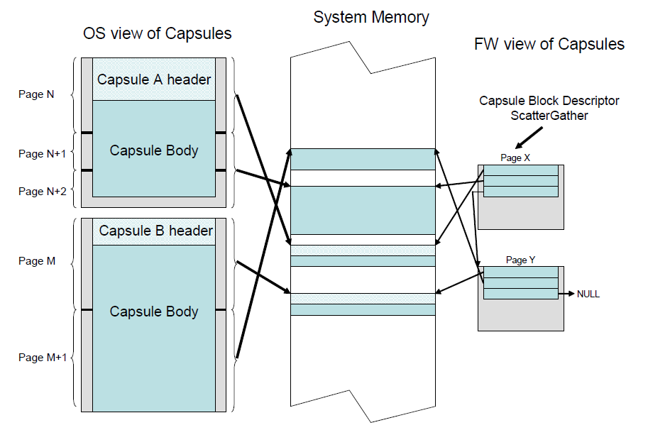

.. _services-runtime-services:

Services — Runtime Services
============================

This section discusses the fundamental services that are present in a compliant system. The services are defined by interface functions that may be used by code running in the EFI environment. Such code may include protocols that manage device access or extend platform capability, as well as applications running in the preboot environment and EFI OS loaders.

Two types of services are described here:

-  **Boot Services**. Functions that are available *before* a successful call to EFI_BOOT_SERVICES.ExitBootServices(), described in :ref:`efi-boot-services-exitbootservices` .

-  **Runtime Services**. Functions that are available before and after any call to *ExitBootServices()*. These functions are described in this section.

During boot, system resources are owned by the firmware and are controlled through boot services interface functions. These functions can be characterized as "global" or "handle-based." The term "global" simply means that a function accesses system services and is available on all platforms (since all platforms support all system services). The term "handle-based" means that the function accesses a specific device or device functionality and may not be available on some platforms (since some devices are not available on some platforms). Protocols are created dynamically. This section discusses the "global" functions and runtime functions; subsequent sections discuss the "handle-based."

UEFI applications (including UEFI OS loaders) must use boot services functions to access devices and allocate memory. On entry, an image is provided a pointer to a system table which contains the Boot Services dispatch table and the default handles for accessing the console. All boot services functionality is available until a UEFI OS loader loads enough of its own environment to take control of the system’s continued operation and then terminates boot services with a call to ExitBootServices().

In principle, the ExitBootServices() call is intended for use by the operating system to indicate that its loader is ready to assume control of the platform and all platform resource management. Thus, boot services are available up to this point to assist the UEFI OS loader in preparing to boot the operating system. Once the UEFI OS loader takes control of the system and completes the operating system boot process, only runtime services may be called. Code other than the UEFI OS loader, however, may or may not choose to call ExitBootServices(). This choice may in part depend upon whether or not such code is designed to make continued use of EFI boot services or the boot services environment.

The rest of this section discusses individual functions. Runtime Services fall into these categories:

-  Runtime Rules and Restrictions ( :ref:`runtime-services-rules-and-restrictions`)

-  Variable Services ( :ref:`variable-services`)

-  Time Services ( :ref:`time-services`)

-  Virtual Memory Services ( :ref:`virtual-memory-services`)

-  Miscellaneous Services ( :ref:`miscellaneous-runtime-services`)

.. _runtime-services-rules-and-restrictions:

Runtime Services Rules and Restrictions
---------------------------------------

All of the Runtime Services may be called with interrupts enabled if desired. The Runtime Service functions will internally disable interrupts when it is required to protect access to hardware resources. The interrupt enable control bit will be returned to its entry state after the access to the critical hardware resources is complete.

All callers of Runtime Services are restricted from calling the same or certain other Runtime Service functions prior to the completion and return of a previous Runtime Service call. These restrictions apply to:

-  Runtime Services that have been interrupted

-  Runtime Services that are active on another processor.

Callers are prohibited from using certain other services from another processor or on the same processor following an interrupt as specified in  :ref:`rules-for-reentry-into-runtime-services`. For this table ‘Busy’ is defined as the state when a Runtime Service has been entered and has not returned to the caller. 

The consequence of a caller violating these restrictions is undefined except for certain special cases described below.

.. list-table:: Rules for Reentry Into Runtime Services
   :name: rules-for-reentry-into-runtime-services
   :widths: 50,50 
   :class: longtable 

   * - **If previous call is busy in**
     - **Forbidden to call**
   * - Any
     - SetVirtualAddressMap()
   * - ConvertPointer()
     - ConvertPointer()
   * - | SetVariable(),
       | UpdateCapsule(),  
       | SetTime()  
       | SetWakeupTime(),  
       | GetNextHighMonotonicCount()
     - ResetSystem()
   * - | GetVariable()  
       | GetNextVariableName()  
       | SetVariable()  
       | QueryVariableInfo()  
       | UpdateCapsule()  
       | QueryCapsuleCapabilities()  
       | GetNextHighMonotonicCount()
     - | GetVariable(), 
       | GetNextVariableName(),  
       | SetVariable(),  
       | QueryVariableInfo(),  
       | UpdateCapsule(),  
       | QueryCapsuleCapabilities(), 
       | GetNextHighMonotonicCount()
   * - | GetTime()  
       | SetTime()  
       | GetWakeupTime()  
       | SetWakeupTime()
     - | GetTime()  
       | SetTime()  
       | GetWakeupTime()  
       | SetWakeupTime() 

If any EFI_RUNTIME_SERVICES* calls are not supported for use by the OS at runtime, an EFI_RT_PROPERTIES_TABLE configuration table should be published describing which runtime services are supported at runtime (:ref:`efi-configuration-table-and-properties-table`). Note that this is merely a hint to the OS, which it is free to ignore, and so the platform is still required to provide callable implementations of unsupported runtime services that simply return EFI_UNSUPPORTED.

.. _exception-for-machine-check-init-and-nmi:

Exception for Machine Check, INIT, and NMI
##########################################

Certain asynchronous events (e.g., NMI on IA-32 and x64 systems, Machine Check and INIT on Itanium systems) can not be masked and may occur with any setting of interrupt enabled. These events also may require OS level handler's involvement that may involve the invocation of some of the runtime services (see below).

If SetVirtualAddressMap() has been called, all calls to runtime services after Machine Check, INIT, or NMI, must be made using the virtual address map set by that call. 

A Machine Check may have interrupted a runtime service (see below). If the OS determines that the Machine Check is recoverable, the OS level handler must follow the normal restrictions in the Table :ref:`rules-for-reentry-into-runtime-services`.

If the OS determines that the Machine Check is non-recoverable, the OS level handler may ignore the normal restrictions and may invoke the runtime services described in the Table  :ref:`functions-that-may-be-called-after-machine-check-init-and-nmi` even in the case where a previous call was busy. The system firmware will honor the new runtime service call(s) and the operation of the previous interrupted call is not guaranteed. Any interrupted runtime functions will not be restarted.

The INIT and NMI events follow the same restrictions.

**NOTE**: *On Itanium systems, the OS Machine Check Handler must not call ResetSystem(). If a reset is required, the OS Machine Check Handler may request SAL to reset upon return to SAL_CHECK*. 

The platform implementations are required to clear any runtime services in progress in order to enable the OS handler to invoke these runtime  services even in the case where a previous call was busy. In this case, the proper operation of the original interrupted call is not guaranteed.

.. list-table:: Functions that may be called after Machine Check, INIT and NMI
   :name: functions-that-may-be-called-after-machine-check-init-and-nmi
   :widths: 15 75 
   :class: longtable

   * - **Function**                   
     - **Called after Machine Check, INIT and NMI**
   * - GetTime()                  
     - Yes, even if previously busy
   * - GetVariable()              
     - Yes, even if previously busy
   * - GetNextVariableName()      
     - Yes, even if previously busy
   * - QueryVariableInfo()        
     - Yes, even if previously busy
   * - SetVariable()              
     - Yes, even if previously busy
   * - UpdateCapsule()            
     - Yes, even if previously busy
   * - QueryCapsuleCapabilities() 
     - Yes, even if previously busy
   * - ResetSystem()              
     - Yes, even if previously busy

.. _variable-services:

Variable Services
-----------------

Variables are defined as key/value pairs that consist of identifying information plus attributes (the key) and arbitrary data (the value). Variables are intended for use as a means to store data that is passed between the EFI environment implemented in the platform and EFI OS loaders and other applications that run in the EFI environment.

Although the implementation of variable storage is not defined in this specification, variables must be persistent in most cases. This implies that the EFI implementation on a platform must arrange it so that variables passed in for storage are retained and available for use each time the system boots, at least until they are explicitly deleted or overwritten. Provision of this type of nonvolatile storage may be very limited on some platforms, so variables should be used sparingly in cases where other means of communicating information cannot be used.

The Table below lists the variable services functions described in this section:

.. list-table:: Variable Services Functions
   :name: variable-services-functions
   :widths: 15 30 75 
   :class: longtable 

   * - **Name** 
     - **Type**
     - **Description**
   * - GetVariable
     - Runtime 
     - Returns the value of a variable.
   * - GetNextVariableName 
     - Runtime 
     - Enumerates the current variable names.
   * - SetVariable
     - Runtime 
     - Sets the value of a variable.
   * - QueryVariableInfo
     - Runtime 
     - Returns information about the EFI variables

.. _getvariable:

GetVariable()
#############

**Summary**

Returns the value of a variable.

**Prototype**

.. code-block:: 

   typedef
   EFI_STATUS
   GetVariable (
     IN CHAR16           *VariableName,
     IN EFI_GUID         *VendorGuid,
     OUT UINT32          *Attributes OPTIONAL,
     IN OUT UINTN        *DataSize,
     OUT VOID            *Data OPTIONAL
    );

**Parameters**

VariableName 
  A Null-terminated string that is the name of the vendor’s variable.

VendorGuid 
  A unique identifier for the vendor. Type EFI_GUID is defined in the  :ref:`efi-boot-services-installprotocolinterface` function description.

.. TODO: check link above

Attributes 
  If not NULL, a pointer to the memory location to return the attributes bitmask for the variable. See "Related Definitions." If not NULL, then *Attributes* is set on output both when *EFI_SUCCESS* and when EFI_BUFFER_TOO_SMALL is returned.

DataSize
  On input, the size in bytes of the return Data buffer. On output the size of data returned in Data.

Data 
  The buffer to return the contents of the variable. May be NULL with a zero *DataSize* in order to determine the size buffer needed.

**Related Definitions**

.. code-block:: 

   //******************************************************  
   // Variable Attributes  
   //******************************************************  
   #define EFI_VARIABLE_NON_VOLATILE                           0x00000001  
   #define EFI_VARIABLE_BOOTSERVICE_ACCESS                     0x00000002  
   #define EFI_VARIABLE_RUNTIME_ACCESS                         0x00000004  
   #define EFI_VARIABLE_HARDWARE_ERROR_RECORD                  0x00000008 \  
   //This attribute is identified by the mnemonic 'HR' elsewhere  
   //in this specification.  
   Reserved                                                    0x00000010   
   #define EFI_VARIABLE_TIME_BASED_AUTHENTICATED_WRITE_ACCESS  0x00000020  
   #define EFI_VARIABLE_APPEND_WRITE                           0x00000040  
   #define EFI_VARIABLE_ENHANCED_AUTHENTICATED_ACCESS          0x00000080  
   //This attribute indicates that the variable payload begins  
   //with an EFI_VARIABLE_AUTHENTICATION_3 structure, and  
   //potentially more structures as indicated by fields of this  
   //structure. See definition below and in SetVariable().

**Description**

Each vendor may create and manage its own variables without the risk of name conflicts by using a unique VendorGuid. When a variable is set its Attributes are supplied to indicate how the data variable should be stored and maintained by the system. The attributes affect when the variable may be accessed and volatility of the data. If EFI_BOOT_SERVICES.ExitBootServices() has already been executed, data variables without the EFI_VARIABLE_RUNTIME_ACCESS attribute set will not be visible to GetVariable() and will return an EFI_NOT_FOUND error.

If the *Data* buffer is too small to hold the contents of the variable, the error *EFI_BUFFER_TOO_SMALL* is returned and DataSize is set to the required buffer size to obtain the data.

The EFI_VARIABLE_TIME_BASED_AUTHENTICATED_WRITE_ACCESS may be set in the returned *Attributes* bitmask parameter of a GetVariable() call. The EFI_VARIABLE_APPEND_WRITE attribute will never be set in the returned *Attributes* bitmask parameter. 

Variables stored with the EFI_VARIABLE_ENHANCED_AUTHENTICATED_ACCESS attribute set will return metadata in addition to variable data when GetVariable() is called. If a GetVariable() call indicates that this attribute is set, the GetVariable() payload must be interpreted according to the metadata headers. In addition to the headers described in SetVariable(), the following header is used to indicate what certificate may be currently associated with a variable.

.. code-block::  

   //
   // EFI_VARIABLE_AUTHENTICATION_3_CERT_ID descriptor
   //
   // An extensible structure to identify a unique x509 cert
   // associated with a given variable
   //
   #define EFI_VARIABLE_AUTHENTICATION_3_CERT_ID_SHA256 1
   
   typedef struct {
      UINT8          Type;
      UINT32         IdSize;
      // UINT8       Id[IdSize];
   }   EFI_VARIABLE_AUTHENTICATION_3_CERT_ID;

Type
  Identifies the type of ID that is returned and how the ID should be interpreted.

IdSize
  Indicates the size of the Id buffer that follows this field in the structure.

Id (Not a formal structure member)
  This is a unique identifier for the associated certificate as defined by the Type field. For CERT_ID_SHA256, the buffer will be a SHA-256 digest of the tbsCertificate (To Be Signed Certificate data defined in x509) data for the cert.

When the attribute EFI_VARIABLE_ENHANCED_AUTHENTICATED_ACCESS is set, the Data buffer shall be interpreted as follows:

// NOTE: "||" indicates concatenation.

// Example: EFI_VARIABLE_AUTHENTICATION_3_TIMESTAMP_TYPE

EFI_VARIABLE_AUTHENTICATION_3 || EFI_TIME || EFI_VARIABLE_AUTHENTICATION_3_CERT_ID || Data

// Example: *EFI_VARIABLE_AUTHENTICATION_3_NONCE_TYPE*

EFI_VARIABLE_AUTHENTICATION_3 || EFI_VARIABLE_AUTHENTICATION_3_NONCE ||
EFI_VARIABLE_AUTHENTICATION_3_CERT_ID || Data

**NOTE**: *The MetadataSize field of the EFI_VARIABLE_AUTHENTICATION_3 structure in each of these examples does not include any WIN_CERTIFICATE_UEFI_GUID structures. These structures are used in the SetVariable() interface, not GetVariable(), as described in the above examples*.

**Status Codes Returned**

.. list-table::
   :widths: 35 70
   :class: longtable

   * - EFI_SUCCESS
     - The function completed successfully.
   * - EFI_NOT_FOUND
     - The variable was not found.
   * - EFI_BUFFER_TOO_SMALL
     - The *DataSize* is too small for the result. *DataSize* has been updated with the size needed to complete the request. If *Attributes* is not NULL, then the attributes bitmask for the variable has been stored to the memory location pointed-to by *Attributes*.
   * - EFI_INVALID_PARAMETER
     - *VariableName* is NULL.
   * - EFI_INVALID_PARAMETER
     - *VendorGuid* is NULL.
   * - EFI_INVALID_PARAMETER
     - *DataSize* is NULL.
   * - EFI_INVALID_PARAMETER
     - The *DataSize* is not too small and *Data* is NULL.
   * - EFI_DEVICE_ERROR
     - The variable could not be retrieved due to a hardware error.
   * - EFI_SECURITY_VIOLATION
     - The variable could not be retrieved due to an authentication failure.
   * - EFI_UNSUPPORTED
     - After *ExitBootServices()* has been called, this return code may be returned if no variable storage is supported. The platform should describe this runtime service as unsupported at runtime via an *EFI_RT_PROPERTIES_TABLE* configuration table.  

 
.. _get-nextvariablename:

GetNextVariableName()
#####################

**Summary**

Enumerates the current variable names.

**Prototype**

.. code-block::
  
   typedef
   EFI_STATUS
   GetNextVariableName (
     IN OUT UINTN           *VariableNameSize,
     IN OUT CHAR16          *VariableName,
     IN OUT EFI_GUID        *VendorGuid
    );
  

**Parameters**

VariableNameSize
  The size of the *VariableName* buffer. The size must be large enough to fit input string supplied in VariableName buffer.

VariableName
  On input, supplies the last *VariableName* that was returned by * GetNextVariableName(). On output, returns the Null-terminated string of the current variable.

VendorGuid
  On input, supplies the last *VendorGuid* that was returned by GetNextVariableName(). On output, returns the *VendorGuid* of the current variable. Type EFI_GUID is defined in the   :ref:`efi-boot-services-installprotocolinterface` function description.

  .. TODO: check line above

**Description**

GetNextVariableName() is called multiple times to retrieve the VariableName and VendorGuid of all variables currently available in the system. On each call to GetNextVariableName() the previous results are passed into the interface, and on output the interface returns the next variable name data. When the entire variable list has been returned, the error EFI_NOT_FOUND is returned.

Note that if EFI_BUFFER_TOO_SMALL is returned, the VariableName buffer was too small for the next variable. When such an error occurs, the VariableNameSize is updated to reflect the size of buffer needed. In all cases when calling GetNextVariableName() the VariableNameSize must not exceed the actual buffer size that was allocated for VariableName. The VariableNameSize must not be smaller the size of the variable name string passed to GetNextVariableName() on input in the *VariableName* buffer.

To start the search, a Null-terminated string is passed in VariableName; that is, *VariableName* is a pointer to a Null character. This is always done on the initial call to GetNextVariableName(). When *VariableName* is a pointer to a Null character, *VendorGuid* is ignored. GetNextVariableName() cannot be used as a filter to return variable names with a specific GUID. Instead, the entire list of variables must be retrieved, and the caller may act as a filter if it chooses. Calls to `SetVariable()`_ between calls to GetNextVariableName() may produce unpredictable results. If a *VariableName* buffer on input is not a Null-terminated string, EFI_INVALID_PARAMETER is returned. If input values of *VariableName* and *VendorGuid* are not a name and GUID of an existing variable, EFI_INVALID_PARAMETER is returned.

Once  :ref:`efi-boot-services-exitbootservices`  is performed, variables that are only visible during boot services will no longer be returned. To obtain the data contents or attribute for a variable returned by GetNextVariableName(), the   :ref:`getvariable` interface is used.

**Status Codes Returned**

.. list-table::
   :widths: 35 70 
   :class: longtable

   * - EFI_SUCCESS
     - The function completed successfully.
   * - EFI_NOT_FOUND
     - The next variable was not found.
   * - EFI_BUFFER_TOO_SMALL
     - The *VariableNameSize* is too small for the result. *VariableNameSize* has been updated with the size needed to complete the request.
   * - EFI_INVALID_PARAMETER
     - *VariableNameSize* is NULL.
   * - EFI_INVALID_PARAMETER
     - *VariableName* is NULL.
   * - EFI_INVALID_PARAMETER
     - *VendorGuid* is NULL.
   * - EFI_INVALID_PARAMETER
     - The input values of *VariableName* and *VendorGuid* are not a name and GUID of an existing variable. 
   * - EFI_INVALID_PARAMETER
     - Null-terminator is not found in the first *VariableNameSize* bytes of the input *VariableName* buffer.
   * - EFI_DEVICE_ERROR
     - The variable name could not be retrieved due to a hardware error.
   * - EFI_UNSUPPORTED 
     - After ExitBootServices() has been called, this return code may be returned if no variable storage is supported. The platform should describe this runtime service as unsupported at runtime via an EFI_RT_PROPERTIES_TABLE configuration table.

.. _setvariable:

SetVariable()
#############

**Summary**

Sets the value of a variable. This service can be used to create a new variable, modify the value of an existing variable, or to delete an existing variable.

**Prototype**

.. code-block::

   typedef
   EFI_STATUS
   SetVariable (
     IN CHAR16            *VariableName,
     IN EFI_GUID          *VendorGuid,
     IN UINT32            Attributes,
     IN UINTN             DataSize,
     IN VOID              *Data
  );

**Parameters**

VariableName 
  A Null-terminated string that is the name of the vendor’s variable. Each *VariableName* is unique for each *VendorGuid*. *VariableName* must contain 1 or more characters. If *VariableName* is an empty string, then EFI_INVALID_PARAMETER is returned.

VendorGuid 
  A unique identifier for the vendor. Type EFI_GUID is defined in the :ref:`efi-boot-services-installprotocolinterface` function description.

Attributes 
  Attributes bitmask to set for the variable. Refer to the :ref:`getvariable` function description.

DataSize 
  The size in bytes of the *Data* buffer. Unless the EFI_VARIABLE_APPEND_WRITE, EFI_VARIABLE_AUTHENTICATED_WRITE_ACCESS, EFI_VARIABLE_ENHANCED_AUTHENTICATED_ACCESS, or EFI_VARIABLE_TIME_BASED_AUTHENTICATED_WRITE_ACCESS attribute is set, a size of zero causes the variable to be deleted. When the EFI_VARIABLE_APPEND_WRITE attribute is set, then a SetVariable() call with a *DataSize* of zero will not cause any change to the variable value (the timestamp associated with the variable may be updated however, even if no new data value is provided; see the description of the EFI_VARIABLE_AUTHENTICATION_2 descriptor below). In this case the DataSize will not be zero since the EFI_VARIABLE_AUTHENTICATION_2 descriptor will be populated).

Data 
  The contents for the variable.

**Related Definitions**

.. code-block::

   //
   // EFI_VARIABLE_AUTHENTICATION_2 descriptor
   //
   // A time-based authentication method descriptor template
   //
   typedef struct {
     EFI_TIME                      TimeStamp;
     WIN_CERTIFICATE_UEFI_GUID     AuthInfo;
   } EFI_VARIABLE_AUTHENTICATION_2;

TimeStamp
  Time associated with the authentication descriptor. For the *TimeStamp* value, components *Pad1*, *Nanosecond*, *TimeZone*, *Daylight* and *Pad2* shall be set to 0. This means that the time shall always be expressed in GMT.

AuthInfo
  Provides the authorization for the variable access. Only a *CertType* of EFI_CERT_TYPE_PKCS7_GUID is accepted.

.. code-block::

   //
   // EFI_VARIABLE_AUTHENTICATION_3 descriptor
   //
   // An extensible implementation of the Variable Authentication
   // structure.
   //
   #define EFI_VARIABLE_AUTHENTICATION_3_TIMESTAMP_TYPE 1
   #define EFI_VARIABLE_AUTHENTICATION_3_NONCE_TYPE 2

   typedef struct {
     UINT8 Version;
     UINT8 Type;
     UINT32 MetadataSize;
     UINT32 Flags;
   } EFI_VARIABLE_AUTHENTICATION_3;

Version
  This field is used in case the EFI_VARIABLE_AUTHENTICATION_3 structure itself ever requires updating. For now, it is hardcoded to "0x1".

Type
  Declares what structure immediately follows this structure in the Variable Data payload. For EFI_VARIABLE_AUTHENTICATION_3_TIMESTAMP_TYPE, it will be an instance of EFI_TIME (for the TimeStamp). For EFI_VARIABLE_AUTHENTICATION_3_NONCE_TYPE the structure will be an instance of EFI_VARIABLE_AUTHENTICATION_3_NONCE. This structure is defined below. Note that none of these structures contains a WIN_CERTIFICATE_UEFI_GUID structure. See   :ref:`using-the-efi-variable-authentication-3-descriptor` for an explanation of structure sequencing.

MetadataSize
  Declares the size of all variable authentication metadata (data related to the authentication of the variable that is not variable data itself), including this header structure, and type-specific structures (eg. EFI_VARIABLE_AUTHENTICATION_3_NONCE), and any WIN_CERTIFICATE_UEFI_GUID structures.

Flags
  | Bitfield indicating any optional configuration for this call. Currently, the only defined value is: #define EFI_VARIABLE_ENHANCED_AUTH_FLAG_UPDATE_CERT 0x00000001 The presence of this flag on SetVariable() indicates that there are two instances of the WIN_CERTIFICATE_UEFI_GUID structure following the type-specific structures. The first instance describes the new cert to be set as the authority for the variable. The second is the signed data to authorize the current updated.  

  | **NOTE:** All other bits are currently Reserved on SetVariable().

  | **NOTE**: All flags are reserved on GetVariable().
  |

.. code-block::

   //
   // EFI_VARIABLE_AUTHENTICATION_3_NONCE descriptor
   //
   // A nonce-based authentication method descriptor template. This
   // structure will always be followed by a
   // WIN_CERTIFICATE_UEFI_GUID structure.
   //
   typedef struct {
     UINT32 NonceSize;
     // UINT8 Nonce[NonceSize];
   }  EFI_VARIABLE_AUTHENTICATION_3_NONCE;

NonceSize
  Indicates the size of the Nonce buffer that follows this field in the structure. Must not be 0.

Nonce (Not a formal structure member)
  Unique, random value that guarantees a signed payload cannot be shared between multiple machines or machine families. On SetVariable(), if the Nonce field is all 0’s, the host machine will try to use an internally generated random number. Will return *EFI_UNSUPPORTED* if not possible. Also, on SetVariable() if the variable already exists and the nonce is identical to the current nonce, will return EFI_INVALID_PARAMETER.

**Description**

Variables are stored by the firmware and may maintain their values across power cycles. Each vendor may create and manage its own variables without the risk of name conflicts by using a unique *VendorGuid*.

Each variable has Attributes that define how the firmware stores and maintains the data value. If the EFI_VARIABLE_NON_VOLATILE attribute is not set, the firmware stores the variable in normal memory and it is not maintained across a power cycle. Such variables are used to pass information from one component to another. An example of this is the firmware’s language code support variable. It is created at firmware initialization time for access by EFI components that may need the information, but does not need to be backed up to nonvolatile storage.

EFI_VARIABLE_NON_VOLATILE variables are stored in fixed hardware that has a limited storage capacity; sometimes a severely limited capacity. Software should only use a nonvolatile variable when absolutely necessary. In addition, if software uses a nonvolatile variable it should use a variable that is only accessible at boot services time if possible.

A variable must contain one or more bytes of Data. Unless the EFI_VARIABLE_APPEND_WRITE, EFI_VARIABLE_TIME_BASED_AUTHENTICATED_WRITE_ACCESS, or EFI_VARIABLE_ENHANCED _AUTHENTICATED_ACCESS attribute is set (see below), using SetVariable() with a DataSize of zero will cause the entire variable to be deleted. The space consumed by the deleted variable may not be available until the next power cycle.

If a variable with matching name, GUID, and attributes already exists, its value is updated.

The Attributes have the following usage rules:

-  If a preexisting variable is rewritten with different attributes, SetVariable() shall not modify the variable and shall return EFI_INVALID_PARAMETER. The only exception to this is when the only attribute differing is EFI_VARIABLE_APPEND_WRITE. In such cases the call's successful outcome or not is determined by the actual value being written. There are two exceptions to this rule:

   —  If a preexisting variable is rewritten with no access attributes specified, the variable will be deleted.

   —   EFI_VARIABLE_APPEND_WRITE attribute presents a special case. It is acceptable to rewrite the variable with or without EFI_VARIABLE_APPEND_WRITE attribute. 

-  Setting a data variable with no access attributes causes it to be deleted.

-  Unless the EFI_VARIABLE_APPEND_WRITE, EFI_VARIABLE_TIME_BASED_AUTHENTICATED_WRITE_ACCESS, or EFI_VARIABLE_ENHANCED_AUTHENTICATED_WRITE_ACCESS attribute is set, setting a data variable with zero *DataSize* specified, causes it to be deleted.

-  Runtime access to a data variable implies boot service access. Attributes that have EFI_VARIABLE_RUNTIME_ACCESS set must also have EFI_VARIABLE_BOOTSERVICE_ACCESS set. The caller is responsible for following this rule.

-  Once  :ref:`efi-boot-services-exitbootservices` is performed, data variables that did not have EFI_VARIABLE_RUNTIME_ACCESS set are no longer visible to :ref:`getvariable`.

-  Once ExitBootServices() is performed, only variables that have EFI_VARIABLE_RUNTIME_ACCESS and EFI_VARIABLE_NON_VOLATILE set can be set with SetVariable(). Variables that have runtime access but that are not nonvolatile are read-only data variables once ExitBootServices() is performed. When the EFI_VARIABLE_ENHANCED_AUTHENTICATED_ACCESS attribute is set in a SetVariable() call, the authentication shall use the EFI_VARIABLE_AUTHENTICATION_3 descriptor, which will be followed by any descriptors indicated in the Type and Flags fields.

-  When the EFI_VARIABLE_TIME_BASED_AUTHENTICATED_WRITE_ACCESS attribute is set in a SetVariable() call, the authentication shall use the EFI_VARIABLE_AUTHENTICATION_2 descriptor.

-  If both the EFI_VARIABLE_TIME_BASED_AUTHENTICATED_WRITE_ACCESS and the EFI_VARIABLE_ENHANCED_AUTHENTICATED_ACCESS attribute are set in a SetVariable() call, then the firmware must return EFI_INVALID_PARAMETER.

-  If the EFI_VARIABLE_APPEND_WRITE attribute is set in a SetVariable() call, then any existing variable value shall be appended with the value of the *Data* parameter. If the firmware does not support the append operation, then the SetVariable() call shall return EFI_INVALID_PARAMETER. If the variable does not exist and EFI_VARIABLE_APPEND_WRITE is set and the size is non-zero, the variable is created. If the variable does not exist and EFI_VARIABLE_APPEND_WRITE is set and the size is zero, the variable is not created and EFI_SUCCESS is returned.

-  If the EFI_VARIABLE_TIME_BASED_AUTHENTICATED_WRITE_ACCESS attribute is set in a SetVariable() call, and firmware does not support signature type of the certificate included in the EFI_VARIABLE_AUTHENTICATION_2 descriptor, then the SetVariable() call shall return EFI_INVALID_PARAMETER. The list of signature types supported by the firmware is defined by the SignatureSupport variable. Signature type of the certificate is defined by its digest and encryption algorithms.

-  If the EFI_VARIABLE_HARDWARE_ERROR_RECORD attribute is set, *VariableName* and *VendorGuid* must comply with the rules stated in :ref:`hardware-error-record-variables` and :ref:`appendix-p-hardware-error-record-persistence-usage-apx-p-hardware-error-record-persistence-usage`. Otherwise, the SetVariable() call shall return EFI_INVALID_PARAMETER.

-  :ref:`globally-defined-variables` must be created with the attributes defined in the Table :ref:`global-variables` . If a globally defined variable is created with the wrong attributes, the result is indeterminate and may vary between implementations.

-  If using the EFI_VARIABLE_ENHANCED_AUTHETICATED_ACCESS interface to update the cert authority for a given variable, it is valid for the *Data* region of the payload to be empty. This would update the cert without modifying the data itself. If the *Data* region is empty AND no NewCert is specified, the variable will be deleted (assuming all authorizations are verified).

-  Secure Boot Policy Variable must be created with the EFI_VARIABLE_TIME_BASED_AUTHENTICATED _WRITE_ACCESS attribute set, and the authentication shall use the EFI_VARIABLE_AUTHENTICATION_2 descriptor. If the appropriate attribute bit is not set, then the firmware shall return EFI_INVALID_PARAMETER.

The only rules the firmware must implement when saving a nonvolatile variable is that it has actually been saved to nonvolatile storage before returning EFI_SUCCESS, and that a partial save is not performed. If power fails during a call to SetVariable() the variable may contain its previous value, or its new value. In addition there is no read, write, or delete security protection.

To delete a variable created with the EFI_VARIABLE_TIME_BASED_AUTHENTICATED_WRITE_ACCESS attribute, *SetVariable* must be used with attributes matching the existing variable and the *DataSize* set to the size of the *AuthInfo* descriptor. The *Data* buffer must contain an instance of the *AuthInfo* descriptor which will be validated according to the steps in the appropriate section above referring to updates of Authenticated variables. An attempt to delete a variable created with the EFI_VARIABLE_TIME_BASED_AUTHENTICATED_WRITE_ACCESS attribute for which the prescribed *AuthInfo* validation fails or when called using *DataSize* of zero will fail with an EFI_SECURITY_VIOLATION status. 

To delete a variable created with the EFI_VARIABLE_ENHANCED_AUTHENTICATED_ACCESS attribute, *SetVariable* must be used with attributes matching the existing variable and the *DataSize* set to the size of the entire payload including all descriptors and certificates. The *Data* buffer must contain an instance of the EFI_VARIABLE_AUTHENTICATION_3 descriptor which will indicate how to validate the payload according to the description in :ref:`using-the-efi-variable-authentication-3-descriptor`. An attempt to delete a variable created with the EFI_VARIABLE_ENHANCED_AUTHENTICATED_ACCESS attribute for which the prescribed validation fails or when called using *DataSize* of zero will fail with an EFI_SECURITY_VIOLATION status.

**Status Codes Returned**

.. list-table::
   :widths: 35 70
   :class: longtable

   * - **EFI_SUCCESS**
     - The firmware has successfully stored the variable and its data as defined by the Attributes.
   * - **EFI_INVALID_PARAMETER**
     - An invalid combination of attribute bits, name, and GUID was supplied, or the *DataSize* exceeds the maximum allowed.
   * - **EFI_INVALID_PARAMETER**
     - *VariableName* is an empty string.
   * - **EFI_OUT_OF_RESOURCES**
     - Not enough storage is available to hold the variable and its data.
   * - **EFI_DEVICE_ERROR**
     - The variable could not be saved due to a hardware failure.
   * - **EFI_WRITE_PROTECTED**
     - The variable in question is read-only.
   * - **EFI_WRITE_PROTECTED**
     - The variable in question cannot be deleted.
   * - **EFI_SECURITY_VIOLATION**
     - | The variable could not be written due to 
       | EFI_VARIABLE_ENHANCED_AUTHENTICATED_ACCESS or 
       | EFI_VARI ABLE_TIME_BASED_AUTHENTICATED_WRITE_ACESS being set, but the payload does NOT pass the validation check carried out by the firmware.
   * - **EFI_NOT_FOUND** 
     - The variable trying to be updated or deleted was not found.
   * - **EFI_UNSUPPORTED**
     - This call is not supported by this platform at the time the call is made. The platform should describe this runtime service as unsupported at runtime via an EFI_RT_PROPERTIES_TABLE configuration table. 

.. _queryvariableinfo:

QueryVariableInfo()
###################

**Summary**

Returns information about the EFI variables.

**Prototype**

.. code-block:: 

   typedef
   EFI_STATUS
   QueryVariableInfo (
      IN UINT32             Attributes,
      OUT UINT64            *MaximumVariableStorageSize,
      OUT UINT64            *RemainingVariableStorageSize,
      OUT UINT64            *MaximumVariableSize
     );
  
Attributes
  Attributes bitmask to specify the type of variables on which to return information. Refer to the :ref:`getvariable` function description. The EFI_VARIABLE_APPEND_WRITE attribute, if set in the attributes bitmask, will be ignored.
 
MaximumVariableStorageSize
  On output the maximum size of the storage space available for the EFI variables associated with the attributes specified.
  
RemainingVariableStorageSize
  Returns the remaining size of the storage space available for EFI variables associated with the attributes specified.
  
MaximumVariableSize
  Returns the maximum size of an individual EFI variable associated with the attributes specified.

**Description**

The QueryVariableInfo() function allows a caller to obtain the information about the maximum size of the storage space available for the EFI variables, the remaining size of the storage space available for the EFI variables and the maximum size of each individual EFI variable, associated with the attributes specified.

The *MaximumVariableSize* value will reflect the overhead associated with the saving of a single EFI variable with the exception of the overhead associated with the length of the string name of the EFI variable.

The returned *MaximumVariableStorageSize*, *RemainingVariableStorageSize*, *MaximumVariableSize* information may change immediately after the call based on other runtime activities including asynchronous error events. Also, these values associated with different attributes are not additive in nature.

If a call to QueryVariableInfo() specifies a combination of both unsupported and invalid attributes, EFI_UNSUPPORTED should be returned.

After the system has transitioned into runtime (after ExitBootServices() is called), an implementation may not be able to accurately return information about the Boot Services variable store. In such cases, EFI_INVALID_PARAMETER should be returned.

**Status Codes Returned**

.. list-table::
   :widths: 35 70
   :class: longtable

   * - EFI_SUCCESS
     - Valid answer returned.
   * - EFI_INVALID_PARAMETER
     - An invalid combination of attribute bits was supplied
   * - EFI_UNSUPPORTED
     - | The attribute is not supported on this platform, and the 
       | *MaximumVariableStorageSize*, 
       | *RemainingVariableStorageSize*, 
       | *MaximumVariableSize* are undefined.

.. _using-the-efi-variable-authentication-3-descriptor:

Using the EFI_VARIABLE_AUTHENTICATION_3 descriptor
##################################################

When the attribute EFI_VARIABLE_ENHANCED_AUTHENTICATED_ACCESS is set, the payload buffer (passed into SetVariable() as "Data") shall be constructed as follows:

| // NOTE: "||" indicates concatenation.
| // NOTE: "[ ]" indicates an optional element.
|
| // Example: EFI_VARIABLE_AUTHENTICATION_3_TIMESTAMP_TYPE EFI_VARIABLE_AUTHENTICATION_3 || EFI_TIME || [ NewCert ] || SigningCert || Data
| 
| // Example: EFI_VARIABLE_AUTHENTICATION_3_NONCE_TYPE  FI_VARIABLE_AUTHENTICATION_3 || EFI_VARIABLE_AUTHENTICATION_3_NONCE || [ NewCert ] || SigningCert || Data
|

In this example, NewCert and SigningCert are both instances of WIN_CERTIFICATE_UEFI_GUID. The presence of NewCert is indicated by the EFI_VARIABLE_AUTHENTICATION_3.Flags field (see Definition in SetVariable()). If provided – and assuming the payload passes all integrity and security verifications — this cert will be set as the new authority for the underlying variable, even if the variable is being newly created.

The NewCert element must have a CertType of EFI_CERT_TYPE_PKCS7_GUID, and the CertData must be a DER-encoded SignedData structure per PKCS#7 version 1.5 (RFC 2315), which shall be supported both with and without a DER-encoded ContentInfo structure per PKCS#7 version 1.5. When creating the SignedData structure, the following steps shall be followed:

1. Create a WIN_CERTIFICATE_UEFI_GUID structure where CertType is set to EFI_CERT_TYPE_PKCS7_GUID.

#. Use the x509 cert being added as the new authority to sign its own tbsCertificate data.

#. Construct a DER-encoded PKCS #7 version 1.5 SignedData (see [RFC2315]) with the signed content as follows:

   a - SignedData.version shall be set to 1.

   b - SignedData.digestAlgorithms shall contain the digest algorithm used when preparing the signature.

   c - SignedData.contentInfo.contentType shall be set to id-data.

   d - SignedData.contentInfo.content shall be the tbsCertificate data  that was signed for the new x509 cert.

   e - SignedData.certificates shall contain, at a minimum, the signer’s DER-encoded X.509 certificate.

   f - SignedData.crls is optional.

   g - SignedData.signerInfos shall be constructed as:

   - SignerInfo.version shall be set to 1.

   - SignerInfo.issuerAndSerial shall be present and as in the signer’s certificate.

   - SignerInfo.authenticatedAttributes shall not be present.

   - SignerInfo.digestEncryptionAlgorithm shall be set to the algorithm used to sign the data. 

   - SignerInfo.encryptedDigest shall be present.

   - SignerInfo.unauthenticatedAttributes shall not be present.

#. Set the CertData field to the DER-encoded PKCS#7 SignedData value.

A caller to SetVariable() attempting to create, update, or delete a variable with the EFI_VARIABLE_ENHANCED_AUTHENTICATED_ACCESS set shall perform the following steps to create the SignedData structure for SigningCert:

1. Create an EFI_VARIABLE_AUTHENTICATION_3 Primary Descriptor with the following values:

   a - Version shall be set appropriate to theversion of metadata headers being used (currently 1).

   b - Type should be set based on caller specifications (see    EFI_VARIABLE_AUTHENTICATION_3 *descriptor* under SetVariable()).

   c - MetadataSize can be ignored for now, and will be updated when constructing the final payload.

   d - Flags shall be set based on caller specifications. 

#. A Secondary Descriptor may need to be created based on the Type.

   a - For EFI_VARIABLE_AUTHENTICATION_3_TIMESTAMP_TYPE type,this will be an instance of EFI_TIME set to thecurrent time.

   b - For EFI_VARIABLE_AUTHENTICATION_3_NONCE_TYPE type, this will be an instance of EFI_VARIABLE_AUTHENTICATION_3_NONCE  updated with NonceSize set based on caller specifications (must not be zero), and Nonce (informal structure member) set to:

   - All zeros to request that the platform create a random nonce. 

   - Caller specified value for a pre-generated nonce.

#. Hash a serialization of the payload. Serialization shall contain the following elements in this order:

   a - VariableName, VendorGuid, Attributes, and the Secondary Descriptor if it exists for this Type.

   b - Variable’s new value (i.e., the Data parameter’s new variable content).

   c - If this is an update to or deletion of a variable with type EFI_VARIABLE_AUTHENTICATION_3_NONCE, serialize the current nonce. The current nonce is the one currently associated with this variable, not the one in the Secondary Descriptor. Serialize only the nonce buffer contents, not the size or any additional data. If this is an attempt to create a new variable (i.e., there is no current nonce), skip this step.

   d - If the authority cert for this variable is being updated and the EFI_VARIABLE_AUTHENTICATION_3.Flags field indicates the presence of a NewCert structure, serialize the entire NewCert structure (described at  the beginning of this section).

#. Sign the resulting digest.

#. Create a WIN_CERTIFICATE_UEFI_GUID structure where CertType is set to EFI_CERT_TYPE_PKCS7_GUID.

#. Construct a DER-encoded PKCS #7 version 1.5 SignedData (see [RFC2315]) following the steps described for NewCert (step 3), above, with the following exception:

   a - SignedData.contentInfo.content shall beabsent (the content is provided in the Data parameterto the SetVariable() call)

#. Construct the final payload for SetVariable() according to the  descriptions for "payload buffer" at the beginning of this section.

#. Update the EFI_VARIABLE_AUTHENTICATION_3.MetadataSize field to
   include all parts of the final payload except "Data".

Firmware that implements the SetVariable() services and supports the EFI_VARIABLE_ENHANCED _AUTHENTICATED_ACCESS attribute shall do the following in response to being called:

#. Read the EFI_VARIABLE_AUTHENTICATION_3 descriptor to determine what type of authentication isbeing performed and how to parse the rest of the payload.

#. Verify that SigningCert.CertType EFI_CERT_TYPE_PKCS7_GUID.

   a - If EFI_VARIABLE_AUTHENTICATION_3.Flags field indicates presence of a NewCert, verify thatNewCert.CertType is EFI_CERT_TYPE_PKCS7_GUID.

   b - If either fails, return EFI_INVALID_PARAMETER.

#. If the variable already exists, verify that the incoming type matches the existing type.

#. Verify that any *EFI_TIME* structures have Pad1, Nanosecond, TimeZone, Daylight, and Pad2 fields set to zero.

#. If EFI_VARIABLE_AUTHENTICATION_3_NONCE_TYPE:

   a - Verify that NonceSize is greater than zero.If zero, return EFI_INVALID_PARAMETER.

   b - If incoming nonce is all zeros, confirm that platform supports generating random nonce. If unsupported, return EFI_UNSUPPORTED.

   c - If nonce is specified and variable already exists, verify that incoming nonce does not match existing nonce. If identical, return EFI_INVALID_PARAMETER.

#. If EFI_VARIABLE_AUTHENTICATION_3_TIMESTAMP_TYPE and variable already exists, verify that new timestamp is chronologically greater than current timestamp.

#. Verify the payload signature by:

   a - Parsing entire payload according to descriptors.

   b - Using descriptor contents (and, if necessary, metadata from existing variable) to construct the serialization described previously in this section (step 3 of the SetVariable() instructions).

   c - Compute the digest and compare with the result of applying the SigningCert’s public key to the signature.

#. If the variable already exists, verify that the SigningCert authority is the same as the authority already associated with the variable.

#. If NewCert is provided, verify the NewCert signature by:

   a - Parsing entire payload according to descriptors.

   b - Compute a digest of the tbsCertificate of x509 certificate in NewCert and compare with the result of applying NewCert’s public key to the signature.

   c - If this fails, return EFI_SECURITY_VIOLATION.

.. _using-the-efi-variable-authentication-2-descriptor:

Using the EFI_VARIABLE_AUTHENTICATION_2 descriptor
##################################################

When the attribute EFI_VARIABLE_TIME_BASED_AUTHENTICATED _WRITE_ACCESS is set, then the Data buffer shall begin with an instance of a complete
(and serialized).

EFI_VARIABLE_AUTHENTICATION_2 descriptor. The descriptor shall be followed by the new variable value and DataSize shall reflect the combined size of the descriptor and the new variable value. The authentication descriptor is not part of the variable data and is not returned by subsequent calls to GetVariable().

A caller that invokes the SetVariable() service with the EFI_VARIABLE_TIME_BASED_AUTHENTICATED _WRITE_ACCESS attribute set shall do the following prior to invoking the service:

1. Create a descriptor

   | Create an EFI_VARIABLE_AUTHENTICATION_2 descriptor where:
   | 
   | • TimeStamp is set to the current time.
   |
   | **NOTE**: *In certain environments a reliable time source may not be available. In this case, an implementation may still add values to an authenticated variable since the EFI_VARIABLE_APPEND_WRITE attribute, when set, disables  timestamp verification (see below). In these instances, the special time value where every component of the EFI_TIME struct including the Day and Month is set to 0 shall be used*.
   |
   | • AuthInfo.CertType is set to EFI_CERT_TYPE_PKCS7_GUID.

#. Hash the serialization of the values of the VariableName,    VendorGuid and Attributes parameters of the SetVariable() call and the TimeStamp component of the EFI_VARIABLE_AUTHENTICATION_2 descriptor followed by the variable’s new value (i.e. the Data parameter’s new    variable content). That is, digest = hash (VariableName, VendorGuid, Attributes, TimeStamp, DataNew_variable_content). The NULL character terminating the VariableName value shall not be included in the hash    computation.

#. Sign the resulting digest using a selected signature scheme (e.g. PKCS #1 v1.5)

#. Construct a DER-encoded SignedData structure per PKCS#7 version 1.5 (RFC 2315), which shall be supported both with and without a DER-encoded ContentInfo structure per PKCS#7 version 1.5, with the signed content as follows:

   a - SignedData.version shall be set to 1

   b - SignedData.digestAlgorithms shall contain the digest algorithm used when preparing the signature. Digest algorithms of SHA-256, SHA-384, SHA-512 are accepted.

   c - SignedData.contentInfo.contentType shall be set to id-data

   d - SignedData.contentInfo.content shall be absent (the content is provided in the Data parameter to the SetVariable() call)

   e - SignedData.certificates shall contain, at a minimum, the signer’s DER-encoded X.509 certificate.

   f - SignedData.crls is optional.

   g - SignedData.signerInfos shall be constructed as: 

   — SignerInfo.version shall be set to 1

   — SignerInfo.issuerAndSerial shall be present and as in the signer’s certificate — SignerInfo.authenticatedAttributes shall not be present.

   — SignerInfo.digestEncryptionAlgorithm shall be set to the algorithm used to sign the data. 

   — SiginerInfo.encryptedDigest shall be present

   — SignerInfo.unauthenticatedAttributes shall not be present.

5. Set AuthInfo.CertData to the DER-encoded PKCS #7 SignedData value.

6. Construct Data parameter: Construct the SetVariable()’s Data parameter by concatenating the complete, serialized EFI_VARIABLE_AUTHENTICATION_2 descriptor with the new value of the variable (DataNew_variable_content).

Firmware that implements the SetVariable() service and supports the EFI_VARIABLE_TIME_BASED _AUTHENTICATED_WRITE_ACCESS attribute shall do the following in response to being called:

1. Verify that the correct AuthInfo.CertType (EFI_CERT_TYPE_PKCS7_GUID) has been used and that theAuthInfo.CertData value parses correctly as a PKCS #7SignedData value

2. Verify that Pad1, Nanosecond, TimeZone, Daylight and Pad2   components of the TimeStamp value are set to zero. Unless the EFI_VARIABLE_APPEND_WRITE attribute is set, verify that the TimeStamp value is later than the current timestamp value associated with the variable.
 
3. If the variable SetupMode==1, and the variable is a secure boot policy variable, then the firmware implementation shall consider the checks in the following steps 4 and 5 to have passed, and proceed with updating the variable value as outlined below.

4. Verify the signature by:    

   — extracting the EFI_VARIABLE_AUTHENTICATION_2 descriptor from the Data buffer; 

   — using the descriptor contents and other parameters to (a) construct the input to the digest algorithm; (b) computing the digest; and (c) comparing the digest with the result of applying the signer’s public key to the signature.

5. If the variable is the global PK variable or the global KEK variable, verify that the signature has been made with the current Platform Key.

   - If the variable is the "db", "dbt", "dbr", or "dbx" variable mentioned in step 3, verify that the signer’s certificate chains to a certificate in the Key Exchange Key database (or that the signature was made with the current Platform Key).

   - If the variable is the "OsRecoveryOrder" or "OsRecovery####" variable mentioned in step 3, verify that the signer's certificate chains to a certificate in the "dbr" database or the Key Exchange Key database, or that the signature was made with the current Platform Key.

   - Otherwise, if the variable is none of the above, it shall be designated a Private Authenticated Variable. If the Private Authenticated Variable does not exist, then the CN of the signing certificate's Subject and the hash of the tbsCertificate of the top-level issuer certificate (or the signing certificate itself if no other certificates are present or the certificate chain is of   length 1) in SignedData.certificates is registered for use in subsequent verifications of this variable. Implementations may store just a single hash of these two elements to reduce storage requirements. If the Private Authenticated variable previously existed, that the signer's certificate chains to the information previously associated with the variable. Observe that because no revocation list exists for them, if any member of the certificate chain is compromised, the only method to revoke trust in a certificate for a Private Authenticated Variable is to delete the variable, re-issue all certificate authorities in the chain, and re-create the variable using the new certificate chain. As such, the remaining benefits may be strong identification of the originator, or compliance with some certificate authority policy. Further note that the PKCS7 bundle for the authenticated variable update must contain the signing certificate chain, through and including the full certificate of the desired trust anchor. The trust anchor might be a mid-level certificate or root, though many roots may be unsuitable trust anchors due to the number of CAs they issue for different purposes. Some tools require non-default parameters to include the trust anchor certificate.

The driver shall update the value of the variable only if all of these checks pass. If any of the checks fails, firmware must return EFI_SECURITY_VIOLATION.

The firmware shall perform an append to an existing variable value only if the EFI_VARIABLE_APPEND_WRITE attribute is set.

For variables with the GUID EFI_IMAGE_SECURITY_DATABASE_GUID (i.e. where the data buffer is formatted as EFI_SIGNATURE_LIST), the driver shall not perform an append of EFI_SIGNATURE_DATA values that are already part of the existing variable value.

**NOTE:** *This situation is not considered an error, and shall in itself not cause a status code other than EFI_SUCCESS to be returned or the timestamp associated with the variable not to be updated*.

The firmware shall associate the new timestamp with the updated value (in the case when the EFI_VARIABLE_APPEND_WRITE attribute is set, this only applies if the new TimeStamp value is later than the current timestamp associated with the variable).

If the variable did not previously exist, and is not one of the variables listed in step 3 above, then firmware shall associate the signer's public key with the variable for future verification purposes.

.. _hardware-error-record-persistence:

Hardware Error Record Persistence
#################################

This section defines how Hardware Error Record Persistence is to be implemented. By implementing support for Hardware Error Record Persistence, the platform enables the OS to utilize the EFI Variable Services to save hardware error records so they are persistent and remain available across OS sessions until they are explicitly cleared or overwritten by their creator.

.. _hardware-error-record-non-volatile-store:

Hardware Error Record Non-Volatile Store
$$$$$$$$$$$$$$$$$$$$$$$$$$$$$$$$$$$$$$$$

A platform which implements support hardware error record persistence is required to guarantee some amount of NVR is available to the OS for saving hardware error records. The platform communicates the amount of space allocated for error records via the QueryVariableInfo routine as described in Appendix P.

.. TODO fix appendix reference with link, above

.. _hardware-error-record-variables:

Hardware Error Record Variables
$$$$$$$$$$$$$$$$$$$$$$$$$$$$$$$

This section defines a set of Hardware Error Record variables that have architecturally defined meanings. In addition to the defined data content, each such variable has an architecturally defined attribute that indicates when the data variable may be accessed. The variables with an attribute of HR are stored in the portion of NVR allocated for error records. NV, BS and RT have the meanings defined in section 3.2. All hardware error record variables use the EFI_HARDWARE_ERROR_VARIABLE VendorGuid: 

.. code-block:: 
   
   #define EFI_HARDWARE_ERROR_VARIABLE\
   {0x414E6BDD,0xE47B,0x47cc,{0xB2,0x44,0xBB,0x61,0x02,0x0C,0xF5,0x16}}

.. list-table:: Hardware Error Record Persistence Variables
   :name: hardware-error-record-persistence-variables
   :widths: 15 15 45   

   * - **Variable Name**
     - **Attribute**
     - **Description**
   * - HwErrRec####
     - NV, BS, RT, HR
     - A hardware error record. #### is a printed hex value. No 0x or h is included in the hex value

The HwErrRec#### variable contains a hardware error record. Each HwErrRec#### variable is the name "HwErrRec" appended with a unique 4-digit hexadecimal number. For example, HwErrRec0001, HwErrRec0002, HwErrRecF31A, etc. The HR attribute indicates that this variable is to be stored in the portion of NVR allocated for error records.

.. _common-platform-error-record-format:

Common Platform Error Record Format
$$$$$$$$$$$$$$$$$$$$$$$$$$$$$$$$$$$

Error record variables persisted using this interface are encoded in the Common Platform Error Record format, which is described in appendix N of the *UEFI Specification*. Because error records persisted using this interface conform to this standardized format, the error information may be used by entities other than the OS.

.. _time-services:

Time Services
-------------

This section contains function definitions for time-related functions that are typically needed by operating systems at runtime to access underlying hardware that manages time information and services. The purpose of these interfaces is to provide operating system writers with an abstraction for hardware time devices, thereby relieving the need to access legacy hardware devices directly. There is also a stalling function for use in the preboot environment.  :ref:`time-services-functions` lists the time services functions described in this section:

.. list-table:: Time Services Functions
   :name: time-services-functions
   :widths: 20 20 60

   * - Name
     - Type
     - Description
   * - GetTime
     - Runtime
     - Returns the current time and date, and the time-keeping capabilities of the platform.
   * - SetTime
     - Runtime
     - Sets the current local time and date information.
   * - GetWakeupTime
     - Runtime
     - Returns the current wakeup alarm clock setting.
   * - SetWakeupTime
     - Runtime
     - Sets the system wakeup alarm clock time

.. _gettime:

GetTime()
#########

**Summary**

Returns the current time and date information, and the time-keeping capabilities of the hardware platform.

**Prototype**

.. code-block::

   typedef
   EFI_STATUS
   GetTime (
      OUT EFI_TIME                  *Time,
      OUT EFI_TIME_CAPABILITIES     *Capabilities OPTIONAL
     );

**Parameters**

Time
  A pointer to storage to receive a snapshot of the current time. Type EFI_TIME is defined in "Related Definitions."

Capabilities
  An optional pointer to a buffer to receive the real time clock device’s capabilities. Type EFI_TIME_CAPABILITIES is defined in "Related Definitions."

**Related Definitions**

.. code-block::

   //************************************************  
   //EFI_TIME  
   //************************************************  
   // This represents the current time information  
   typedef struct {  
      UINT16    Year;              // 1900 - 9999  
      UINT8     Month;             // 1 - 12  
      UINT8     Day;               // 1 - 31  
      UINT8     Hour;              // 0 - 23  
      UINT8     Minute;            // 0 - 59  
      UINT8     Second;            // 0 - 59  
      UINT8     Pad1;  
      UINT32    Nanosecond;        // 0 - 999,999,999  
      INT16     TimeZone;          // —1440 to 1440 or 2047  
      UINT8     Daylight;  
      UINT8     Pad2;  
    }   EFI_TIME;

   //***************************************************  
   // Bit Definitions for EFI_TIME.Daylight. See below.  
   //***************************************************  
   #define EFI_TIME_ADJUST_DAYLIGHT   0x01  
   #define EFI_TIME_IN_DAYLIGHT       0x02

   //***************************************************  
   // Value Definition for EFI_TIME.TimeZone. See below.  
   //***************************************************  
   #define EFI_UNSPECIFIED_TIMEZONE   0x07FF
  

Year, Month, Day
  The current local date.

Hour, Minute, Second, Nanosecond
  The current local time. Nanoseconds report the current fraction of a second in the device. The format of the time is *hh:mm:ss.nnnnnnnnn*. A battery backed real time clock device maintains the date and time.

TimeZone
  The time's offset in minutes from UTC. If the value is EFI_UNSPECIFIED_TIMEZONE, then the time is interpreted as a local time. The *TimeZone* is the number of minutes that the local time is relative to UTC. To calculate the *TimeZone* value, follow this equation: Localtime = UTC - *TimeZone.*

  To further illustrate this, an example is given below:

  PST (Pacific Standard Time is 12PM) = UTC (8PM) - 8 hours (480 minutes)

  In this case, the value for *Timezone* would be 480 if referencing PST.  

Daylight
  A bitmask containing the daylight savings time information for the time.

  The EFI_TIME_ADJUST_DAYLIGHT bit indicates if the time is affected by daylight savings time or not. This value does not indicate that the time has been adjusted for daylight savings time. It indicates only that it should be adjusted when the EFI_TIME enters daylight savings time.

  If EFI_TIME_IN_DAYLIGHT is set, the time has been adjusted for daylight savings time.

  All other bits must be zero.

  When entering daylight saving time, if the time is affected, but hasn't been adjusted (DST = 1), use the new calculation:

  1. The date/time should be increased by the appropriate amount.

  2. The *TimeZone* should be decreased by the appropriate amount (EX: +480 changes to +420 when moving from PST to PDT).

  3. The *Daylight* value changes to 3.

  When exiting daylight saving time, if the time is affected and has been adjusted (DST = 3), use the new calculation:

  1. The date/time should be decreased by the appropriate amount.

  2. The *TimeZone* should be increased by the appropriate amount.

  3. The *Daylight* value changes to 1.

.. code-block::

   //******************************************************
   // EFI_TIME_CAPABILITIES
   //******************************************************
   // This provides the capabilities of the
   // real time clock device as exposed through the EFI
   interfaces.
   typedef struct {
      UINT32                  Resolution;
      UINT32                  Accuracy;
      BOOLEAN                 SetsToZero;
   }   EFI_TIME_CAPABILITIES;

Resolution
  Provides the reporting resolution of the real-time clock device in counts per second. For a normal PC-AT CMOS RTC device, this value would be 1 Hz, or 1, to indicate that the device only reports the time to the resolution of 1 second.

Accuracy
  Provides the timekeeping accuracy of the real-time clock in an error rate of 1E-6 parts per million. For a clock with an accuracy of 50 parts per million, the value in this field would be 50,000,000. 

SetsToZero
  A **TRUE** indicates that a time set operation clears the device’s time below the Resolution reporting level. A **FALSE** indicates that the state below the Resolution level of the device is not cleared when the time is set. Normal PC-AT CMOS RTC devices set this value to **FALSE**.

**Description**

The GetTime() function returns a time that was valid sometime during the call to the function. While the returned EFI_TIME structure contains TimeZone and Daylight savings time information, the actual clock does not maintain these values. The current time zone and daylight saving time information returned by GetTime() are the values that were last set via :ref:`settime`.

The GetTime() function should take approximately the same amount of time to read the time each time it is called. All reported device capabilities are to be rounded up.

During runtime, if a PC-AT CMOS device is present in the platform the caller must synchronize access to the device before calling GetTime().

**Status Codes Returned**

.. list-table::
   :widths: 35 70
   :class: longtable

   * - EFI_SUCCESS
     - The operation completed successfully.
   * - EFI_INVALID_PARAMETER
     - *Time* is NULL.
   * - EFI_DEVICE_ERROR
     - The time could not be retrieved due to a hardware error.
   * - EFI_UNSUPPORTED
     - This call is not supported by this platform at the time the call is made. The platform should describe this runtime service as unsupported at runtime via an *EFI_RT_PROPERTIES_TABLE* configuration table.

.. _settime:

SetTime()
#########

**Summary**

Sets the current local time and date information.

**Prototype**

.. code-block::

   typedef
   EFI_STATUS
   SetTime (
     IN EFI_TIME       *Time
    );

**Parameters**

Time
  A pointer to the current time. Type EFI_TIME is defined in the :ref:`gettime` function description. Full error checking is performed on the different fields of the EFI_TIME structure (refer to the EFI_TIME definition in the GetTime() function description for full details), and EFI_INVALID_PARAMETER is returned if any field is out of range.

**Description**

The SetTime() function sets the real time clock device to the supplied time, and records the current time zone and daylight savings time information. The SetTime() function is not allowed to loop based on the current time. For example, if the device does not support a hardware reset for the sub-resolution time, the code is not to implement the feature by waiting for the time to wrap. 

During runtime, if a PC-AT CMOS device is present in the platform the caller must synchronize access to the device before calling SetTime().

**Status Codes Returned**

.. list-table::
   :widths: 35 70
   :class: longtable

   * - EFI_SUCCESS
     - The operation completed successfully.
   * - EFI_INVALID_PARAMETER
     - A time field is out of range.
   * - EFI_DEVICE_ERROR
     - The time could not be set due to a hardware error.
   * - EFI_UNSUPPORTED
     - This call is not supported by this platform at the time the call is made. The platform should describe this runtime service as unsupported at runtime via an *EFI_RT_PROPERTIES_TABLE* configuration table.

.. _getwakeuptime:

GetWakeupTime()
###############

**Summary**

Returns the current wakeup alarm clock setting.

**Prototype**

.. code-block:: 

   typedef  
   EFI_STATUS  
   GetWakeupTime ( 
      OUT BOOLEAN            *Enabled,  
      OUT BOOLEAN            *Pending,  
      OUT EFI_TIME           *Time 
     );

**Parameters**

Enabled
  Indicates if the alarm is currently enabled or disabled.

Pending
  Indicates if the alarm signal is pending and requires acknowledgement.

Time
  The current alarm setting. Type *EFI_TIME* is defined in the :ref:`gettime` function description.

**Description**

The alarm clock time may be rounded from the set alarm clock time to be within the resolution of the alarm clock device. The resolution of the alarm clock device is defined to be one second.

During runtime, if a PC-AT CMOS device is present in the platform the caller must synchronize access to the device before calling GetWakeupTime().

**Status Codes Returned**

.. list-table::
   :widths: 35 70 
   :class: longtable

   * - EFI_SUCCESS
     - The alarm settings were returned.
   * - EFI_INVALID_PARAMETER
     - *Enabled* is NULL.
   * - EFI_INVALID_PARAMETER
     - *Pending* is NULL.
   * - EFI_INVALID_PARAMETER
     - *Time* is NULL.
   * - EFI_DEVICE_ERROR
     - The wakeup time could not be retrieved due to a hardware error.
   * - EFI_UNSUPPORTED
     - This call is not supported by this platform at the time the call is made. The platform should describe this runtime service as unsupported at runtime via an *EFI_RT_PROPERTIES_TABLE* configuration table. 

.. _setwakeuptime:

SetWakeupTime()
###############

**Summary**

Sets the system wakeup alarm clock time.

**Prototype**

.. code-block::
  
   typedef
   EFI_STATUS
   SetWakeupTime (
      IN BOOLEAN         Enable,
      IN EFI_TIME        *Time OPTIONAL
     );

**Parameters**

Enable
  Enable or disable the wakeup alarm.

Time
  If Enable is **TRUE**, the time to set the wakeup alarm for. Type EFI_TIME is defined in the :ref:`gettime`  function description. If Enable is **FALSE**, then this parameter is optional, and may be NULL.

**Description**

Setting a system wakeup alarm causes the system to wake up or power on at the set time. When the alarm fires, the alarm signal is latched until it is acknowledged by calling SetWakeupTime() to disable the alarm. If the alarm fires before the system is put into a sleeping or off state, since the alarm signal is latched the system will immediately wake up. If the alarm fires while the system is off and there is insufficient power to power on the system, the system is powered on when power is restored.

For an ACPI-aware operating system, this function only handles programming the wakeup alarm for the desired wakeup time. The operating system still controls the wakeup event as it normally would through the ACPI Power Management register set. 

The resolution for the wakeup alarm is defined to be 1 second. 

During runtime, if a PC-AT CMOS device is present in the platform the caller must synchronize access to the device before calling SetWakeupTime().

**Status Codes Returned**

.. list-table::
   :widths: 35 70
   :class: longtable

   * - EFI_SUCCESS
     - If *Enable* is **TRUE**, then the wakeup alarm was enabled. If *Enable* is **FALSE**, then the wakeup alarm was disabled.
   * - EFI_INVALID_PARAMETER
     - A time field is out of range.
   * - EFI_DEVICE_ERROR
     - The wakeup time could not be set due to a hardware error.
   * - EFI_UNSUPPORTED
     - This call is not supported by this platform at the time the call is made. The platform should describe this runtime service as unsupported at runtime via an *EFI_RT_PROPERTIES_TABLE* configuration table.

.. _virtual-memory-services: 

Virtual Memory Services
-----------------------

This section contains function definitions for the virtual memory support that may be optionally used by an operating system at runtime. If an operating system chooses to make EFI runtime service calls in a virtual addressing mode instead of the flat physical mode, then the operating system must use the services in this section to switch the EFI runtime services from flat physical addressing to virtual addressing.  :ref:`virtual-memory-functions` lists the virtual memory service functions described in this section. The system firmware must follow the processor-specific rules outlined in :ref:`IA-32-Platforms` through :ref:`AArch64-Platforms`  in the layout of the EFI memory map to enable the OS to make the required virtual mappings.

.. list-table:: Virtual Memory Functions
   :name: virtual-memory-functions
   :widths: 10 10 75 
   
   * - **Name**
     - **Type**
     - **Description**
   * - SetVirtualAddressMap
     - Runtime
     - Used by an OS loader to convert from physical addressing to virtual addressing.
   * - ConvertPointer
     - Runtime
     - Used by EFI components to convert internal pointers when switching to virtual addressing.

.. _setvirtualaddressmap:

SetVirtualAddressMap()
######################

**Summary**

Changes the runtime addressing mode of EFI firmware from physical to virtual.

**Prototype**

.. code-block::

   typedef
   EFI_STATUS
   SetVirtualAddressMap (
      IN UINTN                 MemoryMapSize,
      IN UINTN                 DescriptorSize,
      IN UINT32                DescriptorVersion,
      IN EFI_MEMORY_DESCRIPTOR *VirtualMap
     );

**Parameters**

MemoryMapSize
  The size in bytes of *VirtualMap*.

DescriptorSize
  The size in bytes of an entry in the VirtualMap.

DescriptorVersion
  The version of the structure entries in VirtualMap.

VirtualMap
  An array of memory descriptors which contain new virtual address mapping information for all runtime ranges. Type EFI_MEMORY_DESCRIPTOR is defined in the :ref:`efi-boot-services-getmemorymap`  function description.

**Description**

The SetVirtualAddressMap() function is used by the OS loader. The function can only be called at runtime, and is called by the owner of the system’s memory map: i.e., the component which called :ref:`efi-boot-services-exitbootservices`. All events of type EVT_SIGNAL_VIRTUAL_ADDRESS_CHANGE must be signaled before SetVirtualAddressMap() returns.

This call changes the addresses of the runtime components of the EFI firmware to the new virtual addresses supplied in the VirtualMap. The supplied VirtualMap must provide a new virtual address for every entry in the memory map at ExitBootServices() that is marked as being needed for runtime usage. All of the virtual address fields in the VirtualMap must be aligned on 4 KiB boundaries.

The call to SetVirtualAddressMap() must be done with the physical mappings. On successful return from this function, the system must then make any future calls with the newly assigned virtual mappings. All address space mappings must be done in accordance to the cacheability flags as specified in the original address map.

When this function is called, all events that were registered to be signaled on an address map change are notified. Each component that is notified must update any internal pointers for their new addresses. This can be done with the :ref:`convertpointer` function. Once all events have been notified, the EFI firmware reapplies image "fix-up" information to virtually relocate all runtime images to their new addresses. In addition, all of the fields of the EFI Runtime Services Table except SetVirtualAddressMap and ConvertPointer must be converted from physical pointers to virtual pointers using the ConvertPointer() service. The SetVirtualAddressMap() and ConvertPointer() services are only callable in physical mode, so they do not need to be converted from physical pointers to virtual pointers. Several fields of the EFI System Table must be converted from physical pointers to virtual pointers using the ConvertPointer() service. These fields include FirmwareVendor, RuntimeServices, and ConfigurationTable. Because contents of both the EFI Runtime Services Table and the EFI System Table are modified by this service, the 32-bit CRC for the EFI Runtime Services Table and the EFI System Table must be recomputed.

A virtual address map may only be applied one time. Once the runtime system is in virtual mode, calls to this function return EFI_UNSUPPORTED.

**Status Codes Returned**

.. list-table::
   :widths: 35 70
   :class: longtable 

   * - EFI_SUCCESS
     - The virtual address map has been applied.
   * - EFI_UNSUPPORTED
     - EFI firmware is not at runtime, or the EFI firmware is already in virtual address mapped mode.
   * - EFI_INVALID_PARAMETER
     - *DescriptorSize* or *DescriptorVersion* is invalid.
   * - EFI_NO_MAPPING
     - A virtual address was not supplied for a range in the memory map that requires a mapping.
   * - EFI_NOT_FOUND
     - A virtual address was supplied for an address that is not found in the memory map.
   * - EFI_UNSUPPORTED
     - This call is not supported by this platform at the time the call is made. The platform should describe this runtime service as unsupported at runtime via an *EFI_RT_PROPERTIES_TABLE* configuration table.

.. _convertpointer:

ConvertPointer()
################

**Summary**

Determines the new virtual address that is to be used on subsequent memory accesses.

**Prototype**

.. code-block:: 
  
   typedef
   EFI_STATUS
   ConvertPointer (
      IN UINTN             DebugDisposition,
      IN VOID              **Address
     );

**Parameters**

DebugDisposition
  Supplies type information for the pointer being converted. See "Related Definitions."

Address
  A pointer to a pointer that is to be fixed to be the value needed for the new virtual address mappings being applied. 

**Related Definitions**

.. code-block:: 

   //******************************************************
   // EFI_OPTIONAL_PTR
   //******************************************************
   #define EFI_OPTIONAL_PTR          0x00000001

**Description**

The ConvertPointer() function is used by an EFI component during the :ref:`setvirtualaddressmap`  operation. ConvertPointer() must be called using physical address pointers during the execution of SetVirtualAddressMap().

The ConvertPointer() function updates the current pointer pointed to by Address to be the proper value for the new address map. Only runtime components need to perform this operation. The :ref:`efi-boot-services-createevent`  function is used to create an event that is to be notified when the address map is changing. All pointers the component has allocated or assigned must be updated.

If the EFI_OPTIONAL_PTR flag is specified, the pointer being converted is allowed to be NULL.

Once all components have been notified of the address map change, firmware fixes any compiled in pointers that are embedded in any runtime image.

**Status Codes Returned**

.. list-table::
   :widths: 35 70
   :class: longtable

   * - EFI_SUCCESS
     - The pointer pointed to by *Address* was modified.
   * - EFI_NOT_FOUND
     - The pointer pointed to by *Address* was not found to be part of the current memory map. This is normally fatal.
   * - EFI_INVALID_PARAMETER
     - *Address* is NULL.
   * - EFI_INVALID_PARAMETER
     - *\*Address* is NULL and *DebugDisposition* does not have the *EFI_OPTIONAL_PTR* bit set.
   * - EFI_UNSUPPORTED
     - This call is not supported by this platform at the time the call is made. The platform should describe this runtime service as unsupported at runtime via an *EFI_RT_PROPERTIES_TABLE* configuration table.

.. _miscellaneous-runtime-services:

Miscellaneous Runtime Services
------------------------------

This section contains the remaining function definitions for runtime services not defined elsewhere but which are required to complete the definition of the EFI environment.  The Table, below, lists the :ref:`miscellaneous-runtime-services` .

**Miscellaneous Runtime Services**

.. list-table:: Miscellaneous Runtime Services
   :widths: 10 10 40
   :class: longtable
   :name: miscellaneous-runtime-services-1

   * - Name
     - Type
     - Description
   * - GetNextHighMonotonicCount
     - Runtime
     - Returns the next high 32 bits of the platform’s monotonic counter.
   * - ResetSystem
     - Runtime
     - Resets the entire platform.
   * - UpdateCapsule
     - Runtime
     - Pass capsules to the firmware. The firmware may process the capsules immediately or return a value to be passed into :ref:`reset-system` that will cause the capsule to be processed by the firmware as part of the reset process.
   * - QueryCapsuleCapabilities
     - Runtime
     - Returns if the capsule can be supported via UpdateCapsule()

.. _reset-system:

Reset System
############

This section describes the reset system runtime service and its associated data structures.

.. _resetsystem:

ResetSystem()
$$$$$$$$$$$$$  

**Summary**

Resets the entire platform. If the platform supports  See `ref:EFI_RESET_NOTIFICATION_PROTOCOL`, then prior to completing the reset of the platform, all of the pending notifications must be called.

.. TODO check link above

**Prototype**

.. code-block::
  
   typedef
   VOID
   (EFIAPI \*EFI_RESET_SYSTEM) (
      IN EFI_RESET_TYPE          ResetType,
      IN EFI_STATUS              ResetStatus,
      IN UINTN                   DataSize,
      IN VOID                    *ResetData OPTIONAL
    );

**Parameters**

ResetType
  The type of reset to perform. Type EFI_RESET_TYPE is defined in "Related Definitions" below.

ResetStatus
  The status code for the reset. If the system reset is part of a normal operation, the status code would be EFI_SUCCESS. If the system reset is due to some type of failure the most appropriate EFI Status code would be used.

DataSize
  The size, in bytes, of *ResetData*.

ResetData
  For a ResetType of EfiResetCold, EfiResetWarm, or EfiResetShutdown the data buffer starts with a Null-terminated string, optionally followed by additional binary data. The string is a description that the caller may use to further indicate the reason for the system reset. For a ResetType of EfiResetPlatformSpecific the data buffer also starts with a Null-terminated string that is followed by an EFI_GUID that describes the specific type of reset to perform.

**Related Definitions**

.. code-block::

   //******************************************************
   // EFI_RESET_TYPE
   //******************************************************
   typedef enum {
      EfiResetCold,
      EfiResetWarm,
      EfiResetShutdown
      EfiResetPlatformSpecific
   }   EFI_RESET_TYPE;

**Description**

The ResetSystem() function resets the entire platform, including all processors and devices, and reboots the system.

Calling this interface with *ResetType* of EfiResetCold causes a system-wide reset. This sets all circuitry within the system to its initial state. This type of reset is asynchronous to system operation and operates without regard to cycle boundaries. EfiResetCold is tantamount to a system power cycle.

Calling this interface with *ResetType* of EfiResetWarm causes a system-wide initialization. The processors are set to their initial state, and pending cycles are not corrupted. If the system does not support this reset type, then an EfiResetCold must be performed.

Calling this interface with *ResetType* of EfiResetShutdown causes the system to enter a power state equivalent to the ACPI G2/S5 or G3 states. If the system does not support this reset type, then when the system is rebooted, it should exhibit the EfiResetCold attributes.

Calling this interface with *ResetType* of EfiResetPlatformSpecific causes a system-wide reset. The exact type of the reset is defined by the EFI_GUID that follows the Null-terminated Unicode string passed into *ResetData*. If the platform does not recognize the EFI_GUID in *ResetData* the platform must pick a supported reset type to perform.The platform may optionally log the parameters from any non-normal reset that occurs.

The ResetSystem() function does not return.

.. _get-next-high-monotonic-count:

Get Next High Monotonic Count
#############################

This section describes the GetNextHighMonotonicCount runtime
service and its associated data structures.

.. _getnexthighmonotoniccount:

GetNextHighMonotonicCount()
$$$$$$$$$$$$$$$$$$$$$$$$$$$

**Summary**

Returns the next high 32 bits of the platform’s monotonic counter.

**Prototype**

.. code-block:: 

   typedef
   EFI_STATUS
   GetNextHighMonotonicCount (
     OUT UINT32               *HighCount
    );

**Parameters**

HighCount
  Pointer to returned value.

**Description**

The GetNextHighMonotonicCount() function returns the next high 32 bits of the platform’s monotonic counter.

The platform’s monotonic counter is comprised of two 32-bit quantities: the high 32 bits and the low 32 bits. During boot service time the low 32-bit value is volatile: it is reset to zero on every system reset and is increased by 1 on every call to GetNextMonotonicCount(). The high 32-bit value is nonvolatile and is increased by 1 whenever the system resets, whenever GetNextHighMonotonicCount() is called, or whenever the low 32-bit count (returned by GetNextMonoticCount()) overflows.

The :ref:`efi-boot-services-getnextmonotoniccount` function is only available at boot services time. If the operating system wishes to extend the platform monotonic counter to runtime, it may do so by utilizing GetNextHighMonotonicCount(). To do this, before calling :ref:`efi-boot-services-exitbootservices`  the operating system would call GetNextMonotonicCount() to obtain the current platform monotonic count. The operating system would then provide an interface that returns the next count by:

-  Adding 1 to the last count.

-  Before the lower 32 bits of the count overflows, call GetNextHighMonotonicCount(). This will increase the high 32 bits of the platform’s nonvolatile portion of the monotonic count by 1. 

This function may only be called at Runtime.

**Status Codes Returned**

.. list-table::
   :widths: 35 70
   :class: longtable

   * - EFI_SUCCESS
     - The next high monotonic count was returned.
   * - EFI_DEVICE_ERROR
     - The device is not functioning properly.
   * - EFI_INVALID_PARAMETER
     - *HighCount* is NULL.
   * - EFI_UNSUPPORTED
     - This call is not supported by this platform at the time the call is made. The platform should describe this runtime service as unsupported at runtime via an *EFI_RT_PROPERTIES_TABLE* configuration table.

.. _update-capsule:

Update Capsule
##############

This runtime function allows a caller to pass information to the firmware. Update Capsule is commonly used to update the firmware FLASH or for an operating system to have information persist across a system reset.

.. _updatecapsule:

UpdateCapsule()
$$$$$$$$$$$$$$$ 

**Summary**

Passes capsules to the firmware with both virtual and physical mapping. Depending on the intended consumption, the firmware may process the capsule immediately. If the payload should persist across a system reset, the reset value returned from *EFI_QueryCapsuleCapabilities* must be passed into :ref:`reset-system` and will cause the capsule to be processed by the firmware as part of the reset process.

**Prototype**

.. code-block:: 
  
   typedef
   EFI_STATUS
   UpdateCapsule (
      IN EFI_CAPSULE_HEADER      **CapsuleHeaderArray,
      IN UINTN                   CapsuleCount,
      IN EFI_PHYSICAL_ADDRESS    ScatterGatherList OPTIONAL
     );

**Parameters**

CapsuleHeaderArray
  Virtual pointer to an array of virtual pointers to the capsules being passed into update capsule. Each capsules is assumed to stored in contiguous virtual memory. The capsules in the *CapsuleHeaderArray* must be the same capsules as the *ScatterGatherList*. The *CapsuleHeaderArray* must have the capsules in the same order as the *ScatterGatherList*.

CapsuleCount 
  Number of pointers to EFI_CAPSULE_HEADER in *CapsuleHeaderArray*.

ScatterGatherList 
  Physical pointer to a set of EFI_CAPSULE_BLOCK_DESCRIPTOR that describes the location in physical memory of a set of capsules. See "Related Definitions" for an explanation of how more than one capsule is passed via this interface. The capsules in the *ScatterGatherList* must be in the same order as the *CapsuleHeaderArray*. This parameter is only referenced if the capsules are defined to persist across system reset.

**Related Definitions**

.. code-block:: 
  
   typedef struct {
   UINT64                           Length;
   union {
      EFI_PHYSICAL_ADDRESS          DataBlock;
      EFI_PHYSICAL_ADDRESS          ContinuationPointer;
    }Union;
   } EFI_CAPSULE_BLOCK_DESCRIPTOR;

Length 
  Length in bytes of the data pointed to by *DataBlock/ContinuationPointer.*

DataBlock 
  Physical address of the data block. This member of the union is used if *Length* is not equal to zero.

ContinuationPointer
  Physical address of another block of EFI_CAPSULE_BLOCK_DESCRIPTOR structures. This member of the union is used if Length is equal to zero. If ContinuationPointer is zero this entry represents the end of the list.

This data structure defines the *ScatterGatherList* list the OS passes to the firmware. *ScatterGatherList* represents an array of structures and is terminated with a structure member whose *Length* is 0 and *DataBlock* physical address is 0. If Length is 0 and *DataBlock* physical address is not 0, the specified physical address is known as a "continuation pointer" and it points to a further list of EFI_CAPSULE_BLOCK_DESCRIPTOR structures. A continuation pointer is used to allow the scatter gather list to be contained in physical memory that is not contiguous. It also is used to allow more than a single capsule to be passed at one time.

.. code-block::

   typedef struct {
      EFI_GUID             CapsuleGuid;
      UINT32               HeaderSize;
      UINT32               Flags;
      UINT32               CapsuleImageSize;
    } EFI_CAPSULE_HEADER;

CapsuleGuid
  A GUID that defines the contents of a capsule.

HeaderSize
  The size of the capsule header. This may be larger than the size of the EFI_CAPSULE_HEADER since *CapsuleGuid* may imply extended header entries.

Flags
  The Flags[15:0] bits are defined by CapsuleGuid. Flags[31:16] are defined by this specification.

CapsuleImageSize
  Size in bytes of the capsule (including capsule header).

.. code-block::

   #define CAPSULE_FLAGS_PERSIST_ACROSS_RESET 0x00010000 
   #define CAPSULE_FLAGS_POPULATE_SYSTEM_TABLE 0x00020000
   #define CAPSULE_FLAGS_INITIATE_RESET 0x00040000

**NOTE**: *A capsule which has the* CAPSULE_FLAGS_INITIATE_RESET Flag *must have* CAPSULE_FLAGS_PERSIST_ACROSS_RESET *set in its header as well. Firmware that encounters a capsule which has the* CAPSULE_FLAGS_INITIATE_RESET Flag *set in its header will initiate a reset of the platform which is compatible with the passed-in capsule request and will not return back to the caller*.

.. code-block::

   typedef struct {
      UINT32                  CapsuleArrayNumber;
      VOID*                   CapsulePtr[1];
    } EFI_CAPSULE_TABLE;

CapsuleArrayNumber
  The number of entries in the array of capsules.

CapsulePtr 
  A pointer to an array of capsules that contain the same CapsuleGuid value. Each CapsulePtr points to an instance of an EFI_CAPSULE_HEADER, with the capsule data concatenated on its end.

**Description**

The UpdateCapsule() function allows the operating system to pass information to firmware. The UpdateCapsule() function supports passing capsules in operating system virtual memory back to firmware. Each capsule is contained in a contiguous virtual memory range in the operating system, but both a virtual and physical mapping for the capsules are passed to the firmware.

If a capsule has the CAPSULE_FLAGS_PERSIST_ACROSS_RESET Flag set in its header, the firmware will process the capsules after system reset. The caller must ensure to reset the system using the required reset value obtained from QueryCapsuleCapabilities. If this flag is not set, the  firmware will process the capsules immediately.

A capsule which has the CAPSULE_FLAGS_POPULATE_SYSTEM_TABLE *Flag* must have CAPSULE_FLAGS_PERSIST_ACROSS_RESET set in its header as well. Firmware that processes a capsule that has the CAPSULE_FLAGS_POPULATE_SYSTEM_TABLE Flag set in its header will coalesce the contents of the capsule from the ScatterGatherList into a contiguous buffer and must then place a pointer to this coalesced capsule in the EFI System Table after the system has been reset. Agents searching for this capsule will look in the EFI_CONFIGURATION_TABLE and search for the capsule’s GUID and associated pointer to retrieve the data after the reset.

**Flag Firmware Behavior**

.. list-table:: Flag Firmware Behavior
   :name: flag-firmware-behavior
   :widths: 40 45 

   * - Flags
     - Firmware Behavior
   * - No Specification defined flags
     - Firmware attempts to immediately processes or launch the capsule. If capsule is not recognized, can expect an error.
   * - CAPSULE_FLAGS_PERSIST_ACROSS_RESET
     - Firmware will attempt to process or launch the capsule across a reset. If capsule is not recognized, can expect an error. If the processing requires a reset which is unsupported by the platform, expect an error.
   * - | CAPSULE_FLAGS_PERSIST_ACROSS_RESET 
       | + CAPSULE_FLAGS_POPULATE_SYSTEM_TABLE
     - Firmware will coalesce the capsule from the ScatterGatherList into a contiguous buffer and place a pointer to the coalesced capsule in the EFI System Table. Platform recognition of the capsule type is not required. If the action requires a reset which is unsupported by the platform, expect an error.
   * - | CAPSULE_FLAGS_PERSIST_ACROSS_RESET 
       | + CAPSULE_FLAGS_INITIATE_RESET
     - Firmware will attempt to process or launch the capsule across a reset. The firmware will initiate a reset which is compatible with the passed-in capsule request and will not return back to the caller. If the capsule is not recognized, can expect an error. If the processing requires a reset which is unsupported by the platform, expect an error.
   * - | CAPSULE_FLAGS_PERSIST_ACROSS_RESET 
       | + CAPSULE_FLAGS_INITIATE_RESET 
       | + CAPSULE_FLAGS_POPULATE_SYSTEM_TABLE
     - The firmware will initiate a reset which is compatible with the passed-in capsule request and not return back to the caller. Upon resetting, the firmware will coalesce the capsule from the ScatterGatherList into a contiguous buffer and place a pointer to the coalesced capsule in the EFI System Table. Platform recognition of the capsule type is not required. If the action requires a reset which is unsupported by the platform, expect an error.

The EFI System Table entry must use the GUID from the CapsuleGuid field of the EFI_CAPSULE_HEADER. The EFI System Table entry must point to an array of capsules that contain the same CapsuleGuid value. The array must be prefixed by a UINT32 that represents the size of the array of capsules.

The set of capsules is pointed to by ScatterGatherList and CapsuleHeaderArray so the firmware will know both the physical and virtual addresses of the operating system allocated buffers. The scatter-gather list supports the situation where the virtual address range of a capsule is contiguous, but the physical addresses are not.

On architectures where the processor’s view of main memory is incoherent with the caches when the memory management unit is disabled, callers to *UpdateCapsule()* must perform cache maintenance to main memory on each ScatterGatherList element before calling *UpdateCapsule()*. This requirement only applies after the OS has called *ExitBootServices()*.

If any of the capsules that are passed into this function encounter an error, the entire set of capsules will not be processed and the error encountered will be returned to the caller.

**Status Codes Returned**

.. list-table::
   :widths: 35 70
   :class: longtable

   * - EFI_SUCCESS
     - Valid capsule was passed. If CAPSULE_FLAGS_PERSIST_ACROSS_RESET is not set, the capsule has been successfully processed by the firmware.
   * - EFI_INVALID_PARAMETER
     - *CapsuleSize*, or an incompatible set of flags were set in the capsule header.
   * - EFI_INVALID_PARAMETER
     - *CapsuleCount* is 0
   * - EFI_DEVICE_ERROR
     - The capsule update was started, but failed due to a device error.
   * - EFI_UNSUPPORTED
     - The capsule type is not supported on this platform.
   * - EFI_OUT_OF_RESOURCES
     - When ExitBootServices() has been previously called this error indicates the capsule is compatible with this platform but is not capable of being submitted or processed in runtime. The caller may resubmit the capsule prior to ExitBootServices().
   * - EFI_OUT_OF_RESOURCES
     - When ExitBootServices() has not been previously called then this error indicates the capsule is compatible with this platform but there are insufficient resources to process.
   * - EFI_UNSUPPORTED
     - This call is not supported by this platform at the time the call is made. The platform should describe this runtime service as unsupported at runtime via an EFI_RT_PROPERTIES_TABLE configuration table.

.. _capsule-definition:

Capsule Definition
$$$$$$$$$$$$$$$$$$

A capsule is simply a contiguous set of data that starts with an EFI_CAPSULE_HEADER. The *CapsuleGuid* field in the header defines the format of the capsule.

The capsule contents are designed to be communicated from an OS-present environment to the system firmware. To allow capsules to persist across system reset, a level of indirection is required for the description of a capsule, since the OS primarily uses virtual memory and the firmware at boot time uses physical memory. This level of abstraction is accomplished via the EFI_CAPSULE_BLOCK_DESCRIPTOR. The EFI_CAPSULE_BLOCK_DESCRIPTOR allows the OS to allocate contiguous virtual address space and describe this address space to the firmware as a discontinuous set of physical address ranges. The firmware is passed both physical and virtual addresses and pointers to describe the capsule so the firmware can process the capsule immediately or defer processing of the capsule until after a system reset.

In most instruction sets and OS architecture, allocation of physical memory is possible only on a "page" granularity (which can range for 4 KiB to at least 1 MiB). The EFI_CAPSULE_BLOCK_DESCRIPTOR must have the following properties to ensure the safe and well defined transition of the data:

-  Each new capsule must start on a new page of memory.

-  All pages except for the last must be completely filled by the capsule.

   –  It is legal to pad the header to make it consume an entire page of data to enable the passing of page aligned data structures via a capsule. The last page must have at least one byte of capsule in it.

-  Pages must be naturally aligned

-  Pages may not overlap on another

-  Firmware may never make an assumption about the page sizes the operating system is using.

Multiple capsules can be concatenated together and passed via a single call to UpdateCapsule().The physical address description of capsules are concatenated by converting the terminating EFI_CAPSULE_BLOCK_DESCRIPTOR entry of the 1st capsule into a continuation pointer by making it point to the EFI_CAPSULE_BLOCK_DESCRIPTOR that represents the start of the 2nd capsule. There is only a single terminating EFI_CAPSULE_BLOCK_DESCRIPTOR entry and it is at the end of the last capsule in the chain.

The following algorithm must be used to find multiple capsules in a single scatter gather list:

-  Look at the capsule header to determine the size of the capsule

   –  The first Capsule header is always pointed to by the first EFI_CAPSULE_BLOCK_DESCRIPTOR entry

-  Walk the EFI_CAPSULE_BLOCK_DESCRIPTOR list keeping a running count of the size each entry represents.

-  If the EFI_CAPSULE_BLOCK_DESCRIPTOR entry is a continuation pointer and the running current capsule size count is greater than or equal to the size of the current capsule this is the start of the next capsule.

-  Make the new capsules the current capsule and repeat the algorithm.

 Figure, below, shows a Scatter-Gather list of EFI_CAPSULE_BLOCK_DESCRIPTOR structures that describes two capsules. The left side of the figure shows OS view of the capsules as two separate contiguous virtual memory buffers. The center of the figure shows the layout of the data in system memory. The right hand side of the figure shows the ScatterGatherList list passed into the firmware. Since there are two capsules two independent EFI_CAPSULE_BLOCK_DESCRIPTOR lists exist that were joined together via a continuation pointer in the first list.

   Scatter-Gather List of EFI_CAPSULE_BLOCK_DESCRIPTOR Structures

.. _efi-memory-range-capsule-guid:

EFI_MEMORY_RANGE_CAPSULE_GUID
$$$$$$$$$$$$$$$$$$$$$$$$$$$$$

This capsule structure definition provides a means by which a third-party component (e.g. OS) can describe to firmware  regions in memory should be left untouched across the next reset.

Support for this capsule is optional. For platforms that support this capsule, they must advertise EFI_MEMORY_RANGE_CAPSULE in the EFI Configuration table using the EFI_MEMORY_RANGE_CAPSULE_GUID as the GUID in the GUID/pointer pair.

.. code-block::

   // {0DE9F0EC-88B6-428F-977A-258F1D0E5E72}
   #define EFI_MEMORY_RANGE_CAPSULE_GUID \
      { 0xde9f0ec, 0x88b6, 0x428f, \
       { 0x97, 0x7a, 0x25, 0x8f, 0x1d, 0xe, 0x5e, 0x72 } }

A memory range descriptor.

.. code-block::

   typedef struct
      EFI_PHYSICAL_ADDRESS          Address;
      UINT64                        Length;
   } EFI_MEMORY_RANGE;

Address
  Physical address of memory location being described.

Length
  Length in bytes.

The capsule descriptor that describes the memory ranges a platform firmware should leave untouched.

.. code-block::

   typedef struct {
      EFI_CAPSULE_HEADER            Header;
      UINT32                        OsRequestedMemoryType;
      UINT64                        NumberOfMemoryRanges;
      EFI_MEMORY_RANGE              MemoryRanges[];
    } EFI_MEMORY_RANGE_CAPSULE;

Header
  | Header.CapsuleGuid = EFI_MEMORY_RANGE_CAPSULE_GUID
  | Header.Flags = CAPSULE_FLAGS_PERSIST_ACROSS_RESET

OsRequestedMemoryType
  | Must be in the 0x80000000-0xFFFFFFFF range
  | When UEFI Firmware processes the capsule, contents described in MemoryRanges[] will show up as OsRequestedMemoryType values in the EFI Memory Map.

NumberofMemoryRanges
  Number of MemoryRanges[] entries. Must be a value of 1 or greater.

MemoryRanges[]
  An array of memory ranges. Equivalent to MemoryRanges[NumberOfMemoryRanges].  

For a platform that intends to support the EFI_MEMORY_RANGE_CAPSULE, it must advertise EFI_MEMORY_RANGE_CAPSULE_RESULT in the EFI Configuration table using the EFI_MEMORY_RANGE_CAPSULE_GUID as the GUID in the GUID/pointer pair.

.. code-block::

   typedef struct {
      UINT64               FirmwareMemoryRequirement;
      UINT64               NumberOfMemoryRanges;
   } EFI_MEMORY_RANGE_CAPSULE_RESULT

FirmwareMemoryRequirement
  The maximum amount of memory in bytes that the UEFI firmware requires to initialize.

NumberofMemoryRanges
  Will be 0 if no EFI_MEMORY_RANGE_CAPSULE has been processed. If a EFI_MEMORY_RANGE_CAPSULE was processed, this number will be identical to the EFI_MEMORY_RANGE_CAPSULE.NumberOfMemoryRanges value.

.. _querycapsulecapabilities:

QueryCapsuleCapabilities()
$$$$$$$$$$$$$$$$$$$$$$$$$$

**Summary**

Returns if the capsule can be supported via UpdateCapsule().

**Prototype**

.. code-block:: 
  
   typedef
   EFI_STATUS
   QueryCapsuleCapabilities (
      IN EFI_CAPSULE_HEADER         **CapsuleHeaderArray,
      IN UINTN                      CapsuleCount,
      OUT UINT64                    *MaximumCapsuleSize,
      OUT EFI_RESET_TYPE            *ResetType
     );
  

CapsuleHeaderArray
  Virtual pointer to an array of virtual pointers to the capsules being passed into update capsule. The capsules are assumed to be stored in contiguous virtual memory. 

CapsuleCount*
  Number of pointers to EFI_CAPSULE_HEADER in *CapsuleHeaderArray*.

MaximumCapsuleSize
  On output the maximum size in bytes that UpdateCapsule() can support as an argument to UpdateCapsule() via *CapsuleHeaderArray* and ScatterGatherList. Undefined on input.

ResetType
  Returns the type of reset required for the capsule update. Undefined on input.

**Description**

The QueryCapsuleCapabilities() function allows a caller to test to see if a capsule or capsules can be updated via UpdateCapsule(). The Flags values in the capsule header and size of the entire capsule is checked.

If the caller needs to query for generic capsule capability a fake EFI_CAPSULE_HEADER can be constructed where *CapsuleImageSize* is equal to *HeaderSize* that is equal to sizeof (EFI_CAPSULE_HEADER). To determine reset requirements, CAPSULE_FLAGS_PERSIST_ACROSS_RESET should be set in the Flags field of the EFI_CAPSULE_HEADER.

**Status Codes Returned**

.. list-table::
   :widths: 35 70
   :class: longtable

   * - EFI_SUCCESS
     - Valid answer returned.
   * - EFI_INVALID_PARAMETER
     - MaximumCapsuleSize is NULL.
   * - EFI_UNSUPPORTED
     - The capsule type is not supported on this platform, and MaximumCapsuleSize and ResetType are undefined.
   * - EFI_OUT_OF_RESOURCES
     - When ExitBootServices() has been previously called this error indicates the capsule is compatible with this platform but is not capable of being submitted or processed in runtime. The caller may resubmit the capsule prior to ExitBootServices().
   * - EFI_OUT_OF_RESOURCES
     - When ExitBootServices() has not been previously called then this error indicates the capsule is compatible with this platform but there are insufficient resources to process.
   * - EFI_UNSUPPORTED
     - This call is not supported by this platform at the time the call is made. The platform should describe this runtime service as unsupported at runtime via an *EFI_RT_PROPERTIES_TABLE* configuration table.

.. _exchanging-information-between-the-os-and-firmware:

Exchanging information between the OS and Firmware
##################################################

The firmware and an Operating System may exchange information through the *OsIndicationsSupported* and the *OSIndications* variables as follows:

-  The *OsIndications* variable returns a UINT64 bitmask owned by the OS and is used to indicate which features the OS wants firmware to enable or which actions the OS wants the firmware to take. The OS will supply this data with a SetVariable() call.

-  The *OsIndicationsSupported* variable returns a UINT64 bitmask owned by the firmware and indicates which of the OS indication features and actions that the firmware supports. This variable is recreated by  firmware every boot, and cannot be modified by the OS.

The EFI_OS_INDICATIONS_BOOT_TO_FW_UI bit can be set in the *OsIndicationsSupported* variable by the firmware, if the firmware supports OS requests to stop at a firmware user interface. The EFI_OS_INDICATIONS_BOOT_TO_FW_UI bit can be set by the OS in the *OsIndications* variable, if the OS desires for the firmware to stop at a firmware user interface on the next boot. Once the firmware consumes this bit in the *OsIndications* variable and stops at the firmware user interface, the firmware should clear the bit from the *OsIndications* variable in order to acknowledge to the OS that the information was consumed and, more importantly, to prevent the firmware user interface from showing again on subsequent boots.

The EFI_OS_INDICATIONS_TIMESTAMP_REVOCATION bit can be set in the *OSIndicationsSupported* variable by the firmware, if the firmware supports timestamp based revocation and the " *dbt* " uthorized timestamp database variable. 

The EFI_OS_INDICATIONS_FMP_CAPSULE_SUPPORTED bit is set in *OsIndicationsSupported* variable if platform supports processing of Firmware Management Protocol update capsule as defined in :ref:`dependency-expression-instruction-set`. If set in *OsIndications* variable, the EFI_OS_INDICATIONS_FMP_CAPSULE_SUPPORTED bit has no function and is cleared on the next reboot. 

The EFI_OS_INDICATIONS_FILE_CAPSULE_DELIVERY_SUPPORTED bit in *OsIndicationsSupported* variable is set if platform supports processing of file capsules per :ref:`delivery-of-capsules-via-file-on-mass-storage-device`. 

When submitting capsule via the Mass Storage Device method of :ref:`delivery-of-capsules-via-file-on-mass-storage-device`, the bit EFI_OS_INDICATIONS_FILE_CAPSULE_DELIVERY_SUPPORTED in *OsIndications* variable must be set by submitter to trigger processing of submitted capsule on next reboot. This bit will be cleared from *OsIndications* by system firmware in all cases during processing following reboot.

The EFI_OS_INDICATIONS_CAPSULE_RESULT_VAR_SUPPORTED bit is set in *OsIndicationsSupported* variable if platform supports reporting of deferred capsule processing by creation of result variable as defined in :ref:`uefi-variable-reporting-on-the-success-or-any-errors-encountered-in-processing-of-capsules-after-restart`. This bit has no function if set in *OsIndications*.

The EFI_OS_INDICATIONS_START_OS_RECOVERY bit is set in the *OsIndicationsSupported* variable if the platform supports both the ability for an OS to indicate that OS-defined recovery should commence upon reboot, as well as support for the short-form File Path Media Device Path (See :ref:`load-option-processing`). If this bit is set in *OsIndications*, the platform firmware must bypass processing of the *BootOrder* variable during boot, and skip directly to OS-defined recovery ( :ref:`os-defined-boot-option-recovery`) followed by Platform-defined recovery (:ref:`platform-defined-boot-option-recovery` ). System firmware must clear this bit in *OsIndications* when it starts OS-defined recovery.

The EFI_OS_INDICATIONS_START_PLATFORM_RECOVERY bit is set in the *OsIndicationsSupported* variable if the platform supports both the ability for an OS to indicate that Platform-defined recovery should commence upon reboot, as well as support for the short-form File Path Media Device Path (  :ref:`load-option-processing`). If this bit is set in *OsIndications*, the platform firmware must bypass processing of the *BootOrder* variable during boot, and skip directly to :ref:`platform-defined-boot-option-recovery` . System firmware must clear this bit in *OsIndications* when it starts Platform-defined recovery.

In all cases, if either of EFI_OS_INDICATIONS_START_OS_RECOVERY or EFI_OS_INDICATIONS_START_PLATFORM_RECOVERY is set in  *OsIndicationsSupported*, both must be set and supported.

The EFI_OS_INDICATIONS_JSON_CONFIG_DATA_REFRESH bit is set in the *OsIndications* variable by submitter to trigger collecting current configuration and reporting the refreshed data to EFI System Configuration Table on next boot. If not set, platform will not collect current configuration but report the cached configuration data to EFI System Configuration Table. The configuration data shall be installed to EFI System Configuration Table using the format of EFI_JSON_CAPSULE_CONFIG_DATA defined in  :ref:`defined-json-capsule-data-structure`. This bit will be cleared from *OsIndications* by system
firmware once the refreshed data is reported.

If set in the *OsIndicationsSupported* variable, the EFI_OS_INDICATIONS_JSON_CONFIG_DATA_REFRESH bit has no function and is cleared on the next reboot.

**Related Definitions**

.. code-block::
  
   #define EFI_OS_INDICATIONS_BOOT_TO_FW_UI                           0x0000000000000001
   #define EFI_OS_INDICATIONS_TIMESTAMP_REVOCATION \                  0x0000000000000002
   #define EFI_OS_INDICATIONS_FILE_CAPSULE_DELIVERY_SUPPORTED         0x0000000000000004
   #define EFI_OS_INDICATIONS_FMP_CAPSULE_SUPPORTED \                 0x0000000000000008
   #define EFI_OS_INDICATIONS_CAPSULE_RESULT_VAR_SUPPORTED            0x0000000000000010
   #define EFI_OS_INDICATIONS_START_OS_RECOVERY                       0x0000000000000020
   #define EFI_OS_INDICATIONS_START_PLATFORM_RECOVERY \               0x0000000000000040
   #define EFI_OS_INDICATIONS_JSON_CONFIG_DATA_REFRESH \              0x0000000000000080
  

.. _delivery-of-capsules-via-file-on-mass-storage-device:

Delivery of Capsules via file on Mass Storage Device
####################################################

As an alternative to the UpdateCapsule() runtime API, capsules of any type supported by platform may also be delivered to firmware via a file within the EFI system partition on the mass storage device targeted for boot. Capsules staged using this method are processed on the next system restart. This method is only available when booting from mass storage devices which are formatted with GPT (:numref:`guid-partition-table-gpt-disk-layout`) and contain an EFI System Partition in the device image. System firmware will search for capsule when EFI_OS_INDICATIONS_FILE_CAPSULE_DELIVERY_SUPPORTED bit in *OsIndications* is set as described in :ref:`exchanging-information-between-the-os-and-firmware`.

The directory ``\EFI\UpdateCapsule`` (letter case ignored) within the active EFI System Partition is defined for delivery of capsule to firmware. The binary structure of a capsule file on mass storage device is identical to the contents of capsule delivered via the EFI RunTime API except that fragmentation using EFI_CAPSULE_BLOCK_DESCRIPTOR is not supported and the single capsule must be stored in contiguous bytes within the file starting with EFI_CAPSULE_HEADER. The size of the file must equal EFI_CAPSULE_HEADER. *CapsuleImageSize* or error will be generated and the capsule ignored. Only a single capsule with a single EFI_CAPSULE_HEADER may be submitted within a file but more than one file each containing a capsule may be submitted during a single restart.

The file name of the capsule shall be chosen by submitter using 8-bit ASCII characters appropriate to the file system of the EFI system partition (:ref:`system-partition`). After examination and processing of a file placed in this directory the file will (if possible) be deleted by firmware. The deletion is performed in case of successful processing and also in the case of error but failure to successfully delete is not itself a reportable error.

More than one capsule file each containing a single capsule image may be stored in the specified directory. In case of multiple files, the system firmware shall process files in alphabetical order using sort based on CHAR16 numerical value of file name characters, compared left to right. Lower case letter characters will be converted to upper case before compare. When comparing file names of unequal length, the space character shall be used to pad shorter file names. In case of file name containing one or more period characters (.), the right-most period, and the text to the right of the right-most period in the file name, will be removed before compare. In case of any file names with identical text after excluding any text after the right-most period, the order of processing shall be determined by sorting of any text found to right of the right-most period in file name string.

If a capsule processing is terminated by error any remaining additional capsule files will be processed normally.

The directory ``\EFI\UpdateCapsule`` is checked for capsules only within the EFI system partition on the device specified in the active boot option determine by reference to BootNext variable or *BootOrder* variable processing. The active Boot Variable is the variable with highest priority *BootNext* or within *BootOrder* that refers to a device found to be present. Boot variables in *BootOrder* but referring to devices not present are ignored when determining active boot variable.

The device to be checked for ``\EFI\UpdateCapsule`` is identified by reference to *FilePathList* field within the selected active *Boot####* variable. The system firmware is not required to check mass storage devices that do not contain boot target that is highest priority for boot nor to check a second EFI system partition not the target of the active boot variable.

In all cases that a capsule is identified for processing the system is restarted after capsule processing is completed. In case where *BootNext* variable was set, this variable is cleared when capsule processing is performed without actual boot of the variable indicated.

.. _uefi-variable-reporting-on-the-success-or-any-errors-encountered-in-processing-of-capsules-after-restart:

UEFI variable reporting on the Success or any Errors encountered in processing of capsules after restart
#########################################################################################################

In cases where the processing of capsules is (1) delivered by call to UpdateCapsule() API but deferred to next restart, or (2) when capsules are delivered via mass storage device, a UEFI variable is created by firmware to indicate to capsule provider the status of the capsule processing. In the case were multiple capsules are delivered in calls to UpdateCapsule(), or multiple files on disk as described in :ref:`delivery-of-capsules-via-file-on-mass-storage-device`, or when a capsule contains multiple payloads as described in  :ref:`dependency-expression-instruction-set`, a separate result variable will be created for each capsule payload processed. The firmware will over-write result variables when calculated variable name already exists. However, to avoid unnecessarily consuming system variable store the result variable should be deleted by capsule provider after result status is examined.

UEFI variable reports will not be used when the entirety of capsule processing occurs within the call to UpdateCapsule() function.

The reporting variable attributes will be EFI_VARIABLE_NON_VOLATILE + EFI_VARIABLE_BOOTSERVICE_ACCESS + EFI_VARIABLE_RUNTIME_ACCESS.

The Vendor GUID of the reporting variable will be EFI_CAPSULE_REPORT_GUID. The name of the reporting variable will be *CapsuleNNNN* where *NNNN* is 4-digit hex number chosen by the firmware. The values of *NNNN* will be incremented by firmware starting at *Capsule0000* and continuing up to the platform-defined maximum.

The platform will publish the platform maximum in a read-only variable named EFI_CAPSULE_REPORT_GUID: *CapsuleMax*. The contents of *CapsuleMax* will be the string "CapsuleNNNN" where *NNNN* is the highest value used by platform before rolling over to *Capsule0000*.The platform will also publish the name of the last variable created in EFI_CAPSULE_REPORT_GUID: *CapsuleLast*.

When creating a new result variable, any previous variable with the same name will be overwritten. In case where variable storage is limited system firmware may optionally delete oldest report variables to create free space. If sufficient variable space cannot be freed the variable is not created.

.. list-table:: Variables Using EFI_CAPSULE_REPORT_GUID
   :name: variables-using-efi-capsule-report-guid
   :widths: 30 30 40
   :class: longtable 

   * - **Variable Name**
     - **Attributes**
     - **Internal Format**
   * - Capsule0000, Capsule0001, ... up to max
     - NV, BS, RT
     - EFI_CAP SULE_RESULT_VARIABLE
   * - CapsuleMax
     - BS, RT, Read-Only
     - CHAR16[11]  (no zero terminator)
   * - CapsuleLast
     - NV, BS, RT, Read-Only
     - CHAR16[11]  (no zero terminator)

.. _efi-capsule-report-guid:

EFI_CAPSULE_REPORT_GUID
$$$$$$$$$$$$$$$$$$$$$$$

.. code-block::

   // {39B68C46-F7FB-441B-B6EC-16B0F69821F3}
   #define EFI_CAPSULE_REPORT_GUID \
     { 0x39b68c46, 0xf7fb, 0x441b, \
      {0xb6, 0xec, 0x16, 0xb0, 0xf6, 0x98, 0x21, 0xf3 }};

.. _structure-of-the-capsule-processing-result-variable:

Structure of the Capsule Processing ResultVariable
%%%%%%%%%%%%%%%%%%%%%%%%%%%%%%%%%%%%%%%%%%%%%%%%%%%

The Capsule Processing Result Variable contents always begin with the EFI_CAPSULE_RESULT_VARIABLE_HEADER structure. The value of *CapsuleGuid* determines any additional data that may follow within the instance of the Result Variable contents. For some values of *CapsuleGuid* no additional data may be defined.

As noted below, *VariableTotalSize* is the size of complete result variable including the entire header and any additional data required for particular *CapsuleGuid* types.

.. code-block::

   typedef struct {
      UINT32               VariableTotalSize;
      UINT32               Reserved; //for alignment
      EFI_GUID             CapsuleGuid;
      EFI_TIME             CapsuleProcessed;
      EFI_STATUS           CapsuleStatus;
   }   EFI_CAPSULE_RESULT_VARIABLE_HEADER;

VariableTotalSize
  Size in bytes of the variable including any data beyond header as specified by *CapsuleGuid*.

CapsuleGuid
  Guid from EFI_CAPSULE_HEADER

CapsuleProcessed
  Timestamp using system time when processing completed.

CapsuleStatus
  Result of the capsule processing. Exact interpretation of any error code may depend upon type of capsule processed.

.. _additional-structure-when-capsuleguid-is-efi_firmware_management_capsule_id_guid:

Additional Structure When CapsuleGuid is EFI_FIRMWARE_MANAGEMENT_CAPSULE _ID_GUID
%%%%%%%%%%%%%%%%%%%%%%%%%%%%%%%%%%%%%%%%%%%%%%%%%%%%%%%%%%%%%%%%%%%%%%%%%%%%%%%%%%%   

The capsule Processing Result Variable contents always begin with EFI_CAPSULE_RESULT_VARIABLE_HEADER. When *CapsuleGuid* is EFI_FIRMWARE_MANAGEMENT_CAPSULE_ID_GUID, the header is followed by  additional data as defined by EFI_CAPSULE_RESULT_VARIABLE_FMP.

.. code-block::

   typedef struct {
      UINT16               Version;
      UINT8                PayloadIndex;
      UINT8                UpdateImageIndex;

      EFI_GUID             UpdateImageTypeId;
      // CHAR16            CapsuleFileName [];
      // CHAR16            CapsuleTarget [];
   }   EFI_CAPSULE_RESULT_VARIABLE_FMP;

Version 
  The version of this structure, currently 0x00000001.

PayloadIndex
  The index, starting from zero, of the payload within the FMP capsule which was processed to generate this report.

UpdateImageIndex 
  The *UpdateImageIndex* from EFI_FIRMWARE_MANAGEMENT_CAPSULE_IMAGE_HEADER (after unsigned conversion from UINT8 to UINT16).

UpdateImageTypeId 
  The *UpdateImageTypeId* Guid from EFI_FIRMWARE_MANAGEMENT_CAPSULE_IMAGE_HEADER.

CapsuleFileName 
  In case of capsule loaded from disk, the zero-terminated array containing file name of capsule that was processed. In case of capsule submitted directly to UpdateCapsule() there is no file name, and this field is required to contain a single 16-bit zero character which is included in *VariableTotalSize*. 

CapsuleTarget
  This field will contain a zero-terminated CHAR16 string containing the text representation of the device path of device publishing Firmware Management Protocol (if present). In case where device path is not present and the target is not otherwise known to firmware, or when payload was blocked by policy, or skipped, this field is required to contain a single 16-bit zero character which is included in *VariableTotalSize*.

.. _additional-structure-when-capsuleguid-is-efi_json_capsule_id_guid:

Additional Structure When CapsuleGuid is EFI_JSON_CAPSULE_ID_GUID
%%%%%%%%%%%%%%%%%%%%%%%%%%%%%%%%%%%%%%%%%%%%%%%%%%%%%%%%%%%%%%%%%

The Capsule Processing Result Variable contents always begin with EFI_CAPSULE_RESULT_VARIABLE_HEADER. When CapsuleGuid is EFI_JSON_CAPSULE_ID_GUID, the header is followed by additional data as defined by EFI_CAPSULE_RESULT_VARIABLE_JSON. 

.. code-block::

   typedef struct {
      UINT32 Version;
      UINT32 CapsuleId;
      UINT32 RespLength;
      UINT8 Resp[];
    } EFI_CAPSULE_RESULT_VARIABLE_JSON;

Version 
  The version of this structure, currently 0x00000001.

CapsuleId
  |  The unique identifier of the capsule whose processing result is recorded in this variable. 
  | 0x00000000 - 0xEFFFFFFF - Implementation Reserved 
  | 0xF0000000 - 0xFFFFFFFF - Specification Reserved 
  | #define REDFISH_DEFINED_JSON_SCHEMA 0xF000000 
  | The JSON payload shall conform to a Redfish-defined JSON schema, see DMTF-Redfish Specification.

RespLength
  The length of *Resp* in bytes.

Resp
  Variable length buffer containing the replied JSON payload to the caller who delivered JSON capsule to system. The definition of the JSON schema used in the replied payload is beyond the scope of this specification.

.. list-table:: Status Codes Returned in CapsuleStatus
   :name: variables-using-efi_capsule_report_guid
   :widths: 33,66
   :class: longtable 

   * - EFI_SUCCESS
     - Valid capsule was passed and the capsule has been successfully processed by the firmware.                                   
   * - EFI_INVALID_PARAMETER  
     - Invalid capsule size, or an incompatible set of flags were set in the capsule header. In the case of a capsule file, the file size was not valid or an error was detected in the internal structure of the file.                                       
   * - EFI_DEVICE_ERROR
     - The capsule update was started, but failed due to a device error.                      
   * - EFI_ACCESS_DENIED
     - Image within capsule was not loaded because the platform policy prohibits the image from being loaded.                          
   * - EFI_LOAD_ERROR
     - For capsule with included driver, no driver with correct format for the platform was found.                                      
   * - EFI_UNSUPPORTED
     - The capsule type is not supported on this platform. Or the capsule internal structures were not recognized as valid by the platform.                               
   * - EFI_OUT_OF_RESOURCES
     - There were insufficient resources to process the capsule.                        
   * - EFI_NOT_READY
     - Capsule payload blocked by platform policy. 
   * - EFI_ABORTED
     - Capsule payload was skipped.                
   * - EFI_UNSUPPORTED
     - This call is not supported by this platform at the time the call is made. The platform should describe this runtime service as unsupported at runtime via an EFI_RT_PROPERTIES_TABLE configuration table.                                
