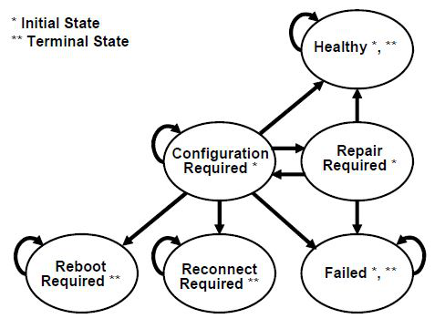

.. _protocols-uefi-driver-model-protocols-uefi-driver-model:

Protocols — UEFI Driver Model
==============================

EFI drivers that follow the UEFI Driver Model are not allowed to search for controllers to manage. When a specific controller is needed, the EFI boot service :ref:`efi-boot-services-connectcontroller`  is used along with the :ref:`efi-driver-binding-protocol-protocols-uefi-driver-model`  services to identify the best drivers for a controller. Once *ConnectController()* has identified the best drivers for a controller, the start service in the *EFI_DRIVER_BINDING_PROTOCOL* is used by *ConnectController()* to start each driver on the controller. Once a controller is no longer needed, it can be released with the EFI boot service :ref:`efi-boot-services-disconnectcontroller` . *DisconnectController()* calls the stop service in each *EFI_DRIVER_BINDING_PROTOCOL* to stop the controller. 

The driver initialization routine of an UEFI driver is not allowed to touch any device hardware. Instead, it just installs an instance of the *EFI_DRIVER_BINDING_PROTOCOL* on the ImageHandle of the UEFI driver. The test to determine if a driver supports a given controller must be performed in as little time as possible without causing any side effects on any of the controllers it is testing. As a result, most of the controller initialization code is present in the start and stop services of the *EFI_DRIVER_BINDING_PROTOCOL*.

.. _efi-driver-binding-protocol-protocols-uefi-driver-model:

EFI Driver Binding Protocol
---------------------------

This section provides a detailed description of the *EFI_DRIVER_BINDING_PROTOCOL* . This protocol is produced by every driver that follows the UEFI Driver Model, and it is the central component that allows drivers and controllers to be managed. It provides a service to test if a specific controller is supported by a driver, a service to start managing a controller, and a service to stop managing a controller. These services apply equally to drivers for both bus controllers and device controllers.

EFI_DRIVER_BINDING_PROTOCOL
###########################

**Summary**

Provides the services required to determine if a driver supports a given controller. If a controller is supported, then it also provides routines to start and stop the controller.

**GUID**

.. code-block::

   #define EFI_DRIVER_BINDING_PROTOCOL_GUID \
    {0x18A031AB,0xB443,0x4D1A,\
     {0xA5,0xC0,0x0C,0x09,0x26,0x1E,0x9F,0x71}}

**Protocol Interface Structure**

.. code-block::

   typedef struct \_EFI_DRIVER_BINDING_PROTOCOL {
    EFI_DRIVER_BINDING_PROTOCOL_SUPPORTED        Supported;
    EFI_DRIVER_BINDING_PROTOCOL_START            Start;
    EFI_DRIVER_BINDING_PROTOCOL_STOP             Stop;
    UINT32                                       Version;
    EFI__HANDLE                                  ImageHandle;
    EFI_HANDLE                                   DriverBindingHandle;
   } EFI_DRIVER_BINDING_PROTOCOL;

**Parameters**

Supported
  Tests to see if this driver supports a given controller. This service is called by the EFI boot service  :ref:`efi-boot-services-connectcontroller` . In order to make drivers as small as possible, there are a few calling restrictions for this service. ConnectController() must follow these calling restrictions. If any other agent wishes to call :ref:`efi-driver-binding-protocol-supported-protocols-uefi-driver-model` it must also follow these calling restrictions. See the Supported() function description. 

Start 
  Starts a controller using this driver. This service is called by the EFI boot service ConnectController(). In order to make drivers as small as possible, there are a few calling restrictions for this service. ConnectController() must follow these calling restrictions. If any other agent wishes to call  :ref:`efi-driver-binding-protocol-start-protocols-uefi-driver-model` it must also follow these calling restrictions. See the Start() function description. 

Stop 
  Stops a controller using this driver. This service is called by the EFI boot service  :ref:`efi-boot-services-disconnectcontroller` . In order to make drivers as small as possible, there are a few calling restrictions for this service. DisconnectController() must follow these calling restrictions. If any other agent wishes to call  :ref:`efi-driver-binding-protocol-stop-protocols-uefi-driver-model` it must also follow these calling restrictions. See the Stop() function description. 

Version 
  The version number of the UEFI driver that produced the EFI_DRIVER_BINDING_PROTOCOL. This field is used by the EFI boot service ConnectController() to determine the order that driver's Supported() service will be used when a controller needs to be started. EFI Driver Binding Protocol instances with higher Version values will be used before ones with lower Version values. The Version values of 0x0-0x0f and 0xfffffff0-0xffffffff are reserved for platform/OEM specific drivers. The Version values of 0x10-0xffffffef are reserved for IHV-developed drivers. 

ImageHandle 
  The image handle of the UEFI driver that produced this instance of the EFI_DRIVER_BINDING_PROTOCOL. 

DriverBindingHandle 
  The handle on which this instance of the EFI_DRIVER_BINDING_PROTOCOL is installed. In most cases, this is the same handle as ImageHandle. However, for UEFI drivers that produce more than one instance of the EFI_DRIVER_BINDING_PROTOCOL, this value may not be the same as ImageHandle.

**Description**

The *EFI_DRIVER_BINDING_PROTOCOL* provides a service to determine if a driver supports a given controller. If a controller is supported, then it also provides services to start and stop the controller. All UEFI drivers are required to be reentrant so they can manage one or more controllers. This requires that drivers not use global variables to store device context. Instead, they must allocate a separate context structure per controller that the driver is managing. Bus drivers must support starting and stopping the same bus multiple times, and they must also support starting and stopping all of their children, or just a subset of their children.

.. _efi-driver-binding-protocol-supported-protocols-uefi-driver-model:

EFI_DRIVER_BINDING_PROTOCOL.Supported()
#######################################

**Summary**

Tests to see if this driver supports a given controller. If a child device is provided, it further tests to see if this driver supports creating a handle for the specified child device.

**Prototype**

.. code-block::

   typedef
   EFI_STATUS
   (EFIAPI *EFI_DRIVER_BINDING_PROTOCOL_SUPPORTED) (
    IN EFI_DRIVER_BINDING_PROTOCOL              *This,
    IN EFI_HANDLE                               ControllerHandle,
    IN EFI_DEVICE_PATH_PROTOCOL                 *RemainingDevicePath OPTIONAL
    );

**Parameters**

This
  A pointer to the  :ref:`efi-driver-binding-protocol-protocols-uefi-driver-model` instance.

ControllerHandle 
  The handle of the controller to test. This handle must support a protocol interface that supplies an I/O abstraction to the driver. Sometimes just the presence of this I/O abstraction is enough for the driver to determine if it supports ControllerHandle. Sometimes, the driver may use the services of the I/O abstraction to determine if this driver supports ControllerHandle. 

RemainingDevicePath
  A pointer to the remaining portion of a device path. For bus drivers, if this parameter is not NULL, then the bus driver must determine if the bus controller specified by ControllerHandle and the child controller specified by RemainingDevicePath are both supported by this bus driver.

**Description**

This function checks to see if the driver specified by This supports the device specified by *ControllerHandle*. Drivers will typically use the device path attached to ControllerHandle and/or the services from the bus I/O abstraction attached to *ControllerHandle* to determine if the driver supports *ControllerHandle*. This function may be called many times during platform initialization. In order to reduce boot times, the tests performed by this function must be very small, and take as little time as possible to execute. This function must not change the state of any hardware devices, and this function must be aware that the device specified by *ControllerHandle* may already be managed by the same driver or a different driver. This function must match its calls to :ref:`efi-boot-services-allocatepages` with :ref:`efi-boot-services-freepages` , :ref:`efi-boot-services-allocatepool`  with :ref:`efi-boot-services-freepool` ,  and :ref:`efi-boot-services-openprotocol`  with  :ref:`efi-boot-services-closeprotocol` . Since ControllerHandle may have been previously started by the same driver, if a protocol is already in the opened state, then it must not be closed with *CloseProtocol()* . This is required to guarantee the state of ControllerHandle is not modified by this function. 

If any of the protocol interfaces on the device specified by ControllerHandle that are required by the driver specified by This are already open for exclusive access by a different driver or application, then *EFI_ACCESS_DENIED* is returned. 

If any of the protocol interfaces on the device specified by ControllerHandle that are required by the driver specified by This are already opened by the same driver, then *EFI_ALREADY_STARTED* is returned. However, if the driver specified by *This* is a bus driver, then it is not an error, and the bus driver should continue with its test of *ControllerHandle* and *RemainingDevicePath* . This allows a bus driver to create one child handle on the first call to  :ref:`efi-driver-binding-protocol-supported-protocols-uefi-driver-model` and  :ref:`efi-driver-binding-protocol-start-protocols-uefi-driver-model`, and create additional child handles on additional calls to *Supported()* and *Start()* .This also allows a bus driver to create no child handle on the first call to *Supported()* and *Start()* by specifying an End of Device Path Node *RemainingDevicePath* , and create additional child handles on additional calls to *Supported()* and *Start()* . 

If ControllerHandle is not supported by This, then *EFI_UNSUPPORTED* is returned. 

If This is a bus driver that creates child handles with an :ref:`efi-device-path-protocol` , then ControllerHandle must support the *EFI_DEVICE_PATH_PROTOCOL* . If it does not, then *EFI_UNSUPPORTED* is returned. 

If ControllerHandle is supported by This, and This is a device driver, then *EFI_SUCCESS* is returned. 

If ControllerHandle is supported by This, and This is a bus driver, and RemainingDevicePath is *NULL* or the first Device Path Node is the End of Device Path Node, then *EFI_SUCCESS* is returned. 

If ControllerHandle is supported by This, and This is a bus driver, and RemainingDevicePath is not *NULL* , then RemainingDevicePath must be analyzed. If the first node of *RemainingDevicePath* is the End of Device Path Node or an EFI Device Path node that the bus driver recognizes and supports, then *EFI_SUCCESS* is returned. Otherwise, *EFI_UNSUPPORTED* is returned. 

The *Supported()* function is designed to be invoked from the EFI boot service  :ref:`efi-boot-services-connectcontroller` . As a result, much of the error checking on the parameters to *Supported()* has been moved into this common boot service. It is legal to call *Supported()* from other locations, but the following calling restrictions must be followed or the system behavior will not be deterministic. 

ControllerHandle must be a valid *EFI_HANDLE* . If RemainingDevicePath is not *NULL* , then it must be a pointer to a naturally aligned *EFI_DEVICE_PATH_PROTOCOL* .

**Status Codes Returned**

.. list-table::
   :widths: 35 70
   :class: longtable

   * - EFI_SUCCESS
     - The device specified by ControllerHandle and RemainingDevicePath is supported by the driver specified by This.
   * - EFI_ALREADY_STARTED
     - The device specified by ControllerHandle and RemainingDevicePath is already being managed by the driver specified by This.
   * - EFI_ACCESS_DENIED
     - The device specified by ControllerHandle and RemainingDevicePath is already being managed by a different driver or an application that requires exclusive access.
   * - EFI_UNSUPPORTED
     - The device specified by ControllerHandle and RemainingDevicePath is not supported by the driver specified by This.

**Examples**

.. code-block::

   extern EFI_GUID               gEfiDriverBindingProtocolGuid;
   EFI_HANDLE                    DriverImageHandle;
   EFI_HANDLE                    ControllerHandle;
   EFI_DRIVER_BINDING_PROTOCOL   *DriverBinding;
   EFI_DEVICE_PATH_PROTOCOL      *RemainingDevicePath;

   //
   // Use the DriverImageHandle to get the Driver Binding protocol instance
   //
   Status = gBS->OpenProtocol (
            DriverImageHandle,
            &gEfiDriverBindingProtocolGuid,
            &DriverBinding,
            DriverImageHandle,
            NULL,
            EFI_OPEN_PROTOCOL_GET_PROTOCOL
            );
   if (EFI_ERROR (Status)) {
     return Status;
   }

   //
   // EXAMPLE #1
   //
   // Use the Driver Binding Protocol instance to test to see if the
   // driver specified by DriverImageHandle supports the controller
   // specified by ControllerHandle
   //
   Status = DriverBinding->Supported (
               DriverBinding,
               ControllerHandle,
               NULL
               );
   return Status;

   //
   // EXAMPLE #2
   //
   // The RemainingDevicePath parameter can be used to initialize only
   // the minimum devices required to boot. For example, maybe we only
   // want to initialize 1 hard disk on a SCSI channel. If DriverImageHandle
   // is a SCSI Bus Driver, and ControllerHandle is a SCSI    Controller, and
   // we only want to create a child handle for PUN=3 and LUN=0, then the    
   // RemainingDevicePath would be SCSI(3,0)/END. The following  example
   // would return EFI_SUCCESS if the SCSI driver supports creating the
   // child handle for PUN=3, LUN=0. Otherwise it would return an error.
   //
   Status = DriverBinding->Supported (
                  DriverBinding,
                  ControllerHandle,
                  RemainingDevicePath
                  );
   return Status;

**Pseudo Code**

Listed below are the algorithms for the :ref:`efi-driver-binding-protocol-supported-protocols-uefi-driver-model` function for three different types of drivers. How the  :ref:`efi-driver-binding-protocol-start-protocols-uefi-driver-model` function of a driver is implemented can affect how the *Supported()* function is implemented. All of the services in the :ref:`efi-driver-binding-protocol-protocols-uefi-driver-model`   need to work together to make sure that all resources opened or allocated in *Supported()* and *Start()* are released in :ref:`efi-driver-binding-protocol-stop-protocols-uefi-driver-model` 

The first algorithm is a simple device driver that does not create any additional handles. It only attaches one or more protocols to an existing handle. The second is a bus driver that always creates all of its child handles on the first call to *Start()* . The third is a more advanced bus driver that can either create one child handles at a time on successive calls to *Start()* , or it can create all of its child handles or all of the remaining child handles in a single call to *Start()* . 

**Device Driver:** 

1. Ignore the parameter *RemainingDevicePath*.

2. Open all required protocols with :ref:`efi-boot-services-openprotocol` . A standard driver should use an *Attribute* of *EFI_OPEN_PROTOCOL_BY_DRIVER* . If this driver needs exclusive access to a protocol interface, and it requires any drivers that may be using the protocol interface to disconnect, then the driver should use an *Attribute* of *EFI_OPEN_PROTOCOL_BY_DRIVER | EFI_OPEN_PROTOCOL_EXCLUSIVE* .

3. If any of the calls to *OpenProtocol()* in (2) returned an error, then close all of the protocols opened in (2) with :ref:`efi-boot-services-closeprotocol` , and return the status code from the call to *OpenProtocol()* that returned an error.

4. Use the protocol instances opened in (2) to test to see if this driver supports the controller. Sometimes, just the presence of the protocols is enough of a test. Other times, the services of the protocols opened in (2) are used to further check the identity of the controller. If any of these tests fails, then close all the protocols opened in (2) with *CloseProtocol()* and return *EFI_UNSUPPORTED* .

5. Close all protocols opened in (2) with *CloseProtocol()* .

6. Return *EFI_SUCCESS* .

**Bus Driver that creates all of its child handles on the first call to Start():**

#. Check the contents of the first Device Path Node of *RemainingDevicePath* to make sure it is the End of Device Path Node or a legal Device Path Node for this bus driver’s children. If it is not, then return *EFI_UNSUPPORTED* .

#. Open all required protocols with  :ref:`efi-boot-services-openprotocol` . A standard driver should use an *Attribute* of *EFI_OPEN_PROTOCOL_BY_DRIVER* . If this driver needs exclusive access to a protocol interface, and it requires any drivers that may be using the protocol interface to disconnect, then the driver should use an *Attribute* of *EFI_OPEN_PROTOCOL_BY_DRIVER \| EFI_OPEN_PROTOCOL_EXCLUSIVE*.

#. If any of the calls to *OpenProtocol()* in (2) returned an error, then close all of the protocols opened in (2) with  :ref:`efi-boot-services-closeprotocol` , and return the status code from the call to *OpenProtocol()* that returned an error.

#. Use the protocol instances opened in (2) to test to see if this driver supports the controller. Sometimes, just the presence of the protocols is enough of a test. Other times, the services of the protocols opened in (2) are used to further check the identity of the controller. If any of these tests fails, then close all the protocols opened in (2) with *CloseProtocol()* and return *EFI_UNSUPPORTED* . #. Close all protocols opened in (2) with *CloseProtocol()* .

#. Return *EFI_SUCCESS* . 

**Bus Driver that is able to create all or one of its child handles on each call to Start():**

#. Check the contents of the first Device Path Node of *RemainingDevicePath* to make sure it is the End of Device Path Node or a legal Device Path Node for this bus driver’s children. If it is not, then return *EFI_UNSUPPORTED* . 

#. Open all required protocols with *OpenProtocol()* . A standard driver should use an *Attribute* of *EFI_OPEN_PROTOCOL_BY_DRIVER* . If this driver needs exclusive access to a protocol interface, and it requires any drivers that may be using the protocol interface to disconnect, then the driver should use an *Attribute* of *EFI_OPEN_PROTOCOL_BY_DRIVER \| EFI_OPEN_PROTOCOL_EXCLUSIVE* . 

#. If any of the calls to *OpenProtocol()* in (2) failed with an error other than *EFI_ALREADY_STARTED* , then close all of the protocols opened in (2) that did not return *EFI_ALREADY_STARTED* with *CloseProtocol()* , and return the status code from the *OpenProtocol()* call that returned an error. 

#. Use the protocol instances opened in (2) to test to see if this driver supports the controller. Sometimes, just the presence of the protocols is enough of a test. Other times, the services of the protocols opened in (2) are used to further check the identity of the controller. If any of these tests fails, then close all the protocols opened in (2) that did not return *EFI_ALREADY_STARTED* with *CloseProtocol()* and return *EFI_UNSUPPORTED* .

#. Close all protocols opened in (2) that did not return *EFI_ALREADY_STARTED* with *CloseProtocol()* . 

#. Return *EFI_SUCCESS* . 

Listed below is sample code of the :ref:`efi-driver-binding-protocol-supported-protocols-uefi-driver-model` function of device driver for a device on the XYZ bus. The XYZ bus is abstracted with the *EFI_XYZ_IO_PROTOCOL* . Just the presence of the *EFI_XYZ_IO_PROTOCOL* on ControllerHandle is enough to determine if this driver supports ControllerHandle. The *gBS* variable is initialized in this driver’s entry point.:ref:`efi-system-table` .

.. code-block::

   extern EFI_GUID                           gEfiXyzIoProtocol;
   EFI_BOOT_SERVICES                         *gBS;

   EFI_STATUS
   AbcSupported (
    IN EFI_DRIVER_BINDING_PROTOCOL           *This,
    IN EFI_HANDLE                            ControllerHandle,
    IN EFI_DEVICE_PATH_PROTOCOL              *RemainingDevicePath OPTIONAL
    )

   {
    EFI_STATUS                               Status;
    EFI_XYZ_IO_PROTOCOL                      *XyzIo;

   Status = gBS->OpenProtocol (
            ControllerHandle,
            &gEfiXyzIoProtocol,
            &XyzIo,
            This->DriverBindingHandle,
            ControllerHandle,
            EFI_OPEN_PROTOCOL_BY_DRIVER
            );
   if (EFI_ERROR (Status)) {
    return Status;
   }

   gBS->CloseProtocol (
        ControllerHandle,
        &gEfiXyzIoProtocol,
        This->DriverBindingHandle,
        ControllerHandle
        );

    return EFI_SUCCESS;
   }

.. _efi-driver-binding-protocol-start-protocols-uefi-driver-model:

EFI_DRIVER_BINDING_PROTOCOL.Start()
###################################

**Summary**

Starts a device controller or a bus controller. The *Start()* and  efi-driver-binding-protocol-stop-protocols-uefi-driver-model mirror each other.

**Prototype**

.. code-block:: 

   typedef
   EFI_STATUS
   (EFIAPI *EFI_DRIVER_BINDING_PROTOCOL_START) (
    IN EFI_DRIVER_BINDING_PROTOCOL         *This,
    IN EFI_HANDLE                          ControllerHandle,
    IN EFI_DEVICE_PATH_PROTOCOL            *RemainingDevicePath OPTIONAL
    );

**Parameters**

This
  A pointer to the EFI_DRIVER_BINDING_PROTOCOL instance.

ControllerHandle
  The handle of the controller to start. This handle must support a protocol interface that supplies an I/O abstraction to the driver. 

RemainingDevicePath 
  A pointer to the remaining portion of a device path. For a bus driver, if this parameter is NULL, then handles for all the children of Controller are created by this driver. 

  If this parameter is not NULL and the first Device Path Node is not the End of Device Path Node, then only the handle for the child device specified by the first Device Path Node of RemainingDevicePath is created by this driver. 

  If the first Device Path Node of *RemainingDevicePath* is the End of Device Path Node, no child handle is created by this driver.

**Description**

This function starts the device specified by Controller with the driver specified by This. Whatever resources are allocated in *Start()* must be freed in *Stop()* . For example, every
:ref:`efi-boot-services-allocatepool` , :ref:`efi-boot-services-allocatepages` , :ref:`efi-boot-services-openprotocol` ,  and :ref:`efi-boot-services-installprotocolinterface` in *Start()* must be matched with a :ref:`efi-boot-services-freepool` , :ref:`efi-boot-services-freepages` , :ref:`efi-boot-services-closeprotocol` ,  and  :ref:`efi-boot-services-uninstallprotocolinterface`  in *Stop()* . 

If Controller is started, then *EFI_SUCCESS* is returned.

If *Controller* could not be started, but can potentially be repaired with configuration or repair operations using the *EFI_DRIVER_HEALTH_PROTOCOL* and this driver produced an instance of the *EFI_DRIVER_HEALTH_PROTOCOL* for *Controller* , then return *EFI_SUCCESS* . 

If *Controller* cannot be started due to a device error and the driver does not produce the *EFI_DRIVER_HEALTH_PROTOCOL* for *Controller* , then return *EFI_DEVICE_ERROR* . 

If the driver does not support *Controller* then *EFI_DEVICE_ERROR* is returned. This condition will only be met if *Supported()* returns *EFI_SUCCESS* and a more extensive supported check in *Start()* fails. 

If there are not enough resources to start the device or bus specified by *Controller* , then *EFI_OUT_OF_RESOURCES* is returned. 

If the driver specified by This is a device driver, then RemainingDevicePath is ignored. 

If the driver specified by *This* is a bus driver, and *RemainingDevicePath* is *NULL* , then all of the children of *Controller* are discovered and enumerated, and a device handle is created for each child. 

If the driver specified by This is a bus driver, and *RemainingDevicePath* is not *NULL* and begins with the End of Device Path node, then the driver must not enumerate any of the children of *Controller* nor create any child device handle. Only the controller initialization should be performed. If the driver implements *EFI_DRIVER_DIAGNOSTICS2_PROTOCOL* , *EFI_COMPONENT_NAME2_PROTOCOL* , *EFI_SERVICE_BINDING_PROTOCOL* , *EFI_DRIVER_FAMILY_OVERRIDE_PROTOCOL* , or *EFI_DRIVER_HEALTH_PROTOCOL* , the driver still should install the implemented protocols. If the driver supports *EFI_PLATFORM_TO_DRIVER_CONFIGURATION_PROTOCOL,* the driver still should retrieve and process the configuration information.

If the driver specified by This is a bus driver that is capable of creating one child handle at a time and RemainingDevicePath is not *NULL* and does not begin with the End of Device Path node, then an attempt is made to create the device handle for the child device specified by RemainingDevicePath. Depending on the bus type, all of the child devices may need to be discovered and enumerated, but at most only the device handle for the one child specified by RemainingDevicePath shall be created. 

The *Start()* function is designed to be invoked from the EFI boot service EFI_BOOT_SERVICES.ConnectController() (:numref:`efi-boot-services-connectcontroller`). As a result, much of the error checking on the parameters to *Start()* has been moved into this common boot service. It is legal to call *Start()* from other locations, but the following calling restrictions must be followed or the system behavior will not be deterministic:

-  *ControllerHandle* must be a valid *EFI_HANDLE* .
-  If *RemainingDevicePath* is not **NULL** , then it must be a pointer to a naturally aligned *EFI_DEVICE_PATH_PROTOCOL* .
-  Prior to calling *Start()* , :ref:`efi-driver-binding-protocol-supported-Protocols-UEFI-Driver-Model` function for the driver specified by *This* must have been called with the same calling parameters, and *Supported()* must have returned *EFI_SUCCESS* . 

**Status Codes Returned**

.. list-table::
   :widths: 35 70
   :class: longtable

   * - EFI_SUCCESS
     - The device was started.
   * - EFI_SUCCESS
     - The device could not be started because the device needs to be configured by the user or requires a repair operation, and the driver produced the Driver Health Protocol that will return the required configuration and repair operations for this device.
   * - EFI_DEVICE_ERROR
     - The driver does not produce the Driver Health Protocol and the device could not be started due to a device error.
   * - EFI_DEVICE_ERROR
     - The driver produces the Driver Health Protocol, and the driver does not support the device.
   * - EFI_OUT_OF_RESOURCES
     - The request could not be completed due to a lack of resources.

**Examples**

.. code-block::

   extern EFI_GUID                  gEfiDriverBindingProtocolGuid;
   EFI_HANDLE                       DriverImageHandle;
   EFI_HANDLE                       ControllerHandle;
   EFI_DRIVER_BINDING_PROTOCOL      *DriverBinding;
   EFI_DEVICE_PATH_PROTOCOL         *RemainingDevicePath;

   //
   // Use the DriverImageHandle to get the Driver Binding Protocol instance
   //
   Status = gBS->OpenProtocol (
            DriverImageHandle,
            &gEfiDriverBindingProtocolGuid,
            &DriverBinding,
            DriverImageHandle,
            NULL,
            EFI_OPEN_PROTOCOL_GET_PROTOCOL
            );
   if (EFI_ERROR (Status)) {
     return Status;
   }

   //
   // EXAMPLE #1
   //
   // Use the Driver Binding Protocol instance to test to see if the
   // driver specified by DriverImageHandle supports the controller
   // specified by ControllerHandle
   //
   Status = DriverBinding->Supported (
               DriverBinding,
               ControllerHandle,
               NULL
               );
   if (!EFI_ERROR (Status)) {
     Status =  DriverBinding->Start (
               DriverBinding,
               ControllerHandle,
               NULL
              );
   }
   return Status;

   //
   // EXAMPLE #2
   //
   // The RemainingDevicePath parameter can be used to initialize only
   // the minimum devices required to boot. For example, maybe we only
   // want to initialize 1 hard disk on a SCSI channel. If DriverImageHandle
   // is a SCSI Bus Driver, and ControllerHandle is a SCSI Controller, and
   // we only want to create a child handle for PUN=3 and LUN=0, then the
   // RemainingDevicePath would be SCSI(3,0)/END. The following example
   // would return EFI_SUCCESS if the SCSI driver supports creating the
   // child handle for PUN=3, LUN=0. Otherwise it would return an error.
   //
   Status = DriverBinding->Supported (
               DriverBinding,
               ControllerHandle,
               RemainingDevicePath
               );
   if (!EFI_ERROR (Status)) {
     Status = DriverBinding->Start (
               DriverBinding,
               ControllerHandle,
               RemainingDevicePath
               );
   }

   return Status;

**Pseudo Code**

Listed below are the algorithms for the  :ref:`efi-driver-binding-protocol-supported-protocols-uefi-driver-model` function for three different types of drivers. How the :ref:`efi-driver-binding-protocol-start-protocols-uefi-driver-model` function of a driver is implemented can affect how the  :ref:`efi-driver-binding-protocol-supported-protocols-uefi-driver-model` function is implemented. All of the services in the :ref:`efi-driver-binding-protocol-protocols-uefi-driver-model` need to work together to make sure that all resources opened or allocated in *Supported()* and *Start()* are released in `EFI_DRIVER_BINDING_PROTOCOL.Stop()`_ .

The first algorithm is a simple device driver that does not create any additional handles. It only attaches one or more protocols to an existing handle. The second is a simple bus driver that always creates all of its child handles on the first call to *Start()* . It does not attach any additional protocols to the handle for the bus controller. The third is a more advanced bus driver that can either create one child handles at a time on successive calls to *Start()* , or it can create all of its child handles or all of the remaining child handles in a single call to *Start()*. Once again, it does not attach any additional protocols to the handle for the bus controller.

**Device Driver:**

#. Ignore the parameter *RemainingDevicePath* ..
#. Open all required protocols with  :ref:`efi-boot-services-openprotocol` . A standard driver should use an *Attribute* of *EFI_OPEN_PROTOCOL_BY_DRIVER* . If this driver needs exclusive access to a protocol interface, and it requires any drivers that may be using the protocol interface to disconnect, then the driver should use an *Attribute* of *EFI_OPEN_PROTOCOL_BY_DRIVER \| EFI_OPEN_PROTOCOL_EXCLUSIVE* . It must use the same *Attribute* value that was used in *Supported()* .
#. If any of the calls to *OpenProtocol()* in (2) returned an error, then close all of the protocols opened in (2) with :ref:`efi-boot-services-closeprotocol` , and return the status code from the call to *OpenProtocol()* that returned an error.
#. Initialize the device specified by *ControllerHandle* . If the driver does not support the device specified by *ControllerHandle* , then close all of the protocols opened in (2) with *CloseProtocol()* , and return *EFI_DEVICE_ERROR* . If the driver does support the device specified by ControllerHandle and an error is detected, and that error can not be resolved with the *EFI_DRIVER_HEALTH_PROTOCOL* , then close all of the protocols opened in (2) with *CloseProtocol()* , and return *EFI_DEVICE_ERROR* . If the driver does support the device specified by ControllerHandle and an error is detected, and that error can be resolved with the *EFI_DRIVER_HEALTH_PROTOCOL* , then produce the *EFI_DRIVER_HEALTH_PROTOCOL* for *ControllerHandle* and make sure *EFI_SUCCESS* is returned from *Start()* . In this case, depending on the type of error detected, not all of the following steps may be completed
#. Allocate and initialize all of the data structures that this driver requires to manage the device specified by *ControllerHandle* . This would include space for publicprotocols and space for any additional private datastructures that are related to *ControllerHandle* . If anerror occurs allocating the resources, then close all of theprotocols opened in (2) with *CloseProtocol()* , and return *EFI_OUT_OF_RESOURCES* .
#. Install all the new protocol interfaces onto *ControllerHandle* using  EFI_BOOT_SERVICES.InstallMultipleProtocolInterfaces() (:numref:`efi-boot-services-installmultipleprotocolinterfaces`). If an error occurs, close all of the protocols opened in (1)with *CloseProtocol()* , and return the error from *InstallMultipleProtocolInterfaces()* .
#. Return *EFI_SUCCESS* .

**Bus Driver that creates all of its child handles on the first call to Start():**

1. Ignore the parameter *RemainingDevicePath* . with the exception that if the first Device Path Node is the End of Device Path Node, skip steps 5-8.
2. Open all required protocols with :ref:`efi-boot-services-openprotocol` .A standard driver should use an *Attribute* of *EFI_OPEN_PROTOCOL_BY_DRIVER* . If this driver needsexclusive access to a protocol interface, and it requiresany drivers that may be using the protocol interface todisconnect, then the driver should use an *Attribute* of*EFI_OPEN_PROTOCOL_BY_DRIVER \| EFI_OPEN_PROTOCOL_EXCLUSIVE*. It must use the same *Attribute* value that was used in Supported() :ref:`efi-driver-binding-protocol-supported-protocols-uefi-driver-model`.
3. If any of the calls to *OpenProtocol()* in (2) returned anerror, then close all of the protocols opened in (2) with :ref:`efi-boot-services-closeprotocol` , and return the status code from the call to *OpenProtocol()* that returned an error.
4. Initialize the device specified by *ControllerHandle* . Ifthe driver does not support the device specified by*ControllerHandle* , then close all of the protocols openedin (2) with *CloseProtocol()* , and return *EFI_DEVICE_ERROR* . If the driver does support the devicespecified by *ControllerHandle* and an error is detected, and that error can not be resolved with the *EFI_DRIVER_HEALTH_PROTOCOL* , then close all of theprotocols opened in (2) with *CloseProtocol()* , and return *EFI_DEVICE_ERROR* . If the driver does support the devicespecified by *ControllerHandle* and an error is detected,and that error can be resolved with the *EFI_DRIVER_HEALTH_PROTOCOL* , then produce the*EFI_DRIVER_HEALTH_PROTOCOL* for *ControllerHandle* and make sure *EFI_SUCCESS* is returned from *Start()* . In this case, depending on the type of error detected, not all ofthe following steps may be completed.
5. Discover all the child devices of the bus controller specified by *ControllerHandle*.
6. If the bus requires it, allocate resources to all the child devices of the bus controller specified by *ControllerHandle*.
7. FOR each child C of *ControllerHandle* :

   - Allocate and initialize all of the data structures that this driver requires to manage the child device C. This would include space for public protocols and space for any additional private data structures that are related to the child device C. If an error occurs allocating the resources,then close all of the protocols opened in (2) with *CloseProtocol()* , and return *EFI_OUT_OF_RESOURCES* .
   - If the bus driver creates device paths for the child devices, then create a device path for the child C basedupon the device path attached to *ControllerHandle* .
   - Initialize the child device C. If an error occurs, close all of the protocols opened in (2) with *CloseProtocol()* , and return *EFI_DEVICE_ERROR* .
   - Create a new handle for C, and install the protocol interfaces for child device C using :ref:`efi-boot-services-installmultipleprotocolinterfaces` . This may include the  :ref:`efi-device-path-protocol` .
   - Call *OpenProtocol()* on behalf of the child C with an *Attribute* of *EFI_OPEN_PROTOCOL_BY_CHILD_CONTROLLER* .

8. END FOR
9. If the bus driver also produces protocols on *ControllerHandle* , then install all the new protocol interfaces onto *ControllerHandle* using *InstallMultipleProtocolInterfaces()* . If an error occurs, close all of the protocols opened in (2) with *CloseProtocol()* , and return the error from *InstallMultipleProtocolInterfaces()* .
10. Return *EFI_SUCCESS* .  

**Bus Driver that is able to create all or one of its child handles on each call to Start():**

1. Open all required protocols with :ref:`efi-boot-services-openprotocol` . A standard driver should use an *Attribute* of *EFI_OPEN_PROTOCOL_BY_DRIVER* . If this driver needs exclusive access to a protocol interface, and it requires any drivers that may be using the protocol interface to disconnect, then the driver should use an *Attribute* of *EFI_OPEN_PROTOCOL_BY_DRIVER | EFI_OPEN_PROTOCOL_EXCLUSIVE* . It must use the same *Attribute* value that was used in Supported() :ref:`efi-driver-binding-protocol-supported-protocols-uefi-driver-model` .

2. If any of the calls to *OpenProtocol()* in (1) returned an error, then close all of the protocols opened in (1) with :ref:`efi-boot-services-closeprotocol` , and return the status code from the call to *OpenProtocol()* that returned an error. 

3. Initialize the device specified by *ControllerHandle* . If the driver does not support the device specified by *ControllerHandle* , then close all of the protocols opened in (1) with *CloseProtocol()* , and return *EFI_DEVICE_ERROR* . If the driver does support the device specified by *ControllerHandle* and an error is detected, and that error can not be resolved with the *EFI_DRIVER_HEALTH_PROTOCOL* , then close all of the protocols opened in (1) with *CloseProtocol()* , and return *EFI_DEVICE_ERROR* . If the driver does support the device specified by *ControllerHandle* and an error is detected, and that error can be resolved with the *EFI_DRIVER_HEALTH_PROTOCOL* , then produce the *EFI_DRIVER_HEALTH_PROTOCOL* for *ControllerHandle* and make sure *EFI_SUCCESS* is returned from *Start()* . In this case, depending on the type of error detected, not all of the following steps may be completed.

4. IF *RemainingDevicePath* is not **NULL** , THEN 

   a – C is the child device specified by *RemainingDevicePath* . If the first Device Path Node is the End of Device Path Node, proceed to step 6.

   b – Allocate and initialize all of the data structures that this driver requires to manage the child device C. This would include space for public protocols and space for any additional private data structures that are related to the child device C. If an error occurs allocating the resources, then close all of the protocols opened in (1) with *CloseProtocol()* , and return *EFI_OUT_OF_RESOURCES* .

   c – If the bus driver creates device paths for the child devices, then create a device path for the child C based upon the device path attached to *ControllerHandle* .

   d – Initialize the child device C.

   e – Create a new handle for C, and install the protocol interfaces for child device C using :ref:`efi-boot-services-installmultipleprotocolinterfaces` . This may include the :ref:`efi-device-path-protocol` . 
   
   f – Call *OpenProtocol()* on behalf of the child C with an *Attribute* of *EFI_OPEN_PROTOCOL_BY_CHILD_CONTROLLER* . 

   ELSE

   a – Discover all the child devices of the bus controller specified by *ControllerHandle* . 

   b – If the bus requires it, allocate resources to all the child devices of the bus controller specified by *ControllerHandle* .

   c – FOR each child C of *ControllerHandle* 

   Allocate and initialize all of the data structures that this driver requires to manage the child device C. This would include space for public protocols and space for any additional private data structures that are related to the child device C. If an error occurs allocating the resources, then close all of the protocols opened in (1) with *CloseProtocol()* , and return *EFI_OUT_OF_RESOURCES* . 

   If the bus driver creates device paths for the child devices, then create a device path for the child C based upon the device path attached to *ControllerHandle* . 

   Initialize the child device C. 

   Create a new handle for C, and install the protocol interfaces for child device C using *InstallMultipleProtocolInterfaces()* . This may include the *EFI_DEVICE_PATH_PROTOCOL*.

   Call  :ref:`efi-boot-services-openprotocol`  on behalf of the child C with an *Attribute* of * EFI_OPEN_PROTOCOL_BY_CHILD_CONTROLLER* .

   d – END FOR

5. END IF   

6. If the bus driver also produces protocols on *ControllerHandle* , then install all the new protocol interfaces onto *ControllerHandle* using *InstallMultipleProtocolInterfaces()* . If an error occurs, close all of the protocols opened in (2) with *CloseProtocol()* , and return the error from *InstallMultipleProtocolInterfaces()* .

7. Return *EFI_SUCCESS* . 

Listed below is sample code of the  `EFI_DRIVER_BINDING_PROTOCOL.Start()`_ function of a device driver for a device on the XYZ bus. The XYZ bus is abstracted with the *EFI_XYZ_IO_PROTOCOL* . This driver does allow the *EFI_XYZ_IO_PROTOCOL* to be shared with other drivers, and just the presence of the *EFI_XYZ_IO_PROTOCOL* on ControllerHandle is enough to determine if this driver supports ControllerHandle. This driver installs the *EFI_ABC_IO_PROTOCOL* on ControllerHandle. The *gBS* variable is initialized in this driver’s entry point as shown in the UEFI Driver Model examples in :ref:`introduction-uefi-driver-model`.

.. code-block::

   extern EFI_GUID                  gEfiXyzIoProtocol;
   extern EFI_GUID                  gEfiAbcIoProtocol;
   EFI_BOOT_SERVICES                *gBS;
   
   EFI_STATUS
   AbcStart (
     IN EFI_DRIVER_BINDING_PROTOCOL   *This,
     IN EFI_HANDLE                    ControllerHandle,
     IN EFI_DEVICE_PATH_PROTOCOL      *RemainingDevicePath OPTIONAL
   )

   {
   EFI_STATUS                       Status;
   EFI_XYZ_IO_PROTOCOL              *XyzIo;
   EFI_ABC_DEVICE                   AbcDevice;

   //
   // Open the Xyz I/O Protocol that this driver consumes
   //
   Status = gBS->OpenProtocol (
            ControllerHandle,
            &gEfiXyzIoProtocol,
            &XyzIo,
            This->DriverBindingHandle,
            ControllerHandle,
            EFI_OPEN_PROTOCOL_BY_DRIVER
            );
   if (EFI_ERROR (Status)) {
     return Status;
   }

   //
   // Allocate and zero a private data structure for the Abc device.
   //
   Status = gBS->AllocatePool (
            EfiBootServicesData,
            sizeof (EFI_ABC_DEVICE),
            &AbcDevice
            );
   if (EFI_ERROR (Status)) {
     goto ErrorExit;
   }
   ZeroMem (AbcDevice, sizeof (EFI_ABC_DEVICE));

   //
   // Initialize the contents of the private data structure for the Abc device.
   // This includes the XyzIo protocol instance and other private data fields
   // and the EFI_ABC_IO_PROTOCOL instance that will be installed.
   //
   AbcDevice->Signature = EFI_ABC_DEVICE_SIGNATURE;
   AbcDevice->XyzIo = XyzIo;

   AbcDevice->PrivateData1 = PrivateValue1;
   AbcDevice->PrivateData2 = PrivateValue2;
   . . .
   AbcDevice->PrivateDataN = PrivateValueN;

   AbcDevice->AbcIo.Revision = EFI_ABC_IO_PROTOCOL_REVISION;
   AbcDevice->AbcIo.Func1 = AbcIoFunc1;
   AbcDevice->AbcIo.Func2 = AbcIoFunc2;
   . . .
   AbcDevice->AbcIo.FuncN = AbcIoFuncN;

   AbcDevice->AbcIo.Data1 = Value1;
   AbcDevice->AbcIo.Data2 = Value2;
   . . .
   AbcDevice->AbcIo.DataN = ValueN;

   //
   // Install protocol interfaces for the ABC I/O device.
   //
   Status = gBS->InstallMultipleProtocolInterfaces (
            &ControllerHandle,
            &gEfiAbcIoProtocolGuid, &AbcDevice->AbcIo,
            NULL
            );
   if (EFI_ERROR (Status)) {
     goto ErrorExit;
   }

   return EFI_SUCCESS;

   ErrorExit:
    //
    // When there is an error, the private data structures need to be freed and
    // the protocols that were opened need to be closed.
    //
    if (AbcDevice != NULL) {
      gBS->FreePool (AbcDevice);
    }
    gBS->CloseProtocol (
       ControllerHandle,
       &gEfiXyzIoProtocolGuid,
       This->DriverBindingHandle,
       ControllerHandle
       );
    return Status;
   }

.. _efi-driver-binding-protocol-stop-protocols-uefi-driver-model:

EFI_DRIVER_BINDING_PROTOCOL.Stop()
##################################

**Summary**

Stops a device controller or a bus controller. The  :ref:`efi-driver-binding-protocol-start-protocols-uefi-driver-model` and *Stop()* services of the :ref:`efi-driver-binding-protocol-stop-protocols-uefi-driver-model` mirror each other.

**Prototype**

.. code-block:: 

   typedef
   EFI_STATUS
   (EFIAPI *EFI_DRIVER_BINDING_PROTOCOL_STOP) (
    IN EFI_DRIVER_BINDING_PROTOCOL           *This,
    IN EFI_HANDLE                            ControllerHandle,
    IN UINTN                                 NumberOfChildren,
    IN EFI_HANDLE                            *ChildHandleBuffer OPTIONAL
    );

**Parameters**

This 
  A pointer to the EFI_DRIVER_BINDING_PROTOCOL instance. Type EFI_DRIVER_BINDING_PROTOCOL is defined in  :ref:`efi-driver-binding-protocol-protocols-uefi-driver-model` . 

ControllerHandle 
  A handle to the device being stopped. The handle must support a bus specific I/O protocol for the driver to use to stop the device. 

NumberOfChildren 
  The number of child device handles in ChildHandleBuffer. 

ChildHandleBuffer 
  An array of child handles to be freed. May be NULL if NumberOfChildren is 0.

**Description**

This function performs different operations depending on the parameter NumberOfChildren. If NumberOfChildren is not zero, then the driver specified by This is a bus driver, and it is being requested to free one or more of its child handles specified by NumberOfChildren and ChildHandleBuffer. If all of the child handles are freed, then *EFI_SUCCESS* is returned. If NumberOfChildren is zero, then the driver specified by This is either a device driver or a bus driver, and it is being requested to stop the controller specified by ControllerHandle. If ControllerHandle is stopped, then *EFI_SUCCESS* is returned. In either case, this function is required to undo what was performed in *Start()* . Whatever resources are allocated in *Start()* must be freed in *Stop()* . For example, every  :ref:`efi-boot-services-allocatepool` ,  :ref:`efi-boot-services-allocatepages` ,   :ref:`efi-boot-services-openprotocol` ,  and  :ref:`efi-boot-services-installprotocolinterface`  in *Start()* must be matched with a  :ref:`efi-boot-services-freepool` ,   :ref:`efi-boot-services-freepages` ,  :ref:`efi-boot-services-closeprotocol` ,  and   :ref:`efi-boot-services-uninstallprotocolinterface`  in *Stop()* .

If ControllerHandle cannot be stopped, then *EFI_DEVICE_ERROR* is returned. If, for some reason, there are not enough resources to stop ControllerHandle, then *EFI_OUT_OF_RESOURCES* is returned.

The *Stop()* function is designed to be invoked from the EFI boot service  :ref:`efi-boot-services-disconnectcontroller` . As a result, much of the error checking on the parameters to *Stop()* has been moved into this common boot service. It is legal to call *Stop()* from other locations, but the following calling restrictions must be followed or the system behavior will not be deterministic.

-  *ControllerHandle* must be a valid *EFI_HANDLE* that was used on a previous call to this same driver’s  `EFI_DRIVER_BINDING_PROTOCOL.Start()`_ function.

-  The first *NumberOfChildren* handles of *ChildHandleBuffer* must all be a valid *EFI_HANDLE* . In addition, all of these handles must have been created in this driver’s *Start()* function, and the *Start()* function must have called  :ref:`efi-boot-services-openprotocol`  on *ControllerHandle* with an *Attribute* of *EFI_OPEN_PROTOCOL_BY_CHILD_CONTROLLER* .

**Status Codes Returned**

.. list-table::
   :widths: 35 70
   :class: longtable 

   * - **EFI_SUCCESS**
     - The device was stopped.
   * - **EFI_DEVICE_ERROR** 
     - The device could not be stopped due to a device error.

**Examples**

.. code-block::

   extern EFI_GUID               gEfiDriverBindingProtocolGuid;
   EFI_HANDLE                    DriverImageHandle;
   EFI_HANDLE                    ControllerHandle;
   EFI_HANDLE                    ChildHandle;
   EFI_DRIVER_BINDING_PROTOCOL   *DriverBinding;

   //
   // Use the DriverImageHandle to get the Driver Binding Protocol instance
   //
   Status = gBS->OpenProtocol (
            DriverImageHandle,
            &gEfiDriverBindingProtocolGuid,
            &DriverBinding,
            DriverImageHandle,
            NULL,
            EFI_OPEN_PROTOCOL_GET_PROTOCOL
            );
   if (EFI_ERROR (Status)) {
     return Status;
   }

   //
   // Use the Driver Binding Protocol instance to free the child
   // specified by ChildHandle. Then, use the Driver Binding
   // Protocol to stop ControllerHandle.
   //
   Status = DriverBinding->Stop (
            DriverBinding,
            ControllerHandle,
            1,
            &ChildHandle
            );

   Status = DriverBinding->Stop (
            DriverBinding,
            ControllerHandle,
            0,
            NULL
            );

**Pseudo Code**

**Device Driver:**

1. Uninstall all the protocols that were installed onto *ControllerHandle* in  `EFI_DRIVER_BINDING_PROTOCOL.Start()`_ .
2. Close all the protocols that were opened on behalf of *ControllerHandle* in *Start()* .
3. Free all the structures that were allocated on behalf of *ControllerHandle* in *Start()* .
4. Return *EFI_SUCCESS* . 

**Bus Driver that creates all of its child handles on the first call to Start():**

**Bus Driver that is able to create all or one of its child handles on each call to Start():**

1. IF *NumberOfChildren* is zero THEN:

   - Uninstall all the protocols that were installed onto *ControllerHandle* in *Start()* .
   - Close all the protocols that were opened on behalf of *ControllerHandle* in *Start()* .
   - Free all the structures that were allocated on behalf of *ControllerHandle* in *Start()* .

2. ELSE

   - FOR each child C in *ChildHandleBuffer*: Uninstall all the protocols that were installed onto C in *Start()* . Close all the protocols that were opened on behalf of C in *Start()* . Free all the structures that were allocated on behalf of C in *Start()* .
   - END FOR

#. END IF
#. Return *EFI_SUCCESS.* 

Listed below is sample code of the  `EFI_DRIVER_BINDING_PROTOCOL.Stop()`_ function of a device driver for a device on the XYZ bus. The XYZ bus is abstracted with the *EFI_XYZ_IO_PROTOCOL* . This driver does allow the *EFI_XYZ_IO_PROTOCOL* to be shared with other drivers, and just the presence of the *EFI_XYZ_IO_PROTOCOL* on ControllerHandle is enough to determine if this driver supports ControllerHandle. This driver installs the *EFI_ABC_IO_PROTOCOL* on ControllerHandle in  `EFI_DRIVER_BINDING_PROTOCOL.Start()`_ . The *gBS* variable is initialized in this driver’s entry point.:ref:`efi-system-table_efi_system_table` . extern EFI_GUID 

.. code-block::

   extern EFI_GUID                     gEfiXyzIoProtocol;
   extern EFI_GUID                     gEfiAbcIoProtocol;
   EFI_BOOT_SERVICES                   *gBS;

   EFI_STATUS
   AbcStop (
      IN EFI_DRIVER_BINDING_PROTOCOL   *This,
      IN EFI_HANDLE                    ControllerHandle
      IN UINTN                         NumberOfChildren,
      IN EFI_HANDLE                    *ChildHandleBuffer OPTIONAL
      )

   {
      EFI_STATUS                       Status;
      EFI_ABC_IO                       AbcIo;
      EFI_ABC_DEVICE                   AbcDevice;

      //
      // Get our context back
      //
      Status = gBS->OpenProtocol (
               ControllerHandle,
               &gEfiAbcIoProtocolGuid,
               &AbcIo,
               This->DriverBindingHandle,
               ControllerHandle,
               EFI_OPEN_PROTOCOL_GET_PROTOCOL
               );
      if (EFI_ERROR (Status)) {
        return EFI_UNSUPPORTED;
      }

      //
      // Use Containment Record Macro to get AbcDevice structure from
      // a pointer to the AbcIo structure within the AbcDevice structure.
      //
      AbcDevice = ABC_IO_PRIVATE_DATA_FROM_THIS (AbcIo);

      //
      // Uninstall the protocol installed in Start()
      //
      Status = gBS->UninstallMultipleProtocolInterfaces (
               ControllerHandle,
               &gEfiAbcIoProtocolGuid, &AbcDevice->AbcIo,
               NULL
               );
      if (!EFI_ERROR (Status)) {

       //
       // Close the protocol opened in Start()
       //
       Status = gBS->CloseProtocol (
                ControllerHandle,
                &gEfiXyzIoProtocolGuid,
                This->DriverBindingHandle,
                ControllerHandle
                );

       //
       // Free the structure allocated in Start().
       //
       gBS->FreePool (AbcDevice);
      }

      return Status;

    }

.. _efi-platform-driver-override-protocol-protocols-uefi-driver-model:

EFI Platform Driver Override Protocol
-------------------------------------

This section provides a detailed description of the *EFI_PLATFORM_DRIVER_OVERRIDE_PROTOCOL* . This protocol can override the default algorithm for matching drivers to controllers.

**EFI_PLATFORM_DRIVER_OVERRIDE_PROTOCOL**

**Summary**

This protocol matches one or more drivers to a controller. A platform driver produces this protocol, and it is installed on a separate handle. This protocol is used by the :ref:`efi-boot-services-connectcontroller`  boot service to select the best driver for a controller. All of the drivers returned by this protocol have a higher precedence than drivers found from an EFI Bus Specific Driver Override Protocol or drivers found from the general UEFI driver Binding search algorithm. If more than one driver is returned by this protocol, then the drivers are returned in order from highest precedence to lowest precedence. 

**GUID**

.. code-block::

   #define EFI_PLATFORM_DRIVER_OVERRIDE_PROTOCOL_GUID \
   {0x6b30c738,0xa391,0x11d4,\
      {0x9a,0x3b,0x00,0x90,0x27,0x3f,0xc1,0x4d}}

**Protocol Interface Structure**

.. code-block::

   typedef struct _EFI_PLATFORM_DRIVER_OVERRIDE_PROTOCOL {
    EFI_PLATFORM_DRIVER_OVERRIDE_GET_DRIVER           GetDriver;
    EFI_PLATFORM_DRIVER_OVERRIDE_GET_DRIVER_PATH      GetDriverPath;
    EFI_PLATFORM_DRIVER_OVERRIDE_DRIVER_LOADED        DriverLoaded;
   } EFI_PLATFORM_DRIVER_OVERRIDE_PROTOCOL;

**Parameters**

GetDriver
  Retrieves the image handle of a platform override driver for a controller in the system. See the  `EFI_PLATFORM_DRIVER_OVERRIDE_PROTOCOL.GetDriver()`_ function description. 

GetDriverPath 
  Retrieves the device path of a platform override driver for a controller in the system. See the GetDriverPath()  :ref:`efi-platform-driver-override-protocol-getdriverpath-protocols-uefi-driver-model` function description. 

DriverLoaded 
  This function is used after a driver has been loaded using a device path returned by :ref:`efi-platform-driver-override-protocol-getdriverpath-protocols-uefi-driver-model`  This function associates a device path to an image handle, so the image handle can be returned the next time that GetDriver() is called for the same controller. See the DriverLoaded() `EFI_PLATFORM_DRIVER_OVERRIDE_PROTOCOL.DriverLoaded()`_  function description.

**Description**

The *EFI_PLATFORM_DRIVER_OVERRIDE_PROTOCOL* is used by the EFI boot service :ref:`efi-boot-services-connectcontroller`  to determine if there is a platform specific driver override for a controller that is about to be started. The bus drivers in a platform will use a bus defined matching algorithm for matching drivers to controllers. This protocol allows the platform to override the bus driver's default driver matching algorithm. This protocol can be used to specify the drivers for on-board devices whose drivers may be in a system ROM not directly associated with the on-board controller, or it can even be used to manage the matching of drivers and controllers in add-in cards. This can be very useful if there are two adapters that are identical except for the revision of the driver in the adapter's ROM. This protocol, along with a platform configuration utility, could specify which of the two drivers to use for each of the adapters. 

The drivers that this protocol returns can be either in the form of an image handle or a device path.  :ref:`efi-boot-services-connectcontroller`  can only use image handles, so *ConnectController()* is required to use the  `EFI_PLATFORM_DRIVER_OVERRIDE_PROTOCOL.GetDriver()`_ . A different component, such as the Boot Manager, will have to use the GetDriverPath()  `EFI_PLATFORM_DRIVER_OVERRIDE_PROTOCOL.GetDriverPath()`_  service to retrieve the list of drivers that need to be loaded from I/O devices. Once a driver has been loaded and started, this same component can use the DriverLoaded()  `EFI_PLATFORM_DRIVER_OVERRIDE_PROTOCOL.DriverLoaded()`_  service to associate the device path of a driver with the image handle of the loaded driver. Once this association has been established, the image handle can then be returned by the *GetDriver()* service the next time it is called by *ConnectController()* .

.. -efi-platform-driver-override-protocol-getdriver-protocols-uefi-driver-model:

EFI_PLATFORM_DRIVER_OVERRIDE_PROTOCOL.GetDriver()
#################################################

**Summary**

Retrieves the image handle of the platform override driver for a controller in the system.

**Prototype**

.. code-block:: 

   typedef
   EFI_STATUS
   (EFIAPI *EFI_PLATFORM_DRIVER_OVERRIDE_GET_DRIVER) (
     IN    EFI_PLATFORM_DRIVER_OVERRIDE_PROTOCOL       *This,
     IN    EFI_HANDLE                                  ControllerHandle, 
     IN OUT EFI_HANDLE                               *DriverImageHandle
     );

**Parameters**

This
  A pointer to the  :ref:`efi-platform-driver-override-protocol-protocols-uefi-driver-model` instance.

ControllerHandle 
  The device handle of the controller to check if a driver override exists.

DriverImageHandle 
  On input, a pointer to the previous driver image handle returned by GetDriver(). On output, a pointer to the next driver image handle. Passing in a NULL, will return the first driver image handle for *ControllerHandle.*

**Description**

This function is used to retrieve a driver image handle that is selected in a platform specific manner. The first driver image handle is retrieved by passing in a DriverImageHandle value of *NULL* . This will cause the first driver image handle to be returned in DriverImageHandle. On each successive call, the previous value of DriverImageHandle must be passed in. If a call to this function returns a valid driver image handle, then *EFI_SUCCESS* is returned. This process is repeated until *EFI_NOT_FOUND* is returned. If a DriverImageHandle is passed in that was not returned on a prior call to this function, then *EFI_INVALID_PARAMETER* is returned. If ControllerHandle is *NULL* , then *EFI_INVALID_PARAMETER* is returned. The first driver image handle has the highest precedence, and the last driver image handle has the lowest precedence. This ordered list of driver image handles is used by the boot service :ref:`efi-boot-services-connectcontroller`  to search for the best driver for a controller. 

**Status Codes Returned**

.. list-table::
   :widths: 35 70
   :class: longtable

   * - EFI_SUCCESS
     - The driver override for ControllerHandle was returned in DriverImageHandle.
   * - EFI_NOT_FOUND
     - A driver override for ControllerHandle was not found.
   * - EFI_INVALID_PARAMETER
     - The handle specified by ControllerHandle is not a valid handle.
   * - EFI_INVALID_PARAMETER
     - DriverImageHandle is not a handle that was returned on a previous call to GetDriver().

.. _efi-platform-driver-override-protocol-getdriverpath-protocols-uefi-driver-model:

EFI_PLATFORM_DRIVER_OVERRIDE_PROTOCOL.GetDriverPath()
#####################################################

**Summary**

Retrieves the device path of the platform override driver for a controller in the system.

**Prototype**

.. code-block:: 

   typedef
   EFI_STATUS
   (EFIAPI *EFI_PLATFORM_DRIVER_OVERRIDE_GET_DRIVER_PATH) (
    IN EFI_PLATFORM_DRIVER_OVERRIDE_PROTOCOL             *This,
    IN EFI_HANDLE                                        ControllerHandle,
    IN OUT EFI_DEVICE_PATH_PROTOCOL                      **DriverImagePath
    );

**Parameters**

This 
  A pointer to the :ref:`efi-platform-driver-override-protocol-protocols-uefi-driver-model` instance.

ControllerHandle 
  The device handle of the controller to check if a driver override exists.

DriverImagePath 
  On input, a pointer to the previous driver device path returned by GetDriverPath(). On output, a pointer to the next driver device path. Passing in a pointer to NULL, will return the first driver device path for *ControllerHandle.*

**Description**

This function is used to retrieve a driver device path that is selected in a platform specific manner. The first driver device path is retrieved by passing in a DriverImagePath value that is a pointer to *NULL* . This will cause the first driver device path to be returned in DriverImagePath. On each successive call, the previous value of DriverImagePath must be passed in. If a call to this function returns a valid driver device path, then *EFI_SUCCESS* is returned. This process is repeated until *EFI_NOT_FOUND* is returned. If a DriverImagePath is passed in that was not returned on a prior call to this function, then *EFI_INVALID_PARAMETER* is returned. If ControllerHandle is *NULL* , then *EFI_INVALID_PARAMETER* is returned. The first driver device path has the highest precedence, and the last driver device path has the lowest precedence. This ordered list of driver device paths is used by a platform specific component, such as the EFI Boot Manager, to load and start the platform override drivers by using the EFI boot services :ref:`efi_boot_services-loadimage` and :ref:`efi-boot-services-startimage` . Each time one of these drivers is loaded and started, the DriverLoaded()  `EFI_PLATFORM_DRIVER_OVERRIDE_PROTOCOL.DriverLoaded()`_ service is called.

**Status Codes Returned**

.. list-table::
   :widths: 35 70
   :class: longtable

   * - EFI_SUCCESS
     - The driver override for ControllerHandle was returned in DriverImagePath.
   * - EFI_UNSUPPORTED
     - The operation is not supported.
   * - EFI_NOT_FOUND
     - A driver override for ControllerHandle was not found.
   * - EFI_INVALID_PARAMETER
     - The handle specified by ControllerHandle is not a valid handle.
   * - EFI_INVALID_PARAMETER
     - DriverImagePath is not a device path that was returned on a previous call to GetDriverPath().

.. _efi-platform-driver-override-protocol-driverloaded-protocols-uefi-driver-model:

EFI_PLATFORM_DRIVER_OVERRIDE_PROTOCOL.DriverLoaded()
####################################################

**Summary**

Used to associate a driver image handle with a device path that was returned on a prior call to the GetDriverPath() :ref:`efi-platform-driver-override-protocol-getdriverpath-protocols-uefi-driver-model` service. This driver image handle will then be available through the  `EFI_PLATFORM_DRIVER_OVERRIDE_PROTOCOL.GetDriver()`_ service.

**Prototype**

.. code-block::

   typedef
   EFI_STATUS
   (EFIAPI *EFI_PLATFORM_DRIVER_OVERRIDE_DRIVER_LOADED) (
     IN EFI_PLATFORM_DRIVER_OVERRIDE_PROTOCOL         *This,
     IN EFI_HANDLE                                    ControllerHandle,
     IN EFI_DEVICE_PATH_PROTOCOL                      *DriverImagePath,
     IN EFI_HANDLE                                    DriverImageHandle
     );

**Parameters**

This
  A pointer to the :ref:`efi-platform-driver-override-protocol-protocols-uefi-driver-model` instance.

ControllerHandle 
  The device handle of a controller. This must match the controller handle that was used in a prior call to GetDriver() to retrieve DriverImagePath.

DriverImagePath 
  A pointer to the driver device path that was returned in a prior call to GetDriverPath().

DriverImageHandle 
  The driver image handle that was returned by :ref:`efi_boot_services-loadimage`  when the driver specified by DriverImagePath was loaded into memory.

**Description**

This function associates the image handle specified by DriverImageHandle with the device path of a driver specified by DriverImagePath. DriverImagePath must be a value that was returned on a prior call to *GetDriverPath()* for the controller specified by ControllerHandle. Once this association has been established, then the service *GetDriver()* must return DriverImageHandle as one of the override drivers for the controller specified by ControllerHandle. 

If the association between the image handle specified by DriverImageHandle and the device path specified by DriverImagePath is established for the controller specified by ControllerHandle, then *EFI_SUCCESS* is returned. If ControllerHandle is *NULL* , or DriverImagePath is not a valid device path, or DriverImageHandle is *NULL* , then *EFI_INVALID_PARAMETER* is returned. If DriverImagePath is not a device path that was returned on a prior call to  `EFI_PLATFORM_DRIVER_OVERRIDE_PROTOCOL.GetDriver()`_ for the controller specified by ControllerHandle, then *EFI_NOT_FOUND* is returned. 

**Status Codes Returned**

.. list-table::
   :widths: 35 70
   :class: longtable

   * - EFI_SUCCESS
     - The association between DriverImagePath and DriverImageHandle was established for the controller specified by ControllerHandle.
   * - EFI_UNSUPPORTED
     - The operation is not supported.
   * - EFI_NOT_FOUND
     - DriverImagePath is not a device path that was returned on a prior call to `GetDriverPath() <Protocols%20UE FI%20Driver%20Model.htm#GetDriverPath()>`__ for the controller specified by ControllerHandle.
   * - EFI_INVALID_PARAMETER
     - ControllerHandle is not a valid device handle.
   * - EFI_INVALID_PARAMETER
     - DriverImagePath is not a valid device path.
   * - EFI_INVALID_PARAMETER
     - DriverImageHandle is not a valid image handle.

.. _efi-bus-specific-driver-override-protocol:

EFI Bus Specific Driver Override Protocol
-----------------------------------------

This section provides a detailed description of the *EFI_BUS_SPECIFIC_DRIVER_OVERRIDE_PROTOCOL* . Bus drivers that have a bus specific algorithm for matching drivers to controllers are required to produce this protocol for each controller. For example, a PCI Bus Driver will produce an instance of this protocol for every PCI controller that has a PCI option ROM that contains one or more UEFI drivers. The protocol instance is attached to the handle of the PCI controller.

.. _efi-bus-specific-driver-override-protocol-protocols-uefi-driver-model:

EFI_BUS_SPECIFIC_DRIVER_OVERRIDE_PROTOCOL
#########################################

**Summary**

This protocol matches one or more drivers to a controller. This protocol is produced by a bus driver, and it is installed on the child handles of buses that require a bus specific algorithm for matching drivers to controllers. This protocol is used by the :ref:`efi-boot-services-connectcontroller`  boot service to select the best driver for a controller. All of the drivers returned by this protocol have a higher precedence than drivers found in the general EFI Driver Binding search algorithm, but a lower precedence than those drivers returned by the EFI Platform Driver Override Protocol. If more than one driver image handle is returned by this protocol, then the drivers image handles are returned in order from highest precedence to lowest precedence. 

**GUID**

.. code-block::

   #define EFI_BUS_SPECIFIC_DRIVER_OVERRIDE_PROTOCOL_GUID \
    {0x3bc1b285,0x8a15,0x4a82,\
     {0xaa,0xbf,0x4d,0x7d,0x13,0xfb,0x32,0x65}}

**Protocol Interface Structure**

.. code-block::

   typedef struct _EFI_BUS_SPECIFIC_DRIVER_OVERRIDE_PROTOCOL {
    EFI_BUS_SPECIFIC_DRIVER_OVERRIDE_GET_DRIVER GetDriver;
     } EFI_BUS_SPECIFIC_DRIVER_OVERRIDE_PROTOCOL;

**Parameters**

GetDriver 
  Uses a bus specific algorithm to retrieve a driver image handle for a controller. See the  `EFI_BUS_SPECIFIC_DRIVER_OVERRIDE_PROTOCOL.GetDriver()`_ function description.

**Description**

The *EFI_BUS_SPECIFIC_DRIVER_OVERRIDE_PROTOCOL* provides a mechanism for bus drivers to override the default driver selection performed by the *ConnectController()* boot service. This protocol is attached to the handle of a child device after the child handle is created by the bus driver. The service in this protocol can return a bus specific override driver to *ConnectController()* . *ConnectController()* must call this service until all of the bus specific override drivers have been retrieved. *ConnectController()* uses this information along with the EFI Platform Driver Override Protocol and all of the EFI Driver Binding protocol instances to select the best drivers for a controller. Since a controller can be managed by more than one driver, this protocol can return more than one bus specific override driver.

.. _efi-bus-specific-driver-override-protocol-getdriver-protocols-uefi-driver-model:

EFI_BUS_SPECIFIC_DRIVER_OVERRIDE_PROTOCOL.GetDriver()
#####################################################

**Summary**

Uses a bus specific algorithm to retrieve a driver image handle for a controller.

**Prototype**

.. code-block:: 

   typedef
   EFI_STATUS
   (EFIAPI *EFI_BUS_SPECIFIC_DRIVER_OVERRIDE_GET_DRIVER) (
     IN EFI_BUS_SPECIFIC_DRIVER_OVERRIDE_PROTOCOL        *This,
     IN OUT EFI_HANDLE                                   *DriverImageHandle
     );

**Parameters**

This
  A pointer to the :ref:`efi-bus-specific-driver-override-protocol-protocols-uefi-driver-model` instance.

DriverImageHandle 
  On input, a pointer to the previous driver image handle returned by GetDriver(). On output, a pointer to the next driver image handle. Passing in a NULL, will return the first driver image handle.

**Description**

This function is used to retrieve a driver image handle that is selected in a bus specific manner. The first driver image handle is retrieved by passing in a DriverImageHandle value of *NULL* . This will cause the first driver image handle to be returned in DriverImageHandle. On each successive call, the previous value of DriverImageHandle must be passed in. If a call to this function returns a valid driver image handle, then *EFI_SUCCESS* is returned. This process is repeated until *EFI_NOT_FOUND* is returned. If a DriverImageHandle is passed in that was not returned on a prior call to this function, then *EFI_INVALID_PARAMETER* is returned. The first driver image handle has the highest precedence, and the last driver image handle has the lowest precedence. This ordered list of driver image handles is used by the boot service  :ref:`efi-boot-services-connectcontroller`  to search for the best driver for a controller.  

**Status Codes Returned**

.. list-table::
   :widths: 35 70
   :class: longtable

   * - EFI_SUCCESS
     - A bus specific override driver is returned in DriverImageHandle.
   * - EFI_NOT_FOUND
     - The end of the list of override drivers was reached. A bus specific override driver is not returned in DriverImageHandle.
   * - EFI_INVALID_PARAMETER
     - DriverImageHandle is not a handle that was returned on a previous call to GetDriver().

.. _efi-driver-diagnostics-protocol-protocols-uefi-driver-model:

EFI Driver Diagnostics Protocol
-------------------------------

This section provides a detailed description of the *EFI_DRIVER_DIAGNOSTICS2_PROTOCOL* . This is a protocol that allows a UEFI driver to perform diagnostics on a controller that the driver is managing.

.. _efi-driver-diagnostics2-protocol-protocols-uefi-driver-model:

EFI_DRIVER_DIAGNOSTICS2_PROTOCOL
################################

**Summary**

Used to perform diagnostics on a controller that a UEFI 

**GUID**

.. code-block::

   #define EFI_DRIVER_DIAGNOSTICS_PROTOCOL_GUID \
    {0x4d330321,0x025f,0x4aac,\
     {0x90,0xd8,0x5e,0xd9,0x00,0x17,0x3b,0x63}}

**Protocol Interface Structure**

.. code-block:: 

   typedef struct _EFI_DRIVER_DIAGNOSTICS2_PROTOCOL {
     EFI_DRIVER_DIAGNOSTICS2_RUN_DIAGNOSTICS       RunDiagnostics;
     CHAR8                                         *SupportedLanguages;
    } EFI_DRIVER_DIAGNOSTICS2_PROTOCOL;

**Parameters**

RunDiagnostics 
  Runs diagnostics on a controller. See the RunDiagnostics() `EFI_DRIVER_DIAGNOSTICS2_PROTOCOL.RunDiagnostics()`_ function description.

SupportedLanguages 
  A Null-terminated ASCII string that contains one or more supported language codes. This is the list of language codes that this protocol supports. The number of languages supported by a driver is up to the driver writer. SupportedLanguages is specified in RFC 4646 format. :ref:`Appendix-M-formats-language-codes-and-language-code-arrays-APX-M-formats-language-codes-and-language-code-arrays`  for the format of language codes and language code arrays.

**Description**

The *EFI_DRIVER_DIAGNOSTICS2_PROTOCOL* is used by a platform management utility to allow the user to run driver specific diagnostics on a controller. This protocol is optionally attached to the image handle of driver in the driver's entry point. The platform management utility can collect all the *EFI_DRIVER_DIAGNOSTICS2_PROTOCOL* instances present in the system, and present the user with a menu of the controllers that have diagnostic capabilities. This platform management utility is invoked through a platform component such as the EFI Boot Manager.

.. _efi-driver-diagnostics2-protocol-rundiagnostics-protocols-uefi-driver-model:

EFI_DRIVER_DIAGNOSTICS2_PROTOCOL.RunDiagnostics()
#################################################

**Summary**

Runs diagnostics on a controller.

**Prototype**

.. code-block::

   typedef
   EFI_STATUS
   (EFIAPI *EFI_DRIVER_DIAGNOSTICS2_RUN_DIAGNOSTICS) (
    IN EFI_DRIVER_DIAGNOSTICS2_PROTOCOL               *This,
    IN EFI_HANDLE                                     ControllerHandle,
    IN EFI_HANDLE                                     ChildHandle OPTIONAL,
    IN EFI_DRIVER_DIAGNOSTIC_TYPE                     DiagnosticType,
    IN CHAR8                                          *Language,
    OUT EFI_GUID                                      **ErrorType,
    OUT UINTN                                         *BufferSize,
    OUT CHAR16                                        **Buffer
    );

**Parameters**

This 
  A pointer to the *EFI_DRIVER_DIAGNOSTICS2_PROTOCOL* instance.

ControllerHandle 
  The handle of the controller to run diagnostics on.

ChildHandle 
  The handle of the child controller to run diagnostics on. This is an optional parameter that may be NULL. It will be NULL for device drivers. It will also be NULL for a bus drivers that attempt to run diagnostics on the bus controller. It will not be NULL for a bus driver that attempts to run diagnostics on one of its child controllers. 

DiagnosticType 
  Indicates type of diagnostics to perform on the controller specified by ControllerHandle and ChildHandle. See "Related Definitions" for the list of supported types. 

Language 
  A pointer to a Null-terminated ASCII string array indicating the language. This is the language in which the optional error message should be returned in Buffer, and it must match one of the languages specified in SupportedLanguages. The number of languages supported by a driver is up to the driver writer. Language is specified in RFC 4646 language code format. :ref:`Appendix-M-formats-language-codes-and-language-code-arrays-APX-M-formats-language-codes-and-language-code-arrays`

  Callers of interfaces that require RFC 4646 language codes to retrieve a Unicode string must use the RFC 4647 algorithm to lookup the Unicode string with the closest matching RFC 4646 language code.

ErrorType 
  A GUID that defines the format of the data returned in Buffer.

BufferSize 
  The size, in bytes, of the data returned in Buffer.

Buffer 
  A buffer that contains a Null-terminated string plus some additional data whose format is defined by ErrorType. Buffer is allocated by this function with  :ref:`efi-boot-services-allocatepool` , and it is the caller’s responsibility to free it with a call to :ref:`efi-boot-services-freepool` .

**Description**

This function runs diagnostics on the controller specified by ControllerHandle and ChildHandle. DiagnoticType specifies the type of diagnostics to perform on the controller specified by ControllerHandle and ChildHandle. If the driver specified by This does not support the language specified by Language, then *EFI_UNSUPPORTED* is returned. If the controller specified by ControllerHandle and ChildHandle is not supported by the driver specified by This, then *EFI_UNSUPPORTED* is returned. If the diagnostics type specified by DiagnosticType is not supported by this driver, then *EFI_UNSUPPORTED* is returned. If there are not enough resources available to complete the diagnostic, then *EFI_OUT_OF_RESOURCES* is returned. If the controller specified by ControllerHandle and ChildHandle passes the diagnostic, then *EFI_SUCCESS* is returned. Otherwise, *EFI_DEVICE_ERROR* is returned. 

If the language specified by Language is supported by this driver, then status information is returned in ErrorType, BufferSize, and Buffer. Buffer contains a Null-terminated string followed by additional data whose format is defined by ErrorType. BufferSize is the size of Buffer is bytes, and it is the caller's responsibility to call *FreePool()* on Buffer when the caller is done with the return data. If there are not enough resources available to return the status information, then *EFI_OUT_OF_RESOURCES* is returned.

**Related Definitions**

.. code-block::

   //******************************************************
   // EFI_DRIVER_DIAGNOSTIC_TYPE
   //******************************************************
   typedef enum {
     EfiDriverDiagnosticTypeStandard         = 0,
     EfiDriverDiagnosticTypeExtended         = 1,
     EfiDriverDiagnosticTypeManufacturing    = 2,
     EfiDriverDiagnosticTypeCancel           = 3,
     EfiDriverDiagnosticTypeMaximum
   } EFI_DRIVER_DIAGNOSTIC_TYPE;

EfiDriverDiagnosticTypeStandard

   Performs standard diagnostics on the controller. This diagnostic type is required to be supported by all implementations of this protocol.

EfiDriverDiagnosticTypeExtended 

   This is an optional diagnostic type that performs diagnostics on the  controller that may take an extended amount of time to execute.
  
EfiDriverDiagnosticTypeManufacturing  

   This is an optional diagnostic type that performs diagnostics on the controller that are suitable for a manufacturing and test environment.
  
EfiDriverDiagnosticTypeCancel
   
   This is an optional diagnostic type that would only be used in the situation where an EFI_NOT_READY had been returned by a previous call to *RunDiagnostics()* and there is a desire to cancel the current running diagnostics operation.

**Status Codes Returned**

.. list-table::
   :widths: 35 70
   :class: longtable

   * - EFI_SUCCESS
     - The controller specified by ControllerHandle and ChildHandle passed the diagnostic.
   * - EFI_ACCESS_DENIED
     - The request for initiating diagnostics was unable to be completed due to some underlying hardware or software state.
   * - EFI_INVALID_PARAMETER
     - ControllerHandle is *NULL* .
   * - EFI_INVALID_PARAMETER
     - The driver specified by *This* is not a device driver, and *ChildHandle* is not *NULL* .
   * - EFI_INVALID_PARAMETER
     - Language is NULL.
   * - EFI_INVALID_PARAMETER
     - ErrorType is NULL.
   * - EFI_INVALID_PARAMETER
     - *BufferSize* is *NULL* .
   * - EFI_INVALID_PARAMETER
     - Buffer is NULL.
   * - EFI_UNSUPPORTED
     - The driver specified by *This* does not support running diagnostics for the controller specified by ControllerHandle and ChildHandle.
   * - EFI_UNSUPPORTED
     - The driver specified by This does not support the type of diagnostic specified by DiagnosticType.
   * - EFI_UNSUPPORTED
     - The driver specified by This does not support the language specified by Language.
   * - EFI_OUT_OF_RESOURCES
     - There are not enough resources available to complete the diagnostics.
   * - EFI_OUT_OF_RESOURCES
     - There are not enough resources available to return the status information in ErrorType, BufferSize, and Buffer.
   * - EFI_DEVICE_ERROR
     - The controller specified by ControllerHandle and ChildHandle did not pass the diagnostic.
   * - EFI_NOT_READY
     - The diagnostic operation was started, but not yet completed.

.. _efi-component-name-protocol-protocols-uefi-driver-model:

EFI Component Name Protocol
---------------------------

This section provides a detailed description of the *EFI_COMPONENT_NAME2_PROTOCOL* . This is a protocol that allows an driver to provide a user readable name of a UEFI Driver, and a user readable name for each of the controllers that the driver is managing. This protocol is used by platform management utilities that wish to display names of components. These names may include the names of expansion slots, external connectors, embedded devices, and add-in devices.

.. _efi-component-name2-protocol-protocols-uefi-driver-model:

EFI_COMPONENT_NAME2_PROTOCOL
############################

**Summary**

Used to retrieve user readable names of drivers and controllers managed by UEFI Drivers.

**GUID**

.. code-block::

   #define EFI_COMPONENT_NAME2_PROTOCOL_GUID \
    {0x6a7a5cff, 0xe8d9, 0x4f70,\
     {0xba, 0xda, 0x75, 0xab, 0x30,0x25, 0xce, 0x14}}

**Protocol Interface Structure**

.. code-block::

   typedef struct _EFI_COMPONENT_NAME2_PROTOCOL {
    EFI_COMPONENT_NAME_GET_DRIVER_NAME                GetDriverName;
    EFI_COMPONENT_NAME_GET_CONTROLLER_NAME            GetControllerName;
    CHAR8                                             *SupportedLanguages;
   } EFI_COMPONENT_NAME2_PROTOCOL;

**Parameters**

GetDriverName 
  Retrieves a string that is the user readable name of the driver. See the GetDriverName() `EFI_COMPONENT_NAME2_PROTOCOL.GetDriverName()`_  function description.

GetControllerName 
  Retrieves a string that is the user readable name of a controller that is being managed by a driver. See the GetControllerName() :ref:`Efi-component-name2-protocol-GetControllerName-Protocols-UEFI-Driver-Model` function description.

SupportedLanguages 
  A Null-terminated ASCII string array that contains one or more supported language codes. This is the list of language codes that this protocol supports. The number of languages supported by a driver is up to the driver writer. SupportedLanguages is specified in RFC 4646 format. :ref:`Appendix-M-formats-language-codes-and-language-code-arrays-APX-M-formats-language-codes-and-language-code-arrays`

**Description**

The *EFI_COMPONENT_NAME2_PROTOCOL* is used retrieve a driver's user readable name and the names of all the controllers that a driver is managing from the driver's point of view. Each of these names is returned as a Null-terminated string. The caller is required to specify the language in which the string is returned, and this language must be present in the list of languages that this protocol supports specified by SupportedLanguages.

.. _efi-component-name2-protocol-getdrivername-protocols-uefi-driver-model:

EFI_COMPONENT_NAME2_PROTOCOL.GetDriverName()
############################################

**Summary**

Retrieves a string that is the user readable name of the driver.

**Prototype**

.. code-block::

   typedef
   EFI_STATUS
   EFIAPI *EFI_COMPONENT_NAME_GET_DRIVER_NAME) (
     IN EFI_COMPONENT_NAME2_PROTOCOL            *This,
     IN CHAR8                                   *Language,
     OUT CHAR16                                 **DriverName
     );

**Parameters**

This 
  A pointer to the :ref:`efi-component-name2-protocol-Protocols-UEFI-Driver-Model` instance.

Language 
  A pointer to a Null-terminated ASCII string array indicating the language. This is the language of the driver name that the caller is requesting, and it must match one of the languages specified in SupportedLanguages. The number of languages supported by a driver is up to the driver writer. Language is specified in RFC 4646 language code format. :ref:`Appendix-M-formats-language-codes-and-language-code-arrays-APX-M-formats-language-codes-and-language-code-arrays`  for the format of language codes. 

  Callers of interfaces that require RFC 4646 language codes to retrieve a Unicode string must use the RFC 4647 algorithm to lookup the Unicode string with the closest matching RFC 4646 language code.

DriverName 
  A pointer to the string to return. This string is the name of the driver specified by This in the language specified by Language.

**Description**

This function retrieves the user readable name of a driver in the form of a string. If the driver specified by This has a user readable name in the language specified by Language, then a pointer to the driver name is returned in DriverName, and *EFI_SUCCESS* is returned. If the driver specified by This does not support the language specified by Language, then *EFI_UNSUPPORTED* is returned.

**Status Codes Returned**

.. list-table::
   :widths: 35 70
   :class: longtable

   * - EFI_SUCCESS
     - The string for the user readable name in the language specified by Language for the driver specified by This was returned in DriverName.
   * - EFI_INVALID_PARAMETER
     - Language is NULL.
   * - EFI_INVALID_PARAMETER
     - DriverName is NULL.
   * - EFI_UNSUPPORTED
     - The driver specified by This does not support the language specified by Language.

.. _efi-component-name2-protocol-getcontrollername-protocols-uefi-driver-model:

EFI_COMPONENT_NAME2_PROTOCOL.GetControllerName()
#################################################

**Summary**

Retrieves a string that is the user readable name of the controller that is being managed by a driver.

**Prototype**

.. code-block:: 

    typedef
    EFI_STATUS
    (EFIAPI *EFI_COMPONENT_NAME_GET_CONTROLLER_NAME) (
      IN EFI_COMPONENT_NAME2_PROTOCOL               *This,
      IN EFI_HANDLE                                 ControllerHandle,
      IN EFI_HANDLE                                 ChildHandle OPTIONAL,
      IN CHAR8                                      *Language,
      OUT CHAR16                                    **ControllerName
      );

**Parameters**

This 
  A pointer to the :ref:`efi-component-name2-protocol-Protocols-UEFI-Driver-Model` instance.

ControllerHandle 
  The handle of a controller that the driver specified by This is managing. This handle specifies the controller whose name is to be returned.

ChildHandle 
  The handle of the child controller to retrieve the name of. This is an optional parameter that may be NULL. It will be NULL for device drivers. It will also be NULL for bus drivers that attempt to retrieve the name of the bus controller. It will not be NULL for a bus driver that attempts to retrieve the name of a child controller. 

Language 
  A pointer to a Null- terminated ASCII string array indicating the language. This is the language of the controller name that the caller is requesting, and it must match one of the languages specified in SupportedLanguages. The number of languages supported by a driver is up to the driver writer. Language is specified in RFC 4646 language code format. :ref:`Appendix-M-formats-language-codes-and-language-code-arrays-APX-M-formats-language-codes-and-language-code-arrays` for the format of language codes. 

  Callers of interfaces that require RFC 4646 language codes to retrieve a Unicode string must use the RFC 4647 algorithm to lookup the Unicode string with the closest matching RFC 4646 language code.

ControllerName 
  A pointer to the string to return. This string is the name of the controller specified by ControllerHandle and ChildHandle in the language specified by Language from the point of view of the driver specified by This.

**Description**

This function retrieves the user readable name of the controller specified by ControllerHandle and ChildHandle in the form of a string. If the driver specified by This has a user readable name in the language specified by Language, then a pointer to the controller name is returned in ControllerName, and *EFI_SUCCESS* is returned. 

If the driver specified by This is not currently managing the controller specified by ControllerHandle and ChildHandle, then *EFI_UNSUPPORTED* is returned. 

If the driver specified by This does not support the language specified by Language, then *EFI_UNSUPPORTED* is returned.

**Status Codes Returned**

.. list-table::
   :widths: 35 70
   :class: longtable

   * - EFI_SUCCESS
     - The string for the user readable name specified by This, ControllerHandle, ChildHandle, and Language was returned in ControllerName.
   * - EFI_INVALID_PARAMETER
     - ControllerHandle is *NULL* .
   * - EFI_INVALID_PARAMETER
     - The driver specified by *This* is not a device driver, and *ChildHandle* is not *NULL* .
   * - EFI_INVALID_PARAMETER
     - Language is NULL.
   * - EFI_INVALID_PARAMETER
     - ControllerName is NULL.
   * - EFI_UNSUPPORTED
     - The driver specified by *This* is a device driver and *ChildHandle* is not *NULL* .
   * - EFI_UNSUPPORTED
     - The driver specified by *This* is not currently managing the controller specified by *ControllerHandle* and *ChildHandle* .
   * - EFI_UNSUPPORTED
     - The driver specified by *This* does not support the language specified by *Language* .

.. _efi-service-binding-protocol-protocols-uefi-driver-model:

EFI Service Binding Protocol
----------------------------

This section provides a detailed description of the *EFI_SERVICE_BINDING_PROTOCOL* . This protocol may be produced only by drivers that follow the UEFI Driver Model. Use this protocol with the :ref:`efi-driver-binding-protocol-Protocols-UEFI-Driver-Model`  to produce a set of protocols related to a device. The *EFI_DRIVER_BINDING_PROTOCOL* supports simple layering of protocols on a device, but it does not support more complex relationships such as trees or graphs. The *EFI_SERVICE_BINDING_PROTOCOL* provides a member function to create a child handle with a new protocol installed on it, and another member function to destroy a previously created child handle. These member functions apply equally to all drivers. 

.. _efi-service-binding-protocol-1-protocols-uefi-driver-model:

EFI_SERVICE_BINDING_PROTOCOL
############################

**Summary**

Provides services that are required to create and destroy child handles that support a given set of protocols.

**GUID**

This protocol does not have its own GUID. Instead, drivers for other protocols will define a GUID that shares the same protocol interface as the *EFI_SERVICE_BINDING_PROTOCOL* . The protocols defined in this document that have this property include for example the following:

.. code-block::

   •   EFI_MANAGED_NETWORK_SERVICE_BINDING_PROTOCOL
   •   EFI_ARP_SERVICE_BINDING_PROTOCOL
   •   EFI_EAP_SERVICE_BINDING_PROTOCOL
   •   EFI_IP4_SERVICE_BINDING_PROTOCOL
   •   EFI_TCP4_SERVICE_BINDING_PROTOCOL
   •   EFI_UDP4_SERVICE_BINDING_PROTOCOL
   •   EFI_MTFTP4_SERVICE_BINDING_PROTOCOL
   •   EFI_DHCP4_SERVICE_BINDING_PROTOCOL
   •   EFI_REST_EX_SERVICE_BINDING_PROTOCOL

**Protocol Interface Structure**

.. code-block::

   typedef struct _EFI_SERVICE_BINDING_PROTOCOL {
      EFI_SERVICE_BINDING_CREATE_CHILD            CreateChild;
      EFI_SERVICE_BINDING_DESTROY_CHILD           DestroyChild;
   }   EFI_SERVICE_BINDING_PROTOCOL;

**Parameters**

CreateChild 
  Creates a child handle and installs a protocol. See the `EFI_SERVICE_BINDING_PROTOCOL.CreateChild()`_ function description. 

DestroyChild 
  Destroys a child handle with a protocol installed on it. See the  `EFI_SERVICE_BINDING_PROTOCOL.DestroyChild()`_ function description.

**Description**

The *EFI_SERVICE_BINDING_PROTOCOL* provides member functions to create and destroy child handles. A driver is responsible for adding protocols to the child handle in *CreateChild()* and removing protocols in *DestroyChild()* . It is also required that the *CreateChild()* function opens the parent protocol BY_CHILD_CONTROLLER to establish the parent-child relationship, and closes the protocol in *DestroyChild()* .The pseudo code for *CreateChild()* and *DestroyChild()* is provided to specify the required behavior, not to specify the required implementation. Each consumer of a software protocol is responsible for calling *CreateChild()* when it requires the protocol and calling *DestroyChild()* when it is finished with that protocol. 

.. _efi-service-binding-protocol-createchild-protocols-uefi-driver-model:

EFI_SERVICE_BINDING_PROTOCOL.CreateChild()
##########################################

**Summary**

Creates a child handle and installs a protocol.

**Prototype**

.. code-block::

    typedef
    EFI_STATUS
    (EFIAPI *EFI_SERVICE_BINDING_CREATE_CHILD) (
      IN EFI_SERVICE_BINDING_PROTOCOL                   *This,
      IN OUT EFI_HANDLE                                 *ChildHandle
    );

**Parameters**

This 
  Pointer to the *EFI_SERVICE_BINDING_PROTOCOL* instance. 

ChildHandle 
  Pointer to the handle of the child to create. If it is a pointer to *NULL* , then a new handle is created. If it is a pointer to an existing UEFI handle, then the protocol is added to the existing UEFI handle.

**Description**

The *CreateChild()* function installs a protocol on *ChildHandle* . If *ChildHandle* is a pointer to *NULL* , then a new handle is created and returned in *ChildHandle* . If *ChildHandle* is not a pointer to *NULL* , then the protocol installs on the existing *ChildHandle* .

**Status Codes Returned**

.. list-table::
   :widths: 35 70
   :class: longtable

   * - EFI_SUCCESS
     - The protocol was added to *ChildHandle* .
   * - EFI_INVALID_PARAMETER
     - *ChildHandle* is *NULL* .
   * - EFI_OUT_OF_RESOURCES
     - There are not enough resources available to create the child.
   * - Other
     - The child handle was not created.

**Examples**

The following example shows how a consumer of the EFI ARP Protocol would use the *CreateChild()* function of the *EFI_SERVICE_BINDING_PROTOCOL* to create a child handle with the EFI ARP Protocol installed on that handle.

.. code-block::

    EFI_HII_HANDLE                      ControllerHandle;
    EFI_HANDLE                          DriverBindingHandle;
    EFI_HANDLE                          ChildHandle;
    EFI_ARP_SERVICE_BINDING_PROTOCOL   *ArpSb;
    EFI_ARP_PROTOCOL                   *Arp;

    //
    // Get the ArpServiceBinding Protocol
    //
    Status = gBS->OpenProtocol (
            ControllerHandle,
            &gEfiArpServiceBindingProtocolGuid,
            (VOID \**)&ArpSb,
            DriverBindingHandle,
            ControllerHandle,
            EFI_OPEN_PROTOCOL_GET_PROTOCOL
            );
    if (EFI_ERROR (Status)) {
      return Status;
    }
    //
    // Initialize a ChildHandle
    //
    ChildHandle = NULL;
    //
    // Create a ChildHandle with the Arp Protocol
    //
    Status = ArpSb->CreateChild (ArpSb, &ChildHandle);
    if (EFI_ERROR (Status)) {
      goto ErrorExit;
    }

    //
    // Retrieve the Arp Protocol from ChildHandle
    //
    Status = gBS->OpenProtocol (
            ChildHandle,
            &gEfiArpProtocolGuid,
            (VOID **)&Arp,
            DriverBindingHandle,
            ControllerHandle,
            EFI_OPEN_PROTOCOL_BY_DRIVER
            );
    if (EFI_ERROR (Status)) {
      goto ErrorExit;
    }

**Pseudo Code**

The following is the general algorithm for implementing the *CreateChild()* function: 

#. Allocate and initialize any data structures that are   required to produce the requested protocol on a child handle. If the allocation fails, then return *EFI_OUT_OF_RESOURCES* .
#. Install the requested protocol onto *ChildHandle* . If *ChildHandle* is a pointer to *NULL* , then the requested protocol installs onto a new handle.
#. Open the parent protocol *BY_CHILD_CONTROLLER* to establish   the parent-child relationship. If the parent protocol cannot be opened, then destroy the *ChildHandle* created in step 2, free the data structures allocated in step 1, and return an error.
#. Increment the number of children created by *CreateChild()*.
#. Return *EFI_SUCCESS* . 

Listed below is sample code of the *CreateChild()* function of the EFI ARP Protocol driver. This driver looks up its private context data structure from the instance of the *EFI_SERVICE_BINDING_PROTOCOL* produced on the handle for the network controller. After retrieving the private context data structure, the driver can use its contents to build the private context data structure for the child being created. The EFI ARP Protocol driver then installs the *EFI_ARP* *\_PROTOCOL* onto *ChildHandle*.

.. code-block::

    EFI_STATUS
    EFIAPI
    ArpServiceBindingCreateChild (
      IN EFI_SERVICE_BINDING_PROTOCOL *This,
      IN EFI_HANDLE                   *ChildHandle
      )
    {
     EFI_STATUS                        Status;
     ARP_PRIVATE_DATA                 *Private;
     ARP_PRIVATE_DATA                 *PrivateChild;

    //
    // Retrieve the Private Context Data Structure
    //
    Private = ARP\_PRIVATE_DATA_FROM_SERVICE_BINDING_THIS (This);
    //
    // Create a new child
    //
    PrivateChild = EfiLibAllocatePool (sizeof (ARP\_PRIVATE_DATA));
    if (PrivateChild == NULL) {
    return EFI_OUT_OF_RESOURCES;
    }

    //
    // Copy Private Context Data Structure
    //
    gBS->CopyMem (PrivateChild, Private, sizeof (ARP\_PRIVATE_DATA));

    //
    // Install Arp onto ChildHandle
    //
    Status = gBS->InstallMultipleProtocolInterfaces (
             ChildHandle,
             &gEfiArpProtocolGuid, &PrivateChild->Arp,
             NULL
             );
    if (EFI_ERROR (Status)) {
     gBS->FreePool (PrivateChild);
     return Status;
    }

    Status = gBS->OpenProtocol (
             Private->ChildHandle,
             &gEfiManagedNetworkProtocolGuid,
             (VOID **)&PrivateChild->ManagedNetwork,
             gArpDriverBinding.DriverBindingHandle,
             *ChildHandle,
             EFI_OPEN_PROTOCOL_BY_CHILD_CONTROLLER
             );
    if (EFI_ERROR (Status)) {
     ArpSB->DestroyChild (This, ChildHandle);
     return Status;
    }

    //
    // Increase number of children created
    //
    Private->NumberCreated++;

    return EFI_SUCCESS;
   }

.. -efi-service-binding-protocol-destroychild-protocols-uefi-driver-model:

EFI_SERVICE_BINDING_PROTOCOL.DestroyChild()
###########################################

**Summary**

Destroys a child handle with a protocol installed on it.

**Prototype**

.. code-block:: 

   typedef
   EFI_STATUS
   (EFIAPI *EFI_SERVICE_BINDING_DESTROY_CHILD) (
    IN EFI_SERVICE_BINDING_PROTOCOL             *This,
    IN EFI_HANDLE                               ChildHandle
    );

**Parameters**

This 
  Pointer to the *EFI_SERVICE_BINDING_PROTOCOL* instance. 

ChildHandle 
  Handle of the child to destroy.

**Description**

The *DestroyChild()* function does the opposite of *CreateChild()* . It removes a protocol that was installed by *CreateChild()* from *ChildHandle* . If the removed protocol is the last protocol on *ChildHandle* , then *ChildHandle* is destroyed.

**Status Codes Returned**

.. list-table::
   :widths: 35 70
   :class: longtable

   * - EFI_SUCCESS
     - The protocol was removed from *ChildHandle* .
   * - EFI_UNSUPPORTED
     - *ChildHandle* does not support the protocol that is being removed.
   * - EFI_INVALID_PARAMETER
     - *ChildHandle* is not a valid UEFI handle.
   * - EFI_ACCESS_DENIED
     - The protocol could not be removed from the *ChildHandle* because its services are being used.
   * - Other
     - The child handle was not destroyed.

**Examples**

The following example shows how a consumer of the EFI ARP Protocol would use the *DestroyChild()* function of the *EFI_SERVICE_BINDING_PROTOCOL* to destroy a child handle with the EFI ARP Protocol installed on that handle.

.. code-block::

   EFI_HANDLE                          ControllerHandle;
   EFI_HANDLE                          DriverBindingHandle;
   EFI_HANDLE                          ChildHandle;
   EFI_ARP\_SERVICE_BINDING_PROTOCOL   *Arp;

   //
   // Get the Arp Service Binding Protocol
   //
   Status = gBS->OpenProtocol (
            ControllerHandle,
            &gEfiArpServiceBindingProtocolGuid,
            (VOID **)&ArpSb,
            DriverBindingHandle,
            ControllerHandle,
            EFI_OPEN_PROTOCOL_GET_PROTOCOL
            );
   if (EFI_ERROR (Status)) {
     return Status;
   }

   //
   // Destroy the ChildHandle with the Arp Protocol
   //
   Status = ArpSb->DestroyChild (ArpSb, ChildHandle);
   if (EFI_ERROR (Status)) {
    return Status;
   }

**Pseudo Code**

The following is the general algorithm for implementing the
*DestroyChild()* function:

#. Retrieve the protocol from *ChildHandle* . If this retrieval fails, then return *EFI_SUCCESS* because the child has already been destroyed.
#. If this call is a recursive call to destroy the same child, then return *EFI_SUCCESS* .
#. Close the parent protocol with *CloseProtocol()* .
#. Set a flag to detect a recursive call to destroy the same child.
#. Remove the protocol from *ChildHandle* . If this removal fails, then reopen the parent protocol and clear the flag to detect a recursive call to destroy the same child.
#. Free any data structures that allocated in *CreateChild()* .
#. Decrement the number of children that created with *CreateChild()* .
#. Return *EFI_SUCCESS* .

Listed below is sample code of the *DestroyChild()* function of   the EFI ARP Protocol driver. This driver looks up its private context data structure from the instance of the *EFI_SERVICE_BINDING_PROTOCOL* produced on the handle for the network controller. The driver attempts to retrieve the *EFI_ARP* *\_PROTOCOL* from *ChildHandle* . If that fails, then *EFI_SUCCESS* is returned. The *EFI_ARP* *\_PROTOCOL* is then used to retrieve the private context data structure for the child. The private context data stores the flag that detects if *DestroyChild()* is being called recursively. If a recursion is detected, then *EFI_SUCCESS* is returned. Otherwise, the *EFI_ARP* *\_PROTOCOL* is removed from *ChildHandle*, the number of children are decremented, and *EFI_SUCCESS* is returned.

.. code-block::

   EFI_STATUS
   EFIAPI
   ArpServiceBindingDestroyChild (
     IN EFI_SERVICE_BINDING_PROTOCOL          *This,
     IN EFI_HANDLE                            ChildHandle
     )
   {
   EFI_STATUS                                 Status;
   EFI_ARP_PROTOCOL                           *Arp;
   ARP_PRIVATE_DATA                           *Private;
   ARP_PRIVATE_DATA                           *PrivateChild;

   //
   // Retrieve the Private Context Data Structure
   //
   Private = ARP\_PRIVATE_DATA_FROM_SERVICE_BINDING_THIS (This);

   //
   // Retrieve Arp Protocol from ChildHandle
   //
   Status = gBS->OpenProtocol (
           ChildHandle,
           &gEfiArpProtocolGuid,
           (VOID **)&Arp,
           gArpDriverBinding.DriverBindingHandle,
           ChildHandle,
           EFI_OPEN_PROTOCOL_GET_PROTOCOL
           );
   if (EFI_ERROR (Status)) {
     return EFI_SUCCESS;
   }

   //
   // Retrieve Private Context Data Structure
   //
   PrivateChild = ARP_PRIVATE_DATA_FROM_ARP_THIS (Arp);    
   if (PrivateChild->Destroy) { 
     return EFI_SUCCESS;
   }

   //
   // Close the ManagedNetwork Protocol
   //
   gBS->CloseProtocol (
       Private-> ChildHandle,
       &gEfiManagedNetworkProtocolGuid,
       gArpDriverBinding.DriverBindingHandle,
       ChildHandle
       );

   PrivateChild->Destroy = TRUE;

   //
   // Uninstall Arp from ChildHandle
   //
   Status =  gBS->UninstallMultipleProtocolInterfaces (
             ChildHandle,
             &gEfiArpProtocolGuid, &PrivateChild->Arp,
             NULL
             );
   if (EFI_ERROR (Status)) {
     //
     // Uninstall failed, so reopen the parent Arp Protocol and
     // return an error
     //
     PrivateChild->Destroy = FALSE;
     gBS->OpenProtocol (
         Private-> ChildHandle,
         &gEfiManagedNetworkProtocolGuid,
         (VOID **)&PrivateChild->ManagedNetwork,
         gArpDriverBinding.DriverBindingHandle,
         ChildHandle,
         EFI_OPEN_PROTOCOL_BY_CHILD_CONTROLLER
         );
     return Status;
   }

   //
   // Free Private Context Data Structure
   //
   gBS->FreePool (PrivateChild);

   //
   // Decrease number of children created
   //
   Private -> NumberCreated --;

   return EFI_SUCCESS;

.. _efi-platform-to-driver-configuration-protocol-protocols-uefi-driver-model:

EFI Platform to Driver Configuration Protocol
---------------------------------------------

This section provides a detailed description of the   *EFI_PLATFORM_TO_DRIVER_CONFIGURATION_PROTOCOL* . This is a protocol that is optionally produced by the platform and   optionally consumed by a UEFI Driver in its *Start()* function.   This protocol allows the driver to receive configuration information as part of being started.

EFI_PLATFORM_TO_DRIVER_CONFIGURATION_PROTOCOL
#############################################

**Summary**

Used to retrieve configuration information for a device that a UEFI driver is about to start.

**GUID**

.. code-block::

   #define EFI_PLATFORM_TO_DRIVER_CONFIGURATION_PROTOCOL_GUID \
     { 0x642cd590, 0x8059, 0x4c0a,\
       { 0xa9, 0x58, 0xc5, 0xec, 0x07, 0xd2, 0x3c, 0x4b } }

**Protocol Interface Structure**

.. code-block::

   typedef struct _EFI_PLATFORM_TO_DRIVER_CONFIGURATION_PROTOCOL {
     EFI_PLATFORM_TO_DRIVER_CONFIGURATION_QUERY               Query;
     EFI_PLATFORM_TO_DRIVER_CONFIGURATION_RESPONSE            Response;
   }  EFI_PLATFORM_TO_DRIVER_CONFIGURATION_PROTOCOL;

**Parameters**

Query 
  Called by the UEFI Driver *Start()* function to get configuration information from the platform. 

Response 
  Called by the UEFI Driver *Start()* function to let the platform know how UEFI driver processed the data return from Query.

**Description**

The EFI_PLATFORM_TO_DRIVER_CONFIGURATION_PROTOCOL is used by the UEFI driver to query the platform for configuration information. The UEFI driver calls  `EFI_PLATFORM_TO_DRIVER_CONFIGURATION_PROTOCOL.Query()`_ multiple times to get configuration information from the platform. For every call to Query() there must be a matching call to  `EFI_PLATFORM_TO_DRIVER_CONFIGURATION_PROTOCOL.Response()`_ so the UEFI driver can inform the platform how it used the information passed in from Query(). 

It’s legal for a UEFI driver to use Response() to inform the platform it does not understand the data returned via Query() and thus no action was taken.

.. _efi-platform-to-driver-configuration-protocol-query-protocols-uefi-driver-model:

EFI_PLATFORM_TO_DRIVER_CONFIGURATION_PROTOCOL.Query()
#####################################################

**Summary**

Allows the UEFI driver to query the platform for configuration information needed to complete the drivers *Start()* operation.

**Prototype**

.. code-block::

   typedef
   EFI_STATUS
   (EFIAPI *EFI_PLATFORM_TO_DRIVER_CONFIGURATION_QUERY) (
     IN EFI_PLATFORM_TO_DRIVER_CONFIGURATION_PROTOCOL    *This,
     IN EFI_HANDLE                                       ControllerHandle,
     IN EFI_HANDLE                                       ChildHandle OPTIONAL,
     IN UINTN                                            *Instance,
     OUT EFI_GUID                                        **ParameterTypeGuid,
     OUT VOID                                            **ParameterBlock,
     OUT UINTN                                           *ParameterBlockSize
     );

**Parameters**

This 
  A pointer to the *EFI_PLATFORM_TO_DRIVER_CONFIGURATION_PROTOCOL* instance. 

ControllerHandle 
  The handle the platform will return configuration information about. 

ChildHandle 
  The handle of the child controller to return information on. This is an optional parameter that may be NULL. It will be NULL for device drivers, and for bus drivers that attempt to get options for the bus controller. It will not be NULL for a bus driver that attempts to get options for one of its child controllers. 

Instance 
  Pointer to the Instance value. Zero means return the first query data. The caller should increment this value by one each time to retrieve successive data. 

ParameterTypeGuid 
  An *EFI_GUID* that defines the contents of ParameterBlock. UEFI drivers must use the ParameterTypeGuid to determine how to parse the ParameterBlock.The caller should not attempt to free *ParameterTypeGuid* . 

ParameterBlock 
  The platform returns a pointer to the *ParameterBlock* structure which contains details about the configuration parameters specific to the *ParameterTypeGuid* . This structure is defined based on the protocol and may be different for different protocols. UEFI driver decodes this structure and its contents based on *ParameterTypeGuid* . *ParameterBlock* is allocated by the platform and the platform is responsible for freeing the *ParameterBlock* after *Response* is called. 

ParameterBlockSize 
  The platform returns the size of the ParameterBlock in bytes.

**Description**

The UEFI driver must call Query early in the *Start()* function before any time consuming operations are performed. If ChildHandle is NULL the driver is requesting information from the platform about the ControllerHandle that is being started. Information returned from Query may lead to the drivers *Start()* function failing. 

If the UEFI driver is a bus driver and producing a ChildHandle the driver must call Query after the child handle has been created and an EFI_DEVICE_PATH_PROTOCOL has been placed on that handle, but before any time consuming operation is performed. If information return by *Query* may lead the driver to decide to not create the ChildHandle. The driver must then cleanup and remove the ChildHandle from the system. 

The UEFI driver repeatedly calls Query, processes the information returned by the platform, and calls Response passing in the arguments returned from Query. The *Instance* value passed into Response must be the same value passed to the corresponding call to Query. The UEFI driver must continuously call Query and Response until EFI_NOT_FOUND is returned by Query.

If the UEFI driver does not recognize the *ParameterTypeGuid* , it calls *Response* with a *ConfigurationAction* of *EfiPlatformConfigurationActionUnsupportedGuid* . The UEFI driver must then continue calling *Query* and *Response* until *EFI_NOT_FOUND* is returned by *Query*. This gives the platform an opportunity to pass additional configuration settings using a different *ParameterTypeGuid* that may be supported by the driver.

An *Instance* value of zero means the first *ParameterBLock* in the set of unprocessed parameter blocks. The driver should increment the *Instance* value by one for each successive call to *Query* .

**Status Codes Returned**

.. list-table::
   :widths: 35 70
   :class: longtable

   * - EFI_SUCCESS
     - The platform return parameter information for ControllerHandle.
   * - EFI_NOT_FOUND
     - No more unread Instance exists.
   * - EFI_INVALID_PARAMETER
     - ControllerHandle is *NULL* .
   * - EFI_INVALID_PARAMETER
     - *Instance* is NULL.
   * - EFI_DEVICE_ERROR
     - A device error occurred while attempting to return parameter block information for the controller specified by ControllerHandle and ChildHandle.
   * - EFI_OUT_RESOURCES
     - There are not enough resources available to set the configuration options for the controller specified by ControllerHandle and ChildHandle.

.. _efi-platform-to-driver-configuration-protocol-response-protocols-uefi-driver-model:

EFI_PLATFORM_TO_DRIVER_CONFIGURATION_PROTOCOL.Response()
########################################################

**Summary**

Tell the platform what actions where taken by the driver after processing the data returned from Query.

**Prototype**

.. code-block::

   typedef
   EFI_STATUS
   (EFIAPI *EFI_PLATFORM_TO_DRIVER_CONFIGURATION_RESPONSE) (
     IN EFI_PLATFORM_TO_DRIVER_CONFIGURATION_PROTOCOL     *This,
     IN EFI_HANDLE                                        ControllerHandle,
     IN EFI_HANDLE                                        ChildHandle OPTIONAL,
     IN UINTN                                             *Instance,
     IN EFI_GUID                                          *ParameterTypeGuid,
     IN VOID                                              *ParameterBlock,
     IN UINTN                                             ParameterBlockSize,
     IN EFI_PLATFORM_CONFIGURATION_ACTION                 ConfigurationAction
     );

**Parameters**

This 
  A pointer to the *EFI_PLATFORM_TO_DRIVER_CONFIGURATION_PROTOCOL* instance. 

ControllerHandle
  The handle the driver is returning configuration information about. 

ChildHandle
  The handle of the child controller to return information on. This is an optional parameter that may be NULL. It will be NULL for device drivers, and for bus drivers that attempt to get options for the bus controller. It will not be NULL for a bus driver that attempts to get options for one of its child controllers.

Instance 
  Instance data passed to  `EFI_PLATFORM_TO_DRIVER_CONFIGURATION_PROTOCOL.Query()`_ .

ParameterTypeGuid 
  ParameterTypeGuid returned from Query.

ParameterBlock 
  ParameterBlock returned from Query.

ParameterBlockSize 
  The ParameterBlock size returned from Query.

ConfigurationAction 
  The driver tells the platform what action is required for ParameterBlock to take effect. See "Related Definitions" for a list of actions.

**Description**

The UEFI driver repeatedly calls Query, processes the information returned by the platform, and calls Response passing in the arguments returned from Query. The UEFI driver must continuously call Query until EFI_NOT_FOUND is returned. For every call to Query that returns EFI_SUCCESS a corresponding call to Response is required passing in the same ContollerHandle, ChildHandle, Instance, ParameterTypeGuid, ParameterBlock, and ParameterBlockSize. The UEFI driver may update values in ParameterBlock based on rules defined by ParameterTypeGuid.

The platform is responsible for freeing ParameterBlock and the UEFI driver must not try to free it.

**Related Definitions**

.. code-block:: 

  typedef enum {
    EfiPlatformConfigurationActionNone              = 0,
    EfiPlatformConfigurationActionStopController    = 1,
    EfiPlatformConfigurationActionRestartController = 2,
    EfiPlatformConfigurationActionRestartPlatform   = 3,
    EfiPlatformConfigurationActionNvramFailed       = 4,
    EfiPlatformConfigurationActionUnsupportedGuid   = 5,
    EfiPlatformConfigurationActionMaximum
  } EFI_PLATFORM_CONFIGURATION_ACTION;

*EfiPlatformConfigurationActionNone*

The controller specified by *ControllerHandle* is still in a usable state, it’s configuration has been updated via parsing the *ParameterBlock* . If required by the parameter block and  the module supports an NVRAM store the configuration information from *ParameterBlock* was successfully saved to the NVRAM. No actions are required before this controller can be used again with the updated configuration settings.
  
*EfiPlatformConfigurationStopController*

The driver has detected that the controller specified by *ControllerHandle* is not in a usable state, and it needs to be stopped. The calling agent can use the :ref:`efi-boot-services-disconnectcontroller` service to perform this operation, and it should be performed as soon as possible.

*EfiPlatformConfigurationRestartController*

This controller specified by *ControllerHandle* needs to be stopped and restarted before it can be used again. The calling agent can use the *DisconnectController()*  and :ref:`efi-boot-services-connectcontroller`  services to perform this operation. The restart operation can be delayed until all of the configuration options have been set.

*EfiPlatformConfigurationRestartPlatform*

A configuration change has been made that requires the platform to be restarted before the controller specified by *ControllerHandle* can be used again. The calling agent can use the :ref:`resetsystem`  services to perform this operation. The restart operation can be delayed until all of the configuration options have been set.
  
*EfiPlatformConfigurationActionNvramFailed*

The controller specified by *ControllerHandle* is still in a usable state; its configuration has been updated via parsing the *ParameterBlock* . The driver tried to update the driver’s private NVRAM store with information from *ParameterBlock* and failed. No actions are required before this controller can be used again with the updated configuration settings, but these configuration settings are not guaranteed to persist after *ControllerHandle* is stopped.
  
*EfiPlatformConfigurationActionUnsupportedGuid*

The controller specified by ControllerHandle is still in a usable state; its configuration has not been updated via parsing the ParameterBlock. The driver did not support the ParameterBlock format identified by ParameterTypeGuid. No actions are required before this controller can be used again. On additional Query calls from this *ControllerHandle* , the platform should stop returning a ParameterBlock qualified by this same ParameterTypeGuid. If no other ParameterTypeGuid is supported by the platform, Query should return EFI_NOT_FOUND.

**Status Codes Returned**

.. list-table::
   :widths: 35 70
   :class: longtable

   * - EFI_SUCCESS
     - The platform return parameter information for ControllerHandle.
   * - EFI_NOT_FOUND
     - Instance was not found.
   * - EFI_INVALID_PARAMETER
     - ControllerHandle is *NULL* .

.. _dmtf-sm-clp-parametertypeguid-protocols-uefi-driver-model:

DMTF SM CLP ParameterTypeGuid
#############################

The following parameter protocol ParameterTypeGuid provides the support for parameters communicated through the DMTF SM CLP Specification 1.0 Final Standard to be used to configure the UEFI driver.

In this section the producer of the EFI_PLATFORM_TO_DRIVER_CONFIGURATION_PROTOCOL is platform firmware and the consumer is the UEFI driver.

**Note**:  *If future versions of the DMTF SM CLP Specification require changes to the parameter block definition, newer ParameterTypeGuid will be used*.

**GUID**

.. code-block::

   #define EFI_PLATFORM_TO_DRIVER_CONFIGURATION_CLP_GUID \
    {0x345ecc0e, 0xcb6, 0x4b75, \
      {0xbb, 0x57, 0x1b, 0x12, 0x9c, 0x47, 0x33,0x3e}}

**Parameter Block**

.. code-block::

   typedef struct {
     CHAR8                *CLPCommand;
     UINT32               CLPCommandLength;
     CHAR8                *CLPReturnString;*
     UINT32               CLPReturnStringLength;
     UINT8                CLPCmdStatus;
     UINT8                CLPErrorValue;
     UINT16               CLPMsgCode;
   } EFI_CONFIGURE_CLP_PARAMETER_BLK;

**Structure Member Definitions**

CLPCommand 
  A pointer to the null-terminated UTF-8 string that specifies the DMTF SM CLP command line that the driver is required to parse and process when this function is called. See the *DMTF SM CLP Specification 1.0* Final Standard for details on the format and syntax of the CLP command line string. *CLPCommand* buffer is allocated by the producer of the EFI_PLATFORM_TO_DRIVER_CONFIGURATION_PROTOCOL. 

CLPCommandLength 
  The length of the CLP Command in bytes. 

CLPReturnString 
  A pointer to the null-terminated UTF-8 string that indicates the CLP return status that the driver is required to provide to the calling agent. The calling agent may parse and/or pass this for processing and user feedback. The SM CLP Command Response string buffer is filled in by the UEFI driver in the "keyword=value" format described in the SM CLP Specification (see section 3.table 101, "Output Data"), unless otherwise requested via the SM CLP -output option in the Command Line string buffer. UEFI driver’s support for this default "keyword=value" output format is required if the UEFI driver supports this protocol, while support for other SM CLP output formats is optional. (The UEFI Driver should set CLPCmdStatus=2 (COMMAND PROCESSING FAILED) and CLPErrorValue=249 (OUTPUT FORMAT NOT SUPPORTED) if the SM CLP -output option requested by the caller is not supported by the UEFI Driver.). 

  CLPReturnString* buffer is allocated by the consumer of the  EFI_PLATFORM_TO_DRIVER_CONFIGURATION_PROTOCOL and undefined prior to the call to *Response* ().

CLPReturnStringLength
  The length of the CLP return status string in bytes. 

CLPCmdStatus 
  SM CLP Command Status (see *DMTF SM CLP Specification 1.0* Final Standard - Table 4) 

CLPErrorValue 
  SM CLP Processing Error Value (see DMTF SM CLP Specification 1.0 Final Standard - Table 6). 

  This field is filled in by the consumer of the *EFI_PLATFORM_TO_DRIVER_CONFIGURATION_PROTOCOL* and undefined prior to the call to *Response()*.

CLPMsgCode 
  | Bit 15: OEM Message Code Flag
  | 0 = Message Code is an SM CLP Probable Cause Value. (see SM CLP Specification Table 11)
  |
  | Bits 14-0: Message Code

  This field is filled in by the consumer of the *EFI_PLATFORM_TO_DRIVER_CONFIGURATION_PROTOCOL* and undefined prior to the call to *Response()*.

.. _efi-driver-supported-efi-version-protocol-protocols-uefi-driver-model:

EFI Driver Supported EFI Version Protocol
-----------------------------------------

EFI_DRIVER_SUPPORTED_EFI_VERSION_PROTOCOL
#########################################

**Summary**

Provides information about the version of the EFI specification that a driver is following. This protocol is required for EFI drivers that are on PCI and other plug in cards.

**GUID**

.. code-block::

   #define EFI_DRIVER_SUPPORTED_EFI_VERSION_PROTOCOL_GUID \
    { 0x5c198761, 0x16a8, 0x4e69, \
     { 0x97, 0x2c, 0x89, 0xd6, 0x79, 0x54, 0xf8, 0x1d } }

**Protocol Interface Structure**

.. code-block::

   typedef struct _EFI_DRIVER_SUPPORTED_EFI_VERSION_PROTOCOL {
     UINT32                Length;
     UINT32                FirmwareVersion;
   } EFI_DRIVER_SUPPORTED_EFI_VERSION_PROTOCOL;

**Parameters**

Length 
  The size, in bytes, of the entire structure. Future versions of this specification may grow the size of the structure.

FirmwareVersion 
  The latest version of the UEFI Specification that this driver conforms to. Refer to the *EFI_SPECIFICATION_VERSION* definition in :ref:`efi-system-table`.

**Description**

The *EFI_DRIVER_SUPPORTED_EFI_VERSION_PROTOCOL* provides a mechanism for an EFI driver to publish the version of the EFI specification it conforms to. This protocol must be placed on the drivers image handle when the driver’s entry point is called.

.. _efi-driver-family-override-protocol:

EFI Driver Family Override Protocol
-----------------------------------

.. _overview-protocols-uefi-driver-model:

Overview
########

This section defines the Driver Family Override Protocol, and contains the following:

-  Description and code definitions of the Driver Family Override Protocol.
-  Required updates to the EFI Boot Services ConnectController().
-  Typical production of the Driver Family Override Protocol by an EFI Driver that follows the EFI Driver Model.

The Driver Family Override Protocol provides a method for an EFI Driver to opt-in to a higher priority rule for connecting drivers to controllers in the EFI Boot Service *ConnectController()* . This new rule is higher priority than the Bus Specific Driver Override Protocol rule and lower priority than the Platform Driver Override Rule.

The Driver Family Override Protocol is a backwards compatible extension to the EFI Driver Model and is only available during boot time. The Driver Family Override Protocol may be optionally produced by a driver that follows the EFI Driver Model. If this protocol is produced, it must be installed onto the Driver Image Handle. Drivers that follow the EFI Driver Model typically install the EFI Driver Binding Protocol onto the driver's image handle. In this case, the Driver Family Override Protocol must also be installed onto the driver's image handle. If a single EFI Driver produces more than one instance of the EFI Driver Binding Protocol, then the Driver Family Override Protocol must be installed onto the same handle as the EFI Driver Binding Protocol that is associated with the Driver Family Override Protocol. Since it is legal for a single EFI Driver to produce multiple EFI Driver Binding Protocol instances, it is also legal for a single EFI Driver to produce multiple Driver Family Override Protocol instances. 

.. _efi-driver-family-override-protocol-protocols-uefi-driver-model:

EFI_DRIVER_FAMILY_OVERRIDE_PROTOCOL
$$$$$$$$$$$$$$$$$$$$$$$$$$$$$$$$$$$

**Summary**

When installed, the Driver Family Override Protocol informs the UEFI Boot Service *ConnectController()* that this driver is higher priority than the list of drivers returned by the Bus Specific Driver Override Protocol.

**GUID**

.. code-block::

   #define EFI_DRIVER_FAMILY_OVERRIDE_PROTOCOL_GUID \
    {0xb1ee129e,0xda36,0x4181,\
     {0x91,0xf8,0x04,0xa4,0x92,0x37,0x66,0xa7}}

**Protocol Interface Structure**

.. code-block::

   typedef struct \_EFI_DRIVER_FAMILY_OVERRIDE_PROTOCOL {
     EFI_DRIVER_FAMILY_OVERRIDE_GET_VERSION        GetVersion;
   }  EFI_DRIVER_FAMILY_OVERRIDE_PROTOCOL;

**Parameters**

GetVersion 
  Retrieves the version of the driver that is used by the EFI Boot Service *ConnectController()* to sort the set of Driver Binding Protocols in order from highest priority to lowest priority. For drivers that support the Driver Family Override Protocol, those drivers are sorted so that the drivers with higher values returned by *GetVersion()* are high priority that drivers that return lower values from *GetVersion()* .

**Description**

This protocol contains a single service that returns a version value for the driver that produces this protocol. High values are higher priority than lower values when evaluated by the EFI Boot Service *ConnectController()* . This is an optional protocol that may be produced by an EFI Driver that follows the EFI Driver Model. If this protocol is produced, it must be installed onto a handle that also contains the EFI Driver Binding Protocol.

If this protocol is not produced by an EFI Driver, then the rules used to connect a driver to a controller from highest priority to lowest priority are as follows:

-  Context Override
-  Platform Driver Override
-  Bus Specific Driver Override Protocol
-  Driver Binding Search

If this protocol is produced by an EFI Driver, then the rules used to connect a driver to a controller from highest priority to lowest priority are as follows:

-  Context Override
-  Platform Driver Override
-  Driver Family Override
-  Bus Specific Driver Override
-  Driver Binding Search

.. _efi-driver-family-override-protocol-getversion-protocols-uefi-driver-model:

EFI_DRIVER_FAMILY_OVERRIDE_PROTOCOL.GetVersion()
$$$$$$$$$$$$$$$$$$$$$$$$$$$$$$$$$$$$$$$$$$$$$$$$

**Summary**

Retrieves the version of the driver that is used by the EFI Boot Service *ConnectController()* to sort the set of Driver Binding Protocols in order from highest priority to lowest priority. For drivers that support the Driver Family Override Protocol, those drivers are sorted so that the drivers with higher values returned by *GetVersion()* are high priority that drivers that return lower values from *GetVersion()* .

**Prototype**

.. code-block::

   typedef
   UINT32
   (EFIAPI *EFI_DRIVER_FAMILY_OVERRIDE_GET_VERSION) (
     IN EFI_DRIVER_FAMILY_OVERRIDE_PROTOCOL     *This
     );

**Parameters**

This
A pointer to the *EFI_DRIVER_FAMILY_OVERRIDE_PROTOCOL* instance.

**Description**

This function returns the version value associated with the driver specified by *This*.

.. _efi-driver-health-protocol-protocols-uefi-driver-model:

EFI Driver Health Protocol
--------------------------

This section contains the basic definitions of the Driver Health Protocol.

EFI_DRIVER_HEALTH_PROTOCOL
##########################

**Summary**

When installed, the Driver Health Protocol produces a collection of services that allow the health status for a controller to be retrieved. If a controller is not in a usable state, status messages may be reported to the user, repair operations can be invoked, and the user may be asked to make software and/or hardware configuration changes. All display, as well as interaction, with the user must be handled by the consumer of the Driver Health Protocol.

The Driver Health Protocol must be installed onto the same handle as the associated Driver Binding handle.

**GUID**

.. code-block::

   #define EFI_DRIVER_HEALTH_PROTOCOL_GUID \
    {0x2a534210,0x9280,0x41d8,\
     {0xae,0x79,0xca,0xda,0x01,0xa2,0xb1,0x27 }}

**Protocol Interface Structure**

.. code-block::

   typedef struct _EFI_DRIVER_HEALTH_PROTOCOL {
    EFI_DRIVER_HEALTH_GET_HEALTH_STATUS       GetHealthStatus;
      EFI_DRIVER_HEALTH_REPAIR                Repair;
   } EFI_DRIVER_HEALTH_PROTOCOL;

**Parameters**

GetHealthStatus 
  Retrieves the health status of a controller in the platform. This function can also optionally return warning messages, error messages, and an HII Form that may be used to repair a controller that is not properly configured.

Repair 
  Performs a repair operation on a controller in the platform. This function can optionally report repair progress information back to the platform.

**Description**

The Driver Health Protocol is optionally produced by a driver that follows the EFI Driver Model. If an EFI Driver needs to report health status to the platform, provide warning or error messages to the user, perform  length repair operations, or request the user to make hardware or software configuration changes, then the Driver Health Protocol must be produced. 

A controller that is managed by driver that follows the EFI Driver Model and produces the Driver Health Protocol must report the current health of the controllers that the driver is currently managing. The controller can initially be healthy, failed, require repair, or require configuration. If a controller requires configuration, and the user make configuration changes, the controller may then need to be reconnected or the system may need to be rebooted for the configuration changes to take effect. Figure 2-1 below shows all the possible health states of a controller, the set of initial states, the set of terminal states, and the legal transitions between the health states.

   Driver Health Status States

.. _efi-driver-health-protocol-gethealthstatus-protocols-uefi-driver-model:

EFI_DRIVER_HEALTH_PROTOCOL.GetHealthStatus()
############################################

**Summary**

Retrieves the health status of a controller in the platform. This function can also optionally return warning messages, error messages, and an HII Form that may be used to repair a controller that is not proper configured.

**Prototype**

.. code-block:: 

   typedef
   EFI_STATUS
   (EFIAPI *EFI_DRIVER_HEALTH_GET_HEALTH_STATUS) (
     IN EFI_DRIVER_HEALTH_PROTOCOL           *This,
     IN EFI_HANDLE                           ControllerHandle, OPTIONAL
     IN EFI_HANDLE                           ChildHandle, OPTIONAL
     OUT EFI_DRIVER_HEALTH_STATUS            *HealthStatus,
     OUT EFI_DRIVER_HEALTH_HII_MESSAGE       **MessageList, OPTIONAL
     OUT EFI_HII_HANDLE                      *FormHiiHandle OPTIONAL
     );

**Parameters**

This 
  A pointer to the *EFI_DRIVER_HEALTH_PROTOCOL* instance.

ControllerHandle 
  The handle of the controller to retrieve the health status on. This is an optional parameter that may be *NULL* . If this parameter is *NULL* , then the value of *ChildHandle* is ignored, and the combined health status of all the devices that the driver is managing is returned.

ChildHandle 
  The handle of the child controller to retrieve the health status on. This is an optional parameter that may be NULL. It will be NULL for device drivers. It will also be NULL for bus drivers when an attempt is made to collect the health status of the bus controller. If will not be NULL when an attempt is made to collect the health status for a child controller produced by the driver. If ControllerHandle is NULL, then this parameter is ignored.

HealthStatus 
  A pointer to the health status that is returned by this function. The health status for the controller specified by *ControllerHandle* and *ChildHandle* is returned.

MessageList 
  A pointer to an array of warning or error messages associated with the controller specified by *ControllerHandle* and *ChildHandle* . This is an optional parameter that may be *NULL* . *MessageList* is allocated by this function with the EFI Boot Service *AllocatePool()* , and it is the caller’s responsibility to free *MessageList* with the EFI Boot Service *FreePool()* . Each message is specified by tuple of an *EFI_HII_HANDLE* and an *EFI_STRING_ID* . The array of messages is terminated by tuple containing a EFI_HII_HANDLE with a value of *NULL* . The *EFI_HII_STRING_PROTOCOL.GetString()* function can be used to retrieve the warning or error message as a Null-terminated string in a specific language. Messages may be returned for any of the *HealthStatus* values except *EfiDriverHealthStatusReconnectRequired* and *EfiDriverHealthStatusRebootRequired* .

FormHiiHandle 
  A pointer to the HII handle containing the HII form used when configuration is required. The HII handle is associated with the controller specified by *ControllerHandle* and *ChildHandle* . If this is *NULL* , then no HII form is available. An HII handle will only be returned with a *HealthStatus* value of E *fiDriverHealthStatusConfigurationRequired* .

**Description**

This function returns the health status associated with the controller specified by *ControllerHandle* and *ChildHandle.* If ControllerHandle is NULL, and if the EFI driver is not managing any controller then EFI_UNSUPPORTED is returned. If *ControllerHandle* is not *NULL* and the driver specified by *This* is not currently managing the controller specified by *ControllerHandle* and *ChildHandle* , then *EFI_UNSUPPORTED* is returned. If *HealthStatus* is *NULL* , then *EFI_INVALID_PARAMETER* is returned.

If *ControllerHandle* is *NULL* , then the cumulative health status of all the controllers managed by the EFI driver is returned. If all the controller manages by the driver are healthy, then *EfiDriverHealthStatusHealthy* must be returned in *HealthStatus* . If one or more of the controllers managed by the EFI Driver is not healthy, then *EfiDriverHealthStatusFailed* must be returned.

If *ControllerHandle* is not *NULL* and *ChildHandle* is *NULL* , then the health status of the controller specified by *ControllerHandle* is returned in *HealthStatus* and *EFI_SUCCESS* is returned.

If *ControllerHandle* is not *NULL* and *ChildHandle* is not *NULL* , then the health status of the child controller specified by *ControllerHandle* and *ChildHandle* is returned in *HealthStatus* and *EFI_SUCCESS* is returned.

If *MessageList* is *NULL* , then no messages are returned from this function.

If *MessageList* is not *NULL* , and *HealthStatus* is *EfiDriverHealthStatusReconnectRequired* or *EfiDriverHealthStatusRebootRequired* then no messages are returned and *\*MessageList* must be set to *NULL* .

If *MessageList* is not *NULL* , and there are no warning or error messages associated with the controller specified by *ControllerHandle* and *ChildHandle* , then *\*MessageList* must be set to *NULL* .

If *MessageList* is not *NULL* , and there are one or more warning or error messages associated with the controller specified by *ControllerHandle* and *ChildHandle* , then *\*MessageList* must point to a buffer allocated with the EFI Boot Service *AllocatePool()* . The number of *EFI_DRIVER_HEALTH_HII_MESSAGE* structures allocated in the buffer must be one more than the total number of warning or error messages, and the *HiiHandle* field of the last *EFI_DRIVER_HEALTH_HII_MESSAGE* structure must be set to *NULL* to terminate the list of messages. It is the caller’s responsibility to free the buffer returned in *\*MessageList* using the EFI Boot Service *FreePool()* . Each message is specified by an *EFI_HII_HANDLE* and an *EFI_STRING_ID* . The caller may use the *EFI_HII_STRING_PROTOCOL.GetString()* function to convert each message into a Null-terminated string that can may be displayed on a console device. 

If *FormHiiHandle* is *NULL* , then no forms are returned from this function.

If *FormHiiHandle* is not *NULL* , and *HealthStatus* is not *EfiDriverHealthStatusConfigurationRequired* , then no forms are returned and *\*FormHiiHandle* must be set to *NULL* .

If *FormHiiHandle* is not *NULL* , and *FormSetGuid* is not *NULL* , and *HealthStatus* is *EfiDriverHealthStatusConfigurationRequired* , then *FormHiiHandle* is assigned to the HII handle which contains the HII form required to perform the configuration operation. 

If ControllerHandle is NULL, and there are no devices being managed by the driver then EFI_UNSUPPORTED is returned.

**Related Definitions**

.. code-block:: 
  
   //******************************************************  
   // EFI_DRIVER_HEALTH_STATUS  
   //******************************************************  
   typedef enum {  
      EfiDriverHealthStatusHealthy,  
      EfiDriverHealthStatusRepairRequired,  
      EfiDriverHealthStatusConfigurationRequired,  
      EfiDriverHealthStatusFailed,  
      EfiDriverHealthStatusReconnectRequired,  
      EfiDriverHealthStatusRebootRequired  
    }  EFI_DRIVER_HEALTH_STATUS;
  
*EfiDriverHealthStatusHealthy*

The controller is in a healthy state.

*EfiDriverHealthStatusRepairRequired*

The controller requires a repair operation that will take an extended period of time to perform. The EFI Boot Manager is required to call the *Repair()* function when this state is detected. After the *Repair()* function completed, the health status may be *EfiDriverHealthStatusHealthy* , *EfiDriverHealthStatusConfigurationRequired* , or *EfiDriverHealthStatusFailed* .

*EfiDriverHealthStatusConfigurationRequired*

The controller requires the user to make software or hardware configuration changes in order to put the controller into a healthy state. The set of software configuration changes are specified by the FormHiiHandle and FormSetGuid parameters. The EFI Boot Manager may call the EFI_FORM_BROWSER2_PROTOCOL.SendForm() function to display configuration information and allow the user to make the required configuration changes. The HII form is the first enabled form in the form set class *EFI_HII_DRIVER_HEALTH_FORMSET_GUID* , which is installed on
the returned HII handle *FormHiiHandle* . The *MessageList* parameter may be used to identify additional user configuration operations required to place the controller in a healthy state. After the *FormHiiHandle* and *MessageList* have been processed by the EFI Boot Manager, the health
status may be *EfiDriverHealthStatusHealthy* ,

| *EfiDriverHealthStatusConfigurationRequired* ,
| *EfiDriverHealthStatusRepairRequired* ,
| *EfiDriverHealthStatusFailed* ,
| *EfiDriverHealthStatusReconnectRequired* , or
| *EfiDriverHealthStatusRebootRequired* .

*EfiDriverHealthStatusFailed*

The controller is in a failed state, and there no actions that can place the controller into a healthy state. This controller can not be used as a boot device and no boot devices behind this controller can be used as a boot device.

*EfiDriverHealthStatusReconnectRequired*

A hardware and/or software configuration change was performed by the user, and the controller needs to be reconnected before the controller can be placed in a healthy state. The EFI Boot Manager is required to call the EFI Boot Service DisconnectController() followed by the EFI Boot Service ConnectController() to reconnect the controller.

*EfiDriverHealthStatusRebootRequired*

A hardware and/or software configuration change was performed by the user, and the controller requires the entire platform to be rebooted before the controller can be placed in a healthy state. The EFI Boot Manager should complete the configuration and repair operations on all the controllers that are not in a healthy state before rebooting the system.

.. code-block::

   //******************************************************
   // EFI_DRIVER_HEALTH_HII_MESSAGE
   //******************************************************
   typedef struct {
    EFI_HII_HANDLE HiiHandle;
    EFI_STRING_ID StringId;
    UINT64 MessageCode;
   } EFI_DRIVER_HEALTH_HII_MESSAGE;

HiiHandle 
  The *EFI_HII_HANDLE* that was returned by *EFI_HII_DATABASE_PROTOCOL.NewPackageList()* when the string pack containing StringId was registered with the HII Database.

StringId
  The identifier for a single string token in the string pack associated with *HiiHandle.*

MessageCode 
  64-bit numeric value of the warning/error specified by this message. A value of *0x0000000000000000* is used to indicate that *MessageCode* is not specified.

  The values *0x0000000000000001* to *0x0fffffffffffffff* are reserved for allocation by the UEFI Specification.

  The values *0x1000000000000000* to *0x1fffffffffffffff* are reserved for IHV-developed drivers.

  The values *0x8000000000000000* to *0x8fffffffffffffff* is reserved for platform/OEM drivers.

  All other values are reserved and should not be used.

**Status Codes Returned**

.. list-table::
   :widths: 35 70
   :class: longtable

   * - EFI_SUCCESS
     - The health status of the controller specified by ControllerHandle and ChildHandle was returned in HealthStatus. A list of warning and error messages may be optionally returned in MessageList, and an HII Form may be optionally specified by FormHiiHandle.
   * - EFI_UNSUPPORTED
     - ControllerHandle is not NULL, and the controller specified by ControllerHandle and ChildHandle is not currently being managed by the driver specified by This.
   * - EFI_UNSUPPORTED
     - ControllerHandle is NULL and there are no devices being managed by the driver.
   * - EFI_INVALID_PARAMETER
     - HealthStatus is NULL.
   * - EFI_OUT_OF_RESOURCES
     - MessageList is not NULL, and there are not enough resource available to allocate memory for MessageList.

.. _efi-driver-health-protocol-repair-protocols-uefi-driver-model:

EFI_DRIVER_HEALTH_PROTOCOL.Repair()
###################################

**Summary**

Performs a repair operation on a controller in the platform. This function can optionally report repair progress information back to the platform.

**Prototype**

.. code-block:: 

   typedef   
   EFI_STATUS   
   (EFIAPI *EFI_DRIVER_HEALTH_REPAIR) (   
    IN EFI_DRIVER_HEALTH_PROTOCOL               *This,   
    IN EFI_HANDLE                               ControllerHandle,   
    IN EFI_HANDLE                               ChildHandle OPTIONAL,   
    IN EFI_DRIVER_HEALTH_REPAIR_NOTIFY          RepairNotify OPTIONAL   
    );
  
**Parameters**

This 
  A pointer to the *EFI_DRIVER_HEALTH_PROTOCOL* instance.

ControllerHandle 
  The handle of the controller to repair.

ChildHandle 
  The handle of the child controller to repair. This is an optional parameter that may be *NULL* . It will be *NULL* for device drivers. It will also be *NULL* for bus drivers when an attempt is made to repair a bus controller. If will not be *NULL* when an attempt is made to repair a child controller produced by the driver.

RepairNotify 
  A notification function that may be used by a driver to report the progress of the repair operation. This is an optional parameter that may be *NULL* .

**Description**

This function repairs the controller specified by *ControllerHandle* and *ChildHandle* . If the driver specified by *This* is not currently managing the controller specified by *ControllerHandle* and *ChildHandle* , then *EFI_UNSUPPORTED* is returned. If there are not enough resource available to complete the repair operation, then *EFI_OUT_OF_RESOURCES* is returned. Otherwise, *EFI_SUCCESS* is returned. A return value of *EFI_SUCCESS* does not guarantee that the controller is in a healthy state. The EFI Boot Manager must call the *GetHealthStatus()* function to determine the result of the repair operation.

If *RepairNotify* is not *NULL* , and the repair operation requires an extended period of time to execute, then the driver performing the repair operation may intermittently call the *RepairNotify* function to inform the EFI Boot Manager of the progress of the repair operation. The *RepairNotify* function take two parameters to specify the current progress value and the limit value. These two values may be used by the EFI Boot Manager to present status information for the current repair operation.

**Related Definitions**

.. code-block:: 

   //******************************************************  
   // EFI_DRIVER_HEALTH_REPAIR_NOTIFY  
   //******************************************************  
   typedef  
   EFI_STATUS  
   (EFIAPI *EFI_DRIVER_HEALTH_REPAIR_NOTIFY) (  
    IN UINTN                                  Value,  
    IN UINTN                                  Limit 
    );
  

Value 
  A value between 0 and Limit that identifies the current progress of the repair operation.

Limit 
  The maximum value of Value for the current repair operation. If Limit is 0, then the completion progress is indeterminate. For example, a driver that wants to specify progress in percent would use a Limit value of 100.

**Status Codes Returned**

.. list-table::
   :widths: 35 70
   :class: longtable

   * - EFI_SUCCESS
     - An attempt to repair the controller specified by ControllerHandle and ChildHandle was performed. The result of the repair operation can bet determined by calling GetHealthStatus().
   * - EFI_UNSUPPORTED
     - The driver specified by This is not currently managing the controller specified by ControllerHandle and ChildHandle.
   * - EFI_OUT_OF_RESOURCES
     - There are not enough resources to perform the repair operation.

.. _uefi-algorithms-protocols-uefi-driver-model:

UEFI Boot Manager Algorithms
############################

This section contains example algorithms that a UEI Boot Manager or UEFI Application could use to interact with one or more instances of the EFI Driver Health Protocol present in the platform.

.. _all-controllers-healthy:

All Controllers Healthy
$$$$$$$$$$$$$$$$$$$$$$$

This section contains example algorithms that a UEFI Boot Manager or UEFI Application could use to interact with one or more instances of the EFI Driver Health Protocol present in the platform. 

The following algorithm collects all the EFI Driver Health Protocols currently present in the EFI Handle Database, and queries each EFI Driver Health Protocol to determine if one or more of the controllers managed by each EFI Driver Health Protocol instance are not healthy. The variable *AllHealthy* is *TRUE* if all the controllers in the platform are healthy. *AllHealthy* is *FALSE* if one of more of the controllers in the platform are not healthy. 

.. code-block::

    EFI_STATUS                   Status; 
    UINTN                        NoHandles; 
    EFI_HANDLE                   *Handles; 
    UINTN                        Index; 
    EFI_DRIVER_HEALTH_PROTOCOL   *DriverHealth; 
    BOOLEAN                      AllHealthy; 

    Status = gBS->LocateHandleBuffer ( 
             ByProtocol, 
             &gEfiDriverHealthProtocolGuid, 
             NULL, 
             &NoHandles, 
             &Handles 
             ); 
    if (EFI_ERROR (Status)) { 
      return; 
    } 

    AllHealthy = TRUE; 
    for (Index = 0; Index < NoHandles; Index++) { 
     Status = gBS->HandleProtocol ( 
             Handles[Index], 
             &gEfiDriverHealthProtocolGuid, 
             (VOID \  )&DriverHealth 
             ); 
     if (!EFI_ERROR (Status)) { 
      Status = DriverHealth->GetHealthStatus ( 
                   DriverHealth, 
                   NULL, 
                   NULL, 
                   NULL, 
                   NULL, 
                   NULL, 
                   NULL 
                   ); 
      if (EFI_ERROR (Status)) { 
       AllHealthy = FALSE; 
      } 
     } 
    } 

.. _process-a-controller-until-terminal-state-reached-protocols-uefi-driver-model:

Process a Controller Until Terminal StateReached
$$$$$$$$$$$$$$$$$$$$$$$$$$$$$$$$$$$$$$$$$$$$$$$$

The following algorithm processes a single controller using the EFI Driver Health Protocol associated with that controller. This algorithm continues to query the *GetHealthStatus()* service until one of the legal terminal states of the EFI Driver Health Protocol is reached. This may require the processing of HII Messages, HII Form, and invocation of repair operations.

.. code-block::

   EFI_STATUS                          Status;
   EFI_DRIVER_HEALTH_PROTOCOL          *DriverHealth;
   EFI_HANDLE                          ControllerHandle;
   EFI_HANDLE                          ChildHandle;
   EFI_DRIVER_HEALTH_HEALTH_STATUS     HealthStatus;
   EFI_DRIVER_HEALTH_HII_MESSAGE       *MessageList;
   EFI_HII_HANDLE                      FormHiiHandle;

   do {
        HealthStatus = EfiDriverHealthStatusHealthy;
        Status = DriverHealth->GetHealthStatus (
                     DriverHealth,
                     ControllerHandle,
                     ChildHandle,
                       &HealthStatus,
                       &MessageList,
                       &FormHiiHandle
                       );
        ProcessMessages (MessageList);
        if (HealthStatus == EfiDriverHealthStatusRepairRequired) {
         Status = DriverHealth->Repair (
                     DriverHealth,
                     ControllerHandle,
                     ChildHandle,
                     RepairNotify
                     );
      }
      if (HealthStatus == EfiDriverHealthStatusConfigurationRequired) {
       ProcessForm (FormHiiHandle
      }
     } while (HealthStatus == EfiDriverHealthStatusConfigurationRequired ||
          HealthStatus == EfiDriverHealthStatusRepairRequired);
     //
     // Check for RebootRequired or ReconnectRequired
     //

.. _repair-notification-function-protocols-uefi-driver-model:

Repair Notification Function
$$$$$$$$$$$$$$$$$$$$$$$$$$$$

The following is an example repair notification function.

.. code-block::

   VOID
   RepairNotify (
     UINTN                   Value,
     UINTN                   Limit
     )
   {
     UINTN                   Percent;

   if (Limit == 0) {
     Print (L"Repair Progress Undefined\n\r");
   } else {
     Percent = Value * 100 / Limit;
     Print (L"Repair Progress = %3d%%", Percent);
    }
   }

.. _process-message-list-protocols-uefi-driver-model:

Process Message List
$$$$$$$$$$$$$$$$$$$$

The following algorithm processes a set of messages returned by the *GetHealthStatus()* service of the EFI Driver Health Protocol.

.. code-block::

   EFI_STATUS                       Status;
   EFI_DRIVER_HEALTH_HII_MESSAGE    *MessageList;
   UINTN                            MessageIndex;
   EFI_HII_STRING_PROTOCOL          *HiiString;
   EFI_STRING MessageString [200];

   for (MessageIndex = 0;
      MessageList[MessageIndex].HiiHandle != 0;
      MessageIndex++) {
    MessageLength = sizeof (MessageString);
    Status = HiiString->GetString (
               HiiString,
               NULL,
               MessageList[MessageIndex].HiiHandle,
               MessageList[MessageIndex].StringId,
               MessageString
               &MessageLength,
               NULL
               );
    if (!EFI_ERROR (Status)) {
     // Log or Print or Display MessageString
    }
   }

.. _process-hii-form-protocols-uefi-driver-model:

Process HII Form
$$$$$$$$$$$$$$$$

The following algorithm processes an HII Form returned by
the *GetHealthStatus()* service of the EFI Driver Health
Protocol.

.. code-block::

   EFI_STATUS                          Status;
   EFI_FORM_BROWSER2_PROTOCOL          *FormBrowser;
   EFI_HII_HANDLE                      FormHiiHandle;

   Status = FormBrowser->SendForm (
               FormBrowser,
               &FormHiiHandle,
               1,
               &gEfiHiiDriverHealthFormsetGuid,

               ,
               0,
               NULL,
               NULL
               );

.. _uefi-driver-algorithms-protocols-uefi-driver-model:

UEFI Driver Algorithms
######################

A UEFI Driver that supports the EFI Driver Health Protocol will typically make the following changes:

.. _driver-entry-point-updates-protocols-uefi-driver-model:

Driver Entry Point Updates
$$$$$$$$$$$$$$$$$$$$$$$$$$

Install Driver Health Protocol on the driver image handle. 

Register HII String/IFR packs with the HII Database. 

-   HII String/IFR packs can also be carried in a PE/COFF image extension eliminating the need for the driver to perform the registration
-   The HII String and HII Forms may be produced dynamically when the GetHealthStatus() service is called.

.. _add-global-variable-protocols-uefi-driver-model:

Add global variable
$$$$$$$$$$$$$$$$$$$$

Add global variable to track combined health status of all controllers managed by the driver. The variable is **TRUE** if all the controllers managed by the driver are healthy. The variable is **FALSE** if one or more controllers managed by the drover are not healthy.

.. _update-private-context-structure-protocols-uefi-driver-model:

Update private context structure
$$$$$$$$$$$$$$$$$$$$$$$$$$$$$$$$

Update private context structure to track health status of each controller managed by the driver. This may also include the current set of HII Strings and HII Forms associated with the controllers that are not healthy.

.. _implement-gethealthstatus-service-protocols-uefi-driver-model:

Implement GetHealthStatus() service
$$$$$$$$$$$$$$$$$$$$$$$$$$$$$$$$$$$

Implement GetHealthStatus() service of the EFI Driver Health Protocol

-   Make sure only legal state transitions are implemented
-  Evaluate configuration data and repair status 
-  Return HII Strings for message(s) associated with thecurren t state
-  If configuration required, return HII Form to be processed

.. _implement-repair-service-protocols-uefi-driver-model:

Implement Repair() service
$$$$$$$$$$$$$$$$$$$$$$$$$$

Implement Repair() service of the EFI Driver Health Protocol

-  Calling Repair Notification callback is optional, but recommended.
-  Update health status in private context structure before returning
-  Make sure only legal state transitions are implemented

.. _efi-adapter-information-protocol:

EFI Adapter Information Protocol
--------------------------------

This section provides a detailed description of the *EFI_ADAPTER_INFORMATION_PROTOCOL* . The EFI Adapter Information Protocol is used to dynamically and quickly discover or set device information for an adapter. The discovery of information and state of an adapter should be quick and only return dynamic information. The information should never be cached or stale. The setting information for the adapter should also be fast and simple. The only information that should be set is operating state information, like setting a speed. This protocol is meant to be light weight and non-blocking.

.. _efi-adapter-information-protocol-protocols-uefi-driver-model:

EFI_ADAPTER_INFORMATION_PROTOCOL
################################

**Summary**

Since this protocol will return and set information for the adapter, the adapter device driver must publish the *EFI_ADAPTER_INFORMATION_PROTOCOL*. 

There are many kinds of adapters. The set and get adapter information functions should be used to determine the current state of the adapter, or to set a state for an adapter, like device speed.

**GUID**

.. code-block::

   #define EFI_ADAPTER_INFORMATION_PROTOCOL_GUID \
    { 0xE5DD1403, 0xD622, 0xC24E, \
    { 0x84, 0x88, 0xC7, 0x1B, 0x17, 0xF5, 0xE8, 0x02 } }

**Protocol Interface Structure**

.. code-block::

   typedef struct _EFI_ADAPTER_INFORMATION_PROTOCOL {
    EFI_ADAPTER_INFO_GET_INFO                    GetInformation;
    EFI_ADAPTER_INFO_SET_INFO                    SetInformation;
    EFI_ADAPTER_INFO_GET_SUPPORTED_TYPES         GetSupportedTypes;
   } EFI_ADAPTER_INFORMATION_PROTOCOL;

**Parameters**

GetInformation
  Gets device state information from adapter. See *GetInformation()* for more function description.

SetInformation 
  Sets device information for adapter. See *SetInformation()* for more function description.

GetSupportedTypes 
  Gets a list of supported information types for this instance of the protocol.

**Description**

The *EFI_ADAPTER_INFORMATION_PROTOCOL* is used to get or set the state for an adapter.

.. _efi-adapter-information-protocol-efi-adapter-get-info-protocols-uefi-driver-model:

EFI_ADAPTER_INFORMATION_PROTOCOL.EFI_ADAPTER_GET_INFO()
#######################################################

**Summary**

Returns the current state information for the adapter.

**Prototype**

.. code-block::

   typedef
   EFI_STATUS
   (EFIAPI *EFI_ADAPTER_INFO_GET_INFO) (
      IN   EFI_ADAPTER_INFORMATION_PROTOCOL          *This,
      IN   EFI_GUID                                  *InformationType,
      OUT   VOID                                     **InformationBlock,
      OUT   UINTN                                    *InformationBlockSize
      );

**Parameters**

This
  A pointer to the *EFI_ADAPTER_INFORMATION_PROTOCOL* instance.

InformationType 
  A pointer to an *EFI_GUID* that defines the contents of *InformationBlock* . The caller must use the *InformationType* to specify the information it needs to retrieve from this service and to determine how to parse the *InformationBlock* . The driver should not attempt to free *InformationType* .

InformationBlock 
  This service returns a pointer to the buffer with the *InformationBlock* structure which contains details about the data specific to *InformationType* . This structure is defined based on the type of data returned, and will be different for different data types. This service and caller decode this structure and its contents based on *InformationType* . This buffer is allocated by this service, and it is the responsibility of the caller to free it after using it. Ignored if InformationBlockSize is 0.

InformationBlockSize
  The driver returns the size of the *InformationBlock* in bytes.

**Description**

The *GetInformation()* function returns information of type *InformationType* from the adapter. If an adapter does not support the requested informational type, then *EFI_UNSUPPORTED* is returned. If an adapter does not contain Information for the requested InformationType, it fills InformationBlockSize with 0 and returns EFI_NOT_FOUND.

**Status Codes Returned**

.. list-table::
   :widths: 35 70
   :class: longtable

   * - EFI_SUCCESS
     - The *InformationType* information was retrieved.
   * - EFI_UNSUPPORTED
     - The *InformationType* is not known.
   * - EFI_NOT_FOUND
     - Information is not available for the requested information type.
   * - EFI_DEVICE_ERROR
     - The device reported an error.
   * - EFI_OUT_OF_RESOURCES
     - The request could not be completed due to a lack of resources
   * - EFI_INVALID_PARAMETER
     - *This* is *NULL*
   * - EFI_INVALID_PARAMETER
     - *InformationBlock* is *NULL*
   * - EFI_INVALID_PARAMETER
     - *InformationBlockSize* is *NULL*

.. _efi-adapter-information-protocol-efi-adapter-info-set-info-protocols-uefi-driver-model:

EFI_ADAPTER_INFORMATION_PROTOCOL.EFI_ADAPTER_INFO_SET_INFO()
############################################################

**Summary**

Sets state information for an adapter.

**Prototype**

.. code-block::

   typedef  
   EFI_STATUS  
   (EFIAPI *EFI_ADAPTER_INFO_SET_INFO) (  
      IN   EFI_ADAPTER_INFORMATION_PROTOCOL       *This,  
      IN   EFI_GUID                               *InformationType,  
      IN   VOID                                   *InformationBlock,  
      IN   UINTN                                  InformationBlockSize  
      );

**Parameters**

This 
  A pointer to the *EFI_ADAPTER_INFORMATION_PROTOCOL* instance.

InformationType 
  A pointer to an *EFI_GUID* that defines the contents of *InformationBlock* . The caller must use the *InformationType* to specify the information it wants the service.

InformationBlock 
  A pointer to the *InformationBlock* structure which contains details about the data specific to *InformationType* . This structure is defined based on the type of data sent, and will be different for different data types. The driver and caller decode this structure and its contents based on *InformationType* . This buffer is allocated by the caller. It is the responsibility of the caller to free it after the caller has set the requested parameters.

InformationBlockSize 
  The size of the *InformationBlock* in bytes.

**Description**

The *SetInformation()* function sends information of type *InformationType* for an adapter. If an adapter does not support the requested informational type, then *EFI_UNSUPPORTED* is returned.

**Related Definitions**

**Status Codes Returned**

.. list-table::
   :widths: 35 70
   :class: longtable

   * - EFI_SUCCESS
     - The information was received and interpreted successfully.
   * - EFI_UNSUPPORTED
     - The *InformationType* is not known.
   * - EFI_DEVICE_ERROR
     - The device reported an error.
   * - EFI_INVALID_PARAMETER
     - *This* is *NULL*
   * - EFI_INVALID_PARAMETER
     - *InformationBlock* is *NULL*
   * - EFI_WRITE_PROTECTED
     - The *InformationType* cannot be modified using *EFI_ADAPTER_INFO_SET_INFO()*

.. _efi-adapter-information-protocol-efi-adapter-info-get-supported-types-protocols-uefi-driver-model:

EFI_ADAPTER_INFORMATION_PROTOCOL. EFI_ADAPTER_INFO_GET_SUPPORTED_TYPES()
########################################################################

**Summary**

Get a list of supported information types for this instance of the protocol.

**Prototype**

.. code-block::

   typedef
   EFI_STATUS
   (EFIAPI *EFI_ADAPTER_INFO_GET_SUPPORTED_TYPES) (
      IN   EFI_ADAPTER_INFORMATION_PROTOCOL         *This,
      OUT  EFI_GUID                                 **InfoTypesBuffer,
      OUT  UINTN                                    *InfoTypesBufferCount
       ) ;

**Parameters**

This
  A pointer to the *EFI_ADAPTER_INFORMATION_PROTOCOL* instance.

InfoTypesBuffer 
  A pointer to the array of InformationType GUIDs that are supported by This. This buffer is allocated by this service, and it is the responsibility of the caller to free it after using it

InfoTypesBufferCount 
  A pointer to the number of GUIDs present in *InfoTypesBuffer* .

**Description**

The *GetSupportedTypes()* function returns a list of *InformationType* GUIDs that are supported on an adapter with this instance of *EFI_ADAPTER_INFORMATION_PROTOCOL* . The list is returned in *InfoTypesBuffer* , and the number of GUID pointers in *InfoTypesBuffer* is returned in *InfoTypesBufferCount*.

**Status Codes Returned**

.. list-table::
   :widths: 35 70
   :class: longtable

   * - EFI_SUCCESS
     - The list of information type GUIDs that are supported on this adapter was returned in *InfoTypesBuffer* . The number of information type GUIDs was returned in *InfoTypesBufferCount* .
   * - EFI_INVALID_PARAMETER
     - *This* is *NULL*
   * - EFI_INVALID_PARAMETER
     - *InfoTypesBuffer* is *NULL*
   * - EFI_INVALID_PARAMETER
     - *InfoTypesBufferCount* is *NULL*
   * - EFI_OUT_OF_RESOURCES
     - There is not enough pool memory to store the results

.. _efi-adapter-information-protocol-information-types-protocols-uefi-driver-model:

EFI Adapter Information Protocol Information Types
--------------------------------------------------

**Note**: *In addition to the information block types defined in this section, driver writers may define additional information type blocks for their own use provided all such blocks are each identified by a unique GUID created by the definer*. 

Clients of the protocol should ignore any unrecognized block types returned by *GetSupportedTypes()*.

.. _network-media-state-protocols-uefi-driver-model:

Network Media State
###################

For network adapters, the *EFI_ADAPTER_INFORMATION_PROTOCOL* must be installed on the same handle as the UNDI protocol. If SNP or MNP protocol, instead of the UNDI protocol, is installed on adapter handle, then the *EFI_ADAPTER_INFORMATION_PROTOCOL* must be installed on the same handle as the SNP or MNP protocol.

**InformationType**

.. code-block::

   #define EFI_ADAPTER_INFO_MEDIA_STATE_GUID \
    {0xD7C74207, 0xA831, 0x4A26 \
    {0xB1,0xF5,0xD1,0x93,0x06,0x5C,0xE8,0xB6}}

**Corresponding**  *InformationBlock*:

.. code-block::

   typedef struct {
      EFI_STATUS                    MediaState;
   } EFI_ADAPTER_INFO_MEDIA_STATE;

MediaState
  Returns the current media state status. *MediaState* can have any of the following values:

| *EFI_SUCCESS* : There is media attached to the network adapter.

| *EFI_NOT_READY* : This detects a bounced state. There was media attached to the network adapter, but it was removed and is trying to attach to the network adapter again. If re-attached, the status will be updated to *EFI_SUCCESS* later.

| *EFI_NO_MEDIA* : There is not any media attached to the network adapter.

.. _network-boot-protocols-uefi-driver-model:

Network Boot
############

For iSCSI and FCoE HBA adapters, the *EFI_ADAPTER_INFORMATION_PROTOCOL* must be installed on the same handle as the *EFI_EXT_SCSI_PASS_THRU_PROTOCOL* . When the *EFI_EXT_SCSI_PASS_THRU_PROTOCOL* cannot be installed because the adapter was not adequately configured, or if the relevant SCSI bus handles cannot be produced, this information must be installed on the controller handle that has been passed to the adapter Pass Thru Driver’s *EFI_DRIVER_BINDING_PROTOCOL.Start() function* . This will typically be a handle with the *EFI_PCI_IO_PROTOCOL* and *EFI_DEVICE_PATH_PROTOCOL* . If the handle with the *EFI_EXT_SCSI_PASS_THRU_PROTOCOL* is produced at a later time, the information on the controller handle must be uninstalled so as to avoid duplicate information.

**InformationType**

.. code-block::

   #define EFI_ADAPTER_INFO_NETWORK_BOOT_GUID \
    {0x1FBD2960, 0x4130, 0x41E5,\
    {0x94,0xAC,0xD2, 0xCF, 0x03, 0x7F, 0xB3, 0x7C}}

**Corresponding** *InformationBlock* 

.. code-block::

   typedef struct {
    BOOLEAN                   iSsciIpv4BootCapablity;
    BOOLEAN                   iScsiIpv6BootCapablity;
    BOOLEAN                   FCoeBootCapablity;
    BOOLEAN                   OffloadCapability;
    BOOLEAN                   iScsiMpioCapability
    BOOLEAN                   iScsiIpv4Boot;
    BOOLEAN                   iScsiIpv6Boot;
    BOOLEAN                   FCoeBoot;
   } EFI_ADAPTER_INFO_NETWORK_BOOT;

iScsiIpv4BootCapablity
  **TRUE** if the adapter supports booting from iSCSI IPv4 targets.

iScsiIpv6BootCapablity
  **TRUE** if the adapter supports booting from iSCSI IPv6 targets.

FCoeBootCapablity 
  **TRUE** if the adapter supports booting from FCoE targets.

OffloadCapability 
  **TRUE** if the adapter supports an offload engine (such as TCP Offload Engine (TOE) for its iSCSI or FCoE boot operations.

iScsiMpioCapability
  **TRUE** if the adapter supports multipath I/O (MPIO) for its iSCSI boot operations.

iScsiIpv4Boot 
  **TRUE** if the adapter is currently configured to boot from iSCSI IPv4 targets.

iScsiIpv6Boot 
  **TRUE** if the adapter is currently configured to boot from iSCSI IPv6 targets.

FCoeBoot 
  **TRUE** if the adapter is currently configured to boot from FCoE targets.

**Note**: *The adapter should set the* iScsiIpv4BootCapablity,
iScsiIpv6BootCapablity, or FCoeBootCapablity *fields to* **TRUE** *if it supports that boot capability, even if that capability is currently disabled or not configured*.

.. _san-mac-address-protocols-uefi-driver-model:

SAN MAC Address
###############

**Summary**

This information block for the *EFI_ADAPTER_INFORMATION_PROTOCOL* supports ascertaining the SAN MAC address for an FCOE-aware network interface controller. This address is the Fabric-Provided MAC Address (FPMA) that gets assigned to the adapter port after the fabric login.

**Note**: *An instance of the* EFI_ADAPTER_INFORMATION_PROTOCOL  *supporting this GUID must be installed on the same handle as the* EFI_EXT_SCSI_PASS_THRU_PROTOCOL *when it is produced. However, this address is available to the adapter only when the fabric login has occurred, so in cases where the login cannot happen, where the adapter was not adequately configured, or if the relevant SCSI bus handles cannot be produced, this information type may not be produced*.

**SAN MAC address information**  *InformationType*

.. code-block::

   #define EFI_ADAPTER_INFO_SAN_MAC_ADDRESS_GUID \
    {0x114da5ef, 0x2cf1, 0x4e12,\
     {0x9b, 0xbb, 0xc4, 0x70, 0xb5, 0x52, 0x05, 0xd9}}

**Corresponding** *InformationBlock*

.. code-block::

   typedef struct {
    EFI_MAC_ADDRESS                     SanMacAddress;
   } EFI_ADAPTER_INFO_SAN_MAC_ADDRESS;

SanMacAddress 
  Returns the SAN MAC address for the adapter.

.. _ipv6-support-from-undi-protocols-uefi-driver-model:

IPV6 Support from UNDI
######################

For network adapters, the *EFI_ADAPTER_INFORMATION_PROTOCOL* must be installed on the same handle as the UNDI protocol.

-   *Ipv6Support* re *turns capability of UNDI to support IPV6 traffic.*
-   *Ipv6Support* *can have any of the following values:* :

| *TRUE* *:* *The UNDI supports IPV6.*
| *FALSE* *:* *This UNDI does not support IPV6 traffic.*

**Information Type**

.. code-block::

   #define EFI_ADAPTER_INFO_UNDI_IPV6_SUPPORT_GUID \
   { 0x4bd56be3, 0x4975, 0x4d8a, \
   {0xa0, 0xad, 0xc4, 0x91, 0x20, 0x4b, 0x5d, 0x4d}}

**Corresponding** *InformationBlock*

.. code-block::

   typedef struct {
     BOOLEAN  Ipv6Support;
   } EFI_ADAPTER_INFO_UNDI_IPV6_SUPPORT;

.. _network-media-type-protocols-uefi-driver-model:

Network Media Type
##################

For network adapters, the EFI_ADAPTER_INFORMATION_PROTOCOL must be installed on the same handle as the UNDI protocol. If SNP or MNP protocol, instead of the UNDI protocol, is installed on adapter handle, then the EFI_ADAPTER_INFORMATION_PROTOCOL must be installed on the same handle as the SNP or MNP protocol.

**Information Type**

.. code-block::

   #define EFI_ADAPTER_INFO_MEDIA_TYPE_GUID \
   { 0x8484472f, 0x71ec, 0x411a, \
   { 0xb3, 0x9c, 0x62, 0xcd, 0x94, 0xd9, 0x91, 0x6e }}

**Corresponding** *InformationBlock:*

.. code-block::

   typedef struct {
   UINT8 MediaType;
   } EFI_ADAPTER_INFO_MEDIA_TYPE;

*MediaType* indicates the current media type, and can have any of the following values:

1: Ethernet Network Adapter

2: Ethernet Wireless Network Adapter

3~255: Reserved

.. _coherent-device-attribute-table-cdat-type-protocols-uefi-driver-model:

Coherent Device Attribute Table (CDAT) Type
###########################################

This section defines Adapter Information Protocol type for Coherent Device Attribute Table (CDAT). Compute Express Link (CXL) and other CPU-to-Memory interconnects enable coherent memory devices or coherent accelerator devices to be attached to the CPU. Unlike memory DIMMs, the system software or firmware may not have apriori knowledge of the attributes of memory located on these devices and would benefit from the device directly exposing the NUMA attributes such as latency and bandwidth characteristics. The necessary data structures are defined in the Coherent Device Attribute Table (CDAT) structures. For more information, refer to "Links to UEFI-Related Documents" (* http://uefi.org/uefi *) under the heading "Coherent Device Attribute Table (CDAT) Specification".* 

**Note**: *For CXL devices that support coherent memory, the* EFI_ADAPTER_INFORMATION_PROTOCOL *instance supporting this type may be installed by the EFI driver associated with this device on the device controller handle. This may happen during the driver initialization in the EFI_IMAGE_ENTRY_POINT of the driver, allowing for the CDAT structures to be published without relying on the Driver Model platform connect policy*.

**Information Type**

.. code-block::

   #define EFI_ADAPTER_INFO_CDAT_TYPE_GUID \\
   {0x77af24d1, 0xb6f0, 0x42b9, \\
   {0x83, 0xf5, 0x8f, 0xe6, 0xe8, 0x3e, 0xb6, 0xf0}}

**Corresponding** *InformationBlock:*

.. code-block::

   typedef struct {
      UINTN CdatSize;
      UINT8 Cdat[];
   } EFI_ADAPTER_INFO_CDAT_TYPE_TYPE;

CdatSize of the Cdat structure, in bytes.

CdatCoherent Device Attribute Table (CDAT) structures.