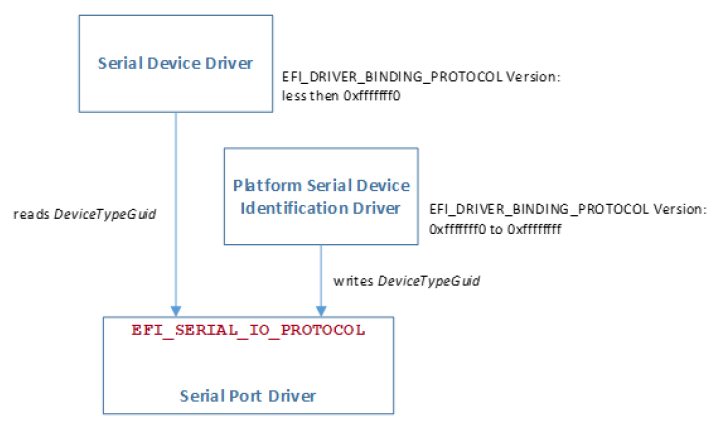

.. _protocols-console-support:

Protocols — Console Support
============================

This section explores console support protocols, including SimpleText Input, Simple Text Output, Simple Pointer, Serial IO, andGraphics Output protocols.

.. _console-io-protocol:

Console I/O Protocol
--------------------

This section defines the Console I/O protocol. This protocol isused to handle input and output of text-based information intended for the system user during the operation of code in the boot services environment. Also included here are the definitions of three console devices: one for input and one each for normal output and errors.

These interfaces are specified by function call definitions to allow maximum flexibility in implementation. For example, there is no requirement for compliant systems to have a keyboard or screen directly connected to the system. Implementations may choose to direct information passed using these interfaces in arbitrary ways provided that the semantics of the functions are preserved (in other words, provided that the information is passed to and from the system user).

.. _protocols-console-support-overview:

Overview
########

The UEFI console is built out of the :ref:`efi-simple-text-input-protocol`  and the :ref:`efi-simple-text-output-protocol` . These two protocols implement a basic text-based console that allows platform firmware, applications written to this specification, and UEFI OS loaders to present information to and receive input from a system administrator. The UEFI console supported 16-bit Unicode character codes, a simple set of input control characters (Scan Codes), and a set of output-oriented programmatic interfaces that give functionality equivalent to an intelligent terminal. The console does not support pointing devices on input or bitmaps on output.

This specification requires that the *EFI_SIMPLE_TEXT_INPUT_PROTOCOL* support the same languages as the corresponding EFI\_ *SIMPLE_TEXT_OUTPUT_PROTOCOL* . The *EFI_SIMPLE_TEXT_OUTPUT_PROTOCOL* is recommended to support at least the printable Basic Latin Unicode character set to enable standard terminal emulation software to be used with an EFI console. The Basic Latin Unicode character set implements a superset of ASCII that has been extended to 16-bit characters. Any number of other Unicode character sets may be optionally supported.

.. _consolein-definition:

ConsoleIn Definition
####################

The *EFI_SIMPLE_TEXT_INPUT_PROTOCOL* defines an input stream that contains Unicode characters and required EFI scan codes. Only the control characters defined in :ref:`supported-unicode-control-characters` have meaning in the Unicode input or output streams. The control characters are defined to be characters U+0000 through U+001F. The input stream does not support any software flow control.

.. list-table:: Supported Unicode Control Characters
   :name: supported-unicode-control-characters
   :widths: 10 10 30
   :class: longtable

   * - **Mnemonic**
     - **Unicode**
     - **Description**
   * - Null
     - U+0000
     - Null character ignored when received.
   * - BS
     - U+0008
     - Backspace. Moves cursor left one column. If the cursor is at the left margin, no action is taken.
   * - TAB
     - U+0x0009
     - Tab.
   * - LF
     - U+000A
     - Linefeed. Moves cursor to the next line.
   * - CR
     - U+000D
     - Carriage Return. Moves cursor to left margin of the current line.

The input stream supports Scan Codes in addition to Unicode characters. If the Scan Code is set to 0x00 then the Unicode character is valid and should be used. If the Scan Code is set to a non-0x00 value it represents a special key as defined by the Table :ref:`efi-scan-codes-for-efi-simple-text-input-protocol`.

.. note: duplicate table removed for EFI Scan Codes for EFI_SIMPLE_TEXT_INPUT_PROTOCOL. See more detailed version of this table in appendix B (references now direct to that one).

.. note: duplicate table removed for EFI Scan Codes for EFI_SIMPLE_TEXT_INPUT_EX_PROTOCOL. See more detailed version of this table in appendix B (references now direct to that one).

.. _simple-text-input-ex-protocol:

Simple Text Input Ex Protocol
-----------------------------

The Simple Text Input Ex protocol defines an extension to the Simple Text Input protocol which enables various new capabilities describes in this section. 

.. _efi-simple-text-input-ex-protocol:

EFI_SIMPLE_TEXT_INPUT_EX_PROTOCOL
#################################

**Summary**

This protocol is used to obtain input from the *ConsoleIn* device. The EFI specification requires that the *EFI_SIMPLE_TEXT_INPUT_PROTOCOL* supports the same languages as the corresponding *EFI_SIMPLE_TEXT_OUTPUT_PROTOCOL.* 

**GUID**

.. code-block::

   #define EFI_SIMPLE_TEXT_INPUT_EX_PROTOCOL_GUID \
    {0xdd9e7534, 0x7762, 0x4698, \
     {0x8c, 0x14, 0xf5, 0x85, 0x17, 0xa6, 0x25, 0xaa}}

**Protocol Interface Structure**

.. code-block::

   typedef struct _EFI_SIMPLE_TEXT_INPUT_EX_PROTOCOL {
    EFI_INPUT_RESET_EX                          Reset;
    EFI_INPUT_READ_KEY_EX                       ReadKeyStrokeEx;
    EFI_EVENT                                   WaitForKeyEx;
    EFI_SET_STATE                               SetState;
    EFI_REGISTER_KEYSTROKE_NOTIFY               RegisterKeyNotify;
    EFI_UNREGISTER_KEYSTROKE_NOTIFY             UnregisterKeyNotify;
   } EFI_SIMPLE_TEXT_INPUT_EX_PROTOCOL;

**Parameters**

Reset 
  Reset the *ConsoleIn* device. See *Reset().* 

ReadKeyStrokeEx 
  Returns the next input character. See *ReadKeyStrokeEx()*.

WaitForKeyEx 
  Event to use with *WaitForEvent()* to wait for a key to be available. An Event will only be triggered if *KeyData.Key* has information contained within it. 

SetState 
  Set the *EFI_KEY_TOGGLE_STATE* state settings for the input device.

RegisterKeyNotify 
  Register a notification function to be called when a given key sequence is hit.

UnregisterKeyNotify 
  Removes a specific notification function.

**Description**

The *EFI_SIMPLE_TEXT_INPUT_EX_PROTOCOL* is used on the *ConsoleIn* device. It is an extension to the Simple Text Input protocol which allows a variety of extended shift state information to be returned.

.. _efi-simple-text-input-ex-protocol-reset:

EFI_SIMPLE_TEXT_INPUT_EX_PROTOCOL.Reset()
#########################################

**Summary**

Resets the input device hardware.

**Prototype**

.. code-block:: 
  
   typedef
   EFI_STATUS
   (EFIAPI *EFI_INPUT_RESET_EX) (
    IN EFI_SIMPLE_TEXT_INPUT_EX_PROTOCOL        *This,
    IN BOOLEAN                                  ExtendedVerification
    );

**Parameters**

This 
  A pointer to the *EFI_SIMPLE_TEXT_INPUT_EX_PROTOCOL* instance. Type *EFI_SIMPLE_TEXT_INPUT_EX_PROTOCOL* is defined in this section.

ExtendedVerification 
  Indicates that the driver may perform a more exhaustive verification operation of the device during reset.

**Description**

The *Reset()* function resets the input device hardware. 

The implementation of Reset is required to clear the contents of any input queues resident in memory used for buffering keystroke data and put the input stream in a known empty state. 

As part of initialization process, the firmware/device will make a quick but reasonable attempt to verify that the device is functioning. If the *ExtendedVerification* flag is *TRUE* the firmware may take an extended amount of time to verify the device is operating on reset. Otherwise the reset operation is to occur as quickly as possible. 

The hardware verification process is not defined by this specification and is left up to the platform firmware or driver to implement.

**Status Codes Returned**

.. list-table::
   :widths: 35 70
   :class: longtable

   * - EFI_SUCCESS
     - The device was reset.
   * - EFI_DEVICE_ERROR
     - The device is not functioning correctly and could not be reset.

.. _efi-simple-text-input-ex-protocol-readkeystrokeex:

EFI_SIMPLE_TEXT_INPUT_EX_PROTOCOL.ReadKeyStrokeEx()
###################################################

**Summary**

Reads the next keystroke from the input device.

.. code-block::

   Prototype
   typedef
   EFI_STATUS
   (EFIAPI *EFI_INPUT_READ_KEY_EX) (
    IN EFI_SIMPLE_TEXT_INPUT_EX_PROTOCOL     *This,
    OUT EFI_KEY_DATA                         *KeyData
    );

**Parameters**

This 
  A pointer to the *EFI_SIMPLE_TEXT_INPUT_EX_PROTOCOL* instance. Type *EFI_SIMPLE_TEXT_INPUT_EX_PROTOCOL* is defined in this section.

KeyData
  A pointer to a buffer that is filled in with the keystroke state data for the key that was pressed. Type *EFI_KEY_DATA* is defined in "Related Definitions" below.

**Related Definitions**

.. code-block::

   //******************************************
   // EFI_KEY_DATA
   //******************************************
   typedef struct {
    EFI_INPUT_KEY           Key;
    EFI_KEY_STATE           KeyState;
   } EFI_KEY_DATA

Key 
 The EFI scan code and Unicode value returned from the input device.

KeyState 
 The current state of various toggled attributes as well as input modifier values.

 .. code-block::

   //*****************************************************
   // EFI_KEY_STATE
   //*****************************************************
   //
   // Any Shift or Toggle State that is valid should have
   // high order bit set.
   //
   typedef struct EFI_KEY_STATE {
    UINT32                       KeyShiftState;
    EFI_KEY_TOGGLE_STATE         KeyToggleState;
   } EFI_KEY_STATE;

KeyShiftState 
 Reflects the currently pressed shift modifiers for the input device. The returned value is valid only if the high order bit has been set.

KeyToggleState 
 Reflects the current internal state of various toggled attributes. The returned value is valid only if the high order bit has been set.

.. code-block:: 

   #define EFI_SHIFT_STATE_VALID          0x80000000
   #define EFI_RIGHT_SHIFT_PRESSED        0x00000001
   #define EFI_LEFT_SHIFT_PRESSED         0x00000002
   #define EFI_RIGHT_CONTROL_PRESSED      0x00000004
   #define EFI_LEFT_CONTROL_PRESSED       0x00000008
   #define EFI_RIGHT_ALT_PRESSED          0x00000010
   #define EFI_LEFT_ALT_PRESSED           0x00000020
   #define EFI_RIGHT_LOGO_PRESSED         0x00000040
   #define EFI_LEFT_LOGO_PRESSED          0x00000080
   #define EFI_MENU_KEY_PRESSED           0x00000100
   #define EFI_SYS_REQ_PRESSED            0x00000200

   //*****************************************************
   // EFI_KEY_TOGGLE_STATE
   //*****************************************************
   typedef UINT8 EFI_KEY_TOGGLE_STATE;

   #define EFI_TOGGLE_STATE_VALID 0x80
   #define EFI_KEY_STATE_EXPOSED 0x40
   #define EFI_SCROLL_LOCK_ACTIVE 0x01
   #define EFI_NUM_LOCK_ACTIVE 0x02
   #define EFI_CAPS_LOCK_ACTIVE 0x04

**Description**

The *ReadKeyStrokeEx()* function reads the next keystroke from the input device. If there is no pending keystroke the function returns *EFI_NOT_READY* . If there is a pending keystroke, then *KeyData.Key.ScanCode* is the EFI scan code defined in :ref:`efi-scan-codes-for-efi-simple-text-input-protocol` . The *KeyData.Key.UnicodeChar* is the actual printable character or is zero if the key does not represent a printable character (control key, function key, etc.). The *KeyData.KeyState* is the modifier shift state for the character reflected in *KeyData.Key.UnicodeChar* or *KeyData.Key.ScanCode.* This function mirrors the behavior of *ReadKeyStroke(* in the Simple Input Protocol in that a keystroke will only be returned when *KeyData.Key* has data within it.

When interpreting the data from this function, it should be noted that if a class of printable characters that are normally adjusted by shift modifiers (e.g. Shift Key + "f" key) would be presented solely as a *KeyData.Key.UnicodeChar* without the associated shift state. So in the previous example of a Shift Key + "f" key being pressed, the only pertinent data returned would be *KeyData.Key.UnicodeChar* with the value of "F". This of course would not typically be the case for non-printable characters such as the pressing of the Right Shift Key + F10 key since the corresponding returned data would be reflected both in the *KeyData.KeyState.KeyShiftState* and *KeyData.Key.ScanCode* values.

UEFI drivers which implement the *EFI_SIMPLE_TEXT_INPUT_EX* protocol are required to return *KeyData.Key* and *KeyData.KeyState* values. These drivers must always return the most current state of *KeyData.KeyState.KeyShiftState* and *KeyData.KeyState.KeyToggleState* . It should also be noted that certain input devices may not be able to produce shift or toggle state information, and in those cases the high order bit in the respective Toggle and Shift state fields should not be active.

If the *EFI_KEY_STATE_EXPOSED* bit is turned on, then this instance of the *EFI_SIMPLE_INPUT_EX_PROTOCOL* supports the ability to return partial keystrokes. With *EFI_KEY_STATE_EXPOSED* bit enabled, the *ReadKeyStrokeEx* function will allow the return of incomplete keystrokes such as the holding down of certain keys which are expressed as a part of *KeyState* when there is no *Key* data.

**Status Codes Returned**

.. list-table::
   :widths: 35 70
   :class: longtable

   * - **EFI_SUCCESS**
     - The keystroke information was returned.
   * - **EFI_NOT_READY**
     - There was no keystroke data available.. Current KeyData.KeyState values are exposed.
   * - **EFI_DEVICE_ERROR**
     - The keystroke information was not returned due to hardware errors.
   * - **EFI_UNSUPPORTED**
     - The device does not support the ability to read keystroke data.

.. _efi-simple-text-input-ex-protocol-setstate:

EFI_SIMPLE_TEXT_INPUT_EX_PROTOCOL.SetState()
############################################

**Summary**

Set certain state for the input device.

**Prototype**
  
.. code-block:: 
  
   typedef  
   EFI_STATUS  
   (EFIAPI \*EFI_SET_STATE) (  
    IN EFI_SIMPLE_TEXT_INPUT_EX_PROTOCOL         *This,  
    IN EFI_KEY_TOGGLE_STATE                      *KeyToggleState  
    );
  
**Parameters**

This 
  A pointer to the *EFI_SIMPLE_TEXT_INPUT_EX_PROTOCOL* instance. Type *EFI_SIMPLE_TEXT_INPUT_EX_PROTOCOL* is defined in this section.

KeyToggleState 
  Pointer to the *EFI_KEY_TOGGLE_STATE* to set the state for the input device. Type *EFI_KEY_TOGGLE_STATE* is defined in "Related Definitions" for *EFI_SIMPLE_TEXT_INPUT_EX_PROTOCOL.ReadKeyStrokeEx()* , above.

  The SetState() function allows the input device hardware to have state settings adjusted. By calling the SetState() function with the *EFI_KEY_STATE_EXPOSED* bit active in the *KeyToggleState* parameter, this will enable the *ReadKeyStrokeEx* function to return incomplete keystrokes such as the holding down of certain keys which are expressed as a part of KeyState when there is no Key data.

**Status Codes Returned**

.. list-table::
   :widths: 35 70
   :class: longtable

   * - EFI_SUCCESS
     - The device state was set appropriately.
   * - EFI_DEVICE_ERROR
     - The device is not functioning correctly and could not have the setting adjusted.
   * - EFI_UNSUPPORTED
     - The device does not support the ability to have its state set or the requested state change was not supported.

.. _efi-simple-text-input-ex-protocol-registerkeynotify:

EFI_SIMPLE_TEXT_INPUT_EX_PROTOCOL.RegisterKeyNotify()
#####################################################

**Summary**

Register a notification function for a particular keystroke for the input device.

**Prototype**

.. code-block::

   typedef
   EFI_STATUS
   (EFIAPI *EFI_REGISTER_KEYSTROKE_NOTIFY) (
    IN EFI_SIMPLE_TEXT_INPUT_EX_PROTOCOL            *This,
    IN EFI_KEY_DATA                                 *KeyData,
    IN EFI_KEY_NOTIFY_FUNCTION                      KeyNotificationFunction,
    OUT VOID                                        **NotifyHandle
    );  

**Parameters**

*This* 

A pointer to the *EFI_SIMPLE_TEXT_INPUT_EX_PROTOCOL* instance. Type *EFI_SIMPLE_TEXT_INPUT_EX_PROTOCOL* is defined in this section.

*KeyData* 

A pointer to a buffer that is filled in with the keystroke information for the key that was pressed. If KeyData.Key, KeyData.KeyState.KeyToggleState and KeyData.KeyState.KeyShiftState are 0, then any incomplete keystroke will trigger a notification of the KeyNotificationFunction.

*KeyNotificationFunction*

Points to the function to be called when the key sequence is typed specified by *KeyData* . This notification function should be called at <= *TPL_CALLBACK.* See *EFI_KEY_NOTIFY_FUNCTION* below.

*NotifyHandle* 

Points to the unique handle assigned to the registered notification.

**Description**

The *RegisterKeystrokeNotify()* function registers a function which will be called when a specified keystroke will occur. The keystroke being specified can be for any combination of *KeyData.Key* or *KeyData.KeyState* information.

**Related Definitions**

.. code-block::
  
   //******************************************************
   // EFI_KEY_NOTIFY
   //******************************************************
   typedef
   EFI_STATUS
   (EFIAPI \*EFI_KEY_NOTIFY_FUNCTION) (
    IN EFI_KEY_DATA                          *KeyData
    );
  

**Status Codes Returned**

.. list-table::
   :widths: 35 70
   :class: longtable

   * - EFI_SUCCESS
     - Key notify was registered successfully.
   * - EFI_OUT_OF_RESOURCES 
     - Unable to allocate necessary data structures.

.. _efi-simple-text-input-ex-protocol-unregisterkeynotify:

EFI_SIMPLE_TEXT_INPUT_EX_PROTOCOL.UnregisterKeyNotify()
########################################################

**Summary**

Remove the notification that was previously registered.

**Prototype**

.. code-block::
  
   typedef  
   EFI_STATUS  
   (EFIAPI *EFI_UNREGISTER_KEYSTROKE_NOTIFY) (  
    IN EFI_SIMPLE_TEXT_INPUT_EX_PROTOCOL *This,  
    IN VOID                              *NotificationHandle 
    );
 
 **Parameters**

This 
  A pointer to the *EFI_SIMPLE_TEXT_INPUT_EX_PROTOCOL* instance. Type *EFI_SIMPLE_TEXT_INPUT_EX_PROTOCOL* is defined in this section.

NotificationHandle 
  The handle of the notification function being unregistered.

**Description**

The *UnregisterKeystrokeNotify()* function removes the notification which was previously registered.

**Status Codes Returned**

.. list-table::
   :widths: 35 70
   :class: longtable
  
   * - EFI_SUCCESS
     - Key notify was unregistered successfully.
   * - EFI_INVALID_PARAMETER
     - The NotificationHandle is invalid.

.. _simple-text-input-protocol:

Simple Text Input Protocol
--------------------------

The Simple Text Input protocol defines the minimum input required to support the ConsoleIn device.

.. _efi-simple-text-input-protocol:

EFI_SIMPLE_TEXT_INPUT_PROTOCOL
##############################

**Summary**

This protocol is used to obtain input from the ConsoleIn device. The EFI specification requires that the *EFI_SIMPLE_TEXT_INPUT_PROTOCOL* supports the same languages as the corresponding *EFI_SIMPLE_TEXT_OUTPUT_PROTOCOL*.

**GUID**

.. code-block::

   #define EFI_SIMPLE_TEXT_INPUT_PROTOCOL_GUID \
    {0x387477c1,0x69c7,0x11d2,\
     {0x8e,0x39,0x00,0xa0,0xc9,0x69,0x72,0x3b}}

**Protocol Interface Structure**

.. code-block::

   typedef struct _EFI_SIMPLE_TEXT_INPUT_PROTOCOL {
    EFI_INPUT_RESET                       Reset;
    EFI_INPUT_READ_KEY                    ReadKeyStroke;
    EFI_EVENT                             WaitForKey;
   } EFI_SIMPLE_TEXT_INPUT_PROTOCOL;

**Parameters**

Reset 
  Reset the ConsoleIn device, :ref:`efi-simple-text-input-protocol-reset` .

ReadKeyStroke 
  Returns the next input character, :ref:`efi-simple-text-input-protocol-readkeystroke` .

WaitForKey 
  Event to use with :ref:`efi-boot-services-waitforevent`  to wait for a key to be available.

**Description**

The *EFI_SIMPLE_TEXT_INPUT_PROTOCOL* is used on the ConsoleIn device. It is the minimum required protocol for ConsoleIn.

.. _efi-simple-text-input-protocol-reset:

EFI_SIMPLE_TEXT_INPUT_PROTOCOL.Reset()
######################################

**Summary**

Resets the input device hardware.

**Prototype**

.. code-block::
  
   typedef  
   EFI_STATUS  
   (EFIAPI *EFI_INPUT_RESET) (  
    IN EFI_SIMPLE_TEXT_INPUT_PROTOCOL                 *This,  
    IN BOOLEAN                                        ExtendedVerification  
    );
  

**Parameters**

This
  A pointer to the *EFI_SIMPLE_TEXT_INPUT_PROTOCOL* instance. Type EFI_SIMPLE_TEXT_INPUT_PROTOCOL is defined in  :ref:`efi-simple-text-input-protocol`   

ExtendedVerification
  Indicates that the driver may perform a more exhaustive verification operation of the device during reset. 

**Description**

The Reset() function resets the input device hardware. 

The implementation of Reset is required to clear the contents of any input queues resident in memory used for buffering keystroke data and put the input stream in a known empty state. 

As part of initialization process, the firmware/device will make a quick but reasonable attempt to verify that the device is functioning. If the ExtendedVerification flag is **TRUE** the firmware may take an extended amount of time to verify the device is operating on reset. Otherwise the reset operation is to occur as quickly as possible. 

The hardware verification process is not defined by this specification and is left up to the platform firmware or driver to implement.
 

**Status Codes Returned**

.. list-table::
   :widths: 35 70
   :class: longtable

   * - EFI_SUCCESS
     - The device was reset.
   * - EFI_DEVICE_ERROR
     - The device is not functioning correctly and could not be reset.

.. _efi-simple-text-input-protocol-readkeystroke:

EFI_SIMPLE_TEXT_INPUT_PROTOCOL.ReadKeyStroke()
##############################################

**Summary**

Reads the next keystroke from the input device.

**Prototype**

.. code-block::
  
   typedef  
   EFI_STATUS  
   (EFIAPI \*EFI_INPUT_READ_KEY) (  
    IN EFI_SIMPLE_TEXT_INPUT_PROTOCOL              *This,  
    OUT EFI_INPUT_KEY                              *Key 
    );

**Parameters**

This 
  A pointer to the EFI_SIMPLE_TEXT_INPUT_PROTOCOL instance. Type EFI_SIMPLE_TEXT_INPUT_PROTOCOL is defined in :ref:`efi-simple-text-input-protocol`

Key 
  A pointer to a buffer that is filled in with the keystroke information for the key that was pressed. Type EFI_INPUT_KEY is defined in "Related Definitions" below.

.. code-block::

   Related Definitions
   //******************************************************
   // EFI_INPUT_KEY
   //******************************************************
   typedef struct {
    UINT16                             ScanCode;
    CHAR16                             UnicodeChar;
   } EFI_INPUT_KEY;

**Description**

The ReadKeyStroke() function reads the next keystroke from the input device. If there is no pending keystroke the function returns EFI_NOT_READY. If there is a pending keystroke, then ScanCode is the EFI scan code defined in  :ref:`efi-scan-codes-for-efi-simple-text-input-protocol` . The UnicodeChar is the actual printable character or is zero if the key does not represent a printable character (control key, function key, etc.).

**Status Codes Returned**

.. list-table::
   :widths: 35 70
   :class: longtable

  * - EFI_SUCCESS
    - The keystroke information was returned.
  * - EFI_NOT_READY
    - There was no keystroke data available.
  * - EFI_DEVICE_ERROR
    - The keystroke information was not returned due to hardware errors.
  * - EFI_UNSUPPORTED
    - The device does not support the ability to read keystroke data.

.. _consoleout-or-standarderror:

ConsoleOut or StandardError
###########################

The *EFI_SIMPLE_TEXT_OUTPUT_PROTOCOL* must implement the same Unicode code pages as the *EFI_SIMPLE_TEXT_INPUT_PROTOCOL* . The protocol must also support the Unicode control characters defined in :ref:`supported-unicode-control-characters` . The *EFI_SIMPLE_TEXT_OUTPUT_PROTOCOL* supports special manipulation of the screen by programmatic methods and therefore does not support the EFI scan codes defined in :ref:`efi-scan-codes-for-efi-simple-text-input-protocol` .

.. _simple-text-output-protocol:

Simple Text Output Protocol
---------------------------

The Simple Text Output protocol defines the minimum requirements for a text-based ConsoleOut device. The EFI specification requires that the *EFI_SIMPLE_TEXT_INPUT_PROTOCOL* support the same languages as the corresponding *EFI_SIMPLE_TEXT_OUTPUT_PROTOCOL.*

.. _efi-simple-text-output-protocol:

EFI_SIMPLE_TEXT_OUTPUT_PROTOCOL
###############################

**Summary**

This protocol is used to control text-based output devices.

**GUID**

.. code-block::

   #define EFI_SIMPLE_TEXT_OUTPUT_PROTOCOL_GUID \
    {0x387477c2,0x69c7,0x11d2,\
     {0x8e,0x39,0x00,0xa0,0xc9,0x69,0x72,0x3b}}

**Protocol Interface Structure**

.. code-block::

   typedef struct _EFI_SIMPLE_TEXT_OUTPUT_PROTOCOL {
    EFI_TEXT_RESET                           Reset;
    EFI_TEXT_STRING                          OutputString;
    EFI_TEXT_TEST_STRING                     TestString;
    EFI_TEXT_QUERY_MODE                      QueryMode;
    EFI_TEXT_SET_MODE                        SetMode;
    EFI_TEXT_SET_ATTRIBUTE                   SetAttribute;
    EFI_TEXT_CLEAR_SCREEN                    ClearScreen;
    EFI_TEXT_SET_CURSOR_POSITION             SetCursorPosition;
    EFI_TEXT_ENABLE_CURSOR                   EnableCursor;
    SIMPLE_TEXT_OUTPUT_MODE                  *Mode;
   } EFI_SIMPLE_TEXT_OUTPUT_PROTOCOL;

**Parameters**

Reset
  Reset the ConsoleOut device. :ref:`efi-simple-text-output-protocol-reset`.

OutputString 
  Displays the string on the device at the current cursor location. See OutputString() :ref:`efi-simple-text-output-protocol-outputstring` .

TestString 
  Tests to see if the ConsoleOut device supports this string. See TestString() :ref:`efi-simple-text-output-protocol-TestString` .

QueryMode 
  Queries information concerning the output device’s supported text mode. See QueryMode() :ref:`efi-simple-text-output-protocol-QueryMode` .

SetMode 
  Sets the current mode of the output device. :ref:`efi-simple-text-output-protocol-SetMode`  .

SetAttribute 
  Sets the foreground and background color of the text that is output. :ref:`efi-simple-text-output-protocol-SetAttribute` .

ClearScreen 
  Clears the screen with the currently set background color. See ClearScreen() :ref:`efi-simple-text-output-protocol-clearscreen`.

SetCursorPosition 
  Sets the current cursor position. See SetCursorPosition() :ref:`efi-simple-text-output-protocol-SetCursorPosition` .

EnableCursor 
  Turns the visibility of the cursor on/off. See EnableCursor() :ref:`efi-simple-text-output-protocol-EnableCursor` .

Mode 
  Pointer to SIMPLE_TEXT_OUTPUT_MODE data. Type SIMPLE_TEXT_OUTPUT_MODE is defined in "Related Definitions" below.

The following data values in the SIMPLE_TEXT_OUTPUT_MODE interface are read-only and are changed by using the appropriate interface functions:

MaxMode
  The number of modes supported by QueryMode() and SetMode().

Mode 
  The text mode of the output device(s).

Attribute 
  The current character output attribute.

CursorColumn 
  The cursor’s column.

CursorRow 
  The cursor’s row.

CursorVisible 
  The cursor is currently visible or not.

**Related Definitions**

.. code-block::
  
   //******************************************************
   // SIMPLE_TEXT_OUTPUT_MODE
   //******************************************************
   typedef struct {
    INT32                              MaxMode;
    // current settings
    INT32                              Mode;
    INT32                              Attribute;
    INT32                              CursorColumn;
    INT32                              CursorRow;
    BOOLEAN                            CursorVisible;
   } SIMPLE_TEXT_OUTPUT_MODE;

**Description**

The SIMPLE_TEXT_OUTPUT protocol is used to control text-based output devices. It is the minimum required protocol for any handle supplied as the ConsoleOut or StandardError device. In addition, the minimum supported text mode of such devices is at least 80 x 25 characters.

A video device that only supports graphics mode is required to emulate text mode functionality. Output strings themselves are not allowed to contain any control codes other than those defined in :ref:`supported-unicode-control-characters` . Positional cursor placement is done only via the SetCursorPosition() :ref:`efi-simple-text-output-protocol-SetCursorPosition` function. It is highly recommended that text output to the StandardError device be limited to sequential string outputs. (That is, it is not recommended to use ClearScreen() :ref:`efi-simple-text-output-protocol-clearscreen` or *SetCursorPosition()* on output messages to StandardError.)

If the output device is not in a valid text mode at the time of the :ref:`efi-boot-services-handleprotocol`  call, the device is to indicate that its CurrentMode is -1. On connecting to the output device the caller is required to verify the mode of the output device, and if it is not acceptable to set it to something it can use.

.. _efi-simple-text-output-protocol-reset:

EFI_SIMPLE_TEXT_OUTPUT_PROTOCOL.Reset()
########################################

**Summary**

Resets the text output device hardware.

**Prototype**

.. code-block::
  
   typedef  
   EFI_STATUS  
   (EFIAPI \*EFI_TEXT_RESET) (  
    IN EFI_SIMPLE_TEXT_OUTPUT_PROTOCOL       *This,  
    IN BOOLEAN                               ExtendedVerification  
    );
  

**Parameters**

This
  A pointer to the :ref:`efi-simple-text-output-protocol` instance. Type EFI_SIMPLE_TEXT_OUTPUT_PROTOCOL is defined in the "Related Definitions" of :ref:`efi-simple-text-output-protocol`

ExtendedVerification
  Indicates that the driver may perform a more exhaustive verification operation of the device during reset.

**Description**

The Reset() function resets the text output device hardware. The cursor position is set to (0, 0), and the screen is cleared to the default background color for the output device.

As part of initialization process, the firmware/device will make a quick but reasonable attempt to verify that the device is functioning. If the ExtendedVerification flag is **TRUE** the firmware may take an extended amount of time to verify the device is operating on reset. Otherwise the reset operation is to occur as quickly as possible.

The hardware verification process is not defined by this specification and is left up to the platform firmware or driver to implement.

**Status Codes Returned**

.. list-table::
   :widths: 35 70
   :class: longtable

   * - EFI_SUCCESS
     - The text output device was reset.
   * - EFI_DEVICE_ERROR
     - The text output device is not functioning correctly and could not be reset.

.. _efi-simple-text-output-protocol-outputstring:

EFI_SIMPLE_TEXT_OUTPUT_PROTOCOL.OutputString()
##############################################

**Summary**

Writes a string to the output device.

**Prototype**

.. code-block::
  
   typedef  
   EFI_STATUS  
   (EFIAPI *EFI_TEXT_STRING) (  
    IN EFI_SIMPLE_TEXT_OUTPUT_PROTOCOL    *This,  
    IN CHAR16                             *String  
    );
  

**Parameters**

This 
  A pointer to the :ref:`efi-simple-text-output-protocol` instance. Type EFI_SIMPLE_TEXT_OUTPUT_PROTOCOL is defined in the "Related Definitions" of :ref:`simple-text-output-protocol` .

String 
  The Null-terminated string to be displayed on the output device(s). All output devices must also support the Unicode drawing character codes defined in "Related Definitions."

 
**Related Definitions**

.. code-block::
  
   //******************************************************
   // UNICODE DRAWING CHARACTERS
   //******************************************************

   #define BOXDRAW_HORIZONTAL             0x2500
   #define BOXDRAW_VERTICAL               0x2502
   #define BOXDRAW_DOWN_RIGHT             0x250c
   #define BOXDRAW_DOWN_LEFT              0x2510
   #define BOXDRAW_UP_RIGHT               0x2514
   #define BOXDRAW_UP_LEFT                0x2518
   #define BOXDRAW_VERTICAL_RIGHT         0x251c
   #define BOXDRAW_VERTICAL_LEFT          0x2524
   #define BOXDRAW_DOWN_HORIZONTAL        0x252c
   #define BOXDRAW_UP_HORIZONTAL          0x2534
   #define BOXDRAW_VERTICAL_HORIZONTAL    0x253c

   #define BOXDRAW_DOUBLE_HORIZONTAL      0x2550
   #define BOXDRAW_DOUBLE_VERTICAL        0x2551
   #define BOXDRAW_DOWN_RIGHT_DOUBLE      0x2552
   #define BOXDRAW_DOWN_DOUBLE_RIGHT      0x2553
   #define BOXDRAW_DOUBLE_DOWN_RIGHT      0x2554
   #define BOXDRAW_DOWN_LEFT_DOUBLE       0x2555
   #define BOXDRAW_DOWN_DOUBLE_LEFT       0x2556
   #define BOXDRAW_DOUBLE_DOWN_LEFT       0x2557

   #define BOXDRAW_UP_RIGHT_DOUBLE        0x2558
   #define BOXDRAW_UP_DOUBLE_RIGHT        0x2559
   #define BOXDRAW_DOUBLE_UP_RIGHT        0x255a
   #define BOXDRAW_UP_LEFT_DOUBLE         0x255b
   #define BOXDRAW_UP_DOUBLE_LEFT         0x255c
   #define BOXDRAW_DOUBLE_UP_LEFT         0x255d

   #define BOXDRAW_VERTICAL_RIGHT_DOUBLE  0x255e
   #define BOXDRAW_VERTICAL_DOUBLE_RIGHT  0x255f
   #define BOXDRAW_DOUBLE_VERTICAL_RIGHT  0x2560

   #define BOXDRAW_VERTICAL_LEFT_DOUBLE   0x2561
   #define BOXDRAW_VERTICAL_DOUBLE_LEFT   0x2562
   #define BOXDRAW_DOUBLE_VERTICAL_LEFT   0x2563

   #define BOXDRAW_DOWN_HORIZONTAL_DOUBLE 0x2564
   #define BOXDRAW_DOWN_DOUBLE_HORIZONTAL 0x2565
   #define BOXDRAW_DOUBLE_DOWN_HORIZONTAL 0x2566

   #define BOXDRAW_UP_HORIZONTAL_DOUBLE   0x2567
   #define BOXDRAW_UP_DOUBLE_HORIZONTAL   0x2568
   #define BOXDRAW_DOUBLE_UP_HORIZONTAL   0x2569

   #define BOXDRAW_VERTICAL_HORIZONTAL_DOUBLE 0x256a
   #define BOXDRAW_VERTICAL_DOUBLE_HORIZONTAL 0x256b
   #define BOXDRAW_DOUBLE_VERTICAL_HORIZONTAL 0x256c

   //******************************************************
   // EFI Required Block Elements Code Chart
   //******************************************************

   #define BLOCKELEMENT_FULL_BLOCK        0x2588
   #define BLOCKELEMENT_LIGHT_SHADE       0x2591

   //******************************************************
   // EFI Required Geometric Shapes Code Chart
   //******************************************************

   #define GEOMETRICSHAPE_UP_TRIANGLE     0x25b2
   #define GEOMETRICSHAPE_RIGHT_TRIANGLE  0x25ba
   #define GEOMETRICSHAPE_DOWN_TRIANGLE   0x25bc
   #define GEOMETRICSHAPE_LEFT_TRIANGLE   0x25c4

   //******************************************************
   // EFI Required Arrow shapes
   //******************************************************

   #define ARROW_UP                       0x2191
   #define ARROW_DOWN                     0x2193

**Description**

The OutputString() :ref:`efi-simple-text-output-protocol-outputstring` function writes a string to the output device. This is the most basic output mechanism on an output device. The String is displayed at the current cursor location on the output device(s) and the cursor is advanced according to the rules listed in  :ref:`efi-cursor-location-advance-rules` .

.. list-table:: EFI Cursor Location/Advance Rules
   :name: efi-cursor-location-advance-rules
   :widths: 5 5 30
   :class: longtable

   * - **Mnemonic**
     - **Unicode**
     - **Description**
   * - Null
     - U+0000
     - Ignore the character, and do not move the cursor.
   * - BS
     - U+0008
     - If the cursor is not at the left edge of the display, then move the cursor left one column.
   * - LF
     - U+000A
     - If the cursor is at the bottom of the display, then scroll the display one row, and do not update the cursor position. Otherwise, move the cursor down one row.
   * - CR
     - U+000D
     - Move the cursor to the beginning of the current row.
   * - Other
     - U+XXXX
     - Print the character at the current cursor position and move the cursor right one column. If this moves the cursor past the right edge of the display, then the line should wrap to the beginning of the next line. This is equivalent to inserting a CR and an LF. Note that if the cursor is at the bottom of the display, and the line wraps, then the display will be scrolled one line.

**Note**: *If desired, the system’s NVRAM environment variables may be used at install time to determine the configured locale of the system or the installation procedure can query the user for the proper language support. This is then used to either install the proper EFI image/loader or to configure the installed image’s strings to use the proper text for the selected locale*.

**Status Codes Returned**

.. list-table::
   :widths: 35 70
   :class: longtable

   * - EFI_SUCCESS
     - The string was output to the device.
   * - EFI_DEVICE_ERROR
     - The device reported an error while attempting to output the text.
   * - EFI_UNSUPPORTED
     - The output device’s mode is not currently in a defined text mode.
   * - EFI_WARN_UNKNOWN_GLYPH
     - This warning code indicates that some of the characters in the string could not be rendered and were skipped.

.. _efi-simple-text-output-protocol-teststring:

EFI_SIMPLE_TEXT_OUTPUT_PROTOCOL.TestString()
############################################

**Summary**

Verifies that all characters in a string can be output to the
target device.

**Prototype**

.. code-block::

   typedef  
   EFI_STATUS  
   (EFIAPI *EFI_TEXT_TEST_STRING) (  
    IN EFI_SIMPLE_TEXT_OUTPUT_PROTOCOL       *This,  
    IN CHAR16                                *String  
    );
  

**Parameters**

This 
  A pointer to the :ref:`efi-simple-text-output-protocol` instance. Type EFI_SIMPLE_TEXT_OUTPUT_PROTOCOL is defined in the "Related Definitions" of :ref:`simple-text-output-protocol`.

String
  The Null-terminated string to be examined for the output device(s).

**Description**

The TestString() function verifies that all characters in a string can be output to the target device.

This function provides a way to know if the desired character codes are supported for rendering on the output device(s). This allows the installation procedure (or EFI image) to at least select character codes that the output devices are capable of displaying. Since the output device(s) may be changed between boots, if the loader cannot adapt to such changes it is recommended that the loader call OUTPUTSTRING() :ref:`efi-simple-text-output-protocol-outputstring` with the text it has and ignore any "unsupported" error codes. Devices that are capable of displaying the Unicode character codes will do so.

**Status Codes Returned**

.. list-table::
   :widths: 35 70
   :class: longtable

   * - EFI_SUCCESS
     - The device(s) are capable of rendering the output string.
   * - EFI_UNSUPPORTED
     - Some of the characters in the string cannot be rendered by one or more of the output devices mapped by the EFI handle.

.. _efi-simple-text-output-protocol-querymode:

EFI_SIMPLE_TEXT_OUTPUT_PROTOCOL.QueryMode()
###########################################

**Summary**

Returns information for an available text mode that the output
device(s) supports.

**Prototype**
 
.. code-block::
  
   typedef  
   EFI_STATUS  
   (EFIAPI *EFI_TEXT_QUERY_MODE) (  
    IN EFI_SIMPLE_TEXT_OUTPUT_PROTOCOL          *This,  
    IN UINTN                                    ModeNumber,  
    OUT UINTN                                   *Columns,  
    OUT UINTN                                   *Rows  
    );
  
**Parameters**

This 
  A pointer to the :ref:`efi-simple-text-output-protocol`  instance. Type EFI_SIMPLE_TEXT_OUTPUT_PROTOCOL is defined in the "Related Definitions" of  :ref:`simple-text-output-protocol`.

ModeNumber 
  The mode number to return information on. 

Columns, Rows 
  Returns the geometry of the text output device for the request ModeNumber.

**Description**

The QueryMode() function returns information for an available text mode that the output device(s) supports.

It is required that all output devices support at least 80x25 text mode. This mode is defined to be mode 0. If the output devices support 80x50, that is defined to be mode 1. All other text dimensions supported by the device will follow as modes 2 and above. If an output device supports modes 2 and above, but does not support 80x50, then querying for mode 1 will return *EFI_UNSUPPORTED* .

**Status Codes Returned**

.. list-table::
   :widths: 35 70
   :class: longtable

   * - EFI_SUCCESS
     - The requested mode information was returned.
   * - EFI_DEVICE_ERROR
     - The device had an error and could not complete the request.
   * - EFI_UNSUPPORTED
     - The mode number was not valid.

.. _efi-simple-text-output-protocol-setmode:

EFI_SIMPLE_TEXT_OUTPUT_PROTOCOL.SetMode()
##########################################

**Summary**

Sets the output device(s) to a specified mode.

**Prototype**

.. code-block::
  
   typedef  
   EFI_STATUS  
   (* EFIAPI EFI_TEXT_SET_MODE) (  
    IN EFI_SIMPLE_TEXT_OUTPUT_PROTOCOL          *This,  
    IN UINTN                                    ModeNumber  
    );
  
**Parameters**

This
  A pointer to the :ref:`efi-simple-text-output-protocol`  instance. Type EFI_SIMPLE_TEXT_OUTPUT_PROTOCOL is defined in the "Related Definitions" of :ref:`simple-text-output-protocol`.

ModeNumber
  The text mode to set.

**Description**

The SetMode() function sets the output device(s) to the requested mode. On success the device is in the geometry for the requested mode, and the device has been cleared to the current background color with the cursor at (0,0).

**Status Codes Returned**

.. list-table::
   :widths: 35 70
   :class: longtable

   * - EFI_SUCCESS
     - The requested text mode was set.
   * - EFI_DEVICE_ERROR
     - The device had an error and could not complete the request.
   * - EFI_UNSUPPORTED
     - The mode number was not valid.

.. _efi-simple-text-output-protocol-setattribute:

EFI_SIMPLE_TEXT_OUTPUT_PROTOCOL.SetAttribute()
##############################################

**Summary**

Sets the background and foreground colors for the OutputString(), :ref:`efi-simple-text-output-protocol-outputstring` and ClearScreen() :ref:`efi-simple-text-output-protocol-clearscreen` functions.

**Prototype**

.. code-block:: 

   typedef  
   EFI_STATUS  
   (EFIAPI *EFI_TEXT_SET_ATTRIBUTE) (  
    IN EFI_SIMPLE_TEXT_OUTPUT_PROTOCOL        *This,  
    IN UINTN                                  Attribute  
    );

**Parameters**

This 
  A pointer to the :ref:`efi-simple-text-output-protocol` instance. Type EFI_SIMPLE_TEXT_OUTPUT_PROTOCOL is defined inthe "Related Definitions" :ref:`simple-text-output-protocol` .

Attribute 
  The attribute to set. Bits 0..3 are the foreground color, and bits 4..6 are the background color. All other bits are reserved. See "Related Definitions" below.

**Related Definitions**

.. code-block::
  
    //*******************************************************
    // Attributes  
    //*******************************************************
    #define EFI_BLACK                              0x00  
    #define EFI_BLUE                               0x01  
    #define EFI_GREEN                              0x02  
    #define EFI_CYAN                               0x03  
    #define EFI_RED                                0x04  
    #define EFI_MAGENTA                            0x05  
    #define EFI_BROWN                              0x06  
    #define EFI_LIGHTGRAY                          0x07  
    #define EFI_BRIGHT                             0x08  
    #define EFI_DARKGRAY(EFI_BLACK \| EFI_BRIGHT)  0x08  
    #define EFI_LIGHTBLUE                          0x09  
    #define EFI_LIGHTGREEN                         0x0A  
    #define EFI_LIGHTCYAN                          0x0B  
    #define EFI_LIGHTRED                           0x0C  
    #define EFI_LIGHTMAGENTA                       0x0D  
    #define EFI_YELLOW                             0x0E  
    #define EFI_WHITE                              0x0F  

    #define EFI_BACKGROUND_BLACK                   0x00  
    #define EFI_BACKGROUND_BLUE                    0x10  
    #define EFI_BACKGROUND_GREEN                   0x20  
    #define EFI_BACKGROUND_CYAN                    0x30  
    #define EFI_BACKGROUND_RED                     0x40  
    #define EFI_BACKGROUND_MAGENTA                 0x50  
    #define EFI_BACKGROUND_BROWN                   0x60  
    #define EFI_BACKGROUND_LIGHTGRAY               0x70  
    //  
    // Macro to accept color values in their raw form to create  
    // a value that represents both a foreground and background  
    // color in a single byte.  
    // For Foreground, and EFI_\* value is valid from EFI_BLACK(0x00)  
    // to EFI_WHITE (0x0F).  
    // For Background, only EFI_BLACK, EFI_BLUE, EFI_GREEN,  
    // EFI_CYAN, EFI_RED, EFI_MAGENTA, EFI_BROWN, and EFI_LIGHTGRAY  
    // are acceptable.  
    //  
    // Do not use EFI_BACKGROUND_xxx values with this macro.  
    //#define EFI_TEXT_ATTR(Foreground,Background) \  
    ((Foreground) | ((Background) << 4))
  

**Description**

The SetAttribute() function sets the background and foreground colors for the OutputString() :ref:`efi-simple-text-output-protocol-outputstring` and ClearScreen() :ref:`efi-simple-text-output-protocol-clearscreen` functions.

The color mask can be set even when the device is in an invalid text mode.

Devices supporting a different number of text colors are required to emulate the above colors to the best of the device’s capabilities.

**Status Codes Returned**

.. list-table::
   :widths: 35 70

   * - EFI_SUCCESS
     - The requested attributes were set.
   * - EFI_DEVICE_ERROR
     - The device had an error and could not complete the request.

.. _efi-simple-text-output-protocol-clearscreen:

EFI_SIMPLE_TEXT_OUTPUT_PROTOCOL.ClearScreen()
#############################################

**Summary**

Clears the output device(s) display to the currently selected background color.

**Prototype**

.. code-block::
  
   typedef   
   EFI_STATUS  
   (EFIAPI \*EFI_TEXT_CLEAR_SCREEN) (  
    IN EFI_SIMPLE_TEXT_OUTPUT_PROTOCOL             *This  
    );

**Parameters**

This 
  A pointer to the :ref:`efi-simple-text-output-protocol` instance. Type EFI_SIMPLE_TEXT_OUTPUT_PROTOCOL is defined in the "Related Definitions" of  :ref:`simple-text-output-protocol`.

**Description**

The ClearScreen() function clears the output device(s) display to the currently selected background color. The cursor position is set to (0, 0).

**Status Codes Returned**

.. list-table::
   :widths: 35 70
   :class: longtable

   * - EFI_SUCCESS
     - The operation completed successfully.
   * - EFI_DEVICE_ERROR
     - The device had an error and could not complete the request.
   * - EFI_UNSUPPORTED
     - The output device is not in a valid text mode.

.. _efi-simple-text-output-protocol-setcursorposition:

EFI_SIMPLE_TEXT_OUTPUT_PROTOCOL.SetCursorPosition()
#####################################################

**Summary**

Sets the current coordinates of the cursor position.

**Prototype**

.. code-block::
  
   typedef  
   EFI_STATUS  
   (EFIAPI *EFI_TEXT_SET_CURSOR_POSITION) (  
    IN EFI_SIMPLE_TEXT_OUTPUT_PROTOCOL             *This,  
    IN UINTN                                       Column,  
    IN UINTN                                       Row  
    );
  
**Parameters**

This
  A pointer to the :ref:`efi-simple-text-output-protocol` instance. Type EFI_SIMPLE_TEXT_OUTPUT_PROTOCOL is defined in the "Related Definitions" of :ref:`simple-text-output-protocol` .

Column, Row 
  The position to set the cursor to. Must greater than or equal to zero and less than the number of columns and rows returned by :ref:`efi-simple-text-output-protocol-querymode` .

**Description**

The SetCursorPosition() function sets the current coordinates of the cursor position. The upper left corner of the screen is defined as coordinate (0, 0).

**Status Codes Returned**

.. list-table::
   :widths: 35 70
   :class: longtable

   * - EFI_SUCCESS
     - The operation completed successfully.
   * - EFI_DEVICE_ERROR
     - The device had an error and could not complete the request.
   * - EFI_UNSUPPORTED
     - The output device is not in a valid text mode, or the cursor position is invalid for the current mode.

.. _efi-simple-text-output-protocol-enablecursor:

EFI_SIMPLE_TEXT_OUTPUT_PROTOCOL.EnableCursor()
##############################################

**Summary**

Makes the cursor visible or invisible.

**Prototype**
 
.. code-block::
  
   typedef  
   EFI_STATUS  
   (EFIAPI *EFI_TEXT_ENABLE_CURSOR) (  
    IN EFI_SIMPLE_TEXT_OUTPUT_PROTOCOL             *This,  
    IN BOOLEAN                                     Visible  
    );  

**Parameters**

This
  A pointer to the :ref:`efi-simple-text-output-protocol` instance. Type EFI_SIMPLE_TEXT_OUTPUT_PROTOCOL is defined in the "Related Definitions" of :ref:`simple-text-output-protocol` .

Visible 
  If **TRUE**, the cursor is set to be visible. If **FALSE**, the cursor is set to be invisible.

**Description**

The EnableCursor() function makes the cursor visible or invisible.

**Status Codes Returned**

.. list-table::
   :widths: 35 70
   :class: longtable

   * - EFI_SUCCESS
     - The operation completed successfully.
   * - EFI_DEVICE_ERROR
     - The device had an error and could not complete the request or the device does not support changing the cursor mode.
   * - EFI_UNSUPPORTED
     - The output device does not support visibility control of the cursor.

.. _simple-pointer-protocol:

Simple Pointer Protocol
-----------------------

This section defines the Simple Pointer Protocol and a detailed description of the EFI_SIMPLE_POINTER_PROTOCOL. The intent of this section is to specify a simple method for accessing pointer devices. This would include devices such as mice and trackballs.

The EFI_SIMPLE_POINTER_PROTOCOL allows information about a pointer device to be retrieved. This would include the status of buttons and the motion of the pointer device since the last time it was accessed. This protocol is attached the device handle of a pointer device, and can be used for input from the user in the preboot environment.

.. _efi-simple-pointer-protocol:

EFI_SIMPLE_POINTER_PROTOCOL
###########################

**Summary**

Provides services that allow information about a pointer device to be retrieved.

**GUID**

.. code-block::

   #define EFI_SIMPLE_POINTER_PROTOCOL_GUID \
    {0x31878c87,0xb75,0x11d5,\
     {0x9a,0x4f,0x00,0x90,0x27,0x3f,0xc1,0x4d}}

**Protocol Interface Structure**

.. code-block::

   typedef struct \_EFI_SIMPLE_POINTER_PROTOCOL {
    EFI_SIMPLE_POINTER_RESET                    Reset;
    EFI_SIMPLE_POINTER_GET_STATE                GetState;
    EFI_EVENT                                   WaitForInput;
    EFI_SIMPLE_INPUT_MODE                       *Mode;
   } EFI_SIMPLE_POINTER_PROTOCOL;

**Parameters**

Reset
  Resets the pointer device. :ref:`efi-simple-pointer-protocol-reset` function description.

GetState 
  Retrieves the current state of the pointer device, :ref:`efi-simple-pointer-protocol-getstate` function description.

WaitForInput 
  Event to use with :ref:`efi-boot-services-waitforevent`  to wait for input from the pointer device.

Mode 
  Pointer to *EFI_SIMPLE_POINTER_MODE* data. The type *EFI_SIMPLE_POINTER_MODE* is defined in "Related Definitions" below.

**Related Definitions**

.. code-block::
  
   //******************************************************
   // EFI_SIMPLE_POINTER_MODE
   //******************************************************
   typedef struct {
    UINT64                    ResolutionX;
    UINT64                    ResolutionY;
    UINT64                    ResolutionZ;
    BOOLEAN                   LeftButton;
    BOOLEAN                   RightButton;
   } EFI_SIMPLE_POINTER_MODE;

  
The following data values in the EFI_SIMPLE_POINTER_MODE interface are read-only and are changed by using the appropriate interface functions:

ResolutionX 
 The resolution of the pointer device on the x-axis in counts/mm. If 0, then the pointer device does not support an x-axis.

ResolutionY 
 The resolution of the pointer device on the y-axis in counts/mm. If 0, then the pointer device does not support a y-axis.

ResolutionZ 
 The resolution of the pointer device on the z-axis in counts/mm. If 0, then the pointer device does not support a z-axis.

LeftButton 
 **TRUE** if a left button is present on the pointer device. Otherwise **FALSE**.

RightButton 
 **TRUE** if a right button is present on the pointer device. Otherwise **FALSE**.

**Description**

The EFI_SIMPLE_POINTER_PROTOCOL provides a set of services for a pointer device that can use used as an input device from an application written to this specification. The services include the ability to reset the pointer device, retrieve get the state of the pointer device, and retrieve the capabilities of the pointer device.

.. _efi-simple-pointer-protocol-reset:

EFI_SIMPLE_POINTER_PROTOCOL.Reset()
###################################

**Summary**

Resets the pointer device hardware.

**Prototype**

.. code-block::
  
   typedef  
   EFI_STATUS  
   (EFIAPI *EFI_SIMPLE_POINTER_RESET) (  
    IN EFI_SIMPLE_POINTER_PROTOCOL              *This,  
    IN BOOLEAN                                  ExtendedVerification  
    );
 

**Parameters**

This
  A pointer to the EFI_SIMPLE_POINTER_PROTOCOL instance. Type EFI_SIMPLE_POINTER_PROTOCOL is defined in :ref:`simple-pointer-protocol` .

ExtendedVerification
  Indicates that the driver may perform a more exhaustive verification operation of the device during reset.

**Description**

This Reset() function resets the pointer device hardware. As part of initialization process, the firmware/device will make a quick but reasonable attempt to verify that the device is functioning. If the ExtendedVerification flag is **TRUE** the firmware may take an extended amount of time to verify the device is operating on reset. Otherwise the reset operation is to occur as quickly as possible. The hardware verification process is not defined by this specification and is left up to the platform firmware or driver to implement.

**Status Codes Returned**

.. list-table::
   :widths: 35 70
   :class: longtable

   * - EFI_SUCCESS
     - The device was reset.
   * - EFI_DEVICE_ERROR
     - The device is not functioning correctly and could not be reset.

.. _efi-simple-pointer-protocol-getstate:

EFI_SIMPLE_POINTER_PROTOCOL.GetState()
######################################

**Summary**

Retrieves the current state of a pointer device.

**Prototype**

.. code-block::
  
   typedef  
   EFI_STATUS  
   (EFIAPI *EFI_SIMPLE_POINTER_GET_STATE)  
    IN EFI_SIMPLE_POINTER_PROTOCOL              *This,  
    OUT EFI_SIMPLE_POINTER_STATE                *State  
    );
  

**Parameters**

This 
  A pointer to the EFI_SIMPLE_POINTER_PROTOCOL instance. Type EFI_SIMPLE_POINTER_PROTOCOL is defined in is defined in the "Related Definitions" of :ref:`simple-pointer-protocol`

State 
  A pointer to the state information on the pointer device. Type EFI_SIMPLE_POINTER_STATE is defined in "Related Definitions" below.

**Related Definitions**

.. code-block::
  
   //******************************************************
   // EFI_SIMPLE_POINTER_STATE
   //******************************************************
   typedef struct {
    INT32                  RelativeMovementX;
    INT32                  RelativeMovementY;
    INT32                  RelativeMovementZ;
    BOOLEAN                LeftButton;
    BOOLEAN                RightButton;
   } EFI_SIMPLE_POINTER_STATE;  

RelativeMovementX 
  The signed distance in counts that the pointer device has been moved along the x-axis. The actual distance moved is RelativeMovementX / ResolutionX millimeters. If the ResolutionX field of the EFI_SIMPLE_POINTER_MODE see  `EFI_SIMPLE_POINTER_PROTOCOL`_ structure is 0, then this pointer device does not support an x-axis, and this field must be ignored.

RelativeMovementY 
  The signed distance in counts that the pointer device has been moved along the y-axis. The actual distance moved is RelativeMovementY / ResolutionY millimeters. If the ResolutionY field of the EFI_SIMPLE_POINTER_MODE see  `EFI_SIMPLE_POINTER_PROTOCOL`_  structure is 0, then this pointer device does not support a y-axis, and this field must be ignored.

RelativeMovementZ 
  The signed distance in counts that the pointer device has been moved along the z-axis. The actual distance moved is RelativeMovementZ / ResolutionZ millimeters. If the ResolutionZ field of the EFI_SIMPLE_POINTER_MODE structure is 0, then this pointer device does not support a z-axis, and this field must be ignored.

LeftButton 
  If **TRUE**, then the left button of the pointer device is being pressed. If **FALSE**, then the left button of the pointer device is not being pressed. If the LeftButton field of the EFI_SIMPLE_POINTER_MODE see  `EFI_SIMPLE_POINTER_PROTOCOL`_  structure is **FALSE**, then this field is not valid, and must be ignored.

RightButton 
  If **TRUE**, then the right button of the pointer device is being pressed. If **FALSE**, then the right button of the pointer device is not being pressed. If the RightButton field of the EFI_SIMPLE_POINTER_MODE structure is **FALSE**, then this field is not valid, and must be ignored.

**Description**

The GetState() function retrieves the current state of a pointer device. This includes information on the buttons associated with the pointer device and the distance that each of the axes associated with the pointer device has been moved. If the state of the pointer device has not changed since the last call to GetState(), then EFI_NOT_READY is returned. If the state of the pointer device has changed since the last call to GetState(), then the state information is placed in State, and EFI_SUCCESS is returned. If a device error occurs while attempting to retrieve the state information, then EFI_DEVICE_ERROR is returned.

**Status Codes Returned**

.. list-table::
   :widths: 35 70
   :class: longtable

   * - EFI_SUCCESS
     - The state of the pointer device was returned in State.
   * - EFI_NOT_READY
     - The state of the pointer device has not changed since the last call to GetState().
   * - EFI_DEVICE_ERROR
     - A device error occurred while attempting to retrieve the pointer device's current state.

.. _efi-simple-pointer-device-paths:

EFI Simple Pointer Device Paths
-------------------------------

An :ref:`efi-simple-pointer-device-paths`  must be installed on a handle for its services to be available to drivers and applications written to this specification. In addition to the EFI_SIMPLE_POINTER_PROTOCOL, an :ref:`efi-device-path-protocol` must also be installed on the same handle. :ref:`efi-device-path-protocol`  for a detailed description of the EFI_DEVICE_PATH_PROTOCOL.

A device path describes the location of a hardware component in a system from the processor’s point of view. This includes the list of busses that lie between the processor and the pointer controller. The UEFI Specification takes advantage of the ACPI Specification to name system components. The following set of examples efi-device-path-protocolshows sample device paths for a PS/2\* mouse, a serial mouse, and a USB mouse.

The Table below shows an example device path for a PS/2 mouse that is located behind a PCI to ISA bridge that is located at PCI device number 0x07 and PCI function 0x00, and is directly attached to a PCI root bridge. This device path consists of an ACPI Device Path Node for the PCI Root Bridge, a PCI Device Path Node for the PCI to ISA bridge, an ACPI Device Path Node for the PS/2 mouse, and a Device Path End Structure. The \_HID and \_UID of the first ACPI Device Path Node must match the ACPI table description of the PCI Root Bridge. The shorthand notation for this device path is::

   ACPI(PNP0A03,0)/PCI(7,0)/ACPI(PNP0F03,0):

.. list-table:: PS/2 Mouse Device Path
   :name: ps2-mouse-device-path
   :widths: 10 10 10 50
   :class: longtable

   * - **Byte Offset**
     - **Byte Length**
     - **Data**
     - **Description**
   * - 0x00
     - 0x01
     - 0x02
     - **Generic Device Path Header** - Type ACPI Device Path
   * - 0x01
     - 0x01
     - 0x01
     - Sub type - ACPI Device Path
   * - 0x02
     - 0x02
     - 0x0C
     - Length - 0x0C bytes
   * - 0x04
     - 0x04
     - 0x41D0, 0x0A03
     - _HID PNP0A03 - 0x41D0 represents a compressed string ‘PNP’ and is in the low order bytes. The compression method is described in the ACPI Specification.
   * - 0x08
     - 0x04
     - 0x0000
     - _UID
   * - 0x0C
     - 0x01
     - 0x01
     - **Generic Device Path Header** - Type Hardware Device Path
   * - 0x0D
     - 0x01
     - 0x01
     - Sub type - PCI
   * - 0x0E
     - 0x02
     - 0x06
     - Length - 0x06 bytes
   * - 0x10
     - 0x01
     - 0x00
     - PCI Function
   * - 0x11
     - 0x01
     - 0x07
     - PCI Device
   * - 0x12
     - 0x01
     - 0x02
     - **Generic Device Path Header** - Type ACPI Device Path
   * - 0x13
     - 0x01
     - 0x01
     - Sub type - ACPI Device Path
   * - 0x14
     - 0x02
     - 0x0C
     - Length - 0x0C bytes
   * - 0x16
     - 0x04
     - 0x41D0, 0x0F03
     - \_HID PNP0A03 - 0x41D0 represents a compressed string ‘PNP’ and is in the low order bytes. The compression method is described in the ACPI Specification.
   * - 0x1A
     - 0x04
     - 0x0000
     - \_UID
   * - 0x1E
     - 0x01
     - 0x7F
     - Generic Device Path Header - Type End of Hardware Device Path
   * - 0x1F
     - 0x01
     - 0xFF
     - Sub type - End of Entire Device Path
   * - 0x20
     - 0x02
     - 0x04
     - Length - 0x04 bytes

:ref:`serial-mouse-device-path` shows an example device path for a serial mouse that is located on COM 1 behind a PCI to ISA bridge that is located at PCI device number 0x07 and PCI function 0x00. The PCI to ISA bridge is directly attached to a PCI root bridge, and the communications parameters for COM 1 are 1200 baud, no parity, 8 data bits, and 1 stop bit. This device path consists of an ACPI Device Path Node for the PCI Root Bridge, a PCI Device Path Node for the PCI to ISA bridge, an ACPI Device Path Node for COM 1, a UART Device Path Node for the communications parameters, an ACPI Device Path Node for the serial mouse, and a Device Path End Structure. The \_HID and \_UID of the first ACPI Device Path Node must match the ACPI table description of the PCI Root Bridge. The shorthand notation for this device path is:

.. code-block::

   ACPI(PNP0A03,0)/PCI(7,0)/ACPI(PNP0501,0)/UART(1200,N,8,1)/ACPI(PNP0F01,0)

.. list-table:: Serial Mouse Device Path
   :name: serial-mouse-device-path
   :widths: 10 10 10 40
   :class: longtable

   * - **Byte Offset**
     - **Byte Length**
     - **Data**
     - **Description**
   * - 0x00
     - 0x01
     - 0x02
     - **Generic Device Path Header** - Type ACPI Device Path
   * - 0x01
     - 0x01
     - 0x01
     - Sub type - ACPI Device Path
   * - 0x02
     - 0x02
     - 0x0C
     - Length - 0x0C bytes
   * - 0x04
     - 0x04
     - 0x41D0, 
       | 0x0A03
     - _HID PNP0A03 - 0x41D0 represents the compressed string ‘PNP’ and is encoded in the low order bytes. The compression method is described in the ACPI Specification.
   * - 0x08
     - 0x04
     - 0x0000
     - _UID
   * - 0x0C
     - 0x01
     - 0x01
     - **Generic Device Path Header** - Type Hardware Device Path
   * - 0x0D
     - 0x01
     - 0x01
     - Sub type - PCI
   * - 0x0E
     - 0x02
     - 0x06
     - Length - 0x06 bytes
   * - 0x10
     - 0x01
     - 0x00
     - PCI Function
   * - 0x11
     - 0x01
     - 0x07
     - PCI Device
   * - 0x12
     - 0x01
     - 0x02
     - **Generic Device Path Header** - Type ACPI Device Path
   * - 0x13
     - 0x01
     - 0x01
     - Sub type - ACPI Device Path
   * - 0x14
     - 0x02
     - 0x0C
     - Length - 0x0C bytes
   * - 0x16
     - 0x04
     - 0x41D0, 0x0501
     - _HID PNP0501 - 0x41D0 represents the compressed string ‘PNP’ and is encoded in the low order bytes. The compression method is described in the ACPI Specification.
   * - 0x1A
     - 0x04
     - 0x0000
     - _UID
   * - 0x1E
     - 0x01
     - 0x03
     - **Generic Device Path Header** - Messaging Device Path
   * - 0x1F
     - 0x01
     - 0x0E
     - Sub type - UART Device Path
   * - 0x20
     - 0x02
     - 0x13
     - Length - 0x13 bytes
   * - 0x22
     - 0x04
     - 0x00
     - Reserved
   * - 0x26
     - 0x08
     - 1200
     - Baud Rate
   * - 0x2E
     - 0x01
     - 0x08
     - Data Bits
   * - 0x2F
     - 0x01
     - 0x01
     - Parity
   * - 0x30
     - 0x01
     - 0x01
     - Stop Bits
   * - 0x31
     - 0x01
     - 0x02
     - **Generic Device Path Header** - Type ACPI Device Path
   * - 0x32
     - 0x01
     - 0x01
     - Sub type - ACPI Device Path
   * - 0x33
     - 0x02
     - 0x0C
     - Length - 0x0C bytes
   * - 0x35
     - 0x04
     - 0x41D0, 0x0F01
     - _HID PNP0F01 - 0x41D0 represents the compressed string ‘PNP’ and is encoded in the low order bytes. The compression method is described in the ACPI Specification.
   * - 0x39
     - 0x04
     - 0x0000
     - _UID
   * - 0x3D
     - 0x01
     - 0x7F
     - **Generic Device Path Header** - Type End of Hardware Device Path
   * - 0x3E
     - 0x01
     - 0xFF
     - Sub type - End of Entire Device Path
   * - 0x3F
     - 0x02
     - 0x04
     - Length - 0x04 bytes

See :ref:`usb-mouse-device-path` shows an example device path for a USB mouse that is behind a PCI to USB host controller that is located at PCI device number 0x07 and PCI function 0x02. The PCI to USB host controller is directly attached to a PCI root bridge. This device path consists of an ACPI Device Path Node for the PCI Root Bridge, a PCI Device Path Node for the PCI to USB controller, a USB Device Path Node, and a Device Path End Structure. The \_HID and \_UID of the first ACPI Device Path Node must match the ACPI table description of the PCI Root Bridge. The shorthand notation for this device path is:

.. code-block::

   ACPI(PNP0A03,0)/PCI(7,2)/USB(0,0)

.. list-table:: USB Mouse Device Path
   :name: usb-mouse-device-path
   :widths: 10 10 10 30
   :class: longtable

   * - **Byte Offset**
     - **Byte Length**
     - **Data**
     - **Description**
   * - 0x00
     - 0x01
     - 0x02
     - **Generic Device Path Header** - Type ACPI Device Path
   * - 0x01
     - 0x01
     - 0x01
     - Sub type - ACPI Device Path
   * - 0x02
     - 0x02
     - 0x0C
     - Length - 0x0C bytes
   * - 0x04
     - 0x04
     - 0x41D0, 0x0A03
     - _HID PNP0A03 - 0x41D0 represents a compressed string ‘PNP’ and is in the low order bytes.
   * - 0x08
     - 0x04
     - 0x0000
     - _UID
   * - 0x0C
     - 0x01
     - 0x01
     - **Generic Device Path Header** - Type Hardware Device Path
   * - 0x0D
     - 0x01
     - 0x01
     - Sub type - PCI
   * - 0x0E
     - 0x02
     - 0x06
     - Length - 0x06 bytes
   * - 0x10
     - 0x01
     - 0x02
     - PCI Function
   * - 0x11
     - 0x01
     - 0x07
     - PCI Device
   * - 0x12
     - 0x01
     - 0x03
     - **Generic Device Path Header** - Type Messaging Device Path
   * - 0x13
     - 0x01
     - 0x05
     - Sub type - USB
   * - 0x14
     - 0x02
     - 0x06
     - Length - 0x06 bytes
   * - 0x16
     - 0x01
     - 0x00
     - USB Port Number
   * - 0x17
     - 0x01
     - 0x00
     - USB Endpoint Number
   * - 0x18
     - 0x01
     - 0x7F
     - **Generic Device Path Header** - Type End of Hardware Device Path
   * - 0x19
     - 0x01
     - 0xFF
     - Sub type - End of Entire Device Path
   * - 0x1A
     - 0x02
     - 0x04
     - Length - 0x04 bytes

.. _absolute-pointer-protocol:

Absolute Pointer Protocol
-------------------------

This section defines the Absolute Pointer Protocol and a detailed description of the *EFI_ABSOLUTE_POINTER_PROTOCOL* . The intent of this section is to specify a simple method for accessing absolute pointer devices. This would include devices like touch screens, and digitizers.

The *EFI_ABSOLUTE_POINTER_PROTOCOL* allows information about a pointer device to be retrieved. This would include the status of buttons and the coordinates of the pointer device on the last time it was activated. This protocol is attached to the device handle of an absolute pointer device, and can be used for input from the user in the preboot environment.

Supported devices may return 1, 2, or 3 axis of information. The Z axis may optionally be used to return pressure data measurements derived from user pen force. 

All supported devices must support a touch-active status. Supported devices may optionally support a second input button, for example a pen side-button.

.. _efi-absolute-pointer-protocol:

EFI_ABSOLUTE_POINTER_PROTOCOL
#############################

**Summary**

Provides services that allow information about an absolute pointer device to be retrieved.

**GUID**

.. code-block::

   #define EFI_ABSOLUTE_POINTER_PROTOCOL_GUID \
    {0x8D59D32B, 0xC655, 0x4AE9, \
     {0x9B, 0x15, 0xF2, 0x59, 0x04, 0x99, 0x2A, 0x43}}

**Protocol Interface Structure**

.. code-block::

   typedef struct _EFI_ABSOLUTE_POINTER_PROTOCOL {
    EFI_ABSOLUTE_POINTER_RESET                     Reset;
    EFI_ABSOLUTE_POINTER_GET_STATE                 GetState;
    EFI_EVENT                                      WaitForInput;
    EFI_ABSOLUTE_POINTER_MODE                      *Mode;
   } EFI_ABSOLUTE_POINTER_PROTOCOL;

**Parameters**

Reset 
  Resets the pointer device. See the *Reset()* function description.

GetState 
  Retrieves the current state of the pointer device. See the *GetState()* function description.

WaitForInput 
  Event to use with *WaitForEvent()* to wait for input from the pointer device.

Mode
  Pointer to EFI_ABSOLUTE_POINTER_MODE data. The type EFI_ABSOLUTE_POINTER_MODE is defined in "Related Definitions" below.

**Related Definitions**

.. code-block::
  
   //****************************************************** 
   // EFI_ABSOLUTE_POINTER_MODE 
   //****************************************************** 
   typedef struct { 
    UINT64                     AbsoluteMinX;
    UINT64                     AbsoluteMinY;
    UINT64                     AbsoluteMinZ;
    UINT64                     AbsoluteMaxX;
    UINT64                     AbsoluteMaxY;
    UINT64                     AbsoluteMaxZ;
    UINT32                     Attributes;
   } EFI_ABSOLUTE_POINTER_MODE;
  
              
The following data values in the EFI_ABSOLUTE_POINTER_MODE interface are read-only and are changed by using the appropriate interface functions:

AbsoluteMinX
  The Absolute Minimum of the device on the x-axis

AbsoluteMinY 
  The Absolute Minimum of the device on the y -axis.

AbsoluteMinZ 
  The Absolute Minimum of the device on the z-axis.

AbsoluteMaxX 
  The Absolute Maximum of the device on the x-axis. If 0, and the AbsoluteMinX is 0, then the pointer device does not support a x-axis.

AbsoluteMaxY 
  The Absolute Maximum of the device on the y -axis. If 0, and the AbsoluteMinY is 0, then the pointer device does not support a y-axis.

AbsoluteMaxZ 
  The Absolute Maximum of the device on the z-axis. If 0, and the AbsoluteMinZ is 0, then the pointer device does not support a z-axis.

Attributes 
  The following bits are set as needed (or'd together) to indicate the capabilities of the device supported. The remaining bits are undefined and should be returned as 0.
  
              
.. code-block::

   #define EFI_ABSP_SupportsAltActive     0x00000001  
   #define EFI_ABSP_SupportsPressureAsZ   0x00000002
              
   EFI_ABSP_SupportsAltActive
    If set, indicates this device supports an alternate button input.

   EFI_ABSP_SupportsPressureAsZ
    If set, indicates this device returns pressure data in parameter CurrentZ.

The driver is not permitted to return all zeros for all three pairs of Min and Max as this would indicate no axis supported.

**Description**

The EFI_ABSOLUTE_POINTER_PROTOCOL provides a set of services for a pointer device that can be used as an input device from an application written to this specification. The services include the ability to reset the pointer device, retrieve the state of the pointer device, and retrieve the capabilities of the pointer device. In addition certain data items describing the device are provided.

.. _efi-absolute-pointer-protocol-reset:

EFI_ABSOLUTE_POINTER_PROTOCOL.Reset()
#####################################

**Summary**

Resets the pointer device hardware.

**Prototype**

.. code-block::
  
   typedef  
   EFI_STATUS  
   (EFIAPI *EFI_ABSOLUTE_POINTER_RESET) (  
    IN EFI_ABSOLUTE_POINTER_PROTOCOL            *This,  
    IN BOOLEAN                                  ExtendedVerification  
    );

**Parameters**

This 
  A pointer to the :ref:`efi-absolute-pointer-protocol` instance. Type EFI_ABSOLUTE_POINTER_PROTOCOL is defined in this section.

ExtendedVerification 
  Indicates that the driver may perform a more exhaustive verification operation of the device during reset.

**Description**

This Reset() function resets the pointer device hardware. As part of initialization process, the firmware/device will make a quick but reasonable attempt to verify that the device is functioning. If the ExtendedVerification flag is **TRUE** the firmware may take an extended amount of time to verify the device is operating on reset. Otherwise the reset operation is to occur as quickly as possible. 

The hardware verification process is not defined by this specification and is left up to the platform firmware or driver to implement.

**Codes Returned**

.. list-table::
   :name: codes-returned
   :widths: 15 30

   * - EFI_SUCCESS
     - The device was reset. 
   * - EFI_DEVICE_ERROR
     - The device is not functioning correctly and could not be reset. 

.. _efi-absolute-pointer-protocol-getstate:

EFI_ABSOLUTE_POINTER_PROTOCOL.GetState()
########################################

**Summary**

Retrieves the current state of a pointer device.

**Prototype**

.. code-block::

   typedef  
   EFI_STATUS  
   (EFIAPI *EFI_ABSOLUTE_POINTER_GET_STATE) (  
    IN EFI_ABSOLUTE_POINTER_PROTOCOL            *This,  
    OUT EFI_ABSOLUTE_POINTER_STATE              *State  
    );

  
**Parameters**

This 
  A pointer to EFI_ABSOLUTE_POINTER_PROTOCOL instance. Type EFI_ABSOLUTE_POINTER_PROTOCOL is defined in :ref:`efi-absolute-pointer-protocol` .

State 
  A pointer to the state information on the pointer device. Type EFI_ABSOLUTE_POINTER_STATE is defined in "Related Definitions" below.

**Related Definitions**

.. code-block::
  
   //******************************************************  
      // EFI_ABSOLUTE_POINTER_STATE  
      //****************************************************** 
      typedef struct {  
       UINT64                 CurrentX;  
       UINT64                 CurrentY;  
       UINT64                 CurrentZ;  
       UINT32                 ActiveButtons;  
      } EFI_ABSOLUTE_POINTER_STATE;  
           
  
CurrentX 
  The unsigned position of the activation on the x axis If the AboluteMinX and the AboluteMaxX fields of the EFI_ABSOLUTE_POINTER_MODE structure are both 0, then this pointer device does not support an x-axis, and this field must be ignored.

CurrentY 
  The unsigned position of the activation on the y axis If the AboluteMinY and the AboluteMaxY fields of the EFI_ABSOLUTE_POINTER_MODE structure are both 0, then this pointer device does not support a y-axis, and this field must be ignored.

CurrentZ 
  The unsigned position of the activation on the z axis, or the pressure measurement. If the AboluteMinZ and the AboluteMaxZ fields of the EFI_ABSOLUTE_POINTER_MODE structure are both 0, then this pointer device does not support a z-axis, and this field must be ignored.

ActiveButtons 
  Bits are set to 1 in this structure item to indicate that device buttons are active.
  

**Related Definitions**

.. code-block::
  
   //*****************************  
   //definitions of bits within ActiveButtons  
   //*****************************  
   #define EFI_ABSP_TouchActive     0x00000001  
   #define EFI_ABS_AltActive        0x00000002
              
       EFI_ABSP_TouchActive  This bit is set if the touch sensor is active
       EFI_ABS_AltActive This bit is set if the alt sensor, such as pen-side button, is active.
  

**Description**

The GetState() function retrieves the current state of a pointer device. This includes information on the active state associated with the pointer device and the current position of the axes associated with the pointer device. If the state of the pointer device has not changed since the last call to *GetState()* , then *EFI_NOT_READY* is returned. If the state of the pointer device has changed since the last call to *GetState()* , then the state information is placed in State, and *EFI_SUCCESS* is returned. If a device error occurs while attempting to retrieve the state information, then *EFI_DEVICE_ERROR* is returned.

**Status Codes Returned**

.. list-table::
   :widths: 35 70
   :class: longtable

   * - EFI_SUCCESS
     - The state of the pointer device was returned in *State* .
   * - EFI_NOT_READY
     - The state of the pointer device has not changed since the last call to *GetState()* .
   * - EFI_DEVICE_ERROR
     - A device error occurred while attempting to retrieve the pointer device's current state.

.. _serial-io-protocol:

Serial I/O Protocol
-------------------

This section defines the Serial I/O protocol. This protocol is used to abstract byte stream devices.

.. _efi-serial-io-protocol:

EFI_SERIAL_IO_PROTOCOL
######################

**Summary**

This protocol is used to communicate with any type of character-based I/O device.

**GUID**

.. code-block::

   #define EFI_SERIAL_IO_PROTOCOL_GUID \
    {0xBB25CF6F,0xF1D4,0x11D2,\
    {0x9a,0x0c,0x00,0x90,0x27,0x3f,0xc1,0xfd}}

**Revision Number**

.. code-block::

   #define EFI_SERIAL_IO_PROTOCOL_REVISION      0x00010000
   #define EFI_SERIAL_IO_PROTOCOL_REVISION1p1   0x00010001

**Protocol Interface Structure**

.. code-block::

   typedef struct {
    UINT32                       Revision;
    EFI_SERIAL_RESET             Reset;
    EFI_SERIAL_SET_ATTRIBUTES    SetAttributes;
    EFI_SERIAL_SET_CONTROL_BITS  SetControl;
    EFI_SERIAL_GET_CONTROL_BITS  GetControl;
    EFI_SERIAL_WRITE             Write;
    EFI_SERIAL_READ              Read;
    SERIAL_IO_MODE               *Mode;
    CONST EFI_GUID               *DeviceTypeGuid; // Revision 1.1
   } EFI_SERIAL_IO_PROTOCOL;

**Parameters**

Revision 
  The revision to which the EFI_SERIAL_IO_PROTOCOL adheres. All future revisions must be backwards compatible. If a future version is not back wards compatible, it is not the same GUID.

Reset 
  Resets the hardware device.

SetAttributes 
  Sets communication parameters for a serial device. These include the baud rate, receive FIFO depth, transmit/receive time out, parity, data bits, and stop bit attributes.

SetControl
  Sets the control bits on a serial device. These include Request to Send and Data Terminal Ready.

GetControl 
  Reads the status of the control bits on a serial device. These include Clear to Send, Data Set Ready, Ring Indicator, and Carrier Detect.

Write 
  Sends a buffer of characters to a serial device.

Read 
  Receives a buffer of characters from a serial device.

Mode 
  Pointer to SERIAL_IO_MODE data. Type SERIAL_IO_MODE is defined in "Related Definitions" below.

DeviceTypeGuid 
  Pointer to a GUID identifying the device connected to the serial port. This field is NULL when the protocol is installed by the serial port driver and may be populated by a platform driver for a serial port with a known device attached. The field will remain NULL if there is no platform serial device identification information available.

**Related Definitions**

.. code-block::
  
   //******************************************************
   // SERIAL_IO_MODE
   //******************************************************
   typedef struct {
   UINT32 ControlMask;

      // current Attributes
      UINT32            Timeout;
      UINT64            BaudRate;
      UINT32            ReceiveFifoDepth;
      UINT32            DataBits;
      UINT32            Parity; 
      UINT32            StopBits;
   } SERIAL_IO_MODE;

 
The data values in the SERIAL_IO_MODE are read-only and are updated by the code that produces the EFI_SERIAL_IO_PROTOCOL functions:  
 
ControlMask
  A mask of the Control bits that the device supports. The device must always support the Input Buffer Empty control bit.

Timeout
  If applicable, the number of microseconds to wait before timing out a Read or Write operation.

BaudRate
  If applicable, the current baud rate setting of the device; otherwise, baud rate has the value of zero to indicate that device runs at the device’s designed speed.

ReceiveFifoDepth
  The number of characters the device will buffer on input.

DataBits
  The number of data bits in each character.

Parity
  If applicable, this is the EFI_PARITY_TYPE that is computed or checked as each character is transmitted or received. If the device does not support parity the value is the default parity value.

StopBits
  If applicable, the EFI_STOP_BITS_TYPE number of stop bits per character. If the device does not support stop bits the value is the default stop bit value.

.. _efi-parity-type:

  
.. code-block::
  
   //******************************************************
   // EFI_PARITY_TYPE
   //******************************************************
   typedef enum {
    DefaultParity,
    NoParity,
    EvenParity,
    OddParity,
    MarkParity,
    SpaceParity
   } EFI_PARITY_TYPE;

   //******************************************************
   // EFI_STOP_BITS_TYPE
   //******************************************************
   typedef enum {
    DefaultStopBits,
    OneStopBit,         // 1 stop bit
    OneFiveStopBits,    // 1.5 stop bits
    TwoStopBits         // 2 stop bits
   } EFI_STOP_BITS_TYPE;

**Description**

The Serial I/O protocol is used to communicate with UART-style serial devices. These can be standard UART serial ports in PC-AT systems, serial ports attached to a USB interface, or potentially any character-based I/O device.

The Serial I/O protocol can control byte I/O style devices from a generic device, to a device with features such as a UART. As such many of the serial I/O features are optional to allow for the case of devices that do not have UART controls. Each of these options is called out in the specific serial I/O functions.

The default attributes for all UART-style serial device interfaces are: 115,200 baud, a 1 byte receive FIFO, a 1,000,000 microsecond timeout per character, no parity, 8 data bits, and 1 stop bit. Flow control is the responsibility of the software that uses the protocol. Hardware flow control can be implemented through the use of the  `EFI_SERIAL_IO_PROTOCOL.GetControl()`_ and  `EFI_SERIAL_IO_PROTOCOL.SetControl()`_ functions (described below) to monitor and assert the flow control signals. The XON/XOFF flow control algorithm can be implemented in software by inserting XON and XOFF characters into the serial data stream as required.

Special care must be taken if a significant amount of data is going to be read from a serial device. Since UEFI drivers are polled mode drivers, characters received on a serial device might be missed. It is the responsibility of the software that uses the protocol to check for new data often enough to guarantee that no characters will be missed. The required polling frequency depends on the baud rate of the connection and the depth of the receive FIFO.

.. _serial-device-identification:

Serial Device Identification
############################

Serial device identification is accomplished through the interaction of three distinct drivers. The serial port driver binds to the serial port hardware and produces the EFI_SERIAL_IO_PROTOCOL. At the time the protocol is produced the DeviceTypeGuid field is NULL.

During the UEFI Driver Binding process a platform driver, with a EFI_DRIVER_BINDING_PROTOCOL Version field in the range of 0xfffffff0 to 0xffffffff can check for the presence of the EFI_SERIAL_IO_PROTOCOL and any other necessary information in Supported() to check if the serial port instance is recognized for the purposes of provide serial device identification information. If the port instance is recognized then EFI_SUCCESS will be returned from Supported(). Since the driver binding Version field is higher than any device driver the platform’s serial device identification driver binding instance will have Start() called. This function will write the DeviceTypeGuid with a value that identifies the attached serial device.

When the driver binding process continues the serial device driver can use the DeviceTypeGuid field to determine the serial device connected to the port is supported.

Serial device drivers for non-terminal devices that will co-exist with backwards-compatible terminal drivers must check that the EFI_SERIAL_IO_PROTOCOL Revision field is at least 0x00010001 and compare the DeviceTypeGuid in their driver binding Supported() function. Terminal drivers provide backwards compatibility by assuming a Terminal device is present when a protocol instance Revision is the original 0x00010000 value. Terminal drivers may also assume a Terminal device is present if the DeviceTypeGuid is NULL for cases where the platform does not provide serial identification information.

.. _serial-device-type-guids:

Serial Device Type GUIDs
########################

.. code-block:: 

   #define EFI_SERIAL_TERMINAL_DEVICE_TYPE_GUID \
      { 0x6ad9a60f, 0x5815, 0x4c7c, \
      { 0x8a, 0x10, 0x50, 0x53, 0xd2, 0xbf, 0x7a, 0x1b } }

The EFI_SERIAL_TERMINAL_DEVICE_TYPE_GUID describes a serial terminal type device suitable for use as a UEFI console.

Vendors may define and use additional GUIDs for other serial device types.

   Serial Device Identification Driver Relationships

.. _efi-serial-io-protocol-reset:

EFI_SERIAL_IO_PROTOCOL.Reset()
$$$$$$$$$$$$$$$$$$$$$$$$$$$$$$

**Summary**

Resets the serial device.

**Prototype**

.. code-block::
  
   typedef  
   EFI_STATUS  
   (EFIAPI *EFI_SERIAL_RESET) (  
    IN EFI_SERIAL_IO_PROTOCOL       *This  
    );

  
**Parameters**

This 

A pointer to the EFI_SERIAL_IO_PROTOCOL instance. Type EFI_SERIAL_IO_PROTOCOL is defined in `Serial I/O Protocol`_ .

**Description**

The Reset() function resets the hardware of a serial device.
 
**Status Codes Returned**

.. list-table::
   :widths: 35 70
   :class: longtable

   * - EFI_SUCCESS
     - The serial device was reset.
   * - EFI_DEVICE_ERROR 
     - The serial device could not be reset.

.. _efi-serial-io-protocol-setattributes:

EFI_SERIAL_IO_PROTOCOL.SetAttributes()
$$$$$$$$$$$$$$$$$$$$$$$$$$$$$$$$$$$$$$

**Summary**

Sets the baud rate, receive FIFO depth, transmit/receive time out, parity, data bits, and stop bits on a serial device.

.. code-block::
  
   EFI_STATUS  
   (EFIAPI *EFI_SERIAL_SET_ATTRIBUTES) (  
    IN EFI_SERIAL_IO_PROTOCOL              *This,  
    IN UINT64                              BaudRate,  
    IN UINT32                              ReceiveFifoDepth,  
    IN UINT32                              Timeout  
    IN EFI_PARITY_TYPE                     Parity,  
    IN UINT8                               DataBits,  
    IN EFI_STOP_BITS_TYPE                  StopBits  
    );

**Parameters**

This 
  A pointer to the EFI_SERIAL_IO_PROTOCOL instance. Type EFI_SERIAL_IO_PROTOCOL is defined in :ref:`serial-io-protocol`.

BaudRate
  The requested baud rate. A BaudRate value of 0 will use the device’s default interface speed.

ReceiveFifoDepth
  The requested depth of the FIFO on the receive side of the serial interface. A ReceiveFifoDepth value of 0 will use the device’s default FIFO depth.

Timeout
  The requested time out for a single character in microseconds. This timeout applies to both the transmit and receive side of the interface. A Timeout value of 0 will use the device’s default time out value.

Parity
  The type of parity to use on this serial device. A Parity value of DefaultParity will use the device’s default parity value. Type EFI_PARITY_TYPE is defined in "Related Definitions" in :ref:`serial-io-protocol`

DataBits
  The number of data bits to use on this serial device. A DataBits value of 0 will use the device’s default data bit setting.

StopBits
  The number of stop bits to use on this serial device. A StopBits value of DefaultStopBits will use the device’s default number of stop bits. Type EFI_STOP_BITS_TYPE is defined in "Related Definitions" in :ref:`Serial-IO-Protocol` .

**Description**

The SetAttributes() function sets the baud rate, receive-FIFO depth, transmit/receive time out, parity, data bits, and stop bits on a serial device.

The controller for a serial device is programmed with the specified attributes. If the Parity, DataBits, or StopBits values are not valid, then an error will be returned. If the specified BaudRate is below the minimum baud rate supported by the serial device, an error will be returned. The nearest baud rate supported by the serial device will be selected without exceeding the BaudRate parameter. If the specified ReceiveFifoDepth is below the smallest FIFO size supported by the serial device, an error will be returned. The nearest FIFO size supported by the serial device will be selected without exceeding the ReceiveFifoDepth parameter.

**Status Codes Returned**

.. list-table::
   :widths: 35 70
   :class: longtable

   * - EFI_SUCCESS
     - The new attributes were set on the serial device.
   * - EFI_INVALID_PARAMETER
     - One or more of the attributes has an unsupported value.
   * - EFI_DEVICE_ERROR
     - The serial device is not functioning correctly.

.. _efi-serial-io-protocol-setcontrol:

EFI_SERIAL_IO_PROTOCOL.SetControl()
$$$$$$$$$$$$$$$$$$$$$$$$$$$$$$$$$$$

**Summary**

Sets the control bits on a serial device.

**Prototype**

.. code-block::
  
   typedef  
   EFI_STATUS  
   (EFIAPI *EFI_SERIAL_SET_CONTROL_BITS) (  
    IN EFI_SERIAL_IO_PROTOCOL                   *This,  
    IN UINT32                                   Control  
    );

**Parameters**

This 
  A pointer to the EFI_SERIAL_IO_PROTOCOL instance. Type EFI_SERIAL_IO_PROTOCOL is defined in `Serial I/O Protocol`_ . 

Control
  Sets the bits of Control that are settable. See "Related Definitions" below.

**Related Definitions**

.. code-block::

   //******************************************************
   // CONTROL BITS
   //******************************************************

   #define EFI_SERIAL_CLEAR_TO_SEND                0x0010
   #define EFI_SERIAL_DATA_SET_READY               0x0020
   #define EFI_SERIAL_RING_INDICATE                0x0040
   #define EFI_SERIAL_CARRIER_DETECT               0x0080
   #define EFI_SERIAL_REQUEST_TO_SEND              0x0002
   #define EFI_SERIAL_DATA_TERMINAL_READY          0x0001
   #define EFI_SERIAL_INPUT_BUFFER_EMPTY           0x0100
   #define EFI_SERIAL_OUTPUT_BUFFER_EMPTY          0x0200
   #define EFI_SERIAL_HARDWARE_LOOPBACK_ENABLE     0x1000
   #define EFI_SERIAL_SOFTWARE_LOOPBACK_ENABLE     0x2000
   #define EFI_SERIAL_HARDWARE_FLOW_CONTROL_ENABLE 0x4000

**Description**

The SetControl() function is used to assert or deassert the control signals on a serial device. The following signals are set according their bit settings:

-  Request to Send

-  Data Terminal Ready

Only the REQUEST_TO_SEND, DATA_TERMINAL_READY, HARDWARE_LOOPBACK_ENABLE, SOFTWARE_LOOPBACK_ENABLE, and HARDWARE_FLOW_CONTROL_ENABLE bits can be set with SetControl(). All the bits can be read with  `EFI_SERIAL_IO_PROTOCOL.GetControl()`_ .

**Status Codes Returned**

.. list-table::
   :widths: 35 70
   :class: longtable

   * - EFI_SUCCESS
     - The new control bits were set on the serial device.
   * - EFI_UNSUPPORTED
     - The serial device does not support this operation.
   * - EFI_DEVICE_ERROR 
     - The serial device is not functioning correctly.
 

.. _efi-serial-io-protocol-getcontrol:

EFI_SERIAL_IO_PROTOCOL.GetControl()
$$$$$$$$$$$$$$$$$$$$$$$$$$$$$$$$$$$

**Summary**

Retrieves the status of the control bits on a serial device.

**Prototype**

.. code-block::
  
   typedef  
   EFI_STATUS  
   (EFIAPI *EFI_SERIAL_GET_CONTROL_BITS) (  
    IN EFI_SERIAL_IO_PROTOCOL             *This,  
    OUT UINT32                            *Control  
    );
  

**Parameters**

This 
  A pointer to the EFI_SERIAL_IO_PROTOCOL instance. Type EFI_SERIAL_IO_PROTOCOL is defined in `Serial I/O Protocol`_ . 

Control
  A pointer to return the current control signals from the serial device. See "Related Definitions" below.

**Related Definitions**

.. code-block::
  
   //******************************************************  
      // CONTROL BITS  
      //******************************************************

      #define EFI_SERIAL_CLEAR_TO_SEND                   0x0010
      #define EFI_SERIAL_DATA_SET_READY                  0x0020
      #define EFI_SERIAL_RING_INDICATE                   0x0040
      #define EFI_SERIAL_CARRIER_DETECT                  0x0080
      #define EFI_SERIAL_REQUEST_TO_SEND                 0x0002
      #define EFI_SERIAL_DATA_TERMINAL_READY             0x0001
      #define EFI_SERIAL_INPUT_BUFFER_EMPTY              0x0100
      #define EFI_SERIAL_OUTPUT_BUFFER_EMPTY             0x0200
      #define EFI_SERIAL_HARDWARE_LOOPBACK_ENABLE        0x1000
      #define EFI_SERIAL_SOFTWARE_LOOPBACK_ENABLE        0x2000
      #define EFI_SERIAL_HARDWARE_FLOW_CONTROL_ENABLE    0x4000
  

**Description**

The GetControl() function retrieves the status of the control bits on a serial device.

**Status Codes Returned**

.. list-table::
   :widths: 35 70
   :class: longtable

   * - EFI_SUCCESS
     - The control bits were read from the serial device.
   * - EFI_DEVICE_ERROR 
     - The serial device is not functioning correctly.

.. _efi-serial-io-protocol-write:

EFI_SERIAL_IO_PROTOCOL.Write()
$$$$$$$$$$$$$$$$$$$$$$$$$$$$$$

**Summary**

Writes data to a serial device.

**Prototype**

.. code-block::
  
   typedef
   EFI_STATUS
   (EFIAPI *EFI_SERIAL_WRITE) (
    IN EFI_SERIAL_IO_PROTOCOL             *This,
    IN OUT UINTN                          *BufferSize,
    IN VOID                               *Buffer
    );

**Parameters**

This
  A pointer to the EFI_SERIAL_IO_PROTOCOL instance. Type EFI_SERIAL_IO_PROTOCOL is defined in  See `Serial I/O Protocol`_ . 

BufferSize
  On input, the size of the Buffer. On output, the amount of data actually written.

Buffer
  The buffer of data to write.

**Description**

The Write() function writes the specified number of bytes to a serial device. If a time out error occurs while data is being sent to the serial port, transmission of this buffer will terminate, and EFI_TIMEOUT will be returned. In all cases the number of bytes actually written to the serial device is returned in BufferSize.

**Status Codes Returned**

.. list-table::
   :widths: 35 70
   :class: longtable

   * - EFI_SUCCESS
     - The data was written.
   * - EFI_DEVICE_ERROR 
     - The device reported an error.
   * - EFI_TIMEOUT
     - The data write was stopped due to a timeout.

.. _efi-serial-io-protocol-read:

EFI_SERIAL_IO_PROTOCOL.Read()
$$$$$$$$$$$$$$$$$$$$$$$$$$$$$$

**Summary**

Reads data from a serial device.

**Prototype**

.. code-block::
  
   typedef  
   EFI_STATUS  
   (EFIAPI *EFI_SERIAL_READ) (  
    IN EFI_SERIAL_IO_PROTOCOL           *This,  
    IN OUT UINTN                        *BufferSize,  
    OUT VOID                            *Buffer  
    );

**Parameters**

This
  A pointer to the EFI_SERIAL_IO_PROTOCOL instance. Type EFI_SERIAL_IO_PROTOCOL is defined in  See `Serial I/O Protocol`_ .

BufferSize
  On input, the size of the Buffer. On output, the amount of data returned in Buffer.

Buffer
  The buffer to return the data into.

**Description**

The Read() function reads a specified number of bytes from a serial device. If a time out error or an overrun error is detected while data is being read from the serial device, then no more characters will be read, and an error will be returned. In all cases the number of bytes actually read is returned in BufferSize.

**Status Codes Returned**

.. list-table::
   :widths: 35 70
   :class: longtable

   * - EFI_SUCCESS
     - The data was read.
   * - EFI_DEVICE_ERROR
     - The serial device reported an error.
   * - EFI_TIMEOUT
     - The operation was stopped due to a timeout or overrun.

.. _graphics-output-protocol:

Graphics Output Protocol
------------------------

The goal of this section is to replace the functionality that currently exists with VGA hardware and its corresponding video BIOS. The Graphics Output Protocol is a software abstraction and its goal is to support any foreseeable graphics hardware and not require VGA hardware, while at the same time also lending itself to implementation on the current generation of VGA hardware.

Graphics output is important in the pre-boot space to support modern firmware features. These features include the display of logos, the localization of output to any language, and setup and configuration screens.

Graphics output may also be required as part of the startup of an operating system. There are potentially times in modern operating systems prior to the loading of a high performance OS graphics driver where access to graphics output device is required. The Graphics Output Protocol supports this capability by providing the EFI OS loader access to a hardware frame buffer and enough information to allow the OS to draw directly to the graphics output device.

The :ref:`efi-graphics-output-protocol` :  supports three member functions to support the limited graphics needs of the pre-boot environment. These member functions allow the caller to draw to a virtualized frame buffer, retrieve the supported video modes, and to set a video mode. These simple primitives are sufficient to support the general needs of pre-OS firmware code.

The *EFI_GRAPHICS_OUTPUT_PROTOCOL* also exports enough information about the current mode for operating system startup software to access the linear frame buffer directly.

The interface structure for the Graphics Output protocol is defined in this section. A unique Graphics Output protocol must represent each video frame buffer in the system that is driven out to one or more video output devices.

.. _blt-buffer:

Blt Buffer
##########

The basic graphics operation in the EFI_GRAPHICS_OUTPUT_PROTOCOL is the Block Transfer or Blt. The Blt operation allows data to be read or written to the video adapter’s video memory. The Blt operation abstracts the video adapters hardware implementation by introducing the concept of a software Blt buffer.

The frame buffer abstracts the video display as an array of pixels. Each pixels location on the video display is defined by its X and Y coordinates. The X coordinate represents a scan line. A scan line is a horizontal line of pixels on the display. The Y coordinate represents a vertical line on the display. The upper left hand corner of the video display is defined as (0, 0) where the notation (X, Y) represents the X and Y coordinate of the pixel. The lower right corner of the video display is represented by (Width -1, Height -1).

The software Blt buffer is structured as an array of pixels. Pixel (0, 0) is the first element of the software Blt buffer. The Blt buffer can be thought of as a set of scan lines. It is possible to convert a pixel location on the video display to the Blt buffer using the following algorithm: Blt buffer array index = Y \* Width + X.

Each software Blt buffer entry represents a pixel that is comprised of a 32-bit quantity. The color components of Blt buffer pixels are in PixelBlueGreenRedReserved8BitPerColor format as defined by EFI_GRAPHICS_OUTPUT_BLT_PIXEL. The byte values for the red, green, and blue components represent the color intensity. This color intensity value range from a minimum intensity of 0 to maximum intensity of 255.

.. Figure:: Images/Protocols_Console_Support-3.png
   :width: 85%
   :name: software-blt-buffer

   Software BLT Buffer

.. _efi-graphics-output-protocol:

EFI_GRAPHICS_OUTPUT_PROTOCOL
#############################

**Summary**

Provides a basic abstraction to set video modes and copy pixels to and from the graphics controller’s frame buffer. The linear address of the hardware frame buffer is also exposed so software can write directly to the video hardware.

**GUID**

.. code-block::

   #define EFI_GRAPHICS_OUTPUT_PROTOCOL_GUID \
    {0x9042a9de,0x23dc,0x4a38,\
     {0x96,0xfb,0x7a,0xde,0xd0,0x80,0x51,0x6a}}

**Protocol Interface Structure**

.. code-block::

   typedef struct EFI_GRAPHICS_OUTPUT_PROTCOL {
    EFI_GRAPHICS_OUTPUT_PROTOCOL_QUERY_MODE     QueryMode;
    EFI_GRAPHICS_OUTPUT_PROTOCOL_SET_MODE       SetMode;
    EFI_GRAPHICS_OUTPUT_PROTOCOL_BLT            Blt;
    EFI_GRAPHICS_OUTPUT_PROTOCOL_MODE           *Mode;
   } EFI_GRAPHICS_OUTPUT_PROTOCOL;

**Parameters**

QueryMode
  Returns information for an available graphics mode that the graphics device and the set of active video output devices supports.

SetMode
  Set the video device into the specified mode and clears the visible portions of the output display to black.

Blt
  Software abstraction to draw on the video device’s frame buffer.

Mode
  Pointer to EFI_GRAPHICS_OUTPUT_PROTOCOL_MODE data. Type EFI_GRAPHICS_OUTPUT_PROTOCOL_MODE is defined in "Related Definitions" below.

**Related Definitions**

.. code-block::
  
   typedef struct {  
    UINT32              RedMask;  
    UINT32              GreenMask;  
    UINT32              BlueMask;  
    UINT32              ReservedMask;  
   } EFI_PIXEL_BITMASK;
  
              
  If a bit is set in RedMask, GreenMask, or BlueMask then those bits of the pixel represent the corresponding color. Bits in RedMask, GreenMask, BlueMask, and ReserverdMask must not over lap bit positions. The values for the red, green, and blue components in the bit mask represent the color intensity. The color intensities must increase as the color values for a each color mask increase with a minimum intensity of all bits in a color mask clear to a maximum intensity of all bits in a color mask set.

  
.. code-block::

   typedef enum {  
     PixelRedGreenBlueReserved8BitPerColor,  
     PixelBlueGreenRedReserved8BitPerColor,  
     PixelBitMask,  
     PixelBltOnly,  
     PixelFormatMax  
   } EFI_GRAPHICS_PIXEL_FORMAT;
  
PixelRedGreenBlueReserved8BitPerColor
  A pixel is 32-bits and byte zero represents red, byte one represents green, byte two represents blue, and byte three is reserved. This is the definition for the physical frame buffer. The byte values for the red, green, and blue components represent the color intensity. This color intensity value range from a minimum intensity of 0 to maximum intensity of 255.
  
PixelBlueGreenRedReserved8BitPerColor
  A pixel is 32-bits and byte zero represents blue, byte one represents green, byte two represents red, and byte three is reserved. This is the definition for the physical frame buffer. The byte values for the red, green, and blue components represent the color intensity. This color intensity value range from a minimum intensity of 0 to maximum intensity of 255.
  
PixelBitMask 
  The pixel definition of the physical frame buffer is defined by EFI_PIXEL_BITMASK.
  
PixelBltOnly 
  This mode does not support a physical frame buffer.
  
PixelFormatMax 
  Valid EFI_GRAPHICS_PIXEL_FORMAT enum values are less than this value.
 

 .. code-block::
  
   typedef struct {  
    UINT32                    Version;  
    UINT32                    HorizontalResolution;  
    UINT32                    VerticalResolution;  
    EFI_GRAPHICS_PIXEL_FORMAT PixelFormat;  
    EFI_PIXEL_BITMASK         PixelInformation;  
    UINT32                    PixelsPerScanLine;  
   } EFI_GRAPHICS_OUTPUT_MODE_INFORMATION;  

              
Version
  The version of this data structure. A value of zero represents the EFI_GRAPHICS_OUTPUT_MODE_INFORMATION structure as defined in this specification. Future version of this specification may extend this data structure in a backwards compatible way and increase the value of Version.
  
HorizontalResolution
  The size of video screen in pixels in the X dimension. 

VerticalResolution
  The size of video screen in pixels in the Y dimension.
  
PixelFormat
  Enumeration that defines the physical format of the pixel. A value of PixelBltOnly implies that a linear frame buffer is not available for this mode.
  
PixelInformation
  This bit-mask is only valid if PixelFormat is set to PixelPixelBitMask. A bit being set defines what bits are used for what purpose such as Red, Green, Blue, or Reserved.
  
PixelsPerScanLine
  Defines the number of pixel elements per video memory line. For performance reasons, or due to hardware restrictions, scan lines may be padded to an amount of memory alignment. These padding pixel elements are outside the area covered by *HorizontalResolution* and are not visible. For direct frame buffer access, this number is used as a span between starts of pixel lines in video memory. Based on the size of an individual pixel element and *PixelsPerScanline* , the offset in video memory from pixel element (x, y) to pixel element (x, y+1) has to be calculated as "sizeof( PixelElement ) \* PixelsPerScanLine", not "sizeof( PixelElement ) \* HorizontalResolution", though in many cases those values can coincide. This value can depend on video hardware and mode resolution. GOP implementation is responsible for providing accurate value for this field.
  
**Note**: *The following code sample is an example of the intended
field usage*:

.. code-block::

   INTN  
   GetPixelElementSize (  
    IN EFI_PIXEL_BITMASK   *PixelBits
    )  
   {  
    INTN HighestPixel = -1;  
                 
    INTN BluePixel;  
    INTN RedPixel;  
    INTN GreenPixel;  
    INTN RsvdPixel;              
     
    BluePixel = FindHighestSetBit (PixelBits->BlueMask);
    RedPixel = FindHighestSetBit (PixelBits->RedMask);
    GreenPixel = FindHighestSetBit (PixelBits->GreenMask);
    RsvdPixel = FindHighestSetBit (PixelBits->ReservedMask);
     
    HighestPixel = max (BluePixel, RedPixel);
    HighestPixel = max (HighestPixel, GreenPixel);
    HighestPixel = max (HighestPixel, RsvdPixel);
     
    return HighestPixel;
   }
     
   EFI_PHYSICAL_ADDRESS                   NewPixelAddress;
   EFI_PHYSICAL_ADDRESS                   CurrentPixelAddress* ;
   EFI_GRAPHICS_OUTPUT_MODE_INFORMATION   OutputInfo;
   INTN                                   PixelElementSize;
     
   switch (OutputInfo.PixelFormat) {
    case PixelBitMask:
     PixelElementSize =
      GetPixelElementSize (&OutputInfo.PixelInformation);
     break;
     
    case PixelBlueGreenRedReserved8BitPerColor:
    case PixelRedGreenBlueReserved8BitPerColor:
     PixelElementSize =
     sizeof (EFI_GRAPHICS_OUTPUT_BLT_PIXEL);
     break;
   }
     
   //
   // NewPixelAddress after execution points to the pixel
   // positioned one line below the one pointed by
   // CurrentPixelAddress
   //
   NewPixelAddress = CurrentPixelAddress +
           (PixelElementSize * 
           OutputInfo.PixelsPerScanLine);
  
              
End of note code sample.
  
              
.. code-block::  
              
   typedef struct {
     UINT32                                    MaxMode;
     UINT32                                    Mode;
     EFI_GRAPHICS_OUTPUT_MODE_INFORMATION      *Info;
    UINTN                                      SizeOfInfo;
     EFI_PHYSICAL_ADDRESS                      FrameBufferBase;
     UINTN                                     FrameBufferSize;
   } EFI_GRAPHICS_OUTPUT_PROTOCOL_MODE;
  
The EFI_GRAPHICS_OUTPUT_PROTOCOL_MODE is read-only and values are only changed by using the appropriate interface functions:
  
MaxMode
  The number of modes supported by QueryMode() and EFI_GRAPHICS_OUTPUT_PROTOCOL.SetMode()_.

Mode
  Current Mode of the graphics device. Valid mode numbers are 0 to MaxMode -1.
  
Info
  Pointer to read-only EFI_GRAPHICS_OUTPUT_MODE_INFORMATION data.
  
SizeOfInfo
  Size of Info structure in bytes. Future versions of this specification may increase the size of the EFI_GRAPHICS_OUTPUT_MODE_INFORMATION data.
  
FrameBufferBase
  Base address of graphics linear frame buffer. Info contains information required to allow software to draw directly to the frame buffer without using Blt().Offset zero in FrameBufferBase represents the upper left pixel of the display.
  
FrameBufferSize
  Amount of frame buffer needed to support the active mode as defined by *PixelsPerScanLine* x *VerticalResolution* x *PixelElementSize* .
  
**Description**

The EFI_GRAPHICS_OUTPUT_PROTOCOL provides a software abstraction to allow pixels to be drawn directly to the frame buffer. The EFI_GRAPHICS_OUTPUT_PROTOCOL is designed to be lightweight and to support the basic needs of graphics output prior to Operating System boot.

.. _efi-graphics-output-protocol-querymodeSoftware BLT Buffer:

EFI_GRAPHICS_OUTPUT_PROTOCOL.QueryMode()
$$$$$$$$$$$$$$$$$$$$$$$$$$$$$$$$$$$$$$$$

**Summary**

Returns information for an available graphics mode that the graphics device and the set of active video output devices supports.

**Prototype**

.. code-block::
     
   typedef  
   EFI_STATUS  
   (EFIAPI *EFI_GRAPHICS_OUTPUT_PROTOCOL_QUERY_MODE) (  
    IN EFI_GRAPHICS_OUTPUT_PROTOCOL              *This,  
    IN UINT32                                    ModeNumber,  
    OUT UINTN                                    *SizeOfInfo  
    OUT EFI_GRAPHICS_OUTPUT_MODE_INFORMATION     **Info  
    );
  
**Parameters**

This
  The :ref:`efi-graphics-output-protocol`  instance. Type EFI_GRAPHICS_OUTPUT_PROTOCOL is defined in this section.

ModeNumber
  The mode number to return information on. The current mode and valid modes are read-only values in the Mode structure of the *EFI_GRAPHICS_OUTPUT_PROTOCOL* .

SizeOfInfo 
  A pointer to the size, in bytes, of the Info buffer.

Info 
  A pointer to a callee allocated buffer that returns information about ModeNumber.

**Description**

The QueryMode() function returns information for an available graphics mode that the graphics device and the set of active video output devices supports. If ModeNumber is not between 0 and MaxMode - 1, then EFI_INVALID_PARAMETER is returned. MaxMode is available from the Mode structure of the EFI_GRAPHICS_OUTPUT_PROTOCOL.

The size of the Info structure should never be assumed and the value of SizeOfInfo is the only valid way to know the size of Info.

If the EFI_GRAPHICS_OUTPUT_PROTOCOL is installed on the handle that represents a single video output device, then the set of modes returned by this service is the subset of modes supported by both the graphics controller and the video output device.

If the EFI_GRAPHICS_OUTPUT_PROTOCOL is installed on the handle that represents a combination of video output devices, then the set of modes returned by this service is the subset of modes supported by the graphics controller and the all of the video output devices represented by the handle.

**Status Codes Returned**

.. list-table::
   :widths: 35 70
   :class: longtable

   * - EFI_SUCCESS
     - Valid mode information was returned.
   * - EFI_DEVICE_ERROR
     - A hardware error occurred trying to retrieve the video mode.
   * - EFI_INVALID_PARAMETER
     - *ModeNumber* is not valid.

.. _efi-graphics-output-protocol-setmode:

EFI_GRAPHICS_OUTPUT_PROTOCOL.SetMode()
$$$$$$$$$$$$$$$$$$$$$$$$$$$$$$$$$$$$$$

**Summary**

Set the video device into the specified mode and clears the visible portions of the output display to black.

**Prototype**

.. code-block::
     
   typedef  
   EFI_STATUS  
   (EFIAPI *EFI_GRAPHICS_OUTPUT_PROTOCOL_SET_MODE) (  
    IN EFI_GRAPHICS_OUTPUT_PROTOCOL                *This,  
    IN UINT32                                      ModeNumber  
    );
  
**Parameters**

This 
  The :ref:`efi-graphics-output-protocol`  instance. Type EFI_GRAPHICS_OUTPUT_PROTOCOL is defined in this section.

ModeNumber
  Abstraction that defines the current video mode. The current mode and valid modes are read-only values in the Mode structure of the *EFI_GRAPHICS_OUTPUT_PROTOCOL* .

**Description**

This SetMode() function sets the graphics device and the set of active video output devices to the video mode specified by ModeNumber. If ModeNumber is not supported EFI_UNSUPPORTED is returned.

If a device error occurs while attempting to set the video mode, then EFI_DEVICE_ERROR is returned. Otherwise, the graphics device is set to the requested geometry, the set of active output devices are set to the requested geometry, the visible portion of the hardware frame buffer is cleared to black, and EFI_SUCCESS is returned.

**Status Codes Returned**

.. list-table::
   :widths: 35 70
   :class: longtable

   * - EFI_SUCCESS
     - The graphics mode specified by ModeNumber was selected.
   * - EFI_DEVICE_ERROR
     - The device had an error and could not complete the request.
   * - EFI_UNSUPPORTED
     - ModeNumber is not supported by this device.

.. _efi-graphics-output-protocol-blt:

EFI_GRAPHICS_OUTPUT_PROTOCOL.Blt()
$$$$$$$$$$$$$$$$$$$$$$$$$$$$$$$$$$

**Summary**

Blt a rectangle of pixels on the graphics screen. Blt stands for BLock Transfer.

**Prototype**

.. code-block::
  
   typedef struct {
    UINT8                        Blue;
    UINT8                        Green;
    UINT8                        Red;
    UINT8                        Reserved;
   } EFI_GRAPHICS_OUTPUT_BLT_PIXEL;
     
   typedef enum {
    EfiBltVideoFill,
    EfiBltVideoToBltBuffer,
    EfiBltBufferToVideo,
    EfiBltVideoToVideo,
    EfiGraphicsOutputBltOperationMax
   } EFI_GRAPHICS_OUTPUT_BLT_OPERATION;
  
   typedef
   EFI_STATUS
   (EFIAPI *EFI_GRAPHICS_OUTPUT_PROTOCOL_BLT) (
    IN EFI_GRAPHICS_OUTPUT_PROTOCOL                 *This,
    IN OUT EFI_GRAPHICS_OUTPUT_BLT_PIXEL            *BltBuffer, OPTIONAL
    IN EFI_GRAPHICS_OUTPUT_BLT_OPERATION            BltOperation,
    IN UINTN                                        SourceX,
    IN UINTN                                        SourceY,
    IN UINTN                                        DestinationX,
    IN UINTN                                        DestinationY,
    IN UINTN                                        Width,
    IN UINTN                                        Height,
    IN UINTN                                        Delta OPTIONAL
    );

**Parameters**

This
  The :ref:`efi-graphics-output-protocol` instance.

BltBuffer
  The data to transfer to the graphics screen. Size is at least Width*Height*sizeof(EFI_GRAPHICS_OUTPUT_BLT_PIXEL). 

BltOperation
  The operation to perform when copying BltBuffer on to the graphics screen.

SourceX
  The X coordinate of the source for the BltOperation. The origin of the screen is 0, 0 and that is the upper left-hand corner of the screen. SourceY The Y coordinate of the source for the BltOperation. The origin of the screen is 0, 0 and that is the upper left-hand corner of the screen.

DestinationX
  The X coordinate of the destination for the BltOperation. The origin of the screen is 0, 0 and that is the upper left-hand corner of the screen.

DestinationY
  The Y coordinate of the destination for the BltOperation. The origin of the screen is 0, 0 and that is the upper left-hand corner of the screen.

Width
  The width of a rectangle in the blt rectangle in pixels. Each pixel is represented by an EFI_GRAPHICS_OUTPUT_BLT_PIXEL element.

Height
  The height of a rectangle in the blt rectangle in pixels. Each pixel is represented by an EFI_GRAPHICS_OUTPUT_BLT_PIXEL element.

Delta
  Not used for EfiBltVideoFill or the EfiBltVideoToVideo operation. If a Delta of zero is used, the entire BltBuffer is being operated on. If a subrectangle of the BltBuffer is being used then Delta represents the number of bytes in a row of the BltBuffer.

**Description**

The Blt() function is used to draw the BltBuffer rectangle onto the video screen.

The BltBuffer represents a rectangle of Height by Width pixels that will be drawn on the graphics screen using the operation specified by BltOperation. The Delta value can be used to enable the BltOperation to be performed on a sub-rectangle of the BltBuffer.

:ref:`blt-operation-table` describes the BltOperations that are supported on rectangles. Rectangles have coordinates (left, upper) (right, bottom):

.. list-table:: Blt Operation Table
   :name: blt-operation-table
   :widths: 15 75
   :class: longtable

   * - **Blt Operation**
     - **Operation**
   * - Efibltvideofill
     - Write data from the BltBuffer pixel (0,0) directly to every pixel of the video display rectangle (DestinationX, DestinationY) (DestinationX + Width, DestinationY + Height). Only one pixel will be used from the BltBuffer. Delta is NOT used.
   * - Efibltvideotobltbuffer
     - Read data from the video display rectangle (SourceX, SourceY) (SourceX + Width, SourceY + Height) and place it in the BltBuffer rectangle (DestinationX, DestinationY ) (DestinationX + Width, DestinationY + Height). If DestinationX or DestinationY is not zero then Delta must be set to the length in bytes of a row in the BltBuffer.
   * - Efibltbuffertovideo 
     - Write data from the BltBuffer rectangle (SourceX, SourceY) (SourceX + Width, SourceY + Height) directly to the video display rectangle (DestinationX, DestinationY) (DestinationX + Width, DestinationY + Height). If SourceX or SourceY is not zero then Delta must be set to the length in bytes of a row in the BltBuffer.
   * - Efibltvideotovideo
     - Copy from the video display rectangle (SourceX, SourceY) (SourceX + Width, SourceY + Height) to the video display rectangle(DestinationX, DestinationY) (DestinationX + Width, DestinationY + Height. The BltBuffer and Delta are not used in this mode. There is no limitation on the overlapping of the source and destination rectangles.

**Status Codes Returned**

.. list-table::
   :widths: 35 70
   :class: longtable

   * - EFI_SUCCESS
     - BltBuffer was drawn to the graphics screen.
   * - EFI_INVALID_PARAMETER
     - BltOperation is not valid.
   * - EFI_DEVICE_ERROR
     - The device had an error and could not complete the request.

.. _efi-edid-discovered-protocol:

EFI_EDID_DISCOVERED_PROTOCOL
$$$$$$$$$$$$$$$$$$$$$$$$$$$$

**Summary**

This protocol contains the EDID information retrieved from a
video output device.

**GUID**

.. code-block::                

   #define EFI_EDID_DISCOVERED_PROTOCOL_GUID \
    {0x1c0c34f6,0xd380,0x41fa,\
     {0xa0,0x49,0x8a,0xd0,0x6c,0x1a,0x66,0xaa}}

**Protocol Interface Structure**

.. code-block::  
              
   typedef struct {
    UINT32                              SizeOfEdid;
    UINT8                               *Edid;
   } EFI_EDID_DISCOVERED_PROTOCOL;

**Parameter**

SizeOfEdid
  The size, in bytes, of the Edid buffer. 0 if no EDID information is available from the video output device. Otherwise, it must be a minimum of 128 bytes.

Edid
  A pointer to a read-only array of bytes that contains the EDID information for a video output device. This pointer is NULL if no EDID information is available from the video output device. The minimum size of a valid Edid buffer is 128 bytes. EDID information is defined in the E-EDID EEPROM specification published by VESA ( `www.vesa.org <www.vesa.org>__`)

**Description**

EFI_EDID_DISCOVERED_PROTOCOL represents the EDID information that is returned from a video output device. If the video output device does not contain any EDID information, then the SizeOfEdid field must set to zero and the Edid field must be set to NULL. The EFI_EDID_DISCOVERED_PROTOCOL must be placed on every child handle that represents a possible video output device. The EFI_EDID_DISCOVERED_PROTOCOL is never placed on child handles that represent combinations of two or more video output devices.

.. _efi-edid-active-protocol:

EFI_EDID_ACTIVE_PROTOCOL
$$$$$$$$$$$$$$$$$$$$$$$$

**Summary**

This protocol contains the EDID information for an active video output device. This is either the EDID information retrieved from the EFI_EDID_OVERRIDE_PROTOCOL if an override is available, or an identical copy of the EDID information from the EFI_EDID_DISCOVERED_PROTOCOL if no overrides are available.

**GUID**

.. code-block::  

   #define EFI_EDID_ACTIVE_PROTOCOL_GUID \
    {0xbd8c1056,0x9f36,0x44ec,\
     {0x92,0xa8,0xa6,0x33,0x7f,0x81,0x79,0x86}}

**Protocol Interface Structure**

.. code-block::  
              
   typedef struct {
    UINT32                             SizeOfEdid;
    UINT8                              *Edid;
   } EFI_EDID_ACTIVE_PROTOCOL;

**Parameter**

SizeOfEdid
  The size, in bytes, of the Edid buffer. 0 if no EDID information is available from the video output device. Otherwise, it must be a minimum of 128 bytes.

Edid
  A pointer to a read-only array of bytes that contains the EDID information for an active video output device. This pointer is NULL if no EDID information is available for the video output device. The minimum size of a valid Edid buffer is 128 bytes. EDID information is defined in the E-EDID EEPROM specification published by VESA ( *www.vesa.org* ).

**Description**

When the set of active video output devices attached to a frame buffer are selected, the EFI_EDID_ACTIVE_PROTOCOL must be installed onto the handles that represent the each of those active video output devices. If the EFI_EDID_OVERRIDE_PROTOCOL has override EDID information for an active video output device, then the EDID information specified by GetEdid() is used for the EFI_EDID_ACTIVE_PROTOCOL. Otherwise, the EDID information from the EFI_EDID_DISCOVERED_PROTOCOL is used for the EFI_EDID_ACTIVE_PROTOCOL. Since all EDID information is read-only, it is legal for the pointer associated with the EFI_EDID_ACTIVE_PROTOCOL to be the same as the pointer associated with the EFI_EDID_DISCOVERED_PROTOCOL when no overrides are present.

.. _efi-edid-override-protocol:

EFI_EDID_OVERRIDE_PROTOCOL
$$$$$$$$$$$$$$$$$$$$$$$$$$

**Summary**

This protocol is produced by the platform to allow the platform to provide EDID information to the producer of the Graphics Output protocol.

**GUID**

.. code-block::  

   #define EFI_EDID_OVERRIDE_PROTOCOL_GUID \
    {0x48ecb431,0xfb72,0x45c0,\
     {0xa9,0x22,0xf4,0x58,0xfe,0x04,0x0b,0xd5}}

**Protocol Interface Structure**

.. code-block::  

   typedef struct _EFI_EDID_OVERRIDE_PROTOCOL {
    EFI_EDID_OVERRIDE_PROTOCOL_GET_EDID      GetEdid;
     } EFI_EDID_OVERRIDE_PROTOCOL;

**Parameter**

GetEdid
  Returns EDID values and attributes that the Video BIOS must use

**Description**

This protocol is produced by the platform to allow the platform to provide EDID information to the producer of the Graphics Output protocol.

.. _efi-edid-override-protocol-getedid:

EFI_EDID_OVERRIDE_PROTOCOL.GetEdid()
$$$$$$$$$$$$$$$$$$$$$$$$$$$$$$$$$$$$

**Summary**

Returns policy information and potentially a replacement EDID for the specified video output device.

**Prototype**

.. code-block::
  
   typedef
   EFI_STATUS
   (EFIAPI \*EFI_EDID_OVERRIDE_PROTOCOL_GET_EDID) (
    IN   EFI_EDID_OVERRIDE_PROTOCOL                   *This,
    IN   EFI_HANDLE                                   *ChildHandle,
    OUT  UINT32                                       *Attributes,
    OUT UINTN                                         *EdidSize,
    OUT UINT8                                         **Edid
    );

  
**Parameters**

This
  The :ref:`efi-edid-override-protocol-getedid`  instance. Type EFI_EDID_OVERRIDE_PROTOCOL is defined in `Rules for PCI/AGP Devices`_ .

ChildHandle
  A pointer to a child handle that represents a possible video output device.

Attributes
  A pointer to the attributes associated with ChildHandle video output device.

EdidSize
  A pointer to the size, in bytes, of the Edid buffer.

Edid
  A pointer to the callee allocated buffer that contains the EDID information associated with ChildHandle. If EdidSize is 0, then a pointer to NULL is returned.

**Note**: the (EFI_HANDLE *) type of the "ChildHandle" parameter is an historical typing error in the UEFI specification. To match existent practice however, implementors and callers of the protocol are now expected to conform to the declaration of the parameter as written. That is, callers must pass the address of an EFI_HANDLE object as "ChildHandle", and implementors must dereference "ChildHandle" for finding the EFI_HANDLE object*.

**Related Definitions**

.. code-block::
  
   #define EFI_EDID_OVERRIDE_DONT_OVERRIDE 0x01
   #define EFI_EDID_OVERRIDE_ENABLE_HOT_PLUG 0x02

.. list-table:: Attributes Definition Table
   :name: attributes-definition-table
   :widths: 50,10,40
   :class: longtable

   * - **Attribute Bit**
     - **EdidSize**
     - **Operation**
   * - EFI_EDID_OVERRIDE_DONT_OVERRIDE=0
     - 0
     - No override support device.
   * - EFI_EDID_OVERRIDE_DONT_OVERRIDE=0
     - != 0
     - Always use returned display device.
   * - EFI_EDID_OVERRIDE_DONT_OVERRIDE!=0
     - 0
     - No override support for the display device.
   * - EFI_EDID_OVERRIDE_DONT_OVERRIDE!=0
     - != 0
     - Only use returned override EDID if the display device has no EDID or the EDID is incorrect. Otherwise, use the EDID from the display device.
   * - EFI_EDID_OVERRIDE_ENABLE_HOT_PLUG=0
     - 0
     - No hot plug support for the display device. AGraphics Output protocol will not be installed if no display device is not present.
   * - EFI_EDID_OVERRIDE_ENABLE_HOT_PLUG=0
     - != 0
     - No hot plug support for the display device. The returned override EDID should be used according to the EFI_EDID_O VERRIDE_DONT_OVERRIDE attribute bit if the display device is present.
   * - EFI_EDID_OVERRIDE_ENABLE_HOT_PLUG!=0
     - 0
     - Invalid. The client of this protocol will not enable hot plug for the display device, and a Graphics Output protocol will not be installed if no other display is present.
   * - EFI_EDID_OVERRIDE_ENABLE_HOT_PLUG!=0
     - != 0
     - Enable hot plug for the display device. A Graphics Output protocol will be installed even if the display device is not present.

**Description**

This protocol is optionally provided by the platform to override or provide EDID information and/or output device display properties to the producer of the Graphics Output protocol. If ChildHandle does not represent a video output device, or there are no override for the video output device specified by ChildHandle, then EFI_UNSUPPORTED is returned. Otherwise, the Attributes, EdidSize, and Edid parameters are returned along with a status of EFI_SUCCESS.  The :ref:`attributes-definition-table`  defines the behavior for the combinations of the Attribute and EdidSize parameters when EFI_SUCCESS is returned. 

**Status Codes Returned**

.. list-table::
   :widths: 35 70
   :class: longtable

   * - EFI_SUCCESS
     - Valid over rides returned for ChildHandle.
   * - EFI_UNSUPPORTED
     - ChildHandle has no over rides.

.. _rules-for-pciagp-devices-protocol-console-support:

Rules for PCI/AGP Devices
-------------------------

A UEFI driver that produces the Graphics Output Protocol must follow the UEFI driver model, produce an :ref:`efi-driver-binding-protocol-protocols-uefi-driver-model` , and follow the rules on implementing the Supported() :ref:`efi-driver-binding-protocol-supported-protocols-uefi-driver-model` ,  `efi-driver-binding-protocol-Start-protocols-uefi-driver-model` , and  :ref:efi-driver-binding-protocol-Stop-protocols-uefi-driver-model` . The Start() function must not update the video output device in any way that is visible to the user. The Start() function must create child handle for each physical video output device and each supported combination of video output devices. The driver must retrieve the EDID information from each physical video output device and produce a :ref:`efi-edid-discovered-protocol`  on the child handle that corresponds each physical video output device. The following summary describes the common initialization steps for a driver that produces the EFI_GRAPHICS_OUTPUT_PROTOCOL. This summary assumes the graphics controller supports a single frame buffer. If a graphics device supports multiple frame buffers, then handles for the frame buffers must be created first, and then the handles for the video output devices can be created as children of the frame buffer handles.

Summary of Initialization Steps:

-   "If *RemainingDevicePath* is *NULL* or the first Device Path Node is the End of Device Path Node, then *Supported()* returns *EFI_SUCCESS* . Otherwise, if the first node of *RemainingDevicePath* is not an ACPI \_ADR node or the first two nodes of *RemainingDevicePath* are not a Controller node followed by an ACPI \_ADR node, then *Supported()* returns *EFI_UNSUPPORTED* .

-   "If *Supported()* returned *EFI_SUCCESS* , system calls *Start()* .

-   "If *RemainingDevicePath* is *NULL* , then a default set of active video output devices are selected by the driver.

-   "If the first Device Path Node of *RemainingDevicePath* is the End of Device Path Node, then skip to the "The EFI Driver must provide *EFI_COMPONENT_NAME2_PROTOCOL* " step.

-  Start() function creates a ChildHandle for each physical video output device and installs the EFI_DEVICE_PATH_PROTOCOL onto the created ChildHandle. The EFI_DEVICE_PATH_PROTOCOL is constructed by appending an ACPI \_ADR device path node describing the physical video output device to the end of the device path installed on the ControllerHandle passed into Start().

-  Start()function retrieves EDID information for each physical video output device and installs the EFI_EDID_DISCOVERED_PROTOCOL onto the ChildHandle for each physical video output device. If no EDID data is available from the video output device, then SizeOfEdid is set to zero, and Edid is set to NULL.

-  Start()function create a ChildHandle for each valid combination of two or more video output devices, and installs the EFI_DEVICE_PATH_PROTOCOL onto the created ChildHandle. The EFI_DEVICE_PATH_PROTOCOL is constructed by appending an ACPI \_ADR device path node describing the combination of video output devices to the end of the device path installed on the ControllerHandle passed into Start(). The ACPI \_ADR entry can represent complex topologies of devices and it is possible to have more than one ACPI \_ADR entry in a single device path node. Support of complex video output device topologies is an optional feature.

-  Start()function evaluates the RemainingDevicePath to select the set of active video output devices. If RemainingDevicePath is NULL, then Start() selects a default set of video output devices. If RemainingDevicePath is not NULL, and ACPI \_ADR device path node of RemainingDevicePath does not match any of the created ChildHandles, then Start()must destroy all its ChildHandles and return EFI_UNSUPPORTED. Otherwise, Start() selects the set of active video output devices specified by the ACPI \_ADR device path node in RemainingDevicePath.

-  Start() retrieves the ChildHandle associated with each active video output device. Only ChildHandles that represent a physical video output device are considered. Start() calls the EFI_EDID_OVERRIDE_PROTOCOL.GetEdid() service passing in ChildHandle. Depending on the return values from GetEdid(), either the override EDID information or the EDID information from the EFI_EDID_DISCOVERED_PROTOCOL on ChildHandle is selected. See GetEdid() for a detailed description of this decision. The selected EDID information is used to produce the EFI_EDID_ACTIVE_PROTOCOL, and that protocol is installed onto ChildHandle.

-  Start() retrieves the one ChildHandle that represents the entire set of active video output devices. If this set is a single video output device, then this ChildHandle will be the same as the one used in the previous step. If this set is a combination of video output devices, then this will not be one of the ChildHandles used in the previous two steps. The EFI_GRAPHICS_OUTPUT_PROTOCOL is installed onto this ChildHandle.

-  The QueryMode() service of the EFI_GRAPHICS_OUTPUT_PROTOCOL returns the set of modes that both the graphics controller and the set of active video output devices all support. If a different set of active video output device is selected, then a different set of modes will likely be produced by QueryMode().

-  Start()function optionally initializes video frame buffer hardware. The EFI driver has the option of delaying this operation until SetMode() is called.

-  The EFI Driver must provide EFI_COMPONENT_NAME2_PROTOCOL GetControllerName() support for ControllerHandle and all the ChildHandles created by this driver. The name returned for ControllerHandle must return the name of the graphics device. The name returned for each of the ChildHandles allow the user to pick output display settings and should be constructed with this in mind.

-  The EFI Driver’s Stop() function must cleanly undo what the Start() function created.

-  An EFI_GRAPHICS_OUTPUT_PROTOCOL must be implemented for every video frame buffer that exists on a video adapter. In most cases there will be a single EFI_GRAPHICS_OUTPUT_PROTOCOL placed on one of the a children of the ControllerHandle passed into the EFI_DRIVER_BINDING.Start() function.

If a single PCI device/function contains multiple frame buffers the EFI_GRAPHICS_OUTPUT_PROTOCOL must create child handles of the PCI handle that inherit its PCI device path and appends a controller device path node. The handles for the video output devices are children of the handles that represent the frame buffers.

A video device can support an arbitrary number of geometries, but it must support one or more of the following modes to conform to this specification:

Onboard graphics device

-  A mode required in a platform design guide

-  Native mode of the display

Plug in graphics device

-  A mode required in a platform design guide

-  800 x 600 with 32-bit color depth or 640 x 480 with 32-bit color depth and a pixel format described by PixelRedGreenBlueReserved8BitPerColor or PixelBlueGreenRedReserved8BitPerColor. 

If graphics output device supports both landscape and portrait mode displays it must return a different mode via QueryMode(). For example landscape mode could be 800 horizontal and 600 vertical while the equivalent portrait mode would be 600 horizontal and 800 vertical.
