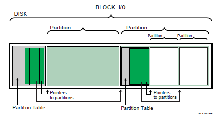
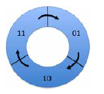
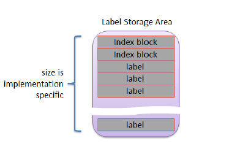

.. _protocols-media-access:

Protocols -- Media Access
=========================

.. _load-file-protocol:

Load File Protocol
------------------

The Load File protocol is used to obtain files, that are primarily boot options, from arbitrary devices.

.. _efi-load-file-protocol:

EFI_LOAD_FILE_PROTOCOL
######################

**Summary**

Used to obtain files, that are primarily boot options, from arbitrary devices.

 
**GUID**

.. code-block::

  #define EFI_LOAD_FILE_PROTOCOL_GUID \
   {0x56EC3091,0x954C,0x11d2,\
    {0x8e,0x3f,0x00,0xa0, 0xc9,0x69,0x72,0x3b}}

**Protocol Interface Structure**

.. code-block::

   typedef struct  _EFI_LOAD_FILE_PROTOCOL {
      EFI_LOAD_FILE                       LoadFile;
   } EFI_LOAD_FILE_PROTOCOL;

**Parameters**

LoadFile
 Causes the driver to load the requested file. See the  `EFI_LOAD_FILE_PROTOCOL.LoadFile()`_ function description.

**Description**

The EFI_LOAD_FILE_PROTOCOL is a simple protocol used to obtain files from arbitrary devices. 

When the firmware is attempting to load a file, it first attempts to use the device’s Simple File System protocol to read the file. If the file system protocol is found, the firmware implements the policy of interpreting the File Path value of the file being loaded. If the device does not support the file system protocol, the firmware then attempts to read the file via the EFI_LOAD_FILE_PROTOCOL and the LoadFile() function. In this case the LoadFile() function implements the policy of interpreting the File Path value.

.. _efi-load_file_protocol.loadfine:

EFI_LOAD_FILE_PROTOCOL.LoadFile()
#################################

**Summary**

Causes the driver to load a specified file.

**Prototype**

.. code-block::

  typedef   
  EFI_STATUS   
   (EFIAPI *EFI_LOAD_FILE) (   
   IN EFI_LOAD_FILE_PROTOCOL                  *This,   
   IN EFI_DEVICE_PATH_PROTOCOL                *FilePath,   
   IN BOOLEAN                                 BootPolicy,   
   IN OUT UINTN                               *BufferSize,   
   IN VOID                                    *Buffer OPTIONAL
   );
  

**Parameters**

This
 Indicates a pointer to the calling context. Type `EFI_LOAD_FILE_PROTOCOL`  is defined in :ref:`load-file-protocol`. 

FilePath 
 The device specific path of the file to load. Type EFI_DEVICE_PATH_PROTOCOL is defined in :ref:`efi-device-path-protocol` .

BootPolicy
 If **TRUE**, indicates that the request originates from the boot manager, and that the boot manager is attempting to load FilePath as a boot selection. If **FALSE**, then FilePath must match an exact file to be loaded. 

BufferSize
 On input the size of Buffer in bytes. On output with a return code of EFI_SUCCESS, the amount of data transferred to Buffer. On output with a return code of EFI_BUFFER_TOO_SMALL, the size of Buffer required to retrieve the requested file. 

Buffer
 The memory buffer to transfer the file to. If Buffer is NULL, then the size of the requested file is returned in BufferSize.

**Description**

The LoadFile() function interprets the device-specific FilePath parameter, returns the entire file into Buffer, and sets BufferSize to the amount of data returned. If Buffer is **NULL**, then the size of the file is returned in BufferSize. If Buffer is not **NULL**, and BufferSize is not large enough to hold the entire file, then EFI_BUFFER_TOO_SMALL is returned, and BufferSize is updated to indicate the size of the buffer needed to obtain the file. In this case, no data is returned in Buffer.

If BootPolicy is **FALSE** the FilePath must match an exact file to be loaded. If no such file exists, EFI_NOT_FOUND is returned. If BootPolicy is **FALSE**, and an attempt is being made to perform a network boot through the PXE Base Code protocol, EFI_UNSUPPORTED is returned. 

If BootPolicy is **TRUE** the firmware’s boot manager is attempting to load an EFI image that is a boot selection. In this case, FilePath contains the file path value in the boot selection option. Normally the firmware would implement the policy on how to handle an inexact boot file path; however, since in this case the firmware cannot interpret the file path, the LoadFile() function is responsible for implementing the policy. For example, in the case of a network boot through the PXE Base Code protocol, FilePath merely points to the root of the device, and the firmware interprets this as wanting to boot from the first valid loader. The following is a list of events that LoadFile() will implement for a PXE boot:

-  Perform DHCP.
-  Optionally prompt the user with a menu of boot selections.
-  Discover the boot server and the boot file.
-  Download the boot file into Buffer and update BufferSize with the size of the boot file. 

If the boot file downloaded from boot server is not an UEFI-formatted executable, but a binary image which contains a UEFI-compliant file system, then *EFI_WARN_FILE_SYSTEM* is returned, and a new RAM disk mapped on the returned *Buffer* is registered.

**Status Codes Returned**

.. list-table::
   :widths: 35 70
   :class: longtable

   * - EFI_SUCCESS
     - The file was loaded.
   * - EFI_UNSUPPORTED
     - The device does not support the provided BootPolicy.
   * - EFI_INVALID_PARAMETER
     - FilePath is not a valid device path, or BufferSize is NULL.
   * - EFI_NO_MEDIA
     - No medium was present to load the file.
   * - EFI_DEVICE_ERROR
     - The file was not loaded due to a device error.
   * - EFI_NO_RESPONSE
     - The remote system did not respond.
   * - EFI_NOT_FOUND
     - The file was not found.
   * - EFI_ABORTED
     - The file load process was manually cancelled.
   * - EFI_BUFFER_TOO_SMALL
     - The *BufferSize* is too small to read the current directory entry. *BufferSize* has been updated with the size needed to complete the request.
   * - EFI_WARN_FILE_SYSTEM
     - The resulting *Buffer* contains UEFI-compliant file system.

.. _load-file-2-protocol:

Load File 2 Protocol
--------------------

The Load File 2 protocol is used to obtain files from arbitrary
devices that are not boot options.

.. _efi-load-file2-protocol:

EFI_LOAD_FILE2_PROTOCOL
#######################

**Summary**

Used to obtain files from arbitrary devices but are not used as boot options.

**GUID**

.. code-block::

   #define EFI_LOAD_FILE2_PROTOCOL_GUID \
    { 0x4006c0c1, 0xfcb3, 0x403e, \
    { 0x99, 0x6d, 0x4a, 0x6c, 0x87, 0x24, 0xe0, 0x6d }}

**Protocol Interface Structure**

.. code-block::

   typedef EFI_LOAD_FILE_PROTOCOL EFI_LOAD_FILE2_PROTOCOL;

**Parameters**

LoadFile
 Causes the driver to load the requested file. See the *LoadFile()* functional description.

**Description**

The *EFI_LOAD_FILE2_PROTOCOL* is a simple protocol used to obtain files from arbitrary devices that are not boot options. It is used by *LoadImage()* when its *BootOption* parameter is *FALSE* and the *FilePath* does not have an instance of the *EFI_SIMPLE_FILE_SYSTEM_PROTOCOL*.

.. _efi-load-file2-protocol-loadfile:

EFI_LOAD_FILE2_PROTOCOL.LoadFile()
##################################

**Summary**

Causes the driver to load a specified file.

**Prototype**

The same prototype as *EFI_LOAD_FILE_PROTOCOL.LoadFile()*.  

**Parameters**

This
 Indicates a pointer to the calling context.

FilePath
 The device specific path of the file to load.

BootPolicy
 Should always be *FALSE*.

BufferSize
 On input the size of *Buffer* in bytes. On output with a return code of *EFI_SUCCESS,* the amount of data transferred to *Buffer*. On output with a return code of *EFI_BUFFER_TOO_SMALL,* the size of *Buffer* required to retrieve the requested file.

Buffer
 The memory buffer to transfer the file to. If *Buffer* is *NULL,* then no the size of the requested file is returned in *BufferSize*.

**Description**

The *LoadFile()* function interprets the device-specific *FilePath* parameter, returns the entire file into *Buffer,* and sets *BufferSize* to the amount of data returned. If *Buffer* is **NULL,** then the size of the file is returned in *BufferSize*. If *Buffer* is not **NULL,** and *BufferSize* is not large enough to hold the entire file, then *EFI_BUFFER_TOO_SMALL* is returned, and *BufferSize* is updated to indicate the size of the buffer needed to obtain the file. In this case, no data is returned in *Buffer*. 

*FilePath* contains the file path value in the boot selection option. Normally the firmware would implement the policy on how to handle an inexact boot file path; however, since in this case the firmware cannot interpret the file path, the *LoadFile()* function is responsible for implementing the policy.

**Status Codes Returned**

.. list-table:: 
   :name: status-codes-returned
   :widths: 35 70
   :class: longtable

   * - EFI_SUCCESS
     - The file was loaded.
   * - EFI_UNSUPPORTED
     - BootPolicy is **TRUE**.
   * - EFI_INVALID_PARAMETER
     - FilePath is not a valid device path, or BufferSize is NULL.
   * - EFI_NO_MEDIA
     - No medium was present to load the file.
   * - EFI_DEVICE_ERROR
     - The file was not loaded due to a device error.
   * - EFI_NO_RESPONSE
     - The remote system did not respond.
   * - EFI_NOT_FOUND
     - The file was not found.
   * - EFI_ABORTED
     - The file load process was manually cancelled.
   * - EFI_BUFFER_TOO_SMALL
     - The BufferSize is too small to read the current directory entry. BufferSize has been updated with the size needed to complete the request.

.. _file-system-format:

File System Format
------------------

The file system supported by the Extensible Firmware Interface is based on the FAT file system. EFI defines a specific version of FAT that is explicitly documented and testable. Conformance to the EFI specification and its associate reference documents is the only definition of FAT that needs to be implemented to support EFI. To differentiate the EFI file system from pure FAT, a new partition file system type has been defined.

EFI encompasses the use of FAT32 for a system partition, and FAT12 or FAT16 for removable media. The FAT32 system partition is identified by an OSType value other than that used to identify previous versions of FAT. This unique partition type distinguishes an EFI defined file system from a normal FAT file system. The file system supported by EFI includes support for long file names. 

The definition of the EFI file system will be maintained by specification and will not evolve over time to deal with errata or variant interpretations in OS file system drivers or file system utilities. Future enhancements and compatibility enhancements to FAT will not be automatically included in EFI file systems. The EFI file system is a target that is fixed by the EFI specification, and other specifications explicitly referenced by the EFI specification. 

For more information about the EFI file system and file image format, visit the web site from which this document was obtained.

.. _system-partition:

System Partition
################

A System Partition is a partition in the conventional sense of a partition on a legacy system. For a hard disk, a partition is a contiguous grouping of sectors on the disk where the starting sector and size are defined by the Master Boot Record (MBR), which resides on LBA 0 (i.e., the first sector of the hard disk) ( :ref:`lba-0-format` ), or the GUID Partition Table (GPT), which resides on logical block 1 (the second sector of the hard disk) ( :ref:`gpt-overview` ). For a diskette (floppy) drive, a partition is defined to be the entire media. A System Partition can reside on any media that is supported by EFI Boot Services. 

A System Partition supports backward compatibility with legacy systems by reserving the first block (sector) of the partition for compatibility code. On legacy systems, the first block (sector) of a partition is loaded into memory and execution is transferred to this code. EFI firmware does not execute the code in the MBR. The EFI firmware contains knowledge about the partition structure of various devices, and can understand legacy MBR, GPT, and "El Torito." 

The System Partition contains directories, data files, and UEFI Images. UEFI Images can contain a OS Loader, an driver to extend platform firmware capability, or an application that provides a transient service to the system. Applications written to this specification could include things such as a utility to create partitions or extended diagnostics. A System Partition can also support data files, such as error logs, that can be defined and used by various OS or system firmware software components.

.. _file-system-format-1:

File System Format
$$$$$$$$$$$$$$$$$$

The first block (sector) of a partition contains a data structure called the BIOS Parameter Block (BPB) that defines the type and location of FAT file system on the drive. The BPB contains a data structure that defines the size of the media, the size of reserved space, the number of FAT tables, and the location and size of the root directory (not used in FAT32). The first block (sector) also contains code that will be executed as part of the boot process on a legacy system. This code in the first block (sector) usually contains code that can read a file from the root directory into memory and transfer control to it. Since EFI firmware contains a file system driver, EFI firmware can load any file from the file system with out nhe FAT32, FAT16, and FAT12 variants of the EFI file system. What variant of EFI FAT to use is defined by the size of the media. The rules defining theeeding to execute any code from the media.

The EFI firmware must support the FAT32, FAT16, and FAT12 variants of the EFI file system. What variant of EFI FAT to use is defined by the size of the media. The rules defining the relationship between media size and FAT variants is defined in the specification for the EFI file system.

The UEFI system partition FAT32 Data region should be aligned to the physical block boundary and optimal transfer length granularity of the device ( :ref:`gpt-overview` ). This is controlled by the BPB_RsvdSecCnt field and the applicable BPB_FATSz field (e.g., formatting software may set the BPB_RsvdSecCnt field to a value that results in alignment and/or may set the BPB_FATSz field to a value that ensures alignment).

.. _file-names:

File Names
$$$$$$$$$$

FAT stores file names in two formats. The original FAT format limited file names to eight characters with three extension characters. This type of file name is called an 8.3, pronounced eight dot three, file name. FAT was extended to include support for long file names (LFN). 

FAT 8.3 file names are always stored as uppercase ASCII characters. LFN can either be stored as ASCII or UCS-2 characters and are stored case sensitive. The string that was used to open or create the file is stored directly into LFN. FAT defines that all files in a directory must have a unique name, and unique is defined as a case insensitive match. The following are examples of names that are considered to be the same and cannot exist in a single directory:

-  "ThisIsAnExampleDirectory.Dir"
-  "thisisanexamppledirectory.dir"
-  THISISANEXAMPLEDIRECTORY.DIR
-  ThisIsAnExampleDirectory.DIR

**Note**: *Although the FAT32 specification allows file names to be encoded using UTF-16, this specification only recognizes the UCS-2 subset for the purposes of sorting or collation*.

.. _directory-structure:

Directory Structure
$$$$$$$$$$$$$$$$$$$

An EFI system partition that is present on a hard disk must contain an EFI defined directory in the root directory. This directory is named EFI. All OS loaders and applications will be stored in subdirectories below EFI. Applications that are loaded by other applications or drivers are not required to be stored in any specific location in the EFI system partition. The choice of the subdirectory name is up to the vendor, but all vendors must pick names that do not collide with any other vendor’s subdirectory name. This applies to system manufacturers, operating system vendors, BIOS vendors, and third party tool vendors, or any other vendor that wishes to install files on an EFI system partition. There must also only be one executable EFI image for each supported processor architecture in each vendor subdirectory. This guarantees that there is only one image that can be loaded from a vendor subdirectory by the EFI Boot Manager. If more than one executable EFI image is present, then the boot behavior for the system will not be deterministic. There may also be an optional vendor subdirectory called BOOT. 

This directory contains EFI images that aide in recovery if the boot selections for the software installed on the EFI system partition are ever lost. Any additional UEFI-compliant executables must be in subdirectories below the vendor subdirectory. The following is a sample directory structure for an EFI system partition present on a hard disk.

.. code-block::

   \EFI
      \<OS Vendor 1 Directory>
            <OS Loader Image>
      \<OS Vendor 2 Directory>
            <OS Loader Image>
     …

      \<OS Vendor N Directory>
            <OS Loader Image>
      \<OEM Directory>
            <OEM Application Image>
      \<BIOS Vendor Directory>
            <BIOS Vendor Application Image>
      \<Third Party Tool Vendor Directory>
            <Third Party Tool Vendor Application Image>
      \BOOT
            BOOT{machine type short name}.EFI

For removable media devices there must be only one UEFI-compliant system partition, and that partition must contain an UEFI-defined directory in the root directory. The directory will be named EFI. All OS loaders and applications will be stored in a subdirectory below EFI called BOOT. There must only be one executable EFI image for each supported processor architecture in the BOOT directory. For removable media to be bootable under EFI, it must be built in accordance with the rules laid out in :ref:`removable-media-boot-behavior`. This guarantees that there is only one image that can be automatically loaded from a removable media device by the EFI Boot Manager. Any additional EFI executables must be in directories other than BOOT. The following is a sample directory structure for an EFI system partition present on a removable media device.

.. code-block::

   \EFI
      \BOOT
      BOOT{machine type short name}.EFI

.. _partition-discovery:

Partition Discovery
###################

This specification requires the firmware to be able to parse the :ref:`legacy-mbr` ), GUID Partition Table (GPT)( :ref:`gpt-overview` ), and El Torito ( :ref:`iso-9660-and-el-torito` ) logical device volumes. The EFI firmware produces a logical :ref:`efi-block-io-protocol`  device for: 

-   each GUID Partition Entry (see table 16 in 5.3.3) with bit 1 set to zero; 

-   each El Torito logical device volume; and

-  if no GPT is present, each partition found in the legacy MBR partition tables.

LBA zero of the *EFI_BLOCK_IO_PROTOCOL* device will correspond to the first logical block of the partition. See :ref:`nesting-of-legacy-mbr-partition-records`. If a GPT Partition Entry has Attribute bit 1 set then a logical *EFI_BLOCK_IO_PROTOCOL* device must not be created.

   Nesting of Legacy MBR Partition Records    
 

The following is the order in which a block device must be scanned to determine if it contains partitions. When a check for a valid partitioning scheme succeeds, the search terminates.

#. Check for GUID Partition Table Headers.

#. Follow ISO-9660 specification to search for ISO-9660 volume structures on the magic LBA.

#. Check for an "El Torito" volume extension and follow the "El Torito" CD-ROM specification.

#. If none of the above, check LBA 0 for a legacy MBR partition table.

#. No partition found on device.

If a disk contains a recognized RAID structure (e.g. DDF structure as defined in *The Storage Networking Industry Association Common RAID Disk Data Format Specification--* see Glossary), the data on the disk must be ignored, unless the driver is using the RAID structure to produce a logical RAID volume.

EFI supports the nesting of legacy MBR partitions, by allowing any legacy MBR partition to contain more legacy MBR partitions. This is accomplished by supporting the same partition discovery algorithm on every logical block device. It should be noted that the GUID Partition Table does not allow nesting of GUID Partition Table Headers. Nesting is not needed since a GUID Partition Table Header can support an arbitrary number of partitions (the addressability limits of a 64-bit LBA are the limiting factor).

.. _iso-9660-and-el-torito:

ISO-9660 and El Torito
$$$$$$$$$$$$$$$$$$$$$$

IS0-9660 is the industry standard low level format used on CD-ROM and DVD-ROM. The CD-ROM format is completely described by the "El Torito" Bootable CD-ROM Format Specification Version 1.0. To boot from a CD-ROM or DVD-ROM in the boot services environment, an EFI System partition is stored in a "no emulation" mode as defined by the "El Torito" specification. A Platform ID of 0xEF indicates an EFI System Partition. The Platform ID is in either the Section Header Entry or the Validation Entry of the Booting Catalog as defined by the "El Torito" specification. EFI differs from "El Torito" "no emulation" mode in that it does not load the "no emulation" image into memory and jump to it. EFI interprets the "no emulation" image as an EFI system partition. EFI interprets the Sector Count in the Initial/Default Entry or the Section Header Entry to be the size of the EFI system partition. If the value of Sector Count is set to 0 or 1, EFI will assume the system partition consumes the space from the beginning of the "no emulation" image to the end of the CD-ROM.

A DVD-ROM image formatted as required by the UDF 2.0 specification (OSTA Universal Disk Format Specification, Revision 2.0) shall be booted by UEFI if: 

-  the DVD-ROM image conforms to the "UDF Bridge" format defined in the UDF 2.0 specification, and
-  the DVD-ROM image contains exactly one ISO-9660 file system, and
-  the ISO-9660 file system conforms to the "El Torito" Bootable CD-ROM Format Specification. 

Booting from a DVD-ROM that satisfies the above requirements is accomplished using the same methods as booting from a CD-ROM: the ISO-9660 file system shall be booted. 

Since the EFI file system definition does not use the same Initial/Default entry as a legacy CD-ROM it is possible to boot personal computers using an EFI CD-ROM or DVD-ROM. The inclusion of boot code for personal computers is optional and not required by EFI.

.. _number-and-location-of-system-partitions:

Number and Location of System Partitions
########################################

UEFI does not impose a restriction on the number or location of System Partitions that can exist on a system. System Partitions are discovered when required by UEFI firmware by examining the partition GUID and verifying that the contents of the partition conform to the FAT file system as defined in     :ref:`file-system-format`. Further, UEFI implementations may allow the use of conforming FAT partitions which do not use the ESP GUID. Partition creators may prevent UEFI firmware from examining and using a specific partition by setting bit 1 of the Partition Attributes (see 5.3.3) which will exclude the partition as a potential ESP.

Software installation may choose to create and locate an ESP on each target OS boot disk, or may choose to create a single ESP independent of the location of OS boot disks and OS partitions. It is outside of the scope of this specification to attempt to coordinate the specification of size and location of an ESP that can be shared by multiple OS or Diagnostics installations, or to manage potential namespace collisions in directory naming in a single (central) ESP.

.. _media-formats:

Media Formats
#############

This section describes how booting from different types of removable media is handled. In general the rules are consistent regardless of a media’s physical type and whether it is removable or not.

.. _removable-media:

Removable Media
$$$$$$$$$$$$$$$

Removable media may contain a standard FAT12, FAT16, or FAT32 file system. 

Booting from a removable media device can be accomplished the same way as any other boot. The boot file path provided to the boot manager can consist of a UEFI application image to load, or can merely be the path to a removable media device. In the first case, the path clearly indicates the image that is to be loaded. In the later case, the boot manager implements the policy to load the default application image from the device. 

For removable media to be bootable under EFI, it must be built in accordance with the rules laid out in :ref:`removable-media-boot-behavior` 

.. _diskette:

Diskette
$$$$$$$$

EFI bootable diskettes follow the standard formatting conventions used on personal computers. The diskette contains only a single partition that complies to the EFI file system type. For diskettes to be bootable under EFI, it must be built in accordance with the rules laid out in  :ref:`removable-media-boot-behavior`. 

Since the EFI file system definition does not use the code in the first block of the diskette, it is possible to boot personal computers using a diskette that is also formatted as an EFI bootable removable media device. The inclusion of boot code for personal computers is optional and not required by EFI. 

Diskettes include the legacy 3.5-inch diskette drives as well as the newer larger capacity removable media drives such as an Iomega* Zip,* Fujitsu MO, or MKE LS-120/SuperDisk*.

.. _media-formats-hard-drive:

Hard Drive
$$$$$$$$$$

Hard drives may contain multiple partitions as defined in See :ref:`partition-discovery` on partition discovery. Any partition on the hard drive may contain a file system that the EFI firmware recognizes. Images that are to be booted must be stored under the EFI subdirectory as defined in :ref:`system-partition` and  :ref:`partition-discovery`. 

EFI code does not assume a fixed block size. 

Since EFI firmware does not execute the MBR code and does not depend on the BootIndicator field in the legacy MBR partition records, the hard disk can still boot and function normally.

.. _cd-rom-and-dvd-rom:

CD-ROM and DVD-ROM
$$$$$$$$$$$$$$$$$$

A CD-ROM or DVD-ROM may contain multiple partitions as defined in :ref:`system-partition` and :ref:`partition-discovery` and in the "El Torito" specification. 

EFI code does not assume a fixed block size. 

Since the EFI file system definition does not use the same Initial/Default entry as a legacy CD-ROM, it is possible to boot personal computers using an EFI CD-ROM or DVD-ROM. The inclusion of boot code for personal computers is optional and not required by EFI.

.. _network:

Network
$$$$$$$

To boot from a network device, the Boot Manager uses the Load File Protocol to perform a `EFI_LOAD_FILE_PROTOCOL.LoadFile()`_ on the network device. This uses the PXE Base Code Protocol to perform DHCP and Discovery. This may result in a list of possible boot servers along with the boot files available on each server. The Load File Protocol for a network boot may then optionally produce a menu of these selections for the user to choose from. If this menu is presented, it will always have a timeout, so the Load File Protocol can automatically boot the default boot selection. If there is only one possible boot file, then the Load File Protocol can automatically attempt to load the one boot file. 

The Load File Protocol will download the boot file using the MTFTP service in the PXE Base Code Protocol. The downloaded image must be an EFI image that the platform supports.

.. _simple-file-system-protocol:

Simple File System Protocol
---------------------------

The Simple File System protocol allows code running in the EFI boot services environment to obtain file based access to a device. *EFI_SIMPLE_FILE_SYSTEM_PROTOCOL* is used to open a device volume and return an :ref:`efi-file-protocol`  that provides interfaces to access files on a device volume.

.. _efi-simple-file-system-protocol:

EFI_SIMPLE_FILE_SYSTEM_PROTOCOL
###############################

**Summary**

Provides a minimal interface for file-type access to a
device.

**GUID**

.. code-block::

   #define EFI_SIMPLE_FILE_SYSTEM_PROTOCOL_GUID \
    {0x0964e5b22,0x6459,0x11d2,\
     {0x8e,0x39,0x00,0xa0,0xc9,0x69,0x72,0x3b}}

**Revision Number**

.. code-block::

   #define EFI_SIMPLE_FILE_SYSTEM_PROTOCOL_REVISION 0x00010000

**Protocol Interface Structure**

.. code-block::

   typedef struct _EFI_SIMPLE_FILE_SYSTEM_PROTOCOL {
    UINT64                                         Revision;
    EFI_SIMPLE_FILE_SYSTEM_PROTOCOL_OPEN_VOLUME    OpenVolume;
   } EFI_SIMPLE_FILE_SYSTEM_PROTOCOL;

**Parameters**

Revision
 The version of the EFI_FILE_PROTOCOL. The version specified by this specification is 0x00010000. All future revisions must be backwards compatible. If a future version is not backwards compatible, it is not the same GUID.

OpenVolume 
 Opens the volume for file I/O access. See the OpenVolume() `EFI_SIMPLE_FILE SYSTEM_PROTOCOL.OpenVolume()`_ function description.

**Description**

The EFI_SIMPLE_FILE_SYSTEM_PROTOCOL provides a minimal interface for file-type access to a device. This protocol is only supported on some devices. 

Devices that support the Simple File System protocol return an EFI_FILE_PROTOCOL. The only function of this interface is to open a handle to the root directory of the file system on the volume. Once opened, all accesses to the volume are performed through the volume’s file handles, using the :ref:`efi-file-protocol`  protocol. The volume is closed by closing all the open file handles.

The firmware automatically creates handles for any block device that supports the following file system formats:

-  FAT12
-  FAT16
-  FAT32

.. _efi-simple-file-system-protocol-openvolume:

EFI_SIMPLE_FILE SYSTEM_PROTOCOL.OpenVolume()
############################################

**Summary**

Opens the root directory on a volume.

**Prototype**

.. code-block:: 
  
   typedef  
   EFI_STATUS  
   (EFIAPI *EFI_SIMPLE_FILE_SYSTEM_PROTOCOL_OPEN_VOLUME) (  
     IN EFI_SIMPLE_FILE_SYSTEM PROTOCOL                   *This,  
     OUT EFI_FILE_PROTOCOL                                **Root  
     );

  
**Parameters**

This
 A pointer to the volume to open the root directory of. See the type  `EFI_SIMPLE_FILE_SYSTEM_PROTOCOL`_  description. 

Root
 A pointer to the location to return the opened file handle for the root directory. See the type see `EFI_FILE_PROTOCOL`_ description.

**Description**

The OpenVolume() function opens a volume, and returns a file handle to the volume’s root directory. This handle is used to perform all other file I/O operations. The volume remains open until all the file handles to it are closed. 

If the medium is changed while there are open file handles to the volume, all file handles to the volume will return EFI_MEDIA_CHANGED. To access the files on the new medium, the volume must be reopened with OpenVolume(). If the new medium is a different file system than the one supplied in the EFI_HANDLE’s DevicePath for the EFI_SIMPLE_SYSTEM_PROTOCOL, OpenVolume() will return EFI_UNSUPPORTED.

**Status Codes Returned**

.. list-table::
   :widths: 35 70
   :class: longtable

   * - EFI_SUCCESS
     - The file volume was opened.
   * - EFI_UNSUPPORTED
     - The volume does not support the requested file system type.
   * - EFI_NO_MEDIA
     - The device has no medium.
   * - EFI_DEVICE_ERROR
     - The device reported an error.
   * - EFI_VOLUME_CORRUPTED
     - The file system structures are corrupted.
   * - EFI_ACCESS_DENIED
     - The service denied access to the file.
   * - EFI_OUT_OF_RESOURCES
     - The file volume was not opened.
   * - EFI_MEDIA_CHANGED
     - The device has a different medium in it or the medium is no longer supported. Any existing file handles for this volume are no longer valid. To access the files on the new medium, the volume must be reopened with OpenVolume().

.. _file-protocol:

File Protocol
-------------

The protocol and functions described in this section support access to EFI-supported file systems.

.. _efi-file-protocol:

EFI_FILE_PROTOCOL
#################

**Summary**

Provides file based access to supported file systems.

**Revision Number**

.. code-block:: 

   #define EFI_FILE_PROTOCOL_REVISION           0x00010000
   #define EFI_FILE_PROTOCOL_REVISION2          0x00020000
   #define EFI_FILE_PROTOCOL_LATEST_REVISION EFI_FILE_PROTOCOL_REVISION2

**Protocol Interface Structure**

.. code-block:: 

   typedef struct_EFI_FILE_PROTOCOL {
     UINT64                          Revision;
     EFI_FILE_OPEN                   Open;
     EFI_FILE_CLOSE                  Close;
     EFI_FILE_DELETE                 Delete;
     EFI_FILE_READ                   Read;
     EFI_FILE_WRITE                  Write;
     EFI_FILE_GET_POSITION           GetPosition;
     EFI_FILE_SET_POSITION           SetPosition;
     EFI_FILE_GET_INFO               GetInfo;
     EFI_FILE_SET_INFO               SetInfo;
     EFI_FILE_FLUSH                  Flush;
     EFI_FILE_OPEN_EX                OpenEx; // Added for revision 2
     EFI_FILE_READ_EX                ReadEx; // Added for revision 2
     EFI_FILE_WRITE_EX               WriteEx; // Added for revision 2
     EFI_FILE_FLUSH_EX               FlushEx; // Added for revision 2
   } EFI_FILE_PROTOCOL;

**Parameters** 

Revision
 The version of the EFI_FILE_PROTOCOL interface. The version specified by this specification is *EFI_FILE_PROTOCOL_LATEST_REVISION*. Future versions are required to be backward compatible to version 1.0.

Open 
 Opens or creates a new file. See the  `EFI_FILE_PROTOCOL.Open()`_ function description.

Close 
 Closes the current file handle. See the  `EFI_FILE_PROTOCOL.Close()`_ function description.

Delete 
 Deletes a file. See the  `EFI_FILE_PROTOCOL.Delete()`_ function description.

Read 
 Reads bytes from a file. See the  `EFI_FILE_PROTOCOL.Read()`_ function description.

Write 
 Writes bytes to a file. See the  `EFI_FILE_PROTOCOL.Write()`_ function description.

GetPosition 
 Returns the current file position. See the  `EFI_FILE_PROTOCOL.GetPosition()`_ function description.

SetPosition 
 Sets the current file position. See the  `EFI_FILE_PROTOCOL.SetPosition()`_ function description.

GetInfo 
 Gets the requested file or volume information. See the  `EFI_FILE_PROTOCOL.GetInfo()`_ function description.

SetInfo 
 Sets the requested file information. See the  `EFI_FILE_PROTOCOL.SetInfo()`_ function description.

Flush 
 Flushes all modified data associated with the file to the device. See the  `EFI_FILE_PROTOCOL.Flush()`_ function description.

OpenEx 
 Opens a new file relative to the source directory’s location.

ReadEx 
 Reads data from a file.

WriteEx 
 Writes data to a file.

FlushEx 
 Flushes all modified data associated with a file to a device.

**Description**

The EFI_FILE_PROTOCOL provides file IO access to supported file systems.

An EFI_FILE_PROTOCOL provides access to a file’s or directory’s contents, and is also a reference to a location in the directory tree of the file system in which the file resides. With any given file handle, other files may be opened relative to this file’s location, yielding new file handles.

On requesting the file system protocol on a device, the caller gets the *EFI_FILE_PROTOCOL* to the volume. This interface is used to open the root directory of the file system when needed. The caller must  `EFI_FILE_PROTOCOL.Close()`_ the file handle to the root directory, and any other opened file handles before exiting. While there are open files on the device, usage of underlying device protocol(s) that the file system is abstracting must be avoided. For example, when a file system that is layered on a `EFI_DISK_IO_PROTOCOL`_   `EFI_BLOCK_IO_PROTOCOL`_ , direct block access to the device for the blocks that comprise the file system must be avoided while there are open file handles to the same device. 

A file system driver may cache data relating to an open file. A Flush() function is provided that flushes all dirty data in the file system, relative to the requested file, to the physical medium. If the underlying device may cache data, the file system must inform the device to flush as well. 

Implementations must account for cases where there is pending queued asynchronous I/O when a call is received on a blocking protocol interface. In these cases the pending I/O will be processed and completed before the blocking function is executed so that operation are carried out in the order they were requested.

.. _efi-file-protocol-open:

EFI_FILE_PROTOCOL.Open()
########################

**Summary**

Opens a new file relative to the source file’s location.

**Prototype**

.. code-block:: 
  
   typedef  
   EFI_STATUS  
   (EFIAPI *EFI_FILE_OPEN) (  
     IN EFI_FILE_PROTOCOL                  *This,  
     OUT EFI_FILE_PROTOCOL                 **NewHandle,  
     IN CHAR16                             *FileName,  
     IN UINT64                             OpenMode,  
     IN UINT64                             Attributes  
     );
  

**Parameters** 

This
 A pointer to the :ref:`efi-file-protocol` instance that is the file handle to the source location. This would typically be an open handle to a directory. See the type EFI_FILE_PROTOCOL description. 

NewHandle
 A pointer to the location to return the opened handle for the new file. See the type EFI_FILE_PROTOCOL description. 

FileName
 The Null-terminated string of the name of the file to be opened. The file name may contain the following path modifiers: "\", ".", and "..". 

OpenMode
 The mode to open the file. The only valid combinations that the file may be opened with are: Read, Read/Write, or Create/Read/Write. See "Related Definitions" below.

Attributes
 Only valid for EFI_FILE_MODE_CREATE, in which case these are the attribute bits for the newly created file. See "Related Definitions" below.

**Related Definitions**

.. code-block:: 
  
   //******************************************************  
   // Open Modes  
   //******************************************************  
   #define EFI_FILE_MODE_READ       0x0000000000000001  
   #define EFI_FILE_MODE_WRITE      0x0000000000000002  
   #define EFI_FILE_MODE_CREATE     0x8000000000000000  

   //******************************************************  
   // File Attributes  
   //******************************************************  
   #define EFI_FILE_READ_ONLY       0x0000000000000001  
   #define EFI_FILE_HIDDEN          0x0000000000000002  
   #define EFI_FILE_SYSTEM          0x0000000000000004  
   #define EFI_FILE_RESERVED        0x0000000000000008  
   #define EFI_FILE_DIRECTORY       0x0000000000000010  
   #define EFI_FILE_ARCHIVE         0x0000000000000020  
   #define EFI_FILE_VALID_ATTR      0x0000000000000037  

**Description**

The Open()function opens the file or directory referred to by FileName relative to the location of This and returns a NewHandle. The FileName may include the following path modifiers: 

"\\" 

If the filename starts with a "\\" the relative location is the root directory that This resides on; otherwise "\" separates name components. Each name component is opened in turn, and the handle to the last file opened is returned.  

"." 

Opens the current location. 

".." 

Opens the parent directory for the current location. If the location is the root directory the request will return an error, as there is no parent directory for the root directory. 

If EFI_FILE_MODE_CREATE is set, then the file is created in the directory. If the final location of FileName does not refer to a directory, then the operation fails. If the file does not exist in the directory, then a new file is created. If the file already exists in the directory, then the existing file is opened.

If the medium of the device changes, all accesses (including the File handle) will result in EFI_MEDIA_CHANGED. To access the new medium, the volume must be reopened.

**Status Codes Returned**

.. list-table::
   :widths: 35 70
   :class: longtable

   * - EFI_SUCCESS
     - The file was opened.
   * - EFI_NOT_FOUND
     - The specified file could not be found on the device.
   * - EFI_NO_MEDIA
     - The device has no medium.
   * - EFI_MEDIA_CHANGED
     - The device has a different medium in it or the medium is no longer supported.
   * - EFI_DEVICE_ERROR
     - The device reported an error.
   * - EFI_VOLUME_CORRUPTED
     - The file system structures are corrupted.
   * - EFI_WRITE_PROTECTED
     - An attempt was made to create a file, or open a file for write when the media is write-protected.
   * - EFI_ACCESS_DENIED
     - The service denied access to the file.
   * - EFI_OUT_OF_RESOURCES
     - Not enough resources were available to open the file.
   * - EFI_VOLUME_FULL
     - The volume is full.

.. _efi-file-protocol-close:

EFI_FILE_PROTOCOL.Close()
#########################

**Summary**

Closes a specified file handle.

**Prototype**

.. code-block:: 
  
   typedef  
   EFI_STATUS  
   (EFIAPI *EFI_FILE_CLOSE) (  
     IN EFI_FILE_PROTOCOL                     *This  
     );
  

**Parameters**

This
 A pointer to the :ref:`efi-file-protocol`  instance that is the file handle to close. See the type EFI_FILE_PROTOCOL description.

**Description**

The Close() function closes a specified file handle. All "dirty" cached file data is flushed to the device, and the file is closed. In all cases the handle is closed. The operation will wait for all pending asynchronous I/O requests to complete before completing.

**Status Codes Returned**

.. list-table::
   :widths: 35 70

   * - EFI_SUCCESS 
     - The file was closed.

.. _efi-file-protocol-delete:

EFI_FILE_PROTOCOL.Delete()
##########################

**Summary**

Closes and deletes a file.

**Prototype**

.. code-block:: 
  
   typedef  
   EFI_STATUS  
   (EFIAPI *EFI_FILE_DELETE) (  
     IN EFI_FILE_PROTOCOL                     *This  
     );   

**Parameters**

This
 A pointer to the :ref:`efi-file-protocol` instance that is the handle to the file to delete. See the type EFI_FILE_PROTOCOL description.

**Description**

The Delete() function closes and deletes a file. In all cases the file handle is closed. If the file cannot be deleted, the warning code EFI_WARN_DELETE_FAILURE is returned, but the handle is still closed.

**Status Codes Returned**

.. list-table::
   :widths: 35 70
   :class: longtable

   * - EFI_SUCCESS
     - The file was closed and deleted, and the handle was closed.
   * - EFI_WARN_DELETE_FAILURE
     - The handle was closed, but the file was not deleted.

.. _efi-file-protocol-read:

EFI_FILE_PROTOCOL.Read()
########################

**Summary**

Reads data from a file.

**Prototype**

.. code-block:: 

   typedef  
   EFI_STATUS  
   (EFIAPI *EFI_FILE_READ) (  
     IN EFI_FILE_PROTOCOL           *This,  
     IN OUT UINTN                   *BufferSize,  
     OUT VOID                       *Buffer  
     ); 
 

**Parameters**

This
 A pointer to the :ref:`efi-file-protocol` instance that is the file handle to read data from. See the type EFI_FILE_PROTOCOL description.

BufferSize
 On input, the size of the Buffer. On output, the amount of data returned in Buffer. In both cases, the size ismeasured in bytes.

Buffer
 The buffer into which the data is read.

**Description**

The Read() function reads data from a file. 

If This is not a directory, the function reads the requested number of bytes from the file at the file’s current position and returns them in Buffer. If the read goes beyond the end of the file, the read length is truncated to the end of the file. The file’s current position is increased by the number of bytes returned. 

If This is a directory, the function reads the directory entry at the  
file’s current position and returns the entry in Buffer. If the Buffer is not large enough to hold the current directory entry, then EFI_BUFFER_TOO_SMALL is returned and the current file position is not updated. BufferSize is set to be the size of the buffer needed to read the entry. On success, the current position is updated to the next directory entry. If there are no more directory entries, the read returns a zero-length buffer.  :ref:`efi-file-info` is the structure returned as the directory entry.
 

**Status Codes Returned**

.. list-table::
   :widths: 35 70
   :class: longtable

   * - EFI_SUCCESS
     - The data was read.
   * - EFI_NO_MEDIA
     - The device has no medium.
   * - EFI_DEVICE_ERROR
     - The device reported an error.
   * - EFI_DEVICE_ERROR
     - An attempt was made to read from a deleted file.
   * - EFI_DEVICE_ERROR
     - On entry, the current file position is beyond the end of the file.
   * - EFI_VOLUME_CORRUPTED
     - The file system structures are corrupted.
   * - EFI_BUFFER_TOO_SMALL
     - The BufferSize is too small to read the current directory entry. BufferSize has been updated with the size needed to complete the request.

.. _efi-file-protocol-write:

EFI_FILE_PROTOCOL.Write()
#########################

**Summary**

Writes data to a file.

**Prototype**

.. code-block:: 
  
   typedef  
   EFI_STATUS  
   (EFIAPI *EFI_FILE_WRITE) (  
     IN EFI_FILE_PROTOCOL              *This,  
     IN OUT UINTN                      *BufferSize,  
     IN VOID                           *Buffer  
     ); 
  

**Parameters**

This
 A pointer to the :ref:`efi-file-protocol` instance that is the file handle to write data to. See the type EFI_FILE_PROTOCOL description.

BufferSize
 On input, the size of the Buffer. On output, the amount of data actually written. In both cases, the size is measured in bytes.

Buffer
 The buffer of data to write.

**Description**

The Write() function writes the specified number of bytes to the file at the current file position. The current file position is advanced the actual number of bytes written, which is returned in BufferSize. Partial writes only occur when there has been a data error during the write attempt (such as "file space full"). The file is automatically grown to hold the data if required. 

Direct writes to opened directories are not supported.

**Status Codes Returned**

.. list-table::
   :widths: 35 70
   :class: longtable
   
   * - EFI_SUCCESS
     - The data was written.
   * - EFI_UNSUPPORT
     - Writes to open directory files are not supported.
   * - EFI_NO_MEDIA 
     - The device has no medium.
   * - EFI_DEVICE_ERROR
     - The device reported an error.
   * - EFI_DEVICE_ERROR
     - An attempt was made to write to a deleted file.
   * - EFI_VOLUME_CORRUPTED
     - The file system structures are corrupted.
   * - EFI_WRITE_PROTECTED
     - The file or medium is write-protected.
   * - EFI_ACCESS_DENIED
     - The file was opened read only.
   * - EFI_VOLUME_FULL
     - The volume is full.

.. _efi-file-protocol-openex:

EFI_FILE_PROTOCOL.OpenEx()
##########################

**Summary**

Opens a new file relative to the source directory’s location.

**Prototype**

.. code-block:: 
  
  typedef  
  EFI_STATUS  
  (EFIAPI *EFI_FILE_OPEN_EX) (  
  IN EFI_FILE_PROTOCOL                  *This,
  OUT EFI_FILE_PROTOCOL                 **NewHandle,  
  IN CHAR16                             *FileName,  
  IN UINT64                             OpenMode,  
  IN UINT64                             Attributes,  
  IN OUT EFI_FILE_IO_TOKEN              *Token   
  );
     

**Parameters**

This
 A pointer to the *EFI_FILE_PROTOCOL* instance that is the file handle to read data from. See the type *EFI_FILE_PROTOCOL* description  

NewHandle
 A pointer to the location to return the opened handle for the new file. See the type *EFI_FILE_PROTOCOL* description. For asynchronous I/O, this pointer must remain valid for the duration of the asynchronous operation.

FileName
 The Null-terminated string of the name of the file to be opened. The file name may contain the following path modifiers: "\", ".", and "..".

OpenMode
 The mode to open the file. The only valid combinations that the file may be opened with are: Read, Read/Write, or Create/Read/Write. See "Related Definitions" below.

Attributes
 Only valid for *EFI_FILE_MODE_CREATE,* in which case these are the attribute bits for the 

.. TODO: is the sentence above complete

Token 
  A pointer to the token associated with the transaction. Type *EFI_FILE_IO_TOKEN* is defined in "Related Definitions" below.

**Description**

The *OpenEx()* function opens the file or directory referred to by *FileName* relative to the location of This and returns a *NewHandle*. The *FileName* may include the path modifiers described previously in *Open()*. 

If *EFI_FILE_MODE_CREATE* is set, then the file is created in the directory. If the final location of *FileName* does not refer to a directory, then the operation fails. If the file does not exist in the directory, then a new file is created. If the file already exists in the directory, then the existing file is opened. 

If the medium of the device changes, all accesses (including the *File* handle) will result in *EFI_MEDIA_CHANGED*. To access the new medium, the volume must be reopened. 

If an error is returned from the call to *OpenEx()* and non-blocking I/O is being requested, the Event associated with this request will not be signaled. If the call to *OpenEx()* succeeds then the *Event* will be signaled upon completion of the open or if an error occurs during the processing of the request. The status of the read request can be determined from the Status field of the Token once the event is signaled.

**Related Definitions**

.. code-block:: 
  
   typedef struct {  
     EFI_EVENT                         Event;
     EFI_STATUS                        Status;  
     UINTN                             BufferSize;  
     VOID                              *Buffer;  
     } EFI_FILE_IO_TOKEN;
  

Event
 If *Event* is **NULL**, then blocking I/O is performed. If *Event* is not **NULL** and non-blocking I/O is supported, then non-blocking I/O is performed, and *Event* will be signaled when the read request is completed. The caller must be prepared to handle the case where the callback associated with *Event* occurs before the original asynchronous I/O request call returns. 
  
Status
 Defines whether or not the signaled event encountered an error.
  
BufferSize
 | For OpenEx() : Not Used, ignored
 | For ReadEx() :On input, the size of the *Buffer*. On output, the amount of data returned in *Buffer*. In both cases, the size is measured in bytes.
 | For WriteEx() : On input, the size of the *Buffer*. On output, the amount of data actually written. In both cases, the size is measured in bytes.
 | For FlushEx() : Not used, ignored
  
Buffer
 | For  OpenEx(): Not Used, ignored  
 | For ReadEx() : The buffer into which the data is read.
 | For WriteEx() : The buffer of data to write.
 | For FlushEx() : Not Used, ignored
  

**Status Codes Returned**

.. list-table::
   :widths: 35 70
   :class: longtable

   * - EFI_SUCCESS
     - | Returned from the call *OpenEx()*  
       | If *Event* is NULL (blocking I/O):  The file was opened successfully.  
       | If *Event* is not NULL (asynchronous I/O):  The request was successfully queued for processing. 
       | *Event* will be signaled upon completion.  Returned in the token after signaling *Event*  
       | The file was opened successfully. 
   * - EFI_NOT_FOUND
     - The device has no medium.
   * - EFI_NO_MEDIA
     - The specified file could not be found on the device.
   * - EFI_VOLUME_CORRUPTED
     - The file system structures are corrupted.
   * - EFI_WRITE_PROTECTED
     - An attempt was made to create a file, or open a file for write when the media is write-protected.
   * - EFI_ACCESS_DENIED
     - The service denied access to the file.
   * - EFI_OUT_OF_RESOURCES
     - Unable to queue the request or open the file due to lack of resources.
   * - EFI_VOLUME_FULL
     - The volume is full.

.. _efi-file-protocol-readex:

EFI_FILE_PROTOCOL.ReadEx()
##########################

**Summary**

Reads data from a file.

**Prototype**

.. code-block:: 

  typedef
  EFI_STATUS
  (EFIAPI *EFI_FILE_READ_EX) (
    IN EFI_FILE_PROTOCOL                      *This,
    IN OUT EFI_FILE_IO_TOKEN                  *Token 
    );

  
**Parameters**

This
 A pointer to the *EFI_FILE_PROTOCOL* instance that is the file handle to read data from. See the type *EFI_FILE_PROTOCOL* description.

Token 
 A pointer to the token associated with the transaction. Type  EFI_FILE_IO_TOKEN is defined in "Related Definitions" below.

**Description**

The *ReadEx()* function reads data from a file. 

If This is not a directory, the function reads the requested number of bytes from the file at the file’s current position and returns them in *Buffer* . If the read goes beyond the end of the file, the read length is truncated to the end of the file. The file’s current position is increased by the number of bytes returned. 

If This is a directory, the function reads the directory entry at the file’s current position and returns the entry in* *Buffer*. If the *Buffer* is not large enough to hold the current directory entry, then *EFI_BUFFER_TOO_SMALL* is returned and the current file position is not updated. *BufferSize* is set to be the size of the buffer needed to read the entry. On success, the current position is updated to the next directory entry. If there are no more directory entries, the read returns a zero-length buffer. *EFI_FILE_INFO* is the structure returned as the directory entry. 

If non-blocking I/O is used the file pointer will be advanced based on the order that read requests were submitted. 

If an error is returned from the call to *ReadEx()* and non-blocking I/O is being requested, the Event associated with this request will not be signaled. If the call to *ReadEx()* succeeds then the *Event* will be signaled upon completion of the read or if an error occurs during the processing of the request. The status of the read request can be determined from the *Status* field of the *Token* once the event is signaled.

**Status Codes Returned**

.. list-table::
   :widths: 35 70
   :class: longtable

   * - EFI_SUCCESS
     -  | Returned from the call *ReadEx()*  
        | If *Event* is NULL (blocking I/O):  
        | The data was read successfully.  
        | If *Event* is not NULL (asynchronous I/O):  
        | The request was successfully queued for processing. Event will be signaled upon completion.  
        | Returned in the token after signaling *Event*  
        | The data was read successfully.
   * - EFI_NO_MEDIA
     - The device has no medium.
   * - EFI_DEVICE_ERROR
     - The device reported an error.
   * - EFI_DEVICE_ERROR
     - An attempt was made to read from a deleted file.
   * - EFI_DEVICE_ERROR
     - On entry, the current file position is beyond the end of the file.
   * - EFI_VOLUME_CORRUPTED
     - The file system structures are corrupted.
   * - EFI_OUT_OF_RESOURCES
     - Unable to queue the request due to lack of resources.

.. _efi-file-protocol-writeex:

EFI_FILE_PROTOCOL.WriteEx()
###########################

**Summary**

Writes data to a file.

**Prototype**

.. code-block:: 

  typedef
  EFI_STATUS
  (EFIAPI *EFI_FILE_WRITE_EX) (
    IN EFI_FILE_PROTOCOL                *This,
    IN OUT EFI_FILE_IO_TOKEN            *Token 
    );
  

**Parameters**

This
 A pointer to the *EFI_FILE_PROTOCOL* instance that is the file handle to write data to. See the type *EFI_FILE_PROTOCOL* description.

Token
 A pointer to the token associated with the transaction. Type *EFI_FILE_IO_TOKEN* is defined in "Related Definitions" above.

**Description**

The *WriteEx()* function writes the specified number of bytes to the file at the current file position. The current file position is advanced the actual number of bytes written, which is returned in *BufferSize*. Partial writes only occur when there has been a data error during the write attempt (such as "file space full"). The file is automatically grown to hold the data if required. 

Direct writes to opened directories are not supported. 

If non-blocking I/O is used the file pointer will be advanced based on the order that write requests were submitted.

If an error is returned from the call to *WriteEx()* and non-blocking I/O is being requested, the *Event* associated with this request will not be signaled. If the call to *WriteEx()* succeeds then the *Event* will be signaled upon completion of the write or if an error occurs during the processing of the request. The status of the write request can be determined from the *Status* field of the *Token* once the event is signaled.

**Status Codes Returned**

.. list-table::
   :widths: 35 70
   :class: longtable

   * - EFI_SUCCESS
     - | Returned from the call *WriteEx()*  
       | If *Event* is NULL (blocking I/O):  
       | The data was written successfully.  
       | If *Event* is not NULL (asynchronous I/O):  
       | The request was successfully queued for processing. *Event* will be signaled upon completion.  
       | Returned in the token after signaling *Event*  
       | The data was written successfully.
   * - EFI_UNSUPPORTED
     - Writes to open directory files are not supported.
   * - EFI_NO_MEDIA
     - The device has no medium.
   * - EFI_DEVICE_ERROR
     - The device reported an error.
   * - EFI_DEVICE_ERROR
     - An attempt was made to write to a deleted file.
   * - EFI_VOLUME_CORRUPTED
     - The file system structures are corrupted.
   * - EFI_WRITE_PROTECTED
     - The file or medium is write-protected.
   * - EFI_ACCESS_DENIED
     - The file was opened read only.
   * - EFI_VOLUME_FULL
     - The volume is full.
   * - EFI_OUT_OF_RESOURCES
     - Unable to queue the request due to lack of resources.

.. _efi-file-protocol-flushex:

EFI_FILE_PROTOCOL.FlushEx()
###########################

.. TODO please note this heading is not in the original index, though it is in the body of the text

**Summary**

Flushes all modified data associated with a file to a device.

**Prototype**

.. code-block::
  
  typedef
  EFI_STATUS
  (EFIAPI *EFI_FILE_FLUSH_EX) (
    IN EFI_FILE_PROTOCOL                       *This,
    IN OUT EFI_FILE_IO_TOKEN                   *Token
    ); 
  

**Parameters**

This
 A pointer to the *EFI_FILE_PROTOCOL* instance that is the file handle to flush. See the type *EFI_FILE_PROTOCOL* description.

Token
 A pointer to the token associated with the transaction. Type *EFI_FILE_IO_TOKEN* is defined in "Related Definitions" above. The *BufferSize* and *Buffer* fields are not used for a *FlushEx* operation.

**Description**

The *FlushEx()* function flushes all modified data associated with a file to a device. 

For non-blocking I/O all writes submitted before the flush request will be flushed. 

If an error is returned from the call to *FlushEx()* and non-blocking I/O is being requested, the *Event* associated with this request will not be signaled. 

**Status Codes Returned**

.. list-table::
   :widths: 35 70
   :class: longtable

   * - EFI_SUCCESS
     - | Returned from the call *FlushEx()*  
       | If *Event* is NULL (blocking I/O):   
       | The data was flushed successfully.  
       | If *Event* is not NULL (asynchronous I/O):  
       | The request was successfully queued for processing. Event will be signaled upon completion.  
       | Returned in the token after signaling *Event*  
       | The data was flushed successfully. 
   * - EFI_NO_MEDIA
     - The device has no medium.
   * - EFI_DEVICE_ERROR
     - The device reported an error.
   * - EFI_VOLUME_CORRUPTED
     - The file system structures are corrupted.
   * - EFI_WRITE_PROTECTED
     - The file or medium is write-protected.
   * - EFI_ACCESS_DENIED
     - The file was opened read-only.
   * - EFI_VOLUME_FULL
     - The volume is full.
   * - EFI_OUT_OF_RESOURCES
     - Unable to queue the request due to lack of resources.

.. _efi-file-protocol-setposition:

EFI_FILE_PROTOCOL.SetPosition()
###############################

**Summary**

Sets a file’s current position.

**Prototype**

.. code-block:: 
  
  typedef  
  EFI_STATUS  
  (EFIAPI *EFI_FILE_SET_POSITION) (
     IN EFI_FILE_PROTOCOL      *This,  
     IN UINT64                 Position 
     ); 
  

**Parameters**

This
 A pointer to the :ref:`efi-file-protocol` instance that is the he file handle to set the requested position on. See the type EFI_FILE_PROTOCOL description.

Position
 The byte position from the start of the file to set.

**Description**

The SetPosition() function sets the current file position for the handle to the position supplied. With the exception of seeking to position 0xFFFFFFFFFFFFFFFF, only absolute positioning is supported, and seeking past the end of the file is allowed (a subsequent write would grow the file). Seeking to position 0xFFFFFFFFFFFFFFFF causes the current position to be set to the end of the file. 

If This is a directory, the only position that may be set is zero. This has the effect of starting the read process of the directory entries over.

**Status Codes Returned**

.. list-table::
   :widths: 35 70
   :class: longtable

   * - EFI_SUCCESS
     - The position was set.
   * - EFI_UNSUPPORTED
     - The seek request for nonzero is not valid on open directories.
   * - EFI_DEVICE_ERROR
     - An attempt was made to set the position of a deleted file.

.. _efi-file-protocol-getposition:

EFI_FILE_PROTOCOL.GetPosition()
###############################

**Summary**

Returns a file’s current position.

**Prototype**

.. code-block:: 
  
  typedef  
  EFI_STATUS  
  (EFIAPI *EFI_FILE_GET_POSITION) (  
    IN EFI_FILE_PROTOCOL                *This,
    OUT UINT64                          *Position  
    ); 
  

**Parameters**

This
 A pointer to the :ref:`efi-file-protocol`  instance that is the file handle to get the current position on. See the type EFI_FILE_PROTOCOL description. 

Position
 The address to return the file’s current position value.

**Description**

The GetPosition() function returns the current file position for the file handle. For directories, the current file position has no meaning outside of the file system driver and as such the operation is not supported. An error is returned if This is a directory.

**Status Codes Returned**

.. list-table::
   :widths: 35 70
   :class: longtable

   * - EFI_SUCCESS
     - The position was returned.
   * - EFI_UNSUPPORTED
     - The request is not valid on open directories.
   * - EFI_DEVICE_ERROR
     - An attempt was made to get the position from a deleted file.

.. _efi-file-protocol-getinfo:

EFI_FILE_PROTOCOL.GetInfo()
###########################

**Summary**

Returns information about a file.

**Prototype**

.. code-block::   

  typedef  
  EFI_STATUS  
  (EFIAPI *EFI_FILE_GET_INFO) (  
    IN EFI_FILE_PROTOCOL             *This,  
    IN EFI_GUID                      *InformationType,  
    IN OUT UINTN                     *BufferSize,  
    OUT VOID                         *Buffer  
    ); 
  

**Parameters**

This 
 A pointer to the :ref:`efi-file-protocol` instance that is the file handle the requested information is for. See the type EFI_FILE_PROTOCOL description. 

InformationType 
 The type identifier for the information being requested. Type EFI_GUID is defined on page 181. See the :ref:`efi-file-info` and :ref:`efi-file-system-info` descriptions for the related GUID definitions.

.. TODO check paragraph above, page informatiom should be removed???

BufferSize
 On input, the size of Buffer. On output, the amount of data returned in Buffer. In both cases, the size is measured in bytes. 

Buffer
 A pointer to the data buffer to return. The buffer’s type is indicated by InformationType.

**Description**

The GetInfo() function returns information of type InformationType for the requested file. If the file does not support the requested information type, then EFI_UNSUPPORTED is returned. If the buffer is not large enough to fit the requested structure, EFI_BUFFER_TOO_SMALL is returned and the BufferSize is set to the size of buffer that is required to make the request. 

The information types defined by this specification are required information types that all file systems must support.

**Status Codes Returned**

.. list-table::
   :widths: 35 70
   :class: longtable

   * - EFI_SUCCESS
     - The information was set.
   * - EFI_UNSUPPORTED
     - The InformationType is not known.
   * - EFI_NO_MEDIA
     - The device has no medium.
   * - EFI_DEVICE_ERROR
     - The device reported an error.
   * - EFI_VOLUME_CORRUPTED
     - The file system structures are corrupted.
   * - EFI_BUFFER_TOO_SMALL
     - | The BufferSize is too small to read the current directory entry. 
       | BufferSize has been updated with the size needed to complete the request. 

.. _efi-file-protocol-setinfo:

EFI_FILE_PROTOCOL.SetInfo()
###########################

**Summary**

Sets information about a file.

**Prototype**

.. code-block:: 
  
  typedef  
  EFI_STATUS  
  (EFIAPI *EFI_FILE_SET_INFO) (  
    IN EFI_FILE_PROTOCOL                *This,  
    IN EFI_GUID                         *InformationType,  
    IN UINTN                            BufferSize,  
    IN VOID                             *Buffer  
    );

**Parameters** 

This 
 A pointer to the :ref:`efi-file-protocol`  instance that is the file handle the information is for. See the type EFI_FILE_PROTOCOL description. 

InformationType 
 The type identifier for the information being set. Type EFI_GUID is defined in page 181. See the :ref:`efi-file-info`   and :ref:`efi-file-system-info` descriptions in this section for the related GUID definitions.

.. TODO check paragraph above, page informatiom and links undertain

BufferSize
 The size, in bytes, of Buffer

Buffer
 A pointer to the data buffer to write. The buffer’s type is indicated by InformationType.

**Description**

The SetInfo() function sets information of type InformationType on the requested file. Because a read-only file can be opened only in read-only mode, an *InformationType* of *EFI_FILE_INFO_ID* can be used with a read-only file because this method is the only one that can be used to convert a read-only file to a read-write file. In this circumstance, only the *Attribute* field of the *EFI_FILE_INFO* structure may be modified. One or more calls to *SetInfo()* to change the *Attribute* field are permitted before it is closed. The file attributes will be valid the next time the file is opened with *Open()*. 

An *InformationType* of *EFI_FILE_SYSTEM_INFO_ID* or *EFI_FILE_SYSTEM_VOLUME_LABEL_ID* may not be used on read-only media.

**Status Codes Returned**

.. list-table::
   :widths: 35 70
   :class: longtable

   * - EFI_SUCCESS
     - The information was set.
   * - EFI_UNSUPPORTED
     - The InformationType is not known.
   * - EFI_NO_MEDIA
     - The device has no medium.
   * - EFI_DEVICE_ERROR
     - The device reported an error.
   * - EFI_VOLUME_CORRUPTED
     - The file system structures are corrupted.
   * - EFI_WRITE_PROTECTED
     - *InformationType* is *EFI_FILE_INFO_ID* and the media is read-only.
   * - EFI_WRITE_PROTECTED
     - *InformationType* is *EFI_FILE_PROTOCOL_SYSTEM_INFO_ID* and the media is read only.
   * - EFI_WRITE_PROTECTED
     - *InformationType* is *EFI_FILE_SYSTEM_VOLUME_LABEL_ID* and the media is read-only.
   * - EFI_ACCESS_DENIED
     - An attempt is made to change the name of a file to a file that is already present.
   * - EFI_ACCESS_DENIED
     - An attempt is being made to change the *EFI_FILE_DIRECTORY* *Attribute*.
   * - EFI_ACCESS_DENIED
     - An attempt is being made to change the size of a directory.
   * - EFI_ACCESS_DENIED
     - *InformationType* is *EFI_FILE_INFO_ID* and the file was opened read-only and an attempt is being made to modify a field other than *Attribute*.
   * - EFI_VOLUME_FULL
     - The volume is full.
   * - EFI_BAD_BUFFER_SIZE
     - BufferSize is smaller than the size of the type indicated by InformationType.

.. _efi-file-protocol-flush:

EFI_FILE_PROTOCOL.Flush()
#########################

**Summary**

Flushes all modified data associated with a file to a device.

**Prototype**

.. code-block:: 
  
  typedef  
  EFI_STATUS  
  (EFIAPI *EFI_FILE_FLUSH) (
    IN EFI_FILE_PROTOCOL             *This  
    ); 
    

**Parameters**

This 
 A pointer to the  `EFI_FILE_PROTOCOL`_  instance that is the file handle to flush. See the type EFI_FILE_PROTOCOL description.

**Description**

The Flush() function flushes all modified data associated with a file to a device.

**Status Codes Returned**

.. list-table::
   :widths: 35 70
   :class: longtable

   * - EFI_SUCCESS
     - The data was flushed.
   * - EFI_NO_MEDIA
     - The device has no medium.
   * - EFI_DEVICE_ERROR
     - The device reported an error.
   * - EFI_VOLUME_CORRUPTED
     - The file system structures are corrupted.
   * - EFI_WRITE_PROTECTED
     - The file or medium is write-protected.
   * - EFI_ACCESS_DENIED
     - The file was opened read-only.
   * - EFI_VOLUME_FULL
     - The volume is full.

.. _efi-file-info:

EFI_FILE_INFO
##############

**Summary**  

Provides a GUID and a data structure that can be used with `EFI_FILE_PROTOCOL.SetInfo()`_ and `EFI_FILE_PROTOCOL.GetInfo()`_ to set or get generic file information.

**GUID**

.. code-block::

   #define EFI_FILE_INFO_ID \
    {0x09576e92,0x6d3f,0x11d2,\
     {0x8e39,0x00,0xa0,0xc9,0x69,0x72,0x3b}}

**Related Definitions**
 
.. code-block:: 
  
  typedef struct {  
    UINT64                         Size;  
    UINT64                         FileSize;  
    UINT64                         PhysicalSize;  
    EFI_TIME                       CreateTime;  
    EFI_TIME                       LastAccessTime;  
    EFI_TIME                       ModificationTime;  
    UINT64                         Attribute;  
    CHAR16                         FileName [];  
  } EFI_FILE_INFO; 

  //******************************************
  // File Attribute Bits
  //******************************************
    
  #define EFI_FILE_READ_ONLY      0x0000000000000001  
  #define EFI_FILE_HIDDEN         0x0000000000000002  
  #define EFI_FILE_SYSTEM         0x0000000000000004  
  #define EFI_FILE_RESERVED       0x0000000000000008  
  #define EFI_FILE_DIRECTORY      0x0000000000000010  
  #define EFI_FILE_ARCHIVE        0x0000000000000020  
  #define EFI_FILE_VALID_ATTR     0x0000000000000037
  

**Parameters**

Size
 Size of the EFI_FILE_INFO structure, including the Null-terminated FileName string.

FileSize
 The size of the file in bytes.

PhysicalSize
 The amount of physical space the file consumes on the file system volume.

CreateTime
 The time the file was created.

LastAccessTime
 The time when the file was last accessed.

ModificationTime
 The time when the file’s contents were last modified.

Attribute 
 The attribute bits for the file. See "Related Definitions" above.

FileName
 The Null-terminated name of the file. For a root directory, the name is an empty string.

**Description**

The EFI_FILE_INFO data structure supports  `EFI_FILE_PROTOCOL.GetInfo()`_ and  `EFI_FILE_PROTOCOL.SetInfo()`_ requests. In the case of SetInfo(), the following additional rules apply: 

-  On directories, the file size is determined by the contents of the directory and cannot be changed by setting FileSize. On directories, FileSize is ignored during a SetInfo(). 

-  The PhysicalSize is determined by the FileSize and cannot be changed. This value is ignored during a SetInfo() request.

-  The EFI_FILE_DIRECTORY attribute bit cannot be changed. It must match the file’s actual type.

-  A value of zero in CreateTime, LastAccess, or ModificationTime causes the fields to be ignored (and not updated).

.. _efi-file-system-info:

EFI_FILE_SYSTEM_INFO
####################

**Summary**

Provides a GUID and a data structure that can be used with :ref:`efi-file-protocol-getinfo`  to get information about the system volume,  and `EFI_FILE_PROTOCOL.SetInfo()`_  to set the system volume’s volume label.

**GUID**

.. code-block::

  #define EFI_FILE_SYSTEM_INFO_ID \
   {0x09576e93,0x6d3f,0x11d2,0x8e39,0x00,0xa0,0xc9,0x69,0x72,\
   0x3b}

**Related Definitions**

.. code-block:: 

  typedef struct {  
    UINT64                               Size;  
    BOOLEAN                              ReadOnly;  
    UINT64                               VolumeSize;  
    UINT64                               FreeSpace;
    UINT32                               BlockSize;  
    CHAR16                               VolumeLabel[];  
  } EFI_FILE_SYSTEM_INFO;

**Parameters**

Size
 Size of the EFI_FILE_SYSTEM_INFO structure, including he Null-terminated VolumeLabel string.

ReadOnly
 **TRUE** if the volume only supports read access.

VolumeSize 
  The number of bytes managed by the file system.

FreeSpace 
  The number of available bytes for use by the file system.

BlockSize 
  The nominal block size by which files are typically grown.

VolumeLabel 
  The Null-terminated string that is the volume’s label.

**Description**

The EFI_FILE_SYSTEM_INFO data structure is an information structure that can be obtained on the root directory file handle. The root directory file handle is the file handle first obtained on the initial call to the :ref:`efi-boot-services-handleprotocol`  function to open the file system interface. All of the fields are read-only except for VolumeLabel. The system volume’s VolumeLabel can be created or modified by calling EFI_FILE_PROTOCOL.SetInfo() with an updated VolumeLabel field.

.. _efi-file-system-volume-label:

EFI_FILE_SYSTEM_VOLUME_LABEL
############################

**Summary**

Provides a GUID and a data structure that can be used with :ref:`efi-file-protocol-getinfo`  or  :ref:`efi-file-protocol-setinfo`  to get or set information about the system’s volume label.

**GUID**

::

  #define EFI_FILE_SYSTEM_VOLUME_LABEL_ID \
   {0xdb47d7d3,0xfe81,0x11d3,0x9a35,\
    {0x00,0x90,0x27,0x3f,0xC1,0x4d}}

**Related Definitions**

.. code-block:: 
  
  typedef struct {  
   CHAR16                            VolumeLabel[];  
  } EFI_FILE_SYSTEM_VOLUME_LABEL;  

**Parameters**

VolumeLabel
 The Null-terminated string that is the volume’s label.

**Description**

The EFI_FILE_SYSTEM_VOLUME_LABEL data structure is an information structure that can be obtained on the root directory file handle. The root directory file handle is the file handle first obtained on the initial call to the :ref:`efi-boot-services-handleprotocol` function to open the file system interface. The system volume’s VolumeLabel can be created or modified by calling EFI_FILE_PROTOCOL.SetInfo() with an updated VolumeLabel field.

.. _tape-boot-support:

Tape Boot Support
-----------------

.. _tape-io-support:

Tape I/O Support
################

This section defines the Tape I/O Protocol and standard tape header format. These enable the support of booting from tape on UEFI systems. This protocol is used to abstract the tape drive operations to support applications written to this specification. 

.. _tape-io-protocol:

Tape I/O Protocol
#################

This section defines the Tape I/O Protocol and its functions. This protocol is used to abstract the tape drive operations to support applications written to this specification.

.. _efi-tape-io-protocol:

EFI_TAPE_IO_PROTOCOL
$$$$$$$$$$$$$$$$$$$$

**Summary**

The EFI Tape IO protocol provides services to control and access a tape device.

**GUID**

.. code-block::

   #define EFI_TAPE_IO_PROTOCOL_GUID \
    {0x1e93e633,0xd65a,0x459e, \
     {0xab,0x84,0x93,0xd9,0xec,0x26,0x6d,0x18}}

**Protocol Interface Structure**

.. code-block::

  typedef struct_EFI_TAPE_IO_PROTOCOL {
    EFI_TAPE_READ        TapeRead;
    EFI_TAPE_WRITE       TapeWrite;
    EFI_TAPE_REWIND      TapeRewind;
    EFI_TAPE_SPACE       TapeSpace;
    EFI_TAPE_WRITEFM     TapeWriteFM;
    EFI_TAPE_RESET       TapeReset;
  } EFI_TAPE_IO_PROTOCOL;  

**Parameters**

TapeRead
 Read a block of data from the tape. See the  `EFI_TAPE_IO_PROTOCOL.TapeRead()`_ description.

TapeWrite
 Write a block of data to the tape. See the  `EFI_TAPE_IO_PROTOCOL.TapeWrite()`_ description.

TapeRewind
 Rewind the tape. See the  `EFI_TAPE_IO_PROTOCOL.TapeRewind()`_ description.

TapeSpace
 Position the tape. See the  `EFI_TAPE_IO_PROTOCOL.TapeSpace()`_ description.

TapeWriteFM
 Write filemarks to the tape. See the  `EFI_TAPE_IO_PROTOCOL.TapeWriteFM()`_ description.

TapeReset
 Reset the tape device or its parent bus. See the  `EFI_TAPE_IO_PROTOCOL.TapeReset()`_ description.

**Description**

The EFI_TAPE_IO_PROTOCOL provides basic sequential operations for tape devices. These include read, write, rewind, space, write filemarks and reset functions. Per this specification, a boot application uses the services of this protocol to load the bootloader image from tape. 

No provision is made for controlling or determining media density or compression settings. The protocol relies on devices to behave normally and select settings appropriate for the media loaded. No support is included for tape partition support, setmarks or other tapemarks such as End of Data. Boot tapes are expected to use normal variable or fixed block size formatting and filemarks.

.. _efi-tape-io-protocol-taperead:

EFI_TAPE_IO_PROTOCOL.TapeRead()
$$$$$$$$$$$$$$$$$$$$$$$$$$$$$$$

**Summary**

Reads from the tape.

**Prototype**

.. code-block:: 
  
  typedef  
  EFI_STATUS  
  (EFIAPI *EFI_TAPE_READ) (  
    IN EFI_TAPE_IO_PROTOCOL         *This,  
    IN OUT UINTN                    *BufferSize,  
    OUT VOID                        *Buffer  
    ); 
  

**Parameters**

This
 A pointer to the *EFI_TAPE_IO_PROTOCOL* instance.

BufferSize
 Size of the buffer in bytes pointed to by *Buffer*

Buffer
 Pointer to the buffer for data to be read into.

**Description**

This function will read up to *BufferSize* bytes from media into the buffer pointed to by *Buffer* using an implementation-specific timeout. *BufferSize* will be updated with the number of bytes transferred. 

Each read operation for a device that operates in variable block size mode reads one media data block. Unread bytes which do not fit in the buffer will be skipped by the next read operation. The number of bytes transferred will be limited by the actual media block size. Best practice is for the buffer size to match the media data block size. When a filemark is encountered in variable block size mode the read operation will indicate that 0 bytes were transferred and the function will return an *EFI_END_OF_FILE* error condition. 

In fixed block mode the buffer is expected to be a multiple of the data block size. Each read operation for a device that operates in fixed block size mode may read multiple media data blocks. The number of bytes transferred will be limited to an integral number of complete media data blocks. *BufferSize* should be evenly divisible by the device’s fixed block size. When a filemark is encountered in fixed block size mode the read operation will indicate that the number of bytes transferred is less than the number of blocks that would fit in the provided buffer (possibly 0 bytes transferred) and the function will return an *EFI_END_OF_FILE* error condition. 

Two consecutive filemarks are normally used to indicate the end of the last file on the media. 

The value specified for *BufferSize* should correspond to the actual block size used on the media. If necessary, the value for *BufferSize* may be larger than the actual media block size.

Specifying a *BufferSize* of 0 is valid but requests the function to provide read-related status information instead of actual media data transfer. No data will be attempted to be read from the device however this operation is classified as an access for status handling. The status code returned may be used to determine if a filemark has been encountered by the last read request with a non-zero size, and to determine if media is loaded and the device is ready for reading. A **NULL** value for *Buffer* is valid when *BufferSize* is zero.

**Status Codes Returned**

.. list-table::
   :widths: 35 70
   :class: longtable

   * - EFI_SUCCESS
     - Data was successfully transferred from the media.
   * - EFI_END_OF_FILE
     - A filemark was encountered which limited the data transferred by the read operation or the head is positioned just after a filemark.
   * - EFI_NO_MEDIA
     - No media is loaded in the device.
   * - EFI_MEDIA_CHANGED
     - The media in the device was changed since the last access. The transfer was aborted since the current position of the media may be incorrect.
   * - EFI_DEVICE_ERROR
     - A device error occurred while attempting to transfer data from the media.
   * - EFI_INVALID_PARAMETER
     - A *NULL* *Buffer* was specified with a non-zero *BufferSize* or the device is operating in fixed block size mode and the *BufferSize* was not a multiple of device’s fixed block size
   * - EFI_NOT_READY
     - The transfer failed since the device was not ready (e.g. not online). The transfer may be retried at a later time.
   * - EFI_UNSUPPORTED
     - The device does not support this type of transfer.
   * - EFI_TIMEOUT
     - The transfer failed to complete within the timeout specified.

.. _efi-tape-io-protocol-tapewrite:

EFI_TAPE_IO_PROTOCOL.TapeWrite()
$$$$$$$$$$$$$$$$$$$$$$$$$$$$$$$$

**Summary**

Write to the tape.

**Prototype**

.. code-block::
  
  Typedef EFI_STATUS  
  (EFIAPI *EFI_TAPE_WRITE) (
    IN EFI_TAPE_IO_PROTOCOL          *This,  
    IN UINTN                         *BufferSize,
    IN VOID                          *Buffer  
    ); 
  

**Parameters**

This
 A pointer to the *EFI_TAPE_IO_PROTOCOL* instance.

BufferSize
 Size of the buffer in bytes pointed to by *Buffer*.

Buffer
 Pointer to the buffer for data to be written from.

**Description**

This function will write *BufferSize* bytes from the buffer pointed to by *Buffer* to media using an implementation-specific timeout. 

Each write operation for a device that operates in variable block size mode writes one media data block of *BufferSize* bytes. 

Each write operation for a device that operates in fixed block size mode writes one or more media data blocks of the device’s fixed block size. *BufferSize* must be evenly divisible by the device’s fixed block size.

Although sequential devices in variable block size mode support a wide variety of block sizes, many issues may be avoided in I/O software, adapters, hardware and firmware if common block sizes are used such as: 32768, 16384, 8192, 4096, 2048, 1024, 512, and 80. 

*BufferSize* will be updated with the number of bytes transferred. 

When a write operation occurs beyond the logical end of media an *EFI_END_OF_MEDIA* error condition will occur. Normally data will be successfully written and *BufferSize* will be updated with the number of bytes transferred. Additional write operations will continue to fail in the same manner. Excessive writing beyond the logical end of media should be avoided since the physical end of media may be reached. 

Specifying a *BufferSize* of 0 is valid but requests the function to provide write-related status information instead of actual media data transfer. No data will be attempted to be written to the device however this operation is classified as an access for status handling. The status code returned may be used to determine if media is loaded, writable and if the logical end of media point has been reached. A **NULL** value for *Buffer* is valid when *BufferSize* is zero.

**Status Codes Returned**

.. list-table::
   :widths: 35 70
   :class: longtable

   * - EFI_SUCCESS
     - Data was successfully transferred to the media.
   * - EFI_END_OF_MEDIA
     - The logical end of media has been reached. Data may have been successfully transferred to the media.
   * - EFI_NO_MEDIA
     - No media is loaded in the device.
   * - EFI_MEDIA_CHANGED
     - The media in the device was changed since the last access. The transfer was aborted since the current position of the media may be incorrect.
   * - EFI_WRITE_PROTECTED
     - The media in the device is write-protected. The transfer was aborted since a write cannot be completed.
   * - EFI_DEVICE_ERROR
     - A device error occurred while attempting to transfer data from the media.
   * - EFI_INVALID_PARAMETER
     - A *NULL* *Buffer* was specified with a non-zero *BufferSize* or the device is operating in fixed block size mode and *BufferSize* was not a multiple of device’s fixed block size.
   * - EFI_NOT_READY
     - The transfer failed since the device was not ready (e.g. not online). The transfer may be retried at a later time.
   * - EFI_UNSUPPORTED
     - The device does not support this type of transfer.
   * - EFI_TIMEOUT
     - The transfer failed to complete within the timeout specified.

.. _efi-tape-io-protocol-taperewind:

EFI_TAPE_IO_PROTOCOL.TapeRewind()
$$$$$$$$$$$$$$$$$$$$$$$$$$$$$$$$$

**Summary**

Rewinds the tape.

**Prototype**

.. code-block:: 
  
  typedef  
  EFI_STATUS  
  (EFIAPI *EFI_TAPE_REWIND) (  
    IN EFI_TAPE_IO_PROTOCOL       *This,  
    );
    

**Parameters**

This
 A pointer to the *EFI_TAPE_IO_PROTOCOL* instance.

**Description**

This function will rewind the media using an implementation-specific timeout. The function will check if the media was changed since the last access and reinstall the *EFI_TAPE_IO_PROTOCOL* interface for the device handle if needed.

**Status Codes Returned**

.. list-table::
   :widths: 35 70
   :class: longtable

   * - EFI_SUCCESS
     - The media was successfully repositioned.
   * - EFI_NO_MEDIA
     - No media is loaded in the device.
   * - EFI_DEVICE_ERROR
     - A device error occurred while attempting to reposition the media.
   * - EFI_NOT_READY
     - Repositioning the media failed since the device was not ready (e.g. not online). The transfer may be retried at a later time.
   * - EFI_UNSUPPORTED
     - The device does not support this type of media repositioning.
   * - EFI_TIMEOUT
     - Repositioning of the media did not complete within the timeout specified.

.. _efi-tape-io-protocol-tapespace:

EFI_TAPE_IO_PROTOCOL.TapeSpace()
$$$$$$$$$$$$$$$$$$$$$$$$$$$$$$$$

**Summary**

Positions the tape.

**Prototype**

.. code-block::   

  typedef  
  EFI_STATUS  
  (EFIAPI *EFI_TAPE_SPACE) (  
    IN EFI_TAPE_IO_PROTOCOL       *This,  
    IN INTN                       Direction,  
    IN UINTN                      Type  
    ); 
  

**Parameters**

This
 A pointer to the *EFI_TAPE_IO_PROTOCOL* instance.

Direction
 Direction and number of data blocks or filemarks to space over on media.

Type
 Type of mark to space over on media.

**Description**

This function will position the media using an implementation-specific timeout. 

A positive *Direction* value will indicate the number of data blocks or filemarks to forward space the media. A negative *Direction* value will indicate the number of data blocks or filemarks to reverse space the media.  

The following **Type** marks are mandatory:

.. list-table:: 
   :name: marks-are-mandatory
   :widths: 15 15 
   :class: longtable

   * - **Type of Tape** 
     - **Mark MarkType**
   * - BLOCK  
     - 0
   * - FILEMARK  
     - 1

Space operations position the media past the data block or filemark. Forward space operations leave media positioned with the tape device head after the data block or filemark. Reverse space operations leave the media positioned with the tape device head before the data block or filemark.  

If beginning of media is reached before a reverse space operation passes the requested number of data blocks or filemarks an *EFI_END_OF_MEDIA* error condition will occur. If end of recorded data or end of physical media is reached before a forward space operation passes the requested number of data blocks or filemarks an *EFI_END_OF_MEDIA* error condition will occur. An *EFI_END_OF_MEDIA* error condition will not occur due to spacing over data blocks or filemarks past the logical end of media point used to indicate when write operations should be limited.

**Status Codes Returned**

.. list-table::
   :widths: 35 70
   :class: longtable

   * - EFI_SUCCESS
     - The media was successfully repositioned.
   * - EFI_END_OF_MEDIA
     - Beginning or end of media was reached before the indicated number of data blocks or filemarks were found.
   * - EFI_NO_MEDIA
     - No media is loaded in the device.
   * - EFI_MEDIA_CHANGED
     - The media in the device was changed since the last access. Repositioning the media was aborted since the current position of the media may be incorrect.
   * - EFI_DEVICE_ERROR
     - A device error occurred while attempting to reposition the media.
   * - EFI_NOT_READY
     - Repositioning the media failed since the device was not ready (e.g. not online). The transfer may be retried at a later time.
   * - EFI_UNSUPPORTED
     - The device does not support this type of media repositioning.
   * - EFI_TIMEOUT
     - Repositioning of the media did not complete within the timeout specified.

.. _efi-tape-io-protocol-tapewriterfm:

EFI_TAPE_IO_PROTOCOL.TapeWriteFM()
$$$$$$$$$$$$$$$$$$$$$$$$$$$$$$$$$$

**Summary**

Writes filemarks to the media.

**Prototype**

.. code-block:: 
  
   typedef  
   EFI_STATUS  
   (EFIAPI *EFI_TAPE_WRITEFM) (  
     IN EFI_TAPE_IO_PROTOCOL      *This, 
     IN UINTN                     Count
     );  
  

**Parameters**

This
  A pointer to the *EFI_TAPE_IO_PROTOCOL* instance.

Count
  Number of filemarks to write to the media. 

**Description**

This function will write filemarks to the tape using an implementation-specific timeout. 

Writing filemarks beyond logical end of tape does not result in an error condition unless physical end of media is reached.

**Status Codes Returned**

.. list-table::
   :widths: 35 70
   :class: longtable

   * - EFI_SUCCESS
     - Data was successfully transferred from the media.
   * - EFI_NO_MEDIA
     - No media is loaded in the device.
   * - EFI_MEDIA_CHANGED
     - The media in the device was changed since the last access. The transfer was aborted since the current position of the media may be incorrect.
   * - EFI_DEVICE_ERROR
     - A device error occurred while attempting to transfer data from the media.
   * - EFI_NOT_READY
     - The transfer failed since the device was not ready (e.g. not online). The transfer may be retried at a later time.
   * - EFI_UNSUPPORTED
     - The device does not support this type of transfer.
   * - EFI_TIMEOUT
     - The transfer failed to complete within the timeout specified.

.. _efi-tape-io-protocol-tapereset:

EFI_TAPE_IO_PROTOCOL.TapeReset()
$$$$$$$$$$$$$$$$$$$$$$$$$$$$$$$$

**Summary**

Resets the tape device.

**Prototype**

.. code-block:: 
  
  typedef  
  EFI_STATUS  
  (EFIAPI *EFI_TAPE_RESET) (  
    IN EFI_TAPE_IO_PROTOCOL   *This,  
    IN BOOLEAN                ExtendedVerification  
    );   

**Parameters**

This
 A pointer to the *EFI_TAPE_IO_PROTOCOL* instance.

ExtendedVerification
 Indicates whether the parent bus should also be reset.

**Description**

This function will reset the tape device. If *ExtendedVerification* is set to **TRUE**, the function will reset the parent bus (e.g., SCSI bus). The function will check if the media was changed since the last access and reinstall the *EFI_TAPE_IO_PROTOCOL* interface for the device handle if needed. Note media needs to be loaded and device online for the reset, otherwise, *EFI_DEVICE_ERROR* is returned.

**Status Codes Returned**

.. list-table::
   :widths: 35 70
   :class: longtable

   * - EFI_SUCCESS
     - The bus and/or device were successfully reset.
   * - EFI_NO_MEDIA
     - No media is loaded in the device.
   * - EFI_DEVICE_ERROR
     - A device error occurred while attempting to reset the bus and/or device.
   * - EFI_NOT_READY
     - The reset failed since the device and/or bus was not ready. The reset may be retried at a later time.
   * - EFI_UNSUPPORTED
     - The device does not support this type of reset.
   * - EFI_TIMEOUT
     - The reset did not complete within the timeout allowed.

.. _tape-header-format:

Tape Header Format
##################

The boot tape will contain a Boot Tape Header to indicate it is a valid boot tape. The Boot Tape Header must be located within the first 20 blocks on the tape. One or more tape filemarks may appear prior to the Boot Tape Header so that boot tapes may include tape label files. The Boot Tape Header must begin on a block boundary and be contained completely within a block. The Boot Tape Header will have the following format:

.. list-table:: Tape Header Formats
   :widths: 10,20,70
   :name: tape-header-formats
   :class: longtable

   * - Bytes (Dec)
     - Value
     - Purpose
   * - 0-7
     - 0x544f4f4220494645
     - Signature (‘EFI BOOT’ in ASCII)
   * - 8-11
     - 1
     - Revision
   * - 12-15
     - 1024
     - Tape Header Size in bytes
   * - 16-19
     - calculated
     - Tape Header CRC
   * - 20-35
     - { 0x8befa29a, 0x3511, 0x4cf7,  { 0xa2, 0xeb, 0x5f, 0xe3, 0x7c, 0x3b, 0xf5, 0x5b } }
     - EFI Boot Tape GUID  (same for all EFI Boot Tapes, like EFI Disk GUID)
   * - 36-51
     - User Defined
     - EFI Boot Tape Type GUID  (bootloader / OS specific, like EFI Partition Type GUID)
   * - 52-67
     - User Defined
     - EFI Boot Tape Unique GUID  (unique for every EFI Boot Tape)
   * - 68-71
     - e.g. 2
     - File Number of EFI Bootloader relative to the Boot Tape Header  (first file immediately after the Boot Tape Header is file number 1, ANSI labels are counted)
   * - 72-75
     - e.g. 0x400
     - EFI Bootloader Block Size in bytes
   * - 76-79
     - e.g. 0x20000
     - EFI Bootloader Total Size in bytes
   * - 80-119
     - e.g. HPUX 11.23
     - OS Version (ASCII)
   * - 120-159
     - e.g. Ignite-UX C.6.2.241
     - Application Version (ASCII)
   * - 160-169
     - e.g.1993-02-28
     - EFI Boot Tape creation date (UTC)  (yyyy-mm-dd ASCII)
   * - 170-179
     - e.g. 13:24:55
     - EFI Boot Tape creation time (UTC)  (hh:mm:ss in ASCII)
   * - 180-435
     - e.g. testsys1  (alt e.g. testsys1.xyzcorp.com)
     - Computer System Name (UTF-8, ref: RFC 2044)
   * - 436-555
     - e.g. Primary Disaster Recovery
     - Boot Tape Title / Comment (UTF-8, ref: RFC 2044)
   * - 556-1023
     - reserved
     - 

All numeric values will be specified in binary format. Note that all values are specified in Little Endian byte ordering.

The Boot Tape Header can also be represented as the following data structure:

.. code-block::

   typedef struct EFI_TAPE_HEADER {
     UINT64           Signature;
     UINT32           Revision;
     UINT32           BootDescSize;
     UINT32           BootDescCRC;
     EFI_GUID         TapeGUID;
     EFI_GUID         TapeType;
     EFI_GUID         TapeUnique;
     UINT32           BLLocation;
     UINT32           BLBlocksize;
     UINT32           BLFilesize;
     CHAR8            OSVersion[40];
     CHAR8            AppVersion[40];
     CHAR8            CreationDate[10];
     CHAR8            CreationTime[10];
     CHAR8            SystemName[256]; // UTF-8
     CHAR8            TapeTitle[120]; // UTF-8
     CHAR8            pad[468]; // pad to 1024
   } EFI_TAPE_HEADER; 

.. _disk-io-protocol:

Disk I/O Protocol
-----------------

This section defines the Disk I/O protocol. This protocol is used to abstract the block accesses of the Block I/O protocol to a more general offset-length protocol. The firmware is responsible for adding this protocol to any Block I/O interface that appears in the system that does not already have a Disk I/O protocol. File systems and other disk access code utilize the Disk I/O protocol.

.. _efi-disk-io-protocol:

EFI_DISK_IO_PROTOCOL 
####################

**Summary**

This protocol is used to abstract Block I/O interfaces.

**GUID**

.. code-block::

  #define EFI_DISK_IO_PROTOCOL_GUID \
   {0xCE345171,0xBA0B,0x11d2,\
    {0x8e,0x4F,0x00,0xa0,0xc9,0x69,0x72,0x3b}}

**Revision Number**

.. code-block::

   #define EFI_DISK_IO_PROTOCOL_REVISION 0x00010000

**Protocol Interface Structure**

.. code-block::

  typedef struct _EFI_DISK_IO_PROTOCOL {
    UINT64                         Revision;
    EFI_DISK_READ                  ReadDisk;
    EFI_DISK_WRITE                 WriteDisk;
  } EFI_DISK_IO_PROTOCOL;

**Parameters** 

Revision
 The revision to which the disk I/O interface adheres. All future revisions must be backwards compatible. If a future version is not backwards compatible, it is not the same GUID.

ReadDisk
 Reads data from the disk. See the `EFI_DISK_IO_PROTOCOL.ReadDisk()`_ function description.

WriteDisk
 Writes data to the disk. See the  `EFI_DISK_IO_PROTOCOL.WriteDisk()`_ function description.

**Description**

The EFI_DISK_IO_PROTOCOL is used to control block I/O interfaces. 

The disk I/O functions allow I/O operations that need not be on the underlying device’s block boundaries or alignment requirements. This is done by copying the data to/from internal buffers as needed to provide the proper requests to the block I/O device. Outstanding write buffer data is flushed by using the  :ref:`efi-block-io-protocol-flushblocks`  function of the `EFI_BLOCK_IO_PROTOCOL`_ on the device handle. 

The firmware automatically adds an EFI_DISK_IO_PROTOCOL interface to any EFI_BLOCK_IO_PROTOCOL interface that is produced. It also adds file system, or logical block I/O, interfaces to any `EFI_DISK_IO_PROTOCOL`_  interface that contains any recognized file system or logical block I/O devices. The firmware must automatically support the following required formats: 

-  The EFI FAT12, FAT16, and FAT32 file system type.

-  The legacy master boot record partition block. (The presence of this on any block I/O device is optional, but if it is present the firmware is responsible for allocating a logical device for each partition).

-  The extended partition record partition block.

-  The El Torito logical block devices.

.. _efi-disk-io-protocol-readdisk:

EFI_DISK_IO_PROTOCOL.ReadDisk()
###############################

**Summary**

Reads a specified number of bytes from a device.

**Prototype**

.. code-block:: 

  typedef  
  EFI_STATUS  
  (EFIAPI *EFI_DISK_READ) (  
          IN EFI_DISK_IO_PROTOCOL        *This,  
    IN UINT32                      MediaId,  
    IN UINT64                      Offset,  
    IN UINTN                       BufferSize,  
    OUT VOID                       *Buffer  
     ); 

.. TODO check this code block in final- weird 4th line in browser

**Parameters** 

This
 Indicates a pointer to the calling context. Type EFI_DISK_IO_PROTOCOL is defined in the :ref:`efi-disk-io-protocol` description.

MediaId
 ID of the medium to be read.

Offset
 The starting byte offset on the logical block I/O device to read from.

BufferSize
 The size in bytes of Buffer. The number of bytes to read from the device.

Buffer
 A pointer to the destination buffer for the data. The caller is responsible for either having implicit or explicit ownership of the buffer.

**Description**

The ReadDisk() function reads the number of bytes specified by BufferSize from the device. All the bytes are read, or an error is returned. If there is no medium in the device, the function returns EFI_NO_MEDIA. If the MediaId is not the ID of the medium currently in the device, the function returns EFI_MEDIA_CHANGED.

**Status Codes Returned**

.. list-table::
   :widths: 35 70
   :class: longtable

   * - EFI_SUCCESS
     - The data was read correctly from the device.
   * - EFI_DEVICE_ERROR
     - The device reported an error while performing the read operation.
   * - EFI_NO_MEDIA
     - There is no medium in the device.
   * - EFI_MEDIA_CHANGED
     - The MediaId is not for the current medium.
   * - EFI_INVALID_PARAMETER
     - The read request contains device addresses that are not valid for the device.

.. _efi-disk-io-protocol-writedisk:

EFI_DISK_IO_PROTOCOL.WriteDisk()
################################

**Summary**

Writes a specified number of bytes to a device.

**Prototype**

.. code-block:: 

  typedef  
  EFI_STATUS  
  (EFIAPI *EFI_DISK_WRITE) (  
    IN EFI_DISK_IO_PROTOCOL    *This,  
    IN UINT32                  MediaId,  
    IN UINT64                  Offset,  
    IN UINTN                   BufferSize,  
    IN VOID                    *Buffer  
    );
  

**Parameters**

This
 Indicates a pointer to the calling context. Type EFI_DISK_IO_PROTOCOL is defined in the :ref:`efi-disk-io-protocol`  protocol description.

MediaId
 ID of the medium to be written.

Offset
 The starting byte offset on the logical block I/O device to write.

BufferSize
 The size in bytes of Buffer. The number of bytes to write to the device.

Buffer
 A pointer to the buffer containing the data to be written.

**Description**

The WriteDisk() function writes the number of bytes specified by BufferSize to the device. All bytes are written, or an error is returned. If there is no medium in the device, the function returns EFI_NO_MEDIA. If the MediaId is not the ID of the medium currently in the device, the function returns EFI_MEDIA_CHANGED. 

**Status Codes Returned**

.. list-table::
   :widths: 35 70
   :class: longtable

   * - EFI_SUCCESS
     - The data was written correctly to the device.
   * - EFI_WRITE_PROTECTED
     - The device cannot be written to.
   * - EFI_NO_MEDIA
     - There is no medium in the device.
   * - EFI_MEDIA_CHANGED
     - The MediaId is not for the current medium.
   * - EFI_DEVICE_ERROR
     - The device reported an error while performing the write operation.
   * - EFI_INVALID_PARAMETER
     - The write request contains device addresses that are not valid for the device.

.. _disk-io-2-protocol:

Disk I/O 2 Protocol
-------------------

The Disk I/O 2 protocol defines an extension to the Disk I/O protocol to enable non-blocking / asynchronous byte-oriented disk operation.

.. _efi-disk-io2-protocol:

EFI_DISK_IO2_PROTOCOL
#####################

**Summary**

This protocol is used to abstract Block I/O interfaces in a non-blocking manner.

**GUID**

.. code-block::

  #define EFI_DISK_IO2_PROTOCOL_GUID \
   { 0x151c8eae, 0x7f2c, 0x472c, \
    {0x9e, 0x54, 0x98, 0x28, 0x19, 0x4f, 0x6a, 0x88 }}

**Revision Number**

.. code-block::

   #define EFI_DISK_IO2_PROTOCOL_REVISION 0x00020000

**Protocol Interface Structure**

.. code-block::

   typedef struct _EFI_DISK_IO2_PROTOCOL {
     UINT64                              Revision;
     EFI_DISK_CANCEL_EX                  Cancel;
     EFI_DISK_READ_EX                    ReadDiskEx;
     EFI_DISK_WRITE_EX                   WriteDiskEx;
     EFI_DISK_FLUSH_EX                   FlushDiskEx;
   } EFI_DISK_IO2_PROTOCOL;

**Parameters** 

Revision
 The revision to which the disk I/O interface adheres. All future revisions must be backwards compatible.

Cancel
 Terminate outstanding requests. See the *Cancel()* function description.

ReadDiskEx
 Reads data from the disk. See the *ReadDiskEx()* function description.

WriteDiskEx
 Writes data to the disk. See the *WriteDiskEx()* function description.

FlushDiskEx
 Flushes all modified data to the physical device. See the *FlushDiskEx()* function description.

**Description**

The *EFI_DISK_IO2_PROTOCOL* is used to control block I/O interfaces.

The disk I/O functions allow I/O operations that need not be on the underlying device’s block boundaries or alignment requirements. This is done by copying the data to/from internal buffers as needed to provide the proper requests to the block I/O device. Outstanding write buffer data is flushed by using the *FlushBlocksEx()* function of the *EFI_BLOCK_IO2_PROTOCOL* on the device handle. 

The firmware automatically adds an *EFI_DISK_IO2_PROTOCOL* interface to any *EFI_BLOCK_IO2_PROTOCOL* interface that is produced. It also adds file system, or logical block I/O, interfaces to any *EFI_DISK_IO2_PROTOCOL* interface that contains any recognized file system or logical block I/O devices. 

Implementations must account for cases where there is pending queued asynchronous I/O when a call is received on a blocking protocol interface. In these cases the pending I/O will be processed and completed before the blocking function is executed so that operation are carried out in the order they were requested.

.. _efi-disk-io2-protocol-cancel:

EFI_DISK_IO2_PROTOCOL.Cancel()
##############################

**Summary**

Terminate outstanding asynchronous requests to a device.

**Prototype**

.. code-block:: 

  typedef
  EFI_STATUS
  (EFIAPI *EFI_DISK_CANCEL_EX) (
    IN EFI_DISK_IO2_PROTOCOL      *This
    );
    

**Parameters** 

This
 Indicates a pointer to the calling context. Type *EFI_DISK_IO2_PROTOCOL* is defined in the `EFI_DISK_IO2_PROTOCOL`_  description.

**Description**

The *Cancel()* function will terminate any in-flight non-blocking I/O requests by signaling the *EFI_DISK_IO2_TOKEN* Event and with *TransactionStatus* set to EFI_ABORTED. After the *Cancel()* function returns it is safe to free any *Token* or *Buffer* data structures that were allocated as part of the non-blocking I/O operation.

**Status Codes Returned**

.. list-table::
   :widths: 35 70
   :class: longtable

   * - EFI_SUCCESS
     - All outstanding requests were successfully terminated.
   * - EFI_DEVICE_ERROR
     - The device reported an error while performing the cancel operation.

.. _efi-file-protocol-readdiskex:

EFI_DISK_IO2_PROTOCOL.ReadDiskEx()
##################################

**Summary**

Reads a specified number of bytes from a device.

**Prototype**

.. code-block:: 
  
  typedef
  EFI_STATUS
  (EFIAPI *EFI_DISK_READ_EX) (
    IN EFI_DISK_IO2_PROTOCOL      *This,
    IN UINT32                     MediaId,
    IN UINT64                     Offset,
    IN OUT EFI_DISK_IO2_TOKEN     *Token,
    IN UINTN                      BufferSize,
    OUT VOID                      *Buffer 
    );
  

**Parameters**

This
 Indicates a pointer to the calling context. Type *EFI_DISK_IO2_PROTOCOL* is defined in the `EFI_DISK_IO2_PROTOCOL`_ description.

MediaId
 ID of the medium to be read.

Offset
 The starting byte offset on the logical block I/O device to read from.

Token
 A pointer to the token associated with the transaction. Type *EFI_DISK_IO2_TOKEN* is defined in "Related Definitions" below. If this field is NULL, synchronous/blocking IO is performed.

BufferSize
 The size in bytes of *Buffer*. The number of bytes to read from the device.

Buffer
 A pointer to the destination buffer for the data. The caller is responsible either having implicit or explicit ownership of the buffer.

**Description**

The *ReadDiskEx()* function reads the number of bytes specified by *BufferSize* from the device. All the bytes are read, or an error is returned. If there is no medium in the device, the function returns *EFI_NO_MEDIA*. If the *MediaId* is not the ID of the medium currently in the device, the function returns *EFI_MEDIA_CHANGED*.

If an error is returned from the call to *ReadDiskEx()* and non-blocking I/O is being requested, the *Event* associated with this request will not be signaled. If the call to *ReadDiskEx()* succeeds then the *Event* will be signaled upon completion of the read or if an error occurs during the processing of the request. The status of the read request can be determined from the *Status* field of the *Token* once the event is signaled.

**Related Definitions**

.. code-block::

   typedef struct {
     EFI_EVENT               Event;
     EFI_STATUS              TransactionStatus;
     } EFI_DISK_IO2_TOKEN;

Event
 If *Event* is **NULL**, then blocking I/O is performed. If Event is not **NULL** and non-blocking I/O is supported, then non-blocking I/O is performed, and *Event* will be signaled when the I/O request is completed. The caller must be prepared to handle the case where the callback associated with *Event* occurs before the original asynchronous I/O request call returns.

TransactionStatus 
 Defines whether or not the signaled event encountered an error.

**Status Codes Returned**

.. list-table::
   :widths: 35 70
   :class: longtable

   * - EFI_SUCCESS
     - | Returned from the call *ReadDiskEx()*
       | If Event is **NULL** (blocking I/O):
       | The data was read correctly from the device.
       | If Event is not **NULL** (asynchronous I/O):
       | The request was successfully queued for processing.
       | Event will be signaled upon completion.  
       | Returned in the token after signaling Event  
       | The data was read correctly from the device.
   * - EFI_DEVICE_ERROR
     - The device reported an error while performing the read operation.
   * - EFI_NO_MEDIA
     - There is no medium in the device.
   * - EFI_MEDIA_CHANGED
     - The MediaId is not for the current medium.
   * - EFI_INVALID_PARAMETER
     - The read request contains device addresses that are not valid for the device.
   * - EFI_OUT_OF_RESOURCES
     - The request could not be completed due to a lack of resources

.. _efi-disk-io2-protocol-writediskex:

EFI_DISK_IO2_PROTOCOL.WriteDiskEx()
###################################

**Summary**

Writes a specified number of bytes to a device.

**Prototype**

.. code-block:: 
  
   typedef  
   EFI_STATUS  
   (EFIAPI *EFI_DISK_WRITE_EX) (  
     IN EFI_DISK_IO2_PROTOCOL          *This,
     IN UINT32                         MediaId,
     IN UINT64                         Offset,  
     IN OUT EFI_DISK_IO2_TOKEN         *Token,  
     IN UINTN                          BufferSize,  
     IN VOID                           *Buffer  
     );
  

**Parameters**

This
 Indicates a pointer to the calling context. Type *EFI_DISK_IO2_PROTOCOL* is defined in the `EFI_DISK_IO2_PROTOCOL`_ description.

MediaId
 ID of the medium to be written.

Offset
 The starting byte offset on the logical block I/O device to write to.

Token
 A pointer to the token associated with the transaction. Type *EFI_DISK_IO2_TOKEN* is defined in "Related Definitions" below. If this field is NULL, synchronous/blocking IO is performed.

BufferSize
 The size in bytes of *Buffer*. The number of bytes to write to the device.

Buffer
 A pointer to the source buffer for the data. The caller is responsible.

**Description**

The *WriteDiskEx()* function writes the number of bytes specified by *BufferSize* to the device. All bytes are written, or an error is returned. If there is no medium in the device, the function returns *EFI_NO_MEDIA*. If the *MediaId* is not the ID of the medium currently in the device, the function returns *EFI_MEDIA_CHANGED*. 

If an error is returned from the call to *WriteDiskEx()* and non-blocking I/O is being requested, the *Event* associated with this request will not be signaled. If the call to *WriteDiskEx()* succeeds then the *Event* will be signaled upon completion of the write or if an error occurs during the processing of the request. The status of the write request can be determined from the *Status* field of the *Token* once the event is signaled.

**Status Codes Returned**

.. list-table::
   :widths: 35 70
   :class: longtable

   * - EFI_SUCCESS
     - | Returned from the call *WriteDiskEx()*    
       | If *Event* is NULL (blocking I/O): 
       |  • The data was written correctly to the device.
       | If Event is not NULL (asynchronous I/O):
       |  • The request was successfully queued for processing. 
       | Event will be signaled upon completion.
       | Returned in the token after signaling Event
       |  • The data was written correctly to the device.
   * - EFI_WRITE_PROTECTED
     - The device cannot be written to.
   * - EFI_DEVICE_ERROR
     - The device reported an error while performing the write operation.
   * - EFI_NO_MEDIA
     - There is no medium in the device.
   * - EFI_MEDIA_CHANGED
     - The *MediaId* is not for the current medium.
   * - EFI_INVALID_PARAMETER
     - The read request contains device addresses that are not valid for the device.
   * - EFI_OUT_OF_RESOURCES
     - The request could not be completed due to a lack of resources

.. _efi-disk-io2-protocol-flushdiskex:

EFI_DISK_IO2_PROTOCOL.FlushDiskEx()
###################################

**Summary**

Flushes all modified data to the physical device.

**Prototype**

.. code-block::
  
   typedef  
   EFI_STATUS  
   (EFIAPI *EFI_DISK_FLUSH_EX) (  
     IN EFI_DISK_IO2_PROTOCOL          *This,  
     IN OUT EFI_DISK_IO2_TOKEN         *Token  
     );
  

**Parameters** 

This
 Indicates a pointer to the calling context. Type *EFI_DISK_IO2_PROTOCOL* is defined in the `EFI_DISK_IO2_PROTOCOL`_ description.

Token
 A pointer to the token associated with the transaction. Type *EFI_DISK_IO2_TOKEN* is defined in "Related Definitions" below. If this field is **NULL**, synchronous/blocking IO is performed.

**Description**

The *FlushDiskEx()* function flushes all modified data to the physical device. If an error is returned from the call to *FlushDiskEx()* and non-blocking I/O is being requested, the Event associated with this request will not be signaled. If the call to *FlushDiskEx()* succeeds then the *Event* will be signaled upon completion of the flush or if an error occurs during the processing of the request. The status of the flush request can be determined from the *Status* field of the *Token* once the event is signaled.

**Status Codes Returned**

.. list-table::
   :widths: 35 70
   :class: longtable

   * - EFI_SUCCESS
     - | Returned from the call FlushDiskEx()
       |
       | If Event is NULL (blocking I/O):
       |  •The data was flushed successfully to the device.
       | If Event is not NULL (asynchronous I/O):
       |  •The request was successfully queued for processing. 
       | Event will  be signaled upon completion.
       | 
       | Returned in the token after signaling Event
       | The data was flushed successfully to the device.
   * - EFI_WRITE_PROTECTED
     - The device cannot be written to.
   * - EFI_DEVICE_ERROR
     - The device reported an error while performing the flush operation.
   * - EFI_NO_MEDIA
     - There is no medium in the device.
   * - EFI_MEDIA_CHANGED
     - The medium in the device has changed since the last access.
   * - EFI_INVALID_PARAMETER
     - Token is NULL.
   * - EFI_OUT_OF_RESOURCES
     - The request could not be completed due to a lack of resources

.. _block-io-protocol: 

Block I/O Protocol 
------------------

This section defines the Block I/O protocol. This protocol is used to abstract mass storage devices to allow code running in the EFI boot services environment to access them without specific knowledge of the type of device or controller that manages the device. Functions are defined to read and write data at a block level from mass storage devices as well as to manage such devices in the EFI boot services environment.

.. _efi-block-io-protocol:

EFI_BLOCK_IO_PROTOCOL
#####################

**Summary**

This protocol provides control over block devices.

**GUID**

.. code-block::

  #define EFI_BLOCK_IO_PROTOCOL_GUID \
   {0x964e5b21,0x6459,0x11d2,\
    {0x8e,0x39,0x00,0xa0,0xc9,0x69,0x72,0x3b}}

**Revision Number**

.. code-block::

   #define EFI_BLOCK_IO_PROTOCOL_REVISION2   0x00020001
   #define EFI_BLOCK_IO_PROTOCOL_REVISION3   ((2<<16) | (31))

**Protocol Interface Structure**

.. code-block::

   typedef struct _EFI_BLOCK_IO_PROTOCOL {
     UINT64                         Revision;
     EFI_BLOCK_IO_MEDIA             *Media;
     EFI_BLOCK_RESET                Reset;
     EFI_BLOCK_READ                 ReadBlocks;
     EFI_BLOCK_WRITE                WriteBlocks;
     EFI_BLOCK_FLUSH                FlushBlocks;
   } EFI _BLOCK_IO_PROTOCOL;

**Parameters**  

Revision
 The revision to which the block IO interface adheres. All future revisions must be backwards compatible. If a future version is not back wards compatible it is not the same GUID.

Media
 A pointer to the EFI_BLOCK_IO_MEDIA data for this device. Type EFI_BLOCK_IO_MEDIA is defined in "Related Definitions" below.

Reset
 Resets the block device hardware. See the  `EFI_BLOCK_IO_PROTOCOL.Reset()`_ function description.

ReadBlocks
 Reads the requested number of blocks from the device. See the  `EFI_BLOCK_IO_PROTOCOL.ReadBlocks()`_ function description.

WriteBlocks
 Writes the requested number of blocks to the device. See the  `EFI_BLOCK_IO_PROTOCOL.WriteBlocks()`_ function description.

FlushBlocks
 Flushes any cache blocks. This function is optional and only needs to be supported on block devices that cache writes. See the  `EFI_BLOCK_IO_PROTOCOL.FlushBlocks()`_ function description.

**Related Definitions**

.. code-block::
  
   //*******************************************************  
   // EFI_BLOCK_IO_MEDIA  
   //*******************************************************  
   
   typedef struct {  
     UINT32                    MediaId;  
     BOOLEAN                   RemovableMedia;  
     BOOLEAN                   MediaPresent;  
     BOOLEAN                   LogicalPartition;  
     BOOLEAN                   ReadOnly;  
     BOOLEAN                   WriteCaching;  
     UINT32                    BlockSize;  
     UINT32                    IoAlign;  
     EFI_LBA                   LastBlock;      
   
      EFI_LBA                 LowestAlignedLba; //added in Revision 2  
      UINT32                  LogicalBlocksPerPhysicalBlock;  
   //added in Revision 2  
   UINT32 OptimalTransferLengthGranularity;  
   // added in Revision 3  
   } EFI_BLOCK_IO_MEDIA;
  
   //*******************************************************  
   // EFI_LBA  
   //*******************************************************  
   typedef UINT64 EFI_LBA;
  
The following data values in EFI_BLOCK_IO_MEDIA are read-only and are updated by the code that produces the EFI_BLOCK_IO_PROTOCOL functions:
  
MediaId 
 The current media ID. If the media changes, this value is changed.
  
RemovableMedia 
 **TRUE** if the media is removable; otherwise, **FALSE**.
  
MediaPresent
 **TRUE** if there is a media currently present in the device; otherwise, **FALSE**. This field shows the media present status as of the most recent  `EFI_BLOCK_IO_PROTOCOL.ReadBlocks()`_  or WriteBlocks() call.
  
LogicalPartition
 **TRUE** if the EFI_BLOCK_IO_PROTOCOL was produced to abstract partition structures on the disk. **FALSE** if the BLOCK_IO protocol was produced to abstract the logical blocks on a hardware device.
  
ReadOnly
 **TRUE** if the media is marked read-only otherwise, **FALSE**. This field shows the read-only status as of the most recent  `EFI_BLOCK_IO_PROTOCOL.WriteBlocks()`_ call.
  
WriteCaching
 **TRUE** if the WriteBlocks() function caches write data.
  
BlockSize
 The intrinsic block size of the device. If the media changes, then this field is updated.Returns the number of bytes per logical block. For ATA devices, this is reported in IDENTIFY DEVICE data words 117-118 (i.e., Words per Logical Sector) (see ATA8-ACS). For SCSI devices, this is reported in the READ CAPACITY (16) parameter data Logical Block Length In Bytes field (see SBC-3).
  
IoAlign
 Supplies the alignment requirement for any buffer used in a data transfer. IoAlign values of 0 and 1 mean that the buffer can be placed anywhere in memory. Otherwise, IoAlign must be a power of 2, and the requirement is that the start address of a buffer must be evenly divisible by IoAlign with no remainder.
  
LastBlock
 The last LBA on the device. If the media changes, then this field is updated. For ATA devices, this is reported in IDENTIFY DEVICE data words 60-61 (i.e., Total number of user addressable logical sectors) (see ATA8-ACS) minus one. For SCSI devices, this is reported in the READ CAPACITY (16) parameter data Returned Logical Block Address field (see SBC-3) minus one.
  
LowestAlignedLba
 Only present if *EFI_BLOCK_IO_PROTOCOL.* *Revision* is greater than or equal to *EFI_BLOCK_IO_PROTOCOL_REVISION2*. Returns the first LBA that is aligned to a physical block boundary (  See :ref:`gpt-overview` ). Note that this field follows the SCSI definition, not the ATA definition. If *LogicalPartition* is *TRUE* this value will be zero.
  
LogicalBlocksPerPhysicalBlock  
 Only present if *EFI_BLOCK_IO_PROTOCOL.* *Revision* is greater than or equal to *EFI_BLOCK_IO_PROTOCOL_REVISION2*. Returns the number of logical blocks per physical block ( See :ref:`gpt-overview` ) . Unlike the ATA and SCSI fields that provide the information for this field, this field does not contain an exponential value. A value of 0 means there is either one logical block per physical block, or there are more than one physical block per logical block. If *LogicalPartition* is *TRUE* this value will be zero.
  
OptimalTransferLengthGranularity
 Only present if *EFI_BLOCK_IO_PROTOCOL*.Revision is greater than or equal to *EFI_BLOCK_IO_PROTOCOL_REVISION3*. Returns the optimal transfer length granularity as a number of logical blocks ( See :ref:`gpt-overview` ). A value of 0 means there is no reported optimal transfer length granularity. If *LogicalPartition* is *TRUE* this value will be zero.
  

**Description**

The LogicalPartition is **TRUE** if the device handle is for a partition. For media that have only one partition, the value will always be **TRUE**. For media that have multiple partitions, this value is **FALSE** for the handle that accesses the entire device. The firmware is responsible for adding device handles for each partition on such media. 

The firmware is responsible for adding an :ref:`efi-disk-io-protocol`  interface to every :ref:`efi-block-io-protocol`  interface in the system. The EFI_DISK_IO_PROTOCOL interface allows byte-level access to devices.

.. _efi-block-io-protocol-reset:

EFI_BLOCK_IO_PROTOCOL.Reset()
#############################

**Summary**

Resets the block device hardware.

**Prototype**

.. code-block::
  
   typedef  
   EFI_STATUS  
   (EFIAPI *EFI_BLOCK_RESET) (  
     IN EFI_BLOCK_IO_PROTOCOL    *This,  
     IN BOOLEAN                  ExtendedVerification  
     );
  

**Parameters**

This
 Indicates a pointer to the calling context. Type EFI_BLOCK_IO_PROTOCOL is defined in the  `EFI_BLOCK_IO_PROTOCOL`_  description. 

ExtendedVerification
 Indicates that the driver may perform a more exhaustive verification operation of the device during reset.

**Description**

The Reset() function resets the block device hardware. 

As part of the initialization process, the firmware/device will make a quick but reasonable attempt to verify that the device is functioning. If the ExtendedVerification flag is **TRUE** the firmware may take an extended amount of time to verify the device is operating on reset. Otherwise the reset operation is to occur as quickly as possible. 

The hardware verification process is not defined by this specification and is left up to the platform firmware or driver to implement.

.. list-table:: 
   :widths: 15 35

   * - EFI_SUCCESS
     - The block device was reset.
   * - EFI_DEVICE_ERROR
     - The block device is not functioning correctly and could not be reset.

.. _efi-block-io-protocol-readblocks:

EFI_BLOCK_IO_PROTOCOL.ReadBlocks()
##################################

**Summary**

Reads the requested number of blocks from the device.

**Prototype**

.. code-block::
  
   typedef  
   EFI_STATUS  
   (EFIAPI *EFI_BLOCK_READ) (  
     IN EFI_BLOCK_IO_PROTOCOL    *This,  
     IN UINT32                   MediaId,  
     IN EFI_LBA                  LBA,  
     IN UINTN                    BufferSize,  
     OUT VOID                    *Buffer  
     );
  

**Parameters** 

This
 Indicates a pointer to the calling context. Type EFI_BLOCK_IO_PROTOCOL is defined in the :ref:`efi-block-io-protocol` description.

MediaId 
 The media ID that the read request is for.

LBA 
 The starting logical block address to read from on the device. Type EFI_LBA is defined in the `EFI_BLOCK_IO_PROTOCOL`_ description.

BufferSize 
 The size of the Buffer in bytes. This must be a multiple of the intrinsic block size of the device.

Buffer 
 A pointer to the destination buffer for the data. The caller is responsible for either having implicit or explicit ownership of the buffer.

**Description**

The ReadBlocks() function reads the requested number of blocks from the device. All the blocks are read, or an error is returned. 

If there is no media in the device, the function returns EFI_NO_MEDIA. If the MediaId is not the ID for the current media in the device, the function returns EFI_MEDIA_CHANGED. The function must return *EFI_NO_MEDIA* or *EFI_MEDIA_CHANGED* even if *LBA,* *BufferSize,* or *Buffer* are invalid so the caller can probe for changes in media state.

**Status Codes Returned**

.. list-table::
   :widths: 35 70
   :class: longtable

   * - EFI_SUCCESS
     - The data was read correctly from the device.
   * - EFI_DEVICE_ERROR
     - The device reported an error while attempting to perform the read operation.
   * - EFI_NO_MEDIA
     - There is no media in the device.
   * - EFI_MEDIA_CHANGED
     - The MediaId is not for the current media.
   * - EFI_BAD_BUFFER_SIZE
     - The BufferSize parameter is not a multiple of the intrinsic block size of the device.
   * - EFI_INVALID_PARAMETER
     - The read request contains LBAs that are not valid, or the buffer is not on proper alignment.

.. _efi-block-io-protocol-writeblocks:

EFI_BLOCK_IO_PROTOCOL.WriteBlocks()
###################################

**Summary**

Writes a specified number of blocks to the device.

**Prototype**

.. code-block:: 
  
   typedef  
   EFI_STATUS  
   (EFIAPI *EFI_BLOCK_WRITE) (  
     IN EFI_BLOCK_IO_PROTOCOL       *This,  
     IN UINT32                      MediaId,  
     IN EFI_LBA                     LBA,  
     IN UINTN                       BufferSize,  
     IN VOID                        *Buffer  
     );
  

**Parameters** 

This
 Indicates a pointer to the calling context. Type is defined in the  See :ref:`efi-block-io-protocol`  description.

MediaId
 The media ID that the write request is for.

LBA
 The starting logical block address to be written. The caller is responsible for writing to only legitimate locations. Type EFI_LBA is defined in the :ref:`efi-block-io-protocol` description.

BufferSize
 The size in bytes of Buffer. This must be a multiple of the intrinsic block size of the device.

Buffer
 A pointer to the source buffer for the data.

**Description**

The WriteBlocks() function writes the requested number of blocks to the device. All blocks are written, or an error is returned. 

If there is no media in the device, the function returns EFI_NO_MEDIA. If the MediaId is not the ID for the current media in the device, the function returns EFI_MEDIA_CHANGED. The function must return *EFI_NO_MEDIA* or *EFI_MEDIA_CHANGED* even if *LBA,* *BufferSize,* or *Buffer* are invalid so the caller can probe for changes in media state.

**Status Codes Returned**

.. list-table::
   :widths: 35 70
   :class: longtable

   * - EFI_SUCCESS
     - The data were written correctly to the device.
   * - EFI_WRITE_PROTECTED
     - The device cannot be written to.
   * - EFI_NO_MEDIA
     - There is no media in the device.
   * - EFI_MEDIA_CHANGED
     - The MediaId is not for the current media.
   * - EFI_DEVICE_ERROR
     - The device reported an error while attempting to perform the write operation.
   * - EFI_BAD_BUFFER_SIZE
     - The BufferSize parameter is not a multiple of the intrinsic block size of the device.
   * - EFI_INVALID_PARAMETER
     - The write request contains LBAs that are not valid, or the buffer is not on proper alignment.

.. _efi-block-io-protocol-flushblocks:

EFI_BLOCK_IO_PROTOCOL.FlushBlocks()
###################################

**Summary**

Flushes all modified data to a physical block device.

**Prototype**

.. code-block:: 
  
   typedef  
   EFI_STATUS  
   (EFIAPI *EFI_BLOCK_FLUSH) (  
     IN EFI_BLOCK_IO_PROTOCOL    *This  
     );
  

**Parameters**

This
 Indicates a pointer to the calling context. Type EFI_BLOCK_IO_PROTOCOL is defined in the :ref:`efi-block-io-protocol`  protocol description.

**Description**

The FlushBlocks() function flushes all modified data to the physical block device. 

All data written to the device prior to the flush must be physically written before returning EFI_SUCCESS from this function. This would include any cached data the driver may have cached, and cached data the device may have cached. A flush may cause a read request following the flush to force a device access.

**Status Codes Returned**

.. list-table::
   :widths: 35 70
   :class: longtable

   * - EFI_SUCCESS
     - All outstanding data were written correctly to the device.
   * - EFI_DEVICE_ERROR
     - The device reported an error while attempting to write data.
   * - EFI_NO_MEDIA
     - There is no media in the device.

.. _block-io-2-protocol:

Block I/O 2 Protocol
--------------------

The Block I/O 2 protocol defines an extension to the Block I/O protocol which enables the ability to read and write data at a block level in a non-blocking manner.

.. _efi-block-io2-protocol:

EFI_BLOCK_IO2_PROTOCOL
######################

**Summary**

This protocol provides control over block devices.

**GUID**

.. code-block::

  #define EFI_BLOCK_IO2_PROTOCOL_GUID \
   {0xa77b2472, 0xe282, 0x4e9f, \
    {0xa2, 0x45, 0xc2, 0xc0, 0xe2, 0x7b, 0xbc, 0xc1}} 

**Protocol Interface Structure**

.. code-block::

   typedef struct _EFI_BLOCK_IO2_PROTOCOL {
     EFI_BLOCK_IO_MEDIA       *Media;
     EFI_BLOCK_RESET_EX       Reset;
     EFI_BLOCK_READ_EX        ReadBlocksEx;
     EFI_BLOCK_WRITE_EX       WriteBlocksEx;
     EFI_BLOCK_FLUSH_EX       FlushBlocksEx;
   }  EFI_BLOCK_IO2_PROTOCOL; 

**Parameters** 

Media
 A pointer to the *EFI_BLOCK_IO_MEDIA* data for this device. Type *EFI_BLOCK_IO_MEDIA* is defined in the `EFI_BLOCK_IO_PROTOCOL`_ section.

Reset
 Resets the block device hardware. See the :ref:`efi-block-io-protocol-reset` function description following below.

ReadBlocksEx
 Reads the requested number of blocks from the device. See the  `EFI_BLOCK_IO2_PROTOCOL`_  function description.

WriteBlocksEx
 Writes the requested number of blocks to the device. See the :ref:`efi-block-io2-protocol-writeblocksex` function description.

FlushBlocksEx
 Flushes any cache blocks. This function is optional and only needs to be supported on block devices that cache writes. See the :ref:`efi-block-io2-protocol-flushblocksex` function description.

.. _efi-block-io2-protocol-reset:

EFI_BLOCK_IO2_PROTOCOL.Reset()
##############################

**Summary**

Resets the block device hardware.

**Prototype**

.. code-block:: 
     
   typedef  
   EFI_STATUS  
   (EFIAPI *EFI_BLOCK_RESET_EX) (  
     IN EFI_BLOCK_IO2_PROTOCOL   *This,  
     IN BOOLEAN                  ExtendedVerification  
     );
  

**Parameters** 

This
 Indicates a pointer to the calling context. Type *EFI_BLOCK_IO2_PROTOCOL* is defined in the  :ref:`efi-block-io2-protocol`  description.

ExtendedVerification
 Indicates that the driver may perform a more exhaustive verification operation of the device during reset.

**Description**

The *Reset()* function resets the block device hardware. 

As part of the initialization process, the firmware/device will make a quick but reasonable attempt to verify that the device is functioning. If the *ExtendedVerification* flag is **TRUE** the firmware may take an extended amount of time to verify the device is operating on reset. Otherwise the reset operation is to occur as quickly as possible. 

The hardware verification process is not defined by this specification and is left up to the platform firmware or driver to implement. 

The *Reset()* function will terminate any in-flight non-blocking I/O requests by signaling an *EFI_ABORTED* in the *TransactionStatus* member of the *EFI_BLOCK_IO2_TOKEN* for the non-blocking I/O. After the *Reset()* function returns it is safe to free any *Token* or *Buffer* data structures that were allocated to initiate the non-blocking I/O requests that were in-flight for this device.

**Status Codes Returned**

.. list-table::
   :widths: 35 70

   * - EFI_SUCCESS
     - The block device was reset.
   * - EFI_DEVICE_ERROR
     - The block device is not functioning correctly and could not be reset.

.. _efi-block-io2-protocol-readblocksex:

EFI_BLOCK_IO2_PROTOCOL.ReadBlocksEx()
#####################################

**Summary**

Reads the requested number of blocks from the device.

**Prototype**

.. code-block::
  
   typedef  
   EFI_STATUS  
   (EFIAPI *EFI_BLOCK_READ_EX) (  
     IN EFI_BLOCK_IO2_PROTOCOL      *This,  
     IN UINT32                      MediaId,  
     IN EFI_LBA                     LBA,  
     IN OUT EFI_BLOCK_IO2_TOKEN     *Token,  
     IN UINTN                       BufferSize,  
     OUT VOID                       *Buffer  
     );
  

**Parameters**

This
 Indicates a pointer to the calling context. Type *EFI_BLOCK_IO2_PROTOCOL* is defined in the :ref:`efi-block-io2-protocol`  description.

MediaId
 The media ID that the read request is for.

LBA
 The starting logical block address to read from on the device. Type *EFI_LBA* is defined in the :ref:`efi-block-io-protocol`  description.

Token
 A pointer to the token associated with the transaction. Type *EFI_BLOCK_IO2_TOKEN* is defined in "Related Definitions" below.

BufferSize
 The size of the *Buffer* in bytes. This must be a multiple of the intrinsic block size of the device.

Buffer
 A pointer to the destination buffer for the data. The caller is responsible for either having implicit or explicit ownership of the buffer.

**Description**

The *ReadBlocksEx()* function reads the requested number of blocks from the device. All the blocks are read, or an error is returned. 

If there is no media in the device, the function returns EFI_NO_MEDIA. If the MediaId is not the ID for the current media in the device, the function returns EFI_MEDIA_CHANGED. The function must return *EFI_NO_MEDIA* or *EFI_MEDIA_CHANGED* even if *LBA,* *BufferSize,* or *Buffer* are invalid so the caller can probe for changes in media state. 

If *EFI_DEVICE_ERROR,* *EFI_NO_MEDIA,*_or *EFI_MEDIA_CHANGED* is returned and non-blocking I/O is being used, the *Event* associated with this request will not be signaled.

**Related Definitions**

.. code-block:: 
  
   typedef struct {  
     EFI_EVENT          Event;  
     EFI_STATUS         TransactionStatus;  
   } EFI_BLOCK_IO2_TOKEN;
     
Event 
 If *Event* is **NULL**, then blocking I/O is performed. If *Event* is not **NULL** and non-blocking I/O is supported, then non-blocking I/O is performed, and *Event* will be signaled when the read request is completed.
  
TransactionStatus
 Defines whether the signaled event encountered an error.
  

**Status Codes Returned**

.. list-table::
   :widths: 35 70
   :class: longtable

   * - EFI_SUCCESS
     - The read request was queued if Token-> Event is not **NULL**. The data was read correctly from the device if theToken-> Event is **NULL**.
   * - EFI_DEVICE_ERROR
     - The device reported an error while attempting to perform the read operation.
   * - EFI_NO_MEDIA
     - There is no media in the device.
   * - EFI_MEDIA_CHANGED
     - The *MediaId* is not for the current media.
   * - EFI_BAD_BUFFER_SIZE
     - The *BufferSize* parameter is not a multiple of the intrinsic block size of the device.
   * - EFI_INVALID_PARAMETER
     - The read request contains LBAs that are not valid, or the buffer is not on proper alignment.
   * - EFI_OUT_OF_RESOURCES
     - The request could not be completed due to a lack of resources

.. _efi-block-io2-protocol-writeblocksex:

EFI_BLOCK_IO2_PROTOCOL.WriteBlocksEx()
######################################

**Summary**

Writes a specified number of blocks to the device.

**Prototype**

.. code-block::
  
   typedef  
   EFI_STATUS  
   (EFIAPI *EFI_BLOCK_WRITE_EX) (  
     IN EFI_BLOCK_IO2_PROTOCOL   *This,  
     IN UINT32                   MediaId,  
     IN EFI_LBA                  LBA,  
     IN OUT EFI_BLOCK_IO2_TOKEN  *Token,  
     IN UINTN                    BufferSize,  
     IN VOID                     *Buffer  
     );
     

**Parameters**  

This
 Indicates a pointer to the calling context. Type *EFI_BLOCK_IO2_PROTOCOL* is defined in the :ref:`efi-block-io2-protocol`  description.

MediaId
 The media ID that the write request is for.

LBA
 The starting logical block address to be written. The caller is responsible for writing to only legitimate locations. Type *EFI_LBA* is defined in the :ref:`efi-block-io2-protocol`  description.

Token
 A pointer to the token associated with the transaction. Type EFI_BLOCK_IO2_TOKEN is defined in :ref:`efi-block-io2-protocol-readblocksex`  "Related Definitions".
 
BufferSize
 The size in bytes of *Buffer*. This must be a multiple of the intrinsic block size of the device.

Buffer
 A pointer to the source buffer for the data.

**Description**

The WriteBlocksEx() function writes the requested number of blocks to the device. All blocks are written, or an error is returned. 

If there is no media in the device, the function returns EFI_NO_MEDIA. If the MediaId is not the ID for the current media in the device, the function returns EFI_MEDIA_CHANGED. The function must return *EFI_NO_MEDIA* or *EFI_MEDIA_CHANGED* even if *LBA,* *BufferSize,* or *Buffer* are invalid so the caller can probe for changes in media state. 

If *EFI_DEVICE_ERROR,* *EFI_NO_MEDIA,* * _EFI_WRITE_PROTECTED* or *EFI_MEDIA_CHANGED* is returned and non-blocking I/O is being used, the *Event* associated with this request will not be signaled.

**Related Definitions**

.. code-block::
  
   typedef struct {  
     EFI_EVENT             Event;  
     EFI_STATUS            TransactionStatus;  
   }  EFI_BLOCK_IO2_TOKEN;
  
Event 
 If *Event* is **NULL**, then blocking I/O is performed. If *Event* is not **NULL** and non-blocking I/O is supported, then non-blocking I/O is performed, and *Event* will be signaled when the write request is completed.
  
TransactionStatus
 Defines whether the signaled event encountered an error.

**Status Codes Returned**

.. list-table::
   :widths: 35 70
   :class: longtable

   * - EFI_SUCCESS
     - The write request was queued if Event is not NULL. The data was written correctly to the device if the Event is NULL.
   * - EFI_WRITE_PROTECTED
     - The device cannot be written to.
   * - EFI_NO_MEDIA
     - There is no media in the device.
   * - EFI_MEDIA_CHANGED
     - The *MediaId* is not for the current media.
   * - EFI_DEVICE_ERROR
     - The device reported an error while attempting to perform the write operation.
   * - EFI_BAD_BUFFER_SIZE
     - The *BufferSize* parameter is not a multiple of the intrinsic block size of the device.
   * - EFI_INVALID_PARAMETER
     - The write request contains LBAs that are not valid, or the buffer is not on proper alignment.
   * - EFI_OUT_OF_RESOURCES
     - The request could not be completed due to a lack of resources

.. _efi-block-io2-protocol-flushblocksex:

EFI_BLOCK_IO2_PROTOCOL.FlushBlocksEx()
######################################

**Summary**

Flushes all modified data to a physical block device.

**Prototype**

.. code-block:: 
  
   typedef  
   EFI_STATUS  
   (EFIAPI *EFI_BLOCK_FLUSH_EX) (  
     IN EFI_BLOCK_IO2_PROTOCOL         *This,  
     IN OUT EFI_BLOCK_IO2_TOKEN        *Token,  
     );
  

**Parameters**

This
 Indicates a pointer to the calling context. Type *EFI_BLOCK_IO2_PROTOCOL* is defined in the :ref:`efi-block-io2-protocol` protocol description.

Token
 A pointer to the token associated with the transaction. Type *EFI_BLOCK_IO2_TOKEN* is defined in  `EFI_BLOCK_IO2_PROTOCOL.ReadBlocksEx()`_ "Related Definitions".

**Related Definitions**

.. code-block:: 
  
   typedef struct {  
     EFI_EVENT             Event;  
     EFI_STATUS            TransactionStatus;  
   }  EFI_BLOCK_IO2_TOKEN;  

Event  
 If *Event* is **NULL**, then blocking I/O is performed. If *Event* is not **NULL** and non-blocking I/O is supported, then non-blocking I/O is performed, and *Event* will be signaled when the flush request is completed.
  
TransactionStatus 
 Defines whether the signaled event encountered an error.

**Description**

The *FlushBlocksEx()* function flushes all modified data to the physical block device. 

All data written to the device prior to the flush must be physically written before returning *EFI_SUCCESS* from this function. This would include any cached data the driver may have cached, and cached data the device may have cached. A flush may cause a read request following the flush to force a device access. 

If *EFI_DEVICE_ERROR,* *EFI_NO_MEDIA,* *EFI_WRITE_PROTECTED* or *EFI_MEDIA_CHANGED* is returned and non-blocking I/O is being used, the *Event* associated with this request will not be signaled.

**Status Codes Returned**

.. list-table::
   :widths: 35 70
   :class: longtable

   * - EFI_SUCCESS
     - The flush request was queued if Event is not **NULL**. All outstanding data was written correctly to the device if the Event is **NULL**.
   * - EFI_DEVICE_ERROR
     - The device reported an error while attempting to write data.
   * - EFI_WRITE_PROTECTED
     - The device cannot be written to.
   * - EFI_NO_MEDIA
     - There is no media in the device.
   * - EFI_MEDIA_CHANGED
     - The *MediaId* is not for the current media.
   * - EFI_OUT_OF_RESOURCES
     - The request could not be completed due to a lack of resources

.. _inline-cryptographic-interface-protocol:

Inline Cryptographic Interface Protocol
---------------------------------------

.. _efi-block-io-crypto-protocol:

EFI_BLOCK_IO_CRYPTO_PROTOCOL
############################

**Summary**

The UEFI Inline Cryptographic Interface protocol provides services to abstract access to inline cryptographic capabilities. 

The usage model of this protocol is similar to the one of the *EFI_STORAGE_SECURITY_COMMAND_PROTOCOL* where FDE (Full Disk Encryption) solutions leave ESP partition unprotected (unencrypted) allowing storage clients to continue using *EFI_BLOCK_IO_PROTOCOL* or *EFI_BLOCK_IO2_PROTOCOL* protocol interfaces to load OS boot components from ESP partition. For other partitions boot apps (including OS boot app) that are enlightened to take advantage of inline cryptographic capability will be empowered to use this new protocol.

**GUID**

.. code-block::

  #define EFI_BLOCK_IO_CRYPTO_PROTOCOL_GUID \
   {0xa00490ba,0x3f1a,0x4b4c,\
    {0xab,0x90,0x4f,0xa9,0x97,0x26,0xa1,0xe8}}

**Protocol Interface Structure**

.. code-block::

   typedef struct _EFI_BLOCK_IO_CRYPTO_PROTOCOL {
     EFI_BLOCK_IO_MEDIA                          *Media;
     EFI_BLOCK_IO_CRYPTO_RESET                   Reset;
     EFI_BLOCK_IO_CRYPTO_GET_CAPABILITIES        GetCapabilities;
     EFI_BLOCK_IO_CRYPTO_SET_CONFIGURATION       SetConfiguration;
     EFI_BLOCK_IO_CRYPTO_GET_CONFIGURATION       GetConfiguration;
     EFI_BLOCK_IO_CRYPTO_READ_DEVICE_EXTENDED    ReadExtended;
     EFI_BLOCK_IO_CRYPTO_WRITE_DEVICE_EXTENDED   WriteExtended;
     EFI_BLOCK_IO_CRYPTO_FLUSH                   FlushBlocks;
   } EFI_BLOCK_IO_CRYPTO_PROTOCOL;

**Parameters** 

Media
 A pointer to the *EFI_BLOCK_IO_MEDIA* data for this device. Type *EFI_BLOCK_IO_MEDIA* is defined in the  `EFI_BLOCK_IO_PROTOCOL`_ section.

Reset
 Reset the block device hardware.

GetCapabilities
 Get the current capabilities of the ICI.

SetConfiguration
 Set the configuration for the ICI instance.

GetConfiguration
 Get the configuration for the ICI instance.

ReadExtended
 Provide an extended version of the storage device read command.

WriteExtended
 Provide an extended version of the storage device write command.

FlushBlocks
 Flushes any cache blocks. This function is optional and only needs to be supported on block devices that cache writes.

**Related Definitions**

Some functions defined for this protocol require the caller to specify the device capabilities, keys and/or attributes of the keys to be used. These parameters must be consistent with the supported capabilities as reported by the device.
 
.. code-block::

   typedef struct {  
     EFI_GUID        Algorithm;  
     UINT64          KeySize;  
     UINT64          CryptoBlockSizeBitMask;  
   } EFI_BLOCK_IO_CRYPTO_CAPABILITY;

Algorithm
 GUID of the algorithm.
  
KeySize
 Specifies *KeySize* in bits used with this Algorithm.
  
CryptoBlockSizeBitMask
 Specifies bitmask of block sizes supported by this algorithm. Bit j being set means that 2^j bytes crypto block size is supported.

.. code-block:: 
  
   #define EFI_BLOCK_IO_CRYPTO_ALGO_GUID_AES_XTS \ 
    {0x2f87ba6a,\  
     0x5c04,0x4385,0xa7,0x80,0xf3,0xbf,0x78,0xa9,0x7b,0xec}
  
*EFI_BLOCK_IO_CRYPTO_ALGO_GUID_AES_XTS* GUID represents Inline Cryptographic Interface capability supporting AES XTS crypto algorithm as described in IEEE Std 1619-2007: IEEE Standard for Cryptographic Protection of Data on Block-Oriented Storage Devices.

.. code-block::
  
   typedef struct {  
     EFI_BLOCK_IO_CRYPTO_IV_INPUT    Header;  
     UINT64                          CryptoBlockNumber;  
     UINT64                          CryptoBlockByteSize;  
   } EFI_BLOCK_IO_CRYPTO_IV_INPUT_AES_XTS;
  
*EFI_BLOCK_IO_CRYPTO_IV_INPUT_AES_XTS* structure is used as CryptoIvInput parameter to the ReadExtended and WriteExtended methods for Inline Cryptographic Interface supporting and using AES XTS algorithm with IV input as defined for AES XTS algorithm. IO operation (read or write) range should consist of one or more blocks of *CryptoBlockByteSize* size. *CryptoBlockNumber* is used as the AES XTS IV for the first crypto block and is incremented by one for each consecutive crypto block in the IO operation range. 
  
.. code-block::

   #define EFI_BLOCK_IO_CRYPTO_ALGO_GUID_AES_CBC_MICROSOFT_BITLOCKER \  
   {0x689e4c62,\ 
    0x70bf,0x4cf3,0x88,0xbb,0x33,0xb3,0x18,0x26,0x86,0x70}

  
*EFI_BLOCK_IO_CRYPTO_ALGO_GUID_AES_CBC_MICROSOFT_BITLOCKER* GUID represents Inline Cryptographic Interface capability supporting AES CBC crypto algorithm in the *non-diffuser* mode as described in following Microsoft white paper, section 4: See "Links to UEFI-Related Documents" ( http://uefi.org/uefi ) under the heading "Inline Cryptographic Interface--Bit Locker Cipher". It is important to note that when excluding diffuser operations (A diffuser and B diffuser) described in the above document one should also exclude derivation of sector key and XOR-ing it with plaintext as that operation is part of the diffuser part of the algorithm and does not belong to the AES-CBC Microsoft BitLocker algorithm being referred to here.

.. code-block::

   typedef struct {  
     EFI_BLOCK_IO_CRYPTO_IV_INPUT   Header;  
     UINT64                         CryptoBlockByteOffset;  
     UINT64                         CryptoBlockByteSize;  
   } EFI_BLOCK_IO_CRYPTO_IV_INPUT_AES_CBC_MICROSOFT_BITLOCKER;

  
*EFI_BLOCK_IO_CRYPTO_IV_INPUT_AES_CBC_MICROSOFT_BITLOCKER* structure is used to pass as CryptoIvInput parameter to the ReadExtended and WriteExtended methods for Inline Cryptographic Interface supporting and using AES CBC algorithm with IV input as defined for Microsoft BitLocker Drive Encryption. IO operation (read or write) range should consist of one or more blocks of *CryptoBlockByteSize* size. *CryptoBlockByteOffset* is used as the AES CBC Microsoft Bitlocker algorithm IV for the first crypto block and is incremented by *CryptoBlockByteSize* for each consecutive crypto block in the IO operation range. 

.. code-block::

   typedef struct {  
     UINT64                 InputSize;  
   }  EFI_BLOCK_IO_CRYPTO_IV_INPUT;
  

*EFI_BLOCK_IO_CRYPTO_IV_INPUT* structure is used as a common header in *CryptoIvInput* parameters passed to the ReadExtended and WriteExtended methods for Inline Cryptographic Interface. Its purpose is to pass size of the entire *CryptoIvInput* parameter memory buffer to the Inline Cryptographic Interface. 

Further extensions of crypto algorithm support by Inline Cryptographic Interface should follow the same pattern established above for the AES XTS and AES CBC Microsoft BitLocker algorithms. In particular each added crypto algorithm should: 

-  Define its crypto algorithm GUID using following pattern:
  
.. code-block::

   #define EFI_BLOCK_IO_CRYPTO_ALGO_GUID_<algo-name> {<algo-guid>}
  

-  Define its corresponding *CryptoIvInput* parameter structure and describe how it is populated for each IO operation (read / write):
  
.. code-block::
  
   typedef struct {  
     EFI_BLOCK_IO_CRYPTO_IV_INPUT          Header;  
     <TBD>                                 <TBD>;  
   }  EFI_BLOCK_IO_CRYPTO_IV_INPUT_<algo-name>;
     

   #define EFI_BLOCK_IO_CRYPTO_INDEX_ANY  0xFFFFFFFFFFFFFFFF  
   typedef struct {  
     BOOLEAN                           Supported;  
     UINT64                            KeyCount;  
     UINT64                            CapabilityCount;  
     EFI_BLOCK_IO_CRYPTO_CAPABILITY    Capabilities [1];  
   } EFI_BLOCK_IO_CRYPTO_CAPABILITIES;
  

Supported 
 Is inline cryptographic capability supported on this device.
  
KeyCount
 Maximum number of keys that can be configured at the same time.
  
CapabilityCount
 Number of supported capabilities.
  
Capabilities
 Array of supported capabilities.
  
.. code-block::
  
   typedef struct {  
     UINT64                             Index;  
     EFI_GUID                           KeyOwnerGuid;  
     EFI_BLOCK_IO_CRYPTO_CAPABILITY     Capability;  
     VOID                               *CryptoKey;  
   } EFI_BLOCK_IO_CRYPTO_CONFIGURATION_TABLE_ENTRY;  

  
Index  
 Configuration table index. A special Index *EFI_BLOCK_IO_CRYPTO_INDEX_ANY* can be used to set any available entry in the configuration table.
  
KeyOwnerGuid 
 Identifies the owner of the configuration table entry. Entry can also be used with the Nil value to clear key from the configuration table index.
  
Capability 
 A supported capability to be used. The *CryptoBlockSizeBitMask* field of the structure should have only one bit set from the supported mask.
  
CryptoKey 
 Pointer to the key. The size of the key is defined by the *KeySize* field of the capability specified by the Capability parameter.
  
.. code-block::
  
   typedef struct {  
     UINT64                             Index;  
     EFI_GUID                           KeyOwnerGuid;  
     EFI_BLOCK_IO_CRYPTO_CAPABILITY     Capability;  
   }  EFI_BLOCK_IO_CRYPTO_RESPONSE_CONFIGURATION_ENTRY;
  
Index
 Configuration table index. 
  
KeyOwnerGuid
 Identifies the current owner of the entry.
  
Capability
 The capability to be used. The *CryptoBlockSizeBitMask* field of the structure has only one bit set from the supported mask.
  

**Description**

The *EFI_BLOCK_IO_CRYPTO_PROTOCOL* defines a UEFI protocol that can be used by UEFI drivers and applications to perform block encryption on a storage device, such as UFS. 

The *EFI_BLOCK_IO_CRYPTO_PROTOCOL* instance will be on the same handle as the device path of the inline encryption device. 

While this protocol is intended to abstract the encryption process for block device access, the protocol user does not have to be aware of the specific underlying encryption hardware.

.. _efi-block-io-crypto-protocol-reset:

EFI_BLOCK_IO_CRYPTO_PROTOCOL.Reset()
####################################

**Summary**

Resets the block device hardware.

**Prototype**

.. code-block::
  
   typedef  
   EFI_STATUS  
   (EFIAPI *EFI_BLOCK_IO_CRYPTO_RESET) (  
   IN EFI_BLOCK_IO_CRYPTO_PROTOCOL     *This,  
   IN BOOLEAN                          ExtendedVerification  
   );
  

**Parameters** 

This 
 Pointer to the *EFI_BLOCK_IO_CRYPTO_PROTOCOL* instance.

ExtendedVerification
 Indicates that the driver may perform a more exhaustive verification operation of the device during reset.

**Description**

The *Reset()* function resets the block device hardware. 

As part of the initialization process, the firmware/device will make a quick but reasonable attempt to verify that the device is functioning. If the *ExtendedVerification* flag is **TRUE** the firmware may take an extended amount of time to verify the device is operating on reset. Otherwise the reset operation is to occur as quickly as possible. 

The hardware verification process is not defined by this specification and is left up to the platform firmware or driver to implement.

**Status Codes Returned**

.. list-table::
   :widths: 35 70
   :class: longtable

   * - EFI_SUCCESS
     - The block device was reset.
   * - EFI_DEVICE_ERROR
     - The block device is not functioning correctly and could not be reset.
   * - EFI_INVALID_PARAMETER
     - *This* is **NULL**.

.. _efi-block-io-crypto-protocol-getcapabilities:

EFI_BLOCK_IO_CRYPTO_PROTOCOL.GetCapabilities()
##############################################

**Summary**

Get the capabilities of the underlying inline cryptographic
interface.

**Prototype**

.. code-block:: 
  
   typedef EFI_STATUS  
   (EFIAPI *EFI_BLOCK_IO_CRYPTO_GET_CAPABILITIES) (  
     IN EFI_BLOCK_IO_CRYPTO_PROTOCOL         *This, 
     OUT EFI_BLOCK_IO_CRYPTO_CAPABILITIES    *Capabilities  
     );
  

**Parameters**

This 
 Pointer to the *EFI_BLOCK_IO_CRYPTO_PROTOCOL* instance.

Capabilities 
 Pointer to the *EFI_BLOCK_IO_CRYPTO_CAPABILITIES* structure.

**Description**

The GetCapabilities() function determines whether pre-OS controllable inline crypto is supported by the system for the current disk and, if so, returns the capabilities of the crypto engine. 

The caller is responsible for providing the Capabilities structure with a sufficient number of entries. If the structure is too small, the *EFI_BUFFER_TOO_SMALL* error code is returned and the CapabilityCount field contains the number of entries needed to contain the capabilities.

**Status Codes Returned**

.. list-table::
   :widths: 35 70
   :class: longtable

   * - EFI_SUCCESS
     - The ICI is ready for use.     
   * - EFI_BUFFER_TOO_SMALL
     - | The Capabilities structure was too small.   
       | The number of entries needed is returned in the CapabilityCount field of the structure. 
   * - EFI_NO_RESPONSE
     - No response was received from the ICI       
   * - EFI_DEVICE_ERROR
     - An error occurred when attempting to access the ICI    
   * - EFI_INVALID_PARAMETER
     - *This* is **NULL**.       
   * - EFI_INVALID_PARAMETER
     - Capabilities is **NULL**  

.. _efi-block-io-crypto-protocol-setconfiguration:

EFI_BLOCK_IO_CRYPTO_PROTOCOL.SetConfiguration()
###############################################

**Summary**

Set the configuration of the underlying inline cryptographic interface.

**Prototype**

.. code-block:: 
  
   typedef EFI_STATUS  
   (EFIAPI *EFI_BLOCK_IO_CRYPTO_SET_CONFIGURATION) (  
     IN EFI_BLOCK_IO_CRYPTO_PROTOCOL                    *This,  
     IN UINT64                                          ConfigurationCount,  
     IN EFI_BLOCK_IO_CRYPTO_CONFIGURATION_TABLE_ENTRY   *ConfigurationTable,  
     OUT EFI_BLOCK_IO_CRYPTO_RESPONSE_CONFIGURATION_ENTRY  
     *ResultingTable  OPTIONAL  
     );

**Parameters** 

This
 Pointer to the *EFI_BLOCK_IO_CRYPTO_PROTOCOL* instance.

ConfigurationCount
 Number of entries being configured with this call.

ConfigurationTable
 Pointer to a table used to populate the configuration table.

ResultingTable
 Optional pointer to a table that receives the newly configured entries.

**Description**

The *SetConfiguration()* function allows the user to set the current configuration of the inline cryptographic interface and should be called before attempting any crypto operations. 

This configures the configuration table entries with algorithms, key sizes and keys. Each configured entry can later be referred to by index at the time of storage transaction. 

The configuration table index will refer to the combination of KeyOwnerGuid, Algorithm, and CryptoKey. KeyOwnerGuid identifies the component taking ownership of the entry. It helps components to identify their own entries, cooperate with other owner components, and avoid conflicts. This Guid identifier is there to help coordination between cooperating components and not a security or synchronization feature. The Nil GUID can be used by a component to release use of entry owned. It is also used to identify potentially available entries (see GetConfiguration). 

CryptoKey specifies algorithm-specific key material to use within parameters of selected crypto capability.   

   This function is called infrequently - typically once, on device start, before IO starts. It can be called at later times in cases the number of keys used on the drive is higher than what can be configured at a time or a new key has to be added.  

   Components setting or changing an entry or entries for a given index or indices must ensure that IO referencing affected indices is temporarily blocked (run-down) at the time of change. 

   Indices parameters in each parameter table entry allow to set only a portion of the available table entries in the crypto module anywhere from single entry to entire table supported. 

   If corresponding table entry or entries being set are already in use by another owner the call should be failed and none of the entries should be modified. The interface implementation must enforce atomicity of this operation (should either succeed fully or fail completely without modifying state). Note that components using GetConfiguration command to discover available entries should be prepared that by the time of calling SetConfiguration the previously available entry may have become occupied. Such components should be prepared to re-try the sequence of operations. Alternatively *EFI_BLOCK_IO_CRYPTO_INDEX_ANY* can be used to have the implementation discover and allocate available, if any, indices atomically. 

   An optional ResultingTable pointer can be provided by the caller to receive the newly configured entries. The array provided by the caller must have at least ConfigurationCount of entries.

**Status Codes Returned**

.. list-table::
   :widths: 35 70
   :class: longtable

   * - EFI_SUCCESS
     - The ICI is ready for use.
   * - EFI_NO_RESPONSE
     - No response was received from the ICI
   * - EFI_DEVICE_ERROR
     - An error occurred when attempting to access the ICI
   * - EFI_INVALID_PARAMETER
     - This is **NULL**.
   * - EFI_INVALID_PARAMETER
     - *ConfigurationTable* is **NULL**
   * - EFI_INVALID_PARAMETER
     - *ConfigurationCount* is 0
   * - EFI_OUT_OF_RESOURCES
     - Could not find the requested number of available entries in the configuration table.

.. _efi-block-io-crypto-protocol-getconfiguration:

EFI_BLOCK_IO_CRYPTO_PROTOCOL.GetConfiguration()
###############################################

**Summary**

Get the configuration of the underlying inline cryptographic
interface.

**Prototype**

.. code-block:: 
  
   typedef EFI_STATUS  
   (EFIAPI *EFI_BLOCK_IO_CRYPTO_GET_CONFIGURATION) (  
     IN EFI_BLOCK_IO_CRYPTO_PROTOCOL            *This,  
     IN UINT64                                  StartIndex,
     IN UINT64                                  ConfigurationCount,  
     IN EFI_GUID                                *KeyOwnerGuid OPTIONAL,  
     OUT EFI_BLOCK_IO_CRYPTO_RESPONSE_CONFIGURATION_ENTRY
                                         *ConfigurationTable  
   );
  

**Parameters** 

This
 Pointer to the *EFI_BLOCK_IO_CRYPTO_PROTOCOL* instance.

StartIndex
 Configuration table index at which to start the configuration query.

ConfigurationCount
 Number of entries to return in the response table.

KeyOwnerGuid
 Optional parameter to filter response down to entries with a given owner. A pointer to the Nil value can be used to return available entries. Set to NULL when no owner filtering is required.

ConfigurationTable
 Table of configured configuration table entries (with no CryptoKey returned): configuration table index, *KeyOwnerGuid,* Capability. Should have sufficient space to store up to *ConfigurationCount* entries.

**Description**

The GetConfiguration() function allows the user to get the configuration of the inline cryptographic interface. 

Retrieves, entirely or partially, the currently configured key table. Note that the keys themselves are not retrieved, but rather just indices, owner GUIDs and capabilities. 

If fewer entries than specified by *ConfigurationCount* are returned, the Index field of the unused entries is set to *EFI_BLOCK_IO_CRYPTO_INDEX_ANY*.

**Status Codes Returned**

.. list-table::
   :widths: 35 70
   :class: longtable

   * - EFI_SUCCESS
     - The ICI is ready for use.
   * - EFI_NO_RESPONSE
     - No response was received from the ICI
   * - EFI_DEVICE_ERROR
     - An error occurred when attempting to access the ICI
   * - EFI_INVALID_PARAMETER
     - This is NULL.
   * - EFI_INVALID_PARAMETER
     - Configuration table is NULL
   * - EFI_INVALID_PARAMETER
     - *StartIndex* is out of bounds

.. _efi-block-io-crypto-protocol-readextended:

EFI_BLOCK_IO_CRYPTO_PROTOCOL.ReadExtended()
###########################################

**Summary**

Reads the requested number of blocks from the device and
optionally decrypts them inline.

**Prototype**

.. code-block::
  
  typedef EFI_STATUS  
  (EFIAPI *EFI_BLOCK_IO_CRYPTO_READ_EXTENDED) (  
    IN EFI_BLOCK_IO_CRYPTO_PROTOCOL    *This,  
    IN UINT32                          MediaId,  
    IN EFI_LBA                         LBA,  
    IN OUT EFI_BLOCK_IO_CRYPTO_TOKEN   *Token,  
    IN UINT64                          BufferSize,  
    OUT VOID                           *Buffer,  
    IN UINT64                          *Index OPTIONAL,  
    IN VOID                            *CryptoIvInput OPTIONAL  
    );
  

**Parameters** 

This
 Pointer to the EFI_BLOCK_IO_CRYPTO_PROTOCOL instance.

MediaId
 The media ID that the read request is for.

LBA
 The starting logical block address to read from on the device. Type *EFI_LBA* is defined in the *EFI_BLOCK_IO_PROTOCOL* description.

Token
 A pointer to the token associated with the transaction. Type *EFI_BLOCK_IO_CRYPTO_TOKEN* is defined in "Related Definitions" below.

BufferSize
 The size of the *Buffer* in bytes. This must be a multiple of the intrinsic block size of the device.

Buffer
 A pointer to the destination buffer for the data. The caller is responsible for either having implicit or explicit ownership of the buffer.

Index
 A pointer to the configuration table index. This is optional.

CryptoIvInput
 A pointer to a buffer that contains additional cryptographic parameters as required by the capability referenced by the configuration table index, such as cryptographic initialization vector.

**Description**

The *ReadExtended()* function allows the caller to perform a storage device read operation. The function reads the requested number of blocks from the device and then if *Index* is specified decrypts them inline. All the blocks are read and decrypted (if decryption requested), or an error is returned. 

If there is no media in the device, the function returns *EFI_NO_MEDIA*. If the MediaId is not the ID for the current media in the device, the function returns *EFI_MEDIA_CHANGED*. 

If *EFI_DEVICE_ERROR,* *EFI_NO_MEDIA,* or *EFI_MEDIA_CHANGED* is returned and non-blocking I/O is being used, the Event associated with this request will not be signaled. 

In addition to standard storage transaction parameters (LBA, IO size, and buffer), this command will also specify a configuration table *Index* and *CryptoIvInput* when data has to be decrypted inline by the controller after being read from the storage device. If an *Index* parameter is not specified, no decryption is performed.

**Related Definitions**

.. code-block:: 
  
  typedef struct {  
    EFI_EVENT             Event;  
    EFI_STATUS            TransactionStatus;  
  }  EFI_BLOCK_IO_CRYPTO_TOKEN;

  
Event  
 If *Event* is NULL, then blocking I/O is performed. If *Event* is not NULL and non-blocking I/O is supported, then non- blocking I/O is performed, and *Event* will be signaled when the read request is completed and data was decrypted (when *Index* was specified).
  
TransactionStatus 
 Defines whether or not the signaled event encountered an error. 

**Status Codes Returned**

.. list-table::
   :widths: 35 70
   :class: longtable

   * - EFI_SUCCESS
     - The read request was queued if Token-> Event is not **NULL**. The data was read correctly from the device if the Token-> Event is **NULL**.
   * - EFI_DEVICE_ERROR
     - The device reported an error while attempting to perform the read operation and/or decryption operation.
   * - EFI_NO_MEDIA
     - There is no media in the device.
   * - EFI_MEDIA_CHANGED
     - The *MediaId* is not for the current media.
   * - EFI_BAD_BUFFER_SIZE
     - The *BufferSize* parameter is not a multiple of the intrinsic block size of the device.
   * - EFI_INVALID_PARAMETER
     - *This* is **NULL**, or the read request contains LBAs that are not valid, or the buffer is not on proper alignment
   * - EFI_INVALID_PARAMETER
     - *CryptoIvInput* is incorrect.
   * - EFI_OUT_OF_RESOURCES
     - The request could not be completed due to a lack of resources.

.. _efi-block-io-crypto-protocol-writeextended:

EFI_BLOCK_IO_CRYPTO_PROTOCOL.WriteExtended()
############################################

**Summary**

Optionally encrypts a specified number of blocks inline and then writes to the device.

**Prototype**

.. code-block::

  typedef EFI_STATUS
  (EFIAPI *EFI_BLOCK_IO_CRYPTO_WRITE_EXTENDED) (
    IN EFI_BLOCK_IO_CRYPTO_PROTOCOL        *This,
    IN UINT32                              MediaId,
    IN EFI_LBA                             LBA,
    IN OUT EFI_BLOCK_IO_CRYPTO_TOKEN       *Token,
    IN UINT64                              BufferSize,
    IN VOID                                *Buffer,
    IN UINT64                              *Index, OPTIONAL
    IN VOID                                *CryptoIvInput OPTIONAL
    );

**Parameters**

This
 Pointer to the EFI_BLOCK_IO_CRYPTO_PROTOCOL instance.  

MediaId
 The media ID that the read request is for.

LBA
 The starting logical block address to read from on the device. Type *EFI_LBA* is defined in the *EFI_BLOCK_IO_PROTOCOL* description.

Token
 A pointer to the token associated with the transaction. Type *EFI_BLOCK_IO_CRYPTO_TOKEN* is defined in "Related Definitions" section for *ReadExtended()* function above.

BufferSize
 The size of the *Buffer* in bytes. This must be a multiple of the intrinsic block size of the device.

Buffer
 A pointer to the source buffer for the data.

Index
 A pointer to the configuration table index. This is optional.

CryptoIvInput
 A pointer to a buffer that contains additional cryptographic parameters as required by the capability referenced by the configuration table index, such as cryptographic initialization vector. 

**Description**

The *WriteExtended()* function allows the caller to perform a storage device write operation. The function encrypts the requested number of blocks inline if *Index* is specified and then writes them to the device. All the blocks are encrypted (if encryption requested) and written, or an error is returned. 

If there is no media in the device, the function returns *EFI_NO_MEDIA*. If the *MediaId* is not the ID for the current media in the device, the function returns *EFI_MEDIA_CHANGED*. 

If *EFI_DEVICE_ERROR,* *EFI_NO_MEDIA,* *EFI_WRITE_PROTECTED* or *EFI_MEDIA_CHANGED* is returned and non-blocking I/O is being used, the Event associated with this request will not be signaled. 

In addition to standard storage transaction parameters (LBA, IO size, and buffer), this command will also specify a configuration table *Index* and a *CryptoIvInput* when data has to be encrypted inline by the controller before being written to the storage device. If no *Index* parameter is specified, no encryption is performed.

**Status Codes Returned**

.. list-table::
   :widths: 35 70
   :class: longtable

   * - EFI_SUCCESS
     - The request to encrypt (optionally) and write was queued if Event is not **NULL**. The data was encrypted (optionally) and written correctly to the device if the Event is **NULL**.
   * - EFI_WRITE_PROTECTED
     - The device cannot be written to.
   * - EFI_NO_MEDIA
     - There is no media in the device.
   * - EFI_MEDIA_CHANGED
     - The MediaId is not for the current media.
   * - EFI_DEVICE_ERROR
     - The device reported an error while attempting to encrypt blocks or to perform the write operation.
   * - EFI_BAD_BUFFER_SIZE
     - The BufferSize parameter is not a multiple of the intrinsic block size of the device.
   * - EFI_INVALID_PARAMETER
     - This is NULL, or the write request contains LBAs that are not valid, or the buffer is not on proper alignment.
   * - EFI_INVALID_PARAMETER
     - CryptoIvInput is incorrect.
   * - EFI_OUT_OF_RESOURCES
     - The request could not be completed due to a lack of resources.

.. _efi-block-io-crypto-protocol-flushblocks:

EFI_BLOCK_IO_CRYPTO_PROTOCOL.FlushBlocks()
##########################################

**Summary**

Flushes all modified data to a physical block device.

**Prototype**

.. code-block::

  typedef EFI_STATUS
  (EFIAPI *EFI_BLOCK_IO_CRYPTO_FLUSH) (
    IN EFI_BLOCK_IO_CRYPTO_PROTOCOL        *This,
    IN OUT EFI_BLOCK_IO_CRYPTO_TOKEN       *Token
    ); 

**Parameters** 

This
 Pointer to the *EFI_BLOCK_IO_CRYPTO_PROTOCOL* instance.

Token
 A pointer to the token associated with the transaction. Type *EFI_BLOCK_IO_CRYPTO_TOKEN* is defined in "Related Definitions" section for *ReadExtended()* function above.

**Description**

The *FlushBlocks()* function flushes all modified data to the physical block device. Any modified data that has to be encrypted must have been already encrypted as a part of *WriteExtended()* operation - inline crypto operation cannot be a part of flush operation. 

All data written to the device prior to the flush must be physically written before returning *EFI_SUCCESS* from this function. This would include any cached data the driver may have cached, and cached data the device may have cached. A flush may cause a read request following the flush to force a device access. 

If *EFI_DEVICE_ERROR,* *EFI_NO_MEDIA,* *EFI_WRITE_PROTECTED* or *EFI_MEDIA_CHANGED* is returned and non-blocking I/O is being used, the *Event* associated with this request will not be signaled.

**Status Codes Returned**

.. list-table::
   :widths: 35 70
   :class: longtable

   * - EFI_SUCCESS
     - The flush request was queued if Event is not **NULL**. All outstanding data was written correctly to the device if the Event is **NULL**.
   * - EFI_DEVICE_ERROR
     - The device reported an error while attempting to write data.
   * - EFI_WRITE_PROTECTED
     - The device cannot be written to.
   * - EFI_NO_MEDIA
     - There is no media in the device.
   * - EFI_MEDIA_CHANGED
     - The MediaId is not for the current media.
   * - EFI_INVALID_PARAMETER
     - This is **NULL**.
   * - EFI_OUT_OF_RESOURCES
     - The request could not be completed due to a lack of resources.

.. _erase-block-protocol:

Erase Block Protocol
--------------------

.. _efi-erase-block-protocol:

EFI_ERASE_BLOCK_PROTOCOL
########################

**Summary**

This protocol provides the ability for a device to expose erase functionality. This optional protocol is installed on the same handle as the *EFI_BLOCK_IO_PROTOCOL* or *EFI_BLOCK_IO2_PROTOCOL*.

**GUID**

.. code-block::

  #define EFI_ERASE_BLOCK_PROTOCOL_GUID \
  {0x95A9A93E, 0x A86E, 0x4926, \
  {0xaa, 0xef, 0x99, 0x18, 0xe7, 0x72, 0xd9, 0x87}}

**Revision Number**

.. code-block::

   #define EFI_ERASE_BLOCK_PROTOCOL_REVISION ((2<<16) \(60))

**Protocol Interface Structure**

.. code-block::

  typedef struct _EFI_ERASE_BLOCK_PROTOCOL {
    UINT64                        Revision;
    UINT32                        EraseLengthGranularity;
    EFI_BLOCK_ERASE               EraseBlocks;
  }  EFI_ERASE_BLOCK_PROTOCOL;

**Parameters** 

Revision
 The revision to which the EFI_ERASE_BLOCK_PROTOCOL  adheres. All future revisions must be backwards compatible. If a future version is not backwards compatible, it is not the same GUID.

EraseLengthGranularity
 Returns the erase length granularity as a number of logical blocks. A value of 1 means the erase granularity is one logical block.

EraseBlocks
 Erase the requested number of blocks from the device. See the *EraseBlocks()* function description. 

.. _efi-erase-block-protocol-eraseblocks:

EFI_ERASE_BLOCK_PROTOCOL.EraseBlocks()
######################################

**Summary**

Erase a specified number of device blocks.

**Prototype**

.. code-block:: 
  
  Typedef
  EFI_STATUS*  
  (EFIAPI *EFI_BLOCK_ERASE)  
  IN EFI_BLOCK_IO_PROTOCOL        *This,  
  IN UINT32                       MediaId,  
  IN EFI_LBA                      LBA,  
  IN OUT EFI_ERASE_BLOCK_TOKEN    *Token,  
  IN UINTN                        Size  
  );
  

**Parameters** 

This
 Indicates a pointer to the calling context. Type is defined in the *EFI_ERASE_BLOCK_PROTOCOL* description.  

MediaId
 The media ID that the erase request is for.

LBA
 The starting logical block address to be erased. The caller is responsible for erasing only legitimate locations. Type *EFI_LBA* is defined in the *EFI_BLOCK_IO_PROTOCOL* description.

Token
 A pointer to the token associated with the transaction. Type *EFI_ERASE_BLOCK_TOKEN* is defined in "Related Definitions" below.

Size
 The size in bytes to be erased. This must be a multiple of the physical block size of the device.

**Description**

The *EraseBlocks()* function erases the requested number of device blocks. Upon the successful execution of *EraseBlocks()* with an *EFI_SUCCESS* return code, any subsequent reads of the same LBA range would return an initialized/formatted value. 

If there is no media in the device, the function returns *EFI_NO_MEDIA*. If the *MediaId* is not the ID for the current media in the device, the function returns *EFI_MEDIA_CHANGED*. The function must return *EFI_NO_MEDIA* or *EFI_MEDIA_CHANGED* even if LBA or Size are invalid so the caller can probe for changes in media state. 

It is the intention of the *EraseBlocks()* operation to be at least as performant as writing zeroes to each of the specified LBA locations while ensuring the equivalent security. 

On some devices, the granularity of the erasable units is defined by *EraseLengthGranularity* which is the smallest number of consecutive blocks which can be addressed for erase. The size of the *EraseLengthGranularity* is device specific and can be obtained from *EFI_ERASE_BLOCK_MEDIA* structure. The fields of *EFI_ERASE_MEDIA* are not the same as *EFI_BLOCK_IO_MEDIA,* so look at the *EFI_BLOCK_IO_PROTOCOL* and/or *EFI_BLOCK_IO2_PROTOCOL* on the handle for the complete list of fields, if needed. For optimal performance, the starting LBA to be erased shall be *EraseLengthGranularity* aligned and the Size shall be an integer multiple of an *EraseLengthGranularity*.

**Related Definitions**

.. code-block:: c
  
  typedef struct {  
    EFI_EVENT                 Event;  
    EFI_STATUS                TransactionStatus;  
  }  EFI_ERASE_BLOCK_TOKEN;
    
Event 
 If *Event* is **NULL,** then blocking I/O is performed. If *Event* is not **NULL** and non-blocking I/O is supported, then non-blocking I/O is performed, and *Event* will be signaled when the erase request is completed.
  
TransactionStatus
 Defines whether the signaled event encountered an error.
  

**Status Codes Returned**

.. list-table::
   :widths: 35 70
   :class: longtable

   * - EFI_SUCCESS
     - The erase request was queued if *Event* is not **NULL**. The data was erased correctly to the device if the *Event* is **NULL** to the device.
   * - EFI_WRITE_PROTECTED
     - The device cannot be erased due to write protection.
   * - EFI_DEVICE_ERROR
     - The device reported an error while attempting to perform the erase operation.
   * - EFI_INVALID_PARAMETER
     - The erase request contains LBAs that are not valid.
   * - EFI_NO_MEDIA
     - There is no media in the device.
   * - EFI_MEDIA_CHANGED
     - The *MediaId* is not for the current media.

.. _ata-pass-thru-protocol:

ATA Pass Thru Protocol
----------------------

.. _efi-ata-pass-thru-protocol:

EFI_ATA_PASS_THRU_PROTOCOL
##########################

This section provides a detailed description of the *EFI_ATA_PASS_THRU_PROTOCOL*.

**Summary**

Provides services that allow ATA commands to be sent to ATA Devices attached to an ATA controller. Packet-based commands would be sent to ATAPI devices only through the Extended SCSI Pass Thru Protocol. While the *ATA_PASS_THRU* interface would expose an interface to the underlying ATA devices on an ATA controller, *EXT_SCSI_PASS_THRU* is responsible for
exposing a packet-based command interface for the ATAPI devices on the same ATA controller.

**GUID**

.. code-block::

  #define EFI_ATA_PASS_THRU_PROTOCOL_GUID \
   {0x1d3de7f0,0x807,0x424f,\
    {0xaa,0x69,0x11,0xa5,0x4e,0x19,0xa4,0x6f}}

**Protocol Interface Structure**

.. code-block::

  typedef struct _EFI_ATA_PASS_THRU_PROTOCOL {
    EFI_ATA_PASS_THRU_MODE                  *Mode;
    EFI_ATA_PASS_THRU_PASSTHRU              PassThru;
    EFI_ATA_PASS_THRU_GET_NEXT_PORT         GetNextPort;
    EFI_ATA_PASS_THRU_GET_NEXT_DEVICE       GetNextDevice;
    EFI_ATA_PASS_THRU_BUILD_DEVICE_PATH     BuildDevicePath;
    EFI_ATA_PASS_THRU_GET_DEVICE            GetDevice;
    EFI_ATA_PASS_THRU_RESET_PORT            ResetPort;
    EFI_ATA_PASS_THRU_RESET_DEVICE          ResetDevice;
  }  EFI_ATA_PASS_THRU_PROTOCOL;

**Parameters** 

Mode
 A pointer to the *EFI_ATA_PASS_THRU_MODE* data for this ATA controller. *EFI_ATA_PASS_THRU_MODE* is defined in "Related Definitions" below.

PassThru
 Sends an ATA command to an ATA device that is connected to the ATA controller. See the *PassThru()* function description.

GetNextPort
 Retrieves the list of legal ports for ATA devices on an ATA controller. See the *GetNextPort()* function description.

GetNextDevice
 Retrieves the list of legal ATA devices on a specific port of an ATA controller. See the *GetNextDevice()* function description.

BuildDevicePath
 Allocates and builds a device path node for an ATA Device on an ATA controller. See the *BuildDevicePath()* function description.

GetDevice
 Translates a device path node to a port and port multiplier port. See the *GetDevice()* function description.

ResetPort
 Resets an ATA port or channel (PATA). This operation resets all the ATA devices connected to the ATA port or channel. See the *ResetPort()* function description.

ResetDevice
 Resets an ATA device that is connected to the ATA controller. See the *ResetDevice()* function description. 

**Note**: *The following data values in the EFI_ATA_PASS_THRU_MODE interface are read-only*.

Attributes 
 Additional information on the attributes of the ATA controller. See "Related Definitions" below for the list of possible attributes.

IoAlign
 Supplies the alignment requirement for any buffer used in a data transfer. *IoAlign* values of 0 and 1 mean that the buffer can be placed anywhere in memory. Otherwise, *IoAlign* must be a power of 2, and the requirement is that the start address of a buffer must be evenly divisible by IoAlign with no remainder. 

**Related Definitions**

.. code-block::
    
  typedef struct {  
    UINT32                   Attributes;  
    UINT32                   IoAlign;   
  }  EFI_ATA_PASS_THRU_MODE;
    
  #define EFI_ATA_PASS_THRU_ATTRIBUTES_PHYSICAL     0x0001  
  #define EFI_ATA_PASS_THRU_ATTRIBUTES_LOGICAL      0x0002  
  #define EFI_ATA_PASS_THRU_ATTRIBUTES_NONBLOCKIO   0x0004
  

EFI_ATA_PASS_THRU_ATTRIBUTES_PHYSICAL  
 If this bit is set, then the *EFI_ATA_PASS_THRU_PROTOCOL* interface is for physical devices on the ATA controller. 
  
EFI_ATA_PASS_THRU_ATTRIBUTES_LOGICAL
 If this bit is set, then the *EFI_ATA_PASS_THRU_PROTOCOL* interface is for logical devices on the ATA controller.
  
EFI_ATA_PASS_THRU_ATTRIBUTES_NONBLOCKIO  
 If this bit is set, then the *EFI_ATA_PASS_THRU_PROTOCOL* interface supports non blocking I/O. Every *EFI_ATA_PASS_THRU_PROTOCOL* must support blocking I/O. The support of non-blocking I/O is optional.
  

**Description**

The *EFI_ATA_PASS_THRU_PROTOCOL* provides information about an ATA controller and the ability to send ATA Command Blocks to any ATA device attached to that ATA controller. To send ATAPI command blocks to ATAPI device attached to that ATA controller, use the *EXT_SCSI_PASS_THRU_PROTOCOL* interface. 

The ATAPI devices support a small set of the non-packet-based ATA commands. The *EFI_ATA_PASS_THRU_PROTOCOL* may be used to send such ATA commands to ATAPI devices. 

The printable name for the controller can be provided through the *EFI_COMPONENT_NAME2_PROTOCOL* for multiple languages. 

The *Attributes* field of the Mode member of the *EFI_ATA_PASS_THRU_PROTOCOL* interface tells if the interface is for physical ATA devices or logical ATA devices. Drivers for non-RAID ATA controllers will set both the *EFI_ATA_PASS_THRU_ATTRIBUTES_PHYSICAL,* and the *EFI_ATA_PASS_THRU_ATTRIBUTES_LOGICAL* bits. 

Drivers for RAID controllers that allow access to the physical devices and logical devices will produce two *EFI_ATA_PASS_THRU_PROTOCOL* interfaces: one with the just the *EFI_ATA_PASS_THRU_ATTRIBUTES_PHYSICAL* bit set and another with just the *EFI_ATA_PASS_THRU_ATTRIBUTES_LOGICAL* bit set. One interface can be used to access the physical devices attached to the RAID controller, and the other can be used to access the logical devices attached to the RAID controller for its current configuration. 

Drivers for RAID controllers that do not allow access to the physical devices will produce one *EFI_ATA_PASS_THROUGH_PROTOCOL* interface with just the *EFI_ATA_PASS_THRU_LOGICAL* bit set. The interface for logical devices can also be used by a file system driver to mount the RAID volumes. An *EFI_ATA_PASS_THRU_PROTOCOL* with neither *EFI_ATA_PASS_THRU_ATTRIBUTES_LOGICAL* nor *EFI_ATA_PASS_THRU_ATTRIBUTES_PHYSICAL* set is an illegal configuration. 

The Attributes field also contains the *EFI_ATA_PASS_THRU_ATTRIBUTES_NONBLOCKIO* bit. All *EFI_ATA_PASS_THRU_PROTOCOL* interfaces must support blocking I/O. If this bit is set, then the interface supports both blocking I/O and non-blocking I/O. 

Each *EFI_ATA_PASS_THRU_PROTOCOL* instance must have an associated device path. Typically this will have an ACPI device path node and a PCI device path node, although variation will exist. 

Additional information about the ATA controller can be obtained from protocols attached to the same handle as the *EFI_ATA_PASS_THRU_PROTOCOL,* or one of its parent handles. This would include the device I/O abstraction used to access the internal registers and functions of the ATA controller. 

This protocol may also be used for PATA devices (or devices in a PATA-compatible mode). PATA devices are mapped to ports
and port multiplier ports using the following table: 

.. list-table:: PATA device mapping to ports and portmultiplier ports
   :name: pata-device-mapping-to-ports-and-portmultiplier-ports
   :widths: 10 10 30
   :class: longtable

   * - PATA Device Connection
     - Emulated Port Number
     - Emulated Port Multiplier Port Number
   * - Primary Master
     - 0
     - 0
   * - Primary Slave
     - 0
     - 1
   * - Secondary Master
     - 1
     - 0
   * - Secondary Slave
     - 1
     - 1

.. _efi-ata-pass-thru-protocol-passthru:

EFI_ATA_PASS_THRU_PROTOCOL.PassThru() 
#####################################

**Summary**

Sends an ATA command to an ATA device that is attached to the ATA controller. This function supports both blocking I/O and non-blocking I/O. The blocking I/O functionality is required, and the non-blocking I/O functionality is optional.

**Prototype**

.. code-block::
  
  typedef  
  EFI_STATUS  
  (EFIAPI *EFI_ATA_PASS_THRU_PASSTHRU) (  
    IN EFI_ATA_PASS_THRU_PROTOCOL              *This,  
    IN UINT16                                  Port,  
    IN UINT16                                  PortMultiplierPort,  
    IN OUT EFI_ATA_PASS_THRU_COMMAND_PACKET    *Packet,  
    IN EFI_EVENT Event OPTIONAL  
  );
    

**Parameters**

This
 A pointer to the *EFI_ATA_PASS_THRU_PROTOCOL* instance. 

Port
 The port number of the ATA device to send the command.

PortMultiplierPort
 The port multiplier port number of the ATA device to send the command. If there is no port multiplier, then specify 0xFFFF.

Packet
 A pointer to the ATA command to send to the ATA device specified by Port and *PortMultiplierPort*. See "Related Definitions" below for a description of *EFI_ATA_PASS_THRU_COMMAND_PACKET*.

Event
 If non-blocking I/O is not supported then Event is ignored, and blocking I/O is performed. If *Event* is **NULL,** then blocking I/O is performed. If *Event* is not **NULL** and non blocking I/O is supported, then non-blocking I/O is performed, and *Event* will be signaled when the ATA command completes.

**Related Definitions**

.. code-block:: 
  
  typedef struct {  
    EFI_ATA_STATUS_BLOCK             *Asb;  
    EFI_ATA_COMMAND_BLOCK            *Acb;  
    UINT64                           Timeout;  
    VOID                             *InDataBuffer;  
    VOID                             *OutDataBuffer;  
    UINT32                           InTransferLength;  
    UINT32                           OutTransferLength;  
    EFI_ATA_PASS_THRU_CMD_PROTOCOL   Protocol;  
    EFI_ATA_PASS_THRU_LENGTH         Length;  
  }  EFI_ATA_PASS_THRU_COMMAND_PACKET;  

Timeout
 The timeout, in 100 ns units, to use for the execution of this ATA command. A *Timeout* value of 0 means that this function will wait indefinitely for the ATA command to execute. If *Timeout* is greater than zero, then this function will return *EFI_TIMEOUT* if the time required to execute the ATA command is greater than *Timeout*. 

InDataBuffer
 A pointer to the data buffer to transfer between the ATA controller and the ATA device for read and bidirectional commands. For all write and non data commands where *InTransferLength* is 0 this field is optional and may be *NULL*. If this field is not *NULL,* then it must be aligned on the boundary specified by the *IoAlign* field in the *EFI_ATA_PASS_THRU_MODE* structure. 

OutDataBuffer
 A pointer to the data buffer to transfer between the ATA controller and the ATA device for write or bidirectional commands. For all read and non data commands where *OutTransferLength* is 0 this field is optional and may be *NULL*. If this field is not *NULL,* then it must be aligned on the boundary specified by the *IoAlign* field in the *EFI_ATA_PASS_THRU_MODE* structure.

InTransferLength
 On input, the size, in bytes, of *InDataBuffer*. On output, the number of bytes transferred between the ATA controller and the ATA device. If *InTransferLength* is larger than the ATA controller can handle, no data will be transferred, *InTransferLength* will be updated to contain the number of bytes that the ATA controller is able to transfer, and *EFI_BAD_BUFFER_SIZE* will be returned.

OutTransferLength
 On Input, the size, in bytes of *OutDataBuffer.* On Output, the Number of bytes transferred between ATA Controller and the ATA device. If *OutTransferLength* is larger than the ATA controller can handle, no data will be transferred, *OutTransferLength* will be updated to contain the number of bytes that the ATA controller is able to transfer, and *EFI_BAD_BUFFER_SIZE* will be returned.

Asb
 A pointer to the sense data that was generated by the execution of the ATA command. It must be aligned to the boundary specified in the *IoAlign* field in the *EFI_ATA_PASS_THRU_MODE* structure.

Acb
 A pointer to buffer that contains the Command Data Block to send to the ATA device specified by *Port* and *PortMultiplierPort*.

Protocol
 Specifies the protocol used when the ATA device executes the command. Type *EFI_ATA_PASS_THRU_CMD_PROTOCOL* is defined below.

Length
 Specifies the way in which the ATA command length is encoded. Type *EFI_ATA_PASS_THRU_LENGTH* is defined below. 

.. code-block::

   typedef struct  _EFI_ATA_COMMAND_BLOCK {
     UINT8             Reserved1[2];
     UINT8             AtaCommand;
     UINT8             AtaFeatures;
     UINT8             AtaSectorNumber;
     UINT8             AtaCylinderLow;
     UINT8             AtaCylinderHigh;
     UINT8             AtaDeviceHead;
     UINT8             AtaSectorNumberExp;
     UINT8             AtaCylinderLowExp;
     UINT8             AtaCylinderHighExp;
     UINT8             AtaFeaturesExp;
     UINT8             AtaSectorCount;
     UINT8             AtaSectorCountExp;
     UINT8             Reserved2 [6];
   }  EFI_ATA_COMMAND_BLOCK;

   typedef struct  _EFI_ATA_STATUS_BLOCK {
     UINT8             Reserved1[2];
     UINT8             AtaStatus;
     UINT8             AtaError;
     UINT8             AtaSectorNumber;
     UINT8             AtaCylinderLow;
     UINT8             AtaCylinderHigh;
     UINT8             AtaDeviceHead;
     UINT8             AtaSectorNumberExp;
     UINT8             AtaCylinderLowExp;
     UINT8             AtaCylinderHighExp;
     UINT8             Reserved2;
     UINT8             AtaSectorCount;
     UINT8             AtaSectorCountExp;
     UINT8             Reserved3[6];
   }  EFI_ATA_STATUS_BLOCK; 

  typedef UINT8 EFI_ATA_PASS_THRU_CMD_PROTOCOL;

  #define EFI_ATA_PASS_THRU_PROTOCOL_ATA_HARDWARE_RESET   0x00
  #define EFI_ATA_PASS_THRU_PROTOCOL_ATA_SOFTWARE_RESET   0x01
  #define EFI_ATA_PASS_THRU_PROTOCOL_ATA_NON_DATA         0x02
  #define EFI_ATA_PASS_THRU_PROTOCOL_PIO_DATA_IN          0x04
  #define EFI_ATA_PASS_THRU_PROTOCOL_PIO_DATA_OUT         0x05
  #define EFI_ATA_PASS_THRU_PROTOCOL_DMA                  0x06
  #define EFI_ATA_PASS_THRU_PROTOCOL_DMA_QUEUED           0x07
  #define EFI_ATA_PASS_THRU_PROTOCOL_DEVICE_DIAGNOSTIC    0x08
  #define EFI_ATA_PASS_THRU_PROTOCOL_DEVICE_RESET         0x09
  #define EFI_ATA_PASS_THRU_PROTOCOL_UDMA_DATA_IN         0x0A
  #define EFI_ATA_PASS_THRU_PROTOCOL_UDMA_DATA_OUT        0x0B
  #define EFI_ATA_PASS_THRU_PROTOCOL_FPDMA                0x0C
  #define EFI_ATA_PASS_THRU_PROTOCOL_RETURN_RESPONSE      0xFF

  typedef UINT8 EFI_ATA_PASS_THRU_LENGTH;

  #define EFI_ATA_PASS_THRU_LENGTH_BYTES                  0x80

  #define EFI_ATA_PASS_THRU_LENGTH_MASK                   0x70
  #define EFI_ATA_PASS_THRU_LENGTH_NO_DATA_TRANSFER       0x00
  #define EFI_ATA_PASS_THRU_LENGTH_FEATURES               0x10
  #define EFI_ATA_PASS_THRU_LENGTH_SECTOR_COUNT           0x20
  #define EFI_ATA_PASS_THRU_LENGTH_TPSIU                  0x30

  #define EFI_ATA_PASS_THRU_LENGTH_COUNT                  0x0F

**Description** 

The *PassThru()* function sends the ATA command specified by *Packet* to the ATA device specified by *Port* and *PortMultiplierPort*. If the driver supports non-blocking I/O and *Event* is not *NULL,* then the driver will return immediately after the command is sent to the selected device, and will later signal *Event* when the command has completed. 

If the driver supports non-blocking I/O and *Event* is *NULL,* then the driver will send the command to the selected device and block until it is complete. If the driver does not support non-blocking I/O, then the *Event* parameter is ignored, and the driver will send the command to the selected device and block until it is complete. 

If *Packet* is successfully sent to the ATA device, then *EFI_SUCCESS* is returned. If *Packet* cannot be sent because there are too many packets already queued up, then EFI_NOT_READY is returned. The caller may retry *Packet* at a later time. If a device error occurs while sending the *Packet* , then *EFI_DEVICE_ERROR* is returned. If a timeout occurs during the execution of *Packet,* then *EFI_TIMEOUT* is returned. 

If *Port* or *PortMultiplierPort* are not in a valid range for the ATA controller, then *EFI_INVALID_PARAMETER* is returned. If *InDataBuffer,* *OutDataBuffer* or *Asb* do not meet the alignment requirement specified by the *IoAlign* field of the E *FI_ATA_PASS_THRU_MODE* structure, then *EFI_INVALID_PARAMETER* is returned. If any of the other fields of *Packet* are invalid, then *EFI_INVALID_PARAMETER* is returned. 

If the data buffer described by *InDataBuffer* and *InTransferLength* is too big to be transferred in a single command, then no data is transferred and *EFI_BAD_BUFFER_SIZE* is returned. The number of bytes that can be transferred in a single command are returned in *InTransferLength*. If the data buffer described by *OutDataBuffer* and *OutTransferLength* is too big to be transferred in a single command, then no data is transferred and *EFI_BAD_BUFFER_SIZE* is returned. The number of bytes that can be transferred in a single command are returned in *OutTransferLength*. 

If the command described in *Packet* is not supported by the host adapter, then *EFI_UNSUPPORTED* is returned. 

If *EFI_SUCCESS,* *EFI_BAD_BUFFER_SIZE,* *EFI_DEVICE_ERROR,* or *EFI_TIMEOUT* is returned, then the caller must examine *Asb*. 

If non-blocking I/O is being used, then the status fields in *Packet* will not be valid until the Event associated with *Packet* is signaled.

If *EFI_NOT_READY,* *EFI_INVALID_PARAMETER* or *EFI_UNSUPPORTED* is returned, then *Packet* was never sent, so the status fields in *Packet* are not valid. If non-blocking I/O is being used, the *Event* associated with *Packet* will not be signaled. 

This function will determine if data transfer is necessary based on the *Acb->Protocol* and *Acb->Length* fields. The *Acb->AtaCommand* field is ignored except to copy it into the ATA Command register. The following table describes special programming considerations based on the protocol specified by *Acb->Protocol*.

.. list-table:: Special Programming Considerations
   :name: special-programming-considerations
   :widths: 60,40
   :class: longtable

   * - Protocol Value  
     - Description
   * - EFI_ATA_PASS_THRU_PROTOCOL_ATA_HARDWARE_RESET
     - For PATA devices, then *RST-* is asserted. For SATA devices, then *COMRESET* will be issued.
   * - EFI_ATA_PASS_THRU_PROTOCOL_ATA_SOFTWARE_RESET
     - A software reset will be issued to the ATA device.
   * - EFI_AT A_PASS_THRU_PROTOCOL_PIO_DATA_IN - EFI_ATA_PASS_THRU_PROTOCOL_FPDMA
     - The command is sent to the ATA device. If the value is inappropriate for the command specified by *Acb->AtaCommand,* the results are undefined.
   * - E FI_ATA_PASS_THRU_RETURN_RESPONSE
     - This command will only return the contents of the ATA status block.

The ATA host and the ATA device should already be configured for the PIO, DMA, and UDMA transfer rates that are supported by the ATA controller and the ATA device. The results of changing the device’s timings using this function are undefined. 

If *Packet->Length* is not set to *EFI_ATA_PASS_THRU_LENGTH_NO_DATA_TRANSFER,* then if *EFI_ATA_PASS_THRU_LENGTH_BYTES* is set in *Packet->Length,* then *Packet->InTransferLength* and *Packet->OutTransferLength* are interpreted as bytes. 

If *Packet->Length* is not set to *EFI_ATA_PASS_THRU_LENGTH_NO_DATA_TRANSFER,* then if *EFI_ATA_PASS_THRU_LENGTH_BYTES* is clear in *Packet->Length,* then *Packet->InTransferLength* and *Packet->OutTransferLength* are interpreted as blocks. 

If *Packet->Length* is set to *EFI_ATA_PASS_THRU_LENGTH_SECTOR_COUNT,* then the transfer length will be programmed into *Acb->AtaSectorCount*.

If *Packet->Length* is set to *EFI_ATA_PASS_THRU_LENGTH_TPSIU,* then the transfer length will be programmed into the TPSIU.

-  For PIO data transfers, the number of sectors to transfer is 2 *(Packet->Length & EFI_ATA_PASS_THRU_LENGTH_COUNT)* .

For all commands, the contents of the ATA status block will be returned in Asb.

**Status Codes Returned**

.. list-table::
   :widths: 35 70
   :class: longtable

   * - EFI_SUCCESS
     - The ATA command was sent by the host. For bi-directional commands, *InTransferLength* bytes were transferred from *InDataBuffer*. For write and bi-directional commands, *OutTransferLength* bytes were transferred by *OutDataBuffer*. See *Asb* for additional status information.
   * - EFI_BAD_BUFFER_SIZE
     - The ATA command was not executed. The number of bytes that could be transferred is returned in *InTransferLength*. For write and bi-directional commands, *OutTransferLength* bytes were transferred by *OutDataBuffer*. See *Asb* for additional status information.
   * - EFI_NOT_READY
     - The ATA command could not be sent because there are too many ATA commands already queued. The caller may retry again later.
   * - EFI_DEVICE_ERROR
     - A device error occurred while attempting to send the ATA command. See Asb for additional status information.
   * - EFI_INVALID_PARAMETER
     - *Port,* *PortMultiplierPort,* or the contents of *Acb* are invalid. The ATA command was not sent, so no additional status information is available.
   * - EFI_UNSUPPORTED
     - The command described by the ATA command is not supported by the host adapter. The ATA command was not sent, so no additional status information is available.
   * - EFI_TIMEOUT
     - A timeout occurred while waiting for the ATA command to execute. See *Asb* for additional status information.

.. _efi-ata-pass-thru-protocol-getnextport:

EFI_ATA_PASS_THRU_PROTOCOL.GetNextPort()
########################################

**Summary**

Used to retrieve the list of legal port numbers for ATA devices on an ATA controller. These can either be the list of ports where ATA devices are actually present or the list of legal port numbers for the ATA controller. Regardless, the caller of this function must probe the port number returned to see if an ATA device is actually present at that location on the ATA controller.

**Prototype**

.. code-block::
  
  typedef  
  EFI_STATUS  
  (EFIAPI *EFI_ATA_PASS_THRU_GET_NEXT_PORT) (  
    IN EFI_ATA_PASS_THRU_PROTOCOL    *This,  
    IN OUT UINT16                    *Port
    );
  

**Parameters**

This
 A pointer to the *EFI_ATA_PASS_THRU_PROTOCOL* instance. 

Port
 On input, a pointer to the port number on the ATA controller. On output, a pointer to the next port number on the ATA controller. An input value of *0xFFFF* retrieves the first port number on the ATA controller.

**Description**

The *GetNextPort()* function retrieves the port number on an ATA controller. If on input Port is *0xFFFF,* then the port number of the first port on the ATA controller is returned in *Port* and *EFI_SUCCESS* is returned. 

If Port is the port number that was returned on the previous call to *GetNextPort(),* then the port number of the next port on the ATA controller is returned in Port, and EFI_SUCCESS is returned. 

If *Port* is not *0xFFFF* and *Port* was not returned on the previous call to *GetNextPort(),* then *EFI_INVALID_PARAMETER* is returned. 

If *Port* is the port number of the last port on the ATA controller, then *EFI_NOT_FOUND* is returned.

**Status Codes Returned**

.. list-table::
   :widths: 35 70
   :class: longtable

   * - EFI_SUCCESS
     - The next port number on the ATA controller was returned in *Port*.
   * - EFI_NOT_FOUND
     - There are no more ports on this ATA controller.
   * - EFI_INVALID_PARAMETER
     - *Port* is not *0xFFFF* and *Port* was not returned on a previous call to *GetNextPort()*.

.. _efi-ata-pass-thru-protocol-getnextdevice:

EFI_ATA_PASS_THRU_PROTOCOL.GetNextDevice()
##########################################

**Summary**

Used to retrieve the list of legal port multiplier port numbers for ATA devices on a port of an ATA controller. These can either be the list of port multiplier ports where ATA devices are actually present on port or the list of legal port multiplier ports on that port. Regardless, the caller of this function must probe the port number and port multiplier port number returned to see if an ATA device is actually present.

**Prototype**

.. code-block::
    
  typedef  
  EFI_STATUS  
  (EFIAPI *EFI_ATA_PASS_THRU_GET_NEXT_DEVICE) (  
    IN EFI_ATA_PASS_THRU_PROTOCOL    *This,  
    IN UINT16                        Port,  
    IN OUT UINT16                    *PortMultiplierPort  
    );
  

**Parameters**

This
 A pointer to the *EFI_ATA_PASS_THRU_PROTOCOL* instance. 

Port
 The port number present on the ATA controller.

PortMultiplierPort
 On input, a pointer to the port multiplier port number of an ATA device present on the ATA controller. If on input a *PortMultiplierPort* of *0xFFFF* is specified, then the port multiplier port number of the first ATA device is returned. On output, a pointer to the port multiplier port number of the next ATA device present on an ATA controller.

**Description**

The *GetNextDevice()* function retrieves the port multiplier port number of an ATA device present on a port of an ATA controller. 

If *PortMultiplierPort* points to a port multiplier port number value that was returned on a previous call to *GetNextDevice()* , then the port multiplier port number of the next ATA device on the port of the ATA controller is returned in *PortMultiplierPort,* and *EFI_SUCCESS* is returned. 

If *PortMultiplierPort* points to *0xFFFF,* then the port multiplier port number of the first ATA device on port of the ATA controller is returned in *PortMultiplierPort* and *EFI_SUCCESS* is returned. 

If *PortMultiplierPort* is not *0xFFFF* and the value pointed to by *PortMultiplierPort* was not returned on a previous call to *GetNextDevice(),* then *EFI_INVALID_PARAMETER* is returned. 

If *PortMultiplierPort* is the port multiplier port number of the last ATA device on the port of the ATA controller, then *EFI_NOT_FOUND* is returned.

**Status Codes Returned**

.. list-table::
   :widths: 35 70
   :class: longtable

   * - EFI_SUCCESS
     - The port multiplier port number of the next ATA device on the port of the ATA controller was returned in *PortMultiplierPort*.
   * - EFI_NOT_FOUND
     - There are no more ATA devices on this port of the ATA controller.
   * - EFI_INVALID_PARAMETER
     - *PortMultiplierPort* is not *0xFFFF,* and *PortMultiplierPort* was not returned on a previous call to *GetNextDevice()*.

.. _efi-ata-pass-thru-protocol-builddevicepath:

EFI_ATA_PASS_THRU_PROTOCOL.BuildDevicePath()
############################################

**Summary**

Used to allocate and build a device path node for an ATA device
on an ATA controller.

**Prototype**

.. code-block::
  
  typedef  
  EFI_STATUS  
  (EFIAPI *EFI_ATA_PASS_THRU_BUILD_DEVICE_PATH) (  
    IN EFI_ATA_PASS_THRU_PROTOCOL       *This,  
    IN UINT16                           Port,  
    IN UINT16                           PortMultiplierPort,  
    OUT EFI_DEVICE_PATH_PROTOCOL        **DevicePath  
    );
  

**Parameters** 

This
  A pointer to the *EFI_ATA_PASS_THRU_PROTOCOL* instance.

Port
  Port specifies the port number of the ATA device for which a device path node is to be allocated and built.

PortMultiplierPort
  The port multiplier port number of the ATA device for which a device path node is to be allocated and built. If there is no port multiplier, then specify 0xFFFF.

DevicePath
  A pointer to a single device path node that describes the ATA device specified by *Port* and *PortMultiplierPort*. This function is responsible for allocating the buffer *DevicePath* with the boot service *AllocatePool()*. It is the caller’s responsibility to free *DevicePath* when the caller is finished with *DevicePath*.

**Description**
 
 The *BuildDevicePath()* function allocates and builds a single device node for the ATA device specified by *Port* and *PortMultiplierPort*. If the ATA device specified by Port and *PortMultiplierPort* is not present on the ATA controller, then *EFI_NOT_FOUND* is returned. If *DevicePath* is *NULL,* then *EFI_INVALID_PARAMETER* is returned. If there are not enough resources to allocate the device path node, then *EFI_OUT_OF_RESOURCES* is returned. 

 Otherwise, *DevicePath* is allocated with the boot service *AllocatePool(),* the contents of *DevicePath* are initialized to describe the ATA device specified by *Port* and *PortMultiplierPort,* and *EFI_SUCCESS* is returned.

**Status Codes Returned**

.. list-table::
   :widths: 35 70
   :class: longtable

   * - EFI_SUCCESS
     - The device path node that describes the ATA device specified by *Port* and *PortMultiplierPort* was allocated and returned in *DevicePath*.
   * - EFI_NOT_FOUND
     - The ATA device specified by *Port* and *PortMultiplierPort* does not exist on the ATA controller.
   * - EFI_INVALID_PARAMETER
     - *DevicePath* is *NULL*.
   * - EFI_OUT_OF_RESOURCES
     - There are not enough resources to allocate *DevicePath*.

.. _efi-ata-pass-thru-protocol-getdevice:

EFI_ATA_PASS_THRU_PROTOCOL.GetDevice()
######################################

**Summary**

Used to translate a device path node to a port number and port multiplier port number.

**Prototype**

.. code-block:: 
    
  typedef  
  EFI_STATUS  
  (EFIAPI *EFI_ATA_PASS_THRU_GET_DEVICE) (  
    IN EFI_ATA_PASS_THRU_PROTOCOL     *This,  
    IN EFI_DEVICE_PATH_PROTOCOL       *DevicePath,  
    OUT UINT16                        *Port,  
    OUT UINT16                        *PortMultiplierPort  
    );
  

**Parameters**  

This
 A pointer to the *EFI_ATA_PASS_THRU_PROTOCOL* instance.

DevicePath 
 A pointer to the device path node that describes an ATA device on the ATA controller.

Port
 On return, points to the port number of an ATA device on the ATA controller.

PortMultiplierPort
 On return, points to the port multiplier port number of an ATA device on the ATA controller.

**Description**

The *GetDevice()* function determines the port and port multiplier port number associated with the ATA device described by *DevicePath*. If *DevicePath* is a device path node type that the ATA Pass Thru driver supports, then the ATA Pass Thru driver will attempt to translate the contents *DevicePath* into a port number and port multiplier port number.

If this translation is successful, then that port number and port multiplier port number are returned in *Port* and *PortMultiplierPort,* and *EFI_SUCCESS* is returned. 

If *DevicePath,* *Port,* or *PortMultiplierPort* are *NULL,* then *EFI_INVALID_PARAMETER* is returned. 

If *DevicePath* is not a device path node type that the ATA Pass Thru driver supports, then *EFI_UNSUPPORTED* is returned. 

If *DevicePath* is a device path node type that the ATA Pass Thru driver supports, but there is not a valid translation from *DevicePath* to a port number and port multiplier port number, then *EFI_NOT_FOUND* is returned.

**Status Codes Returned**

.. list-table::
   :widths: 35 70
   :class: longtable

   * - EFI_SUCCESS
     - *DevicePath* was successfully translated to a port number and port multiplier port number, and they were returned in Port and *PortMultiplierPort*.
   * - EFI_INVALID_PARAMETER
     - *DevicePath* is *NULL*.
   * - EFI_INVALID_PARAMETER
     - *Port* is *NULL*
   * - EFI_INVALID_PARAMETER
     - *PortMultiplierPort* is *NULL*
   * - EFI_UNSUPPORTED
     - This driver does not support the device path node type in *DevicePath*.
   * - EFI_NOT_FOUND
     - A valid translation from *DevicePath* to a port number and port multiplier port number does not exist.

.. _efi-ata-pass-thru-protocol-resetport:

EFI_ATA_PASS_THRU_PROTOCOL.ResetPort()
######################################

**Summary**

Resets a specific port on the ATA controller. This operation
also resets all the ATA devices connected to the port.

**Prototype**

.. code-block::
  
  typedef  
  EFI_STATUS  
  (EFIAPI *EFI_ATA_PASS_THRU_RESET_PORT) (  
    IN EFI_ATA_PASS_THRU_PROTOCOL       *This,  
    IN UINT16                           *Port  
    );
  

**Parameters** 

This
 A pointer to the *EFI_ATA_PASS_THRU_PROTOCOL* instance. 

Port
 The port number on the ATA controller.

**Description**

The *ResetChannel()* function resets an a specific port on an ATA controller. This operation resets all the ATA devices connected to that port. If this ATA controller does not support a reset port operation, then *EFI_UNSUPPORTED* is returned. 

If a device error occurs while executing that port reset operation, then *EFI_DEVICE_ERROR* is returned. 

If a timeout occurs during the execution of the port reset operation, then *EFI_TIMEOUT* is returned. 

If the port reset operation is completed, then *EFI_SUCCESS* is returned. 

.. TODO: please note paragraph above has been rebroken. It seemed to be unbroken in error. 

**Status Codes Returned**

.. list-table::
   :widths: 35 70
   :class: longtable

   * - EFI_SUCCESS
     - The ATA controller port was reset.
   * - EFI_UNSUPPORTED
     - The ATA controller does not support a port reset operation.
   * - EFI_DEVICE_ERROR
     - A device error occurred while attempting to reset the ATA port.
   * - EFI_TIMEOUT
     - A timeout occurred while attempting to reset the ATA port.

.. _efi-ata-pass-thru-protocol-resetdevice:

EFI_ATA_PASS_THRU_PROTOCOL.ResetDevice()
########################################

**Summary**

Resets an ATA device that is connected to an ATA controller.

**Prototype**

.. code-block:: 
  
  typedef  
  EFI_STATUS  
  (EFIAPI *EFI_ATA_PASS_THRU_RESET_DEVICE) (  
    IN EFI_ATA_PASS_THRU_PROTOCOL    *This,  
    IN UINT16                        Port,  
    IN UINT16                        PortMultiplierPort  
    

**Parameters** 

This
  A pointer to the *EFI_ATA_PASS_THRU_PROTOCOL* instance. 

Port
  Port represents the port number of the ATA device to be reset.

PortMultiplierPort
  The port multiplier port number of the ATA device to reset. If there is no port multiplier, then specify 0xFFFF.

**Description**

The *ResetDevice()* function resets the ATA device specified by *Port* and *PortMultiplierPort*. If this ATA controller does not support a device reset operation, then *EFI_UNSUPPORTED* is returned. 

If *Port* or *PortMultiplierPort* are not in a valid range for this ATA controller, then *EFI_INVALID_PARAMETER* is returned. 

If a device error occurs while executing that device reset operation, then *EFI_DEVICE_ERROR* is returned. 

If a timeout occurs during the execution of the device reset operation, then *EFI_TIMEOUT* is returned. 

If the device reset operation is completed, then *EFI_SUCCESS* is returned.

**Status Codes Returned**

.. list-table::
   :widths: 35 70
   :class: longtable

   * - EFI_SUCCESS
     - The ATA device specified by *Port* and *PortMultiplierPort* was reset
   * - EFI_UNSUPPORTED
     - The ATA controller does not support a device reset operation.
   * - EFI_INVALID_PARAMETER
     - *Port* or *PortMultiplierPort* are invalid.
   * - EFI_DEVICE_ERROR
     - A device error occurred while attempting to reset the ATA device specified by *Port* and *PortMultiplierPort*.
   * - EFI_TIMEOUT
     - A timeout occurred while attempting to reset the ATA device specified by *Port* and *PortMultiplierPort*.

.. _storage-security-command-protocol:

Storage Security Command Protocol
---------------------------------

This section defines the storage security command protocol. This protocol is used to abstract mass storage devices to allow code running in the EFI boot services environment to send security protocol commands to mass storage devices without specific knowledge of the type of device or controller that manages the device. Functions are defined to send or retrieve security protocol defined data to and from mass storage devices. This protocol shall be supported on all physical and logical storage devices supporting the *EFI_BLOCK_IO_PROTOCOL* or *EFI_BLOCK_IO2_PROTOCOL* in the EFI boot services environment and one of the following command sets (or their alternative) at the bus level:

-  TRUSTED SEND/RECEIVE commands of the ATA8-ACS command set or its successor
-  SECURITY PROTOCOL IN/OUT commands of the SPC-4 command set or its successor. 
 
If the mass storage device is part of a RAID set, the specific physical device may not support the block IO protocols directly, but they are supported by the logical device defining the RAID set. In this case the MediaId parameter may not be available and its value is undefined for this interface.

.. _efi-storage-security-command-protocol:

EFI_STORAGE_SECURITY_COMMAND_PROTOCOL
#####################################

**Summary**

This protocol provides ability to send security protocol commands to mass storage devices.

**GUID**

.. code-block::

  #define EFI_STORAGE_SECURITY_COMMAND_PROTOCOL_GUID \
    {0xc88b0b6d, 0x0dfc, 0x49a7,\
    {0x9c, 0xb4, 0x49, 0x7, 0x4b, 0x4c, 0x3a, 0x78}}

**Protocol Interface Structure** 

.. code-block::

  typedef struct _EFI_STORAGE_SECURITY_COMMAND_PROTOCOL {
    EFI_STORAGE_SECURITY_RECEIVE_DATA      ReceiveData;
    EFI_STORAGE_SECURITY_SEND_DATA         SendData;
  }  EFI_STORAGE_SECURITY_COMMAND_PROTOCOL;

**Parameters**

ReceiveData
 Issues a security protocol command to the requested device that receives data and/or the result of one or more commands sent by *SendData*. See the *ReceiveData()* function description. 

SendData
 Issues a security protocol command to the requested device. See the *SendData()* function description. 

 
**Description**

The *EFI_STORAGE_SECURITY_COMMAND_PROTOCOL* is used to send security protocol commands to a mass storage device. Two types of security protocol commands are supported. *SendData* sends a command with data to a device. *ReceiveData* sends a command that receives data and/or the result of one or more commands sent by *SendData*. 

The security protocol command formats supported shall be based on the definition of the SECURITY PROTOCOL IN and SECURITY PROTOCOL OUT commands defined in SPC-4. If the device uses the SCSI command set, no translation is needed in the firmware and the firmware can package the parameters into a SECURITY PROTOCOL IN or SECURITY PROTOCOL OUT command and send the command to the device. If the device uses a non-SCSI command set, the firmware shall map the command and data payload to the corresponding command and payload format defined in the non-SCSI command set (for example, TRUSTED RECEIVE and TRUSTED SEND in ATA8-ACS). 

The firmware shall automatically add an *EFI_STORAGE_SECURITY_COMMAND_PROTOCOL* for any storage devices detected during system boot that support SPC-4, ATA8-ACS or their successors.

.. _efi-storage-security-command-protocol-receivedata:

EFI_STORAGE_SECURITY_COMMAND_PROTOCOL.ReceiveData()
###################################################

**Summary**

Send a security protocol command to a device that receives data and/or the result of one or more commands sent by *SendData*.

**Prototype**

.. code-block::
  
   typedef  
   EFI_STATUS  
   (EFIAPI *EFI_STORAGE_SECURITY_RECEIVE_DATA) (  
     IN EFI_STORAGE_SECURITY_COMMAND_PROTOCOL  
                               *This,  
     IN UINT32                  MediaId,  
     IN UINT64                  Timeout,  
     IN UINT8                   SecurityProtocol,  
     IN UINT16                  SecurityProtocolSpecificData,  
     IN UINTN                   PayloadBufferSize,  
     OUT VOID                   *PayloadBuffer,  
        OUT UINTN               *PayloadTransferSize 
        );
  

**Parameters** 

This
  Indicates a pointer to the calling context. Type *EFI_STORAGE_SECURITY_COMMAND_PROTOCOL* is defined in the *EFI_STORAGE_SECURITY_COMMAND_PROTOCOL* description.

MediaId
  ID of the medium to receive data from. If there is no block IO protocol supported by the physical device, the value of MediaId is undefined.

Timeout
  The timeout, in 100ns units, to use for the execution of the security protocol command. A *Timeout* value of 0 means that this function will wait indefinitely for the security protocol command to execute. If *Timeout* is greater than zero, then this function will return *EFI_TIMEOUT* if the time required to execute the receive data command is greater than *Timeout*.

SecurityProtocolId
  The value of the "Security Protocol" parameter of the security protocol command to be sent.

SecurityProtocolSpecificData
  The value of the "Security Protocol Specific" parameter of the security protocol command to be sent. This value is in big-endian format.

PayloadBufferSize
  Size in bytes of the payload data buffer.

PayloadBuffer
  A pointer to a destination buffer to store the security protocol command specific payload data for the security protocol command. The caller is responsible for having either implicit or explicit ownership of the buffer.

PayloadTransferSize
  A pointer to a buffer to store the size in bytes of the data written to the payload data buffer.

**Description**

The *ReceiveData* function sends a security protocol command to the given *MediaId*. The security protocol command sent is defined by *SecurityProtocolId* and contains the security protocol specific data *SecurityProtocolSpecificData*. The function returns the data from the security protocol command in *PayloadBuffer*. 

For devices supporting the SCSI command set, the security protocol command is sent using the SECURITY PROTOCOL IN command defined in SPC-4.

For devices supporting the ATA command set, the security protocol command is sent using one of the TRUSTED RECEIVE commands defined in ATA8-ACS if *PayloadBufferSize* is non-zero. If the *PayloadBufferSize* is zero, the security protocol command is sent using the Trusted Non-Data command defined in ATA8-ACS. 

If *PayloadBufferSize* is too small to store the available data from the security protocol command, the function shall copy *PayloadBufferSize* bytes into the *PayloadBuffer* and return *EFI_WARN_BUFFER_TOO_SMALL*. 

If *PayloadBuffer* or *PayloadTransferSize* is *NULL* and *PayloadBufferSize* is non-zero, the function shall return *EFI_INVALID_PARAMETER*. 

If the given *MediaId* does not support security protocol commands, the function shall return *EFI_UNSUPPORTED*. If there is no media in the device, the function returns *EFI_NO_MEDIA*. If the *MediaId* is not the ID for the current media in the device, the function returns *EFI_MEDIA_CHANGED*. 

If the security protocol fails to complete within the *Timeout* period, the function shall return *EFI_TIMEOUT*. 

If the security protocol command completes without an error, the function shall return *EFI_SUCCESS*. If the security protocol command completes with an error, the function shall return *EFI_DEVICE_ERROR*.

**Status Codes Returned**

.. list-table::
   :widths: 40 65
   :class: longtable

   * - EFI_SUCCESS
     - The security protocol command completed successfully.
   * - EFI_WARN_BUFFER_TOO_SMALL
     - The *PayloadBufferSize* was too small to store the available data from the device. The *PayloadBuffer* contains the truncated data.
   * - EFI_UNSUPPORTED
     - The given *MediaId* does not support security protocol commands.
   * - EFI_DEVICE_ERROR
     - The security protocol command completed with an error.
   * - EFI_NO_MEDIA
     - There is no media in the device.
   * - EFI_MEDIA_CHANGED
     - The *MediaId* is not for the current media.
   * - EFI_INVALID_PARAMETER
     - The *PayloadBuffer* or *PayloadTransferSize* is *NULL* and *PayloadBufferSize* is non-zero.
   * - EFI_TIMEOUT
     - A timeout occurred while waiting for the security protocol command to execute.

.. _efi-storage-security-command-protocol-senddata:

EFI_STORAGE_SECURITY_COMMAND_PROTOCOL.SendData()
################################################

**Summary**

Send a security protocol command to a device.

**Prototype**

.. code-block:: 
  
   typedef  
     EFI_STATUS  
     (EFIAPI *EFI_STORAGE_SECURITY_SEND_DATA) (  
       IN EFI_STORAGE_SECURITY_COMMAND_PROTOCOL  
                                    *This,  
       IN UINT32                     MediaId,  
       IN UINT64                     Timeout,  
       IN UINT8                      SecurityProtocolId,  
       IN UINT16                     SecurityProtocolSpecificData,  
       IN UINTN                      PayloadBufferSize,  
       IN VOID                       *PayloadBuffer  
         );
     

**Parameters** 

This
  Indicates a pointer to the calling context. Type *EFI_STORAGE_SECURITY_COMMAND_PROTOCOL* is defined in the *EFI_STORAGE_SECURITY_COMMAND_PROTOCOL* description.

MediaId
  ID of the medium to send data to. If there is no block IO protocol supported by the physical device, the value of MediaId is undefined.

Timeout
  The timeout, in 100ns units, to use for the execution of the security protocol command. A *Timeout* value of 0 means that this function will wait indefinitely for the security protocol command to execute. If *Timeout* is greater than zero, then this function will return *EFI_TIMEOUT* if the time required to execute the receive data command is greater than *Timeout*.

SecurityProtocolId
  The value of the "Security Protocol" parameter of the security protocol command to be sent.

SecurityProtocolSpecificData
  The value of the "Security Protocol Specific" parameter of the security protocol command to be sent.

PayloadBufferSize
  Size in bytes of the payload data buffer.

PayloadBuffer
  A pointer to a buffer containing the security protocol command specific payload data for the security protocol command.

**Description**

The *SendData* function sends a security protocol command containing the payload *PayloadBuffer* to the given *MediaId*. The security protocol command sent is defined by *SecurityProtocolId* and contains the security protocol specific data *SecurityProtocolSpecificData*. If the underlying protocol command requires a specific padding for the command payload, the SendData function shall add padding bytes to the command payload to satisfy the padding requirements. 

For devices supporting the SCSI command set, the security protocol command is sent using the SECURITY PROTOCOL OUT command defined in SPC-4. 

For devices supporting the ATA command set, the security protocol command is sent using one of the TRUSTED SEND commands defined in ATA8-ACS if *PayloadBufferSize* is non-zero. If the *PayloadBufferSize* is zero, the security protocol command is sent using the Trusted Non-Data command defined in ATA8-ACS. 

If *PayloadBuffer* is *NULL* and *PayloadBufferSize* is non-zero, the function shall return *EFI_INVALID_PARAMETER*. 

If the given *MediaId* does not support security protocol commands, the function shall return *EFI_UNSUPPORTED*. If there is no media in the device, the function returns *EFI_NO_MEDIA*. If the *MediaId* is not the ID for the current media in the device, the function returns *EFI_MEDIA_CHANGED*. 

If the security protocol fails to complete within the *Timeout* period, the function shall return *EFI_TIMEOUT*. 

If the security protocol command completes without an error, the function shall return *EFI_SUCCESS*. If the security protocol command completes with an error, the function shall return *EFI_DEVICE_ERROR*.

**Status Codes Returned**

.. list-table::
   :widths: 35 70
   :class: longtable

   * - EFI_SUCCESS
     - The security protocol command completed successfully.
   * - EFI_UNSUPPORTED
     - The given *MediaId* does not support security protocol commands.
   * - EFI_DEVICE_ERROR
     - The security protocol command completed with an error.
   * - EFI_NO_MEDIA
     - There is no media in the device.
   * - EFI_MEDIA_CHANGED
     - The *MediaId* is not for the current media.
   * - EFI_INVALID_PARAMETER
     - The *PayloadBuffer* is *NULL* and *PayloadBufferSize* is non-zero.
   * - EFI_TIMEOUT
     - A timeout occurred while waiting for the security protocol command to execute.

.. _nvm-express-pass-through-protocol:

NVM Express Pass Through Protocol
---------------------------------

.. _efi-nvm-express-pass-thru-protocol:

EFI_NVM_EXPRESS_PASS_THRU_PROTOCOL
##################################

This section provides a detailed description of the *EFI_NVM_EXPRESS_PASS_THRU_PROTOCOL*.

**Summary**

This protocol provides services that allow NVM Express commands to be sent to an NVM Express controller or to a specific namespace in a NVM Express controller. This protocol interface is optimized for storage.

**GUID**

.. code-block::

   #define EFI_NVM_EXPRESS_PASS_THRU_PROTOCOL_GUID \
     { 0x52c78312, 0x8edc, 0x4233,\
     { 0x98, 0xf2, 0x1a, 0x1a, 0xa5, 0xe3, 0x88, 0xa5 } };

**Protocol Interface Structure**

.. code-block::

   typedef struct  _EFI_NVM_EXPRESS_PASS_THRU_PROTOCOL {
     EFI_NVM_EXPRESS_PASS_THRU_MODE                    *Mode;
     EFI_NVM_EXPRESS_PASS_THRU_PASSTHRU                PassThru;
     EFI_NVM_EXPRESS_PASS_THRU_GET_NEXT_NAMESPACE      GetNextNamespace;
     EFI_NVM_EXPRESS_PASS_THRU_BUILD_DEVICE_PATH       BuildDevicePath;
     EFI_NVM_EXPRESS_PASS_THRU_GET_NAMESPACE           GetNamespace;
   }  EFI_NVM_EXPRESS_PASS_THRU_PROTOCOL;

**Parameters** 

Mode
 A pointer to the *EFI_NVM_EXPRESS_PASS_THRU_MODE* *data for this NVM Express controller.* *EFI_NVM_EXPRESS_PASS_THRU_MODE* *is defined in "Related Definitions" below.*

PassThru
  Sends an NVM Express Command Packet to an NVM Express controller. See the  `EFI_NVM_EXPRESS_PASS_THRU_PROTOCOL.PassThru()`_  function description.

GetNextNamespace
  | Retrieves the next namespace ID for this NVM Express controller. See the 
  | `EFI_NVM_EXPRESS_PASS_THRU_PROTOCOL.GetNextNamespace()`_ function description.*

BuildDevicePath
  Allocates and builds a device path node for a namespace on an NVM Express controller. See the `EFI_NVM_EXPRESS_PASS_THRU_PROTOCOL.BuildDevicePath()`_  function description.*

GetNamespace
  | Translates a device path node to a namespace ID. See the 
  | `EFI_NVM_EXPRESS_PASS_THRU_PROTOCOL.GetNamespace()`_ function description.

The following data values in the *EFI_NVM_EXPRESS_PASS_THRU_MODE* interface are read-only.

Attributes
  Additional information on the attributes of the NVM Express controller. See "Related Definitions" below for the list of possible attributes.

IoAlign
  Supplies the alignment requirement for any buffer used in a data transfer. *IoAlign* values of 0 and 1 mean that the buffer can be placed anywhere in memory. Otherwise, *IoAlign* must be a power of 2, and the requirement is that the start address of a buffer must be evenly divisible by *IoAlign* with no remainder.

NvmeVersion
  Indicates the version of the NVM Express specification that the controller implementation supports. The format of this field is defined in the Version field of the Controller Registers in the *NVM Express Specification.*

**Related Definitions** 

.. code-block:: 
     
   typedef struct {  
     UINT32          Attributes;  
     UINT32          IoAlign;  
     UINT32          NvmeVersion;  
   }  EFI_NVM_EXPRESS_PASS_THRU_MODE;
     
   #define EFI_NVM_EXPRESS_PASS_THRU_ATTRIBUTES_PHYSICAL    0x0001  
   #define EFI_NVM_EXPRESS_PASS_THRU_ATTRIBUTES_LOGICAL     0x0002  
   #define EFI_NVM_EXPRESS_PASS_THRU_ATTRIBUTES_NONBLOCKIO  0x0004  
   #define EFI_NVM_EXPRESS_PASS_THRU_ATTRIBUTES_CMD_SET_NVM 0x0008
  
EFI_NVM_EXPRESS_PASS_THRU_ATTRIBUTES_PHYSICAL   
  If this bit is set, then the EFI_NVM_EXPRESS_PASS_THRU_PROTOCOL interface is for directly addressable namespaces.
  
EFI_NVM_EXPRESS_PASS_THRU_ATTRIBUTES_LOGICAL
  If this bit is set, then the EFI_NVM_EXPRESS_PASS_THRU_PROTOCOL interface is for a single volume logical namespace comprised of multiple namespaces.
  
EFI_NVM_EXPRESS_PASS_THRU_ATTRIBUTES_NONBLOCKIO
  If this bit is set, then the *EFI_NVM_EXPRESS_PASS_THRU_PROTOCOL* interface supports non-blocking I/O.
  
EFI_NVM_EXPRESS_PASS_THRU_ATTRIBUTES_CMD_SET_NVM
  If this bit is set, then the *EFI_NVM_EXPRESS_PASS_THRU_PROTOCOL* interface supports NVM command set.
  

**Description**

The *EFI_NVM_EXPRESS_PASS_THRU_PROTOCOL* provides information about an NVM Express controller and the ability to send NVM Express commands to an NVM Express controller or to a specific namespace in a NVM Express controller.  

- The printable name for the NVM Express controller can be provided through the* *EFI_COMPONENT_NAME_PROTOCOL* and the *EFI_COMPONENT_NAME2_PROTOCOL* for multiple languages. 

The *Attributes* field of the *EFI_NVM_EXPRESS_PASS_THRU_PROTOCOL* interface tells if the interface is for physical NVM Express controllers or logical NVM Express controllers. Drivers for non-RAID NVM Express controllers will set both the *EFI_NVM_EXPRESS_PASS_THRU_ATTRIBUTES_PHYSICAL,* and the *EFI_NVM_EXPRESS_PASS_THRU_ATTRIBUTES_LOGICAL* bits. 

Drivers for RAID controllers that allow access to the physical controllers and logical controllers will produce two *EFI_NVM_EXPRESS_PASS_THRU_PROTOCOL* interfaces: one with the just the *EFI_NVM_EXPRESS_PASS_THRU_ATTRIBUTES_PHYSICAL* bit set and another with just the *EFI_NVM_EXPRESS_PASS_THRU_ATTRIBUTES_LOGICAL* bit set. One interface can be used to access the physical controllers attached to the RAID controller, and the other can be used to access the logical controllers attached to the RAID controller for its current configuration. 

Drivers for RAID controllers that do not allow access to the physical controllers will produce one 
*EFI_NVM_EXPRESS_PASS_THROUGH_PROTOCOL* interface with just the *EFI_NVM_EXPRESS_PASS_THRU_ATTRIBUTES_LOGICAL* bit set. The interface for logical controllers can also be used by a file system driver to mount the RAID volumes. An 
*EFI_NVM_EXPRESS_PASS_THRU_PROTOCOL* with neither 
*EFI_NVM_EXPRESS_PASS_THRU_ATTRIBUTES_LOGICAL* nor *EFI_NVM_EXPRESS_PASS_THRU _ATTRIBUTES_PHYSICAL* set is an illegal configuration.  

The *Attributes* field also contains the *EFI_NVM_EXPRESS_PASS_THRU_ATTRIBUTES_NONBLOCKIO* bit. All *EFI_NVM_EXPRESS_PASS_THRU_PROTOCOL* interfaces must support blocking I/O. If this bit is set, then the interface supports both blocking I/O and non-blocking I/O. 

The *Attributes* field also contains the *EFI_NVM_EXPRESS_PASS_THRU_ATTRIBUTES_CMD_SET_NVM* bit. If this bit is set, the controller supports the NVM Express command set.   

- Each *EFI_NVM_EXPRESS_PASS_THRU_PROTOCOL* instance must have an associated device path. Typically this will have an *ACPI* device path node and a *PCI* device path node, although variation will exist.

.. _efi-nvm-express-pass-thru-protocol-passthru:

EFI_NVM_EXPRESS_PASS_THRU_PROTOCOL.PassThru()
#############################################

**Summary**

Sends an NVM Express Command Packet to an NVM Express controller or namespace. This function supports both blocking I/O and non-blocking I/O. The blocking I/O functionality is required, and the non-blocking I/O functionality is optional.

**Prototype**

.. code-block::
  
   typedef EFI_STATUS  
     (EFIAPI *EFI_NVM_EXPRESS_PASS_THRU_PASSTHRU) (  
     IN EFI_NVM_EXPRESS_PASS_THRU_PROTOCOL             This,  
     IN UINT32                                         NamespaceId,  
     IN OUT EFI_NVM_EXPRESS_PASS_THRU_COMMAND_PACKET   *Packet,  
     IN EFI_EVENT                                      Event OPTIONAL  
     );
  

**Parameters** 

This
  A pointer to the *EFI_NVM_EXPRESS_PASS_THRU_PROTOCOL* instance. Type *EFI_NVM_EXPRESS_PASS_THRU_PROTOCOL* is defined in  See :ref:`nvm-express-pass-through-protocol`, above.

NamespaceId 
  A 32 bit namespace ID as defined in the NVM Express® Base Specification to which the NVM Express Command Packet will be sent. A value of 0 denotes the NVM Express controller, a value of all *0xFF* ’s (all bytes are *0xFF*) in the namespace ID specifies that the command packet should be sent to all valid namespaces.

Packet
  A pointer to the NVM Express Command Packet. See "Related Definitions" below for a description of *EFI_NVM_EXPRESS_PASS_THRU_COMMAND_PACKET* . 

Event
  If non-blocking I/O is not supported then *Event* is ignored, and blocking I/O is performed. If *Event* is NULL, then blocking I/O is performed. If *Event* is not NULL and non-blocking I/O is supported, then non-blocking I/O is performed, and *Event* will be signaled when the NVM Express Command Packet completes.

**Related Definitions**

.. code-block:: 
  
   typedef struct {  
     UINT64                       CommandTimeout;  
     VOID                         TransferBuffer OPTIONAL;  
     UINT32                       TransferLength OPTIONAL;  
     VOID                         *MetaDataBuffer OPTIONAL;  
     UINT32                       MetadataLength OPTIONAL;  
     UINT8                        QueueType;  
     EFI_NVM_EXPRESS_COMMAND      *NvmeCmd;  
     EFI_NVM_EXPRESS_COMPLETION   *NvmeCompletion; 
   }  EFI_NVM_EXPRESS_PASS_THRU_COMMAND_PACKET;
  
CommandTimeout 
  The timeout in 100 ns units to use for the execution of this NVM Express Command Packet. A *Timeout* value of 0 means that this function will wait indefinitely for the command to execute. If *Timeout* is greater than zero, then this function will return *EFI_TIMEOUT* if the time required to execute the NVM Express command is greater than *Timeout* *.*
  
TransferBuffer
  A pointer to the data buffer to transfer between the host and the NVM Express controller for read, write, and bi-directional commands. For all write and non-data commands where *TransferLength* is 0 this field is optional and may be NULL. If this field is not NULL, then it must be aligned on the boundary specified by the *IoAlign* field in the *EFI_NVM_EXPRESS_PASS_THRU_MODE* structure.
  
TransferLength
  On input, the size in bytes of TransferBuffer*. On output, the number of bytes transferred to or from the NVM Express controller or namespace.
  
MetadataBuffer
  A pointer to the optional metadata buffer to transfer between the host and the NVM Express controller. For all commands where no metadata is transferred between the host and the controller, this field is optional and may be NULL. If this field is not NULL, then it must be aligned on the boundary specified by the *IoAlign* field in the *EFI_NVM_EXPRESS_PASS_THRU_MODE* structure.
  
MetadataLength
  On input, the size in bytes of *MetadataBuffer*. On output, the number of bytes transferred to or from the NVM Express controller or namespace.
  
QueueType
  The type of the queue that the NVMe command should be posted to. A value of 0 indicates it should be posted to the Admin Submission Queue. A value of 1 indicates it should be posted to an I/O Submission Queue.
  
NvmeCmd
  A pointer to an NVM Express Command Packet.
  
NvmeCompletion
  The raw NVM Express completion queue entry as defined in the NVM Express® Base Specification.
  

**Description**

*The* *PassThru()* function sends the NVM Express Command Packet specified by *Packet* to the NVM Express controller. If the driver supports non-blocking I/O and *Event* is not NULL, then the driver will return immediately after the command is sent to the selected controller, and will later signal Event when the command has completed. 

If the driver supports non-blocking I/O and *Event* *i* s NULL, then the driver will send the command to the selected device and block until it is complete. 

If the driver does not support non-blocking I/O, then the *Event* parameter is ignored, and the driver will send the command to the selected device and block until it is complete. 

If *Packet* is successfully sent to the NVM Express controller, then *EFI_SUCCESS* is returned. 

If a device error occurs while sending the *Packet,* then *EFI_DEVICE_ERROR* is returned. 

If a timeout occurs during the execution of *Packet,* then *EFI_TIMEOUT* is returned. 

If *NamespaceId* is invalid for the NVM Express controller, then *EFI_INVALID_PARAMETER* is returned.

If *TransferBuffer* *or* *MetadataBuffer* do not meet the alignment requirement specified by the *IoAlign* field of the *EFI_NVM_EXPRESS_PASS_THRU_MODE* structure, then *EFI_INVALID_PARAMETER* is returned. If the *QueueType* is not 0 (Admin Submission Queue) or 1 (I/O Submission Queue), then *EFI_INVALID_PARAMETER* is returned. If any of the other fields of *Packet* are invalid, then *EFI_INVALID_PARAMETER* is returned. 

If the data buffer described by *TransferBuffer* *and* *TransferLength* is too big to be transferred in a single command, then no data is transferred and *EFI_BAD_BUFFER_SIZE* is returned. The number of bytes that can be transferred in a single command are returned in *TransferLength*.

If *EFI_SUCCESS*, *EFI_DEVICE_ERROR,* or *EFI_TIMEOUT* is returned, then the caller must examine the *NvmeCompletion* field in *Packet*. 

If non-blocking I/O is being used, then the *NvmeCompletion* field in Packet will not be valid until the *Event* associated with *Packet* is signaled. 

If *EFI_NOT_READY, EFI_INVALID_PARAMETER, EFI_BAD_BUFFER_SIZE,  or EFI_UNSUPPORTED* is returned, then *Packet* was never sent, so the *NvmeCompletion* field in *Packet* is not valid. If non-blocking I/O is being used, the *Event* associated with *Packet* will not be signaled.

**Status Codes Returned**

.. list-table::
   :widths: 35 70
   :class: longtable

   * - EFI_SUCCESS
     - The NVM Express Command Packet was sent by the host. *TransferLength* bytes were transferred to or from *TransferBuffer*. See *NvmeCompletion* (above) for additional status information.
   * - EFI_BAD_BUFFER_SIZE
     - The NVM Express Command Packet was not executed. The number of bytes that could be transferred is returned in *TransferLength*.
   * - EFI_NOT_READY
     - The NVM Express Command Packet could not be sent because the controller is not ready. The caller may retry again later.
   * - EFI_DEVICE_ERROR
     - A device error occurred while attempting to send the NVM Express Command Packet. See *NvmeCompletion* (above) for additional status information.
   * - EFI_INVALID_PARAMETER
     - *NamespaceId* or the contents of *EFI_NVM_EXPRESS_PASS_THRU _COMMAND_PACKET* are invalid. The NVM Express Command Packet was not sent, so no additional status information is available.
   * - EFI_UNSUPPORTED
     - The command described by the NVM Express Command Packet is not supported by the NVM Express controller. The NVM Express Command Packet was not sent so no additional status information is available.
   * - EFI_TIMEOUT
     - A timeout occurred while waiting for the NVM Express Command Packet to execute. See *NvmeCompletion* (above) for additional status information.

**Related Definitions**

.. code-block::

   typedef struct {
     UINT32 OpCode:           8;
     UINT32 FusedOperation:   2;
     UINT32 Reserved :        22;
   } NVME_CDW0;

   //********************************************************
   // FusedOperation*
   //********************************************************
   #define NORMAL_CMD 0x00
   #define FUSED_FIRST_CMD 0x01
   #define FUSED_SECOND_CMD 0x02

   typedef struct {
     NVME_CDW0 Cdw0;
     UINT8 Flags;
     UINT32 Nsid;
     UINT32 Cdw2;
     UINT32 Cdw3;
     UINT32 Cdw10;
     UINT32 Cdw11;
     UINT32 Cdw12;
     UINT32 Cdw13;
     UINT32 Cdw14;
     UINT32 Cdw15;
   } EFI_NVM_EXPRESS_COMMAND;

   //********************************************************
   // Flags
   //********************************************************
   #define CDW2_VALID 0x01
   #define CDW3_VALID 0x02
   #define CDW10_VALID 0x04
   #define CDW11_VALID 0x08
   #define CDW12_VALID 0x10
   #define CDW13_VALID 0x20
   #define CDW14_VALID 0x40
   #define CDW15_VALID 0x80

   //
   // This structure maps to the NVM Express specification Completion Queue Entry
   //
   typedef struct {
     UINT32 DW0;
     UINT32 DW1;
     UINT32 DW2;
     UINT32 DW3;
   } EFI_NVM_EXPRESS_COMPLETION;

.. _efi-nvm-express-pass-thru-protocol-getnextnamespace:

EFI_NVM_EXPRESS_PASS_THRU_PROTOCOL.GetNextNamespace()
######################################################

**Summary**

Used to retrieve the next namespace ID for this NVM Express controller.

**Prototype**

.. code-block::
  
   typedef  
   EFI_STATUS  
   (EFIAPI *EFI_NVM_EXPRESS_PASS_THRU_GET_NEXT_NAMESPACE) (  
   IN EFI_NVM_EXPRESS_PASS_THRU_PROTOCOL                   *This,  
   IN OUT UINT32                                           *NamespaceId  
   );
     

**Parameters**

This
  A pointer to the *EFI_NVM_EXPRESS_PASS_THRU_PROTOCOL* instance.

NamespaceId
  On input, a pointer to a valid namespace ID onthis NVM Express controller or a pointer to the value*0xFFFFFFFF*. A pointer to the value *0xFFFFFFFF* retrievesthe first *valid namespace ID on this NVM Express controller.*

**Description**

The *EFI_NVM_EXPRESS_PASS_THRU_PROTOCOL.GetNextNamespace()*  function retrieves the next valid namespace ID on this NVMExpress controller. If on input the value pointed to by *NamespaceId* is *0xFFFFFFFF*, then the first valid namespaceID defined on the NVM Express controller is returned in thelocation pointed to by *NamespaceId* and a status of*EFI_SUCCESS* is returned.

If on input the value pointed to by *NamespaceId* is an invalidnamespace ID other than *0xFFFFFFFF*, then *EFI_INVALID_PARAMETER* is returned.

If on input the value pointed to by *NamespaceId* is a validnamespace ID, then the next valid namespace ID on the NVMExpress controller is returned in the location pointed to byNamespaceId, and *EFI_SUCCESS* is returned.

If the value pointed to by *NamespaceId* is the namespace ID ofthe last namespace on the NVM Express controller, then *EFI_NOT_FOUND* is returned.

**Status Codes Returned**

.. list-table::
   :widths: 35 70
   :class: longtable

   * - EFI_SUCCESS
     - The Namespace ID of the next *Namespace* was returned.
   * - EFI_NOT_FOUND
     - There are no more namespaces defined on this controller.
   * - EFI_INVALID_PARAMETER
     - *NamespaceId* is an invalid value other than *0xFFFFFFFF*.

.. _efi-nvm-express-pass-thru-protocol-builddevicepath:

EFI_NVM_EXPRESS_PASS_THRU_PROTOCOL.BuildDevicePath()
####################################################

**Summary**

Used to allocate and build a device path node for an NVMExpress namespace on an NVM Express controller.

**Prototype**

.. code-block:: 
  
   typedef  
   EFI_STATUS  
   (EFIAPI *EFI_NVM_EXPRESS_PASS_THRU_BUILD_DEVICE_PATH) (  
   IN EFI_NVM_EXPRESS_PASS_THRU_PROTOCOL        *This,  
   IN UINT32                                   NamespaceId,  
   OUT EFI_DEVICE_PATH_PROTOCOL                **DevicePath  
   );
  

**Parameters**

This
  A pointer to the *EFI_NVM_EXPRESS_PASS_THRU_PROTOCOL*instance. Type *EFI_NVM_EXPRESS_PASS_THRU_PROTOCOL* is defined in  :ref:`nvm-express-pass-through-protocol`.

NamespaceId
  The NVM Express namespace ID for which a devicepath node is to be allocated and built.

DevicePath
  A pointer to a single device path node thatdescribes the NVM Express namespace specified by *NamespaceId*. This function is responsible for allocating the buffer*DevicePath* with the boot service *AllocatePool()*. It is thecaller’s responsibility to free *DevicePath* when the caller isfinished with *DevicePath*.

**Description** 

The *EFI_NVM_EXPRESS_PASS_THRU_PROTOCOL.BuildDevicePath()* function allocates and builds a single device path node for the NVM Express namespace specified by  *NamespaceId*. If the *NamespaceId* is not valid, then *EFI_NOT_FOUND* is returned. If *DevicePath* is **NULL**, then *EFI_INVALID_PARAMETER* is returned. If there are not enough resources to allocate the device path node, then *EFI_OUT_OF_RESOURCES* is returned. Otherwise, *DevicePath* is allocated with the boot service *AllocatePool(),* the contents of *DevicePath* are initialized to describe the NVM Express namespace specified by *NamespaceId,* and *EFI_SUCCESS* is returned.

**Status Codes Returned**

.. list-table::
   :widths: 35 70
   :class: longtable

   * - EFI_SUCCESS
     - The device path node that describes the NVM Express namespace specified by *NamespaceId* was allocated and returned in *DevicePath*
   * - EFI_NOT_FOUND
     - The *NamespaceId* is not valid.
   * - EFI_INVALID_PARAMETER
     - *DevicePath* is NULL.
   * - EFI_OUT_OF_RESOURCES
     - There are not enough resources to allocate the *DevicePath* node.

.. _efi-nvm-express-pass-thru-protocol-getnamespace:

EFI_NVM_EXPRESS_PASS_THRU_PROTOCOL.GetNamespace()
#################################################

**Summary**

Used to translate a device path node to a namespace ID.

**Prototype**

.. code-block::
  
   typedef  
   EFI_STATUS  
   (EFIAPI *EFI_NVM_EXPRESS_PASS_THRU_GET_NAMESPACE) (  
   IN EFI_NVM_EXPRESS_PASS_THRU_PROTOCOL                 *This,  
   IN EFI_DEVICE_PATH_PROTOCOL                           *DevicePath,  
   OUT UINT32                                            *NamespaceId 
   );
     

**Parameters**

This
  A pointer to the *EFI_NVM_EXPRESS_PASS_THRU_PROTOCOL* instance. Type *EFI_NVM_EXPRESS_PASS_THRU_PROTOCOL* is defined in :ref:`nvm-express-pass-through-protocol`.

DevicePath
  A pointer to the device path node that describesan NVM Express namespace on the NVM Express controller.

NamespaceId
  The NVM Express namespace ID contained in thedevice path node.

**Description**

The *EFI_NVM_EXPRESS_PASS_THRU_PROTOCOL.GetNamespace()* function determines the namespace ID associated with thenamespace described by *DevicePath*. If *DevicePath* is a device path node type that the NVM Express Pass Thru driversupports, then the NVM Express Pass Thru driver will attempt totranslate the contents *DevicePath* into a namespace ID. If this translation is successful, then that namespace ID is returned in *NamespaceId,* and *EFI_SUCCESS* is returned.

**Status Codes Returned**

.. list-table::
   :widths: 35 70
   :class: longtable

   * - EFI_INVALID_PARAMETER
     - If *DevicePath* or *NamespaceId* are NULL, then *EFI_INVALID_PARAMETER* is returned.
   * - EFI_UNSUPPORTED
     - If *DevicePath* is not a device path node type that the NVM Express Pass Thru driver supports, then *EFI_UNSUPPORTED* is returned.
   * - EFI_NOT_FOUND
     - If *DevicePath* is a device path node type that the NVM Express Pass Thru driver supports, but there is not a valid translation from *DevicePath* to a namespace ID, then *EFI_NOT_FOUND* is returned.

.. _sd-mmc-pass-thru-protocol:

SD MMC Pass Thru Protocol
-------------------------

.. _efi-sd-mmc-pass-thru-protocol:

EFI_SD_MMC_PASS_THRU_PROTOCOL
#############################

This section provides a detailed description of the *EFI_SD_MMC_PASS_THRU_PROTOCOL*.

The protocol provides services that allow SD/eMMC commands to be sent to an SD/eMMC controller. All interfaces anddefinitions from this section apply equally to SD and eMMCcontrollers.

For the sake of brevity, the rest of this section refers only to SD devices and controllers and does not specifically mentioneMMC devices and controllers.

**GUID** 

.. code-block::

   #define EFI_SD_MMC_PASS_THRU_PROTOCOL_GUID \
     { 0x716ef0d9, 0xff83, 0x4f69, \
     { 0x81, 0xe9, 0x51, 0x8b, 0xd3, 0x9a, 0x8e, 0x70 } }

**Protocol Interface Structure**

.. code-block::

   typedef struct _EFI_SD_MMC_PASS_THRU_PROTOCOL {
     UINTN                                               IoAlign
     EFI_SD_MMC_PASS_THRU_PASSTHRU                       PassThru;
     EFI_SD_MMC_PASS_THRU_GET_NEXT_SLOT                  GetNextSlot;
     EFI_SD_MMC_PASS_THRU_BUILD_DEVICE_PATH              BuildDevicePath;
     EFI_SD_MMC_PASS_THRU_GET_SLOT_NUMBER                GetSlotNumber;
     EFI_SD_MMC_PASS_THRU_RESET_DEVICE                   ResetDevice;
   } EFI_SD_MMC_PASS_THRU_PROTOCOL;

**Parameters**

IoAlign
  Supplies the alignment requirement for any buffer used in a data transfer. *IoAlign* values of 0 and 1 mean that the buffer can be placed anywhere in memory. Otherwise, *IoAlign* must be a power of 2, and the requirement is that the start address of a buffer must be evenly divisible by *IoAlign*  with no remainder.

PassThru
  Sends SD command to the SD controller. See the *PassThru()* function description.

GetNextSlot
  Retrieves a next slot on an SD controller. Seethe *GetNextSlot()* function description.

BuildDevicePath
  Allocates and builds a device path nodefor an SD card on the SD controller. See the *BuildDevicePath()* function description.

GetSlotNumber
  Retrieves the SD card slot number based onthe input device path. See the *GetSlotNumber()* function description.

ResetDevice
  Resets an SD card connected to the SDcontroller. See the *ResetDevice()*  function description.

.. _efi-sd-mmc-pass-thru-protocol.passthru:

EFI_SD_MMC_PASS_THRU_PROTOCOL.PassThru()
########################################

**Summary**

Sends SD command to an SD card that is attached to the SD controller.

**Prototype**

.. code-block:: 
  
   typedef  
   EFI_STATUS  
   (EFIAPI *EFI_SD_MMC_PASS_THRU_PASSTHRU) (  
     IN EFI_SD_MMC_PASS_THRU_PROTOCOL                   *This,  
     IN UINT8                                           Slot,  
     IN OUT EFI_SD_MMC_PASS_THRU_COMMAND_PACKET         *Packet,  
     IN EFI_EVENT                                       Event OPTIONAL  
    );
  

**Parameters**

This
  A pointer to the *EFI_SD_MMC_PASS_THRU_PROTOCOL* instance.

Slot
  The slot number of the SD card to send the command to.

Packet
  A pointer to the SD command data structure. See "Related Definitions" below for a description of *EFI_SD_MMC_PASS_THRU_COMMAND_PACKET*.

Event
  If non-blockingI/O is not supported then *Event* is ignored, and blocking I/O is performed. If *Event* is *NULL,* then blockingI/O is performed. If *Event* is not *NULL* and non-blockingI/O is supported, then non-blockingI/O is performed, and *Event* will be signaled when the SDcommand completes

**Related Definitions**

.. code-block:: 
  
   typedef struct {  
     EFI_SD_MMC_COMMAND_BLOCK             *SdMmcCmdBlk;  
     EFI_SD_MMC_STATUS_BLOCK              *SdMmcStatusBlk;  
     UINT64                               Timeout  
     VOID                                 *InDataBuffer;  
     VOID                                 *OutDataBuffer;  
     UINT32                               InTransferLength;  
     UINT32                               OutTransferLength;  
     EFI_STATUS                           TransactionStatus;  
   } EFI_SD_MMC_PASS_THRU_COMMAND_PACKET;
  
SdMmcCmdBlk
  A pointer to a command specific data buffer allocated and filled by the caller. See "Related Definitions" below for a description of *EFI_SD_MMC_COMMAND_BLOCK*.
  
SdMmcStatusBlk
  A pointer to a command specific response data buffer allocated by the caller and filled by the PassThru function. See "Related Definitions" below for a description of *EFI_SD_MMC_STATUS_BLOCK*.
  
Timeout
  The timeout, in 100 ns units, to use for the execution of this SDcommand. A *Timeout* value of 0 means that this function will wait indefinitely for the SDcommand to execute. If *Timeout* is greater than zero, then this function will return *EFI_TIMEOUT* if the time required to execute the SDcommand is greater than *Timeout*.
  
InDataBuffer
  A pointer to a buffer for the data transferred from the SD card during processing of read and bidirectional commands. For all write and non-data commands this field is optional and may be *NULL*.
  
OutDataBuffer
  A pointer to a buffer for the data to be transferred to the SD card during processing of write or bidirectional commands. For all read and non-data commands this field is optional and may be *NULL*.
  
InTransferLength
  On input, the size, in bytes, of *InDataBuffer*. On output, the number of bytes transferred between the SD controller and the SD device. If *InTransferLength* is larger than the SD controller can handle, no data will be transferred, *InTransferLength* will be updated to contain the number of bytes that the SD controller is able to transfer, and *EFI_BAD_BUFFER_SIZE* will be returned.
  
OutTransferLength
  On Input, the size, in bytes of *OutDataBuffer*. On Output, the Number of bytes transferred between SD Controller and the SD device. If *OutTransferLength* is larger than the SD controller can handle, no data will be transferred. *OutTransferLength* will be updated to contain the number of bytes that the SD controller is able to transfer, and *EFI_BAD_BUFFER_SIZE* will be returned.
  
TransactionStatus
  Transaction status. When *PathThru()* function is used in a blocking mode, the status must be the same as the status returned by the *PathThru()* function. When *PathThru()* function is used in a non-blocking mode, the field is updated with the transaction status once transaction is completed.
  

**Related Definitions**

.. code-block:: 
  
   typedef struct {  
     UNIT16     CommandIndex;  
     UINT32     CommandArgument;  
     UINT32     CommandType; // One of the EFI_SD_MMC_COMMAND_TYPE values  
     UINT32     ResponseType; // One of the EFI_SD_MMC_RESPONSE_TYPE values  
   } EFI_SD_MMC_COMMAND_BLOCK;

   typedef struct {  
     UINT32     Resp0;  
     UINT32     Resp1;  
     UINT32     Resp2;  
     UINT32     Resp3;  
   } EFI_SD_MMC_STATUS_BLOCK;
    
  typedef enum { 
    SdMmcCommandTypeBc,   // Broadcast commands, no response  
    SdMmcCommandTypeBcr,  // Broadcast commands with response  
    SdMmcCommandTypeAc,   // Addressed(point-to-point) commands  
    SdMmcCommandTypeAdtc  // Addressed(point-to-point) data transfer 
                // commands  
  } EFI_SD_MMC_COMMAND_TYPE;
    
  typedef enum {  
    SdMmcResponceTypeR1,  
    SdMmcResponceTypeR1b,  
    SdMmcResponceTypeR2,  
    SdMmcResponceTypeR3,  
    SdMmcResponceTypeR4,  
    SdMmcResponceTypeR5,  
    SdMmcResponceTypeR5b,  
    SdMmcResponceTypeR6,  
    SdMmcResponceTypeR7  
  } EFI_SD_MMC_RESPONSE_TYPE;
  

**Description**

The *PassThru()* function sends the SD command specified by *Packet* to the SD card specified by *Slot* .

If *Packet* is successfully sent to the SD card, then *EFI_SUCCESS* is returned. If a device error occurs while sending the *Packet,* then *EFI_DEVICE_ERROR* is returned. If *Slot* is not in a valid range for the SD controller, then *EFI_INVALID_PARAMETER* is returned. If *Packet* defines a data command but both *InDataBuffer* and *OutDataBuffer* are *NULL* , *EFI_INVALID_PARAMETER* is returned. 

**Status Codes Returned**

.. list-table::
   :widths: 35 70
   :class: longtable

   * - EFI_SUCCESS
     - The SD Command Packet was sent by the host.
   * - EFI_DEVICE_ERROR
     - A device error occurred while attempting to send the SD command Packet.
   * - EFI_INVALID_PARAMETER
     - *Packet,* *Slot,* or the contents of the *Packet* is invalid.
   * - EFI_INVALID_PARAMETER
     - *Packet* defines a data command but both *InDataBuffer* and *OutDataBuffer* are *NULL*.
   * - EFI_NO_MEDIA
     - SD Device not present in the *Slot*.
   * - EFI_UNSUPPORTED
     - The command described by the SD Command Packet is not supported by the host controller.
   * - EFI_BAD_BUFFER_SIZE
     - The *InTransferLength* or *OutTransferLength* exceeds the limit supported by SD card (i.e. if the number of bytes exceed the Last LBA).
   * - EFI_DEVICE_ERROR
     - The command was not sent due to a device error

.. _efi-sd-mmc-pass-thru-protocol-getnextslot:

EFI_SD_MMC_PASS_THRU_PROTOCOL.GetNextSlot()
###########################################

**Summary**

Used to retrieve next slot numbers supported by the SD controller. The function returns information about all available slots (populated or not-populated).

**Prototype**

.. code-block:: 
  
   typedef  
   EFI_STATUS  
   (EFIAPI *EFI_SD_MMC_PASS_THRU_GET_NEXT_SLOT) (  
     IN EFI_SD_MMC_PASS_THRU_PROTOCOL             *This,  
     IN OUT UINT8                                 *Slot  
   );
  

**Parameters**

This
  A pointer to the EFI_SD_MMMC_PASS_THRU_PROTOCOL instance.

Slot
  On input, a pointer to a slot number on the SD controller. On output, a pointer to the next slot number on the SD controller. An input value of *0xFF* retrieves the first slot number on the SD controller.

**Description**

The *GetNextSlot()* function retrieves the next slot number on an SD controller. If on input *Slot* is *0xFF,* then the slot number of the first slot on the SD controller is returned. 

If *Slot* is a slot number that was returned on a previous call to *GetNextSlot(),* then the slot number of the next slot on the SD controller is returned. 

If *Slot* is not *0xFF* and *Slot* was not returned on a previous call to *GetNextSlot(),* *EFI_INVALID_PARAMETER* is returned. 

If *Slot* is the slot number of the last slot on the SD controller, then *EFI_NOT_FOUND* is returned.

**Status Codes Returned**

.. list-table::
   :widths: 35 70
   :class: longtable

   * - EFI_SUCCESS
     - The next slot number on the SD controller was returned in Slot.
   * - EFI_NOT_FOUND
     - There are no more slots on this SD controller
   * - EFI_INVALID_PARAMETER
     - *Slot* is not *0xFF* and *Slot* was not returned on a previous call to *GetNextSlot()*.

.. _efi-sd-mmc-pass-thru-protocol-builddevicepath:

EFI_SD_MMC_PASS_THRU_PROTOCOL.BuildDevicePath()
###############################################

**Summary**

*Used to allocate and build a device path node for an SD card on the SD controller.*

**Prototype**

.. code-block:: 
  
   typedef  
   EFI_STATUS  
   (EFIAPI *EFI_SD_MMC_PASS_THRU_BUILD_DEVICE_PATH) (  
     IN EFI_SD_MMC_PASS_THRU_PROTOCOL               *This,  
     IN UINT8                                       Slot,  
     OUT EFI_DEVICE_PATH_PROTOCOL                   **DevicePath  
   );
  

**Parameters**

This
  A pointer to the *EFI_SD_MMC_PASS_THRU_PROTOCOL* instance.

Slot
  Specifies the slot number of the SD card for which a device path node is to be allocated and built.

DevicePath
  A pointer to a single device path node that describes the SD card specified by *Slot*. This function is responsible for allocating the buffer *DevicePath* with the boot service *AllocatePool()*. It is the caller’s responsibility to free *DevicePath* when the caller is finished with *DevicePath*.

**Description**

The *BuildDevicePath()* function allocates and builds a single device node for the SD card specified by *Slot*. If the SD card specified by *Slot* is not present on the SD controller, then *EFI_NOT_FOUND* is returned. If *DevicePath* is NULL, then *EFI_INVALID_PARAMETER* is returned. If there are not enough resources to allocate the device path node, then *EFI_OUT_OF_RESOURCES* is returned.

Otherwise, *DevicePath* is allocated with the boot service *AllocatePool()*, the contents of *DevicePath* are initialized to describe the SD card specified by *Slot*, and *EFI_SUCCESS* is returned. 

**Status Codes Returned**

.. list-table::
   :widths: 35 70
   :class: longtable

   * - EFI_SUCCESS
     - The device path node that describes the SD card specified by Slot was allocated and returned in DevicePath.
   * - EFI_NOT_FOUND
     - The SD card specified by Slot does not exist on the SD controller
   * - EFI_INVALID_PARAMETER
     - DevicePath is NULL
   * - EFI_OUT_OF_RESOURCES
     - There are not enough resources to allocate DevicePath

.. _efi-sd-mmc-pass-thru-protocol-getslotnumber:

EFI_SD_MMC_PASS_THRU_PROTOCOL.GetSlotNumber()
#############################################

**Summary**

This function retrieves an SD card slot number based on the input device path.

**Prototype**

.. code-block:: 
  
   typedef  
   EFI_STATUS  
   (EFIAPI *EFI_SD_MMC_PASS_THRU_GET_SLOT_NUMBER) (  
     IN EFI_SD_MMC_PASS_THRU_PROTOCOL             *This,  
     IN EFI_DEVICE_PATH_PROTOCOL                  *DevicePath,  
     OUT UINT8                                    *Slot  
   );
  

**Parameters**

This
  A pointer to the *EFI_SD_MMC_PASS_THRU_PROTOCOL* instance.

DevicePath
  A pointer to the device path node that describes a SD card on the SD controller.

Slot
  On return, points to the slot number of an SD card on the SD controller.

**Description**

The *GetSlotNumber()* function retrieves slot number for the SD card specified by the *DevicePath* node. If *DevicePath* is NULL, *EFI_INVALID_PARAMETER* is returned. If *DevicePath* is not a device path node type that the SD Pass Thru driver supports, *EFI_UNSUPPORTED* is returned.

**Status Codes Returned**

.. list-table::
   :widths: 35 70
   :class: longtable

   * - EFI_SUCCESS
     - SD card slot number is returned in *Slot*.
   * - EFI_INVALID_PARAMETER
     - Slot or *DevicePath* is NULL.
   * - EFI_UNSUPPORTED
     - *DevicePath* is not a device path node type that the SD Pass Thru driver supports.

.. _efi-sd-mmc-pass-thru-protocol-resetdevice:

EFI_SD_MMC_PASS_THRU_PROTOCOL.ResetDevice()
###########################################

**Summary**

Resets an SD card that is connected to the SD controller.

**Prototype**

.. code-block:: 
  
   typedef  
   EFI_STATUS  
   (EFIAPI *EFI_SD_MMC_PASS_THRU_RESET_DEVICE) (  
     IN EFI_SD_MMC_PASS_THRU_PROTOCOL               *This,  
     IN UINT8                                       Slot  
   );
  

**Parameters**

This
  A pointer to the *EFI_SD_MMC_PASS_THRU_PROTOCOL* instance.

Slot
  Specifies the slot number of the SD card to be reset.

**Description**

The *ResetDevice()* function resets the SD card specified by *Slot*. If this SD controller does not support a device reset operation, *EFI_UNSUPPORTED* is returned. If *Slot* is not in a valid slot number for this SD controller, *EFI_INVALID_PARAMETER* is returned. 

If the device reset operation is completed, *EFI_SUCCESS* is returned.

**Status Codes Returned**

.. list-table::
   :widths: 35 70
   :class: longtable

   * - EFI_SUCCESS
     - The SD card specified by Slot was reset.
   * - EFI_UNSUPPORTED
     - The SD controller does not support a device reset operation.
   * - EFI_INVALID_PARAMETER
     - Slot number is invalid.
   * - EFI_NO_MEDIA
     - SD Device not present in the *Slot*.
   * - EFI_DEVICE_ERROR
     - The reset command failed due to a device error

.. _ram-disk-protocol:

RAM Disk Protocol
-----------------

.. _efi-ram-disk-protocol:

EFI_RAM_DISK_PROTOCOL
#####################

**Summary**

*RAM disk aware application invokes this protocol to register/unregister a specified RAM disk.*

**GUID**

.. code-block::

   #define EFI_RAM_DISK_PROTOCOL_GUID \
        { 0xab38a0df, 0x6873, 0x44a9, \
        { 0x87, 0xe6, 0xd4, 0xeb, 0x56, 0x14, 0x84, 0x49 }}

**Protocol Interface Structure**

.. code-block::

   typedef struct  _EFI_RAM_DISK_PROTOCOL {
     EFI_RAM_DISK_REGISTER_RAMDISK              Register;
     EFI_RAM_DISK_UNREGISTER_RAMDISK            Unregister;
   } EFI_RAM_DISK_PROTOCOL;

**Members**

Register
  Register a RAM disk with specified buffer address, size and type.

Unregister
  Unregister the RAM disk specified by a device path.

**Description**

This protocol defines a standard interface for UEFI applications, drivers and OS loaders to register/unregister a RAM disk. 

The key points are: 

-  The consumer of this protocol is responsible for allocating/freeing memory used by RAM Disk if needed and deciding the initial content, as in most scenarios only the consumer knows which type and how much memory should be used.

.. _efi-ram-disk-protocol-register:

EFI_RAM_DISK_PROTOCOL.Register()
################################

**Summary**

This function is used to register a RAM disk with specified address, size and type.

**Prototype**

.. code-block::
  
   typedef  
   EFI_STATUS  
   (EFIAPI *EFI_RAM_DISK_REGISTER_RAMDISK) (  
     IN UINT64                              RamDiskBase,  
     IN UINT64                              RamDiskSize,  
     IN EFI_GUID                            *RamDiskType,  
     IN EFI_DEVICE_PATH                     *ParentDevicePath OPTIONAL,  
     OUT EFI_DEVICE_PATH_PROTOCOL           **DevicePath  
   );
  

**Parameters**

RamDiskBase
  The base address of registered RAM disk.

RamDiskSize
  The size of registered RAM disk.

RamDiskType
  The type of registered RAM disk. The GUID can be any of the values defined in :ref:`ram-disk`, or a vendor defined GUID.

ParentDevicePath
  Pointer to the parent device path. If there is no parent device path then *ParentDevicePath* is *NULL*.

DevicePath
  On return, points to a pointer to the device path of the RAM disk device. If *ParentDevicePath* is not *NULL,* the returned *DevicePath* is created by appending a RAM disk node to the parent device path. If *ParentDevicePath* is *NULL* , the returned *DevicePath* is a RAM disk device path without appending. This function is responsible for allocating the buffer *DevicePath* with the boot service *AllocatePool()*.

**Description**

The *Register* function is used to register a specified RAM Disk. The consumer of this API is responsible for allocating the space of the RAM disk and deciding the initial content of the RAM disk. The producer of this API is responsible for installing the RAM disk device path and block I/O related protocols on the RAM disk device handle. 

*RamDiskBase,* *RamDiskSize* and *RamDiskType* are used to fill RAM disk device node. If *RamDiskSize* is 0, then *EFI_INVALID_PARAMETER* is returned. If *RamDiskType* is *NULL,* then *EFI_INVALID_PARAMETER* is returned. 

*DevicePath* returns the device path of the registered RAM disk. If *DevicePath* is *NULL,* then *EFI_INVALID_PARAMETER* is returned. If there are not enough resources to allocate the device path node, then *EFI_OUT_OF_RESOURCES* is returned. Otherwise, *DevicePath* is allocated with the boot service *AllocatePool()*. If *ParentDevicePath* is not *NULL* the *DevicePath* instance is created by appending a RAM disk device node to the *ParentDevicePath*. If *ParentDevicePath* is *NULL* the *DevicePath* instance is a pure RAM disk device path. If the created *DevicePath* instance is already present in the handle database, then *EFI_ALREADY_STARTED* is returned. 

**Status Codes Returned**

.. list-table::
   :widths: 35 70
   :class: longtable

   * - EFI_SUCCESS
     - The RAM disk is registered successfully.
   * - EFI_INVALID_PARAMETER
     - *DevicePath* or *RamDiskType* is *NULL*.
   * - EFI_INVALID_PARAMETER
     - *RamDiskSize* is 0.
   * - EFI_ALREADY_STARTED
     - A Device Path Protocol instance to be created is already present in the handle database.
   * - EFI_OUT_OF_RESOURCES
     - The RAM disk register operation fails due to resource limitation.

.. _efi-ram-disk-protocol-unregister:

EFI_RAM_DISK_PROTOCOL.Unregister()
##################################

**Summary**

This function is used to unregister a RAM disk specified by *DevicePath*.

**Prototype**

.. code-block:: 
  
   typedef  
   EFI_STATUS  
   (EFIAPI *EFI_RAM_DISK_UNREGISTER_RAMDISK) (  
     IN EFI_DEVICE_PATH_PROTOCOL              *DevicePath  
   );
  

**Parameters**

DevicePath
  A pointer to the device path that describes a RAM Disk device.

**Description**

The *Unregister* function is used to unregister a specified RAM Disk. The producer of this protocol is responsible for uninstalling the RAM disk device path and block I/O related protocols and freeing the RAM disk device handle. It is the consumer of this protocol’s responsibility to free the memory used by this RAM disk.

**Status Codes Returned**

.. list-table::
   :widths: 35 70
   :class: longtable

   * - EFI_SUCCESS
     - The RAM disk is unregistered successfully.
   * - EFI_INVALID_PARAMETER
     - *DevicePath* is NULL.
   * - EFI_UNSUPPORTED
     - The device specified by *DevicePath* is not a valid ramdisk device path and not supported by the driver.
   * - EFI_NOT_FOUND
     - The RAM disk pointed by *DevicePath* doesn’t exist.

.. _partition-information-protocol:

Partition Information Protocol
------------------------------

**Summary**

Installed along with EFI_BLOCK_IO_PROTOCOL for logical partitions. The PARTITION_INFORMATION_PROTOCOL provides cached partition information for MBR and GPT partition types. 

Set System to 1 for partition identified as EFI_SYSTEM_PARTITIONs, otherwise set System to 0. 

Set Type to PARTITION_TYPE_OTHER for partitions that are not GPT or MBR to indicate no cached data.

**GUID**

.. code-block::

   #define EFI_PARTITION_INFO_PROTOCOL_GUID \
     { \
     0x8cf2f62c, 0xbc9b, 0x4821, {0x80, 0x8d, 0xec, 0x9e, \
                     0xc4, 0x21, 0xa1, 0xa0} \
   }

**Protocol Interface Structure**

.. code-block::

   #define EFI_PARTITION_INFO_PROTOCOL_REVISION 0x0001000
   #define PARTITION_TYPE_OTHER 0x00
   #define PARTITION_TYPE_MBR 0x01
   #define PARTITION_TYPE_GPT 0x02

   #pragma pack(1)

   typedef struct {

     UINT32         Revision;
     UINT32         Type;
     UINT8          System;
     UINT8          Reserved[7];
     union {
      ///
      /// MBR data
      ///
      MBR_PARTITION_RECORD Mbr;

      ///
      /// GPT data
      ///
      EFI_PARTITION_ENTRY Gpt;
     } Info;
   } EFI_PARTITION_INFO_PROTOCOL;

   #pragma pack()

See the :ref:`legacy-mbr` for the definition of MBR_PARTITION_RECORD.

See :ref:`protective-mbr-1` for the definition of EFI_PARTITION_ENTRY.

**Parameters**

Revision
  Set to EFI_PARTITION_INFO_PROTOCOL_REVISION

Type
  Partition info type (MBR, GPT, or Other).

System
  If 1, partition describes an EFI System Partition.

Mbr
  MBR information, if type is MBR.

Gpt
  GPT information, if type is GPT

**Description**

The EFI_PARTITION_INFO_PROTOCOL is a simple protocol used to cache the partition information for potential File System Drivers. 

Care must be taken by UEFI utilities that manipulate partitions. The utility must gain exclusive access to the physical disk to cause the partition driver to be stopped before it changes the partition information. If the exclusive request is not granted, then the utility must reset the system after changing the partition information. 

When Type is set to PARTITION_TYPE_OTHER, data in the union Info is undefined.

.. _nvdimm-label-protocol:

NVDIMM Label Protocol
---------------------

.. _efi-nvdimm-label-protocol:

EFI_NVDIMM_LABEL_PROTOCOL
#########################

This section provides a detailed description of the EFI_NVDIMM_LABEL_PROTOCOL. For a high-level overview of the NVDIMM Label protocol see the Label Storage Area Description section.

**Summary**

Provides services that allow management of labels contained in a Label Storage Area that are associated with a specific NVDIMM Device Path. The labels describe how the data on the NVDIMM is organized in to namespaces, the layout being utilized, logical block size, unique label identifier, label state, etc.

**GUID**

.. code-block::

   #define EFI_NVDIMM_LABEL_PROTOCOL_GUID \
    {0xd40b6b80,0x97d5,0x4282, \
     {0xbb,0x1d,0x22,0x3a,0x16,0x91,0x80,0x58}}

**Protocol Interface Structure**

.. code-block::

  typedef struct  _EFI_NVDIMM_LABEL_PROTOCOL {
    EFI_NVDIMM_LABEL_STORAGE_INFORMATION   LabelStorageInformation;
    EFI_NVDIMM_LABEL_STORAGE_READ          LabelStorageRead;
    EFI_NVDIMM_LABEL_STORAGE_WRITE         LabelStorageWrite;
  }

**Parameters**

LabelStorageInformation
  Reports the size of the Label Storage Area and the maximum amount of label data that can be read in a single call to LabelStorageRead or written in a single call to LabelStorageWrite.

LabelStorageRead
  Returns the label data stored for the NVDIMM at the requested offset and length in the Label Storage Area.

LabelStorageWrite
  Writes the label data stored for the NVDIMM at the requested offset and length in the Label Storage Area.

.. _efi-nvcimm-label-protocol-labelstorageinformation:

EFI_NVDIMM_LABEL_PROTOCOL.LabelStorageInformation()
###################################################

**Summary**

Retrieves the Label Storage Area size and the maximum transfer size for the LabelStorageRead and LabelStorageWrite methods that are associated with a specific NVDIMM Device Path.

**Prototype**

.. code-block::
  
  typedef
  EFI_STATUS
  (EFIAPI *EFI_NVDIMM_LABEL_STORAGE_INFORMATION) (
    IN EFI_NVDIMM_LABEL_PROTOCOL             *This,
    OUT UINT32                               *SizeOfLabelStorageArea,
    OUT UINT32                               *MaxTransferLength
  );
  

**Parameters**

This
  A pointer to the EFI_NVDIMM_LABEL_PROTOCOL instance.

SizeOfLabelStorageArea 
  The size of the Label Storage Area for the NVDIMM in bytes.

MaxTransferLength
  The maximum number of bytes that can be transferred in a single call to LabelStorageRead or LabelStorageWrite.

**Description**

Retrieves the Label Storage Area size and the maximum transfer size for the LabelStorageRead and LabelStorageWrite methods. 

**Status Codes Returned**

.. list-table::
   :widths: 35 70
   :class: longtable

   * - EFI_SUCCESS
     - The size of theLabel Storage Area and maximum transfer size returned are valid.
   * - EFI_ACCESS_DENIED
     - The Label Storage Area for the NVDIMM device is not currently accessible
   * - EFI_DEVICE_ERROR
     - A physical device error occurred and the data transfer failed to complete

.. _efi-nvdimm-label-protocol-labelstorageread:

EFI_NVDIMM_LABEL_PROTOCOL.LabelStorageRead()
############################################

**Summary**

Retrieves label data for the NVDIMM for the requested byte offset and length from within the Label Storage Area that are associated with a specific NVDIMM Device Path.

**Prototype**

.. code-block:: 
  
  typedef
  EFI_STATUS
  (EFIAPI *EFI_NVDIMM_LABEL_STORAGE_READ) (
    IN CONST EFI_NVDIMM_LABEL_PROTOCOL         *This,
    IN UINT32                                  Offset,
    IN UINT32                                  TransferLength,
    OUT UINT8                                  *LabelData
  );
  

**Parameters**

This
  A pointer to the EFI_NVDIMM_LABEL_PROTOCOL instance.

Offset
  The byte offset within the Label Storage Area to read from.

TransferLength
  Number of bytes to read from the Label Storage Area beginning at the byte Offset specified. A TransferLength of 0 reads no data.

LabelData
  The return label data read at the requested offset and length from within the Label Storage Area.

**Description**

Retrieves the label data for the requested offset and length from within the Label Storage Area for the NVDIMM. See the Label Index Block and Label Definitions sections below for details on the contents of the label data. 

**Status Codes Returned**

.. list-table::
   :widths: 35 70
   :class: longtable
 
   * - EFI_SUCCESS
     - The label data from the Label Storage Area for the NVDIMM was read successfully at the specified Offset and TransferLength and LabelData contains valid data.
   * - EFI_INVALID_PARAMETER
     - Returned if any of the following are **TRUE**: - Offset > SizeOfLabelStorageArea reported in the LabelStorageInformation return data. - Offset + TransferLength is > SizeOfLabelStorageArea reported in the LabelStorageInformation return data. - TransferLength is > MaxTransferLength reported in the LabelStorageInformation return data.
   * - EFI_ACCESS_DENIED
     - The Label Storage Area for the NVDIMM device is not currently accessible and labels cannot be read at this time.
   * - EFI_DEVICE_ERROR
     - A physical device error occurred and the data transfer failed to complete

.. _efi-nvdimm-label-protocol-labelstoragewrite:

EFI_NVDIMM_LABEL_PROTOCOL.LabelStorageWrite()
#############################################

**Summary**

Writes label data for the NVDIMM for the requested byte offset and length to the Label Storage Area that are associated with a specific NVDIMM Device Path.

**Prototype**

.. code-block:: 
  
   typedef
   EFI_STATUS
   (EFIAPI *EFI_NVDIMM_LABEL_STORAGE_WRITE) (
     IN CONST EFI_NVDIMM_LABEL_PROTOCOL              *This,
     IN UINT32                                      Offset,
     IN UINT32                                      TransferLength,
     IN UINT8                                       *LabelData
   );
  

**Parameters**

This
  A pointer to the EFI_NVDIMM_LABEL_PROTOCOL instance.

Offset
  The byte offset within the Label Storage Area to write to.

TransferLength
  Number of bytes to write to the Label Storage Area beginning at the byte Offset specified. A TransferLength of 0 writes no data.

LabelBuffer
  The label data to write at the requested offset and length from within the Label Storage Area.

**Description**

Writes the label data for the requested offset and length in to the Label Storage Area for the NVDIMM. See the Label Index Block and Label Definitions sections below for details on the contents of the label data.

**Status Codes Returned**

.. list-table::
   :widths: 35 70
   :class: longtable

   * - EFI_SUCCESS
     - The LabelData for the Label Storage Area for the NVDIMM was written successfully at the specified Offset and TransferLength.
   * - EFI_INVALID_PARAMETER
     - | Returned this status if any of the following are **TRUE**: 
       | - Offset > SizeOfLabelStorageArea reported in the LabelStorageInformation return data. 
       | - Offset + LabelBufferLength is > SizeOfLabelStorageArea reported in the LabelStorageInformation return data. 
       | - TransferLength is > MaxTransferLength reported in the LabelStorageInformation return data.
   * - EFI_ACCESS_DENIED
     - The Label Storage Area for the NVDIMM device is not currently accessible and labels cannot be written at this time.
   * - EFI_DEVICE_ERROR
     - A physical device error occurred and the data transfer failed to complete

**Label Index Block Definitions**

.. code-block::

  #define EFI_NVDIMM_LABEL_INDEX_SIG_LEN 16
  #define EFI_NVDIMM_LABEL_INDEX_ALIGN 256

  typedef struct EFI_NVDIMM_LABEL_INDEX_BLOCK {
      CHAR8  Sig[EFI_NVDIMM_LABEL_INDEX_SIG_LEN];
      UINT8  Flags[3];
      UINT8  LabelSize;
      UINT32  Seq;
      UINT64  MyOff;
      UINT64  MySize;
      UINT64  OtherOff;
      UINT64  LabelOff;
      UINT32  NSlot;
      UINT16  Major;
      UINT16  Minor;
      UINT64  Checksum;
      UINT8  Free[];
  };

Sig
  Signature of the Index Block data structure. Must be "NAMESPACE_INDEX\0".

Flags
  Boolean attributes of this Label Storage Area. There are no flag bits defined at this time, so this field must be zero.

LabelSize
  Size of each label in bytes, 128 bytes << LabelSize. 1 means 256 bytes, 2 means 512 bytes, etc. Shall be 1 or greater.

Seq
  Sequence number used to identify which of the two Index Blocks is current. Only the least-significant two bits of this field are used in the current definition, rotating through the values depicted in Figure Z: Cyclic Sequence Numbers in Label Index Block below. The other bits must be zero.

   Cyclic Sequence Numbers in Label Index Block 

Each time an Index Block is written, the sequence number of the current Index Block is "incremented" by moving to the next value clockwise as shown.  

Since there are two Index Blocks, written alternatively with successive sequence numbers, the older Index Block’s sequence number will be immediately behind (counter-clockwise to) the current Index Block’s sequence number. This property is used during software initialization to identify the current Index Block. 

The sequence number 00 is used to indicate an uninitialized or invalid Index Block. Software never writes the sequence number 00, so a correctly check-summed Index Block with this sequence number probably indicates a critical error. When software discovers this case it treats it as an invalid Index Block indication. If two Index Blocks with identical sequence numbers are found, software shall treat the Index Block at the higher offset as the valid Index Block.

MyOff
  The offset of this Index Block in the Label Storage Area.

MySize
  The size of this Index Block in bytes. This field must be a multiple of the EFI_NVDIMM_LABEL_INDEX_ALIGN.

OtherOff
  The offset of the other Index Block paired with this one.

LabelOff
  The offset of the first slot where labels are stored in this Label Storage Area.

NSlot
  The total number of slots for storing labels in this Label Storage Area. The NSlot field is typically calculated once at Label Storage Area initialization as described in the Initial Label Storage Area Configuration description. 

Major
  Major version number. Value shall be 1.

Minor
  Minor version number. Value shall be 2.

Checksum
  64-bit Fletcher64 checksum of all fields in this Index Block. This field is considered zero when the checksum is computed. For references to the Fletcher64 algorithm see "Links to UEFI-Related Documents" (http://uefi.org/uefi) under the heading "Fletcher64 Checksum Algorithm"

Free
  Array of unsigned bytes implementing a bitmask that tracks which label slots are free. A bit value of 0 indicates in use, 1 indicates free. The size of this field is the number of bytes required to hold the bitmask with NSlot bits, padded with additional zero bytes to make the Index Block size a multiple of EFI_NVDIMM_LABEL_INDEX_ALIGN. Any bits allocated beyond NSlot bits must be zero. 

  The bitmask is organized where the label slot with the lowest offset in the Label Storage Area is tracked by the least significant bit of the first byte of the free array. Missing from the above layout is a total count of free slots. Since the common use case for the Label Storage Area is to read all labels during software initialization, it is recommended that software create a total free count (or in use count, or both), maintained at run-time. Rules for maintaining the Index Blocks are described in the Label Rules Description and Validating Index Blocks Description below. See the Initial Label Storage Area Configuration section for a more details on how the total number of slots are calculated.

**Label Definitions**

.. code-block::

   #define EFI_NVDIMM_LABEL_NAME_LEN 64

   // Constants for Flags field
   #define EFI_NVDIMM_LABEL_FLAGS_ROLABEL         0x00000001
   #define EFI_NVDIMM_LABEL_FLAGS_LOCAL           0x00000002
   #define EFI_NVDIMM_LABEL_FLAGS_SPACOOKIE_BOUND 0x00000010

   // This reserved flag is utilized on older implementations
   // and has been deprecated. Do not use
   #define EFI_NVDIMM_LABEL_FLAGS_RESERVED        0x00000004
   #define EFI_NVDIMM_LABEL_FLAGS_UPDATING        0x00000008

   typedef struct EFI_NVDIMM_LABEL{
     EFI_GUID      Uuid;
     CHAR8         Name[EFI_NVDIMM_LABEL_NAME_LEN];
     UINT32        Flags;
     UINT16        NLabel;
     UINT16        Position;
     UINT64        SetCookie;
     UINT64        LbaSize;
     UINT64        Dpa;
     UINT64        RawSize;
     UINT32        Slot;
     UINT8         Alignment; 
     UINT8         Reserved[3];
     EFI_GUID      TypeGuid;
     EFI_GUID      AddressAbstractionGuid;
     UINT64        SPALocationCookie;
     UINT8         Reserved1[80];
     UINT64        Checksum;
  };

Uuid 
  Unique Label Identifier UUID per RFC 4122. This field provides two functions. First, the namespace is associated with a UUID that software can use to uniquely identify it and providing a way for the namespace to be matched up with applications using it. Second, when multiple labels are required to describe a namespace, the UUID is the mechanism used to group the labels together. See the additional descriptions below describing the process for grouping the labels together by UUID, checking for missing labels, recovering from partial label changes, etc.

Name
  NULL-terminated string using UTF-8 character formatting. The Name field is optionally used by software to store a more friendly name for the namespace. When this field is unused, it contains zeros.

  If there is a name for a Local Namespace, as indicated by the EFI_NVDIMM_LABEL_FLAGS_LOCAL Flags, the name shall be stored in the first label of the set. All Name fields in subsequent labels for that Local Namespace are ignored. The Name field can be set at label creation time, or updated by following the rules in the additional descriptions below.

Flags
 Boolean attributes of this namespace. See the additional description below on the use of the flags. The following values are defined: 

 **EFI_NVDIMM_LABEL_FLAGS_ROLABEL** - The label is read-only. This indicates the namespace is exported to a domain where configuration changes to the label are not allowed, such as a virtual machine. This indicates that device software and manageability software should refuse to make changes to the labels. This is a not a security mechanism, but a usability feature instead. In cases where 
 **EFI_NVDIMM_LABEL_FLAGS_ROLABEL** is set, such as virtual machine guests, attempting to make configuration changes that affect the labels will fail (i.e. because the VM guest is not in a position to make the change correctly). For these cases, the VMM can set the EFI_NVDIMM_LABEL_FLAGS_ROLABEL bit on the label exposed to the guest to provide a better user experience where manageability refuses to make changes with a friendlier error message. 

 **EFI_NVDIMM_LABEL_FLAGS_LOCAL** - When set, the complete label set is local to a single NVDIMM Label Storage Area. When clear, the complete label set is contained on multiple NVDIMM Label Storage Areas. If NLabel is 1, then setting this flag is optional and it is implied that the EFI_NVDIMM_LABEL_FLAGS_LOCAL flag is set, as the complete label set is local to a single NVDIMM Label Storage Area.

 **EFI_NVDIMM_LABEL_FLAGS_UPDATING** - When set, the label set is being updated. During an operation that may require updating multiple Label Storage Areas, the **EFI_NVDIMM_LABEL_FLAGS_UPDATING** flag is used to make the update atomic across interruptions. Updates happen in two phases, first writing the label with the **EFI_NVDIMM_LABEL_FLAGS_UPDATING** flag set, second writing the updated label without the EFI_NVDIMM_LABEL_FLAGS_UPDATING flag. As described in Recovery Steps for a Non-Local Label Set Description, this allows recovery actions during software initialization to either roll back or roll forward the multiple Label Storage Area changes. If **EFI_NVDIMM_LABEL_FLAGS_LOCAL** is set, the labels are contained in a single Label Storage Area and there is no need to set **EFI_NVDIMM_LABEL_FLAGS_UPDATING**, since the label can be written in one atomic operation. 

 **EFI_NVDIMM_LABEL_FLAGS_SPACOOKIE_BOUND** - When set, the SPALocationCookie in the namespace label is valid and should match the current value in the NFIT SPA Range Structure.

NLabel
  Total number of labels describing this namespace. The NLabel field contains the number of labels required to describe a namespace. 

Position
  Position of this label in list of labels for this namespace. See NLabel description above. In the non-local case, each label is numbered as to its position in the list of labels using the Position field. For example, the common case where a namespace requires exactly one label, NLabel will be 1 and Position will be 0. If a namespace is built on an Interleave Set that spans multiple Label Storage Areas, each Label Storage Area will contain a label with increasing Position values to show each labels position in the set. For Local Namespaces, NLabel is valid only for the first label (lowest DPA) and position shall be 0 for that label. As part of organizing and validating the labels, SW shall have organized the labels from lowest to highest DPA so the first label in that ordered list of labels will have the lowest DPA. Position and NLabel for all subsequent labels in that namespace shall be set to 0xFF. See the Local Namespace description in the Validating Labels Description section for details.

SetCookie
  Interleave Sets and the NVDIMMs they contain are defined in the NFIT and the Uuid in the label is used to uniquely identify each interleave set. The SetCookie is utilized by SW to perform consistency checks on the Interleave Set to verify the current physical device configuration matches the original physical configuration when the labels were created for the set. The label is considered invalid if the actual label set cookie doesn’t match the cookie stored here. The SetCookie field in each label for that namespace is derived from data in the NVDIMM’s Serial Presence Detect (SPD). See the SetCookie Description section below for SetCookie details. For references to the JEDEC SPD annex see "Links to UEFI-Related Documents" (http://uefi.org/uefi) under the heading "JEDEC SPD Annex"

LbaSize
  This is the default logical block size in bytes and may be superseded by a block size that is specified in the AbstractionGuid.

  - A non-zero value indicates the logical block size that is being emulated.
  - A value of zero indicates an unspecified size and its meaning is implementation specific

Dpa
  The DPA is the Device Physical Address where the NVM contributing to this namespace begins on this NVDIMM.

RawSize
  The extent of the DPA contributed by this label.

Slot
  Current slot in the Label Storage Area where this label is stored.

Alignment
  Alignment hint used to advertise the preferred alignment of the data from within the namespace defined by this label.

Reserved
  Shall be 0

TypeGuid   
  Range Type GUID that describes the access mechanism for the specified DPA range. The GUIDs utilized for the type are defined in the ACPI 6.0 specification in the NVDIMM FW Interface Table (NFIT) chapter. Those values are utilized here to describe the Type of namespace the label is describing. See the Address Range Type GUID field described in the System Physical Address (SPA) Range Structure table.

AddressAbstractionGuid
  Identifies the address abstraction mechanism for this namespace. A value of 0 indicates no mechanism used.

SPALocationCookie
  When creating the label, this value is set to the value from the NFIT SPA Range Structure if the SPALocationCookie flag (bit 2) is set. If *EFI_NVDIMM_LABEL_FLAGS_SPACOOKIE_BOUND* is set, the SPALocationCookie value stored in the namespace label should match the current value in the NFIT SPA Range Structure. Otherwise, the data may not be read correctly.

Reserved1
  Shall be 0

Checksum
  64-bit Fletcher64 checksum of all fields in this Label. This field is considered zero when the checksum is computed. For references to the Fletcher64 algorithm see "Links to UEFI-Related Documents" (http://uefi.org/uefi) under the heading "Fletcher64 Checksum Algorithm"

**SetCookie Definition**

.. code-block::

  typedef struct EFI_NVDIMM_LABEL_SET_COOKIE_INFO {
    typedef struct EFI_NVDIMM_LABEL_SET_COOKIE_MAP {
        UINT64 RegionOffset;
        UINT32 SerialNumber;
        UINT16 VendorId;
        UINT16 ManufacturingDate;
        UINT8 ManufacturingLocation;
        UINT8 Reserved[31];
    } Mapping[NumberOfNvdimmsInInterleaveSet];
  };

NumberOfNvdimmsInInterleaveSet
  The number of NVDIMMs in the interleave set. This is 1 if *EFI_NVDIMM_LABEL_FLAGS_LOCAL* Flags is set indicating a Local Namespaces.

RegionOffset
  The Region Offset field from the ACPI NFIT NVDIMM Region Mapping Structure for a given entry. This determines the entry’s position in the set. Region offset is 0 for Local Namespaces.

SerialNumber
  The serial number of the NVDIMM, assigned by the module vendor. This field shall be set to the value of the NVDIMM Serial Presence Detect (SPD) Module Serial Number field defined by JEDEC with byte 0 set to SPD byte 325, byte 1 set to SPD byte 326, byte 2 set to SPD byte 327, and byte 3 set to SPD byte 328. For references to the JEDEC SPD annex see "Links to UEFI-Related Documents" (http://uefi.org/uefi) under the heading "JEDEC SPD Annex"

VendorId
  The identifier indicating the vendor of the NVDIMM. This field shall be set to the value of the NVDIMM SPD Module Manufacturer ID Code field with byte 0 set to DDR4 SPD byte 320 and byte 1 set to DDR4 SPD byte 321. For references to the JEDEC SPD annex see "Links to UEFI-Related Documents" (http://uefi.org/uefi) under the heading "JEDEC SPD Annex"

ManufacturingDate
  The manufacturing date of the NVDIMM, assigned by the module vendor. This field shall be set to the value of the NVDIMM SPD Module Manufacturing Date field with byte 0 set to SPD byte 323 and byte 1 set to SPD byte 324. For references to the JEDEC SPD annex see "Links to UEFI-Related Documents" (http://uefi.org/uefi) under the heading "JEDEC SPD Annex"

ManufacturingLocation
  The manufacturing location from for the NVDIMM, assigned by the module vendor. This field shall be set to the value of the NVDIMM SPD Module Manufacturing Location field (SPD byte 322). For references to the JEDEC SPD annex see "Links to UEFI-Related Documents" (http://uefi.org/uefi) under the heading "JEDEC SPD Annex"

Reserved
  Shall be 0

SetCookie Description
  This value is used to detect a change in the set configuration that has rendered existing data invalid and otherwise validates that the namespace belongs to a given NVDIMM. For each set create a data structure of the form EFI_NVDIMM_LABEL_SET_COOKIE_INFO. The SetCookie is then calculated by sorting the Mapping[] array by RegionOffset and then taking the Fletcher64 sum of the total EFI_NVDIMM_LABEL_SET_COOKIE_INFO structure. For references to the Fletcher64 algorithm see "Links to UEFI-Related Documents" (http://uefi.org/uefi ) under the heading "Fletcher64 Checksum Algorithm"

.. _label-storage-area-description:

Label Storage Area Description
###############################

Namespaces are defined by Labels which are stored in the Label Storage Area(s) and accessed via means described in the Label Rules Description.

The figure below shows the organization of the Label Storage Area. A header called the Index Block appears twice at the top of the Label Storage Area. This provides a powerfail-safe method for updating the information in the Label Storage Area by alternating between the two Index
Blocks when writing (more details on this mechanism below).

   Organization of the Label Storage Area

Following the Index Blocks, an array for storing labels takes up the remainder of the Label Storage Area. The size of the Label Storage Area is NVDIMM implementation specific. The Index Blocks contain a bitmap which indicates which label slots are currently free and which are in use. The same powerfail-safe mechanism used for updating the Index Blocks covers the update of labels in the Label Storage Area.  

The powerfail-safe update mechanism uses the principle of avoiding writes to active metadata. Instead, a shadow copy is updated and checksums and sequence numbers are used to make the last written copy active (a complete description of this mechanism is in Updating an Existing Label Description).

**Initial Label Storage Area Configuration**

The size of an Index Block depends on how many label slots fit into the Label Storage Area. The minimum size of an Index Block is 256 bytes and the size must be a multiple of EFI_NVDIMM_LABEL_INDEX_ALIGN bytes. As necessary, padding with zero bytes at the end of the structure is used to meet these size requirements. The minimum size of the Label Storage Area is large enough to hold 2 index blocks and 2 labels. As an example, for Label Storage Areas of 128KB and 256KB, the corresponding Index Block size is 256 or 512 bytes:

.. TODO please note title for table below taken from paragraph header above. Please check for correctness. 

.. list-table:: Initial Label Storage Area Configuration
   :widths: 10 10 10 10
   :name: Initial-Label-Storage-Area-Configuration
   :class: longtable

   * -      **Example**: <= 256 bytes
     - 
     -      **Example**: > 256 bytes
     - 
   * - Size of the Index Block field up to the free field
     - 72 bytes
     - Size of the Index Block field up to the free field
     - 72 bytes
   * - Bytes required for a bitmask of 1024 labels (the number of labels that fit into a 128KB Label Storage Area)
     - 128 bytes
     - Bytes required for a bitmask of 2048 labels (the number of labels that fit into a 256KB Label Storage Area)
     - 256 bytes
   * - Padding to meet next increment of 256 bytes
     - 56 bytes
     - Padding to meet next increment of 256 bytes
     - 184
   * - Total size of the Index Block
     - 256 bytes
     -  
     - 512 bytes

Before Index Blocks and labels can be utilized, the software managing the Label Storage Area must determine the total number of labels that will be supported and utilizing the description above, calculate the size of the Index Blocks required. Once the initial Label Storage Area is written with the first Index Blocks (typically done when the first Label needs to be written), the total number of slots is fixed and this initial calculation is not performed again.

**Label Description**

Each slot in the Label Storage Area is either free or contains an active label. 

In the cases where multiple labels are used to describe a namespace, the label fields NLabel and Position provide an ordering ("label one of two, label two of two") so that incomplete label sets can be detected. 

A namespace is described by one or more labels. Local namespaces describe one or more device physical address ranges from a single NVDIMM while non-Local namespaces describe a single SPA range that may have contributions from 2 or more NVDIMMs. The number of labels needed to describe a non-Local namespace is equal to the number of NVDIMMs contributing to the SPA range, 1 per-NVDIMM. For a Local namespace any number, up to the max number of labels supported by the Index Block / Label Storage Area, of device physical address ranges in the given NVDIMM can be described.

**Label Rules Description**  

All the algorithms related to labels in this specification assume single-threaded / non-reentrant execution. The algorithm for updating labels guarantees that at least one slot in the Label Storage Area will be free, ensuring it is always possible to update labels using this method. 

Software shall maintain the following invariants to use the on-media data structures correctly and to inter-operate with other software components. 

At all times, the following must be **TRUE**: 

-  The size of the Label Storage Area is known (this must be **TRUE** even if no namespace metadata has been written yet). The Label Storage Area size is queried from the NVDIMM.

-  The Label Storage Area either contains no valid Index Blocks, indicating there are no labels on the NVDIMM (all slots free), or the validation rules below produce a single, valid, Index Block.

-  2 free slots are required in order to add a Label. Having only a single free slot indicates that no more labels can be added. Only fully written, active labels, and full-written labels with the EFI_NVDIMM_LABEL_FLAGS_UPDATING flag are marked in-use by the Index Block.

-  Write to active label slots are not allowed; all updates to labels must be done by writing to free slots and then updating the Index Block to make them active.

**Validating Index Blocks Description**

The following tests shall pass before software considers Index Blocks
valid:

-  Both Index Blocks must be read successfully from the Label Storage Area.

-  Any Index Block with an incorrect **Sig** field is invalid.

-  Any Index Block with an incorrect **Checksum** is invalid.

-  Any Index Block with an incorrect **MyOff, MySize**, or **OtherOff** field is invalid.

-  Any Index Block with a sequence number **Seq** of zero is invalid.

-  If two valid Index Blocks remain, after passing all the above tests, and their sequence numbers match, the Index Block at the lower offset in the Label Storage Area is invalid.

-  If two Index Blocks remain, after passing all the above tests, their sequence numbers are compared and the block whose sequence number is the predecessor of the other (immediately counter-clockwise to it, as shown in **Figure Z: Cyclic Sequence Numbers in Label Index Block** in the **Seq** description) is invalid.

-  If one Index Block remains, that is the current, valid block and software should make note that the next update to the Index Block will write the other Index Block. However, if no valid Index Blocks remain, all slots are considered free and the next update to the index will write to the lower-addressed block location (i.e. the start of the Label Storage Area).

**Validating Labels Description**

The following tests shall pass before software considers individual Labels slots valid:

-  The corresponding free bit for the label **Slot** in the Index Block **Free** array must be clear (i.e. label slot is active).
-  The label **Checksum** shall validate.
-  The Slot value in the Label shall match the logical slot location of the Label.
-  The **SetCookie** field in the label matches the expected value as described in **SetCookie Definition**.
-  The address range type GUID **TypeGuid** shall match the System Physical Address Range Structure that describes the access mechanism for this namespace. For Hardware Block Namespaces it shall match the GUID for the NVDIMM Block Data Window Region. 

**For Local Namespaces:**

-  If 2 or more labels share the same **Dpa** value, all labels with the duplicated value are considered invalid.
-  The count of all valid labels for a given namespace **Uuid** shall match the **NLabel** value in the first label.
-  The first label, the label with the lowest **Dp** a value, shall have **Position 0** and non-zero **NLabel** value.
-  All labels other than the first have **Position** and **NLabel** set to 0xff.

**Reading Labels Description**

For a given NVDIMM, the following steps are used to read one or more labels for validation and namespace assembly: 

Pre-condition: both Index Blocks have been read and the rules in **Validating Index Blocks Description** have been followed to determine the current valid Index Block.

-  Check that the label at a given slot is active. Specifically bit N is clear in the Free bitmask field where N corresponds to the logical slot number label.
-  Read the label in that slot at the offset given by: **(2 * sizeof(EFI_NVDIMM_LABEL_INDEX_BLOCK) + slot * sizeof(EFI_NVDIMM_LABEL))**

**Recovery Steps for a Non-Local Label Set Description**

Given that a non-Local Label set potentially spans multiple Label Storage Areas for multiple NVDIMMs it is not possible to guarantee that the set is updated atomically with respect to unexpected system interruption. Recovery shall be performed before validating the set to roll the set forward to a consistent state or invalidate / free the label slots corresponding to an inconsistent state. Note that individual Index Block updates are safe with respect to unexpected system interruption given the sequence number mechanism for indicating the currently active Index Block. 

The sequence below describes how the **EFI_NVDIMM_LABEL_FLAGS_UPDATING** flag is used when validating a non-Local Label Set. 

-  Pre-condition: The labels have been read.
-  For each set of labels with the same UUID, if no labels in the set are found with the **EFI_NVDIMM_LABEL_FLAGS_UPDATING** flag set, then no recovery is required for that set.
-  For the sets where **EFI_NVDIMM_LABEL_FLAGS_UPDATING** appear at least once, if the set is incomplete (some NVDIMMs in the set do not contain a label in the Label Storage Area with the UUID), the recovery action is to roll back the interrupted create operation that left this state. I.e. for each NVDIMM in the set containing a label with the given UUID, delete the label.
-  For a set where **EFI_NVDIMM_LABEL_FLAGS_UPDATING** appears at least once and the set is otherwise complete (each NVDIMM in the Interleave Set contains a label with the UUID, some with **EFI_NVDIMM_LABEL_FLAGS_UPDATING** set, some with **EFI_NVDIMM_LABEL_FLAGS_UPDATING** clear), the recovery action is to roll forward the change that was interrupted. I.e. for each **NVDIMM** in the set If **EFI_NVDIMM_LABEL_FLAGS_UPDATING** is set, write an updated label with **EFI_NVDIMM_LABEL_FLAGS_UPDATING** clear and with the name field copied from the first label in the set (the label with a Position field of 0).

**Recovery Steps for a Local Label Set Description**

Given that a Local Label set is always contained in a single **Label Storage Area** for a single NVDIMM, labels are added/updated atomically, as long as there is a free Label available as outlined in **Label Storage Area Description** and **Label Description. EFI_NVDIMM_LABEL_FLAGS_UPDATING** should not be set for Local sets and no additional recovery is required.

**Assembling Labels into Complete Sets Description**

After collecting a set of labels corresponding to a given UUID and performing the recovery actions on the set, software shall follow the steps in this section to assemble complete sets of labels representing usable namespaces:

#. Precondition: Labels have been read and the recovery actions have been taken.
#. For each set of labels with the same Uuid

   a. If the set describes a non-Local namespace, it is considered complete if labels with unique **Position** fields are found for every position from **0** to **NLabel–1**.

   b. If the set describes a Local namespace, it is considered complete if a valid first label is found, according to the validation rules, and the number of labels in the set matches

   c. **NLabel**. 

The recovery action for the case where software finds incomplete namespaces is implementation specific.

**Updating an Existing Label Description**

Updating an existing label in the Label Storage Area requires the software to follow these steps:

#. Pre-conditions: the software has an updated label constructed to be written to a specific NVDIMM’s Label Storage Area. There is at least 1 free slot in the Label Storage Area Free bitmask.
#. The software chooses a free slot from the Index Block, fills in that slot number in the label’s Slot field
#. The software writes the updated label to that slot in the Label Storage Area
#. The software updates the Index Block by taking the current Index Block, setting the appropriate bit in the Free field to make the old version of the label inactive and clearing the appropriate bit in the Free field to make the new version active, incrementing the sequence number as shown in Figure Z: Cyclic Sequence Numbers in Label Index Block in the Seq description, and then writing the Index Block over the inactive Index Block location (making this location the new active Index Block if the write succeeds)

**Deleting a Label Description**

The software updates the Index Block by taking the current active Index Block, setting the appropriate bit in the Free field to make the deleted label inactive, incrementing the sequence number as shown in Figure Z: Cyclic Sequence Numbers in Label Index Block in the Seq description, and then writing the new Index Block over the inactive Index Block location (making this location the new active Index Block if the write succeeds)

**Creating Namespaces Description**

Namespace creation procedures are different for Local vs non-Local namespaces. A Local namespace is created from 1 or more DPA ranges of a single NVDIMM, while a non-Local namespace is created from a single range contributed from multiple NVDIMMs. Both procedures share a common flow for establishing new labels in an Index Block.

**Writing New Labels Description**

Transitioning a label slot from free to active shall follow this sequence:

#. Pre-conditions: the software has a new label constructed to be written to a specific NVDIMM’s Label Storage Area. Because of the free Label rules outlined in Label Storage Area Description and Label Description, there are at least 2 free slots in the Label Storage Area as described in the Label Rules Description and Label Description sections. Choose a free slot from the Index Block, fills in that slot number in the label’s Slot field
#. Write the new label to that slot in the Label Storage Area
#. Update the Index Block by taking the current Index Block, clearing the appropriate bit in the Free field, incrementing the sequence number as shown in Figure Z: Cyclic Sequence Numbers in Label Index Block in the Seq description, and then writing the Index Block over the inactive Index Block location (making this location the new active Index Block if the write succeeds)

**Creating a Non-Local Namespace**

When creating a new Non-Local Namespace, the software shall follow these steps:

#. Pre-conditions: the labels to be written to each NVDIMM contributing to the namespace have been constructed, each with a unique **Position** field from **0 to NLabel–1**, and all labels with the same new UUID. All Index Blocks involved have at least 2 label slots free as described in the **Label Rules Description** and **Label Description** sections.
#. For each label in the set, the label is written with the **EFI_NVDIMM_LABEL_FLAGS_UPDATING** flag set, using the flow outlined in **Writing New Labels** Description to its corresponding NVDIMM / Label Storage Area.
#. For each label in the set, the label is updated with the same contents as the previous step, but with the **EFI_NVDIMM_LABEL_FLAGS_UPDATING** flag clear, using the flow outlined in **Updating an Existing Label Description**.

In the case of an unexpected system interruption, the above flows leave either a partial set of labels, all with the new UUID, with the **EFI_NVDIMM_LABEL_FLAGS_UPDATING** flag set, or a complete set of labels is left where some of them have the **EFI_NVDIMM_LABEL_FLAGS_UPDATING** flag set. The recovery steps in Recovery Steps for a Non-Local Label Set Description comprehend these two cases so that software can determine whether the set is consistent or needs to be invalidated. 

**Creating a Local Namespace** 

Updating labels that are all on the same NVDIMM is atomic with respect to system interruption by nature of the Index Block update rules. Since Local namespaces reside on a single NVDIMM, the **EFI_NVDIMM_LABEL_FLAGS_UPDATING** flag and multi-pass update described in the previous section are not used. Software creating new Local namespaces shall follow these steps:

#. Pre-conditions: the labels to be written to the NVDIMM Label Storage Area have been constructed, whereby Position, **NLabel** and **SetCookie** adhere to the validation rules described earlier, and all labels share the same UUID. The Index Blocks involved have at least **NLabel + 1** label slots free, so that after the new labels are written, it will have at least 1 free label slot left. 

All labels are written to free slots and made active in one step using steps similar to the flow described above in Writing New Labels Description:

  a. Free slots are identified using the current Index Block, the **Slot** field in each label is updated accordingly

  b. All new labels are written into their free slots

  c. The new Index Block is constructed so the new label slots are no longer marked free, the sequence number is advanced as shown in **Figure Z: Cyclic Sequence Numbers in Label Index Block** in the **Seq** description, and then the new Index Block is written over the inactive Index Block location (making this location the new active Index Block if the write succeeds) 

.. _Updating-the-Name-of-a-Namespace-Description:

Updating the Name of a Namespace Description
$$$$$$$$$$$$$$$$$$$$$$$$$$$$$$$$$$$$$$$$$$$$ 

**Updating Local Labels** 

When updating the name on a Local set the sequence outlined in Writing New Labels Description must be followed where the Name is updated before writing the updated Label. 

**Updating Non Local Labels** 

To update the Name field associated with a non-Local Namespace, the software must follow these steps:

#. Pre-conditions: the namespace must already exist. Each NVDIMM in the namespace must have at least 1 free slot.
#. For each NVDIMM in the namespace, the label on that NVDIMM is updated with a label with the new Name field and the EFI_NVDIMM_LABEL_FLAGS_UPDATING flag set. The "for each NVDIMM " operation in this step must start with the NVDIMM containing the label whose Position field is zero.
#. For each NVDIMM in the namespace, the label is updated with the same contents as the previous step, but with the EFI_NVDIMM_LABEL_FLAGS_UPDATING flag clear, using the updating an existing label flow described above in Updating an Existing Label Description.

If the above steps are interrupted unexpectedly, the recovery steps in Recovery Steps for a Non-Local Label Set Description handle the case where a Name update is incomplete and finish the update.

.. _efi-ufs-device-config-protocol:

EFI UFS Device Config Protocol
------------------------------

.. _EFI_UFS_DEVICE_CONFIG_PROTOCOL:

EFI_UFS_DEVICE_CONFIG_PROTOCOL
##############################

**Summary**

User invokes this protocol to access the UFS device descriptors/flags/attributes and configure UFS device behavior.

**GUID**

.. code-block::

  #define EFI_UFS_DEVICE_CONFIG_GUID \
    { 0xb81bfab0, 0xeb3, 0x4cf9, \
    { 0x84, 0x65, 0x7f, 0xa9, 0x86, 0x36, 0x16, 0x64}}

**Protocol Interface Structure**

.. code-block::

   typedef struct  _EFI_UFS_DEVICE_CONFIG_PROTOCOL {
     EFI_UFS_DEVICE_CONFIG_RW_DESCRIPTOR        RwUfsDescriptor;
     EFI_UFS_DEVICE_CONFIG_RW_FLAG              RwUfsFlag;
     EFI_UFS_DEVICE_CONFIG_RW_ATTRIBUTE         RwUfsAttribute;
   } EFI_UFS_DEVICE_CONFIG_PROTOCOL;

**Members**

RwUfsDescriptor
  Read or write specified device descriptor of a UFS device.

RwUfsFlag
  Read or write specified flag of a UFS device.

RwUfsAttribute
  Read or write specified attribute of a UFS device.

**Description**

This protocol aims at defining a standard interface for UEFI drivers and applications to access UFS device descriptors/flags/attributes and configure the UFS device behavior.

.. _efi-ufs-device-config-protocol-rwufsdescriptor:

EFI_UFS_DEVICE_CONFIG_PROTOCOL.RwUfsDescriptor()
################################################

**Summary**

This function is used to read or write specified device descriptor of a UFS device.

**Prototype**

.. code-block::
  
   typedef   
   EFI_STATUS   
   (EFIAPI *EFI_UFS_DEVICE_CONFIG_RW_DESCRIPTOR) (   
     IN EFI_UFS_DEVICE_CONFIG_PROTOCOL                *This,   
     IN BOOLEAN                                       Read,   
     IN UINT8                                         DescId,   
     IN UINT8                                         Index,   
     IN UINT8                                         Selector,   
     IN OUT UINT8                                     Descriptor,   
     IN OUT UINT32                                    *DescSize,   
   );
  

**Parameters**

This
  The pointer to the EFI_UFS_DEVICE_CONFIG_PROTOCOL instance.

Read
  The boolean variable to show r/w direction.

DescId
  The ID of device descriptor.

Index
  The Index of device descriptor.

Selector
  The Selector of device descriptor.

Descriptor
  The buffer of device descriptor to be read or written.

DescSize
  The size of device descriptor buffer. On input, the size, in bytes, of the data buffer specified by Descriptor. On output, the number of bytes that were actually transferred.

**Description**

The RwUfsDescriptor function is used to read/write UFS device descriptors. The consumer of this API is responsible for allocating the data buffer pointed by Descriptor. 

**Status Codes Returned**

.. list-table::
   :widths: 35 70
   :class: longtable

   * - EFI_SUCCESS
     - The device descriptor is read/written successfully.
   * - EFI_INVALID_PARAMETER
     - This is NULL or Descriptor is NULL or DescSize is NULL.
   * - EFI_INVALID_PARAMETER
     - DescId, Index and Selector are invalid combination to point to a type of UFS device descriptor.
   * - EFI_DEVICE_ERROR
     - The device descriptor is not read/written successfully.

.. _efi-ufs-device-config-protocol-rwufsflag:

EFI_UFS_DEVICE_CONFIG_PROTOCOL.RwUfsFlag()
##########################################

**Summary**

This function is used to read or write specified flag of a UFS device.

**Prototype**

.. code-block:: 
  
   typedef  
   EFI_STATUS  
   (EFIAPI *EFI_UFS_DEVICE_CONFIG_RW_FLAG) (  
     IN EFI_UFS_DEVICE_CONFIG_PROTOCOL         *This,  
     IN BOOLEAN                                Read,  
     IN UINT8                                  FlagId,  
     IN OUT UINT8                              *Flag,  
  );
  

**Parameters**

This
  The pointer to the EFI_UFS_DEVICE_CONFIG_PROTOCOL instance.

Read
  The boolean variable to show r/w direction.

FlagId
  The ID of flag to be read or written.

Flag
  The buffer to set or clear flag.

**Description**

The RwUfsFlag function is used to read/write UFS flag descriptors. The consumer of this API is responsible for allocating the buffer pointed by Flag. The buffer size is 1 byte as UFS flag descriptor is just a single Boolean value that represents a **TRUE** or **FALSE**, ‘0’ or ‘1’, ON or OFF type of value.

**Status Codes Returned**

.. list-table::
   :widths: 35 70
   :class: longtable

   * - EFI_SUCCESS
     - The flag descriptor is set/clear successfully.
   * - EFI_INVALID_PARAMETER
     - This is NULL or Flag is NULL.
   * - EFI_INVALID_PARAMETER 
     - FlagId is an invalid UFS flag ID.
   * - EFI_DEVICE_ERROR      
     - The flag is not set/clear successfully.

.. _efi-ufs-device-config-protocol-rwufsattribute:

EFI_UFS_DEVICE_CONFIG_PROTOCOL.RwUfsAttribute()
###############################################

**Summary**

This function is used to read or write specified attribute of a UFS device.

**Prototype**

.. code-block:: 
  
   typedef  
  EFI_STATUS  
  (EFIAPI *EFI_UFS_DEVICE_CONFIG_RW_ATTRIBUTE) (  
    IN EFI_UFS_DEVICE_CONFIG_PROTOCOL            *This,  
    IN BOOLEAN                                   Read,  
    IN UINT8                                     AttrId,  
    IN UINT8                                     Index,  
    IN UINT8                                     Selector,  
    IN OUT UINT8                                 *Attribute,  
    IN OUT UINT32                                *AttrSize,  
  );
  

**Parameters**

This
  The pointer to the EFI_UFS_DEVICE_CONFIG_PROTOCOL instance.

Read
  The boolean variable to show r/w direction.

AttrId
  The ID of Attribute.

Index
  The Index of Attribute.

Selector
  The Selector of Attribute.

Attribute
  The buffer of Attribute to be read or written.

AttrSize
  The size of Attribute buffer. On input, the size, in bytes, of the data buffer specified by Attribute. On output, the number of bytes that were actually transferred.

**Description**

The *RwUfsAttribute* function is used to read/write UFS attributes. The consumer of this API is responsible for allocating the data buffer pointed by *Attribute*.

**Status Codes Returned**

.. list-table::
   :widths: 35 70
   :class: longtable

   * - EFI_SUCCESS
     - The attribute is read/written successfully.
   * - EFI_INVALID_PARAMETER
     - This is NULL or Attribute is NULL or AttrSize is NULL.
   * - EFI_INVALID_PARAMETER
     - AttrId, Index and Selector are invalid combination to point to a type of UFS attribute.
   * - EFI_DEVICE_ERROR
     - The attribute is not read/written successfully. 