.. _protocols-pci-bus-support:

Protocols — PCI Bus Support
============================

.. _pci-root-bridge-io-support:

PCI Root Bridge I/O Support 
---------------------------

This section and the following one (:numref:`pci-root-bridge-io-protocol`) describe the PCI Root Bridge I/O Protocol. This protocol provides an I/O abstraction for a PCI Root Bridge that is produced by a PCI Host Bus Controller. A PCI Host Bus Controller is a hardware component that allows access to a group of PCI devices that share a common pool of PCI I/O and PCI Memory resources. This protocol is used by a PCI Bus Driver to perform PCI Memory, PCI I/O, and PCI Configuration cycles on a PCI Bus. It also provides services to perform different types of bus mastering DMA on a PCI bus. PCI device drivers will not directly use this protocol. Instead, they will use the I/O abstraction produced by the PCI Bus Driver. Only drivers that require direct access to the entire PCI bus should use this protocol. In particular, this chapter defines functions for managing PCI buses, although other bus types may be supported in a similar fashion as extensions to this specification. 

All the services described in this chapter that generate PCI transactions follow the ordering rules defined in the PCI Specification. If the processor is performing a combination of PCI transactions and system memory transactions, then there is no guarantee that the system memory transactions will be strongly ordered with respect to the PCI transactions. If strong ordering is required, then processor-specific mechanisms may be required to guarantee strong ordering. Some 64-bit systems may require the use of memory fences to guarantee ordering.

.. _pci-root-bridge-io-overview:

PCI Root Bridge I/O Overview
##############################

The interfaces provided in the :ref:`efi-pci-root-bridge-io-protocol` are for performing basic operations to memory, I/O, and PCI configuration space. The system provides abstracted access to basic system resources to allow a driver to have a programmatic method to access these basic system resources.

The *EFI_PCI_ROOT_BRIDGE_IO_PROTOCOL* allows for future innovation of the platform. It abstracts device-specific code from the system memory map. This allows system designers to make changes to the system memory map without impacting platform independent code that is consuming basic system resources.

A platform can be viewed as a set of processors and a set of core chipset components that may produce one or more host buses. Figure :ref:`host-bus-controllers`  shows a platform with *n* processors (CPUs in the figure), and a set of core chipset components that produce *m* host bridges.

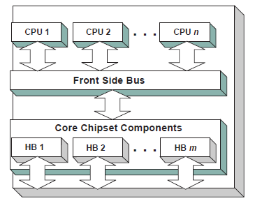

   **Host Bus Controllers**

Simple systems with one PCI Host Bus Controller will contain a single instance of the :ref:`efi-pci-root-bridge-io-protocol`. More complex system may contain multiple instances of this protocol. It is important to note that there is no relationship between the number of chipset components in a platform and the number of *EFI_PCI_ROOT_BRIDGE_IO_PROTOCOL* instances. This protocol abstracts access to a PCI Root Bridge from a software point of view, and it is attached to a device handle that represents a PCI Root Bridge. A PCI Root Bridge is a chipset component(s) that produces a physical PCI Bus. It is also the parent to a set of PCI devices that share common PCI I/O, PCI Memory, and PCI Prefetchable Memory regions. A PCI Host Bus Controller is composed of one or more PCI Root Bridges.

A PCI Host Bridge and PCI Root Bridge are different than a PCI Segment. A PCI Segment is a collection of up to 256 PCI busses that share the same PCI Configuration Space. Depending on the chipset, a single *EFI_PCI_ROOT_BRIDGE_IO_PROTOCOL* may abstract a portion of a PCI Segment, or an entire PCI Segment. A PCI Host Bridge may produce one or more PCI Root Bridges. When a PCI Host Bridge produces multiple PCI Root Bridges, it is possible to have more than one PCI Segment.

PCI Root Bridge I/O Protocol instances are either produced by the system firmware or by a UEFI driver. When a PCI Root Bridge I/O Protocol is produced, it is placed on a device handle along with an EFI Device Path Protocol instance. The figure below (:ref:`device-handle-for-a-pci-root-bridge-controller`) shows a sample device handle that includes an instance of the EFI_DEVICE_PATH_PROTOCOL and the 
EFI_PCI_ROOT_BRIDGE_IO_PROTOCOL. 

Section :numref:`pci-root-bridge-io-protocol` describes the PCI Root Bridge I/O Protocol in detail, and :numref:`pci-root-bridge-device-paths` describes how to build device paths for PCI Root Bridges. The EFI_PCI_ROOT_BRIDGE_IO_PROTOCOL does not abstract access to the chipset-specific registers used to manage a PCI Root Bridge. This functionality is hidden within the system firmware or the driver that produces the handles that represent the PCI Root Bridges.

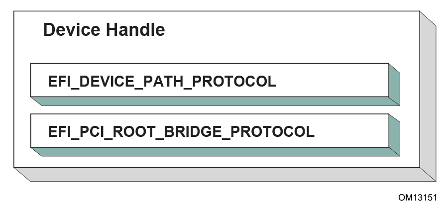

   Device Handle for a PCI Root Bridge Controller 

.. _sample-pci-architectures: 

Sample PCI Architectures
########################

The PCI Root Bridge I/O Protocol is designed to provide a software abstraction for a wide variety of PCI architectures including the ones described in this section. This section is not intended to be an exhaustive list of the PCI architectures that the PCI Root Bridge I/O Protocol can support. Instead, it is intended to show the flexibility of this protocol to adapt to current and future platform designs.

See :ref:`desktop-system-with-one-pci-root-bridge` shows an example of a PCI Host Bus with one PCI Root Bridge. This PCI Root Bridge produces one PCI Local Bus that can contain PCI Devices on the motherboard and/or PCI slots. This would be typical of a desktop system. A higher end desktop system might contain a second PCI Root Bridge for AGP devices. The firmware for this platform would produce one instance of the PCI Root Bridge I/O Protocol.

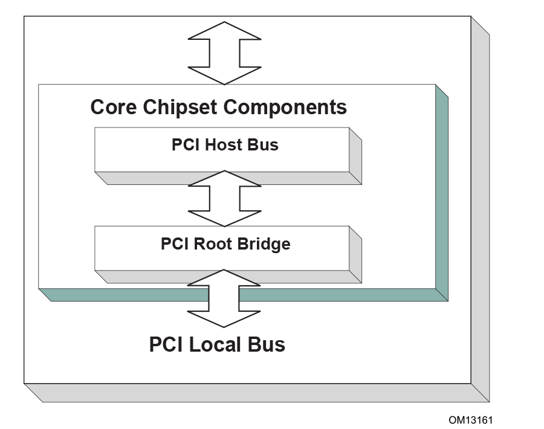

   **Desktop System with One PCI Root Bridge**

Figure :ref:`server-system-with-four-pci-root-bridges` shows an example of a larger server with one PCI Host Bus and four PCI Root Bridges. The PCI devices attached to the PCI Root Bridges are all part of the same coherency domain. This means they share a common PCI I/O Space, a common PCI Memory Space, and a common PCI Prefetchable Memory Space. Each PCI Root Bridge produces one PCI Local Bus that can contain PCI Devices on the motherboard or PCI slots. The firmware for this platform would produce four instances of the PCI Root Bridge I/O Protocol.  

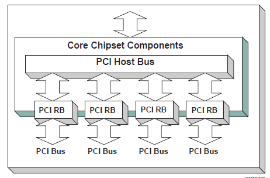
   
   **Server System with Four PCI Root Bridges**

The Figure :ref:`server-system-with-two-pci-segments` , below, shows an example of a server with one PCI Host Bus and two PCI Root Bridges. Each of these PCI Root Bridges is a different PCI Segment which allows the system to have up to 512 PCI Buses. A single PCI Segment is limited to 256 PCI Buses. These two segments do not share the same PCI Configuration Space, but they do share the same PCI I/O, PCI Memory, and PCI Prefetchable Memory Space. This is why it can be described by a single PCI Host Bus. The firmware for this platform would produce two instances of the PCI Root Bridge I/O Protocol.

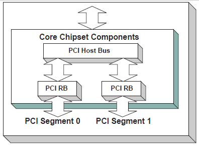
  
   Server System with Two PCI Segments

The Figure, :ref:`server-system-with-two-pci-host-buses` , below, shows a server system with two PCI Host Buses and one PCI Root Bridge per PCI Host Bus. This system supports up to 512 PCI Buses, but the PCI I/O, PCI Memory Space, and PCI Prefetchable Memory Space are not shared between the two PCI Root Bridges. The firmware for this platform would produce two instances of the PCI Root Bridge I/O Protocol.

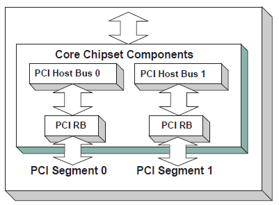

   Server System with Two PCI Host Buses 

.. _pci-root-bridge-io-protocol:

PCI Root Bridge I/O Protocol
----------------------------

This section provides detailed information on the PCI Root Bridge I/O Protocol and its functions.

 .. _efi-pci-root-bridge-io-protocol:

EFI_PCI_ROOT_BRIDGE_IO_PROTOCOL
###############################

**Summary**

Provides the basic Memory, I/O, PCI configuration, and DMA interfaces that are used to abstract accesses to PCI controllers behind a PCI Root Bridge Controller.

**GUID**

.. code-block::

   #define EFI_PCI_ROOT_BRIDGE_IO_PROTOCOL_GUID \
     {0x2F707EBB,0x4A1A,0x11d4,\
       {0x9A,0x38,0x00,0x90,0x27,0x3F,0xC1,0x4D}}

**Protocol Interface Structure**

.. code-block::

   typedef struct _EFI_PCI_ROOT_BRIDGE_IO_PROTOCOL {
     EFI_HANDLE 
    ParentHandle;
     EFI_PCI_ROOT_BRIDGE_IO_PROTOCOL_POLL_IO_MEM      PollMem;
     EFI_PCI_ROOT_BRIDGE_IO_PROTOCOL_POLL_IO_MEM      PollIo;
     EFI_PCI_ROOT_BRIDGE_IO_PROTOCOL_ACCESS           Mem;
     EFI_PCI_ROOT_BRIDGE_IO_PROTOCOL_ACCESS           Io;
     EFI_PCI_ROOT_BRIDGE_IO_PROTOCOL_ACCESS           Pci;
     EFI_PCI_ROOT_BRIDGE_IO_PROTOCOL_COPY_MEM         CopyMem;
     EFI_PCI_ROOT_BRIDGE_IO_PROTOCOL_MAP              Map;
     EFI_PCI_ROOT_BRIDGE_IO_PROTOCOL_UNMAP            Unmap;
     EFI_PCI_ROOT_BRIDGE_IO_PROTOCOL_ALLOCATE_BUFFER  AllocateBuffer;
     EFI_PCI_ROOT_BRIDGE_IO_PROTOCOL_FREE_BUFFER      FreeBuffer;
     EFI_PCI_ROOT_BRIDGE_IO_PROTOCOL_FLUSH            Flush;
     EFI_PCI_ROOT_BRIDGE_IO_PROTOCOL_GET_ATTRIBUTES   GetAttributes;
     EFI_PCI_ROOT_BRIDGE_IO_PROTOCOL_SET_ATTRIBUTES   SetAttributes;
     EFI_PCI_ROOT_BRIDGE_IO_PROTOCOL_CONFIGURATION    Configuration;
     UINT32                                           SegmentNumber;
   }   EFI_PCI_ROOT_BRIDGE_IO_PROTOCOL;

**Parameters**

ParentHandle 
  The EFI_HANDLE of the PCI Host Bridge of which this PCI Root Bridge is a member.

PollMem
  Polls an address in memory mapped I/O space until an exit condition is met, or a timeout occurs. See the `EFI_PCI_ROOT_BRIDGE_IO_PROTOCOL.PollMem()`_  function description .

PollIo   
  Polls an address in I/O space until an exit condition is met, or a timeout occurs. See the `EFI_PCI_ROOT_BRIDGE_IO_PROTOCOL.PollIo()`_ function description.

Mem.Read 
  Allows reads from memory mapped I/O space. See the Mem.Read() `EFI_PCI_ROOT_BRIDGE_IO_PROTOCOL.Mem.Read()`_  function description.

Mem.Write 
  Allows writes to memory mapped I/O space. See the Mem.Write() `EFI_PCI_ROOT_BRIDGE_IO_PROTOCOL.Mem.Write()`_ function description.

Io.Read 
  Allows reads from I/O space. See the Io.Read() `EFI_PCI_ROOT_BRIDGE_IO_PROTOCOL.Io.Read()`_ function description.

Io.Write
  Allows writes to I/O space. See the Io.Write() `EFI_PCI_ROOT_BRIDGE_IO_PROTOCOL.Io.WRITE()`_ function description.

Pci.Read 
  Allows reads from PCI configuration space. See the Pci.Read() `EFI_PCI_ROOT_BRIDGE_IO_PROTOCOL.Pci.Read()`_ function description.

Pci.Write 
  Allows writes to PCI configuration space. See the Pci.Write() `EFI_PCI_ROOT_BRIDGE_IO_PROTOCOL.Pci.Write()`_ function description.

CopyMem 
  Allows one region of PCI root bridge memory space to be copied to another region of PCI root bridge memory space. See the `EFI_PCI_ROOT_BRIDGE_IO_PROTOCOL.CopyMem()`_ function description. 

Map 
  Provides the PCI controller-specific addresses needed to  access system memory for DMA. See the :ref:`efi-pci-root-bridge-io-protocol-Map` function description.

Unmap 
  Releases any resources allocated by Map(). See the :ref:`efi-pci-root-bridge-io-protocol-Unmap` function description.

AllocateBuffer 
  Allocates pages that are suitable for a common buffer mapping. See the :ref:`efi-pci-root-bridge-io-protocol-AllocateBuffer` function description.

FreeBuffer 
  Free pages that were allocated with AllocateBuffer(). See the :ref:`efi-pci-root-bridge-io-protocol-FreeBuffer` function description.

Flush 
  Flushes all PCI posted write transactions to system memory. See the :ref:`efi-pci-root-bridge-io-protocol-Flush` function description.

GetAttributes 
  Gets the attributes that a PCI root bridge supports setting with :ref:`efi-pci-root-bridge-io-protocol-SetAttributes` , and the attributes that a PCI root bridge is currently using. See the :ref:`efi-pci-root-bridge-io-protocol-GetAttributes` function description.

SetAttributes 
  Sets attributes for a resource range on a PCI root bridge. See  `EFI_PCI_ROOT_BRIDGE_IO_PROTOCOL.SetAttributes()`_ function description.

Configuration 
  Gets the current resource settings for this PCI root bridge. See the :ref:`efi-pci-root-bridge-io-protocol-Configuration` function description. 

SegmentNumber 
  The segment number that this PCI root bridge resides.

**Related Definitions**

.. code-block:: 

   //******************************************************
   // EFI_PCI_ROOT_BRIDGE_IO_PROTOCOL_WIDTH
   //******************************************************
   typedef enum {
     EfiPciWidthUint8,
     EfiPciWidthUint16,
     EfiPciWidthUint32,
     EfiPciWidthUint64,
     EfiPciWidthFifoUint8,
     EfiPciWidthFifoUint16,
     EfiPciWidthFifoUint32,
     EfiPciWidthFifoUint64,
     EfiPciWidthFillUint8,
     EfiPciWidthFillUint16,
     EfiPciWidthFillUint32,
     EfiPciWidthFillUint64,
     EfiPciWidthMaximum
   } EFI_PCI_ROOT_BRIDGE_IO_PROTOCOL_WIDTH;

   //******************************************************
   // EFI_PCI_ROOT_BRIDGE_IO_PROTOCOL_POLL_IO_MEM
   //******************************************************
   typedef
   EFI_STATUS
   (EFIAPI *EFI_PCI_ROOT_BRIDGE_IO_PROTOCOL_POLL_IO_MEM) (
     IN struct EFI_PCI_ROOT_BRIDGE_IO_PROTOCOL      *This,
     IN EFI_PCI_ROOT_BRIDGE_IO_PROTOCOL_WIDTH       Width,
     IN UINT64                                      Address,
     IN UINT64                                      Mask,
     IN UINT64                                      Value,
     IN UINT64                                      Delay,
     OUT UINT64                                     *Result
     );

   //******************************************************
   // EFI_PCI_ROOT_BRIDGE_IO_PROTOCOL_IO_MEM
   //******************************************************
   typedef
   EFI_STATUS
   (EFIAPI *EFI_PCI_ROOT_BRIDGE_IO_PROTOCOL_IO_MEM) (
     IN EFI_PCI_ROOT_BRIDGE_IO_PROTOCOL             *This,
     IN EFI_PCI_ROOT_BRIDGE_IO_PROTOCOL_WIDTH       Width,
     IN UINT64                                      Address,
     IN UINTN                                       Count,
     IN OUT VOID                                    *Buffer
     );

   //******************************************************
   // EFI_PCI_ROOT_BRIDGE_IO_PROTOCOL_ACCESS 
   //******************************************************
   typedef struct {
     EFI_PCI_ROOT_BRIDGE_IO_PROTOCOL_IO_MEM         Read;
     EFI_PCI_ROOT_BRIDGE_IO_PROTOCOL_IO_MEM         Write;
   } EFI_PCI_ROOT_BRIDGE_IO_PROTOCOL_ACCESS;

   //******************************************************
   // EFI PCI Root Bridge I/O Protocol Attribute bits
   //******************************************************
   #define EFI_PCI_ATTRIBUTE_ISA_MOTHERBOARD_IO     0x0001
   #define EFI_PCI_ATTRIBUTE_ISA_IO                 0x0002
   #define EFI_PCI_ATTRIBUTE_VGA_PALETTE_IO         0x0004
   #define EFI_PCI_ATTRIBUTE_VGA_MEMORY             0x0008
   #define EFI_PCI_ATTRIBUTE_VGA_IO                 0x0010
   #define EFI_PCI_ATTRIBUTE_IDE_PRIMARY_IO         0x0020
   #define EFI_PCI_ATTRIBUTE_IDE_SECONDARY_IO       0x0040
   #define EFI_PCI_ATTRIBUTE_MEMORY_WRITE_COMBINE   0x0080
   #define EFI_PCI_ATTRIBUTE_MEMORY_CACHED          0x0800
   #define EFI_PCI_ATTRIBUTE_MEMORY_DISABLE         0x1000
   #define EFI_PCI_ATTRIBUTE_DUAL_ADDRESS_CYCLE     0x8000
   #define EFI_PCI_ATTRIBUTE_ISA_IO_16              0x10000
   #define EFI_PCI_ATTRIBUTE_VGA_PALETTE_IO_16      0x20000
   #define EFI_PCI_ATTRIBUTE_VGA_IO_16              0x40000
  
EFI_PCI_ATTRIBUTE_ISA_IO_16 
  If this bit is set, then the PCI I/O cycles between 0x100 and 0x3FF are forwarded onto a PCI root bridge using a 16-bit address decoder on address bits 0..15. Address bits 16..31 must be zero. This bit is used to forward I/O cycles for legacy ISA devices onto a PCI root bridge. This bit may not be combined with *EFI_PCI_ATTRIBUTE_ISA_IO*.

EFI_PCI_ATTRIBUTE_VGA_PALETTE_IO_16
  If this bit is set, then the PCI I/O write cycles for 0x3C6, 0x3C8, and 0x3C9 are forwarded onto a PCI root bridge using a 16-bit address decoder on address bits 0..15. Address bits 16..31 must be zero. This bit is used to forward I/O write cycles to the VGA palette registers onto a PCI root bridge. This bit may not be combined with *EFI_PCI_ATTRIBUTE_VGA_IO* or *EFI_PCI_ATTRIBUTE_VGA_PALETTE_IO*.

EFI_PCI_ATTRIBUTE_VGA_IO_16
  If this bit is set, then the PCI I/O cycles in the ranges 0x3B0-0x3BB and 0x3C0-0x3DF are forwarded onto a PCI root bridge using a 16-bit address decoder on address bits 0..15. Address bits 16..31 must be zero. This bit is used to forward I/O cycles for a VGA controller onto a PCI root bridge. This bit may not be combined with *EFI_PCI_ATTRIBUTE_VGA_IO* or *EFI_PCI_ATTRIBUTE_VGA_PALETTE_IO*. Because *EFI_PCI_ATTRIBUTE_VGA_IO_16* also includes the I/O range described by *EFI_PCI_ATTRIBUTE_VGA_PALETTE_IO_16* , the *EFI_PCI_ATTRIBUTE_VGA_PALETTE_IO_16* bit is ignored if *EFI_PCI_ATTRIBUTE_VGA_IO_16* is set. 

EFI_PCI_ATTRIBUTE_ISA_MOTHERBOARD_IO
  If this bit is set, then the PCI I/O cycles between 0x00000000 and 0x000000FF are forwarded onto a PCI root bridge. This bit is used to forward I/O cycles for ISA motherboard devices onto a PCI root bridge.

EFI_PCI_ATTRIBUTE_ISA_IO
  If this bit is set, then the PCI I/O cycles between 0x100 and 0x3FF are forwarded onto a PCI root bridge using a 10-bit address decoder on address bits 0..9. Address bits 10..15 are not decoded, and address bits 16..31 must be zero. This bit is used to forward I/O cycles for legacy ISA devices onto a PCI root bridge.

EFI_PCI_ATTRIBUTE_VGA_PALETTE_IO
  If this bit is set, then the PCI I/O write cycles for 0x3C6, 0x3C8, and 0x3C9 are forwarded onto a PCI root bridge using a 10 bit address decoder on address bits 0..9. Address bits 10..15 are not decoded, and address bits 16..31 must be zero. This bit is used to forward I/O write cycles to the VGA palette registers onto a PCI root bridge.

EFI_PCI_ATTRIBUTE_VGA_MEMORY
  If this bit is set, then the PCI memory cycles between 0xA0000 and 0xBFFFF are forwarded onto a PCI root bridge. This bit is used to forward memory cycles for a VGA frame buffer onto a PCI root bridge.

EFI_PCI_ATTRIBUTE_VGA_IO
  If this bit is set, then the PCI I/O cycles in the ranges 0x3B0-0x3BB and 0x3C0-0x3DF are forwarded onto a PCI root bridge using a 10-bit address decoder on address bits 0..9. Address bits 10..15 are not decoded, and the address bits 16..31 must be zero. This bit is used to forward I/O cycles for a VGA controller onto a PCI root bridge. Since EFI_PCI_ATTRIBUTE_ENABLE_VGA_IO also includes the I/O range described by EFI_PCI_ATTRIBUTE_ENABLE_VGA_PALETTE_IO, the EFI_PCI_ATTRIBUTE_ENABLE_VGA_PALETTE_IO bit is ignored if EFI_PCI_ATTRIBUTE_ENABLE_VGA_IO is set.

EFI_PCI_ATTRIBUTE_IDE_PRIMARY_IO
  If this bit is set, then the PCI I/O cycles in the ranges 0x1F0-0x1F7 and 0x3F6-0x3F7 are forwarded onto a PCI root bridge using a 16-bit address decoder on address bits 0..15. Address bits 16..31 must be zero. This bit is used to forward I/O cycles for a Primary IDE controller onto a PCI root bridge.

EFI_PCI_ATTRIBUTE_IDE_SECONDARY_IO
  If this bit is set, then the PCI I/O cycles in the ranges 0x170-0x177 and 0x376-0x377 are forwarded onto a PCI root bridge using a 16-bit address decoder on address bits 0..15. Address bits 16..31 must be zero. This bit is used to forward I/O cycles for a Secondary IDE controller onto a PCI root bridge.

EFI_PCI_ATTRIBUTE_MEMORY_WRITE_COMBINE
  If this bit is set, then this platform supports changing the attributes of a PCI memory range so that the memory range is accessed in a write combining mode. By default, PCI memory ranges are not accessed in a write combining mode.

EFI_PCI_ATTRIBUTE_MEMORY_CACHED
  If this bit is set, then this platform supports changing the attributes of a PCI memory range so that the memory range is accessed in a cached mode. By default, PCI memory ranges are accessed noncached.

EFI_PCI_ATTRIBUTE_MEMORY_DISABLE
  If this bit is set, then this platform supports changing the attributes of a PCI memory range so that the memory range is disabled, and can no longer be accessed. By default, all PCI memory ranges are enabled.

EFI_PCI_ATTRIBUTE_DUAL_ADDRESS_CYCLE 
  This bit may only be used in the Attributes parameter to :ref:`efi-pci-root-bridge-io-protocol-AllocateBuffer`. If this bit is set, then the PCI controller that is requesting a buffer through AllocateBuffer() is capable of producing PCI Dual Address Cycles, so it is able to access a 64-bit address space. If this bit is not set, then the PCI controller that is requesting a buffer through AllocateBuffer() is not capable of producing PCI Dual Address Cycles, so it is only able to access a 32-bit address space.

.. code-block::
  
   //******************************************************
   // EFI_PCI_ROOT_BRIDGE_IO_PROTOCOL_OPERATION
   //******************************************************
   typedef enum {
     EfiPciOperationBusMasterRead,
     EfiPciOperationBusMasterWrite,
     EfiPciOperationBusMasterCommonBuffer,
     EfiPciOperationBusMasterRead64,
     EfiPciOperationBusMasterWrite64,
     EfiPciOperationBusMasterCommonBuffer64,
     EfiPciOperationMaximum
   }  EFI_PCI_ROOT_BRIDGE_IO_PROTOCOL_OPERATION;
  

EfiPciOperationBusMasterRead
  A read operation from system memory by a bus master that is not capable of producing PCI dual address cycles. 

EfiPciOperationBusMasterWrite
  A write operation to system memory by a bus master that is not capable of producing PCI dual address cycles.

EfiPciOperationBusMasterCommonBuffer
  Provides both read and write access to system memory by both the processor and a bus master that is not capable of producing PCI dual address cycles. The buffer is coherent from both the processor’s and the bus master’s point of view.

EfiPciOperationBusMasterRead64
  A read operation from system memory by a bus master that is capable of producing PCI dual address cycles.

EfiPciOperationBusMasterWrite64
  A write operation to system memory by a bus master that is capable of producing PCI dual address cycles.

EfiPciOperationBusMasterCommonBuffer64
  Provides both read and write access to system memory by both the processor and a bus master that is capable of producing PCI dual address cycles. The buffer is coherent from both the processor’s and the bus master’s point of view.
  

**Description**

The *EFI_PCI_ROOT_BRIDGE_IO_PROTOCOL* provides the basic Memory, I/O, PCI configuration, and DMA interfaces that are used to abstract accesses to PCI controllers. There is one *EFI_PCI_ROOT_BRIDGE_IO_PROTOCOL* instance for each PCI root bridge in a system. Embedded systems, desktops, and workstations will typically only have one PCI root bridge. High-end servers may have multiple PCI root bridges. A device driver that wishes to manage a PCI bus in a system will have to retrieve the *EFI_PCI_ROOT_BRIDGE_IO_PROTOCOL* instance that is associated with the PCI bus to be managed. A device handle for a PCI Root Bridge will minimally contain an :ref:`efi-device-path-protocol`  instance and an *EFI_PCI_ROOT_BRIDGE_IO_PROTOCOL* instance. The PCI bus driver can look at the *EFI_DEVICE_PATH_PROTOCOL* instances to determine which *EFI_PCI_ROOT_BRIDGE_IO_PROTOCOL* instance to use.

Bus mastering PCI controllers can use the DMA services for DMA operations. There are three basic types of bus mastering DMA that is supported by this protocol. These are DMA reads by a bus master, DMA writes by a bus master, and common buffer DMA. The DMA read and write operations may need to be broken into smaller chunks. The caller of `EFI_PCI_ROOT_BRIDGE_IO_PROTOCOL.Map()`_   must pay attention to the number of bytes that were mapped, and if required, loop until the entire buffer has been transferred. The following is a list of the different bus mastering DMA operations that are supported, and the sequence of *EFI_PCI_ROOT_BRIDGE_IO_PROTOCOL* APIs that are used for each DMA operation type. See "Related Definitions" above for the definition of the different DMA operation types.

**DMA Bus Master Read Operation**

-  Call `EFI_PCI_ROOT_BRIDGE_IO_PROTOCOL.Map()`_  for EfiPciOperationBusMasterRead or EfiPciOperationBusMasterRead64.
-  Program the DMA Bus Master with the DeviceAddress returned by Map().
-  Start the DMA Bus Master.
-  Wait for DMA Bus Master to complete the read operation.
-  Call `EFI_PCI_ROOT_BRIDGE_IO_PROTOCOL.Unmap()`_

**DMA Bus Master Write Operation**

-  Call `EFI_PCI_ROOT_BRIDGE_IO_PROTOCOL.Map()`_  for EfiPciOperationBusMasterWrite or EfiPciOperationBusMasterRead64.
-  Program the DMA Bus Master with the DeviceAddress returned by `EFI_PCI_IO_PROTOCOL.Map()`_
-  Start the DMA Bus Master.
-  Wait for DMA Bus Master to complete the write operation.
-  Perform a PCI controller specific read transaction to flush all PCI write buffers (See PCI Specification Section 3.2.5.2).
-  Call `EFI_PCI_ROOT_BRIDGE_IO_PROTOCOL.Flush()`_ 
-  Call Unmap.

**DMA Bus Master Common Buffer Operation**

-  Call `EFI_PCI_ROOT_BRIDGE_IO_PROTOCOL.AllocateBuffer()`_ to allocate a common buffer.
-  Call Map() for EfiPciOperationBusMasterCommonBuffer or EfiPciOperationBusMasterCommonBuffer64.
-  Program the DMA Bus Master with the DeviceAddress returned by `EFI_PCI_ROOT_BRIDGE_IO_PROTOCOL.Map()`_ .
-  The common buffer can now be accessed equally by the processor and the DMA bus master.
-  Call Unmap().
-  Call `EFI_PCI_ROOT_BRIDGE_IO_PROTOCOL.FreeBuffer()`_ .

.. TODO missing 3 heads which become 4 heads below s/b level 3 xxx

.. _efi-pci-root-bridge-io-protocol-pollmem:

EFI_PCI_ROOT_BRIDGE_IO_PROTOCOL.PollMem()
#########################################

**Summary**

Reads from the memory space of a PCI Root Bridge. Returns when either the polling exit criteria is satisfied or after a defined duration.

**Prototype**

.. code-block:: 
  
   typedef
   EFI_STATUS
   (EFIAPI *EFI_PCI_ROOT_BRIDGE_IO_PROTOCOL_POLL_IO_MEM) (
     IN EFI_PCI_ROOT_BRIDGE_IO_PROTOCOL             *This,
     IN EFI_PCI_ROOT_BRIDGE_IO_PROTOCOL_WIDTH       Width,
     IN UINT64                                      Address,
     IN UINT64                                      Mask,
     IN UINT64                                      Value,
     IN UINT64                                      Delay,
     OUT UINT64                                     *Result
     );
  

**Parameters**

This
  A pointer to the :ref:`efi-pci-root-bridge-io-protocol`. Type EFI_PCI_ROOT_BRIDGE_IO_PROTOCOL is defined in the Section :ref:`pci-root-bridge-io-protocol` .

Width 
  Signifies the width of the memory operations. Type EFI_PCI_ROOT_BRIDGE_IO_PROTOCOL_WIDTH  see **Related Definitions** in the section :ref:`efi-pci-root-bridge-io-protocol` . 

Address
  The base address of the memory operations. The caller is responsible for aligning Address if required.

Mask
  Mask used for the polling criteria. Bytes above Width in Mask are ignored. The bits in the bytes below Width which are zero in Mask are ignored when polling the memory address.

Value
  The comparison value used for the polling exit criteria.

Delay
  The number of 100 ns units to poll. Note that timer available may be of poorer granularity. 

Result
  Pointer to the last value read from the memory location.

**Description**

This function provides a standard way to poll a PCI memory location. A PCI memory read operation is performed at the PCI memory address specified by *Address* for the width specified by *Width*. The result of this PCI memory read operation is stored in *Result*. This PCI memory read operation is repeated until either a timeout of *Delay* 100 ns units has expired, or ( *Result* & *Mask)* is equal to *Value*.

This function will always perform at least one PCI memory read access no matter how small *Delay* may be. If *Delay* is zero, then *Result* will be returned with a status of *EFI_SUCCESS* even if *Result* does not match the exit criteria. If *Delay* expires, then *EFI_TIMEOUT* is returned.
 
If *Width* is not *EfiPciWidthUint8* , *EfiPciWidthUint16* , *EfiPciWidthUint32* , or *EfiPciWidthUint64* , then *EFI_INVALID_PARAMETER* is returned. 

The memory operations are carried out exactly as requested. The caller is responsible for satisfying any alignment and memory width restrictions that a PCI Root Bridge on a platform might require. For example on some platforms, width requests of EfiPciWidthUint64 are not supported.

All the PCI transactions generated by this function are guaranteed to be completed before this function returns. However, if the memory mapped I/O region being accessed by this function has the EFI_PCI_ATTRIBUTE_MEMORY_CACHED attribute set, then the transactions will follow the ordering rules defined by the processor architecture.

**Status Codes Returned**

.. list-table::
   :widths: 35 70
   :class: longtable

   * - EFI_SUCCESS
     - The last data returned from the access matched the poll exit criteria.
   * - EFI_INVALID_PARAMETER
     - Width is invalid.
   * - EFI_INVALID_PARAMETER
     - Result is **NULL**.
   * - EFI_TIMEOUT
     - Delay expired before a match occurred.
   * - EFI_OUT_OF_RESOURCES
     - The request could not be completed due to a lack of resources.

.. _efi-pci-root-bridge-io-protocol-pollio:

EFI_PCI_ROOT_BRIDGE_IO_PROTOCOL.PollIo()
########################################

**Summary**

Reads from the I/O space of a PCI Root Bridge. Returns when
either the polling exit criteria is satisfied or after a
defined duration.

**Prototype**

.. code-block:: 

   typedef  
   EFI_STATUS  
   (EFIAPI *EFI_PCI_ROOT_BRIDGE_IO_PROTOCOL_POLL_IO_MEM) (  
     IN EFI_PCI_ROOT_BRIDGE_IO_PROTOCOL           *This,  
     IN EFI_PCI_ROOT_BRIDGE_IO_PROTOCOL_WIDTH     Width,  
     IN UINT64                                    Address,  
     IN UINT64                                    Mask,  
     IN UINT64                                    Value,  
     IN UINT64                                    Delay,  
     OUT UINT64                                   *Result  
     );
  

**Parameters**

This
  A pointer to the :ref:`efi-pci-root-bridge-io-protocol`. Type EFI_PCI_ROOT_BRIDGE_IO_PROTOCOL is defined in  :ref:`PCI-Root-Bridge-IO-Protocol` .

Width
  Signifies the width of the I/O operations. Type EFI_PCI_ROOT_BRIDGE_IO_PROTOCOL_WIDTH see **Related Definitions** in the section :ref:`PCI-Root-Bridge-IO-Protocol` .

Address
  The base address of the I/O operations. The caller is responsible for aligning Address if required.

Mask
  Mask used for the polling criteria. Bytes above Width in Mask are ignored. The bits in the bytes below Width which are zero in Mask are ignored when polling the I/O address.

Value 
  The comparison value used for the polling exit criteria.

Delay
  The number of 100 ns units to poll. Note that timer available may be of poorer granularity.

Result
  Pointer to the last value read from the memory location.

**Description**

This function provides a standard way to poll a PCI I/O location. A PCI I/O read operation is performed at the PCI I/O address specified by *Address* for the width specified by *Width*. The result of this PCI I/O read operation is stored in *Result*. This PCI I/O read operation is repeated until either a timeout of *Delay* 100 ns units has expired, or (
*Result & Mask* ) is equal to *Value*.

This function will always perform at least one I/O access no matter how small *Delay* may be. If *Delay* is zero, then *Result* will be returned with a status of *EFI_SUCCESS* even if *Result* does not match the exit criteria. If *Delay* expires, then *EFI_TIMEOUT* is returned.

If *Width* is not *EfiPciWidthUint8* , *EfiPciWidthUint16* , *EfiPciWidthUint32* , or *EfiPciWidthUint64* , then *EFI_INVALID_PARAMETER* is returned.

The I/O operations are carried out exactly as requested. The caller is responsible satisfying any alignment and I/O width restrictions that the PCI Root Bridge on a platform might require. For example on some platforms, width requests of *EfiPciWidthUint64* do not work.

All the PCI transactions generated by this function are guaranteed to be completed before this function returns. 

**Status Codes Returned**

.. list-table::
   :widths: 35 70
   :class: longtable

   * - EFI_SUCCESS
     - The last data returned from the access matched the poll exit criteria.
   * - EFI_INVALID_PARAMETER
     - Width is invalid.
   * - EFI_INVALID_PARAMETER
     - Result is *NULL*.
   * - EFI_TIMEOUT
     - Delay expired before a match occurred.
   * - EFI_OUT_OF_RESOURCES
     - The request could not be completed due to a lack of resources.

.. _efi-pci-root-bridge-io-protocol-mem-read:

EFI_PCI_ROOT_BRIDGE_IO_PROTOCOL.Mem.Read()
##########################################

.. _efi-pci-root-bridge-io-protocol-mem-write:

EFI_PCI_ROOT_BRIDGE_IO_PROTOCOL.Mem.Write()
###########################################

**Summary**

Enables a PCI driver to access PCI controller registers in the
PCI root bridge memory space.
 
**Prototype**

.. code-block:: 
  
   typedef  
   EFI_STATUS  
   (EFIAPI *EFI_PCI_ROOT_BRIDGE_IO_PROTOCOL_IO_MEM) (  
     IN EFI_PCI_ROOT_BRIDGE_IO_PROTOCOL                 *This,  
     IN EFI_PCI_ROOT_BRIDGE_IO_PROTOCOL_WIDTH           Width,  
     IN UINT64                                          Address,  
     IN UINTN                                           Count,  
     IN OUT VOID                                        *Buffer  
     );
 

**Parameters**

This 
   A pointer to the :ref:`efi-pci-root-bridge-io-protocol`. Type EFI_PCI_ROOT_BRIDGE_IO_PROTOCOL is defined in  :ref:`PCI-Root-Bridge-IO-Protocol` .

Width 
  Signifies the width of the memory operation. Type EFI_PCI_ROOT_BRIDGE_IO_PROTOCOL_WIDTH see **Related Definitions** in the section :ref:`PCI-Root-Bridge-IO-Protocol` .

Address 
  The base address of the memory operation. The caller is responsible for aligning the Address if required.

Count 
  The number of memory operations to perform. Bytes moved is Width size * Count, starting at Address.

Buffer 
  For read operations, the destination buffer to store the results. For write operations, the source buffer to write data from.

**Description**

The *Mem.Read()* , and *Mem.Write()* functions enable a driver to access PCI controller registers in the PCI root bridge memory space.

The memory operations are carried out exactly as requested. The caller is responsible for satisfying any alignment and memory width restrictions that a PCI Root Bridge on a platform might require. For example on some platforms, width requests of *EfiPciWidthUint64* do not work.

If *Width* is *EfiPciWidthUint8* , *EfiPciWidthUint16* , *EfiPciWidthUint32* , or *EfiPciWidthUint64* , then both *Address* and *Buffer* are incremented for each of the *Count* operations performed.

If *Width* is *EfiPciWidthFifoUint8* , *EfiPciWidthFifoUint16* , *EfiPciWidthFifoUint32* , or *EfiPciWidthFifoUint64* , then only *Buffer* is incremented for each of the *Count* operations performed. The read or write operation is performed *Count* times on the same *Address*.

If *Width* is *EfiPciWidthFillUint8* , *EfiPciWidthFillUint16* , *EfiPciWidthFillUint32* , or *EfiPciWidthFillUint64* , then only *Address* is incremented for each of the *Count* operations performed. The read or write operation is performed *Count* times from the first element of *Buffer*.

All the PCI read transactions generated by this function are guaranteed to be completed before this function returns. All the PCI write transactions generated by this function will follow the write ordering and completion rules defined in the PCI Specification. However, if the memory-mapped I/O region being accessed by this function has the *EFI_PCI_ATTRIBUTE_MEMORY_CACHED* attribute set, then the transactions will follow the ordering rules defined by the processor architecture.

**Status Codes Returned**

.. list-table::
   :widths: 35 70
   :class: longtable

   * - EFI_SUCCESS
     - The data was read from or written to the PCI root bridge.
   * - EFI_INVALID_PARAMETER
     - Width is invalid for this PCI root bridge.
   * - EFI_INVALID_PARAMETER
     - Buffer is *NULL*.
   * - EFI_OUT_OF_RESOURCES
     - The request could not be completed due to a lack of resources.

.. _efi-pci-root-bridge-io-protocol-io-read:

EFI_PCI_ROOT_BRIDGE_IO_PROTOCOL.Io.Read()
#########################################

.. _efi-pci-root-bridge-io-protocol-io-write:

EFI_PCI_ROOT_BRIDGE_IO_PROTOCOL.Io.Write()
##########################################

**Summary**

Enables a PCI driver to access PCI controller registers in the
PCI root bridge I/O space.

**Prototype**

.. code-block:: 
  
   typedef  
   EFI_STATUS  
   (EFIAPI *EFI_PCI_ROOT_BRIDGE_IO_PROTOCOL_IO_MEM) (  
     IN EFI_PCI_ROOT_BRIDGE_IO_PROTOCOL             *This,  
     IN EFI_PCI_ROOT_BRIDGE_IO_PROTOCOL_WIDTH       Width,  
     IN UINT64                                      Address,  
     IN UINTN                                       Count,  
     IN OUT VOID                                    *Buffer  
     );
  

**Parameters**

This 
  A pointer to the :ref:`efi-pci-root-bridge-io-protocol`. Type EFI_PCI_ROOT_BRIDGE_IO_PROTOCOL is defined in  :ref:`PCI-Root-Bridge-IO-Protocol` .

Width 
  Signifies the width of the memory operation. Type EFI_PCI_ROOT_BRIDGE_IO_PROTOCOL_WIDTH see **Related Definitions** in the section :ref:`PCI-Root-Bridge-IO-Protocol` .

Address 
  The base address of the I/O operation. The caller is responsible for aligning the Address if required.

Count 
  The number of I/O operations to perform. Bytes moved is Width size * Count, starting at Address.

Buffer 
  For read operations, the destination buffer to store the results. For write operations, the source buffer to write data from.

**Description**

The *Io.Read()* , and *Io.Write()* functions enable a driver to access PCI controller registers in the PCI root bridge I/O space.

The I/O operations are carried out exactly as requested. The caller is responsible for satisfying any alignment and I/O width restrictions that a PCI root bridge on a platform might require. For example on some platforms, width requests of *EfiPciWidthUint64* do not work.

If *Width* is *EfiPciWidthUint8* , *EfiPciWidthUint16* , *EfiPciWidthUint32* , or *EfiPciWidthUint64* , then both *Address* and *Buffer* are incremented for each of the *Count* operations performed.

If *Width* is *EfiPciWidthFifoUint8* , *EfiPciWidthFifoUint16* , *EfiPciWidthFifoUint32* , or *EfiPciWidthFifoUint64* , then only *Buffer* is incremented for each of the *Count* operations performed. The read or write operation is performed *Count* times on the same *Address*.

If *Width* is *EfiPciWidthFillUint8* , *EfiPciWidthFillUint16* , *EfiPciWidthFillUint32* , or *EfiPciWidthFillUint64* , then only *Address* is incremented for each of the *Count* operations performed. The read or write operation is performed *Count* times from the first element of *Buffer*.

All the PCI transactions generated by this function are guaranteed to be completed before this function returns.

**Status Codes Returned**

.. list-table::
   :widths: 35 70
   :class: longtable

   * - EFI_SUCCESS
     - The data was read from or written to the PCI root bridge.
   * - EFI_INVALID_PARAMETER
     - Width is invalid for this PCI root bridge.
   * - EFI_INVALID_PARAMETER
     - Buffer is *NULL*.
   * - EFI_OUT_OF_RESOURCES
     - The request could not be completed due to a lack of resources.

.. _efi-pci-root-bridge-io-protocol-pci-read:

EFI_PCI_ROOT_BRIDGE_IO_PROTOCOL.Pci.Read()
##########################################

.. _efi-pci-root-bridge-io-protocol-pci-write:

EFI_PCI_ROOT_BRIDGE_IO_PROTOCOL.Pci.Write()
###########################################

**Summary**

Enables a PCI driver to access PCI controller registers in a
PCI root bridge’s configuration space. 

**Prototype**

.. code-block:: 
  
   typedef  
   EFI_STATUS  
   (EFIAPI *EFI_PCI_ROOT_BRIDGE_IO_PROTOCOL_IO_MEM) (  
     IN EFI_PCI_ROOT_BRIDGE_IO_PROTOCOL               *This,  
     IN EFI_PCI_ROOT_BRIDGE_IO_PROTOCOL_WIDTH         Width,  
     IN UINT64                                        Address,  
     IN UINTN                                         Count,  
     IN OUT VOID                                      *Buffer  
     );
  

**Parameters**

This
  A pointer to the :ref:`efi-pci-root-bridge-io-protocol`. Type EFI_PCI_ROOT_BRIDGE_IO_PROTOCOL is defined in  :ref:`PCI-Root-Bridge-IO-Protocol` .

Width 
 Signifies the width of the memory operation. Type EFI_PCI_ROOT_BRIDGE_IO_PROTOCOL_WIDTH see **Related Definitions** in the section :ref:`PCI-Root-Bridge-IO-Protocol` .

Address 
  The address within the PCI configuration space for the PCI controller. See :ref:`pci-configuration-address` for the format of Address.

Count 
  The number of PCI configuration operations to perform. Bytes moved is Width size * Count, starting at Address.

Buffer
  For read operations, the destination buffer to store the results. For write operations, the source buffer to write data from.

**Description**

The *Pci.Read()* and *Pci.Write()* functions enable a driver to access PCI configuration registers for a PCI controller.

The PCI Configuration operations are carried out exactly as requested. The caller is responsible for any alignment and PCI configuration width issues that a PCI Root Bridge on a platform might require. For example on some platforms, width requests of *EfiPciWidthUint64* do not work.

If *Width* is *EfiPciWidthUint8* , *EfiPciWidthUint16* , *EfiPciWidthUint32* , or *EfiPciWidthUint64* , then both *Address* and *Buffer* are incremented for each of the *Count* operations performed.

If *Width* is *EfiPciWidthFifoUint8* , *EfiPciWidthFifoUint16* , *EfiPciWidthFifoUint32* , or *EfiPciWidthFifoUint64* , then only *Buffer* is incremented for each of the *Count* operations performed. The read or write operation is performed *Count* times on the same *Address*.

If *Width* is *EfiPciWidthFillUint8*, *EfiPciWidthFillUint16*, *EfiPciWidthFillUint32*, or *EfiPciWidthFillUint64*, then only Address is incremented for each of the Count operations performed. The read or write operation is performed *Count* times from the first element of *Buffer*.

All the PCI transactions generated by this function are
guaranteed to be completed before this function returns.

.. list-table:: PCI Configuration Address
   :name: pci-configuration-address
   :widths: 15 10 10 65
   :class: longtable

   * - **Mnemonic**
     - **Byte Offset**
     - **Byte Length**
     - **Description**
   * - Register
     - 0
     - 1
     - The register number on the PCI Function.
   * - Function
     - 1
     - 1
     - The PCI Function number on the PCI Device.
   * - Device
     - 2
     - 1
     - The PCI Device number on the PCI Bus.
   * - Bus
     - 3
     - 1
     - The PCI Bus number.
   * - ExtendedRegister
     - 4
     - 4
     - The register number on the PCI Function. If this field is zero, then the Register field is used for the register number. If this field is nonzero, then the Register field is ignored, and the E xtendedRegister field is used for the register number.

**Status Codes Returned**

.. list-table::
   :widths: 35 70
   :class: longtable

   * - EFI_SUCCESS
     - The data was read from or written to the PCI root bridge.
   * - EFI_INVALID_PARAMETER
     - Width is invalid for this PCI root bridge.
   * - EFI_INVALID_PARAMETER
     - Buffer is *NULL*.
   * - EFI_OUT_OF_RESOURCES
     - The request could not be completed due to a lack of resources.

.. _efi-pci-root-bridge-io-protocol-copymem:

EFI_PCI_ROOT_BRIDGE_IO_PROTOCOL.CopyMem()
#########################################

**Summary**

Enables a PCI driver to copy one region of PCI root bridge memory space to another region of PCI root bridge memory space.
 

**Prototype**

.. code-block:: 
  
   typedef   
   EFI_STATUS  
   (EFIAPI *EFI_PCI_ROOT_BRIDGE_IO_PROTOCOL_COPY_MEM) (  
     IN EFI_PCI_ROOT_BRIDGE_IO_PROTOCOL             *This,  
     IN EFI_PCI_ROOT_BRIDGE_IO_PROTOCOL_WIDTH       Width,  
     IN UINT64                                      DestAddress,  
     IN UINT64                                      SrcAddress,  
     IN UINTN                                       Count  
     );
  

**Parameters**

This 
  A pointer to the :ref:`efi-pci-root-bridge-io-protocol`. Type EFI_PCI_ROOT_BRIDGE_IO_PROTOCOL is defined in  :ref:`PCI-Root-Bridge-IO-Protocol` .

Width 
  Signifies the width of the memory operation. Type EFI_PCI_ROOT_BRIDGE_IO_PROTOCOL_WIDTH see **Related Definitions** in the section :ref:`PCI-Root-Bridge-IO-Protocol` .

DestAddress 
  The destination address of the memory operation. The caller is responsible for aligning the DestAddress if required.

SrcAddress 
  The source address of the memory operation. The caller is responsible for aligning the SrcAddress if required.

Count
  The number of memory operations to perform. Bytes moved is Width size * Count, starting at DestAddress and SrcAddress.

**Description**

The *CopyMem()* function enables a PCI driver to copy one region of PCI root bridge memory space to another region of PCI root bridge memory space. This is especially useful for video scroll operation on a memory mapped video buffer. 

The memory operations are carried out exactly as requested. The caller is responsible for satisfying any alignment and memory width restrictions that a PCI root bridge on a platform might require. For example on some platforms, width requests of *EfiPciWidthUint64* do not work. 

If *Width* is *EfiPciIoWidthUint8* , *EfiPciIoWidthUint16* , *EfiPciIoWidthUint32* , or *EfiPciIoWidthUint64* , then *Count* read/write transactions are performed to move the contents of the *SrcAddress* buffer to the *DestAddress* buffer. The implementation must be reentrant, and it must handle overlapping *SrcAddress* and *DestAddress* buffers. This means that the implementation of *CopyMem()* must choose the correct direction of the copy operation based on the type of overlap that exists between the *SrcAddress* and *DestAddress* buffers. If either the *SrcAddress* buffer or the *DestAddress* buffer crosses the top of the processor’s address space, then the result of the copy operation is unpredictable. 

The contents of the *DestAddress* buffer on exit from this service must match the contents of the *SrcAddress* buffer on entry to this service. Due to potential overlaps, the contents of the *SrcAddress* buffer may be modified by this service. The following rules can be used to guarantee the correct behavior: 

-  If *DestAddress* > *SrcAddress* and *DestAddress* < ( *SrcAddress* + *Width* size * *Count* ), then the data should be copied from the *SrcAddress* buffer to the *DestAddress* buffer starting from the end of buffers and working toward the beginning of the buffers.

-  Otherwise, the data should be copied from the *SrcAddress* buffer to the *DestAddress* buffer starting from the beginning of the buffers and working toward the end of the buffers. 

All the PCI transactions generated by this function are guaranteed to be completed before this function returns. All the PCI write transactions generated by this function will follow the write ordering and completion rules defined in the PCI Specification. However, if the memory-mapped I/O region being accessed by this function has the *EFI_PCI_ATTRIBUTE_MEMORY_CACHED* attribute set, then the transactions will follow the ordering rules defined by the processor architecture.

**Status Codes Returned**

.. list-table::
   :widths: 35 70
   :class: longtable

   * - EFI_SUCCESS
     - The data was copied from one memory region to another memory region.
   * - EFI_INVALID_PARAMETER
     - Width is invalid for this PCI root bridge.
   * - EFI_OUT_OF_RESOURCES
     - The request could not be completed due to a lack of resources.

.. _efi-pci-root-bridge-io-protocol-map:

EFI_PCI_ROOT_BRIDGE_IO_PROTOCOL.Map()
#####################################

**Summary**

Provides the PCI controller-specific addresses required to access system memory from a DMA bus master.

**Prototype**

.. code-block:: 
  
   typedef  
   EFI_STATUS  
   (EFIAPI *EFI_PCI_ROOT_BRIDGE_IO_PROTOCOL_MAP) (  
     IN EFI_PCI_ROOT_BRIDGE_IO_PROTOCOL                 *This,  
     IN EFI_PCI_ROOT_BRIDGE_IO_PROTOCOL_OPERATION       Operation,  
     IN VOID                                            *HostAddress,  
     IN OUT UINTN                                       *NumberOfBytes,  
     OUT EFI_PHYSICAL_ADDRESS                           *DeviceAddress,  
     OUT VOID                                           **Mapping  
     );

  
**Parameters**

This 
  A pointer to the :ref:`efi-pci-root-bridge-io-protocol`. Type EFI_PCI_ROOT_BRIDGE_IO_PROTOCOL is defined in  :ref:`PCI-Root-Bridge-IO-Protocol` .

Operation 
  Indicates if the bus master is going to read or write to system memory. Type EFI_PCI_ROOT_BRIDGE_IO_PROTOCOL_OPERATION defined in Section :ref:`PCI-Root-Bridge-IO-Protocol` .

HostAddress 
  The system memory address to map to the PCI controller.

NumberOfBytes 
  On input the number of bytes to map. On output the number of bytes that were mapped.

DeviceAddress 
  The resulting map address for the bus master PCI controller to use to access the system memory’s *HostAddress*. Type EFI_PHYSICAL_ADDRESS , defined in :ref:`efi-boot-services-allocatepool`.  This address cannot be used by the processor to access the contents of the buffer specified by *HostAddress*.

Mapping 
  The value to pass to *Unmap()* when the bus master DMA operation is complete. 

**Description**

The *Map()* function provides the PCI controller specific addresses needed to access system memory. This function is used to map system memory for PCI bus master DMA accesses.

All PCI bus master accesses must be performed through their mapped addresses and such mappings must be freed with :ref:`efi-pci-root-bridge-io-protocol-Unmap` when complete. If the bus master access is a single read or single write data transfer, then *EfiPciOperationBusMasterRead* , *EfiPciOperationBusMasterRead64* , *EfiPciOperationBusMasterWrite* , or *EfiPciOperationBusMasterWrite64* is used and the range is unmapped to complete the operation. If performing an *EfiPciOperationBusMasterRead* or *EfiPciOperationBusMasterRead64* operation, all the data must be present in system memory before *Map()* is performed. Similarly, if performing an *EfiPciOperation-BusMasterWrite* or *EfiPciOperationBusMasterWrite64* the data cannot be properly accessed in system memory until *Unmap()* is performed. 

Bus master operations that require both read and write access or require multiple host device interactions within the same mapped region must use *EfiPciOperation-BusMasterCommonBuffer* or *EfiPciOperationBusMasterCommonBuffer64*. However, only memory allocated via the :ref:`efi-pci-root-bridge-io-protocol-AllocateBuffer` interface can be mapped for this type of operation. 

In all mapping requests the resulting *NumberOfBytes* actually mapped may be less than the requested amount. In this case, the DMA operation will have to be broken up into smaller chunks. The *Map()* function will map as much of the DMA operation as it can at one time. The caller may have to loop on *Map()* and *Unmap()* in order to complete a large DMA transfer.

**Status Codes Returned**

.. list-table::
   :widths: 35 70
   :class: longtable

   * - EFI_SUCCESS
     - The range was mapped for the returned NumberOfBytes.
   * - EFI_INVALID_PARAMETER
     - Operation is invalid.
   * - EFI_INVALID_PARAMETER
     - *HostAddress* is *NULL*.
   * - EFI_INVALID_PARAMETER
     - *NumberOfBytes* is *NULL*.
   * - EFI_INVALID_PARAMETER
     - *DeviceAddress* is *NULL*.
   * - EFI_INVALID_PARAMETER
     - *Mapping* is *NULL*.
   * - EFI_UNSUPPORTED
     - The HostAddress cannot be mapped as a common buffer.
   * - EFI_DEVICE_ERROR
     - The system hardware could not map the requested address.
   * - EFI_OUT_OF_RESOURCES
     - The request could not be completed due to a lack of resources.

.. _efi-pci-root-bridge-io-protocol-unmap:

EFI_PCI_ROOT_BRIDGE_IO_PROTOCOL.Unmap()
#######################################

**Summary**

Completes the :ref:`efi-pci-root-bridge-io-protocol-Map` operation and releases any corresponding resources.

**Prototype**

.. code-block:: 
  
   typedef  
   EFI_STATUS  
   (EFIAPI *EFI_PCI_ROOT_BRIDGE_IO_PROTOCOL_UNMAP) (  
     IN EFI_PCI_ROOT_BRIDGE_IO_PROTOCOL               *This,  
     IN VOID                                          *Mapping  
     );
  

**Parameters**

This 
  A pointer to the :ref:`efi-pci-root-bridge-io-protocol`. Type EFI_PCI_ROOT_BRIDGE_IO_PROTOCOL , defined in  :ref:`pci-root-bridge-io-protocol` . 

Mapping
  The mapping value returned from Map().

**Description**

The *Unmap()* function completes the *Map()* operation and releases any corresponding resources. If the operation was an *EfiPciOperationBusMasterWrite* or *EfiPciOperationBusMasterWrite64* , the data is committed to the target system memory. Any resources used for the mapping are freed.

**Status Codes Returned**

.. list-table::
   :widths: 35 70
   :class: longtable

   * - EFI_SUCCESS
     - The range was unmapped.
   * - EFI_INVALID_PARAMETER
     - Mapping is not a value that was returned by *Map()*.
   * - EFI_DEVICE_ERROR
     - The data was not committed to the target system memory.

.. _efi-pci-root-bridge-io-protocol-allocatebuffer:

EFI_PCI_ROOT_BRIDGE_IO_PROTOCOL.AllocateBuffer()
################################################

**Summary**

Allocates pages that are suitable for an *EfiPciOperationBusMasterCommonBuffer* or *EfiPciOperationBusMasterCommonBuffer64* mapping. 

**Prototype**

.. code-block::
  
   typedef  
   EFI_STATUS  
   (EFIAPI *EFI_PCI_ROOT_BRIDGE_IO_PROTOCOL_ALLOCATE_BUFFER) (  
     IN EFI_PCI_ROOT_BRIDGE_IO_PROTOCOL               *This,  
     IN EFI_ALLOCATE_TYPE                             Type,  
     IN EFI_MEMORY_TYPE                               MemoryType,  
     IN UINTN                                         Pages,  
     OUT VOID                                         **HostAddress,  
     IN UINT64                                        Attributes  
     );
  

**Parameters**

This 
  A pointer to the  :ref:`efi-pci-root-bridge-io-protocol` . Type EFI_PCI_ROOT_BRIDGE_IO_PROTOCOL is defined in Section :ref:`pci-root-bridge-io-protocol` .

Type 
  This parameter is not used and must be ignored.

Memory 
  Type The type of memory to allocate, *EfiBootServicesData* or *EfiRuntimeServicesData*. Type EFI_MEMORY_TYPE is defined in :ref:`efi-boot-services-allocatepages`. 

Pages 
  The number of pages to allocate.

HostAddress
  A pointer to store the base system memory address of the allocated range.

Attributes
  The requested bit mask of attributes for the allocated range. Only the attributes *EFI_PCI_ATTRIBUTE_MEMORY_WRITE_COMBINE* , *EFI_PCI_ATTRIBUTE_MEMORY_CACHED* , and *EFI_PCI_ATTRIBUTE_DUAL_ADDRESS_CYCLE* may be used with this function. If any other bits are set, then *EFI_UNSUPPORTED* is returned. This function may choose to ignore this bit mask. The *EFI_PCI_ATTRIBUTE_MEMORY_WRITE_COMBINE* , and *EFI_PCI_ATTRIBUTE_MEMORY_CACHED* attributes provide a hint to the implementation that may improve the performance of the calling driver. The implementation may choose any default for the memory attributes including write combining, cached, both, or neither as long as the allocated buffer can be seen equally by both the processor and the PCI bus master.

**Description**

The *AllocateBuffer()* function allocates pages that are suitable for an *EfiPciOperationBusMasterCommonBuffer* or *EfiPciOperationBusMasterCommonBuffer64* mapping. This means that the buffer allocated by this function must support simultaneous access by both the processor and a PCI Bus Master. The device address that the PCI Bus Master uses to access the buffer can be retrieved with a call to `EFI_PCI_ROOT_BRIDGE_IO_PROTOCOL.Map()`_ . 

If the *EFI_PCI_ATTRIBUTE_DUAL_ADDRESS_CYCLE* bit of *Attributes* is set, then when the buffer allocated by this function is mapped with a call to *Map()* , the device address that is returned by *Map()* must be within the 64-bit device address space of the PCI Bus Master. 

If the *EFI_PCI_ATTRIBUTE_DUAL_ADDRESS_CYCLE* bit of *Attributes* is clear, then when the buffer allocated by this function is mapped with a call to *Map()* , the device address that is returned by *Map()* must be within the 32-bit device address space of the PCI Bus Master. 

If the memory allocation specified by *MemoryType* and *Pages* cannot be satisfied, then *EFI_OUT_OF_RESOURCES* is returned.

**Status Codes Returned**

.. list-table::
   :widths: 35 70
   :class: longtable

   * - EFI_SUCCESS
     - The requested memory pages were allocated.
   * - EFI_INVALID_PARAMETER
     - MemoryType is invalid.
   * - EFI_INVALID_PARAMETER
     - *HostAddress* is *NULL*.
   * - EFI_UNSUPPORTED
     - | *Attributes* is unsupported. The only legal attribute bits are 
       | *EFI_PCI_ATTRIBUTE_MEMORY_WRITE_COMBINE* , 
       | *EFI_PCI_ATTRIBUTE_MEMORY_CACHED* , and 
       | *EFI_PCI_ATTRIBUTE_DUAL_ADDRESS_CYCLE*.
   * - EFI_OUT_OF_RESOURCES
     - The memory pages could not be allocated.

.. _efi-pci-root-bridge-io-protocol-freebuffer:

EFI_PCI_ROOT_BRIDGE_IO_PROTOCOL.FreeBuffer()
############################################

**Summary**

Frees memory that was allocated with :ref:`efi-pci-root-bridge-io-protocol-AllocateBuffer`.

**Prototype**

.. code-block:: 
  
   typedef  
   EFI_STATUS  
   (EFIAPI *EFI_PCI_ROOT_BRIDGE_IO_PROTOCOL_FREE_BUFFER) (  
     IN EFI_PCI_ROOT_BRIDGE_IO_PROTOCOL                 *This,  
     IN UINTN                                           Pages,  
     IN VOID                                            *HostAddress  
     );

**Parameters**

This 
  A pointer to the :ref:`efi-pci-root-bridge-io-protocol`. Type EFI_PCI_ROOT_BRIDGE_IO_PROTOCOL is defined in  :ref:`PCI-Root-Bridge-IO-Protocol` . 

Pages
  The number of pages to free.

HostAddress 
  The base system memory address of the allocated range.

**Description**

The *FreeBuffer()* function frees memory that was allocated with *AllocateBuffer()*.

**Status Codes Returned**

.. list-table::
   :widths: 35 70 
   :class: longtable

   * - EFI_SUCCESS
     - The requested memory pages were freed.
   * - EFI_INVALID_PARAMETER
     - The memory range specified by HostAddress and Pages was not allocated with *AllocateBuffer()*.

.. _efi-pci-root-bridge-io-protocol-flush:

EFI_PCI_ROOT_BRIDGE_IO_PROTOCOL.Flush()
#######################################

**Summary**

Flushes all PCI posted write transactions from a PCI host bridge to system memory.

**Prototype**

.. code-block:: 
  
   typedef  
   EFI_STATUS  
   (EFIAPI *EFI_PCI_ROOT_BRIDGE_IO_PROTOCOL_FLUSH) (  
     IN EFI_PCI_ROOT_BRIDGE_IO_PROTOCOL                   *This  
     );
  

**Parameters**

This
  A pointer to the :ref:`efi-pci-root-bridge-io-protocol`. Type EFI_PCI_ROOT_BRIDGE_IO_PROTOCOL is defined in Section :ref:`PCI-Root-Bridge-IO-Protocol` .

**Description**

The *Flush()* function flushes any PCI posted write transactions from a PCI host bridge to system memory. Posted write transactions are generated by PCI bus masters when they perform write transactions to target addresses in system memory. 

This function does not flush posted write transactions from any PCI bridges. A PCI controller specific action must be taken to guarantee that the posted write transactions have been flushed from the PCI controller and from all the PCI bridges into the PCI host bridge. This is typically done with a PCI read transaction from the PCI controller prior to calling *Flush()*. 

If the PCI controller specific action required to flush the PCI posted write transactions has been performed, and this function returns *EFI_SUCCESS* , then the PCI bus master’s view and the processor’s view of system memory are guaranteed to be coherent. If the PCI posted write transactions cannot be flushed from the PCI host bridge, then the PCI bus master and processor are not guaranteed to have a coherent view of system memory, and *EFI_DEVICE_ERROR* is returned.

**Status Codes Returned**

.. list-table::
   :widths: 35 70
   :class: longtable

   * - EFI_SUCCESS
     - The PCI posted write transactions were flushed from the PCI host bridge to system memory.
   * - EFI_DEVICE_ERROR
     - The PCI posted write transactions were not flushed from the PCI host bridge due to a hardware error.

.. _efi-pci-root-bridge-io-protocol-getattributes:

EFI_PCI_ROOT_BRIDGE_IO_PROTOCOL.GetAttributes()
###############################################

**Summary**

Gets the attributes that a PCI root bridge supports setting with `EFI_PCI_ROOT_BRIDGE_IO_PROTOCOL.SetAttributes()`_ , and the attributes that a PCI root bridge is currently using.
**Prototype**

.. code-block:: 
  
   typedef  
   EFI_STATUS  
   (EFIAPI *EFI_PCI_ROOT_BRIDGE_IO_PROTOCOL_GET_ATTRIBUTES) (  
     IN EFI_PCI_ROOT_BRIDGE_IO_PROTOCOL             *This,  
     OUT UINT64                                     *Supports OPTIONAL,  
     OUT UINT64                                     *Attributes OPTIONAL  
     );

  
**Parameters**

This 
  A pointer to the :ref:`efi-pci-root-bridge-io-protocol`. Type EFI_PCI_ROOT_BRIDGE_IO_PROTOCOL is defined in Section :ref:`PCI-Root-Bridge-IO-Protocol` .

Supports
  A pointer to the mask of attributes that this PCI root bridge supports setting with SetAttributes(). The available attributes are listed in  See `PCI Root Bridge I/O Protocol`_. This is an optional parameter that may be **NULL**.

Attributes
  A pointer to the mask of attributes that this PCI root bridge is currently using. The available attributes are listed in  See `PCI Root Bridge I/O Protocol`_. This is an optional parameter that may be **NULL**.

**Description**

The *GetAttributes()* function returns the mask of attributes that this PCI root bridge supports and the mask of attributes that the PCI root bridge is currently using. If *Supports* is not *NULL* , then *Supports* is set to the mask of attributes that the PCI root bridge supports. If *Attributes* is not *NULL* , then *Attributes* is set to the mask of attributes that the PCI root bridge is currently using. If both *Supports* and *Attributes* are *NULL* , then *EFI_INVALID_PARAMETER* is returned. Otherwise, *EFI_SUCCESS* is returned. 

If a bit is set in *Supports* , then the PCI root bridge supports this attribute type, and a call can be made to *SetAttributes()* using that attribute type. If a bit is set in *Attributes* , then the PCI root bridge is currently using that attribute type. Since a PCI host bus may be composed of more than one PCI root bridge, different *Attributes* values may be returned by different PCI root bridges.

**Status Codes Returned**

.. list-table::
   :widths: 35 70
   :class: longtable

   * - EFI_SUCCESS
     - If Supports is not *NULL* , then the attributes that the PCI root bridge supports is returned in Supports. If Attributes is not *NULL* , then the attributes that the PCI root bridge is currently using is returned in Attributes.
   * - EFI_INVALID_PARAMETER
     - Both Supports and Attributes are *NULL*.

.. _efi-pci-root-bridge-io-protocol-setattributes:

EFI_PCI_ROOT_BRIDGE_IO_PROTOCOL.SetAttributes()
###############################################

**Summary**

Sets attributes for a resource range on a PCI root bridge.

**Prototype**

.. code-block:: 
  
   typedef  
   EFI_STATUS  
   (EFIAPI *EFI_PCI_ROOT_BRIDGE_IO_PROTOCOL_SET_ATTRIBUTES) (  
     IN EFI_PCI_ROOT_BRIDGE_IO_PROTOCOL        *This,  
     IN UINT64                                 Attributes,  
     IN OUT UINT64                             *ResourceBase OPTIONAL,  
     IN OUT UINT64                             *ResourceLength OPTIONAL  
     );
  

**Parameters**

This 
  A pointer to the  See :ref:`efi-pci-root-bridge-io-protocol`. Type EFI_PCI_ROOT_BRIDGE_IO_PROTOCOL is defined in  See `PCI Root Bridge I/O Protocol`_.

Attributes
  The mask of attributes to set. If the attribute bit MEMORY_WRITE_COMBINE, MEMORY_CACHED, or MEMORY_DISABLE is set, then the resource range is specified by ResourceBase and  ResourceLength. If MEMORY_WRITE_COMBINE, MEMORY_CACHED, and MEMORY_DISABLE are not set, then ResourceBase and ResourceLength are ignored, and may be NULL. The available attributes are listed in  See `PCI Root Bridge I/O Protocol`_.

ResourceBase 
  A pointer to the base address of the resource range to be modified by the attributes specified by Attributes. On return, *ResourceBase* will be set the actual base address of the resource range. Not all resources can be set to a byte boundary, so the actual base address may differ from the one passed in by the caller. This parameter is only used if the MEMORY_WRITE_COMBINE bit, the MEMORY_CACHED bit, or the MEMORY_DISABLE bit of Attributes is set. Otherwise, it is ignored, and may be **NULL**.

ResourceLength 
  A pointer to the length of the resource range to be modified by the attributes specified by Attributes. On return, *ResourceLength will be set the actual length of the resource range. Not all resources can be set to a byte boundary, so the actual length may differ from the one passed in by the caller. This parameter is only used if the MEMORY_WRITE_COMBINE bit, the MEMORY_CACHED bit, or the MEMORY_DISABLE bit of Attributes is set. Otherwise, it is ignored, and may be **NULL**.

**Description**

The *SetAttributes()* function sets the attributes specified in *Attributes* for the PCI root bridge on the resource range specified by *ResourceBase* and *ResourceLength*. Since the granularity of setting these attributes may vary from resource type to resource type, and from platform to platform, the actual resource range and the one passed in by the caller may differ. As a result, this function may set the attributes specified by *Attributes* on a larger resource range than the caller requested. The actual range is returned in *ResourceBase* and *ResourceLength*. The caller is responsible for verifying that the actual range for which the attributes were set is acceptable. 

If the attributes are set on the PCI root bridge, then the actual resource range is returned in *ResourceBase* and *ResourceLength* , and *EFI_SUCCESS* is returned. 

If the attributes specified by *Attributes* are not supported by the PCI root bridge, then *EFI_UNSUPPORTED* is returned. The set of supported attributes for a PCI root bridge can be found by calling :ref:`efi-pci-root-bridge-io-protocol-GetAttributes`.

If either *ResourceBase* or *ResourceLength* are *NULL* , and a resource range is required for the attributes specified in *Attributes* , then *EFI_INVALID_PARAMETER* is returned. 

If more than one resource range is required for the set of attributes specified by *Attributes* , then *EFI_INVALID_PARAMETER* is returned. 

If there are not enough resources available to set the attributes, then *EFI_OUT_OF_RESOURCES* is returned.

**Status Codes Returned**

.. list-table::
   :widths: 35 70
   :class: longtable

   * - EFI_SUCCESS
     - The set of attributes specified by Attributes for the resource range specified by ResourceBase and ResourceLength were set on the PCI root bridge, and the actual resource range is returned in ResuourceBase and ResourceLength.
   * - EFI_UNSUPPORTED  
     - A bit is set in Attributes that is not supported by the PCI Root Bridge. The supported attribute bits are reported by :ref:`efi-pci-root-bridge-io-protocol-getattributes`
   * - EFI_INVALID_PARAMETER
     - More than one attribute bit is set in Attributes that requires a resource range.
   * - EFI_INVALID_PARAMETER
     - A resource range is required, and ResourceBase is *NULL*.
   * - EFI_INVALID_PARAMETER
     - A resource range is required, and ResourceLength is *NULL*.
   * - EFI_OUT_OF_RESOURCES
     - There are not enough resources to set the attributes on the resource range specified by BaseAddress and Length.

.. _efi-pci-root-bridge-io-protocol-configuration:

EFI_PCI_ROOT_BRIDGE_IO_PROTOCOL.Configuration()
###############################################

**Summary**

Retrieves the current resource settings of this PCI root bridge
in the form of a set of ACPI resource descriptors.

**Prototype**

.. code-block:: 
  
   typedef  
   EFI_STATUS  
   (EFIAPI *EFI_PCI_ROOT_BRIDGE_IO_PROTOCOL_CONFIGURATION) (  
     IN EFI_PCI_ROOT_BRIDGE_IO_PROTOCOL           *This,  
     OUT VOID                                     **Resources  
     );
  

**Parameters**

This 
  A pointer to the EFI_PCI_ROOT_BRIDGE_IO_PROTOCOL, which is defined in :ref:`pci-root-bridge-io-protocol`.

Resources 
  A pointer to the resource descriptors that describe the current configuration of this PCI root bridge. The storage for the resource descriptors is allocated by this function. The caller must treat the return buffer as read-only data, and the buffer must not be freed by the caller. See "Related Definitions" for the resource descriptors that may be used.

**Related Definitions** 

There are only two resource descriptor types from the ACPI Specification that may be used to describe the current resources allocated to a PCI root bridge. These are the QWORD Address Space Descriptor, and the End Tag. The QWORD Address Space Descriptor can describe memory, I/O, and bus number ranges for dynamic or fixed resources. The configuration of a PCI root bridge is described in the Tables below with one or more QWORD Address Space Descriptors followed by an End Tag which contain these two descriptor types.

Please see the ACPI Specification for details on the field values. The definition of the Address Space Granularity field in the QWORD Address Space Descriptor differs from the ACPI Specification, and the definition in the table below is the one that must be used.

.. list-table:: QWORD Address Space Descriptor
   :name: qword-address-space-descriptor-1
   :widths: 5 5 5 30
   :class: longtable

   * - **Byte Offset**
     - **Byte Length**
     - **Data**
     - **Description**
   * - 0x00
     - 0x01
     - 0x8A
     - QWORD Address Space Descriptor
   * - 0x01
     - 0x02
     - 0x2B
     - Length of this descriptor in bytes not including the first two fields
   * - 0x03
     - 0x01
     - 
     - | Resource Type  
       | 0 - Memory Range  
       | 1 - I/O Range  
       | 2 - Bus Number Range
   * - 0x04
     - 0x01
     - 
     - General Flags
   * - 0x05
     - 0x01
     - 
     - Type Specific Flags
   * - 0x06
     - 0x08
     - 
     - Address Space Granularity. Used to differentiate between a 32-bit memory request and a 64-bit memory request. For a 32-bit memory request, this field should be set to 32. For a 64-bit memory request, this field should be set to 64.
   * - 0x0E
     - 0x08
     - 
     - Address Range Minimum
   * - 0x16
     - 0x08
     - 
     - Address Range Maximum
   * - 0x1E
     - 0x08
     - 
     - Address Translation Offset. Offset to apply to the Starting address to convert it to a PCI address. This value is zero unless the HostAddress and DeviceAddress for the root bridge are different.
   * - 0x26
     - 0x08
     - 
     - Address Length

.. list-table:: End Tag
   :name: end-tag-1
   :widths: 5 5 5 30 
   :class: longtable

   * - Byte Offset
     - Byte Length
     - Data
     - Description
   * - 0x00
     - 0x01
     - 0x79
     - End Tag
   * - 0x01
     - 0x01
     - 0x00
     - Checksum. If 0, then checksum is assumed to be valid.

**Description**

The *Configuration()* function retrieves a set of resource descriptors that contains the current configuration of this PCI root bridge. If the current configuration can be retrieved, then it is returned in *Resources* and *EFI_SUCCESS* is returned. See "Related Definitions" below for the resource descriptor types that are supported by this function. If the current configuration cannot be retrieved, then *EFI_UNSUPPORTED* is returned.

**Status Codes Returned**

.. list-table::
   :widths: 35 70
   :class: longtable

   * - EFI_SUCCESS
     - The current configuration of this PCI root bridge was returned in Resources.
   * - EFI_UNSUPPORTED
     - The current configuration of this PCI root bridge could not be retrieved.

.. _pci-root-bridge-device-paths:

PCI Root Bridge Device Paths
##############################

See :ref:`efi-pci-root-bridge-io-protocol`  must be installed on a handle for its services to be available to drivers. In addition to the *EFI_PCI_ROOT_BRIDGE_IO_PROTOCOL* , an  :ref:`efi-device-path-protocol`  must also be installed on the same handle. 

Typically, an ACPI Device Path Node is used to describe a PCI Root Bridge. Depending on the bus hierarchy in the system, additional device path nodes may precede this ACPI Device Path Node. A desktop system will typically contain only one PCI Root Bridge, so there would be one handle with a *EFI_PCI_ROOT_BRIDGE_IO_PROTOCOL* and an *EFI_DEVICE_PATH_PROTOCOL* A server system may contain multiple PCI Root Bridges, so it would contain a handle for each PCI Root Bridge present, and on each of those handles would be an *EFI_PCI_ROOT_BRIDGE_IO_PROTOCOL* and an *EFI_DEVICE_PATH_PROTOCOL*. In all cases, the contents of the ACPI Device Path Nodes for PCI Root Bridges must match the information present in the ACPI tables for that system. 

Table below: :ref:`pci-root-bridge-device-path-for-a-desktop-system` shows an example device path for a PCI Root Bridge in a desktop system. Today, a desktop system typically contains one PCI Root Bridge. This device path consists of an ACPI Device Path Node, and a Device Path End Structure. The  _HID and  _UID must match the ACPI table description of the PCI Root Bridge. For a system with only one PCI Root Bridge, the  _UID value is usually 0x0000. The shorthand notation for this device path is *ACPI(PNP0A03,0)*.

.. list-table:: PCI Root Bridge Device Path for a Desktop System
   :name: pci-root-bridge-device-path-for-a-desktop-system
   :widths: 5 5 5 30
   :class: longtable 

   * - **Byte Offset**
     - **Byte Length**
     - **Data**
     - **Description**
   * - 0x00
     - 0x01
     - 0x02
     - Generic Device Path Header - Type ACPI Device Path
   * - 0x01
     - 0x01
     - 0x01
     - Sub type - ACPI Device Path
   * - 0x02
     - 0x02
     - 0x0C
     - Length - 0x0C bytes
   * - 0x04
     - 0x04
     - 0x41D0, 0x0A03
     -  _HID PNP0A03 - 0x41D0 represents the compressed string ‘PNP’ and is encoded in the low order bytes. The compression method is described in the ACPI Specification.
   * - 0x08
     - 0x04
     - 0x0000
     -  _UID
   * - 0x0C
     - 0x01
     - 0x7F
     - Generic Device Path Header - Type End of Hardware Device Path
   * - 0x0D
     - 0x01
     - 0xFF
     - Sub type - End of Entire Device Path
   * - 0x0E
     - 0x02
     - 0x04
     - Length - 0x04 bytes

In the Tables belows, :ref:`pci-root-bridge-device-path-for-bridge-0-in-server-system` through :ref:`pci-root-bridge-device-path-for-bridge-3-in-server-system`  show example device paths for the PCI Root Bridges in a server system with four PCI Root Bridges. Each of these device paths consists of an ACPI Device Path Node, and a Device Path End Structure. The  _HID and  _UID must match the ACPI table description of the PCI Root Bridges. The only difference between each of these device paths is the  _UID field. The shorthand notation for these four device paths is *ACPI(PNP0A03,0)* , *ACPI(PNP0A03,1)* , *ACPI(PNP0A03,2)* , and *ACPI(PNP0A03,3)*.

.. list-table:: PCI Root Bridge Device Path for Bridge #0 in a Server System
   :name: pci-root-bridge-device-path-for-bridge-0-in-server-system
   :widths: 5 5 5 30
   :class: longtable

   * - **Byte Offset**
     - **Byte Length**
     - **Data**
     - **Description**
   * - 0x00
     - 0x01
     - 0x02
     - Generic Device Path Header - Type ACPI Device Path
   * - 0x01
     - 0x01
     - 0x01
     - Sub type - ACPI Device Path
   * - 0x02
     - 0x02
     - 0x0C
     - Length - 0x0C bytes
   * - 0x04
     - 0x04
     - 0x41D0, 0x0A03
     -  _HID PNP0A03 - 0x41D0 represents the compressed string ‘PNP’ and is encoded in the low order bytes. The compression method is described in the ACPI Specification.
   * - 0x08
     - 0x04
     - 0x0000
     -  _UID
   * - 0x0C
     - 0x01
     - 0x7F
     - Generic Device Path Header - Type End of Hardware Device Path
   * - 0x0D
     - 0x01
     - 0xFF
     - Sub type - End of Entire Device Path
   * - 0x0E
     - 0x02
     - 0x04
     - Length - 0x04 bytes

.. list-table:: PCI Root Bridge Device Path for Bridge #1 in aServer System 
   :name: pci-root-bridge-device-path-for-bridge-1-in-server-system
   :widths: 5 5 5 30
   :class: longtable

   * - **Byte Offset**
     - **Byte Length**
     - **Data**
     - **Description**
   * - 0x00
     - 0x01
     - 0x02
     - Generic Device Path Header - Type ACPI Device Path
   * - 0x01
     - 0x01
     - 0x01
     - Sub type - ACPI Device Path
   * - 0x02
     - 0x02
     - 0x0C
     - Length - 0x0C bytes
   * - 0x04
     - 0x04
     - 0x41D0, 0x0A03
     - _HID PNP0A03 - 0x41D0 represents the compressed string ‘PNP’ and is encoded in the low order bytes. The compression method is described in the ACPI Specification.
   * - 0x08
     - 0x04
     - 0x0001
     - _UID
   * - 0x0C
     - 0x01
     - 0x7F
     - Generic Device Path Header - Type End of Hardware Device Path
   * - 0x0D
     - 0x01
     - 0xFF
     - Sub type - End of Entire Device Path
   * - 0x0E
     - 0x02
     - 0x04
     - Length - 0x04 bytes

.. list-table:: PCI Root Bridge Device Path for Bridge #2 in aServer System
   :name: pci-root-bridge-device-path-for-bridge-2-in-server-system
   :widths: 5 5 5 30
   :class: longtable

   * - **Byte Offset**
     - **Byte Length**
     - **Data**
     - **Description**
   * - 0x00
     - 0x01
     - 0x02
     - Generic Device Path Header - Type ACPI Device Path
   * - 0x01
     - 0x01
     - 0x01
     - Sub type - ACPI Device Path
   * - 0x02
     - 0x02
     - 0x0C
     - Length - 0x0C bytes
   * - 0x04
     - 0x04
     - 0x41D0, 0x0A03
     -  _HID PNP0A03 - 0x41D0 represents the compressed string ‘PNP’ and is encoded in the low order bytes. The compression method is described in the ACPI Specification.
   * - 0x08
     - 0x04
     - 0x0002
     -  _UID
   * - 0x0C
     - 0x01
     - 0x7F
     - Generic Device Path Header - Type End of Hardware Device Path
   * - 0x0D
     - 0x01
     - 0xF
     - Sub type - End of Entire Device Path
   * - 0x0E
     - 0x02
     - 0x04
     - Length - 0x04 bytes

.. list-table:: PCI Root Bridge Device Path for Bridge #3 in a Server System
   :name: pci-root-bridge-device-path-for-bridge-3-in-server-system
   :widths: 5 5 5 30
   :class: longtable

   * - **Byte Offset**
     - **Byte Length**
     - **Data**
     - **Description**
   * - 0x00
     - 0x01
     - 0x02
     - Generic Device Path Header - Type ACPI Device Path
   * - 0x01
     - 0x01
     - 0x01
     - Sub type - ACPI Device Path
   * - 0x02
     - 0x02
     - 0x0C
     - Length - 0x0C bytes
   * - 0x04
     - 0x04
     - 0x41D0, 0x0A03
     - _HID PNP0A03 - 0x41D0 represents the compressed string ‘PNP’ and is encoded in the low order bytes. The compression method is described in the ACPI Specification.
   * - 0x08
     - 0x04
     - 0x0003
     - _UID
   * - 0x0C
     - 0x01
     - 0x7F
     - Generic Device Path Header - Type End of Hardware Device Path
   * - 0x0D
     - 0x01
     - 0xFF
     - Sub type - End of Entire Device Path
   * - 0x0E
     - 0x02
     - 0x04
     - Length - 0x04 bytes

The Table below, :ref:`pci-root-bridge-device-path-using-expanded-acpi-device-path` , shows an example device path for a PCI Root Bridge using an Expanded ACPI Device Path. This device path consists of an Expanded ACPI Device Path Node, and a Device Path End Structure. The  _UID and  _CID fields must match the ACPI table description of the PCI Root Bridge. For a system with only one PCI Root Bridge, the  _UID value is usually 0x0000. The shorthand notation for this device path is *ACPI(12345678,0,PNP0A03)*.

.. list-table:: PCI Root Bridge Device Path Using Expanded ACPI Device Path
   :name: pci-root-bridge-device-path-using-expanded-acpi-device-path
   :widths: 5 5 5 30
   :class: longtable

   * - **Byte Offset**
     - **Byte Length**
     - **Data**
     - **Description**
   * - 0x00
     - 0x01
     - 0x02
     - Generic Device Path Header - Type ACPI Device Path
   * - 0x01
     - 0x01
     - 0x02
     - Sub type - Expanded ACPI Device Path
   * - 0x02
     - 0x02
     - 0x10
     - Length - 0x10 bytes
   * - 0x04
     - 0x04
     - 0x1234,  0x5678
     - _HID-device specific
   * - 0x08
     - 0x04
     - 0x0000
     - _UID
   * - 0x0C
     - 0x04
     - 0x41D0,  0x0A03
     - _CID PNP0A03 - 0x41D0 represents the compressed string ‘PNP’ and is encoded in the low order bytes. The compression method is described in the ACPI Specification.
   * - 0x10
     - 0x01
     - 0x7F
     - Generic Device Path Header - Type End of Hardware Device Path
   * - 0x11
     - 0x01
     - 0xFF
     - Sub type - End of Entire Device Path
   * - 0x12
     - 0x02
     - 0x04
     - Length - 0x04 bytes

.. _pci-driver-model:

PCI Driver Model
----------------

:ref:`pci-driver-model`  and :ref:`efi-pci-io-protocol` describe the PCI Driver Model. This includes the behavior of PCI Bus Drivers, the behavior of a PCI Device Drivers, and a detailed description of the PCI I/O Protocol. The PCI Bus Driver manages PCI buses present in a system, and PCI Device Drivers manage PCI controllers present on PCI buses. The PCI Device Drivers produce an I/O abstraction that can be used to boot an EFI compliant operating system. 

This document provides enough material to implement a PCI Bus Driver, and the tools required to design and implement a PCI Device Drivers. It does not provide any information on specific PCI devices.

The material contained in this section is designed to extend this specification and the UEFI Driver Model in a way that supports PCI device drivers and PCI bus drivers. These extensions are provided in the form of PCI-specific protocols. This section provides the information required to implement a PCI Bus Driver in system firmware. The section also contains the information required by driver writers to design and implement PCI Device Drivers that a platform may need to boot a UEFI-compliant OS. 

The PCI Driver Model described here is intended to be a foundation on which a PCI Bus Driver and a wide variety of PCI Device Drivers can be created.

.. _pci-driver-initialization:

PCI Driver Initialization
#########################

There are very few differences between a PCI Bus Driver and PCI Device Driver in the entry point of the driver. The file for a driver image must be loaded from some type of media. This could include ROM, FLASH, hard drives, floppy drives, CD-ROM, or even a network connection. Once a driver image has been found, it can be loaded into system memory with the Boot Service: :ref:`efi_boot_services-loadimage`. *LoadImage()* loads a PE/COFF formatted image into system memory. A handle is created for the driver, and a Loaded Image Protocol instance is placed on that handle. A handle that contains a Loaded Image Protocol instance is called an Image Handle. At this point, the driver has not been started. It is just sitting in memory waiting to be started. The figure below shows the state of an image handle for a driver after *LoadImage()* has been called. 

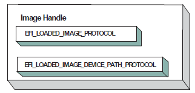

   **Image Handle**

After a driver has been loaded with the Boot Service :ref:`efi_boot_services-loadimage`, it must be started with the Boot Service :ref:`efi-boot-services-startimage`. This is true of all types of applications and drivers that can be loaded and started on an UEFI compliant system. The entry point for a driver that follows the UEFI Driver Model must follow some strict rules. First, it is not allowed to touch any hardware. Instead, it is only allowed to install protocol instances onto its own Image Handle. A driver that follows the UEFI Driver Model is required to install an instance of the Driver Binding Protocol onto its own Image Handle. It may optionally install the Driver Diagnostics Protocol or the Component Name Protocol. In addition, if a driver wishes to be unloadable it may optionally update the Loaded Image Protocol to provide its own Unload() :ref:`efi-loaded-image-protocol-unload` function. Finally, if a driver needs to perform any special operations when the Boot Service EFI_BOOT_SERVICES is called ( :ref:`services-boot-services` ), the driver may optionally create an event with a notification function that is triggered when the Boot Service *ExitBootServices()* is called. An Image Handle that contains a Driver Binding Protocol instance is known as a Driver Image Handle.  The Figure below, :ref:`pci-driver-image-handle`, shows a possible configuration for the Image Handle from figure: :ref:`protocols-pci-bus-support-image-handle` after the Boot Service *StartImage()* has been called. 

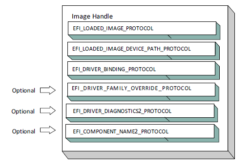

   **PCI Driver Image Handle**

.. _driver-diagnostics-protocol:

Driver Diagnostics Protocol
###########################

If a PCI Bus Driver or a PCI Device Driver requires diagnostics, then an :ref:`efi-driver-diagnostics2-protocol-protocols-uefi-driver-model`  must be installed on the image handle in the entry point for the driver. This protocol contains functions to perform diagnostics on a controller. The *EFI_DRIVER_DIAGNOSTICS2_PROTOCOL* is not allowed to interact with the user. Instead, it must return status information through a bffer. The functions of this protocol will be invoked by a platform management utility.

.. _component-name-protocol:

Component Name Protocol
#######################

Both a PCI Bus Driver and a PCI Device Driver are able to produce user readable names for the PCI drivers and/or the set of PCI controllers that the PCI drivers are managing. This is accomplished by installing an instance of the :ref:`efi-component-name2-protocol-protocols-uefi-driver-model`  on the image handle of the driver. This protocol can produce driver and controller names in the form of a string in one of several languages. This protocol can be used by a platform management utility to display user readable names for the drivers and controllers present in a system. Please see the EFI Driver Model Specification for details on the *EFI_COMPONENT_NAME2_PROTOCOL*.

.. _driver-family-override-protocol:

Driver Family Override Protocol
###############################

If a PCI Bus Driver or PCI Device Driver always wants the PCI driver delivered in a PCI Option ROM to manage the PCI controller associated with the PCI Option ROM, then the Driver Family Override Protocol must not be produced. 

If a PCI Bus Driver or PCI Device Driver always wants the PCI driver with the highest Version value in the Driver Binding Protocol to manage all the PCI Controllers in the same family of PCI controllers, then the Driver Family Override Protocol must be produced on the same handle as the Driver Binding Protocol.

.. _pci-bus-drivers:

PCI Bus Drivers
###############

A PCI Bus Driver manages PCI Host Bus Controllers that can contain one or more PCI Root Bridges. :ref:`pci-host-bus-controller`  shows an example of a desktop system that has one PCI Host Bus Controller with one PCI Root Bridge. 

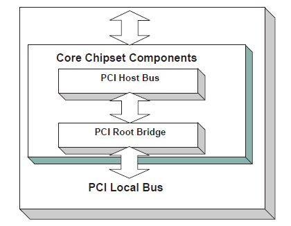

   PCI Host Bus Controller

The PCI Host Bus Controller shown above is abstracted in software with the PCI Root Bridge I/O Protocol. A PCI Bus Driver will manage handles that contain this protocol. :ref:`device-handle-for-a-pci-host-bus-controller`  shows an example device handle for a PCI Host Bus Controller. It contains a Device Path Protocol instance and a PCI Root Bridge I/O Protocol Instance.

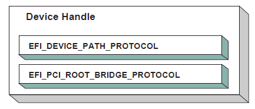

   Device Handle for a PCI Host Bus Controller

.. _driver-binding-protocol-for-pci-bus-drivers:

Driver Binding Protocol for PCI Bus Drivers
###########################################

The Driver Binding Protocol contains three services. These are Supported() :ref:`efi-driver-binding-protocol-supported-protocols-uefi-driver-model` ,  :ref:`efi-driver-binding-protocol-Start-protocols-uefi-driver-model`, and  :ref:`efi-driver-binding-protocol-Stop-protocols-uefi-driver-model`. *Supported()* tests to see if the PCI Bus Driver can manage a device handle. A PCI Bus Driver can only manage device handles that contain the Device Path Protocol and the PCI Root Bridge I/O Protocol, so a PCI Bus Driver must look for these two protocols on the device handle that is being tested.

The *Start()* function tells the PCI Bus Driver to start managing a device handle. The device handle should support the protocols shown in :ref:`device-handle-for-a-pci-host-bus-controller`. The PCI Root Bridge I/O Protocols provides access to the PCI I/O, PCI Memory, PCI Prefetchable Memory, and PCI DMA functions. The PCI Controllers behind a PCI Root Bridge may exist on one or more PCI Buses. The standard mechanism for expanding the number of PCI Buses on a single PCI Root Bridge is to use PCI to PCI Bridges. Once a PCI Enumerator configures these bridges, they are invisible to software. As a result, the PCI Bus Driver flattens the PCI Bus hierarchy when it starts managing a device handle that represents a PCI Host Controller. :ref:`physical-pci-bus-structure`  shows the physical tree structure for a set of PCI Device denoted by A, B, C, D, and E. Device A and C are PCI to PCI Bridges.

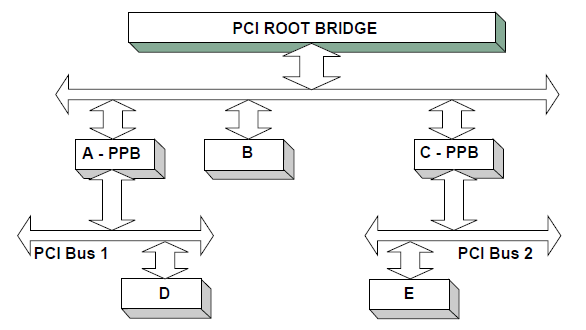

   Physical PCI Bus Structure  

:ref:`connecting-a-pci-bus-driver` shows the tree structure generated by a PCI Bus Driver before and after *Start()* is called. This is a logical view of set of PCI controller, and not a physical view. The physical tree is flattened, so any PCI to PCI bridge devices are invisible. In this example, the PCI Bus Driver finds the five child PCI Controllers on the PCI Bus from :ref:`physical-pci-bus-structure`. A device handle is created for every PCI Controller including all the PCI to PCI Bridges. The arrow with the dashed line coming into the PCI Host Bus Controller represents a link to the PCI Host Bus Controller's parent. If the PCI Host Bus Controller is a Root Bus Controller, then it will not have a parent. The PCI Driver Model does not require that a PCI Host Bus Controller be a Root Bus Controller. A PCI Host Bus Controller can be present at any location in the tree, and the PCI Bus Driver should be able to manage the PCI Host Bus Controller.

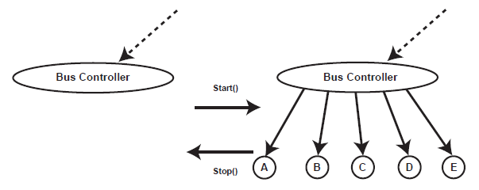

   Connecting a PCI Bus Driver  

The PCI Bus Driver has the option of creating all of its children in one call to :ref:`efi-driver-binding-protocol-start-protocols-uefi-driver-model` , or spreading it across several calls to *Start()*. In general, if it is possible to design a bus driver to create one child at a time, it should do so to support the rapid boot capability in the UEFI Driver Model. Each of the child device handles created in *Start()* must contain a Device Path Protocol instance, a PCI I/O protocol instance, and optionally a Bus Specific Driver Override Protocol instance. The PCI I/O Protocol is described in `EFI PCI I/O Protocol`_. The format of device paths for PCI Controllers is described in Section 2.6, and details on the Bus Specific Driver Override Protocol can be found in the EFI Driver Model Specification.  The Figure below shows an example child device handle that is created by a PCI Bus Driver for a PCI Controller.

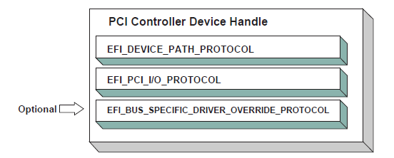

   Child Handle Created by a PCI Bus Driver

A PCI Bus Driver must perform several steps to manage a PCI Host Bus Controller, as follows:

-  Initialize the PCI Host Bus Controller.
-  If the PCI buses have not been initialized by a previous agent, perform PCI Enumeration on all the PCI Root Bridges that the PCI Host Bus Controller contains. This involves assigning a PCI bus number, allocating PCI I/O resources, PCI Memory resources, and PCI Prefetchable Memory resources.
-  Discover all the PCI Controllers on all the PCI Root Bridges. If a PCI Controller is a PCI to PCI Bridge, then the I/O and Memory bits in the Control register of the PCI Configuration Header should be placed in the enabled state. The Bus Master bit in the Control Register may be enabled by default or enabled or disabled based on the needs of downstream devices for DMA access during the boot process. The PCI Bus Driver should disable the I/O, Memory, and Bus Master bits for PCI Controllers that respond to legacy ISA resources (e.g. VGA). It is a PCI Device Driver’s responsibility to enable the I/O, Memory, and Bus Master bits (if they are not already enabled by the PCI bus driver) of the Control register as required with a call to the :ref:`efi-pci-io-protocol-Attributes` service when the PCI Device Driver is started. A similar call to the Attributes() service should be made when the PCI Device Driver is stopped to restore original Attributes() state, including the I/O, Memory, and Bus Master bits of the Control register.
-  Create a device handle for each PCI Controller found. If a request is being made to start only one PCI Controller, then only create one device handle.
-  Install a Device Path Protocol instance and a PCI I/O Protocol instance on the device handle created for each PCI Controller.
-  If the PCI Controller has a PCI Option ROM, then allocate a memory buffer that is the same size as the PCI Option ROM, and copy the PCI Option ROM contents to the memory buffer. 
-  If the PCI Option ROM contains any UEFI drivers, then attach a Bus Specific Driver Override Protocol to the device handle of the PCI Controller that is associated with the PCI Option ROM. 

The :ref:`efi-driver-binding-protocol-stop-protocols-uefi-driver-model` function tells the PCI Bus Driver to stop managing a PCI Host Bus Controller. The *Stop()* function can destroy one or more of the device handles that were created on a previous call to :ref:`efi-driver-binding-protocol-start-protocols-uefi-driver-model`. If all of the child device handles have been destroyed, then *Stop()* will place the PCI Host Bus Controller in a quiescent state. The functionality of *Stop()* mirrors *Start()* , as follows:

1. Complete all outstanding transactions to the PCIHost Bus Controller.

#. If the PCI Host Bus Controller is being stopped, then    place it in a quiescent state.

#. If one or more child handles are being destroyed, then: 

    a. Uninstall all the protocols from the device handles for the PCI Controllers found in Start(). 

    b. Free any memory buffers allocated for PCI Option ROMs. 

    c. Destroy the device handles for the PCI controllers    created in Start().

.. _pci-enumeration:

PCI Enumeration
###############

The PCI Enumeration process is a platform-specific operation that depends on the properties of the chipset that produces the PCI bus. As a result, details on PCI Enumeration are outside the scope of this document. A PCI Bus Driver requires that PCI Enumeration has been performed, so it either needs to have been done prior to the PCI Bus Driver starting, or it must be part of the PCI Bus Driver’s implementation.

.. _pci-device-drivers:

PCI Device Drivers
##################

PCI Device Drivers manage PCI Controllers. Device handles for PCI Controllers are created by PCI Bus Drivers. A PCI Device Driver is not allowed to create any new device handles. Instead, it attaches protocol instance to the device handle of the PCI Controller. These protocol instances are I/O abstractions that allow the PCI Controller to be used in the preboot environment. The most common I/O abstractions are used to boot an EFI compliant OS.

.. _driver-binding-protocol-for-pci-device-drivers:

Driver Binding Protocol for PCI Device Drivers
##############################################

The Driver Binding Protocol contains three services. These are  :ref:`efi-driver-binding-protocol-supported-protocols-uefi-driver-model` ,   :ref:`efi-driver-binding-protocol-start-protocols-uefi-driver-model`, and   :ref:`efi-driver-binding-protocol-stop-protocols-uefi-driver-model`. *Supported()* tests to see if the PCI Device Driver can manage a device handle. A PCI Device Driver can only manage device handles that contain the Device Path Protocol and the PCI I//O Protocol, so a PCI Device Driver must look for these two protocols on the device handle that is being tested. In addition, it needs to check to see if the device handle represents a PCI Controller that the PCI Device Driver knows how to manage. This is typically done by using the services of the PCI I/O Protocol to read the PCI Configuration Header for the PCI Controller, and looking at the *VendorId* , *DeviceId* , and *SubsystemId* fields.

The *Start()* function tells the PCI Device Driver to start managing a PCI Controller. A PCI Device Driver is not allowed to create any new device handles. Instead, it installs one or more addition protocol instances on the device handle for the PCI Controller. A PCI Device Driver is not allowed to modify the resources allocated to a PCI Controller. These resource allocations are owned by the PCI Bus Driver or some other firmware component that initialized the PCI Bus prior to the execution of the PCI Bus Driver. This means that the PCI BARs (Base Address Registers) and the configuration of any PCI to PCI bridge controllers must not be modified by a PCI Device Driver.A PCI Bus Driver will leave a PCI Device in a disabled safe initial state. A PCI Device Driver should save the original Attributes() state. It is a PCI Device Driver's responsibility to call Attributes() to enable the I/O, Memory, and Bus Master decodes if they are not already enabled by the PCI bus driver. 

The  :ref:`efi-driver-binding-protocol-stop-protocols-uefi-driver-model` function mirrors the  :ref:`efi-driver-binding-protocol-start-protocols-uefi-driver-model` function, so the *Stop()* function completes any outstanding transactions to the PCI Controller and removes the protocol interfaces that were installed in *Start()*.  The Figure below shows the device handle for a PCI Controller before and after *Start()* is called. In this example, a PCI Device Driver is adding the Block I/O Protocol to the device handle for the PCI Controller. It is also a PCI Device Driver’s responsibility to restore original Attributes() state, including the I/O, Memory, and Bus Master decodes by calling :ref:`efi-pci-io-protocol-Attributes` .

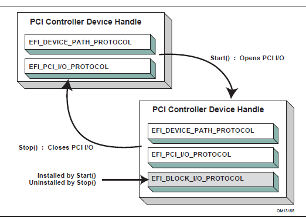

   Connecting a PCI Device Driver

.. _efi-pci-io-protocol:

EFI PCI I/O Protocol
--------------------

This section provides a detailed description of the :ref:`efi-pci-io-protocol`  . This protocol is used by code, typically drivers, running in the EFI boot services environment to access memory and I/O on a PCI controller. In particular, functions for managing devices on PCI buses are defined here. 

The interfaces provided in the *EFI_PCI_IO_PROTOCOL* are for performing basic operations to memory, I/O, and PCI configuration space. The system provides abstracted access to basic system resources to allow a driver to have a programmatic method to access these basic system resources. The main goal of this protocol is to provide an abstraction that simplifies the writing of device drivers for PCI devices. This goal is accomplished by providing the following features:

-  A driver model that does not require the driver to search the PCI busses for devices to manage. Instead, drivers are provided the location of the device to manage or have the capability to be notified when a PCI controller is discovered.
-  A device driver model that abstracts the I/O addresses, Memory addresses, and PCI Configuration addresses from the PCI device driver. Instead, BAR (Base Address Register) relative addressing is used for I/O and Memory accesses, and device relative addressing is used for PCI Configuration accesses. The BAR relative addressing is specified in the PCI I/O services as a BAR index. A PCI controller may contain a combination of 32-bit and 64-bit BARs. The BAR index represents the logical BAR number in the standard PCI configuration header starting from the first BAR. The BAR index does not represent an offset into the standard PCI Configuration Header because those offsets will vary depending on the combination and order of 32-bit and 64-bit BARs.
-  The Device Path for the PCI device can be obtained from the same device handle that the EFI_PCI_IO_PROTOCOL resides.
-  The PCI Segment, PCI Bus Number, PCI Device Number, and PCI Function Number of the PCI device if they are required. The general idea is to abstract these details away from the PCI device driver. However, if these details are required, then they are available.
-  Details on any nonstandard address decoding that is not covered by the PCI device's Base Address Registers.
-  Access to the PCI Root Bridge I/O Protocol for the PCI Host Bus for which the PCI device is a member.
-  A copy of the PCI Option ROM if it is present in system memory.
-  Functions to perform bus mastering DMA. This includes both packet based DMA and common buffer DMA.

.. _efi_pci_io_protocol:

EFI_PCI_IO_PROTOCOL
###################

**Summary**

Provides the basic Memory, I/O, PCI configuration, and DMA interfaces that a driver uses to access its PCI controller.

**GUID**

.. code-block::

   #define EFI_PCI_IO_PROTOCOL_GUID \
    {0x4cf5b200,0x68b8,0x4ca5,\
      {0x9e,0xec,0xb2,0x3e,0x3f,0x50,0x02,0x9a}} 

**Protocol Interface Structure**

.. code-block::

   typedef struct  _EFI_PCI_IO_PROTOCOL {
     EFI_PCI_IO_PROTOCOL_POLL_IO_MEM          PollMem;
     EFI_PCI_IO_PROTOCOL_POLL_IO_MEM          PollIo;
     EFI_PCI_IO_PROTOCOL_ACCESS               Mem;
     EFI_PCI_IO_PROTOCOL_ACCESS               Io;
     EFI_PCI_IO_PROTOCOL_CONFIG_ACCESS        Pci;
     EFI_PCI_IO_PROTOCOL_COPY_MEM             CopyMem;
     EFI_PCI_IO_PROTOCOL_MAP                  Map;
     EFI_PCI_IO_PROTOCOL_UNMAP                Unmap;
     EFI_PCI_IO_PROTOCOL_ALLOCATE_BUFFER      AllocateBuffer;
     EFI_PCI_IO_PROTOCOL_FREE_BUFFER          FreeBuffer;
     EFI_PCI_IO_PROTOCOL_FLUSH                Flush;
     EFI_PCI_IO_PROTOCOL_GET_LOCATION         GetLocation;
     EFI_PCI_IO_PROTOCOL_ATTRIBUTES           Attributes;
     EFI_PCI_IO_PROTOCOL_GET_BAR_ATTRIBUTES   GetBarAttributes;
     EFI_PCI_IO_PROTOCOL_SET_BAR_ATTRIBUTES   SetBarAttributes;
     UINT64                                   RomSize;
     VOID                                     *RomImage;
   } EFI_PCI_IO_PROTOCOL;

**Parameters**   

PollMem 
  Polls an address in PCI memory space until an exit condition is met, or a timeout occurs. :ref:`efi-pci-io-protocol-PollMem` function description.

PollIo 
  Polls an address in PCI I/O space until an exit condition is met, or a timeout occurs. :ref:`efi-pci-io-protocol-PollIo` function description.

Mem.Read 
  Allows BAR relative reads to PCI memory space. `EFI_PCI_IO_PROTOCOL.MEM.READ()`_ function description.

Mem.Write 
  Allows BAR relative writes to PCI memory space. See the Mem.Write() `EFI_PCI_IO_PROTOCOL.MEM.WRITE()`_  function description.

Io.Read 
  Allows BAR relative reads to PCI I/O space. See the Io.Read() :ref:`efi-pci-io-protocol-io-read` function description.

Io.Write 
  Allows BAR relative writes to PCI I/O space. See the Io.Write() :ref:`efi-pci-io-protocol-io-write` function description.

Pci.Read 
  Allows PCI controller relative reads to PCI configuration space. See the Pci.Read() :ref:`efi-pci-io-protocol-Pci-Read` function description.

Pci.Write 
  Allows PCI controller relative writes to PCI configuration space. See the Pci.Write() :ref:`efi-pci-io-protocol-Pci-Write` function description.

CopyMem 
  Allows one region of PCI memory space to be copied to another region of PCI memory space. :ref:`efi-pci-io-protocol-copymem` function description.

Map 
  Provides the PCI controller-specific address needed to access system memory for DMA. See the :ref:`efi-pci-io-protocol-map` function description.

Unmap 
  Releases any resources allocated by Map(). See the :ref:`efi-pci-io-protocol-unmap` function description.

AllocateBuffer 
  Allocates pages that are suitable for a common buffer mapping. See the :ref:`efi-pci-io-protocol-allocatebuffer` function description.

FreeBuffer 
  Frees pages that were allocated with AllocateBuffer(). See the :ref:`efi-pci-io-protocol-FreeBuffer` function description.

Flush 
  Flushes all PCI posted write transactions to system memory. See the :ref:`efi-pci-io-protocol-Flush` function description.

GetLocation 
  Retrieves this PCI controller’s current PCI bus number, device number, and function number. See the :ref:`efi-pci-io-protocol-GetLocation` function description.

Attributes 
  Performs an operation on the attributes that this PCI controller supports. The operations include getting the set of supported attributes, retrieving the current attributes, setting the current attributes, enabling attributes, and disabling attributes. See the :ref:`efi-pci-io-protocol-Attributes` function description.

GetBarAttributes
  Gets the attributes that this PCI controller supports setting on a BAR using :ref:`efi-pci-io-protocol-SetBarAttributes` , and retrieves the list of resource descriptors for a BAR. See the :ref:`efi-pci-io-protocol-GetBarAttributes` function description.

SetBarAttributes 
  Sets the attributes for a range of a BAR on a PCI controller. See the SetBarAttributes() function description.

RomSize 
  The size, in bytes, of the ROM image.

RomImage 
  A pointer to the in memory copy of the ROM image. The PCI Bus Driver is responsible for allocating memory for the ROM image, and copying the contents of the ROM to memory. The contents of this buffer are either from the PCI option ROM that can be accessed through the ROM BAR of the PCI controller, or it is from a platform-specific location. The :ref:`efi-pci-io-protocol-Attributes` function can be used to determine from which of these two sources the RomImage buffer was initialized.

**Related Definitions**

.. code-block:: 
  
   //*******************************************************  
   // EFI_PCI_IO_PROTOCOL_WIDTH  
   //*******************************************************  
   typedef enum {  
     EfiPciIoWidthUint8,  
     EfiPciIoWidthUint16,  
     EfiPciIoWidthUint32,  
     EfiPciIoWidthUint64,  
     EfiPciIoWidthFifoUint8,  
     EfiPciIoWidthFifoUint16,  
     EfiPciIoWidthFifoUint32,  
     EfiPciIoWidthFifoUint64,  
     EfiPciIoWidthFillUint8,  
     EfiPciIoWidthFillUint16,  
     EfiPciIoWidthFillUint32,  
     EfiPciIoWidthFillUint64,  
     EfiPciIoWidthMaximum  
   }   EFI_PCI_IO_PROTOCOL_WIDTH;

   #define EFI_PCI_IO_PASS_THROUGH_BAR 0xff

   //******************************************************  
   // EFI_PCI_IO_PROTOCOL_POLL_IO_MEM  
   //*******************************************************  
   typedef  
   EFI_STATUS  
   (EFIAPI *EFI_PCI_IO_PROTOCOL_POLL_IO_MEM) (  
     IN EFI_PCI_IO_PROTOCOL                 *This,  
     IN EFI_PCI_IO_PROTOCOL_WIDTH           Width,  
     IN UINT8                               BarIndex,  
     IN UINT64                              Offset,  
     IN UINT64                              Mask,  
     IN UINT64                              Value,  
     IN UINT64                              Delay,  
     OUT UINT64                             *Result  
     );  
   //*******************************************************  
   // EFI_PCI_IO_PROTOCOL_IO_MEM  
   //*******************************************************  
   typedef  
   EFI_STATUS  
   (EFIAPI *EFI_PCI_IO_PROTOCOL_IO_MEM) (  
     IN EFI_PCI_IO_PROTOCOL                 *This,  
     IN EFI_PCI_IO_PROTOCOL_WIDTH           Width,  
     IN UINT8                               BarIndex,  
     IN UINT64                              Offset,  
     IN UINTN                               Count,  
     IN OUT VOID                            *Buffer  
     );

   //*******************************************************  
   // EFI_PCI_IO_PROTOCOL_ACCESS  
   //*******************************************************  
   typedef struct {  
     EFI_PCI_IO_PROTOCOL_IO_MEM             Read;  
     EFI_PCI_IO_PROTOCOL_IO_MEM             Write;  
   }   EFI_PCI_IO_PROTOCOL_ACCESS; 

   //*******************************************************  
   // EFI_PCI_IO_PROTOCOL_CONFIG  
   //*******************************************************  
   typedef  
   EFI_STATUS  
   (EFIAPI *EFI_PCI_IO_PROTOCOL_CONFIG) (  
     IN EFI_PCI_IO_PROTOCOL                 *This,  
     IN EFI_PCI_IO_PROTOCOL_WIDTH           Width,  
     IN UINT32                              Offset,  
     IN UINTN                               Count,  
     IN OUT VOID                            *Buffer  
     );

   //*******************************************************  
   // EFI_PCI_IO_PROTOCOL_CONFIG_ACCESS  
   //*******************************************************  
   typedef struct {  
     EFI_PCI_IO_PROTOCOL_CONFIG             Read;  
     EFI_PCI_IO_PROTOCOL_CONFIG             Write;  
   }   EFI_PCI_IO_PROTOCOL_CONFIG_ACCESS;  
   //*******************************************************  
   // EFI PCI I/O Protocol Attribute bits             /********************************************************  
   #define EFI_PCI_IO_ATTRIBUTE_ISA_MOTHERBOARD_IO    0x0001  
   #define EFI_PCI_IO_ATTRIBUTE_ISA_IO                0x0002  
   #define EFI_PCI_IO_ATTRIBUTE_VGA_PALETTE_IO        0x0004  
   #define EFI_PCI_IO_ATTRIBUTE_VGA_MEMORY            0x0008  
   #define EFI_PCI_IO_ATTRIBUTE_VGA_IO                0x0010  
   #define EFI_PCI_IO_ATTRIBUTE_IDE_PRIMARY_IO        0x0020  
   #define EFI_PCI_IO_ATTRIBUTE_IDE_SECONDARY_IO      0x0040  
   #define EFI_PCI_IO_ATTRIBUTE_MEMORY_WRITE_COMBINE  0x0080  
   #define EFI_PCI_IO_ATTRIBUTE_IO                    0x0100  
   #define EFI_PCI_IO_ATTRIBUTE_MEMORY                0x0200  
   #define EFI_PCI_IO_ATTRIBUTE_BUS_MASTER            0x0400  
   #define EFI_PCI_IO_ATTRIBUTE_MEMORY_CACHED         0x0800  
   #define EFI_PCI_IO_ATTRIBUTE_MEMORY_DISABLE        0x1000  
   #define EFI_PCI_IO_ATTRIBUTE_EMBEDDED_DEVICE       0x2000  
   #define EFI_PCI_IO_ATTRIBUTE_EMBEDDED_ROM          0x4000  
   #define EFI_PCI_IO_ATTRIBUTE_DUAL_ADDRESS_CYCLE    0x8000  
   #define EFI_PCI_IO_ATTRIBUTE_ISA_IO_16             0x10000  
   #define EFI_PCI_IO_ATTRIBUTE_VGA_PALETTE_IO_16     0x20000  
   #define EFI_PCI_IO_ATTRIBUTE_VGA_IO_16             0x40000

EFI_PCI_IO_ATTRIBUTE_ISA_IO_16
  If this bit is set, then the PCI I/O cycles between 0x100 and 0x3FF are forwarded to the PCI controller using a 16-bit address decoder on address bits 0..15. Address bits 16..31 must be zero. This bit is used to forward I/O cycles for legacy ISA devices. If this bit is set, then the PCI Host Bus Controller and all the PCI to PCI bridges between the PCI Host Bus Controller and the PCI Controller are configured to forward these PCI I/O cycles. This bit may not be combined with *EFI_PCI_IO_ATTRIBUTE_ISA_IO*.

EFI_PCI_IO_ATTRIBUTE_VGA_PALETTE_IO_16
  If this bit is set, then the PCI I/O write cycles for 0x3C6, 0x3C8, and 0x3C9 are forwarded to the PCI controller using a 16-bit address decoder on address bits 0..15. Address bits 16..31 must be zero. This bit is used to forward I/O write cycles to the VGA palette registers on a PCI controller. If this bit is set, then the PCI Host Bus Controller and all the PCI to PCI bridges between the PCI Host Bus Controller and the PCI Controller are configured to forward these PCI I/O cycles. This bit may not be combined with *EFI_PCI_IO_ATTRIBUTE_VGA_IO* or *EFI_PCI_IO_ATTRIBUTE_VGA_PALETTE_IO*.

EFI_PCI_IO_ATTRIBUTE_VGA_IO_16
  If this bit is set, then the PCI I/O cycles in the ranges 0x3B0-0x3BB and 0x3C0-0x3DF are forwarded to the PCI controller using a 16-bit address decoder on address bits 0..15. Address bits 16..31 must be zero. This bit is used to forward I/O cycles for a VGA controller to a PCI controller. If this bit is set, then the PCI Host Bus Controller and all the PCI to PCI bridges between the PCI Host Bus Controller and the PCI Controller are configured to forward these PCI I/O cycles. This bit may not be combined with *EFI_PCI_IO_ATTRIBUTE_VGA_IO* or *EFI_PCI_IO_ATTRIBUTE_VGA_PALETTE_IO*. Because *EFI_PCI_IO_ATTRIBUTE_VGA_IO_16* also includes the I/O range described by *EFI_PCI_IO_ATTRIBUTE_VGA_PALETTE_IO_16* , the *EFI_PCI_IO_ATTRIBUTE_VGA_PALETTE_IO_16* bit is ignored if *EFI_PCI_IO_ATTRIBUTE_VGA_IO_16* is set.

EFI_PCI_IO_ATTRIBUTE_ISA_MOTHERBOARD_IO
  If this bit is set, then the PCI I/O cycles between 0x00000000 and 0x000000FF are forwarded to the PCI controller. This bit is used to forward I/O cycles for ISA motherboard devices. If this bit is set, then the PCI Host Bus Controller and all the PCI to PCI bridges between the PCI Host Bus Controller and the PCI Controller are configured to forward these PCI I/O cycles.

EFI_PCI_IO_ATTRIBUTE_ISA_IO
  If this bit is set, then the PCI I/O cycles between 0x100 and 0x3FF are forwarded to the PCI controller using a 10-bit address decoder on address bits 0..9. Address bits 10..15 are not decoded, and address bits 16..31 must be zero. This bit is used to forward I/O cycles for legacy ISA devices. If this bit is set, then the PCI Host Bus Controller and all the PCI to PCI bridges between the PCI Host Bus Controller and the PCI Controller are configured to forward these PCI I/O cycles.

EFI_PCI_IO_ATTRIBUTE_VGA_PALETTE_IO
  If this bit is set, then the PCI I/O write cycles for 0x3C6, 0x3C8, and 0x3C9 are forwarded to the PCI controller using a 10-bit address decoder on address bits 0..9. Address bits 10..15 are not decoded, and address bits 16..31 must be zero. This bit is used to forward I/O write cycles to the VGA palette registers on a PCI controller. If this bit is set, then the PCI Host Bus Controller and all the PCI to PCI bridges between the PCI Host Bus Controller and the PCI Controller are configured to forward these PCI I/O cycles.

EFI_PCI_IO_ATTRIBUTE_VGA_MEMORY
  If this bit is set, then the PCI memory cycles between 0xA0000 and 0xBFFFF are forwarded to the PCI controller. This bit is used to forward memory cycles for a VGA frame buffer on a PCI controller. If this bit is set, then the PCI Host Bus Controller and all the PCI to PCI bridges between the PCI Host Bus Controller and the PCI Controller are configured to forward these PCI Memory cycles.

EFI_PCI_IO_ATTRIBUTE_VGA_IO
  If this bit is set, then the PCI I/O cycles in the ranges 0x3B0-0x3BB and 0x3C0-0x3DF are forwarded to the PCI controller using a 10-bit address decoder on address bits 0..9. Address bits 10..15 are not decoded, and the address bits 16..31 must be zero. This bit is used to forward I/O cycles for a VGA controller to a PCI controller. If this bit is set, then the PCI Host Bus Controller and all the PCI to PCI bridges between the PCI Host Bus Controller and the PCI Controller are configured to forward these PCI I/O cycles. Since EFI_PCI_IO_ATTRIBUTE_VGA_IO also includes the I/O range described by EFI_PCI_IO_ATTRIBUTE_VGA_PALETTE_IO, the EFI_PCI_IO_ATTRIBUTE_VGA_PALETTE_IO bit is ignored if EFI_PCI_IO_ATTRIBUTE_VGA_IO is set.

EFI_PCI_IO_ATTRIBUTE_IDE_PRIMARY_IO
  If this bit is set, then the PCI I/O cycles in the ranges 0x1F0-0x1F7 and 0x3F6-0x3F7 are forwarded to a PCI controller using a 16-bit address decoder on address bits 0..15. Address bits 16..31 must be zero. This bit is used to forward I/O cycles for a Primary IDE controller to a PCI controller. If this bit is set, then the PCI Host Bus Controller and all the PCI to PCI bridges between the PCI Host Bus Controller and the PCI Controller are configured to forward these PCI I/O cycles.

EFI_PCI_IO_ATTRIBUTE_IDE_SECONDARY_IO
  If this bit is set, then the PCI I/O cycles in the ranges 0x170-0x177 and 0x376-0x377 are forwarded to a PCI controller using a 16-bit address decoder on address bits 0..15. Address bits 16..31 must be zero. This bit is used to forward I/O cycles for a Secondary IDE controller to a PCI controller. If this bit is set, then the PCI Host Bus Controller and all the PCI to PCI bridges between the PCI Host Bus Controller and the PCI Controller are configured to forward these PCI I/O cycles.

EFI_PCI_IO_ATTRIBUTE_MEMORY_WRITE_COMBINE
  If this bit is set, then this platform supports changing the attributes of a PCI memory range so that the memory range is accessed in a write combining mode. This bit is used to improve the write performance to a memory buffer on a PCI controller. By default, PCI memory ranges are not accessed in a write combining mode.

EFI_PCI_IO_ATTRIBUTE_MEMORY_CACHED
  If this bit is set, then this platform supports changing the attributes of a PCI memory range so that the memory range is accessed in a cached mode. By default, PCI memory ranges are accessed noncached.

EFI_PCI_IO_ATTRIBUTE_IO
  If this bit is set, then the PCI device will decode the PCI I/O cycles that the device is configured to decode.

EFI_PCI_IO_ATTRIBUTE_MEMORY
  If this bit is set, then the PCI device will decode the PCI Memory cycles that the device is configured to decode.

EFI_PCI_IO_ATTRIBUTE_BUS_MASTER
  If this bit is set, then the PCI device is allowed to act as a bus master on the PCI bus.

EFI_PCI_IO_ATTRIBUTE_MEMORY_DISABLE
  If this bit is set, then this platform supports changing the attributes of a PCI memory range so that the memory range is disabled, and can no longer be accessed. By default, all PCI memory ranges are enabled.

EFI_PCI_IO_ATTRIBUTE_EMBEDDED_DEVICE
  If this bit is set, then the PCI controller is an embedded device that is typically a component on the system board. If this bit is clear, then this PCI controller is part of an adapter that is populating one of the systems PCI slots.

EFI_PCI_IO_ATTRIBUTE_EMBEDDED_ROM
  If this bit is set, then the PCI option ROM described by the *RomImage* and *RomSize* fields is not from ROM BAR of the PCI controller. If this bit is clear, then the *RomImage* and *RomSize* fields were initialized based on the PCI option ROM found through the ROM BAR of the PCI controller.

EFI_PCI_IO_ATTRIBUTE_DUAL_ADDRESS_CYCLE
  If this bit is set, then the PCI controller is capable of producing PCI Dual Address Cycles, so it is able to access a 64-bit address space. If this bit is not set, then the PCI controller is not capable of producing PCI Dual Address Cycles, so it is only able to access a 32-bit address space.

  If this bit is set, then the PCI Host Bus Controller and all the PCI to PCI bridges between the PCI Host Bus Controller and the PCI Controller are capable of producing PCI Dual Address Cycles. If any of them is not capable of producing PCI Dual Address Cycles, attempt to perform Set or Enable operation using *Attributes()* function with this bit set will fail with the *EFI_UNSUPPORTED* error code.

.. code-block::

   //*******************************************************
   // EFI_PCI_IO_PROTOCOL_OPERATION
   //*******************************************************
   typedef enum {
     EfiPciIoOperationBusMasterRead,
     EfiPciIoOperationBusMasterWrite,
     EfiPciIoOperationBusMasterCommonBuffer,
     EfiPciIoOperationMaximum
   }   EFI_PCI_IO_PROTOCOL_OPERATION;

.. TODO: not sure if the 3 paragraphs below should be part of the code

EfiPciIoOperationBusMasterRead
     A read operation from system memory by a bus master.

EfiPciIoOperationBusMasterWrite 
     A write operation to system memory by a bus master.

EfiPciIoOperationBusMasterCommonBuffer 
     Provides both read and write access to system memory by both the processor and a bus master. The buffer is coherent from both the processor’s and the bus master’s point of view.  

**Description** 

The *EFI_PCI_IO_PROTOCOL* provides the basic Memory, I/O, PCI configuration, and DMA interfaces that are used to abstract accesses to PCI controllers. There is one *EFI_PCI_IO_PROTOCOL* instance for each PCI controller on a PCI bus. A device driver that wishes to manage a PCI controller in a system will have to retrieve the *EFI_PCI_IO_PROTOCOL* instance that is associated with the PCI controller. A device handle for a PCI controller will minimally contain an :ref:`efi-device-path-protocol`  instance and an *EFI_PCI_IO_PROTOCOL* instance. 

Bus mastering PCI controllers can use the DMA services for DMA operations. There are three basic types of bus mastering DMA that is supported by this protocol. These are DMA reads by a bus master, DMA writes by a bus master, and common buffer DMA. The DMA read and write operations may need to be broken into smaller chunks. The caller of :ref:`efi-pci-io-protocol-Map` must pay attention to the number of bytes that were mapped, and if required, loop until the entire buffer has been transferred. The following is a list of the different bus mastering DMA operations that are supported, and the sequence of *EFI_PCI_IO_PROTOCOL* interfaces that are used for each DMA operation type.

**DMA Bus Master Read Operation**

Call :ref:`efi-pci-io-protocol-Map` for EfiPciIoOperationBusMasterRead.

Program the DMA Bus Master with the *DeviceAddress* returned by *Map()*.

Start the DMA Bus Master.

Wait for DMA Bus Master to complete the read operation.

Call :ref:`efi-pci-io-protocol-Unmap`.

**DMA Bus Master Write Operation**

Call Map() for EfiPciOperationBusMasterWrite.

Program the DMA Bus Master with the *DeviceAddress* returned by *Map()*.

Start the DMA Bus Master.

Wait for DMA Bus Master to complete the write operation.

Perform a PCI controller specific read transaction to flush all PCI write buffers (See PCI Specification Section 3.2.5.2).

Call `EFI_PCI_ROOT_BRIDGE_IO_PROTOCOL.Flush()`_  .

Call *Unmap()*.

**DMA Bus Master Common Buffer Operation**

Call :ref:`efi-pci-io-protocol-AllocateBuffer` . to allocate a common buffer. 

Call Map() for EfiPciIoOperationBusMasterCommonBuffer.

Program the DMA Bus Master with the *DeviceAddress* returned by *Map()*.

The common buffer can now be accessed equally by the processor and the DMA bus master.

Call Unmap().

Call `EFI_PCI_ROOT_BRIDGE_IO_PROTOCOL.FreeBuffer()`_ .

.. _efi-pci-io-protocol-pollmem:

EFI_PCI_IO_PROTOCOL.PollMem()
#############################

**Summary**

Reads from the memory space of a PCI controller. Returns when either the polling exit criteria is satisfied or after a defined duration.

**Prototype**

.. code-block:: 
  
   typedef  
   EFI_STATUS  
   (EFIAPI *EFI_PCI_IO_PROTOCOL_POLL_IO_MEM) (  
     IN EFI_PCI_IO_PROTOCOL             *This,  
     IN EFI_PCI_IO_PROTOCOL_WIDTH       Width,  
     IN UINT8                           BarIndex,  
     IN UINT64                          Offset,  
     IN UINT64                          Mask,  
     IN UINT64                          Value,  
     IN UINT64                          Delay,  
     OUT UINT64                         *Result  
   );
  

**Parameters**

This 
  A pointer to the :ref:`efi-pci-io-protocol`  instance. Type EFI_PCI_IO_PROTOCOL is defined in `EFI PCI I/O Protocol`_. 

Width 
  Signifies the width of the memory operations,  defined in `EFI PCI I/O Protocol`_ . 

BarIndex 
  The BAR index of the standard PCI Configuration header to use as the base address for the memory operation to perform. This allows all drivers to use BAR relative addressing. The legal range for this field is 0..5. However, the value **EFI_PCI_IO_PASS_THROUGH_BAR** can be used to bypass the BAR relative addressing and pass *Offset* to the PCI Root Bridge I/O Protocol unchanged. Type EFI_PCI_IO_PASS_THROUGH_BAR is defined in `EFI_PCI_IO_Protocol`_ .

Offset 
  The offset within the selected BAR to start the memory operation.

Mask 
  Mask used for the polling criteria. Bytes above Width in Mask are ignored. The bits in the bytes below Width which are zero in Mask are ignored when polling the memory address.

Value 
  The comparison value used for the polling exit criteria.

Delay 
  The number of 100 ns units to poll. Note that timer available may be of poorer granularity.

Result 
  Pointer to the last value read from the memory location.

**Description**

This function provides a standard way to poll a PCI memory location. A PCI memory read operation is performed at the PCI memory address specified by *BarIndex* and *Offset* for the width specified by *Width*. The result of this PCI memory read operation is stored in *Result*. This PCI memory read operation is repeated until either a timeout of *Delay* 100 ns units has expired, or ( *Result & Mask)* is equal to *Value*. 

This function will always perform at least one memory access no matter how small *Delay* may be. If *Delay* is 0, then *Result* will be returned with a status of *EFI_SUCCESS* even if *Result* does not match the exit criteria. If *Delay* expires, then *EFI_TIMEOUT* is returned. 

If *Width* is not *EfiPciIoWidthUint8* , *EfiPciIoWidthUint16* , *EfiPciIoWidthUint32* , or *EfiPciIoWidthUint64* , then *EFI_INVALID_PARAMETER* is returned. 

The memory operations are carried out exactly as requested. The caller is responsible for satisfying any alignment and memory width restrictions that a PCI controller on a platform might require. For example on some platforms, width requests of *EfiPciIoWidthUint64* do not work. 

All the PCI transactions generated by this function are guaranteed to be completed before this function returns. However, if the memory mapped I/O region being accessed by this function has the *EFI_PCI_IO_ATTRIBUTE_MEMORY_CACHED* attribute set, then the transactions will follow the ordering rules defined by the processor architecture.

**Status Codes Returned**

.. list-table::
   :widths: 35 70
   :class: longtable

   * - EFI_SUCCESS
     - The last data returned from the access matched the poll exit criteria.
   * - EFI_INVALID_PARAMETER
     - Width is invalid.
   * - EFI_INVALID_PARAMETER
     - Result is **NULL**.
   * - EFI_UNSUPPORTED
     - BarIndex not valid for this PCI controller.
   * - EFI_UNSUPPORTED
     - Offset is not valid for the BarIndex of this PCI controller.
   * - EFI_TIMEOUT
     - Delay expired before a match occurred.
   * - EFI_OUT_OF_RESOURCES
     - The request could not be completed due to a lack of resources.

.. _efi-pci-io-protocol-pollio:

EFI_PCI_IO_PROTOCOL.PollIo()
############################

**Summary**

Reads from the I/O space of a PCI controller. Returns when
either the polling exit criteria is satisfied or after a
defined duration.

**Prototype**

.. code-block:: 
  
   typedef  
   EFI_STATUS  
   (EFIAPI *EFI_PCI_IO_PROTOCOL_POLL_IO_MEM) (  
     IN EFI_PCI_IO_PROTOCOL             *This,  
     IN EFI_PCI_IO_PROTOCOL_WIDTH       Width,  
     IN UINT8                           BarIndex,  
     IN UINT64                          Offset,  
     IN UINT64                          Mask,  
     IN UINT64                          Value,  
     IN UINT64                          Delay,  
     OUT UINT64                         *Result  
   );
 

**Parameters**

This
  A pointer to the `EFI_PCI_IO_PROTOCOL`_  instance. Type EFI_PCI_IO_PROTOCOL is defined in  See `EFI PCI I/O Protocol`_.  

Width  
  Signifies the width of the I/O operations. Type EFI_PCI_IO_PROTOCOL_WIDTH, defined in `EFI PCI I/O Protocol`_ .

BarIndex 
  The BAR index of the standard PCI Configuration header to use as the base address for the I/O operation to perform. This allows all drivers to use BAR relative addressing. The legal range for this field is 0..5. However, the value **EFI_PCI_IO_PASS_THROUGH_BAR** can be used to bypass the BAR relative addressing and pass *Offset* to the PCI Root Bridge I/O Protocol unchanged. Type EFI_PCI_IO_PASS_THROUGH_BAR is defined in `EFI_PCI_IO_Protocol`_ .

Offset 
  The offset within the selected BAR to start the I/O operation.

Mask 
  Mask used for the polling criteria. Bytes above Width in Mask are ignored. The bits in the bytes below Width which are zero in Mask are ignored when polling the I/O address.

Value 
  The comparison value used for the polling exit criteria.

Delay 
  The number of 100 ns units to poll. Note that timer available may be of poorer granularity.

Result 
  Pointer to the last value read from the memory location.

**Description**

This function provides a standard way to poll a PCI I/O location. A PCI I/O read operation is performed at the PCI I/O address specified by *BarIndex* and *Offset* for the width specified by *Width*. The result of this PCI I/O read operation is stored in *Result*. This PCI I/O read operation is repeated until either a timeout of *Delay* 100 ns units has expired, or (*Result & Mask*) is equal to *Value*. 

This function will always perform at least one I/O access no matter how small *Delay* may be. If *Delay* is 0, then *Result* will be returned with a status of *EFI_SUCCESS* even if *Result* does not match the exit criteria. If *Delay* expires, then *EFI_TIMEOUT* is returned. 

If *Width* is not *EfiPciIoWidthUint8* , *EfiPciIoWidthUint16* , *EfiPciIoWidthUint32* , or *EfiPciIoWidthUint64* , then *EFI_INVALID_PARAMETER* is returned. 

The I/O operations are carried out exactly as requested. The caller is responsible satisfying any alignment and I/O width restrictions that the PCI controller on a platform might require. For example on some platforms, width requests of *EfiPciIoWidthUint64* do not work. 

All the PCI read transactions generated by this function are guaranteed to be completed before this function returns.

**Status Codes Returned**

.. list-table::
   :widths: 35 70
   :class: longtable

   * - EFI_SUCCESS
     - The last data returned from the access matched the poll exit criteria.
   * - EFI_INVALID_PARAMETER
     - Width is invalid.
   * - EFI_INVALID_PARAMETER
     - Result is *NULL*.
   * - EFI_UNSUPPORTED
     - BarIndex not valid for this PCI controller.
   * - EFI_UNSUPPORTED
     - Offset is not valid for the PCI BAR specified by BarIndex.
   * - EFI_TIMEOUT
     - Delay expired before a match occurred.
   * - EFI_OUT_OF_RESOURCES
     - The request could not be completed due to a lack of resources.

.. efi-pci-io-protocol-mem-read:

EFI_PCI_IO_PROTOCOL.Mem.Read()
##############################

.. TODO please note the 4 head underline is producing a 3 head. Do not change as it will probably damage established link

.. efi-pci-io-protocol-mem-write:

EFI_PCI_IO_PROTOCOL.Mem.Write()
###############################

**Summary**

Enable a PCI driver to access PCI controller registers in the PCI memory space.

**Prototype**

.. code-block::
  
   typedef  
   EFI_STATUS  
   (EFIAPI *EFI_PCI_IO_PROTOCOL_MEM) (  
     IN EFI_PCI_IO_PROTOCOL                   *This,  
     IN EFI_PCI_IO_PROTOCOL_WIDTH             Width,  
     IN UINT8                                 BarIndex,  
     IN UINT64                                Offset,  
     IN UINTN                                 Count,  
     IN OUT VOID                              *Buffer  
     );
  

**Parameters**

This
  A pointer to the  See `EFI_PCI_IO_PROTOCOL`_  instance. Type EFI_PCI_IO_PROTOCOL is defined in `EFI PCI I/O Protocol`_ .

Width 
  Signifies the width of the memory operations. Type EFI_PCI_IO_PROTOCOL_WIDTH,  defined in `EFI PCI I/O Protocol`_ .

BarIndex 
  The BAR index of the standard PCI Configuration header to use as the base address for the memory operation to perform. This allows all drivers to use BAR relative addressing. The legal range for this field is 0..5. However, the value **EFI_PCI_IO_PASS_THROUGH_BAR** can be used to bypass the BAR relative addressing and pass *Offset* to the PCI Root Bridge I/O Protocol unchanged. Type EFI_PCI_IO_PASS_THROUGH_BAR is defined in `EFI_PCI_IO_Protocol`_ .

Offset 
  The offset within the selected BAR to start the memory operation.

Count 
  The number of memory operations to perform. Bytes moved is Width size * Count, starting at Offset.

Buffer 
  For read operations, the destination buffer to store the results. For write operations, the source buffer to write data from.

**Description**

The *Mem.Read()* , and *Mem.Write()* functions enable a driver to access controller registers in the PCI memory space. 

The I/O operations are carried out exactly as requested. The caller is responsible for any alignment and I/O width issues which the bus, device, platform, or type of I/O might require. For example on some platforms, width requests of *EfiPciIoWidthUint64* do not work. 

If *Width* is *EfiPciIoWidthUint8* , *EfiPciIoWidthUint16* , *EfiPciIoWidthUint32* , or *EfiPciIoWidthUint64* , then both *Address* and *Buffer* are incremented for each of the *Count* operations performed. 

If *Width* is *EfiPciIoWidthFifoUint8* , *EfiPciIoWidthFifoUint16* , *EfiPciIoWidthFifoUint32* , or *EfiPciIoWidthFifoUint64* , then only *Buffer* is incremented for each of the *Count* operations performed. The read or write operation is performed *Count* times on the same *Address*.

If *Width* is *EfiPciIoWidthFillUint8* , *EfiPciIoWidthFillUint16* , *EfiPciIoWidthFillUint32* , or *EfiPciIoWidthFillUint64* , then only *Address* is incremented for each of the *Count* operations performed. The read or write operation is performed *Count* times from the first element of *Buffer*. 

All the PCI transactions generated by this function are guaranteed to be completed before this function returns. All the PCI write transactions generated by this function will follow the write ordering and completion rules defined in the PCI Specification. However, if the memory-mapped I/O region being accessed by this function has the *EFI_PCI_IO_ATTRIBUTE_MEMORY_CACHED* attribute set, then the transactions will follow the ordering rules defined by the processor architecture.

**Status Codes Returned**

.. list-table::
   :widths: 35 70
   :class: longtable

   * - EFI_SUCCESS
     - The data was read from or written to the PCI controller.
   * - EFI_INVALID_PARAMETER
     - Width is invalid.
   * - EFI_INVALID_PARAMETER
     - Buffer is **NULL**.
   * - EFI_UNSUPPORTED
     - BarIndex not valid for this PCI controller.
   * - EFI_UNSUPPORTED
     - The address range specified by Offset, Width, and Count is not valid for the PCI BAR specified by BarIndex.
   * - EFI_OUT_OF_RESOURCES
     - The request could not be completed due to a lack of resources.

.. _efi-pci-io-protocol-io-read:

EFI_PCI_IO_PROTOCOL.Io.Read()
#############################

.. _efi-pci-io-protocol-io-write:

EFI_PCI_IO_PROTOCOL.Io.Write()
##############################

**Summary**

Enable a PCI driver to access PCI controller registers in the PCI I/O space.

**Prototype**

.. code-block:: 
  
   typedef  
   EFI_STATUS  
   (EFIAPI *EFI_PCI_IO_PROTOCOL_MEM) (  
     IN EFI_PCI_IO_PROTOCOL                     *This,  
     IN EFI_PCI_IO_PROTOCOL_WIDTH               Width,  
     IN UINT8                                   BarIndex,  
     IN UINT64                                  Offset,  
     IN UINTN                                   Count,  
     IN OUT VOID                                *Buffer  
   );
  

**Parameters**

This
  A pointer to the `EFI_PCI_ROOT_BRIDGE_IO_PROTOCOL`_  instance. Type EFI_PCI_IO_PROTOCOL is defined in  `EFI_PCI_ROOT_BRIDGE_IO_PROTOCOL`_ . 

Width 
  Signifies the width of the memory operations. Type EFI_PCI_IO_PROTOCOL_WIDTH,  defined in `EFI PCI I/O Protocol`_ .

BarIndex 
  The BAR index of the standard PCI Configuration header to use as the base address for the I/O operation to perform. This allows all drivers to use BAR relative addressing. The legal range for this field is 0..5. However, the value **EFI_PCI_IO_PASS_THROUGH_BAR** can be used to bypass the BAR relative addressing and pass *Offset* to the PCI Root Bridge I/O Protocol unchanged. Type EFI_PCI_IO_PASS_THROUGH_BAR is defined in `EFI_PCI_IO_Protocol`_ .

Offset 
  The offset within the selected BAR to start the I/O operation. 

Count
  The number of I/O operations to perform. Bytes moved is Width size * Count, starting at Offset.

Buffer 
  For read operations, the destination buffer to store the results. For write operations, the source buffer to write data from.

**Description**

The *Io.Read()* , and *Io.Write()* functions enable a driver to access PCI controller registers in PCI I/O space. 

The I/O operations are carried out exactly as requested. The caller is responsible for any alignment and I/O width issues which the bus, device, platform, or type of I/O might require. For example on some platforms, width requests of *EfiPciIoWidthUint64* do not work. 

If *Width* is *EfiPciIoWidthUint8* , *EfiPciIoWidthUint16* , *EfiPciIoWidthUint32* , or *EfiPciIoWidthUint64* , then both *Address* and *Buffer* are incremented for each of the *Count* operations performed. 

If *Width* is *EfiPciIoWidthFifoUint8* , *EfiPciIoWidthFifoUint16* , *EfiPciIoWidthFifoUint32* , or *EfiPciIoWidthFifoUint64* , then only *Buffer* is incremented for each of the *Count* operations performed. The read or write operation is performed *Count* times on the same *Address*.

If *Width* is *EfiPciIoWidthFillUint8* , *EfiPciIoWidthFillUint16* , *EfiPciIoWidthFillUint32* , or *EfiPciIoWidthFillUint64* , then only *Address* is incremented for each of the *Count* operations performed. The read or write operation is performed *Count* times from the first element of *Buffer*. 

All the PCI transactions generated by this function are guaranteed to be completed before this function returns.

**Status Codes Returned**

.. list-table::
   :widths: 35 70
   :class: longtable

   * - EFI_SUCCESS
     - The data was read from or written to the PCI controller.
   * - EFI_INVALID_PARAMETER
     - Width is invalid.
   * - EFI_INVALID_PARAMETER
     - Buffer is *NULL*.
   * - EFI_UNSUPPORTED
     - BarIndex not valid for this PCI controller.
   * - EFI_UNSUPPORTED
     - The address range specified by Offset, Width, and Count is not valid for the PCI BAR specified by BarIndex.
   * - EFI_OUT_OF_RESOURCES
     - The request could not be completed due to a lack of resources.

.. _efi-pci-io-protocol-pci-read:

EFI_PCI_IO_PROTOCOL.Pci.Read()
##############################

.. _efi-pci-io-protocol-pci-write:

EFI_PCI_IO_PROTOCOL.Pci.Write()
###############################

**Summary**

Enable a PCI driver to access PCI controller registers in PCI
configuration space.

**Prototype**

.. code-block::
  
   typedef  
   EFI_STATUS  
   (EFIAPI *EFI_PCI_IO_PROTOCOL_CONFIG) (  
     IN EFI_PCI_IO_PROTOCOL                       *This,  
     IN EFI_PCI_IO_PROTOCOL_WIDTH                 Width,  
     IN UINT32                                    Offset,  
     IN UINTN                                     Count,  
     IN OUT VOID                                  *Buffer  
   );
  

**Parameters**

This 
  A pointer to the  See :ref:`efi-pci-io-protocol`  instance. Type EFI_PCI_IO_PROTOCOL is defined in  See `EFI PCI I/O Protocol`_.

Width
  Signifies the width of the memory operations. Type EFI_PCI_IO_PROTOCOL_WIDTH,  defined in `EFI PCI I/O Protocol`_ .

Offset 
  The offset within the PCI configuration space for the PCI controller.

Count 
  The number of PCI configuration operations to perform. Bytes moved is Width size * Count, starting at Offset.

Buffer 
  For read operations, the destination buffer to store the results. For write operations, the source buffer to write data from.

**Description**

The *Pci.Read()* and *Pci.Write()* functions enable a driver to access PCI configuration registers for the PCI controller. 

The PCI Configuration operations are carried out exactly as requested. The caller is responsible for any alignment and I/O width issues which the bus, device, platform, or type of I/O might require. For example on some platforms, width requests of *EfiPciIoWidthUint64* do not work. 

If *Width* is *EfiPciIoWidthUint8* , *EfiPciIoWidthUint16* , *EfiPciIoWidthUint32* , or *EfiPciIoWidthUint64* , then both *Address* and *Buffer* are incremented for each of the *Count* operations performed. 

If *Width* is *EfiPciIoWidthFifoUint8* , *EfiPciIoWidthFifoUint16* , *EfiPciIoWidthFifoUint32* , or *EfiPciIoWidthFifoUint64* , then only *Buffer* is incremented for each of the *Count* operations performed. The read or write operation is performed *Count* times on the same *Address*.

If *Width* is *EfiPciIoWidthFillUint8* , *EfiPciIoWidthFillUint16* , *EfiPciIoWidthFillUint32* , or *EfiPciIoWidthFillUint64* , then only *Address* is incremented for each of the *Count* operations performed. The read or write operation is performed *Count* times from the first element of *Buffer*. 

All the PCI transactions generated by this function are guaranteed to be completed before this function returns.

**Status Codes Returned**

.. list-table::
   :widths: 35 70
   :class: longtable

   * - EFI_SUCCESS
     - The data was read from or written to the PCI controller.
   * - EFI_INVALID_PARAMETER
     - Width is invalid.
   * - EFI_INVALID_PARAMETER
     - Buffer is *NULL*.
   * - EFI_UNSUPPORTED
     - The address range specified by Offset, Width, and Count is not valid for the PCI configuration header of the PCI controller.
   * - EFI_OUT_OF_RESOURCES
     - The request could not be completed due to a lack of resources.

.. _efi-pci-io-protocol-copymem:

EFI_PCI_IO_PROTOCOL.CopyMem()
#############################

**Summary**

Enables a PCI driver to copy one region of PCI memory space to another region of PCI memory space.
 

**Prototype**

.. code-block:: 
  
   typedef  
   EFI_STATUS  
   (EFIAPI *EFI_PCI_IO_PROTOCOL_COPY_MEM) (  
     IN EFI_PCI_IO_PROTOCOL                       *This,  
     IN EFI_PCI_IO_PROTOCOL_WIDTH                 Width,  
     IN UINT8                                     DestBarIndex,  
     IN UINT64                                    DestOffset,  
     IN UINT8                                     SrcBarIndex,  
     IN UINT64                                    SrcOffset,  
     IN UINTN                                     Count  
     );
  

**Parameters**

This 
  A pointer to the  `EFI_PCI_IO_PROTOCOL`_  instance. Type EFI_PCI_IO_PROTOCOL is defined in `EFI_PCI_IO_Protocol`_ .

Width 
  Signifies the width of the memory operations. Type EFI_PCI_IO_PROTOCOL_WIDTH,  defined in `EFI PCI I/O Protocol`_ .

DestBarIndex 
  The BAR index of the standard PCI Configuration header to use as the base address for the memory operation to perform. This allows all drivers to use BAR relative addressing. The legal range for this field is 0..5. However, the value **EFI_PCI_IO_PASS_THROUGH_BAR** can be used to bypass the BAR relative addressing and pass *Offset* to the PCI Root Bridge I/O Protocol unchanged. Type EFI_PCI_IO_PASS_THROUGH_BAR is defined in `EFI_PCI_IO_Protocol`_ .

DestOffset 
  The destination offset within the BAR specified by DestBarIndex to start the memory writes for the copy operation. The caller is responsible for aligning the DestOffset if required.

SrcBarIndex 
  The BAR index of the standard PCI Configuration header to use as the base address for the memory operation to perform. This allows all drivers to use BAR relative addressing. The legal range for this field is 0..5. However, the value **EFI_PCI_IO_PASS_THROUGH_BAR** can be used to bypass the BAR relative addressing and pass *Offset* to the PCI Root Bridge I/O Protocol unchanged. Type EFI_PCI_IO_PASS_THROUGH_BAR is defined in `EFI_PCI_IO_Protocol`_ .

SrcOffset 
  The source offset within the BAR specified by SrcBarIndex to start the memory reads for the copy operation. The caller is responsible for aligning the SrcOffset if required.

Count 
  The number of memory operations to perform. Bytes moved is Width size * Count, starting at DestOffset and SrcOffset.

**Description**

The *CopyMem()* function enables a PCI driver to copy one region of PCI memory space to another region of PCI memory space on a PCI controller. This is especially useful for video scroll operations on a memory mapped video buffer. 

The memory operations are carried out exactly as requested. The caller is responsible for satisfying any alignment and memory width restrictions that a PCI controller on a platform might require. For example on some platforms, width requests of *EfiPciIoWidthUint64* do not work. 

If *Width* is *EfiPciIoWidthUint8* , *EfiPciIoWidthUint16* , *EfiPciIoWidthUint32* , or *EfiPciIoWidthUint64* , then *Count* read/write transactions are performed to move the contents of the *SrcOffset* buffer to the *DestOffset* buffer. The implementation must be reentrant, and it must handle overlapping *SrcOffset* and *DestOffset* buffers. This means that the implementation of *CopyMem()* must choose the correct direction of the copy operation based on the type of overlap that exists between the *SrcOffset* and *DestOffset* buffers. If either the *SrcOffset* buffer or the *DestOffset* buffer crosses the top of the processor’s address space, then the result of the copy operation is unpredictable.

The contents of the *DestOffset* buffer on exit from this service must match the contents of the *SrcOffset* buffer on entry to this service. Due to potential overlaps, the contents of the *SrcOffset* buffer may be modified by this service. The following rules can be used to guarantee the correct behavior: 

-  If *DestOffset* > *SrcOffset* and *DestOffset* < ( *SrcOffset* + *Width* size * *Count* ), then the data should be copied from the *SrcOffset* buffer to the *DestOffset* buffer starting from the end of buffers and working toward the beginning of the buffers.

-  Otherwise, the data should be copied from the *SrcOffset* buffer to the *DestOffset* buffer starting from the beginning of the buffers and working toward the end of the buffers. 

All the PCI transactions generated by this function are guaranteed to be completed before this function returns. All the PCI write transactions generated by this function will follow the write ordering and completion rules defined in the PCI Specification. However, if the memory-mapped I/O region being accessed by this function has the *EFI_PCI_IO_ATTRIBUTE_MEMORY_CACHED* attribute set, then the transactions will follow the ordering rules defined by the processor architecture.

**Status Codes Returned**

.. list-table::
   :widths: 35 70
   :class: longtable

   * - EFI_SUCCESS
     - The data was copied from one memory region to another memory region.
   * - EFI_INVALID_PARAMETER
     - Width is invalid.
   * - EFI_UNSUPPORTED
     - DestBarIndex not valid for this PCI controller.
   * - EFI_UNSUPPORTED
     - SrcBarIndex not valid for this PCI controller.
   * - EFI_UNSUPPORTED
     - The address range specified by DestOffset, Width, and Count is not valid for the PCI BAR specified by DestBarIndex.
   * - EFI_UNSUPPORTED
     - The address range specified by SrcOffset, Width, and Count is not valid for the PCI BAR specified by SrcBarIndex.
   * - EFI_OUT_OF_RESOURCES
     - The request could not be completed due to a lack of resources.

.. _efi-pci-io-protocol-map:

EFI_PCI_IO_PROTOCOL.Map()
#########################

**Summary**

Provides the PCI controller-specific addresses needed to access system memory.

**Prototype**

.. code-block:: 
  
   typedef  
   EFI_STATUS  
   (EFIAPI *EFI_PCI_IO_PROTOCOL_MAP) (  
     IN EFI_PCI_IO_PROTOCOL                   *This,  
     IN EFI_PCI_IO_PROTOCOL_OPERATION         Operation,  
     IN VOID                                  *HostAddress,  
     IN OUT UINTN                             *NumberOfBytes,  
     OUT EFI_PHYSICAL_ADDRESS                 *DeviceAddress,  
     OUT VOID                                 **Mapping  
     );
  

**Parameters**

This 
  A pointer to the  `EFI_PCI_ROOT_BRIDGE_IO_PROTOCOL`_  instance. Type EFI_PCI_IO_PROTOCOL is defined in  See `EFI PCI I/O Protocol`_.

Operation 
  Indicates if the bus master is going to read or write to system memory. Type *EFI_PCI_IO_PROTOCOL_OPERATION* is defined in  See `EFI PCI I/O Protocol`_.

HostAddress 
  The system memory address to map to the PCI controller.

NumberOfBytes
  On input the number of bytes to map. On output the number of bytes that were mapped.

DeviceAddress 
 The resulting map address for the bus master PCI controller to use to access the hosts HostAddress. Type EFI_PHYSICAL_ADDRESS is defined in :ref:`EFI-BOOT-SERVICES-AllocatePool` . This address cannot be used by the processor to access the contents of the buffer specified by *HostAddress*.

Mapping 
  A resulting value to pass to :ref:`efi-pci-io-protocol-Unmap` .

**Description**

The :ref:`efi-pci-io-protocol-Map` function provides the PCI controller-specific addresses needed to access system memory. This function is used to map system memory for PCI bus master DMA accesses.

All PCI bus master accesses must be performed through their mapped addresses and such mappings must be freed with :ref:`efi-pci-io-protocol-Unmap` when complete. If the bus master access is a single read or write data transfer, then *EfiPciIoOperationBusMasterRead* or *EfiPciIoOperation-BusMasterWrite* is used and the range is unmapped to complete the operation. If performing an *EfiPciIoOperationBusMasterRead* operation, all the data must be present in system memory before the *Map()* is performed. Similarly, if performing an *EfiPciIoOperation-BusMasterWrite,* the data cannot be properly accessed in system memory until *Unmap()* is performed. 

Bus master operations that require both read and write access or require multiple host device interactions within the same mapped region must use *EfiPciIoOperation-BusMasterCommonBuffer*. However, only memory allocated via the :ref:`efi-pci-io-protocol-AllocateBuffer` interface can be mapped for this operation type. 

In all mapping requests the resulting *NumberOfBytes* actually mapped may be less than the requested amount. In this case, the DMA operation will have to be broken up into smaller chunks. The *Map()* function will map as much of the DMA operation as it can at one time. The caller may have to loop on *Map()* and *Unmap()* in order to complete a large DMA transfer.

**Status Codes Returned**

.. list-table::
   :widths: 35 70
   :class: longtable

   * - EFI_SUCCESS
     - The range was mapped for the returned NumberOfBytes.
   * - EFI_INVALID_PARAMETER
     - Operation is invalid.
   * - EFI_INVALID_PARAMETER
     - *HostAddress* is *NULL*.
   * - EFI_INVALID_PARAMETER
     - *NumberOfBytes* is *NULL*.
   * - EFI_INVALID_PARAMETER
     - *DeviceAddress* is *NULL*.
   * - EFI_INVALID_PARAMETER
     - *Mapping* is *NULL*.
   * - EFI_UNSUPPORTED
     - The HostAddress cannot be mapped as a common buffer.
   * - EFI_DEVICE_ERROR
     - The system hardware could not map the requested address.
   * - EFI_OUT_OF_RESOURCES
     - The request could not be completed due to a lack of resources.

.. _efi-pci-io-protocol-unmap:

EFI-PCI-IO-PROTOCOL-Unmap()
###########################

**Summary**

Completes the :ref:`efi-pci-io-protocol-Map` operation and releases any corresponding resources.

**Prototype**

.. code-block:: 
  
   typedef  
   EFI_STATUS  
   (EFIAPI *EFI_PCI_IO_PROTOCOL_UNMAP) (  
     IN EFI_PCI_IO_PROTOCOL                         *This,  
     IN VOID                                        *Mapping  
     );
 

**Parameters**

This  
  A pointer to the `EFI_PCI_IO_PROTOCOL`_  instance. Type EFI_PCI_IO_PROTOCOL is defined in `EFI PCI I/O Protocol`_.

Mapping 
  The mapping value returned from Map().

**Description**

The *Unmap()* function completes the *Map()* operation and releases any corresponding resources. If the operation was an *EfiPciIoOperationBusMasterWrite* , the data is committed to the target system memory. Any resources used for the mapping are freed.

**Status Codes Returned**

.. list-table::
   :widths: 35 70
   :class: longtable

   * - EFI_SUCCESS
     - The range was unmapped.
   * - EFI_DEVICE_ERROR 
     - The data was not committed to the target system memory.

.. _efi-pci-io-protocol-allocatebuffer:

EFI_PCI_IO_PROTOCOL.AllocateBuffer()
####################################

**Summary**

Allocates pages that are suitable for an *EfiPciIoOperationBusMasterCommonBuffer* mapping.

**Prototype**

.. code-block:: 
  
   typedef  
   EFI_STATUS  
   (EFIAPI *EFI_PCI_IO_PROTOCOL_ALLOCATE_BUFFER) (  
     IN EFI_PCI_IO_PROTOCOL                 *This,  
     IN EFI_ALLOCATE_TYPE                   Type,  
     IN EFI_MEMORY_TYPE                     MemoryType,  
     IN UINTN                               Pages,  
     OUT VOID                               **HostAddress,  
     IN UINT64                              Attributes  
     );
 

**Parameters**

This 
  A pointer to the  See :ref:`efi-pci-io-protocol`  instance. Type EFI_PCI_IO_PROTOCOL is defined in `EFI PCI I/O Protocol`_.

Type 
  This parameter is not used and must be ignored.

MemoryType 
 The type of memory to allocate, EfiBootServicesData or EfiRuntimeServicesData. Type EFI_MEMORY_TYPE is defined in :ref:`efi-pci-io-protocol-AllocateBuffer` .

Pages 
  The number of pages to allocate.

HostAddress 
  A pointer to store the base system memory address of the allocated range.

Attributes 
  The requested bit mask of attributes for the allocated range. Only the attributes EFI_PCI_IO_ATTRIBUTE_MEMORY_WRITE_COMBINE, and EFI_PCI_IO_ATTRIBUTE_MEMORY_CACHED may be used with this function. If any other bits are set, then EFI_UNSUPPORTED is returned. This function may choose to ignore this bit mask. The EFI_PCI_IO_ATTRIBUTE_MEMORY_WRITE_COMBINE, and EFI_PCI_IO_ATTRIBUTE_MEMORY_CACHED attributes provide a hint to the implementation that may improve the performance of the calling driver. The implementation may choose any default for the memory attributes including write combining, cached, both, or neither as long as the allocated buffer can be seen equally by both the processor and the PCI bus master.

**Description**

The *AllocateBuffer()* function allocates pages that are suitable for an *EfiPciIoOperationBusMasterCommonBuffer* mapping. This means that the buffer allocated by this function must support simultaneous access by both the processor and a PCI Bus Master. The device address that the PCI Bus Master uses to access the buffer can be retrieved with a call to :ref:`efi-pci-io-protocol-Map`. 

If the current attributes of the PCI controller has the *EFI_PCI_IO_ATTRIBUTE_DUAL_ADDRESS_CYCLE* bit set, then when the buffer allocated by this function is mapped with a call to *Map()* , the device address that is returned by *Map()* must be within the 64-bit device address space of the PCI Bus Master. The attributes for a PCI controller can be managed by calling :ref:`efi-pci-io-protocol-Attributes`. 

If the current attributes for the PCI controller has the *EFI_PCI_IO_ATTRIBUTE_DUAL_ADDRESS_CYCLE* bit clear, then when the buffer allocated by this function is mapped with a call to *Map()* , the device address that is returned by *Map()* must be within the 32-bit device address space of the PCI Bus Master. The attributes for a PCI controller can be managed by calling *Attributes()*. 

If the memory allocation specified by *MemoryType* and *Pages* cannot be satisfied, then *EFI_OUT_OF_RESOURCES* is returned.

**Status Codes Returned**

.. list-table::
   :widths: 35 70
   :class: longtable

   * - EFI_SUCCESS
     - The requested memory pages were allocated.
   * - EFI_INVALID_PARAMETER
     - MemoryType is invalid.
   * - EFI_INVALID_PARAMETER
     - *HostAddress* is *NULL*.
   * - EFI_UNSUPPORTED
     - Attributes is unsupported. The only legal attribute bits are *MEMORY_WRITE_COMBINE* and *MEMORY_CACHED*.
   * - EFI_OUT_OF_RESOURCES
     - The memory pages could not be allocated.

.. _efi-pci-io-protocol-freebuffer:

EFI_PCI_IO_PROTOCOL.FreeBuffer()
################################

**Summary**

Frees memory that was allocated with :ref:`efi-pci-io-protocol-AllocateBuffer` .

**Prototype**

.. code-block:: 
  
   typedef  
   EFI_STATUS  
   (EFIAPI *EFI_PCI_IO_PROTOCOL_FREE_BUFFER) (  
     IN EFI_PCI_IO_PROTOCOL                 *This,  
     IN UINTN                               Pages,  
     IN VOID                                *HostAddress  
     );
  

**Parameters**

This
  A pointer to the `EFI_PCI_IO_PROTOCOL`_  instance. Type EFI_PCI_IO_PROTOCOL is defined in `EFI PCI I/O Protocol`_.

Pages 
  The number of pages to free.

HostAddress 
  The base system memory address of the allocated range.

**Description**

The *FreeBuffer()* function frees memory that was allocated with *AllocateBuffer()*.

**Status Codes Returned**

.. list-table::
   :widths: 35 70
   :class: longtable

   * - EFI_SUCCESS
     - The requested memory pages were freed.
   * - EFI_INVALID_PARAMETER
     - The memory range specified by HostAddress and Pages was not allocated with *AllocateBuffer()*.

.. _efi-pci-io-protocol-flush:

EFI_PCI_IO_PROTOCOL.Flush()
###########################

**Summary**

Flushes all PCI posted write transactions from a PCI host bridge to system memory.

**Prototype**

.. code-block:: 
  
   typedef  
   EFI_STATUS  
   (EFIAPI *EFI_PCI_IO_PROTOCOL_FLUSH) (  
     IN EFI_PCI_IO_PROTOCOL               *This  
     );
  

**Parameters**

This 
  A pointer to the `EFI_PCI_IO_PROTOCOL`_  instance. Type EFI_PCI_IO_PROTOCOL is defined in `EFI PCI I/O Protocol`_.

**Description**

The *Flush()* function flushes any PCI posted write transactions from a PCI host bridge to system memory. Posted write transactions are generated by PCI bus masters when they perform write transactions to target addresses in system memory. 

This function does not flush posted write transactions from any PCI bridges. A PCI controller specific action must be taken to guarantee that the posted write transactions have been flushed from the PCI controller and from all the PCI bridges into the PCI host bridge. This is typically done with a PCI read transaction from the PCI controller prior to calling *Flush()* . 

If the PCI controller specific action required to flush the PCI posted write transactions has been performed, and this function returns *EFI_SUCCESS* , then the PCI bus master’s view and the processor’s view of system memory are guaranteed to be coherent. If the PCI posted write transactions cannot be flushed from the PCI host bridge, then the PCI bus master and processor are not guaranteed to have a coherent view of system memory, and *EFI_DEVICE_ERROR* is returned.

**Status Codes Returned**

.. list-table::
   :widths: 35 70
   :class: longtable

   * - EFI_SUCCESS
     - The PCI posted write transactions were flushed from the PCI host bridge to system memory.
   * - EFI_DEVICE_ERROR
     - The PCI posted write transactions were not flushed from the PCI host bridge due to a hardware error.

.. _efi-pci-io-protocol-getlocation:

EFI_PCI_IO_PROTOCOL.GetLocation()
#################################

**Summary**

Retrieves this PCI controller’s current PCI bus number, device number, and function number.

**Prototype**

.. code-block:: 
  
   typedef  
   EFI_STATUS  
   (EFIAPI *EFI_PCI_IO_PROTOCOL_GET_LOCATION) (  
     IN EFI_PCI_IO_PROTOCOL               *This,  
     OUT UINTN                            *SegmentNumber,  
     OUT UINTN                            *BusNumber,  
     OUT UINTN                            *DeviceNumber,  
     OUT UINTN                            *FunctionNumber  
     );
  

**Parameters**

This 
  A pointer to the `EFI_PCI_IO_PROTOCOL`_  instance. Type EFI_PCI_IO_PROTOCOL is defined in `EFI PCI I/O Protocol`_.

SegmentNumber 
  The PCI controller’s current PCI segment number.

BusNumber 
  The PCI controller’s current PCI bus number.

DeviceNumber 
  The PCI controller’s current PCI device number.

FunctionNumber 
  The PCI controller’s current PCI function number.

**Description**

The *GetLocation()* function retrieves a PCI controller’s current location on a PCI Host Bridge. This is specified by a PCI segment number, PCI bus number, PCI device number, and PCI function number. These values can be used with the PCI Root Bridge I/O Protocol to perform PCI configuration cycles on the PCI controller, or any of its peer PCI controller’s on the same PCI Host Bridge.

**Status Codes Returned**

.. list-table::
   :widths: 35 70
   :class: longtable

   * - EFI_SUCCESS
     - The PCI controller location was returned.
   * - EFI_INVALID_PARAMETER 
     - SegmentNumber is **NULL**.
   * - EFI_INVALID_PARAMETER 
     - BusNumber is **NULL**.
   * - EFI_INVALID_PARAMETER 
     - DeviceNumber is **NULL**.
   * - EFI_INVALID_PARAMETER 
     - FunctionNumber is **NULL**.

.. _efi-pci-io-protocol-attributes:

EFI_PCI_IO_PROTOCOL.Attributes()
################################

**Summary**

Performs an operation on the attributes that this PCI controller supports. The operations include getting the set of supported attributes, retrieving the current attributes, setting the current attributes, enabling attributes, and disabling attributes.

**Prototype**

.. code-block:: 
  
   typedef  
   EFI_STATUS  
   (EFIAPI *EFI_PCI_IO_PROTOCOL_ATTRIBUTES) (  
     IN EFI_PCI_IO_PROTOCOL                       *This,  
     IN EFI_PCI_IO_PROTOCOL_ATTRIBUTE_OPERATION   Operation,  
     IN UINT64                                    Attributes,  
     OUT UINT64                                   *Result OPTIONAL  
     );

**Parameters**

This 
  A pointer to the `EFI_PCI_IO_PROTOCOL`_  instance. Type EFI_PCI_IO_PROTOCOL is defined in `EFI PCI I/O Protocol`_.

Operation 
  The operation to perform on the attributes for this PCI controller. Type EFI_PCI_IO_PROTOCOL_ATTRIBUTE_OPERATION is defined in "Related Definitions" below.

Attributes 
  The mask of attributes that are used for Set, Enable, and Disable operations. The available attributes are listed in  See `EFI PCI I/O Protocol`_.

Result 
  A pointer to the result mask of attributes that are returned for the Get and Supported operations. This is an optional parameter that may be NULL for the Set, Enable, and Disable operations. The available attributes are listed in  `EFI PCI I/O Protocol`_.

**Related Definitions**

.. code-block:: 
  
   //*******************************************************
   // EFI_PCI_IO_PROTOCOL_ATTRIBUTE_OPERATION
   //*******************************************************
   typedef enum {
     EfiPciIoAttributeOperationGet,
     EfiPciIoAttributeOperationSet,
     EfiPciIoAttributeOperationEnable,
     EfiPciIoAttributeOperationDisable,
     EfiPciIoAttributeOperationSupported,
     EfiPciIoAttributeOperationMaximum
   }  EFI_PCI_IO_PROTOCOL_ATTRIBUTE_OPERATION;

EfiPciIoAttributeOperationGet
  Retrieve the PCI controller’s current attributes, and return them in Result. If Result is NULL, then EFI_INVALID_PARAMER is returned. For this operation, Attributes is ignored.

EfiPciIoAttributeOperationSet
  Set the PCI controller’s current attributes to Attributes. If a bit is set in Attributes that is not supported by this PCI controller or one of its parent bridges, then EFI_UNSUPPORTED is returned. For this operation, Result is an optional parameter that may be NULL.

EfiPciIoAttributeOperationEnable
  Enable the attributes specified by the bits that are set in Attributes for this PCI controller. Bits in Attributes that are clear are ignored. If a bit is set in Attributes that is not supported by this PCI controller or one of its parent bridges, then EFI_UNSUPPORTED is returned. For this operation, Result is an optional parameter that may be NULL.

EfiPciIoAttributeOperationDisable
  Disable the attributes specified by the bits that are set in Attributes for this PCI controller. Bits in Attributes that are clear are ignored. If a bit is set in Attributes that is not supported by this PCI controller or one of its parent bridges, then EFI_UNSUPPORTED is returned. For this operation, Result is an optional parameter that may be NULL.

EfiPciIoAttributeOperationSupported
  Retrieve the PCI controller's supported attributes, and return them in Result. If Result is NULL, then EFI_INVALID_PARAMER is returned. For this operation, Attributes is ignored.
  

**Description**

The *Attributes()* function performs an operation on the attributes associated with this PCI controller. If *Operation* is greater than or equal to the maximum operation value, then *EFI_INVALID_PARAMETER* is returned. If *Operation* is *Get* or *Supported* , and *Result* is *NULL* , then *EFI_INVALID_PARAMETER* is returned. If *Operation* is *Set* , *Enable* , or *Disable* for an attribute that is not supported by the PCI controller, then *EFI_UNSUPPORTED* is returned. Otherwise, the operation is performed as described in "Related Definitions" and *EFI_SUCCESS* is returned. It is possible for this function to return *EFI_UNSUPPORTED* even if the PCI controller supports the attribute. This can occur when the PCI root bridge does not support the attribute. For example, if VGA I/O and VGA Memory transactions cannot be forwarded onto PCI root bridge #2, then a request by a PCI VGA driver to enable the *VGA_IO* and *VGA_MEMORY* bits will fail even though a PCI VGA controller behind PCI root bridge #2 is able to decode these transactions. 

This function will also return *EFI_UNSUPPORTED* if more than one PCI controller on the same PCI root bridge has already successfully requested one of the ISA addressing attributes. For example, if one PCI VGA controller had already requested the *VGA_IO* and *VGA_MEMORY* attributes, then a second PCI VGA controller on the same root bridge cannot succeed in requesting those same attributes. This restriction applies to the ISA-, VGA-, and IDE-related attributes.

**Status Codes Returned**

.. list-table::
   :widths: 35 70
   :class: longtable

   * - EFI_SUCCESS
     - The operation on the PCI controller's attributes was completed. If the operation was *Get* or *Supported* , then the attribute mask is returned in Result.
   * - EFI_INVALID_PARAMETER
     - Operation is greater than or equal to *EfiPciIoAttributeOperationMaximum*.
   * - EFI_INVALID_PARAMETER
     - Operation is *Get* and Result is **NULL**.
   * - EFI_INVALID_PARAMETER
     - Operation is *Supported* and Result is **NULL**.
   * - EFI_UNSUPPORTED
     - Operation is *Set* , and one or more of the bits set in Attributes are not supported by this PCI controller or one of its parent bridges.
   * - EFI_UNSUPPORTED
     - Operation is *Enable* , and one or more of the bits set in Attributes are not supported by this PCI controller or one of its parent bridges.
   * - EFI_UNSUPPORTED
     - Operation is *Disable* , and one or more of the bits set in Attributes are not supported by this PCI controller or one of its parent bridges.

.. _efi-pci-io-protocol-getbarattributes:

EFI_PCI_IO_PROTOCOL.GetBarAttributes()
######################################

**Summary**

Gets the attributes that this PCI controller supports setting on a BAR using :ref:`efi-pci-io-protocol-SetBarAttributes` , and retrieves the list of resource descriptors for a BAR.

**Prototype**

.. code-block:: 
  
   typedef  
   EFI_STATUS  
   (EFIAPI *EFI_PCI_IO_PROTOCOL_GET_BAR_ATTRIBUTES) (  
     IN EFI_PCI_IO_PROTOCOL                 *This,  
     IN UINT8                               BarIndex,  
     OUT UINT64                             *Supports OPTIONAL,  
     OUT VOID                               **Resources OPTIONAL  
     );

  
**Parameters**

This 
  A pointer to the `EFI_PCI_IO_PROTOCOL`_  instance. Type EFI_PCI_IO_PROTOCOL is defined in `EFI PCI I/O Protocol`_.

BarIndex 
  The BAR index of the standard PCI Configuration header to use as the base address for resource range. The legal range for this field is 0..5.

Supports 
  A pointer to the mask of attributes that this PCI controller supports setting for this BAR with SetBarAttributes(). The list of attributes is listed in  See `EFI PCI I/O Protocol`_. This is an optional parameter that may be NULL.

Resources
  A pointer to the resource descriptors that describe the current configuration of this BAR of the PCI controller. This buffer is allocated for the caller with the Boot Service :ref:`efi-boot-services-allocatepool` . It is the caller’s responsibility to free the buffer with the Boot Service :ref:`efi-boot-services-freepool` . See "Related Definitions" below for the resource descriptors that may be used. This is an optional parameter that may be **NULL**.

**Related Definitions** 

There are only two resource descriptor types from the ACPI Specification that may be used to describe the current resources allocated to BAR of a PCI Controller. These are the QWORD Address Space Descriptor, and the End Tag. The QWORD Address Space Descriptor can describe memory, I/O, and bus number ranges for dynamic or fixed resources. The configuration of a BAR of a PCI Controller is described with one or more QWORD Address Space Descriptors followed by an End Tag. The Tables below contain these two descriptor types. Please see the ACPI Specification for details on the field values. The ACPI Specification does not define how to the use the Address Translation Offset for non-bridge devices. The UEFI Specification is extending the definition of Address Translation Offset to support systems that have different mapping for HostAddress and DeviceAddress. The definition of the Address Space Granularity field in the QWORD Address Space Descriptor differs from the ACPI Specification and the definition in the table below is the one that must be used.

.. list-table:: QWORD Address Space Descriptor
   :name: qword-address-space-descriptor-2
   :widths: 5 5 5 30
   :class: longtable

   * - Byte Offset
     - Byte Length
     - Data
     - Description
   * - 0x00
     - 0x01
     - 0x8A
     - QWORD Address Space Descriptor
   * - 0x01
     - 0x02
     - 0x2B
     - Length of this descriptor in bytes not including the first two fields
   * - 0x03
     - 0x01
     - 
     - | Resource Type  
       | 0 - Memory Range  
       | 1 - I/O Range  
       | 2 - Bus Number Range
   * - 0x04
     - 0x01
     - 
     - General Flags
   * - 0x05
     - 0x01
     - 
     - Type Specific Flags
   * - 0x06
     - 0x08
     - 
     - Address Space Granularity. Used to differentiate between a 32-bit memory request and a 64-bit memory request. For a 32-bit memory request, this field should be set to 32. For a 64-bit memory request, this field should be set to 64.
   * - 0x0E
     - 0x08
     - 
     - Address Range Minimum. Starting address of BAR.
   * - 0x16
     - 0x08
     - 
     - Address Range Maximum. Ending address of BAR.
   * - 0x1E
     - 0x08
     - 
     - Address Translation Offset. Offset to apply to the Starting address of a BAR to convert it to a PCI address. This value is zero unless the HostAddress and DeviceAddress for the BAR are different.
   * - 0x26
     - 0x08
     - 
     - Address Length

.. list-table:: End Tag
   :name: end-tag-2
   :widths: 5 5 5 30
   :class: longtable

   * - Byte Offset
     - Byte Length
     - Data
     - Description
   * - 0x00
     - 0x01
     - 0x79
     - End Tag
   * - 0x01
     - 0x01
     - 0x00
     - Checksum. If 0, then checksum is assumed to be valid.

**Description**  

The *GetBarAttributes()* function returns in *Supports* the mask of attributes that the PCI controller supports setting for the BAR specified by *BarIndex*. It also returns in *Resources* a list of resource descriptors for the BAR specified by *BarIndex*. Both *Supports* and *Resources* are optional parameters. If both *Supports* and *Resources* are **NULL** , then *EFI_INVALID_PARAMETER* is returned. It is the caller’s responsibility to free *Resources* with the Boot Service :ref:`efi-boot-services-freepool`  when the caller is done with the contents of *Resources*. If there are not enough resources to allocate *Resources* , then *EFI_OUT_OF_RESOURCES* is returned. 

If a bit is set in *Supports* , then the PCI controller supports this attribute type for the BAR specified by *BarIndex* , and a call can be made to :ref:`efi-pci-io-protocol-SetBarAttributes` using that attribute type.

**Status Codes Returned**

.. list-table::
   :widths: 35 70
   :class: longtable

   * - EFI_SUCCESS
     - If Supports is not *NULL* , then the attributes that the PCI controller supports are returned in Supports. If Resources is not *NULL* , then the resource descriptors that the PCI controller is currently using are returned in Resources.
   * - EFI_OUT_OF_RESOURCES
     - There are not enough resources available to allocate Resources.
   * - EFI_UNSUPPORTED
     - BarIndex not valid for this PCI controller.
   * - EFI_INVALID_PARAMETER
     - Both Supports and Attributes are *NULL*.

.. _efi-pci-io-protocol-setbarattributes:

EFI_PCI_IO_PROTOCOL.SetBarAttributes()
######################################

**Summary**

Sets the attributes for a range of a BAR on a PCI controller.

**Prototype**

.. code-block:: 
  
   typedef  
   EFI_STATUS  
   (EFIAPI *EFI_PCI_IO_PROTOCOL_SET_BAR_ATTRIBUTES) (  
     IN EFI_PCI_IO_PROTOCOL           *This,  
     IN UINT64                        Attributes,  
     IN UINT8                         BarIndex,  
     IN OUT UINT64                    *Offset,  
     IN OUT UINT64                    *Length  
   );
  

**Parameters**

This 
  A pointer to the  `EFI PCI I/O Protocol`_  instance. Type EFI_PCI_IO_PROTOCOL is defined in `EFI PCI I/O Protocol`_. 

Attributes 
  The mask of attributes to set for the resource range specified by BarIndex, Offset, and Length.

BarIndex 
  The BAR index of the standard PCI Configuration header to use as the base address for the resource range. The legal range for this field is 0..5.

Offset 
  A pointer to the BAR relative base address of the resource range to be modified by the attributes specified by Attributes. On return, *Offset* will be set to the actual base address of the resource range. Not all resources can be set to a byte boundary, so the actual base address may differ from the one passed in by the caller.

Length 
  A pointer to the length of the resource range to be modified by the attributes specified by Attributes. On return, *Length* will be set to the actual length of the resource range. Not all resources can be set to a byte boundary, so the actual length may differ from the one passed in by the caller.

**Description**

The *SetBarAttributes()* function sets the attributes specified in *Attributes* for the PCI controller on the resource range specified by *BarIndex* , *Offset* , and *Length*. Since the granularity of setting these attributes may vary from resource type to resource type, and from platform to platform, the actual resource range and the one passed in by the caller may differ. As a result, this function may set the attributes specified by *Attributes* on a larger resource range than the caller requested. The actual range is returned in *Offset* and *Length*. The caller is responsible for verifying that the actual range for which the attributes were set is acceptable. 

If the attributes are set on the PCI controller, then the actual resource range is returned in *Offset* and *Length* , and *EFI_SUCCESS* is returned. Many of the attribute types also require that the state of the PCI Host Bus Controller and the state of any PCI to PCI bridges between the PCI Host Bus Controller and the PCI Controller to be modified. This function will only return *EFI_SUCCESS* is all of these state changes are made. The PCI Controller may support a combination of attributes, but unless the PCI Host Bus Controller and the PCI to PCI bridges also support that same combination of attributes, then this call will return an error. 

If the attributes specified by *Attributes* , or the resource range specified by *BarIndex* , *Offset* , and *Length* are not supported by the PCI controller, then *EFI_UNSUPPORTED* is returned. The set of supported attributes for the PCI controller can be found by calling :ref:`efi-pci-io-protocol-GetBarAttributes` . 

If either *Offset* or *Length* is *NULL* then *EFI_INVALID_PARAMETER* is returned. 

If there are not enough resources available to set the attributes, then *EFI_OUT_OF_RESOURCES* is returned.

**Status Codes Returned**

.. list-table::
   :widths: 35 70
   :class: longtable

   * - EFI_SUCCESS
     - The set of attributes specified by Attributes for the resource range specified by BarIndex, Offset, and Length were set on the PCI controller, and the actual resource range is returned in Offset and Length.
   * - EFI_UNSUPPORTED
     - The set of attributes specified by Attributes is not supported by the PCI controller for the resource range specified by BarIndex, Offset, and Length.
   * - EFI_INVALID_PARAMETER
     - Offset is *NULL*.
   * - EFI_INVALID_PARAMETER
     - Length is *NULL*.
   * - EFI_OUT_OF_RESOURCES
     - There are not enough resources to set the attributes on the resource range specified by BarIndex, Offset, and Length.

.. _pci-device-paths:

PCI Device Paths  
################

An `EFI_PCI_IO_PROTOCOL`_  must be installed on a handle for its services to be available to PCI device drivers. In addition to the *EFI_PCI_IO_PROTOCOL* , an :ref:`efi-device-path-protocol`  must also be installed on the same handle (see chapter 9). 

.. TODO check chapter reference above

Typically, an ACPI Device Path Node is used to describe a PCI Root Bridge. Depending on the bus hierarchy in the system, additional device path nodes may precede this ACPI Device Path Node. A PCI device path is described with PCI Device Path Nodes. There will be one PCI Device Path node for the PCI controller itself, and one PCI Device Path Node for each PCI to PCI Bridge that is between the PCI controller and the PCI Root Bridge. 

Table :ref:`pci-device-7-function-0-on-pci-root-bridge-0` shows an example device path for a PCI controller that is located at PCI device number 0x07 and PCI function 0x00, and is directly attached to a PCI root bridge. This device path consists of an ACPI Device Path Node, a PCI Device Path Node, and a Device Path End Structure. The  _HID and  _UID must match the ACPI table description of the PCI Root Bridge. The shorthand notation for this device path is: 

.. code-block::

   ACPI(PNP0A03,0)/PCI(7,0)

.. list-table:: PCI Device 7, Function 0 on PCI Root Bridge 0
   :name: pci-device-7-function-0-on-pci-root-bridge-0
   :widths: 5 5 5 30
   :class: longtable

   * - Byte Offset
     - Byte Length
     - Data
     - Description
   * - 0x00
     - 0x01
     - 0x02
     - Generic Device Path Header - Type ACPI Device Path
   * - 0x01
     - 0x01
     - 0x01
     - Sub type - ACPI Device Path
   * - 0x02
     - 0x02
     - 0x0C
     - Length - 0x0C bytes
   * - 0x04
     - 0x04
     - 0x41D0, 0x0A03
     -  _HID PNP0A03 - 0x41D0 represents the compressed string ‘PNP’ and is encoded in the low order bytes. The compression method is described in the ACPI Specification.
   * - 0x08
     - 0x04
     - 0x0000
     -  _UID
   * - 0x0C
     - 0x01
     - 0x01
     - Generic Device Path Header - Type Hardware Device Path
   * - 0x0D
     - 0x01
     - 0x01
     - Sub type - PCI
   * - 0x0E
     - 0x02
     - 0x06
     - Length - 0x06 bytes
   * - 0x10
     - 0x01
     - 0x00
     - PCI Function
   * - 0x11
     - 0x01
     - 0x07
     - PCI Device
   * - 0x12
     - 0x01
     - 0x7F
     - Generic Device Path Header - Type End of Hardware Device Path
   * - 0x13
     - 0x01
     - 0xFF
     - Sub type - End of Entire Device Path
   * - 0x14
     - 0x02
     - 0x04
     - Length - 0x04 bytes

Table :ref:`pci-device-7-function-0-behind-pci-to-pcibridge` shows an example device path for a PCI controller that is located behind a PCI to PCI bridge at PCI device number 0x07 and PCI function 0x00. The PCI to PCI bridge is directly attached to a PCI root bridge, and it is at PCI device number 0x05 and PCI function 0x00. This device path consists of an ACPI Device Path Node, two PCI Device Path Nodes, and a Device Path End Structure. The  _HID and  _UID must match the ACPI table description of the PCI Root Bridge. The shorthand notation for this device path is: 

.. code-block::

   ACPI(PNP0A03,0)/PCI(5,0)/PCI(7,0).

.. list-table:: PCI Device 7, Function 0 behind PCI to PCI bridge
   :name: pci-device-7-function-0-behind-pci-to-pcibridge
   :widths: 5 5 5 30
   :class: longtable

   * - Byte Offset
     - Byte Length
     - Data
     - Description
   * - 0x00
     - 0x01
     - 0x02
     - Generic Device Path Header - Type ACPI Device Path
   * - 0x01
     - 0x01
     - 0x01
     - Sub type - ACPI Device Path
   * - 0x02
     - 0x02
     - 0x0C
     - Length - 0x0C bytes
   * - 0x04
     - 0x04
     - 0x41D0, 0x0A03
     -  _HID PNP0A03 - 0x41D0 represents the compressed string ‘PNP’ and is encoded in the low order bytes. The compression method is described in the ACPI Specification.
   * - 0x08
     - 0x04
     - 0x0000
     -  _UID
   * - 0x0C
     - 0x01
     - 0x01
     - Generic Device Path Header - Type Hardware Device Path
   * - 0x0D
     - 0x01
     - 0x01
     - Sub type - PCI
   * - 0x0E
     - 0x02
     - 0x06
     - Length - 0x06 bytes
   * - 0x10
     - 0x01
     - 0x00
     - PCI Function
   * - 0x11
     - 0x01
     - 0x05
     - PCI Device
   * - 0x12
     - 0x01
     - 0x01
     - Generic Device Path Header - Type Hardware Device Path
   * - 0x13
     - 0x01
     - 0x01
     - Sub type - PCI
   * - 0x14
     - 0x02
     - 0x06
     - Length - 0x06 bytes
   * - 0x16
     - 0x01
     - 0x00
     - PCI Function
   * - 0x17
     - 0x01
     - 0x07
     - PCI Device
   * - 0x18
     - 0x01
     - 0x7F
     - Generic Device Path Header - Type End of Hardware Device Path
   * - 0x19
     - 0x01
     - 0xFF
     - Sub type - End of Entire Device Path
   * - 0x1A
     - 0x02
     - 0x04
     - Length - 0x04 bytes

.. _pci-option-roms:

PCI Option ROMs
###############

EFI takes advantage of both the PCI Firmware Specification and the PE/COFF Specification to store EFI images in a PCI Option ROM. There are several rules that must be followed when constructing a PCI Option ROM:

-  A PCI Option ROM can be no larger than 16 MiB.
-  A PCI Option ROM may contain one or more images.
-  Each image must being on a 512-byte boundary.
-  Each image must be an even multiple of 512 bytes in length. This means that images that are not an even multiple of 512 bytes in length must be padded to the next 512-byte boundary.
-  Legacy Option ROM images begin with a Standard PCI Expansion ROM Header ( :ref:`standard-pci-expansion-rom-header` (example-from-pci-firmware-specification-3.0) .
-  EFI Option ROM images begin with an EFI PCI Expansion ROM Header ( :ref:`recommended-pci-device-driver-layout`).
-  Each image must contain a PCIR data structure in the first 64 KiB of the image.
-  The image data for an EFI Option ROM image must begin in the first 64 KiB of the image.
-  The image data for an EFI Option ROM image must be a PE/COFF image or a compressed PE/COFF image following the UEFI Compression Algorithm, and referencing  :ref:`appendix-h-compression-source-code` for the Compression Source Code.
-  The PCIR data structure must begin on a 4-byte boundary.
-  If the PCI Option ROM contains a Legacy Option ROM image, it must be the first image.
-  The images are placed in the PCI Option ROM in order from highest to lowest priority. This priority is used to build the ordered list of Driver Image Handles that are produced by the Bus Specific Driver Override Protocol for a PCI Controller.
-  xxxx When PCI device provides an EFI option ROM that is signed in accordance with Chapter 27, use of UEFI Compression Algorithm storage option is preferred. When performing signature validation upon compressed driver, the size returned by *EFI_DECOMPRESS_PROTOCOL.GetInfo()* will be used as driver size and input to signature validation process. Thus any post-driver padding required to reach exact multiple of 512 bytes per :ref:`unsigned-pci-driver-image-layout` is ignored by signature validation.
-  When PCI device provides an EFI option ROM that is signed in accordance with Chapter 27 and stored uncompressed, the end of the driver for signature validation will be the assumed to be the 512-byte boundary indicated by the ‘Initialization Size’ value in the EFI PCI Expansion ROM Header (Table :ref:`efi-pci-expansion-rom-header` ). As the signed driver may not exactly fill the indicated ‘Initialization Size’, it is recommended that the value ‘Offset to EFI Image’ (also Table :ref:`efi-pci-expansion-rom-header` ) be adjusted to ensure the last byte of the signed, uncompressed driver, coincides with the end of the ROM as indicated by ‘Initialization Size’. And any required padding bytes are to be inserted ahead of the signed uncompressed driver image.

There are several options available when building a PCI option ROM for a PCI adapter. A PCI Option ROM can choose to support only a legacy PC-AT platform, only an EFI compliant platform, or both. This flexibility allows a migration path from adapters that support only legacy PC-AT platforms, to adapters that support both PC-AT platforms and EFI compliant platforms, to adapters that support only EFI compliant platforms. The following is a list of the image combinations that may be placed in a PCI option ROM. This is not an exhaustive list. Instead, it provides what will likely be the most common PCI option ROM layouts. EFI complaint system firmware must work with all of these PCI option ROM layouts, plus any other layouts that are possible within the PCI Firmware Specification. The format of a Legacy Option ROM image is defined in the PCI Firmware Specification.

-  Legacy Option ROM image
-  IA-32 UEFI driver
-  x64 UEFI driver
-  AArch32 UEFI driver
-  AArch64 UEFI driver
-  RISCV32 UEFI driver
-  RISCV64 UEFI driver
-  RISCV128 UEFI driver
-  LoongArch32 UEFI driver
-  LoongArch64 UEFI driver
-  Legacy Option ROM image + x64 UEFI driver
-  Legacy Option ROM image + x64 UEFI driver + AArch64 UEFI driver
-  x64 UEFI driver + AArch64 UEFI driver
-  Itanium Processor Family UEFI driver
-  EBC Driver

In addition to combinations of UEFI drivers with different processor binding, it is also possible to include multiple drivers of different function but the same processor binding. When processing option ROM contents, all drivers of appropriate processor binding type must be loaded and added to ordered list of drivers previously mentioned.

It is also possible to place a application written to this specification in a PCI Option ROM. However, the PCI Bus Driver will ignore these images. The exact mechanism by which applications can be loaded and executed from a PCI Option ROM is outside the scope of this document.

.. list-table:: Standard PCI Expansion ROM Header (Example from PCI Firmware Specification 3.0)
   :name: standard-pci-expansion-rom-header
   :widths: 5 5 5 30
   :class: longtable

   * - Offset
     - Byte Length
     - Value
     - Description
   * - 0x00
     - 1
     - 0x55
     - ROM Signature, byte 1
   * - 0x01
     - 1
     - 0xAA
     - ROM Signature, byte 2
   * - 0x02-0x17
     - 22
     - XX
     - Reserved per processor architecture unique data
   * - 0x18-0x19
     - 2
     - XX
     - Pointer to PCIR Data Structure

.. list-table:: PCI Expansion ROM Code Types (Example from PCI Firmware Specification 3.0)
   :widths: 15 75
   :name: pci-expansion-rom-code-types
   :class: longtable

   * - **Code Type** 
     - **Description**
   * - 0x00
     - IA-32, PC-AT compatible
   * - 0x01
     - Open Firmware standard for PCI
   * - 0x02
     - Hewlett-Packard PA RISC
   * - 0x03
     - EFI Image
   * - 0x04-0xFF 
     - Reserved

.. list-table:: EFI PCI Expansion ROM Header
   :name: efi-pci-expansion-rom-header
   :widths: 5 5 5 30
   :class: longtable

   * - Offset
     - Byte Length
     - Value
     - Description
   * - 0x00
     - 1
     - 0x55
     - ROM Signature, byte 1
   * - 0x01
     - 1
     - 0xAA
     - ROM Signature, byte 2
   * - 0x02
     - 2
     - XXXX
     - Initialization Size - size of this image in units of 512 bytes. The size includes this header.
   * - 0x04
     - 4
     - 0x0EF1
     - Signature from EFI image header
   * - 0x08
     - 2
     - XX
     - Subsystem value for EFI image header
   * - 0x0a
     - 2
     - XX
     - Machine type from EFI image header
   * - 0x0c
     - 2
     - XX
     - | Compression type  
       | 0x0000 - The image is uncompressed  
       | 0x0001 - The image is compressed. See the UEFI Compression Algorithm and :ref:`appendix-h-compression-source-code`.
       | 0x0002 - 0xFFFF - Reserved
   * - 0x0e
     - 8
     - 0x00
     - Reserved
   * - 0x16
     - 2
     - XX
     - Offset to EFI Image
   * - 0x18
     - 2
     - XX
     - Offset to PCIR Data Structure

.. _pci-bus-driver-responsibilities:

PCI Bus Driver Responsibilities
###############################

A PCI Bus Driver must scan a PCI Option ROM for PCI Device Drivers. If a PCI Option ROM is found during PCI Enumeration, then a copy of the PCI Option ROM is placed in a memory buffer. The PCI Bus Driver will use the memory copy of the PCI Option ROM to search for UEFI drivers after PCI Enumeration. The PCI Bus Driver will search the list of images in a PCI Option ROM for the ones that have a Code Type of 0x03 in the PCIR Data Structure, and a Signature of 0xEF1 in the EFI PCI Expansion ROM Header. Then, it will examine the Subsystem Type of the EFI PCI Expansion ROM Header. If the Subsystem Type is *IMAGE_SUBSYSTEM_EFI_BOOT_SERVICE_DRIVER* (11) or *IMAGE_SUBSYSTEM_EFI_RUNTIME_DRIVER* (12), then the PCI Bus Driver can load the PCI Device Driver from the PCI Option ROM. The Offset to EFI Image Header field of the EFI PCI Expansion ROM Header is used to get a pointer to the beginning of the PE/COFF image in the PCI Option ROM. The PE/COFF image may have been compressed using the UEFI Compression Algorithm. If it has been compressed, then the PCI Bus Driver must decompress the driver to a memory buffer. The Boot Service :ref:`efi_boot_services-loadimage`  can then be used to load the driver. All UEFI driver images discovered in the PCI Option ROM and meeting these requirements must be processed and loaded via *LoadImage()* . If the platform does not support the Machine Type of the driver, then *LoadImage()* may fail. 

It is the PCI Bus Driver's responsibility to verify that the Expansion ROM Header and PCIR Data Structure are valid. It is the responsibly of the Boot Service *LoadImage()* to verify that the PE/COFF image is valid. The Boot Service *LoadImage()* may fail for several reasons including a corrupt PE/COFF image or an unsupported Machine Type. 

If a PCI Option ROM contains one or more UEFI images, then the PCI Bus Driver must install an instance of the *EFI_LOAD_FILE2_PROTOCOL* on the PCI controller handle. Then, when the PCI Bus Driver loads a PE/COFF image from a PCI Option ROM using the Boot Service *LoadImage()* , the PCI Bus Driver must provide the device path of the image being loaded. The device path of an image loaded from a PCI Option ROM must be the device path to the PCI Controller to which the PCI Option ROM is attached followed by a Relative Offset Range node. The Starting Offset field of the Relative Offset Range node must be the byte offset from the beginning of the PCI Option ROM to the beginning of the EFI Option ROM image, and the Ending Offset field of the Relative Offset Range node must be the byte offset from the beginning of the PCI Option ROM to the end of the EFI Option ROM image. The table below shows an example device path for an EFI driver loaded from a PCI Option ROM. The EFI Driver starts at offset 0x8000 into the PCI Option ROM and is 0x2000 bytes long. The shorthand notation for this device path is: 

.. code-block::

   PciRoot(0)/PCI(5,0)/PCI(7,0)/ Offset(0x8000,0x9FFF)

.. list-table:: Device Path for an EFI Driver loaded from PCIO ption ROM
   :name: device-path-for-an-efi-driver-loaded-from-pci-option-rom
   :widths: 5 5 5 30
   :class: longtable

   * - Byte Offset
     - Byte Length
     - Data
     - Description
   * - 0x00
     - 0x01
     - 0x02
     - Generic Device Path Header - Type ACPI Device Path
   * - 0x01
     - 0x01
     - 0x01
     - Sub type - ACPI Device Path
   * - 0x02
     - 0x02
     - 0x0C
     - Length - 0x0C bytes
   * - 0x04
     - 0x04
     - 0x41D0, 0x0A03
     -  _HID PNP0A03 - 0x41D0 represents the compressed string ‘PNP’ and is encoded in the low order bytes. The compression method is described in the ACPI Specification.
   * - 0x08
     - 0x04
     - 0x0000
     -  _UID
   * - 0x0C
     - 0x01
     - 0x01
     - Generic Device Path Header - Type Hardware Device Path
   * - 0x0D
     - 0x01
     - 0x01
     - Sub type - PCI
   * - 0x0E
     - 0x02
     - 0x06
     - Length - 0x06 bytes
   * - 0x10
     - 0x01
     - 0x00
     - PCI Function
   * - 0x11
     - 0x01
     - 0x05
     - PCI Device
   * - 0x12
     - 0x01
     - 0x01
     - Generic Device Path Header - Type Hardware Device Path
   * - 0x13
     - 0x01
     - 0x01
     - Sub type - PCI
   * - 0x14
     - 0x02
     - 0x06
     - Length - 0x06 bytes
   * - 0x16
     - 0x01
     - 0x00
     - PCI Function
   * - 0x17
     - 0x01
     - 0x07
     - PCI Device
   * - 0x18
     - 0x01
     - 0x04
     - Generic Device Path Header - Type Media Device Path
   * - 0x19
     - 0x01
     - 0x08
     - Sub type - Relative Offset Range
   * - 0x1A
     - 0x02
     - 0x14
     - Length - 0x14 bytes
   * - 0x1C
     - 0x08
     - 0x8000
     - Start Address - Offset into PCI Option ROM
   * - 0x24
     - 0x08
     - 0x9FFF
     - End Address - Offset into PCI Option ROM
   * - 0x2C
     - 0x01
     - 0x7F
     - Generic Device Path Header - Type End of Hardware Device Path
   * - 0x2D
     - 0x01
     - 0xFF
     - Sub type - End of Entire Device Path
   * - 0x2E
     - 0x02
     - 0x04
     - Length - 0x04 bytes

The PCI Option ROM search may produce one or more Driver Image Handles for the PCI Controller that is associated with the PCI Option ROM. The PCI Bus Driver is responsible for producing a Bus Specific Driver Override Protocol instance for every PCI Controller has a PCI Option ROM that contains one or more UEFI Drivers. The Bus Specific Driver Override Protocol produces an ordered list of Driver Image Handles. The order that the UEFI Drivers are placed in the PCI Option ROM is the order of Driver Image Handles that must be returned by the Bus Specific Driver Override Protocol. This gives the party that builds the PCI Option ROM control over the order that the drivers are used in the Boot Service  :ref:`efi-boot-services-connectcontroller`.

.. _pci-device-driver-responsibilities:

PCI Device Driver Responsibilities
##################################

A PCI Device Driver should not be designed to care where it is stored. It can reside in a PCI Option ROM, the system's motherboard ROM, a hard drive, a CD-ROM drive, etc. All PCI Device Drivers are compiled and linked to generate a PE/COFF image. When a PE/COFF image is placed in a PCI Option ROM, it must follow the rules outlined in  See :ref:`pci-option-roms`. The recommended image layout is to insert an EFI PCI Expansion ROM Header and a PCIR Data Structure in front of the PE/COFF image, and pad the entire image up to the next 512-byte boundary.  See :ref:`unsigned-pci-driver-image-layout` shows the format of a single PCI Device Driver that can be added to a PCI Option ROM.

Following are recommended layouts and flow charts for various types of driver signage and compression states for PCI device driver images.  See :ref:`unsigned-pci-driver-image-layout` shows an unsigned layout.

.. _unsigned-pci-driver-image-layout:

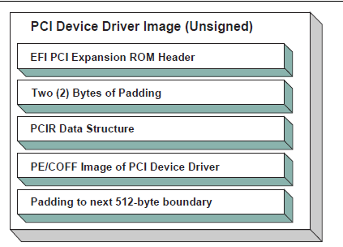

   Unsigned PCI Driver Image Layout

Figures :ref:`signed-and-compressed-pci-driver-image-flow` and :ref:`signed-and-compressed-pci-driver-image-flow` show a signed and compressed PCI device driver image flow chart and layout, respectively.

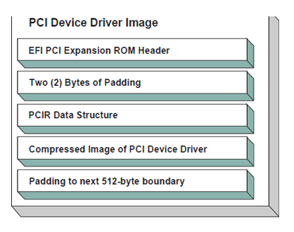

   Signed and Compressed PCI Driver Image Flow

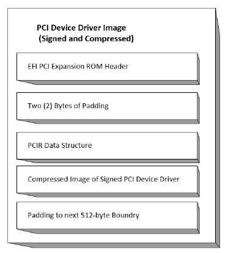

   Signed and Compressed PCI Driver Image Layout 

Figure :ref:`signed-but-not-compressed-pci-driver-image-flow` and Figure :ref:`signed-and-uncompressed-pci-driver-image-layout` show a signed but not compressed flow chart and a signed and uncompressed PCI device driver image layout, respectively.

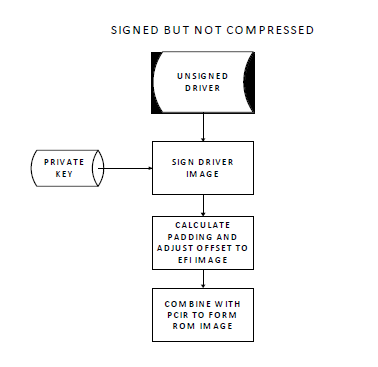

   Signed but not Compressed PCI Driver Image Flow

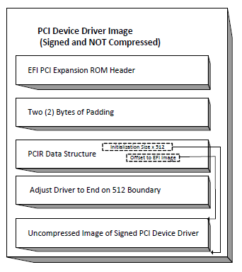

   Signed and Uncompressed PCI Driver Image Layout

The field values for the EFI PCI Expansion ROM Header and the PCIR Data Structure would be as follows in this recommended PCI Driver image layout. An image must start at a 512-byte boundary, and the end of the image must be padded to the next 512-byte boundary.

.. list-table:: Recommended PCI Device Driver Layout
   :name: recommended-pci-device-driver-layout
   :widths: 5 5 5 30
   :class: longtable

   * - **Offset**
     - **Byte Length**
     - **Value**
     - **Description**
   * - 0x00
     - 1
     - 0x55
     - ROM Signature, byte 1
   * - 0x01
     - 1
     - 0xAA
     - ROM Signature, byte 2
   * - 0x02
     - 2
     - XXXX
     - Initialization Size - size of this image in units of 512 bytes. The size includes this header
   * - 0x04
     - 4
     - 0x0EF1
     - Signature from EFI image header
   * - 0x08
     - 2
     - | XX 
       | 0x0B 
       | 0x0C
     - | Subsystem Value from the PCI Driver's PE/COFF Image Header
       | Subsystem Value for an EFI Boot Service Driver 
       | Subsystem Value for an EFI Runtime Driver
   * - 0x0a
     - 2
     - | XX 
       | 0x014C 
       | 0x0200 
       | 0x0EBC 
       | 0x8664  
       | 0x01c2  
       | 0xAA64
     - | Machine type from the PCI Driver's PE/COFF Image Header 
       | IA-32 Machine Type 
       | Itanium processor type 
       | EFI Byte Code (EBC) Machine Type 
       | X64 Machine Type  
       | ARM Machine Type  
       | ARM 64-bit Machine Type
   * - 0x0C
     - 2
     - | XXXX 
       | 0x0000 
       | 0x0001
     - | Compression Type 
       | Uncompressed 
       | Compressed following the UEFI Compression Algorithm *.*
   * - 0x0E
     - 8
     - 0x00
     - Reserved
   * - 0x16
     - 2
     - 0x0034
     - Offset to EFI Image
   * - 0x18
     - 2
     - 0x001C
     - Offset to PCIR Data Structure
   * - 0x1A
     - 2
     - 0x0000
     - Padding to align PCIR Data Structure on a 4 byte boundary
   * - 0x1C
     - 4
     - 'PCIR'
     - PCIR Data Structure Signature
   * - 0x20
     - 2
     - XXXX
     - Vendor ID from the PCI Controller's Configuration Header
   * - 0x22
     - 2
     - XXXX
     - Device ID from the PCI Controller's Configuration Header
   * - 0x24
     - 2
     - 0x0000
     - Reserved
   * - 0x26
     - 2
     - 0x0018
     - The length if the PCIR Data Structure in bytes
   * - 0x28
     - 1
     - 0x00
     - PCIR Data Structure Revision. Value for PCI 2.2 Option ROM
   * - 0x29
     - 3
     - XXXX
     - Class Code from the PCI Controller's Configuration Header
   * - 0x2C
     - 2
     - XXXX
     - Code Image Length in units of 512 bytes. Same as Initialization Size
   * - 0x2E
     - 2
     - XXXX
     - Revision Level of the Code/Data. This field is ignored
   * - 0x30
     - 1
     - 0x03
     - Code Type
   * - 0x31
     - 1
     - XX
     - Indicator. Bit 7 clear means another image follows. Bit 7 set means that this image is the last image in the PCI Option ROM. Bits 0-6 are reserved.
   * - 
     - 
     - 0x00 0x80
     - Additional images follow this image in the PCI Option ROM This image is the last image in the PCI Option ROM
   * - 0x32
     - 2
     - 0x0000
     - Reserved
   * - 0x34
     - X
     - XXXX
     - The beginning of the PCI Device Driver's PE/COFF Image

.. _nonvolatile-storage:

Nonvolatile Storage
###################

A PCI adapter may contain some form of nonvolatile storage. Since there are no standard access mechanisms for nonvolatile storage on PCI adapters, the PCI I/O Protocol does not provide any services for nonvolatile storage. However, a PCI Device Driver may choose to implement its own access mechanisms. If there is a private channel between a PCI Controller and a nonvolatile storage device, a PCI Device Driver can use it for configuration options or vital product data.

**Note**: *The fields RomImage and RomSize in the PCI I/O Protocol do not provide direct access to the PCI Option ROM on a PCI adapter. Instead, they provide access to a copy of the PCI Option ROM in memory*. *If the contents of the RomImage are modified, only the memory copy is updated*. *If a vendor wishes to update the contents of a PCI Option ROM, they must provide their own utility or driver to perform this task. There is no guarantee that the BAR for the PCI Option ROM is valid at the time that the utility or driver may execute, so the utility or driver must provide the code required to gain write access to the PCI Option ROM contents. The algorithm for gaining write access to a PCI Option ROM is both platform specific and adapter specific, so it is outside the scope of this document*.

.. _pci-hot-plug-events:

PCI Hot-Plug Events
###################

It is possible to design a PCI Bus Driver to work with PCI Bus that conforms to the PCI Hot-Plug Specification. There are two levels of functionality that could be provided in the preboot environment. The first is to initialize the PCI Hot-Plug capable bus so it can be used by an operating system that also conforms to the PCI Hot-Plug Specification. This only affects the PCI Enumeration that is performed in either the PCI Bus Driver’s initialization, or a firmware component that executes prior to the PCI Bus Driver’s initialization. None of the PCI Device Drivers need to be aware of the fact that a PCI Controller may exist in a slot that is capable of a hot-plug event. Also, the addition, removal, and replacement of PCI adapters in the preboot environment would not be allowed.

The second level of functionality is to actually implement the full hot-plug capability in the PCI Bus Driver. This is not recommended because it adds a great deal of complexity to the PCI Bus Driver design with very little added value. However, there is nothing about the PCI Driver Model that would preclude this implementation. It would require using an event based periodic timer to monitor the hot-plug capable slots, and take advantage of the :ref:`efi-boot-services-connectcontroller`  and :ref:`efi-boot-services-disconnectcontroller`  Boot Services to dynamically start and stop the drivers that manage the PCI controller that is being added, removed, or replaced. If the :ref:`efi-boot-services-disconnectcontroller`  Boot Service fails it must be retried via a periodic timer.