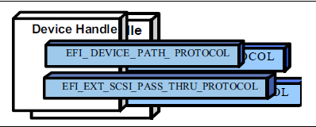
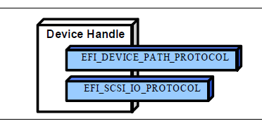

.. _protocols-scsi-driver-models-and-bus-support:

Protocols — SCSI Driver Models and Bus Support
===============================================

The intent of this chapter is to specify a method of providing direct access to SCSI devices. These protocols provide services that allow a generic driver to produce the Block I/O protocol for SCSI disk devices, and allows an EFI utility to issue commands to any SCSI device. The main reason to provide such an access is to enable S.M.A.R.T. functionality during POST (i.e., issuing Mode Sense, Mode Select, and Log Sense to SCSI devices). This is accomplished by using a generic API such as SCSI Pass Thru. The use of this method will enable additional functionality in the future without modifying the EFI SCSI Pass Thru driver. SCSI Pass Thru is not limited to SCSI channels. It is applicable to all channel technologies that utilize SCSI commands such as SCSI, ATAPI, and Fibre Channel. This chapter describes the SCSI Driver Model. This includes the behavior of SCSI Bus Drivers, the behavior of SCSI Device Drivers, and a detailed description of the SCSI I/O Protocol. This chapter provides enough material to implement a SCSI Bus Driver, and the tools required to design and implement SCSI Device Drivers. It does not provide any information on specific SCSI devices. 

.. _scsi-driver-model-overview:

SCSI Driver Model Overview
--------------------------

The EFI SCSI Driver Stack includes the SCSI Pass Thru Driver, SCSI Bus Driver and individual SCSI Device Drivers.

**SCSI Pass Thru Driver**: A SCSI Pass Through Driver manages a SCSI Host Controller that contains one or more SCSI Buses. It creates SCSI Bus Controller Handles for each SCSI Bus, and attaches Extended SCSI Pass Thru Protocol and Device Path Protocol to each handle the driver produced. Please refer to :ref:`extended-scsi-pass-thru-protocol` and Appendix G. *Using the EFI Extended SCSI Pass Thru Protocol*.

.. TODO need a link for Appendix G

**SCSI Bus Driver**: A SCSI Bus Driver manages a SCSI Bus Controller Handle that is created by SCSI Pass Thru Driver. It creates SCSI Device Handles for each SCSI Device Controller detected during SCSI Bus Enumeration, and attaches SCSI I/O Protocol and Device Path Protocol to each handle the driver produced. 

**SCSI Device Driver**: A SCSI Device Driver manages one kind of SCSI Device. Device handles for SCSI Devices are created by SCSI Bus Drivers. A SCSI Device Driver could be a bus driver itself, and may create child handles. But most SCSI Device Drivers will be device drivers that do not create new handles. For the pure device driver, it attaches protocol instance to the device handle of the SCSI Device. These protocol instances are I/O abstractions that allow the SCSI Device to be used in the pre-boot environment. The most common I/O abstractions are used to boot an EFI compliant OS.

.. _scsi-bus-drivers:

SCSI Bus Drivers
----------------

A SCSI Bus Driver manages a SCSI Bus Controller Handle. A SCSI Bus Controller Handle is created by a SCSI Pass Thru Driver and is abstracted in software with the Extended SCSI Pass Thru Protocol. A SCSI Bus Driver will manage handles that contain this protocol. The Figure below, :ref:`device-handle-for-a-scsi-bus-controller` , shows an example device handle for a SCSI Bus handle. It contains a Device Path Protocol instance and a Extended SCSI Pass Thru Protocol Instance.

   
   Device Handle for a SCSI Bus Controller

.. _driver-binding-protocol-for-scsi-bus-drivers:

Driver Binding Protocol for SCSI Bus Drivers
############################################

The Driver Binding Protocol contains three services. These are *Supported()* , *Start()* , and *Stop()* . *Supported()* tests to see if the SCSI Bus Driver can manage a device handle. A SCSI Bus Driver can only manage device handle that contain the Device Path Protocol and the Extended SCSI Pass Thru Protocol, so a SCSI Bus Driver must look for these two protocols on the device handle that is being tested. 

The *Start()* function tells the SCSI Bus Driver to start managing a device handle. The device handle should support the protocols shown in Figure :ref:`device-handle-for-a-scsi-bus-controller` . The Extended SCSI Pass Thru Protocol provides information about a SCSI Channel and the ability to communicate with any SCSI devices attached to that SCSI Channel. 

The SCSI Bus Driver has the option of creating all of its children in one call to *Start()*, or spreading it across several calls to *Start()* . In general, if it is possible to design a bus driver to create one child at a time, it should do so to support the rapid boot capability in the UEFI Driver Model. Each of the child device handles created in *Start()* must contain a Device Path Protocol instance, and a SCSI I/O protocol instance. The SCSI I/O Protocol is described in `EFI SCSI I/O Protocol`_  and Section 14.4 .  The format of device paths for SCSI Devices is described in `SCSI Device Paths`_. The Figure below, :ref:`child-handle-Created-by-a-SCSI-Bus-Driver` ,  shows an example child device handle that is created by a SCSI Bus Driver for a SCSI Device.

.. TODO the line for reference (above, not working) should be for Section 14.4 `EFI PCI IO Protocol`_ :ref:`efi-pci-io-protocol`

   Child Handle Created by a SCSI Bus Driver

A SCSI Bus Driver must perform several steps to manage a SCSI Bus.

#. Scan for the SCSI Devices on the SCSI Channel that connected to the SCSI Bus Controller. If a request is being made to scan only one SCSI Device, then only looks for the one specified. Create a device handle for the SCSI Device found.

#. Install a Device Path Protocol instance and a SCSI I/O Protocol instance on the device handle created for each SCSI Device.

The *Stop()* function tells the SCSI Bus Driver to stop managing a SCSI Bus. The *Stop()* function can destroy one or more of the device handles that were created on a previous call to *Start()* . If all of the child device handles have been destroyed, then *Stop()* will place the SCSI Bus Controller in a quiescent state. The functionality of *Stop()* mirrors *Start()* .

.. _scsi-enumeration:

SCSI Enumeration
################

The purpose of the SCSI Enumeration is only to scan for the SCSI Devices attached to the specific SCSI channel. The SCSI Bus driver need not allocate resources for SCSI Devices (like PCI Bus Drivers do), nor need it connect a SCSI Device with its Device Driver (like USB Bus Drivers do). The details of the SCSI Enumeration is implementation specific, thus is out of the scope of this document.

.. _scsi-device-drivers:

SCSI Device Drivers
-------------------

SCSI Device Drivers manage SCSI Devices. Device handles for SCSI Devices are created by SCSI Bus Drivers. A SCSI Device Driver could be a bus driver itself, and may create child handles. But most SCSI Device Drivers will be device drivers that do not create new handles. For the pure device driver, it attaches protocol instance to the device handle of the SCSI Device. These protocol instances are I/O abstractions that allow the SCSI Device to be used in the pre-boot environment. The most common I/O abstractions are used to boot an EFI compliant OS.

.. _driver-binding-protocol-for-scsi-device-drivers:

Driver Binding Protocol for SCSI Device Drivers
###############################################

The Driver Binding Protocol contains three services. These are *Supported()* , *Start()* , and *Stop()* . *Supported()* tests to see if the SCSI Device Driver can manage a device handle. A SCSI Device Driver can only manage device handle that contain the Device Path Protocol and the SCSI I//O Protocol, so a SCSI Device Driver must look for these two protocols on the device handle that is being tested. In addition, it needs to check to see if the device handle represents a SCSI Device that SCSI Device Driver knows how to manage. This is typically done by using the services of the SCSI I/O Protocol to see whether the device information retrieved is supported by the device driver.

The *Start()* function tells the SCSI Device Driver to start managing a SCSI Device. A SCSI Device Driver could be a bus driver itself, and may create child handles. But most SCSI Device Drivers will be device drivers that do not create new handles. For the pure device driver, it installs one or more addition protocol instances on the device handle for the SCSI Device.

The *Stop()* function mirrors the *Start()* function, so the *Stop()* function completes any outstanding transactions to the SCSI Device and removes the protocol interfaces that were installed in *Start()* .

.. _efi-scsi-io-protocol:

EFI SCSI I/O Protocol 
---------------------

This section defines the EFI SCSI I/O protocol. This protocol is used by code, typically drivers, running in the EFI boot services environment to access SCSI devices. In particular, functions for managing devices on SCSI buses are defined here. 

The interfaces provided in the *EFI_SCSI_IO_PROTOCOL* are for performing basic operations to access SCSI devices.

  .. _efi_scsi_io_protocol:

EFI_SCSI_IO_PROTOCOL
####################

This section provides a detailed description of the *EFI_SCSI_IO_PROTOCOL*.
 

**Summary**

Provides services to manage and communicate with SCSI devices.

**GUID**

.. code-block::

   #define EFI_SCSI_IO_PROTOCOL_GUID \
     {0x932f47e6,0x2362,0x4002,\
       {0x80,0x3e,0x3c,0xd5,0x4b,0x13,0x8f,0x85}}

**Protocol Interface Structure**

.. code-block::

   typedef struct _EFI_SCSI_IO_PROTOCOL {
     EFI_SCSI_IO_PROTOCOL_GET_DEVICE_TYPE       GetDeviceType;
     EFI_SCSI_IO_PROTOCOL_GET_DEVICE_LOCATION   GetDeviceLocation;
     EFI_SCSI_IO_PROTOCOL_RESET_BUS             ResetBus;
     EFI_SCSI_IO_PROTOCOL_RESET_DEVICE          ResetDevice;
     EFI_SCSI_IO_PROTOCOL_EXECUTE_SCSI_COMMAND  ExecuteScsiCommand;
     UINT32                                     IoAlign;
     } EFI_SCSI_IO_PROTOCOL; 

**Parameters**

IoAlign 
  Supplies the alignment requirement for any buffer used in a data transfer. *IoAlign* values of 0 and 1 mean that the buffer can be placed anywhere in memory. Otherwise, *IoAlign* must be a power of 2, and the requirement is that the start address of a buffer must be evenly divisible by *IoAlign* with no remainder.

GetDeviceType 
  Retrieves the information of the device type which the SCSI device belongs to `EFI_SCSI_IO_PROTOCOL.GetDeviceType()`_ .

GetDeviceLocation 
  Retrieves the device location information in the SCSI bus `EFI_SCSI_IO_PROTOCOL.GetDeviceLocation()`_.

ResetBus 
  Resets the entire SCSI bus the SCSI device attaches to `EFI_SCSI_IO_PROTOCOL.ResetBus()`_.

ResetDevice 
  Resets the SCSI Device that is specified by the device handle the SCSI I/O protocol attaches  `EFI_SCSI_IO_PROTOCOL.ResetDevice()`_ .

ExecuteScsiCommand 
  Sends a SCSI command to the SCSI device and waits for the execution completion until an exit condition is met, or a timeout occurs `EFI_SCSI_IO_PROTOCOL.ExecuteScsiCommand()`_ .

**Description**

The *EFI_SCSI_IO_PROTOCOL* provides the basic functionalities to access and manage a SCSI Device. There is one *EFI_SCSI_IO_PROTOCOL* instance for each SCSI Device on a SCSI Bus. A device driver that wishes to manage a SCSI Device in a system will have to retrieve the *EFI_SCSI_IO_PROTOCOL* instance that is associated with the SCSI Device. A device handle for a SCSI Device will minimally contain an *EFI_DEVICE_PATH_PROTOCOL* instance and an *EFI_SCSI_IO_PROTOCOL* instance.

.. _efi-scsi-io-protocol-getdevicetype:

EFI_SCSI_IO_PROTOCOL.GetDeviceType()
####################################

**Summary**

Retrieves the device type information of the SCSI Device.

**Prototype**

.. code-block::
  
   typedef  
   EFI_STATUS  
   (EFIAPI *EFI_SCSI_IO_PROTOCOL_GET_DEVICE_TYPE) (  
     IN EFI_SCSI_IO_PROTOCOL        *This,  
     OUT UINT8                      *DeviceType  
     );
  

**Parameters** 

This 
  A pointer to the EFI_SCSI_IO_PROTOCOL instance. Type EFI_SCSI_IO_PROTOCOL is defined in  `EFI_SCSI_IO_PROTOCOL`_ .

DeviceType 
  A pointer to the device type information retrieved from the SCSI Device. See "Related Definitions" for the possible returned values of this parameter.

**Description**

This function is used to retrieve the SCSI device type information. This function is typically used for SCSI Device Drivers to quickly recognize whether the SCSI Device could be managed by it. 

If *DeviceType* is **NULL** , then *EFI_INVALID_PARAMETER* is returned. Otherwise, the device type is returned in *DeviceType* and *EFI_SUCCESS* is returned.

**Related Definitions**

.. code-block:: 
  
   //Defined in the SCSI Primary Commands standard (e.g., SPC-4)  
   //  
   #define EFI_SCSI_IO_TYPE_DISK                0x00 // Disk device  
   #define EFI_SCSI_IO_TYPE_TAPE                0x01 // Tape device  
   #define EFI_SCSI_IO_TYPE_PRINTER             0x02 // Printer  
   #define EFI_SCSI_IO_TYPE_PROCESSOR           0x03 // Processor  
   #define EFI_SCSI_IO_TYPE_WORM                0x04 // Write-once read-multiple  
   #define EFI_SCSI_IO_TYPE_CDROM               0x05 // CD or DVD device  
   #define EFI_SCSI_IO_TYPE_SCANNER             0x06 // Scanner device  
   #define EFI_SCSI_IO_TYPE_OPTICAL             0x07 // Optical memory device  
   #define EFI_SCSI_IO_TYPE_MEDIUMCHANGER       0x08 // Medium Changer device  
   #define EFI_SCSI_IO_TYPE_COMMUNICATION       0x09 // Communications device  
   #define MFI_SCSI_IO_TYPE_A                   0x0A // Obsolete  
   #define MFI_SCSI_IO_TYPE_B                   0x0B // Obsolete  
   #define MFI_SCSI_IO_TYPE_RAID                0x0C // Storage array controller  
                          // device (e.g., RAID)  
   #define MFI_SCSI_IO_TYPE_SES                 0x0D // Enclosure services device  
   #define MFI_SCSI_IO_TYPE_RBC                 0x0E // Simplified direct-access  
                          // device (e.g., magnetic  
                          // disk)  
   #define MFI_SCSI_IO_TYPE_OCRW                0x0F // Optical card reader/  
                          // writer device
   #define MFI_SCSI_IO_TYPE_BRIDGE              0x10 // Bridge Controller  
                          // Commands  
   #define MFI_SCSI_IO_TYPE_OSD                 0x11 // Object-based Storage  
                          // Device  
   #define EFI_SCSI_IO_TYPE_RESERVED_LOW        0x12 // Reserved (low)  
   #define EFI_SCSI_IO_TYPE_RESERVED_HIGH       0x1E // Reserved (high)  
   #define EFI_SCSI_IO_TYPE_UNKNOWN             0x1F // Unknown no device type  

**Status Codes Returned**

.. list-table::
   :widths: 35 70

   * - EFI_SUCCESS
     - Retrieves the device type information successfully.
   * - EFI_INVALID_PARAMETER
     - The DeviceType is **NULL**.

.. _efi-scsi-io-protocol-getdevicelocation:

EFI_SCSI_IO_PROTOCOL.GetDeviceLocation()
########################################

**Summary**

Retrieves the SCSI device location in the SCSI channel.

**Prototype**

.. code-block:: 
  
   typedef  
   EFI_STATUS  
   (EFIAPI *EFI_SCSI_IO_PROTOCOL_GET_DEVICE_LOCATION) (  
     IN EFI_SCSI_IO_PROTOCOL                *This,  
     IN OUT UINT8                           **Target,  
     OUT UINT64                             *Lun 
     );
  
**Parameters** 

This
  A pointer to the EFI_SCSI_IO_PROTOCOL instance. Type EFI_SCSI_IO_PROTOCOL is defined in `EFI_SCSI_IO_PROTOCOL`_ .

Target
  A pointer to the Target Array which represents the ID of a SCSI device on the SCSI channel.

Lun
  A pointer to the Logical Unit Number of the SCSI device on the SCSI channel.

**Description**

This function is used to retrieve the SCSI device location in the SCSI bus. The device location is determined by a (Target, Lun) pair. This function allows a SCSI Device Driver to retrieve its location on the SCSI channel, and may use the Extended SCSI Pass Thru Protocol to access the SCSI device directly. 

If *Target* or *Lun* is **NULL** , then *EFI_INVALID_PARAMETER* is returned. Otherwise, the device location is returned in *Target* and *Lun* , and *EFI_SUCCESS* is returned. 

**Status Codes Returned**

.. list-table::
   :widths: 35 70

   * - EFI_SUCCESS
     - Retrieves the device location successfully.
   * - EFI_INVALID_PARAMETER
     - Target or Lun is *NULL*.

.. _efi-scsi-io-protocol-resetbus:

EFI_SCSI_IO_PROTOCOL.ResetBus() 
###############################

 
**Summary** 

Resets the SCSI Bus that the SCSI Device is attached to.

**Prototype**

.. code-block:: 
  
   typedef  
   EFI_STATUS  
   (EFIAPI *EFI_SCSI_IO_PROTOCOL_RESET_BUS) (  
     IN EFI_SCSI_IO_PROTOCOL            *This  
     );
  

**Parameters**

This
  A pointer to the EFI_SCSI_IO_PROTOCOL instance. Type EFI_SCSI_IO_PROTOCOL is defined in `EFI_SCSI_IO_PROTOCOL`_ .

**Description**

This function provides the mechanism to reset the whole SCSI bus that the specified SCSI Device is connected to. Some SCSI Host Controller may not support bus reset, if so, *EFI_UNSUPPORTED* is returned. If a device error occurs while executing that bus reset operation, then *EFI_DEVICE_ERROR* is returned. If a timeout occurs during the execution of the bus reset operation, then *EFI_TIMEOUT* is returned. If the bus reset operation is completed, then *EFI_SUCCESS* is returned.

**Status Codes Returned**

.. list-table::
   :widths: 35 70
   :class: longtable

   * - EFI_SUCCESS
     - The SCSI bus is reset successfully.
   * - EFI_DEVICE_ERROR
     - Errors encountered when resetting the SCSI bus.
   * - EFI_UNSUPPORTED
     - The bus reset operation is not supported by the SCSI Host Controller.
   * - EFI_TIMEOUT
     - A timeout occurred while attempting to reset the SCSI bus.

.. _efi-scsi-io-protocol-resetdevice: 

EFI_SCSI_IO_PROTOCOL.ResetDevice()
##################################

**Summary**

Resets the SCSI Device that is specified by the device handle that the SCSI I/O Protocol is attached.

**Prototype**

.. code-block:: 
  
  typedef  
  EFI_STATUS  
  (EFIAPI *EFI_SCSI_IO_PROTOCOL_RESET_DEVICE) (  
    IN EFI_SCSI_IO_PROTOCOL         *This  
    );

**Parameters**

This   
  A Pointer to the EFI_SCSI_IO_PROTOCOL instance. Type EFI_SCSI_IO_PROTOCOL is defined in `EFI_SCSI_IO_PROTOCOL`_ .

**Description**

This function provides the mechanism to reset the SCSI Device. If the SCSI bus does not support a device reset operation, then *EFI_UNSUPPORTED* is returned. If a device error occurs while executing that device reset operation, then *EFI_DEVICE_ERROR* is returned. If a timeout occurs during the execution of the device reset operation, then *EFI_TIMEOUT* is returned. If the device reset operation is completed, then *EFI_SUCCESS* is returned.

**Status Codes Returned**

.. list-table::
   :widths: 35 70
   :class: longtable

   * - EFI_SUCCESS
     - Reset the SCSI Device successfully.
   * - EFI_DEVICE_ERROR
     - Errors are encountered when resetting the SCSI Device.
   * - EFI_UNSUPPORTED
     - The SCSI bus does not support a device reset operation.
   * - EFI_TIMEOUT
     - A timeout occurred while attempting to reset the SCSI Device.

.. _efi-scsi-io-protocol-executescsicommand:

EFI_SCSI_IO_PROTOCOL.ExecuteScsiCommand()
#########################################

**Summary**

Sends a SCSI Request Packet to the SCSI Device for execution.

**Prototype**

.. code-block:: 
  
   typedef  
     EFI_STATUS  
     (EFIAPI *EFI_SCSI_IO_PROTOCOL_EXECUTE_SCSI_COMMAND) (  
       IN EFI_SCSI_IO_PROTOCOL                  *This,  
       IN OUT EFI_SCSI_IO_SCSI_REQUEST_PACKET   *Packet,  
       IN EFI_EVENT                             Event OPTIONAL  
       );
  

**Parameters**

This
  A pointer to the EFI_SCSI_IO_PROTOCOL instance. Type EFI_SCSI_IO_PROTOCOL is defined in defined in `EFI_SCSI_IO_PROTOCOL`_ .

Packet
  The SCSI request packet to send to the SCSI Device specified by the device handle. See "Related Definitions" for a description of EFI_SCSI_IO_SCSI_REQUEST_PACKET.

Event
  If the SCSI bus where the SCSI device is attached does not support non-blocking I/O, then Event is ignored, and blocking I/O is performed. If Event is NULL, then blocking I/O is performed. If Event is not NULL and non-blocking I/O is supported, then non-blocking I/O is performed, and Event will be signaled when the SCSI Request Packet completes.

**Related Definitions**

.. code-block:: 
  
   typedef struct {  
     UINT64             Timeout;  
     VOID               *InDataBuffer;  
     VOID               *OutDataBuffer;  
     VOID               *SenseData;  
     VOID               *Cdb;  
     UINT32             InTransferLength;  
     UINT32             OutTransferLength;  
     UINT8              CdbLength;  
     UINT8              DataDirection;  
     UINT8              HostAdapterStatus;  
     UINT8              TargetStatus;  
     UINT8              SenseDataLength;  
   } EFI_SCSI_IO_SCSI_REQUEST_PACKET;
  

Timeout
  The timeout, in 100 ns units, to use for the execution of this SCSI Request Packet. A *Timeout* value of 0 means that this function will wait indefinitely for the SCSI Request Packet to execute. If *Timeout* is greater than zero, then this function will return *EFI_TIMEOUT* if the time required to execute the SCSI Request Packet is greater than *Timeout* .

DataBuffer
  A pointer to the data buffer to transfer from or to the SCSI device.

InDataBuffer
  A pointer to the data buffer to transfer between the SCSI controller and the SCSI device for SCSI READ command. For all SCSI WRITE Commands this must point to *NULL* .

OutDataBuffer
  A pointer to the data buffer to transfer between the SCSI controller and the SCSI device for SCSI WRITE command. For all SCSI READ commands this field must point to *NULL* .

SenseData
  A pointer to the sense data that was generated by the execution of the SCSI Request Packet.

Cdb
  A pointer to buffer that contains the Command Data Block to send to the SCSI device.

InTransferLength
  On Input, the size, in bytes, of *InDataBuffer* . On output, the number of bytes transferred between the SCSI controller and the SCSI device. If *InTransferLength* is larger than the SCSI controller can handle, no data will be transferred, *InTransferLength* will be updated to contain the number of bytes that the SCSI controller is able to transfer, and *EFI_BAD_BUFFER_SIZE* will be returned.

OutTransferLength
  On Input, the size, in bytes of *OutDataBuffer* . On Output, the Number of bytes transferred between SCSI Controller and the SCSI device. If *OutTransferLength* is larger than the SCSI controller can handle, no data will be transferred, *OutTransferLength* will be updated to contain the number of bytes that the SCSI controller is able to transfer, and *EFI_BAD_BUFFER_SIZE* will be returned.

CdbLength
  The length, in bytes, of the buffer *Cdb* . The standard values are 6, 10, 12, and 16, but other values are possible if a variable length *CDB* is used. 

DataDirection
  The direction of the data transfer. 0 for reads, 1 for writes. A value of 2 is Reserved for Bi-Directional SCSI commands. For example XDREADWRITE. All other values are reserved, and must not be used.

HostAdapterStatus
  The status of the SCSI Host Controller that produces the SCSI bus where the SCSI device attached when the SCSI Request Packet was executed on the SCSI Controller. See the possible values listed below.

TargetStatus
  The status returned by the SCSI device when the SCSI Request Packet was executed. See the possible values listed below.

SenseDataLength
  On input, the length in bytes of the *SenseData* buffer. On output, the number of bytes written to the *SenseData* buffer. 

.. code-block::

   //
   // DataDirection
   //
   #define EFI_SCSI_IO_DATA_DIRECTION_READ            0
   #define EFI_SCSI_IO_DATA_DIRECTION_WRITE           1
   #define EFI_SCSI_IO_DATA_DIRECTION_BIDIRECTIONAL   2

   //
   // HostAdapterStatus
   //
   #define EFI_SCSI_IO_STATUS_HOST_ADAPTER_OK                     0x00
   #define EFI_SCSI_IO_STATUS_HOST_ADAPTER_TIMEOUT_COMMAND        0x09
   #define EFI_SCSI_IO_STATUS_HOST_ADAPTER_TIMEOUT                0x0b
   #define EFI_SCSI_IO_STATUS_HOST_ADAPTER_MESSAGE_REJECT         0x0d
   #define EFI_SCSI_IO_STATUS_HOST_ADAPTER_BUS_RESET              0x0e
   #define EFI_SCSI_IO_STATUS_HOST_ADAPTER_PARITY_ERROR           0x0f
   #define EFI_SCSI_IO_STATUS_HOST_ADAPTER_REQUEST_SENSE_FAILED   0x10
   #define EFI_SCSI_IO_STATUS_HOST_ADAPTER_SELECTION_TIMEOUT      0x11
   #define EFI_SCSI_IO_STATUS_HOST_ADAPTER_DATA_OVERRUN_UNDERRUN  0x12
   #define EFI_SCSI_IO_STATUS_HOST_ADAPTER_BUS_FREE               0x13
   #define EFI_SCSI_IO_STATUS_HOST_ADAPTER_PHASE_ERROR            0x14
   #define EFI_SCSI_IO_STATUS_HOST_ADAPTER_OTHER                  0x7f

   //
   // TargetStatus
   //
   #define EFI_SCSI_IO_STATUS_TARGET_GOOD                         0x00
   #define EFI_SCSI_IO_STATUS_TARGET_CHECK_CONDITION              0x02
   #define EFI_SCSI_IO_STATUS_TARGET_CONDITION_MET                0x04
   #define EFI_SCSI_IO_STATUS_TARGET_BUSY                         0x08
   #define EFI_SCSI_IO_STATUS_TARGET_INTERMEDIATE                 0x10
   #define EFI_SCSI_IO_STATUS_TARGET_INTERMEDIATE_CONDITION_METn  0x14
   #define EFI_SCSI_IO_STATUS_TARGET_RESERVATION_CONFLICT         0x18
   #define EFI_SCSI_IO_STATUS_TARGET_COMMAND_TERMINATED           0x22
   #define EFI_SCSI_IO_STATUS_TARGET_QUEUE_FULL                   0x28

**Description**

This function sends the SCSI Request Packet specified by *Packet* to the SCSI Device.

If the SCSI Bus supports non-blocking I/O and *Event* is not **NULL**, then this function will return immediately after the command is sent to the SCSI Device, and will later signal *Event* when the command has completed. If the SCSI Bus supports non-blocking I/O and *Event* is **NULL**, then this function will send the command to the SCSI Device and block until it is complete. If the SCSI Bus does not support non-blocking I/O, the *Event* parameter is ignored, and the function will send the command to the SCSI Device and block until it is complete.

If *Packet* is successfully sent to the SCSI Device, then *EFI_SUCCESS* is returned.

If *Packet* cannot be sent because there are too many packets already queued up, then *EFI_NOT_READY* is returned. The caller may retry *Packet* at a later time.

If a device error occurs while sending the *Packet* , then *EFI_DEVICE_ERROR* is returned.

If a timeout occurs during the execution of *Packet* , then *EFI_TIMEOUT* is returned.

If any field of *Packet* is invalid, then *EFI_INVALID_PARAMETER* is returned.

If the data buffer described by *DataBuffer* and *TransferLength* is too big to be transferred in a single command, then *EFI_BAD_BUFFER_SIZE* is returned. The number of bytes actually transferred is returned in *TransferLength* .

If the command described in *Packet* is not supported by the SCSI Host Controller that produces the SCSI bus, then *EFI_UNSUPPORTED* is returned.

If *EFI_SUCCESS, EFI_BAD_BUFFER_SIZE, EFI_DEVICE_ERROR* , or *EFI_TIMEOUT* is returned, then the caller must examine the status fields in *Packet* in the following precedence order: *HostAdapterStatus* followed by *TargetStatus* followed by *SenseDataLength* , followed by *SenseData* . If non-blocking I/O is being used, then the status fields in *Packet* will not be valid until the *Event* associated with *Packet* is
signaled.

If *EFI_NOT_READY* , *EFI_INVALID_PARAMETER* or *EFI_UNSUPPORTED* is returned, then *Packet* was never sent, so the status fields in *Packet* are not valid. If non-blocking I/O is being used, the *Event* associated with *Packet* will not be signaled.

**Status Codes Returned**

.. list-table::
   :widths: 35 70
   :class: longtable

   * - EFI_SUCCESS
     - The SCSI Request Packet was sent by the host. For read and bi-directional commands, *InTransferLength* bytes were transferred to *InDataBuffer* . For write and bi-directional commands, *OutTransferLength* bytes were transferred from *OutDataBuffer* . See *HostAdapterStatus, TargetStatus, SenseDataLength,* and *SenseData* in that order for additional status information.
   * - EFI_BAD_BUFFER_SIZE
     - The SCSI Request Packet was not executed. For read and bi-directional commands, the number of bytes that could be transferred is returned in *InTransferLength.* For write and bi-directional commands, the number of bytes that could be transferred is returned in *OutTransferLength.* See *HostAdapterStatus* and *TargetStatus* in that order for additional status information.
   * - EFI_NOT_READY
     - The SCSI Request Packet could not be sent because there are too many SCSI Command Packets already queued. The caller may retry again later.
   * - EFI_DEVICE_ERROR
     - A device error occurred while attempting to send the SCSI Request Packet. See HostAdapterStatus, TargetStatus, SenseDataLength, and SenseData in that order for additional status information.
   * - EFI_INVALID_PARAMETER
     - The contents of CommandPacket are invalid. The SCSI Request Packet was not sent, so no additional status information is available.
   * - EFI_UNSUPPORTED
     - The command described by the SCSI Request Packet is not supported by the SCSI initiator (i.e., SCSI Host Controller). The SCSI Request Packet was not sent, so no additional status information is available.
   * - EFI_TIMEOUT
     - A timeout occurred while waiting for the SCSI Request Packet to execute. See HostAdapterStatus, TargetStatus, SenseDataLength, and SenseData in that order for additional status information.

.. _scsi-device-paths:

SCSI Device Paths
-----------------

An *EFI_SCSI_IO_PROTOCOL* must be installed on a handle for its services to be available to SCSI device drivers. In addition to the *EFI_SCSI_IO_PROTOCOL* , an *EFI_DEVICE_PATH_PROTOCOL* must also be installed on the same handle. See :ref:`protocols-device-path-protocol`  for detailed description of the *EFI_DEVICE_PATH_PROTOCOL* . 

The SCSI Driver Model defined in this document can support the SCSI channel generated or emulated by multiple architectures, such as Parallel SCSI, ATAPI, Fibre Channel, InfiniBand, and other future channel types. In this section, there are four example device paths provided, including SCSI device path, ATAPI device path, Fibre Channel device path and InfiniBand device path.

.. _scsi-device-path-example:

SCSI Device Path Example
########################

:numref:`scsi-device-path-examples` shows an example device path for a SCSI device controller on a desktop platform. This SCSI device controller is connected to a SCSI channel that is generated by a PCI SCSI host controller. The PCI SCSI host controller generates a single SCSI channel, it is located at PCI device number 0x07 and PCI function 0x00, and is directly attached to a PCI root bridge. The SCSI device controller is assigned SCSI Id 2, and its LUN is 0. 

This sample device path consists of an ACPI Device Path Node, a PCI Device Path Node, a SCSI Node, and a Device Path End Structure. The _HID and _UID must match the ACPI table description of the PCI Root Bridge. The shorthand notation for this device path is::

   ACPI(PNP0A03,0)/PCI(7,0)/SCSI(2,0).

.. list-table:: SCSI Device Path Examples
   :name: scsi-device-path-examples
   :widths: 5 5 5 30
   :class: longtable

   * - **Byte Offset**
     - **Byte Length**
     - **Data**
     - **Description**
   * - 0x00
     - 0x01
     - 0x02
     - Generic Device Path Header - Type ACPI Device Path
   * - 0x01
     - 0x01
     - 0x01
     - Sub type - ACPI Device Path
   * - 0x02
     - 0x02
     - 0x0C
     - Length - 0x0C bytes
   * - 0x04
     - 0x04
     - 0x41D0,  0x0A03
     - _HID PNP0A03 - 0x41D0 represents the compressed string ‘PNP’ and is encoded in the low order bytes. The compression method is described in the ACPI Specification.
   * - 0x08
     - 0x04
     - 0x0000
     - _UID
   * - 0x0C
     - 0x01
     - 0x01
     - Generic Device Path Header - Type Hardware Device Path
   * - 0x0D
     - 0x01
     - 0x01
     - Sub type - PCI
   * - 0x0E
     - 0x02
     - 0x06
     - Length - 0x06 bytes
   * - 0x10
     - 0x01
     - 0x07
     - PCI Function
   * - 0x11
     - 0x01
     - 0x00
     - PCI Device
   * - 0x12
     - 0x01
     - 0x03
     - Generic Device Path Header - Type Message Device Path
   * - 0x13
     - 0x01
     - 0x02
     - Sub type - SCSI
   * - 0x14
     - 0x02
     - 0x08
     - Length - 0x08 bytes
   * - 0x16
     - 0x02
     - 0x0002
     - Target ID on the SCSI bus (PUN)
   * - 0x18
     - 0x02
     - 0x0000
     - Logical Unit Number (LUN)
   * - 0x1A
     - 0x01
     - 0x7F
     - Generic Device Path Header - Type End of Hardware Device Path
   * - 0x1B
     - 0x01
     - 0xFF
     - Sub type - End of Entire Device Path
   * - 0x1C
     - 0x02
     - 0x04
     - Length - 0x04 bytes

.. _atapi-device-path-example:

ATAPI Device Path Example
#########################

The Table below, :ref:`atapi` , shows an example device path for an ATAPI device on a desktop platform. This ATAPI device is connected to the IDE bus on Primary channel, and is configured as the Master device on the channel. The IDE bus is generated by the IDE controller that is a PCI device. It is located at PCI device number 0x1F and PCI function 0x01, and is directly attached to a PCI root bridge. 

This sample device path consists of an ACPI Device Path Node, a PCI Device Path Node, an ATAPI Node, and a Device Path End Structure. The _HID and _UID must match the ACPI table description of the PCI Root Bridge. The shorthand notation for this device path is: 

.. code-block::

   ACPI(PNP0A03,0)/PCI(7,0)/ATA(Primary,Master,0).

.. list-table:: ATAPI Device Path Examples
   :name: atapi
   :widths: 5 5 5 30
   :class: longtable

   * - **Byte Offset**
     - **Byte Length**
     - **Data**
     - **Description**
   * - 0x00
     - 0x01
     - 0x02
     - Generic Device Path Header - Type ACPI Device Path
   * - 0x01
     - 0x01
     - 0x01
     - Sub type - ACPI Device Path
   * - 0x02
     - 0x02
     - 0x0C
     - Length - 0x0C bytes
   * - 0x04
     - 0x04
     - 0x41D0,  0x0A03
     - _HID PNP0A03 - 0x41D0 represents the compressed string ‘PNP’ and is encoded in the low order bytes. The compression method is described in the ACPI Specification.
   * - 0x08
     - 0x04
     - 0x0000
     - _UID
   * - 0x0C
     - 0x01
     - 0x01
     - Generic Device Path Header - Type Hardware Device Path
   * - 0x0D
     - 0x01
     - 0x01
     - Sub type - PCI
   * - 0x0E
     - 0x02
     - 0x06
     - Length - 0x06 bytes
   * - 0x10
     - 0x01
     - 0x07
     - PCI Function
   * - 0x11
     - 0x01
     - 0x00
     - PCI Device
   * - 0x12
     - 0x01
     - 0x03
     - Generic Device Path Header - Type Message Device Path
   * - 0x13
     - 0x01
     - 0x01
     - Sub type - ATAPI
   * - 0x14
     - 0x02
     - 0x08
     - Length - 0x08 bytes
   * - 0x16
     - 0x01
     - 0x00
     - P rimarySecondary - Set to zero for primary or one for secondary.
   * - 0x17
     - 0x01
     - 0x00
     - SlaveMaster - set to zero for master or one for slave.
   * - 0x18
     - 0x02
     - 0x0000
     - Logical Unit Number,LUN.
   * - 0x1A
     - 0x01
     - 0x7F
     - Generic Device Path Header - Type End of Hardware Device Path
   * - 0x1B
     - 0x01
     - 0xFF
     - Sub type - End of Entire Device Path
   * - 0x1C
     - 0x02
     - 0x04
     - Length - 0x04 bytes

.. _fibre-channel-device-path-example:

Fibre Channel Device Path Example
#################################

:numref:`fibre-channel-device-path` shows an example device path for a SCSI device that is connected to a Fibre Channel Port on a desktop platform. The Fibre Channel Port is a PCI device that is located at PCI device number 0x08 and PCI function 0x00, and is directly attached to a PCI root bridge. The Fibre Channel Port is addressed by the World Wide Number, and is assigned as X (X is a 64bit value); the SCSI device’s Logical Unit Number is 0.

This sample device path consists of an ACPI Device Path Node, a PCI Device Path Node, a Fibre Channel Device Path Node, and a Device Path End Structure. The _HID and _UID must match the ACPI table description of the PCI Root Bridge. The shorthand notation for this device path is::

   ACPI(PNP0A03,0)/PCI(8,0)/Fibre(X,0).

.. list-table:: Fibre Channel Device Path Examples
   :name: fibre-channel-device-path-examples
   :widths: 5 5 5 30
   :class: longtable

   * - Byte Offset
     - Byte Length
     - Data
     - Description
   * - 0x00
     - 0x01
     - 0x02
     - Generic Device Path Header - Type ACPI Device Path
   * - 0x01
     - 0x01
     - 0x01
     - Sub type - ACPI Device Path
   * - 0x02
     - 0x02
     - 0x0C
     - Length - 0x0C bytes
   * - 0x04
     - 0x04
     - 0x41D0,  0x0A03
     - _HID PNP0A03 - 0x41D0 represents the compressed string ‘PNP’ and is encoded in the low order bytes. The compression method is described in the ACPI Specification.
   * - 0x08
     - 0x04
     - 0x0000
     - _UID
   * - 0x0C
     - 0x01
     - 0x01
     - Generic Device Path Header - Type Hardware Device Path
   * - 0x0D
     - 0x01
     - 0x01
     - Sub type - PCI
   * - 0x0E
     - 0x02
     - 0x06
     - Length - 0x06 bytes
   * - 0x10
     - 0x01
     - 0x08
     - PCI Function
   * - 0x11
     - 0x01
     - 0x00
     - PCI Device
   * - 0x12
     - 0x01
     - 0x03
     - Generic Device Path Header - Type Message Device Path
   * - 0x13
     - 0x01
     - 0x02
     - Sub type - Fibre Channel
   * - 0x14
     - 0x02
     - 0x24
     - Length - 0x24 bytes
   * - 0x16
     - 0x04
     - 0x00
     - Reserved
   * - 0x1A
     - 0x08
     - X
     - Fibre Channel World Wide Number
   * - 0x22
     - 0x08
     - 0x00
     - Fibre Channel Logical Unit Number (LUN).
   * - 0x2A
     - 0x01
     - 0x7F
     - Generic Device Path Header - Type End of Hardware Device Path
   * - 0x2B
     - 0x01
     - 0xFF
     - Sub type - End of Entire Device Path
   * - 0x2C
     - 0x02
     - 0x04
     - Length - 0x04 bytes

.. _infiniband-device-path-example:

InfiniBand Device Path Example
##############################

The Table below, :ref:`infiniband` , shows an example device path for a SCSI device in an InfiniBand Network. This SCSI device is connected to a single SCSI channel generated by a SCS Host Adapter, and the SCSI Host Adapter is an end node in the InfiniBand Network. The SCSI Host Adapter is a PCI device that is located at PCI device number 0x07 and PCI function 0x00, and is directly attached to a PCI root bridge. The SCSI device is addressed by the (IOU X, IOC Y, DeviceId Z) in the InfiniBand Network. (X, Y, Z are EUI-64 compliant identifiers). 

This sample device path consists of an ACPI Device Path Node, a PCI Device Path Node, an InfiniBand Node, and a Device Path End Structure. The _HID and _UID must match the ACPI table description of the PCI Root Bridge. The shorthand notation for this device path is: 

.. code-block::

   ACPI(PNP0A03,0)/PCI(7,0)/Infiniband(X,Y,Z).

.. list-table:: InfiniBand Device Path Examples
   :name: infiniband
   :widths: 5 5 5 30
   :class: longtable

   * - **Byte Offset**
     - **Byte Length**
     - **Data**
     - **Description**
   * - 0x00
     - 0x01
     - 0x02
     - Generic Device Path Header - Type ACPI Device Path
   * - 0x01
     - 0x01
     - 0x01
     - Sub type - ACPI Device Path
   * - 0x02
     - 0x02
     - 0x0C
     - Length - 0x0C bytes
   * - 0x04
     - 0x04
     - 0x41D0,  0x0A03
     - _HID PNP0A03 - 0x41D0 represents the compressed string ‘PNP’ and is encoded in the low order bytes. The compression method is described in the ACPI Specification.
   * - 0x08
     - 0x04
     - 0x0000
     - _UID
   * - 0x0C
     - 0x01
     - 0x01
     - Generic Device Path Header - Type Hardware Device Path
   * - 0x0D
     - 0x01
     - 0x01
     - Sub type - PCI
   * - 0x0E
     - 0x02
     - 0x06
     - Length - 0x06 bytes
   * - 0x10
     - 0x01
     - 0x07
     - PCI Function
   * - 0x11
     - 0x01
     - 0x00
     - PCI Device
   * - 0x12
     - 0x01
     - 0x03
     - Generic Device Path Header - Type Message Device Path
   * - 0x13
     - 0x01
     - 0x09
     - Sub type - InfiniBand
   * - 0x14
     - 0x02
     - 0x20
     - Length - 0x20 bytes
   * - 0x16
     - 0x04
     - 0x00
     - Reserved
   * - 0x1A
     - 0x08
     - X
     - 64bit node GUID of the IOU
   * - 0x22
     - 0x08
     - Y
     - 64bit GUID of the IOC
   * - 0x2A
     - 0x08
     - Z
     - 64bit persistent ID of the device.
   * - 0x32
     - 0x01
     - 0x7F
     - Generic Device Path Header - Type End of Hardware Device Path
   * - 0x33
     - 0x01
     - 0xFF
     - Sub type - End of Entire Device Path
   * - 0x34
     - 0x02
     - 0x04
     - Length - 0x04 bytes

.. _scsi-pass-thru-device-paths:

SCSI Pass Thru Device Paths
---------------------------

An `EFI_EXT_SCSI_PASS_THRU_PROTOCOL`_  must be installed on a handle for its services to be available to UEFI drivers and applications. In addition to the *EFI_EXT_SCSI_PASS_THRU_PROTOCOL* , :ref:`efi-device-path-protocol`  must also be installed on the same handle. See :ref:`Protocols-Device-path-protocol`  for a detailed description of the *EFI_DEVICE_PATH_PROTOCOL* . 

A device path describes the location of a hardware component in a system from the processor’s point of view. This includes the list of busses that lie between the processor and the SCSI controller. The EFI Specification takes advantage of the ACPI Specification to name system components. For the following set of examples, a PCI SCSI controller is assumed. The examples will show a SCSI controller on the root PCI bus, and a SCSI controller behind a PCI-PCI bridge. In addition, an example of a multichannel SCSI controller will be shown. 

See :ref:`single-channel-pci-scsi-controller`  shows an example device path for a single channel PCI SCSI controller that is located at PCI device number 0x07 and PCI function 0x00, and is directly attached to a PCI root bridge. This device path consists of an ACPI Device Path Node, a PCI Device Path Node, and a Device Path End Structure. The _HID and _UID must match the ACPI table description of the PCI Root Bridge. The shorthand notation for this device path is::

   ACPI(PNP0A03,0)/PCI(7,0).

.. list-table:: Single Channel PCI SCSI Controller
   :name: single-channel-pci-scsi-controller
   :widths: 5 5 5 30
   :class: longtable

   * - Byte Offset
     - Byte Length
     - Data
     - Description
   * - 0x00
     - 0x01
     - 0x02
     - Generic Device Path Header - Type ACPI Device Path
   * - 0x01
     - 0x01
     - 0x01
     - Sub type - ACPI Device Path
   * - 0x02
     - 0x02
     - 0x0C
     - Length - 0x0C bytes
   * - 0x04
     - 0x04
     - 0x41D0, 0x0A03
     - _HID PNP0A03 - 0x41D0 represents the compressed string ‘PNP’ and is encoded in the low order bytes. The compression method is described in the ACPI Specification.
   * - 0x08
     - 0x04
     - 0x0000
     - _UID
   * - 0x0C
     - 0x01
     - 0x01
     - Generic Device Path Header - Type Hardware Device Path
   * - 0x0D
     - 0x01
     - 0x01
     - Sub type - PCI
   * - 0x0E
     - 0x02
     - 0x06
     - Length - 0x06 bytes
   * - 0x10
     - 0x01
     - 0x00
     - PCI Function
   * - 0x11
     - 0x01
     - 0x07
     - PCI Device
   * - 0x12
     - 0x01
     - 0x7F
     - Generic Device Path Header - Type End of Hardware Device Path
   * - 0x13
     - 0x01
     - 0xFF
     - Sub type - End of Entire Device Path
   * - 0x14
     - 0x02
     - 0x04
     - Length - 0x04 bytes

The Table below, :ref:`single-channel-pci-scsi-controller-behind-a-pci-bridge` , shows an example device path for a single channel PCI SCSI controller that is located behind a PCI to PCI bridge at PCI device number 0x07 and PCI function 0x00. The PCI to PCI bridge is directly attached to a PCI root bridge, and it is at PCI device number 0x05 and PCI function 0x00. This device path consists of an ACPI Device Path Node, two PCI Device Path Nodes, and a Device Path End Structure. The _HID and _UID must match the ACPI table description of the PCI Root Bridge. The shorthand notation for this device path is::

   ACPI(PNP0A03,0)/PCI(5,0)/PCI(7,0).

.. list-table:: Single Channel PCI SCSI Controller Behind a PCI Bridge
   :name: single-channel-pci-scsi-controller-behind-a-pci-bridge
   :widths: 5 5 5 30
   :class: longtable

   * - Byte Offset
     - Byte Length
     - Data
     - Description
   * - 0x00
     - 0x01
     - 0x02
     - Generic Device Path Header - Type ACPI Device Path
   * - 0x01
     - 0x01
     - 0x01
     - Sub type - ACPI Device Path
   * - 0x02
     - 0x02
     - 0x0C
     - Length - 0x0C bytes
   * - 0x04
     - 0x04
     - 0x41D0, 0x0A03
     - _HID PNP0A03 - 0x41D0 represents the compressed string ‘PNP’ and is encoded in the low order bytes. The compression method is described in the ACPI Specification.
   * - 0x08
     - 0x04
     - 0x0000
     - _UID
   * - 0x0C
     - 0x01
     - 0x01
     - Generic Device Path Header - Type Hardware Device Path
   * - 0x0D
     - 0x01
     - 0x01
     - Sub type - PCI
   * - 0x0E
     - 0x02
     - 0x06
     - Length - 0x06 bytes
   * - 0x10
     - 0x01
     - 0x00
     - PCI Function
   * - 0x11
     - 0x01
     - 0x05
     - PCI Device
   * - 0x12
     - 0x01
     - 0x01
     - Generic Device Path Header - Type Hardware Device Path
   * - 0x13
     - 0x01
     - 0x01
     - Sub type - PCI
   * - 0x14
     - 0x02
     - 0x06
     - Length - 0x06 bytes
   * - 0x16
     - 0x01
     - 0x00
     - PCI Function
   * - 0x17
     - 0x01
     - 0x07
     - PCI Device
   * - 0x18
     - 0x01
     - 0x7F
     - Generic Device Path Header - Type End of Hardware Device Path
   * - 0x19
     - 0x01
     - 0xFF
     - Sub type - End of Entire Device Path
   * - 0x1A
     - 0x02
     - 0x04
     - Length - 0x04 bytes

:numref:`channel-3-pci-scsi-controller-behind-a-pci-bridge` shows an example device path for channel #3 of a four channel PCI SCSI controller that is located behind a PCI to PCI bridge at PCI device number 0x07 and PCI function 0x00. The PCI to PCI bridge is directly attached to a PCI root bridge, and it is at PCI device number 0x05 and PCI function 0x00. This device path consists of an ACPI Device Path Node, two PCI Device Path Nodes, a Controller Node, and a Device Path End Structure. The _HID and _UID must match the ACPI table description of the PCI Root Bridge. The shorthand notation of the device paths for all four of the SCSI channels are listed below::

   ACPI(PNP0A03,0)/PCI(5,0)/PCI(7,0)/Ctrl(0)
   ACPI(PNP0A03,0)/PCI(5,0)/PCI(7,0)/Ctrl(1)
   ACPI(PNP0A03,0)/PCI(5,0)/PCI(7,0)/Ctrl(2)
   ACPI(PNP0A03,0)/PCI(5,0)/PCI(7,0)/Ctrl(3)

The following table shows the last device path listed.

.. list-table:: Channel #3 of a PCI SCSI Controller behind a PCIBridge
   :name: channel-3-pci-scsi-controller-behind-a-pci-bridge
   :widths: 5 5 5 30
   :class: longtable

   * - Byte Offset
     - Byte Length
     - Data
     - Description
   * - 0x00
     - 0x01
     - 0x02
     - Generic Device Path Header - Type ACPI Device Path
   * - 0x01
     - 0x01
     - 0x01
     - Sub type - ACPI Device Path
   * - 0x02
     - 0x02
     - 0x0C
     - Length - 0x0C bytes
   * - 0x04
     - 0x04
     - 0x41D0, 0x0A03
     - _HID PNP0A03 - 0x41D0 represents the compressed string ‘PNP’ and is encoded in the low order bytes. The compression method is described in the ACPI Specification.
   * - 0x08
     - 0x04
     - 0x0000
     - _UID
   * - 0x0C
     - 0x01
     - 0x01
     - Generic Device Path Header - Type Hardware Device Path
   * - 0x0D
     - 0x01
     - 0x01
     - Sub type - PCI
   * - 0x0E
     - 0x02
     - 0x06
     - Length - 0x06 bytes
   * - 0x10
     - 0x01
     - 0x00
     - PCI Function
   * - 0x11
     - 0x01
     - 0x05
     - PCI Device
   * - 0x12
     - 0x01
     - 0x01
     - Generic Device Path Header - Type Hardware Device Path
   * - 0x13
     - 0x01
     - 0x01
     - Sub type - PCI
   * - 0x14
     - 0x02
     - 0x06
     - Length - 0x06 bytes
   * - 0x16
     - 0x01
     - 0x00
     - PCI Function
   * - 0x17
     - 0x01
     - 0x07
     - PCI Device
   * - 0x18
     - 0x01
     - 0x01
     - Generic Device Path Header - Type Hardware Device Path
   * - 0x19
     - 0x01
     - 0x05
     - Sub type - Controller
   * - 0x1A
     - 0x02
     - 0x08
     - Length - 0x08 bytes
   * - 0x1C
     - 0x04
     - 0x0003
     - Controller Number
   * - 0x20
     - 0x01
     - 0x7F
     - Generic Device Path Header - Type End of Hardware Device Path
   * - 0x21
     - 0x01
     - 0xFF
     - Sub type - End of Entire Device Path
   * - 0x22
     - 0x02
     - 0x04
     - Length - 0x04 bytes

.. _extended-scsi-pass-thru-protocol:

Extended SCSI Pass Thru Protocol
--------------------------------

This section defines the Extended SCSI Pass Thru Protocol. This protocol allows information about a SCSI channel to be collected, and allows SCSI Request Packets to be sent to any SCSI devices on a SCSI channel even if those devices are not boot devices. This protocol is attached to the device handle of each SCSI channel in a system that the protocol supports, and can be used for diagnostics. It may also be used to build a Block I/O driver for SCSI hard drives and SCSI CD-ROM or DVD drives to allow those devices to become boot devices. As ATAPI cmds are derived from SCSI cmds, the above statements also are applicable for ATAPI devices attached to a ATA controller. Packet-based commands(ATAPI cmds) would be sent to ATAPI devices only through the Extended SCSI Pass Thru Protocol.

.. _efi-ext-scsi-pass-thru-protocol:

EFI_EXT_SCSI_PASS_THRU_PROTOCOL
###############################

This section provides a detailed description of the *EFI_EXT_SCSI_PASS_THRU_PROTOCOL* .

**Summary**

Provides services that allow SCSI Pass Thru commands to be sent to SCSI devices attached to a SCSI channel. It also allows packet-based commands (ATAPI cmds) to be sent to ATAPI devices attached to a ATA controller.

**GUID**

.. code-block::

   #define EFI_EXT_SCSI_PASS_THRU_PROTOCOL_GUID \
     {0x143b7632, 0xb81b, 0x4cb7,\
       {0xab, 0xd3, 0xb6, 0x25, 0xa5, 0xb9, 0xbf, 0xfe}}

**Protocol Interface Structure**

.. code-block::

   typedef struct _EFI_EXT_SCSI_PASS_THRU_PROTOCOL {
     EFI_EXT_SCSI_PASS_THRU_MODE                   *Mode;
     EFI_EXT_SCSI_PASS_THRU_PASSTHRU               PassThru;
     EFI_EXT_SCSI_PASS_THRU_GET_NEXT_TARGET_LUN    GetNextTargetLun;
     EFI_EXT_SCSI_PASS_THRU_BUILD_DEVICE_PATH      BuildDevicePath;
     EFI_EXT_SCSI_PASS_THRU_GET_TARGET_LUN         GetTargetLun;
     EFI_EXT_SCSI_PASS_THRU_RESET_CHANNEL          ResetChannel;
     EFI_EXT_SCSI_PASS_THRU_RESET_TARGET_LUN       ResetTargetLun;
     EFI_EXT_SCSI_PASS_THRU_GET_NEXT_TARGE         GetNextTarget;
   } EFI_EXT_SCSI_PASS_THRU_PROTOCOL;

**Parameters**

Mode
  A pointer to the *EFI_EXT_SCSI_PASS_THRU_MODE* data for this SCSI channel. *EFI_EXT_SCSI_PASS_THRU_MODE* is defined in "Related Definitions" below.

PassThru
  Sends a SCSI Request Packet to a SCSI device that is Connected to the SCSI channel. See the `EFI_EXT_SCSI_PASS_THRU_PROTOCOL.PassThru()`_ function description.

GetNextTargetLun
  Retrieves the list of legal Target IDs and LUNs for the SCSI devices on a SCSI channel. See the `EFI_EXT_SCSI_PASS_THRU_PROTOCOL.GetNextTargetLun()`_ function description.

BuildDevicePath
  Allocates and builds a device path node for a SCSI Device on a SCSI channel. See the `EFI_EXT_SCSI_PASS_THRU_PROTOCOL.BuildDevicePath()`_ function description.

GetTargetLun
  Translates a device path node to a Target ID and LUN. See the  `EFI_EXT_SCSI_PASS_THRU_PROTOCOL.GetTargetLun()`_ function description.

ResetChannel
  Resets the SCSI channel. This operation resets all the SCSI devices connected to the SCSI channel. See the  `EFI_EXT_SCSI_PASS_THRU_PROTOCOL.ResetChannel()`_ function description.

ResetTargetLun
  Resets a SCSI device that is connected to the SCSI channel. See the  `EFI_EXT_SCSI_PASS_THRU_PROTOCOL.ResetTargetLun()`_ function description.

GetNextTartget
  Retrieves the list of legal Target IDs for the SCSI devices on a SCSI channel. See the `EFI_EXT_SCSI_PASS_THRU_PROTOCOL.GetNextTarget()`_ function description. 

The following data values in the *EFI_EXT_SCSI_PASS_THRU_MODE* interface are read-only. 

AdapterId
  The Target ID of the host adapter on the SCSI channel.

Attributes
  Additional information on the attributes of the SCSI channel. See "Related Definitions" below for the list of possible attributes.

IoAlign
  Supplies the alignment requirement for any buffer used in a data transfer. *IoAlign* values of 0 and 1 mean that the buffer can be placed anywhere in memory. Otherwise, *IoAlign* must be a power of 2, and the requirement is that the start address of a buffer must be evenly divisible by *IoAlign* with no remainder.

**Related Definitions**

.. code-block:: 
  
   typedef struct {  
     UINT32 *AdapterId;*  
     UINT32 *Attributes;*  
     UINT32 *IoAlign;*  
   } EFI_EXT_SCSI_PASS_THRU_MODE;   

   #define TARGET_MAX_BYTES 0x10  
   #define EFI_EXT_SCSI_PASS_THRU_ATTRIBUTES_PHYSICAL 0x0001  
   #define EFI_EXT_SCSI_PASS_THRU_ATTRIBUTES_LOGICAL 0x0002  
   #define EFI_EXT_SCSI_PASS_THRU_ATTRIBUTES_NONBLOCKIO 0x0004    
   
EFI_EXT_SCSI_PASS_THRU_ATTRIBUTES_PHYSICAL
  If this bit is set, then the EFI_EXT_SCSI_PASS_THRU_PROTOCOL interface is for physical devices on the SCSI channel. 

EFI_EXT_SCSI_PASS_THRU_ATTRIBUTES_LOGICAL   
  If this bit is set, then the EFI_EXT_SCSI_PASS_THRU_PROTOCOL interface is for logical devices on the SCSI channel.  

EFI_EXT_SCSI_PASS_THRU_ATTRIBUTES_NONBLOCKIO 
  If this bit is set, then the EFI_EXT_SCSI_PASS_THRU_PROTOCOL interface supports non blocking I/O. Every EFI_EXT_SCSI_PASS_THRU_PROTOCOL must support blocking I/O. The support of nonblocking I/O is optional.

**Description**

The *EFI_EXT_SCSI_PASS_THRU_PROTOCOL* provides information about a SCSI channel and the ability to send SCI Request Packets to any SCSI device attached to that SCSI channel. The information includes the Target ID of the host controller on the SCSI channel and the attributes of the SCSI channel. 

The printable name for the SCSI controller, and the printable name of the SCSI channel can be provided through the *EFI_COMPONENT_NAME2_PROTOCOL* for multiple languages. 

The *Attributes* field of the *EFI_EXT_SCSI_PASS_THRU_PROTOCOL* interface tells if the interface is for physical SCSI devices or logical SCSI devices. Drivers for non-RAID SCSI controllers will set both the *EFI_EXT_SCSI_PASS_THRU_ATTRIBUTES_PHYSICAL* , and the *EFI_EXT_SCSI_PASS_THRU_ATTRIBUTES_LOGICAL* bits. 

Drivers for RAID controllers that allow access to the physical devices and logical devices will produce two *EFI_EXT_SCSI_PASS_THRU_PROTOCOL* interfaces: one with the just the *EFI_EXT_SCSI_PASS_THRU_ATTRIBUTES_PHYSICAL* bit set and another with just the *EFI_EXT_SCSI_PASS_THRU_ATTRIBUTES_LOGICAL* bit set. One interface can be used to access the physical devices attached to the RAID controller, and the other can be used to access the logical devices attached to the RAID controller for its current configuration. 

Drivers for RAID controllers that do not allow access to the physical devices will produce one *EFI_EXT_SCSI_PASS_THROUGH_PROTOCOL* interface with just the *EFI_EXT_SCSI_PASS_THRU_LOGICAL* bit set. The interface for logical devices can also be used by a file system driver to mount the RAID volumes. An *EFI_EXT_SCSI_PASS_THRU_PROTOCOL* with neither *EFI_EXT_SCSI_PASS_THRU_ATTRIBUTES_LOGICAL* nor *EFI_EXT_SCSI_PASS_THRU_ATTRIBUTES_PHYSICAL* set is an illegal configuration. 

The Attributes field also contains the *EFI_EXT_SCSI_PASS_THRU_ATTRIBUTES_NONBLOCKIO* bit. All *EFI_EXT_SCSI_PASS_THRU_PROTOCOL* interfaces must support blocking I/O. If this bit is set, then the interface support both blocking I/O and nonblocking I/O. 

Each *EFI_EXT_SCSI_PASS_THRU_PROTOCOL* instance must have an associated device path. Typically this will have an ACPI device path node and a PCI device path node, although variation will exist. For a SCSI controller that supports only one channel per PCI bus/device/function, it is recommended, but not required, that an additional Controller device path node (for controller 0) be appended to the device path. 

For a SCSI controller that supports multiple channels per PCI bus/device/function, it is required that a Controller device path node be appended for each channel. 

Additional information about the SCSI channel can be obtained from protocols attached to the same handle as the *EFI_EXT_SCSI_PASS_THRU_PROTOCOL* , or one of its parent handles. This would include the device I/O abstraction used to access the internal registers and functions of the SCSI controller.

.. _efi-ext-scsi-pass-thru-protocol-passthruprotocols-scsi-driver-models-and-bus-support:

EFI_EXT_SCSI_PASS_THRU_PROTOCOL.PassThru()
##########################################

**Summary**

Sends a SCSI Request Packet to a SCSI device that is attached to the SCSI channel. This function supports both blocking I/O and nonblocking I/O. The blocking I/O functionality is required, and the nonblocking I/O functionality is optional.

**Prototype**

.. code-block:: 
  
   typedef  
   EFI_STATUS  
     (EFIAPI *EFI_EXT_SCSI_PASS_THRU_PASSTHRU) (  
       IN EFI_EXT_SCSI_PASS_THRU_PROTOCOL                 *This, 
       IN UINT8                                           *Target,  
       IN UINT64                                          Lun,  
       IN OUT EFI_EXT_SCSI_PASS_THRU_SCSI_REQUEST_PACKET  *Packet,  
       IN EFI_EVENT                                       Event OPTIONAL  
       );
  

**Parameters**

This
  A pointer to the *EFI_EXT_SCSI_PASS_THRU_PROTOCOL* instance. Type *EFI_EXT_SCSI_PASS_THRU_PROTOCOL* is defined in  :ref:`extended-scsi-pass-thru-protocol` .

Target
  The Target is an array of size *TARGET_MAX_BYTES* and it represents the id of the SCSI device to send the SCSI Request Packet. Each transport driver may chose to utilize a subset of this size to suit the needs of transport target representation. For example, a Fibre Channel driver may use only 8 bytes (WWN) to represent an FC target.

Lun
  The LUN of the SCSI device to send the SCSI Request Packet.

Packet
  A pointer to the SCSI Request Packet to send to the SCSI device specified by *Target* and *Lun* . See "Related Definitions" below for a description of *EFI_EXT_SCSI_PASS_THRU_SCSI_REQUEST_PACKET* .

Event
  If nonblocking I/O is not supported then *Event* is ignored, and blocking I/O is performed. If *Event* is *NULL* , then blocking I/O is performed. If *Event* is not *NULL* and non blocking I/O is supported, then nonblocking I/O is performed, and *Event* will be signaled when the SCSI Request Packet completes.

**Related Definitions**

.. code-block:: 
  
   typedef struct {  
     UINT64       Timeout;  
     VOID         *InDataBuffer;  
     VOID         *OutDataBuffer;  
     VOID         *SenseData;  
     VOID         *Cdb;  
     UINT32       InTransferLength;  
     UINT32       OutTransferLength;  
     UINT8        CdbLength;  
     UINT8        DataDirection;  
     UINT8        HostAdapterStatus;  
     UINT8        TargetStatus;  
     UINT8        SenseDataLength;  
   } EFI_EXT_SCSI_PASS_THRU_SCSI_REQUEST_PACKET;

Timeout 
  The timeout, in 100 ns units, to use for the execution of this SCSI Request Packet. A *Timeout* value of 0 means that this function will wait indefinitely for the SCSI Request Packet to execute. If *Timeout* is greater than zero, then this function will return *EFI_TIMEOUT* if the time required to execute the SCSI Request Packet is greater than *Timeout* .

InDataBuffer
  A pointer to the data buffer to transfer between the SCSI controller and the SCSI device for read and bidirectional commands. For all write and non data commands where *InTransferLength* is 0 this field is optional and may be *NULL* . If this field is not *NULL* , then it must be aligned on the boundary specified by the *IoAlign* field in the *EFI_EXT_SCSI_PASS_THRU_MODE* structure.

OutDataBuffer
  A pointer to the data buffer to transfer between the SCSI controller and the SCSI device for write or bidirectional commands. For all read and non data commands where *OutTransferLength* is 0 this field is optional and may be *NULL* . If this field is not *NULL* , then it must be aligned on the boundary specified by the *IoAlign* field in the *EFI_EXT_SCSI_PASS_THRU_MODE* structure.

SenseData
  A pointer to the sense data that was generated by the execution of the SCSI Request Packet. If *SenseDataLength* is 0, then this field is optional and may be *NULL* . It is strongly recommended that a sense data buffer of at least 252 bytes be provided to guarantee the entire sense data buffer generated from the execution of the SCSI Request Packet can be returned. If this field is not *NULL* , then it must be aligned to the boundary specified in the *IoAlign* field in the *EFI_EXT_SCSI_PASS_THRU_MODE* structure.

Cdb
  A pointer to buffer that contains the Command Data Block to send to the SCSI device specified by *Target* and *Lun* .

InTransferLength
  On Input, the size, in bytes, of *InDataBuffer* . On output, the number of bytes transferred between the SCSI controller and the SCSI device. If *InTransferLength* is larger than the SCSI controller can handle, no data will be transferred, *InTransferLength* will be updated to contain the number of bytes that the SCSI controller is able to transfer, and *EFI_BAD_BUFFER_SIZE* will be returned.

OutTransferLength
  On Input, the size, in bytes of *OutDataBuffer* . On Output, the Number of bytes transferred between SCSI Controller and the SCSI device. If *OutTransferLength* is larger than the SCSI controller can handle, no data will be transferred, *OutTransferLength* will be updated to contain the number of bytes that the SCSI controller is able to transfer, and *EFI_BAD_BUFFER_SIZE* will be returned.

CdbLength
  The length, in bytes, of the buffer *Cdb* . The standard values are 6, 10, 12, and 16, but other values are possible if a variable length *CDB* is used.

DataDirection
  The direction of the data transfer. 0 for reads, 1 for writes. A value of 2 is Reserved for Bi-Directional SCSI commands. For example XDREADWRITE. All other values are reserved, and must not be used.

HostAdapterStatus
  The status of the host adapter specified by *This* when the SCSI Request Packet was executed on the target device. See the possible values listed below. If bit 7 of this field is set, then *HostAdapterStatus* is a vendor defined error code.

TargetStatus
  The status returned by the device specified by *Target* and *Lun* when the SCSI Request Packet was executed. See the possible values listed below.

SenseDataLength
  On input, the length in bytes of the *SenseData* buffer. On output, the number of bytes written to the *SenseData* buffer.

.. code-block::

   //
   // DataDirection
   //
   #define EFI_EXT_SCSI_DATA_DIRECTION_READ              0
   #define EFI_EXT_SCSI_DATA_DIRECTION_WRITE             1
   #define EFI_EXT_SCSI_DATA_DIRECTION_BIDIRECTIONAL     2
   //
   // HostAdapterStatus
   //
   #define EFI_EXT_SCSI_STATUS_HOST_ADAPTER_OK                    0x00
   #define EFI_EXT_SCSI_STATUS_HOST_ADAPTER_TIMEOUT_COMMAND       0x09
   #define EFI_EXT_SCSI_STATUS_HOST_ADAPTER_TIMEOUT               0x0b
   #define EFI_EXT_SCSI_STATUS_HOST_ADAPTER_MESSAGE_REJECT        0x0d
   #define EFI_EXT_SCSI_STATUS_HOST_ADAPTER_BUS_RESET             0x0e
   #define EFI_EXT_SCSI_STATUS_HOST_ADAPTER_PARITY_ERROR          0x0f
   #define EFI_EXT_SCSI_STATUS_HOST_ADAPTER_REQUEST_SENSE_FAILED  0x10
   #define EFI_EXT_SCSI_STATUS_HOST_ADAPTER_SELECTION_TIMEOUT     0x11
   #define EFI_EXT_SCSI_STATUS_HOST_ADAPTER_DATA_OVERRUN_UNDERRUN 0x12
   #define EFI_EXT_SCSI_STATUS_HOST_ADAPTER_BUS_FREE              0x13
   #define EFI_EXT_SCSI_STATUS_HOST_ADAPTER_PHASE_ERROR           0x14
   #define EFI_EXT_SCSI_STATUS_HOST_ADAPTER_OTHER                 0x7f
   //
   // TargetStatus
   //
   #define EFI_EXT_SCSI_STATUS_TARGET_GOOD                        0x00
   #define EFI_EXT_SCSI_STATUS_TARGET_CHECK_CONDITION             0x02
   #define EFI_EXT_SCSI_STATUS_TARGET_CONDITION_MET               0x04
   #define EFI_EXT_SCSI_STATUS_TARGET_BUSY                        0x08
   #define EFI_EXT_SCSI_STATUS_TARGET_INTERMEDIATE                0x10
   #define EFI_EXT_SCSI_STATUS_TARGET_INTERMEDIATE_CONDITION_MET  0x14
   #define EFI_EXT_SCSI_STATUS_TARGET_RESERVATION_CONFLICT        0x18
   #define EFI_EXT_SCSI_STATUS_TARGET_TASK_SET_FULL               0x28
   #define EFI_EXT_SCSI_STATUS_TARGET_ACA_ACTIVE                  0x30
   #define EFI_EXT_SCSI_STATUS_TARGET_TASK_ABORTED                0x40
     

**Description**

The `EFI_EXT_SCSI_PASS_THRU_PROTOCOL.PassThru()`_ function sends the SCSI Request Packet specified by *Packet* to the SCSI device specified by *Target* and *Lun* . If the driver supports nonblocking I/O and *Event* is not *NULL,* then the driver will return immediately after the command is sent to the selected device, and will later signal *Event* when the command has completed.  

If the driver supports nonblocking I/O and *Event* is NULL, then the driver will send the command to the selected device and block until it is complete. 

If the driver does not support nonblocking I/O, then the *Event* parameter is ignored, and the driver will send the command to the selected device and block until it is complete. 

If *Packet* is successfully sent to the SCSI device, then EFI_SUCCESS is returned. 

If *Packet* cannot be sent because there are too many packets already queued up, then EFI_NOT_READY is returned. The caller may retry *Packet* at a later time.
 
If a device error occurs while sending the *Packet* , then EFI_DEVICE_ERROR is returned. 

If a timeout occurs during the execution of *Packet* , then EFI_TIMEOUT is returned. 

If a device is not present but the target/LUN address in the packet are valid, then EFI_TIMEOUT is returned, and HostStatus is set to *EFI_EXT_SCSI_STATUS_HOST_ADAPTER_TIMEOUT_COMMAND* . 

If *Target* or *Lun* are not in a valid range for the SCSI channel, then *EFI_INVALID_PARAMETER* is returned. If *InDataBuffer, OutDataBuffer* or *SenseData* do not meet the alignment requirement specified by the *IoAlign* field of the *EFI_EXT_SCSI_PASS_THRU_MODE* structure, then *EFI_INVALID_PARAMETER* is returned. If any of the other fields of *Packet* are invalid, then *EFI_INVALID_PARAMETER* is returned. 
 
If the data buffer described by *InDataBuffer* and *InTransferLength* is too big to be transferred in a single command, then no data is transferred and *EFI_BAD_BUFFER_SIZE* is returned. The number of bytes that can be transferred in a single command are returned in *InTransferLength* . 

If the data buffer described by *OutDataBuffer* and *OutTransferLength* is too big to be transferred in a single command, then no data is transferred and *EFI_BAD_BUFFER_SIZE* is returned. The number of bytes that can be transferred in a single command are returned in *OutTransferLength* . 

If the command described in *Packet* is not supported by the host adapter, then *EFI_UNSUPPORTED* is returned. 

If *EFI_SUCCESS, EFI_BAD_BUFFER_SIZE, EFI_DEVICE_ERROR* , or *EFI_TIMEOUT* is returned, then the caller must examine the status fields in *Packet* in the following precedence order: *HostAdapterStatus* followed by *TargetStatus* followed by *SenseDataLength* , followed by *SenseData* . 

If nonblocking I/O is being used, then the status fields in *Packet* will not be valid until the *Event* associated with *Packet* is signaled. 

If *EFI_NOT_READY, EFI_INVALID_PARAMETER* or *EFI_UNSUPPORTED* is returned, then *Packet* was never sent, so the status fields in *Packet* are not valid. If nonblocking I/O is being used, the *Event* associated with *Packet* will not be signaled.
 
**Note**: *Some examples of SCSI read commands are READ, INQUIRY, and MODE_SENSE*.
 
**Note**: *Some examples of SCSI write commands are WRITE and MODE_SELECT*. 

**Note**: *An example of a SCSI non data command is TEST_UNIT_READY*.

**Status Codes Returned**

.. list-table::
   :widths: 35 70
   :class: longtable

   * - EFI_SUCCESS
     - The SCSI Request Packet was sent by the host. For bi-directional commands, *InTransferLength* bytes were transferred from *InDataBuffer* . For write and bi-directional commands, *OutTransferLength* bytes were transferred by *OutDataBuffer.* See *HostAdapterStatus, TargetStatus, SenseDataLength,* and *SenseData* in that order for additional status information.
   * - EFI_BAD_BUFFER_SIZE
     - The SCSI Request Packet was not executed. The number of bytes that could be transferred is returned in *InTransferLength.* For write and bi-directional commands, *OutTransferLength* bytes were transferred by *OutDataBuffer.* See *HostAdapterStatus, TargetStatus,* and in that order for additional status information.
   * - EFI_NOT_READY
     - The SCSI Request Packet could not be sent because there are too many SCSI Request Packets already queued. The caller may retry again later.
   * - EFI_DEVICE_ERROR
     - A device error occurred while attempting to send the SCSI Request Packet. See *HostAdapterStatus, TargetStatus, SenseDataLength,* and *SenseData* in that order for additional status information.
   * - EFI_INVALID_PARAMETER
     - *Target, Lun,* or the contents of *ScsiRequestPacket* are invalid. The SCSI Request Packet was not sent, so no additional status information is available.
   * - EFI_UNSUPPORTED
     - The command described by the SCSI Request Packet is not supported by the host adapter. This includes the case of Bi-directional SCSI commands not supported by the implementation. The SCSI Request Packet was not sent, so no additional status information is available.
   * - EFI_TIMEOUT
     - A timeout occurred while waiting for the SCSI Request Packet to execute. See *HostAdapterStatus, TargetStatus, SenseDataLength,* and *SenseData* in that order for additional status information.

.. _efi-ext-scsi-pass-thru-protocol-getnexttargetlun:

EFI_EXT_SCSI_PASS_THRU_PROTOCOL.GetNextTargetLun()
##################################################

**Summary**

Used to retrieve the list of legal Target IDs and LUNs for SCSI devices on a SCSI channel. These can either be the list SCSI devices that are actually present on the SCSI channel, or the list of legal Target Ids and LUNs for the SCSI channel. Regardless, the caller of this function must probe the Target ID and LUN returned to see if a SCSI device is actually present at that location on the SCSI channel.

**Prototype**

.. code-block:: 
  
   typedef  
   EFI_STATUS  
   (EFIAPI *EFI_EXT_SCSI_PASS_THRU_GET_NEXT_TARGET_LUN) (  
     IN EFI_EXT_SCSI_PASS_THRU_PROTOCOL         *This,  
     IN OUT UINT8                               **Target,  
     IN OUT UINT64                              *Lun  
     );

**Parameters**

This
  A pointer to the *EFI_EXT_SCSI_PASS_THRU_PROTOCOL* instance. Type *EFI_EXT_SCSI_PASS_THRU_PROTOCOL* is defined in  :ref:`extended-scsi-pass-thru-protocol` .

Target
  On input, a pointer to a legal Target ID (an array of size *TARGET_MAX_BYTES)* for a SCSI device present on the SCSI channel. On output, a pointer to the next legal Target ID (an array of *TARGET_MAX_BYTES* ) of a SCSI device on a SCSI channel. An input value of *0xFF* ’s (all bytes in the array are *0xFF* ) in the Target array retrieves the first legal Target ID for a SCSI device present on a SCSI channel.

Lun
  On input, a pointer to the LUN of a SCSI device present on the SCSI channel. On output, a pointer to the LUN of the next SCSI device ID on a SCSI channel.

**Description**

The *EFI_EXT_SCSI_PASS_THRU_PROTOCOL.GetNextTargetLun()* function retrieves a list of legal Target ID and LUN of a SCSI channel. If on input a *Target* is specified by all *0xFF* in the Target array, then the first legal Target ID and LUN for a SCSI device on a SCSI channel is returned in *Target* and *Lun,* and *EFI_SUCCESS* is returned. 

If *Target* and *Lun* is a Target ID and LUN value that was returned on a previous call to *GetNextTargetLun()* , then the next legal Target ID and LUN for a SCSI device on the SCSI channel is returned in *Target* and *Lun* , and *EFI_SUCCESS* is returned. 

If *Target array* is not all *0xFF’s* and *Target* and *Lun* were not returned on a previous call to *GetNextTargetLun()* , then *EFI_INVALID_PARAMETER* is returned. 

If *Target* and *Lun* are the Target ID and LUN of the last SCSI device on the SCSI channel, then *EFI_NOT_FOUND* is returned.

**Status Codes Returned**

.. list-table::
   :widths: 35 70
   :class: longtable

   * - EFI_SUCCESS
     - The Target ID and LUN of the next SCSI device on the SCSI  channel was returned in *Target* and *Lun* .
   * - EFI_NOT_FOUND
     - There are no more SCSI devices on this SCSI channel.
   * - EFI_INVALID_PARAMETER
     - *Target array* is not all *0xFF* ’s, and *Target* and *Lun* were not returned on a previous call to *GetNextTargetLun()* .

.. _efi-ext-scsi-pass-thru-protocol-builddevicepath:

EFI_EXT_SCSI_PASS_THRU_PROTOCOL.BuildDevicePath()
#################################################

**Summary**

Used to allocate and build a device path node for a SCSI device on a SCSI channel.

**Prototype**

.. code-block:: 
  
   typedef  
     EFI_STATUS  
       (EFIAPI *EFI_EXT_SCSI_PASS_THRU_BUILD_DEVICE_PATH) (  
         IN EFI_EXT_SCSI_PASS_THRU_PROTOCOL                 *This,  
         IN UINT8                                           *Target,  
         IN UINT64                                          Lun  
         OUT EFI_DEVICE_PATH_PROTOCOL                       **DevicePath  
         );
  

**Parameters**

This
  A pointer to the *EFI_EXT_SCSI_PASS_THRU_PROTOCOL* instance. Type *EFI_EXT_SCSI_PASS_THRU_PROTOCOL* is defined in :ref:`extended-scsi-pass-thru-protocol` .

Target
  The Target is an array of size *TARGET_MAX_BYTES* and it specifies the Target ID of the SCSI device for which a device path node is to be allocated and built. Transport drivers may choose to utilize a subset of this size to suit the representation of targets. For example, a Fibre Channel driver may use only 8 bytes (WWN) in the array to represent a FC target.

Lun
  The LUN of the SCSI device for which a device path node is to be allocated and built.

DevicePath
  A pointer to a single device path node that describes the SCSI device specified by *Target* and *Lun*. This function is responsible for allocating the buffer *DevicePath* with the boot service *AllocatePool()*. It is the caller’s responsibility to free *DevicePath* when the caller is finished with *DevicePath* . 

**Description**

The *EFI_EXT_SCSI_PASS_THRU_PROTOCOL.BuildDevicePath()* function allocates and builds a single device path node for the SCSI device specified by *Target* and *Lun* . If the SCSI device specified by *Target* and *Lun* are not present on the SCSI channel, then *EFI_NOT_FOUND* is returned. If *DevicePath* is *NULL* , then *EFI_INVALID_PARAMETER* is returned. If there are not enough resources to allocate the device path node, then *EFI_OUT_OF_RESOURCES* is returned. Otherwise, *DevicePath* is allocated with the boot service *AllocatePool()* , the contents of *DevicePath* are initialized to describe the SCSI device specified by *Target* and *Lun* , and *EFI_SUCCESS* is returned.

**Status Codes Returned**

.. list-table::
   :widths: 35 70
   :class: longtable

   * - EFI_SUCCESS
     - The device path node that describes the SCSI device specified by *Target* and *Lun* was allocated and returned in *DevicePath* .
   * - EFI_NOT_FOUND
     - The SCSI devices specified by *Target* and *Lun* does not exist on the SCSI channel.
   * - EFI_INVALID_PARAMETER
     - *DevicePath* is *NULL* .
   * - EFI_OUT_OF_RESOURCES
     - There are not enough resources to allocate DevicePath.

.. _efi-ext-scsi-pass-thru-protocol-gettargetlun:

EFI_EXT_SCSI_PASS_THRU_PROTOCOL.GetTargetLun()
##############################################

**Summary**

Used to translate a device path node to a Target ID and LUN.

**Prototype**

.. code-block:: 
  
   typedef  
   EFI_STATUS  
     (EFIAPI *EFI_EXT_SCSI_PASS_THRU_GET_TARGET_LUN) (  
       IN EFI_EXT_SCSI_PASS_THRU_PROTOCOL          *This,  
       IN EFI_DEVICE_PATH_PROTOCOL                 *DevicePath  
       OUT UINT8                                   **Target,  
       OUT UINT64                                  *Lun  
       );

**Parameters**

This
  A pointer to the *EFI_EXT_SCSI_PASS_THRU_PROTOCOL* instance. Type *EFI_EXT_SCSI_PASS_THRU_PROTOCOL* is defined in :ref:`extended-scsi-pass-thru-protocol` .

DevicePath
  A pointer to the device path node that describes a SCSI device on the SCSI channel.

Target
  A pointer to the Target Array which represents the ID of a SCSI device on the SCSI channel.

Lun
  A pointer to the LUN of a SCSI device on the SCSI channel.

**Description**

The *EFI_EXT_SCSI_PASS_THRU_PROTOCOL.GetTargetLun()* function determines the Target ID and LUN associated with the SCSI device described by *DevicePath* . If *DevicePath* is a device path node type that the SCSI Pass Thru driver supports, then the SCSI Pass Thru driver will attempt to translate the contents *DevicePath* into a Target ID and LUN. If this translation is successful, then that Target ID and LUN are returned in *Target* and *Lun* , and *EFI_SUCCESS* is returned. 

If *DevicePath* , *Target* , or *Lun* are *NULL* , then *EFI_INVALID_PARAMETER* is returned. 

If *DevicePath* is not a device path node type that the SCSI Pass Thru driver supports, then *EFI_UNSUPPORTED* is returned. 

If *DevicePath* is a device path node type that the SCSI Pass Thru driver supports, but there is not a valid translation from *DevicePath* to a Target ID and LUN, then *EFI_NOT_FOUND* is returned.

**Status Codes Returned**

.. list-table::
   :widths: 35 70
   :class: longtable

   * - EFI_SUCCESS
     - *DevicePath* was successfully translated to a Target ID and  LUN, and they were returned in Target and Lun.
   * - EFI_INVALID_PARAMETER
     - *DevicePath* is *NULL* .
   * - EFI_INVALID_PARAMETER
     - *Target* is *NULL*
   * - EFI_INVALID_PARAMETER
     - *Lun* is *NULL*
   * - EFI_UNSUPPORTED
     - This driver does not support the device path node type in  *DevicePath* .
   * - EFI_NOT_FOUND
     - A valid translation from *DevicePath* to a Target ID and LUN  does not exist.

.. _efi-ext-scsi-pass-thru-protocol-resetchannel:

EFI_EXT_SCSI_PASS_THRU_PROTOCOL.ResetChannel()
##############################################

**Summary**

Resets a SCSI channel. This operation resets all the SCSI devices connected to the SCSI channel.

**Prototype**

.. code-block:: 
  
   typedef  
   EFI_STATUS  
   (EFIAPI *EFI_EXT_SCSI_PASS_THRU_RESET_CHANNEL) (  
     IN EFI_EXT_SCSI_PASS_THRU_PROTOCOL            *This  
     );
  

**Parameters**

This
  A pointer to the *EFI_EXT_SCSI_PASS_THRU_PROTOCOL* instance. Type *EFI_EXT_SCSI_PASS_THRU_PROTOCOL* is defined in  :ref:`extended-scsi-pass-thru-protocol` .

**Description**

The *EFI_EXT_SCSI_PASS_THRU_PROTOCOL.ResetChannel()* function resets a SCSI channel. This operation resets all the SCSI devices connected to the SCSI channel. If this SCSI channel does not support a reset operation, then *EFI_UNSUPPORTED* is returned.

If a device error occurs while executing that channel reset operation, then *EFI_DEVICE_ERROR* is returned.

If a timeout occurs during the execution of the channel reset operation, then *EFI_TIMEOUT* is returned. If the channel reset operation is completed, then *EFI_SUCCESS* is returned.

**Status Codes Returned**

.. list-table::
   :widths: 35 70
   :class: longtable

   * - EFI_SUCCESS
     - The SCSI channel was reset.
   * - EFI_UNSUPPORTED
     - The SCSI channel does not support a channel reset operation.
   * - EFI_DEVICE_ERROR
     - A device error occurred while attempting to reset the SCSI channel.
   * - EFI_TIMEOUT
     - A timeout occurred while attempting to reset the SCSI channel.

.. _efi-ext-scsi-pass-thru-protocol-resettargetlun:

EFI_EXT_SCSI_PASS_THRU_PROTOCOL.ResetTargetLun()
################################################

**Summary**

Resets a SCSI logical unit that is connected to a SCSI channel.

**Prototype**

.. code-block:: 
  
   typedef  
   EFI_STATUS
     (EFIAPI *EFI_EXT_SCSI_PASS_THRU_RESET_TARGET_LUN) (  
     IN EFI_EXT_SCSI_PASS_THRU_PROTOCOL         *This,  
       IN UINT8                                 *Target,  
       IN UINT64                                Lun  
       );

**Parameters**

This
  A pointer to the *EFI_EXT_SCSI_PASS_THRU_PROTOCOL* instance. Type *EFI_EXT_SCSI_PASS_THRU_PROTOCOL* is defined in :ref:`extended-scsi-pass-thru-protocol` .

Target
  The Target is an array of size *TARGET_MAX_BYTE* and it represents the target port ID of the SCSI device containing the SCSI logical unit to reset. Transport drivers may choose to utilize a subset of this array to suit the representation of their targets. For example a Fibre Channel driver may use only 8 bytes in the array (WWN) to represent a FC target.

Lun
  The LUN of the SCSI device to reset. 

**Description**

The *EFI_EXT_SCSI_PASS_THRU_PROTOCOL.ResetTargetLun()* function resets the SCSI logical unit specified by *Target* and *Lun* . If this SCSI channel does not support a target reset operation, then *EFI_UNSUPPORTED* is returned. 

If *Target* or *Lun* are not in a valid range for this SCSI channel, then *EFI_INVALID_PARAMETER* is returned. 

If a device error occurs while executing that logical unit reset operation, then *EFI_DEVICE_ERROR* is returned. 

If a timeout occurs during the execution of the logical unit reset operation, then *EFI_TIMEOUT* is returned.

If the logical unit reset operation is completed, then *EFI_SUCCESS* is returned.

**Status Codes Returned**

.. list-table::
   :widths: 35 70

   * - EFI_SUCCESS
     - The SCSI device specified by *Target* and *Lun* was reset
   * - EFI_UNSUPPORTED
     - The SCSI channel does not support a target reset operation.
   * - EFI_INVALID_PARAMETER
     - *Target* or *Lun* are invalid.
   * - EFI_DEVICE_ERROR
     - A device error occurred while attempting to reset the SCSI device  specified by *Target* and *Lun* .
   * - EFI_TIMEOUT
     - A timeout occurred while attempting to reset the SCSI device  specified by *Target* and *Lun* .

.. _efi-ext-scsi-pass-thru-protocol-getnexttarget:

EFI_EXT_SCSI_PASS_THRU_PROTOCOL.GetNextTarget()
###############################################

**Summary**

Used to retrieve the list of legal Target IDs for SCSI devices on a SCSI channel. These can either be the list SCSI devices that are actually present on the SCSI channel, or the list of legal Target IDs for the SCSI channel. Regardless, the caller of this function must probe the Target ID returned to see if a SCSI device is actually present at that location on the SCSI channel.

**Prototype**
 
.. code-block:: 
  
   typedef  
   EFI_STATUS  
   (EFIAPI *EFI_EXT_SCSI_PASS_THRU_GET_NEXT_TARGET) (  
      IN EFI_EXT_SCSI_PASS_THRU_PROTOCOL              *This,  
      IN OUT UINT8                                    **Target,  
      );

**Parameters**

This
  A pointer to the *EFI_EXT_SCSI_PASS_THRU_PROTOCOL* instance. Type *EFI_EXT_SCSI_PASS_THRU_PROTOCOL* is defined in  :ref:`extended-scsi-pass-thru-protocol` .

Target
  On input, a pointer to the Target ID (an array of size *TARGET_MAX_BYTES* ) of a SCSI device present on the SCSI channel. On output, a pointer to the Target ID (an array of *TARGET_MAX_BYTES* ) of the next SCSI device present on a SCSI channel. An input value of *0xFF* ’s (all bytes in the array are *0xFF* ) in the Target array retrieves the Target ID of the first SCSI device present on a SCSI channel.

**Description**

The *EFI_EXT_SCSI_PASS_THRU_PROTOCOL.GetNextTarget()* function retrieves the Target ID of a SCSI device present on a SCSI channel. If on input a *Target* is specified by all 0xF in the Target array, then the Target ID of the first SCSI device is returned in *Target* and *EFI_SUCCESS* is returned. 

If *Target* is a Target ID value that was returned on a previous call to *GetNextTarget()* , then the Target ID of the next SCSI device on the SCSI channel is returned in *Target* , and *EFI_SUCCESS* is returned. 

If *Target* array is not all *0xFF’s* and *Target* were not returned on a previous call to *GetNextTarget()* , then *EFI_INVALID_PARAMETER* is returned. 

If *Target* is the Target ID of the last SCSI device on the SCSI channel, then *EFI_NOT_FOUND* is returned.

**Status Codes Returned**

.. list-table::
   :widths: 35 70
   :class: longtable

   * - EFI_SUCCESS
     - The Target ID of the next SCSI device on the SCSI  channel was returned in *Target* .
   * - EFI_NOT_FOUND
     - There are no more SCSI devices on this SCSI channel.
   * - EFI_INVALID_PARAMETER
     - *Target array* is not all *0xFF’s* , and *Target* were not returned on a previous call to *GetNextTarget()*.