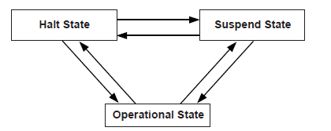
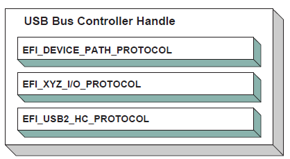
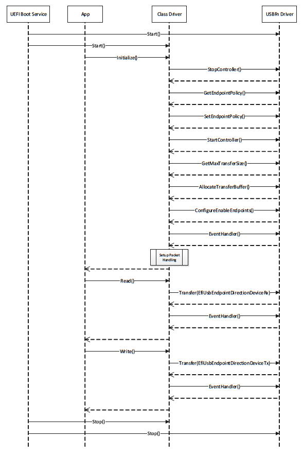

.. _protocols-usb-support:

Protocols — USB Support
========================

.. _usb2-host-controller-protocol:

USB2 Host Controller Protocol
-----------------------------

`USB2 Host Controller Protocol`_   and `USB Host Controller Protocol Overview`_ describe the USB2 Host Controller Protocol.  This protocol provides an I/O abstraction for a USB2 Host Controller. The USB2 Host Controller is a hardware component that interfaces to a Universal Serial Bus (USB). It moves data between system memory and devices on the USB by processing data structures and generating transactions on the USB. This protocol is used by a USB Bus Driver to perform all data transaction over the Universal Serial Bus. It also provides services to manage the USB root hub that is integrated into the USB Host Controller. USB device drivers do not use this protocol directly. Instead, they use the I/O abstraction produced by the USB Bus Driver. This protocol should only be used by drivers that require direct access to the USB bus.

.. _usb-host-controller-protocol-overview:

USB Host Controller Protocol Overview
#####################################

The USB Host Controller Protocol is used by code, typically USB bus drivers, running in the EFI boot services environment, to perform data transactions over a USB bus. In addition, it provides an abstraction for the root hub of the USB bus. 

The interfaces provided in the :ref:`efi-usb2-hc-protocol`  are used to manage data transactions on a USB bus. It also provides control methods for the USB root hub. The *EFI_USB2_HC_PROTOCOL* is designed to support both USB 1.1 and USB 2.0 - compliant host controllers. 

The *EFI_USB2_HC_PROTOCOL* abstracts basic functionality that is designed to operate with the EHCI, UHCI and OHCI standards. By using this protocol, a single USB bus driver can be implemented without knowing if the underlying USB host controller conforms to the XHCI, EHCI, OHCI or the UHCI standards. 

Each instance of the *EFI_USB2_HC_PROTOCOL* corresponds to a USB host controller in a platform. The protocol is attached to the device handle of a USB host controller that is created by a device driver for the USB host controller’s parent bus type. For example, a USB host controller that is implemented as a PCI device would require a PCI device driver to produce an instance of the *EFI_USB2_HC_PROTOCOL*.

.. _efi-usb2-hc-protocol:

EFI_USB2_HC_PROTOCOL
####################

**Summary** 

Provides basic USB host controller management, basic data
transactions over USB bus, and USB root hub access.

**GUID**

.. code-block::

   #define EFI_USB2_HC_PROTOCOL_GUID \
     {0x3e745226,0x9818,0x45b6,\
       {0xa2,0xac,0xd7,0xcd,0x0e,0x8b,0xa2,0xbc}}

**Protocol Interface Structure**

.. code-block::

   typedef struct _EFI_USB2_HC_PROTOCOL {
     EFI_USB2_HC_PROTOCOL_GET_CAPABILITY              GetCapability;
     EFI_USB2_HC_PROTOCOL_RESET                       Reset;
     EFI_USB2_HC_PROTOCOL_GET_STATE                   GetState;
     EFI_USB2_HC_PROTOCOL_SET_STATE                   SetState;
     EFI_USB2_HC_PROTOCOL_CONTROL_TRANSFER            ControlTransfer;
     EFI_USB2_HC_PROTOCOL_BULK_TRANSFER               BulkTransfer;
     EFI_USB2_HC_PROTOCOL_ASYNC_INTERRUPT_TRANSFER    AsyncInterruptTransfer;
     EFI_USB2_HC_PROTOCOL_ASYNC_INTERRUPT_TRANSFER    SyncInterruptTransfer;
     EFI_USB2_HC_PROTOCOL_ISOCHRONOUS_TRANSFER        IsochronousTransfer;
     EFI_USB2_HC_PROTOCOL_ASYNC_ISOCHRONOUS_TRANSFER  AsyncIsochronousTransfer;
     EFI_USB2_HC_PROTOCOL_GET_ROOTHUB_PORT_STATUS     GetRootHubPortStatus;                                                   
     EFI_USB2_HC_PROTOCOL_SET_ROOTHUB_PORT_FEATURE    SetRootHubPortFeature;                                                   
     EFI_USB2_HC_PROTOCOL_CLEAR_ROOTHUB_PORT_FEATURE  ClearRootHubPortFeature
     UINT16                                           MajorRevision;
     UINT16                                           MinorRevision;
   } EFI_USB2_HC_PROTOCOL;

**Parameters**

GetCapability
  Retrieves the capabilities of the USB host controller. See the  `EFI_USB2_HC_PROTOCOL.GetCapability()`_ function description.

Reset
  Software reset of USB. See the   `EFI_USB2_HC_PROTOCOL.Reset()`_ function description. 

GetState
  Retrieves the current state of the USB host controller. See the  `EFI_USB2_HC_PROTOCOL.GetState()`_ function description.

SetState 
  Sets the USB host controller to a specific state. See the  `EFI_USB2_HC_PROTOCOL.SetState()`_ function description.

ControlTransfer
  Submits a control transfer to a target USB device. See the  `EFI_USB2_HC_PROTOCOL.ControlTransfer()`_ function description.

BulkTransfer
  Submits a bulk transfer to a bulk endpoint of a USB device. See the  `EFI_USB2_HC_PROTOCOL.BulkTransfer()`_ function description.

AsyncInterruptTransfer 
  Submits an asynchronous interrupt transfer to an interrupt endpoint of a USB device. See the  `EFI_USB2_HC_PROTOCOL.AsyncInterruptTransfer()`_ function description.

SyncInterruptTransfer 
  Submits a synchronous interrupt transfer to an interrupt endpoint of a USB device. See the  `EFI_USB2_HC_PROTOCOL.SyncInterruptTransfer()`_ function description.

IsochronousTransfer 
  Submits isochronous transfer to an isochronous endpoint of a USB device. See the  `EFI_USB2_HC_PROTOCOL.IsochronousTransfer()`_ function description.

AsyncIsochronousTransfer 
  Submits nonblocking USB isochronous transfer. See the  `EFI_USB2_HC_PROTOCOL.AsyncIsochronousTransfer()`_ function description.

GetRootHubPortStatus
  Retrieves the status of the specified root hub port. See the  `EFI_USB2_HC_PROTOCOL.GetRootHubPortStatus()`_ function description.

SetRootHubPortFeature
  Sets the feature for the specified root hub port. See the  `EFI_USB2_HC_PROTOCOL.SetRootHubPortFeature()`_ function description.

ClearRootHubPortFeature
  Clears the feature for the specified root hub port. See the  `EFI_USB2_HC_PROTOCOL.ClearRootHubPortFeature()`_ function description.

MajorRevision 
  The major revision number of the USB host controller. The revision information indicates the release of the Universal Serial Bus Specification with which the host controller is compliant.

MinorRevision
   The minor revision number of the USB host controller. The revision information indicates the release of the Universal Serial Bus Specification with which the host controller is compliant.

**Description**

The *EFI_USB2_HC_PROTOCOL* provides USB host controller management, basic data transactions over a USB bus, and USB root hub access. A device driver that wishes to manage a USB bus in a system retrieves the *EFI_USB2_HC_PROTOCOL* instance that is associated with the USB bus to be managed. A device handle for a USB host controller will minimally contain an  :ref:`efi-device-path-protocol`  instance, and an *EFI_USB2_HC_PROTOCOL* instance.

.. _efi-usb2-hc-protocol-getcapability:

EFI_USB2_HC_PROTOCOL.GetCapability()
####################################

**Summary**

Retrieves the Host Controller capabilities.

**Prototype**

.. code-block:: 
  
   typedef
   EFI_STATUS
   (EFIAPI *EFI_USB2_HC_PROTOCOL_GET_CAPABILITY) (
     IN EFI_USB2_HC_PROTOCOL          *This,
     OUT UINT8                        *MaxSpeed,
     OUT UINT8                        *PortNumber,
     OUT UINT8                        *Is64BitCapable
     );

**Parameters**

This 
  A pointer to the :ref:`efi-usb2-hc-protocol`  instance. Type EFI_USB2_HC_PROTOCOL is defined in `USB2 Host Controller Protocol`_ .

MaxSpeed 
  Host controller data transfer speed; see **Related Definitions** below for a list of supported transfer speed values.

PortNumber 
  Number of the root hub ports.

Is64BitCapable 
  **TRUE** if controller supports 64-bit memory addressing, **FALSE** otherwise.

**Related Definitions**

.. code-block:: 
  
   #define EFI_USB_SPEED_FULL    0x0000
   #define EFI_USB_SPEED_LOW     0x0001
   #define EFI_USB_SPEED_HIGH    0x0002
   #define EFI_USB_SPEED_SUPER   0x0003

.. list-table::
   :widths: 25 65
   :class: longtable

   * - EFI_USB_SPEED_LOW
     - Low speed USB device; data bandwidth is up to 1.5 Mb/s. Supported by USB 1.1 OHCI and UHCI  host controllers.                             
   * - EFI_USB_SPEED_FULL
     - Full speed USB device; data bandwidth is up to 12 Mb/s. Supported by USB 1.1 OHCI and UHCI host controllers.                        
   * - EFI_USB_SPEED_HIGH
     - High speed USB device; data bandwidth is up to 480 Mb/s. Supported by USB 2.0 EHCI host controllers.                                  
   * - EFI_USB_SPEED_SUPER
     - Super speed USB device; data bandwidth is up to 4.8Gbs. Supported by USB 3.0 XHCI host controllers.                                  

**Description**

This function is used to retrieve the host controller capabilities. *MaxSpeed* indicates the maximum data transfer speed the controller is capable of; this information is needed for the subsequent transfers. *PortNumber* is the number of root hub ports, it is required by the USB bus driver to perform bus enumeration. *Is64BitCapable* indicates that controller is capable of 64-bit memory access so that the host controller software can use memory blocks above 4 GiB for the data transfers.

**Status Codes Returned**

.. list-table::
   :widths: 35 70
   :class: longtable

   * - EFI_SUCCESS
     - The host controller capabilities were retrieved successfully.
   * - EFI_INVALID_PARAMETER
     - MaxSpeed or PortNumber or Is64BitCapable is **NULL**.
   * - EFI_DEVICE_ERROR
     - An error was encountered while attempting to retrieve the capabilities.

.. _efi-usb2-hc-protocol-reset:

EFI_USB2_HC_PROTOCOL.Reset()
############################

**Summary**

Provides software reset for the USB host controller.

**Prototype**

.. code-block:: 
  
   typedef
   EFI_STATUS
   (EFIAPI *EFI_USB2_HC_PROTOCOL_RESET) (
     IN EFI_USB2_HC_PROTOCOL            *This,
     IN UINT16                          Attributes
     );

**Parameters**

This 
  A pointer to the :ref:`efi-usb2-hc-protocol`  instance. Type EFI_USB2_HC_PROTOCOL is defined in `USB2 Host Controller Protocol`_ .

Attributes 
  A bit mask of the reset operation to perform. See **Related Definitions** below for a list of the supported bit mask values.

**Related Definitions**

.. code-block:: 
  
   #define EFI_USB_HC_RESET_GLOBAL              0x0001
   #define EFI_USB_HC_RESET_HOST_CONTROLLER     0x0002
   #define EFI_USB_HC_RESET_GLOBAL_WITH_DEBUG   0x0004
   #define EFI_USB_HC_RESET_HOST_WITH_DEBUG     0x0008  
            
  
EFI_USB_HC_RESET_GLOBAL 
  If this bit is set, a global reset signal will be sent to the USB bus. This resets all of the USB bus logic, including the USB host controller hardware and all the devices attached on the USB bus.

EFI_USB_HC_RESET_HOST_CONTROLLER
  If this bit is set, the USB host controller hardware will be reset. No reset signal will be sent to the USB bus.

EFI_USB_HC_RESET_GLOBAL_WITH_DEBUG
  If this bit is set, then a global reset signal will be sent to the USB bus. This resets all of the USB bus logic, including the USB host controller and all of the devices attached on the USB bus. If this is an XHCI or EHCI controller and the debug port has been configured, then this will still reset the host controller.

EFI_USB_HC_RESET_HOST_WITH_DEBUG
  If this bit is set, the USB host controller hardware will be reset. If this is an XHCI or EHCI controller and the debug port has been configured, then this will still reset the host controller.

**Description**

This function provides a software mechanism to reset a USB host controller. The type of reset is specified by the *Attributes* parameter. If the type of reset specified by *Attributes* is not valid, then *EFI_INVALID_PARAMETER* is returned. If the reset operation is completed, then *EFI_SUCCESS* is returned. If the type of reset specified by *Attributes* is not currently supported by the host controller hardware, *EFI_UNSUPPORTD* is returned. If a device error occurs during the reset operation, then *EFI_DEVICE_ERROR* is returned. 

**Note**: For XHCI or EHCI controllers, the *EFI_USB_HC_RESET_GLOBAL* and *EFI_USB_HC_RESET_HOST_CONTROLLER* types of reset do not actually reset the bus if the debug port has been configured. In these cases, the function will return *EFI_ACCESS_DENIED*.

**Status Codes Returned**

.. list-table::
   :widths: 35 70
   :class: longtable

   * - EFI_SUCCESS
     - The reset operation succeeded.
   * - EFI_INVALID_PARAMETER
     - Attributes is not valid.
   * - EFI_UNSUPPORTED
     - The type of reset specified by Attributes is not currently supported by the host controller hardware.
   * - EFI_ACCESS_DENIED
     - Reset operation is rejected due to the debug port being configured and active; only *EFI_USB_HC_RESET_GLOBAL_WITH_DEBUG* or *EFI_USB_HC_RESET_HOST_WITH_DEBUG* reset *Attributes* can be used to perform reset operation for this host controller.
   * - EFI_DEVICE_ERROR
     - An error was encountered while attempting to perform the reset operation.

.. _efi-usb2-hc-protocol-getstate:

EFI_USB2_HC_PROTOCOL.GetState()
###############################

**Summary**

Retrieves current state of the USB host controller.

**Prototype**

.. code-block:: 
  
   typedef
   EFI_STATUS
   (EFIAPI *EFI_USB2_HC_PROTOCOL_GET_STATE) (
     IN EFI_USB2_HC_PROTOCOL              *This,
     OUT EFI_USB_HC_STATE                 *State
     );

**Parameters**

This
  A pointer to the :ref:`efi-usb2-hc-protocol`  instance. Type EFI_USB2_HC_PROTOCOL is defined in `USB2 Host Controller Protocol`_ .

State
  A pointer to the *EFI_USB_HC_STATE* data structure that indicates current state of the USB host controller. Type EFI_USB_HC_STATE is defined in **Related Definitions.**

**Related Definitions**

.. code-block:: 
  
   typedef enum {
     EfiUsbHcStateHalt,
     EfiUsbHcStateOperational,
     EfiUsbHcStateSuspend,
     EfiUsbHcStateMaximum
   }   EFI_USB_HC_STATE;

EfiUsbHcStateHalt
  The host controller is in halt state. No USB transactions can occur while in this state. The host controller can enter this state for three reasons:

-  After host controller hardware reset.
-  Explicitly set by software.
-  Triggered by a fatal error such as consistency check   failure.

EfiUsbHcStateOperational
  The host controller is in an operational state. When in this state, the host controller can execute bus traffic. This state must be explicitly set to enable the USB bus traffic.

EfiUsbHcStateSuspend
  The host controller is in the suspend state. No USB transactions can occur while in this state. The host controller enters this state for the following reasons:

-  Explicitly set by software.
-  Triggered when there is no bus traffic for 3 microseconds.

**Description**

This function is used to retrieve the USB host controller’s current state. The USB Host Controller Protocol publishes three states for USB host controller, as defined in **Related Definitions** below. If *State* is **NULL**, then *EFI_INVALID_PARAMETER* is returned. If a device error occurs while attempting to retrieve the USB host controllers current state, then *EFI_DEVICE_ERROR* is returned. Otherwise, the USB host controller’s current state is returned in *State*, and *EFI_SUCCESS* is returned.

**Status Codes Returned**

.. list-table::
   :widths: 35 70

   * - EFI_SUCCESS
     - The state information of the host controller was returned in State.
   * - EFI_INVALID_PARAMETER
     - State is **NULL**.
   * - EFI_DEVICE_ERROR
     - An error was encountered while attempting to retrieve the host controller’s current state.

.. _efi-usb2-hc-protocol-setstate:

EFI_USB2_HC_PROTOCOL.SetState()
###############################

**Summary**

Sets the USB host controller to a specific state.

**Prototype**

.. code-block:: 
  
   typedef
   EFI_STATUS
   (EFIAPI *EFI_USB2_HC_PROTOCOL_SET_STATE) (
     IN EFI_USB2_HC_PROTOCOL          *This,
     IN EFI_USB_HC_STATE              State
     );

**Parameters**

This 
 A pointer to the :ref:`efi-usb2-hc-protocol`  instance. Type EFI_USB2_HC_PROTOCOL is defined in `USB2 Host Controller Protocol`_ .

State 
  Indicates the state of the host controller that will be set. See the definition and description of the type EFI_USB_HC_STATE in the  `EFI_USB2_HC_PROTOCOL.GetState()`_ function description.

**Description**

This function is used to explicitly set a USB host controller’s state. There are three states defined for the USB host controller. These are the halt state, the operational state and the suspend state. The Figure below, :ref:`Software-Triggered-State-Transitions-of-a-USB-Host-Controller`,  illustrates the possible state transitions: 

   Software Triggered State Transitions of a USB Host Controller

If the state specified by *State* is not valid, then *EFI_INVALID_PARAMETER* is returned. If a device error occurs while attempting to place the USB host controller into the state specified by *State*, then *EFI_DEVICE_ERROR* is returned. If the USB host controller is successfully placed in the state specified by *State*, then *EFI_SUCCESS* is returned.

**Status Codes Returned**

.. list-table::
   :widths: 35 70

   * - EFI_SUCCESS
     - The USB host controller was successfully placed in the state specified by State.
   * - EFI_INVALID_PARAMETER
     - State is invalid.
   * - EFI_DEVICE_ERROR
     - Failed to set the state specified by State due to device error.

.. _efi-usb2-hc-protocol-controltransfer:

EFI_USB2_HC_PROTOCOL.ControlTransfer()
######################################

**Summary**

Submits control transfer to a target USB device.

**Prototype**

.. code-block:: 
  
   typedef
   EFI_STATUS
   (EFIAPI *EFI_USB2_HC_PROTOCOL_CONTROL_TRANSFER) (
     IN EFI_USB2_HC_PROTOCOL                *This,
     IN UINT8                               DeviceAddress,
     IN UINT8                               DeviceSpeed,
     IN UINTN                               MaximumPacketLength,
     IN EFI_USB_DEVICE_REQUEST              *Request,
     IN EFI_USB_DATA_DIRECTION              TransferDirection,
     IN OUT VOID                            *Data OPTIONAL,
     IN OUT UINTN                           *DataLength OPTIONAL,
     IN UINTN                               TimeOut,
     IN EFI_USB2_HC_TRANSACTION_TRANSLATOR  *Translator,
     OUT UINT32                             *TransferResult
     );

**Related Definitions**

.. code-block:: 
  
   typedef struct {
     UINT8                    TranslatorHubAddress,
     UINT8                    TranslatorPortNumber
    } EFI_USB2_HC_TRANSACTION_TRANSLATOR;

**Parameters**

This
  A pointer to the :ref:`efi-usb2-hc-protocol`  instance. Type EFI_USB2_HC_PROTOCOL is defined in `USB2 Host Controller Protocol`_ .

DeviceAddress
  Represents the address of the target device on the USB, which is assigned during USB enumeration.

DeviceSpeed
  Indicates device speed. See **Related Definitions** in GetCapability() for a list of the supported values.

MaximumPacketLength
  Indicates the maximum packet size that the default control transfer endpoint is capable of sending or receiving.

Request
  A pointer to the USB device request that will be sent to the USB device. Refer to *UsbControlTransfer()*  (`USB I/O Protocol`_) for the definition of this function type. 

TransferDirection
  Specifies the data direction for the transfer. There are three values available, EfiUsbDataIn, EfiUsbDataOut and EfiUsbNoData. Refer to *UsbControlTransfer()*  (`USB I/O Protocol`_) for the definition of this function type.

Data
  A pointer to the buffer of data that will be transmitted to USB device or received from USB device.

DataLength
  On input, indicates the size, in bytes, of the data buffer specified by Data. On output, indicates the amount of data actually transferred.

Translator
  A pointer to the transaction translator data. See "Description" for the detailed information of this data structure.

TimeOut
  Indicates the maximum time, in milliseconds, which the transfer is allowed to complete.

TransferResult
  A pointer to the detailed result information generated by this control transfer. Refer to *UsbControlTransfer()*  (`USB I/O Protocol`_) for transfer result types ( *EFI_USB_ERR_x* ).

**Description**

This function is used to submit a control transfer to a target USB device specified by *DeviceAddress*. Control transfers are intended to support configuration/command/status type communication flows between host and USB device. 

There are three control transfer types according to the data phase. If the *TransferDirection* parameter is *EfiUsbNoData*, *Data* is **NULL**, and *DataLength* is 0, then no data phase is present in the control transfer. If the *TransferDirection* parameter is *EfiUsbDataOut*, then *Data* specifies the data to be transmitted to the device, and *DataLength* specifies the number of bytes to transfer to the device. In this case, there is an OUT DATA stage followed by a SETUP stage. If the *TransferDirection* parameter is *EfiUsbDataIn*, then *Data* specifies the data to be received from the device, and *DataLength* specifies the number of bytes to receive from the device. In this case there is an IN DATA stage followed by a SETUP stage. 

*Translator* is necessary to perform split transactions on low-speed or full-speed devices connected to a high-speed hub. Such transaction require the device connection information: device address and the port number of the hub that device is connected to. This information is passed through the fields of *EFI_USB2_HC_TRANSACTION_TRANSLATOR* structure. See **Related Definitions** for the structure field names. Translator is passed as **NULL** for the USB1.1 host controllers transfers or when the transfer is requested for high-speed device connected to USB2.0 controller. 

If the control transfer has completed successfully, then *EFI_SUCCESS* is returned. If the transfer cannot be completed within the timeout specified by *TimeOut*, then *EFI_TIMEOUT* is returned. If an error other than timeout occurs during the USB transfer, then *EFI_DEVICE_ERROR* is returned and the detailed error code will be returned in the *TransferResult* parameter. 

*EFI_INVALID_PARAMETER* is returned if one of the following conditions is satisfied:

-   *TransferDirection* is invalid.
-   *TransferDirection*, *Data*, and *DataLength* do not match one of the three control transfer types described above.
-   *Request* pointer is **NULL**.
-   *MaximumPacketLength* is not valid. If *DeviceSpeed* is *EFI_USB_SPEED_LOW*, then *MaximumPacketLength* must be 8. If *DeviceSpeed* is *EFI_USB_SPEED_FULL* or *EFI_USB_SPEED_HIGH*, then *MaximumPacketLength* must be 8, 16, 32, or 64. If *DeviceSpeed* is *EFI_USB_SPEED_SUPER*, then *MaximumPacketLength* must be 512.
-   *TransferResult* pointer is **NULL**.
-   *Translator* is **NULL** while the requested transfer requires split transaction. The conditions of the split transactions are described above in "Description" section.

**Status Codes Returned**

.. list-table::
   :widths: 35 70
   :class: longtable

   * - EFI_SUCCESS
     - The control transfer was completed successfully.
   * - EFI_OUT_OF_RESOURCES
     - The control transfer could not be completed due to a lack of resources.
   * - EFI_INVALID_PARAMETER
     - Some parameters are invalid. The possible invalid parameters are described in "Description" above.
   * - EFI_TIMEOUT
     - The control transfer failed due to timeout.
   * - EFI_DEVICE_ERROR
     - The control transfer failed due to host controller or device error. Caller should check TransferResult for detailed error information.

.. _efi-usb2-hc-protocol-bulktransfer:

EFI_USB2_HC_PROTOCOL.BulkTransfer()
###################################

**Summary**

Submits bulk transfer to a bulk endpoint of a USB device.

**Prototype**

.. code-block:: 
  
   typedef
   EFI_STATUS
   (EFIAPI *EFI_USB2_HC_PROTOCOL_BULK_TRANSFER) (
     IN EFI_USB2_HC_PROTOCOL                *This,
     IN UINT8                               DeviceAddress,
     IN UINT8                               EndPointAddress,
     IN UINT8                               DeviceSpeed,
     IN UINTN                               MaximumPacketLength,
     IN UINT8                               DataBuffersNumber,
     IN OUT VOID                            *Data[EFI_USB_MAX_BULK_BUFFER_NUM],
     IN OUT UINTN                           *DataLength,
     IN OUT UINT8                           *DataToggle,
     IN UINTN                               TimeOut,
     IN EFI_USB2_HC_TRANSACTION_TRANSLATOR *Translator,
     OUT UINT32                             *TransferResult
     );
  

**Parameters**

This
  A pointer to the :ref:`efi-usb2-hc-protocol`  instance. Type EFI_USB2_HC_PROTOCOL is defined in `USB2 Host Controller Protocol`_ .

DeviceAddress
  Represents the address of the target device on the USB, which is assigned during USB enumeration.

EndPointAddress
  The combination of an endpoint number and an endpoint direction of the target USB device. Each endpoint address supports data transfer in one direction except the control endpoint (whose default endpoint address is 0). It is the caller’s responsibility to make sure that the *EndPointAddress* represents a bulk endpoint.

DeviceSpeed
  Indicates device speed. The supported values are *EFI_USB_SPEED_FULL,EFI_USB_SPEED_HIGH* or *EFI_USB_SPEED_SUPER.*.

MaximumPacketLength
  Indicates the maximum packet size the target endpoint is capable of sending or receiving.

DataBuffersNumber
  Number of data buffers prepared for the transfer.

Data
  Array of pointers to the buffers of data that will be transmitted to USB device or received from USB device.

DataLength
  When input, indicates the size, in bytes, of the data buffers specified by *Data*. When output, indicates the actually transferred data size.

DataToggle
  A pointer to the data toggle value. On input, it indicates the initial data toggle value the bulk transfer should adopt; on output, it is updated to indicate the data toggle value of the subsequent bulk transfer.

Translator
  A pointer to the transaction translator data. See ControlTransfer() "Description" for the detailed information of this data structure.

TimeOut
  Indicates the maximum time, in milliseconds, which the transfer is allowed to complete.

TransferResult
  A pointer to the detailed result information of the bulk transfer. Refer to *UsbControlTransfer()* in `USB I/O Protocol`_  for transfer result types ( *EFI_USB_ERR_x* ).

**Description**

This function is used to submit bulk transfer to a target endpoint of a USB device. The target endpoint is specified by *DeviceAddress* and *EndpointAddress*. Bulk transfers are designed to support devices that need to communicate relatively large amounts of data at highly variable times where the transfer can use any available bandwidth. Bulk transfers can be used only by full-speed and high-speed devices. 

High-speed bulk transfers can be performed using multiple data buffers. The number of buffers that are actually prepared for the transfer is specified by *DataBuffersNumber*. For full-speed bulk transfers this value is ignored. 

Data represents a list of pointers to the data buffers. For full-speed bulk transfers only the data pointed by *Data[0]* shall be used. For high-speed transfers depending on *DataLength* there several data buffers can be used. The total number of buffers must not exceed *EFI_USB_MAX_BULK_BUFFER_NUM*. See **Related Definitions** for the *EFI_USB_MAX_BULK_BUFFER_NUM* value. 

The data transfer direction is determined by the endpoint direction that is encoded in the *EndPointAddress* parameter. Refer to USB Specification, Revision 2.0 on the Endpoint Address encoding. 

The *DataToggle* parameter is used to track target endpoint’s data sequence toggle bits. The USB provides a mechanism to guarantee data packet synchronization between data transmitter and receiver across multiple transactions. The data packet synchronization is achieved with the data sequence toggle bits and the DATA0/DATA1 PIDs. A bulk endpoint’s toggle sequence is initialized to DATA0 when the endpoint experiences a configuration event. It toggles between DATA0 and DATA1 in each successive data transfer. It is host’s responsibility to track the bulk endpoint’s data toggle sequence and set the correct value for each data packet. The input *DataToggle* value points to the data toggle value for the first data packet of this bulk transfer; the output *DataToggle* value points to the data toggle value for the last successfully transferred data packet of this bulk transfer. The caller should record the data toggle value for use in subsequent bulk transfers to the same endpoint. 

If the bulk transfer is successful, then *EFI_SUCCESS* is returned. If USB transfer cannot be completed within the timeout specified by *Timeout*, then *EFI_TIMEOUT* is returned. If an error other than timeout occurs during the USB transfer, then *EFI_DEVICE_ERROR* is returned and the detailed status code is returned in *TransferResult*. 

*EFI_INVALID_PARAMETER* is returned if one of the following conditions is satisfied:

-   *Data* is **NULL**.
-   *DataLength* is 0.
-   *DeviceSpeed* is not valid; the legal values are *EFI_USB_SPEED_FULL*, *EFI_USB_SPEED_HIGH,* or *EFI_USB_SPEED_SUPER.*
-   *MaximumPacketLength* is not valid. The legal value of this parameter is 64 or less for full-speed, 512 or less for high-speed, and 1024 or less for super-speed transactions.
-   *DataToggle* points to a value other than 0 and 1.
-   *TransferResult* is **NULL**.
 
**Status Codes Returned**

.. list-table::
   :widths: 35 70
   :class: longtable 

   * - EFI_SUCCESS
     - The bulk transfer was completed successfully.
   * - EFI_OUT_OF_RESOURCES
     - The bulk transfer could not be submitted due to lack of resource.
   * - EFI_INVALID_PARAMETER
     - Some parameters are invalid. The possible invalid parameters are described in "Description" above.
   * - EFI_TIMEOUT
     - The bulk transfer failed due to timeout.
   * - EFI_DEVICE_ERROR
     - The bulk transfer failed due to host controller or device error. Caller should check TransferResult for detailed error information.

.. _efi-usb2-hc-protocol-asyncinterrupttransfer:

EFI_USB2_HC_PROTOCOL.AsyncInterruptTransfer()
##############################################

**Summary**

Submits an asynchronous interrupt transfer to an interrupt endpoint of a USB device.

**Prototype**

.. code-block:: 
  
   typedef
   EFI_STATUS
   (EFIAPI *EFI_USB2_HC_PROTOCOL_ASYNC_INTERRUPT_TRANSFER) (
     IN EFI_USB2_HC_PROTOCOL                *This,
     IN UINT8                               DeviceAddress,
     IN UINT8                               EndPointAddress,
     IN UINT8                               DeviceSpeed,
     IN UINTN                               MaximumPacketLength,
     IN BOOLEAN                             IsNewTransfer,
     IN OUT UINT8                           *DataToggle,
     IN UINTN                               PollingInterval OPTIONAL,
     IN UINTN                               DataLength OPTIONAL,
     IN EFI_USB2_HC_TRANSACTION_TRANSLATOR  *Translator OPTIONAL,
     IN EFI_ASYNC_USB_TRANSFER_CALLBACK     CallBackFunction OPTIONAL,
     IN VOID                                *Context OPTIONAL
     );

**Parameters**

This
  A pointer to the :ref:`efi-usb2-hc-protocol`  instance. Type EFI_USB2_HC_PROTOCOL is defined in `USB2 Host Controller Protocol`_ .

DeviceAddress 
  Represents the address of the target device on the USB, which is assigned during USB enumeration.

EndPointAddress
  The combination of an endpoint number and an endpoint direction of the target USB device. Each endpoint address supports data transfer in one direction except the control endpoint (whose default endpoint address is zero). It is the caller’s responsibility to make sure that the *EndPointAddress* represents an interrupt endpoint.

DeviceSpeed
  Indicates device speed. See **Related Definitions** in *EFI_USB2_HC_PROTOCOL.ControlTransfer()* for a list of the supported values.

MaximumPacketLength
  Indicates the maximum packet size the target endpoint is capable of sending or receiving.

IsNewTransfer
  If **TRUE**, an asynchronous interrupt pipe is built between the host and the target interrupt endpoint. If **FALSE**, the specified asynchronous interrupt pipe is canceled. If **TRUE**, and an interrupt transfer exists for the target end point, then *EFI_INVALID_PARAMETER* is returned.

DataToggle
  A pointer to the data toggle value. On input, it is valid when *IsNewTransfer* is **TRUE**, and it indicates the initial data toggle value the asynchronous interrupt transfer should adopt. On output, it is valid when *IsNewTransfer* is **FALSE**, and it is updated to indicate the data toggle value of the subsequent asynchronous interrupt transfer.

PollingInterval
  Indicates the interval, in milliseconds, that the asynchronous interrupt transfer is polled. This parameter is required when *IsNewTransfer* is **TRUE**.

DataLength
  Indicates the length of data to be received at the rate specified by *PollingInterval* from the target asynchronous interrupt endpoint. This parameter is only required when *IsNewTransfer* is **TRUE**.

Translator
  A pointer to the transaction translator data.

CallBackFunction
  The Callback function. This function is called at the rate specified by *PollingInterval*. This parameter is only required when *IsNewTransfer* is **TRUE**. Refer to *UsbAsyncInterruptTransfer()* in `USB I/O Protocol`_  for the definition of this function type.

Context
  The context that is passed to the *CallBackFunction*. This is an optional parameter and may be **NULL**.

**Description**

This function is used to submit asynchronous interrupt transfer to a target endpoint of a USB device. The target endpoint is specified by *DeviceAddress* and *EndpointAddress*. In the USB Specification, Revision 2.0, interrupt transfer is one of the four USB transfer types. In the :ref:`efi-usb2-hc-protocol`, interrupt transfer is divided further into synchronous interrupt transfer and asynchronous interrupt transfer. 

An asynchronous interrupt transfer is typically used to query a device’s status at a fixed rate. For example, keyboard, mouse, and hub devices use this type of transfer to query their interrupt endpoints at a fixed rate. The asynchronous interrupt transfer is intended to support the interrupt transfer type of "submit once, execute periodically." Unless an explicit request is made, the asynchronous transfer will never retire. 

If *IsNewTransfer* is **TRUE**, then an interrupt transfer is started at a fixed rate. The rate is specified by *PollingInterval*, the size of the receive buffer is specified by *DataLength*, and the callback function is specified by *CallBackFunction*. *Context* specifies an optional context that is passed to the *CallBackFunction* each time it is called. The *CallBackFunction* is intended to provide a means for the host to periodically process interrupt transfer data. 

If *IsNewTransfer* is **TRUE**, and an interrupt transfer exists for the target end point, then *EFI_INVALID_PARAMETER* is returned. 

If *IsNewTransfer* is **FALSE**, then the interrupt transfer is canceled. 

*EFI_INVALID_PARAMETER* is returned if one of the following conditions is satisfied:

-  Data transfer direction indicated by *EndPointAddress* is other than *EfiUsbDataIn.*
-   *IsNewTransfer* is **TRUE** and *DataLength* is 0.
-   *IsNewTransfer* is **TRUE** and *DataToggle* points to a value other than 0 and 1.
-   *IsNewTransfer* is **TRUE** and *PollingInterval* is not in the range 1..255.
-   *IsNewTransfer* requested where an interrupt transfer exists for the target end point. 

**Status Codes Returned**

.. list-table::
   :widths: 35 70
   :class: longtable

   * - EFI_SUCCESS
     - The asynchronous interrupt transfer request has been successfully submitted or canceled.
   * - EFI_INVALID_PARAMETER
     - Some parameters are invalid. The possible invalid parameters are described in "Description" above. When an interrupt transfer exists for the target end point and a new transfer is requested, EFI_INVALID_PARAMETER is returned.
   * - EFI_OUT_OF_RESOURCES
     - The request could not be completed due to a lack of resources.

.. _efi-usb2-hc-protocol-syncinterrupttransfer:

EFI_USB2_HC_PROTOCOL.SyncInterruptTransfer()
############################################

**Summary**

Submits synchronous interrupt transfer to an interrupt endpoint
of a USB device.

**Prototype**

.. code-block:: 
  
   typedef
   EFI_STATUS
   (EFIAPI *EFI_USB2_HC_PROTOCOL_SYNC_INTERRUPT_TRANSFER) (
     IN   EFI_USB2_HC_PROTOCOL                *This,
     IN   UINT8                               DeviceAddress,
     IN   UINT8                               EndPointAddress,
     IN   UINT8                               DeviceSpeed,
     IN   UINTN                               MaximumPacketLength,
     IN OUT VOID                              *Data,
     IN OUT UINTN                             *DataLength,
     IN OUT UINT8                             *DataToggle,
     IN   UINTN                                TimeOut,
     IN EFI_USB2_HC_TRANSACTION_TRANSLATOR    *Translator
     OUT UINT32                               *TransferResult
     );

**Parameters**

This
  A pointer to the :ref:`efi-usb2-hc-protocol`  instance. Type EFI_USB2_HC_PROTOCOL is defined in `USB2 Host Controller Protocol`_ .

DeviceAddress
  Represents the address of the target device on the USB, which is assigned during USB enumeration.

EndPointAddress
  The combination of an endpoint number and an endpoint direction of the target USB device. Each endpoint address supports data transfer in one direction except the control endpoint (whose default endpoint address is zero). It is the caller’s responsibility to make sure that the *EndPointAddress* represents an interrupt endpoint.

DeviceSpeed
  Indicates device speed. See **Related Definitions** in  `EFI_USB2_HC_PROTOCOL.ControlTransfer()`_ for a list of the supported values.

MaximumPacketLength
  Indicates the maximum packet size the target endpoint is capable of sending or receiving.

Data
  A pointer to the buffer of data that will be transmitted to USB device or received from USB device.

DataLength
  On input, the size, in bytes, of the data buffer specified by *Data*. On output, the number of bytes transferred.

DataToggle
  A pointer to the data toggle value. On input, it indicates the initial data toggle value the synchronous interrupt transfer should adopt; on output, it is updated to indicate the data toggle value of the subsequent synchronous interrupt transfer.

TimeOut
  Indicates the maximum time, in milliseconds, which the transfer is allowed to complete.

Translator
  A pointer to the transaction translator data.

TransferResult
  A pointer to the detailed result information from the synchronous interrupt transfer. Refer to *UsbControlTransfer()* in `USB I/O Protocol`_  for transfer result types (*EFI_USB_ERR_x*).

**Description**

This function is used to submit a synchronous interrupt transfer to a target endpoint of a USB device. The target endpoint is specified by *DeviceAddress* and *EndpointAddress*. In the USB Specification, Revision2.0, interrupt transfer is one of the four USB transfer types. In the :ref:`efi-usb2-hc-protocol` , interrupt transfer is divided further into synchronous interrupt transfer and asynchronous interrupt transfer. 

The synchronous interrupt transfer is designed to retrieve small amounts of data from a USB device through an interrupt endpoint. A synchronous interrupt transfer is only executed once for each request. This is the most significant difference from the asynchronous interrupt transfer.  

If the synchronous interrupt transfer is successful, then *EFI_SUCCESS* is returned. If the USB transfer cannot be completed within the timeout specified by *Timeout*, then *EFI_TIMEOUT* is returned. If an error other than timeout occurs during the USB transfer, then *EFI_DEVICE_ERROR* is returned and the detailed status code is returned in *TransferResult*. 

*EFI_INVALID_PARAMETER* is returned if one of the following conditions is satisfied:

-   *Data* is **NULL**.
-   *DataLength* is 0.
-   *MaximumPacketLength* is not valid. The legal value of this parameter should be 3072 or less for high-speed device, 64 or less for a full-speed device; for a slow device, it is limited to 8 or less. For the full-speed device, it should be 8, 16, 32, or 64; for the slow device, it is limited to 8.
-   *DataToggle* points to a value other than 0 and 1.
-   *TransferResult* is **NULL**.

**Status Codes Returned**

.. list-table::
   :widths: 35 70
   :class: longtable

   * - EFI_SUCCESS
     - The synchronous interrupt transfer was completed successfully.
   * - EFI_OUT_OF_RESOURCES
     - The synchronous interrupt transfer could not be submitted due to lack of resource.
   * - EFI_INVALID_PARAMETER
     - Some parameters are invalid. The possible invalid parameters are described in "Description" above.
   * - EFI_TIMEOUT
     - The synchronous interrupt transfer failed due to timeout.
   * - EFI_DEVICE_ERROR
     - The synchronous interrupt transfer failed due to host controller or device error. Caller should check TransferResult for detailed error information.

.. _efi-usb2-hc-protocol-isochronoustransfer:

EFI_USB2_HC_PROTOCOL.IsochronousTransfer()
##########################################

**Summary**

Submits isochronous transfer to an isochronous endpoint of a
USB device.

**Prototype**

.. code-block:: 
  
   typedef
   EFI_STATUS
   (EFIAPI *EFI_USB2_HC_PROTOCOL_ISOCHRONOUS_TRANSFER) (
     IN   EFI_USB2_HC_PROTOCOL                  *This,
     IN   UINT8                                 DeviceAddress,
     IN   UINT8                                 EndPointAddress,
     IN   UINT8                                 DeviceSpeed,
     IN   UINTN                                 MaximumPacketLength,
     IN   UINT8                                 DataBuffersNumber,
     IN OUT VOID                                *Data[EFI_USB_MAX_ISO_BUFFER_NUM],
     IN   UINTN                                 DataLength,
     IN   EFI_USB2_HC_TRANSACTION_TRANSLATOR    *Translator,
     OUT  UINT32                                *TransferResult
     );

**Related Definitions**
 
.. code-block:: 
  
   #define EFI_USB_MAX_ISO_BUFFER_NUM 7
   #define EFI_USB_MAX_ISO_BUFFER_NUM1 2

**Parameters**

This
  A pointer to the :ref:`efi-usb2-hc-protocol`  instance. Type EFI_USB2_HC_PROTOCOL is defined in `USB2 Host Controller Protocol`_ .

DeviceAddress
  Represents the address of the target device on the USB, which is assigned during USB enumeration.

EndPointAddress
  The combination of an endpoint number and an endpoint direction of the target USB device. Each endpoint address supports data transfer in one direction except the control endpoint (whose default endpoint address is 0). It is the caller’s responsibility to make sure that the *EndPointAddress* represents an isochronous endpoint.

DeviceSpeed
  Indicates device speed. The supported values are *EFI_USB_SPEED_FULL*, *EFI_USB_SPEED_HIGH*, or *EFI_USB_SPEED_SUPER*.

MaximumPacketLength
  Indicates the maximum packet size the target endpoint is capable of sending or receiving. For isochronous endpoints, this value is used to reserve the bus time in the schedule, required for the per-frame data payloads. The pipe may, on an ongoing basis, actually use less bandwidth than that reserved.

DataBuffersNumber
  Number of data buffers prepared for the transfer.

Data
  Array of pointers to the buffers of data that will be transmitted to USB device or received from USB device.

DataLength
  Specifies the length, in bytes, of the data to be sent to or received from the USB device.

Translator
  A pointer to the transaction translator data. See ControlTransfer() "Description" for the detailed information of this data structure.

TransferResult
  A pointer to the detail result information of the isochronous transfer. Refer to *UsbControlTransfer()* in `USB I/O Protocol`_ for transfer result types (*EFI_USB_ERR_x*).

**Description**

This function is used to submit isochronous transfer to a target endpoint of a USB device. The target endpoint is specified by *DeviceAddress* and *EndpointAddress*. Isochronous transfers are used when working with isochronous date. It provides periodic, continuous communication between the host and a device. Isochronous transfers can be used only by full-speed, high-speed, and super-speed devices. 

High-speed isochronous transfers can be performed using multiple data buffers. The number of buffers that are actually prepared for the transfer is specified by *DataBuffersNumber*. For full-speed isochronous transfers this value is ignored. 

Data represents a list of pointers to the data buffers. For full-speed isochronous transfers only the data pointed by *Data[0]* shall be used. For high-speed isochronous transfers and for the split transactions depending on *DataLength* there several data buffers can be used. For the high-speed isochronous transfers the total number of buffers must not exceed *EFI_USB_MAX_ISO_BUFFER_NUM*. For split transactions performed on full-speed device by high-speed host controller the total number of buffers is limited to *EFI_USB_MAX_ISO_BUFFER_NUM1* See **Related Definitions** for the *EFI_USB_MAX_ISO_BUFFER_NUM* and *EFI_USB_MAX_ISO_BUFFER_NUM1* values. 

If the isochronous transfer is successful, then *EFI_SUCCESS* is returned. The isochronous transfer is designed to be completed within one USB frame time, if it cannot be completed, *EFI_TIMEOUT* is returned. If an error other than timeout occurs during the USB transfer, then *EFI_DEVICE_ERROR* is returned and the detailed status code will be returned in *TransferResult*. 

*EFI_INVALID_PARAMETER* is returned if one of the following conditions is satisfied:

-   *Data* is **NULL**.
-   *DataLength* is 0.
-   *DeviceSpeed* is not one of the supported values listed above.
-   *MaximumPacketLength* is invalid. *MaximumPacketLength* must be 1023 or less for full-speed devices, and 1024 or less for high-speed and super-speed devices.
-   *TransferResult* is **NULL**.

**Status Codes Returned**

.. list-table::
   :widths: 35 70
   :class: longtable

   * - EFI_SUCCESS
     - The isochronous transfer was completed successfully.
   * - EFI_OUT_OF_RESOURCES
     - The isochronous transfer could not be submitted due to lack of resource.
   * - EFI_INVALID_PARAMETER
     - Some parameters are invalid. The possible invalid parameters are described in "Description" above.
   * - EFI_TIMEOUT
     - The isochronous transfer cannot be completed within the one USB frame time.
   * - EFI_DEVICE_ERROR
     - The isochronous transfer failed due to host controller or device error. Caller should check TransferResult for detailed error information.
   * - EFI_UNSUPPORTED
     - The implementation doesn’t support an Isochronous transfer function.

.. _efi-usb2-hc-protocol-asyncisochronoustransfer:

EFI_USB2_HC_PROTOCOL.AsyncIsochronousTransfer()
###############################################

**Summary**

Submits nonblocking isochronous transfer to an isochronous
endpoint of a USB device.

**Prototype**

.. code-block:: 
  
   typedef
   EFI_STATUS
   (EFIAPI * EFI_USB2_HC_PROTOCOL_ASYNC_ISOCHRONOUS_TRANSFER) (
     IN   EFI_USB2_HC_PROTOCOL                *This,
     IN   UINT8                               DeviceAddress,
     IN   UINT8                               EndPointAddress,
     IN   UINT8                               DeviceSpeed,
     IN   UINTN                               MaximumPacketLength,
     IN   UINT8                               DataBuffersNumber,
     IN OUT VOID                              *Data[EFI_USB_MAX_ISO_BUFFER_NUM],
     IN   UINTN                               DataLength,
     IN   EFI_USB2_HC_TRANSACTION_TRANSLATOR  *Translator,
     IN EFI_ASYNC_USB_TRANSFER_CALLBACK       IsochronousCallBack,
     IN VOID                                  *Context OPTIONAL
     );

**Parameters** 

This
  A pointer to the :ref:`efi-usb2-hc-protocol`  instance. Type EFI_USB2_HC_PROTOCOL is defined in `USB2 Host Controller Protocol`_ .

DeviceAddress
  Represents the address of the target device on the USB, which is assigned during USB enumeration.

EndPointAddress
  The combination of an endpoint number and an endpoint direction of the target USB device. Each endpoint address supports data transfer in one direction except the control endpoint (whose default endpoint address is zero). It is the caller’s responsibility to make sure that the *EndPointAddress* represents an isochronous endpoint.

DeviceSpeed
  Indicates device speed. The supported values are *EFI_USB_SPEED_FULL*, *EFI_USB_SPEED_HIGH*, or *EFI_USB_SPEED_SUPER*.

MaximumPacketLength
  Indicates the maximum packet size the target endpoint is capable of sending or receiving. For isochronous endpoints, this value is used to reserve the bus time in the schedule, required for the per-frame data payloads. The pipe may, on an ongoing basis, actually use less bandwidth than that reserved.

DataBuffersNumber
  Number of data buffers prepared for the transfer.

Data
  Array of pointers to the buffers of data that will be transmitted to USB device or received from USB device.

DataLength
  Specifies the length, in bytes, of the data to be sent to or received from the USB device.

Translator
  A pointer to the transaction translator data. See ControlTransfer() "Description" for the detailed information of this data structure.

IsochronousCallback
  The Callback function. This function is called if the requested isochronous transfer is completed. Refer to *UsbAsyncInterruptTransfer()* in  `USB I/O Protocol`_ for the definition of this function type.

Context
  Data passed to the *IsochronousCallback* function. This is an optional parameter and may be **NULL**.

**Description**

This is an asynchronous type of USB isochronous transfer. If the caller submits a USB isochronous transfer request through this function, this function will return immediately. When the isochronous transfer completes, the *IsochronousCallback* function will be triggered, the caller can know the transfer results. If the transfer is successful, the caller can get the data received or sent in this callback function. 

The target endpoint is specified by *DeviceAddress* and *EndpointAddress*. Isochronous transfers are used when working with isochronous date. It provides periodic, continuous communication between the host and a device. Isochronous transfers can be used only by full-speed, high-speed, and super-speed devices. 

High-speed isochronous transfers can be performed using multiple data buffers. The number of buffers that are actually prepared for the transfer is specified by *DataBuffersNumber*. For full-speed isochronous transfers this value is ignored. 

Data represents a list of pointers to the data buffers. For full-speed isochronous transfers only the data pointed by *Data[0]* shall be used. For high-speed isochronous transfers and for the split transactions depending on *DataLength* there several data buffers can be used. For the high-speed isochronous transfers the total number of buffers must not exceed *EFI_USB_MAX_ISO_BUFFER_NUM*. For split transactions performed on full-speed device by high-speed host controller the total number of buffers is limited to *EFI_USB_MAX_ISO_BUFFER_NUM1* See **Related Definitions** in IsochronousTransfer() section for the *EFI_USB_MAX_ISO_BUFFER_NUM* and *EFI_USB_MAX_ISO_BUFFER_NUM1* values. 

*EFI_INVALID_PARAMETER* is returned if one of the following conditions is satisfied:

-   *Data* is **NULL**.
-   *DataLength* is 0.
-   *DeviceSpeed* is not one of the supported values listed above.
-   *MaximumPacketLength* is invalid. *MaximumPacketLength* must be 1023 or less for full-speed devices and 1024 or less for high-speed and super-speed devices.

**Status Codes Returned**

.. list-table::
   :widths: 35 70
   :class: longtable

   * - EFI_SUCCESS
     - The asynchronous isochronous transfer was completed successfully.
   * - EFI_OUT_OF_RESOURCES
     - The asynchronous isochronous transfer could not be submitted due to lack of resource.
   * - EFI_INVALID_PARAMETER
     - Some parameters are invalid. The possible invalid parameters are described in "Description" above.
   * - EFI_UNSUPPORTED
     - The implementation doesn’t support Isochronous transfer function

.. _efi-usb2-hc-protocol-getroothubportstatus:

EFI_USB2_HC_PROTOCOL.GetRootHubPortStatus()
###########################################

**Summary**

Retrieves the current status of a USB root hub port.

**Prototype**

.. code-block:: 
  
   typedef
   EFI_STATUS
   (EFIAPI *EFI_USB2_HC_PROTOCOL_GET_ROOTHUB_PORT_STATUS) (
     IN EFI_USB2_HC_PROTOCOL            *This,
     IN UINT8                           PortNumber,
     OUT EFI_USB_PORT_STATUS            *PortStatus
     );

**Parameters**

This
  A pointer to the :ref:`efi-usb2-hc-protocol`  instance. Type EFI_USB2_HC_PROTOCOL is defined in `USB2 Host Controller Protocol`_ .

PortNumber
  Specifies the root hub port from which the status is to be retrieved. This value is zero based. For example, if a root hub has two ports, then the first port is numbered 0, and the second port is numbered 1.

PortStatus
  A pointer to the current port status bits and port status change bits. The type EFI_USB_PORT_STATUS  is defined in **Related Definitions** below.

**Related Definitions**

.. code-block:: 
  
   typedef struct {
     UINT16               PortStatus;
     UINT16               PortChangeStatus;
   }  EFI_USB_PORT_STATUS;

   //**************************************************
   // EFI_USB_PORT_STATUS.PortStatus bit definition
   //**************************************************
   #define USB_PORT_STAT_CONNECTION       0x0001
   #define USB_PORT_STAT_ENABLE           0x0002
   #define USB_PORT_STAT_SUSPEND          0x0004
   #define USB_PORT_STAT_OVERCURRENT      0x0008
   #define USB_PORT_STAT_RESET            0x0010
   #define USB_PORT_STAT_POWER            0x0100
   #define USB_PORT_STAT_LOW_SPEED        0x0200
   #define USB_PORT_STAT_HIGH_SPEED       0x0400
   #define USB_PORT_STAT_SUPER_SPEED      0x0800
   #define USB_PORT_STAT_OWNER            0x2000

   //**************************************************
   // EFI_USB_PORT_STATUS.PortChangeStatus bit definition
   //**************************************************
   #define USB_PORT_STAT_C_CONNECTION     0x0001
   #define USB_PORT_STAT_C_ENABLE         0x0002
   #define USB_PORT_STAT_C_SUSPEND        0x0004
   #define USB_PORT_STAT_C_OVERCURRENT    0x0008
   #define USB_PORT_STAT_C_RESET          0x0010

PortStatus
  Contains current port status bitmap. The root hub port status bitmap is unified with the USB hub port status bitmap. See Table below, :ref:`usb-hub-port-status-bitmap`, for a reference, which is borrowed from Chapter 11, Hub Specification, of USB Specification, Revision 1.1.

PortChangeStatus
  Contains current port status change bitmap. The root hub port change status bitmap is unified with the USB hub port status bitmap. See Table below, :ref:`hub-port-change-status-bitmap` for a reference, which is borrowed from Chapter 11, Hub Specification, of USB Specification, Revision 1.1.

.. list-table:: USB Hub Port Status Bitmap
   :name: usb-hub-port-status-bitmap
   :widths: 5 30
   :class: longtable

   * - **Bit**
     - **Description**
   * - 0
     - | Current Connect Status: (USB_PORT_STAT_CONNECTION) This field reflects whether or not a device is currently connected to this port.  
       | 0 = No device is present  
       | 1 = A device is present on this port
   * - 1
     - | Port Enable / Disabled: (USB_PORT_STAT_ENABLE) Ports can be enabled by software only. Ports can be disabled by either a fault condition (disconnect event or other fault condition) or by software.  
       | 0 = Port is disabled  
       | 1 = Port is enabled
   * - 2
     - | Suspend: (USB_PORT_STAT_SUSPEND) This field indicates whether or not the device on this port is suspended.  
       | 0 = Not suspended  
       | 1 = Suspended
   * - 3
     - | Over-current Indicator: (USB_PORT_STAT_OVERCURRENT) This field is used to indicate that the current drain on the port exceeds the specified maximum.  
       | 0 = All no over-current condition exists on this port  
       | 1 = An over-current condition exists on this port
   * - 4
     - | Reset: (USB_PORT_STAT_RESET) Indicates whether port is in reset state.  
       | 0 = Port is not in reset state  
       | 1 = Port is in reset state
   * - 5-7
     - Reserved  These bits return 0 when read.
   * - 8
     - | Port Power: (USB_PORT_STAT_POWER) This field reflects a port’s logical, power control state.  
       | 0 = This port is in the Powered-off state  
       | 1 = This port is not in the Powered-off state
   * - 9
     - | Low Speed Device Attached: (USB_PORT_STAT_LOW_SPEED) This is relevant only if a device is attached.  
       | 0 = Full-speed device attached to this port  
       | 1 = Low-speed device attached to this port
   * - 10
     - | High Speed Device Attached: (USB_PORT_STAT_HIGH_SPEED) This field indicates whether the connected device is high-speed device  
       | 0 = High-speed device is not attached to this port  
       | 1 = High-speed device attached to this port  NOTE: this bit has precedence over Bit 9; if set, bit 9 must be ignored.
   * - 11
     - | Super Speed Device Attached: (USB_PORT_STAT_SUPER_SPEED) This field indicates whether the connected device is a super-speed device.  
       | 0 = Super-speed device is not attached to this port.  
       | 1 = Super-speed device is attached to this port.  NOTE: This bit bas precedence over Bit 9 and Bit 10; if set bits 9,10 must be ignored.
   * - 12
     - | Reserved.  
       | Bit returns 0 when read.
   * - 13
     - | The host controller owns the specified port.  
       | 0 = Controller does not own the port.  
       | 1 = Controller owns the port
   * - 14-15
     - | Reserved  
       | These bits return 0 when read.

.. list-table:: Hub Port Change Status Bitmap
   :name: hub-port-change-status-bitmap
   :widths: 5 30
   :class: longtable

   * - **Bit**
     - **Description**
   * - 0
     - | Connect Status Change: (USB_PORT_STAT_C_CONNECTION) Indicates a change has occurred in the port’s Current Connect Status.  
       | 0 = No change has occurred to Current Connect status  
       | 1 = Current Connect status has changed
   * - 1
     - | Port Enable /Disable Change: (USB_PORT_STAT_C _ENABLE)  
       | 0 = No change  
       | 1 = Port enabled/disabled status has changed
   * - 2
     - | Suspend Change: (USB_PORT_STAT_C _SUSPEND) This field indicates a change in the host-visible suspend state of the attached device.  
       | 0 = No change  
       | 1 = Resume complete
   * - 3
     - | Over-Current Indicator Change: (USB_PORT_STAT_C_OVERCURRENT)  
       | 0 = No change has occurred to Over-Current Indicator  
       | 1 = Over-Current Indicator has changed
   * - 4
     - | Reset Change: (USB_PORT_STAT_C_RESET) This field is set when reset processing on this port is complete.  
       | 0 = No change  
       | 1 = Reset complete
   * - 5-15
     - | Reserved.  
       | These bits return 0 when read.

**Description**

This function is used to retrieve the status of the root hub port specified by *PortNumber*. 

EFI_USB_PORT_STATUS found in **Related Definitions**  `EFI_USB2_HC_PROTOCOL.GetRootHubPortStatus()`_  describes the port status of a specified USB port. This data structure is designed to be common to both a USB root hub port and a USB hub port. 

.. TODO added link to RootHubPortStatus above. okay?

The number of root hub ports attached to the USB host controller can be determined with the function `EFI_USB2_HC_PROTOCOL.GetRootHubPortStatus()`_. If *PortNumber* is greater than or equal to the number of ports returned by *GetRootHubPortNumber()*, then *EFI_INVALID_PARAMETER* is returned. Otherwise, the status of the USB root hub port is returned in *PortStatus*, and *EFI_SUCCESS* is returned.

**Status Codes Returned**

.. list-table::
   :widths: 35 70

   * - EFI_SUCCESS
     - The status of the USB root hub port specified by PortNumber was returned in PortStatus.
   * - EFI_INVALID_PARAMETER
     - PortNumber is invalid.

.. _efi-usb2-hc-protocol-setroothubportfeature:

EFI_USB2_HC_PROTOCOL.SetRootHubPortFeature()
############################################

**Summary**

Sets a feature for the specified root hub port.

**Prototype**

.. code-block:: 
  
   typedef
   EFI_STATUS
   (EFIAPI *EFI_USB2_HC_PROTOCOL_SET_ROOTHUB_PORT_FEATURE) (
     IN EFI_USB2_HC_PROTOCOL      *This,
     IN UINT8                     PortNumber,
     IN EFI_USB_PORT_FEATURE      PortFeature
     );
  

**Parameters**

This
  A pointer to the :ref:`efi-usb2-hc-protocol`  instance. Type EFI_USB2_HC_PROTOCOL is defined in `USB2 Host Controller Protocol`_ .

PortNumber
  Specifies the root hub port whose feature is requested to be set. This value is zero based. For example, if a root hub has two ports, then the first port is number 0, and the second port is numbered 1.

PortFeature
  Indicates the feature selector associated with the feature set request. The port feature indicator is defined in **Related Definitions**  and The Table below, :ref:`usb-port-features`.

**Related Definitions**

.. code-block:: 
  
   typedef enum {
     EfiUsbPortEnable             = 1,
     EfiUsbPortSuspend            = 2,
     EfiUsbPortReset              = 4,
     EfiUsbPortPower              = 8,
     EfiUsbPortOwner              = 13,
     EfiUsbPortConnectChange      = 16,
     EfiUsbPortEnableChange       = 17,
     EfiUsbPortSuspendChange      = 18,
     EfiUsbPortOverCurrentChange  = 19,
     EfiUsbPortResetChange        = 20
   }  EFI_USB_PORT_FEATURE;

The feature values specified in the enumeration variable have special meaning. Each value indicates its bit index in the port status and status change bitmaps, if combines these two bitmaps into a 32-bit bitmap. The meaning of each port feature is listed in Table below, :ref:`usb-port-features`.

.. list-table:: USB Port Features
   :name: usb-port-features
   :widths: 20 20 20
   :class: longtable 

   * - **Port Feature**
     - **For SetRootHubPortFeature**
     - **For Cl earRootHubPortFeature** 
   * - EfiUsbPortEnable
     - Enable the given port of the root hub.
     - Disable the given port of the root hub.
   * - EfiUsbPortSuspend
     - Put the given port into suspend state.
     - Restore the given port from the previous suspend state.
   * - EfiUsbPortReset
     - Reset the given port of the root hub.
     - Clear the RESET signal for the given port of the root hub.
   * - EfiUsbPortPower
     - Power the given port.
     - Shutdown the power from the given port.
   * - EfiUsbPortOwner
     - N/A.
     - Releases the port ownership of this port to companion host controller.
   * - Ef iUsbPortConnectChange
     - N/A.
     - Clear USB_P ORT_STAT_C_CONNECTION bit of the given port of the root hub.
   * - E fiUsbPortEnableChange
     - N/A.
     - Clear U SB_PORT_STAT_C_ENABLE bit of the given port of the root hub.
   * - Ef iUsbPortSuspendChange
     - N/A.
     - Clear US B_PORT_STAT_C_SUSPEND bit of the given port of the root hub.
   * - EfiUsb PortOverCurrentChange
     - N/A.
     - Clear USB_PO RT_STAT_C_OVERCURRENT bit of the given port of the root hub.
   * - EfiUsbPortResetChange
     - N/A.
     - Clear USB_PORT_STAT_C_RESET bit of the given port of the root hub.

**Description**

This function sets the feature specified by *PortFeature* for the USB root hub port specified by *PortNumber*. Setting a feature enables that feature or starts a process associated with that feature. For the meanings about the defined features, refer to Table :ref:`usb-hub-port-status-bitmap`  and  Table :ref:`hub-port-change-status-bitmap`. 

The number of root hub ports attached to the USB host controller can be determined with the function  `EFI_USB2_HC_PROTOCOL.GetRootHubPortStatus()`_. If *PortNumber* is greater than or equal to the number of ports returned by *GetRootHubPortNumber()*, then *EFI_INVALID_PARAMETER* is returned. If *PortFeature* is not *EfiUsbPortEnable*, *EfiUsbPortSuspend*, *EfiUsbPortReset* nor *EfiUsbPortPower*, then *EFI_INVALID_PARAMETER* is returned.

**Status Codes Returned**

.. list-table::
   :widths: 35 70

   * - EFI_SUCCESS
     - The feature specified by PortFeature was set for the USB root hub port specified by PortNumber.
   * - EFI_INVALID_PARAMETER
     - PortNumber is invalid or PortFeature is invalid for this function.

.. _efi-usb2-hc-protocol-clearroothubportfeature:

EFI_USB2_HC_PROTOCOL.ClearRootHubPortFeature()
##############################################

**Summary**

Clears a feature for the specified root hub port.

**Prototype**

.. code-block:: 
  
   typede
   EFI_STATUS
   (EFIAPI *EFI_USB2_HC_PROTOCOL_CLEAR_ROOTHUB_PORT_FEATURE) (
     IN EFI_USB2_HC_PROTOCOL      *This
     IN UINT8                     PortNumber,
     IN EFI_USB_PORT_FEATURE      PortFeature
     );

**Parameters**

This
  A pointer to the :ref:`efi-usb2-hc-protocol` instance, which is defined in :ref:`usb2-host-controller-protocol`. 

PortNumber
  Specifies the root hub port whose feature is requested to be cleared. This value is zero-based. For example, if a root hub has two ports, then the first port is number 0, and the second port is numbered 1.

PortFeature
  Indicates the feature selector associated with the feature clear request. The port feature indicator EFI_USB_PORT_FEATURE is defined in :numref:`EFI-USB2-HC-PROTOCOL-SetRootHubPortFeature` in the "Related Definitions" section, and in :numref:`usb-port-features`.

**Description**

This function clears the feature specified by PortFeature for the USB root hub port specified by PortNumber. Clearing a feature disables that feature or stops a process associated with that feature. For the meanings about the defined features, refer to Table :ref:`usb-hub-port-status-bitmap`  and Table :ref:`hub-port-change-status-bitmap`.

The number of root hub ports attached to the USB host controller can be determined with the function :ref:`efi-usb2-hc-protocol-GetRootHubPortStatus`. If PortNumber is greater than or equal to the number of ports returned by GetRootHubPortNumber(), then EFI_INVALID_PARAMETER is returned. If PortFeature is not EfiUsbPortEnable, EfiUsbPortSuspend, EfiUsbPortPower, EfiUsbPortConnectChange, EfiUsbPortResetChange, EfiUsbPortEnableChange, EfiUsbPortSuspendChange, or EfiUsbPortOverCurrentChange, then EFI_INVALID_PARAMETER is returned.

**Status Codes Returned**

.. list-table::
   :widths: 35 70

   * - EFI_SUCCESS
     - The feature specified by PortFeature was cleared for the USB root hub port specified by PortNumber.
   * - EFI_INVALID_PARAMETER
     - PortNumber is invalid or PortFeature is invalid.

.. _usb-driver-model:

USB Driver Model
----------------

.. _scope:

Scope
#####

Section :ref:`Usb-Driver-Model` describes the USB Driver Model. This includes the behavior of USB Bus Drivers, the behavior of a USB Device Drivers, and a detailed description of the EFI USB I/O Protocol. This document provides enough material to implement a USB Bus Driver, and the tools required to design and implement USB Device Drivers. It does not provide any information on specific USB devices.

The material contained in this section is designed to extend this specification and the UEFI Driver Model in a way that supports USB device drivers and USB bus drivers. These extensions are provided in the form of USB specific protocols. This document provides the information required to implement a USB Bus Driver in system firmware. The document also contains the information required by driver writers to design and implement USB Device Drivers that a platform may need to boot a UEFI-compliant OS.
 
The USB Driver Model described here is intended to be a foundation on which a USB Bus Driver and a wide variety of USB Device Drivers can be created. USB Driver Model Overview 

The USB Driver Stack includes the USB Bus Driver, USB Host Controller Driver, and individual USB device drivers.

   USB Bus Controller Handle

In the USB Bus Driver Design, the USB Bus Controller is managed by two drivers. One is USB Host Controller Driver, which consumes its parent bus *EFI_XYZ_IO_PROTOCOL*, and produces EFI_USB2_HC_PROTOCOL, and attaches it to the Bus Controller Handle. The other one is USB Bus Driver, which consumes *EFI_USB2_HC_PROTOCOL*, and performs bus enumeration. Figure :ref:`USB-Bus-Controller-Handle` shows protocols that are attached to the USB Bus Controller Handle. Detailed descriptions are presented in the following sections.

.. _usb-bus-driver:

USB Bus Driver
##############

USB Bus Driver performs periodic Enumeration on the USB Bus. In USB bus enumeration, when a new USB controller is found, the bus driver does some standard configuration for that new controller, and creates a device handle for it. The EFI_USB_IO_PROTOCOL and EFI_DEVICE_PATH_PROTOCOL  are attached to the device handle so that the USB controller can be accessed. The USB Bus Driver is also responsible for connecting USB device drivers to USB controllers. When a USB device is detached from a USB bus, the USB bus driver will stop that USB controller, and uninstall the *EFI_USB_IO_PROTOCOL* and the *EFI_DEVICE_PATH_PROTOCOL* from that handle. A detailed description is given in  `USB Hot-Plug Event`_.

.. _usb-bus-driver-entry-point:

USB Bus Driver Entry Point
$$$$$$$$$$$$$$$$$$$$$$$$$$

Like all other device drivers, the entry point for a USB Bus Driver attaches the :ref:`efi-driver-binding-protocol-protocols-uefi-driver-model` to image handle of the USB Bus Driver.

.. _driver-binding-protocol-for-usb-bus-drivers:

Driver Binding Protocol for USB Bus Drivers
$$$$$$$$$$$$$$$$$$$$$$$$$$$$$$$$$$$$$$$$$$$

| The Driver Binding Protocol contains three services. These are:
| :ref:`efi-driver-binding-protocol-supported-protocols-uefi-driver-model`,
| :ref:`efi-driver-binding-protocol-start-protocols-uefi-driver-model` and 
| :ref:`efi-driver-binding-protocol-Stop-protocols-uefi-driver-model`

*Supported()* tests to see if the USB Bus Driver can manage a device handle. A USB Bus Driver can only manage a device handle that contains *EFI_USB2_HC_PROTOCOL*.  

The general idea is that the USB Bus Driver is a generic driver. Since there are several types of USB Host Controllers, an *EFI_USB2_HC_PROTOCOL* is used to abstract the host controller interface. Actually, a USB Bus Driver only requires an *EFI_USB2_HC_PROTOCOL*. 

The *Start()* function tells the USB Bus Driver to start managing the USB Bus. In this function, the USB Bus Driver creates a device handle for the root hub, and creates a timer to monitor root hub connection changes. 

The *Stop()* function tells the USB Bus Driver to stop managing a USB Host Bus Controller. The *Stop()* function simply deconfigures the devices attached to the root hub. The deconfiguration is a recursive process. If the device to be deconfigured is a USB hub, then all USB devices attached to its downstream ports will be deconfigured first, then itself. If all of the child devices handles have been destroyed then the *EFI_USB2_HC_PROTOCOL* is closed. Finally, the *Stop()* unction will then place the USB Host Bus Controller in a quiescent state.

.. _usb-hot-plug-event:

USB Hot-Plug Event
$$$$$$$$$$$$$$$$$$

Hot-Plug is one of the most important features provided by USB. A USB bus driver implements this feature through two methods. There are two types of hubs defined in the USB specification. One is the USB root hub, which is implemented in the USB Host controller. A timer event is created for the root hub. The other one is a USB Hub. An event is created for each hub that is correctly configured. All these events are associated with the same trigger which is USB bus numerator. 

When USB bus enumeration is triggered, the USB Bus Driver checks the source of the event. This is required because the root hub differs from standard USB hub in checking the hub status. The status of a root hub is retrieved through the 
:ref:`efi-usb2-hc-protocol`, and that status of a standard USB hub is retrieved through a USB control transfer. A detailed description of the enumeration process is presented in the next section. 

.. _usb-bus-enumeration:

USB Bus Enumeration
$$$$$$$$$$$$$$$$$$$

When the periodic timer or the hubs notify event is signaled, the USB Bus Driver will perform bus numeration.

#. Determine if the event is from the roothub or a standard USB hub.

#. Determine the port on which the connection change
   event occurred.

#. Determine if it is a connection change or a
   disconnection change.

#. If a connect change is detected, then a new device
   has been attached. Perform the following:

   a –  Reset and enable that port. 

   b –  Configure the new device.

   c –  Parse the device configuration descriptors; get all    of its interface descriptors (i.e., all USB controllers), and configure each interface.  

   d –  Create a new handle for each interface (USB Controller) within the USB device. Attach the :ref:`efi-device-path-protocol`, and  `EFI_USB_IO_PROTOCOL`_ to each handle.   

   e –  Connect the USB Controller to a USB device driver with the Boot Service :ref:`efi-boot-services-connectcontroller` if applicable.

   f –  If the USB Controller is a USB hub, create a Hub notify event which is associated with the USB Bus Enumerator, and submit an Asynchronous Interrupt Transfer Request (:ref:`usb-io-protocol`). 

5. If a disconnect change, then a device has been    detached from the USB Bus. Perform the following: 

   a –  If the device is not a USB Hub, then find and deconfigure the USB Controllers within the device. Then, stop each USB controller with :ref:`efi-boot-services-disconnectcontroller`,    and uninstall the *EFI_DEVICE_PATH_PROTOCOL* and the *EFI_USB_IO_PROTOCOL* from the controller’s handle. If the :ref:`efi-boot-services-disconnectcontroller` call fails this process must be retried on a subsequent timer tick.  

   b –  If the USB controller is USB hub controller, first find and deconfigure all its downstream USB devices (this is a recursive process, since there may be additional USB hub controllers on the downstream ports), then deconfigure USB hub controller itself.

.. _usb-device-driver:

USB Device Driver
#################

A USB Device Driver manages a USB Controller and produces a device abstraction for use by a preboot application.

.. _usb-device-driver-entry-point:

USB Device Driver Entry Point
$$$$$$$$$$$$$$$$$$$$$$$$$$$$$

Like all other device drivers, the entry point for a USB Device Driver attaches  :ref:`efi-driver-binding-protocol-protocols-uefi-driver-model` to image handle of the USB Device Driver.

.. _driver-binding-protocol-for-usb-device-drivers:

Driver Binding Protocol for USB DeviceDrivers
$$$$$$$$$$$$$$$$$$$$$$$$$$$$$$$$$$$$$$$$$$$$$

| The Driver Binding Protocol contains three services. These are: 
| :ref:`efi-driver-binding-protocol-supported-protocols-uefi-driver-model`,
| :ref:`efi-driver-binding-protocol-start-protocols-uefi-driver-model` and 
| :ref:`efi-driver-binding-protocol-Stop-protocols-uefi-driver-model`

The *Supported()* tests to see if the USB Device Driver can manage a device handle. This function checks to see if a controller can be managed by the USB Device Driver. This is done by opening the  See :ref:`efi-usb-io-protocol`  bus abstraction on the USB Controller handle, and using the *EFI_USB_IO_PROTOCOL* services to determine if this USB Controller matches the profile that the USB Device Driver is capable of managing.

The *Start()* function tells the USB Device Driver to start managing a USB Controller. It opens the *EFI_USB_IO_PROTOCOL* instance from the handle for the USB Controller. This protocol instance is used to perform USB packet transmission over the USB bus. For example, if the USB controller is USB keyboard, then the USB keyboard driver would produce and install the :ref:`efi-simple-text-input-protocol`  to the USB controller handle.

The *Stop()* function tells the USB Device Driver to stop managing a USB Controller. It removes the I/O abstraction protocol instance previously installed in *Start()* from the USB controller handle. It then closes the *EFI_USB_IO_PROTOCOL*.

.. _usb-io-protocol:

USB I/O Protocol
################

This section provides a detailed description of the *EFI_USB_IO_PROTOCOL*. This protocol is used by code, typically drivers, running in the EFI boot services environment to access USB devices like USB keyboards, mice and mass storage devices. In particular, functions for managing devices on USB buses are defined here.

The interfaces provided in the *EFI_USB_IO_PROTOCOL* are for performing basic operations to access USB devices. Typically, USB devices are accessed through the four different transfers types:

Controller Transfer
  Typically used to configure the USB device into an operation mode.

Interrupt Transfer  
  Typically used to get periodic small amount of data, like USB keyboard and mouse.

Bulk Transfer  
  Typically used to transfer large amounts of data like reading blocks from USB mass storage devices.

Isochronous Transfer  
  Typically used to transfer data at a fixed rate like voice data. 

This protocol also provides mechanisms to manage and configure USB devices and controllers.

.. _efi-usb-io-protocol:

EFI_USB_IO_PROTOCOL
###################

**Summary**

Provides services to manage and communicate with USB devices.

**GUID**

.. code-block::

   #define EFI_USB_IO_PROTOCOL_GUID \
     {0x2B2F68D6,0x0CD2,0x44cf,\
       {0x8E,0x8B,0xBB,0xA2,0x0B,0x1B,0x5B,0x75}}

**Protocol Interface Structure**

.. code-block::

   typedef struct _EFI_USB_IO_PROTOCOL {
     EFI_USB_IO_CONTROL_TRANSFER            UsbControlTransfer;
     EFI_USB_IO_BULK_TRANSFER               UsbBulkTransfer;
     EFI_USB_IO_ASYNC_INTERRUPT_TRANSFER    UsbAsyncInterruptTransfer;     
     EFI_USB_IO_SYNC_INTERRPUT_TRANSFER     UsbSyncInterruptTransfer
     EFI_USB_IO_ISOCHRONOUS_TRANSFER        UsbIsochronousTransfer;
     EFI_USB_IO_ASYNC_ISOCHRONOUS_TRANSFER  UsbAsyncIsochronousTransfer;     
     EFI_USB_IO_GET_DEVICE_DESCRIPTOR       UsbGetDeviceDescriptor;
     EFI_USB_IO_GET_CONFIG_DESCRIPTOR       UsbGetConfigDescriptor;
     EFI_USB_IO_GET_INTERFACE_DESCRIPTOR    UsbGetInterfaceDescriptor;     
     EFI_USB_IO_GET_ENDPOINT_DESCRIPTOR     UsbGetEndpointDescriptor;
     EFI_USB_IO_GET_STRING_DESCRIPTOR       UsbGetStringDescriptor;
     EFI_USB_IO_GET_SUPPORTED_LANGUAGES     UsbGetSupportedLanguages;
     EFI_USB_IO_PORT_RESET                  UsbPortReset;
   } EFI_USB_IO_PROTOCOL;

**Parameters**

UsbControlTransfer
  Accesses the USB Device through USB Control Transfer Pipe. See the  `EFI_USB_IO_PROTOCOL.UsbControlTransfer()`_ function description.

UsbBulkTransfer
  Accesses the USB Device through USB Bulk Transfer Pipe. See the  `EFI_USB_IO_PROTOCOL.UsbBulkTransfer()`_ function description.

UsbAsyncInterruptTransfer
  Non-block USB interrupt transfer. See the  `EFI_USB_IO_PROTOCOL.UsbAsyncInterruptTransfer()`_ function description.

UsbSyncInterruptTransfer
  Accesses the USB Device through USB Synchronous Interrupt Transfer Pipe. See the  `EFI_USB_IO_PROTOCOL.UsbSyncInterruptTransfer()`_ function description.

UsbIsochronousTransfer
  Accesses the USB Device through USB Isochronous Transfer Pipe. See the  `EFI_USB_IO_PROTOCOL.UsbIsochronousTransfer()`_ function description.

UsbAsyncIsochronousTransfer
  Nonblock USB isochronous transfer. See the  `EFI_USB_IO_PROTOCOL.UsbAsyncIsochronousTransfer()`_ function description. 

UsbGetDeviceDescriptor
  Retrieves the device descriptor of a USB device. See the  `EFI_USB_IO_PROTOCOL.UsbGetDeviceDescriptor()`_ function description.

UsbGetConfigDescriptor
  Retrieves the activated configuration descriptor of a USB device. See the  `EFI_USB_IO_PROTOCOL.UsbGetConfigDescriptor()`_ function description.

UsbGetInterfaceDescriptor 
  | Retrieves the interface descriptor of a USB Controller. See the 
  | `EFI_USB_IO_PROTOCOL.UsbGetInterfaceDescriptor()`_ function description.

UsbGetEndpointDescriptor
  | Retrieves the endpoint descriptor of a USB Controller. See the 
  | `EFI_USB_IO_PROTOCOL.UsbGetEndpointDescriptor()`_ function description.

UsbGetStringDescriptor
  Retrieves the string descriptor inside a USB Device. See the  `EFI_USB_IO_PROTOCOL.UsbGetStringDescriptor()`_ function description.

UsbGetSupportedLanguages
  Retrieves the array of languages that the USB device supports. See the  `EFI_USB_IO_PROTOCOL.UsbGetSupportedLanguages()`_ function description.

UsbPortReset 
  Resets and reconfigures the USB controller. See the  `EFI_USB_IO_PROTOCOL.UsbPortReset()`_ function description.

**Description**

The *EFI_USB_IO_PROTOCOL* provides four basic transfers types described in the USB 1.1 Specification. These include control transfer, interrupt transfer, bulk transfer and isochronous transfer. The *EFI_USB_IO_PROTOCOL* also provides some basic USB device/controller management and configuration interfaces. A USB device driver uses the services of this protocol to manage USB devices. 

.. _efi-usb-io-protocol-usbcontroltransfer:

EFI_USB_IO_PROTOCOL.UsbControlTransfer()
########################################

**Summary**

This function is used to manage a USB device with a control
transfer pipe. A control transfer is typically used to perform
device initialization and configuration.

**Prototype**

.. code-block:: 

   typedef
   EFI_STATUS
   (EFIAPI *EFI_USB_IO_CONTROL_TRANSFER) (
     IN EFI_USB_IO_PROTOCOL           *This,
     IN EFI_USB_DEVICE_REQUEST        *Request,
     IN EFI_USB_DATA_DIRECTION        Direction,
     IN UINT32                        Timeout,
     IN OUT VOID                      *Data OPTIONAL,
     IN UINTN                         DataLength OPTIONAL,
     OUT UINT32                       *Status
     );

**Parameters**

This
  A pointer to the `EFI_USB_IO_PROTOCOL`_  instance. Type EFI_USB_IO_PROTOCOL is defined in `USB I/O Protocol`_ . 

Request
  A pointer to the USB device request that will be sent to the USB device. See **Related Definitions** below.

Direction
  Indicates the data direction. See **Related Definitions** below for this type.

Data
  A pointer to the buffer of data that will be transmitted to USB device or received from USB device.

Timeout
  Indicating the transfer should be completed within this time frame. The units are in milliseconds. If *Timeout* is 0, then the caller must wait for the function to be completed until EFI_SUCCESS or EFI_DEVICE_ERROR is returned.

DataLength
  The size, in bytes, of the data buffer specified by *Data*.

Status
  A pointer to the result of the USB transfer. 

**Related Definitions**

.. code-block:: 
  
   typedef enum {
     EfiUsbDataIn,
     EfiUsbDataOut,
     EfiUsbNoData
   }   EFI_USB_DATA_DIRECTION;

     //
     // Error code for USB Transfer Results
     //
     #define EFI_USB_NOERROR            0x0000
     #define EFI_USB_ERR_NOTEXECUTE     0x0001
     #define EFI_USB_ERR_STALL          0x0002
     #define EFI_USB_ERR_BUFFER         0x0004
     #define EFI_USB_ERR_BABBLE         0x0008
     #define EFI_USB_ERR_NAK            0x0010
     #define EFI_USB_ERR_CRC            0x0020
     #define EFI_USB_ERR_TIMEOUT        0x0040
     #define EFI_USB_ERR_BITSTUFF       0x0080
     #define EFI_USB_ERR_SYSTEM         0x0100

   typedef struct {
     UINT8                RequestType;
     UINT8                Request;
     UINT16               Value;
     UINT16               Index;
     UINT16               Length;
   }   EFI_USB_DEVICE_REQUEST;

RequestType
  The field identifies the characteristics of the specific request.

Request
  This field specifies the particular request.

Value
  This field is used to pass a parameter to USB device that is specific to the request.

Index
  This field is also used to pass a parameter to USB device that is specific to the request.

Length
  This field specifies the length of the data transferred during the second phase of the control transfer. If it is 0, then there is no data phase in this transfer.

**Description**

This function allows a USB device driver to communicate with the USB device through a Control Transfer. There are three control transfer types according to the data phase. If the *Direction* parameter is *EfiUsbNoData*, *Data* is **NULL**, and *DataLength* is 0, then no data phase exists for the control transfer. If the *Direction* parameter is *EfiUsbDataOut*, then *Data* specifies the data to be transmitted to the device, and *DataLength* specifies the number of bytes to transfer to the device. In this case there is an OUT DATA stage followed by a SETUP stage. If the *Direction* parameter is *EfiUsbDataIn*, then *Data* specifies the data that is received from the device, and *DataLength* specifies the number of bytes to receive from the device. In this case there is an IN DATA stage followed by a SETUP stage. After the USB transfer has completed successfully, *EFI_SUCCESS* is returned. If the transfer cannot be completed due to timeout, then *EFI_TIMEOUT* is returned. If an error other than timeout occurs during the USB transfer, then *EFI_DEVICE_ERROR* is returned and the detailed status code is returned in *Status*.

**Status Codes Returned**

.. list-table::
   :widths: 35 70
   :class: longtable

   * - EFI_SUCCESS
     - The control transfer has been successfully executed.
   * - EFI_INVALID_PARAMETER
     - The parameter Direction is not valid. 
   * - EFI_INVALID_PARAMETER
     - Request is **NULL**. 
   * - EFI-INVALID_PARAMETER
     - Status is **NULL**. 
   * - EFI_OUT_OF_RESOURCES 
     - The request could not be completed due to a lack of resources.
   * - EFI_TIMEOUT
     - The control transfer fails due to timeout. 
   * - EFI_DEVICE_ERROR
     - The transfer failed. The transfer status is returned in Status.

.. _efi-usb-io-protocol-usbbulktransfer:

EFI_USB_IO_PROTOCOL.UsbBulkTransfer()
#####################################

**Summary**

This function is used to manage a USB device with the bulk
transfer pipe. Bulk Transfers are typically used to transfer
large amounts of data to/from USB devices.

**Prototype**

.. code-block:: 
  
   typedef
   EFI_STATUS
   (EFIAPI *EFI_USB_IO_BULK_TRANSFER) (
     IN   EFI_USB_IO_PROTOCOL         *This,
     IN   UINT8                       DeviceEndpoint,
     IN   OUT VOID                    *Data,
     IN OUT UINTN                     *DataLength,
     IN   UINTN                       Timeout,
     OUT  UINT32                      *Status
     );

**Parameters**

This
  A pointer to the `EFI_USB_IO_PROTOCOL`_  instance. Type EFI_USB_IO_PROTOCOL is defined in `USB I/O Protocol`_ . 

DeviceEndpoint
  The destination USB device endpoint to which the device request is being sent. DeviceEndpoint must be between 0x01 and 0x0F or between 0x81 and 0x8F, otherwise EFI_INVALID_PARAMETER is returned. If the endpoint is not a BULK endpoint, EFI_INVALID_PARAMETER is returned. The MSB of this parameter indicates the endpoint direction. The number "1" stands for an IN endpoint, and "0" stands for an OUT endpoint.

Data
  A pointer to the buffer of data that will be transmitted to USB device or received from USB device. 

DataLength
  On input, the size, in bytes, of the data buffer specified by Data. On output, the number of bytes that were actually transferred.

Timeout 
  Indicating the transfer should be completed within this time frame. The units are in milliseconds. If Timeout is 0, then the caller must wait for the function to be completed until EFI_SUCCESS or EFI_DEVICE_ERROR is returned.

Status
  This parameter indicates the USB transfer status.

**Description**

This function allows a USB device driver to communicate with the USB device through Bulk Transfer. The transfer direction is determined by the endpoint direction. If the USB transfer is successful, then *EFI_SUCCESS* is returned. If USB transfer cannot be completed within the *Timeout* frame, *EFI_TIMEOUT* is returned. If an error other than timeout occurs during the USB transfer, then *EFI_DEVICE_ERROR* is returned and the detailed status code will be returned in the *Status* parameter.

**Status Codes Returned**

.. list-table::
   :widths: 35 70
   :class: longtable

   * - EFI_SUCCESS
     - The bulk transfer has been successfully executed.                                   
   * - EFI_INVALID_PARAMETER  
     - If DeviceEndpoint is not valid.             
   * - EFI_INVALID_PARAMETER 
     - Data is **NULL**.                            
   * - EFI_INVALID_PARAMETER
     - DataLength is **NULL**.                      
   * - EFI_INVALID_PARAMETER
     - Status is **NULL**.                          
   * - EFI_OUT_OF_RESOURCES
     - The request could not be completed due to a lack of resources.                          
   * - EFI_TIMEOUT
     - The bulk transfer cannot be completed within Timeout timeframe.                   
   * - EFI_DEVICE_ERROR
     - The transfer failed other than timeout, and the transfer status is returned in Status.  

.. _efi-usb-io-protocol-usbasyncinterrupttransfer:

EFI_USB_IO_PROTOCOL.UsbAsyncInterruptTransfer()
###############################################

**Summary**

This function is used to manage a USB device with an interrupt transfer pipe. An Asynchronous Interrupt Transfer is typically used to query a device’s status at a fixed rate. For example, keyboard, mouse, and hub devices use this type of transfer to query their interrupt endpoints at a fixed rate.

**Prototype**

.. code-block:: 
  
   typedef
   EFI_STATUS
   (EFIAPI *EFI_USB_IO_ASYNC_INTERRUPT_TRANSFER) (
     IN EFI_USB_IO_PROTOCOL               *This,
     IN UINT8                             DeviceEndpoint,
     IN BOOLEAN                           IsNewTransfer,
     IN UINTN                             PollingInterval OPTIONAL,
     IN UINTN                             DataLength OPTIONAL,
     IN EFI_ASYNC_USB_TRANSFER_CALLBACK   InterruptCallBack OPTIONAL,
     IN VOID                              *Context OPTIONAL
     );

**Parameters**

This
  A pointer to the `EFI_USB_IO_PROTOCOL`_  instance. Type EFI_USB_IO_PROTOCOL is defined in `USB I/O Protocol`_ . 

DeviceEndpoint
  The destination USB device endpoint to which the device request is being sent. DeviceEndpoint must be between 0x01 and 0x0F or between 0x81 and 0x8F, otherwise EFI_INVALID_PARAMETER is returned. If the endpoint is not an INTERRUPT endpoint, EFI_INVALID_PARAMETER is returned. The MSB of this parameter indicates the endpoint direction. The number "1" stands for an IN endpoint, and "0" stands for an OUT endpoint.

IsNewTransfer
  If **TRUE**, a new transfer will be submitted to USB controller. If **FALSE**, the interrupt transfer is deleted from the device’s interrupt transfer queue. If **TRUE**, and an interrupt transfer exists for the target end point, then EFI_INVALID_PARAMETER is returned.

PollingInterval
  Indicates the periodic rate, in milliseconds, that the transfer is to be executed. This parameter is required when IsNewTransfer is **TRUE**. The value must be between 1 to 255, otherwise EFI_INVALID_PARAMETER is returned. The units are in milliseconds.

DataLength
  Specifies the length, in bytes, of the data to be received from the USB device. This parameter is only required when IsNewTransfer is **TRUE**.

Context
  Data passed to the InterruptCallback function. This is an optional parameter and may be **NULL**.

InterruptCallback
  The Callback function. This function is called if the asynchronous interrupt transfer is completed. This parameter is required when IsNewTransfer is **TRUE**. See **Related Definitions** for the definition of this type.

**Related Definitions**

.. code-block:: 
  
   typedef
   EFI_STATUS
   (EFIAPI * EFI_ASYNC_USB_TRANSFER_CALLBACK) (
     IN VOID                *Data,
     IN UINTN               DataLength,
     IN VOID                *Context,
     IN UINT32              Status
     );

Data
  Data received or sent via the USB Asynchronous Transfer, if the transfer completed successfully.

DataLength
  The length of Data received or sent via the Asynchronous Transfer, if transfer successfully completes.

Context
  Data passed from `EFI_USB_IO_PROTOCOL.UsbAsyncInterruptTransfer()`_ request.

Status
  Indicates the result of the asynchronous transfer.

**Description**

This function allows a USB device driver to communicate with a USB device with an Interrupt Transfer. Asynchronous Interrupt transfer is different than the other four transfer types because it is a nonblocking transfer. The interrupt endpoint is queried at a fixed rate, and the data transfer direction is always in the direction from the USB device towards the system. 

If *IsNewTransfer* is **TRUE**, then an interrupt transfer is started at a fixed rate. The rate is specified by *PollingInterval*, the size of the receive buffer is specified by *DataLength*, and the callback function is specified by *InterruptCallback*. If *IsNewTransfer* is **TRUE**, and an interrupt transfer exists for the target end point, then *EFI_INVALID_PARAMETER* is returned. 

If *IsNewTransfer* is **FALSE**, then the interrupt transfer is canceled.

**Status Codes Returned**

.. list-table::
   :widths: 35 70
   :class: longtable

   * - EFI_SUCCESS
     - The asynchronous USB transfer request has been successfully executed.                           
   * - EFI_DEVICE_ERROR  
     - The asynchronous USB transfer request failed. When an interrupt transfer exists for the target end point and a new transfer is requested, EFI_INVALID_PARAMETER is returned.

**Examples**

Below is an example of how an asynchronous interrupt transfer is used. The example shows how a USB Keyboard Device Driver can periodically receive data from interrupt endpoint.

.. code-block::

   EFI_USB_IO_PROTOCOL        *UsbIo;
   EFI_STATUS                 Status;
   USB_KEYBOARD_DEV           *UsbKeyboardDevice;
   EFI_USB_INTERRUPT_CALLBACK *KeyboardHandle;
   
   . . .
   Status = UsbIo->UsbAsyncInterruptTransfer(
             UsbIo,
                            UsbKeyboardDevice->IntEndpointAddress,
                            TRUE,
                            UsbKeyboardDevice->IntPollingInterval,
                            8,
                            KeyboardHandler,
                            UsbKeyboardDevice
                            );  
   . . .

   //
   // The following is the InterruptCallback function. If there is
   // any results got from Asynchronous Interrupt Transfer,
   // this function will be called.
   //
   EFI_STATUS
   KeyboardHandler(
     IN VOID          *Data,
     IN UINTN         DataLength,
     IN VOID          *Context,
     IN UINT32        Result
     )
   {
     USB_KEYBOARD_DEV *UsbKeyboardDevice;
     UINTN I;

     if(EFI_ERROR(Result))
     {
       //
       // Something error during this transfer,
       // just to some recovery work
       //
      . . .
      . . .
      return EFI_DEVICE_ERROR;
     }

     UsbKeyboardDevice = (USB_KEYBOARD_DEV *)Context;
     for(I = 0; I < DataLength; I++)
     {
       ParsedData(Data[I]);
       . . .
    }

    return EFI_SUCCESS;
   }

.. _efi-usb-io-protocol-usbsyncinterrupttransfer:

EFI_USB_IO_PROTOCOL.UsbSyncInterruptTransfer()
##############################################

**Summary** 

This function is used to manage a USB device with an interrupt transfer pipe. The difference between  `EFI_USB_IO_PROTOCOL.UsbAsyncInterruptTransfer()`_ and *UsbSyncInterruptTransfer()* is that the Synchronous interrupt transfer will only be executed one time. Once it returns, regardless of its status, the interrupt request will be deleted in the system.

**Prototype**

.. code-block:: 
  
   typedef
   EFI_STATUS
   (EFIAPI *EFI_USB_IO_SYNC_INTERRUPT_TRANSFER) (
     IN   EFI_USB_IO_PROTOCOL     *This,
     IN   UINT8                   DeviceEndpoint,
     IN OUT VOID                  *Data,
     IN OUT UINTN                 *DataLength,
     IN   UINTN                   Timeout,
     OUT  UINT32                  *Status
     );

**Parameters**

This
  A pointer to the `EFI_USB_IO_PROTOCOL`_  instance. Type EFI_USB_IO_PROTOCOL is defined in `USB I/O Protocol`_ . 

DeviceEndpoint
  The destination USB device endpoint to which the device request is being sent. DeviceEndpoint must be between 0x01 and 0x0F or between 0x81 and 0x8F, otherwise EFI_INVALID_PARAMETER is returned. If the endpoint is not an INTERRUPT endpoint, EFI_INVALID_PARAMETER is returned. The MSB of this parameter indicates the endpoint direction. The number "1" stands for an IN endpoint, and "0" stands for an OUT endpoint.

Data
  A pointer to the buffer of data that will be transmitted to USB device or received from USB device.

DataLength
  On input, then size, in bytes, of the buffer Data. On output, the amount of data actually transferred.

Timeout
  The time out, in milliseconds, for this transfer. If *Timeout* is 0, then the caller must wait for the function to be completed until *EFI_SUCCESS* or *EFI_DEVICE_ERROR* is returned. If the transfer is not completed in this time frame, then *EFI_TIMEOUT* is returned.

Status
  This parameter indicates the USB transfer status.

**Description**

This function allows a USB device driver to communicate with a USB device through a synchronous interrupt transfer. The *UsbSyncInterruptTransfer()* differs from  `EFI_USB_IO_PROTOCOL.UsbAsyncInterruptTransfer()`_ described in the previous section in that it is a blocking transfer request. The caller must wait for the function return, either successfully or unsuccessfully.

**Status Codes Returned**

.. list-table::
   :widths: 35 70
   :class: longtable

   * - EFI_SUCCESS 
     - The sync interrupt transfer has been successfully executed.                      
   * - EFI_INVALID_PARAMETER  
     - The parameter DeviceEndpoint is not valid.  
   * - EFI_INVALID_PARAMETER  
     - Data is **NULL**.                             
   * - EFI_INVALID_PARAMETER  
     - DataLength is **NULL**.                      
   * - EFI_INVALID_PARAMETER  
     - Status is **NULL**.                          
   * - EFI_OUT_OF_RESOURCES   
     - The request could not be completed due to a lack of resources.                          
   * - EFI_TIMEOUT
     - The transfer cannot be completed within Timeout timeframe.                          
   * - EFI_DEVICE_ERROR
     - The transfer failed other than timeout, and the transfer status is returned in Status.  

.. _efi-usb-io-protocol-usbisochronoustransfer:

EFI_USB_IO_PROTOCOL.UsbIsochronousTransfer()
############################################

**Summary**

This function is used to manage a USB device with an isochronous transfer pipe. An Isochronous transfer is typically used to transfer streaming data.

**Prototype**

.. code-block:: 
  
   typedef
   EFI_STATUS
   (EFIAPI * EFI_USB_IO_ISOCHRONOUS_TRANSFER) (
     IN   EFI_USB_IO_PROTOCOL     *This,
     IN   UINT8                   DeviceEndpoint,
     IN OUT VOID                  *Data,
     IN   UINTN                   DataLength,
     OUT  UINT32                  *Status
     );

**Parameters**

This
  A pointer to the `EFI_USB_IO_PROTOCOL`_  instance. Type EFI_USB_IO_PROTOCOL is defined in `USB I/O Protocol`_ . 

DeviceEndpoint
  The destination USB device endpoint to which the device request is being sent. *DeviceEndpoint* must be between 0x01 and 0x0F or between 0x81 and 0x8F, otherwise EFI_INVALID_PARAMETER is returned. If the endpoint is not an ISOCHRONOUS endpoint, EFI_INVALID_PARAMETER is returned. The MSB of this parameter indicates the endpoint direction. The number "1" stands for an IN endpoint, and "0" stands for an OUT endpoint.

Data
  A pointer to the buffer of data that will be transmitted to USB device or received from USB device.

DataLength
  The size, in bytes, of the data buffer specified by Data.

Status
  This parameter indicates the USB transfer status.

**Description**

This function allows a USB device driver to communicate with a USB device with an Isochronous Transfer. The type of transfer is different than the other types because the USB Bus Driver will not attempt to perform error recovery if transfer fails. If the USB transfer is completed successfully, then *EFI_SUCCESS* is returned. The isochronous transfer is designed to be completed within 1 USB frame time, if it cannot be completed, *EFI_TIMEOUT* is returned. If the transfer fails due to other reasons, then *EFI_DEVICE_ERROR* is returned and the detailed error status is returned in *Status*. If the data length exceeds the maximum payload per USB frame time, then it is this function’s responsibility to divide the data into a set of smaller packets that fit into a USB frame time. If all the packets are transferred successfully, then *EFI_SUCCESS* is returned.

**Status Codes Returned**

.. list-table::
   :widths: 35 70
   :class: longtable

   * - EFI_SUCCESS 
     - The isochronous transfer has been  successfully executed.                      
   * - EFI_INVALID_PARAMETER  
     - The parameter DeviceEndpoint is not valid.  
   * - EFI_OUT_OF_RESOURCES   
     - The request could not be completed due to a lack of resources.                          
   * - EFI_TIMEOUT
     - The transfer cannot be completed within the 1 USB frame time.                           
   * - EFI_DEVICE_ERROR
     - The transfer failed due to the reason other than timeout, The error status is returned in Status.                                  
   * - EFI_UNSUPPORTED
     - The implementation doesn’t support an Isochronous transfer function.              

.. _efi-usb-io-protocol-usbasyncisochronoustransfer:

EFI_USB_IO_PROTOCOL.UsbAsyncIsochronousTransfer()
#################################################

**Summary**

This function is used to manage a USB device with an isochronous transfer pipe. An asynchronous Isochronous transfer is a nonblocking USB isochronous transfer.

**Prototype**

.. code-block:: 
  
   typedef
   EFI_STATUS
   (EFIAPI *EFI_USB_IO_ASYNC_ISOCHRONOUS_TRANSFER) (
     IN EFI_USB_IO_PROTOCOL               *This,
     IN UINT8                             DeviceEndpoint,
     IN OUT VOID                          *Data,
     IN UINTN                             DataLength,
     IN EFI_ASYNC_USB_TRANSFER_CALLBACK   IsochronousCallBack,
     IN VOID                              *Context OPTIONAL
     );

**Parameters**

This
  A pointer to the `EFI_USB_IO_PROTOCOL`_  instance. Type EFI_USB_IO_PROTOCOL is defined in `USB I/O Protocol`_ . 

DeviceEndpoint
  The destination USB device endpoint to which the device request is being sent. *DeviceEndpoint* must be between 0x01 and 0x0F or between 0x81 and 0x8F, otherwise *EFI_INVALID_PARAMETER* is returned. If the endpoint is not an ISOCHRONOUS endpoint, *EFI_INVALID_PARAMETER* is returned. The MSB of this parameter indicates the endpoint direction. The number "1" stands for an IN endpoint, and "0" stands for an OUT endpoint.

Data
  A pointer to the buffer of data that will be transmitted to USB device or received from USB device.

DataLength
  Specifies the length, in bytes, of the data to be sent to or received from the USB device.

Context
  Data passed to the IsochronoisCallback() in Protocols_USB_Support.rst function. This is an optional parameter and may be **NULL**.

IsochronousCallback
  The *IsochronousCallback()* function. This function is called if the requested isochronous transfer is completed. See the **Related Definitions** section of the  `EFI_USB_IO_PROTOCOL.UsbAsyncInterruptTransfer()`_ function description.

**Description**

This is an asynchronous type of USB isochronous transfer. If the caller submits a USB isochronous transfer request through this function, this function will return immediately. When the isochronous transfer completes, the IsochronoisCallback() function will be triggered, the caller can know the transfer results. If the transfer is successful, the caller can get the data received or sent in this callback function.

**Status Codes Returned**

.. list-table::
   :widths: 35 70
   :class: longtable

   * - EFI_SUCCESS
     - The asynchronous isochronous transfer has been successfully submitted to the system.  
   * - EFI_INVALID_PARAMETER
     - The parameter DeviceEndpoint is not valid.  
   * - EFI_OUT_OF_RESOURCES
     - The request could not be submitted due to a lack of resources.                          
   * - EFI_UNSUPPORTED
     - The implementation doesn’t support an asynchronous Isochronous transfer function. 

.. _efi-usb-io-protocol-usbgetdevicedescriptor:

EFI_USB_IO_PROTOCOL.UsbGetDeviceDescriptor()
############################################

**Summary**

Retrieves the USB Device Descriptor.

**Prototype**

.. code-block:: 
  
   typedef
   EFI_STATUS
   (EFIAPI *EFI_USB_IO_GET_DEVICE_DESCRIPTOR) (
     IN EFI_USB_IO_PROTOCOL             *This,
     OUT EFI_USB_DEVICE_DESCRIPTOR      *DeviceDescriptor
     );

**Parameters**

This
  A pointer to the `EFI_USB_IO_PROTOCOL`_  instance. Type EFI_USB_IO_PROTOCOL is defined in `USB I/O Protocol`_ . 

DeviceDescriptor
  A pointer to the caller allocated USB Device Descriptor. See **Related Definitions** for a detailed description.

**Related Definitions**

.. code-block:: 

   //
   // See USB1.1 for detail description.
   //
   typedef struct {
     UINT8    Length;
     UINT8    DescriptorType;
     UINT16   BcdUSB;
     UINT8    DeviceClass;
     UINT8    DeviceSubClass;
     UINT8    DeviceProtocol;
     UINT8    MaxPacketSize0;
     UINT16   IdVendor;
     UINT16   IdProduct;
     UINT16   BcdDevice;
     UINT8    StrManufacturer;
     UINT8    StrProduct;
     UINT8    StrSerialNumber;
     UINT8    NumConfigurations;
   } EFI_USB_DEVICE_DESCRIPTOR;

**Description**

This function is used to retrieve information about USB devices. This information includes the device class, subclass, and the number of configurations the USB device supports. If *DeviceDescriptor* is **NULL**, then *EFI_INVALID_PARAMETER* is returned. If the USB device descriptor is not found, then *EFI_NOT_FOUND* is returned. Otherwise, the device descriptor is returned in *DeviceDescriptor*, and *EFI_SUCCESS* is returned.

**Status Codes Returned**

.. list-table::
   :widths: 35 70
   :class: longtable

   * - EFI_SUCCESS 
     - The device descriptor was retrieved successfully.
   * - EFI_INVALID_PARAMETER  
     - DeviceDescriptor is **NULL**.                   
   * - EFI_NOT_FOUND
     - The device descriptor was not found. The device may not be configured.              

.. _efi-usb-io-protocol-usbgetconfigdescriptor:

EFI_USB_IO_PROTOCOL.UsbGetConfigDescriptor()
############################################

**Summary**

Retrieves the USB Device Configuration Descriptor.

**Prototype**

.. code-block:: 
  
   typedef
   EFI_STATUS
   (EFIAPI *EFI_USB_IO_GET_CONFIG_DESCRIPTOR) (
     IN EFI_USB_IO_PROTOCOL                 *This,
     OUT EFI_USB_CONFIG_DESCRIPTOR          *ConfigurationDescriptor
     );

**Parameters**

This
  A pointer to the `EFI_USB_IO_PROTOCOL`_  instance. Type EFI_USB_IO_PROTOCOL is defined in `USB I/O Protocol`_ . 

ConfigurationDescriptor
  A pointer to the caller allocated USB Active Configuration Descriptor. See **Related Definitions** for a detailed description.

**Related Definitions**

.. code-block:: 
  
   //
   // See USB1.1 for detail description.
   //
   typedef struct {
     UINT8    Length;
     UINT8    DescriptorType;
     UINT16   TotalLength;
     UINT8    NumInterfaces;
     UINT8    ConfigurationValue;
     UINT8    Configuration;
     UINT8    Attributes;
     UINT8    MaxPower;
   } EFI_USB_CONFIG_DESCRIPTOR;

**Description**

This function is used to retrieve the active configuration that the USB device is currently using. If *ConfigurationDescriptor* is **NULL**, then *EFI_INVALID_PARAMETER* is returned. If the USB controller does not contain an active configuration, then *EFI_NOT_FOUND* is returned. Otherwise, the active configuration is returned in *ConfigurationDescriptor*, and *EFI_SUCCESS* is returned.

**Status Codes Returned**

.. list-table::
   :widths: 35 70
   :class: longtable

   * - EFI_SUCCESS
     - The active configuration descriptor was retrieved successfully.                     
   * - EFI_INVALID_PARAMETER  
     - ConfigurationDescriptor is **NULL**.            
   * - EFI_NOT_FOUND 
     - An active configuration descriptor cannot be found. The device may not be configured. 

.. _efi-usb-io-protocol-usbgetinterfacedescriptor:

EFI_USB_IO_PROTOCOL.UsbGetInterfaceDescriptor()
###############################################

**Summary**

Retrieves the Interface Descriptor for a USB Device Controller. As stated earlier, an interface within a USB device is equivalently to a USB Controller within the current configuration.

**Prototype**

.. code-block:: 
  
   typedef
   EFI_STATUS
   (EFIAPI *EFI_USB_IO_GET_INTERFACE_DESCRIPTOR) (
     IN EFI_USB_IO_PROTOCOL             *This,
     OUT EFI_USB_INTERFACE_DESCRIPTOR   *InterfaceDescriptor
     );

**Parameters**

This
  A pointer to the `EFI_USB_IO_PROTOCOL`_  instance. Type EFI_USB_IO_PROTOCOL is defined in `USB I/O Protocol`_ . 

InterfaceDescriptor
  A pointer to the caller allocated USB Interface Descriptor within the configuration setting. See **Related Definitions** for a detailed description.

**Related Definitions**

.. code-block:: 
  
   //
     // See USB1.1 for detail description.
     //
     typedef struct {
       UINT8  Length;
       UINT8  DescriptorType;
       UINT8  InterfaceNumber;
       UINT8  AlternateSetting;
       UINT8  NumEndpoints;
       UINT8  InterfaceClass;
       UINT8  InterfaceSubClass;
       UINT8  InterfaceProtocol;
       UINT8  Interface;
     }  EFI_USB_INTERFACE_DESCRIPTOR;

**Description**

This function is used to retrieve the interface descriptor for the USB controller. If *InterfaceDescriptor* is **NULL**, then *EFI_INVALID_PARAMETER* is returned. If the USB controller does not contain an interface descriptor, then *EFI_NOT_FOUND* is returned. Otherwise, the interface descriptor is returned in *InterfaceDescriptor*, and *EFI_SUCCESS* is returned.

**Status Codes Returned**

.. list-table::
   :widths: 35 70
   :class: longtable

   * - EFI_SUCCESS 
     - The interface descriptor retrieved successfully.                               
   * - EFI_INVALID_PARAMETER
     - InterfaceDescriptor is **NULL.**              
   * - EFI_NOT_FOUND
     - The interface descriptor cannot be found. The device may not be correctly configured.

.. _efi-usb-io-protocol-usbgetendpointdescriptor:

EFI_USB_IO_PROTOCOL.UsbGetEndpointDescriptor()
##############################################

**Summary**

Retrieves an Endpoint Descriptor within a USB Controller.

**Prototype**

.. code-block:: 
  
   typedef
   EFI_STATUS
   (EFIAPI *EFI_USB_IO_GET_ENDPOINT_DESCRIPTOR) (
     IN EFI_USB_IO_PROTOCOL           *This,
     IN UINT8                         EndpointIndex,
     OUT EFI_USB_ENDPOINT_DESCRIPTOR  *EndpointDescriptor
     );

**Parameters**

This
  A pointer to the `EFI_USB_IO_PROTOCOL`_  instance. Type EFI_USB_IO_PROTOCOL is defined in `USB I/O Protocol`_ . 

EndpointIndex
  Indicates which endpoint descriptor to retrieve. The valid range is 0..15.

EndpointDescriptor
  A pointer to the caller allocated USB Endpoint Descriptor of a USB controller. See **Related Definitions** for a detailed description.

**Related Definitions**

.. code-block:: 
  
   //
   // See USB1.1 for detail description.
   //
   typedef struct {
     UINT8    Length;
     UINT8    DescriptorType;
     UINT8    EndpointAddress;
     UINT8    Attributes;
     UINT16   MaxPacketSize;
     UINT8    Interval;
   }  EFI_USB_ENDPOINT_DESCRIPTOR;

**Description**

This function is used to retrieve an endpoint descriptor within a USB controller. If *EndpointIndex* is not in the range 0..15, then *EFI_INVALID_PARAMETER* is returned. If *EndpointDescriptor* is **NULL**, then *EFI_INVALID_PARAMETER* is returned. If the endpoint specified by *EndpointIndex* does not exist within the USB controller, then *EFI_NOT_FOUND* is returned. Otherwise, the endpoint descriptor is returned in *EndpointDescriptor*, and *EFI_SUCCESS* is returned.

**Status Codes Returned**

.. list-table::
   :widths: 35 70
   :class: longtable

   * - EFI_SUCCESS 
     - The endpoint descriptor was retrieved successfully.
   * - EFI_INVALID_PARAMETER
     - EndpointIndex is not valid.
   * - EFI_INVALID_PARAMETER
     - EndpointDescriptor is **NULL**.
   * - EFI_NOT_FOUND
     - The endpoint descriptor cannot be found. The device may not be correctly configured.

**Examples**

The following code fragment shows how to retrieve all the endpoint descriptors from a USB controller.

.. code-block::

   EFI_USB_IO_PROTOCOL            *UsbIo;
   EFI_USB_INTERFACE_DESCRIPTOR   InterfaceDesc;
   EFI_USB_ENDPOINT_DESCRIPTOR    EndpointDesc;
   UINTN                          Index;

   Status = UsbIo->GetInterfaceDescriptor (
            UsbIo,
            &InterfaceDesc
            );

   . . .
   for(Index = 0; Index < InterfaceDesc.NumEndpoints; Index++) {
    Status = UsbIo->GetEndpointDescriptor(
             UsbIo,
             Index,
             &EndpointDesc
             );

   . . .
   }

.. _efi-usb-io-protocol-usbgetstringdescriptor:

EFI_USB_IO_PROTOCOL.UsbGetStringDescriptor()
############################################

**Summary**

Retrieves a string stored in a USB Device.

**Prototype**

.. code-block:: 
  
   typedef
   EFI_STATUS
   (EFIAPI *EFI_USB_IO_GET_STRING_DESCRIPTOR) (
     IN EFI_USB_IO_PROTOCOL       *This,
     IN UINT16                    LangID,
     IN UINT8                     StringID,
     OUT CHAR16                   **String
     );

**Parameters**

This
  A pointer to the `EFI_USB_IO_PROTOCOL`_  instance. Type EFI_USB_IO_PROTOCOL is defined in `USB I/O Protocol`_ . 

LangID
  The Language ID for the string being retrieved. See the  `EFI_USB_IO_PROTOCOL.UsbGetSupportedLanguages()`_ function description for a more detailed description.

StringID
  The ID of the string being retrieved.

String
  A pointer to a buffer allocated by this function with :ref:`efi-boot-services-allocatepool`  to store the string. If this function returns EFI_SUCCESS, it stores the string the caller wants to get. The caller should release the string buffer with :ref:`efi-boot-services-freepool`  after the string is not used any more.

**Description**

This function is used to retrieve strings stored in a USB device. The string to retrieve is identified by a language and an identifier. The language is specified by *LangID*, and the identifier is specified by *StringID*. If the string is found, it is returned in *String*, and *EFI_SUCCESS* is returned. If the string cannot be found, then *EFI_NOT_FOUND* is returned. The string buffer is allocated by this function with *AllocatePool()*. The caller is responsible for calling *FreePool()* for *String* when it is no longer required.

**Status Codes Returned**

.. list-table::
   :widths: 35 70
   :class: longtable

   * - EFI_SUCCESS 
     - The string was retrieved successfully.       
   * - EFI_NOT_FOUND
     - The string specified by LangID and StringID was not found.
   * - EFI_OUT_OF_RESOURCES
     - There are not enough resources to allocate the return buffer String. 

.. _efi-usb-io-protocol-usbgetsupportedlanguages:

EFI_USB_IO_PROTOCOL.UsbGetSupportedLanguages()
##############################################

**Summary**

Retrieves all the language ID codes that the USB device
supports.

**Prototype**

.. code-block:: 
  
   typedef
   EFI_STATUS
   (EFIAPI *EFI_USB_IO_GET_SUPPORTED_LANGUAGES) (
     IN EFI_USB_IO_PROTOCOL         *This,
     OUT UINT16                     **LangIDTable,
     OUT UINT16                     *TableSize
     );

**Parameters**

This
  A pointer to the `EFI_USB_IO_PROTOCOL`_  instance. Type EFI_USB_IO_PROTOCOL is defined in `USB I/O Protocol`_ . 

LangIDTable
  Language ID for the string the caller wants to get. This is a 16-bit ID defined by Microsoft. This buffer pointer is allocated and maintained by the USB Bus Driver, the caller should not modify its contents.

TableSize
  The size, in bytes, of the table *LangIDTable*.

**Description**

Retrieves all the language ID codes that the USB device supports.

**Status Codes Returned**

.. list-table::
   :widths: 35 70

   * - EFI_SUCCESS
     - The support languages were retrieved successfully.

.. _efi-usb-io-protocol-usbportreset:

EFI_USB_IO_PROTOCOL.UsbPortReset()
##################################

**Summary**

Resets and reconfigures the USB controller. This function will work for all USB devices except USB Hub Controllers.

**Prototype**

.. code-block:: 
  
   typedef
   EFI_STATUS
   (EFIAPI *EFI_USB_IO_PORT_RESET) (
     IN EFI_USB_IO_PROTOCOL         *This
     );

**Parameters**

This
  A pointer to the `EFI_USB_IO_PROTOCOL`_  instance. Type EFI_USB_IO_PROTOCOL is defined in `USB I/O Protocol`_ . 

**Description**

This function provides a reset mechanism by sending a RESET signal from the parent hub port. A reconfiguration process will happen (that includes setting the address and setting the configuration). This reset function does not change the bus topology. A USB hub controller cannot be reset using this function, because it would impact the downstream USB devices. So if the controller is a USB hub controller, then *EFI_INVALID_PARAMETER* is returned.

**Status Codes Returned**

.. list-table::
   :widths: 35 70
   :class: longtable

   * - EFI_SUCCESS
     - The USB controller was reset.               
   * - EFI_INVALID_PARAMETER
     - If the controller specified by *This* is a  USB hub. 
   * - EFI_DEVICE_ERROR
     - An error occurred during the reconfiguration process. 

.. _usb-function-protocol:

USB Function Protocol
---------------------

This section describes the USB Function Protocol, enabling a USB Function device with a UEFI driver that implements the protocol to communicate with a a USB Host device. 

The USB Function Protocol provides an I/O abstraction for a USB Controller operating in Function mode (also commonly referred to as Device, Peripheral, or Target mode) and the mechanisms by which the USB Function can communicate with the USB Host. It is used by other UEFI drivers or applications to perform data transactions and basic USB controller management over a USB Function port. 

This simple protocol only supports USB 2.0 bulk transfers on systems with a single configuration and a single interface. It does not support isochronous or interrupt transfers, alternate interfaces, or USB 3.0 functionality. Future revisions of this protocol may support these or additional features.

.. _efi-usbfn-io-protocol:

EFI_USBFN_IO_PROTOCOL
#####################

**Summary**

Provides basic data transactions and basic USB controller management for a USB Function port.

**GUID**

.. code-block::

   // {32D2963A-FE5D-4f30-B633-6E5DC55803CC}
     #define EFI_USBFN_IO_PROTOCOL_GUID \
       {0x32d2963a, 0xfe5d, 0x4f30,\
         {0xb6, 0x33, 0x6e, 0x5d, 0xc5, 0x58, 0x3, 0xcc}};

**Revision Number**

.. code-block::

  #define EFI_USBFN_IO_PROTOCOL_REVISION 0x00010001

**Protocol Interface Structure**

.. code-block::

   typedef struct _EFI_USBFN_IO_PROTOCOL {
     UINT32                                   Revision;
     EFI_USBFN_IO_DETECT_PORT                 DetectPort;
     EFI_USBFN_IO_CONFIGURE_ENABLE_ENDPOINTS  \
                                              ConfigureEnableEndpoints;
     EFI_USBFN_IO_GET_ENDPOINT_MAXPACKET_SIZE \
                                              GetEndpointMaxPacketSize;
     EFI_USBFN_IO_GET_DEVICE_INFO             GetDeviceInfo;
     EFI_USBFN_IO_GET_VENDOR_ID_PRODUCT_ID    \
                                              GetVendorIdProductId;
     EFI_USBFN_IO_ABORT_TRANSFER              AbortTransfer;
     EFI_USBFN_IO_GET_ENDPOINT_STALL_STATE    \
                                              GetEndpointStallState;
     EFI_USBFN_IO_SET_ENDPOINT_STALL_STATE    \
                                              SetEndpointStallState;
     EFI_USBFN_IO_EVENTHANDLER                EventHandler;
     EFI_USBFN_IO_TRANSFER                    Transfer;
     EFI_USBFN_IO_GET_MAXTRANSFER_SIZE        \
                                              GetMaxTransferSize;
     EFI_USBFN_IO_ALLOCATE_TRANSFER_BUFFER    AllocateTransferBuffer;
     EFI_USBFN_IO_FREE_TRANSFER_BUFFER        FreeTransferBuffer;

     EFI_USBFN_IO_START_CONTROLLER            StartController;
     EFI_USBFN_IO_STOP_CONTROLLER             StopController;

     EFI_USBFN_IO_SET_ENDPOINT_POLICY         SetEndpointPolicy;
     EFI_USBFN_IO_GET_ENDPOINT_POLICY         GetEndpointPolicy;
   }  EFI_USBFN_IO_PROTOCOL;

**Parameters**

Revision
  The revision to which the *EFI_USBFN_IO_PROTOCOL* adheres. All future revisions must be backwards compatible. If a future version is not backwards compatible, a different GUID must be used.

DetectPort
  Returns information about the USB port type. See **Related Definitions** `EFI_USBFN_IO_PROTOCOL.DetectPort()`_,  for more details.

ConfigureEnableEndpoints
  Initializes all endpoints based on supplied device and configuration descriptors. Enables the device by setting the run/stop bit.

GetEndpointMaxPacketSize
  Returns the maximum packet size of the specified endpoint. 

GetDeviceInfo
  Returns device specific information based on the supplied identifier as a Unicode string.

GetVendorIdProductId
  Returns the vendor-id and product-id of the device.

AbortTransfer
  Aborts the transfer on the specified endpoint.

GetEndpointStallState
  Returns the stall state on the specified endpoint.

SetEndpointStallState
  Sets or clears the stall state on the specified endpoint.

EventHandler
  This function is called repeatedly to get information on USB bus states, receive-completion and transmit-completion events on the endpoints, and notification on setup packet on endpoint 0.

Transfer
  This function handles transferring data to or from the host on the specified endpoint, depending on the direction specified.

GetMaxTransferSize
  The maximum supported transfer size in bytes.

AllocateTransferBuffer
  Allocates a transfer buffer of the specified size that satisfies the controller requirements.

FreeTransferBuffer
  Deallocates the memory allocated for the transfer buffer by  `EFI_USBFN_IO_PROTOCOL.AllocateTransferBuffer()`_ function.

StartController
  This function initializes the hardware and the internal data structures. The port must not be activated by this function.

StopController
  This function disables the device by deactivating the port.

SetEndpointPolicy
  This function sets the configuration policy for the specified non-control endpoint. There are a few calling restrictions for this function. See the  `EFI_USBFN_IO_PROTOCOL.SetEndpointPolicy()`_ function definition for more details.

GetEndpointPolicy
  This functions retrieves the configuration policy for the specified non-control endpoint.

**Description**

This protocol provides basic data transactions and USB controller management for a USB Function port. It provides a lightweight communication mechanism between a USB Host and a USB Function in the UEFI environment. 

Like other UEFI device drivers, the entry point for a USB function driver attaches *EFI_DRIVER_BINDING_PROTOCOL* to image handle of *EFI_USBFN_IO_PROTOCOL* driver. 

The driver binding protocol contains three services, Supported, Start and Stop.

The *Supported* function must test to see if this driver supports a given controller. 

The *Start* function must supply power to the USB controller if needed, initialize hardware and internal data structures, and then return. The port must not be activated by this function. 

The Stop function must disable the USB controller and power it off if needed.

.. _efi-usbfn-io-protocol-detectport:

EFI_USBFN_IO_PROTOCOL.DetectPort()
##################################

**Summary**

Returns information about what USB port type was attached.

**Prototype**

.. code-block:: 
  
   typedef
   EFI_STATUS
   (EFIAPI * EFI_USBFN_IO_DETECT_PORT) (
     IN EFI_USBFN_IO_PROTOCOL         *This,
     OUT EFI_USBFN_PORT_TYPE          *PortType
     );

**Parameters**

This
  A pointer to the `EFI_USBFN_IO_PROTOCOL`_ instance.

PortType
  Returns the USB port type. Refer to the **Related Definitions** for this function below for details.

**Description**

Returns information about the USB port type attached. Refer to the **Related Definitions** below for further details.

**Status Codes Returned**

.. list-table::
   :widths: 35 70
   :class: longtable

   * - EFI_SUCCESS
     - The function returned successfully.         
   * - EFI_INVALID_PARAMETER
     - A parameter is invalid.                     
   * - EFI_DEVICE_ERROR
     - The physical device reported an error.      
   * - EFI_NOT_READY
     - The physical device is busy or not ready to process this request or there is no USB port attached to the device

**Related Definitions**

.. code-block:: 
  
   typedef enum _EFI_USBFN_PORT_TYPE {
     EfiUsbUnknownPort = 0,
     EfiUsbStandardDownstreamPort,
     EfiUsbChargingDownstreamPort,
     EfiUsbDedicatedChargingPort,
     EfiUsbInvalidDedicatedChargingPort
   }  EFI_USBFN_PORT_TYPE;
  

Unknown Port
  Driver internal default port type, this is never returned by the driver with a success status code.

Standard Downstream Port
  Standard USB host; refer to *USB Battery Charging Specification, Revision 1.2* in Appendix Q.1 for details and the link.

.. TODO need Q appendix link 

Charging Downstream Port
  Standard USB host with special charging properties; refer to *USB Battery Charging Specification, Revision 1.2* in Appendix Q.1 ` for the details and link.

.. TODO need Q appendix link 

Dedicated Charging Port
  A wall-charger, not USB host; refer to *USB Battery Charging Specification, Revision 1.2,*  in Appendix Q.1  for details and the link.

.. TODO need Q appendix link 

Invalid Dedicated Charging Port -
  Neither a USB host nor a dedicated charging port as defined by the *USB Battery Charging Specification, Revision 1.2*. in Appendix Q.1  for details and the link.) An example is a USB charger that raises the voltages on D+/D-, causing the charger to look like an SDP even though it will never issue a setup packet to the upstream facing port.

.. TODO need Q appendix link 

.. _efi-usbfn-io-protocol-configureenableendpoints:

EFI_USBFN_IO_PROTOCOL.ConfigureEnableEndpoints()
################################################

**Summary**

Configures endpoints based on supplied device and configuration descriptors.

**Prototype**

.. code-block:: 
  
   typedef
   EFI_STATUS
   (EFIAPI * EFI_USBFN_IO_CONFIGURE_ENABLE_ENDPOINTS) (
     IN EFI_USBFN_IO_PROTOCOL         *This,
     IN EFI_USB_DEVICE_INFO           *DeviceInfo
     );

**Parameters**

This
  A pointer to the `EFI_USBFN_IO_PROTOCOL`_ instance.

DeviceInfo
  A pointer to *EFI_USBFN_DEVICE_INFO* instance. Refer to the **Related Definitions** for this function below for details.

**Description**

Assuming that the hardware has already been initialized, this function configures the endpoints using the device information supplied by *DeviceInfo*, activates the port, and starts receiving USB events. 

This function must ignore the *bMaxPacketSize0* field of the Standard Device Descriptor and the *wMaxPacketSize* field of the Standard Endpoint Descriptor that are made available through *DeviceInfo*.

**Status Codes Returned**

.. list-table::
   :widths: 35 70
   :class: longtable

   * - EFI_SUCCESS 
     - The function returned successfully.         
   * - EFI_INVALID_PARAMETER
     - A parameter is invalid.                     
   * - EFI_DEVICE_ERROR
     - The physical device reported an error.      
   * - EFI_NOT_READY
     - The physical device is busy or not ready to process this request.                       
   * - EFI_OUT_OF_RESOURCES
     - The request could not be completed due to lack of resources.

**Related Definitions**

.. code-block:: 
  
   typedef struct {
     EFI_USB_INTERFACE_DESCRIPTOR   *InterfaceDescriptor;
     EFI_USB_ENDPOINT_DESCRIPTOR    **EndpointDescriptorTable;
   }  EFI_USB_INTERFACE_INFO;

   typedef struct {
     EFI_USB_CONFIG_DESCRIPTOR      *ConfigDescriptor*;
     EFI_USB_INTERFACE_INFO         **InterfaceInfoTable*;
   }  EFI_USB_CONFIG_INFO;

   typedef struct {
     EFI_USB_DEVICE_DESCRIPTOR      *DeviceDescriptor*;
     EFI_USB_CONFIG_INFO            **ConfigInfoTable*;
   }  EFI_USB_DEVICE_INFO;

USB_DEVICE_DESCRIPTOR, USB_CONFIG_DESCRIPTOR, USB_INTERFACE_DESCRIPTOR, and USB_ENDPOINT_DESCRIPTOR are defined in Section  :ref:`usb-io-protocol`.

.. TODO: fix reference above

.. _efi-usbfn-io-protocol-getendpointmaxpacketsize:

EFI_USBFN_IO_PROTOCOL.GetEndpointMaxPacketSize()
################################################

**Summary**

Returns the maximum packet size of the specified endpoint type for the supplied bus speed.

**Prototype**

.. code-block::

   typedef
   EFI_STATUS
   (EFIAPI * EFI_USBFN_IO_GET_ENDPOINT_MAXPACKET_SIZE) (
     IN EFI_USBFN_IO_PROTOCOL         *This,
     IN EFI_USB_ENDPOINT_TYPE         EndpointType,
     IN EFI_USB_BUS_SPEED             BusSpeed,
     OUT UINT16                       *MaxPacketSize
     );

**Parameters**

This
  A pointer to the `EFI_USBFN_IO_PROTOCOL`_ instance.

EndpointType
  Endpoint type as defined as *EFI_USB_ENDPOINT_TYPE* in the **Related Definitions** for this function below for details.

BusSpeed
  Bus speed as defined as *EFI_USB_BUS_SPEED* in the **Related Definitions** for the *EventHandle* function for details.

MaxPacketSize
  The maximum packet size, in bytes, of the specified endpoint type.

**Description**

Returns the maximum packet size of the specified endpoint type for the supplied bus speed. If the *BusSpeed* is *UsbBusSpeedUnknown*, the maximum speed the underlying controller supports is assumed.

This protocol currently does not support isochronous or interrupt transfers. Future revisions of this protocol may eventually support it.

**Status Codes Returned**

.. list-table::
   :widths: 35 70
   :class: longtable

   * - EFI_SUCCESS
     - The function returned successfully.         
   * - EFI_INVALID_PARAMETER
     - A parameter is invalid.                     
   * - EFI_DEVICE_ERROR
     - The physical device reported an error.      
   * - EFI_NOT_READY
     - The physical device is busy or not ready to process this request. 

**Related Definitions**

.. code-block::

   typedef enum _EFI_USB_ENDPOINT_TYPE
   {
     UsbEndpointControl         = 0x00,
     // UsbEndpointIsochronous  = 0x01,
     UsbEndpointBulk            = 0x02,
     // UsbEndpointInterrupt    = 0x03
   } EFI_USB_ENDPOINT_TYPE;

.. _efi-usbfn-io-protocol-getdeviceinfo:

EFI_USBFN_IO_PROTOCOL.GetDeviceInfo()
#####################################

**Summary**

Returns device specific information based on the supplied identifier as a Unicode string.

**Prototype**

.. code-block:: 
  
   typedef
   EFI_STATUS
   (EFIAPI * EFI_USBFN_IO_GET_DEVICE_INFO) (
     IN EFI_USBFN_IO_PROTOCOL           *This,
     IN EFI_USBFN_DEVICE_INFO_ID        Id,
     IN OUT UINTN                       *BufferSize,
     OUT VOID                           *Buffer OPTIONAL
     );

**Parameters**

This
  A pointer to the `EFI_USBFN_IO_PROTOCOL`_ instance.

Id
  The requested information id. Refer to the **Related Definitions** for this function below for details.

BufferSize
  On input, the size of the *Buffer* in bytes. On output, the amount of data returned in *Buffer* in bytes.

Buffer
  A pointer to a buffer to return the requested information as a Unicode string.

**Description**

Returns device specific information based on the supplied identifier as a Unicode string. If the supplied *Buffer* isn’t large enough, or is **NULL**, the method fails with *EFI_BUFFER_TOO_SMALL* and the required size is returned through *BufferSize*. All returned strings are in Unicode format. 

An *Id* of *EfiUsbDeviceInfoUnknown* is treated as an invalid parameter.

**Status Codes Returned**

.. list-table::
   :widths: 35 70
   :class: longtable

   * - EFI_SUCCESS 
     - The function returned successfully.                     
   * - EFI_INVALID_PARAMETER
     - | One or more of the following conditions is **TRUE**:
       | • BufferSize is **NULL**.
       | • BufferSize\ :sup:`1`\  is not 0 and Buffer is **NULL**.
       | • Id in invalid.                  
   * - EFI_DEVICE_ERROR
     - The physical device reported an error.                            
   * - EFI_NOT_READY
     - The physical device is busy or not ready to process this request.
   * - EFI_BUFFER_TOO_SMALL
     - The buffer is too small to hold the buffer.
   * - 
     - \ :sup:`1`\ BufferSize has been updated with the size needed to hold the request string. 

**Related Definitions**

.. code-block::

   typedef enum _EFI_USBFN_DEVICE_INFO_ID
   {
     EfiUsbDeviceInfoUnknown = 0,
     EfiUsbDeviceInfoSerialNumber,
     EfiUsbDeviceInfoManufacturerName,
     EfiUsbDeviceInfoProductName
   }  EFI_USBFN_DEVICE_INFO_ID;

.. _efi-usbfn-io-protocol-getvendoridproductid:

EFI_USBFN_IO_PROTOCOL.GetVendorIdProductId()
############################################

**Summary**

Returns the vendor-id and product-id of the device.

**Prototype**

.. code-block:: 
  
   typedef
   EFI_STATUS
   (EFIAPI * EFI_USBFN_IO_GET_VENDOR_ID_PRODUCT_ID) (
     IN EFI_USBFN_IO_PROTOCOL       *This,
     OUT UINT16                     *Vid,
     OUT UINT16                     *Pid
     );

**Parameters**

This
  A pointer to the `EFI_USBFN_IO_PROTOCOL`_ instance.

Vid
  Returned vendor-id of the device.

Pid
  Returned product-id of the device.

**Description**

Returns vendor-id and product-id of the device.

**Status Codes Returned**

.. list-table::
   :widths: 35 70
   :class: longtable

   * - EFI_SUCCESS
     - The function returned successfully.
   * - EFI_INVALID_PARAMETER 
     - A parameter is invalid.
   * - EFI_NOT_FOUND
     - Unable to return the vendor-id or the product-id

**Related Definitions**

Vendor IDs (VIDs) are 16-bit numbers that represent the device’s vendor company and are assigned and maintained by the USB-IF. Product IDs (PIDs) are 16-bit numbers assigned by each vendor to the device.

.. _efi-usbfn-io-protocol-aborttransfer:

EFI_USBFN_IO_PROTOCOL.AbortTransfer()
#####################################

**Summary**

Aborts the transfer on the specified endpoint.

**Prototype**

.. code-block:: 
  
   typedef
   EFI_STATUS
   (EFIAPI * EFI_USBFN_IO_ABORT_TRANSFER) (
     IN EFI_USBFN_IO_PROTOCOL         *This,
     IN UINT8                         EndpointIndex,
     IN EFI_USBFN_ENDPOINT_DIRECTION  Direction
     );

**Parameters**

This
  A pointer to the `EFI_USBFN_IO_PROTOCOL`_ instance.

EndpointIndex
  Indicates the endpoint on which the ongoing transfer needs to be canceled.

Direction
  Direction of the endpoint. Refer to the **Related Definitions** for this function (below) for details.

**Description**

Aborts the transfer on the specified endpoint. This function should fail with *EFI_INVALID_PARAMETER* if the specified direction is incorrect for the endpoint.

**Status Codes Returned**

.. list-table::
   :widths: 35 70
   :class: longtable

   * - EFI_SUCCESS
     - The function returned successfully.         
   * - EFI_INVALID_PARAMETER  
     - A parameter is invalid.                     
   * - EFI_DEVICE_ERROR
     - The physical device reported an error.      
   * - EFI_NOT_READY
     - The physical device is busy or not ready to process this request.

**Related Definitions**

.. code-block:: 
  
   typedef enum _EFI_USBFN_ENDPOINT_DIRECTION
   {
     EfiUsbEndpointDirectionHostOut  = 0,
     EfiUsbEndpointDirectionHostIn,
     EfiUsbEndpointDirectionDeviceTx = EfiUsbEndpointDirectionHostIn,
     EfiUsbEndpointDirectionDeviceRx = EfiUsbEndpointDirectionHostOut
   } EFI_USBFN_ENDPOINT_DIRECTION;

.. _efi-usbfn-io-protocol-getendpointstallstate:

EFI_USBFN_IO_PROTOCOL.GetEndpointStallState()
#############################################

**Summary**

Returns the stall state on the specified endpoint.

**Prototype**

.. code-block:: 
  
   typedef
   EFI_STATUS
   (EFIAPI * EFI_USBFN_IO_GET_ENDPOINT_STALL_STATE) (
     IN EFI_USBFN_IO_PROTOCOL             *This,
     IN UINT8                             EndpointIndex,
     IN EFI_USBFN_ENDPOINT_DIRECTION      Direction,
     IN OUT BOOLEAN                       *State
     );

**Parameters**

This
  A pointer to the `EFI_USBFN_IO_PROTOCOL`_ instance.

EndpointIndex
  Indicates the endpoint.

Direction
  Direction of the endpoint. Refer to the **Related Definitions** for details see  `EFI_USBFN_IO_PROTOCOL.AbortTransfer()`_  .

State
  Boolean, true value indicates that the endpoint is in a stalled state, false otherwise.

**Description**

Returns the stall state on the specified endpoint. This function would fail with *EFI_INVALID_PARAMETER* if the specified direction is incorrect for the endpoint.

**Status Codes Returned**

.. list-table::
   :widths: 35 70
   :class: longtable

   * - EFI_SUCCESS
     - The function returned successfully.         
   * - EFI_INVALID_PARAMETER 
     - A parameter is invalid.                     
   * - EFI_DEVICE_ERROR 
     - The physical device reported an error.      
   * - EFI_NOT_READY
     - The physical device is busy or not ready to process this request. 

.. _efi-usbfn-io-protocol-setendpointstallstate:

EFI_USBFN_IO_PROTOCOL.SetEndpointStallState()
#############################################

**Summary**

Sets or clears the stall state on the specified endpoint.

**Prototype**

.. code-block:: 
  
   typedef
   EFI_STATUS
   (EFIAPI * EFI_USBFN_IO_SET_ENDPOINT_STALL_STATE) (
     IN EFI_USBFN_IO_PROTOCOL               *This,
     IN UINT8                               EndpointIndex,
     IN EFI_USBFN_ENDPOINT_DIRECTION        Direction,
     IN BOOLEAN                             State
     );

**Parameters**

This
  A pointer to the `EFI_USBFN_IO_PROTOCOL`_ instance.

EndpointIndex
  Indicates the endpoint.

Direction
  Direction of the endpoint. Refer to the **Related Definitions** for the `EFI_USBFN_IO_PROTOCOL.ABORTTRANSFER()`_  function for details.

State
  Requested stall state on the specified endpoint. **TRUE** value causes the endpoint to stall; **FALSE** value clears an existing stall.

**Description**

Sets or clears the stall state on the specified endpoint. This function would fail with *EFI_INVALID_PARAMETER* if the specified direction is incorrect for the endpoint.

**Status Codes Returned**

.. list-table::
   :widths: 35 70
   :class: longtable

   * - EFI_SUCCESS
     - The function returned successfully.         
   * - EFI_INVALID_PARAMETER
     - A parameter is invalid.                     
   * - EFI_DEVICE_ERROR
     - The physical device reported an error.      
   * - EFI_NOT_READY
     - The physical device is busy or not ready to process this request. 

.. _efi-usbfn-io-protocol-eventhandler:

EFI_USBFN_IO_PROTOCOL.EventHandler()
####################################

**Summary**

This function is called repeatedly to get information on USB bus states, receive-completion and transmit-completion events on the endpoints, and notification on setup packet on endpoint 0.

**Prototype**

.. code-block::

   typedef
   EFI_STATUS
   (EFIAPI * EFI_USBFN_IO_EVENTHANDLER) (
     IN EFI_USBFN_IO_PROTOCOL           *This,
     OUT EFI_USBFN_MESSAGE              *Message,
     IN OUT UINTN                       *PayloadSize,
     OUT EFI_USBFN_MESSAGE_PAYLOAD      *Payload
     );

**Parameters**

This
  A pointer to the `EFI_USBFN_IO_PROTOCOL`_ instance.

Message
  Indicates the event that initiated this notification. Refer to the **Related Definitions** for this function (below) for all possible types.

PayloadSize
  On input, the size of the memory pointed by *Payload*. On output, the amount of data returned in *Payload*.

Payload
  A pointer to *EFI_USBFN_MESSAGE_PAYLOAD* instance to return additional payload for current message. Refer to the **Related Definitions** for this function (below) for details on the type.

**Description**

This function is called repeatedly to get information on USB bus states, receive-completion and transmit-completion events on the endpoints, and notification on setup packet on endpoint 0. A class driver must call *EFI_USBFN_IO_PROTOCOL.EventHandler()* repeatedly to receive updates on the transfer status and number of bytes transferred on various endpoints. Refer to  Figure :ref:`Sequence-of-Operations-with-Endpoint-Policy-Changes` for details. 

A few messages have an associated payload that is returned in the supplied buffer. The following table describes various messages and their payload:

.. list-table:: Payload Associated Messages and Descriptions
   :name: payload-associated-messages-and-descriptions
   :widths: 15,45,40
   :class: longtable

   * - **Message**
     - **Payload**
     - **Description** 
   * - EfiUsbMsgSetupPacket
     - EFI_USB_DEVICE_REQUEST
     - SETUP packet was received.
   * - EfiUsbMsgEndpointStatusChangedRx
     - EFI_USBFN_TRANSFER_RESULT  
     - Some of the requested data has been transmitted to the host. It is the responsibility of the class driver to  determine if any remaining data needs to be re-sent. The *Buffer* supplied to  EFI_USBFN_IO_PROTOCOL.Transfer() must be same as the Buffer field of the payload. 
   * - EfiUsbMsgEndpointStatusChangedTx
     - EFI_USBFN_TRANSFER_RESULT
     - Some of the requested data has been received from the host. It is the responsibility of the class driver to determine if it needs to wait for any remaining data. The Buffer supplied to EFI_USBFN_IO_PROTOCOL.Transfer() must be same as the Buffer field of the payload.
   * - EfiUsbMsgBusEventReset
     - None
     - A RESET bus event was signaled.
   * - EfiUsbMsgBusEventDetach
     - None
     - A DETACH bus event was signaled.
   * - EfiUsbMsgBusEventAttach
     - None
     - An ATTACH bus event was signaled.
   * - EfiUsbMsgBusEventSuspend
     - None
     - A SUSPEND bus event was signaled.
   * - EfiUsbMsgBusEventResume
     - None
     - A RESUME bus event was signaled.
   * - EfiUsbMsgBusEventSpeed
     - EFI_USB_BUS_SPEED
     - A Bus speed update was signaled.

**Status Codes Returned**

.. list-table::
   :widths: 35 70
   :class: longtable

   * - EFI_SUCCESS
     - The function returned successfully.         
   * - EFI_INVALID_PARAMETE
     - A parameter is invalid.                     
   * - EFI_DEVICE_ERROR
     - The physical device reported an error.      
   * - EFI_NOT_READY
     - The physical device is busy or not ready to process this request.
   * - EFI_BUFFER_TOO_SMALL
     - The Supplied buffer is not large enough to hold the message payload. 

**Related Definitions**

.. code-block:: 
  
   typedef enum _EFI_USBFN_MESSAGE {
     //
     // Nothing
     //
     EfiUsbMsgNone = 0,
     //
     // SETUP packet is received, returned Buffer contains
     // EFI_USB_DEVICE_REQUEST struct
     //
     EfiUsbMsgSetupPacket,
     //
     // Indicates that some of the requested data has been
     // received from the host. It is the responsibility of the
     // class driver to determine if it needs to wait for any
     // remaining data. Returned Buffer contains
     // EFI_USBFN_TRANSFER_RESULT struct containing endpoint
     // number, transfer status and count of bytes received.
     //
     EfiUsbMsgEndpointStatusChangedRx,

     //
     // Indicates that some of the requested data has been
     // transmitted to the host. It is the responsibility of the
     // class driver to determine if anyremaining data needs to be
     // resent. Returned Buffer contains
     // EFI_USBFN_TRANSFER_RESULT struct containing endpoint
     // number, transferstatus andcount of bytes sent.
     //
     EfiUsbMsgEndpointStatusChangedTx,

     //
     // DETACH bus event signaled
     //
     EfiUsbMsgBusEventDetach,
     //
     // ATTACH bus event signaled
     //
     EfiUsbMsgBusEventAttach,
     //
     // RESET bus event signaled
     //
     EfiUsbMsgBusEventReset,
     //
     // SUSPEND bus event signaled
     //
     EfiUsbMsgBusEventSuspend,
     //
     // RESUME bus event signaled
     //
     EfiUsbMsgBusEventResume,
     //
     // Bus speed updated, returned buffer indicated bus speed
     // using following enumeration named EFI_USB_BUS_SPEED
     //
     EfiUsbMsgBusEventSpeed
   } EFI_USBFN_MESSAGE;

   typedef enum _EFI_USBFN_TRANSFER_STATUS {
     UsbTransferStatusUnknown = 0,
     UsbTransferStatusComplete,
     UsbTransferStatusAborted,
     UsbTransferStatusActive,
     UsbTransferStatusNone
   }  EFI_USBFN_TRANSFER_STATUS;

   typedef struct _EFI_USBFN_TRANSFER_RESULT {
     UINTN                            BytesTransferred;
     EFI_USBFN_TRANSFER_STATUS        TransferStatus;
     UINT8                            EndpointIndex;
     EFI_USBFN_ENDPOINT_DIRECTION     Direction;
     VOID                             *Buffer;
   }  EFI_USBFN_TRANSFER_RESULT;

   typedef enum _EFI_USB_BUS_SPEED {
     UsbBusSpeedUnknown = 0,
     UsbBusSpeedLow,
     UsbBusSpeedFull,
     UsbBusSpeedHigh,
     UsbBusSpeedSuper,
     UsbBusSpeedMaximum = UsbBusSpeedSuper
   }  EFI_USB_BUS_SPEED;

   typedef union _EFI_USBFN_MESSAGE_PAYLOAD {
     EFI_USB_DEVICE_REQUEST       udr;
     EFI_USBFN_TRANSFER_RESULT    utr;
     EFI_USB_BUS_SPEED            ubs;
   }  EFI_USBFN_MESSAGE_PAYLOAD;

.. _efi-usbfn-io-protocol-transfer:

EFI_USBFN_IO_PROTOCOL.Transfer()
################################

**Summary**

This function handles transferring data to or from the host on the specified endpoint, depending on the direction specified.

**Prototype**

.. code-block:: 
  
   typedef
   EFI_STATUS
   (EFIAPI *EFI_USBFN_IO_TRANSFER) (
     IN EFI_USBFN_IO_PROTOCOL           *This,
     IN UINT8                           EndpointIndex,
     IN EFI_USBFN_ENDPOINT_DIRECTION    Direction,
     IN OUT UINTN                       *BufferSize,
     IN OUT VOID                        *Buffer
     );

**Parameters**

This 
  A pointer to the `EFI_USBFN_IO_PROTOCOL`_ instance.

EndpointIndex 
  Indicates the endpoint on which TX or RX transfer needs to take place.

Direction
  Direction of the endpoint. Refer to the **Related Definitions** of the  `EFI_USBFN_IO_PROTOCOL.ABORTTRANSFER()`_ function for details.

BufferSize
  If *Direction* is EfiUsbEndpointDirectionDeviceRx: On input, the size of the *Buffer* in bytes. On output, the amount of data returned in *Buffer* in bytes.

  If *Direction* is EfiUsbEndpointDirectionDeviceTx: On input, the size of the *Buffer* in bytes. On output, the amount of data transmitted in bytes.

Buffer
  If *Direction* is EfiUsbEndpointDirectionDeviceRx: The *Buffer* to return the received data.

  If *Direction* is EfiUsbEndpointDirectionDeviceTx: The Buffer that contains the data to be transmitted.

**Note:**   This buffer is allocated and freed using the  `EFI_USBFN_IO_PROTOCOL.ABORTTRANSFER()`_  and `EFI_USBFN_IO_PROTOCOL.FreeTransferBuffer()`_  functions. The caller of this function must not free or reuse the buffer until *EfiUsbMsgEndpointStatusChangedRx* or *EfiUsbMsgEndpointStatusChangedTx* message was received along with the address of the transfer buffer as part of the message payload. Refer to the function definition for  `EFI_USBFN_IO_PROTOCOL.EventHandler()`_  for more information on various messages and their payloads.

**Description**

This function handles transferring data to or from the host on the specified endpoint, depending on the direction specified.

.. list-table::
   :widths: 15 75
   :class: longtable

   * - **Direction**
     - **Description**                     
   * - EfiUsbEndpointDirectionDeviceTx  
     - Start a transmit transfer on the specified endpoint and return immediately.                      
   * - EfiUsbEndpointDirectionDeviceRx  
     - Start a receive transfer on the specified endpoint and return immediately with available data.

A class driver must call  `EFI_USBFN_IO_PROTOCOL.EventHandler()`_  repeatedly to receive updates on the transfer status and the number of bytes transferred on various endpoints. Upon an update of the transfer status, the *Buffer* field of the *EFI_USBFN_TRANSFER_RESULT* structure (as described in the function description for  `EFI_USBFN_IO_PROTOCOL.EventHandler()`_ must be initialized with the *Buffer* pointer that was supplied to this method. 

The overview of the call sequence is illustrated in Figure :ref:`Sequence-of-Operations-with-Endpoint-Policy-Changes`.

This function should fail with *EFI_INVALID_PARAMETER* if the specified direction is incorrect for the endpoint.

**Status Codes Returned**

.. list-table::
   :widths: 35 70
   :class: longtable

   * - EFI_SUCCESS
     - The function returned successfully.         
   * - EFI_INVALID_PARAMETER
     - A parameter is invalid.                     
   * - EFI_DEVICE_ERROR
     - The physical device reported an error.      
   * - EFI_NOT_READY
     - The physical device is busy or not ready to process this request. 

.. _efi-usbfn-io_protocol-getmaxtransfersize:

EFI_USBFN_IO_PROTOCOL.GetMaxTransferSize()
##########################################

**Summary**

Returns the maximum supported transfer size.

**Prototype**

.. code-block:: 
  
   typedef
   EFI_STATUS
   (EFIAPI * EFI_USBFN_IO_GET_MAXTRANSFER_SIZE) (
     IN EFI_USBFN_IO_PROTOCOL               *This,
     OUT UINTN                              *MaxTransferSize
     );

**Parameters**

This
  A pointer to the `EFI_USBFN_IO_PROTOCOL`_ instance.

MaxTransferSize
  The maximum supported transfer size, in bytes.

**Description**

Returns the maximum number of bytes that the underlying controller can accommodate in a single transfer.

**Status Codes Returned**

.. list-table::
   :widths: 35 70
   :class: longtable

   * - EFI_SUCCESS
     - The function returned successfully.         
   * - EFI_INVALID_PARAMETER
     - A parameter is invalid.                     
   * - EFI_DEVICE_ERROR
     - The physical device reported an error.      
   * - EFI_NOT_READY
     - The physical device is busy or not ready to process this request.

.. _efi-usbfn-io-protocol-allocatetransferbuffer:

EFI_USBFN_IO_PROTOCOL.AllocateTransferBuffer()
##############################################

**Summary**

Allocates a transfer buffer of the specified size that
satisfies the controller requirements.

**Prototype**

.. code-block:: 
  
   typedef
   EFI_STATUS
   (EFIAPI * EFI_USBFN_IO_ALLOCATE_TRANSFER_BUFFER) (
     IN EFI_USBFN_IO_PROTOCOL       *This,
     IN UINTN                       Size,
     OUT VOID                       **Buffer
     );

**Parameters**

This
  A pointer to the `EFI_USBFN_IO_PROTOCOL`_ instance.

Size
  The number of bytes to allocate for the transfer buffer.

Buffer
  A pointer to a pointer to the allocated buffer if the call succeeds; undefined otherwise.

**Description**

The *AllocateTransferBuffer()* function allocates a memory region of *Size* bytes and returns the address of the allocated memory that satisfies the underlying controller requirements in the location referenced by *Buffer*. 

The allocated transfer buffer must be freed using a matching call `EFI_USBFN_IO_PROTOCOL.FreeTransferBuffer()`_  function.

**Status Codes Returned**

.. list-table::
   :widths: 35 70
   :class: longtable

   * - EFI_SUCCESS
     - The function returned successfully.         
   * - EFI_INVALID_PARAMETER
     - A parameter is invalid.                     
   * - EFI_OUT_OF_RESOURCES
     - The requested transfer buffer could not be allocated. 

.. _efi-usbfn-io-protocol-freetransferbuffer:

EFI_USBFN_IO_PROTOCOL.FreeTransferBuffer()
##########################################

**Summary**

Deallocates the memory allocated for the transfer buffer by the `EFI_USBFN_IO_PROTOCOL.AllocateTransferBuffer()`_  function.

**Prototype**

.. code-block:: 
  
   typedef
   EFI_STATUS
   (EFIAPI * EFI_USBFN_IO_FREE_TRANSFER_BUFFER) (
     IN EFI_USBFN_IO_PROTOCOL         *This,
     IN VOID                          *Buffer
     );

**Parameters**

This
  A pointer to the `EFI_USBFN_IO_PROTOCOL`_ instance.

Buffer
  A pointer to the transfer buffer to deallocate.

**Description**

The `EFI_USBFN_IO_PROTOCOL.FreeTransferBuffer()`_   function deallocates the memory specified by *Buffer*. The Buffer that is freed must have been allocated by `EFI_USBFN_IO_PROTOCOL.AllocateTransferBuffer()`_.

**Status Codes Returned**

.. list-table::
   :widths: 35 70

   * - EFI_SUCCESS
     - The function returned successfully.
   * - EFI_INVALID_PARAMETER
     - A parameter is invalid.

.. _efi-usbfn-io-protocol-startcontroller:

EFI_USBFN_IO_PROTOCOL.StartController()
#######################################

**Summary**

This function supplies power to the USB controller if needed and initializes the hardware and the internal data structures. The port must not be activated by this function

**Prototype**

.. code-block:: 
  
   typedef
   EFI_STATUS
   (EFIAPI * EFI_USBFN_IO_START_CONTROLLER) (
     IN EFI_USBFN_IO_PROTOCOL       *This
     );

**Parameters**

This
  A pointer to the `EFI_USBFN_IO_PROTOCOL`_ instance.

**Description**

This function starts the hardware by supplying power to the USB controller if needed, and initializing the hardware and internal data structures. The port must not be activated by this function.

**Status Codes Returned**

.. list-table::
   :widths: 35 70

   * - EFI_SUCCESS
     - The function returned successfully.
   * - EFI_INVALID_PARAMETER
     - A parameter is invalid.
   * - EFI_DEVICE_ERROR
     - The physical device reported an error.

.. _efi-usbfn-io-protocol-stopcontroller:

EFI_USBFN_IO_PROTOCOL.StopController()
######################################

**Summary**

This function stops the USB hardware device.

**Prototype**

.. code-block:: 
  
   typedef
   EFI_STATUS
   (EFIAPI * EFI_USBFN_IO_STOP_CONTROLLER) (
     IN EFI_USBFN_IO_PROTOCOL     *This
     );

**Parameters**

This
  A pointer to the `EFI_USBFN_IO_PROTOCOL`_ instance.

.. _description:

Description
$$$$$$$$$$$

This function stops the USB hardware device

**Status Codes Returned**

.. list-table::
   :widths: 35 70
   :class: longtable

   * - EFI_SUCCESS
     - The function returned successfully.
   * - EFI_INVALID_PARAMETER
     - A parameter is invalid.
   * - EFI_DEVICE_ERROR
     - The physical device reported an error.

.. _efi-usbfn-io-protocol-setendpointpolicy:

EFI_USBFN_IO_PROTOCOL.SetEndpointPolicy()
#########################################

**Summary**

This function sets the configuration policy for the specified non-control endpoint. Refer to the description for calling restrictions.

**Prototype**

.. code-block:: 
  
   typedef
   EFI_STATUS
   (EFIAPI * EFI_USBFN_SET_ENDPOINT_POLICY) (
     IN EFI_USBFN_IO_PROTOCOL               *This,
     IN UINT8                               EndpointIndex
     IN EFI_USBFN_ENDPOINT_DIRECTION        Direction,
     IN EFI_USBFN_POLICY_TYPE               PolicyType,
     IN UINTN                               BufferSize,
     IN VOID                                *Buffer
     );

**Parameters**

This
  A pointer to the `EFI_USBFN_IO_PROTOCOL`_ instance.

EndpointIndex
  Indicates the non-control endpoint for which the policy needs to be set.

Direction
  Direction of the endpoint. Refer to the **Related Definitions** for the `EFI_USBFN_IO_PROTOCOL.AbortTransfer()`_   function for details.

PolicyType
  Policy type the user is trying to set for the specified non-control endpoint. Refer to **Related Definitions** for this function below for details.

BufferSize
  The size of the *Buffer* in bytes.

Buffer
  The new value for the policy parameter that *PolicyType* specifies. Refer to **Related Definitions** for this function below for details.

**Description**

This function sets the configuration policy for the specified non-control endpoint. This function can only be called before  `EFI_USBFN_IO_PROTOCOL.StartController()`_  or after `EFI_USBFN_IO_PROTOCOL.StopController()`_  has been called.

**Status Codes Returned**

.. list-table::
   :widths: 35 70
   :class: longtable

   * - EFI_SUCCESS
     - The function returned successfully.
   * - EFI_INVALID_PARAMETER
     - A parameter is invalid.
   * - EFI_DEVICE_ERROR
     - The physical device reported an error.
   * - EFI_UNSUPPORTED
     - Changing this policy value is not supported.

**Related Definitions**

.. code-block:: 
  
   typedef enum _EFI_USBFN_POLICY_TYPE
   {
     EfiUsbPolicyUndefined = 0,
     EfiUsbPolicyMaxTransactionSize,
     EfiUsbPolicyZeroLengthTerminationSupport,
     EfiUsbPolicyZeroLengthTermination
   } EFI_USBFN_POLICY_TYPE;

EfiUsbPolicyUndefined
  Invalid policy value that must never be used across driver boundary. If used, the function must not return a success status code.

EfiUsbPolicyMaxTransactionSize
  EfiUsbPolicyMaxTransactionSize is only used with `EFI_USBFN_IO_PROTOCOL.GETENDPOINTPOLICY()`_. It provides the size of the largest single transaction (delivery of service to an endpoint) supported by a controller. It must be greater than or equal to the maximum transfer size that can be retrieved by calling  `EFI_USBFN_IO_PROTOCOL.GETMAXTRANSFERSIZE()`_.   

.. list-table::
   :widths: 10 10 30
   :class: longtable

   * - |   
     - **GetEndpointPolicy**
     - **SetEndpointPolicy**
   * - BufferSize
     - 4 bytes, sizeof(UINT32) 
     - Not applicable
   * - Return Status
     - EFI_STATUS
     - EFI_UNSUPPORTED  

EfiUsbPolicyZeroLengthTerminationSupport
  | EfiUsbPolicyZeroLengthTerminationSupport is only used with XXX 
  | `EFI_USBFN_IO_PROTOCOL.GETENDPOINTPOLICY()`_. It is **TRUE** if the USB controller is capable of automatically handling zero length packets when the transfer size is a multiple of USB maximum packet size and **FALSE** if it is not supported by the controller.

.. list-table::
   :widths: 10 10 30
   :class: longtable

   * - |          
     - **GetEndpointPolicy**
     - **SetEndpointPolicy**
   * - BufferSize 
     - 1 byte, sizeof (BOOLEAN) 
     - Not applicable
   * - Return Status
     - EFI_STATUS
     - EFI_UNSUPPORTED

EfiUsbPolicyZeroLengthTermination
  When used with `EFI_USBFN_IO_PROTOCOL.GETENDPOINTPOLICY()`_ , a **TRUE** value is returned if the USB controller hardware is configured to automatically handle zero length packets when the transfer size is a multiple of USB maximum packet size; a **FALSE** value is returned if the controller hardware is not configured to do this.

  Using  `EFI_USBFN_IO_PROTOCOL.SETENDPOINTPOLICY()`_   to set the EfiUsbPolicyZeroLengthTermination policy is only applicable to USB controller hardware capable of supporting automatic zero length packet termination. When this value is set to **TRUE**, the controller must be configured to handle zero length termination for the specified endpoint. When this value is set to **FALSE**, the controller must be configured to not handle zero length termination for the specified endpoint. 

  The USB controller’s default policy must not enable automatic zero length packet termination, even if the hardware is capable of supporting it.

.. list-table::
   :widths: 10 10 30
   :class: longtable

   * - | 
     - **GetEndpointPolicy**
     - **SetEndpointPolicy**
   * - BufferSize 
     - 1 byte, sizeof (BOOLEAN) 
     - 1 byte, sizeof (BOOLEAN)
   * - Return Status 
     - EFI_STATUS
     - EFI_STATUS

.. _efi-usbfn-io-protocol-getendpointpolicy:

EFI_USBFN_IO_PROTOCOL.GetEndpointPolicy()
#########################################

**Summary** 

This function retrieves the configuration policy for the specified non-control endpoint. There are no associated calling restrictions for this function.

**Prototype**

.. code-block:: 
  
   typedef
   EFI_STATUS
   (EFIAPI * EFI_USBFN_GET_ENDPOINT_POLICY) (
     IN EFI_USBFN_IO_PROTOCOL           *This,
     IN UINT8                           EndpointIndex
     IN EFI_USBFN_ENDPOINT_DIRECTION    Direction,
     IN EFI_USBFN_POLICY_TYPE           PolicyType,
     IN OUT UINTN                       *BufferSize,
     IN OUT VOID                        *Buffer
     );

**Parameters**

This
  A pointer to the `EFI_USBFN_IO_PROTOCOL`_ instance.

EndpointIndex
  Indicates the non-control endpoint for which the policy needs to be set.

Direction
  Direction of the endpoint. Refer to the **Related Definitions** for the  `EFI_USBFN_IO_PROTOCOL.Aborttransfer()`_  function for details.

PolicyType
  Policy type the user is trying to retrieve for the specified non-control endpoint. Refer to the **Related Definitions** for the  `EFI_USBFN_IO_PROTOCOL.Setendpointpolicy()`_  function for details.

BufferSize
  On input, the size of *Buffer* in bytes. On output, the amount of data returned in *Buffer* in bytes.

Buffer
  A pointer to a buffer to return requested endpoint policy value. Refer to the **Related Definitions** for the  `EFI_USBFN_IO_PROTOCOL.SetEndpointPolicy()`_   function for size requirements of various policy types.

**Description**

This function retrieves the configuration policy for the specified non-control endpoint. This function has no calling restrictions.  

**Status Codes Returned**

.. list-table::
   :widths: 35 70
   :class: longtable

   * - EFI_SUCCESS
     - The function returned successfully.         
   * - EFI_INVALID_PARAMETER
     - A parameter is invalid.                     
   * - EFI_DEVICE_ERROR
     - The physical device reported an error.      
   * - EFI_UNSUPPORTED
     - The specified policy value is not supported.
   * - EFI_BUFFER_TOO_SMALL
     - Supplied buffer is not large enough to hold requested policy value. 

.. _usb-function-sequence-diagram:

USB Function Sequence Diagram 
#############################

   Sequence of Operations with Endpoint Policy Changes 

 