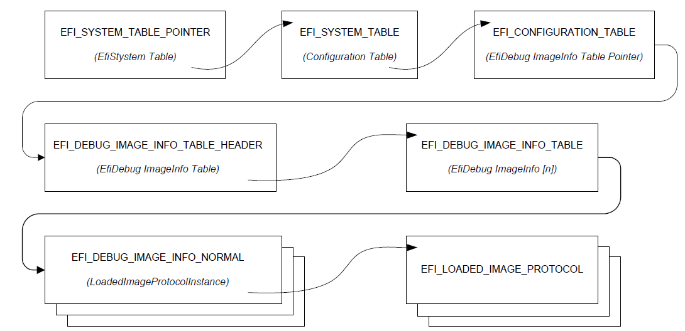

.. _protocols-debugger-support:

Protocols — Debugger Support
=============================

This chapter describes a minimal set of protocols and associated data structures necessary to enable the creation of source level debuggers for EFI. It does not fully define a debugger design. Using the services described in this document, it should also be possible to implement a variety of debugger solutions.

.. _overview:

Overview
--------

Efficient UEFI driver and application development requires the availability of source level debugging facilities. Although completely on-target debuggers are clearly possible, UEFI debuggers are generally expected to be remotely hosted. That is to say, the debugger itself will be split between two machines, which are the host and target. A majority of debugger code runs on the host that is typically responsible for disassembly, symbol management, source display, and user interface. Similarly, a smaller piece of code runs on the target that establishes the communication to the host and proxies requests from the host. The on-target code is known as the "debug agent." 

The debug agent design is subdivided further into two parts, which are the processor/platform abstraction and the debugger host specific communication grammar. This specification describes architectural interfaces for the former only. Specific implementations for various debugger host communication grammars can be created that make use of the facilities described in this specification. 

The processor/platform abstraction is presented as a pair of protocol interfaces, which are the Debug Support protocol and the Debug Port protocol. 

The Debug Support protocol abstracts the processor’s debugging facilities, namely a mechanism to manage the processor’s context via caller-installable exception handlers. 

The Debug Port protocol abstracts the device that is used for communication between the host and target. Typically, this will be a 16550 serial port, 1394 device, or other device that is nominally a serial stream. 

Furthermore, a table driven, quiescent, memory-only mechanism for determining the base address of PE32+ images is provided to enable the debugger host to determine where images are located in memory. 

Aside from timing differences that occur because of running code associated with the debug agent and user-initiated changes to the machine context, the operation of the on-target debugger component must be transparent to the rest of the system. In addition, no portion of the debug agent that runs in interrupt context may make any calls to EFI services or other protocol interfaces. 

The services described in this document do not comprise a complete debugger, rather they provide a minimal abstraction required to implement a wide variety of debugger solutions.

.. _efi-debug-support-protocol:

EFI Debug Support Protocol
--------------------------

This section defines the EFI Debug Support protocol which is used by the debug agent.

.. _efi-debug-support-protocol-overview:

EFI Debug Support Protocol Overview
###################################

The debug-agent needs to be able to gain control of the machine when certain types of events occur; i.e., breakpoints, processor exceptions, etc. Additionally, the debug agent must also be able to periodically gain control during operation of the machine to check for asynchronous commands from the host. The EFI Debug Support protocol services enable these capabilities. 

The EFI Debug Support protocol interfaces produce callback registration mechanisms which are used by the debug agent to register functions that are invoked either periodically or when specific processor exceptions. When they are invoked by the Debug Support driver, these callback functions are passed the current machine context record. The debug agent may modify this context record to change the machine context which is restored to the machine after the callback function returns. The debug agent does not run in the same context as the rest of UEFI and all modifications to the machine context are deferred until after the callback function returns. 

It is expected that there will typically be two instances of the EFI Debug Support protocol in the system. One associated with the native processor instruction set (IA-32, x64, ARM, RISC-V, LoongArch, or Itanium processor family), and one for the EFI virtual machine that implements EFI byte code (EBC). 

While multiple instances of the EFI Debug Support protocol are expected, there must never be more than one for any given instruction set.

.. _EFI_DEBUG_SUPPORT_PROTOCOL:

EFI_DEBUG_SUPPORT_PROTOCOL
###########################

**Summary**

This protocol provides the services to allow the debug agent to register callback functions that are called either periodically or when specific processor exceptions occur.

**GUID**

.. code-block::

   #define EFI_DEBUG_SUPPORT_PROTOCOL_GUID \
     {0x2755590C,0x6F3C,0x42FA,\
     {0x9E,0xA4,0xA3,0xBA,0x54,0x3C,0xDA,0x25}}

**Protocol Interface Structure**

.. code-block::

   typedef struct {
     EFI_INSTRUCTION_SET_ARCHITECTURE        Isa;
     EFI_GET_MAXIMUM_PROCESSOR_INDEX         GetMaximumProcessorIndex;
     EFI_REGISTER_PERIODIC_CALLBACK          RegisterPeriodicCallback;
     EFI_REGISTER_EXCEPTION_CALLBACK         RegisterExceptionCallback;
     EFI_INVALIDATE_INSTRUCTION_CACHE        InvalidateInstructionCache;
   } EFI_DEBUG_SUPPORT_PROTOCOL;

**Parameters**

Isa
  Declares the processor architecture for this instance of the EFI Debug Support protocol.

GetMaximumProcessorIndex
  | Returns the maximum processor index value that may be used with 
  | `EFI_DEBUG_SUPPORT_PROTOCOL.REGISTERPERIODICCALLBACK()`_,  
  | `EFI_DEBUG_SUPPORT_PROTOCOL.REGISTEREXCEPTIONCALLBACK()`_ , 
  | `EFI_DEBUG_SUPPORT_PROTOCOL.GETMAXIMUMPROCESSORINDEX()`_ function description.

RegisterPeriodicCallback
  Registers a callback function that will be invoked periodically and asynchronously to the execution of EFI. See the RegisterPeriodicCallback()* function description. 

RegisterExceptionCallback
  Registers a callback function that will be called each time the specified processor exception occurs. See the RegisterExceptionCallback()* function description.

InvalidateInstructionCache
  Invalidate the instruction cache of the processor. This is required by processor architectures where instruction and data caches are not coherent when instructions in the code under debug has been modified by the debug agent.  `EFI_DEBUG_SUPPORT_PROTOCOL.INVALIDATEINSTRUCTIONCACHE()`_  function description.

**Related Definitions**

  
Refer to the Microsoft PE/COFF Specification revision 6.2 or later for *IMAGE_FILE_MACHINE* definitions.

.. note::
   The definition of IMAGE_FILE_MACHINE_EBC is not included in revision 6.2 of the PE/COFF specification. It can be found in an article about the PE/COFF format at https://learn.microsoft.com/en-us/windows/win32/debug/pe-format

.. code-block::   

   //
   // Machine type definition
   //
   typedef enum {
     IsaIa32 = IMAGE_FILE_MACHINE_I386,               // 0x014C
     IsaX64 = IMAGE_FILE_MACHINE_X64,                 // 0x8664
     IsaIpf = IMAGE_FILE_MACHINE_IA64,                // 0x0200
     IsaEbc = IMAGE_FILE_MACHINE_EBC,                 // 0x0EBC
     IsaArm = IMAGE_FILE_MACHINE_ARMTHUMB_MIXED       // 0x1C2
     IsaAArch64 = IMAGE_FILE_MACHINE_AARCH64          // 0xAA64
     IsaRISCV32 = IMAGE_FILE_MACHINE_RISCV32          // 0x5032
     IsaRISCV64 = IMAGE_FILE_MACHINE_RISCV64          // 0x5064
     IsaRISCV128 = IMAGE_FILE_MACHINE_RISCV128        // 0x5128
     IsaLoongArch32 = IMAGE_FILE_MACHINE_LOONGARCH32  // 0x6232
     IsaLoongArch64 = IMAGE_FILE_MACHINE_LOONGARCH64  // 0x6264
   } EFI_INSTRUCTION_SET_ARCHITECTURE;

**Description**

The EFI Debug Support protocol provides the interfaces required to register debug agent callback functions and to manage the processor’s instruction stream as required. Registered callback functions are invoked in interrupt context when the specified event occurs. 

The driver that produces the EFI Debug Support protocol is also responsible for saving the machine context prior to invoking a registered callback function and restoring it after the callback function returns prior to returning to the code under debug. If the debug agent has modified the context record, the modified context must be used in the restore operation. 

Furthermore, if the debug agent modifies any of the code under debug (to set a software breakpoint for example), it must call the *InvalidateInstructionCache()* function for the region of memory that has been modified. 

.. _efi-debug-support-protocol-getmaximumprocessorindex:

EFI_DEBUG_SUPPORT_PROTOCOL.GetMaximumProcessorIndex()
#####################################################

**Summary**

Returns the maximum value that may be used for the *ProcessorIndex* parameter in   `EFI_DEBUG_SUPPORT_PROTOCOL.REGISTERPERIODICCALLBACK()`_   and  `EFI_DEBUG_SUPPORT_PROTOCOL.REGISTEREXCEPTIONCALLBACK()`_ .

**Prototype**

.. code-block:: 
  
   typedef  
   EFI_STATUS  
   (EFIAPI *EFI_GET_MAXIMUM_PROCESSOR_INDEX) (  
     IN EFI_DEBUG_SUPPORT_PROTOCOL              *This,  
     OUT UINTN                                  *MaxProcessorIndex  
   );

**Parameters**

This
  A pointer to the  `EFI_DEBUG_SUPPORT_PROTOCOL`_  instance. Type EFI_DEBUG_SUPPORT_PROTOCOL is defined in this section.

MaxProcessorIndex
  Pointer to a caller-allocated UINTN in which the maximum supported processor index is returned.

**Description**

The *GetMaximumProcessorIndex()* function returns the maximum processor index in the output parameter *MaxProcessorIndex*. This value is the largest value that may be used in the *ProcessorIndex* parameter for both *RegisterPeriodicCallback()* and *RegisterExceptionCallback()* . All values between 0 and *MaxProcessorIndex* must be supported by *RegisterPeriodicCallback()* and *RegisterExceptionCallback()*.

It is the responsibility of the caller to ensure all parameters are correct. There is no provision for parameter checking by *GetMaximumProcessorIndex()*. The implementation behavior when an invalid parameter is passed is not defined by this specification.

**Status Codes Returned**

.. list-table::
   :widths: 35 70 

   * - EFI_SUCCESS
     - The function completed successfully.

.. _efi-debug-support-protocol-registerperiodiccallback:

EFI_DEBUG_SUPPORT_PROTOCOL.RegisterPeriodicCallback()
######################################################

**Summary**

Registers a function to be called back periodically in interrupt context.

**Prototype**

.. code-block:: 
  
   typedef  
   EFI_STATUS  
   (EFIAPI *EFI_REGISTER_PERIODIC_CALLBACK) (  
     IN EFI_DEBUG_SUPPORT_PROTOCOL              *This,  
     IN UINTN                                   ProcessorIndex,  
     IN EFI_PERIODIC_CALLBACK                   PeriodicCallback  
   );

**Parameters**

This
  A pointer to the  `EFI_DEBUG_SUPPORT_PROTOCOL`_  instance. Type EFI_DEBUG_SUPPORT_PROTOCOL is defined in  `EFI_DEBUG_SUPPORT_PROTOCOL`_ .

ProcessorIndex
  Specifies which processor the callback function applies to.

PeriodicCallback
  A pointer to a function of type *PERIODIC_CALLBACK* that is the main periodic entry point of the debug agent. It receives as a parameter a pointer to the full context of the interrupted execution thread.

**Related Definitions**

.. code-block:: 
  
   typedef  
   VOID (*EFI_PERIODIC_CALLBACK) (  
     IN OUT EFI_SYSTEM_CONTEXT      SystemContext  
   );

   // Universal EFI_SYSTEM_CONTEXT definition  
   typedef union {  
      EFI_SYSTEM_CONTEXT_EBC         *SystemContextEbc;  
      EFI_SYSTEM_CONTEXT_IA32        *SystemContextIa32;  
      EFI_SYSTEM_CONTEXT_X64         *SystemContextX64;  
      EFI_SYSTEM_CONTEXT_IPF         *SystemContextIpf;  
      EFI_SYSTEM_CONTEXT_ARM         *SystemContextArm; 
      EFI_SYSTEM_CONTEXT_AARCH64     *SystemContextAArch64;  
      EFI_SYSTEM_CONTEXT_RISCV32     *SystemContextRiscV32;  
      EFI_SYSTEM_CONTEXT_RISCV64     *SystemContextRiscV64;  
      EFI_SYSTEM_CONTEXT_RISCV128    *SystemContextRiscv128;
      EFI_SYSTEM_CONTEXT_LOONGARCH64 *SystemContextLongArch64;
   } EFI_SYSTEM_CONTEXT;

   // System context for virtual EBC processors  
   typedef struct {  
      UINT64                  R0, R1, R2, R3, R4, R5, R6, R7;  
      UINT64                  Flags;  
      UINT64                  ControlFlags;  
      UINT64                  Ip;  
   } EFI_SYSTEM_CONTEXT_EBC;  

   // System context for RISC-V 32  
   typedef struct {

      // Integer registers  
      UINT32         Zero, Ra, Sp, Gp, Tp, T0, T1, T2;  
      UINT32         S0FP, S1, A0, A1, A2, A3, A4, A5, A6, A7;  
      UINT32         S2, S3, S4, S5, S6, S7, S8, S9, S10, S11;  
      UINT32         T3, T4, T5, T6;  

      // Floating registers for F, D and Q Standard Extensions  
      UINT128        Ft0, Ft1, Ft2, Ft3, Ft4, Ft5, Ft6, Ft7;  
      UINT128        Fs0, Fs1, Fa0, Fa1, Fa2, Fa3, Fa4, Fa5, Fa6, Fa7;  
      UINT128        Fs2, Fs3, Fs4, Fs5, Fs6, Fs7, Fs8, Fs9, Fs10, Fs11;  
      UINT128        Ft8, Ft9, Ft10, Ft11;           

   } EFI_SYSTEM_CONTEXT_RISCV32;

   // System context for RISC-V 64
   typedef struct {

      // Integer registers
      UINT64         Zero, Ra, Sp, Gp, Tp, T0, T1, T2;
      UINT64         S0FP, S1, A0, A1, A2, A3, A4, A5, A6, A7;
      UINT64         S2, S3, S4, S5, S6, S7, S8, S9, S10, S11;
      UINT64         T3, T4, T5, T6;

      // Floating registers for F, D and Q Standard Extensions
      UINT128        Ft0, Ft1, Ft2, Ft3, Ft4, Ft5, Ft6, Ft7;
      UINT128        Fs0, Fs1, Fa0, Fa1, Fa2, Fa3, Fa4, Fa5, Fa6, Fa7;
      UINT128        Fs2, Fs3, Fs4, Fs5, Fs6, Fs7, Fs8, Fs9, Fs10, Fs11;
      UINT128        Ft8, Ft9, Ft10, Ft11;

   } EFI_SYSTEM_CONTEXT_RISCV64;

   // System context for RISC-V 128
   typedef struct {

      // Integer registers
      UINT128Zero,      Ra, Sp, Gp, Tp, T0, T1, T2;
      UINT128S0FP,      S1, A0, A1, A2, A3, A4, A5, A6, A7;
      UINT128S2,        S3, S4, S5, S6, S7, S8, S9, S10, S11;
      UINT128T3,        T4, T5, T6;

      // Floating registers for F, D and Q Standard Extensions
      UINT128           Ft0, Ft1, Ft2, Ft3, Ft4, Ft5, Ft6, Ft7;
      UINT128           Fs0, Fs1, Fa0, Fa1, Fa2, Fa3, Fa4, Fa5, Fa6, Fa7;
      UINT128           Fs2, Fs3, Fs4, Fs5, Fs6, Fs7, Fs8, Fs9, Fs10, Fs11;
      UINT128           Ft8, Ft9, Ft10, Ft11;

  } EFI_SYSTEM_CONTEXT_RISCV128;

**Note:**  *When the context record field is larger than the register being stored in it, the upper bits of the context record
field are unused and ignored*.

.. code-block::

   // System context for IA-32 processors
   typedef struct {
      UINT32 ExceptionData;   // ExceptionData is additional data pushed
                              // on the stack by some types of IA-32
                              // exceptions
      EFI_FX_SAVE_STATE_IA32     FxSaveState;
      UINT32                     Dr0, Dr1, Dr2, Dr3, Dr6, Dr7;
      UINT32                     Cr0, Cr1 /* Reserved */, Cr2, Cr3, Cr4;
      UINT32                     Eflags;
      UINT32                     Ldtr, Tr;
      UINT32                     Gdtr[2], Idtr[2];
      UINT32                     Eip;
      UINT32                     Gs, Fs, Es, Ds, Cs, Ss;
      UINT32                     Edi, Esi, Ebp, Esp, Ebx, Edx, Ecx, Eax;
   } EFI_SYSTEM_CONTEXT_IA32;

   // FXSAVE_STATE - FP / MMX / XMM registers
   typedef struct {
      UINT16         Fcw;
      UINT16         Fsw;
      UINT16         Ftw;
      UINT16         Opcode;
      UINT32         Eip;
      UINT16         Cs;
      UINT16         Reserved1;
      UINT32         DataOffset;
      UINT16         Ds;
      UINT8          Reserved2[10];
      UINT8          St0Mm0[10], Reserved3[6];
      UINT8          St1Mm1[10], Reserved4[6];
      UINT8          St2Mm2[10], Reserved5[6];
      UINT8          St3Mm3[10], Reserved6[6];
      UINT8          St4Mm4[10], Reserved7[6];
      UINT8          St5Mm5[10], Reserved8[6];
      UINT8          St6Mm6[10], Reserved9[6];
      UINT8          St7Mm7[10], Reserved10[6];
      UINT8          Xmm0[16];
      UINT8          Xmm1[16];
      UINT8          Xmm2[16];
      UINT8          Xmm3[16];
      UINT8          Xmm4[16];
      UINT8          Xmm5[16];
      UINT8          Xmm6[16];
      UINT8          Xmm7[16];
      UINT8          Reserved11[14 * 16];
   } EFI_FX_SAVE_STATE_IA32

   // System context for x64 processors
   typedef struct {
      UINT64 ExceptionData;   // ExceptionData is
                              // additional data pushed
                              // on the stack by some
                              // types of x64 64-bit
                              // mode exceptions
      EFI_FX_SAVE_STATE_X64 FxSaveState;
      UINT64                  Dr0, Dr1, Dr2, Dr3, Dr6, Dr7;
      UINT64                  Cr0, Cr1 /* Reserved */, Cr2, Cr3, Cr4, Cr8;
      UINT64                  Rflags;
      UINT64                  Ldtr, Tr;
      UINT64                  Gdtr[2], Idtr[2];
      UINT64                  Rip;
      UINT64                  Gs, Fs, Es, Ds, Cs, Ss;
      UINT64                  Rdi, Rsi, Rbp, Rsp, Rbx, Rdx, Rcx, Rax;
      UINT64                  R8, R9, R10, R11, R12, R13, R14, R15;
   } EFI_SYSTEM_CONTEXT_X64;

   // FXSAVE_STATE - FP / MMX / XMM registers
   typedef struct {
      UINT16                  Fcw;
      UINT16                  Fsw;
      UINT16                  Ftw;
      UINT16                  Opcode;
      UINT64                  Rip;
      UINT64                  DataOffset;
      UINT8                   Reserved1[8];
      UINT8                   St0Mm0[10], Reserved2[6];
      UINT8                   St1Mm1[10], Reserved3[6];
      UINT8                   St2Mm2[10], Reserved4[6];
      UINT8                   St3Mm3[10], Reserved5[6];
      UINT8                   St4Mm4[10], Reserved6[6];
      UINT8                   St5Mm5[10], Reserved7[6];
      UINT8                   St6Mm6[10], Reserved8[6];
      UINT8                   St7Mm7[10], Reserved9[6];
      UINT8                   Xmm0[16];
      UINT8                   Xmm1[16];
      UINT8                   Xmm2[16];
      UINT8                   Xmm3[16];
      UINT8                   Xmm4[16];
      UINT8                   Xmm5[16];
      UINT8                   Xmm6[16];
      UINT8                   Xmm7[16];
      UINT8                   Reserved11[14 * 16];
   } EFI_FX_SAVE_STATE_X64;

   // System context for Itanium processor family
   typedef struct {
     UINT64 Reserved;

     UINT64 R1, R2, R3, R4, R5, R6, R7, R8, R9, R10,
       R11, R12, R13, R14, R15, R16, R17, R18, R19, R20,
       R21, R22, R23, R24, R25, R26, R27, R28, R29, R30,
       R31;

     UINT64 F2[2], F3[2], F4[2], F5[2], F6[2],
       F7[2], F8[2], F9[2], F10[2], F11[2],
       F12[2], F13[2], F14[2], F15[2], F16[2],
       F17[2], F18[2], F19[2], F20[2], F21[2],
       F22[2], F23[2], F24[2], F25[2], F26[2],
       F27[2], F28[2], F29[2], F30[2], F31[2];

   UINT64 Pr;

   UINT64 B0, B1, B2, B3, B4, B5, B6, B7;

   // application registers
   UINT64      ArRsc, ArBsp, ArBspstore, ArRnat;
   UINT64      ArFcr;
   UINT64      ArEflag, ArCsd, ArSsd, ArCflg;
   UINT64      ArFsr, ArFir, ArFdr;
   UINT64      ArCcv;
   UINT64      ArUnat;
   UINT64      ArFpsr;
   UINT64      ArPfs, ArLc, ArEc;

   // control registers
   UINT64      CrDcr, CrItm, CrIva, CrPta, CrIpsr, CrIsr;
   UINT64      CrIip, CrIfa, CrItir, CrIipa, CrIfs, CrIim;
   UINT64      CrIha;

   // debug registers
   UINT64      Dbr0, Dbr1, Dbr2, Dbr3, Dbr4, Dbr5, Dbr6, Dbr7;
   UINT64      Ibr0, Ibr1, Ibr2, Ibr3, Ibr4, Ibr5, Ibr6, Ibr7;

   // virtual registers
   UINT64      IntNat; // nat bits for R1-R31

   } EFI_SYSTEM_CONTEXT_IPF;

   //
   // ARM processor context definition
   //
   typedef struct {
      UINT32 R0;
      UINT32 R1;
      UINT32 R2;
      UINT32 R3;
      UINT32 R4;
      UINT32 R5;
      UINT32 R6;
      UINT32 R7;
      UINT32 R8;
      UINT32 R9;
      UINT32 R10;
      UINT32 R11;
      UINT32 R12;
      UINT32 SP;
      UINT32 LR;
      UINT32 PC;
      UINT32 CPSR;
      UINT32 DFSR;
      UINT32 DFAR;
      UINT32 IFSR;
   } EFI_SYSTEM_CONTEXT_ARM;

   //
   ///
   /// AARCH64 processor context definition.
   ///
   typedef struct {
   // General Purpose Registers
      UINT64 X0;
      UINT64 X1;
      UINT64 X2;
      UINT64 X3;
      UINT64 X4;
      UINT64 X5;
      UINT64 X6;
      UINT64 X7;
      UINT64 X8;
      UINT64 X9;
      UINT64 X10;
      UINT64 X11;
      UINT64 X12;
      UINT64 X13;
      UINT64 X14;
      UINT64 X15;
      UINT64 X16;
      UINT64 X17;
      UINT64 X18;
      UINT64 X19;
      UINT64 X20;
      UINT64 X21;
      UINT64 X22;
      UINT64 X23;
      UINT64 X24;
      UINT64 X25;
      UINT64 X26;
      UINT64 X27;
      UINT64 X28;
      UINT64 FP; // x29 - Frame Pointer
      UINT64 LR; // x30 - Link Register
      UINT64 SP; // x31 - Stack Pointer
                 // FP/SIMD Registers
      UINT64 V0[2];
      UINT64 V1[2];
      UINT64 V2[2];
      UINT64 V3[2];
      UINT64 V4[2];
      UINT64 V5[2];
      UINT64 V6[2];
      UINT64 V7[2];
      UINT64 V8[2];
      UINT64 V9[2];
      UINT64 V10[2];
      UINT64 V11[2];
      UINT64 V12[2];
      UINT64 V13[2];
      UINT64 V14[2];
      UINT64 V15[2];
      UINT64 V16[2];
      UINT64 V17[2];
      UINT64 V18[2];
      UINT64 V19[2];
      UINT64 V20[2];
      UINT64 V21[2];
      UINT64 V22[2];
      UINT64 V23[2];
      UINT64 V24[2];
      UINT64 V25[2];
      UINT64 V26[2];
      UINT64 V27[2];
      UINT64 V28[2];
      UINT64 V29[2];
      UINT64 V30[2];
      UINT64 V31[2];
      UINT64 ELR;       // Exception Link Register
      UINT64 SPSR;      // Saved Processor Status Register
      UINT64 FPSR;      // Floating Point Status Register
      UINT64 ESR;       // Exception syndrome register
      UINT64 FAR;       // Fault Address Register

   } EFI_SYSTEM_CONTEXT_AARCH64;

   // System context for LoongArch64 processors
   typedef struct {
      UINT64    R0;
      UINT64    R1;
      UINT64    R2;
      UINT64    R3;
      UINT64    R4;
      UINT64    R5;
      UINT64    R6;
      UINT64    R7;
      UINT64    R8;
      UINT64    R9;
      UINT64    R10;
      UINT64    R11;
      UINT64    R12;
      UINT64    R13;
      UINT64    R14;
      UINT64    R15;
      UINT64    R16;
      UINT64    R17;
      UINT64    R18;
      UINT64    R19;
      UINT64    R20;
      UINT64    R21;
      UINT64    R22;
      UINT64    R23;
      UINT64    R24;
      UINT64    R25;
      UINT64    R26;
      UINT64    R27;
      UINT64    R28;
      UINT64    R29;
      UINT64    R30;
      UINT64    R31;

      UINT64    CRMD;  // CuRrent MoDe information
      UINT64    PRMD;  // PRe-exception MoDe information
      UINT64    EUEN;  // Extended component Unit ENable
      UINT64    MISC;  // MISCellaneous controller
      UINT64    ECFG;  // Execption ConFiGuration
      UINT64    ESTAT; // Exeption STATus
      UINT64    ERA;   // Exception Return Address
      UINT64    BADV;  // BAD Virtual address
      UINT64    BADI;  // BAD Instruction
   } EFI_SYSTEM_CONTEXT_LOONGARCH64;

**Description**

The *RegisterPeriodicCallback()* function registers and enables the on-target debug agent’s periodic entry point. To unregister and disable calling the debug agent’s periodic entry point, call *RegisterPeriodicCallback()* passing a **NULL** *PeriodicCallback* parameter. 

The implementation must handle saving and restoring the processor context to/from the system context record around calls to the registered callback function. 

If the interrupt is also used by the firmware for the EFI time base or some other use, two rules must be observed. First, the registered callback function must be called before any EFI processing takes place. Second, the Debug Support implementation must perform the necessary steps to pass control to the firmware’s corresponding interrupt handler in a transparent manner. 

There is no quality-of-service requirement or specification regarding the frequency of calls to the registered *PeriodicCallback* function. This allows the implementation to mitigate a potential adverse impact to EFI timer based services due to the latency induced by the context save/restore and the associated callback function. 

It is the responsibility of the caller to ensure all parameters are correct. There is no provision for parameter checking by *RegisterPeriodicCallback()*. The implementation behavior when an invalid parameter is passed is not defined by this specification. 

**Status Codes Returned**

.. list-table::
   :widths: 35 70

   * - EFI_SUCCESS
     - The function completed successfully.
   * - EFI_ALREADY_STARTED
     - Non- *NULL* PeriodicCallback parameter when a callback function was previously registered.
   * - EFI_OUT_OF_RESOURCES
     - System has insufficient memory resources to register new callback function.

.. _efi-debug-support-protocol-registerexceptioncallback:

EFI_DEBUG_SUPPORT_PROTOCOL.RegisterExceptionCallback()
######################################################

**Summary**

Registers a function to be called when a given processor exception occurs.

**Prototype**

.. code-block:: 
  
   typedef  
   EFI_STATUS  
   (EFIAPI *REGISTER_EXCEPTION_CALLBACK) (  
      IN EFI_DEBUG_SUPPORT_PROTOCOL    *This,  
      IN UINTN                         ProcessorIndex,  
      IN EFI_EXCEPTION_CALLBACK        ExceptionCallback,  
      IN EFI_EXCEPTION_TYPE            ExceptionType  
      );

**Parameters**

This
  A pointer to the  `EFI_DEBUG_SUPPORT_PROTOCOL`_  instance. Type EFI_DEBUG_SUPPORT_PROTOCOL is defined in  `EFI_DEBUG_SUPPORT_PROTOCOL`_ .

ProcessorIndex
  Specifies which processor the callback function applies to.

ExceptionCallback
  A pointer to a function of type EXCEPTION_CALLBACK* that is called when the processor exception specified by *ExceptionType* occurs. Passing *NULL* unregisters any previously registered function associated with *ExceptionType*.

ExceptionType
  Specifies which processor exception to hook.

**Related Definitions**

.. code-block:: 
  
   typedef
     VOID (*EFI_EXCEPTION_CALLBACK) (
     IN EFI_EXCEPTION_TYPE          ExceptionType,
     IN OUT EFI_SYSTEM_CONTEXT      SystemContext
     );

   typedef INTN EFI_EXCEPTION_TYPE;

   // EBC Exception types
   #define EXCEPT_EBC_UNDEFINED             0
   #define EXCEPT_EBC_DIVIDE_ERROR          1
   #define EXCEPT_EBC_DEBUG                 2
   #define EXCEPT_EBC_BREAKPOINT            3
   #define EXCEPT_EBC_OVERFLOW              4
   #define EXCEPT_EBC_INVALID_OPCODE        5
   #define EXCEPT_EBC_STACK_FAULT           6
   #define EXCEPT_EBC_ALIGNMENT_CHECK       7
   #define EXCEPT_EBC_INSTRUCTION_ENCODING  8
   #define EXCEPT_EBC_BAD_BREAK             9
   #define EXCEPT_EBC_SINGLE_STEP           10

   // IA-32 Exception types
   #define EXCEPT_IA32_DIVIDE_ERROR         0
   #define EXCEPT_IA32_DEBUG                1
   #define EXCEPT_IA32_NMI                  2
   #define EXCEPT_IA32_BREAKPOINT           3
   #define EXCEPT_IA32_OVERFLOW             4
   #define EXCEPT_IA32_BOUND                5
   #define EXCEPT_IA32_INVALID_OPCODE       6
   #define EXCEPT_IA32_DOUBLE_FAULT         8
   #define EXCEPT_IA32_INVALID_TSS          10
   #define EXCEPT_IA32_SEG_NOT_PRESENT      11
   #define EXCEPT_IA32_STACK_FAULT          12
   #define EXCEPT_IA32_GP_FAULT             13
   #define EXCEPT_IA32_PAGE_FAULT           14
   #define EXCEPT_IA32_FP_ERROR             16
   #define EXCEPT_IA32_ALIGNMENT_CHECK      17
   #define EXCEPT_IA32_MACHINE_CHECK        18
   #define EXCEPT_IA32_SIMD                 19

   //
   // X64 Exception types
   //
   #define EXCEPT_X64_DIVIDE_ERROR          0
   #define EXCEPT_X64_DEBUG                 1
   #define EXCEPT_X64_NMI                   2
   #define EXCEPT_X64_BREAKPOINT            3
   #define EXCEPT_X64_OVERFLOW              4
   #define EXCEPT_X64_BOUND                 5
   #define EXCEPT_X64_INVALID_OPCODE        6
   #define EXCEPT_X64_DOUBLE_FAULT          8
   #define EXCEPT_X64_INVALID_TSS           10
   #define EXCEPT_X64_SEG_NOT_PRESENT       11
   #define EXCEPT_X64_STACK_FAULT           12
   #define EXCEPT_X64_GP_FAULT              13
   #define EXCEPT_X64_PAGE_FAULT            14
   #define EXCEPT_X64_FP_ERROR              16
   #define EXCEPT_X64_ALIGNMENT_CHECK       17
   #define EXCEPT_X64_MACHINE_CHECK         18
   #define EXCEPT_X64_SIMD                  19

   // Itanium Processor Family Exception types
   #define EXCEPT_IPF_VHTP_TRANSLATION              0
   #define EXCEPT_IPF_INSTRUCTION_TLB               1
   #define EXCEPT_IPF_DATA_TLB                      2
   #define EXCEPT_IPF_ALT_INSTRUCTION_TLB           3
   #define EXCEPT_IPF_ALT_DATA_TLB                  4
   #define EXCEPT_IPF_DATA_NESTED_TLB               5
   #define EXCEPT_IPF_INSTRUCTION_KEY_MISSED        6
   #define EXCEPT_IPF_DATA_KEY_MISSED               7
   #define EXCEPT_IPF_DIRTY_BIT                     8
   #define EXCEPT_IPF_INSTRUCTION_ACCESS_BIT        9
   #define EXCEPT_IPF_DATA_ACCESS_BIT               10
   #define EXCEPT_IPF_BREAKPOINT                    11
   #define EXCEPT_IPF_EXTERNAL_INTERRUPT            12
   // 13 - 19 reserved
   #define EXCEPT_IPF_PAGE_NOT_PRESENT              20
   #define EXCEPT_IPF_KEY_PERMISSION                21
   #define EXCEPT_IPF_INSTRUCTION_ACCESS_RIGHTS     22
   #define EXCEPT_IPF_DATA_ACCESS_RIGHTS            23
   #define EXCEPT_IPF_GENERAL_EXCEPTION             24
   #define EXCEPT_IPF_DISABLED_FP_REGISTER          25
   #define EXCEPT_IPF_NAT_CONSUMPTION               26
   #define EXCEPT_IPF_SPECULATION                   27
   // 28 reserved
   #define EXCEPT_IPF_DEBUG                         29
   #define EXCEPT_IPF_UNALIGNED_REFERENCE           30
   #define EXCEPT_IPF_UNSUPPORTED_DATA_REFERENCE    31
   #define EXCEPT_IPF_FP_FAULT                      32
   #define EXCEPT_IPF_FP_TRAP                       33
   #define EXCEPT_IPF_LOWER_PRIVILEGE_TRANSFER_TRAP 34
   #define EXCEPT_IPF_TAKEN_BRANCH                  35
   #define EXCEPT_IPF_SINGLE_STEP                   36
   // 37 - 44 reserved
   #define EXCEPT_IPF_IA32_EXCEPTION                45
   #define EXCEPT_IPF_IA32_INTERCEPT                46
   #define EXCEPT_IPF_IA32_INTERRUPT                47
   //
   // ARM processor exception types
   //
   #define EXCEPT_ARM_RESET                   0
   #define EXCEPT_ARM_UNDEFINED_INSTRUCTION   1
   #define EXCEPT_ARM_SOFTWARE_INTERRUPT      2
   #define EXCEPT_ARM_PREFETCH_ABORT          3
   #define EXCEPT_ARM_DATA_ABORT              4
   #define EXCEPT_ARM_RESERVED                5
   #define EXCEPT_ARM_IRQ                     6
   #define EXCEPT_ARM_FIQ                     7

   //
   // For coding convenience, define the maximum valid ARM
   // exception.
   //
   #define MAX_ARM_EXCEPTION EXCEPT_ARM_FIQ
   ///
   /// AARCH64 processor exception types.
   ///
   #define EXCEPT_AARCH64_SYNCHRONOUS_EXCEPTIONS 0
   #define EXCEPT_AARCH64_IRQ 1
   #define EXCEPT_AARCH64_FIQ 2
   #define EXCEPT_AARCH64_SERROR 3
   ///
   /// For coding convenience, define the maximum valid
   /// AARCH64 exception.
   ///
   #define MAX_AARCH64_EXCEPTION EXCEPT_AARCH64_SERROR
   ///
   /// RISC-V processor exception types.
   ///
   #define EXCEPT_RISCV_INST_MISALIGNED               0
   #define EXCEPT_RISCV_INST_ACCESS_FAULT             1
   #define EXCEPT_RISCV_ILLEGAL_INST                  2
   #define EXCEPT_RISCV_BREAKPOINT                    3
   #define EXCEPT_RISCV_LOAD_ADDRESS_MISALIGNED       4
   #define EXCEPT_RISCV_LOAD_ACCESS_FAULT             5
   #define EXCEPT_RISCV_STORE_AMO_ADDRESS_MISALIGNED  6
   #define EXCEPT_RISCV_STORE_AMO_ACCESS_FAULT        7
   #define EXCEPT_RISCV_ENV_CALL_FROM_UMODE           8
   #define EXCEPT_RISCV_ENV_CALL_FROM_SMODE           9
   #define EXCEPT_RISCV_ENV_CALL_FROM_MMODE           11
   #define EXCEPT_RISCV_INST_PAGE_FAULT               12
   #define EXCEPT_RISCV_LOAD_PAGE_FAULT               13
   #define EXCEPT_RISCV_STORE_AMO_PAGE_FAULT          15

   ///
   /// RISC-V processor interrupt types.
   ///

   #define EXCEPT_RISCV_SUPERVISOR_SOFTWARE_INT       1
   #define EXCEPT_RISCV_MACHINE_SOFTWARE_INT          3
   #define EXCEPT_RISCV_SUPERVISOR_TIMER_INT          5
   #define EXCEPT_RISCV_MACHINE_TIMER_INT             7
   #define EXCEPT_RISCV_SUPERVISOR_EXTERNAL_INT       9
   #define EXCEPT_RISCV_MACHINE_EXTERNAL_INT          11

   ///
   /// LoongArch processor exception types.
   ///
   /// The exception types is located in the CSR ESTAT
   /// register offset 16 bits, width 6 bits.
   ///
   /// If you want to register an exception hook, you can
   /// shfit the number left by 16 bits, and the exception
   /// handler will know the types.
   ///
   /// For example:
   /// mCpu->CpuRegisterInterruptHandler (
   ///   mCpu,
   ///   (EXCEPT_LOONGARCH_PPI << CSR_ESTAT_EXC_SHIFT),
   ///   PpiExceptionHandler
   ///   );
   ///
   #define EXCEPT_LOONGARCH_INT                       0
   #define EXCEPT_LOONGARCH_PIL                       1
   #define EXCEPT_LOONGARCH_PIS                       2
   #define EXCEPT_LOONGARCH_PIF                       3
   #define EXCEPT_LOONGARCH_PME                       4
   #define EXCEPT_LOONGARCH_PNR                       5
   #define EXCEPT_LOONGARCH_PNX                       6
   #define EXCEPT_LOONGARCH_PPI                       7
   #define EXCEPT_LOONGARCH_ADE                       8
   #define EXCEPT_LOONGARCH_ALE                       9
   #define EXCEPT_LOONGARCH_BCE                       10
   #define EXCEPT_LOONGARCH_SYS                       11
   #define EXCEPT_LOONGARCH_BRK                       12
   #define EXCEPT_LOONGARCH_INE                       13
   #define EXCEPT_LOONGARCH_IPE                       14
   #define EXCEPT_LOONGARCH_FPD                       15
   #define EXCEPT_LOONGARCH_SXD                       16
   #define EXCEPT_LOONGARCH_ASXD                      17
   #define EXCEPT_LOONGARCH_FPE                       18
   #define EXCEPT_LOONGARCH_WPE                       19
   #define EXCEPT_LOONGARCH_BTD                       20
   #define EXCEPT_LOONGARCH_BTE                       21
   #define EXCEPT_LOONGARCH_GSPR                      22
   #define EXCEPT_LOONGARCH_HVC                       23
   #define EXCEPT_LOONGARCH_GCXC                      24

   ///
   /// For coding convenience, define the maximum valid
   /// LoongArch exception.
   ///
   #define MAX_LOONGARCH_EXCEPTION                    64

   ///
   /// LoongArch processor Interrupt types.
   ///
   #define EXCEPT_LOONGARCH_INT_SIP0                  0
   #define EXCEPT_LOONGARCH_INT_SIP1                  1
   #define EXCEPT_LOONGARCH_INT_IP0                   2
   #define EXCEPT_LOONGARCH_INT_IP1                   3
   #define EXCEPT_LOONGARCH_INT_IP2                   4
   #define EXCEPT_LOONGARCH_INT_IP3                   5
   #define EXCEPT_LOONGARCH_INT_IP4                   6
   #define EXCEPT_LOONGARCH_INT_IP5                   7
   #define EXCEPT_LOONGARCH_INT_IP6                   8
   #define EXCEPT_LOONGARCH_INT_IP7                   9
   #define EXCEPT_LOONGARCH_INT_PMC                   10
   #define EXCEPT_LOONGARCH_INT_TIMER                 11
   #define EXCEPT_LOONGARCH_INT_IPI                   12

   ///
   /// For coding convenience, define the maximum valid
   /// LoongArch interrupt.
   ///
   #define MAX_LOONGARCH_INTERRUPT                    16

**Description**

The *RegisterExceptionCallback()* function registers and enables an exception callback function for the specified exception. The specified exception must be valid for the instruction set architecture. To unregister the callback function and stop servicing the exception, call *RegisterExceptionCallback()* passing a *NULL* *ExceptionCallback* parameter. 

The implementation must handle saving and restoring the processor context to/from the system context record around calls to the registered callback function. No chaining of exception handlers is allowed. 

It is the responsibility of the caller to ensure all parameters are correct. There is no provision for parameter checking by *RegisterExceptionCallback()*. The implementation behavior when an invalid parameter is passed is not defined by this specification.

**Status Codes Returned**

.. list-table::
   :widths: 35 70

   * - EFI_SUCCESS
     - The function completed successfully.
   * - EFI_ALREADY_STARTED
     - Non- *NULL* ExceptionCallback parameter when a callback function was previously registered.
   * - EFI_OUT_OF_RESOURCES
     - System has insufficient memory resources to register new callback function.

.. _efi-debug-support-protocol-invalidateinstructioncache:

EFI_DEBUG_SUPPORT_PROTOCOL.InvalidateInstructionCache()
#######################################################

**Summary**

Invalidates processor instruction cache for a memory range. Subsequent execution in this range causes a fresh memory fetch to retrieve code to be executed.

**Prototype**

.. code-block:: 

   typedef  
   EFI_STATUS  
   (EFIAPI *EFI_INVALIDATE_INSTRUCTION_CACHE) (  
     IN EFI_DEBUG_SUPPORT_PROTOCOL            *This,  
     IN UINTN                                 ProcessorIndex,  
     IN VOID                                  *Start,  
     IN UINT64                                Length  
     );

**Parameters**

This
  A pointer to the  `EFI_DEBUG_SUPPORT_PROTOCOL`_  instance. Type EFI_DEBUG_SUPPORT_PROTOCOL is defined in  `EFI_DEBUG_SUPPORT_PROTOCOL`_ .

ProcessorIndex
  Specifies which processor’s instruction cache is to be invalidated.

Start
  Specifies the physical base of the memory range to be invalidated.

Length
  Specifies the minimum number of bytes in the processor’s instruction cache to invalidate.

**Description**

Typical operation of a debugger may require modifying the code image that is under debug. This can occur for many reasons, but is typically done to insert/remove software break instructions. Some processor architectures do not have coherent instruction and data caches so modifications to the code image require that the instruction cache be explicitly invalidated in that memory region. 

The *InvalidateInstructionCache()* function abstracts this operation from the debug agent and provides a general purpose capability to invalidate the processor’s instruction cache. 

It is the responsibility of the caller to ensure all parameters are correct. There is no provision for parameter checking by  `EFI_DEBUG_SUPPORT_PROTOCOL.REGISTEREXCEPTIONCALLBACK()`_ . The implementation behavior when an invalid parameter is passed is not defined by this specification.

**Status Codes Returned**

.. list-table::
   :widths: 35 70

   * - EFI_SUCCESS 
     - The function completed successfully.

.. _efi-debugport-protocol:

EFI Debugport Protocol
----------------------

This section defines the EFI Debugport protocol. This protocol is used by debug agent to communicate with the remote debug host.

.. _efi-debugport-overview:

EFI Debugport Overview
######################

Historically, remote debugging has typically been done using a standard UART serial port to connect the host and target. This is obviously not possible in a legacy reduced system that does not have a UART. The Debugport protocol solves this problem by providing an abstraction that can support many different types of debugport hardware. The debug agent should use this abstraction to communicate with the host. 

The interface is minimal with only reset, read, write, and poll abstractions. Since these functions are called in interrupt context, none of them may call any EFI services or other protocol interfaces. 

Debugport selection and configuration is handled by setting defaults via an environment variable which contains a full device path to the debug port. This environment variable is used during the debugport driver’s initialization to configure the debugport correctly. The variable contains a full device path to the debugport, with the last node (prior to the terminal node) being a debugport messaging node. See  `Debugport Device Path`_ for details. 

The driver must also produce an instance of the EFI Device Path protocol to indicate what hardware is being used for the debugport. This may be used by the OS to maintain the debugport across a call to  :ref:`efi-boot-services-exitbootservices` . 

.. _EFI_DEBUGPORT_PROTOCOL:

EFI_DEBUGPORT_PROTOCOL
######################

**Summary**

This protocol provides the communication link between the debug agent and the remote host.

**GUID**

.. code-block::

   #define EFI_DEBUGPORT_PROTOCOL_GUID \
     {0xEBA4E8D2,0x3858,0x41EC,\
       {0xA2,0x81,0x26,0x47,0xBA,0x96,0x60,0xD0}}

**Protocol Interface Structure**

.. code-block::

   typedef struct {
     EFI_DEBUGPORT_RESET        Reset;
     EFI_DEBUGPORT_WRITE        Write;
     EFI_DEBUGPORT_READ         Read;
     EFI_DEBUGPORT_POLL         Poll;
   } EFI_DEBUGPORT_PROTOCOL;

**Parameters**

Reset
  Resets the debugport hardware.

Write
  Send a buffer of characters to the debugport device.

Read
  Receive a buffer of characters from the debugport device.

Poll
  Determine if there is any data available to be read from the debugport device.

**Description**

The Debugport protocol is used for byte stream communication with a debugport device. The debugport can be a standard UART Serial port, a USB-based character device, or potentially any character-based I/O device. 

The attributes for all UART-style debugport device interfaces are defined in the DEBUGPORT variable ( `Debugport Device Path`_ ). 

.. _efi-debugport-protocol-reset:

EFI_DEBUGPORT_PROTOCOL.Reset()
##############################

**Summary**

Resets the debugport.

**Prototype**

.. code-block:: 
  
   typedef  
   EFI_STATUS  
   (EFIAPI *EFI_DEBUGPORT_RESET) (  
     IN EFI_DEBUGPORT_PROTOCOL        *This 
     );

**Parameters**

This
  A pointer to the  `EFI_DEBUGPORT_PROTOCOL`_  instance. Type EFI_DEBUGPORT_PROTOCOL is defined in  `EFI_DEBUGPORT_PROTOCOL`_. 

**Description**

The *Reset()* function resets the debugport device. 

It is the responsibility of the caller to ensure all parameters are valid. There is no provision for parameter checking by *Reset()*. The implementation behavior when an invalid parameter is passed is not defined by this specification.

**Status Codes Returned**

.. list-table::
   :widths: 35 70

   * - EFI_SUCCESS
     - The debugport device was reset and is in usable state.
   * - EFI_DEVICE_ERROR
     - The debugport device could not be reset and is unusable.

.. _efi-debugport-protocol-write:

EFI_DEBUGPORT_PROTOCOL.Write()
##############################

**Summary**

Writes data to the debugport.

**Prototype**

.. code-block:: 
  
   typedef  
   EFI_STATUS  
   (EFIAPI *EFI_DEBUGPORT_WRITE) (  
     IN EFI_DEBUGPORT_PROTOCOL      *This,  
     IN UINT32                      Timeout,  
     IN OUT UINTN                   *BufferSize,  
     IN VOID                        *Buffer  
     );

**Parameters**

This
  A pointer to the  `EFI_DEBUGPORT_PROTOCOL`_  instance. Type EFI_DEBUGPORT_PROTOCOL is defined in  `EFI_DEBUGPORT_PROTOCOL`_.  

Timeout
  The number of microseconds to wait before timing out a write operation.

BufferSize
  On input, the requested number of bytes of data to write. On output, the number of bytes of data actually written.

Buffer
  A pointer to a buffer containing the data to write.

**Description**

The *Write()* function writes the specified number of bytes to a debugport device. If a timeout error occurs while data is being sent to the debugport, transmission of this buffer will terminate, and *EFI_TIMEOUT* will be returned. In all cases the number of bytes actually written to the debugport device is returned in *BufferSize*. 

It is the responsibility of the caller to ensure all parameters are valid. There is no provision for parameter checking by *Write()*. The implementation behavior when an invalid parameter is passed is not defined by this specification.

**Status Codes Returned**

.. list-table::
   :widths: 35 70

   * - EFI_SUCCESS
     - The data was written.
   * - EFI_DEVICE_ERROR
     - The device reported an error.
   * - EFI_TIMEOUT
     - The data write was stopped due to a timeout.

.. _efi-debugport-protocol-read:

EFI_DEBUGPORT_PROTOCOL.Read()
#############################

**Summary**

Reads data from the debugport.

**Prototype**

.. code-block:: 
  
   typedef  
   EFI_STATUS  
   (EFIAPI *EFI_DEBUGPORT_READ) (  
     IN EFI_DEBUGPORT_PROTOCOL         *This,  
     IN UINT32                         Timeout,  
     IN OUT UINTN                      *BufferSize,  
     OUT VOID                          *Buffer  
     );

**Parameters**

This
  A pointer to the  `EFI_DEBUGPORT_PROTOCOL`_  instance. Type EFI_DEBUGPORT_PROTOCOL is defined in  `EFI_DEBUGPORT_PROTOCOL`_. 

Timeout
  The number of microseconds to wait before timing out a read operation.

BufferSize
  A pointer to an integer which, on input contains the requested number of bytes of data to read, and on output contains the actual number of bytes of data read and returned in Buffer.

Buffer
  A pointer to a buffer into which the data read will be saved.

**Description**

The *Read()* function reads a specified number of bytes from a debugport. If a timeout error or an overrun error is detected while data is being read from the debugport, then no more characters will be read, and *EFI_TIMEOUT* will be returned. In all cases the number of bytes actually read is returned in * *BufferSize*. 

It is the responsibility of the caller to ensure all parameters are valid. There is no provision for parameter checking by *Read()*. The implementation behavior when an invalid parameter is passed is not defined by this specification. 

**Status Codes Returned**

.. list-table::
   :widths: 35 70

   * - EFI_SUCCESS
     - The data was read.
   * - EFI_DEVICE_ERROR
     - The debugport device reported an error.
   * - EFI_TIMEOUT
     - The operation was stopped due to a timeout or overrun.

.. _efi-debugport-protocol-poll:

EFI_DEBUGPORT_PROTOCOL.Poll()
#############################

**Summary**

Checks to see if any data is available to be read from the debugport device.

**Prototype**

.. code-block:: 
  
   typedef  
   EFI_STATUS  
   (EFIAPI *EFI_DEBUGPORT_POLL) (  
     IN EFI_DEBUGPORT_PROTOCOL         *This  
     );

**Parameters**

This
  A pointer to the  `EFI_DEBUGPORT_PROTOCOL`_  instance. Type EFI_DEBUGPORT_PROTOCOL is defined in  `EFI_DEBUGPORT_PROTOCOL`_. 

**Description**

The *Poll()* function checks if there is any data available to be read from the debugport device and returns the result. No data is actually removed from the input stream. This function enables simpler debugger design since buffering of reads is not necessary by the caller.

**Status Codes Returned**

.. list-table::
   :widths: 35 70

   * - EFI_SUCCESS
     - At least one byte of data is available to be read.
   * - EFI_NOT_READY
     - No data is available to be read.
   * - EFI_DEVICE_ERROR
     - The debugport device is not functioning correctly.

.. _debugport-device-path:

Debugport Device Path
#####################

The debugport driver must establish and maintain an instance of the EFI Device Path protocol for the debugport. A graceful handoff of debugport ownership between the EFI Debugport driver and an OS debugport driver requires that the OS debugport driver can determine the type, location, and configuration of the debugport device. 

The Debugport Device Path is a vendor-defined messaging device path with no data, only a GUID. It is used at the end of a conventional device path to tag the device for use as the debugport. For example, a typical UART debugport would have the following fully qualified device path: 

.. code-block::

   PciRoot(0)/Pci(0x1f,0)/ACPI(PNP0501,0)/UART(115200,N,8,1)/DebugPort()

The Vendor_GUID that defines the debugport device path is the same as the debugport protocol GUID, as defined below.

.. code-block::

   #define DEVICE_PATH_MESSAGING_DEBUGPORT \
      EFI_DEBUGPORT_PROTOCOL_GUID

The Table below,  :ref:`debugport-messaging-device-path`, shows all fields of the debugport device path.

.. list-table:: Debugport Messaging Device Path
   :widths: 10 5 5 30
   :name: debugport-messaging-device-path

   * - **Mnemonic**
     - **Byte Offset**
     - **Byte Length**
     - **Description**
   * - Type
     - 0
     - 1
     - Type 3 - Messaging Device Path.
   * - Sub Type
     - 1
     - 1
     - Sub Type 10 - Vendor.
   * - Length
     - 2
     - 2
     - Length of this structure in bytes. Length is 20 bytes.
   * - Vendor_GUID
     - 4
     - 16
     -         DEVICE_PATH_MESSA GING_DEBUGPORT.

.. _efi-debugport-variable:

EFI Debugport Variable
######################

Even though there may be more than one hardware device that could function as a debugport in a system, only one debugport may be active at a time. The DEBUGPORT variable is used to declare which hardware device will act as the debugport, and what communication parameters it should assume. 

Like all EFI variables, the DEBUGPORT variable has both a name and a GUID. The name is "DEBUGPORT." The GUID is the same as the *EFI_DEBUGPORT_PROTOCOL_GUID* : 

.. code-block::

  #define EFI_DEBUGPORT_VARIABLE_NAME L"DEBUGPORT" 
  #define EFI_DEBUGPORT_VARIABLE_GUID EFI_DEBUGPORT_PROTOCOL_GUID 

The data contained by the DEBUGPORT variable is a fully qualified debugport device path ( `Debugport Device Path`_ ). 

The desired communication parameters for the debugport are declared in the DEBUGPORT variable. The debugport driver must read this variable during initialization to determine how to configure the debug port. 

To reduce the required complexity of the debugport driver, the debugport driver is not required to support all possible combinations of communication parameters. What combinations of parameters are possible is implementation specific. 

Additionally debugport drivers implemented for PNP0501 devices, that is debugport devices with a PNP0501 ACPI node in the device path, must support the following defaults. These defaults must be used in the absence of a DEBUGPORT variable, or when the communication parameters specified in the DEBUGPORT variable are not supported by the driver.

-  Baud : 115200
-  8 data bits
-  No parity
-  1 stop bit
-  No flow control (See Appendix A for flow control details)

In the absence of the DEBUGPORT variable, the selection of which port to use as the debug port is implementation specific. 

Future revisions of this specification may define new defaults for other debugport types. 

The debugport device path must be constructed to reflect the actual settings for the debugport. Any code needing to know the state of the debug port must reference the device path rather than the DEBUGPORT variable, since the debugport may have assumed a default setting in spite of the existence of the DEBUGPORT variable. 

If it is not possible to configure the debug port using either the settings declared in the DEBUGPORT variable or the default settings for the particular debugport type, the driver initialization must not install any protocol interfaces and must exit with an error.

.. _efi-debug-support-table:

EFI Debug Support Table
-----------------------

This chapter defines the EFI Debug Support Table which is used by the debug agent or an external debugger to determine loaded image information in a quiescent manner.

.. _overview-1:

Overview
########

Every executable image loaded in EFI is represented by an EFI handle populated with an instance of the  :ref:`efi-loaded-image-protocol`  protocol. This handle is known as an "image handle." The associated Loaded Image protocol provides image information that is of interest to a source level debugger. Normal EFI executables can access this information by using EFI services to locate all instances of the Loaded Image protocol. 

A debugger has two problems with this scenario. First, if it is an external hardware debugger, the location of the EFI system table is not known. Second, even if the location of the EFI system table is known, the services contained therein are generally unavailable to a debugger either because it is an on-target debugger that is running in interrupt context, or in the case of an external hardware debugger there is no debugger code running on the target at all. 

Since a source level debugger must be capable of determining image information for all loaded images, an alternate mechanism that does not use EFI services must be provided. Two features are added to the EFI system software to enable this capability. 

First, an alternate mechanism of locating the EFI system table is required. A check-summed structure containing the physical address of the EFI system table is created and located on a 4M aligned memory address. A hardware debugger can search memory for this structure to determine the location of the EFI system table. 

Second, an *EFI_CONFIGURATION_TABLE* is published that leads to a database of pointers to all instances of the Loaded Image protocol. Several layers of indirection are used to allow dynamically managing the data as images are loaded and unloaded. Once the address of the EFI system table is known, it is possible to discover a complete and accurate list of EFI images. (Note that the EFI core itself must be represented by an instance of the Loaded Image protocol.) 

 :ref:`Debug-Support-Table-Indirection-and-Pointer-Usage`  illustrates the table indirection and pointer usage.

   Debug Support Table Indirection and Pointer Usage 

.. _efi-system-table-location:

EFI System Table Location
#########################

The EFI system table can be located by an off-target hardware debugger by searching for the *EFI_SYSTEM_TABLE_POINTER* structure. The *EFI_SYSTEM_TABLE_POINTER* structure is located on a 4M boundary as close to the top of physical memory as feasible. It may be found searching for *the EFI_SYSTEM_TABLE_SIGNATURE* on each 4M boundary starting at the top of memory and scanning down. When the signature is found, the entire structure must verified using the *Crc32* field. The 32-bit CRC of the entire structure is calculated assuming the *Crc32* field is zero. This value is then written to the *Crc32* field.

.. code-block::

   typedef struct _EFI_SYSTEM_TABLE_POINTER {
      UINT64                      Signature;
      EFI_PHYSICAL_ADDRESS        EfiSystemTableBase;
      UINT32                      Crc32;
      } EFI_SYSTEM_TABLE_POINTER;

Signature
  A constant UINT64 that has the value EFI_SYSTEM_TABLE_SIGNATURE (see the EFI 1.0 specification).

EfiSystemTableBase
  The physical address of the EFI system table.

Crc32
  A 32-bit CRC value that is used to verify the *EFI_SYSTEM_TABLE_POINTER* structure is valid.

.. _efi-image-info:

EFI Image Info
##############

The *EFI_DEBUG_IMAGE_INFO_TABLE* is an array of pointers to *EFI_DEBUG_IMAGE_INFO* unions. Each member of an *EFI_DEBUG_IMAGE_INFO* union is a pointer to a data structure representing a particular image type. For each image that has been loaded, there is an appropriate image data structure with a pointer to it stored in the *EFI_DEBUG_IMAGE_INFO_TABLE*. Data structures for normal images and SMM images are defined. All other image types are reserved for future use. 

The process of locating the *EFI_DEBUG_IMAGE_INFO_TABLE* begins with an EFI configuration table.

.. code-block::

   //
   // EFI_DEBUG_IMAGE_INFO_TABLE configuration table
   //     GUID declaration - {49152E77-1ADA-4764-B7A2-7AFEFED95E8B}
   //
   #define EFI_DEBUG_IMAGE_INFO_TABLE_GUID \
     {0x49152E77,0x1ADA,0x4764,\
       {0xB7,0xA2,0x7A,0xFE,0xFE,0xD9,0x5E,0x8B }}

The address reported in the EFI configuration table entry of this type will be referenced as physical and will not be fixed up when transition from preboot to runtime phase.

The configuration table leads to an *EFI_DEBUG_IMAGE_INFO_TABLE_HEADER* structure that contains a pointer to the *EFI_DEBUG_IMAGE_INFO_TABLE* and some status bits that are used to control access to the
*EFI_DEBUG_IMAGE_INFO_TABLE* when it is being updated.

.. code-block::

   //
   // UpdateStatus bits
   //
   #define EFI_DEBUG_IMAGE_INFO_UPDATE_IN_PROGRESS    0x01
   #define EFI_DEBUG_IMAGE_INFO_TABLE_MODIFIED        0x02

   typedef struct {
      volatile UINT32               UpdateStatus;
      UINT32                        TableSize;
      EFI_DEBUG_IMAGE_INFO          *EfiDebugImageInfoTable;
   } EFI_DEBUG_IMAGE_INFO_TABLE_HEADER;

UpdateStatus
  *UpdateStatus* is used by the system to indicate the state of the debug image info table.

  The EFI_DEBUG_IMAGE_INFO_UPDATE_IN_PROGRESS bit must be set when the table is being modified. Software consuming the table must qualify the access to the table with this bit.

  The EFI_DEBUG_IMAGE_INFO_TABLE_MODIFIED bit is always set by software that modifies the table. It may be cleared by software that consumes the table once the entire table has been read. It is essentially a sticky version of the EFI_DEBUG_IMAGE_INFO_UPDATE_IN_PROGRESS bit and is intended to provide an efficient mechanism to minimize the number of times the table must be scanned by the consumer.

TableSize
  The number of EFI_DEBUG_IMAGE_INFO elements in the array pointed to by *EfiDebugImageInfoTable*.

EfiDebugImageInfoTable
  A pointer to the first element of an array of EFI_DEBUG_IMAGE_INFO structures.

.. code-block::

   #define EFI_DEBUG_IMAGE_INFO_TYPE_NORMAL 0x01

   typedef union {
     UINT32                        *ImageInfoType;
     EFI_DEBUG_IMAGE_INFO_NORMAL   *NormalImage;
   } EFI_DEBUG_IMAGE_INFO;

   typedef struct {
     UINT32                        ImageInfoType;
     EFI_LOADED_IMAGE_PROTOCOL     *LoadedImageProtocolInstance;
     EFI_HANDLE                    ImageHandle;
   } EFI_DEBUG_IMAGE_INFO_NORMAL;

ImageInfoType
  Indicates the type of image info structure. For PE32 EFI images, this is set to EFI_DEBUG_IMAGE_INFO_TYPE_NORMAL.

LoadedImageProtocolInstance
  A pointer to an instance of the loaded image protocol for the associated image.

ImageHandle
  Indicates the image handle of the associated image.
