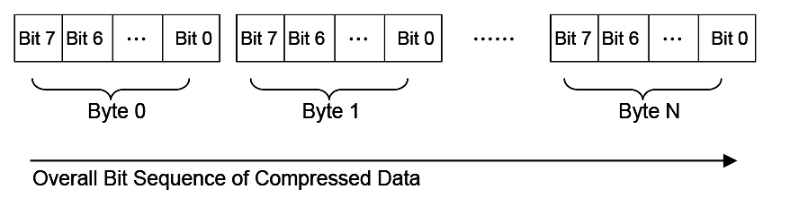
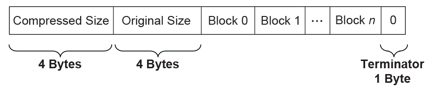
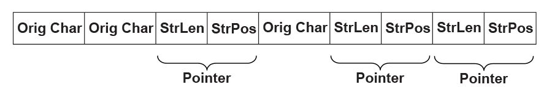
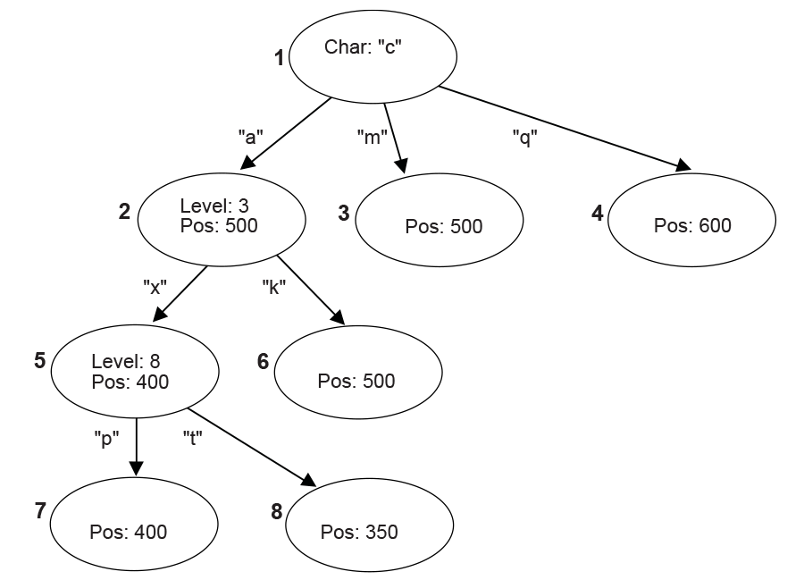
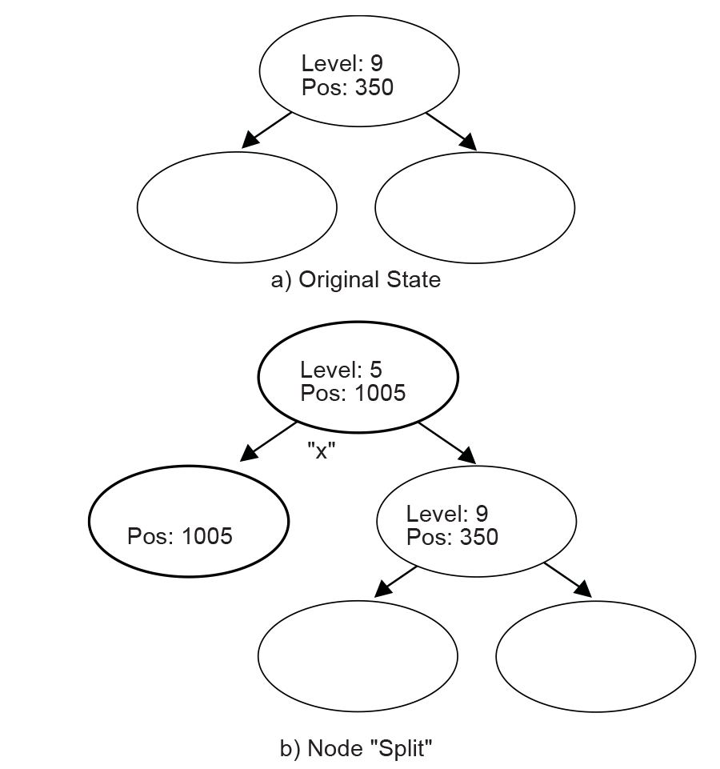

.. _protocols-compression-algorithm-specification:

Protocols — Compression Algorithm Specification
================================================

In EFI firmware storage, binary codes/data are often compressed to save storage space. These compressed codes/data are extracted into memory for execution at boot time. This demands an efficient lossless compression/decompression algorithm. The compressor must produce small compressed images, and the decompressor must operate fast enough to avoid delays at boot time. 

This chapter describes in detail the UEFI compression/decompression algorithm, as well as the EFI Decompress Protocol. The EFI Decompress Protocol provides a standard decompression interface for use at boot time.

.. _algorithm-overview:

Algorithm Overview
-------------------

In this chapter, the term "character" denotes a single byte and the term "string" denotes a series of concatenated characters.
 
The compression/decompression algorithm used in EFI firmware storage is a combination of the LZ77 algorithm and Huffman Coding. The LZ77 algorithm replaces a repeated string with a pointer to the previous occurrence of the string. Huffman Coding encodes symbols in a way that the more frequently a symbol appears in a text, the shorter the code that is assigned to it. 

The compression process contains two steps:
 
-  The first step is to find repeated strings (using LZ77 algorithm) and produce intermediate data. 

   Beginning with the first character, the compressor scans the source data and determines if the characters starting at the current position can form a string previously appearing in the text. If a long enough matching string is found, the compressor will output a pointer to the string. If the pointer occupies more space than the string itself, the compressor will output the original character at the current position in the source data. Then the compressor advances to the next position and repeats the process. To speed up the compression process, the compressor dynamically maintains a **String Info Log** to record the positions and lengths of strings encountered, so that string comparisons are performed quickly by looking up the String Info Log. 

   Because a compressor cannot have unlimited resources, as the compression continues the compressor removes "old" string information. This prevents the String Info Log from becoming too large. As a result, the algorithm can only look up repeated strings within the range of a fixed-sized "sliding window" behind the current position. 

   In this way, a stream of intermediate data is produced which contains two types of symbols: the **Original Characters** (to be preserved in the decompressed data), and the **Pointers** (representing a previous string). A Pointer consists of two elements: the **String Position** and the **String Length**, representing the location and the length of the target string, respectively. 

-  To improve the compression ratio further, Huffman Coding is utilized as the second step. 

   The intermediate data (consisting of original characters and pointers) is divided into Blocks so that the compressor can perform Huffman Coding on a Block immediately after it is generated; eliminating the need for a second pass from the beginning after the intermediate data has been generated. Also, since symbol frequency distribution may differ in different parts of the intermediate data, Huffman Coding can be optimized for each specific Block. The compressor determines Block Size for each Block according to the specifications defined in  `Data Format`_ . 

   In each Block, two symbol sets are defined for Huffman Coding. The Char&Len Set consists of the Original Characters plus the String Lengths and the Position Set consists of String Positions (Note that the two elements of a Pointer belong to separate symbol sets). The Huffman Coding schemes applied on these two symbol sets are independent. 

   The algorithm uses "canonical" Huffman Coding so a Huffman tree can be represented as an array of code lengths in the order of the symbols in the symbol set. This code length array represents the Huffman Coding scheme for the symbol set. Both the Char&Len Set code length array and the Position Set code length array appear in the Block Header. 

   Huffman coding is used on the code length array of the Char&Len Set to define a third symbol set. The Extra Set is defined based on the code length values in the Char&Len Set code length array. The code length array for the Huffman Coding of Extra Set also appears in the Block Header together with the other two code length arrays. For exact format of the Block Header,   `Block Header`_. 

The decompression process is straightforward given that the compression process is known. The decompressor scans the compressed data and decodes the symbols one by one, according to the Huffman code mapping tables generated from code length arrays. Along the process, if it encounters an original character, it outputs it; if it encounters a pointer, it looks it up in the already decompressed data and outputs the associated string.

.. _data-format:

Data Format
-----------

This section describes in detail the format of the compressed data produced by the compressor. The compressed data serves as input to the decompressor and can be fully extracted to the original source data.

.. _bit-order:

Bit Order
#########

In computer data representation, a byte is the minimum unit and there is no differentiation in the order of bits within a byte. However, the compressed data is a sequence of bits rather than a sequence of bytes and as a result the order of bits in a byte needs to be defined. In a compressed data stream, the higher bits are defined to precede the lower bits in a byte. The Figure, below, :ref:`bit-sequence-of-compressed-data-protocols` illustrates a compressed data sequence written as bytes from left to right. For each byte, the bits are written in an order with bit 7 (the highest bit) at the left and bit 0 (the lowest bit) at the right. Concatenating the bytes from left to right forms a bit sequence.

   Bit Sequence of Compressed Data

The bits of the compressed data are actually formed by a sequence of data units. These data units have variable bit lengths. The bits of each data unit are arranged so that the higher bit of the data unit precedes the lower bit of the data unit.

.. _overall-structure:

Overall Structure
#################

The compressed data begins with two 32-bit numerical fields: the compressed size and the original size. The compressed data following these two fields is composed of one or more Blocks. Each Block is a unit for Huffman Coding with a coding scheme independent of the other Blocks. Each Block is composed of a Block Header containing the Huffman code trees for this Block and a Block Body with the data encoded using the coding scheme defined by the Huffman trees. The compressed data is terminated by an additional byte of zero. 

The overall structure of the compressed data is shown in   :ref:`compressed-data-structure-protocols` .

   **Compressed Data Structure**

Note the following:

-  Blocks are of variable lengths.

-  Block lengths are counted by bits and not necessarily divisible by 8. Blocks are tightly packed (there are no padding bits between blocks). Neither the starting position nor ending position of a Block is necessarily at a byte boundary. However, if the last Block is not terminated at a byte boundary, there should be some bits of 0 to fill up the remaining bits of the last byte of the block, before the terminator byte of 0.

-  Compressed Size = 
   
   Size in bytes of (Block 0 + Block 1 +... + Block N + Filling Bits (if any) + Terminator).

-  Original Size is the size in bytes of original data.

-  Both Compressed Size and Original Size are "little endian" (starting from the least significant byte).

.. _block-structure:

Block Structure
###############

A Block is composed of a Block Header and a Block Body, as shown in the figure below. These two parts are packed tightly (there are no padding bits between them). The lengths in bits of Block Header and Block
Body are not necessarily divisible by eight.

   **Block Structure**

.. _block-header:

Block Header
$$$$$$$$$$$$

The Block Header contains the Huffman encoding information for this block. Since "canonical" Huffman Coding is being used, a Huffman tree is represented as an array of code lengths in increasing order of the symbols in the symbol set. Code lengths are limited to be less than or equal to 16 bits. This requires some extra handling of Huffman codes in the compressor, which is described in  `Block Structure`_ . 

There are three code length arrays for three different symbol sets in the Block Header: one for the Extra Set, one for the Char&Len Set, and one for the Position Set. 

The Block Header is composed of the tightly packed (no padding bits) fields described in the Table, below, :ref:`block-header-fields-protocols` .

.. list-table:: Block Header Fields
   :name: block-header-fields-protocols
   :class: longtable

   * - **Field Name**
     - **Length (bits)**
     - **Description**
   * - Block Size
     - 16
     - | The size of this Block. Block Size is defined as the number of original characters plus the number of pointers that appear in the Block Body:
       |
       | Block Size = Number of Original Characters in the Block Body
       | \+ Number of Pointers in the Block Body.
   * - Extra Set Code Length Array Size
     - 5
     - | The number of code lengths in the Extra Set Code Length Array.
       |
       | The Extra Set Code Length Array contains code lengths of the Extra Set in increasing order of the symbols, and if all symbols greater than a certain symbol have zero code length, the Extra Set Code Length Array terminates at the last nonzero code length symbol.
       |
       | Since there are 19 symbols in the Extra Set (see the description of the Char&Len Set Code Length Array), the maximum Extra Set Code Length Array Size is 19.
   * - Extra Set Code Length Array
     - Variable
     - | If Extra Set Code Length Array Size is 0, then this field is a 5-bit value that represents the only Huffman code used.  
       | 
       | If Extra Set Code Length Array Size is not 0, then this field is an encoded form of a concatenation of code lengths in increasing order of the symbols.  
       | 
       | The concatenation of Code lengths are encoded as follows:  
       | If a code length is less than 7, then it is encoded as a 3-bit value;  
       | 
       | If a code length is equal to or greater than 7, then it is encoded as a series of "1"s followed by a terminating "0." The number of "1"s = Code length - 4. For example, code length "ten" is encoded as "1111110"; code length "seven" is encoded as "1110."  
       | 
       | After the third length of the code length concatenation, a 2-bit value is used to indicate the number of consecutive zero lengths immediately after the third length. (Note this 2-bit value only appears once after the third length, and does NOT appear multiple times after every 3rd length.)
       | 
       | This 2-bit value ranges from 0 to 3. For example, if the 2-bit value is "00," then it means there are no zero lengths at the point, and following encoding starts from the fourth code length; 
       |
       | if the 2-bit value is "10" then it means the fourth and fifth length are zero and following encoding starts from the sixth code length.
   * - Position Set Code Length Array Size
     - 4
     - | The number of code lengths in the Position Set Code Length Array. 
       |
       | The Position Set Code Length Array contains code lengths of Position Set in increasing order of the symbols in the Position Set, and if all symbols greater than a certain symbol have zero code length, the Position Set Code Length Array terminates at the last nonzero code length symbol.
       |
       | Since there are 14 symbols in the Position Set (see 3.3.2), 
       | the maximum Position Set Code Length Array Size is 14.
   * - Char&Len Set Code Length Array
     - Variable
     - | If Char&Len Set Code Length Array Size is 0, then this field is a 9-bit value that represents the only Huffman code used.  
       |
       | If Char&Len Set Code Length Array Size is not 0, then this field is an encoded form of a concatenation of code lengths in increasing order of the symbols.  The concatenation of Code lengths are two-step encoded:  
       | 
       | Step 1:  
       |
       | If a code length is not zero, then it is encoded as "code length + 2";  
       | If a code length is zero, then the number of consecutive zero lengths starting from this code length is counted —
       |
       | • If the count is equal to or less than 2, then the code "0" is used for each zero length;
       | • if the count is greater than 2 and less than 19, then the code "1" followed by a 4-bit value of "count - 3" is used for these consecutive zero lengths; 
       | • if the count is equal to 19, then it is treated as "1 + 18," and a code "0" and a code "1" followed by a 4-bit value of "15" are used for these consecutive zero lengths; 
       | • if the count is greater than 19, then the code "2" followed by a 9-bit value of "count - 20" is used for these consecutive zero lengths.  
       | 
       | Step 2:  
       |
       | The second step encoding is a Huffman encoding of the codes produced by first step. 
       | 
       | (While encoding codes "1" and "2," their appended values are not encoded and preserved in the resulting text). 
       | The code lengths of generated Huffman tree are just the contents of the Extra Set Code Length Array.
   * - Position Set Code Length Array Size
     - 4
     - | The number of code lengths in the Position Set Code Length Array. 
       |
       | The Position Set Code Length Array contains code lengths of Position Set in increasing order of the symbols in the Position Set, and if all symbols greater than a certain symbol have zero code length, the Position Set Code Length Array terminates at the last nonzero code length symbol. 
       |
       | Since there are 14 symbols in the Position Set (see 3.3.2), the maximum Position Set Code Length Array Size is 14.
   * - Position Set Code Length Array
     - Variable
     - | If Position Set Code Length Array Size is 0, then this field is a 5-bit value that represents the only Huffman code used.
       |   
       | If Position Set Code Length Array Size is not 0, then this field is an encoded form of a concatenation of code lengths in increasing order of the symbols.  
       |
       | The concatenation of Code lengths are encoded as follows: 
       | 
       | If a code length is less than 7, then it is encoded as a normal 3-bit value;  
       |
       | If a code length is equal to or greater than 7, then it is encoded as a series of "1"s followed by a terminating "0." The number of "1"s = Code length - 4. For example, code length "10" is encoded as "1111110"; code length "7" is encoded as "1110."

.. _block-body:

Block Body
$$$$$$$$$$

The Block Body is simply a mixture of Original Characters and Pointers, while each Pointer has two elements: String Length preceding String Position. All these data units are tightly packed together.

   **Block Body**

The Original Characters, String Lengths and String Positions are all Huffman coded using the Huffman trees presented in the Block Header, with some additional variations. The exact format is described below: 

An Original Character is a byte in the source data. A String Length is a value that is greater than 3 and less than 257 (this range should be ensured by the compressor). By calculating "(String Length - 3) \| 0x100," a value set is obtained that ranges from 256 to 509. By combining this value set with the value set of Original Characters (0 ~ 255), the Char&Len Set (ranging from 0 to 509) is generated for Huffman Coding. 

A String Position is a value that indicates the distance between the current position and the target string. The String Position value is defined as "Current Position - Starting Position of the target string - 1." The String Position value ranges from 0 to 8190 (so 8192 is the "sliding window" size, and this range should be ensured by the compressor). The lengths of the String Position values (in binary form) form a value set ranging from 0 to 13 (it is assumed that value 0 has length of 0). This value set is the Position Set for Huffman Coding. The full representation of a String Position value is composed of two consecutive parts: one is the Huffman code for the value length; the other is the actual String Position value of "length - 1" bits (excluding the highest bit since the highest bit is always "1"). For example, String Position value 18 is represented as: Huffman code for "5" followed by "0010." If the value length is 0 or 1, then no value is appended to the Huffman code. This kind of representation favors small String Position values, which is a hint for compressor design. 

.. _compressor-design:

Compressor Design
-----------------

The compressor takes the source data as input and produces a compressed image. This section describes the design used in one possible implementation of a compressor that follows the UEFI Compression Algorithm. The source code that illustrates an implementation of this specific design is listed in Appendix H.

.. _overall-process:

Overall Process
###############

The compressor scans the source data from the beginning, character by character. As the scanning proceeds, the compressor generates Original Characters or Pointers and outputs the compressed data packed in a series of Blocks representing individual Huffman coding units. 

The compressor maintains a String Info Log containing data that facilitates string comparison. Old data items are deleted and new data items are inserted regularly. 

The compressor does not output a Pointer immediately after it sees a matching string for the current position. Instead, it delays its decision until it gets the matching string for the next position. The compressor has two criteria at hand: one is that the former match length should be no shorter than three characters; the other is that the former match length should be no shorter than the latter match length. 

Only when these two criteria are met does the compressor output a Pointer to the former matching string. 

The overall process of compression can be described by following pseudo code:

.. code-block::

   Set the Current Position at the beginning of the source data;
   Delete the outdated string info from the String Info Log;
   Search the String Info Log for matching string;
   Add the string info of the current position into the String Info Log;
   WHILE not end of source data DO
     Remember the last match;
     Advance the Current Position by 1;
     Delete the outdated String Info from the String Info Log;
     Search the String Info Log for matching string;
     Add the string info of the Current Position into the String Info Log;
     IF the last match is shorter than 3 characters or this match is longer than
      the last match THEN
       Call Output()* to output the character at the previous position as an 
       Original Character;
   ELSE
     Call Output()* to output a Pointer to the last matching string;
     WHILE (--last match length) > 0 DO
       Advance the Current Position by 1;
       Delete the outdated piece of string info from the String Info Log;
       Add the string info of the current position into the String Info Log;
      ENDWHILE
    ENDIF
   ENDWHILE

The Output() is the function that is responsible for generating Huffman codes and Blocks. It accepts an Original Character or a Pointer as input and maintains a Block Buffer to temporarily store data units that are to be Huffman coded. The following pseudo code describes the function:

.. code-block::

   FUNCTION NAME: Output
   INPUT: an Original Character or a Pointer

   Put the Original Character or the Pointer into the Block Buffer;
   Advance the Block Buffer position pointer by 1;
   IF the Block Buffer is full THEN
     Encode the Char&Len Set in the Block buffer;
     Encode the Position Set in the Block buffer;
     Encode the Extra Set;
     Output the Block Header containing the code length arrays;
     Output the Block Body containing the Huffman encoded Original Characters and
     Pointers;
     Reset the Block Buffer position pointer to point to the beginning of the Block buffer;
   ENDIF

.. _string-info-log-protocols:

String Info Log
###############

The provision of the String Info Log is to speed up the process of finding matching strings. The design of this has significant impact on the overall performance of the compressor. This section describes in detail how String Info Log is implemented and the typical operations on it.

.. _data-structures:

Data Structures
$$$$$$$$$$$$$$$

The String Info Log is implemented as a set of search trees. These search trees are dynamically updated as the compression proceeds through the source data. The structure of a typical search tree is depicted in  the Figure, below, :ref:`string-info-log-search-tree-protocols` .

   String Info Log Search Tree

There are three types of nodes in a search tree: the root node, internal nodes, and leaves. The root node has a "character" attribute, which represents the starting character of a string. Each edge also has a "character" attribute, which represents the next character in the string. Each internal node has a "level" attribute, which indicates the character on any edge that leads to its child nodes is the "level + 1"th character in the string. Each internal node or leaf has a "position" attribute that indicates the string’s starting position in the source data. 

To speed up the tree searching, a hash function is used. Given the parent node and the edge-character, the hash function will quickly find the expected child node.

.. _searching-the-tree:

Searching the Tree
$$$$$$$$$$$$$$$$$$

Traversing the search tree is performed as follows:

The following example uses the search tree shown in the Figure, above,  :ref:`string-info-log-search-tree-protocols` . Assume that the current position in the source data contains the string "camxrsxpj...."

#. The starting character "c" is used to find the root of the tree. The next character "a" is used to follow the edge from node 1 to node 2. The "position" of node 2 is 500, so a string starting with "ca" can be found at position 500. The string at the current position is compared with the string starting at position 500.

#. Node 2 is at Level 3; so at most three characters are compared. Assume that the three-character comparison passes. 

#. The fourth character "x" is used to follow the edge from Node 2 to Node 5. The position value of node 5 is 400, which means there is a string located in position 400 that starts with "cam" and the character at position 403 is an "x."

#. Node 5 is at Level 8, so the fifth to eighth characters of the source data are compared with the string starting at position 404. Assume the strings match. 

#. At this point, the ninth character "p" has been reached. It is used to follow the edge from Node 5 to Node 7.

#. This process continues until a mismatch occurs, or the length of the matching strings exceeds the predefined MAX_MATCH_LENGTH. The most recent matching string (which is also the longest) is the desired matching string.

.. _adding-string-info:

Adding String Info
$$$$$$$$$$$$$$$$$$

String info needs to be added to the String Info Log for each position in the source data. Each time a search for a matching string is performed, the new string info is inserted for the current position. There are several cases that can be discussed:

#. No root is found for the first character. A new tree is created with the root node labeled with the starting character and a child leaf node with its edge to the root node labeled with the second character in the string. The "position" value of the child node is set to the current position.

#. One root node matches the first character, but the second character does not match any edge extending from the root node. A new child leaf node is created with its edge labeled with the second character. The "position" value of the new leaf child node is set to the current position. 

#. A string comparison succeeds with an internal node, but a matching edge for the next character does not exist. This is similar to (2) above. A new child leaf node is created with its edge labeled with the character that does not exist. The "position" value of the new leaf child node is set to the current position.

#. A string comparison exceeds MAX_MATCH_LENGTH. Note: This only happens with leaf nodes. For this case, the "position" value in the leaf node is updated with the current position. 

#. If a string comparison with an internal node or leaf node fails (mismatch occurs before the "Level + 1"th character is reached or MAX_MATCH_LENGTH is exceeded), then a "split" operation is performed as follows:
   
   Suppose a comparison is being performed with a level 9 Node, at position 350, and the current position is 1005. If the sixth character at position 350 is an "x" and the sixth character at position 1005 is a "y," then a mismatch will occur. In this case, a new internal node and a new child node are inserted into the tree, as depicted in  :ref:`node-split-protocols` .

   Node Split

   The b) portion of :ref:`node-split-protocols`   has two new inserted nodes, which reflects the new string information that was found at the current position. The process splits the old node into two child nodes, and that is why this operation is called a "split."

.. _deleting-string-info:

Deleting String Info
$$$$$$$$$$$$$$$$$$$$

The String Info Log will grow as more and more string information is logged. The size of the String Info Log must be limited, so outdated information must be removed on a regular basis. A sliding window is maintained behind the current position, and the searches are always limited within the range of the sliding window. Each time the current position is advanced, outdated string information that falls outside the sliding window should be removed from the tree. The search for outdated string information is simplified by always updating the nodes’ "position" attribute when searching for matching strings.

.. _huffman-code-generation:

Huffman Code Generation
#######################

Another major component of the compressor design is generation of the Huffman Code. 

Huffman Coding is applied to the Char&Len Set, the Position Set, and the Extra Set. The Huffman Coding used here has the following features: 

-  The Huffman tree is represented as an array of code lengths ("canonical" Huffman Coding); 

-  The maximum code length is limited to 16 bits. 

The Huffman code generation process can be divided into three steps. These are the generation of Huffman tree, the adjustment of code lengths, and the code generation.

.. _huffman-tree-generation:

Huffman Tree Generation
$$$$$$$$$$$$$$$$$$$$$$$

This process generates a typical Huffman tree. First, the frequency of each symbol is counted, and a list of nodes is generated with each node containing a symbol and the symbol’s frequency. The two nodes with the lowest frequency values are merged into a single node. This new node becomes the parent node of the two nodes that are merged. The frequency value of this new parent node is the sum of the two child nodes’ frequency values. The node list is updated to include the new parent node but exclude the two child nodes that are merged. This process is repeated until there is a single node remaining that is the root of the generated tree.

.. _code-length-adjustment:

Code Length Adjustment
$$$$$$$$$$$$$$$$$$$$$$

The leaf nodes of the tree generated by the previous step represent all the symbols that were generated. Traditionally the code for each symbol is found by traversing the tree from the root node to the leaf node. Going down a left edge generates a "0," and going down a right edge generates a "1." However, a different approach is used here. The number of codes of each code length is counted. This generates a 16-element LengthCount array, with LengthCount[i] = Number Of Codes whose Code Length is i. Since a code length may be longer than 16 bits, the sixteenth entry of the LengthCount array is set to the Number Of Codes whose Code Length is greater than or equal to 16. 

The LengthCount array goes through further adjustment described by following code:

.. code-block::

   INT32 i, k;
   UINT32 cum;

   cum = 0;
   for (i = 16; i > 0; i--) {
      cum += LengthCount[i] << (16 - i);
   }
   while (cum != (1U << 16)) {
    LengthCount[16]--;
    for (i = 15; i > 0; i--) {
      if (LengthCount[i] != 0) {
        LengthCount[i]--;
        LengthCount[i+1] += 2;
        break;
      }
    }
    cum--;
   }
   

.. _code-generation:

Code Generation
$$$$$$$$$$$$$$$

In the previous step, the count of each length was obtained. Now, each symbol is going to be assigned a code. First, the length of the code for each symbol is determined. Naturally, the code lengths are assigned in such a way that shorter codes are assigned to more frequently appearing symbols. A CodeLength array is generated with CodeLength[i] = the code length of symbol i. Given this array, a code is assigned to each symbol using the algorithm described by the pseudo code below (the resulting codes are stored in array Code such that Code[i] = the code assigned to symbol i):

.. code-block::

   INT32 i;
   UINT16 Start[18];

   Start[1] = 0;

   for (i = 1; i <= 16; i++) {
     Start[i + 1] = (UINT16)((Start[i] + LengthCount[i]) << 1);
   }

   for (i = 0; i < NumberOfSymbols; i++) {
     Code[i] = Start[CodeLength[i]]++;
   }

The code length adjustment process ensures that no code longer than the designated length will be generated. As long as the decompressor has the CodeLength array at hand, it can regenerate the codes.

.. _decompressor-design:

Decompressor Design
-------------------

The decompressor takes the compressed data as input and produces the original source data. The main tasks for the decompressor are decoding Huffman codes and restoring Pointers to the strings to which they point.

The following pseudo code describes the algorithm used in the design of a decompressor. The source code that illustrates an implementation of this design is listed in Appendix I.

.. code-block::

   WHILE not end of data DO
     IF at block boundary THEN
       Read in the Extra Set Code Length Array;
       Generate the Huffman code mapping table for the Extra Set;
       Read in and decode the Char&Len Set Code Length Array;
       Generate the Huffman code mapping table for the Char&Len Set;
       Read in the Position Set Code Length Array;
       Generate the Huffman code mapping table for the Position Set;
     ENDIF
     Get next code;
     Look the code up in the Char&Len Set code mapping table.
     Store the result as C;
     IF C < 256 (it represents an Original Character) THEN 
       Output this character;
     ELSE (it represents a String Length)
       Transform C to be the actual String Length value;
       Get next code and look it up in the Position Set code mapping table, and 
       with some additional transformation, store the result as P;
       Output C characters starting from the position "Current Position - P";
     ENDIF
   ENDWHILE

.. _decompress-protocol:

Decompress Protocol
-------------------

This section provides a detailed description of the *EFI_DECOMPRESS_PROTOCOL*.

.. _efi-decompress-protocol:

EFI_DECOMPRESS_PROTOCOL
#######################

**Summary**

Provides a decompression service.

**GUID**

.. code-block::

   #define EFI_DECOMPRESS_PROTOCOL_GUID \
     {0xd8117cfe,0x94a6,0x11d4,\
       {0x9a,0x3a,0x00,0x90,0x27,0x3f,0xc1,0x4d}}

**Protocol Interface Structure**

.. code-block::

   typedef struct _EFI_DECOMPRESS_PROTOCOL {
     EFI_DECOMPRESS_GET_INFO              GetInfo;
     EFI_DECOMPRESS_DECOMPRESS            Decompress;
   } EFI_DECOMPRESS_PROTOCOL;

**Parameters**

GetInfo
  Given the compressed source buffer, this function retrieves the size of the uncompressed destination buffer and the size of the scratch buffer required to perform the decompression. It is the caller’s responsibility to allocate the destination buffer and the scratch buffer prior to calling  `EFI_DECOMPRESS_PROTOCOL.Decompress()`_ . See the `EFI_DECOMPRESS_PROTOCOL.GetInfo()`_  function description.

Decompress
  Decompresses a compressed source buffer into an uncompressed destination buffer. It is the caller’s responsibility to allocate the destination buffer and a scratch buffer prior to making this call. See the *Decompress()* function description.

**Description**

The *EFI_DECOMPRESS_PROTOCOL* provides a decompression service that allows a compressed source buffer in memory to be decompressed into a destination buffer in memory. It also requires a temporary scratch buffer to perform the decompression. The *GetInfo()* function retrieves the size of the destination buffer and the size of the scratch buffer that the caller is required to allocate. The *Decompress()* function performs the decompression. The scratch buffer can be freed after the decompression is complete.

.. _efi-decompress-protocol-getinfo:

EFI_DECOMPRESS_PROTOCOL.GetInfo()
#################################

**Summary**

Given a compressed source buffer, this function retrieves the size of the uncompressed buffer and the size of the scratch buffer required to decompress the compressed source buffer.

**Prototype**

.. code-block::
  
   typedef  
   EFI_STATUS  
   (EFIAPI *EFI_DECOMPRESS_GET_INFO) (  
     IN  EFI_DECOMPRESS_PROTOCOL        *This,  
     IN  VOID                           *Source,  
     IN  UINT32                         SourceSize,  
     OUT UINT32                         *DestinationSize,  
     OUT UINT32                         *ScratchSize  
     );
  

**Parameters**

This
  A pointer to the  `EFI_DECOMPRESS_PROTOCOL`_  instance. Type EFI_DECOMPRESS_PROTOCOL is defined in `EFI_DECOMPRESS_PROTOCOL`_. 

Source
  The source buffer containing the compressed data.

SourceSize
  The size, in bytes, of the source buffer.

DestinationSize
  A pointer to the size, in bytes, of the uncompressed buffer that will be generated when the compressed buffer specified by *Source* and *SourceSiz* e is decompressed.

ScratchSize
  A pointer to the size, in bytes, of the scratch buffer that is required to decompress the compressed buffer specified by *Source* and *SourceSize*.

**Description**

The *GetInfo()* function retrieves the size of the uncompressed buffer and the temporary scratch buffer required to decompress the buffer specified by *Source* and *SourceSize*. If the size of the uncompressed buffer or the size of the scratch buffer cannot be determined from the compressed data specified by *Source* and *SourceData*, then *EFI_INVALID_PARAMETER* is returned. Otherwise, the size of the uncompressed buffer is returned in *DestinationSize*, the size of the scratch buffer is returned in *ScratchSize*, and *EFI_SUCCESS* is returned. 

The *GetInfo()* function does not have scratch buffer available to perform a thorough checking of the validity of the source data. It just retrieves the "Original Size" field from the beginning bytes of the source data and output it as *DestinationSize*. And *ScratchSize* is specific to the decompression implementation.

**Status Codes Returned**

.. list-table::
   :widths: 35 70
   :class: longtable

   * - EFI_SUCCESS
     - The size of the uncompressed data was returned in *DestinationSize* and the size of the scratch buffer was returned in *ScratchSize.*
   * - EFI_INVALID_PARAMETER
     - The size of the uncompressed data or the size of the scratch buffer cannot be determined from the compressed data specified by *Source* and *SourceSize*.

.. _efi-decompress-protocol-decompress:

EFI_DECOMPRESS_PROTOCOL.Decompress()
####################################

**Summary**

Decompresses a compressed source buffer.

**Prototype**

.. code-block:: 
  
   typedef  
   EFI_STATUS  
   (EFIAPI *EFI_DECOMPRESS_DECOMPRESS) (  
     IN   EFI_DECOMPRESS_PROTOCOL      *This,  
     IN    VOID                        *Source,  
     IN    UINT32                      SourceSize,  
     IN OUT VOID                       *Destination,  
     IN    UINT32                      DestinationSize,  
     IN OUT VOID                       *Scratch,  
     IN    UINT32                      ScratchSize  
     );
  

**Parameters**

This  
  A pointer to the `EFI_DECOMPRESS_PROTOCOL`_  instance. Type EFI_DECOMPRESS_PROTOCOL is defined in `EFI_DECOMPRESS_PROTOCOL`_. 

Source
  The source buffer containing the compressed data.

SourceSize
  The size of source data.

Destination
  On output, the destination buffer that contains the uncompressed data.

DestinationSize
  The size of the destination buffer. The size of the destination buffer needed is obtained from `EFI_DECOMPRESS_PROTOCOL.GetInfo()`_ .

Scratch
  A temporary scratch buffer that is used to perform the decompression.

ScratchSize
  The size of scratch buffer. The size of the scratch buffer needed is obtained from *GetInfo()*.

**Description**

The *Decompress()* function extracts decompressed data to its original form. 

This protocol is designed so that the decompression algorithm can be implemented without using any memory services. As a result, the Decompress() function is not allowed to call  :ref:`efi-boot-services-allocatepool`  or :ref:`efi-boot-services-allocatepages` in its implementation. It is the caller’s responsibility to allocate and free the Destination and Scratch buffers. 

If the compressed source data specified by *Source* and *SourceSize* is successfully decompressed into *Destination*, then *EFI_SUCCESS* is returned. If the compressed source data specified by *Source* and *SourceSize* is not in a valid compressed data format, then *EFI_INVALID_PARAMETER* is returned.

**Status Codes Returned**

.. list-table::
   :widths: 35 70

   * - EFI_SUCCESS
     - Decompression completed successfully, and the uncompressed buffer is returned in *Destination*.
   * - EFI_INVALID_PARAMETER
     - The source buffer specified by *Source* and *SourceSize* is corrupted (not in a valid compressed format).
