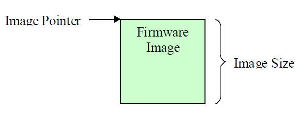
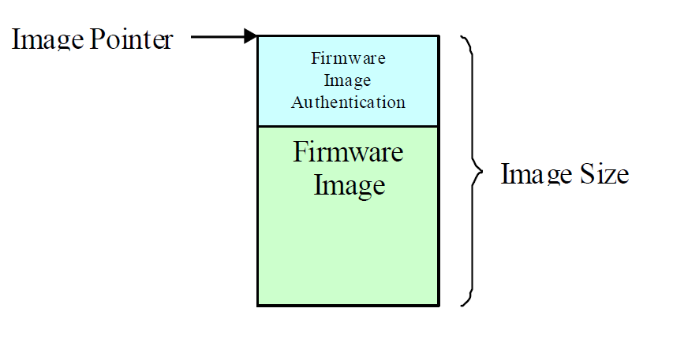
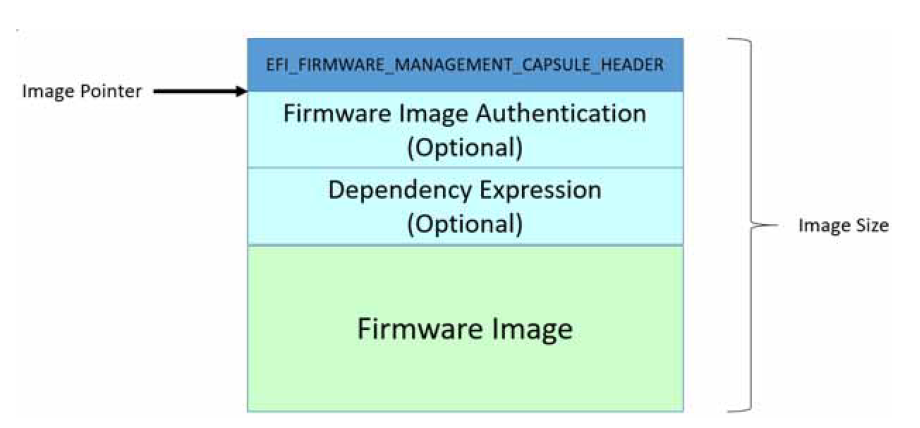
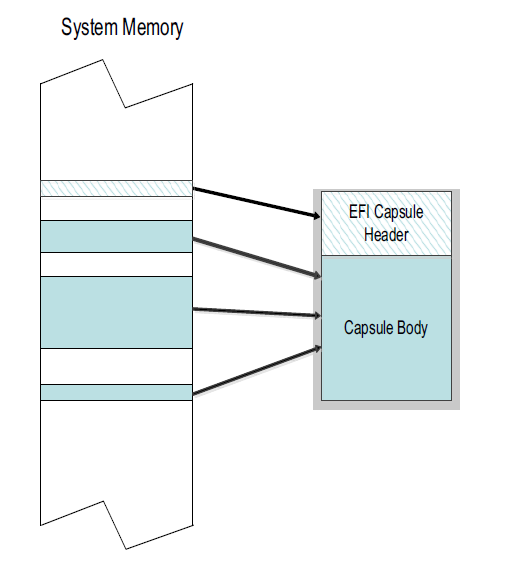
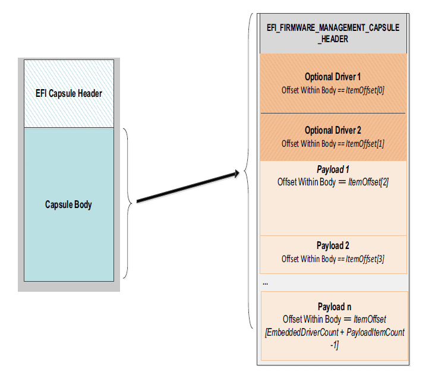
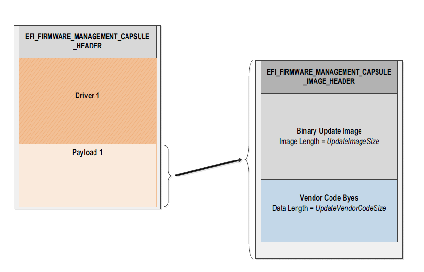

.. _firmware-update-and-reporting:

Firmware Update and Reporting
=============================

The UEFI Firmware Management Protocol provides an abstraction for device to provide firmware management support. The base requirements for managing device firmware images include identifying firmware image revision level and programming the image into the device. The protocol for managing firmware provides the following services.

-  Get the attributes of the current firmware image. Attributes include revision level.
-  Get a copy of the current firmware image. As an example, this service could be used by a management application to facilitate a firmware roll-back.
-  Program the device with a firmware image supplied by the user.
-  Label all the firmware images within a device with a single version.

When UEFI Firmware Management Protocol (FMP) instance is intended to perform the update of an option ROM loaded from a PCI or PCI Express device, it is recommended that the FMP instance be attached to the handle with *EFI_LOADED_IMAGE_PROTOCOL* for said Option ROM.

When the FMP instance is intended to update internal device firmware, or a combination of device firmware and Option ROM, the FMP instance may instead be attached to the Controller handle of the device. However, in the case where multiple devices represented by multiple controller handles are served by the same firmware store, only a single Controller handle should expose FMP. In all cases a specific updatable hardware firmware store must be represented by exactly one FMP instance.

Care should be taken to ensure that the FMP instance reports current version data that accurately represents the actual contents of the firmware store of the device exposing FMP, because in some cases the device driver currently operating the device may have been loaded from another device or media.

.. _firmware-management-protocol:

Firmware Management Protocol
----------------------------

.. _efi-firmware-management-protocol:

EFI_FIRMWARE_MANAGEMENT_PROTOCOL
################################

**Summary**

Firmware Management application invokes this protocol to manage device firmware.

**GUID**

.. code-block::

   // {86C77A67-0B97-4633-A187-49104D0685C7}
   #define EFI_FIRMWARE_MANAGEMENT_PROTOCOL_GUID \
    { 0x86c77a67, 0xb97, 0x4633, \
      {0xa1, 0x87, 0x49, 0x10, 0x4d, 0x06, 0x85, 0xc7 }}

**Protocol**

.. code-block::

   typedef struct \_EFI_FIRMWARE_MANAGEMENT_PROTOCOL {
     EFI_FIRMWARE_MANAGEMENT_PROTOCOL_GET_IMAGE_INFO     GetImageInfo;
     EFI_FIRMWARE_MANAGEMENT_PROTOCOL_GET_IMAGE          GetImage;
     EFI_FIRMWARE_MANAGEMENT_PROTOCOL_SET_IMAGE          SetImage;
     EFI_FIRMWARE_MANAGEMENT_PROTOCOL_CHECK_IMAGE        CheckImage;
      EFI_FIRMWARE_MANAGEMENT_PROTOCOL_GET_PACKAGE_INFO  GetPackageInfo;
     EFI_FIRMWARE_MANAGEMENT_PROTOCOL_SET_PACKAGE_INFO   SetPackageInfo;
   }  EFI_FIRMWARE_MANAGEMENT_PROTOCOL;

**Members**

GetImageInfo
  Returns information about the current firmware image(s) of the device.

GetImage
  Retrieves a copy of the current firmware image of the device.

SetImage
  Updates the device firmware image of the device.

CheckImage
  Checks if the firmware image is valid for the device.

GetPackageInfo
  Returns information about the current firmware package.

SetPackageInfo
  Updates information about the firmware package.

.. _efi-firmware-mamagement-protocol-getimageinfo:

EFI_FIRMWARE_MANAGEMENT_PROTOCOL.GetImageInfo()
################################################

**Summary**

Returns information about the current firmware image(s) of the device.

**Protocol**

.. code-block::

   typedef
   EFI_STATUS
   (EFIAPI *EFI_FIRMWARE_MANAGEMENT_PROTOCOL_GET_IMAGE_INFO) (
     IN EFI_FIRMWARE_MANAGEMENT_PROTOCOL    *This,
     IN OUT UINTN                           *ImageInfoSize,
     IN OUT EFI_FIRMWARE_IMAGE_DESCRIPTOR   *ImageInfo,
     OUT    UINT32                          *DescriptorVersion
     OUT    UINT8                           *DescriptorCount,
     OUT    UINTN                           *DescriptorSize,
     OUT    UINT32                          *PackageVersion,
     OUT    CHAR16                          **PackageVersionName
     ) ;

**Parameters**

This
  A pointer to the *EFI_FIRMWARE_MANAGEMENT_PROTOCOL* instance.

ImageInfoSize
  A pointer to the size, in bytes, of the *ImageInfo* buffer. On input, this is the size of the buffer allocated by the caller. On output, it is the size of the buffer returned by the firmware if the buffer was large enough, or the size of the buffer needed to contain the image(s) information if the buffer was too small.

ImageInfo
  A pointer to the buffer in which firmware places the current image(s) information. The information is an array of *EFI_FIRMWARE_IMAGE_DESCRIPTOR* , see "Related Definitions". May be NULL with a zero *ImageInfoSize* in order to determine the size of the buffer needed.

DescriptorVersion
  A pointer to the location in which firmware returns the version number associated with the *EFI_FIRMWARE_IMAGE_DESCRIPTOR.* See "Related Definitions".

DescriptorCount
  A pointer to the location in which firmware returns the number of descriptors or firmware images within this device.

DescriptorSize
  A pointer to the location in which firmware returns the size, in bytes, of an individual *EFI_FIRMWARE_IMAGE_DESCRIPTOR.*

PackageVersion
  A version number that represents all the firmware images in the device. The format is vendor specific and new version must have a greater value than the old version. If *PackageVersion* is not supported, the value is 0xFFFFFFFF. A value of 0xFFFFFFFE indicates that package version comparison is to be performed using *PackageVersionName*. A value of 0xFFFFFFFD indicates that package version update is in progress.

PackageVersionName
  A pointer to a pointer to a null-terminated string representing the package version name. The buffer is allocated by this function with *AllocatePool(),* and it is the caller’s responsibility to free it with a call to *FreePool()*.

**Related Definitions**

.. code-block::
  
   //*************************************************************  
   // EFI_FIRMWARE_IMAGE_DESCRIPTOR  
   //*************************************************************  
   typedef struct {  
     UINT8                    ImageIndex;  
     EFI_GUID                 ImageTypeId;  
     UINT64                   ImageId  
     CHAR16                   *ImageIdName;  
     UINT32                   Version;  
     CHAR16                   *VersionName;  
     UINTN                    Size;  
     UINT64                   AttributesSupported;  
     UINT64                   AttributesSetting;  
     UINT64                   Compatibilities;  
   //Introduced with DescriptorVersion 2+  
     UINT32                   LowestSupportedImageVersion; \  
   //Introduced with DescriptorVersion 3+  
     UINT32                   LastAttemptVersion;
     UINT32                   LastAttemptStatus;
     UINT64                   HardwareInstance;  
   //Introduced with DescriptorVersion 4+  
     EFI_FMP_DEP              *Dependencies;  
   } EFI_FIRMWARE_IMAGE_DESCRIPTOR;
  

ImageIndex
  A unique number identifying the firmware image within the device. The number is between 1 and *DescriptorCount.*

ImageTypeId
  A unique GUID identifying the firmware image type.

ImageId
  A unique number identifying the firmware image.

ImageIdName
  A pointer to a null-terminated string representing the firmware image name.

Version
  Identifies the version of the device firmware. The format is vendor specific and new version must have a greater value than an old version.

VersionName
  A pointer to a null-terminated string representing the firmware image version name.  

Size
  Size of the image in bytes. If size=0, then only *ImageIndex* and *ImageTypeId* are valid.

AttributesSupported
  Image attributes that are supported by this device. See "Image Attribute Definitions" for possible returned values of this parameter. A value of 1 indicates the attribute is supported and the current setting value is indicated in *AttributesSetting*. A value of 0 indicates the attribute is not supported and the current setting value in *AttributesSetting* is meaningless. 

AttributesSetting
  Image attributes. See "Image Attribute Definitions" for possible returned values of this parameter.

Compatibilities
  Image compatibilities. See "Image Compatibility Definitions" for possible returned values of this parameter.

LowestSupportedImageVersion
  Describes the lowest *ImageDescriptor* version that the device will accept. Only present in version 2 or higher.

LastAttemptVersion
  Describes the version that was last attempted to update. If no update attempted the value will be 0. If the update attempted was improperly formatted and no version number was available then the value will be zero. Only present in version 3 or higher.

LastAttemptStatus
  Describes the status that was last attempted to update. If no update has been attempted the value will be *LAST_ATTEMPT_STATUS_SUCCESS*. See "Related Definitions" in  `EFI_SYSTEM_RESOURCE_TABLE`_ for Last Attempt Status values. Only present in version 3 or higher.

HardwareInstance
  An optional number to identify the unique hardware instance within the system for devices that may have multiple instances (Example: a plug in PCI network card). This number must be unique within the namespace of the *ImageTypeId* GUID and *ImageIndex*. For FMP instances that have multiple descriptors for a single hardware instance, all descriptors must have the same *HardwareInstance* value. This number must be consistent between boots and should be based on some sort of hardware identified unique id (serial number, etc) whenever possible. If a hardware based number is not available the FMP provider may use some other characteristic such as device path, bus/dev/function, slot num, etc for generating the *HardwareInstance*. For implementations that will never have more than one instance a zero can be used. A zero means the FMP provider is not able to determine a unique hardware instance number or a hardware instance number is not needed. Only present in version 3 or higher. 

Dependencies
  A pointer to an array of FMP depex expression op-codes that are terminated by an *EFI_FMP_DEP_END* op-code. 

.. code-block::

   //*************************************************************
   // Image Attribute Definitions
   //*************************************************************
   #define IMAGE_ATTRIBUTE_IMAGE_UPDATABLE              0x0000000000000001
   #define IMAGE_ATTRIBUTE_RESET_REQUIRED               0x0000000000000002
   #define IMAGE_ATTRIBUTE_AUTHENTICATION_REQUIRED      0x0000000000000004
   #define IMAGE_ATTRIBUTE_IN_USE                       0x0000000000000008
   #define IMAGE_ATTRIBUTE_UEFI_IMAGE                   0x0000000000000010
   #define IMAGE_ATTRIBUTE_DEPENDENCY                   0x0000000000000020

The attribute *IMAGE_ATTRIBUTE_DEPENDENCY* indicates that there is an *EFI_FIRMWARE_IMAGE_DEP* section associated with the image. See "Image Attribute - Dependency".

.. code-block::

   //*************************************************************
   // Image Attribute - Dependency
   //*************************************************************
   typedef struct {
     UINT8 Dependencies[];
   }  EFI_FIRMWARE_IMAGE_DEP;

Dependencies
  An array of FMP depex expression op-codes that are terminated by an END op-code (see related definitions below.) 

The attribute *IMAGE_ATTRIBUTE_IMAGE_UPDATABLE* indicates this device supports firmware image update.

The attribute *IMAGE_ATTRIBUTE_RESET_REQUIRED* indicates a reset of the device is required for the new firmware image to take effect after a firmware update. The device is the device hosting the firmware image. 

The attribute *IMAGE_ATTRIBUTE_AUTHENTICATION_REQUIRED* indicates authentication is required to perform the following image operations: *GetImage(),* *SetImage(),* and *CheckImage()*. See "Image Attribute - Authentication". 

The attribute I *MAGE_ATTRIBUTE_IN_USE* indicates the current state of the firmware image. This distinguishes firmware images in a device that supports redundant images. 

The attribute *IMAGE_ATTRIBUTE_UEFI_IMAGE* indicates that this image is an EFI compatible image.

.. code-block::

   //*************************************************************
   // Image Compatibility Definitions
   //*************************************************************
   #define IMAGE_COMPATIBILITY_CHECK_SUPPORTED 0x0000000000000001

Values from 0x0000000000000002 thru 0x000000000000FFFF are reserved for future assignments.

Values from 0x0000000000010000 thru 0xFFFFFFFFFFFFFFFF are used by firmware vendor for compatibility check.

.. code-block::

   //*************************************************************
   // Descriptor Version exposed by GetImageInfo() function
   //*************************************************************
   #define EFI_FIRMWARE_IMAGE_DESCRIPTOR_VERSION 3

   //*************************************************************
   // Image Attribute - Authentication Required
   //*************************************************************
   typedef struct {
     UINT64                           MonotonicCount;
     WIN_CERTIFICATE_UEFI_GUID        AuthInfo;
   }  EFI_FIRMWARE_IMAGE_AUTHENTICATION;

MonotonicCount
  It is included in the signature of *AuthInfo*. It is used to ensure freshness/no replay. It is incremented during each firmware image operation.

AuthInfo
  Provides the authorization for the firmware image operations.

  If the image has dependencies associated with it, a signature across the image data will be created by including the Monotonic Count followed by the dependency values. If there are no dependencies, the signature will be across the image data and the Monotonic Count value.

  Caller uses the private key that is associated with a public key that has been provisioned via the key exchange. Because this is defined as a signature, *WIN_CERTIFICATE_UEFI_GUID.* *CertType* must be *EFI_CERT_TYPE_PKCS7_GUID*.

**Description**

*GetImageInfo()* is the only required function. *GetImage()* , *SetImage(),* *CheckImage(),* *GetPackageInfo(),* and *SetPackageInfo()* shall return *EFI_UNSUPPORTED* if not supported by the driver. 

A package can have one to many firmware images. The firmware images can have the same version naming or different version naming. *PackageVersion* may be used as the representative version for all the firmware images. *PackageVersion* can be obtained from *GetPackageInfo().* *PackageVersion* is also available in *GetImageInfo()* as *GetPackageInfo()* is optional. It also ensures the package version is in sync with the versions of the images within the package by returning the package version and image version(s) in a single function call. 

The value of *ImageTypeID* is implementation specific. This feature facilitates vendor to target a single firmware release to cover multiple products within a product family. As an example, a vendor has an initial product A and then later developed a product B that is of the same product family. Product A and product B will have the same *ImageTypeID* to indicate firmware compatibility between the two products. 

To determine image attributes, software must use both *AttributesSupported* and *AttributesSetting*. An attribute setting in *AttributesSetting* is meaningless if the corresponding attribute is not supported in *AttributesSupported*. 

*Compatibilities* are used to ensure the targeted firmware image supports the current hardware configuration. *Compatibilities* are set based on the current hardware configuration and firmware update policy should match the current settings to those supported by the new firmware image, and only permits update to proceed if the new firmware image settings are equal or greater than the current hardware configuration settings. For example, if this function returns *Compatibilities* = 0x0000000000070001 and the new firmware image supports settings=0x0000000000030001, then the update policy should block the firmware update and notify the user that updating the hardware with the new firmware image may render the hardware inoperable. This situation usually occurs when updating the hardware with an older version of firmware. 

The authentication support leverages the authentication scheme employed in variable authentication. Please reference *EFI_VARIABLE_AUTHENTICATION* in the "Variable Services" section of "Services - Runtime Services" chapter. 

If *IMAGE_ATTRIBUTE_AUTHENTICATION_REQUIRED* is supported and clear, then authentication is not required to perform the firmware image operations. In firmware image operations, the image pointer points to the start of the firmware image and the image size is the firmware image. 

   Firmware Image with no Authentication Support

If *IMAGE_ATTRIBUTE_AUTHENTICATION_REQUIRED* is supported and set, then authentication is required to perform the firmware image operations. In firmware image operations, the image pointer points to the start of the authentication data and the image size is the size of the authentication data and the size of the firmware image.

   Firmware Image with Authentication Support

If *IMAGE_ATTRIBUTE_DEPENDENCY* is supported and set, then there are dependencies associated with the image. See the `Dependency Expression Instruction Set`_ for details on the format of the dependency op-codes and how they are to be used.

   Firmware Image with Dependency/AuthenticationSupport

**Status Codes Returned**

.. list-table::
   :widths: 35 70
   :class: longtable 

   * - EFI_SUCCESS
     - The image information was successfully returned.
   * - EFI_BUFFER_TOO_SMALL
     - The *ImageInfo* buffer was too small. The current buffer size needed to hold the image(s) information is returned in *\*ImageInfoSize.*
   * - EFI_INVALID_PARAMETER
     - *\*ImageInfoSize* is not too small and *ImageInfo* is NULL.
   * - EFI_INVALID_PARAMETER
     - *\*ImageInfoSize* is non-zero and *DescriptorVersion* is *NULL*.
   * - EFI_INVALID_PARAMETER
     - *\*ImageInfoSize* is non-zero and *DescriptorCount* is *NULL*.
   * - EFI_INVALID_PARAMETER
     - *\*ImageInfoSize* is non-zero and *DescriptorSize* is *NULL*.
   * - EFI_INVALID_PARAMETER
     - *\*ImageInfoSize* is non-zero and *PackageVersion* is *NULL*.
   * - EFI_INVALID_PARAMETER
     - *\*ImageInfoSize* is non-zero and *PackageVersionName* is *NULL*.
   * - EFI_INVALID_PARAMETER
     - *\*ImageInfoSize* is NULL.
   * - EFI_DEVICE_ERROR
     - Valid information could not be returned. Possible corrupted image.

.. _efi-firmware-management-protocol-getimage:

EFI_FIRMWARE_MANAGEMENT_PROTOCOL.GetImage()
###########################################

**Summary**

Retrieves a copy of the current firmware image of the device.

**Protocol**

.. code-block::

   typedef
   EFI_STATUS
   (EFIAPI *EFI_FIRMWARE_MANAGEMENT_PROTOCOL_GET_IMAGE) (
     IN EFI_FIRMWARE_MANAGEMENT_PROTOCOL    *This,
     IN UINT8                               ImageIndex,
     OUT VOID                               *Image,
     IN OUT UINTN                           *ImageSize
   ) ;

**Parameters**

This
  A pointer to the *EFI_FIRMWARE_MANAGEMENT_PROTOCOL* instance.

ImageIndex
  A unique number identifying the firmware image(s) within the device. The number is between 1 and *DescriptorCount*.

Image
  Points to the buffer where the current image is copied to. May be NULL with a zero *ImageSize* in order to determine the size of the buffer needed.

ImageSize
  On entry, points to the size of the buffer pointed to by *Image,* in bytes. On return, points to the length of the image, in bytes.

**Related Definitions**

None

**Description**

This function allows a copy of the current firmware image to be created and saved. The saved copy could later been used, for example, in firmware image recovery or rollback.

.. note:: Not all implementations of GetImage() will return what can be sent to SetImage(). Image validity can be verified by using the CheckImage() API to verify if the returned Image can be used for SetImage().

**Status Codes Returned**

.. list-table::
   :widths: 35 70
   :class: longtable

   * - EFI_SUCCESS
     - The current image was successfully copied to the buffer.
   * - EFI_BUFFER_TOO_SMALL
     - The buffer specified by *ImageSize* is too small to hold the image. The current buffer size needed to hold the image is returned in *ImageSize*.
   * - EFI_INVALID_PARAMETER
     - The *ImageSize* is not too small and *Image* is NULL
   * - EFI_NOT_FOUND
     - The current image is not copied to the buffer.
   * - EFI_UNSUPPORTED
     - The operation is not supported.
   * - EFI_SECURITY_VIOLATION
     - The operation could not be completed due to an image corruption. If the image is able to be read, the Image buffer will be updated with the retrieved image contents.
   * - EFI_DEVICE_ERROR
     - The image could not be read.

.. _efi.firmware-management-protocol-setimage:

EFI_FIRMWARE_MANAGEMENT_PROTOCOL.SetImage()
###########################################

**Summary**

Updates the firmware image of the device.

**Protocol**

.. code-block::

   typedef
   EFI_STATUS
   (EFIAPI *EFI_FIRMWARE_MANAGEMENT_PROTOCOL_SET_IMAGE) (
     IN EFI_FIRMWARE_MANAGEMENT_PROTOCOL                *This,
     IN UINT8                                           ImageIndex,
     IN CONST VOID                                      *Image,
     IN UINTN                                           ImageSize,
     IN   CONST VOID                                    *VendorCode,
     IN   EFI_FIRMWARE_MANAGEMENT_UPDATE_IMAGE_PROGRESS Progress,
     OUT  CHAR16                                        **AbortReason
     ) ;

**Parameters**

This
  A pointer to the *EFI_FIRMWARE_MANAGEMENT_PROTOCOL* instance.

ImageIndex
  A unique number identifying the firmware image(s) within the device. The number is between 1 and *DescriptorCount*.

Image
  Points to the new image.

ImageSize
  Size of the new image in bytes.

VendorCode
  This enables vendor to implement vendor-specific firmware image update policy. Null indicates the caller did not specify the policy or use the default policy.

Progress
  A function used by the driver to report the progress of the firmware update.

AbortReason
  A pointer to a pointer to a null-terminated string providing more details for the aborted operation. The buffer is allocated by this function with *AllocatePool(),* and it is the caller’s responsibility to free it with a call to *FreePool()*.

**Related Definitions**

.. code-block::
  
   typedef  
   EFI_STATUS  
   (EFIAPI *EFI_FIRMWARE_MANAGEMENT_UPDATE_IMAGE_PROGRESS) (  
     IN UINTN         Completion  
   ) ;
  
Completion
  A value between 1 and 100 indicating the current completion progress of the firmware update. Completion progress is reported as from 1 to 100 percent. A value of 0 is used by the driver to indicate that progress reporting is not supported. 

On *EFI_SUCCESS,* *SetImage()* continues to do the callback if supported. On NOT *EFI_SUCCESS,* *SetImage()* discontinues the callback and completes the update and returns.

**Description**

This function updates the hardware with the new firmware image. 

This function returns *EFI_UNSUPPORTED* if the firmware image is not updatable. 

If the firmware image is updatable, the function should perform the following minimal validations before proceeding to do the firmware image update. 

-  Validate the image authentication if image has attribute *IMAGE_ATTRIBUTE_AUTHENTICATION_REQUIRED*. The function returns *EFI_SECURITY_VIOLATION* if the validation fails. 
-  Validate the image is a supported image for this device. The function returns *EFI_ABORTED* if the image is unsupported. The function can optionally provide more detailed information on why the image is not a supported image.
-  Validate the data from *VendorCode* if not null. Image validation must be performed before *VendorCode* data validation. *VendorCode* data is ignored or considered invalid if image validation failed. The function returns *EFI_ABORTED* if the data is invalid.

*VendorCode* enables vendor to implement vendor-specific firmware image update policy. Null if the caller did not specify the policy or use the default policy. As an example, vendor can implement a policy to allow an option to force a firmware image update when the abort reason is due to the new firmware image version is older than the current firmware image version or bad image checksum. Sensitive operations such as those wiping the entire firmware image and render the device to be non-functional should be encoded in the image itself rather than passed with the *VendorCode* .

*AbortReason* enables vendor to have the option to provide a more detailed description of the abort reason to the caller.

**Status Codes Returned**

.. list-table::
   :widths: 35 70

   * - EFI_SUCCESS
     - The device was successfully updated with the new image.
   * - EFI_ABORTED
     - The operation is aborted.
   * - EFI_INVALID_PARAMETER
     - The *Image* was NULL.
   * - EFI_UNSUPPORTED
     - The operation is not supported.
   * - EFI_SECURITY_VIOLATION
     - The operation could not be performed due to an authentication failure.

.. _efi-firmware-management-protocol-checkimage:

EFI_FIRMWARE_MANAGEMENT_PROTOCOL.CheckImage()
#############################################

**Summary**

Checks if the firmware image is valid for the device.

**Protocol**

.. code-block::

   typedef
   EFI_STATUS
   (EFIAPI *EFI_FIRMWARE_MANAGEMENT_PROTOCOL_CHECK_IMAGE) (
     IN EFI_FIRMWARE_MANAGEMENT_PROTOCOL              *This,
     IN UINT8                                         ImageIndex,
     IN CONST VOID                                    *Image,
     IN UINTN                                         ImageSize,
     OUT UINT32                                       *ImageUpdatable
     ) ;

**Parameters**

This
  A pointer to the *EFI_FIRMWARE_MANAGEMENT_PROTOCOL* instance.

ImageIndex
  A unique number identifying the firmware image(s) within the device. The number is between 1 and *DescriptorCount*.

Image
  Points to the new image.

ImageSize
  Size of the new image in bytes.

ImageUpdatable
  Indicates if the new image is valid for update. It also provides, if available, additional information if the image is invalid. See "Related Definitions".

**Related Definitions**

.. code-block:: 
  
   //**************************************************************  
   // ImageUpdatable Definitions  
   //**************************************************************  
   #define IMAGE_UPDATABLE_VALID 0x0000000000000001  
   #define IMAGE_UPDATABLE_INVALID 0x0000000000000002  
   #define IMAGE_UPDATABLE_INVALID_TYPE 0x0000000000000004  
   #define IMAGE_UPDATABLE_INVALID_OLD 0x0000000000000008  
   #define IMAGE_UPDATABLE_VALID_WITH_VENDOR_CODE \ 0x0000000000000010
  

  
IMAGE_UPDATABLE_VALID
  indicates *SetImage()* will accept the new image and update the device with the new image.The version of the new image could be higher or lower than the current image. *SetImage* *VendorCode i* s optional but can be used for vendor specific action.

IMAGE_UPDATABLE_INVALID
  indicates *SetImage()* will reject the new image. No additional information is provided for the rejection.

IMAGE_UPDATABLE_INVALID_TYPE
  indicates *SetImage()* will reject the new image. The rejection is due to the new image is not a firmware image recognized for this device.

IMAGE_UPDATABLE_INVALID_OLD
  indicates *SetImage()* will reject the new image. The rejection is due to the new image version is older than the current firmware image version in the device. The device firmware update policy does not support firmware version downgrade.

IMAGE_UPDATABLE_VALID_WITH_VENDOR_CODE
  indicates *SetImage()* will accept and update the new image only if a correct *VendorCode* is provided or else image would be rejected and *SetImage* will return appropriate error.

**Description**

This function allows firmware update application to validate the firmware image without invoking the *SetImage()* first. Please see *SetImage()* for the type of image validations performed.

**Status Codes Returned**

.. list-table::
   :widths: 35 70

   * - EFI_SUCCESS
     - The image was successfully checked.
   * - EFI_INVALID_PARAMETER
     - The *Image* was NULL.
   * - EFI_UNSUPPORTED
     - The operation is not supported.
   * - EFI_SECURITY_VIOLATION
     - The operation could not be performed due to an authentication failure.

.. _efi-firmware-management-protocol-getpackageinfo:

EFI_FIRMWARE_MANAGEMENT_PROTOCOL.GetPackageInfo()
##################################################

**Summary**

Returns information about the firmware package.

**Protocol**

.. code-block::

   typedef
   EFI_STATUS
   (EFIAPI *EFI_FIRMWARE_MANAGEMENT_PROTOCOL_GET_PACKAGE_INFO) (
     IN EFI_FIRMWARE_MANAGEMENT_PROTOCOL* *This,
     OUT UINT32                 *PackageVersion,
     OUT CHAR16                 **PackageVersionName,
     OUT UINT32                 *PackageVersionNameMaxLen
     OUT UINT64                 *AttributesSupported,
     OUT UINT64                 *AttributesSetting
     ) ;

**Parameters**

This
  A pointer to the *EFI_FIRMWARE_MANAGEMENT_PROTOCOL* instance.

PackageVersion
  A version number that represents all the firmware images in the device. The format is vendor specific and new version must have a greater value than the old version. If *PackageVersion* is not supported, the value is 0xFFFFFFFF. A value of 0xFFFFFFFE indicates that package version comparison is to be performed using *PackageVersionName*. A value of 0xFFFFFFFD indicates that package version update is in progress.

PackageVersionName
  A pointer to a pointer to a null-terminated string representing the package version name. The buffer is allocated by this function with *AllocatePool(),* and it is the caller’s responsibility to free it with a call to *FreePool()*.

PackageVersionNameMaxLen
  The maximum length of package version name if device supports update of package version name. A value of 0 indicates the device does not support update of package version name. Length is the number of Unicode characters, including the terminating null character.

AttributesSupported
  Package attributes that are supported by this device. See "Package Attribute Definitions" for possible returned values of this parameter. A value of 1 indicates the attribute is supported and the current setting value is indicated in *AttributesSetting.* A value of 0 indicates the attribute is not supported and the current setting value in *AttributesSetting* is meaningless.

AttributesSetting
  Package attributes. See "Package Attribute Definitions" for possible returned values of this parameter.

**Related Definitions**

.. code-block:: 
  
   //**************************************************************  
   // Package Attribute Definitions  
   //**************************************************************  
   #define PACKAGE_ATTRIBUTE_VERSION_UPDATABLE          0x0000000000000001  
   #define PACKAGE_ATTRIBUTE_RESET_REQUIRED             0x0000000000000002  
   #define PACKAGE_ATTRIBUTE_AUTHENTICATION_REQUIRED    0x0000000000000004
  

The attribute *PACKAGE_ATTRIBUTE_VERSION_UPDATABLE* indicates this device supports the update of the firmware package version.

The attribute *PACKAGE_ATTRIBUTE_RESET_REQUIRED* indicates a reset of the device is required for the new package info to take effect after an update.

The attribute *PACKAGE_ATTRIBUTE_AUTHENTICATION_REQUIRED* indicates authentication is required to update the package info.

**Description**

This function returns package information.

**Status Codes Returned**

.. list-table::
   :widths: 35 70

   * - EFI_SUCCESS
     - The package information was successfully returned.
   * - EFI_UNSUPPORTED
     - The operation is not supported.

.. _efi-firmware-management-protocol-setpackageinfo:

EFI_FIRMWARE_MANAGEMENT_PROTOCOL.SetPackageInfo()
#################################################

**Summary**

Updates information about the firmware package.

**Protocol**

.. code-block::

   typedef
   EFI_STATUS
   (EFIAPI *EFI_FIRMWARE_MANAGEMENT_PROTOCOL_SET_PACKAGE_INFO) (
     IN EFI_FIRMWARE_MANAGEMENT_PROTOCOL* *This,
     IN CONST VOID              *Image,
     IN UINTN                   ImageSize,
     IN CONST VOID              *VendorCode,
     IN UINT32                  PackageVersion,
     IN CONST CHAR16            *PackageVersionName
     ) ;

**Parameters**

This
  A pointer to the *EFI_FIRMWARE_MANAGEMENT_PROTOCOL* instance.

Image
  Points to the authentication image. Null if authentication is not required.

ImageSize
  Size of the authentication image in bytes. 0 if authentication is not required.

VendorCode
  This enables vendor to implement vendor-specific firmware image update policy. Null indicates the caller did not specify this policy or use the default policy.

PackageVersion
  The new package version.

PackageVersionName
  A pointer to the new null-terminated Unicode string representing the package version name. The string length is equal to or less than the value returned in *PackageVersionNameMaxLen*.

**Description**

This function updates package information. 

This function returns *EFI_UNSUPPORTED* if the package information is not updatable. 

*VendorCode* enables vendor to implement vendor-specific package information update policy. Null if the caller did not specify this policy or use the default policy.

**Status Codes Returned**

.. list-table::
   :widths: 35 70
   :class: longtable

   * - EFI_SUCCESS
     - The device was successfully updated with the new package information
   * - EFI_INVALID_PARAMETER
     - The *PackageVersionName* length is longer than the value returned in *PackageVersionNameMaxLen*.
   * - EFI_UNSUPPORTED
     - The operation is not supported.
   * - EFI_SECURITY_VIOLATION
     - The operation could not be performed due to an authentication failure.

.. _dependency-expression-instruction-set:

Dependency Expression Instruction Set
-------------------------------------

The following topics describe each of the firmware management protocol dependency expression (depex) opcodes in detail. Information includes a description of the instruction functionality, binary encoding, and any limitations or unique behaviors of the instruction. 

Several of the opcodes require a GUID operand. The GUID operand is a 16-byte value that matches the type *EFI_GUID* that is described in Chapter 2 of the UEFI 2.0 specification. These GUIDs represent the *EFI_FIRMWARE_IMAGE_DESCRIPTOR* *.ImageTypeId* that are exposed by an *EFI_FIRMWARE_MANAGE_PROTOCOL* instance. A dependency expression is a packed byte stream of opcodes and operands. As a result, some of the GUID operands will not be aligned on natural boundaries. Care must be taken on processor architectures that do allow unaligned accesses. 

The dependency expression is stored in a packed byte stream using postfix notation. As a dependency expression is evaluated, the operands are pushed onto a stack. Operands are popped off the stack to perform an operation. After the last operation is performed, the value on the top of the stack represents the evaluation of the entire dependency expression. If a push operation causes a stack overflow, then the entire dependency expression evaluates to *FALSE*. If a pop operation causes a stack underflow, then the entire dependency expression evaluates to *FALSE*. Reasonable implementations of a dependency expression evaluator should not make arbitrary assumptions about the maximum stack size it will support. Instead, it should be designed to grow the dependency expression stack as required. In addition, FMP images that contain dependency expressions should make an effort to keep their dependency expressions as small as possible to help reduce the size of the FMP image. 

All opcodes are 8-bit values, and if an invalid opcode is encountered, then the entire dependency expression evaluates to *FALSE*. 

When the dependency expression is being evaluated and a GUID specified cannot be found, then the result of the conditional operation evaluates to *FALSE*. 

If, when evaluating two popped values from the stack, it is determined that they are of different types (e.g. BOOLEAN value and 32-bit value), then the entire dependency expression evaluates to *FALSE*. 

If an END opcode is not present in a dependency expression, then the entire dependency expression evaluates to *FALSE*.
 
The final evaluation of the dependency expression results in either a *TRUE* or *FALSE* result.

.. list-table:: Dependency Expression Opcode Summary
   :name: dependency-expression-opcode-summary
   :widths: 5 75
   :class: longtable

   * - **Opcode**
     - **Description**
   * - 0x00
     - Push FMP GUID (1 op-code + 16 bytes)
   * - 0x01
     - Push 32-bit version value
   * - 0x02
     - Declare NULL-terminated string (Human-readable Version)
   * - 0x03
     - AND – Pop 2 BOOLEAN values and Push **TRUE** if both are **TRUE**.
   * - 0x04
     - OR – Pop 2 BOOLEAN values and Push **TRUE** if either are **TRUE**.
   * - 0x05
     - NOT – Pop BOOLEAN value Push NOT of BOOLEAN value.
   * - 0x06
     - Push **TRUE**
   * - 0x07
     - Push **FALSE**
   * - 0x08
     - EQ – Pop 2 32-bit version values and push **TRUE** if equal.
   * - 0x09
     - GT - Pop 2 32-bit version values and push **TRUE** if first value is greater than the second.
   * - 0x0A
     - GTE - Pop 2 32-bit version values and push **TRUE** if first value is greater than or equal to the second.
   * - 0x0B
     - LT - Pop 2 32-bit version values and push **TRUE** if first value is less than the second.
   * - 0x0C
     - LTE - Pop 2 32-bit version values and push **TRUE** if first value is less than or equal to the second.
   * - 0x0D
     - END
   * - 0x0E
     - DECLARE_LENGTH - declares a 32-bit byte length of the entire dependency expression

.. _push-guid:

PUSH_GUID
#########

**Syntax**

.. code-block::

   PUSH_GUID <FMP GUID>

**Description**

Pushes the GUID value onto the stack. This GUID should be exposed by an *EFI_FIRMWARE_MANAGEMENT_PROTOCOL* instance. The GUID should match one of the *EFI_FIRMWARE_IMAGE_DESCRIPTOR*. ImageTypeId values exposed through the GetImageInfo() function. 

**Operation**

#. Search through all instances of the *EFI_FIRMWARE_MANAGEMENT_PROTOCOL*.

   a - In each instance, use the *GetImageInfo()* function to retrieve the ImageInfo->ImageTypeId value and ensure it matches the GUID specified in the op-code.

   b - If it doesn’t match the GUID and no other instances match either, POP all values from the stack and PUSH **FALSE** onto the stack when evaluating a conditional operation involving the missing GUID.

#. Having found the matching *EFI_FIRMWARE_MANAGEMENT_PROTOCOL* instance, use the GetImageInfo() function and push the ImageInfo->Version value onto the stack.

.. list-table:: PUSH_GUID Instruction Encoding
   :name: push_guid-instruction-encoding
   :widths: 15 75
   :class: longtable

   * - **Byte**
     - **Description**
   * - 0
     - 0x00
   * - 1..16
     - A 16-byte GUID that represents an ImageTypeId in an FMP instance. The format is the same as type *EFI_GUID*.

**Behaviors and Restrictions**

None. 

.. _push-version:

PUSH_VERSION
############

**Syntax**

.. code-block::

   PUSH_VERSION <32-bit Version>

**Description**

Pushes the 32-bit version value to compare against onto the stack. This value will be used to compare against Version values exposed through the *GetImageInfo()* function.

.. list-table:: PUSH_VERSION Instruction Encoding
   :name: push_version-instruction-encoding
   :widths: 15 75

   * - **Byte** 
     - **Description**
   * - 0    
     - 0x01
   * - 1..4 
     - A 32-bit version to compare against.

**Behaviors and Restrictions**

None.

.. _declare-version-name:

DECLARE_VERSION_NAME
####################

**Syntax**

.. code-block::

   DECLARE_VERSION_NAME <NULL-terminated string>

**Description**

Declares an optional null-terminated version string that is the equivalent of the VersionName in the *EFI_FIRMWARE_MANAGEMENT_DESCRIPTOR*. Due to the OEM/IHV-specific format of version strings, this null-terminated string will not be used for purposes of comparison. Only the 32-bit integer values will be used for comparisons.

.. list-table:: DECLARE_VERSION_NAME Instruction Encoding
   :name: declare_version_name-instruction-encoding
   :widths: 15 75

   * - **Byte** 
     - **Description**
   * - 0    
     - 0x02
   * - 1..n 
     - A null-terminated UNICODE string.

**Behaviors and Restrictions**

None.

.. _and:

AND
###

**Syntax**

.. code-block::

   AND

**Description**

Pops two Boolean operands off the stack, performs a Boolean AND operation between the two operands, and pushes the result back onto the stack.

**Operation**

.. code-block::

   Operand1 <= POP Boolean stack element
   Operand2 <= POP Boolean stack element
   Result <= Operand1 AND Operand2
   PUSH Result

.. list-table:: AND Instruction Encoding
   :name: and-instruction-encoding
   :widths: 5 30

   * - **Byte** 
     - **Description**
   * - 0
     - 0x03

**Behaviors and Restrictions**

None.

.. _or:

OR
###

**Syntax**

.. code-block::

   OR

**Description**

Pops two Boolean operands off the stack, performs a Boolean OR operation between the two operands, and pushes the result back onto the stack.

**Operation**

.. code-block::

   Operand1 <= POP Boolean stack element
   Operand2 <= POP Boolean stack element
   Result <= Operand1 OR Operand2
   PUSH Result

.. list-table:: OR Instruction Encoding
   :name: firmware-update-and-reporting-or-instruction-encoding
   :widths: 15 75

   * - **Byte** 
     - **Description**
   * - 0    
     - 0x04

**Behaviors and Restrictions**

None.

.. _not:

NOT
###

**Syntax**

.. code-block::

   NOT

**Description**

Pops a Boolean operand off the stack, performs a Boolean NOT operation on the operand, and pushes the result back onto the stack.

**Operation**

.. code-block::

   Operand <= POP Boolean stack element
   Result <= NOT Operand PUSH Result

.. list-table:: NOT Instruction Encoding
   :name: not-instruction-encoding
   :widths: 15 75
   
   * - **Byte** 
     - **Description**
   * - 0
     - 0x05

**Behaviors and Restrictions**

None.

.. _true:

TRUE
####

**Syntax**

.. code-block::

   **TRUE**

**Description**

Pushes a Boolean *TRUE* onto the stack.

**Operation**

.. code-block::

   PUSH **TRUE**

.. list-table:: TRUE Instruction Encoding
   :name: true-instruction-encoding
   :widths: 15 75

   * - **Byte**
     - **Description**
   * - 0    
     - 0x06

**Behaviors and Restrictions**

None.

.. _false:

FALSE
#####

**Syntax**

.. code-block::

   **FALSE**

**Description**

Pushes a Boolean **FALSE** onto the stack.

**Operation**

.. code-block::

   PUSH **FALSE**

.. list-table:: FALSE Instruction Encoding
   :name: false-instruction-encoding
   :widths: 15 75

   * - **Byte**
     - **Description**
   * - 0    
     - 0x07

**Behaviors and Restrictions**

None.

.. _eq:

EQ
###

**Syntax**

.. code-block::

   EQ

**Description**

Pops two 32-bit operands off the stack, performs a Boolean equals comparison operation between the two operands, and pushes the result back onto the stack.

**Operation**

.. code-block::

   Operand1 ? POP 32-bit stack element
   Operand2 ? POP 32-bit stack element
   Result ? Operand1 EQ Operand2
   PUSH Result

.. list-table:: EQ Instruction Encoding
   :name: eq-instruction-encoding
   :widths: 15 75

   * - **Byte**
     - **Description**
   * - 0 
     - 0x08

**Behaviors and Restrictions**

None.

.. _gt:

GT
###

**Syntax**

.. code-block::

   GT

**Description**

Pops two 32-bit operands off the stack, performs a Boolean greater-than comparison operation between the two operands, and pushes the result back onto the stack. 

**Operation**

.. code-block::

   Operand1 <= POP 32-bit stack element
   Operand2 <= POP 32-bit stack element
   Result <= Operand1 GT Operand2
   PUSH Result

.. list-table:: GT Instruction Encoding
   :name: gt-instruction-encoding
   :widths: 15 75

   * - **Byte**
     - **Description**
   * - 0    
     - 0x09 

**Behaviors and Restrictions**

None.

.. _gte:

GTE
###

**Syntax**

.. code-block::

   GTE

**Description**

Pops two 32-bit operands off the stack, performs a Boolean greater-than-or-equal comparison operation between the two operands, and pushes the result back onto the stack.

**Operation**

.. code-block::

   Operand1 ? POP 32-bit stack element
   Operand2 ? POP 32-bit stack element
   Result ? Operand1 GTE Operand2
   PUSH Result

.. list-table:: GTE Instruction Encoding
   :name: gte-instruction-encoding
   :widths: 15 75

   * - **Byte**
     - **Description**
   * - 0
     - 0x0A

**Behaviors and Restrictions**

None.

.. _lt:

LT
###

**Syntax**

.. code-block::

   LT

**Description**

Pops two 32-bit operands off the stack, performs a Boolean less-than comparison operation between the two operands, and pushes the result back onto the stack.

**Operation**

.. code-block::

   Operand1 ? POP 32-bit stack element
   Operand2 ? POP 32-bit stack element
   Result ? Operand1 LT Operand2
   PUSH Result

.. list-table:: LT Instruction Encoding
   :name: lt-instruction-encoding
   :widths: 15 75

   * - **Byte**
     - **Description**
   * - 0    
     - 0x0B

**Behaviors and Restrictions**

None.

.. _lte:

LTE
###

**Syntax**

.. code-block::

   LTE

**Description**

Pops two 32-bit operands off the stack, performs a Boolean less-than-or-equal comparison operation between the two operands, and pushes the result back onto the stack.

**Operation**

.. code-block::

   Operand1 ? POP 32-bit stack element
   Operand2 ? POP 32-bit stack element
   Result ? Operand1 LTE Operand2
   PUSH Result

.. list-table:: LTE Instruction Encoding
   :name: lte-instruction-encoding
   :widths: 15 75

   * - **Byte**
     - **Description**
   * - 0 
     - 0x0C

**Behaviors and Restrictions**

None.

.. _end:

END
###

**Syntax**

.. code-block::

   END

**Description**

Pops the final result of the dependency expression
evaluation off the stack and exits the dependency expression
evaluator.

**Operation**

.. code-block::

   POP Result
   RETURN Result

.. list-table:: END Instruction Encoding 
   :name: end-instruction-encoding
   :widths: 15 75

   * - **Byte**
     - **Description**
   * - 0    
     - 0x0D
 

**Behaviors and Restrictions**

This opcode must be the last one in a dependency expression.

.. _declare-length:

DECLARE_LENGTH
##############

**Syntax**

.. code-block::

   DECLARE_LENGTH <32-bit Length>

**Description**

Declares an 32-bit byte length of the entire dependency expression.

.. list-table:: DECLARE_LENGTH Instruction Encoding 
   :name: declare_length-instruction-encoding
   :widths: 15 75

   * - **Byte**
     - **Description**
   * - 0
     - | 0X0e  1..4 
       | A 32-bit byte length for the entire dependency expression.

**Behaviors and Restrictions**

This opcode must be the first one in a dependency expression.

.. _delivering-capsules-containing-updates-to-firmware-management-protocol:

Delivering Capsules Containing Updates to Firmware Management Protocol
----------------------------------------------------------------------

**Summary**

This section defines a method for delivery of a Firmware Management Protocol defined update using the UpdateCapsule runtime API.

.. _efi-firmware-management-capsule-id-guid:

EFI_FIRMWARE_MANAGEMENT_CAPSULE_ID_GUID
#######################################

**GUID**

.. code-block::

   // {6DCBD5ED-E82D-4C44-BDA1-7194199AD92A}
   #define EFI_FIRMWARE_MANAGEMENT_CAPSULE_ID_GUID \
     {0x6dcbd5ed, 0xe82d, 0x4c44, \
     {0xbd, 0xa1, 0x71, 0x94, 0x19, 0x9a, 0xd9, 0x2a }}

**Description**

This GUID is used in the *CapsuleGuid* field of *EFI_CAPSULE_HEADER* struct within a capsule constructed according to the definitions of section :ref:`capsule-definition`. Use of this GUID indicates a capsule with body conforming to the additional structure defined in `DEFINED FIRMWARE MANAGEMENT PROTOCOL DATA CAPSULE STRUCTURE`_ . 

When delivered to platform firmware *QueryCapsuleCapabilities()* the capsule will be examined according to the structure defined in `DEFINED FIRMWARE MANAGEMENT PROTOCOL DATA CAPSULE STRUCTURE`_ .  and if it is possible for the platform to process *EFI_SUCCESS* will be returned. 

When delivered to platform firmware *UpdateCapsule()* the capsule will be examined according to the structure defined in `DEFINED FIRMWARE MANAGEMENT PROTOCOL DATA CAPSULE STRUCTURE`_ . and if it is possible for the platform to process the update will be processed. 

By definition Firmware Management protocol services are not available in EFI runtime and depending upon platform capabilities, EFI runtime delivery of this capsule may not be supported and may return an error when delivered in EFI runtime with *CAPSULE_FLAGS_PERSIST_ACROSS_RESET* bit defined. However, any platform supporting this capability is required to accept this form of capsule in Boot Services, including optional use of *CAPSULE_FLAGS_PERSIST_ACROSS_RESET* bit.

.. _defined-firmware-management-protocol-data-capsule-structure:

DEFINED FIRMWARE MANAGEMENT PROTOCOL DATA CAPSULE STRUCTURE
###########################################################

**Structure of the Capsule Body**

Generic EFI Capsule Body is defined in  :ref:`capsule-definition`. When an EFI Capsule is identified by *EFI_FIRMWARE_MANAGEMENT_CAPSULE_ID_GUID,* the internal structure of the capsule \_ *\_FIRMWARE_MANAGEMENT_CAPSULE_HEADER* followed by optional EFI drivers to be loaded by the platform and optional binary payload items to be processed and passed to Firmware Management Protocol image update function. Each binary payload item is preceded by *EFI_FIRMWARE_MANAGEMENT_CAPSULE_IMAGE_HEADER*. Internal capsule structure diagram follows.

   Optional Scatter-Gather Construction of Capsule Submitted to Update Capsule()

   Capsule Header and Firmware Management Capsule Header

   Firmware Management and Firmware Image Management headers

**Related Definitions**

.. code-block:: 
  
   #pragma pack(1)
   typedef struct {
     UINT32               Version;
     UINT16               EmbeddedDriverCount;
     UINT16               PayloadItemCount;
     // UINT64            ItemOffsetList[];
   }    EFI_FIRMWARE_MANAGEMENT_CAPSULE_HEADER;

Version
  Version of the structure, initially 0x00000001.

EmbeddedDriverCount
  The number of drivers included in the capsule and the number of corresponding offsets stored in *ItemOffsetList* array. This field may be zero in the case where no driver is required.

PayloadItemCount
  The number of payload items included in the capsule and the number of corresponding offsets stored in the *ItemOffsetList* array. This field may be zero in the case where no binary payload object is required to accomplish the update.

ItemOffsetList
  Variable length array of dimension [ *EmbeddedDriverCount* + *PayloadItemCount* ] containing offsets of each of the drivers and payload items contained within the capsule. The offsets of the items are calculated relative to the base address of the *EFI_FIRMWARE_MANAGEMENT_CAPSULE_HEADER* struct. Offset may indicate structure begins on any byte boundary. Offsets in the array must be sorted in ascending order with all drivers preceding all binary payload elements.

.. code-block::

   #pragma pack(1)
   typedef struct {
     UINT32                 Version;
     EFI_GUID               UpdateImageTypeId;
     UINT8                  UpdateImageIndex;
     UINT8                  reserved_bytes[3];
     UINT32                 UpdateImageSize;
     UINT32                 UpdateVendorCodeSize;
     UINT64                 UpdateHardwareInstance; //Introduced in v2
     UINT64                 ImageCapsuleSupport; //Introduced in v3
   }  EFI_FIRMWARE_MANAGEMENT_CAPSULE_IMAGE_HEADER;

Version
  Version of the structure, initially *0x00000003*.

UpdateImageTypeId
  Used to identify device firmware targeted by this update. This guid is matched by system firmware against *ImageTypeId* field within a *EFI_FIRMWARE_IMAGE_DESCRIPTOR* returned by an instance of *EFI_FIRMWARE_MANAGEMENT_PROTOCOL.GetImageInfo()* in the system. 

UpdateImageIndex
  Passed as *ImageIndex* in call to *EFI_FIRMWARE_MANAGEMENT_PROTOCOL.SetImage()*

UpdateImageSize
  Size of the binary update image which immediately follows this structure. Passed as *ImageSize* to *EFI_FIRMWARE_MANAGEMENT_PROTOCOL.SetImage()*. This size may or may not include Firmware Image Authentication information.

UpdateVendorCodeSize
  Size of the *VendorCode* bytes which optionally immediately follow binary update image in the capsule. Pointer to these bytes passed in *VendorCode* to *EFI_FIRMWARE_MANAGEMENT_PROTOCOL.SetImage()*. If *UpdateVendorCodeSize* is zero, then *VendorCode* is null in *SetImage()* call.

UpdateHardwareInstance
  The *HardwareInstance* to target with this update. If value is zero it means match all *HardwareInstances*. This field allows update software to target only a single device in cases where there are more than one device with the same *ImageTypeId* GUID. This header is outside the signed data of the Authentication Info structure and therefore can be modified without changing the Auth data.

ImageCapsuleSupport
  A 64-bit bitmask that determines what sections are added to the payload. 

.. code-block::

   #define CAPSULE_SUPPORT_AUTHENTICATION 0x0000000000000001 
   #define CAPSULE_SUPPORT_DEPENDENCY 0x0000000000000002

**Description**

The *EFI_FIRMWARE_MANAGEMENT_CAPSULE_HEADER* structure is located at the lowest offset within the body of the capsule identified by *EFI_FIRMWARE_MANAGEMENT_CAPSULE_ID_GUID*. The structure is variable length with the number of element offsets within of the *ItemOffsetList* array determined by the count of drivers within the capsule plus the count of binary payload elements. It is expected that drivers whose presence is indicated by non-zero *EmbeddedDriverCount* will be used to supply an implementation of *EFI_FIRMWARE_MANAGEMENT_PROTOCOL* for devices that lack said protocol within the image to be updated. 

Each payload item contained within the capsule body is preceded by a *EFI_FIRMWARE_MANAGEMENT_CAPSULE_IMAGE_HEADER* struct used to provide information required to prepare the payload item as an image for delivery to a instance of *EFI_FIRMWARE_MANAGEMENT_PROTOCOL.SetImage()* function. 

**NOTE**: *[Caution] The capsule identified by* EFI_FIRMWARE_MANAGEMENT_CAPSULE_ID_GUID *uses packed structures and structure fields may not be naturally aligned within the capsule buffer as delivered. Drivers and binary payload elements may start on byte boundary with no padding. Processing firmware may need to copy content elements during capsule unpacking in order to achieve any required natural alignment.*

.. _firmware-processing-of-the-capsule-identified-by-efi-firmware-management-capsule-id-guid:

Firmware Processing of the Capsule Identified by EFI_FIRMWARE_MANAGEMENT_CAPSULE_ID_GUID
#########################################################################################

#. Capsule is presented to system firmware via call to *UpdateCapsule()* or using mass storage delivery procedure of  :ref:`delivery-of-capsules-via-file-on-mass-storage-device`. The capsule must be constructed to consist of a single *EFI_FIRMWARE_MANAGEMENT_CAPSULE_HEADER* structure with the 0 or more drivers and 0 or more binary payload items. However, a capsule in which driver count and payload count are both zero is not processed. 

#. Capsule is recognized by *EFI_CAPSULE_HEADER* member *CapsuleGuid* equal to *EFI_FIRMWARE_MANAGEMENT_CAPSULE_ID_GUID*. *CAPSULE_FLAGS_POPULATE_SYSTEM_TABLE* flag must be 0. 

#. If system is not in boot services and platform does not support persistence of capsule across reset when initiated within EFI Runtime, *EFI_OUT_OF_RESOURCES* error is returned.

#. If device requires hardware reset to unlock flash write protection, *CAPSULE_FLAGS_PERSIST_ACROSS_RESET* and optionally *CAPSULE_FLAGS_INITIATE_RESET* should be set to 1 in the *EFI_CAPSULE_HEADER*.

#. When reset is requested using *CAPSULE_FLAGS_PERSIST_ACROSS_RESET,* the capsule is processed in Boot Services, before the *EFI_EVENT_GROUP_READY_TO_BOOT* event.

#. All scatter-gather fragmentation is removed by the platform firmware and the capsule is processed as a contiguous buffer.

#. Examining *EFI_FIRMWARE_MANAGEMENT_CAPSULE_HEADER,* if *EmbeddedDriverCount* is non-zero, for each of the included drivers up to indicated count, the portion of the capsule body starting at the offset indicated by *ItemOffsetList[n]* and continuing for a size encompassing all bytes up to the next element’s offset stored in *ItemOffsetList[n+1]* or the end of the capsule, will be copied to a buffer. The driver contained within the capsule body may not be naturally aligned and the exact driver size in bytes should be respected to ensure successful security validation. In the case where a driver is last element in the *ItemOffsetList* array, the driver size may be calculated by reference to body size as calculated from *CapsuleImageSize* in *EFI_CAPSULE_HEADER*

#. Each extracted driver is placed into a buffer and passed to *LoadImage()*. The driver image passed to *LoadImage()* must successfully pass all image format, platform type, and security checks including those related to UEFI secure boot, if enabled on the platform. After *LoadImage()* returns the processing of the capsule is continued with next driver if present until all drivers have been passed to *LoadImage()*. The driver being installed must check for matching hardware and instantiate any required protocols during call to *EFI_IMAGE_ENTRY_POINT*. In case where matching hardware is not found the driver should exit with error. In case where capsule creator has preference as to which of several included drivers to be made resident, later drivers in the capsule should confirm earlier driver successfully loaded and then exit with load error. 

#. After driver processing is complete the platform firmware examines *PayloadItemCount,* and if zero the capsule processing is complete. Otherwise platform firmware sequentially locates each *EFI_FIRMWARE_MANAGEMENT_CAPSULE_IMAGE_HEADER* found within the capsule and processes according to steps 10-14.

#. For all instances of *EFI_FIRMWARE_MANAGEMENT_PROTOCOL* in the system, *GetImageInfo()* is called to return arrays of *EFI_FIRMWARE_IMAGE_DESCRIPTOR* structures.

#. Find the matching FMP instance(s):

   a – If the *EFI_FIRMWARE_MANAGEMENT_CAPSULE_IMAGE_HEADER* is version 1 or it is version 2 with *UpdateHardwareInstance* set to 0, then system firmware will use only the *ImageTypeId* to determine a match. For each instance of *EFI_FIRMWARE_MANAGEMENT_PROTOCOL* that returns a *EFI_FIRMWARE_IMAGE_DESCRIPTOR* containing an *ImageTypeId* GUID that matches the *UpdateImageTypeId* GUID within *EFI_FIRMWARE_MANAGEMENT_CAPSULE_IMAGE_HEADER,* the system firmware will call *SetImage()* function within that instance. In some cases there may be more than one instance of matching *EFI_FIRMWARE_MANAGEMENT_PROTOCOL* when multiple matching devices are installed in the system and all instances will be checked for GUID match and *SetImage()* call if match is successful.

   b – If the *EFI_FIRMWARE_MANAGEMENT_CAPSULE_IMAGE_HEADER* is version 2 and contains a non-zero value in the *UpdateHardwareInstance* field, then system firmware will use both *ImageTypeId* and *HardwareInstance* to determine a match. For the instance of *EFI_FIRMWARE_MANAGEMENT_PROTOCOL* that returns a *EFI_FIRMWARE_IMAGE_DESCRIPTOR* containing an *ImageTypeId* GUID that matches the *UpdateImageTypeId* GUID and a *HardwareInstance* matching the *UpdateHardwareInstance* within *EFI_FIRMWARE_MANAGEMENT_CAPSULE_IMAGE_HEADER,* the system firmware will call the *SetImage()* function within that instance. There will never be more than one instance since the *ImageId* must be unique.

#. In the situation where platform configuration or policy prohibits the processing of a capsule or individual FMP payload, the error *EFI_NOT_READY* will be returned in capsule result variable *CapsuleStatus* field. Otherwise *SetImage()* parameters are constructed using the *UpdateImageIndex,* *UpdateImageSize* and *UpdateVendorCodeSize* fields within *EFI_FIRMWARE_MANAGEMENT_CAPSULE_IMAGE_HEADER*. In the case of capsule containing multiple payloads, or a payload matching multiple FMP instances, a separate Capsule Result Variable will be created with the results of each call to *SetImage()*. If any call to *SetImage()* selected per above matching algorithm returns an error, the processing of additional FMP instances or payload items in that capsule will be skipped and *EFI_ABORTED* returned in Capsule Result Variable for each potential call to *SetImage()* that was skipped.

#.  *SetImage()* performs any required image authentication as described in that functions definition within this chapter. 

#. Note: if multiple separate component updates including multiple *ImageIndex* values are required then additional *EFI_FIRMWARE_MANAGEMENT_CAPSULE_IMAGE_HEADER* structures and image binaries are included within the capsule.

#. After all items in the capsule are processed the system is restarted by the platform firmware.

.. _efi-system-resource-table:

EFI System Resource Table
-------------------------

EFI_SYSTEM_RESOURCE_TABLE
#########################

**Summary**

The EFI System Resource Table (ESRT) provides an optional mechanism for identifying device and system firmware resources for the purposes of targeting firmware updates to those resources. Each entry in the ESRT describes a device or system firmware resource that *can* be targeted by a firmware capsule update. Each entry in the ESRT will also be used to report status of the last attempted update. See :ref:`efi-configuration-table-and-properties-table` for description of how to publish ESRT using *EFI_CONFIGURATION_TABLE*. The ESRT shall be stored in memory of type *EfiBootServicesData*.  See :ref:`update-capsule` and :ref:`delivery-of-capsules-via-file-on-mass-storage-device` for details on delivery of updates to devices listed in ESRT.

**GUID**

.. code-block::

   #define EFI_SYSTEM_RESOURCE_TABLE_GUID \
       { 0xb122a263, 0x3661, 0x4f68,\
     { 0x99, 0x29, 0x78, 0xf8, 0xb0, 0xd6, 0x21, 0x80 }}

**Table Structure**

.. code-block::

   typedef struct {
     UINT32                         FwResourceCount;
     UINT32                         FwResourceCountMax;
     UINT64                         FwResourceVersion;
     //EFI_SYSTEM_RESOURCE_ENTRY    Entries[];
   } EFI_SYSTEM_RESOURCE_TABLE;

**Members**

FwResourceCount
  The number of firmware resources in the table, must not be zero.

FwResourceCountMax
  The maximum number of resource array entries that can be within the table without reallocating the table, must not be zero.

FwResourceVersion
  The version of the *EFI_SYSTEM_RESOURCE_ENTRY* entities used in this table. This field should be set to 1. See *EFI_SYSTEM_RESOURCE_TABLE_FIRMWARE_RESOURCE_VERSION*.

Entries
  Array of *EFI_SYSTEM_RESOURCE_ENTRY*

**Related Definitions**

.. code-block:: 
  
   // Current Entry Version  
   #define EFI_SYSTEM_RESOURCE_TABLE_FIRMWARE_RESOURCE_VERSION 1  

   typedef struct {  
     EFI_GUID       FwClass;  
     UINT32         FwType;  
     UINT32         FwVersion;  
     UINT32         LowestSupportedFwVersion;  
     UINT32         CapsuleFlags;  
     UINT32         LastAttemptVersion;  
     UINT32         LastAttemptStatus;  
   }   EFI_SYSTEM_RESOURCE_ENTRY;

    
FwClass
  The firmware class field contains a GUID that identifies a firmware component that can be updated via *UpdateCapsule().* This GUID must be unique within all entries of the ESRT.

FwType
  Identifies the type of firmware resource. See "Firmware Type Definitions" below for possible values.

FwVersion
  The firmware version field represents the current version of the firmware resource, value must always increase as a larger number represents a newer version.

LowestSupportedFwVersion
  The lowest firmware resource version to which a firmware resource can be rolled back for the given system/device. Generally this is used to protect against known and fixed security issues.

CapsuleFlags
  The capsule flags field contains the *CapsuleGuid* flags (bits 0- 15) as defined in the *EFI_CAPSULE_HEADER* that will be set in the capsule header.

LastAttemptVersion
  The last attempt version field describes the last firmware version for which an update was attempted (uses the same format as Firmware Version).

  Last Attempt Version is updated each time an *UpdateCapsule()* is attempted for an ESRT entry and is preserved across reboots (non-volatile). However, in cases where the attempt version is not recorded due to limitations in the update process, the field shall set to zero after a failed update. Similarly, in the case of a removable device, this value is set to 0 in cases where the device has not been updated since being added to the system.

LastAttemptStatus
  The last attempt status field describes the result of the last firmware update attempt for the firmware resource entry.

  *LastAttemptStatus* is updated each time an *UpdateCapsule()* is attempted for an ESRT entry and is preserved across reboots (non-volatile).

  If a firmware update has never been attempted or is unknown, for example after fresh insertion of a removable device, *LastAttemptStatus* must be set to Success.

.. code-block::

   //
   // Firmware Type Definitions
   //
   #define ESRT_FW_TYPE_UNKNOWN           0x00000000
   #define ESRT_FW_TYPE_SYSTEMFIRMWARE    0x00000001
   #define ESRT_FW_TYPE_DEVICEFIRMWARE    0x00000002
   #define ESRT_FW_TYPE_UEFIDRIVER        0x00000003

   //
   // Last Attempt Status Values
   //
   #define LAST_ATTEMPT_STATUS_SUCCESS                         0x00000000
   #define LAST_ATTEMPT_STATUS_ERROR_UNSUCCESSFUL              0x00000001
   #define LAST_ATTEMPT_STATUS_ERROR_INSUFFICIENT_RESOURCES    0x00000002
   #define LAST_ATTEMPT_STATUS_ERROR_INCORRECT_VERSION         0x00000003
   #define LAST_ATTEMPT_STATUS_ERROR_INVALID_FORMAT            0x00000004
   #define LAST_ATTEMPT_STATUS_ERROR_AUTH_ERROR                0x00000005
   #define LAST_ATTEMPT_STATUS_ERROR_PWR_EVT_AC                0x00000006
   #define LAST_ATTEMPT_STATUS_ERROR_PWR_EVT_BATT              0x00000007
   #define LAST_ATTEMPT_STATUS_ERROR_UNSATISFIED_DEPENDENCIES  0x00000008

   // The LastAttemptStatus values of 0x1000 - 0x4000 are reserved for vendor usage.
   #define LAST_ATTEMPT_STATUS_ERROR_UNSUCCESSFUL_VENDOR_RANGE_MIN 0x00001000
   #define LAST_ATTEMPT_STATUS_ERROR_UNSUCCESSFUL_VENDOR_RANGE_MAX 0x00004000
  

.. _adding-and-removing-devices-from-the-esrt:

Adding and Removing Devices from the ESRT
#########################################

ESRT entries must be updated by System Firmware before handoff to the Operating System under the following conditions. Devices and systems that support hot swapping (once the OS has been loaded) will not get their ESRT entries updated until the next reboot and execution of ESRT updating logic in the UEFI space.

- **Required**:  System firmware is responsible for updating the FirmwareVersion, *LowestSupportedFirmwareVersion,* *LastAttemptVersion* and *LastAttemptStatus* values in the ESRT any time *UpdateCapsule* is called and a firmware update attempt is made for the corresponding ESRT entry.

- **Required**: the ESRT must be updated each time a configuration change is detected by system firmware, such as when a device is added or removed from the system.

- **Optional**: all devices in the ESRT should be polled for any configuration changes any time *UpdateCapsule* is called.

.. _esrt-and-firmware-management-protocol:

ESRT and Firmware Management Protocol
#####################################

Although the ESRT does not require firmware to use Firmware Management Protocol for updates it is designed to work with and extend the capabilities of FMP. The ESRT can be used to represent system and device firmware serviced by capsules that have an implementation specific format as well as devices that support Firmware Management Protocol and that are serviced by capsules formatted as described in `Dependency Expression Instruction Set`_ , Delivering Capsules Containing Updates to Firmware Management Protocol. For system expansion devices, the task of building ESRT table entries is to be performed by the system firmware based upon FMP data published by the device.

.. _mapping-firmware-management-protocol-descriptors-to-esrt-entries:

Mapping Firmware Management Protocol Descriptors to ESRT Entries
################################################################

Firmware management Protocol descriptors define most of the information needed for an ESRT entry. The table below helps identify which members map to which fields. Some members are dependent on certain versions of FMP and it is left to system firmware to resolve any mappings when information is not present in the FMP instance. FMP descriptors should only be mapped to ESRT entries if the following are true:

-  An entry with the same *ImageTypeId* is not already in the ESRT.

-   *AttributesSupported* and *AttributesSetting* have the *IMAGE_ATTRIBUTE_IN_USE* bit set.

-  In the case where *DescriptorCount* returned by *GetImageInfo()* is greater than one, firmware shall populate the ESRT according to system policy, noting however that multiple ESRT entries with identical FwClass values are not permitted.

.. list-table:: ESRT and FMP Fields
   :name: esrt-and-fmp-fields
   :widths: 15 15 30 
   :class: longtable

   * - **ESRT Field**
     - **FMP Field**
     - **Comment**
   * - *FwClass*
     - *ImageTypeId*
     - The ImageTypeId GUID from the Firmware Management Protocol instance for a device is used as the Firmware Class GUID in the ESRT.  Where there are multiple identical devices in the system, system firmware must create a mapping to ensure that the ESRT FwClass GUIDs are unique and consistent.
   * - *FwVersion*
     - *Version*
     - Represents the current version of device firmware for an FMP instance.
   * - *LowestSupported FwVersion*
     - *LowestSupported ImageVersion*
     - 
   * - *LastAttemptVersion*
     - *LastAttemptVersion*
     - To be set after the completion of a firmware update attempt. In descriptor v3+ only. Default value is 0.
   * - *LastAttemptStatus*
     - *LastAttemptStatus*
     - To be set after the completion of a firmware update attempt. In descriptor v3+ only. Default value is SUCCESS.

.. _delivering-capsule-containing-json-payload:

Delivering Capsule Containing JSON payload
------------------------------------------

**Summary**

This section defines a method for delivery of JSON payload to perform firmware configuration or firmware update using the UpdateCapsule runtime API or using mass storage delivery.

.. _efi-json-capsule-id-guid:

EFI_JSON_CAPSULE_ID_GUID
########################

**GUID**

.. code-block::

   // {67D6F4CD-D6B8-4573-BF4A-DE5E252D61AE}
   #define EFI_JSON_CAPSULE_ID_GUID \
   {0x67d6f4cd, 0xd6b8, 0x4573, \
   {0xbf, 0x4a, 0xde, 0x5e, 0x25, 0x2d, 0x61, 0xae }}

**Description**

This GUID is used in the *CapsuleGuid* field of *EFI_CAPSULE_HEADER* struct within a capsule constructed according to the definitions of :ref:`update-capsule`. Use of this GUID indicates a capsule with body conforming to the additional structure defined in `Defined JSON Capsule Data Structure`_ . 

When delivered to platform firmware *QueryCapsuleCapabilities()* the capsule will be examined according to the structure defined in `Defined JSON Capsule Data Structure`_  , and if it is possible for the platform to process that then *EFI_SUCCESS* will be returned. 

When delivered to platform firmware *UpdateCapsule()* the capsule will be examined according to the structure defined in `Defined JSON Capsule Data Structure`_ , and if it is possible for the platform to process that the update will be processed. 

By definition, firmware configuration and firmware update are not available in EFI runtime. Depending on platform capabilities, EFI runtime delivery of the capsule may not be supported, and may return an error when delivered in EFI runtime with *CAPSULE_FLAGS_PERSIST_ACROSS_RESET* bit defined. However, any platform supporting this capability is required to accept this form of capsule in Boot Services, including optional use of the *CAPSULE_FLAGS_PERSIST_ACROSS_RESET* bit.

.. _defined-json-capsule-data-structure:

Defined JSON Capsule Data Structure
###################################

**Structure of the Capsule Body**

A generic EFI Capsule Body is defined in :ref:`update-capsule`.  When an EFI Capsule is identified by *EFI_JSON_CAPSULE_ID_GUID,* the internal structure of the capsule header is defined in this section, see EFI_JSON_CAPSULE_HEADER. Note that if multiple JSON capsules are delivered together, each JSON capsule should contain one *EFI_CAPSULE_HEADER* and one *EFI_JSON_CAPSULE_HEADER* separately.

**Related Definitions**

.. code-block:: 
  
   #pragma pack(1)  
   typedef struct {  
     UINT32       Version;  
     UINT32       CapsuleId;  
     UINT32       PayloadLength;  
     UINT8        Payload[];  
   } EFI_JSON_CAPSULE_HEADER;  
   #pragma pack ()  

Version
  Version of the structure, initially 0x00000001.

CapsuleId
  The unique identifier of this capsule.

PayloadLength
  The length of the JSON payload immediately following this header, in bytes.
 
Payload
  Variable length buffer containing the JSON payload that should be parsed and applied to the system. The definition of the JSON schema used in the payload is beyond the scope of this specification.

**Description**

The *EFI_JSON_CAPSULE_HEADER* structure is located at the lowest offset within the body of the capsule identified by *EFI_JSON_CAPSULE_ID_GUID*. It is expected that drivers which process the JSON payload have the specific knowledge of the JSON schema used in the payload. The drivers should parse the JSON payload firstly to understand whether the capsule wants to perform firmware configure or firmware update then route the JSON payload to corresponding modules. For instance, the capsule may be delivered to *EFI_FIRMWARE_MANAGEMENT_PROTOCOL* instance to update the firmware image. 

**Structure of the Configuration Data**

During the system boot, current configuration data or cached configuration data is reported to the EFI System Configuration Table with *EFI_JSON_CONFIG_DATA_TABLE_GUID* according to the value of *EFI_OS_INDICATIONS_JSON_CONFIG_DATA_REFRESH* bit in *OsIndications*. The structure to record the configuration data is defined in this section, see *EFI_JSON_CAPSULE_CONFIG_DATA*.

**Related Definitions**

.. code-block:: 
  
   #pragma pack(1)
   typedef struct {
     UINT32                       Version;
     UINT32                       TotalLength;
     EFI_JSON_CONFIG_DATA_ITEM    ConfigDataList[];
   } EFI_JSON_CAPSULE_CONFIG_DATA;
   #pragma pack ()

Version
  Version of the structure, initially 0x00000001.

TotalLength
  The total length of *EFI_JSON_CAPSULE_CONFIG_DATA*, in bytes.

ConfigDataList
  Array of configuration data groups. Type *EFI_JSON_CONFIG_DATA_ITEM* is defined below.

.. code-block::

   typedef struct {
     UINT32       ConfigDataLength;
     UINT8        ConfigData[];
   } EFI_JSON_CONFIG_DATA_ITEM;

ConfigDataLength
  The length of the following *ConfigData,* in bytes.

ConfigData
  Variable length buffer containing the JSON payload that describes one group of configuration data within current system. The definition of the JSON schema used in this payload is beyond the scope of this specification.

**Description**

For supporting multiple groups of configuration data, a list of *EFI_JSON_CONFIG_DATA_ITEM* are included in *EFI_JSON_CAPSULE_CONFIG_DATA* and each item indicates one group of configuration data. It is expected that particular drivers have the specific knowledge of the JSON schema used in the payload so that they can describe system configuration data in JSON then install to the EFI System Configuration Table. The drivers should check *EFI_OS_INDICATIONS_JSON_CONFIG_DATA_REFRESH* bit in *OsIndications* to understand whether they need collect current configuration firstly.
  

.. _firmware-processing-of-the-capsule-identified-by-efi-json-capsule-id-guid:

Firmware Processing of the Capsule Identified by EFI_JSON_CAPSULE_ID_GUID
#########################################################################

#. Capsule is presented to system firmware via call to *UpdateCapsule()* or using mass storage delivery procedure of :ref:`delivery-of-capsules-via-file-on-mass-storage-device`. The capsule must be constructed to consist of a single *EFI_JSON_CAPSULE_HEADER* structure with JSON payload follows. A capsule in which *PayloadLength* is zero will not be processed.

#. Capsule is recognized by *EFI_CAPSULE_HEADER* member CapsuleGuid equal to *EFI_JSON_CAPSULE_ID_GUID*. *CAPSULE_FLAGS_POPULATE_SYSTEM_TABLE* flag must be 0.

#. If system is not in boot services and platform does not support persistence of capsule across reset when initiated within EFI Runtime, *EFI_OUT_OF_RESOURCES* error is returned.

#. If device requires hardware reset to unlock flash write protection, *CAPSULE_FLAGS_PERSIST_ACROSS_RESET* and optionally CAPSULE_FLAGS_INITIATE_RESET should be set to 1 in the EFI_CAPSULE_HEADER.

#. When reset is requested using CAPSULE_FLAGS_PERSIST_ACROSS_RESET, the capsule is processed in Boot Services, before the EFI_EVENT_GROUP_READY_TO_BOOT event.

#. All scatter-gather fragmentation is removed by the platform firmware and the capsule is processed as a contiguous buffer.

#. When a capsule identified by EFI_JSON_CAPSULE_ID_GUID is received, the system firmware shall place a pointer to the coalesced capsule in the EFI System Configuration Table with EFI_JSON_CAPSULE_DATA_TABLE_GUID before loading any third party modules such as option ROM. If multiple capsules identified by EFI_JSON_CAPSULE_ID_GUID are received, the system firmware shall place a list of pointers to the capsules, preceded by a UINTN that represents the number of pointers, in the EFI System Configuration Table with EFI_JSON_CAPSULE_DATA_TABLE_GUID before loading any third party modules such as option ROM. The UINTN and each pointer must be naturally aligned.

#. The system configuration driver should check EFI System Configuration Table and parse the JSON payload, to identify the configuration data type of JSON payload, and route the JSON payload to corresponding modules. The corresponding capsule pointer shall be removed from the EFI System Configuration Table and also be cleared after it is processed.

#. The processing result shall be installed to EFI System Configuration Table using the format of EFI_CAPSULE_RESULT_VARIABLE_HEADER and EFI_CAPSULE_RESULT_VARIABLE_JSON defined in Section 8.5.6 with EFI_JSON_CAPSULE_RESULT_TABLE_GUID. If the capsule is delivered via mass storage device, the process result shall be recorded by using UEFI variables as described in :ref:`uefi-variable-reporting-on-the-success-or-any-errors-encountered-in-processing-of-capsules-after-restart` . 