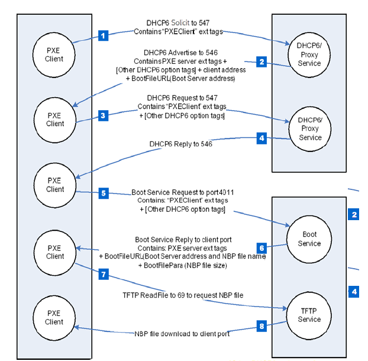
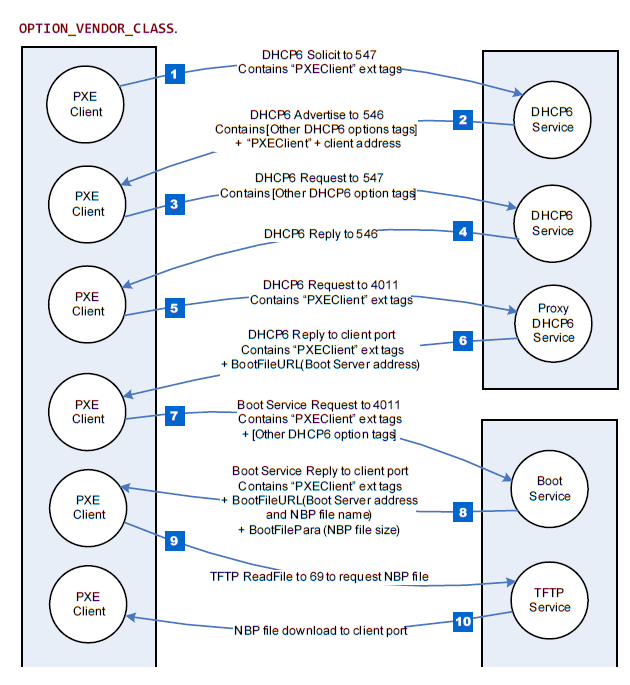
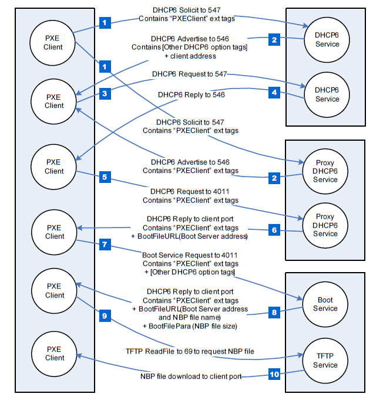
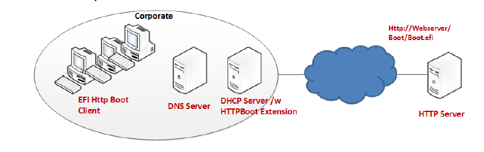
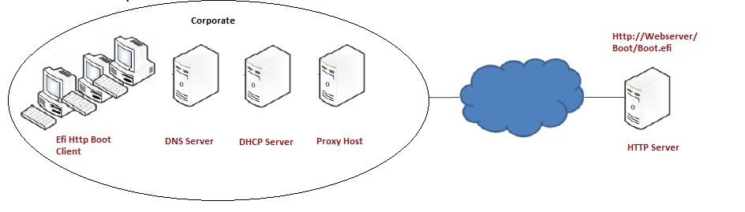
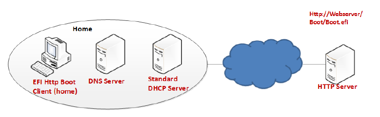
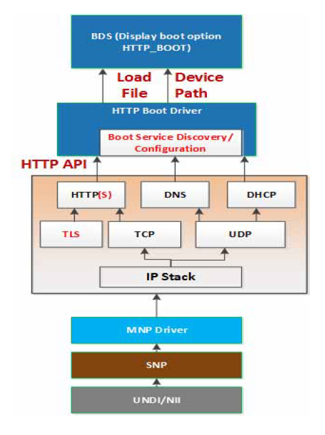
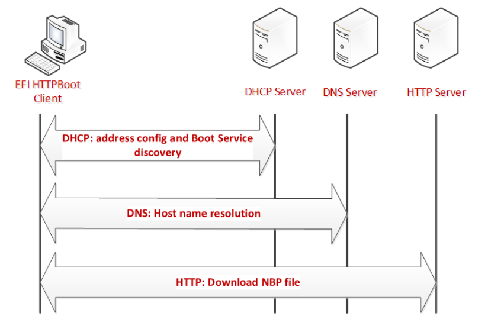
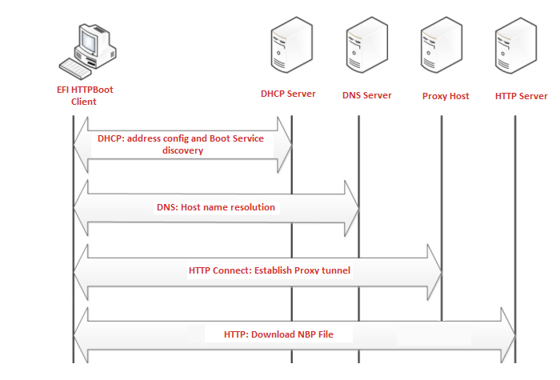

.. _network-protocols-snp-pxe-bis-and-http-boot:

Network Protocols — SNP, PXE, BIS and HTTP Boot
================================================

.. _simple-network-protocol:

Simple Network Protocol
-----------------------

This section defines the Simple Network Protocol. This protocol
provides a packet level interface to a network adapter.

.. _efi-simple-network-protocol:

EFI_SIMPLE_NETWORK_PROTOCOL
###########################

**Summary**

The EFI_SIMPLE_NETWORK_PROTOCOL provides services to initialize
a network interface, transmit packets, receive packets, and
close a network interface.

**GUID**

.. code-block::

   #define EFI_SIMPLE_NETWORK_PROTOCOL_GUID \
     {0xA19832B9,0xAC25,0x11D3,\
       {0x9A,0x2D,0x00,0x90,0x27,0x3f,0xc1,0x4d}}

**Revision Number**

.. code-block::

   #define EFI_SIMPLE_NETWORK_PROTOCOL_REVISION 0x00010000

**Protocol Interface Structure**

.. code-block::

   typedef struct \_EFI_SIMPLE_NETWORK_PROTOCOL\_ {
     UINT64                               Revision;
     EFI_SIMPLE_NETWORK_START             Start;
     EFI_SIMPLE_NETWORK_STOP              Stop;
     EFI_SIMPLE_NETWORK_INITIALIZE        Initialize;
     EFI_SIMPLE_NETWORK_RESET             Reset;
     EFI_SIMPLE_NETWORK_SHUTDOWN          Shutdown;
     EFI_SIMPLE_NETWORK_RECEIVE_FILTERS   ReceiveFilters;
     EFI_SIMPLE_NETWORK_STATION_ADDRESS   StationAddress;
     EFI_SIMPLE_NETWORK_STATISTICS        Statistics;
     EFI_SIMPLE_NETWORK_MCAST_IP_TO_MAC   MCastIpToMac;
     EFI_SIMPLE_NETWORK_NVDATA            NvData;
     EFI_SIMPLE_NETWORK_GET_STATUS        GetStatus;
     EFI_SIMPLE_NETWORK_TRANSMIT          Transmit;
     EFI_SIMPLE_NETWORK_RECEIVE           Receive;
     EFI_EVENT                            WaitForPacket;
     EFI_SIMPLE_NETWORK_MODE              *Mode;
   }   EFI_SIMPLE_NETWORK_PROTOCOL;

**Parameters**

Revision
  Revision of the EFI_SIMPLE_NETWORK_PROTOCOL. All future revisions must be backwards compatible. If a future version is not backwards compatible it is not the same GUID.

Start
  Prepares the network interface for further command operations. No other EFI_SIMPLE_NETWORK_PROTOCOL interface functions will operate until this call is made. See the  `EFI_SIMPLE_NETWORK.Start()`_ function description.

Stop
  Stops further network interface command processing. No other EFI_SIMPLE_NETWORK_PROTOCOL interface functions will operate after this call is made until another Start() call is made. See the  `EFI_SIMPLE_NETWORK.Stop()`_ function description.  

Initialize
  Resets the network adapter and allocates the transmit and receive buffers. See the  `EFI_SIMPLE_NETWORK.Initialize()`_ function description.

Reset
  Resets the network adapter and reinitializes it with the parameters provided in the previous call to *Initialize()* . See the  `EFI_SIMPLE_NETWORK.Reset()`_ function description.

Shutdown
  Resets the network adapter and leaves it in a state safe for another driver to initialize. The memory buffers assigned in the Initialize() call are released. After this call, only the Initialize() or Stop() calls may be used. See the  `EFI_SIMPLE_NETWORK.Shutdown()`_ function description.

ReceiveFilters
  Enables and disables the receive filters for the network interface and, if supported, manages the filtered multicast HW MAC (Hardware Media Access Control) address list. See the  `EFI_SIMPLE_NETWORK.ReceiveFilters()`_ function description.

StationAddress
  Modifies or resets the current station address, if supported. See the  `EFI_SIMPLE_NETWORK.StationAddress()`_ function description.

Statistics
  Collects statistics from the network interface and allows the statistics to be reset. See the  `EFI_SIMPLE_NETWORK.Statistics()`_ function description.

MCastIpToMac
  Maps a multicast IP address to a multicast HW MAC address. See the  `EFI_SIMPLE_NETWORK.MCastIPtoMAC()`_ function description.

NvData 
  Reads and writes the contents of the NVRAM devices attached to the network interface. See the  `EFI_SIMPLE_NETWORK.NvData()`_ function description.

GetStatus
  Reads the current interrupt status and the list of recycled transmit buffers from the network interface. See the  `EFI_SIMPLE_NETWORK.GetStatus()`_ function description.

Transmit
  Places a packet in the transmit queue. See `EFI_SIMPLE_NETWORK.Transmit()`_ function description.

Receive
  Retrieves a packet from the receive queue, along with the status flags that describe the packet type. See the  `EFI_SIMPLE_NETWORK.Receive()`_ function description.

WaitForPacket
  Event used with :ref:`efi-boot-services-waitforevent`  to wait for a packet to be received.

Mode
  Pointer to the EFI_SIMPLE_NETWORK_MODE data for the device. See "Related Definitions" below.

**Related Definitions**

.. code-block::
  
   //******************************************************  
   // EFI_SIMPLE_NETWORK_MODE  
   //  
   // Note that the fields in this data structure are read-only  
   // and are updated by the code that produces the  
   // EFI_SIMPLE_NETWORK_PROTOCOL  
   // functions. All these fields must be discovered  
   // in a protocol instance of  
   // EFI_DRIVER_BINDING_PROTOCOL.Start().  
   //******************************************************
   typedef struct {
     UINT32             State;
     UINT32             HwAddressSize;
     UINT32             MediaHeaderSize;
     UINT32             MaxPacketSize;
     UINT32             NvRamSize;
     UINT32             NvRamAccessSize;
     UINT32             ReceiveFilterMask;
     UINT32             ReceiveFilterSetting;
     UINT32             MaxMCastFilterCount;
     UINT32             MCastFilterCount;
     EFI_MAC_ADDRESS    MCastFilter[MAX_MCAST_FILTER_CNT];
     EFI_MAC_ADDRESS    CurrentAddress;
     EFI_MAC_ADDRESS    BroadcastAddress;
     EFI_MAC_ADDRESS    PermanentAddress;
     UINT8              IfType;
     BOOLEAN            MacAddressChangeable;
     BOOLEAN            MultipleTxSupported;
     BOOLEAN            MediaPresentSupported;
     BOOLEAN            MediaPresent;
   }   EFI_SIMPLE_NETWORK_MODE;
       
  
State
  Reports the current state of the network interface (see EFI_SIMPLE_NETWORK_STATE WORK_STATE below). When an EFI_SIMPLE_NETWORK_PROTOCOL driver initializes a network interface, the network interface is left in the EfiSimpleNetworkStopped state.

HwAddressSize
  The size, in bytes, of the network interface’s HW address.

MediaHeaderSize
  The size, in bytes, of the network interface’s media header.

MaxPacketSize
  The maximum size, in bytes, of the packets supported by the network interface.

NvRamSize
  The size, in bytes, of the NVRAM device attached to the network interface. If an NVRAM device is not attached to the network interface, then this field will be zero. This value must be a multiple of *NvramAccessSize*.

NvRamAccessSize
  The size that must be used for all NVRAM reads and writes. The start address for NVRAM read and write operations and the total length of those operations, must be a multiple of this value. The legal values for this field are 0, 1, 2, 4, and 8. If the value is zero, then no NVRAM devices are attached to the network interface.

ReceiveFilterMask
  The multicast receive filter settings supported by the network interface.

ReceiveFilterSetting
  The current multicast receive filter settings. See "Bit Mask  Values for *ReceiveFilterSetting* " below.

MaxMCastFilterCount
  The maximum number of multicast address receive filters supported by the driver. If this value is zero, then ReceiveFilters() cannot modify the multicast address receive filters. This field may be less than MAX_MCAST_FILTER_CNT (see below).

MCastFilterCount
  The current number of multicast address receive filters.

MCastFilter
  Array containing the addresses of the current multicast address receive filters.

CurrentAddress
  The current HW MAC address for the network interface.

BroadcastAddress
  The current HW MAC address for broadcast packets.

PermanentAddress
  The permanent HW MAC address for the network interface.

IfType
  The interface type of the network interface. See RFC 3232, section "Number Hardware Type."

MacAddressChangeable
  **TRUE** if the HW MAC address can be changed.

MultipleTxSupported
  **TRUE** if the network interface can transmit more than one packet at a time.

MediaPresentSupported
  **TRUE** if the presence of media can be determined; otherwise **FALSE**. If **FALSE**, *MediaPresent* cannot be used.

MediaPresent
  **TRUE** if media are connected to the network interface; otherwise **FALSE**. This field shows the media present status as of the most recent *GetStatus()* call.

.. code-block::

   //*******************************************************
   // EFI_SIMPLE_NETWORK_STATE
   //*******************************************************
   typedef enum {
   EfiSimpleNetworkStopped,
   EfiSimpleNetworkStarted,
   EfiSimpleNetworkInitialized,
   EfiSimpleNetworkMaxState
   } EFI_SIMPLE_NETWORK_STATE;

   //*******************************************************
   // MAX_MCAST_FILTER_CNT
   //*******************************************************
   #define MAX_MCAST_FILTER_CNT                             16

   //*******************************************************
   // Bit Mask Values for ReceiveFilterSetting.
   //
   // Note that all other bit values are reserved.
   //*******************************************************
   #define EFI_SIMPLE_NETWORK_RECEIVE_UNICAST               0x01
   #define EFI_SIMPLE_NETWORK_RECEIVE_MULTICAST             0x02
   #define EFI_SIMPLE_NETWORK_RECEIVE_BROADCAST             0x04
   #define EFI_SIMPLE_NETWORK_RECEIVE_PROMISCUOUS           0x08
   #define EFI_SIMPLE_NETWORK_RECEIVE_PROMISCUOUS_MULTICAST 0x10

**Description**

The EFI_SIMPLE_NETWORK_PROTOCOL protocol is used to initialize access to a network adapter. Once the network adapter initializes, the EFI_SIMPLE_NETWORK_PROTOCOL protocol provides services that allow packets to be transmitted and received. This provides a packet level interface that can then be used by higher level drivers to produce boot services like DHCP, TFTP, and MTFTP. In addition, this protocol can be used as a building block in a full UDP and TCP/IP implementation that can produce a wide variety of application level network interfaces. See the Preboot Execution Environment (PXE) Specification for more information. 

**NOTE** *The underlying network hardware may only be able to access 4 GiB (32-bits) of system memory. Any requests to transfer data to/from memory above 4 GiB with 32-bit network hardware will be double-buffered (using intermediate buffers below 4 GiB) and will reduce performance*.

**NOTE** *The same handle can have an instance of the* EFI_ADAPTER_INFORMATION_PROTOCOL *with a EFI_ADAPTER_INFO_MEDIA_STATE type structure*.

.. _efi-simple-network-start:

EFI_SIMPLE_NETWORK.Start()
##########################

**Summary**

Changes the state of a network interface from "stopped" to "started."

**Prototype**

.. code-block:: 
  
   typedef  
   EFI_STATUS  
   (EFIAPI *EFI_SIMPLE_NETWORK_START) (  
     IN EFI_SIMPLE_NETWORK_PROTOCOL    *This  
       );

**Parameters**

This
  A pointer to the `EFI_SIMPLE_NETWORK_PROTOCOL`_ instance.

**Description**

This function starts a network interface. If the network interface successfully starts, then EFI_SUCCESS will be returned.

**Status Codes Returned**

.. list-table::
   :widths: 35 70

   * - EFI_SUCCESS
     - The network interface was started.
   * - EFI_ALREADY_STARTED
     - The network interface is already in the started state.
   * - EFI_INVALID_PARAMETER
     - *This* parameter was *NULL* or did not point to a valid EFI_SIMPLE_NETWORK_PROTOCOL structure.
   * - EFI_DEVICE_ERROR
     - The command could not be sent to the network interface.
   * - EFI_UNSUPPORTED
     - This function is not supported by the network interface.

.. _efi-simple-network-stop:

EFI_SIMPLE_NETWORK.Stop()
#########################

**Summary**

Changes the state of a network interface from "started" to "stopped."

**Prototype**

.. code-block:: 
  
   typedef  
   EFI_STATUS  
   (EFIAPI *EFI_SIMPLE_NETWORK_STOP) (  
     IN EFI_SIMPLE_NETWORK_PROTOCOL      *This  
     );

**Parameters**

This
  A pointer to the `EFI_SIMPLE_NETWORK_PROTOCOL`_  instance.

**Description**

This function stops a network interface. This call is only valid if the network interface is in the started state. If the network interface was successfully stopped, then EFI_SUCCESS will be returned.

**Status Codes Returned**

.. list-table::
   :widths: 35 70
   :class: longtable

   * - EFI_SUCCESS
     - The network interface was stopped.
   * - EFI_NOT_STARTED
     - The network interface has not been started.
   * - EFI_INVALID_PARAMETER
     - *This* parameter was *NULL* or did not point to a valid EFI_SIMPLE_NETWORK_PROTOCOL structure.
   * - EFI_DEVICE_ERROR
     - The command could not be sent to the network interface.
   * - EFI_UNSUPPORTED
     - This function is not supported by the network interface.

.. _efi-simple-network-initialize:

EFI_SIMPLE_NETWORK.Initialize()
###############################

**Summary**

Resets a network adapter and allocates the transmit and receive buffers required by the network interface; optionally, also requests allocation of additional transmit and receive buffers.

**Prototype**

.. code-block:: 
  
   typedef  
     EFI_STATUS  
     (EFIAPI *EFI_SIMPLE_NETWORK_INITIALIZE) (  
       IN EFI_SIMPLE_NETWORK_PROTOCOL        *This,  
       IN UINTN                              ExtraRxBufferSize OPTIONAL,  
       IN UINTN                              ExtraTxBufferSize OPTIONAL  
       );

**Parameters**

This
  A pointer to the `EFI_SIMPLE_NETWORK_PROTOCOL`_   instance.

ExtraRxBufferSize
  The size, in bytes, of the extra receive buffer space that the driver should allocate for the network interface. Some network interfaces will not be able to use the extra buffer, and the caller will not know if it is actually being used.

ExtraTxBufferSize
  The size, in bytes, of the extra transmit buffer space that the driver should allocate for the network interface. Some network interfaces will not be able to use the extra buffer, and the caller will not know if it is actually being used.

**Description**

This function allocates the transmit and receive buffers required by the network interface. If this allocation fails, then EFI_OUT_OF_RESOURCES is returned. If the allocation succeeds and the network interface is successfully initialized, then EFI_SUCCESS will be returned.

**Status Codes Returned**

.. list-table::
   :widths: 35 70
   :class: longtable

   * - EFI_SUCCESS
     - The network interface was initialized.
   * - EFI_NOT_STARTED
     - The network interface has not been started.
   * - EFI_OUT_OF_RESOURCES
     - There was not enough memory for the transmit and receive buffers.
   * - EFI_INVALID_PARAMETER
     - *This* parameter was *NULL* or did not point to a valid EFI_SIMPLE_NETWORK_PROTOCOL structure.
   * - EFI_DEVICE_ERROR
     - The command could not be sent to the network interface.
   * - EFI_UNSUPPORTED
     - The increased buffer size feature is not supported.

.. _efi-simple-network-reset:

EFI_SIMPLE_NETWORK.Reset()
##########################

**Summary**

Resets a network adapter and reinitializes it with the parameters that were provided in the previous call to  `EFI_SIMPLE_NETWORK.Initialize()`_.

**Prototype**

.. code-block:: 
  
   typedef  
   EFI_STATUS  
   (EFIAPI *EFI_SIMPLE_NETWORK_RESET) (  
     IN EFI_SIMPLE_NETWORK_PROTOCOL    *This,  
     IN BOOLEAN                        ExtendedVerification  
     );

**Parameters**

This
  A pointer to the `EFI_SIMPLE_NETWORK_PROTOCOL`_ instance. 

ExtendedVerification
  Indicates that the driver may perform a more exhaustive verification operation of the device during reset.

**Description**

This function resets a network adapter and reinitializes it with the parameters that were provided in the previous call to Initialize(). The transmit and receive queues are emptied and all pending interrupts are cleared. Receive filters, the station address, the statistics, and the multicast-IP-to-HW MAC addresses are not reset by this call. If the network interface was successfully reset, then EFI_SUCCESS will be returned. If the driver has not been initialized, EFI_DEVICE_ERROR will be returned.

**Status Codes Returned**

.. list-table::
   :widths: 35 70
   :class: longtable

   * - EFI_SUCCESS
     - The network interface was reset.
   * - EFI_NOT_STARTED
     - The network interface has not been started.
   * - EFI_INVALID_PARAMETER
     - One or more of the parameters has an unsupported value.
   * - EFI_DEVICE_ERROR
     - The command could not be sent to the network interface.
   * - EFI_UNSUPPORTED
     - This function is not supported by the network interface.

.. _efi-simple-network-shutdown:

EFI_SIMPLE_NETWORK.Shutdown()
#############################

**Summary**

Resets a network adapter and leaves it in a state that is safe for another driver to initialize.

**Prototype**

.. code-block:: 
  
   typedef  
   EFI_STATUS  
   (EFIAPI *EFI_SIMPLE_NETWORK_SHUTDOWN) (  
     IN EFI_SIMPLE_NETWORK_PROTOCOL       *This  
     );

**Parameters**

This
  A pointer to the `EFI_SIMPLE_NETWORK_PROTOCOL`_  instance.

**Description**

This function releases the memory buffers assigned in the `EFI_SIMPLE_NETWORK.Initialize()`_ call. Pending transmits and receives are lost, and interrupts are cleared and disabled. After this call, only the Initialize() and `EFI_SIMPLE_NETWORK.Stop()`_ calls may be used. If the network interface was successfully shutdown, then EFI_SUCCESS will be returned. If the driver has not been initialized, EFI_DEVICE_ERROR will be returned.

**Status Codes Returned**

.. list-table::
   :widths: 35 70
   :class: longtable

   * - EFI_SUCCESS
     - The network interface was shutdown.
   * - EFI_NOT_STARTED
     - The network interface has not been started.
   * - EFI_INVALID_PARAMETER
     - *This* parameter was *NULL* or did not point to a valid EFI_SIMPLE_NETWORK_PROTOCOL structure.
   * - EFI_DEVICE_ERROR
     - The command could not be sent to the network interface.

.. _efi-simple-network-receivefilters:

EFI_SIMPLE_NETWORK.ReceiveFilters()
###################################

**Summary**

Manages the multicast receive filters of a network interface.

**Prototype**

.. code-block:: 
  
   typedef  
   EFI_STATUS  
   (EFIAPI *EFI_SIMPLE_NETWORK_RECEIVE_FILTERS) (  
     IN EFI_SIMPLE_NETWORK_PROTOCOL       *This,  
     IN UINT32                            Enable,  
     IN UINT32                            Disable,  
     IN BOOLEAN                           ResetMCastFilter,  
     IN UINTN                             MCastFilterCnt OPTIONAL,  
     IN EFI_MAC_ADDRESS                   MCastFilter OPTIONAL,  
     );
  

**Parameters**

This
  A pointer to the `EFI_SIMPLE_NETWORK_PROTOCOL`_ instance.

Enable
  A bit mask of receive filters to enable on the network interface.

Disable
  A bit mask of receive filters to disable on the network interface. For backward compatibility with EFI 1.1 platforms, the *EFI_SIMPLE_NETWORK_RECEIVE_MULTICAST* bit must be set when the *ResetMCastFilter* parameter is **TRUE**.

ResetMCastFilter
  Set to **TRUE** to reset the contents of the multicast receive filters on the network interface to their default values.

MCastFilterCnt
  Number of multicast HW MAC addresses in the new *MCastFilter* list. This value must be less than or equal to the *MCastFilterCnt* field of EFI_SIMPLE_NETWORK_MODE. This field is optional if *ResetMCastFilter* is **TRUE**.

MCastFilter
  A pointer to a list of new multicast receive filter HW MAC addresses. This list will replace any existing multicast HW MAC address list. This field is optional if *ResetMCastFilter* is **TRUE**.

**Description**

This function is used enable and disable the hardware and software receive filters for the underlying network device. 

The receive filter change is broken down into three steps: 

-  The filter mask bits that are set (ON) in the Enable parameter are added to the current receive filter settings. 

-  The filter mask bits that are set (ON) in the Disable parameter are subtracted from the updated receive filter settings. 

-  If the resulting receive filter setting is not supported by the hardware a more liberal setting is selected. 

If the same bits are set in the Enable and Disable parameters, then the bits in the Disable parameter takes precedence. 

If the ResetMCastFilter parameter is **TRUE**, then the multicast address list filter is disabled (irregardless of what other multicast bits are set in the Enable and Disable parameters). The SNP->Mode->MCastFilterCount field is set to zero. The Snp->Mode->MCastFilter contents are undefined. 

After enabling or disabling receive filter settings, software should verify the new settings by checking the Snp->Mode->ReceiveFilterSettings, Snp->Mode->MCastFilterCount and Snp->Mode->MCastFilter fields.
 
**Note**: *Some network drivers and/or devices will automatically promote receive filter settings if the requested setting can not be honored. For example, if a request for four multicast addresses is made and the underlying hardware only supports two multicast addresses the driver might set the promiscuous or promiscuous multicast receive filters instead. The receiving software is responsible for discarding any extra packets that get through the hardware receive filters.* 

**Note**: *To disable all receive filter hardware, the network driver must be Shutdown() and Stopped(). Calling ReceiveFilters() with Disable set to Snp->Mode->ReceiveFilterSettings will make it so no more packets are returned by the Receive() function, but the receive hardware may still be moving packets into system memory before inspecting and discarding them. Unexpected system errors, reboots and hangs can occur if an OS is loaded and the network devices are not Shutdown() and Stopped()*. 

If *ResetMCastFilter* is *TRUE,* then the multicast receive filter list on the network interface will be reset to the default multicast receive filter list. If *ResetMCastFilter* is **FALSE**, and this network interface allows the multicast receive filter list to be modified, then the *MCastFilterCnt* and *MCastFilter* are used to update the current multicast receive filter list. The modified receive filter list settings can be found in the *MCastFilter* field of EFI_SIMPLE_NETWORK_MODE in :ref:`network-protocols-snp-pxe-bis-and-http-boot`. If the network interface does not allow the multicast receive filter list to be modified, then EFI_INVALID_PARAMETER will be returned. If the driver has not been initialized, EFI_DEVICE_ERROR will be returned. 

If the receive filter mask and multicast receive filter list have been successfully updated on the network interface, EFI_SUCCESS will be returned.

**Status Codes Returned**

.. list-table::
   :widths: 35 70
   :class: longtable

   * - EFI_SUCCESS
     - The multicast receive filter list was updated.
   * - EFI_NOT_STARTED
     - The network interface has not been started.
   * - EFI_INVALID_PARAMETER
     - | •  One or more of the following conditions is *TRUE* :
       | •   *This* is *NULL* 
       | •  There are bits set in Enable that are not set in Snp->Mode->ReceiveFilterMask 
       | •  There are bits set in Disable that are not set in Snp->Mode->ReceiveFilterMask 
       | •  Multicast is being enabled (the EFI _SIMPLE_NETWORK_RECEIVE_MULTICAST bit is set in Enable, it is not set in Disable, and ResetMCastFilter is *FALSE* ) and MCastFilterCount is zero 
       | •  Multicast is being enabled and MCastFilterCount is greater than
       |    Snp->Mode->MaxMCastFilterCount 
       | •  Multicast is being enabled and MCastFilter is *NULL* 
       | •  Multicast is being enabled and one or more of the addresses in the MCastFilter list are not valid multicast MAC addresses
   * - EFI_DEVICE_ERROR
     - | •  One or more of the following conditions is *TRUE* : 
       | •  The network interface has been started but has not been initialized 
       | •  An unexpected error was returned by the underlying network driver or device
   * - EFI_UNSUPPORTED
     - This function is not supported by the network interface.

.. _efi-simple-network-stationaddress:

EFI_SIMPLE_NETWORK.StationAddress()
###################################

**Summary**

Modifies or resets the current station address, if supported.

**Prototype**

.. code-block:: 
  
   typedef  
   EFI_STATUS  
   (EFIAPI *EFI_SIMPLE_NETWORK_STATION_ADDRESS) (  
     IN EFI_SIMPLE_NETWORK_PROTOCOL       *This,  
     IN BOOLEAN                           Reset,  
     IN EFI_MAC_ADDRESS                   *New OPTIONAL  
     );
 

**Parameters**

This
  A pointer to the `EFI_SIMPLE_NETWORK_PROTOCOL`_  instance.

Reset
  Flag used to reset the station address to the network interface’s permanent address.

New
  New station address to be used for the network interface.

**Description**

This function modifies or resets the current station address of a network interface, if supported. If *Reset* is **TRUE**, then the current station address is set to the network interface’s permanent address. If *Reset* is **FALSE**, and the network interface allows its station address to be modified, then the current station address is changed to the address specified by *New*. If the network interface does not allow its station address to be modified, then EFI_INVALID_PARAMETER will be returned. If the station address is successfully updated on the network interface, EFI_SUCCESS will be returned. If the driver has not been initialized, EFI_DEVICE_ERROR will be returned.

**Status Codes Returned**

.. list-table::
   :widths: 35 70
   :class: longtable

   * - EFI_SUCCESS
     - The network interface’s station address was updated.
   * - EFI_NOT_STARTED
     - The Simple Network  Protocol interface has not been started by calling *Start()*.
   * - EFI_INVALID_PARAMETER
     - The *New* station address was not accepted by the NIC.
   * - EFI_INVALID_PARAMETER
     - *Reset* is *FALSE* and *New* is *NULL*.
   * - EFI_DEVICE_ERROR
     - The Simple Network  Protocol interface has not been initialized by calling *Initialize()*.
   * - EFI_DEVICE_ERROR
     - An error occurred attempting to set the new station address.
   * - EFI_UNSUPPORTED
     - The NIC does not support changing the network interface’s station address.

.. _efi-simple-network-statistics:

EFI_SIMPLE_NETWORK.Statistics()
###############################

**Summary**

Resets or collects the statistics on a network interface.

**Prototype**

.. code-block:: 
  
   typedef  
   EFI_STATUS  
   (EFIAPI *EFI_SIMPLE_NETWORK_STATISTICS) (  
     IN EFI_SIMPLE_NETWORK_PROTOCOL       *This,  
     IN BOOLEAN                           Reset,  
     IN OUT UINTN                         *StatisticsSize OPTIONAL,  
     OUT EFI_NETWORK_STATISTICS           *StatisticsTable OPTIONAL  
     );

**Parameters**

This
  A pointer to the `EFI_SIMPLE_NETWORK_PROTOCOL`_  instance.

Reset
  Set to **TRUE** to reset the statistics for the network interface.

StatisticsSize
  On input the size, in bytes, of StatisticsTable. On output the size, in bytes, of the resulting table of statistics.

StatisticsTable
  A pointer to the EFI_NETWORK_STATISTICS in :ref:`network-protocols-snp-pxe-bis-and-http-boot` structure that contains the statistics. Type EFI_NETWORK_STATISTICS is defined in "Related Definitions" below.

**Related Definitions**

.. code-block:: 
  
   //*******************************************************  
   // EFI_NETWORK_STATISTICS  
   //  
   // Any statistic value that is -1 is not available  
   // on the device and is to be ignored.  
   //*******************************************************  
   typedef struct {  
     UINT64     RxTotalFrames;  
     UINT64     RxGoodFrames;  
     UINT64     RxUndersizeFrames;  
     UINT64     RxOversizeFrames;  
     UINT64     RxDroppedFrames;  
     UINT64     RxUnicastFrames;  
     UINT64     RxBroadcastFrames;  
     UINT64     RxMulticastFrames;  
     UINT64     RxCrcErrorFrames;  
     UINT64     RxTotalBytes;  
     UINT64     TxTotalFrames;  
     UINT64     TxGoodFrames;  
     UINT64     TxUndersizeFrames;  
     UINT64     TxOversizeFrames;  
     UINT64     TxDroppedFrames;  
     UINT64     TxUnicastFrames;  
     UINT64     TxBroadcastFrames;  
     UINT64     TxMulticastFrames;  
     UINT64     TxCrcErrorFrames;  
     UINT64     TxTotalBytes;  
     UINT64     Collisions;  
     UINT64     UnsupportedProtocol;  
     UINT64     RxDuplicatedFrames;  
     UINT64     RxDecryptErrorFrames;  
     UINT64     TxErrorFrames;  
     UINT64     TxRetryFrames;  
   }   EFI_NETWORK_STATISTICS;

RxTotalFrames
  Total number of frames received. Includes frames with errors and dropped frames.

RxGoodFrames
  Number of valid frames received and copied into receive buffers.

RxUndersizeFrames
  Number of frames below the minimum length for the communications device.

RxOversizeFrames
  Number of frames longer than the maximum length for the communications device.

RxDroppedFrames
  Valid frames that were dropped because receive buffers were full.

RxUnicastFrames
  Number of valid unicast frames received and not dropped.

RxBroadcastFrames
  Number of valid broadcast frames received and not dropped.

RxMulticastFrames
  Number of valid multicast frames received and not dropped.

RxCrcErrorFrames
  Number of frames with CRC or alignment errors.

RxTotalBytes
  Total number of bytes received. Includes frames with errors and dropped frames.

TxTotalFrames
  Total number of frames transmitted. Includes frames with errors and dropped frames.

TxGoodFrames
  Number of valid frames transmitted and copied into receive buffers.

TxUndersizeFrames
  Number of frames below the minimum length for the media. This would be less than 64 for Ethernet.

TxOversizeFrames
  Number of frames longer than the maximum length for the media. This would be greater than 1500 for Ethernet.

TxDroppedFrames
  Valid frames that were dropped because receive buffers were full.

TxUnicastFrames
  Number of valid unicast frames transmitted and not dropped.

TxBroadcastFrames
  Number of valid broadcast frames transmitted and not dropped.

TxMulticastFrames
  Number of valid multicast frames transmitted and not dropped.

TxCrcErrorFrames
  Number of frames with CRC or alignment errors.

TxTotalBytes
  Total number of bytes transmitted. Includes frames with errors and dropped frames.  

Collisions 
  Number of collisions detected on this subnet.

UnsupportedProtocol
  Number of frames destined for unsupported protocol.

RxDuplicatedFrames
  Number of valid frames received that were duplicated.

RxDecryptErrorFrames
  Number of encrypted frames received that failed to decrypt.

TxErrorFrames
  Number of frames that failed to transmit after exceeding the retry limit.

TxRetryFrames
  Number of frames transmitted successfully after more than one attempt.
 

**Description**

This function resets or collects the statistics on a network interface. If the size of the statistics table specified by *StatisticsSize* is not big enough for all the statistics that are collected by the network interface, then a partial buffer of statistics is returned in *StatisticsTable,* *StatisticsSize* is set to the size required to collect all the available statistics, and EFI_BUFFER_TOO_SMALL is returned. 

If *StatisticsSize* is big enough for all the statistics, then *StatisticsTable* will be filled, *StatisticsSize* will be set to the size of the returned *StatisticsTable* structure, and EFI_SUCCESS is returned. If the driver has not been initialized, EFI_DEVICE_ERROR will be returned. 

If *Reset* is **FALSE**, and both *StatisticsSize* and *StatisticsTable* are NULL, then no operations will be performed, and EFI_SUCCESS will be returned. 

If *Reset* is **TRUE**, then all of the supported statistics counters on this network interface will be reset to zero.

**Status Codes Returned**

.. list-table::
   :widths: 35 70
   :class: longtable

   * - EFI_SUCCESS
     - The requested operation succeeded.
   * - EFI_NOT_STARTED
     - The Simple Network  Protocol interface has not been started by calling *Start()*.
   * - EFI_BUFFER_TOO_SMALL
     - *StatisticsSize* is not *NULL* and *StatisticsTable* is *NULL*. The current buffer size that is needed to hold all the statistics is returned in *StatisticsSize*.
   * - EFI_BUFFER_TOO_SMALL
     - *StatisticsSize* is not *NULL* and *StatisticsTable* is not *NULL*. The current buffer size that is needed to hold all the statistics is returned in *StatisticsSize*. A partial set of statistics is returned in *StatisticsTable*.
   * - EFI_INVALID_PARAMETER
     - *StatisticsSize* is *NULL* and *StatisticsTable* is not *NULL*.
   * - EFI_DEVICE_ERROR
     - The Simple Network  Protocol interface has not been initialized by calling *Initialize()*.
   * - EFI_DEVICE_ERROR
     - An error was encountered collecting statistics from the NIC.
   * - EFI_UNSUPPORTED
     - The NIC does not support collecting statistics from the network interface.

.. _efi-simple-network-mcastiptomac:

EFI_SIMPLE_NETWORK.MCastIPtoMAC()
#################################

**Summary**

Converts a multicast IP address to a multicast HW MAC address.

**Prototype**

.. code-block:: 
  
   typedef  
   EFI_STATUS  
   (EFIAPI *EFI_SIMPLE_NETWORK_MCAST_IP_TO_MAC) (  
     IN EFI_SIMPLE_NETWORK_PROTOCOL       *This,  
     IN BOOLEAN                           IPv6,  
     IN EFI_IP_ADDRESS                    *IP,  
     OUT EFI_MAC_ADDRESS                  *MAC  
     );

**Parameters**

This
 A pointer to the `EFI_SIMPLE_NETWORK_PROTOCOL`_  instance.

IPv6
  Set to **TRUE** if the multicast IP address is IPv6 [RFC 2460]. Set to **FALSE** if the multicast IP address is IPv4 [RFC 791].

IP 
  The multicast IP address that is to be converted to a multicast HW MAC address.

MAC
  The multicast HW MAC address that is to be generated from IP.

**Description**

This function converts a multicast IP address to a multicast HW MAC address for all packet transactions. If the mapping is accepted, then EFI_SUCCESS will be returned.

**Status Codes Returned**

.. list-table::
   :widths: 35 70
   :class: longtable

   * - EFI_SUCCESS
     - The multicast IP address was mapped to the multicast HW MAC address.
   * - EFI_NOT_STARTED
     - The Simple Network  Protocol interface has not been started by calling *Start()*.
   * - EFI_INVALID_PARAMETER
     - *IP* is *NULL*.
   * - EFI_INVALID_PARAMETER
     - *MAC* is *NULL*.
   * - EFI_INVALID_PARAMETER
     - *IP* does not point to a valid IPv4 or IPv6 multicast address.
   * - EFI_DEVICE_ERROR
     - The Simple Network  Protocol interface has not been initialized by calling *Initialize()*.
   * - EFI_UNSUPPORTED
     - *IPv6* is *TRUE* and the implementation does not support IPv6 multicast to MAC address conversion.

.. _efi-simple-network-nvdata:

EFI_SIMPLE_NETWORK.NvData()
###########################

**Summary**

Performs read and write operations on the NVRAM device attached to a network interface.

**Prototype**

.. code-block:: 
  
   typedef  
   EFI_STATUS  
   (EFIAPI *EFI_SIMPLE_NETWORK_NVDATA) (  
     IN EFI_SIMPLE_NETWORK_PROTOCOL    *This  
     IN BOOLEAN                        ReadWrite,  
     IN UINTN                          Offset,  
     IN UINTN                          BufferSize,  
     IN OUT VOID                       *Buffer  
     );

**Parameters**

This
  A pointer to the `EFI_SIMPLE_NETWORK_PROTOCOL`_  instance.

ReadWrite
   **TRUE** for read operations, **FALSE** for write operations.

Offset
  Byte offset in the NVRAM device at which to start the read or write operation. This must be a multiple of NvRamAccessSize and less than *NvRamSize*. (See EFI_SIMPLE_NETWORK_MODE in :ref:`network-protocols-snp-pxe-bis-and-http-boot` .

BufferSize
  The number of bytes to read or write from the NVRAM device. This must also be a multiple of *2*.

Buffer
  A pointer to the data buffer.

**Description**

This function performs read and write operations on the NVRAM device attached to a network interface. If *ReadWrite* is **TRUE**, a read operation is performed. If *ReadWrite* is **FALSE**, a write operation is performed. 

*Offset* specifies the byte offset at which to start either operation. *Offset* must be a multiple of *NvRamAccessSize,* and it must have a value between zero and *NvRamSize*.  

*BufferSize* specifies the length of the read or write operation. *BufferSize* must also be a multiple of *NvRamAccessSize,* and *Offset* + *BufferSize* must not exceed *NvRamSize*. 

If any of the above conditions is not met, then EFI_INVALID_PARAMETER will be returned. 

If all the conditions are met and the operation is "read," the NVRAM device attached to the network interface will be read into *Buffer* and EFI_SUCCESS will be returned. If this is a write operation, the contents of *Buffer* will be used to update the contents of the NVRAM device attached to the network interface and EFI_SUCCESS will be returned.

**Status Codes Returned**

.. list-table::
   :widths: 35 70
   :class: longtable

   * - EFI_SUCCESS
     - The NVRAM access was performed.
   * - EFI_NOT_STARTED
     - The network interface has not been started.
   * - EFI_INVALID_PARAMETER
     - | One or more of the following conditions is *TRUE* :  
       | • The *This* parameter is *NULL* 
       | • The *This* parameter does not point to a valid *EFI_SIMPLE_NETWORK_PROTOCOL* structure 
       | • The *Offset* parameter is not a multiple of *EFI_SIMPLE_NETWORK_MODE.* *NvRamAccessSize*
       | • The *Offset* parameter is not less than *EFI_SIMPLE_NETWORK_MODE.* *NvRamSize* 
       | • The *BufferSize* parameter is not a multiple of *EFI_SIMPLE_NETWORK_MODE.* *NvRamAccessSize*  
       | The *Buffer* parameter is *NULL*
   * - EFI_DEVICE_ERROR
     - The command could not be sent to the network interface.
   * - EFI_UNSUPPORTED
     - This function is not supported by the network interface.

.. _efi-simple-network-getstatus:

EFI_SIMPLE_NETWORK.GetStatus()
##############################

**Summary**

Reads the current interrupt status and recycled transmit buffer
status from a network interface.

**Prototype**

.. code-block:: 
  
   typedef  
   EFI_STATUS
   (EFIAPI *EFI_SIMPLE_NETWORK_GET_STATUS) (  
     IN EFI_SIMPLE_NETWORK_PROTOCOL       *This,  
     OUT UINT32                           *InterruptStatus OPTIONAL,  
     OUT VOID                             **TxBuf OPTIONAL  
     );

**Parameters**

This
  A pointer to the `EFI_SIMPLE_NETWORK_PROTOCOL`_  instance.

InterruptStatus
  A pointer to the bit mask of the currently active interrupts (see "Related Definitions"). If this is NULL, the interrupt status will not be read from the device. If this is not NULL, the interrupt status will be read from the device. When the interrupt status is read, it will also be cleared. Clearing the transmit interrupt does not empty the recycled transmit buffer array.

TxBuf
  Recycled transmit buffer address. The network interface will not transmit if its internal recycled transmit buffer array is full. Reading the transmit buffer does not clear the transmit interrupt. If this is NULL, then the transmit buffer status will not be read. If there are no transmit buffers to recycle and *TxBuf* is not NULL, * *TxBuf* will be set to NULL.

**Related Definitions**

.. code-block:: 
  
   //*******************************************************  
   // Interrupt Bit Mask Settings for InterruptStatus.  
   // Note that all other bit values are reserved.  
   //*******************************************************  
   #define EFI_SIMPLE_NETWORK_RECEIVE_INTERRUPT    0x01  
   #define EFI_SIMPLE_NETWORK_TRANSMIT_INTERRUPT   0x02  
   #define EFI_SIMPLE_NETWORK_COMMAND_INTERRUPT    0x04  
   #define EFI_SIMPLE_NETWORK_SOFTWARE_INTERRUPT   0x08

**Description**

This function gets the current interrupt and recycled transmit buffer status from the network interface. The interrupt status is returned as a bit mask in *InterruptStatus*. If *InterruptStatus* is NULL, the interrupt status will not be read. Upon successful return of the media status, the *MediaPresent* field of *EFI_SIMPLE_NETWORK_MODE* will be updated to reflect any change of media status.Upon successful return of the media status, the *MediaPresent* field of *EFI_SIMPLE_NETWORK_MODE* will be updated to reflect any change of media status. If *TxBuf* is not NULL, a recycled transmit buffer address will be retrieved. If a recycled transmit buffer address is returned in *TxBuf,* then the buffer has been successfully transmitted, and the status for that buffer is cleared. If the status of the network interface is successfully collected, EFI_SUCCESS will be returned. If the driver has not been initialized, EFI_DEVICE_ERROR will be returned. 

**Status Codes Returned**

.. list-table::
   :widths: 35 70
   :class: longtable

   * - EFI_SUCCESS
     - The status of the network interface was retrieved.
   * - EFI_NOT_STARTED
     - The network interface has not been started.
   * - EFI_INVALID_PARAMETER
     - *This* parameter was *NULL* or did not point to a valid EFI_SIMPLE_NETWORK_PROTOCOL structure.
   * - EFI_DEVICE_ERROR
     - The command could not be sent to the network interface.

.. _efi-simple-network-transmit:

EFI_SIMPLE_NETWORK.Transmit()
#############################

**Summary**

Places a packet in the transmit queue of a network interface.

**Prototype**

.. code-block:: 
  
   typedef
   EFI_STATUS
   (EFIAPI *EFI_SIMPLE_NETWORK_TRANSMIT) (
     IN EFI_SIMPLE_NETWORK_PROTOCOL       *This
     IN UINTN                             HeaderSize,
     IN UINTN                             BufferSize,
     IN VOID                              *Buffer,
     IN EFI_MAC_ADDRESS                   *SrcAddr OPTIONAL,
     IN EFI_MAC_ADDRESS                   *DestAddr OPTIONAL,
     IN UINT16                            *Protocol OPTIONAL,
     );

**Parameters**

This
  A pointer to the `EFI_SIMPLE_NETWORK_PROTOCOL`_  instance.

HeaderSize
  The size, in bytes, of the media header to be filled in by the Transmit() function. If *HeaderSize* is nonzero, then it must be equal to *This->Mode->MediaHeaderSize* and the *DestAddr* and *Protocol* parameters must not be NULL.

BufferSize
  The size, in bytes, of the entire packet (media header and data) to be transmitted through the network interface.

Buffer
  A pointer to the packet (media header followed by data) to be transmitted. This parameter cannot be NULL. If *HeaderSize* is zero, then the media header in *Buffer* must already be filled in by the caller. If *HeaderSize* is nonzero, then the media header will be filled in by the Transmit() function.

SrcAddr 
  The source HW MAC address. If *HeaderSize* is zero, then this parameter is ignored. If *HeaderSize* is nonzero and *SrcAddr* is NULL, then *This->Mode->CurrentAddress* is used for the source HW MAC address.

DestAddr
  The destination HW MAC address. If *HeaderSize* is zero, then this parameter is ignored. 

Protocol
  The type of header to build. If *HeaderSize* is zero, then this parameter is ignored. See RFC 3232, section "Ether Types," for examples.

**Description**

This function places the packet specified by *Header* and *Buffer* on the transmit queue. If *HeaderSize* is nonzero and *HeaderSize* is not equal to *This->Mode->MediaHeaderSize,* then EFI_INVALID_PARAMETER will be returned. If *BufferSize* is less than *This->Mode->MediaHeaderSize,* then EFI_BUFFER_TOO_SMALL will be returned. If *Buffer* is NULL, then EFI_INVALID_PARAMETER will be returned. If *HeaderSize* is nonzero and *DestAddr* or *Protocol* is NULL, then EFI_INVALID_PARAMETER will be returned. If the transmit engine of the network interface is busy, then EFI_NOT_READY will be returned. If this packet can be accepted by the transmit engine of the network interface, the packet contents specified by *Buffer* will be placed on the transmit queue of the network interface, and EFI_SUCCESS will be returned.  `EFI_SIMPLE_NETWORK.GetStatus()`_ can be used to determine when the packet has actually been transmitted. The contents of the Buffer must not be modified until the packet has actually been transmitted. 

The Transmit() function performs nonblocking I/O. A caller who wants to perform blocking I/O, should call Transmit(), and then GetStatus() until the transmitted buffer shows up in the recycled transmit buffer. 

If the driver has not been initialized, EFI_DEVICE_ERROR will be returned.

**Status Codes Returned**

.. list-table::
   :widths: 35 70
   :class: longtable

   * - EFI_SUCCESS
     - The packet was placed on the transmit queue.
   * - EFI_NOT_STARTED
     - The network interface has not been started.
   * - EFI_NOT_READY
     - The network interface is too busy to accept this transmit request.
   * - EFI_BUFFER_TOO_SMALL
     - The *BufferSize* parameter is too small.
   * - EFI_INVALID_PARAMETER
     - One or more of the parameters has an unsupported value.
   * - EFI_DEVICE_ERROR
     - The command could not be sent to the network interface.
   * - EFI_UNSUPPORTED
     - This function is not supported by the network interface.

.. _efi-simple-network-receive:

EFI_SIMPLE_NETWORK.Receive()
############################

**Summary**

Receives a packet from a network interface.

**Prototype**

.. code-block:: 
  
   typedef  
   EFI_STATUS  
   (EFIAPI *EFI_SIMPLE_NETWORK_RECEIVE) (  
     IN EFI_SIMPLE_NETWORK_PROTOCOL       *This  
     OUT  UINTN                           *HeaderSize OPTIONAL,  
     IN OUT UINTN                         *BufferSize,  
     OUT  VOID                            *Buffer,  
     OUT  EFI_MAC_ADDRESS                 *SrcAddr OPTIONAL,  
     OUT  EFI_MAC_ADDRESS                 *DestAddr OPTIONAL,  
     OUT  UINT16                          *Protocol OPTIONAL  
     );

**Parameters**

This
  A pointer to the `EFI_SIMPLE_NETWORK_PROTOCOL`_  instance.

HeaderSize
  The size, in bytes, of the media header received on the network interface. If this parameter is NULL, then the media header size will not be returned.

BufferSize
  On entry, the size, in bytes, of Buffer. On exit, the size, in bytes, of the packet that was received on the network interface.

Buffer
  A pointer to the data buffer to receive both the media header and the data.

SrcAddr
  The source HW MAC address. If this parameter is NULL, the HW MAC source address will not be extracted from the media header.

DestAddr
  The destination HW MAC address. If this parameter is NULL, the HW MAC destination address will not be extracted from the media header.

Protocol
  The media header type. If this parameter is NULL, then the protocol will not be extracted from the media header. See RFC 1700 section "Ether Types" for examples.

**Description**

This function retrieves one packet from the receive queue of a network interface. If there are no packets on the receive queue, then EFI_NOT_READY will be returned. If there is a packet on the receive queue, and the size of the packet is smaller than *BufferSize,* then the contents of the packet will be placed in *Buffer,* and *BufferSize* will be updated with the actual size of the packet. In addition, if *SrcAddr,* *DestAddr,* and *Protocol* are not NULL, then these values will be extracted from the media header and returned. EFI_SUCCESS will be returned if a packet was successfully received. If *BufferSize* is smaller than the received packet, then the size of the receive packet will be placed in *BufferSize* and EFI_BUFFER_TOO_SMALL will be returned. If the driver has not been initialized, EFI_DEVICE_ERROR will be returned.

**Status Codes Returned**

.. list-table::
   :widths: 35 70
   :class: longtable

   * - EFI_SUCCESS
     - The received data was stored in *Buffer,* and *BufferSize* has been updated to the number of bytes received.
   * - EFI_NOT_STARTED
     - The network interface has not been started.
   * - EFI_NOT_READY
     - No packets have been received on the network interface.
   * - EFI_BUFFER_TOO_SMALL
     - *BufferSize* is too small for the received packets. *BufferSize* has been updated to the required size.
   * - EFI_INVALID_PARAMETER
     - | One or more of the following conditions is *TRUE* :  
       | • The *This* parameter is *NULL* 
       | •  The *This* parameter does not point to a valid *EFI_SIMPLE_NETWORK_PROTOCOL* structure. 
       | • The *BufferSize* parameter is *NULL*
       | • The *Buffer* parameter is *NULL*
   * - EFI_DEVICE_ERROR
     - The command could not be sent to the network interface.

.. _network-interface-identifier-protocol:

Network Interface Identifier Protocol
-------------------------------------

This is an optional protocol that is used to describe details about the software layer that is used to produce the Simple Network Protocol. This protocol is only required if the underlying network interface is 16-bit UNDI, 32/64-bit S/W UNDI, or H/W UNDI. It is used to obtain type and revision information about the underlying network interface. 

An instance of the Network Interface Identifier protocol must be created for each physical external network interface that is controlled by the !PXE structure. The !PXE structure is defined in the 32/64-bit UNDI Specification in Appendix E.

.. _efi-network-interface-identifier-protocol:

EFI_NETWORK_INTERFACE_IDENTIFIER_PROTOCOL
#########################################

**Summary**

An optional protocol that is used to describe details about the software layer that is used to produce the Simple Network Protocol.

**GUID**

.. code-block::

   #define EFI_NETWORK_INTERFACE_IDENTIFIER_PROTOCOL_GUID_31 \
     {0x1ACED566, 0x76ED, 0x4218,\
       {0xBC, 0x81, 0x76, 0x7F, 0x1F, 0x97, 0x7A, 0x89}}

**Revision Number**

.. code-block::

   #define EFI_NETWORK_INTERFACE_IDENTIFIER_PROTOCOL_REVISION \ 0x00020000

**Protocol Interface Structure**

.. code-block::

   typedef struct {
     UINT64       Revision;
     UINT64       Id;
     UINT64       ImageAddr;
     UINT32       ImageSize;
     CHAR8        StringId[4];
     UINT8        Type;
     UINT8        MajorVer;
     UINT8        MinorVer;
     BOOLEAN      Ipv6Supported;
     UINT16       IfNum;
   } EFI_NETWORK_INTERFACE_IDENTIFIER_PROTOCOL;

**Parameters**

Revision
  The revision of the EFI_NETWORK_INTERFACE_IDENTIFIER protocol.

Id 
  Address of the first byte of the identifying structure for this network interface. This is only valid when the network interface is started (see    `EFI_SIMPLE_NETWORK.Start()`_  ). When the network interface is not started, this field is set to zero.
  
  **16-bit UNDI and 32/64-bit S/W UNDI:**

  *Id* contains the address of the first byte of the copy of the !PXE structure in the relocated UNDI code segment. See the Preboot Execution Environment (PXE) Specification and Appendix E. 

  **H/W UNDI:**

  *Id* contains the address of the !PXE structure.

ImageAddr 
  Address of the unrelocated network interface image.

  **16-bit UNDI:** 

  *ImageAddr* is the address of the PXE option ROM image in upper memory. 
  
  **32/64-bit S/W UNDI:**

  *ImageAddr* is the address of the unrelocated S/W UNDI image.
  
  **H/W UNDI:**

  ImageAddr contains zero.

ImageSize
  Size of unrelocated network interface image.

  **16-bit UNDI:**
  
  *ImageSize* is the size of the PXE option ROM image in upper memory.
  
  **32/64-bit S/W UNDI:**
  
  *ImageSize* is the size of the unrelocated S/W UNDI image.
  
  **H/W UNDI:**
  
  *ImageSize* contains zero.

StringId 
  A four-character ASCII string that is sent in the class identifier field of option 60 in DHCP. For a Type of EfiNetworkInterfaceUndi, this field is "UNDI."

Type 
  Network interface type. This will be set to one of the values in EFI_NETWORK_INTERFACE_TYPE (see "Related Definitions" below).

MajorVer 
  Major version number.
  
  **16-bit UNDI:**

  *MajorVer* comes from the third byte of the UNDIRev field in the UNDI ROM ID structure. Refer to the Preboot Execution Environment (PXE) Specification.
  
  **32/64-bit S/W UNDI and H/W UNDI:**

  *MajorVer* comes from the Major field in the !PXE structure. See Appendix E.

MinorVer
  Minor version number.
  
  **16-bit UNDI:**
  
  *MinorVer* comes from the second byte of the UNDIRev field in the UNDI ROM ID structure. Refer to the Preboot Execution Environment (PXE) Specification.
  
  **32/64-bit S/W UNDI and H/W UNDI:**
  
  *MinorVer* comes from the Minor field in the !PXE structure. See Appendix E.

Ipv6Supported
  **TRUE** if the network interface supports IPv6; otherwise **FALSE**.

IfNum
  The network interface number that is being identified by this Network Interface Identifier Protocol. This field must be less than or equal to the (IFcnt \| IFcntExt <<8 ) field in the !PXE structure.

**Related Definitions**

.. code-block:: 
  
   //*******************************************************  
   // EFI_NETWORK_INTERFACE_TYPE  
   //*******************************************************  
   typedef enum {  
   EfiNetworkInterfaceUndi = 1  
   } EFI_NETWORK_INTERFACE_TYPE;
 

**Description**

The EFI_NETWORK_INTERFACE_IDENTIFIER_PROTOCOL is used by :ref:`efi-pxe-base-code-protocol`  and OS loaders to identify the type of the underlying network interface and to locate its initial entry point.

.. _pxe-base-code-protocol:

PXE Base Code Protocol
----------------------

This section defines the Preboot Execution Environment (PXE) Base Code protocol, which is used to access PXE-compatible devices for network access and network booting. For more information about PXE, see "Links to UEFI-Related Documents" ( *http://uefi.org/uefi)* under the heading "Preboot Execution Environment (PXE) Specification".

.. _efi-pxe-base-code-protocol:

EFI_PXE_BASE_CODE_PROTOCOL
##########################

**Summary**

The *EFI_PXE_BASE_CODE_PROTOCOL* is used to control PXE-compatible devices. The features of these devices are defined in the Preboot Execution Environment (PXE) Specification. An *EFI_PXE_BASE_CODE_PROTOCOL* will be layered on top of an *EFI_MANAGED_NETWORK_PROTOCOL* protocol in order to perform packet level transactions. The *EFI_PXE_BASE_CODE_PROTOCOL* handle also supports the  See :ref:`efi-load-file-protocol`  protocol. This provides a clean way to obtain control from the boot manager if the boot path is from the remote device.

**GUID**

.. code-block::

   #define EFI_PXE_BASE_CODE_PROTOCOL_GUID \
     {0x03C4E603,0xAC28,0x11d3,\
       {0x9A,0x2D,0x00,0x90,0x27,0x3F,0xC1,0x4D}}

**Revision Number**

.. code-block::

   #define EFI_PXE_BASE_CODE_PROTOCOL_REVISION 0x00010000

**Protocol Interface Structure**

.. code-block::

   typedef struct {
     UINT64                            Revision;
     EFI_PXE_BASE_CODE_START           Start;
     EFI_PXE_BASE_CODE_STOP            Stop;
     EFI_PXE_BASE_CODE_DHCP            Dhcp;
     EFI_PXE_BASE_CODE_DISCOVER        Discover;
     EFI_PXE_BASE_CODE_MTFTP           Mtftp;
     EFI_PXE_BASE_CODE_UDP_WRITE       UdpWrite;
     EFI_PXE_BASE_CODE_UDP_READ        UdpRead;
     EFI_PXE_BASE_CODE_SET_IP_FILTER   SetIpFilter;
     EFI_PXE_BASE_CODE_ARP             Arp;
     EFI_PXE_BASE_CODE_SET_PARAMETERS  SetParameters;
     EFI_PXE_BASE_CODE_SET_STATION_IP  SetStationIp;
     EFI_PXE_BASE_CODE_SET_PACKETS     SetPackets;
     EFI_PXE_BASE_CODE_MODE            *Mode;
   }   EFI_PXE_BASE_CODE_PROTOCOL;

**Parameters**

Revision
  The revision of the EFI_PXE_BASE_CODE_PROTOCOL. All future revisions must be backwards compatible. If a future version is not backwards compatible it is not the same GUID.

Start
  Starts the PXE Base Code Protocol. Mode structure information is not valid and no other Base Code Protocol functions will operate until the Base Code is started. See the  `EFI_PXE_BASE_CODE_PROTOCOL.Start()`_ function description.

Stop
  Stops the PXE Base Code Protocol. Mode structure information is unchanged by this function. No Base Code Protocol functions will operate until the Base Code is restarted. See the  `EFI_PXE_BASE_CODE_PROTOCOL.Stop()`_ function description.

Dhcp
  Attempts to complete a DHCPv4 D.O.R.A. (discover / offer / request / acknowledge) or DHCPv6 S.A.R.R (solicit / advertise / request / reply) sequence. See the  `EFI_PXE_BASE_CODE_PROTOCOL.Dhcp()`_ function description.

Discover
  Attempts to complete the PXE Boot Server and/or boot image discovery sequence. See the  `EFI_PXE_BASE_CODE_PROTOCOL.Discover()`_ function description.

Mtftp
  Performs TFTP and MTFTP services. See the  `EFI_PXE_BASE_CODE_PROTOCOL.Mtftp()`_ function description.

UdpWrite
  Writes a UDP packet to the network interface. See the  `EFI_PXE_BASE_CODE_PROTOCOL.UdpWrite()`_ function description.

UdpRead
  Reads a UDP packet from the network interface. See the  `EFI_PXE_BASE_CODE_PROTOCOL.UdpRead()`_ function description.

SetIpFilter
  Updates the IP receive filters of the network device. See the  `EFI_PXE_BASE_CODE_PROTOCOL.SetIpFilter()`_ function description.

Arp
  Uses the ARP protocol to resolve a MAC address. See the  `EFI_PXE_BASE_CODE_PROTOCOL.Arp()`_ function description.

SetParameters
  Updates the parameters that affect the operation of the PXE Base Code Protocol. See the  `EFI_PXE_BASE_CODE_PROTOCOL.SetParameters()`_ function description.

SetStationIp
  Updates the station IP address and subnet mask values. See the  `EFI_PXE_BASE_CODE_PROTOCOL.SetStationIp()`_ function description.

SetPackets
  Updates the contents of the cached DHCP and Discover packets. See the  `EFI_PXE_BASE_CODE_PROTOCOL.SetPackets()`_ function description.

Mode
  Pointer to the EFI_PXE_BASE_CODE_MODE for this device. The EFI_PXE_BASE_CODE_MODE structure is defined in "Related Definitions" below.

**Related Definitions**

.. code-block:: 
  
   //*******************************************************  
   // Maximum ARP and Route Entries  
   //*******************************************************  
   #define EFI_PXE_BASE_CODE_MAX_ARP\_ENTRIES 8  
   #define EFI_PXE_BASE_CODE_MAX_ROUTE_ENTRIES 8

   //*******************************************************  
   // EFI_PXE_BASE_CODE_MODE  
   //  
   // The data values in this structure are read-only and
   // are updated by the code that produces the
   // EFI_PXE_BASE_CODE_PROTOCOLfunctions.
   *********************************************************  
   typedef struct {              
     BOOLEAN            Started;  
     BOOLEAN            Ipv6Available;  
     BOOLEAN            Ipv6Supported;
     BOOLEAN            UsingIpv6;
     BOOLEAN            BisSupported;
     BOOLEAN            BisDetected;
     BOOLEAN            AutoArp;
     BOOLEAN            SendGUID;
     BOOLEAN            DhcpDiscoverValid;
     BOOLEAN            DhcpAckReceivd;
     BOOLEAN            ProxyOfferReceived;
     BOOLEAN            PxeDiscoverValid;
     BOOLEAN            PxeReplyReceived;
     BOOLEAN            PxeBisReplyReceived;
     BOOLEAN            IcmpErrorReceived;
     BOOLEAN            TftpErrorReceived;
     BOOLEAN            MakeCallbacks;
     UINT8              TTL;
     UINT8              ToS;
     EFI_IP_ADDRESS                 StationIp;
     EFI_IP_ADDRESS                 SubnetMask;
     EFI_PXE_BASE_CODE_PACKET       DhcpDiscover;
     EFI_PXE_BASE_CODE_PACKET       DhcpAck;
     EFI_PXE_BASE_CODE_PACKET       ProxyOffer;
     EFI_PXE_BASE_CODE_PACKET       PxeDiscover;
     EFI_PXE_BASE_CODE_PACKET       PxeReply;
     EFI_PXE_BASE_CODE_PACKET       PxeBisReply;
     EFI_PXE_BASE_CODE_IP_FILTER    IpFilter;
     UINT32                         ArpCacheEntries;
     EFI_PXE_BASE_CODE_ARP\_ENTRY   ArpCache[EFI_PXE_BASE_CODE_MAX_ARP_ENTRIES];
     UINT32                         RouteTableEntries;
     EFI_PXE_BASE_CODE_ROUTE_ENTRY  RouteTable[EFI_PXE_BASE_CODE_MAX_ROUTE_ENTRIES];
     EFI_PXE_BASE_CODE_ICMP_ERROR   IcmpError;
     EFI_PXE_BASE_CODE_TFTP_ERROR   TftpError;
   }   EFI_PXE_BASE_CODE_MODE;

Started
  **TRUE** if this device has been started by calling `EFI_PXE_BASE_CODE_PROTOCOL.Start()`_ . This field is set to **TRUE** by the Start() function and to **FALSE** by the `EFI_PXE_BASE_CODE_PROTOCOL.Stop()`_ function.

Ipv6Available
  **TRUE** if the UNDI protocol supports IPv6.

Ipv6Supported
  **TRUE** if this PXE Base Code Protocol implementation supports IPv6.

UsingIpv6
  **TRUE** if this device is currently using IPv6. This field is set by the Start() function.

BisSupported
  **TRUE** if this PXE Base Code implementation supports Boot Integrity Services (BIS). This field is set by the Start() function.

BisDetected
  **TRUE** if this device and the platform support Boot Integrity Services (BIS). This field is set by the Start() function.

AutoArp
  **TRUE** for automatic ARP packet generation; **FALSE** otherwise. This field is initialized to **TRUE** by Start() and can be modified with the `EFI_PXE_BASE_CODE_PROTOCOL.SetParameters()`_ function.

SendGUID
  This field is used to change the Client Hardware Address (chaddr) field in the DHCP and Discovery packets. Set to **TRUE** to send the SystemGuid (if one is available). Set to **FALSE** to send the client NIC MAC address. This field is initialized to **FALSE** by Start() and can be modified with the SetParameters() function.

DhcpDiscoverValid
  This field is initialized to **FALSE** by the Start() function and set to **TRUE** when the `EFI_PXE_BASE_CODE_PROTOCOL.Dhcp()`_ function completes successfully. When **TRUE**, the *DhcpDiscover* field is valid. This field can also be changed by the `EFI_PXE_BASE_CODE_PROTOCOL.SetPackets()`_ function.

DhcpAckReceived
  This field is initialized to **FALSE** by the `EFI_PXE_BASE_CODE_PROTOCOL.Start()`_ function and set to **TRUE** when the `EFI_PXE_BASE_CODE_PROTOCOL.Dhcp()`_ function completes successfully. When **TRUE**, the *DhcpAck* field is valid. This field can also be changed by the `EFI_PXE_BASE_CODE_PROTOCOL.SetPackets()`_ function.

ProxyOfferReceived
  This field is initialized to **FALSE** by the Start() function and set to **TRUE** when the Dhcp() function completes successfully and a proxy DHCP offer packet was received. When **TRUE**, the *ProxyOffer* packet field is valid. This field can also be changed by the SetPackets() function.

PxeDiscoverValid
  When **TRUE**, the *PxeDiscover* packet field is valid. This field is set to **FALSE** by the Start() and Dhcp() functions, and can be set to **TRUE** or **FALSE** by the `EFI_PXE_BASE_CODE_PROTOCOL.Discover()`_ and SetPackets() functions.

PxeReplyReceived
  When **TRUE**, the *PxeReply* packet field is valid. This field is set to **FALSE** by the Start() and Dhcp() functions, and can be set to **TRUE** or **FALSE** by the Discover() and SetPackets() functions.

PxeBisReplyReceived 
  When **TRUE**, the *PxeBisReply* packet field is valid. This field is set to **FALSE** by the Start() and Dhcp() functions, and can be set to **TRUE** or **FALSE** by the Discover() and SetPackets() functions.

IcmpErrorReceived
  Indicates whether the *IcmpError* field has been updated. This field is reset to **FALSE** by the Start(), Dhcp(), Discover(), `EFI_PXE_BASE_CODE_PROTOCOL.Mtftp()`_ , `EFI_PXE_BASE_CODE_PROTOCOL.UdpRead()`_ , `EFI_PXE_BASE_CODE_PROTOCOL.UdpWrite()`_ and `EFI_PXE_BASE_CODE_PROTOCOL.Arp()`_ functions. If an ICMP error is received, this field will be set to **TRUE** after the *IcmpError* field is updated.

TftpErrorReceived
  Indicates whether the *TftpError* field has been updated. This field is reset to **FALSE** by the Start() and Mtftp() functions. If a TFTP error is received, this field will be set to **TRUE** after the *TftpError* field is updated.

MakeCallbacks
  When **FALSE**, callbacks will not be made. When **TRUE**, make callbacks to the PXE Base Code Callback Protocol. This field is reset to **FALSE** by the Start() function if the PXE Base Code Callback Protocol is not available. It is reset to **TRUE** by the Start() function if the PXE Base Code Callback Protocol is available.

TTL
  The "time to live" field of the IP header. This field is initialized to DEFAULT_TTL (See "Related Definitions") by the *Start()* function and can be modified by the `EFI_PXE_BASE_CODE_PROTOCOL.SetParameters()`_ function.

ToS
  The type of service field of the IP header. This field is initialized to DEFAULT_ToS (See "Related Definitions") by `EFI_PXE_BASE_CODE_PROTOCOL.Start()`_ , and can be modified with the `EFI_PXE_BASE_CODE_PROTOCOL.SetParameters()`_ function.

StationIp
  The device’s current IP address. This field is initialized to a zero address by *Start()*. This field is set when the `EFI_PXE_BASE_CODE_PROTOCOL.Dhcp()`_ function completes successfully. This field can also be set by the `EFI_PXE_BASE_CODE_PROTOCOL.SetStationIp()`_ function. This field must be set to a valid IP address by either Dhcp() or SetStationIp() before the `EFI_PXE_BASE_CODE_PROTOCOL.Discover()`_ , `EFI_PXE_BASE_CODE_PROTOCOL.Mtftp()`_ , `EFI_PXE_BASE_CODE_PROTOCOL.UdpRead()`_ , `EFI_PXE_BASE_CODE_PROTOCOL.UdpWrite()`_ and `EFI_PXE_BASE_CODE_PROTOCOL.Arp()`_ functions are called.

SubnetMask
  The device’s current subnet mask. This field is initialized to a zero address by the *Start()* function. This field is set when the *Dhcp()* function completes successfully. This field can also be set by the *SetStationIp()* function. This field must be set to a valid subnet mask by either *Dhcp()* or *SetStationIp()* before the *Discover(),* *Mtftp(),* *UdpRead(),* *UdpWrite(),* or *Arp()* functions are called.

DhcpDiscover
  Cached DHCP Discover packet. This field is zero-filled by the *Start()* function, and is set when the *Dhcp()* function completes successfully. The contents of this field can replaced by the `EFI_PXE_BASE_CODE_PROTOCOL.SetPackets()`_ function.

DhcpAck
  Cached DHCP Ack packet. This field is zero-filled by the *Start()* function, and is set when the Dhcp() function completes successfully. The contents of this field can be replaced by the *SetPackets()* function.

ProxyOffer
  Cached Proxy Offer packet. This field is zero-filled by the *Start()* function, and is set when the Dhcp() function completes successfully. The contents of this field can be replaced by the SetPackets() function.

PxeDiscover
  Cached PXE Discover packet. This field is zero-filled by the *Start()* function, and is set when the Discover() function completes successfully. The contents of this field can be replaced by the SetPackets() function.

PxeReply
  Cached PXE Reply packet. This field is zero-filled by the *Start()* function, and is set when the Discover() function completes successfully. The contents of this field can be replaced by the SetPackets() function.

PxeBisReply
  Cached PXE BIS Reply packet. This field is zero-filled by the *Start()* function, and is set when the Discover() function completes successfully. This field can be replaced by the SetPackets() function.

IpFilter
  The current IP receive filter settings. The receive filter is disabled and the number of IP receive filters is set to zero by the `EFI_PXE_BASE_CODE_PROTOCOL.Start()`_ function, and is set by the `EFI_PXE_BASE_CODE_PROTOCOL.SetIpFilter()`_ function.

ArpCacheEntries
  The number of valid entries in the ARP cache. This field is reset to zero by the Start() function.

ArpCache
  Array of cached ARP entries.

RouteTableEntries
  The number of valid entries in the current route table. This field is reset to zero by the *Start()* function.

RouteTable
  Array of route table entries.

IcmpError
  ICMP error packet. This field is updated when an ICMP error is received and is undefined until the first ICMP error is received. This field is zero-filled by the *Start()* function.

TftpError
  TFTP error packet. This field is updated when a TFTP error is received and is undefined until the first TFTP error is received. This field is zero-filled by the *Start()* function.

.. code-block::

   //*******************************************************
   // EFI_PXE_BASE_CODE_UDP_PORT
   //*******************************************************
   typedef UINT16 EFI_PXE_BASE_CODE_UDP_PORT;

   //*******************************************************
   // EFI_IPv4_ADDRESS and EFI_IPv6_ADDRESS
   //*******************************************************
   typedef struct {
     UINT8             Addr[4];
   } EFI_IPv4_ADDRESS;

   typedef struct {
     UINT8             Addr[16];
   }   EFI_IPv6_ADDRESS;

   //*******************************************************
   // EFI_IP_ADDRESS
   //*******************************************************
   typedef union {
     UINT32            Addr[4];
     EFI_IPv4_ADDRESS  v4;
     EFI_IPv6_ADDRESS  v6;
   }   EFI_IP_ADDRESS;

   //******************************************************
   // EFI_MAC_ADDRESS
   //*******************************************************
   typedef struct {
     UINT8             Addr[32];
   } EFI_MAC_ADDRESS;
  

.. _dhcp-packet-data-types:

DHCP Packet Data Types
######################

This section defines the data types for DHCP packets, ICMP error packets, and TFTP error packets. All of these are byte-packed data structures. 

**NOTE:** *All the multibyte fields in these structures are stored in network order*. 

.. code-block::

   //*******************************************************
   // EFI_PXE_BASE_CODE_DHCPV4_PACKET
   //*******************************************************
   typedef struct {
     UINT8            BootpOpcode;
     UINT8            BootpHwType;
     UINT8            BootpHwAddrLen;
     UINT8            BootpGateHops;
     UINT32           BootpIdent;
     UINT16           BootpSeconds;
     UINT16           BootpFlags;
     UINT8            BootpCiAddr[4];
     UINT8            BootpYiAddr[4];
     UINT8            BootpSiAddr[4];
     UINT8            BootpGiAddr[4];
     UINT8            BootpHwAddr[16];
     UINT8            BootpSrvName[64];
     UINT8            BootpBootFile[128];
     UINT32           DhcpMagik;
     UINT8 DhcpOptions[56];
   } EFI_PXE_BASE_CODE_DHCPV4_PACKET;

   //***********************************************
   // DHCPV6 Packet structure
   //***********************************************
   typedef struct {
     UINT32           MessageType:8;
     UINT32           TransactionId:24;
     UINT8            DhcpOptions[1024];
   }   EFI_PXE_BASE_CODE_DHCPV6_PACKET;

   //*******************************************************
   // EFI_PXE_BASE_CODE_PACKET
   //*******************************************************
   typedef union {
     UINT8                            Raw[1472];
     EFI_PXE_BASE_CODE_DHCPV4_PACKET  Dhcpv4;
     EFI_PXE_BASE_CODE_DHCPV6_PACKET  Dhcpv6;
   }   EFI_PXE_BASE_CODE_PACKET;

   //*******************************************************
   // EFI_PXE_BASE_CODE_ICMP_ERROR
   //*******************************************************
   typedef struct {
     UINT8                            Type;
     UINT8                            Code;
     UINT16                           Checksum;
     union {
       UINT32                         reserved;
       UINT32                         Mtu;
       UINT32                         Pointer;
       struct {
         UINT16                       Identifier;
         UINT16                       Sequence;
         }                            Echo;
        }                             u;
      UINT8                           Data[494];
   }   EFI_PXE_BASE_CODE_ICMP_ERROR;

   //*******************************************************
   // EFI_PXE_BASE_CODE_TFTP_ERROR
   //*******************************************************
   typedef struct {
     UINT8                            ErrorCode;
     CHAR8                            ErrorString[127];
   }   EFI_PXE_BASE_CODE_TFTP_ERROR;

.. _ip-receive-filter-settings:

IP Receive Filter Settings
##########################

This section defines the data types for IP receive filter settings.

.. code-block::

   #define EFI_PXE_BASE_CODE_MAX_IPCNT8

   //*******************************************************
   // EFI_PXE_BASE_CODE_IP_FILTER
   //*******************************************************
   typedef struct {
     UINT8                              Filters;
     UINT8                              IpCnt;
     UINT16                             reserved;
     EFI_IP_ADDRESS                     IpList[EFI_PXE_BASE_CODE_MAX_IPCNT];
   }   EFI_PXE_BASE_CODE_IP_FILTER;

   #define EFI_PXE_BASE_CODE_IP_FILTER_STATION_IP             0x0001
   #define EFI_PXE_BASE_CODE_IP_FILTER_BROADCAST              0x0002
   #define EFI_PXE_BASE_CODE_IP_FILTER_PROMISCUOUS            0x0004
   #define EFI_PXE_BASE_CODE_IP_FILTER_PROMISCUOUS_MULTICAST  0x0008

.. _arp-cache-entries:

ARP Cache Entries
#################

This section defines the data types for ARP cache entries,
and route table entries.

.. code-block::

   //*******************************************************
   // EFI_PXE_BASE_CODE_ARP\_ENTRY
   //*******************************************************
   typedef struct {
     EFI_IP_ADDRESS                 IpAddr;
     EFI_MAC_ADDRESS                MacAddr;
   }   EFI_PXE_BASE_CODE_ARP\_ENTRY;

   //*******************************************************
   // EFI_PXE_BASE_CODE_ROUTE_ENTRY
   //*******************************************************
   typedef struct {
     EFI_IP_ADDRESS                 IpAddr;
     EFI_IP_ADDRESS                 SubnetMask;
     EFI_IP_ADDRESS                 GwAddr;
   }   EFI_PXE_BASE_CODE_ROUTE_ENTRY;

.. _filter-operations-for-udp-readwrite-functions:

Filter Operations for UDP Read/Write Functions
##############################################

This section defines the types of filter operations that can be used with the  `EFI_PXE_BASE_CODE_PROTOCOL.UdpRead()`_ and  `EFI_PXE_BASE_CODE_PROTOCOL.UdpWrite()`_ functions.

.. code-block::

   #define EFI_PXE_BASE_CODE_UDP_OPFLAGS_ANY_SRC_IP         0x0001
   #define EFI_PXE_BASE_CODE_UDP_OPFLAGS_ANY_SRC_PORT       0x0002
   #define EFI_PXE_BASE_CODE_UDP_OPFLAGS_ANY_DEST_IP        0x0004
   #define EFI_PXE_BASE_CODE_UDP_OPFLAGS_ANY_DEST_PORT      0x0008
   #define EFI_PXE_BASE_CODE_UDP_OPFLAGS_USE_FILTER         0x0010
   #define EFI_PXE_BASE_CODE_UDP_OPFLAGS_MAY_FRAGMENT       0x0020
   #define DEFAULT_TTL                                      64
   #define DEFAULT_ToS                                      0

The following table defines values for the PXE DHCP and Bootserver Discover packet tags that are specific to the UEFI environment. Complete definitions of all PXE tags are defined in the Table below, "PXE DHCP Options (Full List)," in the PXE Specification.

.. list-table:: PXE Tag Definitions for EFI
   :name: pxe-tag-definitions-for-efi
   :widths: 5 5 5 45

   * - Tag Name
     - Tag #
     - Length
     - Data Field
   * - Client Network Interface Identifier
     - 94 [0x5E]
     - 3 [0x03]
     - | Type (1), MajorVer (1), MinorVer (1)  
       | Type is a one byte field that identifies the network interface that will be used by the downloaded program. Type is followed by two one byte version number fields, MajorVer and MinorVer.  
       | Type  
       | UNDI (1) = 0x01  
       | Versions  
       | 16-bit UNDI: MajorVer = 0x02. MinorVer = 0x00
       | PXE-2.0 16-bit UNDI: MajorVer = 0x02, MinorVer = 0x01  
       | 32/64-bit UNDI & H/W UNDI: MajorVer = 0x03, MinorVer = 0x00
   * - Client System Architecture
     - 93 [0x5D]
     - 2 [0x02]
     - | Type (2)  
       | Type is a two byte, network order, field that identifies the processor and programming environment of the client system.  
       | For the various architecture type encodings, see the table "Processor Architecture Types" at "Links to UEFI-Related Documents" (*http:// uefi.org/uefi)* under the heading "Processor Architecture Types"
   * - Class Identifier
     - 60 [0x3C]
     - 32 [0x20]
     - | "PXE Client:Arch:xxx xx:UNDI:yyyzzz"  
       | "PXEClient:..." is used to identify communication between PXE clients and servers. Information from tags 93 & 94 is embedded in the Class Identifier string. (The strings defined in this tag are case sensitive and must not be NU LL-terminated.)  
       | xxxxx = ASCII representation of Client System Architecture.  
       | yyyzzz = ASCII representation of Client Network Interface Identifier  
       | version numbers MajorVer(yyy) and MinorVer(zzz).  
       | **Example**  
       | "PX EClient:Arch:00 002:UNDI:00300" identifies an IA64 PC w/ 32/64-bit UNDI

.. TODO make sure items are not lost above that have colons first and last.

**Description**

The basic mechanisms and flow for remote booting in UEFI are identical to the remote boot functionality described in detail in the PXE Specification. However, the actual execution environment, linkage, and calling conventions are replaced and enhanced for the UEFI environment. 

The DHCP Option for the Client System Architecture is used to inform the DHCP server if the client is a UEFI environment in supported systems. The server may use this information to provide default images if it does not have a specific boot profile for the client. 

The DHCP Option for Client Network Interface Identifier is used to inform the DHCP server of the client underlying network interface information. If the NII protocol is present, such information will be acquired by this protocol. Otherwise, Type = 0x01, MajorVer=0x03, MinorVer=0x00 will be the default value. 

A handle that supports `EFI_PXE_BASE_CODE_PROTOCOL`_  is required to support  :ref:`efi-load-file-protocol`  . The *EFI_LOAD_FILE_PROTOCOL* function is used by the firmware to load files from devices that do not support file system type accesses. Specifically, the firmware’s boot manager invokes LoadFile() with *BootPolicy* being **TRUE** when attempting to boot from the device. The firmware then loads and transfers control to the downloaded PXE boot image. Once the remote image is successfully loaded, it may utilize the EFI_PXE_BASE_CODE_PROTOCOL interfaces, or even the `EFI_SIMPLE_NETWORK_PROTOCOL`_  interfaces, to continue the remote process.

.. _efi-pxe-base-code-protocol-start:

EFI_PXE_BASE_CODE_PROTOCOL.Start()
##################################

**Summary**

Enables the use of the PXE Base Code Protocol functions.

**Prototype**

.. code-block::
  
   typedef  
   EFI_STATUS  
   (EFIAPI *EFI_PXE_BASE_CODE_START) (  
     IN EFI_PXE_BASE_CODE_PROTOCOL        *This,  
     IN BOOLEAN                           UseIpv6  
     );
 

**Parameters**

This
  Pointer to the `EFI_PXE_BASE_CODE_PROTOCOL`_  instance.

UseIpv6
  Specifies the type of IP addresses that are to be used during the session that is being started. Set to **TRUE** for IPv6 addresses, and **FALSE** for IPv4 addresses.

**Description**

This function enables the use of the PXE Base Code Protocol functions. If the *Started* field of the EFI_PXE_BASE_CODE_MODE structure is already **TRUE**, then EFI_ALREADY_STARTED will be returned. If *UseIpv6* is **TRUE**, then IPv6 formatted addresses will be used in this session. If *UseIpv6* is **FALSE**, then IPv4 formatted addresses will be used in this session. If *UseIpv6* is **TRUE**, and the *Ipv6Supported* field of the EFI_PXE_BASE_CODE_MODE structure is **FALSE**, then EFI_UNSUPPORTED will be returned. If there is not enough memory or other resources to start the PXE Base Code Protocol, then EFI_OUT_OF_RESOURCES will be returned. Otherwise, the PXE Base Code Protocol will be started, and all of the fields of the EFI_PXE_BASE_CODE_MODE structure will be initialized as follows:

.. code-block::

   Started              Set to TRUE.
   Ipv6Supported        Unchanged.
   Ipv6Available        Unchanged.
   UsingIpv6            Set to *UseIpv6*.
   BisSupported         Unchanged.
   BisDetected          Unchanged.
   AutoArp              Set to TRUE.
   SendGUID             Set to FALSE.
   TTL                  Set to DEFAULT_TTL.
   ToS                  Set to DEFAULT_ToS.
   DhcpCompleted        Set to FALSE.
   ProxyOfferReceived   Set to FALSE.
   StationIp            Set to an address of all zeros.
   SubnetMask           Set to a subnet mask of all zeros.
   DhcpDiscover         Zero-filled.
   DhcpAck              Zero-filled.
   ProxyOffer           Zero-filled.
   PxeDiscoverValid     Set to FALSE.
   PxeDiscover          Zero-filled.
   PxeReplyValid        Set to FALSE.
   PxeReply             Zero-filled.
   PxeBisReplyValid     Set to FALSE.
   PxeBisReply          Zero-filled.
   IpFilter             Set the *Filters* field to 0 and the *IpCnt* field to 0.
   ArpCacheEntries      Set to 0.
   ArpCache             Zero-filled.
   RouteTableEntries    Set to 0.
   RouteTable           Zero-filled.
   IcmpErrorReceived    Set to FALSE.
   IcmpError            Zero-filled.
   TftpErroReceived     Set to FALSE.
   TftpError            Zero-filled.
   MakeCallback         Set to TRUE if the PXE Base Code Callback Protocol is
                        available. Set to FALSE if the PXE Base Code Callback 
                        Protocol is not available.

**Status Codes Returned**

.. list-table::
   :widths: 35 70
   :class: longtable

   * - EFI_SUCCESS
     - The PXE Base Code Protocol was started.
   * - EFI_INVALID_PARAMETER
     - The *This* parameter is *NULL* or does not point to a valid *EFI_PXE_BASE_CODE_PROTOCOL* structure.
   * - EFI_UNSUPPORTED
     - *UseIpv6* is *TRUE,* but the *Ipv6Supported* field of the EFI_PX E_BASE_CODE_MODE structure is *FALSE*.
   * - EFI_ALREADY_STARTED
     - The PXE Base Code Protocol is already in the started state.
   * - EFI_DEVICE_ERROR
     - The network device encountered an error during this operation.
   * - EFI_OUT_OF_RESOURCES
     - Could not allocate enough memory or other resources to start the PXE Base Code Protocol.

.. _efi-pxe-base-code-protocol-stop:

EFI_PXE_BASE_CODE_PROTOCOL.Stop()
#################################

**Summary**

Disables the use of the PXE Base Code Protocol functions.

**Prototype**

.. code-block::
  
   typedef  
   EFI_STATUS  
   (EFIAPI *EFI_PXE_BASE_CODE_STOP) (  
     IN EFI_PXE_BASE_CODE_PROTOCOL     *This  
     );

**Parameters**

This 
  Pointer to the `EFI_PXE_BASE_CODE_PROTOCOL`_ instance.
 

**Description**

This function stops all activity on the network device. All the resources allocated in `EFI_PXE_BASE_CODE_PROTOCOL.Start()`_ are released, the *Started* field of the EFI_PXE_BASE_CODE_MODE structure is set to **FALSE** and EFI_SUCCESS is returned. If the Started field of the EFI_PXE_BASE_CODE_MODE structure is already **FALSE**, then EFI_NOT_STARTED will be returned.

**Status Codes Returned**

.. list-table::
   :widths: 35 70
   :class: longtable

   * - EFI_SUCCESS
     - The PXE Base Code Protocol was stopped.
   * - EFI_NOT_STARTED
     - The PXE Base Code Protocol is already in the stopped state.
   * - EFI_INVALID_PARAMETER
     - The *This* parameter is *NULL* or does not point to a valid *EFI_PXE_BASE_CODE_PROTOCOL* structure.
   * - EFI_DEVICE_ERROR
     - The network device encountered an error during this operation.

.. _efi-pxe-base-code-protocol-dhcp:

EFI_PXE_BASE_CODE_PROTOCOL.Dhcp()
#################################

**Summary**

Attempts to complete a DHCPv4 D.O.R.A. (discover / offer / request / acknowledge) or DHCPv6 S.A.R.R (solicit / advertise / request / reply) sequence.

**Prototype**

.. code-block::
  
   typedef  
   EFI_STATUS  
   (EFIAPI *EFI_PXE_BASE_CODE_DHCP) (  
     IN EFI_PXE_BASE_CODE_PROTOCOL     *This,  
     IN BOOLEAN                        SortOffers  
     );
 

**Parameters**

This
  Pointer to the `EFI_PXE_BASE_CODE_PROTOCOL`_  instance.

SortOffers
  **TRUE** if the offers received should be sorted. Set to **FALSE** to try the offers in the order that they are received.

**Description**

This function attempts to complete the DHCP sequence. If this sequence is completed, then EFI_SUCCESS is returned, and the *DhcpCompleted,* *ProxyOfferReceived,* *StationIp,* *SubnetMask,* *DhcpDiscover,* *DhcpAck,* and *ProxyOffer* fields of the EFI_PXE_BASE_CODE_MODE structure are filled in. 

If *SortOffers* is **TRUE**, then the cached DHCP offer packets will be sorted before they are tried. If *SortOffers* is **FALSE**, then the cached DHCP offer packets will be tried in the order in which they are received. Please see the Preboot Execution Environment (PXE) Specification for additional details on the implementation of DHCP. 

This function can take at least 31 seconds to timeout and return control to the caller. If the DHCP sequence does not complete, then EFI_TIMEOUT will be returned. 

If the Callback Protocol does not return EFI_PXE_BASE_CODE_CALLBACK_STATUS_CONTINUE, then the DHCP sequence will be stopped and EFI_ABORTED will be returned.

**Status Codes Returned**

.. list-table::
   :widths: 35 70
   :class: longtable

   * - EFI_SUCCESS
     - Valid DHCP has completed.
   * - EFI_NOT_STARTED
     - The PXE Base Code Protocol is in the stopped state.
   * - EFI_INVALID_PARAMETER
     - The *This* parameter is *NULL* or does not point to a valid *EFI_PXE_BASE_CODE_PROTOCOL* structure.
   * - EFI_DEVICE_ERROR
     - The network device encountered an error during this operation.
   * - EFI_OUT_OF_RESOURCES
     - Could not allocate enough memory to complete the DHCP Protocol.
   * - EFI_ABORTED
     - The callback function aborted the DHCP Protocol.
   * - EFI_TIMEOUT
     - The DHCP Protocol timed out.
   * - EFI_ICMP_ERROR
     - An ICMP error packet was received during the DHCP session. The ICMP error packet has been cached in the *EFI_PXE_BASE_CODE_MODE.* *IcmpError* packet structure. Information about ICMP packet contents can be found in RFC 792.
   * - EFI_NO_RESPONSE
     - Valid PXE offer was not received.

.. _efi-pxe-base-code-protocol-discover:

EFI_PXE_BASE_CODE_PROTOCOL.Discover()
#####################################

**Summary**

Attempts to complete the PXE Boot Server and/or boot image
discovery sequence.

**Prototype**

.. code-block::

   typedef  
   EFI_STATUS  
   (EFIAPI *EFI_PXE_BASE_CODE_DISCOVER) (  
     IN EFI_PXE_BASE_CODE_PROTOCOL        *This,  
     IN UINT16                            Type,  
     IN UINT16                            *Layer,  
     IN BOOLEAN                           UseBis,  
     IN EFI_PXE_BASE_CODE_DISCOVER_INFO   *Info OPTIONAL  
   );
 

**Parameters**

This
  Pointer to the `EFI_PXE_BASE_CODE_PROTOCOL`_ instance.

Type
  The type of bootstrap to perform. See "Related Definitions" below.

Layer
  Pointer to the boot server layer number to discover, which must be PXE_BOOT_LAYER_INITIAL when a new server type is being discovered. This is the only layer type that will perform multicast and broadcast discovery. All other layer types will only perform unicast discovery. If the boot server changes *Layer,* then the new *Layer* will be returned.

UseBis
  **TRUE** if Boot Integrity Services are to be used. **FALSE** otherwise.

Info
  Pointer to a data structure that contains additional information on the type of discovery operation that is to be performed. If this field is NULL, then the contents of the cached *DhcpAck* and *ProxyOffer* packets will be used.

**Related Definitions**

.. code-block::
  
   //*******************************************************  
   // Bootstrap Types  
   //*******************************************************

   #define EFI_PXE_BASE_CODE_BOOT_TYPE_BOOTSTRAP         0  
   #define EFI_PXE_BASE_CODE_BOOT_TYPE_MS_WINNT_RIS      1  
   #define EFI_PXE_BASE_CODE_BOOT_TYPE_INTEL_LCM         2  
   #define EFI_PXE_BASE_CODE_BOOT_TYPE_DOSUNDI           3  
   #define EFI_PXE_BASE_CODE_BOOT_TYPE_NEC_ESMPRO        4  
   #define EFI_PXE_BASE_CODE_BOOT_TYPE_IBM_WSoD          5  
   #define EFI_PXE_BASE_CODE_BOOT_TYPE_IBM_LCCM          6  
   #define EFI_PXE_BASE_CODE_BOOT_TYPE_CA_UNICENTER_TNG  7  
   #define EFI_PXE_BASE_CODE_BOOT_TYPE_HP_OPENVIEW       8  
   #define EFI_PXE_BASE_CODE_BOOT_TYPE_ALTIRIS_9         9  
   #define EFI_PXE_BASE_CODE_BOOT_TYPE_ALTIRIS_10        10  
   #define EFI_PXE_BASE_CODE_BOOT_TYPE_ALTIRIS_11        11  
   #define EFI_PXE_BASE_CODE_BOOT_TYPE_NOT_USED_12       12  
   #define EFI_PXE_BASE_CODE_BOOT_TYPE_REDHAT_INSTALL    13  
   #define EFI_PXE_BASE_CODE_BOOT_TYPE_REDHAT_BOOT       14  
   #define EFI_PXE_BASE_CODE_BOOT_TYPE_REMBO             15  
   #define EFI_PXE_BASE_CODE_BOOT_TYPE_BEOBOOT           16  
   //  
   // Values 17 through 32767 are reserved.  
   // Values 32768 through 65279 are for vendor use.  
   // Values 65280 through 65534 are reserved.  
   //  
   #define EFI_PXE_BASE_CODE_BOOT_TYPE_PXETEST           65535 

   #define EFI_PXE_BASE_CODE_BOOT_LAYER_MASK             0x7FFF  
   #define EFI_PXE_BASE_CODE_BOOT_LAYER_INITIAL          0x0000

   //*******************************************************  
   // EFI_PXE_BASE_CODE_DISCOVER_INFO  
   //*******************************************************  
   typedef struct {  
     BOOLEAN                        UseMCast;  
     BOOLEAN                        UseBCast;  
     BOOLEAN                        UseUCast;  
     BOOLEAN                        MustUseList;  
     EFI_IP_ADDRESS                 ServerMCastIp;  
     UINT16                         IpCnt;  
     EFI_PXE_BASE_CODE_SRVLIST      SrvList[IpCnt];  
   }   EFI_PXE_BASE_CODE_DISCOVER_INFO;

   //*******************************************************  
   // EFI_PXE_BASE_CODE_SRVLIST
   //*******************************************************  
   typedef struct {  
     UINT16                         Type;  
     BOOLEAN                        AcceptAnyResponse;  
     UINT8                          reserved;  
     EFI_IP_ADDRESS                 IpAddr;  
   }   EFI_PXE_BASE_CODE_SRVLIST;
  

**Description**

This function attempts to complete the PXE Boot Server and/or boot image discovery sequence. If this sequence is completed, then EFI_SUCCESS is returned, and the *PxeDiscoverValid,* *PxeDiscover,* *PxeReplyReceived,* and *PxeReply* fields of the EFI_PXE_BASE_CODE_MODE in :ref:`network-protocols-snp-pxe-bis-and-http-boot`  structure are filled in. If *UseBis* is **TRUE**, then the *PxeBisReplyReceived* and *PxeBisReply* fields of the EFI_PXE_BASE_CODE_MODE structure will also be filled in. If *UseBis* is **FALSE**, then *PxeBisReplyValid* will be set to **FALSE**. 

In the structure referenced by parameter *Info,* the PXE Boot Server list, *SrvList[],* has two uses: It is the Boot Server IP address list used for unicast discovery (if the *UseUCast* field is **TRUE**), and it is the list used for Boot Server verification (if the *MustUseList* field is **TRUE**). Also, if the *MustUseList* field in that structure is **TRUE** and the *AcceptAnyResponse* field in the *SrvList[]* array is **TRUE**, any Boot Server reply of that type will be accepted. If the *AcceptAnyResponse* field is **FALSE**, only responses from Boot Servers with matching IP addresses will be accepted. 

This function can take at least 10 seconds to timeout and return control to the caller. If the Discovery sequence does not complete, then EFI_TIMEOUT will be returned. Please see the Preboot Execution Environment (PXE) Specification for additional details on the implementation of the Discovery sequence. 

If the Callback Protocol does not return EFI_PXE_BASE_CODE_CALLBACK_STATUS_CONTINUE, then the Discovery sequence is stopped and EFI_ABORTED will be returned. 

**Status Codes Returned**

.. list-table::
   :widths: 35 70
   :class: longtable

   * - EFI_SUCCESS
     - The Discovery sequence has been completed.
   * - EFI_NOT_STARTED
     - The PXE Base Code Protocol is in the stopped state.
   * - EFI_INVALID_PARAMETER
     - | One or more of the following conditions was *TRUE* :  
       | •  The *This* parameter was *NULL* 
       | •  The *This* parameter did not point to a valid *EFI_PXE_BASE_CODE_PROTOCOL* structure 
       | •  The *Layer* parameter was *NULL* 
       | •  The *Info->ServerMCastIp* parameter does not contain a valid multicast IP address 
       | •  The *Info->UseUCast* parameter is not *FALSE* and the *Info->IpCnt* parameter is zero  
       | One or more of the IP addresses in the *Info->SrvList[]* array is not a valid unicast IP address.
   * - EFI_DEVICE_ERROR
     - The network device encountered an error during this operation.
   * - EFI_OUT_OF_RESOURCES
     - Could not allocate enough memory to complete Discovery.
   * - EFI_ABORTED
     - The callback function aborted the Discovery sequence.
   * - EFI_TIMEOUT
     - The Discovery sequence timed out.
   * - EFI_ICMP_ERROR
     - An ICMP error packet was received during the PXE discovery session. The ICMP error packet has been cached in the *EFI_PXE_BASE_CODE_MODE.* *IcmpError* packet structure. Information about ICMP packet contents can be found in RFC 792.

.. _efi-pxe-base-code-protocol-mtftp:

EFI_PXE_BASE_CODE_PROTOCOL.Mtftp()
##################################

**Summary**

Used to perform TFTP and MTFTP services.

**Prototype**

.. code-block::
  
   typedef  
   EFI_STATUS  
   (EFIAPI *EFI_PXE_BASE_CODE_MTFTP) (  
     IN EFI_PXE_BASE_CODE_PROTOCOL        *This,  
     IN EFI_PXE_BASE_CODE_TFTP_OPCODE     Operation,  
     IN OUT VOID                          *BufferPtr, OPTIONAL  
     IN BOOLEAN                           Overwrite,  
     IN OUT UINT64                        *BufferSize,  
     IN UINTN                             *BlockSize, OPTIONAL  
     IN EFI_IP_ADDRESS                    *ServerIp,  
     IN CHAR8                             *Filename, OPTIONAL  
     IN EFI_PXE_BASE_CODE_MTFTP_INFO      *Info, OPTIONAL  
     IN BOOLEAN                           DontUseBuffer  
     );
 

**Parameters**

This
  Pointer to the `EFI_PXE_BASE_CODE_PROTOCOL`_ instance.

Operation
  The type of operation to perform. See "Related Definitions" below for the list of operation types.

BufferPtr
  A pointer to the data buffer. Ignored for read file if *DontUseBuffer* is **TRUE**.

Overwrite
  Only used on write file operations. **TRUE** if a file on a remote server can be overwritten.

BufferSize
  For get-file-size operations, *BufferSize* returns the size of the requested file. For read-file and write-file operations, this parameter is set to the size of the buffer specified by the *BufferPtr* parameter. For read-file operations, if EFI_BUFFER_TOO_SMALL is returned, *BufferSize* returns the size of the requested file.

BlockSize
  The requested block size to be used during a TFTP transfer. This must be at least 512. If this field is NULL, then the largest block size supported by the implementation will be used.

ServerIp
  The TFTP / MTFTP server IP address. 

Filename
  A Null-terminated ASCII string that specifies a directory name or a file name. This is ignored by MTFTP read directory.

Info
  Pointer to the MTFTP information. This information is required to start or join a multicast TFTP session. It is also required to perform the "get file size" and "read directory" operations of MTFTP. See "Related Definitions" below for the description of this data structure.

DontUseBuffer
  Set to **FALSE** for normal TFTP and MTFTP read file operation. Setting this to **TRUE** will cause TFTP and MTFTP read file operations to function without a receive buffer, and all of the received packets are passed to the Callback Protocol which is responsible for storing them. This field is only used by TFTP and MTFTP read file.

**Related Definitions**

.. code-block::
  
   //*******************************************************  
   // EFI_PXE_BASE_CODE_TFTP_OPCODE
   //*******************************************************  
   typedef enum {  
     EFI_PXE_BASE_CODE_TFTP_FIRST,  
     EFI_PXE_BASE_CODE_TFTP_GET_FILE_SIZE,  
     EFI_PXE_BASE_CODE_TFTP_READ_FILE,             
     EFI_PXE_BASE_CODE_TFTP_WRITE_FILE,  
     EFI_PXE_BASE_CODE_TFTP_READ_DIRECTORY,  
     EFI_PXE_BASE_CODE_MTFTP_GET_FILE_SIZE,  
     EFI_PXE_BASE_CODE_MTFTP_READ_FILE,  
     EFI_PXE_BASE_CODE_MTFTP_READ_DIRECTORY,  
     EFI_PXE_BASE_CODE_MTFTP_LAST  
   }   EFI_PXE_BASE_CODE_TFTP_OPCODE;

   //*******************************************************  
   // EFI_PXE_BASE_CODE_MTFTP_INFO  
   //*******************************************************  
   typedef struct {  
     EFI_IP_ADDRESS               MCastIp;  
     EFI_PXE_BASE_CODE_UDP_PORT   CPort;  
     EFI_PXE_BASE_CODE_UDP_PORT   SPort;  
     UINT16                       ListenTimeout;  
     UINT16                       TransmitTimeout;  
   }   EFI_PXE_BASE_CODE_MTFTP_INFO;

MCastIp
  File multicast IP address. This is the IP address to which the server will send the requested file. 

CPort
  Client multicast listening port. This is the UDP port to which the server will send the requested file.

SPort
  Server multicast listening port. This is the UDP port on which the server listens for multicast open requests and data acks.

ListenTimeout
  The number of seconds a client should listen for an active multicast session before requesting a new multicast session.

TransmitTimeout
  The number of seconds a client should wait for a packet from the server before retransmitting the previous open request or data ack packet.
 

**Description**

This function is used to perform TFTP and MTFTP services. This includes the TFTP operations to get the size of a file, read a directory, read a file, and write a file. It also includes the MTFTP operations to get the size of a file, read a directory, and read a file. The type of operation is specified by *Operation*. If the callback function that is invoked during the TFTP/MTFTP operation does not return EFI_PXE_BASE_CODE_CALLBACK_STATUS_CONTINUE, then EFI_ABORTED will be returned. 

For read operations, the return data will be placed in the buffer specified by *BufferPtr*. If *BufferSize* is too small to contain the entire downloaded file, then EFI_BUFFER_TOO_SMALL will be returned and *BufferSize* will be set to zero or the size of the requested file (the size of the requested file is only returned if the TFTP server supports TFTP options). If *BufferSize* is large enough for the read operation, then *BufferSize* will be set to the size of the downloaded file, and EFI_SUCCESS will be returned. Applications using the PxeBc.Mtftp() services should use the get-file-size operations to determine the size of the downloaded file prior to using the read-file operations--especially when downloading large (greater than 64 MiB) files--instead of making two calls to the read-file operation. Following this recommendation will save time if the file is larger than expected and the TFTP server does not support TFTP option extensions. Without TFTP option extension support, the client has to download the entire file, counting and discarding the received packets, to determine the file size. 

For write operations, the data to be sent is in the buffer specified by *BufferPtr*. *BufferSize* specifies the number of bytes to send. If the write operation completes successfully, then EFI_SUCCESS will be returned. 

For TFTP "get file size" operations, the size of the requested file or directory is returned in *BufferSize,* and EFI_SUCCESS will be returned. If the TFTP server does not support options, the file will be downloaded into a bit bucket and the length of the downloaded file will be returned. For MTFTP "get file size" operations, if the MTFTP server does not support the "get file size" option, EFI_UNSUPPORTED will be returned. 

This function can take up to 10 seconds to timeout and return control to the caller. If the TFTP sequence does not complete, EFI_TIMEOUT will be returned. 

If the Callback Protocol does not return EFI_PXE_BASE_CODE_CALLBACK_STATUS_CONTINUE, then the TFTP sequence is stopped and EFI_ABORTED will be returned. 

The format of the data returned from a TFTP read directory operation is a null-terminated filename followed by a null-terminated information string, of the form "size year-month-day hour:minute:second" (i.e., %d %d-%d-%d %d:%d:%f - note that the seconds field can be a decimal number), where the date and time are UTC. For an MTFTP read directory command, there is additionally a null-terminated multicast IP address preceding the filename of the form %d.%d.%d.%d for IP v4. The final entry is itself null-terminated, so that the final information string is terminated with two null octets.

**Status Codes Returned**

.. list-table::
   :widths: 35 70
   :class: longtable

   * - EFI_SUCCESS
     - The TFTP/MTFTP operation was completed.
   * - EFI_NOT_STARTED
     - The PXE Base Code Protocol is in the stopped state.
   * - EFI_INVALID_PARAMETER
     - | One or more of the following conditions was *TRUE* :  
       | •  The *This* parameter was *NULL* 
       | •  The *This* parameter did not point to a valid EFI_PXE_BASE_CODE_PROTOCOL structure 
       | •  The Operation parameter was not one of the listed EFI_PXE_BASE_CODE_TFTP_OPCODE constants 
       | •  The *BufferPtr* parameter was *NULL* and the DontUseBuffer parameter was *FALSE* 
       | •  The *BufferSize* parameter was *NULL* 
       | •  The BlockSize parameter was not *NULL* and * BlockSize was less than 512 
       | •  The ServerIp parameter was *NULL* or did not contain a valid unicast IP address 
       | •  The Filename parameter was *NULL* for a file transfer or information request 
       | •  The Info parameter was *NULL* for a multicast request  
       | The Info->MCastIp parameter is not a valid multicast IP address
   * - EFI_DEVICE_ERROR
     - The network device encountered an error during this operation.
   * - EFI_BUFFER_TOO_SMALL
     - The buffer is not large enough to complete the read operation.
   * - EFI_ABORTED
     - The callback function aborted the TFTP/MTFTP operation.
   * - EFI_TIMEOUT
     - The TFTP/MTFTP operation timed out.
   * - EFI_TFTP_ERROR
     - A TFTP error packet was received during the MTFTP session. The TFTP error packet has been cached in the *EFI_PXE_BASE_CODE_MODE.* *TftpError* packet structure. Information about TFTP error packet contents can be found in RFC 1350.
   * - EFI_ICMP_ERROR
     - An ICMP error packet was received during the MTFTP session. The ICMP error packet has been cached in the *EFI_PXE_BASE_CODE_MODE.* *IcmpError* packet structure. Information about ICMP packet contents can be found in RFC 792.

.. _efi-pxe-base-code-protocol-udpwrite:

EFI_PXE_BASE_CODE_PROTOCOL.UdpWrite()
#####################################

**Summary**

Writes a UDP packet to the network interface.

**Prototype**

.. code-block::
  
   typedef  
   EFI_STATUS  
   (EFIAPI *EFI_PXE_BASE_CODE_UDP_WRITE) (  
     IN EFI_PXE_BASE_CODE_PROTOCOL        *This,  
     IN UINT16                            OpFlags,  
     IN EFI_IP_ADDRESS                    *DestIp,  
     IN EFI_PXE_BASE_CODE_UDP_PORT        *DestPort,  
     IN EFI_IP_ADDRESS                    *GatewayIp, OPTIONAL  
     IN EFI_IP_ADDRESS                    *SrcIp, OPTIONAL  
     IN OUT EFI_PXE_BASE_CODE_UDP_PORT    *SrcPort, OPTIONAL  
     IN UINTN                             *HeaderSize, OPTIONAL  
     IN VOID                              *HeaderPtr, OPTIONAL  
     IN UINTN                             *BufferSize,  
     IN VOID                              *BufferPtr  
     );

**Parameters**

This
  Pointer to the `EFI_PXE_BASE_CODE_PROTOCOL`_ instance.

OpFlags
  The UDP operation flags. If MAY_FRAGMENT is set, then if required, this UDP write operation may be broken up across multiple packets.

DestIp
  The destination IP address.

DestPort
  The destination UDP port number.

GatewayIp
  The gateway IP address. If *DestIp* is not in the same subnet as *StationIp,* then this gateway IP address will be used. If this field is NULL, and the *DestIp* is not in the same subnet as *StationIp,* then the *RouteTable* will be used.

SrcIp
  The source IP address. If this field is NULL, then *StationIp* will be used as the source IP address.

SrcPort
  The source UDP port number. If *OpFlags* has ANY_SRC_PORT set or *SrcPort* is NULL, then a source UDP port will be automatically selected. If a source UDP port was automatically selected, and *SrcPort* is not NULL, then it will be returned in *SrcPort*.

HeaderSize
  An optional field which may be set to the length of a header at *HeaderPtr* to be prefixed to the data at *BufferPtr.*

HeaderPtr
  If *HeaderSize* is not *NULL,* a pointer to a header to be prefixed to the data at *BufferPtr*.  

BufferSize
  A pointer to the size of the data at *BufferPtr*.

BufferPtr
  A pointer to the data to be written.

**Description**

This function writes a UDP packet specified by the (optional *HeaderPtr* and) *BufferPtr* parameters to the network interface. The UDP header is automatically built by this routine. It uses the parameters *OpFlags,* *DestIp,* *DestPort,* *GatewayIp,* *SrcIp,* and *SrcPort* to build this header. If the packet is successfully built and transmitted through the network interface, then EFI_SUCCESS will be returned. If a timeout occurs during the transmission of the packet, then EFI_TIMEOUT will be returned. If an ICMP error occurs during the transmission of the packet, then the *IcmpErrorReceived* field is set to **TRUE**, the *IcmpError* field is filled in and EFI_ICMP_ERROR will be returned. If the Callback Protocol does not return EFI_PXE_BASE_CODE_CALLBACK_STATUS_CONTINUE, then EFI_ABORTED will be returned. 

**Status Codes Returned**

.. list-table::
   :widths: 35 70
   :class: longtable

   * - EFI_SUCCESS
     - The UDP Write operation was completed.
   * - EFI_NOT_STARTED
     - The PXE Base Code Protocol is in the stopped state.
   * - EFI_INVALID_PARAMETER
     - | One or more of the following conditions was *TRUE* :  
       | •  The *This* parameter was *NULL* 
       | •  The *This* parameter did not point to a valid EFI_PXE_BASE_CODE_PROTOCOL structure 
       | •  Reserved bits in the OpFlags parameter were not set to zero -  The DestIp parameter was *NULL* 
       | •  The DestPort parameter was *NULL* 
       | •  The GatewayIp parameter was not *NULL* and did not contain a valid unicast IP address. 
       | •  The HeaderSize parameter was not *NULL* and * HeaderSize is zero 
       | •  The *HeaderSize parameter was not zero and the HeaderPtr parameter was *NULL* 
       | •  The BufferSize parameter was *NULL* 
       | •  The *BufferSize parameter was not zero and the BufferPtr parameter was *NULL*
   * - EFI_DEVICE_ERROR
     - The network device encountered an error during this operation.
   * - EFI_BAD_BUFFER_SIZE
     - The buffer is too long to be transmitted.
   * - EFI_ABORTED
     - The callback function aborted the UDP Write operation.
   * - EFI_TIMEOUT
     - The UDP Write operation timed out.
   * - EFI_ICMP_ERROR
     - An ICMP error packet was received during the UDP write session. The ICMP error packet has been cached in the *EFI_PXE_BASE_CODE_MODE.* *IcmpError* packet structure. Information about ICMP packet contents can be found in RFC 792.

.. _efi-pxe-base-code-protocol-udpread:

EFI_PXE_BASE_CODE_PROTOCOL.UdpRead()
####################################

**Summary**

Reads a UDP packet from the network interface.

**Prototype**

.. code-block::
  
   typedef
   EFI_STATUS
   (EFIAPI *EFI_PXE_BASE_CODE_UDP_READ) (
     IN EFI_PXE_BASE_CODE_PROTOCOL           *This
     IN UINT16                               OpFlags,
     IN OUT EFI_IP_ADDRESS                   *DestIp, OPTIONAL
     IN OUT EFI_PXE_BASE_CODE_UDP_PORT       *DestPort, OPTIONAL
     IN OUT EFI_IP_ADDRESS                   *SrcIp, OPTIONAL
     IN OUT EFI_PXE_BASE_CODE_UDP_PORT       *SrcPort, OPTIONAL
     IN UINTN                                *HeaderSize, OPTIONAL
     IN VOID                                 *HeaderPtr, OPTIONAL
     IN OUT UINTN                            *BufferSize,
     IN VOID                                 *BufferPtr
     );

**Parameters**

This
  Pointer to the `EFI_PXE_BASE_CODE_PROTOCOL`_ instance.

OpFlags
  The UDP operation flags.

DestIp
  The destination IP address.

DestPort
  The destination UDP port number.

SrcIp
  The source IP address.

SrcPort
  The source UDP port number.

HeaderSize
  An optional field which may be set to the length of a header to be put in *HeaderPtr*.

HeaderPtr
  If *HeaderSize* is not NULL, a pointer to a buffer to hold the *HeaderSize* bytes which follow the UDP header.

BufferSize
  On input, a pointer to the size of the buffer at *BufferPtr*. On output, the size of the data written to *BufferPtr*.

BufferPtr
  A pointer to the data to be read.

**Description**

This function reads a UDP packet from a network interface. The data contents are returned in (the optional *HeaderPtr* and) *BufferPtr,* and the size of the buffer received is returned in *BufferSize*. If the input *BufferSize* is smaller than the UDP packet received (less optional *HeaderSize* ), it will be set to the required size, and EFI_BUFFER_TOO_SMALL will be returned. In this case, the contents of *BufferPtr* are undefined, and the packet is lost. If a UDP packet is successfully received, then EFI_SUCCESS will be returned, and the information from the UDP header will be returned in *DestIp,* *DestPort,* *SrcIp,* and *SrcPort* if they are not NULL. Depending on the values of *OpFlags* and the *DestIp,* *DestPort,* *SrcIp,* and *SrcPort* input values, different types of UDP packet receive filtering will be performed. The following tables summarize these receive filter operations.

**Destination IP Filter Operation**

.. list-table:: Destination IP Filter Operation
   :name: destination-ip-filter-operation
   :widths: 20,20,10,50
   :class: longtable

   * - **OpFlags USE_FILTER**
     - **OpFlags ANY_DEST_IP**
     - **DestIp**
     - **Action**
   * - 0
     - 0
     - NULL
     - Receive a packet sent to *StationIp*.
   * - 0
     - 1
     - NULL
     - Receive a packet sent to any IP address.
   * - 1
     - x
     - NULL
     - Receive a packet whose destination IP address passes the IP filter.
   * - 0
     - 0
     - not NULL
     - Receive a packet whose destination IP address matches *DestIp*.
   * - 0
     - 1
     - not NULL
     - Receive a packet sent to any IP address and, return the destination IP address in *DestIp*.
   * - 1
     - x
     - not NULL
     - Receive a packet whose destination IP address passes the IP filter, and return the destination IP address in *DestIp*.

.. list-table:: Destination UDP Port Filter Operation
   :name: destination-udp-port-filter-operation
   :widths: 25,15,60
   :class: longtable

   * - **OpFlags ANY_DEST_PORT**
     - **DestPort**
     - **Action**
   * - 0
     - NULL
     - Return *E FI_INVALID_PARAMETER*.
   * - 1
     - NULL
     - Receive a packet sent to any UDP port.
   * - 0
     - not NULL
     - Receive a packet whose destination Port matches *DestPort*.
   * - 1
     - not NULL
     - Receive a packet sent to any UDP port, and return the destination port in *DestPort*

.. list-table:: Source IP Filter Operation
   :name: source-ip-filter-operation
   :widths: 15,15,70
   :class: longtable

   * - **OpFlags ANY_SRC_IP**
     - **SrcIp**
     - **Action**
   * - 0
     - NULL
     - Return *E FI_INVALID_PARAMETER*.
   * - 1
     - NULL
     - Receive a packet sent from any IP address.
   * - 0
     - not NULL
     - Receive a packet whose source IP address matches *SrcIp*.
   * - 1
     - not NULL
     - Receive a packet sent from any IP address, and return the source IP address in *SrcIp*.

.. list-table:: Source UDP Port Filter Operation
   :name: source-udp-port-filter-operation
   :widths: 25,15,60
   :class: longtable

   * - **OpFlags ANY_SRC_PORT**
     - **SrcPort**
     - **Action**
   * - 0
     - NULL
     - Return *E FI_INVALID_PARAMETER*.
   * - 1
     - NULL
     - Receive a packet sent from any UDP port.
   * - 0
     - not NULL
     - Receive a packet whose source UDP port matches *SrcPort*.
   * - 1
     - not NULL
     - Receive a packet sent from any UDP port, and return the source UPD port in *SrcPort*.

**Status Codes Returned**

.. list-table::
   :widths: 35 70  
   :class: longtable

   * - EFI_SUCCESS
     - The UDP Read operation was completed.
   * - EFI_NOT_STARTED
     - The PXE Base Code Protocol is in the stopped state.
   * - EFI_INVALID_PARAMETER
     - | One or more of the following conditions was *TRUE* :  
       | •  The *This* parameter was *NULL* 
       | •  The *This* parameter did not point to a valid EFI_PXE_BASE_CODE_PROTOCOL structure 
       | •  Reserved bits in the OpFlags parameter were not set to zero 
       | •  The HeaderSize parameter is not *NULL* and * HeaderSize is zero 
       | •  The HeaderSize parameter is not *NULL* L and the HeaderPtr parameter is *NULL* 
       | •  The BufferSize parameter is *NULL* 
       | •  The BufferPtr parameter is *NULL*
   * - EFI_DEVICE_ERROR
     - The network device encountered an error during this operation.
   * - EFI_BUFFER_TOO_SMALL
     - The packet is larger than *Buffer* can hold.
   * - EFI_ABORTED
     - The callback function aborted the UDP Read operation.
   * - EFI_TIMEOUT
     - The UDP Read operation timed out.

.. _efi-pxe-base-code-protocol-setipfilter:

EFI_PXE_BASE_CODE_PROTOCOL.SetIpFilter()
########################################

**Summary**

Updates the IP receive filters of a network device and enables software filtering.

**Prototype**

.. code-block::
  
   typedef  
   EFI_STATUS  
   (EFIAPI *EFI_PXE_BASE_CODE_SET_IP_FILTER) (  
     IN EFI_PXE_BASE_CODE_PROTOCOL           *This,  
     IN EFI_PXE_BASE_CODE_IP_FILTER          *NewFilter  
     );
 

**Parameters**

This
  Pointer to the `EFI_PXE_BASE_CODE_PROTOCOL`_ instance.

NewFilter
  Pointer to the new set of IP receive filters.

**Description**

The *NewFilter* field is used to modify the network device’s current IP receive filter settings and to enable a software filter. This function updates the *IpFilter* field of the EFI_PXE_BASE_CODE_MODE  in :ref:`network-protocols-snp-pxe-bis-and-http-boot` structure with the contents of *NewIpFilter*. The software filter is used when the USE_FILTER in *OpFlags* is set to  `EFI_PXE_BASE_CODE_PROTOCOL.UdpRead()`_ . The current hardware filter remains in effect no matter what the settings of *OpFlags* are, so that the meaning of ANY_DEST_IP set in *OpFlags* to UdpRead() is from those packets whose reception is enabled in hardware - physical NIC address (unicast), broadcast address, logical address or addresses (multicast), or all (promiscuous). UdpRead() does not modify the IP filter settings. 

`EFI_PXE_BASE_CODE_PROTOCOL.Dhcp()`_ ,  `EFI_PXE_BASE_CODE_PROTOCOL.Discover()`_ , and  `EFI_PXE_BASE_CODE_PROTOCOL.Mtftp()`_ set the IP filter, and return with the IP receive filter list emptied and the filter set to EFI_PXE_BASE_CODE_IP_FILTER_STATION_IP. If an application or driver wishes to preserve the IP receive filter settings, it will have to preserve the IP receive filter settings before these calls, and use  `EFI_PXE_BASE_CODE_PROTOCOL.SetIpFilter()`_ to restore them after the calls. If incompatible filtering is requested (for example, PROMISCUOUS with anything else) or if the device does not support a requested filter setting and it cannot be accommodated in software (for example, PROMISCUOUS not supported), EFI_INVALID_PARAMETER will be returned. The IPlist field is used to enable IPs other than the StationIP. They may be multicast or unicast. If IPcnt is set as well as EFI_PXE_BASE_CODE_IP_FILTER_STATION_IP, then both the StationIP and the IPs from the IPlist will be used.

**Status Codes Returned**

.. list-table::
   :widths: 35 70
   :class: longtable

   * - EFI_SUCCESS
     - The IP receive filter settings were updated.
   * - EFI_INVALID_PARAMETER
     - | •  One or more of the following conditions was *TRUE* : 
       | •  The *This* parameter was *NULL* 
       | •  The *This* parameter did not point to a valid EFI_PXE_BASE_CODE_PROTOCOL structure 
       | • The *NewFilter* parameter was *NULL* 
       | • The *NewFilter* -> *IPlist* [] array contains one or more broadcast IP addresses
   * - EFI_NOT_STARTED
     - The PXE Base Code Protocol is not in the started state.

.. _efi-pxe-base-code-protocol-arp:

EFI_PXE_BASE_CODE_PROTOCOL.Arp()
################################

**Summary**

Uses the ARP protocol to resolve a MAC address.

**Prototype**

.. code-block::
  
   typedef  
   EFI_STATUS  
   (EFIAPI *EFI_PXE_BASE_CODE_ARP) (  
     IN EFI_PXE_BASE_CODE_PROTOCOL        *This,  
     IN EFI_IP_ADDRESS                    *IpAddr,  
     IN EFI_MAC_ADDRESS                   *MacAddr OPTIONAL  
     );

**Parameters**

This
  Pointer to the `EFI_PXE_BASE_CODE_PROTOCOL`_ instance.

IpAddr
  Pointer to the IP address that is used to resolve a MAC address. When the MAC address is resolved, the *ArpCacheEntries* and *ArpCache* fields of the EFI_PXE_BASE_CODE_MODE in :ref:`network-protocols-snp-pxe-bis-and-http-boot` structure are updated.

MacAddr
  If not NULL, a pointer to the MAC address that was resolved with the ARP protocol.

**Description**

This function uses the ARP protocol to resolve a MAC address. The *UsingIpv6* field of the EFI_PXE_BASE_CODE_MODE structure is used to determine if IPv4 or IPv6 addresses are being used. The IP address specified by *IpAddr* is used to resolve a MAC address in the case of IPv4; the concept of Arp is not supported in IPv6, though. 

If the ARP protocol succeeds in resolving the specified address, then the *ArpCacheEntries* and *ArpCache* fields of the EFI_PXE_BASE_CODE_MODE structure are updated, and EFI_SUCCESS is returned. If *MacAddr* is not NULL, the resolved MAC address is placed there as well. 

If the PXE Base Code protocol is in the stopped state, then EFI_NOT_STARTED is returned. If the ARP protocol encounters a timeout condition while attempting to resolve an address, then EFI_TIMEOUT is returned. If the Callback Protocol does not return EFI_PXE_BASE_CODE_CALLBACK_STATUS_CONTINUE, then EFI_ABORTED is returned.

**Status Codes Returned**

.. list-table::
   :widths: 35 70
   :class: longtable

   * - EFI_SUCCESS
     - The IP or MAC address was resolved.
   * - EFI_INVALID_PARAMETER
     - | One or more of the following conditions was :  
       | •  The *This* parameter was *NULL* 
       | •  The *This* parameter did not point to a valid *EFI_PXE_BASE_CODE_PROTOCOL* structure 
       | •  The IpAddr parameter was *NULL*
   * - EFI_DEVICE_ERROR
     - The network device encountered an error during this operation.
   * - EFI_NOT_STARTED
     - The PXE Base Code Protocol is in the stopped state.
   * - EFI_TIMEOUT
     - The ARP Protocol encountered a timeout condition.
   * - EFI_ABORTED
     - The callback function aborted the ARP Protocol.
   * - EFI_UNSUPPORTED
     - When Mode->UsingIpv6 is *TRUE* because the Arp is a concept special for IPv4.

.. _efi-pxe-base-code-protocol-setparameters:

EFI_PXE_BASE_CODE_PROTOCOL.SetParameters()
##########################################

**Summary**

Updates the parameters that affect the operation of the PXE Base Code Protocol.

**Prototype**

.. code-block::
  
   typedef  
   EFI_STATUS  
   (EFIAPI *EFI_PXE_BASE_CODE_SET_PARAMETERS) (  
     IN EFI_PXE_BASE_CODE_PROTOCOL              *This,  
     IN BOOLEAN                                 *NewAutoArp, OPTIONAL  
     IN BOOLEAN                                 *NewSendGUID, OPTIONAL  
     IN UINT8                                   *NewTTL, OPTIONAL  
     IN UINT8                                   *NewToS, OPTIONAL  
     IN BOOLEAN                                 *NewMakeCallback OPTIONAL  
     );

**Parameters**

This
  Pointer to the `EFI_PXE_BASE_CODE_PROTOCOL`_ instance.

NewAutoArp
  If not NULL, a pointer to a value that specifies whether to replace the current value of *AutoARP*. **TRUE** for automatic ARP packet generation, **FALSE** otherwise. If NULL, this parameter is ignored.

NewSendGUID
  If not NULL, a pointer to a value that specifies whether to replace the current value of *SendGUID*. **TRUE** to send the SystemGUID (if there is one) as the client hardware address in DHCP; **FALSE** to send client NIC MAC address. If NULL, this parameter is ignored. If *NewSendGUID* is **TRUE** and there is no SystemGUID, then EFI_INVALID_PARAMETER is returned.

NewTTL
  If not NULL, a pointer to be used in place of the current value of *TTL,* the "time to live" field of the IP header. If NULL, this parameter is ignored.

NewToS
  If not NULL, a pointer to be used in place of the current value of *ToS,* the "type of service" field of the IP header. If NULL, this parameter is ignored.

NewMakeCallback
  If not NULL, a pointer to a value that specifies whether to replace the current value of the *MakeCallback* field of the Mode structure. If NULL, this parameter is ignored. If the Callback Protocol is not available EFI_INVALID_PARAMETER is returned.

**Description**

This function sets parameters that affect the operation of the PXE Base Code Protocol. The parameter specified by *NewAutoArp* is used to control the generation of ARP protocol packets. If *NewAutoArp* is **TRUE**, then ARP Protocol packets will be generated as required by the PXE Base Code Protocol. If *NewAutoArp* is **FALSE**, then no ARP Protocol packets will be generated. In this case, the only mappings that are available are those stored in the *ArpCache* of the EFI_PXE_BASE_CODE_MODE in  :ref:`network-protocols-snp-pxe-bis-and-http-boot` structure. If there are not enough mappings in the *ArpCache* to perform a PXE Base Code Protocol service, then the service will fail. This function updates the *AutoArp* field of the EFI_PXE_BASE_CODE_MODE structure to *NewAutoArp*. 

The  `EFI_PXE_BASE_CODE_PROTOCOL.SetParameters()`_ call must be invoked after a Callback Protocol is installed to enable the use of callbacks. 

**Status Codes Returned**

.. list-table::
   :widths: 35 70
   :class: longtable

   * - EFI_SUCCESS
     - The new parameters values were updated.
   * - EFI_INVALID_PARAMETER
     - | •  One or more of the following conditions was *TRUE* : 
       | •  The *This* parameter was *NULL* 
       | •  The *This* parameter did not point to a valid EFI_PXE_BASE_CODE_PROTOCOL structure 
       | • The *NewSendGUID* parameter is not *NULL* and * *NewSendGUID* is *TRUE* and a system GUID could not be located 
       | • The *NewMakeCallback* parameter is not *NULL* and * *NewMakeCallback* is *TRUE* and an *EFI _PXE_BASE_CODE_CALLBACK_PROTOCOL* could not be located on the network device handle.
   * - EFI_NOT_STARTED
     - The PXE Base Code Protocol is not in the started state.

.. _efi-pxe-base-code-protocol-setstationip:

EFI_PXE_BASE_CODE_PROTOCOL.SetStationIp()
#########################################

**Summary**

Updates the station IP address and/or subnet mask values of a network device.

**Prototype**

.. code-block::
  
   typedef  
   EFI_STATUS  
   (EFIAPI *EFI_PXE_BASE_CODE_SET_STATION_IP) (  
     IN EFI_PXE_BASE_CODE_PROTOCOL           *This,  
     IN EFI_IP_ADDRESS                       *NewStationIp, OPTIONAL  
     IN EFI_IP_ADDRESS                       *NewSubnetMask OPTIONAL  
     );
 

**Parameters**

This
  Pointer to the `EFI_PXE_BASE_CODE_PROTOCOL`_ instance.

NewStationIp
  Pointer to the new IP address to be used by the network device. If this field is NULL, then the *StationIp* address will not be modified.

NewSubnetMask
  Pointer to the new subnet mask to be used by the network device. If this field is NULL, then the *SubnetMask* will not be modified.

**Description**

This function updates the station IP address and/or subnet mask values of a network device. 

The *NewStationIp* field is used to modify the network device’s current IP address. If *NewStationIP* is NULL, then the current IP address will not be modified. Otherwise, this function updates the *StationIp* field of the EFI_PXE_BASE_CODE_MODE in  :ref:`network-protocols-snp-pxe-bis-and-http-boot` structure with *NewStationIp*. 

The *NewSubnetMask* field is used to modify the network device’s current subnet mask. If *NewSubnetMask* is NULL, then the current subnet mask will not be modified. Otherwise, this function updates the *SubnetMask* field of the EFI_PXE_BASE_CODE_MODE structure with *NewSubnetMask*.

**Status Codes Returned**

.. list-table::
   :widths: 35 70
   :class: longtable

   * - EFI_SUCCESS
     - The new station IP address and/or subnet mask were updated.
   * - EFI_INVALID_PARAMETER
     - | One or more of the following conditions was *TRUE* :  
       | •  The *This* s parameter was *NULL* 
       | •  The *This* parameter did not point to a valid EFI_PXE_BASE_CODE_PROTOCOL structure 
       | • The NewStationIp parameter is not *NULL* and * *NewStationIp* is not a valid unicast IP address 
       | • The *NewSubnetMask* parameter is not *NULL* and * *NewSubnetMask* does not contain a valid IP subnet mask
   * - EFI_NOT_STARTED
     - The PXE Base Code Protocol is not in the started state.

.. _efi-pxe-base-code-protocol-setpackets:

EFI_PXE_BASE_CODE_PROTOCOL.SetPackets()
#######################################

**Summary**

Updates the contents of the cached DHCP and Discover packets.

**Prototype**

.. code-block::
  
   typedef  
   EFI_STATUS  
   (EFIAPI *EFI_PXE_BASE_CODE_SET_PACKETS) (  
     IN EFI_PXE_BASE_CODE_PROTOCOL              *This,  
     IN BOOLEAN                                 *NewDhcpDiscoverValid, OPTIONAL  
     IN BOOLEAN                                 *NewDhcpAckReceived, OPTIONAL  
     IN BOOLEAN                                 *NewProxyOfferReceived, OPTIONAL  
     IN BOOLEAN                                 *NewPxeDiscoverValid, OPTIONAL  
     IN BOOLEAN                                 *NewPxeReplyReceived, OPTIONAL  
     IN BOOLEAN                                 *NewPxeBisReplyReceived, OPTIONAL  
     IN EFI_PXE_BASE_CODE_PACKET                *NewDhcpDiscover, OPTIONAL  
     IN EFI_PXE_BASE_CODE_PACKET                *NewDhcpAck, OPTIONAL  
     IN EFI_PXE_BASE_CODE_PACKET                *NewProxyOffer, OPTIONAL  
     IN EFI_PXE_BASE_CODE_PACKET                *NewPxeDiscover, OPTIONAL  
     IN EFI_PXE_BASE_CODE_PACKET                *NewPxeReply, OPTIONAL  
     IN EFI_PXE_BASE_CODE_PACKET                *NewPxeBisReply OPTIONAL  
     );

**Parameters**

This
  Pointer to the `EFI_PXE_BASE_CODE_PROTOCOL`_ instance.

NewDhcpDiscoverValid
  Pointer to a value that will replace the current *DhcpDiscoverValid* field. If NULL, this parameter is ignored. 

NewDhcpAckReceived
  Pointer to a value that will replace the current *DhcpAckReceived* field. If NULL, this parameter is ignored.

NewProxyOfferReceived
  Pointer to a value that will replace the current *ProxyOfferReceived* field. If NULL, this parameter is ignored.

NewPxeDiscoverValid
  Pointer to a value that will replace the current *ProxyOfferReceived* field. If NULL, this parameter is ignored.

NewPxeReplyReceived
  Pointer to a value that will replace the current *PxeReplyReceived* field. If NULL, this parameter is ignored.

NewPxeBisReplyReceived
  Pointer to a value that will replace the current *PxeBisReplyReceived* field. If NULL, this parameter is ignored.

NewDhcpDiscover
  Pointer to the new cached DHCP Discover packet contents. If NULL, this parameter is ignored.

NewDhcpAck
  Pointer to the new cached DHCP Ack packet contents. If NULL, this parameter is ignored. 

NewProxyOffer
  Pointer to the new cached Proxy Offer packet contents. If NULL, this parameter is ignored.

NewPxeDiscover
  Pointer to the new cached PXE Discover packet contents. If NULL, this parameter is ignored.

NewPxeReply
  Pointer to the new cached PXE Reply packet contents. If NULL, this parameter is ignored.

NewPxeBisReply
  Pointer to the new cached PXE BIS Reply packet contents. If NULL, this parameter is ignored.

**Description**

The pointers to the new packets are used to update the contents of the cached packets in the EFI_PXE_BASE_CODE_MODE structure.

**Status Codes Returned**

.. list-table::
   :widths: 35 70
   :class: longtable

   * - EFI_SUCCESS
     - The cached packet contents were updated.
   * - EFI_INVALID_PARAMETER
     - | •  One or more of the following conditions was *TRUE* : 
       | •  The *This* parameter was *NULL*  
       | The *This* parameter did not point to a valid EFI_PXE_BASE_CODE_PROTOCOL structure.
   * - EFI_NOT_STARTED
     - The PXE Base Code Protocol is not in the started state.

.. _netboot6:

Netboot6
########

For IPv4, PXE drivers typically install a LoadFile protocol on the NIC handle. In the case of supporting both IPv4 and IPv6 where two PXE Base Code and LoadFile protocol instances need be produced, the PXE driver will have to create two child handles and install *EFI_LOAD_FILE_PROTOCOL,* *EFI_SIMPLE_NETWORK_PROTOCOL* and *PXE_BASE_CODE_PROTOCOL* on each child handle. To distinguish these two child handles, an IP device path node can be appended to the parent device path, for example:

   PciRoot(0x0)/Pci(0x19,0x0)/MAC(001320F4B4FF,0x0)/IPv4(...)
   
   PciRoot(0x0)/Pci(0x19,0x0)/MAC(001320F4B4FF,0x0)/IPv6(...)

These two instances allow for the boot manager to decide a preference of IPv6 versus IPv4 since the IETF and other bodies do not speak to this policy choice.

.. _dhcp6-options-for-pxe:

DHCP6 options for PXE
$$$$$$$$$$$$$$$$$$$$$

In IPv4-based PXE, as defined by the rfc2131, rfc2132 and rfc4578, and described by the PXE2.1 specification and the UEFI specification, there are the following PXE related options/fields in DHCPv4 packet:

-  siaddr field/ServerAddress option (54) - next server address.
-  BootFileName option (67
-  ) – NBP file name.
-  BootFileSize option (13)
-  – NBP file size.
-  ClassIdentifier (60)
-  – PXE client tag.
-  ClientSystemArchitectureType option (93)
-  – client architecture type.
-  ClientNetworkInterface Identifier option (94) 
-  – client network interface identifier.

In IPv6-based PXE, or ‘netboot6’, there are the following PXE related options in the DHCPv6 packet:

-  BootFileURL option - OPT_BOOTFILE_URL (59) — next server address and NBP (Network Bootable Program) file name.
-  BootFileParameters option
-  – OPT_BOOTFILE_PARAM (60) — NBP file size.
-  VendorClass option (16)
-  – PXE client tag.
-  ClientSystemArchitectureType option — OPTION_CLIENT_ARCH_TYPE (61) — client architecture type.
-  ClientNetworkInterfaceIdentifier option (
-  62). – client network interface identifier.

The BootFileURL option is used to deliver the next server address or the next server address with NBP file name. 

As an example where the next server address delivered only:            
"tftp://[FEDC:BA98:7654:3210:FEDC:BA98:7654:3210];mode=octet". 

As an example where the next server address and BOOTFILE_NAME delivered both:        
"tftp://[FEDC:BA98:7654:3210:FEDC:BA98:7654:3210]/ BOOTFILE_NAME ;mode=octet". 

The BootFileParameters option is used to deliver the NBP file size with the unit of 512-octet blocks. The maximum of the NBP file size is 65535 * 512 bytes.

As an example where the NBP file size is 1600 * 512 bytes:

.. code-block::

   para-len 1 = 4
   parameter 1 = "1600"

The VendorClass option is used to deliver the PXE client tag.

As an example where the client architecture is EFI-X64 and the client network interface identifier is UNDI:

.. code-block::

   Enterprise-number = (343)
   Vendor-class-data = "PXEClient:Arch:00006:UNDI:003016"

   #define DUID-UUID 4

The Netboot6 client will use the DUID-UUID to report the platform identifier as part of the netboot6 DHCP options.

.. _ipv6-based-pxe-boot:

IPv6-based PXE boot
$$$$$$$$$$$$$$$$$$$

As PXE 2.1 specification describes step-by-step synopsis of the IPv4-based PXE process, Figure 1 describes the corresponding synopsis for netboot6.

   IPv6-based PXE Boot

Step 1.
%%%%%%%

The client multicasts a SOLICIT message to the standard DHCP6 port (547). It contains the following:

-  A tag for client UNDI version.
-  A tag for the client system architecture.
-  A tag for PXE client, Vendor Class data set to
-  "PXEClient:Arch:xxxxx:UNDI:yyyzzz".

Step 2.
%%%%%%%

The DHCP6 or Proxy DHCP6 service responds by sending a ADVERTISE message to the client on the standard DHCP6 reply port (546). If this is a Proxy DHCP6 service, the next server (Boot Server) address is delivered by Boot File URL option. If this is a DHCP6 service, the new assigned client address is delivered by IA option. The extension tags information will be conveyed via the VENDOR OPTS field.

Steps 3 and 4.
%%%%%%%%%%%%%%

If the client selects an address from a DHCP6 service, then it must complete the standard DHCP6 process by sending a REQUEST for the address back to the service and then waiting for an REPLY from the service.

Step 5.
%%%%%%%

The client multicasts a REQUEST message to the Boot Server port 4011, it contains the following:

-  A tag for client UNDI version.
-  A tag for the client system architecture.
-  A tag for PXE client, Vendor Class option, set to
-  "PXEClient:Arch:xxxxx:UNDI:yyyzzz".

Step 6.
%%%%%%%

The Boot Server unicasts a REPLY message back to the client on the client port. It contains the following:

-  A tag for NBP file name.
-  A tag for NBP file size if needed.

Step 7.
%%%%%%%

The client requests the NBP file using TFTP (port 69).

Step 8.
%%%%%%%

The NBP file, dependent on the client’s CPU architecture, is downloaded into client’s memory.

.. _proxy-dhcp6:

Proxy DHCP6
$$$$$$$$$$$

The netboot6 DHCP6 options may be supplied by the DHCP6 service or a Proxy DHCP6 service. This Proxy DHCP6 service may reside on the same server as the DHCP6 service, or it ma be located on a separate server. A Proxy DHCP6 service on the same server as the DHCP6 service is illustrated in Figure 2. In this case, the Proxy DHCP6 service is listening to UDP port (4011), and communication with the Proxy DHCP6 service occurs after completing the standard DHCP6 process. Proxy DHCP6 uses port (4011) because is cannot share port (547) with the DHCP6 service. The netboot6 client knows how to interrogate the Proxy DHCP6 service because the ADVERTISE from the DHCP6 service contains a VendorClass option "PXEClient" tag without a BootFileURL option (including NBP file name). The client will not request option 16 ( *OPTION_VENDOR_CLASS* ) in ORO, but server must still reply with "PXEClient" in order to inform the client to start the Proxy DHCPv6 mode. The client will accept just the string "PXEClient" as sufficient, the server need not echo back the entire *OPTION_VENDOR_CLASS*.\ 

   Netboot6 (DHCP6 and ProxyDHCP6 reside on the same server)

The Figure below, :ref:`IPv6-based-PXE-boot-DHCP6-and-ProxyDHCP6reside-on-the-different-server`  illustrates the case of a Proxy DHCP6 service and the DHCP6 service on different servers. In this case, the Proxy DHCP6 service listens to UDP port (547) and responds in parallel with DHCP6 service.

   IPv6-based PXE boot (DHCP6 and ProxyDHCP6reside on the different server)

.. _pxe-base-code-callback-protocol:

PXE Base Code Callback Protocol
-------------------------------

This protocol is a specific instance of the PXE Base Code Callback Protocol that is invoked when the PXE Base Code Protocol is about to transmit, has received, or is waiting to receive a packet. The PXE Base Code Callback Protocol must be on the same handle as the PXE Base Code Protocol.

.. _efi-pxe-base-code-callback-protocol:

EFI_PXE_BASE_CODE_CALLBACK_PROTOCOL
###################################

**Summary**

Protocol that is invoked when the PXE Base Code Protocol is about to transmit, has received, or is waiting to receive a packet.

**GUID**

.. code-block::

   #define EFI_PXE_BASE_CODE_CALLBACK_PROTOCOL_GUID \
     {0x245DCA21,0xFB7B,0x11d3,\
       {0x8F,0x01,0x00,0xA0, 0xC9,0x69,0x72,0x3B}}

**Revision Number**

.. code-block::

   #define EFI_PXE_BASE_CODE_CALLBACK_PROTOCOL_REVISION \\
   0x00010000

**Protocol Interface Structure**

.. code-block::

   typedef struct {
     UINT64                Revision;
     EFI_PXE_CALLBACK      Callback;
   }   EFI_PXE_BASE_CODE_CALLBACK_PROTOCOL;

**Parameters**

Revision
  The revision of the EFI_PXE_BASE_CODE_CALLBACK_PROTOCOL. All future revisions must be backwards compatible. If a future revision is not backwards compatible, it is not the same GUID.

Callback
  Callback routine used by the PXE Base Code  `EFI_PXE_BASE_CODE_PROTOCOL.Dhcp()`_ ,  `EFI_PXE_BASE_CODE_PROTOCOL.Discover()`_ ,  `EFI_PXE_BASE_CODE_PROTOCOL.Mtftp()`_ ,  `EFI_PXE_BASE_CODE_PROTOCOL.UdpWrite()`_ , and  `EFI_PXE_BASE_CODE_PROTOCOL.Arp()`_ functions.

.. _efi-pxe-base-code-callback-callback:

EFI_PXE_BASE_CODE_CALLBACK.Callback()
#####################################

**Summary**

Callback function that is invoked when the PXE Base Code Protocol is about to transmit, has received, or is waiting to receive a packet.

**Prototype**

.. code-block::
  
   typedef  
   EFI_PXE_BASE_CODE_CALLBACK_STATUS  
   (*EFI_PXE_CALLBACK) (  
     IN EFI_PXE_BASE_CODE_CALLBACK_PROTOCOL        *This,  
     IN EFI_PXE_BASE_CODE_FUNCTION                 Function,  
     IN BOOLEAN                                    Received,  
     IN UINT32                                     PacketLen,  
     IN EFI_PXE_BASE_CODE_PACKET                   *Packet OPTIONAL  
     );

**Parameters**

This
  Pointer to the See :ref:`efi-pxe-base-code-protocol` instance.

Function
  The PXE Base Code Protocol function that is waiting for an event.

Received
  **TRUE** if the callback is being invoked due to a receive event. **FALSE** if the callback is being invoked due to a transmit event.

PacketLen
  The length, in bytes, of *Packet*. This field will have a value of zero if this is a wait for receive event.

Packet
  If *Received* is **TRUE**, a pointer to the packet that was just received; otherwise, a pointer to the packet that is about to be transmitted. This field will be NULL if this is not a packet event.

**Related Definitions**

.. code-block::
  
   //******************************************************  
   // EFI_PXE_BASE_CODE_CALLBACK_STATUS  
   //******************************************************  
   typedef enum {  
   EFI_PXE_BASE_CODE_CALLBACK_STATUS_FIRST,  
   EFI_PXE_BASE_CODE_CALLBACK_STATUS_CONTINUE,  
   EFI_PXE_BASE_CODE_CALLBACK_STATUS_ABORT,  
   EFI_PXE_BASE_CODE_CALLBACK_STATUS_LAST  
   } EFI_PXE_BASE_CODE_CALLBACK_STATUS;  

   //******************************************************  
   // EFI_PXE_BASE_CODE_FUNCTION  
   //******************************************************  
   typedef enum {  
   EFI_PXE_BASE_CODE_FUNCTION_FIRST,  
   EFI_PXE_BASE_CODE_FUNCTION_DHCP,  
   EFI_PXE_BASE_CODE_FUNCTION_DISCOVER,  
   EFI_PXE_BASE_CODE_FUNCTION_MTFTP,  
   EFI_PXE_BASE_CODE_FUNCTION_UDP_WRITE,  
   EFI_PXE_BASE_CODE_FUNCTION_UDP_READ,  
   EFI_PXE_BASE_CODE_FUNCTION_ARP,  
   EFI_PXE_BASE_CODE_FUNCTION_IGMP,  
   EFI_PXE_BASE_CODE_PXE_FUNCTION_LAST  
   } EFI_PXE_BASE_CODE_FUNCTION;

**Description**

This function is invoked when the PXE Base Code Protocol is about to transmit, has received, or is waiting to receive a packet. Parameters *Function* and *Received* specify the type of event. Parameters *PacketLen* and *Packet* specify the packet that generated the event. If these fields are zero and NULL respectively, then this is a status update callback. If the operation specified by *Function* is to continue, then CALLBACK_STATUS_CONTINUE should be returned. If the operation specified by *Function* should be aborted, then CALLBACK_STATUS_ABORT should be returned. Due to the polling nature of UEFI device drivers, a callback function should not execute for more than 5 ms. 

The  `EFI_PXE_BASE_CODE_PROTOCOL.SetParameters()`_ function must be called after a Callback Protocol is installed to enable the use of callbacks.

.. _boot-integrity-services-protocol:

Boot Integrity Services Protocol
--------------------------------

This section defines the Boot Integrity Services (BIS) protocol, which is used to check a digital signature of a data block against a digital certificate for the purpose of an integrity and authorization check. BIS is primarily used by the Preboot Execution Environment (PXE) Base Code protocol  See :ref:`efi-pxe-base-code-protocol`  to check downloaded network boot images before executing them. BIS is a UEFI Boot Service Driver, so its services are also available to applications written to this specification until the time of :ref:`efi-boot-services-exitbootservices` . More information about BIS can be found in the Boot Integrity Services Application Programming Interface Version 1.0. 

This section defines the Boot Integrity Services Protocol. This protocol is used to check a digital signature of a data block against a digital certificate for the purpose of an integrity and authorization check.

.. _efi-bis-protocol:

EFI_BIS_PROTOCOL
################

**Summary**

The *EFI_BIS_PROTOCOL* is used to check a digital signature of a data block against a digital certificate for the purpose of an integrity and authorization check.

**GUID**

.. code-block::

   #define EFI_BIS_PROTOCOL_GUID \
     {0x0b64aab0,0x5429,0x11d4,\
       {0x98,0x16,0x00,0xa0,0xc9,0x1f,0xad,0xcf}}

**Protocol Interface Structure**

.. code-block::

   typedef struct \_EFI_BIS_PROTOCOL {
     EFI_BIS_INITIALIZE                                  Initialize;
     EFI_BIS_SHUTDOWN                                    Shutdown;
     EFI_BIS_FREE                                        Free;
     EFI_BIS_GET_BOOT_OBJECT_AUTHORIZATION_CERTIFICATE   GetBootObjectAuthorizationCertificate;
     EFI_BIS_GET_BOOT_OBJECT_AUTHORIZATION_CHECKFLAG     GetBootObjectAuthorizationCheckFlag;
     EFI_BIS_GET_BOOT_OBJECT_AUTHORIZATION_UPDATE_TOKEN  GetBootObjectAuthorizationUpdateToken;
     EFI_BIS_GET_SIGNATURE_INFO                          GetSignatureInfo;
     EFI_BIS_UPDATE_BOOT_OBJECT_AUTHORIZATION            UpdateBootObjectAuthorization;
     EFI_BIS_VERIFY_BOOT_OBJECT                          VerifyBootObject;
     EFI_BIS_VERIFY_OBJECT_WITH_CREDENTIAL               VerifyObjectWithCredential;
   }    EFI_BIS_PROTOCOL;

**Parameters**

Initialize
  Initializes an application instance of the *EFI_BIS* protocol, returning a handle for the application instance. Other functions in the *EFI_BIS* protocol require a valid application instance handle obtained from this function. See the  `EFI_BIS_PROTOCOL.Initialize()`_ function description.

Shutdown
  Ends the lifetime of an application instance of the *EFI_BIS* protocol, invalidating its application instance handle. The application instance handle may no longer be used in other functions in the *EFI_BIS* protocol. See the  `EFI_BIS_PROTOCOL.Shutdown()`_ function description.

Free
  Frees memory structures allocated and returned by other functions in the *EFI_BIS* protocol. See the  `EFI_BIS_PROTOCOL.Free()`_ function description.

GetBootObjectAuthorizationCertificate
  Retrieves the current digital certificate (if any) used by the *EFI_BIS* protocol as the source of authorization for verifying boot objects and altering configuration parameters. See the  `EFI_BIS_PROTOCOL.GetBootObjectAuthorizationCertificate()`_ function description.

GetBootObjectAuthorizationCheckFlag
  Retrieves the current setting of the authorization check flag that indicates whether or not authorization checks are required for boot objects. See the  `EFI_BIS_PROTOCOL.GetBootObjectAuthorizationCheckFlag()`_ function description.

GetBootObjectAuthorizationUpdateToken
  Retrieves an uninterpreted token whose value gets included and signed in a subsequent request to alter the configuration parameters, to protect against attempts to "replay" such a request. See the  `EFI_BIS_PROTOCOL.GetBootObjectAuthorizationUpdateToken()`_ function description.

GetSignatureInfo
  Retrieves information about the digital signature algorithms supported and the identity of the installed authorization certificate, if any. See the  `EFI_BIS_PROTOCOL.GetSignatureInfo()`_ function description.

UpdateBootObjectAuthorization
  Requests that the configuration parameters be altered by installing or removing an authorization certificate or changing the setting of the check flag. See the  `EFI_BIS_PROTOCOL.UpdateBootObjectAuthorization()`_ function description. 

VerifyBootObject
  Verifies a boot object according to the supplied digital signature and the current authorization certificate and check flag setting. See the  `EFI_BIS_PROTOCOL.VerifyBootObject()`_ function description.

VerifyObjectWithCredential
  Verifies a data object according to a supplied digital signature and a supplied digital certificate. See the  `EFI_BIS_PROTOCOL.VerifyObjectWithCredential()`_ function description.

**Description**

The EFI_BIS_PROTOCOL provides a set of functions as defined in this section. There is no physical device associated with these functions, however, in the context of UEFI every protocol operates on a device. Accordingly, BIS installs and operates on a single abstract device that has only a software representation.

.. _efi-bis-protocol-initialize:

EFI_BIS_PROTOCOL.Initialize()
#############################

**Summary**

Initializes the BIS service, checking that it is compatible
with the version requested by the caller. After this call,
other BIS functions may be invoked.

**Prototype**

.. code-block::
  
   typedef  
   EFI_STATUS  
   (EFIAPI *EFI_BIS_INITIALIZE)(  
     IN EFI_BIS_PROTOCOL              *This,  
     OUT BIS_APPLICATION_HANDLE       *AppHandle,  
     IN OUT EFI_BIS_VERSION           *InterfaceVersion,  
     IN EFI_BIS_DATA                  *TargetAddress  
     );
 

**Parameters**

This
  A pointer to the `EFI_BIS_PROTOCOL`_   object. The protocol implementation may rely on the actual pointer value and object location, so the caller must not copy the object to a new location.

AppHandle
  The function writes the new BIS_APPLICATION_HANDLE if successful, otherwise it writes *NULL*. The caller must eventually destroy this handle by calling  `EFI_BIS_PROTOCOL.Shutdown()`_ . Type *BIS_APPLICATION_HANDLE* is defined in "Related Definitions" below.

InterfaceVersion
  On input, the caller supplies the major version number of the interface version desired. The minor version number supplied on input is ignored since interface compatibility is determined solely by the major version number. On output, both the major and minor version numbers are updated with the major and minor version numbers of the interface (and underlying implementation). This update is done whether or not the initialization was successful. Type *EFI_BIS_VERSION* is defined in "Related Definitions" below.

TargetAddress
  Indicates a network or device address of the BIS platform to connect to. Local-platform BIS implementations require that the caller sets *TargetAddress.Data* to *NULL,* but otherwise ignores this parameter. BIS implementations that redirect calls to an agent at a remote address must define their own format and interpretation of this parameter outside the scope of this document. For all implementations, if the *TargetAddress* is an unsupported value, the function fails with the error *EFI_UNSUPPORTED*. Type *EFI_BIS_DATA* is defined in "Related Definitions" below.

**Related Definitions**

.. code-block::
  
   //******************************************************  
   // BIS_APPLICATION_HANDLE  
   //******************************************************  
   typedef VOID   *BIS_APPLICATION_HANDLE;  
   
This type is an opaque handle representing an initialized instance of the BIS interface. A *BIS_APPLICATION_HANDLE* value
is returned by the *Initialize()* function as an "out"
parameter. Other BIS functions take a *BIS_APPLICATION_HANDLE*
as an "in" parameter to identify the BIS instance.  

.. code-block::

  //******************************************************  
  // EFI_BIS_VERSION  
  //******************************************************  
  typedef struct \_EFI_BIS_VERSION {  
    UINT32          Major;  
    UINT32          Minor;  
  }   EFI_BIS_VERSION;
  
Major
  This describes the major BIS version number. The major version number defines version compatibility. That is, when a new version of the BIS interface is created with new capabilities that are not available in the previous interface version, the major version number is increased.

Minor
  This describes a minor BIS version number. This version number is increased whenever a new BIS implementation is built that is fully interface compatible with the previous BIS implementation. This number may be reset when the major version number is increased.

This type represents a version number of the BIS interface. This is used as an "in out" parameter of the *Initialize()* function for a simple form of negotiation of the BIS interface version between the caller and the BIS implementation.

.. code-block::
  
   //******************************************************  
   // EFI_BIS_VERSION predefined values  
   // Use these values to initialize EFI_BIS_VERSION.Major  
   // and to interpret results of Initialize.  
   //******************************************************  
   #define BIS_CURRENT_VERSION_MAJOR      BIS_VERSION_1  
   #define BIS_VERSION_1                  1
  
These C preprocessor macros supply values for the major version number of an *EFI_BIS_VERSION*. At the time of initialization, a caller supplies a value to request a BIS interface version. On return, the (IN OUT) parameter is over-written with the actual version of the interface.

.. code-block::

   //******************************************************  
   // EFI_BIS_DATA  
   //  
   // EFI_BIS_DATA instances obtained from BIS must be freed by  
   // calling `EFI_BIS_PROTOCOL.Free()`_.  
   //******************************************************  
   typedef struct \_EFI_BIS_DATA {  
     UINT32             Length;  
     UINT8              *Data;  
   }   EFI_BIS_DATA;  
           

Length
  The length of the data buffer in bytes.

Data
  A pointer to the raw data buffer.

This type defines a structure that describes a buffer. BIS uses this type to pass back and forth most large objects such as digital certificates, strings, etc. Several of the BIS functions allocate a *EFI_BIS_DATA** and return it as an "out" parameter. The caller must eventually free any allocated *EFI_BIS_DATA** using the `EFI_BIS_PROTOCOL.Free()`_ function.
 

**Description**

This function must be the first BIS function invoked by an application. It passes back a BIS_APPLICATION_HANDLE value that must be used in subsequent BIS functions. The handle must be eventually destroyed by a call to the  `EFI_BIS_PROTOCOL.Shutdown()`_ function, thus ending that handle’s lifetime. After the handle is destroyed, BIS functions may no longer be called with that handle value. Thus all other BIS functions may only be called between a pair of  `EFI_BIS_PROTOCOL.Initialize()`_ and *Shutdown()* functions. 

There is no penalty for calling *Initialize()* multiple times. Each call passes back a distinct handle value. Each distinct handle must be destroyed by a distinct call to *Shutdown()*. The lifetimes of handles created and destroyed with these functions may be overlapped in any way.

**Status Codes Returned**

.. list-table::
   :widths: 35 70
   :class: longtable

   * - EFI_SUCCESS
     - The function completed successfully.
   * - EFI_INCOMPATIBLE_VERSION
     - | The *InterfaceVersion.Major* requested by the caller was not compatible with the interface version of the implementation. 
       | The *InterfaceVersion.Major* has been updated with the current interface version.
   * - EFI_UNSUPPORTED
     - This is a local-platform implementation and *TargetAddress.Data* was not *NULL,* or *TargetAddress.Data* was any other value that was not supported by the implementation.
   * - EFI_OUT_OF_RESOURCES
     - The function failed due to lack of memory or other resources.
   * - EFI_DEVICE_ERROR
     - | The function encountered an unexpected internal failure while initializing a cryptographic software module, or  
       | No cryptographic software module with compatible version was found, or 
       | A resource limitation was encountered while using a cryptographic software module.
   * - EFI_INVALID_PARAMETER
     - | The *This* parameter supplied by the caller is *NULL* or does not reference a valid `EFI_BIS_PROTOCOL`_ object, or 
       | The *AppHandle* parameter supplied by the caller is *NULL* or an invalid memory reference, or 
       | The *InterfaceVersion* parameter supplied by the caller is *NULL* or an invalid memory reference, or 
       | The *TargetAddress* parameter supplied by the caller is *NULL* or an invalid memory reference.

.. _efi-bis-protocol-shutdown:

EFI_BIS_PROTOCOL.Shutdown()
###########################

**Summary**

Shuts down an application’s instance of the BIS service, invalidating the application handle. After this call, other BIS functions may no longer be invoked using the application handle value.

**Prototype**

.. code-block::
  
   typedef  
   EFI_STATUS  
   (EFIAPI *EFI_BIS_SHUTDOWN)(  
     IN BIS_APPLICATION_HANDLE    AppHandle  
     );
 

**Parameters**

AppHandle
  An opaque handle that identifies the caller’s instance of initialization of the BIS service. Type BIS_APPLICATION_HANDLE is defined in the  `EFI_BIS_PROTOCOL.Initialize()`_ function description.

**Description**

This function shuts down an application’s instance of the BIS service, invalidating the application handle. After this call, other BIS functions may no longer be invoked using the application handle value. 

This function must be paired with a preceding successful call to the *Initialize()* function. The lifetime of an application handle extends from the time the handle was returned from *Initialize()* until the time the handle is passed to *Shutdown()*. If there are other remaining handles whose lifetime is still active, they may still be used in calling BIS functions. 

The caller must free all memory resources associated with this *AppHandle* that were allocated and returned from other BIS functions before calling *Shutdown()*. Memory resources are freed using the  `EFI_BIS_PROTOCOL.Free()`_ function. Failure to free such memory resources is a caller error, however, this function does not return an error code under this circumstance. Further attempts to access the outstanding memory resources cause unspecified results. 

**Status Codes Returned**

.. list-table::
   :widths: 35 70
   :class: longtable

   * - EFI_SUCCESS
     - The function completed successfully.
   * - EFI_NO_MAPPING
     - The *AppHandle* parameter is not or is no longer a valid application instance handle associated with the EFI_BIS protocol.
   * - EFI_DEVICE_ERROR
     - | The function encountered an unexpected internal error while returning resources associated with a cryptographic software module, or 
       | The function encountered an internal error while trying to shut down a cryptographic software module.
   * - EFI_OUT_OF_RESOURCES
     - The function failed due to lack of memory or other resources.

.. _efi-bis-protocol-free:

EFI_BIS_PROTOCOL.Free()
#######################

**Summary**

Frees memory structures allocated and returned by other functions in the *EFI_BIS* protocol.

**Prototype**

.. code-block::
  
   typedef  
   EFI_STATUS  
   (EFIAPI *EFI_BIS_FREE)(  
     IN BIS_APPLICATION_HANDLE   AppHandle,  
     IN EFI_BIS_DATA             *ToFree  
   );

**Parameters**

AppHandle
  An opaque handle that identifies the caller’s instance of initialization of the BIS service. Type BIS_APPLICATION_HANDLE is defined in the  `EFI_BIS_PROTOCOL.Initialize()`_ function description.

ToFree
  An *EFI_BIS_DATA** and associated memory block to be freed. This *EFI_BIS_DATA** must have been allocated by one of the other BIS functions. Type EFI_BIS_DATA is defined in the *Initialize()* function description.

**Description**

This function deallocates an *EFI_BIS_DATA** and associated memory allocated by one of the other BIS functions. 

Callers of other BIS functions that allocate memory in the form of an *EFI_BIS_DATA** must eventually call this function to deallocate the memory before calling the  `EFI_BIS_PROTOCOL.Shutdown()`_ function for the application handle under which the memory was allocated. Failure to do so causes unspecified results, and the continued correct operation of the BIS service cannot be guaranteed.

**Status Codes Returned**

.. list-table::
   :widths: 35 70
   :class: longtable

   * - EFI_SUCCESS
     - The function completed successfully.
   * - EFI_NO_MAPPING
     - The *AppHandle* parameter is not or is no longer a valid application instance handle associated with the EFI_BIS protocol.
   * - EFI_INVALID_PARAMETER
     - The *ToFree* parameter is not or is no longer a memory resource associated with this *AppHandle*.
   * - EFI_OUT_OF_RESOURCES
     - The function failed due to lack of memory or other resources.

.. _efi-bis-protocol-getbootobjectauthorizationcertificate:

EFI_BIS_PROTOCOL.GetBootObjectAuthorizationCertificate()
########################################################

**Summary**

Retrieves the certificate that has been configured as the identity of the organization designated as the source of authorization for signatures of boot objects. 

**Prototype**

.. code-block::
  
   typedef  
   EFI_STATUS  
   (EFIAPI *EFI_BIS_GET_BOOT_OBJECT_AUTHORIZATION_CERTIFICATE)(
     IN BIS_APPLICATION_HANDLE         AppHandle,  
     OUT EFI_BIS_DATA                  **Certificate  
     );

**Parameters**

AppHandle
  An opaque handle that identifies the caller’s instance of initialization of the BIS service. Type BIS_APPLICATION_HANDLE is defined in the  `EFI_BIS_PROTOCOL.Initialize()`_ function description.

Certificate
  The function writes an allocated *EFI_BIS_DATA** containing the Boot Object Authorization Certificate object. The caller must eventually free the memory allocated by this function using the function  `EFI_BIS_PROTOCOL.Free()`_ . Type EFI_BIS_DATA is defined in the *Initialize()* function description.

**Description**

This function retrieves the certificate that has been configured as the identity of the organization designated as the source of authorization for signatures of boot objects.

**Status Codes Returned**

.. list-table::
   :widths: 35 70
   :class: longtable

   * - EFI_SUCCESS
     - The function completed successfully.
   * - EFI_NO_MAPPING
     - The *AppHandle* parameter is not or is no longer a valid application instance handle associated with the EFI_BIS protocol.
   * - EFI_NOT_FOUND
     - There is no Boot Object Authorization Certificate currently installed.
   * - EFI_OUT_OF_RESOURCES
     - The function failed due to lack of memory or other resources.
   * - EFI_INVALID_PARAMETER
     - The *Certificate* parameter supplied by the caller is *NULL* or an invalid memory reference.

.. _efi-bis-protocol-getbootobjectauthorizationcheckflag:

EFI_BIS_PROTOCOL.GetBootObjectAuthorizationCheckFlag()
######################################################

**Summary**

Retrieves the current status of the Boot Authorization Check Flag.

**Prototype**

.. code-block::

   typedef  
   EFI_STATUS  
   (EFIAPI *EFI_BIS_GET_BOOT_OBJECT_AUTHORIZATION_CHECKFLAG)(  
     IN BIS_APPLICATION_HANDLE         AppHandle,  
     OUT BOOLEAN                       *CheckIsRequired  
     );

**Parameters**

AppHandle
  An opaque handle that identifies the caller’s instance of initialization of the BIS service. Type BIS_APPLICATION_HANDLE is defined in the  `EFI_BIS_PROTOCOL.Initialize()`_ function description.

CheckIsRequired
  The function writes the value *TRUE* if a Boot Authorization Check is currently required on this platform, otherwise the function writes *FALSE*.

**Description**

This function retrieves the current status of the Boot Authorization Check Flag (in other words, whether or not a Boot Authorization Check is currently required on this platform).

**Status Codes Returned**

.. list-table::
   :widths: 35 70
   :class: longtable

   * - EFI_SUCCESS
     - The function completed successfully.
   * - EFI_NO_MAPPING
     - The *AppHandle* parameter is not or is no longer a valid application instance handle associated with the EFI_BIS protocol.
   * - EFI_OUT_OF_RESOURCES
     - The function failed due to lack of memory or other resources.
   * - EFI_INVALID_PARAMETER
     - The *CheckIsRequired* parameter supplied by the caller is *NULL* or an invalid memory reference.

.. _efi_bis_protocol.getbootobjectauthorizationupdatetoken:

EFI_BIS_PROTOCOL.GetBootObjectAuthorizationUpdateToken()
########################################################

**Summary**

Retrieves a unique token value to be included in the request credential for the next update of any parameter in the Boot Object Authorization set (Boot Object Authorization Certificate and Boot Authorization Check Flag).

**Prototype**

.. code-block::
  
   typedef  
   EFI_STATUS  
   (EFIAPI *EFI_BIS_GET_BOOT_OBJECT_AUTHORIZATION_UPDATE_TOKEN)(  
     IN BIS_APPLICATION_HANDLE            AppHandle,  
     OUT EFI_BIS_DATA                     **UpdateToken  
     );
 

**Parameters**

AppHandle
  An opaque handle that identifies the caller’s instance of initialization of the BIS service. Type BIS_APPLICATION_HANDLE is defined in the  `EFI_BIS_PROTOCOL.Initialize()`_ function description.

UpdateToken
  The function writes an allocated *EFI_BIS_DATA** containing the new unique update token value. The caller must eventually free the memory allocated by this function using the function  `EFI_BIS_PROTOCOL.Free()`_ . Type EFI_BIS_DATA is defined in the *Initialize()* function description.

**Description**

This function retrieves a unique token value to be included in the request credential for the next update of any parameter in the Boot Object Authorization set (Boot Object Authorization Certificate and Boot Authorization Check Flag). The token value is unique to this platform, parameter set, and instance of parameter values. In particular, the token changes to a new unique value whenever any parameter in this set is changed. 

**Status Codes Returned**

.. list-table::
   :widths: 35 70
   :class: longtable

   * - EFI_SUCCESS
     - The function completed successfully.
   * - EFI_NO_MAPPING
     - The *AppHandle* parameter is not or is no longer a valid application instance handle associated with the EFI_BIS protocol.
   * - EFI_OUT_OF_RESOURCES
     - The function failed due to lack of memory or other resources.
   * - EFI_DEVICE_ERROR
     - The function encountered an unexpected internal error in a cryptographic software module.
   * - EFI_INVALID_PARAMETER
     - The *UpdateToken* parameter supplied by the caller is *NULL* or an invalid memory reference.

.. _efi_bis_protocol.getsignatureinfo:

EFI_BIS_PROTOCOL.GetSignatureInfo()
###################################

**Summary**

Retrieves a list of digital certificate identifier, digital signature algorithm, hash algorithm, and key-length combinations that the platform supports.

**Prototype**

.. code-block::
  
   typedef  
   EFI_STATUS  
   (EFIAPI *EFI_BIS_GET_SIGNATURE_INFO)(  
     IN BIS_APPLICATION_HANDLE            AppHandle,  
     OUT EFI_BIS_DATA                     **SignatureInfo  
     );

**Parameters**

AppHandle
  An opaque handle that identifies the caller’s instance of initialization of the BIS service. Type BIS_APPLICATION_HANDLE is defined in the  `EFI_BIS_PROTOCOL.Initialize()`_ function description.

SignatureInfo
  The function writes an allocated *EFI_BIS_DATA** containing the array of *EFI_BIS_SIGNATURE_INFO* structures representing the supported digital certificate identifier, algorithm, and key length combinations. The caller must eventually free the memory allocated by this function using the function  `EFI_BIS_PROTOCOL.Free()`_ . Type EFI_BIS_DATA  is defined in the *Initialize()* function description. Type *EFI_BIS_SIGNATURE_INFO* is defined in "Related Definitions" below.

**Related Definitions**

.. code-block:: 

   //******************************************************  
   // EFI_BIS_SIGNATURE_INFO  
   //****************************************************** 
   typedef struct \_EFI_BIS_SIGNATURE_INFO {  
     BIS_CERT_ID           CertificateID;  
     BIS_ALG_ID            AlgorithmID;  
     UINT16                KeyLength;  
   }   EFI_BIS_SIGNATURE_INFO;
  
CertificateID
  A shortened value identifying the platform’s currently configured Boot Object Authorization Certificate, if one is currently configured. The shortened value is derived from the certificate as defined in the Related Definition for *BIS_CERT_ID* below. If there is no certificate currently configured, the value is one of the reserved *BIS_CERT_ID_XXX* values defined below. Type *BIS_CERT_ID* and its predefined reserved values are defined in "Related Definitions" below.

AlgorithmID
  A predefined constant representing a particular digital signature algorithm. Often this represents a combination of hash algorithm and encryption algorithm, however, it may also represent a standalone digital signature algorithm. Type *BIS_ALG_ID* and its permitted values are defined in "Related Definitions" below.

KeyLength
  The length of the public key, in bits, supported by this digital signature algorithm.

This type defines a digital certificate, digital signature algorithm, and key-length combination that may be supported by the BIS implementation. This type is returned by *GetSignatureInfo()* to describe the combination(s) supported by the implementation.

.. code-block::
  
   //******************************************************  
   // BIS_GET_SIGINFO_COUNT macro  
   //   Tells how many EFI_BIS_SIGNATURE_INFO elements are contained  
   //   in a EFI_BIS_DATA struct pointed to by the provided  
   //   EFI_BIS_DATA*.  
   //******************************************************  
   #define BIS_GET_SIGINFO_COUNT(BisDataPtr) \ 
     ((BisDataPtr)->Length/sizeof(EFI_BIS_SIGNATURE_INFO))  

BisDataPtr
  Supplies the pointer to the target *EFI_BIS_DATA* structure.

(return value)
  The number of *EFI_BIS_SIGNATURE_INFO* elements contained in the array.

This macro computes how many *EFI_BIS_SIGNATURE_INFO* elements are contained in an *EFI_BIS_DATA* structure returned from *GetSignatureInfo()*. The number returned is the count of items in the list of supported digital certificate, digital signature algorithm, and key-length combinations.

.. code-block::

   //*******************************************************
   // BIS_GET_SIGINFO_ARRAY macro
   //   Produces a EFI_BIS_SIGNATURE_INFO* from a given
   //   EFI_BIS_DATA.*
   //*******************************************************
   #define BIS_GET_SIGINFO_ARRAY(BisDataPtr) \
     ((EFI_BIS_SIGNATURE_INFO*)(BisDataPtr)->Data)

BisDataPtr
  Supplies the pointer to the target *EFI_BIS_DATA* structure.

(return value)
  The pointer to the *EFI_BIS_SIGNATURE_INFO* array, cast as an *EFI_BIS_SIGNATURE_INFO**.

This macro returns a pointer to the *EFI_BIS_SIGNATURE_INFO* array contained in an *EFI_BIS_DATA* structure returned from *GetSignatureInfo()* representing the list of supported digital certificate, digital signature algorithm, and key-length combinations.

.. code-block::

   //******************************************************
   // BIS_CERT_ID
   //******************************************************
   typedef UINT32      BIS_CERT_ID;

This type represents a shortened value that identifies the platform’s currently configured Boot Object Authorization Certificate. The value is the first four bytes, in "little-endian" order, of the SHA-1 hash of the certificate, except that the most-significant bits of the second and third bytes are reserved, and must be set to zero regardless of the outcome of the hash function. This type is included in the array of values returned from the *GetSignatureInfo()* function to indicate the required source of a signature for a boot object or a configuration update request. There are a few predefined reserved values with special meanings as described below.

.. code-block::

   //*******************************************************
   // BIS_CERT_ID predefined values
   //   Currently defined values for EFI_BIS_SIGNATURE_INFO.
   //   CertificateId.
   //*******************************************************
   #define BIS_CERT_ID_DSA   BIS_ALG_DSA   //CSSM_ALGID_DSA
   #define BIS_CERT_ID_RSA_MD5  BIS_ALG_RSA_MD5   //CSSM_ALGID_MD5_WITH_RSA

These C preprocessor symbols provide values for the *BIS_CERT_ID* type. These values are used when the platform has no configured Boot Object Authorization Certificate. They indicate the signature algorithm that is supported by the platform. Users must be careful to avoid constructing Boot Object Authorization Certificates that transform to *BIS_CERT_ID* values that collide with these predefined values or with the *BIS_CERT_ID* values of other Boot Object Authorization Certificates they use.

.. code-block::

   //*******************************************************
   // BIS_CERT_ID_MASK
   //   The following is a mask value that gets applied to the
   //   truncated hash of a platform Boot Object Authorization
   //   Certificate to create the CertificateId. A CertificateId
   //   must not have any bits set to the value 1 other than bits in
   //   this mask.
   //*******************************************************
   #define BIS_CERT_ID_MASK (0xFF7F7FFF)

This C preprocessor symbol may be used as a bit-wise "AND" value to transform the first four bytes (in little-endian order) of a SHA-1 hash of a certificate into a certificate ID with the "reserved" bits properly set to zero.

.. code-block::

   //*******************************************************
   // BIS_ALG_ID
   //*******************************************************
   typedef UINT16 BIS_ALG_ID;

This type represents a digital signature algorithm. A digital signature algorithm is often composed of a particular combination of secure hash algorithm and encryption algorithm. This type also allows for digital signature algorithms that cannot be decomposed. Predefined values for this type are as defined below.

.. code-block::

   //*******************************************************
   // BIS_ALG_ID predefined values
   //  Currently defined values for EFI_BIS_SIGNATURE_INFO.
   //  AlgorithmID. The exact numeric values come from "Common
   //  Data Security Architecture (CDSA) Specification."
   //*******************************************************
   #define BIS_ALG_DSA  (41)   //CSSM_ALGID_DSA
   #define BIS_ALG_RSA_MD5  (42)   //CSSM_ALGID_MD5_WITH_RSA

These values represent the two digital signature algorithms predefined for BIS. Each implementation of BIS must support at least one of these digital signature algorithms. Values for the digital signature algorithms are chosen by an industry group known as The Open Group. Developers planning to support additional digital signature algorithms or define new digital signature algorithms should refer to The Open Group for
interoperable values to use.

**Description**

This function retrieves a list of digital certificate identifier, digital signature algorithm, hash algorithm, and key-length combinations that the platform supports. The list is an array of (certificate id, algorithm id, key length) triples, where the certificate id is derived from the platform’s Boot Object Authorization Certificate as described in the Related Definition for *BIS_CERT_ID* above, the algorithm id represents the combination of signature algorithm and hash algorithm, and the key length is expressed in bits. The number of array elements can be computed using the *Length* field of the retrieved *EFI_BIS_DATA**. 

The retrieved list is in order of preference. A digital signature algorithm for which the platform has a currently configured Boot Object Authorization Certificate is preferred over any digital signature algorithm for which there is not a currently configured Boot Object Authorization Certificate. Thus the first element in the list has a *CertificateID* representing a Boot Object Authorization Certificate if the platform has one configured. Otherwise, the *CertificateID* of the first element in the list is one of the reserved values representing a digital signature algorithm.

**Status Codes Returned**

.. list-table::
   :widths: 35 70
   :class: longtable

   * - EFI_SUCCESS
     - The function completed successfully.
   * - EFI_NO_MAPPING
     - The *AppHandle* parameter is not or is no longer a valid application instance handle associated with the EFI_BIS protocol.
   * - EFI_OUT_OF_RESOURCES
     - The function failed due to lack of memory or other resources.
   * - EFI_DEVICE_ERROR
     - | The function encountered an unexpected internal error in a cryptographic software module, or 
       | The function encountered an unexpected internal consistency check failure (possible corruption of stored Boot Object Authorization Certificate).
   * - EFI_INVALID_PARAMETER
     - The *SignatureInfo* parameter supplied by the caller is *NULL* or an invalid memory reference.

.. _efi-bis-protocol-updatebootobjectauthorization:

EFI_BIS_PROTOCOL.UpdateBootObjectAuthorization()
################################################

**Summary**

Updates one of the configurable parameters of the Boot Object Authorization set (Boot Object Authorization Certificate or Boot Authorization Check Flag).

**Prototype**

.. code-block::
  
   typedef  
   EFI_STATUS  
   (EFIAPI *EFI_BIS_UPDATE_BOOT_OBJECT_AUTHORIZATION)(  
     IN BIS_APPLICATION_HANDLE      AppHandle,  
     IN EFI_BIS_DATA                *RequestCredential,  
     OUT EFI_BIS_DATA               **NewUpdateToken  
     );

**Parameters**

AppHandle
  An opaque handle that identifies the caller’s instance of initialization of the BIS service. Type BIS_APPLICATION_HANDLE is defined in the  `EFI_BIS_PROTOCOL.Initialize()`_ function description.

RequestCredential
  This is a Signed Manifest with embedded attributes that carry the details of the requested update. The required syntax of the Signed Manifest is described in the Related Definition for Manifest Syntax below. The key used to sign the request credential must be the private key corresponding to the public key in the platform’s configured Boot Object Authorization Certificate. Authority to update parameters in the Boot Object Authorization set cannot be delegated.
  
  If there is no Boot Object Authorization Certificate, the request credential may be signed with any private key. In this case, this function interacts with the user in a platform-specific way to determine whether the operation should succeed. Type EFI_BIS_DATA is defined in the *Initialize()* function description. 

NewUpdateToken
  The function writes an allocated *EFI_BIS_DATA** containing the new unique update token value. The caller must eventually free the memory allocated by this function using the function  `EFI_BIS_PROTOCOL.Free()`_ . Type EFI_BIS_DATA is defined in the *Initialize()* function description.

**Related Definitions**

.. code-block:: 
  
   //**********************************************************
   // Manifest Syntax

   //**********************************************************

The Signed Manifest consists of three parts grouped together into an Electronic Shrink Wrap archive as described in [SM spec]: a manifest file, a signer’s information file, and a signature block file. These three parts, along with examples are described in the following sections. In these examples, text in parentheses is a description of the text that would appear in the signed manifest. Text outside of parentheses must appear exactly as shown. Also note that manifest files and signer’s information files must conform to a 72-byte line-length limit. Continuation lines (lines beginning with a single "space" character) are used for lines longer than 72 bytes. The examples given here follow this rule for continuation lines.

Note that the manifest file and signer’s information file parts of a Signed Manifest are ASCII text files. In cases where these files contain a base-64 encoded string, the string is an ASCII string before base-64 encoding.

.. code-block::

   //**********************************************************
   // Manifest File Example
   //**********************************************************

The manifest file must include a section referring to a memory-type data object with the reserved name as shown in the example below. This data object is a zero-length object whose sole purpose in the manifest is to serve as a named collection point for the attributes that carry the details of the requested update. The attributes are also contained in the manifest file. An example manifest file is shown below.

.. code-block::

   Manifest-Version: 2.0
   ManifestPersistentId: (base-64 representation of a unique GUID)

   Name: memory:UpdateRequestParameters
   Digest-Algorithms: SHA-1
   SHA-1-Digest: (base-64 representation of a SHA-1 digest of zero-length buffer)
   X-Intel-BIS-ParameterSet: (base-64 representation of BootObjectAuthorizationSetGUID)
   X-Intel-BIS-ParameterSetToken: (base-64 representation of the current update token)
   X-Intel-BIS-ParameterId: (base-64 representation of
   "BootObjectAuthorizationCertificate" or
   "BootAuthorizationCheckFlag")
   X-Intel-BIS-ParameterValue: (base-64 representation of certificate or
   single-byte boolean flag)

.. TODO: check if repaired breaks in text above are okay

A line-by-line description of this manifest file is as follows.

.. code-block::

   Manifest-Version: 2.0

This is a standard header line that all signed manifests have. It must appear exactly as shown.

.. code-block::

   ManifestPersistentId: (base-64 representation of a unique GUID)

The left-hand string must appear exactly as shown. The right-hand string must be a unique GUID for every manifest file created. The Win32 function UuidCreate() can be used for this on Win32 systems. The GUID is a binary value that must be base-64 encoded. Base-64 is a simple encoding scheme for representing binary values that uses only printing characters. Base-64 encoding is described in [BASE-64].

.. code-block::

   Name: memory:UpdateRequestParameters

This identifies the manifest section that carries a dummy zero-length data object serving as the collection point for the attribute values appearing later in this manifest section (lines prefixed with " *X-Intel-BIS-* "). The string " *memory:UpdateRequestParameters* " must appear exactly as shown.

.. code-block::
   
   Digest-Algorithms: SHA-1

This enumerates the digest algorithms for which integrity data is included for the data object. These are required even though the data object is zero-length. For systems with DSA signing, SHA-1 hash, and 1024-bit key length, the digest algorithm must be " *SHA-1*." For systems with RSA signing, MD5 hash, and 512-bit key length, the digest algorithm must be " *MD5*." Multiple algorithms can be specified as a whitespace-separated list. For every digest algorithm *XXX* listed, there must also be a corresponding *XXX-Digest* line.

.. code-block::

   SHA-1-Digest: (base-64 representation of a SHA-1 digest of zero-length buffer)

Gives the corresponding digest value for the dummy zero-length data object. The value is base-64 encoded. Note that for both MD5 and SHA-1, the digest value for a zero-length data object is not zero.

.. code-block::

   X-Intel-BIS-ParameterSet: (base-64 representation of BootObjectAuthorizationSetGUID)

A named attribute value that distinguishes updates of BIS parameters from updates of other parameters. The left-hand attribute-name keyword must appear exactly as shown. The GUID value for the right-hand side is always the same, and can be found under the preprocessor symbol *BOOT_OBJECT_AUTHORIZATION_PARMSET_GUIDVALUE*. The representation inserted into the manifest is base-64 encoded.

Note the " *X-Intel-BIS-* " prefix on this and the following attributes. The " *X-* " part of the prefix was chosen to avoid collisions with future reserved keywords defined by future versions of the signed manifest specification. The " *Intel-BIS-* " part of the prefix was chosen to avoid collisions with other user-defined attribute names within the user-defined attribute name space.

.. code-block::

   X-Intel-BIS-ParameterSetToken: (base-64 representation of the current update token)

A named attribute value that makes this update of BIS parameters different from any other on the same target platform. The left-hand attribute-name keyword must appear exactly as shown. The value for the right-hand side is generally different for each update-request manifest generated. The value to be base-64 encoded is retrieved through the functions `EFI_BIS_PROTOCOL.GetBootObjectAuthorizationUpdateToken()`_ or `EFI_BIS_PROTOCOL.UpdateBootObjectAuthorization()`_ .

.. code-block::

   X-Intel-BIS-ParameterId: (base-64 representation of
   "BootObjectAuthorizationCertificate" or
   "BootAuthorizationCheckFlag")

A named attribute value that indicates which BIS parameter is to be updated. The left-hand attribute-name keyword must appear exactly as shown. The value for the right-hand side is the base-64 encoded representation of one of the two strings shown.

.. code-block::

   X-Intel-BIS-ParameterValue: (base-64 representation of
   certificate or
   single-byte boolean flag)

A named attribute value that indicates the new value to be set for the indicated parameter. The left-hand attribute-name keyword must appear exactly as shown. The value for the right-hand side is the appropriate base-64 encoded new value to be set. In the case of the Boot Object Authorization Certificate, the value is the new digital certificate raw data. A zero-length value removes the certificate altogether. In the case of the Boot Authorization Check Flag, the value is a single-byte Boolean value, where a nonzero value "turns on" the check and a zero value "turns off" the check.

.. code-block::

   //**********************************************************
   // Signer’s Information File Example
   //**********************************************************

The signer’s information file must include a section whose name matches the reserved data object section name of the section in the Manifest file. This section in the signer’s information file carries the integrity data for the attributes in the corresponding section in the manifest file. An example signer’s information file is shown below.

.. code-block::

   Signature-Version: 2.0 
   SignerInformationPersistentId: (base-64 representation of a unique GUID)
   SignerInformationName: BIS_UpdateManifestSignerInfoName

   Name: memory:UpdateRequestParameters
   Digest-Algorithms: SHA-1
   SHA-1-Digest: (base-64 representation of a SHA-1 digest of the
   corresponding manifest section) 

A line-by-line description of this signer’s information file is
as follows.

.. code-block::

   Signature-Version: 2.0

This is a standard header line that all signed manifests have. It must appear exactly as shown.

.. code-block::

   SignerInformationPersistentId: (base-64 representation of a unique GUID)

The left-hand string must appear exactly as shown. The right-hand string must be a unique GUID for every signer’s information file created. The Win32 function UuidCreate() can be used for this on Win32 systems. The GUID is a binary value that must be base-64 encoded. Base-64 is a simple encoding scheme for representing binary values that uses only printing characters. Base-64 encoding is described in [BASE-64].

.. code-block::

   SignerInformationName: BIS_UpdateManifestSignerInfoName

The left-hand string must appear exactly as shown. The right-hand string must appear exactly as shown.

.. code-block::

   Name: memory:UpdateRequestParameters

This identifies the section in the signer’s information file corresponding to the section with the same name in the manifest file described earlier. The string " *memory:UpdateRequestParameters* " must appear exactly as shown.

.. code-block::

   Digest-Algorithms: SHA-1

This enumerates the digest algorithms for which integrity data is included for the corresponding manifest section. Strings identifying digest algorithms are the same as in the manifest file. The digest algorithms specified here must match those specified in the manifest file. For every digest algorithm *XXX* listed, there must also be a corresponding *XXX-Digest* line.

.. code-block::

   SHA-1-Digest: (base-64 representation of a SHA-1 digest of the corresponding manifest section)

Gives the corresponding digest value for the corresponding manifest section. The value is base-64 encoded. Note that for the purpose of computing the hash of the manifest section, the manifest section starts at the beginning of the opening " *Name:* " keyword and continues up to, but not including, the next section’s " *Name:* " keyword or the end-of-file. Thus the hash includes the blank line(s) at the end of a section and any newline(s) preceding the next " *Name:* " keyword or end-of-file.

.. code-block::

  //**********************************************************
  // Signature Block File Example
  //**********************************************************

A signature block file is a raw binary file (not base-64 encoded) that is a PKCS#7 defined format signature block. The signature block covers exactly the contents of the signer’s information file. There must be a correspondence between the name of the signer’s information file and the signature block file. The base name matches, and the three-character extension is modified to reflect the signature algorithm used according to the following rules:

-  DSA signature algorithm (which uses SHA-1 hash): extension is DSA.
-  RSA signature algorithm with MD5 hash: extension is RSA.

So for example with a signer’s information file name of "myinfo.SF," the corresponding DSA signature block file name would be "myinfo.DSA."

The format of a signature block file is defined in [PKCS].

.. code-block::

   //**********************************************************
   // "X-Intel-BIS-ParameterSet" Attribute value
   // Binary Value of "X-Intel-BIS-ParameterSet" Attribute.
   // (Value is Base-64 encoded in actual signed manifest).
   //**********************************************************

   #define BOOT_OBJECT_AUTHORIZATION_PARMSET_GUID \
     {0xedd35e31,0x7b9,0x11d2,{0x83,0xa3,0x0,0xa0,0xc9,0x1f,0xad,0xcf}}

This preprocessor symbol gives the value for an attribute inserted in signed manifests to distinguish updates of BIS parameters from updates of other parameters. The representation inserted into the manifest is base-64 encoded.

**Description**

This function updates one of the configurable parameters of the Boot Object Authorization set (Boot Object Authorization Certificate or Boot Authorization Check Flag). It passes back a new unique update token that must be included in the request credential for the next update of any parameter in the Boot Object Authorization set. The token value is unique to this platform, parameter set, and instance of parameter values. In particular, the token changes to a new unique value whenever any parameter in this set is changed.

**Status Codes Returned**

.. list-table::
   :widths: 35 70
   :class: longtable

   * - EFI_SUCCESS
     - The function completed successfully.
   * - EFI_NO_MAPPING
     - The *AppHandle* parameter is not or is no longer a valid application instance handle associated with the EFI_BIS protocol.
   * - EFI_OUT_OF_RESOURCES
     - The function failed due to lack of memory or other resources.
   * - EFI_DEVICE_ERROR
     - The function encountered an unexpected internal error in a cryptographic software module.
   * - EFI_SECURITY_VIOLATION
     - | The signed manifest supplied as the *RequestCredential* parameter was invalid (could not be parsed), or 
       | The signed manifest supplied as the *RequestCredential* parameter failed to verify using the installed Boot Object Authorization Certificate or the signer’s Certificate in *RequestCredential,* or Platform-specific authorization failed, or  The signed manifest supplied as the *RequestCredential* parameter did not include the *X-Intel-BIS-ParameterSet* attribute value, or 
       | The *X-Intel-BIS-ParameterSet* attribute value supplied did not match the required GUID value, or 
       | The signed manifest supplied as the *RequestCredential* parameter did not include the *X-Intel-BIS-ParameterSetToken* attribute value, or 
       | The *X-Intel-BIS-ParameterSetToken* attribute value supplied did not match the platform’s current update-token value, or 
       | The signed manifest supplied as the *RequestCredential* parameter did not include the *X-Intel-BIS-ParameterId* attribute value, or 
       | The *X-Intel-BIS-ParameterId* attribute value supplied did not match one of the permitted values, or  
       | The signed manifest supplied as the *RequestCredential* parameter did not include the *X-Intel-BIS-ParameterValue* attribute value, or 
       | Any other required attribute value was missing, or  
       | The new certificate supplied was too big to store, or  
       | The new certificate supplied was invalid (could not be parsed), or 
       | The new certificate supplied had an unsupported combination of key algorithm and key length, or  
       | The new check flag value supplied is the wrong length (1 byte), or 
       | The signed manifest supplied as the *RequestCredential* parameter did not include a signer certificate, or 
       | The signed manifest supplied as the *RequestCredential* parameter did not include the manifest section named "  *memory:UpdateRequestParameters,*" or  
       | The signed manifest supplied as the *RequestCredential* parameter had a signing certificate with an unsupported public-key algorithm, or  
       | The manifest section named 
       | "*memory:UpdateRequestParameters* " did not include a digest with a digest algorithm corresponding to the signing certificate’s public key algorithm, or 
       | The zero-length data object referenced by the manifest section named 
       | "*memory:UpdateRequestParameters*" did not verify with the digest supplied in that manifest section, or 
       | The signed manifest supplied as the *RequestCredential* parameter did not include a signer’s information file with the *SignerInformationName* identifying attribute value " * BIS_UpdateManifestSignerInfoName,*" or 
       | There were no signers associated with the identified signer’s information file, or 
       | There was more than one signer associated with the identified signer’s information file, or 
       | Any other unspecified security violation occurred.
   * - EFI_DEVICE_ERROR
     - | An unexpected internal error occurred while analyzing the new certificate’s key algorithm, or 
       | An unexpected internal error occurred while attempting to retrieve the public key algorithm of the manifest’s signer’s certificate, or 
       | An unexpected internal error occurred in a cryptographic software module.
   * - EFI_INVALID_PARAMETER
     - | The *RequestCredential* parameter supplied by the caller is *NULL* or an invalid memory reference, or 
       | The *RequestCredential.Data* parameter supplied by the caller is *NULL* or an invalid memory reference, or 
       | The *NewUpdateToken* parameter supplied by the caller is *NULL* or an invalid memory reference.

.. _efi-bis-protocol-verifybootobject:

EFI_BIS_PROTOCOL.VerifyBootObject()
###################################

**Summary**

Verifies the integrity and authorization of the indicated data object according to the indicated credentials.

**Prototype**

.. code-block::
  
   typedef  
   EFI_STATUS  
   (EFIAPI *EFI_BIS_VERIFY_BOOT_OBJECT)(  
     IN BIS_APPLICATION_HANDLE      AppHandle,  
     IN EFI_BIS_DATA                *Credentials,  
     IN EFI_BIS_DATA                *DataObject,  
     OUT BOOLEAN                    *IsVerified  
     );
 

**Parameters**

AppHandle
  An opaque handle that identifies the caller’s instance of initialization of the BIS service. Type BIS_APPLICATION_HANDLE is defined in the  `EFI_BIS_PROTOCOL.Initialize()`_ function description.

Credentials
  A Signed Manifest containing verification information for the indicated data object. The Manifest signature itself must meet the requirements described below. This parameter is optional if a Boot Authorization Check is currently not required on this platform ( *Credentials.Data* may be *NULL* ), otherwise this parameter is required. The required syntax of the Signed Manifest is described in the Related Definition for Manifest Syntax below. Type EFI_BIS_DATA is defined in the *Initialize()* function description.

DataObject
  An in-memory copy of the raw data object to be verified. Type EFI_BIS_DATA is defined in the *Initialize()* function description.

IsVerified
  The function writes *TRUE* if the verification succeeded, otherwise *FALSE*.

**Related Definitions**

.. code-block:: 
  
   //**********************************************************
   // Manifest Syntax
   //**********************************************************

The Signed Manifest consists of three parts grouped together into an Electronic Shrink Wrap archive as described in [SM spec]: a manifest file, a signer’s information file, and a signature block file. These three parts along with examples are described in the following sections. In these examples, text in parentheses is a description of the text that would appear in the signed manifest. Text outside of parentheses must appear exactly as shown. Also note that manifest files and signer’s information files must conform to a 72-byte line-length limit. Continuation lines (lines beginning with a single "space" character) are used for lines longer than 72 bytes. The examples given here follow this rule for continuation lines.

Note that the manifest file and signer’s information file parts of a Signed Manifest are ASCII text files. In cases where these files contain a base-64 encoded string, the string is an ASCII string before base-64 encoding.

.. code-block::

   //**********************************************************
   // Manifest File Example
   //**********************************************************

The manifest file must include a section referring to a memory-type data object with the reserved name as shown in the example below. This data object is the Boot Object to be verified. An example manifest file is shown below.

.. code-block::

   Manifest-Version: 2.0
   ManifestPersistentId: (base-64 representation of a unique GUID)

   Name: memory:BootObject
   Digest-Algorithms: SHA-1
   SHA-1-Digest: (base-64 representation of a SHA-1 digest of the boot object)

A line-by-line description of this manifest file is as follows.

.. code-block::

   Manifest-Version: 2.0

This is a standard header line that all signed manifests have. It must appear exactly as shown.

.. code-block::

   ManifestPersistentId: (base-64 representation of a unique GUID)

The left-hand string must appear exactly as shown. The right-hand string must be a unique GUID for every manifest file created. The Win32 function UuidCreate() can be used for this on Win32 systems. The GUID is a binary value that must be base-64 encoded. Base-64 is a simple encoding scheme for representing binary values that uses only printing characters. Base-64 encoding is described in [BASE-64].

.. code-block::

   Name: memory:BootObject

This identifies the section that carries the integrity data for the Boot Object. The string " *memory:BootObject* " must appear exactly as shown. Note that the Boot Object cannot be found directly from this manifest. A caller verifying the Boot Object integrity must load the Boot Object into memory and specify its memory location explicitly to this verification function through the *DataObject* parameter.

.. code-block::

   Digest-Algorithms: SHA-1

This enumerates the digest algorithms for which integrity data is included for the data object. For systems with DSA signing, SHA-1 hash, and 1024-bit key length, the digest algorithm must be " *SHA-1*." For systems with RSA signing, MD5 hash, and 512-bit key length, the digest algorithm must be " *MD5*." Multiple algorithms can be specified as a whitespace-separated list. For every digest algorithm *XXX* listed, there must also be a corresponding *XXX-Digest* line.

.. code-block::

   SHA-1-Digest: (base-64 representation of a SHA-1 digest of the boot object)

Gives the corresponding digest value for the data object. The value is base-64 encoded.

.. code-block::

   //**********************************************************
   // Signer’s Information File Example
   //**********************************************************

The signer’s information file must include a section whose name matches the reserved data object section name of the section in the Manifest file. This section in the signer’s information file carries the integrity data for the corresponding section in the manifest file. An example signer’s information file is
shown below.

.. code-block::

   Signature-Version: 2.0
   SignerInformationPersistentId: (base-64 representation of a unique GUID)
   SignerInformationName: BIS_VerifiableObjectSignerInfoName

   Name: memory:BootObject
   Digest-Algorithms: SHA-1
   SHA-1-Digest: (base-64 representation of a SHA-1 digest of the corresponding manifest section)

A line-by-line description of this signer’s information file is as follows.

.. code-block::

   Signature-Version: 2.0

This is a standard header line that all signed manifests have. It must appear exactly as shown.

.. code-block::

   SignerInformationPersistentId: (base-64 representation of a unique GUID)

The left-hand string must appear exactly as shown. The right-hand string must be a unique GUID for every signer’s information file created. The Win32 function UuidCreate() can be used for this on Win32 systems. The GUID is a binary value that must be base-64 encoded. Base-64 is a simple encoding scheme for representing binary values that uses only printing characters. Base-64 encoding is described in [BASE-64].

.. code-block::

   SignerInformationName: BIS_VerifiableObjectSignerInfoName

The left-hand string must appear exactly as shown. The right-hand string must appear exactly as shown.

.. code-block::

   Name: memory:BootObject

This identifies the section in the signer’s information file corresponding to the section with the same name in the manifest file described earlier. The string " *memory:BootObject* " must appear exactly as shown.

.. code-block::

   Digest-Algorithms: SHA-1

This enumerates the digest algorithms for which integrity data is included for the corresponding manifest section. Strings identifying digest algorithms are the same as in the manifest file. The digest algorithms specified here must match those specified in the manifest file. For every digest algorithm *XXX* listed, there must also be a corresponding *XXX-Digest* line.

.. code-block::

  SHA-1-Digest: (base-64 representation of a SHA-1 digest of the corresponding manifest section) 

Gives the corresponding digest value for the corresponding manifest section. The value is base-64 encoded. Note that for the purpose of computing the hash of the manifest section, the manifest section starts at the beginning of the opening " *Name:* " keyword and continues up to, but not including, the next section’s " *Name:* " keyword or the end-of-file. Thus the hash includes the blank line(s) at the end of a section and any newline(s) preceding the next " *Name:* " keyword or end-of-file.

.. code-block::

   //**********************************************************
   // Signature Block File Example
   //**********************************************************

A signature block file is a raw binary file (not base-64 encoded) that is a PKCS#7 defined format signature block. The signature block covers exactly the contents of the signer’s information file. There must be a correspondence between the name of the signer’s information file and the signature block file. The base name matches, and the three-character extension is modified to reflect the signature algorithm used according to the following rules:

-  DSA signature algorithm (which uses SHA-1 hash): extension   is DSA.
-  RSA signature algorithm with MD5 hash: extension is RSA.

So for example with a signer’s information file name of "myinfo.SF," the corresponding DSA signature block file name would be "myinfo.DSA."

The format of a signature block file is defined in [PKCS].

**Description**

This function verifies the integrity and authorization of the indicated data object according to the indicated credentials. The rules for successful verification depend on whether or not a Boot Authorization Check is currently required on this platform.

If a Boot Authorization Check is not currently required on this platform, no authorization check is performed. However, the following rules are applied for an integrity check:

-  In this case, the credentials are optional. If they are not supplied ( *Credentials.Data* is *NULL* ), no integrity check is performed, and the function returns immediately with a "success" indication and *IsVerified* is *TRUE*.
-  If the credentials are supplied ( *Credentials.Data* is other than *NULL* ), integrity checks are performed as follows:

   —  Verify the credentials - The credentials parameter is a valid signed Manifest, with a single signer. The signer’s identity is included in the credential as a certificate.

   — Verify the data object - The Manifest must contain a section named " *memory:BootObject,*" with associated verification information (in other words, hash value). The hash value from this Manifest section must match the hash value computed over the specified *DataObject* data.

   —If these checks succeed, the function returns with a "success" indication and * IsVerified* is *TRUE*. Otherwise, *IsVerified* is *FALSE* and the function returns with a "security violation" indication. 

If a Boot Authorization Check is currently required on this platform, authorization and integrity checks are performed. The integrity check is the same as in the case above, except that it is required. The following rules are applied:

-  Verify the credentials - The credentials parameter is required in this case ( *Credentials.Data* must be other than *NULL* ). The credentials parameter is a valid Signed Manifest, with a single signer. The signer’s identity is included in the credential as a certificate.
-  Verify the data object - The Manifest must contain a section named " *memory:BootObject,*" with associated verification information (in other words, hash value). The hash value from this Manifest section must match the hash value computed over the specified *DataObject* data.
-  Do Authorization check — This happens one of two ways depending on whether or not the platform currently has a Boot Object Authorization Certificate configured.

   — If a Boot Object Authorization Certificate is not currently configured, this function interacts with the user in a platform-specific way to determine whether the operation should succeed.

   — If a Boot Object Authorization Certificate is currently configured, this function uses the Boot Object Authorization Certificate to determine whether the operation should succeed. The public key certified by the signer’s certificate must match the public key in the Boot Object Authorization Certificate configured for this platform. The match must be direct, that is, the signature authority cannot be delegated along a certificate chain.

   — If these checks succeed, the function returns with a "success" indication and *IsVerified* is *TRUE*. Otherwise, *IsVerified* is *FALSE* and the function returns with a "security violation" indication. 

Note that if a Boot Authorization Check is currently required on this platform this function always performs an authorization check, either through platform-specific user interaction or through a signature generated with the private key corresponding to the public key in the platform’s Boot Object Authorization Certificate. 

**Status Codes Returned**

.. list-table::
   :widths: 35 70 
   :class: longtable

   * - EFI_SUCCESS
     - The function completed successfully.
   * - EFI_NO_MAPPING
     - The *AppHandle* parameter is not or is no longer a valid application instance handle associated with the EFI_BIS protocol.
   * - EFI_INVALID_PARAMETER
     - | The *Credentials* parameter supplied by the caller is *NULL* or an invalid memory reference, 
       | or 
       | The Boot Authorization Check is currently required on this platform and the *Credentials.Data* parameter supplied by the caller is *NULL* or an invalid memory reference, 
       | or 
       | The *DataObject* parameter supplied by the caller is *NULL* or an invalid memory reference, 
       | or 
       | The *DataObject.Data* parameter supplied by the caller is *NULL* or an invalid memory reference, 
       | or 
       | The *IsVerified* parameter supplied by the caller is *NULL* or an invalid memory reference.
   * - EFI_OUT_OF_RESOURCES
     - The function failed due to lack of memory or other resources.
   * - EFI_SECURITY_VIOLATION
     - | The signed manifest supplied as the *Credentials* parameter was invalid (could not be parsed), 
       | or 
       | The signed manifest supplied as the *Credentials* parameter failed to verify using the installed Boot Object Authorization Certificate or the signer’s Certificate in *Credentials,* 
       | or 
       | Platform-specific authorization failed, 
       | or 
       | Any other required attribute value was missing, 
       | or 
       | The signed manifest supplied as the *Credentials* parameter did not include a signer certificate, or
   * - EFI_SECURITY_VIOLATION
     - | The signed manifest supplied as the *Credentials* parameter did not include the manifest section named " *memory:BootObject,*" 
       | or 
       | The signed manifest supplied as the *Credentials* parameter had a signing certificate with an unsupported public-key algorithm, 
       | or 
       | The manifest section named " *memory:BootObject* " did not include a digest with a digest algorithm corresponding to the signing certificate’s public key algorithm, 
       | or 
       | The data object supplied as the *DataObject* parameter and referenced by the manifest section named " *memory:BootObject* " did not verify with the digest supplied in that manifest section, 
       | or 
       | The signed manifest supplied as the *Credentials* parameter did not include a signer’s information file with the *SignerInformationName* identifying attribute value " *BI S_VerifiableObjectSignerInfoName,*" or 
       | There were no signers associated with the identified signer’s information file, 
       | or 
       | There was more than one signer associated with the identified signer’s information file, 
       | or 
       | The platform’s check flag is "on" (requiring authorization checks) but the *Credentials.Data* supplied by the caller is *NULL,* 
       | or 
       | Any other unspecified security violation occurred.
   * - EFI_DEVICE_ERROR
     - | An unexpected internal error occurred while attempting to retrieve the public key algorithm of the manifest’s signer’s certificate, 
       | or 
       | An unexpected internal error occurred in a cryptographic software module.

.. _efi-bis-protocol-verifyobjectwithcredential:

EFI_BIS_PROTOCOL.VerifyObjectWithCredential()
#############################################

**Summary**

Verifies the integrity and authorization of the indicated data object according to the indicated credentials and authority certificate.

**Prototype**

.. code-block:: 
  
   typedef  
   EFI_STATUS  
   (EFIAPI *EFI_BIS_VERIFY_OBJECT_WITH_CREDENTIAL)(  
     IN BIS_APPLICATION_HANDLE         AppHandle,  
     IN EFI_BIS_DATA                   *Credentials,  
     IN EFI_BIS_DATA                   *DataObject,  
     IN EFI_BIS_DATA                   *SectionName,  
     IN EFI_BIS_DATA                   *AuthorityCertificate,  
     OUT BOOLEAN                       *IsVerified  
     );

**Parameters**

AppHandle
  An opaque handle that identifies the caller’s instance of initialization of the BIS service. Type BIS_APPLICATION_HANDLE is defined in the  `EFI_BIS_PROTOCOL.Initialize()`_ function description.

Credentials
  A Signed Manifest containing verification information for the indicated data object. The Manifest signature itself must meet the requirements described below. The required syntax of the Signed Manifest is described in the Related Definition of Manifest Syntax below. Type EFI_BIS_DATA is defined in the *Initialize()* function description.

DataObject
  An in-memory copy of the raw data object to be verified. Type EFI_BIS_DATA is defined in the *Initialize()* function description. 

SectionName
  An ASCII string giving the section name in the manifest holding the verification information (in other words, hash value) that corresponds to *DataObject*. Type EFI_BIS_DATA is defined in the *Initialize()* function description.

AuthorityCertificate
  A digital certificate whose public key must match the signer’s public key which is found in the credentials. This parameter is optional ( *AuthorityCertificate.Data* may be *NULL* ). Type EFI_BIS_DATA is defined in the  `EFI_BIS_PROTOCOL.Initialize()`_ function description.

IsVerified
  The function writes *TRUE* if the verification was successful. Otherwise, the function writes *FALSE*.

**Related Definitions**

.. code-block:: 
  
  //**********************************************************
  // Manifest Syntax
  //**********************************************************

The Signed Manifest consists of three parts grouped together into an Electronic Shrink Wrap archive as described in [SM spec]: a manifest file, a signer’s information file, and a signature block file. These three parts along with examples are described in the following sections. In these examples, text in parentheses is a description of the text that would appear in the signed manifest. Text outside of parentheses must appear exactly as shown. Also note that manifest files and signer’s information files must conform to a 72-byte line-length limit. Continuation lines (lines beginning with a single "space" character) are used for lines longer than 72 bytes. The examples given here follow this rule for continuation lines.

Note that the manifest file and signer’s information file parts of a Signed Manifest are ASCII text files. In cases where these files contain a base-64 encoded string, the string is an ASCII string before base-64 encoding.

.. code-block::

   //**********************************************************
   // Manifest File Example
   //**********************************************************

The manifest file must include a section referring to a memory-type data object with the caller-chosen name as shown in the example below. This data object is the Data Object to be verified. An example manifest file is shown below.

.. code-block::

   Manifest-Version: 2.0
   ManifestPersistentId: (base-64 representation of a unique GUID)

   Name: (a memory-type data object name)
   Digest-Algorithms: SHA-1
   SHA-1-Digest: (base-64 representation of a SHA-1 digest of the data object)

A line-by-line description of this manifest file is as follows.

.. code-block::

   Manifest-Version: 2.0

This is a standard header line that all signed manifests have. It must appear exactly as shown.

.. code-block::

  ManifestPersistentId: (base-64 representation of a unique GUID)

The left-hand string must appear exactly as shown. The right-hand string must be a unique GUID for every manifest file created. The Win32 function UuidCreate() can be used for this on Win32 systems. The GUID is a binary value that must be base-64 encoded. Base-64 is a simple encoding scheme for representing binary values that uses only printing characters. Base-64 encoding is described in [BASE-64].

.. code-block::

   Name: (a memory-type data object name)

This identifies the section that carries the integrity data for the target Data Object. The right-hand string must obey the syntax for memory-type references, that is, it is of the form " *memory:SomeUniqueName*." The " *memory:* " part of this string must appear exactly. The " *SomeUniqueName* " part is chosen by the caller. It must be unique within the section names in this manifest file. The entire " *memory:SomeUniqueName* " string must match exactly the corresponding string in the signer’s information file described below. Furthermore, this entire string must match the value given for the *SectionName* parameter to this function. Note that the target Data Object cannot be found directly from this manifest. A caller verifying the Data Object integrity must load the Data Object into memory and specify its memory location explicitly to this verification function through the *DataObject* parameter.

.. code-block::

   Digest-Algorithms: SHA-1

This enumerates the digest algorithms for which integrity data is included for the data object. For systems with DSA signing, SHA-1 hash, and 1024-bit key length, the digest algorithm must be " *SHA-1*." For systems with RSA signing, MD5 hash, and 512-bit key length, the digest algorithm must be " *MD5*." Multiple algorithms can be specified as a whitespace-separated list. For every digest algorithm *XXX* listed, there must also be a corresponding *XXX-Digest* line.

.. code-block::

   SHA-1-Digest: (base-64 representation of a SHA-1 digest of the data object)

Gives the corresponding digest value for the data object. The value is base-64 encoded.

.. code-block::

   //**********************************************************
   // Signer’s Information File Example
   //**********************************************************

The signer’s information file must include a section whose name matches the reserved data object section name of the section in the Manifest file. This section in the signer’s information file carries the integrity data for the corresponding section in the manifest file. An example signer’s information file is shown below.

.. code-block::

   Signature-Version: 2.0
   SignerInformationPersistentId: (base-64 representation of a unique GUID)
   SignerInformationName: BIS_VerifiableObjectSignerInfoName

   Name: (a memory-type data object name)
   Digest-Algorithms: SHA-1
   SHA-1-Digest: (base-64 representation of a SHA-1 digest of the corresponding manifest section)

A line-by-line description of this signer’s information file is as follows.

.. code-block::

   Signature-Version: 2.0

This is a standard header line that all signed manifests have. It must appear exactly as shown.

.. code-block::

   SignerInformationPersistentId: (base-64 representation of a unique GUID)

The left-hand string must appear exactly as shown. The right-hand string must be a unique GUID for every signer’s information file created. The Win32 function UuidCreate() can be used for this on Win32 systems. The GUID is a binary value that must be base-64 encoded. Base-64 is a simple encoding scheme for representing binary values that uses only printing characters. Base-64 encoding is described in [BASE-64].

.. code-block::

   SignerInformationName: BIS_VerifiableObjectSignerInfoName

The left-hand string must appear exactly as shown. The right-hand string must appear exactly as shown.

.. code-block::

   Name: (a memory-type data object name)

This identifies the section in the signer’s information file corresponding to the section with the same name in the manifest file described earlier. The right-hand string must match exactly the corresponding string in the manifest file described above.

.. code-block::

   Digest-Algorithms: SHA-1

This enumerates the digest algorithms for which integrity data is included for the corresponding manifest section. Strings identifying digest algorithms are the same as in the manifest file. The digest algorithms specified here must match those specified in the manifest file. For every digest algorithm *XXX* listed, there must also be a corresponding *XXX-Digest* line.

.. code-block::

   SHA-1-Digest: (base-64 representation of a SHA-1 digest of the corresponding manifest section)

Gives the corresponding digest value for the corresponding manifest section. The value is base-64 encoded. Note that for the purpose of computing the hash of the manifest section, the manifest section starts at the beginning of the opening " *Name:* " keyword and continues up to, but not including, the next section’s " *Name:* " keyword or the end-of-file. Thus the hash includes the blank line(s) at the end of a section and any newline(s) preceding the next " *Name:* " keyword or end-of-file.

.. code-block::

   //**********************************************************
   // Signature Block File Example
   //**********************************************************

A signature block file is a raw binary file (not base-64 encoded) that is a PKCS#7 defined format signature block. The signature block covers exactly the contents of the signer’s information file. There must be a correspondence between the name of the signer’s information file and the signature block file. The base name matches, and the three-character extension is modified to reflect the signature algorithm used according to the following rules:

-  DSA signature algorithm (which uses SHA-1 hash): extension is DSA.
-  RSA signature algorithm with MD5 hash: extension is RSA.

So for example with a signer’s information file name of "myinfo.SF," the corresponding DSA signature block file name would be "myinfo.DSA."

The format of a signature block file is defined in [PKCS].

**Description**

This function verifies the integrity and authorization of the indicated data object according to the indicated credentials and authority certificate. Both an integrity check and an authorization check are performed. The rules for a successful integrity check are:

-  Verify the credentials - The credentials parameter is a valid Signed Manifest, with a single signer. The signer’s identity is included in the credential as a certificate.
-  Verify the data object - The Manifest must contain a section with the name as specified by the *SectionName* parameter, with associated verification information (in other words, hash value). The hash value from this Manifest section must match the hash value computed over the data specified by the *DataObject* parameter of this function.

The authorization check is optional. It is performed only if the *AuthorityCertificate.Data* parameter is other than *NULL* . If it is other than *NULL,* the rules for a successful authorization check are:

-  The *AuthorityCertificate* parameter is a valid digital certificate. There is no requirement regarding the signer (issuer) of this certificate.
-  The public key certified by the signer’s certificate must match the public key in the *AuthorityCertificate*. The match must be direct, that is, the signature authority cannot be delegated along a certificate chain.

If all of the integrity and authorization check rules are met, the function returns with a "success" indication and *IsVerified* is *TRUE*. Otherwise, it returns with a nonzero
specific error code and *IsVerified* is *FALSE*.

**Status Codes Returned**

.. list-table::
   :widths: 35 70
   :class: longtable

   * - EFI_SUCCESS
     - The function completed successfully.
   * - EFI_NO_MAPPING
     - The *AppHandle* parameter is not or is no longer a valid application instance handle associated with the EFI_BIS protocol.
   * - EFI_INVALID_PARAMETER
     - | The *Credentials* parameter supplied by the caller is *NULL* or an invalid memory reference, or 
       | The *Credentials.Data* parameter supplied by the caller is *NULL* or an invalid memory reference, or 
       | The *Credentials.Length* supplied by the caller is zero, or The *DataObject* parameter supplied by the caller is *NULL* or an invalid memory reference, or 
       | The *DataObject.Data* parameter supplied by the caller is *NULL* or an invalid memory reference, or
   * - EFI_INVALID_PARAMETER
     - | The *SectionName* parameter supplied by the caller is *NULL* or an invalid memory reference, or 
       | The *SectionName.Data* parameter supplied by the caller is *NULL* or an invalid memory reference, or 
       | The *SectionName.Length* supplied by the caller is zero, or 
       | The *AuthorityCertificate* parameter supplied by the caller is *NULL* or an invalid memory reference, or 
       | The *IsVerified* parameter supplied by the caller is *NULL* or an invalid memory reference.
   * - EFI_OUT_OF_RESOURCES
     - The function failed due to lack of memory or other resources.
   * - EFI_SECURITY_VIOLATION
     - | The *Credentials.Data* supplied by the caller is *NULL,* or 
       | The *AuthorityCertificate* supplied by the caller was invalid (could not be parsed), or 
       | The signed manifest supplied as *Credentials* failed to verify using the *AuthorityCertificate* supplied by the caller or the manifest’s signer’s certificate, or 
       | Any other required attribute value was missing, or 
       | The signed manifest supplied as the *Credentials* parameter did not include a signer certificate, or 
       | The signed manifest supplied as the *Credentials* parameter did not include the manifest section named according to *SectionName,* or 
       | The signed manifest supplied as the *Credentials* parameter had a signing certificate with an unsupported public-key algorithm, or 
       | The manifest section named according to *SectionName* did not include a digest with a digest algorithm corresponding to the signing certificate’s public key algorithm, or 
       | The data object supplied as the *DataObject* parameter and referenced by the manifest section named according to *SectionName* did not verify with the digest supplied in that manifest section, or
   * - EFI_SECURITY_VIOLATION
     - | The signed manifest supplied as the *Credentials* parameter did not include a signer’s information file with the *SignerInformationName* identifying attribute value " *BI S_VerifiableObjectSignerInfoName,*" or 
       | There were no signers associated with the identified signer’s information file, or 
       | There was more than one signer associated with the identified signer’s information file, or 
       | Any other unspecified security violation occurred.
   * - EFI_DEVICE_ERROR
     - | An unexpected internal error occurred while attempting to retrieve the public key algorithm of the manifest’s signer’s certificate, or 
       | An unexpected internal error occurred in a cryptographic software module.

.. _dhcp-options-for-iscsi-on-ipv6:

DHCP options for ISCSI on IPV6
------------------------------

Option 59 is the iSCSI Root path

The format of the root path is "iscsi:"<servername>":"<protocol>":"<port>":"<LUN>":"<targetname> 

This is per the description in IETF RFC 4173. See https://uefi.org/uefi#RFC4173 for a link to this document.  

Option 60 is the DHCP Server address. 

This is formatted the same as parameter 1 in OPT_BOOTFILE_PARAM (60) of the IPv6 address of the DHCP server (IETF RFC 5970). See ` <https://uefi.org/uefi>__` a link to this document.*

.. _http-boot:

HTTP Boot
---------

.. _boot-from-url:

Boot from URL
#############

Elsewhere in this specification there is defined a discoverable network boot using DHCP as a control channel allowing a firmware client machine export its architecture type, and then have the boot server response with a binary image. For the UEFI architecture types defined in "Links to UEFI-Related Documents" ( *http://uefi.org/uefi)* under the heading "IANA DHCPv6 parameters", the binary image on the boot service is a UEFI-formatted executable with a machine subsystem type that corresponds to the UEFI firmware on the client machine, or it could be mounted as a RAM disk which contains a UEFI-compliant file system (  See :ref:`file-system-format` ). This binary image is often referred to as a "Network Boot Program" (NBP). The UEFI client machine that downloads the NBP uses the IPV4 or IPV6 TFTP protocol to address the indicated server, depending upon if DHCP4 or DHCP6 was used initially, in order to download images such as 64-bit UEFI (type 0x07). 

This section defines a related method indicated by other codes in the DHCP options, in which the name and path of the NBP are specified as a URI string in one of several formats specifying protocol and unique name identifying the NBP for the specified protocol. In this method the NBP will be downloaded via IPV4 or IPV6 HTTP protocol if the tag indicates x64 UEFI HTTP Boot (type code 0x0f for x86 and 0x10 for x64). 

In the future other protocols such as FTP or NFS could be encoded with both new tag types and corresponding URIs (e.g., ‘ftp://nbp.efi or nfs://nbp.efi, respectively). However, assignment of these type codes has not yet occurred. 

The rest of this section will describe ‘HTTP Boot’ as one example of ‘boot from URI’. It is expected that the procedure can be extended as additional protocol type codes
are defined.
 
Please reference the definitions of *EFI_DNS4_PROTOCOL* and *EFI_DNS6_PROTOCOL* elsewhere in this document. In systems that also support one of both of these protocols, the target URI can be specified using Internet domain name format understood by DNS servers supporting the appropriate RFC specifications. 

Also, elsewhere in this document, the PXE2.1 and UEFI2.4 netboot6 sections talk about the ‘boot from TFTP’ method of ‘boot from URI.’ 

The following RFC documents documents should be consulted for network message details related to the processes described in this chapter:

#. RFC1034 - "Domain Names - Concepts and Facilities",

#. RFC 1035 - "Domain Names - Implementation and Specification",

#. RFC 3513 - "Internet Protocol Version 6 (IPv6) Addressing Architecture", , April 2003.

#. RFC 3596 - DNS Extensions to Support IP Version 6

#. RFC 2131 - Dynamic Host Configuration Protocol

#. RFC 2132 - DHCP options and BOOTP Vendor Extensions

#. RFC 5970 - DHCPv6 Options for Network Boot

#. RFC 4578 - Dynamic Host Configuration Protocol (DHCP) Options for the Intel Preboot eXecution Environment    (PXE)

#. RFC 3986 - Uniform Resource Identifiers (URI): Generic Syntax, IETF, 2005

#. RFC 3004 - The User Class option

#.  RFC3315 - Dynamic Host Configuration Protocol for IPv6 (DHCPv6)

#.  RFC3646 - DNS Configuration options for Dynamic Host Configuration Protocol for IPv6 (DHCPv6)

#. RFC2246 - TLS protocol Version 1.0

.. _concept-configuration-for-a-typical-http-boot-scenario:

Concept configuration for a typical HTTP Bootscenario
#####################################################

HTTP Boot is client-server communication-based application. It combines the DHCP, DNS, and HTTP protocols to provide the capability for system deployment and configuration over the network. This new capability can be utilized as a higher-performance replacement for tftp-based PXE boot
methods of network deployment.

.. _use-in-corporate-environment:

Use in Corporate environment
$$$$$$$$$$$$$$$$$$$$$$$$$$$$

   HTTP Boot Network Topology Concept - Corporate Environment

A typical network configuration which supports UEFI HTTP Boot may involve one or more UEFI client systems, and several server systems. The Figure above show a typical HTTP Boot network topology for a corporate environment. 

-   **UEFI HTTP Boot Client** initiates the communication between the client and different server system.

-   **DHCP server with HTTPBoot extension** for boot service discovery. Besides the standard host configuration information (such as address/subnet/gateway/name-server, etc...), the DHCP server with the extensions can also provide the discovery of URI locations for boot images on the HTTP server.

-   **HTTP server** could be located either inside the corporate environment or across networks, such as on the Internet. The boot resource itself is deployed on the HTTP server. In this example, "http://webserver/boot/boot.efi" is used as the boot resource. Such an application is also called a Network Boot Program (NBP). NBPs are used to setup the client system, which may include installation of an operating system, or running a service OS for maintenance and recovery tasks.

-   **DNS server** is optional; and provides standard domain name resolution service.

-   **Proxy Host** is optional. It is located within the corporate environment and acts as an intermediary between the Client and Endpoint Server.

   HTTP Boot Network Topology with Proxy Concept - Corporate Environment

.. _use-case-in-home-environment:

Use case in Home environment
$$$$$$$$$$$$$$$$$$$$$$$$$$$$

In a corporate environment, a standard DHCP server can be enhanced to support the HTTPBoot extension. In a home network, generally only an optional standard DHCP server may be available for host configuration information assignment. The Figure, below, shows the concept network topology for a typical home PC environment.

   HTTP Boot Network Topology Concept2 — Homeenvironments

**UEFI HTTP Boot Client** initiates the communication between the client and different servers. In the home configuration however, the client will expect the boot resource information to be available from a source other than the standard DHCP server, and that source does not typically have HTTPBoot extensions. Instead of DHCP, the boot URI could be created by a UEFI application or extracted from text entered by a user. 

**DHCP server** is optional, and if available in the network,* provides the standard service to assign host configuration information to the UEFI Client (e.g. address/subnet/gateway/name-server/etc.). In case the standard DHCP server is not available, the same host configuration information should be provided by a UEFI application or extracted from text entered by a user prior to the client initiating the communication. 

**DNS Server** is optional, and provides standard domain name resolution service.

.. _protocol-layout-for-uefi-http-boot-client-concept-configuration-for-a-typical-http-boot-scenario:

Protocol Layout for UEFI HTTP Boot Clientconcept configuration for a typical HTTP Boot scenario
###############################################################################################

   UEFI HTTP Boot Protocol Layout

This figure illustrates the UEFI network layers related to how the HTTP Boot works. 

The HTTP Boot driver is layered on top of a UEFI Network stack implementation. It consumes DHCP service to do the Boot service discovery, and DNS service to do domain name resolution if needed. It also consumes HTTP serviced to retrieve images from the HTTP server. The functionality needed in the HTTP Boot scenario is limited to client-initiated requests to download the boot image. 

TLS is consumed if HTTPS functionality is needed. The TLS design is covered in :ref:`efi-tls-protocol`. 

The HTTP Boot driver produces *LoadFile* protocol and device path protocol. BDS will provide the boot options for the HTTP Boot. Once a boot option for HTTP boot is executed, a particular network interface is selected. HTTP Boot driver will perform all steps on that interface and it is not required to use other interfaces.

.. _device-path_network_protocols_snp_pxe_bis:

Device Path
$$$$$$$$$$$

If both IPv4 and IPv6 are supported, the HTTP Boot driver should create two child handles, with LoadFile and DevicePath installed on each child handle. For the device path, an IP device path node and a BootURI device path are appended to the parent device path, for example: 

  PciRoot(0x0)/Pci(0x19, 0x0)/MAC(001230F4B4FF, 0x0)/IPv4(0.0.0.0, 0, DHCP, 0.0.0.0, 0.0.0.0, 0.0.0.0)/Uri() 

  PciRoot(0x0)/Pci(0x19, 0x0)/MAC(001230F4B4FF, 0x0)/IPv6(::/128, 0, Static, ::/128, ::/128, 0)/Uri() 

Also, after retrieving the boot resource information and IP address, the BootURI device path node will be updated to include the BootURI information. For example, if the NBP is a UEFI-formatted executable, the device patch will be updated to 

  PciRoot(0x0)/Pci(0x19, 0x0)/MAC(001230F4B4FF, 0x0)/IPv4(192.168.1.100, TCP, DHCP, 192.168.1.5, 192.168.1.1, 255.255.255.0)/Uri(http://192.168.1.100/shell.efi) 

  PciRoot(0x0)/Pci(0x19, 0x0)/MAC(001230F4B4FF, 0x0)/IPv6(2015::100, TCP, StatefulAutoConfigure, 2015::5, 2015::10, 64)/Uri(http://2015::100/shell.efi) 

These two instances allow for the boot manager to decide a preference of IPv6 versus IPv4. 

In cases where a Proxy Host is used to connect to the Endpoint Server, the ProxyURI device path and BootURI device path are appended to the parent device path, for example: 

  PciRoot(0x0)/Pci(0x19, 0x0)/MAC(001230F4B4FF, 0x0)/IPv4(0.0.0.0, 0, DHCP, 0.0.0.0, 0.0.0.0, 0.0.0.0)/Uri(ProxyURI)/Uri(EndpointServerURI) 

  PciRoot(0x0)/Pci(0x19, 0x0)/MAC(001230F4B4FF, 0x0)/IPv6(::/128, 0, Static, ::/128, ::/128, 0)/Uri(ProxyURI)/Uri(EndpointServerURI) 

If the NBP is a binary image that could be mounted as a RAM disk, the device path will be updated to: 

  PciRoot(0x0)/Pci(0x19, 0x0)/MAC(001230F4B4FF, 0x0)/IPv4(192.168.1.100, TCP, DHCP, 192.168.1.5, 192.168.1.1, 255.255.255.0)/Uri(http://192.168.1.100/boot.iso [^]) 

  PciRoot(0x0)/Pci(0x19, 0x0)/MAC(001230F4B4FF, 0x0)/IPv6(2015::100, TCP, StatefulAutoConfigure, 2015::5, 2015::10, 64)/Uri (http://2015::100/boot.iso) 

In this case, the HTTP Boot driver will register RAM disk with the downloaded NBP, by appending a RamDisk device node to the device path above, like:

  PciRoot(0x0)/Pci(0x19, 0x0)/MAC(001230F4B4FF, 0x0)/IPv4(192.168.1.100, TCP, DHCP, 192.168.1.5, 192.168.1.1, 255.255.255.0)/Uri(http://192.168.1.100/boot.iso )/RamDisk(0x049EA000, 0x5DEA000, 0, 3D5ABD30-4175-87CE-6D64-D2ADE523C4BB) 

  PciRoot(0x0)/Pci(0x19, 0x0)/MAC(001230F4B4FF, 0x0)/IPv6(2015::100, TCP, StatefulAutoConfigure, 2015::5, 2015::10, 64)/Uri (http://2015::100/boot.iso)/ RamDisk(0x049EA000, 0x5DEA000, 0, 3D5ABD30-4175-87CE-6D64-D2ADE523C4BB) 

In some cases, URI includes a host name and DNS become mandatory for translating the name to the IP address of the host. The HTTP Boot driver may append DNS device path node immediately before Uri device path node, for example: 

  PciRoot(0x0)/Pci(0x19, 0x0)/MAC(001230F4B4FF, 0x0)/IPv4(192.168.1.100, TCP, DHCP, 192.168.1.5, 192.168.1.1, 255.255.255.0)/Dns(192.168.22.100, 192.168.22.101)/Uri(http://www.bootserver.com/boot.iso )/ RamDisk(0x049EA000, 0x5DEA000, 0, 3D5ABD30-4175-87CE-6D64-D2ADE523C4BB) 

  PciRoot(0x0)/Pci(0x19, 0x0)/MAC(001230F4B4FF, 0x0)/IPv6(2015::100, TCP, StatefulAutoConfigure, 2015::5, 2015::10, 64)/Dns(2016::100, 2016::101)/Uri (http:// www.bootserver.com/ boot.iso)/ RamDisk(0x049EA000, 0x5DEA000, 0, 3D5ABD30-4175-87CE-6D64-D2ADE523C4BB) 

If the HTTP Boot driver cannot obtain the DNS server addresses, it should not append an empty DNS device path node. 

The boot manager could use the example device paths to match the device which produces a device path protocol including a URI device path node in the system, without matching the Specific Device Path data in IP device path node and URI device path node, because the IP device path node and URI device path node might be updated by HTTP Boot driver in different scenarios. 

The BootURI information could be retrieved from a DHCP server with HTTPBoot extension, or from a boot option which includes a short-form URI device path, or from a boot option which includes a URI device path node, or created by a UEFI application or extracted from text entered by a user. 

Once the HTTP Boot driver retrieves the BootURI information from the short-form URI device path, it will perform all other steps for HTTP boot except retrieving the BootURI from DHCP server. Also, when the short-form URI device path is inputted to HTTP Boot driver via *LoadFile* protocol, the HTTP Boot driver should expand the short-form URI device path to above example device path after retrieving IP address configuration (address, subnet, gateway, and optionally the name-server) from the DHCP server. In case of the home environment with no DHCP server, the same information may be provisioned by OEM or input by the end user through Setup Options. The IP and optional DNS device path nodes, constructed with this information and prefixed to the short-form URI device path, can be inputted to the HTTP Boot driver via LoadFile protocol. The name server information in the form of DNS device path node is optional, and is used only when the BootURI contains the server name or FQDN. The HTTP Boot driver will then consume the information in the device path and initiate the necessary communication. 

Once the HTTP Boot driver retrieves the BootURI information from a boot option which includes a URI device path node, it should retrieve the IP address configuration from the IP device path node of the same boot option. If the IP address configuration or BootURI information is empty, the HTTP Boot driver could retrieve the required information from DHCP server. If the IP address configuration or BootURI information is not empty but invalid, the HTTP boot process will fail. 

The HTTP Boot block diagram ( :ref:`uefi-http-boot-protocol-layout` ) describes a suggested implementation for HTTP Boot. Other implementation can create their own HTTP Netboot Driver which meets the requirements for their netboot methodology 

.. _concept-of-message-exchange-in-a-typical-http-boot-scenario-ipv4-in-corporate-environment:

Concept of Message Exchange in a typical HTTPBoot scenario (IPv4 in Corporate Environment)
###########################################################################################

In summary, the newly installed networked client machine (UEFI HTTP Boot Client) should be able to enter a heterogeneous network, acquire a network address from a DHCP server, and then download an NBP to set itself up. 

The concept of HTTP Boot message exchange sequence is as follows. The client initiates the DHCPv4 D.O.R.A process by broadcasting a DHCPDISCOVER containing the extension that identifies the request as coming from a client that implements the HTTP Boot functionality. Assuming that a DHCP server or a Proxy DHCP server implementing this extension is available, after several intermediate steps, besides the standard configuration such as address/subnet/router/dns-server, boot resource location will be provided to the client system in the format of a URI. The URI points to the NBP which is appropriate for this client hardware configuration. A boot option is created, and if selected by the system logic the client then uses HTTP to download the NBP from the HTTP server into memory. Finally, the client executes the downloaded NBP image from memory. This image can then consume other UEFI interfaces for further system setup.

   HTTP Boot Overall Flow 

.. _message-exchange-between-efi-client-and-dhcp-server-using-dhcp-client-extensions:

Message exchange between EFI Client and DHCPserver using DHCP Client Extensions
$$$$$$$$$$$$$$$$$$$$$$$$$$$$$$$$$$$$$$$$$$$$$$$$$$$$$$$$$$$$$$$$$$$$$$$$$$$$$$$

.. _client-broadcast_network_protocols_snp_pxe_bis:

Client broadcast
%%%%%%%%%%%%%%%%

.. TODO fix level five header

The client broadcasts a DHCP Discover message to the standard DHCP port (67).

An option field in this packet contains the following:

-  Fill DHCP option 55 - Parameter Requested List option

   –  Address configuration, Server information, Name server, Vendor class identifier

-  A DHCP option 97: UUID/GUID-based Client Identifier

-  A DHCP option 94: Client Network Identifier Option

   –  If support UNDI, fill this option (Refer RFC5970)

-  A DHCP option 93: the client system architecture (Refer [Arch-Type])

   –  0x0F - x86 UEFI HTTP Boot

   –  0x10 - x64 UEFI HTTP Boot

-  A DHCP option 60, Vendor Class ID, set to "HTTPClient:Arch:XXXX:UNDI:YYYZZZ"

.. _dhcp-server-response:

**DHCP server response**

.. TODO fix level five header

The DHCP server responds by sending DHCPOFFER message on standard DHCP reply port (68). 

The HTTP Boot Client may possibly receive multiple DHCPOFFER packets from different sources of DHCP Services, possibly from DHCP Services which recognize the HTTP extensions or from Standard DHCP Services. 

A service recognizing HTTP extensions must respond with an offer that has Option 60 (Vendor class identifier) parameter set to "HTTPClient", in response to the Vendor class identifier requested in option 55 in the DHCP Discover message. 

Each message contains standard DHCP parameters: an IP address for the client and any other parameters that the administrator might have configured on the DHCP or Proxy DHCP Service. The DHCP service or Proxy DHCP which recognizes the HTTPBoot extension will provide DHCPOFFER with HTTPClient extensions. If this is a Proxy DHCP service, then the client IP address field is (0.0.0.0). If this is from a DHCP service, then the returned client IP address field is valid. 

From the received DHCPOFFER(s), the client records the information as follows:

-  Client IP address (and other parameters) offered by a standard DHCP/BOOTP services.
-  If Boot URI information is provided thru ‘file’ field in DHCP Header or option 67, then the client will record the information as well.
-  Optional Name-server information if URI is displayed using domain-name

   - **Timeout**: After Client sent out the DHCP Discover packet, the Client will wait for a timeout to collect enough DHCP Offers. If failed to retrieve all the required information, the DHCP Discover will be retried, at most four times. The four timeout mechanisms is 4, 8, 16 and 32 seconds respectively,

   - **Priority**: Among all the received DHCPOFFERs, the Priority is considered as follows:

.. _priority1:

Priority1
#########

Choose the DHCPOFFER that provides all required information:

*<IP address configuration, Boot URI configuration, Name-server configuration (if domain-name used in Boot URI)>* 

If Boot URI and IP address configuration provided in different DHCPOFFER, Using 5 DHCPOFFER as example for priority description

-   Packet1 - DHCPOFFER, provide <IP address configuration, Name server>
-   Packet2 - DHCPOFFER, provide <IP address configuration>
-   Packet3 - DHCPOFFER, provide <domain-name expressed URI>
-   Packet4 - DHCPOFFER, provide <IP address expressed URI>
-   Packet5 - DHCPOFFER, provide <IP address, domain-name expressed URI>

Then,

.. _priority2:

Priority2
#########

Choose the DHCPOFFER from different packet, firstly find out URI info represented in IP address mode, then choose DHCPOFFER which provide IP address configuration

In this example, the chosen DHCPOFFER packet is packet4 + packet1 / packet 2 (packet 1/2 take same priority, implementation can make its own implementation choice)

.. _priority3:

Priority3
#########

Choose the DHCPOFFER from different packet, firstly find out URI info represented in domain-name mode, then choose DHCPOFFER which provide <IP address configuration, domain-name expressed URI>

In this example, the chosen DHCPOFFER packet is packet3 / packet5 + packet1

**NOTE**: *If packet5, then client IP address assigned by Packet5 will be override by IP address in packet1.*

.. _priority4:

Priority4
#########

If failed to retrieve <Boot URI / IP address / (on-demand) Name-server> information through all received DHCPOFFERs, this is deemed as FAILED-CONFIGURATION

Assuming the boot image is in the boot subdirectory of the web server root, the supported URI could be one of below formats. [RFC3986] where ‘/boot/’ is replaced by administrator-created directory, and ‘image’ is the file name of the NBP.

*http://reg-name:port/boot/image*

*http://ipv4address:port/boot/image*

*http://ipv6address:port/boot/image*

In the URL example, Port is optional if web service is provided through port 80 for the HTTP data transfer. Commonly, the reg-name use DNS as name registry mechanism.

After retrieving the boot URI through `Device Path`_ , if IP address (either IPv4 or IPv6 address) is provided, the HTTP Boot Client can directly use that address for next step HTTP transfer. If a reg-name is provided in the URI, the HTTP Boot Client driver need initiate DNS process ( See `Message in DNS Query/Reply`_ ) to resolve its IP address.

.. _dhcp-request:

**DHCP Request**

.. TODO fix level five header

The HTTP Boot Client selects an IP address offered by a DHCP Service, and then it completes the standard DHCP protocol by sending a DHCP Request packet for the address to the DHCP Server and waiting for acknowledgement from the DHCP server.

.. _dhcp-ack:

**DHCP ACK**

.. TODO fix level five header

The server acknowledges the IP address by sending DHCP ACK packet to the client.

.. _message-exchange-between-uefi-client-and-dhcp-server-not-using-dhcp-client-extensions:

Message exchange between UEFI Client and DHCP server not using DHCP Client Extensions
$$$$$$$$$$$$$$$$$$$$$$$$$$$$$$$$$$$$$$$$$$$$$$$$$$$$$$$$$$$$$$$$$$$$$$$$$$$$$$$$$$$$$

In a home environment, because the Boot URI Information will not be provided by the DHCP Offers, we need other channels to provide this information. The implementation suggestion is provisioning this information by OEM or input by end user through Setup Options, henceforth, the UEFI Boot Client already know the Boot URI before contacting the DHCP server. 

The message exchange between the EFI Client and DHCP server will be standard DHCP D.O.R.A to obtain <IP address, Name-server>. 

In the case of a home environment without a DHCP server, the above message exchange is not needed, and the UEFI HTTP Boot Client will have the <IP address, Name-server> provisioned by OEM or input by the end user through Setup Options.

.. _message-in-dns-queryreply:

Message in DNS Query/Reply
$$$$$$$$$$$$$$$$$$$$$$$$$$

The DNS Query/Reply is a standard process defined in DNS Protocol [RFC 1034, RFC 1035]. Multiple IP address might be retrieved from the DNS process. It’s the HTTP Boot Client driver’s responsibility to select proper IP address automatically or expose user interface for customer to decide proper IP address.

.. _message-in-http-download-1:

Message in HTTP Download
$$$$$$$$$$$$$$$$$$$$$$$$

In the HTTP Boot scenario, HTTP GET message is used to get image from the Web server.

.. _concept-of-message-exchange-in-http-boot-scenario-ipv6:

Concept of Message Exchange in HTTP Boot scenario (IPv6)
########################################################

.. _message-exchange-between-efi-client-and-dhcpv6-server-with-dhcp-client-extensions:

Message exchange between EFI Client and DHCPv6 server with DHCP Client extensions
$$$$$$$$$$$$$$$$$$$$$$$$$$$$$$$$$$$$$$$$$$$$$$$$$$$$$$$$$$$$$$$$$$$$$$$$$$$$$$$$$

.. _client-multicast-a-dhcpv6-solicit-message-to-the-standard-dhcpv6-port-547:

Client multicast a DHCPv6 Solicit message to the standard DHCPv6 port (547)
%%%%%%%%%%%%%%%%%%%%%%%%%%%%%%%%%%%%%%%%%%%%%%%%%%%%%%%%%%%%%%%%%%%%%%%%%%%

Besides the options required for address auto-configuration, option field in this packet also contains the following:

-  Fill DHCPv6 Option 6 - Option Request Option

   — Request server to supply option 59 (OPT_BOOTFILE_URL), option 60 (
   OPT_BOOTFILE_PARAM), option 23 (OPT_DNS_SERVERS), option 16 (OPTION_VENDOR_CLASS).

-  A DHCPv6 option 1, Client identifier

-  A DHCPv6 option 16, Vendor Class ID, set to "HTTPClient:Arch:XXXX:UNDI:YYYZZZ"

-  A DHCPv6 option 61: the client system architecture (Refer [Arch-Type])

   — 0x0F - x86 UEFI HTTP Boot

   — 0x10 - x64 UEFI HTTP Boot

-  A DHCPv6 option 62: Client Network Identifier Option

   — If support UNDI, fill this option (Refer RFC5970)

.. _server-unicast-dhcpv6-advertisement-to-the-client-to-the-dhcpv6-port-546:

Server unicast DHCPv6 Advertisement to the Client to the DHCPv6 port (546)
%%%%%%%%%%%%%%%%%%%%%%%%%%%%%%%%%%%%%%%%%%%%%%%%%%%%%%%%%%%%%%%%%%%%%%%%%%

The HTTP Boot Client will receive multiple advertisements from different sources of DHCPv6 Services, possibly from DHCPv6 Services which recognize the HTTP extensions or from Standard DHCPv6 Services. 

A DHCPv6 service recognizing HTTP extensions must respond with an Advertisement that has Option 16 (OPTION_VENDOR_CLASS) parameter set to "HTTPClient", in response to the OPTION_VENDOR_CLASS requested in Option 6 in the DHCPv6 Solicit message. 

Each message contains standard DHCP parameters: Identify Association (IA) option which conveys information including <IP address, lifetime, etc...>. Name server option conveys the DNS server address. The DHCP service or Proxy DHCP which recognizes the HTTPBoot extension will provide DHCPv6 Advertisement with HTTPClient extensions, including Boot URI and Optional Boot Parameters. 

From the received DHCPOFFER(s), the client records the information as follows:

-  Client IP address (and other parameters) provide through IA option
-  Boot URI provided thru option 59
-  Optional BootFile Parameter provided through option 60 (if no other parameter needed for this boot URI, this option can be eliminated)
-  Optional Name-server information provided through option 23, if URI is displayed using domain-name.

.. _client-multicast-dhcpv6-request-to-the-selected-dhcp-advertisement-to-confirm-the-ip-address-assigned-by-that-server:

Client multicast DHCPv6 Request to the selected DHCP Advertisement to confirm the IPaddress assigned by that server
%%%%%%%%%%%%%%%%%%%%%%%%%%%%%%%%%%%%%%%%%%%%%%%%%%%%%%%%%%%%%%%%%%%%%%%%%%%%%%%%%%%%%%%%%%%%%%%%%%%%%%%%%%%%%%%%%%%

This packet is the same with the DHCPv6 Solicit packet except for the message type is Request.

.. _server-unicast-the-dhcpv6-reply-to-acknowledge-the-client-ip-address-for-the-uefi-http-client:

Server unicast the DHCPv6 Reply to acknowledge the Client IP address for the UEFI HTTP Client
%%%%%%%%%%%%%%%%%%%%%%%%%%%%%%%%%%%%%%%%%%%%%%%%%%%%%%%%%%%%%%%%%%%%%%%%%%%%%%%%%%%%%%%%%%%%%

.. _message-exchange-between-uefi-client-and-dhcpv6-server-not-using-dhcp-client-extensions:

Message exchange between UEFI Client and DHCPv6 server not using DHCP Client Extensions
$$$$$$$$$$$$$$$$$$$$$$$$$$$$$$$$$$$$$$$$$$$$$$$$$$$$$$$$$$$$$$$$$$$$$$$$$$$$$$$$$$$$$$$

In a home environment, the Boot URI Information will not be provided by the DHCPv6 Offers, we need other channels to provide this information. Like what is described in :ref:`Message-exchange-between-UEFI-Client-and-DHCP-server-not-using-DHCP-Client-Extensions` , the implementation suggestion is provisioning this information by OEM or input by end user through Setup Options, henceforth, the UEFI Boot Client already know the Boot URI before contacting the DHCP server. 

The message exchange between the EFI Client and DHCP server will be standard DHCP S.A.R.R. to obtain <IP address, Name-server>. 

In the case of a home environment without a DHCPv6 server, the above message exchange is not needed, and the UEFI HTTP Boot Client will have the <IP address, Name-server> provisioned by OEM or input by the end user through Setup Options.

.. _message-exchange-between-uefi-client-and-dns6-server:

Message exchange between UEFI Client and DNS6 server
$$$$$$$$$$$$$$$$$$$$$$$$$$$$$$$$$$$$$$$$$$$$$$$$$$$$

The DNS Query/Reply for domain name resolution is the same process as described in  See `Message in DNS Query/Reply`_.

.. _message-in-http-download-2:

Message in HTTP Download
$$$$$$$$$$$$$$$$$$$$$$$$

HTTP Download process is the same process as described in :ref:`message-in-http-download-1`.

.. _concept-of-message-exchange-in-http-boot-scenario-with-proxy-host:

Concept of Message Exchange in HTTP Boot scenario (with Proxy Host)
###################################################################

The concept of HTTP Boot message exchange sequence with Proxy Host is as follows:

  -  The client establishes connection with the DHCPv4/v6 server as described in :ref:`message-exchange-between-efi-client-and-dhcp-server-using-dhcp-client-extensions`, :ref:`message-exchange-between-uefi-client-and-dhcp-server-not-using-dhcp-client-extensions`, :ref:`message-exchange-between-efi-client-and-dhcpv6-server-with-dhcp-client-extensions` and :ref:`message-exchange-between-uefi-client-and-dhcpv6-server-not-using-dhcp-client-extensions`.
  -  After several intermediate steps, besides the standard configuration such as address/subnet/router/dns-server, the client will initiate a HTTP CONNECT request to the Proxy Host to establish a TCP/IP tunnel. This allows the Proxy Host to forward the TCP connection from the client to the desired destination.
  -  The client sends a HTTP GET/HEAD request with the Endpoint Server's boot resource location in the format of a URI to the Proxy Host. The URI points to the NBP which is appropriate for this client hardware configuration.
  -  A boot option is created, and if selected by the system logic the client then uses HTTP to download the NBP from the HTTP server into memory.
  -  The client executes the downloaded NBP image from memory. This image can then consume other UEFI interfaces for further system setup.

   HTTP Boot Overall Flow with Proxy Host 

.. _efi-http-boot-callback-protocol:

EFI HTTP Boot Callback Protocol
###############################

This section defines the EFI HTTP Boot Callback Protocol that is invoked when the HTTP Boot driver is about to transmit or has received a packet. The EFI HTTP Boot Callback Protocol must be installed on the same handle as the Load File Protocol for the HTTP Boot. 

.. _efi-http-boot-callback-protocol-1:

EFI_HTTP_BOOT_CALLBACK_PROTOCOL
###############################

**Summary**

Protocol that is invoked when the HTTP Boot driver is about to transmit or has received a packet.

**GUID**

.. code-block::

   #define EFI_HTTP_BOOT_CALLBACK_PROTOCOL_GUID \
    {0xba23b311, 0x343d, 0x11e6, {0x91, 0x85, 0x58,0x20, 0xb1, 0xd6, 0x52, 0x99}}

**Protocol Interface Structure**

.. code-block::

   typedef struct \_EFI_HTTP_BOOT_CALLBACK_PROTOCOL {
     EFI_HTTP_BOOT_CALLBACK         Callback;
   }   EFI_HTTP_BOOT_CALLBACK_PROTOCOL;

**Parameters**

Callback
  Callback routine used by the HTTP Boot driver.

.. _efi-http-boot-callback-protocol-callback:

EFI_HTTP_BOOT_CALLBACK_PROTOCOL.Callback()
##########################################

**Summary**

Callback function that is invoked when the HTTP Boot driver is about to transmit or has received a packet.

**Prototype**

.. code-block::
  
   typedef  
   EFI_STATUS  
   (EFIAPI *EFI_HTTP_BOOT_CALLBACK) (  
     IN EFI_HTTP_BOOT_CALLBACK_PROTOCOL   *This,  
     IN EFI_HTTP_BOOT_CALLBACK_DATA_TYPE  DataType,  
     IN BOOLEAN                           Received,  
     IN UINT32                            DataLength,  
     IN VOID                              *Data OPTIONAL  
     );

**Parameters**

This
  Pointer to the EFI_HTTP_BOOT_CALLBACK_PROTOCOL instance.

DataType
  The event that occurs in the current state. Type EFI_HTTP_BOOT_CALLBACK_DATA_TYPE is defined below. 

Received
  **TRUE** if the callback is being invoked due to a receive event. **FALSE** if the callback is being invoked due to a transmit event.

DataLength
  The length in bytes of the buffer pointed to by *Data*.

Data
  A pointer to the buffer of data, the data type is specified by *DataType*.

**Related Definitions**

.. code-block:: 
  
   //**********************************
   // EFI_HTTP_BOOT_CALLBACK_DATA_TYPE
   //**********************************
   typedef enum {
     HttpBootDhcp4,
     HttpBootDhcp6,
     HttpBootHttpRequest,
     HttpBootHttpResponse,
     HttpBootHttpEntityBody,
     HttpBootHttpAuthInfo,
     HttpBootTypeMax
   }   EFI_HTTP_BOOT_CALLBACK_DATA_TYPE;
  

HttpBootDhcp4 
  *Data* points to a DHCP4 packet which is about to transmit or has received.

HttpBootDhcp6 
  *Data* points to a DHCP6 packet which is about to be transmit or has received.

HttpBootHttpRequest 
  *Data* points to an EFI_HTTP_MESSAGE structure, which contains a HTTP request message to be transmitted.

HttpBootHttpResponse
  *Data* points to an EFI_HTTP_MESSAGE structure, which contains a received HTTP response message.

HttpBootHttpEntityBody
  Part of the entity body has been received from the HTTP server. *Data* points to the buffer of the entity body data.

HttpBootHttpAuthInfo
  *Data* points to the authentication information to provide to the HTTP server.

HttpBootTypeMax
  This value is determined by the number of structure elements above. Currently has a value of 6. 

**Description**

This function is invoked when the HTTP Boot driver is about to transmit or has received packet. Parameters *DataType* and *Received* specify the type of event and the format of the buffer pointed to by *Data*. Due to the polling nature of UEFI device drivers, this callback function should not execute for more than 5 ms. The returned status code determines the behavior of the HTTP Boot driver.

**Status Codes Returned**

.. list-table::
   :widths: 35 70
   :class: longtable

   * - EFI_SUCCESS
     - Tells the HTTP Boot driver to continue the HTTP Boot process.
   * - EFI_ABORTED
     - Tells the HTTP Boot driver to abort the current HTTP Boot process.