.. _network-protocols-arp-dhcp-dns-http-and-rest:

Network Protocols — ARP, DHCP, DNS, HTTP and REST
==================================================

.. _arp-protocol:

ARP Protocol
------------

This section defines the EFI Address Resolution Protocol (ARP) Protocol interface. It is split into the following two main sections:

-  ARP Service Binding Protocol (ARPSBP)
-  ARP Protocol (ARP)

ARP provides a generic implementation of the Address Resolution Protocol that is described in RFCs 826 and 1122. For RFCs can be found see "Links to UEFI-Related Documents" (*uefi.org/uefi*) under the heading "IETF" (RFCs 826 and 1122) for details for code of ICMP message.

.. _efi-arp-service-binding-protocol:

EFI_ARP_SERVICE_BINDING_PROTOCOL
#################################

**Summary**

The ARPSBP is used to locate communication devices that are supported by an ARP driver and to create and destroy instances of the ARP child protocol driver.

The EFI Service Binding Protocol in  :ref:`efi-services-binding` defines the generic Service Binding Protocol functions. This section discusses the details that are specific to the ARP.

**GUID**

.. code-block::

   #define EFI_ARP_SERVICE_BINDING_PROTOCOL_GUID \
     {0xf44c00ee,0x1f2c,0x4a00,\
       {0xaa,0x09,0x1c,0x9f,0x3e,0x08,0x00,0xa3}}

**Description**

A network application (or driver) that requires network address resolution can use one of the protocol handler services, such as *BS->LocateHandleBuffer(),* to search for devices that publish a ARPSBP GUID. Each device with a published ARPSBP GUID supports ARP and may be available for use. 

After a successful call to the *EFI_ARP* *_SERVICE_BINDING_PROTOCOL.CreateChild()* function, the child ARP driver instance is in an unconfigured state; it is not ready to resolve addresses. 

All child ARP driver instances that are created by one *EFI_ARP* *_SERVICE_BINDING_PROTOCOL* instance will share an ARP cache to improve efficiency. 

Before a network application terminates execution, every successful call to the 

| *EFI_ARP* *_SERVICE_BINDING_PROTOCOL.CreateChild()* function must be matched with a call to the 
| *EFI_ARP* *_SERVICE_BINDING_PROTOCOL.DestroyChild()* function. 
| 

**NOTE**: *All the network addresses that are described in* EFI_ARP_PROTOCOL *are stored in network byte order. Both incoming and outgoing ARP packets are also in network byte order. All other parameters that are defined in functions or data structures are stored in host byte order*. 

.. _efi-arp-protocol:

EFI_ARP_PROTOCOL
#################

**Summary**

ARP is used to resolve local network protocol addresses into
network hardware addresses.

**GUID**

.. code-block::

   #define EFI_ARP_PROTOCOL_GUID \
     {0xf4b427bb,0xba21,0x4f16,\
       {0xbc,0x4e,0x43,0xe4,0x16,0xab,0x61,0x9c}}

**Protocol Interface Structure**

.. code-block::

   typedef struct _EFI_ARP_PROTOCOL {
     EFI_ARP_CONFIGURE      Configure;
     EFI_ARP_ADD            Add;
     EFI_ARP_FIND           Find;
     EFI_ARP_DELETE         Delete;
     EFI_ARP_FLUSH          Flush;
     EFI_ARP_REQUEST        Request;
     EFI_ARP_CANCEL         Cancel;
   }   EFI_ARP_PROTOCOL; 

**Parameters**

Configure
 Adds a new station address (protocol type and network address) to the ARP cache. See the *Configure()* function description.

Add
 Manually inserts an entry to the ARP cache for administrative purpose. See the *Add()* function description. 

Find
 Locates one or more entries in the ARP cache. See the *Find()* function description.

Delete
 Removes an entry from the ARP cache. See the *Delete()* function description.

Flush
 Removes all dynamic ARP cache entries of a specified protocol type. See the *Flush()* function description.

Request
 Starts an ARP request session. See the *Request()* function description.

Cancel
 Abort previous ARP request session. See the *Cancel()* function description.

**Description**

The *EFI_ARP* *_PROTOCOL* defines a set of generic ARP services that can be used by any network protocol driver to resolve subnet local network addresses into hardware addresses. Normally, a periodic timer event internally sends and receives packets for ARP. But in some systems where the periodic timer is not supported, drivers and applications that are experiencing packet loss should try calling the *Poll()* function of the EFI Managed Network Protocol frequently.

**NOTE**: Add() *and* Delete() *are typically used for administrative purposes, such as denying traffic to and from a specific remote machine, preventing ARP requests from coming too fast, and providing static address pairs to save time*. Find() *is also used to update an existing ARP cache entry*.

.. _efi-arp-protocol-configure:

EFI_ARP_PROTOCOL.Configure()
#############################

**Summary**

Assigns a station address (protocol type and network address) to this instance of the ARP cache.

**Prototype**

.. code-block:: 
  
   typedef  
   EFI_STATUS  
   (EFIAPI *EFI_ARP_CONFIGURE) (  
     IN EFI_ARP_PROTOCOL          *This,  
     IN EFI_ARP_CONFIG_DATA       *ConfigData OPTIONAL  
     );

**Parameters**

This
 A pointer to the *EFI_ARP* *_PROTOCOL* instance.

ConfigData
 A pointer to the *EFI_ARP* *_CONFIG_DATA* structure. Type *EFI_ARP* *_CONFIG_DATA* is defined in "Related Definitions" below.

**Description**

The *Configure()* function is used to assign a station address to the ARP cache for this instance of the ARP driver. Each ARP instance has one station address. The *EFI_ARP* *_PROTOCOL* driver will respond to ARP requests that match this registered station address. A call to *Configure()* with the *ConfigData* field set to **NULL** will reset this ARP instance. 

Once a protocol type and station address have been assigned to this ARP instance, all the following ARP functions will use this information. Attempting to change the protocol type or station address to a configured ARP instance will result in errors.

**Related Definitions**

.. code-block:: 
  
   //****************************************************
   // EFI_ARP_CONFIG_DATA
   //****************************************************
   typedef struct {
     UINT16       SwAddressType;
     UINT8        SwAddressLength;
     VOID         *StationAddress;
     UINT32       EntryTimeOut;
     UINT32       RetryCount;
     UINT32       RetryTimeOut;
   }   EFI_ARP_CONFIG_DATA;

SwAddressType
 16-bit protocol type number in host byte order. For more information see "Links to UEFI-Related Documents" (*uefi.org/uefi*) under the heading "16-bit protocol type numbers".

SwAddressLength
 Length in bytes of the station’s protocol address to register.

StationAddress
 Pointer to the first byte of the protocol address to register. For example, if *SwAddressType* is 0x0800 (IP), then *StationAddress* points to the first byte of this station’s IP address stored in network byte order.

EntryTimeOut
 The timeout value in 100-ns units that is associated with each new dynamic ARP cache entry. If it is set to zero, the value is implementation-specific.

RetryCount
 The number of retries before a MAC address is resolved. If it is set to zero, the value is implementation-specific.

RetryTimeOut
 The timeout value in 100-ns units that is used to wait for the ARP reply packet or the timeout value between two retries. Set to zero to use implementation-specific value.

**Status Codes Returned**

.. list-table::
   :widths: 35 70
   :class: longtable

   * - EFI_SUCCESS
     - The new station address was successfully registered.
   * - EFI_INVALID_PARAMETER
     - | • One or more of the following conditions is **TRUE**:
       | • *This* is **NULL**. 
       | • *SwAddressLength* is zero when *ConfigData* is not **NULL**.
       | • *StationAddress* is **NULL** when *ConfigData* is not **NULL**.
   * - EFI_ACCESS_DENIED
     - The *SwAddressType,* *SwAddressLength,* or *StationAddress* is different from the one that is already registered.
   * - EFI_OUT_OF_RESOURCES
     - Storage for the new *StationAddress* could not be allocated.

.. _efi-arp-protocol-add:

EFI_ARP_PROTOCOL.Add()
#######################

**Summary**

Inserts an entry to the ARP cache.

**Prototype**

.. code-block:: 

   typedef  
   EFI_STATUS  
   (EFIAPI *EFI_ARP_ADD) (  
     IN EFI_ARP_PROTOCOL      *This,  
     IN BOOLEAN               DenyFlag,  
     IN VOID                  *TargetSwAddress OPTIONAL,  
     IN VOID                  *TargetHwAddress OPTIONAL,  
     IN UINT32                TimeoutValue,  
     IN BOOLEAN               Overwrite  
     );

**Parameters**

This
 A pointer to the *EFI_ARP* *_PROTOCOL* instance..

DenyFlag
 | Set to **TRUE** if this entry is a "deny" entry. 
 | Set to **FALSE** if this entry is a "normal" entry.

TargetSwAddress
 Pointer to a protocol address to add (or deny). May be set to **NULL** if *DenyFlag* is **TRUE**.

TargetHwAddress
 Pointer to a hardware address to add (or deny). May be set to **NULL** if *DenyFlag* is ***TRUE**.*

TimeoutValue
 Time in 100-ns units that this entry will remain in the ARP cache. A value of zero means that the entry is permanent. A nonzero value will override the one given by *Configure()* if the entry to be added is dynamic entry.

Overwrite
 | If **TRUE,** the matching cache entry will be overwritten with the supplied parameters. 
 | If **FALSE,** *EFI_ACCESS_DENIED* is returned if the corresponding cache entry already exists.  

**Description**

The *Add()* function is used to insert entries into the ARP cache. 

ARP cache entries are typically inserted and updated by network protocol drivers as network traffic is processed. Most ARP cache entries will time out and be deleted if the network traffic stops. ARP cache entries that were inserted by the *Add()* function may be static (will not time out) or dynamic (will time out). 

Default ARP cache timeout values are not covered in most network protocol specifications (although RFC 1122 comes pretty close) and will only be discussed in general in this specification. The timeout values that are used in the EFI Sample Implementation should be used only as a guideline. Final product implementations of the EFI network stack should be tuned for their expected network environments. 

The *Add()* function can insert the following two types of entries into the ARP cache:

-  "Normal" entries
-  "Deny" entries

"Normal" entries must have both a *TargetSwAddress* and *TargetHwAddress* and are used to resolve network protocol addresses into network hardware addresses. Entries are keyed by *TargetSwAddress.* Each *TargetSwAddress* can have only one *TargetHwAddress.* A *TargetHwAddress* may be referenced by multiple *TargetSwAddress* entries. 

"Deny" entries may have a *TargetSwAddress* or a *TargetHwAddress,* but not both. These entries tell the ARP driver to ignore any traffic to and from (and to) these addresses. If a request comes in from an address that is being denied, then the request is ignored. 

If a normal entry to be added matches a deny entry of this driver, *Overwrite* decides whether to remove the matching deny entry. On the other hand, an existing normal entry can be removed based on the value of *Overwrite* if a deny entry to be added matches the existing normal entry. Two entries are matched only when they have the same addresses or when one of the normal entry addresses is the same as the address of a deny entry.

**Status Codes Returned**

.. list-table::
   :widths: 35 70 
   :class: longtable

   * - EFI_SUCCESS
     - The entry has been added or updated.
   * - EFI_INVALID_PARAMETER
     - | One or more of the following conditions is **TRUE**:
       | *This* is **NULL**.
       | *DenyFlag* is **FALSE** and *TargetHwAddress* is **NULL**.  
       | *DenyFlag* is **FALSE** and *TargetSwAddress* is **NULL**.  
       | *TargetHwAddress* is **NULL** and *TargetSwAddress* is **NULL**
       | Both *TargetSwAddress* and *TargetHwAddress* are not **NULL** when *DenyFlag* is **TRUE**. 
   * - EFI_OUT_OF_RESOURCES
     - The new ARP cache entry could not be allocated.
   * - EFI_ACCESS_DENIED
     - The ARP cache entry already exists and *Overwrite* is not **TRUE**.
   * - EFI_NOT_STARTED
     - The ARP driver instance has not been configured.    

.. efi-arp-protocol-find:

EFI_ARP_PROTOCOL.Find()
########################

**Summary**

Locates one or more entries in the ARP cache.

**Prototype**

.. code-block:: 

   typedef  
   EFI_STATUS  
   (EFIAPI *EFI_ARP_FIND) (  
     IN EFI_ARP_PROTOCOL        *This,  
     IN BOOLEAN                 BySwAddress,  
     IN VOID                    *AddressBuffer OPTIONAL,  
     OUT UINT32                 *EntryLength OPTIONAL,  
     OUT UINT32                 *EntryCount OPTIONAL,  
     OUT EFI_ARP_FIND_DATA      **Entries OPTIONAL,  
     IN BOOLEAN Refresh  
     );

**Parameters**

This
 A pointer to the *EFI_ARP* *_PROTOCOL* instance.

BySwAddress
 | Set to **TRUE** to look for matching software protocol addresses.
 | Set to **FALSE** to look for matching hardware protocol addresses.

AddressBuffer 
 Pointer to address buffer. Set to **NULL** to match all addresses.

EntryLength
 The size of an entry in the entries buffer. To keep the *EFI_ARP* *_FIND_DATA* structure properly aligned, this field may be longer than *sizeof(EFI_ARP* *_FIND_DATA)* plus the length of the software and hardware addresses.

EntryCount
 The number of ARP cache entries that are found by the specified criteria.

Entries
 Pointer to the buffer that will receive the ARP cache entries. Type *EFI_ARP* *_FIND_DATA* is defined in "Related Definitions" below.

Refresh
 Set to **TRUE** to refresh the timeout value of the matching ARP cache entry.

**Description**

The *Find()* function searches the ARP cache for matching entries and allocates a buffer into which those entries are copied. The first part of the allocated buffer is *EFI_ARP* *_FIND_DATA,* following which are protocol address pairs and hardware address pairs. 

When finding a specific protocol address ( *BySwAddress* is **TRUE** and *AddressBuffer* is not **NULL** ), the ARP cache timeout for the found entry is reset if *Refresh* is set to **TRUE**. If the found ARP cache entry is a permanent entry, it is not affected by *Refresh.*

**Related Definitions**

.. code-block:: 

   //*************************************************
   // EFI_ARP_FIND_DATA
   //*************************************************
   typedef struct {
     UINT32           Size;
     BOOLEAN          DenyFlag;
     BOOLEAN          StaticFlag;
     UINT16           HwAddressType;
     UINT16           SwAddressType;
     UINT8            HwAddressLength;
     UINT8            SwAddressLength;
   }   EFI_ARP_FIND_DATA; 

Size
 Length in bytes of this entry.

DenyFlag
 | Set to **TRUE** if this entry is a "deny" entry.
 | Set to **FALSE** if this entry is a "normal" entry. 

StaticFlag
 | Set to **TRUE** if this entry will not time out.
 | Set to **FALSE** if this entry will time out.

HwAddressType
 16-bit ARP hardware identifier number. 

SwAddressType
 16-bit protocol type number.

HwAddressLength
 Length of the hardware address.

SwAddressLength
 Length of the protocol address. 

**Status Codes Returned**

.. list-table::
   :widths: 35 70
   :class: longtable

   * - EFI_SUCCESS
     - The requested ARP cache entries were copied into the buffer.
   * - EFI_INVALID_PARAMETER
     - | One or more of the following conditions is **TRUE**:
       | • *This* is **NULL**. 
       | • Both *EntryCount* and *EntryLength* are **NULL**, when *Refresh* is **FALSE**.
   * - EFI_NOT_FOUND 
     - No matching entries were found.
   * - EFI_NOT_STARTED
     - The ARP driver instance has not been configured.

.. _efi-arp-protocol-delete:

EFI_ARP_PROTOCOL.Delete()
##########################

**Summary**

Removes entries from the ARP cache.

**Prototype**

.. code-block:: 

   typedef  
   EFI_STATUS  
   (EFIAPI *EFI_ARP_DELETE) (  
     IN EFI_ARP_PROTOCOL        *This,  
     IN BOOLEAN                 BySwAddress,  
     IN VOID                    *AddressBuffer OPTIONAL  
     );  

**Parameters**

This
 A pointer to the *EFI_ARP* *_PROTOCOL* instance.

BySwAddress
 | Set to **TRUE** to delete matching protocol addresses.
 | Set to **FALSE** to delete matching hardware addresses.

AddressBuffer
 Pointer to the address buffer that is used as a key to look for the cache entry. Set to **NULL** to delete all entries.

**Description**

The Delete() function removes specified ARP cache entries.

**Status Codes Returned**

.. list-table::
   :widths: 35 70
   :class: longtable

   * - EFI_SUCCESS
     - The entry was removed from the ARP cache.
   * - EFI_INVALID_PARAMETER 
     - *This* is **NULL**.
   * - EFI_NOT_FOUND
     - The specified deletion key was not found.
   * - EFI_NOT_STARTED
     - The ARP driver instance has not been configured.

.. _efi-arp-protocol-flush:

EFI_ARP_PROTOCOL.Flush()
########################

**Summary**

Removes all dynamic ARP cache entries that were added by this
interface.

**Prototype**

.. code-block:: 

   typedef  
   EFI_STATUS  
   (EFIAPI *EFI_ARP_FLUSH) (  
    IN EFI_ARP_PROTOCOL       *This  
    );

**Parameters**

This
 A pointer to the *EFI_ARP* *_PROTOCOL* instance.

**Description**

The *Flush()* function deletes all dynamic entries from the ARP cache that match the specified software protocol type.

**Status Codes Returned**

.. list-table::
   :widths: 35 70
   :class: longtable

   * - EFI_SUCCESS
     - The cache has been flushed.
   * - EFI_INVALID_PARAMETER 
     - *This* is **NULL**.
   * - EFI_NOT_FOUND
     - There are no matching dynamic cache entries.
   * - EFI_NOT_STARTED
     - The ARP driver instance has not been configured.

.. _efi-arp-protocol-request:

EFI_ARP_PROTOCOL.Request()
##########################

**Summary**

Starts an ARP request session.

**Prototype**

.. code-block:: 

   typedef  
   EFI_STATUS  
   (EFIAPI *EFI_ARP_REQUEST) (  
     IN EFI_ARP_PROTOCOL            *This,  
     IN VOID                        *TargetSwAddress OPTIONAL,  
     IN EFI_EVENT                   ResolvedEvent OPTIONAL,  
     OUT VOID                       *TargetHwAddress   
     );

**Parameters**

This
 A pointer to the *EFI_ARP* *_PROTOCOL* instance..

TargetSwAddress
 Pointer to the protocol address to resolve.

ResolvedEvent
 Pointer to the event that will be signaled when the address is resolved or some error occurs.

TargetHwAddress
 Pointer to the buffer for the resolved hardware address in network byte order. The buffer must be large enough to hold the resulting hardware address. *TargetHwAddress* must not be **NULL**.

**Description**

The *Request()* function tries to resolve the *TargetSwAddress* and optionally returns a *TargetHwAddress* if it already exists in the ARP cache. 

If the registered *SwAddressType* (see *EFI_ARP* *_PROTOCOL.Add()* ) is IPv4 or IPv6 and the *TargetSwAddress* is a multicast address, then the *TargetSwAddress* is resolved using the underlying *EFI_MANAGED_NETWORK_PROTOCOL.McastIpToMac()* function. 

If the *TargetSwAddress* is **NULL,** then the network interface hardware broadcast address is returned immediately in *TargetHwAddress.*  

If the *ResolvedEvent* is not **NULL** and the address to be resolved is not in the ARP cache, then the event will be signaled when the address request completes and the requested hardware address is returned in the *TargetHwAddress.* If the timeout expires and the retry count is exceeded or an unexpected error occurs, the event will be signaled to notify the caller, which should check the *TargetHwAddress* to see if the requested hardware address is available. If it is not available, the *TargetHwAddress* is filled by zero. 

If the address to be resolved is already in the ARP cache and resolved, then the event will be signaled immediately if it is not **NULL,** and the requested hardware address is also returned in *TargetHwAddress.*

**Status Codes Returned**

.. list-table::
   :widths: 35 70
   :class: longtable

   * - EFI_SUCCESS
     - The data was copied from the ARP cache into the *TargetHwAddress* buffer.
   * - EFI_INVALID_PARAMETER
     - | One or more of the following conditions is **TRUE**:
       | *This* is **NULL**  
       | *TargetHwAddress* is **NULL**
   * - EFI_ACCESS_DENIED
     - The requested address is not present in the normal ARP cache but is present in the deny address list. Outgoing traffic to that address is forbidden.
   * - EFI_NOT_STARTED
     - The ARP driver instance has not been configured.
   * - EFI_NOT_READY
     - The request has been started and is not finished.
   * - EFI_UNSUPPORTED
     - The requested conversion is not supported in this implementation or configuration.

.. _efi-arp-protocol-cancel:

EFI_ARP_PROTOCOL.Cancel()
#########################

**Summary**

Cancels an ARP request session.

**Prototype**

.. code-block:: 

   typedef  
   EFI_STATUS  
   (EFIAPI *EFI_ARP_CANCEL) (  
     IN EFI_ARP_PROTOCOL        *This,  
     IN VOID                    *TargetSwAddress OPTIONAL,  
     IN EFI_EVENT               ResolvedEvent OPTIONAL   
     );

**Parameters**

This
 A pointer to the *EFI_ARP* *_PROTOCOL* instance.

TargetSwAddress
 Pointer to the protocol address in previous request session.

ResolvedEvent
 Pointer to the event that is used as the notification event in previous request session.

**Description**

The *Cancel()* function aborts the previous ARP request (identified by *This,* *TargetSwAddress* and *ResolvedEvent* ) that is issued by *EFI_ARP* *_PROTOCOL.Request().* If the request is in the internal ARP request queue, the request is aborted immediately and its *ResolvedEvent* is signaled. Only an asynchronous address request needs to be canceled. If *TargeSwAddress* and *ResolveEvent* are both **NULL,** all the pending asynchronous requests that have been issued by *This* instance will be cancelled and their corresponding events will be signaled. 

**Status Codes Returned**

.. list-table::
   :widths: 35 70
   :class: longtable

   * - EFI_SUCCESS
     - The pending request session(s) is/are aborted and corresponding event(s) is/are signaled.
   * - EFI_INVALID_PARAMETER
     - | One or more of the following conditions is **TRUE**:
       | • *This* is **NULL**.
       | • *TargetSwAddress* is not **NULL** and *ResolvedEvent* is **NULL**
       | • *TargetSwAddress* is **NULL** and *ResolvedEvent* is not **NULL**
   * - EFI_NOT_STARTED
     - The ARP driver instance has not been configured.
   * - EFI_NOT_FOUND
     - The request is not issued by *EFI_ARP* *_PROTOCOL.Request().*
 

.. _efi-dhcpv4-protocol:

EFI DHCPv4 Protocol
-------------------

This section provides a detailed description of the *EFI_DHCP4_PROTOCOL* and the *EFI_DHCP4_SERVICE_BINDING_PROTOCOL.* The EFI DHCPv4 Protocol is used to collect configuration information for the EFI IPv4 Protocol drivers and to provide DHCPv4 server and PXE boot server discovery services.

.. _efi-dhcp4-service-binding-protocol:

EFI_DHCP4_SERVICE_BINDING_PROTOCOL
##################################

**Summary**

The EFI DHCPv4 Service Binding Protocol is used to locate communication devices that are supported by an EFI DHCPv4 Protocol driver and to create and destroy EFI DHCPv4 Protocol child driver instances that can use the underlying communications device.

**GUID**

.. code-block::

   #define EFI_DHCP4_SERVICE_BINDING_PROTOCOL_GUID \
    {0x9d9a39d8,0xbd42,0x4a73,\
      {0xa4,0xd5,0x8e,0xe9,0x4b,0xe1,0x13,0x80}}

**Description**

A network application or driver that requires basic DHCPv4 services can use one of the protocol handler services, such as *BS->LocateHandleBuffer(),* to search for devices that publish an EFI DHCPv4 Service Binding Protocol GUID. Each device with a published EFI DHCPv4 Service Binding Protocol GUID supports the EFI DHCPv4 Protocol and may be available for use. 

After a successful call to the *EFI_DHCP4_SERVICE_BINDING_PROTOCOL* *.CreateChild()* function, the newly created EFI DHCPv4 Protocol child driver instance is ready to be used by a network application or driver. 

Before a network application or driver terminates execution, every successful call to the *EFI_DHCP4_SERVICE_BINDING_PROTOCOL* *.CreateChild()* function must be matched with a call to the *EFI_DHCP4_SERVICE_BINDING_PROTOCOL.DestroyChild()* function.

.. _efi-dhcp4-protocol:

EFI_DHCP4_PROTOCOL
##################

**Summary**

This protocol is used to collect configuration information for the EFI IPv4 Protocol drivers and to provide DHCPv4 server and PXE boot server discovery services.

**GUID**

.. code-block::

   #define EFI_DHCP4_PROTOCOL_GUID \
    {0x8a219718,0x4ef5,0x4761,\
      {0x91,0xc8,0xc0,0xf0,0x4b,0xda,0x9e,0x56}}

**Protocol Interface Structure**

.. code-block::

   typedef struct _EFI_DHCP4_PROTOCOL {
     EFI_DHCP4_GET_MODE_DATA        GetModeData;
     EFI_DHCP4_CONFIGURE            Configure;
     EFI_DHCP4_START                Start;
     EFI_DHCP4_RENEW_REBIND         RenewRebind;
     EFI_DHCP4_RELEASE              Release;
     EFI_DHCP4_STOP                 Stop;
     EFI_DHCP4_BUILD                Build;
     EFI_DHCP4_TRANSMIT_RECEIVE     TransmitReceive;
     EFI_DHCP4_PARSE                Parse;
   }  EFI_DHCP4_PROTOCOL;

**Parameters**

GetModeData
 Gets the EFI DHCPv4 Protocol driver status and operational data. See the *GetModeData()* function description.

Configure
 Initializes, changes, or resets operational settings for the EFI DHCPv4 Protocol driver. See the *Configure()* function description.

Start
 Starts the DHCP configuration process. See the *Start()* function description.

RenewRebind
 Tries to manually extend the lease time by sending a request packet. See the *RenewRebind()* function description.

Release
 Releases the current configuration and returns the EFI DHCPv4 Protocol driver to the initial state. See the *Release()* function description.

Stop
 Stops the DHCP configuration process no matter what state the driver is in. After being stopped, this driver will not automatically communicate with the DHCP server. See the *Stop()* function description.

Build
 Puts together a DHCP or PXE packet. See the *Build()* function description.

TransmitReceive
 Transmits a DHCP or PXE packet and waits for response packets. See the *TransmitReceive()* function description.

Parse
 Parses the packed DHCP or PXE option data. See the *Parse()* function description.

**Description**

The EFI_DHCP4_PROTOCOL is used to collect configuration information for the EFI IPv4 Protocol driver and provide DHCP server and PXE boot server discovery services. 

**Byte Order Note**

All the IPv4 addresses that are described in *EFI_DHCP4_PROTOCOL* are stored in network byte order. Both incoming and outgoing DHCP packets are also in network byte order. All other parameters that are defined in functions or data structures are stored in host byte order 

.. _efi-dhcp4-protocol-getmodedata:

EFI_DHCP4_PROTOCOL.GetModeData()
################################

**Summary**

Returns the current operating mode and cached data packet for the EFI DHCPv4 Protocol driver.

**Prototype**

.. code-block:: 

   typedef  
   EFI_STATUS  
   (EFIAPI *EFI_DHCP4_GET_MODE_DATA)(  
     IN EFI_DHCP4_PROTOCOL            *This,  
     OUT EFI_DHCP4_MODE_DATA          *Dhcp4ModeData  
     );

**Parameters**

This
 Pointer to the *EFI_DHCP4_PROTOCOL* instance.

Dhcp4ModeData
 Pointer to storage for the *EFI_DHCP4_MODE_DATA* structure. Type *EFI_DHCP4_MODE_DATA* is defined in "Related Definitions" below.

**Description**

The *GetModeData()* function returns the current operating mode and cached data packet for the EFI DHCPv4 Protocol driver.

**Related Definitions**

.. code-block:: 

   //**************************************************************
   // EFI_DHCP4_MODE_DATA
   //**************************************************************
   typedef struct {
     EFI_DHCP4_STATE            State;
     EFI_DHCP4_CONFIG_DATA      ConfigData;
     EFI_IPv4_ADDRESS           ClientAddress;
     EFI_MAC_ADDRESS            ClientMacAddress;
     EFI_IPv4_ADDRESS           ServerAddress;
     EFI_IPv4_ADDRESS           RouterAddress;
     EFI_IPv4_ADDRESS           SubnetMask;
     UINT32                     LeaseTime;
     EFI_DHCP4_PACKET           *ReplyPacket;
   }  EFI_DHCP4_MODE_DATA;

State
 The EFI DHCPv4 Protocol driver operating state. Type *EFI_DHCP4_STATE* is defined below.

ConfigData
 The configuration data of the current EFI DHCPv4 Protocol driver instance. Type *EFI_DHCP4_CONFIG_DATA* is defined in EFI_DHCP4_PROTOCOL *.Configure().*

ClientAddress
 The client IP address that was acquired from the DHCP server. If it is zero, the DHCP acquisition has not completed yet and the following fields in this structure are undefined.

ClientMacAddress
 The local hardware address.

ServerAddress
  The server IP address that is providing the DHCP service to this client.

RouterAddress
  The router IP address that was acquired from the DHCP server. May be zero if the server does not offer this address.

SubnetMask
  The subnet mask of the connected network that was acquired from the DHCP server.

LeaseTime
  The lease time (in 1-second units) of the configured IP address. The value 0xFFFFFFFF means that the lease time is infinite. A default lease of 7 days is used if the DHCP server does not provide a value.

ReplyPacket
  The cached latest DHCPACK or DHCPNAK or BOOTP REPLY packet. May be NULL if no packet is cached.

The EFI_DHCP4_MODE_DATA structure describes the operational data of the current DHCP procedure.

.. code-block::

   //*******************************************************
   // EFI_DHCP4_STATE
   //*******************************************************
   typedef enum {
     Dhcp4Stopped     = 0x0,
     Dhcp4Init        = 0x1,
     Dhcp4Selecting   = 0x2,
     Dhcp4Requesting  = 0x3,
     Dhcp4Bound       = 0x4
     Dhcp4Renewing    = 0x5,
     Dhcp4Rebinding   = 0x6,
     Dhcp4InitReboot  = 0x7,
     Dhcp4Rebooting   = 0x8
   }  EFI_DHCP4_STATE;

        

.. list-table:: DHCP4 Enumerations
   :widths: 15 45
   :name: dhcp4-enumerations
   :class: longtable 

   * - Field
     - Description
   * - Dhcp4Stopped
     - The EFI DHCPv4 Protocol driver is stopped and EFI_DHCP4_PROTOCOL.Configure() needs to be called. The rest of the EFI_DHCP4_MODE_DATA structure is undefined in this state.
   * - Dhcp4Init
     - The EFI DHCPv4 Protocol driver is inactive and EFI_DHCP4_PROTOCOL.Start() needs to be called. The rest of the EFI_DHCP4_MODE_DATA structure is undefined in this state.
   * - Dhcp4Selecting
     - The EFI DHCPv4 Protocol driver is collecting DHCP offer packets from DHCP servers. The rest of the EFI_DHCP4_MODE_DATA structure is undefined in this state.
   * - Dhcp4Requesting
     - The EFI DHCPv4 Protocol driver has sent the request to the DHCP server and is waiting for a response. The rest of the EFI_DHCP4_MODE_DATA structure is undefined in this state.
   * - Dhcp4Bound
     - The DHCP configuration has completed. All of the fields in the EFI_DHCP4_MODE_DATA structure are defined.
   * - Dhcp4Renewing
     - The DHCP configuration is being renewed and another request has been sent out, but it has not received a response from the server yet. All of the fields in the EFI_DHCP4_MODE_DATA structure are available but may change soon.
   * - Dhcp4Rebinding
     - The DHCP configuration has timed out and the EFI DHCPv4 Protocol driver is trying to extend the lease time. The rest of the EFI_DHCP4_MODE structure is undefined in this state.
   * - Dhcp4InitReboot
     - The EFI DHCPv4 Protocol driver is initialized with a previously allocated or known IP address. EFI_DHCP4_PROTOCOL.Start() needs to be called to start the configuration process. The rest of the EFI_DHCP4_MODE_DATA structure is undefined in this state.
   * - Dhcp4Rebooting
     - The EFI DHCPv4 Protocol driver is seeking to reuse the previously allocated IP address by sending a request to the DHCP server. The rest of the EFI_DHCP4_MODE_DATA structure is undefined in this state.

EFI_DHCP4_STATE defines the DHCP operational states that are described in RFC 2131, which can be obtained at "Links to UEFI-Related Documents" ( http://uefi.org/uefi) under the heading "RFC 2131". 

A variable number of EFI DHCPv4 Protocol driver instances can coexist but they share the same state machine. More precisely, each communication device has a separate DHCP state machine if there are multiple communication devices. Each EFI DHCPv4 Protocol driver instance that is created by the same EFI DHCPv4 Service Binding Protocol driver instance shares the same state machine. In this document, when we refer to the state of EFI DHCPv4 Protocol driver, we actually refer to the state of the communication device from which the current EFI DHCPv4 Protocol Driver instance is created.

.. code-block::

   //*******************************************
   // EFI_DHCP4_PACKET
   //*******************************************
   #pragma pack(1)
   typedef struct {
     UINT32               Size;
     UINT32               Length;
     struct{
       EFI_DHCP4_HEADER   Header;
       UINT32             Magik;
       UINT8              Option[1];
     }  Dhcp4;
   }  FI_DHCP4_PACKET;
   #pragma pack()

Size
 Size of the *EFI_DHCP4_PACKET* buffer.

Length
 Length of the *EFI_DHCP4_PACKET* from the first byte of the *Header* field to the last byte of the Option[] field.

Header
 DHCP packet header.

Magik
 DHCP magik cookie in network byte order.

Option
 Start of the DHCP packed option data. EFI_DHCP4_PACKET defines the format of DHCPv4 packets. See RFC 2131 for more information.

**Status Codes Returned**

.. list-table::
   :widths: 35 70
   :class: longtable

   * - EFI_SUCCESS
     - The mode data was returned.
   * - EFI_INVALID_PARAMETER 
     - *This* is **NULL**.

.. _efi-dhcp4-protocol-configure:

EFI_DHCP4_PROTOCOL.Configure()
##############################

**Summary**

Initializes, changes, or resets the operational settings for the EFI DHCPv4 Protocol driver.

**Prototype**

.. code-block:: 

   typedef  
   EFI_STATUS  
   (EFIAPI *EFI_DHCP4_CONFIGURE) (  
     IN EFI_DHCP4_PROTOCOL            *This,  
     IN EFI_DHCP4_CONFIG_DATA         *Dhcp4CfgData OPTIONAL  
     );

**Parameters**

This
 Pointer to the *EFI_DHCP4_PROTOCOL* instance.

Dhcp4CfgData
 Pointer to the *EFI_DHCP4_CONFIG_DATA.* Type *EFI_DHCP4_CONFIG_DATA* is defined in "Related Definitions" below.

**Description**

The *Configure()* function is used to initialize, change, or reset the operational settings of the EFI DHCPv4 Protocol driver for the communication device on which the EFI DHCPv4 Service Binding Protocol is installed. This function can be successfully called only if both of the following are true:

-  This instance of the EFI DHCPv4 Protocol driver is in the *Dhcp4Stopped,* *Dhcp4Init,* *Dhcp4InitReboot,* or *Dhcp4Bound* states.
-  No other EFI DHCPv4 Protocol driver instance that is controlled by this EFI DHCPv4 Service Binding Protocol driver instance has configured this EFI DHCPv4 Protocol driver.

When this driver is in the *Dhcp4Stopped* state, it can transfer into one of the following two possible initial states:

-   *Dhcp4Init*
-   *Dhcp4InitReboot*

The driver can transfer into these states by calling *Configure()* with a non- **NULL** *Dhcp4CfgData.* The driver will transfer into the appropriate state based on the supplied client network address in the *ClientAddress* parameter and DHCP options in the *OptionList* parameter as described in RFC 2131.

When *Configure()* is called successfully while *Dhcp4CfgData* is set to *NULL,* the default configuring data will be reset in the EFI DHCPv4 Protocol driver and the state of the EFI DHCPv4 Protocol driver will not be changed. If one instance wants to make it possible for another instance to configure the EFI DHCPv4 Protocol driver, it must call this function with *Dhcp4CfgData* set to **NULL**.

**Related Definitions** 

.. code-block:: 

   //**************************************************************
   // EFI_DHCP4_CONFIG_DATA
   //**************************************************************
   typedef struct {
     UINT32                   DiscoverTryCount;
     UINT32                   *DiscoverTimeout;
     UINT32                   RequestTryCount;
     UINT32                   *RequestTimeout;
     EFI_IPv4_ADDRESS         ClientAddress;
     EFI_DHCP4_CALLBACK       Dhcp4Callback;
     VOID                     *CallbackContext;
     UINT32                   OptionCount;
     EFI_DHCP4_PACKET_OPTION  **OptionList;
   }  EFI_DHCP4_CONFIG_DATA;

DiscoverTryCount
 Number of times to try sending a packet during the *Dhcp4SendDiscover* event and waiting for a response during the *Dhcp4RcvdOffer* event. (This value is also the number of entries in the *DiscoverTimeout* array.) Set to zero to use the default try counts and timeout values.

DiscoverTimeout
 Maximum amount of time (in seconds) to wait for returned packets in each of the retries. Timeout values of zero will default to a timeout value of one second. Set to **NULL** to use default timeout values.

RequestTryCount
 Number of times to try sending a packet during the *Dhcp4SendReques* t event and waiting for a response during the *Dhcp4RcvdAck* event before accepting failure. (This value is also the number of entries in the *RequestTimeout* array.) Set to zero to use the default try counts and timeout values.

RequestTimeout
 Maximum amount of time (in seconds) to wait for return packets in each of the retries. Timeout values of zero will default to a timeout value of one second. Set to **NULL** to use default timeout values.

ClientAddress
 For a DHCPDISCOVER, setting this parameter to the previously allocated IP address will cause the EFI DHCPv4 Protocol driver to enter the *Dhcp4InitReboot* state. Also, set this field to 0.0.0.0 to enter the *Dhcp4Init* state.For a DHCPINFORM this parameter should be set to the client network address which was assigned to the client during a DHCPDISCOVER.

Dhcp4Callback
 The callback function to intercept various events that occurred in the DHCP configuration process. Set to **NULL** to ignore all those events. Type *EFI_DHCP4_CALLBACK* is defined below.

CallbackContext
 Pointer to the context that will be passed to *Dhcp4Callback* when it is called.

OptionCount
 Number of DHCP options in the *OptionList.*

OptionList
 List of DHCP options to be included in every packet that is sent during the *Dhcp4SendDiscover* event. Pad options are appended automatically by DHCP driver in outgoing DHCP packets. If *OptionList* itself contains pad option, they are ignored by the driver. *OptionList* can be freed after *EFI_DHCP4_PROTOCOL* *.Configure()* returns. Ignored if *OptionCount* is zero. Type *EFI_DHCP4_PACKET_OPTION* is defined below.

.. code-block::

   //**************************************************************
   // EFI_DHCP4_CALLBACK
   //**************************************************************
   typedef EFI_STATUS (*EFI_DHCP4_CALLBACK)(
     IN EFI_DHCP4_PROTOCOL    *This,
     IN VOID                  *Context,
     IN EFI_DHCP4_STATE       CurrentState,
     IN EFI_DHCP4_EVENT       Dhcp4Event,
     IN EFI_DHCP4_PACKET      *Packet, OPTIONAL
     OUT EFI_DHCP4_PACKET     **NewPacket OPTIONAL
     );

This
 Pointer to the EFI DHCPv4 Protocol instance that is used to configure this callback function.

Context
 Pointer to the context that is initialized by *EFI_DHCP4_PROTOCOL* *.Configure().*

CurrentState
 The current operational state of the EFI DHCPv4 Protocol driver. Type *EFI_DHCP4_STATE* is defined in *EFI_DHCP4_PROTOCOL* *.GetModeData().*

Dhcp4Event
 The event that occurs in the current state, which usually means a state transition. Type *EFI_DHCP4_EVENT* is defined below.

Packet
 The DHCP packet that is going to be sent or already received. May be **NULL** if the event has no associated packet. Do not cache this packet except for copying it. Type *EFI_DHCP4_PACKET* is defined in *EFI_DHCP4_PROTOCOL* *.GetModeData().*

NewPacket
 The packet that is used to replace the above *Packet.* Do not set this pointer exactly to the above *Packet* or a modified *Packet.* *NewPacket* can be **NULL** if the EFI DHCPv4 Protocol driver does not expect a new packet to be returned. The user may set *NewPacket* to **NULL** if no replacement occurs. 

EFI_DHCP4_CALLBACK  is provided by the consumer of the EFI DHCPv4 Protocol driver to intercept events that occurred in the configuration process. This structure provides advanced control of each state transition of the DHCP process. The returned status code determines the behavior of the EFI DHCPv4 Protocol driver. There are three possible returned values, which are described in the following table.

**Status Codes Returned**

.. list-table::
   :widths: 35 70
   :class: longtable

   * - EFI_SUCCESS
     - Tells the EFI DHCPv4 Protocol driver to continue the DHCP process. When it is in the *Dhcp4Selecting* state, it tells the EFI DHCPv4 Protocol driver to stop collecting additional packets. The driver will exit the *Dhcp4Selecting* state and enter the *Dhcp4Requesting* state.        
   * - EFI_NOT_READY  
     - Only used in the *Dhcp4Selecting* state. The EFI DHCPv4 Protocol driver will continue to wait for more packets until the retry timeout expires.       
   * - EFI_ABORTED
     - Tells the EFI DHCPv4 Protocol driver to abort the current process and return to the *Dhcp4Init* or *Dhcp4InitReboot* state.                            

.. code-block::
  
   //*******************************************************  
   // EFI_DHCP4_EVENT  
   //*******************************************************  
   typedef enum {  
     Dhcp4SendDiscover    = 0x01,  
     Dhcp4RcvdOffer       = 0x02,  
     Dhcp4SelectOffer     = 0x03,  
     Dhcp4SendRequest     = 0x04,  
     Dhcp4RcvdAck         = 0x05,  
     Dhcp4RcvdNak         = 0x06,  
     Dhcp4SendDecline     = 0x07,  
     Dhcp4BoundCompleted  = 0x08,  
     Dhcp4EnterRenewing   = 0x09,  
     Dhcp4EnterRebinding  = 0x0a,  
     Dhcp4AddressLost     = 0x0b,  
     Dhcp4Fail            = 0x0c  
   }  EFI_DHCP4_EVENT;
  
Following is a description of the fields in the above enumeration.

Dhcp4SendDiscover
 The packet to start the configuration sequence is about to be sent. The packet is passed to *Dhcp4Callback* and can be modified or replaced in *Dhcp4Callback.*

Dhcp4RcvdOffer
 A reply packet was just received. This packet is passed to *Dhcp4Callback,* which may copy this packet and cache it for selecting a task later. If the callback returns *EFI_SUCCESS,* this driver will finish the selecting state. If *EFI_NOT_READY* is returned, this driver will continue to wait for additional reply packets until the timer expires. In either case, *Dhcp4SelectOffer* will occur for the user to select an offer.

Dhcp4SelectOffer
 It is time for *Dhcp4Callback* to select an offer. This driver passes the latest received DHCPOFFER packet to the callback. The *Dhcp4Callback* may store one packet in the *NewPacket* parameter of the function that was selected from previously received DHCPOFFER packets. If the latest packet is the selected one or if the user does not care about it, no extra overhead is needed. Simply skipping this event is enough.

Dhcp4SendRequest A
 request packet is about to be sent. The user can modify or replace this packet.

Dhcp4RcvdAck
 A DHCPACK packet was received and will be passed to *Dhcp4Callback.* The callback may decline this DHCPACK packet by returning *EFI_ABORTED.* In this case, the EFI DHCPv4 Protocol driver will proceed to the *Dhcp4SendDecline* event.

Dhcp4RcvdNak
 A DHCPNAK packet was received and will be passed to *Dhcp4Callback.* The EFI DHCPv4 Protocol driver will then return to the *Dhcp4Init* state no matter what status code is returned from the callback function.

Dhcp4SendDecline
 A decline packet is about to be sent. *Dhcp4Callback* can modify or replace this packet.The EFI DHCPv4 Protocol driver will then be set to the *Dhcp4Init* state.

Dhcp4BoundCompleted
 The DHCP configuration process has completed. No packet is associated with this event.

Dhcp4EnterRenewing
 It is time to enter the *Dhcp4Renewing* state and to contact the server that originally issued the network address. No packet is associated with this event.

Dhcp4EnterRebinding
 It is time to enter the *Dhcp4Rebinding* state and to contact any server. No packet is associated with this event.

Dhcp4AddressLost
 The configured IP address was lost either because the lease has expired, the user released the configuration, or a DHCPNAK packet was received in the *Dhcp4Renewing* or *Dhcp4Rebinding* state. No packet is associated with this event.

Dhcp4Fail
 The DHCP process failed because a DHCPNAK packet was received or the user aborted the DHCP process at a time when the configuration was not available yet. No packet is associated with this event. 

.. code-block::
  
   //*******************************************  
   // EFI_DHCP4_HEADER  
   //*******************************************  
   #pragma pack(1)  
   typedef struct{  
     UINT8              OpCode;  
     UINT8              HwType;  
     UINT8              HwAddrLen;  
     UINT8              Hops;  
     UINT32             Xid;  
     UINT16             Seconds;  
     UINT16             Reserved;  
     EFI_IPv4_ADDRESS   ClientAddr;  
     EFI_IPv4_ADDRESS   YourAddr;  
     EFI_IPv4_ADDRESS   ServerAddr;  
     EFI_IPv4_ADDRESS   GatewayAddr;  
     UINT8              ClientHwAddr[16];  
     CHAR8              ServerName[64];  
     CHAR8              BootFileName[128];  
   }   EFI_DHCP4_HEADER;  
   #pragma pack()

OpCode
 Message type. 1 = BOOTREQUEST, 2 = BOOTREPLY.

HwType
 Hardware address type.

HwAddrLen
 Hardware address length.

Hops
 Maximum number of hops (routers, gateways, or relay agents) that this DHCP packet can go through before it is dropped.

Xid
 DHCP transaction ID.

Seconds
 Number of seconds that have elapsed since the client began address acquisition or the renewal process.

Reserved
 Reserved for future use.

ClientAddr
 Client IP address from the client.

YourAddr
 Client IP address from the server.

ServerAddr
 IP address of the next server in bootstrap.

GatewayAddr
 Relay agent IP address.

ClientHwAddr
 Client hardware address.

ServerName
 Optional server host name.

BootFileName
 Boot file name.

*EFI_DHCP4_HEADER* describes the semantics of the DHCP packet header. This packet header is in network byte order.

.. code-block::

   //*******************************************  
   // EFI_DHCP4_PACKET_OPTION  
   //*******************************************  
   #pragma pack(1)  
   typedef struct {  
     UINT8      OpCode;  
     UINT8      Length;  
     UINT8      Data[1];  
   }  EFI_DHCP4_PACKET_OPTION;  
   #pragma pack()

  
OpCode
 DHCP option code.

Length
 Length of the DHCP option data. Not present if *OpCode* is 0 or 255.

Data
 Start of the DHCP option data. Not present if *OpCode* is 0 or 255 or if *Length* is zero.

The DHCP packet option data structure is used to reference option data that is packed in the DHCP packets. Use caution when accessing multibyte fields because the information in the DHCP packet may not be properly aligned for the machine architecture.

**Status Codes Returned**

.. list-table::
   :widths: 35 70
   :class: longtable

   * - EFI_SUCCESS
     - The EFI DHCPv4 Protocol driver is now in the *Dhcp4Init* or *Dhcp4InitReboot* state, if the original state of this driver was *Dhcp4Stopped,* *Dhcp4Init,* *Dhcp4InitReboot,* or *Dhcp4Bound* and the value of *Dhcp4CfgData* was not **NULL**. Otherwise, the state was left unchanged.
   * - EFI_ACCESS_DENIED
     - This instance of the EFI DHCPv4 Protocol driver was not in the *Dhcp4Stopped,* *Dhcp4Init,* *Dhcp4InitReboot,* or *Dhcp4Bound* state.
   * - EFI_ACCESS_DENIED
     - Another instance of this EFI DHCPv4 Protocol driver is already in a valid configured state.
   * - EFI_INVALID_PARAMETER
     - | One or more following conditions are **TRUE**:
       | • *This* is **NULL**.
       | • *DiscoverTryCount* > 0 and *DiscoverTimeout* is **NULL**
       | • *RequestTryCount* > 0 and *RequestTimeout* is **NULL**.
       | • *OptionCount* >0 and *OptionList* is **NULL**.
       | • *ClientAddress* is not a valid unicast address.
   * - EFI_OUT_OF_RESOURCES
     - Required system resources could not be allocated.
   * - EFI_DEVICE_ERROR
     - An unexpected system or network error occurred. 

.. _efi-dhcp4-protocol-start:

EFI_DHCP4_PROTOCOL.Start()
##########################

**Summary**

Starts the DHCP configuration process.

**Prototype**

.. code-block:: 

   typedef  
   EFI_STATUS  
   (EFIAPI *EFI_DHCP4_START) (  
     IN EFI_DHCP4_PROTOCOL        *This,  
     IN EFI_EVENT                 CompletionEvent OPTIONAL  
     );

**Parameters**

This
 Pointer to the *EFI_DHCP4_PROTOCOL* instance.

CompletionEvent
 If not **NULL,** indicates the event that will be signaled when the EFI DHCPv4 Protocol driver is transferred into the *Dhcp4Bound* state or when the DHCP process is aborted. *EFI_DHCP4_PROTOCOL* *.GetModeData()* can be called to check the completion status. If **NULL,** *EFI_DHCP4_PROTOCOL.Start()* will wait until the driver is transferred into the *Dhcp4Bound* state or the process fails.

**Description**

The *Start()* function starts the DHCP configuration process. This function can be called only when the EFI DHCPv4 Protocol driver is in the *Dhcp4Init* or *Dhcp4InitReboot* state. 

If the DHCP process completes successfully, the state of the EFI DHCPv4 Protocol driver will be transferred through *Dhcp4Selecting* and *Dhcp4Requesting* to the *Dhcp4Bound* state. The *CompletionEvent* will then be signaled if it is not **NULL**. 

If the process aborts, either by the user or by some unexpected network error, the state is restored to the *Dhcp4Init* state. The *Start()* function can be called again to restart the process. 

Refer to RFC 2131 for precise state transitions during this process. At the time when each event occurs in this process, the callback function that was set by *EFI_DHCP4_PROTOCOL* *.Configure()* will be called and the user can take this opportunity to control the process.

**Status Codes Returned**

.. list-table::
   :widths: 35 70
   :class: longtable

   * - EFI_SUCCESS
     - The DHCP configuration process has started, or it has completed when *CompletionEvent* is **NULL**.
   * - EFI_NOT_STARTED
     - The EFI DHCPv4 Protocol driver is in the *Dhcp4Stopped* state. *EFI_DHCP4_PROTOCOL* *.Configure()* needs to be called.
   * - EFI_INVALID_PARAMETER
     - *This* is **NULL**.
   * - EFI_OUT_OF_RESOURCES
     - Required system resources could not be allocated.
   * - EFI_TIMEOUT
     - The DHCP configuration process failed because no response was received from the server within the specified timeout value.
   * - EFI_ABORTED
     - The user aborted the DHCP process.
   * - EFI_ALREADY_STARTED
     - Some other EFI DHCPv4 Protocol instance already started the DHCP process.
   * - EFI_DEVICE_ERROR
     - An unexpected network or system error occurred.
   * - EFI_NO_MEDIA
     - There was a media error.

.. _efi-dhcp4-protocol-renewrebind:

EFI_DHCP4_PROTOCOL.RenewRebind()
################################

**Summary**

Extends the lease time by sending a request packet.

**Prototype**

.. code-block:: 

   typedef  
   EFI_STATUS  
   (EFIAPI *EFI_DHCP4_RENEW_REBIND) (  
     IN EFI_DHCP4_PROTOCOL          *This,  
     IN BOOLEAN                     RebindRequest,  
     IN EFI_EVENT                   CompletionEvent OPTIONAL  
     );

**Parameters**

This
 Pointer to the *EFI_DHCP4_PROTOCOL* instance.

RebindRequest
 If **TRUE,** this function broadcasts the request packets and enters the *Dhcp4Rebinding* state. Otherwise, it sends a unicast request packet and enters the *Dhcp4Renewing* state.

CompletionEvent
 If not **NULL,** this event is signaled when the renew/rebind phase completes or some error occurs. *EFI_DHCP4_PROTOCOL* *.GetModeData()* can be called to check the completion status. If **NULL,** *EFI_DHCP4_PROTOCOL.RenewRebind()* will busy-wait until the DHCP process finishes.

**Description**

The *RenewRebind()* function is used to manually extend the lease time when the EFI DHCPv4 Protocol driver is in the *Dhcp4Bound* state and the lease time has not expired yet. This function will send a request packet to the previously found server (or to any server when *RebindRequest* is **TRUE** ) and transfer the state into the *Dhcp4Renewing* state (or *Dhcp4Rebinding* when *RebindingRequest* is **TRUE** ). When a response is received, the state is returned to *Dhcp4Bound.*

If no response is received before the try count is exceeded (the *RequestTryCount* field that is specified in *EFI_DHCP4_CONFIG_DATA* ) but before the lease time that was issued by the previous server expires, the driver will return to the *Dhcp4Bound* state and the previous configuration is restored. The outgoing and incoming packets can be captured by the *EFI_DHCP4_CALLBACK* function.

**Status Codes Returned**

.. list-table::
   :widths: 35 70
   :class: longtable

   * - EFI_SUCCESS
     - The EFI DHCPv4 Protocol driver is now in the *Dhcp4Renewing* state or is back to the *Dhcp4Bound* state.
   * - EFI_NOT_STARTED
     - The EFI DHCPv4 Protocol driver is in the *Dhcp4Stopped* state. *EFI_DHCP4_PROTOCOL* *.Configure()* needs to be called.
   * - EFI_INVALID_PARAMETER
     - *This* is **NULL**.
   * - EFI_TIMEOUT
     - There was no response from the server when the try count was exceeded.
   * - EFI_ACCESS_DENIED
     - The driver is not in the *Dhcp4Bound* state.
   * - EFI_DEVICE_ERROR
     - An unexpected network or system error occurred.

.. _efi-dhcp4-protocol-release:

EFI_DHCP4_PROTOCOL.Release()
############################

**Summary**

Releases the current address configuration.

**Prototype**

.. code-block:: 

   typedef  
   EFI_STATUS  
   (EFIAPI *EFI_DHCP4_RELEASE) (  
     IN EFI_DHCP4_PROTOCOL      *This  
     );

**Parameters**

This
 Pointer to the *EFI_DHCP4_PROTOCOL* instance.

**Description**

The *Release()* function releases the current configured IP address by doing either of the following:

-  Sending a DHCPRELEASE packet when the EFI DHCPv4 Protocol driver is in the *Dhcp4Bound* state
-  Setting the previously assigned IP address that was provided with the *EFI_DHCP4_PROTOCOL* *.Configure()* function to 0.0.0.0 when the driver is in *Dhcp4InitReboot* state

After a successful call to this function, the EFI DHCPv4 Protocol driver returns to the *Dhcp4Init* state and any subsequent incoming packets will be discarded silently.

**Status Codes Returned**

.. list-table::
   :widths: 35 70
   :class: longtable

   * - EFI_SUCCESS
     - The EFI DHCPv4 Protocol driver is now in the *Dhcp4Init* phase.
   * - EFI_INVALID_PARAMETER
     - *This* is **NULL**.
   * - EFI_ACCESS_DENIED
     - The EFI DHCPv4 Protocol driver is not in the *Dhcp4Bound* or *Dhcp4InitReboot* state.
   * - EFI_DEVICE_ERROR
     - An unexpected network or system error occurred.

.. _efi-dhcp4-protocol-stop:

EFI_DHCP4_PROTOCOL.Stop()
#########################

**Summary**

Stops the DHCP configuration process.

**Prototype**

.. code-block:: 

   typedef  
   EFI_STATUS  
   (EFIAPI *EFI_DHCP4_STOP) (  
     IN EFI_DHCP4_PROTOCOL      *This  
     );

**Parameters**

This
 Pointer to the *EFI_DHCP4_PROTOCOL* instance.

**Description**

The *Stop()* function is used to stop the DHCP configuration process. After this function is called successfully, the EFI DHCPv4 Protocol driver is transferred into the *Dhcp4Stopped* state. *EFI_DHCP4_PROTOCOL* *.Configure()* needs to be called before DHCP configuration process can be started again. This function can be called when the EFI DHCPv4 Protocol driver is in any state.

**Status Codes Returned**

.. list-table::
   :widths: 35 70
   :class: longtable

   * - EFI_SUCCESS
     - The EFI DHCPv4 Protocol driver is now in the *Dhcp4Stopped* state.
   * - EFI_INVALID_PARAMETER
     - *This* is **NULL**.
   * - EFI_NO_MEDIA
     - There was a media error.

.. _efi-dhcp4-protocol-build:

EFI_DHCP4_PROTOCOL.Build()
##########################

**Summary**

Builds a DHCP packet, given the options to be appended or
deleted or replaced.

**Prototype**

.. code-block:: 

   typedef  
   EFI_STATUS  
   (EFIAPI *EFI_DHCP4_BUILD) (  
     IN EFI_DHCP4_PROTOCOL        *This,  
     IN EFI_DHCP4_PACKET          *SeedPacket,  
     IN UINT32                    DeleteCount,  
     IN UINT8                     *DeleteList OPTIONAL,  
     IN UINT32                    AppendCount,  
     IN EFI_DHCP4_PACKET_OPTION   *AppendList[] OPTIONAL,  
     OUT EFI_DHCP4_PACKET         **NewPacket  
     );

**Parameters**

This
 Pointer to the *EFI_DHCP4_PROTOCOL* instance.

SeedPacket
 Initial packet to be used as a base for building new packet. Type *EFI_DHCP4_PACKET* is defined in *EFI_DHCP4_PROTOCOL* *.GetModeData().*

DeleteCount
 Number of opcodes in the *DeleteList.*

DeleteList
 List of opcodes to be deleted from the seed packet. Ignored if *DeleteCount* is zero.

AppendCount
 Number of entries in the *OptionList.*

AppendList
 Pointer to a DHCP option list to be appended to *SeedPacket.* If *SeedPacket* also contains options in this list, they are replaced by new options (except pad option). Ignored if *AppendCount* is zero. Type *EFI_DHCP4_PACKET_OPTION* is defined in *EFI_DHCP4_PROTOCOL* *.Configure().*

NewPacket
 Pointer to storage for the pointer to the new allocated packet. Use the EFI Boot Service *FreePool()* on the resulting pointer when done with the packet.

**Description**

The *Build()* function is used to assemble a new packet from the original packet by replacing or deleting existing options or appending new options. This function does not change any state of the EFI DHCPv4 Protocol driver and can be used at any time.

**Status Codes Returned**

.. list-table::
   :widths: 35 70
   :class: longtable

   * - EFI_SUCCESS
     - The new packet was built.
   * - EFI_OUT_OF_RESOURCES
     - Storage for the new packet could not be allocated.
   * - EFI_INVALID_PARAMETER
     - | One or more of the following conditions is **TRUE**:
       | • *This* is **NULL**.
       | • *SeedPacket* is **NULL**.
       | • *SeedPacket* is not a well-formed DHCP packet.
       | • *AppendCount* is not zero and *AppendList* is **NULL**.
       | • *DeleteCount* is not zero and *DeleteList* is **NULL**.
       | • *NewPacket* is **NULL**
       | • Both *DeleteCount* and *AppendCount* are zero and *NewPacket* is not **NULL**.

.. _efi-dhcp4-protocol-transmitreceive:

EFI_DHCP4_PROTOCOL.TransmitReceive()
####################################

**Summary**

Transmits a DHCP formatted packet and optionally waits for responses.

**Prototype**

.. code-block:: 

   typedef  
   EFI_STATUS  
   (EFIAPI *EFI_DHCP4_TRANSMIT_RECEIVE) (  
     IN EFI_DHCP4_PROTOCOL                  *This,  
     IN EFI_DHCP4_TRANSMIT_RECEIVE_TOKEN    *Token  
     );

**Parameters**

This
 Pointer to the *EFI_DHCP4_PROTOCOL* instance.

Token
 Pointer to the *EFI_DHCP4_TRANSMIT_RECEIVE_TOKEN* structure. Type *EFI_DHCP4_TRANSMIT_RECEIVE_TOKEN* is defined in "Related Definitions" below.

**Description**

The *TransmitReceive()* function is used to transmit a DHCP packet and optionally wait for the response from servers. This function does not change the state of the EFI DHCPv4 Protocol driver and thus can be used at any time.

**Related Definitions**

.. code-block:: 

   //******************************************  
   // EFI_DHCP4_TRANSMIT_RECEIVE_TOKEN  
   //******************************************  
   typedef struct {  
     EFI_STATUS                     Status;  
     EFI_EVENT                      CompletionEvent;  
     EFI_IPv4_ADDRESS               RemoteAddress;  
     UINT16                         RemotePort;  
     EFI_IPv4_ADDRESS               GatewayAddress;  
     UINT32                         ListenPointCount;  
     EFI_DHCP4_LISTEN_POINT         *ListenPoints;  
     UINT32                         TimeoutValue;  
     EFI_DHCP4_PACKET               *Packet;  
     UINT32                         ResponseCount;  
     EFI_DHCP4_PACKET               *ResponseList;  
   }  EFI_DHCP4_TRANSMIT_RECEIVE_TOKEN;

  
Status
 The completion status of transmitting and receiving. Possible values are described in the "Status Codes Returned" table below. When *CompletionEvent* is *NULL,* this status is the same as the one returned by the *TransmitReceive()* function.

CompletionEvent
 If not *NULL,* the event that will be signaled when the collection process completes. If *NULL,* this function will busy-wait until the collection process competes.

RemoteAddress
 Pointer to the server IP address. This address may be a unicast, multicast, or broadcast address. 

RemotePort
 Server listening port number. If zero, the default server listening port number (67) will be used.

GatewayAddress
 Pointer to the gateway address to override the existing setting.

ListenPointCount
 The number of entries in *ListenPoints.* If zero, the default station address and port number 68 are used.

ListenPoints
 An array of station address and port number pairs that are used as receiving filters. The first entry is also used as the source address and source port of the outgoing packet. Type *EFI_DHCP4_LISTEN_POINT* is defined below.

TimeoutValue
 Number of seconds to collect responses. Zero is invalid.

Packet
 Pointer to the packet to be transmitted. Type *EFI_DHCP4_PACKET* is defined in *EFI_DHCP4_PROTOCOL* *.GetModeData().*

ResponseCount
 Number of received packets.

ResponseList
 Pointer to the allocated list of received packets. The caller must use the EFI Boot Service *FreePool()* when done using the received packets.

.. code-block::
  
   //************************************************  
   // EFI_DHCP4_LISTEN_POINT  
   //************************************************  
   typedef struct {  
     EFI_IPv4_ADDRESS       ListenAddress;  
     EFI_IPv4_ADDRESS       SubnetMask;  
     UINT16                 ListenPort;  
   }  EFI_DHCP4_LISTEN_POINT;
  
           
ListenAddress
 Alternate listening address. It can be a unicast, multicast, or broadcast address. The *TransmitReceive()* function will collect only those packets that are destined to this address.

SubnetMask
 The subnet mask of above listening unicast/broadcast IP address. Ignored if *ListenAddress* is a multicast address. If it is *0.0.0.0,* the subnet mask is automatically computed from unicast *ListenAddress.* Cannot be *0.0.0.0* if *ListenAddress* is direct broadcast address on subnet.

ListenPort
 Alternate station source (or listening) port number. If zero, then the default station port number (68) will be used.

 
**Status Codes Returned**

.. list-table::
   :widths: 35 70
   :class: longtable

   * - EFI_SUCCESS
     - The packet was successfully queued for transmission.
   * - EFI_INVALID_PARAMETER
     - | One or more of the following conditions is **TRUE**:
       | • *This* is **NULL**.
       | • *Token.RemoteAddress* is zero.
       | • *Token.Packet* is **NULL**.
       | • *Token.Packet* is not a well-formed DHCP packet.
       | • The transaction ID in *Token.Packet* is in use by another DHCP process.
   * - EFI_NOT_READY 
     - The previous call to this function has not finished yet. Try to call this function after collection process completes.
   * - EFI_NO_MAPPING
     - The default station address is not available yet.
   * - EFI_OUT_OF_RESOURCES
     - Required system resources could not be allocated.
   * - EFI_UNSUPPORTED
     - The implementation doesn’t support this function
   * - EFI_NO_MEDIA
     - There was a media error.
   * - Others
     - Some other unexpected error occurred.

.. _efi-dhcp4-protocol-parse:

EFI_DHCP4_PROTOCOL.Parse()
##########################

**Summary**

Parses the packed DHCP option data.

**Prototype**

.. code-block:: 

   typedef  
   EFI_STATUS  
   (EFIAPI *EFI_DHCP4_PARSE) (  
     IN EFI_DHCP4_PROTOCOL            *This,  
     IN EFI_DHCP4_PACKET              *Packet  
     IN OUT UINT32                    *OptionCount,  
     IN OUT EFI_DHCP4_PACKET_OPTION   *PacketOptionList[] OPTIONAL  
     );

**Parameters**

This
 Pointer to the *EFI_DHCP4_PROTOCOL* instance.

Packet
 Pointer to packet to be parsed. Type *EFI_DHCP4_PACKET* is defined in *EFI_DHCP4_PROTOCOL* *.GetModeData().*

OptionCount
 On input, the number of entries in the *PacketOptionList.* On output, the number of entries that were written into the *PacketOptionList.*

PacketOptionList
 List of packet option entries to be filled in. End option or pad options are not included. Type *EFI_DHCP4_PACKET_OPTION* is defined in *EFI_DHCP4_PROTOCOL* *.Configure().*

**Description**

The Parse() function is used to retrieve the option list from a DHCP packet. If \*OptionCount isn’t zero, and there is enough space for all the DHCP options in the Packet, each element of PacketOptionList is set to point to somewhere in the Packet->Dhcp4.Option where a new DHCP option begins. If RFC3396 is supported, the caller should reassemble the parsed DHCP options to get the finial result. If \*OptionCount is zero or there isn’t enough space for all of them, the number of DHCP options in the Packet is returned in OptionCount.

**Status Codes Returned**

.. list-table::
   :widths: 35 70
   :class: longtable

   * - EFI_SUCCESS
     - The packet was successfully parsed.
   * - EFI_INVALID_PARAMETER
     - | One or more of the following conditions is TRUE:
       | • This is NULL.
       | • Packet is NULL.
       | • Packet is not a well-formed DHCP packet.
       | • OptionCount is NULL.
   * - EFI_BUFFER_TOO_SMALL
     - | One or more of the following conditions is TRUE:
       | • \*OptionCount is smaller than the number of options that were found in the Packet. 
       | • PacketOptionList is NULL.
   * - EFI_OUT_OF_RESOURCE
     - The packet is failed to parse because of resource shortage. 

.. _efi-dhcp6-protocol:

EFI DHCP6 Protocol
------------------

This section provides a detailed description of the *EFI_DHCP6_PROTOCOL* and the *EFI_DHCP6_SERVICE_BINDING_PROTOCOL.*

.. _dhcp6-service-binding-protocol:

DHCP6 Service Binding Protocol
##############################

.. _efi-dhcp6-service-binding-protocol:

EFI_DHCP6_SERVICE_BINDING_PROTOCOL
##################################

**Summary**

The EFI DHCPv6 Service Binding Protocol is used to locate communication devices that are supported by an EFI DHCPv6 Protocol driver and to create and destroy EFI DHCPv6 Protocol child instances that can use the underlying communications device.

**GUID**

.. code-block::

   #define EFI_DHCP6_SERVICE_BINDING_PROTOCOL     _GUID \
      {0x9fb9a8a1,0x2f4a,0x43a6,\
     {0x88,0x9c,0xd0,0xf7,0xb6,0xc4,0x7a,0xd5}}

**Description**

A network application or driver that requires basic DHCPv6 services can use one of the protocol handler services, such as *BS->LocateHandleBuffer(),* to search for devices that publish an EFI DHCPv6 Service Binding Protocol GUID. Each device with a published EFI DHCPv6 Service Binding Protocol GUID supports the EFI DHCPv6 Protocol and may be available for use. 

After a successful call to the *EFI_DHCP6_SERVICE_BINDING_PROTOCOL.CreateChild()* function, the newly created EFI DHCPv6 Protocol child instance is ready to be used by a network application or driver. 

Before a network application or driver terminates execution, every successful call to the *EFI_DHCP6_SERVICE_BINDING_PROTOCOL.CreateChild()* function must be matched with a call to the *EFI_DHCP6_SERVICE_BINDING_PROTOCOL.DestroyChild()* function. 

.. _dhcp6-protocol:

DHCP6 Protocol
##############

.. _efi_dhcp6_protocol:

EFI_DHCP6_PROTOCOL
##################

**Summary**

The EFI DHCPv6 Protocol is used to get IPv6 addresses and other configuration parameters from DHCPv6 servers.

**GUID**

.. code-block::

   #define EFI_DHCP6_PROTOCOL_GUID \
    {0x87c8bad7,0x595,0x4053,\
      {0x82,0x97,0xde,0xde,0x39,0x5f,0x5d,0x5b}}

**Protocol Interface Structure**

.. code-block::

   typedef struct _EFI_DHCP6_PROTOCOL {
     EFI_DHCP6_GET_MODE_DATA    GetModeData;
     EFI_DHCP6_CONFIGURE        Configure;
     EFI_DHCP6_START            Start;
     EFI_DHCP6_INFO_REQUEST     InfoRequest;
     EFI_DHCP6_RENEW_REBIND     RenewRebind;
     EFI_DHCP6_DECLINE          Decline;
     EFI_DHCP6_RELEASE          Release;
     EFI_DHCP6_STOP             Stop;
     EFI_DHCP6_PARSE            Parse;
   }  EFI_DHCP6_PROTOCOL;

**Parameters**

GetModeData
  Get the current operating mode data and configuration data for the EFI DHCPv6 Protocol instance. See the *GetModeData()* function description.

Configure
  Initialize or clean up the configuration data for the EFI DHCPv6 Protocol instance. See the *Configure()* function description.

Start
  Start the DHCPv6 S.A.R.R process. See the *Start()* function description.

InfoRequest
  Request configuration parameters without the assignment of any IPv6 addresses to the client. See the *InfoRequest()* function description.

RenewRebind
  Tries to manually extend the valid and preferred lifetimes for the IPv6 addresses of the configured IA by sending Renew or Rebind packet. See the *RenewRebind()* function description.

Decline
  Inform that one or more addresses assigned by a DHCPv6 server are already in use by another node. See the *Decline()* function description.

Release
  Release one or more addresses associated with the configured IA. See the *Release()* function description.

Stop
  Stop the DHCPv6 S.A.R.R process. See the *Stop() f* unction description.

Parse
  Parses the option data in the DHCPv6 packet. See the *Parse()* function description.

**Description**

The EFI DHCPv6 Protocol is used to get IPv6 addresses and other configuration parameters from DHCPv6 servers.

**NOTE:** *Byte Order: All the IPv6 addresses that are described in* EFI_DHCP6_PROTOCOL *are stored in network byte order. Both incoming and outgoing DHCPv6 packets are also in network byte order. All other parameters that are defined in functions or data structures are stored in host byte order* 

.. _efi-dhcp6-protocol-getmodedata:

EFI_DHCP6_PROTOCOL.GetModeData ()
#################################

**Summary**

Retrieve the current operating mode data and configuration data for the EFI DHCPv6 Protocol instance.

**Prototype**

.. code-block:: 

   typedef  
   EFI_STATUS  
   (EFIAPI *EFI_DHCP6_GET_MODE_DATA)(  
     IN EFI_DHCP6_PROTOCOL        *This, 
     OUT EFI_DHCP6_MODE_DATA      *Dhcp6ModeData* OPTIONAL,  
     OUT EFI_DHCP6_CONFIG_DATA    *Dhcp6ConfigData* OPTIONAL  
     );

**Parameters**

This
  Pointer to the *EFI_DHCP6_PROTOCOL* instance.

Dhcp6ModeData
  Pointer to the DHCPv6 mode data structure. The caller is responsible for freeing this structure and each reference buffer. Type *EFI_DHCP6_MODE_DATA* is defined in "Related Definitions" below.

Dhcp6ConfigData
  Pointer to the DHCPv6 configuration data structure. The caller is responsible for freeing this structure and each reference buffer. Type *EFI_DHCP6_CONFIG_DATA* is defined in *EFI_DHCP6_PROTOCOL.Configure().*

**Description**

Retrieve the current operating mode data and configuration data for the EFI DHCPv6 Protocol instance.

**Related Definitions**

.. code-block:: 

   //*****************************************************  
   // EFI_DHCP6_MODE_DATA  
   //*****************************************************  
   typedef struct {  
     EFI_DHCP6_DUID         *ClientId;  
     EFI_DHCP6_IA           *Ia;  
   }  EFI_DHCP6_MODE_DATA;

ClientId
  Pointer to the DHCPv6 unique identifier. The caller is responsible for freeing this buffer. Typ *e EFI_DHCP6_DUI* D is defined below.

Ia
  Pointer to the configured IA of current instance. The caller can free this buffer after using it. Type *EFI_DHCP6_IA* is defined below.

.. code-block::

   //*************************************************************
   // EFI_DHCP6_DUID
   //*************************************************************
   typedef struct {
     UINT16       Length;
     UINT8        Duid[1];
   }  EFI_DHCP6_DUID;

Length
  Length of DUID in octets.

Duid
  Array of DUID octets. 

The *EFI_DHCP6_DUID* structure is to specify DHCPv6 unique identifier for either DHCPv6 client or DHCPv6 server. The DUID-UUID shall be used for all transactions.

.. code-block:: 
  
   //************************************************  
   // EFI_DHCP6_IA  
   //************************************************  
   typedef struct {  
     EFI_DHCP6_IA_DESCRIPTOR        Descriptor;
     EFI_DHCP6_STATE                State;  
     EFI_DHCP6_PACKACT              *ReplyPacket;  
     UINT32                         IaAddressCount;  
     EFI_DHCP6_IA_ADDRESS           IaAddress[1];  
   }  EFI_DHCP6_IA;

Descriptor
  The descriptor for IA. Type *EFI_DHCP6_IA_DESCRIPTOR* is defined below.

State
  The state of the configured IA. Type *EFI_DHCP6_STATE* is defined below.

ReplyPacket
  Pointer to the cached latest Reply packet. May be **NULL** if no packet is cached.

IaAddressCount
  Number of IPv6 addresses of the configured IA.

IaAddress
  List of the IPv6 addresses of the configured IA. When the state of the configured IA is in *Dhcp6Bound,* *Dhcp6Renewing* and *Dhcp6Rebinding,* the IPv6 addresses are usable. Type *EFI_DHCP6_IA_ADDRESS* is defined below.

.. code-block::

   //************************************************************
   // EFI_DHCP6_IA_DESCRIPTOR
   //************************************************************
   typedef struct {
     UINT16           Type;
     UINT32           IaId;
   }  EFI_DHCP6_IA_DESCRIPTOR;

Type
  Type for an IA.

IaId
  The identifier for an IA.

.. code-block::

   #define EFI_DHCP6_IA_TYPE_NA 3
   #define EFI_DHCP6_IA_TYPE_TA 4

EFI_DHCP6_IA_TYPE_NA
 An IA which carries assigned not temporary address.

EFI_DHCP6_IA_TYPE_TA
An IA which carries assigned temporary address.

.. code-block::

   //************************************************************
   // EFI_DHCP6_STATE
   //************************************************************
   typedef enum {
     Dhcp6Init        = 0x0,
     Dhcp6Selecting   = 0x1,
     Dhcp6Requesting  = 0x2,
     Dhcp6Declining   = 0x3,
     Dhcp6Confirming  = 0x4,
     Dhcp6Releasing   = 0x5,
     Dhcp6Bound       = 0x6,
     Dhcp6Renewing    = 0x7,
     Dhcp6Rebinding   = 0x8
   }  EFI_DHCP6_STATE;

The Table below, :ref:`field-descriptions` , describes the fields in the above enumeration.

.. list-table:: Field Descriptions
   :widths: 15 45
   :name: field-descriptions
   :class: longtable

   * - *Dhcp6Init*
     - The EFI DHCPv6 Protocol instance is configured, and start() needs to be called
   * - *Dhcp6Selecting*
     - A Solicit packet is sent out to discover DHCPv6 server, and the EFI DHCPv6 Protocol instance is collecting Advertise packets.
   * - *Dhcp6Requesting*
     - A Request is sent out to the DHCPv6 server, and the EFI DHCPv6 Protocol instance is waiting for Reply packet.
   * - *Dhcp6Declining*
     - A Decline packet is sent out to indicate one or more addresses of the configured IA are in use by another node, and the EFI DHCPv6 Protocol instance is waiting for Reply packet.
   * - *Dhcp6Confirming*
     - A Confirm packet is sent out to confirm the IPv6 addresses of the configured IA, and the EFI DHCPv6 Protocol instance is waiting for Reply packet
   * - *Dhcp6Releasing*
     - A Release packet is sent out to release one or more IPv6 addresses of the configured IA, and the EFI DHCPv6 Protocol instance is waiting for Reply packet.
   * - *Dhcp6Bound*
     - The DHCPv6 S.A.R.R process is completed for the configured IA.
   * - *Dhcp6Renewing*
     - A Renew packet is sent out to extend lifetime for the IPv6 addresses of the configured IA, and the EFI DHCPv6 Protocol instance is waiting for Reply packet.
   * - *Dhcp6Rebinding*
     - A Rebind packet is sent out to extend lifetime for the IPv6 addresses of the configured IA, and the EFI DHCPv6 Protocol instance is waiting for Reply packet.

.. code-block:: 

   //*****************************************************  
   // EFI_DHCP6_IA_ADDRESS
   //*****************************************************
   typedef struct {
     EFI_IPv6_ADDRESS       IpAddress;
     UINT32                 PreferredLifetime;
     UINT32                 ValidLifetime;
   }  EFI_DHCP6_IA_ADDRESS;

IpAddress
  The IPv6 address.

PreferredLifetime
  The preferred lifetime in unit of seconds for the IPv6 address.

ValidLifetime
  The valid lifetime in unit of seconds for the IPv6 address.

The *EFI_DHCP6_IA_ADDRESS* structure is specify IPv6 address associated with an IA.

.. code-block::

   //*******************************************
   // EFI_DHCP6_PACKET
   //*******************************************
   #pragma pack(1)
   typedef struct {
     UINT32               Size;
     UINT32               Length;
     struct{
       EFI_DHCP6_HEADER   Header;
       UINT8              Option[1];
    } Dhcp6;
   } EFI_DHCP6_PACKET;
   #pragma pack()

Size
 Size of the *EFI_DHCP6_PACKET* buffer.

Length
 Length of the *EFI_DHCP6_PACKET* from the first byte of the Header field to the last byte of the *Option[]* field.

Header
 The DHCPv6 packet header.

Option
 Start of the DHCPv6 packed option data.

*EFI_DHCP6_PACKET* defines the format of the DHCPv6 packet. See RFC 3315 for more information.

.. code-block::

   //*******************************************
   // EFI_DHCP6_HEADER
   //*******************************************
   #pragma pack(1)
   typedef struct{
     UINT32         TransactionId:24;
     UINT32         MessageType:8;
   }  EFI_DHCP6_HEADER;
   #pragma pack()

TransactionId
 The DHCPv6 transaction ID.

MessageType
 The DHCPv6 message type. 

*EFI_DHCP6_HEADER* defines the format of the DHCPv6 header. See RFC 3315 for more information.

**Status Codes Returned**

.. list-table::
   :widths: 35 70
   :class: longtable

   * - EFI_SUCCESS
     - The mode data was returned.
   * - EFI_ACCESS_DENIED
     - The EFI DHCPv6 Protocol instance has not been configured when *Dhcp6ConfigData* is not **NULL**.
   * - EFI_INVALID_PARAMETER
     - | One or more following conditions are **TRUE**:
       | • *This* is **NULL**.
       | • Both *Dhcp6ConfigData* and *Dhcp6ModeData* are **NULL**.

.. _efi-dhcp6-protocol-configure:

EFI_DHCP6_PROTOCOL.Configure ()
###############################

**Summary**

Initialize or clean up the configuration data for the EFI DHCPv6 Protocol instance.

**Prototype**

.. code-block:: 

   typedef  
   EFI_STATUS  
   (EFIAPI *EFI_DHCP6_CONFIGURE) (  
     IN EFI_DHCP6_PROTOCOL        *This,  
     IN EFI_DHCP6_CONFIG_DATA     *Dhcp6CfgData OPTIONAL  
     );
  
**Parameters**

This
  Pointer to the *EFI_DHCP6_PROTOCOL* instance.

Dhcp6CfgData
  Pointer to the DHCPv6 configuration data structure. Type *EFI_DHCP6_CONFIG_DATA* is defined in "Related Definitions" below.

**Description**

The *Configure()* function is used to initialize or clean up the configuration data of the EFI DHCPv6 Protocol instance

-  When *Dhcp6CfgData* is not **NULL** and *Configure()* is called successfully, the configuration data will be initialized in the EFI DHCPv6 Protocol instance and the state of the configured IA will be transferred into *Dhcp6Init.*
-  When *Dhcp6CfgData* is **NULL** and *Configure()* is called successfully, the configuration data will be cleaned up and no IA will be associated with the EFI DHCPv6 Protocol instance.

To update the configuration data for an EFI DCHPv6 Protocol instance, the original data must be cleaned up before setting the new configuration data.

**Related Definitions**

.. code-block:: 

   //*****************************************************
   // EFI_DHCP6_CONFIG_DATA
   //*****************************************************
   typedef struct {
     EFI_DHCP6_CALLBACK         Dhcp6Callback;
     VOID                       *CallbackContext;
     UINT32                     OptionCount;
     EFI_DHCP6_PACKET_OPTION    **OptionList;
     EFI_DHCP6_IA_DESCRIPTOR    IaDescriptor;
     EFI_EVENT                  IaInfoEvent;
     BOOLEAN                    ReconfigureAccept;
     BOOLEAN                    RapidCommit; 
     EFI_DHCP6_RETRANSMISSION   *SolicitRetransmission;
   }  EFI_DHCP6_CONFIG_DATA;

Dhcp6Callback
  The callback function is to intercept various events that occur in the DHCPv6 S.A.R.R process. Set to NULL to ignore all those events. Type *EFI_DHCP6_CALLBACK* is defined below.

CallbackContext
  Pointer to the context that will be passed to *Dhcp6Callback.*

OptionCount
  Number of the DHCPv6 options in the *OptionList.*

OptionList
  The buffer can be freed after *EFI_DHCP6_PROTOCOL.* *Configure()* returns. Ignored if *OptionCount* is zero. *OptionList* should not contain Client Identifier option and any IA option, which will be appended by EFI DHCPv6 Protocol instance automatically. Type *EFI_DHCP6_PACKET_OPTION* is defined below.

IaDescriptor
  The descriptor for the IA of the EFI DHCPv6 Protocol instance. Type *EFI_DHCP6_IA_DESCRIPTOR* is defined below.

IaInfoEvent
  If not *NULL,* the event will be signaled when any IPv6 address information of the configured IA is updated, including IPv6 address, preferred lifetime and valid lifetime, or the DHCPv6 S.A.R.R process fails. Otherwise, *Start(),* *renewrebind(),* *decline(),* *release()* and s *top()* will be blocking operations, and they will wait for the exchange process completion or failure.

ReconfigureAccept
  If *TRUE,* the EFI DHCPv6 Protocol instance is willing to accept Reconfigure packet. Otherwise, it will ignore it. Reconfigure Accept option can not be specified through *OptionList* parameter.

RapidCommit
  If *TRUE,* the EFI DHCPv6 Protocol instance will send Solicit packet with Rapid Commit option. Otherwise, Rapid Commit option will not be included in Solicit packet. Rapid Commit option can not be specified through OptionList parameter.

SolicitRetransmission
  Parameter to control Solicit packet retransmission behavior. Type *EFI_DHCP6_RETRANSMISSION* is defined in "Related Definition" below. The buffer can be freed after *EFI_DHCP6_PROTOCOL.* *Configure()* returns.

.. code-block::

   //****************************************************
   // EFI_DHCP6_CALLBACK
   //****************************************************
   typedef EFI_STATUS (EFIAPI *EFI_DHCP6_CALLBACK)(
     IN EFI_DHCP6_PROTOCOL      *This,
     IN VOID                    *Context,
     IN EFI_DHCP6_STATE         CurrentState,
     IN EFI_DHCP6_EVENT         Dhcp6Event,
     IN EFI_DHCP6_PACKET        *Packet,
     OUT EFI_DHCP6_PACKET       **NewPacket OPTIONAL
     );

This
  Pointer to the *EFI_DHCP6_PROTOCOL* instance that is used to configure this callback function.

Context
  Pointer to the context that is initialized by *EFI_DHCP6_PROTOCOL.Configure().*

CurrentState
  The current state of the configured IA. Type *EFI_DHCP6_STATE* is defined in *EFI_DHCP6_PROTOCOL.GetModeData().*

Dhcp6Event
  The event that occurs in the current state, which usually means a state transition. Type *EFI_DHCP6_EVENT* is defined below.

Packet
  Pointer to the DHCPv6 packet that is about to be sent or has been received. The EFI DHCPv6 Protocol instance is responsible for freeing the buffer. Type *EFI_DHCP6_PACKET* is defined in *EFI_DHCP6_PROTOCOL.GetModeData().*

NewPacket
  Pointer to the new DHCPv6 packet to overwrite the *Packet.* *NewPacket* can not share the buffer with *Packet.* If * *NewPacket* is not *NULL,* the EFI DHCPv6 Protocol instance is responsible for freeing the buffer.

*EFI_DHCP6_CALLBACK* is provided by the consumer of the EFI DHCPv6 Protocol instance to intercept events that occurs in the DHCPv6 S.A.R.R process. There are two possible returned values, which are described in the following table.

.. list-table:: Callback Return Values
   :widths: 15 45 
   :name: callback-return-values
   :class: longtable 

   * - EFI_SUCCESS
     - Tell the EFI DHCPv6 Protocol instance to continue the DHCPv6 S.A.R.R process.
   * - EFI_ABORTED
     - Tell the EFI DHCPv6 Protocol instance to abort the DHCPv6 S.A.R.R process, and the state of the configured IA will be transferred to *Dhcp6Init.*

.. code-block::

   //******************************************* 
   // EFI_DHCP6_PACKET_OPTION
   //*******************************************
   #pragma pack(1)
   typedef struct {
     UINT16         OpCode;
     UINT16         OpLen;
     UINT8          Data[1];
   }  EFI_DHCP6_PACKET_OPTION;
   #pragma pack()

OpCode
  The DHCPv6 option code, stored in network order.

OpLen
  Length of the DHCPv6 option data, stored in network order. From the first byte to the last byte of the Data field.

Data
  The data for the DHCPv6 option. 

*EFI_DHCP6_PACKET_OPTION* defines the format of the DHCPv6 option, stored in network order. See RFC 3315 for more information. This data structure is used to reference option data that is packed in the DHCPv6 packet.

.. code-block::

   //*****************************************************
   // EFI_DHCP6_EVENT
   //*****************************************************
   typedef enum {
     Dhcp6SendSolicit     = 0x0,
     Dhcp6RcvdAdvertise   = 0x1,
     Dhcp6SelectAdvertise = 0x2,
     Dhcp6SendRequest     = 0x3,
     Dhcp6RcvdReply       = 0x4,
     Dhcp6RcvdReconfigure = 0x5,
     Dhcp6SendDecline     = 0x6,
     Dhcp6SendConfirm     = 0x7,
     Dhcp6SendRelease     = 0x8,
     Dhcp6SendRenew       = 0x9,
     Dhcp6SendRebind      = 0xa
   }  EFI_DHCP6_EVENT;

Dhcp6SendSolicit
  A Solicit packet is about to be sent. The packet is passed to *Dhcp6Callback* and can be modified or replaced in *Dhcp6Callback.*

Dhcp6RcvdAdvertise
  An Advertise packet is received and will be passed to *Dhcp6Callback.*

Dhcp6SelectAdvertise
  It is time for *Dhcp6Callback* to determine whether select the default Advertise packet by RFC 3315 policy, or overwrite it by specific user policy.

Dhcp6SendRequest
  A Request packet is about to be sent. The packet is passed to *Dhcp6Callback* and can be modified or replaced in *Dhcp6Callback.*

Dhcp6RcvdReply
  A Reply packet is received and will be passed to *Dhcp6Callback.*

Dhcp6RcvdReconfigure
  A Reconfigure packet is received and will be passed to *Dhcp6Callback.*

Dhcp6SendDecline
  A Decline packet is about to be sent. The packet is passed to *Dhcp6Callback* and can be modified or replaced in *Dhcp6Callback.*

Dhcp6SendConfirm
  A Confirm packet is about to be sent. The packet is passed to *Dhcp6Callback* and can be modified or replaced in *Dhcp6Callback.*

Dhcp6SendRelease
  A Release packet is about to be sent. The packet is passed to *Dhcp6Callback* and can be modified or replaced in *Dhcp6Callback.*

Dhcp6SendRenew
  A Renew packet is about to be sent. The packet is passed to *Dhcp6Callback* and can be modified or replaced in Dhcp6Callback.

Dhcp6SendRebind
  A Rebind packet is about to be sent. The packet is passed to *Dhcp6Callback* and can be modified or replaced in *Dhcp6Callback.*

.. code-block::

   //*****************************************************
   // EFI_DHCP6_RETRANSMISSION
   //*****************************************************
   typedef struct {
     UINT32     Irt;
     UINT32     Mrc;
     UINT32     Mrt;
     UINT32     Mrd;
   }  EFI_DHCP6_RETRANSMISSION;

Irt
  Initial retransmission timeout.

Mrc
  Maximum retransmission count for one packet. If *Mrc* is zero, there’s no upper limit for retransmission count.

Mrt
  Maximum retransmission timeout for each retry. It’s the upper bound of the number of retransmission timeout. If *Mrt* is zero, there is no upper limit for retransmission timeout.

Mrd
  Maximum retransmission duration for one packet. It’s the upper bound of the numbers the client may retransmit a message. If *Mrd* is zero, there’s no upper limit for retransmission duration.

**Status Codes Returned**

.. list-table::
   :widths: 35 70
   :class: longtable

   * - EFI_SUCCESS
     - The mode data was returned.       
   * - EFI_INVALID_PARAMETER
     - | One or more following conditions are **TRUE**
       | • This is **NULL**.               
       | • *OptionCount* > 0 and *OptionList* is **NULL**.       
       | • *OptionList* is not *NULL,*  and Client Id option, Reconfigure Accept option, Rapid Commit option or any IA option is specified in the *OptionList.*                 
       | • *IaDescriptor.* *Type* is neither *EFI_DHCP6_IA_TYPE_NA*  nor *EFI_DHCP6_IA_TYPE_NA.*   
       | • *IaDescriptor* is not unique. 
       | • Both *IaInfoEvent* and *SolicitRetransmission* are **NULL**.    
       | • *SolicitRetransmission* is not **NULL,** and both *SolicitRetransmission->Mrc* and *SolicitRetransmission->Mrd* are zero.                      
   * - EEFI_ACCESS_DENIED
     - | The EFI DHCPv6 Protocol instance has been already configured when *Dhcp6CfgData* is not **NULL**.
       | The EFI DHCPv6 Protocol instance has already started the DHCPv6 S.A.R.R when *Dhcp6CfgData* is **NULL**.                          
   * - EFI_OUT_OF_RESOURCES
     - Required system resources could not be allocated.                  
   * - EFI_DEVICE_ERROR
     - An unexpected system or network error occurred.                   

.. _efi-dhcp6-protocol-start:

EFI_DHCP6_PROTOCOL.Start ()
###########################

**Summary**

Start the DHCPv6 S.A.R.R process.

**Prototype**

.. code-block:: 

   typedef  
   EFI_STATUS  
   (EFIAPI *EFI_DHCP6_START) (  
     IN EFI_DHCP6_PROTOCOL    *This  
     );
  
**Parameters**

This
  Pointer to the *EFI_DHCP6_PROTOCOL* instance.

**Description**

The *Start()* function starts the DHCPv6 S.A.R.R process. This function can be called only when the state of the configured IA is in the *Dhcp6Init* state. If the DHCPv6 S.A.R.R process completes successfully, the state of the configured IA will be transferred through *Dhcp6Selecting* and *Dhcp6Requesting* to *Dhcp6Bound* state. The update of the IPv6 addresses will be notified through *EFI_DHCP6_CONFIG_DATA.IaInfoEvent.* At the time when each event occurs in this process, the callback function set by *EFI_DHCP6_PROTOCOL.Configure()* will be called and the user can take this opportunity to control the process. If *EFI_DHCP6_CONFIG_DATA.IaInfoEvent* is *NULL,* the *Start()* function call is a blocking operation. It will return after the DHCPv6 S.A.R.R process completes or aborted by users. If the process is aborted by system or network error, the state of the configured IA will be transferred to *Dhcp6Init.* The *Start()* function can be called again to restart the process.

**Status Codes Returned**

.. list-table::
   :widths: 35 70
   :class: longtable

   * - EFI_SUCCESS
     - The DHCPv6 S.A.R.R process is completed and at least one IPv6 address has been bound to the configured IA when *E FI_DHCP6_CONFIG_DATA.IaInfoEvent* is **NULL**.  The DHCPv6 S.A.R.R process is started when *E FI_DHCP6_CONFIG_DATA.IaInfoEvent* is not **NULL**.
   * - EFI_ACCESS_DENIED
     - The EFI DHCPv6 Child instance hasn’t been configured.
   * - EFI_INVALID_PARAMETER
     - This is NULL.
   * - EFI_OUT_OF_RESOURCES
     - Required system resources could not be allocated.
   * - EFI_ALREADY_STARTED
     - The DHCPv6 S.A.R.R process has already started.
   * - EFI_DEVICE_ERROR
     - An unexpected network or system error occurred.
   * - EFI_NO_RESPONSE
     - The DHCPv6 S.A.R.R process failed because of no response.
   * - EFI_NO_MAPPING
     - No IPv6 address has been bound to the configured IA after the DHCPv6 S.A.R.R process.
   * - EFI_ABORTED
     - The DHCPv6 S.A.R.R process aborted by user.
   * - EFI_NO_MEDIA
     - There was a media error.

.. _efi-dhcp6-protocol-inforequest:

EFI_DHCP6_PROTOCOL.InfoRequest ()
#################################

**Summary**

Request configuration information without the assignment of any
IA addresses of the client.

**Prototype**

.. code-block:: 

   Typedef  
   EFI_STATUS  
   (EFIAPI *EFI_DHCP6_INFO_REQUEST) (  
     IN EFI_DHCP6_PROTOCOL          *This,  
     IN BOOLEAN                     SendClientId,  
     IN EFI_DHCP6_PACKET_OPTION     *OptionRequest,  
     IN UINT32                      OptionCount,  
     IN EFI_DHCP6_PACKET_OPTION     *OptionList[] OPTIONAL,  
     IN EFI_DHCP6_RETRANSMISSION    *Retransmission,  
     IN EFI_EVENT                   TimeoutEvent OPTIONAL,  
     IN EFI_DHCP6_INFO_CALLBACK     ReplyCallback,  
     IN VOID                        *CallbackContext OPTIONAL  
    );

**Parameters**

This
  Pointer to the *EFI_DHCP6_PROTOCOL* instance.

SendClientId
  If *TRUE,* the EFI DHCPv6 Protocol instance will build Client Identifier option and include it into Information Request packet. If *FALSE,* Client Identifier option will not be included. Client Identifier option can not be specified through OptionList parameter.

OptionRequest
  Pointer to the Option Request option in the Information Request packet. Option Request option can not be specified through *OptionList* parameter.

OptionCount
  Number of options in *OptionList.*

OptionList
  List of other DHCPv6 options. These options will be appended to the Option Request option. The caller is responsible for freeing this buffer. Type is defined in *EFI_DHCP6_PROTOCOL.GetModeData().*

Retransmission
  Parameter to control Information Request packet retransmission behavior. Type *EFI_DHCP6_RETRANSMISSION* is defined in "Related Definition" below. The buffer can be freed after *EFI_DHCP6_PROTOCOL.InfoRequest()* returns.

TimeoutEvent
  If not *NULL,* this event is signaled when the information request exchange aborted because of no response. If *NULL,* the function call is a blocking operation; and it will return after the information-request exchange process finish or aborted by users.

ReplyCallback
  The callback function is to intercept various events that occur in the Information Request exchange process. It should not be set to **NULL**. Type *EFI_DHCP6_INFO_CALLBACK* is defined below. 

CallbackContext
  Pointer to the context that will be passed to *ReplyCallback.*

**Description**

The *InfoRequest()* function is used to request configuration information without the assignment of any IPv6 address of the client. Client sends out Information Request packet to obtain the required configuration information, and DHCPv6 server responds with Reply packet containing the information for the client. The received Reply packet will be passed to the user by *ReplyCallback* function. If user returns *EFI_NOT_READY* from *ReplyCallback,* the EFI DHCPv6 Protocol instance will continue to receive other Reply packets unless timeout according to the Retransmission parameter. Otherwise, the Information Request exchange process will be finished successfully if user returns *EFI_SUCCESS* from *ReplyCallback* .

**Related Definitions**

.. code-block:: 

   //*****************************************************
   // EFI_DHCP6_CALLBACK
   //*****************************************************
   typedef EFI_STATUS (EFIAPI *EFI_DHCP6_INFO_CALLBACK)(
     IN EFI_DHCP6_PROTOCOL      *This,
     IN VOID                    *Context,
     IN EFI_DHCP6_PACKET        *Packet,
    );

This
  Pointer to the *EFI_DHCP6_PROTOCOL* instance that is used to configure this callback function.

Context
  Pointer to the context that is initialized in the *EFI_DHCP6_PROTOCOL.InfoRequest* ().

Packet
  Pointer to Reply packet that has been received. The EFI DHCPv6 Protocol instance is responsible for freeing the buffer. Type *EFI_DHCP6_PACKET* is defined in *EFI_DHCP6_PROTOCOL.GetModeData().* 

*EFI_DHCP6_INFO_CALLBACK* is provided by the consumer of the EFI DHCPv6 Protocol instance to intercept events that occurs in the DHCPv6 Information Request exchange process. There are three possible returned values, which are described in the following table.

.. list-table::
   :widths: 15 45 
   :class: longtable 

   * - EFI_SUCCESS
     - Tell the EFI DHCPv6 Protocol instance to finish Information Request exchange process.               
   * - EFI_NOT_READY  
     - Tell the EFI DHCPv6 Protocol instance to continue Information Request exchange process.               
   * - EFI_ABORTED
     - Tell the EFI DHCPv6 Protocol instance to abort the Information Request exchange process

**Status Codes Returned**

.. list-table::
   :widths: 35 70
   :class: longtable

   * - EFI_SUCCESS
     - The DHCPv6 information request exchange process completed when *TimeoutEvent* is **NULL**.  Information Request packet has been sent to DHCPv6 server when *TimeoutEvent* is not **NULL**.
   * - EFI_INVALID_PARAMETER
     - | One or more following conditions are **TRUE**:
       | • *This* is **NULL**.
       | • *OptionRequest* is **NULL** or *OptionRequest->OpCode* is invalid.
       | • *OptionCount* > 0 and *OptionList* is **NULL**.
       | • *OptionList* is not *NULL,* and Client Identify option or Option Request option is specified in the *OptionList.*
       | • *Retransmission* is **NULL**.
       | • Both *Retransmission->Mrc* and *Retransmission->Mrd* are zero.
       | • *ReplyCallback* is **NULL**.
   * - EFI_DEVICE_ERROR
     - An unexpected network or system error occurred.
   * - EFI_NO_RESPONSE
     - The DHCPv6 information request exchange process failed because of no response, or not all requested-options are responded by DHCPv6 servers when Timeout happened.
   * - EFI_ABORTED
     - The DHCPv6 information request exchange process aborted by user.

.. _efi-dhcp6-protocol-renewrebind:

EFI_DHCP6_PROTOCOL.RenewRebind ()
#################################

**Summary**

Manually extend the valid and preferred lifetimes for the IPv6 addresses of the configured IA and update other configuration parameters by sending Renew or Rebind packet.

**Prototype**

.. code-block:: 

   typedef  
   EFI_STATUS  
   (EFIAPI *EFI_DHCP6_RENEW_REBIND) (  
     IN EFI_DHCP6_PROTOCOL          *This,  
     IN BOOLEAN                     RebindRequest  
     );

**Parameters**

This
  Pointer to the *EFI_DHCP6_PROTOCOL* instance.

RebindRequest
  If *TRUE,* it will send Rebind packet and enter the *Dhcp6Rebinding* state. Otherwise, it will send Renew packet and enter the *Dhcp6Renewing* state. 

**Description**

The *RenewRebind* () function is used to manually extend the valid and preferred lifetimes for the IPv6 addresses of the configured IA and update other configuration parameters by sending Renew or Rebind packet.

-  When RebindRequest is **FALSE** and the state of the configured IA is Dhcp6Bound, it will send Renew packet to the previously DHCPv6 server and transfer the state of the configured IA to Dhcp6Renewing. If valid Reply packet received, the state transfers to Dhcp6Bound and the valid and preferred timer restarts. If fails, the state transfers to Dhcp6Bound but the timer continues.
-  When RebindRequest is **TRUE** and the state of the configured IA is Dhcp6Bound, it will send Rebind packet. If valid Reply packet received, the state transfers to Dhcp6Bound and the valid and preferred timer restarts. If fails, the state transfers to Dhcp6Init and the IA can’t be used.

**Status Codes Returned**

.. list-table::
   :widths: 35 70
   :class: longtable

   * - EFI_SUCCESS
     - | The DHCPv6 renew/rebind exchange process has completed and at least one IPv6 address of the configured IA has been bound again when *EFI_DHCP6_CONFIG_DATA.IaInfoEvent* is **NULL**.  
       | The EFI DHCPv6 Protocol instance has sent Renew or Rebind packet when EFI_DHCP6_CONFIG_DATA.IaInfoEvent is not **NULL**.
   * - EFI_ACCESS_DENIED
     - The EFI DHCPv6 Child instance hasn’t been configured, or the state of the configured IA is not in *Dhcp6Bound.*
   * - EFI_ALREADY_STARTED
     - | The state of the configured IA has already entered Dhcp6Renewing when *RebindRequest* is **FALSE**.  
       | The state of the configured IA has already entered Dhcp6Rebinding when *RebindRequest* is **TRUE**.
   * - EFI_INVALID_PARAMETER
     - *This* is **NULL**. 
   * - EFI_DEVICE_ERROR
     - An unexpected network or system error occurred.
   * - EFI_NO_RESPONSE
     - The DHCPv6 renew/rebind exchange process failed because of no response.
   * - EFI_NO_MAPPING
     - No IPv6 address has been bound to the configured IA after the DHCPv6 renew/rebind exchange process.
   * - EFI_ABORTED
     - The DHCPv6 renew/rebind exchange process aborted by user. 

.. _efi-dhcp6-protocol-decline:

EFI_DHCP6_PROTOCOL.Decline ()
#############################

**Summary**

Inform that one or more IPv6 addresses assigned by a server are already in use by another node.

**Prototype**

.. code-block:: 

   typedef  
   EFI_STATUS  
   (EFIAPI *EFI_DHCP6_DECLINE) (  
     IN EFI_DHCP6_PROTOCOL        *This,  
     IN UINT32                    AddressCount,  
     IN EFI_IPv6_ADDRESS          *Addresses  
     );

**Parameters**

This
  Pointer to the *EFI_DHCP6_PROTOCOL* instance.

AddressCount
 Number of declining IPv6 addresses.

Addresses
 Pointer to the buffer stored all the declining IPv6 addresses.

**Description**

The *Decline* () function is used to manually decline the assignment of IPv6 addresses, which have been already used by another node. If all IPv6 addresses of the configured IA are declined through this function, the state of the IA will switch through *Dhcp6Declining* to *Dhcp6Init,* otherwise, the state of the IA will restore to *Dhcp6Bound* after the declining process. The *Decline* () can only be called when the IA is in Dhcp6Bound state. If the *EFI_DHCP6_CONFIG_DATA.IaInfoEvent* is *NULL,* this function is a blocking operation. It will return after the declining process finishes, or aborted by user.

**Status Codes Returned**

.. list-table::
   :widths: 35 70
   :class: longtable

   * - EFI_SUCCESS
     - The DHCPv6 decline exchange process has completed when *E FI_DHCP6_CONFIG_DATA.IaInfoEvent* is **NULL**.  The EFI DHCPv6 Protocol instance has sent Decline packet when *E FI_DHCP6_CONFIG_DATA.IaInfoEvent* is not **NULL**.
   * - EFI_INVALID_PARAMETER
     - | One or more following conditions are **TRUE**
       | • *This* is **NULL**.
       | • *AddressCount* is zero or *Addresses* is **NULL**.
   * - EFI_NOT_FOUND
     - Any specified IPv6 address is not correlated with the configured IA for this instance.
   * - EFI_ACCESS_DENIED 
     - The EFI DHCPv6 Child instance hasn’t been configured, or the state of the configured IA is not in *Dhcp6Bound.*
   * - EFI_DEVICE_ERROR
     - An unexpected network or system error occurred.
   * - EFI_ABORTED
     - The DHCPv6 decline exchange process aborted by user.

.. _efi-dhcp6-protocol-release:

EFI_DHCP6_PROTOCOL.Release ()
#############################

**Summary**

Release one or more IPv6 addresses associated with the
configured IA for current instance.

**Prototype**

.. code-block:: 

   typedef  
   EFI_STATUS  
   (EFIAPI *EFI_DHCP6_RELEASE) (  
     IN EFI_DHCP6_PROTOCOL            *This,  
     IN UINT32                        AddressCount,  
     IN EFI_IPv6_ADDRESS              *Addresses  
     );

**Parameters**

This
  Pointer to the *EFI_DHCP6_PROTOCOL* instance.

AddressCount
  Number of releasing IPv6 addresses.

Addresses
  Pointer to the buffer stored all the releasing IPv6 addresses. Ignored if *AddressCount* is zero.

**Description**

The *Release* () function is used to manually release the one or more IPv6 address. If *AddressCount* is zero, it will release all IPv6 addresses of the configured IA. If all IPv6 addresses of the IA are released through this function, the state of the IA will switch through *Dhcp6Releasing* to *Dhcp6Init,* otherwise, the state of the IA will restore to *Dhcp6Bound* after the releasing process. The *Release* () can only be called when the IA is in *Dhcp6Bound* state. If the *EFI_DHCP6_CONFIG_DATA.IaInfoEvent* is *NULL,* the function is a blocking operation. It will return after the releasing process finishes, or aborted by user.

**Status Codes Returned**

.. list-table::
   :widths: 35 70
   :class: longtable

   * - EFI_SUCCESS
     - The DHCPv6 release exchange process has completed when *E FI_DHCP6_CONFIG_DATA.IaInfoEvent* is **NULL**.  The EFI DHCPv6 Protocol instance has sent Release packet when *E FI_DHCP6_CONFIG_DATA.IaInfoEvent* is not **NULL**.
   * - EFI_INVALID_PARAMETER
     - | One or more following conditions are **TRUE**
       | • *This* is **NULL**.
       | • *AddressCount* is not zero and *Addresses* is **NULL**.
   * - EFI_NOT_FOUND
     - Any specified IPv6 address is not correlated with the configured IA for this instance.
   * - EFI_ACCESS_DENIED
     - The EFI DHCPv6 Child instance hasn’t been configured, or the state of the configured IA is not in *Dhcp6Bound.*
   * - EFI_DEVICE_ERROR
     - An unexpected network or system error occurred.
   * - EFI_ABORTED
     - The DHCPv6 release exchange process aborted by user. 

.. _efi-dhcp6-protocol-stop:

EFI_DHCP6_PROTOCOL.Stop ()
##########################

**Summary**

Stop the DHCPv6 S.A.R.R process.

**Prototype**

.. code-block:: 

   typedef  
   EFI_STATUS  
   (EFIAPI *EFI_DHCP6_STOP) (  
     IN EFI_DHCP6_PROTOCOL      *This  
     );

**Parameters**

This
  Pointer to the *EFI_DHCP6_PROTOCOL* instance.

**Description**

The *Stop* () function is used to stop the DHCPv6 S.A.R.R process. If this function is called successfully, all the IPv6 addresses of the configured IA will be released and the state of the configured IA will be transferred to *Dhcp6Init.*

**Status Codes Returned**

.. list-table::
   :widths: 35 70
   :class: longtable

   * - EFI_SUCCESS
     - The DHCPv6 S.A.R.R process has been stopped when *E FI_DHCP6_CONFIG_DATA.IaInfoEvent* is **NULL**.  The EFI DHCPv6 Protocol instance has sent Release packet if need release or has been stopped if needn’t, when *E FI_DHCP6_CONFIG_DATA.IaInfoEvent* is not **NULL**.
   * - EFI_INVALID_PARAMETER
     - *This* is **NULL**.
   * - EFI_NO_MEDIA
     - There was a media error.

.. _efi-dhcp6-protocol-parse:

EFI_DHCP6_PROTOCOL.Parse ()
###########################

**Summary**

Parse the option data in the DHCPv6 packet.

**Prototype**

.. code-block:: 

   typedef  
   EFI_STATUS  
   (EFIAPI *EFI_DHCP6_PARSE) (  
     IN EFI_DHCP6_PROTOCOL        *This,  
     IN EFI_DHCP6_PACKET          *Packet,  
     IN OUT UINT32                *OptionCount,  
     IN EFI_DHCP6_PACKET_OPTION   *PacketOptionList[] OPTIONAL  
     );

**Parameters**

This
  Pointer to the *EFI_DHCP6_PROTOCOL i* nstance.

Packet
  \Pointer to packet to be parsed. Type *EFI_DHCP6_PACKET* is defined in *EFI_DHCP6_PROTOCOL.GetModeData().*

OptionCount
  On input, the number of entries in the PacketOptionList. On output, the number of DHCPv6 options in the Packet.

PacketOptionList
  List of pointers to the DHCPv6 options in the *Packet.* Type *EFI_DHCP6_PACKET_OPTION* is defined in *EFI_DHCP6_PROTOCOL.Config* ure(). The *OpCode* and *OpLen* in *EFI_DHCP6_PACKET_O* PTION are both stored in network byte order.

**Description**

The *Parse()* function is used to retrieve the option list in the DHCPv6 packet.

**Status Codes Returned**

.. list-table::
   :widths: 35 70
   :class: longtable

   * - EFI_SUCCESS
     - The packet was successfully parsed.
   * - EFI_INVALID_PARAMETER
     - | One or more following conditions are **TRUE**
       | • *This* is **NULL**.
       | • *Packet* is **NULL**.
       | • *Packet* is not a well-formed DHCPv6 packet.
       | • *OptionCount* is **NULL**.
       | • * *OptionCount* is not zero and *PacketOptionList* is **NULL**.
   * - EFI_BUFFER_TOO_SMALL 
     - \* *OptionCount* is smaller than the number of options that were found in the *Packet.*

.. _efi-dnsv4-protocol:

EFI DNSv4 Protocol
------------------

This section defines the EFI Domain Name Service Binding Protocol interface. It is split into the following two main sections.

-  DNSv4 Service Binding Protocol (DNSv4SB)
-  DNSv4 Protocol (DNSv4)

.. _efi-dns4-service-binding-protocol:

EFI_DNS4_SERVICE_BINDING_PROTOCOL
#################################

**Summary**

The DNSv4SB is used to locate communication devices that are supported by a DNS driver and to create and destroy instances of the DNS child protocol driver.

The EFI Service Binding Protocol in :ref:`efi-services-binding` defines the generic Service Binding Protocol functions. This section discusses the details that are specific to the DNSv4.

**GUID**

.. code-block::

   #define EFI_DNS4_SERVICE_BINDING_PROTOCOL_GUID \
     { 0xb625b186, 0xe063, 0x44f7,\
       { 0x89, 0x5, 0x6a, 0x74, 0xdc, 0x6f, 0x52, 0xb4}}

**Description**

A network application (or driver) that requires network address resolution can use one of the protocol handler services, such as *BS->LocateHandleBuffer(),* to search for devices that publish a DNSV4SB GUID. Each device with a published DNSV4SB GUID supports DNS and may be available for use. 

After a successful call to the *EFI_DNS4_SERVICE_BINDING_PROTOCOL.CreateChild()* function, the child DNS driver instance is in an unconfigured state; it is not ready to resolve addresses. 

Before a network application terminates execution, every successful call to the EFI_DNS4_SERVICE_BINDING_PROTOCOL.CreateChi *ld()* function must be matched with a call to the *EFI_DNS4_SERVICE_BINDING_PROTOCOL.DestroyChild()* function. 

**NOTE**: *All the network addresses that are described in* EFI_DNS4_PROTOCOL *are stored in network byte order. Both incoming and outgoing DNS packets are also in network byte order. All other parameters that are defined in functions or data structures are stored in host byte order*.

.. _efi-dns4-protocol:

EFI_DNS4_PROTOCOL
#################

**Summary**

This protocol provides the function to get the host name and address mapping, also provides pass through interface to retrieve arbitrary information from DNS.

The EFI_DNS4_Protocol is primarily intended to retrieve host addresses using the standard DNS protocol (RFC1035), and support for this protocol is required. Implementations may optionally also support local network name resolution methods such as LLMNR (RFC4795) however DNS queries shall always take precedence, and any use of local network name protocols would be restricted to cases where resolution using DNS protocol fails. 

As stated above, all instances of EFI_DNS4_Protocol will utilize a common DNS cache containing the successful results of previous queries on any interface. However, it should be noted that every instance of EFI_DNS4_Protocol is associated with a specific network device or interface, and that all network actions initiated using a specific instance of the DNS protocol will occur only via use of the associated network interface. This means, in a system with multiple network interfaces, that a specific DNS server will often only be reachable using a specific network instance, and therefore the protocol user will need to take steps to insure the DNS instance associated with the proper network interface is used. Or alternatively, the caller may perform DNS functions against all interfaces until successful result is achieved.

**GUID**

.. code-block::

   #define EFI_DNS4_PROTOCOL_GUID \
     { 0xae3d28cc, 0xe05b, 0x4fa1,\
       {0xa0, 0x11, 0x7e, 0xb5, 0x5a, 0x3f, 0x14, 0x1 }} 

**Protocol Interface Structure**

.. code-block::

   typedef struct _EFI_DNS4_PROTOCOL {
     EFI_DNS4_GET_MODE_DATA       GetModeData;
     EFI_DNS4_CONFIGURE           Configure;
     EFI_DNS4_HOST_NAME_TO_IP     HostNameToIp;
     EFI_DNS4_IP_TO_HOST_NAME     IpToHostName;
     EFI_DNS4_GENERAL_LOOKUP      GeneralLookUp;
     EFI_DNS4_UPDATE_DNS_CACHE    UpdateDnsCache;
     EFI_DNS4_POLL                Poll;
     EFI_DNS4_CANCEL              Cancel;
   }  EFI_DNS4_PROTOCOL;

.. _efi-dns4-protocol-getmodedata:

EFI_DNS4_PROTOCOL.GetModeData()
###############################

**Summary**

Retrieve the current mode data of this DNS instance.

**Prototype**

.. code-block:: 

   typedef  
   EFI_STATUS  
   (EFIAPI *EFI_DNS4_GET_MODE_DATA)(  
     IN EFI_DNS4_PROTOCOL             *This,  
     OUT EFI_DNS4_MODE_DATA           *DnsModeData  
     );

**Description**

This function is used to retrieve DNS mode data for this DNS instance.

**Parameter**

This
  Pointer to *EFI_DNS4_PROTOCOL* instance.

DnsModeData
  Pointer to the caller-allocated storage for the *EFI_DNS4_MODE_DATA* structure.

**Related Definitions**

.. code-block:: 

   //**********************************************  
   // EFI_DNS4_MODE_DATA  
   //**********************************************  
   typedef struct {  
     EFI_DNS4_CONFIG_DATA       DnsConfigData;  
     UINT32                     DnsServerCount;  
     EFI_IPv4_ADDRESS           *DnsServerList;  
     UINT32                     DnsCacheCount;  
     EFI_DNS4_CACHE_ENTRY       *DnsCacheList;  
   }  EFI_DNS4_MODE_DATA;
  

DnsConfigData
  The current configuration data of this instance. Type *EFI_DNS4_CONFIG_DATA* is defined below.

DnsServerCount
  Number of configured DNS servers.

DnsServerList
  Pointer to common list of addresses of all configured DNS server used by *EFI_DNS4_PROTOCOL* instances. List will include DNS servers configured by this or any other *EFI_DNS4_PROTOCOL* instance. The storage for this list is allocated by the driver publishing this protocol, and must be freed by the caller.

DnsCacheCount
  Number of DNS Cache entries. The DNS Cache is shared among all DNS instances.

DnsCacheList
  Pointer to a buffer containing *DnsCacheCount* DNS Cache entry structures. The storage for this list is allocated by the driver publishing this protocol and must be freed by caller.

.. code-block::

   //**********************************************  
   // EFI_DNS4_CONFIG_DATA  
   //**********************************************  
   typedef struct {  
     UINTN              DnsServerListCount;  
     EFI_IPv4_ADDRESS   *DnsServerList;  
     BOOLEAN            UseDefaultSetting;  
     BOOLEAN            EnableDnsCache;  
     UINT8              Protocol;  
     EFI_IPv4_ADDRESS   StationIp;  
     EFI_IPv4_ADDRESS   SubnetMask;  
     UINT16             LocalPort;  
     UINT32             RetryCount;  
     UINT32             RetryInterval;  
   }  EFI_DNS4_CONFIG_DATA;

DnsServerListCount
  Count of the DNS servers. When used with *GetModeData(),* this field is the count of originally configured servers when *Configure()* was called for this instance. When used with *Configure()* this is the count of caller-supplied servers. If the *DnsServerListCount* is zero, the DNS server configuration will be retrieved from DHCP server automatically.

DnsServerList
  Pointer to DNS server list containing *DnsServerListCount* entries or NULL if *DnsServerListCount* is 0. For *Configure(),* this will be NULL when there are no caller-supplied server addresses, and, the DNS instance will retrieve DNS server from DHCP Server. The provided DNS server list is recommended to be filled up in the sequence of preference. When used with *GetModeData(),* the buffer containing the list will be allocated by the driver implementing this protocol and must be freed by the caller. When used with *Configure(),* the buffer containing the list will be allocated and released by the caller.

UseDefaultSetting
  Set to **TRUE** `to use the default IP address/subnet mask and default routing table. <http://www.iana.org/assignments/protocol-numbers>__`

EnableDnsCache
  If *TRUE,* enable DNS cache function for this DNS instance. If *FALSE,* all DNS query will not lookup local DNS cache.

Protocol
  Use the protocol number defined in "Links to UEFI-Related Documents" ( *http://uefi.org/uefi)* under the heading " IANA Protocol Numbers". Only TCP or UDP are supported, and other protocol values are invalid. An implementation can choose to support only UDP, or both TCP and UDP.

StationIp
  If *UseDefaultSetting* is **FALSE** indicates the station address to use.

SubnetMask
  If *UseDefaultSetting* is **FALSE** indicates the subnet mask to use.

LocalPort
  Local port number. Set to zero to use the automatically assigned port number.

RetryCount
  Retry number if no response received after *RetryInterval.*

RetryInterval
  Minimum interval of retry is 2 second. If the retry interval is less than 2 second, then use the 2 second.

.. code-block::
  
   //**********************************************  
   // EFI_DNS4_CACHE_ENTRY
   //**********************************************  
   typedef struct {  
     CHAR16               *HostName;  
     EFI_IPv4_ADDRESS     *IpAddress;  
      UINT32              Timeout;  
   }  EFI_DNS4_CACHE_ENTRY;

  
HostName
  Host name.

IpAddress
  IP address of this host.  

Timeout
  Time in second unit that this entry will remain in DNS cache. A value of zero means that this entry is permanent. A nonzero value will override the existing one if this entry to be added is dynamic entry. Implementations may set its default timeout value for the dynamically created DNS cache entry after one DNS resolve succeeds.

**Status Codes Returned**

.. list-table::
   :widths: 35 70
   :class: longtable

   * - EFI_SUCCESS
     - The operation completed successfully.
   * - EFI_NOT_STARTED
     - When *DnsConfigData* is queried, no configuration data is available because this instance has not been configured.
   * - EFI_INVALID_PARAMETER
     - *This* is **NULL** or *DnsModeData* is **NULL**. 
   * - EFI_OUT_OF_RESOURCES
     - Failed to allocate needed resources.

.. _efi-dns4-protocol-configure:

EFI_DNS4_PROTOCOL.Configure()
#############################

**Summary**

Configures this DNS instance.

**Prototype**

.. code-block:: 

   typedef  
   EFI_STATUS  
   (EFIAPI *EFI_DNS4_CONFIGURE)(  
     IN EFI_DNS4_PROTOCOL         *This,  
     IN EFI_DNS4_CONFIG_DATA      *DnsConfigData  
   );

**Description**

This function is used to configure DNS mode data for this DNS instance.

**Parameters**

This
  Pointer to *EFI_DNS4_PROTOCOL* instance.

DnsConfigData
  Pointer to caller-allocated buffer containing *EFI_DNS4_CONFIG_DATA* structure containing the desired Configuration data. If NULL, the driver will reinitialize the protocol instance to the unconfigured state.

**Status Codes Returned**

.. list-table::
   :widths: 35 70
   :class: longtable

   * - EFI_SUCCESS
     - The operation completed successfully.
   * - EFI_UNSUPPORTED
     - The designated protocol is not supported.
   * - EFI_INVALID_PARAMTER
     - | *This* is **NULL**.
       | The StationIp address provided in *DnsConfigData* is not a valid unicast.  
       | *DnsServerList* is **NULL** while *DnsServerListCount* is not **ZERO**.  
       | *DnsServerListCount* is **ZERO** while *DnsServerList* is not **NULL**. 
   * - EFI_OUT_OF_RESOURCES 
     - The DNS instance data or required space could not be allocated.
   * - EFI_DEVICE_ERROR
     - An unexpected system or network error occurred. The EFI DNSv4 Protocol instance is not configured.
   * - EFI_ALREADY_STARTED
     - Second call to *Configure()* with *DnsConfigData.* To reconfigure the instance the caller must call *Configure()* with NULL first to return driver to unconfigured state. 

.. _efi-dns4-protocol-hostnametoip:

EFI_DNS4_PROTOCOL.HostNameToIp()
################################

**Summary**

Host name to host address translation.

**Prototype**

.. code-block:: 

   typedef  
   EFI_STATUS  
   (EFIAPI *EFI_DNS4_HOST_NAME_TO_IP) (  
     IN EFI_DNS4_PROTOCOL           *This,  
     IN CHAR16                      *HostName,  
     IN EFI_DNS4_COMPLETION_TOKEN   *Token  
   );
  

**Parameter**

This
  Pointer to *EFI_DNS4_PROTOCOL* instance.

Hostname
  Pointer to buffer containing fully-qualified Domain Name including Hostname. To resolve successfully, characters within the FQDN string must be chosen according to the format and from within the set of ASCII characters authorized by DNS specifications. Any translation required for reference to domains or hostnames defined as containing Unicode characters, for example use of Punycode, must be performed by caller.

Token
  Pointer to the caller-allocated completion token to return at the completion of the process to translate host name to host address. Type *EFI_DNS4_COMPLETION_TOKEN* is defined in "Related Definitions" below.

**Related Definitions**

.. code-block:: 

   //*******************************************
   // EFI_DNS4_COMPLETION_TOKEN
   //*******************************************
   typedef struct {
     EFI_EVENT                    Event;
     EFI_STATUS                   Status;
     UINT32                       RetryCount;
     UINT32                       RetryInterval;
     union {
       DNS_HOST_TO_ADDR_DATA      *H2AData;
       DNS_ADDR_TO_HOST_DATA      *A2HData;
       DNS_GENERAL_LOOKUP_DATA    *GLookupData; 
     }  RspData;
   }   EFI_DNS4_COMPLETION_TOKEN;   

Event
  This *Event* will be signaled after the *Status* field is updated by the EFI DNS protocol driver. The type of *Event* must be *EFI_NOTIFY_SIGNAL.*

Status
  Will be set to one of the following values.

  | *EFI_SUCCESS* *:* The host name to address translation completed successfully. 
  | *EFI_NOT_FOUND* *:* No matching Resource Record (RR) is found.
  | *EFI_TIMEOUT* *:* No DNS server reachable, or RetryCount was exhausted without response from all specified DNS servers.
  | *EFI_DEVICE_ERROR* *:* An unexpected system or network error occurred.
  | *EFI_NO_MEDIA* *:* There was a media error.

RetryCount
  Retry number if no response received after *RetryInterval.* If zero, use the parameter configured through Dns.Configure() interface.

RetryInterval
  Minimum interval of retry is 2 second. If the retry interval is less than 2 second, then use the 2 second. If zero, use the parameter configured through Dns.Configure() interface.

H2AData
  When the Token is used for host name to address translation, *H2AData* is a pointer to the *DNS_HOST_TO_ADDR_DATA.* Type *DNS_HOST_TO_ADDR_DATA* is defined below.

A2HData
  When the Token is used for host address to host name translation, *A2HData* is a pointer to the *DNS_ADDR_TO_HOST_DATA.* Type *DNS_ADDR_TO_HOST_DATA* is defined below.

GLookupDATA
  When the Token is used for a general lookup function, *GLookupDATA* is a pointer to the *DNS_GENERAL_LOOKUP_DATA.* Type *DNS_GENERAL_LOOKUP_DATA* is defined below.

*EFI_DNS4_COMPLETION_TOKEN* structures are used for host name to address translation, host address to name translation and general lookup operation, the *Event,* *RetryCount* and *RetryInterval* fields filed must be filled by the EFI DNS4 Protocol Client. After the operation completes, the EFI DNS4 protocol driver fill in the *RspData* and *Status* field and the *Event* is signaled.

.. code-block::

   //*******************************************
   // DNS_HOST_TO_ADDR_DATA
   //*******************************************
   typedef struct {
     UINT32             IpCount;
     EFI_IPv4_Address   *IpList;
   }  DNS_HOST_TO_ADDR_DATA;

IpCount
  Number of the returned IP addresses.

IpList
  Pointer to the all the returned IP addresses.

.. code-block::

   //*******************************************
   // DNS_ADDR_TO_HOST_DATA
   //*******************************************
   typedef struct {
    CHAR16                *HostName;
   }  DNS_ADDR_TO_HOST_DATA;

HostName
  Pointer to the primary name for this host address. It’s the caller’s responsibility to free the response memory.

.. code-block::

   //*******************************************
   // DNS_GENERAL_LOOKUP_DATA
   //*******************************************
   typedef struct {
     UINTN                 RRCount;
     DNS_RESOURCE_RECORD  *RRList;
   }   DNS_GENERAL_LOOKUP_DATA; 

RRCount
 Number of returned matching RRs.

RRList
 Pointer to the all the returned matching RRs. It’s caller responsibility to free the allocated memory to hold the returned RRs.

.. code-block::

   //*******************************************
   // DNS_RESOURCE_RECORD
   //*******************************************
   typedef struct {
     CHAR8        *QName;
     UINT16       QType;
     UINT16       QClass;
     UINT32       TTL;
     UINT16       DataLength;
     CHAR8        *RData;
   }  DNS_RESOURCE_RECORD;

QName
 The Owner name.

QType
 The Type Code of this RR.

QClass
 The CLASS code of this RR.

TTL
 32 bit integer which specify the time interval that the resource record may be cached before the source of the information should again be consulted. Zero means this RR cannot be cached.

DataLength
 16 big integer which specify the length of *RData*.

RData
 A string of octets that describe the resource, the format of this information varies according to *QType* and QClass* difference.

**Description**

The *HostNameToIp ()* function is used to translate the host name to host IP address. A type A query is used to get the one or more IP addresses for this host.

**Status Codes Returned**

.. list-table::
   :widths: 35 70
   :class: longtable

   * - EFI_SUCCESS
     - The operation was queued successfully.
   * - EFI_INVALID_PARAMETER
     - | One or more of the following conditions is **TRUE**
       | *This* is **NULL**.
       | *Token* is **NULL**.   
       | *Token.* Event is. **NULL**   
       | *HostName* is **NULL**. *HostName* string is unsupported format.
   * - EFI_NO_MAPPING
     - There’s no source address is available for use.
   * - EFI_NOT_STARTED
     - This instance has not been started.

.. _efi-dns4-protocol-iptohostname:

EFI_DNS4_PROTOCOL.IpToHostName()
################################

**Summary**

IPv4 address to host name translation also known as Reverse DNS lookup.

**Prototype**

.. code-block:: 
  
   typedef
   EFI_STATUS  
   (EFIAPI *EFI_DNS4_IP_TO_HOST_NAME) (  
     IN EFI_DNS4_PROTOCOL             *This,  
     IN EFI_IPv4_ADDRESS              IpAddress,  
     IN EFI_DNS4_COMPLETION_TOKEN     *Token  
   );  

**Parameter**

This
  Pointer to *EFI_DNS4_PROTOCOL* instance.

IpAddress
  IP address.

Token
  Pointer to the caller-allocated completion used token to translate host address to host name. Type *EFI_DNS4_COMPLETION_TOKEN* is defined in "Related Definitions" of above *HostNameToIp().*

**Description**

The *IpToHostName ()* function is used to translate the host address to host name. A type PTR query is used to get the primary name of the host. Support of this function is optional.

**Status Codes Returned**

.. list-table::
   :widths: 35 70
   :class: longtable

   * - EFI_SUCCESS
     - The operation was queued successfully.
   * - EFI_UNSUPPORTED
     - This function is not supported
   * - EFI_INVALID_PARAMETER
     - | One or more of the following conditions is **TRUE**
       | *This* is **NULL**.  
       | *Token* is **NULL**.  
       | *Token*. Event is. **NULL** 
       | *IpAddress* is not valid IP address.
   * - EFI_NO_MAPPING
     - There’s no source address is available for use.
   * - EFI_ALREADY_STARTED
     - This *Token* is being used in another DNS session.
   * - EFI_OUT_OF_RESOURCES
     - Failed to allocate needed resources. 

.. _efi-dns4-protocol-generallookup:

EFI_DNS4_PROTOCOL.GeneralLookUp()
#################################

**Summary**

Retrieve arbitrary information from the DNS server.

**Prototype**

.. code-block:: 

   typedef  
   EFI_STATUS  
   (EFIAPI *EFI_DNS4_GENERAL_LOOKUP) (  
     IN EFI_DNS4_PROTOCOL             *This,  
     IN CHAR8                         *QName,  
     IN UINT16                        QType,  
     IN UINT16                        QClass,  
     IN EFI_DNS4_COMPLETION_TOKEN     *Token  
   );

**Description**

This *GeneralLookUp()* function retrieves arbitrary information from the DNS. The caller supplies a *QNAME,* *QTYPE,* and *QCLASS,* and all of the matching RRs are returned. All RR content (e.g., TTL) was returned. The caller need parse the returned RR to get required information. This function is optional.

**Parameters**

This
  Pointer to *EFI_DNS4_PROTOCOL* instance.

QName
  Pointer to Query Name.

QType
  Query Type.

QClass
  Query Name.

Token
  Point to the caller-allocated completion token to retrieve arbitrary information. Type *EFI_DNS4_COMPLETION_TOKEN* is defined in "Related Definitions" of above *HostNameToIp ().*

**Status Codes Returned**

.. list-table::
   :widths: 35 70
   :class: longtable

   * - EFI_SUCCESS
     - The operation was queued successfully.
   * - EFI_UNSUPPORTED
     - This function is not supported. Or the requested *QType* is not supported
   * - EFI_INVALID_PARAMETER
     - | One or more of the following conditions is **TRUE**  
       | *This* is **NULL**.  
       | *Token* is **NULL**.  
       | *Token.* Event is. **NULL**  
       | *QName* is **NULL**.
   * - EFI_NO_MAPPING
     - There’s no source address is available for use.
   * - EFI_ALREADY_STARTED
     - This *Token* is being used in another DNS session.
   * - EFI_OUT_OF_RESOURCES
     - Failed to allocate needed resources.

.. _efi-dns4-protocol-updatednscache:

EFI_DNS4_PROTOCOL.UpdateDnsCache()
##################################

**Summary**

This function is used to update the DNS Cache.

**Prototype**

.. code-block:: 

   typedef  
   EFI_STATUS  
   (EFIAPI *EFI_DNS4_UPDATE_DNS_CACHE) (  
     IN EFI_DNS4_PROTOCOL             *This,  
     IN BOOLEAN                       DeleteFlag,  
     IN BOOLEAN                       Override,  
     IN EFI_DNS4_CACHE_ENTRY          DnsCacheEntry  
  );

**Parameters**

This
  Pointer to *EFI_DNS4_PROTOCOL* instance.

DeleteFlag
  If **FALSE,** this function is to add one entry to the DNS Cache. If **TRUE,** this function will delete matching DNS Cache entry.

Override
  If **TRUE,** the matching DNS cache entry will be overwritten with the supplied parameter. If **FALSE,** *EFI_ACCESS_DENIED* will be returned if the entry to be added is already exists.

DnsCacheEntry
  Pointer to DNS Cache entry.

**Description**

The *UpdateDnsCache()* function is used to add/delete/modify DNS cache entry. DNS cache can be normally dynamically updated after the DNS resolve succeeds. This function provided capability to manually add/delete/modify the DNS cache.

**Status Codes Returned**

.. list-table::
   :widths: 35 70
   :class: longtable

   * - EFI_SUCCESS
     - The operation completed successfully.
   * - EFI_INVALID_PARAMETER
     - | One or more of the following conditions is **TRUE**:  
       | *This* is **NULL**.
       | *DnsCacheEntry.HostName* is **NULL**.
       | *DnsCacheEntry.IpAddress* is **NULL**.
       | *DnsCacheEntry.Timeout* is zero.
   * - EFI_ACCESS_DENIED
     - The DNS cache entry already exists and Override is not **TRUE**.

.. _efi-dns4-protocol-poll:

EFI_DNS4_PROTOCOL.Poll()
########################

**Summary**

Polls for incoming data packets and processes outgoing data packets.

**Prototype**

.. code-block:: 

   typedef  
   EFI_STATUS  
   (EFIAPI *EFI_DNS4_POLL) (  
    IN EFI_DNS4_PROTOCOL        *This  
   );
 

**Parameters**

This
  Pointer to *EFI_DNS4_PROTOCOL* instance.

**Description**

The *Poll()* function can be used by network drivers and applications to increase the rate that data packets are moved between the communications device and the transmit and receive queues.

In some systems, the periodic timer event in the managed network driver may not poll the underlying communications device fast enough to transmit and/or receive all data packets without missing incoming packets or dropping outgoing packets. Drivers and applications that are experiencing packet loss should try calling the Poll() function more often.

**Status Codes Returned**

.. list-table::
   :widths: 35 70
   :class: longtable

   * - EFI_SUCCESS
     - Incoming or outgoing data was processed.
   * - EFI_NOT_STARTED
     - This EFI DNS Protocol instance has not been started.
   * - EFI_INVALID_PARAMETER
     - *This* is **NULL**. 
   * - EFI_DEVICE_ERROR
     - An unexpected system or network error occurred.
   * - EFI_TIMEOUT
     - Data was dropped out of the transmit and/or receive queue. Consider increasing the polling rate.

.. _efi-dns4-protocol-cancel:

EFI_DNS4_PROTOCOL.Cancel()
##########################

**Summary**

Abort an asynchronous DNS operation, including translation between IP and Host, and general look up behavior.

**Prototype**

**EFI Protocol**

.. code-block:: 

   typedef
   EFI_STATUS
   (EFIAPI *EFI_DNS4_CANCEL) (
     IN EFI_DNS4_PROTOCOL             *This,
     IN EFI_DNS4_COMPLETION_TOKEN     *Token
   );

**Parameters**

This
 Pointer to *EFI_DNS4_PROTOCOL* instance.

Token
  Pointer to a token that has been issued by

  | *EFI_DNS4_PROTOCOL.HostNameToIp()*,
  | *EFI_DNS4_PROTOCOL.IpToHostName()* or
  | *EFI_DNS4_PROTOCOL.GeneralLookUp().* If **NULL**, all pending tokens are aborted. 

**Description** 

The *Cancel()* function is used to abort a pending resolution request. After calling this function, Token.Status will be set to *EFI_ABORTED* and then *Token.Event* will be signaled. If the token is not in one of the queues, which usually means that the asynchronous operation has completed, this function will not signal the token and *EFI_NOT_FOUND* is returned.

**Status Codes Returned**

.. list-table::
   :widths: 35 70
   :class: longtable

   * - EFI_SUCCESS
     - The asynchronous DNS operation was aborted and *Token->Event* is signaled.
   * - EFI_NOT_STARTED
     - This EFI DNS4 Protocol instance has not been started.
   * - EFI_INVALID_PARAMETER
     - *This* is **NULL**.
   * - EFI_NOT_FOUND
     - When *Token* is not **NULL**, and the asynchronous DNS operation was not found in the transmit queue. It was either completed or was not issued by *HostNameToIp(),* *IpToHostName()* or *GeneralLookUp().*

.. _efi-dnsv6-protocol:

EFI DNSv6 Protocol
------------------

This section defines the EFI DNSv6 (Domain Name Service version 6) Protocol. It is split into the following two main sections. 

-  DNSv6 Service Binding Protocol (DNSv6SB)
-  DNSv6 Protocol (DNSv6)

.. _dns6-service-binding-protocol:

DNS6 Service Binding Protocol
#############################

.. _efi-dns6-service-binding-protocol:

EFI_DNS6_SERVICE_BINDING_PROTOCOL
#################################

**Summary**

The DNSv6SB is used to locate communication devices that are supported by a DNS driver and to create and destroy instances of the DNS child protocol driver. 

The EFI Service Binding Protocol in  :ref:`efi-services-binding` defines the generic Service Binding Protocol functions. This section discusses the details that are specific to the DNSv6.

**GUID**

.. code-block::

   #define EFI_DNS6_SERVICE_BINDING_PROTOCOL_GUID \
    { 0x7f1647c8, 0xb76e, 0x44b2,\
      { 0xa5, 0x65, 0xf7, 0xf, 0xf1, 0x9c, 0xd1, 0x9e}}

**Description**

A network application (or driver) that requires network address resolution can use one of the protocol handler services, such as *BS->LocateHandleBuffer(),* to search for devices that publish a DNSv6SB GUID. Each device with a published DNSv6SB GUID supports DNSv6 and may be available for use. 

After a successful call to the *EFI_DNS6_SERVICE_BINDING_PROTOCOL.CreateChild()* function, the child DNS driver instance is in an un-configured state; it is not ready to resolve addresses. 

Before a network application terminates execution, every successful call to the *EFI_DNS6_SERVICE_BINDING_PROTOCOL.CreateChild()* function must be matched with a call to the *EFI_DNS6_SERVICE_BINDING_PROTOCOL.DestroyChild()* function. 

**NOTE**: *All the network addresses that are described in* EFI_DNS6_PROTOCOL *are stored in network byte order. Both incoming and outgoing DNS packets are also in network byte order. All other parameters that are defined in functions or data structures are stored in host byte order*.

.. _dns6-protocol:

DNS6 Protocol
#############

.. _efi-dns6-protocol:

EFI_DNS6_PROTOCOL
#################

**Summary**

This protocol provides the function to get the host name and address mapping, also provide pass through interface to retrieve arbitrary information from DNSv6. 

The EFI_DNS6_Protocol is primarily intended to retrieve host addresses using the standard DNS protocol (RFC3596), and support for this protocol is required. Implementations may optionally also support local network name resolution methods such as LLMNR (RFC4795) however DNS queries shall always take precedence, and any use of local network name protocols would be restricted to cases where resolution using DNS protocol fails. 

As stated above, all instances of EFI_DNS6_Protocol will utilize a common DNS cache containing the successful results of previous queries on any interface. However, it should be noted that every instance of EFI_DNS6_Protocol is associated with a specific network device or interface, and that all network actions initiated using a specific instance of the DNS protocol will occur only via use of the associated network interface. This means, in a system with multiple network interfaces, that a specific DNS server will often only be reachable using a specific network instance, and therefore the protocol user will need to take steps to insure the DNS instance associated with the proper network interface is used. Or alternatively, the caller may perform DNS functions against all interfaces until successful result is achieved.

**GUID**

.. code-block::

   #define EFI_DNS6_PROTOCOL_GUID \
    { 0xca37bc1f, 0xa327, 0x4ae9,\
      { 0x82, 0x8a, 0x8c, 0x40, 0xd8, 0x50, 0x6a, 0x17 }}

**Protocol Interface Structure**

.. code-block::

   typedef struct _EFI_DNS6_PROTOCOL {
     EFI_DNS6_GET_MODE_DATA       GetModeData;
     EFI_DNS6_CONFIGURE           Configure;
     EFI_DNS6_HOST_NAME_TO_IP     HostNameToIp;
     EFI_DNS6_IP_TO_HOST_NAME     IpToHostName;
     EFI_DNS6_GENERAL_LOOKUP      GeneralLookUp;
     EFI_DNS6_UPDATE_DNS_CACHE    UpdateDnsCache;
     EFI_DNS6_POLL                Poll;
     EFI_DNS6_CANCEL              Cancel;
   }  EFI_DNS6_PROTOCOL;

.. _efi-dns6-protocol-getmodedata:

EFI_DNS6_PROTOCOL.GetModeData()
###############################

**Summary**

Retrieve mode data of this DNS instance.

**Prototype**

.. code-block:: 

   typedef  
   EFI_STATUS  
   (EFIAPI *EFI_DNS6_GET_MODE_DATA)(  
     IN EFI_DNS6_PROTOCOL             *This,  
     OUT EFI_DNS6_MODE_DATA           *DnsModeData  
   );
  

**Description**

This function is used to retrieve DNS mode data for this DNS instance.

**Parameter**

This
 Pointer to *EFI_DNS6_PROTOCOL* instance.

DnsModeData
 Pointer to the caller-allocated storage for the *EFI_DNS6_MODE_DATA* data.

**Related Definitions**

.. code-block:: 

   //**********************************************
   // EFI_DNS6_MODE_DATA
   //**********************************************
   typedef struct {
     EFI_DNS6_CONFIG_DATA         DnsConfigData;
     UINT32                       DnsServerCount;
     EFI_IPv6_ADDRESS             *DnsServerList;
     UINT32                       DnsCacheCount;
     EFI_DNS6_CACHE_ENTRY         *DnsCacheList;
   }  EFI_DNS6_MODE_DATA;

DnsConfigData
 The configuration data of this instance. Type *EFI_DNS6_CONFIG_DATA* is defined below.

DnsServerCount
  Number of configured DNS6 servers.

DnsServerList
  Pointer to common list of addresses of all configured DNS server used by *EFI_DNS6_PROTOCOL* instances. List will include DNS servers configured by this or any other *EFI_DNS6_PROTOCOL* instance. The storage for this list is allocated by the driver publishing this protocol, and must be freed by the caller

DnsCacheCount
  Number of DNS Cache entries. The DNS Cache is shared among all DNS6 instances.

DnsCacheList
  Pointer to a buffer containing *DnsCacheCount* DNS Cache entry structures. The storage for this list is allocated by the driver publishing this protocol and must be freed by caller. 

.. code-block::

   //**********************************************
   // EFI_DNS6_CONFIG_DATA
   //**********************************************
   typedef struct {
     BOOLEAN              EnableDnsCache;
     UINT8                Protocol;
     EFI_IPv6_ADDRESS     StationIp;
     UINT16               LocalPort;
     UINT32               DnsServerCount;
     EFI_IPv6_ADDRESS     *DnsServerList;
     UINT32               RetryCount;
     UINT32               RetryInterval;
   }  EFI_DNS6_CONFIG_DATA;

IsDnsServerAuto
  If *TRUE,* the DNS server configuration will be retrieved from DHCP server. If *FALSE,* the DNS server configuration will be manually configured through call of `DNSv6.Configure() <http://www.iana.org/assignments/protocol-numbers>__` interface.

EnableDnsCache
  If *TRUE,* enable DNS cache function for this DNS instance. If *FALSE,* all DNS query will not lookup local DNS cache.

Protocol
  Use the protocol number defined in Links to UEFI-Related Documents" ( *http://uefi.org/uefi)* under the heading "IANA Protocol Numbers". Only TCP or UDP are supported, and other protocol values are invalid. An implementation can choose to support only UDP, or both TCP and UDP.

StationIp
  The local IP address to use. Set to zero to let the underlying IPv6 driver choose a source address. If not zero it must be one of the configured IP addresses in the underlying IPv6 driver.

DnsServerCount
  Count of the DNS servers. When used with *GetModeData(),* this field is the count of originally configured servers when *Configure()* was called for this instance. When used with *Configure()* this is the count of caller-supplied servers. If the *DnsServerListCount* is zero, the DNS server configuration will be retrieved from DHCP server automatically.

DnsServerList
  Pointer to DNS server list containing *DnsServerListCount* entries or **NULL** if *DnsServerListCount* is 0. For *Configure(),* this will be **NULL** when there are no caller-supplied server addresses and the DNS instance will retrieve DNS server from DHCP Server. The provided DNS server list is recommended to be filled up in the sequence of preference. When used with *GetModeData(),* the buffer containing the list will be allocated by the driver implementing this protocol and must be freed by the caller. When used with *Configure(),* the buffer containing the list will be allocated and released by the caller.

LocalPort
  Local port number. Set to zero to use the automatically assigned port number.

RetryCount
  Retry number if no response received after *RetryInterval.*

RetryInterval
  Minimum interval of retry is 2 second. If the retry interval is less than 2 second, then use the 2 second.

.. code-block::

   //**********************************************
   // EFI_DNS6_CACHE_ENTRY
   //**********************************************
   typedef struct {
     CHAR16               *HostName;
     EFI_IPv6_ADDRESS     *IpAddress;
     UINT32               Timeout;
   }  EFI_DNS6_CACHE_ENTRY;

HostName
  Host name. This should be interpreted as Unicode characters.

IpAddress
  IP address of this host.

Timeout
  Time in second unit that this entry will remain in DNS cache. A value of zero means that this entry is permanent. A nonzero value will override the existing one if this entry to be added is dynamic entry. Implementations may set its default timeout value for the dynamically created DNS cache entry after one DNS resolve succeeds.

 
**Status Codes Returned**

.. list-table::
   :widths: 35 70
   :class: longtable

   * - EFI_SUCCESS
     - The operation completed successfully.
   * - EFI_NOT_STARTED
     - When *DnsConfigData* is queried, no configuration data is available because this instance has not been configured.
   * - EFI_INVALID_PARAMETER
     - This is **NULL** or *DnsModeData* is **NULL**.
   * - EFI_OUT_OF_RESOURCE
     - Failed to allocate needed resources.

.. _efi-dns6-protocol-configure:

EFI_DNS6_PROTOCOL.Configure()
#############################

**Summary**

Configure this DNS instance

**Prototype**

.. code-block:: 

   typedef  
   EFI_STATUS  
   (EFIAPI * EFI_DNS6_CONFIGURE)(  
     IN EFI_DNS6_PROTOCOL         *This,  
     IN EFI_DNS6_CONFIG_DATA      *DnsConfigData  
   );

**Description**

The *Configure()* function is used to set and change the configuration data for this EFI DNSv6 Protocol driver instance. Reset the DNS instance if *DnsConfigData* is **NULL**.

**Parameters**

This
  Pointer to *EFI_DNS6_PROTOCOL* instance.

DnsConfigData
  Pointer to the configuration data structure. Type

  | *EFI_DNS6_CONFIG_DATA* is defined in
  | *EFI_DNS6_PROTOCOL.GetModeData()*. All associated storage to be allocated and released by caller.

**Status Codes Returned**

.. list-table::
   :widths: 35 70
   :class: longtable

   * - EFI_SUCCESS
     - The operation completed successfully.
   * - EFI_INVALID_PARAMTER
     - | *This* is **NULL**.
       | The StationIp address provided in *DnsConfigData* is not zero and not a valid unicast.  
       | *DnsServerList* is **NULL** while *DnsServerListCount* is not ZERO.  *DnsServerListCount* is **ZERO** while *DnsServerList* is not **NULL**.
   * - EFI_OUT_OF_RESOURCES
     - The DNS instance data or required space could not be allocated.
   * - EFI_DEVICE_ERROR
     - An unexpected system or network error occurred. The EFI DNSv6 Protocol instance is not configured.
   * - EFI_UNSUPPORTED
     - The designated protocol is not supported.
   * - EFI_ALREADY_STARTED
     - Second call to *Configure()* with *DnsConfigData.* To reconfigure the instance the caller must call *Configure()* with **NULL** first to return driver to unconfigured state. 

.. _efi-dns6-protocol-hostnametoip: 

EFI_DNS6_PROTOCOL.HostNameToIp()
################################

**Summary**

Host name to host address translation

**Prototype**

.. code-block:: 

   typedef  
   EFI_STATUS  
   (EFIAPI *EFI_DNS6_HOST_NAME_TO_IP) (  
     IN EFI_DNS6_PROTOCOL             *This,  
     IN CHAR16                        *HostName,  
     IN EFI_DNS6_COMPLETION_TOKEN     *Token  
   );

**Parameter**

This
  Pointer to *EFI_DNS6_PROTOCOL* instance.

Hostname
  Pointer to buffer containing fully-qualified Domain Name including *Hostname.* To resolve successfully, characters within the FQDN string must be chosen according to the format and from within the set of ASCII characters authorized by DNS specifications. Any translation required for reference to domains or hostnames defined as containing Unicode characters, for example use of Punycode, must be performed by caller.

Token
  Point to the completion token to translate host name to host address. Type *EFI_DNS6_COMPLETION_TOKEN* is defined in "Related Definitions" below.

**Related Definitions**

.. code-block:: 

   //*******************************************
   // EFI_DNS6_COMPLETION_TOKEN
   //*******************************************
   typedef struct {
     EFI_EVENT                Event;
     EFI_STATUS               Status;
     UINT32                   RetryCount;
     UINT32                   RetryInterval;
     union {
   DNS6_HOST_TO_ADDR_DATA     *H2AData;
   DNS6_ADDR_TO_HOST_DATA     *A2HData;
   DNS6_GENERAL_LOOKUP_DATA   *GLookupData;
    } RspData;
   }  EFI_DNS6_COMPLETION_TOKEN;

Event
  This *Event* will be signaled after the *Status* field is updated by the EFI DNSv6 protocol driver. The type of *Event* must be *EFI_NOTIFY_SIGNAL.*

Status
  Will be set to one of the following values.

  | *EFI_SUCCESS* *:* The host name to address translation   completed successfully.
  | *EFI_NOT_FOUND* *:* No matching Resource Record (RR) is found.
  | *EFI_TIMEOUT* *:* No DNS server reachable, or *RetryCount* was   exhausted without response from all specified DNS servers.
  | *EFI_DEVICE_ERROR* *:* An unexpected system or network error   occurred.
  | *EFI_NO_MEDIA* *:* There was a media error. 

RetryCount
  The parameter configured through *DNSv6.Configure()* interface. Retry number if no response received after *RetryInterval.*

RetryInterval
  The parameter configured through *DNSv6.Configure()* interface. Minimum interval of retry is 2 second. If the retry interval is less than 2 second, then use the 2 second.

H2AData
  When the *Token* is used for host name to address translation, *H2AData* is a pointer to the *DNS6_HOST_TO_ADDR_DATA.* Type *DNS6_HOST_TO_ADDR_DATA* is defined below.

A2HData
  When the *Token* is used for host address to host name translation, *A2HData* is a pointer to the *DNS6_ADDR_TO_HOST_DATA.* Type *DNS6_ADDR_TO_HOST_DATA* is defined below.

GLookupDATA
  When the *Token* is used for a general lookup function, *GLookupDATA* is a pointer to the *DNS6_GENERAL_LOOKUP_DATA.* Type *DNS6_GENERAL_LOOKUP_DATA* is defined below.

*EFI_DNS6_COMPLETION_TOKEN* structures are used for host name to address translation, host address to name translation and general lookup operation, the *Event* filed must be filled by the EFI DNSv6 Protocol Client. If the caller attempts to reuse *Token* before the completion event is triggered or canceled, *EFI_ALREADY_STARTED* will be returned. After the operation completes, the EFI DNSv6 protocol driver fill in the *RspData* and *Status* field and the *Event* is signaled.

.. code-block::

   //*******************************************
   // DNS6_HOST_TO_ADDR_DATA
   //*******************************************
   typedef struct {
     UINT32                 IpCount;
     EFI_IPv6_ADDRESS       *IpList;
   }  DNS6_HOST_TO_ADDR_DATA;

IpCount
   Number of the returned IP address

IpList
   Pointer to the all the returned IP address

.. code-block::

   //*******************************************
   // DNS6_ADDR_TO_HOST_DATA
   //*******************************************
   typedef struct {
    CHAR16                  *HostName;
   }  DNS6_ADDR_TO_HOST_DATA;

HostName
  Pointer to the primary name for this host address. It’s the caller’s responsibility to free the response memory.

.. code-block::

   //*******************************************
   // DNS6_GENERAL_LOOKUP_DATA
   //*******************************************
   typedef struct {
     UINTN                  RRCount;
     DNS6_RESOURCE_RECORD   *RRList;
   }   DNS6_GENERAL_LOOKUP_DATA;

RRCount
  Number of returned matching RRs.

RRList
  Pointer to the all the returned matching RRs. It’s caller responsibility to free the allocated memory to hold the returned RRs

.. code-block:: 

   //*******************************************
   // DNS6_RESOURCE_RECORD
   //*******************************************
   typedef struct {
     CHAR8                  *QName;
     UINT16                 QType;
     UINT16                 QClass;
     UINT32                 TTL;
     UINT16                 DataLength;
     CHAR8                  *RData;
   }   DNS6_RESOURCE_RECORD;

QName
  The Owner name.

QType
  The Type Code of this RR

QClass
  The CLASS code of this RR.

TTL
  32 bit integer which specify the time interval that the resource record may be cached before the source of the information should again be consulted. Zero means this RR cannot be cached.

DataLength
  16 big integer which specify the length of *RData* .

RData
  A string of octets that describe the resource, the format of this information varies according to *QType* and *QClass* difference.

**Description**

The *HostNameToIp ()* function is used to translate the host name to host IP address. A type AAAA record query is used to get the one or more IPv6 addresses for this host.

**Status Codes Returned**

.. list-table::
   :widths: 35 70
   :class: longtable

   * - EFI_SUCCESS
     - The operation was queued successfully.
   * - EFI_INVALID_PARAMETER
     - | One or more of the following conditions is **TRUE**  
       | *This* is **NULL**.  
       | *Token* is **NULL**.  
       | *Token.* Event is **NULL**.  
       | *HostName* is **NULL** or buffer contained unsupported characters.
   * - EFI_NO_MAPPING
     - There’s no source address is available for use.
   * - EFI_ALREADY_STARTED
     - This *Token* is being used in another DNS session.
   * - EFI_NOT_STARTED
     - This instance has not been started. 
   * - EFI_OUT_OF_RESOURCES
     - Failed to allocate needed resources.

.. _efi-dns6-protocol-iptohostname:

EFI_DNS6_PROTOCOL.IpToHostName()
################################

**Summary**

Host address to host name translation

**Prototype**

.. code-block:: 

   typedef  
   EFI_STATUS  
   (EFIAPI *EFI_DNS6_IP_TO_HOST_NAME) (  
     IN EFI_DNS6_PROTOCOL               *This,  
     IN EFI_IPv6_ADDRESS                IpAddress,  
     IN EFI_DNS6_COMPLETION_TOKEN       *Token  
   );

**Parameter**

This
  Pointer to *EFI_DNS6_PROTOCOL* instance.

IpAddress
  IP address.

Token
  Point to the completion token to translate host address to host name. Type *EFI_DNS6_COMPLETION_TOKEN* is defined in "Related Definitions" of above *HostNameToIp ().*

**Description**

The *IpToHostName ()* function is used to translate the host address to host name. A type PTR query is used to get the primary name of the host. Implementation can choose to support this function or not.

**Status Codes Returned**

.. list-table::
   :widths: 35 70
   :class: longtable

   * - EFI_SUCCESS
     - The operation was queued successfully.
   * - EFI_UNSUPPORTED
     - This function is not supported
   * - EFI_INVALID_PARAMETER
     - | One or more of the following conditions is **TRUE**  
       | *This* is **NULL**.  
       | *Token* is **NULL**.  
       | *Token* *.Event* is. **NULL**  
       | *IpAddress* is not valid IP address .
   * - EFI_NO_MAPPING
     - There’s no source address is available for use.
   * - EFI_NOT_STARTED
     - This instance has not been started.
   * - EFI_OUT_OF_RESOURCES
     - Failed to allocate needed resources.

.. _efi-dns6-protocol-generallookup:

EFI_DNS6_PROTOCOL.GeneralLookUp()
#################################

**Summary**

This function provides capability to retrieve arbitrary information from the DNS server.

**Prototype**

.. code-block:: 

   typedef  
   EFI_STATUS  
   (EFIAPI *EFI_DNS6_GENERAL_LOOKUP) (  
     IN EFI_DNS6_PROTOCOL          *This,  
     IN CHAR8                      *QName,  
     IN UINT16                     QType,  
     IN UINT16                     QClass,  
     IN EFI_DNS6_COMPLETION_TOKEN  *Token  
   );

**Description**

This *GeneralLookUp()* function retrieves arbitrary information from the DNS. The caller supplies a *QNAME,* *QTYPE,* and *QCLASS,* and all of the matching RRs are returned. All RR content (e.g., TTL) was returned. The caller need parse the returned RR to get required information. The function is optional. Implementation can choose to support it or not.

**Parameters**

This
  Pointer to *EFI_DNS6_PROTOCOL* instance.

QName
  Pointer to Query Name.

QType
  Query Type.

QClass
  Query Name.

Token
  Point to the completion token to retrieve arbitrary information. Type *EFI_DNS6_COMPLETION_TOKEN* is defined in "Related Definitions" of above *HostNameToIp ().*

**Status Codes Returned**

.. list-table::
   :widths: 35 70
   :class: longtable

   * - EFI_SUCCESS
     - The operation was queued successfully.
   * - EFI_UNSUPPORTED
     - This function is not supported. Or the requested QType is not supported
   * - EFI_INVALID_PARAMETER
     - | One or more of the following conditions is **TRUE**  
       | *This* is **NULL**.  
       | *Token* is **NULL**.  
       | *Token.* Event is. **NULL**  
       | *QName* is **NULL**. 
   * - EFI_NO_MAPPING
     - There’s no source address is available for use.
   * - EFI_NOT_STARTED
     - This instance has not been started.
   * - EFI_OUT_OF_RESOURCES
     - Failed to allocate needed resources.

.. _efi-dns6-protocol-updatednscache:

EFI_DNS6_PROTOCOL.UpdateDnsCache()
##################################

**Summary**

This function is to update the DNS Cache.

**Prototype**

.. code-block:: 

   typedef  
   EFI_STATUS  
   (EFIAPI *EFI_DNS6_UPDATE_DNS_CACHE) (  
     IN EFI_DNS6_PROTOCOL               *This,  
     IN BOOLEAN                         DeleteFlag,  
     IN BOOLEAN                         Override,  
     IN EFI_DNS6_CACHE_ENTRY            DnsCacheEntry  
   );

**Parameters**

This
  Pointer to *EFI_DNS6_PROTOCOL* instance.

DeleteFlag
  If **FALSE**, this function is to add one entry to the DNS Cache. If **TRUE**, this function will delete matching DNS Cache entry.

Override
  If **TRUE**, the matching DNS cache entry will be overwritten with the supplied parameter. If **FALSE**, *EFI_ACCESS_DENIED* will be returned if the entry to be added is already existed.

DnsCacheEntry
  Pointer to DNS Cache entry.

**Description**

The *UpdateDnsCache()* function is used to add/delete/modify DNS cache entry. DNS cache can be normally dynamically updated after the DNS resolve succeeds. This function provided capability to manually add/delete/modify the DNS cache. 

**Status Codes Returned**

.. list-table::
   :widths: 35 70
   :class: longtable

   * - EFI_SUCCESS
     - The operation completed successfully.
   * - EFI_INVALID_PARAMETER
     - | One or more of the following conditions is **TRUE**:  
       | *This* is **NULL**.  
       | *DnsCacheEntry.HostName* is **NULL**.  
       | *DnsCacheEntry.IpAddress* is **NULL**.  
       | *DnsCacheEntry.Timeout* is **ZERO**.
   * - EFI_ACCESS_DENIED
     - The DNS cache entry already exists and Override is not **TRUE**.
   * - EFI_OUT_OF_RESOURCE
     - Failed to allocate needed resources. 

.. _efi-dns6-protocol-poll:

EFI_DNS6_PROTOCOL.POLL()
########################

**Summary**

Polls for incoming data packets and processes outgoing data packets.

**Prototype**

.. code-block:: 

   typedef  
   EFI_STATUS  
   (EFIAPI *EFI_DNS6_POLL) (  
    IN EFI_DNS6_PROTOCOL        *This  
   );

**Parameters**

This
  Pointer to *EFI_DNS6_PROTOCOL* instance.

**Description**

The *Poll()* function can be used by network drivers and applications to increase the rate that data packets are moved between the communications device and the transmit and receive queues.

In some systems, the periodic timer event in the managed network driver may not poll the underlying communications device fast enough to transmit and/or receive all data packets without missing incoming packets or dropping outgoing packets. Drivers and applications that are experiencing packet loss should try calling the *Poll()* function more often. 

**Status Codes Returned**

.. list-table::
   :widths: 35 70
   :class: longtable

   * - EFI_SUCCESS
     - Incoming or outgoing data was processed.
   * - EFI_NOT_STARTED
     - This EFI DNS Protocol instance has not been started.
   * - EFI_INVALID_PARAMETER
     - *This* is **NULL**.
   * - EFI_NO_MAPPING
     - There’s no source address is available for use.
   * - EFI_DEVICE_ERROR
     - An unexpected system or network error occurred.
   * - EFI_TIMEOUT
     - Data was dropped out of the transmit and/or receive queue. Consider increasing the polling rate.

.. _efi-dns6-protocol-cancel:

EFI_DNS6_PROTOCOL.Cancel()
##########################

Abort an asynchronous DNS operation, including translation between
IP and Host, and general look up behavior.

**EFI Protocol**

.. code-block::

   typedef
   EFI_STATUS
   (EFIAPI *EFI_DNS6_CANCEL) (
     IN EFI_DNS6_PROTOCOL               *This,
     IN EFI_DNS6_COMPLETION_TOKEN       *Token
   );

**Parameters**

This
  Pointer to *EFI_DNS6_PROTOCOL* instance.

Token
  Pointer to a token that has been issued by

  | *EFI_DNS6_PROTOCOL.HostNameToIp (),*
  | *EFI_DNS6_PROTOCOL.IpToHostName()* or
  | *EFI_DNS6_PROTOCOL.GeneralLookUp().* If **NULL**, all pending tokens are aborted. 

**Description**

The *Cancel()* function is used to abort a pending resolution request. After calling this function, Token.Status will be set to *EFI_ABORTED* and then *Token.Event* will be signaled. If the token is not in one of the queues, which usually means that the asynchronous operation has completed, this function will not signal the token and *EFI_NOT_FOUND* is returned.

**Status Codes Returned**

.. list-table::
   :widths: 35 70
   :class: longtable

   * - EFI_SUCCESS
     - The asynchronous DNS operation was aborted and Token->Event is signaled.
   * - EFI_NOT_STARTED
     - This EFI DNS6 Protocol instance has not been started.
   * - EFI_INVALID_PARAMETER
     - *This* is **NULL**.
   * - EFI_NO_MAPPING
     - There’s no source address is available for use.
   * - EFI_NOT_FOUND
     - When Token is not **NULL** and the asynchronous DNS operation was not found in the transmit queue, It is either completed or was not issued by *HostNameToIp(),* *IpToHostName()* or *GeneralLookUp().*

.. _efi-http-protocols:

EFI HTTP Protocols
------------------

This section defines the EFI HTTP Protocol interface. It is split into the following two main sections.

-  HTTP Service Binding Protocol (HTTPSB)
-  HTTP Protocol (HTTP)

.. _http-service-binding-protocol:

HTTP Service Binding Protocol
#############################

.. _efi-http-service-binding-protocol:

EFI_HTTP_SERVICE_BINDING_PROTOCOL
$$$$$$$$$$$$$$$$$$$$$$$$$$$$$$$$$

**Summary**

The HTTPSB is used to locate communication devices that are supported by a HTTP driver and to create and destroy instances of the HTTP child protocol driver.

The EFI Service Binding Protocol in  :ref:`efi-services-binding` defines the generic Service Binding Protocol functions. This section discusses the details that are specific to the HTTP.

**GUID**

.. code-block::

   #define EFI_HTTP_SERVICE_BINDING_PROTOCOL_GUID \
    {0xbdc8e6af, 0xd9bc, 0x4379,\
      {0xa7, 0x2a, 0xe0, 0xc4, 0xe7, 0x5d, 0xae, 0x1c}}

**Description**

A network application (or driver) that requires HTTP communication service can use one of the protocol handler services, such as *BS->LocateHandleBuffer(),* to search for devices that publish a HTTPSB GUID. Each device with a published HTTP SB GUID supports HTTP Service Binding Protocol and may be available for use. 

After a successful call to the *EFI_HTTP_SERVICE_BINDING_PROTOCOL.CreateChild()* function, the child HTTP driver instance is in an uninitialized state; it is not ready to initiate HTTP data transfer. 

Before a network application terminates execution, every successful call to the *EFI_HTTP_SERVICE_BINDING_PROTOCOL.CreateChild()* function must be matched with a call to the E *FI_HTTP_SERVICE_BINDING_PROTOCOL.DestroyChild()* function. 

.. _efi-http-protocol-specific-definitions:

EFI HTTP Protocol Specific Definitions
######################################

.. _efi-http-protocol:

EFI_HTTP_PROTOCOL
#################

**Protocol GUID**

.. code-block::

   #define EFI_HTTP_PROTOCOL_GUID \
    {0x7A59B29B, 0x910B, 0x4171,\
      {0x82, 0x42, 0xA8, 0x5A, 0x0D, 0xF2, 0x5B, 0x5B}}

**Protocol Interface Structure**

.. code-block::

   typedef struct _EFI_HTTP_PROTOCOL {
     EFI_HTTP_GET_MODE_DATA       GetModeData;
     EFI_HTTP_CONFIGURE           Configure;
     EFI_HTTP_REQUEST             Request;
     EFI_HTTP_CANCEL              Cancel;
     EFI_HTTP_RESPONSE            Response;
     EFI_HTTP_POLL                Poll;
   }  EFI_HTTP_PROTOCOL;

**Parameters**

GetModeData
  Gets the current operational status. See the *GetModeData()* function description.

Configure
  Initialize, change, or reset operational settings in the EFI HTTP protocol instance. See *Configure()* for function description.

Request
  Queue a request token into the transmit queue. This function is a non-blocking operation. See *Request()* for function description.

Cancel
  Abort a pending request or response operation. See *Cancel()* for function description.

Response
  Queue a response token into the receive queue. This function is a non-blocking operation. See *Response()* for function description.

Poll
  Poll to receive incoming HTTP response and transmit outgoing HTTP request. See *Poll()* for function description.

**Description**

The EFI HTTP protocol is designed to be used by EFI drivers and applications to create and transmit HTTP Requests, as well as handle HTTP responses that are returned by a remote host. This EFI protocol uses and relies on an underlying EFI TCP protocol.

.. _efi-http-protocol-getmodedata:

EFI_HTTP_PROTOCOL.GetModeData()
###############################

**Summary**

Returns the operational parameters for the current HTTP child instance.

**EFI Protocol**

.. code-block::

   typedef
   EFI_STATUS
   (EFIAPI * EFI_HTTP_GET_MODE_DATA)(
     IN EFI_HTTP_PROTOCOL             *This,
     OUT EFI_HTTP_CONFIG_DATA         *HttpConfigData
   );

**Parameters**

This
  Pointer to *EFI_HTTP_PROTOCOL* instance.

HttpConfigData
  Pointer to the buffer for operational parameters of this HTTP instance. Type *EFI_HTTP_CONFIG_DATA* is defined in "Related Definitions" below. It is the responsibility of the caller to allocate the memory for HttpConfigData and *HttpConfigData->AccessPoint.IPv6Node/IPv4Node.* In fact, it is recommended to allocate sufficient memory to record IPv6Node since it is big enough for all possibilities.

**Description**

The *GetModeData()* function is used to read the current mode data (operational parameters) for this HTTP protocol instance.

**Status Codes Returned**

.. list-table::
   :widths: 35 70
   :class: longtable

   * - EFI_SUCCESS
     - Operation succeeded
   * - EFI_INVALID_PARAMETER
     - | *This* is **NULL**.  
       | *HttpConfigData* is **NULL**.  
       | *Http ConfigData->AccessPoint.IPv4Node* or  
       | *Http ConfigData->AccessPoint.IPv6Node* is **NULL**
   * - EFI_NOT_STARTED
     - This EFI HTTP Protocol instance has not been started.

.. code-block::

   //******************************************
   // EFI_HTTP_CONFIG_DATA
   //******************************************
   typedef struct {
     EFI_HTTP_VERSION           HttpVersion;
     UINT32                     TimeOutMillisec;
     BOOLEAN                    LocalAddressIsIPv6;
     union {
       EFI_HTTPv4_ACCESS_POINT  *IPv4Node;
       EFI_HTTPv6_ACCESS_POINT  *IPv6Node;
    }         AccessPoint;
   }  EFI_HTTP_CONFIG_DATA;

HttpVersion
  HTTP version that this instance will support.

TimeOutMillsec
  Time out (in milliseconds) when blocking for requests.

LocalAddressIsIPv6
  Defines behavior of EFI DNS and TCP protocols consumed by this instance. If FALSE, this instance will use *EFI_DNS4_PROTOCOL* and *EFI_TCP4_PROTOCOL.* If **TRUE**, this instance will use *EFI_DNS6_PROTOCOL* and *EFI_TCP6_PROTOCOL.*

IPv4Node
  When *LocalAddressIsIPv6* is FALSE, this points to the local address, subnet, and port used by the underlying TCP protocol.

IPv6Node
  When *LocalAddressIsIPv6* is **TRUE**, this points to the local IPv6 address and port used by the underlying TCP protocol.

.. code-block::

   //*******************************************
   // EFI_HTTP_VERSION
   //*******************************************
   typedef enum {
     HttpVersion10,
     HttpVersion11,
     HttpVersionUnsupported
   }  EFI_HTTP_VERSION;

   //*******************************************
   // EFI_HTTPv4_ACCESS_POINT
   //*******************************************
   typedef struct {
     BOOLEAN              UseDefaultAddress;
     EFI_IPv4_ADDRESS     LocalAddress;
     EFI_IPv4_ADDRESS     LocalSubnet;
     UINT16               LocalPort;
   }  EFI_HTTPv4_ACCESS_POINT;

UseDefaultAddress
  Set to **TRUE** to instruct the EFI HTTP instance to use the default address information in every TCP connection made by this instance. In addition, when set to **TRUE**, *LocalAddress* and *LocalSubnet* are ignored.

LocalAddress
  If *UseDefaultAddress* is set to **FALSE**, this defines the local IP address to be used in every TCP connection opened by this instance.

LocalSubnet
  If *UseDefaultAddress* is set to **FALSE**, this defines the local subnet to be used in every TCP connection opened by this instance.

LocalPort
  This defines the local port to be used in every TCP connection opened by this instance.

.. code-block::

   //******************************************
   // EFI_HTTPv6_ACCESS_POINT
   //******************************************
   typedef struct {
     EFI_IPv6_ADDRESS           LocalAddress;
     UINT16                     LocalPort;
   }  EFI_HTTPv6_ACCESS_POINT;

LocalAddress
  Local IP address to be used in every TCP connection opened by this instance.

LocalPort
  Local port to be used in every TCP connection opened by this instance.

.. _efi-http-protocol-configure:

EFI_HTTP_PROTOCOL.Configure()
#############################

**Summary**

Initialize or brutally reset the operational parameters for this EFI HTTP instance.

**EFI Protocol**

.. code-block::

   typedef
   EFI_STATUS
   (EFIAPI *EFI_HTTP_CONFIGURE)(
     IN EFI_HTTP_PROTOCOL           *This,
     IN EFI_HTTP_CONFIG_DATA        *HttpConfigData OPTIONAL
   );

**Parameters**

This
  Pointer to *EFI_HTTP_PROTOCOL* instance.

HttpConfigData
  Pointer to the configure data to configure the instance.

**Description**

The *Configure()* function does the following:

-  When *HttpConfigData* is not **NULL** Initialize this EFI HTTP instance by configuring timeout, local address, port, etc. 
-  When *HttpConfigData* is **NULL,** reset this EFI HTTP instance by closing all active connections with remote hosts, canceling all asynchronous tokens, and flush request and response buffers without informing the appropriate hosts.

No other EFI HTTP function can be executed by this instance until the *Configure()* function is executed and returns successfully.

**Status Codes Returned**

.. list-table::
   :widths: 35 70
   :class: longtable

   * - EFI_SUCCESS
     - Operation succeeded.
   * - EFI_INVALID_PARAMETER
     - | One or more of the following conditions is **TRUE**:  
       | *This* is **NULL**.  
       | *HttpConfigData->LocalAddressIsIPv6* is **FALSE** and 
       | *HttpConfigData->AccessPoint.IPv4Node* is **NULL**.  
       | *HttpConfigData->LocalAddressIsIPv6* is **TRUE** and 
       | *HttpConfigData->AccessPoint.IPv6Node* is **NULL**.
   * - EFI_ALREADY_STARTED
     - Reinitialize this HTTP instance without calling *Configure()* with **NULL** to reset it.
   * - EFI_DEVICE_ERROR
     - An unexpected system or network error occurred.
   * - EFI_OUT_OF_RESOURCES
     - Could not allocate enough system resources when executing *Configure().*
   * - EFI_UNSUPPORTED
     - One or more options in *ConfigData* are not supported in the implementation. 

.. _efi-http-protocol-request:

EFI_HTTP_PROTOCOL.Request()
###########################

**Summary**

The *Request()* function queues an HTTP request to this HTTP instance, similar to* *Transmit()* function in the EFI TCP driver. When the HTTP request is sent successfully, or if there is an error, *Status* in token will be updated and* *Event* will be signaled.  

**EFI Protocol**

.. code-block::

   Typedef
   EFI_STATUS
   (EFIAPI *EFI_HTTP_REQUEST) (
     IN EFI_HTTP_PROTOCOL           *This,
     IN EFI_HTTP_TOKEN              *Token
   );

**Parameters**

This
  Pointer to *EFI_HTTP_PROTOCOL* instance.

Token
  Pointer to storage containing HTTP request token. Type *EFI_HTTP_TOKEN* is defined in "Related Definitions" below.

**Related Definitions**

.. code-block:: 

   //******************************************
   // EFI_HTTP_TOKEN
   //******************************************
   typedef struct {
     EFI_EVENT              Event;
     EFI_STATUS             Status;
     EFI_HTTP_MESSAGE       *Message;
   }  EFI_HTTP_TOKEN;

Event
  This *Event* will be signaled after the *Status* field is updated by the EFI HTTP Protocol driver. The type of *Event* must be *EFI_NOTIFY_SIGNAL.* The Task Priority Level (TPL) of Event must be lower than or equal to *TPL_CALLBACK.*
 
Status
  *Status* will be set to one of the following value if the HTTP request is successfully sent or if an unexpected error occurs:

  | *EFI_SUCCESS* *:* The HTTP request was successfully sent to the   remote host.
  | *EFI_HTTP_ERROR* *:* The response message was successfully   received but contains a HTTP error. The response status code is   returned in Token.
  | *EFI_ABORTED* *:* The HTTP request was canceled by the caller   and removed from the transmit queue.
  | *EFI_TIMEOUT* *:* The HTTP request timed out before reaching   the remote host.
  | *EFI_DEVICE_ERROR* *:* An unexpected system or network error   occurred. 

Message
  Pointer to storage containing HTTP message data.

.. code-block::

   //******************************************
   // EFI_HTTP_MESSAGE
   //******************************************
   typedef struct {
     union {
       EFI_HTTP_REQUEST_DATA        *Request;
       EFI_HTTP_RESPONSE_DATA       *Response;
     }       Data;
     UINTN                          HeaderCount;
     EFI_HTTP_HEADER                *Headers;
     UINTN                          BodyLength;
     VOID                           *Body;
   }  EFI_HTTP_MESSAGE;

Request
  When the token is used to send a HTTP request, *Request* is a pointer to storage that contains such data as URL and HTTP method.

Response
  When used to await a response, *Response* points to storage containing HTTP response status code.

HeaderCount
  Number of HTTP header structures in *Headers* list. On request, this count is provided by the caller. On response, this count is provided by the HTTP driver.

Headers
  Array containing list of HTTP headers. On request, this array is populated by the caller. On response, this array is allocated and populated by the HTTP driver. It is the responsibility of the caller to free this memory on both request and response.

BodyLength
  Length in bytes of the HTTP body. This can be zero depending on the *HttpMethod* type. *Body* Body associated with the HTTP request or response. This can be **NULL** depending on the *HttpMethod* type.

The HTTP driver will prepare a request string from the information contained in and queue it to the underlying TCP instance to be sent to the remote host. Typically, all fields in the structure will contain content (except *Body* and *BodyLength* when HTTP method is not POST or PUT), but there is a special case when using PUT or POST to send large amounts of data. Depending on the size of the data, it may not be able to be stored in a contiguous block of memory, so the data will need to be provided in chunks. In this case, if *Body* is not **NULL** and *BodyLength* is non-zero and all other fields are **NULL** or *0,* the HTTP driver will queue the data to be sent to the last remote host that a token was successfully sent. If no previous token was sent successfully, this function will return *EFI_INVALID_PARAMETER.* 

The HTTP driver is expected to close existing (if any) underlying TCP instance and create new TCP instance if the host name in the request URL is different from previous calls to *Request().* This is consistent with RFC 2616 recommendation that HTTP clients should attempt to maintain an open TCP connection between client and host.

.. code-block::

   //*******************************************
   // EFI_HTTP_REQUEST_DATA
   //*******************************************
   typedef struct {
     EFI_HTTP_METHOD          Method;
     CHAR16                   *Url;
   }  EFI_HTTP_REQUEST_DATA;

Method
  The HTTP method (e.g. GET, POST) for this HTTP Request.

Url
  The URI of a remote host. From the information in this field, the HTTP instance will be able to determine whether to use HTTP or HTTPS and will also be able to determine the port number to use. If no port number is specified, port 80 (HTTP) is assumed. See RFC 3986 for more details on URI syntax. 

.. code-block::

   //*******************************************
   // EFI_HTTP_METHOD
   //*******************************************
   typedef enum {
     HttpMethodGet,
     HttpMethodPost,
     HttpMethodPatch,
     HttpMethodOptions,
     HttpMethodConnect,
     HttpMethodHead,
     HttpMethodPut,
     HttpMethodDelete,
     HttpMethodTrace,
     HttpMethodMax
   }  EFI_HTTP_METHOD;

   //*******************************************
   // EFI_HTTP_RESPONSE_DATA
   //*******************************************
   typedef struct {
    EFI_HTTP_STATUS_CODE              StatusCode;
   }  EFI_HTTP_RESPONSE_DATA;

StatusCode
  Response status code returned by the remote host.

.. code-block::

   //*******************************************
   // EFI_HTTP_HEADER
   //*******************************************
   typedef struct {
     CHAR8                          *FieldName;
     CHAR8                          *FieldValue;
   } EFI_HTTP_HEADER;

FieldName
  **NULL** terminated string which describes a field name. See RFC 2616 Section 14 for detailed information about field names.

FieldValue
  **NULL** terminated string which describes the corresponding field value. See RFC 2616 Section 14 for detailed information about field values.
 

.. code-block::

   typedef enum {
     HTTP_STATUS_UNSUPPORTED_STATUS = 0,
     HTTP_STATUS_100_CONTINUE,
     HTTP_STATUS_101_SWITCHING_PROTOCOLS,
     HTTP_STATUS_200_OK,
     HTTP_STATUS_201_CREATED,
     HTTP_STATUS_202_ACCEPTED,
     HTTP_STATUS_203_NON_AUTHORITATIVE_INFORMATION,
     HTTP_STATUS_204_NO_CONTENT,
     HTTP_STATUS_205_RESET_CONTENT,
     HTTP_STATUS_206_PARTIAL_CONTENT,
     HTTP_STATUS_300_MULTIPLE_CHOICES,
     HTTP_STATUS_301_MOVED_PERMANENTLY,
     HTTP_STATUS_302_FOUND,
     HTTP_STATUS_303_SEE_OTHER,
     HTTP_STATUS_304_NOT_MODIFIED,
     HTTP_STATUS_305_USE_PROXY,
     HTTP_STATUS_307_TEMPORARY_REDIRECT,
     HTTP_STATUS_400_BAD_REQUEST,
     HTTP_STATUS_401_UNAUTHORIZED,
     HTTP_STATUS_402_PAYMENT_REQUIRED,
     HTTP_STATUS_403_FORBIDDEN,
     HTTP_STATUS_404_NOT_FOUND,
     HTTP_STATUS_405_METHOD_NOT_ALLOWED,
     HTTP_STATUS_406_NOT_ACCEPTABLE,
     HTTP_STATUS_407_PROXY_AUTHENTICATION_REQUIRED,
     HTTP_STATUS_408_REQUEST_TIME_OUT,
     HTTP_STATUS_409_CONFLICT,
     HTTP_STATUS_410_GONE,
     HTTP_STATUS_411_LENGTH_REQUIRED,
     HTTP_STATUS_412_PRECONDITION_FAILED,
     HTTP_STATUS_413_REQUEST_ENTITY_TOO_LARGE,
     HTTP_STATUS_414_REQUEST_URI_TOO_LARGE,
     HTTP_STATUS_415_UNSUPPORTED_MEDIA_TYPE,
     HTTP_STATUS_416_REQUESTED_RANGE_NOT_SATISFIED,
     HTTP_STATUS_417_EXPECTATION_FAILED,
     HTTP_STATUS_500_INTERNAL_SERVER_ERROR,
     HTTP_STATUS_501_NOT_IMPLEMENTED,
     HTTP_STATUS_502_BAD_GATEWAY,
     HTTP_STATUS_503_SERVICE_UNAVAILABLE,
     HTTP_STATUS_504_GATEWAY_TIME_OUT,
     HTTP_STATUS_505_HTTP_VERSION_NOT_SUPPORTED,
     HTTP_STATUS_308_PERMANENT_REDIRECT
   }  EFI_HTTP_STATUS_CODE;

**Status Codes Returned**

.. list-table::
   :widths: 35 70
   :class: longtable

   * - EFI_SUCCESS
     - Outgoing data was processed.
   * - EFI_NOT_STARTED
     - This EFI HTTP Protocol instance has not been started.
   * - EFI_DEVICE_ERROR
     - An unexpected system or network error occurred.
   * - EFI_TIMEOUT
     - Data was dropped out of the transmit or receive queue.
   * - EFI_INVALID_PARAMETER
     - | One or more of the following conditions is **TRUE**  
       | *This* is **NULL**.  
       | *Token* is **NULL**.  
       | *Token->Message* is **NULL**.  
       | *Token->Message->Body* is not **NULL**, 
       | *Token->Message->BodyLength* is non-zero, and 
       | *Token->Message->Data* is **NULL**, but a previous call to *Request()* has not been completed successfully.
   * - EFI_OUT_OF_RESOURCES
     - Could not allocate enough system resources.
   * - EFI_UNSUPPORTED
     - The HTTP method is not supported in current implementation.

.. _efi-http-protocol-cancel:

EFI_HTTP_PROTOCOL.Cancel()
##########################

**Summary**

Abort an asynchronous HTTP request or response token.

**EFI Protocol**

.. code-block::

   typedef
   EFI_STATUS
   (EFIAPI * EFI_HTTP_CANCEL)(
     IN EFI_HTTP_PROTOCOL         *This,
     IN EFI_HTTP_TOKEN            *Token,
   );

**Parameters**

This
  Pointer to *EFI_HTTP_PROTOCOL* instance.

Token
  Point to storage containing HTTP request or response token.

**Description**

The *Cancel()* function aborts a pending HTTP request or response transaction. If *Token* is not **NULL** and the token is in transmit or receive queues when it is being cancelled, its *Token->Status* will be set to *EFI_ABORTED* and then *Token->Event* will be signaled. If the token is not in one of the queues, which usually means that the asynchronous operation has completed, *EFI_NOT_FOUND* is returned. If *Token* is **NULL**, all asynchronous tokens issued by *Request()* or *Response()* will be aborted.

**Status Codes Returned**

.. list-table::
   :widths: 35 70
   :class: longtable

   * - EFI_SUCCESS
     - Request and Response queues are successfully flushed.
   * - EFI_INVALID_PARAMETER
     - *This* is **NULL**.
   * - EFI_NOT_STARTED
     - This instance hasn’t been configured.
   * - EFI_NOT_FOUND
     - The asynchronous request or response token is not found.
   * - EFI_UNSUPPORTED
     - The implementation does not support this function.

.. _efi-http-protocol-response:

EFI_HTTP_PROTOCOL.Response()
############################

**Summary**

The *Response()* function queues an HTTP response to this HTTP instance, similar to *Receive()* function in the EFI TCP driver. When the HTTP response is received successfully, or if there is an error, *Status* in token will be updated and *Event* will be signaled. 

**EFI Protocol**

.. code-block::

   typedef
   EFI_STATUS
   (EFIAPI *EFI_HTTP_RESPONSE) (
     IN EFI_HTTP_PROTOCOL             *This,
     IN EFI_HTTP_TOKEN                *Token
   );

**Parameters**

This
  Pointer to *EFI_HTTP_PROTOCOL* instance.

Token
  Pointer to storage containing HTTP response token. See *Request()* function for the definition of *EFI_HTTP_TOKEN.*

**Description**

The HTTP driver will queue a receive token to the underlying TCP instance. When data is received in the underlying TCP instance, the data will be parsed and Token will be populated with the response data. If the data received from the remote host contains an incomplete or invalid HTTP header, the HTTP driver will continue waiting (asynchronously) for more data to be sent from the remote host before signaling Event in Token. 

It is the responsibility of the caller to allocate a buffer for *Body* and specify the size in *BodyLength.* If the remote host provides a response that contains a content body, up to *BodyLength* bytes will be copied from the receive buffer into *Body* and *BodyLength* will be updated with the amount of bytes received and copied to *Body.* This allows the client to download a large file in chunks instead of into one contiguous block of memory. Similar to HTTP request, if *Body* is not **NULL** and *BodyLength* is non-zero and all other fields are **NULL** or *0,* the HTTP driver will queue a receive token to underlying TCP instance. If data arrives in the receive buffer, up to *BodyLength* bytes of data will be copied to *Body.* The HTTP driver will then update *BodyLength* with the amount of bytes received and copied to *Body.* 

If the HTTP driver does not have an open underlying TCP connection with the host specified in the response URL, *Response()* will return *EFI_ACCESS_DENIED.* This is consistent with RFC 2616 recommendation that HTTP clients should attempt to maintain an open TCP connection between client and host.

**Status Codes Returned**

.. list-table::
   :widths: 35 70
   :class: longtable

   * - EFI_SUCCESS
     - Allocation succeeded
   * - EFI_NOT_STARTED
     - This EFI HTTP  Protocol instance has not been initialized.
   * - EFI_INVALID_PARAMETER
     - | One or more of the following conditions is **TRUE**  
       | *This* is **NULL**.  
       | *Token* is **NULL**.  
       | *Token->Message* is **NULL**.  
       | *Token->Message->Body* is not **NULL,** *Token->Message->BodyLength* is non-zero, and *Token->Message->Data* is **NULL,** but a previous call to *Response()* has not been completed successfully
   * - EFI_OUT_OF_RESOURCES 
     - Could not allocate enough system resources.
   * - EFI_ACCESS_DENIED
     - An open TCP connection is not present with the host specified by response URL.
 

.. _efi-http-protocol-poll:

EFI_HTTP_PROTOCOL.Poll()
########################

Polls for incoming data packets and processes outgoing data packets.

.. code-block::

   typedef
   EFI_STATUS
   (EFIAPI *EFI_HTTP_POLL) (
    IN EFI_HTTP_PROTOCOL        *This
   );

**Parameters**

This
  Pointer to EFI_HTTP_PROTOCOL instance.

**Description**

The *Poll()* function can be used by network drivers and applications to increase the rate that data packets are moved between the communication devices and the transmit and receive queues. In some systems, the periodic timer event in the managed network driver may not poll the underlying communications device fast enough to transmit and/or receive all data packets without missing incoming packets or dropping outgoing packets. Drivers and applications that are experiencing packet loss should try calling the *Poll()* function more often.

**Status Codes Returned**

.. list-table::
   :widths: 35 70
   :class: longtable

   * - EFI_SUCCESS
     - Incoming or outgoing data was processed.
   * - EFI_INVALID_PARAMETER
     - *This* is **NULL**
   * - EFI_DEVICE_ERROR
     - An unexpected system or network error occurred.
   * - EFI_NOT_READY
     - No incoming or outgoing data is processed.
   * - EFI_NOT_STARTED
     - This EFI HTTP Protocol instance has not been started.

.. _usage-examples:

Usage Examples
$$$$$$$$$$$$$$

Here is an example of a client making a HTTP Request to download a driver bundle from Intel Driver Download Center. This example includes sample code for how to support a client that is behind a HTTP proxy server.

::

   #include <Uefi.h>
   #include <HttpProtocol.h>

   #define BUFFER_SIZE 0x100000

   BOOLEAN gRequestCallbackComplete = FALSE;
   BOOLEAN gResponseCallbackComplete = FALSE;

   VOID
   EFIAPI
   RequestCallback(
     IN EFI_EVENT               Event,
     IN VOID                    *Context
     )
   {
    gRequestCallbackComplete = TRUE; 
   }

   VOID
   EFIAPI
   ResponseCallback(
     IN EFI_EVENT               Event,
     IN VOID                    *Context
     )
   {
    gResponseCallbackComplete = TRUE;
   }

   EFI_STATUS
   EFIAPI
   HttpClientMain(
     IN EFI_HANDLE              ImageHandle,
     IN EFI_SYSTEM_TABLE        *SystemTable
     )
   {
     EFI_STATUS                   Status;
     EFI_SERVICE_BINDING_PROTOCOL *ServiceBinding;
     EFI_HANDLE                   *Handle;
     EFI_HTTP_PROTOCOL            *HttpProtocol;
     EFI_HTTP_CONFIG_DATA         ConfigData;
     EFI_HTTPv4_ACCESS_POINT      IPv4Node;
     EFI_HTTP_REQUEST_DATA        RequestData;
     EFI_HTTP_HEADER              RequestHeader;
     EFI_HTTP_MESSAGE             RequestMessage;
     EFI_HTTP_TOKEN               RequestToken;
     EFI_HTTP_RESPONSE_DATA       ResponseData;
     EFI_HTTP_MESSAGE             ResponseMessage;
     EFI_HTTP_TOKEN               ResponseToken;
     UINT8                        *Buffer;
     EFI_TIME                     Baseline;
     EFI_TIME                     Current;
     UINTN                        Timer;
     UINTN                        Index;
     UINTN                        ContentDownloaded;
     UINTN                        ContentLength;

::

     Status = gBS->AllocatePool (
       EfiBootServicesData,
       BUFFER_SIZE,
       (VOID **)&Buffer
       );
     // TODO: Handle error...

     Status = gBS->LocateProtocol(
       &gEfiHttpServiceBindingProtocolGuid,
       NULL,
       &ServiceBinding
       );
     // TODO: Handle error...

     Status = ServiceBinding->CreateChild(ServiceBinding, &Handle);
     // TODO: Handle error...

     Status = gBS->HandleProtocol(Handle, &gEfiHttpProtocolGuid, &HttpProtocol);
     // TODO: Handle error... 

     ConfigData.HttpVersion = HttpVersion11;
     ConfigData.TimeOutMillisec = 0; // Indicates default timeout period
     ConfigData.LocalAddressIsIPv6 = FALSE;

     ZeroMem(&IPv4Node, sizeof(IPv4Node));
     IPv4Node.UseDefaultAddress = TRUE; // Obtain IP address from DHCP
     ConfigData.AccessPoint.IPv4Node = &IPv4Node; 

     // The HTTP driver must first be configured before requests or   responses can
     // be processed. This is the same for other network protocols such as TCP.
     Status = HttpProtocol->Configure(HttpProtocol, &ConfigData);

     // This request message is initialized to request a sample driver bundle
     // from Intel's driver download center. To download a file, we use HTTP GET.
     RequestData.Method = HttpMethodGet;

     // URI where the file is located that we want to download.
     RequestData.Url = L"\\
     http://downloadmirror.intel.com/23418/a08/ FYKH-Win8.1-64bit-Driver-Bundle-Sep2014.zip";

     // This header tells the HTTP driver to relay the HTTP request
     // via a proxy server. This header is just used to demonstrate
     // how to relay through a proxy with this driver. The method
     // for obtaining the proxy address is up to the client. The
     // HTTP driver does NOT resolve this on its own.
     RequestHeader.FieldName = "Host";
     RequestHeader.FieldValue = "my.proxyserver.com";

::

     // Message format just contains a pointer to the request data
     // and body info, if applicable. In the case of HTTP GET, body
     // is not relevant.
     RequestMessage.Data.Request = &RequestData;

     // Just one header being provided in the HTTP message.
     RequestMessage.HeaderCount = 1;
     RequestMessage.Headers = &RequestHeader;
     RequestMessage.BodyLength = 0;
     RequestMessage.Body = NULL;

     // Token format is similar to the token format in EFI TCP protocol.
     RequestToken.Event = NULL;
     Status = gBS->CreateEvent(
       EVT_NOTIFY_SIGNAL,
       TPL_CALLBACK,
       RequestCallback,
       NULL,
       &RequestToken.Event
       );
     // TODO: Handle error...
     RequestToken.Status = EFI_SUCCESS;
     RequestToken.Message = &RequestMessage;

     gRequestCallbackComplete = FALSE;
     // Finally, make HTTP request.
     Status = HttpProtocol->Request(HttpProtocol, &RequestToken);
     // TODO: Handle error...

     Status = gRT->GetTime(&Baseline, NULL);
     // TODO: Handle error...

::

     // Optionally, wait for a certain amount of time before cancelling
     // the request. In this case, we'll allow the network stack 10
     // seconds to send the request successfully.
     for (Timer = 0; !gRequestCallbackComplete && Timer < 10; ) {

     // Give the HTTP driver some motivation...
     HttpProtocol->Poll(HttpProtocol);

     // In practice, a call to GetTime() only fails when the total
     // elapsed time between the last call to to GetTime() is less
     // than the resolution of one tick (e.g. 1 second, depending
     // on capabilities of hardware). We only care to check the time
     // when the call succeeds.
     if (!EFI_ERROR(gRT->GetTime(&Current, NULL)) && 
       Current.Second != Baseline.Second) 
     {
       // One second has passed, so update Current time and
       // increment the counter.
       Baseline = Current;
       ++Timer;
     }
   }

   // Cancel request if we did not get a notification from the HTTP
   // driver in a timely manner.
   if (!gRequestCallbackComplete) {
     Status = HttpProtocol->Cancel(HttpProtocol, &RequestToken);
     // TODO: Handle error and exit condition...
   }
   // Assuming we succeed in our request...

   // This response message is different that request in that the
   // HTTP driver is responsible for allocating the headers during
   // a response instead of the caller.
   ResponseData.StatusCode = HTTP_STATUS_UNSUPPORTED_STATUS;
   ResponseMessage.Data.Response = &ResponseData;

   // HeaderCount will be updated by the HTTP driver on response.
   ResponseMessage.HeaderCount = 0;

   // Headers will be populated by the driver on response.
   ResponseMessage.Headers = NULL;

::

   // BodyLength maximum limit is defined by the caller. On response,
   // the HTTP driver will update BodyLength to the total number of
   // bytes copied to Body. This number will never exceed the initial
   // maximum provided by the caller.
   ResponseMessage.BodyLength = BUFFER_SIZE;
   ResponseMessage.Body = Buffer;

   // Token format is similar to the token format in EFI TCP protocol.
   ResponseToken.Event = NULL;
   Status = gBS->CreateEvent(
     EVT_NOTIFY_SIGNAL,
     TPL_CALLBACK,
     NULL,
     &ResponseToken,
     &ResponseToken.Event
   );
     ResponseToken.Status = EFI_SUCCESS;
     ResponseToken.Message = &ResponseMessage;
     gResponseCallbackComplete = FALSE;

   // Finally, make HTTP request.
   Status = HttpProtocol->Response(HttpProtocol, &ResponseToken);
   // TODO: Handle error...

   Status = gRT->GetTime(&Baseline, NULL);
   // TODO: Handle error...

   // Optionally, wait for a certain amount of time before cancelling.
   for (Timer = 0; !gResponseCallbackComplete && Timer < 10; ) {
     HttpProtocol->Poll(HttpProtocol);
     if (!EFI_ERROR(gRT->GetTime(&Current, NULL)) &&
       Current.Second != Baseline.Second)
     {
      // One second has passed, so update Current time and
      // increment the counter.
      Baseline = Current;
      ++Timer;
    }
   }

::

   // Remove response token from queue if we did not get a notification
   // from the remote host in a timely manner.
   if (!gResponseCallbackComplete) {
     Status = HttpProtocol->Cancel(HttpProtocol, &ResponseToken);
     // TODO: Handle error and exit condition...
   }

   // Assuming we successfully received a response...
   for (Index = 0; Index < ResponseMessage.HeaderCount; ++Index) {
    // We can parse the length of the file from the ContentLength header.
    if (!AsciiStriCmp(ResponseMessage.Headers[Index].FieldName, "Content-Length")) {
      ContentLength =
        AsciiStrDecimalToUintn(ResponseMessage.Headers[Index].FieldValue);
     }
   }

   ContentDownloaded = ResponseMessage.BodyLength;
   // TODO:
   // Downloaded data exists in Buffer[0..ResponseMessage.BodyLength].
   // At this point, depending on business use case, the content can
   // be written to a file, stored on the heap, etc.

   while (ContentDownloaded < ContentLength) {
     // If we make it here, we haven't yet downloaded the whole file and
     // need to keep going.
     ResponseMessage.Data.Response = NULL;
     if (ResponseMessage.Headers != NULL) {
      // No sense hanging onto this anymore.
      FreePool(ResponseMessage.Headers);
   }
   ResponseMessage.HeaderCount = 0;
   ResponseMessage.BodyLength = BUFFER_SIZE;
   ZeroMem(Buffer, BUFFER_SIZE);
   // ResponseMessage.Body still points to Buffer.

   gResponseCallbackComplete = FALSE;
   // The HTTP driver accepts a token where Data, Headers, and
   // HeaderCount are all 0 or NULL. The driver will wait for a
   // response from the last remote host which a transaction occurred
   // and copy the response directly into Body, updating BodyLength
   // with the total amount copied (downloaded).
   Status = HttpProtocol->Response(HttpProtocol, &ResponseToken);
   // TODO: Handle error...

::

   Status = gRT->GetTime(&Baseline, NULL);
   // TODO: Handle error...

   // Optionally, wait for a certain amount of time before cancelling.
   for (Timer = 0; !gResponseCallbackComplete && Timer < 10; ) {
     HttpProtocol->Poll(HttpProtocol);
     if (!EFI_ERROR(gRT->GetTime(&Current, NULL)) &&
       Current.Second != Baseline.Second)
     {
       // One second has passed, so update Current time and
       // increment the counter.
       Baseline = Current;
       ++Timer;
     }
   }

   // Remove response token from queue if we did not get a notification
   // from the remote host in a timely manner.
   if (!gResponseCallbackComplete) {
     Status = HttpProtocol->Cancel(HttpProtocol, &ResponseToken);
     // TODO: Handle error and exit condition...
     }
   
   // Assuming we successfully received a response...
   ContentDownloaded += ResponseMessage.BodyLength;

   // TODO:
   // Downloaded data exists in Buffer[0..ResponseMessage.BodyLength].
   // Append data to a file, heap memory, etc.
   }

   // Perform any necessary cleanup and handling of downloaded file
   // assuming we succeeded at downloading the content. Depending on
   // where the data was stored as per business need, that data can
   // be consumed at this point. For example, if the data was stored
   // to a file system, the file can be opened and consumed.
   return EFI_SUCCESS;
   }

.. _http_utilities-protocol:

HTTP Utilities Protocol
########################

**Summary**

This section defines the EFI HTTP Utilities Protocol interface.

.. _efi_http_utilities-protocol:

EFI_HTTP_UTILITIES_PROTOCOL
###########################

**Protocol GUID**

.. code-block::

   #define EFI_HTTP_UTILITIES_PROTOCOL_GUID \
    { 0x3E35C163, 0x4074, 0x45DD,\
      { 0x43, 0x1E, 0x23, 0x98, 0x9D, 0xD8, 0x6B, 0x32 }}

**Protocol Interface Structure**

.. code-block::

   typedef struct _EFI_HTTP_UTILITIES_PROTOCOL {
     EFI_HTTP_UTILS_BUILD         Build;
     EFI_HTTP_UTILS_PARSE         Parse;
   } EFI_HTTP_UTILITIES_PROTOCOL;

**Parameters**

Build
  Create HTTP header based on a combination of seed header, fields to delete, and fields to append.

Parse
  Parses HTTP header and produces an array of key/value pairs.

**Description**

The EFI HTTP utility protocol is designed to be used by EFI drivers and applications to parse HTTP headers from a byte stream. This driver is neither dependent on network connectivity, nor the existence of an underlying network infrastructure.

.. _efi-http-utilities-protocol-build:

EFI_HTTP_UTILITIES_PROTOCOL.Build()
###################################

**Summary**

Provides ability to add, remove, or replace HTTP headers in a raw HTTP message.

**EFI Protocol**

.. code-block::

   typedef
   EFI_STATUS
   (EFIAPI *EFI_HTTP_UTILS_BUILD) (
     IN EFI_HTTP_UTILITIES_PROTOCOL       *This,
     IN UINTN                             SeedMessageSize
     IN VOID                              *SeedMessage, OPTIONAL
     IN UINTN                             DeleteCount
     IN CHAR8                             *DeleteList[], OPTIONAL
     IN UINTN                             AppendCount
     IN EFI_HTTP_HEADER                   *AppendList[], OPTIONAL
     OUT UINTN                            *NewMessageSize,
     OUT VOID                             **NewMessage,
   );

**Parameters**

This
  Pointer to *EFI_HTTP_UTILITIES_PROTOCOL* instance.

SeedMessageSize
  Size of the initial HTTP header. This can be zero.

SeedMessage
  Initial HTTP header to be used as a base for building a new HTTP header. If NULL, *SeedMessageSize* is ignored.

DeleteCount
  Number of null-terminated HTTP header field names in *DeleteList.*

DeleteList
  List of null-terminated HTTP header field names to remove from *SeedMessage.* Only the field names are in this list because the field values are irrelevant to this operation.

AppendCount
  Number of header fields in *AppendList.*

AppendList
  List of HTTP headers to populate *NewMessage* with. If *SeedMessage* is not **NULL,** *AppendList* will be appended to the existing list from *SeedMessage* in *NewMessage*

NewMessageSize
  Pointer to number of header fields in *NewMessage.*

NewMessage
  Pointer to a new list of HTTP headers based on 

.. TODO: is the sentence above complete?  

**Description** 

The *Build()* function is used to manage the headers portion of an HTTP message by providing the ability to add, remove, or replace HTTP headers.

**Status Codes Returned**

.. list-table::
   :widths: 35 70
   :class: longtable

   * - EFI_SUCCESS
     - Add, remove, and replace operations succeeded.
   * - EFI_OUT_OF_RESOURCES
     - Could not allocate memory for *NewMessage.*
   * - EFI_INVALID_PARAMETER
     - | One or more of the following conditions is **TRUE**  
       | *This* is **NULL**

.. _efi-http-utilities-protocol-parse:

EFI_HTTP_UTILITIES_PROTOCOL.Parse()
###################################

**Summary**

Parse HTTP header into array of key/value pairs.

**EFI Protocol**

.. code-block::

   typedef
   EFI_STATUS
   (EFIAPI *EFI_HTTP_UTILS_PARSE) (
     IN EFI_HTTP_PROTOCOL               *This,
     IN CHAR8                           *HttpMessage,
     IN UINTN                           HttpMessageSize,
     OUT EFI_HTTP_HEADER                **HeaderFields,
     OUT UINTN                          *FieldCount
   );

**Parameters**

This
  Pointer to *EFI_HTTP_UTILITIES_PROTOCOL* instance.

HttpMessage
  Contains raw unformatted HTTP header string.

HttpMessageSize
  Size of HTTP header.

HeaderFields
  Array of key/value header pairs.

FieldCount
  Number of headers in *HeaderFields.*

**Description**

The *Parse()* function is used to transform data stored in *HttpHeader* into a list of fields paired with their corresponding values.

**Status Codes Returned**

.. list-table::
   :widths: 35 70
   :class: longtable

   * - EFI_SUCCESS
     - Allocation succeeded
   * - EFI_NOT_STARTED
     - This EFI HTTP Protocol instance has not been initialized.
   * - EFI_INVALID_PARAMETER
     - | One or more of the following conditions is **TRUE**
       | • *This* is **NULL**
       | • *HttpMessage* is **NULL**
       | • *HeaderFields* is **NULL**
       | • *FieldCount* is **NULL** 

.. _efi-rest-support-overview:

EFI REST Support Overview
-------------------------

EFI REST(EX) protocols are designed to support REST communication between EFI REST client applications/drivers and REST services. EFI REST client tool uses EFI REST(EX) protocols to send/receive resources to/from REST service to manage systems, configure systems or manipulate resources on REST service. Due to HTTP protocol is commonly used to communicate with REST service in practice, EFI REST(EX) protocols adopt HTTP as the message format to send and receive REST service resource. 

EFI REST(EX) driver instance abstracts EFI REST client functionality and provides underlying interface to communicate with REST service. EFI REST(EX) driver instance knows how to communicate with REST service through certain interface after the corresponding configuration is initialized. EFI REST support provides two REST relevant protocols, one is EFI REST protocol which was introduced in UEFI spec 2.5 for providing light-weight EFI REST capability. Another one is EFI REST EX protocol, which is introduced in UEFI spec 2.8 for providing more interoperability between EFI REST client and REST service. 

EFI REST and EFI REST EX protocols are not required to coexist on a platform, system integrator determines which EFI REST relevant protocol to be supported on system according to the platform demands. EFI REST support is to provide interoperability between EFI REST client and REST service. The authentication of accessing to REST service is not handled by EFI REST relevant protocols. Different REST service has its own authentication method. EFI REST client has to follow the specification defined by REST service for the authentication process. 

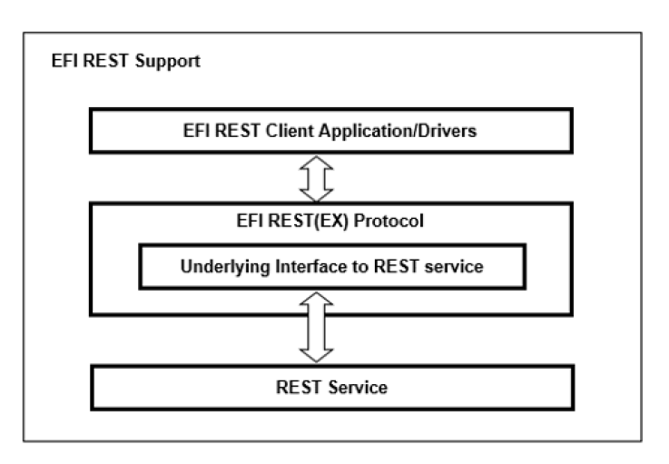

   EFI REST Support, Single Protocol  

Multiple EFI REST(EX) driver instances can be installed on a platform to communicate with different types of REST services or various underlying interfaces to REST services. REST service can be located on the platform locally, or off platform in the remote server. The system integrator can implement In-band EFI REST(EX) driver instance for the on-platform REST service communications or Out-of-band EFI REST(EX) driver instance for the off-platform REST service communications.

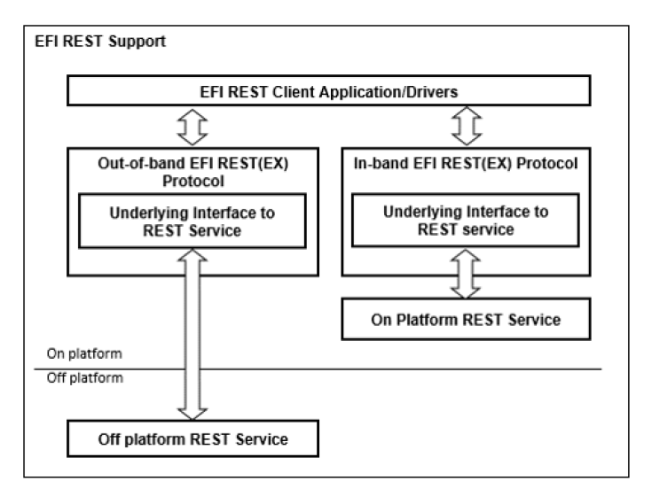

   EFI REST Support, Multiple Protocols

.. _efi-rest-support-scenario-1-platform-management:

EFI REST Support Scenario 1 (PlatformManagement)
################################################

The following figure represents a platform which has BMC on board, with the REST service deployed like Redfish service. The In-band EFI REST(EX) protocol (right one) is used by EFI REST client to manage this platform. This platform can also be managed in out of band like from the remote OS REST client. The left one is Out of band EFI REST(EX) protocol which communicate with other REST services like Redfish service in which the resource is belong to other platforms.

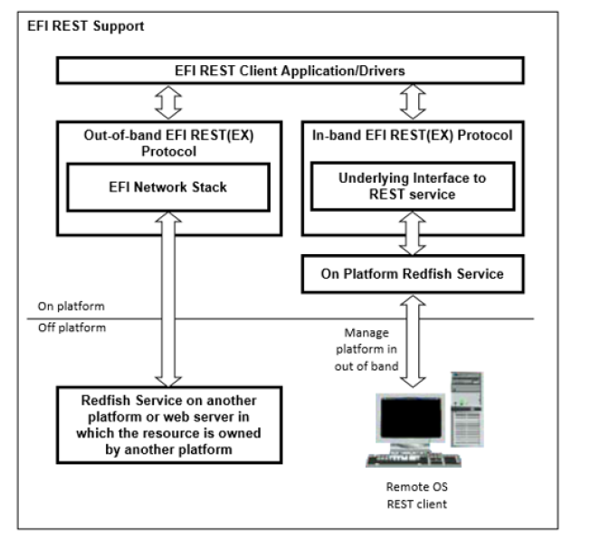

   EFI REST Support, BMC on Board

.. _efi-rest-support-scenario-2-platform-management:

EFI REST Support Scenario 2 (PlatformManagement)
################################################

The following figure represents a platform which uses remote Redfish service for the platform management. If treats the resource in remote Redfish service as a part of this platform, the In-band EFI REST(EX) protocol could be implemented to communicate with remote Redfish service. This platform can also be managed in out of band from the remote OS REST client.

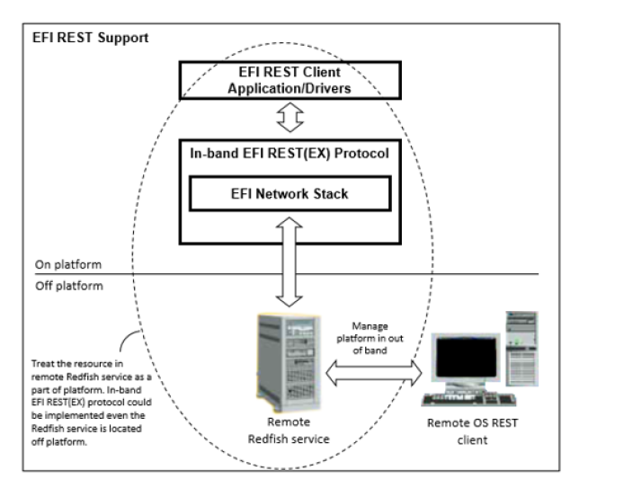

   EFI REST Support, Redfish Service

A variety of possible EFI REST(EX) protocol usages are delineated as below. The EFI REST(EX) driver instance could communicate with REST service through underlying interface like EFI network stack, platform specific interface to BMC or others. The working model of EFI REST support depends on the implementation of EFI REST(EX) driver instance and the design of platform.

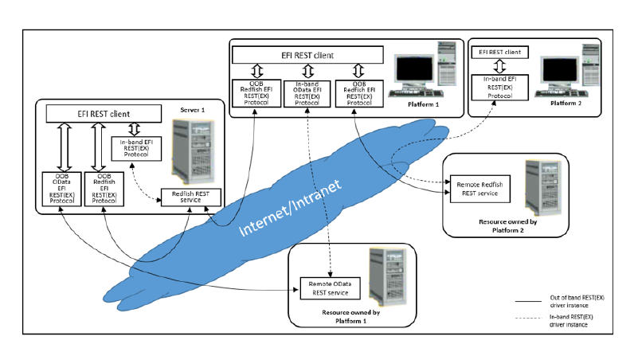

   EFI REST Support, Protocol Usages

.. _efi-rest-protocol:

EFI REST Protocol
#################

This section defines the EFI REST Protocol interface.

.. _efi-rest-protocol-definitions:

EFI REST Protocol Definitions
$$$$$$$$$$$$$$$$$$$$$$$$$$$$$

EFI_REST_PROTOCOL
#################

**Protocol GUID**

.. code-block::

   #define EFI_REST_PROTOCOL_GUID \
     {0x0DB48A36, 0x4E54, 0xEA9C,\
     { 0x9B, 0x09, 0x1E, 0xA5, 0xBE, 0x3A, 0x66, 0x0B }}

**Protocol Interface Structure**

.. code-block::

   typedef struct _EFI_REST_PROTOCOL {
       EFI_REST_SEND_RECEIVE          SendReceive;
       EFI_REST_GET_TIME              GetServiceTime;
   } EFI_REST_PROTOCOL;

**Parameters**

RestSendReceive
  Provides an HTTP-like interface to send and receive resources from a REST service.

GetServiceTime
  Returns the current time of the REST service.

**Description**

The EFI REST protocol is designed to be used by EFI drivers and applications to send and receive resources from a RESTful service. This protocol abstracts REST (Representational State Transfer) client functionality. This EFI protocol could be implemented to use an underlying EFI HTTP protocol, or it could rely on other interfaces that abstract HTTP access to the resources.

.. raw:: latex

  \newpage

.. _efi-rest-protocol-sendreceive:

EFI_REST_PROTOCOL.SendReceive()
###############################

**Summary**

Provides a simple HTTP-like interface to send and receive resources from a REST service.

**EFI Protocol**

.. code-block::

   typedef
   EFI_STATUS
   (EFIAPI *EFI_REST_SEND_RECEIVE)(
     IN EFI_REST_PROTOCOL             *This,
     IN EFI_HTTP_MESSAGE              *RequestMessage,
     OUT EFI_HTTP_MESSAGE             *ResponseMessage
     );

**Parameters**

This
  Pointer to *EFI_REST_PROTOCOL* instance for a particular REST service.

RequestMessage
  Pointer to the REST request data for this resource

ResponseMessage
  Pointer to the REST response data obtained for this requested.

**Description**

The *SendReceive()* function sends a REST request to this REST service, and returns a REST response when the data is retrieved from the service. Both of the REST request and response messages are represented in format of *EFI_HTTP_MESSAGE.* *RequestMessage* contains the request to the REST resource identified by  *UrlRequestMessage->Data.Request->Url*. The  *ResponseMessage* is the returned response for that request, including the final HTTP status code, headers and teh REST resource represented in the message body. 

The memory buffers pointed by *ResponseMessage->Data.Response,* *ResponseMessage->Headers* and R *esponseMessage->Body* are allocated by this function, and it is the caller's responsibility to free the buffer when the caller no longer requires the buffer's contents.
 
It’s the REST protocol’s responsibility to handle HTTP layer details and return the REST resource to the caller, when this function is implemented by using an underlying EFI HTTP protocol. For example, if an HTTP interim response (Informational 1xx in HTTP 1.1) is received from server, the REST protocol should deal with it and keep waiting for the final response, instead of return the interim response to the caller. Same principle should be observed if the REST protocol relies on other interfaces.

**Status Codes Returned**

.. list-table::
   :widths: 35 70
   :class: longtable

   * - EFI_SUCCESS
     - operation succeeded                         
   * - EFI_INVALID_PARAMETER
     - *This, RequestMessage,* or *ResponseMessage* are **NULL**.
   * - EFI_DEVICE_ERROR
     - An unexpected system or network error occurred.
   * - EFI_TIMEOUT
     - Receiving response message fail due to timeout.

.. _efi-rest-protocol-getservicetime:

EFI_REST_PROTOCOL.GetServiceTime()
##################################

.. code-block::

   typedef
   EFI_STATUS
   (EFIAPI *EFI_REST_GET_TIME)(
     IN EFI_REST_PROTOCOL           *This,
     OUT EFI_TIME                   *Time
     );

**Parameters**

This
  Pointer to *EFI_REST_PROTOCOL* instance.

Time
  A pointer to storage to receive a snapshot of the current time of the REST service.

**Description**

The *GetServiceTime()* function is an optional interface to obtain the current time from this REST service instance. If this REST service does not support retrieving the time, this function returns *EFI_UNSUPPORTED.*

**Status Codes Returned**

.. list-table::
   :widths: 35 70
   :class: longtable

   * - EFI_SUCCESS
     - operation succeeded
   * - EFI_INVALID_PARAMETER
     - *This* or *Time* are **NULL**.
   * - EFI_UNSUPPORTED
     - The RESTful service does not support returning the time
   * - EFI_DEVICE_ERROR
     - An unexpected system or network error occurred.

.. _efi-rest-ex-protocol:

EFI REST EX Protocol
####################

This section defines the EFI REST EX Protocol interfaces. It is split into the following two main sections:

-  REST EX Service Binding Protocol (RESTEXSB)
-  REST EX Protocol (REST EX) 

.. _rest-ex-service-binding-protocol:

REST EX Service Binding Protocol
$$$$$$$$$$$$$$$$$$$$$$$$$$$$$$$$

.. _efi_rest_ex_service_binding-protocol:

EFI_REST_EX_SERVICE_BINDING_PROTOCOL
####################################

**Summary**

The RESTEXSB is used to locate the REST services those are supported by a REST EX driver instances and to create and destroy instances of REST EX child protocol driver. 

The EFI Service Binding Protocol in :ref:`efi-service-binding-protocol-protocols-uefi-driver-model`  defines the generic Service Binding Protocol functions. This section discusses the details that are specific to the REST EX.

**GUID**

.. code-block::

   #define EFI_REST_EX_SERVICE_BINDING_PROTOCOL_GUID \
    {0x456bbe01, 0x99d0, 0x45ea, \
   {0xbb, 0x5f, 0x16, 0xd8, 0x4b, 0xed, 0xc5, 0x59}} 

**Description**

A REST service client application (or driver) that communicates to REST service can use one of protocol handler services, such as *BS->LocateHandleBuffer(),* to search for devices that publish a RESTEXSB GUID. Each device with a published RESTEXSB GUID supports REST EX Service Binding Protocol and may be available for use. 

After a successful call to the *EFI_REST_EX_SERVICE_BINDING_PROTOCOL.CreateChild()* function, the child REST EX driver is in the unconfigured state. It is not ready to communicate with REST service at this moment. The child instance is ready to use to communicate with REST service after the successful *Configure()* is invoked. For EFI REST drivers which don’t require additional configuration process, *Configure()* is unnecessary to be invoked before using its child instance. This depends on EFI REST EX driver specific implementation. 

Before a REST service client application terminates execution, every successful call to the *EFI_REST_EX_SERVICE_BINDING_PROTOCOL.CreateChild()* function must be matched with a call to the *EFI_REST_EX_SERVICE_BINDING_PROTOCOL.DestroyChild()* function.

.. _rest-ex-protocol-specific-definitions:

REST EX Protocol Specific Definitions
$$$$$$$$$$$$$$$$$$$$$$$$$$$$$$$$$$$$$

.. _efi_rest_ex_protocol:

EFI_REST_EX_PROTOCOL
####################

**Protocol GUID**

.. code-block::

    #define EFI_REST_EX_PROTOCOL_GUID \  
      {0x55648b91, 0xe7d, 0x40a3, \
      {0xa9, 0xb3, 0xa8, 0x15, 0xd7, 0xea, 0xdf, 0x97}}

**Protocol Interface Structure**

.. code-block::
 
   typedef struct _EFI_REST_EX_PROTOCOL {
     EFI_REST_SEND_RECEIVE              SendReceive;
     EFI_REST_GET_TIME                  GetServiceTime;
     EFI_REST_EX_GET_SERVICE            GetService;
     EFI_REST_EX_GET_MODE_DATA          GetModeData;
     EFI_REST_EX_CONFIGURE              Configure;
     EFI_REST_EX_ASYNC_SEND_RECEIVE     AyncSendReceive;
     EFI_REST_EX_EVENT_SERVICE          EventService;
   } EFI_REST_EX_PROTOCOL;

**Parameters**

SendReceive
  Provides an HTTP-like interface to send and receive resources from a REST service. The functionality of this function is same as EFI_REST_PROTOCOL.SendReceive(). Refer to section `EFI REST Protocol Definitions`_ for more details.

GetServiceTime
  Returns the current time of the REST service. The functionality of this function is same as EFI_REST_PROTOCOL.GetServiceTime(). Refer to 29.7.1.1 for the details.

GetService
  This function returns the type and location of REST service. 

GetModeData
  This function returns operational configuration of current EFI REST EX child instance. 

Configure
  This function is used to configure EFI REST EX child instance.

AyncSendReceive
  Provides an HTTP-like interface to send and receive resources. The resource returned from REST service is sent to client in asynchronously.

EventService
  Provides an interface to subscribe event of specific resource changes on REST service.

**Description**

The REST EX protocol is designed to use by REST service client applications or drivers to communicate with REST service. REST EX protocol enhances the REST protocol and provides comprehensive interfaces to REST service clients. Akin to REST protocol, REST EX driver instance uses HTTP message for the REST request and response. However, the underlying mechanism of REST EX is not necessary to be HTTP-aware. The underlying mechanism could be any protocols according to the REST service mechanism respectively. REST EX protocol could be used to communicate with In-band or Out-of-band REST service depends on the platform-specific implementation.

.. _efi-rest-ex-protocol-sendreceive:

EFI_REST_EX_PROTOCOL.SendReceive()
##################################

**Summary**

Provides a simple HTTP-like interface to send and receive resources from a REST service.

**EFI Protocol**

.. code-block:: 

   typedef  
   EFI_STATUS  
   (EFIAPI *EFI_REST_SEND_RECEIVE)(  
     IN EFI_REST_EX_PROTOCOL          *This,  
     IN EFI_HTTP_MESSAGE              *RequestMessage,  
     OUT EFI_HTTP_MESSAGE             *ResponseMessage  
     );

**Parameters**

Refer to `EFI REST Protocol Definitions`_ for the details.

**Description**

Refer to `EFI REST Protocol Definitions`_  for the details.

**Status Codes Returned**

.. list-table::
   :widths: 35 70
   :class: longtable

   * - EFI_SUCCESS
     - operation succeeded
   * - EFI_INVALID_PARAMETER
     - *This,* *RequestMessage,* or *ResponseMessage* are **NULL**.
   * - EFI_DEVICE_ERROT
     - An unexpected system or network error occurred.
   * - EFI_NOT_READY
     - The configuration of this instance is not set yet. *Configure()* must be executed and returns successfully prior to invoke this function.
   * - EFI_TIMEOUT
     - Receiving response message fail due to timeout.

.. _efi-rest-ex-protocol-getservice:

EFI_REST_EX_PROTOCOL.GetService()
#################################

**Summary**

This function returns the information of REST service provided by this EFI REST EX driver instance.

**Protocol Interface**

.. code-block::

   typedef
   EFI_STATUS
   (EFIAPI *EFI_REST_EX_GET_SERVICE)(
       IN EFI_REST_EX_PROTOCOL          *This,
       OUT EFI_REST_EX_SERVICE_INFO     **RestExServiceInfo 
    ); 

**Parameters**

This
  This is the *EFI_REST_EX_PROTOCOL* instance.

RestExServiceInfo
  Pointer to receive a pointer to *EFI_REST_EX_SERVICE_INFO* structure. The format of *EFI_REST_EX_SERVICE_INFO* is version controlled for the future extension. The version of *EFI_REST_EX_SERVICE_INFO* structure is returned in the header within this structure. EFI REST client refers to the correct format of structure according to the version number. The pointer to *EFI_REST_EX_SERVICE_INFO* is a memory block allocated by EFI REST EX driver instance. That is caller’s responsibility to free this memory when this structure is no longer needed. Refer to Related Definitions below for the definitions of *EFI_REST_EX_SERVICE_INFO* structure.

**Description**

This function returns the information of REST service provided by this REST EX driver instance. The information such as the type of REST service and the access mode of REST EX driver instance (In-band or Out-of-band) are described in *EFI_REST_EX_SERVICE_INFO* structure. For the vendor-specific REST service, vendor-specific REST service information is returned in VendorSpecifcData. Besides the REST service information provided by REST EX driver instance, *EFI_DEVICE_PATH_PROTOCOL* of the REST service is also provided on the handle of REST EX driver instance. 

EFI REST client can get the information of REST service from REST service EFI device path node in *EFI_DEVICE_PATH_PROTOCOL* . *EFI_DEVICE_PATH_PROTOCOL* which installed on REST EX driver instance indicates where the REST service is located, such as BMC Device Path, IPV4, IPV6 or others. Refer to :ref:`rest-service-device-path` for details of the REST service device path node, which is the sub-type (Sub-type = 32) of Messaging Device Path (type 3). 

REST EX driver designer is well know what REST service this REST EX driver instance intends to communicate with. The designer also well know this driver instance is used to talk to BMC through specific platform mechanism or talk to REST server through UEFI HTTP protocol. REST EX driver is responsible to fill up the correct information in *EFI_REST_EX_SERVICE_INFO. EFI_REST_EX_SERVICE_INFO* is referred by EFI REST clients to pickup the proper EFI REST EX driver instance to get and set resource. GetService() is a basic and mandatory function which must be able to use even Configure() is not invoked in previously.

**Related Definitions**

.. code-block:: 

   //*******************************************************
   //EFI_REST_EX_SERVICE_INFO_HEADER
   //*******************************************************
   typedef struct {
       UINT32                           Length;
       EFI_REST_EX_SERVICE_INFO_VER     RestServiceInfoVer;
   } EFI_REST_EX_SERVICE_INFO_HEADER;

Length
  The length of entire EFI_REST_EX_SERVICE_INFO structure. Header size is included. 

RestServiceInfoVer 
  The version of this EFI_REST_SERVICE_INFO structure. See below definitions of EFI_REST_EX_SERVICE_INFO_VER.

.. code-block:: 

   //*******************************************************
   //EFI_REST_EX_SERVICE_INFO_VER
   //*******************************************************
   typedef struct {
     UINT8                  Major;
     UINT8                  Minor;
   } EFI_REST_EX_SERVICE_INFO_VER;

Major
  The major version of EFI_REST_EX_SERVICE_INFO.

Minor
  The minor version of EFI_REST_EX_SERVICE_INFO.

.. code-block::

   //*******************************************************
   //EFI_REST_EX_SERVICE_INFO
   //*******************************************************

*EFI_REST_EX_SERVICE_INFO* is version controlled for the future extensions. Any new information added to this structure requires version increased. EFI REST EX driver instance must provides the correct version of structure in *EFI_REST_EX_SERVICE_INFO_VER* when it returns *EFI_REST_EX_SERVICE_INFO* to caller.

.. code-block::
 
   //********************************************************
   //EFI_REST_EX_SERVICE_INFO
   //********************************************************
   typedef union {
     EFI_REST_EX_SERVICE_INFO_HEADER       EfiRestExServiceInfoHeader;
     EFI_REST_EX_SERVICE_INFO_V_1_0        EfiRestExServiceInfoV10;
   } EFI_REST_EX_SERVICE_INFO;

   //********************************************************
   //EFI_REST_EX_SERVICE_INFO v1.0 
   //********************************************************
   typedef struct {
   EFI_REST_EX_SERVICE_INFO_HEADER        EfiRestExServiceInfoHeader;
   EFI_REST_EX_SERVICE_TYPE               RestExServiceType;
   EFI_REST_EX_SERVICE_ACCESS_MODE        RestServiceAccessMode;
   EFI_GUID                               VendorRestServiceName;
   UINT32                                 VendorSpecificDataLength;
   UINT8                                  *VendorSpecifcData;
   EFI_REST_EX_CONFIG_TYPE                RestExConfigType;
   UINT8                                  RestExConfigDataLength;
      }   EFI_REST_EX_SERVICE_INFO_V_1_0;

EfiRestExServiceInfoHeader
  The header of EFI_REST_EX_SERVICE_INFO.

RestExServiceType
  The REST service type. See below definition.

RestServiceAccessMode
  The access mode of REST service. See below definition.

VendorRestServiceName
  The name of vendor-specific REST service. This field is only valid if RestExServiceType is EFI_REST_EX_SERVICE_VENDOR_SPECIFIC.

VendorSpecificDataLength
  The length of vendor-specific REST service information. This field is only valid if RestExServiceType is EFI_REST_EX_SERVICE_VENDOR_SPECIFIC.

VendorSpecifcData
  A pointer to vendor-specific REST service information. This field is only valid if RestExServiceType is EFI_REST_EX_SERVICE_VENDOR_SPECIFIC. The memory buffer pointed by VendorSpecifcData is allocated by EFI REST EX driver instance and must be freed by EFI REST client when it is no longer need.

RestExConfigType
  The type of configuration of REST EX driver instance. See GetModeData()and Configure() for the details.

RestExConfigDataLength
  The length of REST EX configuration data.

.. code-block:: 

   //*******************************************************
   // EFI_REST_EX_SERVICE_TYPE
   //*******************************************************
   typedef enum {
   EFI_REST_EX_SERVICE_UNSPECIFIC = 1,
     EFI_REST_EX_SERVICE_REDFISH,
     EFI_REST_EX_SERVICE_ODATA,
     EFI_REST_EX_SERVICE_VENDOR_SPECIFIC = 0xff,
     EFI_REST_EX_SERVICE_TYPE_MAX
   } EFI_REST_EX_SERVICE_TYPE; 

*EFI_REST_EX_SERVICE_UNSPECIFIC* indicates this EFI REST EX driver instance is not used to communicate with any particular REST service. The EFI REST EX driver instance which reports this service type is REST service independent and only provides SendReceive()function to EFI REST client. EFI REST client uses this function to send and receive HTTP message to any target URI and handles the follow up actions by itself. The EFI REST EX driver instance in this type must returns EFI_UNSUPPORTED in below REST EX protocol interfaces, GetServiceTime(), AyncSendReceive() and EventService().

*EFI_REST_EX_SERVICE_REDFISH* indicates this EFI REST EX driver instance is used to communicate with Redfish REST service.

*EFI_REST_EX_SERVICE_ODATA* indicates this EFI REST EX driver instance is used to communicate with Odata REST service.

*EFI_REST_EX_SERVICE_VENDOR_SPECIFIC* indicates this EFI REST EX driver instance is used to communicate with vendor-specific REST service.

.. code-block::

   //*******************************************************
   // EFI_REST_EX_SERVICE_ACCESS_MODE
   //*******************************************************
   typedef enum {
       EFI_REST_EX_SERVICE_IN_BAND_ACCESS = 1,
       EFI_REST_EX_SERVICE_OUT_OF_BAND_ACCESS = 2,
       EFI_REST_EX_SERVICE_ACCESS_MODE_MAX
   } EFI_REST_EX_SERVICE_ACCESS_MODE;

*EFI_REST_EX_SERVICE_IN_BAND_ACCESS* mode indicates the REST service is invoked in In-band mechanism in the scope of platform. In most of cases, the In-band mechanism is used to communicate with REST service on platform through some particular devices like BMC, Embedded Controller and other infrastructures built on the platform.

*EFI_REST_EX_SERVICE_OUT_OF_BAND_ACCESS* mode indicates the REST service is invoked in Out-of-band mechanism. The REST service is located out of platform scope. In most of cases, the Out-of-band mechanism is used to communicate with REST service on other platforms through network or other protocols. 

.. code-block::

   //*******************************************************
   // EFI_REST_EX_CONFIG_TYPE
   //*******************************************************
   typedef enum {
     EFI_REST_EX_CONFIG_TYPE_HTTP,
     EFI_REST_EX_CONFIG_TYPE_UNSPECIFIC,
   EFI_REST_EX_CONFIG_TYPE_MAX
   } EFI_REST_EX_CONFIG_TYPE;

*EFI_REST_EX_CONFIG_TYPE_HTTP* indicates the format of the REST EX configuration is *EFI_REST_EX_HTTP_CONFIG_DATA.* *RestExConfigDataLength* of this type is the size of *EFI_REST_EX_HTTP_CONFIG_DATA.* This configuration type is used for the HTTP-aware EFI REST EX driver instance.

.. code-block::

   //*******************************************************
   // EFI_REST_EX_HTTP_CONFIG_DATA
   //*******************************************************
   typedef struct {
       EFI_HTTP_CONFIG_DATA             HttpConfigData;
       UINT32                           SendReceiveTimeout;
   } EFI_REST_EX_HTTP_CONFIG_DATA;

HttpConfigData
  Parameters to configure the HTTP child instance.

SendReceiveTimeout
  Time out (in milliseconds) when blocking for response after send out request message in EFI_REST_EX_PROTOCOL.SendReceive().

*EFI_REST_EX_CONFIG_TYPE_UNSPECIFIC* indicates the format of REST EX configuration is unspecific. *RestExConfigDataLength* of this type depends on the implementation of non HTTP-aware EFI REST EX driver instance such as BMC EFI REST EX driver instance. The format of configuration for this type refers to the system/platform spec which is out of UEFI scope.

**Status Codes Returned**

.. list-table::
   :widths: 35 70
   :class: longtable

   * - EFI_SUCCESS
     - *EFI_REST_EX_SERVICE_INFO* is returned in *RestExServiceInfo.*
   * - EFI_UNSUPPORTED
     - This function is not supported in this REST EX Protocol driver instance.

.. _efi-rest-ex-protocol-getmodedata:

EFI_REST_EX_PROTOCOL.GetModeData()
##################################

**Summary**

This function returns operational configuration of current EFI REST EX child instance.

**Protocol Interface**

.. code-block:: 

   typedef
   EFI_STATUS
   (EFIAPI *EFI_REST_EX_GET_MODE_DATA)(
     IN EFI_REST_EX_PROTOCOL            *This,
     OUT EFI_REST_EX_CONFIG_DATA        *RestExConfigData
   );

**Parameters**

This
  This is the *EFI_REST_EX_PROTOCOL* instance.

RestExConfigData
  Pointer to receive a pointer to *EFI_REST_EX_CONFIG_DATA.* The memory allocated for configuration data should be freed by caller. See Related Definitions for the details.

**Description**

This function returns the current configuration of EFI REST EX child instance. The format of operational configuration depends on the implementation of EFI REST EX driver instance. For example, HTTP-aware EFI REST EX driver instance uses EFI HTTP protocol as the underlying protocol to communicate with the REST service. In this case, the type of configuration *EFI_REST_EX_CONFIG_TYPE_HTTP* is returned from GetService(). *EFI_REST_EX_HTTP_CONFIG_DATA* is used as EFI REST EX configuration format and returned to the EFI REST client. For those non HTTP-aware REST EX driver instances, the type of configuration *EFI_REST_EX_CONFIG_TYPE_UNSPECIFIC* is returned from *GetService().* In this case, the format of returning data could be non-standard. Instead, the format of configuration data is a system/platform specific definition such as a BMC mechanism used in EFI REST EX driver instance. EFI REST client and EFI REST EX driver instance have to refer to the specific system /platform spec which is out of UEFI scope.

**Related Definitions**

.. code-block:: 

   //*******************************************************  
   //EFI_REST_EX_CONFIG_DATA  
   //*******************************************************  
   typedef UINT8 *EFI_REST_EX_CONFIG_DATA;  

**Status Codes Returned**

.. list-table::
   :widths: 35 70
   :class: longtable

   * - EFI_SUCCESS
     - *EFI_REST_EX_SERVICE_INFO* is returned in *RestExServiceInfo.*
   * - EFI_UNSUPPORTED
     - This function is not supported in this REST EX Protocol driver instance.
   * - EFI_NOT_READY
     - The configuration of this instance is not set yet. *Configure()* must be executed and return successfully prior to invoke this function        

.. _efi-rest-ex-protocol-configure:

EFI_REST_EX_PROTOCOL.Configure()
################################

**Summary**

This function is used to configure EFI REST EX child instance.

**Protocol Interface**

.. code-block::

   typedef
   EFI_STATUS
   (EFIAPI *EFI_REST_EX_CONFIGURE)(
     IN EFI_REST_EX_PROTOCOL          *This,
     IN EFI_REST_EX_CONFIG_DATA       RestExConfigData
   );

**Parameters**

This
  This is the *EFI_REST_EX_PROTOCOL* instance.

RestExConfigData
  Pointer to *EFI_REST_EX_CONFIG_DATA.* See Related Definitions in GetModeData() protocol interface.

**Description**

This function is used to configure the setting of underlying protocol of REST EX child instance. The type of configuration is according to the implementation of EFI REST EX driver instance. For example, HTTP-aware EFI REST EX driver instance uses EFI HTTP protocol as the undying protocol to communicate with REST service. The type of configuration is *EFI_REST_EX_CONFIG_TYPE_HTTP* and *RestExConfigData* is in the format of *EFI_REST_EX_HTTP_CONFIF_DATA.* 

Akin to HTTP configuration, REST EX child instance can be configure to use different HTTP local access point for the data transmission. Multiple REST clients may use different configuration of HTTP to distinguish themselves, such as to use the different TCP port. For those non HTTP-aware REST EX driver instance, the type of configuration is *EFI_REST_EX_CONFIG_TYPE_UNSPECIFIC.* *RestExConfigData* refers to the non industrial standard. Instead, the format of configuration data is system/platform specific definition such as BMC. In this case, EFI REST client and EFI REST EX driver instance have to refer to the specific system/platform spec which is out of the UEFI scope. Besides *GetService()* function, no other EFI REST EX functions can be executed by this instance until *Configure()* is executed and returns successfully. All other functions must returns *EFI_NOT_READY* if this instance is not configured yet. Set *RestExConfigData* to **NULL** means to put EFI REST EX child instance into the unconfigured state.

**Status Codes Returned**

.. list-table::
   :widths: 35 70
   :class: longtable

   * - EFI_SUCCESS
     - *EFI_REST_EX_CONFIG_DATA* is set in successfully.
   * - EFI_DEVICE_ERROR
     - Configuration for this REST EX child instance is failed with the given *EFI_REST_EX_CONFIG_DATA*  
   * - EFI_UNSUPPORTED
     - This function is not supported in this REST EX Protocol driver instance.

**Usage Example**

Below illustrations show the usage cases of using different EFI REST EX child instances to communicate with REST service.

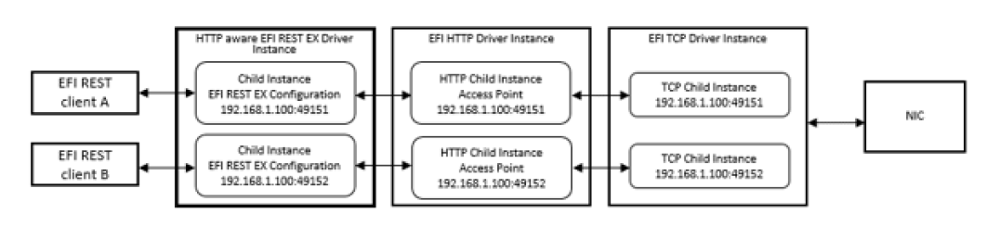

In the above case, EFI REST Client A and B use HTTP-aware EFI REST EX driver instance to get and send resource. These two EFI REST clients configure the child instance with specific TCP port. Therefore the data transmission through HTTP can delivered to the proper EFI REST clients.

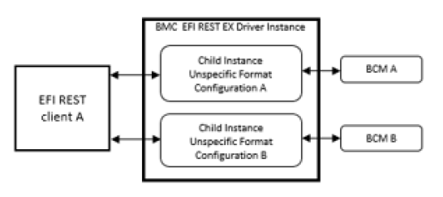

In the above case, EFI REST Client A creates two EFI REST EX child instances and configures those child instances to connect to two BMCs respectively.

.. _efi-rest-ex-protocol-asyncsendreceive:

EFI_REST_EX_PROTOCOL.AsyncSendReceive()
#######################################

**Summary**

This function sends REST request to REST service and signal caller’s event asynchronously when the final response is received by REST EX Protocol driver instance. The essential design of this function is to handle asynchronous send/receive implicitly according to REST service asynchronous request mechanism. Caller will get the notification once the final response is returned from the REST service. 

**Protocol Interface**

.. code-block::
 
   typedef
   EFI_STATUS
   (EFIAPI *EFI_REST_EX_ASYNC_SEND_RECEIVE)(
     IN EFI_REST_EX_PROTOCOL              *This,
     IN EFI_HTTP_MESSAGE                  *RequestMessage OPTIONAL,
     IN EFI_REST_EX_TOKEN                 *RestExToken,
     IN UINTN                             *TimeOutInMilliSeconds OPTIONAL
   );

**Parameters**

This
  This is the *EFI_REST_EX_PROTOCOL* instance.

RequestMessage
  This is the REST request message sent to the REST service. Set *RequestMessage* to **NULL** to cancel the previous asynchronous request associated with the corresponding *RestExToken.* See descriptions for the details.

RestExToken
  REST EX token which REST EX Protocol instance uses to notify REST client the status of response of asynchronous REST request. See related definition of *EFI_REST_EX_TOKEN.*

TimeOutInMilliSeconds
  The pointer to the timeout in milliseconds which REST EX Protocol driver instance refers as the duration to drop asynchronous REST request. **NULL** pointer means no timeout for this REST request. REST EX Protocol driver signals caller’s event with *EFI_STATUS* set to *EFI_TIMEOUT* in *RestExToken* if REST EX Protocol can’t get the response from REST service within TimeOutInMilliSeconds.

**Description**

This function is used to send REST request with asynchronous REST service response within certain timeout declared. REST service sometime takes long time to create resource. Sometimes REST service returns response to REST client late because of the shortage of bandwidth or bad network quality. To prevent from unfriendly user experience due to system stuck while waiting for the response from REST service, *EFI_REST_EX_PROTOCOL.AsyncSendReceive()* provides the capability to send asynchronous REST request. Caller sends the REST request and still can execute some other processes on background while waiting the event signaled by REST EX Protocol driver instance. 

The implementation of underlying mechanism of asynchronous REST request depends on the mechanism of REST service. HTTP protocol, In-Band management protocol and other protocols has its own way to support asynchronous REST request. Similar to *EFI_REST_EX_PROTOCOL* *.SendReceive(),* It’s the REST EX protocol’s responsibility to handle the implementation details and return only the REST resource to the caller. REST EX Protocol driver instance which doesn’t support asynchronous REST request can just return *EFI_UNSUPPORTED* to caller. Also, this function must returns *EFI_UNSUPPORTED* if *EFI_REST_EX_SERVICE_TYPE* returned in *EFI_REST_EX_SERVICE_INFO* from GetService() is *EFI_REST_EX_SERVICE_UNSPECIFIC.* 

REST clients do not have to know the preprocessors of asynchronous REST request between REST EX Protocol driver instance and REST service. The responsibility of REST EX Protocol driver instance is to monitor the status of resource readiness and to signal caller’s *RestExToken* when the status of returning resource is ready. REST EX Protocol driver instance sets *Status* field in *RestExToken* to *EFI_SUCCESS* and sets *ResponseMessage* pointer to the final response from REST service. Then signal caller’s event to notify REST client the desired REST resource is received. REST EX Protocol driver instance also has to create an EFI timer to handle the timeout situation. REST EX Protocol driver must drops the asynchronous REST request once the timeout is expired. In this case, REST EX Protocol driver instance sets Status field in RestExToken to *EFI_TIMEOUT* and signal caller’s event token. 

REST EX Protocol driver instance must has capability to cancel the in process asynchronous REST request when caller asks to terminate specific asynchronous REST request. REST EX Protocol driver instance may not have capability to force REST service to cancel the specific request, however, REST EX Protocol driver instance at lease least can clean up its own internal resource of asynchronous REST request. Caller has to set RequestMessage to **NULL** with *RestExToken* set to *EFI_REST_EX_TOKEN* which was successfully sent to this function previously. REST EX Protocol driver instance finds the given *EFI_REST_EX_TOKEN* from its private database and clean up the associated resource if *EFI_REST_EX_TOKEN* is an in-process asynchronous REST request. REST EX Protocol driver instance then sets Status field in RestExToken to EFI_ABORT and signal caller’s event to indicate the asynchronous REST request has been canceled. 

REST EX Protocol driver instance maintains the internal property, state machine, status of transfer of each asynchronous REST request. REST EX Protocol driver instance has to clean up the internal resource associated with each asynchronous REST request no matter the transfer is ended with success or fail. 

There are two phases of asynchronous REST request. One is the preprocessor of establishing asynchronous REST request between REST EX Protocol driver instance and REST service. Another phase is to retrieve the final response from REST service and send to REST client.

**Related Definitions**

.. code-block:: 

   //********************************************************
   //EFI_REST_EX_TOKEN
   //********************************************************
   typedef struct {
       EFI_EVENT                Event;
       EFI_STATUS               Status;
       EFI_HTTP_MESSAGE         *ResponseMessage;
   } EFI_REST_EX_TOKEN;

Event
  This event will be signaled after the Status field is updated by the EFI REST EX Protocol driver instance. The type of Event must be *EFI_NOTIFY_SIGNAL.* The Task Priority Level (TPL) of Event must be lower than or equal to *TPL_CALLBACK,* which allows other events to be notified.

Status
  *Status* will be set to one of the following values if the REST EX Protocol driver instance gets the response from the REST service successfully, or if an unexpected error occurs:

  | *EFI_SUCCESS*: The resource gets a response from REST service successfully. *ResponseMessage* points to the response in HTTP message structure. 
  | *EFI_ABORTED*: The asynchronous REST request was canceled by the caller.
  | *EFI_TIMEOUT*: The asynchronous REST request timed out before receiving a response from the REST service. 
  | *EFI_DEVICE_ERROR*: An unexpected error occurred.

ResponseMessage
  The REST response message pointed to by this pointer is only valid when *Status* is *EFI_SUCCESS.* The memory buffers pointed to by *ResponseMessage,* *ResponseMessage->Data.Response,* *ResponseMessage->Headers* and *ResponseMessage->Body* are allocated by the EFI REST EX driver instance, and it is the caller's responsibility to free the buffer when the caller no longer requires the buffer's contents.

**Status Codes Returned**

.. list-table::
   :widths: 35 70
   :class: longtable

   * - EFI_SUCCESS
     - Asynchronous REST request is established.                      
   * - EFI_UNSUPPORTED
     - This REST EX Protocol driver instance doesn’t support asynchronous request. 
   * - EFI_TIMEOUT
     - Asynchronous REST request is not established and timeout is expired.                          
   * - EFI_ABORT
     - Previous asynchronous REST request has been canceled.        
   * - EFI_DEVICE_ERROR
     - Otherwise, returns *EFI_DEVICE_ERROR* for other errors according to HTTP Status Code.                             
   * - EFI_NOT_READY
     - The configuration of this instance is not set yet. *Configure()* must be executed and returns successfully prior to invoke this function.             

.. _efi_rest_ex_protocol-eventservice:

EFI_REST_EX_PROTOCOL.EventService()
###################################

**Summary**

This function sends REST request to a REST Event service and signals caller’s event token asynchronously when the URI resource change event is received by REST EX Protocol driver instance. The essential design of this function is to monitor event implicitly according to REST service event service mechanism. Caller will get the notification if certain resource is changed. 

**EFI Protocol**

.. code-block::
 
   typedef
   EFI_STATUS
   (EFIAPI *EFI_REST_EX_EVENT_SERVICE)(
     IN EFI_REST_EX_PROTOCOL                *This,
     IN EFI_HTTP_MESSAGE                    *RequestMessage OPTIONAL,
     IN EFI_REST_EX_TOKEN                   *RestExToken
   );

**Parameters**

This
  This is the EFI_REST_EX_PROTOCOL instance.

RequestMessage
  This is the HTTP request message sent to REST service. Set RequestMessage to **NULL** to cancel the previous event service associated with the corresponding RestExToken. See descriptions for the details.

RestExToken
  REST EX token which REST EX Protocol driver instance uses to notify REST client the URI resource which monitored by REST client has been changed. See the related definition of *EFI_REST_EX_TOKEN* in *EFI_REST_EX_PROTOCOL.AsyncSendReceive().*

**Description**

This function is used to subscribe an event through REST Event service if REST service supports event service. This function listens on resource change of specific REST URI resource. The type of URI resource change event is varied and REST service specific, such as URI resource updated, resource added, resource removed, alert, etc. The way to subscribe REST Event service is also REST service specific, usually described in HTTP body. With the implementation of *EFI_REST_EX_PROTOCOL.EventService(),* REST client can register an REST EX token of particular URI resource change, usually of a time critical nature, until subscription is deleted from REST Event service. 

The implementation of underlying mechanism of REST Event service depends on the interface of REST EX Protocol driver instance. HTTP protocol, In-Band management protocols or other protocols can have its own implementation to support REST Event Service request. REST EX Protocol driver instance has knowledge of how to handle the REST Event service. The REST client creates and submits an HTTP-like header/body content in *RequestMessage* which required by REST Event services. How does REST EX Protocol driver instance handle REST Event service and monitor event is REST service-specific. REST EX driver instance can just returns *EFI_UNSUPPORTED* if REST service has no event capability. Also, this function must returns *EFI_UNSUPPORTED* if *EFI_REST_EX_SERVICE_TYPE* returned in *EFI_REST_EX_SERVICE_INFO* from *GetService()* is *EFI_REST_EX_SERVICE_UNSPECIFIC.* 

The REST EX Protocol driver instance is responsible to monitor the resource change event pushed from REST service. REST EX Protocol driver instance signals caller’s *RestExToken* when the event of resource change is pushed to REST EX Protocol driver instance. The way how REST service pushes event to REST EX Protocol driver instance is implementation-specific and transparent to REST client. REST EX Protocol driver instance sets Status field in *RestExToken* to *EFI_SUCCESS* and sets ResponseMessage pointer to the event resource returned from REST Event service. Then REST EX Protocol driver instance signals caller’s event to notify REST client a new REST event is received. REST EX Protocol driver instance also responsible to terminate event subscription and clear up the internal resource associated with REST Event service if the status of subscription resource is returned error. 

REST EX Protocol driver instance must has capability to remove event subscription created by REST client. Caller has to set RequestMessage to **NULL** with *RestExToken* set to *EFI_REST_EX_TOKEN* which was successfully sent to this function previously. REST EX Protocol driver instance finds the given *EFI_REST_EX_TOKEN* from its private database and delete the associated event from REST service.

**Status Codes Returned**

.. list-table::
   :widths: 35 70
   :class: longtable

   * - EFI_SUCCESS
     - Asynchronous REST request is established.                      
   * - EFI_UNSUPPORTED
     - This REST EX Protocol driver instance doesn’t support asynchronous request. 
   * - EFI_ABORT
     - Previous asynchronous REST request has been canceled or event subscription has been delete from service               
   * - EFI_DEVICE_ERROR
     - Otherwise, returns EFI_DEVICE_ERROR for other errors according to HTTP Status Code.                             
   * - EFI_NOT_READY
     - The configuration of this instance is not set yet. *Configure()* must be executed and returns successfully prior to invoke this function.

.. TODO: the phrase, above: "or event subscription has been delete from service" is not even very good English. (3rd row, right oclumn) ??

.. _usage-example-http-aware-rest-ex-protocol-driver-instance:

Usage Example (HTTP-aware REST EX Protocol DriverInstance)
$$$$$$$$$$$$$$$$$$$$$$$$$$$$$$$$$$$$$$$$$$$$$$$$$$$$$$$$$$

The following code example shows how a consumer of REST EX driver would use EFI REST EX ServiceBinding Protocol and EFI REST EX Protocol to send and receive the resources from a REST service.

.. code-block::

   EFI_HANDLE                             ImageHandle;
   EFI_HANDLE                             *HandleBuffer;
   UINTN                                  HandleNum;
   UINTN                                  Index;
   EFI_REST_EX_SERVICE_BINDING_PROTOCOL   *RestExService;
   EFI_HANDLE                             RestExChild;
   EFI_REST_EX_PROTOCOL                   *RestEx;
   EFI_REST_EX_SERVICE_INFO               *RestExServiceInfo;
   EFI_REST_EX_CONFIG_DATA                RestExConfigData;
   EFI_HTTP_MESSAGE                       RequestMessage;
   EFI_HTTP_MESSAGE                       ResponseMessage;

   //
   // Locate all the handles with RESTEX ServiceBinding Protocol.
   //
   Status = gBS->LocateHandleBuffer (
                     ByProtocol,
                     &gEfiRestExServiceBindingProtocolGuid,
                     NULL,
                     &HandleNum,
                     &HandleBuffer
                     );
   if (EFI_ERROR (Status)  || (HandleNum == 0)) {
    return EFI_ABORTED;
   }

.. code-block::

   for (Index = 0; Index < HandleNum; Index++) {
     //
     // Get the RESTEX ServiceBinding Protocol
     //
     Status = gBS->OpenProtocol (
                     HandleBuffer[Index],
                     &gEfiRestExServiceBindingProtocolGuid,
                     (VOID **) &RestExService,
                     ImageHandle,
                     NULL,
                     EFI_OPEN_PROTOCOL_GET_PROTOCOL
                     );
     if (EFI_ERROR (Status)) {
      return Status;
     }

.. code-block::

     //
     // Create the corresponding REST EX child
     //
     Status = RestExService->CreateChild (RestExService, &RestExChild);
     if (EFI_ERROR (Status)) {
       return Status;
     }

     //
     // Retrieve the REST EX Protocol from child handle
     //
     Status = gBS->OpenProtocol (
                     RestExChild,
                     &gEfiRestExProtocolGuid,
                     (VOID **) &RestEx,
                     ImageHandle,
                     NULL,
                     EFI_OPEN_PROTOCOL_GET_PROTOCOL
                     );
     if (EFI_ERROR (Status)) {
        goto ON_EXIT;
     }

     //
     // Get the information of REST service provided by this EFI REST EX driver 
     //
     Status = RestEx->GetService (
                         RestEx,
                         &RestExServiceInfo
                         );
     if (EFI_ERROR (Status)) {
        goto ON_EXIT;
     }

.. code-block::

     //
     // Check whether this REST EX service is preferred by consumer:
     // 1. RestServiceAccessMode is      EFI_REST_EX_SERVICE_OUT_OF_BAND_ACCESS.
     // 2. RestServiceType is EFI_REST_EX_SERVICE_REDFISH.
     // 3. RestExConfigType is EFI_REST_EX_CONFIG_TYPE_HTTP.
     //
     if (RestExServiceInfo-> REfiRestExServiceInfoV10.estServiceAccessMode ==
          EFI_REST_EX_SERVICE_OUT_OF_BAND_ACCESS &&
          RestExServiceInfo-> EfiRestExServiceInfoV10.RestServiceType ==
   EFI_REST_EX_SERVICE_REDFISH &&
          RestExServiceInfo-> EfiRestExServiceInfoV10.RestExConfigType ==
   EFI_REST_EX_CONFIG_TYPE_HTTP) { 
        break;
      }
   }

.. code-block::

   //
   // Make sure we have found the preferred REST EX driver.
   //
   if (Index == HandleNum) {
     goto ON_EXIT;
   }

   //
   // Configure the RESTEX instance.
   //
   Status =  RestEx->Configure (
                     RestEx,
                     RestExConfigData
                     );
   if (EFI_ERROR (Status)) {
      goto ON_EXIT;
   }

   //
   // Send and receive the resources from a REST service.
   //
   Status = RestEx->SendReceive (
                   RestEx,
                   &RequestMessage,
                   &ResponseMessage
                   );
   if (EFI_ERROR (Status)) {
      goto ON_EXIT;
   }

   ON_EXIT:

     RestExService->DestroyChild (RestExService, RestExChild);
     return Status;

.. _efi_rest_ex_protocol.asyncsendreceive-1:

EFI_REST_EX_PROTOCOL.AsyncSendReceive()
%%%%%%%%%%%%%%%%%%%%%%%%%%%%%%%%%%%%%%%

To those HTTP-aware underlying mechanisms of the REST EX Protocol driver instance and "respond-async" prefer header aware REST service, REST EX Protocol driver instance adds additional HTTP Prefer header field (Refer to IEFT RFC7240) which is set to "respond-async" in the *RequestMessage.* HTTP 202 Accepted Status Code is returned from REST service which indicates the REST request is accepted by REST service, however, the final result is left unknown. The way how REST service returns final response to REST EX Protocol driver instance is REST service implementation-specific and transparent to the REST client. Whether or not the REST service has a proper response to "respond-async" is REST service implementation-specific. AsyncSendReceive() must returns *EFI_UNSUPPORTED* if the REST service that the REST EX instance communicates with is incapable of asynchronous response.

REST EX Protocol driver instance must returns *EFI_SUCCESS* to caller once it gets HTTP 202 Accepted Status Code from REST service. The HTTP Location header field can be returned in HTTP 202 Accepted Status Code. REST EX Protocol driver instance may create an EFI timer to poll the status of URI returned in HTTP Location header field. The content of URI which pointed by HTTP Location header is REST service implementation-specific and not defined in REST EX Protocol specification. REST EX Protocol driver instance provider should have knowledge about how to poll the status of returning resource from given HTTP Location header. 

The following flowchart describes the flow of establishing asynchronous REST request on HTTP-aware infrastructure:

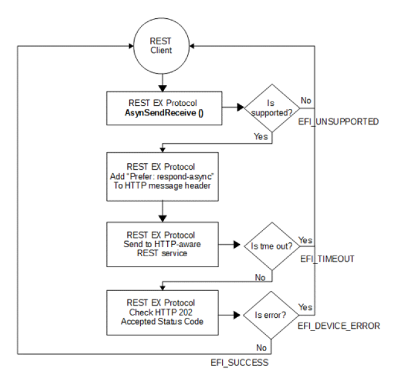
   

Once the asynchronous REST request is established, REST EX Protocol driver instance starts to poll the status of final response on the URI returned in HTTP Location header in HTTP 202 Accepted Status code.

.. _efi_rest_ex_protocol.eventservice-1:

EFI_REST_EX_PROTOCOL.EventService()
%%%%%%%%%%%%%%%%%%%%%%%%%%%%%%%%%%%

The REST client creates and submits an HTTP-like header/body content in RequestMessage which are required by REST Event services. The REST Event Service will return an HTTP 201 (CREATED) and the Location header in the response shall contain a URI giving the location of newly created subscription resource. 

The following flowchart describes the flow of subscribing to a REST Event service on HTTP-aware infrastructure:  

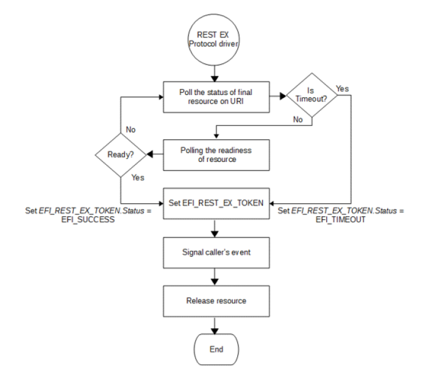
 

Once the REST request is submitted successfully and REST EX Protocol driver instance gets the HTTP 201, REST EX Protocol driver instance starts to monitor whether resource event change is pushed to REST EX Protocol driver instance from REST service.

.. _efi-rest-ex-protocol-eventservice:

EFI_REST_EX_PROTOCOL.EventService()
###################################

The REST client creates and submits an HTTP-like header/body content in RequestMessage which are required by REST Event services. The REST Event Service will return an HTTP 201 (CREATED) and the Location header in the response shall contain a URI giving the location of newly created subscription resource.

The following flowchart describes the flow of subscribing to a REST Event service on HTTP-aware infrastructure:

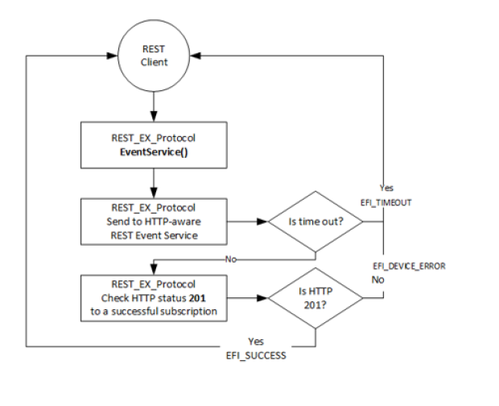

Once the REST request is submitted successfully and REST EX Protocol driver instance gets the HTTP 201, REST EX Protocol driver instance starts to monitor whether resource event change is pushed to REST EX Protocol driver instance from REST service.

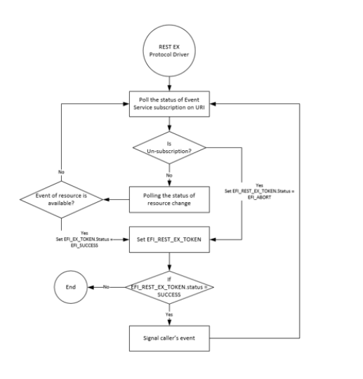

.. _efi-rest-json-resource-to-c-structure-converter:

EFI REST JSON Resource to C Structure Converter
###############################################

.. -overview:

Overview
$$$$$$$$

EFI REST JSON Structure Protocol is designed as the centralized REST JSON Resource IN-Structure OUT (JSON-IN Structure-OUT in short) and vice versa converter for EFI REST client drivers or EFI REST client applications. This protocol provides the registration function which is invoked by upper layer EFI driver to register converter as the plug-in converter for the well-known REST JSON resource. The EFI driver which provide REST JSON resource to structure converter is EFI REST JSON structure converter producer. In the other hand, EFI drivers or applications which utilize EFI REST JSON Structure protocol is the consumer of EFI REST JSON structure converter. The convert producer is required to register its converter functions with predefined REST JSON resource namespace and data type. EFI REST JSON Structure Protocol maintains the database of all plug-in converter and dispatches the consumer request to proper REST JSON resource structure converter. EFI REST JSON Structure Protocol doesn’t have knowledge about the exact structure for the particular REST JSON resource. It just dispatches JSON resource to the correct convert functions and returns the pointer of structure generated by convert producer. This protocol reduces the burdens of JSON resource parsing effort. This also provides the easier way to refer to specific REST JSON property using native C structure reference. Below figure delineates the software stack of EFI REST JSON resource to structure converter architecture. 

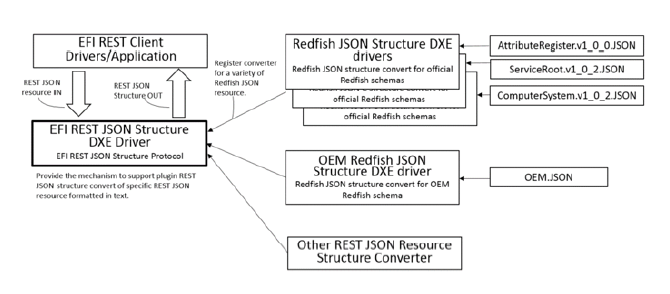
 

.. _efi-rest-json-structure-protocol:

EFI REST JSON Structure Protocol 
$$$$$$$$$$$$$$$$$$$$$$$$$$$$$$$$

**Summary**

EFI REST JSON Structure Protocol provides function to converter producer for the registration of REST JSON resource structure converter. This protocol also provides functions of JSON-IN Structure-OUT and vice versa to converter consumer.

**Protocol GUID**

.. code-block::

   #define EFI_REST_JSON_STRUCTURE_PROTOCOL_GUID \
    { 0xa9a048f6, 0x48a0, 0x4714, {0xb7, 0xda, 0xa9, 0xad,
      0x87, 0xd4, 0xda, 0xc9}}

**Protocol Interface Structure**

.. code-block::

   typedef struct _EFI_REST_JSON_STRUCTURE_PROTOCOL {
       EFI_REST_JSON_STRUCTURE_REGISTER             Register;
       EFI_REST_JSON_STRUCTURE_TO_STRUCTURE         ToStructure;
       EFI_REST_JSON_STRUCTURE_TO_JSON              ToJson;
       EFI_REST_JSON_STRUCTURE_DESTORY_STRUCTURE    DestoryStructure;
   }  EFI_REST_JSON_STRUCTURE_PROTOCOL;

**Parameters**

Register
  Register REST JSON structure converter producer.

ToStructure
  JSON-IN Structure-OUT function.

ToJson
  Structure-IN JSON-OUT function.

DestoryStructure
  Destroy JSON structure returned from *ToStructure* function.

**Description**

*Each plug-in JSON resource to structure converter is required to register itself into* *EFI_REST_JSON_STRUCTURE_PROTOCOL.* The plug-in JSON resource to structure converter has to provide corresponding functions for *ToStructure(),* *ToJson()* and *DestoryStructure()* for the specific REST JSON resource. *EFI_REST_JSON_STRUCTURE_PROTOCOL* *maintains converter producer using the JSON resource type and version information when registration. The* *ToStructure(),* *ToJson()* and *DestoryStructure()* provided by *EFI_REST_JSON_STRUCTURE_PROTOCOL* is published to converter consumer for JSON-IN Structure-OUT and vice versa conversion. *EFI_REST_JSON_STRUCTURE_PROTOCOL* is responsible for dispatching consumer request to the proper converter producer.

.. _efi-rest-json-structure-register:

EFI_REST_JSON_STRUCTURE.Register ()
###################################

**Summary**

*This function provides REST JSON resource to structure converter registration.*

**Protocol Interface**

.. code-block::

   typedef
   EFI_STATUS
   (EFIAPI *EFI_REST_JSON_STRUCTURE_REGISTER)(
     IN EFI_REST_JSON_STRUCTURE_PROTOCOL          *This,
     IN EFI_REST_JSON_STRUCTURE_SUPPORTED         *JsonStructureSupported,
     IN EFI_REST_JSON_STRUCTURE_TO_STRUCTURE      ToStructure,
     IN EFI_REST_JSON_STRUCTURE_TO_JSON           ToJson,
     IN EFI_REST_JSON_DESTORY_STRUCTURE           DestroyStructure
   );

**Parameters**

This
  This is the *EFI_REST_JSON_STRUCTURE_PROTOCOL* instance.

JsonStructureSupported
  The type and version of REST JSON resource which this converter supports.

ToStructure
  The function to convert REST JSON resource to structure.

ToJson
  The function to convert REST JSON structure to JSON in text format.

DestroyStructure
  Destroy REST JSON structure returned in *ToStructure()* function.

**Description**

This function is invoked by REST JSON resource to structure converter to register JSON-IN Structure-OUT, Structure-IN JSON-OUT and destroy JSON structure functionalities. The converter producer has to correctly specify REST resource supporting information in *EFI_REST_JSON_STRUCTURE_SUPPORTED.* The information includes the type name, revision and data type of REST resource. Multiple REST JSON resource to structure converters may supported in one drive, refer to below related definition. 

**Related Definitions**

.. code-block:: 

   typedef CHAR8 *EFI_REST_JSON_RESOURCE_TYPE_DATATYPE;

   //*******************************************************
   // EFI_REST_JSON_RESOURCE_TYPE_NAMESPACE
   //*******************************************************
   typedef struct _EFI_REST_JSON_RESOURCE_TYPE_NAMESPACE {
     CHAR8        *ResourceTypeName;
     CHAR8        *MajorVersion;
     CHAR8        *MinorVersion;
     CHAR8        *ErrataVersion;
   } EFI_REST_JSON_RESOURCE_TYPE_NAMESPACE;

**Parameters**

ResourceTypeName
  *CHAR8* pointer to the name of this REST JSON Resource.

MajorVersion
  *CHAR8* pointer to the string of REST JSON Resource major version.

MinorVersion
  *CHAR8* pointer to the string of REST JSON Resource minor version.

ErrataVersion
  *CHAR8* pointer to the string of REST JSON Resource errata version.

.. code-block::

   //*******************************************************
   // EFI_REST_JSON_RESOURCE_TYPE_IDENTIFIER
   //*******************************************************
   typedef struct _EFI_REST_JSON_RESOURCE_TYPE_IDENTIFIER {
     EFI_REST_JSON_RESOURCE_TYPE_NAMESPACE      Namespace;
     EFI_REST_JSON_RESOURCE_TYPE_DATATYPE       Datatype;
   } EFI_REST_JSON_RESOURCE_TYPE_IDENTIFIER;

**Parameters**

Namespace
  Name space of this REST JSON resource.

Datatype
  *CHAR8* pointer to the string of data type, could be **NULL** if there is no data type for this REST JSON resource.

.. code-block::

   //*******************************************************
   // EFI_REST_JSON_STRUCTURE_SUPPORTED
   //*******************************************************
   typedef struct _EFI_REST_JSON_STRUCTURE_SUPPORTED{
   EFI_REST_JSON_STRUCTURE_SUPPORTED            *Next;
       EFI_REST_JSON_RESOURCE_TYPE_IDENTIFIER   JsonResourceType;
       } EFI_REST_JSON_STRUCTURE_SUPPORTED;

**Parameters**

Next
  Pointer to next *EFI_REST_JSON_STRUCTURE_SUPPORTED.*

JsonResourceType
  Information of REST JSON resource this converter supports.

**Status Codes Returned**

.. list-table::
   :widths: 35 70
   :class: longtable

   * - EFI_SUCCESS
     - Converter is successfully registered
   * - EFI_INVALID_PARAMETER
     - | One or more of the following is **TRUE**:
       | *This* is **NULL**.  
       | *JsonStructureSupported* is **NULL**.  
       | *ResourceTypeName* in *JsonStructureSupported* structure is a **NULL** string  
       | *ToStructure* is **NULL**.  
       | *ToJason* is **NULL**.  
       | *DestroyStructure* is **NULL**.
   * - EFI_ALREADY_STARTED
     - If the JSON resource to structure converter is already registered for this type and revision of JSON resource.
   * - EFI_OUT_OF_RESOURCE
     - Not enough resource for the converter registration

.. _efi-rest-json-structure-tostructure:

EFI_REST_JSON_STRUCTURE.ToStructure ()
######################################

**Summary**

*JSON-IN Structure-OUT function. Convert the given REST JSON resource into structure.*

**Protocol Interface**

.. code-block::

   typedef
   EFI_STATUS
    (EFIAPI *EFI_REST_JSON_STRUCTURE_TO_STRUCTURE)(
       IN   EFI_REST_JSON_STRUCTURE_PROTOCOL          *This,
       IN   EFI_REST_JSON_RESOURCE_TYPE_IDENTIFIER    *JsonRsrcIdentifier
    OPTIONAL,
       IN   CHAR8                                     *ResourceJsonText,
       OUT   EFI_REST_JSON_STRUCTURE_HEADER           **JsonStructure
    ); 

**Parameters**

This
  This is the *EFI_REST_JSON_STRUCTURE_PROTOCOL* instance.

JsonRsrcIdentifier
  This indicates the resource type and version is given in *ResourceJsonText.* If *JsonRsrcIdentifier* is **NULL**, means the JSON resource type and version information of given *ResourceJsonText* is unsure. User would like to have *EFI_REST_JSON_STRUCTURE_PROTOCOL* to look for the proper JSON structure converter.

ResourceJsonText
  REST JSON resource in text format.

JsonStructure
  Pointer to receive the pointer to *EFI_REST_JSON_STRUCTURE_HEADER,* refer to related definition for the details.

**Description**

This function converts the given JSON resource in text format into predefined structure. The definition of structure format is not the scope of *EFI_REST_JSON_STRUCTURE_PROTOCOL.* *EFI_REST_JSON_STRUCTURE_PROTOCOL* is a centralized JSON-IN Structure-OUT converter which maintain the registration of a variety of JSON resource to structure converters. The structure definition and the corresponding C header file are written and released by 3rd party, OEM, organization or any open source communities. The JSON resource to structure converter (convert producer) may be released in the source format or binary format. The convert producer registers itself to *EFI_REST_JSON_STRUCTURE_PROTOCOL* uses *Register()* and provides EFI JSON resource to structure and vice versa conversion. Consumer has to destroy *JsonStructure* using *DestoryStructure()* function. Resource allocated for *JsonStructure* will be released and cleaned up by converter producer. 

When *JsonRsrcIdentifier* is a non **NULL** pointer, *ResourceTypeName* in *EFI_REST_JSON_RESOURCE_TYPE_NAMESPACE* must be a non **NULL** string, however the revision in *EFI_REST_JSON_RESOURCE_TYPE_NAMESPACE* and data type in *EFI_REST_JSON_RESOURCE_TYPE* could be **NULL** string if REST JSON resource is non version controlled or no data type is defined. If *JsonRsrcIdentifier* is a non **NULL** pointer, *EFI_REST_JSON_STRUCTURE_PROTOCOL* looks for the proper converter from its database. Invokes the *ToStructure()* provided by the converter to convert JSON resource to structure. 

Another scenario is *JsonRsrcIdentifier* may passed in as **NULL**, this means the JSON resource type and version information of given *ResourceJsonText* is unsure. In this case, *EFI_REST_JSON_STRUCTURE_PROTOCOL* invokes and passes *ResourceJsonText* to *ToStructure()* of each registered converter with *JsonRsrcIdentifier* set to **NULL**. Converter producer may or may not automatically determine REST JSON resource type and version. Converter producer should return *EFI_UNSUPPORTED* if it doesn’t support automatically recognition of REST JSON resource. Or converter producer can recognize the given REST JSON resource by parsing the certain properties. This depends on the implementation of JSON resource to structure converter. If one of the registered converter producers can recognize the given *ResourceJsonText,* the *JsonRsrcIdentifier* in *EFI_REST_JSON_STRUCTURE_HEADER* is filled up with the proper REST JSON resource type, version and data type. With the information provided in *EFI_REST_JSON_STRUCTURE_HEADER,* consumer has idea about what the exact type of REST JSON structure is.

**Related Definitions**

.. code-block:: 

   //*******************************************************
   // EFI_REST_JSON_STRUCTURE_HEADER
   //*******************************************************
   typedef struct _EFI_REST_JSON_STRUCTURE_HEADER {
     EFI_REST_JSON_RESOURCE_TYPE_IDENTIFIER     JsonRsrcIdentifier;
     //
     // Follow by a pointer points to JSON structure, the content in the
     // JSON structure is implementation-specific according to converter producer. 
     //
     VOID                                     *JsonStructurePointer;
   } EFI_REST_JSON_STRUCTURE_HEADER;

**Parameters**

JsonRsrcIdentifier
  Information of REST JSON structure returned from this converter.

JsonStructurePointer
  Pointers to JSON structure, the content in the JSON structure is implementation-specific according to the converter producer.

**Status Codes Returned**

.. list-table::
   :widths: 35 70
   :class: longtable

   * - EFI_SUCCESS
     - Pointer to JSON structure is returned in *JsonStructure*
   * - EFI_INVALID_PARAMETER
     - | One or more of the following is **TRUE**:
       | *This* is **NULL**.
       | *ResourceJsonText* is **NULL**.
       | *JsonRsrcIdentifier* is not **NULL,** but the 
       | *ResourceTypeName* in *JsonRsrcIdentifier* is **NULL**.  
       | *JsonStructure* is **NULL**.
   * - EFI_NOT_FOUND
     - No proper JSON resource to structure convert found. 

.. _efi-rest-json-structure-tojson:

EFI_REST_JSON_STRUCTURE.ToJson ()
#################################

**Summary**

*Structure-IN JSON-OUT function. Convert the given REST JSON structure into JSON text.* The definition of structure format is not the scope of *EFI_REST_JSON_STRUCTURE_PROTOCOL.* The structure definition and the corresponding C header file are written and released by 3rd party, OEM, organization or any open source communities. Consumer has to free the memory block allocated for *ResourceJsonText* if the JSON resource is no longer needed.

**Protocol Interface**

.. code-block::

   typedef
   EFI_STATUS
   (EFIAPI *EFI_REST_JSON_STRUCTURE_TO_JSON)(
     IN EFI_REST_JSON_STRUCTURE_PROTOCOL        *This,
     IN EFI_REST_JSON_STRUCTURE_HEADER          *JsonStructureHeader,
     OUT CHAR8                                  **ResourceJsonText
   );

**Parameters**

This
  This is the *EFI_REST_JSON_STRUCTURE_PROTOCOL* instance.

JsonStructureHeader
  The point to *EFI_REST_JSON_STRUCTURE_HEADER* structure. *EFI_REST_JSON_RESOURCE_TYPE_IDENTIFIER* in *EFI_REST_JSON_STRUCTURE_HEADER* must exactly describes the JSON resource type and revision referred by this JSON structure. *ResourceTypeName* in *JsonRsrcIdentifier* must be non **NULL** pointer pointes to string. Revision and data type in *JsonRsrcIdentifier* could be **NULL** if REST JSON resource is not version controlled and or data type definition.

ResourceJsonText   
  Pointer to receive REST JSON resource in text format.

**Description**

This functions converts the given REST JSON structure into REST JSON text format resource.

**Status Codes Returned**

.. list-table::
   :widths: 35 70
   :class: longtable

   * - EFI_SUCCESS
     - Pointer to JSON resource in text format is returned in *ResourceJsonText*
   * - EFI_INVALID_PARAMETER
     - | One or more of the following is **TRUE**:  
       | *This* is **NULL**.  
       | *JsonStructureHeader* is **NULL**  
       | *ResourceJsonText* is **NULL**.
   * - EFI_NOT_FOUND
     - No proper JSON structure convert found to convert JSON structure to JSON text format.

.. _efi-rest-json-structure-destroystructure:

EFI_REST_JSON_STRUCTURE.DestroyStructure ()
###########################################

**Summary**

*This function destroys the REST JSON structure.*

**Protocol Interface**

.. code-block::

   typedef
   EFI_STATUS
   (EFIAPI *EFI_REST_JSON_STRUCTURE_DESTORY_STRUCTURE)(
     IN EFI_REST_JSON_STRUCTURE_PROTOCOL        *This,
     IN EFI_REST_JSON_STRUCTURE_HEADER          *JsonStructureHeader
   );

**Description**

This function destroys the JSON structure generated by *ToStructure()* function. REST JSON resource structure converter is responsible for freeing and cleaning up all resource associated with the give JSON structure.

**Status Codes Returned**

.. list-table::
   :widths: 35 70
   :class: longtable

   * - EFI_SUCCESS
     - JSON structure is successfully destroyed.
   * - EFI_INVALID_PARAMETER
     - | One or more of the following is **TRUE**: 
       | • *This* is null.
       | • *JsonStructureHeader* is **NULL**. 
   * - EFI_NOT_FOUND
     - No proper JSON structure converter found to destroy JSON structure.

EFI Redfish JSON Structure Converter
$$$$$$$$$$$$$$$$$$$$$$$$$$$$$$$$$$$$

For writing and using an EFI Redfish JSON Structure Converter, see :numref:`efi-redfish-json-structure-converter`, using the EFI_REST_JSON_STRUCTURE_PROTOCOL protocol.
