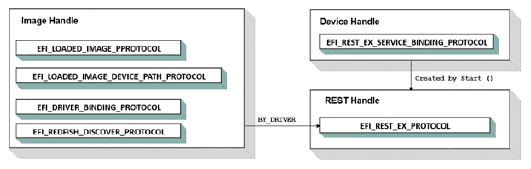
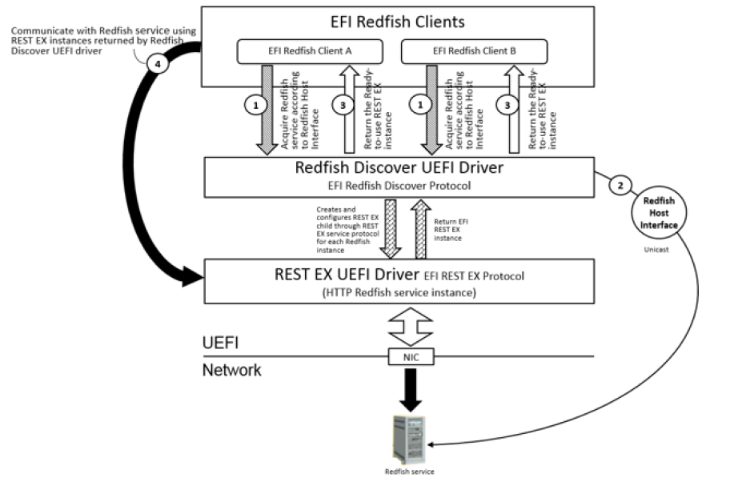
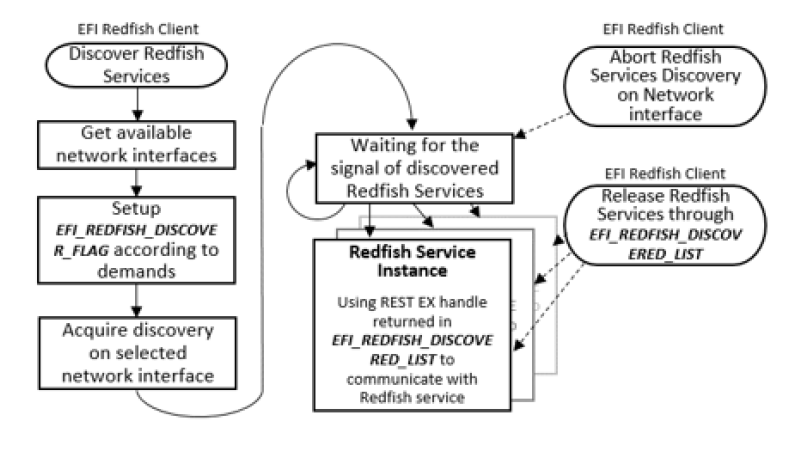
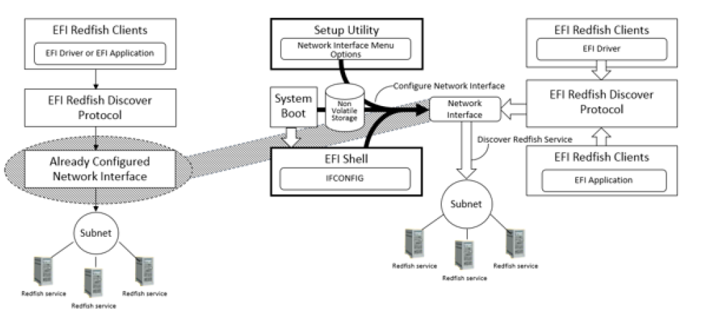

.. _efi-redfish-service-support:

EFI Redfish Service Support
===========================

.. _efi-redfish-discover-protocol:

EFI Redfish Discover Protocol
-----------------------------

.. _efi-redfish-discover-protocol-overview:

Overview
########

The purpose of the EFI Redfish Discover is to provide a mechanism for EFI Redfish clients to acquire the DMTF Redfish® services provided on the platform or network. See the Redfish Developer Hub at https://redfish.dmtf.org/ for official Redfish schema and specifications. Redfish services can be discovered according to Redfish Host Interface (SMBIOS type 42) reported on platform, or optionally using Simple Service Discovery Protocol (SSDP) message over UDP port 1900 to search Redfish services which were joined well-known multicast group addresses. EFI Redfish Discover driver discovers Redfish services and creates EFI REST EX protocol instance for each Redfish service it found. It also configures EFI REST EX protocol instance according to the Redfish service information described in Redfish Host Interface or the response of UPnP M-SEARCH request (defined in UPnP Device Architecture, which can be obtained at "Links to UEFI-Related Documents" http://uefi.org/uefi).

.. TODO fix links above

EFI Redfish Discover Protocol behaves as a middle protocol which abstracts the creation and configuration of EFI REST EX instance from EFI Redfish clients. 

-  EFI Redfish Discover Protocol uses EFI UDP protocol to send SSDP message to verify or discover Redfish services. For the Redfish service reported by SMBIOS type 42h, EFI Redfish Discover Protocol can optionally unicast M-SEARCH request to Redfish service in order to verify the existence of service. 

-  EFI Redfish Discover Protocol can optionally provide the functionality of discovering Redfish services through each network interface installed on platform. Prior to acquiring the list of ready-to-use EFI REST EX protocol instances, the consumer of this protocol can get the network interface list and decide which interface is used for the multicast transmission. EFI Redfish Discover Protocol multicasts M-SEARCH request to multicast group addresses then collects M-SEARCH responses from Redfish services in asynchronous or synchronous manner. 

-  EFI Redfish Discover Protocol provides the information of each network interface installed on platform through GetNetworkInterfaceList()function. The information such as MAC address, subnet ID, subset mask and VLAN ID of network interface could be utilized by upper-layer EFI application or driver to identify network interface used for Redfish service discovery. EFI Redfish Discover Protocol abstracts EFI network stack to user which means this protocol should not require user to configure UDP before utilizing services. Network configuration of network interface such as station IP address, subnet ID, subnet mask and other operational parameters should be configured through system firmware specific implementation (for example system utility). This protocol should simply use UDP default station properties. 

Multicast across internetworks is handled by multicast router and is not in the scope of EFI Redfish Discover Protocol. The implementation of upper-layer user interface is system firmware design-specific. 

-  EFI Redfish Discovery Protocol is the helper driver to discover Redfish services on platform or network. The upper level EFI Redfish client could provide its own implementation of how to utilize information returned from this protocol. Such as network interface selection UI, create Redfish host interface (SMBIOS type 42h) according to Redfish services information, configure system BIOS setting using Redfish service or etc.

.. _efi-redfish-discover-driver:

EFI Redfish Discover Driver
###########################

A Redfish Discover Driver installs the Redfish Discover Protocol and EFI Driver Binding Protocol in its driver entry point. 

The Driver Binding Protocol contains three services. These are *Supported()*, *Start()*, and *Stop()*. *Supported()* tests to see if the Redfish Discover Driver can manage a device handle. A Redfish Discover Driver can manage device handle that contain the EFI REST EX Service Binding Protocol, EFI UDP4 Service Binding Protocol or EFI UDP6 Service Binding Protocol, so a Redfish Discover Driver must look for these three protocols on the device handle that is being tested, and return success if any of them is presented. 

The *Start()* function tells the Redfish Discover Driver to start managing a device driver. The device handle should support at least one of the service binding protocols checked in *Supported()*.The Redfish Discover Driver should create a child handle for each service binding protocol, and open these children with *BY_DRIVER* attribute.

.. TODO: Compositor requests a caption. Please advise.

The *Stop()* function tells the Redfish Discover Driver to stop managing a device driver. The *Stop()* function can destroy one or more of the device handles (or its child handles) that being managed by Redfish Discover Driver. A Redfish Discover Driver should stop the in-process discovery and destroy corresponding child handle which was created in a previous call to *Start()*, or in *AcquireRedfishService()*.

.. _efi-redfish-discover-client:

EFI Redfish Discover Client
###########################

An EFI Redfish client invokes EFI Redfish Discover Protocol to acquire the ready-to-use EFI REST EX protocol instance. 

Below is the conceptual figure of mechanism of EFI Redfish Discover Protocol. The first scenario is unicast M-SEARCH to verify Redfish service reported in SMBIOS type 42h.
..

#. EFI Redfish client invokes EFI Redfish Discover Protocol to acquire ready-to-use EFI REST EX for communicating with Redfish services reported in Redfish Host Interface (SMBIOS type 42h)

#. EFI Redfish Discover Protocol optionally verifies the existence of Redfish service by unicasting M-SEARCH to Redfish service according to the Redfish service information provided in Redfish Host Interface.

#. 3EFI Redfish Discover Protocol creates and configures REST EX instance for Redfish service according to the Redfish service information provided in Redfish Host Interface.

#. EFI Redfish clients communicate with Redfish service using EFI REST EX instance returned from EFI Redfish Discover protocol. 

EFI Redfish client passes *EFI_REDFISH_DISCOVERED_TOKEN* and the discovery options to EFI Redfish Discover Protocol. *EFI_EVENT* is created by EFI Redfish client for retrieving *EFI_REDFISH_DISCOVERED_LIST* once EFI Redfish Discover Protocol optionally verifies Redfish service reported by Redfish Host Interface. EFI Redfish client can listen to the notification of verified Redfish service in asynchronous or synchronous according to the setting of options indicated in *EFI_REDFISH_DISCOVER_FLAG*. 

The second scenario is optionally provided by EFI Redfish Discover Protocol, which is multicast M-SEARCH to discover Redfish services.

..

#. EFI Redfish client gets the list of network interfaces if it would like to discover Redfish services on the certain network.

#. EFI Redfish client invokes EFI Redfish Discover Protocol to acquire ready-to-use EFI REST EX for communicating with Redfish services.

#. EFI Redfish Discover Protocol discovers Redfish services through SSDP over UDP.

#. EFI Redfish clients communicate with Redfish service using EFI REST EX instance returned from EFI Redfish Discover protocol.
 
EFI Redfish client passes *EFI_REDFISH_DISCOVERED_TOKEN* and the discovery options to EFI Redfish Discover Protocol. *EFI_EVENT* is created by EFI Redfish client for retrieving *EFI_REDFISH_DISCOVERED_LIST* when any time EFI Redfish Discover Protocol discovers new Redfish service. EFI Redfish client can listen to the notification of new found Redfish service in asynchronous or synchronous according to the setting of options indicated in *EFI_REDFISH_DISCOVER_FLAG*. Setting *Timeout* to zero in *EFI_REDFISH_DISCOVERED_TOKEN* to waiting for the new discovered Redfish service in synchronously, otherwise asynchronous notification happens when new Redfish service is discovered by EFI Redfish Discover Protocol.

.. _efi-redfish-discover-protocol-1:

EFI Redfish Discover Protocol
#############################

**Summary**

This protocol is utilized by EFI Redfish clients to acquire the list of Redfish services provided on platform or network.

**Protocol GUID**

.. code-block::

   #define EFI_REDFISH_DISCOVER_PROTOCOL_GUID \
     {0x5db12509, 0x4550, 0x4347,
     {0x96, 0xb3, 0x73, 0xc0, 0xff, 0x6e, 0x86, 0x9f}}

**Protocol Interface Structure**

.. code-block::

   typedef struct _EFI_REDFISH_DISCOVER_PROTOCOL {
     EFI_REDFISH_DISCOVER_NETWORK_LIST               GetNetworkInterfaceList;
     EFI_REDFISH_DISCOVER_ACQUIRE_SERVICE            AcquireRedfishService;
     EFI_REDFISH_DISCOVER_ABORT_ACQUIRE              AbortAcquireRedfishService;
     EFI_REDFISH_DISCOVER_RELEASE_SERVICE            ReleaseRedfishService;
   }   EFI_REDFISH_DISCOVER_PROTOCOL;

**Parameters**

GetNetworkInterfaceList
  Get the list of network interfaces on which Redfish services could be discovered.

AcquireRedfishService
  Acquire the list of Redfish services.

AbortAcquireRedfishService
  Abort Redfish services acquire process.

ReleaseRedfishService
  Release Redfish services acquired from AcquireRedfishService().

**Description**

EFI Redfish Discover Protocol provides a mechanism for EFI Redfish clients to acquire the Redfish services provided on the platform or network as described before.

.. _efi_redfish_discover_protocol-getnetworkinterfacelist:

EFI_REDFISH_DISCOVER_PROTOCOL.GetNetworkInterfaceList()
$$$$$$$$$$$$$$$$$$$$$$$$$$$$$$$$$$$$$$$$$$$$$$$$$$$$$$$

**Summary**

Get the currently available list of network interfaces on which Redfish services could be discovered.

**Protocol Interface**

.. code-block::

   typedef
   EFI_STATUS
   (EFIAPI *EFI_REDFISH_DISCOVER_NETWORK_LIST)(
     IN EFI_REDFISH_DISCOVER_PROTOCOL              *This,
     IN EFI_HANDLE                                 ImageHandle,
     OUT UINTN                                     *NumberOfNetworkInterfaces,
     OUT EFI_REDFISH_DISCOVER_NETWORK_INTERFACE    **NetworkInterfaces
   );

**Parameters**

This
  This is the *EFI_REDFISH_DISCOVER_PROTOCOL* instance.

ImageHandle
  EFI image to get network list. The image handle is caller’s image handle.

NumberOfNetworkInterfaces
  Number of network interfaces in NetworkInterfaces.

NetworkInterfaces
  It's an array of instances. The number of entries in NetworkInterfaces is indicated by NumberOfNetworkInterfaces. Caller has to release the memory allocated by Redfish discover protocol with a call to EFI_BOOT_SERVICES.FreePool(). 

**Description**

This function is used to get the list of network interfaces which can be used to send SSDP message over UDP protocol for the Redfish services discovery. The entry in NetworkInterfaces could be used as the parameter to *EFI_REDFISH_DISCOVER_PROTOCOL*.AcquireRedfishService function for discovering Redfish service on specific network interface.

**Related Description**

.. code-block::

   //*******************************************************
   // EFI_REDFISH_DISCOVER_NETWORK_INTERFACE
   //*******************************************************
   typedef struct {
     EFI_MAC_ADDRESS                MacAddress;
     BOOLEAN                        IsIpv6;
     EFI_IP_ADDRESS                 SubnetId;
     UINT8                          SubnetPrefixLength;
     UINT16                         VlanId;
   } EFI_REDFISH_DISCOVER_NETWORK_INTERFACE;

**Parameters**

MacAddress
  MAC address of this network interface.

IsIpv6
  If TRUE, indicates the network interface is running IPv6. Otherwise the network interface is running IPv4.

SubnetId
  Subnet of this network.

SubnetPrefixLength
  Subnet prefix-length for IPv4 and IPv6. 

VlanId
  VLAN ID of this network interface.

**Status Codes Returned**

.. list-table::
   :widths: 35 70
   :class: longtable

   * - EFI_SUCCESS
     - Network interface is returned in *NetworkInterfaces* and the number of network interfaces is returned in *NumbermOfNetworkInterfaces* successfully.
   * - EFI_INVALID_PARAMETER
     - One of below parameters is NULL. *ImageHandle*, *NumberOfNetworkInterfaces*, and *NetworkInterfaces*
   * - EFI_UNSUPPORTED
     - Unable to return network interface list.
   * - EFI_NOT_FOUND
     - No network interfaces are found.
   * - EFI_OUT_OF_RESOURCE
     - Not enough resources to return network interfaces to caller.

.. _efi-redfish-discover-protocol-acquireredfishservice:

EFI_REDFISH_DISCOVER_PROTOCOL.AcquireRedfishService()
$$$$$$$$$$$$$$$$$$$$$$$$$$$$$$$$$$$$$$$$$$$$$$$$$$$$$

**Summary**

This function acquires the list of discovered Redfish services.

**Protocol Interface**

.. code-block::

   typedef
   EFI_STATUS
     (EFIAPI *EFI_REDFISH_DISCOVER_ACQUIRE_SERVICE)(
       IN EFI_REDFISH_DISCOVER_PROTOCOL               *This,
       IN EFI_HANDLE                                  ImageHandle,
       IN EFI_REDFISH_DISCOVER_NETWORK_INTERFACE      *TargetNetworkInterface OPTIONAL,
       IN EFI_REDFISH_DISCOVER_FLAG                   Flags,
       IN EFI_REDFISH_DISCOVERED_TOKEN                *Token
   );

**Parameters**

This
  This is the *EFI_REDFISH_DISCOVER_PROTOCOL* instance.

ImageHandle
  EFI image acquires Redfish service discovery. The image handle is caller’s image handle.

TargetNetworkInterface
  The target Network Interface which is used to discover Redfish services. Set to NULL to discover Redfish services on all network interfaces.

Flags
  Options of Redfish service discovery.

Token
  | *EFI_REDFISH_DISCOVERED_TOKEN* instance. The memory of
  | *EFI_REDFISH_DISCOVERED_LIST* and the strings in
  | *EFI_REDFISH_DISCOVERED_INFORMATION* are all allocated by 
  | *AcquireRedfishService()* and must be freed when caller invokes
  | *ReleaseRedfishService()*.

**Description**

This function is used to acquire the list of Redfish services which are discovered according to Redfish Host Interface or through SSDP over UDP. Redfish services discovery through SSDP over UDP could be achieved via network interface specified in TargetNetworkInterface or via all network interfaces if TargetNetworkInterface is specified as NULL. *EFI_REDFISH_DISCOVERED_LIST* is returned to EFI Redfish client by signaling the EFI event created by client. Each of EFI handle in *EFI_REDFISH_DISCOVERED_LIST* has the corresponding EFI REST EX instance installed on it. Each REST EX instance is a child instance which is created through EFI REST EX service binding protocol and used by EFI Redfish client for communicating with specific Redfish service. In AcquireRedfishService(), UDP child is created and opened to do SSDP discovery. This UDP child will be destroyed right away after the discovery is done. AcquireRedfishService()also creates and opens REST EX child to configures REST EX instance according to Redfish service information retuned in M-SEARCH response or Redfish Host Interface. REST EX child must be closed after REST EX child is configured. EFI Redfish client must open REST EX instance from RedfishRestExHandle returned in *EFI_REDFISH_DISCOVERED_INFORMATION* and close REST EX instance once EFI Redfish client is no longer communicating with Redfish service.

**Related Description**

.. code-block::

   //*******************************************************
   // EFI_REDFISH_DISCOVER_FLAG
   //*******************************************************

   #define EFI_REDFISH_DISCOVER_HOST_INTERFACE        0x00000001
   #define EFI_REDFISH_DISCOVER_SSDP                  0x00000002
   #define EFI_REDFISH_DISCOVER_SSDP_UDP6             0x00000004
   #define EFI_REDFISH_DISCOVER_KEEP_ALIVE            0x00000008
   #define EFI_REDFISH_DISCOVER_RENEW                 0x00000010
   #define EFI_REDFISH_DISCOVER_VALIDATION            0x80000000
   #define EFI_REDFISH_DISCOVER_DURATION_MASK         0x0f000000

*EFI_REDFISH_DISCOVER_FLAG* is used to indicate the options when EFI Redfish clients acquire Redfish discover list through this protocol. Redfish Discover Protocol discovers Redfish service according to Redfish Host Interface when *EFI_REDFISH_DISCOVER_HOST_INTERFACE* is set to *TRUE*. Redfish Discover Protocol also optionally discovers Redfish services using SSDP UPnP M-SEARCH request through UDP Port 1900. Redfish Discover Protocol returns *EFI_INVALID_PARAMETER* if none of *EFI_REDFISH_DISCOVER_HOST_INTERFACE* and *EFI_REDFISH_DISCOVER_SSDP* is set to *TRUE*. Set *EFI_REDFISH_DISCOVER_SSDP_UDP6* to indicate using IPv6 as internet protocol. For the Redfish service discovery according to Redfish Host Interface, Redfish service information like IP address is descripted in Redfish Host Interface. EFI Redfish client can set *EFI_REDFISH_DISCOVER_VALIDATION* to *TRUE* to ask Redfish Discover Protocol to validate this Redfish service using IP address described in Redfish Host Interface. Redfish Discover Protocol unicasts UPnP M-SEARCH request to the target Redfish service and verify the response message to determine if the target Redfish service is existing or not. *EFI_REDFISH_DISCOVER_VALIDATION* doesn’t affect the SSDP discovery. For Redfish SSDP discovery, the responses of the multicast UPnP M-SEARCH request imply the valid Redfish services are existing. 

According to UPnP device architecture, the maximum waiting time of the response to UPnP M-SEARCH request is indicated in MX message header. The value is greater or equal to 1 to less than 5 inclusive in second. In order to give the chance to those Redfish services which do not respond to M-SEARCH in time, set *EFI_REDFISH_DISCOVER_KEEP_ALIVE* to *TRUE* to tell Redfish Discover Protocol keeps to sending multicast M-SEARCH request. The duration of periodical multicast request is declared in *EFI_REDFISH_DISCOVER_DURATION_MASK*. The value indicated in *EFI_REDFISH_DISCOVER_DURATION_MASK* means 2 to the power of duration. The valid value of duration is greater or equal to 3 and less or equal to 15. The corresponding duration is 8 to 2^15 seconds. Minimum duration is set to 8 seconds in order to keep the duration out of scope of MX value defined in UPnP device architecture. Duration is only valid when *EFI_REDFISH_DISCOVER_KEEP_ALIVE* is set to *TRUE* and *EFI_REDFISH_DISCOVER_SSDP* is set to *TRUE*. 

Redfish Discover Protocol maintains an internal database of Redfish services it found. It also maintains the EFI image which owns the EFI REST EX instance of discovered Redfish services. Redfish Discover Protocol only signals EFI Redfish client with new found of Redfish services instead of notifying EFI Redfish client the duplicate Redfish services found earlier, unless *EFI_REDFISH_DISCOVER_RENEW* is set to TRUE. Set *EFI_REDFISH_DISCOVER_RENEW* to *TRUE* forces Redfish Discover Protocol to notify EFI Redfish clients all found Redfish services, even the Redfish service which was already discovered and notified previously.

.. code-block::

   //*******************************************************
   // EFI_REDFISH_DISCOVERED_TOKEN
   //*******************************************************
   #define REDFISH_DISCOVER_TOKEN_SIGNATURE SIGNATURE_32 ('R', 'F', 'T', 'S')
   typedef struct {
     UINT32                         Signature
     EFI_REDFISH_DISCOVERED_LIST    DiscoveredList;
     EFI_EVENT                      Event;
     UINTN                          Timeout;
   }   EFI_REDFISH_DISCOVERED_TOKEN;

**Description**

*EFI_REDFISH_DISCOVERED_TOKEN* is created by EFI Redfish client and passed to *AcquireRedfishService()*.

**Parameters**

Signature
  The token signature should be the value of REDFISH_DISCOVER_TOKEN_SIGNATURE defined above.

DiscoveredList
  Structure of *EFI_REDFISH_DISCOVERED_LIST* to retrieve the discovered Redfish services.

Event
  EFI event at the *TPL_CALLBACK* level created by EFI Redfish client, which is used to be notified when Redfish services are discovered or any errors occurred during discovery.

Timeout
  The timeout value declared in *EFI_REDFISH_DISCOVERED_TOKEN* determines the seconds to drop discovery process. Basically, the nearby Redfish services must give the response in >=1 and <= 5 seconds. The valid timeout value used for the asynchronous discovery is >= 1 and <= 5 seconds. Set the timeout to zero means to discover Redfish service synchronously.

.. code-block::

   //*******************************************************
   // EFI_REDFISH_DISCOVERED_LIST
   //*******************************************************
   typedef struct {
     UINTN                                NumberOfServiceFound;
     EFI_REDFISH_DISCOVERED_INSTANCE      *RedfishInstances;
   }   EFI_REDFISH_DISCOVERED_LIST;

**Description**

The content of *EFI_REDFISH_DISCOVERED_LIST* is filled by *AcquireRedfishService()* before signaling Event. *NumberOfServiceFound* must be set to 0 and RedfishInstances must be NULL when client invokes *AcquireRedfishService()*. The memory block for *RedfishInstances* is allocated by the EFI Redfish Discover Protocol,and will be freed by the EFI Redfish Discover Protocol as well in *ReleaseRedfishService()*. 

**Parameters**

NumberOfServiceFound
  Number of Redfish services are discovered.

RedfishInstances
  Pointer to *EFI_REDFISH_DISCOVERED_INSTANCE*, number of Redfish services are discovered is indicated in NumberOfServiceFound. 

.. code-block::

   //*******************************************************
   // EFI_REDFISH_DISCOVERED_INSTANCE
   //*******************************************************
   typedef struct {
     EFI_STATUS                              Status;
     EFI_REDFISH_DISCOVERED_INFORMATION      Information;
   }   EFI_REDFISH_DISCOVERED_INSTANCE;

**Description**

This structure describes the status and the information of discovered Redfish service.

**Parameters**

Status
  EFI status code of Redfish service discovery.

Information
  The information of Redfish service discovered. The information is only valid when Status is EFI_SUCCESS. Refer to below description of *EFI_REDFISH_DISCOVERED_INSTANCE*.

.. code-block::

   //*******************************************************
   // EFI_REDFISH_DISCOVERED_INFORMATION
   //*******************************************************
   typedef struct {
     EFI_HANDLE                  RedfishRestExHandle;
     BOOLEAN                     IsIPv6;
     EFI_IP_ADDRESS              RedfishHostIpAddress;
     UINT16                      RedfishVersion;
     CHAR16                      *Location;
     CHAR16                      *Uuid;
     CHAR16                      *Os;
     CHAR16                      *OsVersion;
     CHAR16                      *Product;
     CHAR16                      *ProductVersion;
     BOOLEAN                     UseHttps;
   }   EFI_REDFISH_DISCOVERED_INFORMATION;

**Description**

This structure describes each Redfish service information. The corresponding EFI REST EX protocol instance is also created and configured by EFI Redfish Discover Protocol for EFI Redfish client. The memory allocated for the information in this structure will be freed by EFI Redfish Discover Protocol in *ReleaseRedfishService()*.

**Parameters**

RedfishRestExHandle
  EFI handle which has EFI REST EX protocol instance installed on it. The EFI REST EX protocol instance is already configured by EFI Redfish Discover Protocol through *EFI_REST_EX_PROTOCOL* *.Configure()* according to the Redfish host information discovered through Redfish Host Interface or SSDP.

IsIPv6
  Indicates the Redfish service is reached via IPv6 protocol.

RedfishHostIpAddress
  Redfish service host IP address.

RedfishVersion
  Redfish service version. The high byte of RedfishVersion is the major Redfish service version, low byte is the minor Redfish version. For example 0x100 is Redfish service. Redfish service version is acquired from "ST" header in the response of M-SEARCH request.

Location
  Redfish service host location, this information is acquired from "Server" header returned in the response of M-SEARCH request.

Uuid
  The UUID of Redfish service, this information is acquired from "USN" header defined in UPnP Device Architecture specification.

Os
  The OS provides Redfish service, this information is acquired from "Server" header returned in the response of M-SEARCH request. Below is the response in "Server" header defined in UPnP Device Architecture specification. SERVER:OS/version UPnP/1.1 product/version *OsVersion* Redfish service OS version, this information is acquired from "Server" header returned in the response of M-SEARCH request. Below is the response in "Server" header defined in UPnP Device Architecture specification. SERVER:OS/version UPnP/1.1 product/version

Product
  Product name, this information is extracted from "Server" header returned in the response of M-SEARCH request. Below is the response in "Server" header defined in UPnP Architecture Device specification. SERVER:OS/version UPnP/1.1 product/version

ProductVersion
  Product version, this information is acquired from "Server" header returned in the response of M-SEARCH request. Below is the response in "Server" header defined in UPnP Device Architecture specification. | SERVER:OS/version UPnP/1.1 product/version *UseHttps* Indicates the Redfish service is reached via HTTPS protocol.   

**Status Codes Returned**

.. list-table::
   :widths: 35 70
   :class: longtable

   * - EFI_SUCCESS
     - Acquire for Redfish service list is successful.
   * - EFI_INVALID_PARAMATER
     - | One or more of the following is TRUE:
       | *This* is **NULL**.  
       | *ImageHandle* is **NULL**.  
       | *Flags* is 0 or the improper bit combination of option is set in Flag. 
       | *Token* is **NULL**.  
       | *Token->Timeout* is greater than 5 seconds.  
       | *Token->Event* is **NULL**.  
       | On input,   
       | • *Token->DiscoveredList.NumberOfServiceFound* is not 0, or 
       | • *Token-> DiscoveredList->RedfishInstances* is not **NULL**.
   * - Others
     - Fail to acquire the list of Redfish service.

.. _efi-redfish-discover-protocol-abortacquireredfishservice:

EFI_REDFISH_DISCOVER_PROTOCOL.AbortAcquireRedfishService()
$$$$$$$$$$$$$$$$$$$$$$$$$$$$$$$$$$$$$$$$$$$$$$$$$$$$$$$$$$

**Summary**

This function aborts Redfish service discovery on the given
network interface.

**Protocol Interface**

.. code-block::

   typedef
   EFI_STATUS
   (EFIAPI *EFI_REDFISH_DISCOVER_ABORT_ACQUIRE)(
     IN EFI_REDFISH_DISCOVER_PROTOCOL              *This,
     IN *EFI_REDFISH_DISCOVER_NETWORK_INTERFACE    *TargetNetworkInterface OPTIONAL
   );

**Parameters**

This
  This is the *EFI_REDFISH_DISCOVER_PROTOCOL* instance.

TargetNetworkInterface
  The target Network Interface on which Redfish services discovery is in process. NULL to abort Redfish service discovery on all network interfaces. 

**Description**

In *AbortAcquireRedfishService()*, to abort the in-process Redfish service, discovery is required for preventing unexpected behaviors from happening. This function has to cancel in-process SSDP, the unicast over Udp4/Udp6, close Udp4/Udp6 protocol and destroy the Udp4/Udp6 child. Also closes REST EX opened for configuring REST EX child instance.

**Status Codes Returned**

.. list-table::
   :widths: 35 70

   * - EFI_SUCCESS
     - Redfish service discovery is aborted.
   * - EFI_INVALID_PARAMETER
     - | One or more of the following is **TRUE**:  
       | - *This* is **NULL**.

.. _efi-redfish-discover-protocol-releaseredfishservice:

EFI_REDFISH_DISCOVER_PROTOCOL.ReleaseRedfishService()
$$$$$$$$$$$$$$$$$$$$$$$$$$$$$$$$$$$$$$$$$$$$$$$$$$$$$$

**Summary**

This function releases the list of Redfish services discovered
previously.

**Protocol Interface**

.. code-block::

   typedef
   EFI_STATUS
   (EFIAPI *EFI_REDFISH_DISCOVER_RELEASE_SERVICE)(
     IN    EFI_REDFISH_DISCOVER_PROTOCOL        *This,
     IN    EFI_REDFISH_DISCOVERED_LIST          *List
   );

**Parameters**

This
  This is the *EFI_REDFISH_DISCOVER_PROTOCOL* instance.

List
  The pointer to *EFI_REDFISH_DISCOVERED_LIST* which lists the Redfish services to release.

**Description**

The Redfish services which listed in List will be released in *ReleaseRedfishService()*. All memory blocks which were allocated for Redfish service information will be freed in this function. EFI REST EX protocol instance which was created in *AcquireRedfishService()* will be also destroyed in *ReleaseRedfishService()*. The Redfish service listed in \**List* is not required to be identical or in the same order with *EFI_REDFISH_DISCOVERED_LIST* retuned from *AcquireRedfishService()*. List is flexible to list any Redfish services which were discovered by *AcquireRedfishService()* earlier. In ReleaseRedfishService(), free the resource allocated for the discovered Redfish service indicated in *EFI_REDFISH_DISCOVERED_LIST*.   

**Status Codes Returned**

.. list-table::
   :widths: 35 70

   * - EFI_SUCCESS
     - The Redfish services listed in \**List* are released successfully.
   * - EFI_INVALID_PARAMETER
     - | One or more of the following is **TRUE**:  
       | - *This* is **NULL**.  
       | - *List* is **NULL**.  
       | - Invalid settings in \*List.

.. _implementation-examples:

Implementation Examples
#######################

.. _processes-to-discover-redfish-services:

Processes to Discover Redfish Services
$$$$$$$$$$$$$$$$$$$$$$$$$$$$$$$$$$$$$$

The following flowchart delineates the EFI Redfish client processes of utilizing EFI Discover Protocol to discover Redfish service, abort discovery and release discovered Redfish service instance.

.. _network-interface-configuration:

Network Interface Configuration 
$$$$$$$$$$$$$$$$$$$$$$$$$$$$$$$

The EFI Redfish Discover Protocol provides a Redfish service discovery function to discover Redfish service through SMBIOS type 42 or optionally discover Redfish service on specific network interface. EFI Redfish Clients (EFI driver or EFI Application) can utilize the discover function to acquire Redfish service and manipulate Redfish properties to manage a system. For example, applying BIOS settings on the systems managed by Redfish Service. The system could be the one that runs EFI Redfish Client, or other systems on the network. If Redfish service is discovered according to SMBIOS type 42, then the platform developer has to create an SMBIOS type 42 entry with host (station) and Redfish Service information (Refer to DSP0270, Redfish Host Interface Specification). Besides discovering Redfish service using SMBIOS type 42, Redfish services can be also discovered by using SSDP over UDP. However, the network interface must be configured using either DHCP or static configuration prior to discovery of Redfish services. If the network interface is configured statically, then at least the IP address and Subnet mask must be configured for the station. The VLAN ID and new route entry may need to be configured depending on the networking environment if necessary. 

Below is the implementation example for configuring network interface. Network interface could be configured in platform-implementation method. For example, platform developer can provide HII network options in BIOS setup utility. Network interface could be configured in statically or dynamically (DHCP) manner and the configuration could be stored in EFI variables or any platform non-volatile storage which may consumed by network stacks when each time system boot. This makes sure certain network interface is configured properly before EFI Redfish Clients utilizing EFI Redfish Discover Protocol. 

The alternative of configuring network stack is system boots to EFI Shell and execute ifconfig shell command. This configures the settings of certain network interfaces. After this, network interface is ready to process Redfish service discovery by EFI Redfish Clients. However, this method requires user to configure network interface when each time system boot to EFI shell, unless other implementations of ifconfig EFI shell command is provided.

Once EFI Redfish Client is launched, it gets network interface information using EFI Redfish Discover protocol. EFI Redfish Client may provide selection UI of network interfaces for Redfish service discovery. EFI Redfish Client could manipulate Redfish properties such as BIOS Attributes on the discovered Redfish services for system management or deployment. EFI Redfish Client can also optionally maintain the information, location and other properties of discovered Redfish services in non-volatile storage for next system boots afterward. 

.. _efi-redfish-json-structure-converter:

EFI Redfish JSON Structure Converter
------------------------------------

.. _the-guidance-of-writing-efi-redfish-json-structure-converter:

The Guidance of Writing EFI Redfish JSONStructure Converter
###########################################################

To provide interoperability between the Redfish service and the EFI environment, EFI Redfish JSON structure converters for each Redfish schema namespace should be implemented for EFI Redfish clients. This recommendation of writing EFI Redfish JSON structure converters is necessary to unify the implementation and capability of the converters.

- One converter supports one Redfish schema resource type; write the converter based on Redfish resource type. Using Redfish schema as an example:

  | — AccountService.v1_0_0.json: RedfishAccountService_V1_0_0_Dxe driver 

  | — AttributeRegistry.v1_2_0.json: RedfishAttributeRegistry_V1_2_0_Dxe driver

  | — EthernetInterface.v1_4_0.json : EthernetInterface_V1_4_0_Dxe driver

-   Redfish JSON structure converter can be delivered in source code package or binary (library or EFI driver) format.

-   A C header file must be released with the Redfish JSON structure converter package. The package could be provisioned to conform to any EFI implementation, such as EFI EDKII open source.

-   Provide documents which can describe the usage of structure members defined in REST JSON structure.

-   The documentation can be published with a source code package, binary package, web site, online help, etc.

-   Write the converter as an EFI DXE driver, and utilize *EFI_REST_JSON_STRUCTURE_PROTOCOL* to register the converter to provide the corresponding *EFI_REST_JSON_STRUCTURE_PROTOCOL* functions:

    | — *ToStructure()*

    | — *ToJson()*

    | — *DestoryStructure()*

-   FI_REST_JSON_RESOURCE_TYPE_IDENTIFIER     

**Namespace**

ResourceTypeName:
  String to Redfish schema resource type.

MajorVersion:
  String to Redfish schema major version, NULL string for non version controlled schema.

MinorVersion:
  String to Redfish schema minor version, NULL string for non version controlled schema.

ErrataVersion:
  String to Redfish schema errata version, NULL string for non version controlled schema. Datatype

**Datatype**

String to data type defined in Redfish schema 

**Examples** 

AccountService.v1_0_0.json

**Namespace**

ResourceTypeName: "AccountService"
MajorVersion:"1"
MinorVersion:"0"
ErrataVErsion:"0"

**Datatype:** "AccountService"

**Namespace**

ResourceTypeName: "ComputerSystemCollection"
MajorVersion:NULL
MinorVersion:NULL
ErrataVErsion:NULL

**Datatype:** "ComputerSystemCollection"

• Determine Redfish resource type according to the given JsonRsrcIdentifier. If the given JsonRsrcIdentifier is non-NULL, the Redfish resource structure converter must convert the JSON resource to the Redfish JSON structure according to the resource type and revision specified in JsonRsrcIdentifier. The converter should not refer to the resource type and revision according to Redfish namespace and datatype indicated in "odata.type" in JSON text resource. This prevents from the returned structure format is different with what consumer expects.

• Automatically determine the Redfish resource type. If the given JsonRsrcIdentifier is NULL, the EFI Redfish JSON structure converter should check the namespace and datatype indicated in "odata.type" in the JSON text resource. Parse this identifier property to retrieve the corresponding Redfish schema name space and data type, then decode the JSON text resource into the corresponding structure. EFI_REST_JSON_RESOURCE_TYPE_IDENTIFIER in JsonStructure returned to consumer should be filled with the correct Redfish schema resource type information following the guidance mentioned above.

• All structure members for Redfish schema must be declared as C pointers. With this, the converter consumer can get the partial Redfish JSON properties from the converter. The consumer just initializes certain structure members, and the converter producer only converts non-NULL pointers in the given structure into corresponding Redfish JSON properties in text format.

.. _the-guidance-of-using-efi-redfish-json-structure-converter:

The Guidance of Using EFI Redfish JSON Structure Converter
##########################################################

The consumer of EFI Redfish JSON structure converter utilizes EFI_REST_JSON_STRUCTURE_PROTOCOL for converting Redfish JSON resource to Redfish JSON structure and vice versa.

Refer to the converter document to include the C header file of the Redfish JSON structure converter into the build process. For example, include the converter’s EDKII package into an EFI module INF file for the C header file reference, or follow the build rule of other EFI implementations.

There are two ways for a consumer to convert JSON resources using the EFI_REST_JSON_STRUCTURE_PROTOCOL: 

• Setup the crorect Redfish namespace and datatype in EFI_REST_JSON_RESOURCE_TYPE_IDENTIFIER. This makes sure the EFI REST JSON Structure Protocol uses the exact converter that the consumer prefers for the conversion. In this case, the Redfish namespace and datatype indicated in "odata.type" in the EFI_REST_JSON_RESOURCE_TYPE_IDENTIFIER is set to NULL. This means the converter may recognize the Redfish namespace and datatype indicated in "odata.type" in the JSON text resource, and converts it to the C structure it supports. In this case, the consumer has to be careful when using a C structure pointer to refer to the Redfish JSON structure.

• EFI_REST_JSON_RESOURCE_TYPE_IDENTIFIER set to NULL means the returned structure format may not be in the same form as the consumer’s expectation. The consumer then has to check the EFI_REST_JSON_RESOURCE_TYPE_IDENTIFIER for the Redfish namespace and datatype, and use the correct prototype for structure reference.