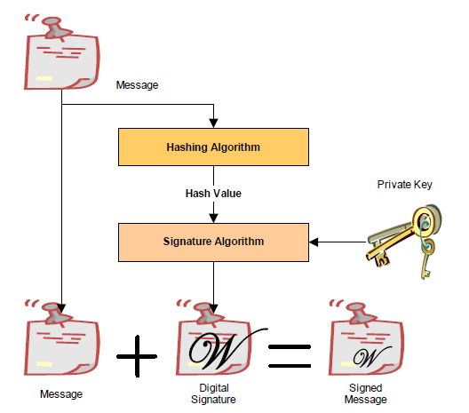
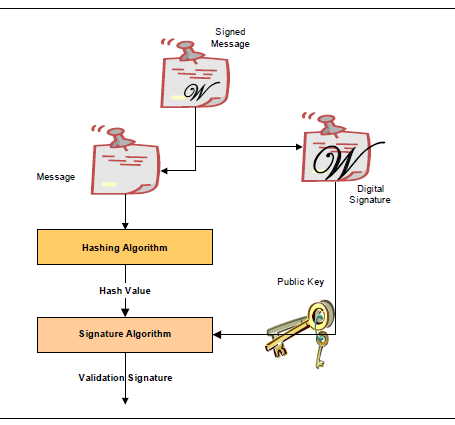
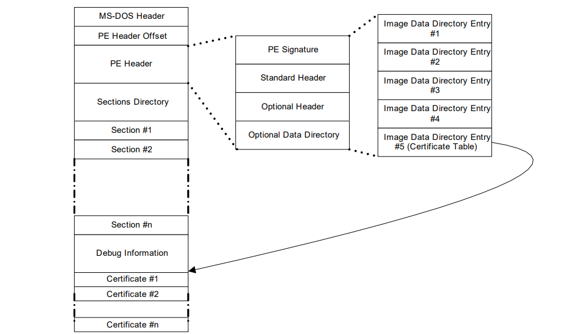
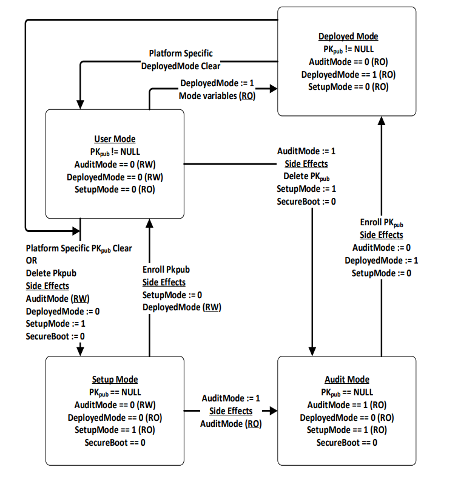
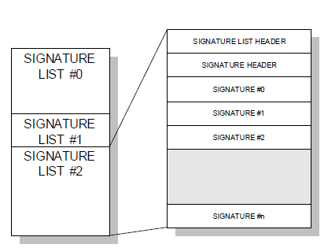
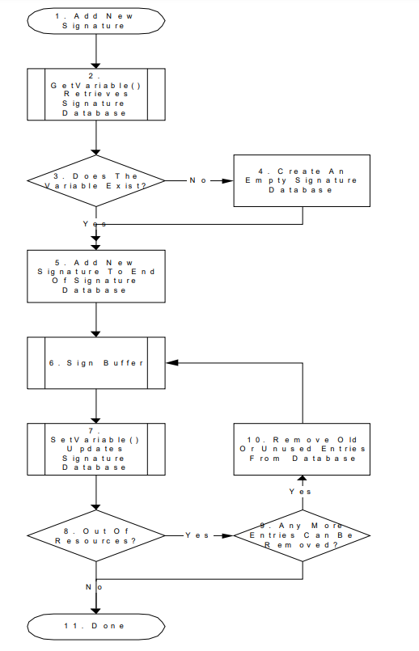
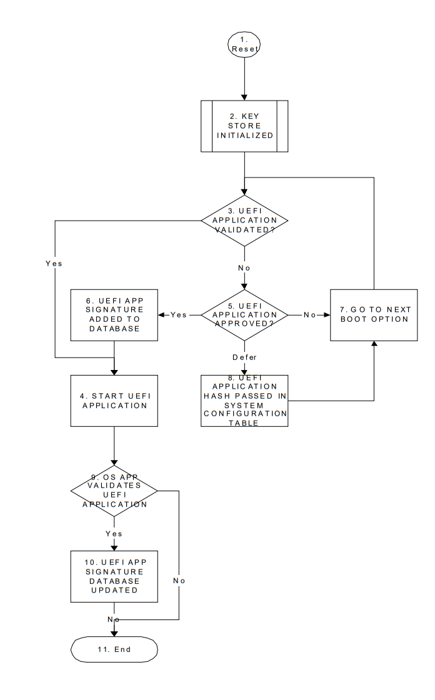

.. _secure-boot-and-driver-signing:

Secure Boot and Driver Signing
==============================

.. _secure-bootsecure-boot-and-driver-signing:

Secure Boot
-----------

This protocol is intended to provide access for generic authentication information associated with specific device paths. The authentication information is configurable using the defined interfaces. Successive configuration of the authentication information will overwrite the previously configured information. Once overwritten, the previous authentication information will not be retrievable. 

.. _efi-authentication-info-protocol:

EFI_AUTHENTICATION_INFO_PROTOCOL
################################

**Summary**

This protocol is used on any device handle to obtain authentication information associated with the physical or logical device.

**GUID**

.. code-block::

   #define EFI_AUTHENTICATION_INFO_PROTOCOL_GUID \
   {0x7671d9d0,0x53db,0x4173,\
   {0xaa,0x69,0x23,0x27,0xf2,0x1f,0x0b,0xc7}}

**Protocol Interface Structure**

.. code-block::

   typedef struct _EFI_AUTHENTICATION_INFO_PROTOCOL {
     EFI_AUTHENTICATION_INFO_PROTOCOL_GET            Get;
     EFI_AUTHENTICATION_INFO_PROTOCOL_SET            Set;
   }   EFI_AUTHENTICATION_INFO_PROTOCOL;

**Parameters**

Get()
  Used to retrieve the Authentication Information associated with the controller handle

Set()
  Used to set the Authentication information associated with the controller handle

**Description**

The *EFI_AUTHENTICATION_INFO_PROTOCOL* provides the ability to get and set the authentication information associated with the controller handle.

.. _efi-authentication-info-protocol-get:

EFI_AUTHENTICATION_INFO_PROTOCOL.Get()
######################################

**Summary**

Retrieves the Authentication information associated with a particular controller handle.   

**Prototype**

.. code-block::
  
   typedef
   EFI_STATUS
   (EFIAPI *EFI_AUTHENTICATION_INFO_PROTOCOL_GET) (
     IN EFI_AUTHENTICATION_INFO_PROTOCOL        *This,
     IN EFI_HANDLE                              ControllerHandle,
     OUT VOID                                   **Buffer
     );
  

**Parameters**

This
  Pointer to the *EFI_AUTHENTICATION_INFO_PROTOCOL*

ControllerHandle
  Handle to the Controller

Buffer
  Pointer to the authentication information. This function is responsible for allocating the buffer and it is the caller’s responsibility to free buffer when the caller is finished with buffer. 

**Description**

This function retrieves the Authentication Node for a given controller handle.   

**Status Codes Returned**

.. list-table::
   :widths: 35 70
   :class: longtable

   * - EFI_SUCCESS
     - Successfully retrieved Authentication information for the given *ControllerHandle*
   * - EFI_INVALID_PARAMETER
     - No matching Authentication information found for the given *ControllerHandle*
   * - EFI_DEVICE_ERROR
     - The authentication information could not be retrieved due to a hardware error.

.. _efi-authentication-info-protocol-set:

EFI_AUTHENTICATION_INFO_PROTOCOL.Set()
######################################

**Summary**

Set the Authentication information for a given controller handle.   

**Prototype**  

.. code-block::
  
   typedef
   EFI_STATUS
   (EFIAPI *EFI_AUTHENTICATION_INFO_PROTOCOL_SET) (
   IN EFI_AUTHENTICATION_INFO_PROTOCOL **This,
   IN EFI_HANDLE *ControllerHandle
   IN VOID **Buffer   
   );  

**Parameters**

This
  Pointer to the *EFI_AUTHENTICATION_INFO_PROTOCOL*

ControllerHandle
  Handle to the controller.

Buffer
  Pointer to the authentication information.

**Description**

This function sets the authentication information for a given controller handle. If the authentication node exists corresponding to the given controller handle this function overwrites the previously present authentication information.   

**Status Codes Returned**

.. list-table::
   :widths: 35 70

   * - EFI_SUCCESS
     - Successfully set the Authentication node information for the given *ControllerHandle*.
   * - EFI_UNSUPPORTED
     - If the platform policies do not allow setting of the Authentication information.
   * - EFI_DEVICE_ERROR
     - The authentication node information could not be configured due to a hardware error.
   * - EFI_OUT_OF_RESOURCES
     - Not enough storage is available to hold the data.

.. _authentication-nodes:

Authentication Nodes
####################

The authentication node is associated with specific controller paths. There can be various types of authentication nodes, each describing a particular authentication method and associated properties.

.. _generic-authentication-node-structures:

Generic Authentication Node Structures
######################################

An authentication node is a variable length binary structure that is made up of variable length authentication information. The Table below defines the generic structure. The Authentication type GUID defines the corresponding authentication node.

.. list-table:: Generic Authentication Node Structure
   :name: generic-authentication-node-structure
   :widths: 15 15 15 45
   :class: longtable

   * - Mnemonic
     - Byte Offset
     - Byte Length
     - Description
   * - Type GUID
     - 0
     - 16
     - Authentication Type GUID
   * - Length
     - 16
     - 2
     - Length of this structure in bytes.
   * - Specific Authentication Data
     - 18
     - n
     - Specific Authentication Data. Type defines the authentication method and associated type of data. Size of the data is included in the length.

All Authentication Nodes are byte-packed data structures that may appear on any byte boundary. All code references to Authentication Nodes must assume all fields are UNALIGNED. Since every Authentication Node contains a length field in a known place, it is possible to traverse Authentication Node of unknown type.

.. _chap-using-radius-authentication-node:

CHAP (using RADIUS) Authentication Node
#######################################

This Authentication Node type defines the CHAP authentication using RADIUS information.

**GUID**

.. code-block::

   #define EFI_AUTHENTICATION_CHAP_RADIUS_GUID \
   {0xd6062b50,0x15ca,0x11da,\
   {0x92,0x19,0x00,0x10,0x83,0xff,0xca,0x4d}}

**Node Definition**

.. list-table:: CHAP Authentication Node Structure using RADIUS
   :widths: 20,15,15,50
   :name: chap-authentication-node-structure-using-radius
   :class: longtable

   * - **Mnemonic**
     - **Byte Offset**
     - **Byte Length**
     - **Description**
   * - Type
     - 0
     - 16
     - EFI_A UTHENTICATION_C HAP_RADIUS_GUID
   * - Length
     - 16
     - 2
     - Length of this structure in bytes. Total length is 58+P+Q+R+S+T
   * - RADIUS IP Address
     - 18
     - 16
     - Radius IPv4 or IPv6 Address
   * - Reserved
     - 34
     - 2
     - Reserved
   * - NAS IP Address
     - 36
     - 16
     - NAS IPv4 or IPv6 Address
   * - NAS Secret Length
     - 52
     - 2
     - NAS Secret LengthP
   * - NAS Secret
     - 54
     - p
     - NAS Secret
   * - CHAP Secret Length
     - 54+P
     - 2
     - CHAP Secret Length Q
   * - CHAP Secret
     - 56+P
     - q
     - CHAP Secret
   * - CHAP Name Length
     - 56 +Q
     - 2
     - CHAP Name Length R
   * - CHAP Name
     - 58+P+Q
     - r
     - CHAP Name String
   * - Reverse CHAP Name Length
     - 58+P+Q+R
     - 2
     - Reverse CHAP Name length
   * - Reverse CHAP Name
     - 60+P+Q+R
     - S
     - Reverse CHAP Name
   * - Reverse CHAP Secret Length
     - 60+P+Q+R+S
     - 2
     - Reverse CHAP Length
   * - Reverse CHAP Secret
     - 62+P+Q+R+S
     - T
     - Reverse CHAP Secret

**Summary**

| RADIUS IP Address...RADIUS Server IPv4 or IPv6 Address
| NAS IP Address...Network Access Server IPv4 or IPv6 Address (OPTIONAL)
| NAS Secret Length...Network Access Server Secret Length in bytes (OPTIONAL)
| NAS Secret...Network Access Server secret (OPTIONAL)
| CHAP Secret Length...CHAP Initiator Secret length in bytes
| CHAP Secret...CHAP Initiator Secret
| CHAP Name...Length CHAP Initiator Name Length in bytes
| CHAP Name CHAP Initiator Name
| Reverse CHAP name length Reverse CHAP name length
| Reverse CHAP Name Reverse CHAP name
| Reverse CHAP Secret Length Reverse CHAP secret length 
| Reverse CHAP Secret Reverse CHAP secret

**CHAP (using local database)Authentication Node**

This Authentication Node type defines CHAP using local database information.

**GUID**

.. code-block::

   #define EFI_AUTHENTICATION_CHAP_LOCAL_GUID \
   {0xc280c73e,0x15ca,0x11da,\
   {0xb0,0xca,0x00,0x10,0x83,0xff,0xca,0x4d}}

**Node Definition**

.. list-table:: CHAP Authentication Node Structure using Local Database
   :widths: 15 15 15 45
   :name: chap-authentication-node-structure-using-local-database
   :class: longtable

   * - Mnemonic
     - Byte Offset
     - Byte Length
     - Description
   * - Type
     - 0
     - 16
     - EFI_AUTHENTICATION_CHAP_LOCAL_GUID
   * - Length
     - 16
     - 2
     - Length of this structure in bytes. Total length is 58+P+Q+R+S+T
   * - Reserved
     - 18
     - 2
     - Reserved for future use
   * - User Secret Length
     - 20
     - 2
     - User Secret Length
   * - User Secret
     - 22
     - p
     - User Secret
   * - User Name Length
     - 22+p
     - 2
     - User Name Length
   * - User Name
     - 24+p
     - q
     - User Name
   * - CHAP Secret Length
     - 24+p+q
     - 2
     - CHAP Secret Length
   * - CHAP Secret
     - 26+p+q
     - r
     - CHAP Secret
   * - CHAP Name Length
     - 26+p+q+r
     - 2
     - CHAP Name Length
   * - CHAP Name
     - 28+p+q+r
     - s
     - CHAP Name String
   * - Reverse CHAP Name Length
     - 58+P+Q+R
     - 2
     - Reverse CHAP Name length
   * - Reverse CHAP Name
     - 60+P+Q+R
     - S
     - Reverse CHAP Name
   * - Reverse CHAP Secret Length
     - 60+P+Q+R+S
     - 2
     - Reverse CHAP Length
   * - Reverse CHAP Secret
     - 62+P+Q+R+S
     - T
     - Reverse CHAP Secret

**Summary**

| User Secret Length...User Secret Length in bytes
| User Secret...User Secret
| User Name Length...User Name Length in bytes
| User Name...User Name
| CHAP Secret Length...CHAP Initiator Secret length in bytes
| CHAP Secret...CHAP Initiator Secret
| CHAP Name Length...CHAP Initiator Name Length in bytes
| CHAP Name...CHAP Initiator Name
| Reverse CHAP name length Reverse CHAP name length
| Reverse CHAP Name Reverse CHAP name
| Reverse CHAP Secret Length Reverse CHAP secret length
| Reverse CHAP Secret Reverse CHAP secret 

.. _uefi-driver-signing-overview:

UEFI Driver Signing Overview
----------------------------

This section describes a means of generating a digital signature for a UEFI executable, embedding that digital signature within the UEFI executable and verifying that the digital signature is from an authorized source. The UEFI specification provides a standard format for executables. These executables may be located on un-secured media (such as a hard drive or unprotected flash device) or may be delivered via a un-secured transport layer (such as a network) or originate from a un-secured port (such as ExpressCard device or USB device). In each of these cases, the system provider may decide to authenticate either the origin of the executable or its integrity (i.e., it has not been tampered with). This section describes a means of doing so.

.. _digital-signatures:

Digital Signatures
##################

As a rule, digital signatures require two pieces: the data (often referred to as the message) and a public/private key pair. In order to create a digital signature, the message is processed by a hashing algorithm to create a hash value. This hash value is, in turn, encrypted using a signature algorithm and the private key to create the digital signature.

   Creating A Digital Signature

In order to verify a signature, two pieces of data are required: the original message and the public key. First, the hash must be calculated exactly as it was calculated when the signature was created. Then the digital signature is decoded using the public key and the result is compared against the computed hash. If the two are identical, then you can be sure that message data is the one originally signed and it has not been tampered with. 

   Veriying a Digital Signature

.. _embedded-signatures:

Embedded Signatures
###################

The signatures used for digital signing of UEFI executables are embedded directly within the executable itself. Within the header is an array of directory entries. Each of these entries points to interesting places within the executable image. The fifth data directory entry contains a pointer to a list of certificates along with the length of the certificate areas. Each certificate may contain a digital signature used for validating the driver. The following diagram illustrates how certificates are embedded in the PE/COFF file:

   Embedded Digital Certificates

Within the PE/COFF optional header is a data directory. The 5th entry, if filled, points to a list of certificates. Normally, these certificates are appended to the end of the file.

.. _creating-image-digests-from-images:

Creating Image Digests from Images
##################################

One of the pieces required for creating a digital signature is the image digest. For a detailed description on how to create image digests from PE/COFF images, refer to the "Creating the PE Image Hash" section of the Microsoft Authenticode Format specification (see References). 

.. _uefi-driver-signing-overview-code-definitions:

Code Definitions
################

This section describes data structures used for signing UEFI executables.

.. _win-certificate:

WIN_CERTIFICATE
$$$$$$$$$$$$$$$

**Summary**

The *WIN_CERTIFICATE* structure is part of the PE/COFF specification.   

**Prototype**

.. code-block::

   typedef struct _WIN_CERTIFICATE {
     UINT32             dwLength;
     UINT16             wRevision;
     UINT16             wCertificateType;
     //UINT8            bCertificate[ANYSIZE_ARRAY];
   } WIN_CERTIFICATE;

dwLength
  The length of the entire certificate, including the length of the header, in bytes.

wRevision
  The revision level of the *WIN_CERTIFICATE* structure. The current revision level is 0x0200.

wCertificateType
  The certificate type. See *WIN_CERT_TYPE_xxx* for the UEFI certificate types. The UEFI specification reserves the range of certificate type values from 0x0EF0 to 0x0EFF.

bCertificate  
  The actual certificate. The format of the certificate depends on *wCertificateType*. The format of the UEFI certificates is defined below.

**Related Definitions**

.. code-block::

   #define WIN_CERT_TYPE_PKCS_SIGNED_DATA    0x0002
   #define WIN_CERT_TYPE_EFI_PKCS115         0x0EF0
   #define WIN_CERT_TYPE_EFI_GUID            0x0EF1

**Description**

This structure is the certificate header. There may be zero or more certificates. 

- If the wCertificateType field is set to *WIN_CERT_TYPE_EFI_PKCS115,* then the certificate follows the format described in *WIN_CERTIFICATE_EFI_PKCS1_15*.

-  If the *wCertificateType* field is set to *WIN_CERT_TYPE_EFI_GUID,* then the certificate follows the format described in *WIN_CERTIFICATE_UEFI_GUID*.

-  If the *wCertificateType* field is set to *WIN_CERT_TYPE_PKCS_SIGNED_DATA* then the certificate is formatted as described in the Authenticode specification. 

These certificates can be validated using the contents of the signature database described in  `Signature Database`_ . The following table illustrates the relationship between the certificates and the signature types in the database.

**NOTE**: *In the case of a* WIN_CERT_TYPE_PKCS_SIGNED_DATA (*or* WIN_CERT_TYPE_EFI_GUID *where* CertType = EFI_CERT_TYPE_PKCS7_GUID) *certificate, a match can occur against an entry in the authorized signature database (or the forbidden signature database;*  `UEFI Image Variable GUID & Variable Name`_ ) *at any level of the chain of X.509 certificates present in the certificate, and matches can occur against any of the applicable signature types defined in* ( :ref:`firmware-os-key-exchange-passing-public-keys` .  

.. list-table:: PE/COFF Certificates Types and UEFI Signature Database Certificate Types
   :name: pe-coff-certificates-types-and-uefi-signature-database-certificate-types
   :widths: 60 40
   :class: longtable

   * - **Image Certificate Type**
     - **Verified Using Signature Database Type**
   * - | WIN_CERT_TYPE_EFI_PKCS115
       | (Signature Size = 256 bytes)
     - EFI_CERT_RSA2048_GUID          (public key)
   * - | WIN_CERT_TYPE_EFI_GUID 
       | (CertType = EFI_CERT_TYPE_RSA2048_SHA256_GUID)
     - EFI_CERT_RSA2048_GUID          (public key)
   * - | WIN_CERT_TYPE_EFI_GUID 
       | (CertType = EFI_CERT_TYPE_PKCS7_GUID)
     - | EFI_CERT_X509_GUID  
       | EFI_CERT_RSA2048_GUID        (when applicable)  
       | EFI_CERT_X509_SHA256_GUID    (when applicable)  
       | EFI_CERT_X509_SHA384_GUID    (when applicable)  
       | EFI_CERT_X509_SHA512_GUID    (when applicable)
	   | EFI_CERT_X509_SM3_GUID       (when applicable)
   * - WIN_CERT_TYPE_PKCS_SIGNED_DATA
     - | EFI_CERT_X509_GUID
       | EFI_CERT_RSA2048_GUID        (when applicable)  
       | EFI_CERT_X509_SHA256_GUID    (when applicable)  
       | EFI_CERT_X509_SHA384_GUID    (when applicable)  
       | EFI_CERT_X509_SHA512_GUID    (when applicable)
	   | EFI_CERT_X509_SM3_GUID       (when applicable)
   * - (Always applicable regardless of whether a certificate is present or not)
     - | EFI_CERT_SHA1_GUID, 
       | EFI_CERT_SHA224_GUID, 
       | EFI_CERT_SHA256_GUID, 
       | EFI_CERT_SHA384_GUID, 
       | EFI_CERT_SHA512_GUID,
	   | EFI_CERT_SM3_GUID
       | In this case, the database contains the hash of the image.

.. _win-certificate-efi-pkc51-15:

WIN_CERTIFICATE_EFI_PKCS1_15
$$$$$$$$$$$$$$$$$$$$$$$$$$$$

**Summary**

Certificate which encapsulates the RSASSA_PKCS1-v1_5 digital signature.

**Prototype**

.. code-block::

   typedef struct _WIN_CERTIFICATE_EFI_PKCS1_15 {
      WIN_CERTIFICATE            Hdr;
      EFI_GUID                   HashAlgorithm;
   // UINT8                      Signature[ANYSIZE_ARRAY];
   } WIN_CERTIFICATE_EFI_PKCS1_15;

  
Hdr
  This is the standard *WIN_CERTIFICATE* header, where *wCertificateType* is set to *WIN_CERT_TYPE_EFI_PKCS1_15*.

HashAlgorithm
  This is the hashing algorithm which was performed on the UEFI executable when creating the digital signature. It is one of the enumerated values pre-defined in :ref:`efi-hash-algorithms`. See *EFI_HASH_ALGORITHM_x*.

Signature
  This is the actual digital signature. The size of the signature is the same size as the key (2048-bit key is 256 bytes) and can be determined by subtracting the length of the other parts of this header from the total length of the certificate as found in *Hdr.dwLength*.    

**Description**

The *WIN_CERTIFICATE_UEFI_PKCS1_15* structure is derived from *WIN_CERTIFICATE* and encapsulates the information needed to implement the RSASSA-PKCS1-v1_5 digital signature algorithm as specified in RFC2437, sections 8-9.

.. _win-certificate-uefi-guid:

WIN_CERTIFICATE_UEFI_GUID
$$$$$$$$$$$$$$$$$$$$$$$$$

**Summary**

Certificate which encapsulates a GUID-specific digital signature.

**Prototype**

.. code-block::

   typedef struct _WIN_CERTIFICATE_UEFI_GUID {
     WIN_CERTIFICATE             Hdr;
     EFI_GUID                    CertType;
     UINT8                       CertData[ANYSIZE_ARRAY];
   }   WIN_CERTIFICATE_UEFI_GUID;

Hdr
  This is the standard *WIN_CERTIFICATE* header, where   *wCertificateType* is set to *WIN_CERT_TYPE_EFI_GUID*. 

CertType
  This is the unique id which determines the format of the *CertData*.

CertData
  This is the certificate data. The format of the data is determined by the *CertType*. 

**Related Definitions**

.. code-block::

   #define EFI_CERT_TYPE_RSA2048_SHA256_GUID
       {0xa7717414, 0xc616, 0x4977, \  
     {0x94, 0x20, 0x84, 0x47, 0x12, 0xa7, 0x35, 0xbf}}
   #define EFI_CERT_TYPE_PKCS7_GUID
     {0x4aafd29d, 0x68df, 0x49ee, \
     {0x8a, 0xa9, 0x34, 0x7d, 0x37, 0x56, 0x65, 0xa7}}
   typedef struct _EFI_CERT_BLOCK_RSA_2048_SHA256 {
     EFI_GUID                 HashType;
     UINT8                    PublicKey[256];
     UINT8                    Signature[256];
   } EFI_CERT_BLOCK_RSA_2048_SHA256;

PublicKey
  The RSA exponent e for this structure is 0x10001.

Signature
  This signature block is PKCS 1 version 1.5 formatted.

**Description**

The *WIN_CERTIFICATE_UEFI_GUID* certificate type allows new types of certificates to be developed for driver authentication without requiring a new certificate type. The *CertType* defines the format of the *CertData,* which length is defined by the size of the certificate less the fixed size of the *WIN_CERTIFICATE_UEFI_GUID* structure.

-  If *CertType* is *EFI_CERT_TYPE_RSA2048_SHA256_GUID* then the structure which follows has the format specified by *EFI_CERT_BLOCK_RSA_2048_SHA256*.

-  If *CertType* is *EFI_CERT_TYPE_PKCS7_GUID* then the *CertData* component shall contain a DER-encoded PKCS #7 version 1.5 [RFC2315] *SignedData* value.

.. _firmware-os-key-exchange-creating-trust-relationships:

Firmware/OS Key Exchange: Creating Trust Relationships
-------------------------------------------------------

This section describes a means of creating a trust relationship between the platform owner, the platform firmware, and an operating system. This trust relationship enables the platform firmware and one or more operating systems to exchange information in a secure manner. The trust relationship uses two types of asymmetric key pairs:

**Platform Key (PK)**
   The platform key establishes a trust relationship between the platform owner and the platform firmware. The platform owner enrolls the public half of the key (PKpub) into the platform firmware. The platform owner can later use the private half of the key (PKpriv) to change platform ownership or to enroll a Key Exchange Key. See "Enrolling The Platform Key" and "Clearing The Platform Key" for more information. 

**Key Exchange Key (KEK)**  
   Key exchange keys establish a trust relationship between the operating system and the platform firmware. Each operating system (and potentially, each 3rd party application which need to communicate with platform firmware) enrolls a public key (KEKpub) into the platform firmware. See "Enrolling Key Exchange Keys" for more information.

While no Platform Key is enrolled, the SetupMode variable *shall* be equal to 1. While SetupMode == 1, the platform firmware *shall not* require authentication in order to modify the Platform Key, Key Enrollment Key, OsRecoveryOrder, OsRecovery####, and image security databases. 

After the Platform Key is enrolled, the SetupMode variable shall be equal to 0. While SetupMode == 0, the platform firmware *shall* require authentication in order to modify the Platform Key, Key Enrollment Key, OsRecoveryOrder, OsRecovery####, and image security databases. 

While no Platform Key is enrolled, and while the variable AuditMode == 0, the platform is said to be operating in setup mode. 

After the Platform Key is enrolled, and while the variable AuditMode == 0, the platform is operating in user mode. The platform will continue to operate in user mode until the Platform Key is cleared, or the system is transitioned to either Audit or Deployed Modes. See "Clearing The Platform Key," "Transitioning to Audit Mode," and "Transitioning to Deployed Mode" for more information. 

Audit Mode enables programmatic discovery of signature list combinations that successfully authenticate installed EFI images without the risk of rendering a system unbootable. Chosen signature lists configurations can be tested to ensure the system will continue to boot after the system is transitioned out of Audit Mode. Details on how to transition to Audit Mode are detailed below in the section "Transitioning to Audit Mode." After transitioning to Audit Mode, signature enforcement is disabled such that all images are initialized and enhanced Image Execution Information Table (IEIT) logging is performed including recursive validation for multi-signed images. 

Deployed Mode is the most secure mode. For details on transitioning to Deployed Mode see the section "Transitioning to Deployed Mode" below. By design, both User Mode and Audit Mode support unauthenticated transitions to Deployed Mode. However, to move from Deployed Mode to any other mode requires a secure platform-specific method, or deleting the PK, which is authenticated. 

Secure Boot Mode transitions to User Mode or Deployed Mode shall take effect immediately. Mode transitions to Setup Mode or Audit Mode may either take effect immediately (recommended) or after a reset. For implementations that require a reset, the mode transition shall be processed prior to the initialization of the SecureBoot variable, and the SetVariable() workflow shall be as follows: 

#. If the variable has an authenticated attribute, it shall be authenticated as specified, and failure will result in immediate termination of this workflow by returning the appropriate error.

#. Check secure storage to determine if a Secure Boot Mode transition is already queued. If a transition is already queued, terminate this workflow by returning EFI_ALREADY_STARTED

#. Queue the request to secure storage

#. The Secure Boot Mode and Policy variables SHALL remain unchanged

#. Return EFI_WARN_RESET_REQUIRED.

#. After reboot, if the transition is successful, Secure Boot Mode and Policy variables will change accordingly. If the transition to lower security modes is rejected or fail, the workflow is terminated and the Secure Boot Mode and Policy variables remain unchanged

   Secure Boot Modes

.. _enrolling-the-platform-key:

Enrolling The Platform Key
##########################

The platform owner enrolls the public half of the Platform Key (PKpub) by calling the UEFI Boot Service *SetVariable()* as specified in :ref:`using-the-efi-variable-authentication-3-descriptor`. If the platform is in setup mode, then the new PKpub may be signed with its PKpriv counterpart. If the platform is in user mode, then the new PKpub must be signed with the current PKpriv. When the platform is in setup mode, a successful enrollment of a Platform Key shall cause the platform to immediately transition to user mode. 

The authenticated PK variable can always be read but can only be written if the platform is in setup mode, or if the platform is in user mode and the provided PKpub is signed with the current PKpriv. 

The name and GUID of the Platform Key variable are specified in :ref:`globally-defined-variables` "Globally Defined Variables" The variable has the format of a signature database as described in "Signature Database" below, with exactly one entry. 

The platform vendor may provide a default PKpub in the PKDefault variable described in  :ref:`globally-defined-variables`. This variable is formatted identically to the Platform Key variable. If present, this key may optionally be used as the public half of the Platform Key when transitioning from setup mode to user mode. If so, it may be read, placed within an *EFI_VARIABLE_AUTHENTICATION2* structure and copied to the Platform Key variable using the *SetVariable()* call.

.. _clearing-the-platform-key:

Clearing The Platform Key
#########################

The platform owner clears the public half of the Platform Key (PKpub) by deleting the Platform Key variable using UEFI Runtime Service *SetVariable()*. The data buffer submitted to the *SetVariable()* must be signed with the current PKpriv - see :ref:`variable-services` for details. The name and GUID of the Platform Key variable are specified in :ref:`globally-defined-variables`. The platform key may also be cleared using a secure platform-specific method. When the platform key is cleared, the global variable *SetupMode* must also be updated to 1.

.. _transitioning-to-audit-mode:

Transitioning to Audit Mode
###########################

To enter Audit Mode, a new UEFI variable AuditMode is set to 1. Entering Audit Mode has the side effect of changing SetupMode == 1, PK is cleared, and the new DeployedMode == 0.

**NOTE**: *The AuditMode variable is only writable before* ExitBootServices() *is called when the system is* **not** *in Deployed Mode*. See :ref:`secure-boot-modes`  *for more details.*

.. _transitioning-to-deployed-mode:

Transitioning to Deployed Mode
##############################

To enter Deployed Mode from Audit Mode, set the variable PK. To enter Deployed Mode from User Mode, set the variable DeployedMode to 1. This transition takes effect immediately with no reset required. Entering Deployed Mode has the side effect of changing SetupMode == 0, AuditMode == 0 and is made read-only, and DeployedMode == 1 and is made read-only. See :ref:`secure-boot-modes`  for more details.

.. _enrolling-key-exchange-keys:

Enrolling Key Exchange Keys
###########################

Key exchange keys are stored in a signature database as described in "Signature Database" below. The signature database is stored as an authenticated UEFI variable. 

The platform owner enrolls the key exchange keys by either calling *SetVariable()* as specified in  :ref:`using-the-efi-variable-authentication-3-descriptor`  with the *EFI_VARIABLE_APPEND_WRITE* attribute set and the *Data* parameter containing the new key(s), or by reading the database using *GetVariable(),* appending the new key exchange key to the existing keys and then writing the database using *SetVariable()* as specified in  :ref:`using-the-efi-variable-authentication-3-descriptor`  without the *EFI_VARIABLE_APPEND_WRITE* attribute set. 

The authenticated UEFI variable that stores the key exchange keys (KEKs) can always be read but only be written if:

-   The platform is in user mode, and the provided variable data is signed with the current PK\ :sub:`priv`\ ; *or* if

-   The platform is in setup mode, in which case the variable can be written without a signature validation, but the *SetVariable()* call needs to be formatted in accordance with the procedure for authenticated variables in :ref:`using-the-efi-variable-authentication-3-descriptor`.

The name and GUID of the Key Exchange Key variable are specified in :ref:`globally-defined-variables`, "Globally Defined Variables." The platform vendor may provide a default set of Key Exchange Keys in the KEKDefault variable described in :ref:`globally-defined-variables`. If present, these keys (or a subset) may optionally be used when performing the initial enrollment of Key Exchange Keys. If any are to be used, they may be parsed from the variable and enrolled as described above.

.. _platform-firmware-key-storage-requirements:

Platform Firmware Key Storage Requirements
##########################################

This section describes the platform firmware storage
requirements of the different types of keys.

Platform Keys:
   The public key must be stored in non-volatile storage which
   is tamper and delete resistant.

Key Exchange Keys:
   The public key must be stored in non-volatile storage which
   is tamper resistant.
   Careful consideration should be given to the security and
   configuration of any out-of-band management agent (e.g.
   hypervisor or service processor) such that the platform
   cannot exploit the management agent in order to circumvent
   Secure Boot.

.. _firmware-os-key-exchange-passing-public-keys:

Firmware/OS Key Exchange: Passing Public Keys
-----------------------------------------------

This section describes a means of passing public keys
from the OS to the platform firmware so that these keys
can be used to securely pass information between the OS
and the platform firmware.
Typically, the OS has been unable to communicate
sensitive information or enforce any sort of policy
because of the possibility of spoofing by a malicious
software agent. That is, the platform firmware has been
unable to trust the OS. By enrolling these public keys,
authorized by the platform owner, the platform firmware
can now check the signature of data passed by the
operating system.
Of course, if the malicious software agent is running as
part of the OS, such as a rootkit, then any communication
between the firmware and operating system still remains
the subject of spoofing as the malicious code has access
to the key exchange key.

.. _signature-database:

Signature Database
##################

.. _efi-signature-data:

EFI_SIGNATURE_DATA
$$$$$$$$$$$$$$$$$$

**Summary**

The format of a signature database.

**Prototype**

.. code-block::

   #pragma pack(1)
   typedef struct _EFI_SIGNATURE_DATA {
     EFI_GUID                 SignatureOwner;
     UINT8                    SignatureData [_];
   }   EFI_SIGNATURE_DATA;

   typedef struct _EFI_SIGNATURE_LIST {
     EFI_GUID                 SignatureType;
     UINT32                   SignatureListSize;
     UINT32                   SignatureHeaderSize;
     UINT32                   SignatureSize;
   //   UINT8                 SignatureHeader [SignatureHeaderSize];
   //   EFI_SIGNATURE_DATA    Signatures [__][SignatureSize];
   }   EFI_SIGNATURE_LIST;
   #pragma pack()
  

**Members**

SignatureListSize
  Total size of the signature list, including this header.

SignatureType
  Type of the signature. GUID signature types are defined in "Related Definitions" below.

SignatureHeaderSize
  Size of the signature header which precedes the array of signatures.

SignatureSize
  Size of each signature. Must be at least the size of *EFI_SIGNATURE_DATA*.

SignatureHeader
  Header before the array of signatures. The format of this header is specified by the *SignatureType*.

Signatures
   An array of signatures. Each signature is *SignatureSize* bytes in length. The format of the signature is defined by the *SignatureType*.

SignatureOwner
  An identifier which identifies the agent which added the signature to the list. 

**Description**

The signature database consists of zero or more signature lists. The size of the signature database can be determined by examining the size of the UEFI variable. 

Each signature list is a list of signatures of one type, identified by *SignatureType*. The signature list contains a header and then an array of zero or more signatures in the format specified by the header. The size of each signature in the signature list is specified by *SignatureSize*. 

Each signature has an owner *SignatureOwner,* which is a GUID identifying the agent which inserted the signature in the database. Agents might include the operating system or an OEM-supplied driver or application. Agents may examine this field to understand whether they should manage the signature or not.

   Signature Lists

**Related Definitions**

.. code-block::

   #define EFI_CERT_SHA256_GUID \
     { 0xc1c41626, 0x504c, 0x4092, \
     { 0xac, 0xa9, 0x41, 0xf9, 0x36, 0x93, 0x43, 0x28 } };

This identifies a signature containing a SHA-256 hash. The *SignatureHeader* size shall always be 0. The *SignatureSize* shall always be 16 (size of *SignatureOwner* component) + 32 bytes.

.. code-block::

   #define EFI_CERT_RSA2048_GUID \
     { 0x3c5766e8, 0x269c, 0x4e34, \
     { 0xaa, 0x14, 0xed, 0x77, 0x6e, 0x85, 0xb3, 0xb6 } };

This identifies a signature containing an RSA-2048 key. The key (only the modulus since the public key exponent is known to be 0x10001) shall be stored in big-endian order.

The *SignatureHeader* size shall always be 0. The *SignatureSize* shall always be 16 (size of *SignatureOwner* component) + 256 bytes.

.. code-block::

   #define EFI_CERT_RSA2048_SHA256_GUID \
     { 0xe2b36190, 0x879b, 0x4a3d, \
     { 0xad, 0x8d, 0xf2, 0xe7, 0xbb, 0xa3, 0x27, 0x84 } };

This identifies a signature containing a RSA-2048 signature of a SHA-256 hash. The *SignatureHeader* size shall always be 0. The *SignatureSize* shall always be 16 (size of *SignatureOwner* component) + 256 bytes.

.. code-block::

   #define EFI_CERT_SHA1_GUID \
     { 0x826ca512, 0xcf10, 0x4ac9, \
     { 0xb1, 0x87, 0xbe, 0x01, 0x49, 0x66, 0x31, 0xbd } };

This identifies a signature containing a SHA-1 hash. The *SignatureSize* shall always be 16 (size of *SignatureOwner* component) + 20 bytes.

.. code-block::

   #define EFI_CERT_RSA2048_SHA1_GUID \
     { 0x67f8444f, 0x8743, 0x48f1, \
     { 0xa3, 0x28, 0x1e, 0xaa, 0xb8, 0x73, 0x60, 0x80 } };

This identifies a signature containing a RSA-2048 signature of a SHA-1 hash. The *SignatureHeader* size shall always be 0. The *SignatureSize* shall always be 16 (size of *SignatureOwner* component) + 256 bytes.

.. code-block::

   #define *EFI_CERT_X509_GUID* \
     { 0xa5c059a1, 0x94e4, 0x4aa7, \
     { 0x87, 0xb5, 0xab, 0x15, 0x5c, 0x2b, 0xf0, 0x72 } };
  

This identifies a signature based on a DER-encoded X.509 certificate. If the signature is an X.509 certificate then verification of the signature of an image should validate the public key certificate in the image using certificate path verification, up to this X.509 certificate as a trusted root. If the signature is in a device signature variable, this signature is one root certificate authority (CA) certificate or an intermediate certificate for the device. The *SignatureHeader* size shall always be 0. The *SignatureSize* may vary but shall always be 16 (size of the *SignatureOwner* component) + the size of the certificate itself.

**NOTE**: *This means that each certificate will normally be in a separate* EFI_SIGNATURE_LIST.

.. code-block::

   #define EFI_CERT_SHA224_GUID \
     { 0xb6e5233, 0xa65c, 0x44c9, \
     {0x94, 0x07, 0xd9, 0xab, 0x83, 0xbf, 0xc8, 0xbd} };

This identifies a signature containing a SHA-224 hash. The *SignatureHeader* size shall always be 0. The *SignatureSize* shall always be 16 (size of *SignatureOwner* component) + 28 bytes.

.. code-block::

   #define EFI_CERT_SHA384_GUID \
     { 0xff3e5307, 0x9fd0, 0x48c9, \
     {0x85, 0xf1, 0x8a, 0xd5, 0x6c, 0x70, 0x1e, 0x01}};

This identifies a signature containing a SHA-384 hash. The *SignatureHeader* size shall always be 0. The *SignatureSize* shall always be 16 (size of *SignatureOwner* component) + 48 bytes.

.. code-block::

   #define EFI_CERT_SHA512_GUID \
     { 0x93e0fae, 0xa6c4, 0x4f50, \
     {0x9f, 0x1b, 0xd4, 0x1e, 0x2b, 0x89, 0xc1, 0x9a}}

This identifies a signature containing a SHA-512 hash. The *SignatureHeader* size shall always be 0. The *SignatureSize* shall always be 16 (size of *SignatureOwner* component) + 64 bytes.

.. code-block::

   #define EFI_CERT_X509_SHA256_GUID \
     { 0x3bd2a492, 0x96c0, 0x4079, \
     { 0xb4, 0x20, 0xfc, 0xf9, 0x8e, 0xf1, 0x03, 0xed } };
  

**Prototype**

.. code-block::

   #pragma pack(1)
   typedef struct _EFI_CERT_X509_SHA256 {
     EFI_SHA256_HASH          ToBeSignedHash;
     EFI_TIME                 TimeOfRevocation;
   }   EFI_CERT_X509_SHA256;
   #pragma pack()
     

**Members**

ToBeSignedHash
  The SHA256 hash of an X.509 certificate’s To-Be-Signed contents.

TimeOfRevocation
  The time that the certificate shall be considered to be revoked. 

  This identifies a signature containing the SHA256 hash of an X.509 certificate’s To-Be-Signed contents, and a time of revocation. If the signature is in a device signature variable, this signature is a SHA256 hash of a root certificate authority (CA) certificate or an intermediate certificate for the device. The *SignatureHeader* size shall always be 0. The *SignatureSize* shall always be 16 (size of the *SignatureOwner* component) + 48 bytes for an *EFI_CERT_X509_SHA256* structure. If the *TimeOfRevocation* is non-zero, the certificate should be considered to be revoked from that time and onwards, and otherwise the certificate shall be considered to always be revoked.

.. code-block::

   #define EFI_CERT_X509_SHA384_GUID \
     { 0x7076876e, 0x80c2, 0x4ee6, \
     { 0xaa, 0xd2, 0x28, 0xb3, 0x49, 0xa6, 0x86, 0x5b } };

**Prototype**

.. code-block::

   #pragma pack(1)
   typedef struct _EFI_CERT_X509_SHA384 {
     EFI_SHA384_HASH             ToBeSignedHash;
     EFI_TIME                    TimeOfRevocation;
   }   EFI_CERT_X509_SHA384;
   #pragma pack()

**Members**

ToBeSignedHash
  The SHA384 hash of an X.509 certificate’s To-Be-Signed contents.

TimeOfRevocation
  The time that the certificate shall be considered to be revoked. 

This identifies a signature containing the SHA384 hash of an X.509 certificate’s To-Be-Signed contents, and a time of revocation. If the signature is in a device signature variable, this signature is a SHA384 hash of a root certificate authority (CA) certificate or an intermediate certificate for the device. The *SignatureHeader* size shall always be 0. The *SignatureSize* shall always be 16 (size of the *SignatureOwner* component) + 64 bytes for an *EFI_CERT_X509_SHA384* structure. If the *TimeOfRevocation* is non-zero, the certificate should be considered to be revoked from that time and onwards, and otherwise the certificate shall be considered to always be revoked.

.. code-block::

   #define EFI_CERT_X509_SHA512_GUID \
     { 0x446dbf63, 0x2502, 0x4cda, \
     { 0xbc, 0xfa, 0x24, 0x65, 0xd2, 0xb0, 0xfe, 0x9d } };

**Prototype**

.. code-block::

   #pragma pack(1)
   typedef struct _EFI_CERT_X509_SHA512 {
     EFI_SHA512_HASH             ToBeSignedHash;
     EFI_TIME                    TimeOfRevocation;
   }   EFI_CERT_X509_SHA512;
   #pragma pack()
  

**Members**

ToBeSignedHash
  The SHA512 hash of an X.509 certificate’s To-Be-Signed contents.

TimeOfRevocation
  The time that the certificate shall be considered to be revoked.

This identifies a signature containing the SHA512 hash of an X.509 certificate’s To-Be-Signed contents, and a time of revocation. If the signature is in a device signature variable, this signature is a SHA512 hash of a root certificate authority (CA) certificate or an intermediate certificate for the device. The *SignatureHeader* size shall always be 0. The *SignatureSize* shall always be 16 (size of the *SignatureOwner* component) + 80 bytes for an *EFI_CERT_X509_SHA512* structure. If the *TimeOfRevocation* is non-zero, the certificate should be considered to be revoked from that time and onwards, and otherwise the certificate shall be considered to always be revoked.

.. code-block::

   #define EFI_CERT_SM3_GUID \
     { 0x57347f87, 0x7a9b, 0x403a, \
     { 0xb9, 0x3c, 0xdc, 0x4a, 0xfb, 0x7a, 0xe, 0xbc } }

This identifies a signature containing a SM3 hash. The SignatureHeader size shall always be 0. 
The SignatureSize shall always be 16 (size of SignatureOwner component) + 32 bytes.

.. code-block::

   #define EFI_CERT_X509_SM3_GUID \
     { 0x60d807e5, 0x10b4, 0x49a9,  \
     {0x93, 0x31, 0xe4, 0x4, 0x37, 0x88, 0x8d, 0x37 } }

**Prototype**

.. code-block::

   typedef UINT8 EFI_SM3_HASH[32];
   #pragma pack(1)
   typedef struct _EFI_CERT_X509_SM3 {
     EFI_SM3_HASH ToBeSignedHash;
     EFI_TIME TimeOfRevocation;
   } EFI_CERT_X509_SM3;
   #pragma pack()

**Members**

ToBeSignedHash
   The SM3 hash of an X.509 certificate’s To-Be-Signed contents.

TimeOfRevocation
   The time that the certificate shall be considered to be revoked.

This identifies a signature containing the SM3 hash of an X.509 certificate's To-Be-Signed contents, and a time of revocation. The SignatureHeader size shall always be 0. The SignatureSize shall always be 16 (size of the SignatureOwner component) + 32 bytes for an EFI_CERT_X509_SM3 structure. If the TimeOfRevocation is non-zero, the certificate should be considered to be revoked from that time and onwards, and otherwise the certificate shall be considered to always be revoked.

.. code-block::

   #define EFI_CERT_EXTERNAL_MANAGEMENT_GUID \
     { 0x452e8ced, 0xdfff, 0x4b8c, \
     { 0xae, 0x01, 0x51, 0x18, 0x86, 0x2e, 0x68, 0x2c } };

This *SignatureType* describes a pseudo-signature which will not facilitate authentication. It is only meaningful within a signature list used for authenticating writes through *SetVariable(),* and is only effective if it is the only signature present in that signature list. It allows a signature list to be populated without providing any means for *SetVariable()* to succeed. This signature type is intended for use on a platform with an external out-of-band management agent (e.g. hypervisor or service processor). When a platform is configured such that only signatures of this *SignatureType* are available for authenticating writes to a variable, that variable may only be modified by the external management agent using a platform-specific interface. 

When a write may be authenticated using any signature from multiple signature lists, the presence of this signature in one of those signature lists does not inhibit the use of signatures present in the other signature lists. For example, if this signature is placed in PK, an attempt to write to db using *SetVariable()* will still succeed if it is signed by a valid KEKpriv, but a write to PK or KEK through *SetVariable()* cannot succeed because no PKpriv exists. 

The *SignatureHeader* size shall always be 0. The *SignatureSize* shall always be 16 (size of *SignatureOwner* component) + 1 byte. The one byte of *SignatureData* exists only for compatibility reasons; It should be written as zero, and any value read should be ignored.

.. _image-execution-information-table:

Image Execution Information Table
#################################

**Summary**

When *AuditMode==0,* if the image’s signature is not found in the authorized database, or is found in the forbidden database, the image will not be started and instead, information about it will be placed in the EFI_IMAGE_EXECUTION_INFO_TABLE (see :ref:`image-execution-information-table`).

When *AuditMode==1,* *an* *EFI_IMAGE_EXECUTION_INFO* *element is created in the* *EFI_IMAGE_EXECUTION_INFO_TABLE* *for every certificate found in the certificate table of every image that is validated.* 

Additionally for every image, an element will be created in the table for every EFI_CERT_SHAXXX that is supported by the platform. The contents of* *Action* *for each element are determined by comparing that specific element’s* *Signature* *(which will contain exactly 1* *EFI_SIGNATURE_DATA* *) to the currently-configured image security databases and policies, and shall be either* *EFI_IMAGE_EXECUTION_AUTH_SIG_PASSED*, *EFI_IMAGE_EXECUTION_AUTH_SIG_FAILED*, *EFI_IMAGE_EXECUTION_AUTH_SIG_NOT_FOUND*, *EFI_IMAGE_EXECUTION_AUTH_SIG_FOUND*, or *EFI_IMAGE_EXECUTION_POLICY_FAILED*. 

Finally, because the system is in Audit Mode, all modules are initialized even if they fail to authenticate, and the *EFI_IMAGE_EXECUTION_INITIALIZED* bit shall be set in *Action* for all elements.

**Prototype**

.. code-block::

   typedef struct {
     EFI_IMAGE_EXECUTION_ACTION     Action;
     UINT32                         InfoSize;
   // CHAR16                        Name [__];
   // EFI_DEVICE_PATH_PROTOCOL      DevicePath;
   // EFI_SIGNATURE_LIST            Signature;
   } EFI_IMAGE_EXECUTION_INFO;  

**Parameters**

Action
  Describes the action taken by the firmware regarding this image. Type EFI_IMAGE_EXECUTION_ACTION is described in "Related Definitions" below.

InfoSize
  Size of all of the entire structure.

Name
  If this image was a UEFI device driver (for option ROM, for example) this is the null-terminated, user-friendly name for the device. If the image was for an application, then this is the name of the application. If this cannot be determined, then a simple NULL character should be put in this position.

DevicePath
  Image device path. The image device path typically comes from the Loaded Image Device Path Protocol installed on the image handle. If image device path cannot be determined, a simple end-of-path device node should be put in this position.

Signature
  Zero or more image signatures. If the image contained no signatures, then this field is empty. The type *WIN_CERTIFICATE* is defined in chapter 26.

**Prototype**

.. code-block::

   typedef struct {
     UINTN                       NumberOfImages;
     EFI_IMAGE_EXECUTION_INFO    InformationInfo[__]
   }   EFI_IMAGE_EXECUTION_INFO_TABLE;

NumberOfImages
  Number of *EFI_IMAGE_EXECUTION_INFO* structures.

InformationInfo
  *NumberOfImages* instances of  *EFI_IMAGE_EXECUTION_INFO* structures.

**Related Definitions**

.. code-block::

   typedef UINT32 EFI_IMAGE_EXECUTION_ACTION; 

   #define EFI_IMAGE_EXECUTION_AUTHENTICATION      0x00000007  
   #define EFI_IMAGE_EXECUTION_AUTH_UNTESTED       0x00000000  
   #define EFI_IMAGE_EXECUTION_AUTH_SIG_FAILED     0x00000001  
   #define EFI_IMAGE_EXECUTION_AUTH_SIG_PASSED     0x00000002  
   #define EFI_IMAGE_EXECUTION_AUTH_SIG_NOT_FOUND  0x00000003  
   #define EFI_IMAGE_EXECUTION_AUTH_SIG_FOUND      0x00000004  
   #define EFI_IMAGE_EXECUTION_POLICY_FAILED       0x00000005

   #define EFI_IMAGE_EXECUTION_INITIALIZED         0x00000008
  

**Description**

This structure describes an image in the EFI System Configuration Table. It is only required in the case where image signatures are being checked and the image was not initialized because its signature failed, when AuditMode==1, or was not found in the signature database *and* an authorized user or the owner would not authorize its execution. It may be used in other cases as well. 

In these cases, the information about the image is copied into the EFI System Configuration Table. Information about other images which were successfully initialized may also be included as well, but this is not required. 

The *Action* field describes what action the firmware took with regard to the image and what other information it has about the image, including the device which it is related to. 

First, this field describes the results of the firmware’s attempt to authenticate the image.

.. list-table:: Authentication Attempt Status Codes
   :name: authentication-attempt-status-codes
   :class: longtable
   :widths: auto
   :header-rows: 1

   * - Authentication attempt status
     - Condition met
   * - *EFI_IMAGE_EXECUTION_AUTH_UNTESTED*
     - The image contained no certificates
   * - *EFI_IMAGE_EXECUTION_AUTH_SIG_FAILED*
     - The image has at least one certificate, and either:
        - An image certificate is in the forbidden database, **or**
        - A digest of an image certificate is in the forbidden database, **or**
        - The image signature check failed.
   * - *EFI_IMAGE_EXECUTION_AUTH_SIG_PASSED*
     - The image has at least one certificate, and either:
        - An image certificate is in authroized database.
        - The image digest is in the authorized database.
   * - *EFI_IMAGE_EXECUTION_AUTH_SIG_NOT_FOUND*
     - The image has at least one certificate, and:
        - the image certificate is not found in the authorized database, **and**
        - the image digest is not in the authorized database.
   * - *EFI_IMAGE_EXECUTION_AUTH_SIG_FOUND*
     - The image has at least one certificate, and the image digest is in the forbidden database.
   * - *EFI_IMAGE_EXECUTION_POLICY_FAILED*
     - Authentication failed because of (unspecified) firmware security policy.

Second, this field describes whether the image was initialized or not. 

This table can be used by an agent which executes later to audit which images were not loaded and perhaps query other sources to discover whether the image should be authorized. If so, the agent can use the method described in "Signature Database Update" to update the Signature Database with the image’s signature. Switching the system into Audit Mode generates a more verbose table which provides additional insights to this agent. 

If an attempt to boot a legacy non-UEFI OS takes place when the system is in User Mode, the OS load shall fail and a corresponding *EFI_IMAGE_EXECUTION_INFO* entry shall be created with Action set to *EFI_IMAGE_EXECUTION_AUTH_UNTESTED,* Name set to the NULL-terminated "Description String" from the BIOS Boot Specification Device Path and DevicePath set to the BIOS Boot Specification Device Path ( :ref:`bios-boot-specification-device-path` ). 

.. [editing note] removed section 32.5 Firmware/OS Crypto Algorithm Exchange, per Mantis 2480.

.. _uefi-image-validation:

UEFI Image Validation
---------------------

Overview
########

This section describes a way to use the platform ownership model described in the previous section and the key exchange mechanism to allow the firmware to authenticate a UEFI image, such as an OS loader or an option ROM, using the digital signing mechanisms described here. 

The hand-off between the platform firmware and the operating system is a critical part of ensuring secure boot. Since there are large numbers of operating systems and a large number of minor variations in the loaders for those operating systems, it is difficult to carry all possible keys or signatures within the firmware as it ships. This requires some sort of update mechanism, to identify the proper loader. But, as with any update mechanism, there is the risk of allowing malicious software to "authenticate" itself, posing as the real operating system. 

Likewise, there are a large number of potential 3rd-party UEFI applications, drivers and option ROMs and it is difficult to carry all possible keys or signatures within the firmware as it ships. 

The mechanism described here requires that the platform firmware maintain a signature database, with entries for each authorized UEFI image (the authorized UEFI signature database). The signature database is a single UEFI Variable. 

It also requires that the platform firmware maintain a signature database with entries for each forbidden UEFI image. This signature database is also a single UEFI variable. 

The signature database is checked when the UEFI Boot Manager is about to start a UEFI image. If the UEFI image’s signature is not found in the authorized database, or is found in the forbidden database, the UEFI image will be deferred and information placed in the Image Execution Information Table. In the case of OS Loaders, the next boot option will be selected. The signature databases may be updated by the firmware, by a pre-OS application or by an OS application or driver. 

If a firmware supports the *EFI_CERT_X509_SHA*_GUID* signature types, it should support the RFC3161 timestamp specification. Images whose signature matches one of these types in the forbidden signature database shall only be considered forbidden if the firmware either does not support timestamp verification, or the signature type has a time of revocation equal to zero, or the timestamp does not pass verification against the authorized timestamp and forbidden signature databases, or finally the signature type's time of revocation is less than or equal to the time recorded in the image signature's timestamp. If the timestamp's signature is authorized by the authorized timestamp database and the time recorded in the timestamp is less than the time of revocation, the image shall not be considered forbidden provided it is not forbidden by any other entry in the forbidden signature database. Finally, this requires that firmware supporting timestamp verification must support the authorized timestamp database and have a suitable time stamping authority certificate in that database. 

.. _authorized-user:

Authorized User
###############

An *authorized user* (for the purposes of UEFI image security) is one who possesses a key exchange key (KEKpriv). This key is used to sign updates to the signature databases.

.. _signature-database-update:

Signature Database Update
#########################

The Authorized, Forbidden, Timestamp, and Recovery signature databases are stored as UEFI authenticated variables (see :ref:`variable-services`) for the GUID.

| *EFI_IMAGE_SECURITY_DATABASE_GUID* and the names 
| *EFI_IMAGE_SECURITY_DATABASE,*
| *EFI_IMAGE_SECURITY_DATABASE1,*
| *EFI_IMAGE_SECURITY_DATABASE2,* and
| *EFI_IMAGE_SECURITY_DATABASE3,* respectively.

These authenticated UEFI variables that store the signature databases (db, dbx, dbr, or dbt) can always be read but can only be written if:

- The platform is in user mode and the provided variable data is signed with the private half of a previously enrolled key exchange key (KEKpriv \*), or the platform private key (PK\ :sub:`priv`\ ); 

  or if

- The platform is in setup mode (in this case the variables can be written without a signature validation, but the *SetVariable()* call needs to be formatted in accordance with the procedure for authenticated variables in :ref:`using-the-efi-variable-authentication-3-descriptor`)

The signature databases are in the form of Signature Databases, as described in "Signature Database" above. 

The platform vendor may provide a default set of entries for the Signature Database in the dbDefault, dbxDefault, dbtDefault, and dbrDefault variables described in :ref:`globally-defined-variables`. If present, these keys (or a subset) may optionally be used when performing the initial enrollment of signature database entries. If any are to be used, they may be parsed from the variable and enrolled as described below. 

If, when adding a signature to the signature database, *SetVariable()* returns *EFI_OUT_OF_RESOURCES,* indicating there is no more room, the updater may discard the new signature or it may decide to discard one of the database entries. These authenticated UEFI variables that store the signature databases (db, or dbx, dbt, or dbr) can always be read but can only be written if: 

The following diagram illustrates the process for adding a new signature by the OS or an application that has access to a previously enrolled key exchange key using *SetVariable()*. In the diagram, the *EFI_VARIABLE_APPEND_WRITE* attribute is not used. If *EFI_VARIABLE_APPEND_WRITE* had been used, then steps 2 and 3 could have been omitted and step 7 would have included setting the *EFI_VARIABLE_APPEND_WRITE* attribute. 

#. The procedure begins by generating a new signature, in the format described by the Signature Database.

#. Call *GetVariable()* using *EFI_IMAGE_SECURITY_DATABASE_GUID* for the*VendorGuid* parameter and *EFI_IMAGE_SECURITY_DATABASE* for the VariableName parameter.

#. If the variable exists, go to step 5.

#. Create an empty authorized signature database.

#. Create a new buffer which contains the authorized signature database, along with the new signature appended to the end.

#. Sign the new signature database using the private half of the Key Exchange Key as described in *SetVariable()*.

#. Update the authorized signature database using the UEFI Runtime Service *SetVariable()*.

#. If there was no error, go to step 11. 

#. If there was an error because of no more resources, determine whether the database can be shrunk any more. The algorithm by which an agent decides which signatures may be safely removed is agent-specific. In most cases, agents should not remove signatures where the SignatureOwner field is not the agent’s. If not, then go to step 11, discarding the new signature.

#. If the signature database could be shrunk further, then remove the entries and go to step 6.

#. Exit.

   Process for Adding a New Signature by the OS

.. _using-the-efi-system-configuration-table:

Using The Image Execution Information Table
$$$$$$$$$$$$$$$$$$$$$$$$$$$$$$$$$$$$$$$$$$$$$

During the process of loading UEFI images, the firmware must gather information about which UEFI images were not started. The firmware may additionally gather information about UEFI images which were started. The information is used to create the IEFI_IMAGE_EXECUTION_INFO_TABLE, which is added to the EFI System Configuration Table and assigned the GUID *EFI_IMAGE_SECURITY_DATABASE_GUID.* 

For each UEFI image, the following information is collected:

-  The image hash.

-  The user-friendly name of the UEFI image (if known)

-  The device path

-  The action taken on the device (was it initialized or why was it rejected). 

For more information, see the Image Execution Information Table definition above ( :ref:`image-execution-information-table`).

.. _firmware-policy:

Firmware Policy
$$$$$$$$$$$$$$$

The firmware may approve UEFI images for other reasons than those specified here. For example: whether the image is in the system flash, whether the device providing the UEFI image is secured (in a case, etc.) or whether the image contains another type of platform-supported digital signature.

.. _authorization-process:

Authorization Process
$$$$$$$$$$$$$$$$$$$$$

This section describes the process by which an unknown UEFI image might be authorized to run. Implementations are not required to support all portions of this. For example, an implementation might defer all UEFI image or none.

   Authorization Process Flow 

#. Reset. This is when the platform begins initialization during boot.

#. Key Store Initialization. During the firmware initialization and before any signed UEFI images are initialized, the platform firmware must validate the signature database.

#. UEFI Image Validation Succeeded? During initialization of an UEFI image, the UEFI Boot Manager decides whether or not the UEFI image should be initialized. By comparing the calculated UEFI image signature against that in one of the signature databases, the firmware can determine if there is a match. 

The security database *db* must either contain an entry with a hash value of the image (with a supported hash type), or it must contain an entry with a certificate against which an entry in the image’s certificate table can be verified. In either case verification must not succeed if the security database dbx contains any record with:  

– A. Any entry with *SignatureListType* of *EFI_CERT_SHA256_GUID* with any 
*SignatureData* containing the SHA-256 hash of the binary.

– B. Any entry with *SignatureListType* of *EFI_CERT_X509_SHA256,* *EFI_CERT_X509_SHA384,* or *EFI_CERT_X509_SHA512,* with any SignatureData which reflects the To-Be-Signed hash included in any certificate in the signing chain of the signature being verified. 

– C. Any entry with *SignatureListType* of *EFI_CERT_X509_GUID,* with *SignatureData* which contains a certificate with the same Issuer, Serial Number, and To-Be-Signed hash included in any certificate in the signing chain of the signature being verified.

Multiple signatures are allowed to exist in the binary’s certificate table (as per the "Attribute Certificate Table" section of the Microsoft PE/COFF Specification). Only one hash or signature is required to be present in *db* in order to pass validation, so long as neither the hash of the binary nor any present signature is reflected in dbx.

Then, based on this match or its own policy, the firmware can decide whether or not to launch the UEFI image.

4. Start UEFI Image. If the UEFI Image is approved, then it is launched normally.

#. UEFI Image Not Approved. If the UEFI image was not approved the platform firmware may use other methods to discover if the UEFI image is authorized, such as consult a disk-based catalog or ask an authorized user. The result can be one of three responses: Yes, No or Defer.

#. UEFI Image Signature Added To Signature Database. If the user approves of the UEFI image, then the UEFI image’s signature is saved in the firmware’s signature database. If user approval is supported, then the firmware be able to update of the Signature Database. For more information, see Signature Database Update.

#. Go To Next Boot Option. If an UEFI image is rejected, then the next boot option is selected normally and go to step 3. This is in the case where the image is listed as a boot option.

#. UEFI Image Signature Passed In System Configuration Table. If user defers, then the UEFI image signature is copied into the Image Execution Information Table in the EFI System Configuration Table which is available to the operating system.

#. OS Application Validates UEFI Image. An OS application determines whether the image is valid.

#. UEFI Image Signature Added To Signature Database. For more information, see :ref:`Signature-Database-Update`.

#. End.

.. _device-authentication:

Device Authentication
----------------------

.. _device-authentication-overview:

Overview
#########

This section describes a way to use the platform ownership model to authenticate a platform device during platform boot.

The platform firmware need maintain a device signature database (devdb), which includes a list of a root CA certificate or an intermediate certificate for the device. The root CA certificate or the intermediate certificate is used to authenticate the device. The device signature database is a single UEFI authenticated variable.

A device root CA certificate in the device signature database may be revoked. In this case, the platform firmware should update the device signature database to remove the old certificate and add a new certificate.

During the system boot, when a bus or device driver discovers a device, it follows below steps:

  - The bus or device driver checks if the device authentication boot mode is enabled by reading L”devAuthBoot” variable. If the variable shows the device authentication boot mode is enabled, then the bus or device driver need perform following steps. 
  - The bus or device driver may consult a policy to see if it need authenticate this device. The policy is platform specific. It could be all external devices, all PCI devices, devices attached on certain ports, etc.
  - The bus or device driver gets the device identity information, such as a device certificate or certificate chain. For example, the Secure Protocol and Data Model (SPDM) GET_CERTIFICATE command.
  - The bus or device driver verifies if the certificate chain is anchored by any root CA certificate or any intermediate certificate in the device signature database. 
  - The bus or device driver generates a nonce and uses a challenge/response protocol to verify if the device owns the private key associated with the device certificate. For example, the SPDM CHALLENGE or KEY_EXCHANGE command. 
  - After the bus or device driver passes all verification for the device, the bus or device driver then enables the device on the UEFI firmware environment. For example, a PCI bus driver will assign bus number, allocate PCI IO/MMIO bar, and install EFI_PCI_IO_PROTOCOL for the PCI device. 
  - If any verification fails, the bus or device driver ignores this device and notifies the platform. The platform firmware may take a platform specific action for the device or the platform. For example, a platform may ignore the device. A platform may disconnect or disable the PCI device. Or a platform may reboot the system or halt the system.

The device authentication flow only verifies the identity of the device and ensure it is a known device. But it does not verify if a device contains the latest certificate or if the device has the latest firmware.

  - A device leaf certificate may be revoked. The device signature database does not need to be updated. This can be detected by the attestation. For example, if the platform enables trusted boot flow and the platform firmware extends the device certificate chain to the trust platform module (TPM) platform configuration register (PCR). A verifier can get the device certificate and check the known certificate revocation list (CRL) to see if it is revoked.
  - A device may include an old version firmware. It is not related to the device signature database. This is also be detected by the attestation. For example, the platform firmware may extend the device firmware measurement to TPM PCR. A verifier can get the device firmware information and compare it with the known good device integrity measurement.
  - In both above cases, a platform may define its own policy to perform more verification. For example, a platform may enroll a small set of known revoked certificate. Or a platform may enroll the minimal secure version number for some specific devices.

.. _device-authentication-authorized-user:

Authorized User
################

An authorized user (for the purposes of UEFI device authentication) is one who possesses a platform key (PKpriv). This key is used to sign updates to the device signature databases.

.. _device-signature-database-update:

Device Signature Database Update
#################################

The Authorized device signature databases are stored as UEFI authenticated variables (see :ref:`variable-services`) for the GUID EFI_DEVICE_SECURITY_DATABASE_GUID.

These authenticated UEFI variables that store the device signature databases (devdb) can always be read but can only be written if:

  - The platform is in user mode and the provided variable data is signed with the private half of the platform private key (PKpriv); or if
  - The platform is in setup mode (in this case the variables can be written without a signature validation, but the SetVariable() call needs to be formatted in accordance with the procedure for authenticated variables in the  :ref:`using-the-efi-variable-authentication-3-descriptor` section.

The platform vendor may provide a default set of entries for the Signature Database in the devdbDefault variable described in the :ref:`globally-defined-variables` section.

The flow to update the device signature database (devdb) is exactly same as the flow to update the image signature databases, which is described in the :ref:`signature-database-update` section.

.. _secure-boot-and-driver-signing-code-definitions:

Code Definitions
----------------

.. _uefi-image-variable-guid-variable-name:

UEFI Image Variable GUID & Variable Name
########################################

**Summary**

Constants used for UEFI signature database variable access.

**Prototype**

.. code-block:: 
  

   #define EFI_IMAGE_SECURITY_DATABASE_GUID \  
     { 0xd719b2cb, 0x3d3a, 0x4596, \
     { 0xa3, 0xbc, 0xda, 0xd0, 0x0e, 0x67, 0x65, 0x6f }}
   #define EFI_IMAGE_SECURITY_DATABASE L"db"
   #define EFI_IMAGE_SECURITY_DATABASE1 L"dbx"
   #define EFI_IMAGE_SECURITY_DATABASE2 L"dbt"
   #define EFI_IMAGE_SECURITY_DATABASE3 L"dbr"

**Description**

-  This GUID and name are used when calling the EFI Runtime Services *GetVariable()* and *SetVariable()*.

-  The *EFI_IMAGE_SECURITY_DATABASE_GUID* and *EFI_IMAGE_SECURITY_DATABASE* are used to retrieve and change the authorized signature database.

-  The *EFI_IMAGE_SECURITY_DATABASE_GUID* and *EFI_IMAGE_SECURITY_DATABASE1* are used to retrieve and change the forbidden signature database.

-  The *EFI_IMAGE_SECURITY_DATABASE_GUID* and *EFI_IMAGE_SECURITY_DATABASE2* are used to retrieve and change the authorized timestamp signature database.

-  The *EFI_IMAGE_SECURITY_DATABASE_GUID* and *EFI_IMAGE_SECURITY_DATABASE3* are used to retrieve and change the authorized recovery signature database.

-  Firmware shall support the *EFI_VARIABLE_APPEND_WRITE* flag (:ref:`variable-services`) for the UEFI signature database variables.

-  The signature database variables db, dbt, dbx, and dbr must be stored in tamper-resistant non-volatile storage.

.. _uefi-device-signature-variable-guid-and-variable-name:

UEFI Device Signature Variable GUID and Variable Name
######################################################

**Summary**

Constants used for UEFI device signature database variable access.

**Prototype**

.. code-block::

   #define EFI_DEVICE_SECURITY_DATABASE_GUID \
   {0xb9c2b4f4, 0xbf5f, 0x462d, 0x8a, 0xdf, 0xc5, 0xc7, 0xa, 0xc3, 0x5d, 0xad} 

  v#define EFI_DEVICE_SECURITY_DATABASE  L”devdb”

**Parameters**

- This GUID and name are used when calling the EFI Runtime Services GetVariable() and SetVariable().

- The EFI_DEVICE_SECURITY_DATABASE_GUID and EFI_DEVICE_SECURITY_DATABASE are used to retrieve and change the authorized device signature database.

- Firmware shall support the EFI_VARIABLE_APPEND_WRITE flag (see :ref:`variable-services`) for the UEFI device signature database variables.

- The device signature database variable dbdev must be stored in tamper-resistant nonvolatile storage.

