.. _human-interface-infrastructure-overview:

Human Interface Infrastructure Overview
=======================================

This section defines the core code and services that are required for an implementation of the Human Interface Infrastructure (HII). This specification does the following:

-  Describes the basic mechanisms to manage user input

-  Provides code definitions for the HII-related protocols, functions, and type definitions that are architecturally required by the UEFI Specification

.. _goals:

Goals
-----

This chapter describes the mechanisms by which UEFI-compliant systems manage user input. The major areas described include the following:

-  String and font management.

-  User input abstractions (for keyboards and mice)

-  Internal representations of the forms (in the HTML sense) that are used for running a preboot setup.

-  External representations (and derivations) of the forms that are used to pass configuration information to runtime applications, and the mechanisms to allow the results of those applications to be driven back into the firmware. General goals include:

-  Simplified localization, the process by which the interface is adapted to a particular language.

-  A "forms" representation mechanism that is rich enough to support the complex configuration issues encountered by platform developers, including stock keeping unit (SKU) management and interrelationships between questions in the forms.

-  Definition of a mechanism to allow most or all the configuration of the system to be performed during boot, at runtime, and remotely. Where possible, the forms describing the configuration should be expressed using existing standards such as XML.

-  Ability for the different drivers (including those from add-in cards) and applications to contribute forms, strings, and fonts in a uniform manner while still allowing innovation in the look and feel for Setup.

Support user-interface on a wide range of display devices:

-  Local text display

-  Local graphics display

-  Remote text display

-  Remote graphics display

-  Web browser

-  OS-present GUI

Support automated configuration without a display.

.. _hii-design-discussion:

Design Discussion
-----------------

This section describes the basic concepts behind the Human Interface Infrastructure. This is a set of protocols that allow a UEFI driver to provide the ability to register user interface and configuration content with the platform firmware. Unlike legacy option ROMs, the configuration of drivers and controllers is delayed until a platform management utility chooses to use the services of these protocols. UEFI drivers are not allowed to perform setup-like operations outside the context of these protocols. This means that a driver is not allowed to interact with the user outside the context of this protocol. 

The following example shows a basic platform configuration or "setup" model. The drivers and applications install elements (such as fonts, strings, images and forms) into the HII Database, which acts as a central repository for the entire platform. The Forms Browser uses these elements to render the user interface on the display devices and receive information from the user via HID devices. When complete, the changes made by the user in the Forms Browser are saved, either to the UEFI global variable storage--( *GetVariable()* and *SetVariable()--* or to variable storage provided by the individual drivers.

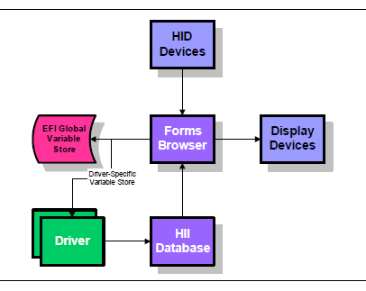

   Platform Configuration Overview

.. _drivers-and-applications:

Drivers And Applications
########################

The user interface elements in the form of package lists are carried by the drivers and applications. Drivers and applications can create the package lists dynamically, or they can be pre-built and carried as resources in the driver/application image.

If they are stored as resources, then an editor can be used to modify the user interface elements without recompiling. For example, display elements can be modified or deleted, new languages added, and default values modified. 

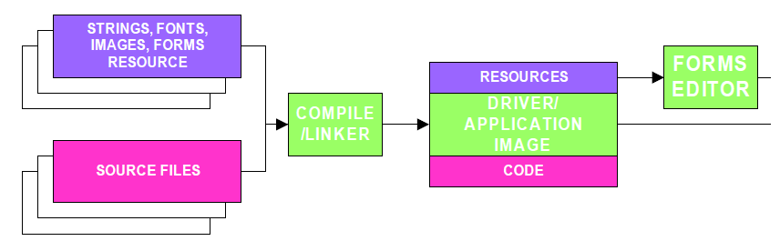

   HII Resources In Drivers & Applications 

The means by which the string, font, image and form resources are created is beyond the scope of this specification. The following diagram shows a few possible implementations. In both cases, the GUI design is an optional element and the user-interface elements are stored within a text-based resource file. Eventually, this source file is converted into a RES file (PE/COFF Resource Section) which can be linked with the main application.

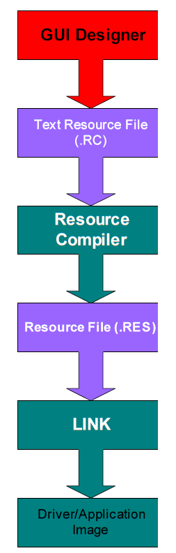

   Creating UI Resources With Resource Files

..
..

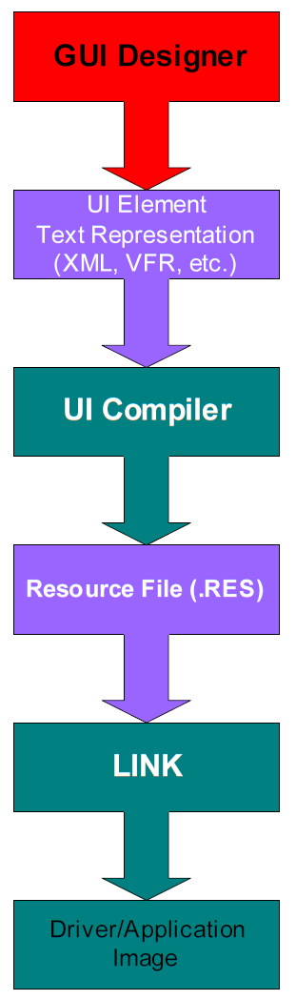

   Creating UI Resources With Intermediate Source Representation

.. _platform-and-driver-configuration:

Platform and Driver Configuration
$$$$$$$$$$$$$$$$$$$$$$$$$$$$$$$$$

The intent is for this specification to enable the configuration of various target components in the system. The normally arduous task of managing user interface and configuration can be greatly simplified for the consumers of such functionality by enabling the platform to comprehend some standard user interactions.

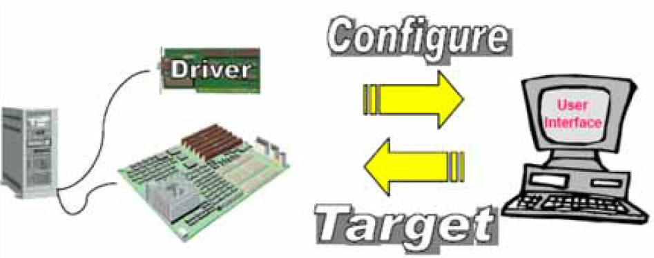

   The Platform and Standard User Interactions

.. _pre-os-applications:

Pre-O/S applications
$$$$$$$$$$$$$$$$$$$$

There are various scenarios where a platform component must interact in some fashion with the user. Examples of this are when presenting a user with several choices of information (e.g. boot menu) and sending information to the display (e.g. system status, logo, etc.).

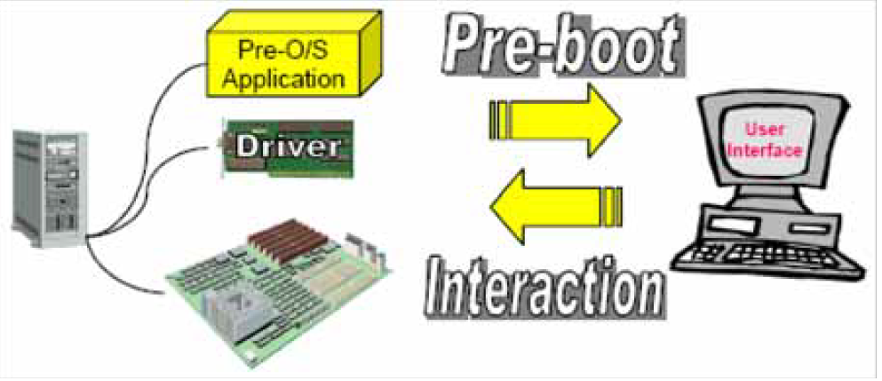

   User and Platform Component Interaction

.. _description-of-user-interface:

Description of User Interface Components
$$$$$$$$$$$$$$$$$$$$$$$$$$$$$$$$$$$$$$$$

Various components listed in this specification are described in greater detail in their own sections. The user interface is composed of several distinct components illustrated below.

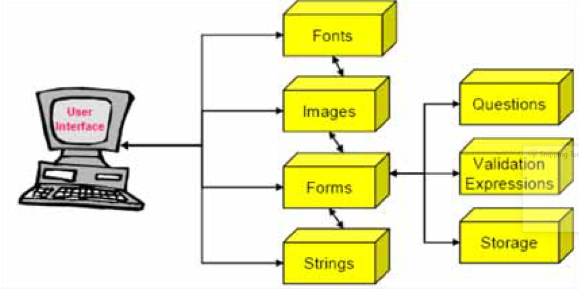

   User Interface Components

.. _forms:

Forms
$$$$$

This component describes what type of content needs to be displayed to the user by means of a binary encoding (i.e., Internal Forms Representation) and also has added context information such as how to validate certain input and further describes where to store such input if it is intended to be non-volatile. Applications such as a browser or script engine may use the information with the forms to validate configuration setting values with or without a user interface.

.. _strings:

Strings
$$$$$$$

The strings are the text-based (UCS-2 encoded) representations of the information typically being referenced by the forms. The intent of this infrastructure is also to seamlessly enable multiple language support. To that end the strings have the appropriate language designators to differentiate one language from another.

.. _imagesfonts:

Images/Fonts
$$$$$$$$$$$$

Since most content is typically intended to have the ability to be rendered on the local system, the human interface infrastructure also supports the ability for images and fonts to be accepted and used by the underlying user interface components.

.. _consumers-of-the-user-interface-data:

Consumers of the user interface data
$$$$$$$$$$$$$$$$$$$$$$$$$$$$$$$$$$$$

The ultimate consumer of the user interface information will be some type of forms browser or forms processor. There are several usage scenarios which should be supported by this specification. These are illustrated below:

.. _connected-forms-browserprocessor:

Connected forms browser/processor
$$$$$$$$$$$$$$$$$$$$$$$$$$$$$$$$$

The ability to have the forms processing engine render content when directly connected to the target platform should be apparent. From the forms processing engine perspective, this could be the local machine or a machine that is network attached. In either case, there is a constructed agent which feeds the material to the forms processor for purposes of rendering the user interface and interacting with the user. Note that a forms processor could simply act on the forms data without ever having to render the user interface and interact with the user. This situation is much more akin to script processing and should be a very supportable situation.

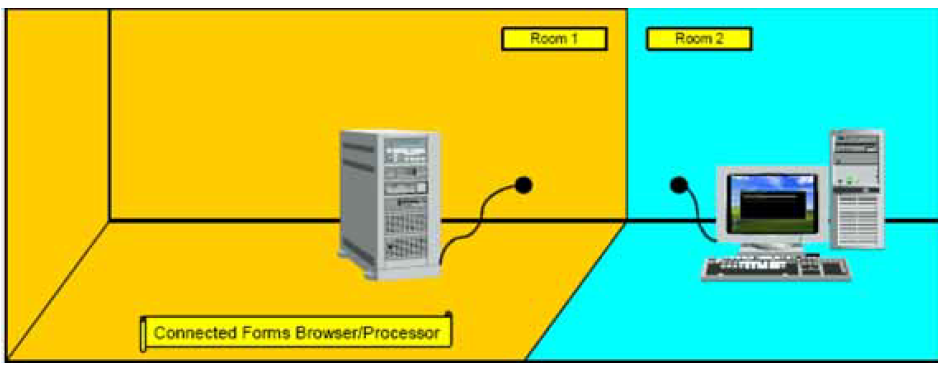

   Connected Forms Browser/Processor

.. _disconnected-forms-browserprocessor:

Disconnected Forms Browser/Processor
$$$$$$$$$$$$$$$$$$$$$$$$$$$$$$$$$$$$

By enabling the ability to import and export a platform’s settings, this infrastructure can also enable the ability for offline configuration. In this instance, a forms processor can interpret a given platform’s form data and enable (either through user interaction or through automated scripting) the changing of configuration settings. These settings can then be applied to the target platform when a connection is established.

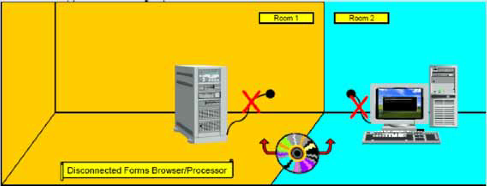

   Disconnected Forms Browser/Processor

.. _os-present-forms-browserprocessor:

O/S-Present Forms Browser/Processor
$$$$$$$$$$$$$$$$$$$$$$$$$$$$$$$$$$$

When it is desired that the forms data be used in the presence of an O/S, this specification describes a means by which to support this capability. By being able to encapsulate the data and export it through standard means such that an O/S agent (e.g. forms browser/processor) can retrieve it, O/S-present usage models can be made available for further value-add implementations.

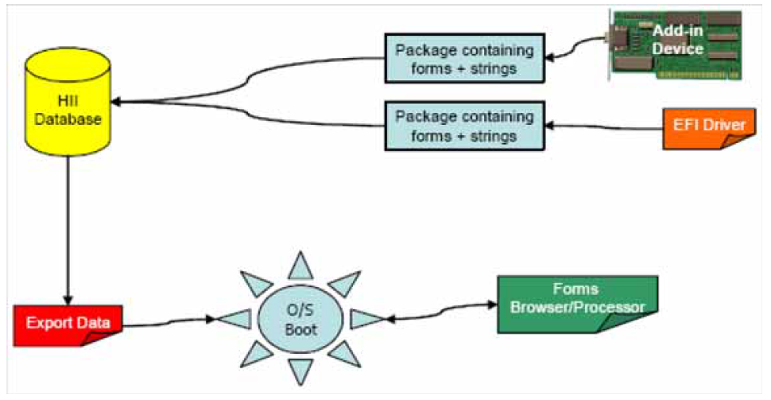

   O/S-Present Forms Browser/Processor

.. _where-are-the-results-stored:

Where are the Results Stored
$$$$$$$$$$$$$$$$$$$$$$$$$$$$

The forms data encodes how to store the changes per configuration question. The ability to save data to the platform as well as to a proprietary on-board store is provided. The premise is that each of the target non-volatile store components (e.g. motherboard, add-in device, etc.) would advertise an interface as described in this specification so that the forms browser/processor can route changes to the appropriate target.

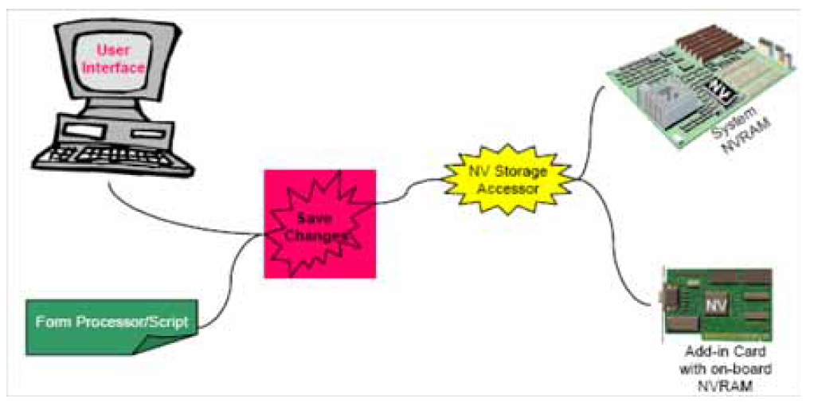

   **Platform Data Storage**

.. _localization:

Localization
############

Localization is the process by which the interface is adapted to a particular language. The table below discusses issues with localization and provides possible solutions.

.. list-table:: Localization Issues
   :widths: 15 15 15 45
   :name: localization-issues
   :class: longtable 

   * - **Issue**
     - **Example**
     - **Solution**
     - **Comment**
   * - Directional display
     - Right to left printing for Hebrew.
     - Printing direction is a function of the language.
     - The display engine may or may not support all display techniques. If a language supports a display mechanism that the display engine does not, the language that uses the font must be selected.
   * - Punctuation
     - Punctuation is directional. A comma in a right-to-left language is different from a comma in a left-to-right language.
     - Character choice is the choice of the author or translator.
     - 
   * - Line breakage
     - Rules vary from language to language.
     - The UEFI preboot GUI performs little or no formatting.
     - The runtime display depends on the runtime browser and is not defined here.
   * - Date and time
     - Most Europeans would write July 4, 1776, as 4/7/1776 while the United States would write it 7/4/1776 and others would write 1776/7/4. The separator characters between the parts of both date and time vary as well.
     - Generally left to the creator of the user interface.
     - 
   * - Numbers
     - 12,345.67 in one language is presented as 12.345,67 in another.
     - Print only integers and do not insert separator characters.
     - This solution is gaining acceptance around the world as more people use computers.

.. _user-input:

User Input
##########

To limit the number of required glyphs, we must also limit the amount and type of user input.

User input generally comes from the following main types of devices:

-  Keyboards

-  Mouse-like pointing devices

Input from other devices, such as limited keys on a front panel, can be handled two ways:

-  Treat the limited keys as special-purpose devices with completely unique interfaces.

-  Programmatically make the limited keys mimic a keyboard or mouse-like pointing device.

Pointing devices require no localization. They are universally understood by the subset of the world population addressed in this specification. For example, if a person does not know how to use a mouse or other pointing device, it is probably not a good idea to allow that person to change a system’s configuration. 

On the other hand, keyboards are localized at the keycaps but not in the electronics. In other words, a French keyboard and a German keyboard might have very different keys but the software inside the keyboard--let alone the software in the system at the other end of the wire--cannot know which set of keycaps are installed. 

This specification proposes to solve this issue by using the keys that are common between keyboards and ignoring language-specific keys. Keys that are available on USB keyboards in preboot mode include the following:

-  Function keys (F1 - F12)

-  Number keys (0-9)

-  "Upside down T" cursor keys (the arrows, home, end, page up, page down)

-  Numeric keypad keys

-  The Enter, Space, Tab, and Esc keys

-  Modifier keys (shifts, alts, controls, Windows*)

-  Number lock

The scan codes for these keys do not vary from language to language. These keys are the standard keys used for browser navigation although most end-users are unaware of this fact. Help for form-entry-specific keys must be provided to enable a useful keys-only interface. The one case where other, language-specific keys may be used is to enter passwords. Because passwords are never displayed, there is no requirement to translate scan code to Unicode character codes (keyboard localization) or scan codes to font glyphs. 

Additional data can be provided to enable a richer set of input characters. This input is necessary to support features such as arbitrary text input and passwords.

.. _keyboard-layout:

Keyboard Layout
###############

.. _keyboard-mapping:

Keyboard Mapping
$$$$$$$$$$$$$$$$

UEFI’s keyboard mapping loosely based definitions on ISO 9995. It bases the naming mechanism on the figure below. The keys highlighted in brown are the keys that nearly all keyboard layouts use for customizations. However, customization does not necessarily mean that all the keys are different. In fact, most of the keys are likely to be the same. When modifying the mapping, one can normally reference the keys in brown as the likely candidates (for whom to create modifications).

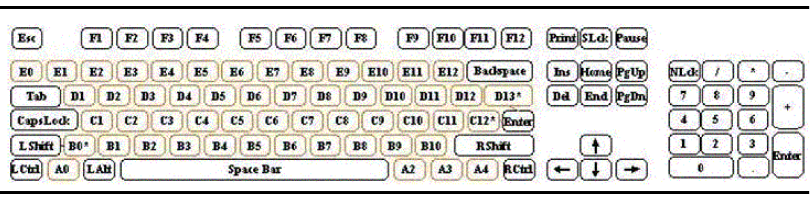

   **Keyboard Layout**

Instead of referencing keys in hardware-specific ways such as scan codes, the HII specification defines an *EFI_KEY* enumeration that allows for a simple method of referencing this hardware abstraction. Type *EFI_KEY* is defined in  :ref:`efi-hii-database-protocol-getkeyboardlayout`. It also provides a way to update the keyboard layout with a great deal of flexibility. Any of the keys can be mapped to any 16-bit Unicode character code or control code value. 

When defining the values for a particular key, there are six elements that are pertinent to the key:

**Key name** — The EFI_KEY enumeration defines the names of the above keys.

**Unicode Character Code** — Defines the Unicode Character Code (if any) of the named key.

**Shifted UnicodeCharacter Code** — Defines the Unicode Character Code (if any) of the named key while the shift modifier key is being pressed

**Alt-GR Unicode Character Code** — Defines the Unicode Character Code (if any) of the named key while the Alt-GR modifier key (if any) is being pressed.

**Shifted Alt-GR UnicodeCharacter Code** — Defines the Unicode Character Code (if any) of the named key while the Shift and Alt-GR modifier key (if any) is being pressed.

**Modifier key value** — Defines the nonprintable special function that this key has
assigned to it.

-  Under normal circumstances, a key that has any Unicode character code definitions generally has a modifier key value of *EFI_NULL_MODIFIER.* This value means the key has no special function other than the printing of a character. An exception to the rule is if any of the Unicode character codes have a value of 0xFFFF. Although rarely used, this value is the one case in which a key might have both a printable character and an active control key value. 

An example of this exception would be the numeric keypad’s insert key. The definition for this key on a standard US keyboard is as follows:

.. code-block::

   Key = EfiKeyZero
   Unicode = 0x0030 (basically a ‘0’)
   ShiftedUnicode = 0xFFFF (the exception to the rule)  
   AltGrUnicode = 0x0000
   ShiftedAltGrUnicode = 0x0000
   Modifier = EFI_INSERT_MODIFIER

This key is one of the few keys that, under normal circumstances, prints something out but also has a special function. These special functions are generally limited to the numeric keypad; however, this general limitation does not prevent someone from having the flexibility of defining these types of variations. 

.. _modifier-keys:

Modifier Keys
$$$$$$$$$$$$$

The definitions of the modifier keys allow for special functionality that is not necessarily accomplished by a printable character. Many of these modifier keys are flags to toggle certain state bits on and off inside of a keyboard driver. An example is **EFI_CAPS_LOCK_MODIFIER**. This state being active could alter what the typing of a particular key produces. Other control keys, such as **EFI_LEFT_ARROW_MODIFIER** and **EFI_END_MODIFIER**, affect the position of the cursor. One modifier key is likely unfamiliar to most people who exclusively use US keyboards, and that key is the **EFI_ALT_GR_MODIFIER** key. This key’s primary purpose is to activate a secondary type of shift modifier that exposes additional printable characters on certain keys. In some keyboard layouts, this key does not exist and is normally the **EFI_RIGHT_ALT_MODIFIER** key. None of the other modifier key functions should be a mystery to someone familiar with the usage of a standard computer keyboard. 

An example of a few descriptor entries would be as follows:

.. code-block::

   Layout = {
   EfiKeyLCtrl,0,0,0,0, *EFI_LEFT_CONTROL_MODIFIER,* //Left control
                                                         // key
   EfiKeyA0,0,0,0,0,EFI_NULL_MODIFIER, //Not defined
                        // windows key
   EfiKeySpaceBar,0x0020,0x0020,0x0020,0x0020,EFI_NULL_MODIFIER
                        //(Space Bar)
   }

See "Related Definitions" in  :ref:`efi-hii-database-protocol-getkeyboardlayout` for the defined modifier values. 

.. _non-spacing-keys:

Non-Spacing Keys
$$$$$$$$$$$$$$$$

Non-spacing keys are a concept that provides the ability to *OR* together an accent key and another printable character. Non-spacing keys are defined as special types of modifier characters. They are typically accent keys that do not advance the cursor and in essence are a type of modifier key in that they maintain some level of state. 

The way a person uses a non-spacing key is that the non-spacing key that maybe has the function of overlaying an umlaut (two dots) onto whatever the next character might be. The user presses the umlaut non-spacing key and follows it with a capital A, which yields an "Ä." 

An example of a few descriptor entries would be as follows:

.. code-block::

   //
   // If it’s a dead key, we need to pass a list of physical key
   // names, each with a unicode, shifted, altgr, shiftedaltgr
   // character code. Each key name will have a Modifier value of
   // EFI_NS_KEY_MODIFIER for the first entry, and then the list of
   // EFI_NS_KEY_DEPENDENCY_MODIFIER physical key descriptions.
   // This eventually will lead to the next normal non-modifier key
   // definition.
   //
   // This requires defining an additional Modifier value of
   // EFI_NS_KEY_DEPENDENCY_MODIFIER to signify
   // EFI_NS_KEY_MODIFIER children definitions.
   //
   // The keyboard driver (consumer of the layouts) will know that
   // any key definitions with the EFI_NS_KEY_DEPENDENCY_MODIFIER
   // modifier do not redefine the value of the specified EFI_KEY.
   // They are simply used as a special case augmentation to the
   // original EFI_NS_KEY_MODIFIER.
   //
   // It is an error condition to define a
   // EFI_NS_KEY_MODIFIER without having all the
   // EFI_NS_KEY_DEPENDENCY_MODIFIER keys defined serially.
   //
   Layout = {
   EfiKeyE0, 0, 0, 0, 0, EFI_NS_KEY_MODIFIER,
   EfiKeyC1, 0x00E2, 0x00C2, 0, 0, EFI_NS_KEY_DEPENDENCY_MODIFIER,
   EfiKeyD3, 0x00EA, 0x00CA, 0, 0, EFI_NS_KEY_DEPENDENCY_MODIFIER,
   EfiKeyD8, 0x00EC, 0x00CC, 0, 0, EFI_NS_KEY_DEPENDENCY_MODIFIER,
   EfiKeyD9, 0x00F4, 0x00D4, 0, 0, EFI_NS_KEY_DEPENDENCY_MODIFIER,
   EfiKeyD7, 0x00FB, 0x00CB, 0, 0, EFI_NS_KEY_DEPENDENCY_MODIFIER
   }

In the above example, a key located at E0 is designated as a dead key. Using a common German keyboard layout as the example, a circumflex accent "^" is defined as a dead key at the E0 location. The A, E, I, O, and U characters are valid keys that can be pressed after the dead key and will produce a valid printable character. These characters are located at C1, D3, D8, D9, and D7 respectively. 

The results of the *Layout* definition provided above would allow for the production of the following characters: âÂêÊîÎôÔûÛ.

.. _forms-1:

Forms
#####

This specification describes how a UEFI driver or application may present a forms (or dialogs) based interface. The forms-based interface assumes that each window or screen consists of some window dressing (title & buttons) and a list of questions. These questions represent individual configuration settings for the application or driver, although several GUI controls may be used for one question.

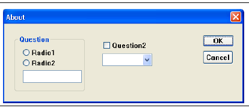

   **Forms-based Interface Example**

The forms are stored in the HII database, along with the strings, fonts and images. The various attributes of the forms and questions are encoded in IFR (Internal Forms Representation)--with each object and attribute a byte stream. 

Other applications (so-called "Forms Processors") may use the information within the forms to validate configuration setting values without a user interface at all. 

The Forms Browser provides a forms-based user interface which understands how to read the contents of the forms, interact with the user, and save the resulting values. The Forms Browser uses forms data installed by an application or driver during initialization in the HII database. The Forms Browser organizes the forms so that a user may navigate between the forms, select the individual questions and change the values using the HID and display devices. When the user has finished making modifications, the Forms Browser saves the values, either to the global EFI variable store or else to a private variable store provided by the driver or application.

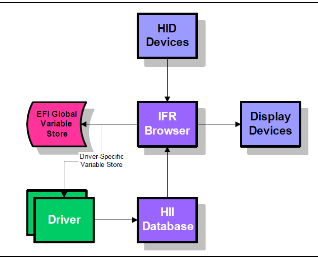

   **Platform Configuration Overview**

.. _form-sets:

Form Sets
$$$$$$$$$

Form sets are logically-related groups of forms.

**Attributes**

Each forms set has the following attributes:

**Form Set Identifier** – Uniquely identifies the form set within a package list using a GUID. The Form Set Identifier, along with a device path, uniquely identifies a form set in a system.

**Form Set Class Identifier** –  Optional array of up to three GUIDs which identify how the form set should be used or classified. The list of standard form set classes is found in the "Related Definitions" section of *EFI_FORM_BROWSER2_PROTOCOL.SendForm().*

**Title** – Title text for the form set.

**Help** – Help text for the form set.

**Image** – Optional title image for the form set.

**Animation** – Optional title animation for the form set.

**Description**

Within a form set, there is one parent form and zero or more child forms. The parent form is the first enabled, visible form in the form set. The child forms are the second or later enabled, visible forms in the form set. In general, the Forms Browser will provide a means to navigate to the parent form. A :ref:`Cross-Reference` is used to navigate between forms within a form set or between forms in different form sets. 

Variable stores are declared within a form set. Variable stores describe the means for retrieval and storage of configuration settings, and location information within that variable store. For more information, see `Storage`_. 

Default stores are declared within a form set. Default stores group together different types of default settings (normal, manufacturing, etc.) and give them a name. See `Defaults`_ for more information. 

The form set can control whether or not to process an individual form by nesting it inside of an *EFI_IFR_DISABLE_IF* expression. :ref:`enabledisable-1` for more information. The form set can control whether or not to display an individual form by nesting it inside of an *EFI_IFR_SUPPRESS_IF* expression.

**Syntax**

The form set consists of an **EFI_IFR_FORM_SET** object, where the body consists of

.. code-block::

   form-set := EFI_IFR_FORM_SET form-set-list
   form-set-list := form form-set-list|
   EFI_IFR_IMAGE form-set-list |
   EFI_IFR_ANIMATION form-set-list |
   EFI_IFR_VARSTORE form-set-list |
   EFI_IFR_VARSTORE_EFI form-set-list |
   EFI_IFR_VARSTORE_NAME_VALUE form-set-list |
   EFI_IFR_DEFAULTSTORE form-set-list |
   EFI_IFR_DISABLE_IF expression form-set-list |
   <empty>
   EFI_IFR_SUPPRESS_IF expression form-set-list | <empty>

.. _forms-2:

Forms
$$$$$

Forms are logically-related groups of statements (including
questions) designed to be displayed together.

**Attributes**

Each form has the following attributes:

**Form Identifier** — A 16-bit unsigned integer, which uniquely identifies the form within the form set. The Form Identifier, along with the device path and Form Set Identifier, uniquely identifies a form within a system.

**Title** — Title text for the form. The Forms Browser may use this text to describe the nature and purpose of the form in a window title.

**Image** — Optional title image for the form. The Forms Browser may use this image to display the nature and purpose of the form in a window title.

**Animation** — 
Optional title animation for the form set.

**Modal** — If a form is modal, then the on-form interaction must be completed prior to navigating to another form. See "User Interaction",  `User Interaction`_.

The form can control whether or not to process a statement by nesting it inside of an *EFI_IFR_DISABLE_IF* expression. See :ref:`enabledisable-2` for more information. 

.. TODO: please make sure the above ref is correct. renamed enabledisable to 1 and 2 since there were 2 with the same heading

The form can control whether a particular statement is selectable by nesting it inside of an *EFI_IFR_GRAY_OUT_IF* expression. Statements that cannot be selected are displayed by Form Browsers, but cannot be selected by a user. *EFI_IFR_GRAY_OUT_IF* causes statements to be displayed with some visual indication. See `Evaluation Of Selectable Statements`_ for more information. 

The form can control whether to display a statement by nesting it inside of an *EFI_IFR_SUPPRESS_IF* expression. See  `EFI_IFR_SUPPRESS_IF`_ for more information. 

**Syntax**

The form consists of an *EFI_IFR_FORM* object, where the body consists of:

.. code-block::

   form := EFI_IFR_FORM form-tag-list |
   EFI_IFR_FORM_MAP form-tag-list
   form-tag-list := form-tag form-tag-list |
   <empty>
   form-tag := EFI_IFR_IMAGE |
   EFI_IFR_ANIMATION |
   EFI_IFR_LOCKED |
   EFI_IFR_RULE |
   EFI_IFR_MODAL_TAG |
   statement |
   question |
   cond-statement-list |

   <empty>
   statement-list := statement statement-list |
   question statement-list |
   cond-statement-list |
   <empty>

   cond-statement-list := EFI_IFR_DISABLE_IF expression
   statement-list |
   EFI_IFR_SUPPRESS_IF expression statement-list |
   EFI_IFR_GRAY_OUT_IF expression statement-list |
   question-list := question question-list |
   <empty>

Other unknown opcodes are permitted, but will be ignored.

.. _enabledisable-1:

Enable/Disable-1
%%%%%%%%%%%%%%%%

Disabled forms will not be processed at all by a Forms Processor. Forms are enabled unless:

-  The form nests inside an *EFI_IFR_DISABLE_IF* expression which evaluated to **FALSE**.

-  The disabling of forms is evaluated during Forms Processor initialization and is not re-evaluated.

.. _modifiability:

Modifiability
%%%%%%%%%%%%%

Forms can be locked so that a Forms Editor will not change it. Forms are unlocked unless:

-  The form has an *EFI_IFR_LOCKED* in its scope. The locking of statement is evaluated only during Forms Editor initialization.

.. _visibility:

Visibility
%%%%%%%%%%

Suppressed forms will not be displayed. Forms are visible unless:

-  The form is disabled ( `Questions`_ )
-  The form is nested inside an *EFI_IFR_SUPPRESS_IF* expression which evaluates to **FALSE**.

.. _statements:

Statements
$$$$$$$$$$

All displayable items within the body of a form are statements. Statements provide information or capabilities to the user. Questions ( `Questions`_ ) are a specialized form of statement with a value. Statements are used only by Forms Browsers and are ignored by other Forms Processors.

**Attributes**

Statements have the following attributes:

**Prompt** —  The text that will be displayed with the statement.

**Help** —  The extended descriptive text that can be displayed with the    statement.

**Image** —     The optional image that will be displayed with the statement.

**Animation** —  The optional animation that will be displayed with the statement.

Other than Questions, there are three types of statements:

-  Static Text/Image
-  Subtitle
-  Cross-Reference

**Syntax**

.. code-block::

   statement:= subtitle | static-text | reset button 
   statement-tag-list := statement-tag statement-tag-list |
   <empty>
   statement-tag := EFI_IFR_IMAGE |
   EFI_IFR_LOCKED
   EFI_IFR_ANIMATION

.. _display:

Display
%%%%%%%

Statement display depends on the Forms Browser. Statements do not describe how the statement must be displayed but rather provide resources (such as text and images) for use by the Forms Browser. The Forms Browser uses this information to create the necessary user interface. 

The Forms Browser may use the visibility ( `Visibility-1`_ ) or selectability ( `Evaluation Of Selectable Statements`_ ) of the statements to change the way the item is displayed. The *EFI_IFR_GRAY_OUT_IF* expression explicitly requires that nested statements have visual differentiation from normal statements.

.. _enabledisable-2:

Enable/Disable-2
%%%%%%%%%%%%%%%%

Statements which have been disabled will not be processed at all by a Forms Processor. Statements are enabled unless:

-  The parent statement or question is disabled.

-  The statement is nested inside an *EFI_IFR_DISABLE_IF* expression which evaluated to **FALSE**.

-  The disabling of statements is evaluated during Forms Browser initialization and is not re-evaluated.

.. _visibility-1:

Visibility-1
%%%%%%%%%%%%

Suppressed statements will not be displayed. Statements are displayed unless:

-  The parent statement or question is suppressed.

-  The statement is disabled :ref:`enabledisable-1` 

.. TODO this is the other enabledisable header please check

-  The statement is nested inside an *EFI_IFR_SUPPRESS_IF* expression which evaluates to **FALSE**.

The suppression of the statements is evaluated during Forms Browser initialization. Subsequently, the suppression of statements is reevaluated each time a value in any question on the selected form has changed.

.. _evaluation-of-selectable-statements:

Evaluation of Selectable Statements
%%%%%%%%%%%%%%%%%%%%%%%%%%%%%%%%%%%

A user in a Forms Browser can choose statements which are selectable. Statements are selectable unless:

-  The parent statement or question is not selectable.

-  The statement is suppressed :ref:`enabledisable-2` 

-  The statement is nested inside an *EFI_IFR_GRAY_OUT_IF* expression which evaluated to **FALSE**.

The evaluation of selectable statements takes place during Forms Browser initialization. Subsequently, selectable statements are reevaluated each time a value in any question on the selected form has changed.

.. _modifiability-1:

Modifiability
%%%%%%%%%%%%%

A statement can be locked so that a Forms Editor will not change it. Statements are unlocked unless:

-  The parent form or parent statement/question is locked. 

-  The statement has an *EFI_IFR_LOCKED* in its scope.

The locking of a statement is evaluated only during Forms Editor initialization.

.. _static-textimage:

Static Text/Image
%%%%%%%%%%%%%%%%%

The Forms Browser displays the specified prompt, the specified text and (optionally) the image, but has no user interaction.

**Syntax**

.. code-block::

   static-text:= EFI_IFR_TEXT statement-tag-list

.. _subtitle:

Subtitle
%%%%%%%%

The subtitle is a means of visually grouping questions by providing a separator, some optional separating text, and an optional image.

**Syntax**

.. code-block::

   subtitle:= EFI_IFR_SUBTITLE statement-tag-list

.. _reset-button:

Reset Button
%%%%%%%%%%%%

**Attributes**

Reset Buttons have the following attributes:

**Default Id** — Specifies the default set to use when restoring defaults to the current form.

**Syntax**

.. code-block::

   reset button : = EFI_IFR_RESET_BUTTON statement-tag-list

.. _questions:

Questions
$$$$$$$$$

Questions are statements which have a value. The value corresponds to a configuration setting for the platform or for a device. The question uniquely identifies the configuration setting, describes the possible values, the way the value is stored, and how the question should be displayed.

**Attributes**

Questions have the following attributes (in addition to those of statements):

**Question Identifier** —  A 16-bit unsigned integer which uniquely identifies the question within the form set in which it appears. The Question Identifier, along with the device path and Form Set Identifier, uniquely identifies a question within a system.

**Default Value** —  The value used when the user requests that defaults be loaded.

**Manufacturing Value** —  The value used when the user requests that manufacturing defaults are loaded.

**Value** —  Each question has a current value. See `Values`_ for more information.

**Value Format** —  The format used to store a question’s value.

**Value Storage** —  The means by which values are stored. See `Storage Requirements`_ for more information.

**Refresh Identifiers** —  Zero or more GUIDs associated with an event group initialized by the Forms Browser when the form set containing the question is opened. If the event group associated with the GUID is signaled (see *SignalEvent()* ), then the question value will be updated from storage.

**Refresh Interval** —  The minimum number of seconds that must pass before the Forms Browser will automatically update the current question value from storage. The default value is zero, indicating there will be no automatic refresh.

**Validation** —  New values assigned to questions can be validated, using validation expressions, or, if connected, using a callback. See `Validation`_ for more information.

**Callback** —  If set, the callback will be called when the question’s value is changed. In some cases, the presence of these callbacks prevents the question’s value from being edited while disconnected. The question can control whether a particular option can be displayed by nesting it inside of an *EFI_IFR_SUPPRESS_IF* expression. Form Browsers do not display Suppressed Options, but Suppressed Options may still be examined by Form Processors.

**Syntax**

.. code-block::

   question:= action-button | boolean | date | number | ordered-list | string | time |
   cross-reference
   question-tag-list:= question-tag question-tag-list |
   <empty>
   question-tag := statement-tag |
      EFI_IFR_INCONSISTENT_IF expression |
      EFI_IFR_NO_SUBMIT_IF expression |
      EFI_IFR_WARNING_IF expression |
      EFI_IFR_DISABLE_IF expression question-list |
      EFI_IFR_REFRESH_ID RefreshEventGroupId |
      EFI_IFR_REFRESH |
      EFI_IFR_VARSTORE_DEVICE
   question-option-tag := EFI_IFR_SUPPRESS_IF expression |
      EFI_IFR_VALUE optional-expression |
      EFI_IFR_READ expression |
      EFI_IFR_WRITE expression |
      default |
      option
   question-option-list := question-tag question-option-list |
      question-option-tag question-option-list |
      <empty>

Other unknown opcodes are permitted but are ignored.

.. _values:

Values
%%%%%%

Question values are a data type listed in `Data Types`_. During initialization of the Forms Processor or Forms Browser, the values of all enabled questions are retrieved. If the value cannot be retrieved, then the question’s value is *Undefined.* 

A question with the value of type *Undefined* will be suppressed. This suppression will be reevaluated based on Value Refresh or when any question value on the selected form is changed. 

When the form is submitted, the modified values are written to Value Storage. When the form is reset, the question value is set to the default question value. If there is no default question value, the question value is unchanged. 

When a question value is retrieved, the following process is used:

#. Set the this internal constant to have the samevalue as the one read from the question’s storage.**

#. If present, change the current question value to the value returned by a question’s nested *EFI_IFR_READ* operator. 

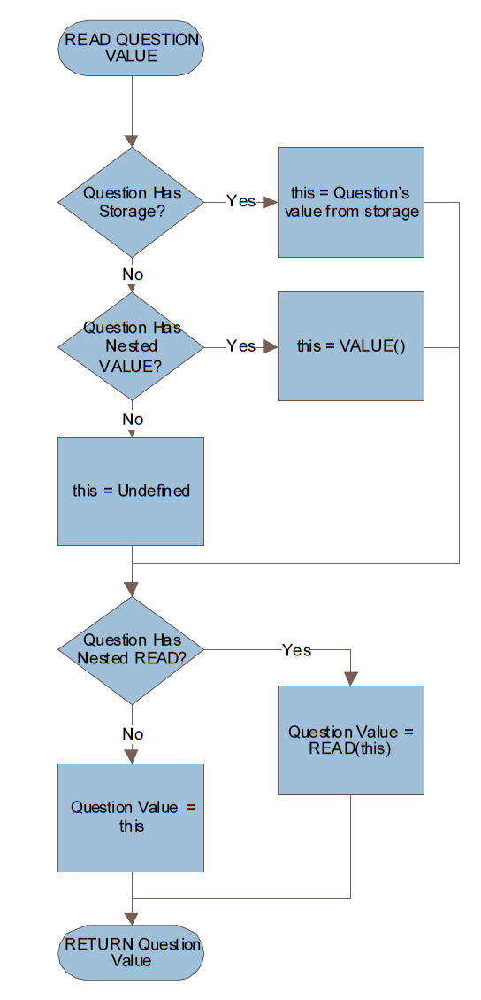

   Question Value Retrieval Process

When a question value is changed, the following process is used:

#. Set the this internal constant to have the samevalue as the current question value.

#. If present, evaluate the question’s nested *EFI_IFR_WRITE* ( `EFI_IFR_WRITE`_ ) operator.

#. Write the value to the question’s storage

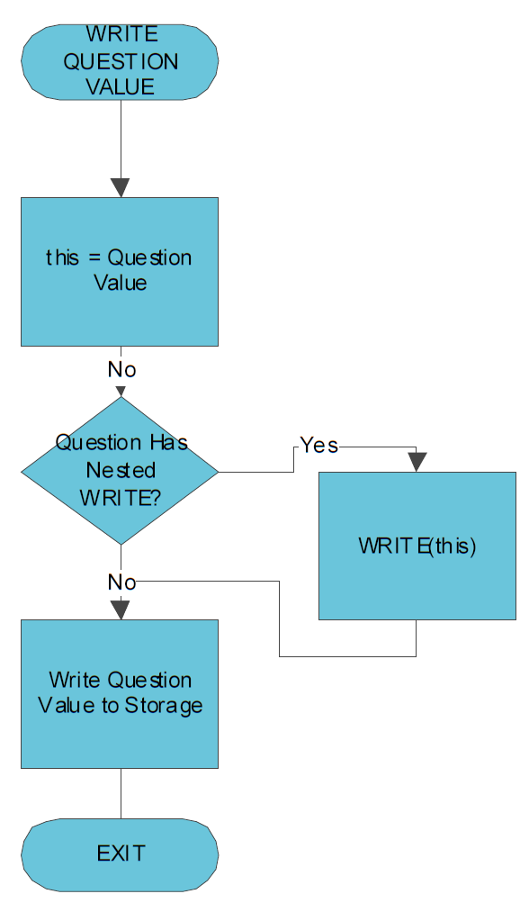

   Question Value Change Process

.. _storage-requirements:

Storage Requirements
%%%%%%%%%%%%%%%%%%%%

Question storage requirements describe the type and size of storage for the value. These storage requirements describe whether the question’s value will be stored as an EFI global variable or using driver local storage. It also describes whether the value is packed together with other values in a buffer, or passed as a name-value pair. See `Storage`_ for more information.

.. _display-1:

Display
%%%%%%%

Question display depends on the Forms Browser. Questions do not describe how the question must be displayed. Instead, questions provide resources (such as text and images) and information about visibility and the ability to edit the question. The Forms Browser uses these to create the necessary user interface. Questions can have prompt text, help text and (optionally) an image. The prompt text usually describes the nature of the question. Help text is displayed either in a special display area or only at the request of the user. Questions can also have hints which describe how to visually organize the information

.. _action-button:

Action Button
%%%%%%%%%%%%%

Action buttons are buttons which cause a pre-defined configuration string to process immediately. There is no storage directly associated with the button.

**Attributes**

Action buttons have no additional attributes other than the common question attributes).

**Storage** —  There is no storage associated with the action button.

**Results** —  There are no results associated with the action button.If used in an expression, the question value will always be *Undefined.*

**Syntax**

.. code-block::

   action-button:= EFI_IFR_ACTION question-tag-list

.. _boolean:

Boolean
%%%%%%%

Boolean questions are those that allow a choice between **TRUE** and **FALSE**. The question’s value is Boolean. In general, construct questions so that the prompt text asks questions resulting in ‘yes/enabled/on’ is ‘true’ and ‘no/disabled/off’ is ‘false’. 

Boolean questions may be displayed as a check box, two radio buttons, a selection list, a list box, or a drop list box. 

**Attributes**

Boolean questions have no additional attributes other than the common question attributes:

**Storage** — 
If the boolean question uses Buffer storage or EFI Variable (see `Storage`_ ), then the size is exactly one byte, with the **FALSE** condition is zero and the **TRUE** value is 1.

**Results** —  The results are represented as either 0 ( *FALSE* ) or 1 ( *TRUE* ).

**Syntax**

.. code-block::

   boolean := EFI_IFR_CHECKBOX question-option-list

.. _date:

Date
%%%%

Date questions allow modification of part or all of a standard calendar date. The format of the date display depends on the Forms Browser and any localization.

**Attributes**

Date questions have the following attributes:

**Year Suppressed** —  The year will not be displayed or updated.

**Month Suppressed** —  The month will not be displayed or updated.

**Day Suppressed** —  The day will not be displayed or updated.

**UEFI Storage** —  In addition to normal question Value Storage, Date questions can optionally be instructed to save the date to either the system time or system wake-up time using the UEFI runtime services *SetTime()* or *SetWakeupTime().* In this case, the date and time will be read first, the modifications made and changes will be written back. 

Conversion to and from strings to a date depends on the system localization.

The date value is stored an *EFI_HII_TIME* structure. The TimeZone field is always set to *EFI_UNSPECIFIED_TIMEZONE.* The Daylight field is always set to zero. The contents of the other fields are undetermined.

**Storage** —  If the date question uses Buffer storage or EFI Variable storage ( `Storage`_ ), then the stored result will occupy exactly the size of *EFI_HII_DATE.*

**Results** —  Results for date questions are represented as a hex dump of the *EFI_HII_DATE* structure. If used in a question, the value will be a buffer containing the contents of the *EFI_HII_DATE* structure.  

**Syntax**

.. code-block::

   date := EFI_IFR_DATE question-option-list

.. _number:

Number
%%%%%%

Number questions allow modification of an integer value up to 64-bits. Number questions can also specify pre-defined options.

**Attributes**

Number questions have the following attributes:

**Radix** —  Hint describes the output radix of numbers. The possible values are unsigned decimal, signed decimal or hexadecimal. Numbers displayed in hexadecimal will be prefixed by ‘0x’  

**Minimum Value** —  The minimum unsigned value which can be accepted for this question.  

**Maximum Value** —  The maximum unsigned value which can be accepted for this question.  

**Skip Value** —  Defines the minimum increment between values.

**Storage** —  If the number question uses Buffer storage or EFI Variable storage ( `Storage`_ ), then the buffer size specified by must be 1, 2, 4 or 8. Also, the Forms Processor will do implicit error checking to make sure that the signed or unsigned value can be stored in the Buffer without lost of significant bits. For example, if the buffer size is 1 byte, then the largest unsigned integer value would be 255. Likewise, the largest signed integer value would be 127 and the smallest signed integer value would be -128. The Forms Processor will automatically detect this as an error and generate an appropriate error.

**Results** —  The results are represented as string versions of unsigned hexadecimal values.

**Syntax**

.. code-block::

   number := EFI_IFR_NUMERIC question-option-list |
   EFI_IFR_ONE_OF question-option-list

.. _set:

Set
%%%

Sets are questions where n containers can be filled with any of m pre-defined choices. This supports both lists where a given value can only appear in one of the slots or where the same choice can appear many times. 

Each of the containers takes the form of an option which a name, a value and (optionally) an image.

**Attributes**

Set questions have the following attributes:

**Container Count** —  Specifies the number of available selectable options.  

**Unique** —  If set, then each choice may be used at most, once.  

**NoEmpty** —  All slots must be filled with a non-zero value.  

**Storage** —  The set questions are stored as a Buffer with one byte for each Container.

**Results**

Each Container value is represented as two characters, one for each nibble. All hexadecimal characters (a-f) are in lower-case.

The results are represented as a series of Container values, starting with the lowest Container.

**Syntax**

.. code-block::

   ordered-list := EFI_IFR_ORDERED_LIST question-option-list

**Options**

Set questions treat the values specified by nested *EFI_IFR_ONE_OF_OPTION* values as the value for a single Container, not the entire question storage. This is different from other question types.

**Defaults**

Set questions treat the default values specified by nested *EFI_IFR_DEFAULT* or *EFI_IFR_ONE_OF_OPTION* opcodes as the default value for all Containers. The default values must be of type *EFI_IFR_TYPE_BUFFER,* with each byte in the buffer corresponding to a single Container value, starting with the first container. If the buffer contains fewer bytes than *MaxContainers,* then the remaining Containers will be set to a value of 0.

Default values returned from the ALTCFG section when *ExtractConfig()* is called fill the storage starting with the first container.

.. _string:

String
%%%%%%

String questions allow modification of a string.

**Attributes**

String questions have the following attributes:

**Minimum Length** —  Hint describes the minimum length of the string, in characters.  

**Maximum Length** —  Hint describes the maximum length of the string, in characters.  

**Multi-Line** —  Hint describes that the string might contain multiple lines.  

**Output Mask** —  If set, the text entered will not be displayed.  

**Storage** —  The string questions are stored as a *NULL* -terminated string. If the time question uses Buffer or EFI Variable storage ( `Storage`_ ), then the buffer size must exceed the size of the NULL-terminated string. If the string is shorter than the length of the buffer, the remainder of the buffer is filled with *NULL* characters.  

**Results** —  Results for string questions are represented as hex dump of the string, including the terminating *NULL* character. 

**Syntax**

.. code-block::

   string := EFI_IFR_STRING question-option-list |
   EFI_IFR_PASSWORD question-option-list

.. _cross-reference:

Cross-Reference
%%%%%%%%%%%%%%%

Cross-reference questions provide a selectable means by which users navigate to other forms and/or other questions. The form and question can be in the current form set, another form set or even in a form associated with a different device. If the specified form or question does not exist, the button is not selectable, is grayed-out, or is suppressed.

**Attributes**

Cross references can have the following attributes:

**Form Identifier** —  The identifier of the target form.  

**Form Set Identifier** —  Optionally specifies an alternate form-set which contains the target form. If specified, then the focus will be on form within the form set specified by Form Identifier. If the Form Identifier is not specified, then the first form in the Form Set is used.  

**Question Identifier** —  Optionally specifies the question identifier of the target question on the target form. If specified then focus will be placed on the question specified by this question identifier. Otherwise, the focus will be on the first question within the specified form.  

**Device Path** —  Optionally, the device path which contains the Form Identifier. Otherwise, the device path associated with the form set containing this cross-reference will be used.  

**Storage** —  Storage is optional for a cross-reference question. It is only present when the cross-reference question does not supply any target (i.e., REF5). If the question uses Buffer or EFI Variable storage ( `Storage`_ ), then the buffer size must be exactly the size of the *EFI_HII_REF* structure.  

**Results** —  Results for cross-reference questions are represented as a hex dump of the question identifier, form identifier, form set GUID and null-terminated device path text. If used in a question, the question value will be a buffer containing the *EFI_HII_REF* structure..  

**Syntax**

.. code-block::

   *cross-reference* := *EFI_IFR_REF* *statement-tag-list*

.. _time:

Time
%%%%

Time questions allow modification of part or all of a time. The format of the time display depends on the Forms Browser and any localization.

**Attributes**

Time questions have the following attributes:

**Hour Suppressed** —   The hour will not be displayed or updated.  

**Minute Suppressed** —   The minute will not be displayed or updated.  

**Second Suppressed** —   The second will not be displayed or updated.   

**UEFI Storage** —   In addition to normal question Value Storage, time questions can be instructed to save the time to either the system time or system wake-up time using the UEFI runtime services *SetTime* or *SetWakeupTime.* In these instances, the date and time is read first, the modifications made and changes are then written back. 

Conversion to and from strings to a time depends on the system localization.

The time value is stored as part of an *EFI_HII_TIME* structure. The contents of the other fields are undetermined.

**Storage** —   If the time question uses Buffer or EFI Variable storage ( `Storage`_ ), then the buffer size must be exactly the size of the *EFI_HII_TIME* structure..  

**Results** —   Results for time questions are represented as a hex dump of the *EFI_HII_TIME* structure. If used in a question, the value will be a buffer containing the contents of the *EFI_HII_TIME* structure.  

**Syntax**

.. code-block::

   time := EFI_IFR_TIME question-option-list

.. _options-1:

Options
$$$$$$$

Use Options within questions to give text or graphic description of a particular question value. They may also describe the choices in the set data type. 

**Attributes**

Options have the following attributes:

**Text** —   The text for the option.  

**Image** —   The optional image for the option.
  
**Animation** —   The optional animation for the option.  

**Value** —   The value for the option.
  
**Default** —   If set, this is the option selected when the user asks for the defaults. Only one visible option can have this bit set within a question’s scope.  

**Manufacturing Default** —   If set, this is the option selected when manufacturing defaults are set. Only one visible option can have this bit set within a question’s scope. 

**Syntax**

.. code-block::

   option:= EFI_IFR_ONE_OF_OPTION option-tag-list
   option-tag-list := option-tag option-tag-list |
   <empty>
   option-tag:= EFI_IFR_IMAGE
   EFI_IFR_ANIMATION

.. _visibility-2:

Visibility
%%%%%%%%%%

Options which have been suppressed will not be displayed. Options are displayed unless:

-  The parent question is suppressed.

-  The option is nested inside an *EFI_IFR_SUPPRESS_IF* expression which evaluated to **FALSE**.

The suppression of the options is evaluated each time the option is displayed.

.. _storage-8:

Storage
$$$$$$$

Question values are stored in Variable Stores, which are application, platform or device repositories for configuration settings. In many cases, this is non-volatile storage. In other cases, it holds only the current behavior of a driver or application. 

Question values are retrieved from the variable store when the form is initialized. They are updated periodically based on question settings and stored back in the variable store when the form is submitted. 

It is possible for a question to have no associated Variable Store. This happens when the VarStoreId associated with the question is set to zero and, for Date/Time questions, the UEFI Storage is disabled. For questions with no associated Variable Store, the question must either support the RETRIEVE and CHANGED callback actions ( :ref:`efi-hii-config-access-protocol-callback-hii-configuration-processing-and-browser-protocol` ) or contain an embedded READ or WRITE opcode: *EFI_HII_IFR_READ_OP* and *EFI_IFR_WRITE_OP* ( `EFI_IFR_READ`_  and `EFI_IFR_WRITE`_ ). 

Because the value associated with a question contained in a Variable Store can be shared by multiple questions, the questions must all treat the shared information as compatible data types.There are four types of variable stores:

**Buffer Storage** —   With buffer storage, the application, platform or driver provides the definition of a buffer which contains the values for one or more questions. The size of the entire buffer is defined in the *EFI_IFR_VARSTORE* definition. Each question defines a field in the buffer by providing an offset within the buffer and the size of the required storage. These variable stores are exposed by the app/driver using the *EFI_HII_CONFIG_ACCESS_PROTOCOL,* which is installed on the same handle as the package list. Question values are retrieved via *EFI_HII_CONFIG_ACCESS_PROTOCOL.ExtractConfig()* and updated via *EFI_HII_CONFIG_ACCESS_PROTOCOL.RouteConfig().* Rather than access the buffer as a whole, Buffer Storage Variable Stores access each field independently, via a list of one or more (field offset, value) pairs encoded as variable length text strings as defined for the *EFI_HII_CONFIG_ACCESS_PROTOCOL.*  

**Name/Value Storage** —   With name/value storage, the application provides a string which contains the encoded values for a single question. These variable stores are exposed by the app/driver using the *EFI_HII_CONFIG_ACCESS_PROTOCOL,* which is installed on the same handle as the package list.  

**EFI Variable Storage** —   This is a specialized form of Buffer Storage, which uses the EFI runtime services *GetVariable()* and *SetVariable()* to access the entire buffer defined for the Variable Store as a single binary object. 
 
**EFI Date/Time Storage** —   For date and time-related questions, the question values can be retrieved using the EFI runtime services *GetTime()* and *GetWakeupTime()* and stored using the EFI runtime services *SetTime()* and *SetWakeupTime().* 

The following table summarizes the types of information needed for each type of storage and where it is retrieved from.

.. list-table:: Information for Types of Storage
   :Widths: 15 15 45
   :name: Information-for-Types-of-Storage
   :class: longtable

   * - **Storage Type**
     - **Information Type**
     - **Where It Comes From**
   * - None
     - Driver Handle
     - Handle specified with *NewPackageList()* or derived from *EFI_IFR_VARSTORE_DEVICE.DevicePath*
   * - Buffer Storage
     - Driver Handle
     - Handle specified with *NewPackageList()* or derived from *EFI_IFR_VARSTORE_DEVICE.DevicePath*
   * - 
     - Variable ID
     - | Variable store specified by 
       | *EFI_IFR_QUESTION_HEADER.VarStoreId.* 
       | EFI_IFR_VARSTORE_DEVICE.DevicePath*
   * - 
     - Variable Name
     - | Variable store specified by 
       | *EFI_IFR_QUESTION_HEADER.VarStoreId*
   * - 
     - Variable Store Offset
     - Variable store offset specified by *EFI_IFR_QUESTION_HEADER.VarOffset.*
   * - Name/Value Storage
     - Driver Handle
     - Handle specified with *NewPackageList()* or derived from *EFI_IFR_VARSTORE_DEVICE.DevicePath*
   * - 
     - Variable ID
     - | Variable store specified by
       | *EFI_IFR_QUESTION_HEADER.VarStoreId.*
   * - 
     - Variable Name
     - | Variable name specified by 
       | *EFI_IFR_QUESTION_HEADER.VarStoreInfo.VarName.*
   * - EFI Variable Storage
     - Driver Handle
     - None
   * - 
     - Variable ID
     - | Variable store specified by 
       | *EFI_IFR_QUESTION_HEADER.VarStoreId.*
   * - 
     - EFI_Variable GUID (for Variable Services)
     - EFI variable GUID specified by *EFI_IFR_VARSTORE_EFI.Guid.*
   * - 
     - EFI_Variable Name (for Variable Services)
     - EFI variable name specified by *EFI_IFR_VARSTORE_EFI.Name.*
   * - 
     - Variable Name
     - | Variable name specified by
       | *EFI_IFR_QUESTION_HEADER.VarStoreId.*
   * - 
     - Variable Store Offset
     - Variable store offset specified by *EFI_IFR_QUESTION_HEADER.VarStoreInfo.VarOffset.*  
   * - EFI Date/Time Storage
     - Driver Handle
     - None
   * - 
     - Variable ID
     - None
   * - 
     - Variable Name
     - None

.. _expressions:

Expressions
$$$$$$$$$$$

This section describes the expressions used in various expressions in IFR. The expressions are encoded using normal IFR opcodes, but in RPN (Reverse Polish Notation) where the operands occur before the operator.

The opcodes fall into these categories:

**Unary operators.** —  Functions taking a single sub-expression.  

**Binary operators.** —  Functions taking two sub-expressions.  

**Ternary operators.** —  Functions taking three sub-expressions.  

**Built-in functions.** —  Operators taking zero or more sub-expressions.  

**Constants.** —  Numeric and string constants. 

**Question Values.** — 
Specified by their question identifier.

All integer operations are performed at 64-bit precision.

Expression Encoding
%%%%%%%%%%%%%%%%%%%

Expressions are usually encoded within the scope of another binary object. If the expression consists of more than a single opcode, the first opcode should open a scope ( *Header.Scope* = 1) and use an *EFI_IFR_END* opcode to close the scope in order to make sure they can be skipped,

Expression Stack
%%%%%%%%%%%%%%%%

When evaluating expressions, the Forms Processor uses a stack to hold intermediate values. Each operator either pushes a value on the stack, pops a value from the stack, or both. For example, the *EFI_IFR_ONE* operator pushes the integer value 1 on the expression stack. The *EFI_IFR_ADD* operator pops two integer values from the expression stack, adds them together, and pushes the result back on the stack.

After evaluating an expression, there should be only one value left on the expression stack.

Rules
%%%%%

Rules are pre-defined expressions attached to the form. These rules may be used in any expression within the form’s scope. Each rule is given a unique identifier (0-255) when it is created by `EFI_IFR_RULE`_. This same identifier is used when the rule is referred to in an expression with  `EFI_IFR_RULE_REF`_.

To save space, rules are intended to allow manual or automatic extraction of common sub-expressions from form expressions.

Data Types
%%%%%%%%%%

The expressions use five basic data types:

**Boolean** —  **TRUE** or **FALSE**.  

**Unsigned Integer** —  64-bit unsigned integer.  

**String** —  Null-terminated string.

**Buffer** — Fixed size array of unsigned 8-bit integers. 

**Undefined** — Undetermined value. Used when the value cannot be calculated or for run-time errors.

Data conversion is not implicit. Explicit data conversion can be performed using the :ref:`efi-ifr-to-string` ,  :ref:`efi-ifr-to-uint` and  :ref:`efi-ifr-to-boolean` .

The Date and Time question values are converted to the *Buffer* data type filled with the *EFI_HII_DATE* and *EFI_HII_TIME* structure contents (respectively).

The Ref question values are converted to the Buffer data type and filled with the *EFI_HII_REF* and structure contents.

**Syntax**

.. code-block::

   The expressions have the following syntax:
   expression := built-in-function |
   constant |
   expression unary-op |
   expression expression binary-op |
   expression expression expression ternary-op
   expression-pair-list
     EFI_IFR_MAP
   expression-pair-list := expression-pair-list expression expression |
     <empty>
    
   optional-expression := expression |
      <empty>

   built-in-function := EFI_IFR_DUP |
   EFI_IFR_EQ_ID_VAL |
   EFI_IFR_EQ_ID_ID |
   EFI_IFR_EQ_ID_VAL_LIST |
   EFI_IFR_GET |
   EFI_IFR_QUESTION_REF1 |
   EFI_IFR_QUESTION_REF3 |
   EFI_IFR_RULE_REF |
   EFI_IFR_STRING_REF1 |
   EFI_IFR_THIS |
   EFI_IFR_SECURITY

   constant := EFI_IFR_FALSE |
   EFI_IFR_ONE |
   *EFI_IFR_ONES |
   EFI_IFR_TRUE |
   EFI_IFR_UINT8 |
   EFI_IFR_UINT16 |
   EFI_IFR_UINT32 |
   EFI_IFR_UINT64 |
   EFI_IFR_UNDEFINED |
   EFI_IFR_VERSION |
   EFI_IFR_ZERO
   binary-op := EFI_IFR_ADD |
   EFI_IFR_AND |
   EFI_IFR_BITWISE_AND |
   EFI_IFR_BITWISE_OR |
   EFI_IFR_CATENATE |
   EFI_IFR_DIVIDE |
   EFI_IFR_EQUAL |
   EFI_IFR_GREATER_EQUAL |
   EFI_IFR_GREATER_THAN |
   EFI_IFR_LESS_EQUAL |
   EFI_IFR_LESS_THAN |
   EFI_IFR_MATCH |
   EFI_IFR_MATCH2 |
   EFI_IFR_MODULO |
   EFI_IFR_MULTIPLY |
   EFI_IFR_NOT_EQUAL |
   EFI_IFR_OR |
   EFI_IFR_SHIFT_LEFT |
   EFI_IFR_SHIFT_RIGHT |
   EFI_IFR_SUBTRACT |
   unary-op := EFI_IFR_LENGTH |
   EFI_IFR_NOT |
   EFI_IFR_BITWISE_NOT |
   EFI_IFR_QUESTION_REF2 |
   EFI_IFR_SET |
   EFI_IFR_STRING_REF2 |
   EFI_IFR_TO_BOOLEAN |
   EFI_IFR_TO_STRING |
   EFI_IFR_TO_UINT |
   EFI_IFR_TO_UPPER |
   EFI_IFR_TO_LOWER
   ternary-op := EFI_IFR_CONDITIONAL |
   EFI_IFR_FIND |
   EFI_IFR_MID |
   EFI_IFR_TOKEN |
   EFI_IFR_SPAN

.. _defaults-1:

Defaults
$$$$$$$$

To ensure consistent behavior when a platform attempts to restore settings to defaults, each question op-code must have an active default setting. Defaults are pre-defined question values. The question values may be changed to their defaults either through a Forms Processor-defined means or when the user selects an *EFI_IFR_RESET_BUTTON* statement ( `Reset Button`_ ). 

Each question may have zero or more default values, with each default value used for different purposes. For example, there might be a "standard" default value, a default value used for manufacturing and a "safe" default value. A group of default values used to configure a platform or device for a specific purpose is called default store.

**Default Stores**

There are three standard default stores:

**Standard Defaults** —    These are the defaults used to prepare the system/device for normal operation.

**Manufacturing Defaults** —  These are the defaults used to prepare the system/device for manufacturing.

**Safe Defaults** —  These are the defaults used to boot the system in a "safe" or low-risk mode.

**Attributes** —   Default stores have the following attributes:

**Name**

Each default store has a user-readable name

**Identifier**

A 16-bit unsigned integer. The values between 0x0000 and 0x3fff are reserved for use by the UEFI specification. The values between 0x4000 and 0x7fff are reserved for platform providers. The values between 0x8000 and 0xbfff are reserved for hardware vendors. The values between 0xc000 and 0xffff are reserved for firmware vendors.
   
.. code-block::

   #define EFI_HII_DEFAULT_CLASS_STANDARD           0x0000
   #define EFI_HII_DEFAULT_CLASS_MANUFACTURING      0x0001
   #define EFI_HII_DEFAULT_CLASS_SAFE               0x0002
   #define EFI_HII_DEFAULT_CLASS_PLATFORM_BEGIN     0x4000
   #define EFI_HII_DEFAULT_CLASS_PLATFORM_END       0x7fff
   #define EFI_HII_DEFAULT_CLASS_HARDWARE_BEGIN     0x8000
   #define EFI_HII_DEFAULT_CLASS_HARDWARE_END       0xbfff
   #define EFI_HII_DEFAULT_CLASS_FIRMWARE_BEGIN     0xc000
   #define EFI_HII_DEFAULT_CLASS_FIRMWARE_END       0xffff
   

Users of these ranges are encouraged to use the specification defined ranges for maximum interoperability. Questions or platforms may support defaults for only a sub-set of the possible default stores. Support for default store 0 ("standard") is recommended. 

**Defaulting**

When retrieving the default values for a question, the Forms Processor uses one of the following (listed from highest priority to lowest priority):

#. The value returned from the *Callback()* memberfunction of the Config Access protocol associated with the question when called with the *Action* set to one of the*EFI_BROWSER_ACTION_DEFAULT_x* values ( :ref:`efi-hii-configuration-access-protocol-hii-configuration-processing-and-browser-protocol`  ) . It is recommended that this form only be used for questionswhere the default value alters dynamically at runtime.**

#. The value returned in the *Response* parameter of the    *ConfigAccess()* member function (using the ALTCFG form).  See :ref:`String-Syntax-hii-configuration-processing-and-browser-protocol` . 

#. The value specified by an *EFI_IFR_DEFAULT* opcodes appear within the scope of a question. ( `EFI_IFR_DEFAULT`_ ) 

#. One of the Options ( `Options`_ ) has its Standard Default or Manufacturing Default attribute set.

#. For Boolean questions, the Standard Default or Manufacturing Default values in the Flags field. ( `Boolean`_ ).

**Syntax**

.. code-block::

   Default := EFI_IFR_DEFAULT
   default-tag := EFI_IFR_VALUE |
         <empty>

.. _validation-1:

Validation
$$$$$$$$$$

Validation is the process of determining whether a value can be applied to a configuration setting. Validation takes place at three different points in the editing process: edit-level, question-level and form-level.

.. _edit-level-validation:

Edit-Level Validation
%%%%%%%%%%%%%%%%%%%%%

First, it takes place while the value is being edited with a Forms Browser. The Forms Browser may optionally reject values selected by the user which would fail Question-Level validation. For example, the Forms Browser may limit the length of strings entered so that they meet the Minimum and Maximum Length.

.. _question-level-validation:

Question-Level Validation
%%%%%%%%%%%%%%%%%%%%%%%%%

Second, it takes place when the value has changed, normally when the user attempts to leave the control, navigate between the portions of the control or selects one of the option values. At this point, an error occurs if: 

-  For a String ( `String`_ ), if the string length is less than the Minimum Length, then the Forms Processor generates an error.

-  For a String ( `String`_ ), if the string length is greater than the Maximum Length, then the Forms Processor generates an error.

-  For a Number ( `Number`_ ), if the number cannot fit in the specified variable storage without loss of significant bits, then the Forms Processor generates an error.

-  For all questions, if an *EFI_IFR_INCONSISTENT_IF* evaluates to **TRUE**, then the Forms Processor will display the specified error text.

-  For all questions, if an *EFI_IFR_WARNING_IF* evaluates to **TRUE**, then the Forms Processor will display the specified warning text.

.. _form-level-validation:

Form-Level Validation
%%%%%%%%%%%%%%%%%%%%%

Third, it takes place when exiting the form or when the values are submitted. The error occurs under two conditions:

-  For all questions, if an *EFI_IFR_NO_SUBMIT_IF* evaluates to **TRUE**, then the Forms Processor will display the specified error text.

-  If a Forms Processor such as a script processor performs Form-Level validation, where the concept of a form is not maintained, then the Form-Level validation must occur before processing question values from other forms or before completion of the configuration session.

.. _forms-processing:

Forms Processing
$$$$$$$$$$$$$$$$

Forms Processors interpret the IFR in order to extract information about configuration settings. This section describes how the IFR should be interpreted and how errors should be handled.

.. _error-handling:

Error Handling
%%%%%%%%%%%%%%

The Forms Processor may encounter problems in interpreting the IFR. This section describes the standard ways of handling these issues:

**Unknown Opcodes.** —  Unknown opcodes have a type which is not recognized by the Forms Processor. In general, the Forms Processor ignores the opcode, along with any nested opcodes.  

**Malformed Opcodes.** —  Malformed objects have a length which is less than the minimum length for that object type. In this case, the entire form is disabled.  

**Extended Opcodes.** —  Extended objects have a length longer than that expected by the Forms Processor. In this case, the Forms Processor interprets the object normally and ignores the extra data.  

**Malformed Forms Sets** —  Malformed forms sets occur when an object’s length would cause it extend beyond the end of the forms set, or when the end of the forms set occurs while a scope is still open. In this case, the entire forms set is ignored.  

**Reserved Bits Set.** — The Forms Processor should ignore all set reserved bits.

.. _forms-editing:

Forms Editing
$$$$$$$$$$$$$

This section describes considerations for Forms Editors, which are a specialized Forms Processor which can create and manipulate form lists, forms and questions in their binary form.

.. _locking:

Locking
%%%%%%%

Locking indicates that a question or statement,--along with its related options, prompts, help text or images--should not be moved or edited. A statement or question is locked when the *IFR_LOCKED* opcode is found within its scope. 

UEFI-compliant Forms Editors must allow statements or questions within an image to be locked, but should not allow them to be unlocked. UEFI-compliant Forms Editors must not allow modification of locked statements or questions or any of their associated data (including options, text or images). 

**NOTE:** *This mechanism cannot prevent unauthorized modification. However, it does clearly state the intent of the driver creator that they should not be modified*.

.. _moving-forms:

Moving Forms
%%%%%%%%%%%%

When forms are moved between form sets, the related data (such as forms, variable stores and default stores) need to have their references renumbered to avoid conflicts with identifiers in the new form set. For forms, these include:

-   *EFI_IFR_FORM* or *EFI_IFR_FORM_MAP* (and all references in *EFI_IFR_REF* )

-   *EFI_IFR_DEFAULTSTORE* (and all references in *EFI_IFR_DEFAULT* )

-   *EFI_IFR_VARSTORE_x* (and all references within question headers)

.. _moving-questions:

Moving Questions
%%%%%%%%%%%%%%%%

When questions are moved between form sets, the related data (such as images and strings) need to be moved and references to results-processing and storage may need to be revised. For example:

**String and Images.** —  If the question is being moved to another form set, then all strings and images associated with the question must be moved to the package list containing the form set and removed from the current one.  

**Form Set.** —  If the question is moved to a package list installed by a different driver, then the *EFI_IFR_VAR_STORAGE_DEVICE* ( `EFI_IFR_VARSTORE_DEVICE`_ ) should be nested in the scope of the question, describing the driver installation device path.  

**Question References.** —  If a question value in another form set is referred to in any expressions (such as *EFI_IFR_INCONSISTENT_IF* or *EFI_IFR_NO_SUBMIT_IF* or *EFI_IFR_WARNING_IF* ) using either *EFI_IFR_QUESTION_REF2* ( `EFI_IFR_Question_REF2`_) or *EFI_IFR_QUESTION_REF1* ( `EFI_IFR_Question_REF1`_) then these must be converted to a form of *EFI_IFR_QUESTION_REF3* (`EFI_IFR_Question_REF3`_) specifying the EFI_GUID of the form set and/or the device path of the package list containing the form set wherein the question referred to is defined.  

When questions are moved between forms, whether in the same form list or another form list, question behavior reliant on the current form may need revision. One example is the use of `EFI_IFR_RULE_REF`_ in expressions. Here, rules are shortcuts for common expressions used in a form. If a question is moved to another form, the references to any rules in expressions must be replaced by the expression itself. 

.. _forms-processing-security-privileges:

Forms Processing & Security Privileges
$$$$$$$$$$$$$$$$$$$$$$$$$$$$$$$$$$$$$$

The IFR provides a way for a Forms Processor to identify which forms, statements, questions and even question values are available only to users with specific privilege levels and enforce those privilege levels. 

Setup access security privileges are described in terms of GUIDs. The current user profile either has the specified privilege or it does not. The *EFI_IFR_SECURITY* opcode returns whether or not the current user profile has the specified setup access privilege. Combined with the expressions such as *EFI_IFR_DISABLE_IF,* *EFI_IFR_SUPPRESS_IF,* *EFI_IFR_GRAY_OUT_IF,* *EFI_IFR_WARNING_IF,* *EFI_IFR_INCONSISTENT_IF* and *EFI_IFR_NOSUBMIT_IF,* the author of a form can control access to specific forms, statements and questions, or even control whether specific values are valid. 

Forms Processors on systems with multiple setup-related user privilege levels must support report these correctly when processing the *EFI_IFR_SECURITY* opcode. 

Forms Processors on systems which support the UEFI User Authentication proposal must correctly inquire from the current user profile whether or not it has security privileges on *EFI_USER_INFO_ACCESS_SETUP*  and   :ref:`user-manager-protocol` on *EFI_USER_MANAGER_PROTOCOL.GetInfo()* ). 

Forms Processors on systems which support re-identification during the platform configuration process must support reevaluation of the *EFI_IFR_SUPPRESS_IF* and *EFI_IFR_GRAY_OUT_IF* upon receipt of notification that the current user profile has been changed by using the UEFI Boot Service *CreateEventEx()* and the *EFI_USER_PROFILE_CHANGED_EVENT_GUID.*

.. _strings-1:

Strings
#######

Strings in the UEFI environment are defined using UCS-2, which is a 16-bit-per-character representation. For user-interface purposes, strings are one of the types of resources which can be installed into the HII Database ( `HII Database`_ ). 

In order to facilitate localization, users reference strings by an identifier unique to the package list which the driver installed. Each identifier may have several translations associated with it, such as English, French, and Traditional Chinese. When displaying a string, the Forms Browser selects the actual text to display based on the current platform language setting.

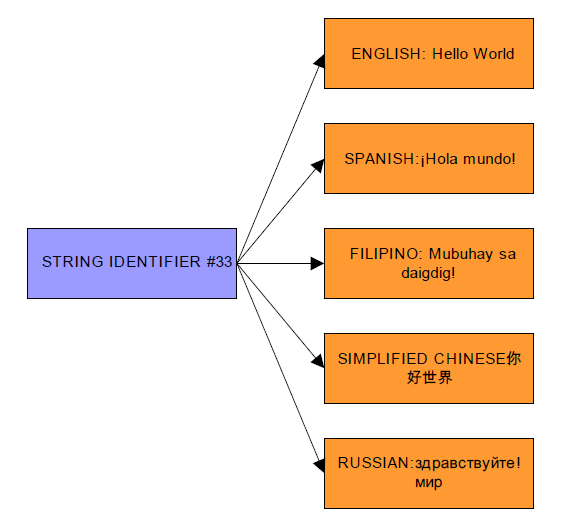

   **String Identifiers**
..

The actual text for each language is stored separately (in a separate package), which makes it possible to add and remove language support just by including or excluding the appropriate package.

Each string may have font information, including the font family name, font size and font style, associated with it. Not all platforms or displays can support fonts and styles beyond the system default font ( `Fonts`_ ), so the font information associated with the string should be viewed as a set of hints.

.. _configuration-language-paradigm:

Configuration Language Paradigm
$$$$$$$$$$$$$$$$$$$$$$$$$$$$$$$

This specification uses the RFC 4646 language naming scheme to identify the language that a given string is associated with. Since RFC 4646 allows for the same Primary language tags to contain a large variation of subtags (e.g. regions), a best matching language algorithm is defined in RFC 4647. Callers of interfaces that require RFC 4646 language codes to retrieve a Unicode string, must use the RFC 4647 algorithm to lookup the Unicode string with the closest matching RFC 4646 language code.

Since the majority of strings discussed in this specification are associated with generating a user interface, the languages that are typically associated with strings have commonly defined languages such as en-US, zh-Hant, and it-IT. The RFC 4646 standard also reserves for private use languages prefixed with a value of "x".

**NOTE**: *This specification defines for its own purposes one of these private use areas as a special-purpose language that components can use for extracting information out of. Assume that any private-use languages encountered by a compliant implementation will likely consider those languages as configuration languages, and the associated behavior when referencing those languages will be platform specific*.  :ref:`Working-with-a-UEFI-Configuration-Language`  *describes an example of such a use.*

.. _unicode-usage:

Unicode Usage
$$$$$$$$$$$$$

This section describes how different aspects of the Unicode specification related to the strings within this specification.

.. _private-use-area:

Private Use Area
%%%%%%%%%%%%%%%%

Unicode defines a private use area of 6500 characters that may be defined for local uses. Suggested uses include Egyptian Hieroglyphics; see *Developing International Software For Windows 95\* and Windows NT\** for more information. UEFI prohibits use of this area in a UEFI environment. This is because a centralized font database accumulated from the various drivers (a valid implementation) would end up with collisions in the private use area, and, generally, an XML browser could not display these characters.

.. _surrogate-area:

Surrogate Area
%%%%%%%%%%%%%%

The Unicode specification has two 16-bit character representations: UCS-2 and UTF-16. The UEFI specification uses UCS-2. The primary difference is that UTF-16 defines surrogate areas (see page 56 in *Professional XML* ) that allow for expanded character representations of the 16-bit Unicode. These character representations are very similar to Double Byte Character Set (DBCS)--2048 Unicode values split into two groups (D800-DBFF and DC00-DFFF). They are defined as having 16 additional bits of value to make up the character, for a total of about one million extra characters. UEFI does not support surrogate characters.

.. _non-spacing-characters:

Non-Spacing Characters
%%%%%%%%%%%%%%%%%%%%%%

Unicode uses the concept of a nonspacing character. These glyphs are used to add accents, and so on, to other characters by what amounts to logically OR’ing the glyph over the previous glyph. There does not appear to be any predictable range in the Unicode encoding to determine nonspacing characters, yet these characters appear in many languages. Further, these characters enable spelling of several languages including many African languages and Vietnamese.

.. _common-control-codes:

Common Control Codes
%%%%%%%%%%%%%%%%%%%%

This specification allows the encoding of font display information within the strings using special control characters. These control codes are meant as display hints, and different platforms may ignore them, depending on display capabilities.

In single-byte encoding, these are in the form *0x7F* *0xyy* or *0x7F* *0x0y* *0xzz.* Single-byte encoding is used only when coupled with the Standard Compression Scheme for Unicode, described in `String Encoding`_.

In double-byte encoding, these are in the form *0xF6yy,* *0xF7zz* or *0xF8zz.* When converted to UCS-2, all control codes should use the *0xFxyy* form.

.. list-table:: Common Control Codes for Font Display Information
   :widths: 10,50,20,20
   :name: common-control-codes-for-font-display-information
   :class: longtable

   * - Value
     - Description
     - Single-Byte Encoding
     - Double-Byte Encoding
   * - 0x00
     - Font Family Select. The subsequent text will be displayed in the font specified by the following byte.
     - 0x7F 0x00 0xzz
     - 0xF7zz
   * - 0x01
     - Font Size Select. The subsequent text will be displayed in the point size, in half points, specified by the following byte.
     - 0x7F 0x01 0xzz
     - 0xF8zz
   * - 0x20
     - Bold On.
     - 0x7F 0x20
     - 0xF620
   * - 0x21
     - Bold Off
     - 0x7F 0x21
     - 0xF621
   * - 0x22
     - Italic On
     - 0x7F 0x22
     - 0xF622
   * - 0x23
     - Italic Off
     - 0x7F 0x23
     - 0xF623
   * - 0x24
     - Underline On
     - 0x7F 0x24
     - 0xF624
   * - 0x25
     - Underline Off
     - 0x7F 0x25
     - 0xF625
   * - 0x26
     - Emboss ON
     - 0x7F 0x26
     - 0xF626
   * - 0x27
     - Emboss OFF
     - 0x7F 0x27
     - 0xF627
   * - 0x28
     - Shadow ON
     - 0x7F 0x28
     - 0xF628
   * - 0x29
     - Shadow OFF
     - 0x7F 0x29
     - 0xF629
   * - 0x2A
     - DblUnderline ON
     - 0x7F 0x2A
     - 0xF62A
   * - 0x2B
     - DblUnderline OFF
     - 0x7F 0x2B
     - 0xF62B

.. _line-breaks:

Line Breaks
%%%%%%%%%%%

This section describes the use of control characters to determine where break opportunities within strings. These guidelines are based on Unicode Technical Report #14, but are significantly simplified.

**Spaces**

In general, any of the following space characters is a line-break opportunity:

.. list-table:: 
   :widths: 15 75
   :class: longtable

   * - 0020 
     - SPACE  
   * - 1680 
     - OGHAM SPACE MARK
   * - 2000 
     - EN QUAD
   * - 2001 
     - EM QUAD
   * - 2002 
     - EN SPACE
   * - 2003 
     - EM SPACE
   * - 2004 
     - THREE-PER-EM SPACE
   * - 2005 
     - FOUR-PER-EM SPACE
   * - 2006 
     - SIX-PER-EM SPACE
   * - 2008 
     - PUNCTUATION SPACE
   * - 2009 
     - THIN SPACE
   * - 200A 
     - HAIR SPACE
   * - 205F 
     - MEDIUM MATHEMATICAL SPACE

When a space is desired without a line-break opportunity, one of the
following spaces should be used:

.. list-table:: 
   :widths: 15 75
   :class: longtable

   * - 00A0 
     - NO-BREAK SPACE (NBSP)
   * - 202F 
     - NARROW NO-BREAK SPACE (NNBSP) 

**In-Word Break Opportunities**

In some cases, allowing line-breaks in a word is desirable. These line break opportunities should be explicitly described using one of the characters from the following list:

.. list-table:: 
   :widths: 15 75
   :class: longtable

   * - 200B 
     - ZERO WIDTH SPACE (ZWSP)

**Hyphens**

The following characters are hyphens and other characters which
describe line break opportunities after the character.

.. list-table:: 
   :widths: 15 75
   :class: longtable

   * - 058A 
     - ARMENIAN HYPHEN
   * - 2010 
     - HYPHEN
   * - 2012 
     - FIGURE DASH
   * - 2013 
     - EN DASH
   * - 0F0B 
     - TIBETAN MARK INTERSYLLABIC TSHEG
   * - 1361 
     - ETHIOPIC WORDSPACE
   * - 17D5 
     - KHMER SIGN BARIYOOSAN

The following characters describe line break opportunities before and after them, but not between a pair of them:

.. list-table:: 
   :widths: 15 75
   :class: longtable

   * - 2014 
     - EM DASH

The following characters describe a hyphen which is not a line-breaking opportunity:

.. list-table:: 
   :widths: 15 75
   :class: longtable

   * - 2011 
     - NON-BREAKING HYPHEN (NBHY)

The following characters force a line-break:

.. list-table:: Mandatory Breaks
   :widths: 15 75
   :class: longtable

   * - 000A 
     - NEW LINE
   * - 000C 
     - FORM FEED
   * - 000D 
     - CARRIAGE RETURN
   * - 2028 
     - LINE SEPARATOR
   * - 2029 
     - PARAGRAPH SEPARATOR

.. _fonts:

Fonts
#####

This section describes how fonts are used within the UEFI environment.

UEFI describes a standard font, which is required for all systems which support text display on bitmapped output devices. The standard font (named ‘system’) is a fixed pitch font, where all characters are either narrow (8x19) or wide (16x19). UEFI also allows for display of other fonts, both fixed-pitch and variable-pitch. Platform support for these fonts is optional.

UEFI fonts are described using either the Simplified Font Package ( `Simplified Font Package`_ ) or the normal Font Package ( `Font Package`_ ).

.. _font-attributes:

Font Attributes
$$$$$$$$$$$$$$$

Fonts have the following attributes:

**Font Name** —  The font name describes, in broad terms, the visual style of the font. For example, "Arial" or "Times New Roman" The standard font always has the name "sysdefault".  

**Font Size** —  The font size describes the maximum height of the character cell, in p** — s. The standard font always has the font size of 19.

**Font Style** —  The font style describes standard visual modifies to the base visual style of a font. Supported font styles include: bold, italic, underline, double-underline, embossed, outline and shadowed. Some font styles may also be simulated by the font rendering engine. The standard font always has no additional font styles.  

.. _limiting-glyphs:

Limiting Glyphs
$$$$$$$$$$$$$$$

Strings in the UEFI environment can be presented in environments with very different limitations. The most constrained environment is in the firmware phases prior to discovery of a boot device with a system partition. The main limitation in this environment is storage space. If unexpected strings could be displayed before system partition availability, the UEFI environment would have to store glyphs for all characters in a Unicode font. After system partition discovery, all glyphs could be made available. 

Careful user interface design can limit to a manageable number, the quantity of unexpected characters that the system could be called on to display. Knowing what strings the firmware is going to display limits the number of glyphs it is required to carry. 

In addition, carefully designed firmware can support a system where a limited number of strings are displayed before system partition availability. This may be done while enabling the input and display of large numbers of characters/glyphs using a full font file stored on the system partition. In such a situation, the designer must ensure that enough information can be displayed. The designer must also insure that the configuration can be changed using only information from firmware-based non-volatile storage to obtain access to a satisfactory system partition. 

UEFI requires platform support of a font containing the basic Latin character set. 

While the system firmware will carry this standard font, there might be times when a UEFI application or driver requires the printing of a character not contained within the platform firmware. In this case, a UEFI driver or application can carry this font data and add it to the font already present in the HII Database. New font glyphs are accepted when there is no font glyph definition for the Unicode character already in the specified font. 

In addition the standard system font and fonts extended by UEFI applications or drivers, it is possible for drivers that implement the EFI HII Font Glyph Generator Protocol to render additional font glyphs with specific font name, style, and size information, and add the new font packages to the HII Database. That is when HII Font Ex searches the glyph block in the existing HII font packages, it will try to locate *EFI_HII_FONT_GLYPH_GENERATOR_PROTOCOL* protocol for generating the corresponding glyph block and inserting the new glyph block into HII font package if the glyph block information is not exist in any HII font package. The HII font package which the new glyph block inserted can be an existing HII font package or a new HII font package created by HII Font Ex according to the *EFI_FONT_DISPLAY_INFO* of character. 

The figure below shows how fonts interact with the HII database and UEFI drivers, even if the font does not already exist in the database.

.. _fonts-1:

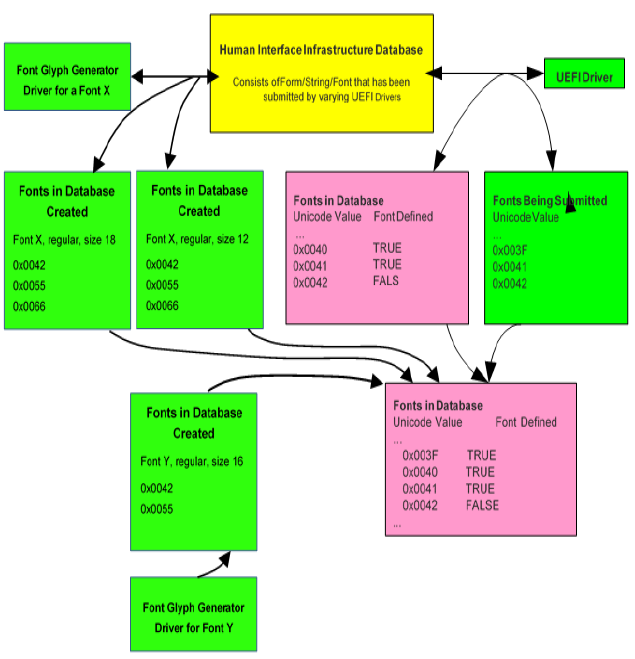

   Fonts 

..

.. _fixed-font-description:

Fixed Font Description
$$$$$$$$$$$$$$$$$$$$$$

To allow a UEFI application or driver to extend the existing fonts with additional characters, the UEFI driver must be able to provide characters that fit aesthetically with the system font. For this reason the capability to define attributes of different fonts and to suggest a reasonable default target for these parameters is important. 

Fonts can vary in width, style, baseline, height, size, and so on. The fixed font definition includes white space and the glyph data, as well as the positioning of the glyph data. This prevents characters of different fixed fonts from being adjusted at runtime to fit aesthetically together. To provide UEFI drivers with a basic description of how to design fixed font characters, a subset of industry standard font terms are defined below:

**baseline** —  The distance from upper left corner of cell to the base of the Caps (A, B, C,...)  

**cap_height** —  The distance from the base of the Caps to the top of the Caps  

**x_height** —  The distance from the baseline to the top of the lower case ‘x’  

**descender** —  The distance some characters extended below the baseline (g, j, p, q, y)  

**ascender** —  The distance from the top of the lower case ‘x’ to the tall lower case characters (b, d, f, h, k, l) 

The following figure illustrates the font description terms:      

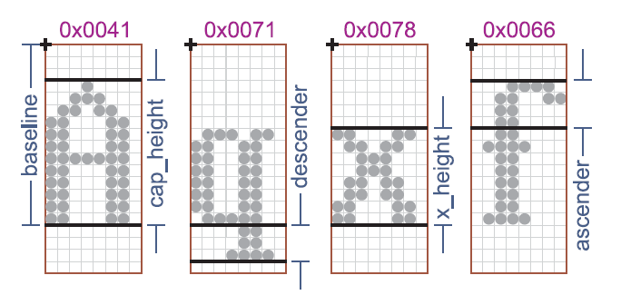

   Font Description Terms

.. 

This 8x19 system font example (above), follows the original VGA 8x16 definition and creating double wide vertical lines, giving a bold look to the font (style = bold). Along with matching the 8x19 base system font, if a UEFI driver wants to extend the DBCS (Double Byte Character Set) font, it must be aware of the parameters that describe the 16x19 font, as shown below.    

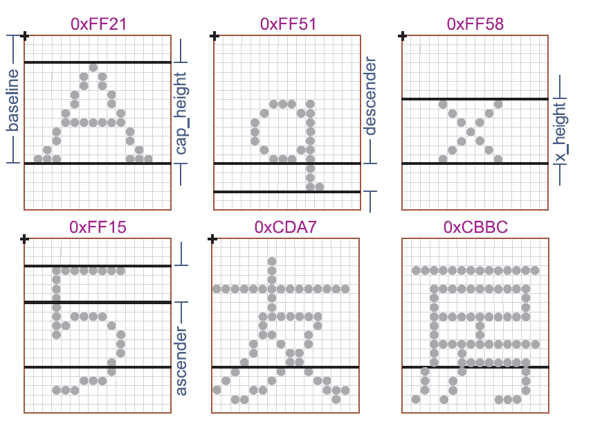

   16 x 19 Font Parameters

..

This 16x19 font example (above) has a style of plain (single width vertical lines) instead of bold like the 8x19 font, since there is not enough horizontal resolution to cleanly define the DBCS glyphs. The 16x19 ASCII characters have also been designed in a style matching the DBCS characters, allowing them to fit aesthetically together. Note that the default 16x19 fixed width characters are not stored like 1-bit images, one row after another; but instead stored with the left column (19 bytes) first, followed by the right column (19 bytes) of character data. The figure below shows how the characters of the previous figure would be laid out in the font structure.    

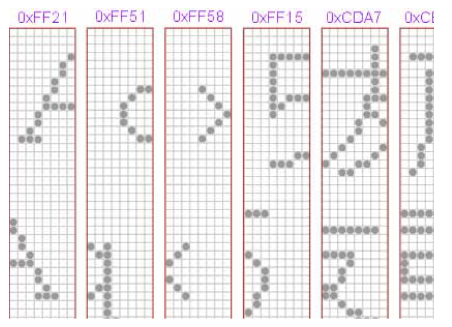

   **Font Structure Layout**

..

.. _system-fixed-font-design-guidelines:

System Fixed Font Design Guidelines
%%%%%%%%%%%%%%%%%%%%%%%%%%%%%%%%%%%

To allow a UEFI application or driver to extend the fixed font character set, the UEFI system fonts must adhere, at least roughly, to the design guidelines in the table below:

.. list-table:: Guidelines for UEFI System Fonts
   :widths: 15 15 15
   :name: guidelines-for-uefi-system-fonts
   :class: longtable

   * - **Term**
     - **8 x 19 Font** 
     - **16 x 19 Font**
   * - baseline
     - 15 pixels
     - 14 pixels
   * - cap_height 
     - 12 pixels   
     - 11 pixels
   * - x_height
     - 8 pixels    
     - 7 pixels
   * - descender  
     - 3 pixels    
     - 4 pixels
   * - ascender
     - 4 pixels
     - 4 pixels

In the table above lists the terms in priority order. The most critical guideline to match is the baseline, followed by cap_height and x_height. The terms descender and ascender are not as critical to the aesthetic look of the font as are the other terms. These font design parameters are only guidelines. Failing to match them will not prevent reasonable operation of a UEFI driver that attempting to extend the system font. 

.. _proportional-fonts-description:

Proportional Fonts Description
$$$$$$$$$$$$$$$$$$$$$$$$$$$$$$

Unlike the fixed fonts, proportional fonts do not have a predefined character cell; instead the character cell is created based on the characters that are being displayed in the current line. In a proportional font only the glyph data is defined, no whitespace. Instead, the proportional font defines five parameters (Width, Height, Offset_X, Offset_Y, & Advance), which allow the glyph data to be position in the character cell and calculate the origin of the next character. 

In the figure below, you can see these parameters (in ‘[...]’) for the characters shown, in addition you can see the actual byte storage (the padding to the nearest byte is shown shaded).    

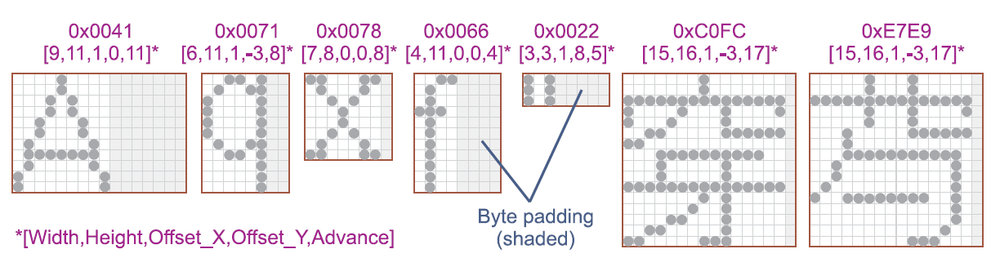

   Proportional Font Parameters and Byte Padding

..

To determine font *baseline,* scan all font glyphs calculating sum of Height and Offset_Y for each glyph. The largest value of the sum defines location of the *baseline.*

The font *line* *height* is calculated by adding *baseline* with the largest by absolute value negative Offset_Y among all the font glyphs.

.. _aligning-glyphs-to-the-baseline:

Aligning Glyphs to the Baseline
%%%%%%%%%%%%%%%%%%%%%%%%%%%%%%%

To display a line of proportional glyphs, *baseline* and *line height* have to be determined. If all the characters to be displayed are from the same font, the baseline and *line* *height* are the *baseline* and *line* *height* of the font. 

If the characters being displayed are from different fonts, scan glyphs of the characters to be displayed calculating sum of Height and Offset_Y for each glyph. The largest value of the sum defines location of the *baseline.*  

The *line height* is calculated by adding *baseline* with the largest by absolute value negative Offset_Y among all the characters to be displayed. 

As shown in the following figure, once the baseline value is found it is added to the starting position of the line to calculate the Origin. From the Origin, each and every glyph can be generated based on the individual glyph parameters, including the calculation of the next glyph’s Origin.   

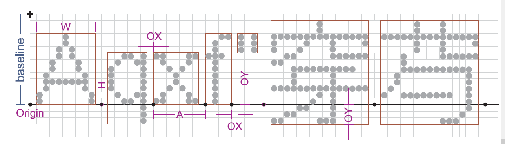

   Aligning Glyphs

The starting position (upper left hand corner) of the glyph is defined by (Origin_X + Offset_X), (Origin_Y - (Offset_Y + Height)). The Origin of the next glyph is defined by (Origin_X + Advance), (Origin_Y). 

In addition to determining the line height and baseline values; the scan of the characters also calculates the line width by totaling up all of the advance values.

.. _proportional-font-design-guidelines:

Proportional Font Design Guidelines
%%%%%%%%%%%%%%%%%%%%%%%%%%%%%%%%%%%

This method of aligning glyphs to a baseline allows one to place wildly different characters correctly position on a single line. However there still is a need for the system proportional fonts to roughly adhere to overall font height (19 pixels high character cells) and the placement of the baseline at the bottom of the Caps (if applicable or about 5 pixels up from the bottom of the character cell). These guidelines are not as critical as the fixed font guidelines, since the character cell height are defined at runtime, based on what else is displayed with that character.

.. _images:

Images
######

The format of the images to be stored in the Human Interface Infrastructure (HII) database have been created to conform to the industry standard 1-bit, 4-bit, 8-bit, and 24-bit video memory layouts. The 24-bit and 32-bit display systems have the exact same display capabilities and the exact same pixel definition. The difference is that the 32-bit pixels are DWORD aligned for improve CPU efficiency when accessing video memory. The extra byte that is inserted from the 24-bit and the 32-bit layout has no bearing on the actual screen. 

Video memory is arranged left-to-right, and then top-to-bottom. In a 1-bit or monochrome display, the most significant bit of the first byte defines the screen’s upper left most pixel. In a 4-bit or 16 color, display the most significant nibble of the first byte defines the screen’s upper left most pixel. In a 8-bit or 256 color display, the first byte defines the screen’s upper left most pixel. 

In both the 24-bit and 32-bit TrueColor displays, the first three bytes defines the screen’s upper left most pixel. The first byte is the pixel’s blue component value, the next byte is the pixel’s green component value, and the third byte is the pixel’s red component value (B,G,R). Each color component value can vary from 0x00 (color off) to 0xFF (color full on), allowing 16.8 millions colors that can be specified. In the 32-bit TrueColor display modes, the fourth byte is a don’t care.

.. _converting-to-a-32-bit-display:

Converting to a 32-bit Display
$$$$$$$$$$$$$$$$$$$$$$$$$$$$$$

The UEFI recommended video mode for computer-like devices uses a 32-bit Linear Frame Buffer video mode. All images stored in the HII database will need conversion to 32-bit before display. 

To display a 24-bit image into 32-bit video memory, a pixel of the image is retrieved (read DWORD value advance pixel offset by 3) and then written to the video memory (write DWORD value advance pixel offset by 4). 

To display any of the non-TrueColor images (1-bit, 4-bit, and 8-bit), there is an extra step of indirection through the palette definition to get the TrueColor pixel value. First retrieve the palette index value by isolating the corresponding bits, then index into the associated palette to retrieve the 24-bit (B,G,R) color entry (read DWORD value), then write it to the video memory (write DWORD value advance pixel offset by 4). For this reason, the palette color entry definition is defined exactly the same as the image color pixel (B,G,R). 

.. _non-truecolor-displays:

Non-TrueColor Displays
$$$$$$$$$$$$$$$$$$$$$$

It is possible to display the HII database images on non-TrueColor video modes. You cannot however, display images beyond the bit depth of the target screen resolution. For example you would be able to display 1-bit, 4-bit, and 8-bit images in a 256 color video mode. To do this you must create a global palette (256 entries), by merging all images color needs to a best fit palette and then programming the hardware palette with that data. 

The hardware palette color definition (R,G,B) is backwards from the screen pixel definition (B,G,R), and will have to be swapped before programming. In addition, the hardware palette may only support 6-bit of magnitude per color component instead of the 8-bit defined in the palette information section; therefore the values will have to be shifted before writing.

.. -database:

HII Database
############

The Human Interface Infrastructure (HII) database is the resource that serves as the repository of all the form, string, image and font data for the system. Drivers that contain information that is appropriate for the database will export this data to the HII database. 

For example, one driver might contain all the motherboard-specific data (the traditional "Setup" for the system). Additionally, add-in cards may contain their own drivers, which, in turn, have their own Setup-related data. All of the drivers that contain Setup-related data would export their information to the HII database, as shown in the figure below.    

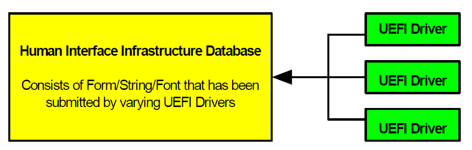

   HII Database

..

.. _forms-browser:

Forms Browser
#############

The UEFI Forms Browser is the service that reads the contents of the HII Database and interprets the forms data in order to present it to the user. For example, the Forms Browser can be used to gather all setup-related data and presents it to the user. This service also takes the user input and allows for changes to be saved into non-volatile storage. 

The figure below shows the relationship between the HII database, UEFI drivers, and the UEFI Forms Browser.   

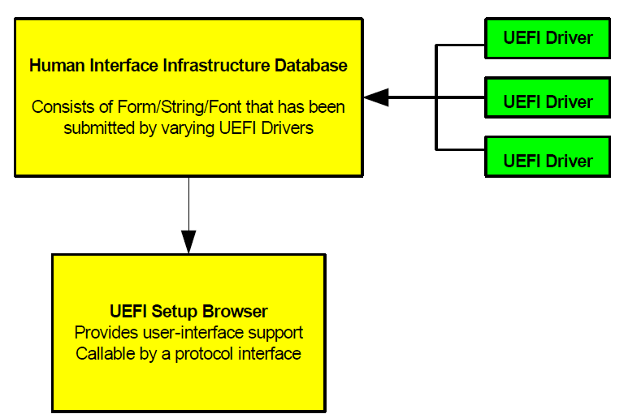

   Setup Browser

..

.. _user-interaction:

User Interaction
$$$$$$$$$$$$$$$$$$

The Forms Browser implementer has great flexibility as to the type of actual user interface provided. For example, while required to support some forms of navigation ( :ref:`efi-form-browser2-protocol-sendform-hii-configuration-processing-and-browser-protocol` or the cross-reference question), it may optionally support additional navigation capabilities, such as a back button or a menu bar. This section describes the rules to which the Forms Browser user-interaction must conform.

.. _forms-browser-details:

Forms Browser Details
%%%%%%%%%%%%%%%%%%%%%

The forms browser maintains a collection of one or more forms. The forms browser is required to provide navigation for these forms if there is more than one ( :ref:`efi-form-browser2-protocol-hii-configuration-processing-and-browser-protocol` , "Form Browser Protocol"). 

The forms browser maintains one or more *active forms*. An active form is any form where the forms browser is maintaining a set of question values. A form is considered active after all question values have been read from storage and the* *EFI_BROWSER_ACTION_FORM_OPEN* *action has been sent to all questions on the form which require callback. A form is considered inactive after all question values have been either discarded or written to storage and the* *EFI_BROWSER_ACTION_FORM_CLOSE* action has been sent to all questions on the form which require callback.

The forms browser maintains a *selected* form. The selected form contains the selected question and indicates the primary area of user interaction.

The standards form navigation behaviors are:

**Navigate Forms.** —  When the user chooses this required behavior, a new form is selected and, if any questions on the form are selectable ( `Evaluation of Selectable Statements`_ ), a question is selected. Forms browsers are required to provide navigation to (at least) the first form in all form sets when FormId is zero (:ref:`form-browser-protocol-hii-configuration-processing-and-browser-protocol` ). This behavior cannot be selected if the current form is modal (see :ref:`Forms` , "Forms").  

**Exit Browser/Discard All.** —  When the user chooses this optional behavior, the question values for active forms are discarded, the active forms are deactivated and the forms browser exits with an action request of *EFI_BROWSER_ACTION_REQUEST_EXIT.* This behavior cannot be selected if the current form is modal ( :ref:`Forms` ).  

**Exit Browser/Submit All.** —  When the user chooses optional behavior, the question values are written to storage, the active forms are deactivated and the forms browser exits with an action request of *EFI_BROWSER_ACTION_REQUEST_SUBMIT* or *EFI_BROWSER_ACTION_REQUEST_RESET.* This behavior cannot be selected if the current form is modal ( :ref:`Forms` , "Forms").  

**Default.** —  When the user chooses this optional behavior, the current question values for the questions on the focus form are updated from one of the default stores and then the *EFI_IFR_BROWSER_ACTION_REQUEST_DEFAULT_x* action is sent for each of the questions with the Callback attribute. This behavior can be initiated by a Reset Button question ( `Reset Button`_).

.. _selected-form:

Selected Form
%%%%%%%%%%%%%

When a form is made active, the forms browser sends the *EFI_BROWSER_ACTION_FORM_OPEN* for all questions supporting callback, retrieves the current question values, saves those as the original question values and begins refreshing any questions that support it.

The forms browser maintains a current question value for each question on active forms. The current question value is the last value that the forms browser read from storage/callback (`Values`_ ) or the last value committed by the user. The form is considered modified if any of the current question values are modified (see Questions, below). The forms browser refreshes the current question values of at least questions on the selected with a non-zero refresh interval. 

The forms browser maintains a selected question on the selected form. The selected question is the primary focus of the user’s interaction. When a form is selected, the forms browser must choose a selectable question (   `Evaluation of Selectable Statements`_ , "Evaluation of Selectable Statements") as the selected question, if one is present on the form.

The standard active form behaviors are:

**Exit Browser/Discard All.** —   *When the user chooses this required behavior, the question values for active forms are discarded, the active forms are deactivated and the forms browser exits with an action request of* *EFI_BROWSER_ACTION_REQUEST_EXIT* *. This behavior can be initiated by the function associated with a question with the Callback attribute.*  

**Exit Browser/ Submit All.** —   When the user chooses this required behavior, the current question values for active forms are validated (see nosubmitif,   `EFI_IFR_NOT_EQUAL`_ ) and, if successful, question values for active forms are written to storage, the active forms are deactivated and the forms browser exits with an action request of *EFI_BROWSER_ACTION_REQUEST_SUBMIT.* This behavior can be initiated by the function associated with a question with the Callback attribute.  

**Exit Browser/Discard All/Reset Platform.** —   *When the user chooses this required behavior, the question values for active forms are discarded, the active forms are deactivated and the form browser exits with an action request of* *EFI_BROWSER_ACTION_REQUEST_RESET* *. This behavior can be initiated by the function associated with a question with the Callback attribute.*  

**Exit Form/Submit Form.** —   Apply Form. When the user chooses this required behavior, the question values for the selected form are validated (see ->nosubmitif, BUGBUG<-) and, if successful, question values for the selected form are written to storage and the selected form is deselected. This behavior can be initiated by the function associated with a question with the Callback attribute.  

**Exit Form/Discard Form.** —   When the user chooses this required behavior, the question values for the selected form are discarded and the selected form is deselected. This behavior can be initiated by the function associated with a question with the Callback attribute.  

**Apply Form.** —   When the user chooses this required behavior, the question values for the selected form are validated (see nosubmitif, BUGBUG) and, if successful, question values for the selected form are written to storage. This behavior can be initiated by the function associated with a question with the Callback attribute.  

**Discard Form.** —   When the user chooses this required behavior, the question values for the selected form are discarded. This behavior can be initiated by the function associated with a question with the Callback attribute.  

**Default.** —   When the user chooses this required behavior, the current question values for the questions on the selected form are updated from a default store. This behavior can be initiated by a Reset Button question (see  `Reset Button`_ ).  

**Navigate To Question.** —   When the user chooses this required behavior, the selected question is deselected and another question on the same form is selected. The types of navigation provided between questions on the same form are beyond the scope of this specification.

**Navigate To Form.** —   When the user chooses this required behavior, the selected form is deselected and the form specified by the question is selected. This behavior can be initiated by a Cross-Reference question. Note that this behavior is distinct from the Navigate Forms behavior described in Forms Navigation. 

From these basic behaviors, more complex behaviors can be constructed. For example, a forms browser might check whether the form is modified and, if so, prompt the user to select between the Exit Browser/Discard All and Exit Browser/Submit All behaviors. 

.. _selected-question:

Selected Question
%%%%%%%%%%%%%%%%%%

When the user navigates to a question or the forms browser selects a form with a selectable question, the forms browser places the question in the static state. When the user is choosing another question values for the selected question (by typing or from a menu or other means), the forms browser places the question in the changing state. When the user finalizes selection of a question value the forms browser returns the question to the static state. 

The forms browser refreshes all questions in at least the selected form with a non-zero refresh interval that are not modified. Typically, a forms browser will not update the displayed question value while the selected question is in the changing state, but will when the selected question is in the static state. A question is considered modified if there is storage associated with the question (i.e., a variable store was specified) and the current question value is different from the original question value. 

The standard active question behaviors are:

**Change** —   When the user chooses this required behavior, the forms browser places the selected question in the changing state and allows the user to specify a new current question value for the active question. For example, selecting items in a drop box or beginning to type a new value in an edit box.

With some question types and user interface styles, this behavior is hidden from the user. For example, with check boxes or radio buttons as found in most windowed user-interfaces, the user changes and commits the value with one action. Likewise, with action buttons, selecting the action button implies both the question value and the commit action. 

This behavior corresponds to the CHANGING browser action request for questions that support callback.  

**Commit** —   When the user chooses this required behavior, the forms browser validates the specified question value (see *EFI_IPF_INCONSISTENT_IF* , `EFI_IFR_INCONSISTENT_IF`_ ) and, if successful, places the selected question in the static state and updates the current question value to that specified while in the changing state. If the selected question’s current question value is different than the selected question’s original question value, the selected question is considered modified. The form browser must then re-evaluate the modifiability, selectability and visibility of other questions in the selected form. 

This behavior corresponds to the CHANGED browser action request for questions that support callback.  

**Discard** —   When the user chooses this required behavior, the forms browser places the question in the changed state.

.. _configuration-settings:

Configuration Settings
######################

In order to save user changes to configuration settings after the system reset or power-off, there must be some form of non-volatile storage available. There are two types of non-volatile storage: system non-volatile storage or add-in card non-volatile storage. Both types are supported. 

In general, settings are not saved to non-volatile storage until the user specifically directs the Forms Browser to do so. There are exceptions, such as when operating in a batch or script mode, setting a system password, and updating the system date and time. The underlying platform support dictates whether or not hardware configuration changes are committed immediately. 

As shown in the figure below, when a system reset occurs, the firmware’s initialization routines will launch the UEFI drivers (e.g. option ROMs). Drivers enabled to take direction from a non-volatile setting read the updated settings during their initialization.    

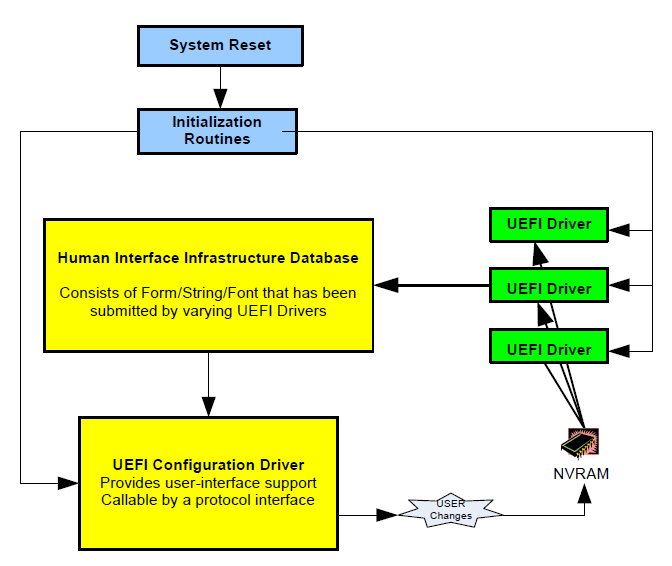

   Storing Configuration Settings

..

.. _os-runtime-utilization:

OS Runtime Utilization
$$$$$$$$$$$$$$$$$$$$$$

Due to the static nature of the data that is contained in the HII Database and the fact that certain classes of non-volatile storage can be updated during OS run-time, it is possible for an application running under an OS to read the HII information, make configuration changes and even make changes. 

The figure below shows how an OS makes use of the HII database during runtime. In this case, the contents of the HII Database is exported to a buffer. The pointer to the buffer is placed in the EFI System Configuration Table, where it can be retrieved by an OS application.    

.. _os-runtime-utilization-1:

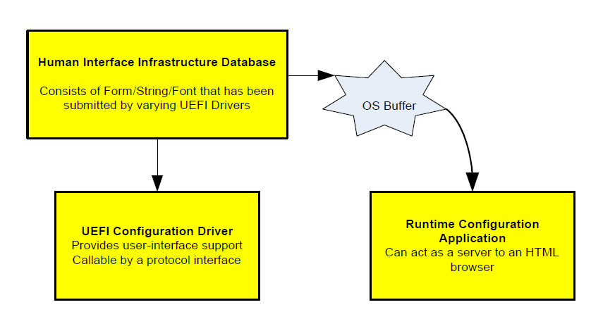

   OS Runtime Utilization

..

The process used to allow an OS application to use this is as follows:

Drivers/applications in the system register user interface data into the HII Database

When the platform transitions from pre-boot to runtime phases of operation, the HII *ExportPackageLists()* is called to export the contents of the HII Database into a runtime buffer.

This runtime buffer is advertised in the UEFI Configuration Table using the HII Database Protocol’s GUID so that an OS application can find the data.

The HII *ExportConfig()* is called to export the current configuration into a runtime buffer.

This runtime buffer is advertised in the UEFI Configuration Table using the HII Configuration Routing Protocol’s GUID so that an OS application can find the data.

When an O/S application wants to display pre-boot configuration content, it searches the UEFI Configuration Table for the HII Database Protocol’s GUID entry and renders the contents from the runtime buffer which it points to.

If the OS application needs to update the system configuration, the configuration information can be updated.

For those configuration settings which are stored in UEFI variables (i.e., using *GetVariable()* and *SetVariable()* ), the application can update these using the abstraction provided by the operating system.

For those configuration settings which are not stored in UEFI variables, the OS application can use the UEFI UpdateCapsule runtime service to change the configuration.

.. _working-with-a-uefi-configuration-language:

Working with a UEFI Configuration Language
$$$$$$$$$$$$$$$$$$$$$$$$$$$$$$$$$$$$$$$$$$

By defining the concept of a language that may provide hints to a consumer that the string payload may contain pre-defined standard keyword content, the user of this solution can export their configuration data for evaluation. This evaluation enables the consumer to determine if a particular platform supports a given configuration language, and in-turn be able to adjust known settings that are stored in a platform-specific manner. An example of this is illustrated below which uses various component described in this and the other HII chapters of this specification. In the example, a fictional technology called XYZ exists, and this particular platform supports it. The question is, how does a standard application which is not privy to the platform’s construction know how this setting is stored? To-date, this is not a reasonably solvable problem, but in the illustration below, this example shows how one might go about solving this issue.   

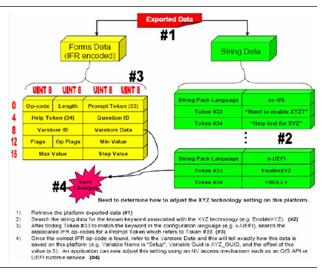

   Standard Application Obtaining Setting Example

..

.. _form-callback-logic:

Form Callback Logic
###################

Since it has been the design intent that the forms processor not need to understand the underlying hardware implementations or design paradigms of the platform, there were certain needs that could only be met by calling a more platform knowledgeable component. In this case, the component would typically be associated with some hardware device (e.g. motherboard, add-in card, etc.). To facilitate this interaction, some formal interfaces were declared for more platform-specific components to advertise and the forms processor could then call. 

Note that the need for the forms processor to call into an alternate component driver should be limited as much as possible. The two primary reasons for this are the cases where off-line or O/S-present configuration is important. The three flow charts which follow describe the typical decisions that a forms processor would make with regards to handling processes which necessitate a callback. 

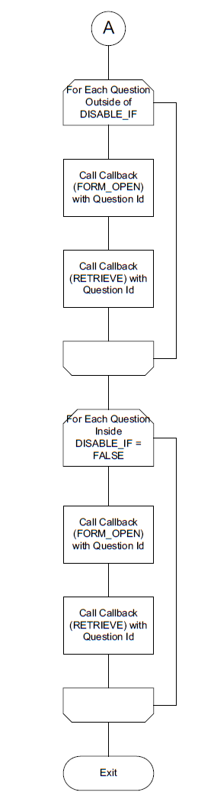

   **Typical Forms Processor Decisions Necessitating a Callback (1)**

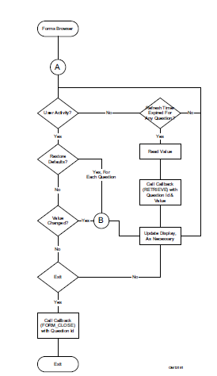

   **Typical Forms Processor Decisions Necessitatinga Callback (2)**

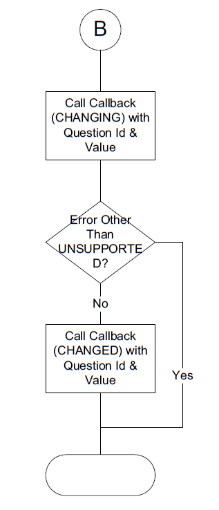

   **Typical Forms Processor Decisions Necessitatinga Callback (3)**

.. _driver-model-interaction:

Driver Model Interaction
########################

The ability for a UEFI driver to interact with a target controller is abstracted through the Configuration Access Protocol. If a particular piece of hardware managed by a controller needs configuration services, it is the responsibility of that controller to provide this configuration abstraction for the given device. Regardless of whether a device driver or bus driver is abstracting the hardware configuration, the interaction with a configured device is identical. 

Note that the ability for a driver to provide these access protocols might be done fairly early in the initialization process. Depending on the hardware capabilities, one might be advantaged in providing configuration access very early so that being able to determine a given device’s current settings can be done without a full enumeration of certain bus devices. Also note that the same recommendations that are made in the DriverBinding sections should still be maintained. These cover the Supported, Started, and Stopped functions.    

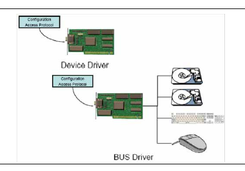

   Driver Model Interactions

..

.. _human-interface-component-interactions:

Human Interface Component Interactions
######################################

The figure below depicts the model used inside a common deployment of HII to manage human interface components.    

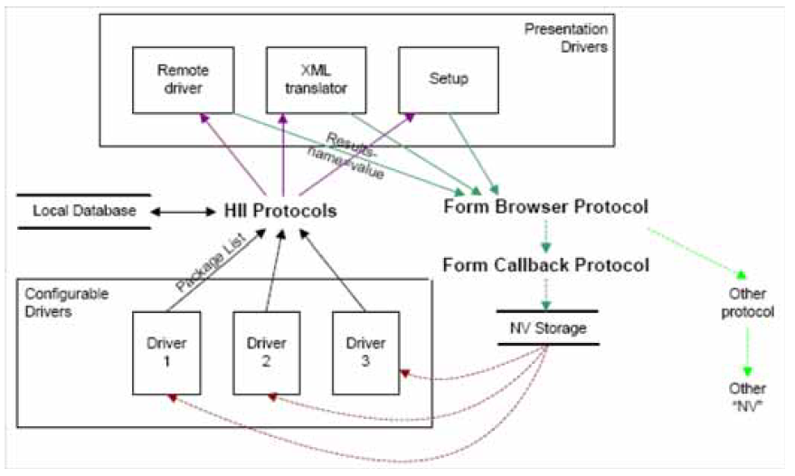

   Managing Human Interface Components

..

.. _standards-map-forms:

Standards Map Forms
###################

Configuration settings are configuration settings. But the way in which they are controlled is driven by different requirements. For example, the UEFI HII infrastructure focuses primarily on the way in which the configuration settings can be browsed and manipulated by a user. Other standards such as the DMTF Command-Line Protocol, focus on the way in which configuration settings can be manipulated via text commands. 

Each *configuration method* tends to view the configuration settings a different way. In the end, they are changing the same configuration setting, but their means of exposing the control differs. The means by which a configuration method (HII, DMTF, WMI, SNMP, etc.) exposes an individual configuration setting is called a *question.* 

In many cases, there is a one-to-one mapping between the questions exposed by these different configuration methods. That is, a question, as exposed by one configuration method matches the semantic meaning of the configuration setting exactly. 

However, in other cases, there is not a one-to-one mapping. These cases break down into three broad categories:

#. Value Shift. In this case, the configuration setting has the same scope as the question exposed by aconfiguration method, but the values used to describethem are different. It may be as simple as 1=5, 2=6, 3=7,etc. or something more complicated, where "ON"=1 and"OFF"=0.**

#. One-To-Many. In this case, the configuration setting maps to two or more questions exposed by a configuration meth od. For example the configuration setting might have the following enumerated values:

   | a.   0 = Disable Serial Port  
   | b.   1 = Enable Serial Port, I/O Port 0x3F8, IRQ 4
   | c.   2 = Enable Serial Port, I/O Port 0x2F8, IRQ 3
   | d.   3 = Enable Serial Port, I/O Port 0x3E8, IRQ 4  

But in the configuration method, the serial port is controlled by three separate questions:

-  Question #1: 0 = disable, 1 = enable

-  Question #2: I/O Port (disabled if Question #1 = 0)

-  Question #3: IRQ (disabled if Question #1 = 0)

Changing the configuration method question #1 to a value of 0 requires that the configuration setting be set to 0. In this case, there is the possibly of data loss. After changing the configuration setting to 0, the information about the I/O port and IRQ are not preserved.

So, in order to change the configuration setting to the value of 1 would require three of the configuration method’s questions to change value: Question #1=1, Question #2=0x3F8, Question #3=IRQ 4.

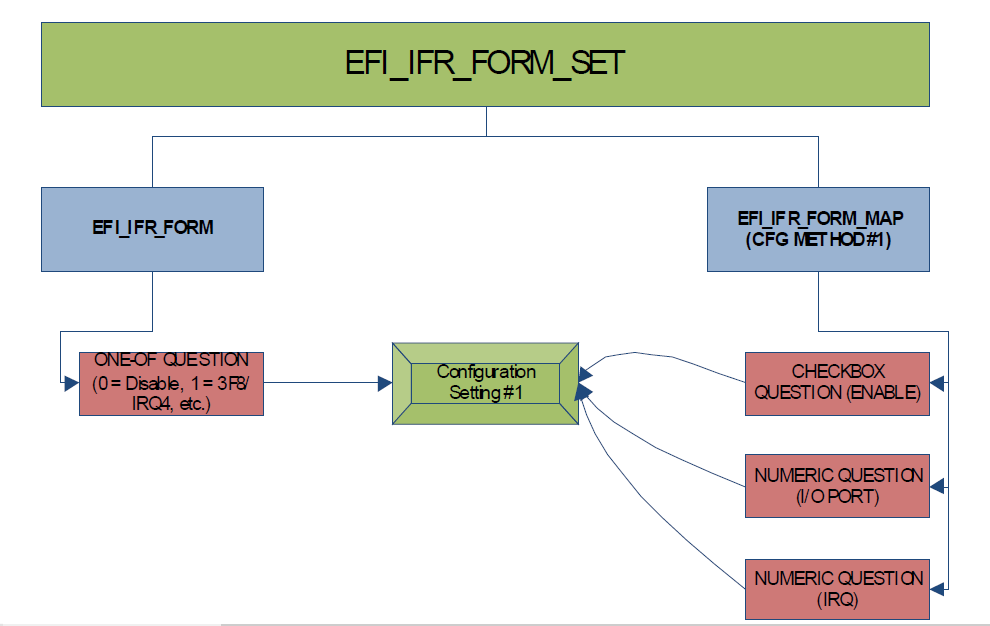

   EFI IFR Form Set configuration

3. Many-To-One. In this case, the conditions are reversed from the example described in #2 above. Now there are three configuration settings which map to a single configuration method question. 

For example, the configuration settings are described using three separate questions:

| a.   Question #1: 0 = disable, 1 = enable
| b.   Question #2: I/O Port (disabled if Question #1 = 0)
| c.   Question #3: IRQ (disabled if Question #1 = 0).  

.. 

But in the configuration method, the serial port is controlled by a single question with the following enumerated values: 

| a.   0 = Disable Serial Port 
| b.   1 = Enable Serial Port, I/O Port 0x3F8, IRQ 4
| c.   2 = Enable Serial Port, I/O Port 0x2F8, IRQ 3
| d.   3 = Enable Serial Port, I/O Port 0x3E8, IRQ 4
| e.   4 = Enable Serial Port, I/O Port 0x2E8, IRQ 3

.. 

So, in order to change the configuration method to the value of 1 would require three configuration settings to change value: Question #1=1, Question #2=0x3F8, Question #3=IRQ 4.

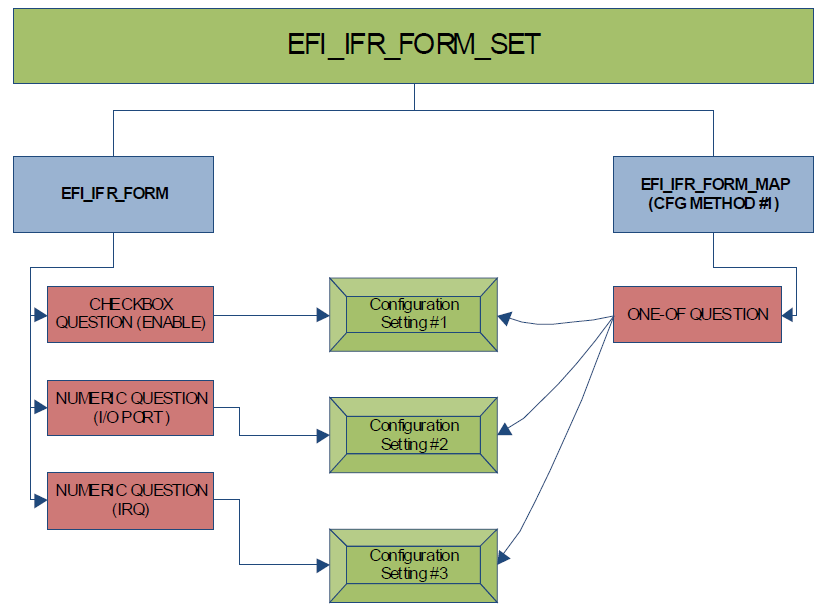

   **EFI IFR Form Set Question Changes**

Some configuration settings may involve more than one of these mappings. 

Standards map forms describe the questions exposed by these other configuration methods and how they map back to the configuration settings exposed by the UEFI drivers. Each standards map form describes the mapping for a single configuration method, along with that configuration method’s name and version. 

The questions within standards map forms are encoded using IFR in the same fashion as those within other UEFI forms. The prompt strings for these questions are tied back to the names for those questions within the configuration method (e.g., DMTF CLP).

.. _create-a-questions-value-by-combing-multiple-configuration-settings:

Create A Question’s Value By Combing MultipleConfiguration Settings
$$$$$$$$$$$$$$$$$$$$$$$$$$$$$$$$$$$$$$$$$$$$$$$$$$$$$$$$$$$$$$$$$$$

Rather than reading directly from storage, these standards map questions retrieve their value using the *EFI_IFR_READ* (  `EFI_IFR_Read`_ ) operator. This operator can aggregate a value from more than one configuration settings using *EFI_IFR_GET* ( `EFI_IFR_Get`_ ). This operator can also change the type (integer, string, Boolean) of the value so that, say, a configuration setting with a type of integer can be represented in a standards map form as a string. 

For example, to map a single question to three configuration settings (CS1, CS2 and CS3) as described in scenario #3 in :ref:`strings` , above would have the following truth table:

.. list-table:: Truth Table: Mapping A Single Question To Three Configuration Settings 
   :widths: 30 30 30 30  
   :name: truth-table-mapping-a-single-question-to-three-configuration-settings  
   :class: longtable

   * - **CS1**     
     - **CS2**            
     - **CS3**             
     - **Q** 
   * - **FALSE**
     - X 
     - X
     - 0
   * - **TRUE**
     - 0x3F8           
     - 4               
     - 1
   * - **TRUE**  
     - 0x2F8           
     - 3               
     - 2
   * - **TRUE**  
     - 0x3E8           
     - 4               
     - 3
   * - **TRUE**  
     - 0x2E8           
     - 3               
     - 4
   * - **TRUE**  
     - any other value 
     - any other value
     - *Undefined*  

These become the following equations:

.. code-block::

   x0: Get (CS1) ? x1 : 0
   x1: ((Get(CS2) & 0xF00) >> 8) == Get(CS3) + 1 ? x2 : Undefined
   x2: Map(Get(CS2),0x3f8,1,0x2F8,2,0x3E8,3,0x2E8,4)

.. _changing-multiple-configuration-settings-from-one-questions-value:

Changing Multiple Configuration Settings FromOne Question’s Value
$$$$$$$$$$$$$$$$$$$$$$$$$$$$$$$$$$$$$$$$$$$$$$$$$$$$$$$$$$$$$$$$$

Rather than writing directly to storage, these standards map questions change their value using the *EFI_IFR_WRITE* ( `EFI_IFR_Write`_ ) operator. This operator can, in turn, use the *EFI_IFR_SET* ( `EFI_IFR_Set`_ ) operator to change one or more configuration settings. This operator can also change the type (integer, string, Boolean, etc.) of the value written so that, say, a configuration setting with a type of integer can be represented in a standards map form as a string question. 

For example, in example #2 above, the following table applies:

.. _multiple-configuration-settings-example-2:

.. list-table:: Multiple Configuration Settings Example #2
   :widths: 15 15 15 15 
   :class: longtable

   * - CS1   
     - CS2   
     - CS3 
     - Q
   * - **FALSE** 
     - X     
     - X   
     - 0
   * - **TRUE**  
     - 0x3F8 
     - 4   
     - 1
   * - **TRUE**  
     - 0x3E8 
     - 3   
     - 2
   * - **TRUE**  
     - 0x2F8 
     - 4   
     - 3
   * - **TRUE**  
     - 0x2E8 
     - 3   
     - 4

.. code-block::

   Set (CS1,Q != 0) &&
   Set (CS2,Map(this,1,0x3F8,2,0x3E8,3,0x2F8,4,0x2E8)) &&
   Set (CS3,Map(this,1,4,2,3,3,4,4,3)

.. _value-shifting:

Value Shifting
$$$$$$$$$$$$$$

Value shifting is facilitated by the EFI_IFR_MAP ( `EFI_IFR_Map`_ ) operator. If this operator finds a value in a list, it replaces it with another value from the list, even if the other value is a different type. 

For example, consider the following list of values

.. list-table:: Values
   :widths: 5 75
   :name: values-1
   :class: longtable

   * - 1  
     - PEI Module
   * - 2  
     - DXE Boot Service Driver
   * - 3  
     - DXE Runtime Driver
   * - 10 
     - UEFI Boot Service Driver
   * - 11 
     - UEFI Runtime Driver
   * - 12 
     - UEFI Application

If the integer value 10 were supplied, the value "UEFI Boot Service Driver" would be returned. If the integer value 20 were supplied, Undefined would be returned. 

.. _prompts:

Prompts
$$$$$$$

In standards map forms, the prompts can be used as the key words for the configuration method. They should be specified in the language i-uefi unless there are multiple translations available. Other standards may use the question identifiers as the means of identifying the standard question.

.. _hii-code-definitions:

Code Definitions
----------------

This section describes the binary encoding of the different package types:

-  Font Package
-  Simplified Font Package
-  String Package
-  Image Package
-  Device Path Package
-  Keyboard Layout Package
-  GUID Package
-  Forms Package

.. _package-lists-and-package-headers:

Package Lists and Package Headers
#################################

.. _efi-hii-package-header:

EFI_HII_PACKAGE_HEADER
$$$$$$$$$$$$$$$$$$$$$$

**Summary**

The header found at the start of each package.

**Prototype**

.. code-block::
  
   typedef struct {
     UINT32            Length:24;
     UINT32            Type:8;
     UINT8             Data[... ];
   }   EFI_HII_PACKAGE_HEADER;

**Members**

Length
  The size of the package in bytes.

Type
  The package type. See *EFI_HII_PACKAGE_TYPE_x,* below.

Data
  The package data, the format of which is determined by *Type.*

**Description**

Each package starts with a header, as defined above, which indicates the size and type of the package. When added to a pointer pointing to the start of the header, *Length* points at the next package. The package lists form a package list when concatenated together and terminated with an *EFI_HII_PACKAGE_HEADER* with a *Type* of *EFI_HII_PACKAGE_END.*

The type *EFI_HII_PACKAGE_TYPE_GUID* is used for vendor-defined HII packages, whose contents are determined by the *Guid.* 

The range of package types starting with *EFI_HII_PACKAGE_TYPE_SYSTEM_BEGIN* through *EFI_HII_PACKAGE_TYPE_SYSTEM_END* are reserved for system firmware implementers.

**Related Definitions**

.. code-block::
  
   #define EFI_HII_PACKAGE_TYPE_ALL           0x00
   #define EFI_HII_PACKAGE_TYPE_GUID          0x01
   #define EFI_HII_PACKAGE_FORMS              0x02
   #define EFI_HII_PACKAGE_STRINGS            0x04
   #define EFI_HII_PACKAGE_FONTS              0x05
   #define EFI_HII_PACKAGE_IMAGES             0x06
   #define EFI_HII_PACKAGE_SIMPLE_FONTS       0x07
   #define EFI_HII_PACKAGE_DEVICE_PATH        0x08
   #define EFI_HII_PACKAGE_KEYBOARD_LAYOUT    0x09
   #define EFI_HII_PACKAGE_ANIMATIONS         0x0A
   #define EFI_HII_PACKAGE_END                0xDF
   #define EFI_HII_PACKAGE_TYPE_SYSTEM_BEGIN  0xE0
   #define EFI_HII_PACKAGE_TYPE_SYSTEM_END 0xFF

.. list-table:: Package Types
   :widths: 50,50
   :name: package-types
   :class: longtable

   * - Package Type
     - Description
   * - EFI_HII_PACKAGE_TYPE_ALL
     - Pseudo-package type used when exporting package lists. See *ExportPackageList().*
   * - EFI_HII_PACKAGE_TYPE_GUID
     - Package type where the format of the data is specified using a GUID immediately following the package header.
   * - EFI_HII_PACKAGE_FORMS
     - Forms package.
   * - EFI_HII_PACKAGE_STRINGS
     - Strings package
   * - EFI_HII_PACKAGE_FONTS
     - Fonts package.
   * - EFI_HII_PACKAGE_IMAGES
     - Images package.
   * - EFI_HII_PACKAGE_SIMPLE_FONTS
     - Simplified (8x19, 16x19) Fonts package
   * - EFI_HII_PACKAGE_DEVICE_PATH
     - Binary-encoded device path.
   * - EFI_HII_PACKAGE_END
     - Used to mark the end of a package list.
   * - EFI_HII_PACKAGE_ANIMATIONS
     - Animations package.
   * - | EFI_HII_PACKAGE_TYPE_SYSTEM_BEGIN...
       | EFI_HII_PACKAGE_TYPE_SYSTEM_END
     - Package types reserved for use by platform firmware implementations.

.. _efi-package-list-header:

EFI_HII_PACKAGE_LIST_HEADER
$$$$$$$$$$$$$$$$$$$$$$$$$$$

**Summary**

The header found at the start of each package list.

**Prototype**

.. code-block::
  
   typedef struct {  
     EFI_GUID           PackageListGuid;  
     UINT32             PackagLength;  
   }   EFI_HII_PACKAGE_LIST_HEADER;

**Members**

PackageListGuid
  The unique identifier applied to the list of packages which follows.

PackageLength
  The size of the package list (in bytes), including the header.

**Description**

This header uniquely identifies the package list and is placed in front of a list of packages. Package lists with the same *PackageListGuid* value should contain the same data set. Updated versions should have updated GUIDs.

.. _simplified-font-package:

Simplified Font Package
#######################

The simplified font package describes the font glyphs for the standard 8x19 pixel (narrow) and 16x19 (wide) fonts. Other fonts should be described using the normal Font Package.

A simplified font package consists of a header and two types of glyph structures--standard-width (narrow) and wide glyphs.

.. _efi-simple-font-package-hdr:

EFI_HII_SIMPLE_FONT_PACKAGE_HDR
$$$$$$$$$$$$$$$$$$$$$$$$$$$$$$$

**Summary**

A simplified font package consists of a font header followed by a series of glyph structures.

**Prototype**

.. code-block::

  
   typedef struct _EFI_HII_SIMPLE_FONT_PACKAGE_HDR {
     EFI_HII_PACKAGE_HEADER                Header;
     UINT16                            NumberOfNarrowGlyphs;
     UINT16                            NumberOfWideGlyphs;
     EFI_NARROW_GLYPH                  NarrowGlyphs[];
     EFI_WIDE_GLYPH                    WideGlyphs[];
   }   EFI_HII_SIMPLE_FONT_PACKAGE_HDR;

**Members**

Header
  The header contains a *Length* and *Type* field. In the case of a font package, the type will be *EFI_HII_PACKAGE_SIMPLE_FONTS* and the length will be the total size of the font package including the size of the narrow and wide glyphs. See :ref:`efi-hii-package-header`.

NumberOfNarrowGlyphs
  The number of *NarrowGlyphs* that are included in the font package.

NumberOfWideGlyphs
  The number of *WideGlyphs* that are included in the font package.

NarrowGlyphs
  An array of *EFI_NARROW_GLYPH* entries. The number of entries is specified by *NumberOfNarrowGlyphs.*

WideGlyphs
  An array of *EFI_WIDE_GLYPH* entries. The number of entries is specified by *NumberOfWideGlyphs.* To calculate the offset of *WideGlyphs,* use the offset of *NarrowGlyphs* and add the size of *EFI_NARROW_GLYPH* multiplied by the *NumberOfNarrowGlyphs.* 

**Description**

The glyphs must be sorted by Unicode character code.

It is up to developers who manage fonts to choose efficient mechanisms for accessing fonts. The contiguous presentation can easily be used because narrow and wide glyphs are not intermixed, so a binary search is possible (hence the requirement that the glyphs be sorted by weight).

.. _efi-narrow-glyph:

EFI_NARROW_GLYPH
$$$$$$$$$$$$$$$$

**Summary**

The *EFI_NARROW_GLYPH* has a preferred dimension (w x h) of 8 x 19 pixels.

**Prototype**

.. code-block::

  
   typedef struct {
     CHAR16             UnicodeWeight;
     UINT8              Attributes;
     UINT8              GlyphCol1[EFI_GLYPH_HEIGHT];
   }   EFI_NARROW_GLYPH;

**Members**

UnicodeWeight
  The Unicode representation of the glyph. The term weight is the technical term for a character code.

Attributes
  The data element containing the glyph definitions; see "Related Definitions" below.

GlyphCol1
  The column major glyph representation of the character. Bits with values of one indicate that the corresponding pixel is to be on when normally displayed; those with zero are off. 

**Description**

Glyphs are represented by two structures, one each for the two sizes of glyphs. The narrow glyph ( *EFI_NARROW_GLYPH* ) is the normal glyph used for text display.

**Related Definitions**

.. code-block::
  
   // Contents of EFI_NARROW_GLYPH.Attributes
   #define EFI_GLYPH_NON_SPACING       0x01
   #define EFI_GLYPH_WIDE              0x02
   #define EFI_GLYPH_HEIGHT            19
   #define EFI_GLYPH_WIDTH             8

  
Following is a description of the fields in the above definition:
  
EFI_GLYPH_NON_SPACING 
  This symbol is to be printed "on top of" ( *OR* ’d with) the previous glyph beforedisplay.  

EFI_GLYPH_WIDE
  This symbol uses 16x19 formats rather than 8x19.                                   

.. _efi-wide-glyph:

EFI_WIDE_GLYPH
$$$$$$$$$$$$$$

**Summary**

The *EFI_WIDE_GLYPH* has a preferred dimension (w x h) of 16 x 19 pixels, which is large enough to accommodate logographic characters.

**Prototype**

.. code-block::
  
   typedef struct {  
     CHAR16       UnicodeWeight;  
     UINT8        Attributes;  
     UINT8        GlyphCol1[EFI_GLYPH_HEIGHT];  
     UINT8        GlyphCol2[EFI_GLYPH_HEIGHT];  
     UINT8        Pad[3];  
   } EFI_WIDE_GLYPH;

**Members**

UnicodeWeight
  The Unicode representation of the glyph. The term weight is the technical term for a character code.

Attributes
  The data element containing the glyph definitions; see "Related Definitions" in *EFI_NARROW_GLYPH* for attribute values.

GlyphCol1 and GlyphCol2 
  The column major glyph representation of the character. Bits with values of one indicate that the corresponding pixel is to be on when normally displayed; those with zero are off.

Pad
  Ensures that *sizeof (EFI_WIDE_GLYPH)* is twice the *sizeof (EFI_NARROW_GLYPH).* The contents of *Pad* must be zero. 

**Description**

Glyphs are represented via the two structures, one each for the two sizes of glyphs. The wide glyph ( *EFI_WIDE_GLYPH* ) is large enough to display logographic characters.

.. _font-package:

Font Package
############

The font package describes the glyphs for a single font with a single family, size and style. The package has two parts: a fixed header and the glyph blocks. All structures described here are byte packed.

.. _fixed-header:

Fixed Header
$$$$$$$$$$$$

The fixed header consists of a standard record header and then the character values in this section, the flags (including the encoding method) and the offsets of the glyph information, the glyph bitmaps and the character map.

.. code-block::

   typedef struct _EFI_HII_FONT_PACKAGE_HDR {
     EFI_HII_PACKAGE_HEADER          Header;
     UINT32                          HdrSize;
     UINT32                          GlyphBlockOffset;
     EFI_HII_GLYPH_INFO              Cell;
     EFI_HII_FONT_STYLE              FontStyle;
     CHAR16                          FontFamily[];
   }   EFI_HII_FONT_PACKAGE_HDR;

Header
  The standard package header, where *Header.Type* = *EFI_HII_PACKAGE_FONTS.*

HdrSize
  Size of this header.

GlyphBlockOffset
  The offset, relative to the start of this header, of a series of variable-length glyph blocks, each describing information about the bitmap associated with a glyph.

Cell
  This contains the measurement of the widest and tallest characters in the font ( *Cell.Width* and *Cell.Height* ). It also contains the default offset to the horizontal and vertical origin point of the character cell ( *Cell.OffsetX* and *Cell.OffsetY* ). Finally, it contains the default *AdvanceX.*

FontStyle
  The design style of the font, 1 bit per style. See *EFI_HII_FONT_STYLE.* 

FontFamily
  The null-terminated string with the name of the font family to which the font belongs.

**Related Definitions**

.. code-block::
  
   typedef UINT32 EFI_HII_FONT_STYLE;  
   #define EFI_HII_FONT_STYLE_NORMAL       0x00000000  
   #define EFI_HII_FONT_STYLE_BOLD         0x00000001  
   #define EFI_HII_FONT_STYLE_ITALIC       0x00000002  
   #define EFI_HII_FONT_STYLE_EMBOSS       0x00010000  
   #define EFI_HII_FONT_STYLE_OUTLINE      0x00020000  
   #define EFI_HII_FONT_STYLE_SHADOW       0x00040000  
   #define EFI_HII_FONT_STYLE_UNDERLINE    0x00080000  
   #define EFI_HII_FONT_STYLE_DBL_UNDER    0x00100000
  

.. _glyph-information:

Glyph Information
$$$$$$$$$$$$$$$$$

For each Unicode character code, the glyph information gives the glyph bitmap, the character size and the position of the bitmap relative to the origin of the character cell. The glyph information is encoded as a series of blocks, each with a single byte header. The blocks must be processed in order.

Each block begins with a single byte, which contains the block type.

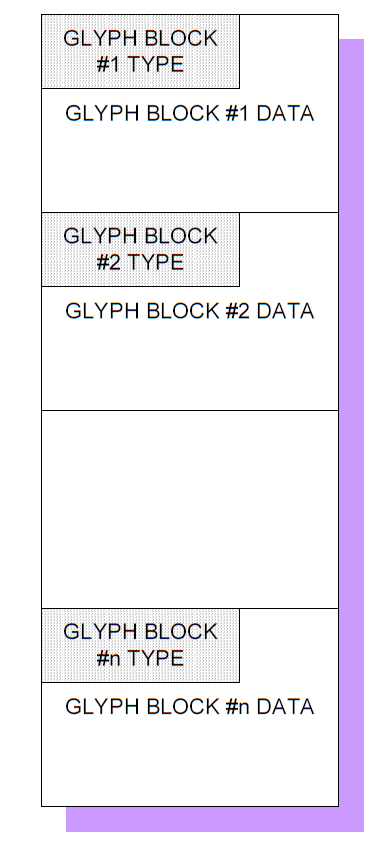

   Glyph Information Encoded in Blocks

**Prototype**

.. code-block::
  
   typedef struct _EFI_HII_GLYPH_BLOCK {  
     UINT8           BlockType;  
     UINT8           BlockBody[];  
   }   EFI_HII_GLYPH_BLOCK;
  

**Members**

The following table describes the different block types:

.. list-table:: 
   :widths: 40,10,50
   :class: longtable

   * - **Name**                        
     - **Value**  
     - **Description**                 
   * - EFI_HII_GIBT_END
     - 0x00   
     - The end of the glyph information.                
   * - EFI_HII_GIBT_GLYPH
     - 0x10   
     - Glyph information for a single character value, bit-packed.
   * - EFI_HII_GIBT_GLYPHS          
     - 0x11   
     - Glyph information for multiple character values.  
   * - EFI_HII_GIBT_GLYPH_DEFAULT   
     - 0x12
     - | Glyph information for a single character value, 
       | using the default character cell information.
   * - EFI_HII_GIBT_GLYPHS_DEFAULT  
     - 0x13   
     - | Glyph information for multiple character values, using the 
       | default character cell information.
   * - EFI_HII_GIBT_GLYPH_VARIABILITY
     - 0x14
     - Glyph information for the _GIBT_GLYPH_VARIABILITY variable glyph.
   * - EFI_HII_GIBT_DUPLICATE
     - 0x20   
     - | Create a duplicate of an existing glyph but 
       | with a new character value.
   * - EFI_HII_GIBT_SKIP2
     - 0x21   
     - Skip a number (1-65535) character values.           
   * - EFI_HII_GIBT_SKIP1
     - 0x22   
     - Skip a number (1-255) character values.           
   * - EFI_HII_GIBT_DEFAULTS
     - 0x23   
     - Set default glyph information for subsequent glyph blocks.
   * - EFI_HII_GIBT_EXT1 
     - 0x30   
     - For future expansion (one byte length field)
   * - EFI_HII_GIBT_EXT2
     - 0x31   
     - For future expansion (two byte length field) 
   * - EFI_HII_GIBT_EXT4
     - 0x32   
     - For future expansion (four byte length field) 

**Description**  

In order to recreate all glyphs, start at the first block and process them all until a *EFI_HII_GIBT_END* block is found. When processing the glyph blocks, each block refers to the current character value ( *CharValueCurrent* ), which is initially set to one (1).

Glyph blocks of an unknown type should be skipped. If they cannot be skipped, then processing halts.

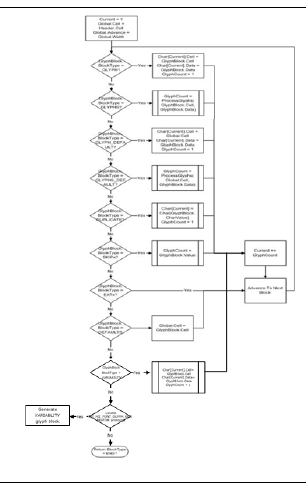

   Glyph Block Processing

**Related Definitions**

.. code-block::
  
   typedef struct _EFI_HII_GLYPH_INFO {
     UINT16          Width;
     UINT16          Height;
     INT16           OffsetX;
     INT16           OffsetY;
     INT16           AdvanceX;
   }   EFI_HII_GLYPH_INFO;

Width
  Width of the character or character cell, in pixels. For fixed-pitch fonts, this is the same as the advance.

Height
  Height of the character or character cell, in pixels.

OffsetX
  Offset to the horizontal edge of the character cell.

OffsetY
  Offset to the vertical edge of the character cell.

AdvanceX
  Number of pixels to advance to the right when moving from the *origin* of the current glyph to the origin of the next glyph.
  

.. _efi-hii-gibt-defaults:

EFI_HII_GIBT_DEFAULTS
%%%%%%%%%%%%%%%%%%%%%

**Summary**

Changes the default character cell information.

**Prototype**

.. code-block::
  
   typedef struct _EFI_HII_GIBT_DEFAULTS_BLOCK {  
     EFI_HII_GLYPH_BLOCK             Header;  
     EFI_HII_GLYPH_INFO              Cell;  
   }   EFI_HII_GIBT_DEFAULTS_BLOCK;
  

**Members**

Header
  Standard glyph block header, where *Header.BlockType* = *EFI_HII_GIBT_DEFAULTS.*

Cell
  The new default cell information which will be applied to all subsequent *GLYPH_DEFAULT* and *GLYPHS_DEFAULT* blocks.

**Description**

Changes the default cell information used for subsequent *EFI_HII_GIBT_GLYPH_DEFAULT* and *EFI_HII_GIBT_GLYPHS_DEFAULT* glyph blocks. The cell information described by *Cell* remains in effect until the next *EFI_HII_GIBT_DEFAULTS* is found. Prior to the first *EFI_HII_GIBT_DEFAULTS* block, the cell information in the fixed header are used.

.. _efi-hii-gibt-duplicate:

EFI_HII_GIBT_DUPLICATE
%%%%%%%%%%%%%%%%%%%%%%

**Summary**

Assigns a new character value to a previously defined glyph.

**Prototype**

.. code-block::
  
   typedef struct _EFI_HII_GIBT_DUPLICATE_BLOCK {
     EFI_HII_GLYPH_BLOCK          Header;
     CHAR16                       CharValue;
   }   EFI_HII_GIBT_DUPLICATE_BLOCK;

**Members**

Header
  Standard glyph block header, where *Header.BlockType* = *EFI_HII_GIBT_DUPLICATE.*

CharValue
  The previously defined character value with the exact same glyph.

**Description**

Indicates that the glyph with character value *CharValueCurrent* has the same glyph as a previously defined character value and increments *CharValueCurrent* by one.

.. _efi-hii-gibt-end:

EFI_HII_GIBT_END
%%%%%%%%%%%%%%%%

**Summary**

Marks the end of the glyph information.

**Prototype**

.. code-block::
  
   typedef struct _EFI_GLYPH_GIBT_END_BLOCK {  
     EFI_HII_GLYPH_BLOCK                Header;  
   }   EFI_GLYPH_GIBT_END_BLOCK;

**Members**

Header
  Standard glyph block header, where *Header.BlockType* = *EFI_HII_GIBT_END.*

**Description**

Any glyphs with a character value greater than or equal to *CharValueCurrent* are empty.

.. _efi-hii-gibt-ext1-efi-hii-gibt-ext2-efi-hii-gibt-ext4:

EFI_HII_GIBT_EXT1, EFI_HII_GIBT_EXT2,EFI_HII_GIBT_EXT4
%%%%%%%%%%%%%%%%%%%%%%%%%%%%%%%%%%%%%%%%%%%%%%%%%%%%%%

**Summary**

Future expansion block types which have a length byte.

**Prototype**

.. code-block::
  
   typedef struct _EFI_HII_GIBT_EXT1_BLOCK {  
    EFI_HII_GLYPH_BLOCK    Header;  
     UINT8                 BlockType2;  
     UINT8                 Length;  
   }   EFI_HII_GIBT_EXT1_BLOCK;  

   typedef struct _EFI_HII_GIBT_EXT2_BLOCK {  
     EFI_HII_GLYPH_BLOCK   Header;  
     UINT8                 BlockType2;  
     UINT16                Length;  
   }   EFI_HII_GIBT_EXT2_BLOCK;  

   typedef struct _EFI_HII_GIBT_EXT4_BLOCK {  
     EFI_HII_GLYPH_BLOCK   Header;  
     UINT8                 BlockType2;  
     UINT32                Length;  
   }   EFI_HII_GIBT_EXT4_BLOCK;  

**Members**

Header
  Standard glyph block header, where *Header.BlockType* = *EFI_HII_GIBT_EXT1,* *EFI_HII_GIBT_EXT2* or *EFI_HII_GIBT_EXT4.*

Length
  Size of the glyph block, in bytes.

BlockType2
  Indicates the type of extended block. Currently all extended block types are reserved for future expansion.  

**Description**

These are reserved for future expansion, with length bytes included so that they can be easily skipped.

.. _efi-hii-gibt-glyph:

EFI_HII_GIBT_GLYPH
%%%%%%%%%%%%%%%%%%

**Summary**

Provide the bitmap for a single glyph.

**Prototype**

.. code-block::
  
   typedef struct _EFI_HII_GIBT_GLYPH_BLOCK {
     EFI_HII_GLYPH_BLOCK             Header;
     EFI_HII_GLYPH_INFO              Cell;
     UINT8                           BitmapData[1];
   }   EFI_HII_GIBT_GLYPH_BLOCK;

**Members**

Header
  Standard glyph block header, where *Header.BlockType* = *EFI_HII_GIBT_GLYPH.*

Cell
  Contains the width and height of the encoded bitmap ( *Cell.Width* and *Cell.Height* ), the number of pixels (signed) right of the character cell origin where the left edge of the bitmap should be placed ( *Cell.OffsetX* ), the number of pixels above the character cell origin where the top edge of the bitmap should be placed ( *Cell.OffsetY* ) and the number of pixels (signed) to move right to find the origin for the next character cell ( *Cell.AdvanceX* ).

GlyphCount
  The number of glyph bitmaps.

BitmapData
  The bitmap data specifies a series of pixels, one bit per pixel, left-to-right, top-to-bottom. Each glyph bitmap only encodes the portion of the bitmap enclosed by its character-bounding box, but the entire glyph is padded out to the nearest byte. The number of bytes per bitmap can be calculated as: (( *Cell.Width + 7)/8)* \* *Cell.Height.* 

**Description**

This block provides the bitmap for the character with the value *CharValueCurrent* and increments *CharValueCurrent* by one. Each glyph contains a glyph width and height, a drawing offset, number of pixels to advance after drawing and then the encoded bitmap.

.. _efi-hii-gibt-hii-glyphs:

EFI_HII_GIBT_HII_GLYPHS
%%%%%%%%%%%%%%%%%%%%%%%

**Summary**

Provide the bitmaps for multiple glyphs with the same cell information

**Prototype**

.. code-block::
  
   typedef struct _EFI_HII_GIBT_GLYPHS_BLOCK {  
     EFI_HII_GLYPH_BLOCK            Header;  
     EFI_HII_GLYPH_INFO             Cell;  
     UINT16                         Count
     UINT8                          BitmapData[1];
   }   EFI_HII_GIBT_GLYPHS_BLOCK;

**Members**

Header
  Standard glyph block header, where *Header.BlockType* = *EFI_HII_GIBT_GLYPHS.*

Cell
  Contains the width and height of the encoded bitmap ( *Cell.Width* and *Cell.Height*  ), the number of pixels (signed) right of the character cell origin where the left edge of the bitmap should be placed ( *Cell.OffsetX* ), the number of pixels above the character cell origin where the top edge of the bitmap should be placed ( *Cell.OffsetY* ) and the number of pixels (signed) to move right to find the origin for the next character cell ( *Cell.AdvanceX* ).

BitmapData
  The bitmap data specifies a series of pixels, one bit per pixel, left-to-right, top-to-bottom, for each glyph. Each glyph bitmap only encodes the portion of the bitmap enclosed by its character-bounding box. The number of bytes per bitmap can be calculated as: (( *Cell.Width + 7)/8)* \* *Cell.Height.* 

**Description**

Provides the bitmaps for the characters with the values *CharValueCurrent* through *CharValueCurrent* + *Count* -1 and increments *CharValueCurrent* by *Count.* These glyphs have identical cell information and the encoded bitmaps are exactly the same number of byes. 

.. _efi-hii-gibt-glyph-default:

EFI_HII_GIBT_GLYPH_DEFAULT
%%%%%%%%%%%%%%%%%%%%%%%%%%

**Summary**

Provide the bitmap for a single glyph, using the default cell information.

**Prototype**

.. code-block::
  
   typedef struct _EFI_HII_GIBT_GLYPH_DEFAULT_BLOCK {
     EFI_HII_GLYPH_BLOCK         Header;
     UINT8                       BitmapData[];
   }   EFI_HII_GIBT_GLYPH_DEFAULT_BLOCK;
  

**Members**

Header
  Standard glyph block header, where *Header.BlockType* = *EFI_HII_GIBT_GLYPH_DEFAULT.*

BitmapData
  The bitmap data specifies a series of pixels, one bit per pixel, left-to-right, top-to-bottom. Each glyph bitmap only encodes the portion of the bitmap enclosed by its character-bounding box. The number of bytes per bitmap can be calculated as: (( *Global.Cell.Width + 7)/8)* \* *Global.Cell.Height.*

**Description**

Provides the bitmap for the character with the value *CharValueCurrent* and increments *CharValueCurrent* by 1. This glyph uses the default cell information. The default cell information is found in the font header or the most recently processed *EFI_HII_GIBT_DEFAULTS.*

.. _efi-hii-gibt-glyphs-default:

EFI_HII_GIBT_GLYPHS_DEFAULT
%%%%%%%%%%%%%%%%%%%%%%%%%%%

**Summary**

Provide the bitmaps for multiple glyphs with the default cell information

**Prototype**

.. code-block::
  
   typedef struct _EFI_HII_GIBT_GLYPHS_DEFAULT_BLOCK {  
     EFI_HII_GLYPH_BLOCK            Header;  
     UINT16                         Count;  
     UINT8                          BitmapData [];  
   }   EFI_HII_GIBT_GLYPHS_DEFAULT_BLOCK;

 **Members**

Header
  Standard glyph block header, where *Header.BlockType* = *EFI_HII_GIBT_GLYPHS_DEFAULT.*

Count
  Number of glyphs in the glyph block.

BitmapData
  The bitmap data specifies a series of pixels, one bit per pixel, left-to-right, top-to-bottom, for each glyph. Each glyph bitmap only encodes the portion of the bitmap enclosed by its character-bounding box. The number of bytes per bitmap can be calculated as: (( *Global.Cell.Width + 7)/8)* \* *Global.Cell.Height.* 

**Description**

Provides the bitmaps for the characters with the values *CharValueCurrent* through *CharValueCurrent* + *Count* -1 and increments *CharValueCurrent* by *Count.* These glyphs use the default cell information and the encoded bitmaps have exactly the same number of byes.

.. _efi-hii-gibt-skipx:

EFI_HII_GIBT_SKIPx
%%%%%%%%%%%%%%%%%%

**Summary**

Increments the current character value *CharValueCurrent* by the number specified.

**Prototype**

.. code-block::
  
   typedef struct _EFI_HII_GIBT_SKIP2_BLOCK {
     EFI_HII_GLYPH_BLOCK                Header;  
     UINT16                             SkipCount;  
   }   EFI_HII_GIBT_SKIP2_BLOCK;  

   typedef struct _EFI_HII_GIBT_SKIP1_BLOCK {  
     EFI_HII_GLYPH_BLOCK                Header;  
     UINT8                              SkipCount;  
   }   EFI_HII_GIBT_SKIP1_BLOCK;
  

**Members**

Header
Standard glyph block header, where *BlockType* = *EFI_HII_GIBT_SKIP1* or *EFI_HII_GIBT_SKIP2.*

SkipCount
  The unsigned 8- or 16-bit value to add to *CharValueCurrent*.

**Description**

Increments the current character value *CharValueCurrent* by the number specified.

.. _efi-hii-gibt-glyph-variability:

EFI_HII_GIBT_GLYPH_VARIABILITY
%%%%%%%%%%%%%%%%%%%%%%%%%%%%%%

**Related Definitions**

.. code-block::
  
   //************************************************************
   // EFI_HII_GIBT_GLYPH_VARIABILITY (0x14)
   //************************************************************

   typedef struct _EFI_HII_GIBT_VARIABILITY_BLOCK {
     EFI_HII_GLYPH_BLOCK            Header;
     EFI_HII_GLYPH_INFO             Cell;
     UINT8                          GlyphPackInBits;
     UINT8                          BitmapData [1];
   }   EFI_HII_GIBT_VARIABILITY_BLOCK;

**Members**

Header
  Standard glyph block header, where Blocktype = EFI_HII_GIBT_GLYPH_VARIABILITY.

Cell
  Contains the width and height of the encoded bitmap (Cell.Width and Cell.Height), the number of pixels (signed) right of the character cell origin where the left edge of the bitmap should be placed (Cell.OffsetX), the number of pixels above the character cell origin where the top edge of the bitmap should be placed (Cell.OffsetY) and the number of pixels (signed) to move right to find the origin for the next character cell (Cell.AdvanceX).

GlyphPackInBits
  This describes the bit length for each pixel in glyph. With this, the length of BitmapData can be determined according to GlyphPackInBits, cell.with and cell.height.

  The valid value is GIBT_VARIABILITY_BLOCK_1_BIT,

  | *GIBT_VARIABILITY_BLOCK_2_BIT,*
  | *GIBT_VARIABILITY_BLOCK_4_BIT,*
  | *GIBT_VARIABILITY_BLOCK_8_BIT,*
  | *GIBT_VARIABILITY_BLOCK_16_BIT,*
  | *GIBT_VARIABILITY_BLOCK_24_BIT,*
  | *GIBT_VARIABILTY_BLOCK_32_BIT* 
  
  ..

  HII Font Ex protocol has no idea about how to decode the bitmap of glyph if the glyph is declared as *EFI_HII_GIBT_GLYPH_VARIABLITY.* The bitmap decoding is resolved in *EFI_HII_FONT_GLPHY_GENERATOR_PROTOCOL.* This field is used to determine the length of entire glyph block. 

BitmapData
  The raw data of the glyph pixels. The format of the glyph pixel depends on the glyph generator. Only EFI_HII_FONT_GLYPH_GENERATOR_PROTOCOL knows how to draw the glyph.

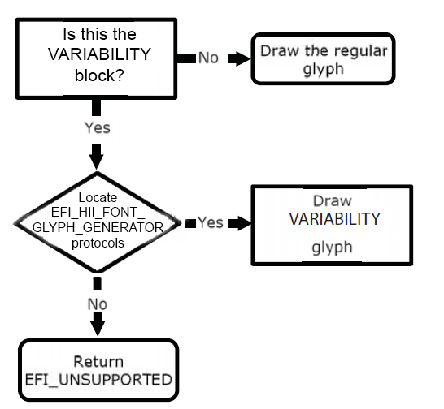

   EFI_HII_GIBT_GLYPH_VARIABLITY Glyph Drawing Processing 

..
..
.. _device-path-package: 

Device Path Package
###################

**Summary**

The device path package is used to carry a device path associated with the package list.

**Prototype**

.. code-block::
  
   typedef struct _EFI_HII_DEVICE_PATH_PACKAGE {  
     EFI_HII_PACKAGE_HEADER                  Header;  
   //EFI_DEVICE_PATH_PROTOCOL                DevicePath [];  
   }   EFI_HII_DEVICE_PATH_PACKAGE;
  

**Parameters**

Header
  The standard package header, where *Header.Type =* *EFI_HII_PACKAGE_DEVICE_PATH.*

DevicePath
  The Device Path description associated with the driver handle that provided the content sent to the HII database.

**Description**

This package is created by *NewPackageList()* when the package list is first added to the HII database by locating the *EFI_DEVICE_PATH_PROTOCOL* attached to the driver handle passed in to that function.

.. _guid-package:

GUID Package
############

The GUID package is used to carry data where the format is defined by a GUID.

**Prototype**

.. code-block::
  
   typedef struct _EFI_HII_GUID_PACKAGE_HDR {  
     EFI_HII_PACKAGE_HEADER            Header;  
     EFI_GUID                          Guid;  
   // Data per GUID definition may follow  
   }   EFI_HII_GUID_PACKAGE_HDR;

**Members**

Header
  The standard package header, where *Header.Type* = *EFI_HII_PACKAGE_TYPE_GUID.* 

Guid
  Identifier which describes the remaining data within the package.

**Description**

This is a free-form package type designed to allow extensibility by allowing the format to be specified using *Guid.*.

.. _string-package:

String Package
##############

The Strings package record describes the mapping between string identifiers and the actual text of the strings themselves. The package consists of three parts: a fixed header, the string information and the font information.

.. _fixed-header-1:

Fixed Header
$$$$$$$$$$$$

The fixed header consists of a standard record header and then the string identifiers contained in this section and the offsets of the string and language information.

**Prototype**

.. code-block::

   typedef struct _EFI_HII_STRING_PACKAGE_HDR {  
   EFI_HII_PACKAGE_HEADER     Header;  
     UINT32                   HdrSize;  
     UINT32                   StringInfoOffset;  
     CHAR16                   LanguageWindow[16];  
     EFI_STRING_ID            LanguageName;  
     CHAR8                    Language [... ];  
   }   EFI_HII_STRING_PACKAGE_HDR;

**Members**

Header
  The standard package header, where *Header.Type* = *EFI_HII_PACKAGE_STRINGS.*

HdrSize
  Size of this header.

StringInfoOffset
  Offset, relative to the start of this header, of the string information.

LanguageWindow
  Specifies the default values placed in the static and dynamic windows before processing each SCSU-encoded string.

LanguageName
  String identifier within the current string package of the full name of the language specified by *Language*.

Language
  The null-terminated ASCII string that specifies the language of the strings in the package. The languages are described as specified by :ref:`appendix-m-formats-language-codes-and-language-code-arrays-apx-m-formats-language-codes-and-language-code-arrays`. 
 

**Related Definition**

.. code-block::

   #define UEFI_CONFIG_LANG "x-UEFI"
   #define UEFI_CONFIG_LANG_2 "x-i-UEFI"

.. _string-information:

String Information
$$$$$$$$$$$$$$$$$$

For each string identifier, the string information gives the string’s text and font. The string information is encoded as a series of blocks, each with a single byte header. The blocks must be processed in order, using the current string identifier ( *StringIdCurrent* ), which is set initially to one (1). Processing continues until an *EFI_SIBT_END* block is found. 

The types of blocks are: string blocks, duplicate blocks, font blocks, and skip blocks. String blocks specify the text and font for the current string identifier and increment to the next string identifier. Duplicate blocks copy the text of a previous string identifier and increment to the next string identifier. Skip bocks skip string identifiers, leaving them blank.    

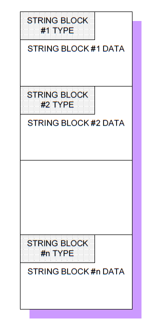

   String Information Encoded in Blocks

Each block begins with a single byte, which contains the block type.

.. code-block:: 

   typedef struct {
     UINT8           BlockType;
     UINT8           BlockBody[];
   }   EFI_HII_STRING_BLOCK;

The following table describes the different block types:

.. list-table::
   :widths: 25 10 40
   :class: longtable

   * - **Name**
     - **Value**  
     - **Description**                 
   * - EFI_HII_SIBT_END             
     - 0x00   
     - The end of the string information.
   * - EFI_HII_SIBT_STRING_SCSU 
     - 0x10  
     - Single string using default font information.
   * - EFI_HII_SIBT_STRING_SCSU_FONT 
     - 0x11   
     - Single string with font information. 
   * - EFI_HII_SIBT_STRINGS_SCSU    
     - 0x12   
     - Multiple strings using default font information.
   * - EFI_HII_SIBT_STRINGS_SCSU_FONT
     - 0x13   
     - Multiple strings with font information.
   * - EFI_HII_SIBT_STRING_UCS2     
     - 0x14 
     - Single UCS-2 string using default font information.
   * - EFI_HII_SIBT_STRING_UCS2_FONT
     - 0x15
     - Single UCS-2 string with font information
   * - EFI_HII_SIBT_STRINGS_UCS2    
     - 0x16   
     - Multiple UCS-2 strings using default font information.
   * - EFI_HII_SIBT_STRINGS_UCS2_FONT 
     - 0x17   
     - Multiple UCS-2 strings with font information.           
   * - EFI_HII_SIBT_DUPLICATE 
     - 0x20   
     - Create a duplicate of an existing string.            
   * - EFI_HII_SIBT_SKIP2
     - 0x21   
     - Skip a certain number of string identifiers.         
   * - EFI_HII_SIBT_SKIP1
     - 0x22   
     - Skip a certain number of string identifiers.         
   * - EFI_HII_SIBT_EXT1
     - 0x30   
     - For future expansion (one byte length field)          
   * - EFI_HII_SIBT_EXT2
     - 0x31   
     - For future expansion (two byte length field)          
   * - EFI_HII_SIBT_EXT4
     - 0x32   
     - For future expansion (four byte length field)          
   * - EFI_HII_SIBT_FONT
     - 0x40
     - Font information.           

When processing the string blocks, each block type refers and modifies the current string identifier ( *StringIdCurrent* ).

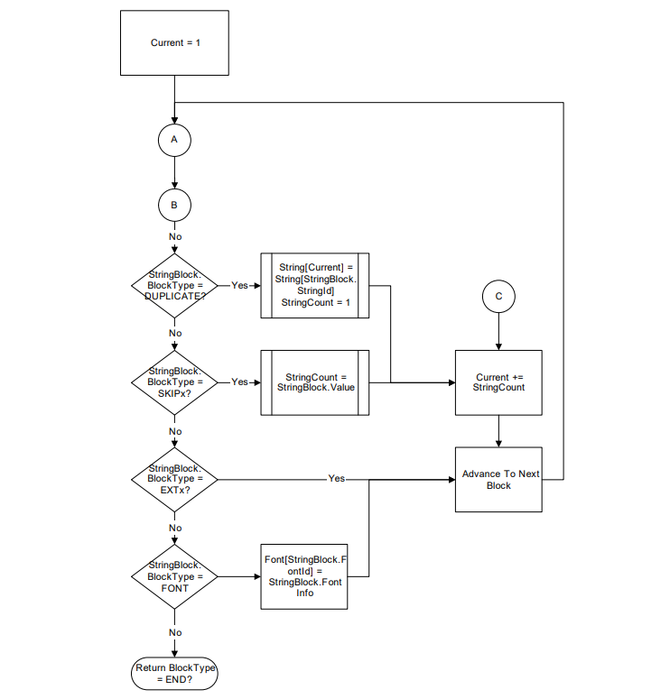

   String Block Processing: Base Processing

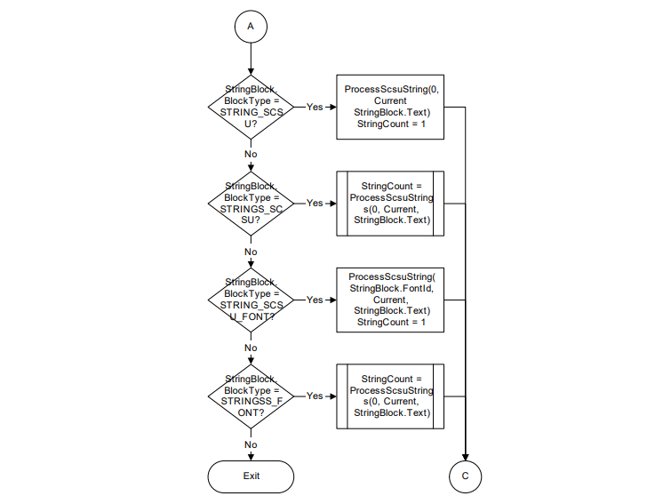

   String Block Processing: SCSU Processing

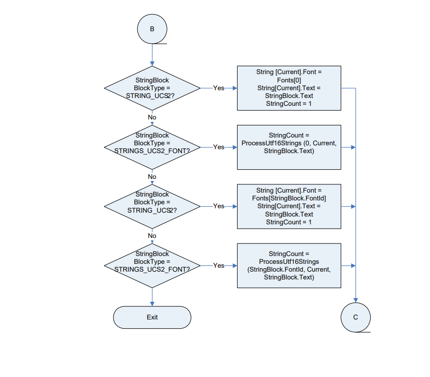

   **String Block Processing: UTF Processing**

.. _efi-hii-sibt-duplicate:

EFI_HII_SIBT_DUPLICATE
%%%%%%%%%%%%%%%%%%%%%%%

**Summary**

Creates a duplicate of a previously defined string.

**Prototype**

.. code-block::
  
   typedef struct _EFI_HII_SIBT_DUPLICATE_BLOCK {
     EFI_HII_STRING_BLOCK               Header;
     EFI_STRING_ID                      StringId;
   }   EFI_HII_SIBT_DUPLICATE_BLOCK;
  

**Members**

Header
  Standard string block header, where *Header.BlockType = EFI_HII_SIBT_DUPLICATE.*

StringId
  The string identifier of a previously defined string with the exact same string text. 

**Description**

Indicates that the string with string identifier *StringIdCurrent* is the same as a previously defined string and increments *StringIdCurrent* by one.

.. _efi-hii-sibt-end:

EFI_HII_SIBT_END
%%%%%%%%%%%%%%%%%%

**Summary**

Marks the end of the string information.

**Prototype**

.. code-block::
  
   typedef struct _EFI_HII_SIBT_END_BLOCK {  
     EFI_HII_STRING_BLOCK          Header;  
   }   EFI_HII_SIBT_END_BLOCK;
  

**Members**

Header
  Standard extended header, where *Header.Header.BlockType* = *EFI_HII_SIBT_EXT2* and *Header.BlockType2* = *EFI_HII_SIBT_FONT.*

BlockType2
  Indicates the type of extended block. See `String Information`_ for a list of all block types. 

**Description**

Any strings with a string identifier greater than or equal to *StringIdCurrent* are empty.

.. _efi-hii-sibt-ext1-efi-hii-sibt-ext2-efi-hii-sibt-ext4:

EFI_HII_SIBT_EXT1, EFI_HII_SIBT_EXT2,EFI_HII_SIBT_EXT4
%%%%%%%%%%%%%%%%%%%%%%%%%%%%%%%%%%%%%%%%%%%%%%%%%%%%%%%

**Summary**

Future expansion block types which have a length byte.

**Prototype**

.. code-block::
  
   typedef struct _EFI_HII_SIBT_EXT1_BLOCK {  
   EFI_HII_STRING_BLOCK       Header;  
     UINT8                    BlockType2;  
     UINT8                    Length;  
   }   EFI_HII_SIBT_EXT1_BLOCK;

   typedef struct _EFI_HII_SIBT_EXT2_BLOCK {  
   EFI_HII_STRING_BLOCK       Header;  
     UINT8                    BlockType2;  
     UINT16                   Length;  
   }   EFI_HII_SIBT_EXT2_BLOCK;  

   typedef struct _EFI_HII_SIBT_EXT4_BLOCK {  
   EFI_HII_STRING_BLOCK       Header;  
     UINT8                    BlockType2;  
     UINT32                   Length;  
   }   EFI_HII_SIBT_EXT4_BLOCK;
  

**Members**

Header
  Standard string block header, where *Header.BlockType* *= EFI_HII_SIBT_EXT1, EFI_HII_SIBT_EXT2 or EFI_HII_SIBT_EXT4.*

Length
  Size of the string block, in bytes.

BlockType2
  Indicates the type of extended block. See `String Information`_ for a list of all block types. 

**Description**

These are reserved for future expansion, with length bytes included so that they can be easily skipped.

.. _efi-hii-sibt-font:

EFI_HII_SIBT_FONT
%%%%%%%%%%%%%%%%%%

**Summary**

Provide information about a single font.

**Prototype**

.. code-block::
  
   typedef struct _EFI_HII_SIBT_FONT_BLOCK {
     EFI_HII_SIBT_EXT2_BLOCK         Header;
     UINT8                           FontId;
     UINT16                          FontSize;
     EFI_HII_FONT_STYLE              FontStyle;
     CHAR16                          FontName[...];
   } EFI_HII_SIBT_FONT_BLOCK;
  

**Members**

Header
  Standard extended header, where *Header.BlockType2* = *EFI_HII_SIBT_FONT.*

FontId
  Font identifier, which must be unique within the string package.

FontSize
  Character cell size, in pixels, of the font.

FontStyle
  Font style. Type *EFI_HII_FONT_STYLE* is defined in "Related Definitions" in *EFI_HII_FONT_PACKAGE_HDR.*
 
FontName
  Null-terminated font family name.

**Description**

Associates a font identifier *FontId* with a font name *FontName,* size *FontSize* and style *FontStyle.* This font identifier may be used with the string blocks. The font identifier 0 is the default font for those string blocks which do not specify a font identifier.

.. _efi-hii-sibt-skip1:

EFI_HII_SIBT_SKIP1
%%%%%%%%%%%%%%%%%%%

**Summary**

Skips string identifiers.

**Prototype**

.. code-block::
  
   typedef struct _EFI_HII_SIBT_SKIP1_BLOCK {  
   EFI_HII_STRING_BLOCK        Header;  
   UINT8                       SkipCount;  
   } EFI_HII_SIBT_SKIP1_BLOCK;
  
  

**Members**

Header
  Standard string block header, where *Header.BlockType* *= EFI_HII_SIBT_SKIP1.*

SkipCount
  The unsigned 8-bit value to add to *StringIdCurrent.*

**Description**

Increments the current string identifier *StringIdCurrent* by the number specified.

.. _efi-hii-sibt-skip2:

EFI_HII_SIBT_SKIP2
%%%%%%%%%%%%%%%%%%%%

**Summary**

Skips string ids.

**Prototype**

.. code-block::
  
   typedef struct _EFI_HII_SIBT_SKIP2_BLOCK {  
     EFI_HII_STRING_BLOCK            Header;  
     UINT16                          SkipCount;  
   }   EFI_HII_SIBT_SKIP2_BLOCK;
  
  

**Members**

Header
  Standard string block header, where *Header.BlockType* = *EFI_HII_SIBT_SKIP2.*

SkipCount
  The unsigned 16-bit value to add to *StringIdCurrent.*

**Description**

Increments the current string identifier *StringIdCurrent* by the number specified.

.. _efi-hii-sibt-string-scsu:

EFI_HII_SIBT_STRING_SCSU
%%%%%%%%%%%%%%%%%%%%%%%%

**Summary**

Describe a string encoded using SCSU, in the default font.

**Prototype**

.. code-block::
  
   typedef struct _EFI_HII_SIBT_STRING_SCSU_BLOCK {  
     EFI_HII_STRING_BLOCK             Header;  
     UINT8                            StringText[];  
   }   EFI_HII_SIBT_STRING_SCSU_BLOCK;
   

**Members**

Header
  Standard header where *Header.BlockType* = *EFI_HII_SIBT_STRING_SCSU.*

StringText
  The string text is a null-terminated string, which is assigned to the string identifier *StringIdCurrent.* 

**Description**

This string block provides the SCSU-encoded text for the string in the default font with string identifier *StringIdCurrent* and increments *StringIdCurrent* by one.

.. _efi-hii-sibt-string-scsu-font:

EFI_HII_SIBT_STRING_SCSU_FONT
%%%%%%%%%%%%%%%%%%%%%%%%%%%%%

**Summary**

Describe a string in the specified font.

**Prototype**

.. code-block::
  
   typedef struct _EFI_HII_SIBT_STRING_SCSU_FONT_BLOCK {  
     EFI_HII_STRING_BLOCK           Header;  
     UINT8                          FontIdentifier;  
     UINT8                          StringText[];  
   }   EFI_HII_SIBT_STRING_SCSU_FONT_BLOCK;
  
  

**Members**

Header
  Standard string block header, where *Header.BlockType* *= EFI_HII_SIBT_STRING_SCSU_FONT.*

FontIdentifier
  The identifier of the font to be used as the starting font for the entire string. The identifier must either be 0 for the default font or an identifier previously specified by an *EFI_HII_SIBT_FONT* block. Any string characters that deviates from this font family, size or style must provide an explicit control character. See `Common Control Codes`_ .

StringText
  The string text is a null-terminated encoded string, which is assigned to the string identifier *StringIdCurrent.* 

**Description**

This string block provides the SCSU-encoded text for the string in the font specified by *FontIdentifier* with string identifier *StringIdCurrent* and increments *StringIdCurrent* by one.

.. _efi-hii-sibt-strings-scsu:

EFI_HII_SIBT_STRINGS_SCSU
%%%%%%%%%%%%%%%%%%%%%%%%%

**Summary**

Describe strings in the default font.

**Prototype**

.. code-block::
  
   typedef struct _EFI_HII_SIBT_STRINGS_SCSU_BLOCK {  
     EFI_HII_STRING_BLOCK        Header;  
     UINT16                      StringCount;  
     UINT8                       StringText[];  
   }   EFI_HII_SIBT_STRINGS_SCSU_BLOCK;
  

**Members**

Header
  Standard header where *Header.BlockType* = *EFI_HII_SIBT_STRINGS_SCSU*

StringCount
  Number of strings in *StringText.*

StringText
  The strings, where each string is a null-terminated encoded string. 

**Description**

This string block provides the SCSU-encoded text for *StringCount* strings which have the default font and which have sequential string identifiers. The strings are assigned the identifiers, starting with *StringIdCurrent* and continuing through *StringIdCurrent* + *StringCount - 1.* *StringIdCurrent* is incremented by *StringCount.*

.. _efi-hii-sibt-strings-scsu-font:

EFI_HII_SIBT_STRINGS_SCSU_FONT
%%%%%%%%%%%%%%%%%%%%%%%%%%%%%%

**Summary**

Describe strings in the specified font.

**Prototype**

.. code-block::
  
   typedef struct _EFI_HII_SIBT_STRINGS_SCSU_FONT_BLOCK {  
     EFI_HII_STRING_BLOCK               Header;  
     UINT8                              FontIdentifier;  
     UINT16                             StringCount;  
     UINT8                              StringText[];  
   } EFI_HII_SIBT_STRINGS_SCSU_FONT_BLOCK;  
  

**Members**

Header
  Standard header where *Header.BlockType* = *EFI_HII_SIBT_STRINGS_SCSU_FONT.*

StringCount
  Number of strings in *StringText.*

FontIdentifier
  The identifier of the font to be used as the starting font for the entire string. The identifier must either be 0 for the default font or an identifier previously specified by an *EFI_HII_SIBT_FONT* block. Any string characters that deviates from this font family, size or style must provide an explicit control character. See `Common Control Codes`_.

StringText
  The strings, where each string is a null-terminated encoded string. 

**Description**

This string block provides the SCSU-encoded text for *StringCount* strings which have the font specified by *FontIdentifier* and which have sequential string identifiers. The strings are assigned the identifiers, starting with *StringIdCurrent* and continuing through *StringIdCurrent* + *StringCount* - 1. *StringIdCurrent* is incremented by *StringCount.*

.. _efi-hii-sibt-string-ucs2:

EFI_HII_SIBT_STRING_UCS2
%%%%%%%%%%%%%%%%%%%%%%%%

**Summary**

Describe a string in the default font.

**Prototype**

.. code-block::
  
   typedef struct _EFI_HII_SIBT_STRING_UCS2_BLOCK {  
     EFI_HII_STRING_BLOCK               Header;  
     CHAR16                             StringText[];  
   }   EFI_HII_SIBT_STRING_UCS2_BLOCK;
   

**Members**

Header
  Standard header where *Header.BlockType* = *EFI_HII_SIBT_STRING_UCS2.*

StringText
  The string text is a null-terminated UCS-2 string, which is assigned to the string identifier *StringIdCurren* t. 

**Description**

This string block provides the UCS-2 encoded text for the string in the default font with string identifier *StringIdCurrent* and increments *StringIdCurrent* by one.

.. _efi-hii-sibt-string-ucs2-font:

EFI_HII_SIBT_STRING_UCS2_FONT
%%%%%%%%%%%%%%%%%%%%%%%%%%%%%

**Summary**

Describe a string in the specified font.

**Prototype**

.. code-block::
  
   typedef struct _EFI_HII_SIBT_STRING_UCS2_FONT_BLOCK {  
     EFI_HII_STRING_BLOCK           Header;  
     UINT8                          FontIdentifier;  
     CHAR16                         StringText[];  
   } EFI_HII_SIBT_STRING_UCS2_FONT_BLOCK;
  

**Members**

Header
  Standard header where *Header.BlockType* = *EFI_HII_SIBT_STRING_UCS2_FONT.*

FontIdentifier
  The identifier of the font to be used as the starting font for the entire string. The identifier must either be 0 for the default font or an identifier previously specified by an *EFI_HII_SIBT_FONT* block. Any string characters that deviates from this font family, size or style must provide an explicit control character. See `Common Control Codes`_ .

StringText
  The string text is a null-terminated UCS-2 string, which is assigned to the string identifier *StringIdCurrent.* 

**Description**

This string block provides the UCS-2 encoded text for the string in the font specified by *FontIdentifier* with string identifier *StringIdCurrent* and increments *StringIdCurrent* by one.

.. _efi-hii-sibt-strings-ucs2:

EFI_HII_SIBT_STRINGS_UCS2
%%%%%%%%%%%%%%%%%%%%%%%%%

**Summary**

Describes strings in the default font.

**Prototype**

.. code-block::
  
   typedef struct _EFI_HII_SIBT_STRINGS_UCS2_BLOCK {
     EFI_HII_STRING_BLOCK           Header;
     UINT16                         StringCount;
     CHAR16                         StringText[];
   }   EFI_HII_SIBT_STRINGS_UCS2_BLOCK;
  

**Members**

Header
  Standard header where *Header.BlockType* = *EFI_HII_SIBT_STRINGS_UCS2.*

StringCount
  Number of strings in *StringText.*

StringText
  The string text is a series of null-terminated UCS-2 strings, which are assigned to the string identifiers *StringIdCurren* t.to *StringIdCurrent* + *StringCount - 1*.

**Description**

This string block provides the UCS-2 encoded text for the strings in the default font with string identifiers *StringIdCurrent* to *StringIdCurrent* + *StringCount* - 1 and increments *StringIdCurrent* by *StringCount.*

.. _efi-hii-sibt-strings-ucs2-font:

EFI_HII_SIBT_STRINGS_UCS2_FONT
%%%%%%%%%%%%%%%%%%%%%%%%%%%%%%

**Summary**

Describes strings in the specified font.

**Prototype**

.. code-block::
  
   typedef struct _EFI_HII_SIBT_STRINGS_UCS2_FONT_BLOCK {  
     EFI_HII_STRING_BLOCK           Header;  
     UINT8                          FontIdentifier;  
     UINT16                         StringCount;  
     CHAR16                         StringText[];  
   }   EFI_HII_SIBT_STRINGS_UCS2_FONT_BLOCK;
  

**Members**

Header
  Standard header where *Header.BlockType* = *EFI_HII_SIBT_STRINGS_UCS2_FONT.*

FontIdentifier
  The identifier of the font to be used as the starting font for the entire string. The identifier must either be 0 for the default font or an identifier previously specified by an *EFI_HII_SIBT_FONT* block. Any string characters that deviates from this font family, size or style must provide an explicit control character. See `Common Control Codes`_ .

StringCount
  Number of strings in *StringText.*

StringText
  The string text is a series of null-terminated UCS-2 strings, which are assigned to the string identifiers *StringIdCurren* t.through *StringIdCurrent* + *StringCount* *- 1.*

**Description**

This string block provides the UCS-2 encoded text for the strings in the font specified by *FontIdentifier* with string identifiers *StringIdCurrent* to *StringIdCurrent* + *StringCount* - 1 and increments *StringIdCurrent* by *StringCount.*

.. _string-encoding:

String Encoding
$$$$$$$$$$$$$$$

Each of the following sections describes part of how string text is encoded.

.. _standard-compression-scheme-for-unicode-scsu:

Standard Compression Scheme for Unicode (SCSU)
%%%%%%%%%%%%%%%%%%%%%%%%%%%%%%%%%%%%%%%%%%%%%%

The Unicode consortium provides a standard text compression algorithm, which minimizes the amount of storage required for multiple-language strings. For more information, see "Links to UEFI-Related Documents" ( *http://uefi.org/uefi)* under the heading "Unicode Compression Scheme". 

This specification extends the technique described in the following ways: 

-  The strings use the control code 0x7F to introduce the control codes described in `Common Control Codes`_ . The following byte is the control code. The character value 0x7F will be encoded as 0x01 (SQ0) 0x7F.
-  The language information contains default static and dynamic code windows, whereas SCSU provides fixed values for these.
-  Characters between 0xF000 and 0xFCFF should be rejected.

.. _unicode-2-byte-encoding-ucs-2:

Unicode 2-Byte Encoding (UCS-2)
%%%%%%%%%%%%%%%%%%%%%%%%%%%%%%%

The Unicode consortium provides a standard encoding algorithm, which takes two bytes per character. For more information see "Links to UEFI-Related Documents" ( *http://uefi.org/uefi)* under the heading "Unicode Consortium".

Characters between 0xF000 and 0xFCFF should be rejected.

.. _image-package:

Image Package
#############

The Image package record describes the mapping between image identifiers and the pixels of the image themselves. The package consists of three parts: a fixed header, image information and the palette information.

.. _fixed-header-2:

Fixed Header
$$$$$$$$$$$$

**Summary**

The fixed header consists of a standard record header and the offsets of the image and palette information.   

**Prototype**

.. code-block::
  
   typedef struct _EFI_HII_IMAGE_PACKAGE_HDR {  
     EFI_HII_PACKAGE_HEADER            Header;  
     UINT32                            ImageInfoOffset;  
     UINT32                            PaletteInfoOffset;  
   }   EFI_HII_IMAGE_PACKAGE_HDR;
  
  

**Members**

Header
  Standard package header, where *Header.Type* = *EFI_HII_PACKAGE_IMAGES.*

ImageInfoOffset
  Offset, relative to this header, of the image information. If this is zero, then there are no images in the package.

PaletteInfoOffset
  Offset, relative to this header, of the palette information. If this is zero, then there are no palettes in the image package.

.. _image-information:

Image Information
$$$$$$$$$$$$$$$$$

For each image identifier, the image information gives the bitmap and the relevant palette. The image information is encoded as a series of blocks, each with a single byte header. The blocks must be processed in order. Each block begins with a single byte, which contains the block type.   

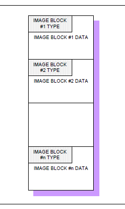

   Image Information Encoded in Blocks

**Prototype**

.. code-block::

   typedef struct _EFI_HII_IMAGE_BLOCK {
     UINT8                    BlockType;
     UINT8                    BlockBody[];
   }   EFI_HII_IMAGE_BLOCK;
  

The following table describes the different block types:

.. list-table:: Block Types
   :widths: 45 15 45 
   :name: block-types
   :class: longtable

   * - Name
     - Value
     - Description
   * - EFI_HII_IIBT_END
     - 0x00
     - The end of the image information.
   * - EFI_HII_IIBT_IMAGE_1BIT
     - 0x10
     - 1-bit w/palette
   * - EFI_HII_IIBT_IMAGE_1BIT_TRANS
     - 0x11
     - 1-bit w/palette & transparency
   * - EFI_HII_IIBT_IMAGE_4BIT
     - 0x12
     - 4-bit w/palette
   * - EFI_HII_IIBT_IMAGE_4BIT_TRANS
     - 0x13
     - 4-bit w/palette & transparency
   * - EFI_HII_IIBT_IMAGE_8BIT
     - 0x14
     - 8-bit w/palette
   * - EFI_HII_IIBT_IMAGE_8BIT_TRANS
     - 0x15
     - 8-bit w/palette & transparency
   * - EFI_HII_IIBT_IMAGE_24BIT
     - 0x16
     - 24-bit RGB
   * - EFI _HII_IIBT_IMAGE_24BIT_TRANS
     - 0x17
     - 24-bit RGB w/transparency
   * - EFI_HII_IIBT_IMAGE_JPEG
     - 0x18
     - JPEG encoded image
   * - EFI_HII_IIBT_IMAGE_PNG
     - 0x19
     - PNG encoded image
   * - EFI_HII_IIBT_DUPLICATE
     - 0x20
     - Duplicate an existing image identifier
   * - EFI_HII_IIBT_SKIP2
     - 0x21
     - Skip a certain number of image identifiers.
   * - EFI_HII_IIBT_SKIP1
     - 0x22
     - Skip a certain number of image identifiers.
   * - EFI_HII_IIBT_EXT1
     - 0x30
     - For future expansion (one byte length field)
   * - EFI_HII_IIBT_EXT2
     - 0x31
     - For future expansion (two byte length field)
   * - EFI_HII_IIBT_EXT4
     - 0x32
     - For future expansion (four byte length field)

In order to recreate all images, start at the first block and process them all until an *EFI_HII_IIBT_END_BLOCK* block is found. When processing the image blocks, each block refers to the current image identifier ( *ImageIdCurrent* ), which is initially set to one (1).

Image blocks of an unknown type should be skipped. If they cannot be skipped, then processing halts.

.. _efi-hii-iibt-end:

EFI_HII_IIBT_END
%%%%%%%%%%%%%%%%

**Summary**

Marks the end of the image information.

**Prototype**

.. code-block::
  
   # define EFI_HII_IIBT_END 0x00  

   typedef struct _EFI_HII_IIBT_END_BLOCK {  
     EFI_HII_IMAGE_BLOCK            Header; 
   }   EFI_HII_IIBT_END_BLOCK;
  

**Members**

Header
  Standard image block header, where *Header.BlockType* = *EFI_HII_IIBT_END_BLOCK.*

BlockType2
  Indicates the type of extended block. See `String Information`_ for a list of all block types. 

**Description**

Any images with an image identifier greater than or equal to *ImageIdCurrent* are empty.

.. _efi-hii-iibt-ext1-efi-hii-iibt-ext2-efi-hii-iibt-ext4:

EFI_HII_IIBT_EXT1, EFI_HII_IIBT_EXT2,EFI_HII_IIBT_EXT4
%%%%%%%%%%%%%%%%%%%%%%%%%%%%%%%%%%%%%%%%%%%%%%%%%%%%%%

**Summary**

Generic prefix for image information with a 1-byte length.

**Prototype**

.. code-block::
  
   #define EFI_HII_IIBT_EXT1 0x30
   typedef struct _EFI_HII_IIBT_EXT1_BLOCK {
   EFI_HII_IMAGE_BLOCK           Header;
     UINT8                       BlockType2;
     UINT8                       Length;
   }   EFI_HII_IIBT_EXT1_BLOCK;

   #define EFI_HII_IIBT_EXT2 0x31

   typedef struct _EFI_HII_IIBT_EXT2_BLOCK {
     EFI_HII_IMAGE_BLOCK         Header;
     UINT8                       BlockType2;
     UINT16                      Length;
   }   EFI_HII_IIBT_EXT2_BLOCK;

   #define EFI_HII_IIBT_EXT4 0x32

   typedef struct _EFI_HII_IIBT_EXT4_BLOCK {
     EFI_HII_IMAGE_BLOCK         Header;
     UINT8                       BlockType2;
     UINT32                      Length;
   }   EFI_HII_IIBT_EXT4_BLOCK;
  
  

**Members**

Header
  Standard image block header, where *Header.BlockType* = *EFI_HII_IIBT_EXT1_BLOCK,* *EFI_HII_IIBT_EXT2_BLOCK* or *EFI_HII_IIBT_EXT4_BLOCK.*

Length
  Size of the image block, in bytes, including the image block header.

BlockType2
  Indicates the type of extended block. See `Image Information`_ for a list of all block types.

**Description**

Future extensions for image records which need a length-byte length use this prefix.

.. _efi-hii-iibt-image-1bit:

EFI_HII_IIBT_IMAGE_1BIT
%%%%%%%%%%%%%%%%%%%%%%%

**Summary**

One bit-per-pixel graphics image with palette information.

**Prototype**

.. code-block::
  
   typedef struct _EFI_HII_IIBT_IMAGE_1BIT_BASE {  
     UINT16                         Width;  
     UINT16                         Height;  
     UINT8                          Data[... ];  
   }   EFI_HII_IIBT_IMAGE_1BIT_BASE; 

   #define EFI_HII_IIBT_IMAGE_1BIT 0x10  

   typedef struct _EFI_HII_IIBT_IMAGE_1BIT_BLOCK {  
     EFI_HII_IMAGE_BLOCK            Header;  
     UINT8                          PaletteIndex;  
     EFI_HII_IIBT_IMAGE_1BIT_BASE   Bitmap;  
   }   EFI_HII_IIBIT_IMAGE_1BIT_BLOCK;
   

**Members**

Header
  Standard image header, where *Header.BlockType* = *EFI_HII_IIBT_IMAGE_1BIT.*

Width
  Width of the bitmap in pixels.

Height
  Height of the bitmap in pixels.

Bitmap
  The bitmap specifies a series of pixels, one bit per pixel, left-to-right, top-to-bottom, and is padded out to the nearest byte. The number of bytes per bitmap can be calculated as: (( *Width* + 7)/8) * *Height.*

PaletteIndex
  Index of the palette in the palette information.

**Description**

This record assigns the 1-bit-per-pixel bitmap data to the *ImageIdCurrent* identifier and increment *ImageIdCurrent* by one. The image’s upper left hand corner pixel is the most significant bit of the first bitmap byte. An example of a *EFI_HII_IIBT_IMAGE_1BIT* structure is shown below: 

.. code-block::

   0x01 ; Palette Index
   0x000B ; Width
   0x0013 ; Height
   10000000b,00000000b ; Bitmap
   11000000b,00000000b
   11100000b,00000000b
   11110000b,00000000b
   11111000b,00000000b
   11111100b,00000000b
   11111110b,00000000b
   11111111b,00000000b
   11111111b,10000000b
   11111111b,11000000b
   11111111b,11100000b
   11111110b,00000000b
   11101111b,00000000b
   11001111b,00000000b
   10000111b,10000000b
   00000111b,10000000b
   00000011b,11000000b
   00000011b,11000000b
   00000001b,10000000b

.. _efi-hii-iibt-image-1bit-trans:

EFI_HII_IIBT_IMAGE_1BIT_TRANS
%%%%%%%%%%%%%%%%%%%%%%%%%%%%%

**Summary**

One bit-per-pixel graphics image with palette information and transparency.

**Prototype**

.. code-block::
  
   #define EFI_HII_IIBT_IMAGE_1BIT_TRANS 0x11

   typedef struct _EFI_HII_IIBT_IMAGE_1BIT_TRANS_BLOCK {  
     EFI_HII_IMAGE_BLOCK               Header;  
     UINT8                             PaletteIndex;  
     EFI_HII_IIBT_IMAGE_1BIT_BASE      Bitmap;  
   }   EFI_HII_IIBT_IMAGE_1BIT_TRANS_BLOCK;
   

**Members**

Header
  Standard image header, where *Header.BlockType* = *EFI_HII_IIBT_IMAGE_1BIT_TRANS.*

PaletteIndex
  Index of the palette in the palette information.

Bitmap
  The bitmap specifies a series of pixels, one bit per pixel, left-to-right, top-to-bottom, and is padded out to the nearest byte. The number of bytes per bitmap can be calculated as: (( *Width* + 7)/8) \* *Height.* 

**Description**

This record assigns the 1-bit-per-pixel bitmap data to the *ImageIdCurrent* identifier and increment *ImageIdCurrent* by one. The data in the *EFI_HII_IIBT_IMAGE_1BIT_TRANS* structure is exactly the same as the *EFI_HII_IIBT_IMAGE_1BIT* structure, the difference is how the data is treated. 

The bitmap pixel value 0 is the ‘transparency’ value and will not be written to the screen. The bitmap pixel value 1 will be translated to the color specified by Palette.

.. _efi-hii-iibt-image-24bit:

EFI_HII_IIBT_IMAGE_24BIT
%%%%%%%%%%%%%%%%%%%%%%%%

**Summary**

A 24 bit-per-pixel graphics image.

**Prototype**

.. code-block::
  
   #define EFI_HII_IIBT_IMAGE_24BIT 0x16  

   typedef struct _EFI_HII_IIBT_IMAGE_24BIT_BASE  
     UINT16                           Width;  
     UINT16                           Height;  
     EFI_HII_RGB_PIXEL                Bitmap[... ];  
   }   EFI_HII_IIBT_IMAGE_24BIT_BASE;

   typedef struct _EFI_HII_IIBT_IMAGE_24BIT_BLOCK {  
     EFI_HII_IMAGE_BLOCK              Header;  
     EFI_HII_IIBT_IMAGE_24BIT_BASE    Bitmap;  
   }   EFI_HII_IIBT_IMAGE_24BIT_BASE; 
  

**Members**

Width
  Width of the bitmap in pixels.

Height
  Height of the bitmap in pixels.

Header
  Standard image header, where *Header.BlockType* = *EFI_HII_IIBT_IMAGE_24BIT.*

Bitmap
  The bitmap specifies a series of pixels, 24 bits per pixel, left-to-right, top-to-bottom. The number of bytes per bitmap can be calculated as: (Width \* 3) \* Height. Type *EFI_HII_RGB_PIXEL* is defined in "Related Definitions" below. 

.. TODO the line about width / height is wrong. Not sure how to correct. 

**Description**

This record assigns the 24-bit-per-pixel bitmap data to the *ImageIdCurrent* identifier and increment *ImageIdCurrent* by one. The image’s upper left hand corner pixel is composed of the first three bitmap bytes. The first byte is the pixel’s blue component value, the next byte is the pixel’s green component value, and the third byte is the pixel’s red component value (B,G,R). Each color component value can vary from 0x00 (color off) to 0xFF (color full on), allowing 16.8 millions colors that can be specified.

**Related Definitions**

.. code-block::
  
   typedef struct _EFI_HII_RGB_PIXEL {  
     UINT8     b;  
     UINT8     g;  
     UINT8     r;  
   }   EFI_HII_RGB_PIXEL;

b
  The relative intensity of blue in the pixel’s color, from off (0x00) to full-on (0xFF).

g
The relative intensity of green in the pixel’s color, from off (0x00) to full-on (0xFF).

r
The relative intensity of red in the pixel’s color, from off (0x00) to full-on (0xFF).

.. _efi-hii-iibt-image-24bit-trans:

EFI_HII_IIBT_IMAGE_24BIT_TRANS
%%%%%%%%%%%%%%%%%%%%%%%%%%%%%%

**Summary**

A 24 bit-per-pixel graphics image with transparency.

**Prototype**

.. code-block::
  
   #define _EFI_HII_IIBT_IMAGE_24BIT_TRANS 0x17

   typedef struct EFI_HII_IIBT_IMAGE_24BIT_TRANS_BLOCK {  
     EFI_HII_IMAGE_BLOCK                  Header;  
     EFI_HII_IIBT_IMAGE_24BIT_BASE        Bitmap;  
   }   EFI_HII_IIBT_IMAGE_24BIT_TRANS_BLOCK;
  

**Members**

Header
  Standard image header, where *Hea der.BlockType* = *EFI_HII_IIBT_IMAGE_24BIT_TRANS.*

Bitmap
  The bitmap specifies a series of pixels, 24 bits per pixel, left-to-right, top-to-bottom. The number of bytes per bitmap can be calculated as: (Width \* 3) \* Height.

Width
  Width of the bitmap in pixels.

Height
  Height of the bitmap in pixels.

**Description**

This record assigns the 24-bit-per-pixel bitmap data to the *ImageIdCurrent* identifier and increment *ImageIdCurrent* by one. The data in the *EFI_HII_IMAGE_24BIT_TRANS* structure is exactly the same as the *EFI_HII_IMAGE_24BIT* structure, the difference is how the data is treated. 

The bitmap pixel value 0x00, 0x00, 0x00 is the ‘transparency’ value and will not be written to the screen. All other bitmap pixel values will be written as defined to the screen. Since the ‘transparency’ value replaces true black, for image to display black they should use the color 0x00, 0x00, 0x01 (very dark red)

.. _efi-iibt-image-4bit:

EFI_HII_IIBT_IMAGE_4BIT
%%%%%%%%%%%%%%%%%%%%%%%

**Summary**

Four bits-per-pixel graphics image with palette information.

**Prototype**

.. code-block::
  
   typedef struct _EFI_HII_IIBT_IMAGE_4BIT_BASE {
     UINT16                         Width;
     UINT16                         Height;
     UINT8                          Data[...];
   }   EFI_HII_IIBT_IMAGE_4BIT_BASE;

   #define EFI_HII_IIBT_IMAGE_4BIT 0x12

   typedef struct _EFI_HII_IIBT_IMAGE_4BIT_BLOCK {
     EFI_HII_IMAGE_BLOCK            Header;
     UINT8                          PaletteIndex;
     EFI_HII_IIBT_IMAGE_4BIT_BASE   Bitmap;
   }   EFI_HII_IIBT_IMAGE_4BIT_BLOCK;  

**Members**

Width
  Width of the bitmap in pixels.

Height
  Height of the bitmap in pixels.

Header
  Standard image header, where *Header.BlockType* = *EFI_HII_IIBT_IMAGE_4BIT.*

PaletteIndex
  Index of the palette in the palette information.

Bitmap
  The bitmap specifies a series of pixels, four bits per pixel, left-to-right, top-to-bottom, and is padded out to the nearest byte. The number of bytes per bitmap can be calculated as: (( *Width* + 1)/2) \* *Height.*

**Description**

This record assigns the 4-bit-per-pixel bitmap data to the *ImageIdCurrent* identifier using the specified palette and increment *ImageIdCurrent* by one. The image’s upper left hand corner pixel is the most significant nibble of the first bitmap byte. 

.. _efi-hii-iibt-image-4bit-trans:

EFI_HII_IIBT_IMAGE_4BIT_TRANS
%%%%%%%%%%%%%%%%%%%%%%%%%%%%%

**Summary**

Four bits-per-pixel graphics image with palette information and transparency.

**Prototype**

.. code-block::  
  
   #define EFI_HII_IIBT_IMAGE_4BIT_TRANS 0x13 

   typedef struct _EFI_HII_IIBT_IMAGE_4BIT_TRANS_BLOCK {  
     EFI_HII_IMAGE_BLOCK               Header;  
     UINT8                             PaletteIndex;  
     EFI_HII_IIBT_IMAGE_4BIT_BASE      Bitmap;  
   }   EFI_HII_IIBT_IMAGE_4BIT_TRANS_BLOCK;
  

**Members**

Header
  Standard image header, where *Header.BlockType* = *EFI_HII-IIBT_IMAGE_4BIT_TRANS.*

PaletteIndex
  Index of the palette in the palette information.

Bitmap
  The bitmap specifies a series of pixels, four bits per pixel, left-to-right, top-to-bottom, and is padded out to the nearest byte. The number of bytes per bitmap can be calculated as: (( *Width* + 1)/2) \* *Height.* 

**Description**

This record assigns the 4-bit-per-pixel bitmap data to the *ImageIdCurrent* identifier using the specified palette and increment *ImageIdCurrent* by one. The data in the *EFI_HII-IMAGE_4BIT_TRANS* structure is exactly the same as the *EFI_HII-IMAGE_4BIT* structure, the difference is how the data is treated.

The bitmap pixel value 0 is the ‘transparency’ value and will not be written to the screen. All the other bitmap pixel values will be translated to the color specified by Palette.

.. _efi-hii-iibt-image-8bit:

EFI_HII-IIBT_IMAGE_8BIT
%%%%%%%%%%%%%%%%%%%%%%%

**Summary**

Eight bits-per-pixel graphics image with palette information.

**Prototype**

.. code-block::
  
   #define EFI_HII-IIBT_IMAGE_8BIT 0x14

   typedef struct _EFI_HII-IIBT_IMAGE_8BIT_BASE {  
     UINT16                         Width;  
     UINT16                         Height;  
     UINT8                          Data[... ];  
   }   EFI_HII-IIBT_IMAGE_8BIT_BASE;

   typedef struct _EFI_HII-IIBT_IMAGE_8BIT_BLOCK {  
     EFI_HII-IMAGE_BLOCK            Header;  
     UINT8                          PaletteIndex;  
     EFI_HII-IIBT_IMAGE_8BIT_BASE   Bitmap;  
   }   EFI_HII-IIBT_IMAGE_8BIT_BLOCK;
  

**Members**

Width
  Width of the bitmap in pixels.

Height
  Height of the bitmap in pixels.

Header
  Standard image header, where *Header.BlockType* = *EFI_HII_IIBT_IMAGE_8BIT.*

PaletteIndex
  Index of the palette in the palette information.

Bitmap
  The bitmap specifies a series of pixels, eight bits per pixel, left-to-right, top-to-bottom. The number of bytes per bitmap can be calculated as: *Width* * *Height*. 

**Description**

This record assigns the 8-bit-per-pixel bitmap data to the *ImageIdCurrent* identifier using the specified palette and increment *ImageIdCurrent* by one. The image’s upper left hand corner pixel is the first bitmap byte.

.. _efi-hii-iibt-image-8bit-trans:

EFI_HII_IIBT_IMAGE_8BIT_TRANS
%%%%%%%%%%%%%%%%%%%%%%%%%%%%%%

**Summary**

Eight bits-per-pixel graphics image with palette information and transparency.   

**Prototype**   

.. code-block:: 
  
   #define EFI_HII_IIBT_IMAGE_8BIT_TRANS 0x15

   typedef struct _EFI_HII_IIBT_IMAGE_8BIT_TRANS_BLOCK {
     EFI_HII_IMAGE_BLOCK               Header;
     UINT8                             PaletteIndex;
     EFI_HII_IIBT_IMAGE_8BIT_BASE      Bitmap;
   }   EFI_HII_IIBT_IMAGE_8BIT_TRANS_BLOCK;
   

**Members**

Header
  Standard image header, where *Header.BlockType* = *EFI_HII_IIBT_IMAGE_8BIT_TRANS.*

PaletteIndex
  Index of the palette in the palette information.

Bitmap
  The bitmap specifies a series of pixels, eight bits per pixel, left-to-right, top-to-bottom. The number of bytes per bitmap can be calculated as: *Width* \* *Height.* 

**Description**

This record assigns the 8-bit-per-pixel bitmap data to the *ImageIdCurrent* identifier using the specified palette and increment *ImageIdCurrent* by one. The data in the *EFI_HII_IMAGE_8BIT_TRANS* structure is exactly the same as the *EFI_HII_IMAGE_8BIT* structure, the difference is how the data is treated. 

The bitmap pixel value 0 is the ‘transparency’ value and will not be written to the screen. All the other bitmap pixel values will be translated to the color specified by Palette.

.. _efi-hii-iibt-duplicate:

EFI_HII_IIBT_DUPLICATE
%%%%%%%%%%%%%%%%%%%%%%5

**Summary**

Assigns a new character value to a previously defined image.

**Prototype**

.. code-block::
  
   #define EFI_HII_IIBT_DUPLICATE 0x20

   typedef struct _EFI_HII_IIBT_DUPLICATE_BLOCK {
   EFI_HII_IMAGE_BLOCK           Header;
   EFI_IMAGE_ID                  ImageId;
   } EFI_HII_IIBT_DUPLICATE_BLOCK; 
  

**Members**

Header
  Standard image header, where *Header.BlockType* = *EFI_HII_IIBT_DUPLICATE.*

ImageId
  The previously defined image ID with the exact same image.

**Description**

Indicates that the image with image ID *ImageValueCurrent* has the same image as a previously defined image ID and increments *ImageValueCurrent* by one.

.. _efi-hii-iibt-image-jpeg:

EFI_HII_IIBT_IMAGE_JPEG
%%%%%%%%%%%%%%%%%%%%%%%

**Summary**

A true-color bitmap is encoded with JPEG image compression.

**Prototype**

.. code-block::
  
   #define EFI_HII_IIBT_IMAGE_JPEG 0x18

   typedef struct _EFI_HII_IIBT_JPEG_BLOCK {
   EFI_HII_IMAGE_BLOCK           Header;
   UINT32                        Size;
   UINT8                         Data[... ];
   } EFI_HII_IIBT_JPEG;

**Members**

Header
  Standard image header, where *Header.BlockType* = *EFI_HII_IIBT_IMAGE_JPEG.*

Size
  Specifies the size of the JPEG encoded data.

Data
  JPEG encoded data with ‘JFIF’ signature at offset 6 in the data block. The JPEG encoded data, specifies type of encoding and final size of true-color image.

**Description**

This record assigns the JPEG image data to the *ImageIdCurrent* identifier and increment *ImageIdCurrent* by one. The JPEG decoder is only required to cover the basic JPEG encoding types, which are produced by standard available paint packages (for example: MSPaint under Windows from Microsoft). This would include JPEG encoding of high (1:1:1) and medium (4:1:1) quality with only three components (R,G,B) - no support for the special gray component encoding.

.. _efi-hii-iibt-skip1:

EFI_HII_IIBT_SKIP1
%%%%%%%%%%%%%%%%%%%

**Summary**

Skips image IDs.

**Prototype**

.. code-block::
  
   #define EFI_HII_IIBT_SKIP1 0x22

   typedef struct _EFI_HII_IIBT_SKIP1_BLOCK {
     EFI_HII_IMAGE_BLOCK            Header;
     UINT8                          SkipCount;
   }   EFI_HII_IIBT_SKIP1_BLOCK;
  

**Members**

Header
  Standard image header, where *Header.BlockType* = *EFI_HII_IIBT_SKIP1.*

SkipCount
  The unsigned 8-bit value to add to *ImageIdCurrent.*

**Description**

Increments the current image ID *ImageIdCurrent* by the number specified.

.. _efi_hii-iibt_skip2:

EFI_HII_IIBT_SKIP2
%%%%%%%%%%%%%%%%%%

**Summary**

Skips image IDs.

**Prototype**

.. code-block::
  
   #define EFI_HII_IIBT_SKIP2 0x21  

   typedef struct _EFI_HII_IIBT_SKIP2_BLOCK {  
     EFI_HII_IMAGE_BLOCK         Header;  
     UINT16                      SkipCount;  
   }   EFI_HII_IIBT_SKIP2_BLOCK;
  

**Members**

Header
  Standard image header, where *Header.BlockType* = *EFI_HII_IIBT_SKIP2.*

SkipCount
  The unsigned 16-bit value to add to *ImageIdCurrent.*

**Description**

Increments the current image ID *ImageIdCurrent* by the number specified.
 

.. _efi_hii-iibt_png_block:

EFI_HII_IIBT_PNG_BLOCK
%%%%%%%%%%%%%%%%%%%%%%

Add a new image block structure for *EFI_HII_IIBT_IMAGE_PNG* . This supports the PNG image format in EFI HII image database.   

**Related Definitions**

.. code-block::

  
   //***********************************************************
   // EFI_HII_IIBT_IMAGE_PNG(0x19)
   //***********************************************************
   typedef struct _EFI_HII_IIBT_PNG_BLOCK {
     EFI_HII_IMAGE_BLOCK           Header;
     UINT32                        Size;
     UINT8                         Data[1];
   }   EFI_IIBT_PNG_BLOCK;

**Members**

Header
  Standard image block header, where H *eader.locktype* = *EFI_HII_IIBT_IMAGE_PNG.*

Size
  Size of the PNG image.

Data
  The raw data of the PNG image file.

.. _palette-information:

Palette Information
$$$$$$$$$$$$$$$$$$$$

**Summary**

This section describes the palette information within an image package.   

**Prototype**

.. code-block::
  
   typedef struct _EFI_HII_IMAGE_PALETTE_INFO_HEADER {
     UINT16 PaletteCount;
   }   EFI_HII_IMAGE_PALETTE_INFO_HEADER;

**Members**

PaletteCount
  Number of palettes.

**Description**

This fixed header is followed by zero or more variable-length palette information records. The structures are assigned a number 1 to n.

.. _palette-information-records:

Palette Information Records
%%%%%%%%%%%%%%%%%%%%%%%%%%%

**Summary**

A single palette

**Prototype**

.. code-block::
  
   typedef struct _EFI_HII_IMAGE_PALETTE_INFO {
     UINT16                      PaletteSize;
     EFI_HII_RGB_PIXEL           PaletteValue[_];
   }   EFI_HII_IMAGE_PALETTE_INFO;

**Members**

PaletteSize
  Size of the palette information.

PaletteValue
  Array of color values. Type *EFI_HII_RGB_PIXEL* is described in "Related Definitions" in *EFI_HII_IIBT_IMAGE_24BIT.*

**Description**

Each palette information record is an array of 24-bit color structures. The first entry ( *PaletteValue[0]* ) corresponds to color 0 in the source image; the second entry ( *PaletteValue[1]* ) corresponds to color 1, etc. Each palette entry is a three byte entry, with the first byte equal to the blue component of the color, followed by green, and finally red (B,G,R). Each color component value can vary from 0x00 (color off) to 0xFF (color full on), allowing 16.8 millions colors that can be specified.

A black & white 1-bit image would have the following palette structure:

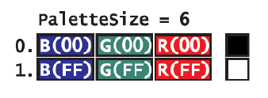

   Palette Structure of a Black & White, One-BitImage

..   

A 4-bit image would have the following palette structure:

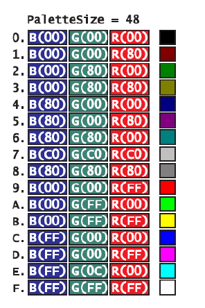

   Palette Structure of a Four-Bit Image
..

The image palette must only contain the palette entries specified in the bitmap. The bitmap should allocate each color index starting from 0x00, so the palette information can be as small as possible. The following is an example of a palette structure of a 4-bit image that only uses 6 colors:

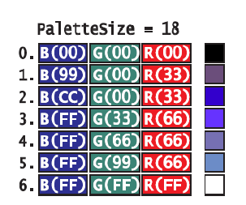
  
   Palette Structure of a Four-Bit, Six-ColorImage

Each palette entry specifies each unique color in the image. The above figure would be typical of light blue logo on a black background, with several shades of blue for anti-aliasing the blue logo on the black background.

.. _forms-package:

Forms Package
#############

The Forms package is used to carry forms-based encoding data.

**Prototype**

.. code-block::
  
   typedef struct _EFI_HII_FORM_PACKAGE_HDR {
     EFI_HII_PACKAGE_HEADER *Header;
   //EFI_IFR_OP_HEADER *OpCodeHeader;
   //More op-codes follow
   }   EFI_HII_FORM_PACKAGE_HDR;

**Parameters**

Header
  The standard package header, where Header.Type = EFI_HII_PACKAGE_FORMS.

OpCodeHeader
  The header for the first of what will be a series of op-codes associated with the forms data described in this package. The syntax of the forms can be referenced in :ref:`Forms` . 

**Description**

This is a package type designed to represent Internal Forms Representation (IFR) objects as a collection of op-codes

.. _binary-encoding:

Binary Encoding
$$$$$$$$$$$$$$$$

The IFR is a binary encoding for HII-related objects. Every object has (at least) three attributes:

Opcode. The enumeration of all of the different HII-related objects.

Length. The length of the opcode itself (2-127 bytes).

Scope. If set, this opens up a new scope. Certain objects describe attributes or capabilities which only apply to the current scope rather than the entire form. The scope extends up to the special END opcode, which marks the end of the current scope.

The binary objects are encoded as byte stream. Every object begins with a standard header ( *EFI_IFR_OP_HEADER* ), which describes the opcode type, length and scope.

The simple binary object consists of a standard header, which contains a single 8-bit opcode, a 7-bit length and a 1-bit nesting indicator. The length specifies the number of bytes in the opcode, including the header. The simple binary object may also have zero or more bytes of fixed, object-specific, data.   

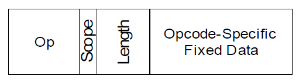

   Simple Binary Object

When the *Scope* bit is set, it marks the beginning of a new scope which applies to all subsequent opcodes until the matching *EFI_IFR_END* opcode is found to close the scope. Those opcodes may, in turn, open new scopes as well, creating nested scopes.

.. _standard-headers:

Standard Headers
$$$$$$$$$$$$$$$$

.. _efi-ifr-op-header:

EFI_IFR_OP_HEADER
%%%%%%%%%%%%%%%%%

**Summary**

Standard opcode header

**Prototype**

.. code-block::
  
   typedef struct _EFI_IFR_OP_HEADER {
     UINT8              OpCode;
     UINT8              Length:7;
     UINT8              Scope:1;
   }   EFI_IFR_OP_HEADER;
  

**Members**

OpCode
  Defines which type of operation is being described by this header. See `Opcode Reference`_ for a list of IFR opcodes.

Length
  Defines the number of bytes in the opcode, including this header.

Scope
  If this bit is set, the opcode begins a new scope, which is ended by an *EFI_IFR_END* opcode. 

**Description**

Forms are represented in a binary format roughly similar to processor instructions. 

Each header contains an opcode, a length and a scope indicator. 

If *Scope* indicator is set, the scope exists until it reaches a corresponding *EFI_IFR_END* opcode. Scopes may be nested within other scopes. 

**Related Definitions**

.. code-block::
  
   typedef UINT16 EFI_QUESTION_ID;  
   typedef UINT16 EFI_IMAGE_ID;  
   typedef UINT16 EFI_STRING_ID;  
   typedef UINT16 EFI_FORM_ID;  
   typedef UINT16 EFI_VARSTORE_ID;  
   typedef UINT16 EFI_ANIMATION_ID;
  

.. _efi-ifr-question-header:

EFI_IFR_QUESTION_HEADER
%%%%%%%%%%%%%%%%%%%%%%%%

**Summary**

Standard question header.

**Prototype**

.. code-block::
  
   typedef struct _EFI_IFR_QUESTION_HEADER {  
     EFI_IFR_STATEMENT_HEADER          Header;  
     EFI_QUESTION_ID                   QuestionId;  
     EFI_VARSTORE_ID                   VarStoreId;  
     union {  
       EFI_STRING_ID                   VarName;  
       UINT16                          VarOffset;  
     }                                 VarStoreInfo;  
     UINT8                             Flags;  
   }   EFI_IFR_QUESTION_HEADER;
  

**Members**

Header
  The standard statement header.

QuestionId
  The unique value that identifies the particular question being defined by the opcode. The value of zero is reserved.

Flags
  A bit-mask that determines which unique settings are active for this question. See "Related Definitions" below for the meanings of the individual bits.

VarStoreId
  Specifies the identifier of a previously declared variable store to use when storing the question’s value. A value of zero indicates no associated variable store.

VarStoreInfo
  If *VarStoreId* refers to Buffer Storage ( *EFI_IFR_VARSTORE* or *EFI_IFR_VARSTORE_EFI* ), then *VarStoreInfo* contains a 16-bit Buffer Storage offset ( *VarOffset* ). If *VarStoreId* refers to Name/Value Storage ( *EFI_IFR_VARSTORE_NAME_VALUE* ), then *VarStoreInfo* contains the String ID of the name ( *VarName* ) for this name/value pair. 

**Description**

This is the standard header for questions.

**Related Definitions**

.. code-block::
  
   //****************************************************
   // Flags values
   //****************************************************
   #define EFI_IFR_FLAG_READ_ONLY            0x01
   #define EFI_IFR_FLAG_CALLBACK             0x04
   #define EFI_IFR_FLAG_RESET_REQUIRED       0x10
   #define EFI_IFR_FLAG_REST_STYLE           0x20
   #define EFI_IFR_FLAG_RECONNECT_REQUIRED   0x40
   #define EFI_IFR_FLAG_OPTIONS_ONLY         0x80

.. list-table::
   :widths: 45 45
   :class: longtable

   * - EFI_IFR_FLAG_READ_ONLY           
     - The question is read-only         
   * - EFI_IFR_FLAG_CALLBACK            
     - Designates if a particular opcode is to be treated as something that will initiate a callback to a registered driver.              
   * - EFI_IFR_FLAG_RESET_REQUIRED
     - If a particular choice is modified, designates that a return flag will be activated upon exiting of the browser, which indicates that the changes that the user requested require a reset to enact.                   
   * - EFI_IFR_FLAG_REST_STYLE
     - Designates if a question supports REST architectural style operation. This flag can be omitted if the formset class guid already contains EFI_HII_REST_STYLE_FORMSET_GUID.  
   * - EFI_IFR_FLAG_RECONNECT_REQUIRED  
     - If a particular choice is modified, designates that a return flag will be activated upon exiting of the formset or the browser, which indicates that the changes that the user requested require a reconnect to enact.                            
   * - EFI_IFR_FLAG_OPTIONS_ONLY
     - For questions with options, this indicates that only the options will be available for user choice. 

.. _efi-ifr-statement-header:

EFI_IFR_STATEMENT_HEADER
%%%%%%%%%%%%%%%%%%%%%%%%%

**Summary**

Standard statement header.

**Prototype** 

.. code-block::

   typedef struct _EFI_IFR_STATEMENT_HEADER {
     EFI_STRING_ID                          Prompt;
     EFI_STRING_ID                          Help;
   }   EFI_IFR_STATEMENT_HEADER;
                 

**Members**

Prompt
  The string identifier of the prompt string for this particular statement. The value 0 indicates no prompt string.

Help
  The string identifier of the help string for this particular statement. The value 0 indicates no help string. 

**Description**

This is the standard header for statements, including questions.

.. _opcode-reference:

Opcode Reference
$$$$$$$$$$$$$$$$$

This section describes each of the IFR opcode encodings in detail. The table below lists the opcodes in numeric order while the reference section lists them in alphabetic order. 

.. list-table:: IFR Opcodes
   :widths: 45 15 45
   :name: ifr-opcodes
   :class: longtable

   * - Opcode
     - Value
     - Description
   * - *EFI_IFR_FORM_OP*
     - 0x01
     - Form
   * - *EFI_IFR_SUBTITLE_OP*
     - 0x02
     - Subtitle statement
   * - *EFI_IFR_TEXT_OP*
     - 0x03
     - Static text/image statement
   * - *EFI_IFR_IMAGE_OP*
     - 0x04
     - Static image.
   * - *EFI_IFR_ONE_OF_OP*
     - 0x05
     - One-of question
   * - *EFI_IFR_CHECKBOX_OP*
     - 0x06
     - Boolean question
   * - *EFI_IFR_NUMERIC_OP*
     - 0x07
     - Numeric question
   * - *EFI_IFR_PASSWORD_OP*
     - 0x08
     - Password string question
   * - *EFI_IFR_ONE_OF_OPTION_OP*
     - 0x09
     - Option
   * - *EFI_IFR_SUPPRESS_IF_OP*
     - 0x0A
     - Suppress if conditional
   * - *EFI_IFR_LOCKED_OP*
     - 0x0B
     - Marks statement/question as locked
   * - *EFI_IFR_ACTION_OP*
     - 0x0C
     - Button question
   * - *EFI _IFR_RESET_BUTTON_OP*
     - 0x0D
     - Reset button statement
   * - *EFI_IFR_FORM_SET_OP*
     - 0x0E
     - Form set
   * - *EFI_IFR_REF_OP*
     - 0x0F
     - Cross-reference statement
   * - *EFI_IFR_NO_SUBMIT_IF_OP*
     - 0x10
     - Error checking conditional
   * - *EFI_IF R_INCONSISTENT_IF_OP*
     - 0x11
     - Error checking conditional
   * - *EFI_IFR_EQ_ID_VAL_OP*
     - 0x12
     - Return **TRUE** if question value equals UINT16
   * - *EFI_IFR_EQ_ID_ID_OP*
     - 0x13
     - Return **TRUE** if question value equals another question value
   * - *EFI_I FR_EQ_ID_VAL_LIST_OP*
     - 0x14
     - Return **TRUE** if question value is found in list of UINT16s
   * - *EFI_IFR_AND_OP*
     - 0x15
     - Push **TRUE** if both sub-expressions returns **TRUE**.
   * - *EFI_IFR_OR_OP*
     - 0x16
     - Push **TRUE** if either sub-expressions returns **TRUE**.
   * - *EFI_IFR_NOT_OP*
     - 0x17
     - Push **FALSE** if sub-expression returns **TRUE**, otherwise return **TRUE**.
   * - *EFI_IFR_RULE_OP*
     - 0x18
     - Create rule in current form.
   * - *EFI_IFR_GRAY_OUT_IF_OP*
     - 0x19
     - Nested statements, questions or options will not be selectable if expression returns **TRUE**.
   * - *EFI_IFR_DATE_OP*
     - 0x1A
     - Date question.
   * - *EFI_IFR_TIME_OP*
     - 0x1B
     - Time question.
   * - *EFI_IFR_STRING_OP*
     - 0x1C
     - String question
   * - *EFI_IFR_REFRESH_OP*
     - 0x1D
     - Interval for refreshing a question
   * - *EFI_IFR_DISABLE_IF_OP*
     - 0x1E
     - Nested statements, questions or options will not be processed if expression returns **TRUE**.
   * - *EFI_IFR_ANIMATION_OP*
     - 0x1F
     - Animation associated with question statement, form or form set.
   * - *EFI_IFR_TO_LOWER_OP*
     - 0x20
     - Convert a string on the expression stack to lower case.
   * - *EFI_IFR_TO_UPPER_OP*
     - 0x21
     - Convert a string on the expression stack to upper case.
   * - *EFI_IFR_MAP_OP*
     - 0x22
     - Convert one value to another by selecting a match from a list.
   * - *EFI _IFR_ORDERED_LIST_OP*
     - 0x23
     - Set question
   * - *EFI_IFR_VARSTORE_OP*
     - 0x24
     - Define a buffer-style variable storage.
   * - *EFI_IFR_VA RSTORE_NAME_VALUE_OP*
     - 0x25
     - Define a name/value style variable storage.
   * - *EFI _IFR_VARSTORE_EFI_OP*
     - 0x26
     - Define a UEFI variable style variable storage.
   * - *EFI_IF R_VARSTORE_DEVICE_OP*
     - 0x27
     - Specify the device path to use for variable storage.
   * - *EFI_IFR_VERSION_OP*
     - 0x28
     - Push the revision level of the UEFI Specification to which this Forms Processor is compliant.
   * - *EFI_IFR_END_OP*
     - 0x29
     - Marks end of scope.
   * - *EFI_IFR_MATCH_OP*
     - 0x2A
     - Push **TRUE** if string matches a pattern.
   * - *EFI_IFR_GET_OP*
     - 0x2B
     - Return a stored value.
   * - *EFI_IFR_SET_OP*
     - 0x2C
     - Change a stored value.
   * - *EFI_IFR_READ_OP*
     - 0x2D
     - Provides a value for the current question or default.
   * - *EFI_IFR_WRITE*
     - 0x2E
     - Change a value for the current question.
   * - *EFI_IFR_EQUAL_OP*
     - 0x2F
     - Push **TRUE** if two expressions are equal.
   * - *EFI_IFR_NOT_EQUAL_OP*
     - 0x30
     - Push **TRUE** if two expressions are not equal.
   * - *EFI _IFR_GREATER_THAN_OP*
     - 0x31
     - Push **TRUE** if one expression is greater than another expression.
   * - *EFI_ IFR_GREATER_EQUAL_OP*
     - 0x32
     - Push **TRUE** if one expression is greater than or equal to another expression.
   * - *EFI_IFR_LESS_THAN_OP*
     - 0x33
     - Push **TRUE** if one expression is less than another expression.
   * - *EFI_IFR_LESS_EQUAL_OP*
     - 0x34
     - Push **TRUE** if one expression is less than or equal to another expression.
   * - *EFI_IFR_BITWISE_AND_OP*
     - 0x35
     - Bitwise-AND two unsigned integers and push the result.
   * - *EFI_IFR_BITWISE_OR_OP*
     - 0x36
     - Bitwise-OR two unsigned integers and push the result.
   * - *EFI_IFR_BITWISE_NOT_OP*
     - 0x37
     - Bitwise-NOT an unsigned integer and push the result.
   * - *EFI_IFR_SHIFT_LEFT_OP*
     - 0x38
     - Shift an unsigned integer left by a number of bits and push the result.
   * - *EFI_IFR_SHIFT_RIGHT_OP*
     - 0x39
     - Shift an unsigned integer right by a number of bits and push the result.
   * - *EFI_IFR_ADD_OP*
     - 0x3A
     - Add two unsigned integers and push the result.
   * - *EFI_IFR_SUBTRACT_OP*
     - 0x3B
     - Subtract two unsigned integers and push the result.
   * - *EFI_IFR_MULTIPLY_OP*
     - 0x3C
     - Multiply two unsigned integers and push the result.
   * - *EFI_IFR_DIVIDE_OP*
     - 0x3D
     - Divide one unsigned integer by another and push the result.
   * - *EFI_IFR_MODULO_OP*
     - 0x3E
     - Divide one unsigned integer by another and push the remainder.
   * - *EFI_IFR_RULE_REF_OP*
     - 0x3F
     - Evaluate a rule
   * - *EFI_ IFR_QUESTION_REF1_OP*
     - 0x40
     - Push a question’s value
   * - *EFI_ IFR_QUESTION_REF2_OP*
     - 0x41
     - Push a question’s value
   * - *EFI_IFR_UINT8_OP*
     - 0x42
     - Push an 8-bit unsigned integer
   * - *EFI_IFR_UINT16_OP*
     - 0x43
     - Push a 16-bit unsigned integer.
   * - *EFI_IFR_UINT32_OP*
     - 0x44
     - Push a 32-bit unsigned integer
   * - *EFI_IFR_UINT64_OP*
     - 0x45
     - Push a 64-bit unsigned integer.
   * - *EFI_IFR_TRUE_OP*
     - 0x46
     - Push a boolean **TRUE**.
   * - *EFI_IFR_FALSE_OP*
     - 0x47
     - Push a boolean **FALSE**
   * - *EFI_IFR_TO_UINT_OP*
     - 0x48
     - Convert expression to an unsigned integer
   * - *EFI_IFR_TO_STRING_OP*
     - 0x49
     - Convert expression to a string
   * - *EFI_IFR_TO_BOOLEAN_OP*
     - 0x4A
     - Convert expression to a boolean.
   * - *EFI_IFR_MID_OP*
     - 0x4B
     - Extract portion of string or buffer
   * - *EFI_IFR_FIND_OP*
     - 0x4C
     - Find a string in a string.
   * - *EFI_IFR_TOKEN_OP*
     - 0x4D
     - Extract a delimited byte or character string from buffer or string.
   * - *EFI_IFR_STRING_REF1_OP*
     - 0x4E
     - Push a string
   * - *EFI_IFR_STRING_REF2_OP*
     - 0x4F
     - Push a string
   * - *EFI_IFR_CONDITIONAL_OP*
     - 0x50
     - Duplicate one of two expressions depending on result of the first expression.
   * - *EFI_IFR_QUESTION_REF3_OP*
     - 0x51
     - Push a question’s value from a different form.
   * - *EFI_IFR_ZERO_OP*
     - 0x52
     - Push a zero
   * - *EFI_IFR_ONE_OP*
     - 0x53
     - Push a one
   * - *EFI_IFR_ONES_OP*
     - 0x54
     - Push a 0xFFFFFFFFFFFFFFFF.
   * - *EFI_IFR_UNDEFINED_OP*
     - 0x55
     - Push Undefined
   * - *EFI_IFR_LENGTH_OP*
     - 0x56
     - Push length of buffer or string.
   * - *EFI_IFR_DUP_OP*
     - 0x57
     - Duplicate top of expression stack
   * - *EFI_IFR_THIS_OP*
     - 0x58
     - Push the current question’s value
   * - *EFI_IFR_SPAN_OP*
     - 0x59
     - Return first matching/non-matching character in a string
   * - *EFI_IFR_VALUE_OP*
     - 0x5A
     - Provide a value for a question
   * - *EFI_IFR_DEFAULT_OP*
     - 0x5B
     - Provide a default value for a question.
   * - *EFI_IFR_DEFAULTSTORE_OP*
     - 0x5C
     - Define a Default Type Declaration
   * - *EFI_IFR_FORM_MAP_OP*
     - 0x5D
     - Create a standards-map form.
   * - *EFI_IFR_CATENATE_OP*
     - 0x5E
     - Push concatenated buffers or strings.
   * - *EFI_IFR_GUID_OP*
     - 0x5F
     - An extensible GUIDed op-code
   * - *EFI_IFR_SECURITY_OP*
     - 0x60
     - Returns whether current user profile contains specified setup access privileges.
   * - *EFI_IFR_MODAL_TAG_OP*
     - 0x61
     - Specify current form is modal
   * - *EFI_IFR_REFRESH_ID_OP*
     - 0x62
     - Establish an event group for refreshing a forms-based element.
   * - *EFI_IFR_WARNING_IF*
     - 0x63
     - Warning conditional
   * - *EFI_IFR_MATCH2_OP*
     - 0x64
     - Push **TRUE** if string matches a Regular Expression pattern.

**Code Definitions**

Each of the following sections gives a detailed description of the opcodes’ behavior.

.. _efi-ifr-action:

EFI_IFR_ACTION
%%%%%%%%%%%%%%

**Summary**

Create an action button.

**Prototype**

.. code-block::
  
   #define EFI_IFR_ACTION_OP 0x0C
   typedef struct _EFI_IFR_ACTION {
     EFI_IFR_OP_HEADER             Header;
     EFI_IFR_QUESTION_HEADER       Question;
     EFI_STRING_ID                 QuestionConfig;
   }   EFI_IFR_ACTION;

   typedef struct _EFI_IFR_ACTION_1 {
     EFI_IFR_OP_HEADER             Header;
     EFI_IFR_QUESTION_HEADER       Question;
   } _EFI_IFR_ACTION_1;
  

**Members**

Header
  The standard opcode header, where *Header.OpCode =* *EFI_IFR_ACTION_OP.*

Question
  The standard question header. See *EFI_IFR_QUESTION_HEADER* ( `EFI_IFR_QUESTION_HEADER`_ ) for more information.

QuestionConfig
  The results string which is in *<ConfigResp>* format will be processed when the button is selected by the user. 

**Description**

Creates an action question. When the question is selected, the configuration string specified by *QuestionConfig* will be processed. If *QuestionConfig* is 0 or is not present, then no no configuration string will be processed. This is useful when using an action button only for the callback. 

If the question is marked read-only (see *EFI_IFR_QUESTION_HEADER* ) then the action question cannot be selected.

.. _efi-ifr-animation:

EFI_IFR_ANIMATION
%%%%%%%%%%%%%%%%%

**Summary**

Creates an image for a statement or question.

**Prototype**

.. code-block::
  
   #define EFI_IFR_ANIMATION_OP 0x1F
   typedef struct _EFI_IFR_ANIMATION {
     EFI_IFR_OP_HEADER        Header;
     EFI_ANIMATION_ID         Id;
   }   EFI_IFR_ANIMATION;
   

**Members**

Header
  Standard opcode header, where *Header.OpCode* is *EFI_IFR_ANIMATION_OP*

Id
  Animation identifier in the HII database. 

**Description**

Associates an animation from the HII database with the current question, statement or form. If the specified animation does not exist in the HII database.

.. _efi-ifr-add:

EFI_IFR_ADD
%%%%%%%%%%%

**Summary**

Pops two unsigned integers, adds them and pushes the result.

**Prototype**

.. code-block::
  
   #define EFI_IFR_ADD_OP 0x3a
   typedef struct _EFI_IFR_ADD {
     EFI_IFR_OP_HEADER           Header;
   }   EFI_IFR_ADD;
  

**Members**

Header
  Standard opcode header, where *Header.OpCode* *= EFI_IFR_ADD_OP.* 

**Description**

This opcode performs the following actions:

#. Pop two values from the expression stack. Thefirst popped is the *right-hand* value. The secondpopped is the *left-hand* value.

#. If the two values do not evaluate to unsigned    integers, push Undefined.

#. Zero-extend the *left-hand* and *right-hand* values to    64-bits.

#. Add the left-hand value to right-hand value.

#. Push the lower 64-bits of the result. Overflow is    ignored.  

.. _efi-ifr-and:

EFI_IFR_AND
%%%%%%%%%%%

**Summary**

Pops two booleans, push *TRUE* if both are *TRUE,* otherwise push *FALSE.*

**Prototype**

.. code-block::
  
   #define EFI_IFR_AND_OP 0x15
   typedef struct _EFI_IFR_AND {
     EFI_IFR_OP_HEADER        Header;
   }   EFI_IFR_AND;
  
  

**Members**

Header
  The standard opcode header, where *Header.OpCode* *= EFI_IFR_AND_OP.* 

**Description**

This opcode performs the following actions:  

#. Pop two expressions from the expressionstack.

#. If the two expressions cannot be evaluated as boolean,    push Undefined.

#. If both expressions evaluate to **TRUE,** then push    **TRUE.** Otherwise, push **FALSE.**

.. _efi-ifr-bitwise-and:

EFI_IFR_BITWISE_AND
%%%%%%%%%%%%%%%%%%%

**Summary**

Pops two unsigned integers, perform bitwise AND and push the result.   

**Prototype**

.. code-block::
  
   #define EFI_IFR_BITWISE_AND_OP 0x35
   typedef struct _EFI_IFR_BITWISE_AND {
     EFI_IFR_OP_HEADER                Header;
   }   EFI_IFR_BITWISE_AND;
  

**Members**

Header
  The standard opcode header, where *Header.OpCode* *= EFI_IFR_BITWISE_AND_OP.*

**Description**

This opcode performs the following actions:

#. Pop two expressions from the expressionstack.

#. If the two expressions cannot be evaluated as unsigned    integers, push Undefined.

#. Otherwise, zero-extend the unsigned integers to    64-bits.

#. Perform a bitwise-AND on the two values.

#. Push the result. 

.. _efi-ifr-bitwise-not:

EFI_IFR_BITWISE_NOT
%%%%%%%%%%%%%%%%%%%  

**Summary**

Pop an unsigned integer, perform a bitwise NOT and push the result.   

**Prototype**

.. code-block::
  
   #define EFI_IFR_BITWISE_NOT_OP 0x37
   typedef struct _EFI_IFR_BITWISE_NOT {
     EFI_IFR_OP_HEADER                Header;
   }   EFI_IFR_BITWISE_NOT;
   

**Members**

Header
  The standard opcode header, where *Header.OpCode* *= EFI_IFR_BITWISE_NOT_OP.*

**Description**

This opcode performs the following actions:

#. Pop an expression from the expression stack.

#. If the expression cannot be evaluated as an unsigned    integer, push Undefined.

#. Otherwise, zero-extend the unsigned integer to    64-bits.

#. Perform a bitwise-NOT on the value.

#. Push the result.

.. _efi-ifr-bitwise-or:

EFI_IFR_BITWISE_OR
%%%%%%%%%%%%%%%%%%

**Summary**

Pops two unsigned integers, perform bitwise OR and push the result.

**Prototype**

.. code-block::

  
   #define EFI_IFR_BITWISE_OR_OP 0x36
   typedef struct _EFI_IFR_BITWISE_OR {
     EFI_IFR_OP_HEADER           Header;
   }   EFI_IFR_BITWISE_OR;
  
  
**Members**

Header
  Standard opcode header, where *OpCode* is *EFI_IFR_BITWISE_OR_OP.*

**Description**

This opcode performs the following actions:

#. Pop two expressions from the expressionstack.

#. If the two expressions cannot be evaluated as unsigned integers, push Undefined.

#. Otherwise, zero-extend the unsigned integers to 64-bits.

#. Perform a bitwise-OR of the two values.

#. Push the result.

.. _efi-ifr-catenate:

EFI_IFR_CATENATE
%%%%%%%%%%%%%%%%

**Summary**

Pops two buffers or strings, concatenates them and pushes the result.   

**Prototype**

.. code-block::
  
   #define EFI_IFR_CATENATE_OP 0x5e  
   typedef struct _EFI_IFR_CATENATE {  
     EFI_IFR_OP_HEADER           Header;  
   }   EFI_IFR_CATENATE;
   

**Members**

Header
  Standard opcode header, where *OpCode* is *EFI_IFR_CATENATE_OP.* 

**Description**

This opcode performs the following actions:

#. Pop two expressions from the expressionstack. The first expression popped is the left valueand the second value popped is the *right* value. 

#.  If the left or right values cannot be evaluated as a string or a buffer, push Undefined. If the left or right values are of different types, then push Undefined.

#. If the left and right values are strings, push a new string which contains the contents of the left string (without the NULL terminator) followed by the contents of the right string on to the expression stack.

#. If the left and right values are buffers, push a new buffer that contains the contents of the left buffer followed by the contents of the right buffer on to the expression stack.

.. _efi-ifr-checkbox:

EFI_IFR_CHECKBOX
%%%%%%%%%%%%%%%%

**Summary**

Creates a boolean checkbox.

**Prototype**

.. code-block::

   #define EFI_IFR_CHECKBOX_OP 0x06
   typedef struct _EFI_IFR_CHECKBOX {
     EFI_IFR_OP_HEADER           Header;
     EFI_IFR_QUESTION_HEADER     Question;
     UINT8                       Flags;
   }   EFI_IFR_CHECKBOX;

  
**Members**

Header
  The standard question header, where *Header.OpCode =* *EFI_IFR_CHECKBOX_OP.*

Question
  The standard question header. See *EFI_IFR_QUESTION_HEADER* ( `EFI_IFR_QUESTION_HEADER`_ ) for more information.

Flags
  Flags that describe the behavior of the question. All undefined bits should be zero. See *EFI_IFR_CHECKBOX_x* in "Related Definitions" for more information. 

**Description**

Creates a Boolean checkbox question and adds it to the current form. The checkbox has two values: *FALSE* if the box is not checked and *TRUE* if it is. 

There are three ways to specify defaults for this question: the *Flags* field (lowest priority), one or more nested *EFI_IFR_ONE_OF_OPTION,* or nested *EFI_IFR_DEFAULT* (highest priority). 

An image may be associated with the question using a nested *EFI_IFR_IMAGE.* An animation may be associated with the option using a nested *EFI_IFR_ANIMATION.*   

**Related Definitions**

.. code-block::

   #define EFI_IFR_CHECKBOX_DEFAULT 0x01
   #define EFI_IFR_CHECKBOX_DEFAULT_MFG 0x02
  

.. _efi-ifr-conditional:

EFI_IFR_CONDITIONAL
%%%%%%%%%%%%%%%%%%%

**Summary**

Pops two values and a boolean, pushes one of the values depending on the boolean.   

**Prototype**

.. code-block::

   #define EFI_IFR_CONDITIONAL_OP 0x50
   typedef struct _EFI_IFR_CONDITIONAL {
     EFI_IFR_OP_HEADER           Header;
   }   EFI_IFR_CONDITIONAL;

  

**Members**

Header
  Standard opcode header, where *OpCode* is *EFI_IFR_CONDITIONAL_OP.*  

**Description**

This opcode performs the following actions:

# Pop three values from the expression stack.The first value popped is the right value. The secondexpression popped is the middle value. The lastexpression popped is the left value.

#. If the left value cannot be evaluated as a boolean, push Undefined.

#. If the left expression evaluates to *TRUE,* push the right value.

#. Otherwise, push the middle value.

.. _efi-ifr-date:

EFI_IFR_DATE
%%%%%%%%%%%%

**Summary**

Create a date question.

**Prototype**

.. code-block::

   #define EFI_IFR_DATE_OP 0x1A
   typedef struct _EFI_IFR_DATE {
     EFI_IFR_OP_HEADER           Header;
     EFI_IFR_QUESTION_HEADER     Question;
     UINT8                       Flags;
   }   EFI_IFR_DATE;
  
  

**Members**

Header
  The sequence that defines the type of opcode as well as the length of the opcode being defined. *Header.OpCode =* *EFI_IFR_DATE_OP.*

Question
  The standard question header. See `EFI_IFR_QUESTION_HEADER`_  for more information.

Flags
  Flags that describe the behavior of the question. All undefined bits should be zero.

  .. code-block::

   #define EFI_QF_DATE_YEAR_SUPPRESS   0x01
   #define EFI_QF_DATE_MONTH_SUPPRESS  0x02
   #define EFI_QF_DATE_DAY_SUPPRESS    0x04
   #define EFI_QF_DATE_STORAGE         0x30

   For *QF_DATE_STORAGE,* there are currently three valid values:

   #define QF_DATE_STORAGE_NORMAL      0x00
   #define QF_DATE_STORAGE_TIME        0x10
   #define QF_DATE_STORAGE_WAKEUP      0x20

**Description**

Create a Date question ( `Date`_ ) and add it to the current form. 

There are two ways to specify defaults for this question: one or more nested *EFI_IFR_ONE_OF_OPTION* (lowest priority) or nested *EFI_IFR_DEFAULT* (highest priority). An image may be associated with the option using a nested *EFI_IFR_IMAGE* . An animation may be associated with the question using a nested *EFI_IFR_ANIMATION.*

.. _efi-ifr-default:

EFI_IFR_DEFAULT
%%%%%%%%%%%%%%%

**Summary**

Provides a default value for the current question

**Prototype**

.. code-block::

   #define EFI_IFR_DEFAULT_OP 0x5b
   typedef struct _EFI_IFR_DEFAULT {
     EFI_IFR_OP_HEADER        Header;
     UINT16                   DefaultId;
     UINT8                    Type;
     EFI_IFR_TYPE_VALUE       Value;
   }   EFI_IFR_DEFAULT;

   typedef struct _EFI_IFR_DEFAULT_2 {
     EFI_IFR_OP_HEADER        Header;
     UINT16                   DefaultId;
     UINT8                    Type;
   }   EFI_IFR_DEFAULT_2;
  

**Members**

Header
  The sequence that defines the type of opcode as well as the length of the opcode being defined. For this tag, *Header.OpCode =* *EFI_IFR_DEFAULT_OP.*

DefaultId
  Identifies the default store for this value. The default store must have previously been created using *EFI_IFR_DEFAULTSTORE.*

Type
  The type of data in the Value field. See *EFI_IFR_TYPE_x* in *EFI_IFR_ONE_OF_OPTION.*

Value
  The default value. The actual size of this field depends on *Type.* If *Type* is *EFI_IFR_TYPE_OTHER,* then the default value is provided by a nested *EFI_IFR_VALUE.* 

**Description**

This opcode specifies a default value for the current question. There are two forms. The first ( *EFI_IFR_DEFAULT* ) assumes that the default value is a constant, embedded directly in the Value member. The second ( *EFI_IFR_DEFAULT_2* ) assumes that the default value is specified using a nested *EFI_IFR_VALUE* opcode.

.. _efi-ifr-defaultstore:

EFI_IFR_DEFAULTSTORE
%%%%%%%%%%%%%%%%%%%%

**Summary**

Provides a declaration for the type of default values that a question can be associated with.

**Prototype**

.. code-block::

   #define EFI_IFR_DEFAULTSTORE_OP 0x5c
   typedef struct _EFI_IFR_DEFAULTSTORE {
     EFI_IFR_OP_HEADER              Header;
     EFI_STRING_ID                  DefaultName;
     UINT16                         DefaultId;
   }   EFI_IFR_DEFAULTSTORE;
  

**Members**

Header
  The sequence that defines the type of opcode as well as the length of the opcode being defined. For this tag, *Header.OpCode =* *EFI_IFR_DEFAULTSTORE_OP*

DefaultName
  A string token reference for the human readable string associated with the type of default being declared.

DefaultId
  The default identifier, which is unique within the current form set. The default identifier creates a group of defaults. See Attributes, listed under xxxx `Defaults`_  for the default identifier ranges.

**Description**

Declares a class of default which can then have question default values associated with.

An *EFI_IFR_DEFAULTSTORE* with a specified *DefaultId* must appear in the IFR before it can be referenced by an *EFI_IFR_DEFAULT.*

.. _efi-ifr-disable-if:

EFI_IFR_DISABLE_IF
%%%%%%%%%%%%%%%%%%

**Summary**

Disable all nested questions and expressions if the expression evaluates to *TRUE.*

**Prototype**

.. code-block::

   #define EFI_IFR_DISABLE_IF_OP 0x1e
   typedef struct _EFI_IFR_DISABLE_IF {
     EFI_IFR_OP_HEADER              Header;
   }   EFI_IFR_DISABLE_IF;
 

**Members**

Header
  The byte sequence that defines the type of opcode as well as the length of the opcode being defined. *Header.OpCode =* *EFI_IFR_DISABLE_IF_OP.* 

**Description**

All nested statements, questions, options or expressions will not be processed if the expression appearing as the first nested object evaluates to **TRUE**. If the expression consists of more than a single opcode, then the first opcode in the expression must have the Scope bit set and the expression must end with *EFI_IFR_END.* 

When this opcode appears under a form set, the expression must only rely on constants. When this opcode appears under a form, the expression may rely on question values in the same form which are not inside of an *EFI_DISABLE_IF* expression.

.. _efi-ifr-divide:

EFI_IFR_DIVIDE
%%%%%%%%%%%%%%

**Summary**

Pops two unsigned integers, divide one by the other and pushes the result.

**Prototype**

.. code-block::

   #define EFI_IFR_DIVIDE_OP 0x3d
   typedef struct _EFI_IFR_DIVIDE {
     EFI_IFR_OP_HEADER              Header;
   }   EFI_IFR_DIVIDE;
  
  

**Members**

Header
  Standard opcode header, where OpCode is *EFI_IFR_DIVIDE*.

**Description**

#. Pop two expressions from the expressionstack. The first popped is the right-hand expression.The second popped is the left-hand expression.**

#. If the two expressions do not evaluate to unsigned integers, push Undefined. If the right-hand expression is equal to zero, push Undefined.

#. Zero-extend the left-hand and right-hand expressions to 64-bits.

#. Divide the left-hand value to right-hand expression.

#. Push the result.

.. _efi-ifr-dup:

EFI_IFR_DUP
%%%%%%%%%%%

**Summary**

Duplicate the top value on the expression stack.

**Prototype**

.. code-block::

   #define EFI_IFR_DUP_OP 0x57  
   typedef struct _EFI_IFR_DUP {  
     EFI_IFR_OP_HEADER        Header;  
   }   EFI_IFR_DUP;
   

**Members**

Header
  Standard opcode header, where *OpCode* is *EFI_IFR_DUP* _OP.

**Description**

Duplicate the top expression on the expression stack.

**NOTE:** *This opcode is usually used as an optimization by the tools to help eliminate common sub-expression calculation and make smaller expressions.*

.. _efi-ifr-end:

EFI_IFR_END
%%%%%%%%%%%

**Summary**

End of the current scope.

**Prototype**

.. code-block::

   #define EFI_IFR_END_OP 0x29
   typedef struct _EFI_IFR_END {
     EFI_IFR_OP_HEADER           Header;
   }   EFI_IFR_END;
  

**Members**

Header
  Standard opcode header, where *OpCode* is *EFI_IFR_END_OP.* 

**Description**

Marks the end of the current scope.

.. _efi-ifr-equal:

EFI_IFR_EQUAL
%%%%%%%%%%%%%

**Summary**

Pop two values, compare and push *TRUE* if equal, *FALSE* if not.   

**Prototype**
   
.. code-block::

   #define EFI_IFR_EQUAL_OP 0x2f
   typedef struct _EFI_IFR_EQUAL {
     EFI_IFR_OP_HEADER              Header;
   }   EFI_IFR_EQUAL;
  

**Members**

Header
  Standard opcode header, where *OpCode* is *EFI_IFR_EQUAL_OP.*

**Description**

The opcode performs the following actions:

#. Pop two values from the expression stack.

#. If the two values are not strings, Booleans or    unsigned integers, push Undefined.

#. If the two values are of different types, push    Undefined.

#. Compare the two values. Strings are compared    lexicographically.

#. If the two values are equal then push *TRUE* on the    expression stack. If they are not equal, push *FALSE* . 

.. _efi-ifr-eq-id-id:

EFI_IFR_EQ_ID_ID
%%%%%%%%%%%%%%%%

**Summary**
 Push **TRUE** if the two questions have the same value or **FALSE** if they are not equal.

**Prototype**

.. code-block::

   #define EFI_IFR_EQ_ID_ID_OP 0x13
   typedef struct _EFI_IFR_EQ_ID_ID {
     EFI_IFR_OP_HEADER              Header;
     EFI_QUESTION_ID                QuestionId1;
     EFI_QUESTION_ID                QuestionId2;
   }   EFI_IFR_EQ_ID_ID;
  

**Members**

Header
  Standard opcode header, where *OpCode* is *EFI_IFR_EQ_ID_ID_OP.*

QuestionId1,
  *QuestionId2* Specifies the identifier of the questions whose values will be compared. 

**Description**

Evaluate the values of the specified questions ( *QuestionId1, QuestionId2* ). If the two values cannot be evaluated or cannot be converted to comparable types, then push Undefined. If they are equal, push **TRUE.** Otherwise push **FALSE.**

.. _efi-ifr-eq-id-val-list:

EFI_IFR_EQ_ID_VAL_LIST
%%%%%%%%%%%%%%%%%%%%%%

**Summary**

Push *TRUE* if the question’s value appears in a list of unsigned integers.

**Prototype**

.. code-block::

   #define EFI_IFR_EQ_ID_VAL_LIST_OP 0x14
   typedef struct _EFI_IFR_EQ_ID_VAL_LIST {
     EFI_IFR_OP_HEADER           Header;
     EFI_QUESTION_ID             QuestionId;
     UINT16                      ListLength;
     UINT16                      ValueList[1];
   }   EFI_IFR_EQ_ID_VAL_LIST;

**Members**

Header
  Standard opcode header, where *OpCode* is *EFI_IFR_EQ_ID_VAL_LIST_OP.*

QuestionId
  Specifies the identifier of the question whose value will be compared.

ListLength
  Number of entries in *ValueList.*

ValueList
  Zero or more unsigned integer values to compare against. 

**Description**

Evaluate the value of the specified question ( *QuestionId* ). If the specified question cannot be evaluated as an unsigned integer, then push Undefined. If the value can be found in *ValueList,* then push **TRUE.** Otherwise push **FALSE.**

.. _efi-ifr-eq-id-val:

EFI_IFR_EQ_ID_VAL
%%%%%%%%%%%%%%%%%

**Summary**

Push **TRUE** if a question’s value is equal to a 16-bit unsigned integer, otherwise **FALSE**.

**Prototype**

.. code-block::

   #define EFI_IFR_EQ_ID_VAL_OP 0x12
   typedef struct _EFI_IFR_EQ_ID_VAL {
     EFI_IFR_OP_HEADER Header;
     EFI_QUESTION_ID QuestionId;
     UINT16 Value;
   }   EFI_IFR_EQ_ID_VAL;
  

**Members**

Header
  Standard opcode header, where *OpCode* is *EFI_IFR_EQ_ID_VAL_OP.*

QuestionId
  Specifies the identifier of the question whose value will be compared.

Value
  Unsigned integer value to compare against.

**Description**

Evaluate the value of the specified question ( *QuestionId* ). If the specified question cannot be evaluated as an unsigned integer, then push Undefined. If they are equal, push **TRUE.** Otherwise push **FALSE.**

.. _efi-ifr-false:

EFI_IFR_FALSE
%%%%%%%%%%%%%

**Summary**

Push a **FALSE** on to the expression stack.

**Prototype**

.. code-block::

   #define EFI_IFR_FALSE_OP 0x47  
   typedef struct _EFI_IFR_FALSE {  
     EFI_IFR_OP_HEADER           Header;  
   }   EFI_IFR_FALSE;
  

**Members**

Header
  The sequence that defines the type of opcode as well as the length of the opcode being defined. For this tag, *Header.OpCode =* *EFI_IFR_FALSE_OP*

**Description**

Push a **FALSE** on to the expression stack.

.. _efi-ifr-find:

EFI_IFR_FIND
%%%%%%%%%%%%

**Summary**

Pop two strings and an unsigned integer, find one string in the other and the index where found.

**Prototype**

.. code-block::

   #define EFI_IFR_FIND_OP 0x4c  
   typedef struct _EFI_IFR_FIND {  
     EFI_IFR_OP_HEADER     Header;  
     UINT8                 Format;  
   }   EFI_IFR_FIND;
  

**Members**

Header
  Standard opcode header, where *OpCode* is *EFI_IFR_FIND_OP.*

Format
  The following flags govern the matching criteria:

**Related Definitions**

.. code-block::
  
   #define EFI_IFR_FF_CASE_SENSITIVE      0x00  
   #define EFI_IFR_FF_CASE_INSENSITIVE    0x01

**Description**

This opcode performs the following actions:

#. Pop three expressions from the expressionstack. The first expression popped is the right-handvalue and the second value popped is the middle valueand the last value popped is the left-hand value.

#. If the left-hand or middle values cannot be evaluated as a string, push Undefined. If the third expression cannot be evaluated as an unsigned integer, push Undefined.

#. The left-hand value is the string to search. The middle value is the string to compare with. The right-hand expression is the zero-based index of the search. |

#. If the string is found, push the zero-based index of the found string.

#. Otherwise, if the string is not found or the right-hand value specifies a value which is greater-than or equal to the length of the left-hand value’s string, push 0xFFFFFFFFFFFFFFFF.

.. _efi-ifr-form:

EFI_IFR_FORM
%%%%%%%%%%%%

**Summary**

Creates a form.

**Prototype**

.. code-block::

   #define EFI_IFR_FORM_OP 0x01
   typedef struct _EFI_IFR_FORM {
     EFI_IFR_OP_HEADER        Header;
     EFI_FORM_ID              FormId;
     EFI_STRING_ID            FormTitle;
   }   EFI_IFR_FORM;
  

**Members**

Header
  The sequence that defines the type of opcode as well as the length of the opcode being defined. *Header.OpCode =* *EFI_IFR_FORM_OP.*

FormId
  The form identifier, which uniquely identifies the form within the form set. The form identifier, along with the device path and form set GUID, uniquely identifies a form within a system.

FormTitle
  The string token reference to the title of this particular form.

**Description**

A form is the encapsulation of what amounts to a browser page. The header defines a *FormId,* which is referenced by the form set, among others. It also defines a *FormTitle,* which is a string to be used as the title for the form.

.. _efi-ifr-form-map:

EFI_IFR_FORM_MAP
%%%%%%%%%%%%%%%%

**Summary**

Creates a standards map form.

**Prototype**

.. code-block::
  
   #define EFI_IFR_FORM_MAP_OP 0x5D
   typedef struct _EFI_IFR_FORM_MAP_METHOD {
     EFI_STRING_ID                  MethodTitle;
     EFI_GUID                       MethodIdentifier;
   }   EFI_IFR_FORM_MAP_METHOD;

   typedef struct _EFI_IFR_FORM_MAP {
     EFI_IFR_OP_HEADER              Header;
     EFI_FORM_ID                    FormId;
     //EFI_IFR_FORM_MAP_METHOD      Methods[];
   }   EFI_IFR_FORM_MAP;
  

**Parameters**

Header
  The sequence that defines the type of opcode as well as the length of the opcode being defined. *Header.OpCode =* *EFI_IFR_FORM_MAP_OP.*

FormId
  The unique identifier for this particular form.

Methods
  One or more configuration method’s name and unique identifier.

MethodTitle
  The string identifier which provides the human-readable name of the configuration method for this standards map form.

MethodIdentifier
  Identifier which uniquely specifies the configuration methods associated with this standards map form. See "Related Definitions" for current identifiers. 

**Description**

A standards map form describes how the configuration settings are represented for a configuration method identified by *MethodIdentifier.* It also defines a *FormTitle,* which is a string to be used as the title for the form.

**Related Definitions**

.. code-block::
  
   #define EFI_HII_STANDARD_FORM_GUID \
       { 0x3bd2f4ec, 0xe524, 0x46e4, \
       { 0xa9, 0xd8, 0x51, 0x01, 0x17, 0x42, 0x55, 0x62 } }
  

An *EFI_IFR_FORM_MAP* where the method identifier is *EFI_HII_STANDARD_FORM_GUID* is semantically identical to a normal *EFI_IFR_FORM.*
  

.. _efi-ifr-form-set:

EFI_IFR_FORM_SET
%%%%%%%%%%%%%%%%

**Summary**

The form set is a collection of forms that are intended to describe the pages that will be displayed to the user.

**Prototype**

.. code-block::

   #define EFI_IFR_FORM_SET_OP 0x0E

   typedef struct _EFI_IFR_FORM_SET {
     EFI_IFR_OP_HEADER           Header;
     EFI_GUID                    Guid;
     EFI_STRING_ID               FormSetTitle;
     EFI_STRING_ID               Help;
     UINT8                       Flags;
   //EFI_GUID                    ClassGuid[_];
   }   EFI_IFR_FORM_SET;

**Members**

Header
  The sequence that defines the type of opcode as well as the length of the opcode being defined. *Header.OpCode =* *EFI_IFR_FORM_SET_OP.*

Guid
  The unique GUID value associated with this particular form set. Type *EFI_GUID* is defined in *InstallProtocolInterface()* in this specification.

FormSetTitle
  The string token reference to the title of this particular form set.

Help
  The string token reference to the help of this particular form set.

Flags
  Flags which describe additional features of the form set. Bits 0:1 = number of members in *ClassGuid.* Bits 2:7 = Reserved. Should be set to zero.

ClassGuid
  Zero to four class identifiers. The standard class identifiers are described in *EFI_HII_FORM_BROWSER2_PROTOCOL.SendForm().* They do not need to be unique in the form set. 

**Description**

The form set consists of a header and zero or more forms.

.. _efi-ifr-get:

EFI_IFR_GET
%%%%%%%%%%%

**Summary**

Return a stored value.

**Prototype**

.. code-block::

   #define EFI_IFR_GET_OP 0x2B
   typedef struct _EFI_IFR_GET {
     EFI_IFR_OP_HEADER        Header;
     EFI_VARSTORE_ID          VarStoreId;
     union {
       EFI_STRING_ID          VarName;
       UINT16                 VarOffset;
     }                        VarStoreInfo;
     UINT8                    VarStoreType;
   }   EFI_IFR_GET;

**Parameters**

Header
  The sequence that defines the type of opcode as well as the length of the opcode being defined. *Header.OpCode =* *EFI_IFR_GET_OP.*

VarStoreId
  Specifies the identifier of a previously declared variable store to use when retrieving the value.

.. TODO: VarName and VarOffset are both missing from this list

VarStoreInfo
  Depending on the type of variable store selected, this contains either a 16-bit Buffer Storage offset ( *VarOffset* ) or a Name/Value or EFI Variable name ( *VarName* ).

VarStoreType
  Specifies the type used for storage. The storage types *EFI_IFR_TYPE_x* are defined in *EFI_IFR_ONE_OF_OPTION.*

**Description**

This operator takes the value from storage and pushes it on to the expression stack. If the value could not be retrieved from storage, then *Undefined* is pushed on to the expression stack. 

The type of value retrieved from storage depends on the setting of *VarStoreType,* as described in the following table:

.. list-table:: VarStoreType Descriptions 
   :widths: 45 45
   :name: varstoretype-descriptions
   :class: longtable

   * - **VarStoreType**
     - **Storage Description**
   * - *EFI_IFR_TYPE_NUM_SIZE_8*  
     - 8-bit unsigned integer  
   * - *EFI_IFR_TYPE_NUM_SIZE_16* 
     - 16-bit unsigned integer  
   * - *EFI_IFR_TYPE_NUM_SIZE_32* 
     - 32-bit unsigned integer  
   * - *EFI_IFR_TYPE_NUM_SIZE_64* 
     - 64-bit unsigned integer
   * - *EFI_IFR_TYPE_BOOLEAN*     
     - 8-bit boolean (0 = **FALSE**, 1 = **TRUE**)
   * - *EFI_IFR_TYPE_TIME*        
     - *EFI_HII_TIME*
   * - *EFI_IFR_TYPE_DATE*        
     - *EFI_HII_DATE*
   * - *EFI_IFR_TYPE_STRING*      
     - Null-terminated string
   * - *EFI_IFR_TYPE_OTHER*       
     - Invalid
   * - *EFI_IFR_TYPE_ACTION*      
     - Null-Terminated string
   * - *EFI_IFR_TYPE_UNDEFINED*   
     - Invalid
   * - *EFI_IFR_TYPE_BUFFER*      
     - Buffer
   * - *EFI_IFR_TYPE_REF*         
     - *EFI_HII_REF* 

.. _efi-ifr-gray-out-if:

EFI_IFR_GRAY_OUT_IF
%%%%%%%%%%%%%%%%%%%

**Summary**

Creates a group of statements or questions which are conditionally grayed-out.

**Prototype**

.. code-block::

   #define EFI_IFR_GRAY_OUT_IF_OP 0x19
   typedef struct _EFI_IFR_GRAY_OUT_IF {
     EFI_IFR_OP_HEADER              Header;
   }   EFI_IFR_GRAY_OUT_IF;
  
  

**Members**

Header
  The byte sequence that defines the type of opcode as well as the length of the opcode being defined. *Header.OpCode =* *EFI_IFR_GRAY_OUT_IF_OP.* 

**Description**

All nested statements or questions will be grayed out (not selectable and visually distinct) if the expression appearing as the first nested object evaluates to *TRUE.* If the expression consists of more than a single opcode, then the first opcode in the expression must have the Scope bit set and the expression must end with *EFI_IFR_END.* 

Different browsers may support this option to varying degrees. For example, HTML has no similar construct so it may not support this facility.

.. _efi-ifr-greater-equal:

EFI_IFR_GREATER_EQUAL
%%%%%%%%%%%%%%%%%%%%%

**Summary**

Pop two values, compare, push *TRUE* if first is greater than or equal the second, otherwise push *FALSE.*

**Prototype**

.. code-block::

   #define EFI_IFR_GREATER_EQUAL_OP 0x32  
   typedef struct _EFI_IFR_GREATER_EQUAL {  
     EFI_IFR_OP_HEADER                 Header;  
   }   EFI_IFR_GREATER_EQUAL;
  

**Members**

Header
  Standard opcode header, where *OpCode* is *EFI_IFR_GREATER_EQUAL* _OP. 

**Description**

This opcode performs the following actions:

#. Pop two values from the expression stack. Thefirst value popped is the right-hand value and thesecond value popped is the left-hand value.

#. If the two values do not evaluate to string, boolean    or unsigned integer, push Undefined.

#. If the two values do not evaluate to the same type,    push Undefined.

#. Compare the two values. Strings are compared    lexicographically.

#. If the left-hand value is greater than or equal to the    right-hand value, push *TRUE.* Otherwise push *FALSE* . 

.. _efi-ifr-greater-than:

EFI_IFR_GREATER_THAN
%%%%%%%%%%%%%%%%%%%%

**Summary**

Pop two values, compare, push **TRUE** if first is greater than the second, otherwise push **FALSE.**

**Prototype**

.. code-block::

   #define EFI_IFR_GREATER_THAN_OP 0x31
   typedef struct _EFI_IFR_GREATER_THAN {
     EFI_IFR_OP_HEADER *Header;
   }   EFI_IFR_GREATER_THAN;
  

**Members**

Header
  Standard opcode header, where *OpCode* is *EFI_IFR_GREATER_THAN* _OP 

**Description**

This opcode performs the following actions:

#. Pop two values from the expression stack. Thefirst value popped is the right-hand value and thesecond value popped is the left-hand value.

#. If the two values do not evaluate to string, boolean or unsigned integer, push Undefined.

#. If the two values do not evaluate to the same type, push Undefined.

#. Compare the two values. Strings are compared lexicographically.

#. If the left-hand value is greater than the right-hand value, push *TRUE.* Otherwise push *FALSE.*

.. _efi-ifr-guid:

EFI_IFR_GUID
%%%%%%%%%%%%

**Summary**

A GUIDed operation. This op-code serves as an extensible op-code which can be defined by the Guid value to have various functionality. It should be noted that IFR browsers or scripts which cannot interpret the meaning of this GUIDed op-code will skip it. 

**Prototype**

.. code-block::
  
   #define EFI_IFR_GUID_OP 0x5F
   typedef struct _EFI_IFR_GUID {
     EFI_IFR_OP_HEADER           Header;
     EFI_GUID                    Guid;
   //Optional Data Follows
   }   EFI_IFR_GUID;
  

**Parameters**

Header
  The sequence that defines the type of opcode as well as the length of the opcode being defined. For this tag, *Header.OpCode =* *EFI_IFR_GUID_OP*

Guid
  The GUID value for this op-code. This field is intended to define a particular type of special-purpose function, and the format of the data which immediately follows the Guid field (if any) is defined by that particular GUID.

.. _efi-ifr-image:

EFI_IFR_IMAGE
%%%%%%%%%%%%%

**Summary**

Creates an image for a statement or question.

**Prototype**

.. code-block::

   #define EFI_IFR_IMAGE_OP 0x04
   typedef struct _EFI_IFR_IMAGE {
     EFI_IMAGE_ID          Id;
   }   EFI_IFR_IMAGE;
  

**Members**

Id
  Image identifier in the HII database.

**Description**

Specifies the image within the HII database.

.. _efi-ifr-inconsistent-if:

EFI_IFR_INCONSISTENT_IF
%%%%%%%%%%%%%%%%%%%%%%%

**Summary**

Creates a validation expression and error message for a question.

**Prototype**

.. code-block::

   #define EFI_IFR_INCONSISTENT_IF_OP 0x011  
   typedef struct _EFI_IFR_INCONSISTENT_IF {  
     EFI_IFR_OP_HEADER                 Header;  
     EFI_STRING_ID                     Error;  
   }   EFI_IFR_INCONSISTENT_IF;
  

**Members**

Header
  The byte sequence that defines the type of opcode as well as the length of the opcode being defined. *Header.OpCode =* *EFI_IFR_INCONSISTENT_IF_OP.*

Error
  The string token reference to the string that will be used for the consistency check message. 

**Description**

This tag uses a Boolean expression to allow the IFR creator to check options in a richer manner than provided by the question tags themselves. For example, this tag might be used to validate that two options are not using the same address or that the numbers that were entered align to some pattern (such as leap years and February in a date input field). The tag provides a string to be used in a error display to alert the user to the issue. Inconsistency tags will be evaluated when the user traverses from tag to tag. The user should not be allowed to submit the results of a form inconsistency. 

.. _efi-ifr-length:

EFI_IFR_LENGTH
%%%%%%%%%%%%%%

**Summary**

Pop a string or buffer, push its length.

**Prototype**

.. code-block::

   #define EFI_IFR_LENGTH_OP 0x56  
   typedef struct _EFI_IFR_LENGTH {  
     EFI_IFR_OP_HEADER              Header;  
   }   EFI_IFR_LENGTH;
  

**Members**

Header
Standard opcode header, where *OpCode* is *EFI_IFR_LENGTH_OP.* 

**Description**

This opcode performs the following actions:

#. Pop a value from the expression stack.

#. If the value cannot be evaluated as a buffer or string, then push Undefined.

#. If the value can be evaluated as a buffer, push the length of the buffer, in bytes.

#. If the value can be evaluated as a string, push the length of the string, in characters. 

.. _efi-ifr-less-equal:

EFI_IFR_LESS_EQUAL
%%%%%%%%%%%%%%%%%%%

**Summary**

Pop two values, compare, push *TRUE* if first is less than or equal to the second, otherwise push *FALSE.*

**Prototype**

.. code-block::

   #define EFI_IFR_LESS_EQUAL_OP 0x34
   typedef struct _EFI_IFR_LESS_EQUAL {
     EFI_IFR_OP_HEADER              Header;
   }   EFI_IFR_LESS_EQUAL;

**Members**

Header
  Standard opcode header, where *OpCode* is *EFI_IFR_LESS_EQUAL* _OP. 

**Description**

This opcode performs the following actions:

#. Pop two values from the expression stack. The first value popped is the right-hand value and the second value popped is the left-hand value.

#. If the two values do not evaluate to string, boolean or unsigned integer, push Undefined.

#. If the two values do not evaluate to the same type, push Undefined.

#. Compare the two values. Strings are compared lexicographically.

#. If the left-hand value is less than or equal to the right-hand value, push **TRUE.** Otherwise push **FALSE.**

.. _efi-ifr-less-than:

EFI_IFR_LESS_THAN
%%%%%%%%%%%%%%%%%

**Summary**

Pop two values, compare, push *TRUE* if the first is less than the second, otherwise push *FALSE.*

**Prototype**

.. code-block::

   #define EFI_IFR_LESS_THAN_OP 0x33
   typedef struct _EFI_IFR_LESS_THAN {
     EFI_IFR_OP_HEADER              Header;
   }   EFI_IFR_LESS_THAN;
  

**Members**

Header
  Standard opcode header, where *OpCode* is *EFI_IFR_LESS_THAN* _OP. 

**Description**

This opcode performs the following actions:

#. Pop two values from the expression stack. Thefirst value popped is the right-hand value and thesecond value popped is the left-hand value.

#. If the two values do not evaluate to string, boolean or unsigned integer, push Undefined.

#. If the two values do not evaluate to the same type, push Undefined.

#. Compare the two values. Strings are compared lexicographically.

#. If the left-hand value is less than the right-hand value, push **TRUE.** Otherwise push **FALSE.** 

.. _efi-ifr-locked:

EFI_IFR_LOCKED
%%%%%%%%%%%%%%

**Summary**

Specifies that the statement or question is locked.

**Prototype**

.. code-block::

   #define EFI_IFR_LOCKED_OP 0x0B
   typedef struct _EFI_IFR_LOCKED {
     EFI_IFR_OP_HEADER              Header;
   }   EFI_IFR_LOCKED;

**Parameters**

Header
  Standard opcode header, where *Header.Opcode* is *EFI_IFR_LOCKED_OP.*
  

**Members**

None

**Description**

The presence of *EFI_IFR_LOCKED* indicates that the statement or question should not be modified by a Forms Editor.

.. _efi-ifr-map:

EFI_IFR_MAP
%%%%%%%%%%%

**Summary**

Pops value, compares against an array of comparison values, pushes the corresponding result value.

**Prototype**

.. code-block::

   #define EFI_IFR_MAP_OP 0x22
   typedef struct _EFI_IFR_MAP {
     EFI_IFR_OP_HEADER Header;
   }   EFI_IFR_MAP;
  

**Parameters**

Header
  The sequence that defines the type of opcode as well as the length of the opcode being defined. For this tag, *Header.OpCode =* *EFI_IFR_MAP_OP* 

**Description**

This operator contains zero or more expression pairs nested within its scope. Each expression pair contains a match expression and a return expression.

This opcode performs the following actions:

#. This operator pops a single value from theexpression stack.

#. Compare this value against the evaluated result of each of the match expressions.

#. If there is a match, then the evaluated result of the    corresponding return expression is pushed on to the expression stack.

#. If there is no match, then Undefined is pushed.

.. _efi-ifr-match:

EFI_IFR_MATCH
%%%%%%%%%%%%%

**Summary**

Pop a source string and a pattern string, push **TRUE** if the source string matches the pattern specified by the pattern string, otherwise push **FALSE.**

**Prototype**

.. code-block::

   #define EFI_IFR_MATCH_OP 0x2a  
   typedef struct _EFI_IFR_MATCH {  
     EFI_IFR_OP_HEADER           Header;  
   }   EFI_IFR_MATCH;
  

**Members**

Header
  Standard opcode header, where *Header.Opcode* is *EFI_IFR_MATCH_OP.* 

**Description**

#. Pop two values from the expression stack. Thefirst value popped is the string and the second valuepopped is the pattern.

#. If the string or the pattern cannot be evaluated as a string, then push Undefined.

#. Process the string and pattern using the *MetaiMatch* function of the *EFI_UNICODE_COLLATION2_PROTOCOL.*

#. If the result is **TRUE,** then push **TRUE.**

#. If the result is **FALSE,** then push **FALSE.**

.. _efi-ifr-mid:

EFI_IFR_MID
%%%%%%%%%%%

**Summary**

Pop a string or buffer and two unsigned integers, push an extracted portion of the string or buffer.

**Prototype**

.. code-block::

   #define EFI_IFR_MID_OP 0x4b
   typedef struct _EFI_IFR_MID {
     EFI_IFR_OP_HEADER           Header;
   }   EFI_IFR_MID;
  

**Members**

Header
  Standard opcode header, where *OpCode* is *EFI_IFR_MID_OP.* 

**Description**

#. Pop three values from the expression stack.The first value popped is the right value and thesecond value popped is the middle value and the lastexpression popped is the left value.** 

#. If the left value cannot be evaluated as a string or a buffer, push Undefined. If the middle or right value cannot be evaluated as unsigned integers, push Undefined.

#. If the left value is a string, then the middle value is the 0-based index of the first character in the string to extract and the right value is the length of the string to extract. If the right value is zero or the middle value is greater than or equal the string’s length, then push an Empty string. Push the extracted string on the expression stack. If the right value would cause extraction to extend beyond the end of the string, then only the characters up to and include the last character of the string are in the pushed result.

#. If the left value is a buffer, then the middle value is the 0-based index of the first byte in the buffer to extract and the right value is the length of the buffer to extract. If the right value is zero or the middle value is greater than the buffer’s length, then push an empty buffer. Push the extracted buffer on the expression stack. If the right value would cause extraction to extend beyond the end of the buffer, then only the bytes up to and include the last byte of the buffer are in the pushed result. 

.. _efi-ifr-modal-tag:

EFI_IFR_MODAL_TAG
%%%%%%%%%%%%%%%%%

**Summary**

Specify that the current form is a modal form.

**Prototype**

.. code-block::

   #define EFI_IFR_MODAL_TAG_OP 0x61
   typedef struct _EFI_IFR_MODAL_TAG {
     EFI_IFR_OP_HEADER *Header;
   }   EFI_IFR_MODAL_TAG;
  

**Members**

Header
  Standard opcode header, where *OpCode* is *EFI_IFR_MODAL_TAG* _OP.

**Description**

When this opcode is present within the scope of a form, the form is modal; if the opcode is not present, the form is not
modal.

A "modal" form is one that requires specific user interaction before it is deactivated. Examples of modal forms include error messages or confirmation dialogs.

When a modal form is activated, it is also selected. A modal form is deactivated only when one of the following occurs:

-  The user chooses a "Navigate To Form" behavior (defined in `Selected Form`_ , "Selected Form"). Note that this is distinct from the "Navigate Forms" behavior.

-  A question in the form requires callback, and the callback returns one of the following ActionRequest values (defined in *EFI_HII_CONFIG_ACCESS_PROTOCOL.CallBack()* ):

   | —   *EFI_BROWSER_ACTION_REQUEST_RESET*
   | —   *EFI_BROWSER_ACTION_REQUEST_SUBMIT*
   | —   *EFI_BROWSER_ACTION_REQUEST_EXIT*
   | —   *EFI_BROWSER_ACTION_REQUEST_FORM_SUBMIT_EXIT*
   | —   *EFI_BROWSER_ACTION_REQUEST_FORM_DISCARD_EXIT*
   | 

A modal form cannot be deactivated using other navigation behaviors, including: 

-  Navigate Forms 

-  Exit Browser/Discard All (except when initiated by a callback as indicated above)

-  Exit Browser/Submit All (except when initiated by a callback as indicated above)

-  Exit Browser/Discard All/Reset Platform (except when initiated by a callback as indicated above)
 

.. _efi-ifr-modulo:

EFI_IFR_MODULO
%%%%%%%%%%%%%%

**Summary**

Pop two unsigned integers, divide one by the other and push the remainder.

**Prototype**

.. code-block::

   #define EFI_IFR_MODULO_OP 0x3e  
   typedef struct _EFI_IFR_MODULO {  
     EFI_IFR_OP_HEADER *Header;  
   }   EFI_IFR_MODULO;
  

**Members**

Header
  Standard opcode header, where *OpCode* is *EFI_IFR_MODULO* _OP. 

**Description**

This opcode performs the following actions:

#. Pop two values from the expression stack. Thefirst value popped is the right-hand value and thesecond value popped is the left-hand value.

#. If the two values do not evaluate to unsigned integers, push Undefined. If the right-hand value to 0, push Undefined.

#. Zero-extend the values to 64-bits. Then, divide the left-hand value by the right-hand value.

#.  Push the difference between the left-hand value and the product of the right-hand value and the calculated quotient. 

.. _efi-ifr-multiply:

EFI_IFR_MULTIPLY
%%%%%%%%%%%%%%%%

**Summary**

Multiply one unsigned integer by another and push the result.

**Prototype**

.. code-block::

   #define EFI_IFR_MULTIPLY_OP 0x3c
   typedef struct _EFI_IFR_MULTIPLY {
     EFI_IFR_OP_HEADER              Header;
   }   EFI_IFR_MULTPLY;

  

**Members**

Header
  Standard opcode header, where *OpCode* is *EFI_IFR_MULTIPLY_OP.* 

**Description**

This opcode performs the following actions:

#. Pop two values from the expression stack. Thefirst value popped is the right-hand expression andthe second value popped is the left-hand expression.

#. If the two values do not evaluate to unsigned integers, push Undefined.

#. Zero-extend the values to 64-bits. Then, multiply the right-hand value by the left-hand value. Push the lower 64-bits of the result. 

.. _efi-ifr-not:

EFI_IFR_NOT
%%%%%%%%%%%

**Summary**

Pop a boolean and, if **TRUE,** push **FALSE.** If **FALSE,** push **TRUE.**

**Prototype**

.. code-block::

   #define EFI_IFR_NOT_OP 0x17
   typedef struct _EFI_IFR_NOT {
     EFI_IFR_OP_HEADER           Header;
   }   EFI_IFR_NOT;

**Members**

Header
  The sequence that defines the type of opcode as well as the length of the opcode being defined. *Header.OpCode =* *EFI_IFR_NOT_OP.* 

**Description**

This opcode performs the following actions:

#. Pop one value from the expression stack.

#. If the value cannot be evaluated as a Boolean, push    Undefined.

#. If the value evaluates to **TRUE,** then push **FALSE.**    Otherwise, push **TRUE.**

.. _efi-ifr-not-equal:

EFI_IFR_NOT_EQUAL
%%%%%%%%%%%%%%%%%

**Summary**

Pop two values, compare and push **TRUE** if not equal, otherwise push **FALSE.**

**Prototype**

.. code-block::

   #define EFI_IFR_NOT_EQUAL_OP 0x30
   typedef struct _EFI_IFR_NOT_EQUAL {
     EFI_IFR_OP_HEADER              Header;
   }   EFI_IFR_NOT_EQUAL;
  

**Members**

Header* Standard opcode header, where *OpCode* is
*EFI_IFR_NOT_EQUAL_OP.*

**Description**

This opcode performs the following actions:

#. Pop two values from the expression stack.

#. If the two values are not strings, Booleans or    unsigned integers, push Undefined.

#. If the two values are of different types, push Undefined.

#. Compare the two values. Strings are compared lexicographically.

#. If the two values are not equal then push **TRUE** on the expression stack. If they are equal, push **FALSE**.

.. _efi-ifr-no-submit-if:

EFI_IFR_NO_SUBMIT_IF
%%%%%%%%%%%%%%%%%%%%

**Summary**

Creates a validation expression and error message for a question.

**Prototype**

.. code-block::
  
   #define EFI_IFR_NO_SUBMIT_IF_OP 0x10
   typedef struct _EFI_IFR_NO_SUBMIT_IF {
     EFI_IFR_OP_HEADER                 Header;
     EFI_STRING_ID                     Error;
   }   EFI_IFR_NO_SUBMIT_IF;
  

**Members**

Header
  The byte sequence that defines the type of opcode as well as the length of the opcode being defined. *Header.OpCode =* *EFI_IFR_NO_SUBMIT_IF_OP.*

Error
  The string token reference to the string that will be used for the consistency check message.

**Description**

Creates a conditional expression which will be evaluated when the form is submitted. If the conditional evaluates to **TRUE**, then the error message Error will be displayed to the user and the user will be prevented from submitting the form.

.. _efi-ifr-numeric:

EFI_IFR_NUMERIC
%%%%%%%%%%%%%%%

**Summary**

Creates a number question.

**Prototype**

.. code-block::

   #define EFI_IFR_NUMERIC_OP 0x07
   typedef struct _EFI_IFR_NUMERIC {
     EFI_IFR_OP_HEADER              Header;
     EFI_IFR_QUESTION_HEADER        Question;
     UINT8                          Flags;

     union {
     struct {
       UINT8                        MinValue;
       UINT8                        MaxValue;
       UINT8                        Step;
     } u8;
     struct {
       UINT16                        MinValue;
       UINT16                        MaxValue;
       UINT16                        Step;
     } u16;
     struct {
       UINT32                        MinValue;
       UINT32                        MaxValue;
       UINT32                        Step;
     } u32;
     struct {
       UINT64                        MinValue;
       UINT64                        MaxValue;
       UINT64                        Step;
     } u64;
     } data;
   }   EFI_IFR_NUMERIC;
  

**Members**

Header
  The sequence that defines the type of opcode as well as the length of the opcode being defined. *Header.OpCode =* *EFI_IFR_NUMERIC_OP.*

Question 
  The standard question header. xxxx See `EFI_IFR_QUESTION_HEADER`_  for more information.

Flags
  Specifies flags related to the numeric question. See "Related Definitions"

MinValue
  The minimum value to be accepted by the browser for this opcode. The size of the data field may vary from 8 to 64 bits.

MaxValue
  The maximum value to be accepted by the browser for this opcode. The size of the data field may vary from 8 to 64 bits.

Step
  Defines the amount to increment or decrement the value each time a user requests a value change. If the step value is 0, then the input mechanism for the numeric value is to be free-form and require the user to type in the actual value. The size of the data field may vary from 8 to 64 bits. 

**Description**

Creates a number question on the current form, with built-in error checking and default information. The storage size depends on the *EFI_IFR_NUMERIC_SIZE* portion of the *Flags* field. 

There are two ways to specify defaults for this question: one or more nested *EFI_IFR_ONE_OF_OPTION* (lowest priority) or nested *EFI_IFR_DEFAULT* (highest priority). An image may be associated with the option using a nested *EFI_IFR_IMAGE* . An animation may be associated with the question using a nested *EFI_IFR_ANIMATION.*

**Related Definitions**

.. code-block::
  
   #define EFI_IFR_NUMERIC_SIZE        0x03
   #define EFI_IFR_NUMERIC_SIZE_1      0x00
   #define EFI_IFR_NUMERIC_SIZE_2      0x01
   #define EFI_IFR_NUMERIC_SIZE_4      0x02
   #define EFI_IFR_NUMERIC_SIZE_8      0x03

   #define EFI_IFR_DISPLAY             0x30
   #define EFI_IFR_DISPLAY_INT_DEC     0x00
   #define EFI_IFR_DISPLAY_UINT_DEC    0x10
   #define EFI_IFR_DISPLAY_UINT_HEX    0x20

**EFI_IFR_NUMERIC_SIZE** — Specifies the size of the numeric value, the  storage required and the size of the *MinValue,* *MaxValue* and *Step* values in  the opcode header.                           

**EFI_IFR_DISPLAY** — The value will be displayed in signed         decimal, unsigned decimal or unsigned hexadecimal. Input is still allowed in any form.                                       

**NOTE:**   *IFR expressions do not support signed types* ( `Data Types`_ Data Types). *The value of a numeric question is treated during expression evaluation as an unsigned integer even if* EFI_IFR_DISPLAY_INT_DEC *flag is specified. However, the* EFI_IFR_DISPLAY_INT_DEC *flag is taken into consideration while validating question's current or default value against* MinValue *and* MaxValue. *When* EFI_IFR_DISPLAY_INT_DEC *flag is specified, forms processor must treat* MinValue, MaxValue, *current question value, and default question value as signed integers*.

.. _efi-ifr-one:

EFI_IFR_ONE
%%%%%%%%%%%

**Summary**

Push a one on to the expression stack.

**Prototype**

.. code-block::

   #define EFI_IFR_ONE_OP 0x53  
   typedef struct _EFI_IFR_ONE {  
     EFI_IFR_OP_HEADER           Header;  
   }   EFI_IFR_ONE;
  

**Members**

Header
  The sequence that defines the type of opcode as well as the length of the opcode being defined. For this tag, *Header.OpCode =* *EFI_IFR_ONE_OP* 

**Description**

Push a one on to the expression stack.

.. _efi-ifr-ones:

EFI_IFR_ONES
%%%%%%%%%%%%

**Summary**

Push 0xFFFFFFFFFFFFFFFF on to the expression stack.

**Prototype**

.. code-block::
 
   #define EFI_IFR_ONES_OP 0x54
   typedef struct _EFI_IFR_ONES {
     EFI_IFR_OP_HEADER           Header;
   }   EFI_IFR_ONES;
  

**Members**

Header
  The sequence that defines the type of opcode as well as the length of the opcode being defined. For this tag, *Header.OpCode =* *EFI_IFR_ONES_OP* 

**Description**

Push 0xFFFFFFFFFFFFFFFF on to the expression stack.

.. _efi-ifr-one-of:

EFI_IFR_ONE_OF
%%%%%%%%%%%%%%

**Summary**

Creates a select-one-of question.

**Prototype**

.. code-block::

   #define EFI_IFR_ONE_OF_OP 0x05

   typedef struct _EFI_IFR_ONE_OF {
     EFI_IFR_OP_HEADER Header;
     EFI_IFR_QUESTION_HEADER *Question;
     UINT8 Flags;

     union {
     struct {
       UINT8            MinValue;
       UINT8            MaxValue;
       UINT8            Step;
     } u8;
     struct {
       UINT16            MinValue;
       UINT16            MaxValue;
       UINT16            Step;
     } u16;
     struct {
       UINT32            MinValue;
       UINT32            MaxValue;
       UINT32            Step;
     } u32;
     struct {
       UINT64            MinValue;
       UINT64            MaxValue;
       UINT64            Step;
     }   u64;
     }   data;
   }   EFI_IFR_ONE_OF;
   

**Members**

Header
  The sequence that defines the type of opcode as well as the length of the opcode being defined. *Header.OpCode =* *EFI_IFR_ONE_OF_OP.*

Question
  The standard question header. xxxx See `EFI_IFR_QUESTION_HEADER`_  for more information.

Flags
  Specifies flags related to the numeric question. See "Related Definitions" in *EFI_IFR_NUMERIC.*

MinValue
  The minimum value to be accepted by the browser for this opcode. The size of the data field may vary from 8 to 64 bits, depending on the size specified in *Flags*

MaxValue
  The maximum value to be accepted by the browser for this opcode. The size of the data field may vary from 8 to 64 bits, depending on the size specified in *Flags*

Step
  Defines the amount to increment or decrement the value each time a user requests a value change. If the step value is 0, then the input mechanism for the numeric value is to be free-form and require the user to type in the actual value. The size of the data field may vary from 8 to 64 bits, depending on the size specified in *Flags* 

**Description**

This opcode creates a select-on-of object, where the user must select from one of the nested options. This is identical to *EFI_IFR_NUMERIC.*

There are two ways to specify defaults for this question: one or more nested *EFI_IFR_ONE_OF_OPTION* (lowest priority) or nested *EFI_IFR_DEFAULT* (highest priority). An image may be associated with the option using a nested *EFI_IFR_IMAGE* . An animation may be associated with the question using a nested *EFI_IFR_ANIMATION.*

.. _efi-ifr-one-of-option:

EFI_IFR_ONE_OF_OPTION
%%%%%%%%%%%%%%%%%%%%%

**Summary**

Creates a pre-defined option for a question.

**Prototype**

.. code-block::

   #define EFI_IFR_ONE_OF_OPTION_OP 0x09
   typedef struct _EFI_IFR_ONE_OF_OPTION {
     EFI_IFR_OP_HEADER                 Header;
     EFI_STRING_ID                     Option;
     UINT8                             Flags;
     UINT8                             Type;
     EFI_IFR_TYPE_VALUE Value;
   }   EFI_IFR_ONE_OF_OPTION;  
  

**Members**

Header
  The sequence that defines the type of opcode as well as the length of the opcode being defined. *Header.OpCode =* *EFI_IFR_ONE_OF_OPTION_OP.*

Option
  The string token reference to the option description string for this particular opcode.

Flags
  Specifies the flags associated with the current option. See *EFI_IFR_OPTION_x.*

Type 
  Specifies the type of the option’s value. See *EFI_IFR_TYPE.*

Value
  The union of all of the different possible values. The actual contents (and size) of the field depends on *Type.*

**Related Definitions**

.. code-block::
  
   typedef union {
     UINT8 u8; // EFI_IFR_TYPE_NUM_SIZE_8
     UINT16 u16; // EFI_IFR_TYPE_NUM_SIZE_16
     UINT32 u32; // EFI_IFR_TYPE_NUM_SIZE_32
     UINT64 u64; // EFI_IFR_TYPE_NUM_SIZE_64
     BOOLEAN b; // EFI_IFR_TYPE_BOOLEAN
     EFI_HII_TIME time; // EFI_IFR_TYPE_TIME
     EFI_HII_DATE date; // EFI_IFR_TYPE_DATE
     EFI_STRING_ID string; // EFI_IFR_TYPE_STRING,EFI_IFR_TYPE_ACTION
     EFI_HII_REF ref; // EFI_IFR_TYPE_REF
   // UINT8 buffer[]; // EFI_IFR_TYPE_BUFFER
   } EFI_IFR_TYPE_VALUE; 

   typedef struct {
     UINT8 Hour;
     UINT8 Minute;
     UINT8 Second;
   } EFI_HII_TIME;

   typedef struct {
     UINT16 Year;
     UINT8 Month;
     UINT8 Day; //
   } EFI_HII_DATE;

   typedef struct {
     EFI_QUESTION_ID                  QuestionId;
     EFI_FORM_ID                      FormId;
     EFI_GUID                         FormSetGuid;
     EFI_STRING_ID                    DevicePath;
   }   EFI_HII_REF;

   #define EFI_IFR_TYPE_NUM_SIZE_8     0x00
   #define EFI_IFR_TYPE_NUM_SIZE_16    0x01
   #define EFI_IFR_TYPE_NUM_SIZE_32    0x02
   #define EFI_IFR_TYPE_NUM_SIZE_64    0x03
   #define EFI_IFR_TYPE_BOOLEAN        0x04
   #define EFI_IFR_TYPE_TIME           0x05
   #define EFI_IFR_TYPE_DATE           0x06
   #define EFI_IFR_TYPE_STRING         0x07
   #define EFI_IFR_TYPE_OTHER          0x08
   #define EFI_IFR_TYPE_UNDEFINED      0x09
   #define EFI_IFR_TYPE_ACTION         0x0A
   #define EFI_IFR_TYPE_BUFFER         0x0B
   #define EFI_IFR_TYPE_REF            0x0C

   #define EFI_IFR_OPTION_DEFAULT      0x10
   #define EFI_IFR_OPTION_DEFAULT_MFG  0x20

**Description**

Create a selection for use in any of the questions.

The value is encoded within the opcode itself, unless *EFI_IFR_TYPE_OTHER* is specified, in which case the value is determined by a nested *EFI_IFR_VALUE.*

An image may be associated with the option using a nested *EFI_IFR_IMAGE.* An animation may be associated with the question using a nested *EFI_IFR_ANIMATION.*

.. _efi-ifr-or:

EFI_IFR_OR
%%%%%%%%%%

**Summary**

Pop two Booleans, push **TRUE** if either is **TRUE.** Otherwise push **FALSE.**

**Prototype**

.. code-block::

   #define EFI_IFR_OR_OP 0x16  
   typedef struct _EFI_IFR_OR {  
     EFI_IFR_OP_HEADER                 Header;  
   }   EFI_IFR_OR;
  

**Members**

Header
  The sequence that defines the type of opcode as well as the length of the opcode being defined. *Header.OpCode =* *EFI_IFR_OR* _OP. 

**Description**

This opcode performs the following actions:

#. Pop two values from the expression stack.

#. If either value does not evaluate as a Boolean, then push Undefined.

#. If either value evaluates to **TRUE,** then push **TRUE**. Otherwise, push **FALSE.**

.. _efi-ifr-ordered-_list:

EFI_IFR_ORDERED_LIST
%%%%%%%%%%%%%%%%%%%%

**Summary**

Creates a set question using an ordered list.

**Prototype**

.. code-block::

   #define EFI_IFR_ORDERED_LIST_OP 0x23

   typedef struct _EFI_IFR_ORDERED_LIST {
     EFI_IFR_OP_HEADER                Header;
     EFI_IFR_QUESTION_HEADER          Question;
     UINT8                            MaxContainers;
     UINT8                            Flags;
   }   EFI_IFR_ORDERED_LIST;

**Members**

Header
  The byte sequence that defines the type of opcode as well as the length of the opcode being defined. *Header.OpCode =* *EFI_IFR_ORDERED_LIST_OP.*

Question
  The standard question header. See `EFI_IFR_QUESTION_HEADER`_  for more information.

MaxContainers
  The maximum number of entries for which this tag will maintain an order. This value also identifies the size of the storage associated with this tag’s ordering array.

Flags 
  A bit-mask that determines which unique settings are active for this opcode.

**Description**

Create an ordered list question in the current form. One thing to note is that valid values for the options in ordered lists should never be a 0. The value of 0 is used to determine if a particular "slot" in the array is empty. Therefore, if in the previous example 3 was followed by a 4 and then followed by a 0, the valid options to be displayed would be 3 and 4 only.

An image may be associated with the option using a nested *EFI_IFR_IMAGE.* An animation may be associated with the question using a nested *EFI_IFR_ANIMATION.*   

**Related Definitions**

.. code-block::

   #define EFI_IFR_UNIQUE_SET 0x01
   #define EFI_IFR_NO_EMPTY_SET 0x02

These flags determine whether all entries in the list must be unique ( *EFI_IFR_UNIQUE_SET* ) and whether there can be any empty items in the ordered list ( *EFI_IFR_NO_EMPTY_SET* ).
  

.. _efi-ifr-password:

EFI_IFR_PASSWORD
%%%%%%%%%%%%%%%%

**Summary**

Creates a password question

**Prototype**

.. code-block::

   #define EFI_IFR_PASSWORD_OP 0x08
   typedef struct _EFI_IFR_PASSWORD {
     EFI_IFR_OP_HEADER             Header;
     EFI_IFR_QUESTION_HEADER       Question;
     UINT16                        MinSize;
     UINT16                        MaxSize;
   }   EFI_IFR_PASSWORD;
    

**Members**

Header
  The sequence that defines the type of opcode as well as the length of the opcode being defined. *Header.OpCode =* *EFI_IFR_PASSWORD_OP.*

Question
  The standard question header. xxxx See `EFI_IFR_QUESTION_HEADER`_  for more information.

MinSize
  The minimum number of characters that can be accepted for this opcode.

MaxSize
  The maximum number of characters that can be accepted for this opcode. 

**Description**

Creates a password question in the current form.

An image may be associated with the option using a nested *EFI_IFR_IMAGE.* An animation may be associated with the question using a nested *EFI_IFR_ANIMATION.*The password question has two modes of operation. The first is when the Header.Flags has the *EFI_IFR_FLAG_CALLBACK* bit not set. If the bit isn't set, the browser will handle all password operations itself, including string comparisons as needed. If the password question has the *EFI_IFR_FLAG_CALLBACK* bit set, then there will be a formal handshake initiated between the browser and the registered driver that would accept the callback. See the flowchart represented in  the Figures, below, for details.

(This flowchart is provided in two parts because of page formatting but should be viewed as a single continuous chart.)

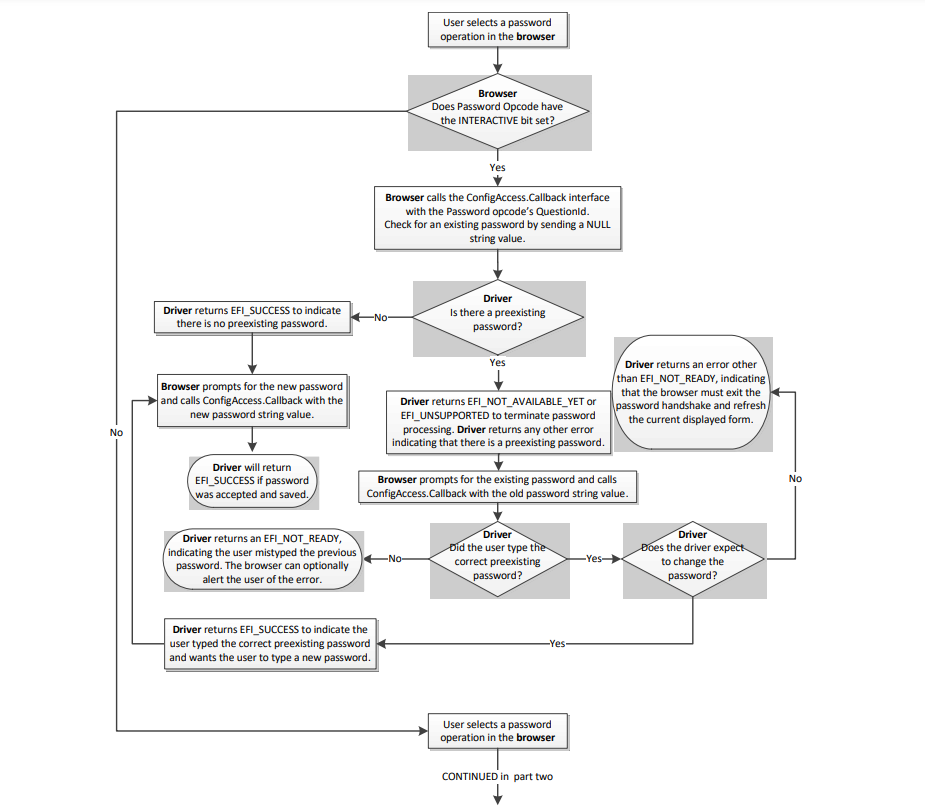

   Password Flowchart (part one)

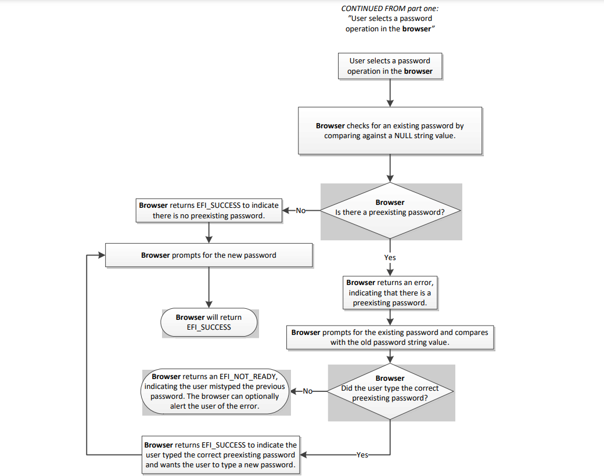

   Password Flowchart (part two)

.. _efi-ifr-question-ref1:

EFI_IFR_QUESTION_REF1
%%%%%%%%%%%%%%%%%%%%%

**Summary**

Push a question’s value on the expression stack.

**Prototype**

.. code-block::

   #define EFI_IFR_QUESTION_REF1_OP 0x40  
   typedef struct _EFI_IFR_QUESTION_REF1 {  
     EFI_IFR_OP_HEADER              Header;  
     EFI_QUESTION_ID                QuestionId;  
   }   EFI_IFR_QUESTION_REF1;
  

**Members**

Header
  The byte sequence that defines the type of opcode as well as the length of the opcode being defined. *Header.OpCode =* *EFI_IFR_QUESTION_REF1_OP.*

QuestionId
  The question’s identifier, which must be unique within the form set. 

**Description**

Push the value of the question specified by *QuestionId* on to the expression stack. If the question’s value cannot be determined or the question does not exist, then push Undefined.

.. _efi-ifr-question-ref2:

EFI_IFR_QUESTION_REF2
%%%%%%%%%%%%%%%%%%%%%

**Summary**

Pop an integer from the expression stack, convert it to a question id, and push the question value associated with that question id onto the expression stack. 

**Prototype**

.. code-block::

   #define EFI_IFR_QUESTION_REF2_OP 0x41
   typedef struct _EFI_IFR_QUESTION_REF2 {
     EFI_IFR_OP_HEADER                 Header;
   }   EFI_IFR_QUESTION_REF2;
  

**Members**

Header
  The byte sequence that defines the type of opcode as well as the length of the opcode being defined. *Header.OpCode =* *EFI_IFR_QUESTION_REF2_OP.* 

**Description**

This opcode performs the following actions:

#. Pop an integer from the expression stack

#. Convert it to a question id

#. Push the question value associated with that question id onto the expression stack.

If the popped expression cannot be evaluated as an
unsigned integer or the value of the unsigned integer is greater than 0xFFFF, then push Undefined onto the expression stack in step 3. If the value of the question specified by the unsigned integer, after converted to a question id, cannot be determined or the question does not exist, also push Undefined onto the expression stack in step 3. 

.. _efi-ifr-question-ref3:

EFI_IFR_QUESTION_REF3
%%%%%%%%%%%%%%%%%%%%%

**Summary**

Pop an integer from the expression stack, convert it to a question id, and push the question value associated with that question id onto the expression stack.

**Prototype**

.. code-block::

   #define EFI_IFR_QUESTION_REF3_OP 0x51
   typedef struct _EFI_IFR_QUESTION_REF3 {
     EFI_IFR_OP_HEADER                   Header;
   }   EFI_IFR_QUESTION_REF3;

   typedef struct _EFI_IFR_QUESTION_REF3_2 {
     EFI_IFR_OP_HEADER                   Header;
     EFI_STRING_ID                       DevicePath;
   }   EFI_IFR_QUESTION_REF3_2;

   typedef struct _EFI_IFR_QUESTION_REF3_3 {
     EFI_IFR_OP_HEADER                   Header;
     EFI_STRING_ID                       DevicePath;
     EFI_GUID                            Guid;
   }   EFI_IFR_QUESTION_REF3_3;
  

**Members**

Header
  The byte sequence that defines the type of opcode as well as the length of the opcode being defined. *Header.OpCode =* *EFI_IFR_QUESTION_REF3_OP.*

DevicePath
  Specifies the text representation of the device path containing the form set where the question is defined. If this is not present or the value is 0 then the device path installed on the *EFI_HANDLE* which was registered with the form set containing the current question is used.

Guid
  Specifies the GUID of the form set where the question is defined. If the value is Nil or this field is not present, then the current form set is used (if *DevicePath* is 0) or the only form set attached to the device path specified by *DevicePath* is used. If the value is Nil and there is more than one form set on the specified device path, then the value Undefined will be pushed. 

**Description**

This opcode performs the following actions:

#. Pop an integer from the expression stack

#. Convert it to a question id

#. Push the question value associated with that question id onto the expression stack. 

If the popped expression cannot be evaluated as an unsigned integer or the value of the unsigned integer is greater than 0xFFFF, then push Undefined onto the expression stack in step 3. If the value of the question specified by the unsigned integer, after converted to a question id, cannot be determined or the question does not exist, also push Undefined onto the expression stack in step 3. 

This version allows question values from other forms to be referenced in expressions.

.. _efi-ifr-read:

EFI_IFR_READ
%%%%%%%%%%%%

**Summary**

Provides a value for the current question or default.

**Prototype**

.. code-block::
 
   #define EFI_IFR_READ_OP 0x2D
   typedef struct _EFI_IFR_READ {
     EFI_IFR_OP_HEADER              Header;
   }   EFI_IFR_READ;

**Parameters**

Header
  The sequence that defines the type of opcode as well as the length of the opcode being defined. For this tag, *Header.OpCode =* *EFI_IFR_READ_OP* 

**Description**

After reading the value for the current question (if any storage was specified) and setting the *this* constant (see *EFI_IFR_THIS* ), this expression will be evaluated (if present) to return the value. If the *FormId* and *QuestionId* are either both not present, or are both set to zero, then the link does nothing.

.. _efi-ifr-ref:

EFI_IFR_REF
%%%%%%%%%%%

**Summary**

Creates a cross-reference statement.

**Prototype**

.. code-block::

   #define EFI_IFR_REF_OP 0x0F
   typedef struct _EFI_IFR_REF {
     EFI_IFR_OP_HEADER           Header;
     EFI_IFR_QUESTION_HEADER     Question;
     EFI_FORM_ID                 FormId;
   }   EFI_IFR_REF;

   typedef struct _EFI_IFR_REF2 {
     EFI_IFR_OP_HEADER           Header;
     EFI_IFR_QUESTION_HEADER     Question;
     EFI_FORM_ID                 FormId;
     EFI_QUESTION_ID             QuestionId;
   }   EFI_IFR_REF2;

   typedef struct _EFI_IFR_REF3 {
     EFI_IFR_OP_HEADER           Header;
     EFI_IFR_QUESTION_HEADER     Question;
     EFI_FORM_ID                 FormId;
     EFI_QUESTION_ID             QuestionId;
     EFI_GUID FormSetId;
   }   EFI_IFR_REF3;

   typedef struct _EFI_IFR_REF4 {
     EFI_IFR_OP_HEADER           Header;
     EFI_IFR_QUESTION_HEADER     Question;
     EFI_FORM_ID                 FormId;
     EFI_QUESTION_ID             QuestionId;
     EFI_GUID                    FormSetId;
     EFI_STRING_ID               DevicePath;
   }   EFI_IFR_REF4;

   typedef struct _EFI_IFR_REF5 {
     EFI_IFR_OP_HEADER           Header;
     EFI_IFR_QUESTION_HEADER     Question;
   }   EFI_IFR_REF5;
  

**Members**

Header
  The byte sequence that defines the type of opcode as well as the length of the opcode being defined. *Header.OpCode =* *EFI_IFR_REF_OP.*

Question
  Standard question header. xxxx See `EFI_IFR_QUESTION_HEADER`_ 

FormId
  The form to which this link is referring. If this is zero, then the link is on the current form. If this is missing, then the link is determined by the nested *EFI_IFR_VALUE.*

QuestionId
  The question on the form to which this link is referring. If this field is not present (determined by the length of the opcode) or the value is zero, then the link refers to the top of the form.

FormSetId
  The form set to which this link is referring. If it is all zeroes or not present, and *DevicePath* is not present, then the link is to the current form set. If it is all zeroes (or not present) and the *DevicePath* is present, then the link is to the first form set associated with the *DevicePath.*

DevicePath
  The string identifier that specifies the string containing the text representation of the device path to which the form set containing the form specified by *FormId* . If this field is not present (determined by the opcode’s length) or the value is zero, then the link refers to the current page. The format of the device path string that this field references is compatible with the Text format that is specified in the Text Device Node Reference ( :ref:`text-device-node-reference` ) 

**Description**

Creates a user-selectable link to a form or a question on a form. There are several forms of this opcode which are distinguished by the length of the opcode.

.. _efi-ifr-refresh:

EFI_IFR_REFRESH
%%%%%%%%%%%%%%%%

**Summary**

Mark a question for periodic refresh.

**Prototype**

.. code-block::

   #define EFI_IFR_REFRESH_OP 0x1d
   typedef struct _EFI_IFR_REFRESH {
     EFI_IFR_OP_HEADER           Header;
     UINT8                       RefreshInterval;
   }   EFI_IFR_REFRESH;

**Members**

Header
  The byte sequence that defines the type of opcode as well as the length of the opcode being defined. *Header.OpCode =* *EFI_IFR_REFRESH_OP.*

RefreshInterval
  Minimum number of seconds before the question value should be refreshed. A value of zero indicates the question should not be refreshed automatically. 

**Description**

When placed within the scope of a question, it will force the question’s value to be refreshed at least every *RefreshInterval* seconds. The value may be refreshed less often, depending on browser policy or capabilities.

.. _efi-ifr-refresh-id:

EFI_IFR_REFRESH_ID
%%%%%%%%%%%%%%%%%%%

**Summary**

Mark an Question for an asynchronous refresh.

**Prototype**

.. code-block::
  
   #define EFI_IFR_REFRESH_ID_OP 0x62
   typedef struct _EFI_IFR_REFRESH_ID {
     EFI_IFR_OP_HEADER              Header;
     EFI_GUID                       RefreshEventGroupId;
   }   EFI_IFR_REFRESH_ID;
  

**Members**

Header
  The byte sequence that defines the type of opcode as well as the length of the opcode being defined. *Header.OpCode =* *EFI_IFR_REFRESH_ID_OP.*

RefreshEventGroupId
  The GUID associated with the event group which will be used to initiate a re-evaluation of an element in a set of forms. 

**Description**

This tag op-code must be placed within the scope of a question or a form. If within the scope of a question and the event is signaled which belongs to the *RefreshEventGroupId,* the question will be refreshed. More than one question may share the same Event Group.

If the tag op-code is placed within the scope of an *EFI_IFR_FORM* op-code and the event is signaled which belongs to the *RefreshEventGroupId,* the entire form’s contents will be refreshed.

-  If the contents within a form had an *EFI_IFR_REFRESH_ID* tag op-code placed within the scope of the form, and an event is signalled, all questions associated with the *RefreshEventGroupId* are marked for refresh. The Forms Browser will update the question value from storage, reparse the forms from the HII database and, at some time later, reflect that change if the question is displayed.

When interpreting this op-code, a browser must do the following actions:

-  The browser will create an event group via CreateEventEx() based on the specified *RefreshEventGroupId* when the form set which contains the op-code is opened by the browser.

-  When an event is signaled, all questions associated with the *RefreshEventGroupId* are marked for refresh. The Forms Browser will update the question value from storage and, at some time later, update the question's display.

-  The browser will close the event group which was previously created when the form set which contains the op-code is closed by the browser.

.. _efi-ifr-reset-button:

EFI_IFR_RESET_BUTTON
%%%%%%%%%%%%%%%%%%%%%

**Summary**

Create a reset or submit button on the current form.

**Prototype**

.. code-block::

 
   #define EFI_IFR_RESET_BUTTON_OP 0x0d
   typedef struct _EFI_IFR_RESET_BUTTON {
     EFI_IFR_OP_HEADER                 Header;
     EFI_IFR_STATEMENT_HEADER          Statement;
     EFI_DEFAULT_ID                    DefaultId;
   }   EFI_IFR_RESET_BUTTON;

   typedef UINT16 EFI_DEFAULT_ID;
  

**Members**

Header
  The standard header, where *Header.OpCode* *= EFI_IFR_RESET_BUTTON_OP.*

Statement
  Standard statement header, including the prompt and help text.

DefaultId
  Specifies the set of default store to use when restoring the defaults to the questions on this form. xxxx See `EFI_IFR_DEFAULTSTORE`_  for more information. 

**Description**

This opcode creates a user-selectable button that resets the question values for all questions on the current form to the default values specified by *DefaultId.* If *EFI_IFR_FLAGS_CALLBACK* is set in the question header, then the callback associated with the form set will be called. An image may be associated with the statement using a nested *EFI_IFR_IMAGE.* An animation may be associated with the statement using a nested *EFI_IFR_ANIMATION.*

.. _efi-ifr-rule:

EFI_IFR_RULE
%%%%%%%%%%%%%

**Summary**

Create a rule for use in a form and associate it with an identifier.

**Prototype**

.. code-block::

   #define EFI_IFR_RULE_OP 0x18  
   typedef struct _EFI_IFR_RULE {  
     EFI_IFR_OP_HEADER           Header;  
     UINT8                       RuleId;  
   }   EFI_IFR_RULE;
  

**Members**

Header
  The byte sequence that defines the type of opcode as well as the length of the opcode being defined. *Header.OpCode =* *EFI_IFR_RULE_OP.*

RuleId
  Unique identifier for the rule. There can only one rule within a form with the specified *RuleId.* If another already exists, then the form is marked as invalid. 

**Description**

Create a rule, which associates an expression with an identifier and attaches it to the currently opened form. These rules allow common sub-expressions to be re-used within a form.

.. _efi-ifr-rule-ref:

EFI_IFR_RULE_REF
%%%%%%%%%%%%%%%%%

**Summary**

Evaluate a form rule and push its result on the expression stack.

**Prototype**

.. code-block::
  
   #define EFI_IFR_RULE_REF_OP 0x3f
   typedef struct _EFI_IFR_RULE_REF {
     EFI_IFR_OP_HEADER              Header;
     UINT8                          RuleId;
   }   EFI_IFR_RULE_REF;
  

**Members**

Header
  The byte sequence that defines the type of opcode as well as the length of the opcode being defined. *Header.OpCode =* *EFI_IFR_RULE_REF_OP.*

RuleId
  The rule’s identifier, which must be unique within the form. 

**Description**

Look up the rule specified by *RuleId* and push the evaluated result on the expression stack. If the specified rule does not exist, then push Undefined.

.. _efi-ifr-security:

EFI_IFR_SECURITY
%%%%%%%%%%%%%%%%%

**Summary**

Push **TRUE** if the current user profile contains the specified setup access permissions.

**Prototype**

.. code-block::
  
   #define EFI_IFR_SECURITY_OP      0x60
   typedef struct _EFI_IFR_SECURITY {
     EFI_IFR_OP_HEADER              Header;
     EFI_GUID                       Permissions;
   }   EFI_IFR_SECURITY;
   

**Members**

Header
  Standard opcode header, where *Header.Op* = *EFI_IFR_SECURITY_OP.*

Permissions
  Security permission level.

**Description**

This opcode pushes whether or not the current user profile contains the specified setup access permissions. This opcode can be used in expressions to disable, suppress or gray-out forms, statements and questions. It can also be used in checking question values to disallow or allow certain values.

This opcode performs the following actions:

#. If the current user profile contains thespecified setup access permissions, then push *TRUE.*Otherwise, push **FALSE.**

.. _efi-ifr-set:

EFI_IFR_SET
%%%%%%%%%%%%

**Summary**

Change a stored value.

**Prototype**

.. code-block::

   #define EFI_IFR_SET_OP 0x2C
   typedef struct _EFI_IFR_SET {
     EFI_IFR_OP_HEADER           Header;
     EFI_VARSTORE_ID             VarStoreId;
     union {
     EFI_STRING_ID               VarName;
     UINT16                      VarOffset;
     }                           VarStoreInfo;
     UINT8                       VarStoreType;
   } EFI_IFR_SET;

**Parameters**

Header
  The sequence that defines the type of opcode as well as the length of the opcode being defined. *Header.OpCode =* *EFI_IFR_SET_OP.*

VarStoreId
  Specifies the identifier of a previously declared variable store to use when storing the question’s value.

VarStoreInfo
  Depending on the type of variable store selected, this contains either a 16-bit Buffer Storage offset ( *VarOffset* ) or a Name/Value or EFI Variable name ( *VarName* ).

VarStoreType
  Specifies the type used for storage. The storage types *EFI_IFR_TYPE_x* are defined in *EFI_IFR_ONE_OF_OPTION.* 

**Description**

This operator pops an expression from the expression stack. The expression popped is the value.

The value is stored into the variable store identified by *VarStoreId* and *VarStoreInfo.*

If the value could be stored successfully, then **TRUE** is pushed on to the expression stack. Otherwise, **FALSE** is pushed on the expression stack.

.. _efi-ifr-shift-left:

EFI_IFR_SHIFT_LEFT
%%%%%%%%%%%%%%%%%%

**Summary**

Pop two unsigned integers, shift one left by the number of bits specified by the other and push the result.

**Prototype**

.. code-block::
  
   #define EFI_IFR_SHIFT_LEFT_OP 0x38  
   typedef struct _EFI_IFR_SHIFT_LEFT {  
     EFI_IFR_OP_HEADER                 Header;  
   }   EFI_IFR_SHIFT_LEFT;

**Members**

Header
  Standard opcode header, where *OpCode* is *EFI_IFR_SHIFT_LEFT* _OP. 

**Description**

This opcode performs the following actions:

#. Pop two values from the expression stack. The first value popped is the right-hand value and the second value popped is the left-hand value.

#. If the two values do not evaluate to unsigned integers, push Undefined.

#. Shift the left-hand value left by the number of bits specified by the right-hand value and push the result.

.. _efi-ifr-shift-right:

EFI_IFR_SHIFT_RIGHT
%%%%%%%%%%%%%%%%%%%

**Summary**

Pop two unsigned integers, shift one right by the number of bits specified by the other and push the result.

**Prototype**

.. code-block::

   #define EFI_IFR_SHIFT_RIGHT_OP 0x39
   typedef struct _EFI_IFR_SHIFT_RIGHT {
     EFI_IFR_OP_HEADER                    Header;
   }   EFI_IFR_SHIFT_RIGHT;
   

**Members**

Header
  Standard opcode header, where *OpCode* is *EFI_IFR_SHIFT_RIGHT* _OP.

**Description**

This opcode performs the following actions:

#. Pop two values from the expression stack. The first value popped is the right-hand value and the second value popped is the left-hand value.

#. If the two values do not evaluate to unsigned integers, push Undefined.

#. Shift the left-hand value right by the number of bits specified by the right-hand value and push the result.

.. _efi-ifr-span:

EFI_IFR_SPAN
%%%%%%%%%%%%

**Summary**

Pop two strings and an unsigned integer, find the first character from one string that contains characters found in another and push its index.

**Prototype**

.. code-block::
  
   #define EFI_IFR_SPAN_OP 0x59  
   typedef struct _EFI_IFR_SPAN {  
     EFI_IFR_OP_HEADER           Header;  
     UINT8                       Flags;  
   }   EFI_IFR_SPAN;
   

**Members**

Header
  The sequence that defines the type of opcode as well as the length of the opcode being defined. For this tag, *Header.OpCode =* *EFI_IFR_SPAN_OP.*

Flags
  Specifies whether to find the first matching string ( *EFI_IFR_FLAGS_FIRST_MATCHING* ) or the first non-matching string ( *EFI_IFR_FLAGS_FIRST_NON_MATCHING* ). 

**Description**

This opcode performs the following actions:

#. Pop three values from the expression stack.The first value popped is the right value and thesecond value popped is the middle value and the lastvalue popped is the left expression.

#. If the left or middle values cannot be evaluated as a string, push Undefined. If the right value cannot be evaluated as an unsigned integer, push Undefined.

#. The left string is the string to scan. The middle string consists of character pairs representing the low-end of a range and the high-end of a range of characters. The right unsigned integer represents the starting location for the scan.

#. The operation will push the zero-based index of the first character after the right value which falls within any one of the ranges ( *EFI_IFR_FLAGS_FIRST_MATCHING* ) or falls within none of the ranges ( *EFI_IFR_FLAGS_FIRST_NON_MATCHING* ).     

**Related Definitions**
   
.. code-block::
  
   #define EFI_IFR_FLAGS_FIRST_MATCHING      0x00

   #define EFI_IFR_FLAGS_FIRST_NON_MATCHING  0x01
  

.. _efi-ifr-string:

EFI_IFR_STRING
%%%%%%%%%%%%%%%

**Summary**

Defines the string question.

**Prototype**

.. code-block::

   #define EFI_IFR_STRING_OP 0x1C
   typedef struct _EFI_IFR_STRING {
     EFI_IFR_OP_HEADER              Header;
     EFI_IFR_QUESTION_HEADER        Question;
     UINT8                          MinSize;
     UINT8                          MaxSize;
     UINT8                          Flags;
   }   EFI_IFR_STRING;
  

**Members**

Header
  The sequence that defines the type of opcode as well as the length of the opcode being defined. *Header.OpCode =* *EFI_IFR_STRING_OP.*

Question
  The standard question header. xxxx See `EFI_IFR_QUESTION_HEADER`_  for more information.

MinSize
  The minimum number of characters that can be accepted for this opcode.

MaxSize
  The maximum number of characters that can be accepted for this opcode.

Flags
  Flags which control the string editing behavior. See "Related Definitions" below. 

**Description**

This creates a string question. The minimum length is *MinSize* and the maximum length is *MaxSize* characters.

An image may be associated with the question using a nested *EFI_IFR_IMAGE.* An animation may be associated with the question using a nested *EFI_IFR_ANIMATION.*

There are two ways to specify defaults for this question: one or more nested *EFI_IFR_ONE_OF_OPTION* (lowest priority) or nested *EFI_IFR_DEFAULT* (highest priority).

If *EFI_IFR_STRING_MULTI_LINE* is set, it is a hint to the Forms Browser that multi-line text can be allowed. If it is clear, then multi-line editing should not be allowed.   

**Related Definitions**

.. code-block::
  
   #define EFI_IFR_STRING_MULTI_LINE 0x01
  

.. _efi-ifr-string-ref1:

EFI_IFR_STRING_REF1
%%%%%%%%%%%%%%%%%%%%

**Summary**

Push a string on the expression stack.

**Prototype**

.. code-block::

   #define EFI_IFR_STRING_REF1_OP 0x4e
   typedef struct _EFI_IFR_STRING_REF1 {
     EFI_IFR_OP_HEADER                Header;
     EFI_STRING_ID                    StringId;
   }   EFI_IFR_STRING_REF1;
  

**Members**

Header
  The byte sequence that defines the type of opcode as well as the length of the opcode being defined. *Header.OpCode =* *EFI_IFR_STRING_REF1_OP.*

StringId
  The string’s identifier, which must be unique within the package list.

**Description**

Push the string specified by *StringId* on to the expression stack. If the string does not exist, then push an empty string.

.. _efi-ifr-string-ref2:

EFI_IFR_STRING_REF2
%%%%%%%%%%%%%%%%%%%%

**Summary**

Pop a string identifier, push the associated string.

**Prototype**

.. code-block::

   #define EFI_IFR_STRING_REF2_OP 0x4f
   typedef struct _EFI_IFR_STRING_REF2 {
     EFI_IFR_OP_HEADER                 Header;
   }   EFI_IFR_STRING_REF2;
  

**Members**

Header
  The byte sequence that defines the type of opcode as well as the length of the opcode being defined. *Header.OpCode =* *EFI_IFR_STRING_REF2_OP.*

**Description**

This opcode performs the following actions:

#. Pop a value from the expression stack.

#. If the value cannot be evaluated as an unsigned integer or the value of the unsigned integer is greater than 0xFFFF, push Undefined.

#. If the string specified by the value (converted to a string identifier) cannot be determined or the string does not exist, push an empty string.

#. Otherwise, push the string on to the expression stack.

.. _efi-ifr-subtitle:

EFI_IFR_SUBTITLE
%%%%%%%%%%%%%%%%

**Summary**

Creates a sub-title in the current form.

**Prototype**

.. code-block::

   #define EFI_IFR_SUBTITLE_OP 0x02
   typedef struct _EFI_IFR_SUBTITLE {
     EFI_IFR_OP_HEADER              Header;
     EFI_IFR_STATEMENT_HEADER       Statement;
     UINT8                          Flags;
   }   EFI_IFR_SUBTITLE;
  

**Members**

Header
  The sequence that defines the type of opcode as well as the length of the opcode being defined. For this tag, *Header.OpCode =* *EFI_IFR_SUBTITLE_OP.*

Flags
  Identifies specific behavior for the sub-title.

**Description**

Subtitle strings are intended to be used by authors to separate sections of questions into semantic groups. If *Header.Scope* is set, then the Forms Browser may further distinguish the end of the semantic group as including only those statements and questions which are nested.

If *EFI_IFR_FLAGS_HORIZONTAL* is set, then this provides a hint that the nested statements or questions should be horizontally arranged. Otherwise, they are assumed to be vertically arranged.

An image may be associated with the statement using a nested *EFI_IFR_IMAGE.* An animation may be associated with the statement using a nested *EFI_IFR_ANIMATION.*   

**Related Definitions**
   
.. code-block::
  
   #define EFI_IFR_FLAGS_HORIZONTAL 0x01
  

.. _efi-ifr-subtract:

EFI_IFR_SUBTRACT
%%%%%%%%%%%%%%%%

**Summary**

Pop two unsigned integers, subtract one from the other, push the result.

**Prototype**

.. code-block::

   #define EFI_IFR_SUBTRACT_OP 0x3b
   typedef struct _EFI_IFR_SUBTRACT {
     EFI_IFR_OP_HEADER              Header;
   }   EFI_IFR_SUBTRACT;
  

**Members**

Header
  Standard opcode header, where *Header.OpCode* is *EFI_IFR_SUBTRACT* _OP. 

**Description**

This opcode performs the following operations:

#. Pop two values from the expression stack. Thefirst value popped is the right-hand value and thesecond value popped is the left-hand value.

#. If the two values do not evaluate to unsigned integers, push Undefined.

#. Zero-extend the values to 64-bits.

#. Subtract the right-hand value from the left-hand value.

#. Push the lower 64-bits of the result. 

.. _efi-ifr-suppress-if:

EFI_IFR_SUPPRESS_IF
%%%%%%%%%%%%%%%%%%%

**Summary**

Creates a group of statements or questions which are conditionally invisible.

**Prototype**

.. code-block::

   #define EFI_IFR_SUPPRESS_IF_OP 0x0a
   typedef struct _EFI_IFR_SUPPRESS_IF {
     EFI_IFR_OP_HEADER                 Header;
   }   EFI_IFR_SUPPRESS_IF;
  

**Members**

Header
  The byte sequence that defines the type of opcode as well as the length of the opcode being defined. *Header.OpCode =* *EFI_IFR_SUPPRESS_IF_OP.* 

**Description**

The suppress tag causes the nested objects to be hidden from the user if the expression appearing as the first nested object evaluates to **TRUE**. If the expression consists of more than a single opcode, then the first opcode in the expression must have the Scope bit set and the expression must end with *EFI_IFR_END.*

This display form is maintained until the scope for this opcode is closed.

.. _efi-ifr-text:

EFI_IFR_TEXT
%%%%%%%%%%%%

**Summary**

Creates a static text and image.

**Prototype**

.. code-block::

   #define EFI_IFR_TEXT_OP 0x03
   typedef struct _EFI_IFR_TEXT {
     EFI_IFR_OP_HEADER              Header;
     EFI_IFR_STATEMENT_HEADER       Statement;
     EFI_STRING_ID                  TextTwo;
   }   EFI_IFR_TEXT;
   

**Members**

Header
  The sequence that defines the type of opcode as well as the length of the opcode being defined. For this tag, *Header.OpCode =* *EFI_IFR_TEXT_OP.*

Statement
  Standard statement header.

TextTwo
  The string token reference to the secondary string for this opcode. 

**Description**

This is a static text/image statement.

An image may be associated with the statement using a nested *EFI_IFR_IMAGE.* An animation may be associated with the question using a nested *EFI_IFR_ANIMATION.*

.. _efi-ifr-this:

EFI_IFR_THIS
%%%%%%%%%%%%

**Summary**

Push current question’s value.

**Prototype**

.. code-block::

   #define EFI_IFR_THIS_OP 0x58
   typedef struct _EFI_IFR_THIS {
     EFI_IFR_OP_HEADER           Header;
   }   EFI_IFR_THIS;
  

**Members**

Header
  The sequence that defines the type of opcode as well as the length of the opcode being defined. For this tag, *Header.OpCode =* *EFI_IFR_THIS_OP.* 

**Description**

Push the current question’s value.

.. _efi-ifr-time:

EFI_IFR_TIME
%%%%%%%%%%%%

**Summary**

Create a Time question.

**Prototype**

.. code-block::

   #define EFI_IFR_TIME_OP 0x1b
   typedef struct _EFI_IFR_TIME {
     EFI_IFR_OP_HEADER              Header;
     EFI_IFR_QUESTION_HEADER        Question;
     UINT8                          Flags;
   }   EFI_IFR_TIME;
  

**Members**

Header
  Basic question information. *Header.Opcode* = *EFI_IFR_TIME_OP.*

Question
  The standard question header. xxxx See `EFI_IFR_QUESTION_HEADER`_ for more information.

Flags
  A bit-mask that determines which unique settings are active for this opcode. 

  | QF_TIME_HOUR_SUPPRESS 0x01
  | QF_TIME_MINUTE_SUPPRESS 0x02
  | QF_TIME_SECOND_SUPPRESS 0x04
  | QF_TIME_STORAGE 0x30
  |
  
  For *QF_TIME_STORAGE,* there are currently three valid values:

  | QF_TIME_STORAGE_NORMAL 0x00
  | QF_TIME_STORAGE_TIME 0x10
  | QF_TIME_STORAGE_WAKEUP 0x20  

**Description**

Create a Time question xxxx ( `Time`_ ) and add it to the current form.

An image may be associated with the question using a nested *EFI_IFR_IMAGE.* An animation may be associated with the question using a nested *EFI_IFR_ANIMATION.*

.. _efi-ifr-token:

EFI_IFR_TOKEN
%%%%%%%%%%%%%

**Summary**

Pop two strings and an unsigned integer, then push the nth section of the first string using delimiters from the second string.

**Prototype**

.. code-block::

   #define EFI_IFR_TOKEN_OP 0x4d
   typedef struct _EFI_IFR_TOKEN {
     EFI_IFR_OP_HEADER                 Header;
   }   EFI_IFR_TOKEN;
 
  

**Members**

Header
  Standard opcode header, where *OpCode* is *EFI_IFR_TOKEN_OP.* 

**Description**

This opcode performs the following actions:

#. Pop three values from the expression stack. The first value popped is the right value and the second value popped is the middle value and the last value popped is the left value.

#. If the left or middle values cannot be evaluated as a string, push Undefined. If the right value cannot be evaluated as an unsigned integer, push Undefined.

#. The first value is the string. The second value is a string, where each character is a valid delimiter. The third value is the zero-based index.

#. Push the nth delimited sub-string on to the expression stack (0 = left of the first delimiter). The end of the string always acts a the final delimiter.

#. The no such string exists, an empty string is pushed.

.. _efi-ifr-to-boolean:

EFI_IFR_TO_BOOLEAN
%%%%%%%%%%%%%%%%%%

**Summary**

Pop a value, convert to Boolean and push the result.

**Prototype**

.. code-block::

   #define EFI_IFR_TO_BOOLEAN_OP 0x4A
   typedef struct _EFI_IFR_TO_BOOLEAN{
     EFI_IFR_OP_HEADER                 Header;
   }   EFI_IFR_TO_BOOLEAN;
  

**Members**

Header
  The sequence that defines the type of opcode as well as the length of the opcode being defined. For this tag, *Header.OpCode =* *EFI_IFR_TO_BOOLEAN_OP* 

**Description**

This opcode performs the following actions:

#. Pop a value from the expression stack. If thevalue is Undefined or cannot be evaluated as aBoolean, push Undefined. Otherwise push the Boolean onthe expression stack.

#. When converting from an unsigned integer, zero will be converted to **FALSE** and any other value will be converted to **TRUE.**

#. When converting from a string, if case-insensitive compare with "true" is *True,* then push **TRUE.** If a case-insensitive compare with "false" is **TRUE,** then push **False.** Otherwise, push Undefined.

#. When converting from a buffer, if the buffer is all zeroes, then push **FALSE.* Otherwise push **TRUE.**

.. _efi-ifr-to-lower:

EFI_IFR_TO_LOWER
%%%%%%%%%%%%%%%%

**Summary**

Convert a string on the expression stack to lower case.

**Prototype**

.. code-block::

   #define EFI_IFR_TO_LOWER_OP 0x20
   typedef struct _EFI_IFR_TO_LOWER {
     EFI_IFR_OP_HEADER              Header;
   }   EFI_IFR_TO_LOWER;
   

**Members**

Header
  The sequence that defines the type of opcode as well as the length of the opcode being defined. For this tag, *Header.OpCode =* *EFI_IFR_TO_LOWER_OP* 

**Description**

Pop an expression from the expression stack. If the expression is Undefined or cannot be evaluated as a string, push Undefined. Otherwise, convert the string to all lower case using the *StrLwr* function of the *EFI_UNICODE_COLLATION2_PROTOCOL* and push the string on the expression stack.

.. _efi-ifr-to-string:

EFI_IFR_TO_STRING
%%%%%%%%%%%%%%%%%

**Summary**

Pop a value, convert to a string, push the result.

**Prototype**

.. code-block::

   #define EFI_IFR_TO_STRING_OP 0x49
   typedef struct _EFI_IFR_TO_STRING{
     EFI_IFR_OP_HEADER                    Header;
     UINT8                                Format;
   }   EFI_IFR_TO_STRING;

  

**Members**

Header
  The sequence that defines the type of opcode as well as the length of the opcode being defined. For this tag, *Header.OpCode =* *EFI_IFR_TO_STRING_OP*

Format 
  When converting from unsigned integers, these flags control the format:

  | 0 = unsigned decimal
  | 1 = signed decimal
  | 2 = hexadecimal (lower-case alpha)
  | 3 = hexadecimal (upper-case alpha)
  |
  
  When converting from a buffer, these flags control the format:

  | 0 = ASCII
  | 8 = UCS-2

**Description**

This opcode performs the following actions:

#. Pop a value from the expression stack.**

#. If the value is Undefined or cannot be evaluated as a
string, push Undefined.

#. Convert the value to a string. When converting from an unsigned integer, the number will be converted to a unsigned decimal string (Format = 0), signed decimal string (Format = 1) or a hexadecimal string (Format = 2 or 3).

When converting from a boolean, the boolean will be converted to "True" (True) or "False" (False). When converting from a buffer, each 8-bit (Format = 0) or 16-bit (Format = 8) value will be converted into a character and appended to the string, up until the end of the buffer or a NULL character. 4. Push the result. 

.. _efi-ifr-to-uint:

EFI_IFR_TO_UINT
%%%%%%%%%%%%%%%

**Summary**

Pop a value, convert to an unsigned integer, push the result.

**Prototype**

.. code-block::

   #define EFI_IFR_TO_UINT_OP 0x48
   typedef struct _EFI_IFR_TO_UINT {
     EFI_IFR_OP_HEADER                 Header;
   }   EFI_IFR_TO_UINT;
   

**Members**

Header
  The sequence that defines the type of opcode as well as the length of the opcode being defined. For this tag, *Header.OpCode =* *EFI_IFR_TO_UINT_OP*

**Description**

#. Pop a value from the expression stack.

#. If the value is Undefined or cannot be evaluated as an unsigned integer, push Undefined.

#. Convert the value to an unsigned integer. When converting from a boolean, if **TRUE**, push 1 and if **FALSE**, push 0. When converting from a string, whitespace is skipped. The prefix ‘0x’ or ‘0X’ indicates to convert from a hexadecimal string while the prefix ‘-‘ indicates conversion from a signed integer string. When converting from a buffer, if the buffer is greater than 8 bytes in length, push Undefined. Otherwise, zero-extend the contents of the buffer to 64-bits.

#. Push the result.
 

.. _efi-ifr-to-upper:

EFI_IFR_TO_UPPER
%%%%%%%%%%%%%%%%%

**Summary**

Convert a string on the expression stack to upper case.

**Prototype**

.. code-block::

   #define EFI_IFR_TO_UPPER_OP 0x21
   typedef struct _EFI_IFR_TO_UPPER {
     EFI_IFR_OP_HEADER              Header;
   }   EFI_IFR_TO_UPPER;
  

**Members**

Header
  The sequence that defines the type of opcode as well as the length of the opcode being defined. For this tag, *Header.OpCode =* *EFI_IFR_TO_UPPER_OP*

**Description**

Pop an expression from the expression stack. If the expression is Undefined or cannot be evaluated as a string, push Undefined. Otherwise, convert the string to all upper case using the *StrUpr* function of the *EFI_UNICODE_COLLATION2_PROTOCOL* and push the string on the expression stack.

.. _efi-ifr-true:

EFI_IFR_TRUE
%%%%%%%%%%%%%

**Summary**

Push a TRUE on to the expression stack.

**Prototype**

.. code-block::

   #define EFI_IFR_TRUE_OP 0x46
   typedef struct _EFI_IFR_TRUE {
     EFI_IFR_OP_HEADER              Header;
   }   EFI_IFR_TRUE;
   

**Members**

Header
  The sequence that defines the type of opcode as well as the length of the opcode being defined. For this tag, *Header.OpCode =* *EFI_IFR_TRUE_OP* 

**Description**

Push a **TRUE** on to the expression stack.

.. _efi-ifr-uint8-efi-ifr-uint16-efi-ifr-uint32-efi-ifr-uint64:

EFI_IFR_UINT8, EFI_IFR_UINT16,EFI_IFR_UINT32, EFI_IFR_UINT64
%%%%%%%%%%%%%%%%%%%%%%%%%%%%%%%%%%%%%%%%%%%%%%%%%%%%%%%%%%%%%

**Summary**

Push an unsigned integer on to the expression stack.

**Prototype**

.. code-block::

  
   #define EFI_IFR_UINT8_OP 0x42
   typedef struct _EFI_IFR_UINT8 {
     EFI_IFR_OP_HEADER           Header;
     UINT8                       Value;
   }   EFI_IFR_UINT8;

   #define EFI_IFR_UINT16_OP 0x43
   typedef struct _EFI_IFR_UINT16 {
     EFI_IFR_OP_HEADER           Header;
     UINT16                      Value;
   }   EFI_IFR_UINT16;

   #define EFI_IFR_UINT32_OP 0x44
   typedef struct _EFI_IFR_UINT32 {
     EFI_IFR_OP_HEADER           Header;
     UINT32                      Value;
   }   EFI_IFR_UINT32;

   #define EFI_IFR_UINT64_OP 0x45
   typedef struct _EFI_IFR_UINT64 {
     EFI_IFR_OP_HEADER           Header;
     UINT64                      Value;
   }   EFI_IFR_UINT64;

**Members**

Header
  The sequence that defines the type of opcode as well as the length of the opcode being defined. For this tag, *Header.OpCode =* *EFI_IFR_UINT8_OP,* *EFI_IFR_UINT16_OP,* *EFI_IFR_UINT32_OP* or *EFI_IFR_UINT64_OP.*

Value
  The unsigned integer.

**Description**

Push the specified unsigned integer, zero-extended to 64-bits, on to the expression stack.

.. _efi-ifr-undefined:

EFI_IFR_UNDEFINED
%%%%%%%%%%%%%%%%%%

**Summary**

Push an Undefined to the expression stack.

**Prototype**

.. code-block::
  
   #define EFI_IFR_UNDEFINED_OP 0x55  
   typedef struct _EFI_IFR_UNDEFINED {  
    EFI_IFR_OP_HEADER               Header;  
   }   EFI_IFR_UNDEFINED;

**Members**

Header
  The sequence that defines the type of opcode as well as the length of the opcode being defined. For this tag, *Header.OpCode =* *EFI_IFR_UNDEFINED_OP*

**Description**

Push Undefined on to the expression stack.

.. _efi-ifr-value:

EFI_IFR_VALUE
%%%%%%%%%%%%%%

**Summary**

Provides a value for the current question or default.

**Prototype**

.. code-block::

   #define EFI_IFR_VALUE_OP 0x5a
   typedef struct _EFI_IFR_VALUE {
     EFI_IFR_OP_HEADER              Header;
   }   EFI_IFR_VALUE;
 

**Members**

Header
  The sequence that defines the type of opcode as well as the length of the opcode being defined. For this tag, *Header.OpCode =* *EFI_IFR_VALUE_OP* 

**Description**

Creates a value for the current question or default with no storage. The value is the result of the expression nested in the scope.

If used for a question, then the question will be read-only.

.. _efi-ifr-varstore:

EFI_IFR_VARSTORE
%%%%%%%%%%%%%%%%%

**Summary**

Creates a variable storage short-cut for linear buffer storage.

**Prototype**

.. code-block::
  
   #define EFI_IFR_VARSTORE_OP 0x24
   typedef struct {
     EFI_IFR_OP_HEADER        Header;
     EFI_GUID                 Guid;
     EFI_VARSTORE_ID          VarStoreId;
     UINT16                   Size;
     //UINT8                  Name[];
   }   EFI_IFR_VARSTORE;
  

**Members**

Header
  The byte sequence that defines the type of opcode as well as the length of the opcode being defined. For this tag, *Header.OpCode* = *EFI_IFR_VARSTORE_OP.*

Guid
  The variable’s GUID definition. This field comprises one half of the variable name, with the other half being the human-readable aspect of the name, which is represented by the string immediately following the Size field. Type *EFI_GUID* is defined in *InstallProtocolInterface()* in this specification.

VarStoreId
  The variable store identifier, which is unique within the current form set. This field is the value that uniquely identify this instance from others. Question headers refer to this value to designate which is the active variable that is being used. A value of zero is invalid.

Size
  The size of the variable store.

Name
  A null-terminated ASCII string that specifies the name associated with the variable store. The field is not actually included in the structure but is included here to help illustrate the encoding of the opcode. The size of the string, including the null termination, is included in the opcode's header size. 

**Description**

This opcode describes a Buffer Storage Variable Store within a form set. A question can select this variable store by setting the *VarStoreId* field in its opcode header.

An *EFI_IFR_VARSTORE* with a specified *VarStoreId* must appear in the IFR before it can be referenced by a question.

.. _efi-ifr-varstore-name-value:

EFI_IFR_VARSTORE_NAME_VALUE
%%%%%%%%%%%%%%%%%%%%%%%%%%%%

**Summary**

Creates a variable storage short-cut for name/value storage.

**Prototype**

.. code-block::
 
   #define EFI_IFR_VARSTORE_NAME_VALUE_OP 0x25
   typedef struct _EFI_IFR_VARSTORE_NAME_VALUE {
     EFI_IFR_OP_HEADER              Header;
     EFI_VARSTORE_ID                VarStoreId;
     EFI_GUID                       Guid;
   }   EFI_IFR_VARSTORE_NAME_VALUE;
 

**Members**

Header
  The byte sequence that defines the type of opcode as well as the length of the opcode being defined. For this tag, *Header.OpCode* = *EFI_IFR_VARSTORE_NAME_VALUE_OP.*

Guid
  The variable’s GUID definition. This field comprises one half of the variable name, with the other half being the human-readable aspect of the name, which is specified in the *VariableName* field in the question’s header (see *EFI_IFR_QUESTION_HEADER* ). Type *EFI_GUID* is defined in *InstallProtocolInterface()* in the UEFI Specification.

VarStoreId
  The variable store identifier, which is unique within the current form set. This field is the value that uniquely identifies this variable store definition instance from others. Question headers refer to this value to designate which is the active variable that is being used. A value of zero is invalid. 

**Description**

This opcode describes a Name/Value Variable Store within a form set. A question can select this variable store by setting the *VarStoreId* field in its question header.

An *EFI_IFR_VARSTORE_NAME_VALUE* with a specified *VarStoreId* must appear in the IFR before it can be referenced by a question.

.. _efi-ifr-varstore-efi:

EFI_IFR_VARSTORE_EFI
%%%%%%%%%%%%%%%%%%%%%

**Summary**

Creates a variable storage short-cut for EFI variable storage.

**Prototype**

.. code-block::

   #define EFI_IFR_VARSTORE_EFI_OP 0x26
   typedef struct _EFI_IFR_VARSTORE_EFI {
     EFI_IFR_OP_HEADER              Header;
     EFI_VARSTORE_ID                VarStoreId;
     EFI_GUID                       Guid;
     UINT32                         Attributes
     UINT16                         Size;
     //UINT8                        Name[];
   }   EFI_IFR_VARSTORE_EFI;
  

**Members**

Header
  The byte sequence that defines the type of opcode as well as the length of the opcode being defined. For this tag, *Header.OpCode* = *EFI_IFR_VARSTORE_EFI_OP.*

VarStoreId
  The variable store identifier, which is unique within the current form set. This field is the value that uniquely identifies this variable store definition instance from others. Question headers refer to this value to designate which is the active variable that is being used. A value of zero is invalid.

Guid
  The EFI variable’s GUID definition. This field comprises one half of the EFI variable name, with the other half being the human-readable aspect of the name, which is specified in the *Name* field below. Type *EFI_GUID* is defined in *InstallProtocolInterface()* in this specification.

Attributes
  Specifies the flags to use for the variable.

Size
  The size of the variable store.

Name
  A null-terminated ASCII string that specifies one half of the EFI name for this variable store. The other half is specified in the *Guid* field (above). The *Name* field is not actually included in the structure but is included here to help illustrate the encoding of the opcode. The size of the string, including the null termination, is included in the opcode's header size. 

**Description**

This opcode describes an EFI Variable Variable Store within a form set. The Guid and Name specified here will be used with *GetVariable()* and *SetVariable().*

-  A question can select this variable store by setting the *VarStoreId* field in its question header.

-  A question can refer to a specific offset within the EFI Variable using the *VarOffset* field in its question header.

-   *Name* must be converted to a CHAR16 string before it is passed to *GetVariable()* or *SetVariable().* An *EFI_IFR_VARSTORE_EFI* with a specified *VarStoreId* must appear in the IFR before it can be referenced by a question.

.. _efi-ifr-varstore-device:

EFI_IFR_VARSTORE_DEVICE
%%%%%%%%%%%%%%%%%%%%%%%%

**Summary**

Select the device which contains the variable store.

**Prototype**

.. code-block::

   #define EFI_IFR_VARSTORE_DEVICE_OP 0x27
   typedef struct _EFI_IFR_VARSTORE_DEVICE {
     EFI_IFR_OP_HEADER                 Header;
     EFI_STRING_ID                     DevicePath;
   }   EFI_IFR_VARSTORE_DEVICE;
 

**Members**

Header
  The byte sequence that defines the type of opcode as well as the length of the opcode being defined. For this tag, *Header.OpCode* = *EFI_IFR_VARSTORE_DEVICE_OP.*

DevicePath
  Specifies the string which contains the device path of the device where the variable store resides. 

**Description**

This opcode describes the device path where a variable store resides. Normally, the Forms Processor finds the variable store on the handle specified when the HII database function *NewPackageList()* was called. However, if this opcode is found in the scope of a question, the handle specified by the text device path *DevicePath* is used instead.

.. _efi-ifr-version:

EFI_IFR_VERSION
%%%%%%%%%%%%%%%%

**Summary**

Push the version of the UEFI specification to which the Forms Processor conforms.

**Prototype**

.. code-block::

   #define EFI_IFR_VERSION_OP 0x28
   typedef struct _EFI_IFR_VERSION {
     EFI_IFR_OP_HEADER              Header;
   }   EFI_IFR_VERSION;
 

**Members**

Header
  The sequence that defines the type of opcode as well as the length of the opcode being defined. For this tag, *Header.OpCode =* *EFI_IFR_VERSION_OP.*

**Description** 

Returns the revision level of the UEFI specification with which the Forms Processor is compliant as a 16-bit unsigned integer, with the form:  

|  [15:8] Major revision 
|  [7:4] Tens digit of the minor revision 
|  [3:0] Ones digit of the minor revision 
| 
|  The fields of the version have the following correlation with the revision of the UEFI system table.
|
|  Major revision: EFI_SYSTEM_TABLE_REVISION >> 16 
|  Tens digit of the minor revision: (EFI_SYSTEM_TABLE_REVISION & 0xFFFF)/10 
|  Ones digit of the minor revision: (EFI_SYSTEM_TABLE_REVISION & 0xFFFF)%10         

.. _efi-ifr-write:

EFI_IFR_WRITE
%%%%%%%%%%%%%%

**Summary**

Change a value for the current question.

**Prototype**

.. code-block::

   #define EFI_IFR_WRITE_OP 0x2E
   typedef struct _EFI_IFR_WRITE {
     EFI_IFR_OP_HEADER              Header;
   }   EFI_IFR_WRITE;
  

**Parameters**

Header
  The sequence that defines the type of opcode as well as the length of the opcode being defined. For this tag, *Header.OpCode =* *EFI_IFR_WRITE_OP* 

**Description**

Before writing the value of the current question to storage (if any storage was specified), the *this* constant is set (see *EFI_IFR_THIS* ) and then this expression is evaluated.

.. _efi-ifr-zero:

EFI_IFR_ZERO
%%%%%%%%%%%%%

**Summary**

Push a zero on to the expression stack.

**Prototype**

.. code-block::

   #define EFI_IFR_ZERO_OP 0x52
   typedef struct _EFI_IFR_ZERO {
     EFI_IFR_OP_HEADER              Header;
   }   EFI_IFR_ZERO;
 

**Members**

Header
  The sequence that defines the type of opcode as well as the length of the opcode being defined. For this tag, *Header.OpCode =* *EFI_IFR_ZERO_OP* 

**Description**

Push a zero on to the expression stack.

.. _efi-ifr-warning-if:

EFI_IFR_WARNING_IF
%%%%%%%%%%%%%%%%%%%

**Summary**

Creates a validation expression and warning message for a question.

**Prototype**

.. code-block::

   #define EFI_IFR_WARNING_IF_OP 0x063
   typedef struct _EFI_IFR_WARNING_IF {
     EFI_IFR_OP_HEADER              Header;
     EFI_STRING_ID                  Warning;
     UINT8                          TimeOut;
   }   EFI_IFR_WARNING_IF;
 

**Members**

Header
  The byte sequence that defines the type of opcode as well as the length of the opcode being defined. *Header.OpCode =* *EFI_IFR_WARNING_IF_OP.*

Warning
  The string token reference to the string that will be used for the warning check message.

TimeOut
  The number of seconds for the warning message to be displayed before it is timed out or acknowledged by the user. A value of zero indicates that the message is displayed indefinitely until the user acknowledges it. 

**Description**

This tag uses a Boolean expression to allow the IFR creator to check options in a question, and provide a warning message if the expression is **TRUE**. For example, this tag might be used to give a warning if the user attempts to disable a security setting, or change the value of a sensitive question. The tag provides a string to be used in a warning display to alert the user of the consequences of changing the question value. Warning tags will be evaluated when the user traverses from tag to tag. The browser must display the warning text message and not allow the form to be submitted until either the user acknowledges the message (with some key press for instance) or the number of seconds in TimeOut elapses. Unlike inconsistency tags, the user should still be allowed to submit the results of a form even if the warning expression evaluates to **TRUE**.

.. _efi-ifr-match2:

EFI_IFR_MATCH2
%%%%%%%%%%%%%%%

**Summary**

Pop a source string and a pattern string, push **TRUE** if the source string matches the Regular Expression pattern specified by the pattern string, otherwise push **FALSE**.

**Prototype**

.. code-block::

   #define EFI_IFR_MATCH2_OP 0x64
   typedef struct _EFI_IFR_MATCH2 {
     EFI_IFR_OP_HEADER           Header;
     EFI_GUID                    SyntaxType;
   }   EFI_IFR_MATCH2;
 

**Members**

Header
  Standard opcode header, where *Header.Opcode* is *EFI_IFR_MATCH2_OP.*

SyntaxType
  A GUID that identifies the regular expression syntax type to use for the *pattern* string. See *EFI_REGULAR_EXPRESSION_PROTOCOL* for current syntax definitions. 

**Description**

This opcode performs the following actions:

#. Pop two values from the expression stack. Thefirst value popped is the *string* and the secondvalue popped is the *pattern.*

#. If the *string* or the *pattern* cannot be evaluated as a string, then push Undefined.

#. Call *GetInfo* function of each instance of *EFI_REGULAR_EXPRESSION_PROTOCOL,* looking for a *SyntaxType* that is listed in the set of supported regular expression syntax types returned by *RegExSyntaxTypeList.* If the type specified by *SyntaxType* is not supported in any of the *EFI_REGULAR_EXPRESSION_PROTOCOL* instances, or no *EFI_REGULAR_EXPRESSION_PROTOCOL* instance was found, push Undefined.

#. Process the *string* and *pattern* using the *MatchString* function of the *EFI_REGULAR_EXPRESSION_PROTOCOL* instance that supports the *SyntaxType,* where *SyntaxType* is the *SyntaxType* input to *MatchString.*

#. If the returned regular expression *Result* is **TRUE** , then push **TRUE.**

#. If the return regular expression *Result* is **FALSE,** then push **FALSE.**

**NOTE:** *To ensure interoperability, drivers that publish HII IFR Forms packages should check the system capabilities by calling the* GetInfo *function of each* EFI_REGULAR_EXPRESSION_PROTCOL *instance during initialization. If the required regular expression syntax type is not supported, the driver may install its own instance of* EFI_REGULAR_EXPRESSION_PROTCOL *to add the support. The driver may also choose to fall back to other methods of validation, such as using* EFI_IFR_MATCH *or callbacks*.

.. _keyboard-package:

Keyboard Package
#################

.. code-block::

   //*******************************************
   // EFI_HII_KEYBOARD_PACKAGE_HDR
   //*******************************************
   typedef struct {
     EFI_HII_PACKAGE_HDR            Header;
     UINT16                         LayoutCount;
   //EFI_HII_KEYBOARD_LAYOUT        Layout[];
   }   EFI_HII_KEYBOARD_PACKAGE_HDR;

Header
  The general pack header which defines both the type of pack and the length of the entire pack.

LayoutCount
  The number of keyboard layouts contained in the entire keyboard pack.

Layout
  An array of *LayoutCount* number of keyboard layouts.

.. _animations-package:

Animations Package
##################

The Animation package record describes how, when, and which EFI images to display. The package consists of two parts: a fixed header and the animation information.

.. _animated-images-package:

Animated Images Package
$$$$$$$$$$$$$$$$$$$$$$$$

**Summary**

The fixed header consists of a standard record header and the

**Prototype**

.. code-block::

   typedef struct _EFI_HII_ANIMATION_PACKAGE_HDR {
   EFI_HII_ANIMATION_PACKAGE           Header;
   UINT32                              AnimationInfoOffset;
   } EFI_HII_ANIMATION_PACKAGE_HDR;
 

**Members**

Header
  Standard image header, where Header.BlockType = EFI_HII_PACKAGE_ANIMATIONS.

AnimationInfoOffset
  Offset, relative to this header, of the animation information. If this is zero, then there are no animation sequences in the package.

.. _animation-information:

Animation Information
$$$$$$$$$$$$$$$$$$$$$$

For each animated image identifier, the animation information gives a sequence of EFI images to display and how and when to transition to the next image. The animation information is encoded as a series of blocks, with each block prefixed by a single byte header ( *EFI_HII_ANIMATION_BLOCK* ) or one of the extension headers ( *EFI_HII_AIBT_EXTx_BLOCK* ). The blocks must be processed in order. 

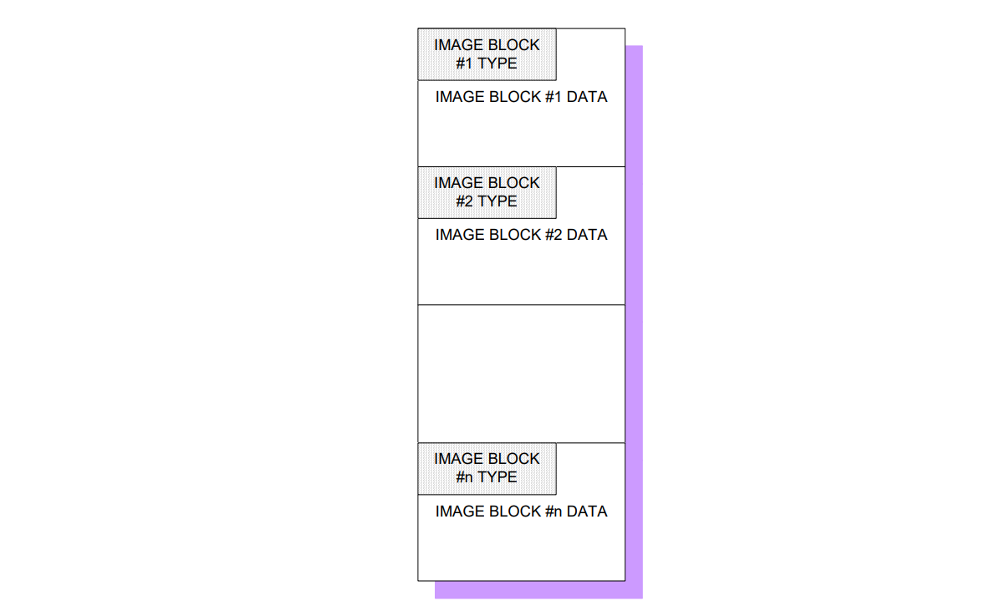

   Animation Information Encoded in Blocks

**Prototype**

.. code-block::

   typedef struct _EFI_HII_ANIMATION_BLOCK {
     UINT8                 BlockType;
   //UINT8                 BlockBody[];
   }   EFI_HII_ANIMATION_BLOCK;

The following table describes the different block types:

.. list-table:: Animation Block Types
   :widths: 50,10,40
   :name: animation-block-types
   :class: longtable

   * - Name
     - Value
     - Description
   * - EFI_HII_AIBT_END  
     - 0x00
     - The end of the animation information.
   * - EFI_HII_AIBT_OVERLAY_IMAGES
     - 0x10
     - Animate sequence once by displaying the next image in the logical window.
   * - EFI_HII_AIBT_CLEAR_IMAGES
     - 0x11
     - Animate sequence once by clearing the logical window before displaying the next image.
   * - EFI_HII_AIBT_RESTORE_SCRN
     - 0x12
     - Animate sequence once by clearing the restoring the logical window before displaying the next image.
   * - EFI_HII_AIBT_OVERLAY_IMAGES_LOOP
     - 0x18
     - Animate repeating sequence by displaying the next image in the logical window.
   * - EFI_HII_AIBT_CLEAR_IMAGES_LOOP
     - 0x19
     - Animate repeating sequence by clearing the logical window before displaying the next image.
   * - EFI_HII_AIBT_RESTORE_SCRN_LOOP
     - 0x1A
     - Animate repeating sequence by clearing the restoring the logical window before displaying the next image.
   * - EFI_HII_AIBT_DUPLICATE
     - 0x20
     - Duplicate an existing animation identifier
   * - EFI_HII_AIBT_SKIP2
     - 0x21
     - Skip a certain number of animation identifiers.
   * - EFI_HII_AIBT_SKIP1
     - 0x22
     - Skip a certain number of animation identifiers.
   * - EFI_HII_AIBT_EXT1
     - 0x30
     - For future expansion (one byte length field)
   * - EFI_HII_AIBT_EXT2
     - 0x31
     - For future expansion (two byte length field)
   * - EFI_HII_AIBT_EXT4
     - 0x32
     - For future expansion (four byte length field)

In order to recreate all animation sequences, start at the first block and process them all until either an EFI_HII_AIBT_END block is found. When processing the animation blocks, each block refers to the current animation identifier ( *AnimationIdCurrent* ), which is initially set to one (1).

Animation blocks of an unknown type should be skipped. If they cannot be skipped, then processing halts.

.. _efi-aibt-end:

EFI_HII_AIBT_END
%%%%%%%%%%%%%%%%%

**Summary**

Marks the end of the animation information.

**Prototype**

.. code-block::
  
   None

**Members**

Header
  Standard animation header, where *Header.BlockType =* *EFI_HII_AIBT_END.*

**Discussion**

Any animation sequences with an animation identifier greater than or equal to *AnimationIdCurrent* are empty. There is no additional data.

.. _efi-hii-aibt-ext1-efi-hii-aibt-ext2-efi-hii-aibt-ext4:

EFI_HII_AIBT_EXT1, EFI_HII_AIBT_EXT2,EFI_HII_AIBT_EXT4
%%%%%%%%%%%%%%%%%%%%%%%%%%%%%%%%%%%%%%%%%%%%%%%%%%%%%%%

**Summary**

Generic prefix for animation information with a 1-byte,2-byte or 4-byte length.

**Prototype**

.. code-block::

   typedef struct _EFI_HII_AIBT_EXT1_BLOCK {
     EFI_HII_ANIMATION_BLOCK     Header;
     UINT8                       BlockType2;
     UINT8                       Length;
   }   EFI_HII_AIBT_EXT1_BLOCK;

   typedef struct _EFI_HII_AIBT_EXT2_BLOCK {
     EFI_HII_ANIMATION_BLOCK     Header;
     UINT8                       BlockType2;
     UINT16                      Length;
   }   EFI_HII_AIBT_EXT2_BLOCK;

   typedef struct _EFI_HII_AIBT_EXT4_BLOCK {
     EFI_HII_ANIMATION_BLOCK     Header;
     UINT8                       BlockType2;
     UINT32                      Length;
   }   EFI_HII_AIBT_EXT4_BLOCK;

**Members**

Header
  Standard animation header, where *Header.BlockType =* *EFI_HII_AIBT_EXT1,* *EFI_HII_AIBT_EXT2,* or *EFI_HII_AIBT_EXT4.*

Length
  Size of the animation block, in bytes, including the animation block header.

BlockType2
  The block type, as described in :numref:`block-types`

**Discussion**

 These records are used for variable sized animation records which need an explicit length.

.. _efi-aibt-overlay-images:

EFI_HII_AIBT_OVERLAY_IMAGES
%%%%%%%%%%%%%%%%%%%%%%%%%%%%

**Summary**

An animation block to describe an animation sequence that does not cycle, and where one image is simply displayed over the previous image.

**Prototype**

.. code-block::

   typedef struct _EFI_HII_AIBT_OVERLAY_IMAGES_BLOCK {
     EFI_IMAGE_ID             DftImageId;
     UINT16                   Width;
     UINT16                   Height;
     UINT16                   CellCount;
     EFI_HII_ANIMATION_CELL   AnimationCell[];
   }   EFI_HII_AIBT_OVERLAY_IMAGES_BLOCK;

**Members**

DftImageId
  This is image that is to be reference by the image protocols, if the animation function is not supported or disabled. This image can be one particular image from the animation sequence (if any one of the animation frames has a complete image) or an alternate image that can be displayed alone. If the value is zero, no image is displayed.

Width
  The overall width of the set of images (logical window width).

Height
  The overall height of the set of images (logical window height).

CellCount
  The number of *EFI_HII_ANIMATION_CELL* contained in the animation sequence.

AnimationCell
  An array of *CellCount* animation cells. The type *EFI_HII_ANIMATION_CELL* is defined in "Related Definitions" below. 

**Description**

This record assigns the animation sequence data to the *AnimationIdCurrent* identifier and increment *AnimationIdCurrent* by one. This animation sequence is meant to be displayed only once (it is not a repeating sequence). Each image in the sequence will remain on the screen for the specified delay before the next image in the sequence is displayed. 

The header type (either *BlockType* in *EFI_HII_ANIMATION_BLOCK* or *BlockType2* in *EFI_HII_AIBT_EXTx_BLOCK* ) will be set to *EFI_HII_AIBT_OVERLAY_IMAGES.* 
 

**Related Definition**

.. code-block::

   typedef struct _EFI_HII_ANIMATION_CELL {
     UINT16                OffsetX;
     UINT16                OffsetY;
     EFI_IMAGE_ID          ImageId;
     UINT16                Delay;
   }   EFI_HII_ANIMATION_CELL;

OffsetX
  The X offset from the upper left hand corner of the logical window to position the indexed image.

OffsetY
  The Y offset from the upper left hand corner of the logical window to position the indexed image.

ImageId
  The image to display at the specified offset from the upper left hand corner of the logical window.

Delay
  The number of milliseconds to delay after displaying the indexed image and before continuing on to the next linked image. If value is zero, no delay. 
 

**Related Description**

The logical window definition allows the animation to be centered, even though the first image might be way off center (bounds the sequence of images). All images will be clipped to the defined logical window, since the logical window is suppose to bound all images, normally there is nothing to clip. The *DftImageId* definition allows an alternate image to be displayed if animation is currently not supported. The *DftImageId* image is to be centered in the defined logical window.

.. _efi-aibt-clear-images:

EFI_HII_AIBT_CLEAR_IMAGES
%%%%%%%%%%%%%%%%%%%%%%%%%%

**Summary**

An animation block to describe an animation sequence that does not cycle, and where the logical window is cleared to the specified color before the next image is displayed.

**Prototype**

.. code-block::
  
   typedef struct _EFI_HII_AIBT_CLEAR_IMAGES_BLOCK {

   EFI_IMAGE_ID DftImageId;

   UINT16 Width;

   UINT16 Height;

   UINT16 CellCount;

   EFI_HII_RGB_PIXEL BackgndColor;

   EFI_HII_ANIMATION_CELL AnimationCell[];

   } EFI_HII_AIBT_CLEAR_IMAGES_BLOCK;

**Members**

DftImageId
  This is image that is to be reference by the image protocols, if the animation function is not supported or disabled. This image can be one particular image from the animation sequence (if any one of the animation frames has a complete image) or an alternate image that can be displayed alone. If the value is zero, no image is displayed.

Width
  The overall width of the set of images (logical window width). 

Height
  The overall height of the set of images (logical window height).

CellCount
  The number of *EFI_HII_ANIMATION_CELL* contained in the animation sequence.

BackgndColor
  The color to clear the logical window to before displaying the indexed image.

AnimationCell
  An array of *CellCount* animation cells. The type *EFI_HII_ANIMATION_CELL* is defined in "Related Definitions" in *EFI_HII_AIBT_OVERLAY_IMAGES.* 

**Description**

This record assigns the animation sequence data to the *AnimationIdCurrent* identifier and increment AnimationIdCurrent by one. This animation sequence is meant to be displayed only once (it is not a repeating sequence). Each image in the sequence will remain on the screen for the specified delay before the logical window is cleared to the specified color (BackgndColor) and the next image is displayed. The logical window is also cleared to the specified color before displaying the *DftImageId* image.

The header type (either BlockType in EFI_HII_ANIMATION_BLOCK or BlockType2 in EFI_HII_AIBT_EXTx_BLOCK) will be set to EFI_HII_AIBT_CLEAR_IMAGES.

.. _efi-aibt-restore-scrn:

EFI_HII_AIBT_RESTORE_SCRN
%%%%%%%%%%%%%%%%%%%%%%%%%%

**Summary**

An animation block to describe an animation sequence that does not cycle, and where the screen is restored to the original state before the next image is displayed.

**Prototype**

.. code-block::

   typedef struct _EFI_HII_AIBT_RESTORE_SCRN_BLOCK {
     EFI_IMAGE_ID                DftImageId;
     UINT16                      Width;
     UINT16                      Height;
     UINT16                      CellCount;
     EFI_HII_ANIMATION_CELL      AnimationCell[];
   }   EFI_HII_AIBT_RESTORE_SCRN_BLOCK;

**Members**

DftImageId
  This is image that is to be reference by the image protocols, if the animation function is not supported or disabled. This image can be one particular image from the animation sequence (if any one of the animation frames has a complete image) or an alternate image that can be displayed alone. If the value is zero, no image is displayed.

Width
  The overall width of the set of images (logical window width).

Height
  The overall height of the set of images (logical window height).

CellCount
  The number of EFI_HII_ANIMATION_CELL contained in the animation sequence.

AnimationCell
  An array of *CellCount* animation cells. The type *EFI_HII_ANIMATION_CELL* is defined in "Related Definitions" in *EFI_HII_AIBT_OVERLAY_IMAGES.* 

**Description**

This record assigns the animation sequence data to the *AnimationIdCurrent* identifier and increment *AnimationIdCurrent* by one. This animation sequence is meant to be displayed only once (it is not a repeating sequence). Before the first image is displayed, the entire defined logical window is saved to a buffer. Then each image in the sequence will remain on the screen for the specified delay before the logical window is restored to the original state and the next image is displayed. 

If memory buffers are not available to save the logical window, this structure is treated as *EFI_HII_AIBT_CLEAR_IMAGES* structure, with the *BackgndColor* value set to black. 

The header type (either *BlockType* in *EFI_HII_ANIMATION_BLOCK* or *BlockType2* in *EFI_HII_AIBT_EXTx_BLOCK* ) will be set to *EFI_HII_AIBT_RESTORE_SCRN.*

.. _efi-aibt-overlay-images-loop:

EFI_HII_AIBT_OVERLAY_IMAGES_LOOP
%%%%%%%%%%%%%%%%%%%%%%%%%%%%%%%%%

**Summary**

An animation block to describe an animation sequence that continuously cycles, and where one image is simply displayed over the previous image.

**Prototype**

.. code-block::
 
   typedef EFI_HII_AIBT_OVERLAY_IMAGES_BLOCK
   EFI_HII_AIBT_OVERLAY_IMAGES_LOOP_BLOCK {
     EFI_IMAGE_ID                   DftImageId;
     UINT16                         Width;
     UINT16                         Height;
     UINT16                         CellCount;
     EFI_HII_ANIMATION_CELL         AnimationCell[];
   }   EFI_HII_AIBT_OVERLAY_IMAGES_LOOP_BLOCK;

**Members**

DftImageId
  This is image that is to be reference by the image protocols, if the animation function is not supported or disabled. This image can be one particular image from the animation sequence (if any one of the animation frames has a complete image) or an alternate image that can be displayed alone. If the value is zero, no image is displayed.

Width
  The overall width of the set of images (logical window width).

Height
  The overall height of the set of images (logical window height).

CellCount
  The number of EFI_HII_ANIMATION_CELL contained in the animation sequence.

AnimationCell
  An array of *CellCount* animation cells. The type *EFI_HII_ANIMATION_CELL* is defined in "Related Definitions" in *EFI_HII_AIBT_OVERLAY_IMAGES* 

**Description**

This record assigns the animation sequence data to the *AnimationIdCurrent* identifier and increment *AnimationIdCurrent* by one. This animation sequence is meant to continuously cycle until stopped or paused. Each image in the sequence will remain on the screen for the specified delay before the next image in the sequence is displayed. 

The header type (either *BlockType* in *EFI_HII_ANIMATION_BLOCK* or *BlockType2* in *EFI_HII_AIBT_EXTx_BLOCK* ) will be set to *EFI_HII_AIBT_OVERLAY_IMAGES_LOOP.*

.. _efi-aibt-clear-images-loop:

EFI_HII_AIBT_CLEAR_IMAGES_LOOP
%%%%%%%%%%%%%%%%%%%%%%%%%%%%%%%

**Summary**

An animation block to describe an animation sequence that continuously cycles, and where the logical window is cleared to the specified color before the next image is displayed.

**Prototype**

.. code-block::

   typedef EFI_HII_AIBT_CLEAR_IMAGES_BLOCK    EFI_HII_AIBT_CLEAR_IMAGES_LOOP_BLOCK {
     EFI_IMAGE_ID                DftImageId;
     UINT16                      Width;
     UINT16                      Height;
     UINT16                      CellCount;
     EFI_HII_RGB_PIXEL           BackgndColor;
     EFI_HII_ANIMATION_CELL      AnimationCell[];
   }   EFI_HII_AIBT_CLEAR_IMAGES_LOOP_BLOCK;

**Members**

DftImageId
  This is image that is to be reference by the image protocols, if the animation function is not supported or disabled. This image can be one particular image from the animation sequence (if any one of the animation frames has a complete image) or an alternate image that can be displayed alone. If the value is zero, no image is displayed.

Width
  The overall width of the set of images (logical window width).

Height
  The overall height of the set of images (logical window height).

CellCount
  The number of *EFI_HII_ANIMATION_CELL* contained in the animation sequence.

BackgndColor
  The color to clear the logical window to before displaying the indexed image.

AnimationCell
  An array of *CellCount* animation cells. The type *EFI_HII_ANIMATION_CELL* is defined in "Related Definitions" in *EFI_HII_AIBT_OVERLAY_IMAGES* 

**Description**

This record assigns the animation sequence data to the *AnimationIdCurrent* identifier and increment *AnimationIdCurrent* by one. This animation sequence is meant to continuously cycle until stopped or paused. Each image in the sequence will remain on the screen for the specified delay before the logical window is cleared to the specified color (BackgndColor) and the next image is displayed. The logical window is also cleared to the specified color before displaying the *DftImageId* image. 

The header type (either *BlockType* in *EFI_HII_ANIMATION_BLOCK* or *BlockType2* in *EFI_HII_AIBT_EXTx_BLOCK* ) will be set to *EFI_HII_AIBT_CLEAR_IMAGES_LOOP.*

.. _efi-aibt-restore-scrn-loop:

EFI_AIBT_RESTORE_SCRN_LOOP
%%%%%%%%%%%%%%%%%%%%%%%%%%%%%%

**Summary**

An animation block to describe an animation sequence that continuously cycles, and where the screen is restored to the original state before the next image is displayed. 

**Prototype**

.. code-block::

   typedef EFI_HII_AIBT_RESTORE_SCRN_LOOP_BLOCK
   EFI_HII_AIBT_RESTORE_SCRN_LOOP_BLOCK {
     EFI_IMAGE_ID                DftImageId;
     UINT16                      Width;
     UINT16                      Height;
     UINT16                      CellCount;
     EFI_HII_ANIMATION_CELL      AnimationCell[];
   }   EFI_HII_AIBT_RESTORE_SCRN_LOOP_BLOCK;

**Members**

Header
  Standard image header, where *Header.BlockType =* *EFI_HII_AIBT_RESTORE_SCRN_LOOP.*

DftImageId
  This is image that is to be reference by the image protocols, if the animation function is not supported or disabled. This image can be one particular image from the animation sequence (if any one of the animation frames has a complete image) or an alternate image that can be displayed alone. If the value is zero, no image is displayed.

Length
  Size of the animation block, in bytes, including the animation block header.

Width
  The overall width of the set of images (logical window width).

Height
  The overall height of the set of images (logical window height).

CellCount
  The number of *EFI_HII_ANIMATION_CELL* contained in the animation sequence.

AnimationCell
  An array of *CellCount* animation cells. The type *EFI_HII_ANIMATION_CELL* is defined in "Related Definitions" in *EFI_HII_AIBT_OVERLAY_IMAGES* 

**Description**

This record assigns the animation sequence data to the *AnimationIdCurrent* identifier and increment *AnimationIdCurrent* by one. This animation sequence is meant to continuously cycle until stopped or paused. Before the first image is displayed, the entire defined logical window is saved to a buffer. Then each image in the sequence will remain on the screen for the specified delay before the logical window is restored to the original state and the next image is displayed. 

If memory buffers are not available to save the logical window, this structure is treated as *EFI_HII_AIBT_CLEAR_IMAGES_LOOP* structure, with the BackgndColor value set to black. 

The header type (either *BlockType* in *EFI_HII_ANIMATION_BLOCK* or *BlockType2* in *EFI_HII_AIBT_EXTx_BLOCK* ) will be set to *EFI_HII_AIBT_RESTORE_SCRN_LOOP.*

.. _efi-aibt-duplicate:

EFI_HII_AIBT_DUPLICATE
%%%%%%%%%%%%%%%%%%%%%%%

**Summary**

Assigns a new character value to a previously defined animation sequence.

**Prototype**

.. code-block::

   typedef struct _EFI_HII_AIBT_DUPLICATE_BLOCK {
     EFI_ANIMATION_ID                  AnimationId;
   }   EFI_HII_AIBT_DUPLICATE_BLOCK;

**Members**

AnimationId
  The previously defined animation ID with the exact same animation information. 

**Discussion**

Indicates that the animation sequence with animation ID *AnimationIdCurrent* has the same animation information as a previously defined animation ID and increments *AnimationIdCurrent* by one. 

The header type (either *BlockType* in *EFI_HII_ANIMATION_BLOCK* or *BlockType2* in *EFI_HII_AIBT_EXTx_BLOCK* ) will be set to *EFI_HII_AIBT_DUPLICATE.*

.. _efi-aibt-skip1:

EFI_HII_AIBT_SKIP1
%%%%%%%%%%%%%%%%%%%

**Summary**

Skips animation IDs.

**Prototype**

.. code-block::

   typedef struct _EFI_HII_AIBT_SKIP1_BLOCK {
     UINT8                 SkipCount;
   }   EFI_HII_AIBT_SKIP1_BLOCK;

**Members**

SkipCount
  The unsigned 8-bit value to add to *AnimationIdCurrent.*

**Discussion**

Increments the current animation ID *AnimationIdCurrent* by the number specified. The header type (either *BlockType* in *EFI_HII_ANIMATION_BLOCK* or *BlockType2* in *EFI_HII_AIBT_EXTx_BLOCK* ) will be set to *EFI_HII_AIBT_SKIP1.*

.. _efi-aibt-skip2:

EFI_HII_AIBT_SKIP2
%%%%%%%%%%%%%%%%%%%

**Summary**

Skips animation IDs.

**Prototype**

.. code-block::
  
   typedef struct _EFI_HII_AIBT_SKIP2_BLOCK {
     UINT16                   SkipCount;
   }   EFI_HII_AIBT_SKIP2_BLOCK;
  

**Members**

SkipCount
  The unsigned 16-bit value to add to AnimationIdCurrent.

**Discussion**

Increments the current animation ID *AnimationIdCurrent* by the number specified.

The header type (either *BlockType* in *EFI_HII_ANIMATION_BLOCK* or *BlockType2* in *EFI_HII_AIBT_EXTx_BLOCK* ) will be set to *EFI_HII_AIBT_SKIP2.*
