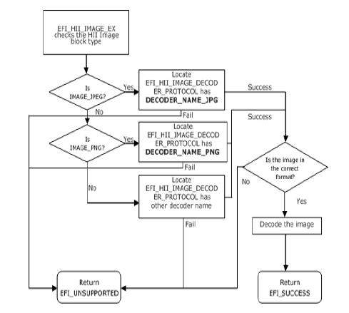
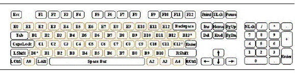

.. _hii-protocols:

HII Protocols
=============

This section provides code definitions for the HII-related protocols, functions, and type definitions, which are the required architectural mechanisms by which UEFI-compliant systems manage user input. The major areas described include the following:

-  Font management.
-  String management.
-  Image management.
-  Database management.

.. _font-protocol:

Font Protocol
-------------

.. _efi-hii-font-protocol:

EFI_HII_FONT_PROTOCOL
######################

**Summary**

Interfaces which retrieve font information.

**GUID**

.. code-block::

   #define EFI_HII_FONT_PROTOCOL_GUID \
     { 0xe9ca4775, 0x8657, 0x47fc, \
       {0x97, 0xe7, 0x7e, 0xd6, 0x5a, 0x8, 0x43, 0x24 }}

**Protocol**

.. code-block::

   typedef struct _EFI_HII_FONT_PROTOCOL {
     EFI_HII_STRING_TO_IMAGE           StringToImage;
     EFI_HII_STRING_ID_TO_IMAGE        StringIdToImage;
     EFI_HII_GET_GLYPH                 GetGlyph;
     EFI_HII_GET_FONT_INFO             GetFontInfo;
   }   EFI_HII_FONT_PROTOCOL;

**Members**

StringToImage, StringIdToImage
  Render a string to a bitmap or to the display.

GetGlyph
  Return a specific glyph in a specific font.

GetFontInfo
  Return font information for a specific font.

.. _efi-hii-font-protocol-stringtoimage:

EFI_HII_FONT_PROTOCOL.StringToImage()
######################################

**Summary**

Renders a string to a bitmap or to the display.

**Prototype**

.. code-block::

   typedef  
   EFI_STATUS  
   (EFIAPI *EFI_HII_STRING_TO_IMAGE) (  
     IN CONST EFI_HII_FONT_PROTOCOL       *This,  
     IN EFI_HII_OUT_FLAGS                 Flags,  
     IN CONST EFI_STRING                  String,  
     IN CONST EFI_FONT_DISPLAY_INFO       *StringInfo OPTIONAL,  
     IN OUT EFI_IMAGE_OUTPUT              **Blt,  
     IN UINTN                             BltX,  
     IN UINTN                             BltY,  
     OUT EFI_HII_ROW_INFO                 **RowInfoArray OPTIONAL,  
     OUT UINTN                            *RowInfoArraySize OPTIONAL,  
     OUT UINTN                            *ColumnInfoArray OPTIONAL
   ):

**Parameters**
 
This
  A pointer to the *EFI_HII_FONT_PROTOCOL* instance.

Flags
  Describes how the string is to be drawn. *EFI_HII_OUT_FLAGS* is defined in Related Definitions, below.

String
  Points to the null-terminated string to be displayed.

StringInfo
  Points to the string output information, including the color and font. If NULL, then the string will be output in the default system font and color.

Blt
  If this points to a non-NULL on entry, this points to the image, which is *Blt.Width* pixels wide and *Blt.Height* pixels high. The string will be drawn onto this image and *EFI_HII_OUT_FLAG_CLIP* is implied. If this points to a NULL on entry, then a buffer will be allocated to hold the generated image and the pointer updated on exit. It is the caller’s responsibility to free this buffer.

BltX, BltY
  Specifies the offset from the left and top edge of the image of the first character cell in the image.

RowInfoArray
 If this is non-NULL on entry, then on exit, this will point to an allocated buffer containing row information and *RowInfoArraySize* will be updated to contain the number of elements. This array describes the characters which were at least partially drawn and the heights of the rows. It is the caller’s responsibility to free this buffer.

RowInfoArraySize
 If this is non-NULL on entry, then on exit it contains the number of elements in *RowInfoArray.*

ColumnInfoArray
  If this is non-NULL, then on return it will be filled with the horizontal offset for each character in the string on the row where it is displayed. Non-printing characters will have the offset ~0. The caller is responsible to allocate a buffer large enough so that there is one entry for each character in the string, not including the null-terminator. It is possible when character display is normalized that some character cells overlap.

**Description**

This function renders a string to a bitmap or the screen using the specified font, color and options. It either draws the string and glyphs on an existing bitmap, allocates a new bitmap or uses the screen. The strings can be clipped or wrapped. Optionally, the function also returns the information about each row and the character position on that row.

If *EFI_HII_OUT_FLAG_CLIP* is set, then text will be formatted only based on explicit line breaks and all pixels which would lie outside the bounding box specified by *Blt.Width* and *Blt.Height* are ignored. The information in the *RowInfoArray* only describes characters which are at least partially displayed. For the final row, the *RowInfoArray.LineHeight* and *RowInfoArray.BaseLine* may describe pixels which are outside the limit specified by *Blt.* *Height* (unless *EFI_HII_OUT_FLAG_CLIP_CLEAN_Y* is specified) even though those pixels were not drawn. The *LineWidth* may describe pixels which are outside the limit specified by *Blt.Width* (unless *EFI_HII_OUT_FLAG_CLIP_CLEAN_X* is specified) even though those pixels were not drawn. 

If *EFI_HII_OUT_FLAG_CLIP_CLEAN_X* is set, then it modifies the behavior of *EFI_HII_OUT_FLAG_CLIP* so that if a character’s right-most on pixel cannot fit, then it will not be drawn at all. This flag requires that *EFI_HII_OUT_FLAG_CLIP* be set. 

If *EFI_HII_OUT_FLAG_CLIP_CLEAN_Y* is set, then it modifies the behavior of *EFI_HII_OUT_FLAG_CLIP* so that if a row’s bottom-most pixel cannot fit, then it will not be drawn at all. This flag requires that *EFI_HII_OUT_FLAG_CLIP* be set. 

If *EFI_HII_OUT_FLAG_WRAP* is set, then text will be wrapped at the right-most line-break opportunity prior to a character whose right-most extent would exceed *Blt.Width.* If no line-break opportunity can be found, then the text will behave as if *EFI_HII_OUT_FLAG_CLIP_CLEAN_X* is set. This flag cannot be used with *EFI_HII_OUT_FLAG_CLIP_CLEAN_X.* 

If *EFI_HII_OUT_FLAG_TRANSPARENT* is set, then *StringInfo.BackgroundColor* is ignored and all "off" pixels in the character’s drawn will use the pixel value from *Blt.* This flag cannot be used if *Blt* is NULL upon entry. 

If *EFI_HII_IGNORE_IF_NO_GLYPH* is set, then characters which have no glyphs are not drawn. Otherwise, they are replaced with Unicode character code 0xFFFD (REPLACEMENT CHARACTER). 

If *EFI_HII_IGNORE_LINE_BREAK* is set, then explicit line break characters will be ignored.

If *EFI_HII_DIRECT_TO_SCREEN* is set, then the string will be written directly to the output device specified by *Screen.* Otherwise the string will be rendered to the bitmap specified by *Bitmap*.

**Related Definitions**

.. code-block::

   typedef UINT32 EFI_HII_OUT_FLAGS;

   #define EFI_HII_OUT_FLAG_CLIP             0x00000001
   #define EFI_HII_OUT_FLAG_WRAP             0x00000002
   #define EFI_HII_OUT_FLAG_CLIP_CLEAN_Y     0x00000004
   #define EFI_HII_OUT_FLAG_CLIP_CLEAN_X     0x00000008
   #define EFI_HII_OUT_FLAG_TRANSPARENT      0x00000010
   #define EFI_HII_IGNORE_IF_NO_GLYPH        0x00000020
   #define EFI_HII_IGNORE_LINE_BREAK         0x00000040
   #define EFI_HII_DIRECT_TO_SCREEN          0x00000080

   typedef CHAR16 *EFI_STRING;

   typedef struct _EFI_HII_ROW_INFO {
     UINTN                                   StartIndex;
     UINTN                                   EndIndex;
     UINTN                                   LineHeight;
     UINTN                                   LineWidth;
     UINTN                                   BaselineOffset;
   }   EFI_HII_ROW_INFO;

StartIndex
  The index of the first character in the string which is displayed on the line.

EndIndex
  The index of the last character in the string which is displayed on the line.

LineHeight
  The height of the line, in pixels.

LineWidth
  The width of the text on the line, in pixels.

BaselineOffset
  The font baseline offset in pixels from the bottom of the row, or 0 if none.

**Status Codes Returned**

.. list-table::
   :widths: 35 70
   :class: longtable

   * - EFI_SUCCESS
     - The string was successfully updated.
   * - EFI_OUT_OF_RESOURCES
     - Unable to allocate an output buffer for *RowInfoArray* or *Blt.*
   * - EFI_INVALID_PARAMETER
     - The *String* or *Blt* was NULL.
   * - EFI_INVALID_PARAMETER
     - Flags were invalid combination

.. _efi-hii-font-protocol-stringidtoimage:

EFI_HII_FONT_PROTOCOL.StringIdToImage()
########################################

**Summary**

Render a string to a bitmap or the screen containing the contents of the specified string.

**Prototype**

.. code-block::

   typedef  
   EFI_STATUS  
   (EFIAPI *EFI_HII_STRING_ID_TO_IMAGE) (  
     IN   CONST EFI_HII_FONT_PROTOCOL          *This,  
     IN   EFI_HII_OUT_FLAGS                    Flags,  
     IN   EFI_HII_HANDLE                       PackageList,  
     IN   EFI_STRING_ID                        StringId,  
     IN   CONST CHAR8*                         Language,  
     IN   CONST EFI_FONT_DISPLAY_INFO          *StringInfo OPTIONAL,  
     IN  OUT EFI_IMAGE_OUTPUT                  **Blt,  
     IN   UINTN                                BltX,  
     IN   UINTN                                BltY,  
     OUT   EFI_HII_ROW_INFO                    **RowInfoArray OPTIONAL,  
     OUT   UINTN                               *RowInfoArraySize OPTIONAL,  
     OUT   UINTN                               *ColumnInfoArray OPTIONAL  
     );

**Parameters**

This
  A pointer to the *EFI_HII_FONT_PROTOCOL* instance.

Flags
  Describes how the string is to be drawn. *EFI_HII_OUT_FLAGS* is defined in Related Definitions, below.

PackageList
  The package list in the HII database to search for the specified string.

StringId
  The string’s id, which is unique within *PackageList.*

Language
  Points to the language for the retrieved string. If NULL, then the current system language is used.

StringInfo
  Points to the string output information, including the color and font. If NULL, then the string will be output in the default system font and color.

Blt
  If this points to a non-NULL on entry, this points to the image, which is *Blt.Width* pixels wide and *Height* pixels high. The string will be drawn onto this image and *EFI_HII_OUT_FLAG_CLIP* is implied. If this points to a NULL on entry, then a buffer will be allocated to hold the generated image and the pointer updated on exit. It is the caller’s responsibility to free this buffer.

BltX, BltY
  Specifies the offset from the left and top edge of the output image of the first character cell in the image.

RowInfoArray
  If this is non-NULL on entry, then on exit, this will point to an allocated buffer containing row information and *RowInfoArraySize* will be updated to contain the number of elements. This array describes the characters which were at least partially drawn and the heights of the rows. It is the caller’s responsibility to free this buffer.

RowInfoArraySize
  If this is non-NULL on entry, then on exit it contains the number of elements in *RowInfoArray.* 

ColumnInfoArray
  If non-NULL, on return it is filled with the horizontal offset for each character in the string on the row where it is displayed. Non-printing characters will have the offset ~0. The caller is responsible to allocate a buffer large enough so that there is one entry for each character in the string, not including the null-terminator. It is possible when character display is normalized that some character cells overlap. 

**Description**

This function renders a string as a bitmap or to the screen and can clip or wrap the string. The bitmap is either supplied by the caller or else is allocated by the function. The strings are drawn with the font, size and style specified and can be drawn transparently or opaquely. The function can also return information about each row and each character’s position on the row. 

If *EFI_HII_OUT_FLAG_CLIP* is set, then text will be formatted only based on explicit line breaks and all pixels which would lie outside the bounding box specified by *Width* and *Height* are ignored. The information in the *RowInfoArray* only describes characters which are at least partially displayed. For the final row, the LineHeight and BaseLine may describe pixels which are outside the limit specified by *Height* (unless *EFI_HII_OUT_FLAG_CLIP_CLEAN_Y* is specified) even though those pixels were not drawn. 

If *EFI_HII_OUT_FLAG_CLIP_CLEAN_X* is set, then it modifies the behavior of *EFI_HII_OUT_FLAG_CLIP* so that if a character’s right-most on pixel cannot fit, then it will not be drawn at all. This flag requires that *EFI_HII_OUT_FLAG_CLIP* be set. If *EFI_HII_OUT_FLAG_CLIP_CLEAN_Y* is set, then it modifies the behavior of *EFI_HII_OUT_FLAG_CLIP* so that if a row’s bottom most pixel cannot fit, then it will not be drawn at all. This flag requires that *EFI_HII_OUT_FLAG_CLIP* be set. 

If *EFI_HII_OUT_FLAG_WRAP* is set, then text will be wrapped at the right-most line-break opportunity prior to a character whose right-most extent would exceed *Width.* If no line-break opportunity can be found, then the text will behave as if *EFI_HII_OUT_FLAG_CLIP_CLEAN_X* is set. This flag cannot be used with *EFI_HII_OUT_FLAG_CLIP_CLEAN_X*. 

If *EFI_HII_OUT_FLAG_TRANSPARENT* is set, then *BackgroundColor* is ignored and all "off" pixels in the character’s glyph will use the pixel value from *Blt.* This flag cannot be used if *Blt* is NULL upon entry. 

If *EFI_HII_IGNORE_IF_NO_GLYPH* is set, then characters which have no glyphs are not drawn. Otherwise, they are replaced with Unicode character code 0xFFFD (REPLACEMENT CHARACTER). 

If *EFI_HII_IGNORE_LINE_BREAK* is set, then explicit line break characters will be ignored.

If *EFI_HII_DIRECT_TO_SCREEN* is set, then the string will be written directly to the output device specified by *Screen.* Otherwise the string will be rendered to the bitmap specified by *Bitmap.*

**Status Codes Returned**

.. list-table::
   :widths: 35 70
   :class: longtable

   * - EFI_SUCCESS
     - The string was successfully updated.
   * - EFI_OUT_OF_RESOURCES
     - Unable to allocate an output buffer for *RowInfoArray* or *Blt.*
   * - EFI_INVALID_PARAMETER
     - The *StringId* or *PackageList* was *NULL.*
   * - EFI_INVALID_PARAMETER
     - *Flags* were invalid combination.
   * - EFI_NOT_FOUND
     - The *StringId* is not in the specified *PackageList.*  The specified *PackageList* is not in the Database.

.. _efi-hii-font-protocol-getglyph:

EFI_HII_FONT_PROTOCOL.GetGlyph()
#################################

**Summary**

Return image and information about a single glyph.

**Prototype**

.. code-block::

   typedef  
   EFI_STATUS  
   (EFIAPI *EFI_HII_GET_GLYPH) (  
     IN CONST EFI_HII_FONT_PROTOCOL       *This,  
     IN CHAR16                            Char,  
     IN CONST EFI_FONT_DISPLAY_INFO       *StringInfo,  
     OUT EFI_IMAGE_OUTPUT                 **Blt;  
     OUT UINTN                            *Baseline OPTIONAL;  
     );
  

**Parameters**

This
  A pointer to the *EFI_HII_FONT_PROTOCOL* instance.

Char
  Character to retrieve.

StringInfo
  Points to the string font and color information or NULL if the string should use the default system font and color.

Blt
  Thus must point to a NULL on entry. A buffer will be allocated to hold the output and the pointer updated on exit. It is the caller’s responsibility to free this buffer.On return, only *Blt.Width,* *Blt.Height,* and *Blt.Image.Bitmap* are valid.

Baseline
  Number of pixels from the bottom of the bitmap to the baseline.

**Description**

Convert the glyph for a single character into a bitmap.

**Status Codes Returned**

.. list-table::
   :widths: 35 70
   :class: longtable

   * - EFI_SUCCESS
     - Glyph bitmap created.
   * - EFI_OUT_OF_RESOURCES
     - Unable to allocate the output buffer *Blt.*
   * - EFI_WARN_UNKNOWN_GLYPH
     - The glyph was unknown and was replaced with the glyph for Unicode character code 0xFFFD.
   * - EFI_INVALID_PARAMETER
     - *Blt* is NULL or * *Blt* is !Null

.. _efi-hii-font-protocol-getfontinfo:

EFI_HII_FONT_PROTOCOL.GetFontInfo()
####################################

**Summary**

Return information about a particular font.

**Prototype**

.. code-block::

   typedef  
   EFI_STATUS  
   (EFIAPI *EFI_HII_GET_FONT_INFO) (  
     IN    CONST EFI_HII_FONT_PROTOCOL          *This,  
     IN  OUT EFI_FONT_HANDLE                    *FontHandle,  
     IN    CONST EFI_FONT_DISPLAY_INFO          *StringInfoIn,OPTIONAL  
     OUT   EFI_FONT_DISPLAY_INFO                **StringInfoOut,  
     IN    CONST EFI_STRING                     String OPTIONAL  
     );

   typedef VOID                                 *EFI_FONT_HANDLE;
  

**Parameters**

This
  A pointer to the *EFI_HII_FONT_PROTOCOL* instance.

FontHandle
  On entry, points to the font handle returned by a previous call to *GetFontInfo()* or points to NULL to start with the first font. On return, points to the returned font handle or points to NULL if there are no more matching fonts.

StringInfoIn
  Upon entry, points to the font to return information about. If NULL, then the information about the system default font will be returned.

StringInfoOut
  Upon return, contains the matching font’s information. If NULL, then no information is returned. This buffer is allocated with a call to the *Boot Service AllocatePool().* It is the caller's responsibility to call the *Boot Service FreePool()* when the caller no longer requires the contents of *StringInfoOut.*

String
  Points to the string which will be tested to determine if all characters are available. If **NULL**, then any font is acceptable.

**Description**

This function iterates through fonts which match the specified font, using the specified criteria. If *String* is non-NULL, then all of the characters in the string must exist in order for a candidate font to be returned.

**Status Codes Returned**

.. list-table::
   :widths: 35 70
   :class: longtable

   * - EFI_SUCCESS
     - Matching font returned successfully.
   * - EFI_NOT_FOUND
     - No matching font was found.
   * - EFI_OUT_OF_RESOURCES
     - There were insufficient resources to complete the request.

.. _efi-hii-font-ex-protocol:

EFI HII Font Ex Protocol
------------------------

The EFI HII Font Ex protocol defines an extension to the EFI HII Font protocol which enables various new capabilities described in this section.

.. _efi-hii-font-ex-protocol-1:

EFI_HII_FONT_EX_PROTOCOL
#########################

**Summary**

Interfaces which retrieve the font information.

**GUID**

.. code-block::

   #define EFI_HII_FONT_EX_PROTOCOL_GUID \
     { 0x849e6875, 0xdb35, 0x4df8, 0xb4, \
       {0x1e, 0xc8, 0xf3, 0x37, 0x18, 0x7, 0x3f }}

**Protocol**

.. code-block::

   typedef struct _EFI_HII_FONT_EX_PROTOCOL {
     EFI_HII_STRING_TO_IMAGE_EX           StringToImageEx;
     EFI_HII_STRING_ID_TO_IMAGE_EX        StringIdToImageEx;
     EFI_HII_GET_GLYPH_EX                 GetGlyphEx;
     EFI_HII_GET_FONT_INFO_EX             GetFontInfoEx;
     EFI_HII_GET_GLYPH_INFO               GetGlyphInfo;
   }   EFI_HII_FONT_EX_PROTOCOL;

**Members**

StringToImageEx, StringIdToImageEx
  Render a string to a bitmap or to the display. This function will try to use the external font glyph generator for generating the glyph if it can’t find the glyph in the font database.

GetGlphyEx
  Return a specific glyph in a specific font. This function will try to use the external font glyph generator for generating the glyph if it can’t find the glyph in the font database.

GetFontInfoEx
  Return the font information for a specific font, this protocol invokes original *EFI_HII_FONT_PROTOCOL.GetFontInfo()* implicitly.

GetGlphyInfoEx
  Return the glyph information for the single glyph.

.. _efi-hii-font-ex-protocol-stringtoimageex:

EFI_HII_FONT_EX_PROTOCOL.StringToImageEx()
###########################################

**Summary**

Render a string to a bitmap or to the display. The prototype of this extension function is the same with *EFI_HII_FONT_PROTOCOL.StringToImage().* 

**Protocol**

.. code-block::

   typedef
   EFI_STATUS
   (EFIAPI *EFI_HII_STRING_TO_IMAGE_EX)(
     IN CONST EFI_HII_FONT_EX_PROTOCOL       *This,
     IN EFI_HII_OUT_FLAGS                    Flags,
     IN CONST EFI_STRING                     String,
     IN CONST EFI_FONT_DISPLAY_INFO          *StringInfo OPTIONAL,
     IN OUT EFI_IMAGE_OUTPUT                 **Blt,
     IN UINTN                                BltX,
     IN UINTN                                BltY,
     OUT EFI_HII_ROW_INFO                    **RowInfoArray OPTIONAL,
     OUT UINTN                               *RowInfoArraySize OPTIONAL,
     OUT UINTN                               *ColumnInfoArray OPTIONAL
     );

**Parameters**

Same with `EFI_HII_FONT_PROTOCOL.STRINGTOIMAGE()`_ .

**Description**

This function is similar to *EFI_HII_FONT_PROTOCOL.StringToImage().* The difference is that this function will locate all *EFI_HII_FONT_GLYPH_GENERATOR_PROTOCOL* instances that are installed in the system when the glyph in the string with the given font information is not found in the current HII glyph database. The function will attempt to generate the glyph information and the bitmap using the first *EFI_HII_FONT_GLYPH_GENERATOR_PROTOCOL* instance that supports the requested font information in the *EFI_FONT_DISPLAY_INFO.*

**Status Codes Returned** — Same with  `EFI_HII_FONT_PROTOCOL.STRINGTOIMAGE()`_ .

.. _efi-hii-font-ex-protocol-stringidtoimageex:

EFI_HII_FONT_EX_PROTOCOL.StringIdToImageEx()
#############################################

**Summary**

Render a string to a bitmap or the screen containing the contents of the specified string. The prototype of this extension function is the same with `EFI_HII_FONT_PROTOCOL.STRINGTOIMAGE()`_ . 

**Protocol**

.. code-block::

   typedef
   EFI_STATUS
   (EFIAPI *EFI_HII_STRING_ID_TO_IMAGE_EX)(
     IN CONST EFI_HII_FONT_EX_PROTOCOL          *This,
     IN EFI_HII_OUT_FLAGS                       Flags,
     IN EFI_HII_HANDLE                          PackageList,
     IN EFI_STRING_ID                           StringId,
     IN CONST CHAR8                             *Language,
     IN CONST EFI_FONT_DISPLAY_INFO             *StringInfo OPTIONAL,
     IN OUT EFI_IMAGE_OUTPUT                    **Blt,
     IN UINTN                                   BltX,
     IN UINTN                                   BltY,
     OUT EFI_HII_ROW_INFO                       **RowInfoArray OPTIONAL,
     OUT UINTN                                  *RowInfoArraySize OPTIONAL,
     OUT UINTN                                  *ColumnInfoArray OPTIONAL
     );

**Parameters**

Same with `EFI_HII_FONT_PROTOCOL.STRINGTOIMAGE()`_ .

**Description**

This function is similar to *EFI_HII_FONT_PROTOCOL.StringIdToImage().*The difference is that this function will locate all *EFI_HII_FONT_GLYPH_GENERATOR_PROTOCOL* instances that are installed in the system when the glyph in the string with the given font information is not found in the current HII glyph database. The function will attempt to generate the glyph information and the bitmap using the first *EFI_HII_FONT_GLYPH_GENERATOR_PROTOCOL* instance that supports the requested font information in the *EFI_FONT_DISPLAY_INFO* .

**Status Codes Returned** — Same with  `EFI_HII_FONT_PROTOCOL.STRINGTOIMAGE()`_ .

.. _efi-hii-font-ex-protocol-getglyphex:

EFI_HII_FONT_EX_PROTOCOL.GetGlyphEx()
######################################

**Summary**

Return image and baseline about a single glyph. The prototype
of this extension function is the same with `EFI_HII_FONT_PROTOCOL.GETGLYPH()`_ .

**Protocol**

.. code-block::

  typedef
  EFI_STATUS
  (EFIAPI *EFI_HII_GET_GLYPH_EX)(
    IN CONST EFI_HII_FONT_EX_PROTOCOL     *This,
    IN CHAR16                             Char,
    IN CONST EFI_FONT_DISPLAY_INFO        *StringInfo,
    IN OUT EFI_IMAGE_OUTPUT               **Blt,
    IN UINTN                              Baseline OPTIONAL
    );

**Parameters** — Same with `EFI_HII_FONT_PROTOCOL.GETGLYPH()`_ .

**Description**

The difference is that this function will locate all *EFI_HII_FONT_GLYPH_GENERATOR_PROTOCOL* instances that are installed in the system when the glyph in the string with the given font information is not found in the current HII glyph database. The function will attempt to generate the glyph information and the bitmap using the first *EFI_HII_FONT_GLYPH_GENERATOR_PROTOCOL* instance that supports the requested font information in the *EFI_FONT_DISPLAY_INFO.* 

**Status Codes Returned** — Same as  `EFI_HII_FONT_PROTOCOL.GETGLYPH()`_ .

.. _efi-hii-font-ex-protocol-getfontinfoex:

EFI_HII_FONT_EX_PROTOCOL.GetFontInfoEx()
#########################################

**Summary**

Return information about a particular font. The prototype of this extension function is the same with    

**Protocol**

.. code-block::

   typedef
   EFI_STATUS
   (EFIAPI *EFI_HII_GET_FONT_INFO_EX)(
     IN CONST EFI_HII_FONT_EX_PROTOCOL             *This,
     IN OUT EFI_FONT_HANDLE                        *FontHandle,
     IN CONST EFI_FONT_DISPLAY_INFO                *StringInfoIn, OPTIONAL
     OUT EFI_FONT_DISPLAY_INFO                     **StringInfoOut,
     IN CONST EFI_STRING                           String OPTIONAL
     );

**Parameters** — Same with  `EFI_HII_FONT_PROTOCOL.GETFONTINFO()`_ .

**Description**

Same with `EFI_HII_FONT_PROTOCOL.GETFONTINFO()`_ . This protocol invokes  `EFI_HII_FONT_PROTOCOL.GETFONTINFO()`_ .  implicitly.

**Status Codes Returned** — Same as `EFI_HII_FONT_PROTOCOL.GETFONTINFO()`_ .

.. _efi-hii-font-ex-protocol-getglyphinfo:

EFI_HII_FONT_EX_PROTOCOL.GetGlyphInfo()
#########################################

**Summary**

The function returns the information of the single glyph.

**Protocol**

.. code-block::

   typedef
   EFI_STATUS
   (EFIAPI *EFI_HII_GET_GLYPH_INFO)(
     IN CONST EFI_HII_FONT_EX_PROTOCOL          *This,
     IN CHAR16                                  Char,
     IN CONST EFI_FONT_DISPLAY_INFO             *FontDisplayInfo,
     OUT EFI_HII_GLYPH_INFO *                   GlyphInfo
     );

**Parameters**

This
  *EFI_HII_FONT_EX_PROTOCOL* instance.

Char
  Information of Character to retrieve.

FontDisplayInfo
  Font display information of this character.

GlyphInfo
  Pointer to retrieve the glyph information.

**Description**

This function returns the glyph information of character in the specific font family. This function will locate all *EFI_HII_FONT_GLYPH_GENERATOR* protocol instances that are installed in the system, and attempt to use them if it can’t find the glyph information in the font database. It returns *EFI_UNSUPPORTED* if neither the font database nor any instances of the *EFI_HII_FONT_GLYPH_GENRATOR* protocols support the font glyph in the specific font family. Otherwise, the *EFI_HII_GLYPH_INFO* is returned in *GlyphInfo.* This function only returns the glyph geometry information instead of allocating the buffer for *EFI_IMAGE_OUTPUT* and drawing the glyph in the buffer.

   **Glyph Example**

**Status Codes Returned**

.. list-table::
   :widths: 35 70
   :class: longtable

   * - EFI_SUCCESS
     - The glyph information was returned to *GlyphInfo*.
   * - EFI_OUT_OF_RESOURCES  
     - Memory allocation failed in this function.
   * - EFI_NOT_FOUND         
     - The input character was not found in the database.
   * - EFI_UNSUPPORTED       
     - The font is not supported.
   * - EFI_INVALID_PARAMETER 
     - The *GlyphInfo* or *FontDisplayInfo* was NULL.

.. _code-definitions:

Code Definitions
################

.. _efi-font-display-info:

EFI_FONT_DISPLAY_INFO
$$$$$$$$$$$$$$$$$$$$$$

**Summary**

Describes font output-related information.

**Prototype**

.. code-block::

   typedef struct _EFI_FONT_DISPLAY_INFO {
     EFI_GRAPHICS_OUTPUT_BLT_PIXEL                 ForegroundColor;
     EFI_GRAPHICS_OUTPUT_BLT_PIXEL                 BackgroundColor;
     EFI_FONT_INFO_MASK                            FontInfoMask;
     EFI_FONT_INFO                                 FontInfo
   }  EFI_FONT_DISPLAY_INFO;  

**Members**

FontInfo
  The font information. Type *EFI_FONT_INFO* is defined in *EFI_HII_STRING_PROTOCOL.NewString().*

ForegroundColor
  The color of the "on" pixels in the glyph in the bitmap.

BackgroundColor
  The color of the "off" pixels in the glyph in the bitmap.

FontInfoMask
  The font information mask determines which portion of the font information will be used and what to do if the specific font is not available. 

**Description**

This structure is used for describing the way in which a string should be rendered in a particular font. *FontInfo* specifies the basic font information and *ForegroundColor* and *BackgroundColor* specify the color in which they should be displayed. The flags in *FontInfoMask* describe where the system default should be supplied instead of the specified information. The flags also describe what options can be used to make a match between the font requested and the font available.

If *EFI_FONT_INFO_SYS_FONT* is specified, then the font name in *FontInfo* is ignored and the system font name is used. This flag cannot be used with *EFI_FONT_INFO_ANY_FONT.*

If *EFI_FONT_INFO_SYS_SIZE* is specified, then the font height specified in *FontInfo* is ignored and the system font height is used instead. This flag cannot be used with *EFI_FONT_INFO_ANY_SIZE.*

If *EFI_FONT_INFO_SYS_STYLE* is specified, then the font style in *FontInfo* is ignored and the system font style is used. This flag cannot be used with *EFI_FONT_INFO_ANY_STYLE.*

If *EFI_FONT_INFO_SYS_FORE_COLOR* is specified, then *ForegroundColor* is ignored and the system foreground color is used.

If *EFI_FONT_INFO_SYS_BACK_COLOR* is specified, then *BackgroundColor* is ignored and the system background color is used.

If *EFI_FONT_INFO_RESIZE* is specified, then the system may attempt to stretch or shrink a font to meet the size requested. This flag cannot be used with *EFI_FONT_INFO_ANY_SIZE.*

If *EFI_FONT_INFO_RESTYLE* is specified, then the system may attempt to remove some of the specified styles in order to meet the style requested. This flag cannot be used with *EFI_FONT_INFO_ANY_STYLE.*

If *EFI_FONT_INFO_ANY_FONT* is specified, then the system may attempt to match with any font. This flag cannot be used with *EFI_FONT_INFO_SYS_FONT.*

If *EFI_FONT_INFO_ANY_SIZE* is specified, then the system may attempt to match with any font size. This flag cannot be used with *EFI_FONT_INFO_SYS_SIZE* or *EFI_FONT_INFO_RESIZE* .

If *EFI_FONT_INFO_ANY_STYLE* is specified, then the system may attempt to match with any font style. This flag cannot be used with *EFI_FONT_INFO_SYS_STYLE* or *EFI_FONT_INFO_RESTYLE.*   

**Related Definitions**   

.. code-block::

   typedef UINT32 EFI_FONT_INFO_MASK;

   #define EFI_FONT_INFO_SYS_FONT         0x00000001
   #define EFI_FONT_INFO_SYS_SIZE         0x00000002
   #define EFI_FONT_INFO_SYS_STYLE        0x00000004
   #define EFI_FONT_INFO_SYS_FORE_COLOR   0x00000010
   #define EFI_FONT_INFO_SYS_BACK_COLOR   0x00000020
   #define EFI_FONT_INFO_RESIZE           0x00001000
   #define EFI_FONT_INFO_RESTYLE          0x00002000
   #define EFI_FONT_INFO_ANY_FONT         0x00010000
   #define EFI_FONT_INFO_ANY_SIZE         0x00020000
   #define EFI_FONT_INFO_ANY_STYLE        0x00040000
  
  
.. _efi-image-output:

EFI_IMAGE_OUTPUT
$$$$$$$$$$$$$$$$$

**Summary**

Describes information about either a bitmap or a graphical output device.

**Prototype**

.. code-block::

   typedef struct _EFI_IMAGE_OUTPUT {
     UINT16                               Width;
     UINT16                               Height;
     union {
       EFI_GRAPHICS_OUTPUT_BLT_PIXEL      *Bitmap;
       EFI_GRAPHICS_OUTPUT_PROTOCOL       *Screen;
     } Image;
   }  EFI_IMAGE_OUTPUT;

**Members**

Width
  Width of the output image.

Height
  Height of the output image.

Bitmap
  Points to the output bitmap.

Screen
  Points to the *EFI_GRAPHICS_OUTPUT_PROTOCOL* which describes the screen on which to draw the specified string.

.. _string-protocol:

String Protocol
---------------

.. _efi-hii-string-protocol:

EFI_HII_STRING_PROTOCOL
########################

**Summary**

Interfaces which manipulate string data.

**GUID**

.. code-block::

   #define EFI_HII_STRING_PROTOCOL_GUID \
     { 0xfd96974, 0x23aa, 0x4cdc,\
       { 0xb9, 0xcb, 0x98, 0xd1, 0x77, 0x50, 0x32, 0x2a }}

**Protocol**

.. code-block::

   typedef struct _EFI_HII_STRING_PROTOCOL {
     EFI_HII_NEW_STRING                      NewString;
     EFI_HII_GET_STRING                      GetString;
     EFI_HII_SET_STRING                      SetString;
     EFI_HII_GET_LANGUAGES                   GetLanguages;
     EFI_HII_GET_2ND_LANGUAGES               GetSecondaryLanguages;
   }   EFI_HII_STRING_PROTOCOL;

**Members**

NewString
  Add a new string.

GetString
  Retrieve a string and related string information.

SetString
  Change a string.

GetLanguages
  List the languages for a particular package list.

GetSecondaryLanguages
  List supported secondary languages for a particular primary language.

.. _efi-hii-string-protocol-newstring:

EFI_HII_STRING_PROTOCOL.NewString()
####################################

**Summary**

Creates a new string in a specific language and add it to strings from a specific package list.

**Prototype**

.. code-block::

   typedef
   EFI_STATUS
   (EFIAPI *EFI_HII_NEW_STRING) (
     IN CONST EFI_HII_STRING_PROTOCOL           *This,
     IN EFI_HII_HANDLE                          PackageList,
     OUT EFI_STRING_ID                          *StringId
     IN CONST CHAR8                             *Language,
     IN CONST CHAR16                            *LanguageName OPTIONAL,
     IN CONST EFI_STRING                        String,
     IN CONST EFI_FONT_INFO                     *StringFontInfo
     );

**Parameters**

This
  A pointer to the *EFI_HII_STRING_PROTOCOL* instance.

PackageList
  Handle of the package list where this string will be added.

Language
  Points to the language for the new string. The language information is in the format described by :ref:`Appendix-M-formats-language-codes-and-language-code-arrays-apx-m-formats-language-codes-and-language-code-arrays`  of the UEFI Specification.

LanguageName
  Points to the printable language name to associate with the passed in *Language* field. This is analogous to passing in "zh-Hans" in the *Language* field and *LanguageName* might contain "Simplified Chinese" as the printable language.

String
  Points to the new null-terminated string.

StringFontInfo
  Points to the new string’s font information or NULL if the string should have the default system font, size and style.

StringId
  On return, contains the new strings id, which is unique within *PackageList.* Type *EFI_STRING_ID* is defined in :ref:`efi-ifr-op-header` . 

**Description**

This function adds the string *String* to the group of strings owned by *PackageList,* with the specified font information *StringFontInfo* and returns a new string id. The new string identifier is guaranteed to be unique within the package list. That new string identifier is reserved for all languages in the package list.   

**Related Definitions**

.. code-block::
  
   typedef struct {
     EFI_HII_FONT_STYLE       FontStyle;
     UINT16                   FontSize;
     CHAR16                   FontName[...];
   }   EFI_FONT_INFO;

FontStyle
  The design style of the font. Type *EFI_HII_FONT_STYLE* is defined in :ref:`fixed-header`. 

FontSize
  The character cell height, in pixels.

FontName
  The null-terminated font family name.

**Status Codes Returns**

.. list-table::
   :widths: 25 65
   :class: longtable

   * - EFI_SUCCESS
     - The new string was added successfully
   * - EFI_OUT_OF_RESOURCES
     - Could not add the string. 
   * - EFI_INVALID_PARAMETER
     - *String* is **NULL** or *StringId* is **NULL** or *Language* is **NULL**.
   * - EFI_NOT_FOUND
     - The input package list could not be found in the current database. 
 

.. _efi-hii-string-protocol-getstring:

EFI_HII_STRING_PROTOCOL.GetString()
####################################

**Summary**

Returns information about a string in a specific language, associated with a package list.

**Prototype**

.. code-block::

   typedef
   EFI_STATUS
   (EFIAPI *EFI_HII_GET_STRING) (
     IN   CONST EFI_HII_STRING_PROTOCOL      *This,
     IN   CONST CHAR8                        *Language,
     IN   EFI_HII_HANDLE                     PackageList,
     IN   EFI_STRING_ID                      StringId,
     OUT  EFI_STRING                         String,
     IN  OUT UINTN                           *StringSize,
     OUT  EFI_FONT_INFO                      **StringFontInfo OPTIONAL
     );

**Parameters**

This
  A pointer to the *EFI_HII_STRING_PROTOCOL* instance.

PackageList
  The package list in the HII database to search for the specified string.

Language
  Points to the language for the retrieved string. Callers of interfaces that require RFC 4646 language codes to retrieve a Unicode string must use the RFC 4647 algorithm to lookup the Unicode string with the closest matching RFC 4646 language code.

StringId
  The string’s id, which is unique within *PackageList.*

String
  Points to the new null-terminated string.

StringSize
  On entry, points to the size of the buffer pointed to by *String,* in bytes. On return, points to the length of the string, in bytes.

StringFontInfo
  Points to a buffer that will be callee allocated and will have the string's font information into this buffer. The caller is responsible for freeing this buffer. If the parameter is NULL a buffer will not be allocated and the string font information will not be returned. 

**Description**

This function retrieves the string specified by *StringId* which is associated with the specified *PackageList* in the language *Language* and copies it into the buffer specified by *String.*

If the string specified by *StringId* is not present in the specified *PackageList,* then *EFI_NOT_FOUND* is returned. If the string specified by *StringId* is present, but not in the specified language then *EFI_INVALID_LANGUAGE* is returned.

If the buffer specified by *StringSize* is too small to hold the string, then *EFI_BUFFER_TOO_SMALL* will be returned. *StringSize* will be updated to the size of buffer actually required to hold the string.

**Status Codes Returned**

.. list-table::
   :widths: 35 70
   :class: longtable

   * - EFI_SUCCESS
     - The string was returned successfully.
   * - EFI_NOT_FOUND
     - The string specified by *StringId* is not available. The specified *PackageList* is not in the Database.
   * - EFI_INVALID_LANGUAGE
     - The string specified by *StringId* is available but not in the specified language.
   * - EFI_BUFFER_TOO_SMALL
     - The buffer specified by *StringLength* is too small to hold the string.
   * - EFI_INVALID_PARAMETER
     - The *Language* or *StringSize* was **NULL**.
   * - EFI_INVALID_PARAMETER
     - The value referenced by *StringLength* was not zero and *String* was **NULL**.
   * - EFI_OUT_OF_RESOURCES
     - There were insufficient resources to complete the request.

.. _efi-hii-string-protocol-setstring:

EFI_HII_STRING_PROTOCOL.SetString()
#####################################

**Summary**

Change information about the string.

**Prototype**

.. code-block::

   typedef
   EFI_STATUS
   (EFIAPI *EFI_HII_SET_STRING) (
     IN CONST EFI_HII_STRING_PROTOCOL        *This,
     IN EFI_HII_HANDLE                       PackageList,
     IN EFI_STRING_ID                        StringId,
     IN CONST CHAR8                          *Language,
     IN CONST EFI_STRING                     String,
     IN CONST EFI_FONT_INFO                  *StringFontInfo OPTIONAL

     );

**Parameters**

This
  A pointer to the *EFI_HII_STRING_PROTOCOL* instance.

PackageList
  The package list containing the strings.

Language
  Points to the language for the updated string.

StringId
  The string id, which is unique within *PackageList.*

String
  Points to the new null-terminated string.

StringFontInfo
  Points to the string’s font information or **NULL** if the string font information is not changed.

**Description**

This function updates the string specified by *StringId* in the specified *PackageList* to the text specified by *String* and, optionally, the font information specified by *StringFontInfo* . There is no way to change the font information without changing the string text.

**Status Codes Returned**

.. list-table::
   :widths: 35 70
   :class: longtable

   * - EFI_SUCCESS
     - The string was successfully updated.
   * - EFI_NOT_FOUND
     - The string specified by *StringId* is not in the database. The specified *PackageList* is not in the Database.
   * - EFI_INVALID_PARAMETER
     - The *String* or *Language* was **NULL**.
   * - EFI_OUT_OF_RESOURCES
     - The system is out of resources to accomplish the task.

.. _efi-hii-string-protocol-getlanguages:

EFI_HII_STRING_PROTOCOL.GetLanguages()
#######################################

**Summary**

Returns a list of the languages present in strings in a package
list.

**Prototype**

.. code-block::

   typedef
   EFI_STATUS
   (EFIAPI *EFI_HII_GET_LANGUAGES) (
     IN   CONST EFI_HII_STRING_PROTOCOL      *This,
     IN   EFI_HII_HANDLE                     PackageList,
     IN OUT CHAR8                            *Languages,
     IN OUT UINTN                            *LanguagesSize
     );

**Parameters**

This
  A pointer to the *EFI_HII_STRING_PROTOCOL* instance.

PackageList
  The package list to examine.

Languages
  Points to the buffer to hold the returned null-terminated ASCII string.

LanguageSize
  On entry, points to the size of the buffer pointed to by *Languages,* in bytes. On return, points to the length of *Languages,* in bytes.

**Description**

This function returns the list of supported languages, in the format specified in :ref:`Appendix-M-formats-language-codes-and-language-code-arrays-apx-m-formats-language-codes-and-language-code-arrays` .

**Status Codes Returned**

.. list-table::
   :widths: 35 70
   :class: longtable

   * - EFI_SUCCESS
     - The languages were returned successfully.
   * - EFI_BUFFER_TOO_SMALL
     - The *LanguagesSize* is too small to hold the list of supported languages. *LanguageSize* is updated to contain the required size.
   * - EFI_NOT_FOUND
     - The specified *PackageList* is not in the Database.
   * - EFI_INVALID_PARAMETER
     - *LanguagesSize* is **NULL**.
   * - EFI_INVALID_PARAMETER
     - The value referenced by *LanguagesSize* is not zero and *Languages* is **NULL**.

.. _efi-hii-string-protocol-getsecondarylanguages:

EFI_HII_STRING_PROTOCOL.GetSecondaryLanguages()
################################################

**Summary**

Given a primary language, returns the secondary languages supported in a package list.

**Prototype**

.. code-block::

   typedef
   EFI_STATUS
   (EFIAPI *EFI_HII_GET_2ND_LANGUAGES) (
     IN   CONST EFI_HII_STRING_PROTOCOL         *This,
     IN   EFI_HII_HANDLE                        PackageList,
     IN   CONST CHAR8*                          PrimaryLanguage;
     IN OUT CHAR8                               *SecondaryLanguages,
     IN OUT UINTN                               *SecondaryLanguagesSize
     );
  

**Parameters**

This
  A pointer to the *EFI_HII_STRING_PROTOCOL* instance.

PackageList
  The package list to examine.

Primary Language
  Points to the null-terminated ASCII string that specifies the primary language. Languages are specified in the format specified in  :ref:`Appendix-M-formats-language-codes-and-language-code-arrays-apx-m-formats-language-codes-and-language-code-arrays`   of the UEFI Specification.

SecondaryLanguages
  Points to the buffer to hold the returned null-terminated ASCII string that describes the list of secondary languages for the specified *PrimaryLanguage.* If there are no secondary languages, the function returns successfully, but this is set to **NULL**.

SecondaryLanguagesSize
  On entry, points to the size of the buffer pointed to by *SecondaryLanguages,* in bytes. On return, points to the length of *SecondaryLanguages* in bytes. 

**Description**

Each string package has associated with it a single primary language and zero or more secondary languages. This routine returns the secondary languages associated with a package list.

**Status Codes Returned**

.. list-table::
   :widths: 35 70
   :class: longtable

   * - EFI_SUCCESS
     - Secondary languages correctly returned
   * - EFI_BUFFER_TOO_SMALL
     - The buffer specified by *SecondaryLanguagesSize* is too small to hold the returned information. *SecondaryLanguageSize* is updated to hold the size of the buffer required.
   * - EFI_INVALID_LANGUAGE
     - The language specified by *FirstLanguage* is not present in the specified package list.
   * - EFI_NOT_FOUND
     - The specified *PackageList* is not in the Database.
   * - EFI_INVALID_PARAMETER
     - *PrimaryLanguage* or SecondaryLanguagesSize is **NULL**.
   * - EFI_INVALID_PARAMETER
     - The value referenced by *SecondaryLanguagesSize* is not zero and *SecondaryLanguages* is **NULL**.

.. _image-protocol:

Image Protocol
--------------

.. _efi-hii-image-protocol:

EFI_HII_IMAGE_PROTOCOL
#######################

**Summary**

Protocol which allow access to images in the images
database.

**GUID**

.. code-block::

   #define EFI_HII_IMAGE_PROTOCOL_GUID \
     { 0x31a6406a, 0x6bdf, 0x4e46,\
       { 0xb2, 0xa2, 0xeb, 0xaa, 0x89, 0xc4, 0x9, 0x20 }}

**Protocol**

.. code-block::

   typedef struct _EFI_HII_IMAGE_PROTOCOL {
     EFI_HII_NEW_IMAGE            NewImage;
     EFI_HII_GET_IMAGE            GetImage;
     EFI_HII_SET_IMAGE            SetImage;
     EFI_HII_DRAW_IMAGE           DrawImage;
     EFI_HII_DRAW_IMAGE_ID        DrawImageId;
   } EFI_HII_IMAGE_PROTOCOL;

**Members**

NewImage
  Add a new image.

GetImage
  Retrieve an image and related font information.

SetImage
  Change an image.

.. _efi-hii-image-protocol-newimage:

EFI_HII_IMAGE_PROTOCOL.NewImage()
##################################

**Summary**

Creates a new image and add it to images from a specific package list.

**Prototype**

.. code-block::

   typedef
   EFI_STATUS
   (EFIAPI *EFI_HII_NEW_IMAGE) (
     IN CONST EFI_HII_IMAGE_PROTOCO     *This,
     IN EFI_HII_HANDLE                  PackageList,
     OUT EFI_IMAGE_ID                   *ImageId
     IN CONST EFI_IMAGE_INPUT           *Image
     );

**Parameters**

This
  A pointer to the *EFI_HII_IMAGE_PROTOCOL* instance.

PackageList
  Handle of the package list where this image will be added.

ImageId
  On return, contains the new image id, which is unique within *PackageList.*

Image
  Points to the image.

**Description**

This function adds the image *Image* to the group of images owned by *PackageList,* and returns a new image identifier ( *ImageId* ).   

**Related Definitions**

.. code-block::
  
   typedef UINT16 EFI_IMAGE_ID;

   typedef struct {
     UINT32                         Flags;
     UINT16                         Width;
     UINT16                         Height;
     EFI_GRAPHICS_OUTPUT_BLT_PIXEL  *Bitmap;
   }   EFI_IMAGE_INPUT;

Flags
  Describe image characteristics. If EFI_IMAGE_TRANSPARENT is set, then the image was designed for transparent display. *#define EFI_IMAGE_TRANSPARENT 0x00000001*

Width
  Image width, in pixels.

Height
  Image height, in pixels.

Bitmap
  A pointer to the actual bitmap, organized left-to-right, top-to-bottom. The size of the bitmap is Width * Height * size of (EFI_GRAPHICS_OUTPUT_BLT_PIXEL).

**Status Codes Returned**

.. list-table::
   :widths: 35 70
   :class: longtable

   * - EFI_SUCCESS
     - The new image was added successfully
   * - EFI_OUT_OF_RESOURCES
     - Could not add the image.
   * - EFI_INVALID_PARAMETER 
     - *Image* is **NULL** or *ImageId* is **NULL**.
   * - EFI_NOT_FOUND
     - The *PackageList* could not be found.

.. _efi-hii-image-protocol-getimage:

EFI_HII_IMAGE_PROTOCOL.GetImage()
###################################

**Summary**

Returns information about an image, associated with a package list.

**Prototype**

.. code-block::

   typedef
   EFI_STATUS
   (EFIAPI *EFI_HII_GET_IMAGE) (
     IN CONST EFI_HII_IMAGE_PROTOCOL    *This,
     IN EFI_HII_HANDLE                  PackageList,
     IN EFI_IMAGE_ID                    ImageId,
     OUT EFI_IMAGE_INPUT                *Image
     );

**Parameters**

This
  A pointer to the *EFI_HII_IMAGE_PROTOCOL* instance.

PackageList
  The package list in the HII database to search for the specified image.

ImageId
  The image’s id, which is unique within *PackageList.*

Image
  Points to the new image.

**Description**

This function retrieves the image specified by *ImageId* which is associated with the specified *PackageList* and copies it into the buffer specified by *Image.*

If the image specified by *ImageId* is not present in the specified *PackageList,* then *EFI_NOT_FOUND* is returned.

The actual bitmap (I *mage->Bitmap* ) should not be freed by the caller and should not be modified directly.

**Status Codes Returned**

.. list-table::
   :widths: 35 70
   :class: longtable

   * - EFI_SUCCESS
     - The image was returned successfully.
   * - EFI_NOT_FOUND
     - The image specified by *ImageId* is not available. The specified *PackageList* is not in the Database.
   * - EFI_INVALID_PARAMETER
     - *Image* was NULL.
   * - EFI_OUT_OF_RESOURCES
     - The bitmap could not be retrieved because there was not enough memory.

.. _efi_hii_image_protocol.setimage:

EFI_HII_IMAGE_PROTOCOL.SetImage()
##################################

**Summary**

Change information about the image.

**Prototype**

.. code-block::

   typedef
   EFI_STATUS
   (EFIAPI *EFI_HII_SET_IMAGE) (
     IN CONST EFI_HII_IMAGE_PROTOCOL    *This,
     IN EFI_HII_HANDLE                  PackageList,
     IN EFI_IMAGE_ID                    ImageId,
     IN CONST EFI_IMAGE_INPUT           *Image,
     );

**Parameters**

This
  A pointer to the *EFI_HII_IMAGE_PROTOCOL* instance.

PackageList
  The package list containing the images.

ImageId
  The image id, which is unique within *PackageList.*

Image
  Points to the image.

**Description**

This function updates the image specified by *ImageId* in the specified *PackageListHandle* to the image specified by *Image* .

**Status Codes Returned**

.. list-table::
   :widths: 35 70
   :class: longtable

   * - EFI_SUCCESS
     - The image was successfully updated.
   * - EFI_NOT_FOUND
     - The image specified by *ImageId* is not in the database. The specified *PackageList* is not in the Database.
   * - EFI_INVALID_PARAMETER
     - The *Image* was **NULL**.

.. _efi-hii-image-protocol-drawimage:

EFI_HII_IMAGE_PROTOCOL.DrawImage()
###################################

**Summary**

Renders an image to a bitmap or to the display.

**Prototype**

.. code-block::

   typedef
   EFI_STATUS
   (EFIAPI *EFI_HII_DRAW_IMAGE) (
     IN CONST EFI_HII_IMAGE_PROTOCOL    *This,
     IN EFI_HII_DRAW_FLAGS              Flags,
     IN CONST EFI_IMAGE_INPUT           *Image,
     IN OUT EFI_IMAGE_OUTPUT            **Blt,
     IN UINTN                           BltX,
     IN UINTN                           BltY,
     );

**Parameters**

This
  A pointer to the *EFI_HII_IMAGE_PROTOCOL* instance.

Flags
  Describes how the image is to be drawn. *EFI_HII_DRAW_FLAGS* is defined in Related Definitions, below.

Image
  Points to the image to be displayed.

Blt
  If this points to a non-NULL on entry, this points to the image, which is *Width* pixels wide and *Height* pixels high. The image will be drawn onto this image and *EFI_HII_DRAW_FLAG_CLIP* is implied. If this points to a NULL on entry, then a buffer will be allocated to hold the generated image and the pointer updated on exit. It is the caller’s responsibility to free this buffer.

BltX, BltY
  Specifies the offset from the left and top edge of the image of the first pixel in the image.

**Description**

This function renders an image to a bitmap or the screen using the specified color and options. It draws the image on an existing bitmap, allocates a new bitmap or uses the screen. The images can be clipped. 

If *EFI_HII_DRAW_FLAG_CLIP* is set, then all pixels drawn outside the bounding box specified by *Width* and *Height* are ignored. 

The *EFI_HII_DRAW_FLAG_TRANSPARENT* flag determines whether the image will be drawn transparent or opaque. If *EFI_HII_DRAW_FLAG_FORCE_TRANS* is set then the image’s pixels will be drawn so that all "off" pixels in the image will be drawn using the pixel value from *BLT* and all other pixels will be copied. If *EFI_HII_DRAW_FLAG_FORCE_OPAQUE* is set, then the image’s pixels will be copied directly to the destination. If *EFI_HII_DRAW_FLAG_DEFAULT* is set, then the image will be drawn transparently or opaque, depending on the image’s transparency setting (see EFI_IMAGE_TRANSPARENT). Images cannot be drawn transparently if *Blt* is NULL. 

If *EFI_HII_DIRECT_TO_SCREEN* is set, then the image will be written directly to the output device specified by *Screen.* Otherwise the image will be rendered to the bitmap specified by *Bitmap.*

**Status Codes Returned**

.. list-table::
   :widths: 35 70
   :class: longtable

   * - EFI_SUCCESS
     - The image was successfully updated.
   * - EFI_OUT_OF_RESOURCES
     - Unable to allocate an output buffer for *Blt.*
   * - EFI_INVALID_PARAMETER 
     - The *Image* or *Blt* was **NULL**.

.. _efi-hii-image-protocol-drawimageid:

EFI_HII_IMAGE_PROTOCOL.DrawImageId()
####################################

**Summary**

Render an image to a bitmap or the screen containing the contents of the specified image.

**Prototype**

.. code-block::

   typedef
   EFI_STATUS
   (EFIAPI *EFI_HII_DRAW_IMAGE_ID) (
     IN CONST EFI_HII_IMAGE_PROTOCOL      *This,
     IN EFI_HII_DRAW_FLAGS                Flags,
     IN EFI_HII_HANDLE                    PackageList,
     IN EFI_IMAGE_ID                      ImageId,
     IN OUT EFI_IMAGE_OUTPUT              **Blt,
     IN UINTN                             BltX,
     IN UINTN                             BltY,
     );

**Parameters**

This
  A pointer to the *EFI_HII_IMAGE_PROTOCOL* instance.

Flags
  Describes how the image is to be drawn. *EFI_HII_DRAW_FLAGS* is defined in Related Definitions, below.

PackageList
  The package list in the HII database to search for the specified image.

ImageId
  The image’s id, which is unique within *PackageList.*

Blt
  If this points to a non-NULL on entry, this points to the image, which is *Width* pixels wide and *Height* pixels high. The image will be drawn onto this image and *EFI_HII_DRAW_FLAG_CLIP* is implied. If this points to a NULL on entry, then a buffer will be allocated to hold the generated image and the pointer updated on exit. It is the caller’s responsibility to free this buffer.

BltX, BltY
  Specifies the offset from the left and top edge of the output image of the first pixel in the image. 

**Description**

This function renders an image to a bitmap or the screen using the specified color and options. It draws the image on an existing bitmap, allocates a new bitmap or uses the screen. The images can be clipped. 

If EFI_HII_DRAW_FLAG_CLIP is set, then all pixels drawn outside the bounding box specified by *Width* and *Height* are ignored. 

The EFI_HII_DRAW_FLAG_TRANSPARENT flag determines whether the image will be drawn transparent or opaque. If EFI_HII_DRAW_FLAG_FORCE_TRANS is set, then the image will be drawn so that all "off" pixels in the image will be drawn using the pixel value from Blt and all other pixels will be copied. If EFI_HII_DRAW_FLAG_FORCE_OPAQUE is set, then the image’s pixels will be copied directly to the destination. If EFI_HII_DRAW_FLAG_DEFAULT is set, then the image will be drawn transparently or opaque, depending on the image’s transparency setting ( EFI_IMAGE_TRANSPARENT ). Images cannot be drawn transparently if Blt is NULL. 

If EFI_HII_DIRECT_TO_SCREEN is set, then the image will be written directly to the output device specified by *Screen.* Otherwise the image will be rendered to the bitmap specified by *Bitmap.*   

**Related Definitions**

.. code-block::

   typedef UINT32 EFI_HII_DRAW_FLAGS;
   #define EFI_HII_DRAW_FLAG_CLIP          0x00000001
   #define EFI_HII_DRAW_FLAG_TRANSPARENT   0x00000030
   #define EFI_HII_DRAW_FLAG_DEFAULT       0x00000000
   #define EFI_HII_DRAW_FLAG_FORCE_TRANS   0x00000010
   #define EFI_HII_DRAW_FLAG_FORCE_OPAQUE  0x00000020
   #define EFI_HII_DIRECT_TO_SCREEN        0x00000080
 

**Status Codes Returned**

.. list-table::
   :widths: 35 70
   :class: longtable

   * - EFI_SUCCESS
     - The image was successfully updated.
   * - EFI_OUT_OF_RESOURCES
     - Unable to allocate an output buffer for *RowInfoArray* or *Blt.*
   * - EFI_NOT_FOUND
     - The image specified by *ImageId* is not in the database. The specified *PackageList* is not in the Database
   * - EFI_INVALID_PARAMETER
     - The *Image* or *Blt* was **NULL**.

.. _efi-hii-image-ex-protocol:

EFI HII Image Ex Protocol
-------------------------

The EFI HII Image Ex protocol defines an extension to the EFI HII Image protocol which enables various new capabilities described in this section.

.. _efi-hii-image-ex-protoco-1:

EFI_HII_IMAGE_EX_PROTOCOL
##########################

**Summary**

Protocol which allows access to the images in the images database

**GUID**

.. code-block::

   #define EFI_HII_IMAGE_EX_PROTOCOL_GUID \
     {0x1a1241e6, 0x8f19, 0x41a9, 0xbc, \
       {0xe, 0xe8, 0xef,0x39, 0xe0, 0x65, 0x46}}

**Protocol**

.. code-block::

   typedef struct _EFI_HII_IMAGE_EX_PROTOCOL {
     EFI_HII_NEW_IMAGE_EX               NewImageEx;
     EFI_HII_GET_IMAGE_EX               GetImageEx;
     EFI_HII_SET_IMAGE_EX               SetImageEx;
     EFI_HII_DRAW_IMAGE_EX              DrawImageEx;
     EFI_HII_DRAW_IMAGE_ID_EX           DrawImageIdEx;
     EFI_HII_GET_IMAGE_INFO             GetImageInfo;
   }   EFI_HII_IMAGE_EX_PROTOCOL;

**Members**

NewImageEx
  Add a new image. This protocol invokes the original *EFI_HII_IMAGE_PROTOCOL.NewImage()* implicitly.

GetImageEx
  Retrieve an image and the related image information. This function will try to locate the *EFI_HII_IMAGE_DECODER_PROTOCOL* if the image decoder for the image is not supported by the EFI HII image EX protocol.

SetImageEx
  Change information about the image, this protocol invokes original *EFI_HII_IMAGE_PROTOCOL.SetImage()* implicitly.

DrawImageEx
  Renders an image to a bitmap or the display, this protocol invokes original *EFI_HII_IMAGE_PROTOCOL.DrawImage()* implicitly.

DrawImageIdEx
  Renders an image to a bitmap or the screen containing the contents of the specified image, this protocol invokes original *EFI_HII_IMAGE_PROTOCOL.DrawImageId()* implicitly.

GetImageInfo
  This function retrieves the image information specified by the image ID which is associated with the specified HII package list. This function only returns the geometry of the image instead of allocating the memory buffer and decoding the image to the buffer.

.. _efi-hii-image-ex-protocol-newimageex:

EFI_HII_IMAGE_EX_PROTOCOL.NewImageEx()
#######################################

**Summary**

The prototype of this extension function is the same with  `EFI_HII_IMAGE_PROTOCOL.NEWIMAGE()`_ .

**Protocol**

.. code-block::

   typedef
   EFI_STATUS
   (EFIAPI *EFI_HII_NEW_IMAGE_EX)(
     IN CONST EFI_HII_IMAGE_EX_PROTOCOL     *This,
     IN EFI_HII_HANDLE                      PackageList,
     OUT EFI_IMAGE_ID                       *ImageId
     IN OUT EFI_IMAGE_INPUT                 *Image
   );

**Parameters**

Same with `EFI_HII_IMAGE_PROTOCOL.NEWIMAGE()`_ .

**Description**

Same with `EFI_HII_IMAGE_PROTOCOL.NEWIMAGE()`_ . This protocol invokes `EFI_HII_IMAGE_PROTOCOL.NEWIMAGE()`_  implicitly.

**Status Codes Returned** — Same as `EFI_HII_IMAGE_PROTOCOL.NEWIMAGE()`_ 

.. _efi_hii_image_ex_protocol.getimageex:

EFI_HII_IMAGE_EX_PROTOCOL.GetImageEx()
#######################################

**Summary**

Return the information about the image, associated with the package list. The prototype of this extension function is the same with `EFI_HII_IMAGE_PROTOCOL.GETIMAGE()`_ 

**Protocol**

.. code-block::

   typedef
   EFI_STATUS
   (EFIAPI *EFI_HII_GET_IMAGE_EX)(
     IN CONST EFI_HII_IMAGE_EX_PROTOCOL   *This,
     IN EFI_HII_HANDLE                    PackageList,
     IN EFI_IMAGE_ID                      ImageId,
     OUT EFI_IMAGE_INPUT                  *Image
   );

**Parameters** — Same with `EFI_HII_IMAGE_PROTOCOL.GETIMAGE()`_ .

**Description**

This function is similar to `EFI_HII_IMAGE_PROTOCOL.GETIMAGE()`_ . The difference is that this function will locate all *EFI_HII_IMAGE_DECODER_PROTOCOL* instances installed in the system if the decoder of the certain image type is not supported by the *EFI_HII_IMAGE_EX_PROTOCOL*. The function will attempt to decode the image to the *EFI_IMAGE_INPUT* using the first *EFI_HII_IMAGE_DECODER_PROTOCOL* instance that supports the requested image type.

**Status Codes Returned** — Same as `EFI_HII_IMAGE_PROTOCOL.GETIMAGE()`_ .

.. _efi_hii_image_ex_protocol.setimageex:

EFI_HII_IMAGE_EX_PROTOCOL.SetImageEx()
#######################################

**Summary**

Change the information about the image. The prototype of this extension function is the same with `EFI_HII_IMAGE_PROTOCOL.SetImage()`_ .

**Protocol**

.. code-block::

  typedef
  EFI_STATUS
  (EFIAPI *EFI_HII_SET_IMAGE_EX)(
    IN CONST EFI_HII_IMAGE_EX_PROTOCOL      *This,
    IN EFI_HII_HANDLE                       PackageList,
    IN EFI_IMAGE_ID                         ImageId,
    IN CONST EFI_IMAGE_INPUT                *Image
  );

**Parameters** — Same with`EFI_HII_IMAGE_PROTOCOL.SetImage()`_ .

**Description**

Same with `EFI_HII_IMAGE_PROTOCOL.SetImage()`_ , this protocol invokes `EFI_HII_IMAGE_PROTOCOL.SetImage()`_  implicitly.

**Status Codes Returned** — Same as `EFI_HII_IMAGE_PROTOCOL.SetImage()`_ .

.. _efi-hii-image-ex-protocol-drawimageex:

EFI_HII_IMAGE_EX_PROTOCOL.DrawImageEx()
########################################

**Summary**

Renders an image to a bitmap or to the display. The prototype of this extension function is the same with `EFI_HII_IMAGE_PROTOCOL.DrawImageId()`_ .

**Protocol**

.. code-block::

   typedef
   EFI_STATUS
   (EFIAPI *EFI_HII_DRAW_IMAGE_EX)(
     IN CONST EFI_HII_IMAGE_EX_PROTOCOL       *This,
     IN EFI_HII_DRAW_FLAGS                    Flags,
     IN CONST EFI_IMAGE_INPUT                 *Image,
     IN OUT EFI_IMAGE_OUTPUT                  **Blt,
     IN UINTN                                 BltX,
     IN UINTN                                 BltY
   );

**Parameters**

Same with `EFI_HII_IMAGE_PROTOCOL.DrawImageId()`_ .

**Description**

Same with `EFI_HII_IMAGE_PROTOCOL.DrawImage()`_ ` this protocol invokes  `EFI_HII_IMAGE_PROTOCOL.DrawImage()`_ implicitly.

**Status Codes Returned** — Same as `EFI_HII_IMAGE_PROTOCOL.DrawImage()`_

.. _efi-hii-image-ex-protocol-drawimageidex:

EFI_HII_IMAGE_EX_PROTOCOL.DrawImageIdEx()
##########################################

**Summary**

Renders an image to a bitmap or the screen containing the contents of the specified image. The prototype of this extension function is the same with  `EFI_HII_IMAGE_PROTOCOL.DrawImageID()`_

**Protocol**

.. code-block::

   typedef
   EFI_STATUS
   (EFIAPI *EFI_HII_DRAW_IMAGE_ID_EX)(
     IN CONST EFI_HII_IMAGE_EX_PROTOCOL     *This,
     IN EFI_HII_DRAW_FLAGS                  Flags,
     IN EFI_HII_HANDLE                      PackageList,
     IN EFI_IMAGE_ID                        ImageId,
     IN OUT EFI_IMAGE_OUTPUT                **Blt,
     IN UINTN                               BltX,
     IN UINTN                               BltY
   );

**Parameters** — Same with `EFI_HII_IMAGE_PROTOCOL.DrawImageID()`_ .

**Description**

This function is similar to `EFI_HII_IMAGE_PROTOCOL.DrawImageID()`_ . The difference is that this function will locate all *EFI_HII_IMAGE_DECODER_PROTOCOL* instances installed in the system if the decoder of the certain image type is not supported by the *EFI_HII_IMAGE_EX_PROTOCOL*. The function will attempt to decode the image to the *EFI_IMAGE_INPUT* using the first *EFI_HII_IMAGE_DECODER_PROTOCOL* instance that supports the requested image type.  

**Status Codes Returned** — Same as `EFI_HII_IMAGE_PROTOCOL.DrawImageID()`_ .

.. _efi-hii-image-ex-protocol-getimageinfo:

EFI_HII_IMAGE_EX_PROTOCOL.GetImageInfo()
#########################################

**Summary**

The function returns the information of the image. This function is differ from the `EFI_HII_IMAGE_EX_PROTOCOL.GetImageEx()`_ . This function only returns the geometry of the image instead of decoding the image to the buffer. 

**Protocol**

.. code-block::

   typedef
   EFI_STATUS
   (EFIAPI *EFI_HII_GET_IMAGE_INFO)(
     IN CONST EFI_HII_IMAGE_EX_PROTOCOL       *This,
     IN EFI_HII_HANDLE                        PackageList,
     IN EFI_IMAGE_ID                          ImageId,
     OUT EFI_IMAGE_OUTPUT                     *Image
   );

**Parameters**

This
  *EFI_HII_IMAGE_EX_PROTOCOL* instance.

PackageList
  The HII package list.

ImageId
  The HII image ID.

Image
  *EFI_IMAGE_OUTPUT* to retrieve the image information. Only *Image.Width* and Image.Height will be updated by this function. *Image.Bitmap* is always set to **NULL.**

**Description**

*This function returns the image information to* *EFI_IMAGE_OUTPUT.* Only the width and height are returned to the *EFI_IMAGE_OUTPUT* instead of decoding the image to the buffer. This function is used to get the geometry of the image. *This function will try to locate all of the* *EFI_HII_IMAGE_DECODER_PROTOCOL* *installed on the system if the decoder of image type is not supported by the* *EFI_HII_IMAGE_EX_PROTOCOL* *.*

**Status Codes Returned**

.. list-table::
   :widths: 35 70
   :class: longtable

   * - EFI_SUCCESS
     - The image information was returned to Image.
   * - EFI_OUT_OF_RESOURCES  
     - Memory allocation failed in this function.
   * - EFI_UNSUPPORTED
     - The format of image is not supported.
   * - EFI_NOT_FOUND
     -  The image was not found in the database.
   * - EFI_INVALID_PARAMETER
     - The Image was NULL or ImageId was 0.

.. _efi-hii-image-decoder-protocol:

EFI HII Image Decoder Protocol
------------------------------

For those HII image block types which don’t have the corresponding image decoder supported in EFI HII image EX protocol, *EFI_HII_IMAGE_DECODER_PROTOCOL* can be used to provide the proper image decoder. There may be more than one *EFI_HII_IMAGE_DECODER_PROTOCOL* instance installed in the system. Each image decoder can decode more than on HII image block types. Whether or not the HII image block type of image is supported by the certain image decoder is reported through the *EFI_HII_IMAGE_DECODER_PROTOCOL.* *GetImageDecoderName()* . Caller can invoke this function to verify the image is supported by the image decoder before sending the image raw data to the image decoder. There are two image decoder names defined in this specification: *EFI_HII_IMAGE_DECODER_NAME_JPEG* and *EFI_HII_IMAGE_DECODER_NAME_PNG.* 

The image decoder protocol can publish the support for additional image decoder names other than the ones defined in this specification. This allows the image decoder to support additional image formats that are not defined by the HII image block types. In that case, callers can send the image raw data to the image decoder protocol instance to retrieve the image information or decode the image. Since the HII image block type of such images is not defined, the image may or may not be decoded by that decoder. The decoder can use the signature or data structures in the image raw data is check the format before it processes the image. 

The *EFI_HII_IMAGE_EX_PROTOCOL* uses *EFI_HII_IMAGE_DECODER_PROTOCOL* as follows:

   How EFI_HII_IMAGE_EX_PROTOCOL uses EFI_HII_IMAGE_DECODER_PROTOCOL

.. _efi-hii-image-decoder-protocol-decodeimage:

EFI_HII_IMAGE_DECODER_PROTOCOL.DecodeImage()
#############################################

**Summary**

*Provides the image decr for specific image file formats.*

**GUID**

.. code-block::

   #define EFI_HII_IMAGE_DECODER_PROTOCOL_GUID \
     {0x9E66F251, 0x727C, 0x418C, \
     {0xBF, 0xD6, 0xC2, 0xB4, 0x25, 0x28, 0x18, 0xEA}}

**Protocol**

.. code-block::

   typedef struct _EFI_HII_IMAGE_DECODER_PROTOCOL {
     EFI_HII_IMAGE_DECODER_GET_NAME             GetImageDecoderName;
     EFI_HII_IMAGE_DECODER_GET_IMAGE_INFO       GetImageInfo;
     EFI_HII_IMAGE_DECODER_DECODE               DecodeImage;
   }  EFI_HII_IMAGE_DECODER_PROTOCOL;

**Members**

GetImageDecodeName
  The function returns the decoder name.

GetImageInfo
  The function returns the image information

DecodeImage
  The function decodes the image to the *EFI_IMAGE_INPUT*

**Status Codes Returned**

.. list-table::
   :widths: 35 70
   :class: longtable

   * - EFI_SUCCESS
     - The image information was returned to *Bitmap*.
   * - EFI_UNSUPPORTED
     - The image decoder can’t decode this image.
   * - EFI_OUT_OF_RESOURCE
     - Not enough memory to decode this image.
   * - EFI_INVALID_PARAMETER 
     - The *Image* was **NULL** or *ImageRawDataSize* was 0.

.. _efi-hii-image-decoder-protocol-getimagedecodername:

EFI_HII_IMAGE_DECODER_PROTOCOL.GetImageDecoderName()
#####################################################

**Summary**

This function returns the decoder name.

**Protocol**

.. code-block::

   typedef
   EFI_STATUS
   (EFIAPI *EFI_HII_IMAGE_DECODER_GET_NAME)(
     IN CONST EFI_HII_IMAGE_DECODER_PROTOCOL      *This,
     IN OUT EFI_GUID                              **DecoderName,
     OUT UINT16                                   *NumberOfDecoderName
   );

**Parameters**

This
  *EFI_HII_IMAGE_DECODER_PROTOCOL* instance.

DecoderName
  Pointer to a dimension to retrieve the decoder names in *EFI_GUID* format. The number of the decoder names is returned in *NumberOfDecoderName.*

NumberOfDecoderName
  Pointer to retrieve the number of decoders which supported by this decoder driver.

**Description**

There could be more than one *EFI_HII_IMAGE_DECODER_PROTOCOL* instances installed in the system for different image formats. This function returns the decoder name which callers can use to find the proper image decoder for the image. It is possible to support multiple image formats in one *EFI_HII_IMAGE_DECODER_PROTOCOL.* The capability of the supported image formats is returned in *DecoderName* and *NumberOfDecoderName.*   

**Related Definitions**

.. code-block::

   //******************************************
   // EFI_HII_IMAGE_DECODER_NAME
   //******************************************
   #define EFI_HII_IMAGE_DECODER_NAME_JPEG_GUID \
   {0xefefd093, 0xd9b, 0x46eb, 0xa8, \
   {0x56, 0x48, 0x35,0x7, 0x0, 0xc9, 0x8}}

   #define EFI_HII_IMAGE_DECODER_NAME_PNG_GUID \\

   {0xaf060190, 0x5e3a, 0x4025, 0xaf, \\

   {0xbd, 0xe1, 0xf9,0x5, 0xbf, 0xaa, 0x4c}}

**Status Codes Returned**

.. list-table::
   :widths: 35 70
   :class: longtable

   * - EFI_SUCCESS
     - The image decoder names were returned in DecoderName.
   * - EFI_UNSUPPORTED
     - No image decoders found in this EFI_HII_IMAGE_DECODER instance.

.. _efi-hii-image-decoder-protocol-getimageinfo:

EFI_HII_IMAGE_DECODER_PROTOCOL.GetImageInfo()
#############################################

**Summary**

The function returns the *EFI_HII_IMAGE_DECODER_IMAGE_INFO* to the caller.

**Protocol**

.. code-block::

   typedef
   EFI_STATUS
   (EFIAPI *EFI_HII_IMAGE_DECODER_GET_IMAGE_INFO)(
     IN CONST EFI_HII_IMAGE_DECODER_PROTOCOL    *This,
     IN VOID                                    *Image,
     IN UINTN                                   SizeOfImage,
     IN OUT EFI_HII_IMAGE_DECODER_IMAGE_INFO    **ImageInfo
   );

**Parameters**

This
  *EFI_HII_IMAGE_DECODER_PROTOCOL* instance.

Image
  Pointer to the image raw data

SizeOfImage
  Size of the entire image raw data

ImageInfo
  Pointer to receive the *EFI_HII_IMAGE_DECODER_IMAGE_INFO*

**Description**

This function returns the image information of the given image raw data. This function first checks whether the image raw data is supported by this decoder or not. This function may go through the first few bytes in the image raw data for the specific data structure or the image signature. If the image is not supported by this image decoder, this function returns *EFI_UNSUPPORTED* to the caller. Otherwise, this function returns the proper image information to the caller. It is the caller’s responsibility to free then*ImageInfo*.

**Status Codes Returned**

.. list-table::
   :widths: 35 70
   :class: longtable

   * - EFI_SUCCESS
     - The image information was returned to ImageInfo.
   * - EFI_UNSUPPORTED
     - No image decoder for the given Image or the image decoder can’t decode this image.
   * - EFI_OUT_OF_RESOURCE
     - Not enough memory to decode this image for getting the image information.
   * - EFI_INVALID_PARAMETER
     - The Image was NULL, SizeOfImage was 0 or the image is corrupted.

**Related Definitions**

.. code-block::

   //**************************************************
         // EFI_HII_IMAGE_DECODER_COLOR_TYPE
         //**************************************************
   typedef enum {
     EFI_HII_IMAGE_DECODER_COLOR_TYPE_RGB = 0,
     EFI_HII_IMAGE_DECODER_COLOR_TYPE_RGBA = 1,
     EFI_HII_IMAGE_DECODER_COLOR_TYPE_CMYK = 2,
     EFI_HII_IMAGE_DECODER_COLOR_TYPE_UNKNOWN = 0xff,
   }   EFI_HII_IMAGE_DECODER_COLOR_TYPE

   //***************************************************
   // EFI_HII_IMAGE_DECODER_IMAGE_INFO_HEADER
   //***************************************************
   typedef struct _EFI_HII_IMAGE_DECODER_IMAGE_INFO_HEADER {
     EFI_GUID                             DecoderName;
     UINT16                               ImageInfoSize;
     UINT16                               ImageWidth;
     UINT16                               ImageHeight;
     EFI_HII_IMAGE_DECODER_COLOR_TYPE     ColorType;
     UINT8                                ColorDepthInBits;
   }   EFI_HII_IMAGE_DECODER_IMAGE_INFO_HEADER;

DecoderName
  Decoder Name

ImageInfoSize
  The size of entire image information structure in bytes.

ImageWidth
  The image width.

ImageHeight
  The image height.

ColorType
  | The color type, refer to 
  | *EFI_HII_IMAGE_DECODER_COLOR_TYPE.*

ColorDepthInBits
  The color depth in bits.

.. code-block::

   //**************************************************
   // EFI_HII_IMAGE_DECODER_JPEG_INFO
   //**************************************************
   typedef struct _EFI_HII_IMAGE_DECODER_JPEG_INFO {
     EFI_HII_IMAGE_DECODER_IMAGE_INFO_HEADER       Header;
     UINT16                                        ScanType;
     UINT64                                        Reserved;
   }   EFI_HII_IMAGE_DECODER_JPEG_INFO;

Header
  *EFI_HII_IMAGE_DECODER_IMAGE_INFO_HEADER*

ScanType 
  | The scan type of the JPEG image
  | #define EFI_IMAGE_JPEG_SCANTYPE_PROGREESSIVE 0x01
  | #define EFI_IMAGE_JPEG_SCANTYPE_INTERLACED 0x02

Reserved 
  Reserved

.. code-block::

   //****************************************************
   // EFI_HII_IMAGE_DECODER_PNG_INFO
   //****************************************************
   typedef struct _EFI_HII_IMAGE_DECODER_PNG_INFO {
     EFI_HII_IMAGE_DECODER_IMAGE_INFO_HEADER    Header;
     UINT16                                     Channels;
     UINT64                                     Reserved;
   }  EFI_HII_IMAGE_DECODER_PNG_INFO;

Header
  *EFI_HII_IMAGE_DECODER_IMAGE_INFO_HEADER*

Channels
  Number of channels in the PNG image.

Reserved
  Reserved

.. code-block::

   //****************************************************
   // EFI_HII_IMAGE_DECODER_OTHER_INFO
   //****************************************************
   typedef struct _EFI_HII_IMAGE_DECODER_OTHER_INFO {
     EFI_HII_IMAGE_DECODER_IMAGE_INFO_HEADER          Header;
     CHAR16                                           ImageExtenion[1];
     //
     // Variable length of image file extension name.
     //
   }   EFI_HII_IMAGE_DECODER_OTHER_INFO;

Header
  *EFI_HII_IMAGE_DECODER_IMAGE_INFO_HEADER*

ImageExtenion
  The string of the image file extension. For example, "GIF", "TIFF" or others.

.. _efi-hii-image-decoder-protocol-decode:

EFI_HII_IMAGE_DECODER_PROTOCOL.Decode()
########################################

**Summary**

The function decodes the image

**Protocol**

.. code-block::

   typedef
   EFI_STATUS
   (EFIAPI *EFI_HII_IMAGE_DECODER_DECODE)(
     IN CONST EFI_HII_IMAGE_DECODER_PROTOCOL    *This,
     IN VOID                                    *Image,
     IN UINTN                                   ImageRawDataSize,
     IN OUT EFI_IMAGE_OUTPUT                    **Bitmap,
     IN BOOLEAN                                 Transparent
   );

**Parameters**

This
  *EFI_HII_IMAGE_DECODER_PROTOCOL* instance.

Image
  Pointer to the image raw data

ImageRawDataSize
  Size of the entire image raw data

Bitmap
  *EFI_IMAGE_OUTPUT* to receive the image or overlap the image on the original buffer.

Transparent
  *BOOLEAN* value indicates whether the image decoder has to handle the transparent image or not. 

**Description**

This function decodes the image which the image type of this image is supported by this *EFI_HII_IMAGE_DECODER_PROTOCOL.* If *Bitmap* is not **NULL**, the caller intends to put the image in the given image buffer. That allows the caller to put an image overlap on the original image. The transparency is handled by the image decoder because the transparency capability depends on the image format. Callers can set *Transparent* to **FALSE** to force disabling the transparency process on the image. Forcing *Transparent* to **FALSE** may also improve the performance of the image decoding because the image decoder can skip the transparency processing. 

If *Bitmap* is **NULL**, the image decoder allocates the memory buffer for the *EFI_IMAGE_OUTPUT* and decodes the image to the image buffer. It is the caller’s responsibility to free the memory for *EFI_IMAGE_OUTPUT.*  Image decoder doesn’t have to handle the transparency in this case because there is no background image given by the caller. The background color in this case is all black (#00000000).

.. _font-glyph-generator-protocol:

Font Glyph Generator Protocol
-----------------------------

The EFI HII Font glyph generator protocol generates font glyphs of the requested characters according to the given font information. This protocol is utilized by the *EFI_HII_FONT_EX_PROTOCOL* when the character can’t be found in the existing glyph database. That is when glyph is not found in any HII font package, *EFI_HII_FONT_EX_PROTOCOL* locates *EFI_HII_FONT_GLYPH_GENERATOR_PROTOCOL* to generate glyph block and insert glyph block into HII font package. The HII font package can be an existing HII font package or a new HII font package. This protocol can be provided by any driver that knows how to generate the glyph for a specific font family. For example, EFI application or driver may provide "Times new roman" font glyph generator driver. With this driver, platform can have "Times new roman" font supported on system.*

.. _efi-hii-font-glyph-generator-protocol:

EFI_HII_FONT_GLYPH_GENERATOR_PROTOCOL
######################################

**Summary**

EFI HII Font glyph generator protocol generates the glyph of the character according to the given font information.

**GUID**

.. code-block::

   #define EFI_HII_FONT_GLYPH_GENERATOR_PROTOCOL_GUID \
     { 0xf7102853, 0x7787, 0x4dc2, 0xa8, \
       {0xa8, 0x21, 0xb5, 0xdd, 0x5, 0xc8, 0x9b }}

**Protocol**

.. code-block::

   typedef struct _EFI_HII_FONT_GLYPH_GENERATOR_PROTOCOL {
     EFI_GENERATE_GLYPH                GenerateGlyph;
     EFI_GENERATE_IMAGE                GenerateGlyphImage;
   }  EFI_HII_FONT_GLYPH_GENERATOR_PROTOCOL;

**Members**

GenerateGlyph
  The function generates the glyph information according to the given font information.

GenerateGlyphImage
  The function generates the glyph image according to the given font information.

.. _efi-hii-font-glyph-generator-protocol-generateglyph:

EFI_HII_FONT_GLYPH_GENERATOR_PROTOCOL.GenerateGlyph()
######################################################

**Summary**

The function generates the glyph information according to the given font information. This function returns the glyph block in *EFI_HII_GIBT_GLYPH_VARIABILITY* type.

**Protocol**

.. code-block::

   typedef
     EFI_STATUS
     (EFIAPI *EFI_HII_GENERATE_GLYPH)(
     IN CONST EFI_HII_FONT_GLYPH_GENERATOR_PROTOCOL   *This,
     IN CHAR16                                        Char,
     IN CONST EFI_FONT_DISPLAY_INFO                   *FontInfo,
     OUT EFI_HII_GIBT_VARIABILITY_BLOCK               *GlyphBlock
   );

**Parameters**

This
  *EFI_HII_FONT_GLYPH_GENERATOR_PROTOCOL* instance.

Char
  Character to retrieve.

FontInfo
  Font display information of this character.

GlyphBlock
  Pointer to retrieve the *EFI_HII_GIBT_VARIABILITY_BLOCK*

**Description**

This function generates the glyph information of the character in the specific font family. *EFI_HII_GIBT_VARIABILITY_BLOCK* is returned to *GlyphBlock* if *GlyphBlock* is not **NULL**. *GlyphBlock* can be called by *EFI_HII_FONT_EX_PROTOCOL* to retrieve the glyph information which are provided by the font family specific driver, or can be used to build up the HII font package if the HII font package with the specific font family does not exist in the HII database.

**Status Codes Returned**

.. list-table::
   :widths: 35 70
   :class: longtable

   * - EFI_SUCCESS
     - The glyph information was returned to *GlyphBlock.*
   * - EFI_INVALID_PARAMETER
     - The FontInfo or *GlyphBloc* was **NULL**,
   * - EFI_OUT_OF_RESOURCE
     - Not enough memory to generate the glyph information.
   * - EFI_UNSUPPORTED
     - The font glyph generator can’t generate the glyph for the given *Char*. This may caused by the unsupported character, font name font style or font size.

.. _efi-hii-font-glyp-generator-protocol-generateglyphimage:

EFI_HII_FONT_GLYPH_GENERATOR_PROTOCOL.GenerateGlyphImage()
###########################################################

**Summary**

The function generates the glyph image according to the given font information. This function returns *EFI_GRAPHICS_OUTPUT_BLT_PIXEL* points to the *EFI_IMAGE_OUTPUT* buffer. This function is used for glyphs which are reported in the font database as *EFI_HII_GIBT_GLYPH_VARIABILITY* glyph blocks.

**Protocol**

.. code-block::

   typedef
   EFI_STATUS
   (EFIAPI *EFI_HII_GENERATE_GLYPH_IMAGE)(
     IN CONST EFI_HII_FONT_GLYPH_GENERATOR_PROTOCOL   *This,
     IN CONST EFI_HII_GLYPH_INFO                      *Cell,
     IN UINT8                                         *GlyphBuffer,
     IN CONST EFI_FONT_DISPLAY_INFO                   *FontInfo,
     IN OUT EFI_IMAGE_OUTPUT                          *Image,
     IN INT32                                         *BltX,
     IN INT32                                         *BltY,
     IN BOOLEAN                                       Transparent
   );

**Parameters**

This
  *EFI_HII_FONT_GLYPH_GENERATOR_PROTOCOL* instance.

Cell
  Pointer to *EFI_HII_GLYPH_INFO*

GlyphBuffer
  The buffer points to the bitmap of glyph. This pointer points to GlyphBlock.BitmapData which returned from GenerateGlyph()function 

FontInfo
  Font display information of this glyph.

Image
  Image output buffer to retrieve the glyph image.

BltX
  Together with BltY, specifies the offset from the left and top edge of the image of the first character cell in the * *Image.*

BltY
  Together with BltX, specifies the offset from the left and top edge of the image of the first character cell in the * *Image.*

Transparent
  If **TRUE**, the Background color is ignored and all"off" pixels in the character's drawn will use the pixel value from * *Image.*

**Description**

This function generates the glyph image of the character in the specific font family on the given *EFI_IMAGE_OUTPUT*

**Status Codes Returned**

.. list-table::
   :widths: 35 70
   :class: longtable

   * - EFI_SUCCESS
     - The glyph image was generated in Image.
   * - EFI_OUT_OF_RESOURCE
     - Not enough memory to generate image of the given glyph.
   * - EFI_UNSUPPORTED
     - The font glyph generator can’t generate the glyph for the given FontInfo. This may caused by the unsupported font name, font style or font size.
   * - EFI_INVALID_PARAMETER
     - One or more parameters of Cell, GlyphBuffe, FontInfo, Image, BltX or BltY was **NULL**.

.. _database-protocol:

Database Protocol
-----------------

.. _efi-hii-database-protocol:

EFI_HII_DATABASE_PROTOCOL
##########################

**Summary**

Database manager for HII-related data structures.

**GUID**

.. code-block::

   #define EFI_HII_DATABASE_PROTOCOL_GUID \
     { 0xef9fc172, 0xa1b2, 0x4693,\
       { 0xb3, 0x27, 0x6d, 0x32, 0xfc, 0x41, 0x60, 0x42 }}

**Protocol**

.. code-block::

   typedef struct _EFI_HII_DATABASE_PROTOCOL {
     EFI_HII_DATABASE_NEW_PACK            NewPackageList;
     EFI_HII_DATABASE_REMOVE_PACK         RemovePackageList;
     EFI_HII_DATABASE_UPDATE_PACK         UpdatePackageList;
     EFI_HII_DATABASE_LIST_PACKS          ListPackageLists;
     EFI_HII_DATABASE_EXPORT_PACKS        ExportPackageLists;
     EFI_HII_DATABASE_REGISTER_NOTIFY     RegisterPackageNotify;
     EFI_HII_DATABASE_UNREGISTER_NOTIFY   UnregisterPackageNotify;
     EFI_HII_FIND_KEYBOARD_LAYOUTS        FindKeyboardLayouts;
     EFI_HII_GET_KEYBOARD_LAYOUT          GetKeyboardLayout;
     EFI_HII_SET_KEYBOARD_LAYOUT          SetKeyboardLayout;
     EFI_HII_DATABASE_GET_PACK_HANDLE     GetPackageListHandle;
   }   EFI_HII_DATABASE_PROTOCOL;

**Members**

NewPackageList
  Add a new package list to the HII database.

RemovePackageList
  Remove a package list from the HII database.

UpdatePackageList
  Update a package list in the HII database.

ListPackageLists
  List the handles of the package lists within the HII database.

ExportPackageLists
  Export package lists from the HII database.

RegisterPackageNotify
  Register notification when packages of a certain type are installed.

UnregisterPackageNotify
  Unregister notification of packages.

FindKeyboardLayouts
  Retrieves a list of the keyboard layouts in the system.

GetKeyboardLayout
  Allows a program to extract the current keyboard layout. See the GetKeyboardLayout()  function description.

SetKeyboardLayout
  Changes the current keyboard layout. See the SetKeyboardLayout() function description.

GetPackageListHandle
  Return the EFI handle associated with a given package list.

.. _efi-hii-database-protocol-newpackagelist:

EFI_HII_DATABASE_PROTOCOL.NewPackageList()
###########################################

**Summary**

Adds the packages in the package list to the HII database.

**Prototype**

.. code-block::

   typedef
   EFI_STATUS
   (EFIAPI *EFI_HII_DATABASE_NEW_PACK) (
     IN CONST EFI_HII_DATABASE_PROTOCOL         *This,
     IN CONST EFI_HII_PACKAGE_LIST_HEADER       *PackageList,
     IN CONST EFI_HANDLE                        DriverHandle, OPTIONAL
     OUT EFI_HII_HANDLE                         *Handle
     );

**Parameters**

This
  A pointer to the *EFI_HII_DATABASE_PROTOCOL* instance.

PackageList
  A pointer to an *EFI_HII_PACKAGE_LIST_HEADER* structure.

DriverHandle
  Associate the package list with this EFI handle

Handle
  A pointer to the *EFI_HII_HANDLE* instance. Type *EFI_HII_HANDLE* is defined in "Related Definitions" below.

**Description**

This function adds the packages in the package list to the database and returns a handle. If there is a *EFI_DEVICE_PATH_PROTOCOL* associated with the *DriverHandle,* then this function will create a package of type *EFI_PACKAGE_TYPE_DEVICE_PATH* and add it to the package list. 

For each package in the package list, registered functions with the notification type *NEW_PACK* and having the same package type will be called. 

For each call to *NewPackageList(),* there should be a corresponding call to  `EFI_HII_DATABASE_PROTOCOL.RemovePackageList()`_ .  

**Related Definitions**

.. code-block::
   
   typedef void *EFI_HII_HANDLE:

**Status Codes Returns**

.. list-table::
   :widths: 35 70
   :class: longtable

   * - EFI_SUCCESS
     - The package list associated with the *Handle* was added to the HII database. 
   * - EFI_OUT_OF_RESOURCES
     - Unable to allocate necessary resources for the new database contents. 
   * - EFI_INVALID_PARAMETER
     - *PackageList* is **NULL** or *Handle* is **NULL**.

.. _efi-hii-database-protocol-removepackagelist:

EFI_HII_DATABASE_PROTOCOL.RemovePackageList()
#############################################

**Summary**

Removes a package list from the HII database.

**Prototype**

.. code-block::

   typedef
   EFI_STATUS
   (EFIAPI *EFI_HII_DATABASE_REMOVE_PACK) (
     IN CONST EFI_HII_DATABASE_PROTOCOL         *This,
     IN EFI_HII_HANDLE                          Handle
     );

**Parameters**

This
  A pointer to the *EFI_HII_DATABASE_PROTOCOL* instance.

Handle
  The handle that was registered to the data that is requested for removal. Type *EFI_HII_HANDLE* is defined in `EFI_HII_DATABASE_PROTOCOL.NewPackageList()`_ in the Packages section.

**Description**

This function removes the package list that is associated with a handle *Handle* from the HII database. Before removing the package, any registered functions with the notification type *REMOVE_PACK* and the same package type will be called.

For each call to `EFI_HII_DATABASE_PROTOCOL.NewPackageList()`_ , there should be a corresponding call to RemovePackageList.

**Status Codes Returned**

.. list-table::
   :widths: 35 70
   :class: longtable

   * - EFI_SUCCESS
     - The data associated with the *Handle* was removed from the HII database.
   * - EFI_NOT_FOUND
     - The specified *Handle* is not in the Database.

.. _efi-hii-database-protocol-updatepackagelist:

EFI_HII_DATABASE_PROTOCOL.UpdatePackageList()
#############################################

**Summary**

Update a package list in the HII database.

**Prototype**

.. code-block::

   typedef
   EFI_STATUS
   (EFIAPI *EFI_HII_DATABASE_UPDATE_PACK) (
     IN CONST EFI_HII_DATABASE_PROTOCOL            *This,
     IN EFI_HII_HANDLE                             Handle,
     IN CONST EFI_HII_PACKAGE_LIST_HEADER          *PackageList,
     );
  

**Parameters**

This
  A pointer to the *EFI_HII_DATABASE_PROTOCOL* instance.

Handle
  The handle that was registered to the data that is requested to be updated. Type *EFI_HII_HANDLE* is defined in  `EFI_HII_DATABASE_PROTOCOL.NewPackageList()`_ in the Packages section.

PackageList
  A pointer to an instance of EFI_HII_PACKAGE_LIST_HEADER.

**Description**

This function updates the existing package list (which has the specified *Handle* ) in the HII databases, using the new package list specified by *PackageList.* The update process has the following steps: 

Collect all the package types in the package list specified by *PackageList.* A package type consists of the *Type* field of *EFI_HII_PACKAGE_HEADER* and, if the *Type* is *EFI_HII_PACKAGE_TYPE_GUID,* the *Guid* field, as defined in *EFI_HII_GUID_PACKAGE_HDR.* 

Iterate through the packages within the existing package list in the HII database specified by *Handle.* If a package’s type matches one of the types collected in step 1, then perform the following steps:

-  Call any functions registered with the notification type *REMOVE_PACK.*

-  Remove the package from the package list and the HII database. 

Add all of the packages within the new package list specified by *PackageList,* using the following steps:

-  Add the package to the package list and the HII database.

-  Call any functions registered with the notification type *ADD_PACK.*

**Status Codes Returned**

.. list-table::
   :widths: 35 70
   :class: longtable

   * - EFI_SUCCESS
     - The HII database was successfully updated.
   * - EFI_OUT_OF_RESOURCES
     - Unable to allocate enough memory for the updated database.
   * - EFI_INVALID_PARAMETER
     - *PackageList* was *NULL.*
   * - EFI_NOT_FOUND
     - The specified *Handle* is not in the Database.

.. _efi-hii-database-protocol-listpackagelists:

EFI_HII_DATABASE_PROTOCOL.ListPackageLists()
#############################################

**Summary**

Determines the handles that are currently active in the database.

**Prototype**

.. code-block::

   typedef
   EFI_STATUS
   (EFIAPI *EFI_HII_DATABASE_LIST_PACKS) (
     IN CONST EFI_HII_DATABASE_PROTOCOL      *This,
     IN UINT8                                PackageType,
     IN CONST EFI_GUID                       *PackageGuid,
     IN OUT UINTN                            *HandleBufferLength,
     OUT EFI_HII_HANDLE                      *Handle
     );

**Parameters**

This
  A pointer to the *EFI_HII_DATABASE_PROTOCOL* instance.

PackageType
  Specifies the package type of the packages to list or *EFI_HII_PACKAGE_TYPE_ALL* for all packages to be listed.

PackageGuid
  If *PackageType* is *EFI_HII_PACKAGE_TYPE_GUID,* then this is the pointer to the GUID which must match the *Guid* field of *EFI_HII_GUID_PACKAGE_HDR.* Otherwise, it must be **NULL**.

HandleBufferLength
  On input, a pointer to the length of the handle buffer. On output, the length of the handle buffer that is required for the handles found.

Handle
  An array of *EFI_HII_HANDLE* instances returned. Type *EFI_HII_HANDLE* is defined in *EFI_HII_DATABASE_PROTOCOL.NewPackageList()* in the Packages section.

**Description**

This function returns a list of the package handles of the specified type that are currently active in the database. The pseudo-type *EFI_HII_PACKAGE_TYPE_ALL* will cause all package handles to be listed.

**Status Codes Returned**

.. list-table::
   :widths: 35 70
   :class: longtable

   * - EFI_SUCCESS
     - A list of Packages was placed in *Handle* successfully. *HandleBufferLength* is updated with the actual length.
   * - EFI_BUFFER_TOO_SMALL
     - The *HandleBufferLength* parameter indicates that *Handle* is too small to support the number of handles. *HandleBufferLength* is updated with a value that will enable the data to fit.
   * - EFI_INVALID_PARAMETER
     - *HandleBufferLength* was **NULL.**
   * - EFI_INVALID_PARAMETER
     - The value referenced by *HandleBufferLength* was not zero and *Handle* was NULL.
   * - EFI_INVALID_PARAMETER
     - *PackageType* is a *EFI_HII_PACKAGE_TYPE_GUID* but *PackageGuid* is not **NULL.**
   * - EFI_INVALID_PARAMETER
     - *PackageType* is a *EFI_HII_PACKAGE_TYPE_GUID* but *PackageGuid* is **NULL.**
   * - EFI_NOT_FOUND
     - No matching handles were found

.. _efi-hii-database-protocol-exportpackagelists:

EFI_HII_DATABASE_PROTOCOL.ExportPackageLists()
###############################################

**Summary**

Exports the contents of one or all package lists in the HII database into a buffer.

**Prototype**

.. code-block::

   typedef
   EFI_STATUS
   (EFIAPI *EFI_HII_DATABASE_EXPORT_PACKS) (
     IN CONST EFI_HII_DATABASE_PROTOCOL      *This,
     IN EFI_HII_HANDLE                       Handle,
     IN OUT UINTN                            *BufferSize,
     OUT EFI_HII_PACKAGE_LIST_HEADER         *Buffer
     );

**Parameters**

This
  A pointer to the *EFI_HII_DATABASE_PROTOCOL* instance.

Handle
  An *EFI_HII_HANDLE* that corresponds to the desired package list in the HII database to export or NULL to indicate all package lists should be exported.

BufferSize
  On input, a pointer to the length of the buffer. On output, the length of the buffer that is required for the exported data.

Buffer
  A pointer to a buffer that will contain the results of the export function.

**Description**

This function will export one or all package lists in the database to a buffer. For each package list exported, this function will call functions registered with *EXPORT_PACK* and then copy the package list to the buffer. The registered functions may call :ref:`efi-hii-database-protocol-updatepackagelist`  to modify the package list before it is copied to the buffer. 

If the specified *BufferSize* is too small, then the status *EFI_BUFFER_TOO_SMALL* will be returned and the actual package size will be returned in *BufferSize.*

**Status Codes Returned**

.. list-table::
   :widths: 35 70
   :class: longtable

   * - EFI_SUCCESS
     - Package exported.
   * - EFI_BUFFER_TOO_SMALL
     - *BufferSize* is too small to hold the package.
   * - EFI_INVALID_PARAMETER
     - *BufferSize* was NULL
   * - EFI_INVALID_PARAMETER
     - The value referenced by *BufferSize* was not zero and *Buffer* was **NULL**.
   * - EFI_NOT_FOUND
     - The specified *Handle* could not be found in the current database.

.. _efi-hii-database-protocol-registerpackagenotify:

EFI_HII_DATABASE_PROTOCOL.RegisterPackageNotify()
##################################################

**Summary**

Registers a notification function for HII database-related events.

**Prototype**

.. code-block::

   typedef
   EFI_STATUS
   (EFIAPI *EFI_HII_DATABASE_REGISTER_NOTIFY) (
     IN CONST EFI_HII_DATABASE_PROTOCOL         *This,
     IN UINT8                                   PackageType,
     IN CONST EFI_GUID                          *PackageGuid,
     IN CONST EFI_HII_DATABASE_NOTIFY           PackageNotifyFn,
     IN EFI_HII_DATABASE_NOTIFY_TYPE            NotifyType,
     OUT EFI_HANDLE                             *NotifyHandle
     );

**Parameters**

This
  A pointer to the *EFI_HII_DATABASE_PROTOCOL* instance.

PackageType
  The package type. See EFI_HII_PACKAGE_TYPE_x in :ref:`efi-hii-package-header`.

PackageGuid
  If *PackageType* is *EFI_HII_PACKAGE_TYPE_GUID,* then this is the pointer to the GUID which must match the *Guid* field of *EFI_HII_GUID_PACKAGE_HDR.* Otherwise, it must be **NULL**.

PackageNotifyFn
  Points to the function to be called when the event specified by *NotificationType* occurs. See ` .

NotifyType
  Describes the types of notification which this function will be receiving. See `EFI_HII_DATABASE_NOTIFY`_  for more a list of types.

NotifyHandle
  Points to the unique handle assigned to the registered notification. Can be used in `EFI_HII_DATABASE_PROTOCOL.UnregisterPackageNotify()`_  to stop notifications.

**Description**

This function registers a function which will be called when specified actions related to packages of the specified type occur in the HII database. By registering a function, other HII-related drivers are notified when specific package types are added, removed or updated in the HII database. 

Each driver or application which registers a notification should use `EFI_HII_DATABASE_PROTOCOL.UnregisterPackageNotify()`_  before exiting. 

If a driver registers a **NULL** *PackageGuid* when *PackageType* is *EFI_HII_PACKAGE_TYPE_GUID,* a notification will occur for every package of type *EFI_HII_PACKAGE_TYPE_GUID* that is registered.

**Related Definitions**

  
*EFI_HII_PACKAGE_HEADER* is defined in  :ref:`efi-hii-package-header`  .

*EFI_HII_DATABASE_NOTIFY* is defined in `EFI_HII_DATABASE_NOTIFY`_ .

*EIF_HII_DATABASE_NOTIFY_TYPE* is defined in `EFI_HII_DATABASE_NOTIFY_TYPE`_  .

**Returned Status Codes**

.. list-table::
   :widths: 33,66
   :class: longtable

   * - EFI_SUCCESS
     - Notification registered successfully.                     
   * - EFI_OUT_OF_RESOURCES
     - Unable to allocate necessary data structures.                       
   * - EFI_INVALID_PARAMETER
     - *NotifyHandle* is **NULL.**        
   * - EFI_INVALID_PARAMETER
     - *PackageType* is not an *EFI_HII_PACKAGE_TYPE_GUID* but *PackageGuid* is not **NULL**.        
   * - EFI_INVALID_PARAMETER
     - *PackageType* is a *EFI_HII_PACKAGE_TYPE_GUID* but *PackageGuid* is NULL             

.. _efi-hii-database-protocol-unregisterpackagenotify:

EFI_HII_DATABASE_PROTOCOL.UnregisterPackageNotify()
####################################################

**Summary**

Removes the specified HII database package-related notification.

**Prototype**

.. code-block::

   typedef
   EFI_STATUS
   (EFIAPI *EFI_HII_DATABASE_UNREGISTER_NOTIFY) (
     IN CONST EFI_HII_DATABASE_PROTOCOL         *This,
     IN EFI_HANDLE                              NotificationHandle
     );

**Parameters**

This
  A pointer to the *EFI_HII_DATABASE_PROTOCOL* instance.

NotificationHandle
  The handle of the notification function being unregistered.

**Returned Status Codes**

.. list-table::
   :widths: 35 70
   :class: longtable

   * - EFI_SUCCESS
     - Invalidated  
   * - EFI_NOT_FOUND
     - The *NotificationHandle* could not be found in the database. 

.. _efi-hii_database-protocol-findkeyboardlayouts:

EFI_HII_DATABASE_PROTOCOL.FindKeyboardLayouts()
################################################

**Summary**

Retrieves a list of the keyboard layouts in the system.

**Prototype**

.. code-block::

   typedef
   EFI_STATUS
   (EFIAPI *EFI_HII_FIND_KEYBOARD_LAYOUTS) (
     IN CONST EFI_HII_DATABASE_PROTOCOL      *This,
     IN OUT UINT16                           *KeyGuidBufferLength,
     OUT EFI_GUID                            *KeyGuidBuffer
     );

**Parameters**

This
  A pointer to the *EFI_HII_DATABASE_PROTOCOL* instance.

KeyGuidBufferLength
  On input, a pointer to the length of the keyboard *GUID* buffer. On output, the length of the handle buffer that is required for the handles found.

KeyGuidBuffer
  An array of keyboard layout *GUID* instances returned.

**Description**

This routine retrieves an array of GUID values for each keyboard layout that was previously registered in the system.

**Status Codes Returned**

.. list-table::
   :widths: 35 70
   :class: longtable

   * - EFI_SUCCESS
     - *KeyGuidBuffer* was updated successfully.
   * - EFI_BUFFER_TOO_SMALL
     - The *KeyGuidBufferLength* parameter indicates that *KeyGuidBuffer* is too small to support the number of GUIDs. *KeyGuidBufferLength* is updated with a value that will enable the data to fit.
   * - EFI_INVALID_PARAMETER
     - *KeyGuidBufferLength* is **NULL.**
   * - EFI_INVALID_PARAMETER
     - The value referenced by *KeyGuidBufferLength* is not zero and *KeyGuidBuffer* is **NULL**.

.. _efi-hii-database-protocol-getkeyboardlayout:

EFI_HII_DATABASE_PROTOCOL.GetKeyboardLayout()
##############################################

**Summary**

Retrieves the requested keyboard layout.

**Prototype**

.. code-block::

   typedef
   EFI_STATUS
   (EFIAPI *EFI_HII_GET_KEYBOARD_LAYOUT) (
     IN CONST EFI_HII_DATABASE_PROTOCOL   *This,
     IN EFI_GUID                          *KeyGuid,
     IN OUT UINIT16                       *KeyboardLayoutLength,
     OUT EFI_HII_KEYBOARD_LAYOUT          *KeyboardLayout
     );

**Parameters**

This
  A pointer to the *EFI_HII_DATABASE_PROTOCOL* instance.

KeyGuid
  A pointer to the unique ID associated with a given keyboard layout. If *KeyGuid* is NULL then the current layout will be retrieved.

KeyboardLayout
  A pointer to a buffer containing the retrieved keyboard layout. below.

KeyboardLayoutLength
  On input, a pointer to the length of the KeyboardLayout buffer. On output, the length of the data placed into KeyboardLayout. 

**Description**

This routine retrieves the requested keyboard layout. The layout is a physical description of the keys on a keyboard and the character(s) that are associated with a particular set of key strokes.

**Related Definitions**

.. code-block::

   //**********************************************
   // EFI_HII_KEYBOARD_LAYOUT
   //**********************************************
   typedef struct {
     UINT16                   LayoutLength;
     EFI_GUID                 Guid;
     UINT32                   LayoutDescriptorStringOffset;
     UINT8                    DescriptorCount;
     EFI_KEY_DESCRIPTOR       Descriptors[];
   }   EFI_HII_KEYBOARD_LAYOUT;
  

LayoutLength
  The length of the current keyboard layout.

Guid
  The unique ID associated with this keyboard layout.

LayoutDescriptorStringOffset
  An offset location (0 is the beginning of the *EFI_KEYBOARD_LAYOUT* instance) of the string which describes this keyboard layout. The data that is being referenced is in *EFI_DESCRIPTION_STRING_BUNDLE* format.

DescriptorCount
  The number of Descriptor entries in this layout.

Descriptors
  An array of key descriptors.

.. code-block::

   //***************************************************
   // EFI_DESCRIPTION_STRING - byte packed data
   //***************************************************
   CHAR16         Language[];
   CHAR16         Space;
   //CHAR16       DescriptionString[];

Language
  The language in RFC 4646 format to associate with *DescriptionString.*

Space
  A space (U-0x0020) character to force as a separator between the *Language* field and the formal description string.

DescriptionString
  A null-terminated description string.

.. code-block::

   //***************************************************
   // EFI_DESCRIPTION_STRING_BUNDLE - byte packed data
   //
   // Example: 2en-US English Keyboard<null>es-ES Keyboard en    ingles<null>
   // <null> = U-0000
   //***************************************************
   UINT16                        DescriptionCount;
   EFI_DESCRIPTION_STRING        DescriptionString[];
  

DescriptionCount
  The number of description strings.

DescriptionString
  An array of language-specific description strings.

.. code-block::

   //***************************************************
   // EFI_KEY_DESCRIPTOR
   //***************************************************
   typedef struct {
     EFI_KEY               Key;
     CHAR16                Unicode;
     CHAR16                ShiftedUnicode;
     CHAR16                AltGrUnicode;
     CHAR16                ShiftedAltGrUnicode;
     UINT16                Modifier;
     UINT16                AffectedAttribute;
   }   EFI_KEY_DESCRIPTOR;

   // A key which is affected by all the standard shift    modifiers.
   // Most keys would be expected to have this bit active.
   #define EFI_AFFECTED_BY_STANDARD_SHIFT    0x0001

   // This key is affected by the caps lock so that if a keyboard
   // driver would need to disambiguate between a key which had a
   // "1" defined versus a "a" character. Having this bit turned on
   // would tell the keyboard driver to use the appropriate    shifted // state or not.
   #define EFI_AFFECTED_BY_CAPS_LOCK         0x0002

   // Similar to the case of CAPS lock, if this bit is active, the
   // key is affected by the num lock being turned on.
   #define EFI_AFFECTED_BY_NUM_LOCK 0x0004

Key
  Used to describe a physical key on a keyboard. Type *EFI_KEY* is defined below.

Unicode
  Unicode character code for the *Key.*

ShiftedUnicode
  Unicode character code for the key with the shift key being held down.

AltGrUnicode
  Unicode character code for the key with the Alt-GR being held down.

ShiftedAltGrUnicode
  Unicode character code for the key with the Alt-GR and shift keys being held down.

Modifier
  Modifier keys are defined to allow for special functionality that is not necessarily accomplished by a printable character. Many of these modifier keys are flags to toggle certain state bits on and off inside of a keyboard driver. Values for *Modifier* are defined below.

.. code-block::
  
   //***************************************************
   // EFI_KEY
   //***************************************************
   typedef enum {
     EfiKeyLCtrl, EfiKeyA0, EfiKeyLAlt, EfiKeySpaceBar, EfiKeyA2,
     EfiKeyA3, EfiKeyA4, EfiKeyRCtrl, EfiKeyLeftArrow,
     EfiKeyDownArrow, EfiKeyRightArrow, EfiKeyZero, EfiKeyPeriod,
     EfiKeyEnter, EfiKeyLShift, EfiKeyB0, EfiKeyB1, EfiKeyB2,
     EfiKeyB3, EfiKeyB4, EfiKeyB5, EfiKeyB6, EfiKeyB7, EfiKeyB8,
     EfiKeyB9, EfiKeyB10, EfiKeyRShift, EfiKeyUpArrow, EfiKeyOne,
     EfiKeyTwo, EfiKeyThree, EfiKeyCapsLock, EfiKeyC1, EfiKeyC2,
     EfiKeyC3, EfiKeyC4, EfiKeyC5, EfiKeyC6, EfiKeyC7, EfiKeyC8,
     EfiKeyC9, EfiKeyC10, EfiKeyC11, EfiKeyC12, EfiKeyFour,
     EfiKeyFive, EfiKeySix, EfiKeyPlus, EfiKeyTab, EfiKeyD1,
     EfiKeyD2, EfiKeyD3, EfiKeyD4, EfiKeyD5, EfiKeyD6, EfiKeyD7,
     EfiKeyD8, EfiKeyD9, EfiKeyD10, EfiKeyD11, EfiKeyD12, EfiKeyD13,
     EfiKeyDel, EfiKeyEnd, EfiKeyPgDn, EfiKeySeven, EfiKeyEight,
     EfiKeyNine, EfiKeyE0, EfiKeyE1, EfiKeyE2, EfiKeyE3, EfiKeyE4,
     EfiKeyE5, EfiKeyE6, EfiKeyE7, EfiKeyE8, EfiKeyE9, EfiKeyE10,
     EfiKeyE11, EfiKeyE12, EfiKeyBackSpace, EfiKeyIns, EfiKeyHome,
     EfiKeyPgUp, EfiKeyNLck, EfiKeySlash, EfiKeyAsterisk,
     EfiKeyMinus, EfiKeyEsc, EfiKeyF1, EfiKeyF2, EfiKeyF3, EfiKeyF4,
     EfiKeyF5, EfiKeyF6, EfiKeyF7, EfiKeyF8, EfiKeyF9, EfiKeyF10,
     EfiKeyF11, EfiKeyF12, EfiKeyPrint, EfiKeySLck, EfiKeyPause,
     EfiKeyIntl0, EfiKeyIntl1, EfiKeyIntl2, EfiKeyIntl3,
     EfiKeyIntl4, EfiKeyIntl5, EfiKeyIntl6, EfiKeyIntl7,
     EfiKeyIntl8, EfiKeyIntl9
   } EFI_KEY;

See the figure below for which key corresponds to the values in the enumeration above. For example, *EfiKeyLCtrl* corresponds to the left control key in the lower-left corner of the keyboard, *EfiKeyFour* corresponds to the 4 key on the numeric keypad, and *EfiKeySLck* corresponds to the Scroll Lock key in the upper-right corner of the keyboard. 

   **Keyboard Layout**

.. code-block::

   //***************************************************
   // Modifier values
   //***************************************************
   #define EFI_NULL_MODIFIER                 0x0000
   #define EFI_LEFT_CONTROL_MODIFIER         0x0001
   #define EFI_RIGHT_CONTROL_MODIFIER        0x0002
   #define EFI_LEFT_ALT_MODIFIER             0x0003
   #define EFI_RIGHT_ALT_MODIFIER            0x0004
   #define EFI_ALT_GR_MODIFIER               0x0005
   #define EFI_INSERT_MODIFIER               0x0006
   #define EFI_DELETE_MODIFIER               0x0007
   #define EFI_PAGE_DOWN_MODIFIER            0x0008
   #define EFI_PAGE_UP_MODIFIER              0x0009
   #define EFI_HOME_MODIFIER                 0x000A
   #define EFI_END_MODIFIER                  0x000B
   #define EFI_LEFT_SHIFT_MODIFIER           0x000C
   #define EFI_RIGHT_SHIFT_MODIFIER          0x000D
   #define EFI_CAPS_LOCK_MODIFIER            0x000E
   #define EFI_NUM_LOCK_MODIFIER             0x000F
   #define EFI_LEFT_ARROW_MODIFIER           0x0010
   #define EFI_RIGHT_ARROW_MODIFIER          0x0011
   #define EFI_DOWN_ARROW_MODIFIER           0x0012
   #define EFI_UP_ARROW_MODIFIER             0x0013
   #define EFI_NS_KEY_MODIFIER               0x0014
   #define EFI_NS_KEY_DEPENDENCY_MODIFIER    0x0015
   #define EFI_FUNCTION_KEY_ONE_MODIFIER     0x0016
   #define EFI_FUNCTION_KEY_TWO_MODIFIER     0x0017
   #define EFI_FUNCTION_KEY_THREE_MODIFIER   0x0018
   #define EFI_FUNCTION_KEY_FOUR_MODIFIER    0x0019
   #define EFI_FUNCTION_KEY_FIVE_MODIFIER    0x001A
   #define EFI_FUNCTION_KEY_SIX_MODIFIER     0x001B
   #define EFI_FUNCTION_KEY_SEVEN_MODIFIER   0x001C
   #define EFI_FUNCTION_KEY_EIGHT_MODIFIER   0x001D
   #define EFI_FUNCTION_KEY_NINE_MODIFIER    0x001E
   #define EFI_FUNCTION_KEY_TEN_MODIFIER     0x001F
   #define EFI_FUNCTION_KEY_ELEVEN_MODIFIER  0x0020
   #define EFI_FUNCTION_KEY_TWELVE_MODIFIER  0x0021
   //
   // Keys that have multiple control functions based on modifier
   // settings are handled in the keyboard driver implementation.
   // For instance PRINT_KEY might have a modifier held down and
   // is still a nonprinting character, but might have an alternate
   // control function like SYSREQUEST
   //
   #define EFI_PRINT_MODIFIER                0x0022
   #define EFI_SYS_REQUEST_MODIFIER          0x0023
   #define EFI_SCROLL_LOCK_MODIFIER          0x0024
   #define EFI_PAUSE_MODIFIER                0x0025
   #define EFI_BREAK_MODIFIER                0x0026
   #define EFI_LEFT_LOGO_MODIFIER            0x0027
   #define EFI_RIGHT_LOGO_MODIFIER           0x0028
   #define EFI_MENU_MODIFIER                 0x0029

**Status Codes Returned**

.. list-table::
   :widths: 35 70
   :class: longtable

   * - EFI_SUCCESS
     - The keyboard layout was retrieved successfully.
   * - EFI_NOT_FOUND
     - The requested keyboard layout was not found.
   * - EFI_BUFFER_TOO_SMALL
     - The *KeyboardLayoutLength* parameter indicates the *KeyboardLayout* is too small to hold the keyboard layout.
   * - EFI_INVALID_PARAMETER
     - *KeyboardLayoutLength* is *NULL*
   * - EFI_INVALID_PARAMETER
     - The value referenced by *KeyboardLayoutLength* is not zero and *KeyboardLayout* is NULL.

.. _efi-hii=database-protocol-setkeyboardlayout:

EFI_HII_DATABASE_PROTOCOL.SetKeyboardLayout()
##############################################

**Summary**

Sets the currently active keyboard layout.

**Prototype**

.. code-block::

   typedef
   EFI_STATUS
   (EFIAPI *EFI_HII_SET_KEYBOARD_LAYOUT) (
     IN CONST EFI_HII_DATABASE_PROTOCOL      *This,
     IN EFI_GUID                             *KeyGuid
     );

**Parameters**

This
  A pointer to the *EFI_HII_DATABASE_PROTOCOL* instance.

KeyGuid
  A pointer to the unique ID associated with a given keyboard layout.

**Description**

This routine sets the default keyboard layout to the one referenced by *KeyGuid.* When this routine is called, an event will be signaled of the *EFI_HII_SET_KEYBOARD_LAYOUT_EVENT_GUID* group type. This is so that agents which are sensitive to the current keyboard layout being changed can be notified of this change.   

**Related Definitions**

**GUID**

.. code-block::

   #define EFI_HII_SET_KEYBOARD_LAYOUT_EVENT_GUID \
     { 0x14982a4f, 0xb0ed, 0x45b8, \
       { 0xa8, 0x11, 0x5a, 0x7a, 0x9b, 0xc2, 0x32, 0xdf }}

**Status Codes Returned**

.. list-table::
   :widths: 35 70
   :class: longtable

   * - EFI_SUCCESS
     - The current keyboard layout was successfully set.
   * - EFI_NOT_FOUND
     - The referenced keyboard layout was not found, so action was taken.
   * - EFI_INVALID_PARAMETER
     - *KeyGuid* is **NULL**.

.. _efi-hii-database-protocol-getpackagelisthandle:

EFI_HII_DATABASE_PROTOCOL.GetPackageListHandle()
#################################################

**Summary**

Return the EFI handle associated with a package list.

**Prototype**

.. code-block::

   typedef
   EFI_STATUS
   (EFIAPI *EFI_HII_DATABASE_GET_PACK_HANDLE) (
     IN CONST EFI_HII_DATABASE_PROTOCOL      *This,
     IN EFI_HII_HANDLE                       PackageListHandle,
     OUT EFI_HANDLE                          *DriverHandle
     );

**Parameters**

This
  A pointer to the *EFI_HII_DATABASE_PROTOCOL* instance.

PackageListHandle
  An *EFI_HII_HANDLE* that corresponds to the desired package list in the HIIdatabase.

DriverHandle
  On return, contains the *EFI_HANDLE* which was registered with the package list in *NewPackageList().*

**Status Codes Returned**

.. list-table::
   :widths: 35 70
   :class: longtable

   * -  EFI_SUCCESS
     - The *DriverHandle* was returned successfully.
   * - EFI_INVALID_PARAMETER 
     - The *PackageListHandle* was not valid.
   * - EFI_INVALID_PARAMETER 
     - The *DriverHandle* must not be **NULL**.

.. _database-structures:

Database Structures
###################

.. _efi-hii-database-notify:

EFI_HII_DATABASE_NOTIFY
$$$$$$$$$$$$$$$$$$$$$$$$

**Summary**

Handle a registered notification for a package change to the database.

**Prototype**

.. code-block::

   typedef
   EFI_STATUS
   (EFIAPI *EFI_HII_DATABASE_NOTIFY) (
     IN UINT8                          PackageType,
     IN CONST EFI_GUID                 *PackageGuid,
     IN CONST EFI_HII_PACKAGE_HEADER   *Package,
     IN EFI_HII_HANDLE                 Handle,
     IN EFI_HII_DATABASE_NOTIFY_TYPE   NotifyType
     );
  

**Parameters**

PackageType
  Package type of the notification.

PackageGuid
  If *PackageType* is *EFI_HII_PACKAGE_TYPE_GUID,* then this is the pointer to the GUID from the *Guid* field of *EFI_HII_GUID_PACKAGE_HDR.* Otherwise, it must be **NULL**.

Package
  Points to the package referred to by the notification

Handle
  The handle of the package list which contains the specified package.

NotifyType
  The type of change concerning the database. See `EFI_HII_DATABASE_NOTIFY_TYPE`_ . 

**Description**

Functions which are registered to receive notification of database events have this prototype. The actual event is encoded in *NotifyType.* The following table describes how *PackageType,* *PackageGuid,* *Handle,* and *Package* are used for each of the notification types.

.. list-table::
   :widths: 15 75
   :class: longtable

   * - **Notification Type**   
     - **Parameter Description**                            
   * - NEW_PACK
     - *PackageType* and *PackageGuid* are the type of the new package. *Package* points to the new package. *Handle* is the handle of the package list which is being added to the database.
   * - REMOVE_PACK
     - *PackageType* and *PackageGuid* are the type of the package which is being removed. *Package* points to the package being removed. *Handle* is the package list from which the package is being removed.                                   
   * - EXPORT_PACK
     - *PackageType* and *PackageGuid* are the type of the package being exported. *Package* points to the existing package in the database. *Handle* is the package list being exported.
   * - ADD_PACK
     - *PackageType* and *PackageGuid* are the type of the package being added. *Package* points to the package being added. *Handle* is the package list to which the package is being added. 

.. _efi-hii-database-notify-type:

EFI_HII_DATABASE_NOTIFY_TYPE
#############################

.. code-block::

   typedef UINTN EFI_HII_DATABASE_NOTIFY_TYPE;

   #define EFI_HII_DATABASE_NOTIFY_NEW_PACK      0x00000001
   #define EFI_HII_DATABASE_NOTIFY_REMOVE_PACK   0x00000002
   #define EFI_HII_DATABASE_NOTIFY_EXPORT_PACK   0x00000004
   #define EFI_HII_DATABASE_NOTIFY_ADD_PACK      0x00000008