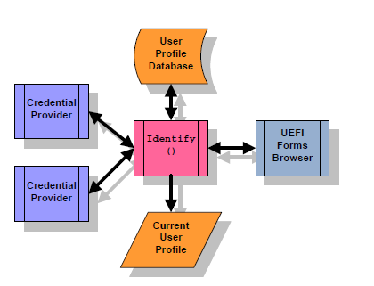
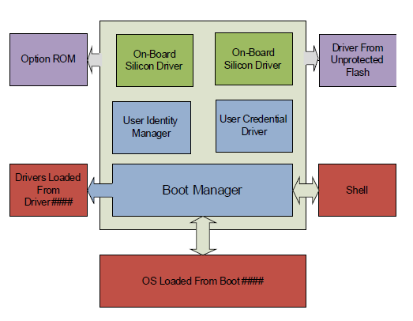

.. _user-identification:

User Identification
===================

.. _user-identification-overview:

User Identification Overview
----------------------------

This section describes services which describe the current user of the platform. A user is the entity which is controlling the behavior of the machine. The user may be an individual, a class or group of individuals or another machine. 

Each user has a user profile. There is always at least one user profile for a machine. This profile governs the behavior of the user identification process until another user has been selected. The nature and definition of these privileges are beyond the scope of this section. One user profile is always active and describes the platform’s *current user*. 

New user profiles are introduced into the system through enrollment. During enrollment, information about a new user is gathered. Some of this information identifies the user for specific purposes, such as a user’s name or a user’s network domain. Other information is gathered in the form of credentials, which is information which can be used at a later time to verify the identity of a user. Credentials are generally divided into three categories: something you know (password), something you have (smart card, smart token, RFID), something you are (fingerprint). The means by which a platform determines the user’s identity based on credentials is user *identification*. 

In the simplest case, a single set of credentials are required to establish a user’s identity. This is called single-factor authentication. In more rigorous cases, multiple credentials might be required to establish a user’s identity or different privilege levels given if only a single factor is available. This is called *multi-factor* authentication. 

If the credentials are checked only once, this is called static authentication. For example, a sign-on box where the user enters a password and provides a fingerprint would be examples of static authentication. However, if credentials (and thus the user’s identity) can be changed during system execution, this is called *dynamic* authentication. For example, a smart token which can be hot-removed from the system or an RFID tag which is moved in and out of range would be examples of dynamic authentication. 

The user *identity manager* is the optional UEFI driver which manages the process of determining the user’s identity and storing information about the user. 

The user *enrollment manager* is the optional application which adds or enrolls new users, gathering the necessary information to ascertain their identity in the future. 

The *credential provider* driver manages a single class of credentials. Examples include a USB fingerprint sensor, a smart card or a password. The means by which these drivers are selected and invoked is beyond the scope of this specification.

.. _user-identify:

User Identify
#############

The process of identifying the user occurs after platform initialization has made the services described in the EFI System Table available. Before the Boot Manager behavior described in chapter 3, a user profile must be established. The user profile established might be: 

-  A default user profile, giving a standard set of privileges. This is similar to a "guest" login.
-  A default user profile, based on a User Credential Provider where Default() returns AutoLogon = **TRUE**.
-  A specific user profile, established using the Identify() function of the User Manager.

Every time the user profile is modified, the User Identity Manager will signal the EFI_EVENT_GROUP_USER_PROFILE_CHANGED event. The current user profile can only be changed by calling the User Identity Manager’s Identify() function or as the result of a credential provider calling the Notify() function (when dynamic authentication is supported). The Identify() function changes the current user profile after examining the credentials provided by the various credential providers and comparing these against those found in the user profile database.

   User Identity

When the UEFI Boot Manager signals the EFI_EVENT_GROUP_READY_TO_BOOT event group, the User Identity Manager publishes the current user profile information in the EFI System Configuration Table. 

Depending on the security considerations in the implementation (see :ref:`security-considerations` ), user identification can continue into different phases of execution. 

#. Boot Manager, Once. In this scenario, identification is permitted until the EFI_EVENT_GROUP_READY_TO_BOOT is signaled by the Boot Manager. After this time, user identification is not allowed again. This is the simplest, since the user profile database can be locked at this time using a simple one-time lock.

#. Boot Manager, Multiple. In this scenario, identification is permitted until the EFI_EVENT_GROUP_READY_TO_BOOT is signaled by the Boot Manager. After this time, if the boot option returns back into the Boot Manager, identification is allowed again. This scenario requires that the user profile database only be updatable while in the Boot Manager.

#. Until ExitBootServices. In this scenario, identification is permitted until the EFI_EVENT_GROUP_EXIT_BOOT_SERVICES is signaled by the Boot Manager. This scenario requires that the user profile database cannot be updated by unauthorized executables.

.. _user-profiles:

User Profiles
#############

The user profiles are collections of information about users. There is always a current user (and thus, a currently selected user profile). The user profiles are stored in a user profile database.

Each user profile has the following attributes:

**§ User Identifier**
   
User identifiers are unique to a particular user profile. The    uniqueness of the user profile identifier must persist across    reboots. Credentials return this identifier during the    identification process.  

**§ User Identification Policy**
   
The user identification policy determines which credentials must    be presented in order to establish the user’s identity and set the    user profile as the current user profile. The policy consists of a    boolean expression consisting of credential handles and the    operators AND, OR and NOT. This allows the user profile to be    selected, for example, depending on a password credential OR a    fingerprint credential. Or the profile might be selected depending    on a password credential AND a fingerprint credential.  

**§ User Privileges**

The user privileges control what the user can and cannot do. For    example, can the user enroll other users, boot off of a selected    device, etc.  

**§ User Information**
  
User information consists of typed data records attached to the    user profile handle. Some of this information is non-volatile.    Some of this information may be provided by a specific credential    driver. User information is classified as public, private or    protected:

-  Public user information is available at any time.

-  Private user information is only available while it is part of
   the current user profile.

-  Protected user information is only available once user has been
   authenticated by a credential provider.

Drivers and applications can be notified when the current user    profile is changed, by using the UEFI Boot Service CreateEventEx()    and the EFI_EVENT_GROUP_USER_PROFILE_CHANGED 

User profiles are available while the User Identity Manager is running, but only the current user profile is available after the UEFI Boot Manager has started execution.

.. _user-profile-database:

User Profile Database
$$$$$$$$$$$$$$$$$$$$$

The user profile database is a repository of all users known to the user identity manager. The user profile database should be maintained in non-volatile memory and this memory must be protected against corruption and erasure. 

The user profile database is considered "open" if the user profile database can still be updated and the current profile can still be changed using the EFI User Manager Protocol. The user profile database is considered "closed" if the user profile database cannot be updated nor the current user profile changes using the EFI User Manager Protocol.

.. _user-identification-policy-1:

User Identification Policy
$$$$$$$$$$$$$$$$$$$$$$$$$$

The user identification policy is a boolean expression which determines which class of credential or which credential providers must assert the user’s identity in order to a user profile to be eligible for selection as the current user profile. 

For example, assume that you want a password:

.. code-block::

   CredentialClass(Password)

This expression would assert **TRUE** if any credential provider asserts that a user has successfully entered a password.

.. code-block::

   CredentialClass(Password) && CredentialClass(Fingerprint)

This expression would require the user to present both a fingerprint AND a password in order to select this user profile.

.. code-block::

   CredentialClass(Password) || CredentialClass(Fingerprint)

This expression, on the other hand, allows the user to present a fingerprint OR a password in order to select this user profile.

Let’s say you only want the Phoenix password provider:

.. code-block::

   CredentialClass(Password) && CredentialProvider(Phoenix)

In all of these cases, the class of credential and the provider of the credential are actually GUIDs. The standard credential class GUIDs are assigned by this specification. The credential provider identifiers are generated by the companies creating the credential providers.

.. _credential-providers:

Credential Providers
####################

The User Credential Provider drivers follow the UEFI driver model. During initialization, they install an instance of the EFI Driver Binding Protocol. For hardware devices, the User Credential Provider may consume the bus I/O protocol and produce the User Credential Protocol. For software-based User Credential Providers, the User Credential Protocol could be installed on the image handler. The exact implementation depends on the number of separate credential types that the User Identity Manager will display.

When *Start()* is called, they:

#. Install one instance of the *EFI_USER_CREDENTIAL2_PROTOCOL* for each simultaneous user which might be authenticated. For example, if more than one smart token were inserted, then one instance might be created for each token. However, for a fingerprint sensor, one instance might be created for all fingerprint sensors managed by the same driver.

#. Install the user-interface forms used for interacting with the user using the HII Database Protocol. The form must be encoded using the GUID *EFI_USER_CREDENTIAL2_PROTOCOL_GUID*.

#. Install the EFI HII Configuration Access Protocol to handle interaction with the UEFI forms browser. This protocol is called to retrieve the current information from the credential provider. It is also called when the user presses OK to save the current form values. It also provides the callback functionality which allows real-time processing of the form values. 

User Credential Providers are responsible to creating a one-to-one mapping between a device, fingerprint or password and a user identifier. 

This specification does not explicitly support passing of user credential information related to operating system logon to an OS-present environment. For example, User Credential Providers may encrypt the user credential information and pass it, either as a part of the User Information Table or the EFI System Configuration Table, to an OS-present driver or application. 

This specification does not explicitly support OS-present update of user credential information or user identification policy. Such support may be implemented in many ways, including the usage of write-authenticated EFI variables (see :ref:`setvariable` ) or capsules (see :ref:`updatecapsule` ).

.. _security-considerations:

Security Considerations
#######################

Since the current profile details a number of security-related privileges, it is important that the User Identity Manager and User Credential Providers and the environment in which they execute are trusted. 

This includes:

-  Protecting the storage area where these drivers are stored

-  Protecting the means by which these drivers are selected.

-  Protecting the execution environment of these drivers from unverified drivers.

-  The data structures used by these drivers should not be corrupted by unauthorized drivers while they are still being used.

   User Identity Manager

In many cases, the User Identity Manager, the User Credential drivers and the on-board drivers are located in a protected location (e.g. a write-protected flash device) and the platform policy for these locations allows them to be trusted. 

However, other drivers may be loaded from unprotected location or may be loaded from devices (such as PCI cards) or a hard drive which are easily replaced. Therefore, all drivers loaded prior to the User Identity Manager should be verified. No unverified drivers or applications should be allowed to execute while decisions based on the current user policy are still being made. 

For example, either the default platform policy must successfully be able to verify drivers listed in the *Driver####* load options, or else the user must be identified prior to processing these drivers. Otherwise, the drivers’ execution should be deferred. If the user profile is changed through a subsequent call to *Identify()* or through dynamic authentication, the *Driver####* options may not be processed again. 

In systems where the user profile database and current user profile can be protected from corruption, the user profile database is closed when the system signals the event *EFI EXIT_BOOT_SERVICES_EVENT_GUID*. In systems where the user profile database and current user profile cannot be protected from corruption, the user profile database is closed when the system signals the event *EFI_READY_TO_BOOT_EVENT_GUID*. 

.. _deferred-execution:

Deferred Execution
##################

The platform may need to defer the execution of an image because of security considerations. For example, see LoadImage(). Information about the images which are not executed because of security considerations may be recorded and then reported by installing an instance of the EFI_DEFERRED_IMAGE_LOAD_PROTOCOL (see :ref:`deferred-image-load-protocol` ). There may be more than one producer of the protocol. 

The firmware’s boot manager may use the instances of this protocol in order to automatically load drivers whose execution was deferred because of inadequate privileges once the current user profile contains adequate security privileges.  

This boot manager can reevaluate the deferred images each time that the event EFI_EVENT_GROUP_USER_IDENTITY_CHANGED is signaled 

Images which have been loaded may not be unloaded when the current user profile is changed, even if the new user profile would have prevented that driver from being loaded.

.. _user-identification-process:

User Identification Process
---------------------------

This section describes the typical initialization steps required for the user identification process.

.. _user-identification-process-1:

User Identification Process
###########################

#. The User Identity Manager is launched. This driver reads all of the user profiles from the user profile database, sets the default user profile as the current profile, and installs an instance of the EFI_USER_MANAGER_PROTOCOL.

#. Each credential provider driver registers their user-interface related forms and installs an instance of the EFI_USER_CREDENTIAL2_PROTOCOL.

#. The User Identity Manager’s Identify() function is called to select the current user.

#. The User Identity Manager enumerates all of the User Credential Providers required by the User Identification Policy.

   | a. Select the User Credential Provider which returns Default = **TRUE** from the Default() function. If more than one return **TRUE** or none return **TRUE**, choose a default based on implementation-specific criteria (last-logged-on, etc.)

   | b. If that credential provider also returns AutoLogon = **TRUE** from the Default() function, then call User(). If no error was returned and a user profile with the specified user identifier exists, select the specified user profile as the current user profile and jump to step 9.

5. The User Identity Manager enumerates all of the User Credential Providers required by the User Identification Policy:

   | a. Call the *Title()* and (optionally) the *Tile()* function to retrieve the text and image indicated for each User Credential Provider.

   | b. Call the *Form()* function to retrieve the form indicated for each User Credential Provider.

   | c. Create the user interface to allow the user to select between the different User Credential Providers.

   | d. Highlight the default User Credential Provider, as specified in step 4.a.

6. If the user selects one of the User Credential Providers, call Select(). If AutoLogon = **TRUE** on return, then call User(). If no error was returned and a user profile with the specified user identifier exists, select the specified user profile as the current user profile and jump to step 9.

#. Interact with the user. Regular interaction can occur using the Callback() functions. If another User Credential Provider is selected then Deselect() is called for the current User Credential Provider and Select() is called for the newly selected User Credential Provider.

#. If the user presses OK then the User Manager will saved settings using the EFI Configuration Access protocol. Then it will call the User() function of each credential provider. If it returns successfully and one of the user policies evaluates to **TRUE**, then select the specified user profile as the current user profile and go to step 9. Otherwise display an error and go back.

#. Go through all of the credential providers using *GetNextInfo()* and *GetInfo()* and add the information to the current user profile.

#. Exit

.. _changing-the-current-user-profile:

Changing The Current User Profile
#################################

This section describes the typical actions taken when the current user profile is changed.

#. If there was already a valid current user profile, then all records marked as private in that profile are no longer available.

#. All records marked as private in the new user profile will be available.

#. The handle of the current user profile is changed. 

#. An event with the *GUID EFI_EVENT_GROUP_USER_IDENTITY_CHANGED* is signaled to indicate that the current user profile has been changed.

.. _ready-to-boot:

Ready To Boot
#############

Before the boot manager is read to pass control to the boot option and signals the *EFI_EVENT_GROUP_READY_TO_BOOT* event group, the User Identity Manager will publish the current user profile into the EFI System Configuration Table with the *EFI_USER_MANAGER_PROTOCOL_GUID*. The format is described in the *User Information Table* (`User Information Table`_). It will also save all non-volatile profile information.

User Credential drivers with non-volatile storage should also store non-volatile credential information which has changed.

.. _user-identification-code-definitions:

Code Definitions
----------------

.. _user-manager-protocol:

User Manager Protocol
#####################

.. _efi-user-manager-protocol:

EFI_USER_MANAGER_PROTOCOL
$$$$$$$$$$$$$$$$$$$$$$$$$$

**Summary**

Reports information about a user.

**GUID**

.. code-block::

   #define EFI_USER_MANAGER_PROTOCOL_GUID \
     { 0x6fd5b00c, 0xd426, 0x4283, \
     { 0x98, 0x87, 0x6c, 0xf5, 0xcf, 0x1c, 0xb1, 0xfe } };

**Protocol Interface Structure**

.. code-block::

   typedef struct _EFI_USER_MANAGER_PROTOCOL {
     EFI_USER_PROFILE_CREATE           Create;
     EFI_USER_PROFILE_DELETE           Delete;
     EFI_USER_PROFILE_GET_NEXT         GetNext;
     EFI_USER_PROFILE_CURRENT          Current;
     EFI_USER_PROFILE_IDENTIFY         Identify;
     EFI_USER_PROFILE_FIND             Find;
     EFI_USER_PROFILE_NOTIFY           Notify;
     EFI_USER_PROFILE_GET_INFO         GetInfo;
     EFI_USER_PROFILE_SET_INFO         SetInfo;
     EFI_USER_PROFILE_DELETE_INFO      DeleteInfo;
     EFI_USER_PROFILE_GET_NEXT_INFO    GetNextInfo;
   }   EFI_USER_MANAGER_PROTOCOL;

**Parameters**

Create
  Create a new user profile.

Delete
  Delete an existing user profile.

GetNext
  Cycle through all user profiles.

Current
  Return the current user profile.

Identify
  Identify a user and set the current user profile using credentials.

Find
  Find a user by a piece of user information.

Notify
  Notify the user manager driver that credential information has changed.

GetInfo
  Return information from a user profile.

SetInfo
  Change information in a user profile.

DeleteInfo
  Delete information from a user profile.

GetNextInfo
  Cycle through all information from a user profile.

**Description**

This protocol manages user profiles.

.. _efi-user-manager-protocol-create:

EFI_USER_MANAGER_PROTOCOL.Create()
$$$$$$$$$$$$$$$$$$$$$$$$$$$$$$$$$$

**Summary**

Create a new user profile.

**Prototype**

.. code-block::
 
   typedef  
   EFI_STATUS  
   (EFIAPI *EFI_USER_PROFILE_CREATE) (  
     IN CONST EFI_USER_MANAGER_PROTOCOL        *This,
     OUT EFI_USER_PROFILE_HANDLE               *User  
     );

**Parameters**

This
  Points to this instance of the *EFI_USER_MANAGER_PROTOCOL*.

User
  On return, points to the new user profile handle. The user profile handle is unique only during this boot. 

**Description**

This function creates a new user profile with only a new user identifier attached and returns its handle. The user profile is non-volatile, but the handle *User* can change across reboots.

If the current user profile does not permit creation of new user profiles then *EFI_ACCESS_DENIED* will be returned. If creation of new user profiles is not supported, then *EFI_UNSUPPORTED* is returned.   

**Related Definitions**

.. code-block::

   typedef VOID *EFI_USER_PROFILE_HANDLE;

**Status Codes Returned**

.. list-table::
   :widths: 35 70
   :class: longtable

   * - EFI_SUCCESS
     - User profile was successfully created.
   * - EFI_ACCESS_DENIED
     - Current user does not have sufficient permissions to create a user profile.
   * - EFI_UNSUPPORTED
     - Creation of new user profiles is not supported.
   * - EFI_INVALID_PARAMETER
     - *User* is **NULL**.

.. _efi-user-manager-protocol-delete:

EFI_USER_MANAGER_PROTOCOL.Delete()
$$$$$$$$$$$$$$$$$$$$$$$$$$$$$$$$$$$

**Summary**

Delete an existing user profile.

**Prototype**

.. code-block::

   typedef
   EFI_STATUS
   (EFIAPI *EFI_USER_PROFILE_DELETE) (
     IN CONST EFI_USER_MANAGER_PROTOCOL     *This,
     IN EFI_USER_PROFILE_HANDLE             User
     );

**Parameters**

This
  Points to this instance of the *EFI_USER_MANAGER_PROTOCOL*.

User
  User profile handle. Type *EFI_USER_PROFILE_HANDLE* is defined in *Create()*. 

**Description**

Delete an existing user profile. If the current user profile does not permit deletion of user profiles then *EFI_ACCESS_DENIED* will be returned. If there is only a single user profile then *EFI_ACCESS_DENIED* will be returned. If deletion of user profiles is not supported, then *EFI_UNSUPPORTED* will be returned.   

**Status Codes Returned**

.. list-table::
   :widths: 35 70
   :class: longtable

   * - EFI_SUCCESS
     - User profile was successfully deleted.
   * - EFI_ACCESS_DENIED
     - Current user does not have sufficient permissions to delete a user profile or there is only one user profile.
   * - EFI_UNSUPPORTED
     - Deletion of new user profiles is not supported.
   * - EFI_INVALID_PARAMETER
     - *User* does not refer to a valid user profile.

.. _efi-user-manager-protocol-getnext:

EFI_USER_MANAGER_PROTOCOL.GetNext()
$$$$$$$$$$$$$$$$$$$$$$$$$$$$$$$$$$$$

**Summary**

Enumerate all of the enrolled users on the platform.

**Prototype**

.. code-block::
  
   typedef
   EFI_STATUS
   (EFIAPI *EFI_USER_PROFILE_GET_NEXT)(
     IN CONST EFI_USER_MANAGER_PROTOCOL      *This,
     IN OUT EFI_USER_PROFILE_HANDLE          *User
     );
  

**Parameters**

This
  Points to the instance of this *EFI_USER_MANAGER_PROTOCOL*.

User
  On entry, points to the previous user profile handle or NULL to start enumeration. On exit, points to the next user profile handle or NULL if there are no more user profiles.  

**Description**

This function returns the next enrolled user profile. To retrieve the first user profile handle, point User at a NULL. Each subsequent call will retrieve another user profile handle until there are no more, at which point User will point to NULL.

**NOTE**: *There is always at least one user profile.*

**Status Codes Returned**

.. list-table::
   :widths: 35 70
   :class: longtable

   * - EFI_SUCCESS
     - Next enrolled user profile successfully returned.
   * - EFI_INVALID_PARAMETER
     - *User* is **NULL**.
   * - EFI_ACCESS_DENIED
     - Next enrolled user profile was not successfully returned.

.. _efi-user-manager-protocol-current:

EFI_USER_MANAGER_PROTOCOL.Current()
$$$$$$$$$$$$$$$$$$$$$$$$$$$$$$$$$$$$

**Summary**

Return the current user profile handle.

**Prototype**

.. code-block::

   typedef  
   EFI_STATUS  
   (EFIAPI *EFI_USER_PROFILE_CURRENT)(  
     IN CONST EFI_USER_MANAGER_PROTOCOL      *This,  
     OUT EFI_USER_PROFILE_HANDLE             *CurrentUser  
     );
  

**Parameters**

This
  Points to this instance of the *EFI_USER_MANAGER_PROTOCOL*.

CurrentUser
  On return, points to the current user profile handle.

**Description**

This function returns the current user profile handle.

**Status Codes Returned**

.. list-table::
   :widths: 35 70

   * - EFI_SUCCESS
     - Current user profile handle returned successfully.
   * - EFI_INVALID_PARAMETER 
     - *CurrentUser* is **NULL**.

.. _efi-user-manager-protocol-identify:

EFI_USER_MANAGER_PROTOCOL.Identify()
$$$$$$$$$$$$$$$$$$$$$$$$$$$$$$$$$$$$$

**Summary**

Identify a user.

**Prototype**

.. code-block::

   typedef  
   EFI_STATUS  
   (EFIAPI *EFI_USER_IDENTIFY) (  
     IN CONST EFI_USER_MANAGER_PROTOCOL      *This,  
     OUT EFI_USER_PROFILE_HANDLE             *User  
     );

**Parameters**

This
  Points to the instance of the *EFI_USER_MANAGER_PROTOCOL*.

User
  On return, points to the user profile handle for the current user profile. 

**Description**

Identify the user and, if authenticated, returns the user handle and changes the current user profile.

All user information marked as private in a previously selected profile is no longer available for inspection.

Whenever the current user profile is changed then the event with the GUID *EFI_EVENT_GROUP_USER_PROFILE_CHANGED* is signaled.

The function can only be called at *TPL_APPLICATION*.

**Related Definitions**

.. code-block::

   #define EFI_EVENT_GROUP_USER_PROFILE_CHANGED \
     { 0xbaf1e6de, 0x209e, 0x4adb, \
     { 0x8d, 0x96, 0xfd, 0x8b, 0x71, 0xf3, 0xf6, 0x83 } }

**Status Codes Returned**

.. list-table::
   :widths: 35 70
   :class: longtable

   * - EFI_SUCCESS
     - User was successfully identified.
   * - EFI_INVALID_PARAMETER 
     - *User* is **NULL**.
   * - EFI_ACCESS_DENIED
     - User was not successfully identified.

.. _efi-user-manager-protocol-find:

EFI_USER_MANAGER_PROTOCOL.Find()
$$$$$$$$$$$$$$$$$$$$$$$$$$$$$$$$$

**Summary**

Find a user using a user information record.

**Prototype**

.. code-block::
  
   typedef
   EFI_STATUS
   (EFIAPI *EFI_USER_PROFILE_FIND)(
     IN   CONST EFI_USER_MANAGER_PROTOCOL    *This,
     IN OUT EFI_USER_PROFILE_HANDLE          *User,
     IN OUT EFI_USER_INFO_HANDLE             *UserInfo OPTIONAL,
     IN   CONST EFI_USER_INFO                *Info,
     IN   UINTN                              InfoSize
     );
  

**Parameters**

This
  Points to this instance of the *EFI_USER_MANAGER_PROTOCOL*.

User
  On entry, points to the previously returned user profile handle or **NULL** to start searching with the first user profile. On return, points to the user profile handle or **NULL** if not found.

UserInfo
  On entry, points to the previously returned user information handle or **NULL** to start searching with the first. On return, points to the user information handle of the user information record or **NULL** if not found. Can be **NULL,** in which case only one user information record per user can be returned. Type *EFI_USER_INFO_HANDLE* is defined in "Related Definitions" below.

Info
  Points to the buffer containing the user information to be compared to the user information record.If the user information record data is empty, then only the user information record type is compared. 

  If *InfoSize* is 0, then the user information record data must be empty.

InfoSize
  The size of *Info,* in bytes.

**Description**

This function searches all user profiles for the specified user information record. The search starts with the user information record handle following *UserInfo* and continues until either the information is found or there are no more user profiles.

A match occurs when the *Info.InfoType* field matches the user information record type and the user information record data matches a portion of *Info*.   

**Status Codes Returned**

.. list-table::
   :widths: 35 70

   * - EFI_SUCCESS
     - User information was found. *User* points to the user profile handle and *UserInfo* points to the user information handle.
   * - EFI_NOT_FOUND
     - User information was not found. *User* points to **NULL** and *UserInfo* points to **NULL.**
   * - EFI_INVALID_PARAMETER
     - *User* is **NULL**. Or *Info* is **NULL**.

**Related Definitions**

.. code-block::

   typedef VOID *EFI_USER_INFO_HANDLE;
  

.. _efi-user-manager-protocol-notify:

EFI_USER_MANAGER_PROTOCOL.Notify()
$$$$$$$$$$$$$$$$$$$$$$$$$$$$$$$$$$$

**Summary**

Called by credential provider to notify of information change.

**Prototype**

.. code-block::
  
   typedef
   EFI_STATUS
     (EFIAPI *EFI_USER_PROFILE_NOTIFY)(
     IN  CONST EFI_USER_MANAGER_PROTOCOL      *This,
     IN  EFI_HANDLE                           Changed
     );
  

**Parameters**

This
  Points to this instance of the *EFI_USER_MANAGER_PROTOCOL*.

Changed
  Handle on which is installed an instance of the *EFI_USER_CREDENTIAL2_PROTOCOL* where the user has changed. 

**Description**

This function allows the credential provider to notify the User Identity Manager when user status has changed.

If the User Identity Manager doesn’t support asynchronous changes in credentials, then this function should return *EFI_UNSUPPORTED*.

If current user does not exist, and the credential provider can identify a user, then make the user to be current user and signal the *EFI_EVENT_GROUP_USER_PROFILE_CHANGED* event.

If current user already exists, and the credential provider can identify another user, then switch current user to the newly identified user, and signal the *EFI_EVENT_GROUP_USER_PROFILE_CHANGED* event.

If current user was identified by this credential provider and now the credential provider cannot identify current user, then logout current user and signal the *EFI_EVENT_GROUP_USER_PROFILE_CHANGED* event.   

**Status Codes Returned**

.. list-table::
   :widths: 35 70
   :class: longtable

   * - EFI_SUCCESS
     - The User Identity Manager has handled the notification.
   * - EFI_NOT_READY
     - The function was called while the specified credential provider was not selected.
   * - EFI_UNSUPPORTED
     - The User Identity Manager doesn’t support asynchronous notifications.

.. _efi-user-manager-protocol-getinfo:

EFI_USER_MANAGER_PROTOCOL.GetInfo()
$$$$$$$$$$$$$$$$$$$$$$$$$$$$$$$$$$$$

**Summary**

Return information attached to the user.

**Prototype**

.. code-block::
  
   typedef
   EFI_STATUS
   (EFIAPI *EFI_USER_PROFILE_GET_INFO)(
     IN   CONST EFI_USER_MANAGER_PROTOCOL       *This,
     IN   EFI_USER_PROFILE_HANDLE               User,
     IN   EFI_USER_INFO_HANDLE                  UserInfo,
     OUT   EFI_USER_INFO                        *Info,
     IN OUT UINTN                               *InfoSize
     );

**Parameters**

This
  Points to this instance of the *EFI_USER_MANAGER_PROTOCOL*.

User
  Handle of the user whose profile will be retrieved.

UserInfo
  Handle of the user information data record. Type *EFI_USER_INFO_HANDLE* is defined in *GetInfo()*.

Info
  On entry, points to a buffer of at least * *InfoSize* bytes. On exit, holds the user information. If the buffer is too small to hold the information, then *EFI_BUFFER_TOO_SMALL* is returned and InfoSize is updated to contain the number of bytes actually required. Type *EFI_USER_INFO* is described in "Related Definitions" below.

InfoSize
  On entry, points to the size of *Info*. On return, points to the size of the user information. 

**Description**

This function returns user information. The format of the information is described in User Information. The function may return *EFI_ACCESS_DENIED* if the information is marked *private* and the handle specified by *User* is not the current user profile. The function may return *EFI_ACCESS_DENIED* if the information is marked *protected* and the information is associated with a credential provider for which the user has not been authenticated.

**Status Codes Returned**

.. list-table::
   :widths: 35 70
   :class: longtable

   * - EFI_SUCCESS
     - Information returned successfully.
   * - EFI_ACCESS_DENIED
     - The information about the specified user cannot be accessed by the current user.
   * - EFI_BUFFER_TOO_SMALL
     - The number of bytes specified by * *InfoSize* is too small to hold the returned data. The actual size required is returned in * *InfoSize*.
   * - EFI_NOT_FOUND
     - *User* does not refer to a valid user profile or *UserInfo* does not refer to a valid user info handle.
   * - EFI_INVALID_PARAMETER
     - *Info* is **NULL** or *InfoSize* is **NULL**

**Related Definitions**

.. code-block::

  
   typedef struct {
     EFI_GUID                 Credential;
     UINT8                    InfoType;
     UINT8                    Reserved1;
     EFI_USER_INFO_ATTRIBS    InfoAttribs;
     UINT32                   InfoSize;
   }   EFI_USER_INFO;

Credential
  The user credential identifier associated with this user information or else Nil if the information is not associated with any specific credential.

InfoType
  The type of user information. See *EFI_USER_INFO_x_RECORD* in User Information for a description of the different types of user information.

Reserved1
  Must be set to 0.

InfoAttribs
  The attributes of the user profile information.

InfoSize
  The size of the user information, in bytes, including this header.

.. code-block::

   typedef UINT16 EFI_USER_INFO_ATTRIBS;

   #define EFI_USER_INFO_STORAGE                0x000F
   #define EFI_USER_INFO_STORAGE_VOLATILE       0x0000
   #define EFI_USER_INFO_STORAGE_CREDENTIAL_NV  0x0001
   #define EFI_USER_INFO_STORAGE_PLATFORM_NV    0x0002

   #define EFI_USER_INFO_ACCESS                 0x0070
   #define EFI_USER_INFO_PUBLIC                 0x0010
   #define EFI_USER_INFO_PRIVATE                0x0020
   #define EFI_USER_INFO_PROTECTED              0x0030
   #define EFI_USER_INFO_EXCLUSIVE              0x0080

The *EFI_USER_INFO_STORAGE_x* values describe how the user information should be stored. If *EFI_USER_INFO_STORAGE_VOLATILE* is specified, then the user profile information will be lost after a reboot. If *EFI_USER_INFO_STORAGE_CREDENTIAL_NV* is specified, then the information will be stored by the driver which created the handle Credential. If *USER_INFO_STORAGE_PLATFORM_NV* is specified, then the information will be stored by the User Identity Manager in platform non-volatile storage. 

There are three levels of access to information associated with the user profile: public, private or protected. If *EFI_USER_INFO_PUBLIC* is specified, then the user profile information is available always. If *EFI_USER_INFO_PRIVATE* is specified, then the user profile information is only available if the user has been authenticated (whether or not they are the current user). If *EFI_USER_INFO_PROTECTED* is specified, then the user profile information is only available if the user has been authenticated and is the current user. 

If *EFI_USER_INFO_EXCLUSIVE* is specified then there can only be one user information record of this type in the user profile. Attempts to use *SetInfo()* will fail.

.. _efi-user-manager-protocol-setinfo:

EFI_USER_MANAGER_PROTOCOL.SetInfo()
$$$$$$$$$$$$$$$$$$$$$$$$$$$$$$$$$$$

**Summary**

Add or update user information.

**Prototype**

.. code-block::

  
   typedef
   EFI_STATUS
   (EFIAPI *EFI_USER_PROFILE_SET_INFO) (
     IN   CONST EFI_USER_MANAGER_PROTOCOL       *This,
     IN   EFI_USER_PROFILE_HANDLE               User,
     IN OUT EFI_USER_INFO_HANDLE                *UserInfo,
     IN   CONST EFI_USER_INFO                   *Info,
     IN   UINTN                                 InfoSize
     );

**Parameters**

This
  Points to this instance of the *EFI_USER_MANAGER_PROTOCOL*.

User
  Handle of the user whose profile will be changed.

UserInfo
  On entry, points to the handle of the user information record to change or NULL if the user information should be added to the user profile. On exit, points to the handle of the user credential information record.

Info
  Points to the user information. See *EFI_USER_INFO* for more information.

InfoSize
  The size of Info, in bytes.

**Description**

This function changes user information. If **NULL** is pointed to by *UserInfo,* then a new user information record is created and its handle is returned in *UserInfo*. Otherwise, the existing one is replaced. 

If *EFI_USER_INFO_IDENTITY_POLICY_RECORD* is changed, it is the caller's responsibility to keep it to be synced with the information on credential providers. 

If *EFI_USER_INFO_EXCLUSIVE* is specified in *Info* and a user information record of the same type already exists in the user profile, then *EFI_ACCESS_DENIED* will be returned and *UserInfo* will point to the handle of the existing record.   

**Status Codes Returned**

.. list-table::
   :widths: 35 70

   * - EFI_SUCCESS
     - User profile information was successfully changed/added.
   * - EFI_ACCESS_DENIED
     - The record is exclusive.
   * - EFI_SECURITY_VIOLATION
     - The current user does not have permission to change the specified user profile or user information record.
   * - EFI_NOT_FOUND
     - *User* does not refer to a valid user profile or *UserInfo* does not refer to a valid user info handle.
   * - EFI_INVALID_PARAMETER
     - *Info* is **NULL** or *InfoSize* is **NULL**

.. _efi-user-manager-protocol-deleteinfo:

EFI_USER_MANAGER_PROTOCOL.DeleteInfo()
$$$$$$$$$$$$$$$$$$$$$$$$$$$$$$$$$$$$$$$ 

**Summary**

Delete user information.

**Prototype**

.. code-block::

   typedef

   EFI_STATUS
   (EFIAPI *EFI_USER_PROFILE_DELETE_INFO) (
     IN   CONST EFI_USER_MANAGER_PROTOCOL      *This,
     IN   EFI_USER_PROFILE_HANDLE              User,
     IN   EFI_USER_INFO_HANDLE                 UserInfo
     );

**Parameters**

This
  Points to this instance of the *EFI_USER_MANAGER_PROTOCOL*.

User
  Handle of the user whose information will be deleted.

UserInfo
  Handle of the user information to remove.

**Description**

Delete the user information attached to the user profile specified by the UserInfo.

**Status Codes Returned**

.. list-table::
   :widths: 35 70
   :class: longtable

   * - EFI_SUCCESS
     - User information deleted successfully.
   * - EFI_NOT_FOUND
     - User information record *UserInfo* does not exist in the user profile.
   * - EFI_ACCESS_DENIED
     - The current user does not have permission to delete this user information.

.. _efi-user-manager-protocol-getnextinfo:

EFI_USER_MANAGER_PROTOCOL.GetNextInfo()
$$$$$$$$$$$$$$$$$$$$$$$$$$$$$$$$$$$$$$$$

**Summary**

Enumerate all of the enrolled users on the platform.

**Prototype**

.. code-block::

  
   typedef
   EFI_STATUS
   (EFIAPI *EFI_USER_PROFILE_GET_NEXT_INFO)(
     IN   CONST EFI_USER_MANAGER_PROTOCOL         *This,
     IN   EFI_USER_PROFILE_HANDLE                 User,
     IN OUT EFI_USER_INFO_HANDLE                  *UserInfo
     ); 

**Parameters**

This
  Points to the instance of this *EFI_USER_MANAGER_PROTOCOL*.

User
  Handle of the user whose information will be enumerated

UserInfo
  On entry, points to the previous user information handle or **NULL** to start enumeration. On exit, points to the next user information handle or **NULL** if there is no more user information. 

**Description**

This function returns the next user information record. To retrieve the first user information record handle, point *UserInfo* at a **NULL**. Each subsequent call will retrieve another user information record handle until there are no more, at which point *UserInfo* will point to **NULL**.   

**Status Codes Returned**

.. list-table::
   :widths: 35 70
   :class: longtable

   * - EFI_SUCCESS
     - User information returned.
   * - EFI_NOT_FOUND
     - No more user information found.
   * - EFI_INVALID_PARAMETER 
     - *UserInfo* is **NULL**.

.. _credential-provider-protocols:

Credential Provider Protocols
#############################

.. _efi-user-credential2-protocol:

EFI_USER_CREDENTIAL2_PROTOCOL
$$$$$$$$$$$$$$$$$$$$$$$$$$$$$$

**Summary**

Provide support for a single class of credentials

**GUID**

.. code-block::

   #define EFI_USER_CREDENTIAL2_PROTOCOL_GUID \
     { 0xe98adb03, 0xb8b9, 0x4af8, \
     { 0xba, 0x20, 0x26, 0xe9, 0x11, 0x4c, 0xbc, 0xe5 } }

**Prototype**

.. code-block::
  
   typedef struct _EFI_USER_CREDENTIAL2_PROTOCOL {
     EFI_GUID                       Identifier;
     EFI_GUID                       Type;
     EFI_CREDENTIAL_ENROLL          Enroll;
     EFI_CREDENTIAL_FORM            Form;
     EFI_CREDENTIAL_TILE            Tile;
     EFI_CREDENTIAL_TITLE           Title;
     EFI_CREDENTIAL_USER            User;
     EFI_CREDENTIAL_SELECT          Select;
     EFI_CREDENTIAL_DESELECT        Deselect;
     EFI_CREDENTIAL_DEFAULT         Default;
     EFI_CREDENTIAL_GET_INFO        GetInfo;
     EFI_CREDENTIAL_GET_NEXT_INFO   GetNextInfo;
     EFI_CREDENTIAL_CAPABILITIES    Capabilities;
     EFI_CREDENTIAL_DELETE          Delete;
   }   EFI_USER_CREDENTIAL2_PROTOCOL;

**Parameters**

Identifier
  Uniquely identifies this credential provider.

Type
  Identifies this class of User Credential Provider. See *EFI_CREDENTIAL_CLASS_x* in "Related Definitions" below.

Enroll
  Enroll a user using this credential provider.

Form
  Return the form set and form identifier for the form.

Tile
  Returns an optional bitmap image used to identify this credential provider.

Title
  Returns a string used to identify this credential provider.

User
  Returns the user profile identifier ascertained by using this credential.

Select
  Called when a credential provider is selected.

Deselect
  Called when a credential provider is deselected.

Default
  Returns whether the credential provider can provide the default credential.

GetInfo
  Return user information provided by the credential provider.

GetNextInfo
  Cycle through all user information available from the credential provider.

Capabilities
  Bitmask which describes the capabilities supported by the credential provider. Type *EFI_CREDENTIAL_CAPABILITIES* is defined in "Related Definitions" below.

Delete
  Delete a user on this credential provider.

**Description**

Attached to a device handle, this protocol identifies a single means of identifying the user.

If *EFI_CREDENTIAL_CAPABILITIES_ENROLL* is specified, then this credential provider supports the ability to enroll new user identification information using the *Enroll()* function.   

**Related Definitions**

.. code-block::

  
   #define EFI_USER_CREDENTIAL_CLASS_UNKNOWN \
     { 0x5cf32e68, 0x7660, 0x449b, \
     { 0x80, 0xe6, 0x7e, 0xa3, 0x6e, 0x3, 0xf6, 0xa8 } };

   #define EFI_USER_CREDENTIAL_CLASS_PASSWORD \
     { 0xf8e5058c, 0xccb6, 0x4714, \
     { 0xb2, 0x20, 0x3f, 0x7e, 0x3a, 0x64, 0xb, 0xd1 } };

   #define EFI_USER_CREDENTIAL_CLASS_SMART_CARD \
     { 0x5f03ba33, 0x8c6b, 0x4c24, \
     { 0xaa, 0x2e, 0x14, 0xa2, 0x65, 0x7b, 0xd4, 0x54 } };

   #define EFI_USER_CREDENTIAL_CLASS_FINGERPRINT \
     { 0x32cba21f, 0xf308, 0x4cbc, \
     { 0x9a, 0xb5, 0xf5, 0xa3, 0x69, 0x9f, 0x4, 0x4a } };

   #define EFI_USER_CREDENTIAL_CLASS_HANDPRINT \
     { 0x5917ef16, 0xf723, 0x4bb9, \
     { 0xa6, 0x4b, 0xd8, 0xc5, 0x32, 0xf4, 0xd8, 0xb5 } };

   #define EFI_USER_CREDENTIAL_CLASS_SECURE_CARD \
     { 0x8a6b4a83, 0x42fe, 0x45d2, \
     { 0xa2, 0xef, 0x46, 0xf0, 0x6c, 0x7d, 0x98, 0x52 } };

   typedef UINT64 EFI_CREDENTIAL_CAPABILITIES;

   #define EFI_CREDENTIAL_CAPABILITIES_ENROLL 0x0000000000000001

.. _efi-user-credential2-protocol-enroll:

EFI_USER_CREDENTIAL2_PROTOCOL.Enroll()
$$$$$$$$$$$$$$$$$$$$$$$$$$$$$$$$$$$$$$$

**Summary**

Enroll a user on a credential provider.

**Prototype**

.. code-block::
  
   typedef
   EFI_STATUS
   (EFIAPI *EFI_CREDENTIAL2_ENROLL)(
     IN CONST EFI_USER_CREDENTIAL2_PROTOCOL     *This,
     IN EFI_USER_PROFILE_HANDLE                 User
     );

**Parameters**

This
  Points to this instance of the *EFI_USER_CREDENTIAL2_PROTOCOL*.

User
  The user profile to enroll.

**Description**

This function enrolls a user on this credential provider. If the user exists on this credential provider, update the user information on this credential provider; otherwise add the user information on credential provider.    

**Status Codes Returned**

.. list-table::
   :widths: 35 70
   :class: longtable

   * - EFI_SUCCESS
     - User profile was successfully enrolled
   * - EFI_ACCESS_DENIED
     - Current user profile does not permit enrollment on the user profile handle. Either the user profile cannot enroll on any user profile or cannot enroll on a user profile other than the current user profile.
   * - EFI_UNSUPPORTED
     - This credential provider does not support enrollment in the pre-OS.
   * - EFI_DEVICE_ERROR
     - The new credential could not be created because of a device error.
   * - EFI_INVALID_PARAMETER
     - *User* does not refer to a valid user profile handle.

.. _efi-user-credential2-protocol-form:

EFI_USER_CREDENTIAL2_PROTOCOL.Form()
$$$$$$$$$$$$$$$$$$$$$$$$$$$$$$$$$$$$$

**Summary**

Returns the user interface information used during user identification.

**Prototype**

.. code-block::
  
   typedef  
   EFI_STATUS  
   (EFIAPI *EFI_CREDENTIAL_FORM)(  
     IN CONST EFI_USER_CREDENTIAL2_PROTOCOL     *This,  
     OUT EFI_HII_HANDLE                         *Hii,  
     OUT EFI_GUID                               *FormSetId,  
     OUT EFI_FORM_ID                            *FormId  
     );

**Parameters**

This
  Points to this instance of the *EFI_USER_CREDENTIAL2_PROTOCOL*.

Hii
  On return, holds the HII database handle. Type *EFI_HII_HANDLE* is defined in *EFI_HII_DATABASE_PROTOCOL.NewPackageList()* in the Packages section.

FormSetId
  On return, holds the identifier of the form set which contains the form used during user identification. 

FormId
  On return, holds the identifier of the form used during user identification.

**Description**

This function returns information about the form used when interacting with the user during user identification. The form is the first enabled form in the form-set class *EFI_HII_USER_CREDENTIAL_FORMSET_GUID* installed on the HII handle *HiiHandle*. If the user credential provider does not require a form to identify the user, then this function should return *EFI_NOT_FOUND*.   

**Status Codes Returned**

.. list-table::
   :widths: 35 70
   :class: longtable

   * - EFI_SUCCESS
     - Form returned successfully.
   * - EFI_NOT_FOUND
     - Form not returned.
   * - EFI_INVALID_PARAMETER
     - *Hii* is **NULL** or *FormSetId* is **NULL** or *FormId* is **NULL**

.. _efi-user-credential2-protocol-tile:

EFI_USER_CREDENTIAL2_PROTOCOL.Tile()
$$$$$$$$$$$$$$$$$$$$$$$$$$$$$$$$$$$$$

**Summary**

Returns bitmap used to describe the credential provider type.

**Prototype**

.. code-block::
  
   typedef  
   EFI_STATUS  
   (EFIAPI *EFI_CREDENTIAL_TILE)(  
     IN    CONST EFI_USER_CREDENTIAL2_PROTOCOL        *This, 
     IN OUT UINTN                                     *Width,  
     IN OUT UINTN                                     *Height,  
     OUT   EFI_HII_HANDLE                             *Hii,  
     OUT   EFI_IMAGE_ID                               *Image  
     );

**Parameters**

This
  Points to this instance of the *EFI_USER_CREDENTIAL2_PROTOCOL*.

Width
  On entry, points to the desired bitmap width. If **NULL** then no bitmap information will be returned. On exit, points to the width of the bitmap returned.

Height
  On entry, points to the desired bitmap height. If **NULL** then no bitmap information will be returned. On exit, points to the height of the bitmap returned.

Hii
  On return, holds the HII database handle. Type *EFI_HII_HANDLE* is defined in *EFI_HII_DATABASE_PROTOCOL.NewPackageList()* in the Packages section.

Image
  On return, holds the HII image identifier. Type *EFI_IMAGE_ID* is defined in this specification, :ref:`image-protocol` . 

**Description**

This optional function returns a bitmap which is less than or equal to the number of pixels specified by *Width* and *Height*. If no such bitmap exists, then *EFI_NOT_FOUND* is returned.   

**Status Codes Returned**

.. list-table::
   :widths: 35 70
   :class: longtable

   * - EFI_SUCCESS
     - Image identifier returned successfully.
   * - EFI_NOT_FOUND
     - Image identifier not returned.
   * - EFI_INVALID_PARAMETER 
     - *Hii* is **NULL** or *Image* is **NULL**.

.. _efi-user-credential2-protocol-title:

EFI_USER_CREDENTIAL2_PROTOCOL.Title()
$$$$$$$$$$$$$$$$$$$$$$$$$$$$$$$$$$$$$$

**Summary**

Returns string used to describe the credential provider type.

**Prototype**

.. code-block::
  
   typedef  
   EFI_STATUS  
   (EFIAPI *EFI_CREDENTIAL_TITLE)(  
     IN    CONST EFI_USER_CREDENTIAL2_PROTOCOL     *This,  
     OUT   EFI_HII_HANDLE                          *Hii,  
     OUT   EFI_STRING_ID                           *String  
     );

**Parameters**

This
  Points to this instance of the *EFI_USER_CREDENTIAL2_PROTOCOL* .

Hii
  On return, holds the HII database handle. TType *EFI_HII_HANDLE* is defined in *EFI_HII_DATABASE_PROTOCOL.NewPackageList()* in the Packages section.

String
  On return, holds the HII string identifier. Type *EFI_STRING_ID* is defined in :ref:`efi-ifr-op-header`.

**Description**

This function returns a string which describes the credential provider. If no such string exists, then EFI_NOT_FOUND is returned.   

**Status Codes Returned**

.. list-table::
   :widths: 35 70
   :class: longtable

   * - EFI_SUCCESS
     - String identifier returned successfully.
   * - EFI_NOT_FOUND
     - String identifier not returned.
   * - EFI_INVALID_PARAMETER 
     - *Hii* is **NULL** or *String* is **NULL**

.. _efi-user-credential2-protocol-user:

EFI_USER_CREDENTIAL2_PROTOCOL.User()
$$$$$$$$$$$$$$$$$$$$$$$$$$$$$$$$$$$$

**Summary**

Return the user identifier associated with the currently authenticated user.

**Prototype**

.. code-block::

   typedef  
   EFI_STATUS  
   (EFIAPI *EFI_CREDENTIAL_USER)(  
     IN   CONST EFI_USER_CREDENTIAL2_PROTOCOL      *This,  
     IN   EFI_USER_PROFILE_HANDLE                  User,  
     OUT  EFI_USER_INFO_IDENTIFIER                 *Identifier  
     );

**Parameters**

This
  Points to this instance of the *EFI_USER_CREDENTIAL2_PROTOCOL* .

User
  The user profile handle of the user profile currently being considered by the user identity manager. If **NULL,** then no user profile is currently under consideration.

Identifier
  On return, points to the user identifier. Type *EFI_USER_INFO_IDENTIFIER* is defined in "Related Definitions" below. 

**Description**

This function returns the user identifier of the user authenticated by this credential provider. This function is called after the credential-related information has been submitted on a form OR after a call to Default() has returned that this credential is ready to log on. 

This function can return one of five possible responses: 

- If no user profile can yet be identified, then *EFI_NOT_READY* is returned.

- If the user has been locked out, then *EFI_ACCESS_DENIED* is returned. 

- If the user specified by *User* is identified, then Identifier returns with the user identifier associated with that handle and *EFI_SUCCESS* is returned.

- If *Identifier* is **NULL,** then *EFI_INVALID_PARAMETER* is returned.

- If specified *User* does not refer to a valid user profile, then *EFI_NOT_FOUND* is returned.

**Status Codes Returned**

.. list-table::
   :widths: 35 70

   * - EFI_SUCCESS
     - User identifier returned successfully.
   * - EFI_NOT_READY
     - No user identifier can be returned.
   * - EFI_ACCESS_DENIED
     - The user has been locked out of this user credential.
   * - EFI_NOT_FOUND
     - *User* is not **NULL,** and the specified user handle can't be found in user profile database
   * - EFI_INVALID_PARAMETER
     - *Identifier* is **NULL**.

.. _efi-user-credential2-protocol-select:

EFI_USER_CREDENTIAL2_PROTOCOL.Select()
$$$$$$$$$$$$$$$$$$$$$$$$$$$$$$$$$$$$$$

**Summary**

Indicate that user interface interaction has begun for the specified credential.

**Prototype**

.. code-block::
  
   typedef  
   EFI_STATUS  
   (EFIAPI *EFI_CREDENTIAL_SELECT)(  
     IN CONST EFI_USER_CREDENTIAL2_PROTOCOL     *This,  
     OUT EFI_CREDENTIAL_LOGON_FLAGS             *AutoLogon  
     );

**Parameters**

This
  Points to this instance of the *EFI_USER_CREDENTIAL2_PROTOCOL* .

AutoLogon
  On return, points to the credential provider’s capabilities after the credential provider has been selected by the user. Type *EFI_CREDENTIAL_LOGON_FLAGS* is defined in "Related Definitions" below. 

**Description**

This function is called when a credential provider is selected by the user. If *AutoLogon* returns *FALSE,* then the user interface will be constructed by the User Identity Manager.   

**Related Definitions**

.. code-block::
  
   typedef UINT32 EFI_CREDENTIAL_LOGON_FLAGS;

   #define EFI_CREDENTIAL_LOGON_FLAG_AUTO       0x00000001
   #define EFI_CREDENTIAL_LOGON_FLAG_DEFAULT    0x00000002

If *EFI_CREDENTIAL_LOGON_FLAG_AUTO* is set, then the User Identity Manager may use this as a hint to try logging on immediately. If not set, then the User Identity Manager may use this as an indication to wait for the user to submit the information.

If *EFI_CREDENTIAL_LOGON_FLAG_DEFAULT* is set, then the User Identity Manager may use this as a hint to use this credential provider as the default credential provider. If more than one credential provider returns with this set, then the selection is implementation specific. If *EFI_CREDENTIAL_LOGON_FLAG_DEFAULT* is set and *EFI_CREDENTIAL_LOGON_FLAG_AUTO* is set then the User Identity Manager may uses this as a hint to log the user on immediately.

**Status Codes Returned**

.. list-table::
   :widths: 35 70

   * - EFI_SUCCESS
     - Credential provider successfully selected.
   * - EFI_INVALID_PARAMETER
     - *AutoLogon* is **NULL**

.. _efi-user-credential2-protocol-deselect:

EFI_USER_CREDENTIAL2_PROTOCOL.Deselect()
$$$$$$$$$$$$$$$$$$$$$$$$$$$$$$$$$$$$$$$$$

**Summary**

Indicate that user interface interaction has ended for the specified credential.

**Prototype**

.. code-block::
  
   typedef  
   EFI_STATUS  
   (EFIAPI *EFI_CREDENTIAL_DESELECT)(  
     IN CONST EFI_USER_CREDENTIAL2_PROTOCOL     *This  
     );

**Parameters**

This
  Points to this instance of the *EFI_USER_CREDENTIAL2_PROTOCOL*.

**Description**

This function is called when a credential provider is deselected by the user.

**Status Codes Returned**

.. list-table::
   :widths: 35 70

   * - EFI_SUCCESS 
     - Credential provider successfully selected.

.. _efi-user-credential2-protocol-default:

EFI_USER_CREDENTIAL2_PROTOCOL.Default()
$$$$$$$$$$$$$$$$$$$$$$$$$$$$$$$$$$$$$$$$

**Summary**

Return the default logon behavior for this user credential.

**Prototype**

.. code-block::
  
   typedef  
   EFI_STATUS  
   (EFIAPI *EFI_CREDENTIAL_DEFAULT)(  
     IN CONST EFI_USER_CREDENTIAL2_PROTOCOL     *This,  
     OUT EFI_CREDENTIAL_LOGON_FLAGS             *AutoLogon  
     );
  

**Parameters**

This
  Points to this instance of the *EFI_USER_CREDENTIAL2_PROTOCOL* .

AutoLogon 
  On return, holds whether the credential provider should be used by default to automatically log on the user. Type *EFI_CREDENTIAL_LOGON_FLAGS* is defined in *EFI_USER_CREDENTIAL2_PROTOCOL.Select()*. 

**Description**

This function reports the default login behavior regarding this credential provider.

**Status Codes Returned**

.. list-table::
   :widths: 35 70

   * - EFI_SUCCESS
     - Default information successfully returned.
   * - EFI_INVALID_PARAMETER
     - *AutoLogon* is **NULL**

.. _efi-user-credential2-protocol-getinfo:

EFI_USER_CREDENTIAL2_PROTOCOL.GetInfo()
$$$$$$$$$$$$$$$$$$$$$$$$$$$$$$$$$$$$$$$$$

**Summary**

Return information attached to the credential provider.

**Prototype**

.. code-block::
  
   typedef  
   EFI_STATUS  
   (EFIAPI *EFI_CREDENTIAL_GET_INFO)(  
     IN   CONST EFI_USER_CREDENTIAL2_PROTOCOL      *This,  
     IN   EFI_USER_INFO_HANDLE                     UserInfo,  
     OUT   EFI_USER_INFO                           *Info,  
     IN OUT UINTN                                  *InfoSize  
     );
  

**Parameters**

This
  Points to this instance of the *EFI_USER_CREDENTIAL2_PROTOCOL* .

UserInfo
  Handle of the user information data record. Type *EFI_USER_INFO_HANDLE* is defined in *GetInfo()*.

Info
  On entry, points to a buffer of at least \**InfoSize* bytes. On exit, holds the user information. If the buffer is too small to hold the information, then *EFI_BUFFER_TOO_SMALL* is returned and *InfoSize* is updated to contain the number of bytes actually required. Type *EFI_USER_INFO* is described in "Related Definitions" below.

InfoSize
  On entry, points to the size of *Info*. On return, points to the size of the user information.

**Description**

This function returns user information.

**Status Codes Returned**

.. list-table::
   :widths: 35 70

   * - EFI_SUCCESS
     - Information returned successfully.
   * - EFI_BUFFER_TOO_SMALL
     - The size specified by *InfoSize* is too small to hold all of the user information. The size required is returned in * *InfoSize*.
   * - EFI_NOT_FOUND
     - The specified UserInfo does not refer to a valid user info handle
   * - EFI_INVALID_PARAMETER
     - *Info* is **NULL** or *InfoSize* is **NULL**

.. _efi-user-credential2-protocol-getnextinfo:

EFI_USER_CREDENTIAL2_PROTOCOL.GetNextInfo()
$$$$$$$$$$$$$$$$$$$$$$$$$$$$$$$$$$$$$$$$$$$$

**Summary**

Enumerate all of the user information records on the credential provider.

**Prototype**

.. code-block::
  
   typedef  
   EFI_STATUS  
   (EFIAPI *EFI_USER_CREDENTIAL_GET_NEXT_INFO)(  
     IN   CONST EFI_USER_CREDENTIAL2_PROTOCOL      *This,  
     IN OUT EFI_USER_INFO_HANDLE                   *UserInfo  
     );
  

**Parameters**

This
  Points to the instance of this *EFI_USER_CREDENTIAL2_PROTOCOL* .

UserInfo
  On entry, points to the previous user information handle or NULL to start enumeration. On exit, points to the next user information handle or NULL if there is no more user information. 

**Description**

This function returns the next user information record. To retrieve the first user information record handle, point *UserInfo* at a **NULL**. Each subsequent call will retrieve another user information record handle until there are no more, at which point *UserInfo* will point to **NULL**.

**Status Codes Returned**

.. list-table::
   :widths: 35 70
   :class: longtable

   * - EFI_SUCCESS
     - User information returned.
   * - EFI_NOT_FOUND
     - No more user information found.
   * - EFI_INVALID_PARAMETER 
     - *UserInfo* is **NULL**.

.. _efi-user-credential2-protocol-delete:

EFI_USER_CREDENTIAL2_PROTOCOL.Delete() 
$$$$$$$$$$$$$$$$$$$$$$$$$$$$$$$$$$$$$$$

**Summary**

Delete a user on a credential provider.

**Prototype**

.. code-block::
  
   typedef  
   EFI_STATUS (EFIAPI *EFI_CREDENTIAL_DELETE)(  
     IN  CONST EFI_USER_CREDENTIAL2_PROTOCOL    *This,  
     IN  EFI_USER_PROFILE_HANDLE                User  
     );

**Parameters**

This
  Points to this instance of the *EFI_USER_CREDENTIAL2_PROTOCOL*.

User
  The user profile handle to delete.

**Description**

This function deletes a user on this credential provider.

**Status Codes Returned**

.. list-table::
   :widths: 35 70
   :class: longtable

   * - EFI_SUCCESS
     - User profile was successfully deleted .
   * - EFI_ACCESS_DENIED
     - Current user profile does not permit deletion on the user profile handle. Either the user profile cannot delete on any user profile or cannot delete on a user profile other than the current user profile.
   * - EFI_UNSUPPORTED
     - This credential provider does not support deletion in the pre-OS.
   * - EFI_DEVICE_ERROR
     - The new credential could not be deleted because of a device error.
   * - EFI_INVALID_PARAMETER
     - User does not refer to a valid user profile handle.

.. _deferred-image-load-protocol:

Deferred Image Load Protocol
#############################

.. _efi-deferred-image-load-protocol:

EFI_DEFERRED_IMAGE_LOAD_PROTOCOL
$$$$$$$$$$$$$$$$$$$$$$$$$$$$$$$$

**Summary**

Enumerates images whose load was deferred due to security considerations.

**GUID**

.. code-block::

   #define EFI_DEFERRED_IMAGE_LOAD_PROTOCOL_GUID \
     { 0x15853d7c, 0x3ddf, 0x43e0, \
     { 0xa1, 0xcb, 0xeb, 0xf8, 0x5b, 0x8f, 0x87, 0x2c } };

**Protocol Interface Structure**

.. code-block::

   typedef struct _EFI_DEFERRED_IMAGE_LOAD_PROTOCOL {
     EFI_DEFERRED_IMAGE_INFO GetImageInfo();
   }   EFI_DEFERRED_IMAGE_LOAD_PROTOCOL;

**Members**

GetImageInfo
  Return information about a single deferred image. See GetImageInfo() for more information.

**Description**

This protocol returns information about images whose load was denied because of security considerations. This information can be used by the Boot Manager or another agent to reevaluate the images when the current security profile has been changed, such as when the current user profile changes. There can be more than one instance of this protocol installed.

.. _efi-deferred-image-load-protocol-getimageinfo:

EFI_DEFERRED_IMAGE_LOAD_PROTOCOL.GetImageInfo()
$$$$$$$$$$$$$$$$$$$$$$$$$$$$$$$$$$$$$$$$$$$$$$$$

**Summary**

Returns information about a deferred image.

**Prototype**

.. code-block::
  
   typedef  
   EFI_STATUS  
   (EFIAPI *EFI_DEFERRED_IMAGE_INFO)(  
     IN EFI_DEFERRED_IMAGE_LOAD_PROTOCOL     *This,  
     IN UINTN                                ImageIndex,  
     OUT  EFI_DEVICE_PATH_PROTOCOL           **ImageDevicePath,  
     OUT  VOID                               **Image,  
     OUT  UINTN                              *ImageSize,  
     OUT  BOOLEAN                            *BootOption  
     );

**Parameters**

This
  Points to this instance of the *EFI_DEFERRED_IMAGE_LOAD_PROTOCOL*.

ImageIndex
  Zero-based index of the deferred index.

ImageDevicePath
  On return, points to a pointer to the device path of the image. The device path should not be freed by the caller.

Image
  On return, points to the first byte of the image or **NULL** if the image is not available. The image should not be freed by the caller unless *LoadImage()* has been called successfully.

ImageSize
  On return, the size of the image, or 0 if the image is not available.

BootOption
  On return, points to **TRUE** if the image was intended as a boot option or **FALSE** if it was not intended as a boot option.

**Description**

This function returns information about a single deferred image. The deferred images are numbered consecutively, starting with 0. If there is no image which corresponds to *ImageIndex,* then *EFI_NOT_FOUND* is returned. , All deferred images may be returned by iteratively calling this function until *EFI_NOT_FOUND* is returned. 

*Image* may be **NULL** and *ImageSize* set to 0 if the decision to defer execution was made because of the location of the executable image rather than its actual contents.   

**Status Codes Returned**

.. list-table::
   :widths: 35 70

   * - EFI_SUCCESS
     - Image information returned successfully.
   * - EFI_NOT_FOUND
     - ImageIndex does not refer to a valid image.
   * - EFI_INVALID_PARAMETER
     - *ImageDevicePath* is **NULL** or *Image* is **NULL** or *ImageSize* is **NULL** or *BootOption* is **NULL**

.. _user-information-1:

User Information
----------------

This section describes the different user information and the format of the data. Each of the following records is prefixed with the *EFI_USER_INFO* structure. The format of the record is determined by the type specified by the *InfoType* field in the structure, as listed in the table below:

.. _record-values-and-descriptions:

**Record values and descriptions**

.. list-table:: Record Values and Descriptions
   :widths: 50,10,40 
   :class: longtable
   :name: record-values-and-descriptions-table

   * - **Name**
     - **Value**
     - **Description**
   * - *EFI_USER_INFO_EMPTY_RECORD*
     - 0x00
     - No information.
   * - *EFI_USER_INFO_NAME_RECORD*
     - 0x01
     - User’s name
   * - *EFI_US ER_INFO_CREATE_DATE_RECORD*
     - 0x02
     - Date which the user profile was created.
   * - *EFI_U SER_INFO_USAGE_DATE_RECORD*
     - 0x03
     - Date which the user profile was last modified.
   * - *EFI_US ER_INFO_USAGE_COUNT_RECORD*
     - 0x04
     - Number of times the credential has been used.
   * - *EFI_U SER_INFO_IDENTIFIER_RECORD*
     - 0x05
     - User’s unique identifier *
   * - *EFI_USER_I NFO_CREDENTIAL_TYPE_RECORD*
     - 0x06
     - Credential type.
   * - *EFI_USER_INFO_C REDENTIAL_TYPE_NAME_RECORD*
     - 0x07
     - Credential type name.
   * - *EFI_USER_INFO_ CREDENTIAL_PROVIDER_RECORD*
     - 0x08
     - Credential provider
   * - *EFI_USER_INFO_CREDE NTIAL_PROVIDER_NAME_RECORD*
     - 0x09
     - Credential provider name
   * - *EFI_USER_INFO_PKCS11_RECORD*
     - 0x0A
     - PKCS11 Data Object
   * - *EFI_USER_INFO_CBEFF_RECORD*
     - 0x0B
     - ISO 19785 (Common Biometric Exchange Formats Framework) Data Object
   * - *EFI_USER_INFO_FAR_RECORD*
     - 0x0C
     - How exact a match is required for biometric identification, measured in percentage.
   * - *EFI_USER_INFO_RETRY_RECORD*
     - 0x0D
     - Number of retries allowed during verification.
   * - *EFI_USER _INFO_ACCESS_POLICY_RECORD*
     - 0x0E
     - Access control information.
   * - *EFI_USER_I NFO_IDENTITY_POLICY_RECORD*
     - 0x0F
     - User identity expression.
   * - *EFI_USER_INFO_GUID_RECORD*
     - 0xFF
     - Extended profile information, qualified by a GUID in the header.

.. _efi-user-info-access-policy-record:

EFI_USER_INFO_ACCESS_POLICY_RECORD
###################################

**Summary**

Provides the user’s pre-OS access rights.

**Prototype**

.. code-block::
  
   #define EFI_USER_INFO_ACCESS_POLICY_RECORD 0x0E

   typedef EFI_USER_INFO_ACCESS_CONTROL EFI_USER_INFO_ACCESS_POLICY;

**Description**

This structure described the access policy for the user. There can be, at most, one access policy record per credential (including **NULL** credential). Policy records with a credential specified means that the policy is associated specifically with the credential.

The policy is detailed in a series of encapsulated records of type *EFI_USER_INFO_ACCESS_CONTROL*.

**Related Definitions**

.. code-block::
  
   typedef struct {  
     UINT32          Type;  
     UINT32          Size;  
   } EFI_USER_INFO_ACCESS_CONTROL;

Type
  Specifies the type of user access control. See *EFI_USER_INFO_ACCESS_x* for more information.

.. TODO reference above?

Size
  Specifies the size of the user access control record, in bytes, including this header.

.. _efi-user-info-access-forbid-load:

EFI_USER_INFO_ACCESS_FORBID_LOAD
$$$$$$$$$$$$$$$$$$$$$$$$$$$$$$$$$

**Summary**

Forbids the user from booting or loading executables from the specified device path or any child device paths.   

**Prototype**

.. code-block:: 

   #define EFI_USER_INFO_ACCESS_FORBID_LOAD 0x00000001

**Description**

This record prohibits the user from loading any executables from zero or device paths or any child device paths. The device paths may contain a specific executable name, in which case the prohibition applies to only that executable.

The record is a series of normal UEFI device paths (not multi-instance device paths). 

This prohibition is overridden by the *EFI_USER_INFO_ACCESS_PERMIT_LOAD* record.

.. _efi-user-info-access-permit-load:

EFI_USER_INFO_ACCESS_PERMIT_LOAD
$$$$$$$$$$$$$$$$$$$$$$$$$$$$$$$$$

**Summary**

Permits the user from booting or loading executables from the specified device path or any child device paths.   

**Prototype**

.. code-block::

   #define EFI_USER_INFO_ACCESS_PERMIT_LOAD 0x00000002

**Description**

This record allows the user to load executables from locations specified by zero or more device paths or child paths. The device paths may contain specific executable names, in which case, the permission applies only to that executable. 

The record is a series of normal UEFI device paths (not multi-instance device paths). 

This prohibition overrides any restrictions put in place by the *EFI_USER_INFO_ACCESS_FORBID_LOAD* record.

.. _efi-user-info-access-enroll-self:

EFI_USER_INFO_ACCESS_ENROLL_SELF
$$$$$$$$$$$$$$$$$$$$$$$$$$$$$$$$$

**Summary**

Presence of this record indicates that a user can update enrollment information.

**Prototype**

.. code-block::  

   #define EFI_USER_INFO_ACCESS_ENROLL_SELF 0x00000003

**Description**

If this record is present, then the pre-OS environment will allow the user to initiate an update of authentication information for his/her own profile, but not other user information or other user’s information. This would allow, for example, fingerprint update or password change.

There is no data for this record.

.. _efi-user-info-access-enroll-others:

EFI_USER_INFO_ACCESS_ENROLL_OTHERS
$$$$$$$$$$$$$$$$$$$$$$$$$$$$$$$$$$$

**Summary**

Presence of this record indicates that a user can enroll new users.   

**Prototype**

.. code-block::

   #define EFI_USER_INFO_ACCESS_ENROLL_OTHERS 0x00000004

**Description**

If this record is present, then the pre-OS environment will allow the user to initiate enrollment of new user profiles. It does not give permission to update existing user profiles.

There is no data for this record.

.. _efi-user-info-access-manage:

EFI_USER_INFO_ACCESS_MANAGE
$$$$$$$$$$$$$$$$$$$$$$$$$$$$

**Summary**

Presence of this record indicates that a user can update the user information of any user.   

**Prototype**

.. code-block::

   #define EFI_USER_INFO_ACCESS_MANAGE 0x00000005

**Description**

If this record is present, then the pre-OS environment will allow the user to update any information about his/her own profile or other profiles. 

There is no data for this record.

.. _efi-user-info-access-setup:

EFI_USER_INFO_ACCESS_SETUP
$$$$$$$$$$$$$$$$$$$$$$$$$$

**Summary**

Describes permissions usable when configuring the platform.

**Prototype**

.. code-block::

   #define EFI_USER_INFO_ACCESS_SETUP 0x00000006

**Description**

This record describes access permission for use in configuring the platform using an UEFI Forms Processor using zero or more GUIDs. There are three standard values (see below) and any number of others may be added.

.. _standard-values-for-access-to-configure-the-platform:

**Standard values for access to configure the platform**

.. list-table:: Standard Values for Access to Configure the Platform
   :widths: 55,45
   :name: standard-values-for-access-to-configure-the-platform-table

   * - *EFI_USER_INFO_ACCESS_SETUP_ADMIN_GUID*
     - System administrator only.
   * - *EFI_USER_INFO_ACCESS_SETUP_NORMAL_GUID*
     - Normal user.
   * - *EFI_USER_INFO_ACCESS_SETUP_RESTRICTED_GUID*   
     - Restricted user.

**Related Definitions**

.. code-block::

  
   #define EFI_USER_INFO_ACCESS_SETUP_ADMIN_GUID \
     { 0x85b75607, 0xf7ce, 0x471e, \
     { 0xb7, 0xe4, 0x2a, 0xea, 0x5f, 0x72, 0x32, 0xee }  };

   #define EFI_USER_INFO_ACCESS_SETUP_NORMAL_GUID \
     { 0x1db29ae0, 0x9dcb, 0x43bc, \
     { 0x8d, 0x87, 0x5d, 0xa1, 0x49, 0x64, 0xdd, 0xe2 }  };

   #define EFI_USER_INFO_ACCESS_SETUP_RESTRICTED_GUID \
     { 0xbdb38125, 0x4d63, 0x49f4, \
     { 0x82, 0x12, 0x61, 0xcf, 0x5a, 0x19, 0x0a, 0xf8 }  };
  

.. _efi-user-info-access-forbid-connect:

EFI_USER_INFO_ACCESS_FORBID_CONNECT
$$$$$$$$$$$$$$$$$$$$$$$$$$$$$$$$$$$$

**Summary**

Forbids UEFI drivers from being started from the specified device path(s) or any child device paths.

**Prototype**

.. code-block::  
   
   #define EFI_USER_INFO_ACCESS_FORBID_CONNECT 0x00000007
  

**Description**

This record prohibits UEFI drivers from being started from the specified device path(s) or any of their child device path(s). This is enforced in the *ConnectController()* function. 

This record prohibits the user from loading a device driver associated with zero or more device paths or their child paths. 

The record is a series of normal UEFI device paths (not multi-instance device paths). 

This prohibition is overridden by the *EFI_USER_INFO_ACCESS_PERMIT_CONNECT* record.

.. _efi-user-info-access-permit-connect:

EFI_USER_INFO_ACCESS_PERMIT_CONNECT
$$$$$$$$$$$$$$$$$$$$$$$$$$$$$$$$$$$$

**Summary**

Permits UEFI drivers to be started on the specified device path(s) or any child device paths.   

**Prototype**

.. code-block::

   #define EFI_USER_INFO_ACCESS_PERMIT_CONNECT 0x00000008
  

**Description**

This record allows loading of device drivers associated with zero or more device paths or their child paths. 

The record is a series of normal UEFI device paths (not multi-instance device paths). 

This prohibition overrides any restrictions put in place by the *EFI_USER_INFO_ACCESS_FORBID_CONNECT* record. 

.. _efi-user-info-access-boot-order:

EFI_USER_INFO_ACCESS_BOOT_ORDER
$$$$$$$$$$$$$$$$$$$$$$$$$$$$$$$

**Summary**

Modifies the boot order.

**Prototype**

.. code-block::
  
   #define EFI_USER_INFO_ACCESS_BOOT_ORDER            0x00000009

   typedef UINT32 EFI_USER_INFO_ACCESS_BOOT_ORDER_HDR;

   #define EFI_USER_INFO_ACCESS_BOOT_ORDER_MASK       0x000F
   #define EFI_USER_INFO_ACCESS_BOOT_ORDER_INSERT     0x0000
   #define EFI_USER_INFO_ACCESS_BOOT_ORDER_APPEND     0x0001
   #define EFI_USER_INFO_ACCESS_BOOT_ORDER_REPLACE    0x0002

   #define EFI_USER_INFO_ACCESS_BOOT_ORDER_NODEFAULT  0x0010

**Description**

This exclusive record allows the user profile to insert new boot options at the beginning of the boot order ( *EFI_USER_INFO_ACCESS_BOOT_ORDER_INSERT* ), append new boot options to the end of the boot order ( *EFI_USER_INFO_ACCESS_BOOT_ORDER_APPEND* ) or replace the entire boot order ( *EFI_USER_INFO_ACCESS_BOOT_ORDER_REPLACE)*. If *EFI_USER_INFO_ACCESS_BOOT_ORDER_NODEFAULT* is specified then the Boot Manager will not attempt find a default boot device when the default boot order is does not lead to a bootable device. 

The boot options specified by this record are still subject to the permissions specified by *EFI_USER_INFO_ACCESS_FORBID_LOAD* and *EFI_USER_INFO_ACCESS_PERMIT_LOAD*. 

The record consists of a single *EFI_USER_INFO_ACCESS_BOOT_ORDER_HDR* followed by zero or more UEFI device paths.

.. _efi-user-info-cbeff-record:

EFI_USER_INFO_CBEFF_RECORD
##########################

**Summary**

Provides standard biometric information in the format specified by the ISO 19785 (Common Biometric Exchange Formats Framework) specification.   

**Prototype**

.. code-block::

   #define EFI_USER_INFO_CBEFF_RECORD 0x0B  
   typedef VOID *EFI_USER_INFO_CBEFF;

.. _efi-user-info-create-date-record:

EFI_USER_INFO_CREATE_DATE_RECORD
################################

**Summary**

Provides the date and time when the user profile was created.   

**Prototype**

.. code-block::

   #define EFI_USER_INFO_CREATE_DATE_RECORD 0x02
   typedef EFI_TIME EFI_USER_INFO_CREATE_DATE;

**Description**

The optional record describing the date and time when the user profile was created. Type *EFI_TIME* is defined in :ref:`gettime` in this specification.

.. _efi-user-info-credential-provider-record:

EFI_USER_INFO_CREDENTIAL_PROVIDER_RECORD
########################################

**Summary**

Specifies the credential provider.

**Prototype**

.. code-block::

   #define EFI_USER_INFO_CREDENTIAL_PROVIDER_RECORD 0x08
   typedef EFI_GUID EFI_USER_INFO_CREDENTIAL_PROVIDER;

**Description**

This record specifies the credential provider via a unique GUID. The credential’s handle is found in the *EFI_USER_INFO* structure associated with this user information record.

.. _efi-user-info-credential-provider-name-record:

EFI_USER_INFO_CREDENTIAL_PROVIDER_NAME_RECORD
#############################################

**Summary**

Specifies the user-readable name of a particular credential’s provider.

**Prototype**

.. code-block::

   #define EFI_USER_INFO_CREDENTIAL_PROVIDER_NAME_RECORD 0x09  
   typedef CHAR16 *EFI_USER_INFO_CREDENTIAL_PROVIDER_NAME;

**Description**

This record specifies the null-terminated name of a particular credential provider. The credential’s handle is found in the *EFI_USER_INFO* structure associated with this user information record.

.. _efi-user-info-credential-type-record:

EFI_USER_INFO_CREDENTIAL_TYPE_RECORD
####################################

**Summary**

Specifies the type of a particular credential associated with the user profile.

**Prototype**

.. code-block::
  
   #define EFI_USER_INFO_CREDENTIAL_TYPE_RECORD 0x06
   typedef EFI_GUID EFI_USER_INFO_CREDENTIAL_TYPE;

**Description**

This record specifies the type of a particular credential. The credential’s identifier is found in the *Credential* field of the *EFI_USER_INFO* structure. The credential types are listed with the *EFI_USER_CREDENTIAL2_PROTOCOL*.

.. _efi-user-info-credential-type-name-record:

EFI_USER_INFO_CREDENTIAL_TYPE_NAME_RECORD
#########################################

**Summary**

Specifies the user-readable name of a particular credential type.

**Prototype**

.. code-block::

   #define EFI_USER_INFO_CREDENTIAL_TYPE_NAME_RECORD 0x07
   typedef CHAR16 *EFI_USER_INFO_CREDENTIAL_TYPE_NAME;

**Description**

This record specifies the null-terminated name of a particular credential type. The credential’ handle is found in the *EFI_USER_INFO* structure associated with this user information record

.. _efi-user-info-guid-record:

EFI_USER_INFO_GUID_RECORD
#########################

**Summary**

Provides placeholder for additional user profile information identified by a GUID.   

**Prototype**

.. code-block::

   #define EFI_USER_INFO_GUID_RECORD 0xFF
   typedef EFI_GUID EFI_USER_INFO_GUID;

**Description**

This record type provides extensibility by prefixing further data fields in the record with a GUID which identifies the format.

.. _efi-user-info-far-record:

EFI_USER_INFO_FAR_RECORD
#########################

**Summary**

Indicates how close of a match the fingerprint must be in order to be considered a match.   

**Prototype**

.. code-block::

   #define EFI_USER_INFO_FAR_RECORD 0x0C
   typedef UINT8 EFI_USER_INFO_FAR;

**Description**

This record specifies how accurate the fingerprint template match must be in order to be considered a match, as a percentage from 0 (no match) to 100 (perfect match). The accuracy may be for all fingerprint sensors ( *EFI_USER_INFO*. *Credential* is zero) or for a particular fingerprint sensor ( *EFI_USER_INFO* *.Credential* is non-zero).

**Access:**

Exclusive: No

Modify: Only with user-enrollment permissions.

Visibility: Public

.. _efi-user-info-identifier-record:

EFI_USER_INFO_IDENTIFIER_RECORD
###############################

**Summary**

Provides a unique non-volatile user identifier for each enrolled user.   

**Prototype**

.. code-block::

   #define EFI_USER_INFO_IDENTIFIER_RECORD 0x05
   typedef UINT8 EFI_USER_INFO_IDENTIFIER[16];

**Description**

The user identifier is unique to each enrolled user and non-volatile. Each user profile must have exactly one of these user information records installed. The format of the value is not specified.

**Access**

Exclusive: Yes

Modify: Only with user-enrollment permissions.

Visibility: Public.

.. _efi-user-info-identity-policy-record:

EFI_USER_INFO_IDENTITY_POLICY_RECORD
####################################

**Summary**

Provides the expression which determines which credentials are required to assert user identity.

**Prototype**

.. code-block::

  
   #define EFI_USER_INFO_IDENTITY_POLICY_RECORD 0x0F
   typedef struct {
     UINT32          Type;
     UINT32          Length;
   }   EFI_USER_INFO_IDENTITY_POLICY;

**Parameters**

Type
  Specifies either an operator or a data item. See *EFI_USER_INFO_IDENTITY_x* in "Related Definitions" below.

Length
  The length of this block, in bytes, including this header.

**Description**

The user identity policy is an expression mad3e up of operators and data items. If the expression evaluates to **TRUE,** then this user profile can be selected as the current profile. If the expression evaluates to **FALSE,** then this user profile cannot be selected as the current profile. 

Data items are pushed onto an expression stack. Operators pop items off of the expression stack, perform an operator and push the results back.

**NOTE**: *If there is no user profile, then* **FALSE** *is assumed*.

**Access**

Exclusive: Yes

Modify: Only with user-enrollment permissions.

Visibility: Public.

**Related Definitions**

.. code-block::
  
   #define EFI_USER_INFO_IDENTITY_FALSE               0x00
   #define EFI_USER_INFO_IDENTITY_TRUE                0x01
   #define EFI_USER_INFO_IDENTITY_CREDENTIAL_TYPE     0x02
   #define EFI_USER_INFO_IDENTITY_CREDENTIAL_PROVIDER 0x03
   #define EFI_USER_INFO_IDENTITY_NOT                 0x10
   #define EFI_USER_INFO_IDENTITY_AND                 0x11
   #define EFI_USER_INFO_IDENTITY_OR                  0x12  

.. list-table::
   :widths: 60,40
   :class: longtable

   * - **Type Name**
     - **Description**                      
   * - *EFI_USER_INFO_IDENTITY_FALSE*    
     - Push **FALSE** on to the expression stack.                
   * - *EFI_USER_INFO_IDENTITY_TRUE*
     - Push **TRUE** on to the expression stack.
   * - *EFI_USER_INFO_IDENTITY_CREDENTIAL_TYPE* 
     - If a credential provider with the specified class asserts the user’s identity, push **TRUE**. Otherwise push **FALSE**. The *EFI_USER_INFO_IDENTITY_POLICY* structure is followed immediately by a GUID.           
   * - *EFI_USER_INFO_IDENTITY_CREDENTIAL_PROVIDER*
     - If a credential provider with the specified provider identifier asserts the user’s identity, push **TRUE**. Otherwise, push **FALSE**. The *EFI_USER_INFO_IDENTITY_POLICY* structure is followed immediately by a GUID. 
   * - *EFI_USER_INFO_IDENTITY_NOT*
     - Pop a boolean off the stack. If **TRUE,** then push **FALSE**. If **FALSE,** then push **TRUE**. 
   * - *EFI_USER_INFO_IDENTITY_AND*
     - Pop two Booleans off the stack. If both are **TRUE,** then push **TRUE**. Otherwise push **FALSE**  
   * - *EFI_USER_INFO_IDENTITY_OR* 
     - Pop two Booleans off the stack. If either is **TRUE,** then push **TRUE**. Otherwise push **FALSE**.

.. _efi-user-info-name-record:

EFI_USER_INFO_NAME_RECORD
#########################

**Summary**

Provide the user’s name for the enrolled user.

**Prototype**

.. code-block::
  
   #define EFI_USER_INFO_NAME_RECORD 0x01  
   typedef CHAR16 *EFI_USER_INFO_NAME;

**Description**

The user’s name is a **NULL**-terminated string.

**Access**

Exclusive: Yes

Visibility: Public.

.. _efi-user-info-pkcs11-record:

EFI_USER_INFO_PKCS11_RECORD
###########################

**Summary**

Provides PKCS#11 credential information from a smart card.

**Prototype**

.. code-block::

   #define EFI_USER_INFO_PKCS11_RECORD 0x0A
  

.. _efi-user-info-retry-record:

EFI_USER_INFO_RETRY_RECORD
##########################

**Summary**

Indicates how many attempts the user has to with a particular credential before the system prevents further attempts.   

**Prototype**

.. code-block::

   #define EFI_USER_INFO_RETRY_RECORD 0x0D  
   typedef UINT8 EFI_USER_INFO_RETRY;

**Description**

This record indicates the number of times the user may fail identification with all credential providers ( *EFI_USER_INFO* *.Credential* is zero) or a particular credential provider ( *EFI_USER_INFO* *.Credential* is non-zero).

**Access:**

Exclusive: No

Modify: Only with user-enrollment permissions.

Visibility: Public

.. _efi-user-info-usage-date-record:

EFI_USER_INFO_USAGE_DATE_RECORD
###############################

**Summary**

Provides the date and time when the user profile was selected.   

**Prototype**

.. code-block::
  
   #define EFI_USER_INFO_USAGE_DATE_RECORD 0x03
   typedef EFI_TIME EFI_USER_INFO_USAGE_DATE;

**Description**

The optional record describing the date and time when the user profile was last selected. Type *EFI_TIME* is defined in :ref:`gettime`  in this specification.

.. _efi-user-info-usage-count-record:

EFI_USER_INFO_USAGE_COUNT_RECORD
################################

**Summary**

Provides the number of times that the user profile has been selected.

**Prototype**

.. code-block::

   #define EFI_USER_INFO_USAGE_COUNT 0x04
   typedef UINT64 EFI_USER_INFO_USAGE_COUNT;

**Description**

The optional record describing the number of times that the user profile was selected.

.. _user-information-table:

User Information Table
----------------------

**Summary**

A collection of *EFI_USER_INFO* records, prefixed with this header.   

**Prototype**

.. code-block::
  
   typedef struct {  
     UINT64                Size;  
   }   EFI_USER_INFO_TABLE;

**Members**

Size
  Total size of the user information table, in bytes.

**Description**

This header is followed by a series of records. Each record is prefixed by the *EFI_USER_INFO* structure. The total size of this header and all records is equal to Size. 