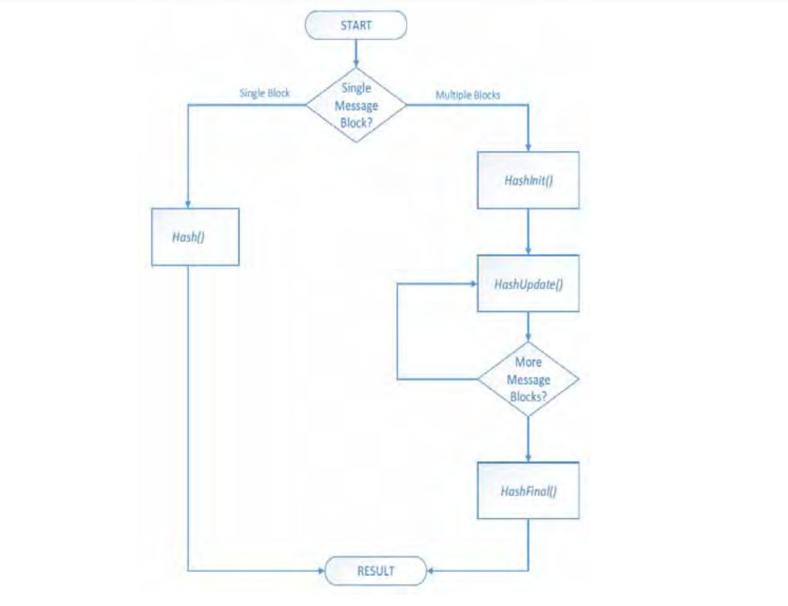

.. _secure-technologies:

Secure Technologies
===================

.. _hash-overview:

Hash Overview
-------------

For the purposes of this specification, a hash function takes a variable length input and generates a fixed length hash value. In general, hash functions are collision-resistant, which means that it is infeasible to find two distinct inputs which produce the same hash value. Hash functions are generally one-way which means that it is infeasible to find an input based on the output hash value.

This specification describes a protocol which allows a driver to produce a protocol which supports zero or more hash functions. 

.. _hash-references:

Hash References
###############

The following references define the standard means of creating the hashes used in this specification:

Secure Hash Standard (SHS) (FIPS PUB 180-3), National Institute of Standards and Technology (October 2008).

For more information

-  see "Links to UEFI-Related Documents" at http://uefi.org/uefi under the heading "Archived FIPS publication".
-  see "Links to UEFI-Related Documents"  at http://uefi.org/uefi under the heading "MD5 Message-Digest Algorithm". EFI Hash Protocols

.. _efi-hash-service-binding-protocol:

EFI_HASH_SERVICE_BINDING_PROTOCOL
$$$$$$$$$$$$$$$$$$$$$$$$$$$$$$$$$$

**Summary**

The EFI Hash Service Binding Protocol is used to locate hashing services support provided by a driver and create and destroy instances of the EFI Hash Protocol so that a multiple drivers can use the underlying hashing services.

The EFI Service Binding Protocol that is defined in :ref:`efi-services-binding` defines the generic Service Binding Protocol functions. This section discusses the details that are specific to the EFI Hash Protocol.

**GUID**

.. code-block::

   #define EFI_HASH_SERVICE_BINDING_PROTOCOL_GUID \
     {0x42881c98,0xa4f3,0x44b0,\
       {0xa3,0x9d,0xdf,0xa1,0x86,0x67,0xd8,0xcd}}

**Description**

An application (or driver) that requires hashing services can use one of the protocol handler services, such as *BS->LocateHandleBuffer(),* to search for devices that publish an EFI Hash Service Binding Protocol. 

After a successful call to the *EFI_HASH_SERVICE_BINDING_PROTOCOL.CreateChild()* function, the child EFI Hash Protocol driver instance is ready for use. The instance of *EFI_HASH_PROTOCOL* must be obtained by performing *HandleProtocol()* against the handle returned by *CreateChild().* Use of other methods, such as *LocateHandle(),* are not supported. 

Once obtained, the driver may use the *EFI_HASH_PROTOCOL* instance for any number of non-overlapping hash operations. Overlapping hash operations require an additional call to *EFI_HASH_SERVICE_BINDING_PROTOCOL.* *CreateChild()* for a new instance. 

Before a driver or application terminates execution, every successful call to the *EFI_HASH_SERVICE_BINDING_PROTOCOL.CreateChild()* function must be matched with a call to the *EFI_HASH_SERVICE_BINDING_PROTOCOL.DestroyChild()* function.

.. _efi-hash-protocol:

EFI_HASH_PROTOCOL
$$$$$$$$$$$$$$$$$

**Summary**

This protocol describes standard hashing functions.

**GUID**

.. code-block::

   #define EFI_HASH_PROTOCOL_GUID \
     {0xc5184932,0xdba5,0x46db,\
       {0xa5,0xba,0xcc,0x0b,0xda,0x9c,0x14,0x35}}

**Protocol Interface Structure**

.. code-block::

   typedef _EFI_HASH_PROTOCOL {
     EFI_HASH_GET_HASH_SIZE      GetHashSize;
     EFI_HASH_HASH               Hash;
   }   EFI_HASH_PROTOCOL;

**Parameters**

GetHashSize
  Return the size of a specific type of resulting hash.

Hash
  Create a hash for the specified message.

**Description**

This protocol allows creating a hash of an arbitrary message digest using one or more hash algorithms. The *GetHashSize* returns the expected size of the hash for a particular algorithm and whether or not that algorithm is, in fact, supported. The *Hash* actually creates a hash using the specified algorithm.   

**Related Definitions**

None.

.. _efi-hash-protocol-gethashsize:

EFI_HASH_PROTOCOL.GetHashSize()
$$$$$$$$$$$$$$$$$$$$$$$$$$$$$$$

**Summary**

Returns the size of the hash which results from a specific algorithm.   

**Prototype**

.. code-block::
  
   EFI_STATUS  
   EFIAPI  
   GetHashSize(  
     IN CONST EFI_HASH_PROTOCOL     *This,  
     IN CONST EFI_GUID              *HashAlgorithm,  
     OUT UINTN                      *HashSize
   );

**Parameters**

This
  Points to this instance of *EFI_HASH_PROTOCOL.*

HashAlgorithm
  Points to the *EFI_GUID* which identifies the algorithm to use.   See `EFI Hash Algorithms`_ .

HashSize
  Holds the returned size of the algorithm’s hash.

**Description**

This function returns the size of the hash which will be produced by the specified algorithm.   

**Related Definitions**

None

**Status Codes Returned**

.. list-table::
   :widths: 35 70

   * - EFI_SUCCESS
     - Hash size returned successfully.
   * - EFI_INVALID_PARAMETER
     - *HashSize* is **NULL** or *HashAlgorithm* is **NULL.**
   * - EFI_UNSUPPORTED
     - The algorithm specified by *HashAlgorithm* is not supported by this driver.

.. _efi-hash-protocol-hash:

EFI_HASH_PROTOCOL.Hash()
$$$$$$$$$$$$$$$$$$$$$$$$$

**Summary**

Creates a hash for the specified message text.

**Prototype**

.. code-block::
  
   EFI_STATUS  
   EFIAPI  
   Hash(  
     IN CONST EFI_HASH_PROTOCOL     *This,  
     IN CONST EFI_GUID              *HashAlgorithm,  
     IN BOOLEAN                     Extend,  
     IN CONST UINT8                 *Message,  
     IN UINT64                      MessageSize,  
     IN OUT EFI_HASH_OUTPUT         *Hash  
   );

**Parameters**

This
  Points to this instance of *EFI_HASH_PROTOCOL.*

HashAlgorithm
  Points to the *EFI_GUID* which identifies the algorithm to use. See `EFI Hash Algorithms`_ .

Extend
  Specifies whether to create a new hash ( **FALSE** ) or extend the specified existing hash ( **TRUE** ).

Message
  Points to the start of the message.

MessageSize
  The size of *Message,* in bytes. Must be integer multiple of block size.

Hash
  On input, if *Extend* is **TRUE,** then this parameter holds a pointer to a pointer to an array containing the hash to extend. If *Extend* is **FALSE,** then this parameter holds a pointer to a pointer to a caller-allocated array that will receive the result of the hash computation. On output (regardless of the value of *Extend* ), the array will contain the result of the hash computation. 

**Description**

This function creates the hash of the specified message text based on the specified algorithm *HashAlgorithm* and copies the result to the caller-provided buffer *Hash.* If *Extend* is *TRUE,* then the hash specified on input by Hash is extended. If *Extend* is *FALSE,* then the starting hash value will be that specified by the algorithm. 

**NOTE**: *For the all algorithms used with* EFI_HASH_PROTOCOL, *the following apply:*

-  The *EFI_HASH_PROTOCOL.Hash()* function does not perform padding of message data for these algorithms. Hence, *MessageSize* shall always be an integer multiple of the *HashAlgorithm* block size, and the final supplied *Message* in a sequence of invocations shall contain caller-provided padding. This will ensure that the final *Hash* output will be the correct hash of the provided message(s).

-  The result of a *Hash()* call for one of these algorithms when the caller does not supply message data whose length is an integer multiple of the algorithm’s block size is a returned error.

-  The *EFI_HASH_OUTPUT* options for these two algorithms shall be *EFI_SHA1_HASH* and EFI_SHA256_HASH, respectively.

-  Callers using these algorithms may consult the aforementioned Secure Hash Standard for details on how to perform proper padding required by standard prior to final invocation.   

**Related Definitions**

EFI_HASH_OUTPUT

.. TODO what is this?

**Status Codes Returned**

.. list-table::
   :widths: 35 70

   * - EFI_SUCCESS
     - *Hash* returned successfully.
   * - EFI_INVALID_PARAMETER
     - *Message* or *Hash,HashAlgorithm* i s NULL or *MessageSize* is 0. *MessageSize* is not an integer multiple of block size.
   * - EFI_UNSUPPORTED
     - The algorithm specified by *HashAlgorithm* is not supported by this driver. Includes *HashAlgorithm* being passed as a null error.
   * - EFI_UNSUPPORTED
     - *Extend* is **TRUE** and the algorithm doesn’t support extending the hash.

.. _other-code-definitions:

Other Code Definitions
######################

.. _efi-sha1-hash-efi-sha224-hash-efi-sha256-hash-efi-sha384-hash-efi_sha512hash-efi-md5-hash:

EFI_SHA1_HASH, EFI_SHA224_HASH, EFI_SHA256_HASH,EFI_SHA384_HASH, EFI_SHA512HASH, EFI_MD5_HASH
$$$$$$$$$$$$$$$$$$$$$$$$$$$$$$$$$$$$$$$$$$$$$$$$$$$$$$$$$$$$$$$$$$$$$$$$$$$$$$$$$$$$$$$$$$$$$$$$$$$

**Summary**

Data structure which holds the result of the hash.

**Prototype**

.. code-block::
  
   typedef UINT8 EFI_MD5_HASH[16];
   typedef UINT8 EFI_SHA1_HASH[20];
   typedef UINT8 EFI_SHA224_HASH[28];
   typedef UINT8 EFI_SHA256_HASH[32];
   typedef UINT8 EFI_SHA384_HASH[48];
   typedef UINT8 EFI_SHA512_HASH[64];
   typedef union _EFI_HASH_OUTPUT {
     EFI_MD5_HASH       *Md5Hash;
     EFI_SHA1_HASH      *Sha1Hash;
     EFI_SHA224_HASH    *Sha224Hash;
     EFI_SHA256_HASH    *Sha256Hash;
     EFI_SHA384_HASH    *Sha384Hash;
     EFI_SHA512_HASH    *Sha512Hash;
   }   EFI_HASH_OUTPUT;

**Description**

These prototypes describe the expected hash output values from the *Hash* function of the *EFI_HASH_PROTOCOL.*

**Related Definitions**

None
  

.. _efi-hash-algorithms:

EFI Hash Algorithms
$$$$$$$$$$$$$$$$$$$

The following table gives the *EFI_GUID* for standard hash algorithms and the corresponding ASN.1 OID (Object Identifier):

.. list-table:: EFI Hash Algorithms
   :name: efi-hash-algorithms-1
   :widths: 15 45 45
   :class: longtable

   * - **Algorithm**
     - **EFI_GUID**
     - **OID**
   * - SHA-1 (No padding done by implementation)
     - *#define EFI_HASH_ALGO RITHM_SHA1_NOPAD_GUID {0x24c5dc2f, 0x53e2, 0x40ca,*  *{0x9e, 0xd6, 0xa5, 0xd9, 0xa4, 0x9f, 0x46, 0x3b}}*
     - *id-sha1 OBJECT IDENTIFIER ::= { iso(1) ide ntified-organization( 3) oiw(14) secsig(3) algorithms(2) 26 }*
   * - SHA-256 (No padding done by implementation)
     - *#define EFI_HASH_ALGORI THM_SHA256_NOPAD_GUID {0x8628752a, 0x6cb7, 0x4814,*  *{0x96, 0xfc, 0x24, 0xa8, 0x15, 0xac, 0x22, 0x26}}*
     - *id-sha256 OBJECT IDENTIFIER ::= { joint-iso-itu-t (2) country (16) us (840) organization (1) gov (101) csor (3) nistalgorithm (4) hashalgs (2) 1}*

**Note**: For the EFI_HASH_ALGORITHM_SHA1_NOPAD_GUID and the EFI_HASH_ALGORITHM_SHA256_NOPAD_GUID, the following apply:

-  The *EFI_HASH_PROTOCOL.Hash()* function does not perform padding of message data for these algorithms. Hence, *MessageSize* shall always be an integer multiple of the *HashAlgorithm* block size, and the final supplied *Message* in a sequence of invocations shall contain caller-provided padding. This will ensure that the final *Hash* output will be the correct hash of the provided message(s).

-  The result of a *Hash()* call for one of these algorithms when the caller does not supply message data whose length is an integer multiple of the algorithm’s block size is undefined.

-  The *EFI_HASH_OUTPUT* options for these two algorithms shall be *EFI_SHA1_HASH* and *EFI_SHA256_HASH,* respectively. 

-  Callers using these algorithms may consult the aforementioned Secure Hash Standard for details on how to perform proper padding.

.. _hash2-protocols:

Hash2 Protocols
---------------

.. _efi-hash2-service-binding-protocol:

EFI Hash2 Service Binding Protocol
##################################

.. TODO this will cause a bookmark problem

EFI_HASH2_SERVICE_BINDING_PROTOCOL
$$$$$$$$$$$$$$$$$$$$$$$$$$$$$$$$$$

**Summary**

The EFI Hash2 Service Binding Protocol is used to locate *EFI_HASH2_PROTOCOL* hashing services support provided by a driver and create and destroy instances of the *EFI_HASH2_PROTOCOL* Protocol so that a multiple drivers can use the underlying hashing services. 

The EFI Service Binding Protocol that is defined in :ref:`efi-services-binding` defines the generic Service Binding Protocol functions. This section discusses the details that are specific to the EFI Hash Protocol.

**GUID**

.. code-block::

   #define EFI_HASH2_SERVICE_BINDING_PROTOCOL_GUID \
   {0xda836f8d, 0x217f, 0x4ca0, 0x99, 0xc2, 0x1c, \
   0xa4, 0xe1, 0x60, 0x77, 0xea}

**Description**

An application (or driver) that requires hashing services can use one of the protocol handler services, such as *BS->LocateHandleBuffer(),* to search for devices that publish an *EFI_HASH2_SERVICE_BINDING_PROTOCOL.* 

After a successful call to the *EFI_HASH2_SERVICE_BINDING_PROTOCOL* member *CreateChild()* function, the child instance of *EFI_HASH2_PROTOCOL* Protocol driver instance is ready for use. The instance of *EFI_HASH2_PROTOCOL* must be obtained by performing *HandleProtocol()* against the handle returned by *CreateChild().* Use of other methods, such as *LocateHandle()* is not supported. 

Once obtained, the driver may use the *EFI_HASH2_PROTOCOL* instance for any number of non-overlapping hash operations. Overlapping hash operations require an additional call to *EFI_HASH_SERVICE_BINDING_PROTOCOL.* *CreateChild()* for a new instance. 

Before a driver or application using the instance terminates execution, every successful call to the *EFI_HASH_SERVICE_BINDING_PROTOCOL.CreateChild()* function must be matched with a call to the *EFI_HASH_SERVICE_BINDING_PROTOCOL.DestroyChild()* function. 

.. _efi-hash2-protocol:

EFI Hash2 Protocol
##################

EFI_HASH2_PROTOCOL
$$$$$$$$$$$$$$$$$$

**Summary**

This protocol describes hashing functions for which the algorithm-required message padding and finalization are performed by the supporting driver. 

**GUID**

.. code-block::

   #define EFI_HASH2_PROTOCOL_GUID \
   {
   0x55b1d734, 0xc5e1, 0x49db, 0x96, 0x47, 0xb1, 0x6a, \
   0xfb, 0xe, 0x30, 0x5b}

**Protocol Interface Structure**

.. code-block::

   typedef _EFI_HASH2_PROTOCOL {
     EFI_HASH2_GET_HASH_SIZE        GetHashSize;
     EFI_HASH2_HASH                 Hash;
     EFI_HASH2_HASH_INIT            HashInit;
     EFI_HASH2_HASH_UPDATE          HashUpdate;
     EFI_HASH2_HASH_FINAL           HashFinal;
   }   EFI_HASH2_PROTOCOL;

**Parameters**

GetHashSize
  Return the result size of a specific type of resulting hash.

Hash
  Create a final non-extendable hash for a single message block in a single call.

HashInit
  Initializes an extendable multi-part hash calculation

HashUpdate
  Continues a hash in progress by supplying the first or next sequential portion of the message text

HashFinal
  Finalizes a hash in progress by padding as required by algorithm and returning the hash output.

**Description**

This protocol allows creating a hash of an arbitrary message
digest using one or more hash algorithms. The
*GetHashSize()* function returns the expected size of the
hash for a supported algorithm and an error if that
algorithm is not supported. The *Hash()* function creates a
final, non-extendable, hash of a single message block using
the specified algorithm. The three functions *HashInit(),*
*HashUpdate(),* *HashFinal(),* generates the hash of a
multi-part message, with input composed of one or more
message pieces.

For a specific handle representing an instance of
*EFI_HASH2_PROTOCOL,* if *Hash()* is called after a call to
*HashInit()* and prior to the matching call to *HashFinal()*
, the multi-part hash started by *HashInit()* will be
canceled and calls to *HashUpdate()* or *HashFinal()* will
return an error status unless proceeded by a new call to
*HashInit().*

**NOTE**: *Algorithms* EFI_HASH_ALGORITHM_SHA1_NOPAD *and* EFI_HASH_ALGORITHM_SHA256_NOPAD_GUID *are not compatible with* EFI_HASH2_PROTOCOL *and will return* EFI_UNSUPPORTED *if used with any* EFI_HASH2_PROTOCOL *function.*   

**Related Definitions**

None
  
**NOTE**: *The following hash function invocations will produce identical hash results for all supported* EFI_HASH2_PROTOCOL *algorithms. The data in quotes is the message*.
  

.. list-table:: Identical Hash Results
   :name: identical-hash-results
   :widths: 30 30 30
   :class: longtable

   * - *Hash("ABCDEF")* 
     - *HashInit()*           
     - *HashInit ()*
   * - 
     - *HashUpdate("ABCDEF")*
     - *HashUpdate ("ABC")*
   * - 
     - *HashFinal()*
     - *HashUpdate ("DE")*
   * - 
     - 
     - *HashUpdate ("F")*
   * - 
     - 
     - *HashFinal ()*

   **Hash workflow**

.. _efi-hash2-protocol-gethashsize:

EFI_HASH2_PROTOCOL.GetHashSize()
$$$$$$$$$$$$$$$$$$$$$$$$$$$$$$$$

.. TODO this header is not coming up with the exact same text

**Summary**

Returns the size of the hash which results from a specific algorithm.   

**Prototype**

.. code-block::
  
   EFI_STATUS  
   EFIAPI  
   GetHashSize(  
     IN  CONST EFI_HASH2_PROTOCOL             *This,  
     IN  CONST EFI_GUID                       *HashAlgorithm,  
     OUT  UINTN                               *HashSize  
     );

**Parameters**

This
  Points to this instance of *EFI_HASH2_PROTOCOL.*

HashAlgorithm
  Points to the *EFI_GUID* which identifies the algorithm to use. See :ref:`other-code-definitions-1` . 

.. TODO check reference above, two almost exactly the same except for -1 in the  bookmark

HashSize
  Holds the returned size of the algorithm’s hash.

**Description**

This function returns the size of the hash result buffer which will be produced by the specified algorithm.   

**Related Definitions**

None
  

**Status Codes Returned**

.. list-table::
   :widths: 35 70
   :class: longtable

   * - EFI_SUCCESS
     - Hash size returned successfully.
   * - EFI_INVALID_PARAMETER
     - *This* or *HashSize* is **NULL**
   * - EFI_UNSUPPORTED
     - The algorithm specified by *HashAlgorithm* is not supported by this driver or, *HashAlgorithm* is **NULL**.

.. _efi_hash2_protocol.hash:

EFI_HASH2_PROTOCOL.Hash()
$$$$$$$$$$$$$$$$$$$$$$$$$$

**Summary**

Creates a hash for a single message text. The hash is not extendable. The output is final with any algorithm-required padding added by the function.

**Prototype**

.. code-block::
  
   EFI_STATUS
   EFIAPI
   Hash(
     IN CONST EFI_HASH2_PROTOCOL       *This,
     IN CONST EFI_GUID                 *HashAlgorithm,
     IN CONST UINT8                    *Message,
     IN UINTN                          MessageSize,
     IN OUT EFI_HASH2_OUTPUT           *Hash
   );

**Parameters**

This
  Points to this instance of *EFI_HASH2_PROTOCOL.*

HashAlgorithm
  Points to the *EFI_GUID* which identifies the algorithm to use.  See Table, :ref:`algorithms-that-may-be-used-with-efi-hash2-protocol`.

Message
  Points to the start of the message.

MessageSize
  The size of *Message,* in bytes.

Hash
  On input, points to a caller-allocated buffer of the size returned by *GetHashSize()* for the specified *HashAlgorithm.* On output, the buffer holds the resulting hash computed from the message.

**Description**

This function creates the hash of specified single block message text based on the specified algorithm *HashAlgorithm* and copies the result to the caller-provided buffer *Hash.* The resulting hash cannot be extended. All padding required by *HashAlgorithm* is added by the implementation.   

**Related Definitions**

*EFI_HASH2_OUTPUT*
  

**Status Codes Returned**

.. list-table::
   :widths: 35 70
   :class: longtable

   * - EFI_SUCCESS
     - *Hash* returned successfully.
   * - EFI_INVALID_PARAMETER
     - *This,* or *Hash* is **NULL**.
   * - EFI_UNSUPPORTED
     - The algorithm specified by *HashAlgorithm* is not supported by this driver or *HashAlgorithm* is **Null**.
   * - EFI_OUT_OF_RESOURCES
     - Some resource required by the function is not available or *MessageSize* is greater than platform maximum.

.. _efi-hash2-protocol-hashinit:

EFI_HASH2_PROTOCOL.HashInit()
$$$$$$$$$$$$$$$$$$$$$$$$$$$$$$

**Summary**

This function must be called to initialize a digest calculation to be subsequently performed using the *EFI_HASH2_PROTOCOL* functions *HashUpdate()* and *HashFinal().*   

**Prototype**

.. code-block::
  
   EFI_STATUS  
   EFIAPI  
   HashInit(  
     IN CONST EFI_HASH2_PROTOCOL       *This,  
     IN CONST EFI_GUID                 *HashAlgorithm,  
   );
  

**Parameters**

This
  Points to instance of *EFI_HASH2_PROTOCOL.*

HashAlgorithm
  Points to the *EFI_GUID* which identifies the algorithm to use. See Table, :ref:`algorithms-that-may-be-used-with-efi-hash2-protocol`  

**Description**

This function

**Related Definitions**

**Status Codes Returned**

.. list-table::
   :widths: 35 70
   :class: longtable

   * - EFI_SUCCESS
     - Initialized successfully.
   * - EFI_INVALID_PARAMETER
     - *This* is **NULL**.
   * - EFI_UNSUPPORTED
     - The algorithm specified by *HashAlgorithm* is not supported by this function or *HashAlgorithm* is **Null**.
   * - EFI_OUT_OF_RESOURCES
     - Process failed due to lack of required resource.
   * - EFI_ALREADY_STARTED
     - This function is called when the operation in progress is still in processing *Hash(),* or *HashInit()* is already called before and not terminated by *HashFinal()* yet on the same instance.

.. _efi-hash2-protocol-hashupdate:

EFI_HASH2_PROTOCOL.HashUpdate()
$$$$$$$$$$$$$$$$$$$$$$$$$$$$$$$

**Summary**

Updates the hash of a computation in progress by adding a message text.   

**Prototype**

.. code-block::
  
   EFI_STATUS  
   EFIAPI  
   HashUpdate(  
     IN CONST EFI_HASH2_PROTOCOL    *This,  
     IN CONST UINT8                 *Message,  
     IN UINTN                       MessageSize  
   );

**Parameters**

This
  Points to instance of *EFI_HASH2_PROTOCOL.*

Message
  Points to the start of the message.

MessageSize
  The size of *Message,* in bytes.

**Description**

This function extends the hash of ongoing hash operation with the supplied message text. This function should be called one or more times with portions of the total message text to be hashed.. A zero-length message input will return EFI_SUCCESS and has no impacts on the ongoing hash instance.   

**Related Definitions**

**Status Codes Returned**

.. list-table::
   :widths: 35 70
   :class: longtable

   * - EFI_SUCCESS
     - Digest in progress updated successfully.
   * - EFI_INVALID_PARAMETER
     - *This* or *Hash* is **NULL**.
   * - EFI_OUT_OF_RESOURCES
     - Some resource required by the function is not available or *MessageSize* is greater than platform maximum.
   * - EFI_NOT_READY
     - This call was not preceded by a valid call to *HashInit()*, or the operation in progress was terminated by a call to *Hash()* or *HashFinal()* on the same instance.

.. _efi-hash2-protocol-hashfinal:

EFI_HASH2_PROTOCOL.HashFinal()
$$$$$$$$$$$$$$$$$$$$$$$$$$$$$$

**Summary**

Finalizes a hash operation in progress and returns calculation result. The output is final with any necessary padding added by the function. The hash may not be further updated or extended after *HashFinal().*   

**Prototype**

.. code-block::
  
   EFI_STATUS
   EFIAPI
   HashFinal(
     IN CONST EFI_HASH2_PROTOCOL      *This,
     IN OUT EFI_HASH2_OUTPUT          *Hash
   );
  

**Parameters**

This
  Points to instance of *EFI_HASH2_PROTOCOL.*

Hash
  On input, points to a caller-allocated buffer of the size returned by *GetHashSize()* for the specified *HashAlgorithm* specified in preceding *HashInit().* On output, the buffer holds the resulting hash computed from the message. 

**Description**

This function finalizes the hash of a hash operation in progress. The resulting final hash cannot be extended.   

**Related Definitions**

*EFI_HASH2_OUTPUT*
  

**Status Codes Returned**

.. list-table::
   :widths: 35 70
   :class: longtable

   * - EFI_SUCCESS
     - *Hash* returned successfully.
   * - EFI_INVALID_PARAMETER
     - *This* or *Hash* is **NULL**
   * - EFI_NOT_READY
     - This call was not preceded by a valid call to *HashInit()* and at least one call to *HashUpdate(),* or the operation in progress was canceled by a call to *Hash()* on the same instance.

.. list-table:: Algorithms that may be used with *EFI_HASH2_PROTOCOL*
   :name: algorithms-that-may-be-used-with-efi-hash2-protocol
   :widths: 10 45 40
   :class: longtable

   * - 
     - **EFI_GUID**
     - **OID**
   * - SHA-1
     - *#define*  *EFI_HASH _ALGORITHM_SHA1_GUID*  *{0x2ae9d80f, 0x3fb2, 0x4095,*  *{ 0xb7, 0xb1, 0xe9, 0x31,*  *0x57, 0xb9, 0x46, 0xb6}}*
     - *id-sha1 OBJECT IDENTIFIER ::= { iso(1) identified-*  *organization(3) oiw(14)*  *secsig(3) algorithms(2)*  *26*  *}*
   * - SHA-224
     - *#define EFI_HASH _ALGORITHM_SHA224_GUI D { 0x8df01a06, 0x9bd5,*  *0x4bf7, { 0xb0, 0x21, 0xdb,*  *0x4f, 0xd9, 0xcc, 0xf4, 0x5b*  } }
     - 
   * - SHA-256
     - *#define EFI_HASH _ALGORITHM_SHA256_GUI D { 0x51aa59de, 0xfdf2,*  *0x4ea3, { 0xbc, 0x63, 0x87,*  *0x5f, 0xb7, 0x84, 0x2e, 0xe9*  *} }*
     - *id-sha256 OBJECT IDENTIFIER ::= { joint-iso-itu-t (2)*  *country (16) us (840)*  *organization (1) gov*  *(101)*  *csor (3) nistalgorithm*  *(4) hashalgs (2) 1}*
   * - SHA-384
     - *#define EFI_HASH _ALGORITHM_SHA384_GUI D { 0xefa96432, 0xde33,*  *0x4dd2, { 0xae, 0xe6, 0x32,*  *0x8c, 0x33, 0xdf, 0x77, 0x7a*  *} }*
     - *id-sha384 OBJECT IDENTIFIER ::= { joint-iso-itu-t (2)*  *country (16) us (840) organization (1) gov (101)*  *csor (3) nistalgorithm*  *(4) hashalgs (2) 2}*
   * - SHA-512
     - *#define EFI_HASH _ALGORITHM_SHA512_GUI D { 0xcaa4381e, 0x750c,*  *0x4770, { 0xb8, 0x70, 0x7a,*  *0x23, 0xb4, 0xe4, 0x21, 0x30*  *} }*
     - *id-sha512 OBJECT IDENTIFIER ::= { joint-iso-itu-t (2)*  *country (16) us (840)*  *organization (1) gov*  *(101)*  *csor (3) nistalgorithm*  *(4) hashalgs (2) 3}*
   * - *MD5*
     - *#define*  *EFI_HA SH_ALGORTIHM_MD5_GUID {*  *0xaf7c79c, 0x65b5, 0x4319, {*  *0xb0, 0xae, 0x44, 0xec, 0x48,*  *0x4e, 0x4a, 0xd7 } }*
     - *id-md5 OBJECT IDENTIFIER*  *::= {*  *iso (1) member-body (2) us (840) rsadsi (113549) digestAlgorithm (2) 5}*

**NOTE**: *SHA-1 and MD5 are included for backwards compatibility. New driver implementations are encouraged to consider stronger algorithms.* 

.. _other-code-definitions-1:

Other Code Definitions
######################

.. _efi-hash2-output:

EFI_HASH2_OUTPUT
$$$$$$$$$$$$$$$$

**Summary**

Data structure which holds the result of the hash operation from *EFI_HASH2_PROTOCOL* hash operations.

**Prototype**

.. code-block::

   typedef UINT8 EFI_MD5_HASH2[16];  
   typedef UINT8 EFI_SHA1_HASH2[20];  
   typedef UINT8 EFI_SHA224_HASH2[28];  
   typedef UINT8 EFI_SHA256_HASH2[32];  
   typedef UINT8 EFI_SHA384_HASH2[48];  
   typedef UINT8 EFI_SHA512_HASH2[64];  
   typedef union _EFI_HASH2_OUTPUT {  
     EFI_MD5_HASH2         Md5Hash;  
     EFI_SHA1_HASH2        Sha1Hash;  
     EFI_SHA224_HASH2      Sha224Hash;  
     EFI_SHA256_HASH2      Sha256Hash;  
     EFI_SHA384_HASH2      Sha384Hash;  
     EFI_SHA512_HASH2      Sha512Hash;  
     } EFI_HASH2_OUTPUT;

**Description**

These prototypes describe the expected hash output values from the hashing functions of the *EFI_HASH2_PROTOCOL*.

**Related Definitions**

None
  

.. _key-management-service:

Key Management Service
----------------------

.. _efi-key-management-service-protocol:

EFI_KEY_MANAGEMENT_SERVICE_PROTOCOL
###################################

**Summary**

The Key Management Service (KMS) protocol provides services to generate, store, retrieve, and manage cryptographic keys. The intention is to specify a simple generic protocol that could be used for many implementations. 

The management keys have a simple construct - they consist of key identifier and key data, both of variable size. 

A driver implementing the protocol may need to provide basic key service that consists of a key store and cryptographic key generation capability. It may connect to an external key server over the network, or to a Hardware Security Module (HSM) attached to the system it runs on, or anything else that is capable of providing the key management service. 

Authentication and access control is not addressed by this protocol. It is assumed it is addressed at the system level and done by the driver implementing the protocol, if applicable to the implementation.

**GUID**

.. code-block::

   #define EFI_KMS_PROTOCOL_GUID \
     {0xEC3A978D,0x7C4E, 0x48FA,\
     {0x9A,0xBE,0x6A,0xD9,0x1C,0xC8,0xF8,0x11}}

**Protocol Interface Structure**

.. code-block::

   #define EFI_KMS_DATA_TYPE_NONE      0
   #define EFI_KMS_DATA_TYPE_BINARY    1
   #define EFI_KMS_DATA_TYPE_ASCII     2
   #define EFI_KMS_DATA_TYPE_UNICODE   4
   #define EFI_KMS_DATA_TYPE_UTF8      8

Where appropriate, *EFI_KMS_DATA_TYPE* values may be combined using a bitwise ‘ *OR* ’ operation to indicate support for multiple data types.

.. code-block::

   typedef struct _EFI_KMS_SERVICE_PROTOCOL {
     EFI_KMS_GET_SERVICE_STATUS        GetServiceStatus;
     EFI_KMS_REGISTER_CLIENT           RegisterClient;
     EFI_KMS_CREATE_KEY                CreateKey;
     EFI_KMS_GET_KEY                   GetKey;
     EFI_KMS_ADD_KEY                   AddKey;
     EFI_KMS_DELETE_KEY                DeleteKey;
     EFI_KMS_GET_KEY_ATTRIBUTES        GetKeyAttributes;
     EFI_KMS_ADD_KEY_ATTRIBUTES        AddKeyAttributes;
     EFI_KMS_DELETE_KEY_ATTRIBUTES     DeleteKeyAttributes;
     EFI_KMS_GET_KEY_BY_ATTRIBUTES     GetKeyByAttributes;
     UINT32                            ProtocolVersion;
     EFI_GUID                          ServiceId;
     CHAR16                            *ServiceName;
     UINT32                            ServiceVersion;
     BOOLEAN                           ServiceAvailable;
     BOOLEAN                           ClientIdSupported;
     BOOLEAN                           ClientIdRequired;
     UINT16                            ClientIdMaxSize;
     UINT8                             ClientNameStringTypes;
     BOOLEAN                           ClientNameRequired;
     UINT16                            ClientNameMaxCount;
     BOOLEAN                           ClientDataSupported;
     UINTN                             ClientDataMaxSize;
     BOOLEAN                           KeyIdVariableLenSupported;
     UINTN                             KeyIdMaxSize;
     UINTN                             KeyFormatsCount;
     EFI_GUID                          *KeyFormats;
     BOOLEAN                           KeyAttributesSupported;
     UINT8                             KeyAttributeIdStringTypes;
     UINT16                            KeyAttributeIdMaxCount;
     UINTN                             KeyAttributesCount;
     EFI_KMS_KEY_ATTRIBUTE             *KeyAttributes;
   }   EFI_KMS_PROTOCOL;

**Parameters**

GetServiceStatus
  Get the current status of the key management service. If the implementation has not yet connected to the KMS, then a call to this function will initiate a connection. This is the only function that is valid for use prior to the service being marked available.

RegisterClient
  Register a specific client with the KMS.

CreateKey
  Request the generation of a new key and retrieve it.

GetKey
  Retrieve an existing key.

AddKey
  Add a local key to the KMS database. If there is an existing key with this key identifier in the KMS database, it will be replaced with the new key.

DeleteKey
  Delete an existing key from the KMS database.

AddKeyAttributes
  Add attributes to an existing key in the KMS database.

GetKeyAttributes
  Get attributes for an existing key in the KMS database.

DeleteKeyAttributes
  Delete attributes for an existing key in the KMS database.

GetKeyByAttributes   
  Get existing key(s) with the specified attributes.

ProtocolVersion
  The version of this *EFI_KMS_PROTOCOL* structure. This must be set to 0x00020040 for the initial version of this protocol.

ServiceId
  Optional GUID used to identify a specific KMS. This GUID may be supplied by the provider, by the implementation, or may be null. If it is null, then the *ServiceName* must not be null.

ServiceName   
  Optional pointer to a Unicode string which may be used to identify the KMS or provide other information about the supplier.

ServiceVersion
  Optional 32-bit value which may be used to indicate the version of the KMS provided by the supplier.

ServiceAvailable
  **TRUE** if and only if the service is active and available for use. To avoid unnecessary delays in POST, this protocol may be installed without connecting to the service. In this case, the first call to the *GetServiceStatus()* function will cause the implementation to connect to the supported service and mark it as available. The capabilities of this service as defined in the remainder of this protocol are not guaranteed to be valid until the service has been marked available. 

  **FALSE** otherwise.

ClientIdSupported
  **TRUE** if and only if the service supports client identifiers. Client identifiers may be used for auditing, access control or any other purpose specific to the implementation. 

  **FALSE** otherwise.

ClientIdRequired
  **TRUE** if and only if the service requires a client identifier in order to process key requests. 

  **FALSE** otherwise.

ClientIdMaxSize
  The maximum size in bytes for the client identifier.

ClientNameStringTypes
  The client name string type(s) supported by the KMS service. If client names are not supported, this field will be set to EFI_KMS_DATA_TYPE_NONE. Otherwise, it will be set to the inclusive ‘OR’ of all client name formats supported. Client names may be used for auditing, access control or any other purpose specific to the implementation.

ClientNameRequired
  **TRUE** if and only if the KMS service requires a client name to be supplied to the service. 

  **FALSE** otherwise.

ClientNameMaxCount
  The maximum number of characters allowed for the client name.

ClientDataSupported
  **TRUE** if and only if the service supports arbitrary client data requests. The use of client data requires the caller to have specific knowledge of the individual KMS service and should be used only if absolutely necessary. 

  **FALSE** otherwise.

ClientDataMaxSize
  The maximum size in bytes for the client data. If the maximum data size is not specified by the KMS or it is not known, then this field must be filled with all ones.

KeyIdVariableLenSupported
  **TRUE** if variable length key identifiers are supported. 

  **FALSE** if a fixed length key identifier is supported.

KeyIdMaxSize
  If KeyIdVariableLenSupported is **TRUE**, this is the maximum supported key identifier length in bytes. Otherwise this is the fixed length of key identifier supported. Key ids shorter than the fixed length will be padded on the right with blanks.

KeyFormatsCount
  The number of key format/size GUIDs returned in the *KeyFormats* field.

KeyFormats
  A pointer to an array of *EFI_GUID* values which specify key formats/sizes supported by this KMS. Each format/size pair will be specified by a separate *EFI_GUID* . At least one key format/size must be supported. All formats/sizes with the same hashing algorithm must be contiguous in the array, and for each hashing algorithm, the key sizes must be in ascending order. See "Related Definitions" for GUIDs which identify supported key formats/sizes. 

  'This list of GUIDs supported by the KMS is not required to be exhaustive, and the KMS may provide support for additional key formats/sizes. Users may request key information using an arbitrary GUID, but any GUID not recognized by the implementation or not supported by the KMS will return an error code of *EFI_UNSUPPORTED*.

.. TODO please note para above starts with an apostrophe but there is no end one

KeyAttributesSupported
  **TRUE** if key attributes are supported.  

  **FALSE** if key attributes are not supported.

KeyAttributeIdStringTypes
  The key attribute identifier string type(s) supported by the KMS service. If key attributes are not supported, this field will be set to *EFI_KMS_DATA_TYPE_NONE.* Otherwise, it will be set to the inclusive ‘OR’ of all key attribute identifier string types supported. *EFI_KMS_DATA_TYPE_BINARY* is not valid for this field.

KeyAttributeIdMaxCount
  The maximum number of characters allowed for the *EFI_KMS_KEY_ATTRIBUTE.KeyAttributeIdentifierCount*.

KeyAttributesCount
  The number of predefined *KeyAttributes* structures returned in the *KeyAttributes* parameter. If the KMS does not support predefined key attributes, or if it does not provide a method to obtain predefined key attributes data, then this field must be zero.

KeyAttributes
  A pointer to an array of *KeyAttributes* structures which contains the predefined attributes supported by this KMS. Each structure must contain a valid key attribute identifier and should provide any other information as appropriate for the attribute, including a default value if one exists. This variable must be set to **NULL** if the *KeyAttributesCount* variable is zero. It must point to a valid buffer if the *KeyAttributesCount* variable is non-zero.  

  This list of predefined attributes is not required to be exhaustive, and the KMS may provide additional predefined attributes not enumerated in this list. The implementation does not distinguish between predefined and used defined attributes, and therefore, predefined attributes not enumerated will still be processed to the KMS.

**Related Definitions**

Functions defined for this protocol typically require the caller to provide information about the client, the keys to be processed, and/or attributes of the keys to be processed. Four structures, *EFI_KMS_CLIENT_INFO,* *EFI_KMS_KEY_DESCRIPTOR,* *EFI_KMS_DYNAMIC_ATTRIBUTE,* and *EFI_KMS_KEY_ATTRIBUTE* define the information to be passed to these functions.

.. code-block::

   typedef struct {
     UINT16          ClientIdSize;
     VOID            *ClientId;
     UINT8           ClientNameType;
     UINT8           ClientNameCount;
     VOID            *ClientName;
   }   EFI_KMS_CLIENT_INFO;

ClientIdSize
  The size in bytes for the client identifier.

ClientId
  Pointer to a valid client identifier.

ClientNameType
  The client name string type used by this client. The string type set here must be one of the string types reported in the *ClientNameStringTypes* field of the KMS protocol. If the KMS does not support client names, this field should be set to *EFI_KMS_DATA_TYPE_NONE.*

ClientNameCount
  The size in characters for the client name. This field will be ignored if *ClientNameStringType* is set to *EFI_KMS_DATA_TYPE_NONE.* Otherwise, it must contain number of characters contained in the *ClientName* field.

ClientName
  Pointer to a client name. This field will be ignored if *ClientNameStringType* is set to *EFI_KMS_DATA_TYPE_NONE.* Otherwise, it must point to a valid string of the specified type.

The key formats recognized by the KMS protocol are defined by an *EFI_GUID* which specifies a (key-algorithm, key-size) pair. The names of these GUIDs are in the format *EFI_KMS_KEY_(key-algorithm)_(key-size)_GUID,* where the key-size is expressed in bits. The key formats recognized fall into three categories, generic (no algorithm), hash algorithms, and encrypted algorithms.

**Generic Key Data:**

The following GUIDs define formats that contain generic key data of a specific size in bits, but which is not associated with any specific key algorithm(s).

.. code-block::

   #define EFI_KMS_FORMAT_GENERIC_128_GUID \
     {0xec8a3d69,0x6ddf,0x4108,\
       {0x94,0x76,0x73,0x37,0xfc,0x52,0x21,0x36}}
   
   #define EFI_KMS_FORMAT_GENERIC_160_GUID \
     {0xa3b3e6f8,0xefca,0x4bc1,\
       {0x88,0xfb,0xcb,0x87,0x33,0x9b,0x25,0x79}}
   
   #define EFI_KMS_FORMAT_GENERIC_256_GUID \
     {0x70f64793,0xc323,0x4261,\
       {0xac,0x2c,0xd8,0x76,0xf2,0x7c,0x53,0x45}}
   
   #define EFI_KMS_FORMAT_GENERIC_512_GUID \
     {0x978fe043,0xd7af,0x422e,\
       {0x8a,0x92,0x2b,0x48,0xe4,0x63,0xbd,0xe6}}
   
   #define EFI_KMS_FORMAT_GENERIC_1024_GUID \
     {0x43be0b44,0x874b,0x4ead,\
       {0xb0,0x9c,0x24,0x1a,0x4f,0xbd,0x7e,0xb3}}
   
   #define EFI_KMS_FORMAT_GENERIC_2048_GUID \
     {0x40093f23,0x630c,0x4626,\
       {0x9c,0x48,0x40,0x37,0x3b,0x19,0xcb,0xbe}}
   
   #define EFI_KMS_FORMAT_GENERIC_3072_GUID \
     {0xb9237513,0x6c44,0x4411,\
       {0xa9,0x90,0x21,0xe5,0x56,0xe0,0x5a,0xde}}
   
   #define EFI_KMS_FORMAT_GENERIC_DYNAMIC_GUID \
     {0x2156e996, 0x66de, 0x4b27, \
       {0x9c, 0xc9, 0xb0, 0x9f, 0xac, 0x4d, 0x2, 0xbe}}

The *EFI_KMS_FORMAT_GENERIC_DYNAMIC_GUID* is defined for the key data with a size not defined by a certain key format GUID. The key value specified by this GUID is in format of structure *EFI_KMS_FORMAT_GENERIC_DYNAMIC.*

.. code-block::

   typedef struct {
     UINT32          KeySize;
     UINT8           KeyData[1];
   } EFI_KMS_FORMAT_GENERIC_DYNAMIC;

KeySize
  Length in bytes of the *KeyData.*

KeyData
  The data of the key.

**Hash Algorithm Key Data:**

These GUIDS define key data formats that contain data generated by basic hash algorithms with no cryptographic properties.

.. code-block::

   #define EFI_KMS_FORMAT_MD2_128_GUID \
     {0x78be11c4,0xee44,0x4a22,\
       {0x9f,0x05,0x03,0x85,0x2e,0xc5,0xc9,0x78}}
     
   #define EFI_KMS_FORMAT_MDC2_128_GUID \
    {0xf7ad60f8,0xefa8,0x44a3,\
      {0x91,0x13,0x23,0x1f,0x39,0x9e,0xb4,0xc7}}
   
   #define EFI_KMS_FORMAT_MD4_128_GUID \
    {0xd1c17aa1,0xcac5,0x400f,0xbe,\
      {0x17,0xe2,0xa2,0xae,0x06,0x67,0x7c}}
   
   #define EFI_KMS_FORMAT_MDC4_128_GUID \
    {0x3fa4f847,0xd8eb,0x4df4,\
      {0xbd,0x49,0x10,0x3a,0x0a,0x84,0x7b,0xbc}}
   
   #define EFI_KMS_FORMAT_MD5_128_GUID \
    {0xdcbc3662,0x9cda,0x4b52,\
      {0xa0,0x4c,0x82,0xeb,0x1d,0x23,0x48,0xc7}}
   
   #define EFI_KMS_FORMAT_MD5SHA_128_GUID \
    {0x1c178237,0x6897,0x459e,\
      {0x9d,0x36,0x67,0xce,0x8e,0xf9,0x4f,0x76}}
   
   #define EFI_KMS_FORMAT_SHA1_160_GUID \
    {0x453c5e5a,0x482d,0x43f0,\
      {0x87,0xc9,0x59,0x41,0xf3,0xa3,0x8a,0xc2}}
   
   #define EFI_KMS_FORMAT_SHA256_256_GUID \
    {0x6bb4f5cd,0x8022,0x448d,\
      {0xbc,0x6d,0x77,0x1b,0xae,0x93,0x5f,0xc6}}
   
   #define EFI_KMS_FORMAT_SHA512 512_GUID \
    {0x2f240e12,0xe14d,0x475c,\
      {0x83,0xb0,0xef,0xff,0x22,0xd7,0x7b,0xe7}}

**Encryption Algorithm Key Data:**

These GUIDs define key data formats that contain data generated by cryptographic key algorithms. There may or may not be a separate data hashing algorithm associated with the key algorithm.

.. code-block::

   #define EFI_KMS_FORMAT_AESXTS_128_GUID \
    {0x4776e33f,0xdb47,0x479a,\
      {0xa2,0x5f,0xa1,0xcd,0x0a,0xfa,0xb3,0x8b}}
   
   #define EFI_KMS_FORMAT_AESXTS_256_GUID \
    {0xdc7e8613,0xc4bb,0x4db0,\
      {0x84,0x62,0x13,0x51,0x13,0x57,0xab,0xe2}}
   
   #define EFI_KMS_FORMAT_AESCBC_128_GUID \
    {0xa0e8ee6a,0x0e92,0x44d4,\
      {0x86,0x1b,0x0e,0xaa,0x4a,0xca,0x44,0xa2}}
   
   #define EFI_KMS_FORMAT_AESCBC_256_GUID \
    {0xd7e69789,0x1f68,0x45e8,\
      {0x96,0xef,0x3b,0x64,0x07,0xa5,0xb2,0xdc}}
   
   #define EFI_KMS_FORMAT_RSASHA1_1024_GUID \
    {0x56417bed,0x6bbe,0x4882,\
      {0x86,0xa0,0x3a,0xe8,0xbb,0x17,0xf8,0xf9}}
   
   #define EFI_KMS_FORMAT_RSASHA1_2048_GUID \
    {0xf66447d4,0x75a6,0x463e,\
      {0xa8,0x19,0x07,0x7f,0x2d,0xda,0x05,0xe9}}
   
   #define EFI_KMS_FORMAT_RSASHA256_2048_GUID \
    {0xa477af13,0x877d,0x4060,
      {0xba,0xa1,0x25,0xd1,0xbe,0xa0,0x8a,0xd3}}
   
   #define EFI_KMS_FORMAT_RSASHA256_3072_GUID \
    {0x4e1356c2,0xeed,0x463f,\
      {0x81,0x47,0x99,0x33,0xab 0xdb,0xc7,0xd5}}

The encryption algorithms defined above have the following properties

.. list-table:: Encryption Algorithm Properties
   :widths: 25,35,30,10
   :name: encryption-algorithm-properties
   :class: longtable

   * - EFI_KMS_FORMAT
     - Encryption Description
     - Key Data Size
     - Hash Function
   * - AESXTS_128
     - Symmetric encryption using XTS-AES 128 bit keys
     - Key data is a concatenation of two fields of equal size for a total size of 256 bits
     - N/A
   * - AESXTS_256
     - Symmetric encryption using block cipher XTS-AES 256 bit keys
     - Key data is a concatenation of two fields of equal size for a total size of 512 bits
     - N/A
   * - AESCBC_128
     - Symmetric encryption using block cipher AES-CBC 128 bit keys
     - 128 bits
     - N/A
   * - AESCBC_256
     - Symmetric encryption using block cipher AES-CBC 256 bit keys
     - 256 bits
     - N/A
   * - RSASHA1_1024
     - Asymmetric encryption using block cipher RSA 1024 bit keys
     - 1024 bits
     - SHA1
   * - RSASHA1_2048
     - Asymmetric encryption using block cipher RSA 2048 bit keys
     - 2048 bits
     - SHA1
   * - RSASHA256_2048
     - Asymmetric encryption using block cipher RSA 2048 bit keys
     - 2048 bits
     - SHA256
   * - RSASHA256_3072
     - Asymmetric encryption using block cipher RSA 3072 bit keys
     - 3072 bits
     - SHA256

.. code-block::

   typedef struct {
     UINT8           KeyIdentifierType;
     UINT8           KeyIdentifierSize;
     VOID            *KeyIdentifier;
     EFI_GUID        KeyFormat;
     VOID            *KeyValue;
     EFI_STATUS      KeyStatus;
   }   EFI_KMS_KEY_DESCRIPTOR;

KeyIdentifierType
  The data type used for the *KeyIdentifier* field. Values for this field are defined by the *EFI_KMS_DATA_TYPE* constants, except that *EFI_KMS_DATA_TYPE_BINARY* is not valid for this field.

KeyIdentifierSize
  The size of the *KeyIdentifier* field in bytes. This field is limited to the range 0 to 255.

KeyIdentifier
  Pointer to an array of *KeyIdentifierType* elements.

KeyFormat
  An EFI_GUID which specifies the algorithm and key value size for this key.

KeyValue
  Pointer to a key value for a key specified by the *KeyFormat* field. A **NULL** value for this field indicates that no key is available.

KeyStatus
  Specifies the results of KMS operations performed with this descriptor. This field is used to indicate the status of individual operations when a KMS function is called with multiple *EFI_KMS_KEY_DESCRIPTOR* structures. KeyStatus codes returned for the individual key requests are:

**Status Codes Returned**

.. list-table::
   :widths: 35 70
   :class: longtable

   * - EFI_SUCCESS
     - Successfully processed this key.
   * - EFI_WARN_STALE_DATA
     - Successfully processed this key, however, the key’s parameters exceed internal policies/limits and should be replaced.
   * - EFI_COMPROMISED_DATA
     - Successfully processed this key, but the key may have been compromised and must be replaced.
   * - EFI_UNSUPPORTED
     - Key format is not supported by the service.
   * - EFI_OUT_OF_RESOURCES
     - Could not allocate resources for the key processing.
   * - EFI_TIMEOUT
     - Timed out waiting for device or key server.
   * - EFI_DEVICE_ERROR
     - Device or key server error.
   * - EFI_INVALID_PARAMETER
     - *KeyFormat* is invalid.
   * - EFI_NOT_FOUND
     - The key does not exist on the KMS.

.. code-block::
 
   #define EFI_KMS_ATTRIBUTE_TYPE_NONE          0x00   
   #define EFI_KMS_ATTRIBUTE_TYPE_INTEGER       0x01   
   #define EFI_KMS_ATTRIBUTE_TYPE_LONG_INTEGER  0x02   
   #define EFI_KMS_ATTRIBUTE_TYPE_BIG_INTEGER   0x03   
   #define EFI_KMS_ATTRIBUTE_TYPE_ENUMERATION   0x04   
   #define EFI_KMS_ATTRIBUTE_TYPE_BOOLEAN       0x05   
   #define EFI_KMS_ATTRIBUTE_TYPE_BYTE_STRING   0x06   
   #define EFI_KMS_ATTRIBUTE_TYPE_TEXT_STRING   0x07   
   #define EFI_KMS_ATTRIBUTE_TYPE_DATE_TIME     0x08   
   #define EFI_KMS_ATTRIBUTE_TYPE_INTERVAL      0x09   
   #define EFI_KMS_ATTRIBUTE_TYPE_STRUCTURE     0x0A   
   #define EFI_KMS_ATTRIBUTE_TYPE_DYNAMIC       0x0B   
   

   typedef struct {   
     UINT32                                 FieldCount;   
     EFI_KMS_DYNAMIC_FIELD                  Field[1];   
   }   EFI_KMS_DYNAMIC_ATTRIBUTE;

   
FieldCount
  The number of members in the *EFI_KMS_DYNAMIC_ATTRIBUTE* structure.

Field
  An array of *EFI_KMS_DYNAMIC_FIELD* structures.

.. code-block::

   typedef struct {
     UINT16         Tag;
     UINT16         Type;
     UINT32         Length;
     UINT8          KeyAttributeData[1];
   }   EFI_KMS_DYNAMIC_FIELD;

Tag
  Part of a tag-type-length triplet that identifies the *KeyAttributeData* formatting. The definition of the value is outside the scope of this standard and may be defined by the KMS.

Type
  Part of a tag-type-length triplet that identifies the *KeyAttributeData* formatting. The definition of the value is outside the scope of this standard and may be defined by the KMS.

Length
  Length in bytes of the *KeyAttributeData.*

KeyAttributeData
  An array of bytes to hold the attribute data associated with the *KeyAttributeIdentifier.*

.. code-block::

   typedef struct {
     UINT8              KeyAttributeIdentifierType;
     UINT8              KeyAttributeIdentifierCount;
     VOID               *KeyAttributeIdentifier;
     UINT16             KeyAttributeInstance;
     UINT16             KeyAttributeType;
     UINT16             KeyAttributeValueSize;
     VOID               *KeyAttributeValue;
     EFI_STATUS         KeyAttributeStatus;
   } EFI_KMS_KEY_ATTRIBUTE;

KeyAttributeIdentifierType
  The data type used for the *KeyAttributeIdentifier* field. Values for this field are defined by the *EFI_KMS_DATA_TYPE* constants, except that *EFI_KMS_DATA_TYPE_BINARY* is not valid for this field.

KeyAttributeIdentifierCount
  The length of the *KeyAttributeIdentifier* field in units defined by *KeyAttributeIdentifierType* field. This field is limited to the range 0 to 255.

KeyAttributeIdentifier
  Pointer to an array of *KeyAttributeIdentifierType* elements. For string types, there must not be a null-termination element at the end of the array.

KeyAttributeInstance
  The instance number of this attribute. If there is only one instance, the value is set to one. If this value is set to 0xFFFF (all binary 1’s) then this field should be ignored if an output or treated as a wild card matching any value if it is an input. If the attribute is stored with this field, it will match any attribute request regardless of the setting of the field in the request. If set to 0xFFFF in the request, it will match any attribute with the same *KeyAttributeIdentifier.*

KeyAttributeType
  The data type of the *KeyAttributeValue* (e.g. struct, bool, etc.). See the list of *KeyAttributeType* definitions.

KeyAttributeValueSize
  The size in bytes of the *KeyAttribute* field. A value of zero for this field indicates that no key attribute value is available.

KeyAttributeValue
  Pointer to a key attribute value for the attribute specified by the *KeyAttributeIdentifier* field. If the *KeyAttributeValueSize* field is zero, then this field must be **NULL.**

KeyAttributeStatus
  Specifies the results of KMS operations performed with this attribute. This field is used to indicate the status of individual operations when a KMS function is called with multiple *EFI_KMS_KEY_ATTRIBUTE* structures. KeyAttributeStatus codes returned for the individual key attribute requests are:

**Status Codes Returned**

.. list-table::
   :widths: 35 70
   :class: longtable
   
   * - EFI_SUCCESS
     - Successfully processed this request.        
   * - EFI_WARN_STALE_DATA
     - Successfully processed this request, however, the key’s parameters exceed internal policies/limits and should be replaced. 
   * - EFI_COMPROMISED_DATA
     - Successfully processed this request, but the key may have been compromised and must be replaced.
   * - EFI_UNSUPPORTED
     - Key attribute format is not supported by the service.
   * - EFI_OUT_OF_RESOURCES
     - Could not allocate resources for the request processing.                         
   * - EFI_TIMEOUT
     - Timed out waiting for device or key server. 
   * - EFI_DEVICE_ERROR 
     -  Device or key server error.                 
   * - EFI_INVALID_PARAMETER
     - A field in the *EFI_KMS_KEY_ATTRIBUTE* structure is invalid.                       
   * - EFI_NOT_FOUND
     - The key attribute does not exist on the KMS.

**Description**

The *EFI_KMS_SERVICE_PROTOCOL* defines a UEFI protocol that can be used by UEFI drivers and applications to access cryptographic keys associated with their operation that are stored and possibly managed by a remote key management service (KMS). For example, a storage device driver may require a set of one or more keys to enable access to regions on the storage devices that it manages. 

The protocol can be used to request the generation of new keys from the KMS, to register locally generated keys with the KMS, to retrieve existing keys from the KMS, and to delete obsolete keys from the KMS. It also allows the device driver to manage attributes associated with individual keys on the KMS, and to retrieve keys based on those attributes. 

A platform implementing this protocol may use internal or external key servers to provide the functionality required by this protocol. For external servers, the protocol implementation is expected to supply and maintain the connection parameters required to connect and authenticate to the remote server. The connection may be made during the initial installation of the protocol, or it may be delayed until the first *GetServiceStatus()* request is received. 

Each client using the KMS protocol may identify itself to the protocol implementation using a *EFI_KMS_CLIENT_INFO* structure. If the KMS supported by this protocol requires the client to provide a client identifier, then this structure must be provided on all function calls. 

While this protocol is intended to abstract the functions associated with storing and managing keys so that the protocol user does not have to be aware of the specific KMS providing the service, it can also be used by callers which must interact directly with a specific KMS. For these users, the protocol manages the connection to the KMS while the user controls the operational interface via a client data pass thru function. 

The *EFI_KMS_SERVICE_PROTOCOL* provides the capability for the caller to pass arbitrary data to the KMS or to receive such data back from the KMS via parameters on most functions. The use of such data is at the discretion of the caller, but it should only be used sparingly as it reduces the interoperability of the caller’s software.

.. _efi-kms-protocol-getservicestatus:

EFI_KMS_PROTOCOL.GetServiceStatus()
###################################

**Summary**

Get the current status of the key management service.

**Prototype**

.. code-block::
  
  typedef  
  EFI_STATUS  
  (EFIAPI *EFI_KMS_GET_SERVICE_STATUS) (  
    IN EFI_KMS_PROTOCOL             *This  
    );

**Parameters**

This
  Pointer to the *EFI_KEY_MANAGEMENT_SERVICE_PROTOCOL* instance. 

**Description**

The *GetServiceStatus()* function allows the user to query the current status of the KMS and should be called before attempting any operations to the KMS. If the protocol has not been marked as available, then the user must call this function to attempt to initiate the connection to the KMS as it may have been deferred to the first user by the system firmware. 

If the connection to the KMS has not yet been established by the system firmware, then this function will attempt to establish the connection, update the protocol structure content as appropriate, and mark the service as available.   

**Status Codes Returned**

.. list-table::
   :widths: 35 70
   :class: longtable

   * - EFI_SUCCESS
     - The KMS is ready for use.
   * - EFI_NOT_READY
     - No connection to the KMS is available.
   * - EFI_NO_MAPPING
     - No valid connection configuration exists for the KMS.
   * - EFI_NO_RESPONSE
     - No response was received from the KMS.
   * - EFI_DEVICE_ERROR
     - An error occurred when attempting to access the KMS.
   * - EFI_INVALID_PARAMETER
     - *This* is **NULL**.

.. _efi-kms-protocol-registerclient:

EFI_KMS_PROTOCOL.RegisterClient()
$$$$$$$$$$$$$$$$$$$$$$$$$$$$$$$$$$

**Summary**

Register client information with the supported KMS.

**Prototype**

.. code-block::
  
   typedef
   EFI_STATUS
   (EFIAPI *EFI_KMS_REGISTER_CLIENT) (
     IN    EFI_KMS_PROTOCOL            *This,
     IN    EFI_KMS_CLIENT_INFO         *Client,
     IN OUT UINTN                      *ClientDataSize OPTIONAL,
     IN OUT VOID                       **ClientData OPTIONAL
     );
 

**Parameters**

This
  Pointer to the *EFI_KEY_MANAGEMENT_SERVICE_PROTOCOL* instance.

Client
  Pointer to a valid *EFI_KMS_CLIENT_INFO* structure.

ClientDataSize
  Pointer to the size, in bytes, of an arbitrary block of data specified by the *ClientData* parameter. This parameter may be **NULL**, in which case the *ClientData* parameter will be ignored and no data will be transferred to or from the KMS. If the parameter is not **NULL,** then *ClientData* must be a valid pointer. If the value pointed to is 0, no data will be transferred to the KMS, but data may be returned by the KMS. For all non-zero values *ClientData* will be transferred to the KMS, which may also return data to the caller. In all cases, the value upon return to the caller will be the size of the data block returned to the caller, which will be zero if no data is returned from the KMS.

ClientData
  Pointer to a pointer to an arbitrary block of data of *ClientDataSize* that is to be passed directly to the KMS if it supports the use of client data. This parameter may be **NULL** if and only if the *ClientDataSize* parameter is also **NULL.** Upon return to the caller, *ClientData points to a block of data of * *ClientDataSize* that was returned from the KMS. If the returned value for *ClientDataSize* is zero, then the returned value for *ClientData* must be **NULL** and should be ignored by the caller. The KMS protocol consumer is responsible for freeing all valid buffers used for client data regardless of whether they are allocated by the caller for input to the function or by the implementation for output back to the caller. 

**Description**

The *RegisterClient()* function registers client information with the KMS using a *EFI_KMS_CLIENT_INFO* structure. 

There are two methods of handling client information. The caller may supply a client identifier in the *EFI_KMS_CLIENT_INFO* structure prior to making the call along with an optional name string. The client identifier will be passed on to the KMS if it supports client identifiers. If the KMS accepts the client id, then the *EFI_KMS_CLIENT_INFO* structure will be returned to the caller unchanged. If the KMS does not accept the client id, it may simply reject the request, or it may supply an alternate identifier of its own, 

.. TODO does the above para end with a comma or is there missing text?

The caller may also request a client identifier from the KMS by passing NULL values in the *EFI_KMS_CLIENT_INFO* structure. If the KMS supports this action, it will generate the identifier and return it in the structure. Otherwise, the implementation may generate a unique identifier, returning it in the structure, or it may indicate that the function is unsupported. 

The *ClientDataSize* and *ClientData* parameters allow the caller to pass an arbitrary block of data to/from the KMS for uses such as auditing or access control. The KMS protocol implementation does not alter this data block other than to package it for transmission to the KMS. The use of these parameters is optional.   

**Status Codes Returned**

.. list-table::
   :widths: 35 70
   :class: longtable

   * - EFI_SUCCESS
     - The client information has been accepted by the KMS.
   * - EFI_NOT_READY
     - No connection to the KMS is available.
   * - EFI_NO_RESPONSE
     - There was no response from the device or the key server.
   * - EFI_ACCESS_DENIED
     - Access was denied by the device or the key server.
   * - EFI_DEVICE_ERROR
     - An error occurred when attempting to access the KMS.
   * - EFI_OUT_OF_RESOURCES
     - Required resources were not available to perform the function.
   * - EFI_INVALID_PARAMETER
     - *This* is **NULL**.
   * - EFI_UNSUPPORTED
     - The KMS does not support the use of client identifiers.

.. _efi_kms_protocol.createkey:

EFI_KMS_PROTOCOL.CreateKey()
$$$$$$$$$$$$$$$$$$$$$$$$$$$$$

**Summary**

Request that the KMS generate one or more new keys and associate them with key identifiers. The key value(s) is returned to the caller.   

**Prototype**

.. code-block::

   typedef
   EFI_STATUS
   (EFIAPI *EFI_KMS_CREATE_KEY) (
     IN   EFI_KMS_PROTOCOL             *This,
     IN   EFI_KMS_CLIENT_INFO          *Client,
     IN OUT UINT16                     *KeyDescriptorCount,
     IN OUT EFI_KMS_KEY_DESCRIPTOR     *KeyDescriptors,
     IN OUT UINTN                      *ClientDataSize OPTIONAL,
     IN OUT VOID                       **ClientData OPTIONAL
     );
 

**Parameters**

This
  Pointer to this *EFI_KMS_PROTOCOL* instance.

Client
  Pointer to a valid *EFI_KMS_CLIENT_INFO* structure.

KeyDescriptorCount
  Pointer to a count of the number of key descriptors to be processed by this operation. On return, this number will be updated with the number of key descriptors successfully processed.

KeyDescriptors
  Pointer to an array of *EFI_KMS_KEY_DESCRIPTOR* structures which describe the keys to be generated. 

  On input, the *KeyIdentifierSize* and the *KeyIdentifier* may specify an identifier to be used for the key, but this is not required. The *KeyFormat* field must specify a key format GUID reported as supported by the KeyFormats field of the *EFI_KMS_PROTOCOL.* The value for this field in the first key descriptor will be considered the default value for subsequent key descriptors requested in this operation if those key descriptors have a **NULL** GUID in the key format field. 

  On output, the *KeyIdentifierSize* and *KeyIdentifier* fields will specify an identifier for the key which will be either the original identifier if one was provided, or an identifier generated either by the KMS or the KMS protocol implementation. The *KeyFormat* field will be updated with the GUID used to generate the key if it was a **NULL** GUID, and the *KeyValue* field will contain a pointer to memory containing the key value for the generated key. Memory for both the *KeyIdentifier* and the *KeyValue* fields will be allocated with the *BOOT_SERVICES_DATA* type and must be freed by the caller when it is no longer needed. Also, the *KeyStatus* field must reflect the result of the request relative to that key.

ClientDataSize
  Pointer to the size, in bytes, of an arbitrary block of data specified by the *ClientData* parameter. This parameter may be **NULL** in which case the *ClientData* parameter will be ignored and no data will be transferred to or from the KMS. If the parameter is not **NULL,** then *ClientData* must be a valid pointer. If the value pointed to is 0, no data will be transferred to the KMS, but data may be returned by the KMS. For all non-zero values *ClientData* will be transferred to the KMS, which may also return data to the caller. In all cases, the value upon return to the caller will be the size of the data block returned to the caller, which will be zero if no data is returned from the KMS.

ClientData
  Pointer to a pointer to an arbitrary block of data of * *ClientDataSize* that is to be passed directly to the KMS if it supports the use of client data. This parameter may be **NULL** if and only if the *ClientDataSize* parameter is also **NULL.** Upon return to the caller, 
  * *ClientData* points to a block of data of * *ClientDataSize* that was returned from the KMS. If the returned value for * *ClientDataSize* is zero, then the returned value for * *ClientData* must be **NULL** and should be ignored by the caller. The KMS protocol consumer is responsible for freeing all valid buffers used for client data regardless of whether they are allocated by the caller for input to the function or by the implementation for output back to the caller. 

**Description**

The *CreateKey()* method requests the generation of one or more new keys, and key identifier and key values are returned to the caller. The support of this function is optional as some key servers do not provide a key generation capability. 

The *Client* parameter identifies the caller to the key management service. This identifier may be used for auditing or access control. This parameter is optional unless the KMS requires a client identifier in order to perform the requested action. 

The *KeyDescriptorCount* and *KeyDescriptors* parameters are used to specify the key algorithm, size, and attributes for the requested keys. Any number of keys may be requested in a single operation, regardless of whether the KMS supports multiple key definitions in a single request or not. The KMS protocol implementation is responsible for generating the appropriate requests (single/multiple) to the KMS. 

The *ClientDataSize* and *ClientData* parameters allow the caller to pass an arbitrary block of data to/from the KMS for uses such as auditing or access control. The KMS protocol implementation does not alter this data block other than to package it for transmission to the KMS. The use of these parameters is optional.   

**Status Codes Returned**

The *CreateKey()* function will return a status which indicates the overall status of the request. Note that this may be different from the status reported for individual key requests.

.. list-table:: 
   :widths: 35 70
   :class: longtable

   * - EFI_SUCCESS
     - Successfully generated and retrieved all requested keys.
   * - EFI_UNSUPPORTED
     - This function is not supported by the KMS.  --OR--  One (or more) of the key requests submitted is not supported by the KMS. Check individual key request(s) to see which ones may have been processed.
   * - EFI_OUT_OF_RESOURCES
     - Required resources were not available for the operation.
   * - EFI_TIMEOUT
     - Timed out waiting for device or key server. Check individual key request(s) to see which ones may have been processed.
   * - EFI_ACCESS_DENIED
     - Access was denied by the device or the key server; OR a *ClientId* is required by the server and either no id was provided or an invalid id was provided
   * - EFI_DEVICE_ERROR
     - An error occurred when attempting to access the KMS. Check individual key request(s) to see which ones may have been processed.
   * - EFI_INVALID_PARAMETER
     - *This* is **NULL,** *ClientId* is required but it is **NULL** , *KeyDescriptorCount* is **NULL,** or *Keys* is **NULL**
   * - EFI_NOT_FOUND
     - One or more *EFI_KMS_KEY_DESCRIPTOR* structures could not be processed properly. *KeyDescriptorCount* contains the number of structures which were successfully processed. Individual structures will reflect the status of the processing for that structure.

.. _efi_kms_protocol.getkey:

EFI_KMS_PROTOCOL.GetKey()
$$$$$$$$$$$$$$$$$$$$$$$$$$

**Summary**

Retrieve an existing key.

**Prototype**

.. code-block::

   typedef
   EFI_STATUS
   (EFIAPI *EFI_KMS_GET_KEY) (
     IN   EFI_KMS_PROTOCOL             *This,
     IN   EFI_KMS_CLIENT_INFO          *Client,
     IN OUT UINT16                     *KeyDescriptorCount,
     IN OUT EFI_KMS_KEY_DESCRIPTOR     *KeyDescriptors,
     IN OUT UINTN                      *ClientDataSize OPTIONAL,
     IN OUT VOID                       **ClientData OPTIONAL
     );
  

**Parameters**

This
  Pointer to this *EFI_KMS_PROTOCOL* instance.

Client
  Pointer to a valid *EFI_KMS_CLIENT_INFO* structure.

KeyDescriptorCount
  Pointer to a count of the number of keys to be processed by this operation. On return, this number will be updated with number of keys successfully processed.

KeyDescriptors
  Pointer to an array of *EFI_KMS_KEY_DESCRIPTOR* structures which describe the keys to be retrieved from the KMS. On input, the *KeyIdentifierSize* and the *KeyIdentifier* must specify an identifier to be used to retrieve a specific key. All other fields in the descriptor should be *NULL* *.* On output, the *KeyIdentifierSize* and *KeyIdentifier* fields will be unchanged, while the *KeyFormat* and *KeyValue* fields will be updated values associated with this key identifier. Memory for the *KeyValue* field will be allocated with the *BOOT_SERVICES_DATA* type and must be freed by the caller when it is no longer needed. Also, the *KeyStatus* field will reflect the result of the request relative to the individual key descriptor.

ClientDataSize
  Pointer to the size, in bytes, of an arbitrary block of data specified by the *ClientData* parameter. This parameter may be **NULL** in which case the *ClientData* parameter will be ignored and no data will be transferred to or from the KMS. If the parameter is not **NULL,** then *ClientData* must be a valid pointer. If the value pointed to is 0, no data will be transferred to the KMS, but data may be returned by the KMS. For all non-zero values \**ClientData* will be transferred to the KMS, which may also return data to the caller. In all cases, the value upon return to the caller will be the size of the data block returned to the caller, which will be zero if no data is returned from the KMS.

ClientData
  Pointer to a pointer to an arbitrary block of data of * *ClientDataSize* that is to be passed directly to the KMS if it supports the use of client data. This parameter may be **NULL** if and only if the *ClientDataSize* parameter is also **NULL.** Upon return to the caller, * *ClientData* points to a block of data of * *ClientDataSize* that was returned from the KMS. If the returned value for \**ClientDataSize* is zero, then the returned value for \**ClientData* must be **NULL** and should be ignored by the caller. The KMS protocol consumer is responsible for freeing all valid buffers used for client data regardless of whether they are allocated by the caller for input to the function or by the implementation for output back to the caller. 

**Description**

The *GetKey()* function retrieves one or more existing keys from the KMS and returns the key values to the caller. This function must be supported by every KMS protocol instance. 

The *Client* parameter identifies the caller to the key management service. It may be used for auditing or access control. The use of this parameter is optional unless the KMS requires it in order to perform the requested action. 

The *KeyDescriptorCount* and *KeyDescriptors* parameters are used to specify the identifier(s) to be used to retrieve the key values, which will be returned in the *KeyFormat* and *KeyValue* fields of each *EFI_KMS_KEY_DESCRIPTOR* structure. Any number of keys may be requested in a single operation, regardless of whether the KMS supports multiple key definitions in a single request or not. The KMS protocol implementation is responsible for generating the appropriate requests (single/multiple) to the KMS. 

The *ClientDataSize* and *ClientData* parameters allow the caller to pass an arbitrary block of data to/from the KMS for uses such as auditing or access control. The KMS protocol implementation does not alter this data block other than to package it for transmission to the KMS. The use of these parameters is optional.   

**Status Codes Returned**

The *GetKey()* function will return a status which indicates the overall status of the request. Note that this may be different from the status reported for individual key requests.

.. list-table:: 
   :widths: 35 70
   :class: longtable

   * - EFI_SUCCESS
     - Successfully retrieved all requested keys.
   * - EFI_OUT_OF_RESOURCES
     - Could not allocate resources for the method processing.
   * - EFI_TIMEOUT
     - Timed out waiting for device or key server. Check individual key request(s) to see which ones may have been processed.
   * - EFI_BUFFER_TOO_SMALL
     - If multiple keys are associated with a single identifier, and the *KeyValue* buffer does not contain enough structures ( *KeyDescriptorCount* ) to contain all the key data, then the available structures will be filled and *KeyDescriptorCount* will be updated to indicate the number of keys which could not be processed.
   * - EFI_ACCESS_DENIED
     - Access was denied by the device or the key server; OR a *ClientId* is required by the server and either none or an invalid id was provided
   * - EFI_DEVICE_ERROR
     - Device or key server error. Check individual key request(s) to see which ones may have been processed.
   * - EFI_INVALID_PARAMETER
     - *This* is **NULL,** *ClientId* is required but it is **NULL** , *KeyDescriptorCount* is **NULL,** or *Keys* is **NULL**
   * - EFI_NOT_FOUND
     - One or more *EFI_KMS_KEY_DESCRIPTOR* structures could not be processed properly. *KeyDescriptorCount* contains the number of structures which were successfully processed. Individual structures will reflect the status of the processing for that structure.
   * - EFI_UNSUPPORTED
     - The implementation/KMS does not support this function

.. _efi_kms_protocol.addkey:

EFI_KMS_PROTOCOL.AddKey()
$$$$$$$$$$$$$$$$$$$$$$$$$

**Summary**

Add a new key.

**Prototype**

.. code-block::
  
   typedef
     EFI_STATUS
     (EFIAPI *EFI_KMS_ADD_KEY) (
       IN    EFI_KMS_PROTOCOL               *This,
       IN    EFI_KMS_CLIENT_INFO            *Client,
       IN OUT UINT16                        *KeyDescriptorCount,
       IN OUT EFI_KMS_KEY_DESCRIPTOR        *KeyDescriptors,
       IN OUT UINTN                         *ClientDataSize OPTIONAL,
       IN OUT VOID                          **ClientData OPTIONAL
       );

**Parameters**

This
  Pointer to this *EFI_KMS_PROTOCOL* instance.

Client
  Pointer to a valid *EFI_KMS_CLIENT_INFO* structure.

KeyDescriptorCount
  Pointer to a count of the number of keys to be processed by this operation. On normal returns, this number will be updated with number of keys successfully processed.

KeyDescriptors
  Pointer to an array of *EFI_KMS_KEY_DESCRIPTOR* structures which describe the keys to be added. On input, the *KeyId* field for first key must contain valid identifier data to be used for adding a key to the KMS. The values for these fields in this key definition will be considered default values for subsequent keys requested in this operation. A value of 0 in any subsequent *KeyId* field will be replaced with the current default value. The *KeyFormat* and *KeyValue* fields for each key to be added must contain consistent values to be associated with the given *KeyId.* On return, the *KeyStatus* field will reflect the result of the operation for each key request.

ClientDataSize
  Pointer to the size, in bytes, of an arbitrary block of data specified by the *ClientData* parameter. This parameter may be **NULL**, in which case the *ClientData* parameter will be ignored and no data will be transferred to or from the KMS. If the parameter is not **NULL,** then *ClientData* must be a valid pointer. If the value pointed to is 0, no data will be transferred to the KMS, but data may be returned by the KMS. For all non-zero values \**ClientData* will be transferred to the KMS, which may also return data to the caller. In all cases, the value upon return to the caller will be the size of the data block returned to the caller, which will be zero if no data is returned from the KMS.

ClientData
  Pointer to a pointer to an arbitrary block of data of \**ClientDataSize* that is to be passed directly to the KMS if it supports the use of client data. This parameter may be **NULL** if and only if the *ClientDataSize* parameter is also **NULL.** Upon return to the caller, \**ClientData* points to a block of data of \**ClientDataSize* that was returned from the KMS. If the returned value for \**ClientDataSize* is zero, then the returned value for \**ClientData* must be **NULL** and should be ignored by the caller. The KMS protocol consumer is responsible for freeing all valid buffers used for client data regardless of whether they are allocated by the caller for input to the function or by the implementation for output back to the caller.

**Description**

The *AddKey()* function registers a new key with the key management service. The support for this method is optional, as not all key servers support importing keys from clients. 

The *Client* parameter identifies the caller to the key management service. It may be used for auditing or access control. The use of this parameter is optional unless the KMS requires it in order to perform the requested action. 

The *KeyDescriptorCount* and *KeyDescriptors* parameters are used to specify the key identifier, key format and key data to be registered on the. Any number of keys may be registered in a single operation, regardless of whether the KMS supports multiple key definitions in a single request or not. The KMS protocol implementation is responsible for generating the appropriate requests (single/multiple) to the KMS. 

The *ClientDataSize* and *ClientData* parameters allow the caller to pass an arbitrary block of data to/from the KMS for uses such as auditing or access control. The KMS protocol implementation does not alter this data block other than to package it for transmission to the KMS. The use of these parameters is optional.   

**Status Codes Returned**

The *AddKey()* function will return a status which indicates the overall status of the request. Note that this may be different from the status reported for individual key requests.

.. list-table:: 
   :widths: 35 70
   :class: longtable

   * - EFI_SUCCESS
     - Successfully added all requested keys.
   * - EFI_OUT_OF_RESOURCES
     - Could not allocate required resources.
   * - EFI_TIMEOUT
     - Timed out waiting for device or key server. Check individual key request(s) to see which ones may have been processed.
   * - EFI_BUFFER_TOO_SMALL
     - If multiple keys are associated with a single identifier, and the *KeyValue* buffer does not contain enough structures ( *KeyDescriptorCount* ) to contain all the key data, then the available structures will be filled and *KeyDescriptorCount* will be updated to indicate the number of keys which could not be processed.
   * - EFI_ACCESS_DENIED
     - Access was denied by the device or the key server; OR a *ClientId* is required by the server and either none or an invalid id was provided
   * - EFI_DEVICE_ERROR
     - Device or key server error. Check individual key request(s) to see which ones may have been processed.
   * - EFI_INVALID_PARAMETER
     - *This* is **NULL,** *ClientId* is required but it is **NULL** ,*KeyDescriptorCount* is **NULL,** or *Keys* is **NULL**
   * - EFI_NOT_FOUND
     - One or more *EFI_KMS_KEY_DESCRIPTOR* structures could not be processed properly. *KeyDescriptorCount* contains the number of structures which were successfully processed. Individual structures will reflect the status of the processing for that structure.
   * - EFI_UNSUPPORTED
     - The implementation/KMS does not support this function

.. _efi-kms-protocol-deletekey:

EFI_KMS_PROTOCOL.DeleteKey()
$$$$$$$$$$$$$$$$$$$$$$$$$$$$

**Summary**

Delete an existing key from the KMS database.

**Prototype**

.. code-block::
  
   typedef
   EFI_STATUS
   (EFIAPI *EFI_KMS_DELETE_KEY) (
     IN    EFI_KMS_PROTOCOL                  *This,
     IN EFI_KMS_CLIENT_INFO                  *Client,
     IN OUT UINT16                           *KeyDescriptorCount,
     IN OUT EFI_KMS_KEY_DESCRIPTOR           *KeyDescriptors,
     IN OUT UINTN                            *ClientDataSize OPTIONAL,
     IN OUT VOID                             **ClientData OPTIONAL
     );

**Parameters**

This
  Pointer to this *EFI_KMS_PROTOCOL* instance.

Client
  Pointer to a valid *EFI_KMS_CLIENT_INFO* structure.

KeyDescriptorCount   
  Pointer to a count of the number of keys to be processed by this operation. On normal returns, this number will be updated with number of keys successfully processed.

KeyDescriptors
  Pointer to an array of *EFI_KMS_KEY_DESCRIPTOR* structures that describe the keys to be deleted. On input, the *KeyIdentifierSize* and the *KeyIdentifier* must specify an identifier to be used to delete a specific key. All other fields in the descriptor should be *NULL*. On return, the *KeyStatus* field will reflect the result of the request relative to the individual key descriptor.

ClientDataSize
  Pointer to the size, in bytes, of an arbitrary block of data specified by the *ClientData* parameter. This parameter may be **NULL**, in which case the *ClientData* parameter will be ignored and no data will be transferred to or from the KMS. If the parameter is not **NULL,** then *ClientData* must be a valid pointer. If the value pointed to is 0, no data will be transferred to the KMS, but data may be returned by the KMS. For all non-zero values \**ClientData* will be transferred to the KMS, which may also return data to the caller. In all cases, the value upon return to the caller will be the size of the data block returned to the caller, which will be zero if no data is returned from the KMS. 

ClientData
  Pointer to a pointer to an arbitrary block of data of \**ClientDataSize* that is to be passed directly to the KMS if it supports the use of client data. This parameter may be **NULL** if and only if the *ClientDataSize* parameter is also **NULL.** Upon return to the caller, \**ClientData* points to a block of data of \**ClientDataSize* that was returned from the KMS. If the returned value for \**ClientDataSize* is zero, then the returned value for \**ClientData* must be **NULL** and should be ignored by the caller. The KMS protocol consumer is responsible for freeing all valid buffers used for client data regardless of whether they are allocated by the caller for input to the function or by the implementation for output back to the caller. 

**Description**

The *DeleteKey()* function deregisters an existing key from the device or KMS. The support for this method is optional, as not all key servers support deleting keys from clients.

The *Client* parameter identifies the caller to the key management service. It may be used for auditing or access control. The use of this parameter is optional unless the KMS requires it in order to perform the requested action. 

The *KeyDescriptorCount* and *KeyDescriptors* parameters are used to specify the key identifier(s) for the keys to be deleted. Any number of keys may be deleted in a single operation, regardless of whether the KMS supports multiple key definitions in a single request or not. The KMS protocol implementation is responsible for generating the appropriate requests (single/multiple) to the KMS.

The *ClientDataSize* and *ClientData* parameters allow the caller to pass an arbitrary block of data to/from the KMS for uses such as auditing or access control. The KMS protocol implementation does not alter this data block other than to package it for transmission to the KMS. The use of these parameters is optional.   

**Status Codes Returned**

The *DeleteKey()* function will return a status which indicates the overall status of the request. Note that this may be different from the status reported for individual key requests.

.. list-table:: 
   :widths: 35 70
   :class: longtable

   * - EFI_SUCCESS
     - Successfully deleted all requested keys.
   * - EFI_OUT_OF_RESOURCES
     - Could not allocate required resources.
   * - EFI_TIMEOUT
     - Timed out waiting for device or key server. Check individual key request(s) to see which ones may have been processed.
   * - EFI_ACCESS_DENIED
     - Access was denied by the device or the key server; OR a *ClientId* is required by the server and either none or an invalid id was provided
   * - EFI_DEVICE_ERROR
     - Device or key server error. Check individual key request(s) to see which ones may have been processed.
   * - EFI_INVALID_PARAMETER
     - *This* is **NULL,** *ClientId* is required but it is **NULL**, *KeyDescriptorCount* is **NULL**, or *Keys* is **NULL**
   * - EFI_NOT_FOUND
     - One or more *EFI_KMS_KEY_DESCRIPTOR* structures could not be processed properly. *KeyDescriptorCount* contains the number of structures which were successfully processed. Individual structures will reflect the status of the processing for that structure.
   * - EFI_UNSUPPORTED
     - The implementation/KMS does not support this function

.. _efi_kms_protocol.getkeyattributes:

EFI_KMS_PROTOCOL.GetKeyAttributes()
$$$$$$$$$$$$$$$$$$$$$$$$$$$$$$$$$$$

**Summary**

Get one or more attributes associated with a specified key identifier. If none are found, the returned attributes count contains a value of zero.   

**Prototype**

.. code-block::
  
   typedef  
   EFI_STATUS  
   (EFIAPI *EFI_KMS_GET_KEY_ATTRIBUTES) (  
     IN  EFI_KMS_PROTOCOL                  *This,  
     IN  EFI_KMS_CLIENT_INFO               *Client,  
     IN  UINT8                             *KeyIdentifierSize,  
     IN  CONST VOID                        *KeyIdentifier,  
     IN OUT UINT16                         *KeyAttributesCount,  
     IN OUT EFI_KMS_KEY_ATTRIBUTE          *KeyAttributes,  
     IN OUT UINTN                          *ClientDataSize OPTIONAL,  
     IN OUT VOID                           **ClientData OPTIONAL  
     );

**Parameters**

This
  Pointer to this *EFI_KMS_PROTOCOL* instance.

Client
  Pointer to a valid *EFI_KMS_CLIENT_INFO* structure.

KeyIdentifierSize
  Pointer to the size in bytes of the *KeyIdentifier* variable.

KeyIdentifier
  Pointer to the key identifier associated with this key.

KeyAttributesCount
  Pointer to the number of *EFI_KMS_KEY_ATTRIBUTE* structures associated with the Key identifier. If none are found, the count value is zero on return. On input this value reflects the number of *KeyAttributes* that may be returned. On output, the value reflects the number of completed *KeyAttributes* structures found.

KeyAttributes
  Pointer to an array of *EFI_KMS_KEY_ATTRIBUTE* structures associated with the Key Identifier. On input, the fields in the structure should be **NULL**. On output, the attribute fields will have updated values for attributes associated with this key identifier.

ClientDataSize
  Pointer to the size, in bytes, of an arbitrary block of data specified by the *ClientData* parameter. This parameter may be **NULL**, in which case the *ClientData* parameter will be ignored and no data will be transferred to or from the KMS. If the parameter is not **NULL,** then *ClientData* must be a valid pointer. If the value pointed to is 0, no data will be transferred to the KMS, but data may be returned by the KMS. For all non-zero values * *ClientData* will be transferred to the KMS, which may also return data to the caller. In all cases, the value upon return to the caller will be the size of the data block returned to the caller, which will be zero if no data is returned from the KMS.

ClientData
  Pointer to a pointer to an arbitrary block of data of * *ClientDataSize* that is to be passed directly to the KMS if it supports the use of client data. This parameter may be **NULL** if and only if the *ClientDataSize* parameter is also **NULL.** Upon return to the caller, * *ClientData* points to a block of data of * *ClientDataSize* that was returned from the KMS. If the returned value for * *ClientDataSize* is zero, then the returned value for * *ClientData* must be **NULL** and should be ignored by the caller. The KMS protocol consumer is responsible for freeing all valid buffers used for client data regardless of whether they are allocated by the caller for input to the function or by the implementation for output back to the caller. 

**Description**

The *GetKeyAttributes()* function returns one or more attributes for a key.

The *ClientIdentifierSize* and *ClientIdentifier* parameters identify the caller to the key management service. It may be used for auditing or access control. The use of this parameter is optional unless the KMS requires it in order to perform the requested action.

The *KeyIdentifierSize* and *KeyIdentifier* parameters identify the key whose attributes are to be returned by the key management service. They may be used to retrieve additional information about a key, whose format is defined by the KeyAttribute. Attributes returned may be of the same or different names.

The *ClientDataSize* and *ClientData* parameters allow the caller to pass an arbitrary block of data to/from the KMS for uses such as auditing or access control. The KMS protocol implementation does not alter this data block other than to package it for transmission to the KMS. The use of these parameters is optional unless the KMS requires it in order to perform the requested action.   

**Status Codes Returned**

The *GetKeyAttributes()* function will return a status which indicates the overall status of the request. Note that this may be different from the status reported for individual key attribute requests.

.. list-table:: 
   :widths: 35 70
   :class: longtable

   * - EFI_SUCCESS
     - Successfully retrieved all key attributes.
   * - EFI_OUT_OF_RESOURCES
     - Could not allocate resources for the method processing.
   * - EFI_TIMEOUT
     - Timed out waiting for device or key server. Check individual key attribute request(s) to see which ones may have been processed.
   * - EFI_BUFFER_TOO_SMALL
     - If multiple key attributes are associated with a single identifier, and the *KeyAttributes* buffer does not contain enough structures ( *KeyAttributesCount* ) to contain all the key attributes data, then the available structures will be filled and *KeyAttributesCount* will be updated to indicate the number of key attributes which could not be processed.
   * - EFI_ACCESS_DENIED
     - Access was denied by the device or the key server; OR a *ClientId* is required by the server and either none or an invalid id was provided
   * - EFI_DEVICE_ERROR
     - Device or key server error. Check individual key attribute request(s) (i.e., key attribute status for each) to see which ones may have been processed.
   * - EFI_INVALID_PARAMETER
     - This is **NULL,** *ClientId* is required but it is **NULL,** *KeyIdentifierSize* is **NULL,** or *KeyIdentifier* is **NULL,** or *KeyAttributes* is **NULL,** or *KeyAttributesSize* is **NULL.**
   * - EFI_NOT_FOUND
     - The *KeyIdentifier* could not be found. *KeyAttributesCount* contains zero. Individual structures will reflect the status of the processing for that structure.
   * - EFI_UNSUPPORTED
     - The implementation/KMS does not support this function

.. _efi_kms_protocol.addkeyattributes:

EFI_KMS_PROTOCOL.AddKeyAttributes()
$$$$$$$$$$$$$$$$$$$$$$$$$$$$$$$$$$$

**Summary**

Add one or more attributes to a key specified by a key identifier.   

**Prototype**

.. code-block::

   typedef
   EFI_STATUS
   (EFIAPI *EFI_KMS_ADD_KEY_ATTRIBUTES) (
     IN   EFI_KMS_PROTOCOL                   *This,
     IN   EFI_KMS_CLIENT_INFO                *Client,
     IN   UINT                               *KeyIdentifierSize,
     IN   CONST VOID                         *KeyIdentifier,
     IN OUT UINT16                           *KeyAttributesCount,
     IN OUT EFI_KMS_KEY_ATTRIBUTE            *KeyAttributes,
     IN OUT UINTN                            *ClientDataSize OPTIONAL,
     IN OUT VOID                             **ClientData OPTIONAL
     );

**Parameters**

This
  Pointer to this *EFI_KMS_PROTOCOL* instance.

Client
  Pointer to a valid *EFI_KMS_CLIENT_INFO* structure.

KeyIdentifierSize
  Pointer to the size in bytes of the *KeyIdentifier* variable.

KeyIdentifier
  Pointer to the key identifier associated with this key.

KeyAttributesCount
  Pointer to the number of *EFI_KMS_KEY_ATTRIBUTE* structures to associate with the Key. On normal returns, this number will be updated with the number of key attributes successfully processed.

KeyAttributes
  Pointer to an array of *EFI_KMS_KEY_ATTRIBUTE* structures providing the attribute information to associate with the key. On input, the values for the fields in the structure are completely filled in. On return the *KeyAttributeStatus* field will reflect the result of the operation for each key attribute request.

ClientDataSize
  Pointer to the size, in bytes, of an arbitrary block of data specified by the *ClientData* parameter. This parameter may be **NULL**, in which case the *ClientData* parameter will be ignored and no data will be transferred to or from the KMS. If the parameter is not **NULL,** then *ClientData* must be a valid pointer. If the value pointed to is 0, no data will be transferred to the KMS, but data may be returned by the KMS. For all non-zero values * *ClientData* will be transferred to the KMS, which may also return data to the caller. In all cases, the value upon return to the caller will be the size of the data block returned to the caller, which will be zero if no data is returned from the KMS.

ClientData
  Pointer to a pointer to an arbitrary block of data of * *ClientDataSize* that is to be passed directly to the KMS if it supports the use of client data. This parameter may be **NULL** if and only if the *ClientDataSize* parameter is also **NULL.** Upon return to the caller, * *ClientData* points to a block of data of * *ClientDataSize* that was returned from the KMS. If the returned value for * *ClientDataSize* is zero, then the returned value for * *ClientData* must be **NULL** and should be ignored by the caller. The KMS protocol consumer is responsible for freeing all valid buffers used for client data regardless of whether they are allocated by the caller for input to the function or by the implementation for output back to the caller.

**Description**

The *AddKeyAttributes()* function adds one or more key attributes. If this function is not supported by a KMS protocol instance then it is assumed that there is an alternative means available for attribute management in the KMS. 

The *Client* parameters identify the caller to the key management service. It may be used for auditing or access control. The use of this parameter is optional unless the KMS requires it in order to perform the requested action. 

The *KeyIdentifierSize* and *KeyIdentifier* parameters identify the key whose attributes are to be modified by the key management service 

The *KeyAttributesCount* and *KeyAttributes* parameters are used to specify the key attributes data to be registered on the KMS. Any number of attributes may be registered in a single operation, regardless of whether the KMS supports multiple key attribute definitions in a single request or not. The KMS protocol implementation is responsible for generating the appropriate requests (single/multiple) to the KMS. In certain error situations, the status of each attribute is updated indicating if that attribute was successfully registered or not. 

The *ClientDataSize* and *ClientData* parameters allow the caller to pass an arbitrary block of data to/from the KMS for uses such as auditing or access control. The KMS protocol implementation does not alter this data block other than to package it for transmission to the KMS. The use of these parameters is optional unless the KMS requires it in order to perform the requested action.   

**Status Codes Returned**

The *AddKeyAttributes()* function will return a status which indicates the overall status of the request. Note that this may be different from the status reported for individual key attribute requests. Status codes returned for *AddKeyAttributes()* are:

.. list-table:: 
   :widths: 35 70
   :class: longtable

   * - EFI_SUCCESS
     - Successfully added all requested key attributes.
   * - EFI_OUT_OF_RESOURCES
     - Could not allocate required resources.
   * - EFI_TIMEOUT
     - Timed out waiting for device or key server. Check individual key attribute request(s) to see which ones may have been processed.
   * - EFI_BUFFER_TOO_SMALL
     - If multiple keys attributes are associated with a single key identifier, and the *attributes* buffer does not contain enough structures ( *KeyAttributesCount* ) to contain all the data, then the available structures will be filled and *KeyAttributesCount* will be updated to indicate the number of key attributes which could not be processed. The status of each key attribute is also updated indicating success or failure for that attribute in case there are other errors for those attributes that could be processed.
   * - EFI_ACCESS_DENIED
     - Access was denied by the device or the key server; OR a *ClientId* is required by the server and either none or an invalid id was provided
   * - EFI_DEVICE_ERROR
     - Device or key server error. Check individual key attribute request(s) (i.e., key attribute status for each) to see which ones may have been processed.
   * - EFI_INVALID_PARAMETER
     - This is **NULL,** *ClientId* is required but it is **NULL,** *KeyAttributesCount* is **NULL,** or *KeyAttributes* is **NULL,** or *KeyIdentifierSize* is **NULL,** or *KeyIdentifer* is **NULL.**
   * - EFI_NOT_FOUND
     - The *KeyIdentifier* could not be found. On return the *KeyAttributesCount* contains the number of attributes processed. Individual structures will reflect the status of the processing for that structure.
   * - EFI_UNSUPPORTED
     - The implementation/KMS does not support this function

.. _efi_kms_protocol.deletekeyattributes:

EFI_KMS_PROTOCOL.DeleteKeyAttributes()
$$$$$$$$$$$$$$$$$$$$$$$$$$$$$$$$$$$$$$$

**Summary**

Delete attributes to a key specified by a key identifier.

**Prototype**

.. code-block::

  
   typedef
   EFI_STATUS
   (EFIAPI *EFI_KMS_DELETE_KEY_ATTRIBUTES) (
     IN   EFI_KMS_PROTOCOL                *This,
     IN   EFI_KMS_CLIENT_INFO             *Client,
     IN   UINT8                           *KeyIdentifierSize,
     IN   CONST VOID                      *KeyIdentifier,
     IN OUT UINT16                        *KeyAttributesCount,
     IN OUT EFI_KMS_KEY_ATTRIBUTE         *KeyAttributes,
     IN OUT UINTN                         *ClientDataSize OPTIONAL,
     IN OUT VOI                           **ClientData OPTIONAL
     );
  

**Parameters**

This
  Pointer to this *EFI_KMS_PROTOCOL* instance.

Client
  Pointer to a valid *EFI_KMS_CLIENT_INFO* structure.

KeyIdentifierSize
  Pointer to the size in bytes of the *KeyIdentifier* variable.

KeyIdentifier
  Pointer to the key identifier associated with this key.

KeyAttributesCount
  Pointer to the number of *EFI_KMS_KEY_ATTRIBUTE* structures associated with the Key. On input, the count value is one or more. On normal returns, this number will be updated with the number of key attributes successfully processed.

KeyAttributes
  Pointer to an array of  *EFI_KMS_KEY_ATTRIBUTE* structures associated with the key. On input, the values for the fields in the structure are completely filled in. On return the* *KeyAttributeStatus* field will reflect the result of the operation for each key attribute request.

ClientDataSize
  Pointer to the size, in bytes, of an arbitrary block of data specified by the *ClientData* parameter. This parameter may be **NULL**, in which case the *ClientData* parameter will be ignored and no data will be transferred to or from the KMS. If the parameter is not **NULL,** then *ClientData* must be a valid pointer. If the value pointed to is 0, no data will be transferred to the KMS, but data may be returned by the KMS. For all non-zero values * *ClientData* will be transferred to the KMS, which may also return data to the caller. In all cases, the value upon return to the caller will be the size of the data block returned to the caller, which will be zero if no data is returned from the KMS.

ClientData
  Pointer to a pointer to an arbitrary block of data of * *ClientDataSize* that is to be passed directly to the KMS if it supports the use of client data. This parameter may be **NULL** if and only if the *ClientDataSize* parameter is also **NULL.** Upon return to the caller, * *ClientData* points to a block of data of * *ClientDataSize* that was returned from the KMS. If the returned value for *ClientDataSize is zero, then the returned value for * *ClientData* must be **NULL** and should be ignored by the caller. The KMS protocol consumer is responsible for freeing all valid buffers used for client data regardless of whether they are allocated by the caller for input to the function or by the implementation for output back to the caller. 

**Description**

The *DeleteKeyAttributes()* function removes key attributes for a key with the key management service. 

The *Client* parameter identifies the caller to the key management service. It may be used for auditing or access control. The use of this parameter is optional unless the KMS requires it in order to perform the requested action. 

The *KeyIdentifierSize* and *KeyIdentifier* parameters identify the key whose attributes are to be modified by the key management service 

The *KeyAttributesCount* and *KeyAttributes* parameters are used to specify the key attributes data to be deleted on the KMS. Any number of attributes may be deleted in a single operation, regardless of whether the KMS supports multiple key attribute definitions in a single request or not. The KMS protocol implementation is responsible for generating the appropriate requests (single/multiple) to the KMS. In certain error situations, the status of each attribute is updated indicating if that attribute was successfully deleted or not. 

The *KeyAttributesCount* and *KeyAttributes* parameters are used to specify the key attributes data to be deleted on the KMS. Any number of attributes may be deleted in a single operation, regardless of whether the KMS supports multiple key attribute definitions in a single request or not. The KMS protocol implementation is responsible for generating the appropriate requests (single/multiple) to the KMS. In certain error situations, the status of each attribute is updated indicating if that attribute was successfully deleted or not. 

The *ClientDataSize* and *ClientData* parameters allow the caller to pass an arbitrary block of data to/from the KMS for uses such as auditing or access control. The KMS protocol implementation does not alter this data block other than to package it for transmission to the KMS. The use of these parameters is optional unless the KMS requires it in order to perform the requested action.   

**Status Codes Returned**

The DeleteKeyAttributes() function will return a status which indicates the overall status of the request. Note that this may be different from the status reported for individual key attribute requests. Status codes returned for the method are: 

.. list-table:: 
   :widths: 35 70
   :class: longtable

   * - EFI_SUCCESS
     - Successfully deleted all requested key attributes.
   * - EFI_OUT_OF_RESOURCES
     - Could not allocate required resources.
   * - EFI_TIMEOUT
     - Timed out waiting for device or key server. Check individual key attribute request(s) to see which ones may have been processed.
   * - EFI_ACCESS_DENIED
     - Access was denied by the device or the key server; OR a *ClientId* is required by the server and either none or an invalid id was provided
   * - EFI_DEVICE_ERROR
     - Device or key server error. Check individual key attribute request(s) (i.e., key attribute status for each) to see which ones may have been processed.
   * - EFI_INVALID_PARAMETER
     - *This* is **NULL,** *ClientId* is required but it is **NULL** , *KeyAttributesCount* is **NULL,** or *KeyAttributes* is **NULL,** or *KeyIdentifierSize* is **NULL**,  or *KeyIdentifer* is **NULL**.
   * - EFI_NOT_FOUND
     - The *KeyIdentifier* could not be found or the attribute could not be found. On return the *KeyAttributesCount* contains the number of attributes processed. Individual structures will reflect the status of the processing for that structure.
   * - EFI_UNSUPPORTED
     - The implementation/KMS does not support this function

.. _efi_kms_protocol.getkeybyattributes:

EFI_KMS_PROTOCOL.GetKeyByAttributes()
$$$$$$$$$$$$$$$$$$$$$$$$$$$$$$$$$$$$$$

**Summary**

Retrieve one or more key that has matched all of the specified key attributes.   

**Prototype**

.. code-block::

  
   typedef
   EFI_STATUS
   (EFIAPI *EFI_KMS_GET_KEY_BY_ATTRIBUTES) (
     IN   EFI_KMS_PROTOCOL                  *This,
     IN   EFI_KMS_CLIENT_INFO               *Client,
     IN   UINTN                             *KeyAttributeCount,
     IN OUT EFI_KMS_KEY_ATTRIBUTE           *KeyAttributes,
     IN OUT UINTN                           *KeyDescriptorCount,
     IN OUT EFI_KMS_KEY_DESCRIPTOR          *KeyDescriptors,
     IN OUT UINTN                           *ClientDataSize OPTIONAL,
     IN OUT VOID                            **ClientData OPTIONAL
     );

**Parameters**

This
  Pointer to this *EFI_KMS_PROTOCOL* instance.

Client
  Pointer to a valid *EFI_KMS_CLIENT_INFO* structure.

KeyAttributeCount
  Pointer to a count of the number of key attribute structures that must be matched for each returned key descriptor. On input the count value is one or more. On normal returns, this number will be updated with the number of key attributes successfully processed.

KeyAttributes
  Pointer to an array of *EFI_KMS_KEY_ATTRIBUTE* structure to search for. On input, the values for the fields in the structure are completely filled in. On return the KeyAttributeStatus field will reflect the result of the operation for each key attribute request.

KeyDescriptorCount
  Pointer to a count of the number of key descriptors matched by this operation. On entry, this number will be zero. On return, this number will be updated to the number of key descriptors successfully found.

KeyDescriptors
  Pointer to an array of *EFI_KMS_KEY_DESCRIPTOR* structures which describe the keys from the KMS having the *KeyAttribute(s)* specified. On input, this pointer will be **NULL**. On output, the array will contain an *EFI_KMS_KEY_DESCRIPTOR* structure for each key meeting the search criteria. Memory for the array and all *KeyValue* fields will be allocated with the *EfiBootServicesData* type and must be freed by the caller when it is no longer needed. Also, the *KeyStatus* field of each descriptor will reflect the result of the request relative to that key descriptor.

ClientDataSize
  Pointer to the size, in bytes, of an arbitrary block of data specified by the *ClientData* parameter. This parameter may be **NULL**, in which case the *ClientData* parameter will be ignored and no data will be transferred to or from the KMS. If the parameter is not **NULL,** then *ClientData* must be a valid pointer. If the value pointed to is 0, no data will be transferred to the KMS, but data may be returned by the KMS. For all non-zero values \**ClientData* will be transferred to the KMS, which may also return data to the caller. In all cases, the value upon return to the caller will be the size of the data block returned to the caller, which will be zero if no data is returned from the KMS.

ClientData
  Pointer to a pointer to an arbitrary block of data of \**ClientDataSize* that is to be passed directly to the KMS if it supports the use of client data. This parameter may be **NULL** if and only if the *ClientDataSize* parameter is also **NULL.** Upon return to the caller, \**ClientData* points to a block of data of \**ClientDataSize* that was returned from the KMS. If the returned value for \**ClientDataSize* is zero, then the returned value for \**ClientData* must be **NULL** and should be ignored by the caller. The KMS protocol consumer is responsible for freeing all valid buffers used for client data regardless of whether they are allocated by the caller for input to the function or by the implementation for output back to the caller. 

**Description**

The *GetKeyByAttributes()* function returns the keys found by searches for matching key attribute(s). This function must be supported by every KMS protocol instance that supports the use of key attributes as indicated in the protocol’s *KeyAttributesSupported* field. 

The *Client* parameter identifies the caller to the key management service. It may be used for auditing or access control. The use of this parameter is optional unless the KMS requires it in order to perform the requested action. 

The *KeyAttributesCount* and *KeyAttributes* parameters are used to specify the key attributes data to be searched for on the KMS. Any number of attributes may be searched for in a single operation, regardless of whether the KMS supports multiple key attribute definitions in a single request or not. The KMS protocol implementation is responsible for generating the appropriate requests (single/multiple) to the KMS. In certain error situations, the status of each attribute is updated indicating if that attribute was successfully found or not. If an attribute specifies a wildcard *KeyAttributeInstance* value, then the provider returns all instances of the attribute. 

The *KeyDescriptorCount* and *KeyDescriptors* parameters are used to return the *EFI_KMS_KEY_DESCRIPTOR* structures for keys meeting the search criteria. Any number of keys may be returned in a single operation, regardless of whether the KMS supports multiple key definitions in a single request or not. The KMS protocol implementation is responsible for generating the appropriate requests (single/multiple) to the KMS. 

The *ClientDataSize* and *ClientData* parameters allow the caller to pass an arbitrary block of data to/from the KMS for uses such as auditing or access control. The KMS protocol implementation does not alter this data block other than to package it for transmission to the KMS. The use of these parameters is optional unless the KMS requires it in order to perform the requested action.   

**Status Codes Returned**

The *GetKeyByAttributes()* function will return a status which indicates the overall status of the request. Note that this may be different from the status reported for individual keys.

.. list-table:: 
   :widths: 35 70
   :class: longtable

   * - EFI_SUCCESS
     - Successfully retrieved all requested keys.
   * - EFI_OUT_OF_RESOURCES
     - Could not allocate required resources.
   * - EFI_TIMEOUT
     - Timed out waiting for device or key server. Check individual key attribute request(s) to see which ones may have been processed.
   * - EFI_BUFFER_TOO_SMALL
     - If multiple keys are associated with the attribute(s), and the *KeyValue* buffer does not contain enough structures ( *KeyDescriptorCount* ) to contain all the key data, then the available structures will be filled and *KeyDescriptorCount* will be updated to indicate the number of keys which could not be processed.
   * - EFI_ACCESS_DENIED
     - Access was denied by the device or the key server; OR a *ClientId* is required by the server and either none or an invalid id was provided
   * - EFI_DEVICE_ERROR
     - Device or key server error. Check individual key attribute request(s) (i.e., key attribute status for each) to see which ones may have been processed.
   * - EFI_INVALID_PARAMETER
     - *This* is NULL, *ClientId* is required but it is NULL *,* *KeyDescriptorCount* is NULL, or *KeyDescriptors* is NULL or *KeyAttributes* is NULL, or *KeyAttributesCount* is NULL *.*
   * - EFI_NOT_FOUND
     - One or more *EFI_KMS_KEY_ATTRIBUTE* structures could not be processed properly. *KeyAttributeCount* contains the number of structures which were successfully processed. Individual structures will reflect the status of the processing for that structure.
   * - EFI_UNSUPPORTED
     - The implementation/KMS does not support this function

.. _pkcs7-verify-protocol:

PKCS7 Verify Protocol
---------------------

.. _efi-pkcs7-verify-protocol:

EFI_PKCS7_VERIFY_PROTOCOL
#########################

**Summary**

EFI_PKCS7_VERIFY_PROTOCOL  (See: http://tools.ietf.org/html/rfc2315 ) may be used to verify data signed with PKCS#7 formatted authentication. The PKCS#7 data to be verified must be binary DER encoded. Additional information on the supported ASN.1 formatting is provided below.

.. TODO check URL above 
 
Drivers that supply PKCS7 verification function should publish the 
| *EFI_PKCS7_VERIFY_PROTOCOL.* Drivers wishing to use the 
| *EFI_PKCS7_VERIFY_PROTOCOL* may get a reference with *LocateProtocol().*

**GUID**

.. code-block::

   #define EFI_PKCS7_VERIFY_PROTOCOL_GUID \
     { 0x47889fb2, 0xd671, 0x4fab,\
       { 0xa0, 0xca, 0xdf, 0xe, 0x44,\ 0xdf, 0x70, 0xd6 }}

**Protocol Interface Structure**

.. code-block::

   typedef struct _EFI_PKCS7_VERIFY_PROTOCOL {
     EFI_PKCS7_VERIFY_BUFFER          *VerifyBuffer;
     EFI_PKCS7_VERIFY_SIGNATURE       *VerifySignature;
   } EFI_PKCS7_VERIFY_PROTOCOL;

**Parameters**

VerifyBuffer
  Examine a DER-encoded PKCS7-signed memory buffer with signature containing embedded data content, or buffer with detached signature and separate data content buffer, and verify using supplied signature lists.

VerifySignature
  Examine a DER-encoded PKCS7-signed memory buffer with signature and, using caller-supplied hash value for signed data, verify using supplied signature lists. 

**Description**

The *EFI_PKCS7_VERIFY_PROTOCOL* is used to verify data signed using PKCS7 structure. PKCS7 is a general-purpose cryptographic standard (see references). The PKCS7 data to be verified must be ASN.1 (DER) encoded. See the Table below.

.. list-table:: Details of Supported Signature Format
   :widths: 15 75
   :name: details-of-supported-signature-format
   :class: longtable

   * - **Signature Buffer Format Details**
     - 
   * - **Encoding**
     - **Binary DER**
   * - ASN.1 root of Embedded Signed Data
     - ContentInfo with *SignedData* content type
   * - ASN.1 root of Detached Signature
     - *SignedData* or  ContentInfo with *SignedData* content type
   * - Embedded Data Type
     - Typically ‘Data’ (1.2.840.113549.1.7.1) or other defined OID type (however caller should not depend upon specialized OID processing during PKCS validation.)
   * - Digest (Hash) Algorithm ( *VerifyBuffer* function)
     - See [RFC2315] and OID definition by different standard bodies.
   * - Digest Encryption
     - See [RFC2315] and OID definition by different standard bodies.
   * - Certificate validity dates
     - See *TimeStampDb* description
   * - Signature authenticatedAttributes
     - Ignored by function
   * - Timestamping
     - See TimeStampDb description

**References**

 PKCS7 is defined by RFC2315. For more information see "Links to UEFI-Related Documents" ( http://uefi.org/uefi ) under the heading "RFC2315 (defines PKCS7)".

.. _efi_pkcs7_verify_protocol.verifybuffer:

EFI_PKCS7_VERIFY_PROTOCOL.VerifyBuffer()
########################################

**Summary**

This function processes a buffer containing binary DER-encoded PKCS7 signature. The signed data content may be embedded within the buffer or separated. Function verifies the signature of the content is valid and signing certificate was not revoked and is contained within a list of trusted signers.   

**Prototype**

.. code-block::
     
   typedef
   EFI_STATUS
   (EFIAPI *VerifyBuffer)(
     IN EFI_PKCS7_VERIFY_PROTOCOL         *This,
     IN VOID                              *SignedData,
     IN UINTN                             SignedDataSize,
     IN VOID                              *InData OPTIONAL,
     IN UINTN                             InDataSize
     IN EFI_SIGNATURE_LIST                **AllowedDb,
     IN EFI_SIGNATURE_LIST                **RevokedDb OPTIONAL,
     IN EFI_SIGNATURE_LIST                **TimeStampDb OPTIONAL,
     OUT VOID                             *Content OPTIONAL,
     IN OUT UINTN                         *ContentSize
     );
 

**Parameters**

This 
  Pointer to *EFI_PKCS7_VERIFY_PROTOCOL* instance.

SignedData
  Points to buffer containing ASN.1 DER-encoded PKCS signature.

SignedDataSize
  The size of *SignedData* buffer in bytes.

InData
  In case of detached signature, *Indata* points to buffer containing the raw message data previously signed and to be verified by function. In case of *SignedData* containing embedded data, *InData* must be **NULL**.

InDataSize
  | When *InData* is used, the size of *InData* buffer in bytes. 
  | When *InData* is **NULL**, this parameter must be 0.

AllowedDb
  Pointer to a list of pointers to *EFI_SIGNATURE_LIST* structures. The list is terminated by a null pointer. The *EFI_SIGNATURE_LIST* structures contain lists of X.509 certificates of approved signers. See Chapter 27 for definition of *EFI_SIGNATURE_LIST.* Function recognizes signer certificates of type *EFI_CERT_X509_GUID.* Any hash certificate in *AllowedDb* list is ignored by this function. Function returns success if signer of the buffer is within this list (and not within *RevokedDb* ). This parameter is required.

.. TODO fix above reference

RevokedDb
  Optional pointer to a list of pointers to *EFI_SIGNATURE_LIST* structures. The list is terminated by a null pointer. List of X.509 certificates of revoked signers and revoked file hashes. Except as noted in description of  *TimeStampDb,* signature verification will always fail if the signer of the file or the hash of the data component of the buffer is in *RevokedDb* list. This list is optional and caller may pass Null or pointer to NULL if not required.

TimeStampDb
  Optional pointer to a list of pointers to *EFI_SIGNATURE_LIST* structures. The list is terminated by a null pointer. This parameter can be used to pass a list of X.509 certificates of trusted time stamp signers. This list is optional and caller may pass Null or pointer to **NULL** if not required.

Content
  On input, points to an optional caller-allocated buffer into which the function will copy the content portion of the file after verification succeeds. This parameter is optional and if **NULL**, no copy of content from file is performed.

ContentSize
  On input, points to the size in bytes of the optional buffer *Content* previously allocated by caller. On output, if the verification succeeds, the value referenced by *ContentSize* will contain the actual size of the content from signed file. If *ContentSize* indicates the caller-allocated buffer is too small to contain content, an error is returned, and *ContentSize* will be updated with the required size. This parameter must be 0 if *Content* is Null. 

**Description**

This function processes the buffer *SignedData* for PCKS7 verification. The data that was signed using PKCS is referred to as the ‘Message’. In the process of creating a signature of the message, a SHA256 or other hash of the message bytes, called the ‘Message Digest’, is encrypted using a private key held in secret by the signer. The encrypted hash and the X.509 public key certificate of the signer are formatted according to the ASN.1 PKCS#7 Schema (See References). For the buffer type with the embedded data, the ASN.1 syntax is also used to wrap the data and combine the message data with the signature structure. 

The *SignedData* buffer must be ASN.1 DER-encoded format with structure according to the subset defined in the introduction to this protocol. Both embedded content and detached signature formats are supported. In case of embedded content, *SignedData* contains both the PKCS7 signature structure and the message content that was signed. In the case of detached signature, *SignedData* contains only the signature data and *InData* is used to supply the data to be verified. To pass verification the X.509 public certificate of the signer of the file must be found in *AllowedDb* and not be present in *RevokedDb.* Additionally if *RevokedDb* contains a specific Hash signature that matches the hash calculated for the content, the file will also fail verification. The message content will be copied to the caller-supplied buffer *Content* (when present) with *ContentSize* updated to reflect the total size in bytes of the extracted content. 

The *VerifyBuffer()* function performs several steps. First, the buffer containing the user-provided signature is parsed, the content is located and a hash calculated, and the PKCS7 signature of that hash is verified by decrypting the hash calculated at time of signing. Match of current hash with decrypted hash provides indication the structure contained in buffer has not been modified since signing. Next the protocol function attempts to match the signing certificate included within the signed data again the members of an (optional) list of caller-provided revoked certificates ( *RevokedDb* ). The hash of the data is also compared against any hash items contained in *RevokedDb* list. Next the signing certificate is matched against the caller-provided list of trusted signatures. If the signature is valid, the certificate or hash are not in the revoked list, and the certificate is in the trusted list, the file passes verification. 

When *TimeStampDb* list is present this information modifies the processing of revoked certificates found in both *AllowedDb* and *RevokedDb.* When PCKS7 signings that are time-stamped by trusted signer in *TimeStampDb* list, and which time-stamping occurred prior to the time of certificate revocation noted in certificate in *RevokedDb* list, the signing will be allowed and return *EFI_SUCCESS.* *TimeStampDb* parameter is optional and may be NULL or a pointer to NULL when not used. Except in the processing of certificates found in both *AllowedDb* and *RevokedDb,* *TimeStampDb* is not used and time-stamping is not otherwise required for signings verified by certificate only in *AllowedDb.* 

**NOTE:** *This method is intended to be suitable to implement Secure Boot image validation, and as such the contents of* AllowedDb, RevokedDb, *and* TimeStampDb *must also conform with the requirements of* :ref:`authorization-process` , *bullet item 3 (UEFI Image Validation Succeeded)*.

..  TODO had to enter chapter name for ref both above and in the chapter bookmark, otherwise did not work

The verification function can handle both embedded data or detached signature formats. In case of embedded data, the function will optionally extract the original signed data and supply back to caller in caller-supplied buffer. For a detached signature the caller must provide the original message data in buffer pointed to by *InData.* For consistency, when both *InData* and *Content* are provided, the function will copy contents of *InData* to *Content.* 

In case where the *ContentSize* indicated by caller is too small to contain the entire content extracted from the file, *EFI_BUFFER_TOO_SMALL* error is returned, and *ContentSize* is updated to reflect the required size. 

**NOTE:** *When signing certificate is matched to* AllowedDb *or* RevokedDb *lists, a match can occur against an entry in the list at any level of the chain of X.509 certificates present in the PCKS certificate list. This supports signing with a certificate that chains to one of the certificates in the* AllowedDb *or* RevokedDb *lists.*   

**Related Definitions**

None

**Status Codes Returned**

.. list-table::
   :widths: 35 70
   :class: longtable

   * - EFI_SUCCESS
     - Content signature was verified against hash of content, the signer’s certificate was not found in *RevokedDb,* and was found in *AllowedDb* or if in signer is found in both *AllowedDb* and *RevokedDb,* the signing was allowed by reference to *TimeStampDb* as described above, and no hash matching content hash was found in *RevokedDb.*
   * - EFI_SECURITY_VIOLATION
     - The *SignedData* buffer was correctly formatted but signer was in *RevokedDb* or not in *AllowedDb.* Also returned if matching content hash found in *RevokedDb.*
   * - EFI_COMPROMISED_DATA
     - Calculated hash differs from signed hash.
   * - EFI_INVALID_PARAMETER
     - *SIgnedData* is NULL or *SIgnedDataSize* is zero. *AllowedDb* is NULL.
   * - EFI_INVALID_PARAMETER
     - Content is not NULL and *ContentSize* is NULL.
   * - EFI_ABORTED
     - Unsupported or invalid format in *TImeStampDb,* *RevokedDb* or *AllowedDb* list contents was detected.
   * - EFI_NOT_FOUND
     - Content not found because *InData* is NULL and no content embedded in *SIgnedData.*
   * - EFI_UNSUPPORTED
     - The *SignedData* buffer was not correctly formatted for processing by the function.
   * - EFI_UNSUPPORTED
     - Signed data embedded in *SIgnedData* but *InData* is not NULL.
   * - EFI_BUFFER_TOO_SMALL
     - The size of buffer indicated by *ContentSize* is too small to hold the content. *ContentSize* updated to required size.

.. _efi_pkcs7_verify_protocol.verifysignature:

EFI_PKCS7_VERIFY_PROTOCOL.VerifySignature()
$$$$$$$$$$$$$$$$$$$$$$$$$$$$$$$$$$$$$$$$$$$

**Summary**

This function processes a buffer containing binary DER-encoded detached PKCS7 signature. The hash of the signed data content is calculated and passed by the caller. Function verifies the signature of the content is valid and signing certificate was not revoked and is contained within a list of trusted signers. 

.. note:: The current UEFI specification allows for a variety of hashes. In order to be secure, the users of this protocol should loop over each hash to see if the binary signature is authorized.

**Prototype**

.. code-block::

   typedef  
   EFI_STATUS  
   (EFIAPI *VerifySignature)(  
     IN EFI_PKCS7_VERIFY_PROTOCOL      *This,  
     IN VOID                           *Signature,  
     IN UINTN                          SignatureSize,  
     IN VOID                           *InHash,  
     IN UINTN                          InHashSize  
     IN EFI_SIGNATURE_LIST             **AllowedDb,  
     IN EFI_SIGNATURE_LIST             **RevokedDb OPTIONAL,  
     IN EFI_SIGNATURE_LIST             **TimeStampDb OPTIONAL,  
     );

**Parameters**

This
  Pointer to *EFI_PKCS7_VERIFY_PROTOCOL* instance.

Signature 
  Points to buffer containing ASN.1 DER-encoded PKCS detached signature.

SignatureSize
  The size of *Signature* buffer in bytes.

InHash
  *InHash* points to buffer containing the caller calculated hash of the data. This parameter may not be **NULL**.

InHashSize
  The size in bytes of *InHash* buffer.

AllowedDb
  Pointer to a list of pointers to *EFI_SIGNATURE_LIST* structures. The list is terminated by a null pointer. The *EFI_SIGNATURE_LIST* structures contain lists of X.509 certificates of approved signers. See Chapter 27 for definition of *EFI_SIGNATURE_LIST.* Function recognizes signer certificates of type *EFI_CERT_X509_GUID.* Any hash certificate in *AllowedDb* list is ignored by this function. Function returns success if signer of the buffer is within this list (and not within *RevokedDb* ). This parameter is required. 

.. TODO correct above reference

RevokedDb
  Pointer to a list of pointers to *EFI_SIGNATURE_LIST* structures. The list is terminated by a null pointer. List of X.509 certificates of revoked signers and revoked file hashes. Signature verification will always fail if the signer of the file or the hash of the data component of the buffer is in *RevokedDb* list. This parameter is optional and caller may pass Null if not required.

TimeStampDb
  Optional pointer to a list of pointers to *EFI_SIGNATURE_LIST* structures. The list is terminated by a null pointer. This parameter can be used to pass a list of X.509 certificates of trusted time stamp counter-signers. 

**Description**

This function processes the buffer *Signature* for PCKS7 verification using hash of the data calculated and pass by caller in the *InHash* buffer. The data that was signed using PKCS is referred to as the ‘Message’. In the process of creating a signature of the message, a hash of the message bytes, called the ‘Message Digest’, is encrypted using a private key held in secret by the signer. The encrypted hash and the X.509 public key certificate of the signer are formatted according to the ASN.1 PKCS#7 Schema (See References). Any data embedded within the PKCS structure is ignored by the function. This function does not support extraction of signature from executable file formats. The address of the PKCS Signature block must be located and passed by the called. 

The hash size passed in *InHashSize* must match the size of the signed hash embedded within the PKCS signature structure or an error is returned. 

The *SignedData* buffer must be ASN.1 DER-encoded format with structure according to the subset defined in the introduction to this protocol. Both embedded content and detached signature formats are supported however embedded data is ignored. To pass verification the X.509 public certificate of the signer of the file must be found in *AllowedDb* and not be present in *RevokedDb.* Additionally, if *RevokedDb* contains a specific Hash signature that matches the hash calculated for the content, the file will also fail verification. 

When *TimeStampDb* list is present this information modifies the processing of revoked certificates found in both *AllowedDb* and *RevokedDb.* When PCKS7 signings that are time-stanped by trusted signer in *TimeStampDb* list, and which time-stamping occurred prior to the time of certificate revocation noted in certificate in *RevokedDb* list, the signing will be allowed and return *EFI_SUCCESS.* *TimeStampDb* parameter is optional and may be NULL or a pointer to NULL when not used. Except in the processing of certificates found in both *AllowedDb* and *RevokedDb,* *TimeStampDb* is not used and time-stamping is not otherwise required for signings verified by certificate only in *AllowedDb.* 

The *VerifySignature()* function performs several steps. First, the buffer containing the user-provided signature is parsed, (any embedded content is ignored), and the PKCS7 signature of hash data is verified by decrypting the hash calculated at time of signing. Match of caller provided hash with decrypted hash provides indication the signed data has not been modified since signing. Next the protocol function attempts to match the signing certificate included within the signed data again the members of an (optional) list of caller-provided revoked certificates ( *RevokedDb* ). The hash of the data is also compared against any hash items contained in *RevokedDb* list. Next the signing certificate is matched against the caller-provided list of trusted signatures. If the signature is valid, the certificate or hash are not in the revoked list, and the certificate is in the trusted list, the file passes verification. 

.. note:: When a signing certificate is matched to AllowedDb or RevokedDb lists, a match can occur against an entry in the list at any level of the chain of X.509 certificates present in the PCKS certificate list. This supports signing with a certificate that chains to one of the certificates in the AllowedDb or RevokedDb lists.

.. note:: Because this function uses hashes and the specification contains a variety of hash choices, you should be aware that the check against the RevokedDb list will improperly succeed if the signature is revoked using a different hash algorithm. For this reason, you should either cycle through all UEFI supported hashes to see if one is forbidden, or rely on a single hash choice only if the UEFI signature authority only signs and revokes with a single hash. 

**Related Definitions**

None

**Status Codes Returned**

.. list-table::
   :widths: 35 70
   :class: longtable

   * - EFI_SUCCESS
     - Signed hash was verified against caller-provided hash of content, the signer’s certificate was not found in *RevokedDb,* and was found in *AllowedDb* or if in signer is found in both *AllowedDb* and *RevokedDb,* the signing was allowed by reference to *TimeStampDb* as described above, and no hash matching content hash was found in *RevokedDb.*
   * - EFI_SECURITY_VIOLATION
     - The *SignedData* buffer was correctly formatted but signer was in *RevokedDb* or not in *AllowedDb.* Also returned if matching content hash found in *RevokedDb.*
   * - EFI_COMPROMISED_DATA
     - Caller provided hash differs from signed hash. Or, caller and encrypted hash are different sizes.
   * - EFI_INVALID_PARAMETER
     - *Signature* is NULL or *SignatureSize* is zero. *InHash* is NULL or *InhashSize* is zero. *AllowedDb* is NULL.
   * - EFI_ABORTED
     - Unsupported or invalid format in *TimeStampDb,* *RevokedDb* or *AllowedDb* list contents was detected.
   * - EFI_UNSUPPORTED
     - The *Signature* buffer was not correctly formatted for processing by the function.

.. _random-number-generator-protocol:

Random Number Generator Protocol
--------------------------------

This section defines the Random Number Generator (RNG) protocol. This protocol is used to provide random numbers for use in applications, or entropy for seeding other random number generators. Consumers of the protocol can ensure that drivers implementing the protocol produce RNG values in a well-known manner. 

When a Deterministic Random Bit Generator (DRBG) is used on the output of a (raw) entropy source, its security level must be at least 256 bits.  

.. _efi-rng-protocol:

EFI_RNG_PROTOCOL
################

**Summary**

This protocol provides standard RNG functions. It can be used to provide random bits for use in applications, or entropy for seeding other random number generators.

**GUID**

.. code-block::

   #define EFI_RNG_PROTOCOL_GUID \
   { 0x3152bca5, 0xeade, 0x433d,\
     {0x86, 0x2e, 0xc0, 0x1c, 0xdc, 0x29, 0x1f, 0x44}}

**Protocol Interface Structure**

.. code-block::

   typedef struct _EFI_RNG_PROTOCOL {
     EFI_RNG_GET_INFO            GetInfo
     EFI_RNG_GET_RNG             GetRNG;
   }  EFI_RNG_PROTOCOL;

**Parameters**

GetInfo
  Returns information about the random number generation implementation.

GetRNG
  Returns the next set of random numbers.

**Description**

This protocol allows retrieval of RNG values from an UEFI driver. The *GetInfo* service returns information about the RNG algorithms the driver supports. The *GetRNG* service creates a RNG value using an (optionally specified) RNG algorithm. 

.. _efi-rng-protocol-getinfo:

EFI_RNG_PROTOCOL.GetInfo
#########################

**Summary**

Returns information about the random number generation implementation.   

**Prototype**

.. code-block::
  
   typedef
   EFI_STATUS
   (EFIAPI *EFI_RNG_GET_INFO) (
     IN EFI_RNG_PROTOCOL            *This,
     IN OUT UINTN                   *RNGAlgorithmListSize,
     OUT EFI_RNG_ALGORITHM          *RNGAlgorithmList
     );

**Parameters**

This
  A pointer to the *EFI_RNG_PROTOCOL* instance.

RNGAlgorithmListSize
  On input, the size in bytes of *RNGAlgorithmList.* On output with a return code of *EFI_SUCCESS,* the size in bytes of the data returned in *RNGAlgorithmList.* 

  On output with a return code of *EFI_BUFFER_TOO_SMALL,* the size of *RNGAlgorithmList* required to obtain the list.

RNGAlgorithmList
  A caller-allocated memory buffer filled by the driver with one *EFI_RNG_ALGORITHM* element for each supported RNG algorithm. The list must not change across multiple calls to the same driver. The first algorithm in the list is the default algorithm for the driver. 

**Description**

This function returns information about supported RNG algorithms.

A driver implementing the RNG protocol need not support more than one RNG algorithm, but shall support a minimum of one RNG algorithm.   

**Related Definitions**

.. code-block::
  
   typedef EFI_GUID EFI_RNG_ALGORITHM;

**Status Codes Returned**

.. list-table::
   :widths: 35 70
   :class: longtable

   * - EFI_SUCCESS
     - The RNG algorithm list was returned successfully.
   * - EFI_UNSUPPORTED
     - The service is not supported by this driver.
   * - EFI_DEVICE_ERROR
     - The list of algorithms could not be retrieved due to a hardware or firmware error.
   * - EFI_BUFFER_TOO_SMALL
     - The buffer *RNGAlgorithmList* is too small to hold the result.

.. _efi-rng-protocol-getrng:

EFI_RNG_PROTOCOL.GetRNG
########################

**Summary**

Produces and returns an RNG value using either the default or specified RNG algorithm.

**Prototype**

.. code-block::

   typedef
   EFI_STATUS
   (EFIAPI *EFI_RNG_GET_RNG) (
     IN EFI_RNG_PROTOCOL            *This,
     IN EFI_RNG_ALGORITHM           *RNGAlgorithm, OPTIONAL
     IN UINTN                       RNGValueLength,
     OUT UINT8                      *RNGValue
     );

**Parameters**

This
  A pointer to the *EFI_RNG_PROTOCOL* instance.

RNGAlgorithm
  A pointer to the *EFI_RNG_ALGORITHM* that identifies the RNG algorithm to use. May be NULL in which case the function will use its default RNG algorithm.

RNGValueLength
  The length in bytes of the memory buffer pointed to by *RNGValue.* The driver shall return exactly this number of bytes.

RNGValue
  A caller-allocated memory buffer filled by the driver with the resulting RNG value.

**Description**

This function fills the RNGValue buffer with random bytes from the specified RNG algorithm. The driver must not reuse random bytes across calls to this function. It is the caller’s responsibility to allocate the *RNGValue* buffer.   

**Status Codes Returned**

.. list-table::
   :widths: 35 70
   :class: longtable

   * - EFI_SUCCESS
     - The RNG value was returned successfully.
   * - EFI_UNSUPPORTED
     - The algorithm specified by *RNGAlgorithm* is not supported by this driver.
   * - EFI_DEVICE_ERROR
     - An RNG value could not be retrieved due to a hardware or firmware error.
   * - EFI_NOT_READY
     - There is not enough random data available to satisfy the length requested by *RNGValueLength.*
   * - EFI_INVALID_PARAMETER
     - RNGValue is null or RNGValueLength is zero.

.. _efi-rng-algorithm-definitions:

EFI RNG Algorithm Definitions
#############################

**Summary**

This sub-section provides *EFI_GUID* values for a selection of *EFI_RNG_PROTOCOL* algorithms. The algorithms listed are optional, not meant to be exhaustive and may be augmented by vendors or other industry standards. 

The "raw" algorithm, when supported, is intended to provide entropy directly from the source, without it going through some deterministic random bit generator.   

**Prototype**

.. code-block::
  
   #define EFI_RNG_ALGORITHM_SP800_90_HASH_256_GUID \  
    {0xa7af67cb, 0x603b, 0x4d42,\  
    {0xba, 0x21, 0x70, 0xbf, 0xb6, 0x29, 0x3f, 0x96}}

   #define EFI_RNG_ALGORITHM_SP800_90_HMAC_256_GUID \  
    {0xc5149b43, 0xae85, 0x4f53,\  
    {0x99, 0x82, 0xb9, 0x43, 0x35, 0xd3, 0xa9, 0xe7}}

   #define EFI_RNG_ALGORITHM_SP800_90_CTR_256_GUID \  
    {0x44f0de6e, 0x4d8c, 0x4045, \  
    {0xa8, 0xc7, 0x4d, 0xd1, 0x68, 0x85, 0x6b, 0x9e}}

   #define EFI_RNG_ALGORITHM_X9_31_3DES_GUID \ 
    {0x63c4785a, 0xca34, 0x4012,\  
    {0xa3, 0xc8, 0x0b, 0x6a, 0x32, 0x4f, 0x55, 0x46}}

   #define EFI_RNG_ALGORITHM_X9_31_AES_GUID \  
    {0xacd03321, 0x777e, 0x4d3d,\  
    {0xb1, 0xc8, 0x20, 0xcf, 0xd8, 0x88, 0x20, 0xc9}}

   #define EFI_RNG_ALGORITHM_RAW \  
    {0xe43176d7, 0xb6e8, 0x4827,\  
      {0xb7, 0x84, 0x7f, 0xfd, 0xc4, 0xb6, 0x85, 0x61}}

   #define EFI_RNG_ALGORITHM_ARM_RNDR \
    {0x43d2fde3, 0x9d4e, 0x4d79,\
      {0x02, 0x96, 0xa8, 0x9b, 0xca, 0x78, 0x08, 0x41}}

.. _rng-references:

RNG References
##############

NIST SP 800-90, "Recommendation for Random Number Generation Using Deterministic Random Bit Generators," March 2007. See "Links to UEFI-Related Documents" ( http://uefi.org/uefi ) under the heading "Recommendation for Random Number Generation Using Deterministic Random Bit Generators". 

NIST, "Recommended Random Number Generator Based on ANSI X9.31 Appendix A.2.4 Using the 3-Key Triple DES and AES Algorithms," January 2005. See "Links to UEFI-Related Documents" ( http://uefi.org/uefi ) under the heading "Recommended Random Number Generator Based on ANSI X9.31".

.. _smart-card-reader-and-smart-card-edge-protocols:

Smart Card Reader and Smart Card Edge Protocol
----------------------------------------------

The UEFI Smart Card Reader Protocol provides an abstraction for device to provide smart card reader support. This protocol is very close to Part 5 of PC/SC workgroup specifications and provides an API to applications willing to communicate with a smart card or a smart card reader.

.. _smart-card-reader-protocol:

Smart Card Reader Protocol
##########################

.. _efi-smart-card-reader-protocol-summary:

EFI_SMART_CARD_READER_PROTOCOL Summary
$$$$$$$$$$$$$$$$$$$$$$$$$$$$$$$$$$$$$$$

Smart card aware application invokes this protocol to get access to an inserted smart card in the reader or to the reader itself.

**GUID**

.. code-block::

   #define EFI_SMART_CARD_READER_PROTOCOL_GUID \
     {0x2a4d1adf, 0x21dc, 0x4b81,\
     {0xa4, 0x2f, 0x8b, 0x8e, 0xe2, 0x38, 0x00, 0x60}}

**Protocol Interface Structure**

.. code-block::

   typedef struct _EFI_SMART_CARD_READER_PROTOCOL {
     EFI_SMART_CARD_READER_CONNECT           SCardConnect;
     EFI_SMART_CARD_READER_DISCONNECT        SCardDisconnect;
     EFI_SMART_CARD_READER_STATUS            SCardStatus;
     EFI_SMART_CARD_READER_TRANSMIT          SCardTransmit;
     EFI_SMART_CARD_READER_CONTROL           SCardControl;
     EFI_SMART_CARD_READER_GET_ATTRIB        SCardGetAttrib;
   }   EFI_SMART_CARD_READER_PROTOCOL;

**Members**

SCardConnect
  Requests a connection to the smart card or smart card reader.

SCardDisconnect
  Closes the previously open connection.

SCardStatus
  Provides informations on smart card status and reader name.

SCardTransmit
  Exchanges data with smart card or smart card reader.

SCardControl
  Gives direct control to the smart card reader.

SCardGetAttrib
  Retrieves reader characteristics.
 

**Description**

This protocol allows UEFI applications to communicate and get/set all necessary information to the smart card reader.

**Overview**

This document aims at defining a standard way for UEFI applications to use a smart card. The key points are:

-  Provide an API as close as possible to Part 5 of the existing PC/SC interface. See "Links to UEFI-Related Documents" ( http://uefi.org/uefi ) under the heading "PC/SC Workgroup Specifications".

-  Remove any unnecessary complexity of PC/SC implementation in a classic OS:

   | —  Assume no connection sharing
   | —  No resource manager
   | —  Reduced set of APIs

Note that this document only focuses on PC/SC Part 5 (access to smart card/smart card reader from an application). Abstracting the smart card (Parts 6/9) is not the scope of this document.

Main differences with existing PC/SC implementation on Linux/MacOS/Windows:

-  There is no resource manager, driver exposes Part 5 instead of Part 3

-  It is not possible to share a smart card between UEFI applications/drivers

-  Reader enumeration is different:

   | —  On classic PC/SC, SCardListReaders is used
   | —  In UEFI, reader list is available via OpenProtocol/ScardStatus calls

.. _efi-smart-card-reader-protocol-scardconnect:

EFI_SMART_CARD_READER_PROTOCOL.SCardConnect()
##############################################

**Summary**

This function requests connection to the smart card or the reader, using the appropriate reset type and protocol.   

**Prototype**

.. code-block::
 
   EFI_STATUS  
     (EFIAPI *EFI_SMART_CARD_READER_PROTOCOL_CONNECT) (  
     IN EFI_SMART_CARD_READER_PROTOCOL       *This,  
     IN UINT32                               AccessMode,  
     IN UINT32                               CardAction,  
     IN UINT32                               PreferredProtocols,  
     OUT UINT32                              *ActiveProtocol  
     );

**Parameters**

This
  Indicates a pointer to the calling context. Type *EFI_SMART_CARD_READER_PROTOCOL* is defined in the *EFI_SMART_CARD_READER_PROTOCOL* description.

AccessMode
  See "Related Definitions" below.

CardAction
  | *SCARD_CA_NORESET,* 
  | *SCARD_CA_COLDRESET* or 
  | *SCARD_CA_WARMRESET.*

PreferredProtocols
  Bitmask of acceptable protocols. See "Related Definitions" below.

ActiveProtocol
  A flag that indicates the active protocol. See "Related Definitions" below. 

**Related Definitions**

.. code-block::
  
   //
   // Codes for access mode
   //
   #define SCARD_AM_READER 0x0001 // Exclusive access to reader
   #define SCARD_AM_CARD 0x0002 // Exclusive access to card
   //
   // Codes for card action
   //
   #define SCARD_CA_NORESET 0x0000 // Don’t reset card
   #define SCARD_CA_COLDRESET 0x0001 // Perform a cold reset
   #define SCARD_CA_WARMRESET 0x0002 // Perform a warm reset
   #define SCARD_CA_UNPOWER 0x0003 // Power off the card
   #define SCARD_CA_EJECT 0x0004 // Eject the card
   //
   // Protocol types
   //
   #define SCARD_PROTOCOL_UNDEFINED 0x0000
   #define SCARD_PROTOCOL_T0 0x0001
   #define SCARD_PROTOCOL_T1 0x0002
   #define SCARD_PROTOCOL_RAW 0x0004

**Description**

The *SCardConnect* function requests access to the smart card or the reader. Upon success, it is then possible to call *SCardTransmit.*

If *AccessMode* is set to *SCARD_AM_READER,* *PreferredProtocols* must be set to *SCARD_PROTOCOL_UNDEFINED* and *CardAction* to *SCARD_CA_NORESET* else function fails with *EFI_INVALID_PARAMETER.*   

**Status Codes Returned**

.. list-table::
   :widths: 35 70
   :class: longtable

   * - EFI_SUCCESS
     - The requested command completed successfully.
   * - EFI_INVALID_PARAMETER
     - *This* is **NULL**
   * - EFI_INVALID_PARAMETER
     - *AccessMode* is not valid.
   * - EFI_INVALID_PARAMETER
     - *CardAction* is not valid.
   * - EFI_INVALID_PARAMETER
     - Invalid combination of *AccessMode* / *CardAction* / *PreferredProtocols.*
   * - EFI_NOT_READY
     - A smart card is inserted but failed to return an ATR.
   * - EFI_UNSUPPORTED
     - *PreferredProtocols* does not contain an available protocol to use.
   * - EFI_NO_MEDIA
     - *AccessMode* is set to *SCARD_AM_CARD* but there is no smart card inserted.
   * - EFI_ACCESS_DENIED
     - Access is already locked by a previous *SCardConnect* call.
   * - EFI_DEVICE_ERROR
     - Any other error condition, typically a reader removal.

.. _efi-smart-card-reader-rotocol-scarddisconnect:

EFI_SMART_CARD_READER_PROTOCOL.SCardDisconnect()
################################################

**Summary**

This function releases a connection previously taken by SCardConnect.   

**Prototype**

.. code-block::
  
   typedef  
   EFI_STATUS  
   (EFIAPI *EFI_SMART_CARD_READER_PROTOCOL_DISCONNECT) (  
   IN EFI_SMART_CARD_READER_PROTOCOL         *This,  
   IN UINT32                                 CardAction  
   );

**Parameters**

This
  Indicates a pointer to the calling context. Type *EFI_SMART_CARD_READER_PROTOCOL* is defined in the *EFI_SMART_CARD_READER_PROTOCOL* description.

CardAction
  See "Related Definitions" for *CardAction* in *SCardConnect* description. 

**Description**

The *SCardDisconnect* function releases the lock previously taken by *SCardConnect.* In case the smart card has been removed before this call, this function returns *EFI_SUCCESS.* If there is no previous call to *SCardConnect,* this function returns *EFI_SUCCESS.*   

**Status Codes Returned**

.. list-table::
   :widths: 35 70
   :class: longtable

   * - EFI_SUCCESS
     - The requested command completed successfully.
   * - EFI_INVALID_PARAMETER
     - *This* is **NULL**
   * - EFI_INVALID_PARAMETER
     - *CardAction* value is unknown.
   * - EFI_UNSUPPORTED
     - Reader does not support Eject card feature (disconnect was not  performed).
   * - EFI_DEVICE_ERROR
     - Any other error condition, typically a reader removal.

.. _efi-smart-card-reader-protocol-scardstatus:

EFI_SMART_CARD_READER_PROTOCOL.SCardStatus()
#############################################

**Summary**

This function retrieves some basic information about the smart card and reader.

**Prototype**

.. code-block::
  
   typedef
   EFI_STATUS
   (EFIAPI *EFI_SMART_CARD_READER_PROTOCOL_STATUS) (
   IN EFI_SMART_CARD_READER_PROTOCOL         *This,
   OUT CHAR16                                *ReaderName OPTIONAL,
   IN OUT UINTN                              *ReaderNameLength OPTIONAL,
   OUT UINT32                                *State OPTIONAL,
   OUT UINT32                                *CardProtocol OPTIONAL,
   OUT UINT8                                 *Atr OPTIONAL,
   IN OUT UINTN                              *AtrLength OPTIONAL
   );

**Parameters**

This
  Indicates a pointer to the calling context. Type *EFI_SMART_CARD_READER_PROTOCOL* is defined in the *EFI_SMART_CARD_READER_PROTOCOL* description.

ReaderName
  A pointer to a **NULL** terminated string that will contain the reader name.

ReaderNameLength
  | On input, a pointer to the variable that holds the maximal size, in bytes,of *ReaderName.* 
  | On output, the required size, in bytes, for *ReaderName.*

State
  Current state of the smart card reader. See "Related Definitions" below.

CardProtocol
  Current protocol used to communicate with the smart card. See "Related Definitions" in *SCardConnect.*

Atr
  A pointer to retrieve the ATR of the smart card.

AtrLength
  | On input, a pointer to hold the maximum size, in bytes, of *Atr* (usually 33). 
  | On output, the required size, in bytes, for the smart card ATR.   

**Related Definitions**

.. code-block::
  
   //
   // Codes for state type
   //
   #define SCARD_UNKNOWN 0x0000 /* state is unknown */
   #define SCARD_ABSENT 0x0001 /* Card is absent */
   #define SCARD_INACTIVE 0x0002 /* Card is present and not powered*/
   #define SCARD_ACTIVE 0x0003 /* Card is present and powered */

**Description**

The *SCardStatus* function retrieves basic reader and card information. 

If *ReaderName,* *State,* *CardProtocol* or *Atr* is **NULL**, the function does not fail but does not fill in such variables.

If *EFI_SUCCESS* is not returned, *ReaderName* and *Atr* contents shall not be considered as valid.   

**Status Codes Returned**

.. list-table::
   :widths: 35 70
   :class: longtable

   * - EFI_SUCCESS
     - The requested command completed successfully.
   * - EFI_INVALID_PARAMETER
     - *This* is **NULL**
   * - EFI_INVALID_PARAMETER
     - *ReaderName* is not NULL but ReaderNameLength is **NULL**
   * - EFI_INVALID_PARAMETER
     - *Atr* is not **NULL** but *AtrLength* is **NULL**
   * - EFI_BUFFER_TOO_SMALL
     - *ReaderNameLength* is not big enough to hold the reader name. *ReaderNameLength* has been updated to the required value.
   * - EFI_BUFFER_TOO_SMALL
     - *AtrLength* is not big enough to hold the ATR.  *AtrLength* has been updated to the required value.
   * - EFI_DEVICE_ERROR
     - Any other error condition, typically a reader removal.

.. _efi-smart-card-reader-protocol-scardtransmit:

EFI_SMART_CARD_READER_PROTOCOL.SCardTransmit()
###############################################

**Summary**

This function sends a command to the card or reader and returns its response.   

**Prototype**

.. code-block::

  
   typedef
   EFI_STATUS
   (EFIAPI *EFI_SMART_CARD_READER_PROTOCOL_TRANSMIT) (
   IN EFI_SMART_CARD_READER_PROTOCOL            *This,
   IN UINT8                                     *CAPDU,
   IN UINTN                                     CAPDULength,
   OUT UINT8                                    *RAPDU,
   IN OUT UINTN                                 *RAPDULength
   );
 

**Parameters**

This
  Indicates a pointer to the calling context. Type *EFI_SMART_CARD_READER_PROTOCOL* is defined in the *EFI_SMART_CARD_READER_PROTOCOL* description.

CAPDU
  A pointer to a byte array that contains the Command APDU to send to the smart card or reader.

CAPDULength
  Command APDU size, in bytes.

RAPDU
  A pointer to a byte array that will contain the Response APDU.

RAPDULength
  On input, the maximum size, in bytes, of the Response APDU. On output, the size, in bytes, of the Response APDU. 

**Description**

This function sends a command to the card or reader and returns its response. The protocol to use to communicate with the smart card has been selected through *SCardConnect* call.  

In case *RAPDULength* indicates a buffer too small to hold the response APDU, the function fails with *EFI_BUFFER_TOO_SMALL.*

**NOTE**: *the caller has to call previously* SCardConnect *to make sure the reader/card is not already accessed by another application or driver*.

**Status Codes Returned**

.. list-table::
   :widths: 35 70
   :class: longtable

   * - EFI_SUCCESS
     - The requested command completed successfully.
   * - EFI_INVALID_PARAMETER
     - *This* is **NULL**
   * - EFI_INVALID_PARAMETER
     - *CAPDU* is **NULL** or *CAPDULength* is 0.
   * - EFI_BUFFER_TOO_SMALL
     - *RAPDULength* is not big enough to hold the response APDU.  *RAPDULength* has been updated to the required value..
   * - EFI_NO_MEDIA
     - There is no card in the reader.
   * - EFI_NOT_READY
     - Card is not powered.
   * - EFI_PROTOCOL_ERROR
     - A protocol error has occurred.
   * - EFI_TIMEOUT
     - The reader did not respond.
   * - EFI_ACCESS_DENIED
     - A communication with the reader/card is already pending.
   * - EFI_DEVICE_ERROR
     - Any other error condition, typically a reader removal.

.. _efi-smart-card-reader-protocol-scardcontrol:

EFI_SMART_CARD_READER_PROTOCOL.SCardControl()
##############################################

**Summary**

This function provides direct access to the reader.

**Prototype**

.. code-block::

  
   typedef  
   EFI_STATUS  
   (EFIAPI *EFI_SMART_CARD_READER_PROTOCOL_CONTROL) (  
   IN EFI_SMART_CARD_READER_PROTOCOL         *This,  
   IN UINT32                                 ControlCode,  
   IN UINT8                                  *InBuffer OPTIONAL,  
   IN UINTN                                  InBufferLength OPTIONAL,  
   OUT UINT8                                 *OutBuffer OPTIONAL,  
   IN OUT UINTN                              *OutBufferLength OPTIONAL  
   );

**Parameters**

This
  Indicates a pointer to the calling context. Type *EFI_SMART_CARD_READER_PROTOCOL* is defined in the *EFI_SMART_CARD_READER_PROTOCOL* description.

ControlCode
  The control code for the operation to perform. See "Related Definitions" below.

InBuffer
  A pointer to the input parameters.

InBufferLength
  Size, in bytes, of input parameters.

OutBuffer
  A pointer to the output parameters.

OutBufferLength
  | On input, maximal size, in bytes, to store output parameters.
  | On output, the size, in bytes, of output parameters.

**Description**

This function gives direct control to send commands to the
driver or the reader.

The *ControlCode* to use is vendor dependant; the only standard
code defined is the one to get PC/SC part 10 features. See
"Related Definitions" below.

*InBuffer* and *Outbuffer* may be NULL when *ControlCode*
operation does not require them.

**NOTE**: *the caller has to call previously* SCardConnect *to make sure the reader/card is not already accessed by another application or driver*.

**Related Definitions**

.. code-block::
  
   //  
   // Macro to generate a ControlCode & PC/SC part 10 control code  
   //  
   #define SCARD_CTL_CODE(code) (0x42000000 + (code))  
   #define CM_IOCTL_GET_FEATURE_REQUEST SCARD_CTL_CODE(3400)
  

**Status Codes Returned**

.. list-table::
   :widths: 35 70
   :class: longtable

   * - EFI_SUCCESS
     - The requested command completed successfully.
   * - EFI_INVALID_PARAMETER
     - *This* is **NULL**
   * - EFI_INVALID_PARAMETER
     - | *ControlCode* requires input parameters but:
       | • *InBuffer* is **NULL** or InBufferLenth is **NULL** -or-  
       | • *InBuffer* is not **NULL** but *InBufferLenth* is less than
   * - EFI_INVALID_PARAMETER
     - *OutBuffer* is not **NULL** but *OutBufferLength* is **NULL**
   * - EFI_UNSUPPORTED
     - *ControlCode* is not supported.
   * - EFI_BUFFER_TOO_SMALL
     - | *OutBufferLength* is not big enough to hold the output parameters.
       | *OutBufferLength* has been updated to the required value.
   * - EFI_NO_MEDIA
     - There is no card in the reader and the control code specified requires one.
   * - EFI_NOT_READY
     - *ControlCode* requires a powered card to operate.
   * - EFI_PROTOCOL_ERROR
     - A protocol error has occurred.
   * - EFI_TIMEOUT
     - The reader did not respond.
   * - EFI_ACCESS_DENIED
     - A communication with the reader/card is already pending.
   * - EFI_DEVICE_ERROR
     - Any other error condition, typically a reader removal.

.. _efi-smart-card-reader-protocol-scardgetattrib:

EFI_SMART_CARD_READER_PROTOCOL.SCardGetAttrib()
################################################

**Summary**

This function retrieves a reader or smart card attribute.

**Prototype**

.. code-block::
  
   typedef  
   EFI_STATUS  
   (EFIAPI *EFI_SMART_CARD_READER_PROTOCOL_GET_ATTRIB) (  
   IN EFI_SMART_CARD_READER_PROTOCOL         *This,  
   IN UINT32                                 Attrib,  
   OUT UINT8                                 *OutBuffer,  
   IN OUT UINTN                              *OutBufferLength  
   );
  

**Parameters**

This
  Indicates a pointer to the calling context. Type *EFI_SMART_CARD_READER_PROTOCOL* is defined in the *EFI_SMART_CARD_READER_PROTOCOL* description.

Attrib
  Identifier for the attribute to retrieve. See "Related Definitions" below. Note that all attributes might not be implemented.

OutBuffer
  A pointer to a buffer that will contain attribute data.

OutBufferLength
  | On input, maximal size, in bytes, to store attribute data. 
  | On output, the size, in bytes, of attribute data.   

**Related Definitions**
  
Possibly supported attrib values are listed in the PC/SC Specification, Part 3. See :ref:`appendix-q-references` for document link.

**Description**

The *SCardGetAttrib* function retrieves an attribute from the reader driver.   

**Status Codes Returned**

.. list-table::
   :widths: 35 70
   :class: longtable

   * - EFI_SUCCESS
     - The requested command completed successfully.
   * - EFI_INVALID_PARAMETER
     - *This* is **NULL**
   * - EFI_INVALID_PARAMETER
     - *OutBuffer* is **NULL** or *OutBufferLength* is 0.
   * - EFI_BUFFER_TOO_SMALL
     - *OutBufferLength* is not big enough to hold the output parameters.  *OutBufferLength* has been updated to the required value.
   * - EFI_UNSUPPORTED
     - *Attrib* is not supported.
   * - EFI_NO_MEDIA
     - There is no card in the reader and *Attrib* value requires one.
   * - EFI_NOT_READY
     - *Attrib* requires a powered card to operate.
   * - EFI_PROTOCOL_ERROR
     - A protocol error has occurred.
   * - EFI_TIMEOUT
     - The reader did not respond.
   * - EFI_DEVICE_ERROR
     - Any other error condition, typically a reader removal.

.. _smart-card-edge-protocol:

Smart Card Edge Protocol
########################

The Smart Card Edge Protocol provides an abstraction for device to provide Smart Card support. 

.. _efi-smart-card-edge-protocol:

EFI_SMART_CARD_EDGE_PROTOCOL
$$$$$$$$$$$$$$$$$$$$$$$$$$$$$

**Summary**

Smart Card aware application invokes this protocol to get access to an inserted Smart Card in the reader.

**GUID**

.. code-block::

   #define EFI_SMART_CARD_EDGE_PROTOCOL_GUID \
   { 0xd317f29b, 0xa325, 0x4712,\
     { 0x9b, 0xf1, 0xc6, 0x19, 0x54, 0xdc, 0x19, 0x8c } }

**Protocol Interface Structure**

.. code-block::

   typedef struct _EFI_SMART_CARD_EDGE_PROTOCOL {
     EFI_SMART_CARD_EDGE_GET_CONTEXT         GetContext;
     EFI_SMART_CARD_EDGE_CONNECT             Connect;
     EFI_SMART_CARD_EDGE_DISCONNECT          Disconnect;
     EFI_SMART_CARD_EDGE_GET_CSN             GetCsn;
     EFI_SMART_CARD_EDGE_GET_READER_NAME     GetReaderName;
     EFI_SMART_CARD_EDGE_VERIFY_PIN          VerifyPin;
     EFI_SMART_CARD_EDGE_GET_PIN_REMAINING   GetPinRemaining;
     EFI_SMART_CARD_EDGE_GET_DATA            GetData;
     EFI_SMART_CARD_EDGE_GET_CREDENTIAL      GetCredential;
     EFI_SMART_CARD_EDGE_SIGN_DATA           SignData;
     EFI_SMART_CARD_EDGE_DECRYPT_DATA        DecryptData;
     EFI_SMART_CARD_EDGE_BUILD_DH_AGREEMENT  BuildDHAgreement;
   }   EFI_SMART_CARD_EDGE_PROTOCOL;

**Members**

GetContext
  Request the driver context.

Connect
  Request a connection to the Smart Card.

Disconnect
  Close a previously open connection.

GetCSN
  Get Card Serial Number.

GetReaderName
  Get name of Smart Card reader used.

VerifyPin
  Verify Smart Card PIN.

GetPinRemaining
  Get number of remaining PIN tries.

GetData
  Get specific data.

GetCredential
  Get credentials the Smart Card holds.

SignData
  Sign a data.

DecryptData
  Decrypt a data.

BuildDHAgreement
  Construct a DH (Diffie Hellman) agreement for key derivation.

**Description**

This protocol allows UEFI applications to interface with a Smart Card during boot process for authentication or data signing / decryption, especially if the application has to make use of PKI.

**Overview**

This document aims at defining a standard way for UEFI applications to use a Smart Card in PKI (Public Key Infrastructure) context. The key points are:

-  Each Smart Card or set of Smart Card have specific behavior.

-  Smart Card applications often interface with PKCS #11 API or other cryptographic interface like CNG.

-  During boot process not all the possibility of a cryptographic interface, like PKCS #11, are useful, for example it is neither the moment to perform Smart Card administration or Smart Card provisioning nor to process debit or credit operation with Smart Card. 

Consequently this protocol focused on those points:

-  Offering standard access to Smart Card functionalities that:

   | — Authenticate User
   | — Sign data
   | — Decrypt data
   | — Get certificates

-  With an API that is enough close with PKCS#11 API that it could be considered as a brick to build a "tiny PKCS#11".

-  An implementation of the protocol can be dedicated to a specific Smart Card or a specific set of Smart Card.

-  An implementation of the protocol shall poll for Smart Card reader attachment and removal.

-  An implementation of the protocol shall poll for Smart Card insertion and removal. On insertion the protocol shall check if it supports this Smart Card. 

Typically an implementation of this protocol will lean on a Smart Card reader protocol ( *EFI_SMART_CARD_READER_PROTOCOL* ).

.. _efi-smart-card-edge-protocol-getcontext:

EFI_SMART_CARD_EDGE_PROTOCOL.GetContext()
$$$$$$$$$$$$$$$$$$$$$$$$$$$$$$$$$$$$$$$$$

**Summary**

This function retrieves the context driver.

**Prototype**

.. code-block::

  
   typedef 
   EFI_STATUS  
   (EFIAPI *EFI_SMART_CARD_EDGE_GET_CONTEXT) (  
     IN EFI_SMART_CARD_EDGE_PROTOCOL         *This,  
     OUT UINTN                               *NumberAidSupported,  
     IN OUT UINTN                            *AidTableSize OPTIONAL,  
     OUT SMART_CARD_AID                      *AidTable OPTIONAL,  
     OUT UINTN                               *NumberSCPresent,  
     IN OUT UINTN                            *CsnTableSize OPTIONAL,  
     OUT SMART_CARD_CSN                      *CsnTable OPTIONAL,  
     OUT UINT32                              *VersionScEdgeProtocol OPTIONAL  
   );

**Parameters**

This
  Indicates a pointer to the calling context. Type *EFI_SMART_CARD_EDGE_PROTOCOL* is defined in the *EFI_SMART_CARD_EDGE_PROTOCOL* description. 

NumberAidSupported
  Number of AIDs this protocol supports.

AidTableSize
  | On input, number of items allocated for the AID table. 
  | On output, number of items returned by protocol.

AidTable
  Table of the AIDs supported by the protocol.

NumberSCPresent
  Number of currently present Smart Cards that are supported by protocol.

CsnTableSize
  | On input, the number of items the buffer CSN table can contain. 
  | On output, the number of items returned by the protocol.

CsnTable
  Table of the CSN of the Smart Card present and supported by protocol.

VersionScEdgeProtocol
  *EFI_SMART_CARD_EDGE_PROTOCOL* version.

**Related Definitions**

.. code-block::
  
   //
   // Maximum size for a Smart Card AID (Application IDentifier)
   //
   #define SCARD_AID_MAXSIZE 0x0010
   //
   // Size of CSN (Card Serial Number)
   //
   #define SCARD_CSN_SIZE 0x0010
   //
   //Current specification version 1.00
   //
   #define SMART_CARD_EDGE_PROTOCOL_VERSION_1 0x00000100

   // Parameters type definition
   //
   typedef UINT8 SMART_CARD_AID[SCARD_AID_MAXSIZE];
   typedef UINT8 SMART_CARD_CSN[SCARD_CSN_SIZE];

**Description**

The *GetContext* function returns the context of the protocol, the application identifiers supported by the protocol and the number and the CSN unique identifier of Smart Cards that are present and supported by protocol. 

If *AidTableSize,* *AidTable,* *CsnTableSize,* *CsnTable* or *VersionProtocol* is NULL, the function does not fail but does not fill in such variables. 

In case *AidTableSize* indicates a buffer too small to hold all the protocol AID table, only the first *AidTableSize* items of the table are returned in *AidTable.* 

In case *CsnTableSize* indicates a buffer too small to hold the entire table of Smart Card CSN present, only the first *CsnTableSize* items of the table are returned in *CsnTable.* 

*VersionScEdgeProtocol* returns the version of the *EFI_SMART_CARD_EDGE_PROTOCOL* this driver uses. For this protocol specification value is *SMART_CARD_EDGE_PROTOCOL_VERSION_1.* 

In case of Smart Card removal the internal CSN list is immediately updated, even if a connection is opened with that Smart Card.   

**Status Codes Returned**

.. list-table::
   :widths: 35 70
   :class: longtable

   * - EFI_SUCCESS
     - The requested command completed successfully.
   * - EFI_INVALID_PARAMETER 
     - This is **NULL**.
   * - EFI_INVALID_PARAMETER 
     - NumberSCPresent Is **NULL.**

.. _efi-smart-card-edge-protocol-connect:

EFI_SMART_CARD_EDGE_PROTOCOL. Connect()
$$$$$$$$$$$$$$$$$$$$$$$$$$$$$$$$$$$$$$$

**Summary**

This function establish a connection with a Smart Card the protocol support.

**Prototype**

.. code-block::
  
   typedef  
   EFI_STATUS  
   (EFIAPI *EFI_SMART_CARD_EDGE_CONNECT) (  
     IN EFI_SMART_CARD_EDGE_PROTOCOL      *This,  
     OUT EFI_HANDLE                       *SCardHandle,  
     IN UINT8                             *ScardCsn OPTIONAL,  
     OUT UINT8                            *ScardAid OPTIONAL  
   );
  

**Parameters**

This
  Indicates a pointer to the calling context. Type *EFI_SMART_CARD_EDGE_PROTOCOL* is defined in the *EFI_SMART_CARD_EDGE_PROTOCOL* description.

SCardHandle
  Handle on Smart Card connection.

ScardCsn
  CSN of the Smart Card the connection has to be established.

ScardAid
  AID of the Smart Card the connection has been established. 

**Description**

The *Connect* function establishes a connection with a Smart Card. 

In case of success the *SCardHandle* can be used.
 
If the *ScardCsn* is **NULL** the connection is established with the first Smart Card the protocol finds in its table of Smart Card present and supported. Else it establish context with the Smart Card whose CSN given by *ScardCsn.* 

If *ScardAid* is not **NULL** the function returns the Smart Card AID the protocol supports.

After a successful connect the *SCardHandle* will remain existing even in case Smart Card removed from Smart Card reader, but all function invoking this *SCardHandle* will fail. *SCardHandle* is released only on Disconnect.

**Status Codes Returned**

.. list-table::
   :widths: 35 70
   :class: longtable

   * - EFI_SUCCESS
     - The requested command completed successfully.
   * - EFI_INVALID_PARAMETER
     - *This* is **NULL**.
   * - EFI_INVALID_PARAMETER
     - *SCardHandle* is **NULL**.
   * - EFI_NO_MEDIA
     - No Smart Card supported by protocol is present, Smart Card with CSN *ScardCsn* or Reader has been removed. A Disconnect should be performed.

.. _efi-smart-card-edge-protocol-disconnect:

EFI_SMART_CARD_EDGE_PROTOCOL.Disconnect()
$$$$$$$$$$$$$$$$$$$$$$$$$$$$$$$$$$$$$$$$$

**Summary**

This function releases a connection previously established by *Connect.*

**Prototype**

.. code-block::
  
   typedef  
   EFI_STATUS  
   (EFIAPI *EFI_SMART_CARD_EDGE_DISCONNECT) (  
     IN EFI_SMART_CARD_EDGE_PROTOCOL      *This,  
     IN EFI_HANDLE                        SCardHandle  
   );

**Parameters**

This
  Indicates a pointer to the calling context. Type *EFI_SMART_CARD_EDGE_PROTOCOL* is defined in the *EFI_SMART_CARD_EDGE_PROTOCOL* description.

SCardHandle
  Handle on Smart Card connection to release.

**Description**

The *Disconnect* function releases the connection previously established by a *Connect.* In case the Smart Card or the Smart Card reader has been removed before this call, this function returns *EFI_SUCCESS.*   

**Status Codes Returned**

.. list-table::
   :widths: 35 70
   :class: longtable

   * - EFI_SUCCESS
     - The requested command completed successfully.
   * - EFI_INVALID_PARAMETER 
     - *This* is **NULL**.
   * - EFI_INVALID_PARAMETER 
     - No connection for *SCardHandle* value.

.. _efi-smart-card-edge-protocol-getcsn:

EFI_SMART_CARD_EDGE_PROTOCOL.GetCsn
$$$$$$$$$$$$$$$$$$$$$$$$$$$$$$$$$$$$

**Summary**

This function returns the Smart Card serial number.

**Prototype**

.. code-block::

  
   typedef
   EFI_STATUS
   (EFIAPI *EFI_SMART_CARD_EDGE_GET_CSN) (
     IN EFI_SMART_CARD_EDGE_PROTOCOL      *This,
     IN EFI_HANDLE                        SCardHandle,
     OUT UINT8                            Csn[SCARD_CSN_SIZE]
   );
  

**Parameters**

This
  Indicates a pointer to the calling context. Type *EFI_SMART_CARD_EDGE_PROTOCOL* is defined in the *EFI_SMART_CARD_EDGE_PROTOCOL* description.

SCardHandle
  Handle on Smart Card connection.

Csn
  The Card Serial number, 16 bytes array.

**Description**

The *GetCsn* function returns the 16 bytes Smart Card Serial number.

**Status Codes Returned**

.. list-table::
   :widths: 35 70
   :class: longtable

   * - EFI_SUCCESS
     - The requested command completed successfully.
   * - EFI_INVALID_PARAMETER
     - *This* is **NULL**.
   * - EFI_INVALID_PARAMETER
     - No connection for *SCardHandle* value.
   * - EFI_NO_MEDIA
     - Smart Card or Reader of *SCardHandle* connection has been removed. A *Disconnect* should be performed.

.. _efi-smart-card-edge-protocol-getreadername:

EFI_SMART_CARD_EDGE_PROTOCOL.GetReaderName
$$$$$$$$$$$$$$$$$$$$$$$$$$$$$$$$$$$$$$$$$$$

**Summary**

This function returns the name of the Smart Card reader used for this connection.

**Prototype**

.. code-block::
  
   typedef  
   EFI_STATUS  
   (EFIAPI *EFI_SMART_CARD_EDGE_GET_READER_NAME) (  
     IN EFI_SMART_CARD_EDGE_PROTOCOL                  *This,  
     IN EFI_HANDLE                                    SCardHandle,  
     IN OUT UINTN                                     *ReaderNameLength,  
     OUT CHAR16                                       *ReaderName OPTIONAL  
   );
 

**Parameters**

This
  Indicates a pointer to the calling context. Type *EFI_SMART_CARD_EDGE_PROTOCOL* is defined in the *EFI_SMART_CARD_EDGE_PROTOCOL* description.

SCardHandle
  Handle on Smart Card connection.

ReaderNameLength
  | On input, a pointer to the variable that holds the maximal size, in bytes, of *ReaderName.* 
  | On output, the required size, in bytes, for *ReaderName.*

ReaderName
  A pointer to a NULL terminated string that will contain the reader name.

**Description**

The *GetReaderName* function returns the name of the Smart Card reader used for this connection.

**Status Codes Returned**

.. list-table::
   :widths: 35 70
   :class: longtable

   * - EFI_SUCCESS
     - The requested command completed successfully.
   * - EFI_INVALID_PARAMETER
     - *This* is **NULL**.
   * - EFI_INVALID_PARAMETER
     - No connection for *SCardHandle* value.
   * - EFI_INVALID_PARAMETER
     - *ReaderNameLength* is **NULL**.
   * - EFI_NO_MEDIA
     - Smart Card or Reader of *SCardHandle* connection has been removed. A *Disconnect* should be performed.

.. _efi-smart-card-edge-protocol-verifypin:

EFI_SMART_CARD_EDGE_PROTOCOL.VerifyPin()
$$$$$$$$$$$$$$$$$$$$$$$$$$$$$$$$$$$$$$$$

**Summary**

This function authenticates a Smart Card user by presenting a PIN code.

**Prototype**

.. code-block::

   typedef  
   EFI_STATUS  
   (EFIAPI *EFI_SMART_CARD_EDGE_VERIFY_PIN) (  
     IN EFI_SMART_CARD_EDGE_PROTOCOL         *This,  
     IN EFI_HANDLE                           SCardHandle,  
     IN INT32                                PinSize,  
     IN UINT8                                *PinCode,  
     OUT BOOLEAN                             *PinResult,  
     OUT UINT32                              *RemainingAttempts OPTIONAL  
   );

**Parameters**

This
  Indicates a pointer to the calling context. Type *EFI_SMART_CARD_EDGE_PROTOCOL* is defined in the *EFI_SMART_CARD_EDGE_PROTOCOL* description.

SCardHandle
  Handle on Smart Card connection.

PinSize
  PIN code buffer size.

PinCode
  PIN code to present to the Smart Card.

PinResult
  | Result of PIN code presentation to the Smart Card. 
  | **TRUE** when Smart Card founds the PIN code correct.

RemainingAttempts
  Number of attempts still possible.

**Description**

The *VerifyPin* function presents a PIN code to the Smart Card.

If Smart Card found the PIN code correct the user is considered authenticated to current application, and the function returns **TRUE**. 

Negative or null *PinSize* value rejected if *PinCode* is not **NULL**

A **NULL** *PinCode* buffer means the application didn’t know the PIN, in that case:

-   If *PinSize* value is negative the caller only wants to know if the current chain of the elements Smart Card Edge protocol, Smart Card Reader protocol and Smart Card Reader supports the Secure Pin Entry PCSC V2 functionality.

-  If *PinSize* value is positive or null the caller ask to perform the verify PIN using the Secure PIN Entry functionality.

In *PinCode* buffer, the PIN value is always given in plaintext, in case of secure messaging the *SMART_CARD_EDGE_PROTOCOL* will be in charge of all intermediate treatments to build the correct Smart Card APDU.   

**Status Codes Returned**

.. list-table::
   :widths: 35 70
   :class: longtable

   * - EFI_SUCCESS
     - The requested command completed successfully.
   * - EFI_UNSUPPORTED
     - *Pinsize* < 0 and Secure PIN Entry functionality not supported.
   * - EFI_INVALID_PARAMETER
     - *This* is **NULL**.
   * - EFI_INVALID_PARAMETER
     - No connection for *SCardHandle* value.
   * - EFI_INVALID_PARAMETER
     - Bad value for *PinSize* : value not supported by Smart Card or, negative with *PinCode* not null.
   * - EFI_INVALID_PARAMETER
     - *PinResult* is **NULL**.
   * - EFI_NO_MEDIA
     - Smart Card or Reader of *SCardHandle* connection has been removed. A *Disconnect* should be performed.

.. _efi-smart-card-edge-protocol-getpinremaining:

EFI_SMART_CARD_EDGE_PROTOCOL.GetPinRemaining()
$$$$$$$$$$$$$$$$$$$$$$$$$$$$$$$$$$$$$$$$$$$$$$$

**Summary**

This function gives the remaining number of attempts for PIN code presentation.

**Prototype**

.. code-block::
  
   typedef
   EFI_STATUS
   (EFIAPI *EFI_SMART_CARD_EDGE_GET_PIN_REMAINING) (
     IN EFI_SMART_CARD_EDGE_PROTOCOL      *This,
     IN EFI_HANDLE                        SCardHandle,
     OUT UINT32                           *RemainingAttempts
   );
  

**Parameters**

This
  Indicates a pointer to the calling context. Type *EFI_SMART_CARD_EDGE_PROTOCOL* is defined in the *EFI_SMART_CARD_EDGE_PROTOCOL* description.

SCardHandle
  Handle on Smart Card connection.

RemainingAttempts
  Number of attempts still possible.

**Description**

The number of attempts to present a correct PIN is limited and depends on Smart Card and on PIN.

This function will retrieve the number of remaining possible attempts.

**Status Codes Returned**

.. list-table::
   :widths: 35 70
   :class: longtable

   * - EFI_SUCCESS
     - The requested command completed successfully.
   * - EFI_INVALID_PARAMETER
     - *This* is **NULL**.
   * - EFI_INVALID_PARAMETER
     - No connection for *SCardHandle* value.
   * - EFI_INVALID_PARAMETER
     - *RemainingAttempts* is **NULL**.
   * - EFI_NO_MEDIA
     - Smart Card or Reader of *SCardHandle* connection has been removed. A *Disconnect* should be performed.

.. _efi-smart-card-edge-protocol-getdata:

EFI_SMART_CARD_EDGE_PROTOCOL.GetData()
$$$$$$$$$$$$$$$$$$$$$$$$$$$$$$$$$$$$$$$

**Summary**

This function returns a specific data from Smart Card.

**Prototype**

.. code-block::
  
   typedef  
   EFI_STATUS  
   (EFIAPI *EFI_SMART_CARD_EDGE_GET_DATA) (  
     IN EFI_SMART_CARD_EDGE_PROTOCOL      *This,  
     IN EFI_HANDLE                        SCardHandle,  
     IN EFI_GUID                          *DataId,  
     IN OUT UINTN                         *DataSize,  
     OUT VOID                             *Data OPTIONAL  
   );
 

**Parameters**

This
  Indicates a pointer to the calling context. Type *EFI_SMART_CARD_EDGE_PROTOCOL* is defined in the *EFI_SMART_CARD_EDGE_PROTOCOL* description.

SCardHandle
  Handle on Smart Card connection.

DataId
  The type identifier of the data to get.

DataSize
  | On input, in bytes, the size of *Data.* 
  | On output, in bytes, the size of buffer required to store the specified data.

Data
  The data buffer in which the data is returned. The type of the data buffer is associated with the *DataId.* Ignored if  *DataSize* is 0. 

**Description**

This function returns a data from Smart Card. The function is generic for any kind of data, but driver and application must share an EFI_GUID that identify the data.   

**Status Codes Returned**

.. list-table::
   :widths: 35 70
   :class: longtable

   * - EFI_SUCCESS
     - The requested command completed successfully.
   * - EFI_INVALID_PARAMETER
     - This is **NULL**.
   * - EFI_INVALID_PARAMETER
     - No connection for *SCardHandle* value.
   * - EFI_INVALID_PARAMETER
     - *DataId* is **NULL**.
   * - EFI_INVALID_PARAMETER
     - *DataSize* is **NULL.**
   * - EFI_INVALID_PARAMETER
     - *Data* is **NULL**, and  *DataSize* is not zero.
   * - EFI_NOT_FOUND
     - *DataId* unknown for this driver.
   * - EFI_BUFFER_TOO_SMALL
     - The size of *Data* is too small for the specified data and the required size is returned in *DataSize.*
   * - EFI_ACCESS_DENIED
     - Operation not performed, conditions not fulfilled. PIN not verified.
   * - EFI_NO_MEDIA
     - Smart Card or Reader of *SCardHandle* connection has been removed. A *Disconnect* should be performed.

.. _efi-smart-card-edge-protocol-getcredentials:

EFI_SMART_CARD_EDGE_PROTOCOL.GetCredentials()
$$$$$$$$$$$$$$$$$$$$$$$$$$$$$$$$$$$$$$$$$$$$$$

**Summary**

This function retrieve credentials store into the Smart Card.

**Prototype**

.. code-block::
  
   typedef  
   EFI_STATUS  
   (EFIAPI *EFI_SMART_CARD_EDGE_GET_CREDENTIAL) (  
     IN EFI_SMART_CARD_EDGE_PROTOCOL         *This,  
     IN EFI_HANDLE                           SCardHandle,  
     IN OUT UINTN                            *CredentialSize,  
     OUT UINT8                               *CredentialList OPTIONAL  
   );

**Parameters**

This
  Indicates a pointer to the calling context. Type *EFI_SMART_CARD_EDGE_PROTOCOL* is defined in the *EFI_SMART_CARD_EDGE_PROTOCOL* description.

SCardHandle
  Handle on Smart Card connection.

CredentialSize
  | On input, in bytes, the size of buffer to store the list of credential. 
  | On output, in bytes, the size of buffer required to store the entire list of credentials.

CredentialList
  List of credentials stored into the Smart Card. A list of TLV (Tag Length Value) elements organized in containers array.

**Related Definitions**

.. code-block::
  
   //Type of data elements in credentials list
   #define SC_EDGE_TAG_HEADER 0x0000 \
           // value of tag field for header,
         // the number of containers
   #define SC_EDGE_TAG_CERT 0x0001 // value of tag field for certificate
   #define SC_EDGE_TAG_KEY_ID 0x0002 // value of tag field for key index
            // associated with certificate
   #define SC_EDGE_TAG_KEY_TYPE 0x0003 // value of tag field for key type
   #define SC_EDGE_TAG_KEY_SIZE 0x0004 // value of tag field for key size

   //Length of L fields of TLV items
   #define SC_EDGE_L_SIZE_HEADER 1 // size of L field for header
   #define SC_EDGE_L_SIZE_CERT 2 // size of L field for certificate (big endian)
   #define SC_EDGE_L_SIZE_KEY_ID 1 // size of L field for key index
   #define SC_EDGE_L_SIZE_KEY_TYPE 1 // size of L field for key type
   #define SC_EDGE_L_SIZE_KEY_SIZE 2 // size of L field for key size (big endian)

   //Some TLV items have a fixed value for L field
   #define SC_EDGE_L_VALUE_HEADER 1 // value of L field for header
   #define SC_EDGE_L_VALUE_KEY_ID 1 // value of L field for key index
   #define SC_EDGE_L_VALUE_KEY_TYPE 1 // value of L field for key type
   #define SC_EDGE_L_VALUE_KEY_SIZE 2 // value of L field for key size

   //Possible values for key type
   #define SC_EDGE_RSA_EXCHANGE 0x01 //RSA decryption
   #define SC_EDGE_RSA_SIGNATURE 0x02 //RSA signature
   #define SC_EDGE_ECDSA_256 0x03 //ECDSA signature
   #define SC_EDGE_ECDSA_384 0x04 //ECDSA signature
   #define SC_EDGE_ECDSA_521 0x05 //ECDSA signature
   #define SC_EDGE_ECDH_256 0x06 //ECDH agreement
   #define SC_EDGE_ECDH_384 0x07 //ECDH agreement
   #define SC_EDGE_ECDH_521 0x08 //ECDH agreement
  

**Description**

The function returns a series of items in TLV (Tag Length Value) format. 

First TLV item is the header item that gives the number of following containers (0x00, 0x01, Nb containers). 

All these containers are a series of 4 TLV items:

-  The certificate item (0x01, certificate size, certificate)

-  The Key identifier item (0x02, 0x01, key index)

-  The key type item (0x03, 0x01, key type)

-  The key size item (0x04, 0x02, key size), key size in number of bits.

Numeric multi-bytes values are on big endian format, most significant byte first:

-  The L field value for certificate (2 bytes)

-  The L field value for key size (2 bytes)

-  The value field for key size (2 bytes)

**Status Codes Returned**

.. list-table::
   :widths: 35 70
   :class: longtable

   * - EFI_SUCCESS
     - The requested command completed successfully.
   * - EFI_INVALID_PARAMETER
     - *This* is **NULL**.
   * - EFI_INVALID_PARAMETER
     - No connection for *SCardHandle* value.
   * - EFI_INVALID_PARAMETER
     - *CredentialSize* is **NULL**.
   * - EFI_INVALID_PARAMETER
     - *CredentialList* is **NULL**, if *CredentialSize* is not zero.
   * - EFI_BUFFER_TOO_SMALL
     - The size of *CredentialList* is too small for the specified data and the required size is returned in *CredentialSize.*
   * - EFI_NO_MEDIA
     - Smart Card or Reader of *SCardHandle* connection has been removed. A *Disconnect* should be performed.

.. _efi-smart-card-edge-protocol-signdata:

EFI_SMART_CARD_EDGE_PROTOCOL.SignData()
$$$$$$$$$$$$$$$$$$$$$$$$$$$$$$$$$$$$$$$

**Summary**

This function signs an already hashed data with a Smart Card private key.

**Prototype**

.. code-block::
  
   typedef  
   EFI_STATUS  
   (EFIAPI *EFI_SMART_CARD_EDGE_SIGN_DATA) (  
     IN EFI_SMART_CARD_EDGE_PROTOCOL   *This,  
     IN EFI_HANDLE                     SCardHandle,  
     IN UINTN                          KeyId,  
     IN UINTN                          KeyType,  
     IN EFI_GUID                       *HashAlgorithm,  
     IN EFI_GUID                       *PaddingMethod,  
     IN UINT8                          *HashedData,  
     OUT UINT8                         *SignatureData  
   );

**Parameters**

This
  Indicates a pointer to the calling context. Type *EFI_SMART_CARD_EDGE_PROTOCOL* is defined in the *EFI_SMART_CARD_EDGE_PROTOCOL* description.

SCardHandle
  Handle on Smart Card connection.

KeyId
  Identifier of the key container, retrieved in a key index item of credentials.

KeyType
  The key type, retrieved in a key type item of credentials.

HashAlgorithm
  Hash algorithm used to hash the, one of:

  - *EFI_HASH_ALGORITHM_SHA1_GUID*
  - *EFI_HASH_ALGORITHM_SHA256_GUID*
  - *EFI_HASH_ALGORITHM_SHA384_GUID*
  - *EFI_HASH_ALGORITHM_SHA512_GUID*

PaddingMethod
  Padding method used jointly with hash algorithm, one of:

  - *EFI_PADDING_RSASSA_PKCS1V1P5_GUID*
  - *EFI_PADDING_RSASSA_PSS_GUID*

HashedData
  Hash of the data to sign. Size is function of the *HashAlgorithm.*

SignatureData
  Resulting signature with private key *KeyId.* Size is function of the *KeyType* and key size retrieved in the associated key size item of credentials.   

**Related Definitions**

.. code-block::
  
   //
   // Padding methods GUIDs for signature
   //

   //
   // RSASSA- PKCS#1-V1.5 padding method, for signature
   //
   #define EFI_PADDING_RSASSA_PKCS1V1P5_GUID \
   {0x9317ec24,0x7cb0,0x4d0e,\
   {0x8b,0x32,0x2e,0xd9,0x20,0x9c,0xd8,0xaf}}

   //
   // RSASSA-PSS padding method, for signature
   //
   #define EFI_PADDING_RSASSA_PSS_GUID \
   {0x7b2349e0,0x522d,0x4f8e,\
   {0xb9,0x27,0x69,0xd9,0x7c,0x9e,0x79,0x5f}}
  

**Description**

This function signs data, actually it is the hash of these data that is given to the function.

*SignatureData* buffer shall be big enough for signature. Signature size is function key size and key type.    

**Status Codes Returned**

.. list-table::
   :widths: 35 70
   :class: longtable

   * - EFI_SUCCESS
     - The requested command completed successfully.
   * - EFI_INVALID_PARAMETER
     - *This* is **NULL**.
   * - EFI_INVALID_PARAMETER
     - No connection for *SCardHandle* value.
   * - EFI_INVALID_PARAMETER
     - *KeyId* is not valid.
   * - EFI_INVALID_PARAMETER
     - *KeyType* is not valid or not corresponding to *KeyId.*
   * - EFI_INVALID_PARAMETER
     - *HashAlgorithm* is **NULL**.
   * - EFI_INVALID_PARAMETER
     - *HashAlgorithm* is not valid.
   * - EFI_INVALID_PARAMETER
     - *PaddingMethod* is **NULL**.
   * - EFI_INVALID_PARAMETER
     - *PaddingMethod* is not valid.
   * - EFI_INVALID_PARAMETER
     - *HashedData* is **NULL**.
   * - EFI_INVALID_PARAMETER
     - *SignatureData* is **NULL**.
   * - EFI_ACCESS_DENIED
     - Operation not performed, conditions not fulfilled. PIN not verified.
   * - EFI_NO_MEDIA
     - Smart Card or Reader of *SCardHandle* connection has been removed. A *Disconnect* should be performed.

.. _efi-smart-card-edge-protocol-decryptdata:

EFI_SMART_CARD_EDGE_PROTOCOL.DecryptData()
$$$$$$$$$$$$$$$$$$$$$$$$$$$$$$$$$$$$$$$$$$

**Summary**

This function decrypts data with a PKI/RSA Smart Card private key.   

**Prototype**

.. code-block::

   typedef
   EFI_STATUS
   (EFIAPI *EFI_SMART_CARD_EDGE_DECRYPT_DATA) (
     IN EFI_SMART_CARD_EDGE_PROTOCOL      *This,
     IN EFI_HANDLE                        SCardHandle,
     IN UINTN                             KeyId,
     IN EFI_GUID                          *HashAlgorithm,
     IN EFI_GUID                          *PaddingMethod,
     IN UINTN                             EncryptedSize,
     IN UINT8                             *EncryptedData,
     IN OUT UINTN                         *PlaintextSize,
     OUT UINT8                            *PlaintextData
   );

**Parameters**

This
  Indicates a pointer to the calling context. Type *EFI_SMART_CARD_EDGE_PROTOCOL* is defined in the *EFI_SMART_CARD_EDGE_PROTOCOL* description.

SCardHandle
  Handle on Smart Card connection.

KeyId
  Identifier of the key container, retrieved in a key index item of credentials.

HashAlgorithm
  Hash algorithm used to hash the, one of:

  - *EFI_HASH_ALGORITHM_SHA1_GUID*
  - *EFI_HASH_ALGORITHM_SHA256_GUID*
  - *EFI_HASH_ALGORITHM_SHA384_GUID*
  - *EFI_HASH_ALGORITHM_SHA512_GUID*

PaddingMethod
  Padding method used jointly with hash algorithm, one of:

  - *EFI_PADDING_NONE_GUID*
  - *EFI_PADDING_RSAES_PKCS1V1P5_GUID*
  - *EFI_PADDING_RSAES_OAEP_GUID*

EncryptedSize
  Size of data to decrypt

EncryptedData
  Data to decrypt

PlaintextSize
  | On input, in bytes, the size of buffer to store the decrypted data. 
  | On output, in bytes, the size of buffer required to store the decrypted data.

PlaintextData
  Buffer for decrypted data, padding removed.

**Related Definitions**

.. code-block::
  
   //
   // Padding methods GUIDs for decryption
   //

   //
   // No padding, for decryption
   //
   #define EFI_PADDING_NONE_GUID \
   {0x3629ddb1,0x228c,0x452e,\
   {0xb6,0x16,0x09,0xed,0x31,0x6a,0x97,0x00}}

   //
   // RSAES-PKCS#1-V1.5 padding, for decryption
   //
   #define EFI_PADDING_RSAES_PKCS1V1P5_GUID \
   {0xe1c1d0a9,0x40b1,0x4632,\
   {0xbd,0xcc,0xd9,0xd6,0xe5,0x29,0x56,0x31}}

   //
   // RSAES-OAEP padding, for decryption
   //
   #define EFI_PADDING_RSAES_OAEP_GUID \
   {0xc1e63ac4,0xd0cf,0x4ce6,\
   {0x83,0x5b,0xee,0xd0,0xe6,0xa8,0xa4,0x5b}}
  

**Description**

The function decrypts some PKI / RSA encrypted data with private key securely stored into the Smart Card. 

The *KeyId* must reference a key of type SC_EDGE_RSA_EXCHANGE.
   

**Status Codes Returned**

.. list-table::
   :widths: 35 70
   :class: longtable

   * - EFI_SUCCESS
     - The requested command completed successfully.
   * - EFI_INVALID_PARAMETER
     - *This* is **NULL.**
   * - EFI_INVALID_PARAMETER
     - No connection for *SCardHandle* value.
   * - EFI_INVALID_PARAMETER
     - *KeyId* is not valid or associated key not of type *SC_EDGE_RSA_EXCHANGE.*
   * - EFI_INVALID_PARAMETER
     - *HashAlgorithm* is **NULL**.
   * - EFI_INVALID_PARAMETER
     - *HashAlgorithm* is not valid.
   * - EFI_INVALID_PARAMETER
     - *PaddingMethod* is **NULL**.
   * - EFI_INVALID_PARAMETER
     - *PaddingMethod* is not valid.
   * - EFI_INVALID_PARAMETER
     - *EncryptedSize* is 0.
   * - EFI_INVALID_PARAMETER
     - *EncryptedData* is **NULL**.
   * - EFI_INVALID_PARAMETER
     - *PlaintextSize* is **NULL**.
   * - EFI_INVALID_PARAMETER
     - *PlaintextData* is **NULL**.
   * - EFI_ACCESS_DENIED
     - Operation not performed, conditions not fulfilled. PIN not verified.
   * - EFI_BUFFER_TOO_SMALL
     - *PlaintextSize* is too small for the plaintext data and the required size is returned in *PlaintextSize.*
   * - EFI_NO_MEDIA
     - Smart Card or Reader of *SCardHandle* connection has been removed. A *Disconnect* should be performed.

.. _efi-smart-card-edge-protocol-builddhagreement:

EFI_SMART_CARD_EDGE_PROTOCOL.BuildDHAgreement()
$$$$$$$$$$$$$$$$$$$$$$$$$$$$$$$$$$$$$$$$$$$$$$$$

**Summary**

This function performs a secret Diffie Hellman agreement calculation that would be used to derive a symmetric encryption / decryption key.   

**Prototype**

.. code-block::
  
   typedef
   EFI_STATUS
   (EFIAPI *EFI_SMART_CARD_EDGE_BUILD_DH_AGREEMENT) (
     IN EFI_SMART_CARD_EDGE_PROTOCOL      *This,
     IN EFI_HANDLE                        SCardHandle,
     IN UINTN                             KeyId,
     IN UINT8                             *dataQx,
     IN UINT8                             *dataQy,
     OUT UINT8                            *DHAgreement
   );

**Parameters**

This
  Indicates a pointer to the calling context. Type *EFI_SMART_CARD_EDGE_PROTOCOL* is defined in the *EFI_SMART_CARD_EDGE_PROTOCOL* description.

SCardHandle
  Handle on Smart Card connection.

KeyId
  Identifier of the key container, retrieved in a key index item of credentials.

dataQx
  Public key x coordinate. Size is the same as key size for *KeyId.* Stored in big endian format.

dataQy
  Public key y coordinate. Size is the same as key size for *KeyId.* Stored in big endian format.

DHAgreement
  Buffer for DH agreement computed. Size must be bigger or equal to key size for *KeyId.* 

**Description**

The function compute a DH agreement that should be diversified to generate a symmetric key to proceed encryption or decryption.

The application and the Smart Card shall agree on the diversification process.

The *KeyId* must reference a key of one of the types: *SC_EDGE_ECDH_256,* *SC_EDGE_ECDH_384* or *SC_EDGE_ECDH_521.*   

**Status Codes Returned**

.. list-table::
   :widths: 35 70
   :class: longtable

   * - EFI_SUCCESS
     - The requested command completed successfully.
   * - EFI_INVALID_PARAMETER
     - *This* is **NULL**.
   * - EFI_INVALID_PARAMETER
     - No connection for *SCardHandle* value.
   * - EFI_INVALID_PARAMETER
     - *KeyId* is not valid.
   * - EFI_INVALID_PARAMETER
     - *dataQx* is **NULL**.
   * - EFI_INVALID_PARAMETER
     - *dataQy* is **NULL**.
   * - EFI_INVALID_PARAMETER
     - *DHAgreement* is **NULL**.
   * - EFI_ACCESS_DENIED
     - Operation not performed, conditions not fulfilled. PIN not verified.
   * - EFI_NO_MEDIA
     - Smart Card or Reader of *SCardHandle* connection has been removed. A *Disconnect* should be performed.

.. _memory-protection:

Memory Protection 
-----------------

.. _efi-memory-attribute-protocol:

EFI_MEMORY_ATTRIBUTE PROTOCOL
#############################

**Summary**

This protocol abstracts the memory attributes setting or getting in UEFI environment.

**GUID**

.. code-block:: 

  #define EFI_MEMORY_ATTRIBUTE_PROTOCOL_GUID \ 
    {0xf4560cf6, 0x40ec, 0x4b4a, 0xa1, 0x92, 0xbf, 0x1d, 0x57, 0xd0, 
  0xb1, 0x89}

**Protocol Interface Structure**

.. code-block::

  typedef struct _EFI_MEMORY_ATTRIBUTE_PROTOCOL { 
    EFI_GET_MEMORY_ATTRIBUTES          GetMemoryAttributes;
    EFI_SET_MEMORY_ATTRIBUTES          SetMemoryAttributes;
    EFI_CLEAR_MEMORY_ATTRIBUTES        ClearMemoryAttributes;
  } EFI_MEMORY_ATTRIBUTE_PROTOCOL;

**Parameters**

``GetMemoryAttributes``
  Get the memory attributes for a memory region. See the ``GetMemoryAttrbutes()`` function description.

``SetMemoryAttributes``
  Set the memory attributes for a memory region. See the ``SetMemoryAttrbutes()`` function description.

``ClearMemoryAttributes``
  Clear the memory attributes for a memory region. See the ``ClearMemoryAttrbutes()`` function description.

**Description**

The ``EFI_MEMORY_ATTRIBUTE_PROTOCOL`` is used to abstract memory attribute access for a memory region.

.. _efi-memory-attribute-protocol-getmemoryattributes:

EFI_MEMORY_ATTRIBUTE_PROTOCOL.GetMemoryAttributes
$$$$$$$$$$$$$$$$$$$$$$$$$$$$$$$$$$$$$$$$$$$$$$$$$$

**Summary**

This service retrieves the memory attributes of a memory region.

**Prototype**

.. code-block::

  typedef
  EFI_STATUS
  (EFIAPI *EFI_GET_MEMORY_ATTRIBUTES)(
    IN EFI_MEMORY_ATTRIBUTE_PROTOCOL  *This,
    IN EFI_PHYSICAL_ADDRESS           BaseAddress,
    IN UINT64                         Length,
    OUT UINT64                        *Attributes
    );

**Parameters**

``This``
  The protocol interface pointer.

``BaseAddress``
  The physical address that is the start address of a memory region.

``Length``
  The size in bytes of the memory region.

``Attributes``
  Pointer to the bit mask of memory attributes returned. The bit mask of attributes is defined in the ``GetMemoryMap()`` function description in the UEFI 2.0 specification. The valid ``Attributes`` is ``EFI_MEMORY_R``, ``EFI_MEMORY_XP``, and ``EFI_MEMORY_RO``.

**Description**

This function retrieves the attributes of the memory region specified by BaseAddress and Length. If different attributes are got from different part of the memory region, EFI_NO_MAPPING will be returned.

**Status Code Returned**

.. list-table::
   :widths: 35 70
   :class: longtable

   * - EFI_SUCCESS
     - The attributes are got for the memory region.
   * - EFI_INVALID_PARAMETER
     - ``Length`` is zero. ``Attributes`` is NULL.
   * - EFI_NO_MAPPING
     - Attributes are not consistent across the memory region.
   * - EFI_UNSUPPORTED
     - The processor does not support one or more bytes of the memory resource range specified by ``BaseAddress`` and ``Length``.

.. _efi-memory-attribute-protocol-setmemoryattributes:

EFI_MEMORY_ATTRIBUTE_PROTOCOL.SetMemoryAttributes
$$$$$$$$$$$$$$$$$$$$$$$$$$$$$$$$$$$$$$$$$$$$$$$$$

**Summary**

This service sets the memory attributes of a memory region.

**Prototype**

.. code-block::

  typedef
  EFI_STATUS
  (EFIAPI *EFI_SET_MEMORY_ATTRIBUTES)(
    IN EFI_MEMORY_ATTRIBUTE_PROTOCOL  *This,
    IN EFI_PHYSICAL_ADDRESS           BaseAddress,
    IN UINT64                         Length,
    IN UINT64                         Attributes
    );

**Parameters**

``This``
  The protocol interface pointer.

``BaseAddress``
  The physical address that is the start address of a memory region.

``Length``
  The size in bytes of the memory region.

``Attributes``
  The bit mask of memory attributes. The bit mask of attributes is defined in the ``GetMemoryMap()`` function description in the UEFI 2.0 specification. The valid ``Attributes`` is ``EFI_MEMORY_RP``, ``EFI_MEMORY_XP``, and ``EFI_MEMORY_RO``.

**Description**

This function sets the given attributes of the memory region specified by ``BaseAddress`` and ``Length``. 
This function only adds new attributes with the bit mask 1 and ignores the attributes with the bit mask 0.

**Status Codes Returned**

.. list-table::
   :widths: 35 70
   :class: longtable

   * - EFI_SUCCESS
     - The attributes are set for the memory region.
   * - EFI_INVALID_PARAMETER
     - ``Length`` is zero. ``Attributes`` specified an illegal combination of attributes that cannot be set together..
   * - EFI_UNSUPPORTED
     - The processor does not support one or more bytes of the memory resource range specified by ``BaseAddress`` and ``Length``. The bit mask of attributes is not supported for the memory resource range specified by ``BaseAddress`` and ``Length``.
   * - EFI_OUT_OF_RESOURCES
     - Requested attributes cannot be applied due to luck of system resources.
   * - EFI_ACCESS_DENIED
     - Attributes for the requested memory region are controlled by system firmware and cannot be updated via the protocol.

.. _efi-memory-attribute-protocol-clearmemoryattributes:

EFI_MEMORY_ATTRIBUTE_PROTOCOL.ClearMemoryAttributes
$$$$$$$$$$$$$$$$$$$$$$$$$$$$$$$$$$$$$$$$$$$$$$$$$$$

**Summary**

This service clears the memory attributes of a memory region.

**Prototype**

.. code-block::

  typedef
  EFI_STATUS
  (EFIAPI *EFI_CLEAR_MEMORY_ATTRIBUTES)(
    IN EFI_MEMORY_ATTRIBUTE_PROTOCOL  *This,
    IN EFI_PHYSICAL_ADDRESS           BaseAddress,
    IN UINT64                         Length,
    IN UINT64                         Attributes
    );

**Parameters**

``This``
  The protocol interface pointer.

``BaseAddress``
  The physical address that is the start address of a memory region.

``Length``
  The size in bytes of the memory region.

``Attributes``
  The bit mask of memory attributes. The bit mask of attributes is defined in the ``GetMemoryMap()`` function description in the UEFI 2.0 specification. The valid ``Attributes`` is ``EFI_MEMORY_RP``, ``EFI_MEMORY_XP``, and ``EFI_MEMORY_RO``.

**Description**

This function clears the given attributes of the memory region specified by ``BaseAddress`` and ``Length``. 
This function only removes new attributes with the bit mask 1 and ignore the attributes with the bit mask 0.

**Status Codes Returned**

.. list-table::
   :widths: 35 70
   :class: longtable

   * - EFI_SUCCESS
     - The attributes are cleared for the memory region.
   * - EFI_INVALID_PARAMETER
     - ``Length`` is zero. ``Attributes`` specified an illegal combination of attributes that cannot be cleared together..
   * - EFI_UNSUPPORTED
     - The processor does not support one or more bytes of the memory resource range specified by ``BaseAddress`` and ``Length``. The bit mask of attributes is not supported for the memory resource range specified by ``BaseAddress`` and ``Length``.
   * - EFI_OUT_OF_RESOURCES
     - Requested attributes cannot be applied due to luck of system resources.
   * - EFI_ACCESS_DENIED
     - Attributes for the requested memory region are controlled by system firmware and cannot be updated via the protocol.

