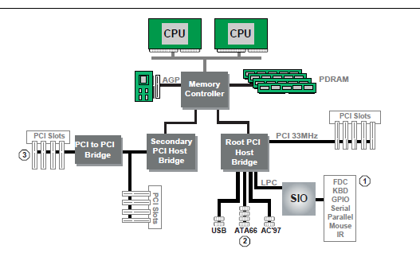
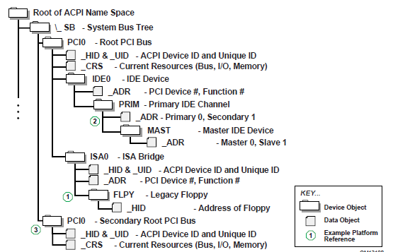
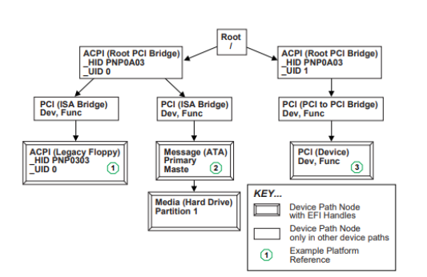

.. _device-path-examples-appendix:

Device Path Examples
=====================

This appendix presents an example EFI Device Path and explains its relationship to the ACPI name space. An example system design is presented along with its corresponding ACPI name space. These physical examples are mapped back to EFI Device Paths.

.. _c1_example-computer-system:

Example Computer System
-------------------------

The Figure below, :ref:`example-computer-system`, represents a hypothetical computer system architecture that will be used to discuss the construction of EFI Device Paths. The system consists of a memory controller that connects directly to the processors’ front side bus. The memory controller is only part of a larger chipset, and it connects to a root PCI host bridge chip, and a secondary root PCI host bridge chip. The secondary PCI host bridge chip produces a PCI bus that contains a PCI to PCI bridge. The root PCI host bridge produces a PCI bus, and also contains USB, ATA66, and AC ’97 controllers. The root PCI host bridge also contains an LPC bus that is used to connect a SIO (Super IO) device. The SIO contains a PC-AT-compatible floppy disk controller, and other PC-AT-compatible devices like a keyboard controller.

   **Example Computer System**

The remainder of this appendix describes how to construct a device path for three example devices from the system in :ref:`example-computer-system` . The following is a list of the examples used:

-  Legacy floppy
-  IDE Disk
-  Secondary root PCI bus with PCI to PCI bridge

The Figure below is a partial ACPI name space for the system in the Figure :ref:`example-computer-system` .  Figure :ref:`partial-acpi-name-space-for-example-system` is based on Figure 5-3 in the *Advanced Configuration and Power Interface Specification*.

   Partial ACPI Name Space for Example System

.. _legacy-floppy:

Legacy Floppy
-------------

The legacy floppy controller is contained in the SIO chip that is connected root PCI bus host bridge chip. The root PCI host bridge chip produces PCI bus 0, and other resources that appear directly to the processors in the system. 

In ACPI this configuration is represented in the \_SB, system bus tree, of the ACPI name space. PCI0 is a child of \_SB and it represents the root PCI host bridge. The SIO appears to the system to be a set of ISA devices, so it is represented as a child of PCI0 with the name ISA0. The floppy controller is represented by FLPY as a child of the ISA0 bus. 

The EFI Device Path for the legacy floppy is defined in the Table below, :ref:`legacy-floppy-device-path` . It would contain entries for the following things: 

-  Root PCI Bridge. ACPI Device Path _HID PNP0A03, _UID 0. ACPI name space \\_SB\\PCI0
-  PCI to ISA Bridge. PCI Device Path with device and function of the PCI to ISA bridge. ACPI name space \\_SB\\PCI0\\ISA0
-  Floppy Plug and Play ID. ACPI Device Path _HID PNP0303, _UID 0. ACPI name space \\_SB\\PCI0\\ISA0\\FLPY
-  End Device Path

.. list-table:: Legacy Floppy Device Path
   :name: legacy-floppy-device-path
   :widths: 5 5 5 45
   :class: longtable

   * - Byte Offset
     - Byte Length
     - Data
     - Description
   * - 0
     - 1
     - 0x02
     - Generic Device Path Header - Type ACPI Device Path
   * - 1
     - 1
     - 0x01
     - Sub type - ACPI Device Path
   * - 2
     - 2
     - 0x0C
     - Length
   * - 4
     - 4
     - 0x41D0, 0x0A03
     - \_HID PNP0A03 - 0x41D0 represents the compressed string ‘PNP’ and is encoded in the low order bytes. The compression method is described in the ACPI Specification.
   * - 8
     - 4
     - 0x0000
     - \_UID
   * - C
     - 1
     - 0x01
     - Generic Device Path Header - Type Hardware Device Path
   * - D
     - 1
     - 0x01
     - Sub type PCI Device Path
   * - E
     - 2
     - 0x06
     - Length
   * - 10
     - 1
     - 0x00
     - PCI Function
   * - 11
     - 1
     - 0x10
     - PCI Device
   * - 12
     - 1
     - 0x02
     - Generic Device Path Header - Type ACPI Device Path
   * - 13
     - 1
     - 0x01
     - Sub type - ACPI Device Path
   * - 14
     - 2
     - 0x0C
     - Length
   * - 16
     - 4
     - 0x41D0, 0x0303
     - \_HID PNP0303
   * - 1A
     - 4
     - 0x0000
     - \_UID
   * - 1E
     - 1
     - 0x7F
     - Generic Device Path Header - Type End of Hardware Device Path
   * - 1F
     - 1
     - 0xFF
     - Sub type - End Device Path
   * - 20
     - 2
     - 0x04
     - Length

.. _ide-disk:

IDE Disk
--------

The IDE Disk controller is a PCI device that is contained in a function of the root PCI host bridge. The root PCI host bridge is a multi function device and has a separate function for chipset registers, USB, and IDE. The disk connected to the IDE ATA bus is defined as being on the primary or secondary ATA bus, and of being the master or slave device on that bus. 

In ACPI this configuration is represented in the \_SB, system bus tree, of the ACPI name space. PCI0 is a child of \_SB and it represents the root PCI host bridge. The IDE controller appears to the system to be a PCI device with some legacy properties, so it is represented as a child of PCI0 with the name IDE0. PRIM is a child of IDE0 and it represents the primary ATA bus of the IDE controller. MAST is a child of PRIM and it represents that this device is the ATA master device on this primary ATA bus. 

The EFI Device Path for the PCI IDE controller is defined in the Table :ref:`ide-disk-device-path` . It would contain entries for the following things: 

-  Root PCI Bridge. ACPI Device Path _HID PNP0A03, _UID 0. ACPI name space \\_SB\\PCI0
-  PCI IDE controller. PCI Device Path with device and function of the IDE controller. ACPI name space \\_SB\\PCI0\\IDE0
-  ATA Address. ATA Messaging Device Path for Primary bus and Master device. ACPI name space \\_SB\\PCI0\\IDE0\\PRIM\\MAST
-  End Device Path

.. list-table:: IDE Disk Device Path
   :name: ide-disk-device-path
   :widths: 5 5 5 45

   * - Byte Offset
     - Byte Length
     - Data
     - Description
   * - 0
     - 1
     - 0x02
     - Generic Device Path Header - Type ACPI Device Path
   * - 1
     - 1
     - 0x01
     - Sub type - ACPI Device Path
   * - 2
     - 2
     - 0x0C
     - Length
   * - 4
     - 4
     - 0x41D0, 0x0A03
     - \_HID PNP0A03 - 0x41D0 represents the compressed string ‘PNP’ and is encoded in the low order bytes. The compression method is described in the ACPI Specification.
   * - 8
     - 4
     - 0x0000
     - \_UID
   * - C
     - 1
     - 0x01
     - Generic Device Path Header - Type Hardware Device Path
   * - D
     - 1
     - 0x01
     - Sub type PCI Device Path
   * - E
     - 2
     - 0x06
     - Length
   * - 10
     - 1
     - 0x01
     - PCI Function
   * - 11
     - 1
     - 0x10
     - PCI Device
   * - 12
     - 1
     - 0x03
     - Generic Device Path Header - Messaging Device Path
   * - 13
     - 1
     - 0x01
     - Sub type - ATAPI Device Path
   * - 14
     - 2
     - 0x06
     - Length
   * - 16
     - 1
     - 0x00
     - Primary =0, Secondary = 1
   * - 17
     - 1
     - 0x00
     - Master = 0, Slave = 1
   * - 18
     - 2
     - 0x0000
     - LUN
   * - 1A
     - 1
     - 0x7F
     - Generic Device Path Header - Type End of Hardware Device Path
   * - 1B
     - 1
     - 0xFF
     - Sub type - End Device Path
   * - 1C
     - 2
     - 0x04
     - Length

.. _secondary-root-pci-bus-with-pci-to-pci-bridge:

Secondary Root PCI Bus with PCI to PCI Bridge
---------------------------------------------

The secondary PCI host bridge materializes a second set of PCI buses into the system. The PCI buses on the secondary PCI host bridge are totally independent of the PCI buses on the root PCI host bridge. The only relationship between the two is they must be configured to not consume the same resources. The primary PCI bus of the secondary PCI host bridge also contains a PCI to PCI bridge. There is some arbitrary PCI device plugged in behind the PCI to PCI bridge in a PCI slot. 

In ACPI this configuration is represented in the \_SB, system bus tree, of the ACPI name space. PCI1 is a child of \_SB and it represents the secondary PCI host bridge. The PCI to PCI bridge and the device plugged into the slot on its primary bus are not described in the ACPI name space. These devices can be fully configured by following the applicable PCI specification. 

The EFI Device Path for the secondary root PCI bridge with a PCI to PCI bridge is defined in the Table :ref:`secondary-root-pci-bus-with-pci-to-pci-bridge-device-path` . It would contain entries for the following things: 

-  Root PCI Bridge. ACPI Device Path _HID PNP0A03, _UID 1. ACPI name space \\_SB\\PCI1
-  PCI to PCI Bridge. PCI Device Path with device and function of the PCI Bridge. ACPI name space \\_SB\\PCI1, PCI to PCI bridges are defined by PCI specification and not ACPI.
-  PCI Device. PCI Device Path with the device and function of the PCI device. ACPI name space \\_SB\\PCI1, PCI devices are defined by PCI specification and not ACPI.
-  End Device Path.

.. list-table:: Secondary Root PCI Bus with PCI to PCI Bridge Device Path
   :name: secondary-root-pci-bus-with-pci-to-pci-bridge-device-path
   :widths: 5 5 5 45

   * - Byte Offset
     - Byte Length
     - Data
     - Description
   * - 0
     - 1
     - 0x02
     - Generic Device Path Header - Type ACPI Device Path
   * - 1
     - 1
     - 0x01
     - Sub type - ACPI Device Path
   * - 2
     - 2
     - 0x0C
     - Length
   * - 4
     - 4
     - 0x41D0, 0x0A03
     - \_HID PNP0A03 - 0x41D0 represents the compressed string ‘PNP’ and is encoded in the low order bytes. The compression method is described in the ACPI Specification.
   * - 8
     - 4
     - 0x0001
     - \_UID
   * - C
     - 1
     - 0x01
     - Generic Device Path Header - Type Hardware Device Path
   * - D
     - 1
     - 0x01
     - Sub type PCI Device Path
   * - E
     - 2
     - 0x06
     - Length
   * - 10
     - 1
     - 0x00
     - PCI Function for PCI to PCI bridge
   * - 11
     - 1
     - 0x0c
     - PCI Device for PCI to PCI bridge
   * - 12
     - 1
     - 0x01
     - Generic Device Path Header - Type Hardware Device Path
   * - 13
     - 1
     - 0x01
     - Sub type PCI Device Path
   * - 14
     - 2
     - 0x08
     - Length
   * - 16
     - 1
     - 0x00
     - PCI Function for PCI Device
   * - 17
     - 1
     - 0x00
     - PCI Device for PCI Device
   * - 18
     - 1
     - 0x7F
     - Generic Device Path Header - Type End of Hardware Device Path
   * - 19
     - 1
     - 0xFF
     - Sub type - End Device Path
   * - 1A
     - 2
     - 0x04
     - Length

.. _acpi-terms:

ACPI Terms
----------

Names in the ACPI name space that start with an underscore ("_") are reserved by the ACPI specification and have architectural meaning. All ACPI names in the name space are four characters in length. The following four ACPI names are used in this specification. 

**_ADR**. The Address on a bus that has standard enumeration. An example would be PCI, where the enumeration method is described in the PCI Local Bus specification. 

**_CRS**. The current resource setting of a device. A _CRS is required for devices that are not enumerated in a standard fashion. _CRS is how ACPI converts nonstandard devices into Plug and Play devices. 

**_HID**. Represents a device’s Plug and Play hardware ID, stored as a 32-bit compressed EISA ID. _HID objects are optional in ACPI. However, a _HID object must be used to describe any device that will be enumerated by the ACPI driver in the OS. This is how ACPI deals with non-Plug and Play devices. 

**_UID**. Is a serial number style ID that does not change across reboots. If a system contains more than one device that reports the same _HID, each device must have a unique _UID. The _UID only needs to be unique for device that have the exact same _HID value.

.. _efi-device-path-as-a-name-space:

EFI Device Path as a Name Space
-------------------------------

The Figure below shows the EFI Device Path for the example system represented as a name space. The Device Path can be represented as a name space, but EFI does support manipulating the Device Path as a name space. You can only access Device Path information by locating the *DEVICE_PATH_INTERFACE* from a handle. Not all the nodes in a Device Path will have a handle.

   EFI Device Path Displayed As a Name Space
