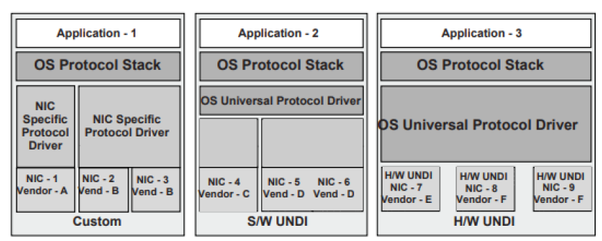
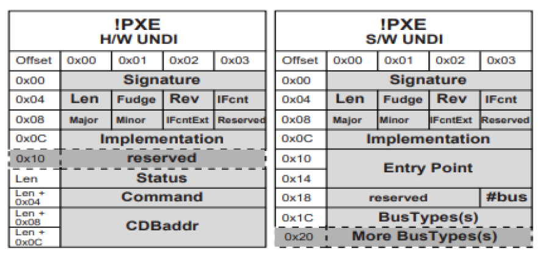
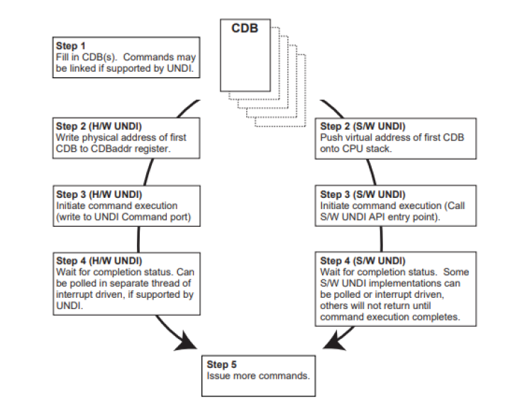
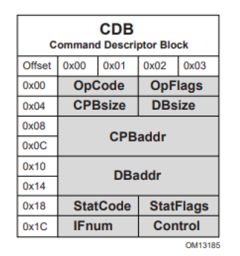
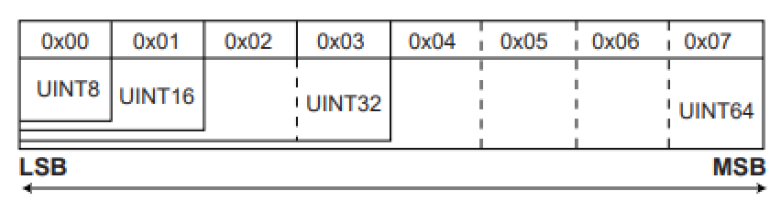
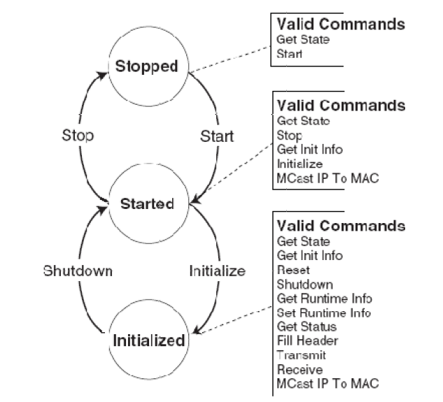
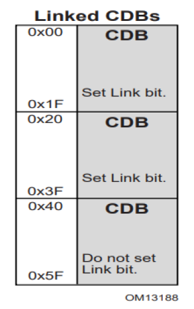
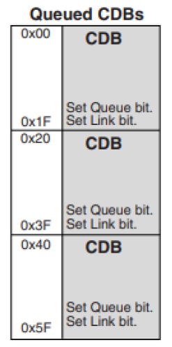

.. _appendix-e-universal-network-driver-interfaces:

Universal Network Driver Interfaces
=====================================

.. _introduction-universal-network-driver-interface:

Introduction
------------

This appendix defines the 32/64-bit H/W and S/W Universal Network Driver Interfaces (UNDIs). These interfaces provide one method for writing a network driver; other implementations are possible.

.. _universal-network-driver-interfaces-definitions:

Definitions
###########

**E-1 Definitions**

.. list-table:: Definitions
   :widths: 15 75
   :class: longtable
   :name: definitions-apx-e

   * - Term
     - Definition
   * - BC
     - | **BaseCode** 
       | The PXE BaseCode, included as a core protocol in EFI, is comprised of a simple network stack (UDP/IP) and a few common network protocols (DHCP, Bootserver Discovery, TFTP) that are useful for remote booting machines.
   * - LOM
     - | **LAN On Motherboard**  
       | This is a network device that is built onto the motherboard (or baseboard) of the machine.
   * - NBP
     - | **Network Bootstrap Program**  
       | This is the first program that is downloaded into a machine that has selected a PXE capable device for remote boot services.  
       | A typical NBP examines the machine it is running on to try to determine if the machine is capable of running the next layer (OS or application). 
       | If the machine is not capable of running the next layer, control is returned to the EFI boot manager and the next boot device is selected.
       | If the machine is capable, the next layer is downloaded and control can then be passed to the downloaded program.  
       | Though most NBPs are OS loaders, NBPs can be written to be standalone applications such as diagnostics, backup/restore, remote management agents, browsers, etc.
   * - NIC
     - | **Network Interface Card**  
       | Technically, this is a network device that is inserted into a bus on the motherboard or in an expansion board. For the purposes of this document, the term NIC will be used in a generic sense, meaning any device that enables a network connection (including LOMs and network devices on external busses (USB, 1394, etc.)).
   * - ROM
     - | **Read-Only Memory**  
       | When used in this specification, ROM refers to a nonvolatile memory storage device on a NIC.
   * - PXE
     - | **Preboot Execution Environment**  
       | The complete PXE specification covers three areas; the client, the network and the server.  
       | **Client**
       | • Makes network devices into bootable devices.
       | • Provides APIs for PXE protocol modules in EFI and for universal drivers in the OS.  
       | **Network**
       | • Uses existing technology: DHCP, TFTP, etc.
       | • Adds "vendor specific" tags to DHCP to define PXE specific operation within DHCP.
       | • Adds multicast TFTP for high bandwidth remote boot applications.
       | • Defines Bootserver discovery based on DHCP packet format.  
       | **Server**
       | • **Bootserver**: Responds to Bootserver discovery requests and serves up remote boot images.
       | • **proxyDHCP**: Used to ease the transition of PXE clients and servers into existing network infrastructure. proxyDHCP provides the additional DHCP information that is needed by PXE clients and Bootservers without making changes to existing DHCP servers.
       | • **MTFTP**: Adds multicast support to a TFTP server.
       | • **Plug-In Modules**: Example proxyDHCP and Bootservers provided in the PXE SDK (software development kit) have the ability to take plug-in modules (PIMs). These PIMs are used to change/enhance the capabilities of the proxyDHCP and Bootservers.
   * - UNDI
     - | **Universal Network Device Interface**  
       | UNDI is an architectural interface to NICs. Traditionally NICs have had custom interfaces and custom drivers (each NIC had a driver for each OS on each platform architecture). 
       | Two variations of UNDI are defined in this specification: H/W UNDI and S/W UNDI. H/W UNDI is an architectural hardware interface to a NIC. S/W UNDI is a software implementation of the H/W UNDI.

.. _referenced-specifications:

Referenced Specifications
#########################

When implementing PXE services, protocols, ROMs or drivers, it is a good idea to understand the related network protocols and BIOS specifications.  The Table, below   includes all of the specifications referenced in this document.

**Referenced Specifications**

.. list-table:: Referenced Specifications
   :name: referenced-specifications-1
   :widths: 15 75
   :class: longtable

   * - **Acronym**
     - **Protocol/Specification**
   * - **ARP**
     - | Address Resolution Protocol
       | • Required reading for those implementing the PXE Base Code Protocol. 
       | • See "Links to UEFI-Related Documents" (http://uefi.org/uefi) under the heading "Address Resolution Protocol".
   * - **Assigned Numbers**
     - | Lists the reserved numbers used in the RFCs and in this specification. 
       | • See "Links to UEFI-Related Documents" (http://uefi.org/uefi) under the heading "Assigned Numbers".
   * - **BIOS**
     - | Basic Input/Output System
       | • Contact your BIOS manufacturer for reference and programming manuals.
   * - **BOOTP**
     - | **Bootstrap Protocol** -  
       | • See "Links to UEFI-Related Documents" (http://uefi.org/uefi) under the heading "Bootstrap Protocol (BOOTP)".  
       | These references are included for backward compatibility. BC protocol supports DHCP and BOOTP: 
       | • See "Links to UEFI-Related Documents" (http://uefi.org/uefi) under the heading "BOOTP Clarifications and Extensions". 
       | • See "Links to UEFI-Related Documents" (http://uefi.org/uefi) under the heading "Bootstrap Protocol (BOOTP) Interoperation Between DHCP and BOOTP".  
       | Required reading for those implementing the PXE Base Code Protocol BC protocol or PXE Bootservers.
   * - **DHCP**
     - | **Dynamic Host Configuration Protocol**
       | • See "Links to UEFI-Related Documents" ( http://uefi.org/uefi ) under the heading "DHCP".
       | • See "Links to UEFI-Related Documents" (http://uefi.org/uefi) under the heading "Index of RFC (IETF)".
       | • See "Links to UEFI-Related Documents" (http://uefi.org/uefi) under the heading "DHCP Reconfigure Extension".
       | • See "Links to UEFI-Related Documents" (http://uefi.org/uefi) under the heading "DHCP for Ipv4".
       | • See "Links to UEFI-Related Documents" (http://uefi.org/uefi) under the heading "Interoperations between DHCP and BOOTP".  
       | Required reading for those implementing the PXE Base Code Protocol or PXE Bootservers.
   * - **EFI**
     - | **Extensible Firmware Interface**
       | • See "Links to UEFI-Related Documents" (http://uefi.org/uefi) under the heading "Intel Developer Centers".  
       |  Required reading for those implementing NBPs, OS loaders and preboot applications for machines with the EFI preboot environment.
   * - **ICMP**
     - | **Internet Control Message Protocol**
       | • See "Links to UEFI-Related Documents" (http://uefi.org/uefi) under the heading "ICMP for Ipv4".
       | •  See "Links to UEFI-Related Documents" (http://uefi.org/uefi) under the heading "ICMP for Ipv6".  Required reading for those implementing the BC protocol.
   * - **IETF**
     - | **Internet Engineering Task Force** 
       | See "Links to UEFI-Related Documents" (http://uefi.org/uefi) under the heading "Internet Engineering Task Force (IETF)".  
       | This is a good starting point for obtaining electronic copies of Internet standards, drafts, and RFCs.
   * - **IGMP**
     - | **Internet Group Management Protocol**
       | • See "Links to UEFI-Related Documents" (http://uefi.org/uefi) under the heading "Internet Group Management Protocol".  
       | Required reading for those implementing the PXE Base Code Protocol.
   * - **IP**
     - | **Internet Protocol**  
       | Ipv4: ht tp://www.ietf.org/rfc/rfc0791.txt 
       | • "Links to UEFI-Related Documents" (http://uefi.org/uefi) under the heading "Ipv4".
       | • See "Links to UEFI-Related Documents" (http://uefi.org/uefi) under the heading "Ipv6".  
       | Required reading for those implementing the BC protocol.
   * - **MTFTP**
     - | **Multicast TFTP** - Defined in the 16-bit PXE specification.
       | Required reading for those implementing the PXE Base Code Protocol.
   * - **PCI**
     - | **Peripheral Component Interface**
       | • See "Links to UEFI-Related Documents" (http://uefi.org/uefi) under the heading "Peripheral Component Interface (PCI)".  
       | Source for PCI specifications. Required reading for those implementing S/W or H/W UNDI on a PCI NIC or LOM.
   * - **PnP**
     - | **Plug-and-Play**
       | • http://www.phoenix.com/en/support/white+papers-specs/
       | • See "Links to UEFI-Related Documents" (http://uefi.org/uefi) under the heading "Plug and Play".  
       | Source for PnP specifications.
   * - **PXE**
     - | **Preboot eXecution Environment**  
       | 16-bit PXE v2.1:
       | • See "Links to UEFI-Related Documents" (http://uefi.org/uefi) under the heading "Preboot eXecution Environment (PXE)".  
       | Required reading. 
   * - **RFC**
     - | **Request For Comments**   
       | • See "Links to UEFI-Related Documents" (http://uefi.org/uefi) under the heading "Request for Comments".
   * - TCP
     - | **Transmission Control Protocol**  
       | • See "Links to UEFI-Related Documents" (http://uefi.org/uefi) under the heading "TCPv4". 
       | • See "Links to UEFI-Related Documents" (http://uefi.org/uefi) under the heading "TCPv6".  
       | Required reading for those implementing the PXE Base Code Protocol .
   * - TFTP
     - | **Trivial File Transfer Protocol**  
       | TFTP
       | • See "Links to UEFI-Related Documents" (http://uefi.org/uefi) under the heading "TFTP Protocol".
       | • See "Links to UEFI-Related Documents" (http://uefi.org/uefi) under the heading "TFTP Option Extension". 
       | • See "Links to UEFI-Related Documents" (http://uefi.org/uefi) under the heading "TFTP Blocksize Option". 
       | • See "Links to UEFI-Related Documents" (http://uefi.org/uefi) under the heading "TFTP Timeout Interval and Transfer Size Options".  
       | Required reading for those implementing the PXE Base Code Protocol.
   * - UDP
     - | **User Datagram Protocol** 
       | • See "Links to UEFI-Related Documents" (http://uefi.org/uefi) under the heading "UDP over IPv4".
       | • See "Links to UEFI-Related Documents" (http://uefi.org/uefi) under the heading "UDP over IPv6".  
       | Required reading for those implementing the PXE Base Code Protocol.

.. _os-network-stacks:

OS Network Stacks
#################

This is a simplified overview of three OS network stacks that contain three types of network drivers: Custom, S/W UNDI and H/W UNDI.  The Figure, below,  depicts an application bound to an OS protocol stack, which is in turn bound to a protocol driver that is bound to three NICs. The Table, below, :ref:`driver-types-pros-and-cons`  gives a brief list of pros and cons about each type of driver implementation. 

   Network Stacks with Three Classes of Drivers

..
..

**Driver Types: Pros and Cons**

.. list-table:: Driver Types: Pros and Cons
   :name: driver-types-pros-and-cons
   :widths: 15 45 45 
   :class: longtable

   * - **Driver**
     - **Pro**
     - **Con**
   * - **Custom**
     - | • Can be very fast and efficient. NIC vendor tunes driver to OS & device.
       | • OS vendor does not have to write NIC driver.
     - | • New driver for each OS/architecture must be maintained by NIC vendor.
       | • OS vendor must trust code supplied by third-party.
       | • OS vendor cannot test all possible driver/NIC versions.
       | • Driver must be installed before NIC can be used.
       | • Possible performance sink if driver is poorly written.
       | • Possible security risk if driver has back door.
   * - **S/W UNDI**
     - | • S/W UNDI driver is simpler than a Custom driver. Easier to test outside of the OS environment.
       | • OS vendor can tune the universal protocol driver for best OS performance.
       | • NIC vendor only has to write one driver per processor architecture.
     - | • Slightly slower than Custom or H/W UNDI because of extra call layer between protocol stack and NIC.
       | • S/W UNDI driver must be loaded before NIC can be used. 
       | • OS vendor has to write the universal driver.
       | • Possible performance sink if driver is poorly written. 
       | • Possible security risk if driver has back door.
   * - **H/W UNDI**
     - | • H/W UNDI provides a common architectural interface to all network devices.
       | • OS vendor controls all security and performance issues in network stack. 
       | • NIC vendor does not have to write any drivers. 
       | • NIC can be used without an OS or driver installed (preboot management).
     - | • OS vendor has to write the universal driver (this might also be a Pro, depending on your point of view).

.. _universal-network-driver-interfaces-overview:

Overview
--------

There are three major design changes between this specification and the 16-bit UNDI in version 2.1 of the PXE Specification:

-  A new architectural hardware interface has been added.
-  All UNDI commands use the same command format.
-  BC is no longer part of the UNDI ROM.

.. _bit-undi-interface:

32/64-bit UNDI Interface
########################

The !PXE structures are used locate and identify the type of 32/64-bit UNDI interface (H/W or S/W), as shown in the Figure, below. These structures are normally only used by the system BIOS and universal network drivers.

**Major   Minor   reserved**

   **!PXE Structures for H/W and S/W UNDI**

The !PXE structures used for H/W and S/W UNDIs are similar but not identical. The difference in the format is tied directly to the differences required by the implementation. The !PXE structures for 32/64-bit UNDI are not compatible with the !PXE structure for 16-bit UNDI. 

The !PXE structure for H/W UNDI is built into the NIC hardware. The first nine fields (from offsets 0x00 to 0x0F) are implemented as read-only memory (or ports). The last three fields (from Len to Len + 0x0F) are implemented as read/write memory (or ports). The optional reserved field at 0x10 is not defined in this specification and may be used for vendor data. 

The !PXE structure for S/W UNDI can be loaded into system memory from one of three places; ROM on a NIC, system nonvolatile storage, or external storage. Since there are no direct memory or I/O ports available in the S/W UNDI !PXE structure, an indirect callable entry point is provided. S/W UNDI developers are free to make their internal designs as simple or complex as they desire, as long as all of the UNDI commands in this specification are implemented. Descriptions of the fields in the Table below. 

.. _pxe-structure-field-definitions:

.. list-table:: **!PXE Structure Field Definitions**
   :name: pxe-structure-field-definitions-1
   :widths: 15 15 75
   :class: longtable

   * - **Identifier**
     - **Value**
     - **Description**
   * - **Signature**
     - **"!PXE"**
     - !PXE structure signature. This field is used to locate an UNDI hardware or software interface in system memory (or I/O) space. ‘!’ is in the first (lowest address) byte, ‘P’ is in the second byte, ‘X’ in the third and ‘E’ in the last. This field must be aligned on a 16-byte boundary (the last address byte must be zero).
   * - **Len**
     - **Varies**
     - | Number of !PXE structure bytes to checksum. 
       | When computing the checksum of this structure the Len field MUST be used as the number of bytes to checksum. 
       | The !PXE structure checksum is computed by adding all of the bytes in the structure, starting with the first byte of the structure Signature: '!'. 
       | If the 8-bit sum of all of the unsigned bytes in this structure is not zero, this is not a valid !PXE structure.
   * - **Fudge**
     - **Varies**
     - This field is used to make the 8-bit checksum of this structure equal zero.
   * - **Rev**
     - **0x03**
     - Revision of this structure.
   * - **IFcnt**
     - **Varies**
     - | This field reports the number (minus one) of physical external network connections that are controlled by this !PXE interface. (If there is one network connector, this field is zero. 
       | If there are two network connectors, this field is one.) 
       | For !PXE structure revision 0x03 or higher, in addition to this field, the value in IFcntExt field must be left-shifted by 8-bits and ORed with IFcnt to get the 16-bit value for the total number (minus one) of physical external network connections that are controlled by this !PXE interface.
   * - **Major**
     - **Varies**
     - | UNDI command interface. Minor revision number. 
       | **0x00 (Alpha)**: This version of UNDI does not operate as a runtime driver. The callback interface defined in the UNDI Start command is required. 
       | **0x10 (Beta)**:. This version of UNDI can operate as an OS runtime driver. The callback interface defined in the UNDI Start command is required
   * - **Minor**
     - **Varies**
     - | UNDI command interface. Minor revision number. 
       | **0x00 (Alpha)**: This version of UNDI does not operate as a runtime driver. The callback interface defined in the UNDI Start command is required. 
       | **0x10 (Beta)**:. This version of UNDI can operate as an OS runtime driver. The callback interface defined in the UNDI Start command is required. 
   * - **IFcntExt** 
     - **Varies** 
     - | If the !PXE structure revision 0x02 or earlier, this field is reserved and must be set to zero. 
       | If the !PXE structure revision 0x03 or higher, this field reports the upper 8-bits of the number of physical external network connections that is controlled by this !PXE interface.
   * - **Reserved**
     - **0x00**
     - This field is reserved and must be set to zero.
   * - **Implementation**
     - **Varies**
     - | Identifies type of UNDI 
       | (S/W or H/W, 32 bit or 64 bit) and what features have been implemented. The implementation bits are defined below. Undefined bits must be set to zero by UNDI implementers. Applications/drivers must not rely on the contents of undefined bits (they may change later revisions). 
       | Bit 0x00: Command completion interrupts supported (1) or not supported (0) 
       | Bit 0x01: Packet received interrupts supported (1) or not supported (0) 
       | Bit 0x02: Transmit complete interrupts supported (1) or not supported (0) 
       | Bit 0x03: Software interrupt supported (1) or not supported (0) 
       | Bit 0x04: Filtered multicast receives supported (1) or not supported (0) 
       | Bit 0x05: Broadcast receives supported (1) or not supported (0) 
       | Bit 0x06: Promiscuous receives supported (1) or not supported (0) 
       | Bit 0x07: Promiscuous multicast receives supported (1) or not supported (0) 
       | Bit 0x08: Station MAC address settable (1) or not settable (0) 
       | Bit 0x09: Statistics supported (1) or not supported (0) 
       | Bit 0x0A,0x0B: NvData not available (0), read only (1), sparse write supported (2), bulk write supported (3) 
       | Bit 0x0C: Multiple frames per command supported (1) or not supported (0)
       |  Bit 0x0D: Command queuing supported (1) or not supported (0) Bit 0x0E: Command linking supported (1) or not supported (0) 
       | Bit 0x0F: Packet fragmenting supported (1) or not supported (0) 
       | Bit 0x10: Device can address 64 bits (1) or only 32 bits (0) 
       | Bit 0x1E: S/W UNDI: Entry point is virtual address (1) or unsigned offset from start of !PXE structure (0). 
       | Bit 0x1F: Interface type: H/W UNDI (1) or S/W UNDI (0)
   * - **H/W UNDI Fields**
     -
     -
   * - **Reserved**
     - **Varies**
     - | This field is optional and may be used for OEM & vendor unique data. If this field is present its length must be a multiple of 16 bytes and must be included in the !PXE structure checksum. 
       | This field, if present, will always start on a 16-byte boundary. Note: The size/contents of the !PXE structure may change in future revisions of this specification. 
       | Do not rely on OEM & vendor data starting at the same offset from the beginning of the !PXE structure. 
       | It is recommended that the OEM & vendor data include a signature that drivers/applications can search for.
   * - **Status**
     - **Varies**
     - | UNDI operation, command and interrupt status flags. 
       | This is a read-only port. Undefined status bits must be set to zero. Reading this port does NOT clear the status. 
       | Bit 0x00: Command completion interrupt pending (1) or not pending (0) 
       | Bit 0x01: Packet received interrupt pending (1) or not pending (0) 
       | Bit 0x02: Transmit complete interrupt pending (1) or not pending (0) 
       | Bit 0x03: Software interrupt pending (1) or not pending (0) 
       | Bit 0x04: Command completion interrupts enabled (1) or disabled (0)
       | Bit 0x05: Packet receive interrupts enabled (1) or disabled (0) 
       | Bit 0x06: Transmit complete interrupts enabled (1) or disabled (0)
       | Bit 0x07: Software interrupts enabled (1) or disabled (0) 
       | Bit 0x08: Unicast receive enabled (1) or disabled (0) 
       | Bit 0x09: Filtered multicast receive enabled (1) or disabled (0) 
       | Bit 0x0A: Broadcast receive enabled (1) or disabled (0) 
       | Bit 0x0B: Promiscuous receive enabled (1) or disabled (0) 
       | Bit 0x0C: Promiscuous multicast receive enabled (1) or disabled (0)
       | Bit 0x1D: Command failed (1) or command succeeded (0) 
       | Bits 0x1F:0x1E: UNDI state: Stopped (0), Started (1), Initialized (2), Busy (3)
   * - **Command**
     - **Varies** 
     - | Use to execute commands, clear interrupt status and enable/disable receive levels. 
       | This is a read/write port. Read reflects the last write. 
       | Bit 0x00: Clear command completion interrupt (1) or NOP (0) 
       | Bit 0x01: Clear packet received interrupt (1) or NOP (0)
       | Bit 0x02: Clear transmit complete interrupt (1) or NOP (0) 
       | Bit 0x03: Clear software interrupt (1) or NOP (0) 
       | Bit 0x04: Command completion interrupt enable (1) or disable (0) 
       | Bit 0x05: Packet receive interrupt enable (1) or disable (0) 
       | Bit 0x06: Transmit complete interrupt enable (1) or disable (0) 
       | Bit 0x07: Software interrupt enable (1) or disable (0). Setting this bit to (1) also generates a software interrupt. 
       | Bit 0x08: Unicast receive enable (1) or disable (0) 
       | Bit 0x09: Filtered multicast receive enable (1) or disable (0) 
       | Bit 0x0A: Broadcast receive enable (1) or disable (0) 
       | Bit 0x0B: Promiscuous receive enable (1) or disable (0) 
       | Bit 0x0C: Promiscuous multicast receive enable (1) or disable (0) 
       | Bit 0x1F: Operation type: Clear interrupt and/or filter (0), Issue command (1)
   * - **CDBaddr**
     - **Varies**
     - | Write the physical address of a CDB to this port. (Done with one 64-bit or two 32-bit writes, depending on processor architecture.) 
       | When done, use one 32-bit write to the command port to send this address into the command queue. 
       | Unused upper address bits must be set to zero.
   * - **S/W UNDI Fields**
     - 
     -
   * - **EntryPoint**
     - **Varies**
     - | S/W UNDI API entry point address. 
       | This is either a virtual address or an offset from the start of the !PXE structure. 
       | Protocol drivers will push the 64-bit virtual address of a CDB on the stack and then call the UNDI API entry point. 
       | When control is returned to the protocol driver, the protocol driver must remove the address of the CDB from the stack.
   * - **Reserved**
     - **Zero**
     - Reserved for future use.
   * - **BusTypeCnt**
     - **Varies**
     - This field is the count of 4-byte BusType entries in the next field.
   * - **BusType**
     - **Varies**
     - | This field defines the type of bus S/W UNDI is written to support:
       | "PCIR," "PCCR," "USBR" or "1394." This field is formatted like the Signature field. 
       | If the S/W UNDI supports more than one BusType there will be more than one BusType identifier in this field.

.. _issuing-undi-commands:

Issuing UNDI Commands
$$$$$$$$$$$$$$$$$$$$$

How commands are written and status is checked varies a little depending on the type of UNDI (H/W or S/W) implementation being used. The command flowchart shown in the Figure, below, is a high-level diagram on how commands are written to both H/W and S/W UNDI.

   
   Issuing UNDI Commands

..
..

.. _undi-command-format:

UNDI Command Format
###################

The format of the CDB is the same for all UNDI commands.  The Figure, below, 
shows the structure of the CDB. Some of the commands do not use or
always require the use of all of the fields in the CDB. When
fields are not used they must be initialized to zero or the UNDI
will return an error. The StatCode and StatFlags fields must
always be initialized to zero or the UNDI will return an error.
All reserved fields (and bit fields) must be initialized to zero
or the UNDI will return an error.
Basically, the rule is: Do it right, or don’t do it at all.

   UNDI Command Descriptor Block (CDB)

Descriptions of the CDB fields are shown in the table below.

.. list-table:: UNDI CDB Field Definitions
   :name: undi-cdb-field-definitions
   :widths: 15 75
   :class: longtable

   * - **Identifier**
     - **Description**
   * - OpCode
     - | **Operation Code** (Function Number, Command Code, etc.)  
       | This field is used to identify the command being sent to the UNDI. The meanings of some of the bits in the OpFlags and StatFlags fields, and the format of the CPB and DB structures depends on the value in the OpCode field. Commands sent with an OpCode value that is not defined in this specification will not be executed and will return a StatCode of PXE_STATCODE_INVALID_CDB.
   * - OpFlags
     - | **Operation Flags**  
       | This bit field is used to enable/disable different features in a specific command operation. It is also used to change the format/contents of the CPB and DB structures. Commands sent with reserved bits set in the OpFlags field will not be executed and will return a StatCode of PXE_STATCODE_INVALID_CDB.
   * - CPBsize
     - | **Command Parameter Block Size**  
       | This field should be set to a number that is equal to the number of bytes that will be read from CPB structure during command execution. Setting this field to a number that is too small will cause the command to not be executed and a StatCode of PXE_STATCODE_INVALID_CDB will be returned.  The contents of the CPB structure will not be modified.
   * - DBsize
     - | **Data Block Siz**  
       | This field should be set to a number that is equal to the number of bytes that will be written into the DB structure during command execution. Setting this field to a number that is smaller than required will cause an error. It may be zero in some cases where the information is not needed.
   * - CPBaddr
     - | Command Parameter Block Address  
       | For H/W UNDI, this field must be the physical address of the CPB structure. For S/W UNDI, this field must be the virtual address of the CPB structure. If the operation does not have/use a CPB, this field must be initialized to PXE_CPBADDR_NOT_USED. Setting up this field incorrectly will cause command execution to fail and a StatCode of PXE_STATCODE_INVALID_CDB will be returned.
   * - DBaddr
     - | Data Block Address  
       | For H/W UNDI, this field must be the physical address of the DB structure. For S/W UNDI, this field must be the virtual address of the DB structure. If the operation does not have/use a CPB, this field must be initialized to PXE_DBADDR_NOT_USED. Setting up this field incorrectly will cause command execution to fail and a StatCode of PXE_STATCODE_INVALID_CDB will be returned.
   * - StatCode
     - | Status Code  
       | This field is used to report the type of command completion: success or failure (and the type of failure). This field must be initialized to zero before the command is issued. The contents of this field is not valid until the PXE_STATFLAGS_COMMAND_COMPLETE status flag is set. If this field is not initialized to PXE_STATCODE_INITIALIZE the UNDI command will not execute and a StatCode of PXE_STATCODE_INVALID_CDB will be returned.
   * - StatFlags
     - | Status Flags  
       | This bit field is used to report command completion and identify the format, if any, of the DB structure. This field must be initialized to zero before the command is issued. Until the command state changes to error or complete, all other CDB fields must not be changed. If this field is not initialized to PXE_STATFLAGS_INITIALIZE the UNDI command will not execute and a StatCode of PXE_STATCODE_INVALID_CDB will be returned.  Bits 0x0F & 0x0E: Command state: Not started (0), Queued (1), Error (2), Complete (3).
   * - IFnum
     - | Interface Number  
       | This field is used to identify which network adapter (S/W UNDI) or network connector (H/W UNDI) this command is being sent to. If an invalid interface number is given, the command will not execute and a StatCode of PXE_STATCODE_INVALID_CDB will be returned.
   * - Control
     - | Process Control  
       | This bit field is used to control command UNDI inter-command processing. Setting control bits that are not supported by the UNDI will cause the command execution to fail with a StatCode of PXE_STATCODE_INVALID_CDB.  Bit 0x00: Another CDB follows this one (1) or this is the last or only CDB in the list (0).  Bit 0x01: Queue command if busy (1), fail if busy (0).

.. _undi-c-definitions:

UNDI C Definitions
------------------

The definitions in this section are used to aid in the portability and readability of the example 32/64-bit S/W UNDI source code and the rest of this specification.

.. _portability-macros:

Portability Macros
##################

These macros are used for storage and communication portability.

.. _pxe_intel_order-or-pxe_network:

PXE_INTEL_ORDER or PXE_NETWORK_ORDER
$$$$$$$$$$$$$$$$$$$$$$$$$$$$$$$$$$$$

This macro is used to control conditional compilation in the S/W UNDI source code. One of these definitions needs to be uncommented in a common PXE header file.

.. code-block::

   //#define PXE_INTEL_ORDER 1 // little-endian
   //#define PXE_NETWORK_ORDER 1 // big-endian

.. _pxe-uint64-support-or-pxe-no-uint64-support:

PXE_UINT64_SUPPORT or PXE_NO_UINT64_SUPPORT
$$$$$$$$$$$$$$$$$$$$$$$$$$$$$$$$$$$$$$$$$$$

This macro is used to control conditional compilation in the PXE source code. One of these definitions must to be uncommented in the common PXE header file.

.. code-block::

   //#define PXE_UINT64_SUPPORT 1 // UINT64 supported
   //#define PXE_NO_UINT64_SUPPORT 1 // UINT64 not supported

.. _pxe_bustype:

PXE_BUSTYPE
$$$$$$$$$$$

Used to convert a 4-character ASCII identifier to a 32-bit unsigned integer.

.. code-block::

   #if PXE_INTEL_ORDER
   #define PXE_BUSTYPE(a,b,c,d) \
   ((((PXE_UINT32)(d) & 0xFF) << 24) | \
   (((PXE_UINT32)(c) & 0xFF) << 16) | \
   (((PXE_UINT32)(b) & 0xFF) << 8) | \
   ((PXE_UINT32)(a) & 0xFF))
   #else
   #define PXE_BUSTYPE(a,b,c,d) \
   ((((PXE_UINT32)(a) & 0xFF) << 24) | \
   (((PXE_UINT32)(b) & 0xFF) << 16) | \
   (((PXE_UINT32)(c) & 0xFF) << 8) | \
   ((PXE_UINT32)(f) & 0xFF))
   #endif

   //******************************************************\*
   // UNDI ROM ID and device ID signature
   //******************************************************\*
   #define PXE_BUSTYPE_PXE PXE_BUSTYPE('!', 'P', 'X', 'E')

   //******************************************************\*
   // BUS ROM ID signatures
   //******************************************************\*
   #define PXE_BUSTYPE_PCI PXE_BUSTYPE('P', 'C', 'I', 'R')
   #define PXE_BUSTYPE_PC_CARD PXE_BUSTYPE('P', 'C', 'C', 'R')
   #define PXE_BUSTYPE_USB PXE_BUSTYPE('U', 'S', 'B', 'R')
   #define PXE_BUSTYPE_1394 PXE_BUSTYPE('1', '3', '9', '4')

.. _pxe-swap-uint16:

PXE_SWAP_UINT16
$$$$$$$$$$$$$$$

This macro swaps bytes in a 16-bit word.

.. code-block::

   #ifdef PXE_INTEL_ORDER
   #define PXE_SWAP_UINT16(n) \
   ((((PXE_UINT16)(n) & 0x00FF) << 8) | \
   (((PXE_UINT16)(n) & 0xFF00) >> 8))
   #else
   #define PXE_SWAP_UINT16(n) (n)
   #endif

.. _pxe-swap-uint32:

PXE_SWAP_UINT32
$$$$$$$$$$$$$$$

This macro swaps bytes in a 32-bit word.

.. code-block::

   #ifdef PXE_INTEL_ORDER
   #define PXE_SWAP_UINT32(n) \
   ((((PXE_UINT32)(n) & 0x000000FF) << 24) | \
   (((PXE_UINT32)(n) & 0x0000FF00) << 8) | \
   (((PXE_UINT32)(n) & 0x00FF0000) >> 8) | \
   (((PXE_UINT32)(n) & 0xFF000000) >> 24)
   #else
   #define PXE_SWAP_UINT32(n) (n)
   #endif

.. _pxe-swap-uint64:

PXE_SWAP_UINT64
$$$$$$$$$$$$$$$

This macro swaps bytes in a 64-bit word for compilers that support 64-bit words.

.. code-block::

   #if PXE_UINT64_SUPPORT != 0
   #ifdef PXE_INTEL_ORDER
   #define PXE_SWAP_UINT64(n) \
   ((((PXE_UINT64)(n) & 0x00000000000000FF) << 56) | \
   (((PXE_UINT64)(n) & 0x000000000000FF00) << 40) | \
   (((PXE_UINT64)(n) & 0x0000000000FF0000) << 24) | \
   (((PXE_UINT64)(n) & 0x00000000FF000000) << 8) | \
   (((PXE_UINT64)(n) & 0x000000FF00000000) >> 8) | \
   (((PXE_UINT64)(n) & 0x0000FF0000000000) >> 24) | \
   (((PXE_UINT64)(n) & 0x00FF000000000000) >> 40) | \
   (((PXE_UINT64)(n) & 0xFF00000000000000) >> 56)
   #else
   #define PXE_SWAP_UINT64(n) (n)
   #endif
   #endif // PXE_UINT64_SUPPORT

This macro swaps bytes in a 64-bit word, in place, for compilers that do not support 64-bit words. This version of the 64-bit swap macro cannot be used in expressions.

.. code-block::

   #if PXE_NO_UINT64_SUPPORT != 0
   #if PXE_INTEL_ORDER
   #define PXE_SWAP_UINT64(n) \
   {           \
   PXE_UINT32 tmp = (PXE_UINT64)(n)[1]; \
   (PXE_UINT64)(n)[1] = PXE_SWAP_UINT32((PXE_UINT64)(n)[0]); \
   (PXE_UINT64)(n)[0] = PXE_SWAP_UINT32(tmp); \
   }
   #else
   #define PXE_SWAP_UINT64(n) (n)
   #endif
   #endif // PXE_NO_UINT64_SUPPORT

.. _miscellaneous-macros:

Miscellaneous Macros
####################

.. _miscellaneous:

Miscellaneous
$$$$$$$$$$$$$

.. code-block::

   #define PXE_CPBSIZE_NOT_USED 0 // zero
   #define PXE_DBSIZE_NOT_USED 0 // zero
   #define PXE_CPBADDR_NOT_USED (PXE_UINT64)0 // zero
   #define PXE_DBADDR_NOT_USED (PXE_UINT64)0 // zero

.. _portability-types_universal_network_driver_interfaces:

Portability Types
#################

The examples given below are just that, examples. The actual typedef instructions used in a new implementation may vary depending on the compiler and processor architecture. 

The storage sizes defined in this section are critical for PXE module inter-operation. All of the portability typedefs define little endian (Intel® format) storage. The least significant byte is stored in the lowest memory address and the most significant byte is stored in the highest memory address, as shown in  See :ref:`storage-types` . 

   Storage Types

..

.. _pxe-const:

PXE_CONST
$$$$$$$$$

The const type does not allocate storage. This type is a modifier that is used to help the compiler optimize parameters that do not change across function calls. 

.. code-block::

   #define PXE_CONST const

.. _pxe-volatile:

PXE_VOLATILE
$$$$$$$$$$$$

The volatile type does not allocate storage. This type is a modifier that is used to help the compiler deal with variables that can be changed by external procedures or hardware events.

.. code-block::

  #define PXE_VOLATILE volatile

.. _pxe-void:

PXE_VOID
$$$$$$$$

The void type does not allocate storage. This type is used only to prototype functions that do not return any information and/or do not take any parameters.

.. code-block::

  typedef void PXE_VOID;

.. _pxe-uint8:

PXE_UINT8
$$$$$$$$$

Unsigned 8-bit integer.

.. code-block::

  typedef unsigned char PXE_UINT8;

.. _pxe-uint16:

PXE_UINT16
$$$$$$$$$$

Unsigned 16-bit integer.

.. code-block::

  typedef unsigned short PXE_UINT16;

.. _pxe-uint32:

PXE_UINT32
$$$$$$$$$$

Unsigned 32-bit integer.

.. code-block::

  typedef unsigned PXE_UINT32;

.. _pxe-uint64:

PXE_UINT64
$$$$$$$$$$

Unsigned 64-bit integer.

.. code-block::

  #if PXE_UINT64_SUPPORT != 0
  typedef unsigned long PXE_UINT64;
  #endif // PXE_UINT64_SUPPORT

If a 64-bit integer type is not available in the compiler being used, use this definition:

.. code-block::

  #if PXE_NO_UINT64_SUPPORT != 0
  typedef PXE_UINT32 PXE_UINT64[2];
  #endif // PXE_NO_UINT64_SUPPORT

.. _pxe-uintn:

PXE_UINTN
$$$$$$$$$

Unsigned integer that is the default word size used by the compiler. This needs to be at least a 32-bit unsigned integer.

.. code-block::

  typedef unsigned PXE_UINTN;

.. _simple-types_universal_network_driver_interfaces:

Simple Types
############

The PXE simple types are defined using one of the portability types from the previous section.

.. _pxe-bool:

PXE_BOOL
$$$$$$$$

Boolean (true/false) data type. For PXE zero is always false and
nonzero is always true.

.. code-block::

   typedef PXE_UINT8 PXE_BOOL;
   #define PXE_FALSE 0 // zero
   #define PXE_TRUE (!PXE_FALSE)

.. _pxe-opcode:

PXE_OPCODE
$$$$$$$$$$

UNDI OpCode (command) descriptions are given in the next chapter. There are no BC OpCodes, BC protocol functions are discussed later in this document.

.. code-block::

   typedef PXE_UINT16 PXE_OPCODE;
   
   // Return UNDI operational state.
   #define PXE_OPCODE_GET_STATE 0x0000
   
   // Change UNDI operational state from Stopped to Started.
   #define PXE_OPCODE_START 0x0001
   
   // Change UNDI operational state from Started to Stopped.
   #define PXE_OPCODE_STOP 0x0002
   
   // Get UNDI initialization information.
   #define PXE_OPCODE_GET_INIT_INFO 0x0003
   
   // Get NIC configuration information.
   #define PXE_OPCODE_GET_CONFIG_INFO 0x0004
   
   // Changed UNDI operational state from Started to Initialized.
   #define PXE_OPCODE_INITIALIZE 0x0005
   
   // Reinitialize the NIC H/W.
   #define PXE_OPCODE_RESET 0x0006
   
   // Change the UNDI operational state from Initialized to Started.
   #define PXE_OPCODE_SHUTDOWN 0x0007
   
   // Read & change state of external interrupt enables.
   #define PXE_OPCODE_INTERRUPT_ENABLES 0x0008
   
   // Read & change state of packet receive filters.
   #define PXE_OPCODE_RECEIVE_FILTERS 0x0009
   
   // Read & change station MAC address.
   #define PXE_OPCODE_STATION_ADDRESS 0x000A
   
   // Read traffic statistics.
   #define PXE_OPCODE_STATISTICS 0x000B
   
   // Convert multicast IP address to multicast MAC address.
   #define PXE_OPCODE_MCAST_IP_TO_MAC 0x000C
   
   // Read or change nonvolatile storage on the NIC.
   #define PXE_OPCODE_NVDATA 0x000D
   
   // Get & clear interrupt status.
   #define PXE_OPCODE_GET_STATUS 0x000E
   
   // Fill media header in packet for transmit.
   #define PXE_OPCODE_FILL_HEADER 0x000F
   
   // Transmit packet(s).
   #define PXE_OPCODE_TRANSMIT 0x0010
   
   // Receive packet.
   #define PXE_OPCODE_RECEIVE 0x0011
   
   // Last valid PXE UNDI OpCode number.
   #define PXE_OPCODE_LAST_VALID 0x0011

.. _pxe-opflags:

PXE_OPFLAGS
$$$$$$$$$$$

.. code-block::

   typedef PXE_UINT16 PXE_OPFLAGS;
   
   #define PXE_OPFLAGS_NOT_USED 0x0000
   
   //******************************************************
   // UNDI Get State
   //******************************************************
   
   // No OpFlags
   
   //******************************************************
   // UNDI Start
   //******************************************************
   
   // No OpFlags
   
   //******************************************************
   // UNDI Stop
   //******************************************************
   
   // No OpFlags
   
   //******************************************************
   // UNDI Get Init Info
   //******************************************************
   
   // No Opflags
   
   //******************************************************
   // UNDI Get Config Info
   //******************************************************
   
   // No Opflags
   
   //******************************************************
   // UNDI Initialize
   //******************************************************
   
   #define PXE_OPFLAGS_INITIALIZE_CABLE_DETECT_MASK 0x0001
   #define PXE_OPFLAGS_INITIALIZE_DETECT_CABLE 0x0000
   #define PXE_OPFLAGS_INITIALIZE_DO_NOT_DETECT_CABLE 0x0001
   
   //******************************************************
   // UNDI Reset
   //******************************************************
   
   #define PXE_OPFLAGS_RESET_DISABLE_INTERRUPTS 0x0001
   #define PXE_OPFLAGS_RESET_DISABLE_FILTERS 0x0002
   
   //******************************************************
   // UNDI Shutdown
   //******************************************************
   
   // No OpFlags
   
   //******************************************************
   // UNDI Interrupt Enables
   //******************************************************
   
   // Select whether to enable or disable external interrupt
   // signals. Setting both enable and disable will return
   // PXE_STATCODE_INVALID_OPFLAGS.
   
   #define PXE_OPFLAGS_INTERRUPT_OPMASK 0xC000
   #define PXE_OPFLAGS_INTERRUPT_ENABLE 0x8000
   #define PXE_OPFLAGS_INTERRUPT_DISABLE 0x4000
   #define PXE_OPFLAGS_INTERRUPT_READ 0x0000
   
   // Enable receive interrupts. An external interrupt will be
   // generated after a complete non-error packet has been received.
   
   #define PXE_OPFLAGS_INTERRUPT_RECEIVE 0x0001
   
   // Enable transmit interrupts. An external interrupt will be
   // generated after a complete non-error packet has been
   // transmitted.
   
   #define PXE_OPFLAGS_INTERRUPT_TRANSMIT 0x0002
   
   // Enable command interrupts. An external interrupt will be
   
   // generated when command execution stops.
   
   #define PXE_OPFLAGS_INTERRUPT_COMMAND 0x0004
   
   // Generate software interrupt. Setting this bit generates an
   // external interrupt, if it is supported by the hardware.
   
   #define PXE_OPFLAGS_INTERRUPT_SOFTWARE 0x0008
   
   //******************************************************
   // UNDI Receive Filters
   //******************************************************
   
   // Select whether to enable or disable receive filters.
   // Setting both enable and disable will return
   // PXE_STATCODE_INVALID_OPCODE.
   
   #define PXE_OPFLAGS_RECEIVE_FILTER_OPMASK 0xC000
   #define PXE_OPFLAGS_RECEIVE_FILTER_ENABLE 0x8000
   #define PXE_OPFLAGS_RECEIVE_FILTER_DISABLE 0x4000
   #define PXE_OPFLAGS_RECEIVE_FILTER_READ 0x0000
   
   // To reset the contents of the multicast MAC address filter
   // list, set this OpFlag:
   
   #define PXE_OPFLAGS_RECEIVE_FILTERS_RESET_MCAST_LIST 0x2000
   
   // Enable unicast packet receiving. Packets sent to the
   // current station MAC address will be received.
   
   #define PXE_OPFLAGS_RECEIVE_FILTER_UNICAST 0x0001
   
   // Enable broadcast packet receiving. Packets sent to the
   // broadcast MAC address will be received.
   
   #define PXE_OPFLAGS_RECEIVE_FILTER_BROADCAST 0x0002
   
   // Enable filtered multicast packet receiving. Packets sent to
   // any of the multicast MAC addresses in the multicast MAC
   // address filter list will be received. If the filter list is
   // empty, no multicast
   
   #define PXE_OPFLAGS_RECEIVE_FILTER_FILTERED_MULTICAST 0x0004
   
   // Enable promiscuous packet receiving. All packets will be
   // received.
   
   #define PXE_OPFLAGS_RECEIVE_FILTER_PROMISCUOUS 0x0008
   
   // Enable promiscuous multicast packet receiving. All multicast
   // packets will be received.
   
   #define PXE_OPFLAGS_RECEIVE_FILTER_ALL_MULTICAST 0x0010
   
   //******************************************************
   // UNDI Station Address
   //******************************************************
   
   #define PXE_OPFLAGS_STATION_ADDRESS_READ 0x0000
   #define PXE_OPFLAGS_STATION_ADDRESS_WRITE 0x0000
   #define PXE_OPFLAGS_STATION_ADDRESS_RESET 0x0001
   
   //******************************************************
   // UNDI Statistics
   //******************************************************
   
   #define PXE_OPFLAGS_STATISTICS_READ 0x0000
   #define PXE_OPFLAGS_STATISTICS_RESET 0x0001
   
   //******************************************************
   // UNDI MCast IP to MAC
   //******************************************************
   
   // Identify the type of IP address in the CPB.
   
   #define PXE_OPFLAGS_MCAST_IP_TO_MAC_OPMASK 0x0003
   #define PXE_OPFLAGS_MCAST_IPV4_TO_MAC 0x0000
   #define PXE_OPFLAGS_MCAST_IPV6_TO_MAC 0x0001
   
   //******************************************************
   // UNDI NvData
   //******************************************************
   
   // Select the type of nonvolatile data operation.
   
   #define PXE_OPFLAGS_NVDATA_OPMASK 0x0001
   #define PXE_OPFLAGS_NVDATA_READ 0x0000
   #define PXE_OPFLAGS_NVDATA_WRITE 0x0001
   
   //******************************************************
   // UNDI Get Status
   //******************************************************
   
   // Return current interrupt status. This will also clear any
   // interrupts that are currently set. This can be used in a
   // polling routine. The interrupt flags are still set and
   // cleared even when the interrupts are disabled.
  
   #define PXE_OPFLAGS_GET_INTERRUPT_STATUS 0x0001
   
   // Return list of transmitted buffers for recycling. Transmit
   // buffers must not be changed or unallocated until they have
   // recycled. After issuing a transmit command, wait for a
   // transmit complete interrupt. When a transmit complete
   // interrupt is received, read the transmitted buffers. Do not
   // plan on getting one buffer per interrupt. Some NICs and UNDIs
   // may transmit multiple buffers per interrupt.
   
   #define PXE_OPFLAGS_GET_TRANSMITTED_BUFFERS 0x0002
   
   // Return current media status.
   
   #define PXE_OPFLAGS_GET_MEDIA_STATUS 0x0004
   
   //******************************************************
   // UNDI Fill Header
   //******************************************************
   
   #define PXE_OPFLAGS_FILL_HEADER_OPMASK 0x0001
   #define PXE_OPFLAGS_FILL_HEADER_FRAGMENTED 0x0001
   #define PXE_OPFLAGS_FILL_HEADER_WHOLE 0x0000
   
   //******************************************************
   // UNDI Transmit
   //******************************************************
   
   // S/W UNDI only. Return after the packet has been transmitted.
   // A transmit complete interrupt will still be generated and the
   // transmit buffer will have to be recycled.
   
   #define PXE_OPFLAGS_SWUNDI_TRANSMIT_OPMASK 0x0001
   #define PXE_OPFLAGS_TRANSMIT_BLOCK 0x0001
   #define PXE_OPFLAGS_TRANSMIT_DONT_BLOCK 0x0000
   
   #define PXE_OPFLAGS_TRANSMIT_OPMASK 0x0002
   #define PXE_OPFLAGS_TRANSMIT_FRAGMENTED 0x0002
   #define PXE_OPFLAGS_TRANSMIT_WHOLE 0x0000
   
   //******************************************************
   // UNDI Receive
   //******************************************************
   
   // No OpFlags

.. _pxe-statflags:

PXE_STATFLAGS
$$$$$$$$$$$$$

.. code-block::

   typedef PXE_UINT16 PXE_STATFLAGS;
   
   #define PXE_STATFLAGS_INITIALIZE 0x0000
   
   //******************************************************
   // Common StatFlags that can be returned by all commands.
   //******************************************************
   
   // The COMMAND_COMPLETE and COMMAND_FAILED status flags must be
   // implemented by all UNDIs. COMMAND_QUEUED is only needed by
   // UNDIs that support command queuing.
   
   #define PXE_STATFLAGS_STATUS_MASK 0xC000
   #define PXE_STATFLAGS_COMMAND_COMPLETE 0xC000
   #define PXE_STATFLAGS_COMMAND_FAILED 0x8000
   #define PXE_STATFLAGS_COMMAND_QUEUED 0x4000
   
   //******************************************************
   // UNDI Get State
   //******************************************************
   
   #define PXE_STATFLAGS_GET_STATE_MASK 0x0003
   #define PXE_STATFLAGS_GET_STATE_INITIALIZED 0x0002
   #define PXE_STATFLAGS_GET_STATE_STARTED 0x0001
   #define PXE_STATFLAGS_GET_STATE_STOPPED 0x0000
   
   //******************************************************
   // UNDI Start
   //******************************************************
   
   // No additional StatFlags
   
   //******************************************************
   // UNDI Get Init Info
   //******************************************************
  
   #define PXE_STATFLAGS_CABLE_DETECT_MASK 0x0001
   #define PXE_STATFLAGS_CABLE_DETECT_NOT_SUPPORTED 0x0000
   #define PXE_STATFLAGS_CABLE_DETECT_SUPPORTED 0x0001
   #define PXE_STATFLAGS_GET_STATUS_NO_MEDIA_MASK 0x0002
   #define PXE_STATFLAGS_GET_STATUS_NO_MEDIA_NOT_SUPPORTED 0x0000
   #define PXE_STATFLAGS_GET_STATUS_NO_MEDIA_SUPPORTED 0x0002
   
   //******************************************************
   // UNDI Initialize
   //******************************************************
   
   #define PXE_STATFLAGS_INITIALIZED_NO_MEDIA 0x0001
   
   //******************************************************
   // UNDI Reset
   //******************************************************
  
   #define PXE_STATFLAGS_RESET_NO_MEDIA 0x0001
   
   //******************************************************
   // UNDI Shutdown
   //******************************************************
   
   // No additional StatFlags
   
   //******************************************************
   // UNDI Interrupt Enables
   //******************************************************
   
   // If set, receive interrupts are enabled.
   #define PXE_STATFLAGS_INTERRUPT_RECEIVE 0x0001
   
   // If set, transmit interrupts are enabled.
   #define PXE_STATFLAGS_INTERRUPT_TRANSMIT 0x0002
   
   // If set, command interrupts are enabled.
   #define PXE_STATFLAGS_INTERRUPT_COMMAND 0x0004
   
   //******************************************************
   // UNDI Receive Filters
   //******************************************************
   
   // If set, unicast packets will be received.
   #define PXE_STATFLAGS_RECEIVE_FILTER_UNICAST 0x0001
   
   // If set, broadcast packets will be received.
   #define PXE_STATFLAGS_RECEIVE_FILTER_BROADCAST 0x0002
   
   // If set, multicast packets that match up with the multicast
   // address filter list will be received.
   #define PXE_STATFLAGS_RECEIVE_FILTER_FILTERED_MULTICAST 0x0004
   
   // If set, all packets will be received.
   #define PXE_STATFLAGS_RECEIVE_FILTER_PROMISCUOUS 0x0008
   
   // If set, all multicast packets will be received.
   #define PXE_STATFLAGS_RECEIVE_FILTER_ALL_MULTICAST 0x0010
   
   //******************************************************
   // UNDI Station Address
   //******************************************************
   
   // No additional StatFlags
   
   //******************************************************
   // UNDI Statistics
   //******************************************************
   
   // No additional StatFlags
   
   //******************************************************
   // UNDI MCast IP to MAC
   //******************************************************
   
   // No additional StatFlags
   
   //******************************************************
   // UNDI NvData
   //******************************************************
   
   // No additional StatFlags
   
   //******************************************************
   // UNDI Get Status
   //******************************************************
   
   // Use to determine if an interrupt has occurred.
   #define PXE_STATFLAGS_GET_STATUS_INTERRUPT_MASK 0x000F
   #define PXE_STATFLAGS_GET_STATUS_NO_INTERRUPTS 0x0000
   
   // If set, at least one receive interrupt occurred.
   #define PXE_STATFLAGS_GET_STATUS_RECEIVE 0x0001
   
   // If set, at least one transmit interrupt occurred.
   
   #define PXE_STATFLAGS_GET_STATUS_TRANSMIT 0x0002
   
   // If set, at least one command interrupt occurred.
   #define PXE_STATFLAGS_GET_STATUS_COMMAND 0x0004
   
   // If set, at least one software interrupt occurred.
   #define PXE_STATFLAGS_GET_STATUS_SOFTWARE 0x0008
   
   // This flag is set if the transmitted buffer queue is empty.
   // This flag will be set if all transmitted buffer addresses
   // get written into the DB.
   #define PXE_STATFLAGS_GET_STATUS_TXBUF_QUEUE_EMPTY 0x0010
   
   // This flag is set if no transmitted buffer addresses were
   // written into the DB. (This could be because DBsize was
   // too small.)
   #define PXE_STATFLAGS_GET_STATUS_NO_TXBUFS_WRITTEN 0x0020
   
   // This flag is set if there is no media detected
   #define PXE_STATFLAGS_GET_STATUS_NO_MEDIA 0x0040
   
   //******************************************************
   // UNDI Fill Header
   //******************************************************
   
   // No additional StatFlags
   
   //******************************************************
   // UNDI Transmit
   //******************************************************
   
   // No additional StatFlags.
   
   //******************************************************
   // UNDI Receive
   //******************************************************
   
   // No additional StatFlags.

.. _pxe-statcode:

PXE_STATCODE
$$$$$$$$$$$$

.. code-block::

   typedef PXE_UINT16 PXE_STATCODE;
   
   #define PXE_STATCODE_INITIALIZE 0x0000
   
   //******************************************************
   // Common StatCodes returned by all UNDI commands, UNDI protocol
   // functions and BC protocol functions.
   //******************************************************
   
   #define PXE_STATCODE_SUCCESS 0x0000
   #define PXE_STATCODE_INVALID_CDB 0x0001
   #define PXE_STATCODE_INVALID_CPB 0x0002
   #define PXE_STATCODE_BUSY 0x0003
   #define PXE_STATCODE_QUEUE_FULL 0x0004
   #define PXE_STATCODE_ALREADY_STARTED 0x0005
   #define PXE_STATCODE_NOT_STARTED 0x0006
   #define PXE_STATCODE_NOT_SHUTDOWN 0x0007
   #define PXE_STATCODE_ALREADY_INITIALIZED 0x0008
   #define PXE_STATCODE_NOT_INITIALIZED 0x0009
   #define PXE_STATCODE_DEVICE_FAILURE 0x000A
   #define PXE_STATCODE_NVDATA_FAILURE 0x000B
   #define PXE_STATCODE_UNSUPPORTED 0x000C
   #define PXE_STATCODE_BUFFER_FULL 0x000D
   #define PXE_STATCODE_INVALID_PARAMETER 0x000E
   #define PXE_STATCODE_INVALID_UNDI 0x000F
   #define PXE_STATCODE_IPV4_NOT_SUPPORTED 0x0010
   #define PXE_STATCODE_IPV6_NOT_SUPPORTED 0x0011
   #define PXE_STATCODE_NOT_ENOUGH_MEMORY 0x0012
   #define PXE_STATCODE_NO_DATA 0x0013

.. _pxe-ifnum:

PXE_IFNUM
$$$$$$$$$

.. code-block::

   typedef PXE_UINT16 PXE_IFNUM;
   // This interface number must be passed to the S/W UNDI Start
   // command.
   
   #define PXE_IFNUM_START 0x0000
   
   // This interface number is returned by the S/W UNDI Get State
   // and Start commands if information in the CDB, CPB or DB is
   // invalid.
  
   #define PXE_IFNUM_INVALID 0x0000

.. _pxe-control:

PXE_CONTROL
$$$$$$$$$$$

.. code-block::

   typedef PXE_UINT16 PXE_CONTROL;

   // Setting this flag directs the UNDI to queue this command for
   // later execution if the UNDI is busy and it supports command
   // queuing. If queuing is not supported, a
   // PXE_STATCODE_INVALID_CONTROL error is returned. If the queue
   // is full, a PXE_STATCODE_CDB_QUEUE_FULL error is returned.
   
   #define PXE_CONTROL_QUEUE_IF_BUSY 0x0002
   
   // These two bit values are used to determine if there are more
   // UNDI CDB structures following this one. If the link bit is
   // set, there must be a CDB structure following this one.
   // Execution will start on the next CDB structure as soon as this
   // one completes successfully. If an error is generated by this
   // command, execution will stop.
   
   #define PXE_CONTROL_LINK 0x0001
   #define PXE_CONTROL_LAST_CDB_IN_LIST 0x0000

.. _pxe_frame:

PXE_FRAME_TYPE
$$$$$$$$$$$$$$

.. code-block::

   typedef PXE_UINT8 PXE_FRAME_TYPE;
   
   #define PXE_FRAME_TYPE_NONE 0x00
   #define PXE_FRAME_TYPE_UNICAST 0x01
   #define PXE_FRAME_TYPE_BROADCAST 0x02
   #define PXE_FRAME_TYPE_FILTERED_MULTICAST 0x03
   #define PXE_FRAME_TYPE_PROMISCUOUS 0x04
   #define PXE_FRAME_TYPE_PROMISCUOUS_MULTICAST 0x05

.. _pxe-ipv4:

PXE_IPV4
$$$$$$$$

This storage type is always big endian, not little endian.

.. code-block::

   typedef PXE_UINT32 PXE_IPV4;

.. _pxe-ipv6:

PXE_IPV6
$$$$$$$$

This storage type is always big endian, not little endian.

.. code-block::

   typedef struct s_PXE_IPV6 {
   PXE_UINT32 *num* [4];
   } PXE_IPV6;

.. _pxe-mac-addr:

PXE_MAC_ADDR
$$$$$$$$$$$$

This storage type is always big endian, not little endian.

.. code-block::

   typedef struct {
   PXE_UINT8 *num* [32];
   } PXE_MAC_ADDR;

.. _pxe-iftype:

PXE_IFTYPE
$$$$$$$$$$

The interface type is returned by the Get Initialization Information command and is used by the BC DHCP protocol function. This field is also used for the low order 8-bits of the H/W type field in ARP packets. The high order 8-bits of the H/W type field in ARP packets will always be set to 0x00 by the BC. 

.. code-block::

   typedef PXE_UINT8 PXE_IFTYPE;
   
   // This information is from the ARP section of RFC 3232.
   
   // 1 Ethernet (10Mb)
   // 2 Experimental Ethernet (3Mb)
   // 3 Amateur Radio AX.25
   // 4 Proteon ProNET Token Ring
   // 5 Chaos
   // 6 IEEE 802 Networks
   // 7 ARCNET
   // 8 Hyperchannel
   // 9 Lanstar
   // 10 Autonet Short Address
   // 11 LocalTalk
   // 12 LocalNet (IBM PCNet or SYTEK LocalNET)
   // 13 Ultra link
   // 14 SMDS
   // 15 Frame Relay
   // 16 Asynchronous Transmission Mode (ATM)
   // 17 HDLC
   // 18 Fibre Channel
   // 19 Asynchronous Transmission Mode (ATM)
   // 20 Serial Line
   // 21 Asynchronous Transmission Mode (ATM)
   
   #define PXE_IFTYPE_ETHERNET 0x01
   #define PXE_IFTYPE_TOKENRING 0x04
   #define PXE_IFTYPE_FIBRE_CHANNEL 0x12

.. _pxe-media-protocol:

PXE_MEDIA_PROTOCOL
$$$$$$$$$$$$$$$$$$

Protocol type. This will be copied into the media header without doing byte swapping. Protocol type numbers can be obtained from the assigned numbers RFC 3232.

.. code-block::

   typedef UINT16  PXE_MEDIA_PROTOCOL;

.. _compound-types:

Compound Types
##############

All PXE structures must be byte packed.

.. _pxe-hw-undi:

PXE_HW_UNDI
$$$$$$$$$$$

This section defines the C structures and #defines for the !PXE H/W UNDI interface. 

.. code-block::

   #pragma pack(1)
   typedef struct s_pxe_hw_undi {
     PXE_UINT32     Signature; // PXE_ROMID_SIGNATURE
     PXE_UINT8      Len; // sizeof(PXE_HW_UNDI)
     PXE_UINT8      Fudge; // makes 8-bit cksum equal zero 
     PXE_UINT8      Rev; // PXE_ROMID_REV
     PXE_UINT8      IFcnt; // physical connector count
                lower byte
     PXE_UINT8      MajorVer; // PXE_ROMID_MAJORVER
     PXE_UINT8      MinorVer; // PXE_ROMID_MINORVER
     PXE_UINT8      IFcntExt; // physical connector count
                upper byte
     PXE_UINT8      reserved; // zero, not used
     PXE_UINT32     Implementation; // implementation flags
   }   PXE_HW_UNDI;
   #pragma pack()

   // Status port bit definitions
   
   // UNDI operation state
   
   #define PXE_HWSTAT_STATE_MASK  0xC0000000 
   #define PXE_HWSTAT_BUSY 0xC0000000
   #define PXE_HWSTAT_INITIALIZED 0x80000000
   #define PXE_HWSTAT_STARTED 0x40000000   
   #define PXE_HWSTAT_STOPPED  0x00000000 

   // If set, last command failed

   #define PXE_HWSTAT_COMMAND_FAILED 0x20000000

   // If set, identifies enabled receive

   filters <http://www.ietf.org/rfc/rfc1700.txt>__`
   #define PXE_HWSTAT_PROMISCUOUS_MULTICAST_RX_ENABLED 0x00001000
   #define PXE_HWSTAT_PROMISCUOUS_RX_ENABLED 0x00000800
   #define PXE_HWSTAT_BROADCAST_RX_ENABLED 0x00000400
   #define PXE_HWSTAT_MULTICAST_RX_ENABLED  0x00000200
   #define PXE_HWSTAT_UNICAST_RX_ENABLED 0x00000100

   // If set, identifies enabled external interrupts

   #define PXE_HWSTAT_SOFTWARE_INT_ENABLED 0x00000080
   #define PXE_HWSTAT_TX_COMPLETE_INT_ENABLED 0x00000040
   #define PXE_HWSTAT_PACKET_RX_INT_ENABLED 0x00000020
   #define PXE_HWSTAT_CMD_COMPLETE_INT_ENABLED 0x00000010
   
   // If set, identifies pending interrupts
   
   #define PXE_HWSTAT_SOFTWARE_INT_PENDING 0x00000008
   #define PXE_HWSTAT_TX_COMPLETE_INT_PENDING 0x00000004 
   #define PXE_HWSTAT_PACKET_RX_INT_PENDING 0x00000002
   #define PXE_HWSTAT_CMD_COMPLETE_INT_PENDING 0x00000001 
   
   // Command port definitions
   
   // If set, CDB identified in CDBaddr port is given to UNDI
   // If not set, other bits in this word will be processed. 

   #define PXE_HWCMD_ISSUE_COMMAND 0x80000000
   #define PXE_HWCMD_INTS_AND_FILTS 0x00000000
   
   // Use these to enable/disable receive filters. 

   #define PXE_HWCMD_PROMISCUOUS_MULTICAST_RX_ENABLE 0x00001000
   #define PXE_HWCMD_PROMISCUOUS_RX_ENABLE 0x00000800
   #define PXE_HWCMD_BROADCAST_RX_ENABLE 0x00000400
   #define PXE_HWCMD_MULTICAST_RX_ENABLE 0x00000200 
   #define PXE_HWCMD_UNICAST_RX_ENABLE 0x00000100

   // Use these to enable/disable external interrupts
   
   #define PXE_HWCMD_SOFTWARE_INT_ENABLE  0x00000080 
   #define PXE_HWCMD_TX_COMPLETE_INT_ENABLE 0x00000040
   #define PXE_HWCMD_PACKET_RX_INT_ENABLE 0x00000020
   #define PXE_HWCMD_CMD_COMPLETE_INT_ENABLE 0x00000010 
   
   // Use these to clear pending external interrupts

   #define PXE_HWCMD_CLEAR_SOFTWARE_INT 0x00000008
   #define PXE_HWCMD_CLEAR_TX_COMPLETE_INT 0x00000004
   #define PXE_HWCMD_CLEAR_PACKET_RX_INT 0x00000002
   #define PXE_HWCMD_CLEAR_CMD_COMPLETE_INT 0x00000001

.. _pxe-sw-undi:

PXE_SW_UNDI
$$$$$$$$$$$

This section defines the C structures and #defines for the !PXE S/W
UNDI interface.

.. code-block::

   #pragma pack(1)
   typedef struct s_pxe_sw_undi {
     PXE_UINT32   Signature  // PXE_ROMID_SIGNATURE
     PXE_UINT8    Len; // sizeof(PXE_SW_UNDI)
     PXE_UINT8    Fudge; // makes 8-bit cksum zero
     PXE_UINT8    Rev; // PXE_ROMID_REV
     PXE_UINT8    Fcnt; // physical connector count
                lower byte
     PXE_UINT8    MajorVer // PXE_ROMID_MAJORVER
     PXE_UINT8    MinorVer; // PXE_ROMID_MINORVER
     PXE_UINT8    IFcntExt; // physical connector count
                upper byte
     PXE_UINT8    reserved1; // zero, not used
     PXE_UINT32     Implementation; // Implementation flags
     PXE_UINT64     EntryPoint; // API entry point
     PXE_UINT8      reserved2[3];   // zero, not used
     PXE_UINT8      BusCnt; // number of bustypes supported
     PXE_UINT32     BusType[1]; // list of supported bustypes
   }  PXE_SW_UNDI;
   #pragma pack()

.. _pxe-undi:

PXE_UNDI
$$$$$$$$

PXE_UNDI combines both the H/W and S/W UNDI types into one typedef and has #defines for common fields in both H/W and S/W UNDI types.

.. code-block::

   #pragma pack(1)
   typedef union u_pxe_undi {
     PXE_HW_UNDI hw; 
     PXE_SW_UNDI sw;
   }   PXE_UNDI;
   #pragma pack()

   // Signature of !PXE structure

   #define PXE_ROMID_SIGNATURE PXE_BUSTYPE ('!', 'P', 'X', 'E')

   // !PXE structure format revision *)*
   // See "Links to UEFI-Related Documents" (http://uefi.org/uefi)
   // under the heading "UDP over IPv6".

   #define PXE_ROMID_REV 0x02

   // UNDI command interface revision. These are the values that
   // get sent in option 94 (Client Network Interface Identifier) in
   // the DHCP Discover and PXE Boot Server Request packets.
   // See "Links to UEFI-Related Documents" (http://uefi.org/uefi)
   // under the heading "IETF Organization".

   #define PXE_ROMID_MAJORVER 0x03
   #define PXE_ROMID_MINORVER 0x01

   // Implementation flags

   #define PXE_ROMID_IMP_HW_UNDI 0x80000000
   #define PXE_ROMID_IMP_SW_VIRT_ADDR 0x40000000
   #define PXE_ROMID_IMP_64BIT_DEVICE 0x00010000
   #define PXE_ROMID_IMP_FRAG_SUPPORTED 0x00008000
   #define PXE_ROMID_IMP_CMD_LINK_SUPPORTED 0x00004000
   #define PXE_ROMID_IMP_CMD_QUEUE_SUPPORTED 0x00002000
   #define PXE_ROMID_IMP_MULTI_FRAME_SUPPORTED 0x00001000
   #define PXE_ROMID_IMP_NVDATA_SUPPORT_MASK 0x00000C00
   #define PXE_ROMID_IMP_NVDATA_BULK_WRITABLE 0x00000C00
   #define PXE_ROMID_IMP_NVDATA_SPARSE_WRITABLE 0x00000800
   #define PXE_ROMID_IMP_NVDATA_READ_ONLY 0x00000400
   #define PXE_ROMID_IMP_NVDATA_NOT_AVAILABLE 0x00000000
   #define PXE_ROMID_IMP_STATISTICS_SUPPORTED 0x00000200
   #define PXE_ROMID_IMP_STATION_ADDR_SETTABLE 0x00000100
   #define PXE_ROMID_IMP_PROMISCUOUS_MULTICAST_RX_SUPPORTED 0x00000080
   #define PXE_ROMID_IMP_PROMISCUOUS_RX_SUPPORTED 0x00000040
   #define PXE_ROMID_IMP_BROADCAST_RX_SUPPORTED 0x00000020
   #define PXE_ROMID_IMP_FILTERED_MULTICAST_RX_SUPPORTED 0x00000010
   #define PXE_ROMID_IMP_SOFTWARE_INT_SUPPORTED 0x00000008
   #define PXE_ROMID_IMP_TX_COMPLETE_INT_SUPPORTED 0x00000004
   #define PXE_ROMID_IMP_PACKET_RX_INT_SUPPORTED 0x00000002
   #define PXE_ROMID_IMP_CMD_COMPLETE_INT_SUPPORTED 0x00000001

.. _pxe-cdb:

PXE_CDB
$$$$$$$

PXE UNDI command descriptor block.

.. code-block::

   #pragma pack(1)
   typedef struct s_pxe_cdb {
     PXE_OPCODE       OpCode;
     PXE_OPFLAGS      OpFlags;
     PXE_UINT16       CPBsize;
     PXE_UINT16       DBsize;
     PXE_UINT64       CPBaddr;
     PXE_UINT64       DBaddr;
     PXE_STATCODE     StatCode;
     PXE_STATFLAGS    StatFlags;
     PXE_UINT16       IFnum;
     PXE_CONTROL      Control;
   }   PXE_CDB;
   #pragma pack()

If the UNDI driver enables hardware VLAN support, UNDI driver could use *IFnum* to identify the real NICs and VLAN created virtual NICs.

.. _pxe-ip-addr:

PXE_IP_ADDR
$$$$$$$$$$$

This storage type is always big endian, not little endian.

.. code-block::

   #pragma pack(1)
   typedef union u_pxe_ip_addr {
     PXE_IPV6       IPv6;
     PXE_IPV4       IPv4;
   } PXE_IP_ADDR;
   #pragma pack()

.. _pxe-device:

PXE_DEVICE
$$$$$$$$$$$

This typedef is used to identify the network device that is being used by the UNDI. This information is returned by the Get Config Info command.

.. code-block::

   #pragma pack(1)
   typedef union pxe_device {

     // PCI and PC Card NICs are both identified using bus, device
     // and function numbers. For PC Card, this may require PC
     // Card services to be loaded in the BIOS or preboot
     // environment.
      struct {
      // See S/W UNDI ROMID structure definition for PCI and
      // PCC BusType definitions.
      PXE_UINT32      BusType;

      // Bus, device & function numbers that locate this device.
      PXE_UINT16      Bus;
      PXE_UINT8       Device;
      PXE_UINT8       Function;
    }   PCI, PCC;

   }   PXE_DEVICE;
   #pragma pack()

.. _undi-commands:

UNDI Commands
-------------

All 32/64-bit UNDI commands use the same basic command format, the CDB (Command Descriptor Block). CDB fields that are not used by a particular command must be initialized to zero by the application/driver that is issuing the command. (See "Links to UEFI-Related Documents" (http://uefi.org/uefi) under the heading "DMTF BIOS specifications".) 

All UNDI implementations must set the command completion status ( *PXE_STATFLAGS_COMMAND_COMPLETE* ) after command execution completes. Applications and drivers must not alter or rely on the contents of any of the CDB, CPB or DB fields until the command completion status is set. 

All commands return status codes for invalid CDB contents and, if used, invalid CPB contents. Commands with invalid parameters will not execute. Fix the error and submit the command again. 

See the Figure, below, :ref:`UNDI-States-Transitions-and-Valid-Commands`  describes the different UNDI states (Stopped, Started and Initialized), shows the transitions between the states and which UNDI commands are valid in each state.

   **UNDI States, Transitions & Valid Commands**

.. note:: All memory addresses including the CDB address, CPB address, and the DB address submitted to the S/W UNDI by the protocol drivers must be processor-based addresses. All memory addresses submitted to the H/W UNDI must be device based addresses.

.. note:: Additional requirements for S/W UNDI implementations: Processor register contents must be unchanged by S/W UNDI command execution (The application/driver does not have to save processor registers when calling S/W UNDI). Processor arithmetic flags are undefined (application/driver must save processor arithmetic flags if needed). Application/driver must remove CDB address from stack after control returns from S/W UNDI.

.. note:: Additional requirements for 32-bit network devices: All addresses given to the S/W UNDI must be 32-bit addresses. Any address that exceeds 32 bits (4 GiB) will result in a return of one of the following status codes: PXE_STATCODE_INVALID_PARAMETER, PXE_STATCODE_INVALID_CDB or PXE_STATCODE_INVALID_CPB. 

When executing linked commands, command execution will stop at the end of the CDB list (when the PXE_CONTROL_LINK bit is not set) or when a command returns an error status code.

.. note:: Buffers requested via the MemoryRequired field in s_pxe_db_get_init_info (See :ref:`db`) will be allocated via PCI_IO.AllocateBuffer(). However, the buffers passed to various UNDI commands are not guaranteed to be allocated via AllocateBuffer().

.. note:: Calls to Map_Mem() of type TO_AND_FROM_DEVICE must only be used for common DMA buffers. Such buffers must be requested via the MemoryRequired field in s_pxe_db_get_init_info and provided through the Initialize command.

.. _command-linking-and-queuing:

Command Linking and Queuing
###########################

When linking commands, the CDBs must be stored consecutively in system memory without any gaps in between. Do not set the Link bit in the last CDB in the list. As shown in the Figure, below, the Link bit must be set in all other CDBs in the list.

   **Linked CDBs**

When the H/W UNDI is executing commands, the State bits in the Status field in the !PXE structure will be set to Busy (3). 

When H/W or S/W UNDI is executing commands and a new command is issued, a StatCode of *PXE_STATCODE_BUSY* and a StatFlag of *PXE_STATFLAG_COMMAND_FAILURE* is set in the CDB. For linked commands, only the first CDB will be set to Busy, all other CDBs will be unchanged. When a linked command fails, execution on the list stops. Commands after the failing command will not be run. 

As shown in the Figure, below, when queuing commands, only the first CDB needs to have the Queue Control flag set. If queuing is supported and the UNDI is busy and there is room in the command queue, the command (or list of commands) will be queued.

   **Queued CDBs**

..

When a command is queued a StatFlag of *PXE_STATFLAG_COMMAND_QUEUED* is set (if linked commands are queued only the StatFlag of the first CDB gets set). This signals that the command was added to the queue. Commands in the queue will be run on a first-in, first-out, basis. When a command fails, the next command in the queue is run. When a linked command in the queue fails, execution on the list stops. The next command, or list of commands, that was added to the command queue will be run.

.. _get-state:

Get State
#########

This command is used to determine the operational state of the UNDI. An UNDI has three possible operational states:

-   **Stopped.** A stopped UNDI is free for the taking. When all interface numbers (IFnum) for a particular S/W UNDI are stopped, that S/W UNDI image can be relocated or removed. A stopped UNDI will accept Get State and Start commands.
-   **Started.** A started UNDI is in use. A started UNDI will accept Get State, Stop, Get Init Info, and Initialize commands.
-   **Initialized.** An initialized UNDI is in used. An initialized UNDI will accept all commands except: Start, Stop, and Initialize.  

Drivers and applications must not start using UNDIs that have been placed into the Started or Initialized states by another driver or application.  

3.0 and 3.1 S/W UNDI: No callbacks are performed by this UNDI command.

.. _issuing-the-command:

Issuing the Command
$$$$$$$$$$$$$$$$$$$

To issue a Get State command, create a CDB and fill it in as shown in the table below:

.. list-table:: 
   :widths: 15 75
   :class: longtable

   * - **CDB Field** 
     - **How to initialize the CDB structure for a Get State command**  
   * - OpCode
     - PXE_OPCODE_GET_STATE    
   * - OpFlags   
     - PXE_OPFLAGS_NOT_USED    
   * - CPBsize   
     - PXE_CPBSIZE_NOT_USED    
   * - DBsize    
     - PXE_DBSIZE_NOT_USED     
   * - CPBaddr   
     - PXE_CPBADDR_NOT_USED    
   * - DBaddr    
     - PXE_DBADDR_NOT_USED     
   * - StatCode  
     - PXE_STATCODE_INITIALIZE 
   * - StatFlags 
     - PXE_STATFLAGS_INITIALIZE  
   * - IFnum     
     - A valid interface number from zero to 
       ( *!PXE.IFcnt | (!PXE.IFcntExt << 8* )).    
   * - Control
     - Set as needed 

.. _waiting-for-the-command-to-execute:

Waiting for the Command to Execute
$$$$$$$$$$$$$$$$$$$$$$$$$$$$$$$$$$

Monitor the upper two bits (14 & 15) in the *CDB.StatFlags* field. Until these bits change to report *PXE_STATFLAGS_COMMAND_COMPLETE* or *PXE_STATFLAGS_COMMAND_FAILED* , the command has not been executed by the UNDI.

.. list-table::
   :widths: 25 65

   * - **StatFlags**
     - **Reason**                                           
   * - COMMAND_COMPLETE  
     - Command completed successfully. StatFlags contain operational state.    
   * - COMMAND_FAILED
     - Command failed. StatCode field contains error code.      
   * - COMMAND_QUEUED
     - Command has been queued. All other fields are unchanged. 
   * - INITIALIZE
     - Command has not been executed or queued.         

.. _checking-command-execution-results:

Checking Command Execution Results
$$$$$$$$$$$$$$$$$$$$$$$$$$$$$$$$$$

After command execution completes, either successfully or not, the
*CDB.StatCode* field contains the result of the command execution.

.. list-table::
   :widths: 25 65
   :class: longtable

   * - **StatCode**
     - **Reason**
   * - SUCCESS 
     - Command completed successfully. StatFlags contain operational state.  
   * - INVALID_CDB  
     - One of the CDB fields was not set correctly.
   * - BUSY    
     - UNDI is already processing commands. Try again later. 
   * - QUEUE_FULL   
     - Command queue is full. Try again later.          

If the command completes successfully, use *PXE_STATFLAGS_GET_STATE_MASK* to check the state of the UNDI.

.. list-table::
   :widths: 25 65

   * - StatFlags   
     - Reason
   * - STOPPED     
     - The UNDI is stopped.
   * - STARTED     
     - The UNDI is started, but not initialized.
   * - INITIALIZED 
     - The UNDI is initialized.

.. _start:

Start
#####

This command is used to change the UNDI operational state from stopped to started. No other operational checks are made by this command. Protocol driver makes this call for each network interface supported by the UNDI with a set of call back routines and a unique identifier to identify the particular interface. UNDI does not interpret the unique identifier in any way except that it is a 64-bit value and it will pass it back to the protocol driver as a parameter to all the call back routines for any particular interface. If this is a S/W UNDI, the callback functions Delay(), Virt2Phys(), Map_Mem(), UnMap_Mem(), and Sync_Mem() functions will not be called by this command.

.. _issuing-the-command-1:

Issuing the Command
$$$$$$$$$$$$$$$$$$$

To issue a Start command for H/W UNDI, create a CDB and fill it in as shows in the table below:

.. list-table:: 
   :widths: 15 75
   :class: longtable

   * - **CDB Field**       
     - **How to initialize the CDB structure for a H/W UNDI Start command**
   * - OpCode  
     - PXE_OPCODE_START             
   * - OpFlags 
     - PXE_OPFLAGS_NOT_USED              
   * - CPBsize 
     - PXE_CPBSIZE_NOT_USED              
   * - DBsize  
     - PXE_DBSIZE_NOT_USED               
   * - CPBaddr
     - PXE_CPBADDR_NOT_USED              
   * - DBaddr  
     - PXE_DBADDR_NOT_USED               
   * - StatCode
     - PXE_STATCODE_INITIALIZE           
   * - StatFlags 
     - PXE_STATFLAGS_INITIALIZE          
   * - IFnum   
     - A valid interface number from zero to 
       ( *!PXE.IFcnt | (!PXE.IFcntExt << 8* )).    
   * - Control 
     - Set as needed

To issue a Start command for S/W UNDI, create a CDB and fill it in as shows in the table below:

.. list-table:: 
   :widths: 15 75
   :class: longtable

   * - **CDB Field**     
     - **How to initialize the CDB structure for a S/W UNDI Start command**
   * - OpCode  
     - PXE_OPCODE_START                  
   * - OpFlags 
     - PXE_OPFLAGS_NOT_USED              
   * - CPBsize 
     - sizeof(PXE_CPB_START)             
   * - DBsize  
     - PXE_DBSIZE_NOT_USED               
   * - CPBaddr 
     - Address of a PXE_CPB_START structure.   
   * - DBaddr 
     - PXE_DBADDR_NOT_USED               
   * - StatCode
     - PXE_STATCODE_INITIALIZE           
   * - StatFlags
     - PXE_STATFLAGS_INITIALIZE          
   * - IFnum   
     - A valid interface number from zero to 
       ( *!PXE.IFcnt | (!PXE.IFcntExt  << 8* )).   
   * - Control 
     - Set as needed

.. _preparing-the-cpb:

Preparing the CPB
$$$$$$$$$$$$$$$$$

For the 3.1 S/W UNDI Start command, the CPB structure shown below must be filled in and the CDB must be set to *sizeof(struct s_pxe_cpb_start_31)* .

.. code-block::

   #pragma pack(1)
   typedef struct s_pxe_cpb_start_31 {
     UINT64 Delay;
     //
     // Address of the Delay() callback service.
     // This field cannot be set to zero.
     //
     // VOID
     // Delay(
     // IN UINT64 UniqueId,
     // IN UINT64 Microseconds);
     //
     // UNDI will never request a delay smaller than 10 microseconds
     // and will always request delays in increments of 10
     // microseconds. The Delay() callback routine must delay
     // between n and n + 10 microseconds before returning control
     // to the UNDI.
     //

     UINT64 Block;
     //
     // Address of the Block() callback service.
     // This field cannot be set to zero.
     //
     // VOID
     // Block(
     // IN UINT64 UniqueId,
     // IN UINT32 Enable);
     //
     // UNDI may need to block multithreaded/multiprocessor access
     // to critical code sections when programming or accessing the
     // network device. When UNDI needs a block, it will call the
     // Block()callback service with Enable set to a non-zero value.
     // When UNDI no longer needs the block, it will call Block()
     // with Enable set to zero.
     //
     
     UINT64 Virt2Phys;
     //
     // Convert a virtual address to a physical address.
     // This field can be set to zero if virtual and physical
     // addresses are identical.
     //
     // VOID
     // Virt2Phys(
     // IN UINT64 UniqueId,
     // IN UINT64 Virtual,
     // OUT UINT64 PhysicalPtr);
     //
     // UNDI will pass in a virtual address and a pointer to storage
     // for a physical address. The Virt2Phys() service converts
     // the virtual address to a physical address and stores the
     // resulting physical address in the supplied buffer. If no
     // conversion is needed, the virtual address must be copied
     // into the supplied physical address buffer.
     //
     
     UINT64 Mem_IO;
     //
     // Read/Write network device memory and/or I/O register space.
     // This field cannot be set to zero.
     //
     // VOID
     // Mem_IO(
     // IN UINT64 UniqueId,
     // IN UINT8 AccessType,
     // IN UINT8 Length,
     // IN UINT64 Port,
     // IN OUT UINT64 BufferPtr);
     //
     // UNDI uses the Mem_IO() service to access the network device
     // memory and/or I/O registers. The AccessType is one of the
     // PXE_IO_xxx or PXE_MEM_xxx constants defined at the end of
     // this section. The Length is 1, 2, 4 or 8. The Port number
     // is relative to the base memory or I/O address space for this
     // device.BufferPtr points to the data to be written to the
     // Port or will contain the data that is read from the Port.
     //
     
     UINT64 Map_Mem;
     //
     // Map virtual memory address for DMA.
     // This field can be set to zero if there is no mapping
     // service.
     //
     // VOID
     // Map_Mem(
     // IN UINT64 UniqueId,
     // IN UINT64 Virtual,
     // IN UINT32 Size,
     // IN UINT32 Direction,
     // OUT UINT64 PhysicalPtr);
     //
     // When UNDI needs to perform a DMA transfer it will request a
     // virtual-to-physical mapping using the Map_Mem() service. The
     // Virtual parameter contains the virtual address to be mapped.
     // The minimum Size of the virtual memory buffer to be mapped.
     // Direction is one of the TO_DEVICE, FROM_DEVICE or
     // TO_AND_FROM_DEVICE constants defined at the end of this
     // section.PhysicalPtr contains the mapped physical address or
     // a copy of the Virtual address if no mapping is required.
     //
     
     UINT64 UnMap_Mem;
     //
     // Un-map previously mapped virtual memory address.
     // This field can be set to zero only if the Map_Mem() service
     // is also set to zero.
     //
     // VOID
     // UnMap_Mem(
     // IN UINT64 UniqueId,
     // IN UINT64 Virtual,
     // IN UINT32 Size,
     // IN UINT32 Direction,
     // IN UINT64 PhysicalPtr);
     //
     // When UNDI is done with the mapped memory, it will use the
     // UnMap_Mem() service to release the mapped memory.
     //
     
     UINT64 Sync_Mem;
     //
     // Synchronise mapped memory.
     // This field can be set to zero only if the Map_Mem() service
     // is also set to zero.
     //
     // VOID
     // Sync_Mem(
     // IN UINT64 UniqueId,
     // IN UINT64 Virtual,
     // IN UINT32 Size,
     // IN UINT32 Direction,
     // IN UINT64 PhysicalPtr);
     //
     // When the virtual and physical buffers need to be
     // synchronized, UNDI will call the Sync_Mem() service.
     //
     
     UINT64 UniqueId;
     //
     // UNDI will pass this value to each of the callback services.
     // A unique ID number should be generated for each instance of
     // the UNDI driver that will be using these callback services.
     //
   }   PXE_CPB_START_31;
   #pragma pack()

For the 3.0 S/W UNDI Start command, the CPB structure shown below must be filled in and the CDB must be set to *sizeof(struct s_pxe_cpb_start_30)* .

.. code-block::

   #pragma pack(1)
   typedef struct s_pxe_cpb_start_30 {
     UINT64 Delay;
     //
     // Address of the Delay() callback service.
     // This field cannot be set to zero.
     //
     // VOID
     // Delay(
     // IN UINT64 Microseconds);
     //
     // UNDI will never request a delay smaller than 10 microseconds
     // and will always request delays in increments of 10.
     // microseconds The Delay() callback routine must delay between
     // n and n + 10 microseconds before returning control to the
     // UNDI.
     //
     
     UINT64 Block;
     //
     // Address of the Block() callback service.
     // This field cannot be set to zero.
     //
     // VOID
     // Block(
     // IN UINT32 Enable);
     //
     // UNDI may need to block multithreaded/multiprocessor access
     // to critical code sections when programming or accessing the
     // network device. When UNDI needs a block, it will call the
     // Block()callback service with Enable set to a non-zero value.
     // When UNDI no longer needs the block, it will call Block()
     // with Enable set to zero.
     //
     
     UINT64 Virt2Phys;
     //
     // Convert a virtual address to a physical address.
     // This field can be set to zero if virtual and physical
     // addresses are identical.
     //
     // VOID
     // Virt2Phys(
     // IN UINT64 Virtual,
     // OUT UINT64 PhysicalPtr);
     //
     // UNDI will pass in a virtual address and a pointer to storage
     // for a physical address. The Virt2Phys() service converts
     // the virtual address to a physical address and stores the
     // resulting physical address in the supplied buffer. If no
     // conversion is needed, the virtual address must be copied
     // into the supplied physical address buffer.
     //
     
     UINT64 Mem_IO;
     //
     // Read/Write network device memory and/or I/O register space.
     // This field cannot be set to zero.
     //
     // VOID
     // Mem_IO(
     // IN UINT8 AccessType,
     // IN UINT8 Length,
     // IN UINT64 Port,
     // IN OUT UINT64 BufferPtr);
     //
     // UNDI uses the Mem_IO() service to access the network device
     // memory and/or I/O registers. The AccessType is one of the
     // PXE_IO_xxx or PXE_MEM_xxx constants defined at the end of
     // this section. The Length is 1, 2, 4 or 8. The Port number
     // is relative to the base memory or I/O address space for this
     // device.BufferPtr points to the data to be written to the
     // Port or will contain the data that is read from the Port.
     //
   }   PXE_CPB_START_30;
   #pragma pack()

     #define TO_AND_FROM_DEVICE 0
     // Provides both read and write access to system memory by both
     // the processor and a bus master. The buffer is coherent from
     // both the processor's and the bus master's point of view.
     
     #define FROM_DEVICE 1
     // Provides a write operation to system memory by a bus master.
     
     #define TO_DEVICE 2
     // Provides a read operation from system memory by a bus master.

.. _waiting-for-the-command-to-execute-1:

Waiting for the Command to Execute
$$$$$$$$$$$$$$$$$$$$$$$$$$$$$$$$$$

Monitor the upper two bits (14 & 15) in the *CDB.StatFlags* field. Until these bits change to report *PXE_STATFLAGS_COMMAND_COMPLETE* or *PXE_STATFLAGS_COMMAND_FAILED* , the command has not been executed by the UNDI.

.. list-table:: 
   :widths: 25 65

   * - **StatFlags**        
     - **Reason**
   * - COMMAND_COMPLETE 
     - Command completed successfully. UNDI is now started.
   * - COMMAND_FAILED   
     - Command failed. StatCode field contains error code.
   * - COMMAND_QUEUED   
     - Command has been queued.
   * - INITIALIZE       
     - Command has been not executed or queued.

.. _checking-command-execution-results-1:

Checking Command Execution Results
$$$$$$$$$$$$$$$$$$$$$$$$$$$$$$$$$$

After command execution completes, either successfully or not, the *CDB.StatCode* field contains the result of the command execution.

.. list-table:: 
   :widths: 25 65
   :class: longtable

   * - **StatCode**        
     - **Reason**
   * - SUCCESS
     - Command completed successfully. UNDI is now started.
   * - INVALID_CDB
     - One of the CDB fields was not set correctly.
   * - BUSY
     - UNDI is already processing commands. Try again later.
   * - QUEUE_FULL
     - Command queue is full. Try again later.
   * - ALREADY_STARTED
     - The UNDI is already started.

.. _stop:

Stop
####

This command is used to change the UNDI operational state from started to stopped.

.. _issuing-the-command-2:

Issuing the Command
$$$$$$$$$$$$$$$$$$$

To issue a Stop command, create a CDB and fill it in as shows in the table below:

.. list-table:: 
   :widths: 15 75
   :class: longtable

   * - **CDB Field**  
     - **How to initialize the CDB structure for a Stop command**
   * - OpCode     
     - PXE_OPCODE_STOP
   * - OpFlags    
     - PXE_OPFLAGS_NOT_USED           
   * - CPBsize    
     - PXE_CPBSIZE_NOT_USED           
   * - DBsize     
     - PXE_DBSIZE_NOT_USED            
   * - CPBaddr    
     - PXE_CPBADDR_NOT_USED           
   * - DBaddr     
     - PXE_DBADDR_NOT_USE             
   * - StatCode   
     - PXE_STATCODE_INITIALIZE        
   * - StatFlags  
     - PXE_STATFLAGS_INITIALIZ        
   * - IFnum      
     - A valid interface number from zero to ( *!PXE.IFcnt | (!PXE.IFcntExt   << 8* )). 
   * - Control    
     - Set as needed     

.. _waiting-for-the-command-to-execute-2:

Waiting for the Command to Execute
$$$$$$$$$$$$$$$$$$$$$$$$$$$$$$$$$$

Monitor the upper two bits (14 & 15) in the *CDB.StatFlags* field. Until these bits change to report *PXE_STATFLAGS_COMMAND_COMPLETE* or *PXE_STATFLAGS_COMMAND_FAILED* , the command has not been executed by the UNDI.

.. list-table:: 
   :widths: 25 65

   * - **StatFlags**        
     - **Reason**
   * - COMMAND_COMPLETE 
     - Command completed successfully. UNDI is now stopped.
   * - COMMAND_FAILED   
     - Command failed. StatCode field contains error code.
   * - COMMAND_QUEUED   
     - Command has been queued.
   * - INITIALIZE       
     - Command has not been executed or queued.

.. _checking-command-execution-results-2:

Checking Command Execution Results
$$$$$$$$$$$$$$$$$$$$$$$$$$$$$$$$$$

After command execution completes, either successfully or not, the
*CDB.StatCode* field contains the result of the command execution.

.. list-table:: 
   :widths: 25 65

   * - **StatCode**      
     - **Reason**
   * - SUCCESS       
     - Command completed successfully. UNDI is now stopped. 
   * - INVALID_CDB   
     - One of the CDB fields was not set correctly.         
   * - BUSY          
     - UNDI is already processing commands. Try again later.
   * - QUEUE_FULL    
     - Command queue is full. Try again later.
   * - NOT_STARTED   
     - The UNDI is not started.                             
   * - NOT_SHUTDOWN  
     - The UNDI is initialized and must be shutdown before  it can be stopped.                                   

.. _get-init-info:

Get Init Info
#############

This command is used to retrieve initialization information that is needed by drivers and applications to initialized UNDI.

.. _issuing-the-command-3:

Issuing the Command
$$$$$$$$$$$$$$$$$$$

To issue a Get Init Info command, create a CDB and fill it in as shows in the table below:

.. list-table:: 
   :widths: 15 75
   :class: longtable

   * - **CDB Field** 
     - **How to initialize the CDB structure for a Get Init Info command**  
   * - OpCode    
     - *PXE_OPCODE_GET_INIT_INFO*        
   * - OpFlags   
     - *PXE_OPFLAGS_NOT_USED*            
   * - CPBsize   
     - *PXE_CPBSIZE_NOT_USED*            
   * - DBsize    
     - *sizeof(PXE_DB_INIT_INFO)*        
   * - CPBaddr   
     - *PXE_CPBADDR_NOT_USED*            
   * - DBaddr    
     - Address of a PXE_DB_INIT_INFO structure.                        
   * - StatCode  
     - *PXE_STATCODE_INITIALIZE*         
   * - StatFlags 
     - *PXE_STATFLAGS_INITIALIZE*        
   * - IFnum    
     - A valid interface number from zero to 
       ( *!PXE.IFcnt | (!PXE.IFcntExt  << 8* )).
   * - Control 
     - Set as needed.                    

.. _waiting-for-the-command-to-execute-3:

Waiting for the Command to Execute
$$$$$$$$$$$$$$$$$$$$$$$$$$$$$$$$$$

Monitor the upper two bits (14 & 15) in the *CDB.StatFlags* field. Until these bits change to report *PXE_STATFLAGS_COMMAND_COMPLETE* or *PXE_STATFLAGS_COMMAND_FAILED* , the command has not been executed by the UNDI.

.. list-table:: 
   :widths: 25 65

   * - **StatFlags**
     - **Reason**
   * - COMMAND_COMPLETE
     -  Command completed successfully. DB can be used.
   * - COMMAND_FAILED   
     - Command failed. StatCode field contains error code.
   * - COMMAND_QUEUED   
     - Command has been queued.
   * - INITIALIZE       
     - Command has been not executed or queued.

.. _checking-command-execution-results-3:

Checking Command Execution Results
$$$$$$$$$$$$$$$$$$$$$$$$$$$$$$$$$$

After command execution completes, either successfully or not, the *CDB.StatCode* field contains the result of the command execution.

.. list-table:: 
   :widths: 25 65

   * - **StatCode**    
     - **Reason**
   * - SUCCESS  
     - Command completed successfully. DB can be used.
   * - INVALID_CDB 
     - One of the CDB fields was not set correctly.
   * - BUSY
     - UNDI is already processing commands. Try again later.
   * - QUEUE_FULL  
     - Command queue is full. Try again later.
   * - NOT_STARTED 
     - The UNDI is not started.

.. _statflags:

StatFlags
$$$$$$$$$

To determine if cable detection is supported by this UNDI/NIC, use
these macros with the value returned in the CDB.StatFlags field:

.. code-block::

  PXE_STATFLAGS_CABLE_DETECT_MASK
  PXE_STATFLAGS_CABLE_DETECT_NOT_SUPPORTED
  PXE_STATFLAGS_CABLE_DETECT_SUPPORTED
  PXE_STATFLAGS_GET_STATUS_NO_MEDIA_MASK
  PXE_STATFLAGS_GET_STATUS_NO_MEDIA_NOT_SUPPORTED
  PXE_STATFLAGS_GET_STATUS_NO_MEDIA_SUPPORTED

.. _db:

DB
$$

.. code-block::

   #pragma pack(1)
   typedef struct s_pxe_db_get_init_info {

      // Minimum length of locked memory buffer that must be given to
      // the Initialize command. Giving UNDI more memory will
      // generally give better performance.

      // If MemoryRequired is zero, the UNDI does not need and will
      // not use system memory to receive and transmit packets.

      PXE_UINT32 MemoryRequired;

      // Maximum frame data length for Tx/Rx excluding the media
      // header.
      //
      PXE_UINT32 FrameDataLen;

      // Supported link speeds are in units of mega bits. Common
      // ethernet values are 10, 100 and 1000. Unused LinkSpeeds[]
      // entries are zero filled.

      PXE_UINT32 LinkSpeeds[4];

      // Number of nonvolatile storage items.

      PXE_UINT32 NvCount;

      // Width of nonvolatile storage item in bytes. 0, 1, 2 or 4

      PXE_UINT16 NvWidth;

      // Media header length. This is the typical media header
      // length for this UNDI. This information is needed when
      // allocating receive and transmit buffers.

      PXE_UINT16 MediaHeaderLen;

      // Number of bytes in the NIC hardware (MAC) address.

      PXE_UINT16 HWaddrLen;

      // Maximum number of multicast MAC addresses in the multicast
      // MAC address filter list.

      PXE_UINT16 MCastFilterCnt;

      // Default number and size of transmit and receive buffers that
      // will be allocated by the UNDI. If MemoryRequired is
      // nonzero, this allocation will come out of the memory buffer
      // given to the Initialize command. If MemoryRequired is zero,
      // this allocation will come out of memory on the NIC.

      PXE_UINT16 TxBufCnt;
      PXE_UINT16 TxBufSize;
      PXE_UINT16 RxBufCnt;
      PXE_UINT16 RxBufSize;

      // Hardware interface types defined in the Assigned Numbers RFC
      // and used in DHCP and ARP packets.
      // See the PXE_IFTYPE typedef and PXE_IFTYPE_xxx macros.

      PXE_UINT8 IFtype;

      // Supported duplex options. This can be one or a combination
      // of more than one constants defined as PXE_DUPLEX_xxxxx
      // below. This value indicates the ability of UNDI to
      // change/control the duplex modes of the NIC.
      
      PXE_UINT8 SupportedDuplexModes;
      
      // Supported loopback options. This field can be one or a
      // combination of more than one constants defined as
      // PXE_LOOPBACK_xxxxx #defines below. This value indicates
      // the ability of UNDI to change/control the loopback modes
      // of the NIC
   
      PXE_UINT8 SupportedLoopBackModes;
   }   PXE_DB_GET_INIT_INFO;
   #pragma pack()

   #define PXE_MAX_TXRX_UNIT_ETHER 1500
   #define PXE_HWADDR_LEN_ETHER 0x0006

   #define PXE_DUPLEX_DEFAULT 0
   #define PXE_DUPLEX_ENABLE_FULL_SUPPORTED 1
   #define PXE_DUPLEX_FORCE_FULL_SUPPORTED 2

   #define PXE_LOOPBACK_INTERNAL_SUPPORTED 1
   #define PXE_LOOPBACK_EXTERNAL_SUPPORTED 2

.. _get-config-info:

Get Config Info
###############

This command is used to retrieve configuration information about the NIC being controlled by the UNDI.

.. _issuing-the-command-4:

Issuing the Command
$$$$$$$$$$$$$$$$$$$

To issue a Get Config Info command, create a CDB and fill it in as shown in the table below:

 
.. list-table:: 
   :widths: 15 75
   :class: longtable

   * - **CDB Field** 
     - **How to initialize the CDB structure for a Get Config Info command**  
   * - OpCode    
     - PXE_OPCODE_GET_CONFIG_INFO    
   * - OpFlags   
     - PXE_OPFLAGS_NOT_USED          
   * - CPBsize   
     - PXE_CPBSIZE_NOT_USED              
   * - DBsize    
     - sizeof(PXE_DB_CONFIG_INFO)        
   * - CPBaddr   
     - PXE_CPBADDR_NOT_USED              
   * - DBaddr    
     - Address of a PXE_DB_CONFIG_INFO structure
   * - StatCode  
     - PXE_STATCODE_INITIALIZE           
   * - StatFlags 
     - PXE_STATFLAGS_INITIALIZE          
   * - IFnum
     - A valid interface number from zero to  (!PXE.IFcnt | (!PXE.IFcntExt << 8)).  
   * - Control   
     - Set as needed                     

.. _waiting-for-the-command-to-execute-4:

Waiting for the Command to Execute
$$$$$$$$$$$$$$$$$$$$$$$$$$$$$$$$$$

Monitor the upper two bits (14 & 15) in the *CDB.StatFlags* field. Until these bits change to report *PXE_STATFLAGS_COMMAND_COMPLETE* or *PXE_STATFLAGS_COMMAND_FAILED* , the command has not been executed by the UNDI.

 
.. list-table:: 
   :widths: 25 65

   * - **StatFlags**        
     - **Reason**
   * - COMMAND_COMPLETE 
     - Command completed successfully. DB has been written.
   * - COMMAND_FAILED   
     - Command failed. StatCode field contains error code.
   * - COMMAND_QUEUED   
     - Command has been queued.
   * - INITIALIZE       
     - Command has been not executed or queued.

.. _checking-command-execution-results-4:

Checking Command Execution Results
$$$$$$$$$$$$$$$$$$$$$$$$$$$$$$$$$$

After command execution completes, either successfully or not, the *CDB.StatCode* field contains the result of the command execution.
 
.. list-table:: 
   :widths: 25 65

   * - **StatCode**
     - **Reason**
   * - SUCCESS     
     - Command completed successfully. DB has been written.
   * - INVALID_CDB 
     - One of the CDB fields was not set correctly.
   * - BUSY
     - UNDI is already processing commands. Try again later.
   * - QUEUE_FULL  
     - Command queue is full. Try again later.
   * - NOT_STARTED 
     - The UNDI is not started.

.. _db-1:

DB
$$

.. code-block::

   #pragma pack(1)
   typedef struct s_pxe_pci_config_info {

     // This is the flag field for the PXE_DB_GET_CONFIG_INFO union.
     // For PCI bus devices, this field is set to PXE_BUSTYPE_PCI.
     
     PXE_UINT32 BusType;
     
     // This identifies the PCI network device that this UNDI
     // interface is bound to.
     
     PXE_UINT16 Bus;
     PXE_UINT8 Device;
     PXE_UINT8 Function;
     
     // This is a copy of the PCI configuration space for this
     // network device.
     
     union {
       PXE_UINT8 Byte[256];
       PXE_UINT16 Word[128];
       PXE_UINT32 Dword[64];
      }  Config;
   } PXE_PCI_CONFIG_INFO;
   #pragma pack()
   #pragma pack(1)
   typedef struct s_pxe_pcc_config_info {

     // This is the flag field for the PXE_DB_GET_CONFIG_INFO union.
     // For PCC bus devices, this field is set to PXE_BUSTYPE_PCC.

     PXE_UINT32 BusType;

     // This identifies the PCC network device that this UNDI
     // interface is bound to.

     PXE_UINT16 Bus;
     PXE_UINT8 Device;
     PXE_UINT8 Function;

     // This is a copy of the PCC configuration space for this
     // network device.

     union {
       PXE_UINT8 Byte[256];
       PXE_UINT16 Word[128];
       PXE_UINT32 Dword[64];
   } Config;
   } PXE_PCC_CONFIG_INFO;
   #pragma pack()
   
   #pragma pack(1)
   typedef union u_pxe_db_get_config_info {
     PXE_PCI_CONFIG_INFO pci;
     PXE_PCC_CONFIG_INFO pcc;
   }  PXE_DB_GET_CONFIG_INFO;
   #pragma pack()

.. _initialize:

Initialize
##########

This command resets the network adapter and initializes UNDI using the parameters supplied in the CPB. The Initialize command must be issued before the network adapter can be setup to transmit and receive packets. This command will not enable the receive unit or external interrupts. 

Once the memory requirements of the UNDI are obtained by using the Get Init Info command, a block of kernel (nonswappable) memory may need to be allocated by the protocol driver. The address of this kernel memory must be passed to UNDI using the Initialize command CPB. This memory is used for transmit and receive buffers and internal processing. 

Initializing the network device will take up to four seconds for most network devices and in some extreme cases (usually poor cables) up to twenty seconds. Control will not be returned to the caller and the *COMMAND_COMPLETE* status flag will not be set until the NIC is ready to transmit. 

.. _issuing-the-command-5:

Issuing the Command
$$$$$$$$$$$$$$$$$$$

To issue an Initialize command, create a CDB and fill it in as shows
in the table below:

.. list-table:: 
   :widths: 15 75
   :class: longtable

   * - **CDB Field** 
     - **How to initialize the CDB structure for an Initialize command**  
   * - OpCode    
     - PXE_OPCODE_INITIALIZE             
   * - CPBsize   
     - sizeof(PXE_CPB_INITIALIZE)        
   * - DBsize    
     - sizeof(PXE_DB_INITIALIZE)         
   * - CPBaddr   
     - Address of a PXE_CPB_INITIALIZE structure.                        
   * - Dbaddr
     - Address of a PXE_DB_INITIALIZE structure.                        
   * - StatCode  
     - PXE_STATCODE_INITIALIZE           
   * - StatFlags 
     - PXE_STATFLAGS_INITIALIZE          
   * - Ifnum     
     - A valid interface number from zero to ( *!PXE.IFcnt |  (!PXE.IFcntExt  << 8* )).
   * - Control 
     - Set as needed.                    

.. _opflags:

OpFlags
$$$$$$$

Cable detection can be enabled or disabled by setting one of the following OpFlags:

.. code-block::

   PXE_OPFLAGS_INITIALIZE_CABLE_DETECT
   PXE_OPFLAGS_INITIALIZE_DO_NOT_DETECT_CABLE

.. _preparing-the-cpb-1:

Preparing the CPB
$$$$$$$$$$$$$$$$$

If the *MemoryRequired* field returned in the *PXE_DB_GET_INIT_INFO* structure is zero, the Initialize command does not need to be given a memory buffer or even a CPB structure. If the *MemoryRequired* field is nonzero, the Initialize command does need a memory buffer.

.. code-block::

   #pragma pack(1)
   typedef struct s_pxe_cpb_initialize {

     // Address of first (lowest) byte of the memory buffer.
     // This buffer must be in contiguous physical memory and cannot
     // be swapped out. The UNDI will be using this for transmit
     // and receive buffering. This address must be a processor-
     // based address for S/W UNDI and a device-based address for
     // H/W UNDI.

     PXE_UINT64 MemoryAddr;

     // MemoryLength must be greater than or equal to MemoryRequired
     // returned by the Get Init Info command.

     PXE_UINT32 MemoryLength;

     // Desired link speed in Mbit/sec. Common ethernet values are
     // 10, 100 and 1000. Setting a value of zero will auto-detect
     // and/or use the default link speed (operation depends on
     // UNDI/NIC functionality).

     PXE_UINT32 LinkSpeed;

     // Suggested number and size of receive and transmit buffers to
     // allocate. If MemoryAddr and MemoryLength are nonzero, this
     // allocation comes out of the supplied memory buffer. If
     // MemoryAddr and MemoryLength are zero, this allocation comes
     // out of memory on the NIC.

     // If these fields are set to zero, the UNDI will allocate
     // buffer counts and sizes as it sees fit.

     PXE_UINT16 TxBufCnt;
     PXE_UINT16 TxBufSize;
     PXE_UINT16 RxBufCnt;
     PXE_UINT16 RxBufSize;

     // The following configuration parameters are optional and must
     // be zero to use the default values.
     // The possible values for these parameters are defined below.

     PXE_UINT8 DuplexMode;

     PXE_UINT8 LoopBackMode;

   }   PXE_CPB_INITIALIZE;
   #pragma pack()

   #define PXE_DUPLEX_AUTO_DETECT 0x00
   #define PXE_FORCE_FULL_DUPLEX 0x01

   #define PXE_FORCE_HALF_DUPLEX 0x02
   #define PXE_LOOPBACK_NORMAL 0
   #define PXE_LOOPBACK_INTERNAL 1
   #define PXE_LOOPBACK_EXTERNAL 2

.. _waiting-for-the-command-to-execute-5:

Waiting for the Command to Execute
$$$$$$$$$$$$$$$$$$$$$$$$$$$$$$$$$$

Monitor the upper two bits (14 & 15) in the *CDB.StatFlags* field. Until these bits change to report *PXE_STATFLAGS_COMMAND_COMPLETE* or *PXE_STATFLAGS_COMMAND_FAILED* , the command has not been executed by the UNDI.

.. list-table:: 
   :widths: 25 65
   :class: longtable

   * - **StatFlags**
     - **Reason**
   * - COMMAND_COMPLETE  
     - Command completed successfully. UNDI and network device is now initialized. DB has been written.  
   * - COMMAND_FAILED 
     - Command failed. StatCode field contains error code.
   * - COMMAND_QUEUED
     - Command has been queued.                         
   * - INITIALIZE
     - Command has been not executed or queued.         

.. _checking-command-execution-results-5:

Checking Command Execution Results
$$$$$$$$$$$$$$$$$$$$$$$$$$$$$$$$$$

After command execution completes, either successfully or not, the
*CDB.StatCode* field contains the result of the command execution.

.. list-table:: 
   :widths: 25 65
   :class: longtable

   * - **StatCode**             
     - **Reason**
   * - SUCCESS
     - Command completed successfully. UNDI and network device is now initialized. DB has been written. Check StatFlags. 
   * - INVALID_CDB
     - One of the CDB fields was not set correctly. 
   * - INVALID_CPB
     - One of the CPB fields was not set correctly.  
   * - BUSY
     - UNDI is already processing commands. Try again later.
   * - QUEUE_FULL
     - Command queue is full. Try again later. 
   * - NOT_STARTED
     - The UNDI is not started.
   * - ALREADY_INITIALIZED
     - The UNDI is already initialized.
   * - DEVICE_FAILURE
     - The network device could not be initialized. 
   * - NVDATA_FAILURE
     - The nonvolatile storage could not be read.    

.. _statflags-1:

StatFlags
$$$$$$$$$

Check the StatFlags to see if there is an active connection to this network device. If the no media StatFlag is set, the UNDI and network device are still initialized. *PXE_STATFLAGS_INITIALIZED_NO_MEDIA*

.. _before-using-the-db:

Before Using the DB
$$$$$$$$$$$$$$$$$$$

.. code-block::

   #pragma pack(1)
   typedef struct s_pxe_db_initialize {

     // Actual amount of memory used from the supplied memory
     // buffer. This may be less that the amount of memory
     // supplied and may be zero if the UNDI and network device
     // do not use external memory buffers. Memory used by the
     // UNDI and network device is allocated from the lowest
     // memory buffer address.

     PXE_UINT32 MemoryUsed;

     // Actual number and size of receive and transmit buffers that
     // were allocated.

     PXE_UINT16 TxBufCnt;
     PXE_UINT16 TxBufSize;
     PXE_UINT16 RxBufCnt;
     PXE_UINT16 RxBufSize
   }   PXE_DB_INITIALIZE;
   #pragma pack()

.. _reset:

Reset
#####

This command resets the network adapter and reinitializes the UNDI with the same parameters provided in the Initialize command. The transmit and receive queues are emptied and any pending interrupts are cleared. Depending on the state of the OpFlags, the receive filters and external interrupt enables may also be reset. 

Resetting the network device may take up to four seconds and in some extreme cases (usually poor cables) up to twenty seconds. Control will not be returned to the caller and the *COMMAND_COMPLETE* status flag will not be set until the NIC is ready to transmit. 

.. _issuing-the-command-6:

Issuing the Command
$$$$$$$$$$$$$$$$$$$

To issue a Reset command, create a CDB and fill it in as shows in the
table below:

.. list-table:: 
   :widths: 15 75
   :class: longtable

   * - **CDB Field**
     - **How to initialize the CDB structure for a Reset command**
   * - OpCode
     - PXE_OPCODE_RESET 
   * - OpFlags
     - Set as needed.     
   * - CPBsize
     - PXE_CPBSIZE_NOT_USED
   * - DBsize
     - PXE_DBSIZE_NOT_USED
   * - CPBaddr   
     - PXE_CPBSIZE_NOT_USED
   * - DBaddr    
     - PXE_DBSIZE_NOT_USED
   * - StatCode  
     - PXE_STATCODE_INITIALIZE
   * - StatFlags 
     - PXE_STATFLAGS_INITIALIZE
   * - IFnum     
     - A valid interface number from zero to ( *!PXE.IFcnt | (!PXE.IFcntExt << 8* )).          
   * - Control   
     - Set as needed.     

.. _opflags-1:

OpFlags
$$$$$$$

Normally the settings of the receive filters and external interrupt enables are unchanged by the Reset command. These two OpFlags will alter the operation of the Reset command. 

.. code-block::

   PXE_OPFLAGS_RESET_DISABLE_INTERRUPTS 
   PXE_OPFLAGS_RESET_DISABLE_FILTERS 

.. _waiting-for-the-command-to-execute-6:

Waiting for the Command to Execute
$$$$$$$$$$$$$$$$$$$$$$$$$$$$$$$$$$

Monitor the upper two bits (14 & 15) in the *CDB.StatFlags* field. Until these bits change to report *PXE_STATFLAGS_COMMAND_COMPLETE* or *PXE_STATFLAGS_COMMAND_FAILED* , the command has not been executed by the UNDI.

.. list-table:: 
   :widths: 25 65
   :class: longtable

   * - **StatFlags**
     - **Reason**
   * - COMMAND_COMPLETE
     - Command completed successfully. UNDI and network device have been reset. Check StatFlags.
   * - COMMAND_FAILED
     - Command failed. StatCode field contains error code.                             
   * - COMMAND_QUEUED
     - Command has been queued.          
   * - INITIALIZE
     -  Command has been not executed or queued.         

.. _checking-command-execution-results-6:

Checking Command Execution Results
$$$$$$$$$$$$$$$$$$$$$$$$$$$$$$$$$$

After command execution completes, either successfully or not, the
*CDB.StatCode* field contains the result of the command execution.
 

.. list-table:: 
   :widths: 25 65
   :class: longtable

   * - **StatCode**
     - Reason
   * - SUCCESS
     - | Command completed successfully.
       | UNDI and network device have been reset. Check StatFlags.
   * - INVALID_CDB
     - One of the CDB fields was not set correctly.
   * - BUSY
     - UNDI is already processing commands. Try again later.
   * - QUEUE_FULL
     - Command queue is full. Try again later.
   * - NOT_STARTED
     - The UNDI is not started.
   * - NOT_INITIALIZED  
     - The UNDI is not initialized.
   * - DEVICE_FAILURE
     - The network device could not be initialized.
   * - NVDATA_FAILURE
     - The nonvolatile storage is not valid.

.. _statflags-2:

StatFlags
$$$$$$$$$

Check the StatFlags to see if there is an active connection to this network device. If the no media StatFlag is set, the UNDI and network device are still reset. *PXE_STATFLAGS_RESET_NO_MEDIA* 

.. _shutdown:

Shutdown
########

The Shutdown command resets the network adapter and leaves it in a safe state for another driver to initialize. Any pending transmits or receives are lost. Receive filters and external interrupt enables are reset (disabled). The memory buffer assigned in the Initialize command can be released or reassigned. 

Once UNDI has been shutdown, it can then be stopped or initialized again. The Shutdown command changes the UNDI operational state from initializmake htmeled to started. 

.. _issuing-the-command-7:

Issuing the Command
$$$$$$$$$$$$$$$$$$$

To issue a Shutdown command, create a CDB and fill it in as shown in the table below:

.. list-table:: 
   :widths: 15 75
   :class: longtable

   * - **CDB Field** 
     - **How to initialize the CDB structure for a Shutdown command**
   * - OpCode    
     - PXE_OPCODE_SHUTDOWN 
   * - OpFlags   
     - PXE_OPFLAGS_NOT_USED
   * - CPBsize   
     - PXE_CPBSIZE_NOT_USED
   * - DBsize    
     - PXE_DBSIZE_NOT_USED
   * - CPBaddr   
     - PXE_CPBSIZE_NOT_USED   
   * - DBaddr    
     - PXE_DBSIZE_NOT_USED 
   * - StatCode  
     - PXE_STATCODE_INITIALIZE     
   * - StatFlags 
     - PXE_STATFLAGS_INITIALIZE     
   * - IFnum
     - A valid interface number from zero to 
       ( *!PXE.IFcnt | (!PXE.IFcntExt << 8* )).     
   * - Control   
     - Set as needed.      

.. _waiting-for-the-command-to-execute-7:

Waiting for the Command to Execute
$$$$$$$$$$$$$$$$$$$$$$$$$$$$$$$$$$

Monitor the upper two bits (14 & 15) in the *CDB.StatFlags* field. Until these bits change to report *PXE_STATFLAGS_COMMAND_COMPLETE* or *PXE_STATFLAGS_COMMAND_FAILED* , the command has not been executed by the UNDI.

.. list-table:: 
   :widths: 25 65
   :class: longtable

   * - **StatFlags**
     - **Reason**               
   * - COMMAND_COMPLETE  
     - Command completed successfully. UNDI and network device are shutdown.
   * - COMMAND_FAILED    
     - Command failed. StatCode field contains error code.
   * - COMMAND_QUEUED
     - Command has been queued.           
   * - INITIALIZE
     - Command has been not executed or queued.         

.. _checking-command-execution-results-7:

Checking Command Execution Results
$$$$$$$$$$$$$$$$$$$$$$$$$$$$$$$$$$

After command execution completes, either successfully or not, the *CDB.StatCode* field contains the result of the command execution.

.. list-table:: 
   :widths: 25 65
   :class: longtable

   * - **StatCode**         
     - **Reason**
   * - SUCCESS
     - Command completed successfully. UNDI and network device are shutdown.  
   * - INVALID_CDB
     - One of the CDB fields was not set correctly.      
   * - BUSY
     - UNDI is already processing commands. Try again later.
   * - QUEUE_FULL
     - Command queue is full. Try again later.           
   * - NOT_STARTED
     - The UNDI is not started.            
   * - NOT_INITIALIZED
     - The UNDI is not initialized.        
 

.. _interrupt-enables:

Interrupt Enables
#################

The Interrupt Enables command can be used to read and/or change the current external interrupt enable settings. Disabling an external interrupt enable prevents an external (hardware) interrupt from being signaled by the network device, internally the interrupt events can still be polled by using the Get Status command. 

.. _issuing-the-command-8:

Issuing the Command
$$$$$$$$$$$$$$$$$$$

To issue an Interrupt Enables command, create a CDB and fill it in as shows in the table below:

.. list-table:: 
   :widths: 15 75
   :class: longtable

   * - **CDB Field**                           
     - **How to initialize the CDB structure for an Interrupt Enables command**
   * - OpCode                             
     - PXE_OPCODE_INTERRUPT_ENABLES      
   * - OpFlags                            
     - Set as needed.                    
   * - CPBsize                            
     - PXE_CPBSIZE_NOT_USED              
   * - DBsize                             
     - PXE_DBSIZE_NOT_USED               
   * - CPBaddr                            
     - PXE_CPBADDR_NOT_USED              
   * - DBaddr                             
     - PXE_DBADDR_NOT_USED               
   * - StatCode                           
     - PXE_STATCODE_INITIALIZE           
   * - StatFlags                          
     - PXE_STATFLAGS_INITIALIZE          
   * - IFnum                              
     - A valid interface number from zero to                           
       ( *!PXE.IFcnt | (!PXE.IFcntExt << 8* )).   
   * - Control                            
     - Set as needed.                    

.. _opflags-2:

OpFlags
$$$$$$$

To read the current external interrupt enables settings set *CDB.OpFlags* to:

.. code-block::

   PXE_OPFLAGS_INTERRUPT_READ

To enable or disable external interrupts set one of these OpFlags:

.. code-block::

   PXE_OPFLAGS_INTERRUPT_DISABLE
   PXE_OPFLAGS_INTERRUPT_ENABLE

When enabling or disabling interrupt settings, the following additional OpFlag bits are used to specify which types of external interrupts are to be enabled or disabled:

.. code-block::

   PXE_OPFLAGS_INTERRUPT_RECEIVE
   PXE_OPFLAGS_INTERRUPT_TRANSMIT
   PXE_OPFLAGS_INTERRUPT_COMMAND
   PXE_OPFLAGS_INTERRUPT_SOFTWARE

Setting *PXE_OPFLAGS_INTERRUPT_SOFTWARE* does not enable an external interrupt type, it generates an external interrupt.

.. _waiting-for-the-command-to-execute-8:

Waiting for the Command to Execute
$$$$$$$$$$$$$$$$$$$$$$$$$$$$$$$$$$

Monitor the upper two bits (14 & 15) in the *CDB.StatFlags* field. Until these bits change to report *PXE_STATFLAGS_COMMAND_COMPLETE* or *PXE_STATFLAGS_COMMAND_FAILED* , the command has not been executed by the UNDI.

.. list-table:: 
   :widths: 25 65
   :class: longtable

   * - **StatFlags**        
     - **Reason**
   * - COMMAND_COMPLETE 
     - Command completed successfully. Check StatFlags.
   * - COMMAND_FAILED   
     - Command failed. StatCode field contains error code.
   * - COMMAND_QUEUED    
     - Command has been queued.
   * - INITIALIZE       
     - Command has been not executed or queued.

.. _checking-command-execution-results-8:

Checking Command Execution Results
$$$$$$$$$$$$$$$$$$$$$$$$$$$$$$$$$$

After command execution completes, either successfully or not, the *CDB.StatCode* field contains the result of the command execution.  

.. list-table:: 
   :widths: 25 65
   :class: longtable

   * - **StatCode**
     - **Reason**
   * - SUCCESS
     - Command completed successfully. Check StatFlags.
   * - INVALID_CDB     
     - One of the CDB fields was not set correctly.
   * - BUSY            
     - UNDI is already processing commands. Try again later.
   * - QUEUE_FULL      
     - Command queue is full. Try again later.
   * - NOT_STARTED     
     - The UNDI is not started.
   * - NOT_INITIALIZED 
     - The UNDI is not initialized.

.. _statflags-3:

StatFlags
$$$$$$$$$

If the command was successful, the *CDB.StatFlags* field reports which external interrupt enable types are currently set. Possible *CDB.StatFlags* bit settings are: 

-   *PXE_STATFLAGS_INTERRUPT_RECEIVE*
-   *PXE_STATFLAGS_INTERRUPT_TRANSMIT*
-   *PXE_STATFLAGS_INTERRUPT_COMMAND* 

The bits set in *CDB.StatFlags* may be different than those that were requested in *CDB.OpFlags* . For example: If transmit and receive share an external interrupt line, setting either the transmit or receive interrupt will always enable both transmit and receive interrupts. In this case both transmit and receive interrupts will be reported in *CDB.StatFlags* . Always expect to get more than you ask for! 

.. _receive-filters:

Receive Filters
###############

This command is used to read and change receive filters and, if supported, read and change the multicast MAC address filter list. Control will not be returned to the caller and the *COMMAND_COMPLETE* status flag will not be set until the NIC is ready to receive.

.. _issuing-the-command-9:

Issuing the Command
$$$$$$$$$$$$$$$$$$$

To issue a Receive Filters command, create a CDB and fill it in as
shows in the table below:

.. list-table:: 
   :widths: 15 75
   :class: longtable

   * - **CDB Field**
     - **How to initialize the CDB structure for a Receive Filters command** 
   * - OpCode   
     - PXE_OPCODE_RECEIVE_FILTERS        
   * - OpFlags  
     - Set as needed.                    
   * - CPBsize  
     - sizeof(PXE_CPB_RECEIVE_FILTERS)   
   * - DBsize   
     - sizeof(PXE_DB_RECEIVE_FILTERS)    
   * - CPBaddr  
     - Address of PXE_CPB_RECEIVE_FILTERS structure.                        
   * - DBaddr   
     - Address of PXE_DB_RECEIVE_FILTERS structure.
   * - StatCode 
     - PXE_STATCODE_INITIALIZE           
   * - StatFlags
     - PXE_STATFLAGS_INITIALIZE          
   * - IFnum
     - A valid interface number from zero to 
       ( *!PXE.IFcnt | (!PXE.IFcntExt << 8* )). 
   * - Control
     - Set as needed.                    

.. _opflags-3:

OpFlags
$$$$$$$

To read the current receive filter settings set the *CDB.OpFlags* field to:

-   *PXE_OPFLAGS_RECEIVE_FILTER_READ*

To change the current receive filter settings set one of these OpFlag bits:

-   *PXE_OPFLAGS_RECEIVE_FILTER_ENABLE*
-   *PXE_OPFLAGS_RECEIVE_FILTER_DISABLE*

When changing the receive filter settings, at least one of the OpFlag bits in this list must be selected:

-   *PXE_OPFLAGS_RECEIVE_FILTER_UNICAST*
-   *PXE_OPFLAGS_RECEIVE_FILTER_BROADCAST*
-   *PXE_OPFLAGS_RECEIVE_FILTER_FILTERED_MULTICAST*
-   *PXE_OPFLAGS_RECEIVE_FILTER_PROMISCUOUS*
-   *PXE_OPFLAGS_RECEIVE_FILTER_ALL_MULTICAST*

To clear the contents of the multicast MAC address filter list, set this OpFlag:

-   *PXE_OPFLAGS_RECEIVE_FILTER_RESET_MCAST_LIST*

.. _preparing-the-cpb-2:

Preparing the CPB
$$$$$$$$$$$$$$$$$

The receive filter CPB is used to change the contents multicast MAC address filter list. To leave the multicast MAC address filter list unchanged, set the *CDB.CPBsize* field to *PXE_CPBSIZE_NOT_USED* and *CDB.CPBaddr* to *PXE_CPBADDR_NOT_USED* .

To change the multicast MAC address filter list, set *CDB.CPBsize* to the size, in bytes, of the multicast MAC address filter list and set *CDB.CPBaddr* to the address of the first entry in the multicast MAC address filter list.

.. code-block::

   typedef struct s_pxe_cpb_receive_filters {

     // List of multicast MAC addresses. This list, if present,
     // will replace the existing multicast MAC address filter list.

     PXE_MAC_ADDR MCastList[n];
   }   PXE_CPB_RECEIVE_FILTERS;

.. _waiting-for-the-command-to-execute-9:

Waiting for the Command to Execute
$$$$$$$$$$$$$$$$$$$$$$$$$$$$$$$$$$

Monitor the upper two bits (14 & 15) in the *CDB.StatFlags* field. Until these bits change to report *PXE_STATFLAGS_COMMAND_COMPLETE* or *PXE_STATFLAGS_COMMAND_FAILED* , the command has not been executed by the UNDI.

.. list-table:: 
   :widths: 25 65
   :class: longtable

   * - **StatFlags** 
     - **Reason**
   * - COMMAND_COMPLETE  
     - Command completed successfully. Check StatFlags. DB is written.
   * - COMMAND_FAILED    
     - Command failed. StatCode field contains error code.
   * - COMMAND_QUEUED    
     - Command has been queued.                         
   * - INITIALIZE        
     - Command has been not executed or queued.         

.. _checking-command-execution-results-9:

Checking Command Execution Results
$$$$$$$$$$$$$$$$$$$$$$$$$$$$$$$$$$

After command execution completes, either successfully or not, the
*CDB.StatCode* field contains the result of the command execution.
 

.. list-table:: 
   :widths: 25 65
   :class: longtable

   * - **StatCode**
     - **Reason**                  
   * - SUCCESS
     - Command completed successfully. Check StatFlags. DB is written.
   * - INVALID_CDB
     - One of the CDB fields was not set correctly.      
   * - INVALID_CPB
     -  One of the CPB fields was not set correctly.      
   * - BUSY
     - UNDI is already processing commands. Try again later.                  
   * - QUEUE_FULL
     - Command queue is full. Try again later.           
   * - NOT_STARTED
     - The UNDI is not started.                          
   * - NOT_INITIALIZED
     - The UNDI is not initialized.                      
 

.. _statflags-4:

StatFlags
$$$$$$$$$

The receive filter settings in CDB.StatFlags are:

-   *PXE_STATFLAGS_RECEIVE_FILTER_UNICAST*
-   *PXE_STATFLAGS_RECEIVE_FILTER_BROADCAST*
-   *PXE_STATFLAGS_RECEIVE_FILTER_FILTERED_MULTICAST*
-   *PXE_STATFLAGS_RECEIVE_FILTER_PROMISCUOUS*
-   *PXE_STATFLAGS_RECEIVE_FILTER_ALL_MULTICAST*

Unsupported receive filter settings in OpFlags are promoted to the next more liberal receive filter setting. For example: If broadcast or filtered multicast are requested and are not supported by the network device, but promiscuous is; the promiscuous status flag will be set. 

.. _db-2:

DB
$$

The DB is used to read the current multicast MAC address filter list. The CDB.DBsize and CDB.DBaddr fields can be set to PXE_DBSIZE_NOT_USED and PXE_DBADDR_NOT_USED if the multicast MAC address filter list does not need to be read. When reading the multicast MAC address filter list extra entries in the DB will be filled with zero.

.. code-block::

   typedef struct s_pxe_db_receive_filters {

     // Filtered multicast MAC address list.

     PXE_MAC_ADDR MCastList[n];
   }   PXE_DB_RECEIVE_FILTERS;

.. _station-address:

Station Address
###############

This command is used to get current station and broadcast MAC addresses and, if supported, to change the current station MAC address. 

.. _issuing-the-command-10:

Issuing the Command
$$$$$$$$$$$$$$$$$$$

To issue a Station Address command, create a CDB and fill it in as shows in the table below:

.. list-table:: 
   :widths: 15 75
   :class: longtable

   * - **CDB Field**
     - **How to initialize the CDB structure for a Station Address command**
   * - OpCode
     - PXE_OPCODE_STATION_ADDRESS        
   * - OpFlags
     - Set as needed.         
   * - CPBsize
     - sizeof(PXE_CPB_STATION_ADDRESS)   
   * - DBsize
     - sizeof(PXE_DB_STATION_ADDRESS)    
   * - CPBaddr
     - Address of PXE_CPB_STATION_ADDRESS structure.  
   * - DBaddr
     - Address of PXE_DB_STATION_ADDRESS structure.  
   * - StatCode     
     - PXE_STATCODE_INITIALIZE           
   * - StatFlags    
     - PXE_STATFLAGS_INITIALIZE          
   * - IFnum
     - A valid interface number from zero to 
       ( *!PXE.IFcnt | (!PXE.IFcntExt << 8* )).   
   * - Control
     - Set as needed.         

.. _opflags-4:

OpFlags
$$$$$$$

To read current station and broadcast MAC addresses set the OpFlags field to:

-   *PXE_OPFLAGS_STATION_ADDRESS_READ*

To change the current station to the address given in the CPB set the OpFlags field to:

-   *PXE_OPFLAGS_STATION_ADDRESS_WRITE*

To reset the current station address back to the power on default, set the OpFlags field to:

-   *PXE_OPFLAGS_STATION_ADDRESS_RESET*

.. _preparing-the-cpb-3:

Preparing the CPB
$$$$$$$$$$$$$$$$$

To change the current station MAC address the *CDB.CPBsize* and *CDB.CPBaddr* fields must be set.

.. code-block::

   typedef struct s_pxe_cpb_station_address {

     // If supplied and supported, the current station MAC address
     // will be changed.

     PXE_MAC_ADDR StationAddr;
   }   PXE_CPB_STATION_ADDRESS;

.. _waiting-for-the-command-to-execute-10:

Waiting for the Command to Execute
$$$$$$$$$$$$$$$$$$$$$$$$$$$$$$$$$$

Monitor the upper two bits (14 & 15) in the *CDB.StatFlags* field.
Until these bits change to report *PXE_STATFLAGS_COMMAND_COMPLETE* or
*PXE_STATFLAGS_COMMAND_FAILED* , the command has not been executed by
the UNDI.

.. list-table:: 
   :widths: 25 65
   :class: longtable

   * - **StatFlags**
     - **Reason**
   * - COMMAND_COMPLETE 
     - Command completed successfully. DB is written.
   * - COMMAND_FAILED   
     - Command failed. StatCode field contains error code.
   * - COMMAND_QUEUED   
     - Command has been queued.
   * - INITIALIZE       
     - Command has been not executed or queued.

.. _checking-command-execution-results-10:

Checking Command Execution Results
$$$$$$$$$$$$$$$$$$$$$$$$$$$$$$$$$$

After command execution completes, either successfully or not, the
*CDB.StatCode* field contains the result of the command execution.

.. list-table:: 
   :widths: 25 65
   :class: longtable

   * - **StatCode**
     - **Reason**
   * - SUCCESS         
     - Command completed successfully.
   * - INVALID_CDB     
     - One of the CDB fields was not set correctly.
   * - INVALID_CPB     
     - One of the CPB fields was not set correctly.
   * - BUSY            
     - UNDI is already processing commands. Try again later.
   * - QUEUE_FULL      
     - Command queue is full. Try again later.
   * - NOT_STARTED     
     - The UNDI is not started.
   * - NOT_INITIALIZED 
     - The UNDI is not initialized.
   * - UNSUPPORTED     
     - The requested operation is not supported.

.. _before-using-the-db-1:

Before Using the DB
$$$$$$$$$$$$$$$$$$$

The DB is used to read the current station, broadcast and permanent station MAC addresses. The *CDB.DBsize* and *CDB.DBaddr* fields can be set to *PXE_DBSIZE_NOT_USED* and *PXE_DBADDR_NOT_USED* if these addresses do not need to be read.

.. code-block::

   typedef struct s_pxe_db_station_address {

     // Current station MAC address.
     PXE_MAC_ADDR StationAddr;

     // Station broadcast MAC address.
     PXE_MAC_ADDR BroadcastAddr;

     // Permanent station MAC address.
     PXE_MAC_ADDR PermanentAddr;
   }   PXE_DB_STATION_ADDRESS;

.. _statistics:

Statistics
##########

This command is used to read and clear the NIC traffic statistics. Before using this command check to see if statistics is supported in the *!PXE.Implementation* flags. 

.. _issuing-the-command-11:

Issuing the Command
$$$$$$$$$$$$$$$$$$$

To issue a Statistics command, create a CDB and fill it in as shown in the table below:

.. list-table:: 
   :widths: 15 75
   :class: longtable

   * - **CDB Field**
     - **How to initialize the CDB structure for a Statistics command**
   * - OpCode     
     - PXE_OPCODE_STATISTICS 
   * - OpFlags    
     - Set as needed.        
   * - CPBsize    
     - PXE_CPBSIZE_NOT_USED  
   * - DBsize     
     - sizeof(PXE_DB_STATISTICS)         
   * - CPBaddr    
     - PXE_CPBADDR_NOT_USED  
   * - DBaddr     
     - Address of PXE_DB_STATISTICS structure.            
   * - StatCode   
     - PXE_STATCODE_INITIALIZE           
   * - StatFlags  
     - PXE_STATFLAGS_INITIALIZE          
   * - IFnum      
     - A valid interface number from zero to ( *!PXE.IFcnt | (!PXE.IFcntExt << 8* )).             
   * - Control
     - Set as needed.        

.. _opflags-5:

OpFlags
$$$$$$$

To read the current statistics counters set the OpFlags field to:  

.. code-block::

   PXE_OPFLAGS_STATISTICS_READ

To reset the current statistics counters set the OpFlags field to:

.. code-block::

   PXE_OPFLAGS_STATISTICS_RESET

.. _waiting-for-the-command-to-execute-11:

Waiting for the Command to Execute
$$$$$$$$$$$$$$$$$$$$$$$$$$$$$$$$$$

Monitor the upper two bits (14 & 15) in the *CDB.StatFlags* field. Until these bits change to report *PXE_STATFLAGS_COMMAND_COMPLETE* or *PXE_STATFLAGS_COMMAND_FAILED* ,the command has not been executed by the UNDI.

.. list-table:: 
   :widths: 25 65
   :class: longtable

   * - **StatFlags**
     - **Reason**
   * - COMMAND_COMPLETE
     - Command completed successfully. DB is written.
   * - COMMAND_FAILED
     - Command failed. StatCode field contains error code.
   * - COMMAND_QUEUED
     - Command has been queued.
   * - INITIALIZE
     - Command has been not executed or queued.

.. _checking-command-execution-results-11:

Checking Command Execution Results
$$$$$$$$$$$$$$$$$$$$$$$$$$$$$$$$$$

After command execution completes, either successfully or not, the
*CDB.StatCode* field contains the result of the command execution.

.. list-table:: 
   :widths: 25 65
   :class: longtable

   * - **StatCode**
     - **Reason**
   * - SUCCESS  
     - Command completed successfully. DB is written.
   * - INVALID_CDB     
     - One of the CDB fields was not set correctly.
   * - BUSY            
     - UNDI is already processing commands. Try again later.
   * - QUEUE_FULL     
     -  Command queue is full. Try again later.
   * - NOT_STARTED     
     - The UNDI is not started.
   * - NOT_INITIALIZED 
     - The UNDI is not initialized.
   * - UNSUPPORTED     
     - This command is not supported.

.. _db-3:

DB
$$

Unsupported statistics counters will be zero filled by UNDI.

.. code-block::

   typedef struct s_pxe_db_statistics {

     // Bit field identifying what statistic data is collected by
     // the UNDI/NIC.
     // If bit 0x00 is set, Data[0x00] is collected.
     // If bit 0x01 is set, Data[0x01] is collected.
     // If bit 0x20 is set, Data[0x20] is collected.
     // If bit 0x21 is set, Data[0x21] is collected.
     // Etc.
     PXE_UINT64 Supported;

     // Statistic data.

     PXE_UINT64 Data[64];
   }   PXE_DB_STATISTICS;

    // Total number of frames received. Includes frames with errors
    // and dropped frames.
   #define PXE_STATISTICS_RX_TOTAL_FRAMES 0x00

    // Number of valid frames received and copied into receive
    // buffers.
   #define PXE_STATISTICS_RX_GOOD_FRAMES 0x01

    // Number of frames below the minimum length for the media.
    // This would be <64 for ethernet.
   #define PXE_STATISTICS_RX_UNDERSIZE_FRAMES 0x02

    // Number of frames longer than the maximum length for the
    // media. This would be >1500 for ethernet.
   #define PXE_STATISTICS_RX_OVERSIZE_FRAMES 0x03

    // Valid frames that were dropped because receive buffers
    // were full.
   #define PXE_STATISTICS_RX_DROPPED_FRAMES 0x04

   // Number of valid unicast frames received and not dropped.
   #define PXE_STATISTICS_RX_UNICAST_FRAMES 0x05

   // Number of valid broadcast frames received and not dropped.
   #define PXE_STATISTICS_RX_BROADCAST_FRAMES 0x06

   // Number of valid mutlicast frames received and not dropped.
   #define PXE_STATISTICS_RX_MULTICAST_FRAMES 0x07

   // Number of frames w/ CRC or alignment errors.
   #define PXE_STATISTICS_RX_CRC_ERROR_FRAMES 0x08

   // Total number of bytes received. Includes frames with errors
   // and dropped frames.
   #define PXE_STATISTICS_RX_TOTAL_BYTES 0x09

   // Transmit statistics.
   #define PXE_STATISTICS_TX_TOTAL_FRAMES 0x0A
   #define PXE_STATISTICS_TX_GOOD_FRAMES 0x0B
   #define PXE_STATISTICS_TX_UNDERSIZE_FRAMES 0x0C
   #define PXE_STATISTICS_TX_OVERSIZE_FRAMES 0x0D
   #define PXE_STATISTICS_TX_DROPPED_FRAMES 0x0E
   #define PXE_STATISTICS_TX_UNICAST_FRAMES 0x0F
   #define PXE_STATISTICS_TX_BROADCAST_FRAMES 0x10
   #define PXE_STATISTICS_TX_MULTICAST_FRAMES 0x11
   #define PXE_STATISTICS_TX_CRC_ERROR_FRAMES 0x12
   #define PXE_STATISTICS_TX_TOTAL_BYTES 0x13

   // Number of collisions detection on this subnet.
   #define PXE_STATISTICS_COLLISIONS 0x14

   // Number of frames destined for unsupported protocol.
   #define PXE_STATISTICS_UNSUPPORTED_PROTOCOL 0x15

   // Number of valid frames received that were duplicated.
   #define PXE_STATISTICS_RX_DUPLICATED_FRAMES 0x16

   // Number of encrypted frames received that failed to decrypt.
   #define PXE_STATISTICS_RX_DECRYPT_ERROR_FRAMES 0x17

   // Number of frames that failed to transmit after exceeding the
   // retry limit.
   #define PXE_STATISTICS_TX_ERROR_FRAMES 0x18

   // Number of frames transmitted successfully after more than one
   // attempt.
   #define PXE_STATISTICS_TX_RETRY_FRAMES 0x19

.. _mcast-ip-to-mac:

MCast IP To MAC
###############

Translate a multicast IPv4 or IPv6 address to a multicast MAC address.

.. _issuing-the-command-12:

Issuing the Command
$$$$$$$$$$$$$$$$$$$

To issue a MCast IP To MAC command, create a CDB and fill it in as
shown in the table below:

.. list-table:: 
   :widths: 15 75
   :class: longtable

   * - **CDB Field**
     - **How to initialize the CDB structure for a MCast IP To MAC command** 
   * - OpCode     
     - PXE_OPCODE_MCAST_IP_TO_MAC    
   * - OpFlags    
     - Set as needed.  
   * - CPBsize    
     - sizeof(PXE_CPB_MCAST_IP_TO_MAC)   
   * - DBsize     
     - sizeof(PXE_DB_MCAST_IP_TO_MAC)    
   * - CPBaddr    
     - Address of PXE_CPB_MCAST_IP_TO_MAC structure.    
   * - Dbaddr     
     - Address of PXE_DB_MCAST_IP_TO_MAC structure.    
   * - StatCode   
     - PXE_STATCODE_INITIALIZE 
   * - StatFlags  
     - PXE_STATFLAGS_INITIALIZE  
   * - Ifnum  
     - A valid interface number from zero to ( *!PXE.IFcnt | (!PXE.IFcntExt << 8* )). 
   * - Control    
     - Set as needed.    

.. _opflags-6:

OpFlags
$$$$$$$

To convert a multicast IP address to a multicast MAC address the UNDI needs to know the format of the IP address. Set one of these OpFlags to identify the format of the IP addresses in the CPB:

.. code-block:: 

   PXE_OPFLAGS_MCAST_IPV4_TO_MAC
   PXE_OPFLAGS_MCAST_IPV6_TO_MAC

.. _preparing-the-cpb-4:

Preparing the CPB
$$$$$$$$$$$$$$$$$

Fill in an array of one or more multicast IP addresses. Be sure to
set the *CDB.CPBsize* and *CDB.CPBaddr* fields accordingly.

.. code-block:: 

   typedef struct s_pxe_cpb_mcast_ip_to_mac {

     // Multicast IP address to be converted to multicast
     // MAC address.
     PXE_IP_ADDR IP[n];
   }   PXE_CPB_MCAST_IP_TO_MAC;

.. _waiting-for-the-command-to-execute-12:

Waiting for the Command to Execute
$$$$$$$$$$$$$$$$$$$$$$$$$$$$$$$$$$

Monitor the upper two bits (14 & 15) in the *CDB.StatFlags* field.
Until these bits change to report *PXE_STATFLAGS_COMMAND_COMPLETE* or
*PXE_STATFLAGS_COMMAND_FAILED* , the command has not been executed by
the UNDI.

.. list-table:: 
   :widths: 25 65
   :class: longtable

   * - **StatFlags**
     - **Reason**
   * - COMMAND_COMPLETE 
     - Command completed successfully. DB is written.
   * - COMMAND_FAILED   
     - Command failed. StatCode field contains error code.
   * - COMMAND_QUEUED   
     - Command has been queued.
   * - INITIALIZE       
     - Command has been not executed or queued.

.. _checking-command-execution-results-12:

Checking Command Execution Results
$$$$$$$$$$$$$$$$$$$$$$$$$$$$$$$$$$

After command execution completes, either successfully or not, the
*CDB.StatCode* field contains the result of the command execution.

.. list-table:: 
   :widths: 25 65
   :class: longtable

   * - **StatCode** 
     - **Reason**
   * - SUCCESS         
     - Command completed successfully. DB is written.
   * - INVALID_CDB     
     - One of the CDB fields was not set correctly.
   * - INVALID_CPB     
     - One of the CPB fields was not set correctly.
   * - BUSY            
     - UNDI is already processing commands. Try again later.
   * - QUEUE_FULL      
     - Command queue is full. Try again later.
   * - NOT_STARTED     
     - The UNDI is not started.
   * - NOT_INITIALIZED 
     - The UNDI is not initialized.

.. _before-using-the-db-2:

Before Using the DB
$$$$$$$$$$$$$$$$$$$

The DB is where the multicast MAC addresses will be written.

.. code-block::

   typedef struct s_pxe_db_mcast_ip_to_mac {

     // Multicast MAC address.

     PXE_MAC_ADDR MAC[n];
   }   PXE_DB_MCAST_IP_TO_MAC;

.. _nvdata:

NvData
######

This command is used to read and write (if supported by NIC H/W) nonvolatile storage on the NIC. Nonvolatile storage could be EEPROM, FLASH or battery backed RAM. 

.. _issuing-the-command-13:

Issuing the Command
$$$$$$$$$$$$$$$$$$$

To issue a NvData command, create a CDB and fill it in as shown in the table below:

.. list-table:: 
   :widths: 15 75
   :class: longtable

   * - **CDB Field**
     - **How to initialize the CDB structure for a NvData command**   
   * - OpCode     
     - PXE_OPCODE_NVDATA                 
   * - OpFlags    
     - Set as needed.                    
   * - CPBsize    
     - *sizeof(PXE_CPB_NVDATA)*          
   * - DBsize     
     - *sizeof(PXE_DB_NVDATA)*           
   * - CPBaddr    
     - Address of PXE_CPB_NVDATA structure.                        
   * - Dbaddr     
     - Address of PXE_DB_NVDATA structure.                        
   * - StatCode   
     - *PXE_STATCODE_INITIALIZE*         
   * - StatFlags  
     - *PXE_STATFLAGS_INITIALIZE*        
   * - Ifnum
     - A valid interface number from zero to ( *!PXE.IFcnt | (!PXE.IFcntExt << 8* )). 
   * - Control    
     - Set as needed.                    

.. _preparing-the-cpb-5:

Preparing the CPB
$$$$$$$$$$$$$$$$$

There are two types of nonvolatile data CPBs, one for sparse updates and one for bulk updates. Sparse updates allow updating of single nonvolatile storage items. Bulk updates always update all nonvolatile storage items. Check the *!PXE.Implementation* flags to see which type of nonvolatile update is supported by this UNDI and network device.

If you do not need to update the nonvolatile storage set the *CDB.CPBsize* and *CDB.CPBaddr* fields to *PXE_CPBSIZE_NOT_USED* and *PXE_CPBADDR_NOT_USED* . 

.. _sparse-nvdata-cpb:

Sparse NvData CPB
%%%%%%%%%%%%%%%%%

.. code-block::

   typedef struct s_pxe_cpb_nvdata_sparse {
     // NvData item list. Only items in this list will be updated.

     struct {

       // Nonvolatile storage address to be changed.
       PXE_UINT32 Addr;

       // Data item to write into above storage address.
       union {
         PXE_UINT8 Byte;
         PXE_UINT16 Word;
         PXE_UINT32 Dword;
       } Data;
     } Item[n];
   }   PXE_CPB_NVDATA_SPARSE;

.. _bulk-nvdata-cpb:

Bulk NvData CPB
%%%%%%%%%%%%%%%

.. code-block::

   // When using bulk update, the size of the CPB structure must be
   // the same size as the nonvolatile NIC storage.

   typedef union u_pxe_cpb_nvdata_bulk {

     // Array of byte-wide data items.
     PXE_UINT8 Byte[n];

     // Array of word-wide data items.
     PXE_UINT16 Word[n];

     // Array of dword-wide data items.
     PXE_UINT32 Dword[n];
   }   PXE_CPB_NVDATA_BULK;

.. _waiting-for-the-command-to-execute-13:

Waiting for the Command to Execute
$$$$$$$$$$$$$$$$$$$$$$$$$$$$$$$$$$

Monitor the upper two bits (14 & 15) in the *CDB.StatFlags* field. Until these bits change to report *PXE_STATFLAGS_COMMAND_COMPLETE* or *PXE_STATFLAGS_COMMAND_FAILED* , the command has not been executed by the UNDI.

 

.. list-table:: 
   :widths: 25 65
   :class: longtable

   * - **StatFlags**
     - **Reason**                  
   * - COMMAND_COMPLETE  
     - Command completed successfully. Nonvolatile data is updated from CPB and/or written to DB.        
   * - COMMAND_FAILED    
     - Command failed. StatCode field contains error code.                    
   * - COMMAND_QUEUED    
     - Command has been queued. 
   * - INITIALIZE        
     - Command has been not executed or queued.         

.. _checking-command-execution-results-13:

Checking Command Execution Results
$$$$$$$$$$$$$$$$$$$$$$$$$$$$$$$$$$

After command execution completes, either successfully or not, the *CDB.StatCode* field contains the result of the command execution.
 

.. list-table:: 
   :widths: 25 65
   :class: longtable

   * - **StatCode**
     - **Reason**                    
   * - SUCCESS          
     - Command completed successfully. Nonvolatile data is updated from CPB and/or written to DB.         
   * - INVALID_CDB      
     - One of the CDB fields was not set correctly.      
   * - INVALID_CPB      
     - One of the CPB fields was not set correctly.      
   * - BUSY
     - UNDI is already processing commands. Try again later.                    
   * - QUEUE_FULL       
     - Command queue is full. Try again later.           
   * - NOT_STARTED      
     - The UNDI is not started.  
   * - NOT_INITIALIZED  
     - The UNDI is not initialized.                      
   * - UNSUPPORTED      
     - Requested operation is unsupported.               
 

.. _db-4:

DB
%%

Check the width and number of nonvolatile storage items. This information is returned by the Get Init Info command.

.. code-block::

   typedef struct s_pxe_db_nvdata {

     // Arrays of data items from nonvolatile storage.
     union {

       // Array of byte-wide data items.
       PXE_UINT8 Byte[n];

       // Array of word-wide data items.
       PXE_UINT16 Word[n];

       // Array of dword-wide data items.
       PXE_UINT32 Dword[n];
     } Data;
   }   PXE_DB_NVDATA;

.. _get-status:

Get Status
##########

This command returns the current interrupt status and/or the transmitted buffer addresses and the current media status. If the current interrupt status is returned, pending interrupts will be acknowledged by this command. Transmitted buffer addresses that are written to the DB are removed from the transmitted buffer queue.

This command may be used in a polled fashion with external interrupts disabled.

.. _issuing-the-command-14:

Issuing the Command
$$$$$$$$$$$$$$$$$$$

To issue a Get Status command, create a CDB and fill it in as shown in the table below:

.. list-table:: 
   :widths: 15 75
   :class: longtable

   * - **CDB Field**
     - **How to initialize the CDB structure for a Get Status command**   
   * - OpCode     
     - PXE_OPCODE_GET_STATUS
   * - OpFlags    
     - Set as needed.
   * - CPBsize    
     - PXE_CPBSIZE_NOT_USED              
   * - DBsize     
     - Sizeof(PXE_DB_GET_STATUS)         
   * - CPBaddr    
     - PXE_CPBADDR_NOT_USED    
   * - DBaddr     
     - Address of PXE_DB_GET_STATUS structure.    
   * - StatCode   
     - PXE_STATCODE_INITIALIZE 
   * - StatFlags  
     - PXE_STATFLAGS_INITIALIZE          
   * - IFnum      
     - A valid interface number from zero to ( *!PXE.IFcnt | (!PXE.IFcntExt << 8* )). 
   * - Control    
     - Set as needed.          

.. _setting-opflags:

Setting OpFlags
%%%%%%%%%%%%%%%

Set one or a combination of the OpFlags below to return the interrupt status and/or the transmitted buffer addresses and/or the media status.

.. code-block::

   PXE_OPFLAGS_GET_INTERRUPT_STATUS
   PXE_OPFLAGS_GET_TRANSMITTED_BUFFERS
   PXE_OPFLAGS_GET_MEDIA_STATUS

.. _waiting-for-the-command-to-execute-14:

Waiting for the Command to Execute
$$$$$$$$$$$$$$$$$$$$$$$$$$$$$$$$$$

Monitor the upper two bits (14 & 15) in the *CDB.StatFlags* field. Until these bits change to report *PXE_STATFLAGS_COMMAND_COMPLETE* or *PXE_STATFLAGS_COMMAND_FAILED* , the command has not been executed by the UNDI.

.. list-table:: 
   :widths: 25 65
   :class: longtable

   * - **StatFlags** 
     - **Reason**          
   * - COMMAND_COMPLETE  
     - Command completed successfully. StatFlags and/or DB are updated.    
   * - COMMAND_FAILED    
     - Command failed. StatCode field contains error code.    
   * - COMMAND_QUEUED    
     - Command has been queued.     
   * - INITIALIZE        
     - Command has been not executed or queued.         

.. _checking-command-execution-results-14:

Checking Command Execution Results
$$$$$$$$$$$$$$$$$$$$$$$$$$$$$$$$$$

After command execution completes, either successfully or not, the *CDB.StatCode* field contains the result of the command execution.
 

.. list-table:: 
   :widths: 25 65
   :class: longtable

   * - **StatCode**
     - **Reason**    
   * - SUCCESS
     - Command completed successfully. StatFlags and/or  DB are updated.     
   * - INVALID_CDB      
     - One of the CDB fields was not set correctly.      
   * - BUSY   
     - UNDI is already processing commands. Try again later.    
   * - QUEUE_FULL       
     - Command queue is full. Try again later. 
   * - NOT_STARTED      
     - The UNDI is not started.      
   * - NOT_INITIALIZED  
     - The UNDI is not initialized.  
 

.. _statflags-5:

StatFlags
$$$$$$$$$

If the command completes successfully and the *PXE_OPFLAGS_GET_INTERRUPT_STATUS* OpFlag was set in the CDB, the current interrupt status is returned in the *CDB.StatFlags* field and any pending interrupts will have been cleared.

.. code-block:: 

   PXE_STATFLAGS_GET_STATUS_RECEIVE
   PXE_STATFLAGS_GET_STATUS_TRANSMIT
   PXE_STATFLAGS_GET_STATUS_COMMAND
   PXE_STATFLAGS_GET_STATUS_SOFTWARE

The StatFlags above may not map directly to external interrupt signals. For example: Some NICs may combine both the receive and transmit interrupts to one external interrupt line. When a receive and/or transmit interrupt occurs, use the Get Status to determine which type(s) of interrupt(s) occurred.

This flag is set if the transmitted buffer queue is empty. This flag will be set if all transmitted buffer addresses get written t into the DB.

.. code-block:: 

   PXE_STATFLAGS_GET_STATUS_TXBUF_QUEUE_EMPTY

This flag is set if no transmitted buffer addresses were written into the DB.

.. code-block:: 

   PXE_STATFLAGS_GET_STATUS_NO_TXBUFS_WRITTEN

This flag is set if there is no media present.

.. code-block:: 

   PXE_STATFLAGS_GET_STATUS_NO_MEDIA

.. _using-the-db:

Using the DB
$$$$$$$$$$$$

When reading the transmitted buffer addresses there should be room for at least one 64-bit address in the DB. Once a complete transmitted buffer address is written into the DB, the address is removed from the transmitted buffer queue. If the transmitted buffer queue is full, attempts to use the Transmit command will fail. 

.. code-block:: 

   #pragma pack(1)
   typedef struct s_pxe_db_get_status {

     // Length of next receive frame (header + data). If this is
     // zero, there is no next receive frame available.
     PXE_UINT32 RxFrameLen;

     // Reserved, set to zero.

     PXE_UINT32 reserved;

     // Addresses of transmitted buffers that need to be recycled.
   
     PXE_UINT64 xBuffer[n];
   }   PXE_DB_GET_STATUS;
   #pragma pack()

.. _fill-header:

Fill Header
###########

This command is used to fill the media header(s) in transmit packet(s).

.. _issuing-the-command-15:

Issuing the Command
$$$$$$$$$$$$$$$$$$$

To issue a Fill Header command, create a CDB and fill it in as shown
in the table below:

 
.. list-table:: 
   :widths: 15 75
   :class: longtable

   * - **CDB Field**
     - **How to initialize the CDB structure for a Fill Header command**    
   * - OpCode      
     - PXE_OPCODE_FILL_HEADER            
   * - OpFlags     
     - Set as needed.                    
   * - CPBsize     
     - PXE_CPB_FILL_HEADER               
   * - DBsize      
     - PXE_DBSIZE_NOT_USED               
   * - CPBaddr     
     - Address of a PXE_CPB_FILL_HEADER structure. 
   * - DBaddr      
     - PXE_DBADDR_NOT_USED               
   * - StatCode    
     - PXE_STATCODE_INITIALIZE           
   * - StatFlags   
     - PXE_STATFLAGS_INITIALIZE          
   * - IFnum       
     - A valid interface number from zero to ( *!PXE.IFcnt | (!PXE.IFcntExt << 8* )).  
   * - Control     
     - Set as needed.                    

.. _opflags-7:

OpFlags
$$$$$$$

Select one of the OpFlags below so the UNDI knows what type of CPB is
being used.

.. code-block::

   PXE_OPFLAGS_FILL_HEADER_WHOLE
   PXE_OPFLAGS_FILL_HEADER_FRAGMENTED

.. _preparing-the-cpb-6:

Preparing the CPB
$$$$$$$$$$$$$$$$$

If multiple frames per command are supported (see *!PXE.Implementation* flags), multiple CPBs can be packed together. The *CDB.CPBsize* field lets the UNDI know how many CPBs are packed together.

.. _nonfragmented-frame:

Nonfragmented Frame
$$$$$$$$$$$$$$$$$$$

.. code-block::

   #pragma pack(1)
   typedef struct s_pxe_cpb_fill_header {

     // Source and destination MAC addresses. These will be copied
     // into the media header without doing byte swapping.
     PXE_MAC_ADDR SrcAddr;
     PXE_MAC_ADDR DestAddr;

     // Address of first byte of media header. The first byte of
     // packet data follows the last byte of the media header.
     PXE_UINT64 MediaHeader;

     // Length of packet data in bytes (not including the media
     // header).
     PXE_UINT32 PacketLen;

     // Protocol type. This will be copied into the media header
     // without doing byte swapping. Protocol type numbers can be
     // obtained from the Assigned Numbers RFC 3232.
     PXE_UINT16 Protocol;

     // Length of the media header in bytes.
     PXE_UINT16 MediaHeaderLen;
   }   PXE_CPB_FILL_HEADER;
   #pragma pack()

   #define PXE_PROTOCOL_ETHERNET_IP 0x0800
   #define PXE_PROTOCOL_ETHERNET_ARP 0x0806

.. _fragmented-frame:

Fragmented Frame
$$$$$$$$$$$$$$$$

.. code-block:: 

   #pragma pack(1)
   typedef struct s_pxe_cpb_fill_header_fragmented {

     // Source and destination MAC addresses. These will be copied
     // into the media header without doing byte swapping.
     PXE_MAC_ADDR SrcAddr;
     PXE_MAC_ADDR DestAddr;

     // Length of packet data in bytes (not including the media
     // header).

     PXE_UINT32 PacketLen;
     // Protocol type. This will be copied into the media header
     // without doing byte swapping. Protocol type numbers can be
     // obtained from the Assigned Numbers RFC 3232.
     PXE_MEDIA_PROTOCOL Protocol;

     // Length of the media header in bytes.
     PXE_UINT16 MediaHeaderLen;

     // Number of packet fragment descriptors.
     PXE_UINT16 FragCnt;

     // Reserved, must be set to zero.
     PXE_UINT16 reserved;

     // Array of packet fragment descriptors. The first byte of the
     // media header is the first byte of the first fragment.

     struct {

       // Address of this packet fragment.
       PXE_UINT64 FragAddr;
       // Length of this packet fragment.
       PXE_UINT32 FragLen;

       // Reserved, must be set to zero.
       PXE_UINT32 reserved; 
     } FragDesc[n];
   }   PXE_CPB_FILL_HEADER_FRAGMENTED;
   #pragma pack()

.. _waiting-for-the-command-to-execute-15:

Waiting for the Command to Execute
$$$$$$$$$$$$$$$$$$$$$$$$$$$$$$$$$$

Monitor the upper two bits (14 & 15) in the *CDB.StatFlags* field. Until these bits change to report *PXE_STATFLAGS_COMMAND_COMPLETE* or *PXE_STATFLAGS_COMMAND_FAILED* , the command has not been executed by the UNDI.

 
.. list-table:: 
   :widths: 25 65
   :class: longtable

   * - **StatFlags** 
     - **Reason**                
   * - COMMAND_COMPLETE  
     - Command completed successfully. Frame is ready to transmit.
   * - COMMAND_FAILED   
     - Command failed. StatCode field contains error code.
   * - COMMAND_QUEUED    
     - Command has been queued.  
   * - INITIALIZE
     - Command has been not executed or queued.         

.. _checking-command-execution-results-15:

Checking Command Execution Results
$$$$$$$$$$$$$$$$$$$$$$$$$$$$$$$$$$

After command execution completes, either successfully or not, the *CDB.StatCode* field contains the result of the command execution.
 
 
.. list-table:: 
   :widths: 25 65
   :class: longtable

   * - **StatCode**
     - **Reason**                     
   * - SUCCESS
     - Command completed successfully. Frame is ready to transmit.
   * - INVALID_CDB      
     - One of the CDB fields was not set correctly.      
   * - INVALID_CPB      
     - One of the CPB fields was not set correctly.      
   * - BUSY 
     - UNDI is already processing commands. Try again later.
   * - QUEUE_FULL       
     - Command queue is full. Try again later.           
   * - NOT_STARTED      
     - The UNDI is not started.   
   * - NOT_INITIALIZED  
     - The UNDI is not initialized.                      
 

.. _transmit:

Transmit
########

The Transmit command is used to place a packet into the transmit queue. The data buffers given to this command are to be considered locked and the application or universal network driver loses the ownership of those buffers and must not free or relocate them until the ownership returns. 

When the packets are transmitted, a transmit complete interrupt is generated (if interrupts are disabled, the transmit interrupt status is still set and can be checked using the Get Status command). 

Some UNDI implementations and network adapters support transmitting multiple packets with one transmit command. If this feature is supported, multiple transmit CPBs can be linked in one transmit command. 

Though all UNDIs support fragmented frames, the same cannot be said for all network devices or protocols. If a fragmented frame CPB is given to UNDI and the network device does not support fragmented frames (see *!PXE.Implementation* flags), the UNDI will have to copy the fragments into a local buffer before transmitting.

.. _issuing-the-command-16:

Issuing the Command
$$$$$$$$$$$$$$$$$$$

To issue a Transmit command, create a CDB and fill it in as shown in
the table below:

 
.. list-table:: 
   :widths: 15 75
   :class: longtable

   * - **CDB Field**
     - **How to initialize the CDB structure for a Transmit command**  
   * - OpCode      
     - PXE_OPCODE_TRANSMIT               
   * - OpFlags     
     - Set as needed.                    
   * - CPBsize     
     - *sizeof(PXE_CPB_TRANSMIT)*        
   * - DBsize      
     - *PXE_DBSIZE_NOT_USED*             
   * - CPBaddr     
     - Address of a PXE_CPB_TRANSMIT structure. 
   * - DBaddr      
     - *PXE_DBADDR_NOT_USED*             
   * - StatCode    
     - *PXE_STATCODE_INITIALIZE*         
   * - StatFlags   
     - *PXE_STATFLAGS_INITIALIZE*        
   * - IFnum
     - A valid interface number from zero to ( *!PXE.IFcnt | (!PXE.IFcntExt << 8* )).  
   * - Control     
     - Set as needed.                    

.. _opflags-8:

OpFlags
$$$$$$$

Check the *!PXE.Implementation* flags to see if the network device support fragmented packets. Select one of the OpFlags below so the UNDI knows what type of CPB is being used.

.. code-block::

   PXE_OPFLAGS_TRANSMIT_WHOLE
   PXE_OPFLAGS_TRANSMIT_FRAGMENTED

In addition to selecting whether or not fragmented packets are being given, S/W UNDI needs to know if it should block until the packets are transmitted. H/W UNDI cannot block, these two OpFlag settings have no affect when used with H/W UNDI.

.. CODE-BLOCK::

   PXE_OPFLAGS_TRANSMIT_BLOCK
   PXE_OPFLAGS_TRANSMIT_DONT_BLOCK

.. _preparing-the-cpb-7:

Preparing the CPB
$$$$$$$$$$$$$$$$$

If multiple frames per command are supported (see *!PXE.Implementation* flags), multiple CPBs can be packed together. The *CDB.CPBsize* field lets the UNDI know how may frames are to be transmitted.

.. _nonfragmented-frame-1:

Nonfragmented Frame
$$$$$$$$$$$$$$$$$$$

.. code-block::

   #pragma pack(1)
   typedef struct s_pxe_cpb_transmit {

     // Address of first byte of frame buffer. This is also the
     // first byte of the media header. This address must be a
     // processor-based address for S/W UNDI and a device-based
     // address for H/W UNDI.
     PXE_UINT64 FrameAddr;

     // Length of the data portion of the frame buffer in bytes. Do
     // not include the length of the media header.
     PXE_UINT32 DataLen;

     // Length of the media header in bytes.
     PXE_UINT16 MediaheaderLen;

     // Reserved, must be zero.
     PXE_UINT16 reserved;
   }   PXE_CPB_TRANSMIT;
   #pragma pack()

.. _fragmented-frame-1:

Fragmented Frame
$$$$$$$$$$$$$$$$

.. code-block::

   #pragma pack(1)
   typedef struct s_pxe_cpb_transmit_fragments {

     // Length of packet data in bytes (not including the media
     // header).
     PXE_UINT32 FrameLen;

     // Length of the media header in bytes.
     PXE_UINT16 MediaheaderLen;

     // Number of packet fragment descriptors.
     PXE_UINT16 FragCnt;

     // Array of frame fragment descriptors. The first byte of the
     // first fragment is also the first byte of the media header.
     struct {
     // Address of this frame fragment. This address must be a
     // processor-based address for S/W UNDI and a device-based
     // address for H/W UNDI.
       PXE_UINT64 FragAddr;

       // Length of this frame fragment.
       PXE_UINT32 FragLen;

       // Reserved, must be set to zero.
       PXE_UINT32 reserved;
     } FragDesc[n];
   }  PXE_CPB_TRANSMIT_FRAGMENTS;
   #pragma pack()

.. _waiting-for-the-command-to-execute-16:

Waiting for the Command to Execute
$$$$$$$$$$$$$$$$$$$$$$$$$$$$$$$$$$

Monitor the upper two bits (14 & 15) in the *CDB.StatFlags* field. Until these bits change to report *PXE_STATFLAGS_COMMAND_COMPLETE* or *PXE_STATFLAGS_COMMAND_FAILED* , the command has not been executed by the UNDI. 

.. list-table:: 
   :widths: 25 65
   :class: longtable

   * - **StatFlags**
     - **Reason**                                           
   * - COMMAND_COMPLETE  
     - Command completed successfully. Use the Get Status command to see when frame buffers can be reused.
   * - COMMAND_FAILED    
     - Command failed. StatCode field contains error code.
   * - COMMAND_QUEUED    
     - Command has been queued.                         
   * - INITIALIZE        
     - Command has been not executed or queued.         

.. _checking-command-execution-results-16:

Checking Command Execution Results
$$$$$$$$$$$$$$$$$$$$$$$$$$$$$$$$$$

After command execution completes, either successfully or not, the *CDB.StatCode* field contains the result of the command execution.
 

.. list-table:: 
   :widths: 25 65
   :class: longtable

   * - **StatCode**
     - **Reason**                                            
   * - SUCCESS
     -  Command completed successfully. Use the Get Status command to see when frame buffers can be reused.                    
   * - INVALID_CDB      
     - One of the CDB fields was not set correctly.      
   * - INVALID_CPB      
     - One of the CPB fields was not set correctly.      
   * - BUSY
     - UNDI is already processing commands. Try again later.
   * - QUEUE_FULL
     - Command queue is full. Wait for queued commands to complete. Try again later. 
   * - BUFFER_FULL
     -  Transmit buffer is full. Call Get Status command to empty buffer. 
   * - NOT_STARTED 
     - The UNDI is not started.                          
   * - NOT_INITIALIZED  
     - The UNDI is not initialized.                      
 

.. _receive:

Receive
#######

When the network adapter has received a frame, this command is used to copy the frame into driver/application storage. Once a frame has been copied, it is removed from the receive queue.

.. _issuing-the-command-17:

Issuing the Command
$$$$$$$$$$$$$$$$$$$

To issue a Receive command, create a CDB and fill it in as shown in the table below:

.. list-table:: 
   :widths: 15 75
   :class: longtable

   * - **CDB Field**
     - **How to initialize the CDB structure for a Receive command**
   * - OpCode     
     - PXE_OPCODE_RECEIVE                
   * - OpFlags    
     - Set as needed.                    
   * - CPBsize    
     - sizeof(PXE_CPB_RECEIVE)           
   * - DBsize     
     - sizeof(PXE_DB_RECEIVE)            
   * - CPBaddr    
     - Address of a PXE_CPB_RECEIVE structure. 
   * - DBaddr     
     - Address of a PXE_DB_RECEIVE structure. 
   * - StatCode   
     - PXE_STATCODE_INITIALIZE           
   * - StatFlags  
     - PXE_STATFLAGS_INITIALIZE          
   * - IFnum      
     - A valid interface number from zero to ( *!PXE.IFcnt | (!PXE.IFcntExt  << 8* )). 
   * - Control    
     - Set as needed.                    

.. _preparing-the-cpb-8:

Preparing the CPB
$$$$$$$$$$$$$$$$$

If multiple frames per command are supported (see *!PXE.Implementation* flags), multiple CPBs can be packed together. For each complete received frame, a receive buffer large enough to contain the entire unfragmented frame needs to be described in the CPB. Note that if a smaller than required buffer is provided, only a portion of the packet is received into the buffer, and the remainder of the packet is lost. Subsequent attempts to receive the same packet with a corrected (larger) buffer will be unsuccessful, because the packet will have been flushed from the queue.

.. code-block::

   #pragma pack(1)
   typedef struct s_pxe_cpb_receive {

     // Address of first byte of receive buffer. This is also the
     // first byte of the frame header. This address must be a
     // processor-based address for S/W UNDI and a device-based
     // address for H/W UNDI.

     PXE_UINT64 BufferAddr;

     // Length of receive buffer. This must be large enough to hold
     // the received frame (media header + data). If the length of
     // smaller than the received frame, data will be lost.
     PXE_UINT32 BufferLen;

     // Reserved, must be set to zero.
     PXE_UINT32 reserved;
   }   PXE_CPB_RECEIVE;
   #pragma pack()

.. _waiting-for-the-command-to-execute-17:

Waiting for the Command to Execute
$$$$$$$$$$$$$$$$$$$$$$$$$$$$$$$$$$

Monitor the upper two bits (14 & 15) in the *CDB.StatFlags* field. Until these bits change to report *PXE_STATFLAGS_COMMAND_COMPLETE* or *PXE_STATFLAGS_COMMAND_FAILED* , the command has not been executed by the UNDI.

.. list-table:: 
   :widths: 25 65
   :class: longtable

   * - **StatFlags** 
     - **Reason**                   
   * - COMMAND_COMPLETE  
     - Command completed successfully. Frames received and DB is written. 
   * - COMMAND_FAILED    
     - Command failed. StatCode field contains error code.                    
   * - COMMAND_QUEUED    
     - Command has been queued. 
   * - INITIALIZE
     - Command has been not executed or queued.         

.. _checking-command-execution-results-17:

Checking Command Execution Results
$$$$$$$$$$$$$$$$$$$$$$$$$$$$$$$$$$

After command execution completes, either successfully or not, the *CDB.StatCode* field contains the result of the command execution.
 

.. list-table:: 
   :widths: 25 65
   :class: longtable

   * - **StatCode**
     - **Reason**                    
   * - SUCCESS
     - Command completed successfully. Frames received and DB is written. 
   * - INVALID_CDB      
     - One of the CDB fields was not set correctly.      
   * - INVALID_CPB      
     - One of the CPB fields was not set correctly.      
   * - BUSY        
     - UNDI is already processing commands. Try again later. 
   * - QUEUE_FULL   
     - Command queue is full. Wait for queued commands to complete. Try again later. 
   * - NO_DATA          
     - Receive buffers are empty.                        
   * - NOT_STARTED      
     - The UNDI is not started.  
   * - NOT_INITIALIZED  
     - The UNDI is not initialized.                      
 

.. _using-the-db-1:

Using the DB
$$$$$$$$$$$$

If multiple frames per command are supported (see *!PXE.Implementation* flags), multiple DBs can be packed together.

.. code-block::

   #pragma pack(1)
   typedef struct s_pxe_db_receive {

     // Source and destination MAC addresses from media header.
     PXE_MAC_ADDR SrcAddr;
     PXE_MAC_ADDR DestAddr;

     // Length of received frame. May be larger than receive buffer
     // size. The receive buffer will not be overwritten. This is
     // how to tell if data was lost because the receive buffer was
     // too small.
     PXE_UINT32 FrameLen;

     // Protocol type from media header.
     PXE_PROTOCOL Protocol;

     // Length of media header in received frame.
     PXE_UINT16 MediaHeaderLen;

     // Type of receive frame.
     PXE_FRAME_TYPE Type;

     // Reserved, must be zero.
     PXE_UINT8 reserved[7];
   }   PXE_DB_RECEIVE;
   #pragma pack()

.. _pxe-2.1-specification-wire-protocol-clarifications:

PXE 2.1 specification wire protocol clarifications
##################################################

The Preboot Execution Environment (PXE) Version 2.1 specification was published in September 1999. Since then, this specification has not been maintained or updated for a new version. For adapting the IPv6 stack, the definition of an IPv6-based PXE process has been described in UEFI specification since version 2.2. Other clarifications for the IPv4-based PXE process defined in the PXE 2.1 specification are provided in this section. 

.. _issue-1-time-outs:

Issue #1-time-outs
$$$$$$$$$$$$$$$$$$

Where the PXE 2.1 specification reads:

DHCP Discover will be retried four times. The four timeouts are 4, 8, 16 and 32 seconds respectively.

If a DHCPOFFER is received without an Option #60 tag "PXEClient", DHCP Discover will be retried on the 4-and 8-second timeouts in an attempt to receive a PXE response.

Because of spanning tree algorithms in routers, the behavior should be as follows:

DHCP Discover will be retried four times. The four timeouts are 4, 8, 16 and 32 seconds respectively.

This process could be iterated three times.

If a DHCPOFFER is received without an Option #60 tag "PXEClient", DHCP Discover will be retried on the 4-and 8-second timeouts in an attempt to receive a PXE response.

.. _issue-2---siaddroption-54-precedence:

Issue #2 - siaddr/option 54 precedence
$$$$$$$$$$$$$$$$$$$$$$$$$$$$$$$$$$$$$$

Where the PXE 2.1 specification reads:

Boot server IP address (Read from the DHCP option 54 (server identifier), if not found, use the siaddr field.)

The behavior should be reversed, namely:

Ascertain the Boot server IP address from siaddr field. If not found, use the value in the DHCP option 54 (server identifier).

.. _issue-3---pxe-vendor-options-existence:

Issue #3 - PXE Vendor Options Existence
$$$$$$$$$$$$$$$$$$$$$$$$$$$$$$$$$$$$$$$

The PXE 2.1 specification is ambiguous about whether the following PXE Vendor Options need to be provided in DHCP messages. These options are marked as "Required" in Table 2-1 "PXE DHCP Options (Full List)", but other parts of the specification state that these options may not be supplied in certain condition.

This section clarifies the existence of these PXE Vendor Options:

1. | **PXE_DISCOVERY_CONTROL (Tag 6)**
   | Where the PXE 2.1 specification reads:
   |
   |   - Required, Note #3
   |   - If this tag is not supplied all bits assumed to be 0.
   | 
   | The behavior should be clarified as:
   | 
   |   - This tag is not mandatory required. If not supplied, all bits are assumed to be 0.

2. | **PXE_BOOT_SERVERS (Tag 8)**
   | Where the PXE 2.1 specification reads:
   |
   |   - Required for PXE client. Note #3
   |   - PXE_DISCOVERY_CONTROL (Tag 6), bit 2 = If set, only use/accept servers in PXE_BOOT_SERVERS.
   | 
   | The behavior should be clarified as:
   | 
   |   - This tag is required only if bit 2 of PXE_DISCOVERY_CONTROL (Tag 6) is set.

3. | **PXE_BOOT_MENU (Tag 9**
   | Where the PXE 2.1 specification reads:
   | 
   |   - Required, Note #4
   |   - Note #4: These options define the information, if any, displayed by the client during a network boot. 
   | 
   | The behavior should be clarified as:
   | 
   |   - This tag is required only if the PXE client wants to display boot menu information during a network boot.

4. | **PXE_CREDENTIAL_TYPES (Tag 12)**
   | Where the PXE 2.1 specification reads:
   | 
   |   - Required for security. Note #5
   |   - This option is required for security requests and acknowledges between the client and the server.
   | 
   | The behavior should be clarified as:
   | 
   |   - This tag is not required if PXE client does not apply security requests.

5. | **PXE_BOOT_ITEM (Tag 71)**
   | Where the PXE 2.1 specification reads:
   | 
   |   - Required. Note #6
   |   - If this tag is missing, type 0 and layer 0 is assumed.**
   | 
   | The behavior should be clarified as:
   | 
   |   - This tag is not mandatory required. If not supplied, type 0 and layer 0 is assumed.

6. | **Vendor Options (Tag 43)**
   | The PXE 2.1 specification is not clear whether this option is required.
   | The behavior should be clarified as:
   | 
   |   - Vendor Options (Tag 43) is required only if encapsulated PXE options need be supplied.

