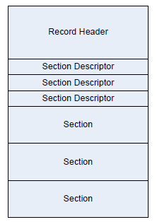

.. _common-platform-error-record-cper:

Common Platform Error Record (CPER)
=================================================

Introduction
------------

This appendix describes the common platform error record (CPER) format for representing platform hardware errors.

Format
------

The general format of the common platform error record is illustrated in  the Figure below . The record consists of a header; followed by one or more section descriptors; and for each descriptor, an associated section which may contain either error or informational data.

   Error Record Format

.. _record-header:

Record Header
#############

The record header includes information which uniquely identifies a hardware error record on a given system. The contents of the record header are described in the Table below. The header is immediately followed by an array of one or more section descriptors. Sections may be either error sections, which contain error information retrieved from hardware, or they may be informational sections, which contain contextual information relevant to the error. An error record must contain at least one section.

.. list-table:: Error record header
   :name: error-record-header
   :widths: 10 10 10 35
   :class: longtable
   :header-rows: 1

   * - **Mnemonic**
     - **Byte Offset**
     - **Byte Length**
     - **Description**
   * - Signature Start
     - 0
     - 4
     - ASCII 4-character array "CPER" (0x43,0 x50,0x45,0x52). Identifies this structure as a hardware error record.
   * - Revision
     - 4
     - 2
     - | This is a 2-byte field representing a major and minor version number for the error record definition in BCD format. The interpretation of the major and minor version number is as follows:
       | •  Byte 0 - Minor (01): An increase in this revision indicates that changes to the headers and sections are backward compatible with software that use earlier revisions. Addition of new GUID types, errata fixes or clarifications are covered by a bump up.
       | • Byte 1 - Major (01): An increase in this revision indicates that the changes are not backward compatible from a software perspective.
   * - Signature End
     - 6
     - 4
     - Must be 0xFFFFFFFF
   * - Section Count
     - 10
     - 2
     - This field indicates the number of valid sections associated with the record, corresponding to each of the following section descriptors.
   * - Error Severity
     - 12
     - 4
     - | Indicates the severity of the error condition. The severity of the error record corresponds to the most severe error section.  
       | 0 - Recoverable (also called non-fatal uncorrected)  
       | 1 - Fatal  
       | 2 - Corrected  
       | 3 - Informational  
       | All other values are reserved.  
       | Note that severity of "Informational" indicates that the record could be safely ignored by error handling software.
   * - Validation Bits
     - 16
     - 4
     - | This field indicates the validity of the following fields: 
       | • Bit 0 - If 1, the PlatformID field contains valid information 
       | • Bit 1 - If 1, the TimeStamp field contains valid information  
       | • Bit 2 - If 1, the PartitionID field contains valid information
       | • Bits 3-31: Reserved, must be zero.
   * - Record Length
     - 20
     - 4
     - Indicates the size of the actual error record, including the size of the record header, all section descriptors, and section bodies. The size may include extra buffer space to allow for the dynamic addition of error sections descriptors and bodies.
   * - Timestamp
     - 24
     - 8
     - | The timestamp correlates to the time when the error information was collected by the system software and may not necessarily represent the time of the error event. The timestamp contains the local time in BCD format.  
       | • Byte 7 - Byte 0: 
       | • Byte 0: Seconds  
       | • Byte 1: Minutes  
       | • Byte 2: Hours 
       | • Byte 3:  
       | • Bit 0 - Timestamp is precise if this bit is set and correlates to the time of the error event.
       | • Bit 7:1 - Reserved  
       | • Byte 4: Day
       | • Byte 5: Month 
       | • Byte 6: Year
       | • Byte 7: Century
   * - Platform ID
     - 32
     - 16
     - This field uniquely identifies the platform with a GUID. The platform’s SMBIOS UUID should be used to populate this field. Error analysis software may use this value to uniquely identify a platform.
   * - Partition ID
     - 48
     - 16
     - If the platform has multiple software partitions, system software may associate a GUID with the partition on which the error occurred.
   * - Creator ID
     - 64
     - 16
     - This field contains a GUID indicating the creator of the error record. This value may be overwritten by subsequent owners of the record.
   * - Notification Type
     - 80
     - 16
     - | This field holds a pre-assigned GUID value indicating the record association with an error event notification type. The defined types are:
       |
       | CMC  
       | {0x2DCE8BB1, 0xBDD7, 0x450e, {0xB9, 0xAD, 0x9C, 0xF4, 0xEB, 0xD4, 0xF8, 0x90}}  
       |
       | CPE  
       | {0x4E292F96, 0xD843, 0x4a55, {0xA8, 0xC2, 0xD4, 0x81, 0xF2, 0x7E, 0xBE, 0xEE}}  
       | 
       | MCE  
       | {0xE8F56FFE, 0x919C, 0x4cc5, {0xBA, 0x88, 0x65, 0xAB, 0xE1, 0x49, 0x13, 0xBB}}  
       | 
       | PCIe  
       | {0xCF93C01F, 0x1A16, 0x4dfc, {0xB8, 0xBC, 0x9C, 0x4D, 0xAF, 0x67, 0xC1, 0x04}}
       |   
       | INIT  
       | {0xCC5263E8, 0x9308, 0x454a, {0x89, 0xD0, 0x34, 0x0B, 0xD3, 0x9B, 0xC9, 0x8E}}  
       | 
       | NMI  
       | {0x5BAD89FF, 0xB7E6, 0x42c9, {0x81, 0x4A, 0xCF, 0x24, 0x85, 0xD6, 0xE9, 0x8A}}  
       |
       | Boot  
       | {0x3D61A466, 0xAB40, 0x409a, {0xA6, 0x98, 0xF3, 0x62, 0xD4, 0x64, 0xB3, 0x8F}}  
       | 
       | DMAr  
       | {0x667DD791, 0xC6B3, 0x4c27, {0x8A, 0x6B, 0x0F, 0x8E,0x72, 0x2D, 0xEB, 0x41}}  
       | 
       | SEA  
       | {0x9A78788A, 0xBBE8, 0x11E4, {0x80, 0x9E, 0x67, 0x61, 0x1E, 0x5D, 0x46, 0xB0}}  
       | 
       | SEI  
       | {0x5C284C81, 0xB0AE, 0x4E87, {0xA3, 0x22, 0xB0, 0x4C, 0x85, 0x62, 0x43, 0x23}}  
       | 
       | PEI  
       | {0x09A9D5AC, 0x5204, 0x4214, {0x96, 0xE5, 0x94, 0x99, 0x2E, 0x75, 0x2B, 0xCD}}  
       | 
       | CXL Component  
       | {0x69293BC9, 0x41DF, 0x49A3 {0xB4, 0xBD, 0x4F, 0xB0, 0xDB, 0x30, 0x41, 0xF6}}
   * - Record ID
     - 96
     - 8
     - This value, when combined with the Creator ID, uniquely identifies the error record across other error records on a given system.
   * - Flags
     - 104
     - 4
     - Flags field contains information that describes the error record. See Table 2 for defined flags.
   * - Persistence Information
     - 108
     - 8
     - This field is produced and consumed by the creator of the error record identified in the Creator ID field. The format of this field is defined by the creator and it is out of scope of this specification.
   * - Reserved
     - 116
     - 12
     - Reserved. Must be zero.
   * - Section Descriptor
     - 128
     - Nx72
     - An array of SectionCount descriptors for the associated sections. The number of valid sections is equivalent to the SectionCount. The buffer size of the record may include more space to dynamically add additional Section Descriptors to the error record.

**Error Record Header Flags**

The following table lists flags that can be used to qualify an error record in the Error Record Header’s Flags field.

.. list-table:: Error Record Header Flags
   :name: error-record-header-flags
   :widths: 5 75
   :class: longtable

   * - Value
     - Description
   * - 1
     - HW_ERROR_FLAGS_RECOVERED: Qualifies an error condition as one that has been recovered by system software.
   * - 2
     - HW_ERROR_FLAGS_PREVERR: Qualifies an error condition as one that occurred during a previous session. For instance, of the OS detects an error and determines that the system must be reset; it will save the error record before stopping the system. Upon restarting the OS marks the error record with this flag to know that the error is not live.
   * - 4
     - HW_ERROR_FLAGS_SIMULATED: Qualifies an error condition as one that was intentionally caused. This allows system software to recognize errors that are injected as a means of validating or testing error handling mechanisms.

.. _notification-type:

Notification Type
$$$$$$$$$$$$$$$$$

A notification type identifies the mechanism by which an error event is reported to system software. This information helps consumers of error information (e.g. management applications or humans) by identifying the source of the error information. This allows, for instance, all CMC error log entries to be filtered from an error event log. 

Listed below are the standard notification types. Each standard notification type is identified by a GUID. For error notification types that do not conform to one of the standard types, a platform-specific GUID may be defined to identify the notification type. 

-  Machine Check Exception (MCE): {0xE8F56FFE, 0x919C, 0x4cc5, {0xBA, 0x88, 0x65, 0xAB, 0xE1, 0x49, 0x13, 0xBB}} A Machine Check Exception is a processor-generated exception class interrupt used to system software of the presence of a fatal or recoverable error condition.

-  Corrected Machine Check (CMC): {0x2DCE8BB1, 0xBDD7, 0x450e, {0xB9, 0xAD, 0x9C, 0xF4,0xEB, 0xD4, 0xF8, 0x90}} Corrected Machine Checks identify error conditions that have been corrected by hardware or system firmware. CMCs are reported by the processor and may be reported via interrupt or by polling error status registers.

-  Corrected Platform Error (CPE): {0x4E292F96, 0xD843, 0x4a55, {0xA8, 0xC2, 0xD4, 0x81, 0xF2, 0x7E, 0xBE, 0xEE}} Corrected Platform Errors identify corrected errors from the platform (i.e., external memory controller, system bus, etc.). CPEs can be reported via interrupt or by polling error status registers.

-  Non-Maskable Interrupt (NMI): {0x5BAD89FF, 0xB7E6, 0x42c9, {0x81, 0x4A, 0xCF, 0x24, 0x85, 0xD6, 0xE9, 0x8A}} Non-Maskable Interrupts are used on X64 platforms to report fatal or recoverable platform error conditions. NMIs are reported via interrupt vector 2 on IA32 and X64 processor architecture platforms.

-  PCI Express Error (PCIe): {0xCF93C01F, 0x1A16, 0x4dfc, {0xB8, 0xBC, 0x9C, 0x4D, 0xAF, 0x67, 0xC1, 0x04}} See the PCI Express standard v1.1 for details regarding PCI Express Error Reporting. This notification type identifies errors that were reported to the system via an interrupt on a PCI Express root port.

-  INIT Record (INIT): {0xCC5263E8, 0x9308, 0x454a, {0x89, 0xD0, 0x34, 0x0B, 0xD3, 0x9B, 0xC9, 0x8E}} IPF Platforms optionally implement a mechanism (switch or button on the chassis) by which an operator may reset a system and have the system generate an INIT error record. This error record is documented in the IPF SAL specification. System software retrieves an INIT error record by querying the SAL for existing INIT records.

-  | BOOT Error Record (BOOT): {0x3D61A466, 0xAB40, 0x409a, {0xA6, 0x98, 0xF3, 0x62, 0xD4, 0x64, 0xB3, 0x8F}} 
   | 
   | The BOOT Notification Type represents error conditions which are unhandled by system software and which result in a system shutdown/reset. System software retrieves a BOOT error record during boot by querying the platform for existing BOOT records. As an example, consider an x64 platform which implements a service processor. In some scenarios, the service processor may detect that the system is either hung or is in such a state that it cannot safely proceed without risking data corruption. In such a scenario the service processor may record some minimal error information in its system event log (SEL) and unilaterally reset the machine without notifying the OS or other system software. In such scenarios, system software is unaware of the condition that caused the system reset. A BOOT error record would contain information that describes the error condition that led to the reset so system software can log the information and use it for health monitoring.

-  DMA Remapping Error (DMAr): {0x667DD791, 0xC6B3, 0x4c27, {0x8A, 0x6B, 0x0F, 0x8E, 0x72, 0x2D, 0xEB, 0x41}} The DMA Remapping Notification Type identifies fault conditions generated by the DMAr unit when processing un-translated, translation and translated DMA requests. The fault conditions are reported to the system using a message signaled interrupt.

-  | Synchronous External Abort (SEA): {0x9A78788A, 0xBBE8, 0x11E4, {0x80, 0x9E, 0x67, 0x61, 0x1E, 0x5D, 0x46, 0xB0}}
   |
   | Synchronous External Aborts represent *precise* processor error conditions on ARM systems (uncorrectable and/or recoverable) as described in D3.5 of the ARMv8 ARM reference manual. This notification may be triggered by one of the following scenarios: cache parity error, cache ECC error, external bus error, micro-architectural error, data poisoning, and other platform errors.

-  SError Interrupt (SEI): {0x5C284C81, 0xB0AE, 0x4E87, {0xA3, 0x22, 0xB0, 0x4C, 0x85, 0x62, 0x43, 0x23}} SError Interrupts represent asynchronous *imprecise* (or possibly precise) processor error conditions on ARM systems (corrected, uncorrectable, and recoverable) as described in D3.5 of the ARM ARM reference manual. This notification may be triggered by one of the following scenarios: cache parity error, cache ECC error, external bus error, micro-architectural error, data poisoning, and other platform errors.

-  Platform Error Interrupt (PEI): {0x09A9D5AC, 0x5204, 0x4214, {0x96, 0xE5, 0x94, 0x99, 0x2E, 0x75, 0x2B, 0xCD} Platform Error Interrupt represent asynchronous *imprecise* platform error conditions on ARM systems that may be triggered by the following scenarios: system memory ECC error, ECC errors in system cache (e.g. shared high-level caches), vendor specific chip errors, external platform errors.

-  Compute Express Link (CXL) Component: {0x69293BC9, 0x41DF, 0x49A3 {0xB4, 0xBD, 0x4F, 0xB0, 0xDB, 0x30, 0x41, 0xF6}} This Notification Type identifies errors that were reported to the system by CXL components that support error reporting via the CXL RAS Mailbox interface. See the CXL Specification, Rev 2.0 or later, for details regarding CXL Error Reporting.

.. _error-status:

Error Status
$$$$$$$$$$$$

The error status definition provides the capability to abstract information from implementation-specific error registers into generic error codes.

.. list-table:: Error Status Fields
   :name: error-status-fields
   :widths: 15 65
   :class: longtable

   * - **Bit Position**
     - **Description**
   * - 7:0
     - Reserved
   * - 15:8
     - Encoded value for the Error_Type. See Table 20 Error Types for details.
   * - 16
     - Address: Error was detected on the address signals or on the address portion of the transaction.
   * - 17
     - Control: Error was detected on the control signals or in the control portion of the transaction.
   * - 18
     - Data: Error was detected on the data signals or in the data portion of the transaction.
   * - 19
     - Responder: Error was detected by the responder of the transaction.
   * - 20
     - Requester: Error was detected by the requester of the transaction.
   * - 21
     - First Error: If multiple errors are logged for a section type, this is the first error in the chronological sequence. Setting of this bit is optional.
   * - 22
     - Overflow: Additional errors occurred and were not logged due to lack of logging resources.
   * - 63:23
     - Reserved.

.. list-table:: Error Types
   :name: error-types
   :widths: 25 75
   :class: longtable
   :header-rows: 1

   * - **Encoding**
     - **Description**
   * - 1
     - ERR_INTERNAL Error detected internal to the component.
   * - 16
     - ERR_BUS Error detected in the bus.
   * - **Detailed Internal Errors**
     - 
   * - 4
     - ERR_MEM Storage error in memory (DRAM).
   * - 5
     - ERR_TLB Storage error in TLB.
   * - 6
     - ERR_CACHE Storage error in cache.
   * - 7
     - ERR_FUNCTION Error in one or more functional units.
   * - 8
     - ERR_SELFTEST component failed self test.
   * - 9
     - ERR_FLOW Overflow or undervalue of internal queue.
   * - **Detailed Bus Errors**
     - 
   * - 17
     - ERR_MAP Virtual address not found on IO-TLB or IO-PDIR.
   * - 18
     - ERR_IMPROPER Improper access error.
   * - 19
     - ERR_UNIMPL Access to a memory address which is not mapped to any component.
   * - 20
     - ERR_LOL Loss of Lockstep
   * - 21
     - ERR_RESPONSE Response not associated with a request
   * - 22
     - ERR_PARITY Bus parity error (must also set the A, C, or D Bits).
   * - 23
     - ERR_PROTOCOL Detection of a protocol error.
   * - 24
     - ERR_ERROR Detection of a PATH_ERROR
   * - 25
     - ERR_TIMEOUT Bus operation timeout.
   * - 26
     - ERR_POISONED A read was issued to data that has been poisoned.
   * - All Others
     - *Reserved*

.. _section-descriptor:

Section Descriptor
##################

.. list-table:: Section Descriptor
   :name: section-descriptor-format
   :widths: 15 10 10 65
   :class: longtable

   * - **Mnemonic**
     - **Byte Offset**
     - **Byte Length**
     - **Description**
   * - Section Offset
     - 0
     - 4
     - Offset in bytes of the section body from the base of the record header.
   * - Section Length
     - 4
     - 4
     - The length in bytes of the section body.
   * - Revision
     - 8
     - 2
     - | This is a 2-byte field representing a major and minor version number for the error record definition in BCD format. The interpretation of the major and minor version number is as follows:
       | • Byte 0 — Minor (00): An increase in this revision indicates that changes to the headers and sections are backward compatible with software that uses earlier revisions. Addition of new GUID types, errata fixes or clarifications are covered by a bump up.
       | • Byte 1 — Major (01): An increase in this revision indicates that the changes are not backward compatible from a software perspective
   * - Validation Bits
     - 10
     - 1
     - | This field indicates the validity of the following fields:
       | • Bit 0 - If 1, the FRUId field contains valid information
       | • Bit 1 - If 1, the FRUString field contains valid information
       | • Bits 7:2 - Reserved, must be zero.
   * - Reserved
     - 11
     - 1
     - Must be zero.
   * - Flags
     - 12
     - 4
     - | Flag field contains information that describes the error section as follows:  
       | Bit 0 - Primary: If set, identifies the section as the section to be associated with the error condition. This allows for FRU determination and for error recovery operations. By identifying a primary section, the consumer of an error record can determine which section to focus on. It is not always possible to identify a primary section so this flag should be taken as a hint.  
       | Bit 1 - Containment Warning: If set, the error was not contained within the processor or memory hierarchy and the error may have propagated to persistent storage or network.  
       | Bit 2 - Reset: If set, the component has been reset and must be re-initialized or re-enabled by the operating system prior to use.
       | Bit 3 - Error threshold exceeded: If set, OS may choose to discontinue use of this resource.  
       | Bit 4 - Resource not accessible: If set, the resource could not be queried for error information due to conflicts with other system software or resources. Some fields of the section will be invalid.  
       | Bit 5 - Latent error: If set this flag indicates that action has been taken to ensure error containment (such a poisoning data), but the error has not been fully corrected and the data has not been consumed. System software may choose to take further corrective action before the data is consumed.  
       | Bit 6 - Propagated: If set this flag indicates the section is to be associated with an error that has been propagated due to hardware poisoning. This implies the error is a symptom of another error. It is not always possible to ascertain whether this is the case for an error, therefore if the flag is not set, it is unknown whether the error was propagated. this helps determining FRU when dealing with HW failures.  
       | Bit 7 - Overflow: If set this flag indicates the firmware has detected an overflow of buffers/queues that are used to accumulate, collect, or report errors (e.g. the error status control block exposed to the OS). When this occurs, some error records may be lost.    
       | 
       | Bit 8 through 31 - Reserved.
   * - Section Type
     - 16
     - 16
     - | This field holds a pre-assigned GUID value indicating that it is a section of a particular error. The different error section types are as defined below: 
       | **Processor Generic**
       | • {0x9876CCAD, 0x47B4, 0x4bdb, {0xB6, 0x5E, 0x16, 0xF1, 0x93, 0xC4, 0xF3, 0xDB}} 
       | **Processor Specific** 
       | • IA32/X 64:{0xDC3EA0B0, 0xA144, 0x4797, {0xB9, 0x5B, 0x53, 0xFA, 0x24, 0x2B, 0x6E, 0x1D}}
       | • IPF: {0xe429faf1, 0x3cb7, 0x11d4, {0xb, 0xca, 0x7, 0x00, 0x80, 0xc7, 0x3c, 0x88,  0x81}} (see footnote 1 at the end of Appendix N)
       | • ARM: { 0 xE19E3D16,0xBC1 1,0x11E4,{0x9C, 0xAA, 0xC2, 0x05, 0x1D, 0x5D, 0x46, 0xB0}}  
       | NOTE: In addition to the types listed above, there may exist vendor specific GUIDs that describe vendor specific section types.    
       | **Platform Memory** 
       | • {0xA5BC1114, 0x6F64, 0x4EDE, {0xB8, 0x63, 0x3E, 0x83, 0xED, 0x7C, 0x83, 0xB1}}   
       | **PCIe**
       | • {0xD995E954, 0xBBC1, 0x430F, {0xAD, 0x91, 0xB4, 0x4D, 0xCB, 0x3C, 0x6F, 0x35}}  
       | Firmware Error Record Reference
       | • {0x81212A96, 0x09ED, 0x4996, {0x94, 0x71, 0x8D, 0x72, 0x9C, 0x8E, 0x69, 0xED}}  
       | **PCI/PCI-X Bus**  
       | • {0xC5753963, 0x3B84, 0x4095, {0xBF, 0x78, 0xED, 0xDA, 0xD3, 0xF9, 0xC9, 0xDD}}  
       | **PCI Component/Device** 
       | • {0xEB5E4685, 0xCA66, 0x4769, {0xB6, 0xA2, 0x26, 0x06, 0x8B, 0x00, 0x13, 0x26}}  
       | **DMAr Generic** 
       | • {0x5B51FEF7, 0xC79D, 0x4434, {0x8F, 0x1B, 0xAA, 
       | • 0x62, 0xDE, 0x3E, 0x2C, 0x64}}  
       | **Intel® VT** for Directed I/O specific DMAr section
       | • {0x71761D37, 0x32B2, 0x45cd, {0xA7, 0xD0, 0xB0,
       | • 0xFE 0xDD, 0x93, 0xE8, 0xCF}}  
       | **IOMMU specific DMAr section** 
       | • {0x036F84E1, 0x7F37, 0x428c, {0xA7, 0x9E, 0x57, 
       | • 0x5F, 0xDF, 0xAA, 0x84, 0xEC}}  
       | CXL Component Events: see the :ref:`cxl-component-event-log-record`. 
   * - FRU Id
     - 32
     - 16
     - GUID representing the FRU ID, if it exists, for the section reporting the error. The default value is zero indicating an invalid FRU ID. System software can use this to uniquely identify a physical device for tracking purposes. Association of a GUID to a physical device is done by the platform in an implemen tation-specific way (i.e., PCIe Device can lock a GUID to a PCIe Device ID).
   * - Section Severity
     - 48
     - 4
     - | This field indicates the severity associated with the error section.  
	   | 0 - Recoverable (also called non-fatal uncorrected)  
	   | 1 - Fatal  
	   | 2 - Corrected  
	   | 3 - Informational  
	   | All other values are reserved. 
	   | Note that severity of "Informational" indicates that the section contains extra information that can be safely ignored by error handling software.
   * - FRU Text
     - 52
     - 20
     - ASCII string identifying the FRU hardware.

**Note:** For an IPF processor-specific error section, the GUID listed is the value from the SAL specification. The format of the data for this section is same as the Processor Device Error Info in the SAL specification.

.. _non-standard-section-body:

Non-standard Section Body
#########################

Information that does not conform to one the standard formats (i.e., those defined in sections 2.4 through 2.9 of this document) may be recorded in the error record in a non-standard section. The type (e.g. format) of a non-standard section is identified by the GUID populated in the Section Descriptor’s Section Type field. This allows the information to be decoded by consumers if the format is externally documented. Examples of information that might be placed in a non-standard section include the IPF raw SAL error record, Error information recorded in implementation-specific PCI configuration space, and IPMI error information recorded in an IPMI SEL.

.. _processor-error-sections:

Processor Error Sections
########################

The processor error sections are divided into two different components as described below:

#. Processor Generic Error Section: This section holds information about processor errors in a generic form and will be common across all processor architectures. An example or error information provided is the generic information of cache, tlb, etc., errors.

#. Processor Specific Error Section: This section consists of error information, which is specific to a processor architecture. In addition, certain processor architecture state at the time of error may also be captured in this section. This section is unique to each processor architecture (Itanium Processor Family, IA32/X64, ARM).

.. _generic-processor-error-section:

Generic Processor Error Section
$$$$$$$$$$$$$$$$$$$$$$$$$$$$$$$

The Generic Processor Error Section describes processor reported hardware errors for logical processors in the system.

Section Type: {0x9876CCAD, 0x47B4, 0x4bdb, {0xB6, 0x5E, 0x16, 0xF1, 0x93, 0xC4, 0xF3, 0xDB}}

.. list-table:: Processor Generic Error Section
   :name: processor-generic-error-section
   :widths: 10 10 10 35
   :class: longtable

   * - **Name**
     - **Byte Offset**
     - **Byte Length**
     - **Description**
   * - Validation Bits
     - 0
     - 8
     - | The validation bit mask indicates whether or not each of the following fields is valid in this section.  
       | Bit 0 - Processor Type Valid  
       | Bit 1 - Processor ISA Valid  
       | Bit 2 - Processor Error Type Valid  
       | Bit 3 - Operation Valid  
       | Bit 4 - Flags Valid  
       | Bit 5 - Level Valid  
       | Bit 6 - CPU Version Valid  
       | Bit 7 - CPU Brand Info Valid  
       | Bit 8 - CPU Id Valid  
       | Bit 9 - Target Address Valid  
       | Bit 10 - Requester Identifier Valid  
       | Bit 11 - Responder Identifier Valid  
       | Bit 12 - Instruction IP Valid  
       | All other bits are reserved and must be zero.
   * - Processor Type
     - 8
     - 1
     - | Identifies the type of the processor architecture.  
       | 0: IA32/X64  
       | 1: IA64  
       | 2: ARM  
       | All other values reserved.
   * - Processor ISA
     - 9
     - 1
     - | Identifies the type of the instruction set executing when the error occurred:  
       | 0: IA32  
       | 1: IA64  
       | 2: X64  
       | 3: ARM A32/T32  
       | 4: ARM A64  
       | All other values are reserved.
   * - Processor Error Type
     - 10
     - 1
     - | Indicates the type of error that occurred:  
       | 0x00: Unknown  
       | 0x01: Cache Error  
       | 0x02: TLB Error  
       | 0x04: Bus Error  
       | 0x08: Micro-Architectural Error  
       | All other values reserved.
   * - Operation
     - 11
     - 1
     - | Indicates the type of operation:  
       | 0: Unknown or generic  
       | 1: Data Read  
       | 2: Data Write  
       | 3: Instruction Execution  
       | All other values reserved.
   * - Flags
     - 12
     - 1
     - | Indicates additional information about the error:  
       | Bit 0: Restartable - If 1, program execution can be restarted reliably after the error.  
       | Bit 1: Precise IP - If 1, the instruction IP captured is directly associated with the error.  
       | Bit 2: Overflow - If 1, a machine check overflow occurred (a second error occurred while the results of a previous error were still in the error reporting resources).  
       | Bit 3: Corrected - If 1, the error was corrected by hardware and/or firmware.  
       | All other bits are reserved and must be zero.
   * - Level
     - 13
     - 1
     - Level of the structure where the error occurred, with 0 being the lowest level of cache.
   * - Reserved
     - 14
     - 2
     - Must be zero.
   * - CPU Version Info
     - 16
     - 8
     - | This field represents the CPU Version Information and returns Family, Model, and stepping information (e.g. As provided by CPUID instruction with EAX=1 input with output values from EAX on the IA32/X64 processor or as provided by CPUID Register 3 register - Version Information on IA64 processors).    
       | 
       | On ARM processors, this field will be provided as:  
       | Bits 127:64 - Reserved and must be zero  
       | Bits 63:0 - MIDR_EL1 of the processor
   * - CPU Brand String
     - 24
     - 128
     - | This field represents the null-terminated ASCII Processor Brand String (e.g. As provided by the CPUID instruction with EAX=0x80000002 and ECX=0x80000003 for IA32/X64 processors or the return from PAL_BRAND_INFO for IA64 processors).    
       | This field is optional for ARM processors.
   * - Processor ID
     - 152
     - 8
     - | This value uniquely identifies the logical processor (e.g. As programmed into the local APIC ID register on IA32/X64 processors or programmed into the LID register on IA64 processors).    
       | 
       | On ARM processors, this field will be provided as programmed in the architected MPIDR_EL1.
   * - Target Address
     - 160
     - 8
     - Identifies the target address associated with the error.
   * - Requestor Identifier
     - 168
     - 8
     - Identifies the requestor associated with the error.
   * - Responder Identifier
     - 176
     - 8
     - Identifies the responder associated with the error.
   * - Instruction IP
     - 184
     - 8
     - Identifies the instruction pointer when the error occurred.

.. _ia32x64-processor-error-section:

IA32/X64 Processor Error Section
$$$$$$$$$$$$$$$$$$$$$$$$$$$$$$$$

Type:{0xDC3EA0B0, 0xA144, 0x4797, {0xB9, 0x5B, 0x53, 0xFA, 0x24,
0x2B, 0x6E, 0x1D}}

.. list-table:: Processor Error Record
   :name: processor-error-record
   :widths: 15 10 10 65
   :class: longtable

   * - **Mnemonic**
     - **Byte Offset**
     - **Byte Length**
     - **Description**
   * - Validation Bits
     - 0
     - 8
     - | The validation bit mask indicates each of the following field is valid in this section:    
       | 
       | Bit0 - LocalAPIC_ID Valid  
       | Bit1 - CPUID Info Valid  
       | Bits 2-7 - Number of Processor Error Information Structure 
       | (PRO C_ERR_INFO_NUM)  
       | Bit 8- 13 Number of Processor Context Information Structure 
       | (PROC_CO NTEXT_INFO_NUM)  
       | Bits 14-63 - Reserved
   * - Local APIC_ID
     - 8
     - 8
     - This is the processor APIC ID programmed into the APIC ID registers.
   * - CPUID Info
     - 16
     - 48
     - This field represents the CPU ID structure of 48 bytes and returns Model, Family, and stepping information as provided by the CPUID instruction with EAX=1 input and output values from EAX, EBX, ECX, and EDX null extended to 64-bits.
   * - Processor Error Info
     - 64
     - Nx64
     - This is a variable-length structure consisting of N different 64 byte structures, each representing a single processor error information structure. The value of N ranges from 0-63 and is as indicated by PRO C_ERR_INFO_NUM.
   * - Processor Context
     - 64+Nx64
     - NxX
     - This is a variable size field providing the information for the processor context state such as MC Bank MSRs and general registers. The value of N ranges from 0-63 and is as indicated by PROC_CO NTEXT_INFO_NUM. Each processor context information structure is padded with zeros if the size is not a multiple of 16 bytes.

.. _ia32x64-processor-error-information-structure:

IA32/X64 Processor Error Information Structure
%%%%%%%%%%%%%%%%%%%%%%%%%%%%%%%%%%%%%%%%%%%%%%

As described above, the processor error section contains a collection of structures called Processor Error Information Structures that contain processor structure specific error information. This section details the layout of the Processor Error Information Structure and the detailed check information which is contained within. 

.. list-table:: IA32/X64 Processor Error Information Structure
   :name: ia32x64-processor-error-information-structure-1
   :widths: 15 5 5 75
   :class: longtable

   * - Mnemonic
     - Byte Offset
     - Byte Length
     - Description
   * - Error Structure Type
     - 0
     - 16
     - | This field holds a pre-assigned GUID indicating the type of Processor Error Information structure. The following Processor Error Information Structure Types have pre-defined GUID.  
       | • Cache Error Information (Cache Check)  
       | • TLB Error Information (TLB Check)  
       | • Bus Error Information (Bus Check)  
       | • Micro-architecture Specific Error Information (MS Check)
   * - Validation Bits
     - 16
     - 8
     - | Bit 0 - Check Info Valid  
       | Bit 1 - Target Address Identifier Valid  
       | Bit 2 - Requestor Identifier Valid  
       | Bit 3 - Responder Identifier Valid  
       | Bit 4 - Instruction Pointer Valid  
       | Bits 5-63 - Reserved
   * - Check Information
     - 24
     - 8
     - Str uctureErrorType specific error check structure.
   * - Target Identifier
     - 32
     - 8
     - Identifies the target associated with the error.
   * - Requestor Identifier
     - 40
     - 8
     - Identifies the requestor associated with the error.
   * - Responder Identifier
     - 48
     - 8
     - Identifies the responder associated with the error.
   * - Instruction Pointer
     - 56
     - 8
     - Identifies the instruction executing when the error occurred.

.. _ia32-x64-cache-check-structure:

IA32/X64 Cache Check Structure
%%%%%%%%%%%%%%%%%%%%%%%%%%%%%%%

Type:{0xA55701F5, 0xE3EF, 0x43de, {0xAC, 0x72, 0x24, 0x9B, 0x57, 0x3F, 0xAD, 0x2C}}

.. list-table:: IA32/X64 Cache Check Structure
   :name: ia32-x64-cache-check-structure-1
   :widths: 10 5 45
   :class: longtable

   * - **Field Name**
     - **Bits**
     - **Description**
   * - ValidationBits
     - 15:0
     - | Indicates which fields in the Cache Check structure are valid:
       | Bit 0 - Transaction Type Valid
       | Bit 1 - Operation Valid
       | Bit 2 - Level Valid
       | Bit 3 - Processor Context Corrupt Valid
       | Bit 4 - Uncorrected Valid
       | Bit 5 - Precise IP Valid
       | Bit 6 - Restartable Valid
       | Bit 7- Overflow Valid
       | Bits 8 - 15 Reserved
   * - TransactionType
     - 17:16
     - | Type of cache error:
       | 0 - Instruction
       | 1 - Data Access
       | 2 - Generic
       | All other values are reserved
   * - Operation
     - 21:18
     - | Type of cache operation that caused the error:
       | 0 - generic error (type of error cannot be determined)
       | 1 - generic read (type of instruction or data request cannot be determined)
       | 2 - generic write (type of instruction or data request cannot be determined)
       | 3 - data read
       | 4 - data write
       | 5 - instruction fetch
       | 6 - prefetch
       | 7 - eviction
       | 8 - snoop
       | All other values are reserved.
   * - Level
     - 24:22
     - Cache Level
   * - Processor Context Corrupt
     - 25
     - | This field indicates that the processor context might have been corrupted.  
       | 0 - Processor context not corrupted  
       | 1 - Processor context corrupted
   * - Uncorrected
     - 26
     - | This field indicates whether the error was corrected or uncorrected:  
       | 0: Corrected  
       | 1: Uncorrected
   * - Precise IP
     - 27
     - This field indicates that the instruction pointer pushed onto the stack is directly associated with the error
   * - Restartable IP
     - 28
     - This field indicates that program execution can be restarted reliably at the instruction pointer pushed onto the stack
   * - Overflow
     - 29
     - | This field indicates an error overflow occurred  
       | 0 - Overflow not occurred  
       | 1 - Overflow occurred
   * - 
     - 63:30
     - Reserved

.. _ia32-x64-tlb-check-structure:

IA32/X64 TLB Check Structure
%%%%%%%%%%%%%%%%%%%%%%%%%%%%%

Type:{0xFC06B535, 0x5E1F, 0x4562, {0x9F, 0x25, 0x0A, 0x3B, 0x9A, 0xDB, 0x63, 0xC3}}

.. list-table:: IA32/X64 TLB Check Structure
   :name: ia32-x64-tlb-check-structure-1
   :widths: 15 10 70
   :class: longtable

   * - **Field Name**
     - **Bits**
     - **Description**
   * - Validation Bits
     - 15:0
     - | Indicate which fields in the Cache_Check structure are valid  
       | Bit 0 - Transaction Type Valid  
       | Bit 1 - Operation Valid  
       | Bit 2 - Level Valid  
       | Bit 3 - Processor Context Corrupt Valid  
       | Bit 4 - Uncorrected Valid  
       | Bit 5 - Precise IP Valid  
       | Bit 6 - Restartable IP Valid  
       | Bit 7 - Overflow Valid  
       | Bit 8 - 15 Reserved
   * - Transaction Type
     - 17:16
     - | Type of TLB error  
       | 0 - Instruction  
       | 1 - Data Access  
       | 2 - Generic  
       | All other values are reserved
   * - Operation
     - 21:18
     - | Type of TLB access operation that caused the machine check:  
       | 0 - generic error (type of error cannot be determined)  
       | 1 - generic read (type of instruction or data request cannot be determined)  
       | 2 - generic write (type of instruction or data request cannot be determined)  
       | 3 - data read  
       | 4 - data write  
       | 5 - instruction fetch  
       | 6 - prefetch  
       | All other values are reserved.
   * - Level
     - 24:22
     - TLB Level
   * - Processor Context Corrupt
     - 25
     - | This field indicates that the processor context might have been corrupted.  
       | 0 - Processor context not corrupted  
       | 1 - Processor context corrupted
   * - Uncorrected
     - 26
     - | This field indicates whether the error was corrected or uncorrected:  
       | 0: Corrected  
       | 1: Uncorrected
   * - PreciseIP
     - 27
     - This field indicates that the instruction pointer pushed onto the stack is directly associated with the error.
   * - Restartable IP
     - 28
     - This field indicates the program execution can be restarted reliably at the instruction pointer pushed onto the stack.
   * - Overflow
     - 29
     - | This field indicates an error overflow occurred  
       | 0 - Overflow not occurred  
       | 1 - Overflow occurred
   * - 
     - 63:30
     - Reserved

.. _ia32-x64-bus-check-structure:

IA32/X64 Bus Check Structure
%%%%%%%%%%%%%%%%%%%%%%%%%%%%%

Type:{0x1CF3F8B3, 0xC5B1, 0x49a2, {0xAA, 0x59, 0x5E, 0xEF, 0x92, 0xFF, 0xA6, 0x3C}} 

.. list-table:: IA32/X64 Bus Check Structure
   :name: ia32-x64-bus-check-structure-1
   :widths: 10 5 45
   :class: longtable

   * - **Field Name**
     - **Bits**
     - **Description**
   * - Validation Bits
     - 15:0
     - | Indicate which fields in the Bus_Check structure are valid  
       | Bit 0 - Transaction Type Valid  
       | Bit 1 - Operation Valid  
       | Bit 2 - Level Valid  
       | Bit 3 - Processor Context Corrupt Valid  
       | Bit 4 - Uncorrected Valid  
       | Bit 5 - Precise IP Valid  
       | Bit 6 - Restartable IP Valid  
       | Bit 7 - Overflow Valid  
       | Bit 8 - Participation Type Valid  
       | Bit 9 - Time Out Valid  
       | Bit 10 - Address Space Valid  
       | Bit 11 - 15 Reserved
   * - Transaction Type
     - 17:16
     - | Type of Bus error  
       | 0 - Instruction  
       | 1 - Data Access  
       | 2 - Generic  
       | All other values are reserved
   * - Operation
     - 21:18
     - | Type of bus access operation that caused the machine check:  
       | 0 - generic error (type of error cannot be determined)  
       | 1 - generic read (type of instruction or data request cannot be determined)  
       | 2 - generic write (type of instruction or data request cannot be determined)  
       | 3 - data read  
       | 4 - data write  
       | 5 - instruction fetch  
       | 6 - prefetch  All other values are reserved.
   * - Level
     - 24:22
     - Indicate which level of the bus hierarchy the error occurred in.
   * - Processor Context Corrupt
     - 25
     - | This field indicates that the processor context might have been corrupted.  
       | 0 - Processor context not corrupted  
       | 1 - Processor context corrupted
   * - Uncorrected
     - 26
     - | This field indicates whether the error was corrected or uncorrected:  
       | 0: Corrected  
       | 1: Uncorrected
   * - PreciseIP
     - 27
     - This field indicates that the instruction pointer pushed onto the stack is directly associated with the error.
   * - Restartable IP
     - 28
     - This field indicates the program execution can be restarted reliably at the instruction pointer pushed onto the stack.
   * - Overflow
     - 29
     - | This field indicates an error overflow occurred  
       | 0 - Overflow not occurred  
       | 1 - Overflow occurred
   * - Participation Type
     - 31:30
     - | Type of Participation  
       | 0 - Local Processor originated request  
       | 1 - Local processor Responded to request  
       | 2 - Local processor Observed  
       | 3 - Generic
   * - Time Out
     - 32
     - This field indicates that the request timed out.
   * - Address Space
     - 34:33
     - | 0 - Memory Access  
       | 1 - Reserved  
       | 2 - I/O  
       | 3 - Other Transaction
   * - 
     - 63:35
     - Reserved

.. _ia32-x64-ms-check-field-description:

IA32/X64 MS Check Field Description
%%%%%%%%%%%%%%%%%%%%%%%%%%%%%%%%%%%

Type: {0x48AB7F57, 0xDC34, 0x4f6c, {0xA7, 0xD3, 0xB0, 0xB5, 0xB0, 0xA7, 0x43, 0x14}}

.. list-table:: IA32/X64 MS Check Field Description
   :name: ia32-x64-ms-check-field-description-1
   :widths: 15 5 45
   :class: longtable

   * - **Field Name**
     - **Bits**
     - **Description**
   * - Validation Bits
     - 15:0
     - | Indicate which fields in the Cache_Check structure are valid  
       | Bit 0 - Error Type Valid  
       | Bit 1 - Processor Context Corrupt Valid  
       | Bit 2 - Uncorrected Valid  
       | Bit 3 - Precise IP Valid  
       | Bit 4 - Restartable IP Valid  
       | Bit 5 - Overflow Valid  
       | Bit 6 - 15 Reserved
   * - Error Type
     - 18:16
     - | Identifies the operation that caused the error:  
       | 0 - No Error  
       | 1 - Unclassified  
       | 2 - Microcode ROM Parity Error  
       | 3 - External Error  
       | 4 - FRC Error  
       | 5 - Internal Unclassified  
       | All other value are processor specific.
   * - Processor Context Corrupt
     - 19
     - | This field indicates that the processor context might have been corrupted.  
       | 0 - Processor context not corrupted  
       | 1 - Processor context corrupted
   * - Uncorrected
     - 20
     - | This field indicates whether the error was corrected or uncorrected:  
       | 0: Corrected  
       | 1: Uncorrected
   * - Precise IP
     - 21
     - This field indicates that the instruction pointer pushed onto the stack is directly associated with the error.
   * - Restartable IP
     - 22
     - This field indicates the program execution can be restarted reliably at the instruction pointer pushed onto the stack.
   * - Overflow
     - 23
     - | This field indicates an error overflow occurred  
       | 0 - Overflow not occurred  
       | 1 - Overflow occurred
   * - 
     - 63:24
     - Reserved

.. _ia32x64-processor-context-information-structure:

IA32/X64 Processor Context Information Structure
%%%%%%%%%%%%%%%%%%%%%%%%%%%%%%%%%%%%%%%%%%%%%%%%

As described above, the processor error section contains a collection of structures called Processor Context Information that contain processor context state specific to the IA32/X64 processor architecture. This section details the layout of the Processor Context Information Structure and the detailed processor context type information.

.. list-table:: IA32/X64 Processor Context Information
   :name: ia32-x64-processor-context-information
   :widths: 20 10 10 65
   :class: longtable

   * - Mnemonic
     - Byte Offset
     - Byte Length
     - Description
   * - Register Context Type
     - 0
     - 2 bytes
     - | Value indicating the type of processor context state being reported:  
       | 0 - Unclassified Data  
       | 1 - MSR Registers (Machine Check and other MSRs)  
       | 2 - 32-bit Mode Execution Context  
       | 3 - 64-bit Mode Execution Context  
       | 4 - FXSAVE Context  
       | 5 - 32-bit Mode Debug Registers (DR0-DR7)  
       | 6 - 64-bit Mode Debug Registers (DR0-DR7) 
       | 7 - Memory Mapped Registers  
       | Others - Reserved
   * - Register Array Size
     - 2
     - 2 bytes
     - Represents the total size of the array for the Data Type being reported in bytes.
   * - MSR Address
     - 4
     - 4 bytes
     - This field contains the starting MSR address for the type 1 register context.
   * - MM Register Address
     - 8
     - 8 bytes
     - This field contains the starting memory address for the type 7 register context.
   * - Register Array
     - 16
     - N bytes
     - This field will provide the contents of the actual registers or raw data. The number of Registers or size of the raw data reported is determined by (Array Size / 8) or otherwise specified by the context structure type definition.

The Table below shows the register context type 2, 32-bit mode execution context.

.. list-table:: IA32 Register State
   :name: ia32-register-state
   :widths: 15 15 15
   :class: longtable

   * - **Offset** 
     - **Length** 
     - **Field**
   * - 0      
     - 4 bytes 
     - EAX
   * - 4      
     - 4 bytes 
     - EBX
   * - 8      
     - 4 bytes 
     - ECX
   * - 12     
     - 4 bytes 
     - EDX
   * - 16     
     - 4 bytes 
     - ESI
   * - 20     
     - 4 bytes
     - EDI
   * - 24     
     - 4 bytes 
     - EBP
   * - 28     
     - 4 bytes 
     - ESP
   * - 32     
     - 2 bytes 
     - CS
   * - 34     
     - 2 bytes 
     - DS
   * - 36     
     - 2 bytes 
     - SS
   * - 38     
     - 2 bytes 
     - ES
   * - 40     
     - 2 bytes 
     - FS
   * - 42     
     - 2 bytes 
     - GS
   * - 44     
     - 4 bytes 
     - EFLAGS
   * - 48     
     - 4 bytes 
     - EIP
   * - 52     
     - 4 bytes 
     - CR0
   * - 56     
     - 4 bytes 
     - CR1
   * - 60     
     - 4 bytes 
     - CR2
   * - 64     
     - 4 bytes 
     - CR3
   * - 68     
     - 4 bytes 
     - CR4
   * - 72     
     - 8 bytes 
     - GDTR
   * - 80     
     - 8 bytes 
     - IDTR
   * - 88     
     - 2 bytes 
     - LDTR
   * - 90     
     - 2 bytes 
     - TR

See the Table below for the register context type 3, 64-bit mode execution context.

.. list-table:: X64 Register State
   :name: x64-register-state
   :widths: 10 10 10
   :class: longtable

   * - **Offset**
     - **Length**   
     - **Field**
   * - 0      
     - 8 bytes  
     - RAX
   * - 8      
     - 8 bytes  
     - RBX
   * - 16     
     - 8 bytes  
     - RCX
   * - 24     
     - 8 bytes  
     - RDX
   * - 32     
     - 8 bytes  
     - RSI
   * - 40     
     - 8 bytes  
     - RDI
   * - 48     
     - 8 bytes  
     - RBP
   * - 56     
     - 8 bytes  
     - RSP
   * - 64     
     - 8 bytes  
     - R8
   * - 72     
     - 8 bytes  
     - R9
   * - 80     
     - 8 bytes  
     - R10
   * - 88     
     - 8 bytes  
     - R11
   * - 96     
     - 8 bytes  
     - R12
   * - 104    
     - 8 bytes  
     - R13
   * - 112    
     - 8 bytes  
     - R14
   * - 120    
     - 8 bytes  
     - R15
   * - 128    
     - 2 bytes  
     - CS
   * - 130    
     - 2 bytes  
     - DS
   * - 132    
     - 2 bytes  
     - SS
   * - 134    
     - 2 bytes  
     - ES
   * - 136    
     - 2 bytes  
     - FS
   * - 138    
     - 2 bytes  
     - GS
   * - 140    
     - 4 bytes  
     - Reserved
   * - 144    
     - 8 bytes  
     - RFLAGS
   * - 152    
     - 8 bytes  
     - EIP
   * - 160    
     - 8 bytes  
     - CR0
   * - 168    
     - 8 bytes  
     - CR1
   * - 176    
     - 8 bytes  
     - CR2
   * - 184    
     - 8 bytes  
     - CR3
   * - 192    
     - 8 bytes  
     - CR4
   * - 200    
     - 8 bytes  
     - CR8
   * - 208    
     - 16 bytes 
     - GDTR
   * - 224    
     - 16 bytes 
     - IDTR
   * - 240    
     - 2 bytes  
     - LDTR
   * - 242    
     - 2 bytes  
     - TR

.. _ia64-processor-error-section:

IA64 Processor Error Section
$$$$$$$$$$$$$$$$$$$$$$$$$$$$

Refer to the Intel Itanium Processor Family System Abstraction Layer specification for finding the IA64 specific error section body definition.

.. _arm-processor-error-section:

ARM Processor Error Section
$$$$$$$$$$$$$$$$$$$$$$$$$$$

Type: {0xE19E3D16, 0xBC11, 0x11E4, {0x9C, 0xAA, 0xC2, 0x05, 0x1D, 0x5D, 0x46, 0xB0}}

The ARM Processor Error Section may contain multiple instances of error information structures associated to a single error event. An error may propagate to other hardware components (e.g. poisoned data) or cause subsequent errors, all of which may be captured in a single ARM processor error section. The processor context information describes the observed state of the processor at the point of error detection.

It is optional for vendors to capture processor context information. The specifics of capturing processor context is vendor specific. Vendors must take care when handling errors that have originated whilst a processor was executing in a secure exception level. In those cases providing processor context information to non-secure agents could be unsafe and lead to security attacks.

.. list-table:: ARM Processor Error Section
   :name: arm-processor-error-section-format
   :widths: 20 10 10 60
   :class: longtable

   * - **Mnemonic**
     - **Byte Offset**
     - **Byte Length**
     - **Description**
   * - Validation Bit
     - 0
     - 4
     - | The validation bit mask indicates whether or not each of the following fields is valid in this section.  
       | Bit 0 - MPIDR Valid  
       | Bit 1 - Error affinity level Valid  
       | Bit 2 - Running State  
       | Bit 3 - Vendor Specific Info Valid  
       | All other bits are reserved and must be zero.
   * - ERR_INFO_NUM
     - 4
     - 2
     - ERR_INFO_NUM is the number of Processor Error Information Structures (must be 1 or greater)
   * - CONTEXT_INFO_NUM
     - 6
     - 2
     - C ONTEXT_INFO_NUM is the number of Context Information Structures
   * - Section Length
     - 8
     - 4
     - This describes the total size of the ARM processor error section
   * - Error affinity level
     - 12
     - 1
     - | For errors that can be attributed to a specific affinity level, this field defines the affinity level at which the error was produced, detected, and/or consumed. This is a value between 0 and 3. All other values (4-255) are reserved  
       | 
       | For example, a vendor may choose to define affinity levels as follows:  
       | Level 0: errors that can be precisely attributed to a specific CPU 
       | (e.g. due to a synchronous external abort)  
       | Level 1: Cache parity and/or ECC errors detected at cache of affinity level 1 (e.g. only attributed to higher level cache due to prefetching and/or error propagation)  
       | 
       | **NOTE**: Detailed meanings and groupings of affinity level are chip and/or platform specific. The affinity level described here must be consistent with the platform definitions used MPIDR.  For cache/TLB errors, the cache/TLB level is provided by the cache/TLB error structure, which may differ from affinity level.
   * - Reserved
     - 13
     - 3
     - Must be zero
   * - MPIDR_EL1
     - 16
     - 8
     - This field is valid for "attributable errors" that can be attributed to a specific CPU, cache, or cluster. This is the processor’s unique ID in the system.
   * - MIDR_EL1
     - 24
     - 8
     - This field provides identification information of the chip, including an implementer code for the device and a device ID number
   * - Running State
     - 32
     - 4
     - Bit 0 - Processor running. If this bit is set, "PSCI State" field must be zero.  All other bits are reserved and must be zero.
   * - PSCI State
     - 36
     - 4
     - This field provides PSCI state of the processor, as defined in ARM PSCI document. This field is valid when bit 32 of "Running State" field is zero.
   * - Processor Error Information Structure
     - 40
     - Nx32
     - This is a variable-length structure consisting of N different 32 byte structures (reference the Table below, *ARM Processor Error Information Structure*) , each representing a single processor error information structure. The value of N ranges from 1-255 and is as indicated by ERR_INFO_NUM field in this table.
   * - Processor Context
     - 40 + Nx32
     - MxP
     - This is a variable size field consisting of M different P byte structures providing the information for the processor context state such as general purpose registers (GPRs) and special purpose registers (SPRs) as defined in Table 266 or 267 (depending on the context type). The value of M ranges from 0-65536 and is indicated by the C ONTEXT_INFO_NUM field in this table. Each processor context information structure is padded with zeros if the size is not a multiple of 16 bytes. The value of P is a variable length defined by the processor context structure per Table 266 and 267.
   * - Vendor Specific Error Info
     - 40 + Nx32 + MxP
     - vendor specific
     - This is an optional variable field provided by vendors that prefer to provide additional details.

.. _arm-processor-error-information:

ARM Processor Error Information
%%%%%%%%%%%%%%%%%%%%%%%%%%%%%%%

As described above, the processor error section contains a collection of *Processor Error Information* structures that contain processor specific error information. This section details the layout of the Processor Error Information structure and the detailed information which is contained within.

.. list-table:: ARM Processor Error Information Structure
   :name: arm-processor-error-information-structure
   :widths: 15 10 10 65
   :class: longtable
   :header-rows: 1

   * - **Mnemonic**
     - **Byte Offset**
     - **Byte Length**
     - **Description**
   * - Version
     - 0
     - 1
     - 0  (revision of this table)
   * - Length
     - 1
     - 1
     - 32  (length in bytes)
   * - Validation Bit
     - 2
     - 2
     - | The validation bit mask indicates whether or not each of the following fields is valid in this section.  
       | Bit 0 - Multiple Error (Error Count) Valid  
       | Bit 1 - Flags Valid  
       | Bit 2 - Error Information Valid  
       | Bit 3 - Virtual Fault Address  
       | Bit 4 - Physical Fault Address  
       | All other bits are reserved and must be zero.
   * - Type
     - 4
     - 1
     - | Bit 0 - Cache Error
       | Bit 1 - TLB Error
       | Bit 2 - Bus Error
       | Bit 3 - Micro-architectural Error
       | All other values are reserved
   * - Multiple Error (Error Count)
     - 5
     - 2
     - | This field indicates whether multiple errors have occurred. In the case of multiple error with a valid count, this field will specify the error count. The value of this field is defined as follows:  
       | 0: Single Error  
       | 1: Multiple Errors  
       | 2-65535: Error Count (if known)
   * - Flags
     - 7
     - 1
     - | This field indicates flags that describe the error attributes. The value of this field is defined as follows:  
       | Bit 0 - First error captured  
       | Bit 1 - Last error captured  
       | Bit 2 - Propagated  
       | Bit 3 - Overflow  
       | All other bits are reserved and must be zero  
       | **Note**: The overflow bit indicates when firmware/hardware error buffers experience an overflow, so it is possible that some error information has been lost.
   * - Error Information
     - 8
     - 8
     - The error information structure is specific to each error type (described in tables below)
   * - Virtual Fault Address
     - 16
     - 8
     - If known, this field indicates a virtual fault address associated with the error (e.g. when an error occurs in virtually indexed cache)
   * - Physical Fault Address
     - 24
     - 8
     - If known, this field indicates a physical fault address associated with the error

See the following four tables for more error information: *Arm Cache Error Structure*, *ARM TLB Error Structure*, *ARM Bus Error Structure*, and *ARM Processor Error Context Information Header Structure*.

.. list-table:: ARM Cache Error Structure
   :name: arm-cache-error-structure
   :widths: 20 10 70
   :class: longtable

   * - **Name**
     - **Bits**
     - **Description**
   * - Validation Bit
     - 15:0
     - | Indicates which fields in the Cache Check structure are valid:  
       | Bit 0 - Transaction Type Valid  
       | Bit 1 - Operation Valid  
       | Bit 2 - Level Valid  
       | Bit 3 - Processor Context Corrupt Valid  
       | Bit 4 - Corrected Valid  
       | Bit 5 - Precise PC Valid  
       | Bit 6 - Restartable PC Valid  
       | All other bits are reserved and must be zero.
   * - Transaction Type
     - 17:16
     - | Type of cache error:  
       | 0 - Instruction  
       | 1 - Data Access  
       | 2 - Generic  
       | All other values are reserved
   * - Operation
     - 21:18
     - | Type of cache operation that caused the error:  
       | 0 - generic error (type of error cannot be determined)  
       | 1 - generic read (type of instruction or data request cannot be determined)  
       | 2 - generic write (type of instruction or data request cannot be determined)  
       | 3 - data read  
       | 4 - data write  
       | 5 - instruction fetch  
       | 6 - prefetch  
       | 7 - eviction  
       | 8 - snooping (the processor described in this record initiated a cache snoop that resulted in an error)  
       | 9 - snooped (The processor described in this record raised a cache error caused by another processor or device snooping into its cache)  
       | 10 - management  
       | All other values are reserved.
   * - Level
     - 24:22
     - Cache level
   * - Processor Context Corrupt
     - 25
     - | This field indicates that the processor context might have been corrupted.  
       | 0 - Processor context not corrupted  
       | 1 - Processor context corrupted
   * - Corrected
     - 26
     - | This field indicates whether the error was corrected or uncorrected:  
       | 1: Corrected  
       | 0: Uncorrected
   * - Precise PC
     - 27
     - This field indicates that the program counter that is directly associated with the error
   * - Restartable PC
     - 28
     - This field indicates that program execution can be restarted reliably at the PC associated with the error.
   * - Reserved
     - 63:29
     - Must be zero

.. list-table:: ARM TLB Error Structure
   :name: arm-tlb-error-structure
   :widths: 20 10 70
   :class: longtable

   * - **Name**
     - **Bits**
     - **Description**
   * - Validation Bit
     - 15:0
     - Indicates which fields in the TLB error structure are valid:  
       | Bit 0 - Transaction Type Valid  
       | Bit 1 - Operation Valid  
       | Bit 2 - Level Valid  
       | Bit 3 - Processor Context Corrupt Valid  
       | Bit 4 - Corrected Valid  
       | Bit 5 - Precise PC Valid  
       | Bit 6 - Restartable PC Valid  
       | All other bits are reserved and must be zero.
   * - Transaction Type
     - 17:16
     - Type of TLB error:  0 - Instruction  1 - Data Access  2 - Generic  All other values are reserved
   * - Operation
     - 21:18
     - | Type of TLB operation that caused the error:  
       | 0 - generic error (type of error cannot be determined)  
       | 1 - generic read (type of instruction or data request cannot be determined)  
       | 2 - generic write (type of instruction or data request cannot be determined)  
       | 3 - data read  
       | 4 - data write  
       | 5 - instruction fetch  
       | 6 - prefetch  
       | 7 - local management operation (the processor described in this record initiated a TLB management operation that resulted in an error)  
       | 8 - external management operation (the processor described in this record raised a TLB error caused by another processor or device broadcasting TLB operations)  
       | All other values are reserved.
   * - Level
     - 24:22
     - TLB level
   * - Processor Context Corrupt
     - 25
     - | This field indicates that the processor context might have been corrupted.  
       | 0 - Processor context not corrupted  
       | 1 - Processor context corrupted
   * - Corrected
     - 26
     - This field indicates whether the error was corrected or uncorrected:  1: Corrected  0: Uncorrected
   * - Precise PC
     - 27
     - This field indicates that the program counter that is directly associated with the error
   * - Restartable PC
     - 28
     - This field indicates that program execution can be restarted reliably at the PC associated with the error.
   * - Reserved
     - 63:29
     - Must be zero.

.. list-table:: ARM Bus Error Structure
   :name: arm-bus-error-structure
   :widths: 20 10 70
   :class: longtable

   * - **Name**
     - **Bits**
     - **Description**
   * - Validation Bit
     - 15:0
     - | Indicates which fields in the Bus error structure are valid:  Bit 
       | 0 - Transaction Type Valid  
       | Bit 1 - Operation Valid  
       | Bit 2 - Level Valid  
       | Bit 3 - Processor Context Corrupt Valid  
       | Bit 4 - Corrected Valid  
       | Bit 5 - Precise PC Valid  
       | Bit 6 - Restartable PC Valid  
       | Bit 7 - Participation Type Valid  
       | Bit 8 - Time Out Valid  
       | Bit 9 - Address Space Valid  
       | Bit 10 - Memory Attributes Valid  
       | Bit 11 - Access Mode valid  
       | All other bits are reserved and must be zero.
   * - Transaction Type
     - 17:16
     - | Type of bus error:  
       | 0 - Instruction  
       | 1 - Data Access  
       | 2 - Generic  
       | All other values are reserved
   * - Operation
     - 21:18
     - | Type of bus operation that caused the error:  
       | 0 - generic error (type of error cannot be determined)  
       | 1 - generic read (type of instruction or data request cannot be determined)  
       | 2 - generic write (type of instruction or data request cannot be determined)  
       | 3 - data read  
       | 4 - data write  
       | 5 - instruction fetch  
       | 6 - prefetch  
       | All other values are reserved.
   * - Level
     - 24:22
     - Affinity level at which the bus error occurred
   * - Processor Context Corrupt
     - 25
     - | This field indicates that the processor context might have been corrupted. 
       | 0 - Processor context not corrupted  
       | 1 - Processor context corrupted
   * - Corrected
     - 26
     - This field indicates whether the error was corrected or uncorrected:  1: Corrected  0: Uncorrected
   * - Precise PC
     - 27
     - This field indicates that the program counter that is directly associated with the error
   * - Restartable PC
     - 28
     - This field indicates that program execution can be restarted reliably at the PC associated with the error.
   * - Participation Type
     - 30:29
     - | Type of Participation  
       | 0 - Local Processor originated request  
       | 1 - Local processor Responded to request  
       | 2 - Local processor Observed  
       | 3 - Generic  
       | 
       | The usage of this field depends on the vendor, but the examples below provide some guidance on how this field is to be used:  
       | If bus error occurs on an LDR instruction, the local processor originated the request.  
       | If the bus error occurs due to a snoop operation, local processor responded to the request  
       | If a bus error occurs due to cache prefetching and an SEI was sent to a particular CPU to notify this bus error has occurred, then the local processor only observed the error.
   * - Time Out
     - 31
     - This field indicates that the request timed out.
   * - Address Space
     - 33:32
     - | 0 - External Memory Access (e.g. DDR)  
       | 1 - Internal Memory Access (e.g. internal chip ROM)  
       | 3 - Device Memory Access
   * - Memory Access Attributes
     - 42:34
     - Memory attribute as described in the ARM ARM specification.
   * - Access Mode
     - 43
     - | Indicates whether the access was a secure or normal bus request  
       | 0 - secure  
       | 1 - normal  
       | 
       | **Note**: A platform may choose to hide some or all of the error information for errors that are consumed/detected in the secure context.
   * - Reserved
     - 63:44
     - Must be zero.

.. _arm-vendor-specific-micro-architecture-error-structure:

ARM Vendor Specific Micro-Architecture ErrorStructure
*****************************************************

This is a vendor specific structure. Please refer to your hardware vendor documentation for the format of this structure.

.. _arm-processor-context-information:

ARM Processor Context Information
%%%%%%%%%%%%%%%%%%%%%%%%%%%%%%%%%

As described above, the processor error section contains a collection of structures called Processor Context Information. These provide processor context state specific to the ARM processor architecture. This section details the layout of the Processor Error Context Information Header Structure ( See :numref:`arm-processor-error-context-information-headerstructure`) and the detailed processor context type information structures. 

Care must be taken when reporting context information structures. The amount of context reported depends on the agent that is going to observe the data. The following are recommended guidelines:

  #. If the error happens whilst the processor is in the secure world, EL3, Secure EL1 or secure EL0, context information can contain sensitive data, and should not be exposed to unauthorized parties.

  #. If the error information is being provided to a software agent running at EL2, then the context information should only include any registers visible in EL2, e.g. GPR, EL1 and EL2 registers.

  #. If the error information is being provided to a software agent running at EL1, then the context information should only include any registers visible in EL1, e.g. GPR, EL1 and registers.

For context information on processor running in AArch64 mode, even though some registers are defined as 4 bytes in length, the following tables provide 8 bytes space to account for possible future expansion.

.. list-table:: ARM Processor Error Context Information HeaderStructure
   :name: arm-processor-error-context-information-headerstructure
   :widths: 10 5 5 45
   :class: longtable

   * - **Name**
     - **Byte Offset**
     - **Byte Length**
     - **Description**
   * - Version
     - 0
     - 2
     - 0  (revision of this table)
   * - Register Context Type
     - 2
     - 2
     - | Value indicating the type of processor context state being reported:  
       | 0 — AArch32 GPRs (General Purpose Registers).  
       | 1 — AArch32 EL1 context registers  
       | 2 — AArch32 EL2 context registers  
       | 3 — Aarch32 secure context registers  
       | 4 — AArch64 GPRs  
       | 5 — AArch64 EL1 context registers  
       | 6 — Aarch64 EL2 context registers  
       | 7 — AArch64 EL3 context registers  
       | 8 — Misc. System Register Structure  
       | All other values are reserved.
   * - Register Array Size
     - 4
     - 4
     - Represents the total size of the array for the Data Type being reported in bytes.
   * - Register Array
     - 8
     - N
     - This field will provide the contents of the actual registers or raw data. The contents of the array depends on the Type, with the structures described in Tables 266 - 274.

.. table:: ARMv8 AArch32 GPRs (Type 0)
   :name: armv8-aarch32-gprs-type
   :widths: 33 33 33

   =========== =========== ========
   Byte Offset Byte Length Field
   =========== =========== ========
   0           4           R0
   4           4           R1
   8           4           R2
   12          4           R3
   16          4           R4
   20          4           R5
   24          4           R6
   28          4           R7
   32          4           R8
   36          4           R9
   40          4           R10
   44          4           R11
   48          4           R12
   52          4           R13 (SP)
   56          4           R14 (LR)
   60          4           R15 (PC)
   =========== =========== ========

.. table:: ARM AArch32 EL1 Context System Registers (Type 1)
   :name: arm-aarch32-el1-context-system-registers-type-1
   :widths: 15 15 30

   =========== =========== ==========
   Byte Offset Byte Length Field
   =========== =========== ==========
   0           4           DFAR
   4           4           DFSR
   8           4           IFAR
   12          4           ISR
   16          4           MAIR0
   20          4           MAIR1
   24          4           MIDR
   28          4           MPIDR
   32          4           NMRR
   36          4           PRRR
   40          4           SCTLR (NS)
   44          4           SPSR
   48          4           SPSR_abt
   52          4           SPSR_fiq
   56          4           SPSR_irq
   60          4           SPSR_svc
   64          4           SPSR_und
   68          4           TPIDRPRW
   72          4           TPIDRURO
   76          4           TPIDRURW
   80          4           TTBCR
   84          4           TTBR0
   88          4           TTBR1
   92          4           DACR
   =========== =========== ==========

.. table:: ARM AArch32 EL2 Context System Registers (Type 2)
   :name: arm-aarch32-el2-context-system-registers-type-2
   :widths: 15 15 30

   =========== =========== ==========
   Byte Offset Byte Length Field
   =========== =========== ==========
   0           4           ELR_hyp
   4           4           HAMAIR0
   8           4           HAMAIR1
   12          4           HCR
   16          4           HCR2
   20          4           HDFAR
   24          4           HIFAR
   28          4           HPFAR
   32          4           HSR
   36          4           HTCR
   40          4           HTPIDR
   44          4           HTTBR
   48          4           SPSR_hyp
   52          4           VTCR
   56          4           VTTBR
   60          4           DACR32_EL2
   =========== =========== ==========

.. table:: ARM AArch32 secure Context System Registers (Type3)
   :name: arm-aarch32-secure-context-system-registers-type-3
   :widths: auto

   =========== =========== =========
   Byte Offset Byte Length Field
   =========== =========== =========
   0           4           SCTLR (S)
   4           4           SPSR_mon
   =========== =========== =========

.. table:: ARMv8 AArch64 GPRs (Type 4)
   :name: armv8-aarch64-gprs-type-4
   :widths: auto

   =========== =========== =====
   Byte Offset Byte Length Field
   =========== =========== =====
   0           8           X0
   8           8           X1
   16          8           X2
   24          8           X3
   32          8           X4
   40          8           X5
   48          8           X6
   56          8           X7
   64          8           X8
   72          8           X9
   80          8           X10
   88          8           X11
   96          8           X12
   104         8           X13
   112         8           X14
   120         8           X15
   128         8           X16
   136         8           X17
   144         8           X18
   152         8           X19
   160         8           X20
   168         8           X21
   176         8           X22
   184         8           X23
   192         8           X24
   200         8           X25
   208         8           X26
   216         8           X27
   224         8           X28
   232         8           X29
   240         8           X30
   248         8           SP
   =========== =========== =====

.. table:: ARM AArch64 EL1 Context System Registers (Type 5)
   :name: arm-aarch64-el1-context-system-registers-type-5
   :widths: 15 15 30

   =========== =========== ===========
   Byte Offset Byte Length Field
   =========== =========== ===========
   0           8           ELR_EL1
   8           8           ESR_EL1
   16          8           FAR_EL1
   24          8           ISR_EL1
   32          8           MAIR_EL1
   40          8           MIDR_EL1
   48          8           MPIDR_EL1
   56          8           SCTLR_EL1
   64          8           SP_EL0
   72          8           SP_EL1
   80          8           SPSR_EL1
   88          8           TCR_EL1
   96          8           TPIDR_EL0
   104         8           TPIDR_EL1
   112         8           TPIDRRO_EL0
   120         8           TTBR0_EL1
   128         8           TTBR1_EL1
   =========== =========== ===========

.. table:: ARM AArch64 EL2 Context System Registers (Type 6)
   :name: arm-aarch64-el2-context-system-registers-type-6
   :widths: auto

   =========== =========== =========
   Byte Offset Byte Length Field
   =========== =========== =========
   0           8           ELR_EL2
   8           8           ESR_EL2
   16          8           FAR_EL2
   24          8           HACR_EL2
   32          8           HCR_EL2
   40          8           HPFAR_EL2
   48          8           MAIR_EL2
   56          8           SCTLR_EL2
   64          8           SP_EL2
   72          8           SPSR_EL2
   80          8           TCR_EL2
   88          8           TPIDR_EL2
   96          8           TTBR0_EL2
   104         8           VTCR_EL2
   112         8           VTTBR_EL2
   =========== =========== =========

.. table:: ARM AArch64 EL3 Context System Registers (Type 7)
   :name: arm-aarch64-el3-context-system-registers-type-7
   :widths: auto

   =========== =========== =========
   Byte Offset Byte Length Field
   =========== =========== =========
   0           8           ELR_EL3
   8           8           ESR_EL3
   16          8           FAR_EL3
   24          8           MAIR_EL3
   32          8           SCTLR_EL3
   40          8           SP_EL3
   48          8           SPSR_EL3
   56          8           TCR_EL3
   64          8           TPIDR_EL3
   72          8           TTBR0_EL3
   =========== =========== =========

The following structure describes additional AArch64/AArch32 miscellaneous system registers captured from the perspective of the processor that took the hardware error exception. Each register array entry will be per the following table. The number of register entries present in the register array is based on the register array size (i.e. N/10).

.. list-table:: ARM Misc. Context System Register (Type 8) - SingleRegister Entry
   :name: arm-misc.-context-system-register-(type-8)---singleregister-entry
   :widths: 15 10 10 65
   :class: longtable

   * - **Name**
     - **Byte Offset**
     - **Byte Length**
     - **Description**
   * - MRS encoding
     - 0
     - 2
     - | This field defines MRS instruction encoding.  
       | Bit 0:2 -- Op2  
       | Bit 3:6 - CRm  
       | Bit 7:10 - CRn  
       | Bit 11:13 - Op1  
       | Bit 14 - O0
   * - Value
     - 2
     - 8
     - Value read from system register

.. list-table:: ARM 128 bit translation table base registers (Type 9)
   :name: arm-128-bit-translation-table-base-registers-type9
   :widths: 15 15 30
   :class: longtable

   * - **Byte Offset**
     - **Byte Length**
     - **Field**
   * - 0
     - 16
     - TTBR0_EL1
   * - 16
     - 16
     - TTBR0_EL2
   * - 32
     - 16
     - TTBR0_EL3
   * - 48
     - 16
     - TTBR1_EL1
   * - 64
     - 16
     - TTBR1_EL2
   * - 80
     - 16
     - VTTBR_EL2

When the above table is present, some of its registers may be invalid.
An invalid register in this table must have all 128 bits set.

.. _memory-error-section:

Memory Error Section
####################

Type: {0xA5BC1114, 0x6F64, 0x4EDE, {0xB8, 0x63, 0x3E, 0x83,
0xED, 0x7C, 0x83, 0xB1}}

.. list-table:: Memory Error Record
   :name: memory-error-record
   :widths: 10 10 10 65
   :class: longtable

   * - **Mnemonic**
     - **Byte Offset**
     - **Byte Length**
     - **Description**
   * - Validation Bits
     - 0
     - 8
     - | Indicates which fields in the memory error record are valid.  
       | Bit 0 - Error Status Valid  
       | Bit 1 - Physical Address Valid  
       | Bit 2 - Physical Address Mask Valid  
       | Bit 3 - Node Valid  
       | Bit 4 - Card Valid  
       | Bit 5 - Module Valid  
       | Bit 6 - Bank Valid (When Bank is addressed via group/address, refer to Bit 19 and 20)  
       | Bit 7 - Device Valid  
       | Bit 8 - Row Valid  
       |    1 - the Row field at Offset 42 contains row number (15:0)  and row number (17:16) are 00b  
       |    0 - the Row field at Offset 42 is not used, or is defined by  
       | Bit 18 (Extended Row Bit 16 and 17 Valid).  
       | Bit 9 - Column Valid  
       | Bit 10 - Bit Position Valid  
       | Bit 11 - Platform Requestor Id Valid  
       | Bit 12 - Platform Responder Id Valid  
       | Bit 13 - Memory Platform Target Valid  
       | Bit 14 - Memory Error Type Valid  
       | Bit 15 - Rank Number Valid  
       | Bit 16 - Card Handle Valid  
       | Bit 17 - Module Handle Valid  
       | Bit 18 - Extended Row Bit 16 and 17 Valid (refer to Byte Offset 42  and 73 below)  
       |    1 - the Row field at Offset 42 contains row number (15:0)  and the Extended field at Offset 73 contains row number  (17:16)     
       |    0 - the Extended field at Offset 73 and the Row field at  Offset 42 are not used, or the Rowfield at Offset 42 is  defined by Bit 8 (Row Valid).  When this bit is set to 1, Bit 8 (Row Valid) must be set  to 0.  
       | Bit 19 - Bank Group Valid  
       | Bit 20 - Bank Address Valid  
       | Bit 21 - Chip Identification Valid  
       | Bit 22-63 Reserved
   * - Error Status
     - 8
     - 8
     - Memory error status information. See  See `Error Status`_ for error status details.
   * - Physical Address
     - 16
     - 8
     - The physical address at which the memory error occurred.
   * - Physical Address Mask
     - 24
     - 8
     - Defines the valid address bits in the Physical Address field. The mask specifies the granularity of the physical address which is dependent on the hw/ implementation factors such as interleaving.
   * - Node
     - 32
     - 2
     - In a multi-node system, this value identifies the node containing the memory in error.
   * - Card
     - 34
     - 2
     - The card number of the memory error location.
   * - Module
     - 36
     - 2
     - The module or rank number of the memory error location. (NODE, CARD, and MODULE should provide the information necessary to identify the failing FRU).
   * - Bank
     - 38
     - 2
     - | The bank number of the memory associated with the error.  
       | When Bank is addressed via group/address  
       | Bit 7:0 - Bank Address  
       | Bit 15:8 - Bank Group
   * - Device
     - 40
     - 2
     - The device number of the memory associated with the error.
   * - Row
     - 42
     - 2
     - First 16 bits (15:0) of the row number of the memory error location. This field is valid if either "Row Valid" or "Extended Row Bit 16 and 17" Validation Bits at Offset 0 is set to 1..
   * - Column
     - 44
     - 2
     - The column number of the memory error location.
   * - Bit Position
     - 46
     - 2
     - The bit position at which the memory error occurred.
   * - Requestor ID
     - 48
     - 8
     - Hardware address of the device that initiated the transaction that took the error.
   * - Responder ID
     - 56
     - 8
     - Hardware address of the device that responded to the transaction.
   * - Target ID
     - 64
     - 8
     - Hardware address of the intended target of the transaction.
   * - Memory Error Type
     - 72
     - 1
     - | Identifies the type of error that occurred:  
       | 0 - Unknown  
       | 1 - No error  
       | 2 - Single-bit ECC  
       | 3 - Multi-bit ECC  
       | 4 - Single-symbol ChipKill ECC  
       | 5 - Multi-symbol ChipKill ECC  
       | 6 - Master abort  
       | 7 - Target abort  
       | 8 - Parity Error  
       | 9 - Watchdog timeout  
       | 10 - Invalid address  
       | 11 - Mirror Broken  
       | 12 - Memory Sparing  
       | 13 - Scrub corrected error  
       | 14 - Scrub uncorrected error  
       | 15 - Physical Memory Map-out event  
       | All other values reserved.
   * - Extended
     - 73
     - 1
     - | Bit 0 - Bit 16 of the row number of the memory error location.  
       | -  This field is valid if "Extended Row Bit 16 and 17" Validation Bits at Offset 0 is set to 1.  
       | Bit 1 - Bit 17 of the row number of the memory error location.  
       | -  This field is valid if "Extended Row Bit 16 and 17" Validation Bits at Offset 0 is set to 1.  
       | Bit 4:2 - Reserved  
       | Bit 7:5 - Chip Identification.
   * - Rank Number
     - 74
     - 2
     - The Rank number of the memory error location.
   * - Card Handle
     - 76
     - 2
     - If bit 16 in Validation Bits is 1, this field contains the SMBIOS handle for the Type 16 Memory Array Structure that represents the memory card.
   * - Module Handle
     - 78
     - 2
     - If bit 17 in Validation Bits is 1, this field contains the SMBIOS handle for the Type 17 Memory Device Structure that represents the Memory Module.

.. _memory-error-section-2:

Memory Error Section 2
#######################

*Type:* { 0x61EC04FC, 0x48E6, 0xD813, { 0x25, 0xC9, 0x8D, 0xAA,
0x44, 0x75, 0x0B, 0x12 } };

.. list-table:: Memory Error Record 2
   :name: memory-error-record-2
   :widths: 15 10 10 65
   :class: longtable

   * - **Mnemonic**
     - **Byte Offset**
     - **Byte Length**
     - **Description**
   * - Validation Bits
     - 0
     - 8
     - | Indicates which fields in the memory error record are valid.    
       | Bit 0 - Error Status Valid 
       | Bit 1 - Physical Address Valid  
       | Bit 2 - Physical Address Mask Valid  
       | Bit 3 - Node Valid  
       | Bit 4 - Card Valid  
       | Bit 5 - Module Valid  
       | Bit 6 - Bank Valid  
       | (When Bank is addressed via group/address, refer to Bit 20 and 21)  
       | Bit 7 - Device Valid  
       | Bit 8 - Row Valid 
       | Bit 9 - Column Valid  
       | Bit 10 - Rank Valid 
       | Bit 11 - Bit Position Valid  
       | Bit 12 - Chip Identification Valid  
       | Bit 13 - Memory Error Type Valid  
       | Bit 14 - Status Valid  
       | Bit 15 - Requestor ID Valid  
       | Bit 16 - Responder ID Valid  
       | Bit 17 - Target ID Valid  
       | Bit 18 - Card Handle Valid  
       | Bit 19 - Module Handle Valid  
       | Bit 20 - Bank Group Valid  
       | Bit 21 - Bank Address Valid  
       | Bit 22-63 Reserved
   * - Error Status
     - 8
     - 8
     - Memory error status information. See  See `Error Status`_ for error status details.
   * - Physical Address
     - 16
     - 8
     - The physical address at which the memory error occurred.
   * - Physical Address Mask
     - 24
     - 8
     - Defines the valid address bits in the Physical Address field. The mask specifies the granularity of the physical address which is dependent on the hardware implementation factors such as interleaving.
   * - Node
     - 32
     - 2
     - In a multi-node system, this value identifies the node containing the memory in error.
   * - Card
     - 34
     - 2
     - The card number of the memory error location.
   * - Module
     - 36
     - 2
     - The module number of the memory error location. (NODE, CARD, and MODULE should provide the information necessary to identify the failing FRU).
   * - Bank
     - 38
     - 2
     - The bank number of the memory associated with the error.  When Bank is addressed via group/address (e.g., DDR4)  Bit 7:0 - Bank Address  Bit 15:8 - Bank Group
   * - Device
     - 40
     - 4
     - The device number of the memory associated with the error.
   * - Row
     - 44
     - 4
     - The row number of the memory error location.
   * - Column
     - 48
     - 4
     - The column number of the memory error location.
   * - Rank
     - 52
     - 4
     - The rank number of the memory error location.
   * - Bit Position
     - 56
     - 4
     - The bit position at which the memory error occurred.
   * - Chip Identification
     - 60
     - 1
     - The Chip Identification. This is an encoded field used to address the die in 3DS packages.
   * - Memory Error Type
     - 61
     - 1
     - | Identifies the type of error that occurred:  
       | 0 - Unknown  
       | 1 - No error  
       | 2 - Single-bit ECC  
       | 3 - Multi-bit ECC  
       | 4 - Single-symbol ChipKill ECC  
       | 5 - Multi-symbol ChipKill ECC  
       | 6 - Master abort  
       | 7 - Target abort  
       | 8 - Parity Error  
       | 9 - Watchdog timeout  
       | 10 - Invalid address  
       | 11 - Mirror Broken  
       | 12 - Memory Sparing  
       | 13 - Scrub corrected error  
       | 14 - Scrub uncorrected error  
       | 15 - Physical Memory Map-out event 
       | All other values reserved.  
       | 16 - 255 Reserved
   * - Status
     - 62
     - 1
     - | Bit 0:  
       | If set to 0, the memory error is corrected; if set to 1, the memory error is uncorrected  
       | Bit 1-7: Reserved values are 0
   * - Reserved
     - 63
     - 1
     - Reserved values are 0
   * - Requestor ID
     - 64
     - 8
     - Hardware address of the device that initiated the transaction that took the error.
   * - Responder ID
     - 72
     - 8
     - Hardware address of the device that responded to the transaction.
   * - Target ID
     - 80
     - 8
     - Hardware address of the intended target of the transaction.
   * - Card Handle
     - 88
     - 4
     - This field contains the SMBIOS handle for the Type 16 Memory Array Structure that represents the memory card.
   * - Module Handle
     - 92
     - 4
     - This field contains the SMBIOS handle for the Type 17 Memory Device Structure that represents the Memory Module.

.. _pci-express-error-section:

PCI Express Error Section
#########################

Type: {0xD995E954, 0xBBC1, 0x430F, {0xAD, 0x91, 0xB4, 0x4D,
0xCB, 0x3C, 0x6F, 0x35}}

.. list-table:: PCI Express Error Record
   :name: pci-express-error-record
   :widths: 15 10 10 65
   :class: longtable

   * - **Mnemonic**
     - **Byte Offset**
     - **Byte Length**
     - **Description**
   * - Validation Bits
     - 0
     - 8
     - | Indicates which of the following fields is valid:  
       | Bit 0 -Port Type Valid  
       | Bit 1 - Version Valid  
       | Bit 2 - Command Status Valid
       | Bit 3 - Device ID Valid (PCI Config-Space)
       | Bit 4 - Device Serial Number Valid  
       | Bit 5 - Bridge Control Status Valid  
       | Bit 6 - Capability Structure Status Valid  
       | Bit 7 - AER Info Valid  
       | Bit 8 - Device ID Valid (RCRB). Note: If this bit is set, then Bit 3 must be 0.
       | Bit 9 - RCRB High Address Valid. Note: If this bit is 0, the RCRB High Address is assumed to be 0. 
       | Bit 10-63 - Reserved
   * - Port Type
     - 8
     - 4
     - | PCIe Device/Port Type as defined in the PCI Express capabilities register:  
       | 0: PCI Express End Point  
       | 1: Legacy PCI End Point Device  
       | 4: Root Port  
       | 5: Upstream Switch Port  
       | 6: Downstream Switch Port  
       | 7: PCI Express to PCI/PCI-X Bridge  
       | 8: PCI/PCI-X to PCI Express Bridge  
       | 9: Root Complex Integrated Endpoint Device  
       | 10: Root Complex Event Collector
   * - Version
     - 12
     - 4
     - | PCIe Spec. version supported by the platform:  
       | Byte 0-1: PCIe Spec. Version Number  
       | • Byte0: Minor Version in BCD  
       | • Byte1: Major Version in BCD  
       | Byte2-3: Reserved
   * - Command Status
     - 16
     - 4
     - | Byte0-1: PCI Command Register
       | Byte2-3: PCI Status Register
   * - RCRB High Address
     - 20
     - 4
     - Upper DWord of the MMIO base address for the RCRB
   * - Device ID
     - 24
     - 16
     - | PCIe Root Port PCI/bridge PCI compatible device number and bus number information to uniquely identify the root port or bridge. 
       | Default values for both the bus numbers is zero.
       | Byte 0-1: Vendor ID
       | Byte 2-3: Device ID
       | Byte 4-6: Class Code
       | 
       | If Bit 3 is set in Validation Bits:
       | Byte 7: Function Number
       | Byte 8: Device Number
       | Byte 9-10: Segment Number
       | 
       | Else if Bit 8 is set in Validation Bits:
       | Byte 7-10: Lower DWord of the MMIO base address for the RCRB
       | 
       | Byte 11: Root Port/Bridge Primary Bus Number or device bus number
       | Byte 12: Root Port/Bridge Secondary Bus Number  
       | Byte 13-14: 
       |   Bit 0:2: Reserved 
       |   Bit 3:15 Slot Number  
       | Byte 15 Reserved
   * - Device Serial Number
     - 40
     - 8
     - | Byte 0-3: PCIe Device Serial Number Lower DW  
       | Byte 4-7: PCIe Device Serial Number Upper DW
   * - Bridge Control Status
     - 48
     - 4
     - | This field is valid for bridges only.  
       | Byte 0-1: Bridge Secondary Status Register  
       | Byte 2-3: Bridge Control Register
   * - Capability Structure
     - 52
     - 60
     - | PCIe Capability Structure.  
       | -  The 60-byte structure is used to report device  capabilities. This structure is used to report the 36-byte PCIe 1.1 Capability Structure (See Figure 7-9 of the PCI Express Base  Specification, Rev 1.1) with the last 24 bytes padded. 
       | -  This structure is also used to report the 60-byte PCIe 2.0 Capability Structure (See Figure 7-9 of the PCI Express 2.0 Base  Specification.) 
       | -  The fields in the structure vary with different device types. 
       | -  The "Next CAP pointer" field should be considered invalid and any reserved fields of the structure are reserved for future use.  
       | Note that PCIe devices without AER (PCI e_AER_INFO_STRU CT_VALID_BIT=0) may report status using this structure.
   * - AER Info
     - 112
     - 96
     - PCIe Advanced Error Reporting Extended Capability Structure.

.. _pcipci-x-bus-error-section:

PCI/PCI-X Bus Error Section
###########################

Type: {0xC5753963, 0x3B84, 0x4095, {0xBF, 0x78, 0xED, 0xDA,
0xD3, 0xF9, 0xC9, 0xDD}}

.. _pcipci-x-bus-error-section-1:

.. list-table:: PCI/PCI-X Bus Error Section
   :name: pci/pci-x-bus-error-section
   :widths: 15 10 10 65
   :class: longtable

   * - **Mnemonic**
     - **Byte Offset**
     - **Byte Length**
     - **Description**
   * - Validation Bits
     - 0
     - 8
     - | Indicates which of the following fields is valid:  
       | Bit 0 -Error Status Valid  
       | Bit 1 - Error Type Valid  
       | Bit 2 - Bus Id Valid  
       | Bit 3 - Bus Address Valid  
       | Bit 4 - Bus Data Valid  
       | Bit 5 - Command Valid  
       | Bit 6 - Requestor Id Valid  
       | Bit 7 - Completer Id Valid  
       | Bit 8 - Target Id Valid  
       | Bit 9-63 Reserved
   * - Error Status
     - 8
     - 8
     - PCI Bus Error Status. See  See `Error Status`_ for details.
   * - Error Type
     - 16
     - 2
     - | PCI Bus error Type  
       | Byte 0:  
       | 0 - Unknown or OEM system specific error  
       | 1 - Data Parity Error  
       | 2 - System Error  
       | 3 - Master Abort  
       | 4 - Bus Timeout or No Device Present (No DEVSEL#)  
       | 5 - Master Data Parity Error  
       | 6 - Address Parity Error  
       | 7 - Command Parity Error  
       | Others - Reserved  
       | Byte 1:  Reserved
   * - Bus Id
     - 18
     - 2
     - | Bits 0:7 - Bus Number  
       | Bits 8:15 - Segment Number
   * - Reserved
     - 20
     - 4
     - 
   * - Bus Address
     - 24
     - 8
     - Memory or I/O address on the bus at the time of the error.
   * - Bus Data
     - 32
     - 8
     - Data on the PCI bus at the time of the error.
   * - Bus Command
     - 40
     - 8
     - | Bus command or operation at the time of the error.  
       | Byte 7: Bits 7-1: Reserved (should be zero)  
       | Byte 7: Bit 0: If 0, then the command is a PCI command. 
       | If 1, the command is a PCI-X command.
   * - Bus Requestor Id
     - 48
     - 8
     - PCI Bus Requestor Id.
   * - Bus Completer Id
     - 56
     - 8
     - PCI Bus Responder Id.
   * - Target Id
     - 64
     - 8
     - PCI Bus intended target identifier.

.. _pci-pcix-component-error-section:

PCI/PCI-X Component Error Section
#################################

Type: {0xEB5E4685, 0xCA66, 0x4769, {0xB6, 0xA2, 0x26, 0x06,
0x8B, 0x00, 0x13, 0x26}}

.. list-table:: PCI/PCI-X Component Error Table
   :name: pci-pcix-component-error-table
   :widths: 15 10 10 65
   :class: longtable

   * - **Mnemonic**
     - **Byte Offset**
     - **Byte Length**
     - **Description**
   * - Validation Bits
     - 0
     - 8
     - | Indicate which fields are valid:  
       | Bit 0 - Error Status Valid  
       | Bit 1 - Id Info Valid  
       | Bit 2 - Memory Number Valid  
       | Bit 3 - IO Number Valid  
       | Bit 4 - Register Data Pair Valid  
       | Bit 5-63 Reserved
   * - Error Status
     - 8
     - 8
     - PCI Component Error Status. See `Error Status`_ for details.
   * - Id Info
     - 16
     - 16
     - | Identification Information:  
       | Bytes 0-1: Vendor Id  
       | Bytes 1-2: Device Id  
       | Bytes 4-6: Class Code  
       | Byte 7: Function Number  
       | Byte 8: Device Number  
       | Byte 9: Bus Number  
       | Byte 10: Segment Number  
       | Bytes 11-15: Reserved
   * - Memory Number
     - 32
     - 4
     - Number of PCI Component Memory Mapped register address/data pair values present in this structure.
   * - IO Number
     - 36
     - 4
     - Number of PCI Component Programmed IO register address/data pair values present in this structure.
   * - Register Data Pairs
     - 40
     - 2x8xN
     - An array of address/data pair values. The address and data information may be from 2 to 8 bytes of actual data represented in the 8 byte array locations.

.. _firmware-error-record-reference:

Firmware Error Record Reference
###############################

Type: {0x81212A96, 0x09ED, 0x4996, {0x94, 0x71, 0x8D, 0x72, 0x9C, 0x8E, 0x69, 0xED}}

.. list-table:: Firmware Error Record Reference
   :name: firmware-error-record-reference-format
   :widths: 15 10 10 65
   :class: longtable

   * - **Mnemonic**
     - **Byte Offset**
     - **Byte Length**
     - **Description**
   * - Firmware Error Record Type
     - 0
     - 1
     - | Identifies the type of firmware error record that is referenced by this section:  
       | 0: IPF SAL Error Record  
       | 1: SOC Firmware error record Type1 is reserved and used by Legacy CrashLog support  
       | 2: SOC Firmware error record Type2  
       | All other values reserved
   * - Revision
     - 1
     - 1
     - Indicates the Header Revision. For this Revision of the specification value is 2.
   * - Reserved
     - 1
     - 7
     - Must be zero.
   * - Record Identifier
     - 8
     - 8
     - | This value uniquely identifies the firmware error record referenced by this section. This value may be used to retrieve the referenced firmware error record using means appropriate for the error record type.  
       | **Note**: value is ignored for Revision >=1 of the header and must be set to **NULL**.
   * - Record identifier GUID extension
     - 16
     - 16
     - | This value uniquely identifies the firmware error record referenced by this section. This value may be used to retrieve the referenced firmware error record using means appropriate for the error record type.  
       | **Note**: in case if Error Record Type == 2 then this filed indicates the GUID.  
       | For Error Record Type 0 and Type 1 this field is ignored.

.. _dmar-error-sections:

DMAr Error Sections
###################

The DMAr error sections are divided into two different components as described below:

DMAr Generic Error Section:
  This section holds information about DMAr errors in a generic form and will be common across all DMAr unit architectures.

Architecture specific DMAr Error Section:
  This section consists of DMA remapping errors specific to the architecture. In addition, certain state information of the DMAr unit is captured at the time of error. This section is unique for each DMAr architecture (VT-d, IOMMU).

.. _dmar-generic-error-section:

DMAr Generic Error Section
$$$$$$$$$$$$$$$$$$$$$$$$$$

Type: {0x5B51FEF7, 0xC79D, 0x4434, {0x8F, 0x1B, 0xAA, 0x62, 0xDE, 0x3E, 0x2C, 0x64}}

.. list-table:: DMAr Generic Errors
   :name: dmar-generic-errors
   :widths: 15 10 10 65
   :class: longtable

   * - **Mnemonic**
     - **Byte Offset**
     - **Byte Length**
     - **Description**
   * - Requester-ID
     - 0
     - 2
     - Device ID associated with a fault condition
   * - Segment Number
     - 2
     - 2
     - PCI segment associated with a device
   * - Fault Reason
     - 4
     - 1
     - | 1h: Domain mapping table entry is not present  
       | 2h: Invalid domain mapping table entry  
       | 3h: DMAr unit’s attempt to access the domain mapping table resulted in an error  
       | 4h: Reserved bit set to non-zero value in the domain mapping table  
       | 5h: DMA request to access an address beyond the device address width  
       | 6h: Invalid read or write access  
       | 7h: Invalid device request  
       | 8h: DMAr unit’s attempt to access the address translation table resulted in an error  
       | 9h: Reserved bit set to non-zero value in the address translation table  
       | Ah: Illegal command error  
       | Bh: DMAr unit’s attempt to access the command buffer resulted in an error  
       | Other values are reserved
   * - Access Type
     - 5
     - 1
     - | 0h: DMA Write 
       | 1h: DMA Read  
       | Other values are reserved
   * - Address Type
     - 6
     - 1
     - | 0h: Untranslated request  
       | 1h: Translation request  
       | Other values are reserved
   * - Architecture Type
     - 7
     - 1
     - 1h: VT-d architecture  2h: IOMMU architecture  Other values are reserved
   * - Device Address
     - 8
     - 8
     - This field contains the 64-bit device virtual address in the faulted DMA request.
   * - Reserved
     - 16
     - 16
     - Must be 0

.. _intel-vt-for-directed-io-specific-dmar-error-section:

Intel® VT for Directed I/O specific DMAr Error Section
$$$$$$$$$$$$$$$$$$$$$$$$$$$$$$$$$$$$$$$$$$$$$$$$$$$$$$

Type: {0x71761D37, 0x32B2, 0x45cd, {0xA7, 0xD0, 0xB0, 0xFE 0xDD,
0x93, 0xE8, 0xCF}}
All fields in this error section are specific to Intel’s VT-d
architecture. This error section has a fixed size.

.. list-table:: Intel® VT for Directed I/O specific DMAr Errors
   :name: intel-vt-for-directed-io-specific-dmar-errors
   :widths: 10 10 10 65
   :class: longtable

   * - **Mnemonic**
     - **Byte Offset**
     - **Byte Length**
     - **Description**
   * - Version
     - 0
     - 1
     - Value of version register as defined in VT-d architecture
   * - Revision
     - 1
     - 1
     - Value of revision field in VT-d specific DMA remapping reporting structure
   * - OemId
     - 2
     - 6
     - Value of OEM ID field in VT-d specific DMA remapping reporting structure
   * - Capability
     - 8
     - 8
     - Value of capability register in VT-d architecture
   * - Extended Capability
     - 16
     - 8
     - Value of extended capability register in VT-d architecture
   * - Global Command
     - 24
     - 4
     - Value of Global Command register in VT-d architecture programmed by the operating system
   * - Global Status
     - 28
     - 4
     - Value of Global Status register in VT-d architecture
   * - Fault Status
     - 32
     - 4
     - Value of Fault Status register in VT-d architecture
   * - Reserved
     - 36
     - 12
     - Must be 0
   * - Fault record
     - 48
     - 16
     - Fault record as defined in the VT-d specification
   * - Root Entry
     - 64
     - 16
     - Value from the root entry table for the given requester-ID
   * - Context Entry
     - 80
     - 16
     - Value from the context entry table for the given requester-ID.
   * - Level 6 Page Table Entry
     - 96
     - 8
     - PTE entry for device virtual address in page level 6
   * - Level 5 Page Table Entry
     - 104
     - 8
     - PTE entry for device virtual address in page level 5
   * - Level 4 Page Table Entry
     - 112
     - 8
     - PTE entry for device virtual address in page level 4
   * - Level 3 Page Table Entry
     - 120
     - 8
     - PTE entry for device virtual address in page level 3
   * - Level 2 Page Table Entry
     - 128
     - 8
     - PTE entry for device virtual address in page level 2.
   * - Level 1 Page Table Entry
     - 136
     - 8
     - PTE entry for device virtual address in page level 1

.. _iommu-specific-dmar-error-section:

IOMMU Specific DMAr Error Section
$$$$$$$$$$$$$$$$$$$$$$$$$$$$$$$$$

Type: {0x036F84E1, 0x7F37, 0x428c, {0xA7, 0x9E, 0x57, 0x5F, 0xDF, 0xAA, 0x84, 0xEC}}

All fields in this error record are specific to AMD’s IOMMU specification. This error section has a fixed size.

.. list-table:: IOMMU-specific DMAr Errors
   :name: iommu-specific-dmar-errors
   :widths: 15 10 10 65
   :class: longtable

   * - **Mnemonic**
     - **Byte Offset**
     - **Byte Length**
     - **Description**
   * - Revision
     - 0
     - 1
     - Specifies the IOMMU specification revision
   * - Reserved
     - 1
     - 7
     - Must be 0
   * - Control
     - 8
     - 8
     - IOMMU control register
   * - Status
     - 16
     - 8
     - IOMMU status register
   * - Reserved
     - 24
     - 8
     - Must be 0
   * - Event Log Entry
     - 32
     - 16
     - IOMMU fault related event log entry as defined in the IOMMU specification
   * - Reserved
     - 48
     - 16
     - Must be 0
   * - Device Table Entry
     - 64
     - 32
     - Value from the device table for a given Requester ID
   * - Level 6 Page Table Entry
     - 96
     - 8
     - PTE entry for device virtual address in page level 6
   * - Level 5 Page Table Entry
     - 104
     - 8
     - PTE entry for device virtual address in page level 5
   * - Level 4 Page Table Entry
     - 112
     - 8
     - PTE entry for device virtual address in page level 4
   * - Level 3 Page Table Entry
     - 120
     - 8
     - PTE entry for device virtual address in page level 3
   * - Level 2 Page Table Entry
     - 128
     - 8
     - PTE entry for device virtual address in page level 2
   * - Level 1 Page Table Entry
     - 136
     - 8
     - PTE entry for device virtual address in page level 1

.. _ccix-per-log-error-section:

CCIX PER Log Error Section
##########################

Type:{0x91335EF6, 0xEBFB, 0x4478, {0xA6, 0xA6, 0x88, 0xB7, 0x28, 0xCF, 0x75, 0xD7}}

.. list-table:: CCIX PER Log Error Record
   :name: ccix-per-log-error-record
   :widths: 15 10 10 65
   :class: longtable

   * - **Mnemonic**
     - **Byte Offset**
     - **Byte Length**
     - **Description**
   * - Length
     - 0
     - 4
     - Length in bytes for entire structure.
   * - Validation Bits
     - 4
     - 8
     - | Indicates which of the following fields is valid:  
       | Bit 0 - CCIX Source ID Valid  
       | Bit 1 - CCIX Port ID Valid  
       | Bit 2 - CCIX PER Log Valid  
       | Bit 3-63 - Reserved
   * - CCIX Source ID
     - 12
     - 1
     - | If the agent type is an HA, SA, or RA: This field indicates the CCIX Agent ID of the component that reported this error. In this case bits 7:6 must be zero, since Agent ID is only 6 bits.  
       | Otherwise, this field this specifies the CCIX Device ID (i.e. in the case of Port, CCIX Link, or device errors).
   * - CCIX Port ID
     - 13
     - 1
     - This field indicates the CCIX Port ID that reported this error. Bits 7:5 must be zero, since CCIX Port ID is only 5 bits.
   * - Reserved
     - 14
     - 2
     - Must be zero.
   * - CCIX PER Log
     - 16
     - 20...n
     - | DWORD (32-bit) entries in CCIX PER Log Structure, as described in Section 7.3.2 of the CCIX Base Specification - Revision 1.0.  
       | **NOTE**: The Per Log Structure contains a header describing the number of DWORDs in the error record.

.. _compute-express-link-cxl-protocol-error-section:

Compute Express Link (CXL) Protocol Error Section
#################################################

Type: { 0x80B9EFB4, 0x52B5, 0x4DE3, { 0xA7, 0x77, 0x68, 0x78, 0x4B, 0x77, 0x10, 0x48 } }

.. list-table:: CXL Protocol Error Section
   :name: cxl-protocol-error-section
   :widths: 15 10 10 45
   :class: longtable

   * - **Mnemonic**
     - **Byte Offset**
     - **Byte Length**
     - **Description**
   * - Validation Bits
     - 0
     - 8
     - | Indicates which of the following fields is valid:  
       | Bit 0 - CXL Agent Type field is valid  
       | Bit 1 - CXL Agent Address field is valid  
       | Bit 2 - Device ID field is valid  
       | Bit 3 - Device Serial Number field is valid  
       | Bit 4 - Capability Structure field is valid  
       | Bit 5 - CXL DVSEC field is valid
       | Bit 6 - CXL Error Log field is valid  
       | Bits 7:63 - Reserved
   * - CXL Agent Type
     - 8
     - 1
     - | 0 - This error was detected by a CXL RCD RCiEP
       | 1 - This error was detected by a CXL RCH Downstream Port RCRB
       | 2 - This error was detected by an Endpoint Device
       | 3 - This error was detected by a Logical Device
       | 4 - This error was detected by a Fabric Manager managed Logical Device
       | 5 - This error was detected by a Root Port
       | 6 - This error was detected by a Downstream Switch Port
       | 7 - This error was detected by an Upstream Switch Port
       | 8-255 - Reserved
       | In this table, the term "CXL Device" is used to refer to an RCD RCiEP Endpoint Device, CXL Logical Device, or a CXL Fabric Manager managed Logical Device. 
       | In this table, the term "CXL Port" is used to refer to an RCH Downstream Port RCRB, CXL Root Port, CXL Downstream Switch Port, and Upstream Switch Port.
   * - Reserved
     - 9
     - 7
     - | Must be zero
   * - CXL Agent Address
     - 16
     - 8
     - | If this CXL agent is a CXL RCD RCiEP Endpoint Device, CXL Root Port, CXL Downstream Switch Port or CXL Upstream Switch Port, then the PCIe compatible device/function number, bus number, and segment number information are used to uniquely identify the Component:
       | Byte 0 - Function number  
       | Byte 1 - Device number  
       | Byte 2 - Bus number  
       | Bytes 3-4 - Segment number  
       | Bytes 5-7 - Reserved    
       | 
       | If the CXL agent is an RCH Downstream Port RCRB:
       | Byte 0-7 - CXL Port RCRB Base address
   * - Device ID
     - 24
     - 16
     - | If this CXL agent is a CXL device, CXL Root Port, CXL Downstream Switch Port, or CXL Upstream Switch Port, then this field provides various identifiers for the device:
       | Bytes 0-1: Vendor ID
       | Bytes 2-3: Device ID
       | Bytes 4-5: Subsystem Vendor ID
       | Bytes 6-7: Subsystem Device ID
       | Bytes 8-9: Class Code
       | Byte 10-11:
       |    Bits 0-2: Reserved
       |    Bits 3-15: Slot Number
       | Byte 12-15: Reserved
   * - Device Serial Number
     - 40
     - 8
     - | If this CXL agent is a CXL device:
       | Byte 0-3: CXL Device Serial Number Lower DW  
       | Byte 4-7: CXL Device Serial Number Upper DW
   * - Capability Structure
     - 48
     - 60
     - | If this CXL agent is a CXL device, PCIe Capability Structure, CXL Root Port, CXL Downstream Switch Port, or CXL Upstream Switch Port, this is the PCIe Capability Structure of the agent.
       | • The 60-byte structure is used to report device capabilities. This structure is used to report the 36-byte PCIe 1.1 Capability Structure (See Figure 7-9 of the PCI Express Base Specification, Rev 1.1) with the last 24 bytes padded.  
       | • This structure is also used to report the 60-byte PCIe 2.0 Capability Structure (See Figure 7-9 of the PCI Express 2.0 Base Specification.)  
       | • The fields in the structure vary with different device types.  
       | • The "Next CAP pointer" field should be considered invalid and any reserved fields of the structure are reserved for future use.  Note that PCIe devices without AER (PCI e_AER_INFO_STRU CT_VALID_BIT=0) may report status using this structure.
   * - CXL DVSEC Length
     - 108
     - 2
     - | The length in bytes of the CXL DVSEC field
   * - CXL Error Log Length
     - 110
     - 2
     - | The length in bytes of the CXL Error Log field
   * - Reserved
     - 112
     - 4
     - | Must be zero
   * - CXL DVSEC
     - 116
     - | Varies
     - | The length of this variable-length structure is defined by the CXL DVSEC Length field.
       | 
       | If the CXL agent is a CXL device, this field contains a copy of the CXL Device DVSEC, as defined by the "PCIe DVSEC for Flex Bus Device" structure in the CXL Specification.  
       | If the CXL agent is a CXL port, this field contains a copy of the CXL Port DVSEC, as defined by the "CXL DVSEC for Flex Bus Port" structure in the CXL pecification.
   * - CXL Error Log
     - Varies
     - Varies
     - | The length of this variable-length structure is defined by the CXL Error Log Length field. For CXL devices and CXL ports, this field contains a copy of the "CXL RAS Capability Structure", as defined in the CXL Specification.

.. _cxl-component-events-section:

CXL Component Events Section
############################

Refer to the Events Record Format for CXL components in the CXL Specification, Rev 2.0 or later.

-  For the Section Type GUID: Refer to the Event Record Identifier field (Offset 0) of the Events Record Format for each CXL component.

-  For the CXL Component Event Log: Refer to the Common Event Record field (Offset 16) of the Events Record Format for each CXL component.

.. list-table:: CXL Component Event Log Record
   :name: cxl-component-event-log-record
   :widths: 15 10 10 45
   :class: longtable

   * - **Mnemonic**
     - **Byte Offset**
     - **Byte Length**
     - **Description**
   * - Length
     - 0
     - 4
     - Length in bytes for entire structure.
   * - Validation Bits
     - 4
     - 8
     - | Bit 0 - Device ID Valid  
       | Bit 1 - Device Serial Number Valid  
       | Bit 2 - CXL Component Event Log Valid  
       | Bit 3-63 - Reserved
   * - Device ID
     - 12
     - 12
     - | PCIe Device Identifiers of CXL Component:  
       | 
       | Byte 0-1: Vendor ID  
       | Byte 2-3: Device ID  
       | Byte 4: Function Number  
       | Byte 5: Device Number  
       | Byte 6: Bus Number  
       | Byte 7-8: Segment Number  
       | Byte 9-10:  
       | Bit 0:2: Reserved  
       | Bit 3:15 Slot Number  
       | Byte 11 Reserved
   * - Device Serial Number
     - 24
     - 8
     - Byte 0-3: PCIe Device Serial Number Lower DW  Byte 4-7: PCIe Device Serial Number Upper DW
   * - CXL Component Event Log
     - 32
     - -
     - CXL Component Event Log, starting with the Common Event Record field corresponding to the Component specified by the Section Type GUID. The Length of this field may vary.

.. _fru-memory-poison-section:

FRU Memory Poison Section
#########################

This section describes a list of physical memory locations that are poisoned (should not be used by software), within a given Field Replaceable Unit (FRU). The FRU is defined by an Architecture and an Identifier.

There shall be a single record for each FRU, where each record contains an array of entries, and each entry identifies a unique physical memory location using a Hardware Identifier and an Address.

The Hardware Identifier refers to a specific hardware block (e.g., Memory Controller, etc.) within the FRU, and the Address can be a system physical address, a DRAM (Row/Bank/Column) address, or some other system-specific (Normalized) address.

**Type: {0x5E4706C1, 0x5356, 0x48C6 {0x93, 0x0B, 0x52, 0xF2, 0x12, 0x0A, 0x44, 0x58}}**

.. list-table:: FRU Memory Poison Section Table
   :name: fru-memory-poison-section-table
   :widths: 30 10 10 50
   :class: longtable
   :header-rows: 1

   * - **Mnemonic**
     - **Byte Offset**
     - **Byte Length**
     - **Descriptor**
   * - Checksum
     - 0
     - 4
     - This entire section body, including the Checksum field, must sum to zero.
   * - Validation Bits
     - 4
     - 8
     - | Indicates which of the following fields is valid:
       | Bit 0 – FRU Architecture Type valid
       | Bit 1 – FRU Architecture Value valid
       | Bit 2 – FRU Identifier Type valid
       | Bit 3 – FRU Identifier Value valid
       | Bit 4 – Poison List Entries valid
       | Bit 5 – Poison List valid
       | Bits 6-63 – Reserved
   * - FRU Architecture Type
     - 12
     - 4
     - | 0 – x86 CPUID_Fn00000001_EAX [Family, Model, Stepping]
       | All other values are reserved.
   * - FRU Architecture Value
     - 16
     - 8
     - Raw value of the FRU Architecture as defined by the FRU Architecture Type field.
   * - FRU Identifier Type
     - 24
     - 4
     - | 0 – x86 Protected Processor Inventory Number (PPIN)
       | All other values are reserved.
   * - FRU Identifier Value
     - 28
     - 8
     - Raw value of the FRU Identifier as defined by the FRU Identifier Type field.
   * - Poison List Entries
     - 36
     - 4
     - Number of Memory Poison Descriptors (N)
   * - Poison List
     - 40
     - N * 32
     - Variable length array of Memory Poison Descriptors. See :numref:`fru-memory-poison-descriptor` below.

.. list-table:: FRU Memory Poison Descriptor
   :name: fru-memory-poison-descriptor
   :widths: 30 10 10 50
   :class: longtable
   :header-rows: 1

   * - **Mnemonic**
     - **Byte Offset**
     - **Byte Length**
     - **Descriptor**
   * - Poison Timestamp
     - 0
     - 8
     - Timestamp of the poison event.
   * - Hardware Identifier Type
     - 8
     - 4
     - | 0 – MCA_IPID register. 
       | All other values are reserved.
   * - Hardware Identifier Value
     - 12
     - 8
     - Raw value of the Hardware Identifier as defined by the Hardware Identifier Type field.
   * - Address Type
     - 20
     - 4
     - | 0 – MCA_ADDR register
       | All other values are reserved.
   * - Address Value
     - 24
     - 8
     - Raw value of the Address as defined by the Address Type field.
